Тво  
Мирная  
Благовестница.

1------------------------------------------------

ES 2,016

A circular blue ink stamp. The outer ring contains the text "BRITISH MUSEUM" at the top and "DEPARTMENT OF ENTOMOLOGY" at the bottom, separated by two stars. In the center is the British Royal Coat of Arms, featuring a lion and a unicorn flanking a shield, topped with a crown.

2------------------------------------------------

This image is a scan of a blank page. The paper has a light beige or cream-colored tint. There are a few very small, dark specks scattered across the surface, which appear to be scanning artifacts or dust particles. No text, lines, or other markings are present on the page.

3------------------------------------------------

This image is a scan of a blank page. The paper has a light beige or cream-colored tint. There are a few very small, faint dark spots scattered across the surface, which appear to be scanning artifacts or minor imperfections in the paper. No text, lines, or other markings are present.

4------------------------------------------------

"Step after step the ladder is ascended."—George Herbert, *Jacula Prudentum*.

Agriculture is the most healthful, most useful and most noble employment of man."—WASHINGTON.

THE

# TROPICAL AGRICULTURIST.

(ESTABLISHED 1881.)

A MONTHLY RECORD OF INFORMATION FOR PLANTERS

OF

TEA, CACAO, COFFEE, PALMS, RUBBER, CINCHONA, SUGAR,  
RAMIE, COTTON, TOBACCO, SPICES, CAMPHOR, RICE,

AND OTHER PRODUCTS SUITED FOR CULTIVATION IN THE TROPICS:

Circulating in India, Ceylon, Burma, Straits, Java, Sumatra, Borneo, Northern Australia,  
Queensland, Fiji, Mauritius, Natal, West Indies, South and Central America,  
California, Southern States, and throughout Great Britain:

EDITED BY

J. FERGUSON,

of the "CEYLON OBSERVER," "CEYLON HANDBOOK AND DIRECTORY," &c.

"It is both the duty and interest of every owner and cultivator of the soil to study the best means of rendering that soil subservient to his own and the general wants of the community; and he, who introduces, beneficially, a new and useful *Seed, Plant or Shrub* into his district, is a blessing and an honour to his country."—SIR J SINCLAIR.

VOL. XVII.

[Containing Numbers I to XII: July, 1897, to June, 1898.]

CEYLON: A. M. & J. FERGUSON, COLOMBO.

LONDON:

JOHN HADDON & Co.; KEGAN PAUL, TRENCH, TRÜBNER & Co., LTD.; LUZAC & Co.; &c.

MADRAS: HIGGINBOTHAM & Co.—CALCUTTA: THACKER, SPINK & Co.

BOMBAY: THACKER & Co., LTD.—AUSTRALIAN COLONIES: GORDON & GOTCH.

WEST INDIES AND CENTRAL AMERICA: C. H. CALDERON, ST. THOMAS.

STRAITS SETTLEMENTS AND EASTERN ARCHIPELAGO: JOHN LITTLE & Co., SINGAPORE.

HONGKONG AND YOKOHAMA:—KELLY & Co.—JAVA: MESSRS. JOHN PRYCE & Co.,

BATAVIA, G. KOLFF & Co.

MDCCCXCVIII.

5------------------------------------------------

<!-- stage4: FAINT old-images-only -->

[Faint page: no legible print of its own could be verified; text withheld (stage 4 review list)]

6------------------------------------------------

## TO OUR READERS.

---

In closing the Seventeenth Volume of the “*Tropical Agriculturist*,” we would as usual direct attention to the large amount of useful information afforded and to the great variety of topics treated in the several numbers. From month to month, we have endeavoured to embody in these pages the latest results of practical experience and scientific teaching in all that concerns tropical agriculture; and our ambition has been to make our periodical not only indispensable to the planter, but of service to business men and capitalists, never forgetting that agriculture trenches upon every department of human knowledge, besides being the basis of personal and communal wealth.

While directing our attention chiefly to the products prominently mentioned on our title-page, we have always taken care to notice minor industries likely to fit in with sub-tropical conditions; and our readers have an ample guarantee in the index pages before them, that, in the future, no pains will be spared to bring together all available information both from the West and East, the same being examined in the light of the teachings of common sense as well as of prolonged tropical experience in this, the leading Crown and Planting Colony of the British Empire.

Special attention has, during the past year, been given to the extension of the fibre industry (in rhea especially); rubber; cacao in Central America and the West Indies as in Ceylon; coffee and allied products in Brazil, Mexico, Costa Rica, East Java, Nyassaland, British Central Africa; Liberian coffee in Sumatra, Java, the Straits Settlements; and to other new developments in coffee, coconuts and tobacco planting, &c., in the Malayan Peninsula and North Borneo, as well as in this Island.

The Tea-planting Industry has sprung into so much importance in India (South as well as North) and Ceylon, as also in Java, that a considerable amount of space is naturally given to this great staple; and we think it will be admitted by impartial judges that the *Tropical Agriculturist* should be filed, for the convenience of planters, in every Tea Factory in this Island, in India and in Java.

A full and accurate Index affords the means of ready reference to every subject treated in this, the Seventeenth volume, which we now place in our subscribers' hands, in the full confidence that it will be received with an amount of approval, at least equal to that which has been so kindly extended to its predecessors.

To show how fully other Products besides Tea are treated in this volume, we may mention the number of entries under several headings as follows:—Coffee (including Liberian) 85; Cacao 25; Indiarubber 34; Coconuts and other Palms 30; and Miscellaneous Products nearly 1,000. In the 17 Volumes, the references to Rubber, Coffee, and Cacao number many thousands, as also to Coconuts and other Palms.

We are convinced that no more suitable or useful gift can be made to the tropical planter or agriculturist, whether he be about to enter on his career, or with many years of experience behind him, than the seventeen volumes of our periodical which we have now made available. They are full of information bearing on every department and relating to nearly every product within the scope of sub-tropical industries.

In conclusion, we have to tender our thanks to readers and contributors, and our wish that all friends may continue to write instructively and to read with approval; for then, indeed, must the “*Tropical Agriculturist*” continue to do well.

J. FERGUSON.

COLOMBO, CEYLON; 4TH JULY, 1898.

7------------------------------------------------

<!-- stage4: FAINT old-images-only -->

[Faint page: no legible print of its own could be verified; text withheld (stage 4 review list)]

This image is a scan of a blank page. The paper has a light beige or cream-colored tint. There are a few very small, dark specks scattered across the surface, which appear to be scanning artifacts or dust particles. No text, lines, or other markings are present on the page.

8------------------------------------------------

# INDEX.

## A.

<table style="width: 100%; border-collapse: collapse;">
<thead>
<tr>
<th style="text-align: left;"></th>
<th style="text-align: right;">PAGE.</th>
</tr>
</thead>
<tbody>
<tr>
<td>Abyssinia ...</td>
<td style="text-align: right;">163, 307</td>
</tr>
<tr>
<td>Acacia Decurrens ...</td>
<td style="text-align: right;">57, 123</td>
</tr>
<tr>
<td>    Seed ...</td>
<td style="text-align: right;">352</td>
</tr>
<tr>
<td>Acme Tea Chests Co., Ltd. ...</td>
<td style="text-align: right;">38</td>
</tr>
<tr>
<td>Acre, How to Measure An ...</td>
<td style="text-align: right;">609</td>
</tr>
<tr>
<td>Acclimatization, Tropical ...</td>
<td style="text-align: right;">840</td>
</tr>
<tr>
<td>Adhatoda ...</td>
<td style="text-align: right;">580</td>
</tr>
<tr>
<td>Adulteration and Nomenclature of What We Eat and Drink ...</td>
<td style="text-align: right;">668</td>
</tr>
<tr>
<td>    of Food ...</td>
<td style="text-align: right;">668</td>
</tr>
<tr>
<td>Advice, Good ...</td>
<td style="text-align: right;">483</td>
</tr>
<tr>
<td>Aermotor for Colombo ...</td>
<td style="text-align: right;">11</td>
</tr>
<tr>
<td>Africa, British Central, Coffee Planting in 389, 390, 395, 396, 480, 483, 560, 644</td>
<td></td>
</tr>
<tr>
<td>    Importation of Seed of Shade Trees to 531</td>
<td></td>
</tr>
<tr>
<td>    Planting in 14, 134, 183, 275, 278</td>
<td></td>
</tr>
<tr>
<td>    Sale of Coffee of 531, 622</td>
<td></td>
</tr>
<tr>
<td>    British East, Young Ceylon in 626</td>
<td></td>
</tr>
<tr>
<td>    Western, Coffee in 326</td>
<td></td>
</tr>
<tr>
<td>    Coffee in ... [See Coffee]</td>
<td></td>
</tr>
<tr>
<td>    German East ... 6, 401</td>
<td></td>
</tr>
<tr>
<td>    Kola in ... [See Kola]</td>
<td></td>
</tr>
<tr>
<td>    South ... 117</td>
<td></td>
</tr>
<tr>
<td>    Tea Cultivation in [See Tea]</td>
<td></td>
</tr>
<tr>
<td>African Coffee Company ...</td>
<td style="text-align: right;">402</td>
</tr>
<tr>
<td>Agriculture ...</td>
<td style="text-align: right;">238, 274</td>
</tr>
<tr>
<td>    and Science ... 103</td>
<td></td>
</tr>
<tr>
<td>    in Ceylon ... 83, 522</td>
<td></td>
</tr>
<tr>
<td>    in Jamaica ... 83</td>
<td></td>
</tr>
<tr>
<td>    in Zanzibar ... 484</td>
<td></td>
</tr>
<tr>
<td>    Risk... 756</td>
<td></td>
</tr>
<tr>
<td>    Scientific ... 52, 807, 857</td>
<td></td>
</tr>
<tr>
<td>Agricultural Chemical Facts ...</td>
<td style="text-align: right;">728</td>
</tr>
<tr>
<td>    Chemist Madras ... 122</td>
<td></td>
</tr>
<tr>
<td>    College ... 523</td>
<td></td>
</tr>
<tr>
<td>    Education ... 85, 110, 363, 717, 756</td>
<td></td>
</tr>
<tr>
<td>    in India ... 864</td>
<td></td>
</tr>
<tr>
<td>    Gazette of New South Wales 110</td>
<td></td>
</tr>
<tr>
<td>    Ledger ... 278, 676</td>
<td></td>
</tr>
<tr>
<td>    Pests 4, 150, 261, 344, 387</td>
<td></td>
</tr>
<tr>
<td>    School, Colombo 216, 456, 493, 511, 580, 857</td>
<td></td>
</tr>
<tr>
<td>    Rainfall taken at the [See Rainfall]</td>
<td></td>
</tr>
<tr>
<td>    Schools in Italy ... 379</td>
<td></td>
</tr>
<tr>
<td>    Scientific Department for Ceylon 106, 673</td>
<td></td>
</tr>
<tr>
<td>    Experiments in Antigua 54</td>
<td></td>
</tr>
<tr>
<td>    Shows ... 460, 717, 792</td>
<td></td>
</tr>
<tr>
<td>Agriculturists, Women as ... 795</td>
<td></td>
</tr>
<tr>
<td>Agri-Horticultural Society of Madras ... 274</td>
<td></td>
</tr>
<tr>
<td>Air, Fresh, in Bulk ... 409</td>
<td></td>
</tr>
<tr>
<td>Albizzia in British Central Africa ... 59</td>
<td></td>
</tr>
<tr>
<td>Alfalfa Cultivation ... 377</td>
<td></td>
</tr>
<tr>
<td>Alliance Tea Company ... 781</td>
<td></td>
</tr>
<tr>
<td>Aloe Fibre ... 320</td>
<td></td>
</tr>
<tr>
<td>    Trade ... 306</td>
<td></td>
</tr>
<tr>
<td>America, Cacao in [See Cacao]</td>
<td></td>
</tr>
<tr>
<td>    Ceylon Tea in ... [See Tea]</td>
<td></td>
</tr>
</tbody>
</table>

<table style="width: 100%; border-collapse: collapse;">
<thead>
<tr>
<th style="text-align: left;"></th>
<th style="text-align: right;">PAGE.</th>
</tr>
</thead>
<tbody>
<tr>
<td>America, Coffee in ... [See Coffee]</td>
<td></td>
</tr>
<tr>
<td>    Indian Tea in ... [See Tea]</td>
<td></td>
</tr>
<tr>
<td>American Market Fund ... 820</td>
<td></td>
</tr>
<tr>
<td>    People and Good Tea 27</td>
<td></td>
</tr>
<tr>
<td>Amherstia Nobilis ... 246</td>
<td></td>
</tr>
<tr>
<td>Amsterdam Cinchona Auctions [See Cinchona]</td>
<td></td>
</tr>
<tr>
<td>    Drug Market ... 26, 708</td>
<td></td>
</tr>
<tr>
<td>    Market ... 116</td>
<td></td>
</tr>
<tr>
<td>Anamalai Hills, Land on the 231</td>
<td></td>
</tr>
<tr>
<td>Anglo-Ceylon &amp; General Estates Co., Ltd. 190, 479</td>
<td></td>
</tr>
<tr>
<td>Antigua, Agricultural Scientific Experiments in 54</td>
<td></td>
</tr>
<tr>
<td>Ants, Black ... 759</td>
<td></td>
</tr>
<tr>
<td>    Red ... 193</td>
<td></td>
</tr>
<tr>
<td>    Cure for ... 203</td>
<td></td>
</tr>
<tr>
<td>    on Tea ... 203, 204</td>
<td></td>
</tr>
<tr>
<td>Anuradhapura Botanic Gardens [See Botanic Gardens, Ceylon]</td>
<td></td>
</tr>
<tr>
<td>    [See Bee Culture]</td>
<td></td>
</tr>
<tr>
<td>Apiculture ... 59</td>
<td></td>
</tr>
<tr>
<td>Aralu Nuts and Myrobalams ... [See Sup.]</td>
<td></td>
</tr>
<tr>
<td>Archæological Survey of Ceylon 151</td>
<td></td>
</tr>
<tr>
<td>Arcanut Cultivation in India 308, 309, 338, 366</td>
<td></td>
</tr>
<tr>
<td>Arecanuts ... 482</td>
<td></td>
</tr>
<tr>
<td>Arnotto or Anatta Industry ... 291, 553</td>
<td></td>
</tr>
<tr>
<td>Arrowroot and the Cannas ... 553</td>
<td></td>
</tr>
<tr>
<td>    a New Vegetable 709</td>
<td></td>
</tr>
<tr>
<td>Artocarpus Nobilis ... 358</td>
<td></td>
</tr>
<tr>
<td>Asclepias Curassarica as an Insectifuge 519</td>
<td></td>
</tr>
<tr>
<td>Assam, Tea Planting in 173</td>
<td></td>
</tr>
<tr>
<td>    Ash of Coconut Husk ...</td>
<td></td>
</tr>
<tr>
<td>    and Value of Salt as a Manure 198</td>
<td></td>
</tr>
<tr>
<td>    Ashes for Flower Gardens ... 708</td>
<td></td>
</tr>
<tr>
<td>    Wood ... 142</td>
<td></td>
</tr>
<tr>
<td>    as a Medicine ... 463</td>
<td></td>
</tr>
<tr>
<td>Atmospheric Nitrogen ... 623</td>
<td></td>
</tr>
<tr>
<td>Australia, Exploration and Cultivation in 178</td>
<td></td>
</tr>
<tr>
<td>    Fruit and Vine in 542</td>
<td></td>
</tr>
<tr>
<td>    Tea in ... [See Tea]</td>
<td></td>
</tr>
<tr>
<td>Automatic Gem and Gold Separator Syndicate, Ltd... 481, 488</td>
<td></td>
</tr>
</tbody>
</table>

## B.

<table style="width: 100%; border-collapse: collapse;">
<tbody>
<tr>
<td>Bacillus, Leoffler's, in Samoa ...</td>
<td style="text-align: right;">127</td>
</tr>
<tr>
<td>Badulla, Planting in ...</td>
<td style="text-align: right;">687</td>
</tr>
<tr>
<td>Balangoda, Planting in ...</td>
<td style="text-align: right;">619</td>
</tr>
<tr>
<td>Bambarabotuwa-Ratnapura Districts 544, 558, 559</td>
<td></td>
</tr>
<tr>
<td>Bamboo, Australian ... 101</td>
<td></td>
</tr>
<tr>
<td>    Ceylon, in German East Africa 344</td>
<td></td>
</tr>
<tr>
<td>    Japanese ... 127</td>
<td></td>
</tr>
<tr>
<td>Banana History and Honduras 136</td>
<td></td>
</tr>
<tr>
<td>Bananas ... 83, 398, 428</td>
<td></td>
</tr>
<tr>
<td>Bandarapola Ceylon Co., Ltd. ... 767</td>
<td></td>
</tr>
<tr>
<td>Bark Laee ... 204</td>
<td></td>
</tr>
<tr>
<td>    Market, Amsterdam ... 26, 708</td>
<td></td>
</tr>
<tr>
<td>Batavia, Portuguese Church ... [See Sup.]</td>
<td></td>
</tr>
<tr>
<td>Batoum, Importation of Indian Tea at 60</td>
<td></td>
</tr>
<tr>
<td>    Tea Cultivation near [See Tea Cultivation in Russia]</td>
<td></td>
</tr>
<tr>
<td>Bean, Soy, Cultivation of ... 400, 460</td>
<td></td>
</tr>
<tr>
<td>    Cultivation and Utilization of ... 738</td>
<td></td>
</tr>
<tr>
<td>Bee-culture at the School of Agriculture 92</td>
<td></td>
</tr>
</tbody>
</table>

9------------------------------------------------

# INDEX.

<table border="0" style="width: 100%; border-collapse: collapse;">
<thead>
<tr>
<th style="width: 40%;"></th>
<th style="width: 30%; text-align: right;">PAGE.</th>
<th style="width: 30%;"></th>
<th style="width: 30%; text-align: right;">PAGE.</th>
</tr>
</thead>
<tbody>
<tr>
<td>Bees' Venom as a Remedy ...</td>
<td style="text-align: right;">60</td>
<td>Cacao Husks as Cattle Food ...</td>
<td style="text-align: right;">428</td>
</tr>
<tr>
<td>Beetle, Borer ...</td>
<td style="text-align: right;">641</td>
<td>Leaves ...</td>
<td style="text-align: right;">432, 444</td>
</tr>
<tr>
<td>... in Cacao ...</td>
<td style="text-align: right;">66</td>
<td>Leaves Market for ...</td>
<td style="text-align: right;">310, 508, 572</td>
</tr>
<tr>
<td>Bengal United Tea Co., Ltd.</td>
<td style="text-align: right;">485</td>
<td>Malt ...</td>
<td style="text-align: right;">145</td>
</tr>
<tr>
<td>Bibliography of Cacao ...</td>
<td style="text-align: right;">[See Cacao]</td>
<td>Manipulation of ...</td>
<td style="text-align: right;">121</td>
</tr>
<tr>
<td>... of Coffee ...</td>
<td style="text-align: right;">[See Coffee]</td>
<td>Prospects ...</td>
<td style="text-align: right;">418, 607, 641</td>
</tr>
<tr>
<td>... of Tea ...</td>
<td style="text-align: right;">[See Tea]</td>
<td>Red Ants on ...</td>
<td style="text-align: right;">204</td>
</tr>
<tr>
<td>Bisulphide of Carbon and Stored Grain</td>
<td style="text-align: right;">366</td>
<td>...; Suckers on ...</td>
<td style="text-align: right;">202</td>
</tr>
<tr>
<td>Blood Manure ...</td>
<td style="text-align: right;">145</td>
<td>Caledonia New, Tea Cultivation at ...</td>
<td style="text-align: right;">402</td>
</tr>
<tr>
<td>... Poisoning from Tea Bushes ...</td>
<td style="text-align: right;">668</td>
<td>Caledonian (Ceylon) Tea Estate, Co., Ltd.</td>
<td style="text-align: right;">383</td>
</tr>
<tr>
<td>Blue Gum Plantations ...</td>
<td style="text-align: right;">518</td>
<td>Calotropis Floss ...</td>
<td style="text-align: right;">577</td>
</tr>
<tr>
<td>Bonedust as a Fertilizer ...</td>
<td style="text-align: right;">726, 855</td>
<td>... Gigantea ...</td>
<td style="text-align: right;">380, 439, 472, 478</td>
</tr>
<tr>
<td>Bones, How to Treat ...</td>
<td style="text-align: right;">869</td>
<td>... Procera and Gigantea ...</td>
<td style="text-align: right;">380, 478, 622</td>
</tr>
<tr>
<td>Borer-resisting Woods ...</td>
<td style="text-align: right;">596</td>
<td>Camphor Cultivation in Ceylon ...</td>
<td style="text-align: right;">630, 749, 786</td>
</tr>
<tr>
<td>Borers vs. Cacao and Dadap Trees ...</td>
<td style="text-align: right;">641</td>
<td>... in Australia ...</td>
<td style="text-align: right;">396</td>
</tr>
<tr>
<td>Boring Beetle ...</td>
<td style="text-align: right;">641</td>
<td>... Trees ...</td>
<td style="text-align: right;">468, 498</td>
</tr>
<tr>
<td>Borneo, British North, Planting in ...</td>
<td style="text-align: right;">96, 311, 323, 391, 487, 566</td>
<td>Cardamom Oil ...</td>
<td style="text-align: right;">402</td>
</tr>
<tr>
<td>... Coffee in ...</td>
<td style="text-align: right;">[See Coffee]</td>
<td>Cardamoms ...</td>
<td style="text-align: right;">120</td>
</tr>
<tr>
<td>... North, Planting in ...</td>
<td style="text-align: right;">520, 570, 626</td>
<td>... Bengal or Nepal ...</td>
<td style="text-align: right;">180</td>
</tr>
<tr>
<td>... Tobacco ...</td>
<td style="text-align: right;">85</td>
<td>... Market ...</td>
<td style="text-align: right;">210, 310, 432</td>
</tr>
<tr>
<td>Botanic Gardens, Ceylon ...</td>
<td style="text-align: right;">41, 169, 271, 273, 275</td>
<td>Canaigre—a Tanning Product ...</td>
<td style="text-align: right;">749, 788</td>
</tr>
<tr>
<td>... Java ...</td>
<td style="text-align: right;">447</td>
<td>Caryota Urens ...</td>
<td style="text-align: right;">[See Jaggery Palm]</td>
</tr>
<tr>
<td>... Ootacamond ...</td>
<td style="text-align: right;">187, 240</td>
<td>Cashew Nuts, Value of ...</td>
<td style="text-align: right;">205</td>
</tr>
<tr>
<td>... Straits Settlements ...</td>
<td style="text-align: right;">808</td>
<td>Cassava ...</td>
<td style="text-align: right;">365</td>
</tr>
<tr>
<td>... Trinidad ...</td>
<td style="text-align: right;">105</td>
<td>Caterpillar, Coconut Palm ...</td>
<td style="text-align: right;">721</td>
</tr>
<tr>
<td>Botanical Investigations ...</td>
<td style="text-align: right;">158</td>
<td>... Pest on Albizzia Trees ...</td>
<td style="text-align: right;">89</td>
</tr>
<tr>
<td>... Notes from Mincing Lane ...</td>
<td style="text-align: right;">320</td>
<td>Cattle and Mango Leaves ...</td>
<td style="text-align: right;">710</td>
</tr>
<tr>
<td>Bowstring Hemp ...</td>
<td style="text-align: right;">480, 558</td>
<td>... Dehorning of ...</td>
<td style="text-align: right;">783</td>
</tr>
<tr>
<td>Brazil and its Resources ...</td>
<td style="text-align: right;">753</td>
<td>... How to Tell the Age of ...</td>
<td style="text-align: right;">792</td>
</tr>
<tr>
<td>... and Its Miraculous Palm ...</td>
<td style="text-align: right;">817</td>
<td>... in India ...</td>
<td style="text-align: right;">691</td>
</tr>
<tr>
<td>... Coffee ...</td>
<td style="text-align: right;">22, 560</td>
<td>... Owners in Ceylon ...</td>
<td style="text-align: right;">729</td>
</tr>
<tr>
<td>... Notes ...</td>
<td style="text-align: right;">391, 430</td>
<td>... Plague ...</td>
<td style="text-align: right;">13</td>
</tr>
<tr>
<td>... Planting in ...</td>
<td style="text-align: right;">352, 378, 547</td>
<td>... Trade ...</td>
<td style="text-align: right;">812</td>
</tr>
<tr>
<td>Brazilian Coffee Plantations, Large ...</td>
<td style="text-align: right;">25</td>
<td>... Trespass, Law of ...</td>
<td style="text-align: right;">865</td>
</tr>
<tr>
<td>Bread Fruit (Artocarpus Nobilis) ...</td>
<td style="text-align: right;">709</td>
<td>Cement, A New, for Roof and Wall Covering ...</td>
<td style="text-align: right;">402</td>
</tr>
<tr>
<td>British Guiana and Ceylon ...</td>
<td style="text-align: right;">667</td>
<td>Central Province of Ceylon, Planting in ...</td>
<td style="text-align: right;">115</td>
</tr>
<tr>
<td>... Coffee in ...</td>
<td style="text-align: right;">763</td>
<td>Ceylon and Indian Planters Association, Ltd.</td>
<td style="text-align: right;">38, 133</td>
</tr>
<tr>
<td>... India Rubber and Exploration Co., Ltd.</td>
<td style="text-align: right;">100, 113</td>
<td>... and Oriental Estates Co., Ltd. ...</td>
<td style="text-align: right;">21, 23</td>
</tr>
<tr>
<td>... North Borneo, Free Grants of Land in ...</td>
<td style="text-align: right;">21</td>
<td>... A Pioneer Plantation in ...</td>
<td style="text-align: right;">799</td>
</tr>
<tr>
<td>... Planting in ...</td>
<td style="text-align: right;">36, 49</td>
<td>... Association in London ...</td>
<td style="text-align: right;">23</td>
</tr>
<tr>
<td>... Trade Return ...</td>
<td style="text-align: right;">12</td>
<td>... Botanic Gardens ...</td>
<td style="text-align: right;">[See Botanic Gardens]</td>
</tr>
<tr>
<td>Buffalo Disease ...</td>
<td style="text-align: right;">867</td>
<td>... Cacao Cultivation in ...</td>
<td style="text-align: right;">[See Cacao]</td>
</tr>
<tr>
<td>Buffaloes a Dairy Stock ...</td>
<td style="text-align: right;">730</td>
<td>... Cinnamon in ...</td>
<td style="text-align: right;">[See Cinnamon]</td>
</tr>
<tr>
<td>Buildings, Iron and Wooden Covering for ...</td>
<td style="text-align: right;">402</td>
<td>... Coconut Cultivation in ...</td>
<td style="text-align: right;">[See Coconut]</td>
</tr>
<tr>
<td>Bulking Factory ...</td>
<td style="text-align: right;">274</td>
<td>... Coffee Cultivation in ...</td>
<td style="text-align: right;">[See Coffee]</td>
</tr>
<tr>
<td>Butler, Mr. Samuel ...</td>
<td style="text-align: right;">1</td>
<td>... Fibres in ...</td>
<td style="text-align: right;">[See Fibre]</td>
</tr>
<tr>
<td>Butterflies, Flight of ...</td>
<td style="text-align: right;">59</td>
<td>... Fish ...</td>
<td style="text-align: right;">294</td>
</tr>
<tr>
<td>Butter, Vegetable ...</td>
<td style="text-align: right;">870</td>
<td>... Exports for 10 years ...</td>
<td style="text-align: right;">525, 539, 549</td>
</tr>
<tr>
<td style="text-align: center;"><b>C.</b></td>
<td></td>
<td>... Game Protection Society ...</td>
<td style="text-align: right;">493, 505, 506, 533, 557, 572</td>
</tr>
<tr>
<td>Cacao and Orange Cultivation ...</td>
<td style="text-align: right;">180</td>
<td>... General Tea Estates Co., Ltd. ...</td>
<td style="text-align: right;">463</td>
</tr>
<tr>
<td>... and other Cultivation and the <i>Tropical Agriculturist</i> ...</td>
<td style="text-align: right;">119</td>
<td>... Import Tea Duty ...</td>
<td style="text-align: right;">[See Tea Duty]</td>
</tr>
<tr>
<td>... and Planters' Association ...</td>
<td style="text-align: right;">672</td>
<td>... Indiarubber Cultivation in ...</td>
<td style="text-align: right;">[See Indiarubber]</td>
</tr>
<tr>
<td>... and Tree Planting ...</td>
<td style="text-align: right;">203</td>
<td>... Land and Produce Co. Ltd. ...</td>
<td style="text-align: right;">520, 526, 538, 541, 550</td>
</tr>
<tr>
<td>... Analysis ...</td>
<td style="text-align: right;">833</td>
<td>... Limited Companies ...</td>
<td style="text-align: right;">569</td>
</tr>
<tr>
<td>... Bibliography of ...</td>
<td style="text-align: right;">443, 517</td>
<td>... Plantations, Sale of ...</td>
<td style="text-align: right;">503</td>
</tr>
<tr>
<td>... Butter, Prices for ...</td>
<td style="text-align: right;">210</td>
<td>... Planters and the Opening of the Anamalai Hills ...</td>
<td style="text-align: right;">184</td>
</tr>
<tr>
<td>... Chemistry of ...</td>
<td style="text-align: right;">121</td>
<td>... Planting in ...</td>
<td style="text-align: right;">698</td>
</tr>
<tr>
<td>... Commercial Varieties of ...</td>
<td style="text-align: right;">182</td>
<td>... Districts ...</td>
<td style="text-align: right;">525, 543</td>
</tr>
<tr>
<td>... Cultivation ...</td>
<td style="text-align: right;">457</td>
<td>... Proprietary Tea Estate Co., Ltd. ...</td>
<td style="text-align: right;">89, 847</td>
</tr>
<tr>
<td>... and Disease ...</td>
<td style="text-align: right;">171</td>
<td>... Prospecting Syndicate, Ltd. ...</td>
<td style="text-align: right;">521, 550</td>
</tr>
<tr>
<td>... in America ...</td>
<td style="text-align: right;">302, 457, 470</td>
<td>... Season Reports ...</td>
<td style="text-align: right;">65, 139, 213, 287, 361, 435, 575, 651, 791, 863</td>
</tr>
<tr>
<td>... in Ceylon, 131, 69, 180, 314, 422, 526, 553, 555, 639</td>
<td></td>
<td>... Stock and Useful Hints ...</td>
<td style="text-align: right;">784</td>
</tr>
<tr>
<td>... in West Indies 181, 287, 409, 498</td>
<td></td>
<td>... Survey ...</td>
<td style="text-align: right;">23</td>
</tr>
<tr>
<td>... Disease 36, 88, 98, 101, 104, 116, 123, 124, 125, 160, 200, 201, 212, 206, 272, 430, 432, 457, 506, 567, 600, 627, 640, 646, 690, 850, 851</td>
<td></td>
<td>... Tea Corporation Ltd. ...</td>
<td style="text-align: right;">540, 550</td>
</tr>
<tr>
<td>... and the Royal Botanic Gardens Circular 273, 275</td>
<td></td>
<td>... Plantation Co., Ltd. ...</td>
<td style="text-align: right;">38, 810, 816, 833</td>
</tr>
<tr>
<td>... Fungus Specialist ...</td>
<td style="text-align: right;">469, 492</td>
<td>... Thirty (Tea) Committee ...</td>
<td style="text-align: right;">562</td>
</tr>
<tr>
<td></td>
<td></td>
<td>... Trade of ...</td>
<td style="text-align: right;">501, 502</td>
</tr>
<tr>
<td></td>
<td></td>
<td>Chamber of Agriculture and Commerce, B. C. Africa</td>
<td style="text-align: right;">95</td>
</tr>
<tr>
<td></td>
<td></td>
<td>Chaparro Tree ...</td>
<td style="text-align: right;">542</td>
</tr>
</tbody>
</table>

10------------------------------------------------

# INDEX.

PAGE.

PAGE.

<table border="0">
<tr><td>Chemist, Agricultural</td><td>117</td></tr>
<tr><td>Cherimoya Cultivation in Madeira</td><td>230</td></tr>
<tr><td>Chillies</td><td>399</td></tr>
<tr><td>Chinchonine Market</td><td>310</td></tr>
<tr><td>Cholera and Planters</td><td>417</td></tr>
<tr><td>Cinchona Bark</td><td>15, 822</td></tr>
<tr><td>    as Medicine</td><td>54</td></tr>
<tr><td>    Its Control and Prospects</td><td>629, 754</td></tr>
<tr><td>    Cultivation Co.</td><td>491</td></tr>
<tr><td>        in Ceylon</td><td>135</td></tr>
<tr><td>    in Bengal</td><td>486, 573</td></tr>
<tr><td>    Java</td><td>12, 792</td></tr>
<tr><td>    Market</td><td>187, 210, 284, 357, 389, 526, 592</td></tr>
<tr><td>        Amsterdam</td><td>95, 163, 170, 461</td></tr>
<tr><td>    Sales in London</td><td>488, 500, 508</td></tr>
<tr><td>    Shipments from Java</td><td>744</td></tr>
<tr><td>Cinnamon and Grass</td><td>323</td></tr>
<tr><td>    Ceylon</td><td>22</td></tr>
<tr><td>    Gardens Lease</td><td>505</td></tr>
<tr><td>    London Sales of</td><td>27</td></tr>
<tr><td>    Oil, Sale of</td><td>308, 562</td></tr>
<tr><td>Cinnamomum Tamala</td><td>426</td></tr>
<tr><td>Citric Acid, Cost of</td><td>664</td></tr>
<tr><td>Citronella Oil</td><td>136</td></tr>
<tr><td>    Market</td><td>260, 429, 497, 585, 793</td></tr>
<tr><td>Clove Crop in Zanzibar</td><td>187</td></tr>
<tr><td>    Cultivation at Zanzibar</td><td>566</td></tr>
<tr><td>Coal and Coke Exports</td><td>236</td></tr>
<tr><td>Cocaine, Market</td><td>400</td></tr>
<tr><td>    Production of</td><td>57, 101, 284</td></tr>
<tr><td>    Pronunciation of</td><td>609</td></tr>
<tr><td>Coccidæ in Ceylon</td><td>275</td></tr>
<tr><td>Cocoa, Adulteration of</td><td>515</td></tr>
<tr><td>    and Cocoa</td><td>386</td></tr>
<tr><td>    Butter</td><td>97</td></tr>
<tr><td>    "Epidemic" (Poetry)</td><td>707</td></tr>
<tr><td>Cocoas of Largest Sale</td><td>454</td></tr>
<tr><td>Coconut Bearing Trees and Nuts</td><td>668</td></tr>
<tr><td>    Butter, Duty on</td><td>203</td></tr>
<tr><td>    Ceylon</td><td>210</td></tr>
<tr><td>    Crop, Weight of</td><td>136, 189</td></tr>
<tr><td>    Cropping North of Chilaw</td><td>393</td></tr>
<tr><td>    Cultivation and Manufacture of the Oil</td><td>127</td></tr>
<tr><td>        in S. India and Ceylon</td><td>381</td></tr>
<tr><td>        in Africa</td><td>644</td></tr>
<tr><td>        in Borneo</td><td>626</td></tr>
<tr><td>        in Brazil</td><td>376</td></tr>
<tr><td>        in Costa Rica</td><td>604</td></tr>
<tr><td>        in Mexico</td><td>461</td></tr>
<tr><td>        in the Straits Settlements</td><td>425</td></tr>
<tr><td>    Duty</td><td>775</td></tr>
<tr><td>    Estate Property in North and East Ceylon</td><td>210</td></tr>
<tr><td>    Estates, Sale of</td><td>831</td></tr>
<tr><td>    Industry</td><td>417</td></tr>
<tr><td>    Land in the Southern Province</td><td>689, 805</td></tr>
<tr><td>    Market</td><td>161</td></tr>
<tr><td>    Mills at Batticaloa</td><td>20, 274, 275, 334</td></tr>
<tr><td>    Oil</td><td>471</td></tr>
<tr><td>        : Ceylon vs. Cochin</td><td>85, 471, 778</td></tr>
<tr><td>        Uses of</td><td>597, 694, 723</td></tr>
<tr><td>    Palm and Locusts</td><td>708</td></tr>
<tr><td>        Caterpillars</td><td>344</td></tr>
<tr><td>    Planting, All About</td><td>721</td></tr>
<tr><td>        Price of</td><td>756</td></tr>
<tr><td>    Products</td><td>701</td></tr>
<tr><td>    Property</td><td>20, 539</td></tr>
<tr><td>    Oil</td><td>38, 234</td></tr>
<tr><td>    Produce and their Distribution</td><td>85, 393, 409, 411, 440, 471, 708, 865</td></tr>
<tr><td>    Spelling of</td><td>828</td></tr>
<tr><td>    and Copra Market</td><td>478</td></tr>
<tr><td>    and Salt</td><td>274, 275, 334</td></tr>
<tr><td></td><td>193, 497</td></tr>
</table>

<table border="0">
<tr><td>Coconuts Exports from Ceylon</td><td>246</td></tr>
<tr><td>    Industry</td><td>147, 394</td></tr>
<tr><td>    in the North-Western Province</td><td>673, 706, 745, 754, 775</td></tr>
<tr><td>    Manuring of</td><td>438</td></tr>
<tr><td>Cocos-Keeling Islands</td><td>97</td></tr>
<tr><td>Coffee, Abyssinian</td><td>278, 480</td></tr>
<tr><td>    A Competent Brazilian Authority on</td><td>130</td></tr>
<tr><td>    A Substitute for</td><td>209, 573</td></tr>
<tr><td>    Adulteration of</td><td>393</td></tr>
<tr><td>    Arabian</td><td>152</td></tr>
<tr><td>    and Ants</td><td>492</td></tr>
<tr><td>    and Coco, A Paradise for</td><td>172</td></tr>
<tr><td>    and Conspiracies in Brazil</td><td>560</td></tr>
<tr><td>    and Sierra Leone</td><td>392</td></tr>
<tr><td>    and Tea</td><td>16, 62</td></tr>
<tr><td>    Blight in the Cape</td><td>568</td></tr>
<tr><td>    Brazil</td><td>22, 100, 391</td></tr>
<tr><td>    Crop, A Magnificent</td><td>97</td></tr>
<tr><td>        of B. C. Africa</td><td>386</td></tr>
<tr><td>        of Java</td><td>675</td></tr>
<tr><td>        of Santos</td><td>706</td></tr>
<tr><td>    Crops 1897-98</td><td>323</td></tr>
<tr><td>    Cultivation</td><td>7, 172, 343, 604, 626, 644, 674, 817</td></tr>
<tr><td>        in India</td><td>825</td></tr>
<tr><td>        in Java</td><td>240, 319, 461</td></tr>
<tr><td>        in Madagascasar</td><td>376</td></tr>
<tr><td>        in N. Queensland</td><td>241</td></tr>
<tr><td>        in New South Wales</td><td>429</td></tr>
<tr><td>    Enemies of</td><td>48, 568</td></tr>
<tr><td>    Enterprise in Mexico</td><td>777</td></tr>
<tr><td>    Exports from Ceylon</td><td>63, 137, 211, 285, 359, 433, 509, 574, 649, 723, 789, 861</td></tr>
<tr><td>    Husk as an Article of Human Consumption</td><td>238, 526</td></tr>
<tr><td>        in Africa</td><td>403, 428, 468</td></tr>
<tr><td>        in Brazil</td><td>25, 376, 670, 675, 677</td></tr>
<tr><td>        in Borneo</td><td>626</td></tr>
<tr><td>        in British Central Africa</td><td>6, 61, 192, 389, 390</td></tr>
<tr><td>        in Guiana</td><td>351</td></tr>
<tr><td>        in Columbia</td><td>255</td></tr>
<tr><td>        in Costa Rica</td><td>323</td></tr>
<tr><td>        in Fiji</td><td>161</td></tr>
<tr><td>        in Hawaii</td><td>26, 55, 164, 170, 171, 468, 675, 751</td></tr>
<tr><td>        in India</td><td>60, 161, 180, 333, 642, 675</td></tr>
<tr><td>        in Jamaica</td><td>526</td></tr>
<tr><td>        in Mexico</td><td>180, 461, 468, 851</td></tr>
<tr><td>        in Netherlands India</td><td>136, 610</td></tr>
<tr><td>        in Queensland</td><td>705</td></tr>
<tr><td>        in S. America</td><td>750</td></tr>
<tr><td>        in the Straits Settlements</td><td>421, 565, 746</td></tr>
<tr><td>        in Western Africa</td><td>326</td></tr>
<tr><td>        Indian, in Ceylon</td><td>642</td></tr>
<tr><td>        Land in Jamaica, Worn-out</td><td>186</td></tr>
<tr><td>        Sale of, in B. C. Africa</td><td>531</td></tr>
<tr><td>        Liberian</td><td>21, 152, 156, 814</td></tr>
<tr><td>        Liquid</td><td>821</td></tr>
<tr><td>        Malt</td><td>145</td></tr>
<tr><td>        Maragogipe Hybrid</td><td>417</td></tr>
<tr><td>        Market</td><td>344, 358, 468, 762</td></tr>
<tr><td>        Mills</td><td>26</td></tr>
<tr><td>        Mixtures</td><td>520</td></tr>
<tr><td>        Movements of</td><td>244</td></tr>
<tr><td>        Notes</td><td>209</td></tr>
<tr><td>        Now and in Days of Old</td><td>127</td></tr>
<tr><td>        No Longer King in the East</td><td>130</td></tr>
<tr><td>        Planters, Malayan</td><td>358</td></tr>
<tr><td>        Plantations, Brazilian</td><td>25</td></tr>
<tr><td>        Planting Districts</td><td>525, 543</td></tr>
<tr><td>        Prices of</td><td>764</td></tr>
<tr><td>        Prospecting Syndicate, Ltd.</td><td>521, 550</td></tr>
<tr><td>        Prospects</td><td>130</td></tr>
<tr><td>        Sale Rules</td><td>564</td></tr>
<tr><td>        Scale and Lady Birds</td><td>822</td></tr>
</table>

11------------------------------------------------

# INDEX.

PAGE.

PAGE

<table style="width: 100%; border-collapse: collapse;">
<tr>
<td>Coffee, Shade Trees</td>
<td style="text-align: right;">127</td>
</tr>
<tr>
<td>Trade</td>
<td style="text-align: right;">686</td>
</tr>
<tr>
<td>Colubatore, Forest Lands for Sale on Annamalai Hills</td>
<td style="text-align: right;">170</td>
</tr>
<tr>
<td>Colonial Rubber Estates, Ltd.</td>
<td style="text-align: right;">236</td>
</tr>
<tr>
<td>Colonists, European</td>
<td style="text-align: right;">678</td>
</tr>
<tr>
<td>Columbia, Coffee Planting in Commerce for 1897</td>
<td style="text-align: right;">255 501</td>
</tr>
<tr>
<td>Companies, Ceylon, Criticism of</td>
<td style="text-align: right;">401</td>
</tr>
<tr>
<td>Congo Free States, Planting in States, Ivory and Rubber in</td>
<td style="text-align: right;">312 566</td>
</tr>
<tr>
<td>Conservators of Forests</td>
<td style="text-align: right;">680</td>
</tr>
<tr>
<td>Consolidated Tea and Lands Co., Ltd.</td>
<td style="text-align: right;">234, 237, 259</td>
</tr>
<tr>
<td>Estates Co., Ltd.</td>
<td style="text-align: right;">486</td>
</tr>
<tr>
<td>Coolies ... [See Labour Supply]</td>
<td style="text-align: right;">333</td>
</tr>
<tr>
<td>Coorg, Coffee in</td>
<td style="text-align: right;">114</td>
</tr>
<tr>
<td>Conoor</td>
<td style="text-align: right;">382, 398</td>
</tr>
<tr>
<td>Copra, Ceylon versus Cochinchina, Market</td>
<td style="text-align: right;">274, 275, 233, 328, 334, 573, 708, 822, 830</td>
</tr>
<tr>
<td>Zanzibar</td>
<td style="text-align: right;">26</td>
</tr>
<tr>
<td>Cork Waste</td>
<td style="text-align: right;">270, 274</td>
</tr>
<tr>
<td>Costa Rica, Planting in</td>
<td style="text-align: right;">519</td>
</tr>
<tr>
<td>Cotton</td>
<td style="text-align: right;">275, 470</td>
</tr>
<tr>
<td>and Coffee in Sierra Leone</td>
<td style="text-align: right;">392</td>
</tr>
<tr>
<td>Cowpea</td>
<td style="text-align: right;">445</td>
</tr>
<tr>
<td>"Creepers"</td>
<td style="text-align: right;">53, 86, 233, 683</td>
</tr>
<tr>
<td>"Creeping of Chuffles and Other Stories"</td>
<td style="text-align: right;">760</td>
</tr>
<tr>
<td>"Climp, How a Planter Terrifies a"</td>
<td style="text-align: right;">12</td>
</tr>
<tr>
<td>Crole, Mr., Book of, on Tea</td>
<td style="text-align: right;">107, 120, 310</td>
</tr>
<tr>
<td>Cryptogamist and Cacao for Ceylon</td>
<td style="text-align: right;">115, 469 469</td>
</tr>
<tr>
<td>Croton Seed</td>
<td style="text-align: right;">48, 432</td>
</tr>
<tr>
<td>Market</td>
<td style="text-align: right;">12, 310, 508</td>
</tr>
<tr>
<td>Cuckoo</td>
<td style="text-align: right;">784</td>
</tr>
<tr>
<td>Currency Problem</td>
<td style="text-align: right;">611, 626, 647, 712, 718, 769</td>
</tr>
<tr>
<td>Cypress, A New Scheme for</td>
<td style="text-align: right;">208</td>
</tr>
</table>

## D.

<table style="width: 100%; border-collapse: collapse;">
<tr>
<td>Dairy Notes</td>
<td style="text-align: right;">794</td>
</tr>
<tr>
<td>Stock, Buffaloes as</td>
<td style="text-align: right;">730</td>
</tr>
<tr>
<td>Darley, Mr. J. Edward, Merchant</td>
<td style="text-align: right;">3</td>
</tr>
<tr>
<td>Date Palm Culture</td>
<td style="text-align: right;">95</td>
</tr>
<tr>
<td>Day Laborers</td>
<td style="text-align: right;">678</td>
</tr>
<tr>
<td>Denitrification</td>
<td style="text-align: right;">576, 651</td>
</tr>
<tr>
<td>Desiccating Mills</td>
<td style="text-align: right;">9</td>
</tr>
<tr>
<td>Dimbula Valley (Ceylon) Tea Co., Ltd.</td>
<td style="text-align: right;">163, 184, 190, 570</td>
</tr>
<tr>
<td>Diseases of Plants</td>
<td style="text-align: right;">155, 515</td>
</tr>
<tr>
<td>Drieberg, Mr. C.</td>
<td style="text-align: right;">216</td>
</tr>
<tr>
<td>Dresden, Planting up of Shifting Sands near</td>
<td style="text-align: right;">350</td>
</tr>
<tr>
<td>Drug Crops, English</td>
<td style="text-align: right;">209</td>
</tr>
<tr>
<td>Drug Market Reports</td>
<td style="text-align: right;">101, 120, 187, 210, 284, 357, 432, 508, 860</td>
</tr>
<tr>
<td>Drugs, Adulteration of</td>
<td style="text-align: right;">821</td>
</tr>
<tr>
<td>Dominica</td>
<td style="text-align: right;">321</td>
</tr>
<tr>
<td>Downall, Mr. Reginald Beauchamp</td>
<td style="text-align: right;">75</td>
</tr>
<tr>
<td>Dumbara Valley, Planting in</td>
<td style="text-align: right;">799</td>
</tr>
<tr>
<td>Dumont Coffee Co., Ltd.</td>
<td style="text-align: right;">195, 235, 238</td>
</tr>
<tr>
<td>Durian</td>
<td style="text-align: right;">443</td>
</tr>
<tr>
<td>in West Indies</td>
<td style="text-align: right;">679</td>
</tr>
<tr>
<td>Seed</td>
<td style="text-align: right;">609</td>
</tr>
<tr>
<td>Dutch (Java) Publications</td>
<td style="text-align: right;">680</td>
</tr>
<tr>
<td>Dye</td>
<td style="text-align: right;">370</td>
</tr>
<tr>
<td>Dyeing in India</td>
<td style="text-align: right;">48</td>
</tr>
</table>

## E.

<table style="width: 100%; border-collapse: collapse;">
<tr>
<td>Eadella Estates Co., Ltd.</td>
<td style="text-align: right;">116</td>
</tr>
<tr>
<td>Earthquake Effects on Teas</td>
<td style="text-align: right;">461</td>
</tr>
<tr>
<td>East India and Ceylon Tea Co., Ltd.</td>
<td style="text-align: right;">111</td>
</tr>
<tr>
<td>Eastern and Ceylon Tea Est. &amp; Trading Co., Ltd.</td>
<td style="text-align: right;">96</td>
</tr>
</table>

<table style="width: 100%; border-collapse: collapse;">
<tr>
<td>Eastern Produce and Est. Co., Ltd.</td>
<td style="text-align: right;">24, 812, 816, 836</td>
</tr>
<tr>
<td>Elphinstone, Sir Graeme, on Planting in Perak</td>
<td style="text-align: right;">232</td>
</tr>
<tr>
<td>Entomological Society</td>
<td style="text-align: right;">768</td>
</tr>
<tr>
<td>Entomologists</td>
<td style="text-align: right;">29, 123</td>
</tr>
<tr>
<td>Entomology and Planting</td>
<td style="text-align: right;">29, 3, 31</td>
</tr>
<tr>
<td>Essential Oils, Market for</td>
<td style="text-align: right;">120, 357, 558</td>
</tr>
<tr>
<td>Estate Property, Sale of</td>
<td style="text-align: right;">496</td>
</tr>
<tr>
<td>Superintendents and Proprietors</td>
<td style="text-align: right;">507</td>
</tr>
<tr>
<td>Estates, Maps of</td>
<td style="text-align: right;">643</td>
</tr>
<tr>
<td>Eucalyptus Oil Industry</td>
<td style="text-align: right;">572</td>
</tr>
<tr>
<td>European Colonists</td>
<td style="text-align: right;">678</td>
</tr>
<tr>
<td>Exchange and Ceylon Tea</td>
<td style="text-align: right;">630</td>
</tr>
<tr>
<td>and Planting Matters</td>
<td style="text-align: right;">419</td>
</tr>
<tr>
<td>and Mr. Harcourt Skiine</td>
<td style="text-align: right;">711</td>
</tr>
<tr>
<td>Question</td>
<td style="text-align: right;">645, 765</td>
</tr>
<tr>
<td>Exotics at Kew</td>
<td style="text-align: right;">96</td>
</tr>
<tr>
<td>Expedition to Torres Straits and Oceana</td>
<td style="text-align: right;">318</td>
</tr>
<tr>
<td>Exports and Distribution of Ceylon Products</td>
<td style="text-align: right;">63, 137, 211, 235, 359, 433, 509, 525, 539, 549, 574, 649, 723, 789, 861</td>
</tr>
</table>

## F.

<table style="width: 100%; border-collapse: collapse;">
<tr>
<td>Fabric, A Peculiar</td>
<td style="text-align: right;">542</td>
</tr>
<tr>
<td>Factory Extensions and Work</td>
<td style="text-align: right;">567</td>
</tr>
<tr>
<td>Farming in Madras</td>
<td style="text-align: right;">496</td>
</tr>
<tr>
<td>Fever in Plants</td>
<td style="text-align: right;">152</td>
</tr>
<tr>
<td>Fanna of British India</td>
<td style="text-align: right;">48</td>
</tr>
<tr>
<td>Fecundity of Plants</td>
<td style="text-align: right;">333</td>
</tr>
<tr>
<td>Fences, Barbed Wire for</td>
<td style="text-align: right;">619</td>
</tr>
<tr>
<td>Ferns of British West Indies and Guiana</td>
<td style="text-align: right;">699</td>
</tr>
<tr>
<td>Fertilizers</td>
<td style="text-align: right;">[See Manures]</td>
</tr>
<tr>
<td>Fibre, Aloe</td>
<td style="text-align: right;">320</td>
</tr>
<tr>
<td>Bandakai</td>
<td style="text-align: right;">40</td>
</tr>
<tr>
<td>Belipatta</td>
<td style="text-align: right;">147</td>
</tr>
<tr>
<td>Calotropis</td>
<td style="text-align: right;">[See Warra]</td>
</tr>
<tr>
<td>Machinery</td>
<td style="text-align: right;">[See Rhea]</td>
</tr>
<tr>
<td>Manila Hemp</td>
<td style="text-align: right;">181</td>
</tr>
<tr>
<td>Potting</td>
<td style="text-align: right;">146</td>
</tr>
<tr>
<td>Rhea</td>
<td style="text-align: right;">361</td>
</tr>
<tr>
<td>Warra</td>
<td style="text-align: right;">380, 467, 472, 477, 478</td>
</tr>
<tr>
<td>Fibres</td>
<td style="text-align: right;">84, 385, 555, 558</td>
</tr>
<tr>
<td>Fiji</td>
<td style="text-align: right;">333</td>
</tr>
<tr>
<td>and New Hebrides</td>
<td style="text-align: right;">462</td>
</tr>
<tr>
<td>Labour in</td>
<td style="text-align: right;">468</td>
</tr>
<tr>
<td>Planting in</td>
<td style="text-align: right;">379, 386</td>
</tr>
<tr>
<td>Finlay, Muir &amp; Co., Messrs.</td>
<td style="text-align: right;">743</td>
</tr>
<tr>
<td>Fireproof Tree</td>
<td style="text-align: right;">542</td>
</tr>
<tr>
<td>Fish, Ceylon</td>
<td style="text-align: right;">294</td>
</tr>
<tr>
<td>Culture</td>
<td style="text-align: right;">841</td>
</tr>
<tr>
<td>Fresh Water</td>
<td style="text-align: right;">639</td>
</tr>
<tr>
<td>Manure and Weevils</td>
<td style="text-align: right;">684</td>
</tr>
<tr>
<td>Fishing Club, Ceylon</td>
<td style="text-align: right;">465, 859</td>
</tr>
<tr>
<td>Floral Beauties of Darjiling</td>
<td style="text-align: right;">827</td>
</tr>
<tr>
<td>Flower Gardens, Ashes for</td>
<td style="text-align: right;">708</td>
</tr>
<tr>
<td>Foochow Tea Improvement Co., Ltd.</td>
<td style="text-align: right;">427</td>
</tr>
<tr>
<td>Food, Adulteration of</td>
<td style="text-align: right;">821</td>
</tr>
<tr>
<td>Supply in Ceylon</td>
<td style="text-align: right;">748</td>
</tr>
<tr>
<td>Forest Department of Ceylon</td>
<td style="text-align: right;">820</td>
</tr>
<tr>
<td>Lands for Sale on Anamalais</td>
<td style="text-align: right;">170</td>
</tr>
<tr>
<td>Forestry</td>
<td style="text-align: right;">518</td>
</tr>
<tr>
<td>Ceylon, School of</td>
<td style="text-align: right;">20</td>
</tr>
<tr>
<td>in the Isle of Man</td>
<td style="text-align: right;">324</td>
</tr>
<tr>
<td>French Colonies, Coffee in Industries in</td>
<td style="text-align: right;">492</td>
</tr>
<tr>
<td>Fresh Air in Bulk</td>
<td style="text-align: right;">409</td>
</tr>
<tr>
<td>Fruit Culture</td>
<td style="text-align: right;">68, 142, 215, 295, 364, 443, 578, 730</td>
</tr>
<tr>
<td>Culture in Ceylon and Oranges</td>
<td style="text-align: right;">157</td>
</tr>
<tr>
<td>Gathering and Curing</td>
<td style="text-align: right;">677</td>
</tr>
<tr>
<td>Notes</td>
<td style="text-align: right;">255</td>
</tr>
<tr>
<td>Preserving</td>
<td style="text-align: right;">610</td>
</tr>
<tr>
<td>Season</td>
<td style="text-align: right;">236</td>
</tr>
<tr>
<td>Shipping</td>
<td style="text-align: right;">609</td>
</tr>
<tr>
<td>Fruits and Vegetables</td>
<td style="text-align: right;">305</td>
</tr>
<tr>
<td>Tropical</td>
<td style="text-align: right;">312</td>
</tr>
</table>

12------------------------------------------------

INDEX.

G.

<table border="0">
<thead>
<tr>
<th></th>
<th style="text-align: right;">PAGE.</th>
</tr>
</thead>
<tbody>
<tr>
<td>Galaha Tea Co., Ltd. ....</td>
<td style="text-align: right;">493, 497</td>
</tr>
<tr>
<td>Game Protection....</td>
<td style="text-align: right;">638</td>
</tr>
<tr>
<td>————— Society, Ceylon</td>
<td style="text-align: right;">505, 506, 533, 557, 572</td>
</tr>
<tr>
<td>Gardening Experiments, Scientific ...</td>
<td style="text-align: right;">100</td>
</tr>
<tr>
<td>Geographical Society, Manchester ...</td>
<td style="text-align: right;">136</td>
</tr>
<tr>
<td>Geological Survey for Ceylon ...</td>
<td style="text-align: right;">182</td>
</tr>
<tr>
<td>————— India ...</td>
<td style="text-align: right;">486</td>
</tr>
<tr>
<td>Geology of Ceylon ...</td>
<td style="text-align: right;">270</td>
</tr>
<tr>
<td>Gemming and Gem Separating 379, 469, 471, 477, 481, 485, 488, 507, 558</td>
<td></td>
</tr>
<tr>
<td>German Commercial Expedition to China and Japan..</td>
<td style="text-align: right;">570</td>
</tr>
<tr>
<td>Gingelly ...</td>
<td style="text-align: right;">444</td>
</tr>
<tr>
<td>Ginger ...</td>
<td style="text-align: right;">84</td>
</tr>
<tr>
<td>————, Jamaica ...</td>
<td style="text-align: right;">737</td>
</tr>
<tr>
<td>"Good Old Times" ...</td>
<td style="text-align: right;">164</td>
</tr>
<tr>
<td>Gold Coast, Coffee and Cacao Cultivation in ——— Prospecting in Ceylon ...</td>
<td style="text-align: right;">393 507</td>
</tr>
<tr>
<td>Gorakas, Japanese ...</td>
<td style="text-align: right;">116</td>
</tr>
<tr>
<td>Government and an Agricultural Chemist for Ceylon ...</td>
<td style="text-align: right;">117</td>
</tr>
<tr>
<td>Grain, Stored, Preserving of ...</td>
<td style="text-align: right;">366</td>
</tr>
<tr>
<td>Grapes ...</td>
<td style="text-align: right;">83</td>
</tr>
<tr>
<td>Grass and Cinnamon ...</td>
<td style="text-align: right;">22</td>
</tr>
<tr>
<td>————, Aquatic ...</td>
<td style="text-align: right;">444</td>
</tr>
<tr>
<td>Grazing and the Production of Grass ...</td>
<td style="text-align: right;">688</td>
</tr>
<tr>
<td>Great Western Tea Co. of Ceylon, Ltd.</td>
<td style="text-align: right;">37</td>
</tr>
<tr>
<td>Grevilleas ...</td>
<td style="text-align: right;">216, 239, 269, 318, 358</td>
</tr>
<tr>
<td>Green, Mr. E. E., Honorary Govt. Entomologist 98, 123, 125</td>
<td></td>
</tr>
<tr>
<td>Grinlinton, Sir John J., Kt. ...</td>
<td style="text-align: right;">511</td>
</tr>
<tr>
<td>Guano Fish ...</td>
<td style="text-align: right;">275</td>
</tr>
<tr>
<td>——— in the Seychelles ...</td>
<td style="text-align: right;">393</td>
</tr>
<tr>
<td>Guatemala, Planting in ...</td>
<td style="text-align: right;">817</td>
</tr>
<tr>
<td>Guava Tree ...</td>
<td style="text-align: right;">118</td>
</tr>
<tr>
<td>Guttapercha ... [See Itiarubber]</td>
<td></td>
</tr>
<tr>
<td>———— Corporation, Ltd. ...</td>
<td style="text-align: right;">487</td>
</tr>
</tbody>
</table>

H.

<table border="0">
<tbody>
<tr>
<td>Hadden, Messrs. Charles and Frederick J.</td>
<td style="text-align: right;">661, 759</td>
</tr>
<tr>
<td>Hambantota, Agriculture in ...</td>
<td style="text-align: right;">178</td>
</tr>
<tr>
<td>Haputale, Planting in ...</td>
<td style="text-align: right;">561</td>
</tr>
<tr>
<td>——— Planters' Association ...</td>
<td style="text-align: right;">610</td>
</tr>
<tr>
<td>Harper, Mr. Alexander, J.P....</td>
<td style="text-align: right;">149</td>
</tr>
<tr>
<td>Hawaii, Planting in ...</td>
<td style="text-align: right;">206, 591</td>
</tr>
<tr>
<td>Hemp, Bowstring ...</td>
<td style="text-align: right;">480</td>
</tr>
<tr>
<td>——— Cultivation in Bologna ...</td>
<td style="text-align: right;">60</td>
</tr>
<tr>
<td>————, Sisal, Cultivation of ...</td>
<td style="text-align: right;">236</td>
</tr>
<tr>
<td>Hibiscus and other Fibres in Ceylon ...</td>
<td style="text-align: right;">637</td>
</tr>
<tr>
<td>Highland Tea Co. of Ceylon, Ltd.</td>
<td style="text-align: right;">50, 837</td>
</tr>
<tr>
<td>Honduras and its Produce ...</td>
<td style="text-align: right;">480</td>
</tr>
<tr>
<td>Horns, Polishing ...</td>
<td style="text-align: right;">14</td>
</tr>
<tr>
<td>Horticulture ...</td>
<td style="text-align: right;">841</td>
</tr>
<tr>
<td>Horticultural and Poultry Show, Nuwar Eliya</td>
<td style="text-align: right;">745,</td>
</tr>
<tr>
<td>———— College ...</td>
<td style="text-align: right;">839</td>
</tr>
<tr>
<td>Horses, Care of ...</td>
<td style="text-align: right;">749</td>
</tr>
<tr>
<td>Hot Season in Ceylon and Summer in Australia</td>
<td style="text-align: right;">659</td>
</tr>
</tbody>
</table>

I.

<table border="0">
<tbody>
<tr>
<td>Imperial Tea Company, Ltd. ...</td>
<td style="text-align: right;">116</td>
</tr>
<tr>
<td>Imports ...</td>
<td style="text-align: right;">548</td>
</tr>
<tr>
<td>Immigrant Cooly Routes ...</td>
<td style="text-align: right;">632</td>
</tr>
<tr>
<td>India, Agriculture, Manufacture and Commerce in 823</td>
<td></td>
</tr>
<tr>
<td>———, East, Planting in ...</td>
<td style="text-align: right;">752</td>
</tr>
<tr>
<td>———, Forests in ...</td>
<td style="text-align: right;">312</td>
</tr>
<tr>
<td>———, South, Cost of Living in ...</td>
<td style="text-align: right;">122</td>
</tr>
<tr>
<td>———, Southern, A Trip in ...</td>
<td style="text-align: right;">546</td>
</tr>
<tr>
<td>———, Tea, Coffee and Cinchona in ...</td>
<td style="text-align: right;">470</td>
</tr>
<tr>
<td>———, Tobacco in... [See Tobacco]</td>
<td></td>
</tr>
</tbody>
</table>

PAGE.

<table border="0">
<tbody>
<tr>
<td>"Indian Forester" ...</td>
<td style="text-align: right;">816</td>
</tr>
<tr>
<td>Indian and Ceylon Tea Trust Co., Ltd...</td>
<td style="text-align: right;">56, 62</td>
</tr>
<tr>
<td>——— Ink ...</td>
<td style="text-align: right;">282</td>
</tr>
<tr>
<td>——— Patents ... [See Patents]</td>
<td></td>
</tr>
<tr>
<td>——— Tea Association 166, 642, 671, 666, 775</td>
<td></td>
</tr>
<tr>
<td>——— and Labor Supply 120</td>
<td></td>
</tr>
<tr>
<td>———, Tea Trade ...</td>
<td style="text-align: right;">25</td>
</tr>
<tr>
<td>India-rubber ... 16, 41, 48, 344, 668, 761</td>
<td></td>
</tr>
<tr>
<td>——— and Ceylon ...</td>
<td style="text-align: right;">352</td>
</tr>
<tr>
<td>———, Artificial ...</td>
<td style="text-align: right;">444</td>
</tr>
<tr>
<td>———, Australian Industry in ...</td>
<td style="text-align: right;">261, 514</td>
</tr>
<tr>
<td>———, Ceara ...</td>
<td style="text-align: right;">547</td>
</tr>
<tr>
<td>———, Commercial, Sources of ..</td>
<td style="text-align: right;">841</td>
</tr>
<tr>
<td>———, Cultivation ... 189, 400</td>
<td></td>
</tr>
<tr>
<td>——— in Ceylon 236, 346, 587, 621, 674</td>
<td></td>
</tr>
<tr>
<td>——— in the Straits 119</td>
<td></td>
</tr>
<tr>
<td>———, Extraction of... 328, 452</td>
<td></td>
</tr>
<tr>
<td>———, Forests in many Lands ..</td>
<td style="text-align: right;">243, 343</td>
</tr>
<tr>
<td>———, Gathering in French Congo</td>
<td style="text-align: right;">82</td>
</tr>
<tr>
<td>——— in Brazil ...</td>
<td style="text-align: right;">560</td>
</tr>
<tr>
<td>——— in Chikala ...</td>
<td style="text-align: right;">762</td>
</tr>
<tr>
<td>——— in Nicaragua ... 153, 450</td>
<td></td>
</tr>
<tr>
<td>——— in Perak ... 614, 621</td>
<td></td>
</tr>
<tr>
<td>——— in Siam ...</td>
<td style="text-align: right;">450</td>
</tr>
<tr>
<td>——— in Straits ...</td>
<td style="text-align: right;">486</td>
</tr>
<tr>
<td>——— in the Hukong Valley ...</td>
<td style="text-align: right;">229</td>
</tr>
<tr>
<td>——— in West Africa ...</td>
<td style="text-align: right;">175</td>
</tr>
<tr>
<td>——— in Zanzibar ...</td>
<td style="text-align: right;">486</td>
</tr>
<tr>
<td>———, Market ...</td>
<td style="text-align: right;">550</td>
</tr>
<tr>
<td>———, Notes on ...</td>
<td style="text-align: right;">305</td>
</tr>
<tr>
<td>———, Nyassa ...</td>
<td style="text-align: right;">753</td>
</tr>
<tr>
<td>———, Para ... 41, 344, 761, 832</td>
<td></td>
</tr>
<tr>
<td>———, Amazonian ...</td>
<td style="text-align: right;">746</td>
</tr>
<tr>
<td>———, in North Borneo ...</td>
<td style="text-align: right;">193</td>
</tr>
<tr>
<td>———, Seed, Sale of ...</td>
<td style="text-align: right;">755</td>
</tr>
<tr>
<td>———, Plantation in Sumatra ...</td>
<td style="text-align: right;">349</td>
</tr>
<tr>
<td>———, Prospects ... 129, 130, 176</td>
<td></td>
</tr>
<tr>
<td>———: Stooling of Gutta Percha</td>
<td style="text-align: right;">358</td>
</tr>
<tr>
<td>India-Rubber Trade ...</td>
<td style="text-align: right;">643</td>
</tr>
<tr>
<td>——— Trees as Shade ...</td>
<td style="text-align: right;">854</td>
</tr>
<tr>
<td>Ipecacuanha ...</td>
<td style="text-align: right;">844</td>
</tr>
<tr>
<td>Irrigation ...</td>
<td style="text-align: right;">85</td>
</tr>
<tr>
<td>Insect Pests 73, 144, 207, 209, 261, 344, 387, 404, 475, 596, 641, 721, 742, 766, 770, 813</td>
<td></td>
</tr>
<tr>
<td>Insecticides ... 366, 443, 580</td>
<td></td>
</tr>
<tr>
<td>Insectifuge, Asclepias Curassavica as a</td>
<td style="text-align: right;">358</td>
</tr>
<tr>
<td>Investments, Tea Planting ...</td>
<td style="text-align: right;">55, 195</td>
</tr>
</tbody>
</table>

J.

<table border="0">
<tbody>
<tr>
<td>Jackson's Drier ...</td>
<td style="text-align: right;">810</td>
</tr>
<tr>
<td>Jaffna a New Source of Labour Supply ...</td>
<td style="text-align: right;">96</td>
</tr>
<tr>
<td>Jaggery Palm of Ceylon ...</td>
<td style="text-align: right;">735</td>
</tr>
<tr>
<td>Jamaica ...</td>
<td style="text-align: right;">238</td>
</tr>
<tr>
<td>——— Ginger ...</td>
<td style="text-align: right;">737</td>
</tr>
<tr>
<td>———, Planting in ...</td>
<td style="text-align: right;">668</td>
</tr>
<tr>
<td>——— Sorrel ...</td>
<td style="text-align: right;">596</td>
</tr>
<tr>
<td>Jam Rosella, To Make ...</td>
<td style="text-align: right;">757</td>
</tr>
<tr>
<td>Jarrahwood ...</td>
<td style="text-align: right;">427, 428</td>
</tr>
<tr>
<td>——— Timber Trade ...</td>
<td style="text-align: right;">565</td>
</tr>
<tr>
<td>Java Cinchona Rock Bottom Reached...</td>
<td style="text-align: right;">278</td>
</tr>
<tr>
<td>———, Planting in ... 152, 158, 240, 323</td>
<td></td>
</tr>
<tr>
<td>——— Quinine ...</td>
<td style="text-align: right;">767</td>
</tr>
</tbody>
</table>

K.

<table border="0">
<tbody>
<tr>
<td>Kapok Tree ...</td>
<td style="text-align: right;">289</td>
</tr>
<tr>
<td>Kegalla, Agriculture and Mining in ...</td>
<td style="text-align: right;">309</td>
</tr>
<tr>
<td>——— District and Its Industries ...</td>
<td style="text-align: right;">308</td>
</tr>
<tr>
<td>Kelani Valley Cooly Federation and Interest on Advances 809</td>
<td></td>
</tr>
<tr>
<td>———, New Products in the ...</td>
<td style="text-align: right;">311</td>
</tr>
</tbody>
</table>

13------------------------------------------------

INDEX.

Table with 2 columns: Subject and PAGE. Includes entries like Kœbele, Mr., Kernels, Argentine Palm, Kew, Royal Gardens, Kinta, Planting and Agriculture in, Kola in French Soudan, Nuts, Market, Knuckles, Hurley Burley Wind in, Kunal Langat, Kurunegala, Country North of.

L.

Table with 2 columns: Subject and PAGE. Includes entries like Labour in Straits Settlements, Question, Supply, for Coffee in B. C. Africa, How to Economise the Available, Jaffna a New Source of, Difficulties in Fiji, Federation and Coast Advances in Ceylon, Laborers, Lace Bark, Ladybirds, for India, Lanka Plantations Co., Ltd., Lavender Growing in Victoria, Leak, Mr. W. Martin, Lease, Cinnamon Gardens, Leaves, Dead, Fixation of Atmospheric Nitrogen, Lethenty Tea Estates Association Ltd., Leeward Island, A Ceylon Planter on, Lemon Culture, Grass Oil, Liberian Coffee Cultivation, &c., in the Straits, in Sumatra, Lily Disease, Lipton's Tea Managers and Ceylon Planters, Literature, Agricultural:—, Agricultural Journal, Queensland, Gazette of New South Wales, Agricultural Annual and Mark Lane Express Almanac, Ceylon Forester, Handbook of Commercial Products, Indian Forester, Kew Bulletin, Tropical Agriculturist, Live Stock, Living, A Simple Recipe for, Locust Pest in Ceylon, Locusts, How to deal with, and Coconut Palm, Lowlands and Highlands in Jamaica, Lotus Leaves, Lucerne (Alfalfa) Cultivation.

M.

Table with 2 columns: Subject and PAGE. Includes entries like Macdonald, Mr., of Ramie Fame, Madagascar, Coffee Planting in, under the French, Mahe, Seychelles, Notes from, Malaya Peninsula, Planters and Planting in, Confederated States of, Malt Coffee.

Table with 2 columns: Subject and PAGE. Includes entries like Mango, Cultivation of, Manna in Australia, Manure Analysis, Basic Slag for, Canal Silt as, Cattle, Manures and Manuring, Artificial, for India, Manuring and Economic Production, and Science, Coconuts, Leguminous, of Paddy, Tea, Map of Planting Districts of Ceylon, Market, Amsterdam Bark, Coconut, Fund, American, Rates for Old and New Products, Matale East, Matara District, Food Supply in, New Areas of Cultivation in, Medicinal Plant Culture in Nicaragua, Mexican Indiarubber, Produce and Estates Syndicate, Tobacco, Mexico and Its Development by Ceylon Planters, Mica Boiler Coverings, Milk, Condensed, Good Pure, Cost of, Separator, Mills, Coffee, Desiccating, Kelani, Oil, Wind, Mineral Products in India, Mining Engineer Capt. Tregay, Missionary Coffee Plantation in Africa, Mosquitoes, Protection from, Moth, Codlin, Mounting Engravings, Mulberry and Tea Cultivation in the Far East, Museum at San Francisco, Proposed, Mysore, Planting in, Myrobalanis and Aralu Nuts.

N.

Table with 2 columns: Subject and PAGE. Includes entries like Nahavilla Estates Co., Ltd., Natal Barrow Green Tea, Native Trade in Ceylon, New Guinea Land in, Hebrides and Fiji, Queensland, Coffee Growing in, South Wales, Coffee Planting in, Nim Tree, Nitrates in the Soil, Nitrogen, Atmospheric, North Borneo and Mr. Henry Walker, Land in, North-Central Province, Northern Districts Planters' Association, Notes from a Traveller's Diary, Nutmeg Cultivation, Family as a Source of Kino, Nuwara Eliya Tea Estates Co., Ltd., Nyassaland Coffee Co., Ltd., Planting in, North, Prospects in, West.

14------------------------------------------------

# INDEX.

## O.

<table style="width: 100%; border-collapse: collapse;">
<thead>
<tr>
<th></th>
<th style="text-align: right;">PAGE.</th>
</tr>
</thead>
<tbody>
<tr>
<td>Occasional Notes</td>
<td style="text-align: right;">65, 141, 214, 288, 363, 435, 576, 653, 727, 792</td>
</tr>
<tr>
<td>Oil, Castor and Sunflower</td>
<td style="text-align: right;">334</td>
</tr>
<tr>
<td>—, Citronella</td>
<td style="text-align: right;">429, 467</td>
</tr>
<tr>
<td>—, Cochiu vs. Ceylon Coconut</td>
<td style="text-align: right;">398</td>
</tr>
<tr>
<td>—, Engines</td>
<td style="text-align: right;">477</td>
</tr>
<tr>
<td>—, Eucalyptus</td>
<td style="text-align: right;">422, 572</td>
</tr>
<tr>
<td>—, Lemongrass</td>
<td style="text-align: right;">422, 707, 764</td>
</tr>
<tr>
<td>—, Mills</td>
<td style="text-align: right;">471</td>
</tr>
<tr>
<td>—, of Petitgrain, Paraguayan</td>
<td style="text-align: right;">209</td>
</tr>
<tr>
<td>—, Seed Culture in Uganda</td>
<td style="text-align: right;">87</td>
</tr>
<tr>
<td>Oils (Essential) for</td>
<td style="text-align: right;">120, 210, 284, 310, 426, 432</td>
</tr>
<tr>
<td>Onions</td>
<td style="text-align: right;">73</td>
</tr>
<tr>
<td>Ootacamund Botanical Gardens and Park</td>
<td style="text-align: right;">240</td>
</tr>
<tr>
<td>Orange, Analysis of</td>
<td style="text-align: right;">370</td>
</tr>
<tr>
<td>—, Culture in Ceylon</td>
<td style="text-align: right;">157, 210, 378, 466</td>
</tr>
<tr>
<td>—, in Jaffa</td>
<td style="text-align: right;">803</td>
</tr>
<tr>
<td>—, Trees, Sooty Monld on</td>
<td style="text-align: right;">246</td>
</tr>
<tr>
<td>Oranges</td>
<td style="text-align: right;">83</td>
</tr>
<tr>
<td>—, for Export</td>
<td style="text-align: right;">572</td>
</tr>
<tr>
<td>—, from Australia</td>
<td style="text-align: right;">469</td>
</tr>
<tr>
<td>—, Jamaica, in New York</td>
<td style="text-align: right;">118</td>
</tr>
<tr>
<td>Orchids, A Fertiliser for</td>
<td style="text-align: right;">180</td>
</tr>
<tr>
<td>Ouvah Coffee Co., Ltd.</td>
<td style="text-align: right;">113</td>
</tr>
</tbody>
</table>

## P.

<table style="width: 100%; border-collapse: collapse;">
<tbody>
<tr>
<td>Packing Seeds and Tubers for Long Journeys</td>
<td style="text-align: right;">82</td>
</tr>
<tr>
<td>Paddy and Coconut at the Straits</td>
<td style="text-align: right;">425</td>
</tr>
<tr>
<td>—, and Weevils</td>
<td style="text-align: right;">848, 860</td>
</tr>
<tr>
<td>—, Crop at Madras</td>
<td style="text-align: right;">707</td>
</tr>
<tr>
<td>—, Cultivation in the Straits Settlements</td>
<td style="text-align: right;">425</td>
</tr>
<tr>
<td>—, Stored</td>
<td style="text-align: right;">850</td>
</tr>
<tr>
<td>Pahang, Planting in</td>
<td style="text-align: right;">320</td>
</tr>
<tr>
<td>Painting Brickwork Red</td>
<td style="text-align: right;">822</td>
</tr>
<tr>
<td>Pallegama Grant Estate</td>
<td style="text-align: right;">305</td>
</tr>
<tr>
<td>Palmyra Palm</td>
<td style="text-align: right;">18</td>
</tr>
<tr>
<td>Papaine</td>
<td style="text-align: right;">822</td>
</tr>
<tr>
<td>Papaw, Effect of, on Tough Meat</td>
<td style="text-align: right;">266</td>
</tr>
<tr>
<td>—, Juice</td>
<td style="text-align: right;">283, 400, 476, 679</td>
</tr>
<tr>
<td>—, New Trade in</td>
<td style="text-align: right;">322</td>
</tr>
<tr>
<td>—, Uses of</td>
<td style="text-align: right;">267</td>
</tr>
<tr>
<td>Para Rubber</td>
<td style="text-align: right;">[See India Rubber]</td>
</tr>
<tr>
<td>—, Estates Ltd.</td>
<td style="text-align: right;">778</td>
</tr>
<tr>
<td>Past, A Leaf from the</td>
<td style="text-align: right;">860</td>
</tr>
<tr>
<td>Patents</td>
<td style="text-align: right;">20, 37, 56, 119, 122, 235, 260, 261, 597, 707, 719, 756, 821</td>
</tr>
<tr>
<td>Payments by Results</td>
<td style="text-align: right;">491</td>
</tr>
<tr>
<td>Pea, Sweet</td>
<td style="text-align: right;">260</td>
</tr>
<tr>
<td>Peaches, Drying</td>
<td style="text-align: right;">429</td>
</tr>
<tr>
<td>Pearl Fishery in Wales</td>
<td style="text-align: right;">542, 680</td>
</tr>
<tr>
<td>—, Fisheries, West Australian</td>
<td style="text-align: right;">822</td>
</tr>
<tr>
<td>Pepper</td>
<td style="text-align: right;">485</td>
</tr>
<tr>
<td>—, and Coffee Exports from S. India</td>
<td style="text-align: right;">262</td>
</tr>
<tr>
<td>—, and Rubber at the Straits</td>
<td style="text-align: right;">814</td>
</tr>
<tr>
<td>—, in Straits Settlements</td>
<td style="text-align: right;">781</td>
</tr>
<tr>
<td>Pepsin Factory, Armour's</td>
<td style="text-align: right;">209</td>
</tr>
<tr>
<td>Peradeniya Gardens and Cambridge</td>
<td style="text-align: right;">687</td>
</tr>
<tr>
<td>Perak and Selangor, Planting in</td>
<td style="text-align: right;">208, 232, 345</td>
</tr>
<tr>
<td>—, Export Prices of Coffee and Gutta in</td>
<td style="text-align: right;">261</td>
</tr>
<tr>
<td>Perfume Making</td>
<td style="text-align: right;">796</td>
</tr>
<tr>
<td>Perfumery Trade of Nice</td>
<td style="text-align: right;">209</td>
</tr>
<tr>
<td>Pests, Cacao, New...</td>
<td style="text-align: right;">36</td>
</tr>
<tr>
<td>—, Caterpillar</td>
<td style="text-align: right;">89</td>
</tr>
<tr>
<td>—, Scale, and Ladybirds</td>
<td style="text-align: right;">165</td>
</tr>
<tr>
<td>Philippine Islands, Trade of</td>
<td style="text-align: right;">236</td>
</tr>
<tr>
<td>Pickers, Tea, in Formosa</td>
<td style="text-align: right;">192</td>
</tr>
<tr>
<td>Pickings</td>
<td style="text-align: right;">282, 568</td>
</tr>
<tr>
<td>Picric Acid, Manufacture of</td>
<td style="text-align: right;">312</td>
</tr>
<tr>
<td>Pineapples</td>
<td style="text-align: right;">83</td>
</tr>
<tr>
<td>Pineapple Fibre</td>
<td style="text-align: right;">555</td>
</tr>
<tr>
<td>—, Florida</td>
<td style="text-align: right;">274</td>
</tr>
<tr>
<td>—, Market</td>
<td style="text-align: right;">565</td>
</tr>
</tbody>
</table>

## GE.

<table style="width: 100%; border-collapse: collapse;">
<tbody>
<tr>
<td colspan="2">Pioneers of the Planting Enterprize in Ceylon :—</td>
</tr>
<tr>
<td>Edward J. Dailey</td>
<td style="text-align: right;">3</td>
</tr>
<tr>
<td>Grimlinton, Sir John, J., Kt,</td>
<td style="text-align: right;">511</td>
</tr>
<tr>
<td>Harper, Alexander, J. P...</td>
<td style="text-align: right;">149</td>
</tr>
<tr>
<td>Leake, Mr. W. Martin</td>
<td style="text-align: right;">223</td>
</tr>
<tr>
<td>Messrs. Hadden</td>
<td style="text-align: right;">661, 759</td>
</tr>
<tr>
<td>Reginald Beauchamp Downall</td>
<td style="text-align: right;">75</td>
</tr>
<tr>
<td>Samuel Butler</td>
<td style="text-align: right;">1</td>
</tr>
<tr>
<td>Shand, Charles</td>
<td style="text-align: right;">371</td>
</tr>
<tr>
<td>Walker, William</td>
<td style="text-align: right;">297</td>
</tr>
<tr>
<td>Plague, Cattle (Rinderpest)</td>
<td style="text-align: right;">13</td>
</tr>
<tr>
<td>—, Horse, at Mannar</td>
<td style="text-align: right;">143</td>
</tr>
<tr>
<td>—, Rabbit and Insect</td>
<td style="text-align: right;">689</td>
</tr>
<tr>
<td>—, Tick, amongst Horses</td>
<td style="text-align: right;">781</td>
</tr>
<tr>
<td>Plantains</td>
<td style="text-align: right;">274, 308, 309</td>
</tr>
<tr>
<td>Plantain Flour</td>
<td style="text-align: right;">639</td>
</tr>
<tr>
<td>Plants, Diseases of</td>
<td style="text-align: right;">155, 515</td>
</tr>
<tr>
<td>Planters, Ceylon, in Hawaii...</td>
<td style="text-align: right;">618</td>
</tr>
<tr>
<td>Planting and Entomology</td>
<td style="text-align: right;">29</td>
</tr>
<tr>
<td>—, and Produce [See Produce and Planting]</td>
<td></td>
</tr>
<tr>
<td>Notes</td>
<td style="text-align: right;">40, 48, 97, 127, 130, 172, 180, 193, 206, 236, 237, 255, 261, 274, 312, 318, 327, 333, 343, 351, 358, 378, 336, 393, 400, 409, 417, 422, 425, 428, 461, 462, 467, 470, 477, 485, 496, 518, 526, 538, 542, 550, 561, 565, 566, 572, 573, 610, 614, 624, 612, 648, 675, 676, 679, 684, 689, 699, 707, 716, 722, 749, 757, 762, 770, 773, 778, 788, 814, 820, 821, 827, 846, 854</td>
</tr>
<tr>
<td>Planting in Selangor</td>
<td style="text-align: right;">191</td>
</tr>
<tr>
<td>Plants and their History</td>
<td style="text-align: right;">183</td>
</tr>
<tr>
<td>Ploughs, A New Form of</td>
<td style="text-align: right;">147</td>
</tr>
<tr>
<td>Poultry Scurge, Cure for</td>
<td style="text-align: right;">585</td>
</tr>
<tr>
<td>Plumbago Enterprise</td>
<td style="text-align: right;">308, 814</td>
</tr>
<tr>
<td>Plumbago, Price of</td>
<td style="text-align: right;">561</td>
</tr>
<tr>
<td>Plumbago in Madawalatenne</td>
<td style="text-align: right;">600</td>
</tr>
<tr>
<td>Polishing Horns</td>
<td style="text-align: right;">14</td>
</tr>
<tr>
<td>Poplar, The Oldest, in France</td>
<td style="text-align: right;">400</td>
</tr>
<tr>
<td>Potash and its Functions</td>
<td style="text-align: right;">657</td>
</tr>
<tr>
<td>—, Mannres and the need for special Potash Fertilizers</td>
<td style="text-align: right;">72</td>
</tr>
<tr>
<td>Potatoes</td>
<td style="text-align: right;">84</td>
</tr>
<tr>
<td>—, Sweet</td>
<td style="text-align: right;">54</td>
</tr>
<tr>
<td>Poochies, Indian</td>
<td style="text-align: right;">177</td>
</tr>
<tr>
<td>Poonagalla Valley Ceylon Co., Ltd.</td>
<td style="text-align: right;">39, 837</td>
</tr>
<tr>
<td>Prowling Round</td>
<td style="text-align: right;">36</td>
</tr>
<tr>
<td>Precious Stones</td>
<td style="text-align: right;">9, 48</td>
</tr>
<tr>
<td>Price Current, Colombo</td>
<td style="text-align: right;">63, 137, 211, 284, 359, 433, 539, 574, 649, 723, 789, 861</td>
</tr>
<tr>
<td>Price's Patent Candle Co.</td>
<td style="text-align: right;">127</td>
</tr>
<tr>
<td>Produce and Planting</td>
<td style="text-align: right;">53, 85, 92, 114, 258, 418, 462, 479, 488, 520, 560, 695, 763, 811, 824, 847</td>
</tr>
<tr>
<td>Products, Minor</td>
<td style="text-align: right;">648, 706, 720, 754, 764, 776, 812, 345</td>
</tr>
<tr>
<td>—, Tropical</td>
<td style="text-align: right;">418</td>
</tr>
<tr>
<td>Pulping Fruit</td>
<td style="text-align: right;">674</td>
</tr>
<tr>
<td>Purslane, A Botanical Wonder</td>
<td style="text-align: right;">311</td>
</tr>
<tr>
<td>Puttalam District, New Areas of Cultivation</td>
<td style="text-align: right;">245</td>
</tr>
<tr>
<td>Putupaula Tea Estates Co., Ltd.</td>
<td style="text-align: right;">419</td>
</tr>
<tr>
<td colspan="2" style="text-align: center;"><b>Q.</b></td>
</tr>
<tr>
<td>Quarry Stone</td>
<td style="text-align: right;">819</td>
</tr>
<tr>
<td>Queensland Agricultural Journal</td>
<td style="text-align: right;">238</td>
</tr>
<tr>
<td>—, And the Tropical Agricultuist</td>
<td style="text-align: right;">542</td>
</tr>
<tr>
<td>—, A Trip to</td>
<td style="text-align: right;">406</td>
</tr>
<tr>
<td>—, Department of Agriculture</td>
<td style="text-align: right;">889</td>
</tr>
<tr>
<td>Queen as Agriculturist</td>
<td style="text-align: right;">139</td>
</tr>
<tr>
<td>Quinine and Cinchona Bark</td>
<td style="text-align: right;">15, 563</td>
</tr>
<tr>
<td>—, Manufacturers vs. Planters</td>
<td style="text-align: right;">706</td>
</tr>
<tr>
<td>—, Question</td>
<td style="text-align: right;">772</td>
</tr>
<tr>
<td>—, Market</td>
<td style="text-align: right;">101, 120, 187, 210, 310, 357, 695, 707</td>
</tr>
<tr>
<td>—, Tracts and Ginseng</td>
<td style="text-align: right;">699</td>
</tr>
<tr>
<td>—, Works Java</td>
<td style="text-align: right;">466</td>
</tr>
</tbody>
</table>

15------------------------------------------------

# INDEX.

<table border="0" style="width: 100%; border-collapse: collapse;">
<thead>
<tr>
<th style="text-align: left; width: 40%;"><b>R.</b></th>
<th style="text-align: right; width: 15%;">PAGE.</th>
<th style="text-align: left; width: 40%;"></th>
<th style="text-align: right; width: 15%;">PAGE.</th>
</tr>
</thead>
<tbody>
<tr>
<td>Radiography of Buds</td>
<td style="text-align: right;">238</td>
<td>Sisal and Mr. Chamberlain</td>
<td style="text-align: right;">327</td>
</tr>
<tr>
<td>Ragalla Tea Estates, Ltd.</td>
<td style="text-align: right;">526, 532, 571, 848</td>
<td>    Hemp, Growing of</td>
<td style="text-align: right;">236</td>
</tr>
<tr>
<td>Rainfall at the School of Agriculture, Ceylon</td>
<td style="text-align: right;">66, 139, 213, 287, 351, 437, 575, 863</td>
<td>Shand, Mr. Charles</td>
<td style="text-align: right;">371</td>
</tr>
<tr>
<td>    Heaviest, in Ceylon</td>
<td style="text-align: right;">829, 258</td>
<td>Share List</td>
<td style="text-align: right;">492</td>
</tr>
<tr>
<td>Rajakadaluwa District</td>
<td style="text-align: right;">150</td>
<td>Shop Criticism</td>
<td style="text-align: right;">782</td>
</tr>
<tr>
<td>Ratnapura District</td>
<td style="text-align: right;">544, 558, 559</td>
<td>Sigiriya Frescoes</td>
<td style="text-align: right;">[See Supplement]</td>
</tr>
<tr>
<td>Recipes for the Jungle</td>
<td style="text-align: right;">267</td>
<td>Silk Culture</td>
<td style="text-align: right;">788</td>
</tr>
<tr>
<td>Red Ants and Remedies</td>
<td style="text-align: right;">193, 202, 203, 204</td>
<td>    Worms</td>
<td style="text-align: right;">90, 538</td>
</tr>
<tr>
<td>Rhea</td>
<td style="text-align: right;">282</td>
<td>Sleepers on the Railway</td>
<td style="text-align: right;">236</td>
</tr>
<tr>
<td>    and Vanilla</td>
<td style="text-align: right;">93</td>
<td>Suipe in Ceylon</td>
<td style="text-align: right;">843</td>
</tr>
<tr>
<td>    Cultivation</td>
<td style="text-align: right;">57, 189, 185, 361, 386, 387, 389, 405, 407, 408, 461, 636, 640, 691, 717, 813, 825, 828</td>
<td>Soap Manufactured in Fiji</td>
<td style="text-align: right;">172</td>
</tr>
<tr>
<td>    in Perak</td>
<td style="text-align: right;">330</td>
<td>Solomon Islands</td>
<td style="text-align: right;">160</td>
</tr>
<tr>
<td>    Decortication of</td>
<td style="text-align: right;">180</td>
<td>Sonth Mysore Planters' Association</td>
<td style="text-align: right;">757</td>
</tr>
<tr>
<td>    Experiments</td>
<td style="text-align: right;">754</td>
<td>Southern India, Creepers in</td>
<td style="text-align: right;">233</td>
</tr>
<tr>
<td>    Fibre Machinery</td>
<td style="text-align: right;">571, 572</td>
<td>    Plantations, Cost of Living on</td>
<td style="text-align: right;">242</td>
</tr>
<tr>
<td>    Jamaica</td>
<td style="text-align: right;">477</td>
<td>    Tea Estates Co. Ltd.</td>
<td style="text-align: right;">90</td>
</tr>
<tr>
<td>Rice Cultivation in China</td>
<td style="text-align: right;">771</td>
<td>    Province, Food Supply in</td>
<td style="text-align: right;">179</td>
</tr>
<tr>
<td>    Ceylon</td>
<td style="text-align: right;">119, 136, 818, 819</td>
<td>    Planting in</td>
<td style="text-align: right;">175</td>
</tr>
<tr>
<td>    Double</td>
<td style="text-align: right;">343</td>
<td>Soy Bean, Cultivation of</td>
<td style="text-align: right;">400, 460</td>
</tr>
<tr>
<td>    from Southern India</td>
<td style="text-align: right;">460, 475, 627</td>
<td>Specialist, Cacao Fungus</td>
<td style="text-align: right;">160</td>
</tr>
<tr>
<td>    Raw, and Ceylon Coolies</td>
<td style="text-align: right;">860</td>
<td>Spiders, Bird Eating in Ceylon</td>
<td style="text-align: right;">676</td>
</tr>
<tr>
<td>    Trade</td>
<td style="text-align: right;">462, 599</td>
<td>Sport in Ceylon</td>
<td style="text-align: right;">568</td>
</tr>
<tr>
<td>Rinderpest (Cattle Plague)</td>
<td style="text-align: right;">13</td>
<td>Spring Valley Coffee Co. Ltd.</td>
<td style="text-align: right;">100, 113, 485, 676</td>
</tr>
<tr>
<td>    Cure for</td>
<td style="text-align: right;">370, 441</td>
<td>Standard Tea Co. of Ceylon Ltd.</td>
<td style="text-align: right;">780, 821</td>
</tr>
<tr>
<td>    Investigations into</td>
<td style="text-align: right;">293</td>
<td>Staple Exports of Ceylon</td>
<td style="text-align: right;">525, 539, 549</td>
</tr>
<tr>
<td>    in South Africa</td>
<td style="text-align: right;">209, 654, 732</td>
<td>Straits Settlements and Ceylon Planters</td>
<td style="text-align: right;">484</td>
</tr>
<tr>
<td>Roots of Plants</td>
<td style="text-align: right;">437</td>
<td>    Coconut and Paddy in</td>
<td style="text-align: right;">425</td>
</tr>
<tr>
<td>Roses in Ceylon</td>
<td style="text-align: right;">17</td>
<td>    Planting in</td>
<td style="text-align: right;">276, 277, 306, 423, 485</td>
</tr>
<tr>
<td>Royal Botanic Gardens Ceylon</td>
<td style="text-align: right;">41, 669, 703</td>
<td>Sugar in Mauritius</td>
<td style="text-align: right;">479, 842</td>
</tr>
<tr>
<td>Rubber</td>
<td style="text-align: right;">[See India-rubber]</td>
<td>    Reunion</td>
<td style="text-align: right;">277</td>
</tr>
<tr>
<td>Rubber Mollendo in Liverpool</td>
<td style="text-align: right;">13</td>
<td>Smnatra, Planting in</td>
<td style="text-align: right;">759</td>
</tr>
<tr>
<td>Rush-nut</td>
<td style="text-align: right;">147</td>
<td>Sunflower Salad Oil</td>
<td style="text-align: right;">352</td>
</tr>
<tr>
<td></td>
<td></td>
<td>Survey of Ceylon</td>
<td style="text-align: right;">28</td>
</tr>
<tr>
<td></td>
<td></td>
<td>Swinging of the Pendulum and Depression in Tea</td>
<td style="text-align: right;">237</td>
</tr>
<tr>
<td colspan="4" style="text-align: center;">
</td>
</tr>
<tr>
<td style="text-align: center;"><b>S.</b></td>
<td></td>
<td style="text-align: center;"><b>T.</b></td>
<td></td>
</tr>
<tr>
<td>Sabaragamuwa, Cultivation in</td>
<td style="text-align: right;">177</td>
<td>Tannin Extracts</td>
<td style="text-align: right;">592</td>
</tr>
<tr>
<td>Salada Ceylon Tea Co.</td>
<td style="text-align: right;">551</td>
<td>Tanning Bark and Acacia Decurrens</td>
<td style="text-align: right;">24</td>
</tr>
<tr>
<td>Salt and Agriculture in Ceylon</td>
<td style="text-align: right;">88</td>
<td>    Products</td>
<td style="text-align: right;">749, 788</td>
</tr>
<tr>
<td>    and Coconuts</td>
<td style="text-align: right;">198, 497</td>
<td>Talc, Extraction and Preparation of</td>
<td style="text-align: right;">163, 175</td>
</tr>
<tr>
<td>    Denaturalization of and its use in Agriculture</td>
<td style="text-align: right;">256</td>
<td>Tapioca as a Food Crop</td>
<td style="text-align: right;">275</td>
</tr>
<tr>
<td>    in Agriculture</td>
<td style="text-align: right;">188, 197, 199, 263, 345, 350, 495, 554, 557</td>
<td>Tea, a Lucky Box of</td>
<td style="text-align: right;">672</td>
</tr>
<tr>
<td>    in the Ash of Coconut Husk</td>
<td style="text-align: right;">198, 508</td>
<td>    A Traveller's Tale</td>
<td style="text-align: right;">418</td>
</tr>
<tr>
<td>Sale of Ceylon Plantations</td>
<td style="text-align: right;">53</td>
<td>    Acclimatization</td>
<td style="text-align: right;">840</td>
</tr>
<tr>
<td>Salt Bush, Australian</td>
<td style="text-align: right;">398</td>
<td>    Advertising in America</td>
<td style="text-align: right;">671</td>
</tr>
<tr>
<td>Sambnr Hunting</td>
<td style="text-align: right;">568</td>
<td>    Agencies, Russian, in Ceylon</td>
<td style="text-align: right;">685, 695</td>
</tr>
<tr>
<td>Samples Exports for 10 years</td>
<td style="text-align: right;">125, 539, 549</td>
<td>    A New Mixture of</td>
<td style="text-align: right;">352</td>
</tr>
<tr>
<td>San Jose Scale</td>
<td style="text-align: right;">675</td>
<td>    Association, Indian</td>
<td style="text-align: right;">166, 420, 775</td>
</tr>
<tr>
<td>    Francisco, Proposed Asiatic Commercial Museum at 540</td>
<td style="text-align: right;"></td>
<td>    and American People</td>
<td style="text-align: right;">27</td>
</tr>
<tr>
<td>    Paulo Coffee Estates Co., Ltd.</td>
<td style="text-align: right;">174</td>
<td>    and Coconut Planting</td>
<td style="text-align: right;">393</td>
</tr>
<tr>
<td>Sands, Shifting, Planting up of</td>
<td style="text-align: right;">350</td>
<td>    and Coffee</td>
<td style="text-align: right;">16, 62</td>
</tr>
<tr>
<td>Scale Pests and Lady Birds</td>
<td style="text-align: right;">165</td>
<td>    and Coffee Trust</td>
<td style="text-align: right;">561</td>
</tr>
<tr>
<td>Science and Manuring</td>
<td style="text-align: right;">595, 637, 676, 713, 751</td>
<td>    and Exchange</td>
<td style="text-align: right;">566</td>
</tr>
<tr>
<td>    Echoes of</td>
<td style="text-align: right;">278</td>
<td>    and Mazwattte Company</td>
<td style="text-align: right;">550, 859</td>
</tr>
<tr>
<td>Scientific Agriculture and the Planting Industry</td>
<td style="text-align: right;">807</td>
<td>    and Sooty Moth on Orange Trees</td>
<td style="text-align: right;">246</td>
</tr>
<tr>
<td>    Planting</td>
<td style="text-align: right;">52, 426</td>
<td>    and Tea Companies</td>
<td style="text-align: right;">40</td>
</tr>
<tr>
<td>    Research</td>
<td style="text-align: right;">393</td>
<td>    and Tobacco</td>
<td style="text-align: right;">825</td>
</tr>
<tr>
<td>Scott, Mr. Wm., of Mauritius</td>
<td style="text-align: right;">185</td>
<td>    Bad</td>
<td style="text-align: right;">698</td>
</tr>
<tr>
<td>Scottish Ceylon Tea Co., Ltd.</td>
<td style="text-align: right;">59, 86, 848</td>
<td>    Blending</td>
<td style="text-align: right;">86, 122</td>
</tr>
<tr>
<td>    Trust and Loan Co. of Ceylon, Ltd.</td>
<td style="text-align: right;">425</td>
<td>    Blight</td>
<td style="text-align: right;">[See, Tea, Enemies of]</td>
</tr>
<tr>
<td>Selangor, Planting in</td>
<td style="text-align: right;">208, 311</td>
<td>    Boxes in Assam</td>
<td style="text-align: right;">749</td>
</tr>
<tr>
<td>    Planters' Association</td>
<td style="text-align: right;">409, 632</td>
<td>    British Grown</td>
<td style="text-align: right;">831</td>
</tr>
<tr>
<td>Seeds, Longevity of</td>
<td style="text-align: right;">312, 378</td>
<td>    Bulking of 58, 91, 98, 118, 122, 125, 179, 205, 489</td>
<td style="text-align: right;"></td>
</tr>
<tr>
<td>    Vitality and Dissemination of</td>
<td style="text-align: right;">299, 367</td>
<td>    Bureaus, Japanese</td>
<td style="text-align: right;">238</td>
</tr>
<tr>
<td>Seedsmen</td>
<td style="text-align: right;">445</td>
<td>    Bushes Blood poisoning from</td>
<td style="text-align: right;">668</td>
</tr>
<tr>
<td>Seychelles Island, Timber Trees of</td>
<td style="text-align: right;">664</td>
<td>    Ceylon</td>
<td style="text-align: right;">48, 324</td>
</tr>
<tr>
<td>    Planting in</td>
<td style="text-align: right;">308</td>
<td>    and China</td>
<td style="text-align: right;">482, 600</td>
</tr>
<tr>
<td></td>
<td></td>
<td>    and Indian</td>
<td style="text-align: right;">430</td>
</tr>
<tr>
<td></td>
<td></td>
<td>    Exports of</td>
<td style="text-align: right;">756</td>
</tr>
<tr>
<td></td>
<td></td>
<td>    for Pekin</td>
<td style="text-align: right;">180</td>
</tr>
<tr>
<td></td>
<td></td>
<td>    in America</td>
<td style="text-align: right;">12, 127, 257, 282, 351, 374</td>
</tr>
</tbody>
</table>

16------------------------------------------------

# INDEX.

<table border="0" style="width: 100%; border-collapse: collapse;">
<thead>
<tr>
<th style="text-align: left;"></th>
<th style="text-align: right;">PAGE.</th>
<th style="text-align: left;"></th>
<th style="text-align: right;">PAGE.</th>
</tr>
</thead>
<tbody>
<tr>
<td>Tea, Ceylon, in Australia ...</td>
<td style="text-align: right;">90</td>
<td>Tea in China ...</td>
<td style="text-align: right;">482</td>
</tr>
<tr>
<td>—, —, in Calcutta ...</td>
<td style="text-align: right;">283</td>
<td>— in Fiji ...</td>
<td style="text-align: right;">709</td>
</tr>
<tr>
<td>—, —, in Coorg ...</td>
<td style="text-align: right;">160</td>
<td>— in High Districts ...</td>
<td style="text-align: right;">743</td>
</tr>
<tr>
<td>—, —, in New Zealand ...</td>
<td style="text-align: right;">391</td>
<td>— in Java ...</td>
<td style="text-align: right;">426</td>
</tr>
<tr>
<td>—, —, in Russia 59, 335, 600, 609, 615, 621,</td>
<td style="text-align: right;">626, 636</td>
<td>— in London Warehouses ...</td>
<td style="text-align: right;">467</td>
</tr>
<tr>
<td>—, —, Oldest Field of ...</td>
<td style="text-align: right;">844</td>
<td>— in Matala ...</td>
<td style="text-align: right;">542, 559</td>
</tr>
<tr>
<td>—, —, Quality of ...</td>
<td style="text-align: right;">518</td>
<td>— in New Caledonia ...</td>
<td style="text-align: right;">402</td>
</tr>
<tr>
<td>— Chests Russian Duty on ...</td>
<td style="text-align: right;">58</td>
<td>— in Russia ...</td>
<td style="text-align: right;">519, 524, 551, 671</td>
</tr>
<tr>
<td>— China ...</td>
<td style="text-align: right;">92, 707, 120, 164</td>
<td>—, in West Indies ...</td>
<td style="text-align: right;">398</td>
</tr>
<tr>
<td>— Companies, Ceylon 675, 830, 833, 841, 860</td>
<td></td>
<td>— in the Army ...</td>
<td style="text-align: right;">824</td>
</tr>
<tr>
<td>— Companies ...</td>
<td style="text-align: right;">112, 116, 194, 496</td>
<td>— in the London Warehouses ...</td>
<td style="text-align: right;">230</td>
</tr>
<tr>
<td>Tea — and Dividends ...</td>
<td style="text-align: right;">393</td>
<td>—, Japan ...</td>
<td style="text-align: right;">109</td>
</tr>
<tr>
<td>— and Prices ...</td>
<td style="text-align: right;">788</td>
<td>—, Japanese, and the Russian Market ...</td>
<td style="text-align: right;">811</td>
</tr>
<tr>
<td>— as Investment ...</td>
<td style="text-align: right;">195</td>
<td>—, Java and China vs. India and Ceylon ...</td>
<td style="text-align: right;">129</td>
</tr>
<tr>
<td>—, a New Way with Directors of ...</td>
<td style="text-align: right;">717</td>
<td>—, —, in 1897 ...</td>
<td style="text-align: right;">685</td>
</tr>
<tr>
<td>—, Ceylon ...</td>
<td style="text-align: right;">310, 312, 566</td>
<td>— Law, American ...</td>
<td style="text-align: right;">322, 752</td>
</tr>
<tr>
<td>—, Indian ...</td>
<td style="text-align: right;">538, 566</td>
<td>— Leaf, Bought, vs. Low Average Prices ...</td>
<td style="text-align: right;">855</td>
</tr>
<tr>
<td>— Committee Ceylon ...</td>
<td style="text-align: right;">562</td>
<td>—, Withering of ...</td>
<td style="text-align: right;">399</td>
</tr>
<tr>
<td>— Constituents ...</td>
<td style="text-align: right;">8</td>
<td>— Leaves ...</td>
<td style="text-align: right;">488</td>
</tr>
<tr>
<td>— Consumption in Eastern Europe and Asia</td>
<td></td>
<td>—, Machinery ...</td>
<td style="text-align: right;">334, 344, 571</td>
</tr>
<tr>
<td>  Minor ...</td>
<td style="text-align: right;">768</td>
<td>—, — and China ...</td>
<td style="text-align: right;">114</td>
</tr>
<tr>
<td>—, Crole's Book on ...</td>
<td style="text-align: right;">96, 107, 618</td>
<td>—, — Bulking and Blending ...</td>
<td style="text-align: right;">122</td>
</tr>
<tr>
<td>— Crop, Indian ...</td>
<td style="text-align: right;">860</td>
<td>—, — for Java ...</td>
<td style="text-align: right;">210</td>
</tr>
<tr>
<td>— Crops, Ceylon, ...</td>
<td style="text-align: right;">524, 561, 607</td>
<td>—, — Sirocco ...</td>
<td style="text-align: right;">393, 403</td>
</tr>
<tr>
<td>—, Indian ...</td>
<td style="text-align: right;">328, 670</td>
<td>—, Machine-made, in America ...</td>
<td style="text-align: right;">323</td>
</tr>
<tr>
<td>—, Japan ...</td>
<td style="text-align: right;">193</td>
<td>—, —, in China ...</td>
<td style="text-align: right;">720, 775</td>
</tr>
<tr>
<td>— Cultivation ...</td>
<td style="text-align: right;">471, 489</td>
<td>— Manufacture by Electricity ...</td>
<td style="text-align: right;">329, 409</td>
</tr>
<tr>
<td>— — and Manuring ...</td>
<td style="text-align: right;">506</td>
<td>—, Manuring of 246, 325, 358, 643, 673, 720,</td>
<td style="text-align: right;">777, 873, 856</td>
</tr>
<tr>
<td>— — and Economy 609, 640, 712, 824</td>
<td></td>
<td>— — — vs. Cheap Production ...</td>
<td style="text-align: right;">784</td>
</tr>
<tr>
<td>— — and Prevention of Wash 477, 506</td>
<td></td>
<td>— Market ...</td>
<td style="text-align: right;">746</td>
</tr>
<tr>
<td>—, — in Annam ...</td>
<td style="text-align: right;">283</td>
<td>—, —, American ...</td>
<td style="text-align: right;">325</td>
</tr>
<tr>
<td>—, — in Ceylon 55, 95, 233, 524, 663</td>
<td></td>
<td>—, —, Colombo and London ...</td>
<td style="text-align: right;">270</td>
</tr>
<tr>
<td>—, — in China ...</td>
<td style="text-align: right;">771</td>
<td>—, Natal ...</td>
<td style="text-align: right;">13, 185, 429</td>
</tr>
<tr>
<td>—, — in Fiji ...</td>
<td style="text-align: right;">307, 379, 386, 709</td>
<td>— Nilgiri ...</td>
<td style="text-align: right;">698</td>
</tr>
<tr>
<td>—, — in India 55, 90, 98, 238, 456, 573,</td>
<td style="text-align: right;">643, 761</td>
<td>— Overland ...</td>
<td style="text-align: right;">419</td>
</tr>
<tr>
<td>—, — in Japan ...</td>
<td style="text-align: right;">170</td>
<td>— Packing ...</td>
<td style="text-align: right;">205, 610</td>
</tr>
<tr>
<td>—, — in Reunion ...</td>
<td style="text-align: right;">426</td>
<td>— Packers in Formosa ...</td>
<td style="text-align: right;">192</td>
</tr>
<tr>
<td>—, —, in South Carolina ...</td>
<td style="text-align: right;">334</td>
<td>— Paraguayan or Yeba Mate ...</td>
<td style="text-align: right;">333</td>
</tr>
<tr>
<td>—, — in Sumatra ...</td>
<td style="text-align: right;">809</td>
<td>— — —, Prices of ...</td>
<td style="text-align: right;">336</td>
</tr>
<tr>
<td>—, — in the Caucasus ...</td>
<td style="text-align: right;">618</td>
<td>— Pests ...</td>
<td style="text-align: right;">[See, Per Enemies of]</td>
</tr>
<tr>
<td>—, — Plucking ..</td>
<td style="text-align: right;">57, 231, 99, 477</td>
<td>— Planting Review for 1897 ...</td>
<td style="text-align: right;">524</td>
</tr>
<tr>
<td>— Curro ...</td>
<td style="text-align: right;">763</td>
<td>—, Planters, Advice to ...</td>
<td style="text-align: right;">763</td>
</tr>
<tr>
<td>— Duty ...</td>
<td style="text-align: right;">56, 85, 823, 859</td>
<td>—, —, Chinese ...</td>
<td style="text-align: right;">481</td>
</tr>
<tr>
<td>—, —, Abolition of ...</td>
<td style="text-align: right;">114, 351</td>
<td>—, —, Indian ...</td>
<td style="text-align: right;">745</td>
</tr>
<tr>
<td>—, — in Russia ...</td>
<td style="text-align: right;">58</td>
<td>— — — and Mr. Lipton's Managers</td>
<td></td>
</tr>
<tr>
<td>— Enemies of ...</td>
<td style="text-align: right;">475, 770, 813</td>
<td>  in London ..</td>
<td style="text-align: right;">101</td>
</tr>
<tr>
<td>— Estate Expenditure ...</td>
<td style="text-align: right;">609, 640, 712, 824</td>
<td>— Plantation Co., Ltd., Ceylon ...</td>
<td style="text-align: right;">18</td>
</tr>
<tr>
<td>— Estates, Ceylon, Mr. Christison on ...</td>
<td style="text-align: right;">384</td>
<td>— — — Companies, Ld. ...</td>
<td style="text-align: right;">635</td>
</tr>
<tr>
<td>—, —, New Map of ...</td>
<td style="text-align: right;">456</td>
<td>— Plantations ...</td>
<td style="text-align: right;">476</td>
</tr>
<tr>
<td>— Co., Ltd., Nuwara Eliya ...</td>
<td style="text-align: right;">779</td>
<td>— — —, How to Economise the</td>
<td></td>
</tr>
<tr>
<td>— Experts, American National Board of ...</td>
<td style="text-align: right;">11, 468</td>
<td>  Available Labour Supply on ...</td>
<td style="text-align: right;">247, 279</td>
</tr>
<tr>
<td>— Export from China to Great Britain ...</td>
<td style="text-align: right;">833</td>
<td>— Plucking ...</td>
<td style="text-align: right;">748</td>
</tr>
<tr>
<td>— Exports, Indian ...</td>
<td style="text-align: right;">762</td>
<td>— Preparation and Machinery ...</td>
<td style="text-align: right;">334</td>
</tr>
<tr>
<td>—, Facts about ...</td>
<td style="text-align: right;">115</td>
<td>—, — in India ...</td>
<td style="text-align: right;">126</td>
</tr>
<tr>
<td>— Factories and Sites ...</td>
<td style="text-align: right;">645, 716, 781</td>
<td>— Prices ...</td>
<td style="text-align: right;">267</td>
</tr>
<tr>
<td>— Factories in Ceylon 274, 428, 416, 455, 463,</td>
<td style="text-align: right;">463, 567</td>
<td>— — at Wattagama ...</td>
<td style="text-align: right;">708</td>
</tr>
<tr>
<td>—, Firing ...</td>
<td style="text-align: right;">334</td>
<td>— — in London ...</td>
<td style="text-align: right;">867</td>
</tr>
<tr>
<td>— Garden at Batoun ...</td>
<td style="text-align: right;">476</td>
<td>— Property, Sale of ...</td>
<td style="text-align: right;">75</td>
</tr>
<tr>
<td>— Imports, American ...</td>
<td style="text-align: right;">306</td>
<td>— Prospects ...</td>
<td style="text-align: right;">119, 257, 787, 824</td>
</tr>
<tr>
<td>— Indian, Advertizing of ...</td>
<td style="text-align: right;">846</td>
<td>— — in India ...</td>
<td style="text-align: right;">812</td>
</tr>
<tr>
<td>—, —, Diamond Jubilee of ...</td>
<td style="text-align: right;">163</td>
<td>—, Quality of ...</td>
<td style="text-align: right;">118</td>
</tr>
<tr>
<td>—, — in America 114, 461, 462, 489, 532, 538,</td>
<td style="text-align: right;">555, 558, 640, 641</td>
<td>— Reports, London ...</td>
<td style="text-align: right;">681</td>
</tr>
<tr>
<td>—, —, in France ...</td>
<td style="text-align: right;">760</td>
<td>— Review ...</td>
<td style="text-align: right;">767</td>
</tr>
<tr>
<td>—, —, in Russia 60, 114, 318, 351, 464, 468,</td>
<td style="text-align: right;">475</td>
<td>—, Russian Buyers in Colombo ...</td>
<td style="text-align: right;">858</td>
</tr>
<tr>
<td>— Industry 687, 697, 713, 716, 765 778, 811, 820,</td>
<td style="text-align: right;">822, 825</td>
<td>— Sales in Colombo ...</td>
<td style="text-align: right;">490</td>
</tr>
<tr>
<td>—, —, American Domestic ...</td>
<td style="text-align: right;">235</td>
<td>— — in London ...</td>
<td style="text-align: right;">26</td>
</tr>
<tr>
<td>—, —, Japan ...</td>
<td style="text-align: right;">93, 97</td>
<td>— — Indian ...</td>
<td style="text-align: right;">573</td>
</tr>
<tr>
<td>— in America ...</td>
<td style="text-align: right;">614, 636, 681, 705</td>
<td>— —, Travancore ...</td>
<td style="text-align: right;">117</td>
</tr>
<tr>
<td>— in Australia ...</td>
<td style="text-align: right;">776</td>
<td>— Seed ...</td>
<td style="text-align: right;">392</td>
</tr>
<tr>
<td></td>
<td></td>
<td>—, Ceylon Planter on the Hunt for ...</td>
<td style="text-align: right;">686</td>
</tr>
<tr>
<td></td>
<td></td>
<td>— Imports ...</td>
<td style="text-align: right;">478</td>
</tr>
<tr>
<td></td>
<td></td>
<td>—, Trade ...</td>
<td style="text-align: right;">573</td>
</tr>
<tr>
<td></td>
<td></td>
<td>— Shares as an Investment ...</td>
<td style="text-align: right;">283</td>
</tr>
</tbody>
</table>

17------------------------------------------------

INDEX.

<table border="0">
<thead>
<tr>
<th></th>
<th style="text-align: right;">PAGE.</th>
<th></th>
<th style="text-align: right;">PAGE.</th>
</tr>
</thead>
<tbody>
<tr>
<td>Tea Shares and Ceylon Property—in the London Market</td>
<td style="text-align: right;">325</td>
<td>Ulu Langat</td>
<td style="text-align: right;">192</td>
</tr>
<tr>
<td>— Report, Gow, Wilson &amp; Stanton's</td>
<td style="text-align: right;">569</td>
<td>— Selangor</td>
<td style="text-align: right;">192</td>
</tr>
<tr>
<td>— Sorting</td>
<td style="text-align: right;">648, 683</td>
<td>United Planters' Association</td>
<td style="text-align: right;">242</td>
</tr>
<tr>
<td>— Trade, Allowances</td>
<td style="text-align: right;">477</td>
<td>Uva, Gold in</td>
<td style="text-align: right;">507</td>
</tr>
<tr>
<td>— and Exchange</td>
<td style="text-align: right;">813, 840</td>
<td>—, Trip on the Boundaries of</td>
<td style="text-align: right;">278</td>
</tr>
<tr>
<td>— and Russians in Manchuria</td>
<td style="text-align: right;">744</td>
<td></td>
<td></td>
</tr>
<tr>
<td>—, China</td>
<td style="text-align: right;">92, 99, 114, 476, 478, 480</td>
<td style="text-align: center;"><b>V.</b></td>
<td></td>
</tr>
<tr>
<td>— in Amoy and Formosa</td>
<td style="text-align: right;">695</td>
<td>Vanilla and Rhea</td>
<td style="text-align: right;">93</td>
</tr>
<tr>
<td>— in Russia</td>
<td style="text-align: right;">703</td>
<td>— Beaus Shippers' Circular</td>
<td style="text-align: right;">706</td>
</tr>
<tr>
<td>— of India</td>
<td style="text-align: right;">25</td>
<td>—, Ceylon</td>
<td style="text-align: right;">642</td>
</tr>
<tr>
<td>— of the Far East</td>
<td style="text-align: right;">92, 99, 114, 476, 478, 480</td>
<td>—, Cultivation</td>
<td style="text-align: right;">57, 480, 496</td>
</tr>
<tr>
<td>— with Tibet</td>
<td style="text-align: right;">479</td>
<td>—, Curing</td>
<td style="text-align: right;">421</td>
</tr>
<tr>
<td>— Union, Ceylon Planters'</td>
<td style="text-align: right;">859</td>
<td>— in German Colonies</td>
<td style="text-align: right;">467</td>
</tr>
<tr>
<td>—, Wholesale and Retail</td>
<td style="text-align: right;">532</td>
<td>— in Seychelles</td>
<td style="text-align: right;">312, 478</td>
</tr>
<tr>
<td>Teak, Value of</td>
<td style="text-align: right;">260</td>
<td>— in Zanzibar</td>
<td style="text-align: right;">686</td>
</tr>
<tr>
<td>Teas, China, and Adulteration</td>
<td style="text-align: right;">844</td>
<td>— Market</td>
<td style="text-align: right;">101, 187, 231, 310, 357, 389, 432, 486, 705</td>
</tr>
<tr>
<td>Teat Troubles</td>
<td style="text-align: right;">658</td>
<td>— Mauritius</td>
<td style="text-align: right;">844</td>
</tr>
<tr>
<td>Textile Material made in Brussels</td>
<td style="text-align: right;">542</td>
<td>Victoria, Fruit and Vine Cultivation in</td>
<td style="text-align: right;">542</td>
</tr>
<tr>
<td>Thunderstorms</td>
<td style="text-align: right;">561</td>
<td>Vegetables and Fruits</td>
<td style="text-align: right;">305</td>
</tr>
<tr>
<td>Tick Plague amongst Horses</td>
<td style="text-align: right;">781</td>
<td>Veterinary Work in Ceylon</td>
<td style="text-align: right;">291, 368</td>
</tr>
<tr>
<td>Tilestoneite Cement</td>
<td style="text-align: right;">402</td>
<td>Vihare Lands, Leasing of</td>
<td style="text-align: right;">164</td>
</tr>
<tr>
<td>Timber Trees of the Seychelles Islands</td>
<td style="text-align: right;">664</td>
<td>Vine in Australia</td>
<td style="text-align: right;">542</td>
</tr>
<tr>
<td>Tobacco</td>
<td style="text-align: right;">84</td>
<td>— in the Malay Peninsula</td>
<td style="text-align: right;">89</td>
</tr>
<tr>
<td>— Adulteration of</td>
<td style="text-align: right;">97</td>
<td></td>
<td></td>
</tr>
<tr>
<td>— and Tea</td>
<td style="text-align: right;">825</td>
<td style="text-align: center;"><b>W.</b></td>
<td></td>
</tr>
<tr>
<td>—, Borneo</td>
<td style="text-align: right;">85</td>
<td>Walker, Mr. Henry, and North Borneo</td>
<td style="text-align: right;">37</td>
</tr>
<tr>
<td>— in Relation to Health</td>
<td style="text-align: right;">268</td>
<td>—, Mr. William</td>
<td style="text-align: right;">297</td>
</tr>
<tr>
<td>—, Mexican</td>
<td style="text-align: right;">80</td>
<td>Warra</td>
<td style="text-align: right;">380, 467, 472, 477, 478</td>
</tr>
<tr>
<td>Tomatoes</td>
<td style="text-align: right;">73, 555</td>
<td>Wattles and Wattle Barks</td>
<td style="text-align: right;">102</td>
</tr>
<tr>
<td>— or Plums</td>
<td style="text-align: right;">83</td>
<td>Waterproofing Canvas</td>
<td style="text-align: right;">742</td>
</tr>
<tr>
<td>Toon Trees</td>
<td style="text-align: right;">328</td>
<td>Water Power</td>
<td style="text-align: right;">568</td>
</tr>
<tr>
<td>Tortoise Shell</td>
<td style="text-align: right;">233</td>
<td>Weeds, Legislation against</td>
<td style="text-align: right;">177</td>
</tr>
<tr>
<td>Trade of India for 1897-98</td>
<td style="text-align: right;">98, 840</td>
<td>West Indies, Planting in</td>
<td style="text-align: right;">470, 684</td>
</tr>
<tr>
<td>—, Native</td>
<td style="text-align: right;">502</td>
<td>Wire, Barbed, Fixing</td>
<td style="text-align: right;">642</td>
</tr>
<tr>
<td>— Reports</td>
<td style="text-align: right;">572</td>
<td>Women Agriculturists</td>
<td style="text-align: right;">795</td>
</tr>
<tr>
<td>— Return of British North Borneo</td>
<td style="text-align: right;">12</td>
<td>Wood Ashes</td>
<td style="text-align: right;">142, 708, 803</td>
</tr>
<tr>
<td>Tree Planting</td>
<td style="text-align: right;">128</td>
<td>— as a Medicine</td>
<td style="text-align: right;">468</td>
</tr>
<tr>
<td>— and Cacao</td>
<td style="text-align: right;">203</td>
<td>— Cock in Ceylon</td>
<td style="text-align: right;">637</td>
</tr>
<tr>
<td>— in Ceylon</td>
<td style="text-align: right;">328, 335</td>
<td>—, Durability of</td>
<td style="text-align: right;">671</td>
</tr>
<tr>
<td>Travancore, Bound for</td>
<td style="text-align: right;">533</td>
<td>— Flour</td>
<td style="text-align: right;">127</td>
</tr>
<tr>
<td>— Hills, Trip to the</td>
<td style="text-align: right;">158</td>
<td>— Jarrah</td>
<td style="text-align: right;">427, 428</td>
</tr>
<tr>
<td>—, Tea Estate Co., Ltd.</td>
<td style="text-align: right;">37, 39, 782</td>
<td>— Oil</td>
<td style="text-align: right;">708</td>
</tr>
<tr>
<td>Treaty of Commerce and Navigation</td>
<td style="text-align: right;">704</td>
<td>—, Uses of</td>
<td style="text-align: right;">796, 866</td>
</tr>
<tr>
<td>Trees, Dimensions of</td>
<td style="text-align: right;">8</td>
<td>Woods Borer, Resisting</td>
<td style="text-align: right;">596</td>
</tr>
<tr>
<td>— Diseases of</td>
<td style="text-align: right;">8</td>
<td>Wynaad Planters' Association</td>
<td style="text-align: right;">323, 598</td>
</tr>
<tr>
<td>Trinidad, and Tobago</td>
<td style="text-align: right;">307</td>
<td></td>
<td></td>
</tr>
<tr>
<td>— Government Stock Farm</td>
<td style="text-align: right;">194</td>
<td style="text-align: center;"><b>Y.</b></td>
<td></td>
</tr>
<tr>
<td>—, Planting and Produce in</td>
<td style="text-align: right;">393</td>
<td>Yatiyantota, Ceylon Tea Company, Ltd.</td>
<td style="text-align: right;">779</td>
</tr>
<tr>
<td><i>Tropical Agriculturist</i></td>
<td style="text-align: right;">236, 542</td>
<td>Yangtse Valley</td>
<td style="text-align: right;">771</td>
</tr>
<tr>
<td>Tropical Products</td>
<td style="text-align: right;">418</td>
<td>Yeast, Recipe for</td>
<td style="text-align: right;">267</td>
</tr>
<tr>
<td>Trout at Nuwara Eliya</td>
<td style="text-align: right;">712</td>
<td></td>
<td></td>
</tr>
<tr>
<td>— Ova</td>
<td style="text-align: right;">573, 783</td>
<td style="text-align: center;"><b>Z.</b></td>
<td></td>
</tr>
<tr>
<td>Turbine A New Steam</td>
<td style="text-align: right;">491</td>
<td>Zanzibar, Agriculture in</td>
<td style="text-align: right;">344, 484</td>
</tr>
<tr>
<td></td>
<td></td>
<td>— Clove Crop</td>
<td style="text-align: right;">566</td>
</tr>
</tbody>
</table>

**Errata.**—Page 841, Dr. D. Morris's two Lectures are summarized under the one heading on pages 841-2, June No.

18------------------------------------------------

☛ All Planters of New Products or Pioneers in new lands should not fail to order this periodical as their best instructor.—Every Tea Factory, Coffee or Cacao Store, ought to have a file of the TROPICAL AGRICULTURIST, which contains a vast amount of information about Tea, and a Record of the Tea and other Produce Sales.

Among the OLD COLONISTS AND PLANTING PIONEERS whose portraits with biographical notices, are likely to appear in this new Volume, are Messrs. F. R. and W. SABONADIÈRE, THOS. WOOD, W. BOWDEN SMITH, C. TOTTENHAM, JOHN CAPPER, R. E. LEWIS, &c.,

---

## ORDER FOR THE “TROPICAL AGRICULTURIST.”

.....  
.....1898.  
Sirs,

*Please forward the above publication from the beginning of  
Vol. XVIII, 1st July 1898.*

*Please send also (lettered as for.....Estate)  
Vol. I, II, III, IV, V, VI, VII, VIII, IX, X, XI, XII, XIII,  
XIV, XV, XVI, ANDOR XVII, for 1881-2, 1882-3, 1883-4, 1884-5, 1885-6,  
1886-7, 1887-8, 1888-9, 1889-90, 1890-91, 1891-2, 1892-3, 1893-4,  
1894-5, 1895-6, 1896-7, ANDOR 1897-8.*

*I am, Sirs,*

*Yours faithfully,*  
.....

To Messrs. A. M. & J. FERGUSON,  
“CEYLON OBSERVER” OFFICE,  
COLOMBO, CEYLON.

19------------------------------------------------

SUBSCRIBERS TO THE

# ✻ "TROPICAL ✻ AGRICULTURIST" ✻

are reminded that with the June Number, already received by them, and the Index and Title-page now issued, the SEVENTEENTH VOLUME (1897-98) is closed.

SUBSCRIPTIONS are due payable in advance for 1897-98, at the following rates:—

<table border="0">
<tr>
<td>For Ceylon</td>
<td rowspan="2">} Yearly ... R12</td>
<td rowspan="2">} For Europe, &amp;c.</td>
<td rowspan="2">} Yearly £1 6s.</td>
</tr>
<tr>
<td>and India</td>
<td>Half-yearly ... R7</td>
<td>Half-yearly 15s.</td>
</tr>
</table>

N.B.—Subscribers to the *Ceylon Observer* or *Overland Ceylon Observer* R4 (5s.) LESS per annum.

Single copies, R1; back copies, R1½.

Per Volume, R16; cash R15; or £1 1s. and £1.

Those who have not settled for past subscriptions are requested to do so by return of Post, and to send Cheque, Post Office Order, or Bank Draft, in favour of A. M. & J. FERGUSON, Colombo.

Covers for binding the Seventeenth Volume, July 1897 to June 1898 (870 pages) can be obtained for R1.50. Cost of binding and cover R2.50.

---

## WHAT IS THOUGHT OF THE "TROPICAL AGRICULTURIST."

---

A gentleman resident in the Central Province, who has as good opportunities of knowing what is of benefit to Planters as anyone we know, sent us the following explicit testimony to the value of the *T.A.*:—

"Since its commencement, I have regularly seen and perused the *Tropical Agriculturist*. There can be but one opinion that its scope and object are highly important, and that it supplies a distinct desideratum, which is to the interest of every estate proprietor to have available in the bungalow for the use of his *locum tenens*, or superintendent. As a magazine it provides varied and instructive fresh literature at intervals; deprived, as most in Ceylon are, of easy access to libraries; and as years go by it will growingly become 'The Ceylon Encyclopædia' with reference to agricultural operations. Viewing estate property as practically a permanent investment to any proprietor, the trifling charge of R12 per annum—a rupee a month—is certainly of no account, provided the separate numbers are kept, and bound together yearly as a book of reference, for the benefit of the manager and his successors. In that light, as the property of an estate to be handed over just as much as its office furniture, few proprietors would probably refuse to authorise its being taken and filed regularly (if the periodical was brought under their notice), more especially as on looking over the most recent volume one cannot fail to see how much valuable information on 'Tea' has been collated. In the belief that 'Tea' has restored prosperity to Ceylon, and that plantation property is a good investment for capitalists, such should not omit the office and connected equipment so advisable on all 'pukka' estates, a part of which should be the *Tropical Agriculturist*. I find I have gone on writing, but, as I am getting the numbers for the past year ready to be bound, the volume is before me."

THE VALUE OF THE "*T.A.*" TO CEYLON ESTATE OWNERS.—A planting correspondent wrote some time ago:—"I think proprietors should supply every tea estate with the *T.A.* The information in it with regard to everything in connection with tea &c. is invaluable: it would pay its value over and over again. Owners of estates should not leave it to hard-up superintendents to take it in."

A Correspondent writes:—"I venture to say the volumes of the *Tropical Agriculturist* will be at a premium a few years hence: it is a book which is bound to rise in value as time rolls on, and subscribers will probably, if they so choose, be able to sell at a handsome profit, besides having had the benefit of using the information in the meantime."

From a Proprietor:—"I wonder how many planters know what they lose in not subscribing to your wonderful publication? The cost is absolutely nothing, compared to the convenience of having in a bound book all that is interesting and necessary in the literature of their calling. Information culled from a thousand sources, price lists of all produce sold locally, and home advertisements not seen elsewhere, and a hundred other things necessary for them to see and to know. The *T.A.* is, in fact, a convenient file of useful information daily arising and permanently preserved."

Mr. W. T. Thistleton Dyer, F.L.S., C.M.G., of Kew Gardens:—"Sir Joseph Hooker and myself always look out for the successive numbers of the *T.A.* with eagerness, and I keep a file in my office for reference. It is impossible to speak too highly of the utility of such a publication and of the way it is managed."

Sir George King, late of the Calcutta Government Museum:—"I know your *Tropical Agriculturist* well, having carefully secured every number since the beginning. You have succeeded in making it a wonderfully useful magazine of information for planters."

Surgeon-Major Bidie, F.L.S., of the Government Central Museum, Madras:—"I find the *Tropical Agriculturist* a most interesting and useful publication. It finds a place on the table of our Public Library and is much prized."

20------------------------------------------------

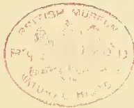A red circular stamp is centered on the page. The text 'ARTICH MUSEUM' is arched along the top inner edge. The text 'NATURAL HISTORY' is arched along the bottom inner edge. In the center of the stamp, there is handwritten text: 'P. 42' on the left and '1850' on the right, with a small mark between them.

21------------------------------------------------

A black and white portrait of Samuel Butler, an elderly man with white hair and a beard, wearing a dark suit and a bow tie. The portrait is set within a soft, oval vignette against a light background.

SAMUEL BUTLER.

22------------------------------------------------

<!-- stage4: FAINT old-images-only -->

[Faint page: no legible print of its own could be verified; text withheld (stage 4 review list)]

23------------------------------------------------

This image is a scan of a blank page. The background is a uniform light beige or cream color. There are a few very small, dark specks scattered across the surface, which appear to be scanning artifacts or dust particles. No text, lines, or other graphical elements are present.

24------------------------------------------------

# \* The TROPICAL AGRICULTURIST \*

## ◇ MONTHLY. ◇

Vol. XVII.]

COLOMBO, JULY 1ST, 1897.

[No. 1.

## “PIONEERS OF THE PLANTING ENTERPRISE IN CEYLON.”

*(Second Series.)*

### SAMUEL BUTLER,

PLANTER AND MERCHANT: 1837-1893.

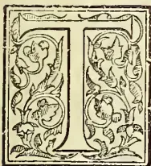

HE late Samuel Butler was one of the founders of the well-known firm of Messrs. Darley, Butler & Co., of Colombo. He left Ceylon in the year 1858, though continuing to be a working partner in his old firm. Few or perhaps none of those who knew him in Ceylon remain, and very few even in England. Mr. Butler, a Worcestershire man, came to Ceylon in 1837 (a year which also saw the advent of the late R. B. Tytler and A. M. Ferguson) in the earliest days of Coffee Planting, and when opinions were unsettled about soils and climates suitable for the growth of the coffee shrub—especially in reference to climate as influenced by elevation. At that early time large clearings had been made and coffee planted at Udagama on the Gindura river in the Galle District, which ultimately had to be abandoned. Mr. Butler, if not the first, was one of the earliest to demonstrate practically that an elevation not under 1,500 to 2,000 feet was necessary for successful cultivation, by opening land in Sabaragamuwa near Balangoda with success. It may be observed that in later years, preference was given to an ever-increasing elevation, as more and more forest was cleared,—experience showing that the

quality of the berry improved in proportion to the elevation within limits. After his Sabaragamuwa experience of jungle life, Mr. Butler became the planting partner in the firm of Acland, Boyd & Co., who were engaged in the largest planting operations of that decade in Ceylon. When it may be said that, besides the high roads to Galle, Kandy, Pussellawa, Matale, Kurunegala and a very few more, no other roads worthy the name existed in the planting districts, the physical endurance and perseverance of Mr. Butler and the enterprising pioneers who penetrated the remoter forests and selected lands for cultivation, may be, in some degree, estimated. Mr. Butler possessed the qualities we describe, in a high degree, and the result of his labours remain to this day in fine properties on the Knuckles range,—where he was about the earliest to select land—in Dumbara and in Dolosbage, which he selected and brought into cultivation with the aid of a small army of young men under his direction. It may be added here, that a number of the men who passed their early days in this valuable school, became successful planters and proprietors in later years. Roads to the new properties were a first necessity, and Mr. Butler was their pioneer. Some, like the Knuckles road, he traced himself; others were traced under his direction, which though improved and added to afterwards,

25------------------------------------------------

2THE TROPICAL AGRICULTURIST.[JULY 1, 1897.

owed to him their initiative. The value of the work of men like Mr. Samuel Butler, the Shands in Sabaragamuwa and others, besides the labours of officials like Major Skinner and Captain Evatt of the Public Works Department in opening up the wilds of the interior, cannot be properly estimated at the present day. The difficulties in connection with Supplies, Labour, Money, Letters, &c. (money had to be brought up from Colombo to the estates in hard cash monthly) are now comparatively unknown; but in the days we speak of they sorely tried the patience and resources of hardworking men to overcome.

Reference to the *Government Gazette* in 1841, 1842 and 1843 would probably show a larger extent of acreage of land put up for sale and bought for planting purposes, than in almost any three years later, until we get to the rush of the "sixties" and "seventies." In the following years much plantation-grown coffee began to reach England from Ceylon, adding to very sufficient supplies from the West Indies, which had not then declined in production, as they afterwards did, under the combined influences of Slave Emancipation and Free Trade. All this seriously affected prices in the home market, and brought trouble to the many pioneers engaged in Ceylon, both to proprietors and to those whom they employed. There were exceptions, but almost universally, economy had been disregarded, and lavish and indiscriminating expenditure had prevailed, so that a crisis was approaching, in which many estates had to pass into other hands; and all property in the country depreciated. Mr. Butler was, we believe, the first Manager or Inspector of Estates to draw up and print a form of plantation accounts, on the basis of analysis of expenditure, which with variations became generally adopted. Mr. George Crabbe, of Messrs. A. & R. Crowe & Co., at that time being one of the first to call upon superintendents to curtail expenses on weeding; an item which, for want of analysis, covered extravagance in many other directions.

The labours of Mr. Butler as a planting manager were now soon to cease; the house of Messrs. Acland, Boyd & Co. came down in the commercial crash of 1847, and Mr. Butler had to pass through the troubles resulting from the insolvency of his firm. This to him proved to be a not unmixed evil. With his usual energy, he accepted a Power of Attorney from Mr. J. P. Simpson, then leaving for England, whose sister he had recently married. This introduced him to an acquaintance with the Import trade of which he did not fail to take advantage when the time came. Mr. E. J. Darley, another partner of Messrs. Acland, Boyd & Co., had retired from the firm before the failure, and had gone to England, where he found the greater number of the proprietors for

whom the old firm had acted as agents, only too glad to place their estates in his charge. Returning to Ceylon Mr. Darley established himself as Darley & Co., but shortly joined by Mr. Butler he constituted the firm of Darley, Butler & Co. The new firm's business consisted chiefly of Estate Agency and Commissions. At this time Mr. Butler paid a visit to England, which proved to be an epoch in the future prosperity of the house. Forming a connection with the financial house of Matheson & Co., of London, a large Import business was commenced, to which was soon added equally large transactions in Ceylon produce. Shipping, both consigned and chartered, naturally followed. About this time was established their branch house at Cochin on the Western Coast of India, and ably conducted by Mr. Stephen Darley, brother of Mr. E. J. Darley, it proved a successful venture. Early in 1856, Mr. E. J. Darley, the senior partner, left Ceylon for a trip to England, which was lengthened out to three years, Mr. Butler conducting the business in the meantime; but falling into bad health, in 1858, under medical advice he went home in October of that year, Mr. Darley returning three months after. A short time before, the Governor Sir Henry Ward had placed Mr. Butler in the Legislative Council where his energetic character and abilities for business would soon have distinguished him, had not his departure for Europe, necessitated by ill-health, put a premature end to his career in that position.

This visit home proved to be a permanent stay, and also proved another important epoch in the fortunes of Messrs. Darley, Butler & Co., by the ultimate establishment of a house in London with the style of Darley & Butler. Mr. Darley, senior, returned to England about four years later, his son Edward being sent to Bombay to join Mr. Stewart of Manchester in establishing a branch there, while Mr. Stephen Darley returned to Colombo as partner with a chief assistant in Mr. W. W. Mitchell, who soon after became partner in the firm, with which he has been identified ever since. These were the years of the American Civil War and the consequent Manchester Cotton Famine. The firm, led by Mr. E. J. Darley, went boldly into the purchase of Tinnevelly cotton, both in the first and second years of the strife. These transactions resulted in handsome fortunes for themselves and their two partners, Messrs. Edward and Stephen Darley. The two latter shortly after left the firm, and Mr. Mitchell became the sole partner in Ceylon, both Messrs. Darley and Butler continuing in business in London. Early in 1870 Mr. Darley, senior, died, his share and capital passing out of the concern, and Mr.

26------------------------------------------------

JULY 1, 1897.]THE TROPICAL AGRICULTURIST.3

Butler taking upon himself the responsibility conducted the London business, until his retirement in 1895. Mr. Butler's spirit of enterprise was not ended by the removal of Mr. Darley. On the failure of Messrs. A. and R. Crowe & Co. soon afterwards, his firm took over their premises and Cotton Agency at Tuticorin. After the cotton gains he purchased the estate of Combe Hay, near Bath, which he greatly improved with his usual thoroughness, at a considerable additional expense to the first cost of the property. He discovered a deposit of Fuller's-earth on the land, which when he came to sell the estate not very long before his death, assisted to break the fall in the value of land, which has taken place during the last twenty years. He was a Magistrate of the County of Somerset and a most energetic member of the Bench. Some years ago, he offered himself as Member of Parliament, but without success, for Chippenham and in the Liberal interest. His first wife died in 1887, and he married again in 1889, and soon after, accompanied by his wife paid a visit to Ceylon and India. He died after a short illness on the 27th September, 1893, aged 78, retaining all his faculties to the last.

Mr. Butler as a man of business was bold, enterprising and decisive, holding to the maxim "Nothing venture, nothing have." Generous by nature, liberal in business, reserved to strangers and even to intimates, but genial to his friends, he possessed in a marked degree commercial genius, sagacity and initiative, and a wonderful discernment of character.

We are indebted to a very old friend of Mr. Butler—one who had been a colleague with him in business in Ceylon in the early days—for the above interesting account of his career, written *currente calamo*, but which has required very little emendation at our hands. We observe only one notable omission, namely, the connection of Mr. Butler's nephew, Mr. Theodore Stretch, with the Colombo Firm thirty years ago, and the fact of Mr. Stretch returning home to join the London house where he is now sole representative of Messrs. Darley & Butler of London and Tuticorin. Mr. Butler left Ceylon before our day; but we were much struck during an interview in his London office, with Mr. Butler's grand physique even in his old age, with his continued interest in Ceylon affairs, and his thorough acquaintance with the development of the Colony. To Mr. Butler, more than to most men in our gallery of portraits, belongs the designation "Pioneer" in its most literal and honorable sense; for he contributed very largely to the raising of Ceylon from a military dependency to a great plantation settlement

and the first of Crown Colonies; while his whole planting and mercantile career was marked by unwearied perseverance, lively intelligence and strictest sense of probity. The name of Mr. Samuel Butler as Colonist, Planter and Merchant is one well worthy of being recorded in the annals of the Colony.

EDWARD J. DARLEY, MERCHANT:  
1836-1869.

Although we have no portrait available, nor such facts as would be required for a regular memoir, still a few words may be permitted about Mr. Butler's partner—another old mercantile Colonist—Mr. Edward J. Darley. Mr. Darley came to Colombo originally in 1836, as a trained Assistant to the firm of Messrs. Acland, Boyd & Co., and the story of his starting on his own account on the failure of his employers, is narrated above; as also how he took Mr. Butler into partnership; but it is more fully related in the following communication from an old friend:—

"What can be said of Mr. E. J. Darley?—except that he was a good and kind man greatly respected and popular with all classes; industrious, painstaking and honourable in business. He was for many years a member of the Legislative Council in which capacity he was most useful. Mr. Darley came to Ceylon about 1836. He joined the firm of Acland, Boyd & Co., chiefly taking charge of Manchester Imports. He married a relative of Mr. Acland. He left Acland, Boyd & Co. in 1845 or 1846 and went home. The firm of Acland, Boyd & Co. failed in 1847, when the whole of the estates in which they were concerned and some others were placed in Mr. Darley's hands by the proprietors in London, whereupon he returned to Ceylon and established himself as Darley & Co. In the following year Mr. Samuel Butler joined him and the firm became Darley, Butler & Co. The new firm did not retain the agency of all the estate properties; but on Mr. Butler's return from a trip home at that period, there came to be a large accession of business in Imports with more than a corresponding Export and Shipping trade. Mr. Darley and his family went home again at the end of 1855, and returned at the end of 1858—in which year his partner left Ceylon for England not to return until lately when he paid a short visit to the island. The success of the firm was substantial from first to last, culminating in large gains in cotton in the years of the American Civil War. Mr. Darley finally left Ceylon during 1862, joining Mr. Butler in London as Darley & Butler. He never retired from business, but died in harness at the close of the year 1869 at East Sheen."

Mr. Darley always maintained the highest reputation, in Colombo, as a merchant of the old, reli-

27------------------------------------------------

4THE TROPICAL AGRICULTURIST.[JULY 1, 1897.]

able and regular, but tolerant and dignified school. We well recall during our first year in Colombo, the handsome figure, highly intellectual countenance and cool attire—dressed all in white even to the short “white jacket” now only seen at dinner time—of Mr. Edward Darley as he moved about the Fort during business hours. He had previously taken a prominent part in the Colombo Chamber of Commerce and served for a time in the Legislative Council. He was in somewhat close communication with the late Sir R. F. Morgan and A. M. Ferguson, all three being selected as his Executors by Dr. Christopher Elliott; and we know what a very high opinion was entertained by our “senior” then and always, of the probity, keen sense of honour and great shrewdness of Mr. Darley. After some 26 years of good work in Ceylon, Mr. Darley—having made his fortune by investments in Tinnevelly cotton during the American War—finally retired to the old country, carrying with him the esteem and regard of all who knew him as essentially a useful Colonist, an honest merchant and a good man.

**Agricultural Pests:**  
WITH METHODS OF PREVENTION.  
BY MISS E. A. ORMEROD,  
(LATE CONSULTING ENTOMOLOGIST TO THE  
ROYAL AGRICULTURAL SOCIETY OF  
ENGLAND.)

VII.

APHIDES, SCALE INSECTS, PLANT-BUGS, &c.

This tribe includes the Corn Aphid (*A. granaria*) which infests the young stems of corn and the growing wheat-ears; the green dolphin, as it is called, of the peas; the collier of the beans; the hop aphid, which in 1882 caused a loss of more than a million and a half pounds sterling to this country; the turnip and cabbage aphides; the black cherry-tree aphid, and many other kinds too numerous to name at present, besides the white cottony aphid of the beech, and the genus known as pine aphides, some of which are cottony, and some have a hairy covering. With regard to what we know at present of means of prevention, our best course is, if we can, to nip the evil in the bud by destroying the very first aphides that appear. This plan is constantly carried out in field management with regard to the bean aphid. When the colliers, as they are called from their black colour, appear on the tops of the bean shoots, these infested shoots are cut off. If the shoots and colliers on them are destroyed, the attack, or at least a great deal of it, will be stopped; but if, instead of carrying off the fragments and destroying them, they are only thrown on the ground, the black aphides will walk, or fly, back again to the growing beans, and the labour will have been in great part lost.

This same plan is useful throughout the summer for all plants or trees, such as apple, plum, cherry, or others, in which aphides, or green fly, as they are often called, collect in great numbers on shoots, which may be cut off without hurting the plant. Thus, if the shoots and aphides on them are properly destroyed at once, we get rid of centres from which attack is constantly spreading to do present harm. Also we may thus lessen the amount of next year's attack. It is the autumn brood of males, and females which provide the eggs to start the attack of the following year; and, therefore, anything which lessens the production of broods is

useful. The shoots, however, should always be destroyed at once, not merely thrown aside to wither gradually, whilst their infesting hordes gain wings to go home again. A healthy, yet not rank growth, is one great means of lessening the bad effects of aphid attack; as in the case of other insect attacks, the plant is thus supported through its troubles. But there is a further reason. It has been found that aphides come to maturity more rapidly when the plant growth is stunted, or the aphides themselves are so numerous, that it may be presumed the nature of the sap is different to that in the full flow of the healthy shoot, or the aphid is rather shortened of its food. Necessarily, maturity coming sooner, the successive broods are more rapidly produced, and the numbers greater.

Where we can tell with certainty that some species of aphid migrate at a special season, from one kind of plant or tree to another, we have a most serviceable method of prevention in our hands. It does not seem now to be open to doubt that a great part of the yearly attack of hop aphid, or “fly,” comes on the wing from sloe, damson, or plants of the plum tribe. This was long ago stated by German entomologists, and laid down by at least some of our hop-growers; and in 1884, after careful examination of specimens of aphides both from hop and plum, and reports from hop-growers (noted at length with figures in my Report for that year), I mentioned that there appeared to me to be reason to believe that the great attack, which usually occurs in the form of “fly” about the end of May, comes on the wing from damson and sloe, as well as from the hop.

In 1887, the late Professor Riley (Entomologist of the Department of Agriculture of the United States), set the matter of migration from plum to hop beyond doubt by his observations, of which a part was read before our own British Association; he stated that:—“*Thorodon humuli* hibernates in the winter egg state, this egg being fastened to the twigs (generally the previous year's growth) of different varieties and species of *Prunus*, both wild and cultivated.” From the winter egg Professor Riley found the female, the mother of the coming tribe, was hatched, the winged descendants of which female take flight to the plum. The existence of many generations on the hop, during summer, we are all well acquainted with; but during Professor Riley's stay in Europe, and more especially in England, he personally observed the point not previously worked out, of the autumn migration of the hop aphid, back from hop to plum, at the close of autumn. These observations, coming from such a high authority as Professor Riley, give thorough confirmation to the belief previously held as to migration; but still, I do not think that in this country the whole of the attack comes on the wing from plum, damson, or sloe, because (amongst other reasons) we have found aphides—that is, wingless females and lice—on hop as early as the end of March and the beginning of April, long before the attack coming on the wing made its appearance.

The hop aphides may be distinguished from the plum aphid, and from others of the *Aphidinae*, by the horns being hardly longer than the body, together with the lowest joint being toothed, or gibbous, and the tubercles on the forehead each having a strong tooth. The legs are short, and the honey-tubes long. Where there chance to be a large quantity of sloes, as, for instance, sloe hedges in the neighbourhood of hop-gardens, these at least might be got rid of without loss.

The number of remedies—such as solutions or mixtures of tobacco, paraffin, quassia, or other applications in the form of washings or syringings—are endless, and recipes are not given here, as these applications lie in the special province of the hop-grower. It may, however, be noted that sometimes washes fail in effect from the operator not being aware that in the case of many aphides the skin is covered with a kind of mealy coating, which throws off watery applications. Consequently, it often happens that unless the washing lodges amongst the aphides so as to kill them, or again

28------------------------------------------------

JULY 1, 1897.]THE TROPICAL AGRICULTURIST.5

the syringing is given with such force as to knock them from the plants, the insects are but little hurt. It is for this reason that soft-soap is so largely used, especially by hop-growers, for the washes: it is sticky, and thus adheres, in some degree, to the aphides; also it may be made the vehicle of any other application with which it may be desired to poison the aphides; and, thirdly, it is a good fertiliser, which, as we have observed, is important in aphid attack.

The great thing, however, that we need to know in order to check aphid attack, is where and how each kind spends the winter. Meanwhile, our best hope as to prevention lies in allowing as few shelters as possible on trees, or in neglected bark (in fruit or tree attack), or at the roots of wild grasses round fields, for possible shelter of grain aphids, and, generally, being alive to the necessity of not letting everything drift without thought of the reason how, or why, things happen; and, for remedy, in use of washes which are known to be suitable for the purpose in hand.

The wooly aphid, or American blight, is chiefly to be found in neglected orchards. The aphides shelter themselves for the most part in crevices of the bark, or where a bough has been injured, or under young bark healing over wounds; but they may be found on the young shoots, and the leaves, and are distinguishable by the white cottony material which surrounds them. I have also found this kind of attack on the rootlets. The piercing of the aphid-sucker causes the growth just below the bark to become swollen and pulpy; then the cells divide, and the bark above splits, and thus openings are formed, which give the aphides new hiding holes; and the diseased growth from their punctures is continued, until large tumour-like masses are formed, and the trees are very seriously injured.

The best method of checking attack is to keep the bark of the apple trees in such a healthy state—by means of proper pruning, the clearing away of injured branches, and useless and cracked bark (and other measures)—that there may be as few cracks and crannies, and half-healed spots, as possible, consequently, as little as possible of the shelter in which this aphid delights. Also, when the white wool in any nook or on any soft shoot in summer time, shows the presence of the pest, the shoots should be at once cut off, and some remedy should be well brushed or rubbed into infested nooks.

The number of different kinds of applications advised are almost beyond counting, though the principle throughout is one. But anything will be of use which will stifle or poison the aphides, without hurting the bark of the tree; and probably common soft-soap, or soft-soap with a little sulphur dissolved in it, or paraffin or tobacco-juice added to it, and well rubbed or washed in, so that it may be sure to reach the pests in their sheltering nooks, will answer as well, or better, than most of the many suggested applications. Some of the applications said to succeed should be applied (if at all) with great caution, or they may do more harm than good by soaking into the bark. Tar is especially to be suspected, for it is apt to melt in the heat of the sun; and turpentine, resin, and fish-oil, mixed and put on warm, and, in fact, anything that will thus choke the bark, is an unsafe application.

For attack below ground, the best treatment seems to be the clearing away of infested roots and soil round them, and drenching the spot well with soft-soap washings or drainings from stables.

The fifth tribe of aphides (the *Rhyzobiinae*) feed mostly on grass-roots, and are wingless; should they be found troublesome, the use of the cultivator, plenty of gaslime, and similar measures, would probably clear them out.

It is exceedingly difficult to give any clear view of aphid life, or means of prevention, for few are known, excepting in cases where the plants are under cover, and where, by fire, fumigation can

be brought to bear. But the principle throughout appears to be this:—Check attack by diminishing lurking-places, and also by pruning off and destroying infested shoots and parts of plants, or infested leaves (as with cabbage), as much as you can; and where you can bring washes to bear, use soft-soap as a foundation; but where the application may be run into the ground, and thus remain round the insects, ammoniacal water, or drainings from stables, lime-water, or other drenchings poisonous to insect-life, and that will not hurt the plant, have proved useful.

The "scale insects" are the third section of the *Homoptera*. These insects do great harm by drawing away the sap by means of their suckers. There are many kinds, differing in various points of structure, as well as form; but in the case of the apple mussel scale which is sometimes very hurtful in orchards, this shell-like husk, which is in shape like a minute mussel-shell, adheres firmly to the bark during winter; and under it, but not attached to it, there lies the dead body of the female scale, and fifty or more eggs. In spring these hatch, and from them come small white flat insects, furnished with eyes, horns, six legs, and a sucker. These are very active at first; but presently each scale larva runs its sucker into some spot it can pierce, begins to feed, and ceases to move. A secretion of waxy material takes place on its back, beneath which the scale forms; and after various moults, and additions by secretion to the size of the scale, the change of the insect under it takes place to the perfect state. This, in the female, is to a shape like that of a globular flattened maggot, greenish in colour, without joint limbs, which lays eggs and dies. The males (I believe, in the present case, first observed not long ago by Prof. Riley) have one pair of whitish wings, and are proboscis.

The best method of getting rid of these scales is to prune off infested boughs, where this can be done. Where it cannot, rubbing off the scales by means of cloths or brushes, after moistening the bark with water, or scraping them away with a knife, gets rid of many; and, generally, the same kind of remedies are useful as are applied for American blight, such as soft-soap, with some mixture of paraffin, kerosine, or other addition, which may stifle the scale insects which have been disturbed, and make the bark unsuitable for attack.

The order of plant bugs includes both plant and water insects, which may be known by a kind of leathery patch at the base of the front wings, "dis-similar" from the rest of the substance, whence the order takes its name of *Heteroptera*, or "dissimilar-winged." The long-legged insects known as water measures, which we see skimming about on the surface of ponds, and the water boat-men, which by the help of their long oar-like front legs sweep through the water like insect skiffs, are common examples of the water frequenters of this division.

The plant bugs sometimes do harm by sucking the juices of plants, especially by *Lygaeus solani*, which attacks potatoes; but they are, so far as I am aware, rarely injurious in this country to any serious extent. Some kinds, of a longer narrower shape, are to be found on wheat and barley. The wheat bug (*Miris tritici*) has also often been found on grass in marshes; the barley bug (*M. dolabratus*) is exceedingly common in barley, and on flowers of grass near.

Some of these various out-of-door bugs probably do good, by means of their carnivorous habits; and with regard to the wingless kind, which, to our misfortune, occasionally teaches us that feeding on animal juices, by means of a sucker, is a characteristic of this order, I think we need not enter on its prevention here.

The remaining order is that of the thrips, *Thysanoptera*. These are very small insects, which sometimes do much harm to corn. They are

29------------------------------------------------

6THE TROPICAL AGRICULTURIST.[JULY 1, 1897.

nearly alike in shape in all their stages, but they are scarcely large enough to be seen by the naked eye.

The perfect insect of the corn thrips is blackish, but in the first state of larva or grub it is of a deep yellow; in the second it is of a paler yellow, with whitish wing-cases. These thrips are to be found from June onwards in the growing wheat ears, and sometimes in the sheathing leaves of the stem. They feed on the corn grain, by piercing into it with their sucker-like jaw apparatus, and thus draw away the juices and cause the grain to shrivel.

Another kind infests the potato, drawing away the juices in the same way as the corn thrips; as do also the aphids, scale insects, plant bugs, and some others, which we have just noticed, with their variously formed sucking apparatus. In the case of the potato thrips, dusting with dressings of lime and soot, or other mixtures, might do good; but for the corn thrips it seems impossible to find any application, as any of those used to destroy the thrips would hurt the corn. The chief means of prevention seems to lie in clearing stubble or in deep ploughing to get rid of thrips which may be wintering at the roots of the removed crop, or in destroying wild grasses on which the eggs may be laid round the fields.

The knapsack sprayer is a very convenient form, and is noted here as being serviceable for distribution of washes and sprays for destruction of aphides, scale insects, &c.; as well as for the distribution of Paris-green, mentioned previously.

## A CEYLON PLANTER IN GERMAN EAST AFRICA.

### THE CLIMATE—FEVER—LEAF DISEASE.

I was tired of Ceylon, and got an offer of a good billet in German East Africa, and being told the climate and shikar were good, I jumped at it. The climate is rather warm in the plains, and delightful in the hills; until you stir up the soil, when it's fearfully feverish: pucca black-water fever. And as I came out as a planter, the results were inevitable. First thing I had to do was to drain out a lot of swamps, which was something like cleaning out cesspools. The planters are mostly Germans of sorts. One was a very decent chap, rest were an awful lot of bounders. A brother Englishman made me a trifle ashamed of my nationality. I landed at Tanga on the coast in October, 1893. Lovely harbour, Tanga, land-locked on  $3\frac{1}{2}$  sides, large enough to float ships of 4,000 tons at present. I marched up country: took me  $2\frac{1}{2}$  days in the very long marches of 20-30 miles a day.

First thing I did after planting up a ten-acre patch was to go down with fever for a fortnight. I got better, and the other Englishman on the tote had a row with the Javanese labour and left for the coast. I couldn't speak a word of the language, but quickly gathered they thirsted for the other man's blood. The plantation was only 90 acres planted, 50 more ready to plant, and at the end of the year we got it up to 350 planted. The "reserve" was a block of 275,000 acres. Lots of room for extension. All coffee, except two acres of wretched tea. Grew lots of native food, arrow-root and so on for estate consumption. Leaf disease first appeared some three months after I arrived, on the oldest coffee, about 15 months' old. Started on one or two trees, and I promptly spotted it and reported it to my boss and in fact the whole district. No one believed it at first and said I was drivelling. I burnt the affected trees at once, and sent specimens of the leaves to Kew and Berlin. Before we could get an answer, the pest had increased to such an extent that confirmation of my surmises was no longer needed. On making enquiries I find that the seed had been purchased in Colombo by the German Consul. It was reported that he bought the seed ignorant that it was to be used for planting. Ten per cent. at least was light. Of the balance only about 30-40

per cent. came up fairly strong plants. The best of these were planted out, with the above result.

The course of the disease ran curiously. It took a strip away from the lines right down a field. Then it worked back over a ridge through a break in the wind belt to another clearing, where there were two very large nurseries. These it played mischief with. These plants were put out and the whole estate got affected. I left before the full results could be seen, but I noticed the only unattacked portions were some line coffee and a little bit of a shade clearing. Nearly all the rest of the coffee was in the open, pucca Ceylon style, barring a few odd trees some 40 to 60 feet apart, that were only left because they were too big and expensive to cut down.—*Planting Opinion.*

## COFFEE PLANTING IN NYASSALAND.

### FROM AN INTERVIEW WITH MR. G. M. CRABBE.

Mlanji is fifty miles from Blantyre, and is situated on a plateau at an elevation which rises to 3,000 feet, though the Nyassaland Coffee Company's place is only from 1,500 to 1,800 feet high. This plateau is overlooked by Mlanji mountain, which rises to 10,000 feet. The country is undulating, like the Assam district, and it has a rainfall of about eighty. The temperature is cool and equable, but the place is particularly unhealthy from the middle of November to the end of February, which is the planting season. The pioneer of Mlanji is Mr. Henry Brown, who was formerly an Inspector in the Ceylon Police. When he left here, in 1890 or 1891, he went to Central Africa in connection with the work proceeding at the Lakes; but in a short time he took to coffee planting.

Mr. Crabbe said: "Well, when I left the Company's property they had 240 acres opened, and last year they opened another ten acres, making 250 acres opened, but another 250 is to be opened this year. The jungle which has to be cleared is very heavy, but the soil is by a long way the best soil that can be found there, and is very dark-red in colour. My place has been taken by Mr. Mogridge, who was formerly with Mr. Cotton, on Demeria, Passara. He has with him as assistant Mr. Robin, who also hails from Ceylon, having been a planter with Mr. Metcalfe in Panduloya. They came out to me a year ago last May. Robins has suffered very badly with fever. Five miles off our place was an estate belonging to Mr. Moir, who was formerly Manager of the African Lakes Company. He had about 180 acres opened in coffee. On the other side of us our nearest neighbour was Mr. Henry Brown, who had about 200 acres opened. He had some coffee in full bearing, and he had also a few tea-bushes, but they were not a good jat. Then about ten miles off us Mr. Bradshaw had about 180 acres. His was a very good place. His oldest coffee was about five years of age, and he got a crop of 30 tons last year. He has just left on a trip home, but he has certainly done the best of anybody there. Then, there is a small estate of 60 acres belonging to a Mr. Simpson, who, in addition to coffee, has gone in for a few native products. I think that is about all. Of course there are a good many plantations round about Blantyre; but with the exception of the Buchanans' property which is managed by Mr. Hunter, they are all small holdings. There are no factories, and all the pulpers are worked by hand with the exception of those at Mr. Moir's place. He has the only water-wheel in the country."

But the great thing they have to contend against, is the want of good seed. Of course, the coffee is of the Arabian sort, but this want is greatly felt, and something will have to be done with regard to getting better seed. The Nyassaland Coffee Company *did* try to introduce Brazilian seed, but it didn't answer—it failed to germinate. All the seed we had was what we got locally. No coffee seed from India or Ceylon, you know, is allowed into the country on account of leaf disease, nor is tea seed allowed, though some sent by Mr. Carson from Ceylon managed to get in and it turned out a failure

30------------------------------------------------

JULY 1, 1897.]THE TROPICAL AGRICULTURIST.7

It was Indian seed; but it got in as the Commissioner at that time was anxious it should be started. The coffee is planted under shade there."

"Then the administration seem to have done very little for the country up to date,—I mean as far as helping the planter goes. There is a great want of roads and transport facilities. We sent all produce to Chiromo on the river Zambesi. That is 70 miles away, and all the produce had to go down on niggers' heads as, though there was a river near us, and it led to Chiromo, it was not navigable. From Chiromo our produce went to Chinde; Beira, of course, being the port of export. There were two steamer lines which took our produce away, namely, the German East African line, which goes by way of Aden, and Renuie's line, which runs south round the Cape direct home, and which took the bulk of what we sent. The steamers of these lines call alternately once a fortnight. But Beira is just the same primitive place it always was. Not a single thing has been done in the way of making proper warehouses there, and what is exported and what is imported lies about on the shore till removed, and is exposed to all sorts of weather.

"Labour is plentiful. At least it is plentiful with the exception of the four wet months. That time the natives mostly employ in working their own gardens. A lot of the labour comes from Lake Nyassa, the people coming down a distance of over 200 miles. We sent Kanganies to recruit them, and when we got the labourers we paid them, in calico, three shillings a month, so they were cheap. The local labourers only got two shillings' worth of calico a month. We had no trouble either with advances or tundry. The language spoken is Mananga, it is very easy to learn, and all of us spoke it. The Angonis are the best labourers, and when we got them we had to get the Mananga language interpreted, but that was generally easily managed. The great want was native artisan.—"Local Times."

### COFFEE-GROWING.

C. SKELTON.

My attention having been drawn to a paragraph adverting to a sample of coffee having been forwarded to the Department of Agriculture from the Clarence River district, as an ex-Ceylon coffee-planter, I felt interested in the fact that coffee could be produced in New South Wales, and called upon Mr. W. S. Campbell—of the Department—who was kind enough to show me the sample, which though only partly cured, being in the "parchment"—which, together with the silver skin having to be removed before it would be considered a marketable commodity—goes to prove that a fair quality of coffee can be grown in the Colony. The bean seems full, and of a tolerably good colour; so far as I can judge it would fetch from 65s. to 70s. per cwt. in the London market; were it cured in "plantation style" it might realize from 20 to 25 per cent. more. The question to be solved is, what yield per acre can be obtained from the plant in the latitude of the district where the sample was produced, for coffee is indubitably a tropical product and requires plenty of heat and moisture. What I am afraid will be found most detrimental to the success of coffee in this Colony are the frosts that even in the most northerly parts of the Colony are occasionally experienced. In Ceylon I once saw a field of coffee killed right out by one night's slight frost; it was at a very high altitude, about 5,000 feet, and it must have been of very rare occurrence, for the trees were ten or twelve years old when they were bitten. However, if that difficulty can be surmounted and labour obtained at a reasonable figure, the coffee would have to yield from 50 to 60 bushels of "cherry" coffee per acre—equal to about 6 cwt. per acre, or about  $\frac{1}{2}$  lb. of clean coffee per tree—to pay working expenses and leave a fair profit.

To the intending planter a few hints from one with seventeen years' experience at coffee-growing

may not be amiss. Choose, if possible, land naturally drained, a gentle slope is preferable, so that surface water will not lie and sour the soil. Good friable soil, of course, is a desideratum, it need not necessarily be very deep, as coffee is a surface feeder. Avoid cold, wet clay sub-soil, as immediately the tap root reaches such a subsoil the tree will be observed to decline and ultimately die of what Ceylon planters used to technically term "wet feet"; the only cure for it is sub-soil draining, and that runs into a lot of money. The land obtained, the next thing is to make a nursery. Clear a piece, sufficient to raise plants for the area you intend to open, which, planted at 6 feet by 6 feet, runs to about 1,200 plants to the acre. Trench the ground and lay it out in beds, as you would a vegetable garden. Procure some coffee in the "cherry"—a bushel of cherry coffee will yield somewhere about 30,000 seeds, sufficient to plant about 25 acres—and pulp it by squeezing between the fingers, plant the seeds in the prepared beds 9 inches by 9 inches apart, with just a covering of earth over them. Water every morning and evening, unless it rains, and continue to do so until the plants are 3 or 4 inches above ground, and afterwards, should the weather be dry, give them a good watering every alternate evening or so. Meantime, while the plants in the nursery are coming on, your land is supposed to be in process of being cleared. Let the logs that have not been consumed by the fire remain on the ground; stumping also is unnecessary, as there is no ploughing to be done. Get some thousands of pegs cut, about 15 inches long; with these and a lining rope (an ordinary clothes line will answer), marked at every 6 feet with a piece of rag, or something let into the twist, proceed to mark off your ground in parallel lines 6 feet apart. Keep your lines as straight as possible by using three ranging rods, or wadd sticks, as they are usually called here. You will find the benefit of having your trees in straight lines afterwards in working the place; besides, nothing looks so bad as an irregularly lined field of coffee. It may sometimes be found necessary to cut or roll a log out of the way in order to get the peg in its proper place. When all the lining is done proceed to dig a hole 18 inches deep, by the same in width, at each peg, leaving all the soil dug out in a heap at the lower side of the hole. Scrape all the surface soil and ashes left from the burning off into the hole till it is heaped up, as it will sink considerably, then stick back the peg into the heap to mark the hole. After the holing and filling in is finished, seize the opportunity of the first wet weather to plant out your nursery plants, which, we will suppose, are now five or six months old, as it will take about that time to prepare the land for their reception. Lift each alternate plant, either by pulling them up and carrying them out to the field in bundles, or, if you have time and labour to spare, lifting each with a ball of earth at the root and taking them out to the field on trays of some sort. The latter way is the best when it can be done, but if you have a large field of 80 or 100 acres to plant up it takes a lot more labour to do it. Be sure not to put the plant in too deep, but only to the same depth that it stood in the nursery; it is a mistake that is often made to plant too deep, the leaves grow yellow and the plant seems strangled, and often takes a long time to recover. It is a good plan to put the plant in a little deeper than you intend to leave it, place the earth round the roots, then stand with a foot on each side, and give the plant a steady, gentle pull upwards—that brings all the roots straight. If you have favourable weather probably most of your plants will come on all right, but there are sure to be some failures, and filling up vacancies with the plants left in the nursery should be carried on at every opportunity, that is whenever you have wet weather. Planting completed, there is nothing much to be done except keeping the place clear of weeds, cutting any roads or drains that may be found necessary, and erecting some sort of temporary house accommodation for self and labourers; which should be of the cheapest, until such time as you can see

31------------------------------------------------

8THE TROPICAL AGRICULTURIST.[JULY 1, 1897.

how things are going to "pan out." In eighteen or twenty months the plants will have grown sufficiently high to be topped—that is, cutting the top off the plant at 3 ft. 6 in. or 4 feet, according to soil and aspect, if at all exposed to wind the former height is the best. Topping has the effect of making the tree spread out laterally, covering the ground from the sun, thus tending to prevent the growth of weeds, besides facilitating the gathering of the crop. Trees grown in the "native" style—namely, allowed to grow to their full height, never bear more than half the crop they otherwise do, having so much useless old wood to sustain, besides the difficulty of gathering crop from branches 8 or 10 feet from the ground. In the third year the "maiden," or first crop—generally amounting to 2 or 3 cwt. per acre—may be expected, and preparations accordingly will have to be made for it by erecting the necessary pulping-house, store, and platforms for drying the coffee upon, purchase of machinery, &c. I may here state that in selecting a site for the works it is absolutely necessary to fix upon one to which it is possible to lead a stream of water, and if practicable, sufficient to drive a water-wheel, which will be found a very great convenience and saving of labour; in fact, if any considerable area is to be put under coffee it will be found almost impossible to get through the work without one; in any case water is indispensable for pulping and washing the crop. To give directions for the erection of the necessary works, to be of any practical use, is scarcely within the scope of an article of this sort. Illustrative diagrams would have to be given and the most minute details entered into to make it intelligible to the ordinary understanding. Messrs. John Walker & Co., Bogambra Mills, Kandy, Ceylon, supply all the machinery necessary on coffee plantations, and if applied to, I have no doubt will be glad to forward price lists. A Walker's disc pulper, sufficient for the crop to be obtained off 25 or 30 acres of coffee, can be purchased for about £15; laid down in this Colony for about £17 10s. In Ceylon and Southern India the usual estimate for bringing coffee into bearing was £10 per acre; that embraces felling, clearing, planting, and general maintenance till the coffee begins to yield returns, namely, in the third year after planting. As previously stated the first or "maiden" crop is usually from 2 to 3 cwt. per acre; it goes on increasing up to the sixth year, when the tree is supposed to be in full bearing, when with good soil and favourable seasons it may yield 10, 12, or even 15 cwt. per acre. Under these circumstances it is not difficult to see

how paying a speculation coffee-growing is, with annual working expenses at £3 or £10 per acre, and London ruling prices for "plantation" coffee at 100s., and sometimes over that, per cwt. Unfortunately, results do not always come up to expectations; the coffee planter, like the farmer, has many difficulties to contend with, white bug and black bug, too much wet or too much dry weather, scarcity of labour at critical times when he most requires it, and, sometimes, that which is worst of all, scarcity of money. However, taking it all in all, a little discomfort and hard work is easily borne when there is a prospect of making a competency, of which I do not think there can be much doubt should judgment and care be exercised. It is as easy to lose money at coffee as it is at almost anything else with a reckless hand at the helm.—*Agricultural Gazette*.

### THE DIMENSIONS OF TREES.

In our last issue we called attention to some trees, of extraordinary dimensions, recorded in Kerner and Oliver's *Natural History of Plants*: we now add some notes of measurements of large trees of Indian species which may be of interest.

*Cedrus Deodara*.—A section of a Deodar tree from the Jaunsar forest in the Forest School museum measures 27 feet in girth and shows 655 annual rings.

*Cupressus torulosa*.—Brandis' Forest flora mentions a cyprus tree measured by Dr. Steward which was 27 feet in girth near the ground.

*Tectona grandis*.—Teak trees of enormous size are not infrequent in Upper Burmah. A felled log in the Yamethin forest measured by S. Carr was 64 feet long and 13 feet 9 inches in mean girth; it was perfectly sound, and, when found, was in process of being split up to build a Buddhist monastery. In the Myittha—Panlaung forest there are two immense teak trees standing side by side, the largest of which was found by H. Calthrop to be 20 feet in girth at 6 feet from the ground with a height 60 ft. to the first branch; and at Alaungdaw-Kathaba in the Chindwin a tree measured by C. E. Murid girthed 17 feet 4 inches at 5 feet from the ground.

*Bombax Malabaricum*.—We have a photograph of a tree said to be 87½ feet in girth one foot from the ground, but it is believed that the measurement was taken along the contour of the buttresses.

*Santalum album*.—As a record measurement of a tree of the smaller classes may be mentioned a sandal tree felled by A. E. Lawrie in Coorg which measured 5 feet 6 inches at 5 feet from the ground.—*Indian Forester*.

### THE PROXIMATE CONSTITUENTS OF TEA.

<table border="1">
<thead>
<tr>
<th></th>
<th>Assam.</th>
<th>Ceylon.</th>
<th>Java.</th>
<th>China.</th>
<th>Japan.</th>
<th>Natal.</th>
</tr>
<tr>
<th></th>
<th>Per cent.</th>
<th>Per cent.</th>
<th>Per cent.</th>
<th>Per cent.</th>
<th>Per cent.</th>
<th>Per cent.</th>
</tr>
</thead>
<tbody>
<tr>
<td colspan="7"><i>Non-Nitrogenous Bodies:—</i></td>
</tr>
<tr>
<td rowspan="3">Organic acids.</td>
<td>Gallic and oxalic acids, &amp;c.....</td>
<td>1</td>
<td>·65</td>
<td>·50</td>
<td>·25</td>
<td>·50</td>
</tr>
<tr>
<td>Tannic acid.....</td>
<td>11 to 18</td>
<td>15</td>
<td>14</td>
<td>12 to 20</td>
<td>12 to 16</td>
</tr>
<tr>
<td>Boheic (Assamic) acid.....</td>
<td>1·50 to 2·5</td>
<td>1·75</td>
<td>1·50</td>
<td>1</td>
<td>1·25</td>
</tr>
<tr>
<td rowspan="4">Carbohydrates.</td>
<td>Cellulose.....</td>
<td>18</td>
<td>20</td>
<td>22</td>
<td>25</td>
<td>22 to 26·5</td>
</tr>
<tr>
<td>Gum and dextrine.....</td>
<td>2·75</td>
<td>2·5</td>
<td>3</td>
<td>3·25</td>
<td>3·25</td>
</tr>
<tr>
<td>Glucose.....</td>
<td>trace</td>
<td>—</td>
<td>trace</td>
<td>—</td>
<td>—</td>
</tr>
<tr>
<td>Mucilage, pectin, &amp;c.....</td>
<td>9·75</td>
<td>5·5</td>
<td>6·5</td>
<td>7·2</td>
<td>6·7</td>
</tr>
<tr>
<td></td>
<td>Resins, &amp;c.....</td>
<td>2</td>
<td>3·75</td>
<td>3·25</td>
<td>3·25</td>
<td>3·5</td>
</tr>
<tr>
<td></td>
<td>Fixed Oil and Theol (volatile essential oil).....</td>
<td>7 to 9</td>
<td>6</td>
<td>5·5</td>
<td>4 to 5</td>
<td>5</td>
</tr>
<tr>
<td></td>
<td>Gums and Waxes.....</td>
<td>3·75</td>
<td>4·25</td>
<td>4</td>
<td>4·25</td>
<td>4·50</td>
</tr>
<tr>
<td colspan="7"><i>Nitrogenous Bodies:—</i></td>
</tr>
<tr>
<td></td>
<td>Chlorophyll.....</td>
<td>1·8 to 3</td>
<td>1·5 to 2·5</td>
<td>1·25 to 2</td>
<td>1 to 2·2</td>
<td>1·8 to 2</td>
</tr>
<tr>
<td></td>
<td>Amides.....</td>
<td>traces</td>
<td>traces</td>
<td>traces</td>
<td>traces</td>
<td>traces</td>
</tr>
<tr>
<td></td>
<td>Theine.....</td>
<td>3 to 6</td>
<td>2 to 4·5</td>
<td>3</td>
<td>1·5 to 2·25</td>
<td>1 to 2·5</td>
</tr>
<tr>
<td></td>
<td>Other Alkaloids.....</td>
<td>traces</td>
<td>traces</td>
<td>traces</td>
<td>traces</td>
<td>traces</td>
</tr>
<tr>
<td></td>
<td>Albuminoids.....</td>
<td>20</td>
<td>22</td>
<td>20</td>
<td>21·5</td>
<td>20</td>
</tr>
<tr>
<td colspan="7"><i>Inorganic Bodies:—</i></td>
</tr>
<tr>
<td></td>
<td>Mineral Substances.....</td>
<td>4·5</td>
<td>5·6</td>
<td>5·5</td>
<td>6·7</td>
<td>6·5</td>
</tr>
<tr>
<td></td>
<td>Moisture.....</td>
<td>6 to 8</td>
<td>8·5 to 10</td>
<td>6 to 12</td>
<td>8 to 16</td>
<td>12</td>
</tr>
</tbody>
</table>

—*Journal of the Society of Arts.*

32------------------------------------------------

JULY 1, 1897.]THE TROPICAL AGRICULTURIST.9TRADE OF INDIA: 1896-97.

As we anticipated, a recent post has brought us from the Government of India, a copy of the "Accounts relating to the Trade and Navigation of British India for the month of March 1897, and for the Twelve Months, 1st April 1896 to 31st March 1897, compared with the corresponding period of the years 1894-95 and 1895-96." This is a bulky, but handy-sized statistical return of 118 pages giving full details of all the Import and Export Trade of India for the year ending with March last; and yet the press and merchants of Colombo have not yet (at end of May) got the local Customs Accounts for the year ending 31st December last. We quote the grand totals of the Trade of India:—

<table border="1">
<thead>
<tr>
<th></th>
<th colspan="3">FOREIGN TRADE.</th>
</tr>
<tr>
<th></th>
<th>1894-95. R</th>
<th>1895-96. R</th>
<th>1896-97. R</th>
</tr>
</thead>
<tbody>
<tr>
<td>IMPORTS.—Total Merchandise.. ..</td>
<td>725,289,926</td>
<td>729,367,533</td>
<td>762,158,352</td>
</tr>
<tr>
<td>Total Treasure..</td>
<td>95,812,073</td>
<td>133,679,854</td>
<td>130,845,635</td>
</tr>
<tr>
<td>Grand Total of Imports ..</td>
<td>831,101,999</td>
<td>863,047,387</td>
<td>893,003,987</td>
</tr>
<tr>
<td>EXPORTS. Foreign Goods ..</td>
<td>50,574,144</td>
<td>47,175,159</td>
<td>40,336,372</td>
</tr>
<tr>
<td>Indian Produce and Manufacture ..</td>
<td>1,037,575,846</td>
<td>1,095,456,241</td>
<td>998,801,824</td>
</tr>
<tr>
<td>Total Treasure...</td>
<td>82,260,717</td>
<td>42,598,105</td>
<td>49,374,955</td>
</tr>
<tr>
<td>Grand Total for Exports ..</td>
<td>1,171,398,499</td>
<td>1,185,945,489</td>
<td>1,089,211,139</td>
</tr>
<tr>
<td>Grand Amount of Import Duty collected, including Salt ..</td>
<td>54,368,245</td>
<td>65,743,137</td>
<td>61,390,392</td>
</tr>
<tr>
<td>Ditto, Export Duty Collected ..</td>
<td>9,034,881</td>
<td>9,292,242</td>
<td>7,525,600</td>
</tr>
</tbody>
</table>

We shall discuss some of the details very soon.

DESICCATING MILLS.

A Marawila correspondent writes:—

The Superintendent and Engineer of the Veyangoda Desiccating Mills were here some time ago prospecting for a site it was said to start Desiccating Mills. They fixed on a spot at Kudaweva near the 42nd mile on the old road bordering the canal. The more mills the merrier for estate proprietors.

CURIOUS PRECIOUS STONES.

A Bangalore Correspondent sends us the following interesting communication:—

"In your issue of the 20th April para 3, particulars regarding a star sapphire from Ceylon are giving at some length. Several royal personages, whose names are mentioned have seen this gem—which is now on view in London—between two lighted candles. The stone is said to be worth several thousands of pounds. I have got a star sapphire, set in a large gold ring, and I wish it were worth even a few hundreds of pounds. Nevertheless if the stone is held between two lighted candles, it likewise shows 3 separate stars with rays; but in any other light only one star is visible; but embellished with 6 rays. If the

stone is held some distance from the eyes with the sun shining upon it, the star will appear to advantage, in fact much more distinct than if looked at in any room, but between two lighted candles in the day-time the stars are brought prominently out even when held quite close to the eyes. Such being the case, the stone is certainly an uncommon one. Evidently the London jeweller knew what he was about when exhibiting the gem between two lights. Many years ago the great jewellers, P. Orr, and Sons, of Madras, advertised in the Madras papers a star sapphire for sale. The advertisement was intended for Rajahs and capitalists, and it must have been a beautiful gem or it would not have been so advertised. I do not know who purchased the stone, but after reading your paper regarding the one now in London, it struck me that it might be the same stone, and that the exhibiting of it between two lighted candles with the result shown was in all probability a new discovery.

"I have probably the best cat's-eye stone in Southern India. It is set in a large gold ring, and it has been in my possession for a quarter of a century. I purchased it from Agurchand, the rich Madras Sowcar who died a few years ago. It is nearly as large as the human eye, and in some lights—say in a small room with windows all around it, no less than 6 opalescent rays are visible. In a room with fewer windows, 3 or 4 rays are visible. A few years ago particulars of a large cat's-eye stone were given, that was on show at the Melbourne Exhibition. I read accounts of it in the Madras papers. It was the property of a Ceylon merchant, who wanted £3,000 for it, and it was stated that the Governor of the colony, whose name was mentioned, had offered £2,000, but his offer was refused. It was also said that it was the only stone in the world that had 4 or 5 opalescent rays in it, but this statement was untrue. My cat's-eye stone is evidence to the contrary. Dealers in these gems say that the more opalescent rays there are in a specimen, the more luminous will be the single ray observable in the stone when examined with the sun shining upon it. This is no doubt correct. For my stone is worth looking at when the sun is shining straight down upon it,—when the single ray in the centre of the stone appears alive with light, and is something to be remembered. Many years ago I sent it to London with a gentleman who is now in this country and who was going home on six months' leave. I did this at the suggestion of Surgeon-General Furnell and Surgeon-Major Luke Hackett, who were much interested in previous stones and who were anxious to know what the London jewellers would value it at, and in two of the largest shops in that great city the same valuation was given, viz., £100, and good cat's-eye stones have risen in value since. I examined the stone yesterday, between two lighted candles, simply out of curiosity, when two well-defined and luminous opalescent rays appeared. The distance between each ray was about one quarter of an inch, and the sight was worth seeing. Of course at any time of the day and in any room with daylight in it the stone is worth looking at. I am convinced that this gem was once worn in the earring of an idol in some temple, as there is a gold pin running through the bottom of it, and this drilling of the stone would not have been done for any other purpose than the wearing of it in an earring, but the gold pin is not visible except on close inspection; and this reminds me that the Orloff diamond served as the eye of an

2

33------------------------------------------------

10THE TROPICAL AGRICULTURIST.[JULY 1, 1897.

idol in a Trichinopoly temple, and was stolen by a French soldier who sold it to the captain of a ship for 50 rupees. It then passed into the hands of a German Jew, who paid, I think, £4,000 for it, but the Jew knew what he was about, as he sold the stone to the Empress Catherine of Russia for £80,000, an annuity of £8,000, and a title of nobility. I could have sold my cat's-eye ring many times had I wanted to part with it, for it has been seen by many officers, both Civil and Military, of high rank, and it was always very much admired. It would make a handsome brooch stone, if surrounded by diamonds, rubies, or emeralds, and would then grace the neck of the fairest lady. I have had in my possession many years a very good fire opal. It is set in a massive gold ring, nearly all the colours of the rainbow are visible in this stone. A large spot of red is often seen in it of such brightness that to look at it is like looking into a furnace, the colour is so vivid. This gem has also been much admired by many people, and a District Sessions Judge some years ago was anxious to become its possessor. I applied the two lighted candle test to this stone also, and the different colours that came out by simply changing the position of the stone by a slight turn of the fingers was something marvellous, and brought back to memory what I had read of the fire opal the size of a hazel nut, that Nonnius, the Roman Senator, had in his possession. It was valued at 50,000 sesterces, and rather than part with his gem to the Emperor, he suffered exile, and took his beautiful opal with him. A rich lady, the wife of a gallant officer of Cavalry, who was in this station last year, had in her possession a very large fire opal—something really worth looking at, and worth having also; for a Delhi jeweller, who was at this station for a short time, offered 15,000 rupees for it, but the offer was not accepted. I have a small cat's-eye stone set in a gold ring that will give two opalescent rays. The little gem is worth looking at, and is of nearly the same colour as one belonging to a gallant colonel, now in Madras which he wears set in a scarf pin surrounded with small diamonds. I saw this stone a few years ago, and was told by the Colonel that he got it direct from England and gave £75 for it. Alexandrite is not a very common stone. I have got a well cut one that was brought from Ceylon. It is a dark green stone, but will turn of a red colour from reflected light; the light from a lucifer match is sufficient for the purpose. The stone was named Alexandrite after Alexandra the Princess of Wales, and is only a recent discovery. I saw a very large uncut one some years ago in Madras. It was shown me by Streeter's agent, who was spending his Xmas holidays that year with a friend of mine a few years ago. I read in the English papers that the Maharajah Dhuliep Singh had purchased in London some handsome opals as a present to his mother, as there were no opals in India. I could have told Dhuliep Singh whom I had seen in this country when he was a boy, that he was under a wrong impression, for opals are found in India, for I picked up a very good one in the Nirmul Jungle in Feb. 1858, which I gave to Capt. Robinson who commanded my company as something that would remind him in after years of the long march the regiment had during the Mutiny from Madras to Calpee. During the Mutiny I purchased a few stones of Banda, Kirwee, Saugor, and other places, but of no particular value, except a few rubies at Saugor for two officers of

the regiment. Some beautiful moss agates, onyx, sardonyx, carbuncles, topazes and other stones I came across. Some of them are real curios. I have in my possession a large piece of stone so ugly that no one would ever think of picking it up. Yet, nevertheless, it is really worth having, as a half score of brooch stones and a score of finger ring stones could be cut from it; the polish it takes, and the beautiful colours in it then come grandly out. It is probably a blood stone, but the blood stones seen in rings are nothing in comparison either in richness or colour to the ugly looking treasure I have. I have all sorts of corundum, but the greatest curio is a ruby corundum 4 inches long, hexagonal, or six-sided (the true formation) and weighing over two pounds. This is no doubt the largest ruby, not a crystal ever found, and it will take a fairly good polish of a cloudy ruby colour. If it was a pure crystal it would be worth millions of pounds. The weight of this stone would not be credited by anyone not knowing the relative weight of the different kinds of precious stones. Probably the best judge of precious stones in England has stated that he has seen £1,000 paid for a good cat's-eye ring stone. Some jewels were sold lately at the Mysore Palace and 4 cat's-eye stones were sold for 8,000 rupees by a jeweller from Bombay. An engineer officer who saw the stones spoke anything but in praise of them at the trial of Mr. Jacobs, at Secunderabad (the great diamond case). I read in the Madras papers that he had two cat's-eye rings on his fingers when in court which were much admired by those present. One of these stones was valued at 8,000 rupees. Nearly all large diamonds have eventful histories. The Kohinoor (mountain of light) now worn by Her Most Gracious Majesty the Queen-Empress has a wonderful history, so has the Pitt or Regent diamond. Pope in his Man of Ross, I think, would lead his readers to believe that it was stolen by Mr. Pitt when Governor of Madras:

"Asleep and naked as the Indian lay  
An honest factor stole the gem away."

Mr. Pitt wrote at length to prove the accusation false, stating that he had purchased the stone from one Helmachund, and mentioning the number of pagodas he paid for it; the purchase nevertheless was a profitable one for he sold the stone to the Regent Duke of Orleans for £120,000, and it was worn afterwards by the Emperor Napoleon in the pommel of his sword. The De Farcy diamond has probably the most wonderful history, as it was the property of King Charles of Sweden, and he had it with him at the battle of Pul-towa, where he was killed. Afterwards John De Barley, Count DeFarcy, became its possessor, and he sent it as a present to the king, but the mounted servant to whom it was entrusted was attacked by robbers and killed; the diamond, however, was recovered, the faithful servant having swallowed it. The largest diamond in the world belongs to the Rajah of Borneo; it is uncut and in shape like a pear. There have been large sums offered for this stone, especially by the Dutch, but the Rajah will not part with it, as it is a treasure mine to him. Water is put into a small hole at the top of the stone and the people of Borneo believe that the touching of this water with the finger and putting a drop to the forehead will cure the worst diseases. In this belief all those who can afford it try this water cure. A very rich man could, if he wished buy a small basketful of diamonds from 4 to 8 carats weight each but he could not buy a basketful of rubies or

34------------------------------------------------

JULY 1, 1897.]THE TROPICAL AGRICULTURIST.11

good cat's-eyes; for these stones, of good quality, are not procurable in the market, and it is almost an impossibility to buy a large emerald, as a large one free from flaws is rarely met with. The largest ruby in the world is not much larger than the egg of a pigeon."

Our correspondent's letter is apparently not written in a purely literary spirit, for at the end he asks us to add that lovers of gems and curios who may wish to purchase the stones described by him are invited to address him on the subject. The communication, notwithstanding that it is a sort of catalogue of his wares, is, however, interesting, so we are not unwilling to do what he requests, and forward him any letters that may be addressed to him at our office under the initial "T." We know more of our correspondent than his name and address.—*M. Times*, April 29.

#### CEYLON TEA IN THE STATES.

Mr. Kenyon Parsons writing to our contemporary says:—

"Since Mr. McKenzie has taken up the work of pushing teas here there has been a great desire on the part of the trade to pay attention to Ceylon Teas. This is owing I am convinced to the way Mr. McKenzie has advertised the tea in the trade papers, and I may say also in the magazines and periodicals. The expenditure of money in this direction is just beginning to make itself felt, and if it were stopped now, it would be equivalent to throwing seven-eighths of the money spent in advertising away. The value of advertising is in proportion to the length of time you advertise. Every year will show a greater return over the previous year, and to stop now, would be like, after you have cleared and planted up an estate to withdraw your labor, and let the tea plants grow up as best they could, and though I have not had the pleasure of meeting Mr. McKenzie, I think the thanks of all interested in Ceylon tea are due him. To my mind the best way to push tea in this market is to advertise in the trade papers and a few magazines as Mr. McKenzie is doing now. You will find that the trade will take hold of the tea. It is the 'trade' you wish to get."

This most fully confirms the view we have held all along as to the greater value of advertising—rather than of subsidising.

#### AMERICAN NATIONAL BOARD OF TEA EXPERTS.

The American Government is determined to secure the purity of the tea imported into the States, and having passed a law on the subject, it now follows this up in the following practical way:—

The Secretary of the Treasury has appointed A. P. Upham and E. A. Schoyer, of Chicago; Herbert G. Woodworth, of Boston; T. A. Phelan and W. P. Room, of New York; Andrew P. Irwin, of Philadelphia, and Robert B. Bain, of San Francisco, as a Board of Tea Experts, under the act of March 2, 1897, to prevent the import of impure and unwholesome tea into the United States. The Board has held several meetings at the Appraiser's stores, and is gathering information and seeking aid in order to fix a satisfactory standard. A report has been submitted to the Secretary of the Treasury, which states that the Board has selected such standards as, in its opinion, will represent the intention of the bill regarding purity, quality and fitness for consumption. The reports add:—

The Board recommends, first, that the comparison of standards with teas delivered shall be made not only with regard to flavor, but particularly with regard to the appearance of the leaf after infusion.

In color of infused leaf and in freedom from admixture with black and decayed leaf all teas should be equal to the standards, but any consideration of the make or so-called style of the dry leaf should be omitted. The leaf of the infusion must equal the standard in freedom from scum, gritty substance and leaf made up of dust and congee (*i.e.*, rice paste) The Board further recommends that your Department issue instructions that all teas shall be labeled with their proper trade names, so as to avoid palpable fraud in the use of false labels. The importance of this point has been pressed upon it by the trade, and it cannot too strongly emphasize it, particularly referring to green teas, of which the Pingsuey kinds have been heretofore labeled Moyune, the former being an inferior and the latter a superior tea. The Board therefore respectfully urges upon you as of supreme importance that the examiners should be not only thoroughly honest and trustworthy, but also experts in tea. That the present incumbents at New York and Chicago meet these requirements the Board has no question, but as the examiner at San Francisco is not an expert in tea, but a chemist having insufficient knowledge of the article, it is absolutely necessary that a person possessing the proper qualifications should be appointed at that port

#### AN AERMOTOR FOR COLOMBO.

The first of the variety of wind mills known as Aermotors in Colombo has just been erected at Devon House by Messrs. W. H. Davies & Co. It is a wheel of 8 feet diameter, made of galvanized steel and mounted upon a galvanized steel tower 60 feet high. In an extremely light breeze it was pumping 200 gallons of water per hour to a height of 30 feet, and as this was too great a quantity for the requirements of the bungalow the length of the stroke of the pump has been reduced by one-half. In Colombo we have an average diurnal movement of air varying from 150 to nearly 300 miles according to the season of the year. This means from 10 to 20 hours' full work. The mills are so regulated that they go out of the wind when it exceeds 15 miles per hour and no danger therefore exists of their being blown over. The towers being of steel, galvanized after being made, are practically indestructible, and their gracefulness and airiness greatly beautify the landscape. This is the first, as we have said, to be erected in Colombo; but Messrs. Davies have another of the same make in Chilaw, presently being erected for the purpose of pumping water from a river on to some arid lands, and thus converting them into paddy fields. The Devon House one supplies water for domestic and bathing purposes in the house, as also to the stable and coach-house, duck-pond, fountain, and for sprinkling the lawn. In America there are small town water supplies consisting of wind-mills mounted on large tanks and capable of pumping and storing the water for 800 to 1,000 inhabitants. This would be of great benefit in many towns in Ceylon:—Negombo, for instance. In America also these "Aermotors" are erected at most railway stations.

#### ARTIFICIAL MANURES.

*Brazil.*—With a view to preventing the numerous falsifications noted of late in chemical manures, imported from abroad or prepared in Brazil, the Farmers' Association of the State of St. Paul have just petitioned the Congress of this State to pass a law for stopping the sale of these fraudulent makes.—*Belgian Consul at Saint Paul*.

35------------------------------------------------

12THE TROPICAL AGRICULTURIST,[JULY 1, 1897.

"Now Thunder and turf!"  
 Pope Gregory said  
 And his hair raised his triple  
 crown right off his head—  
 "Now Thunder and turf! and  
 out and alas!  
 A horrible thing has come to  
 pass!  
 What!—cut off the head of a  
 reverend Prior.  
 And say he was *only* (!!!) a  
 bare-footed Friar!  
 'What Baron or Squire,  
 Or Knight of the shire  
 Is half so good as a holy  
 Friar?  
*O turpissime!*  
*Vir nequissime!*  
*Sceleratissime!—quissime!—*  
*tissime!*  
 Never, I trow, have the *Servi*  
*servorum*  
 Had before 'em  
 Such a breach of deco-  
 rum,  
 Such a gross violation of  
*morum bonorum*,  
 And won't have again *secula*  
*seculorum!*—  
 Come hither to me,  
 My Cardinals three,  
 My Bishops in *partibus*,  
 Masters in *Artibus*  
 Hither to me, A, B, and  
 D.D.

## How a Planter Terrifies a Crimp!

Doctors and Proctors of every degree!  
 Go fetch me a book!—go fetch me a bell  
 As big as a dustman's!—and a candle as well—  
 I'll send him—where good manners won't let  
 me tell!

## TEA IN AMERICA.

NEW YORK, April 7th.

Elsewhere we print from a copy of the official report the recommendations of the Board of Experts to the Secretary of the Treasury, regarding tea standards to foreign importations. They practically exclude two-thirds of the Pingsuey teas and many low grade Oolongs. A protest has been filed with Secretary Gage by Mourliyan, Heimann & Co., of Japan, through their local office as follows:—

Dear Sir,—In the matter of the recent act "to prevent the importation of impure and unwholesome teas," we beg to protest against the adoption by the Department of the standards recently selected for Japan teas, for the following reasons:

First.—That all Japan teas, being prepared from one and the same leaf, it is not necessary to establish more than one standard.

Second.—That the three standards, as selected by the Commissioners, represent three different qualities of this one leaf, the sundried tea being better in cup quality than the pan-fired tea, the basket-fired tea still better than the sundried. The effect of this confusion will be detrimental to the Western trade, where sundried teas are used and will favor New York, where the trade is almost entirely pan-fired tea.

Third.—That the standard of pan-fired tea as selected, is apparently early second crop tea mixed with first crop leaf, the result being that in a number of successive drawings the cup quality varies from 1 to 3 cents per pound.

Fourth.—As in the preparation of Japan teas the same tea is frequently subjected to both the pan-fired and the basket-fired process it will be manifestly impossible for the examiner to determine by which standard such tea should be tested.

We have for many years been importers of Japan teas, and under the old law never had a tea rejected at any port in the United States; consequently, we have no interest in the "importation of impure and unwholesome tea," and we only ask that one fair and proper standard be selected in accordance with the spirit and letter of the law.

The present standards, although selected, no doubt, with care on the part of the Commission, are calculated to seriously disorganize the trade in Japan tea, and will greatly curtail the amount of business that could legitimately be done under a proper standard. The market is steady on low-priced teas, particularly Pingsuey. Several lines have been sold the past week, but the aggregate of transactions has been light. The distributive demand is slow.—*American Grocer*.

## BRITISH NORTH BORNEO: TRADE RETURN 1895-6.

The total Exports amount to \$2,420,234.39 against \$1,962,350.19 for 1895 or an increase of \$457,884.20. Out of 38 headings 28 show an increase. Tobacco showing the largest, and accounting for one-third of the total increase on exports for the year, 8,700 bales were shipped in 1895, \$10,448 in 1896, and it is estimated that the 1896 crop shipped in 1897 will amount to 14,500 bales.

Rattans, cutch, timber, guttah, coffee, dried fish, copra, live stock and gambier come next; and the increase of export in each of the above over 1895, is,

<table>
<tbody>
<tr>
<td>Tobacco</td>
<td>.. $311,008 or about</td>
<td>.. 32 per cent</td>
</tr>
<tr>
<td>Coffee</td>
<td>.. " 11,295 "</td>
<td>.. 73 "</td>
</tr>
<tr>
<td>Gambier</td>
<td>.. " 2,609 "</td>
<td>.. 270 "</td>
</tr>
<tr>
<td>Copra</td>
<td>.. " 3,403 "</td>
<td>.. 54 "</td>
</tr>
<tr>
<td>Cutch</td>
<td>.. " 28,668 "</td>
<td>.. 25 "</td>
</tr>
<tr>
<td>Timber</td>
<td>.. " 20,620 "</td>
<td>.. 26 "</td>
</tr>
<tr>
<td>Dried fish</td>
<td>.. " 9,694 "</td>
<td>.. 136 "</td>
</tr>
<tr>
<td>Rattan</td>
<td>.. " 83,852 "</td>
<td>.. 87 "</td>
</tr>
<tr>
<td>Guttah</td>
<td>.. " 11,456 "</td>
<td>.. 27 "</td>
</tr>
</tbody>
</table>

The exports have fallen of principally in camphor, damar, sago and sundries, but the decrease in damar is partly accounted for by a decrease of the import from outlying islands more especially Palawan. The Gross volume of trade has risen from \$3,626,256.83 in 1895 to \$4,302,423.03 in 1896 or a gross increase of \$676,166.20 which is rather more than 18 per cent.—*British North Borneo Herald*, April 16.

36------------------------------------------------

JULY 1, 1897.]THE TROPICAL AGRICULTURIST.13MOLLENDO RUBBER IN LIVERPOOL.

The grade of crude rubber indicated here derives its name from the port of Mollendo, on the Peruvian coast, whence it is brought by rail from Lake Titicaca, its original source being the section of Bolivia which lies above navigable portions of the river Beni and the streams running parallel to it. It is only a year or two since Mollendo rubber began to make its appearance in the Liverpool market, yet in their latest annual review Messrs. Kramrisch & Co. say:—"An important feature during 1896 was the increase in the imports of Mollendo sheets and biscuits. The inquiry was only moderate during the first few months, in keeping with the supply, which was then only small. It was during the latter half of the year that the imports increased considerably. The lots brought to market were quickly bought up, so that the increase in the supply did not depress the value of this rubber; on the contrary, the margin between Mollendo and the ordinary soft-brown-cure fine decreased; and we see as much as 3s 5½d paid for Mollendo fine in July, at a time when the same price was quoted for soft-brown-cure fine, and 3s 4½d to 3s 5½d in November, when the value of soft-brown-cure was barely ¾d more. About 1,500 bales have changed hands during the past six months, 3s 2½d being the lowest and 3s 5½d the highest prices realized." A recent report by the British consul at La Paz, Mr. Alfred St. John, states that rubber trees are abundant throughout the Bolivian forests, but every port of the republic is difficult of access. La Paz is reached by four days travel from Mollendo, by rail and lake steamer, after which twenty-two more are required to reach the Beni rubber region. The amount of rubber exported via Mollendo in 1894 is stated at 85,000 pounds.—*India Rubber World*, April 10.

NATAL BARROWGREEN TEA.

It will be remembered that, about three months ago, a successful Ceylon tea-grower (Mr. John Fraser) visited Natal, and inspected all our tea estates. He readily recognised that Natal was favourably situated for the growth of tea, and suggested points for improvement in manufacture. He little thought at the time that he would himself be connected with the industry in this Colony, but, just before he left, after arranging to send a practical man from Ceylon, he was prevailed upon to promise to return himself and take over the management of the Barrow Green Estate. He returned from Ceylon a few weeks ago, and at once set to work in putting that estate in order, and manufacturing a tea that he felt would recommend itself. Desirous of proving the quality of the tea by the first public test, he determined to exhibit at the Johannesburg Agricultural Show, and he did this with tea that was only picked at the beginning of March, a fortnight or so before the date of the show. Despite the "newness" of the tea, he has had the satisfaction of returning from the show with three first prizes and also a gold medal for the best exhibit of tea, and the samples he took were readily purchased at good prices. If so much can be accomplished in so short a time, it is evident the experience and knowledge of men like Mr. Fraser should have valuable effect on the tea industry of this Colony. Calling upon us the other day, he pointedly asked how it was that Natal, with two years' start of Ceylon, had not yet turned out a million pounds' weight of tea per annum, while last year Ceylon's output was 100,000,000 lb. and this year it would be 115,000,000 lb. Answers to that question might elicit useful information. Mr. Fraser brought us samples of the prize-winning teas, which we put to practical test by trial on the domestic table. With the exception of the "newness" referred to, and which, of course, was to be expected, the teas were exceedingly good. The Pekoe Souchong is the one of common demand, and properly aged (as Mr. Fraser says all the Company's teas will be before being permitted

to leave the estate), it is sure to be in much favour. The Orange Pekoe and Golden Pekoe are, of course, higher grade teas, and they are decidedly real good teas to drink. Of nice colour, there is body and flavour in them without harshness. While Natal tea as a whole has undoubtedly improved, there is still room for progress, and the time is not far distant when the yield and sale should be considerably increased. Competition will certainly do good.—*Natal Mercury*, April 9.

CATTLE PLAGUE (RINDERPEST).

Rinderpest, commonly referred to as "murrain" (a term which is unfortunately sometimes confused with foot-and-mouth disease) has been one of the chief subjects with which agricultural and veterinary papers have been occupied, since it began to be the cause of so much devastation in South Africa, where the loss of cattle by this epizootic has been something appalling. Here, in Ceylon, cattle plague may be said—like the poor—to be always with us, and it is a question whether the aggregate of our annual losses from this plague (say for 25 years) does not exceed the loss caused by a visitation such as has occurred at the Cape. It is well-known that the Government of Cape Colony engaged the services of Dr. Koch, the eminent Berlin scientist, to investigate the cause of rinderpest and, if possible, discover a means of cure, and later on we were informed by telegram from Reuter that Dr. Koch—who is now in India—had discovered a preventative against the plague.

Hitherto, the only effectual method of dealing with rinderpest has been by slaughtering both the infected animals and those which have been in contact with them, combining with this the strictest quarantine regulations. In this way rinderpest was once and for all stamped out of Britain, and in those districts in which the same treatment was adopted at the Cape, the losses were considerably less. For instance, in the district of Mafeking where cattle were not shot down, there were no less than 80,000 deaths from the plague, while in Barkly West, where 12,000 diseased animals and animals in contact with them had been shot and the disease so prevented from spreading, only 600 died of plague, making a total loss of 12,600 head of stock. It is not every country, however, that can adopt such drastic but effectual measures; but where they can be enforced, as in India, very energetic action in enforcing quarantine rules is necessary to localize and check the spread of cattle plague. It has been truly said that to attempt anything like medical treatment is only "playing with fire."

The local *Agricultural Magazine* included in our monthly *T. A.*—has been reprinting the interesting reports made by Dr. Koch on his investigations at the Cape, and those who have read these reports will have some idea of the delicate nature of the work which the great scientist has had to face. The details certainly afford most interesting reading. We would, therefore, wish to refer, not to the various trials which had to be carried out before the successful attempts to prevent liability to the infection of rinderpest were arrived at, but to the successful results themselves. The following extracts from Dr. Koch's fourth and most important Report will speak for themselves:—

"In my last report I was already in a position to inform you that blood-serum of cattle which have recovered from Rinderpest had a certain immunising

37------------------------------------------------

14THE TROPICAL AGRICULTURIST.[JULY 1, 1897.

effect upon healthy stock when inoculated with it. Its protective properties however are not very great, for 100 ccm. of such serum are required to protect an animal against an inoculation with a small dose of Rinderpest-blood. This immunity is in its nature merely a "passive" one and will only last during a short period. For protective inoculation on a large scale such serum is not applicable, but I succeeded in immunising within a fortnight several animals by means of a mixture of serum and virulent Rinderpest-blood to such a degree that they were enabled to withstand an injection of 20 ccm. Rinderpest-blood, a ten thousandth part of which is a fatal dose. From this fact I judge that the immunity of these animals is of a much higher degree and I believe it is an active immunity, equal to that of a beast which has contracted Rinderpest and recovered. It is particularly important to know that only 20 ccm. of such serum are required to immunise one animal, and therefore one litre (nearly 1 $\frac{1}{2}$  imperial pint) suffices for fifty head of cattle. My further investigations concerning this *modus operandi* will aim at finding

If this immunity is obtainable in a still shorter period;

If a still smaller dose of serum will suffice and if it may be attained with but one injection.

"A second and equally important fact is that one is able to render immune healthy cattle with the bile of such that have succumbed to Rinderpest. In this case only one hypodermatic injection of 10 ccm. is sufficient. This immunity sets in on the 10th day at latest and is of such an extent that even four weeks afterwards 40 ccm. of Rinderpest-blood could be injected without any injurious result. I therefore conclude that the immunity produced in such manner is of an 'active' nature. The local result of an injection is merely a hard, somewhat painful swelling of the size of a man's fist and which gradually disappears in the course of a few weeks, provided, however, that the bile is not in a state of decomposition as is not uncommon when an animal suffers from Rinderpest. Under such circumstances an abscess may form, which, however, does not seem to be detrimental to the process of immunisation.

"Both these above-mentioned facts convince me that Rinderpest can be eradicated with but little difficulty, and within a comparatively short time, by putting these methods into practice. The method of immunising cattle with serum may be used in order to separate from infected areas those tracts of country which are still free from the scourge by means of forming a broad belt between them in which all the cattle are inoculated with the vaccin. The protective properties of the bile will be of inestimable service in infected parts. Nearly every case of Rinderpest supplies a greater or lesser quantity of vaccine for those animals which are still healthy. I cannot but urge upon you the importance of bringing this method immediately to the notice of those cattle-owners whose animals are suffering from, or threatened with, the disease, as I am sure thousands of cattle may daily be saved by its application."

"The *modus operandi*," adds Dr. Koch, "is very simple in both these methods." We hope to hear before long that the Government Veterinary Surgeon has begun acting upon the results of Dr. Koch's important work in a systematic manner. So far we are not aware that any systematic veterinary investigations have been carried out in the island. The life of a Veterinary Officer in an island like Ceylon, if he is to prove really useful, must needs be a very active one, as active if not more so, than that of a medical inspector. We learn that in the Cape the services of the Government Veterinary Surgeon are available to anybody in the Colony, and that that officer must attend upon, or give advice regarding any case reported to him free of charge.

This is as it should be, provided that the officer is well remunerated by Government and that all cost of travelling is also refunded.

There is no gainsaying the fact that the prevalence of cattle plague in the country divisions (reports of which are given month after month in the season reports published in the *Gazette*) accounts for a good deal of the failure which frequently attends cultivation in our villages. We trust, therefore, that Government will see fit to direct the Colonial Veterinary Surgeon to carry on his work in connection with the suppression of Cattle Plague, on the lines indicated by Dr. Koch, and to make a report on the results of that work.

## PLANTING IN BRITISH CENTRAL AFRICA.

The first foal born and reared in British Central Africa is now being broken in at Zomba for riding. It is a very tractable little animal and promises to turn out useful. It is a stallion, and we will hope may be the sire of a future Shire Highland breed.

During the last few weeks plantations in the Zomba District have been simply flooded with Anguru, Anyasa, and Mangoche men. This is a new departure at this time of the year, we understand, and no doubt those planters who benefit by it will welcome it.

Nkauyela, a chief on the shores of Lake Chilwa, has of late been sending in messages to Zomba and assurances of his desire to be great friends with the Europeans. His assurances have also been accompanied by a fair number of workers, Anguru. From the Namaramba country, north of Lake Chiuta also labourers are beginning to come in.

The African Trans-Continental Telegraph Company have very liberally offered, if the Collector at Chiromo will from time to time wire to Blantyre the movements of steamers, mails, &c., on the lower river, to send out notices to the different offices at Blantyre and Zomba. This no doubt will be a great boon to all Blantyre and Zomba residents.

The Telegraph Company are making excellent progress with the construction of their line towards the north. The wire has now reached the Upper Shire and will before long be at Fort Johnston; and Major Forbes hopes that the present year, the "Soixantaine," will before its close see the north of Lake Nyassa in telegraphic communication with London.

On the Mlungusi Estate of Messrs. Buchanan Bros. a number of orange trees are now in full bearing.

Out in the Mlanje-Zomba plains, on the Ntondwe river, there were recently found a number of lemon trees bearing heavily. As they are near to the site of the original "Magomero" Mission station it is supposed that the trees must have been planted by the first missionaries established in B.C.A. The fruit though very large and of good flavour, has an unusually thick skin.—*B. C. Africa Gazette*, April 1.

## POLISHING A PAIR OF HORNS.

Remove all the rough outer part with a rasp, followed by a file. Then well scrape with a knife, steel scraper, or side of a steel chisel to remove all file marks. Then standpaper off with various sizes of sandpaper, finishing off with the finest. Now carefully dust to remove any particles of sand, and repeat this dusting between every two of the subsequent operations. To polish the horns, apply, by means of a rag dipped in linseed oil, some of the horn-dust saved during the previous processes, and rub smartly. Next apply some putty-powder or rottenstone by means of a flannel damped in water, and again use plenty of rubbing. Whiting is next employed by the aid of a rag damped in vinegar. Follow this with a chamois leather and a little oil, then with a clean dry leather, and finish off with a sharp rubbing with the bare palm. Or a lathe and various "bobs" can be used in polishing.—From "*Work*" for April.

38------------------------------------------------

JULY 1, 1897.]THE TROPICAL AGRICULTURIST.15"QUININE AND CINCHONA BARK."

We have been greatly interested in a very full and carefully prepared historical and commercial *resumé* recently published under the above heading by the New York *Oil and Drug Reporter*. It begins with 1871, the year when the journal was first issued, and it deals freely with the American quinine manufactures, at Philadelphia and elsewhere, all of which we personally visited in 1884. In 1871, quinine was about 11 shillings an ounce, protected in the States by a duty of 45 per cent; reduced in August 1872 to 20 per cent. "Chills and yellow fever raged in the summer of 1872," we are told and the consumption of the alkaloid was large. It was even proposed to grow Cinchona bark in the South Western States of the Union; but Ceylon and India, with their cheap supplies, soon settled that. In 1877, however, the cost of quinine advanced to 18 shillings an ounce—but only very temporarily. Early in 1879, the price began to go down and the tax on imported quinine was abolished. The New York *Sun* then published the following poem on the "emancipation" (?) of that portion of the human race domiciled in the United States:

Rejoicings ring throughout the land.  
Quinine is free! Quinine is free!  
Its bonds are burst, its shackles fall.  
Send the glad news to one and all,  
Through shanty, tenement and hall—  
Quinine is free! Quinine is free!

Malaria flies in wild alarm.  
Quinine is free! Quinine is free!  
And fever hides her burning head,  
And ague totters off in dread—  
Economy quinine had wed!  
Quinine is free! Quinine is free!

\* \* \* \* \*

Now all one saves in Jersey rents—  
Quinine is free! Quinine is free!  
In dollars, dimes, in cents and mills,  
Won't go to pay the doctors' bills,  
Or druggists' for Peruvian pills.  
Quinine is free! Quinine is free!

Hope dawns again upon our land.  
Quinine is free! Quinine is free!  
All joyful shout from near and far,  
"Hail, quinine, sugar-coated star."  
And ague trills "Hurrah! Hur-r-rah!"  
Quinine is free! Quinine is free!

Some of the minor alkaloids came into use after this and still further affected the price of quinine pills of which, however, were getting into universal use throughout the States. The demand in 1881 increased by 25 per cent, and American manufacturers turned out 1 million ounces—other makers' returns being as follows:—

<table>
<thead>
<tr>
<th></th>
<th></th>
<th>Ounces.</th>
</tr>
</thead>
<tbody>
<tr>
<td>Howard</td>
<td>..</td>
<td>350,000</td>
</tr>
<tr>
<td>Whiffen</td>
<td>..</td>
<td>122,000</td>
</tr>
<tr>
<td>Jobst</td>
<td>..</td>
<td>315,000</td>
</tr>
<tr>
<td>B. &amp; S. Mannheim</td>
<td>..</td>
<td>315,000</td>
</tr>
<tr>
<td>Brunswick</td>
<td>..</td>
<td>210,000</td>
</tr>
<tr>
<td>Zim-mier</td>
<td>..</td>
<td>210,000</td>
</tr>
<tr>
<td>F. Koch Oppenheim</td>
<td>..</td>
<td>52,000</td>
</tr>
<tr>
<td>Pelletin</td>
<td>..</td>
<td>140,000</td>
</tr>
<tr>
<td>Thillardieo</td>
<td>..</td>
<td>140,000</td>
</tr>
<tr>
<td>Schissmann</td>
<td>..</td>
<td>35,000</td>
</tr>
<tr>
<td>Dufour Fratilli (Genoa)</td>
<td>..</td>
<td>105,000</td>
</tr>
<tr>
<td>Lombard, Milan</td>
<td>..</td>
<td>1,400,000</td>
</tr>
</tbody>
</table>

The capital stock of the last-named concern was \$800,000.

Here is one interesting bit:—

Early in the year 1884 Stallman & Fulcon became agents for Zimmer's brand, which was put out in an entirely new dress. On Feb. 28 occurred the fire in Powers & Weightman's factory, which started in the bark grinding department. The damage amounted to \$300,000, and affected the quinine factory, the bark mill and the opium and morphine warehouses. Mr. Alexander Boehringer had just arrived from Europe, and been taken off on a tug in the lower bay, by his friends, so that his presence here might not be generally known. He went direct to Philadelphia and offered the use of the Milan factory to Powers & Weightman, pending the rebuilding of the works. His offer was accepted, and in March Dr. John F. Weightman sailed for Europe to perfect arrangements for placing goods on the market as soon as possible. In the summer the Milan factory failed, with liabilities of 18,086,043 francs, and assets of 12,617,489 francs. The capital of 6,000,000 francs had disappeared.

Our proposal at this time in the *Ceylon Observer* to introduce quinine into China as a substitute for opium, and also to use it for horses and cattle, is specially noted by the reviewer. A little later, the price was down to 2s 3d the ounce and the yield from the Ceylon barks alone was five times the consumption. In 1887, we read:—

Toward the end of the year people began to talk of a combination. Keasby & Mattison issued a circular, in which they stated that quinine could, and would, be sold at 25c. (1s 1½d) at a profit, and that Java barks would make this possible.

Passing on to 1892:—

Apparently the Java planters did not tire trying to improve their position, as they formed a syndicate early in 1892, to which 500,000 florins was contributed which was to be used to bolster up the bark market at the auctions. They succeeded in bidding up the price, but it appears that the higher bark went the lower quinine went, as there seemed to be no prospect of a combination of the manufacturers being formed. Furthermore, the Baring failure had compelled the throwing on the market of a large lot, which had a depressing effect.

Finally, of 1896, we read:—

The year just closed witnessed a complete collapse of the market, in spite of which the agreement between the manufacturers remained unbroken. While Ceylon had become of little or no account as a producer of bark, the exports from Java had increased enormously, and manufacturers found that they could not take all that was offered. They therefore allowed the market to take its course, with the result that the lowest price on record was reached during the year. European competition was threatened, and with a promise of the early operation of the Java factory, they determined to reduce the price of the alkaloid as a measure of self-protection. As indicating the view of the situation which was held by dealers, large sales were made at 25 cents in July from second hands. The first official drop was announced Aug. 17. It amounted to 3 cents, which brought the price down to 25@27 cents, according to brand. A week later there was a further drop of 3 cents, and on Nov. 2 the price was still further reduced, this time 4 cents, making it 18@20 cents. Second-hand holders were completely demoralized at each successive drop, but they followed the market in its downward course. There are several holders of quinine who purchased large quantities of it on speculation at prices ranging from \$1.50 down to about 30 cents, and many of them still hold their stocks, in the hope that some day or other conditions will improve to such an extent that they may be able to dispose of them, if not at a profit, at a smaller loss than they would be compelled to submit to if they sold at the price at the close of the year.

39------------------------------------------------

16THE TROPICAL AGRICULTURIST.[JULY 1, 1897.MEXICAN INDIA-RUBBER.

The popularity of the cycle and the introduction of electric motor cars has caused such a "run" upon India-rubber that those engaged in the manufacture of tyres have begun to realize the great risk there is of supplies becoming exhausted. The formation of the India-Rubber (Mexico) Coy. Ltd., will therefore be hailed with satisfaction, by the "trade," and we should fancy that the promoters will have no difficulty in disposing of all the available shares. The Company has been formed to acquire plantations in Mexico (known as "La Esmeralda" and "Llano de Juarez") of over 440 square miles of freehold land with 350,000 Indian rubber trees already available for tapping. The estates also carry a great deal of valuable timber, and certain portions of them appear to be adaptable to the purpose of growing cacao trees and coffee plants. There are also large plantations of chick gum trees, which produce the chewing gum so popular in America. The share capital is £406,000, divided into 400,000 ordinary shares of £1, and 6,000 deferred shares of £1 each. The latter will not be entitled to participate in the profits of any year until fifteen per cent. for that year has been paid on the ordinary shares, when they will be entitled to one half of the remaining profits distributed as dividend. There is also an issue of £200,000 seven per cent. first mortgage debentures of £50 each, redeemable after five years by annual drawings at £60 each, at the option of the directors. A working capital of £50,000 is provided for, and the vendors take £556,000 for the properties, payable as to £150,000 in cash, and as to the balance in cash or shares, or partly in both, at the option of the directors.

Turning to the details given in the prospectus we find it stated:—

The consumption of india-rubber by six countries now exceeds 100,000,000 lb. per annum, worth about £10,000,000, and during the last few years the demand for it has increased enormously, and is still increasing; whilst hitherto practically no steps have been taken to meet this growing demand, or to provide for the world's future requirements. Up to the present time nearly all india-rubber has been obtained from wild trees, but it is admitted by those most competent to give an opinion that such a source is barely adequate to meet the present demand, and that the supply of the future will have to come largely from trees properly planted and cultivated. This view is corroborated by the following extract from a recent report to the Foreign Office:—"Judicious 'tapping,' with due regard to the life of the tree and its future usefulness, is the exception; rubber-bearing trees are ruthlessly sacrificed by irresponsible seekers after wealth, and dead trunks are becoming a too familiar feature in the landscape of the productive districts. Sooner or later a purely destructive policy or this kind must exhaust the richest country."

SUBSIDY TO PLANT RUBBER TREES.—A subsidy has been granted to the owners of the "Llano de Juarez" by the Mexican Government, providing for a Treasury payment of 3 cents for every india-rubber tree planted which attains a certain growth up to a limit of 15,000,000 trees; equal to about £3,000 per million trees, the trees to be planted at the rate of 1,050,000 per annum. The first year's yield in 1905 from the million trees to be planted this year should be £250,000 rising in 1908 to £500,000. The first year's yield in 1906 of the million trees to be planted next year should be £250,000 rising in 1909 to £500,000, and so on. Under the concession granting the subsidy, the Government has the right of pre-emption at the end of 99 years of the lands planted (with the buildings and utensils) at a value

less an amount equal to double the amount paid by way of subsidy under the concession.

If from any unforeseen causes the estimates of revenue contained in the prospectus, and upon which the directors are proceeding, should not be realised in their entirety, there is an ample margin shown in the estimates to provide for every contingency, after payment of handsome and yearly increasing dividends.

DEMAND.—India-rubber has become absolutely indispensable to the cycle tyre, electrical motor cars, cab, and innumerable other manufacturing industries. It is a matter of common knowledge that the consumption of india-rubber in the manufacture of cycle tyres alone has grown by leaps and bounds. In 1886 there were 68 cycle factories in England—there are now more than ten times that number. In France, America, Germany, Australia, and other countries there has also been a large development of the cycle trade. In 1896 no less than 262 undertakings dealing with the cycle and motor industries were registered in London alone, with a total capital of £19,898,464. The increasing demand for India-rubber has caused manufacturers to awake to the problem of a threatened exhaustion of supplies; it is, therefore, beyond question that this Company will supply a want distinctly felt by all manufacturers using india rubber and that it has every reasonable prospect of richly rewarding its shareholders.

TREATMENT OF RUBBER.—It is intended that the rubber shall be collected and treated under the care of a resident rubber expert on the most approved scientific principles, so as to command the highest market price quoted for the best samples of raw rubber. Such rubber on the market is worth about 3s 6d per lb, and its superiority over other rubbers is due to the scientific methods employed in its collection ensuring freedom from dirt and impurities. It is anticipated that by the adoption of similar means in gathering the product of this Company's estates it will, instead of realising 1s 8d per lb net, find a ready sale at 2s 6d per lb net. Hitherto there has been but a comparatively small output of india-rubber from Mexico, collected in a most primitive fashion, and although in addition to the Company's plantations wild rubber trees grow in great numbers upon their lands, no organised efforts have been made to exploit the industry. No comparison, therefore, can be justified between the raw rubber which this Company proposes to put upon the market, and that of any other rubber which has ever come out of Mexico.

TEA AND COFFEE IN CEYLON.—A colonist of the "forty-fifties" writing from London by a recent mail, gives some advice to planters:—

Tea Company forming, I notice, still goes on and large prices continue to be given for estates. I met Mr. Tom Gray just before his last visit to your side, and was glad to find his great confidence in the tea enterprise. There will be ups and downs as in all enterprises. There will be those who have paid too much for their whistle; many who have cultivated without proper regard for economy; and wiser men who worked cautiously, careful of expenditure, avoiding as much as possible loading their properties with debts for advances from capitalists. The same varying fortune will characterise the tea as formerly the coffee enterprise.

When I arrived at Colombo in 1841 in Messrs. Tindall's ship "Achilles," there was another ship, the "Euphrates," also owned by Mr. Tindall, destined for China, with one more vessel, a charter for oil by Wilson & Co., afterwards Wilson, Ritchie & Co.; 3 ships in all! How many now? The reply will show the advance Ceylon has made.

In the present day, our harbour has often, 18 or more large ocean-going steamers at once within its bounds at anchorage.

40------------------------------------------------

JULY 1, 1897.]THE TROPICAL AGRICULTURIST.17ROSES IN CEYLON.

(By a Practical Horticulturist.)

May 10th.

Of all plants grown in Ceylon for their flowers none gain so much the admiration of lovers of flowers (and who are not ?) as the Rose. It is not therefore surprising that queries regarding it are so frequent and varied; and "Lady Horticulturist" in your issue of the 26th ult., renews the subject. There is probably no householder in the island possessing any piece of a garden, large or small, who does not find a corner therein for *Rosa*; yet it is but comparatively few years ago that the introduction of this favorite into Ceylon would have been considered as unlikely as that of the Scotch heather would be nowadays. Temple offerings of flowers of the jasmine and the temple-tree, which with true followers of Buddha have always been considered indispensable at temple ceremonies, seem now to be giving way to the more delicate charms of *Rosa mal* (rose flowers). When paying afternoon visits, incorporated in the conversation about tea, labour, and cacao disease, must assuredly be "Our Roses."

The Thistle it must be admitted has charms all its own, the old Shamrock recalls the hearts of the truest patriots; and the gallant little Leek is doubtless useful in its own sphere, finding as it does particular favour under the name of *Lunu* with curry-stuff connoisseurs in Ceylon; but the Rose has floral beauty that is at once striking and superlative, and is justly designated the queen of flowers. It is the national emblem of England; it is the favourite flower of Queen Victoria and also, I believe, of her representative in Ceylon, Her Excellency, Lady Ridgeway. It stands as the head (or type) of a family unsurpassed for beautiful and fragrant flowers and luscious fruits; e.g., the peach, pear, apple, strawberry, not forgetting our familiar loquat.

Probably no other genus of plants has received so much attention from authors and poets of all countries as has *Rosa*. To Aurora, it was dedicated as the emblem of youth; to Venus, of love and beauty; to Cupid, of fugacity and danger. The latter, according to classical writers, gave it as a bribe to Harpocrates, the God of Silence, hence the saying, "under the rose."

The rose is almost as cosmopolitan as a Scotchman. Left to itself it finds a congenial home as far north as the sub-alpine zone, and by cultivation it flourishes in equatorial regions. Apart from its floral attractions, it forms an important factor in commerce, the manufacture of rose-water and attar alone giving employment to perhaps millions of persons. This is an industry which should be peculiarly adapted to the Sinhalese villager, and as roses may well be grown on a large scale up-country, who can say but the precious and expensive attar may in the no distant future, figure prominently in our sources of revenue.

*Rosa* contributes largely to our Materia Medica. "Dr. Lindley, one of the most earnest defenders of its powers, has not hesitated to assure the world that the Pharmacopœia should be formed of roses alone."

It has been well said that a garden without roses is a misnomer. The fine display of these at the recent Nuwara Eliya Show was in itself proof of the success that can attend their careful cultivation in the island. Roses are not so difficult to manage as is generally supposed, the chief difficulty, in the low country, really consists in suitable soil not being available in large enough quantities. In selecting a site for a rose-bed, or beds, it is a mistake to choose a shady place, as some people do with a view to sheltering the plants from the sun and heavy rains. An open airy situation is best; trespass of roots from surrounding trees which impoverish the soil and rob the plants of the manure intended for them is to be guarded against; it being often necessary to cut open a deep drain to check their transgression. Roses delight in a loamy and somewhat tenacious soil,

which should be enriched by occasional applications of farm-yard manure. As to pruning, they yield best to this operation at the beginning of the monsoons. It is a great mistake, as many find from experience, to prune severely if any, in the hot and dry months which is practically winter here (paradoxical though it sounds), because growth is then more or less inactive. At this time they will also greatly benefit by having the earth about them covered with dead leaves or litter to prevent excessive evaporation of moisture from the soil and check the penetration of the fierce sun's rays to the roots.

PROPAGATION.—It is comparatively easy to propagate roses by means of "cuttings." There are two distinct ways of performing this operation: the right and the wrong way; the latter being generally followed by our garden wallah if left to himself. Send him to plant a bed of rose cuttings, and ten chances to one he will proceed something after this fashion. He will carefully stir the soil with his mamotie, and will then assume the sitting posture peculiar to his class, i.e., by resting the posteriors on the heels with wonderful agility and perfect ease; after taking considerable pains to make a smooth surface by means of a splinter of bamboo he will proceed to insert the cuttings (merely sticking them in the soil) packing them together in the line as closely as possible, and taking particular care to have all the upper ends on a uniform level, but paying little or no heed to the portion of the cutting in the ground. Most probably not more than one per cent of these will grow, and as decay sets in, white-ants begin to make food of them; consequently *termes fatalis* is severely railed at for having "destroyed the rose-cuttings," which, as a matter of fact, are dead before they are thus attacked.

It need hardly be said that if we wish for better results, a different method must be adopted, and Ramasamy will have to be taught by practical demonstration that a roseplant requires to be differently treated from a tea-bush. Get him, if you have not the time or inclination yourself, to dig the bed quite a foot deep, at the same time mixing in some manure and a quantity of leaf-mould, if available; rake over the surface, not too finely, but evenly; open across a shallow trench about 6 inches deep; place the cuttings sloping-wise against the steeper side at least 4 to 5 inches apart, about which sprinkle some sand (river-sand preferably) and fill in with the soil, pressing it moderately firm around the planted cuttings; open the next line about 7 inches distant, and proceed in the same way. In preparing the cuttings all the buds should be carefully preserved, and it is not by any means necessary to strip off all the leaves which are to be above ground; these had better be left to wither away of their own accord, for as long as any green is left they will supply some nutriment to the cutting, and when withered will afford shading to some extent. It is of course essential after planting that the cuttings be kept shaded (cadjan leaves being most convenient for this purpose) and the ground moist until they show signs of making young growth.

VERMIN.—In this country no enemy of the Rose has a worst reputation than the white-ant; yet, as is already pointed out, on careful examination I have no doubt it will be found that all healthy plants are altogether secure from its attacks, its ravages being confined to diseased or decayed vegetable matter; so that it may really be regarded as a useful scavenger. However, the presence of white ants in a garden is by no means to be desired. The most reliable means of diminishing their numbers is by digging up their nests or haunts and destroying the queen-ants. Roses that are infested with thrip, black-fly, and such like, should have frequent syringings, morning and evening. If that is not effectual, dilute a wine-glassful of kerosine oil to a gallon of hot water, and apply quite hot by a syringe. But roses are said to be as yet more free of insect pests and parasites in Ceylon than in any other country in which they are cultivated, and that they may long continue to be so will be the wish of all of us.

3

41------------------------------------------------

18THE TROPICAL AGRICULTURIST.JULY 1, 1897.ANNUAL RINGS IN THE NIM TREE.

In Gamble's Manual of Timbers it is remarked that it is not known whether the rings in the wood of the Nim tree (*Melia indica*) are annual or spurious. There is a forest plantation of Nim at this place (Tummuru Kodu) in which Nim trees were planted 14 years ago. I had some of them felled lately, and examined the rings. I found that the 14 annual rings were clearly marked, but that in addition there were other spurious rings which however did not go round, but merged into the annual rings. In fact the spurious rings seldom went more than a quarter way round. If the rings of the Nim are counted care will have to be taken about these spurious rings.  
A. W. LUSHINGTON.—*Indian Forester*.

THE PALMYRA PALM.

How very closely palmyra leaves can sometimes pack themselves on the stem. Of course the majority of the leaves die off, only about 6 or 8 remaining alive at a time. The diagram is supposed to represent the unrolled circumference of the tree, and in a height of 3 inches from base of petiole to base of petiole 17 leaves were crowded together. The young leaf petiole, when green, is sheathing, but when the leaf dies and the stem distends, the sheath splits, making the base of the petiole appear forked. A scar is left behind on the stem the whole horizontal length where the leaf has at any time adhered. The leaf scars form almost continuous spirals round the tree, and I fancy that by their means a rough approximation of the age of the tree can be made. Here the trees yield on the average 10 leaves per annum; 17 leaves gave 11 rungs of the spiral ladder, so that there would be 6 such rungs per annum. This requires further elaboration, but I thought perhaps this might be of interest to you. Since writing the above I have had the opportunity of examining a great number of palmyras, and find that almost invariably the leaves come off the stem in whorls of 3, the bases of their petioles either touching or slightly overlapping. This fact is rather interesting as an extension of the trimerous formation of the floral organs of most monocotyledons. Of course the three leaves of the whorl in palmyras are not synchronous, one develops after the other. Since writing I have also come across the following, in Lindley's Introduction to Botany:—"It is said that the number of external rings which indicate the fall of leaves from the trunk of the Palm Tribe coincides with the number of years that the individual has lived. There is, however, no proof of this at present; such statements 'must therefore be received with caution.' If, as is said, from 10 to 12 leaves form in each year (I am now making experiments to test the accuracy of this), then, as three leaves go to form one of the external rings above referred to, from three to four of these external rings coincide with a year's growth, and not one only.  
A. W. LUSHINGTON.

—*Indian Forester*.

CEYLON TEA PLANTATIONS COMPANY.

(Special Report for "Tropical Agriculturist.")

The annual ordinary meeting of shareholders was held at the offices of the Company, 20 Eastcheap, London, on Thursday, April 29th, the Chairman, Mr. H.K. Rutherford presiding.

The CHAIRMAN, after saying that, though the accommodation was smaller in the new offices than they had been used to, there seemed to be ample room for all the shareholders who cared to attend, and remarking that if the smallness of the number of shareholders attending the meetings was a gauge of the prosperity of the Company the Directors would never want to see more gentlemen present than were there that day—(laughter and hear, hear)—said:—In submitting

the Report and accounts for your consideration (which I presume you will as usual take as read) it has been my pleasant duty on previous occasions to congratulate you not only on the favourable results of each year's working, but also on the sound financial position of the Company: and I venture to think on reference to the balance sheet now presented you will consider the traditions of the Company have been maintained. There is I think nothing in the figures of the balance sheet or profit and loss account requiring elucidation, but I would draw your attention to the fact that the capital cost of the tea properties with their buildings and machinery remains at practically the same total amount as last year notwithstanding we have added 265 acres to our tea acreage and also to our factory accommodation and tea machinery. Allowing for reserve fund and depreciation, the cost of the tea estates stands at about £22 per acre. The net profit for the year amounts to £48,986 10s 8d and we have placed £4,000 to depreciation, and added £15,000 to the reserve bringing this fund up to a total sum of £85,000 or £3,920 over the par value of the preference share capital. At the end of the year we had £34,469 of this reserve in good securities and £38,403 invested in coconut properties. The balance is at present being utilized in the general business of the Company, but will be invested as opportunity offers. We have planted up 572 acres with coconuts during the year and we are fortunate in having a most favourable season for putting out the young plants. The lands we have in bearing gave us a profit of £1,139 and we confidently look for a steadily increased return as with the better system of cultivation now adopted in comparison with the native treatment the trees should give a larger yield of nuts. We are now completing the erection of a fibre mill on the Mawatte Estate which we trust will be in working order next month. As the coconut lands come into bearing the profits accruing from our reserve will very materially increase and it is our belief that we have placed these funds in an investment which will not only prove profitable, but which also affords you as safe a security as can be found in agriculture, while at the same time having it under your own control. Turning now to the working of the tea properties, it is gratifying to find that there is no diminution of yield as the trees increase in age. The crop harvested was equal to 470 lb. of tea per acre over say 8,000 acres—a yield which is the highest average we have reached, but which, although an exceedingly fine out-turn over such a large area, will, I am sure, be eclipsed when the considerable acreage of comparatively young tea, especially on Glenlyon and Tangakelly estates are more mature. On the question of crop as far as we can see we have but little to fear. As to price, notwithstanding that Ceylon and India's crop last year exceeded all previous years by 17½ millions of pounds, the price of this Company's tea was not affected by this considerable excess as its average price was slightly better than that of 1895. Exchange, entirely beyond our control, affected us adversely as compared with 1895, diminishing our profits by about £5,000. Our teas cost somewhat more to produce last year which is accounted for by increased cost of firewood, in the plucking, owing to a prevalence of wet days, in expenditure on manuring, buildings and machinery and also the increased

42------------------------------------------------

JULY 1, 1897.]THE TROPICAL AGRICULTURIST.19

cost of rice to our coolies owing to the Indian Famine. (Cheers.) The labor in Ceylon has lately become somewhat unsettled and this is attributed, I believe, in great measure not so much to a shortness of supply as to the action of certain new estate owners holding large interests in tea. (Hear, hear.) These proprietors or their representatives, either through ignorance or a total disregard of the system and customs hitherto in force as unwritten laws, have, by the heavy advances paid to secure coolies, while these coolies are employed on other estates, so unsettled the whole labor force of the island that it is to be hoped that some energetic steps will be taken by the planters of Ceylon to mitigate the evil, before it assumes greater proportions and thereby becomes even more serious than what it is at present. (Applause.) I am glad to say the labour force on the Company's estates is reported as being ample at the present time. To those shareholders who do not know the extent to which we are employers of labour it may be interesting to them to learn this Company employs 9,000 coolies and this army has to be provided by us with rice, their staple food, and when this commodity reaches famine prices, the loss does not fall on the labourers but on the employer. I may here incidentally state that the directors subscribed on the Company's behalf £50 to the Indian Famine Fund which I am sure will meet entirely with your approbation. I merely mention these various details affecting the cost of production as it might be thought by shareholders not conversant with tea planting that if we can produce a pound of tea at a certain low figure one year we should be able to do so every year. Fluctuations there will always be, but we can only hope that a high cost of production, together with a high rate of exchange and low prices will not come in conjunction (Hear, hear.) As you are aware our Company acts as agent for several smaller tea Companies and private proprietors, and, business resulting therefrom to a large extent provides for the London expenditure in working the C. T. P. Company. This branch of our business has increased so much that it has been necessary for us to move into the somewhat larger offices than those we formerly occupied, and to which we welcome you today. The interesting record of our ten years' work, which is shown in the statements attached to the report, is the best evidence we can give you, not only of our own work in your interest, but also of all those in our service in Ceylon, and you may rest assured that the same care and vigilance to secure the best results will be exercised in the future conduct of the affairs of the Company as has been in the past. (Hear hear.) It is highly encouraging to our enterprise that the consumption of British grown tea is steadily increasing outside of Great Britain. (Hear hear.) Indian and Ceylon teas in 1894 were taken by other countries to the extent of 27,000,000 lb. and in 1896 to 40,000,000 lb. or an increase of fifty per cent; and it is a further matter of congratulation for Ceylon growers to know that 70 per cent of this increase was contributed by Ceylon. America and Canada in 1894 took 4,700,000 lb. of British grown teas, and last year 9,500,000 lb. so that if the combined efforts of India and Ceylon are continued with persistency we may hope to see in a few years' time a very greatly increased volume of our teas being taken by these countries. Mr. Talbot, who has just returned from Ceylon, is here today, and is in

a position to tell you how your various properties were looking, as he visited all the estates in which we are interested. (Hear, hear.) We shall be very pleased to reply to any shareholder who wishes for information on the subject of the report and accounts which I may have omitted. The Chairman then moved the adoption of the report and the payment of a dividend of 8 per cent, making a total of 15 per cent for the year. (Applause.)

Mr. G. A. TALBOT seconded the motion. He said he had been all over the properties in Ceylon. The points to which one looked for the permanence of tea on the continuance of good bearing were chiefly, the way in which the bushes were plucked, and the way in which they were manured. The plucking, he had no hesitation in saying, was very carefully done in 1896. The bushes had not been hard plucked. As regarded exhaustion, only the minimum had been taken out of them, and if for any reason the Company wished to get more out of the bushes and decided to pluck them hard they could very greatly increase the yield. As to young tea, the policy they pursued before had been carried on—letting it come to full size before being plucked at all. Their fields were healthy. They had not done much artificial manuring. During the past two years they had done a good deal in the direction of natural manuring; they had planted grass and built cattle sheds, and the present manager and the superintendents under him were anxious to extend this system as far as possible. As to the coast advance question, which was a burning question for them, he would explain that the coolies came from Southern India and the planters gave coast advances to men to bring them over. When the coolies left the Ceylon estates they had only to pay for the debt incurred in bringing them from India. For some years the system worked well, as the amount of advance was not excessive. But some capitalists had lately come to Ceylon anxious to open large acreages for tea, and had offered large sums for coolies to go into their employ. R100 had been offered. This was more than the average Oriental could ever pay back, and the result was very demoralising. (Hear, hear.) He felt sure those interested in these Companies at home were not aware of the evils of this system, and that was why he spoke out so fully about it. It was obvious that if one advanced to any labourer more than he could ever pay back, it was demoralizing because he knew all his wages would be taken to pay the debt, and he was therefore not anxious to do any labour at all. The people who had paid these big sums had recently written them off in many cases, he was told. If those who advanced money knew they would not get it back, it became a bonus, and gave a dangerous advantage to one estate over another. He was told the system was temporary, and he hoped it would soon be stopped. The present advance paid by the C. T. P. Co. was R16 per head. If the system were to continue the amount they would have to advance to retain their labourers would be very considerable, and the cost of producing tea must of necessity increase. He would like to add that he was very well pleased with the feeling amongst their superintendents in Ceylon. They had their estates in good order, and he believed they were proud to be Superintendents of the Ceylon Tea Plantations Company. (Applause.)

The motion was carried.

43------------------------------------------------

20THE TROPICAL AGRICULTURIST.[JULY 1, 1897.

The CHAIRMAN proposed the re-election as a director of Mr. David Reid. This was seconded by Mr. W. Herbert Anderson and carried.

On the motion of the Chairman, seconded by Mr. D. Reid, Mr. G. A. Talbot was also elected a director.

The Auditors were re-elected on the motion of Capt. Fuller, seconded by Mr. W. M. Leake.

A vote of thanks to the Chairman closed the proceedings; the vote being made to include the staff in Ceylon, on the suggestion of Mr. Dangerfield.

[It is certainly no wonder that this premier Ceylon Tea Company should be considered to occupy a position of unequalled stability when, as its Chairman shows, the capital outlay only represents £22 per acre of tea! Recalling besides the profitable use made of the reserve in coconut plantations, the growing income therefrom and the extension of business towards desiccating mills as well as general Agency for small Companies and business concerns,—it is a question whether, even now, the shares are up to their real value. The high average yield per acre of tea is, as might be expected from the splendid condition of the estates as reported on by Mr. Talbot. This is still further shown, as well as the good management in field and factory, by the fact that the Company's teas realized rather better prices last year than in 1895, notwithstanding adverse exchange. We suppose of no other Company connected with Ceylon can this be said? Finally, the Chairman and Mr. Talbot made reference to labour difficulties and spoke out plainly about the upsetting of old arrangements by newcomers to the island anxious to get through a great deal of work and to gather together as much labour as possible on the spot. But we are not sure of this story and the inferences therefrom being altogether correct. At any rate, we have heard another version with quite a different appearance from the Visiting Agent of the new enterprise, who pleaded that the average of advances was, considering all things, fairly moderate. The Ceylon Tea Plantations Company, with its army of 9,000 coolies, has certainly a vital interest in maintaining the regularity and sufficiency of the labour supply on which the prosperity of Ceylon so greatly depends.—ED. T.A.]

### THE COCONUT MARKET.

The tone of the market shews a tendency to weakness, but high prices are still demanded for properties and there is an increasing demand for land for cultivation. In the Kurunegala District, the price per acre has run up to three or four times what it was about three years ago. The European market is flat for this line, and the bulk of our shipments find an outlet in America. It is said though, that there will be a less demand there for dessicated coconut from Ceylon before very long.

The market in copperah is also flat, and there is just enough produced for local consumption by the millers, while a few hundred cadies are purchased now for direct exportation by Messrs. Volkart Brothers. Prices in this line range from R32 to R43. Jaffna and Batticaloa copperah fetches the biggest figures. Oil is selling at R13 per cwt. (naked), and sellers are not very keen. The heavy drop in oil is attributed to the fact that a large quantity of tallow in Europe is admirably replacing our produce. In poonac (mill) the market is steady. Latest quotation is R65.

Nuts are selling at R35 to R40, with very little demand for them.

In the fibre business, the market is practically lifeless. A couple of years ago, there was a rush at fibre and yarn making, and everybody who could command a little capital went headlong to manufacture. Many were the little stations along the Negombo and Kandy roads where fibre was turned out. The stocks, were, of course, of all qualities, and in Colombo found many a purchaser who consigned the stuff to both the European and Australian markets. Most of the shippers were from the Pettah, and their stocks glutted the market in London so much that a heavy drop in price was inevitable. How the transactions turned out, the Pettah shippers will best be able to tell! Most of the "fibre mills" have stopped work, after teaching a capital lesson at some expense.

The immediate prospects of the market are poor, but there is sure to be a "turn in the tide" before very long.—Cor. Local "Times."

### INDIAN PATENTS.

Applications in respect of the undermentioned inventions have been filed, under the provisions of the Inventions and Designs Act of 1888, during the week ending 24th April 1897:—

Improvements in tea dryers.—No. 157 of 1897.—Frank Edmund Winsland, tea planter, Joyhing, North Lakhimpur, Assam, for improvements in tea dryers.

The fees prescribed have been paid for the continuance of exclusive privilege in respect of the undermentioned inventions for the periods shown against each:—

Improvements in the method of an apparatus for drying tea leaf.—No. 80 of 1888.—Henry Thompson, engineer of Trinity Street, Gainsborough, in the county of Lincoln, for improvements in the method of and apparatus for drying tea leaf. (From 17th April 1897 to 17th April 1898.)—*Indian and Eastern Engineer*, May 8.

### COCONUT PRODUCTS.

The announcement made of the probability of another establishment for desiccating coconuts being presently started in the Chilaw district, has some bearing on the position and prospects of the great coconut industry. Its development and extension within the last 15 or 20 years has been remarkable, if not phenomenal. Until 1890, after which year it was that desiccated coconuts began to have a place in the Chamber of Commerce Tables of Export, coconut oil was the chief, if not only, considerable product of the palm which was booked for export. To be sure, coir in its various forms of rope, fibre and bristles, and poonac, formed part of our exports for considerable periods; but even then aggregate value did not count for much. In later years, coconuts themselves, husked and unhusked, came to be exported to the Continent and the United Kingdom, but the highest, record has, we believe, been during last year, when close on 14,000,000 nuts were exported. But even that represents but a fraction of our total produce of several hundred million nuts. As we have said, it is only during the present decade that desiccated nuts entered into our Export Tables; and yet from before that period the extension of plantations had grown to be considerable for several years. There can be no doubt that the desiccating business gave an impetus to the industry; but, as we saw in an article last January, the falling-off in the exportation of oil has more than counterbalanced the advantage gained through the new manufacture.

44------------------------------------------------

JULY 1, 1897.]THE TROPICAL AGRICULTURIST.21

The total quantity of desiccated coconuts exported last year was over 10,000,000 lb. which would be equivalent to about 30,000,000 nuts. The falling-off in the export of oil, however, represents about 100 million nuts! Thus, last year we sent away only 343,000 cwt. of oil—the lowest figure for the past ten years, if we except 1887. In 1892 the exports amounted to 550,000 cwt. The difference, therefore, between 1892 and 1896 was as much as 217,000 cwt., and each hundred-weight of oil may be taken to represent 500 nuts. The present year shows no improvement in the demand for oil. On the contrary, there is a falling-off, though not very considerable, up to date; while the price has been about the lowest on record. The explanation of the last-mentioned fact is that tallow has been uncommonly cheap in Europe and in America, naturally affecting the demand for oil for soap-manufacturing purposes. Happily, India has come to the rescue, and taken away much more than America and the United Kingdom combined. And Singapore, too, has proved a good customer, having taken away over 15,000 cwt. as against 10,000 by America and 20,000 by the United Kingdom. The leap by India, from 16,000 for the first 4½ months of last year to 47,000 cwt. for the corresponding period this year, is promising; but still, both the total quantity of oil exported and the prices which rule, prove that the markets of Europe and America must govern prices; and the prices of nuts must be largely governed by the ruling price of oil. We are not of those who believe that the desiccating business has no influence on coconut prices. Such a belief is obviously untenable, in presence of the facts and experiences of the past few years. Still the 250,000,000 nuts which may be taken as a high average for the oil we export, must have a greater influence on the market than the 30,000,000 which the desiccating business represents. The fall in prices of nuts this year, as compared with last year, represented by R5 to R6 per thousand, illustrates and gives point to what we mean.

This fall cannot but be due to a very great extent to the restriction of business caused by the tightness of the money market. But for this stringency, we fancy Messrs. Akbar's Mills at Negombo would have continued to work—notwithstanding the sad death of their proprietor. One other establishment at least, not far from Colombo, owned by natives, has been obliged to stop work, owing to the stringency of the money market, during the whole of this year. Naturally, this has told on the local demand for nuts, of which the working mills took advantage. The resolution of the Orient Mills to have an establishment in the Chilaw district, supplementary to the large and flourishing concern which has existed for several years at Veyangoda, is in imitation of the example of Messrs. Vavasseur & Co., who last year opened a branch establishment in the same great coconut district, where the ruling price for nuts is controlled to a great extent by the cost of transport to the port of shipment. Establishments like those we are considering take count of the lower cost of transport of the manufactured article—the cost of manufacture itself being lighter in the rural districts where labour is cheaper than in Colombo and the neighbourhood. A large proportion of the nuts of the Chilaw district, which found its way to Colombo in the shape of copra, will now go to the two desiccating mills there; and if copra becomes scarcer (and dearer) the re-

action must be in favour of nuts which will thus command a higher price! At least such is the hope of the coconut proprietor; while the calculation of the mills is said to be that prices will be easier, when the nuts of one district are not wanted for the manufactories of another. The reasoning would be intelligible if there is to be no advance in the quantity of desiccated coconuts; but so long as the new mills lead to larger exports, there must be keener competition for nuts, and with it better prices. Another fact which should cheer the hearts of coconut proprietors is the purchase of the Akbar Mills at Negombo by the Ceylon Tea Plantations Company. We suggested a couple of years ago, that this flourishing and wealthy Company, which has been investing its reserve in coconut estates, is not likely to be content with disposing of their produce to manufacturers. Its enlistment among manufacturers is to be welcomed by estate proprietors; and if only the demand for oil is fairly maintained, prices for coconuts may rise again to the figures of last year. But the oil market is ever a slippery one; and we would prefer not to prophesy before the event!

---

#### CEYLON AND ORIENTAL ESTATES COMPANY.

There is no indication in the Annual Report of the Directors of this Company—given on page 23—of a change of name as recently intimated in a local print. It will be seen that the Report is a full and satisfactory one giving due details as to selling price of tea, exchange, yield, &c., and the latest statistics of each estate as to cultivated area, &c. The dividend declared—aggregating 7 per cent for the year—must be considered satisfactory in view of the strong position taken by the Company with its 4½ per cent debentures. To have the Chairman of the Bank of England on the Board is a great advantage and no less to have Mr. Huntly Thring for Managing Director; while among the Directors are such well-known and esteemed names in Ceylon as Messrs. T. J. Lawrance, Reiss and Hancock. The Company has our best wishes for its continued prosperity.

---

#### FREE GRANTS OF LAND OFFERED IN BRITISH NORTH BORNEO FOR PLANTING.

We direct attention to the notice, in the daily issue of the *Ceylon Observer* from the British North Borneo Company, offering free grants of land to young men with a capital of £2,000 and upwards. The grants of land are of 500 acres each suitable for the cultivation of coffee, tea, cinchona, etc. Other lands suitable for tobacco, rhea and Indian rubber can also be had on favourable terms.

---

#### PRODUCE AND PLANTING.

**LIBERIAN COFFEE.**—The production of coffee in Liberia is increasing enormously. The coffee exported during the fiscal year, 1896, amounted to 600,000lb, while the exports for the year ended June 31, 1896, amounted to 3,000,000lb. Farmers, merchants, and people generally have turned their attention to

45------------------------------------------------

22THE TROPICAL AGRICULTURIST.[JULY 1, 1897.

coffee growing. While no American ships touch at any Liberian ports, yet more than one-fifth of the coffee produced is shipped to the United States via Liverpool. Coffee is the largest export.

**PLANTING IN SALVADOR.**—As British capitalists are turning their attention to South America and its planting resources, they might favourably regard Salvador, says a correspondent. It is one of the richest countries in the world, and one of the most densely populated. There are no people of great fortunes like the Vanderbilts and Astors there, but a great many who have large estates that yield handsome incomes. Coffee is, of course, the big industry, and the crop is worth annually about 7,000,000 dols in gold. There is also a large amount of indigo exported. Almost the entire country is under cultivation. The only drawback to life in Salvador, and we should say it is a very serious one, is the constant dread of the ravage of yellow fever.

**THE SPICE TRADE.**—Ceylon cinnamon, notwithstanding the liberal supply and diminished delivery, shows a decrease in stock, and quotations are higher than they were a year ago. There are still plenty of cinnamon chips on hand, notwithstanding a decrease in the imports, and the value does not improve. The movements of black pepper at the port of London have been the very opposite to those in 1896, for whilst the landings during the first seventeen weeks of this year have been double what they were in 1896, the deliveries have fallen off by 220 tons, and the present stock exhibits an excess of 1,750 tons; but, strange to say, prices of Singapore and Penang are  $\frac{1}{2}$ d to  $\frac{3}{4}$ d per lb above those in April last. White pepper, however, appears in a healthier position, as although there have been heavier landings, they have been largely outweighed by the quantity delivered, and the stock is 740 tons lighter than in 1896, thus warranting the rise of  $\frac{3}{4}$ d to 1d per lb that has been established on the leading sorts.

**THE COOLIES OF JAMAICA.**—There are about 10,000 East Indian labourers (coolies) in Jamaica, some of whom are still indentured upon the estates, and some of whom are now free. They are more intelligent and reliable workmen than the negroes. Without them it is claimed the managers of estates would often be at a loss to get their work done. The pure whites of Jamaica number about 12,000, and are chiefly British colonists and officials and their descendants, with a few hundred Americans.—*H. & C. Mail.* April 30.

#### NUWARA ELIYA TEA ESTATES COMPANY, LTD.

The first annual general meeting of this Company was held at Winchester House, 50 Old Broad street, on 30th April. Mr. C. A. W. Cameron presided. The Chairman in proposing that the reports and statement of accounts be adopted, stated that the Directors regretted that it was not possible to propose a dividend for the year at a higher rate than 6 per cent, especially as the first six months working allowed of an interim dividend being paid at the rate of 8 per cent per annum. But the rise in exchange, specially during the last six months of the year, the extensions to existing, and the erection of new factories, as also changes in the system of working, all combined to seriously interfere with the proper manufacture of the teas, and further, the later purchased estates were not at once in a position to do their share of profit-earning. However, the Directors were satisfied with the accounts under the circumstances, and hoped that the shareholders would also consider them as satisfactory, especially bearing in mind that nearly £1,000 has been applied out of the year's profits, towards writing off formation, expenses and cost of leases. The estates are now being brought rapidly into thorough order, and improved results are expected for the current year. The crop of tea to 21st April was 324,000 lbs against the estimate from all the estates

of 785,000 for the year, so that prospects were in favour of the estimates being exceeded. Besides the estates of Park, Concordia, Pedro, Larver's Leap, Kenmare and Naseby, and the leases of Fairy Land and Mazewood, the Co., had acquired Court Lodge with Excelsior, and Hillside estates. The area of land under tea was 2,174 acres, besides which about 60 acres, of good forest land was available for tea. The yield from the estates would increase as young tea came into bearing. The amounts £2162 15s 2d and £1,109 2s 1d would gradually disappear from the Balance sheet, as the Directors proposed apportioning a portion of each year's profits towards their liquidation. In conclusion the Chairman remarked that the carrying through of negotiations for the purchase of the estates had been a very difficult matter, owing to the great demand for Tea properties in Ceylon, and specially for such estates as those owned by the Company. The board was well satisfied that the Company was possessed of properties than which there were none better in Ceylon, and which should yield steady dividends.—Also that this Company is in a position, owing to the high prices their teas command, to meet possible set backs.

Mr. Oscar Thompson seconded the motion, which was unanimously adopted, and resolutions were afterwards passed declaring a dividend at the rate of 6 per cent. per annum on the ordinary shares; and the re-election of the retiring Directors, and Messrs. Cooper Brothers & Co. as auditors to the Company.

#### BRAZIL COFFEE NOTES.

A group of coffee plantations in S. Manoel, S. Paulo, belonging to the Queiroz family, has just been sold to a Dutch syndicate for the sum of £500,000. The sale of the Dumont plantations to an English syndicate, of the Queiroz plantations to a Dutch syndicate and the reported sale of another large property to a German syndicate, are significant indications of coming changes. If the government would reduce the tax on transfers, many small properties would also change hands at once, to the great advantage of the country.—*Rio News*, April 6.

#### THE COFFEE SITUATION.

Brazil coffee has dropped to the lowest point since 1886. The decline within one year has reached 6 cents per pound, and is due to increased supplies throughout the world. The full benefit of the lower prices has been given to consumers, largely through the war between coffee roasters. The result of lower prices is an increased consumption, which, for the first nine months of the trade year, shows an increase over the previous year of 362,163 bags.

The world is absorbing 1,000,000 bags per month and stocks are increasing. The visible supply of the world on January 1st, 1897, was 4,024,968 bags, against 3,552,792 bags at same date last year; on April 1st, 4,181,529 bags, against 2,634,670 bags on April 1st, 1896, an increase in one year of 1,546,859 bags—sufficient reason for a drop in prices.

An era of cheap coffee has been entered upon. Extreme low prices will check new planting enterprises, but we must bear in mind that 1896-97 marks the first tangible results of the last five years' extension of the planting industry.—*American Grocer*, April 14.

#### CINNAMON AND GRASS.

We direct attention to an extract from the local "Examiner," given on our third page, which affords some curious information. First, it appears that land cultivated with cinnamon near Colombo yields a return from two half-yearly harvests of R16 per acre per annum; while, on the other hand, land cultivated with grass—"Mauritius" or "Guinea"

46------------------------------------------------

JULY 1, 1897.THE TROPICAL AGRICULTURIST.23

grass, most likely the former,—within or near the city, gives a return of R8 per month or R96 per annum for each acre! Grass is, therefore, six times more profitable than cinnamon. How are the mighty fallen!

Now, it seems that the Government—or rather the Government Agent, W.P.?—had recently to lease 300 acres of cinnamon and 200 acres grass for a period of five years (1897-1902) and how this was done, can best be learnt from our extract elsewhere. Suffice it to say, that while our contemporary estimates that the cinnamon should yield R24,000 in the five years and grass R96,000 or a total of R120,000, the 500 acres were at first, very nearly leased out for R20,000! But more sagacious counsels prevailed and the offer was raised to R55,000. Still, this is thought to be too low. But that depends. True, on the estimates. R65,000 will remain for the lessee; but what about his looking after 500 acres of cultivation for five years and the risk incurred, year by year, of a failure of crop or failure of market in that time. We scarcely think the margin too great from this point of view.

### THE CEYLON & ORIENTAL ESTATES COMPANY, LIMITED.

#### REPORT OF THE DIRECTORS.

The Directors beg to submit the Audited Accounts for the year 1896.

The Tea crop (including 23,088 lb. made from bought leaf) totalled 1,542,754 lb. against 1,332,142 lb. in the previous year. The average price of the Tea sold in London was 8.07d. per lb., against 8.44d. per lb. in 1895, which depreciation is on a parity with that of the general average of Ceylon. The average exchange for the year was 14.68d. as against 13.55d in 1895.

There has been charged to capital during the year the cost of the half-share of Denegama estate, and a small purchase of land at Keenakelle together with the sum of £1,320 2s 3d for new buildings and machinery, and £2,554 19s 7d for planting and upkeep of new clearings.

Upon renewals and repairs to buildings and machinery the expenditure was £1,125 13s 0d, and this outlay has, as usual, been defrayed out of revenue, while £500 has in addition been written off for depreciation. A liberal expenditure upon manure, considerably in excess of any previous year, has also been charged to the working account, and the full advantage of this has yet to be experienced. The estates have been well kept up in every respect, and according to the most recent reports are looking promising.

To provide funds towards payment of the second half-share of Denegama estate, an issue of £6,000 of 4½ per cent. First Mortgage Debenture Stock was made on the 1st October last. The price obtained for the stock was £108, and the premium thereon has been applied in part payment of the legal expenses and stamp duties attending the conversion of the 6 per cent. Debentures into 4½ per cent. Debenture Stock.

Owing to the higher exchange and a lower market for tea, the profits for the past year are less than in 1895. This deficiency was further increased by reason of the small crop of coffee from the 120 acres still in bearing on Keenakelle estate. The Directors are glad to say that a better revenue is expected from this source in the current year, as also from the increase of crop from the cocoa now coming into bearing.

In pursuance of the policy which the Directors have followed from the beginning, further small clearings of tea will be opened this year—in all about 100 acres.

The balance at credit of Profit and Loss Account, after paying all charges, including Debenture Interest,

writing off £437 12s. 11d., the expenses at tending the conversion of the Debentures, and £500 for depreciation of Buildings and Machinery, is £7,831 12s. 4d., and deducting therefrom the Interim Dividends paid in November last, there remains a balance of £4,945 3s 5d., which the Directors recommend be apportioned thus:—

<table>
<thead>
<tr>
<th colspan="3">To Reduction of Debenture Issue</th>
</tr>
</thead>
<tbody>
<tr>
<td>Expenses Account ..</td>
<td>£1,250</td>
<td>0 0</td>
</tr>
<tr>
<td>To Payment of the Preference Dividend for six months to 31st December 1896 (making 6 per cent. for the year), less tax ..</td>
<td>1,334</td>
<td>0 0</td>
</tr>
<tr>
<td>To Payment of an Ordinary Dividend at the rate of 4 per cent. (making 7 per cent. for the year), free of tax ..</td>
<td>2,210</td>
<td>11 2</td>
</tr>
<tr>
<td>To Carry Forward to next Account ..</td>
<td>150</td>
<td>12 3</td>
</tr>
</tbody>
</table>

The Directors again desire to express their satisfaction with the work done by the Staff in Ceylon.

HUGH CHAPMAN, *Secretary*.

HUGH C. SMITH, *Chairman*.

J. HUNTLEY THRING, *Managing Director*  
London, 24th April 1897.

#### SCHEDULE OF ESTATES.

<table>
<thead>
<tr>
<th>Name of Estate.</th>
<th>Acreege Tea.</th>
<th>Acreege Coffee</th>
<th>Acreege Cocoa and Coffee.</th>
<th>Acreege Cocoa</th>
<th>Acreege Cocoa and Tea.</th>
<th>Cardamoms.</th>
<th>Forest Waste and Cheena (approximate).</th>
<th>Total Acreege (approximate).</th>
</tr>
</thead>
<tbody>
<tr>
<td>Bogahawatte</td>
<td>541</td>
<td>..</td>
<td>..</td>
<td>..</td>
<td>..</td>
<td>..</td>
<td>77</td>
<td>618</td>
</tr>
<tr>
<td>Le Vallon &amp; Rajatalawa</td>
<td>1,216</td>
<td>..</td>
<td>..</td>
<td>..</td>
<td>..</td>
<td>5</td>
<td>2,358</td>
<td>3,579</td>
</tr>
<tr>
<td>Denegama</td>
<td>318</td>
<td>..</td>
<td>..</td>
<td>..</td>
<td>..</td>
<td>..</td>
<td>131</td>
<td>449</td>
</tr>
<tr>
<td>Peacock Hill</td>
<td>300</td>
<td>..</td>
<td>..</td>
<td>..</td>
<td>..</td>
<td>..</td>
<td>192</td>
<td>492</td>
</tr>
<tr>
<td>Keenakelle (including Serendib and Keenagashena)</td>
<td>500</td>
<td>120</td>
<td>..</td>
<td>100</td>
<td>40</td>
<td>..</td>
<td>810</td>
<td>1,570</td>
</tr>
<tr>
<td>Peradenia</td>
<td>424</td>
<td>..</td>
<td>..</td>
<td>..</td>
<td>..</td>
<td>..</td>
<td>747</td>
<td>1,171</td>
</tr>
<tr>
<td>Oodewelle</td>
<td>442</td>
<td>..</td>
<td>..</td>
<td>..</td>
<td>..</td>
<td>..</td>
<td>953</td>
<td>1,395</td>
</tr>
<tr>
<td>Ooragalla</td>
<td>320</td>
<td>..</td>
<td>..</td>
<td>..</td>
<td>..</td>
<td>..</td>
<td>129</td>
<td>449</td>
</tr>
<tr>
<td>Wiltshire &amp; Hampshire</td>
<td>272</td>
<td>..</td>
<td>..</td>
<td>55</td>
<td>..</td>
<td>..</td>
<td>517</td>
<td>844</td>
</tr>
<tr>
<td>Wangie Oya</td>
<td>445</td>
<td>..</td>
<td>..</td>
<td>..</td>
<td>..</td>
<td>..</td>
<td>122</td>
<td>567</td>
</tr>
<tr>
<td>Moraloya &amp; Wilton</td>
<td>218</td>
<td>..</td>
<td>..</td>
<td>..</td>
<td>..</td>
<td>..</td>
<td>237</td>
<td>455</td>
</tr>
<tr>
<td>Pathragalla</td>
<td>100</td>
<td>..</td>
<td>276</td>
<td>..</td>
<td>30</td>
<td>..</td>
<td>319</td>
<td>725</td>
</tr>
<tr>
<td></td>
<td>5,096</td>
<td>120</td>
<td>276</td>
<td>155</td>
<td>70</td>
<td>5</td>
<td>6,592</td>
<td>12,314</td>
</tr>
</tbody>
</table>

### CEYLON ASSOCIATION IN LONDON.

#### REPORT OF THE TEA AND PRODUCE COMMITTEE MAY, 1897.

The Committee has held six meetings during the year.

Special attention has been given to matters in connection with the public sales of tea in Mincing Lane so that the arrangements and conditions of the sales may as far as possible meet the convenience of buyers.

The limits for small breaks were extended to 18 chests, 24 half chests, and 40 boxes, on 1st October last; and these sales have since that date been of sufficient importance to attract buyers of every class.

At one of the large Tuesday sales of Ceylon tea, in October last, some delay was caused by the interposition between the large breaks and small breaks, of a sale of Java teas. On the attention of the Committee of the Tea Brokers' Association of London being called to this, a recommendation was issued by it to Java brokers to endeavour to induce their merchants to issue catalogues for Thursdays only.

In January last a circular was issued by the Tea Brokers' Association of London announcing that, in accordance with a resolution carried at the annual

47------------------------------------------------

24THE TROPICAL AGRICULTURIST.[JULY 1, 1897.

meeting of the Association and with the concurrence of the London Wholesale Tea Dealers' Association the public sales on Mondays and Tuesdays would begin at 11.30 a.m., instead of 12 noon, on and after 1st February. This circular was quickly followed by a strong protest against the change, addressed to your Committee by twenty-one brokers and dealers, among them many leading men in the trade. The Committee considered the question as one mainly of convenience for those (brokers and dealers) who actually take part in the sales. The proposed change was not made and the Tuesday sales continue to be protracted to a late hour.

Much dissatisfaction has recently been expressed by the Wholesale Tea Dealers at the failure in many cases on the part of importers of Ceylon tea to comply with the requirements of clause 4 of the conditions of public sales, which states that the teas put up for sale have been "inspected" and "bulked" (if necessary.) The Committee, having ascertained that the complaint made was not altogether without foundation, issued a circular letter inviting the attention of importers "to the imperative necessity for complying with the conditions of the clause referred to, so that buyers may operate with the fullest confidence in the future."

The Wholesale Tea Dealers' Association has since made a further request that in every catalogue each parcel shall be marked either "bulked in Ceylon," or "inspected and bulked in London."

In dealing with these matters connected with the public tea sales the Committee has been guided by the conviction that the interests of Ceylon producers can best be advanced by giving every possible facility and security to buyers.

Much damage was caused to the teas brought home last summer by the Orient Company's steamers "Austral" and "Cuzco" owing to taint from apples carried in these vessels. Those who had suffered damage appealed to the Committee, who appointed a sub-Committee to deal with the matter. Protracted negotiations ended in a compromise, under which Messrs. Anderson, Anderson & Co., the agents for the Orient Company, agree to settle the various claims by a payment of three-eighths of their amount.

Messrs. Joseph Tetley & Co. brought to the notice of the Committee a case in which the Russian Customs authorities had charged a heavy duty on Acme tea chests entering Russia, as on tinplates, in addition to the duty payable on the tea packed in the chests. The matter was referred by the Committee to the Board of Trade, and a reply has been received from that department from which it would appear that in the case of large packages, such as chests or half-chests, tin casing is not liable to duty.

The Committee has watched with interest the constant increase in the demand for Ceylon teas in countries other than the United Kingdom. Mr. W. MacKenzie has attended several of the meetings and given information, as to the progress made in the United States and Canada, while written communications have been received from Mr. M. Rogivue in regard to the growth of the tea trade in Russia, and from Messrs. Joseph Tetley & Co. as to prospects in Switzerland and the South of France. In each case the reports are encouraging.

The prosperity of the Ceylon tea industry has been well maintained during the year, though the profits of 1896 show, in many cases, some falling-off as compared with those of the previous year, owing mainly to the increased value of the rupee.—Local "Times," May 17th.

#### EASTERN PRODUCE AND ESTATES COMPANY'S MEETING.

The ordinary general meeting of this Company was held at Winchester House, London, E.C., on Wednesday, April 28th.

Mr. C. J. Lindsay Nicholson presided, and said that when he last had the honour of addressing the shareholders he was able to assure them that the

Company was prosperous, strong, and well. Today he was able to assure them that the Company was still better and in a stronger and more prosperous position. If they referred to the accounts it would be seen that the Company had some £55,000 to deal with, out of which all interest and liabilities had been paid. From the balance the Directors proposed to pay a dividend of 6½ per cent. for the year, to place £5,000 to the reserve fund, and to carry forward the balance of about £12,000 to provide for the debentures falling due during the year. The Company had expended slightly more on buildings and machinery, and, as was well said by a gentleman in that room last year, there was no inducement not to make good provision for the machinery, and each year they wrote off a good amount for the depreciation of machinery. The produce in hand on December 31st last was £21,495, which had all been realised at a profit. He could not help thinking that the position of the Company at the present time, in comparison with what it was at its commencement, was really surprising. Eight years ago, when the Company was started, they had debentures amounting to £200,000, carrying 6 per cent. interest, whilst at the present time they had only £100,000, at 4½ per cent. interest. The Directors could, if they desired, reduce that rate of interest, but they were more anxious to see the debentures cleared off entirely, and he believed that as time went on the Company would be able to pay off those debentures. At that time they had 8,000 acres of tea estates, whilst at the present time the number of acres under cultivation was 10,535. The reserve fund of the Company amounted at the present moment to £20,000. Eight years ago the average sale price was 1s. per pound, whilst today it was something a little over 7d. per pound. They had had a great deal of anxiety at times, and the success had not been unaccompanied by anxiety. If Ceylon tea was to continue to be prosperous it would be very necessary to keep up the quality of the tea. It was absolutely necessary that that should be done, and so keep them in the first rank to command good prices. It would not do for the Managers to be carried away by a loud boom, because after a boom invariably came a reaction, and they must use all their exertions to the making of good tea. At the present moment their factories and gardens were second to none and their Managers equalled by none.

The report was adopted, and the dividend approved.—*Morning Post*.

TANNING BARK AND ACACIA DECURRENS.—We attract attention to a letter on this subject elsewhere. At the recent Nuyara Eliya Show, Mr. A. J. Kellow exhibited Acacia bark on which he had a most favourable report from Colombo tanners, and a price which did more than cover expenses. But even here, the carriage of heavy bark must be the drawback, and "T" himself has pointed out to us the following paragraph which shows how that difficulty is overcome in Australia by the bark being "boiled down":—

"The bark of the Australian, 'black wattle' has been shipped from Ceylon experimentally from trees planted six years ago on estates as boundaries and break-winds. Each tree stripped gave 22 lb. dried bark. It is a question whether the value of this bark as a tanning substance will enable a price to be realised sufficient to do more than cover railway and steamer freight. In Australia the cost of carriage from the interior, where no water transport exists, is so heavy that the bark is there boiled down to a thick substance in a highly concentrated form, which of course reduces the cost of freight on the solid tanning principle. Were this system adopted in Ceylon, it might be found to effect a great saving in cost of transport."

Perhaps Mr. Kellow will give a trial to this plan in Ceylon and report the result.

48------------------------------------------------

JULY 1, 1897.]THE TROPICAL AGRICULTURIST.25

### LARGE BRAZILIAN COFFEE PLANTATIONS.

The largest coffee estates in Brazil comprises 110,000 acres of which 13,000 acres are planted with coffee, and 20,000 more are suitable for coffee trees. This plantation was sold to an English syndicate for \$5,338,000.

The United States Vice-Consul at Santos furnishes the following statement of the trees in bearing and of the yield and profits from 1892 to 1895 and estimated profit for 1896:

<table border="1">
<thead>
<tr>
<th>Year.</th>
<th>Coffee trees in bearing.</th>
<th>Yield pounds.</th>
<th>Profit dollars.</th>
</tr>
</thead>
<tbody>
<tr>
<td>1892</td>
<td>1,300,000</td>
<td>3,897,600</td>
<td>269,895</td>
</tr>
<tr>
<td>1893</td>
<td>1,400,000</td>
<td>4,200,000</td>
<td>319,645</td>
</tr>
<tr>
<td>1894</td>
<td>1,500,000</td>
<td>5,107,000</td>
<td>432,946</td>
</tr>
<tr>
<td>1895</td>
<td>2,069,700</td>
<td>8,400,000</td>
<td>637,266</td>
</tr>
<tr>
<td>1896</td>
<td>2,476,500</td>
<td>9,000,000</td>
<td>*711,133</td>
</tr>
</tbody>
</table>

The total number of trees in this plantation was, in June, 1896, 4,426,604, of various ages, including 194,000 planted in October and November, 1895, and it is estimated that two-thirds of the trees being new, from 1897 on an average harvest of 100,000 bags (13,200,000 pounds) may be expected, and that, when all the trees will have arrived at an age of three or four years, the yield may increase to 250,000 bags of coffee, or about 32,500,000 pounds per annum.

The next largest estate is owned by Carlos Schmidt, who arrived in Brazil from Germany some thirty-five years ago. The area of his property is 9,785 acres, with 1,800,000 trees, populated by nine colonies with 260 families, furnishing some 1,500 labourers. There are several other plantations on which grow more than 1,000,000 coffee trees.—*American Grocer*, April.

### THE INDIA TEA TRADE.

Reuter informed us yesterday that a motion to reduce the duty on tea to 2d per lb. had been rejected by Parliament by 209 against 95 votes, a result which is not extraordinary, considering that the adoption of the motion would have involved a diminution in the revenue during the current official year of, roughly,  $\frac{1}{2}$  millions sterling. The present duty on tea imported into the United Kingdom is 4d per lb., and the total imports during 1897-98 are estimated at 270 million lb., which gives £4,500,000 as the amount of the duty to be received. The Chancellor of the Exchequer has estimated for a surplus during the year of £1,569,000, so the reduction of the duty on tea would have swept away this, as well as a further largesum, assuming, that is, that the estimates were not exceeded. The advocates for the reduction of this duty have been rather too precipitate, and placed their demands too high. If they had moved that the duty should be reduced a penny per lb., it is possible that success might have crowned their endeavours to secure this further and important advance towards a "free-breakfast table." The time may come when this will be brought about, but it is not yet. Since 1711, the duty on tea imported into the United Kingdom has been altered very many times. Commencing in the above year at 5s 6d per lb., it continued that figure until 1750 when it was reduced to 3s 4d. In 1760 it was reduced to 3s and to 2s 6d in 1770. In 1780 it was raised to 3s 4d, but in 1790 it was reduced to 7d. In 1800 it was increased to 1s 6d and to 3s 10d in 1810, but in 1820 it was reduced to 3s 2d and at the end of the four following decades the duty was as follows:—2s 6d, 2s 1d, 2s 2d and 1s 6d. In 1870, the duty was reduced to 6d, at which figure it remained until 1890, when it was reduced to the present figure, 4d per lb. As regards the average price of tea per lb. in the United Kingdom, it has fallen from 18s in 1711 to 9 $\frac{1}{2}$ d in 1896, while the consumption has risen in the same period from 142,000 lb. to 258,000,000 lb., the record, which will, if the estimates are worked up to, be largely exceeded during the current year.

We have in previous years contrasted the remarkable increase in the production of British-grown teas with the equally remarkable decline in the production of China teas, and the partly estimated returns for 1896-97 show a continuance of the one and the other, for while the former figure at 223,000,000 lb., an increase over the previous year of about 22,000,000 lb., the latter figure at 35,000,000 lb., a decrease of about 6,000,000 lb. The following statement, compiled from Messrs. Geo. White & Co.'s interesting annual report, showing the fluctuations in the production of tea, is instructive:—

<table border="1">
<thead>
<tr>
<th></th>
<th>India.</th>
<th>Ceylon.</th>
<th>China.</th>
</tr>
</thead>
<tbody>
<tr>
<td>1875-76 .. lb.</td>
<td>25,500,000</td>
<td>200</td>
<td>149,000,000</td>
</tr>
<tr>
<td>1885-86 .. "</td>
<td>67,250,000</td>
<td>5,361,000</td>
<td>143,000,000</td>
</tr>
<tr>
<td>1895-96* .. "</td>
<td>118,182,000</td>
<td>83,338,000</td>
<td>40,859,000</td>
</tr>
<tr>
<td>1897-98* .. "</td>
<td>135,000,000</td>
<td>100,000,000</td>
<td>30,000,000</td>
</tr>
</tbody>
</table>

\* Estimated.

As regards last year's crop of Indian tea, the quality appears to have been ordinary, with some very choice descriptions in the autumn, and the average price for eight months was 9 $\frac{3}{4}$ d, compared with 9d in the same period in 1895-96 and 10 $\frac{1}{2}$ d in 1894-95—the Ceylon average for those periods being respectively 8 $\frac{3}{4}$ d, 8 $\frac{3}{4}$ d and 9 $\frac{1}{2}$ d. During the current year, no advance in price is anticipated, and Messrs. Geo. White & Co. consider that the tendency is to a lower range, the demand being for a cheap, i.e., low-priced, tea, a large proportion of the imports going into consumption at the retail price of from 1s to 1s 4d per lb., while 1s 6d to 1s 8d is considered a liberal figure for the better descriptions. This being the case, and with a possible higher rate of exchange, this firm regards it as "more than ever a matter of necessity that the sale of British-grown tea should continue to be pushed in countries other than Great Britain with all possible vigour." Much has already been done in this direction, and the shipments of India tea to Australia, to countries in Asia, to America and to the Continent of Europe have increased from 9,406,000 lb. in 1894-95 to 12,648,000 lb. in the past year. But this is not sufficient, especially as the exports to the same countries from Ceylon have increased in the same period from 9,091,000 lb. to 14,532,000 lb., the exports of Australia last season having been very nearly double those from India. The great Indian and Ceylon Tea Associations have worked with a will in the past to push sales in new fields, but it is of paramount necessity, as Messrs. George White & Co. remark, that their efforts should be persisted in with even greater stress than heretofore if they do not wish prices to fail, owing to the supply exceeding the demand.

India and Ceylon may again have a formidable competitor in China, where modern machinery and modern systems of manufacture may shortly be introduced. What the ultimate result of this up-to-datedness on the part of China will be, remains, of course, to be seen; but from the opinion which tea-brokers in the United Kingdom have expressed about some of the "new-process" tea from Foochow, the reformed methods of manufacture may exercise a powerful and maleficent influence on the consumption of the British-grown article. From a circular issued by Messrs. F. Cave-Thomas & Co., of Foochow, we learn that Messrs. Andrew Melrose & Co., an old established firm of tea dealers in Edinburgh, have stated that "if John Chinaman sends Home all his tea as strong as this"—a sample of the machine-made tea which had been submitted to them for their opinion—"he will very soon give a good account of himself against the overwhelming flood from India and Ceylon, because there is in this sample much more of what the public consider the style and taste of tea than much of the woody-tasted stuff that comes from many of the Indian estates especially." This sample, it appears, was ordinary third-crop Pakling leaf, and it is fondly anticipated by a China paper that first-crop leaf from the leading districts in the Yangtze Valley, prepared according to the new method, would be infinitely superior thereto. A Shanghai firm in, commenting on the enthusiastic manner in which

4

49------------------------------------------------

26THE TROPICAL AGRICULTURIST.[JULY 1, 1897.

this "new process" tea from Foochow was received in England and reported upon by leading distributors, states that there is a "strong hungering for something in tea which is lacking in Indian, and only partially found in Ceylon produce. This something is the 'flower' flavour which only China leaf possesses, and our opinion is confirmed that China leaf made by machinery would be the ideal tea that is wanted. The market is ready for it as soon as it is produced." These no doubt, are the opinions of those whose interests are chiefly centered in China tea; but there can be little doubt, we think, that, given such a strong tea as that referred to, India and Ceylon will have to look to their laurels. However, the time is not yet to despair—there is a peculiar excellence in the British-grown article which will require a deal of beating, and that is, a little goes a very long way, a fact which appeals strongly to the public.

That the method of manufacture in India and Ceylon is not perfect is shown in Messrs. Geo. White & Co.'s report, where they state that "there is still room for the application of science to some of the stages of withering, fermentation and drying." And in view of the large quantities of leaf that are spoiled for want of knowledge in the details of curing, they repeat the suggestion which they made in 1883, that a specialist should be appointed to experiment with a view to afford information to garden managers in these points. The *Produce Markets Review* has also expressed the opinion that it would amply repay planters to engage the best scientific assistance to study the chemical constituents of the leaf under different conditions of soil, weather and blights, also of the various changes it undergoes in withering, drying, rolling, etc. With reliable information on these points, uniformity of quality throughout the season might be secured, and violent fluctuations in value thereby avoided.—*M. Mail*, May 13.

#### MISSIONARY COFFEE PLANTATION.

Bishop Hartzell, of the Methodist Episcopal Church, is now visiting the missionary stations established by Bishop Taylor on the west coast of Africa. In a letter to the New York *Christian Advocate*, Mr. Hartzell says:

"The movement inaugurated by Bishop Taylor ten years ago for a great advance among the native heathen of Liberia will stand out in history as one of the really heroic movements in missionary annals. In ten years fifty stations were opened and eighty-eight missionaries brought from foreign countries, most of them being from America. In the effort toward self-support fully 45,000 coffee trees have been planted, and large expenditures made in the way of stock, fencing, sugar mills, transportation, etc. Of the fifty stations opened twenty-nine are now occupied. Two which had been opened on the east side of the Cavalla River were abandoned because of the French taking the territory. Of the twenty-nine now occupied fully one-half, for lack of workers and means, are doing but little. Of the 45,000—probably 50,000—coffee trees planted, scarcely 15,000 have been saved being choked to death by grass and bushes. American farmers can have no conception of the abundance and rankness with which vines and bushes grow in this country, or with what rapidity buildings will disappear. Leave a well-cultivated farm to itself three or four years, and every vestige of the buildings, except the stones and the few hard native timbers used, will be gone, eaten by insects; and the land will be one mass of vines and bushes, so intertwined and tangled that to pass through them is impossible, except as natives cut the way before you. It requires much labour and expense, as well as business push and judgment open and maintain a coffee farm in Liberia.

"I have visited our best stations, and made diligent inquiry of those in charge of others to find out how much coffee will probably be sold from the twenty-nine stations now occupied this year. The amount will certainly not exceed \$200, and half of that from Barraka, our best station."—*American Grocer*, April 14.

#### THE AMSTERDAM BARK MARKET.

One Amsterdam correspondent writing on April 27, states that at the Java cinchona-auctions to be held in his city on May 6th, 5,691 bales and 233 casks, weighing in the aggregate 524,362 kilos of bark will be offered. They represent a total of 28,892 kilos of sulphate of quinine, or an average for the Manufacturing bark of 5.60 per cent, which is above the average. The Pharmaceutical bark consists only of 17,255 kilos, representing 488 kilos of quinine. The general position is extremely firm, and it is expected that there will be a very good competition at the sales, and that the unit will again exceed that of the April auctions. Provided the April shipments from Java remain moderate, there will only be sufficient first-hand stock in Amsterdam to provide for small auctions in June and July. At present it would seem that there are only small Java shipments in prospect. The demand for quinine is said to remain very good and rumours are current that the price will again be advanced. The next cocoa-broker auctions will consist of 40 tons of Van Houten's, 10 toos of Hamer's, 10 tons of Dutch factory, and 7 tons of foreign brands. The market is firm, but the demand is small.—*Chemist and Druggist*.

#### COFFEE MILLS.

*Brazil*.—Coffee mills have a very wide sale in this country. Formerly they were largely of French origin, but we have now been distanced by Germany, owing not so much to cheapness as to the active way in which the Germans push their trade.—*French Consul at Sao Paulo*, August 30, 1896.

#### ANNUAL REPORT OF TEA SALES IN MINCING LANE.

A planter writes:—"Messrs. Wilson, Smithett & Company's big list is very interesting reading, but there are evidently several rather large errors of quantity. Could not this be remedied by getting the quantities checked by the selling brokers for the several estates before printing?"—Certainly this ought to be done.

#### COFFEE.

*HAWAIIAN ISLANDS*.—Under the provisions of the Land Act, 1895, a large area of Government land has been leased to small holders, with privileges of home-steading and eventual purchase, principally in view of its probable adaptability to the cultivation of coffee. The experiment is still in process, as a year or two more must elapse before any considerable result of systematic planting can receive a fair test.—*British Consul-General at Honolulu*. Nov. 29, 1896.

#### COPRA.

*Zanzibar*.—The cultivation of copra is still gradually increasing, the owners of plantations probably finding that, in view of the very small amount of attention that has to be bestowed on the growth of the coconut tree, the increasing scarcity of labour, the absence of any duty on this commodity, and the low price of cloves, the production of copra is as remunerative to them as that of the last named article. France takes practically the whole of the copra produced, a small quantity going to Germany and very little elsewhere. English merchants, who in former times used to transact an extensive business in this direction, state that they cannot attempt to compete with the prices that are now readily paid by French and German houses.—*British Consul at Zanzibar*, May 23, 1896.

THE SPIRITS OF Cinchona Planters must be rising. Since February the price of the bark has gone up about 45 per cent.—*Pioneer*.

50------------------------------------------------

JULY 1, 1897.]THE TROPICAL AGRICULTURIST.27THE CINNAMON GARDENS LEASE

1897—1902.

A HINT TO THE GOVERNMENT.

The mistake that Government may make in sanctioning leases of Crown lands with only imperfect and untrustworthy information to go upon was never better illustrated than in a recent instance when it was asked to part with some six hundred acres of land in the Cinnamon Gardens, in the Colombo district of the Western Province for R10,000 for five years from March 1897. The Government it seems was almost persuaded to approve of the offer; but most fortunately it resolved to call for tenders; with the result that, instead of R 20,000 it secured R 55,000 an increase of R 35,000. We learn that had notice of this sale been published in the local papers, and had the lands been properly described as being partly under grass and partly under cinnamon, and definite information given as to the acreage under each instead of the lands being vaguely called "cinnamon lands," the price they would have realised would have been not R 55,000 but over R 100,000. From information which has reached us, the value of the lease for 5 years appears to be nearer R 120,000. The nett return from an acre of grass or cinnamon land it is well-known is between R 8 and R 10; the only difference is that in the case of grass the return is a monthly one, and that in the case of cinnamon it is half-yearly. This being so, and taking the acreage under grass and cinnamon at the figures reported to us, namely 200 and 300 acres respectively, the nett profit from 200 acres of grass at R 8 per month for five years amounts to R 96,000, and the nett profit from 300 acres cinnamon at R 8 per acre, as the cutting is half-yearly, amounts to R 24,000 making a total of R 120,000. In the face of these facts what shall we say of the private offer made to Government of R 20,000 for 5 years which it narrowly escaped accepting? In this connection we should like to know why no stress was laid by Government when it called for tenders, on the important fact that half the area of the "so-called Cinnamon Gardens" is now, and has been for years past, under grass. Fortunately grass has proved a good substitute for cinnamon, and it is well that it is so; but it is to be regretted that the Government and the public were not aware of it earlier, or both would have benefited. Evidently it was to the advantage of interested parties to keep this information to themselves. Surely these valuable lands should not have been disposed of in this careless fashion. We cannot help thinking that it would have been greatly to the interest of Government if, before it completed the lease even on tenders it had called for a special report from the Mudaliyar in whose division these lands are situated. Government might then have been in a position to place a reserve price on the lease, and got at least R 100,000 instead of R 55,000. We hope when these lands are next put up for sale, that not only will this officer be consulted; but that the Government will be in a position to tell the public the exact extent of land under grass cultivation and the exact acreage under cinnamon. These lands were originally all under cinnamon, and the price of cinnamon being subject to fluctuations, they were not much in demand. The case is quite different now. Owing to half the acreage being at present under grass, they are now worth 10 times what they were worth 10 years ago. We wonder who is responsible for not pointing this out. We hope Government may be more fortunate at its next sale, and that it will take every precaution in time to find out as closely as possible what these lands are worth without disposing of them in an offhand manner and summarily by tenders as was done with the lease for 1897-1902. We would suggest that, instead of waiting till the lease expires in 1902, the Government should at once appoint a strong Commission consisting of say the Hon. the Auditor-General and the Hon. the Acting Government Agent of the Western Province to find out

what this lease is *now actually worth*, so that it may be in a better position to deal with this matter when it comes for disposal in 1902. One reason, we are informed, why people were unwilling to tender for the current lease was that they feared that they would be harassed after they had secured the lease, as were the parties who cleared the 200 acres of cinnamon now under grass, and be involved in endless and expensive litigation.—Local "Examiner" May 18.

THE AMERICAN PEOPLE AND GOOD TEA.

The American people are congratulating themselves that, under their new tea regulations at the Customs, they have seen the last of "cheap and nasty teas." The American *Grocer* of April 27th says:—

"If the recommendations of the commission are adopted we shall have few, if any. Pingsuey teas; neither will we have any more of those low-grade Amoy Oolongs which have perplexed this market for years. The displacement of China tea in the United Kingdom by Ceylon and India teas stimulated the importation of trash into the United States. We believe that the high standards adopted will result in an increased consumption and that they will also tend to improve the manufacture of the leaf both in China and Japan. The following standards are established:—

No. 1—Formosa Oolong; No. 2—Foochow Oolong; No. 3—Amoy Oolong; No. 4—North China Congou; No. 5—South China Congo; No. 6—India tea; and No. 7—Ceylon tea.

(In each of the above standards the maximum percentage of dust and fannings must be restricted to 10 per cent when sifted through a No. 16 sieve, inasmuch as any excess over this percentage of dust and fannings is liable to be made up of extraneous matter.)

No. 8—Pingsuey green tea. (As this standard is of better make or style than was necessary to represent the quality of infusion, the rule must be specially emphasized to examine with reference to liquor and infused leaf only.)

No. 9—(a) Country green tea; No. 10—(b) Country green tea; No. 11—Japan tea, pan-fired; No. 12—Japan tea, sun-dried; and No. 13—Japan tea, basket-fired.

(Dust and fannings in last three standards not to exceed 40 per cent.)

No. 14—Japan tea, dust or fannings; No. 15—Scented Orange Pekoe; and No. 16—Capers.

It is understood that the comparison of the standards with teas delivered must be made upon the drawing of the tea as well as the appearance of the leaf after infusion, and that little or no consideration will be given to the make or style or colour of the teas in the dry leaf."

We trust Colombo shippers will take very great care not to incur censure or rejection for any of their teas at the hands of the American Commissioners; for, the fact would be notified far and wide, and do Ceylon teas great harm. Twice has Ceylon tea—no doubt from native gardens—been rejected at Melbourne as "unfit for human food," and we do not want the same thing to happen at New York. One of the Commissioners, Mr. Phelan, has been remarking:—

Although the world has drunk tea for ages, very little is known about it by the average consumer. For instance, there is a popular superstition that green tea is prepared on copper, from which it derives a deleterious flavor. This is erroneous. Green tea is prepared like all other teas; although there is a minute quantity of coloring matter used to give to its peculiar shade, it is composed of a harmless substance, and in

51------------------------------------------------

28THE TROPICAL AGRICULTURIST.[JULY 1, 1897.

so small a quantity that one or two teaspoonfuls will color a whole package. All the prejudice which heretofore has existed against deleterious mixtures in teas will hold good no longer, as every leaf imported is guaranteed to be pure, and there is not article of merchandise produced in our own country which can be mixed with it without transforming its character.

And then we have the following statement from the editor:—

It is interesting to note how the various sections of our country adhere to their different teas. For instance, New York City and Boston take almost exclusively Oolong teas, and as the Amoy teas, which are the lowest grade, will probably be excluded largely under the new law, these cities will obtain Formosa Oolong principally in the future. The Eastern States are likewise consumers of Oolong tea, whereas in the Northwest covering Minnesota, Michigan, Iowa, and Wisconsin, the consumption is exclusively of Japan tea. Twenty-five years ago these same States took exclusively green tea, but owing to the greater uniformity of Japan tea, have gradually preferred it to any other. The Middle States, such as Missouri, Indiana, Illinois and Ohio, are large consumers still of green teas, using principally Gunpowders, Imperials and Young Hysons. Likewise, the Southern States, with this difference, that in the South the consumption of tea is almost nominal, the whole South not taking as much as New York State alone. Congou tea is used principally by more recent emigrants and also by the descendants of the English and Irish races. This was the tea used in England for many generations exclusively, and recently supplanted by India and Ceylon tea, which are similar to Congou, or English breakfast teas in flavour. Therefore, while it is taken as a substitute for the latter in England, Ireland and Scotland, it moves much more slowly in our country, as we have never been consumers of that description of tea to any extent, being described by most Americans as "weedy" in flavor. It is a remarkable fact that while Russia has a very heavy duty on tea of over 40 cents a pound, she consumes the choicest Congou in the world to the exclusion of all other kinds of tea. Hence these teas are frequently called "Russian," and obtain an indefinite *ec at* in this country from the initiated. There is a duty of 8 cents per pound in England, but none whatever in America. Hence our tea is the lowest in price in the world, and hereafter will be the best in average quality.

It ought to be brought home to our American cousins that the Australians, who are the largest consumers per head of tea (chiefly Ceylon and Indian) in the world, are also among the most athletic, excelling in cricket, riding, and other physical exercises; and indeed our American friends have yet fully to understand that the properties of coffee (which they consume so largely) and of tea are, in the last resort, very much alike.

#### A GEOLOGICAL SURVEY OF CEYLON.

Fully twenty years have elapsed since we first pressed this very desirable work on the Government of Ceylon. Sir Wm. Gregory and Sir Arthur Gordon most fully acknowledged its importance; but each procrastinated until the end of his term of government was upon him. We trust better fortune is to attend Sir West Ridgeway who, we feel sure, from his knowledge of the great value, in an economic point of view, of the Geological Survey of India, must feel the special need of such an investigation in Ceylon. Mr. W. King, brother of the Government Agent for the North-Western Province, and who rose to be head of the Geological Survey in India before his retirement, was very eager, after several visits to the island,

about a Ceylon Survey, and thought it could be managed by one or two officers lent by the Indian Government, at no great expense or loss of time. The conditions in Ceylon over large districts make a Geological Survey comparatively easy. Nevertheless, our Governor may plead that he cannot face a Cadastral and Geological Survey at the same time; and yet the latter is a far simpler and cheaper business. On the other hand, we learn from reviews of the India Geological Surveyors' Report for 1896—which must have been published early in March—that the Indian Staff is at present shorthanded. Owing to retirements, furloughs, etc, there were only six officers available for the whole of India. But, we suspect if it were made known that the Ceylon Government wished to borrow a couple of Geological officers, men on furlough would gladly come forward on the chance of a spell in this interesting and comparatively healthy island. Be that as it may, it is quite evident that a Geological Survey of the colony ought to be no longer delayed. The great industry in plumbugo alone—our one mineral so far of commercial importance—more than justifies such a Survey. The exports of plumbugo have developed as follows:—1850, 28,823 cwt.; 1860, 75,660 cwt.; 1870, 85,249 cwt.; 1880, 205,738 cwt.; 1890, 392,577 cwt.; and 1895, 326,754 cwt. But the exploiting of plumbugo deposits is done entirely by the Sinhalese without any scientific guidance. No one knows how great may be the rich deposits that a Geological Survey might bring to light within certain untouched areas, and as the Ceylon Government draws a royalty of R5 on every ton exported, it has a most practical and direct interest in extending the industry. Secondly, there are gem deposits famous from the time of Solomon; yet never surveyed nor mapped out, though one or two localities have been examined and reported on most favourably by English experts. With the new patented machine of Mr. Lockhart, which we saw tested in London, we cannot see why there should not be a great development of gemming under European capital, if only the proper tracts of country on which to operate were authoritatively pointed out. Here again the Government, through licenses and leases, ought to get its full share of revenue. This may be said to belong more particularly to a Mineralogical Survey; but a Geologist with Indian experience would be sure to know a great deal about Mineralogy.

Still, a third incentive to commence a Geological Survey at an early date is found in the value of the iron ore deposits scattered throughout Ceylon. Dr. Davy, brother of Sir Humphry Davy, found the ore in the Kandyan provinces to be so rich in iron as to yield 70 and even 90 per cent; and we have most of us seen the remains of Sinhalese smelting places notably in and about Nuwara Eliya. But it is in the Sabaragamuwa and Balangoda districts that commercial importance may be attached to our iron deposits, if it be true, as reported by Dr. Gygax more than fifty years ago:—

"The varieties of iron met with are six in number: viz., magnetic iron ore, titanate of iron, chromate of iron, iron with manganese, iron pyrites, and yellow hydrate and red peroxide of iron. The iron, however, in most of these is scanty, and the ore of little value except to extract the chromo and manganese. But there is another description of ore found in vast abundance, brown, compact, generally in the state of car-

52------------------------------------------------

[JULY 1, 1897.THE TROPICAL AGRICULTURIST.29

tonate, though still blinded with a little chrome, and often with molybdena. This occurs in large masses and veins, one of which I believe extends for a distance of 15 miles. Of this, millions of tons might be smelted, and when found near water-carriage and fuel it may be worked to a profit. I would lay particular stress on the very fine quality of the iron ore found in Ceylon, it is easily smelted, and so pure when reduced, as to resemble silver. The rough ore produces from 30 to 75 per cent—on an average fully 50 per cent the iron wrought from it requires no puddling, and steel thus made cuts glass like a diamond.'

It appears that Spain is rapidly getting poorer in iron ores, and we were assured in London that if Ceylon ores lay within easy reach of a navigable stream, it would pay to carry the same to London or Glasgow—freight being so very cheap—there to have it smelted and manufactured.

We think we have said enough to make out our case for a "Geological Survey." It ought not to be expensive or tedious; it ought to be directly remunerative; and it ought to be the means of extending old and developing new industries—and industries too, of an eminently desirable character in a country hitherto so dependent on its Agriculture and Planting—with their varying fortunes—as is Ceylon.

#### SCIENCE AND PRACTICE: PLANTING AND ENTOMOLOGY:

#### THE WORK OF MR. KØBELE, ENTOMOLOGIST, IN HAWAII—AND HOW FAR IT BEARS ON PLANTING IN CEYLON.

A recent number of that very useful publication, the Hawaiian "Planters' Monthly," contained a special Report on his work as Entomologist, from Mr. Albert Kœbele. It is long and technical, and may be deemed too dry and scientific for perusal by the general reader; but we have reproduced it in our daily and *Tropical Agriculturist* for the benefit of our planting community. There are not a few thoughtful planters, we are glad to say, still in the island and to them the account of Mr. Kœbele's work among the "poochies" and other enemies of planting and agricultural industries, will not be uninteresting. Hawaii is as great a paradise for insect and fungoid life as is Ceylon; but there are striking differences, because we find Mr. Kœbele endeavouring to introduce such enemies of insects as rats, bats and toads. And without success, too, in the early trials, as regards the first and second, though there is hope that the batraehian introductions may get on. Now, we need scarcely say that there is no lack in Ceylon of such enemies of insects as are above detailed. Indeed rats were at one time a great enemy of the coffee-planter in certain districts. When their food in the jungle—the *nullu* plant for instance—failed them, rats sometimes invaded the nearest coffee plantation and nipped off the primaries or secondaries of the bushes, thus inflicting a terrible loss on the owner. Such experiences however—as indeed, alas, coffee itself almost—are things of the past in Ceylon; for, we have not heard of a single case in which rats have attacked our later staple product, tea.

We naturally referred Mr. Kœbele's Report to Mr. E. E. Green, who has been good enough to supply us with a series of "Notes" pointing out the portions, and the enemies, which have a direct interest to Ceylon planters. This we append

as an admirable summary for local use of the full Report. But, before doing so, we may quote from a very interesting letter accompanying "the Notes," which has remained by us too long:—

Eton, Punduloya, 19th April.—I return your copy of "The Hawaiian Planters Monthly," containing the Report of the Government Entomologist (Mr. Albert Kœbele). This whole Report goes to show what can be done by an intelligent man—with a knowledge of his subject—who can give his whole attention to the work. Not that everyone would have succeeded as admirably as did Mr. Kœbele. He seems to have been the man most exactly fitted to the task.

It may be said by sceptics that this glowing account of his success is merely the man's own testimony. But there is ample outside witness to the value of his work. In a recent number of "Nature" (25th March '97,) Mr. R. C. L. Perkins—the Naturalist deputed by a Committee of the Royal Society and British Association to investigate the Fauna of the Sandwich Islands—speaks in the most high praise of the results of the introduction of beetles, their insects into the Hawaiian Islands.

I have just received a letter from Mr. Kœbele himself in reply to my question as to whether he would be in a position and willing to undertake a similar work in Ceylon.

It appears that the Madras Government has also approached Mr. Kœbele on the subject.

With respect to Ceylon, Mr. Kœbele writes:—"If the Ceylon people should want me, my services would be required in India also.... It would suit me to introduce all enemies I know of for any scale pests you may have in the respective places. I could do it—alone—in about two, at longest three years. I may be able to come at the beginning of next year if so desired—not permanently, but only for the time stated."

Mr. Kœbele does not answer my enquiries as to the cost of the undertaking and the remuneration for his services. I am writing again to ask for some estimate. In one respect I think Mr. Kœbele misunderstands the position. We do not require such a general and varied introduction of different species as has been carried out in the Hawaiian Islands, covering a long period and occupying the continued attention of the specialist. All we want at present is to see the one or two species of lady-bird beetles that are most likely to help us against our dominant pest ('green bug', *Leccanium viride*), properly established in Ceylon. This could certainly be effected within a very much shorter time than that suggested by Mr. Kœbele. As I mentioned in one of my former letters, I do not advocate any very extravagant outlay in the experiment. I am now of opinion that the decay of coffee was not by any means entirely or even mainly due to the ravages of the bug, though the bug hastened the downfall by sapping the system of the trees already weakened by other—more deeply seated—causes, of which leaf-disease was the prime factor, backed up by a reckless waste of surface soil.—E. E. GREEN.

We quite agree with Mr. Green that Mr. Kœbele takes an exaggerated view of what is required in Ceylon, and indeed he must learn that the cultivation of "Coffee" has been so reduced in area in Ceylon—only a few fields in a few districts being left amidst the universal "tea"—that the support available for the introduction of the enemy of "green bug," is very limited. The same may be said of Southern India: only in Coorg and Mysore is there an appreciable quantity of coffee left. Our proposal was that the planters of Southern India and Ceylon should unite, getting aid from their Governments, in making up a suitable fee and the necessary expenses for Mr. Kœbele. If his mission proved successful with us, it is very likely that further profitable commissions might await him, especially from Java, Sumatra, and the Straits Settlements. But he must know

53------------------------------------------------

30THE TROPICAL AGRICULTURIST.[JULY 1, 1897.

that nowhere in the East is coffee, "king now-a-days.

The practical "Notes" with a local bearing, supplied by Mr. Green on Mr. Kœbele's Report, are as follows:—

NOTES UPON THE REPORT OF THE ENTOMOLOGIST OF THE HAWAIIAN GOVERNMENT.

1. *Dactylopius ceciferus*.—Not uncommon in Ceylon; usually in insufficient numbers to be serious. But I have quite recently noticed a really bad attack of this blight in Colombo, where the insect was so abundant on several ornamental shrubs that the plants were quite disfigured and parts of them actually killed.

2. *Dactylopius adonidum*.—Though it is doubtful if the species has been rightly determined (I believe its correct name to be *Dactylopius citri*); this is the "mealy-bug" long known as a coffee pest in Ceylon.

3. *Palinaria psidii*.—Very abundant in Ceylon. It has seemed to me to have considerably extended its range within the last few years. I first noticed the pest to appear ten years ago upon cinchona. I next found it established upon tea; and I constantly find it now upon individual tea bushes which are completely blackened by the accompanying growth of fungi. Fortunately, it does not spread much upon tea. The species is almost constantly present upon guava trees. Orange and lime trees are much subject to its attacks. I could give a long list of ornamental shrubs in the garden and wild plants and jungle trees upon which I have noticed the pest. At present some Aralia plants in my garden are literally covered with the insects. In fact, the species is fast becoming omnivorous. Curiously enough the coffee plant, which is so badly affected by this pest in the Sandwich Islands, is one of the few Ceylon plants upon which I have not found the insect.

4. *Lecanium acuminatum*.—Under this name Mr. Kœbele is referring to a largish triangular flat scale that is sometimes rather injuriously abundant upon mango trees in Ceylon.

5. *Aspidiotus aurantii*.—Present in Ceylon; but not so far noticed in injurious numbers. Our climate appears to be too tropical for its comfort. As Mr. Kœbele points out, the species flourishes better in more temperate latitudes.

6. *Aspidiotus cydoniae*.—Common on many different plants, especially upon fruit trees of various sorts, where it seems to appreciate the fruit itself. I have seen the rind of a pomelo fruit so thickly encrusted with the scales that the natural surface was completely obscured.

7. *Aspidiotus camelliae*.—A common and distinctly injurious pest upon tea and cinchona in Ceylon.

8. *Parlatoria zizyphi*, and *P. pergandei*.—It is surprising that neither of these two species has yet been recorded from Ceylon. They are both very common pests of orange trees and have been introduced into most countries where oranges are grown, being very easily imported upon the rind of the fruit. We probably owe our immunity to the fact that we rest content with the old original varieties that have been cultivated here from the earliest times, without attempting to improve the strain by the importation of plants or seed from other countries.

9. *Mytilaspis citricola*.—Common on orange trees in Ceylon.

10. *M. gloverii*.—Collected from orange trees in Kandy.

11. *M. pallida*.—Common on several wild shrubs in Ceylon. Found also occasionally upon guava trees.

12. *M. pomorum*.—The only living examples of this insect that I have seen in Ceylon were upon the rind of imported Tasmanian apples. In England the species has become almost omnivorous. The species does not appear to flourish in the tropics.

13. *Chionaspis biclavis*.—This species is nearly always present often in injurious numbers—upon the stems of cinchona and tea plants. It is a very inconspicuous insect and escapes general observation from the fact that the colour and texture of the scale is wonderfully adapted to the surface upon which it rests.

14. *C. eugeniae*.—Some scale-insects found upon *Litsea zeylanica* and several other jungle trees were determined by Mr. Maskell as varieties of his species *C. eugeniae*. It is not a species that is likely to prove of economic importance.

15. *Diaspis amygdali*.—Very abundant on many trees and plants in Ceylon. It is a common pest of geranium plants—(see 'Coccidae of Ceylon', part I. p. 68).—I have lately noticed that it has established itself upon the stems of one of our common shade trees, the 'Dadap' (*Erythrina* sp.).

16. *Florinia camelliae* (= *F. floriniae*).—This species has been noticed upon tea in Ceylon this year for the first time. It is a minute insect, and though present in considerable numbers, it does not seem at present to have materially affected the health of the plants.

17. *Ceroplastes rubens*.—Occasionally present upon tea.

18. *C. floridensis* is also found (rather commonly) upon tea and other plants; but does little or no harm.

19. *C. ceciferus*.—Quite a large species, measuring sometimes nearly half-an-inch in diameter; common upon many wild plants; and occasionally present upon tea stems. The insect produces such masses of waxy matter that experiments have been made to test its economic value. The wax was found to contain too much water to make good candles (they spluttered uncomfortably when burning); but this defect could doubtless be rectified by proper treatment.

20. *Lecanium coffee*.—Once our principal coffee pest is now quite in the background, having been ousted by the more dominant species *L. viride*. It has transferred its attentions to tea and is sometimes found in force upon individual trees, generally such as are under the shelter of some overhanging rock.

21. *L. longulum*.—A decided pest of some of our most valuable shade trees. I have found it upon the 'sau' tree (*albizia*) and very commonly upon grevilleas—often in such numbers as to stunt the plant.

22. *L. nigrum*.—Another quondam coffee pest, now seldom found upon that plant, but occurring abundantly upon many wild trees and shrubs, and also upon several garden plants, more particularly upon begonias.

23. *L. tessellatum*.—A widely spread species in Ceylon. It is often very abundant upon the fronds of the 'kitul' palm (*caryota urens*). I noticed it in the Palm House at Kew Gardens upon the same palm and found several of the gardeners engaged in picking off and destroying the scales.

24. *Triococcus arancariae*.—When I was at the Hakgala Gardens some few years ago, several 'Norfolk Island Pines' (*aracaria excelsa*) were badly infested by this species. The presence of the pest was noticeable at some distance by the unsightly black fungus that followed the attack. The trees were greatly disfigured, and I believe ultimately seriously injured.

25. *Ithizobius ventralis*.—Of the 'lady-bird' beetles, this is the species that seems most promising. It feeds principally upon that particular group of scale insects known as the *Lecanidae*, of which our *Lec. viride* is a prominent member. This bug being a soft-bodied insect it is particularly open to attack from 'lady-bird' beetles.

I am sorry to note that several of our indigenous "lady-birds" are retiring before the advance of a very pernicious little ant (*Cremastogaster dohrni*). This insect is particularly fond of the sweet excretion from the bugs and frequents the bug-tree. As they distinctly encourage the bug, they naturally discourage any interference from predaceous insects, and that the discouragement can be most effective, can be readily proved by disturbing one of their nests. The occupants swarm out upon the intruder and give him a very unpleasant reception. These ants build large nests that have the appearance of being composed of masticated brown paper.

26. The Japanese beetle, or rather its larva—is evidently allied to the insect formerly known in Ceylon as "White Grub." Mr. Kœbele was most fortunate in finding such an efficacious remedy as the fungoid disease described on page 83 of this Report.

E. E. GREEN,  
Pundaloya, April '97.

54------------------------------------------------

JULY 1, 1897.]THE TROPICAL AGRICULTURIST.31

PROF. ALBERT KOEBELE AND HIS  
WORK AS ENTOMOLOGIST IN  
HAWAII.

(From the Hawaiian "Planter's Monthly.")

ALAMEDA, California, Dec. 31, 1896.

S'r,—I herewith submit a report of work done since my appointment as Entomologist.—A general account of the conditions of the injurious insects, and the natural enemies introduced from those countries visited. My sincere thanks are due to you for the deep interests taken in the important work, for receiving and liberating the various predaceous and beneficial insects so promptly on their arrival, without such help the results would not have terminated so successfully. We have accomplished what had been desired, namely—the eradication of the worst blight or scale plague that ever appeared in any country. Once more, I consider my duty in the interest of your fair Islands, by any and all means, to prohibit the importation of any soil from all countries, and herewith avoid what in the future could never be remedied,—an everlasting plague of Scarabaeids that would devastate the Islands.

The one species so far introduced from Japan in soil, *Adoretus, umbrosus*, F., has partly shown what the beetles may accomplish. Fortunately the larva of the same is not injurious, and it is chiefly in the larva form that these insects do the most damage by devouring the living roots of mostly all plant life. We have records countries where those larva do damage. The May beetle or Cockfaer of Europe has cost the various countries untold fortunes for centuries past. Asia, India, Australia and America suffer likewise from effects of these beetles, all this in countries where the respective insects have their natural enemies in sufficient quantities to keep them in check to a certain extent. If any of the hundreds of species were introduced in the Islands, their effects upon plant life would be most disastrous, with no enemies present, and a continuous warm climate, where we could expect at least four broods of the beetle to one in a temperate climate. I doubt that *Adoretus* has more than one brood per year in Japan, where it is rare, and yet I have bred it in Honolulu from egg to maturity in seven weeks.

But little more can be presented in regard to the introduction of injurious scale insects. There are but very few serious species not yet represented in the Islands from those ports from which plants generally arrive. We can see those and know pretty well how to deal with and where to find their proper enemies. *Aspidiotus fiscus*, Comstock, is found upon very many plants and usually considered one of the worst scales was not yet met with, although it may be present since it is common in Japan and China upon nearly all plants, and must have been brought into Honolulu repeatedly. Even this need not be feared much, as we have the most effective enemies for the same already present.

*Chionapis Citri*, Comstock, is another scale affecting citrus trees, apparently not yet present. We have fungoid diseases established upon the Lecanidæ on the Islands, and hope for the same success with the Diaspidinæ as well.

The various cut worms, the Ponallo; the Aleurodes on coffee; Phaeiloptera, likewise attacking this and many other plants, and various enemies, still affecting the sugar cane will receive immediate attention by judiciously selecting and introducing predaceous and parasitic insects for the same.—Respectfully, ALBERT KOEBELE.

Mr. J. MARSDEN,  
Commissioner of Agriculture and Forestry.

REPORT OF THE ENTOMOLOGIST OF THE  
HAWAIIAN GOVERNMENT

As you are well aware my first and chief work had to be directed against the numerous scale insects at the time infesting and destroying many of the valuable fruit, ornamental and shade trees. Up to

the present time, some sixty species of these have been found on the Islands, and some of them would have made it utterly impossible to raise the citrus and coffee trees successfully. In fact, most of the shrubs and trees at the time were so infested by the then recently introduced and most pernicious coccids ever met with, *Dactylopius vastator*, Mask, that their destruction in the near future seemed imminent had not relief been brought. Without doubt their destructive work would have spread over all the Islands, notwithstanding the most diligent prevention on your part. The scale has not been met with as yet in any of the other Islands, and at present wherever it may appear, its enemies are awaiting it, the chief of which no doubt is the Australian Lady bird, *Chryptolaemus montrouzieri*, Mulsant. The coccid is a native of China where it had been met with in the neighbourhood of Hongkong.

Another numerous scale, and one that had longer been introduced than the previous species, *Dactylopius ceriferus*, Newstead, had always been seen covering the leguminous trees often to such an extent that many of them lost their entire leaves and in some instances even were destroyed entirely by the quantities of Mealy bugs present. This species also is kept in check by the *Chryptolaemus* beetles, which increase to such an extent in the early summer that millions of their larvae can frequently be seen crawling around where the coccids abound. Often this very beneficial insect, for it is always in larval state where they do the most execution, are taken for so-called (blights) and are in consequence destroyed. It should always be borne in mind that the scale insects or blight are generally stationary *i. e.*, fixed to the branches and twigs of plants, very rarely move about, and then only very slow; the *Chryptolaemus* larva on the contrary is quite active, and when full grown is about a quarter of an inch in length, covered above with six rows of contiguous elongated white mealy secreted appendages. It is then that they can be seen in such numbers that often the fences and walls are covered, the trunks and limbs of trees bear patches of the pupae, often several feet in length. The insect was met with in tropical Australia, New Caledonia, Fiji, Ceylon and Southern China, and will apparently live out of doors in the tropics only.

Another *Dactylopius* has occasioned great inconvenience in the cane fields, known as *D. chalceolariae*, Maskell. Here also the *Chryptolaemus* beetle appeared, and waged war upon the same with the consequence that at present time the pest has also practically disappeared. This scale was met with in Fiji and tropical Australia.

*Dactylopius adonidum*, Linnaeus, has been present upon most all plants. It is this scale that has marred the coffee industry in the Islands ever since the attempt was made to grow the tree over fifty years since, by its large numbers sitting around and sucking out the sap of the young berries, producing a premature coloring and dropping of the same. It likewise lives upon the roots of coffee and many other trees and plants in the tropics all over the world, whilst in colder countries it is found upon greenhouse plants chiefly. The injury to the various vegetation formerly caused by the foregoing and many other species of *Dactylopius* present on the Islands, is now practically done away with. We have sufficient enemies present for them for all time to come.

*Pulvinaria psidii*, Maskell, another introduction from the Orient, had spread considerably over the Islands, and caused some anxiety, especially in the coffee districts. I myself must confess that nowhere have I ever seen a landscape so completely blackened by the fungoid growth, caused by the honey exudation of the *Pulvinaria* scale in which this grows, as that of North Kona on my visit in February, 1891. On my recent trip to the same place, all these had changed, and the district, to me, had the appearance of another country, all owing to the presence of the *Chryptolaemus* beetle that devours the eggs of the scale. Since then various

55------------------------------------------------

32THE TROPICAL AGRICULTURIST.[JULY 1, 1897.

other species of lady birds were sent there, and still more will be sent, all of such that will prey both upon the eggs and mature insects.

The rose apple, *Eugenia malaccensis* was ill found covered by the black fungus. Here another tropical scale, *Lecanium accuminatum*, Signoret, is present in large numbers upon which the *Cryptolaemus* beetle will not feed, yet many other lady birds have been sent that will feed on this and all species of *Lecanium*. The above scales have so far been the most numerous and destructive, yet other forms as well have been on the increase and I can give a short account of some of them only, as many of the species are not yet worked up.

*Aspidiotus aurantii*, Maskell, is injurious to citrus trees chiefly in temperate zones and may have come upon those trees from any port in California, Australia, China, or Japan. It was found upon recently introduced *Potocarpus* plants from Japan. The climate of Honolulu appears not to be suitable for the same as it was not met with in the tropics as injurious to citrus plants. At Sydney it was found upon *Perea carolinensis*, *Laurus nobilis*; Brisbane, numerous upon *Jasminum*; at Rockhamden on wild fig tree; Cairns, cultivated figs and *Mornsp.* In Ceylon on *Agave* (Green); Hong Kong on *Palurus ramosissimus*; *Litsea sebifera*, *Hedyotis acutangulus*, (very numerous) *Stillingia sebifera*; on *Melia azedarach* at Amoy, Swatow, Hong Kong, Formosa and Honolulu; Japan on *Potocarpus* and *Dumara* like trees, also many other plants. One Chalcid parasite *Aspidophagus citrinus*, Craw, is preying on the same in China, Japan and California.

*Aspidiotus cydoniae*, Comstock, was found on a garden plant at Pahia, Maui, and upon Ake at Honolulu.

*Aspidiotus longispina*, Morgan, infests trunks and branches of Orange, Lemon Mango, Kakui tree, Figs, Pride of India, etc., on all the islands and even a common weed at Lihue, Kauai. The scale was found at Tamsui, Formosa, on Orange and upon Fig trees at Hong Kong. A large number of the scales are punctured with holes from where a minute Chalcid parasite has issued that keeps the scales in the Islands in check.

*Aspidiotus duplex* has been repeatedly introduced on *Camellia* from Japan where it also is found upon the tea and other plant it has as yet not become injurious on the Islands.

At Makaweli, Kauai, *Aspidiotus camelliae* and *A. nerii* were found upon imported American apple, pear and peach trees in such numbers that some of the trees had died. A number of other species of *Aspidiotus* were met with in the Island, all of them introduced.

Of *Parlatoria*, *P. zizyphi* is the most numerous upon Citrus and another tree at Honolulu. *P. pergandei* is as yet not so numerous. The first was found at Hong Kong and Canton infesting Citrus trees, and the second upon *Euonymus* at Yokohama and on *Camellia* at Maceo. *Mytilaspis citricola*, Packard, is the scale at present found so numerous upon citrus trees at Honolulu, where it had spread within two years. A number of introduced lady birds are preying on the same, and as far as my observations go, I believe that in time they will effectually keep the same in check. The scale also infests Croton and other plants. It is common most everywhere in the world. It is found in the Kona (Hawaii) district but not numerous. *Mytilaspis gloverii*, Packard, has at present only been met with in a citrus tree in Mr. Jordan's yard. The tree had been imported from Japan or China where the coccid is numerous, and with the foregoing one of the most destructive to citrus plants.

*Mytilaspis pallide*, Green, has been found upon imported Japanese *Potocarpus* plants. *Mytilaspis flava*, Targioni Tozzetti, was met with upon bark of various shade trees at Makaweli, Kauai, and in China upon *Pyrus sinensis* (Hong Kong.) *Mytilaspis pomorum*, Bouche, the apple bark louse, was also found on imported American plants.

At Makaweli, Kauai, *Diaspis rosae*, Sandberg, is the common rose scale and is found all over the world. *Diaspis boisduvalii*, Signoret, has been found on imported orchids.

*Chinaspis biclavis*, Comstock, is found over all the islands on bark of various trees and always badly parasitic. It is not serious in consequence. It may have come from any of the South Sea Islands or Asia. *Chinaspis eugeniae*, Maskell, is a widely distributed species, it occurs in Australia, Ceylon, China, and Japan and lives upon very many plants. The scale has been doing well with Mr. Jordan, upon imported Japanese *Magnoia* and *Eugenia*.

*Chionaspis prunicola*, Maskell, *Diaspis patelliformis*, Sasaki, *Diaspis amygdali*, Tryon, has been found upon imported Japanese plum trees that had died from the effects of the scale which appears to be very injurious in some temperate zones. It is still present upon Japanese pear tree on same place at Honolulu. In Ceylon it was found on bark of *Aleurites triloba*, at Hong Kong, on *Rhuspa*, Amoy, on peach, on the same tree at Formosa and unknown wild shrub, in Japan always on *Pyrus*, *Prunus* and *Morus*, on *Juglans*, *Elaeagnus* *Ribes rubrum*, *Salix*, *Sterculia platanifolia*, *Fraxinus*, *Ocixa japonica* and many other trees and shrubs. While I anticipate no serious trouble from this coccid in the islands, yet it should not be allowed to get a foothold, and should be stamped out in the beginning.

*Fromia camelliae*, Comstock, was first noticed upon imported Japanese *Potocarpus*. It is found most anywhere and has been met with in Australia on many plants, in Ceylon on *Mistletoe*, on *Oleander* at Amoy, in Formosa on *Psidium* and *Juniper*, Japan on *Potocarpus macrophylla*, *Soiadopitys verticillata*, *Camellia*, *Enonymus*, etc., on *Alligator* pears, palms, *Camellia*, etc., in Honolulu. *Aspidophagus citrinus*, Craw, is preying upon the same.

*Ceroplastus rubens*, Maskell was found but sparingly in the beginning of '94, yet at the present it may be seen anywhere and upon most any tree in Honolulu, although numerous, it is not very injurious compared to other scales. The insect no doubt was introduced with plants from China as it is quite common around Hongkong and there lives chiefly upon the various pine trees. In Ceylon it was found upon *Jambosa vulgaris*. Two species of Chalcid parasites live upon the same in Honolulu, viz: *Tomocoe* a californica, How, and *Cocophagus* sp. A third species that is preying upon *Ceroplastes florideus*, Comstock, in Japan, has been introduced in some eighty specimens of both sexes.

Both *Ceroplastes ceriferus*, Anderson, and *C. floridensis* have, at innumerable times, been brought in on plants from Japan and China, yet none of these appear to be established.

*Lecanium accuminatum*, Signoret, is present on many plants in the Islands, yet chiefly upon limes and lemon. It is always badly parasitized in Honolulu by two species of Chalcid flies.

*Lecanium filicum*, Boisduval; *L. Hemisphaericum*, Targioni, Tozzetti; *Lecanium cffea*, Nietner, is found upon very many cultivated and wild plants throughout the islands, and is preyed upon by internal parasites; it is found common all over the world, chiefly so in the tropics.

*Lecanium hesperidium*, Linnaeus, is but rarely found on the higher altitudes; it comes from the temperate zones.

*Lecanium longulum* Douglas, is one of our commonest species and attacks most any plant on all the islands. It was this species that caused the smutty appearance of the ironwood trees in the park before the introduction of the *Rhizobius* beetle. It is found in the tropics only out of doors.

*Lecanium mori*, Signoret, is found also upon many plants in the islands, on various ferns, guava, etc.

*Lecanium nigrum*, Nietner, the commonest of all scale insects in the islands, nearly always can be found upon the *Hibiscus* hedges, Croton, guava, fig trees, etc. It was met with everywhere in the tropics, Fiji, New Caledonia, Queensland, Ceylon, Singapore, Hongkong and Formosa. In Japan it can not live out of doors, and is found only in green houses.

*Lecanium oleae*, Bernard, is not found numerous in tropical countries, it is rarely met with in Honolulu. Only in one instance have I seen it numerous upon oleander, on Hawaii.

56------------------------------------------------

JULY 1, 1897.]THE TROPICAL AGRICULTURIST.33

*Lecanium Tessellatum*, Signoret, another species found here and there, but not numerous as yet, it is more often attacked by internal parasites.

*Pulvinaria*, mameae, Maskell, and an unnamed species in Kona, are perhaps the only well established species aside from *P. psidii* mentioned above. It had first been found upon *Mamea Americana*, Linn. during Jan., '94, but since then it was found on many trees in Honolulu, especially mango and fig. No parasite has been observed on the same, yet without doubt the *Chryptolaemus* larvae and those of the numerous species of *Hyperaspis* introduced from California and Japan will destroy its eggs. A fourth species of *Pulvinaria* was found at Honolulu upon newly introduced *Potocarpus* from Japan, where the insect is rather rare upon many trees, especially the *camellia* and *magnolia*.

*Planchonia* sp., so far but one specimen was found in Honolulu upon *Jacaranda mimosifolia*, *Prosopis dulcis*, *Oleander*, fig trees, etc., and it is preyed upon by an internal *Chacid* parasite to such an extent that in some instances the scale has disappeared entirely from some trees. Found at Hongkong, China, upon fig tree and badly parasitized. *Erycoccus araucariae*, Maskell, is found on all the Islands upon the various species of *Araucaria*; it comes from Australasia.

Of *Dactylopius* we have a great many species in the Islands but yet they are with a few exceptions, not worked up. It is one of the most easy species to introduce, since many of them when full grown will often leave the plant and secrete themselves most anywhere to deposit their eggs, often on the roots, in any crevice or behind leaves on stem, etc., the most minute examination of plants could not reveal them.

*Icerya purchasi*, Maskell, is so far the only species present in the Islands. *I. Aegyptiaca*, Douglas, and *I. Sulphurea*, Maskell, are found on many plants around Hong Kong and may be brought in at any time. The two lady birds preying on those species in China viz: *Kodolia fumida*, Muls. and *R. pumila*, Weise, were introduced and no doubt are breeding upon *I. purchasi* which once so numerous, can now only be found after careful search.

The above comprise the principal coccids found in the Islands, very many of them are preyed upon by internal parasites but were brought in with their host. Some of these are doing very beneficial work, often destroying a large percentage of the scales. Only in few instances were scale insects with internal parasites introduced by me, since there is more or less risk in doing so, it was considered the safest way to follow, only to send the numerous predacious insects found preying on the scales and here we have the numerous lady birds, some two hundred species of which had been introduced with more or less success. It seems that those introduced from the tropical countries, or such that are found in similar latitudes to that of the Islands within a few degrees, have succeeded best to establish themselves: especially when the same coccid upon which they fed in their home was at hand, the increase was marvellous.

Aside from the parasites and predacious insects introduced we have established two species of fungoids destructive to all the *Lecanidae* and these have since spread over most parts of the Islands. A repeated trial with a third *Microcera coccophylla*, that lives upon the expense of the various *Diaspidinae*, has as yet not been so successful. Still I am confident of also establishing this very valuable agent to eradicate the scales. It was met with in New South Wales northward to Cairns, Queensland. It is present in Ceylon, China, Formosa, and even as far north as southern Japan, chiefly upon the various *Aspidiotus* and *Mytilaspis*, coccids that are always abundant where they occur, owing to their hard protective covering, the enemies preying upon the same have not the equal chance as those preying upon other scales.

At the present time, the most pernicious coccids, at least, have practically become harmless and will become still more so with the increase of their various enemies, I anticipate no danger to the

vastly increasing coffee culture by scale insects still present, some of these will yet cause a little trouble to the citrus trees, but I am confident to overcome the same in the near future, as has been done in the past, not with artificial means, but with natural enemies, which if once established, are an everlasting benefit to the country where introduced.

Of the introduced *Coccinellidae* I will give a short account of some of them. To my knowledge, and that of Rev. Blackburn who studied the insects on the islands some twenty years since, only three species of lady birds were present. Those were *Coccinella abdominalis*, Say, and *American* insect and no doubt, introduced at a very early date, since it has been known to the oldest residents. It feeds upon *Lecanidas* and *Aphids*, is not a fast breeder and since the introduction of other forms has become much less in number. The other two are small *Scymnus*, *S. ocellatus*, Sharp, and *S. vividus*, Sharp, the last at least, has repeatedly been found breeding upon plant lice. Owing to the large quantities of *Coccinella repanda* on the Islands, none of the California forms that live upon plant lice have been observed as yet, save that one visitor on the dinner table in the club on Nov. 10th, viz: *Coccinella Californica*. Man., introduced three years since, yet we are safe to say, several species will turn up in time, if properly searched for. *Chilocorus biviluernes*, Muls., was brought to the Islands, in 1891, on my trip to Australia and turned over to Mr. A Jaeger, who liberated the same.

Again large quantities were sent to you during Dec., '94, with all other California forms. The insect was found breeding, both in '94 and during the last summer, yet never numerous. This is one of the most numerous native lady birds in California that feed upon various scale insects, and a higher altitude may be suitable for their increase. Sendings of these as all other forms will be made again to the various parts on the other Islands direct. *Hyperaspis* were sent to you in several species, all of these feeding upon the various mealy bugs, (*Dactylopius*), then and still so numerous in Honolulu. You have forwarded one of the beetles to me at Sydney, some ten months later, as breeding in Honolulu. This has been *H. undulata*, Say., and I personally have not met with it since, owing no doubt to the enormous increase of other forms, and in consequence the scarcity of its food.

Large numbers of *Scymnus* were also forwarded to you, and strange to say one of the very rarest California species, *S. debitis*, Lec., that had not been found again ever since being described over forty years ago, was met with in quantities while collecting *Rhizobius* upon *Casuarina*. The little beetle in California breeds upon *Dactylopius*, and very likely on the same in the Islands, *D. Calceolaria*, Maskell, on the sugar cane would be similar to that on grass in California.

Of the Australian forms we certainly have the most beneficial of all the lady birds introduced. Of the *Aphis* feeding species, *Coccinella repanda*, Thumbl., has done wonders in destroying all the various forms of lice on trees, shrubs and plants. It appears usually first up on the orange plant louse it has practically cleaned out the taro louse, and with it has cured the formerly so prevalent disease upon these plants which decayed to a large extent in consequence of the myriads of plant lice present; and recently it has shown its ability upon the newly appeared louse in the cane fields at Kauai, Oahu and Maui. It has spread within one year, after being distributed by you, over all parts of the Islands, and was met with both on Hawaii and Maui as high up as timber will grow. How unfortunate, that upon such beneficial friends we should find a parasite destroying the same to a large extent, yet such is the fact. Everywhere the beetles may be found, apparently at rest on the leaves, yet under it and between its legs a small yellowish silken cocoon is found, from which in due time hatches a small black hymenopterous parasite, *Centistes*, *Americana*, Riley, an insect found all over the world preying on aphid feeding lady birds. How long the parasite has been present on the Islands is hard to say. Undoubtedly it had been breeding upon *Coccinella Abdominalis* many

5

57------------------------------------------------

34THE TROPICAL AGRICULTURIST.[JULY 1, 1897.

years. It had been found upon the same by Messrs. Miller and Wait at Kona before the introduction of other Coccinellids by me. *Leis conformis*, Boisd. had been observed breeding upon the orange *Aphis* early in 1894. Another very valuable lady bird that feeds upon the various *Aphids*, and one that had always been found in small numbers only in Australia is *Platynomus lividigaster*, Mulsant. It was met with in that country from New South Wales up to Cairns, Queensland, and chiefly upon the orange *Aphis*. It was also noticed that a large percentage of their larvae were destroyed by a parasite, and owing to this fact the comparative scarcity may be accounted for. On the other hand, there is no such parasite as yet known in the Islands, the beetle was never yet found destroyed by the Centistes fly and in consequence may even prove of more value in time than the *Coccinella rapanta*. Its dusky larva is unlike those of the *Coccinella* proper; it is covered all over with long spines for protection. The rather small black beetle is nearly round and has the sides of thorax bright sulphur yellow. It is a most active creature.

Of *Orcus*, *O. Chalybeus*, Boisd. has increased most upon the various *Diaspidinae* chiefly, yet it will feed up on most any scale as well as *Aphids*. The *Chryptolaemus montrozieri*, Mulsant, is in my opinion the most valuable lady bird introduced into the Islands. It is always found upon any plant infested with Mealy bugs. It relentlessly follows up that destructive *Pulvinaria* and devours its eggs. It likewise devours *Eriococcus araucariae*, Maskell, infesting the various *Araucaria*. You distributed the same during 1894, and on my recent inspection it was met with everywhere on all the Islands upon its fast disappearing food; around the Volcano, upon the various forest tree, and shrubs it was very numerous; from there down Pahala over the lava flows it was numerous upon the scanty bushes growing. In Kona it was met with up to an altitude of 6,000 feet, and here was simply swarming upon *Myoporum sandwicense*, Gray, infested with *Lacanium filicum*, Boisd. Val. its larva feeding upon the *Dactylopius* present. On Maui it was found upwards to the timber line and is very likely even higher. That far famed *Vedalia cardinalis*, Mulsant, did good work in Honolulu upon the one scale, *Icerya purchsii*, Maskell. The *Chrytolaeus* beetle did equally well upon about a dozen species of coccids. Many other enemies were introduced for the *Icerya* scale, and one of them at least, *Novius Koebelei*, is at present abundant.

Of *Rhizobius* a large number of species were introduced, and *R. ventralis*, Erichson, that feeds upon the various *Lecanidae*, has become the most abundant. It will feed upon *Pulvinaria* as well and can at any time be found upon *Araucaria* trees, preying upon *Eriococcus*; owing to its valuable work the numerous species of black scales are disappearing. At the Kapiolani Park the Casuarina, formerly a complete black mass, owing to the numerous *Lecanium*, *longulum*, Douglas, have entirely recovered from the blighty appearance, and both the beetles and larvae could be found in any numbers during summer. Of the smaller Australian beetles, *Cyrene nigellum*, Blackburn, has perhaps increased most, and it was met with everywhere in Honolulu.

With the Ceylon Coccinellids nothing could be done, the distance is too great and all arrived at Honolulu dead. One of these, and certainly the most valuable found there, *Chilocorus circumdatus*, Gyllh., was later sent over from China. This insect had been recorded from Ceylon, India, and Sumatra, and consequently its occurrence around Hong Kong could be expected. During three months, Oct. to Dec., '95, a careful search had been made in the neighbourhood of Hong Kong, and of the insects introduced many are breeding in the Island.

*Synon. che grandis*, Thunberg, is the largest known lady bird that feeds upon *Oregina bambusae*, Buckton, infesting the various *Bambus* plants in the M. A. A. Archipelago, Ceylon, China and the southern Japan. A fresh specimen of these was found upon orange *Aphids* in Honolulu on May 6, 1896, and may have bred here. *Verania discolor*, Fabr., found near Hong

Kong and Swatow was again met with in Honolulu eleven months later; it feeds upon *Aphids*. *Coelopora pupillata*, Swartz, found common near Hong Kong upon *Celtis siuensis*, infested with *Psylla*, was met with all summer upon *Aphis* at Honolulu.

*Coelopora biplagiata*, Swartz, collected and sent from Hong Kong, has been noticed in Honolulu for several months after my return. *Chilomenes quartiplagiata*, Swartz, had been observed breeding upon plant lice, and *Dactylopius* and will prove a valuable addition. *Cryptogonus orbiculatus* Gyllh. is a very common little lady bird. It was found numerous upon orange, etc., at Atami, Japan, it was breeding by the thousands upon *Mimosa pudica*, L., infested with *Dactylopius adonidum*, Linn.—the common Mealy bug—at Coolong, China, and in Formosa again, it was numerous upon the tea plants that were infested with *Chionaspis theae*. This will be another valuable help in destroying the various Mealy bugs. The beetle was found very numerous during Nov. at Honolulu.

*Platynaspis nigra*, Weise, has been sent both from Japan and China, in the former country it was always one of the commonest lady birds upon orange infested with *Diaspidinae*. At Yokohama it was bred in numbers from a small powdery white larva on trunk of *Styrax japonica* S. and Z. It was always in numbers upon camellia hedges infested with various scales; found common in China upon orange and feeding upon *Aspidiotus Diaspis* and *Mytilaspis*; also at Formosa numerous upon *Chionaspis theae*. In Honolulu likewise, the little beetle lives upon the hardest scale insects such as *Aspidiotus aurantii*. Maskell *A. longispina*, Morgan, and *Mytilaspis citricola*, Packard.

*Sticholotis punctatus*, Crotch, was found in Japan and China, in Honolulu during the summer always upon *Eriococcus araucariae*, Comstock, upon *Aleurodes* sp., infesting Jasmin, and upon many other plants. While searching for Coccinellidae to be forwarded to the other Islands, in the beginning of November, the little beetles were swarming, so to speak, in the Government Nursery upon most of the tree trunks, on fences, etc., searching for a hiding place to winter in. The species of lady birds enumerated above are no means all that have established themselves on Oahu. Only in some four gardens in the city where they collected, and a thorough search for them no doubt will reveal many other forms; some may even breed in the forest on the mountain where he have not looked for them.

Of the other introduced predaceous and parasite insects, it appears that some *Syrphid* and *Chrysopa* flies are established. *Chalcis obscurata*, Walker, is making war in earnest upon the *Pyralid* larva destructive to the coconut leaves, banana, sugar cane, etc. Finding such an abundance of *Lepidopterous* larvae it also preys upon those of *Tortricidae* congenial climate, and no parasite present to prey on its own larva, it is no wonder that within one year this parasite has increased to such an extent that on one occasion, at the beginning of November in Mr. Jaeger's garden, they were seen flying around the trunk of *Pritchardia filifera*, which has still all the old leaves remaining on the stems, in a perfect swarm. It is in such places that they hibernate for a short time. The insect was found in numbers upon orange trees in the early spring at Japan. In China during November and December they could be found by the dozens sitting amongst the leaves of *Pandanus*. This *Chalcid* fly was met with all over the Island of Oahu during the summer, flying actively around the shrubs and trees in search of their prey. It was sent to Kauai and Hawaii. A second introduced parasite was found to prey upon the *Pyralid* larva on coconut leaves, a species of *Proctotrupid*, not yet identified, it was sent from Japan with many other forms; this also was introduced on Kauai.

In addition to the numerous predaceous and parasitic insects, it was also found advisable to introduce Rats, Toads and Frogs. So far the results of the introduced California Bats, of which over six hundred reached the Islands living, has not been very encouraging, since little is seen of them in Honolulu.

58------------------------------------------------

JULY 1, 1897.]THE TROPICAL AGRICULTURIST.35

Several trials with Japanese bats resulted in a failure. On the other hand toads from California and Japan are breeding and the four species of Japanese frogs no doubt as well. The benefit to the Islands through the introduction of these Batrachians will be considerable. Since all of them live chiefly on insect life, they will have sufficient food for a long time to come, on the numerous Japanese beetles (*Adoretus umbrosus*, var. *tenuimaculatus*, Waterh.), on the cane borer (*Sphenophorus obscurus*), and the numerous cut worm larvae.

A great many of injurious insects are yet present on the Islands, and they will be dealt with entirely by introducing natural enemies for the same. Artificial remedies even if effective for a short time are too expensive, and if possible I will not recommend such. We cannot use effectively washes or hydrocyanide acid gas, as is done in America, without injury to the tropical plants. I have taken the work upon me to do the best for the Islands without further expense, and I will not recommend nor even approve of them. (We yet will have to deal with the various cut worms and other noctuid larvae that are a serious drawback to the growing of garden produce.) *Agrotis ypsilon*, Rott, a cosmopolitan insect, is probably one of the commonest and most injurious, it is found on the sea shores and up to the highest mountain peaks. A saucia, Hbn, another mchth found everywhere, was also observed to attack garden vegetables on the higher elevations and also a number of other species of *Agrotis* equally injurious.

The American army worm, *lecania unipuncta*, Haw, is very numerous. It feeds upon grasses, and consequently equally well upon the sugar cane. At Olaa a Noctuid larva was seen swarming upon and destroying the various weeds amongst the coffee plants, not feeding upon these however. The larva of *Plusia verticillata*, is doing more or less damage to the young coffee plants. The most numerous of all however is the Pelua, *Laphygma frugiperda*, Hbn, occasionally found covering grasslands for miles. Then there are large numbers of Tortricids, Pyralids and Tineids present. All the introduced species are injurious in more or less extent according upon what they feed.

Upon all the many introduced species of Moths there are exceedingly few introduced parasites to be found, the indigenous forms living upon native mchths are hardly ever met below an elevation of 1,500 feet. The most valuable parasites of Noctuid larvae are the Tachina flies, of which but one native species exists on higher elevations.

Of *Migrogaster*, none have been observed upon Noctuid nor Sphingid larva on the Islands. Many injurious moths have found their way to the Islands, yet save a very few hymenopterous parasites, we may say they practically enjoy an almost entire immunity from such.

A small white fly, a species of *Aleurodes*, is causing some anxiety in Olaa district. They have increased enormously upon the coffee trees. Many insects preying upon the same were recently sent there, and others will follow in succession, as well as internal parasites, and I am confident with these they will speedily disappear. At the same place Slugs are also destructive, and a trial will be made to introduce such beetles as are known to live upon the same.

**THE JAPANESE BEETLE.**—This beetle, *Adoretus umbrosus*, Var.; *Tenuimaculatus*, Waterh., has been probably introduced from that country, and more than likely in the soil coming with the numerous plants from there. I met with the insects quite frequently during summer around Yokohama especially while collecting in the forests, where they fell in my umbrella while beating for the various coccinellidae on oak, alder and many other forest trees upon which they feed at night. Not in one instance did I see a specimen in a garden. It is the various species of *Cetonia* that come to and eat the flowers in gardens, and principally the roses. Repeated search was also made for the larva of these beetles in gardens, yet it is always that of other and larger species that are met with in such places, and the

injury caused by them by eating the roots of the various garden plants is very annoying. It was observed at one place that the most of the violets were practically eaten by these larvae under ground. Mr. Alfred Unger of Yokohama, related to me an instance of the value of the mole as an enemy for the Scarabaeid larva which is worthy to record. A gentleman at that place, in building a lawn for a cricket ground, had a brick wall surrounding this to a depth of several feet to prevent the moles from injuring the lawn. All went well for a few months, at the end of which the grass began to get yellow and die off. All efforts with manure and water were useless, and he continuously found larvae of Scarabaeids that had come to the surface to die. Nothing could be found to remedy the evil until Mr. Unger advised the gentleman to tear away the wall and give the moles access to the larvae, which was done, and to the pleasure of the party, his lawn soon recovered.

The beetle at the present time is found all over Oahu, on Maui and Kauai and it will be but a question of time when they will appear on Hawaii, if they are not already present. In going over to Kauai, the insect was found flying around the lamp on the steamer, and also off Maui, on the way to Hilo, one of the insects was found in similar condition. The most trouble will be experienced by the same in the drier localities, whilst in places like Olaa, the fungoid disease destructive to the same will flourish upon and destroy most of them.

**ANNUAL BROODS.**—In Japan, where the temperature will probably allow the larvae but six months active life, it may be that there it has but a single annual brood, and with the many enemies present it is no wonder that the beetle in consequence can be called rare. I have had the larvae barely out of eggs in Honolulu, and yet in three weeks later they were full grown upon the decayed manure—not in general use in Japan—where they doubtless fed upon decayed vegetable matter, as they also do on the Islands. The elongate small white eggs hatch in about seven to ten days, and the pupae gives forth the mature insect in from ten to fourteen days. Thus it will be seen that the whole transformation takes from six to seven weeks in summer at Honolulu.

**FOOD PLANTS.**—These are too many to be enumerated. After the roses were gone the beetles paid their attention to various other bushes and trees in Honolulu and but few remained entirely free from their attacks. The orange was more or less attacked, and so had been the Arabian coffee tree, yet the Liberian coffee tree in some instances was practically defoliated, as were peach trees. The taro and cane leaves are also relished; and like the guava, alligator pear, pomegranate, Java plum; the grape vines are defoliated, and so is the umbrella tree (*Terminalia catapla*), various palms, especially *Areca* and *Phoenix*, *Cycas*; many of the garden plants, as the Mexican vine, sunflower, and even violets, suffer from their enormous appetite. Many more plants could be mentioned, but it would be far easier to give a list of such not attacked by them. The same could be said of their work in the forests; here also some of the trees had the appearance as if fire had gone through them.

**ENEMIES.**—As the beetle is a night-flying insect, only becoming active after the few insect-feeding birds have gone to rest, and as there are no moles present, not even a single Carabid beetle to feed upon the larvae, these can breed in hundreds. The minah bird no doubt devours all the beetles that he can get, yet we never have observed it to search for the same as does the house sparrow. Almost every crevice was examined around houses, walls, etc., and the rough bark of trees likewise. Here the sparrows could be seen climbing up and down the bark nearly as well as a woodpecker, searching for these beetles for its offspring.

**Sarcophaga flies** were repeatedly bred from jars containing these beetles, and on an old fern stump, hollow within, where the beetles secreted themselves, the newly hatched flies were almost daily observed sitting on the outside. It is a well known fact that these

59------------------------------------------------

36THE TROPICAL AGRICULTURIST.[JULY 1, 1897.

flies are not parasitic, strictly speaking, and the young maggots, are likely left upon the dead beetles only.

During April last, upon an old root with ferns growing on same, hanging suspended, on the hotel veranda, I found successively three dead beetles, covered by a greenish gray fungoid. The respective root had been brought down from the mountains previous. From out of them the spores were taken and brought in contact with twenty healthy individuals in a glass jar kept slightly damp with *Sphagnum* moss. They were daily given fresh food, as during all the subsequent experiments. To my astonishment and delight, thirty hours later, one of the beetles was seen dead, with its legs outstretched, and on the various joints the white fungoid growth made its appearance. In two days more the grayish green fruit was present. For weeks these experiments were kept up, always with good results. The fungoid was most successfully raised upon sterilized black bread; less so on white bread, potato with glycerine, sweet potatoes, gelatine with Agar-Agar, banana and fruit juices. Later on the beetles were placed in large tight wooden boxes, the bottom of which was covered with about one inch of slightly damp soil; a few handfuls of dead beetles showing spores were placed on top of this; fresh and slightly damp food was given, and the healthy individuals placed within. Thus we infected quarts of diseased beetles that were distributed all over the Island, and many parties again raised their own seed for distribution. Numerous eggs, placed in infected soil chiefly, hatched; yet all the minute larvae became affected at once after issuing. A few remained unhatched and the larvae were found dead within, yet to all appearances not affected. Larvae dusted with the spores, as a rule begin to die in about five days, become blown and hard, sometimes with a reddish tinge; soon the fungus growth shows on the outside until the larvae appears all white. In a couple of days later the fruit appears, and again the larva slightly shrinks and is covered by the millions of greenish gray fruits or spores. On May 9th a lot of larvae were dug up in a garden, dusted with the spores and replaced. On examining the ground again, May 16th, some were found dead and hard; upon those the spores were ripe two days later. Pupae dusted with spores never hatches, and always produces the fungoid disease.

The virulence of the same upon the beetles was shown already, on August 4th, at Spreckels' garden, under one of the badly eaten *Terminalia* catalpa trees, the dead beetles could be counted by the hundreds; even on the partly devoured leaves specimens could be seen with stiff, outstretched legs. Likewise at the Government nursery, large numbers of them were lying on the ground.

Both the larva and mature insects of the cane borer are affected by the disease. Later in the season, in a garden where experiments had been carried on, not only did I hardly find any more living larvae of *Adoretus*, but those of the *Aphodius* as well were destroyed.

Tineid larvae were found destroyed by the same, and also nice specimens of *Nicturus* covered with spores were preserved. The large *Cerambycid* larvae (*Aegosoma reflexum*) so destructive to sugar cane at Spreckelsville was likewise destroyed by this fungoid. Roaches are as well subject to its virulent effects.

There is little doubt in my mind that in damp localities at least the beetles will have little chance to become very numerous, but how effective the disease will be in dry localities and Honolulu, the next summer will show. The spores have been sent to Washington and Brisbane, Queensland, for experiments at those localities.

A small green Tineid larva appears upon the leaves of sweet potatoes, within which it mines, causing the leaves to turn brown and dry up, and in consequence the plants die off; this is the "Ponallo" of the natives, often destroying the entire plants in whole districts, and bringing great suffering among the poorer classes. The larva likewise lives upon the various other *Convolvulus*.

The insect was seen at work in Olaa, where in about a week's time the whole field of sweet potatoes had turned brown, not a single parasite or predaceous

insect was noticed among the myriads of minute larva that pupate anywhere on the outside of the leaves to a naked Chrysalid.

This and the somewhat allied *Plutella cruciferarum* living upon the various Cruciferous plants need immediate attention, and hopes are entertained that with the introduction of proper parasites they will become less to such an extent as hardly to be noticed.

## PROWLING ROUND.

(By a Peripatetic Contributor.)

I was anxious to see

### THE NEW CACAO PEST,

of which I had heard so much, but little was visible. The trees looked robust and vigorous, but there were signs higher up that the enemy was at work, though less than I should have expected. There was a sprinkling of crop through the trees, and an appearance of blossom about; but I am told that it is later in the year when most of the damage through the pest is made manifest.

We passed a

### FINE NEW FACTORY,

a little way out of Wattagama, erected by Mr. Charles Gibbon, but saw no good tea about until we got higher up. There was evidence all round of

### NATIVE INDUSTRY,

in cleared-up patches for tea, some poor enough to warrant disappointment ere long, while other bits looked well enough.

### "RAXAWA,"

where the tea was vigorous, and the huge stacks of firewood around the factory, were eloquent of much tea to be made. There was the other side too, of a district denuded of its sylvan beauty along the road to Hatale—which road by the way was in anything but good order—the wide and varied view was charming, but the red patches of new clearings did not improve the outlook. We passed strings of carts loaded up with tea, of well-known marks and there were lots of coolies on the road. Turning up to Kelebokka, there was visible below like a white ribbon through green—the road to John's Hill and Knuckles. At the former place in the days gone by—Padré Bnnnet used to stay, when he was the itinerary clergyman of the planting districts.—These were the days after the "Knuckles Bricks," when the men had a ready pen and were keen on an argument. What theological discussions and doctrinal tussles there were in the Padré's bungalow, for he was a real "argle-bargle Scot" himself, and no gauge of battle was ever thrown down there, that remained neglected. Ah! these men of the past! are we never to see their like again? Is sport to be the one eternal threadbare theme that intellect is to be wasted on?

## BRITISH NORTH BORNEO.

The British North Borneo Government has approved of their officials taking up land for coffee planting, and five of the officials are so satisfied of its being a success that they are taking advantage of the privilege. The enclosed para. may interest your readers. Some very important concessions have lately been made in British North Borneo for the working of petroleum, oil, timber and gold, among which we may mention one to the *Bombay and Burmah Trading Co.* for the working of petroleum oil in the Northern part of British North Borneo where petroleum oil exists. This Company have already acquired a

60------------------------------------------------

JULY 1, 1897.]THE TROPICAL AGRICULTURIST.37

very valuable oil concession in Sumatra, which they are now developing, and the success attending their operations in Sumatra has led to their acquiring a like concession in British North Borneo.

### THE TOMATO.

The tomato is rich in possibilities in the hands of a skillful cook. It can enter into and give tone to endless soups; it can be made into purees and sauces and stews; it can be eaten *au gratin*, with macroni or vermicelli, and *en salade*. There is no reason why it should not be seen more often on our breakfast tables. Carefully grilled and placed on slices of grilled fat bacon, it makes a delicious dish. Then again, we can stew it, place it at the bottom of a dish, and gently deposit thereon poached eggs; or we may vary this by placing scrambled eggs round a pyramid of stewed tomatoes. *Farcie* they can be introduced at breakfast, lunch or dinner; and, as a writer justly points out, "*farcie* tomatoes may not easily be surpassed. Upon your whim or choice it will depend whether you stuff them or cut them in half for so ineffable a purpose. And upon your whim likewise depends the special forcemeat used. Chopped mushrooms, parsley and shallot, seasoned with discretion, leave little to ask for. Prepare, instead, sausage meat, garlic, parsley, tarragon and chives, and the tomatoes so stuffed you may without pedantry call *a la Grimo de la Reymere*. But whatever you call them, count upon happiness in the eating."—*Epicure*.

### NORTH BORNEO AND MR. HENRY WALKER.

We refer to another page for such particulars of the attractions now offering in North Borneo to planters and capitalists as may well make the men envious, who have paid sweetly for their lands in this colony and in other less liberal countries. We have been surprised to learn how accessible North Borneo and Sandakan its capital are being made by Holt's steamers—a regular and numerous coasting line—apart from Holt's ocean-going fleet. The proximity to Labuan which is a busy calling-port for the Far East generally, is also a great advantage. We have no doubt that Mr. Walker will have a good many interviewers from among our younger planters, while in Kandy, and that a strengthening of "New Ceylon" with a fresh reinforcement of men of the right stamp may be the result, is decidedly, what we should wish to see. Mr. Walker himself is a man in a thousand, and any pioneer can feel safe with him; while few men have now had so much experience of North Borneo added to a long spell in Ceylon.

### INDIAN PAENTS.

Applications in respect of the undermentioned inventions have been filed, under the provisions of the Inventions and Designs Act of 1888, during the week ending 1st May 1897:—

Improved Paddy-husking and Rice-clearing Machine.—No. 166 of 1897.—Johwar Chandra Majumdar, son of the late Haranatha Majumdar, talukdar of village Aghaid, in the district of Dacca, for an improved paddy-husking and rice-clearing machine.

No. 187 of 1897.—Amended application—See No. 144 of 1897.

Improvements in Machines for Separating and Cleaning the Fibres of Plants of every Description.—No. 381 of 1896.—Samuel Benjamin Allison, gentleman, of New Orleans, Louisiana, one of the United States of America, at present of Guatemala, Central

America, for improvements in machines for separating and clearing the fibres of plants of every description. (Specification filed 22nd April, 1897.)

Improvements in the Methods, Machinery and Appliances used for Withering or Dessicating Tea Leaf.—No. 267 of 1890.—Charles Arthur Burton, manager, Lukwah Tea Co., Upper Assam, for improvements in the methods, machinery and appliances used for withering or dessicating tea leaf. (From 12th May 1897 to 12th May 1898.)—*Indian and Eastern Engineer*, May 15.

### THE TRAVANCORE TEA ESTATES COMPANY.

(From the Prospectus.)

The capital of the Company is £15,000, divided into 75,000 six per cent. cumulative preference shares of £1 each, and 75,000 ordinary shares of £1 each; but the present issue will consist of only 35,000 preference shares and 35,000 ordinary shares, of which 10,000 preference shares and 14,000 ordinary shares will be issued fully paid to the vendors as part payment of the purchase price. The Directors of the Company are Messrs. H. K. Rutherford, D. Reid, G. A. Talbot, H. Tod, and W. Mackenzie, while the agents are the Ceylon Tea Plantations Company, and the Secretary, Sir William Johnston, Bart. The Company is formed primarily for the purpose of acquiring, working and developing tea and other estates in Southern India, and it is intended with the present issue of capital to purchase and work the following estates as from 1st July, 1896:—Bon Ami estate, Mount estate, Munjamally estate, and Kolie Kannum estate, all situate in the Peermaad District of Travancore, Southern India, at elevations ranging from 2,500 to 3,900 feet. The approximate acreage of each estate is as follows:—

<table border="1">
<thead>
<tr>
<th></th>
<th>Tea in Bearing.</th>
<th>Tea not in Bearing.</th>
<th>Tea to be plan- ted 1897.</th>
<th>Jungle and Grass.</th>
<th>Total.</th>
</tr>
</thead>
<tbody>
<tr>
<td>Bon Ami</td>
<td>509</td>
<td>98</td>
<td>—</td>
<td>202</td>
<td>809</td>
</tr>
<tr>
<td>Mount</td>
<td>135</td>
<td>—</td>
<td>—</td>
<td>15</td>
<td>202</td>
</tr>
<tr>
<td>Munjamally</td>
<td>—</td>
<td>—</td>
<td>400</td>
<td>160</td>
<td>560</td>
</tr>
<tr>
<td>Kolie Kannum</td>
<td>—</td>
<td>202</td>
<td>300</td>
<td>298</td>
<td>800</td>
</tr>
<tr>
<td>Totals</td>
<td>644</td>
<td>300</td>
<td>700</td>
<td>675</td>
<td>2371</td>
</tr>
</tbody>
</table>

The estates have been inspected, reported on, and valued by Mr. H. V. Masefield, the Manager of the Ceylon Tea Plantations Company, Limited, who recommends their purchase.

The prices per acre at which the planted and unplanted lands of Bon Ami, Mount Munjamally and Kolie Kannum are to be transferred to the Company have been agreed, and it is expected when the various acreages are ascertained that the sale price will amount to £43,000 more or less, payable as to £20,000 in fully paid shares of the Company, and the balance in cash. Taking the reserve lands at a value of £3 per acre, the price being paid by the Company to the Vendors for the planted area of the last mentioned properties is equivalent to about £39 per acre.

### THE GREAT WESTERN TEA COMPANY OF CEYLON, LTD.

#### MANURING: ARTIFICIAL AND BULK.

Mr. RYAN said that if he was not taking up the time of the Directors he would ask a question or two about manuring. He found that it was stated in the Report that practically 2½ per cent had been spent in manuring. He would like to know what the total acreage manured was.

Mr. BOIS:—187.

Mr. RYAN said that he kept a dairy and cattle, and he was of opinion that cattle manure on paper did not pay. It was very difficult to make it pay on paper.

Mr. BOIS said it was well if they had not a cattle

61------------------------------------------------

38THE TROPICAL AGRICULTURIST.[JULY 1, 1897.

establishment, not to get one, but if they had one, keep it by all means.

Mr. RYAN said he supposed that bulk manure paid, but it would not compare favourably on paper with artificial manure. Artificial manure showed better results on paper. He was sorry to say his cattle manures failed to give the lasting power which was supposed to be given by cattle bulk. He had not found cattle manure would keep the yield for 4 years. He found artificial keep for 5 years. That was his individual experience. He noticed that 187 acres had been manured. It was practically only about 20 per cent. Was it not advisable to increase that acreage. They might manure 25 per cent. There could be no better investment, especially with land as old as that.

Mr. MACKIE said they had to go about in a quiet way.

Mr. RYAN thought that instead of decreasing they should increase manuring.

Mr. BOIS said they might increase their yield very materially, and they might increase their prospects but the benefit they derived was nil. In extreme cases of manuring an increase of about 25 per cent would be given.

Mr. RYAN said that at the same time that other people were manuring they must also manure. He would advise to give 25 per cent manuring. He certainly thought in the interests of the Company manuring should not in any way be diminished, and if possible manuring should be increased.

#### THE CEYLON AND INDIAN PLANTERS ASSOCIATION, LIMITED.

This Company with the initial capital of £120,000, divided into cumulative six per cent preference shares of £10 each and 8,000 ordinary shares of £10 each, has been registered in London; and the Company has purchased the estates in Ceylon called Laxapana, Maha Elliya and Kandaloya. The two former estates have been purchased for £65,000 sterling and the latter for £16,000. Laxapana in Maskeliya contains 864 acres of which 690 are in cultivation, 680 with tea and 10 with cardamoms. Maha Elliya in Dimbula contains 305 acres of which 265 are planted—all in tea; while Kandaloya in Yakkessa consists of 1,006 acres of which 535 are cultivated—530 with tea and 5 with cardamoms.

The Ceylon Agents are to be Messrs. Skrine & Co. with Mr. George Greig of Laxapana as Manager.

#### CEYLON TEA PLANTATIONS CO., LTD. AND COCONUT PROPERTY.

At the annual general meeting of this Company the other day, after Mr. Talbot's speech, the CHAIRMAN, replying to Mr. ADAMES, said:—

With regard to the first year's profit on the coconut estates, property just taken over from natives was always in rather a bad state, and therefore the initial expenditure was much greater than it would be in the future. The profit earned was about £3 10s per acre, which the directors considered fairly good, but they hoped at the present price of the product to work it up to about £5 per acre. It would be several years before the 1,476 acres came into bearing, but every year there would be a few acres coming in. They were now erecting a mill at Mawatte, by which they expected to add to their profits.

#### THE ACME TEA CHEST COMPANY, (LIMITED),

with a capital of £150,000, has its prospectus advertised in the London papers. The Directorate is a strong one:—

James T. Tulls, Esq., J.P., St. Ann's Leather Works, Glasgow, Chairman; John Bennie, Esq., Hydraulic Engineer, Glasgow; James Couper, Jun., Esq., J.P., City Glasgow Works, Glasgow; Robert Hart, Esq., Tea Planter, Sylhet, India, and 45, Leadenhall Street, London; Thomas Henderson, Esq., of Walter Duncan & Co., East India Merchants, Glasgow; Arthur Mechan, Esq., Neptune Iron Works, Cranstonhill, Glasgow; William Walker, Esq., of James Finlay & Co., East India Merchants, Glasgow.

We read that,—

The Acme Tea Chest Company, Limited, has been formed to acquire, as at 17th March, 1897, the business of manufacturing and selling Steel Tea Chests hitherto carted on by the Acme Package Company, Limited, together with the works, plant, machinery, patent rights, contracts, and whole other assets of that Company. The business of the Vendor Company since its formation in 1894 has developed to a remarkable extent and is still rapidly increasing. The Company recently acquired in few extensive and very suitable works, with convenient railway connections at Polmadie, Glasgow, which previously formed the Glasgow Steel Works. These works having been reconstructed and equipped with special and valuable machinery are thoroughly adapted to their purposes, and are equal to an output of from 20,000 to 24,000 chests per week.

To make their own sheets is the great object of the new Company, and we read:—

The Chests are made of lead-coated sheet steel under hydraulic pressure, and they consist of (1) a sheet which forms the four sides, with panels and corrugations which ensure both strength and rigidity; (2) an ingenious "slip-joint" for fastening and clamping; (3) a top and a bottom; and (4) a top band and a bottom band—in all six pieces, to which there are added only six screw-nails, three for securing each of the top and bottom bands respectively. When it is stated that a pressure of 220 tons is required to produce the panels and corrugations on each sheet for an Acme Chest, it will be understood that only the best and softest steel will stand such a test, but, having stood it, the strains and even the accidents to which it may be subjected when filled with tea are as nothing.

(1) The Chests dispense with the employment of costly lead-leaf.

(2) They can be stored in small space ready for immediate use, and are rapidly put together by Coolie labour without special appliances.

(3) They ensure even tares (a most important technical point); and thus minimise warehouse charges.

(4) They may be opened or closed in two minutes (but are easily sealed against pilferage) and so facilitate Customs' examination while avoiding the expense of co-coverage.

(5) They prevent loss of tea in transit and preserve its fragrance for a much greater length of time than wooden chests.

(6) Steel being so much thinner, they hold more than wood chests of the same outside size and therefore effect a large saving in freight; being lighter, they also save in inland carriage.

(7) They are preferred by retailers on account of their neat and attractive appearance, and because the empties have a high return value, or may be used again for tea and other merchandise.

Then as to profits:—

The Vendor Company's financial year closes and the season ends on 30th June (the Company's first season having, however, for bookkeeping purposes been closed on 31st May). For season ending 31st May, 1895 (being the first in the existence of the Vendor Company), on sales, amounting to £14,139 2s. 9d., a profit of £1,102 5s. 1d. was obtained. For season ending 30th June, 1896, on sales amounting

62------------------------------------------------

JULY 1, 1897.]THE TROPICAL AGRICULTURIST,39

to £26,592 14s 10d., a profit of £3,425 16s. 10d. was reached. For season ending 30th June, 1897, orders have already been obtained to the amount of £42,000, from which, according to previous experience, a profit of £8,200 should be made. For season ending 30th June, 1898, it is confidently expected that the total sales will considerably exceed this figure; but assuming that no increase upon sales is attained, and that the saving before referred to arising from the Company manufacturing its own sheets, viz., £4,000, is effected with sufficient expedition to make itself apparent next year, the total profit would, at the same rate as in the previous year, amount to £12,200, sufficient to pay 10 per cent. on the ordinary shares after making provision for the dividend of 6 per cent. on the preference shares. This is believed to be a moderate estimate based on past and present working, but if the business continues to prosper as it has done, and is doing, these figures may be largely exceeded.

Finally,—

The purchase price has been fixed at the sum of £112,500, payable as to £25,000 in Ordinary fully-paid shares, as to £25,000 in 6 per cent. Cumulative Preference fully-paid shares (being the largest proportion allowed by the Rules of the Stock Exchange), and the balance of £62,500 in cash.

Mr. P. Stuart-Brown, F.C.S., continues to be Manager.

---

#### POONAGALLA VALLEY (CEYLON) CO., LTD.

The first annual ordinary meeting of this company was held at the office of the company, 16, Philpot Lane, E.C. on April 28th, Sir George A. Pilkington, chairman of the directors, presiding.

Mr. J. F. ANDERSON (of Messrs. Lyall, Anderson & Co., the agents and secretaries) having read the notice convening the meeting.

The CHAIRMAN said:—Gentlemen, it is my pleasure to move that the report and accounts as presented to the shareholders be received and adopted. The report and balance-sheet as you have it here is so full and complete that to my mind there is very little that is necessary for the chairman to say upon it. I cannot help complimenting the secretaries upon the extremely able and explicit manner in which these accounts are presented. There seems to me little or no need to enlarge upon them, although at the same time I shall be extremely pleased to answer any question which any shareholders may put to me. You will see a considerable falling off in the estimate in the matter of coffee, and I am afraid in the future we must look for a still further falling off in that department of our produce. For years and years past the Island has suffered enormously from the falling away of coffee, and we in the Poonagalla Valley have held on longer than any other part of the Island. Eight years ago I was told that we must not look for a continuation of coffee for more than a year or two at the outside, but every year we have had our rotation crops, and up to last year they have been a very considerable source of income. But it is a decaying source, getting worse and worse, and I am afraid we have now arrived at the time when we can look for no income from that department. We have tried to take time by the forelock and have planted tea under all existing coffee, so that by the time it is entirely done we shall have tea taking its place. The great difficulty in Haputale is the want of roads. We have been fighting with the Government to get better roads throughout the neighbourhood, and in a short time we shall be in a very much better position than we are in now. The Government have consented to construct a road and bridge which will lead right up to the very door of the Poonagalla factory, and by a system of wire shoots, which will extend all over the estate in time, the whole of the produce will be carried down to the factory by their

means, and then by good cart roads and cart service right down to Poonagalla station. This will be a great boon, as the great difficulty all over the Island now is that of Coolie labour. The Coolie can now choose where he likes to go; he can get a good cultivation grant, and have his debts paid by any estate. The work which he detests above all other labour is that of carrying produce on his head. If we can get our produce carried down by wire shoots to the factory, and from there by cart, we shall have less difficulty with our Coolie labour than in the past. On the whole, we can congratulate ourselves on the first year's working. We have fairly earned 10 per cent. dividend, and we are paying 6 per cent., and take the unusual proceeding of paying the whole of our preliminary expenses in the first year, and we carry £362 to next year's account. These figures show, I think, a very satisfactory result on the first year's working. Mr. Rettie, the manager of the Spring Valley Estate, and the original valuer of our estate, and whose brother is manager of the celebrated Ouvah Coffee Company, the largest estate in the Island, reports to us from time to time as to the general condition of the estate. He has been here this morning. His reports are very favourable and very hopeful for the future. I don't think that I need say more but I shall be happy to answer any questions which may be put to me. I move that the report and accounts as presented to the shareholders be received and adopted.

Mr. G. G. ANDERSON seconded the motion, which was carried unanimously.

The CHAIRMAN then moved and Mr. ANDERSON seconded that a final dividend of 3 per cent. free of income tax, making in all 6 per cent. for the year, be declared, payable forthwith.—Carried unanimously.

Mr. ANDERSON proposed and Mr. L. F. DAVIES seconded that Sir George Pilkington be re-elected a director.—Carried.

The auditor Messrs. Cape & Dalgleish, were re-appointed, on the motion of Mr. C. J. SCOTT, seconded by Mr. A. LESLIE.

The CHAIRMAN proposed a vote of thanks to the staff in Ceylon and London for their efficient working of the company's property and business. He said that as an almost annual visitor to the Island he could say that they had an extremely efficient manager—one of the most experienced, shrewdest, and hard-working men in that capacity he had ever met with. His conduct in the affairs of the company was very satisfactory. He had also a very good European assistant under him. The London staff also had shown an amount of interest in the work of the company that was beyond all praise.

Mr. J. VICARY seconded the motion, which was carried.

Mr. DONALD ANDERSON proposed, and Mr. C. J. SCOTT seconded, and it was carried, that a vote of thanks be given to the Chairman for his able conduct in the chair, and to the directors for their careful guidance of the company's business.

The CHAIRMAN, in responding, invited any of the shareholders, when on a holiday, to visit the estates. He observed that formerly the British tourist went to the Riviera, now they go to Cairo, and soon they will go to Colombo. If any of the shareholders would take that journey, he was sure that the pleasure that they would derive from it would amply recompense them.—The proceedings then terminated.—*Investors' Guardian*, May 1.

---

#### THE TRAVANCORE TEA ESTATES COMPANY.

The following are additional particulars from the Prospectus of this Company:—In addition to the estates mentioned, 630 acres of forest land have been purchased direct from the Government of His Highness the Maharajah on the Company's behalf, by the vendors, and will be transferred at cost price. Cabel advice has been received of the purchase of Woolbeding estate, situate in close proximity to the above

63------------------------------------------------

40THE TROPICAL AGRICULTURIST.[JULY 1, 1897.

scheduled properties, with an approximate acreage of 148 acres tea planted 1888-1896. 93 acres coffee, 174 acres jungle and grass. Total 418 acres, for the sum of £8,000, payable half in cash and half in shares. Negotiations are in progress for the acquisition of other lands, and about 700 acres are being cleared for planting up with tea during the current year. There are factories on Bon Ami and Woolbeding estates, the former of which it is proposed to considerably improve, and another factory will at once be begun on the Mount estate. The tea-making machinery is sufficient for present requirements, but will be added to as the newly-planted lands come into bearing.—Local "Times."

## TEA AND TEA COMPANIES.

(From a London Correspondent.)

London, May 7.

### CEYLON TEA COMMITTEE.

A meeting of this Committee was held on Monday to consider several questions of importance, including the appointment of a chemist, for which there were applications, in view of the recent Committee in the *Observer* in respect to the alleged falling off in the quality of the tea grown. Nothing definite was however decided upon.

The question of garden bulked tea, and the correspondence that has taken place in reference thereto was also under consideration, the Committee having been asked by the London Wholesale Tea Dealers to invite discussion, but the Committee decided that they could do nothing more and must leave the matter in the hands of the tea planters themselves to deal with and to guard against the objections raised.

The following is the resolution come to by the Indian Association of which Mr. Ernest Tye is Secretary:—"The Committee have assured the trade that importers will do all in their power to meet the reasonable requirements of buyers in this matter but must leave the question of printing words in the catalogues to those concerned." The resolution virtually represents the attitude of both the Ceylon and the Indian Associations.

The Anglo Ceylon and General Estates Company Limited, have changed their address from South Sea Chambers, Bishopgate St. to 20 East Chap.

### TEA TRUST COMPANY.

It is understood in well informed circles in London at an early date a very influential Trust Company will be formed for the purpose of dealing in tea shares and other securities in connection with Ceylon and Indian properties. It is probable that the prospectus will be issued very shortly and that the capital will be £250,000. The names of Messrs. Taylor and Ogle are associated with the Secretaryship, and this gives a sufficient guarantee of the stability and genuineness of the concern.

### CEYLON TEA IN AMERICA.

The circulars issued by Messrs. Gow, Wilson and Stanton show the very great and encouraging increase of shipments to America. Those for the quarter of the year just ended are practically double of those that took place in the same quarter of 1896.

### LONDON TEA SALES.

It was decided to divide the large auction sales catalogued for Tuesday and to sell half the quantity then and half on Thursday. The market still showed an upward tendency, though the quality of the tea was not so good, taking it all round. There were 21,330 packages offered on tea.

The Share Market is a little more active. People are beginning to take a more hopeful view of things both in South Africa and in the East. And there is an increased demand for shares. Fair amount of business has been done in Eastern Produce, the recent annual report of which was regarded as very satisfactory. The report of the Scottish Ceylon Tea Company has also created a favourable impression.

The shares of the Travancore Tea Company, issued at the instance of the Ceylon tea plantation shareholders were over applied for. It is regarded as likely to turn out a very good thing. Mr. W. Mackenzie who was one of the vendors was very much pleased with the result.

### NEW ISSUES.

The Acme Tea Chest Company, Limited with a capital of £150,000 in 75,000 six per cent. cumulative preference shares and 75,000 ordinary shares of £1 each, has been formed to acquire the business of manufacturing and selling steel tea chests, hitherto carried on by the Acme Package Company, Limited, together with the works, plant, machinery, patent rights, contracts, and other assets of that company, which recently acquired works at Polmadie, Glasgow, and equipped them with special machinery equal to an output of 20,000 to 24,000 chests per week. The formation of a new company, with larger capital, has been resolved upon, the prospectus states, mainly with the object of putting the company in a position to manufacture its own steel sheets. The purchase price has been fixed at the sum of £112,500, payable as to £25,000 in ordinary fully-paid shares, as to £25,000 in six per cent. cumulative preference fully-paid shares, and the balance of £62,500 in cash. There are now offered for subscription 50,000 preference and 50,000 ordinary shares.

## PLANTING NOTES.

A BRAZILIAN PROVERB says:—"Coffee to be good must be as black as night, bitter as death, and hot as sheol."—*American Grocer*.

NEW CORN PRODUCT.—The discovery that the pith of the corn stalk can be used in the construction of war vessels is likely to be of benefit to agriculture in more than one way. The chief use of this pith is for a packing between the inner and outer shells of the vessel, so that when pierced by a projectile it will absorb water and swell so rapidly as to close the opening before the vessel leaks to a dangerous extent. Experiments with this pith have been so satisfactory that it has been adopted in the construction of all our new vessels of war, and European nations have commissions for investigating the same material, so that the use of corn pith will make a market for what was once a waste product. In the process of extracting this pith the blades and husks are removed, and the stalks are cut into small pieces. When the pith is taken out from this stalk, the remainder is ground up into a flour-like substance which resembles bran. Some experiments with this "new corn product," as it is called, have been made at the Maryland Station with the remarkable result that it is found to contain eleven per cent. more of digestible matter and two per cent. more of digestible protein than the whole fodder does when shredded. It contains as much digestible matter as the corn blades, and more total digestible matter and half-of-one per cent. more protein than Timothy hay. It does not contain as much digestible albuminoids as Wheat-bran, but it equals that food in the total amount of digestible matter. It keeps as well as bran or Cotton-seed meal. It is in such condition that it can be uniformly mixed with any ground grain, and when used as a base it is possible to make a complete and normal ration for stock in one bulk without the necessity of feeding grain and hay separately. Animals fed upon such a ration eat it with relish, and keep in normal condition. Since there is only one pound of pith to fourteen pounds of blades, husk, and stalk, this new material amounts to a very considerable portion of the fodder.—*Garden and Forest*.

64------------------------------------------------

JULY 1, 1897.]THE TROPICAL AGRICULTURIST.41ROYAL BOTANIC GARDENS:ADMINISTRATION REPORT OF MR.  
DIRECTOR WILLIS FOR 1896.ENCOURAGEMENT FOR PARA RUBBER CULTIVATION.

THE first Administration Report of a new Director of the Royal Botanic Gardens is always regarded with special interest. It usually affords an indication of the tastes of the writer, and of the direction in which he expects to make himself most useful to the Government and the Colony. Mr. Willis follows three notable men—two of whom, at least, achieved a European reputation for their scientific attainments. The list includes the late Dr. Gardner, Dr. Thwaites, and Dr. Trimen. We need not dwell on what the Colony owes to each of these Directors; but we may say that, perhaps, Dr. Trimen best combined his love and pursuit of science with the desire to do his best for the country by "Notes on Economic Plants," by experimental Gardens at different elevations, and by readily attending to private enquiries, for the benefit of the planting and general agricultural industries of the Colony. It was in his time that the Badulla, Heneratgoda and Anuradhapura Gardens were established. We need scarcely refer to the notable scientific work done by Drs. Thwaites and Trimen. The former gave botanists a very full and learned compilation on Ceylon plants; while the latter in a far more popular, and yet truly scientific form, very nearly completed his Ceylon "Flora."

Now, it is a fortunate thing for the Colony and, from what we think we discover of his tastes, for Mr. Willis, that the way has thus been cleared, so far as purely scientific work is concerned. No doubt, Kew and Botanists elsewhere will be making their demands from time to time; no doubt there are new forms of plant life still to be discovered and described even in Ceylon. Certainly there must be many "life-histories" of importance, scientifically, to be worked out. But the great matter is that there is no special and purely scientific work laid on Mr. Willis as a duty, and that he is therefore free to give himself to the department of Economic Botany to which his choice naturally inclines. This is truly good news for our planters and agriculturists generally, and we congratulate them on the full evidence afforded, again and again, in this opening Report, of the good work which Mr. Willis,—if health and strength are spared—is prepared to attempt, and, if possible, carry out for them.

For ourselves, we may say at once, that we have seldom read a Report that has given us more satisfaction. On Monday we gave our readers a taste of Mr. Willis's "Economic Notes." His moderate but wise words on our Tea industry will have been duly noted by the Government, and by the planting and mercantile community; and all he tells us of Rubber is much to the point and will afford the best possible guide to intending cultivators. Dr. Morris has lately been telling Jamaica planters he could not seriously advise them to commence cultivating "rubbers" in view of the enormous development behind Lagos and in other parts of Africa of sources of supply from original forests. And there is no doubt much in this, especially in regard to the West Indies, where they have (at least in Jamaica) the prospect of cultivating a variety of products for the immediate supply of the finest market in the world

namely the United States. But in Ceylon Mr. Willis's sober statement of fact is by no means discouraging to the actual, or intending, rubber planter. Indeed, 50 trees of Para rubber per acre, well cared-for, should yield after ten years a regular annual harvest of 100 lb., worth £12 or £13 (or even £10) in London,—rubber culture would be preferable to, and far more profitable than, that of coconuts. The expense of attending to 70 to 80 palms, harvesting, etc., must be as great as that of dealing with 50 Para trees, including tapping, etc.; while the gross return, even at a liberal estimate for the nuts, is well-nigh 100 per cent more in the case of rubber. There is, therefore, clear encouragement to go into "rubber" with the Para kind, provided suitable land be carefully selected and the work of planting properly attended to.

Turning now to the Report generally, it will be noted how practical is the view taken by Mr. Willis of his several Gardens. He regards them all with interest and as serving a special purpose with reference to the agricultural and general public, although the Heneratgoda Garden may, perhaps, be considered his favourite. He is quite prepared to extend their usefulness, and Mr. Willis's references to the necessity of experimental plots, to the work of the Agricultural Chemist, and especially to the distinctive character of "tropical agriculture," show that he is fully alive to the way in which practical aid can most truly be extended to the planters and other Agriculturists of the Colony. But clearly Mr. Willis will want help, and that of Experts, to co-operate with him in several departments. He plainly indicates where the Analytical Chemist comes in, as also the Entomologist—for insect pests ought to be thoroughly investigated—and no less the Fungologist. Give Mr. Willis the hearty co-operation of a "Scientific Agricultural Board"—such as we have been advocating—and we feel sure he and they will soon show the great practical value of their labours to a Colony like Ceylon, so pre-eminently dependent on "tropical agriculture." In every branch of our planting—in hill or lowcountry—and rice, fruit, fibre and vegetable culture by natives, we see room for investigation and experiments such as could not fail to yield notable results. Such a Board would help Mr. Willis and his able Assistants, Messrs. Nock and Macmillan, to turn the Gardens to far more practical use. It would also help Government and the Colony to a really successful, because liberally and scientifically supported, Agricultural School—not a half-starved crippled institution such as now exists. Planters could fearlessly go for such a "Board" for advice and instruction, to have pests examined, diseases worked out and remedies fully tried. Capital, time and labour would be saved in many directions through seasonable warnings given—as in the case of unsuitable situations for cacao gardens, &c.—or through the demonstration that it would be wiser to abandon one and try another new product, than to go on in the old groove leading to disappointment and loss.

But we must close with a word of thanks to Mr. Director Willis for his full, interesting and suggestive, first Annual Report—may many more follow from the same pen—and also some acknowledgment to Mr. Nock of the Hakgala Gardens for much useful information—some of which we quoted—in reference to the work he so conscientiously and admirably carries out at our Hill Gardens *par excellence*.

6

65------------------------------------------------

42THE TROPICAL AGRICULTURIST.[JULY 1, 1897.

(Extracts from Report of the Director for 1896.)

SECTION 1.—CHANGES AND MOVEMENTS IN THE STAFF.

During the early part of the year Mr. Nock, Superintendent of Hakgala Garden, acted as Director. The late Director, Dr. Trimen, returned from leave in England on March 8, still in very poor health, and retired on pension on June 30. A special allowance was voted to him for the remaining six months of 1896 to bring up his pension to the equivalent of full pay, and enable him to remain in the Colony to work at the last volume of his *Flora of Ceylon*. He persisted in this work in despite of great physical infirmity, but unhappily did not live to see its completion. He died at Peradeniya, somewhat suddenly, on October 16, 1896, and was buried in Kandy.

From July 1 to September 14 Mr. Nock again acted as Director. On the latter date I arrived from England, and at once took over charge of the Department. Some months were naturally spent in familiarizing myself with all the details of the condition and working of the Gardens, and no changes of importance were initiated until towards the end of the year. I subjoin, according to precedent, a brief account of the general condition of the Gardens, indicating those directions in which I have begun or contemplated any change.

2.—GENERAL CONDITION OF THE GARDENS.

PERADENIYA.—The area not occupied by offices, stores, bungalows, &c., is about 120 acres, employing about 100 coolies. Of these men many are employed in road-making (there are about 4½ miles of carriage roads and 2½ miles of footpaths), sweeping, grass-cutting, &c. Of the great beauty of the garden little need be said here, except that any change which would injure it is much to be deprecated on every ground, artistic or utilitarian. The number of visitors from other countries is large and increasing, and would probably be even larger were there any accommodation at Peradeniya.

The general condition of the garden is excellent, considering the drawbacks which have to be contended with; the chief of these are poor soil and want of manure and water. It would be hard to choose a worse site in this neighbourhood for horticultural work, the southern end of the garden is very rocky with shallow soil, and the northern part is composed almost entirely of old river deposits of gravel and sand. The beautiful sylvan character of this part of the garden is deceptive, giving the impression of a rich soil rather than the reverse. Most of this land (some 60 or more acres) is quite unsuited to the cultivation of anything but hardy shrubs or trees. It is now occupied by the Arboretum, a collection of trees and shrubs from all tropical lands. These are not at present arranged in any very systematic order, but the greater part of the ground is appropriated in plots of suitable sizes to the various natural families of plants. When a new tree is planted it is placed in its proper systematic position in the Arboretum, and in felling trees care is taken to remove those occupying wrong positions in the grouping. This process has been going on for ten years or more, and ultimately it will result in a properly classified Arboretum, where it will be easy for visitors to find any desired tree instead of having to search as at present over 60 acres of ground. The south end of the garden also contains many young trees, but these were properly arranged at the time of planting. The Arboretum contains about 800 jack and sapu trees, which are used for timber and firewood, new ones being started as old ones are cut down; it is intended gradually to eliminate these trees from the regular Arboretum, and confine them to a timber reserve in one part.

The second great natural disadvantage is the want of water. Owing to the position of the garden in a river bend, and to the formation of the land itself, there are no streams within the garden, whilst the river is at too low a level to be available. All the water supply is brought from a distance in pipes (often blocked by heavy rains), and is distributed

over the southern part of the garden in small bricked channels. More of these are wanted, as well as an increased water supply. A branch pipe to the bungalows is desirable, water at present having to be carried long distances.

The buildings in the garden are numerous; the bungalows, Museum, &c., are kept up by the Public Works Department, and are at present in fair order; the remainder are maintained from the garden vote, and I found them in urgent need of repairs, which were taken in hand at once. The chief of these buildings are (1) the cattle shed, (2) the octagon house, (3) the conservatory, (4) the glass-roofed plant house, (5) the fern house, (6) the carpenter's shop, (7) the cart shed, (8) the Gardner memorial, (9) the Thwaites memorial.

The gardening staff, apart from coolies, consists of five "selected coolies" (50 cents a day), who do more skilled work than ordinary coolies, 4 "gardeners" (R12 50 to R15 a month), 1 "upper gardener" (R17 50), 1 "kangany" (R15), 2 "plant collectors" (R20 and R35), and 1 "head kangany" (R35), besides the European Curator. The plant collectors act as kanganies or gardeners when not on tour. Most of the officers mentioned are rather kanganies than gardeners and there are few who are capable of doing really skilled horticultural work. It was hoped when the class of upper gardeners was created a few years ago that a supply of educated young men would be drawn to the Gardens to learn the work, and that they would afterwards be able to get well-paid posts in other employ as gardeners. This hope has not been realized. Of the three posts of this nature, the two upper (at Hakgala) are still held by their original occupants, whilst the successive holders of the third (Peradeniya) post have left the Department to compete for clerkships in other branches of the Public Service. It is a pity that this should be so, but there is no opening for skilled gardeners in the Colony outside of this Department. If good work in horticulture and experimental cultivation is to be done, it is absolutely necessary to have educated and well-trained gardeners, and this is impossible if the best that such men can obtain is a salary of R20 or R25 a month; the better-paid posts in this Department are so few that a man can rarely get one before he is forty or forty-five years old. At present if any really skilled work has to be done, it falls to the Director or Curator, whose time should rather be devoted to general superintendence and to the initiation of new work. The most important work of the Department is in this way much handicapped.

HAKGALA.—The total area is 550 acres, mostly jungle and patana. The cultivated area is about 25 acres, employing about 50 coolies, besides 2 "upper gardeners" and 1 "clerk and foreman." The garden is upon a steep slope with much rainfall and rather poor soil. A considerable part of it is devoted to the cultivation of ornamental plants, and forms a pleasure resort of extreme beauty, in great favour with residents and visitors at Nuwara Eliya. A good deal of land is occupied by nursery plots for the growth of flowers and vegetables for stocking the garden and for sale to the public, and other portions are used for experimental cultivations of economic plants, &c. The general condition of the garden is excellent in every way in spite of the ravages of deer, &c., from which protection is much needed. The garden has proved of much service in the introduction of economic plants into Ceylon (notably cinchona in the past and many fruit and vegetables in recent years). Its great elevation renders it, however, of use to a comparatively limited area of country.

HENARATGODA.—This little garden of 39 acres, employing about 12 coolies and a native conductor, is one of the most useful in the Department. Its higher night temperature renders it much more favourable to the growth of tropical plants than Peradeniya, and it has a good rainfall and fair soil. Most of it is devoted to the growth of important economic plants suited to the wet low-country districts. An increased labour vote is urgently required, as well as a new visitors' shed and room for carrying on experimental

66------------------------------------------------

JULY 1, 1897.]THE TROPICAL AGRICULTURIST.43

work. A wire fence to prevent cattle trespass is also a necessity. This garden was originally opened as a nursery for Para rubber, and an immense number of plants of this species are now cultivated in Ceylon and the East, the progeny of the original trees still at Henaratgoda. Many other cultivations have been added to this, and the garden now contains a fine collection of useful and ornamental plants, and deserves to be more visited than it is, considering its easy accessibility from Colombo and elsewhere. The process of rubber-tapping may be seen early every Saturday morning, and there are many objects of interest, including a few acres of original jungle.

**ANURADHAPURA.**—This little garden of 15 acres, employing about 6 coolies and a native conductor, is very pretty and well stocked with plants, but often suffers from floods or drought. The extreme apathy to improvement of the surrounding native population renders the garden of less use than need be, but an improvement in this respect may be hoped with the opening up of the country and extension of irrigation works. It is the only garden we possess in the extensive dry country ( $\frac{2}{3}$  of Ceylon), and I am strongly opposed to its abandonment, even though at present its success seems but little. Many plants grow well at Anuradhapura that do badly in the wet region, and we may yet hope to see many important cultivations in this at present thinly inhabited country.

**BADULLA.**—This garden occupies 11 acres, employing a conductor and about 6 coolies. It was opened in 1836, and so is yet very young. It was thickly planted with every kind of plant likely to grow well, and now requires thinning. Many plants thrive well here, and it is hoped that the garden may prove of much use in the Province of Uva. The climate of the eastern side of the mountainous district is so different from that of the western that experience gained in one district is not always applicable to the other. Some details of interest with regard to the growth of trees, &c., are given in the detailed report below.

Speaking generally of the last three gardens, their most urgent wants are increased labour (the staff of coolies at present is barely enough to keep them in tidy condition), wire fences (except at Badulla), cooly lines (except at Henaratgoda), and a new visitors' shed, &c., at Henaratgoda.\*

#### 3.—THE WORK OF THE GARDENS.

Under this heading fall to be considered some aspects of the work carried on in this Department other than mere routine. The chief are (1) the introduction into Ceylon of economically important plants, and the carrying out of experiments upon their cultivation; (2) other scientific work upon the Ceylon flora, diseases of plants, their physiology, &c.; (3) the sale of plants to the public.

(1) **INTRODUCTION INTO CEYLON OF NEW AND IMPORTANT ECONOMIC PLANTS: EXPERIMENTS IN CULTIVATION, &c.**—This is one of the chief objects kept in view in the working of the Department, and every effort is made to carry it out in spite of all hindrances. Much has been done in the past and is being done in the present, but it is desirable that the usefulness of the Botanic Gardens in this direction should be increased continually, and it will be well, therefore, to consider the chief obstacles to this increase, which are the want of skilled labour and of suitable areas of good land.

The available labour force is chiefly consumed in keeping the Gardens in good order—weeding, watering, grass-cutting, sweeping, road-making repairing buildings, culverts &c. propagating and planting out, and so on. Properly to carry out extensive cultural experiments would require an increased labour supply, especially of a skilled kind. As explained above, most of our native gardeners are not capable of attending to such skilled work as selection of parents, propagation from choice shoots or seed, hybridization, cross-fertilization, and so on. So long as all work of this kind

must be personally done by the Director or Curator, it will be impossible for the gardens to do very much in the advancement of skilled scientific horticulture or planting in the Colony. In this connection I would again draw attention to the needless waste of much of our skilled labour involved in propagating and selling common garden or verandah plants. If this were given up, much more could be done in useful cultivations. To cultivate and experiment upon an economic plant upon a scale sufficient to give really reliable results requires that a large area shall be devoted to it; thus over 4 acres of good land have been given up to Para rubber for nearly twenty years, and it is intended to plant another acre for experiment in 1897. The good land in these Gardens, suitable for such work, is very limited in area, amounting to, perhaps, 48 or 50 acres in all the Gardens together. It is evident, therefore, that the amount of land given to each of the numerous useful plants at present cultivated or on trial must be very small. At Peradeniya in particular there is very little good land available, perhaps 15 acres in all, much of which is occupied by nurseries, vegetables, fruits, &c.

An annual vote of R500 is allowed for the purchase of plants and seeds, chiefly of course from abroad. Much of this at present has to be spent in keeping up the supply of roses, &c., for sale to the public, for such plants so soon deteriorate in Ceylon. If this trade were abandoned, much more might be spent on useful seeds, &c.

It will be of interest to give here a list of the chief cultural experiments at present in progress upon any important scale:—

(1) **INDIARUBBER.**—The Gardens contain a large collection of rubber trees of all kinds. About  $3\frac{1}{2}$  acres at Henaratgoda are devoted to experimental plots of Para rubber (*Hevea brasiliensis*) of various ages. There are many hundreds of thousands of trees now in cultivation in Ceylon and elsewhere, but none are yet ready for harvesting. In anticipation of the time when this will be the case I have commenced an important series of experiments at Henaratgoda, with a view to solving, if possible, the following among other questions: (a) How often should a tree be tapped? (b) What are the best times of year and of day to tap? (c) What is the best method of tapping? (d) What is the best way of curing the rubber for the market? (e) What is the effect of manure and other circumstances on the yield of rubber? (f) Can rubber be profitably obtained from the leaves, and if so, how best? (g) What is the labour-cost per pound yield? and so on. These experiments will probably continue over several years, and results will be published from time to time. They are again referred to below under economic plants.

(2) **COFFEE.**—Several plots of various kinds of coffee are being cultivated at Peradeniya and Henaratgoda with the view of determining the kinds best suited to cultivation in Ceylon, where disease is so prevalent. It is eminently desirable that a larger area be devoted to each, and that careful breeding, selection, judicious hybridization, &c., be carried on to obtain, if possible, hardy varieties suited in Ceylon. This, however, is impossible without more skilled labour.

(3) **CACAO.**—A number of plots of different kinds are on trial. The remarks made in the last paragraph are equally applicable here.

Other plots are devoted to (4) *Sisal Hemp*; (5) *Gambier*; (6) *Campher*; (7) *Coca*; (8) *Vanilla*; (9) *Nutmegs*; (10) *Pineapples*; (11) various shade and timber trees.

(12) **GARDEN VEGETABLES.**—A good deal of land is given to native and foreign vegetables. It is very desirable that experiments in the breeding of improved forms of tropical vegetables should be instituted, but the work requires skilled labour, space, and much manure.

(13) **FRUITS.**—Many European fruits are on trial at Hakgala, and tropical fruits in the other Gardens. The remarks made on vegetables apply here also. Cultivation is rendered very difficult by constant theft of the fruit.

\* The votes for labour, &c., have been increased for 1897 from R2,200 to R3,000 at Henaratgoda, from R1,200 to R2,000 at Anuradhapura, and from R1,500 to R2,000 at Badulla; and a special vote has been sanctioned for wire fences.

67------------------------------------------------

44THE TROPICAL AGRICULTURIST.[JULY 1, 1897.

In this connection I would draw attention to the desirability of greater communication and co-operation between the Gardens and those whom they are designed to benefit. More effectual means of bringing before those who are interested in them the advantages offered by this Department, and the results of work done, or particulars of work being done, in the Gardens are very desirable. And, on the other hand, it is also much to be desired that the Gardens should be kept better informed of all that is going on in planting and cultivation of all kinds in different parts of the Colony. I hope, before long, to complete my organization of a scheme for the attainment of both these ends.

(2) OTHER SCIENTIFIC WORK.—Under this heading I have grouped together all the other branches of scientific work carried on in the Gardens; many of these, though of much importance, have received but scant attention in Ceylon.

The native flora has been very fully studied, and when the remaining volume of the late Director's "Flora of Ceylon" is completed, the Colony will be in possession of a really first-class handbook to its native plants, and their local uses. To provide such a work, as well as a good reference Herbarium and a collection of drawings of the native plants, is one of the first duties of a Botanic Garden. This work is now approaching completion, and the energies of those officers who have been engaged with it may now be gradually diverted to new fields of scientific work. The further elaboration of the details of the Flora can now be left largely to local botanists, aided by occasional collecting tours by the staff of the Department, especially in those districts which are as yet insufficiently explored. It may be remarked however, that the construction of a Flora is only the beginning of a proper scientific investigation of the botany of Ceylon, and that there is an unlimited field for further observation and research.

Important work has yet to be done in the study of the economic uses of native Ceylon plants as sources of food, fruit, fibre, drugs, &c. It is intended to devote a certain amount of land to such questions but there are very many which require the aid of chemical or other experts.

Cultivation in the tropics is carried on very much in the dark, and very little is really known about it. A consideration of its general state, and an application of the knowledge gained in the temperate zones, point almost irresistibly to the conclusion that if really permanent success in agriculture is to be attained, such subjects as rotation of crops, scientific manuring, and so on, must receive as much attention as in Europe. For such work, however, the aid of the chemist is indispensable.

Another direction of work is the study of the diseases of plants in Ceylon, whether they be the result of animal or vegetable (fungoid) parasites, the latter especially. The spread of reliable information among cultivators as to the real nature and meaning of diseases is much to be desired. The experience of the coffee disease has clearly emphasized the general principle that it is but rarely that there is a specific cure for a specific disease, but that we must rather trust to "prevention," or aid nature in throwing off the disease. Much harm is done in this direction through ignorance or selfishness, and it is hoped that this Department may aid in the dissemination of sound knowledge upon this subject.

The advance of scientific agriculture in Europe and America is largely due to research in vegetable physiology and allied subjects. It is very desirable that such work should be conducted to a larger extent in the tropics, where much of the experience gained in Europe is of no avail, owing to the different climatic conditions. Many botanical experts and students visit the tropics every year for such work, and it is very desirable that every encouragement be offered to them to choose Ceylon as a field of work. The laboratory here is, however, very small, and needs extension.

Another branch of work recently commenced in the Department is photography. A dark room is being fitted up at Peradeniya for the purpose. The

usefulness of the art in all scientific and horticultural work needs no explanation.

(3) SALE OF PLANTS TO THE PUBLIC.—The Gardens sell not merely economic, but also ornamental and other plants and seeds at low prices. The sale of economic plants is of course one of the chief duties of the Department, nor can any objection be made to the sale of such ornamental and other plants as cannot be got from local sources, nor to the sale of any plants whatever at the outlying Gardens; but there is no good reason why the time of the most skilled men at Peradeniya and Hakgala should be largely taken up in propagating and selling plants of the commonest kinds at low prices. Such work should be left to local florists and nurserymen. The revenue thus obtained is small, the cost of its collection is large, and it does not even come to the Department at all.

#### PERADENIYA GARDEN.

ROADS AND PATHS.—The main drive, for a distance of 135 yards from the entrance, and the monument road, were thoroughly repaired in January and February. A road was made leading up to the Curator's bungalow.

BUILDINGS, &c.—The site of the old Head Gardener's bungalow, close to the public road was taken in hand in February and transformed from an unsightly mass of ruins to a tennis court, bordered by a bank of turf. Most of the buildings in the garden, other than those kept up by the Public Works Department, being in a more or less ruinous condition, were taken in hand in the latter quarter of the year. The work of rebuilding and repairing them will continue into 1897. The cart shed, whose roof was only prevented from falling by the support of a large tree at one end, was rebuilt in a stronger form. Soon afterwards the carpenter's shed entirely collapsed during heavy rain the whole structure with most of its contents being destroyed; fortunately the accident occurred on Sunday, when there was no one in the building. This is also being substantially rebuilt. The roof of the cattle shed was also in a dangerous state, and much of this structure has been rebuilt. The fernery roof also proved to be rotten; new timber was cut from trees in the garden and the entire roof was rebuilt. The carrying out of these repairs involved a large outlay, which was met by saving on other votes than "Pots, Tools, &c." The other buildings of the garden also require repairs, e.g., the Museum, Herbarium, Director's and clerk's bungalows, and others. The bank at the back of the Curator's bungalow was cut down to a gentler slope and turfed; an immense improvement was thus effected in the appearance of this part of the garden.

LANDSLIP.—The heavy rains in December caused a flood in the Mahaweli-ganga on the 17th, resulting in a very extensive landslide at the end of the cool lines. The position of these buildings is now a dangerous one, and requires early attention.

CULTIVATION &c.—A good deal of labour was spent in levelling and extending the space behind the stores where the plants in bamboo pots are kept. A number of large trees were cut down to give more room and light.

Special attention was given to the nursery in the early part of the year: the paths were levelled and straightened; the beds were forked up, manured, and stocked with as large a variety of useful plants as they could hold.

A considerable addition was made to the kitchen garden, and a very full collection of native and foreign vegetables and medicinal plants put out in it.

The following species flowered here for the first time in 1896, viz., *Abroma fastuosa*, *Agipbila Martienensis*, *Aphelandra nitens*, *Baphia* sp., *Barleria lupulina*, *Bromelia Pinguin*, *Calpurnea aurea*, *Cerathea triloba*, *Cyanotis kewensis*, *Diacrium bicornutum*, *Eranthemum elegans*, *Faradaya splendida*, *Hibiscus micranthus*, var., *Ixora illustris*, *I. salmonea*, *Justicia Arnstrongii*, *Phyllarthron comoreense*, *Randia maculata*, *Saintpaulia ionantha*, *Victoria regia*. The last-named is worthy of special remark; it was grown

68------------------------------------------------

JULY 1, 1897.]THE TROPICAL AGRICULTURIST.4

on a mound of earth and compost formed in the warmest part of the pond; it began to flower on November 3, and at the time of writing (April, 1897) is still in bloom.

**WEATHER.**—An unusually wet year on the whole, especially in the north-east monsoon. The total fall was 28.72 in. above the average of the past ten years. The greatest fall in any twenty-four hours was 6.58 in. from December 15 to 16.

**VISITORS.**—The total number of visitors for the year is approximately 18,000: the book kept at the lodge was signed by 2,520 persons not resident in Ceylon, the largest number on record, and an increase of 237 over last year. A number of seats have been provided for the convenience of visitors, and have been much appreciated.

**GUIDE BOOK, LISTS, &c.**—The last edition of the "Hand Guide" will soon be exhausted. I find that the sales of this work are almost entirely to extra-colonial visitors, and I am therefore preparing a smaller and cheaper edition in the hope that it may prove of more use locally. A number of copies of the "List of Plants cultivated at Peradeniya" still remain, but the list is now very incomplete, and material is being collected for a new one. A list of seeds available for exchange or sale is also in preparation, and will, it is hoped, be ready for the press early in 1897. Another desideratum is a new Catalogue of the Library, the old one being very incomplete indeed.

#### 5.—HARGALA GARDEN.

The following extracts from the full report of the Superintendent show the chief work that has been done during the year:—

**NURSERIES.**—The usual stock of ornamental and useful plants has been kept up in the nurseries, and large quantities have been distributed to different parts of the Island. I regret to report that many thousands of small plants and seedlings were destroyed both in the nurseries and in the borders by the excessive rainfall during the latter part of the year; the foggy, sunless, wet weather for almost three months together proved too much for many introduced plants. *Geraniums* especially suffered this season; this was to be expected when for days together the heavy rain silted the soil up the stems as high as six to nine inches.

A wattle fence was put up all round the new nursery. Such a fence keeps out hares and larger animals for a time, but in a damp climate like this it soon becomes decayed and useless, and much labour is required to keep it in repair. I trust we shall soon be allowed a permanent and effective fence of wire and wire netting.

The beds of Turkey oak (*Quercus cerris*) mentioned in last year's report have grown well, and are now ready for distribution; they are nice, strong, little plants, and will be useful and interesting for planting round up-country bungalows.

About 100 scions of plums and apples were grafted on to common stocks, and the greater part of them have taken well.

A good supply of Cherimoyer seeds was presented to the garden in October by Mr. John Tily, of Dimbula. Most of these were sown in beds and boxes, and the remainder sent to the Badulla and Peradeniya Gardens.

Over 900 packets of seeds were sown in seed pans and boxes, and several beds of seeds were sown in the nursery. No fewer than 50,136 seedlings were picked out or transplanted during the year, 83,703 cuttings were planted in the nursery and propagating house, and 6,886 plants potted.

**CLASSIFIED HERBACEOUS GARDEN.**—By far the heaviest piece of work during the year has been the making of an entirely new Herbaceous garden. This has been made upon the old site; it is irregular in shape, measuring 130 ft. in its greatest length, with an average width of 57. The slope of the old garden was very steep; the gardent of the new one is only 1 in 60. A turf bank, 120 yards long and from 1 to 10 ft. deep, was formed all along the lower side, and the upper part cut down in a correspond-

ing degree. The garden is divided into two parts by a rock bank 4 ft. high, and the two parts are connected by a flight of steps. Other flights of steps, five in all, lead out of the garden in various directions.

The garden is laid out into 45 beds 4 ft. wide with paths 2½ ft. wide between them, and with a wider central path. The beds are edged with small red tiles, specially made for the purpose at Mahagastota brick kiln; these form a neat and inexpensive edging. The total length of the paths is 318 yards and of edgings 682 yards. About 800 species of herbaceous plants have been set out in their proper places according to their natural orders, and most of them are doing well. It will of course be some time before all the beds are filled up. The hard, steep bank at the upper end has been planted with a variety of suitable plants in small pockets.

**ROSE GARDEN.**—The old rose garden, made in 1884, was found to be on too steep a slope. The plants in it being worn out, it was decided to reduce the slope and make a new garden upon the same site. The new garden forms a circle 64 ft. in diameter, with a gradient of 1 in 60; a large quantity of soil was excavated and used to fill in the hollow below. A central drain, 3 ft. deep and 33 yards long, with six cross drains, each 30 ft. long and 2 ft. 6 in. deep, was made; each has a stone "box" drain, 4 inches square at the bottom. The whole plot was dug to a depth of 2 ft., and the bad soil replaced by better. The bank which runs round three-fourths of the plot was finished to an angle of 45 dg. and turfed; two flights of steps were built upon it. During the early part of December the garden was laid out into beds 6 ft. wide, with paths 4 ft. wide, and verges of English lawn grass. The weather was, however, too wet for planting. A collection of 120 varieties of roses was received at the end of the year from Messrs. Smith & Co., of Worcester, and these, with others, will be planted early in 1897.

**FOOT AND MOUTH DISEASE.**—This disease broke out at the end of August; nearly all the cattle suffered from it, and one weak old cow died.

**PORCUPINES.**—These destructive animals paid us a visit in July and did much damage to plants of the Lily and Iris families, especially *Moraea iridoides*. In November they came again and completely destroyed a large number of handsome clumps of Wedding flower (*Moraea robinsoniana*).

**VISITORS.**—The number of visitors during the year was 1,568, against 1,528 last year. The largest number in any one month was 248 in April, the smallest 33 in July.

**WEATHER.**—1896, rainfall, 110.04; days, 220; 1895, rainfall, 94.15; days 205; average rainfall, 90.78; average days 207.

#### HENERATGODA GARDEN.

This is a most valuable and interesting garden, and it is to be regretted that it is not more often visited, considering its nearness to Colombo. The garden is well kept, but much more might be made of it were the labour force slightly increased and a regular supply of manure ensured; without the latter no real cultivation of the many important plants contained in the garden can be carried on. Cattle trespass continues to give much trouble, and will do so until a barbed wire fence is placed around the garden. Labels also are much wanted. The bridge outside the entrance is becoming dangerous and requires repair.

**WEATHER.**—The following table gives the rainfall for the year; the last quarter was unusually wet:—

Total, 1896, 103.78 in. on 173 days, against 12.71 on 154 days in 1895.

#### 7.—ANURADHAPURA GARDEN.

This pretty little garden is in good order, with the exception of the buildings, which are in a ruinous condition. The chief requisites are increased labour supply, new coolies, repairs or rebuilding of the conductor's bungalow, a wire fence, and a supply of manure. The garden suffers in usefulness from the apathy of the inhabitants, but it may be hoped that with the opening up of the country and the extension of irrigation this will not always be so.

69------------------------------------------------

46THE TROPICAL AGRICULTURIST.[JULY 1, 1897.

VEGETABLES.—As at the other gardens, I began in the last quarter of the year to make a collection of vegetables of all available kinds, for introduction among the villagers and others. The Government Agent, however, having opened a vegetable garden upon a larger scale than anything that we could attempt, most of the seeds and plants have been handed over to him.

#### BADULLA GARDEN.

Like the two last-named, this garden suffers chiefly from want of labour and of manure. The coolies are in a very bad state and require rebuilding, and the shed is also out of repair. A good stock of plants is now available for distribution, but there are few applicants.

TREES &c.—Most of the trees have made good progress, and as many of them are now nine or ten years old, it may be useful and interesting to give the names and measurements of a few of the fastest-growing trees, which may be useful to those wishing to plant in this locality:—

Of Conifers, *Cupressus torulosa*, *C. macrocarpa*, *C. Lawsoniana*, *Thuja orientalis* and *Frenela rhomboidea* thrive best; some are 25 ft. high and 40 in. in girth. *Grevillea robusta*, 50 ft. high, 43 in. in girth; *Cedrela Toona*, 50 ft. high, 60 in. in girth; *Parkia Roxburghii*, 50 ft. high, 72 in. in girth; *Cassia grandis*, 40 ft. high, 45 in. in girth; *Spathodea campanulata*, 35 ft. high, 45 in. in girth; *Cedrela odorata*, 45 ft. high, 66 in. in girth; *Poinciana regia*, 30 ft. high, 30 in. in girth; *Cananga odorata*, 50 ft. high, 45 in. in girth; *Pithecolobium Saman*, 40 ft. high, 108 in. in girth; *Albizia moluccana*, 60 ft. high, 108 in. in girth.

*Hevea brasiliensis* (Para rubber), seven years old is 40 ft. high and 30 in. round; *Sweetenia grandifolia* (a mahogany), five years old, is 35 ft. high and 24 in. in girth. The Palms are mostly doing very well, and many will soon be yielding seed. The Giant bamboo is growing rapidly. The *Pimenta* also gives promise of doing well in this district.

*Chrysobalanus Iaco* (coco-plum of West Indies), the jambo, the Malay apple, and other fruits, besides the oranges, &c., are doing well.

WEATHER.—A wet year on the whole, especially towards its close.

#### NOTES ON ECONOMIC AND OTHER PLANTS.

TEA.—The year has been favourable to this crop, the export once more being the largest on record. It exceeded 108 million pounds, an increase of almost 11 million pounds over 1895. The area under tea cultivation continues to increase, though more slowly than in previous years. The average price has been lower (about 8½ per lb.) and exchange higher—two circumstances tending to check extension.

The tea plant seems admirably suited to the poor soil of Ceylon, and is also remarkably free from disease; this is probably in great part due to the tannin in the leaves. It will not do, however, to assume too great permanence for this immunity. Tea being a leaf-crop stands manuring well, and this is a great circumstance in its favour; the use of manure appears to be steadily increasing.

The tea industry would appear to have about reached its zenith, and a more critical period in its history seems likely to commence, demanding the attention of planters to scientific questions as to manuring, coarse or fine plucking, methods of manufacture, rotation of crops, and so on. The increased production, and the fact that the competition is now less with the hand made teas of China than with the factory teas of India, Java, &c., will gradually render haphazard cultivation and manufacture no longer profitable.

COFFEE.—The export of this product in 1896 fell, partly owing to bad crops, to little more than a third of that 1895.

The planting of Liberian coffee is apparently increasing slowly. Several kinds of Coffee are on trial in the Gardens (see section), but none show much promise of usefulness, being much attacked by leaf-disease. *Coffee stenophylla* in particular suffers from the disease. Great expectations have been aroused by the success, in Java, &c., of the hybrid between

Liberian and Arabian, and I hope to obtain this kind in 1897 for trail here.

CACAO.—The exports show a steady increase; those of 1896 exceed those of 1895 by about 4,000 cwt. Much anxiety was caused during the last quarter of the year by the rapid spread in Matabe and Badulla Districts of a disease which has attacked the trees for some years past, increasing in destructiveness every year. The nature of the disease is at present unknown, but every effort will be made to discover its cause and to check its ravages.

The Nicaraguan cacaos referred to in the report for 1895 are now established, and some are growing well.

From the report for 1896 of Mr. Hart, Superintendent of the Royal Botanic Gardens, Trinidad, I quote the following paragraphs:—

“The ‘Old Red Dutch’ cacao sent at my request by the late Dr. H. Trimen, Director of the Ceylon Botanical Department, for comparison with our varieties, proves to be synonymous with the true Criollo cacao of Trinidad, having the same form and also the same white or light-coloured seeds. The Criollo variety has however almost disappeared from cultivation, being ousted by the more vigorous growing Forastero imported from the Mainland, with which it has evidently hybridized, if the numerous varieties or intermediate forms between the two kinds now to be seen growing in every plantation are to be taken into account. On estates where the Criollo form predominates the cacao produced is of the finest quality. The origin of the colour and form of Ceylon cacao has therefore been now fully ascertained.

“I would point out, however, the direct influence for good which a change of climate, or rather a change of seed from one climate to another brings to pass. The Forastero has practically ousted the Criollo of Trinidad. The Criollo introduced into Ceylon has done well there, while the Criollo of Nicaragua will as certainly fall before the recently introduced Forastero, as the same kind has been already displaced by it in Trinidad.

“Cultivators of all kinds will always find that great benefit arises from making a change of seed from one country to another or from one district to another.”

COCONUTS.—The export of oil continues to fall off, but that of most of the other coconut products shows an increase. The area of land planted in coconuts is also increasing.

RUBBER.—The tree of Para rubber (*Hevea brasiliensis*) which was tapped in 1894 was again tapped this year, yielding 3 lb. ½ oz. of dry rubber, or rather less than in 1894. The yield of this tree has been 27¾ oz. in 1888, 42 oz. in 1890, 45 oz. in 1892, 51 oz. in 1894, 48½ oz. in 1896; total in nine years 131 lb. 6 oz., or about 1½ lb. per annum. The tree is now twenty-one years old, and should bear tapping every year. I desire to call special attention to this yield, for many persons entertain the most exaggerated ideas of the rubber-yielding capabilities of this and other trees. Of course a much larger yield can be obtained for one or two years, but it is at the sacrifice of the life of the tree. If the results of the tapping of this tree be taken as a basis, the yield of a rubber plantation after the tenth year (fifty trees to an acre) should be perhaps 100 lb. of rubber per acre per year, worth about £12 or £13 in London. In comparing this with other products, it should be remembered that the labour cost of rubber is very small.

The cultivation of Para rubber seems likely to succeed in the low-lying wet districts of Ceylon. There seems little likelihood at present of any serious fall in the supply of rubber from wild sources, but the demand is increasing, and by the time that the private plantations in the East come into full bearing, it is quite probable that the easily accessible native sources will be becoming exhausted.

Little reliable information is at present available on the subject of rubber, and I am devoting what time I can spare from other duties to a series of experiments in cultivation and tapping of rubber at Henaragud and Peradeniya (see above, section 3).

70------------------------------------------------

JULY 1, 1897.]THE TROPICAL AGRICULTURIST.47

These were commenced at Henaratgoda in December chiefly on a plantation of eleven or twelve year-old trees, which being planted only 12 ft. apart, are now much too crowded. About 150 of them will be sacrificed in the course of the experiments, leaving more room for the remainder.

Several plants of Lagos rubber (*Kichxia africana*, Benth.) were received from Kew in 1896, but are not doing well. This species forms a stout tree, and is therefore suited to cultivation, but it will be a long time before seed is available in quantity.

**CALLODOVICA PALMATA.**—The attention of those interested in any of the planting or palm-leaf industries may be called to this plant, which grows readily at Peradeniya. From the leaves, cut into strips and bleached, are plaited the well-known and expensive Panama hats.

**RHEA.**—The floating of a powerful company to work the Gomess patents has once more attracted attention to this product, and a good deal of it has been planted in the Colony. It may be well to point out that it is still an open question how far it is likely to succeed here; large areas should not be planted without preliminary trial; only regions of uniform climate and with plentiful supplies of manure are well suited to the plant. It is my intention to open experimental plots of different varieties at some of our Gardens during 1897.

**HIBISCUS TILIACEUS** (Sinhalese, Beli-patta).—This local plant, abundant in swampy low-country land, especially near the coast, is worthy of attention as a fibre plant. The fibre of the inner bark is an excellent substitute for "Cuba bast," so much used by horticulturists. We are indebted to Mr. Charles Byrde, of Ambalangoda, for a sample bundle of the fibre, which has proved very useful for tying and general garden use. Mr. Byrde states that the fibre is easily prepared.

**DIVI-DIVI.**—This plant (*Casalpinia coriaria*) is now doing well at Anuradhapura, and might be worth the attention of cultivators in the dry regions of the Island. There is a considerable import of the pods into Great Britain for tanning purposes.

**COCA (ERYTHROXYLON COCA).**—Some inquiry has been made for this plant during the year. At present prices its cultivation should be profitable, but any large production would probably reduce the price of the drug (cocaine) far more rapidly than was the case with quinine, there being much less use for cocaine than quinine.

**CAMPHOR.**—The batch of seeds received this year failed to germinate, and we shall not have any further plants for distribution for some time. 160 large plants from the old nursery at Hakgala were planted out above the plantation made last year, the plants have made a good start and some of them are now 5 ft. high.

**VEGETABLES.**—An attempt was made during the last few months of the year to form at each of the Gardens a vegetable garden containing all the native vegetables as well as those exotics which would be likely to succeed, and we have now a fairly good collection. Many tropical vegetables (and fruits) are promising subjects for horticultural work; if they were bred and selected as carefully as has been done with European vegetables, the result in time would probably be the obtaining of a number of first-rate table delicacies. There is a great opening in this direction for nursery-men, planters, and others in the tropics who cultivate upon a large scale. I hope to be able to do a little at times in these Gardens, but we have neither the space nor the skilled labour to do much.

**CHOCHO.**—We received a few fruits of the white variety in February from the Botanic Gardens at Trinidad. Two plants are now doing well, and bearing a good crop. This variety will grow and crop in the low-country, whereas the green one does not do well below 2,000 ft. It is hoped, therefore, that it may prove a useful addition to our low-country vegetables.

An unfounded rumour is going about among the natives in the hill districts that this fruit is sometimes poisonous, and that its use produces rheumatism. There is no truth, so far as is known, in

these statements. Thousands of families in the West Indies feed on this vegetable throughout the season, and no ill effects have been observed.

**LUWERNE.**—The small plot at Hakgala has continued to crop well. At elevations above 4,000 ft., when once established and well cared for, this useful fodder plant will give good returns for many years.

**FRUIT TREES AT HAKGALA.**—Mr. Nock reports:—

As last year the crops of peaches, figs, and apples were destroyed by the burst of the south-west monsoon. Fruit trees of all sorts made rapid growth during the months of April and May, and judging from the wood then made any gardener would predict a good crop next year, but I fear it will be the same as the last few years. They do well until the end of the year; then comes the hot sun and dries up the buds and the most likely wood dies.

At the end of May several very good fruits of the Morella cherry ripened, and from June to September English blackberries fruited well. In June a few very fine fruit of a large round plum, known here as the Ooty plum, were gathered. They were of handsome shape and good colour; the largest weighed 1½ oz., and measured 6 inches in circumference one way. The three next largest weighed 5½ oz.

**ORNAMENTAL PLANTS.**—The new African plant, *Saint-paulia ionantha*, which forms a very pretty pot plant, is now well established and flowering freely. Mention may also be made of the success obtained with *Victoria regia* at Peradeniya. There are many pieces of water in the low-country where this magnificent plant should grow well. Its seeds are used in Brazil as a source of flour, and are known as *Mais del aqua*

#### 12.—HERBARIUM, MUSEUM, LIBRARY, AND LABORATORY.

**HERBARIUM.**—A considerable number of specimens have been mounted and laid in their proper places.

The draughtsman made eighteen finished drawings of Ceylon plants and two of foreign orchids, in addition to attending to the Herbarium and Library.

Mr. Nock made a collecting tour to the Horton plains district, and the draughtsman two tours, one to the Anuradhapura District and one to the neighbourhood of Ratnapura.

**MUSEUM.**—A few additions have been made during the year, but none of special importance.

**LIBRARY.**—This has been largely increased by the books presented to it by the late Dr. Trimen on his retirement. The available space in the Herbarium is now becoming overcrowded, and it will be necessary during the coming year to incorporate the room under the centre of the Herbarium (next to the dark room) for purposes of extension. I propose to cement the floors, &c., and construct a light staircase from the Herbarium, so that books and specimens may be carried under cover from one to the other. This addition will allow room for expansion for a few more years, after which it will be necessary to make an addition to the building. The roof of the Herbarium requires repairs, as also that of the Museum.

**FLORA OF CEYLON.**—As mentioned at the beginning of this report, this work was left unfinished at Dr. Trimen's death. Three of the four volumes are published, and the plates and a portion of the manuscript of vol. IV. are complete. Application has been made to the authorities of the Royal Gardens, Kew, for assistance in completing the work.

**LABORATORY.**—This has been occupied during ten months of the year by Mr. W. G. Freeman, of the Royal College of Science, London, who has been working at several problems in the anatomy and development of tropical plants. Several students and others from abroad are expected during 1897, and the available space will be taxed to the utmost. A separate building is required which would be more suitable for scientific work, and would enable the present small room to be used in extending the Museum. At present most botanical students and experts from Europe travel to Java for scientific work, but if suitable accommodation were provided here there is no doubt that many would be attracted to Ceylon.

71------------------------------------------------

48THE TROPICAL AGRICULTURIST.[JULY 1, 1897.

The results of some of the work done in the laboratory by Mr. Keeble, who was here in 1894-95, have appeared in two papers—one, "On the Loranthaceæ of Ceylon" (our common parasites on trees) in the Transactions of the Linnean Society; and one "On the hanging Foliage of Tropical Trees" (as is well seen in Amherstia) in the "Annals of Botany," 1895.

#### 13.—RECEIPTS FROM SALES.

The receipts of the year were:—Total Sales Rs. 5,607.78; Number of Purchasers 761.

The estimated value of plants and seed supplied gratis is:—Total Rs. 1,122.01.

#### 14.—EXPENDITURE.

The total cost of the Department for the year 1896 has been:—Total Rs. 15,044.16.

JOHN C. WILLIAMS,

Peradeniya, April 20, 1897.

Director.

### PLANTING NOTES.

THE INDIARUBBER-BUSINESS.—Owing to the increase in the cycle industry the consumption of indiarubber has increased to such an extent—says the *Chemist and Druggist*, that it is estimated that last year alone over one hundred millions of trees were destroyed for the purpose of supplying the requirements of the markets. At present very few attempts at planting indiarubber trees are made anywhere.

THE FAUNA OF BRITISH INDIA, including Ceylon and Burma, published under the authority of the Secretary of State for India in Council. Edited by W. T. Blanford.—The mail brings us:—Hymenoptera.—Vol. I. Wasps and Bees. By Lieut. Colonel C. T. Bingham. It is a handsome book of 576 pages with full index. The London publishers are Messrs. Taylor and Francis, Red Lion Court, Fleet Street. Calcutta: Thacker, Spink, & Co. Bombay: Thacker & Co., Limited. The whole series will be invaluable to naturalists.

CEYLON TEA.—India and Ceylon have taken the position of the finest tea growing districts in the world, and there is little probability that they will ever be ousted from it. Ceylon especially is looked upon with favour by both growers and dealers, whilst the tea to which it gives its name stands unrivalled in the estimation of the consumer. With a constantly increasing demand, and that, too, for the finest qualities, the position and prospect of the tea planters is by no means unfavourable, and the estates which come before the public as the property of joint stock companies offer opportunities for investments which are not to be despised in these days of redundant capital and low rate of interest.—*Financial paper*.

PRECIOUS STONES.—We direct attention to a curious letter on this subject in a Madras paper, reproduced on another page. The writer seems to know a good deal about precious stones; but is he aware that the simplest (and yet one of the best) tests applied to gems by M. Nordenskjöld—the Norwegian who first got round Asia by Behring's Straits—whose special forte was Mineralogy, was by comparing the brightness of the stone in artificial and in sun light. The brilliancy ought to be as great under gas, candle or match as in the sunlight. M. Nordenskjöld examined all the gems in the Colombo Museum, in sunlight and then by striking a match in a dark corner. Ceylon may be said to have a monopoly of cat's-eyes, Alexandrites, and of the finest sapphires. Siam and Burma compete in rubies.

RUBBER SUPPLY.—A Zanzibar contemporary, in the last issue received, devotes a large proportion of its space to a consideration of the rubber supply of East Africa. India-rubber is reported to be very scarce just now, and the sources of supply to be diminishing. Such, however, is not the case, for although the West Indian rubber supply is failing, there is an abundance in tropical Africa. From ocean to ocean across Equatorial Africa, we are told, a belt of more or less richly yielding rubber trees is to be found. Negroes who discovered the value of the trees which the white man was tapping, began lopping them down, and thousands of dead trunks are now to be found disfiguring the forests. Whether the yield is increased or not by cultivation of the tree is a disputed point. Cultivated rubber may prove to be cheaper and in the better long run than the wild product by reason of the skill imported into the industry. Only the richest varieties of tree or vine would be grown, the collection and treatment of the juice would be conducted in a less wasteful manner, and there would be no adulteration.—*Indian and Eastern Engineer*.

SHANGHAI CROTON-SEED.—At the last drug-sales there was shown a sample of croton-seeds from Shanghai which failed to find a buyer, presumably on account of the difference in appearance from the usual Ceylon seeds. The sample in question was of a dirty dark brown colour, partly covered with a lighter brown scale-like covering. When cracked the seeds were found to be white, but showed some tendency to shrivelling, indicating a want of freshness. Considering that the *Croton Tiglium*, which furnishes the croton-seeds of commerce, has such a wide distribution from China and the Malay Islands to Malacca, Burma, Bengal, Assam, and Ceylon, it is surprising that regular supplies from most of these countries do not find their way to the London market. The seeds, however, are sometimes imported into India from China, via Singapore. They are regarded by the Chinese as extremely poisonous, and Porter Smith says, "A single decorticated seed was formerly prescribed in dysentery and diarrhoea as a revulsive remedy" by the Chinese. The seeds in question were quite genuine.—*Chemist and Druggist*, April 17.

A DECAYING INDUSTRY.—The possible disappearance of the art of dyeing in India is pointed out in an able monograph prepared by Mr. N. N. Banerjee under the auspices of the Bengal Government. The number of professional dyers in India is fast diminishing. Aniline dyes and cheap European goods are killing their trade. They are being compelled to turn their attention to new handicrafts, just as French competition and the vagaries of fashion caused the ribbon makers of Coventry to seek a new livelihood in the manufacture of bicycles. Aniline dyes have made every man his own dyer. Formerly, the complicated processes by which indigenous dyes are prepared made the dyer a specialist. Nowadays, anybody can dissolve the chemical powders sent out from Europe, and colour his own clothes. The aniline dyes are more brilliant, and, to the native, they have the superlative merit of cheapness. They are not so fast, and they lack the delicacy of colour, which, judging by the specimens annexed to the monograph, distinguish the Indian dyes. But their very gaudiness makes them more popular, and so the fate of the native dyer is sealed. Silk-dyeing, cotton-dyeing, and carpet-dyeing—all are declining. The fault, it should be added, is to some extent due to the conservatism of the native dyers themselves. They persistently adhere to their crude methods of preparing their dyes, and show a lamentable lack of ingenuity in preparing new designs.—*Pioneer*, May 22.

72------------------------------------------------

JULY 1, 1897.]THE TROPICAL AGRICULTURIST.49

PLANTING PROSPECTS IN BRITISH  
NORTH BORNEO :

ESTIMATE FOR LIBERIAN COFFEE.

As we mentioned already Mr. Henry Walker, Commissioner of Lands, British North Borneo, who arrived at Colombo recently by the German mail steamer "Preussen," made a stay of about three weeks in the island, principally for the purpose of affording information to planting capitalists regarding the prospects in that settlement. Soon after his arrival, Mr. Walker left for Kurunegala on a visit to friends, but before he took his departure he kindly favoured us with a few notes which we think will be read with interest by our readers. He mentioned that some very important enterprises are now being energetically pushed in North Borneo by monied Companies or Syndicates, notably the Railway (by the Government) from the Coast to the, as yet, unopened interior. With regard to the tobacco enterprise he said that the crop of 1896 now going to Europe will be 12,000 bales of 188 lb. each and the prices realized this year in Amsterdam, are 50 per cent higher than last year (which were considered high). The timber trade with China is increasing and the Bombay-Burmah Trading Company propose to lay down a large saw mill. As the wood there is suitable for tea boxes a large trade may be done with Ceylon. Petroleum oil is being sought for and the Bombay-Burmah Trading Company lately sent 100 tons of boring plant to North Borneo. Oil is known to exist at two places and it is hoped a large quantity may be found to exist. The exports of coal from Labuan and Bremer Bay are increasing—say 4,000 to 6,000 tons per month. It is used by the P. & O. Company who lately made a contract for 10,000 tons—and it is understood they are satisfied. From a circular prepared by Mr. Walker we are permitted to make the following extracts :—

We have a well divided rainfall, and, consequently, although it is heavy, say from 70 to 120 inches per annum, the effects are not so disastrous as in those tropical countries where the rainfall is limited to a few months of the year and the daily fall is so great as to wash away all the humus, and, further, our rocks, including lime-stones, serpentines and conglomerates, are naturally rich in substances suitable to vegetation, and, when evaded, afford a suitable soil for tea, coffee, sugar, cinchona, gambier, coconuts, &c., all of which (except cinchona) have been tried with success either experimentally or on a large scale, and as our hill lands run up to a height of over 13,000 feet, we can offer the intending planter the prospect of making a home in a cool and invigorating climate.

I believe we now offer better prospects of financial success than any other tropical country. At present we are willing to make free grants of 500 acres on a 999 years' lease to encourage the planting of certain products, provided that the intending investor has £2,000 capital and will make a *bona fide* commencement to bring such land under cultivation within 18 months from the date of the selection of the land and that he will bring one-third of the 500 acres under cultivation within 12 years from the date of the agreement for a lease. Should he fail to cultivate one-third of the 500 acres he will be only entitled to retain 2 acres of jungle for each acre cultivated; but if he desires to retain the balance of the 500 acres he can do so by paying 20 cents rent per acre or purchase such balance at three dollars per acre.

The Currency in use is British North Borneo in the Mexican dollar, which since 1894 has fluctuated in value between 1/11 $\frac{1}{2}$  and 2/1 $\frac{1}{2}$ . The average rate of pay on the estates, including the Mandore (cangay) is between 27 to 29 cents a day. The coolies employed are Javanese, with advances and Malays

or varieties of the Malay race, with or without advances as the case may be. On Ulanpakad Estate, now being opened by Mr. E. R. Walker (late of Le Vallon Estate) the coolies employed are obtained on the spot, and the advances outstanding at the end of each month are under two dollars a head, and at Toritipan Estate with a force of over 200 coolies of mixed nationalities, the total advances are usually under \$1,000 or less than \$5, a head, which amount is not guaranteed by the Mandore, but is a debt, due by each individual coolie. The Javanese and Malays from Singapore usually sign to work a year and receive \$12, or even \$18 ahead repayable in equal monthly instalments: the locally engaged coolies work on a verbal agreement terminable by a month's notice, and receive two or perhaps three dollars advance, which is really a cash advance to obtain food, and is deducted at the end of the month if the Manager thinks fit.

Food supplies are paid for by the coolies, or each week a chit is granted by the Manager for a small sum which is accepted by authorized shops, where food is supplied at fixed rates, of which a scale in English, Malay and Chinese is hung up on the door of the shop. The transport acquired by the Estate is done by the shopman.

In 1895 I constructed a trial path from the west coast to the interior, where there is a large native population, and since I left (in May, 1896) a Railway (metre gauge) has been taken in hand, following much the same line of country. The Railway line when finished will be about 52 miles long with the upper terminus (altitude 600 feet) at the foot of a range of hills running up to 3,400 feet with good soil and well watered. The Railway works now afford employment to a large number of Chinese and natives, and, when completed, a large body of well-disciplined labourers will be available for the planting industry. A planter can now obtain work-people—men, women and children—near the line of Railway. He must, however, be able to speak Malay, a language easily acquired, and he must follow the customs of the country; if he cannot accustom himself to these he had better not come.

I give below an estimate of the cost of opening 100 acres of Liberian Coffee which works out (at the end of the third year) at something less than £15 sterling per acre. The figures were given me by a Coffee Planter in British North Borneo, and are based on rates and wages as now paid. I have appended a few remarks on the items showing where a managing proprietor may economise, and a little examination of the estimate will show that £12 per acre should suffice and that a second 100 acres could be planted for about £10 an acre. I should also mention the fact that the expenditure is becoming less and less each year.

Estimate of cost (in dollars) of opening 100 acres of Liberian Coffee in British North Borneo.

Present rate of Exchange 2s. per dollar

<table>
<tbody>
<tr>
<td>Superintendence, say 12 months at $ 150</td>
<td></td>
<td></td>
</tr>
<tr>
<td>per month .. ..</td>
<td>1,800</td>
<td></td>
</tr>
<tr>
<td>Felling 100 acres at $ 2.50 .. ..</td>
<td>250</td>
<td></td>
</tr>
<tr>
<td>Piling and burning „ 3.50 .. ..</td>
<td>350</td>
<td></td>
</tr>
<tr>
<td>Lining „ 1.00 .. ..</td>
<td>100</td>
<td></td>
</tr>
<tr>
<td>Holing 43,500 holes 2 ft. by 1 ft. 6 in. (10 ft. by 10 ft.) at 1 cent .. ..</td>
<td>435</td>
<td>652</td>
</tr>
<tr>
<td>Filling and planting at 1<math>\frac{1}{2}</math> cts. per hole ..</td>
<td></td>
<td></td>
</tr>
<tr>
<td>Shading at 75 „ per acre ..</td>
<td>75</td>
<td></td>
</tr>
<tr>
<td>Supplying .. ..</td>
<td>100</td>
<td></td>
</tr>
<tr>
<td>Nurseries and seed—N.B.—The seed should be obtained from a high estate in estate in Ceylon or India ..</td>
<td>300</td>
<td></td>
</tr>
<tr>
<td>Weeding 6 months at 90 cents per acre per month .. ..</td>
<td>540</td>
<td></td>
</tr>
<tr>
<td>Roads and Drains .. ..</td>
<td>1,000</td>
<td></td>
</tr>
<tr>
<td>Lines, 2 sets .. ..</td>
<td>150</td>
<td></td>
</tr>
<tr>
<td>Bungalow .. ..</td>
<td>500</td>
<td></td>
</tr>
<tr>
<td>Tools .. ..</td>
<td>250</td>
<td></td>
</tr>
<tr>
<td>Contingencies .. ..</td>
<td>500</td>
<td></td>
</tr>
</tbody>
</table>

Cost at end of 1st year .. \$ 7,002

7

73------------------------------------------------

50THE TROPICAL AGRICULTURIST,[JULY 1, 1897.

<table>
<tr>
<td>Superintendence .. .. .</td>
<td>1,800</td>
</tr>
<tr>
<td>Supplying .. .. .</td>
<td>100</td>
</tr>
<tr>
<td>Nurseries .. .. .</td>
<td>100</td>
</tr>
<tr>
<td>Weeding at 90 cents per acre per month</td>
<td>1,080</td>
</tr>
<tr>
<td>Roads and Drains .. .. .</td>
<td>200</td>
</tr>
<tr>
<td>Buildings .. .. .</td>
<td>100</td>
</tr>
<tr>
<td>Tools .. .. .</td>
<td>100</td>
</tr>
<tr>
<td>Contingencies .. .. .</td>
<td>250</td>
</tr>
</table>

<table>
<tr>
<td>Cost during the 2nd year ..</td>
<td>$ 3,730</td>
</tr>
<tr>
<td>Ditto 3rd year exclusive of crop expenditure ..</td>
<td>$ 3,730</td>
</tr>
</table>

Total cost at end of 3rd year .. \$ 14,462

In the foregoing estimate the cost of weeding has been taken at a safe figure. Mr. E. R. Walker opened 36 acres in 1896, and his weeding for the five wet months, October 1896 to February 1897, averaged 80 cents per acre per month and the older coffee on Taritpan Estate costs 55 cents on monthly contract. The item superintendence is a heavy one, but that would be less *per acre* as soon as a larger acreage is taken in hand. As the actual cost of living is not more than one dollar a day for food, the intending planter may gauge his own personal expenditure on drinks, clothes, etc. The other items are based on the present cost of works in British North Borneo.

The yield of crop in the 3rd and 4th year should pay for the crop buildings and machinery say a total of £200 to £300. Large stores are not necessary provided a small hot air drying shed be erected, in which the parchment can be dried in about 8 hours and be packed in bags and despatched the same day. The 5th year should give 5 cwts. and when the coffee is 6 years old the yield of coffee may be expected to be 7 cwts. per acre without manure, but with manure 10 cwts. or even more may be expected.

The expenditure on the estate on a crop of 7 cwt per acre should be less than thirteen dollars per cwt. and the London expenses including freight are nearly 9 shillings per cwt., say at present exchange a total cost of about 35 shillings per cwt. As I have previously stated, we find that the estate expenditure is becoming less each year, according as the labour force becomes more skilled.

## HIGHLAND TEA COMPANY OF CEYLON, LIMITED.

The first annual ordinary meeting of this company was held on Wednesday, at the office of the company, 16, Philpot Lane, E. C., Sir George A. Pilkington (chairman of the board) presiding.

Mr. J. F. ANDERSON (of Messrs. Lyall Andersen & Co., agents and secretaries), having read the notice convening the meeting,

The CHAIRMAN said: I have now pleasure in moving that the report as presented to the shareholders be received and adopted. The report as produced by the secretaries is very complete and concisely put together, and the figures are so extremely clear that very little need be said. The proposed dividend of 7 per cent. is in these days, you will admit, a very satisfactory one, and you will see that we are writing off one-half of the preliminary expenses, and carrying forward £404 odd to the next year. Although 7 per cent. is a satisfactory return nowadays, I am bound to say we, as directors, are not by any means satisfied with it. We hope for very much better things. I don't think the estate this year has done itself justice. Of course, against all estates there has been the unfortunate rise in the value of the rupee, which we think, however, will to some extent be done away with again before the end of another twelve months. But apart from this, the estates have not come up to expectation. They are amongst the finest estates in the island; Glenorchy has without exception the finest tea bushes of any I have ever seen in my life. We expect better results both from the average crop and the prices realized. The result of the past

year may be explained to some extent by the fact that the manager has been away from the estate on leave of absence home, and we know that nearly every tea district has the peculiarity that the manager who has lived a long time on the estate does better than a successor from another part of the island, who will not understand the particular requirements of the bush as well as the old resident. We reasonably hope for much better things another year. There is little more to be said, but whatever you wish to hear on the subject I shall be very glad to answer you, as I have within a comparatively recent time visited the estates, and I am, therefore, aware of their present condition. The only item of any importance outside the ordinary run of a balance-sheet and report is the fact that you have to fix the remuneration of the directors. That is a matter which we must leave entirely in your hands; you are aware that under the articles of association it is to be fixed at the first annual meeting. I have pleasure in moving, "That the report as presented to the shareholders be received and adopted."

Mr. G. G. ANDERSON seconded the motion, which was carried unanimously.

The CHAIRMAN then moved, "That a final dividend of 3 per cent. free of income tax, making in all 7 per cent. for the year be declared payable forthwith."

This was seconded by Mr. ANDERSON and carried.

Mr. ANDERSON proposed and Mr. C. J. SCOTT seconded the re-election of Sir George Pilkington as a director—Carried.

Mr. E. J. MARSHALL proposed and Mr. W. D. CAMPBELL seconded that Messrs. Cape & Dalgleish be re-appointed auditors to the company.—Carried.

Mr. DONALD ANDREW proposed, "That the directors shall receive for their services a sum at the rate of £200 per annum until the company earns a profit of 15 per cent., and then at the rate of £300 per annum." He observed that the labourer was worthy of his hire, and he was sure his motion would be received with hearty approval by all the shareholders. The affairs of the company were in capable hands, which in itself was enough to ensure success.

Mr. A. LESLIE seconded the motion, remarking that the remuneration proposed was very reasonable. He admired the chairman's frank statement of the position of affairs, and only hoped that his anticipations would be verified.

The motion was carried.

The CHAIRMAN next proposed that a vote of thanks be accorded to the Ceylon and London staffs for the efficient working of the company's property and business. He said they were well satisfied with their representatives in Ceylon. Mr. Nicol, upon Glenorchy, was an old planter, and Mr. Fraser, on Chrysler's Farm, was also one of the oldest planters in the Island. In both of them they had every reason to show perfect confidence. The staff at home had worked laboriously and honestly in the interests of the company.

Mr. SCOTT seconded the motion, which was carried.

A vote of thanks was passed to the chairman and directors of the company on the motion of Mr. ANDREW, seconded by Mr. LESLIE.

The CHAIRMAN, in acknowledging the compliment, said the directors would do all they could to develop what he believed to be one of the finest and most valuable properties in the Island.—*The Investors' Guardian*, May 1.

## SCOTCH CEYLON TEA COMPANY, LIMITED.

Directors:—H. L. Forbes, Chairman, R. W. Forbes, Donald Andrew. Managing Director: H. L. Forbes. Manager in Ceylon: David Kerr. Secretaries: Lyall, Anderson & Co.

Report of the Board of Directors, to be presented to the Shareholders at their eighth annual ordinary meeting, to be held at the offices of the Company on Thursday, 13th May, 1897, at 12 noon.

74------------------------------------------------

JULY 1, 1897.]THE TROPICAL AGRICULTURIST.51

The Directors have pleasure in submitting to the Shareholders the accounts and Balance-sheet for the year ending 31st December, 1896.

The net profits for the year amount to £8,976 15s. 6d. to which has to be added £852 13s. 9d. brought forward from

<table>
<thead>
<tr>
<th></th>
<th>£</th>
<th>s</th>
<th>d.</th>
</tr>
</thead>
<tbody>
<tr>
<td>last Accounts, giving a total sum to be dealt with of ..</td>
<td>9,829</td>
<td>9</td>
<td>3</td>
</tr>
<tr>
<td>An interim dividend on the Ordinary Shares of 5 per cent (free of Income Tax) paid in September, 1896, absorbed ..</td>
<td>2,050</td>
<td>0</td>
<td>0</td>
</tr>
<tr>
<td>Dividends on the 7 per cent Preference Shares have also been paid amounting to ..</td>
<td>630</td>
<td>0</td>
<td>0</td>
</tr>
<tr>
<td>It is now proposed to pay a final dividend on the Ordinary Shares of 10 per cent (free of Income Tax), making 15 per cent for the year ..</td>
<td>4,100</td>
<td>0</td>
<td>0</td>
</tr>
<tr>
<td>To add to Reserve Fund (raising it to £7,000) ..</td>
<td>1,000</td>
<td>0</td>
<td>0</td>
</tr>
<tr>
<td>And to write off for depreciation on Buildings and Machinery ..</td>
<td>797</td>
<td>2</td>
<td>0</td>
</tr>
<tr>
<td></td>
<td><u>8,577</u></td>
<td><u>2</u></td>
<td><u>0</u></td>
</tr>
</tbody>
</table>

Leaving a balance to carry forward to next account of .. £1,252 7 3

Satisfactory as the above results are, they would have been even more so, but for the higher rate of exchange current during the latter part of the year. The Buildings and Machinery on the Company's Estates are in efficient order, but the Directors think it advisable to continue the policy of writing down their cost, and the amount appropriated for this purpose represents 10 per cent on their value as it stands in the books on 31st December.

The total crop secured from the Company's properties during the year amounted to 720,200 lb. being 48,200 lb. over the estimate and 52,151 lb. more than the previous year's out-turn, which the Directors consider a satisfactory advance. In addition to the foregoing, 170,764 lb. of tea were manufactured for others, giving a total output from the Comptny's Factories for the year of 890,964 lb. made tea. The average yield per bearing acre was 422 lb. against 433 lb. for 1895, the difference being due to the fact that young tea on Lonach estate is now classed as "bearing" although it has not yet attained full maturity. The average price realized for the tea sold in the London market was 8/60d. per lb., shewing a fractional reduction from the figures given in last report. The total acreage of the Company's estates remains unaltered at 1,963 acres, including 1,544 acres in full bearing, 163 acres in partial bearing, and 13 acres planted during the year, or a total of 1,720 acres under tea cultivation.

The Ceylon manager, Mr. Kerr, who resumed charge of the Company's affairs in Ceylon on 1st February, reports that the estates are all in excellent order, and his estimates for the current year point to a continuance of satisfactory returns. During Mr. Kerr's furlough Mr. G. M. Ballardie kindly undertook the temporary management in Ceylon, and the thanks of the Board are due to that gentleman for the able manner in which the Company's interests were looked after by him during his tenure of the post. The Directors have also much pleasure in again expressing their appreciation of the services of the Company's staff, both in Ceylon and London.

In accordance with the Article of Association, Mr. H. L. Forbes retires from the Board, and, being eligible, offers himself for re-election. The Shareholders will also be invited to express their approval of the appointment of Mr. George Gray Anderson to a seat on the Board. As provided in Company's Articles a Resolution to carry this into

effect will be submitted at the Meeting. Mr. J. B. Laurie, C.A., offers himself for re-election as Auditor, an appointment which the Shareholders will be asked to confirm.

## THE TEA ENTERPRISE IN TRAVANCORE,

CEYLON MEN IN THE DISTRICT.

"Mr. Forbes Laurie's Company own a lot of places," said Mr. Deane, in reply to another question. "Mr. Buxton Laurie, who is well-known in Ceylon, is in charge of the group, and he has another Ceylon man, Mr. Slowcock, and others to assist him. They have 220 acres of new clearings—the best-opened land I saw in the district. It has been exceedingly well done. Amongst others who are known in Ceylon there is Mr. Imray; and he has lately imported two planters from Ceylon to work his places. Mr. Wood, formerly of St. Andrew's in Ceylon, is P. D. on the Mount and Mr. Plaice, who was also on St. Andrew's, is on Munjamally, and Mr. Imray told me they were endeavouring to get two more men from Ceylon, so that the district is gradually filling up. No, I have so far not had a Ceylon man on the Stagbrook group, but I have been looking out for one, and now have practically concluded arrangements with a planter who will suit me, and who will relieve Mr. Holden, who was very kindly lent me temporarily."

### TEA AND COFFEE.

"The tea is magnificent, and is doing splendidly, and I saw a very fine field of coffee belonging to Mr. Goldie, also an old Ceylon planter. He has a capital field of coffee at a place called Pakanam. It is under grevillea shade, and looks as it would give five or six cwts. an acre. It is coffee Arabica, and it is about 6 years old, for it was just being planted when I was last in Travancore. I think Mr. Goldie got 30 tons off it last year, which was not bad for an estate of 150 acres. One hears a lot of the difficulties of transport, and the consequent enhancement of cost, but even now you can get tea put on board ship for 12 annas a chest. The average cost of tea as far as I could make out was 3½ annas—that was the average on all the estates in Peermaad, f.o.b., and it is very reasonable. As regards the question of transport, I may say that I was told that the Travancore Government have voted three lakhs for a road from Kotium to Monde-Kaiam, at the foot of the ghaut, a distance of about 50 miles. There is a cart-road there at present, but this money had to be voted for improving it, and the Government advertised for local tenders, but had got none by the time I left. As regards the tea itself, to prove what can be done with a properly-equipped factory, Mr. Buxton Laurie shewed me his accounts for the past year, and in every month but one he had beaten the Ceylon average, and in the one month he failed to do so he was only about a farthing below. I like the tea produced there very much; it is a good high grown tea and has a very lilly flavour."

### A BOOM IN FACTORIES.

"Where Travancore has hitherto been backward has been in not having proper factories. Until lately there was hadly a decent factory in the district, but Mr. Imray has a magnificent factory now being built; Mr. Forbes Laurie has a nice factory; and Mr. Ackworth, Chairman of the Planters' Association, has a very good one, and he got very good prices last year. He has also some of the finest seed-bearers I have ever seen, and anyone wanting seed had better get it through him. He has 60 acres of seed-bearers—once removed indigenous, and I have ordered some from him. He is fully booked for this year, now, but next year he expects to have 400 maunds, and I advise anyone to book with him as the price is reasonable, and the seed excellent. My factory on Stagbrook has hitherto had only hand power, but I have just ordered a lot of machinery from Davidson's for the place. Still, with the hand machinery I made 120,000 lbs. of tea this year! One thing I may tell you in this connection. It is the exception to find a factory without an oil-engine. The Tangey and the Dickson-Ackroyd patterns being most popular, and in no case have I heard a complaint about them, while they work easily and inexpensively. I have ordered one myself.—Mr. H. D. Deane to "Local Times."

75------------------------------------------------

52THE TROPICAL AGRICULTURIST.[JULY 1, 1897.]

## SCIENTIFIC AGRICULTURE AGAIN : THE WEST INDIES VS. CEYLON.

It is somewhat ludicrous to note the progress made by tiny insignificant West Indian islands in calling in science to the aid of their agriculture and planters, as compared with the do-nothingness of the Ceylon Government. The Ceylon Civil authorities seem to content themselves with showing a budget worthy of the first of Crown Colonies, due mainly to a Customs tariff,—which enlightened administrators ought to be ashamed of,—and to a Railway income with which no single Civil Servant has anything to do. The Ceylon Government got one of the most direct and terrible lessons during 1878-83 ever served out to an administrative body dependent mainly on Agriculture; but how has it been taken and the experience so gained turned to practical use? The only practical step taken in all the years of prosperity which have accompanied the rise of tea, has been the establishment of the Agricultural School—now threatened with abolition! One would think that, after the extinction of our coffee through the operation, first, of an insignificant fungus, and afterwards of a scale insect in green-bng, that one of the first steps taken by a Ceylon Executive would be the establishment of a Scientific Board of Experts to watch over the new staple tea—on which local prosperity so largely depends—as well as over our palm and other branches of agriculture. Not a bit of it. The salary—even temporarily—of an Entomologist was grudged and absolutely refused by Sir Arthur Havelock who, however, took care to avoid fulfilling his distinct promise to cut down the Revenue Civil Establishments after a large part of their work was abolished with the disappearance of the paddy rents. Everything in Ceylon, in fact, has been left for the planter agriculturist to find out for himself, save in so far as the Royal Botanic Gardens, the Director and his lieutenants could render aid. Anything like scientific experiments at the instance of the Government, for the benefit of planters or farmers, Europeans or native, has never entered into the local official mind.

Now let us turn for a contrast to the Far West. Antigua is one of the Leeward Islands with an area of 108 square miles, population under 40,000; total trade under half-a-million sterling and revenue under £55,000—and yet it can have what is denied to Ceylon, a colony nearly as large as Ireland, and the first in revenue, trade, and importance of all Crown Colonies. A recent mail brought us from Antigua:—

“Report of the results obtained on the experimental fields at Skerrett’s School, 1896, by Francis Watts, F.I.C., Assoc. Mason Coll., Government Analytical Chemist, and F. R. Shepherd, Superintendent, Skerrett’s School.”

And we have here, in the course of some eight pages of letterpress and as many of tables, most careful and elaborate experiments for the benefit of the local sugar planters after the pattern set by Sir John Lawes and Mr. Gilbert for English Agriculturists. Everything is scientifically arranged, and the results for a whole series of “experimental plots” are given in a way that the simplest planter cannot fail to understand. Now this is only one way in which science could render help to our Agriculture and Planting. But how much money might have been saved, and

how much useful knowledge gained, had Ceylon its two officers set apart for such work; while an Entomologist and Fungologist, also of the same Scientific Board, were hard at work in the other directions in which so much can be done for our cacao, tea and coconut planters.

We must sincerely trust that Governor Ridgeway will see his way to give the colony a Scientific-Agricultural Board,—two or three new officers to be associated with the Director of the Botanic Gardens, the Conservator of Forests, and Mr. E. E. Green among others—and if a model is wanted, it can be found in Java, if not in the West Indian Islands; while as to the funds, if there is any scarcity, let them be found by amalgamating—doubling-up—some of the provincial agencies. An Assistant Agency in place of a full-blown Agency at Ratnapura, Badulla, Anuradhapura and even Kurnegala would not be such a revolutionary matter; and certainly the difference, administratively, would not be observed by the people concerned; while, on the other hand, the absolute direct benefit from the Board of Science and Agriculture—or whatever it might be called—could not fail to make itself felt, almost from the very beginning of its work. Has Sir West Ridgeway realised yet that, in coconuts alone, there is room, through improved cultivation among the natives, for nearly doubling the production of one of the most important local food as well as export products of the island; and has it not been made plain that our cacao planters have been working in the dark for many years against a dire enemy; while who can say how long it may be before tea is afflicted? Prevention is better than cure—to learn about existing, if latent, enemies beforehand is far more advisable than to study life histories after destruction has set in.

Here is an indication of what the Government of India is doing in a paragraph just received through the *Pioneer*:—

“CHEMISTRY AND AGRICULTURE.—It is understood that the abolition of the appointment of Agricultural Chemist to the Government of India next November, when Dr. Leather’s term of office expires, will clear the way for the appointment of a stronger scientific staff for other economic investigations under the Revenue and Agricultural Department experts. The investigation of such troubles as wheat rust and insect blights, in particular, is likely to be undertaken, but details are still very vague. The principle likely to be adopted, however, is broadly to confine the Government paid scientific help for the present to such industries as wheat culture, which are in the hands of those too poor to pay for the employment of scientists, industries like tea and indigo being left help themselves, on the ground that they are well able to do so.—*Civil and Military Gazette*.” Insect blights in Ceylon deserve fully as much attention as in India and they ought to be thoroughly investigated.

The above was in type before we received the very practical and instructive Report for 1896 of the Director of Ceylon Botanic Gardens. Mr. Willis recognises the need for an Analytical Chemist, and we feel sure he would be glad of expert aid in several directions.

DR. PAUL TAUBERT has died of yellow fever during his exploration of the little-known territory Amazonas, in Manaus. His death occurred on New Year’s Day last.—*Gardeners’ Chronicle*.

76------------------------------------------------

JULY 1, 1897.]THE TROPICAL AGRICULTURIST.53THE CREEPER.

(BY A CEYLON TEA PLANTER.)

The rise and progress of the tea industry in Ceylon has been accompanied by the appearance and rapid multiplication of the "Creeper" in all his varieties. The Creeper is not an insect, nor reptile, nor a plant, nor anything at all interesting from a naturalist's point of view. Although he may be said to live upon tea, tea is not his only food, nor, excepting a few rare instances, his only drink. As a rule, he is a good, healthy specimen of British youth. Various causes, more or less connected with a distaste or incapacity for arduous and prolonged study have prevented him from entering the Army or any of the professions, and his parents having no connection with "business," and lacking the means to maintain him in idleness, are at their wits' end to know what to do with him. In these circumstances, it is very odd if some member or friend of the family does not suggest Ceylon as a happy hunting ground for needy British youth. "Fine climate, beautiful scenery, and all that sort of thing you know. Tea enterprise in a most flourishing state, and sure to afford a great opening. Planter's life very jolly and easy. Out of doors all day, and excellent sport to be had." Inquiries are set on foot, and it soon appears that there is no difficulty whatever about learning to plant tea. There are plenty of planters, but owners and superintendents, who are glad enough to add to their incomes by pocketing premiums, and, in exchange, letting young men do the hard work of their estates for them. They do not put it in that way, of course. They say that, for a consideration of, say, £100 (the amount of premium varies in direct proportion to the calmness and assurance of the individual planter with whom the business is negotiated), they are prepared to teach a young man his work, and that if he is steady and industrious they will no doubt be able to find a billet for him in due course. They allude to certain youths who have learned planting from them, and who have done very well, and they carefully refrain from hinting that such cases are at all exceptional. This seems to be very promising and satisfactory, and as the young man is beginning to be rather troublesome at home, the preliminaries are concluded, his "kit" is purchased, his passage, taken, and he is sent out to Ceylon to make his fortune in tea.

If his friends have arranged for him to begin his career on a good estate in one of the populous districts lying 2,000 feet or more above the sea level he may find the life pleasant enough, and if the superintendent has a natural aptitude for the training of youth, and takes an interest in the Creepers under him, he may learn his work very quickly. Estates and superintendents, however, vary considerably in the facilities they afford either for the enjoyment of life or the acquisition of knowledge. The Creeper must rise very early in the morning, in order to have time for his early tea, for he must muster the coolies, both men and women, at six o'clock, and send them off to the different parts of the estate where their work lies. All day, with the exception of an interval at noon for tub and breakfast, he is engaged in visits of inspection to the various working parties, weighing the leaf brought in by the pluckers, and preparing returns and reports for the information of the superintendent. As most estates are situated on steep hillsides, these daily rounds of inspection entail some pretty severe exercise, and conduce to the preservation of hard condition. Any youth with ordinary intelligence and powers of observation can soon learn the work connected with the Creeper's daily routine, but in order to qualify himself for a superintendent's billet he must master all the processes that are carried on in the factory down by the cart road, where the big water wheel turns unceasingly, and the tea undergoes a course of preparation which changes each fresh green leaf into the shrivelled and tightly-rolled particle with which the consumer is familiar. The work of the factory is superintended by a native or burgher (half-caste) tea-maker, and a Creeper is

usually allowed to acquire as much, or as little, knowledge of its details as he may feel inclined to pick up. If he is wise he will learn not only to judge the value of the ultimate result, but also to detect the true cause of any shortcomings, for the tea maker will attribute them to the poor quality of the green leaf, or the system of plucking, or defective machinery—to anything, in fact, rather than want of skill or care on his own part.

It may be imagined that a Creeper who has made himself thoroughly conversant with all the branches of estate work, both on the land and in the factory, is thereby qualified to take charge of an estate himself. This, however, is by no means the case. A man may be competent in every other way, and yet be unfit to be a superintendent, owing to his inability to manage coolies. A review of the labour question in Ceylon does not fall within the scope of this article. It is sufficient to remark that your coolie is daily becoming more and more independent, and that he is gradually awaking to the knowledge of the means by which he may take full advantage of the beneficence of the British rule (from his own point of view) in respect of legislation and the administration of justice. To keep the labour force on an estate contented and efficient requires a rare combination of tact and firmness, and a thorough comprehension of the motives by which a coolie is principally actuated, and the methods by which he may be persuaded that he can best secure his own welfare by serving his employer faithfully. Nothing is more useful in the management of coolies than a good knowledge of their language (Tamil). Many men think that they know enough Tamil when they can make a few brief orders intelligible to their own coolies, though they may be unable to understand more than half of what the coolies say to them, and though strange coolies receive their remarks with the stare and grunt which are so very exasperating. A Creeper should not rest satisfied till he can converse freely with any Tamil, or even with a Sinhalese who speaks Tamil, on any ordinary topic. So much for the Creeper's work, now for his prospects.

The chances of making money in tea grow less year by year. Fine fortunes have certainly been made with it, and the writer has known men who, by investing a few hundred pounds, have found themselves after ten years, or even less, in possession of properties bringing in a clear profit, of between £1,500 and £2,000 a year. At the present time, however, land has risen so enormously as to greatly reduce the possibility of making large profits. The salaries of superintendents, also, owing to the ease with which a knowledge of tea planting can be acquired, and the rush of Creepers, tend to become less and less. If a Creeper can, after a year or two of probation, secure a billet worth 200 rupees a month, he will have done well, and it may be years before he can get anything better. As a rule, estates which belong to non-resident proprietors or to companies are not left entirely in the hands of superintendents, but are inspected periodically by planters of ability and experience called visiting agents. The appointment of visiting agent to a large group of estates is, of course, a valuable one, but such posts can, naturally only be obtained by a favoured few, and are hardly likely to fall to the lot of the average "Creeper."—*Globe*, May 5.

PRODUCE AND PLANTING NOTES.

PERU AND THE TEA TRADE.—As those interested in India and Ceylon tea are always on the look out for new markets, a forthcoming exhibition in Lima, Peru, should attract attention. There is some scope in South America for pushing the sale of tea. That the present Government of Peru is anxious to do all in its power to foster and extend the trade of the country is shown by its action in promoting a permanent Industrial Exhibition, which is to be opened at Lima this summer. In order to ensure the success of the undertaking, a section of the Exhibition Palace at Lima has been set aside specially for it, while the whole of the arrangements are in the hands of the Minister of Public Works. Goods

77------------------------------------------------

54

THE TROPICAL AGRICULTURIST.

[JULY 1, 1897.

and exhibits from all parts of the world can be shown, and manufacturers in Great Britain are to be invited to send goods, the Government undertaking to admit free for six months all exhibits. Should any of our readers desire to be represented they should communicate at once with Mr. K. B. Crowe, Consul-General for Peru, 13, King Street, Liverpool.

THE PLANTING INDUSTRIES OF MEXICO.—At a recent meeting of the Mexican shareholders of the Mexican Coffee Trading and Planting Company it was mentioned that there are already 1,500,000 coffee plants in the company's nursery, which will be ready for transplanting this year; 60,000 one year and a half old trees have been planted, and are in good condition. The American Consul at the City of Mexico says, "That, striking as are the facts with regard to the increase of the cultivation of coffee and the growth in the United States of a great appreciation of the Mexican berry and its sterling qualities, these can be paralleled in many points by the development of Mexican tobacco." Although France has not profited commercially by this increase, it is only simple justice to say that it is due very largely to Frenchmen and to the exiles from Cuba whom they employed. "In a word," says Consul Crittenden, "Mexico is not only one of the coming coffee countries, but is also a coming tobacco country. Mexico seems to be destined to wear the mantle of Habana in tobacco production, and once secured it is safe to predict that it will never pass away, for the soil of the tobacco region is so deep as to be practically inexhaustible, being from 8 ft. to 20 ft. in depth, and in some places even 30 ft. Moreover, its extent is probably one hundred times that of the Cuban tobacco region, when we take into consideration the fact that acre for acre the percentage of cultivated land at the present moment capable of producing tobacco of the very highest grade is greater in Mexico than it ever was in Cuba in its best days. We can from this easily see what will be the amount produced in the future. Mexico's resources in this direction are practically so great as to make it certain that it will become rich from its tobacco alone. No doubt the result will be finally to cheapen the Habana cigars, and put them within the reach of all."—*H. & C. Mail*, May 7.

MANURIAL EXPERIMENT WITH SWEET POTATOES.

As a specimen of the work done in Antigua by Messrs. F. Watts, Government Chemist and Mr. F. R. Shephard of the Schools, we quote the following in full with appended table:—

Seeing that the ash of the Sweet Potato is very rich in Potash and also contains a very fair proportion of Phosphoric acid, experiments were made in order to ascertain whether the application of these two constituents would materially increase the yield. Nitrogen was not used, as in an adjoining field a crop of sweet potatoes had developed such a large amount of leaf and vine,—due as we suspected to an abundance of Nitrogen—that there was some difficulty in securing a crop of tubers.

Four experiments were tried, the plots receiving

- Sulphate of Potash
- Superphosphate
- Sulphate of Potash and Superphosphate
- No Manure.

and each of these was repeated four times: the individual plots measured 100 ft. by 40 ft.

The variety planted was that known as the "Quil-dane," it was planted early in January 1896 and reaped in June and July. The manures were applied in January. The large potatoes sold at the rate of 3/ per 100 lbs. and the small ones at 9d per 100 lbs. realizing £13-6-0 per acre.

The weights of potatoes and the proportion of large tubers are given in Table XI from which it

would appear that potash and phosphate, separately or combined, do not increase the yield of tubers in these soils.

RESULTS OF MANURIAL EXPERIMENTS ON SWEET POTATOES.

<table border="1">
<thead>
<tr>
<th rowspan="2">How Manured.</th>
<th colspan="2">Group A. Yield of Potatoes.</th>
<th colspan="2">Group B. Yield of Potatoes.</th>
<th colspan="2">Group C. Yield of Potatoes.</th>
<th colspan="2">Group D. Yield of Potatoes.</th>
<th colspan="2">Per Plot Potatoes.</th>
<th colspan="2">Per Acre Potatoes.</th>
<th colspan="2">Average Per Cent Large Potatoes.</th>
</tr>
<tr>
<th>lb.</th>
<th>Per Cent Large Potatoes.</th>
<th>lb.</th>
<th>Per Cent Large Potatoes.</th>
<th>lb.</th>
<th>Per Cent Large Potatoes.</th>
<th>lb.</th>
<th>Per Cent Large Potatoes.</th>
<th>Total Yield.</th>
<th>Average weight Potatoes.</th>
<th>Total Yield.</th>
<th>Average weight Potatoes.</th>
<th>Total Yield.</th>
<th>Average weight Potatoes.</th>
</tr>
</thead>
<tbody>
<tr>
<td>Sulphate of Potash.</td>
<td>548</td>
<td>73</td>
<td>915</td>
<td>82-2</td>
<td>1,068</td>
<td>83-2</td>
<td>900</td>
<td>87-9</td>
<td>3,431</td>
<td>85-8</td>
<td>9,343</td>
<td>81-55</td>
<td>82-84</td>
<td>81-55</td>
</tr>
<tr>
<td>Superphosphate</td>
<td>800</td>
<td>70</td>
<td>924</td>
<td>90-8</td>
<td>1,111</td>
<td>87-4</td>
<td>1,045</td>
<td>83-2</td>
<td>3,880</td>
<td>970</td>
<td>10,563</td>
<td>82-84</td>
<td>82-84</td>
<td>82-84</td>
</tr>
<tr>
<td>Sulph : of Potash and Superphos :</td>
<td>862</td>
<td>74-7</td>
<td>885</td>
<td>80-3</td>
<td>932</td>
<td>85-7</td>
<td>1,015</td>
<td>85-5</td>
<td>3,694</td>
<td>921</td>
<td>10,142</td>
<td>81-55</td>
<td>81-55</td>
<td>81-55</td>
</tr>
<tr>
<td>No Manure</td>
<td>843</td>
<td>79-7</td>
<td>790</td>
<td>78-7</td>
<td>907</td>
<td>88-3</td>
<td>1,214</td>
<td>79-6</td>
<td>3,754</td>
<td>939</td>
<td>10,225</td>
<td>80-82</td>
<td>80-82</td>
<td>80-82</td>
</tr>
</tbody>
</table>

AGRICULTURAL-SCIENTIFIC EXPERIMENTS IN ANTIGUA.

(Extracts from Report to the Colonial Secretary.)  
GOVERNMENT LABORATORY, ANTIGUA, Dec. 3rd, 1896.

These experiments are a continuation of those which have been carried on systematically since 1892, and consist in the application of known quantities of the commonly employed constituents of commercial manures, to small plots of canes; the experiments being conducted on both "plant" and "ratoon" canes.

The experiments with plant and ratoan canes may be classified as follows:—

(1) Experiments with Nitrogen, in which un-manured plots and plots receiving no nitrogen are compared with plots receiving varying amounts of Nitrogen in the form of (a) Sulphate of Ammonia, (b) Nitrate of Soda, (c) Dried Blood.

(2) Experiments with Phosphatic manures, in which the yields obtained from plots receiving (1) no manure and (2) no phosphates are compared with those from plots receiving varying amounts of phosphates in several different forms

- (a) as Superphosphate
- (b) as finely ground Mineral Phosphate
- (c) as "Double Superphosphate"
- (d) as Basic Phosphate

78------------------------------------------------

JULY 1, 1897.]THE TROPICAL AGRICULTURIST.55

(3) Experiments with Potash in which the yields from plots receiving (1) no manure and (2) no Potash are compared with those from plots receiving increasing amounts of Potash in the form of Sulphate.

(4) Experiments with various substances, as Sulphate of Lime, Sulphate of Iron, Sulphate of Magnesia, and Marl (carbonate of Lime).

We have now to ascertain whether phosphates, in which the soil is so deficient, and which are so essential to plant life, can be added in any manner which shall prove directly beneficial. It seems probable that Leguminous crops may be benefited by the application, and that if green dressings of Leguminous crops grown with the aid of phosphates be buried in the soil, we may introduce phosphates in a useful form, while at the same time the soil will receive vegetable matter, (humus), which it needs to as great an extent as it needs phosphates. A series of experiments has been inaugurated on these lines.

One of the greatest differences between tropical and temperate agriculture is occasioned by the rapid decay of vegetable matter which goes on all the year round in the tropics; so that much more or ganic matter is required in the tropics than in temperate regions, in order to keep land under cultivation in good condition. Soils such as these must receive large amounts of vegetable matter to keep them fertile; this may be accomplished by heavy dressings of pen manure, of which the planter rarely has sufficient at his command, or by "green dressings," or by the application of "bush"—(small brushwood, twigs, leaves, grass, seaweed and such like—grown elsewhere and carried on to the fields there to be buried. This latter process however can only be carried out in situations where the requisite material is available; it is a common practice in Barbados and St. Kitts, where its value is recognised. Applications of this kind should be made some time before planting in order that the young crop may not be injured by the fermentation of a large mass of fresh vegetable matter, covered by a few inches of soil; and if even with this precaution there appears to be any danger, the soil in which the "bush" is buried should be stirred with the fork. This method of manuring may be made to convey to the soil all the mineral matter, including phosphates required by a cane crop.\* \* \*

It will thus be seen that such a method of manuring if conducted with the proper precautions will supply in a useful form more plant food than is given by the usual applications of artificial manure, and in such a form as to greatly improve the condition of the soil. This is a method of manuring which we would urge planters to adopt more extensively where ever possible. Green dressing differs from "bushing" only in the fact that in bushing the plant food is brought from a distance and added to the field to which it is applied, thus increasing the store: though something of a similar nature takes place with green dressings which have a deep root range, for they bring plant food from depths greater than the cane roots ordinarily reach and in this way they may be regarded as bringing fresh food supplies to the field. In the case of Leguminous green dressings, the gain of Nitrogen due to the action of the micro-organisms of the root nodules must be taken into account, and renders the use of Leguminous plants preferable to others for this purpose.

#### FACTS ABOUT COFFEE RAISING IN HAWAII.

The coffee raising industry in Hawaii is yet in its infancy, but it pays from one to two hundred per cent. on capital invested, the coffee being of a superior quality and ranking among the best in the world.

A new coffee plantation will pay original cost and leave a good margin of profit by the end of the fifth or sixth year after planting.

Coffee is worth at present, at the plantation, from 15 to 16 cents per pound, while the annual cost of production averages only 7 cents per pound.

Good coffee land, with unexceptionable title, can be bought all the way from \$5 to \$100 an acre, according to location and condition, and one acre will grow 600 to 800 trees.

A coffee tree in full bearing will average from 2 to 3 pounds of coffee annually, according to age—the life of the tree being from 30 to 40 years.

Much of the labor incidental to the raising and preparation of coffee can be and is performed by women and children, which largely increase the available labor supply and reduces the cost of same.

The cost of clearing the land and preparing the ground for the plants is from \$5 to \$10 an acre.

The season for setting out plants begins in January and ends in September.

Coffee plants can be bought at the nurseries at from \$4 to \$6 a thousand. Plants raised from the seed require eight months' growth before they are ready for transplanting in the field.

If the soil is rich and deep, 600 trees to the acre is a sufficient number; results as regards production of the coffee berry have been found to be more satisfactory with this number than with a greater or less quantity of trees per acre.

Among all marketable fruits, the growing of which is made accessory to coffee culture, the pine apple is the most profitable, especially where the grower has cheap transportation to ports.

The soil and climate suitable for coffee are suitable also for tobacco, corn, beans and oranges, and in the lower lying districts for sugar cane, rice and most of the tropical fruits as well.

The altitude suitable for coffee is from one to three thousand feet above the sea.

The coffee districts are among the healthiest in the country, and the climate suitable for coffee is suitable also for persons accustomed to a temperate zone.

The wages in the principal coffee raising districts, according to official figures, average 50 cents to \$1 a day.

The picking season for coffee commences about July and continues to the end of the year.

Every coffee planter should carry on, simultaneously with his main business, the raising of corn, taro and other vegetables. A few hogs and poultry should also be kept.—*Hawaiian Planters' Monthly*.

#### INDIA AND CEYLON TEA PLANTING INVESTMENTS.

Few people are aware that the tea industry of India and Ceylon is one the most important trades of the Empire, and probably the great majority will scarcely credit the fact that a sum exceeding £25,000,000 is invested in the growing of tea in these two British possessions alone. If to this be added the enormous sums employed in transport, distributed yearly in wages to Indian labourers, and contributed to the customs' revenue of the United Kingdom, to say nothing of the vast capital and organisation for the distribution of tea to consumers in connection with the trade, it is obvious that this commodity is one of the standard commercial factors of the Empire. We may further draw attention to its extraordinarily sound and progressive position. Eleven years ago, the proportion of tea imported from China into the United Kingdom was 59 per cent. of the whole, and the Indian and Ceylon teas supplied the balance of 41 per cent. In 1894 the imports of China tea were but 12 per cent, and of Indian and Ceylon tea 88 per cent, and the greater part of the tea trade of the world is yet to be conquered. The tea consumption of the world, excluding the East, is 450,000,000 lb. per annum, and of this 250,000,000 lb. were in 1896 supplied by British growers. The tea-growing industry is supported mainly by capital provided locally in India and Ceylon, which is a striking testimony to what is deemed in these countries its value as an investment, especially when it is considered that the return on capital invested is required

79------------------------------------------------

56THE TROPICAL AGRICULTURIST[JULY 1, 1897.

to be much higher in these parts of the East than it is in Great Britain. Usually when capital is sought in England in connection with tea plantations in the East, it is merely with the object of winding up some estate, and is almost invariably supplied by the big East Indian merchants, and those most directly connected with the industry, so that the ordinary public has small opportunity of sharing in its prosperity. It is only within the last few months that the financial newspapers have considered the tea companies worthy of quotation, and the returns of capital, even now, are much greater than in any other form of stable investment. This condition of affairs is likely to continue only until means are offered to the public of participating in this form of investment by the creation of more ready markets for the shares. That such steps will be taken, and shortly, is almost certain, and those who are interested at the outset are likely to reap a golden harvest.—*Limited Liability Review*, May 1.

### THE INDIAN TEA CROP ESTIMATE.

A special telegram from Calcutta to our contemporary states:—"The first estimate of the crop is 156,669,000 lb., or about 8,500,000 lb. over the actual outturn of crop in 1896. Estimating the shipments to America, to the Colonies, and to outside ports, and local consumption, at 18,000,000 lb., there remains about 138,500,000 lb., for export to Great Britain." The *Pioneer* states:—"April witnessed the high-water mark in tea exports from Calcutta. The total exports for the past month amounted to 492,241 lb., the corresponding figures for the two past years being respectively 164,662 lb., and 281,253 lb. There was a sudden leap in the exports to Great Britain from 67,104 lb., in April, 1896, to 355,543 lb., in April, 1897, while the figure in 1895 was 246,313 lb. This April showed a slight falling off in the exports to Australia."

### INDIAN PATENTS.

Applications in respect of the undermentioned inventions have been filed, under the provisions of the Inventions and Designs Act of 1888, during the week ending 8th May 1897:—

Improvements in Rotary Sifting Machines for Tea or other Suitable Substances.—No 178 of 1897.—Charles William Ansell, civil and mechanical engineer, proprietor, Ansell & Sons, Darjeeling engineering works, Toong, Bengal, for improvements in rotary sifting machines for tea or other suitable substances.

Improvements in or Connected with Means or Apparatus for Withering and Drying Tea or other Produce.—No 186 of 1897.—James Shannon Stevenson, tea planter, of Rothes, Hatton, Ceylon, for improvements in or connected with means or apparatus for withering and drying tea or other produce.

Specifications of the undermentioned inventions have been filed under the provisions of the Inventions and Designs Act of 1888.

Fertilized and Fertilizing Materials for Promoting the Growth of Plants.—No. 459 of 1896.—Charles Halford Thompson, F.R.H.S., colonel in Her Majesty's Regiment of Royal Artillery, Eastcliff, Teignmouth, in the county of Devon, for fertilized and fertilizing materials for promoting the growth of plants. (Specification filed 3rd May 1897.)—*Indian and Eastern Engineer*, May 22.

### THE INDIAN AND CEYLON TEA TRUST COMPANY, LIMITED.

#### FROM THE PROSPECTUS.

The formation of the present Company has been suggested by the fact that, notwithstanding the established merit of the Indian Ceylon Tea Planting Industry, the Shares in undertakings connected

therewith are, with few exceptions, not readily marketable.

The market for Tea Shares is restricted, owing to the Companies being generally of insufficient magnitude, and to their regulations and constitution (many being formed under Indian and Ceylon law) precluding them from recognition on the London Stock Exchange. Although they earn large profits and offer an excellent security, their Shares are often not immediately realisable, and transactions have to be the subject of special negotiation. This is the frequent experience of executors.

Under these circumstances the intervention of an Investment Company, constituted in accordance with the Rules of the London Stock Exchange, and of sufficient magnitude to command the attention on the London Share Market, appears to be needed.

The Capital of the Company will be spread over a number of undertakings, and its Shares therefore offer to investors an opportunity of participating in the prosperity of the Tea Industry with a minimum of risk, and without the difficulty of realisation which has hitherto been experienced. The present prices of quoted Tea Companies show a return on Capital largely in excess of that which might be expected, considering the long established and second character of the Industry. Still larger returns are shown by the Rupee Capital Companies, in whose Shares there are no dealings in London and the amalgamation of which is contemplated by this Company, with a view to offering them for investment in this country.

To meet possible contingencies the Memorandum of Association provides for a wide sphere of operations, but it is not intended to travel beyond the limits of investing in Shares and Debentures and of subscribing and guaranteeing the issue of Capital of existing or new companies connected with the Tea industry, and of purchasing, consolidating and issuing as Limited Liability Companies, Tea Plantations, and small Rupee Capital Companies.

The Tea industry, well organised and controlled, is highly prosperous. The time and capital necessary to establish a tea plantation, tend to limit the business to highly responsible hands.

The market for the produce are also rapidly extending. The proportion of China Tea consumed in Great Britain in 1886 was 59 per cent, and of Ceylon and Indian, 41 per cent; in 1896 the proportions were China Tea 9 per cent and Indian 91 per cent respectively.

The tea consumption of the world, excluding the East, is 450,000,000 lb., and of this 250,000,000 lb. were in 1896 supplied by British growers.

The field for investment is large; the Capital embarked in Tea Companies is estimated to be at least £25,000,000, and the Directors having intimate associations with the East, and the Tea industry in particular, are in the best position to obtain information as to the value of any securities which may come before them.

AN AMERICAN TEA DUTY.—We should not regard an import duty of 5d per lb. (if actually passed) as prohibitory for the United States, provided—as we trust and believe—corresponding imports are to be laid on coffee and cacao. An advantage to Ceylon and India is that the higher the tea duty, the more it should tell against the cheaper commoner teas of which China and Japan supplies the larger portion. The duty will make up so large a proportion of the retail price in future, that it should be thought a small matter comparatively to give 2d to 3d extra per lb. to get a really good tea. The next question is what will Canada do? Hitherto the Dominion has charged 10 per cent *ad valorem* on teas brought through the States, while direct shipments were admitted duty-free.

80------------------------------------------------

JULY 1, 1897.]THE TROPICAL AGRICULTURIST.57Correspondence.

To the Editor.

THE CULTIVATION OF "VANILLA."

Seychelles, Feb. 18, 1897.

SIR,—Knowing no one in Ceylon, I am taking the liberty of addressing you to ask, can you put me in the way of obtaining information as to the cultivation of vanilla in your island? I have occasionally seen Ceylon vanilla, mentioned in Brokers' reports—so suppose a little is grown. What I most desire to know is, could one obtain cuttings of the vine to start new plantations? Has the fungus yet attacked your plants in Ceylon?—I am, sir, yours faithfully,  
F. H.

[We referred the above queries to one of the most competent practical authorities in the island—Mr. W. H. Wright—and have got the following reply:—

"I have grown vanilla since 1841 (when I was at Peradeniya) and am still cultivating it in a small way at Mirigama. In 1841 I sent some to England through Messrs. Buring Brothers. I got R55 per lb.—the price of it just now is R7.50 per lb. I can supply cuttings for a new plantation, say, to cultivate 10 acres at R15 per 1,000 cuttings. I am glad to say that I have never seen fungus attacking vanilla plants. I find that vanilla may be cultivated partially under shade, allowing it to grow on Dadap or Ere-modo trees planted 30 feet apart and intervening on stumps. The best manure for vanilla is refuse coir-dust which can be had any quantity for nothing, any one who wishes to go in for vanilla cultivation, I will be glad to show them the mode of cultivating it on this estate."

—ED. T.A.]

TEA PLUCKING AND PRUNING &c:  
A LETTER OUT OF DUE SEASON.

KELANI VALLEY.

(1) Would you say how far you think Coarser Plucking of Leaf may have had to do with it?

Coarser plucking is the main cause, and this not voluntary but from larger area to pluck and limited labor.

(2) Or the more prevalent attention to Manuring Tea?

Manuring brings the larger yield but does not bring the coolies to pluck it.

(3) Or severe Pruning—cutting the bushes too far down?

Severe Pruning gives a weaker liquor and thus for a time reduces the value.

(4) Or less attention to careful Preparation in the Factory?

No, as much attention as ever is paid to manufacture. Given ample labor and ample Factory room and careful plucking, as good teas can be made now as those of the best years.

(5) How far Shortness of Labour Supply has affected your work in field or factory?

Affected both.

(6) Any other cause that strikes you—apart from (7) Overproduction and Increased Supply in Competition at the Sales?

The Home value of equal Teas of 1893 and 1897 is a very great factor, teas of equal make and look are now sold for 50 per cent less.

OLD PLANTER.

"ACACIA DECURRENS."

DEAR SIR,—In a controversy some years ago, I collapsed when after having received seed from Australia repeatedly of *A. Decurrens* and all the plants derived therefrom proving decurrent (although the color of the bark differed greatly among plants from the same lot of seed, the bark was mostly a pretty purple; but there were plants with bark of all shades of green). Yet there were local writers who argued that *A. Decurrens* was not decurrent; named I suppose on the same principle that the earwig is said to be named, *i.e.*, one was never yet known to enter a person's ear.

Possibly you will be surprised at the number of varieties of a *de-currens* (over 70) yet please note that without exception all are decurrent. If some public-spirited merchant would take the trouble and go to the expense of sending a shipment of the bark to England, it might lead to a new and profitable industry in Ceylon. The result of my own experiment although the analysis turned out so good, and the London valuation so high, and the yield of bark so encouraging; was that the proceeds of the bark in London only covered the expenses after it was delivered into the merchants share in Colombo.

It cannot be so in Australia for the bark is selling at £5 per ton at the shipping post. My parcel being a small one I based the above calculation upon the cost of drying, packing, and shipping charges on Cinchona bark in Colombo. If it can be done for much less, then it is a pity that no merchant came forward to say so. If a *decurrens* bark is worth £5 per ton at the shipping port in Australia, one would think it would be worth as much in Colombo. The question might be revived. Around Nuwara Eliya, in particular, what a grand thing for the estates to be able to supply themselves with fuel from about the quickest-growing tree we have; and at the same time to harvest a valuable commercial product from the same trees.—Yours truly,  
T.

THE CULTIVATION OF RHEA FIBRE.

Kandy, May 24th.

SIR,—I enclose for publication copy of correspondence received from the Rhea Fibre Treatment Company, Limited, London, on the subject of cultivation, decortication and baling of rhea, and the subsequent treatment of the ribbons by the Gomes's process, and offering £10 a ton delivered in London or Liverpool.—I am, sir, your faithfully,  
A. PHILIP, Secretary.

(Copy.)

Piccadilly Mansions, 17 Shaftesbury Avenue,  
W. London, April 2nd.  
Messrs. The Planters' Association of Ceylon,  
Kandy, Ceylon.

DEAR SIR,—We have had forwarded to us a copy of your 43rd Annual Report, for the year ending 17th February 1897, and we read with great interest the paragraph therein relating to Rhea Fibre.

We have pleasure in sending you copy of a pamphlet dealing with the cultivation, decortication and baling of rhea, and the subsequent treatment of the ribbons by the Gomes's process, compiled under the direction of this Company, which we venture to think you will appreciate.

You will note therefrom that for the purposes of the Gomes's process treatment, it is only necessary to strip the bark from the stems and to thoroughly dry it, and that no other manipulation or cleaning is necessary.

8

81------------------------------------------------

58THE TROPICAL AGRICULTURIST.[JULY 1, 1897.

We are prepared to make contracts for regular supplies and we suggest that you should send to us at your earliest possible convenience, a 2 or 3 cwt. sample for testing purposes, and to form the standard of quality for future consignments.

The price which we were offering is £10 a ton, delivered in London or Liverpool, but in order to encourage cultivators, we should not mind paying a slightly increased price for the first and second year of shipments.

We can assure a market for large supplies, and we believe that we can co-operate to mutual advantage.

We shall be glad if you will reply to this by return, and you can either address us direct, or through Messrs. A. Whitley & Co. of Colombo. If you have any material ready for shipment, and can dispatch it to us at once. Kindly wire us using the "A.B.C. Code" 4th edition.—Yours faithfully,

(Signed) W. T. BELL, Secretary.

### THE BULKING OF TEAS AND THE RUSSIAN DUTY ON TEA CHESTS.

Kandy, May 24.

SIR,—I enclose for publication copy of correspondence by the Ceylon Association in London with (1) the Tea Brokers' Association of London as to the necessity of all teas being properly "bulked" before being offered at public sale (2) the Board of Trade as to the duties charged on acme steel tea chests entering Russia.—I am, Sir, yours faithfully,

A. PHILIP, Secy.

(Copy.)

61 & 62 Gracechurch Street, E.C. London, 9th April 1897.

A. Philip, Esq., Secretary, Ceylon Planters' Association, Kandy, Ceylon.

DEAR SIR,—I have the pleasure to enclose for the information of your Committee copies of recent correspondence, (1) with the Board of Trade as to the duties charged on acme steel tea chests entering Russia, (2) with the Tea Brokers' Association of London as to the necessity of all teas being properly "bulked" before being offered at public sale.—I am, dear sir, yours faithfully,

(Signed) WM. MARTIN LEAKE, Secy.

(Copy.)

61 & 62 Gracechurch Street, E.C., 25th January 1897.

The Secretary of the Board of Trade, London.

SIR,—A firm exporting Ceylon tea from London to Russia writes as follows:—

We have recently made a shipment of Ceylon Tea to Russia of which 38 chests were acmes: on these the Russian Customs have charged duty as tin plates amounting to £6. 7s. 4d.

The acme chests are made of thin metal and have of late come into frequent use: the effect of charging duty on the metal chest as well as on the tea will be to exclude from the Russian markets the teas of those gardens that use metal chests.

Can you inform me in what way a representation on the matter can best be made, so as to bring about a change of practice?—I am sir, your obedient servant, (Signed) WM. MARTIN LEAKE, Secy.

Board of Trade (Commercial Department), 7 Whitehall Gardens, S.W., 2nd February 1897.

SIR,—I am directed by the Board of Trade to acknowledge the receipt of your letter of the 25th ultimo, on the subject of the Customs treatment in Russia of metal chests containing tea when imported into that country.

The Board are in communication with the Foreign Office respecting this matter, and hope to be in a position to furnish you with a further reply shortly.

I am, sir, your obedient servant,

(Signed) W. GIFFEN.

Wm. Martin Leake Esq., Secretary of the Ceylon Association, 61 and 62 Gracechurch Street, E.C.

Board of Trade (Commercial Department), 7 Whitehall Gardens, S.W., April 5th, 1897.

SIR,—With further reference to your letter of the 25th January last and to the reply thereto addressed to you from this department on the 2nd February, I am now directed by the Board of Trade to forward to you for the information of your Association, the accompanying copy of a Memorandum from Her Majesty's Consul-General at St. Petersburg (which has been supplied to this Board through the Foreign Office) on the subject of the Customs treatment in Russia of metal chests containing tea imported into that country.—I am sir, your obedient servant.—(Signed) W. GIFFEN.

W. Martin Leake Esq., Secretary of the Ceylon Association, 61 and 62 Gracechurch Street, E.C.

Memorandum.

Tea when imported in large cases lined with tin and which are cut open for inspection at a Russian Custom house is dutiable at its net weight, and similarly as tea imported in lead casing the tin casing is not liable to duty.

Tea imported in small cases or canisters is likewise dutiable at its net weight, but the small cases or canisters are subjected to a separate duty as tin plate or R2-25 copecks gold per pound or when laquered R3, or painted and gilded R6 gold per pound. There are no specific orders for this practice which appears to be based only on the analogy applicable to the case and afforded by the orders of the Customs department of the 17th October 1883, and the 12th June 1890, which direct that tin cases containing weaver's reeds, leather belts, sewing needles, aniline dyes and other manufactured goods shall, on importation pay a duty of R2-25 copecks gold per pound under section 151 of the Customs Tariff.

(Signed) JOHN MITCHELL.

St. Petersburg, March 19th, 1897.

Circular letter referred to.

61 & 62 Gracechurch Street, London, 9th April 1897, E.C.

DEAR SIR,—A complaint has reached the Tea and Produce Committee from the London Wholesale Tea Dealers' Association that,

"The requirements of Clause 4 in the conditions of public sales which states that each parcel has been inspected before sale, and has been bulked (if necessary) have not been carried out in a great many cases."

The Committee regrets to find on enquiry that this complaint is not altogether unfounded.

Inasmuch as careless or neglected bulking of necessity involves unreliable samples, the complaint is undoubtedly a serious one.

I am directed therefore to invite the attention of importers of Ceylon tea to the imperative necessity for complying with the conditions of the clause referred to, so that buyers may operate with the fullest confidence in the future.—Yours faithfully,

(Signed) WM. MARTIN LEAKE, Secretary.

(Copy.)

The Tea Brokers' Association of London, Mincing Lane, E.C., 26th March 1897.

W. MARTIN LEAKE, Esq., Secretary, The Ceylon Association in London.

TEA BULKING.

DEAR SIR,—I am instructed by my Committee to send you the enclosed copy of letter received from the London Wholesale Tea Dealers' Association.—I am Dear Sir, yours faithfully, (Signed) W. G. PRICE, Secretary.

London Wholesale Tea Dealers' Association,

17th March 1897.

To W. G. PRICE, Esq.

TEA BULKING.

DEAR SIR,—At a meeting of my Committee held on Monday, the following resolution was unanimously passed, namely:—

The Committee find that the requirements of Clause 4 P.S.C. which states that each parcel has been inspected before sale, and has

82------------------------------------------------

JULY 1, 1897.]THE TROPICAL AGRICULTURIST.59

been bulked (if necessary) have not been carried out in a great many cases and they must insist on this condition being faithfully observed.

In the event of any parcel not having been bulked in the London Warehouse, a statement to the effect that it has been bulked in India or Ceylon and inspected in London should be inserted in the catalogue.

I beg to request you will be good enough to bring this subject before your Committee, with the view of preventing any further inconvenience which now too frequently results from the irregularities mentioned.

I am &c., (Signed) W. SEDGWICK, Hony. Secy.  
The Secretary, Tea Brokers' Association of London.

61 & 62 Gracechurch Street, London, April 9th.

W. G. PRICE Esq, Secretary, Tea Brokers' Association of London.

DEAR SIR,—I have laid your letter of 26th March with its enclosure from the London Wholesale Tea Dealers' Association before the Tea and Produce Committee of this Association, and in reply I am to forward for your information and that of the wholesale Tea Dealers copy of a circular letter addressed to members of this Association and to other importers of Ceylon tea. My Committee hopes that there will be no further cause of complaint.

I am, dear Sir, yours faithfully,  
(Signed) W. MARTIN LEAKE, Secy.

#### TEA IN RUSSIA.

Kandy, 2nd June.

SIR,—I enclose for publication a copy of the translation from a Russian newspaper received from Mr. Rogivue about Tea Cultivation in the Caucasus.—I am, sir, yours faithfully,

A. PHILIP, Hon. Secy., C. P. A.

Translation from the *St. Petersburg Herald*, 16/23 February 1897. Forwarded by Mr. Rogivue.

#### TEA CULTIVATION IN THE CAUCASUS.

There are about 140,000 tea-bushes in the plantation of the Crown Domains, of which 45,000 are from seed obtained from China through the commission which was sent there.

The planting was most carefully done, and the growth of the bushes has been excellent. Experienced tea growers from China and Japan, as well as an Englishman, who has been engaged in tea planting in India, were entrusted with the planting and treatment of the bushes. Next season's planting is to be done with 200 lb. (Russian) or about 30 maunds seed from China. On K. S. Popow's estates in Tschakra, Kaprischosts and Ssuididawri about 20 Desjutins (about 70 acres) have been opened in tea, and the number of bushes is estimated at about 70,000 of 1 to 3 years' growth and upwards.

On A. A. Ssolowzow's estates about 10,000 plants have been put out. Here the cultivation of tea was first introduced and some of the bushes which are from 7 to 9 years old have already given good crops.

It is however to be regretted that the inhabitants of these districts do not take to the cultivation of tea, although it grows very well in Givira, Mine-reha and S. W. Imeritia and many of the Agricultural Schools in the town have well established bushes in their gardens.

#### MYROBALAMS AND ARALU NUTS.

Hapatale, June 3.

DEAR SIR,—Being a reader of your *Tropical Agriculturist*, I notice in the market rates quoted of Ceylon produce, that Myrobalams are 3s to 7s. Is. this per cwt. or per bushel? [Per cwt.—ED. T.A.]

I should be very much obliged if you could give

me any information regarding the licence you have to pay for gathering Aralu-nuts, and what merchants in Colombo and London purchase this product?—Yours faithfully, H. C. A.

[Aralu-nuts are gathered chiefly in the Uva Province, and the Forest Department sells the rent or right of gathering yearly—in 1893 it fetched R4,000; 1895, R1,000 offered.—E.C.] O.D.

#### FLIGHT OF BUTTERFLIES NORTH OF KANDY.

Oonoonagalla, Madulkele, 9th June.

DEAR SIR,—An immense flight of butterflies is passing due south today. The flies we usually see at end of April. I enclose several specimens. Sky-clear with light breeze from south-west. We had a little south-west wind with showers a few days ago; but the weather today is more like the beginning of April than the 9th June.—Yours truly, M. H. THOMAS.

[The butterflies are of a type common in such flights even on the sea-coast; but November-December is the usual season for "the migration of butterflies"—in the teeth of the north-east monsoon—and we cannot recall such an experience as the present one in June? It will be seen that he flight is reported from Kotmalie and Dimbula as well—ED. T.A.]

#### ALBIZZIAS IN B. C. AFRICA.

Dunraven, Estate, Mlanje, 14th March 1897.

Dear Sir,—As several planters have been sending samples of our local trees, which answer somewhat to the description of Chikwani to me for identification (but all have turned out to be different), I write to inform them how they can unmistakably identify *Albizzia Fastigiata* Oliv. unless it turns out that they have found some other *Albizzia* in the country, which I have searched for and failed to find.

When the roots of Chikwani are examined you will find little lump-nodules about the size of small white beads which when squeezed exude a white milky substance, sitting quite unmistakable and prominent along the fibrous roots; not a rough lumpy surface on the bark as one gentleman was sure were the nodules referred to. They are the same as those attached to the *Albizzia Moluccana* plants (although I have no plants myself) I am quite certain the nitrogen fixers will be found by those who have purchased seed from the A. L. C. and grown the plants.—I am, etc., HENRY BROWN.

P. S.—Chikwani does not seem to be in Blantyre or Zomba for I have had samples of the nearest trees to it but not the identical trees neither are they *Albizzia*.—*Central African Gazette*.

[What does Mr. Brown, formerly of Matale, mean by coupling *A. Moluccana* with "nitrogen fixers."—ED. T.A.]

#### DEAFNESS. An essay describing a really genuine Cure for Deafness.

Ringing in Ears, &c., no matter how severe or long-standing, will be sent post free.—Artificial Eardrums and similar appliances entirely superseded. Address THOMAS KEMPE, VICTORIA CHAMBERS, 19, SOUTHAMPTON BUILDINGS, HOLBORN, LONDON.

83------------------------------------------------

60THE TROPICAL AGRICULTURIST.[JULY 1, 1897.COFFEE PLANTING IN THE PROVINCE OF COORG.

We have before us the Administration Report of the Province of Coorg.

The special interest which Coorg possesses for us is connected with its cultivation of our old staple. It was once a rival of ours in the production of coffee, and now that we have passed literally to the scree and yellow leaf, Coorg for some time supplied us with what was believed to be fungus-proof seed. It is the fault neither of Coorg nor its coffee, that the life history of *Hemeleia vastatrix* does not encourage the hope that any variety of the coffee tree or coffee bush can resist the fatal attentions of the insidious pest. Whether in Coorg itself the coffee bush is free from the fungus, the Report does not state. We doubt if it is; but there is no diminution there in the acreage under cultivation. The total area of land under coffee had increased, for the period under report, from 84,592 acres the previous year to 84,991 acres. The increase of 399 acres is not much; but what is remarkable is that this product covers the largest acreage of all, so far as appears. Even the wet lands under rice cultivation fall short of the acreage of coffee land by 8,000 or 9,000 acres; while dry lands under dry and garden crops cover only little over 1,500 acres. Nor is it stated that the figures relate chiefly to abandoned land, as we find the whole extent assessed—424 European estates covering 30,979 acres and 7,094 native estates 54,012; but the yield, if the official figures are correct, must be very disappointing. The coffee crop for the year, though 800 tons larger than for the previous year, amounted to only 3,650 tons which, according to the familiar local terms, are equal to 14,600 cwt.; and that works out one-sixth of a cwt. an acre. It cannot possibly pay to cultivate coffee for such returns; and we suspect that the assessment continues to be levied on the full acreage of estates, the better part of which has gone out of cultivation. If so, we cannot but condemn the heartlessness and shortsightedness of a policy which does not take account of the ability of the land to bear the burden placed on it. Even taking the European estates alone, which represent the smaller acreage, the total outturn would give less than half a cwt. to the acre! We are not surprised, in view of these facts, to learn that a movement is on foot to place the abandoned coffee estates on the Sampaji Ghat under tea; but, while sympathising with those who feel compelled to betake themselves to a new product, we are bound to note that the circumstances under which this island resorted to tea were different. Then tea sold from 2s to 3s a lb.; British grown teas formed an inconsiderable fraction of the world's production; and the supply was not in excess of the demand. Now, tea sells at a lower price than it ever did—1s would be a high average; the current prices leave only a small margin of profit to the majority of estates, though well-situated fertile plantations still yield gratifying returns; and the supply being in excess of the demand, there is the constant apprehension of still lower prices. It is often better to bear the evils we know than to fly to others we not of. Some of the Coorg lands—the extent is not specified—appear to be under cardamoms; and that is a product for which the prices and the demand are encouraging; but it chiefly affects ravines and moist situations; and spices can very easily be overdone, as many found to their cost here with cinnamon.

PLANTING NOTES.

BEES' VENOM AS A REMEDY.—A novel undertaking in the manufacture of drugs has been begun by two young Pennsylvanians, who have commenced the extraction of the poison from honey-bees. They have two different ways of collecting their crop of venom. In the first, the bees are caught and held with the abdomen in a small glass tube until the poison sacs have been emptied. In the second, they are placed in a bottle on wire netting, and enraged until the tiny drops of venom fall into the alcohol which fills part of the bottle. This venom is said to be a remedy for cancer, rheumatism, snake-bite, and a hundred other ills of humanity.—*Chemist and Druggist*, April 24.

THE IMPORTATION OF INDIAN TEA AT THE PORT OF BATUM.—The Indian Tea Association (London has addressed the following letter), through the secretary, Mr. Ernest Tye, to the Secretary of State for Foreign Affairs: "I am desired by the committee of this association to address your lordship with reference to the prohibition issued by the Russian authorities against the importation of Indian tea at the port of Batum, which was referred to in a telegram from the Secretary of State to his Excellency the Viceroy of India under date March 10, as follows:—'Batum: Importation of Indian Tea Prohibited.'—The port of Calcutta, from which Indian tea is shipped is, and has been hitherto, entirely free from any attack of plague, and is very distant from any place where the plague prevails, and my committee would respectfully invite your lordship's attention to the fact that the prohibition is regarded in India as the result, not so much of sanitary precaution, as of commercial jealousy of India and its industries. My committee fears that unless prompt measures are taken to have the prohibition removed other nations will follow the evil example set by Russia, and that grave injury will result to the Indian tea industry. I am therefore directed by my committee to beg that your lordship will be good enough to take such steps as may seem to you expedient, with a view to bring about the removal of the restriction against the importation of Indian tea at Batum or elsewhere."—*H. & C. Mail*, April 23.

HEMP CULTIVATION IN BOLOGNA.—One of the most important agricultural products of the provinces of Bologna and Ferrara is hemp (*Cannabis Sativa*). Bologna hemp is generally manufactured into yarns and canvas. The Ferrara quality is principally used for rope making. The former is a finer fibre than the latter, but not so strong; they are both however held in high esteem in textile centres abroad, according to the United States Consular Agent at Bologna, chiefly in Germany, France and Spain. The cultivation of hemp has greatly developed in Bologna and Ferrara, owing to the favourable conditions of the climate and soil, which are not easily found in other countries. Hemp may be cultivated between the equator and 60° latitude. Chemically the land must be siliceous, argillaceous, calcareous and rich in azote. Physically it must be soft, fresh and deep. In addition the land must be abundantly manured. Sowing generally takes place in the spring, owing to the necessity of a temperature of 46.4° Fahrenheit, and a moderate degree of humidity. It is preferable to sow by machine, this system saving seed, and the sowing being much more regular. The land must be previously deeply ploughed. After sowing the land requires to be hoed, and much other work is necessary, such as the extirpation of weeds, &c., in order to obtain an abundant crop. The crop ripens in August or September according to the weather. It consists of stalks about three metres long. These stalks are placed in bundles and put into ponds expressly constructed, where they remain about a week. They are then dried and scutched by means of a complicated process, which produces the fibre ready for market.—*Journal of the Society of Arts*, April 9.

84------------------------------------------------

JULY 1, 1897.]THE TROPICAL AGRICULTURIST.61COFFEE PLANTING IN NYASSALAND.

Mr. G. M. Crabbe formerly of Great Western and afterwards El Teb, which place he left to superintend the Nyassaland Coffee Co.'s property in Milanji, Central Africa, and quitted the place on medical advice, being attacked many times with fever, and who arrived here the other day, has left for upcountry. According to particulars afforded by Mr. Crabbe to our contemporary, he had not been in Milanji more than three months, when two of Buchanan Brothers, whose place was at Blantyre, died, and the third brother is now dead also. They were the leading men in the country, possessing a thousand acres or thereabouts. John Buchanan had been out in Central Africa about 18 years, connected with the Blantyre Mission Station. He started the planting down there, but soon after Mr. Crabbe's arrival, John Buchanan and his brother Robert died within two months of each other. Planters in that part we are constantly falling ill with fever, and many die. The population of white men in Milanji was only seventeen, including the Administrator and his assistant. When the place is fully opened and developed, Mr. Crabbe thinks it may become healthier, but at present it was a most dangerous country. The country is undulating, like the Assam district, and it has a rainfall of about eighty. The temperature is cool and equable, but the place is particularly unhealthy from the middle of November to the end of February, which is the planting season. The pioneer of Milanji is Mr. Henry Brown, who was formerly an Inspector in the Ceylon Police. When he left here, in 1890 or 1891, he went to Central Africa in connection with the work proceeding at the Lakes; but in a short time he took to coffee planting. When he left the Company's property they had 210 acres opened, and last year they opened another ten acres, making 250 acres opened, but another 250 is to be opened this year. The jungle which has to be cleared is very heavy, but the soil is by a long way the best soil that can be found there, and is very dark-red in colour. Mr. Crabbe's place has been taken by Mr. Moggridge, who was formerly with Mr. Cotton, on Dammecia, Passara. He has with him as assistant Mr. Robin, who also hails from Ceylon, having been a planter with Mr. Metcalfe in Pundaluoja. They came out to Mr. Crabbe a year ago last May. Robin has suffered very badly with fever. Five miles off Mr. Crabbe's place was an estate belonging to Mr. Moir, who was formerly Manager of the African Lakes Company. He had about 180 acres opened in coffee and on the other side was Mr. Henry Brown who had about 200 acres opened. Mr. Crabbe had some coffee in full bearing, and he had also a few tea bushes, but they were not a good jat. Then about ten miles off Mr. Bradshaw had about 180 acres. His was a very good place. His oldest coffee was about five years of age, and he got a crop of 30 tons last year. Then, there was a small estate of 60 acres belonging to a Mr. Simpson, who, in addition to coffee, has gone in for a few native products. That is about all. There were no factories, and all the pulpers are worked by hand with the exception of those at Mr. Moir's place who has the only water-wheel in the country. But the great thing they have to contend against, said Mr. Crabbe, was the want of good seed. The coffee is of the Arabian sort, but this want is greatly felt, and something will have to be done with regard to getting better seed. The Nyassaland Coffee Company did try to introduce Brazilian seed, but it didn't answer—it failed to germinate. All the seed they had was got locally. No coffee seed from India or Ceylon is allowed into the country on account of leaf disease, nor is tea seed allowed, though some sent by Mr. Carson from Ceylon managed to get in and it turned out a failure. It was Indian seed; but it got in as the Commissioner at that time was anxious it should be started. The coffee is planted under shade there. The administration seem to have done very little for the country as far as helping the planter goes. There is a great want of roads and transport facilities. All produce was sent to Chiromo

on the river Zambesi, 70 miles away on niggers' heads, and though there was a river near, and it led to Chiromo, it was not navigable. From Chiromo the produce went to Chinde; Beira, of course, being the port of export. Labour was plentiful, with the exception of the four wet months. That time the natives mostly employ in working their own gardens. A lot of labour comes from Lake Nyassa, the people coming down a distance of over 200 miles. The labourers were paid in calico, three shillings a month, so they were cheap. The local labourers only got two shillings' worth of calico a month. They had no trouble either with advances or tunds.

KOLA.THE AMERICAN MARKET.

The demand for kola in the United States has increased very materially within the last three years. In fact, previous to 1894 there was practically but little used. At the present time, American firms are among the largest consumers.

*African and Jamaican Kola.*

The introduction of Jamaica kola in this market dates from my visit to your island, in the winter of 1893-94. Since then Jamaica kola has had a more or less ready sale at a good price. It is a mistake, however, to suppose that Jamaica kola will sell at a price above that of any other kind and it is especially a mistake to think so when Jamaica kola is badly handled as to its gathering and shipment.

At the present time by far the largest amount of kola consumed in the United States comes from Africa, and probably about ten pounds of African are sold to every pound of West Indian. There are several reasons for this. First—African kola is better known having been introduced into the European markets two or three centuries ago. And, secondly, the African kola is much better cared for in its gathering and shipment. As an illustration: I have a stock of African kola nuts fully one year old, and the nuts are in the same condition as they were when first picked. Whereas the first specimens of Jamaica Kola as prepared for the market deteriorate on the five and six days' voyage from Jamaica to New York.

Through your Society and the Botanical Department and by the aid of the public press, I have endeavoured to induce your people to prepare it in a proper manner. While I have practically succeeded, the experiment so far has been an expensive failure.

*Hints for Shippers.*

The main trouble is that your people wait until the kola is partially dried and rotted upon the tree before they pick it. Whereas they should be picked as soon as the pods are full, before they break open and dry. Next, as soon as taken from the tree, they should be taken from the pod and the thin outer skin, which is loose and pulpy, should be carefully washed off, so that this entire coating is removed. The nuts may then be shipped at once, packed in barrels—that is, if they are sold to the user who will use at once. But if they are to be sent on consignment or if they are to be kept for any length of time before using, they should immediately be washed and covered completely and tightly with wetted leaves. The best way is to line a basket about one inch thick with heavy green leaves which are thoroughly wetted. The lining should be complete, without any cracks or breaks. The nuts should be picked over; if any are bruised, broken or over-ripe or starting to rot, they should not go into the collection. They should be carefully laid in so as not to break or bruise them, or split them open. They may then be sprinkled down with water, and carefully covered with wetted leaves. Nuts thoroughly done in this way will keep for at least a year. In fact, I have had them for 18 months. I have thought that I would ship to Jamaica a basket of nuts as prepared in Africa for shipment, that your people might see exactly how it is done. It is a simple matter and yet one which I have been unable to get your people to accomplish.

85------------------------------------------------

62THE TROPICAL AGRICULTURIST.[JULY 1, 1897.

The principle involved is, that mouldy nuts, overripe or a few rotten nuts, spoil the whole of the shipment and that the outer pulp which is easily decomposed, shall be washed off. Also that the nuts shall be covered so that the mold germs from the air or external objects shall not reach the nuts. Also that they do not dry out. At the same time air must reach them, but through the filter of leaves. I have received nuts from Jamaica packed by every method except this one. In cases where I was able to use the nuts at once, it did not make so much difference, but if you are going to supply them for the general market, you will have to have them more perfect.

*The Future of Kola.*

As to the consumption of Kola. Kola has been brought to this or any other market in sufficient quantities prepared in the right way, to supply the demand for a preparation of kola to take the place of coffee. What is now consumed is for medicinal preparations, and for this purpose there is plenty to be had at rather low prices, considered as a drug. But when we come to consider it as an article of food as beverage, that means millions of pounds and the transportation from Africa would preclude the possibility of its coming into competition either with tea or coffee.

Dealers and manufacturers have therefore contented themselves so far to supply only medicinal preparations awaiting such time as they can be assured that they will have a supply that can be depended upon, prepared in the right manner, before placing the beverage upon the market. Green nuts are in the greatest demand at the present time and the demand is constantly increasing. In regard to the drying of the nuts, even African dried are very unsatisfactory for beverage purposes. For the purpose of which I speak, none of the nuts dried either in Jamaica or elsewhere are at all satisfactory. In fact this is what has precluded its adoption. There is a proper method of drying them, of which I may send you information later.

It is difficult to tell the amount now consumed in the United States as they are arriving from all sources in such variable quantities. I have a knowledge of one concern that used about 100,000 lb. last year.

There are many concerns who use a considerable amount and the demand is rapidly increasing. Further than this, I am not able to state.

T. B. KILMER.

New Brunswick, N. J., 17th March, 1897.  
—*Journal of the Jamaica Agricultural Society.*

### THE INDIAN AND CEYLON TEA TRUST CO., LIMITED.

This Company, the prospectus of which has now been before our readers, introduces us to a new departure in Limited Companies connected with tea. It seems to us that full justification for the formation of the Company is afforded in the prospectus; for there can be no denial of the number of small yet prosperous Tea Companies in India and Ceylon whose shares are scarcely known beyond a limited circle. But we regret to find a section of the London press by no mean favourable to the new Company. Here, for instance, is what the *Daily Chronicle* of 12th May has to say on the subject:—

THE INDIAN AND CEYLON TEA TRUST COMPANY, LIMITED.—Capital of £250,000 in 49,800 ordinary shares of £5 each, and 1,000 deferred shares of £1 each. The present issue is 30,000 ordinary shares and 1,000 deferred shares. We do not like the principle of deferred shares, which in this case are entitled to divide the balance of profits equally with the ordinary, after a dividend of 7 per cent. has been paid on the ordinary shares. This Company is formed on the usual principle of trust companies

of spreading the risks over numerous undertakings, but it has usually been the case that, as now, prices are high when the purchases are made, and there is always the possibility that the securities may be selected to suit the interests of the sellers rather than the buying company. We should not advise our readers to subscribe.

Of course, in this or any other Trust Company, everything depends on judicious management, and therefore on the character, judgment and experience of the men directing its business. In the present instance, we should say, these requirements, both as regards India and Ceylon, are well fulfilled; and we do not see why the "Indian and Ceylon Tea Trust Company, Ltd." should not have a long and prosperous career and prove a great convenience and benefit to the shareholders in the smaller Tea Companies of both countries.

### TEA AND COFFEE.

The advocates of the Free Breakfast Table had an opportunity last night of once more bringing their plausible but impracticable doctrine before the House of Commons. Mr. Arthur O'Connor moved to reduce the tea duty to 2d in the pound, fortifying his proposal by the usual arguments, which, however, failed to convince the House. The Chancellor of the Exchequer had a complete answer to the suggestion in the fact that he cannot afford to sacrifice a tax which brings in £1,800,000 a year, but he also pointed out the injustice of giving up such a source of revenue at a time when direct taxation has become an oppressive burden. There can (says the *Globe*) be no doubt that whenever Sir Michael Hicks-Beach or a successor in his office finds himself in the happy position of being able to reduce taxes the income-tax payer has the first claim to relief. Nothing could be more impolitic either, than to diminish the yield of profitable indirect taxes which experience has shown cannot be again augmented in time of need. Sooner or later the removal of two-pence from the tea duty would inevitably mean the addition of a penny to the Income Tax. Nor is there the slightest necessity for the reduction. Tea is cheaper than it ever was, not because the duty was lessened a few years ago, but because of the enormously extended area of tea-cultivation in India and Ceylon. There is reason to believe that the consumer was but very slightly benefited by the change, and another reduction would probably do him no more good. Something might be said for increasing the duty on coffee, the wholesale price of which has declined so enormously that the consumer could hardly be called upon to share it, but unfortunately coffee is ceasing to be a necessary of life to the masses. Its consumption is steadily growing smaller year by year. That is largely due, we dare say, to the fact that few English people know how to brew a cup of coffee properly. But whatever the explanation, the decline is patent, and there is no likelihood that it will be arrested.

MEDICINAL PLANT CULTURE IN NICARAGUA.—U.S. Consul Thomas O'Hara, of San Juan del Norte, Nicaragua, has transmitted to the Department of State the translation of a decree signed by President Zelaya, having for its object the encouragement of the cultivation of the vanilla bean, and of the plants from which the balsams of tolu, copaiba and others are extracted. The decree provides that persons cultivating one thousand or more plants of vanilla or balsam shall be entitled to a premium of 10 cents for each plant, and shall be allowed to acquire plots of government land not exceeding 346 acres on exceptionally favourable terms.—*Chemist and Druggist*, April 17.

86------------------------------------------------

JULY 1, 1897.]

THE TROPICAL AGRICULTURIST.

63

**COLOMBO PRICE CURRENT.**

(Furnished by the Chamber of Commerce.)

Colombo, June 29th, 1897.

**EXCHANGE ON LONDON: CLOSING RATES, Bank Selling Rates:**—On demand 1/2 7-8 to 29-02; 4 months' sight 1/2 29-32 to 15-16; 6 months' sight 1/2 15-16 to 31-32  
**Bank Buying Rates:**—Credits 3 months' sight 1/3 1-16 6 months' sight 1/3 1/3; Docts 3 months' sight 1/3 3-32; 6 months' sight 1/3 5-32;

**COFFEE.**—Plantation Estate Parchment on the spot per bushel R15.75 Scarce Estate Crops in Parchment, delivery no quotations. Plantation Estate Coffee, f.o.b. on the spot per cwt. R85.50 Scarce Liberian parchment on the spot per bushel, R7.00. Native Coffee f.o.b. per cwt. R62.00 Nominal no inquiry.

**TEA.**—Average Prices ruling during the week Broken Pekoe, per lb. 40c. Pekoe per lb. 34c. Pekoe Sou-chong per lb. 24c. Broken mixed and Dust, per lb. 18c. Averages of Wednesday's sale.

**CINCHONA BARK.**—Per unit of Sulphate of Quinine per lb 3 3/4c.

**CARDAMOMS.**—per lb, R2.75

**COCONUT OIL.**—Mill oil per cwt. R13.00.

Dealers' oil per cwt. R13.00 Coconut oil in ordinary packages f.o.b. per ton R295.00

**COPRA.**—Per caddy of 560 lb. R40.50

**COCONUT CAKE:** (Poonac) f.o.b. (Mill) per ton, 80.00

Cocoa.—Unpicked and undried, per cwt. 40c.

**COIR YARN.**—Nos. 1 to 8 { Kogalla R18.00  
 { Colombo R16.50

**CINNAMON.**—Nos. 1 & 2 only f.o.b. 67c.

Do Ordinary Assortment, per lb 62c.

**EBONY.**—per ton R185 Govt. sales on.

**PLUMBAGO:**—Large Lumps per ton, R340

Ordinary Lumps per ton, R330

Chips per ton, R175. Dust per ton, R130

**RICE.**—Soolye per bushel, { R3.75 to 3.85

" per bag, { R10.00 to 11.25

Pegn and Calcutta Calunda R10.00 to 11.25

Coast Calunda per bushel, R3.65 to 4.30

Muttusamba per bushel, R3.80 to R4.65.

Kara per bushel, R3.65 to 3.75

Rangoon Raw 3 bushel bag —R11.50

**FREIGHTS.**

<table border="1">
<thead>
<tr>
<th rowspan="2">Cargo.</th>
<th colspan="2">Per ton London</th>
<th colspan="2">Per str. N. York</th>
<th colspan="2">Per str. Trieste</th>
<th colspan="2">Per str. Marilles</th>
<th colspan="2">Per str. Hamb' &amp; C.</th>
</tr>
<tr>
<th>s. d.</th>
<th>s. d.</th>
<th>s. d.</th>
<th>s. d.</th>
<th>s. d.</th>
<th>s. d.</th>
<th>s. d.</th>
<th>s. d.</th>
<th>s. d.</th>
<th>s. d.</th>
</tr>
</thead>
<tbody>
<tr>
<td>Tea</td>
<td>20/</td>
<td></td>
<td>32/6</td>
<td></td>
<td>22/6</td>
<td></td>
<td>25/</td>
<td></td>
<td>20/</td>
<td></td>
</tr>
<tr>
<td>Coconut Oil</td>
<td>..</td>
<td></td>
<td>32/6</td>
<td></td>
<td>22/6</td>
<td></td>
<td>25/</td>
<td></td>
<td>20/</td>
<td></td>
</tr>
<tr>
<td>Plumbago</td>
<td>17/6</td>
<td></td>
<td>32/6</td>
<td></td>
<td>22/6</td>
<td></td>
<td>25/</td>
<td></td>
<td>20/</td>
<td></td>
</tr>
<tr>
<td>Coconuts in bags</td>
<td>17/6</td>
<td></td>
<td>..</td>
<td></td>
<td>22/6</td>
<td></td>
<td>25/</td>
<td></td>
<td>20/</td>
<td></td>
</tr>
<tr>
<td>Other Cargo</td>
<td>17/6</td>
<td></td>
<td>..</td>
<td></td>
<td>22/6</td>
<td></td>
<td>25/</td>
<td></td>
<td>20/</td>
<td></td>
</tr>
<tr>
<td>Broken Stowage</td>
<td>10/</td>
<td></td>
<td>..</td>
<td></td>
<td>..</td>
<td></td>
<td>..</td>
<td></td>
<td>..</td>
<td></td>
</tr>
<tr>
<td colspan="11"><b>SAILORS.</b></td>
</tr>
<tr>
<td>Coconut Oil</td>
<td>..</td>
<td></td>
<td>25/</td>
<td></td>
<td>..</td>
<td></td>
<td>..</td>
<td></td>
<td>..</td>
<td></td>
</tr>
<tr>
<td>Plumbago</td>
<td>..</td>
<td></td>
<td>25/</td>
<td></td>
<td>..</td>
<td></td>
<td>..</td>
<td></td>
<td>..</td>
<td></td>
</tr>
</tbody>
</table>

**LOCAL MARKET.**

By Mr. A. M. Chittambalam, , Baillie St., Fort. Colombo, July 1st, 1897.

Garden Parchment:— Scarce per bushel

Chetty do (Nominal) R. 3.25 to 13.50 do

Native Coffee:— R51.00 to 55.00

do f.o.b. do:— R62.00 to 63.00 do

Liberian Parchment, R12.50 per bushel (nominal)

do Coffee R63.00 to 64.00 per cwt

CARDAMOMS.— R15.00 to 2.50 per lb (nominal)

COCA.—(nominal) R23.00 to 36.00 per cwt do

**RICE.**—Market is quiet:—

Kazla (Scarce)

Soolye (nominal) R9.50 to 10.50 per bag

Callunda (Scarce)

Coast Callunda (Scarce) 3.62 to 3.63 per bushel

Kara 3.62 to 3.75 do

Muttusamba 3.75 to 4.12 do

CINNAMON.—Quoted Nos. 1 to 4, at 61c and Nos. 1 and

64 cents per lb (nominal)

CHIPS.—R35.00 to 87.50

COCONUTS.—Ordinary R32 to 38 per 1,000 (nominal)

do Selected 40 to 44 do do

COCONUT OIL. 12.87 1/2 to 13.00 per cwt do

**COPRA.**—Market steady:—

<table border="1">
<tr>
<td>Kalpiitya</td>
<td>R40 to 41</td>
<td>per candy</td>
</tr>
<tr>
<td>Marawila</td>
<td>37 to 39</td>
<td>do</td>
</tr>
<tr>
<td>Cart Copra</td>
<td>34 to 36</td>
<td>do</td>
</tr>
<tr>
<td>POONAC.—Gingelly</td>
<td>87.50 to 92.50</td>
<td>do ton</td>
</tr>
<tr>
<td>Chekku</td>
<td>95 to 100</td>
<td>do</td>
</tr>
<tr>
<td>Mill (retail)</td>
<td>70 to 75</td>
<td>do</td>
</tr>
</table>

**EBONY.**—quotations at R100 to R195 (nominal)

**SATINWOOD.**—cubic feet 2.00 to 2.25 do

**HALMILLA.**— do 1.25 to 1.50 do

**KITUL FIBRE.**—Quoted at R28.00 per cwt (nominal)

**PALMYRA FIBRE.**—Quoted nominally:—

Jaffna Black.—Clean (scarce)

do Mixed R17.00 to 18.00 per cwt.

Indian do R7.00 to 9.00 do

Do Cleaned 10.00 to 14.00

**SAPAN WOOD.**—Quoted 45.00 to 50 per ton

**KEROSINE OIL.**—American 7.70 to 7.75 per case

do Bulk Russian 2.80 to 2.84 per tin

do Russian in Cases R5.90 to 5.95 per case

**KAPOK.**—Cleaned f.o.b.:— R28.00 to 30.00 per cwt

do Uncleaned (new) R4.50 to 5.50 do (nominal)

Croton Seed Scarce

Nux Vomica 2.50 to 3.00 do

**CEYLON EXPORTS AND DISTRIBUTION. 1896-97.**

<table border="1">
<thead>
<tr>
<th rowspan="2">COUNTRY.</th>
<th colspan="2">Coffee cwt</th>
<th colspan="2">Cinchona</th>
<th colspan="2">Tea</th>
<th colspan="2">Cocoa Cmons</th>
<th colspan="2">Cinnamon</th>
<th colspan="2">Coconut Oil</th>
<th colspan="2">Phago</th>
</tr>
<tr>
<th>Plan-</th>
<th>Total</th>
<th>1897 B'inch &amp; Trunk lb</th>
<th>1897 lb</th>
<th>1896 lb</th>
<th>1897 cwt</th>
<th>1896 lb</th>
<th>1897 lb</th>
<th>Chips lb</th>
<th>1896 cwt</th>
<th>1897 cwt</th>
<th>1896 cwt</th>
<th>1897 cwt</th>
<th>1897 cwt</th>
</tr>
</thead>
<tbody>
<tr>
<td>To United Kingdom</td>
<td>6068</td>
<td>6068</td>
<td>101646</td>
<td>5032235</td>
<td>43887533</td>
<td>17919</td>
<td>164674</td>
<td>462833</td>
<td>174362</td>
<td>31427</td>
<td>77212</td>
<td></td>
<td></td>
<td></td>
</tr>
<tr>
<td>.. Austria</td>
<td>249</td>
<td>249</td>
<td>..</td>
<td>1755</td>
<td>28714</td>
<td>53</td>
<td>..</td>
<td>5100</td>
<td>16.000</td>
<td>14101</td>
<td>15101</td>
<td></td>
<td></td>
<td></td>
</tr>
<tr>
<td>.. Belgium</td>
<td>599</td>
<td>599</td>
<td>..</td>
<td>5895</td>
<td>19147</td>
<td>153</td>
<td>..</td>
<td>30900</td>
<td>5048</td>
<td>1405</td>
<td>307</td>
<td></td>
<td></td>
<td></td>
</tr>
<tr>
<td>.. France</td>
<td>179</td>
<td>179</td>
<td>..</td>
<td>4066</td>
<td>37726</td>
<td>54</td>
<td>26660</td>
<td>40000</td>
<td>16160</td>
<td>114</td>
<td>37063</td>
<td></td>
<td></td>
<td></td>
</tr>
<tr>
<td>.. Germany</td>
<td>58</td>
<td>58</td>
<td>..</td>
<td>14696</td>
<td>45075</td>
<td>..</td>
<td>..</td>
<td>238385</td>
<td>283232</td>
<td>4688</td>
<td>202</td>
<td></td>
<td></td>
<td></td>
</tr>
<tr>
<td>.. Holland</td>
<td>..</td>
<td>..</td>
<td>..</td>
<td>14505</td>
<td>3889</td>
<td>..</td>
<td>..</td>
<td>..</td>
<td>..</td>
<td>506</td>
<td>1</td>
<td></td>
<td></td>
<td></td>
</tr>
<tr>
<td>.. Italy</td>
<td>..</td>
<td>..</td>
<td>..</td>
<td>3400</td>
<td>6777</td>
<td>..</td>
<td>..</td>
<td>67100</td>
<td>49280</td>
<td>26</td>
<td>..</td>
<td></td>
<td></td>
<td></td>
</tr>
<tr>
<td>.. Russia</td>
<td>..</td>
<td>..</td>
<td>..</td>
<td>9100</td>
<td>29800</td>
<td>..</td>
<td>..</td>
<td>99760</td>
<td>840</td>
<td>208</td>
<td>..</td>
<td></td>
<td></td>
<td></td>
</tr>
<tr>
<td>.. Spain</td>
<td>..</td>
<td>..</td>
<td>..</td>
<td>25140</td>
<td>..</td>
<td>..</td>
<td>..</td>
<td>..</td>
<td>..</td>
<td>402</td>
<td>..</td>
<td></td>
<td></td>
<td></td>
</tr>
<tr>
<td>.. Sweden</td>
<td>..</td>
<td>..</td>
<td>..</td>
<td>4290</td>
<td>10692</td>
<td>..</td>
<td>..</td>
<td>..</td>
<td>..</td>
<td>..</td>
<td>..</td>
<td></td>
<td></td>
<td></td>
</tr>
<tr>
<td>.. Turkey</td>
<td>..</td>
<td>..</td>
<td>..</td>
<td>349833</td>
<td>539815</td>
<td>..</td>
<td>..</td>
<td>..</td>
<td>..</td>
<td>..</td>
<td>..</td>
<td></td>
<td></td>
<td></td>
</tr>
<tr>
<td>.. India</td>
<td>..</td>
<td>..</td>
<td>..</td>
<td>429877</td>
<td>5751452</td>
<td>60</td>
<td>25</td>
<td>61</td>
<td>..</td>
<td>..</td>
<td>..</td>
<td></td>
<td></td>
<td></td>
</tr>
<tr>
<td>.. Australia</td>
<td>..</td>
<td>..</td>
<td>..</td>
<td>641861</td>
<td>292238</td>
<td>47</td>
<td>..</td>
<td>1000</td>
<td>25080</td>
<td>1587</td>
<td>1709</td>
<td></td>
<td></td>
<td></td>
</tr>
<tr>
<td>.. America</td>
<td>..</td>
<td>..</td>
<td>..</td>
<td>42887</td>
<td>96294</td>
<td>..</td>
<td>..</td>
<td>50000</td>
<td>10000</td>
<td>10018</td>
<td>13664</td>
<td></td>
<td></td>
<td></td>
</tr>
<tr>
<td>.. Africa</td>
<td>..</td>
<td>..</td>
<td>..</td>
<td>111787</td>
<td>45264</td>
<td>..</td>
<td>157</td>
<td>..</td>
<td>..</td>
<td>..</td>
<td>..</td>
<td></td>
<td></td>
<td></td>
</tr>
<tr>
<td>.. China</td>
<td>..</td>
<td>..</td>
<td>..</td>
<td>259705</td>
<td>866.3</td>
<td>..</td>
<td>..</td>
<td>..</td>
<td>..</td>
<td>..</td>
<td>..</td>
<td></td>
<td></td>
<td></td>
</tr>
<tr>
<td>.. Singapore</td>
<td>..</td>
<td>..</td>
<td>..</td>
<td>13401</td>
<td>43377</td>
<td>356</td>
<td>..</td>
<td>..</td>
<td>..</td>
<td>..</td>
<td>..</td>
<td></td>
<td></td>
<td></td>
</tr>
<tr>
<td>.. Mauritius</td>
<td>..</td>
<td>..</td>
<td>..</td>
<td>..</td>
<td>..</td>
<td>..</td>
<td>..</td>
<td>..</td>
<td>..</td>
<td>..</td>
<td>..</td>
<td></td>
<td></td>
<td></td>
</tr>
<tr>
<td>.. Malta</td>
<td>..</td>
<td>..</td>
<td>..</td>
<td>39110</td>
<td>67800</td>
<td>..</td>
<td>..</td>
<td>..</td>
<td>..</td>
<td>..</td>
<td>..</td>
<td></td>
<td></td>
<td></td>
</tr>
<tr>
<td>Total exports from 1st Jan. to 20th June</td>
<td>9416</td>
<td>9416</td>
<td>364502</td>
<td>58179363</td>
<td>18647</td>
<td>18647</td>
<td>275883</td>
<td>995649</td>
<td>630852</td>
<td>12748</td>
<td>160221</td>
<td></td>
<td></td>
<td></td>
</tr>
<tr>
<td>do</td>
<td>170</td>
<td>170</td>
<td>570861</td>
<td>51080943</td>
<td>29564</td>
<td>29564</td>
<td>184595</td>
<td>184595</td>
<td>425444</td>
<td>118591</td>
<td>154311</td>
<td></td>
<td></td>
<td></td>
</tr>
<tr>
<td>do</td>
<td>341</td>
<td>341</td>
<td>4957756</td>
<td>49577756</td>
<td>13963</td>
<td>13963</td>
<td>213742</td>
<td>693891</td>
<td>413292</td>
<td>143629</td>
<td>130539</td>
<td></td>
<td></td>
<td></td>
</tr>
<tr>
<td>do</td>
<td>2255</td>
<td>2255</td>
<td>10299993</td>
<td>58225500</td>
<td>11178</td>
<td>11178</td>
<td>163761</td>
<td>616000</td>
<td>276493</td>
<td>159243</td>
<td>122592</td>
<td></td>
<td></td>
<td></td>
</tr>
</tbody>
</table>

87------------------------------------------------

64

THE TROPICAL AGRICULTURIST.

[JULY 1, 1897.]

MARKET RATES FOR OLD AND NEW PRODUCTS.

(From Lewis & Peat's Fortnightly Prices Current, London, June 2nd, 1897.)

<table border="1">
<thead>
<tr>
<th colspan="2"></th>
<th>QUALITY.</th>
<th>QUOTATIONS.</th>
<th colspan="2"></th>
<th>QUALITY.</th>
<th>QUOTATIONS.</th>
</tr>
</thead>
<tbody>
<tr>
<td><b>ALOES</b>, Soccotrine cwt.</td>
<td></td>
<td>Fair to fine dry</td>
<td>44s a 120s</td>
<td><b>INDIARUBBER</b>, (Contd).</td>
<td></td>
<td>Foul to good clean</td>
<td>1s 3d a 2s 3d</td>
</tr>
<tr>
<td><b>Zanzibar &amp; Hepatic</b> ,,</td>
<td></td>
<td>Common to good</td>
<td>11s a 76s</td>
<td>Java, Sing. &amp; Penang lb.</td>
<td></td>
<td>Good to fine Ball</td>
<td>2s 2d a 2s 6d</td>
</tr>
<tr>
<td><b>BEES' WAX</b>,</td>
<td></td>
<td>G od to fine</td>
<td>£7 a £8</td>
<td></td>
<td></td>
<td>Ordinary to fair Ball</td>
<td>1s 2d a 2s 1½d</td>
</tr>
<tr>
<td><b>Zanzibar &amp; White</b> ,,</td>
<td></td>
<td>Fair</td>
<td>£6 a £6 10s</td>
<td></td>
<td></td>
<td>Low sandy Ball</td>
<td>10d a 1s 1d</td>
</tr>
<tr>
<td><b>Bombay &amp; Yellow</b> ,,</td>
<td></td>
<td>Dark to good palish</td>
<td>£5 15s a £6 7/6</td>
<td><b>Mozambique</b> ,,</td>
<td></td>
<td>Sausage, fair to good</td>
<td>1s 4d a 2s 5½d</td>
</tr>
<tr>
<td><b>Bombay</b> ,,</td>
<td></td>
<td>Fair average quality</td>
<td>95s a 100s</td>
<td></td>
<td></td>
<td>Liver and livery Ball</td>
<td>1s 3½d a 2s 1½d</td>
</tr>
<tr>
<td><b>CAMPHOR</b>, China ,,</td>
<td></td>
<td>110s</td>
<td></td>
<td></td>
<td></td>
<td>Fr to fine pinky &amp; white</td>
<td>1s 1d a 2s 5d</td>
</tr>
<tr>
<td><b>Japan</b> ,,</td>
<td></td>
<td>3s a 3s 1d</td>
<td></td>
<td><b>Madagascar</b> ,,</td>
<td></td>
<td>Fair to good black</td>
<td>1s 3d a 1s 10d</td>
</tr>
<tr>
<td><b>CARDAMOMS</b>, Malabar lb.</td>
<td></td>
<td>Middling, stalky &amp; lean</td>
<td>2s 6d a 2s 9d</td>
<td></td>
<td></td>
<td>Niggers, low to good</td>
<td>10d a 1s 5d</td>
</tr>
<tr>
<td><b>Ceylon</b>, Mysore ,,</td>
<td></td>
<td>Fair to fine plump</td>
<td>2s 6d a 3s 6d</td>
<td><b>INDIGO</b>, E.I. ,,</td>
<td></td>
<td>Bengal--</td>
<td></td>
</tr>
<tr>
<td><b>do</b> ,,</td>
<td></td>
<td>Seeds</td>
<td>3s a 3s 1d</td>
<td></td>
<td></td>
<td>Shipping mid to gd violet</td>
<td>4s 4d a 5s 1d</td>
</tr>
<tr>
<td><b>do</b> Tellicherry,,</td>
<td></td>
<td>Good to fine</td>
<td>2s 9d a 3s</td>
<td></td>
<td></td>
<td>Consuming mid. to gd.</td>
<td>3s 4d a 4s 1d</td>
</tr>
<tr>
<td><b>do</b> Long ,,</td>
<td></td>
<td>Brownish</td>
<td>3s a 3s 1d</td>
<td></td>
<td></td>
<td>Ordinary to mid.</td>
<td>2s 6d a 3s 2d</td>
</tr>
<tr>
<td><b>do</b> Mangalore ,,</td>
<td></td>
<td>Shelly to good</td>
<td>2s a 2s 6d</td>
<td></td>
<td></td>
<td>Mid. to good Kurpah...</td>
<td>2s a 2s 10d</td>
</tr>
<tr>
<td><b>do</b> Madagascr ,,</td>
<td></td>
<td>Med brown to good bold</td>
<td>3s 3d a 3s 6d</td>
<td></td>
<td></td>
<td>Low to ordinary</td>
<td>1s 3d a 1s 11d</td>
</tr>
<tr>
<td><b>CASTOR OIL</b>, Calcutta ,,</td>
<td></td>
<td>1sts and 2nds</td>
<td>3½d a 4½d</td>
<td><b>MACE</b>, Bombay, &amp; Penang</td>
<td></td>
<td>Mid. to good Madras...</td>
<td>1s 4d a 2s 6d</td>
</tr>
<tr>
<td><b>do</b> Madras ,,</td>
<td></td>
<td></td>
<td>3½d</td>
<td>per lb.</td>
<td></td>
<td>Pale reddish to fine</td>
<td>1s 9d a 2s 9d</td>
</tr>
<tr>
<td><b>CHILLIES</b>, Zanzibar cwt.</td>
<td></td>
<td>Dull to fine bright</td>
<td>20s a 37s 6d</td>
<td></td>
<td></td>
<td>Ordinary to fair</td>
<td>1s 4d a 1s 8d</td>
</tr>
<tr>
<td><b>CINCHONA BARK</b>,--</td>
<td></td>
<td>Ledgeriana Chips</td>
<td>1d a 3½d</td>
<td><b>MYRABOLANES</b>, } cwt.</td>
<td></td>
<td>Chips and dark</td>
<td>1s 1d a 1s 6d</td>
</tr>
<tr>
<td><b>Ceylon</b> lb.</td>
<td></td>
<td>Crown, Renewed</td>
<td>2d a 4½d</td>
<td>Madras } cwt.</td>
<td></td>
<td>Dark to fine pale UG...</td>
<td>3s 9d a 5s 6d</td>
</tr>
<tr>
<td></td>
<td></td>
<td>Org. Stem</td>
<td>1½d a 3d</td>
<td>Bombay } ,,</td>
<td></td>
<td>Fair Coast</td>
<td>4s 9d</td>
</tr>
<tr>
<td></td>
<td></td>
<td>Hybrid</td>
<td>2½d a 2½d</td>
<td></td>
<td></td>
<td>Jubbepore</td>
<td>4s a 7s</td>
</tr>
<tr>
<td></td>
<td></td>
<td>Chip</td>
<td>1½d a 2d</td>
<td></td>
<td></td>
<td>Bhimies</td>
<td>4s 5d a 8s 6d</td>
</tr>
<tr>
<td><b>CINNAMON</b>, Ceylon 1sts</td>
<td></td>
<td>Ordinary to fine quill...</td>
<td>10½d a 1s 6d</td>
<td><b>Bengal</b> ,,</td>
<td></td>
<td>Rhajapore, &amp;c.</td>
<td>4s a 7s</td>
</tr>
<tr>
<td><b>per lb.</b> 2nds</td>
<td></td>
<td>10d a 1s 5d</td>
<td></td>
<td><b>NUTMEGS</b>,--</td>
<td></td>
<td>Calcutta</td>
<td>4s a 6s</td>
</tr>
<tr>
<td>3rds</td>
<td></td>
<td>9½d a 1s 3d</td>
<td></td>
<td>Bombay &amp; Penang ,,</td>
<td></td>
<td>64's to 57's</td>
<td>3s a 3s 2d</td>
</tr>
<tr>
<td>4ths</td>
<td></td>
<td>8½d a 1s</td>
<td></td>
<td></td>
<td></td>
<td>112's to 67's</td>
<td>1s 3d a 2s</td>
</tr>
<tr>
<td><b>Chips</b></td>
<td></td>
<td>2½d a 3d</td>
<td></td>
<td></td>
<td></td>
<td>160's to 130's</td>
<td>8d a 1s 2d</td>
</tr>
<tr>
<td><b>CLOVES</b>, Penang lb.</td>
<td></td>
<td>Dull to fine bright bold</td>
<td>4½d a 9½d</td>
<td><b>NUTS</b>, ARECA cwt.</td>
<td></td>
<td>Ordinary to fair fresh...</td>
<td>12s a 14s</td>
</tr>
<tr>
<td><b>Amboyna</b> ..</td>
<td></td>
<td>Dull to fine</td>
<td>5d a 4½d</td>
<td><b>NUX VOMICA</b>, Bombay</td>
<td></td>
<td>Ordinary to middling...</td>
<td>6s a 6s 6d</td>
</tr>
<tr>
<td><b>Zanzibar</b> ..</td>
<td></td>
<td>Good and fine bright</td>
<td>23-16d a 2½d</td>
<td>per cwt.</td>
<td></td>
<td>Fair to good bold fresh...</td>
<td>7s a 7s 6d</td>
</tr>
<tr>
<td><b>and Pemba</b> ..</td>
<td></td>
<td>Common dull to fair</td>
<td>1d a 2½d</td>
<td>Madras</td>
<td></td>
<td>Small ordinary and fair</td>
<td>6s 6d</td>
</tr>
<tr>
<td><b>Stems</b> ..</td>
<td></td>
<td>Fair</td>
<td>1d</td>
<td></td>
<td></td>
<td>Fair merchantable</td>
<td>6s 9d</td>
</tr>
<tr>
<td><b>COCULUS INDICUS</b> cwt.</td>
<td></td>
<td>Fair</td>
<td>8s 6d</td>
<td><b>OIL OF ANISEED</b> lb.</td>
<td></td>
<td>According to analysis...</td>
<td>6s 6d a 8s</td>
</tr>
<tr>
<td><b>COFFEE</b></td>
<td></td>
<td>Bold to fine bold colony</td>
<td>114s a 120s</td>
<td><b>CASSIA</b> ,,</td>
<td></td>
<td>Good flavour &amp; colour...</td>
<td>2½d</td>
</tr>
<tr>
<td><b>Ceylon Plantation</b> ,,</td>
<td></td>
<td>Middling to fine mid</td>
<td>108s a 113s</td>
<td><b>LEMONGRASS</b> ,,</td>
<td></td>
<td>Dingy to white</td>
<td>3½d a 4d</td>
</tr>
<tr>
<td></td>
<td></td>
<td>Low mid. and low grown</td>
<td>98s a 106s</td>
<td><b>NUTMEG</b> ,,</td>
<td></td>
<td>Ordinary to fair sweet...</td>
<td>4d a 1s 3d</td>
</tr>
<tr>
<td><b>Native</b> ,,</td>
<td></td>
<td>Smalls</td>
<td>90s a 97s</td>
<td><b>CINNAMON</b> ,,</td>
<td></td>
<td>Bright &amp; good flavour...</td>
<td>1s 1½d a 1s 2d</td>
</tr>
<tr>
<td><b>Liberian</b> ,,</td>
<td></td>
<td>Good ordinary</td>
<td>67s a 80s</td>
<td><b>CITRONELLE</b> ,,</td>
<td></td>
<td></td>
<td></td>
</tr>
<tr>
<td><b>COCO</b>, Ceylon ,,</td>
<td></td>
<td>Small to bold</td>
<td>40s a 65s</td>
<td><b>ORCHELLA WEED</b>—cwt.</td>
<td></td>
<td>Mid. to fine not woody</td>
<td>10s a 12s 6d</td>
</tr>
<tr>
<td></td>
<td></td>
<td>Bold to fine bold</td>
<td>70s a 80s</td>
<td>Ceylon ,,</td>
<td></td>
<td>Picked clean flat leaf</td>
<td>10s a 15s</td>
</tr>
<tr>
<td></td>
<td></td>
<td>Medium and fair</td>
<td>52s a 65s</td>
<td>Zanzibar. ,,</td>
<td></td>
<td>,, wiry Mozambique</td>
<td>10s a 11s</td>
</tr>
<tr>
<td></td>
<td></td>
<td>Triage to ordinary</td>
<td>30s a 50s</td>
<td></td>
<td></td>
<td></td>
<td></td>
</tr>
<tr>
<td><b>COLOMBO ROOT</b> ,,</td>
<td></td>
<td>Fair to good</td>
<td>20s a 30s</td>
<td><b>PEPPER</b>—(Black) lb.</td>
<td></td>
<td>Fair to bold beavy</td>
<td>2½d a 3d</td>
</tr>
<tr>
<td><b>COIR ROPE</b>, Ceylon ton</td>
<td></td>
<td>nominal</td>
<td></td>
<td>Alleppe &amp; Tellicherry</td>
<td></td>
<td>Fair</td>
<td>3½d</td>
</tr>
<tr>
<td><b>Cochin</b> ,,</td>
<td></td>
<td>Ordinary to fair</td>
<td>£10 a £16</td>
<td>Singapore</td>
<td></td>
<td>Dull to fine</td>
<td>2-7-16d a 2½d</td>
</tr>
<tr>
<td><b>FIBRE</b>, Brush ,,</td>
<td></td>
<td>Ord. to fine long straight</td>
<td>£10 a £21</td>
<td>Acheen &amp; W. C. Penang</td>
<td></td>
<td>Fair to fine bright bold</td>
<td>15s a 17s 6d</td>
</tr>
<tr>
<td><b>Cochin</b> ,,</td>
<td></td>
<td>Ordinary to good clean</td>
<td>£15 a £21</td>
<td><b>PLUMBAGO</b>, lump cwt.</td>
<td></td>
<td>Middling to good small</td>
<td>3s 6d a 13s</td>
</tr>
<tr>
<td><b>Stuffing</b> ,,</td>
<td></td>
<td>Common to fine</td>
<td>£5 a £6 10s</td>
<td></td>
<td></td>
<td>Dull to fine bright</td>
<td>1s 6d a 8s 9d</td>
</tr>
<tr>
<td><b>COIR YARN</b>, Ceylon ,,</td>
<td></td>
<td>Common to superior</td>
<td>£12 a £26 10s</td>
<td><b>chips</b> ,,</td>
<td></td>
<td>Ordinary to fine bright</td>
<td>2s a 6s</td>
</tr>
<tr>
<td><b>Cochin</b> ,,</td>
<td></td>
<td>,, very fine</td>
<td>£12 a £34</td>
<td><b>dust</b> ,,</td>
<td></td>
<td>Good to fine pinky</td>
<td>80s a 55s</td>
</tr>
<tr>
<td><b>do</b> ,,</td>
<td></td>
<td>Roping, fair to good</td>
<td>£10 10s a £13</td>
<td></td>
<td></td>
<td>Middling to fair</td>
<td>60s a 70s</td>
</tr>
<tr>
<td><b>CROTON SEEDS</b>, s.ft. cwt.</td>
<td></td>
<td>Fair to good</td>
<td>85s a 86s</td>
<td><b>SAFFLOWER</b> ,,</td>
<td></td>
<td>Inferior and pickings</td>
<td>50s a 55s</td>
</tr>
<tr>
<td><b>CUTCH</b> ,,</td>
<td></td>
<td>Fair to fine dry</td>
<td>9s 3d a 32s 6d</td>
<td><b>SANDAL WOOD</b>—</td>
<td></td>
<td></td>
<td></td>
</tr>
<tr>
<td><b>GINGER</b>, Bengal, rough ,,</td>
<td></td>
<td>Fair</td>
<td>15s 6d</td>
<td>Bombay, Logs ton.</td>
<td></td>
<td>Fair to fine flavour</td>
<td>£20 a £35</td>
</tr>
<tr>
<td><b>Calicut, Cut A</b> ,,</td>
<td></td>
<td>Good to fine bold</td>
<td>70s a 85s</td>
<td>Chips ,,</td>
<td></td>
<td>..</td>
<td>5s a £3</td>
</tr>
<tr>
<td><b>B &amp; C</b> ,,</td>
<td></td>
<td>Small and medium</td>
<td>30s a 68s 6d</td>
<td>Madras, Logs ,,</td>
<td></td>
<td>Fair to good flavour</td>
<td>£30 a £50</td>
</tr>
<tr>
<td><b>Cochin Rough</b> ,,</td>
<td></td>
<td>Common to fine bold</td>
<td>24s a 36s</td>
<td>Chips ,,</td>
<td></td>
<td>Superior to fine</td>
<td>£4 a £8</td>
</tr>
<tr>
<td><b>Japan</b> ,,</td>
<td></td>
<td>Small and D's</td>
<td>10s a 27s 6d</td>
<td><b>SAPANWOOD</b>, Bombay,,</td>
<td></td>
<td>Lean to good</td>
<td>£4 a £5</td>
</tr>
<tr>
<td><b>AMMONIACUM</b> ,,</td>
<td></td>
<td>Unsolit</td>
<td>14s a 16s</td>
<td>Madras ,,</td>
<td></td>
<td>Good average</td>
<td>£4 a £5 nom.</td>
</tr>
<tr>
<td><b>ANII</b>, Zanzibar ,,</td>
<td></td>
<td>Sm. blocky to fine clean</td>
<td>17s a 36s 6d</td>
<td>Manila ,,</td>
<td></td>
<td>Rough &amp; rooty to good</td>
<td>£4 10s a £5 15s</td>
</tr>
<tr>
<td></td>
<td></td>
<td>Picked fine pale in sorts</td>
<td>£10 7s 6d a £13</td>
<td>Siam ,,</td>
<td></td>
<td>bold smooth</td>
<td>£6 a £7</td>
</tr>
<tr>
<td></td>
<td></td>
<td>Part yellow and mixed</td>
<td>£7 17/6 a £10 10s</td>
<td><b>SEEDLAC</b> cwt.</td>
<td></td>
<td>Ord. dusty to gd. soluble</td>
<td>70s a 80s</td>
</tr>
<tr>
<td></td>
<td></td>
<td>Bean and Pea size ditto</td>
<td>70s a £7 12/6</td>
<td><b>SENNA</b>, Tinnevelly lb.</td>
<td></td>
<td>Good to fine bold green</td>
<td>4d a 8d</td>
</tr>
<tr>
<td></td>
<td></td>
<td>Amber and dk. red bold</td>
<td>£5 10s a £7 10s</td>
<td></td>
<td></td>
<td>Fair middling medium</td>
<td>2½d a 4½d</td>
</tr>
<tr>
<td></td>
<td></td>
<td>Med. &amp; bold glassy sorts</td>
<td>90s a 137s 6d</td>
<td><b>SHELLS</b>, M. o'PEARL—</td>
<td></td>
<td>Common dark and small</td>
<td>1d a 2d</td>
</tr>
<tr>
<td><b>Madagascar</b> ,,</td>
<td></td>
<td>Fair to good palish</td>
<td>£4 8s a £8</td>
<td>Bombay cwt.</td>
<td></td>
<td>Bold and A's</td>
<td>£5 5s a £5 7/6</td>
</tr>
<tr>
<td></td>
<td></td>
<td>Red</td>
<td>£4 5s a £9</td>
<td></td>
<td></td>
<td>D's and B's</td>
<td>£4 10s a £5 15s</td>
</tr>
<tr>
<td><b>ARABIC E. I. &amp; Aden</b> ,,</td>
<td></td>
<td>Ordinary to good pale</td>
<td>40s a 62s 6d</td>
<td></td>
<td></td>
<td>Small</td>
<td>4d</td>
</tr>
<tr>
<td><b>Ghatti</b> ..</td>
<td></td>
<td>Pickings to fine pale</td>
<td>20s a 55s</td>
<td><b>Mussel</b> ,,</td>
<td></td>
<td>Small to bold</td>
<td>20s a 50s</td>
</tr>
<tr>
<td><b>Kurrachee</b> ..</td>
<td></td>
<td>Good and fine pale</td>
<td>55s a 65s</td>
<td><b>TAMARINDS</b>, Calcutta...</td>
<td></td>
<td>Mid. to fine bl'k not stony</td>
<td>7s a 8s 6d</td>
</tr>
<tr>
<td></td>
<td></td>
<td>Reddish to pale selected</td>
<td>35s a 45s</td>
<td>per cwt.</td>
<td></td>
<td>Stony and inferior</td>
<td>4s a 6s</td>
</tr>
<tr>
<td><b>Madras</b> ,,</td>
<td></td>
<td>Dark to fine pale</td>
<td>35s a 40s</td>
<td><b>TORTOISESHELL</b></td>
<td></td>
<td></td>
<td></td>
</tr>
<tr>
<td><b>ASSAFETIDA</b> ,,</td>
<td></td>
<td>Clean fr. to gd. almonds</td>
<td>40s a 80s</td>
<td>Zanzibar &amp; Bombay lb.</td>
<td></td>
<td>Small to bold dark</td>
<td>17s a 23s</td>
</tr>
<tr>
<td></td>
<td></td>
<td>Ord. stony and blocky</td>
<td>30s a 37s</td>
<td></td>
<td></td>
<td>mottle part heavy</td>
<td>10s a 10s 6d</td>
</tr>
<tr>
<td><b>KINO</b> ,,</td>
<td></td>
<td>Fine bright</td>
<td>£45 a £55</td>
<td><b>TURMERIC</b>, Bengal cwt.</td>
<td></td>
<td>Fair</td>
<td>14s a 15s</td>
</tr>
<tr>
<td><b>MYRRH</b>, picked ,,</td>
<td></td>
<td>Fair to fine pale</td>
<td>82s 6d a 90s</td>
<td>Madras ,,</td>
<td></td>
<td>Finger fair to fine bold</td>
<td>12s a 13s</td>
</tr>
<tr>
<td><b>Aden sorts</b> ,,</td>
<td></td>
<td>Middling to good</td>
<td>33s a 65s</td>
<td>Do. ,,</td>
<td></td>
<td>Mixed midng. [bright</td>
<td>8s a 9s</td>
</tr>
<tr>
<td><b>OLIBANUM</b>, drop ,,</td>
<td></td>
<td>Good to fine white</td>
<td>34s a 60s</td>
<td>Do. ,,</td>
<td></td>
<td>Bulbs</td>
<td>12s</td>
</tr>
<tr>
<td></td>
<td></td>
<td>Middling to fair</td>
<td>20s a 31s</td>
<td>Cochin ,,</td>
<td></td>
<td>Finger</td>
<td>7s 6d a 8s</td>
</tr>
<tr>
<td></td>
<td></td>
<td>Low to good pale</td>
<td>11s a 12s 6d</td>
<td></td>
<td></td>
<td>Bulbs</td>
<td></td>
</tr>
<tr>
<td><b>pickings</b> ,,</td>
<td></td>
<td>Slightly foul to fine</td>
<td>9s 6d a 14s</td>
<td><b>VANILLOES</b>—</td>
<td></td>
<td>Gd. crystallized ¾ a 9 in</td>
<td>19s 6d a 33s</td>
</tr>
<tr>
<td><b>siftings</b> ,,</td>
<td></td>
<td>Good to fine</td>
<td>1s 9d a 2s 4d</td>
<td>mauritus and } 1sts</td>
<td></td>
<td>Foxy &amp; reddish ¼ a 8</td>
<td>17s a 22s</td>
</tr>
<tr>
<td><b>INDIARUBBER</b>, Assam lb.</td>
<td></td>
<td>Common to foul &amp; mxd.</td>
<td>3d a 1s 6d</td>
<td>Bourbon ... } 2nds</td>
<td></td>
<td>Lean and inferior</td>
<td>12s a 17s</td>
</tr>
<tr>
<td><b>Rango</b> ..</td>
<td></td>
<td>Fair to good clean</td>
<td>1s 4d a 2s 1d</td>
<td>Seychelles 3rds</td>
<td></td>
<td>Fine, pure, bright</td>
<td>2s a 2s 1d</td>
</tr>
<tr>
<td><b>Borneo</b> ,,</td>
<td></td>
<td>Common to fine</td>
<td>1s 1d a 1s 7d</td>
<td><b>VERMILION</b> lb.</td>
<td></td>
<td></td>
<td></td>
</tr>
<tr>
<td></td>
<td></td>
<td></td>
<td></td>
<td></td>
<td></td>
<td>Good white hard</td>
<td>42s</td>
</tr>
</tbody>
</table>

88------------------------------------------------

# THE AGRICULTURAL MAGAZINE, COLOMBO.

*Added as a Supplement Monthly to the "TROPICAL AGRICULTURIST."*

The following pages include the Contents of the *Agricultural Magazine* for July :—

Vol. IX.]

JULY, 1897.

[No. 1.]

## OCCASIONAL NOTES.

**W**E note with satisfaction that Mr. Willis, the new Director of the Royal Botanic Gardens, is bent on bringing together the sciences of Botany and Agriculture as allies in the development of the vegetable resources of the Colony. In a communication made by him to the *Government Gazette* of June 11th, he throws out some suggestions for carrying out this idea. We are glad to find that the end sought and the means proposed are such as we are in entire sympathy with. Indeed, we have already anticipated Mr. Willis in his suggestions as will be seen from past issues of the Magazine, and official annual and special reports to Government in which similar proposals have been made, over and over again. It does not, however, much matter with whom the proposals originated, so long as they are carried out.

An experiment in bee-keeping is about to be undertaken at the School of Agriculture, provided Government favours the project. There is indeed much to be studied in connection with apiculture in Ceylon, past experiments failing to a great extent owing to a too great reliance upon western methods and the adoption of European hives. Mr. Charles Andree, of Kurunegala, who has had considerable experience in bee-keeping has constructed a hive specially designed to suit the habits and requirements of the Ceylon honey bee. Two of these are now on view at the School of Agriculture. It is intended, as soon as sanction is obtained for the experiment, to stock the hives, and so give the students of the school an opportunity of learning

the details of apiculture, an industry which, perhaps, more than any other, is suited to the conditions of our villagers. We shall have more to say about bee-keeping and the new Ceylon hive in our next.

We are glad to learn that Mr. Chinniah, the Government Veterinary scholar at the Bombay College, has received orders to thoroughly acquaint himself with the method of preventive inoculation for rinderpest recommended by Dr. Koch who is now in India. Quite lately it was stated that Dr. Edington of the Cape laid claim to have discovered a method of inoculation which renders the subjects operated on permanently immune, and alleged that Dr. Koch's method only confers temporary immunity. It would not do to give credit to a mere report such as this without hearing the facts of the case; we are therefore awaiting the Cape papers for full details as to Dr. Edington's experiments since Dr. Koch's departure from South Africa.

## SEASON REPORTS FOR MAY.

*Western Province.*—Paddy. Yala sowing over, condition of plants good. Except in the Pasdm Korale, the supply of fruits and vegetables was good. A good yala harvest is anticipated.

*Central Province.*—Paddy. Maha harvest over in Kandy district, going on in Nuwara Eliya; in Matale, yala fields in plants. Prospects generally fair.

*Northern Province.*—Paddy. Threshing of Kalapokam paddy going on, and cultivating of Chirupokam progressing. Rainfall in Jaffna 43 in., in Mannar 10 in.

89------------------------------------------------

66Supplement to the "Tropical Agriculturist."[JULY 1, 1897.

**Southern Province.**—Paddy and dry grain. Plentiful yala harvest expected in Galle district; fair prospects of paddy crop in Matara and Hambantota. Fruits and vegetables plentiful in Galle, scarce in Hambantota.

**Eastern Province.**—Paddy. Threshing of Munmari crops in progress in Batticaloa. The murrain in Batticaloa North has created a scarcity of buffaloes for ploughing. Prospects of pinmari crops in Trincomalee satisfactory. Tobacco harvested and dried and fetching higher prices than usual.

**North-Western Province.**—Crop prospects generally good.

**North-Central Province.**—Rainfall at Anuradhapura 1.15 in. Outlook for paddy generally satisfactory. A few cases of murrain among cattle, but active steps were taken to stamp them out.

**Uva Province.**—Paddy. Maha crop ripening, only middling owing to damage by flies. Fruits and vegetables plentiful and cheap.

**Sabaragamuwa Province.**—Paddy. Maha crop good on the whole, Yala sowing going on. Health of people and cattle satisfactory.

#### RAINFALL TAKEN AT THE SCHOOL OF AGRICULTURE DURING THE MONTH OF JUNE, 1897.

<table border="1">
<tbody>
<tr>
<td>1</td>
<td>Tuesday</td>
<td>..</td>
<td>1.02</td>
<td>18</td>
<td>Friday</td>
<td>..</td>
<td>.23</td>
</tr>
<tr>
<td>2</td>
<td>Wednesday</td>
<td>..</td>
<td>.54</td>
<td>19</td>
<td>Saturday</td>
<td>..</td>
<td>.92</td>
</tr>
<tr>
<td>3</td>
<td>Thursday</td>
<td>..</td>
<td>.30</td>
<td>20</td>
<td>Sunday</td>
<td>..</td>
<td>2.27</td>
</tr>
<tr>
<td>4</td>
<td>Friday</td>
<td>..</td>
<td>1.50</td>
<td>21</td>
<td>Monday</td>
<td>..</td>
<td>.15</td>
</tr>
<tr>
<td>5</td>
<td>Saturday</td>
<td>..</td>
<td>.43</td>
<td>22</td>
<td>Tuesday</td>
<td>..</td>
<td>.53</td>
</tr>
<tr>
<td>6</td>
<td>Sunday</td>
<td>..</td>
<td>1.63</td>
<td>23</td>
<td>Wednesday</td>
<td>..</td>
<td>.57</td>
</tr>
<tr>
<td>7</td>
<td>Monday</td>
<td>..</td>
<td>.72</td>
<td>24</td>
<td>Thursday</td>
<td>..</td>
<td>Nil</td>
</tr>
<tr>
<td>8</td>
<td>Tuesday</td>
<td>..</td>
<td>.08</td>
<td>25</td>
<td>Friday</td>
<td>..</td>
<td>Nil</td>
</tr>
<tr>
<td>9</td>
<td>Wednesday</td>
<td>..</td>
<td>Nil</td>
<td>26</td>
<td>Saturday</td>
<td>..</td>
<td>Nil</td>
</tr>
<tr>
<td>10</td>
<td>Thursday</td>
<td>..</td>
<td>Nil</td>
<td>27</td>
<td>Sunday</td>
<td>..</td>
<td>Nil</td>
</tr>
<tr>
<td>11</td>
<td>Friday</td>
<td>..</td>
<td>.01</td>
<td>28</td>
<td>Monday</td>
<td>..</td>
<td>Nil</td>
</tr>
<tr>
<td>12</td>
<td>Saturday</td>
<td>..</td>
<td>.05</td>
<td>29</td>
<td>Tuesday</td>
<td>..</td>
<td>Nil</td>
</tr>
<tr>
<td>13</td>
<td>Sunday</td>
<td>..</td>
<td>.40</td>
<td>30</td>
<td>Wednesday</td>
<td>..</td>
<td>Nil</td>
</tr>
<tr>
<td>14</td>
<td>Monday</td>
<td>..</td>
<td>.70</td>
<td>1</td>
<td>Thursday</td>
<td>..</td>
<td>Nil</td>
</tr>
<tr>
<td>15</td>
<td>Tuesday</td>
<td>..</td>
<td>.13</td>
<td></td>
<td></td>
<td></td>
<td></td>
</tr>
<tr>
<td>16</td>
<td>Wednesday</td>
<td>..</td>
<td>.12</td>
<td></td>
<td>Total</td>
<td>..</td>
<td>11.80</td>
</tr>
<tr>
<td>17</td>
<td>Thursday</td>
<td>..</td>
<td>.52</td>
<td></td>
<td>Mean</td>
<td>..</td>
<td>.39</td>
</tr>
</tbody>
</table>

Greatest amount of rainfall in any 24 hours on the 20th Sunday inches 2.27.

Recorded by A. R. JEREMIAH.

#### THE BORING BEETLE INFESTING CACAO.

"You have followed the correspondence about the boring beetle infesting cacao," said Fig.

"Well! I have, partially," replied Potts, who was an old man with something of the cynic in him and possessing the air of one who was not likely to be troubled very much with the conduct of beetles or anything else in life.

"Do you think" said the former "the ravages of this insect would ever likely put an end to the cacao industry of the colony by the extermination of the plant, as the *Hemileia vastatrix* destroyed the coffee?"

"You don't want the beetle?" said the latter looking bored "to do that, so long as you have got the planter. Did he not prove himself to be the enemy of the coffee!"

"I envy your assurance" said Fig with a glare. "How do you make out that the planter who fosters his cacao with such care is its enemy."

"In the same way" replied Potts "that the fostering care of a child is inimical to a kitten, a robin or a grasshopper; or any other pet that a child may fancy. However well-meant its attentions may be, they are unsuited to the conditions of life of the pet, which falls a victim to its attentions."

"How did the Ceylon Planter kill the coffee plant" said Fig. "Did he not attend to its requirements?"

"Requirements!" exclaimed Potts. "Did it require to be cut down to 18 inches from the ground, any more than a fox terrier needs its tail to be docked and its ears trimmed so as to suit the taste of the dog fancier! Did the laws of Nature or the results of evolution blunder in the length of tail given to the dog, or the height and shape given to the coffee plant?"

"But we had to cut the coffee tree down" said Fig "in order to facilitate the harvesting of our crop, and it bore a better berry under this treatment."

"So it did" interrupted Potts "for a time."

"And we pruned it, and handled it" continued Fig "and the bush was all the better for it."

"And you helped Nature" added Potts "as you think, by running counter to its established provisions."

"But we manured the plants liberally" said Fig.

"And stimulated the plant to bear heavy crops" echoed Potts "regardless of the requirements of the tree in other directions, which are as inscrutable to the agriculturist as a thousand other things are in Nature."

"But we had to get in our estimates" said Fig, "and we got them in successfully for many years."

"Yes" said Potts, "the crop was the principal object of your cultivation and the test of your estate. Everything was crop, you fixed your own standard of yield per acre. You fixed upon the height and shape of the bush. You fixed upon the rule that coffee should be grown in the open like the turf on a racecourse, regardless of the conditions under which the tree flourished in its native habitat where you found it. And you do not evince the least prick of conscience that you have done the least violence to that plant."

"Well" said Fig, "what have we done to the cacao plant?"

"You have cultivated it" said Potts. "Is that not enough!"

"Really" said Fig "you are very provoking."

"Where" said Potts "did you obtain your hints from for the cultivation of the cacao plant?"

"From the West Indies of course" said Fig "and other countries where the tree was cultivated before we got it."

"And where did the West Indian planters get their hints from regarding the treatment of fruit-bearing trees?" said Potts.

"From enlightened Europe" said Fig triumphantly. "See how successfully the farmers are with their apples and peaches in England."

"Yes, yes, that is alright in England" said Potts, "where your summer does not extend beyond three months in the year, and where the tree has rest

90------------------------------------------------

JULY 1, 1897.]Supplement to the "Tropical Agriculturist."67

and in such a climate too that if the farmer did not prune and handle and attend to his trees in the way he does, he would probably get no crop at all. You have yet to satisfy me that this mode of culture is applicable to tropical agriculture; that you should prune or handle, and so admit more sunlight and hot air to the trunk and stems of a cacao tree than Nature has provided."

"We don't prune the cacao now" said Fig.

"You don't prune the branches now" retorted Potts "I grant, but do you mean to say you do not use the knife at all?"

"Yes, we do" replied Fig, "but that is only to take out the suckers."

"And pray what is the sucker?" queried Potts sarcastically. "It is a superfluous growth, I suppose, in your estimation, what Nature might well have dispensed with! So the planter steps in with his cultured ideas and the pruning knife to correct a freak of Nature. Eh?"

Fig appeared somewhat put out by this retort. But it was only for a moment.

"Why! we should lose half the crops if we allowed the great big gormandizers to sap the tree" said he.

"Aye the crop again" said Potts. "Always in a hurry to harvest the crop. The main chance isn't it? Why should we cultivate at all but for the crops you may say; well, you are welcome to your crops, but have you any right then to complain if the tree which bore you these heavy crops under you stimulating attentions declined prematurely and came to an untimely end."

"But they are not suffering from decay" said Fig, "it is the beetle *Tomicus perforans* that is doing the mischief."

"Then you have not drawn the most obvious conclusion from the correspondence before you" said the old man.

"Take the letter of Mr. Jas. R. Martin dated 13th June. Read the following paragraph:—

"We agree, however, on two points, first, that this disease is not a root disease; and secondly, that it is the work of a Poochie. Your correspondent is also certain that if a diseased tree is cut down, the sucker which grows from the trunk, grows into a healthy tree. This is most valuable. So on these three points something has been learnt."

"Now I venture to assert that if the beetle was indiscriminate in his attack, 'the sucker which grows from the trunk' grows not into a healthy tree, but continues to afford food and shelter to the beetle just as much as the other parts of the tree yielded before, and so the ravages would continue till not a vestige of the estate would be left. The study of the beetle, therefore, becomes a question of secondary importance, and the study of the tree the primary issue; for this one fact alone, independently of others, affords incontrovertible proof, coming as it does in the testimony borne by the very planters who are charging the beetle with grave crimes and misdemeanours, that certain altered conditions in the sap, bark or wood of the tree have attracted the beetle to attack it."

"There is a good deal in that" said Fig.

"Now take the letter from Greenwood estate which appeared in the *Observer* of 7th May last," continued Potts.

"The writer would have it that any altered condition of the tree is not the source of attraction, and that the trees attacked are healthy."

"Yes," said Fig "the trees on that estate were healthy and robust and shewed no signs of decay."

"That" replied Potts "can be asserted only with a limitation as far as the human eye can discern. You can no more assert that certain stems and branches of the cacao on that estate had altered in their healthy condition and undergone chemical changes rendering them suitable to the wants of the beetle, because you do not see the changes perceived by the beetle only, any more than you can assert that the beetle should not attack Greenwood estate, because the proprietor chose to give it the name of Greenwood."

"Do you maintain" said Fig "that *Tomicus perforans* confines his attentions to decaying vegetation only?"

"The evidence supplied by the correspondence certainly goes a long way to support the theory" said Potts. "The writer from Greenwood has cited the instance of an attack by *Tomicus* on the beer barrels in the Commissariat Stores of Burma and Lower Bengal, which the writer adds led to the naming of the insect 'Tippling Tommy' by the soldiers."

"Well now Tommy Atkins I think was not far out in associating *Tomicus* with fermented liquors."

"Take the instance given by the proprietor of Greenwood himself. The depraved beetle does not appear to have stopped at vulgar beer, for he is said to have broached the proprietor's wine casks in 1882." He says: "After two weeks I found one hogshead empty and of the other quarter had oozed out through a great many drillings made by 'Tommy.' These facts certainly point to a taste on the part of the insect for fermented juices and sap and vegetable matter undergoing the process of decay or fermentation, and it is quite possible that estates cultivated more in accordance with Nature's plans than after the methods invented by agriculturists for the increase of yield, would have less to complain about pests in general."

"Read," added Potts producing a paper from his pocket "the bulletin of the U.S. Department of Agriculture, to which Mr. E. Green drew attention, as bearing upon the Cocoa borer which belongs to the family *Scolytidae* about which the bulletin treats." Here is a notable extract from this bulletin: "As a rule, populous colonies of these beetles, and galleries so numerous and extensive as to be capable of doing serious harm, are found only in trees which before the attack began were sick unto death with maladies for which the timber beetles are in no wise responsible."

"What then" said Fig "would you recommend the planter to do with regard to the suckers that invariably appear in the first few years of the life of a cacao tree?"

"If" said Potts "Mr. Martin and his friends find the suckers such a perfect substitute for the trunk after its decay and destruction, it would be well to accept with humility the suggestion made by the tree to man that it is anticipating the evil day by putting out its suckers in time. It is a method of rejuvenating itself and guarding against dissolution, that the tree has, provided for it by the greater designer."

91------------------------------------------------

68Supplement to the "Tropical Agriculturist."[JULY 1, 1897.FRUIT CULTURE.

(Continued.)

THE CONSTRUCTION AND FUNCTION OF THE ROOT.

The fruit tree is fixed to the ground by means of the main root and its several branches. The root has a central cylinder of wood-tissue in which are large vessels, and round their woody cylinder is a layer of softer tissue which sheathes it completely and is distinguished at the cortex. In seedlings the outer of the root is extremely delicate, almost transparent, and absorptive of moisture. In a mature tree, however, the enlarged roots have entirely lost the power of vitally absorbing water from the soil: they collect nothing themselves, but in addition to fixing the tree firmly to the ground, conduct through their woody cylinder the fluid which has been conveyed from the soil for the use of the stem and leaves. The fluid material from the soil is then absorbed only by a portion behind the extreme end of each rootlet. This absorptive region is covered with fine root-hairs forming often a close pile like velvet, and thus enormously increasing the surface through which water can be taken in. Before these root-hairs become hard and discoloured they drop off, and the portion of the rootlet on which they grew is comparatively useless for purposes of absorption. Meanwhile, the tip of the root has pushed further into the soil; fresh root-hairs have developed on the newly-grown portion, and they in their turn fulfil the function required of them. The actual growing point absorbs but little; it is covered with a protective cup of tissue which is constantly wearing away and as constantly being renewed, so serving to protect the growing points from actual contact with the particles of the soil through which it has to force its way. Trees, therefore, which are transplanted without no ball of original earth round their base and with but few root-branches projecting below cannot immediately take anything from the soil when planted in a new spot. The first effort of life after replanting is to throw out new root-fibres, each with its protective cap to explore and forage in the fresh soil. As they elongate absorptive hairs cover the space of a few inches behind the cap and begin their functions, passing on the fluid taken up by them into the tissues of the root. As the lengthening proceeds, the hindermost hairs die off in a few days just in proportion as new ones arise behind the apex. Thus, it will be seen that the part of the root which absorbs is perpetually moving forward and coming in contact with unexhausted particles of soil instead of lying inactive among material which it has worked out. The root-hairs cling tenaciously to the particles they touch, and as it were mould themselves on them. Their moist surface is capable of disclosing traces of the mineral constituents contained therein, and the solution passes inward to the carrying system of the root. After having developed a certain number of rootlets and begun the process of absorption, the plant which may be said in the meantime to have been lying dormant begins to show signs of renewed vital activity once more.

Extreme care in lifting plants and preserving as much as possible its small fibres of the roots will repay the trouble taken. By doing this we give it

less repairs to make good. In transplanting it is advisable to use a six-pronged fork, and to avoid as much as possible any cutting action that would be caused by such an implement as a spade or "mamotie."

With a knowledge of the above facts relative to the structure of the root system of plants and the method of absorption of plant food from the soil, the coarse method of chopping young trees out with a mamotie, so that they only have a few ragged stumps left in lieu of roots will, of course, never be tolerated. Such trees, when set in the ground, will have to begin life by "callusing" the many wounds in the woody tissue of their stumps, and then sending rootlets from this callus-layer, *just as if they were cuttings set so strike*. Indeed, they have not even the chance that ordinary cuttings get, for the stem and its numerous buds make immense demands upon the infant rootlets, far more than they can satisfy. And thus the miserable thing languishes, makes the poorest growth above, and gets thrown back a season or perhaps more, merely for want of reasonable care in transplanting.

In a tree planted in well-tilled, well-drained, well-opened soil, the advance of the root-tips continues till the limit of the tree's requirements is reached. In general, one may say that the expanse of the foliage of a fruit tree gives a tolerably accurate measure of the root-system under ground, but obviously the feeding ground of the roots is not close to the trunk, but in a circle whose radius is never less than half the height of the tree when matured. Those who have a knowledge of the steady advance in the roots described above will not therefore tolerate for a moment the custom of applying irrigation water or manure in a hollow dug round the base of the trunk, nor will they be consenting parties to the planting of trees in the holes cut in an impervious clay of soil which has never been trenched. The normal advance of the root system, under the latter circumstances, will be stopped by the impenetrable walls of the pit, and so the tree becomes unhealthy and short-lived in spite of doses of manure and irrigation.

(To be continued.)

NOTES ON THE NORTH-CENTRAL PROVINCE.

This is a Province of tanks and ruins. In ancient times it was one of the most populous and productive parts of Ceylon; but now it is very unlike its former self. Although the largest Province in the Island, it is now the poorest in population and produce. It strikes a stranger at once that there is a large extent of waste land here; and he feels that this Province is capable of much agricultural development. The Government, well aware of this fact, have restored the ancient tanks and canals and are trying to encourage the people in the growing of paddy and other products. The water of most of the tanks contains a good deal of manurial matter in solution, and this combined with the natural rich-

\* "Callusing" is the natural healing up of a wound such as is caused by cutting a part of a tree, and this is done by the tree by forming a spongy cushion of protective tissue known to gardeners as a "callus."

92------------------------------------------------

JULY 1, 1897.]Supplement to the "Tropical Agriculturist."69

ness of the soil makes it possible for the goiyas to carry on paddy cultivation without any special manuring.

2. The goiyas, however, are slow to avail themselves of the facilities that have been given for cultivation. There is still a vast acreage under the tanks which can be asweddumized and converted into fertile paddy-fields. If the people of certain other parts, such as Jaffna, had as great facilities for the raising of paddy what results might we not expect.

3. These remarks apply to the cultivation of dry crops as well. The favourite form of dry cultivation with the villagers is "Chena" cultivation. But this has been prohibited, they complain, since of late. They do not, however, think of making fenced enclosures in their own compounds and growing vegetables &c. One could hardly get any vegetables in most of the villages, and even in Anuradhapura there is often a great scarcity of them.

4. Horticulture is another important branch of agriculture that is neglected in this province. Excellent fruit can be grown in many parts of it. The *Jaffna Patriot* says:—"We have heard that, in close proximity to the town of Anuradhapura, a garden of five acres cultivated with plantains only, yields five hundred rupees a year." Besides Anuradhapura and the villages adjoining it, there are many other localities where oranges, mangoes, bananas &c. thrive well. The productiveness of some of them is proverbial.

5. For instance, there is a village called Kidadollegama which, people say, was famous for fruit and other garden produce, and was styled "Parana Matale." The groves of fruit trees that used to grow in this village are still fresh in the minds of some of the oldest residents of the place. But this village has greatly declined in its fruit and garden culture owing to the lack of interest and enterprise of the villagers. There are many other villages in which scarcely any attempt has been made to grow garden produce or even coconuts, though the soil is sufficiently rich.

6. As regards coconuts it may be said that though they do not grow here quite so well as those along the sea coast, yet they will compare very favourably with the latter. Judging from the trees I have seen, I should think that a great part of this Province will suit coconuts as much as the Pallai district. Although proximity to the sea makes land particularly suitable for coconuts, one finds that, in this Province, in moist soils which contain a fair proportion of sand, the palm thrives and bears well; and if the villagers were enterprising enough, there would be many a flourishing coconut estate in this Province now, considering the fact that coconut planting is one of the safest and most remunerative forms of investment for natives. At present, however, by far the larger proportion of coconuts required for consumption in the Province is got from places outside it.

7. The people, although they fail to make the best of their opportunities, are more to be pitied than blamed, and have to be practically taught how they could better their condition by bringing more energy and enterprise to bear upon their cultivation. Their ignorance combined with a degeneracy of constitution brought on by the two great scourges of this Province, parangi and malaria, accounts for much of the present state of affairs.

8. By the wise policy of a benign Government, things have begun to improve since of late. Parangi and fever are becoming more scarce, and the people are getting more enlightened. The Government Agent is trying to induce the villagers to improve

the state of agriculture in its various branches. One effect of discouraging chena cultivation is that people have taken more kindly to growing paddy.

9. There are three model gardens in Anuradhapura where vegetables and fruit trees are grown. One of these is under the Tissawewa and another under Basuvakulam. In these, in addition to superior native vegetables, are cultivated those English vegetables that will thrive in the low country. There are also grown, economic products new to the Province, such as the arrowroot and cotton. I noticed also about a thousand jack plants for free distribution among the villagers. It is curious to find that the jack which is a mainstay of the villagers in the Southern and Western Provinces in times of dearth and which supplies them with food all round the year, is very scarce in this Province; and the Government Agent noticing this fact and recognizing the usefulness of the tree, has got these seedlings raised for distribution among the villagers.

These two gardens were formerly in charge of Mr. Ranasinghe, Agricultural Instructor. The third one is the Botanical and Experimental Garden from which plants of economic value are given away or sold to the villagers.

10. The last item in the Jubilee programme in Anuradhapura is to be an AgriHorticultural Show which is to come off on the 26th. This, though the last, will not be the least event in the local celebration. It will give a stimulus to the goiyas to go in more largely for the raising of superior varieties of agri-horticultural products. Only exhibits grown in this Province will be received for competition at this Show, and separate prizes will be given for the best collection from each "Palata." It would be desirable to hold such exhibitions here annually.

11. But after the natives of the Province have done their best, there will be a large extent of land still left which can be converted into paddy-fields, coconut estates, orchards and vegetable gardens. Now that we are within measurable distance of the day when the railway will be extended to Anuradhapura and Jaffna, it is high time for Ceylonese living in the crowded and congested parts of the South-West and North of the Island to think of coming over to this Province and opening large estates. Capitalists will find it a profitable investment.

The clearing of jungles, the drainage, &c. which the extended cultivation will involve, will help to remove the malaria and improve the health of the Province; and with the opening of new roads, the extension of the railway, and the plying of boats across the large sheets of water such as Kalawewa, Nuwarawewa and Minneriya, for carrying the produce of the villages, the North-Central Province may, at no distant date, attain to a state of prosperity which it had never enjoyed before.

12. For the breeding and rearing of cattle, sheep and goats this Province is second to no other in the Island. The fertile district of Tamankaduwa, once called the granary of Ceylon, and now the largest cattle district in the Province, affords special facilities for this purpose, as there are large tracts of rich pasturage in it.

Pony-breeding, too, is carried on to a certain extent in this Province; but, instead of the haphazard way in which this is done, if proper breeding establishments were started here as in India, importing good stallions and castrating the "weeds," both pony and mule-breeding can be carried on with highly satisfactory results.

E. T. HOOLE.

Anuradhapura, 21st June, 1897.

93------------------------------------------------

70Supplement to the "Tropical Agriculturist."[JULY 1, 1897.DISEASES OF TREES.

(MR. N. A. COTT in the *Agricultural Gazette of N.S. WALES.*)

Every year brings me a number of enquiries as to the cause of the death of the whole or parts of trees, generally fruit trees, under peculiar circumstances, such as the absence of any apparent cause, or, at least, adequate cause. Sometimes the deaths are sudden, sometimes not; but in most such cases the disease has not been prolonged. These cases must not be confounded with death from lack of nourishment or care, or from old age. A tree in good soil or hitherto vigorous, suddenly sickens and dies, or perhaps manages to hold out for a season or two and then dies; such is the typical case to which I refer.

In such instances we at once suspect one of two causes, namely, insects boring in the wood, or the presence of some timber-rotting fungus. In the former case the death of the tree or branch is often sudden. The leaves will dry up and turn brown, as if a fire had scorched them, the whole operation sometimes occupying only a few days. If a limb be cut away and split up, the boring insects are usually discovered. Their holes may usually be seen on the surface.

In the second case the death of the tree is usually slower, and the cause is commonly more hidden from sight. The wood of the dead tree, however, on being examined carefully, or compared with healthy wood of the same kind, exhibits the peculiarities well known to timber merchants and carpenters under the name of *dry-rot*. The diseased wood is softer and more brittle than sound wood, and differs also in colour, and finally becomes punk and falls to pieces. This deterioration is due to the presence among the fibres of the wood of the hyphae or vegetative organs of a fungus whose fruit may sometimes be seen either growing out from the bark in the form of "shelves" or "brackets," or in the form of toad-stools near the base of the tree. Strange as it may seem, the microscopic "roots," as we may almost call the vegetative organs of these fungi, penetrate long distances into the solid wood of the tree, where, by gradually absorbing and changing the substance of the cells of the wood, they weaken it and give rise to the well-known appearance of dry-rot. The death of the whole or part of the tree follows as a matter of course.

Both these conditions may occur in the same tree, and it is therefore well to have a clear idea as possible of the external appearance due to each of these diseases.

*Remedies.*

1. Trees dead or dying from either of these causes should be burnt. If there is reason to attribute the death to dry-rot fungi, the stump and main roots should also be destroyed by fire and the ground treated with quicklime.

2. Keep the place free from rotting and decayed timber. Such only forms a nidus, from which spring the spores of the dry-rot fungi.

3. Where timber-rot is prevalent, take the precaution to disinfect with tar the wounds on trees, either those caused accidentally or by pruning. In pruning be careful to use sharp tools, and to use them skilfully, and cut off the limbs close to the

trunk or main branch that bears them, the idea being to give the tree a good chance to heal the wound as rapidly as possible.

4. Remove superfluous bark, and whitewash the trunk and main branches.

5. Where a wound fails to heal over, and becomes a sore, cut away the wood.

6. Look out that the drainage is good. This is a most important precaution against timber-destroying fungi. Damp, ill-drained plantations are their natural home.

7. As regards the remedies for borers, it is necessary to point out that they are, for the most part, totally different to the preceding ones, directed, as they are, against an insect instead of a fungus. It is when I observe remedies for fungi being applied to trees suffering from borers, and *vice versa*, that I realise how necessary it is to point out the possibility of being deceived as to the nature of diseases through resemblances in their external appearances. Is it a waste of money and energy to apply the wrong remedies. It would be of little use to apply fungicides to a tree attacked by the borer alone, or to adopt the following remedies against borers for dryrot fungi:—

1. Remove from the vicinity, unless they are serving some useful purpose, all native trees that are found to harbour the borer.

2. Spray the trees with tar-water, or some other substance that will be so offensive to the female that she will decline to lay her eggs there.

3. Remove loose bark, and whitewash the trunk and main branches.

4. Squirt or otherwise insert into all holes and crevices to be found, such liquids as kerosene emulsion or phenyl.

5. Set lighted lanterns at night, in the proper season, and so arrange them that the attracted and dazed moth (where the mature insect is a moth) will fly against rags and dangling strings soaked in kerosene, or some very sticky surface.

NOTES FROM A TRAVELLER'S DIARY.

(Continued.)

Again, as regards paddy cultivation, anyone who goes about the country with his eyes open cannot but be surprised at the crude methods practised by some of the villagers in the cultivation of the staple food product of the island. In Burma and other countries where rice is extensively grown and exported in large quantities, the most approved methods, such as the nursery system, transplanting, and weeding are invariably carried out, and the result is an enormously large crop, something like ninety-fold. In some of the Kandy districts of this island the preparation of the land is apparently most carefully carried out, and weeding is also practised. These methods are, however, confined to only a very small area of the island, and the people even here have as yet to learn a great deal as regards the most approved methods of preparing the land and various other details, such as the selection of seed paddy &c.

Sir Arthur Havelock, our late Governor, speaking at a prize-giving of the School of Agriculture said: "I was particularly interested by those passages in the report of the Superintendent which deal with

94------------------------------------------------

JULY 1, 1897.]Supplement to the "Tropical Agriculturist."71

the results of experiments in the improvement of paddy cultivation. . . it is pitiful to hear of the results of the general run of paddy cultivation in this country. One sees an immense amount of time, labour, and patience expended in cultivating those fields, and the result, we are told is very often of the poorest description, far behind the result of the paddy cultivated in India or Burma. In certain portions of the Colony in which I have ridden about, I have made a point of trying to discover, from those who were with me, what was the yield of the fields through which we had been passing. I have often seen fields most beautifully cultivated, there being most painstaking arrangements for irrigation, for damming water, for ploughing, and for every other possible item of cultivation, and I have been told that probably the results may be six-fold or four-fold. I have it on the authority of one of our Government Agents that in his province there are many fields which do not yield more than five-fold. The work of this institution therefore in promoting the improvement of paddy cultivation is, I suppose of all its various works, the most important and the most practical. For that reason I am particularly glad to hear of the satisfactory results that have been attained, and I can only hope that by every possible expedient, by the introduction of new forms of cultivation, and by the importation possibly of new kinds of paddy seed, the work of the College will profit the country."

Mr. H. W. Green, the founder of this institution, who had always been a keen observer of the various methods of cultivation as practised in the country, on some occasion spoke as follows:—"His Excellency had remarked on the absurdly and lamentably low yield of paddy. It was absurd and it was lamentable. He had also remarked on the beautiful cultivation of the fields and irrigation lands. If it were no heresy, might he (the speaker) say that it was beautiful on the outside, that everything except the first step was beautifully done. It was like the house built on sand that we read about in a certain old book. The house might be beautiful, but there was no foundation. The Sinhalese cultivator and the Tamil cultivator in some districts—not in Jaffna and districts where water was scarce, but wherever water was plentiful—was inclined to begin at the top without the bottom. He forgot that, however bountiful nature might be in giving him rain or tanks for irrigation, he must prepare the soil for the water. He began to prepare the soil with the water on it. He said this method killed the weeds, and if he spoke the truth he would also say that it saved trouble; but he should plough the land when it was dry, turn the whole thing over and leave it to the baking of the sun for two or three months before the water and the beautiful cultivation came on. That was the one sole foundation fault of paddy cultivation in this country."

I quote further from Mr. Green's speech:—

"Wherever the experiments taught at that school had been tried honestly—they had always been honestly tried—it had been found that where the land had been thoroughly turned up and prepared, they had at least double the crop of their neighbours, and often more than double. If

the people would only work carefully, there was no reason why we in Ceylon should not have the Burma yield. The climate was all right, everything was all right, but they did not prepare the soil for the working of bountiful providence." Again Mr. Green says: "That his primary object in starting the school was to help small agriculturists, and not the big ones—small owners of little tracts of land who suffered distress from want of food—that want of food he had seen, and he was satisfied that it was caused by the people not knowing what to do with what they had. They threw away 3 bushels of paddy in sowing when 10 seers would be enough, and this saving of seed paddy would keep a family in comparative comfort for a month or 6 weeks, and that in a time of famine and distress was a great thing."

On the face of what has so far been said regarding the cultivation of paddy in this island, it is impossible to deny that there is a great deal to be taught to the villager in this branch of agriculture. A few of the students trained at the school were sent out to the country expressly with the view of showing improved methods of paddy cultivation to the villagers. The experiments conducted by these young men from all we gather from records, have been in almost every case a very great success, and the villagers have in some instances learnt much from them. But in a country like this, where the people are so conservative, it is impossible to create a lasting impression upon them by experiments conducted in a haphazard manner here and there. A series of experiments for a great length of time at each place and under proper guidance should have been systematically carried out. Unfortunately, this has not been done. Young instructors were in most cases placed under the guidance of the native chiefs of the districts. These chiefs have not received any training in agriculture, and they themselves are as ignorant as the ordinary villager in these matters. Mr. Elliott, late Government Agent, speaking at a prize-day of the School of Agriculture explained the true position of the instructors in the following words:—"They had heard of what was doing within these walls, but he could give some account of what former students had done elsewhere, especially in the Eastern Province. He had had their co-operation in several of the agricultural experiments, and was happy to be able to testify that they were all a credit to the school in which they were trained. They were capable agriculturists and intelligent workmen, who understood their work, and knew how and when to plough, to sow, to water and to reap. They were, however handicapped in their work and were rather expected like the Hebrew of old to make bricks without straw. They had no money, no seed paddy, no implements given them, but were generally attached to an ordinary village school and expected to cultivate paddy in an improved style. Progress under such circumstances, was difficult, and their motto must be taken from the tortoise rather than the hare—"slow but sure." The Hon'ble Mr. Mitchell, Mercantile Representative of the Legislative Council, has expressed the following opinion:—"With regard to the good the school was doing nobody could be blind to that. Lads came from the country and studied agriculture there, and went

95------------------------------------------------

72Supplement to the "Tropical Agriculturist."[JULY

back to their villages or other Agricultural Schools, and no one could be blind to the fact that very important results must follow from that in the course of time."

TRAVELLER.

(To be continued.)

## POTASH MANURES AND THE NEED FOR SPECIAL POTASH FERTILIZERS.

(Continued.)

The great source of potash manures are the Stassfurt deposits. Ever since the beginning of last century the district of Stassfurt, in the province of Saxony, in North Germany, has been well known as the centre of a large salt industry. The salt was formerly obtained by pumping up liquid from wells, and evaporating it in pans. The discovery of solid rock salt had the effect, however, of soon rendering this industry non-lucrative; and hence, in the year 1839, the Prussian Government instituted a series of investigations for the purpose of discovering whether rock salt could not be found at Stassfurt. At first the attempts were unsuccessful, but in 1857 a stratum of rock salt was discovered about 1000 feet below the surface. This deposit lay below a large layer of what were called Abraum salts (refuse salts), which consisted of compounds of potash and magnesia. For a number of years little value was attached to these deposits, as their importance in agriculture at that time was not known. After a time, however, potash began to be extracted from these salts for use in various chemical manufactures. The value of potash as a manure for farm crops was also demonstrated by the researches of Liebig, and its employment for this purpose became more and more extensive with the lapse of time. At the present time the potash industry in Stassfurt has reached enormous dimensions, and every year the amount of potash exported thence to all parts of the world for fertilising purposes is steadily increasing. Stassfurt has now become the centre of one of the largest manufacturing industries in Germany, and employs about 10,000 operatives in connection with potash mining and manufacture in Germany. Not much short of two million tons of Potash Salts are annually produced in the Stassfurt districts.

It is believed that these salts were formed by the partial isolation of a sea, the waters of which still maintained communication with the ocean for a long time, by means of small channels. This was thousands of years ago, and the climate of that part of Europe was then more of a tropical nature than it is at present. The result of these conditions was the steady evaporation of these partially isolated lakes of salt water, and the constant accumulation of the salt deposits. The less soluble salts were first deposited, such as sulphate of lime, and in this way the lowermost layer of the deposit, which consists largely of this substance, was formed. Above this was deposited the rock salt. This stratum, which is about 3,000 feet deep, is estimated to have taken 13,000 years in its formation. In the upper regions of the deposit lies the potash layer, consisting largely of a mineral known as carnallit, which consists of muriate of

potash and chloride of magnesia. This deposit is from 50 to 130 feet thick, and is the chief source of the potash salts. Above the potash there is a layer of impervious clay, which serves a very useful purpose in protecting the carnallit from being dissolved by the water, which would otherwise have been constantly percolating down through the soil; indeed, had it not been for this layer of clay, it is highly probable that the potash, as well as the magnesia salts, would long ago have been washed out of these deposits. Above the clay lies another stratum of anhydrite, and above it a second salt deposit, which is of very much more recent formation than the first, and is characterised by its great purity.

The enormous extent of these deposits may be estimated from the fact that their total depth amounts to about 5,000 feet, or nearly a mile; while the deposits extend over an area of several thousand square miles directly east of the Harz mountains. Here and there, irregularities occur in the sequence of the different deposits. At some places surface water has entered, and, by its solvent action, dissolved out certain of the potash compounds, or changed them into other compounds. Hence, there occurs throughout the surface, deposits of such substances as kainit and sylvinit, both crystallised salts of potash, the former made up of a mixture of the sulphate and chlorides of potash and magnesia, and the latter of a mixture of muriate of potash, rock salt, and kainit. The extent of these deposits is so vast that they may be regarded as practically inexhaustible, or, at any rate, as sufficient to supply the world with potash for many generations to come.

In Germany, quite a number of the raw potash salts are used for manurial purposes, as they can be obtained very cheaply; but the more concentrated salts are preferred for export, owing to the greater relative expense incurred in the freight and handling of the impure forms. The chief amount of potash exported is in the forms of the refined potash salts, viz., muriate and sulphate of potash, and in the less pure form of kainit. The composition of some of the more commonly occurring crude potash salts is, however, deserving of notice.

Carnallit, which is the most important, contains about 26 per cent. of muriate of potash. It is found of a variety of colours, caused by the admixture of such impurities as iron, clay, and organic matters; and may be white, yellow, red, violet, grey, or even black. It is hardly ever found in the pure condition, and, as mined, generally contains only about 60 per per cent. of carnallit, the other 40 per cent, being made up chiefly of rock salt, kieserit, anhydrite and clay. It is sold for agricultural purposes in the form of a powder, and is guaranteed to contain at least 9 per cent. of potash, equal to about 14 per cent. of muriate of potash.

Kainit, like carnallit, is found of a variety of colours, and never in the pure condition; but contains more or less rock salt and other impurities. As sold for agricultural purposes, it is usually guaranteed to contain 12½ per cent. of potash.

Sylvinit is the third crude salt, and contains, on an average, 22 to 30 per cent. of muriate of potash. It thus sometimes contains more potash than kainit.

96------------------------------------------------

JULY 1, 1897.]Supplement to the "Tropical Agriculturist."73

All these crude forms of potash are extensively used, and are most suitable for the districts adjacent to the mines, or to which there exists convenient and cheap transport. Where the cost of carriage is considerable, the refined and more concentrated potash salts are more suitable, and if account be also taken of the relative expenses of cartage and labour, their use is generally found to be considerably economical.

The salts are made of various qualities and are chiefly prepared from carnallit. The method of preparation is as follows:—The carnallit is agitated with water in large tanks with the result that it is decomposed into a magma of finely-crystallised muriate of potash and a solution of magnesium chloride. The solution retains very little muriate of potash at a low temperature, and where the proportion of magnesium chloride does not exceed three times of the muriate of potash, the remainder of the muriate is deposited as crystals on further heating and cooling. The fine crystals of muriate of potash are further dissolved and purified by crystallisation.

Muriate of potash as sent into the markets and used for manure is usually guaranteed to contain from 82 to 90 per cent. of muriate, equal to about from 50 to 58 per cent. of potash. Two classes of sulphate of potash are also sold, viz., what is known as high grade sulphate containing 92 to 98 per cent. of the sulphate and equal to 50 to 53 of potash, and low grade sulphate containing 50 per cent. sulphate equal to 27 per cent. potash.

---

### INSECT PESTS.

---

(Continued.)

For almost every insect there is a remedy; the question generally is one of applying. There is no sovereign remedy for all insects; for some insects, and important ones too, there is no economical remedy; but there are certain general measures which if faithfully carried out will largely decrease loss from insect attack. The most important of these is clean culture and high culture.

A great many insect pests lie dormant in cultivated lands at certain seasons finding shelter in old stubble, stalk, leaves and other rubbish found on the land. From such places they come forth at other seasons and ready to carry on their destructive work on vegetation. Obviously, much benefit would here result from clean culture. The gathering of all rubbish, dead vegetable matter, and other refuse, and having it burned or properly composed would destroy an immense number of these insects. Diseased branches of trees should also be burnt and the trunks and branches of standing trees kept free of moss, lichens and rough bark, beneath which insects or their eggs are harboured. Weeds and foreign growth should not be tolerated along fences, walls or hedges. Clean culture is the stitch in time to save nine.

High culture is almost equally important in warding off insect attack or rather in enabling the plant to overcome it. While the plant which is weak and sickly through lack of proper cultivation or needed fertilizing material in the soil succumbs to the attack of insects, the plant which is properly cultivated is often able to overcome the

attack and mature in good condition despite the drain upon its vitality. Particularly is this true of vegetables.

Fruit trees kept in vigorous growth may scarcely appear to be affected by infesting scale insects, while trees poorly nourished and uncultivated are found losing vitality along its branches when attacked to a like extent. Some insects also show a decided preference for plants making only a feeble growth, and many writers on entomology assert that certain insects never attack a plant unless it is in an unhealthy condition. The second great principle in preventing insect injury is, then, keeping the crops well fed and properly cultivated.

In addition to the measures already noted, the judicious agriculturist will, whenever possible, make a judicious rotation of crops to repress insect ravages. Many insects, as well as diseases, are kept down solely by this means which is economy for other reasons as well. Such insects being capable of subsisting only on a certain plant or class of plants, are destroyed by starvation when the soil is used for the growth of other plants.

[In the case of permanent forms of cultivation the nearest substitute for a rotation of crops is, as we have previously pointed out in these pages, mixed cropping.]

But many insects cannot be controlled by these general methods of culture and need to be dealt with by more artificial means. Much attention has been paid to such means within the last generation, and several very valuable insecticides have as a result been brought into common use. It is the duty of the agriculturist to be acquainted with the best of these insecticides and find out for what they are applicable, since an insecticide that answers perfectly for one insect may be totally inadequate for another.

In general insecticides may be divided into two classes: those which kill by contact and those which kill by internal poisoning. For the judicious use of both kinds it is important that we should recognise that insects are also divisible into two large groups according to their method of taking food. One class of insects, which embrace locusts, caterpillars and beetles, takes solid food by means of biting jaws, while the other which embraces bugs, scale insects, bark lice and the like, takes only liquid food imbibed through a proboscis. Insects of the first kind can be disposed off with tolerable ease by applying poisons such as arsenites to their food, while insects of the second type are clearly beyond the reach of such poisons. Their method of taking food affixes them more or less permanently to the surface they are on, and through which they suck in their food, so that they are vulnerable to penetrating insecticides such as kerosene emulsion which further close up their breathing pores and thus suffocate them.

---

### SOME CROP NOTES.

---

**Onions.**—Onions do best upon a light, loamy soil, and one that has been kept free from weeds by careful cultivation. They can be grown for a number of years on the same land if properly fertilized. Onions thrive well on soils which contain much humus, and which is consequently retentive of moisture. It is well to have onions preceded

97------------------------------------------------

JULY 1, 1897.]Supplement to the "Tropical Agriculturist."74

by a crop which is calculated to free the land of weeds. Onions need lime for their development, and to make good crops they require heavy manuring. Commercial fertilizers are better for onions than animal manures, since the former contain no seed-producing weeds. About 1,500 lbs. of a fertilizer with the essential ingredients in the following proportions is recommended:—

Available phosphoric acid, 6 per cent; potash, 7 per cent; and nitrogen, 4 per cent. One practice in planting is to use sets or small bulbs grown the previous year from thickly-grown seed; but good crops can be raised from the black seed by sowing early. Stable manure is objectionable for onions for the reason that it fosters the onion maggot. On rich humus soils, a maximum of phosphoric acid and potash should be applied, and only a small quantity of nitrogen. Too much nitrogen is also objectionable, as it retards the ripening and curing.

*Tomatoes.*—Tomatoes prefer a light, warm soil though it thrives in other soils as well; the latter situations help in the production of early fruit, while heavy soils produce late fruit. A good substantial manuring should consist of about 1,200 lbs. per acre of a fertilizer containing: available phosphoric acid, 7 per cent; potash, 6 per cent; and nitrogen, 4 per cent. The tomato needs a good supply of readily-available nitrogen, but besides this good supplies of phosphoric acid and potash are required.

The best plan is to sow the seed in shallow boxes in a warm situation. As soon as the plants have developed the second set of leaves, transplant them into other boxes a little deeper and put the plants about two inches apart. If they could be again transplanted two or three weeks before sowing and put about four inches apart so much the better. Care should be taken to gradually expose the plants more and more so as to harden them to the open air and make them stout and short. Plants treated in this way could be set out with ease and come into fruit a month or more sooner than those sown in the open air. In field culture the plants are set four by five feet apart, but in gardens where room is scarce it is well to train them up in some manner, and for this purpose galvanized wire netting fastened to stakes is best used. Where there is plenty of room larger crops can be had by allowing the plants to fall on the ground, but keeping the fruits off it. Where tomatoes are affected by blight, spray with Bordeaux mixture.

[*Bordeaux mixture for Tomatoes*:—Take 2 oz. of sulphate of copper (blue stone) and dissolve in half a gallon of water in one vessel, slake 2 oz. quicklime in another vessel forming it into a thin white wash. Pour the milk of lime into the sulphate of copper solution slowly through a hair sieve, then add enough water to make up  $3\frac{1}{2}$  gallons; stir well and apply to every part of the plant, coating them evenly with the thinnest possible film of the mixture. It will not injure green fruit for use, but those near ripening should be cut, as it is not desirable to use the mixture over ripening fruit. The lime should be quite fresh and the blue stone pure.]

#### GENERAL ITEMS.

In a bulletin issued by the Department of Agriculture, N. S. Wales, the following measures are recommended for wood borers: Inject turpentine or oil into the hole; cut off infected limbs and burn and destroy perfect beetles whenever seen.

In Bulletin No. 13 of the Department of Agriculture, Brisbane, Mr. Albert Benson writes as follows with reference to insects boring into the roots, stem or branches: These are true boring insects, and are usually the larvae of beetles of various kinds. Some of these beetles are leaf-eaters, and can be destroyed by spraying with Paris green; others, again, can be destroyed by placing a cloth under the trees and then giving the branches a few sharp raps, when all the insects will fall to the ground, and can be swept off the sheet and destroyed. When the insects are in the larval or borer stage, if they are of large size they can be killed by inserting a fine pliable wire into their burrows, or by injecting a small quantity of kerosene or turpentine into their burrows, and plugging up the outlet with a piece of soft wood or clay. In any case when borers are at all troublesome, the mature insect (generally beetles) should be destroyed whenever and wherever they are found.

We take the following remarks with reference to Agricultural Shows from the *Cape Agricultural Journal*:—That Agricultural Shows should be held with a two-fold purpose is not often as much considered as it ought to be. As a means of affording a vast amount of useful information to the farming community, there can be no doubt that agricultural exhibitions are excellent institutions. The concentration of a large number of high-class exhibits in some populous centre, and the keen competition that takes place in the various classes, must necessarily serve an important educational purpose and furnish reliable mediums for imparting useful practical knowledge. If Agricultural Shows are to be conducted in such a manner as not to serve an educational purpose, then they become *worse than useless*. To be both useful and instructive they must be conducted in a manner that the largest number of varied exhibits possible will be brought together in competition for prizes. If we really believe in the utility and value of the educational side of the Show, then every facility should be given and efforts made to render the suggestive information of the Show easily available, especially in the interests of any young farmers and men who have not many like opportunities.

Professor Wrightson in his paper, contributed to the *Journal of the Royal Agricultural Society*, on "The Agricultural Lessons of 'the Eighties'", says:—Of this we may be assured, that one of the greatest lessons taught by the eighties is the necessity of the systematic instruction in Agriculture in all its branches.

In the year 1895, the mean rainfall for the whole of England and Wales was 29 in., for the whole of Scotland 39.7 in., and for the whole of Ireland 36.8 in. The averages for the last thirty years are for the three countries respectively 32 in., 40.4 in., and 39.4 in.

98------------------------------------------------

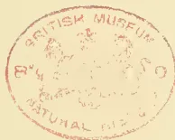A circular red ink stamp is centered on the page. The text "BRITISH MUSEUM" is arched along the top inner edge, and "NATURAL HISTORY" is arched along the bottom inner edge. In the center of the stamp is a crest featuring a lion and a unicorn flanking a shield, with a crown above them. The date "1943" is stamped in the center, below the crest.

99------------------------------------------------

A black and white portrait of a man with a mustache, wearing a dark suit and a white shirt with a high collar. The portrait is set within an oval frame.

REGINALD BEAUCHAMP DOWNALL.

100------------------------------------------------

# \* The TROPICAL AGRICULTURIST \*

## ◇ MONTHLY. ◇

Vol. XVII.]

COLOMBO, AUGUST 2ND, 1897.

[No. 2.

## “PIONEERS OF THE PLANTING ENTERPRISE IN CEYLON.”

(Second Series.)

### REGINALD BEAUCHAMP DOWNALL,

PLANTER AND M.L. C.—1863—1888.

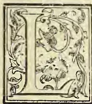

LEAVING England early in 1863 by a sailing-ship, R. B. Downall arrived in Ceylon during May following, after the long voyage via the Cape of Good Hope. He was at once posted by Messrs. George Wall & Co., as assistant to the late Watkin William Wynn on Kent and Ambokka estates, Matale West. He was the son of Archdeacon Downall of Okehampton and we recall the fact of a local Devonshire paper being sent us by an ill-natured friend, in which the fond father had rather foolishly published long extracts from his young son's letters, never meant for other eyes than those of the domestic circle, while he wound up with the statement that his son had qualified both in Bookkeeping and in the Tamil language on the voyage, so that he was at once put into a responsible charge as manager of a plantation on his arrival in Ceylon! We took care at the time, that no extract was made from the innocent communication into the *Observer*. The Archdeacon—who was greatly attached to his Ceylon son—died in 1872; and Mrs. Downall and daughters then retired to Barley, near Exeter, which was Mr. Downall's home in England till his mother's death.

Mr. Downall did not long remain an assistant on the Matale estate; for, in our Directory of 1864-5, we find him transferred to Dolosbage as manager of Kalugalla estate, and with that, we

believe, he combined a certain proportion of duties as Visiting Agent or Inspector of Estates—an unprecedentedly early appointment. A little later we find Mr. Downall a full-blown Visiting Agent, residing at Peradeniya and representing Geo. Wall & Co.'s firm in Kandy. This continued—with the exception of a holiday trip to England—up till 1874, when we find, still as Visiting Agent and Justice of the Peace, Mr. Downall occupied Barnes' Hall, Nuwara Eliya, where he continued up till 1877 or so. Then came his purchase of Mr. G. A. Crüwell's plantations and Mr. Downall went to reside on Dambattenne, Haputale. In 1876 Mr. Downall was, for the first time, elected Planting Member of Council, a post which he vacated on going home in 1879, to resume it again on his return the next year; but he once more retired in 1882 to have a brief spell at home; but again resumed in 1885 and continued in that honourable and onerous post until his final retirement from the island was compelled by fatal illness in 1888.

Such is the briefest possible summary of Mr. Downall's public career in Ceylon. To fill up the details and before going into particulars with which we are more especially acquainted, we have been favoured with two accounts by old and dear planting friends who knew him from the outset of his life in Ceylon to his sadly premature end. First, we have that of a gentleman, who was like a brother, his family and that of Mr. Downall being friends at home, and

101------------------------------------------------

76THE TROPICAL AGRICULTURIST.[AUG. 2, 1897.

as both the young men started from England about the same time—Mr. Downall leaving a month earlier but arriving a month later, because his friend came overland—there was always a friendly rivalry as to how the two “boys” were getting on. The following was written for us to use with our own notes, but amalgamation would spoil all its freshness and we trust we may be pardoned by the writer for giving the contents of his MSS. separately and *verbatim*:—

“It was either in February or March 1863 Downall left England in a sailing ship bound for Ceylon ‘round the Cape,’ and reached Colombo at end of May or early in June: he was accredited with letters of introduction to the late G. Wall—amongst several others—and Wall sent him up to Matale as assistant to W. W. Wynn.\* ‘Dick Mackay,’ who resided in ‘Jolly’s Bungalow’ overlooking the Kandy lake, was then Visiting Agent to Geo. Wall & Co., and was evidently so much struck with Downall, that not only did they become great personal friends, but on Mackay’s leaving for England 18 months after Downall’s arrival, he so strongly recommended the ‘youth’ to Geo. Wall that the important post of Visiting Agent was offered to him. Well do I remember his telling me about the offer, and his asking my advice as to his accepting it. Although I had had a month’s start of him in planting, I replied that I certainly could not accept it, as I did not feel competent, but that that was no reason why he should not. However, accept it he did, and if there have been better V.A.’s in Ceylon I have not come across them! His taste for sport soon showed itself, and in 1865 he took over from William Taylor—then of Dolosbage—the following hounds:—Bluebell, Bashful, Moone-

\* Mr. Downall’s first, and only, “Periya Durai,” Mr. Wm. W. Wynn, was himself an old, esteemed and notable planting Colonist of the well-known Welsh family of his name. We met him first in the “sixties” on the Borders Estate, Matale, and we are tempted to quote from a letter written after retirement with reminiscences of his Ceylon days:—

“Myddleton House, Monmouth, England 19th June 1894.

“Dear Mr. Ferguson,—The last time I saw you was in your office in Colombo in July 1889, when I called to wish you goodbye on the eve of my leaving for the old country after an *unbroken residence in Ceylon of 43 years*. And here I am now as hearty and strong as ever, and able to enjoy a day’s fishing, of which I get plenty and good. It occurs to me at this moment to ask you if you remember ‘the first time we met,’ the *when*, and the *where*?—The *where* I well remember, but the *when* ‘tis so ‘long, long ago,’ that I have forgotten quite. The *where* was at good Abercrombie Swan’s Bungalow, *The Borders*, and I daresay you remember how his gallant army of sepoys charged down upon us, with fixed bayonets, when we were standing on the *Barbecue*, and how we took refuge *under the store*!

“Most extraordinary weather, 19th June, and no Summer yet—not even one Summer’s day. With kind regards,—Yours very truly, ‘WATKIN WM. WYNN.’

Mr. Wynn died last year (1896) at Monmouth.

andy, of course a great favourite with the ‘dog boy,’ and also Sailor and Fly, a pair of Kangaroo hounds purchased in Colombo. The nucleus of a pack was thus started in partnership with C. Fetherstonhaugh, who kept them on Kirkoswald: then under the guidance of that cheery and most hospitable planter James McDonald. The mysteries of ‘elk hunting’ were soon acquired. In addition to hunting on Bogawantalawa and Bopatalawa, and afterwards in Nuwara Eliya, our friend seldom lost an opportunity of visiting the ‘lowcountry’ in pursuit of big game after which he met with a very fair share of success. Indian jungles, he also visited, and scored his ‘tasker,’ in company with T. S. Dobree. During his sojourn in the East he also went in pretty heavily for horse-racing, both in Ceylon and India. Perhaps of all the horses he ever raced ‘Grandmaster’ was his favourite, and he was only once beaten and that was at Peradeniya, where with a crushing weight, he was kept a little too much in the rear to allow of his ‘getting up’ when the ‘pinch’ came. I think Tom Reynolds\* was about the first to take in the situation, and I can hear *now* the shout Tom R. gave ‘Grandmaster has shot his bolt’! and so the good horse had. I forget the name of his favourite Arab, a rare good one, and of which he was so fond that he shipped it home to improve the breed of the Exmoor ponies.

“R.B.D.’s first venture in coffee was ‘Middleton,’ in Dinbula, for which I think he paid £2,000—no trouble about ‘exchange’ in those days when all was £ s d.—and a right good purchase it proved.† Then in time he became the proprietor of Cruwell’s Haputale places—now Lipton’s—which also did well for him so long as coffee remained ‘King.’ His worst purchase was Monaragalla (or Monarakanda) which practically ruined him, for with the exception of the bumper crop it gave the year of his purchase, it simply absorbed all the annual profits of the other Haputale estates to keep it a-going. Few have met with a greater variety of the ups and downs of life, of sport, of success, than he of whom this is written. At one time he could have

\* “Tom Reynolds,” well-known in those days and for years afterwards, as “T.K.” which came to him in this wise: a group of friends were critically examining a newly imported Australian horse, branded on the near shoulder “T.K.” when some one said what on earth can T.K. stand for? “Why, *Tom Reynolds* begorra!” says Tom Reynolds in a brogue, you could knock clumps out of with an old mamotte!

† Mr. Downall’s favourite manager at this time and for many years was Mr. H. G. Mackenzie who was as much attached to, as he was trusted and liberally treated by, one of the best employers and proprietors in the long list connected with Ceylon.—Ed. T.A.

102------------------------------------------------

AUG. 2, 1897.]THE TROPICAL AGRICULTURIST.77

cleared out of Ceylon with at least £100,000 to his credit; but it was not quite enough, so he stuck to it a little longer; and like a great many others, a little too long for coffee, and yet not quite long enough, for tea; but he was fighting against adversity as pluckily as any one ever did, and was on the right road to 'pull round,' when he was overtaken with the incurable disease which handed our good friend over to the 'majority' on 5th Dec. 1888."

We have been favoured with another account which we think ought also to be read by itself without incorporation in a general memoir as was meant by the writer when, on boardship, he dashed off the appended interesting notes of his dear friend of long-standing at our request. This gentleman shared bungalows with Mr. Downall for many years:—

"I first met R. B. Downall early in 1866 on my return from England, when I went to live in Kandy. He was then living at Peradeniya bungalow on the old sugar estate, which continued to be his headquarters till he went to reside at Barnes' Hall, Nuwara Eliya. I believe he arrived in Ceylon in 1863 and commenced life as a coffee planter under W. W. Wynn on Kent and Ambokka estates in Matale North. Whilst he was there he and Wynn made one or two shooting trips to Kanthalai tank on the road to Trineomale which he never forgot. After leaving Kent and Ambokka I believe he for a short time took charge of Kaloogalla estate in Dolosbage when George Wall appointed him his Visiting Agent, and he was acting in that capacity when I first met him in 1866. When not visiting, he used to attend G. Wall & Co.'s office in Kandy daily. Although he had been a planter such a short time (only two or three years) Wall discovered his ability and appointed him his Visiting Agent. Though Downall's *practical* knowledge at that time was limited, he did all his work most thoroughly and conscientiously, and was most particular in seeing that no unnecessary expenditure was incurred on any of the estates he visited. George Wall had the greatest confidence in him, and Downall gained experience rapidly. In 1866 he owned half of Middleton estate, Dimbula, with Elliott, and he subsequently purchased Tangakelle I think in 1869? In 1877, he sold these estates and purchased Dambattenne and Lemastota in Haputale from Ciriwell, also Barnes' Hall, and soon afterwards Monerakande estate from J. T. White and H. Bois. From that time coffee in Haputale began to decline, and poor Downall died hopelessly involved. He had paid much too large a sum for Monerakande estate. If he had been

content with Dambattenne and Lemastota, he might have pulled through. During the last two or three years of his life in Ceylon he gave up Barnes' Hall, Nuwara Eliya and went to manage his Haputale estates and lived first at Monerakande and afterwards at Dambattenne. I stayed with him two or three times at each bungalow. On the occasion of my last visit I met him at the top of Dambattenne, (having crossed over the ridge from Nayabedde). He was superintending a large gang of coolies cutting out young coffee to make room for tea, and expressed his doubts as to whether he was acting wisely or not! At that time the coffee was suffering from green bug as well as leaf disease.

"In 1868 I went to live with Downall at Peradeniya and we lived together till he went home in 1870, when he left me his power of attorney. We were both fond of animals, and at one time we had two small elephants, besides elk, spotted deer and other pets. One of the elephants Downall brought up from Hambantota after a shooting trip, having shot the mother. When he went home in 1870 it went to the Kandy Temple, and it now takes part in the Perahera every year. It is a female. The other small elephant, which was given to us by Capt. Rudd of the 59th Regiment died soon after it was sent to the Dewa Nilame with the other one. Downall was very fond of sport of all kinds. He had taken to racing when I first knew him in 1866, and he was then part owner of 'Grandmaster' one of the best horses that ever came to Ceylon. Downall continued to keep race horses up to a short time before he died. He was also fond of cricket and used to take part in the annual cricket matches at Kandy from 1866 to 1870, viz., Keir, Dundas & Co. (captained by W. Martin Leake) against the World. He afterwards started a cricket club at Kandapolla, Haputale, and took great interest in it up to the time of his death. He took several shooting trips after big game both in Ceylon and Southern India. He was far from well when he went on his last trip to Travancore and never recovered. When he lived at Barnes' Hall, Nuwara Eliya, he kept a pack of hounds and gave excellent sport to his numerous friends.

"In 1876 he succeeded me as representative of the planters in the Legislative Council, and continued to represent the planting interests on and off up to the time of his death. He rendered most valuable services to the planting community in the Legislative Council, especially in respect to railway extension to Haputale. He spared no pains nor trouble in pushing forward any good work and in making sure of his facts. He was very independent, and his opinion always

103------------------------------------------------

78THE TROPICAL AGRICULTURIST.[AUG. 2, 1897.]

carried great weight. We served on the Haputale Railway Extension Commission together.

"On the 6th August, 1888, I received a telegram from Downall from Marseilles at Freshwater asking me to meet him at Charing Cross that evening. I did so. He could scarcely walk. I got him to Long's Hotel, Old Bond Street. All the doctors he wished to consult were out of town, it being August when doctors take their holiday. I went to Sir Joseph Fayrer, he did not go out, but he recommended me to call in Dr. J. Anderson who attended Downall up to the last, and a great friendship sprang up between them. On the 7th August, Downall was removed to a private hospital, Fitz Roy House, where he underwent a most serious and painful operation which, however, did no permanent good. On the 16th October, 1888, Downall was removed to his sister's house at Flax Bourton, near Bristol. I saw him off at Paddington. He was almost in an unconscious state. He died on the evening of 5th December, 1888, at Flax Bourton, and his remains rest in the pretty little churchyard there. We were always more than ordinary friends, and I was with him as much as I could be during his last illness. He died of *cancer* in the stomach."

We can add little to the above extremely interesting details of the late Mr. Downall's personal life and sporting and planting career in Ceylon. We first came into close contact with Mr. Downall when he entered the Legislative Council, although we knew him as an occasional contributor to the *Ceylon Observer* before then. We very speedily recognized the single-mindedness of purpose and devotion to duty of the new member, and he having become a Haputale planter in 1877, entering into "the shoes" of Mr. G. A. Crüwell, we found little difficulty in interesting him in the agitation for Railway Extension from "Nawalapitiya to Haputale," which we had personally initiated in 1872, and in which we had the cordial support from the outset of Messrs. C. Tottenham and G. A. Crüwell. All through the administrations of Sir James Longden and Sir Arthur Gordon, Mr. Downall did yeoman service in Council in the cause of Railway Extension, while not neglecting his other duties as Planting Representative. In the first place we fought together during the closing term of Sir Wm. Gregory's administration and the early years of Sir James Longden's rule, to secure, if possible, sanction for one contract from Nawalapitiya to Haputale. But it was after the decision to cut the line in two and extend only to Nannoya that the real struggle took place, in which Mr. Downall, as chief of the Uva Planters and M.L.C., bore a leading part. Here, for instance,

is a very brief *resumé* from the record of these years of hard work:—

1879, Oct.-Dec.—Agitation renewed in Legislative Council for Extension to Haputale, by Mr. Downall in what became an annual motion every session up to 1886-7; Mr. Ramanathan cordially supporting the proposal until he recanted early in 1886.

1880.—Memorial from the Haputale Planters to the Governor; and general appeal (Dec. 7) from inhabitants of Uva to the Secretary of State, Lord Kimberley.

1880-1881 and 1882 employed in trying to urge on Sir James Longden and to get sanction of Secretary of State.

1883, Dec. 29.—Full letter (with Map) from A. M. & J. Ferguson to Sir A. H. Gordon, on his arrival, reviewing the position of Railway Extension to Uva.

1884, June.—Interview of Mr. J. Ferguson with Hon. Robt. Meade at Colonial Office to urge the sanction of Extension to Haputale.

1884-85.—Waiting for Sir Arthur Gordon to make up his mind—which he did by 1886

1886, Feb.—Ceylon Agricultural Association opposes and memorializes against Railway Extension to Haputale. Mr. J. Ferguson publishes a series of letters in a pamphlet on Uva, in reply.

1886-7.—Period of strong Despatches, Uva Memorials, and much local agitation, in which Mr. Downall bore a leading part, for Haputale Extension.

1887, March 29th.—Trenchant and long Despatch of Sir A. Gordon to Sir H. T. Holland confuting Mr. Stanhope's Despatch of January 7th, 1887.

1888, March 20.—Sanction of Haputale broad gauge Extension received by Sir Arthur Gordon in Colombo, Sir H. Holland's Despatch being dated Feb. 20th.

One of Mr. Downall's best efforts in Council on behalf of the Uva Railway was in 1879, and his speech on that occasion covered nearly 5 pages in the close type of "Hansard." He was supported by the whole of the unofficial members, and both the Governor and Colonial Secretary spoke accepting the motion.

In connection with this memorial notice we have been turning over many old papers and much correspondence, and as evidence of Mr. Downall's heartiness and earnest desire to see the great work completed, we think a few of his letters may be given here. First, however, we may quote from the proceedings of the Haputale Planters' Association of which Mr. Downall was a leading spirit in September 1884; we had just returned from the old country where we had done all we could to restore confidence in the Ceylon planting industry, and to influence officials in favour of the Uva Railway. Accordingly, the Haputale P. A. on 26th September carried the following resolution:—

"That this Association do record its appreciation of Mr. John Ferguson's letters to the English papers with reference to the planting interest, and that the Secretary be requested to convey the thanks of the Association to that gentleman for the same."

This was followed a few days after by a letter from Mr. Downall:—

"Moonerakanda, Koslanda, 1st October, 1884.—My dear Sir,—I am very pleased to be able to welcome you back. I must thank you for the handsome edition of your book which arrived safely at Barley; also I fancy I have to thank you for a copy of 'The (London) Times' containing your letter (on

104------------------------------------------------

AUG. 2, 1897.]THE TROPICAL AGRICULTURIST.79

Ceylon Planting affairs and Railway Extension) which I read with much interest.

"We must work away again at the Railway Extension. We may yet get it I think. My idea is an Extension on any gauge that may be feasible. I have not as yet had any conversation with the Governor on the subject. I may be in Colombo about the end of the month, and shall hope to see you."  
—Yours truly,  
R. BEAUCHAMP DOWNALL."

An interval of a couple of years of hard fighting in Council and the Press followed, and to show that Uva planters were not uninterested, we may give the following, not published before:—

"Badulla Planters' Association, Badulla, 20th Sept., 1886.

"Messrs. A. M. & J. Ferguson, 'Ceylon Observer' Office, Colombo.—Dear Sirs,—I have much pleasure in forwarding copy of a resolution passed at a General Meeting of this Association held in Badulla on Saturday the 11th September current.—I am, yours faithfully,  
ALEXANDER T. RETTIE, Secretary.

"Copy of resolution referred to:

"Resolution proposed by R. P. Macfarlane, Esq., seconded by A. T. Rettie, Esq., and carried with acclamation:—'That this Association desires to express its deep sense of the exertions made by the Editors of the "Observer" in the cause of extending the Railway to the Province of Uva, and more especially the late exertions of Mr. John Ferguson to whom this Association desires to express its best thanks.'—A. T. R.\*"

Still, there were two more weary years to follow—the more trying, because of "the split in the camp" which sent a number of the Badulla planters especially, after a narrow gauge to which Governor Gordon said at once he would be no party under any circumstances,—that is so far as to break gauge at Nanuoya. So decided an expression of opinion on the part of the Governor settled the matter in Mr. Downall's judgment, and he and the *Observer* with the majority of Uva men, never swerved in their support of Sir Arthur Gordon who was now deeply committed to Railway Extension without break of gauge until Uva was entered. Here is a letter written after a great meeting in Kandy where the Badulla representatives were induced to give support to a general resolution in favour of Extension:—

"The Hill Club, Newera Eliya, 25th February, 1887. Dear Mr. Ferguson,—I have just read your railway articles with much interest and satisfaction. The resolution in Kandy was carried not merely *nem, con*; but *unanimously*. Messrs. Rettie, Hoseason, and other Badulla representatives agreeing to the wording as finally adopted without *any* hesitation.

"I think the opinions I heard expressed after our P. A. meeting are correct ones, that the proceedings generally were characterised by moderation and common sense. *Entre nous*—H.E. is with us on this medical question.—Yours faithfully,

"R. BEAUCHAMP DOWNALL.

"H.E. was quite satisfied with the railway resolution, at least he told me so.—R. B. D."

\* These are given as bearing on Railway Extension and coming from Uva with which Mr. Downall was so closely identified: on February 17th, 1879, a formal Resolution to the same effect had been carried in the Parent Association, Kandy.

At length in March 1888—sixteen years after the commencement of the agitation and nine years after sanction to Nannoya—came the telegram from Sir H. Holland (afterwards Lord Knutsford) to Sir Arthur Gordon sanctioning Extension to Haputale, the Despatch being dated Feb. 20th. Here was Mr. Downall's genial deliverance on the achievement of a result for which he had worked and fought and waited so long:—

Dambattenne, Haputale, 19th March, 1888.

"Dear Mr. Ferguson,—Congratulations all round—please accept mine yourself and convey them to your senior. It is indeed satisfactory to know that the great question is now undoubtedly settled, and that the Despatch is quite unconditional and unqualified, for it sanctions Extension to Haputale on the present gauge; of course that was a foregone conclusion.—Yours faithfully,

"R. BEAUCHAMP DOWNALL."

It was characteristic of the writer that in the same letter he should make inquiry about the Collectorate of Canara whither he intended proceeding on a shooting expedition though far from well. Indeed, for some years Mr. Downall had been suffering from the after-effects of a dysenteric attack (we believe) that would have made anyone less high-spirited and plucky, extremely careful of himself. Nothing could keep him from his usual active pursuits. After he took up his residence in Haputale, he became the very life and centre of the district, showing a bright example of attention to planting duties, but at the same time ever ready of a Saturday afternoon for the local cricket practice or match, or ready at intervals to captain the district team in competition with other districts or town teams. But this was not all; he would also have his occasional sporting tour either to the lowcountry or to India, in either case running risks which were not for him in those latter years in view of internal trouble. We recall well a pressing invitation he gave us to visit him at Dambattenne in Feb. 1886; he was expecting Governor Gordon on his first visit to Haputale via Ratnapura and Balangoda, and on his way to inaugurate the new Province of Uva. With great regret we had to forego the Dambattenne visit, only having time to get direct to Badulla for the vice-regal tamasha. Riding down from Nuwara Eliya, halfway to Wilson's Bungalow, we met Mr. Downall riding up. He had entertained the Governor the night before, the whole district gathering to present an address, and after seeing His Excellency and suite start for Badulla, he (Mr. Downall) had left the estate and was on his way to Southern India. Questioned as to his object, at a time when we knew he was in far from robust health, he said he had never shot a bison, and must do so before he went home, so he was on his way to its native haunts. It was again characteristic of Mr. Downall that

105------------------------------------------------

80THE TROPICAL AGRICULTURIST.[AUG. 2, 1897.

he maintained his faith in coffee up to the very end. We have a letter dated February, 1887, in which he got quite angry with the *Observer* for publishing a correspondent's sneer at coffee in Uva as being as much doomed there as anywhere else in Ceylon; the writer went on to say that tea would more than fill the place of coffee and fully justify the railway; but still Mr. Downall was not satisfied. He wrote:—"Many estates have just given the best autumn crop that has been gathered since 1878, and the coffee looks in first-rate vigour after it." Alas! for the ever-sanguine as well as energetic proprietor of Dambettenne in the "eighties": well would it have been for him to have lost faith in the old staple, or rather to have gone in more extensively for the new king, a little earlier. But still he did a good deal in "tea"—he was never the obstinate or prejudiced planter who would learn nothing from his neighbour, and had only life been spared, there is no reason to suppose that he would not have reaped the benefit of the new staple to the full extent of clearing off all liabilities and finding himself sole owner of plantations which are about the most valuable in tea that Haputale can show in the present day.

And now in conclusion as to what kind of man, in person and character, was Mr. R. B. Downall. It has been well said that when a friend, loved and admired, passes away from us, there is a natural desire for something which may serve to give distinction and permanence to the impression which he made upon us in his lifetime. We trust that end has been in some degree met by what has been written above, and more especially by the contributions of two of Mr. Downall's nearest and dearest friends. It may be well though that we should recall in a few words the outward appearance: below the middle height, slender and active,—indeed in his early days "hard as nails" would best describe R. B. Downall in view of his constant exercise, riding and walking over plantations, cricket and hunting. He had a strikingly frank countenance, marked with lines indicating decision and responsibility and crowned by a notable forehead. It was natural that one who had made his way to the top of the planting "tree" at so early an age entirely through his own character and exertions, should be distinguished by an air of responsibility and command; but no one could be five minutes in his presence without discovering the really genial and kindly social character of the man. His smile brightened all about him and his laugh was contagious. But it is to the solid character and bright example of industry, energy and pluck that we would point at this time. No one

could ever dream of associating a mean or dishonourable act even in the slightest degree with R. B. Downall; while many acts of benevolence and of kindness to the bereaved and poverty-stricken will never be known till the day shall declare. No estate inspector or proprietor was more considerate towards those under him, or more desirous that Superintendents, conductors and labourers in his employment should all be contented and prosperous. Such then was this Ceylon Planter-pioneer of the "sixties,"—the chosen representative of his community in the "seventies" and "eighties,"—and we may add the most truly esteemed and widely loved of all the second generation of PLANTERS IN CEYLON:—

"Peace to the memory of a man of worth."

#### MEXICAN TOBACCO.

Ever since the dawning of what is called the "American Epoch" of Mexico, there has been a steady and continuous development in the exports of that country. The American Consul at the City of Mexico says, "That striking as are the facts with regard to the increase of the cultivation of coffee and the growth in the United States of a great appreciation of the Mexican berry and its sterling qualities, these can be paralleled in many points by the development of Mexican tobacco." Although France has not profited commercially by this increase, it is only simple justice to say that it is due very largely of Frenchmen and to the exiles from Cuba whom they employed. A French writer, Louis Lejeune, was the first to point out that the tobacco grown in the upper valley of the Papaloapam River produced leaves as fine, as silky, and even more aromatic and perfumed than those of the "Vuelta Abajo" in Cuba. He showed that the Plantations in the Pinar del Rio district of Cuba were exhausted, and that not even the most lavish use of fertilizers could enable them to produce leaves of the real Habana quality. He compared the western end of the island of Cuba to a dying fire, where one could find here and there points of living flame, but everywhere else ashes and blackened embers. M. Lejeune in his pamphlet made an elaborate comparison of the relative cost of starting a tobacco plantation in Cuba and in Mexico, and showed that, supposing silver to be at par, which it was when he wrote, the expenses in the latter were only one half of the former, without taking into consideration the price of land or the cost of transportation. He adjured his countrymen, who were enterprising, not to wander off to Cochinchina, but to establish themselves in Mexico on tobacco plantations. Some did so, and at the last French exhibition those who had followed his advice received gold medals for the excellence of their production. For some reason or other the French Regie did not, until the fiscal year 1894-95, except Mexican tobacco, and, therefore, France has lost the benefit to which it was fairly entitled through the energy and skill of Frenchmen who created the initiative which has resulted in rauling the Mexican leaf with the Habana. Prior to 1889 the export of Mexican tobacco rarely amounted in value to 900,000 Mexican dollars in any one year (say £90,000), but in 1895-96 the value amounted to 1,700,000 dollars (£170,050). At first foreign countries imported Mexican cigars, but they did not give complete satisfaction, because boxes marked "Colorado," "Colorado Claro," and even the "Claro," when opened were found to contain "Maduros" and even "Oscuros." The supposition was that this was due to negligence in making the boxes, or even to fraud, because the light-coloured

106------------------------------------------------

AUG. 2, 1897.]THE TROPICAL AGRICULTURIST.81

cigars are preferred as being milder. This was a great injustice to the Mexican importers, who are most careful on these points. The enigma was solved by the discovery that Mexican tobacco ripened with remarkable rapidity, and that "Claros" became "Oscuros" during the short transit from Vera Cruz or Tampico to New York. The remedy was clear. It was to import the leaf and manufacture the cigars under climatic conditions that would prolong the ripening process. This led to a very brisk demand for leaf tobacco, and the Indians in the tobacco belt of Mexico were so foolish as to add corn shucks, grass dirt, and even stones to add weight to their bales; especially was this so in the case of that bought and shipped to Germany. The consequence was that there was a reaction, and the buyers for foreign houses would not look at any tobacco that did not bear the inspection brand of some well-known French, German, or Mexican house. Then the Indian growers were in despair and offered their tobacco for the price of seedling tobacco. American buyers jumped at the price and thus the exportation to the United States for 1893-94 reached the figure of 382,767 pounds, as against 70,107 pounds for 1891-92, but this was not maintained. Practically no wrapper tobacco is grown in Mexico. The leaf is all "filler." This is a virtue to those who like a strong cigar, easily smoked, but it is a defect for the general consumer who likes a milder article. When cigars were mostly made in Habana the wrapper was "Yara," and not the "Vuelta Abajo," for that very reason. A comparison for the prices paid for Mexican leaf tobacco by the various importing countries may be of interest. Germany, the chief importer, pays 37 cents per pound; the United States, 33 cents; England, 39 cents; Belgium only 29 cents, and France, only 25 cents per pound. The finest Mexican cigars go to Habana at one dollar 67 cents per pound; England gives 94 cents for Mexican cigars; France one dollar 10 cents, and the United States, 88 cents. In Mexico the soil is so deep that it is not necessary to plant a crop of corn after the crop of tobacco, and instead, the growers raise a second or seedling crop. After the plant has been cut, a stalk or chute springs abundantly, and from this stalk or chute spring small and very mild leaves, about the size of a man's hand. These are utilised by the manufacturers of cigarettes. To the factories in the country this tobacco is sold at from 2 to 5 cents a pound. The cigarette tobacco is excellent and its reputation is very good. Colombia and Peru buy it in constantly increasing quantities at from 6 to 9 cents per pound, and Guatemala buys at 6 cents. All of the Central Americans and some of the South Americans buy the Mexican cigars and pay an average of 1 dollar 5 cents per pound. In a word, says Consul Crittenden, Mexico is not only one of the coming coffee countries, but is also a coming tobacco country. Mexico seems to be destined to wear the mantle of Habana in tobacco production, and once secured, it is safe to predict that it will never pass away, for the soil of the tobacco region is so deep as to be practically inexhaustible, being from 8 to 20 feet in depth, and in some places even 30 feet. Moreover its extent is probably one hundred times that of the Cuban tobacco region, when we take into consideration the fact that acre for acre the percentage of cultivated land at the present moment capable of producing tobacco of the very highest grade is greater in Mexico than it ever was in Cuba in its best days; we can from this easily see what will be the amount produced in the future. Mexico's resources in this direction are practically so great as to make it certain that it will become rich from its tobacco alone. No doubt the results will be finally to cheapen the "Habana" cigars, and put them within the reach of all. The tobacco lands of Mexico form an immense inverted capital T, the cross stretching from Tuxtepec, (Oaxaca) and the upper valley of the Papaloapan through the southern portion of Oaxaca into the Tehuantepec highlands, and thence into the state of Chiapas; the upright of

the T stretches from the valleys of the Colorado and the Trinidad rivers (which form the San Juan river) eastward to the San Andres Tuxtla Canton. The cream of the tobacco lands will undoubtedly be found in the valleys of the Colorado and Trinidad rivers, but chiefly the latter. The soil in these valleys is from 10 to 15 feet deep, and of the very richest quality, and is equally adapted for coffee or tobacco. It may be taken as axiomatic as regards Mexico that the land that is good for one is equally good for the other. To the eastward of the main valley of the Trinidad river, in the transverse valleys, the soil is even deeper than 10 to 15 feet, and here one finds mahogany trees of the most astonishing size and of the finest quality. This region is called Las Monterias de Caoba, and is very extensive. Transportation is one of the most important questions which the planter in Mexico has to consider. In the Trinidad region he is close to the National Tehuantepec Railway, and he can also raft down to Vera Cruz, which town is reached by the small river steamers that ascend the river from Talacotapam. He has two ports, Coatzacoalcos and Alvarado. Whenever the Railway from Corodoba reaches Tuxtepec, it will undoubtedly be extended to Juili on the Theuntepec line, and must traverse the Trinidad region, so that on the score of transportation one is reasonably assured being amply provided for in the present, with the probability of still more accommodation in the future.

---

### NUTMEGS.\*

The author of this book begins by saying how interesting he found the study of the Nutmeg-tree, both true and false, during a period of eight years spent in the Eastern parts of the Malay Archipelago and in New Guinea. There these trees enjoy a climate exactly suited to them, and there, in consequence, is situated the centre of their distribution. There also they take the same relation to botany that Birds of Paradise do to zoology.

The claim of the Nutmeg for consideration as an article of commerce is connected with a series of romantic stories of its discovery in times long past, of the fierce war that raged among European countries for their commercial rights, of the combat for monopoly that ended in the extermination of the natives, and the break-up of the greatest merchant-company that has ever existed. All this eventful history is interwoven with the stillness of every grove of Nutmeg trees, and with the grand scenery of every inland lake.

With such words as these, the author commences a work which is, in its way, unique. He proceeds to treat of the history of the Nutmeg previous to the discovery of the Banda Isles, of the use that has been made of it in poetry, and of the philological history of the various names for Nutmeg and Mace.

The second part of the book is devoted to the cultivation of these spices, and includes a large amount of cultural detail and history. We are told of the strenuous endeavours made by the Dutch East India Company to preserve the monopoly, and how finally they were forced to relinquish it; and the author further reminds us of the exertions that were made with more or less success to induce the Nutmeg-tree to flourish and become naturalised in other localities. Dr. Warburg notes that at Syon House, Middlesex, very large fruits have been brought to perfection. It would be interesting to learn whether this tree is still flourishing. [No, it was removed some years since. Ed.] In an appendix to this section of the book is a tabular epitome of the cul-

---

\* "Die Muskatnuss:" the Nutmeg, its history, botany, cultivation, trade and value, also its imitations and surrogate. With a treatise on the cultural history of the Banda Isles. By Dr. O. Warburg. With three heliogravures, four lithographic plates, one map, and twelve illustrations in the text. (Leipzig, Engelmann, 1897, 8vo, xii., and 628 pages. Price 20 marks.)

107------------------------------------------------

82THE TROPICAL AGRICULTURIST.[AUG. 2, 1897.]

civation of Nutmegs and Mace from the years 1634 to 1894—that is, during a period of 260 years.

The third and botanical division of the book deals with the Nutmeg-tree itself, and numerous other spices that merit attention from a commercial point of view.

The fourth division is concerned with the cultivation, the fifth with the trade details. Not only the species recognised in commerce, but the false Nutmegs, and the substitutes for the genuine spice are fully considered. In an appendix to this section of the book are given detailed price-lists of Nutmegs and Mace.

The sixth section deals with the collateral products of the Nutmeg-tree, their commerce, and history. Among them are oil of Nutmeg, oil of Mace, candied Nutmeg fruits, candied Mace, and Nutmeg fruits in vinegar or salt.

In the seventh division the medicinal and aromatic products of the Nutmeg-tree are considered, and the poisonous qualities of the Nutmeg receive due notice.

In the eighth section the author considers the future prospects of Nutmeg cultivation.

Finally, there is a complete literary catalogue of some eighteen pages, which speaks well for the thorough acquaintance of the author with his subject. A very complete index greatly adds to the value of the book.

We congratulate Dr. Warburg on the completion of this work, which will serve as a model for all future books of the kind, no such complete monograph having before appeared. Everybody, be he botanist or gardener, chemist or philologist, historian, political economist, or merchant, will here find a wealth of information, whilst the general reader will find it a most interesting and instructive work to add to his library shelves.—*Gardener's Chronicle*, July 3.

## GATHERING RUBBER IN THE FRENCH CONGO.

By Mrs. Martha Nehne.\*

1—FROM THE NEW YORK SUN.

In the months of March and April, during the rainy season, one sees busy life in the native towns of the French Congo. The men are preparing to go to the bush to cut rubber. Every woman and child seems to have something to do, and even the men do not lounge about as usual, but are sharpening their knives and machetes and putting their guns into proper trim. The women are digging cassava and some of them are washing it and preparing chiguanga, or native bread. Others are cleaning the cassava with knives and tying it into mattets made from palm leaves. This kind of cassava is roasted over the fire and eaten warm, while the bread is eaten cold and is mostly used on the road. The men carry their guns so that they may be prepared to kill the game which abounds in the forest.

When all is ready a drunken carousal and dance are given the night before the start by way of saying farewell to the villagers left at home. Sometimes a good place with plenty of rubber plants is found after a march of two or three days, but oftener the journey takes a week or more. In this case the men keep carriers on the road with food for them because there is nothing to be had in these parts with the exception of game.

The rubber in central Africa is not a tree, but a vine, often three or four inches in diameter. This vine generally climbs up the tallest trees, and the natives often use one of the vines to ascend the tree. After the branches are reached, which in most cases are at least fifty feet from the ground, the men proceed to cut the vines away at the top,

leaving only one for their descent, and this one, if possible, not a rubber vine. It seems strange that the natives cut away the rubber plants and so destroy them instead of tapping them, but they are too lazy to learn any other way.

After the vines have fallen they are cut into lengths of three or four feet, and the juice is collected into iron pots. This is a tedious job. The piece of the vine is held over the pot, first by one end, then by the other until the juice ceases running. Then the piece is cut again to get at any juice which may have been left in the middle. After a pot is nearly full a rest is taken, and this juice is boiled for nearly two hours, and, during the boiling process, is mixed with the juice of other vines and some lime juice, so that the mixture is more sticky and easier formed into balls.

As soon as it cools down sufficiently to be handled the hardening rubber is shaped by winding it at first around a stick. After a bit the stick is pulled out and the ball is re-wound to finish it off. In some places these balls weigh three pounds or more each; in others, five of them make a pound. The purity of the rubber depends much upon how much other juice has been added. The best and purest is that obtained from the juice without boiling. This is only found in the shape of bracelets, because the natives wind the juice as it runs out around their wrist and let it dry there. When perfectly dry it slips off easier. This would be transparent rubber if the skin and fingers of the natives were not so very dirty.

The natives often used to put foreign substances, such as small stones, palm-nuts, and little balls of grass into the rubber ball to make it heavy. They were soon found out, and every ball is now cut through the center to reveal its mixture. Often the rubber is buried for some days because it draws the moisture from the ground, which adds to the weight. Cheating is resorted to because the pay is so poor. It takes a party of eight or ten men and boys six to eight weeks to gather from eighty to one hundred pounds of rubber. The value of this, if all is first-class, is from 200 to 250 yards of cotton cloth or forty gallons of rum or three or four flintlock guns. Surely this is poor pay for this kind of work.

Still, the natives rejoice greatly if the men from one town return with 100 pounds. It seems like a fortune to them, because they need so little that civilized people crave and pay for. When this little fortune is spent and the weather permits, another trip is undertaken to the rubber region.—*India Rubber World*.

PACKING SEEDS AND TUBERS FOR LONG JOURNEYS.—The *Chenil*, as quoted in the *Revue Scientifique*, mentions a method of forwarding and packing seeds and tubers which seems ingenious and practical, especially when the journey will be long, and warmth and dryness are likely to have injurious effects. The method employed by a Lot florist consists in moistening a little plaster, and imbedding the seeds, tubers, or rhizomes which are to be transported in this. This plan has succeeded well for packing rhizomes sent from Japan, roots of aquatic plants, the lengthened transit of which is always a difficulty. Enveloped in plaster, the plants, or pieces of plants are in no danger; they cannot become parched, and are kept in a satisfactory condition of partial moisture. It would seem that this plan would also succeed under other conditions—in Australia it is employed for the transport of fresh butter. The butter is made up into blocks with parallel and rectangular surfaces, to which are pressed glass slabs of the same sizes as the sides and ends of the blocks of butter. The edges are covered with gummed paper for greater security, and the whole is then covered with plaster to a thickness of 6 millimetres. Plaster being a poor conductor of heat, secures the butter against the variations of the temperature, and enables it to be kept longer than is possible under other methods of packing.—*Gardener's Chronicle*.

\* The writer of the information printed here is an American lady who for the past nine years has been a missionary in the Mayumba district of the French Congo.—THE EDITOR.

108------------------------------------------------

AUG. 2, 1897.]THE TROPICAL AGRICULTURIST.83

### AGRICULTURAL DEVELOPMENT IN JAMAICA—AND IN CEYLON.

The subject of "agricultural development is one that may be regarded as a continuous permanent topic of discussion in Ceylon. We can never exhaust it, for there is always some "new product" or some fresh development of existing industry which demands attention. Now our text is found in the interesting and instructive extracts we have been tempted to make below from a lecture recently delivered in Jamaica by Dr. Morris, C.M.G., of Kew, before the Governor and a large body of the residents. This lecture was followed by an animated discussion in which the Governor bore his full share; and if it be true that Sir Henry Blake is erelong to succeed Sir Charles Mitchell at the Straits, with the reversion some years hence, possibly, of the Governorship of Ceylon, a more than ordinary interest will attach to his views and to his personal experience of agricultural development. Dr. Morris travelled over a wide range of subjects: he is particularly sanguine over the prospect opening before Jamaica of developing a great fruit-growing industry and export to meet the yearly growing demand from the United States. We need not follow him in all he says under the head of "bananas, grapes, oranges, grape-fruit, pine-apples, tree tomatoes," or even "potatoes." It may be hard to say what Ceylon could do as a rival with existing fruit-exporting countries were her resources properly tried and with the aid of refrigerating rooms in ocean mail steamers. But, apparently, that time has not come yet; and we are more concerned, practically, with what he tells us about ginger, tobacco, fibres and agricultural teaching. What Dr. Morris says under the last heading is of special interest. He believes in agricultural teaching: he would begin even in the elementary schools, and the sooner the two "Readers," so much praised, are introduced into Ceylon, the better for the rising native generation; while, undoubtedly, to follow up such elementary learning, there ought to be a special Agricultural School or College in a Colony like Ceylon. Strangely enough, Dr. Morris did not give much encouragement in reference to fibres—Ramie, Rhea or China Grass (all three exchangeable terms) was the only one suited to Jamaica, and even for it he spoke very cautiously, although he was met eventually by good reasons from the Governor why the people of Jamaica should do a good deal in Ramie and Rhea growing and preparation. So, in respect of "rubber," Dr. Morris is afraid to encourage any ventures, because of the continued large developments of original sources of wild rubber in so many parts of Africa. But we scarcely think Dr. Morris makes sufficient allowance for the constantly widening and increasing demand for rubber;—the thousand-and-one uses it is put to, which were not dreamt of a few years ago, and the thousand-and-one additional uses which the next dozen years or so may bring to light. Then, if we bear in mind that to plant and bring a rubber plantation into bearing, requires ten to a dozen years, we suspect there is every reason to anticipate a widened demand and a lessened supply from Africa, as from South America, the Eastern Archipelago, Assam, &c., before A.D. 1907-9 is upon us. Agriculture and planting everywhere have their attendant risks, in all their branches; but in Ceylon—following the Heneratgoda ex-

perience as tabulated by Mr. Willis—we consider Para Rubber Culture as safe an industry as and which can be recommended to capitalists any planters who are not in a hurry for immediate returns.

### AGRICULTURAL DEVELOPEMENT IN JAMAICA.

#### EXTRACTS FROM LECTURE BY DR. MORRIS, C.M.G.: GOVERNOR SIR HENRY BLAKE IN THE CHAIR.

##### BANANAS.

The cultivation and export of bananas are industries of very recent growth. In 1886-1887 the value of the bananas exported from the Colony was £145,959. Last year the value had increased to £315,821.

I am aware that the prospects of the banana trade with the United States are not so favourable as they once were. It is therefore of great importance that new markets should be found and the recent trials of shipments of fruit to England deserve to be fully followed up.

##### GRAPES.

At last in Jamaica, thanks to the initiative of His Excellency the President, grape cultivation is now being generally taken up in the neighbourhood of Kingston. On the table tonight are fine samples of Black Hamburg Grapes grown at the Hope Plantations. It may be possible before long to supply all local wants in this delicious fruit and eventually export some of it in the early winter months to New York where fresh grapes would be greatly appreciated and command high prices.

##### ORANGES.

The capabilities of Jamaica to ship large quantities of delicious oranges is a most striking proof of the vast resources of the island. Hardly any orange trees have as yet been systematically cultivated here. Yet there are several millions existing over the island in a semi-naturalised condition. From these trees the export of fruit in 1886-87 was of the value of £58,288. Last year owing to the falling off of supplies from Florida there was a keen demand for Jamaica oranges in the United States. Jamaica was fully able to meet this sudden demand and it shipped oranges of the large value of £169,293. I am glad to find that steps are now being taken to cultivate oranges in a thoroughly systematic manner and that budding and grafting is being regularly pursued.

##### GRAPE FRUIT.

Amongst citrous fruits there is no fruit which appears to be in greater demand and obtains such high prices as the grapefruit. This is a variety of the shaddock or pumelow. It is so called because it grows in clusters as in a bunch of grape. On account of its tonic properties it has lately come into great request in the American market. The most esteemed sort is of good size, with a pale yellow, polished rind. Grape fruit should be allowed to get thoroughly full on the tree. Immature fruits are of an inferior flavour. The season appears to be from December to April. The tree when budded is a vigorous grower and very prolific. It is recommended to bud on either the sour orange or rough lemon stock. If the soil is deep use the sour orange stock. If shallow and rocky use the rough lemon stock. Provided the fruit is full juiced and of a delicate flavour the larger sizes are more in favour than the smaller ones.

##### PINE APPLES.

There appears to be an increasing demand for pine-apples just now in New York owing to the falling away of exports from Cuba. The best season is during the months of March to May. There is no fruit that gives a better return for the extra care bestowed upon it especially in grading and packing.

##### TREE TOMATOES OR PLUMS.

I find that these are not appreciated in America. Their use in Jamaica has been always regarded as beneficial as a liver tonic. There is no doubt of their wholesomeness. They evidently require to be tried

11

109------------------------------------------------

84THE TROPICAL AGRICULTURIST.[AUG. 2, 1897.]

on new lines and used for such purely dietetic purposes as those which have given such special value to the grape fruit. The tree tomato is sometimes to be found in the Covent Garden market where it is received from Madras. It is generally known in England as the granadilla; but it is not a pressive fruit. It is more closely allied to the tomato. Any man who buys a tree tomato and expects to find a hard stone in it is disappointed. I think it is a pity to call it a plum—a gooseberry is a better name for it—for it is a berry and in no case or condition is it a plum. But whether a plum or a berry I am afraid its qualities are not appreciated in America. I am afraid Jamaicans do not approach the American in the right way. The right way to approach him is on the dietetic side. In the island where the largest stock of it exists at least where it originated he might say (although it came originally from Peru), there is no place where it grows so freely as in Jamaica and it is a great pity something more is not done with the fruit.

#### POTATOES.

In my lecture, already referred to, I recommend that an attempt should be made to grow new potatoes at the New York market. Such potatoes are a luxury in northern countries during the winter months. Hence they obtain comparatively good prices. So far, experiments have been on a small scale. I find, however, that an attempt made last year, although seriously affected by the drought was not of an unpromising character. It might be suggested to make three plantings in the season, say about November 1st, November 15th and December 1st. The crop should be ready for shipment from January 15th to March 15th, thus covering the best shipping season. It is essential that the seed potatoes should be specially selected for planting purposes. In the Bahamas for early planting rather small uncut seed potatoes are used. Later on larger seed potatoes are cut to two eyes to a piece. These are said to give a larger and better return. The tubers should be gathered when fully developed and packed in stout wooden cases. No wrapping is necessary. With potatoes as everything else they should be presented in as fresh and attractive a way as possible.

#### GINGER.

Of the small industries of Jamaica there is hardly one more worthy of attention just now than ginger. During the whole time I was in Jamaica I regarded ginger as my personal enemy. I understood that the culture of it is detrimental to lands in the interior. But I have had most gratifying news from His Excellency the President of that Society that by means of suitable manures the land had been saved. There has been a considerable rise in prices of late years. For instance during the last 10 years what is commercially known as common Jamaica ginger has risen from 51s to 74s. per cwt. whilst good qualities have risen from 62s to 93s 6d per cwt. Hitherto ginger has been regarded as a most exhausting crop, requiring fresh forest land to be cleared every year.

#### LOWLANDS AND HIGHLANDS.

I think that the sooner we can turn the attention of the provision cultivator from the high lands to the interior—the low lands—the sooner the better for the interests of the island. On Saturday afternoon I went up in the direction of Blue Mountain Peak and fortunately it was a beautiful clear day and one on which a fine survey of the island was obtainable. From what I saw I was perfectly satisfied that forest land was still being cleared at high levels for provision grounds and that this land is practically being ruined from year to year. The only way to prevent this is to give the peasant proprietor the means of the knowledge to turn these abundant lands in the island to some good account—to divert his energy from destroying the various lands and devoting them to the cultivation of the lands in the low lands. I may tell you this—that the low lands in Jamaica are far richer than the best forest lands in other countries. I am afraid we have been spoiled by having so many advantages in Jamaica.

As I said before I came to this meeting "all the logwood in the island came to you by the hand of nature; all the pimento crops have been a present from nature's lap." All the orange crops which last year reached the total value of £490,000 all these oranges were sown for you by the birds. They came to your pastures in spite of you, and you reaped the handsome return. It is impossible that an island like this is going back or that it can be depressed, if the people of the island will only muster their strength and energy, and put their ability forward to raising crops suitable to the island and suitable for the markets that are around us.

#### TOBACCO.

This is a very interesting Jamaica industry. Its development has not been free from vicissitudes; but where the cultivation is in the hands of experienced Cubans the quality of the produce is of high order. At one time there was a considerable trade in tobacco and cigars with the United Kingdom. That fell off for some time, but latterly it has again improved. It would be a very fortunate circumstance for the island if the large number of tobacco cultivators now driven out of Cuba were induced to settle in Jamaica. There are extensive tracts of land suited to the cultivation and the industry might in a few years assume large proportions. It is a singular fact that only the Spanish speaking people have become successful tobacco growers in the West India Islands. Europeans who have attempted to start tobacco growing have almost invariably failed. Jamaica cigars are now in great demand in neighbouring countries and they are pronounced to be as good as the Havana cigars.

#### FIBRES.

Now that the cultivation of Sisal hemp has been so largely taken up in the Bahamas and Turks Island it is probable that they will be able to supply fibre necessary to supplement that produced in Yucatau. Jamaica has so many other and more promising industries that I can hardly recommend it now to take up that of growing white rope fibres. The only fibre industry that is at all suitable to the present circumstances of Jamaica is that known as China Grass or Ramie.

The plants yielding these fibres are allied to the common nettle but without stinging hair. Numerous straight shoots grow up to a height of 4 to 6 ft. The inner bark of these shoots contains a fibre which is pre-eminent for strength, fineness and lustre. It is necessary first of all to strip the bark from the stems and produce dry strips which are known in commerce as "ribbons." In the second place it is necessary to treat these ribbons by means of chemicals and extract the fibre in the form of white soft threads known as "filasse." The chemical part of the preparation has apparently been successfully worked out. The chief difficulty now is with stripping the bark from the green stems. Numerous machines have been put forward for this purpose but, as far as I am aware, and I have seen and carefully tested nearly all those brought out during the last 20 years, not one can be said to have been completely successful. The fibre that is now used in commerce has been cleaned by hand in China. It is regularly woven into beautiful fabrics resembling the finest damask. If once the mechanical difficulty of separating the ribbons from the stem was solved, a China grass or ramie industry might be very successfully started in certain parts of Jamaica especially those with a rich soil and an abundant rainfall. It would be useless to attempt to grow these plants elsewhere except under irrigation and I am doubtful whether they would do so well under the latter system. I am sorry I am unable to give a more favourable account about ramie. Two machines have come out in the West Indies this winter—one has gone to Trinidad and the other to Jamaica. I don't know what reasons there are for the non-success of these machines, but so far I have not been able to hear a satisfactory account of either of them. I saw the one at work in Trinidad and the result was not satisfactory. I don't know whether the machines

110------------------------------------------------

AUG. 2, 1897.]THE TROPICAL AGRICULTURIST85

in Jamaica will prove more promising than that but all that I can tell you is that at the present time I think I shall be doing you a favour by advising you not to embark in a ramie or China grass industry until you are satisfied that this mechanical difficulty in regard to stripping the bark from the stem has been overcome (hear, hear.) It is quite possible that this difficulty will be overcome because I was very pleased last winter in the Bahamas to see a thoroughly perfect machine work for more than two hours, cleaning and extracting the fibre from the sisal leaves. This machine was very simply constructed. The leaves were fed into the machine by a boy and the fibre was taken out at the other end by a woman—these were the only persons connected with the machine at all, except of course, the man driving the engine. The leaves were all fed in sideways—leaves that were four, five, six or seven feet long were put on the feeding table and a small boy pushed them into the machine at the rate of 40 to 60 leaves a minute. A large wheel was working across the machine that cleansed this end of the leaf. There was a large clamp that held the part that had been cleaned while the remaining portion was presented to a wheel working in that direction: the fibre was delivered at the end of the machine perfectly clean. I sat by that machine for two hours and it worked like clock work. That was a Todd machine, but there is another machine which turned out at the rate of half a ton per day. The difficulty has been entirely overcome as regards extracting fibre from sisal hemp.

#### AGRICULTURAL TEACHING.

Most of the industries which I have reviewed this evening require for their successful issue a certain amount of skilled knowledge amongst the cultivators. A man that can simply hoe canes or weed coffee is of little or no use in the cultivation of delicate fruits. Jamaica will never be able to successfully compete with other countries until it has educated its people in right methods of growing, pruning and manuring plants and in preparing the produce in an attractive manner for export purposes. The work of training agriculturists must be beyond theoretically at least in the elementary schools of the country. Already something is being done in this direction by the Board of Education and two 'Jamaica Readers' the use of which will be compulsory in all schools. These Readers consist of lessons on plant life and treatment of common objects of cultivation throughout the island. I had an opportunity of reading the proofs of these interesting little books and feel sure they will be of invaluable service in familiarising the children with the proper mode of cultivating crops suitable to the island and in preparing them later on to take up the systematic study of agriculture as a science. They will be read by adults as well as by the children. As long ago as 1887 Mr. Craig was instrumental in the Legislative Council in obtaining a valuable text book of tropical agriculture from the pen of my friend Dr. Nicholls of Dominica. This work has greatly assisted in the teaching of agriculture in colleges and schools not only in Jamaica but in other parts of the West Indies. Steady pursuit with such various agencies as these cannot fail eventually to raise the character of practical agriculture in the island and render the people more capable than at present in responding to the requirements of the markets of the world.

#### IRRIGATION.

This is a subject that has already been touched upon in the remarks I have already addressed to you. The great success which, at last, has attended the utilization of the Rio Cobre irrigation Canal and the enormous quantities of fruit which have been grown there will tend to bring up the practicability of extending irrigation to other parts of the country with a comparatively scanty rainfall. In the district of Vere it is believed that extensive areas could thus be maintained under cane cultivation and produce excellent results.

#### DEPENDENCE ON GOVERNMENT.

I think there's too much dependence in the West Indian Islands on Government (applause.) I think in a community like this in Jamaica we ought to try—I identify myself with you—we ought to try to do more ourselves and not depend on Government.

#### COCONUT OILS, ETC.

CEYLON.—The market is firmer in all positions. Early in the week the available stock at dock was closed out at 5c., about 50 tons being taken at this. Also 150 tons for June-August sail shipment from the Coast at 4-72½c., further business being declined under 4½c. For vessels on way 5c. is lowest, with offers of 4½c. being turned down for 100 tons. The market closes strong at 5@ 5½c. for spot, as to size of package.—*Oil Paint and Drug Reporter*.

#### BORNEO TOBACCO.

We have seen some of the Lukutan tobacco off the New London Borneo Tobacco Company's estate on the west coast of Borneo, and find that it burns well, though with not quite so white an ash as the best Borneo. It is pleasant s flavour and the new experiment in that district certainly a success.—*L. and C. Express*.

#### PRODUCE AND PLANTING.

THE TEA DUTY.—The reduction or abolition of the tea duty came up for discussion in the House of Commons on Monday, and led to an animated debate. The Chancellor of the Exchequer in a somewhat lame apology for leaving the duty as it is, twitted Mr. Kearley with having his own particular commercial interests in mind when complaining of the warehouse duty, but it seems to us that if the Chancellor of the Exchequer had simply stuck to his point that he would not afford to reduce or abolish the duty on tea, it would have been more to the purpose. It is quite unnecessary to infer that those who wish for a change in the present impost on a product which is now mainly supplied by British enterprise in India and Ceylon are seeking to serve their own interests because they happen to be connected with the tea trade. The desire for the abolition of the tea duty is not by any means advocated by all members of the trade, although we do not see why it should not be. The removal of the duty would be welcome to consumers of tea, and we cannot see the force of reasoning which admits that a popular article of food supply should be taxed to a certain extent, but no more nor less. That there is a divergence of opinion amongst members of the tea trade on the duty question is undoubtedly a fact, and if those who are in favour of the present or any duty on tea were simply representative of the bonded warehouse interest there would be reason and method in the argument. But the contention that no change is necessary because the duty on tea is sufficiently low already and the article itself cheap enough, ignores the requirements of the poorer consumer altogether. It fails also to grasp the fact that, to say nothing of the advantage to the trade of freedom from the trouble now attending the bonding process, the abolition of the duty could not fail to give an impetus to the tea trade which, unless the laws of cause and effect and supply and demand are upset in this particular instance, would certainly prove beneficial to the Indian and Ceylon tea industries.

TRADE SUPPORTERS OF THE TEA DUTY.—It appears from what transpired at the quarterly meeting of the General Purposes Committee of the Federation of Grocers' Association last week that some prominent members of the trade are opposed to

111------------------------------------------------

86THE TROPICAL AGRICULTURIST.[AUG. 2, 1897.]

reduction. One member went so far as to advocate the sending of a resolution by the committee urging Sir M. Hicks-Beach not to entertain the suggestion, as the duty was already sufficiently low. We have consistently advocated abolition or reduction of the duty in the interests of planters and the public. Apparently the *Grocer* is in favor of a similar policy, although it does not make itself clear on the subject. Commenting on the question of consumption it remarks: "Considering what the Imperial revenue takes out of tea, it is surprising that the public gets such good value in this article. Still we think it is wise to be slightly more extravagant in devotion to the teapot. One can't get much good out of it if little good is put into it; and no domestic idol better repays generous treatment. It forms a pleasant picture on the hearth as the shades of evening close in; even if replenished at the smallest pecuniary cost, it fills the cups that cheer and do not inebriate. Most of the gossip of the English race is stimulated by the teapot. What, indeed, would our dear ones of the feminine type be without it? A false spirit of economy should not, therefore be permitted to sully this noble cult, and grocers will do well to place the matter before their customers in its true light. The teapot is one of our cherished institutions. Let us put nothing into it likely to weaken its hold upon our heart or to induce an alternative taste for beer."

TEA BLENDING.—The prominence given to the tea blending question is making itself felt, not only by the emphasis given to its importance in the advertisements of dealers, but in the issue of pamphlets on the subject. In one of these the author points out that "the tea that satisfies London is not to the taste of the Midlands, which, again, may differ considerably from that in the north of England, Scotland, or Ireland. . . . It is the knowledge of this diversity of tastes which leads me to think that the individual grocer is throwing away a great advantage by pushing the sale of proprietary teas, or even of blended teas supplied to him in bulk. I venture to say that with comparatively little trouble he may blend teas better suited to the requirements of his connection than anything he can buy ready blended, securing at the same time an additional profit. . . . For an active businessman doing a fair trade to be content to hand packets of tea over his counter, in the same way that he dispenses Bovril or Mellin's Food, is a suicidal policy which means not only less profit, but often smaller sales," inasmuch as a chemist or a confectioner is capable of distributing packet teas. The author strongly urges the necessity of testing the teas in the water of the district in which they will be used, and gives numerous useful hints as to the preparation of blends. Many wholesale firms test their teas in the water of the districts for which they are intended, and some retailers blend their own teas, and study the effect.

THE CEYLON "CREEPER."—The Ceylon "creeper" has achieved fame. He is the subject of innumerable newspaper articles. The *Globe* devoted more than a column to him in a recent issue, and, on the strength of this and other newspaper comments, the supply of "creepers" from these shores will no doubt increase merrily. The writer of the *Globe* article, who describes himself as a "Ceylon Tea Planter," lets the "creeper" down very gently. He describes his duties and gives him advice, but he does not emphatically say that there is no room for these young gentlemen. That is the point. The business is overdone, and for the present, unless under exceptional circumstances, there is no demand for young men on tea gardens, although possibly the offer of a considerable premium may have some effect in certain quarters. Doubtless young men with capital are welcome anywhere. They may always acquire experience in return for it, but those who are simply on the look out for something to do, and have no other qualification, will not find any special opening in Ceylon or India.

PLANTING IN LAGOS.—Sir Gilbert Parker read a paper at the Colonial Institute on Tuesday last on the Colony of Lagos. Referring to planting prospects he said: Lagos was destined to become an important coffee and cocoa growing centre. Two plantations had already been established, one at Soto in the Ilaro district, and another at Ajilite, both of which promised well. If attention were paid to fibre-producing plants, success would follow. The wild pine grew in great abundance in many parts of Yoruba, notably in the Idanre region, a chain of mountains which he discovered near Ondo in 1892, and visited in 1894. This fibre was used for making twine in some parts of West Africa, and was very strong. Other fibre-yielding plants, such as Sansiviera and Piassava, could also be had in large quantities. Cotton and a species of indigo were extensively grown in Yoruba, and although the indigo did not appear to be suitable for the English market, it was probably because the correct mode of preparation was not understood. The forests abounded in excellent timber, and an important industry must surely develop in this direction so soon as the railway offered facilities for bringing it to a port of shipment. The hinterland of Lagos possessed the advantage of having a large and industrious population, and now that the country was pacified its productive powers must enormously increase.—*H. & C. Mail*, May 14.

#### SCOTCH CEYLON TEA COMPANY. ANNUAL MEETING.

The eighth annual ordinary meeting of the Scottish Ceylon Tea Company, Limited, was held on Thursday, May 13th at the offices, 16, Philpot-lane, E.C., Mr. H. L. Forbes (managing director) presiding, there being present Messrs. R. W. Forbes, G. G. Anderson, D. Andrews, E. W. Dodd, G. W. Paine, Capt. Grant, Messrs. J. C. Sanderson, J. M. Smith, G. Todd, Hugh Blacklaw, and J. F. Anderson (Messrs. Lyall, Anderson & Co.)

The Chairman said: Before proceeding with the business the directors wish to express their deep regret at the recent death of Mr. John Anderson. He was an original member of this company, and was at the head of the firm which at one time acted as our secretaries. He was a very near relation of some who are present, and a great friend of many of us, and took a very great interest in the company. I am sure you will all join with the board in passing a vote of deep well sympathy with his relations in the loss which they have sustained, and in requesting the secretaries to convey it to those whom he has left behind.

The motion was unanimously agreed to.

Mr. James F. Anderson (Lyall, Anderson & Co.) read the notice convening the meeting.

The Chairman said: I think the report is one of the most pleasing I have had the pleasure to lay before you, most pleasing because, during the past year several matters have caused sundry difficulties in Ceylon. Labour was not too plentiful, and during the latter part of the year the exchange was rather against us, while the tea prices were not quite so favourable as they had previously been; but, taking it all round, I think you will agree that the results we present are remarkably satisfactory. You will note that we carried forward from last year £825 13s. 9d. Our net profits for the year have been £8976 15s. 6d., which leaves to be disposed of a sum of £9,829 9s. 3d. In September last we paid you an interim dividend of 5 per cent., free of income-tax, which absorbed £2,050. The seven per cent. preference dividend has been paid as usual, and it is now proposed to pay a dividend of 10 per cent., free of income-tax, which makes 15 per cent. for the year. We further propose to add £1,000 to the reserve fund, bringing it up to £7,000 and to write off for depreciation on buildings and machinery £797 2s., which leaves a balance to carry forward of £1,252 7s. 3d. The buildings and machinery on the estates are in very good order indeed but your directors

112------------------------------------------------

AUG. 2, 1897.]THE TROPICAL AGRICULTURIST.87

still think it advisable to write 10 per cent. off their value as taken on December 31 last. The total amount of the crop secured for the year was 720,200 lb., being 48,200 lb. over the estimate made this time last year and 52151 lb. more than the previous year's outturn. I think you must consider that remarkably satisfactory. I may mention, too, that the present manager (Mr. Kerr) and the gentleman who did his work last year both consider that they have not yet arrived at the total crop that may be expected. There are still 163 acres on one estate which are merely in partial bearing. As regards yield, we secured 422 lb. per acre, as against 433 lb. in 1895. The reason of that is very obvious, because the 163 acres in partial bearing have all been included in striking the average. The average price of the tea sold in London was 8/6d. per pound, and the average of all Ceylon teas was 8/2½d., or, taking our average at 8½d. and the Ceylon average at 8¼d., we are a halfpenny beyond the average. The 8½d. is slightly lower than that of last year, but there is only a fractional difference. The acreage of the estates remains practically the same. Thirteen acres were planted during the year, making 1,720 acres under cultivation. On the last occasion we had the pleasure of meeting you, Mr. Kerr (our Ceylon manager) was present. He left us, and resumed charge of the estates from February 1. During his absence Mr. G. M. Ballardie did his work, and did it as well as he did on a previous occasion, and I shall ask you to pass a vote of thanks to him in due course. I shall also have the pleasure of introducing to you my old friend Mr. Blacklaw—we have generally something on show here—an Oriental pearl from the East. (Laughter.) He has come home after a residence of twenty-one years in Ceylon without a break. I think he is a very good specimen of what the Ceylon men are. I myself retire from the board, but, being eligible, am open to re-election. The shareholders will also be invited to express their approval of the appointment of Mr. George Gray Anderson to a seat on this board. Mr. Laurie offers himself for re-election as auditor. That is the sum total of our report, which I think you will consider a very pleasing one. Our position is remarkably sound. The estimates for the present year have all come home, drawn up in the usual careful way by our Ceylon manager. The prospects are equally as good as those of last year. We have already arrived at the middle of May, so we know pretty well what to expect. The position as a whole has not deteriorated since last May. The only black spot is the labour question. It is a small cloud on the horizon, but I do not think it is likely to burst into much rain or do much harm. A good deal is being done to try and find a remedy, and I am glad to say that the Governor has taken up the matter, which no previous Governor has done, and I think, if we look to him and the planters' own energy and the Planters' Association, if matters do get worse we shall find a remedy for them. At the same time there is a bright lining to that cloud. If the tea bushes are not pulled about too much they last all the longer, and will yield dividends in the future. I always like to look at the bright side, even of a dark cloud. These are all the remarks I wish to make, and I have now the pleasure to propose the usual resolution: "That the reports and accounts be adopted"; but before putting it I should like to hear anything that any shareholder has to say, or any questions that it may be desired to put.

Mr. R. W. Forbes seconded the motion.

Captain Grant said the interest account was this year on the creditor side, but last year it was on the debtor side.

The Chairman said three months interest had to be paid on tea sales, and it was usually on the debtor side; but this year the Company had the advantage of having it on the other side.

Captain Grant said he had noticed that the receipts in Ceylon in respect of tea manufactured were going down every year. He supposed that was in consequence of the small gardens getting their own machinery.

The Chairman said the Company had been in the habit of buying large quantities of tea-leaf from estates which had no factory of their own; but many of those had now their own factories. He, himself, had not been in favour of purchasing the leaf to make for others. He did not think it was always a desirable speculation, because their employees had to give up their time to other people, and their own teas might not receive the same attention that they otherwise would.

Captain Grant asked whether it was more profitable to sell their own manufactured tea in Ceylon or in London.

The Chairman said that was a very difficult question to decide. Some teas are better sold in Ceylon; others are better brought to London. On the whole he thought the most favourable market was London.

Captain Grant said there was the question of plague. It might touch Ceylon on its return journey to Hongkong, and it might be necessary to burn the coolies' clothes, and furniture. Would they be amenable to reason and see that it was for their own benefit?

The Chairman.—We should do that first and then have a settlement afterwards. (Laughter.) Every possible precaution is being taken in Ceylon to keep the plague out of the island, and in all matters affecting it the Ceylon authorities are most particular.

The resolution for the adoption of the report and accounts was then agreed to, and "that a dividend at the rate of 10 per cent, free of income-tax, be paid on and after this date."

Mr. Donald Andrew moved and Mr. R. W. Forbes seconded the re-election of Mr. H. L. Forbes as a director, and it was unanimously agreed to.

On the motion of the Chairman, seconded by Mr. R. W. Forbes, the election of Mr. G. G. Anderson as a director was also carried, the former remarking that they had gained somehow the idea that that gentleman's presence on the board would increase the dividend. (Laughter.)

Mr. G. G. Anderson returned thanks.

The Auditor (Mr. J. B. Laurie) was reappointed, on the motion of Mr. G. W. Haine seconded by Captain Grant.

The Chairman proposed a vote of thanks to the Ceylon and London staffs. All the heads of estates in Ceylon were practically the same as when the Company started in 1889. Both staffs had the interests of the Company at heart, and did their work well and thoroughly.

Mr. G. W. Dodds seconded the motion, which was agreed to.

Mr. Hugh Blacklaw, in acknowledging the vote, said if those in Ceylon got on successfully with their work it was due to a great extent to the board of directors at home. They had a practical man at the head of affairs, who was of great assistance to the staff in Ceylon.

Mr. James F. Anderson returned thanks on behalf of the London staff.

On the motion of Mr. J. C. Sanderson, seconded by Mr. George Todd, a vote of thanks was passed to the Chairman and Directors, and the proceedings terminated.

—

**OIL-SEED CULTURE IN UGANDA.**—A report just published by the Foreign Office states that the cultivation of sunflower, ground-nut, castor-oil, and sesame plants has been thoroughly tried and proved successful in Uganda, British Eastern Africa. At Kampala an oil-press to be worked by animal power is in course of construction, and by this oil will be produced on a larger scale than has hitherto been possible. It is hoped that the oils may find a market as lubricants, but the local demand is also increasing rapidly.—*Chemist and Druggist*, April 17.

113------------------------------------------------

68THE TROPICAL AGRICULTURIST.[AUG. 2, 1897.

## SALT AND AGRICULTURE IN CEYLON.

The manufacture and supply of salt to the public of Ceylon is a monopoly of the Government. Here, as in India, the difficulty of reaching the masses by any other form of direct taxation has been always the apology for a levy on an article so indispensable to human existence and to healthy, active life. To tax salt though has very frequently been realised as at best a painful necessity, and when one thinks of the possibilities of "free salt" both among the people and the soil, a longing to see the necessity removed, can with difficulty, be repressed. In the case of Ceylon, however, it has been pointed out that with the natural formation, or artificial manufacture of salt, confined to two points so remote from the chief centres of population, as are Puttalam and Hambantota, it is questionable whether, had we free salt and private enterprise, distribution could be more readily or economically effected than at present by Government which charges the monopoly price uniformly and is responsible for the local supplies. This may have been true in pre-railway days; but we entirely deny the force of the argument at the present time and still more when Puttalam is brought into direct railway communication with the capital and highlands. All this by way of introduction; but before we leave the subject, we would wish to add that any attempt to increase the salt-tax in Ceylon ought to be strictly resisted. Such an attempt was threatened if not made by Sir Arthur Havelock in 1892; and we think a protest we sent to Lord Ripon (then Secretary of State) from Port Said when on our way back to the island, helped to suppress such proposal.

Be that as it may, our topic of discussion today is one that is by no means unfamiliar to our older readers, although it has not been revived for some years now. The value of salt in several, if not all, branches of agriculture in Ceylon has long been recognised. To coconut and other palm and fruit-tree cultivation salt is of pre-eminent value. The coconut flourishes along the seashore in, apparently, very poor sandy soil chiefly owing to saline mixtures and deposits; and how greatly the trees could be assisted farther inland if salt were available for application, is realized by all planters. There are certain soils which could not fail to be benefited by salt applications, no matter what crop they carry; and in this way coffee planters of a bygone generation as well as rice cultivators, were very eager to have the Ceylon Government allow salt to be denaturalised, so that it could be had free of the monopoly tax to benefit agriculture. This the Government was by no means unwilling to allow, provided sufficient assurance could be obtained that the process of denaturalisation was so effectual as to prevent the salt being used for human food. A great many experiments extending over not a few years were made, but always with such unsatisfactory results that the Government had to refuse its sanction to the agricultural appropriation of salt. The question excited considerable attention throughout the administrations of Sir Henry Ward and Sir Charles MacCarthy and part of that of Sir Hercules Robinson and has been revived, at intervals since, but always without success. Nevertheless, the importance of the proposal to utilize salt in the chief industries of the island has, in no way, abated.

During his recent visit to Europe, the Hon. P. Coomaraswamy met an intelligent German who, manifesting an interest in Ceylon, after a time got on our salt monopoly. He showed that the Government monopoly was quite as strict in Germany; but that the problem of denaturalization has been successfully solved, so that salt free of tax was permitted to be used for agricultural and manuring purposes. Mr. Coomaraswamy as a coconut estate proprietor was naturally interested, and in answer to a request for further information, a letter, of which the following is a translation, was received:—

Berlin W., Feb. 22nd, 1897.

The Hon. P. Coomaraswamy, London.

Dear Sir,—According to your wish I append an abstract of the German law *re* inland revenue on salt, dated the 12th December 1867:—§ 2. The inland revenue on salt is 6 marks for 50 kgr. (about 6s. a hundred-weight), §20. Free of tax are the following:—

No. 2. The salt used for agricultural purposes, *i.e.*, for the feeding of cattle and for manuring.

No. 3. For pickling herrings and similar fish.

No. 4. The salt employed for all other industrial purposes with the exception of that for industries preparing nourishment and relish for men (vide No. 3 exception).

The salt for purposes (vide No. 2 and No. 4) must be denaturalized (article 5 of the agreement of 8th May, 1897.) This shall be accomplished by means of pulverised wormwood (enactment of the 25 March 1878.) I shall be glad to give you any more information, if wanted, and remain, dear sir, yours faithfully,  
FR. LANGE.

We have asked Mr. Lange kindly to send us copy of the enactments referred to, so as to expedite the action which we have no doubt the Tamil representative will take in the Legislative Council to have the same privileges as exist in Germany extended to Ceylon. It is a matter in which both the Chamber of Commerce and the Planters' Association should take a special interest, and we trust the year 1897—notable in so many other ways—may see the long-desired permission given to Ceylon planters and agriculturists of all grades to use salt (certificated to be treated in the proper way) for application to their palm, fruit, rice or other cultivation.

---

## CACAO DISEASE—THE GOVERNMENT— AND THE PLANTERS' ASSOCIATION.

The correspondence given elsewhere from the Planters' Association is, so far, satisfactory. It is reassuring to know that the Kew authorities have been consulted; but still more so to understand that they will not act hastily in sending out any specialist until after Mr. Willis, the Director of our Gardens, has reported after consultation with Mr. E. E. Green. We are especially pleased that the qualifications and local experience of the latter as Entomologist are being so fully recognized, and we trust the Government will not hesitate to adopt the recommendation of the Planters' Association Committee, and indeed to act even more liberally than is suggested. Mr. Green is the last man in the world to presume or aggrandize: like so many true scientists he takes too modest a view of his acquirements and, in his case, of his ability to help his brother planters. Now, none of us should expect Mr. Willis or Mr. Green to work wonders; but we feel confident that both these gentlemen will enter *con amore* on the task allotted to them and will give the best advice in their power to the Government. Of course, Mr. Willis is the responsible adviser;

114------------------------------------------------

AUG. 2, 1897.]THE TROPICAL AGRICULTURIST.89

but he has already shown in his Annual Report, how ready he is to profit by local experience and special training; and still more, how pleased he would be to see further scientific experts brought to bear on the economic problems affecting the leading agricultural industries of the island. As we have said, an Agricultural Science Board—comprising the Director, Conservator of Forests, an Agricultural Chemist, Entomologist, and perhaps, Cryptogamist or Fungologist—to experiment, investigate and suggest, for the benefit of planters of all degrees (of palms as well as of tea, cacao, coffee, etc.,) and of cultivators generally, could not fail to prove of decided benefit at this stage in the progress of the colony; and if Governor Ridgeway saw his way to establish such a Board, and to place it in active co-operation with agricultural, as well as official, representatives, a very notable advantage would be given to our greatest and most vital industries, and a decided impetus to material progress in a variety of directions.

#### CATERPILLAR PEST ON "ALBIZZIA" (TOON) TREES AND WITH A LIKING FOR TEA.

The following is the letter of a tea planter in a lowcountry district to a Colombo merchant:—

I am sending you, in a small box, some tea leaves with the "caëdis" and worm attached. As the pest now has got on to the tea after having nearly killed about 5 acres of Albizzias, I shall be much obliged if you will please show them to the *Observer* Entomological authority; and if he thinks it will be necessary to destroy them then the matter must be taken in hand at once. All the Albizzia trees with pest have to be cut down—as the worm drops on to the tea from them—and then coolies are put on to collect the worms. So far very little damage has been done to the tea bushes.

Our Entomological referee is good enough to report as follows:—

"Caterpillars of the genus *Psyche*. They reside in a case composed of fragments of leaves, bits of grass, &c, and in which they undergo their metamorphoses. Those cases suspended from the leaves by a thread, contain the chrysalides which might be brushed off by the hand if very numerous and close together. The escape of the moth is indicated by a portion of the empty chrysalis left protruding from one end of the case, within which the caterpillar has resided, and the chrysalis found protection. I have not heard of their doing much damage to tea. Colombo 7th June."

All this shows how much need there is for an Entomologist—not merely "honorary"—though that is better than none—but for one in constant work throughout the country. Possibly, the five acres of "toons" might have been saved if seen by an Entomologist at an early stage.

#### THE VINE IN THE MALAY PENINSULA.

Alluding to a recommendation in an Indian paper that planters in the Malay Peninsula should try the vine, the *Malay Mail* says:—

We are of the same opinion, and wonder why nobody has ever yet thought of going in for viticulture here. The chief question is, of course, one of soil. As for the climate, we should think little on that point is left to be desired. The sunlight is on the whole never too scorching, and the rains,

provided always that the vines were not planted along too steep a gradient, would invigorate the leaf, and also tend to protect it against parasites. Of course, wherever tin were suspected as being present, there wine growers must be conspicuous by their absence. As to the ferruginous flavour of Australian vintages, which is not always palatable to wine drinkers, no fear need be entertained on that score, for ironstone soil is not much met with in the F. M. S.—*S. F. Press*, 28.

#### CEYLON PROPRIETARY TEA ESTATES COMPANY, LIMITED.

The statutory meeting of the Ceylon Proprietary Tea Estates Company, Limited, held at the offices of the company, 20 Eastcheap, on May 18.

The Secretary having read the notice, calling the meeting,

The Chairman Mr. G. A. Talbot, said:—

This being the statutory meeting of the company which the Act demands must be held within four months of the incorporation of the company, I need not remind you it is a meeting at which no business can be done. I, however, may tell you that the various estates have been transferred to the company, and we are now in full possession of the same. When the prospectus was issued we had not been able to conclude negotiations for the purchase of the remaining one-eighth share of Radella Estate, but we have now done so, and there are only certain legal formalities to be gone through when this eighth share will be conveyed to the company. We have telegraphic advice that the crop for the first four months of the year has amounted to 290,000 lb. so that it would appear we are likely to fulfil our expectations as regards the estimated crop from our property when in full bearing, as set forth in the prospectus. As you are aware the first four months of this year have been unfavourable as regards exchange rates, but these are now improving, and we can only hope they may continue to do so. While in Ceylon in March last I visited Radella and Summerville Estates belonging to the company, and was thus able to confer with Mr. Wiggins, and Mr. Masefield, and advise them as to the future working of them. Mr. Wiggins, who was one of the principal vendors, and who is on the board of the company, is at present in Ceylon, and as he has a thorough knowledge of estate management will meet Mr. Masefield, who will have the care of the estates for the future, and arrange with him as to the working before he returns to this country about the end of the year. Should any shareholder desire to ask any question, I shall be very pleased to answer the same.

No questions being asked, Mr. W. R. Mitchell proposed, and Mr. G. T. White seconded, a vote of thanks to the chair, and the proceedings then terminated.—*H. & C. Mail*, May 21.

#### MULBERRY AND TEA CULTIVATION IN THE FAR EAST.

We take the following from the *Japan Times* of May 11th:—

According to statistics compiled by the Agricultural and Commercial Department, the area of land devoted to mulberry cultivation shows a tendency to increase annually as the result of the progress made in sericulture, the total area in 1896 being 288,937 *cho*. This is an increase of 22,772 *cho*, or 8.5 per cent compared with the previous year. The increase can be traced in almost every prefecture, those of Yamanashi, Yamagata, Gunma and Nagano being the most prominent examples. The total area of tea farms is 59,479 *cho*, being an increase of 1,750 *cho* or 3 per cent compared with the previous year. This is a result of the close investigations pursued in Shizuoka prefecture, on the one hand;

115------------------------------------------------

90THE TROPICAL AGRICULTURIST.[AUG. 2, 1897.

and of the remarkable improvement in the tea industry in Kochi and Miyazaki prefectures, on the other hand.

COMPARISON OF AREA OF MULBERRY AND TEA FARMS.

<table border="1">
<thead>
<tr>
<th></th>
<th>Mulberry Land.</th>
<th>Tea Land.</th>
</tr>
<tr>
<th></th>
<th>cho.</th>
<th>cho.</th>
</tr>
</thead>
<tbody>
<tr>
<td>1890 ..</td>
<td>243,842.0</td>
<td>..</td>
</tr>
<tr>
<td>1891 ..</td>
<td>247,968.1</td>
<td>..</td>
</tr>
<tr>
<td>1892 ..</td>
<td>231,400.8</td>
<td>.. 60,669.7</td>
</tr>
<tr>
<td>1893 ..</td>
<td>243,558.8</td>
<td>..</td>
</tr>
<tr>
<td>1894 ..</td>
<td>253,889.8</td>
<td>.. 59,006.1</td>
</tr>
<tr>
<td>1895 ..</td>
<td>266,164.3</td>
<td>.. 57,728.6</td>
</tr>
<tr>
<td>1896 ..</td>
<td>288,937.0</td>
<td>.. 59,479.1</td>
</tr>
</tbody>
</table>

PRINCIPAL PRODUCING DISTRICTS.

<table border="1">
<thead>
<tr>
<th colspan="2">Mulberry.</th>
<th colspan="2">Tea.</th>
</tr>
<tr>
<th>Prefectures.</th>
<th>cho.</th>
<th>Fu and Prefectures.</th>
<th>cho.</th>
</tr>
</thead>
<tbody>
<tr>
<td>Kanagawa ..</td>
<td>9,410.3</td>
<td>Kyoto ..</td>
<td>3,298.0</td>
</tr>
<tr>
<td>Saitama ..</td>
<td>18,803.6</td>
<td>Saitama ..</td>
<td>1,912.8</td>
</tr>
<tr>
<td>Gumma ..</td>
<td>28,740.5</td>
<td>Ibaraki ..</td>
<td>2,903.8</td>
</tr>
<tr>
<td>Ibaraki ..</td>
<td>11,617.7</td>
<td>Miyazaki ..</td>
<td>4,086.0</td>
</tr>
<tr>
<td>Yamanashi ..</td>
<td>18,657.3</td>
<td>Shizuoka ..</td>
<td>14,597.1</td>
</tr>
<tr>
<td>Gifu ..</td>
<td>13,569.8</td>
<td>Gifu ..</td>
<td>2,148.4</td>
</tr>
<tr>
<td>Nagano ..</td>
<td>25,348.7</td>
<td>Ehime ..</td>
<td>2,324.5</td>
</tr>
<tr>
<td>Fukushima ..</td>
<td>29,422.0</td>
<td>Kochi ..</td>
<td>2,044.3</td>
</tr>
<tr>
<td>Yamagata ..</td>
<td>14,287.1</td>
<td>Fukukoka ..</td>
<td>2,053.8</td>
</tr>
<tr>
<td>Ishikawa ..</td>
<td>10,492.2</td>
<td>Kumamoto ..</td>
<td>2,334.8</td>
</tr>
</tbody>
</table>

SOUTHERN INDIA TEA ESTATES COMPANY, LIMITED.

The following is from the directors' report to be submitted at the second annual ordinary general meeting, to be held at the office of the company, 16 Philpot Lane, London, E. C., on Wednesday next:—

The accounts show a net profit of £1,193 6s 9d after payment of debenture interest. Out of this sum an interim dividend of 5 per cent. was paid on October 7, 1896, and the directors propose now to pay a dividend of 5 per cent., making a total of 10 per cent. for the year, free of income-tax. The balance of £150 0s 10d will be carried forward to the current year. Without hitherto making a call upon the shareholders, the cultivated acreage has been increased by opening 96 acres of new land, which had been planted with good Manipuri seed and makes the total now 516 acres in tea. The purchase of the adjoining estates—Glenmary and Westerton—for £14,000, as from January 1, 1897, and as put before the company at the general meeting of October 7, 1896, has been concluded by the directors, and the transfer of these properties to the company duly completed; the vendors agreeing to receive payment in 500 fully paid-up 6 per cent. preference shares of £10 each and 900 fully paid-up ordinary shares of £10 each. The tea growing upon Glenmary and Westerton is of exceptionally good quality, and the purchase was recommended by Mr. Robert S. Inray, whose report upon them is in the company's office, and is open to the inspection of shareholders. The profits for the last season were £1,446 4s 5d. The acquisition of Glenmary and Westerton will give a compact property in one block with a total area of 912 acres of tea, 676 acres being in bearing. As a large area of valuable land belonging to the company is at present unproductive, the directors consider it highly desirable that some of it should be quickly brought under cultivation, which, with the company's staff of management and available labour, can be cheaply and profitably accomplished; and for this purpose it will be necessary to issue this year 300 new shares—say 200 6 per cent. preference and 100 ordinary shares, which it is proposed be first offered to the shareholders pro rata at £10 10s per share. Fifty acres are already felled in Kudawa Karnum and eighty-six in Glenmary and Westerton for the present season's planting. The accounts from the gardens are of a more satisfactory nature than they have been since the company entered into possession of the properties. Mr. William Forbes Laurie retires in accordance with the articles of association, but offers himself for re-election as a director.—*H. & C. Mail*, May 21.

UDUGAMA TEA AND TIMBER COMPANY, LIMITED.

An extraordinary general meeting of this Company was held at the Registered Office of the Company, No. 20, Baillie Street, Fort, Colombo, this afternoon for the purpose of considering and passing the following resolution:—

That the capital of the Company be increased from four hundred thousand Rupees (R400,000) to five hundred thousand Rupees (R500,000) by the creation of 2,000 new shares of R50 each to be called "preference shares," entitling the holders thereof to a preferential cumulative dividend of eight per cent per annum, and in addition thereto in any year when the net profits of the Company after payment of debenture interest and after writing off such amount as the Directors of the Company think proper for depreciation, exceed the amount payable as eight per cent. dividend upon the "preference shares" that have been issued, one-third of such excess if all the 2,000 "preference shares" have been issued, or if all have not been issued, a portion of such one-third proportionate to the proportion that shall at the time have been issued of such 2,000 shares; and further entitling such preference holders, in the event of the Company being wound up, to be paid the amount of their preference shares in full before any payment is made to the ordinary Shareholders.

The original Shareholders in the Company to have priority of right to take up the preference shares *pro rata* to the number of shares held by each Shareholder.

The resolution was carried, all present voting in favour of it, with the exception of Mr. R. L. M. Brown who did not record his vote.

CEYLON TEA IN AUSTRALIA AND THE CONTINENT GENERALLY.

We are glad to welcome back Mr. Marinitsch, looking exceedingly well after his trip to Europe, and we learn that he brings good news of the progress of the sale of Ceylon tea throughout Austria. The demand for Ceylon tea is increasing, but he thinks that perhaps the demand for Indian tea is increasing in a larger proportion, and he considers that this is due to the Indian teas being better prepared. Ceylon tea, although of quite good enough quality for continental purposes, is not made so attractive as it might be, and in many parts of the continent "appearance" is the thing of greatest importance to secure a ready sale. Mr. Marinitsch thinks too that the Ceylon Tea Fund directors—and he speaks impartially never having received or asked for any contribution from this fund—would do better by advertising Ceylon teas on their own account, than by personal subsidies, which are too often expended in promoting individual businesses rather than for the welfare of Ceylon teas as a whole. We certainly consider, that the time is fast approaching when individual subsidies should be abandoned in favour of the wider and more impartial advertising of our teas.

REARING SILKWORMS IN THE PLAINS.—We regret to see that the experiment which has lately been tried, of rearing silkworms in the plains from cocoons imported from Assam, has had to be abandoned. The increased heat to which they were subjected in their new habitat proved too much for the worms, which gradually sickened, and died off in the course of a couple of years.—*The Statesman*.

116------------------------------------------------

AUG. 2, 1897.]

THE TROPICAL AGRICULTURIST.

91

“HOW TO ECONOMISE THE AVAILABLE LABOUR SUPPLY.”

Under this heading, we ventured, though with considerable hesitation, to trouble the planting community—some time ago—with a third Circular containing questions bearing on the all-important question of Labour Supply. Most of these were suggested by practical men for whose opinions we have the highest respect; but, nevertheless, we much feared that our “11 questions” would meet with the fate upcountry which they did from one Colombo merchant (with planting experience) who ought to be among the earliest to show a good example, instead of his reply to the Circular being,—“This is beyond me.” We are much gratified, however, to find a very liberal and most interesting series of answers already sent in from some of the most thoughtful and observant planters in the country and covering a considerable variety of districts. We, of course, expect a good many more and shall delay publication accordingly for a few days. That our Circular this time was rather a formidable one will be seen from its terms as follows:—

DEAR SIR,—It has been suggested that to bring together the opinions of a number of experienced planters on means of economising Labour on estates beyond the ordinary routine, might lead to some useful practical results. No doubt, there are labour-saving contrivances on some estates, not yet generally adopted, which it would be well to make known because every cooly saved is a matter of benefit to the whole community. Hints as to wire-shoots, spouting, &c., ought to be useful. It is also suggested that questions might be asked as to alterations in some points of present cultivation, weeding, draining, &c. We accordingly formulate a few questions:—

(1.) Have you had any experience of WIRE SHOOTS, or seen their working, and do you think them applicable much more freely than at present on estates? Do they damage tea leaf?

(2.) Particulars of any other Labour-saving appliances in field or factory of which you have had experience, or have noted among you neighbours?

(3.) Could small TRAMWAYS 18-in. or 12-in. gauge be applied profitably on average estates to save transport by coolies?

WEEDING.—It is pointed out that where clean weeding had been observed with coffee on steep land, it (the coffee) has gone together with the surface soil: and that most of the coffee still in existence is growing on rocky ground where a growth of mosses and low class plants—together with the nature of the ground—has allowed of fresh accumulations of leaf mould. What is suggested is that while all seeding or strong weeds should be taken out, there are others that—taking little out of the soil—might be left to aid in the formation and retention of humus. The questions then may be formulated thus:—

(4.) Has it ever struck you that weeding (both of coffee and tea) was overdone in Ceylon?

(5.) With reference to saving Labour as well as saving soil, would you advise an experiment in less frequent weeding, or in what may be called, selected weeding—that is the leaving of mosses, selaginellas, small ferns, and other such small plants?

(6.) Have you ever tried an experiment in cultivating any crop (of lupines, clovers—N.B., not the *Oxalis*, a common and obnoxious weed like a trefoil) to be dug into the soil,—or would you advise such an experiment?

(7.) Is the present system of DRAINAGE satisfactory? Could any practical means be devised for trapping or retaining the vast amount of soil that is annually carried away with the surface water. A favourable account has reached us of the result of

planting rows of cuscus grass (which neither seeds nor spreads) above the drains—these grew close and strong, forming a barrier against soil being washed down, while allowing the rain to pass through?

(8.) Kindly mention any means in other directions in connection with the usual plantation work where Labour might be saved?

Next as to keeping Labour, would you

(9.) Suggest any special perquisites to coolies—is the giving of ground for gardens to each lines generally observed—and where not, would it not make them more contented?

(10.) Would you advise the multiplying of boutiques or bazaars—until each two or three estates have their own—in order to prevent coolies wandering a distance and being tempted?

(11.) Are you troubled with a liquorshop in your neighbourhood and do you think labour would be saved if liquorshops were abolished, or reduced in number, in the purely planting districts?

Answers, opinions, or suggestions on all or any of above heads will oblige.

We can easily understand the younger Superintendents or Managers being reluctant to enter on so wide a subject; but apart from the fact that strict anonymity is preserved, there is nothing like “giving” as well as “taking” in planting discussions, in order that the fullest benefit from diverse experience, opinions and observations may be derived. The man who contributes—be it ever so little—a suggestion, opinion or remark on even *one* or *two* out of the eleven questions—is far the most likely to take an intelligent interest in the whole discussion and also to prove himself one of the leading planters of the future—we now refer, of course, to the younger generation of the community.

Meantime we must express our thanks to the gentlemen who have taken so much trouble to give us the advantage of their experience and opinions in reference to the important topics raised in our questions, while to those who have the Circular lying by them for the “convenient moment” we would say “Try and oblige by sending in your answers as early as possible.”

THE “BULKING OF TEA” ON THE ESTATE—IN COLOMBO STORES—AND IN LONDON.

The result of our enquiries goes to show that the “bulking of tea” in estate factories—where it can be done most conveniently and accurately—costs, if ordinary care is taken, such a mere fraction as to be practically *nil*; in the Colombo factory, the estimated cost is a half-cent per lb.—because boxes have to be opened and resealed, lead cut and resoldered, pieces of broken hoop replaced, etc.; while in the London warehouses the cost runs from  $\frac{1}{4}$ d to  $\frac{3}{4}$ d per lb. for whole or half chests. The comparison may be still further pursued by contrasting the following table given by our evening contemporary with the “half-cent” per lb. for Colombo, and the meagrest fraction (not worth counting) for estate bulking:—

The rates for taring and bulking in London (less ten per cent) are as follows:—

<table border="1">
<tr>
<td>From</td>
<td>169 lb.</td>
<td>to</td>
<td>199 lb.</td>
<td>2s</td>
<td>0d</td>
</tr>
<tr>
<td>”</td>
<td>130</td>
<td>”</td>
<td>159</td>
<td>1s</td>
<td>8d</td>
</tr>
<tr>
<td>”</td>
<td>90</td>
<td>”</td>
<td>129</td>
<td>1s</td>
<td>5d</td>
</tr>
<tr>
<td>”</td>
<td>80</td>
<td>”</td>
<td>89</td>
<td>1s</td>
<td>3d</td>
</tr>
<tr>
<td>”</td>
<td>60</td>
<td>”</td>
<td>79</td>
<td>1s</td>
<td>2d</td>
</tr>
<tr>
<td>”</td>
<td>45</td>
<td>”</td>
<td>59</td>
<td>—</td>
<td>11d</td>
</tr>
<tr>
<td>”</td>
<td>35</td>
<td>”</td>
<td>44</td>
<td>—</td>
<td>8d</td>
</tr>
<tr>
<td>”</td>
<td>17</td>
<td>”</td>
<td>34</td>
<td>—</td>
<td>6d</td>
</tr>
<tr>
<td>Not exceeding</td>
<td>16 lb.</td>
<td>”</td>
<td>—</td>
<td>—</td>
<td>4d</td>
</tr>
</table>

But it is not the mere money difference, so much as the treatment of our teas in the London

12

117------------------------------------------------

92THE TROPICAL AGRICULTURIST.[Aug. 2, 1897.

warehouses during the bulking process, that has to be complained of; and the undoubted fact that foreign substances—pieces of stick, dust &c.—get into the tea while repacking, excites the great objection to London bulking on the part of proprietary planters. There is indubitable evidence of this fact afforded—evidence which even Mr. Lipton cannot get over—in the gradual accumulation of tea up to a considerable quantity in the London warehouses. Where does such tea come from?—and what happens when a London buyer of tea finds that a chest is short weight of the quantity marked upon it? He lays the box on one side, telephones to the warehouse naming consignment, mark of chest and weight short; and at once a man comes up from the warehouse to see and test the case,—and as often as not with the short weight of tea in a paper package, so that he may at once close the complaint if a correct one! Again, where does this tea come from?—and how in the face of such an absolutely unjust and iniquitous system, Mr. Lipton's tea buyers can have the utter indifference to proprietary interests to say, "We will only buy London-bulked tea," surprises us beyond measure. Surely Mr. Lipton himself—as a Ceylon tea estates proprietor, a professed friend of the industry and of the colony—cannot have been consulted in this decision; and surely it cannot be one that is approved of by his experienced Agent on the spot (Mr. F. Duplock)? It is, moreover, quite evident that a whole community of careful, upright, fair-dealing men—the tea planters of Ceylon—are to be punished for the sake of a few "black sheep"—careless superintendents about their factory work—amongst them? This is neither politic nor equitable. We do not at all deny that there is a percentage—perhaps only a fraction of a per cent—of careless "estate bulking"; but surely it is not impossible for buyers to keep a note of the offending "mark" and take care not to buy that estate's tea—at any rate after a second faulty experience—ever again? We are the very last to defend the careless superintendent; although, we feel that, in some cases, the proprietor may have to share the blame in not granting a sufficiency of aid in factory work; and we know that there are cases in the experience of Colombo Agency houses which show downright neglect in the estate factory. One such case related to us, we may mention. A lot of 18 chests of tea is sent to Colombo Agents to be offered for sale: samples are drawn from three boxes; afterwards another sample for some reason is sent for and it proves so utterly different that an examination of the whole lot takes place when it is found that 6 out of the 18 boxes contain different and greatly inferior tea, although all were reported to be "bulked" the same. Now, in such a case, unless a satisfactory explanation was afforded, prompt and decided punishment should follow.

Nevertheless we maintain that the cases where anything like careless "bulking" occurs, are very few and far between. We know estates by the score—if not hundred—where, for a series of years, there has never been the slightest complaint in reference to "bulking." Now, why should such—the vast majority of—Ceylon estates be subjected to an additional tax, and their teas be depreciated in a London warehouse, because there are a few factories which are careless about their "bulking"? We think that, on reconsi-

deration, even Mr. Lipton's "house" will see its mistake. Certainly, we feel sure that Mr. Lipton himself—to whom we directly appeal as a proprietor with experience of Ceylon tea estates—will see the unfairness of subjecting a whole community of planters to the disadvantages which would follow were all the tea buyers to refuse to buy save on London "bulking." We would ask Mr. Lipton's London tea managers, therefore, to rescind their obnoxious rule and, instead, to take a note of any offending Ceylon estates' marks,—avoid them in the future, and, if they like, publicly report them, especially after a second offence.

## BEE CULTURE AT THE SCHOOL OF AGRICULTURE.

Arrangements are being made for carrying on an experiment in Apiculture at the School of Agriculture, and a couple of hives especially constructed to suit the habits of the Ceylon honey bee under the supervision of Mr. Charles Andree of Kurnegala, who has had considerable experience in bee-keeping in Ceylon, may be now seen at the School.

## PLANTING AND PRODUCE.

OUTLOOK FOR THE TEA TRADE IN CHINA.—A great expansion in the foreign trade of China is recorded by Mr. H. Kopsch, the Secretary of the Imperial Maritime Customs, in his report for 1896, but in tea there is again a considerable falling-off. The decline of China's trade in tea is no new feature. That has been persistently dwindling for years past under the competition of India and Ceylon. And as to its prospects, this is the best that Mr. Kopsch can say:—"That the resuscitation of the China tea trade is not regarded as hopeless is evinced by the formation of a 'Foochow Tea Improvement Company,' for the preparation of tea after the Indian and Ceylon methods." He does not regard it as improbable that in time this new departure will commend itself to the Chinese tea growers, and that although the market for China teas in the United Kingdom may never be recovered, an Asiatic demand for the finer qualities of them may slowly develop.

NEW SEASON'S CHINA TEAS.—The time has come round again for the opening of another season for China teas at Kiuikuaug, and we may soon hear of the first steamer leaving Hankow with new Monings for the London market. This commencement of the 1897-98 season, says the *Grocer*, does not possess anything like the same amount of importance to the home trade as openings of the season did years ago, when those teas occupied a far higher place in the estimation of the dealers generally than they do now; and after the losses and disappointments more recently experienced, it would be unwise to indulge in sanguine expectations of a very successful business in the article in the near future. Compared with the popularity it enjoyed in the "seventies," when the yearly consumption in this country averaged about 122,000,000 lb, China tea has gone almost entirely out of use—in 1896 only 19,831,680 lb were officially returned as having been consumed in the United Kingdom. The ordinary consumer's liking for this kind of tea has certainly died out; and it is only when Indian and Ceylon teas temporarily run short, and are relatively dear at 7d to 8d per lb for common quality, that the wholesale dealers, in the struggle to keep up a cheap (shilling) canister, will condescend to look at China descriptions. These then, by reason of their exceeding cheapness, become a tempting

118------------------------------------------------

AUG. 2, 1897.]THE TROPICAL AGRICULTURIST.93

bait to the mixers and blenders, who operate largely in them while the scarcity of other sorts lasts; and directly there is promise of a glut in Ceylon and Indian teas, and prices recede to their former reduced level, the dealers retire from the China division of the market and go back eagerly to their old favourites.

THE NEW MOVE IN CHINA.—Chinese tea importers are hoping that the tea trade of China will mend on the strength of the new manufacturing methods which are to be adopted. There are some tall stories current about the coming revolution in the China tea trade, but at present these reports are mere rumour. The *Grocer* echoes this hopeful anticipation. It says:—"Yet, notwithstanding all that may be observed to the contrary, there are still some old fashioned people who like China tea, and, preferring it to any other, will have it while it is at all possible; and for this class of consumers at least the beginning of a new season is decidedly hopeful. Especially is this so at the present time, when 'machine-made' teas from China will be subjected to their severest test. Till now they have been regarded merely as an experiment, having first come under notice in November last, when we spoke of them as showing 'an improvement on the old style,' also as being both 'strong and pungent,' and seeming 'to meet with approval.' If half what one hears of these teas be true, they are likely to prove the great feature of the coming season, and should be the means of partly restoring China growths to a healthier position than they have stood in for many years past. In manipulating China teas for native use or exportation, the worn-out plan was to dry the leaves as they were plucked, first in the sun, before finally preparing them for market; but it is said the new method recommended and adopted is to avoid the preliminary process of drying the leaf in the open air, and carry the freshly gathered leaves, full of their natural sappiness and moisture, straight to the pans or sheds for 'firing,' curing, and being 'machined,' preparatory to packing them for sale and shipment to foreign markets. China teas, which have become less and less a speciality with the home trade here, may, if made stronger by the new mode of manufacturing them, compete with the productions of India and Ceylon, the latter particularly; for, besides the newly-treated teas being more suited to the modern requirements of the British public of today, they are just what are wanted by shippers to the European continent and elsewhere, who must secure teas of some richness and strength, or they will not please the drinkers of the beverage there. Weak, flat, insipid, and thin-liquoring teas are, it appears, practically out of the running; and the smaller proportion they bear to the aggregate supply the livelier will be the demand and the more satisfactory the price for all teas of a finer and superior grade."

THE PROFITS ON THE SALE OF TEA.—The Chancellor of the Exchequer, in his recent speech on the tea duty question, hurt the feelings of some members of the tea trade by stating that grocers made large profits out of the sale of tea. The president of the Manchester, Salford, and District Grocers' Association has written to Sir Michael Hicks-Beach as follows:—"From this morning's papers I find that in the discussion in Parliament last evening as to a proposed reduction in the duty on tea you are reported to have said that 'the fact was, there was no article in the whole stock of a grocer that paid him so well. It was an article out of which he made his profits as largely and as certainly as the innkeeper made his profits out of alcohol. The poor man would pay at the rate of 2s a pound for a small quantity of tea—tea which the wholesale dealer had bought at 9d.' As president of the Manchester, Salford, and District Grocers' Association, and a grocer having nearly forty years' experience in the retail grocery trade, I feel bound to offer a most emphatic protest against your remarks and an absolute repudiation of the above statement. As a matter of fact, a grocer would think

he was doing well to obtain 1s 4d per lb for tea costing 9d wholesale, but he would not thereby secure 7d profit to himself. To the first cost must be added 4 per lb duty, an additional tax of  $\frac{1}{4}$  per cent., cost of carriage, &c., making the cost to the grocer at least 1s 1 $\frac{1}{2}$  per lb. I may inform you that there are hundreds of retail traders in this district who purchase tea wholesale at 1s 2d per lb to sell again in small quantities at 1d per oz., or 1s 4d per lb. It is therefore most unfair to the shopkeeper to advertise him as selling at 2s per lb. tea which costs him only 9d.—I am, on behalf of the Manchester, Salford, and District Grocers' Association, yours, &c." On this subject Mr. James Little, of Manchester, writes as follows on the subject of the grocer's self-abnegation:—"I don't suppose people will take much notice of the absurd statement of the Chancellor of the Exchequer re good and respectable trades-people robbing the public, because that is really what he suggests when he says tea dealers buy tea at 9d and sell it at 2s. Why, sir, the thing is preposterous. In these days of competition I sell tons of tea at 3d per lb profit. And a grocer if he got 2d profit would consider himself doing good business."—*H. and C. Mail*, May 21.

### THE JAPAN TEA INDUSTRY.

The position which Shizuoka *ken* occupies in the tea industry of Japan may be easily gathered from the fact that out of 40,281,669 catties sent from various parts of the empire to Yokohama and Kobe in 1895, Shizuoka contributed no less than 17,274,937 catties, the amounts brought in during the same year, from other noted tea districts being as follows: Miye, 5,516,000 catties; Kyoto, 3,187,105 catties; Osaka, 1,858,959 catties; Shiga, 1,044,631 catties. Besides green tea, Shizuoka produces Oolong (Formosan) tea and black tea, the first, however, being predominant. The tea manufactured in Suruga, which province and Totomi make up Shizuoka *ken*, is collected in the local depots at Shizuoka, Fujiyeda, Numazu, Omiya, Yoshiwara, and Ejiri; while that manufactured in the other province is collected at Kanaya, Kakegawa, Futamata, Hamamatsu, and one or two other places. The leaf is next sent to Yokohama through the wholesale dealers of the respective places. In the city of Shizuoka there is the Nippon Tea Manufacturing Company, which sends goods to foreign markets without passing through the hands of foreign merchants in Japan. A special establishment for remanufacturing tea is also found in Jyoto Gun. The latest statistics on the Shizuoka tea industry are as follows:—

<table>
<tbody>
<tr>
<td>Area under tea cultivation..</td>
<td>12,744 <i>cho</i>.</td>
</tr>
<tr>
<td>Annual output ..</td>
<td>1,600,000 catties.</td>
</tr>
<tr>
<td>Value of output ..</td>
<td>4,800,000 <i>yen</i>.</td>
</tr>
<tr>
<td>Members of Tea Guild ..</td>
<td>74,675</td>
</tr>
<tr>
<td>Licensed instructors in tea manufacturing ..</td>
<td>571</td>
</tr>
</tbody>
</table>

The rise of wages was during the last few years quite surprising. During 1895 the average daily wage of tea-pickers did not much exceed 12 *sen*, but was raised to 17 *sen* next year for men. At present wages paid to girls and women for picking do not differ from the rate of last year, but it is extremely probable that the tendency to increase will appear sooner or later.

The ruling price of the raw leaf being very closely related to that of manufactured, it is not yet possible to give any precise statement on the subject. But it is expected that this season the growers' price will be midway between that of 1895 and 1896, that is, between 33 *sen* and 23 *sen* per *kwamme*, and will range between 27 and 30 *sen*. Wages of tea manufacturing operatives have risen even at a greater rate than in the case of leaf pickers' wages. Two or three years ago the average rate of wages was about 30 *sen*, but last year it rose to 50 *sen*. But it is not the wages alone that tea manufacturers have to pay on account of their men; they must also supply food to the men, and at an increasing cost. The rise in the market price of charcoal must also be taken into consideration, for it constitutes

119------------------------------------------------

94THE TROPICAL AGRICULTURIST,[AUG. 2, 1897.

one of the most important items in tea manufacture. Two or three years ago a *yen* would purchase 22 *kwamme* of charcoal, but this year the purchasing value of the *yen* fell to 16 or 17 *kwamme*. With the general rise in the timber market, the price of tea boxes is also steadily going upward, probably to as high as 40 *sen* this year as compared with 35 *yen* last year. Such being the movement in the cost of production it is not surprising that tea manufacturers and dealers are very anxious about the outlook this season. The supply of leaf will not be deficient, for though in some particular districts the damage inflicted by the late frosts has been estimated to diminish the output by about 30 per cent, as compared with the yield of an ordinary year. The crop from the whole prefecture of Shizuoka is expected to exceed that of last year by 20 per cent. From the 2nd to the 10th inst. the first picking will be most active.—*Japan Times*, May 8.

[SECOND ARTICLE.]

Tea dealers and growers of Shizuoka *ken* are fully alive to the necessity of stamping out the ruinous tendency towards deterioration in the tea trade. Consequently, last year, when the tea market was unusually dull and when, therefore, according to previous experience, inferior goods were extremely likely to appear, people wisely decided to suspend the manufacture of tea altogether for the time. Tea manufacturers of Kanaoka-mura and its neighbourhood have decided this year to give up using iron pans in the manufacture of tea, the use of such implements tending to deteriorate the quality. There are several varieties of deteriorated tea, and these are made in different ways. For the sake of clearness, we may subdivide deteriorated tea into three classes namely "Fusei-cha," "Chakushoku-cha," and "Sosei-cha." There are commonly five different ways of making Fusei-cha, and they are (1) to use leaves resembling those of the tea shrub, or to mix such leaves with real tea; (2) to sprinkle black or dark-coloured sand, or other materials, in the tea, while the process of manufacture is going on, and thus to increase the weight of it; (3) to re-manufacture tea which has gone bad, and to use it either by itself or by mixing it with tea of good quality; (4) to convert coarse leaves of other trees or shrubs into "tea" by the aid of certain sticky substances, or to mix such bogus "tea" with genuine leaf; (5) other clever methods, which, however, are not so common as those enumerated above.

"Chaku-shoku-cha" is made (1) by colouring tea (after manufacture) with antimony or plumago, or mixing tea thus coloured with ordinary tea, (2) by using sulphate of iron or other compounds of iron during the process of manufacture, to give the tea a black appearance.

"Sosei-cha" is (1) tea dried in the sun (black tea excepted); (2) tea made of coarse leaves rotted by various processes so as to give them a black appearance. (3) Rotten tea dried in the shade.

In enumerating these different varieties of adulterated and deteriorated tea and explaining the different ways of making it, we do not of course mean actually to charge the tea manufacturers of Shizuoka in particular with being guilty of these fraudulent practices, for people of other places, Yokohama, for example, are known to be guilty of the same offences. We merely make this statement to inform the general public how deteriorated tea is made, and how the Shizuoka people are setting their faces against it. Another article will bring this description of the Shizuoka tea trade to a close.—*Japan Times*, May 7.

(THIRD ARTICLE.)

The Shizuoka tea growers and dealers are thoroughly desirous of keeping up the reputation which the locality enjoys as the largest centre of the tea industry in Japan. While tea growers of other districts, disappointed at the small margin of profit

which the business has yielded during the last few years, are converting tea farms into Mulberry plantations, the Shizuoka men stick to the business with admirable perseverance. They have, for instance, invited from Formosa several experts in the manufacture of Oolong tea, and are trying to start a new branch of tea industry. All these efforts are most praiseworthy, but they seem to absorb the attention of the Shizuoka men too much, to the neglect of other important matters which lack the attraction of novelty. For instance, they do not seem to devote enough attention to the necessity of devising means calculated to reduce the cost of production which seriously threatens, according to the recent tendency of the market, to eat up whatever profit may be expected to accrue from the manufacture of tea. Indeed, the rate of increase of the producing cost during these few years far surpasses that of profit, as a glance at the following figures will show:—

COST OF PRODUCTION.

<table border="1">
<thead>
<tr>
<th></th>
<th>1891</th>
<th>1895</th>
<th>Rate of increase.</th>
</tr>
</thead>
<tbody>
<tr>
<td>Daily average wages</td>
<td></td>
<td></td>
<td></td>
</tr>
<tr>
<td>of tea labourers .. 30 sen</td>
<td>50 sen</td>
<td>66 per cent.</td>
<td></td>
</tr>
<tr>
<td>Price of charcoal per</td>
<td></td>
<td></td>
<td></td>
</tr>
<tr>
<td><i>Kwamme</i> .. .. 3.6</td>
<td>6.0</td>
<td>66</td>
<td>"</td>
</tr>
<tr>
<td></td>
<td colspan="3" style="text-align: center;">PRICE OF TEA.</td>
</tr>
</tbody>
</table>

Average price of tea  
per 100 cattyts .. 16.61 *yen* 22.86 *yen* 37.6 percent.

The year 1895 was one of the most favourable years to tea growers, the market having stood at an unusually high level, and yet, even taking the figures of that year, the rate of increase of profit does not exceed 29 per cent. as compared with 66 per cent. increase in the cost of production. The point deserves the most careful attention of Shizuoka people. Various schemes thus far devised by them for the purpose of reducing the cost of production are mere temporary expedients and are of no permanent use. The primary point to be kept in view is the expensive-ness of manual labour, the whole process of manufacture being at present entirely undertaken by human hands. Under the circumstances, a machine which Mr. Mochizuki, of Shimo, Aibara county, Shizuoka Prefecture, "invented" last year must be recommended to the notice of those who are interested in the tea industry. A set as originally constructed costs 250 *yen*, and the machine when operated with water power is capable of doing the work of 16 men, while only two men are needed for working the machine. The inventor has since thought it necessary to effect some modifications and the cost of the later pattern is consequently raised to 800 *yen*. He is contemplating the use of the machine this season at his tea factory, and the result ought to be carefully observed by all tea growers. Another point to be impressed on the tea growers, though already very well known to them, is the necessity of bringing foreign consumers of Japan tea and tea dealers and growers of Japan into closer touch, and to dispense with the service of intermediary foreign agents. For this purpose refiring manufactories must be established in Shizuoka, instead of Yokohama and Kobe, as at present, and tea thus made to suit foreign taste must be shipped from Shimizu, instead of sending the goods to those two ports. Indeed, Japanese tea now passes through the hands of too many agents before it reaches its destination, and the point will at once be evident if comparison be made in this respect between it and Ceylon tea as follows:—

INDIAN AND CEYLON TEA.

(1) Consumers—(2) retail dealers—(3) American importers or wholesale dealers; so much with regard to the interior of America; (4) foreign exporters at Calcutta or Colombo—(5) producers; so much with regard to the interior of India; total 5.

JAPANESE TEA.

(1) Consumers—(2) retail dealers—(3) American wholesale dealers; so much with regard to America; (4) foreign exporters in Japan ports—(5) Japanese dealers at treaty ports—(6) local wholesale dealers—(7) local middle men—(8) producers; so much with regard to Japan; total 8.—*Japan Times*, May 10.

120------------------------------------------------

AUG. 2, 1897.]

THE TROPICAL AGRICULTURIST.

95

B. C. AFRICA CHAMBER OF AGRICULTURE, AND COMMERCE.

LABOUR AND TAXES.

Owing to numerous complaints with regard to the restrictions put upon Angoni coming to work in the Shire Highlands, an extraordinary Meeting of above was held in the Mart Blantyre on 22nd March. The Meeting was open to the Public, and a large number assembled, representing every interest in B.C.A.

The action of the Administration in requiring Planters and other Employers of labour to pay over to the Government the tax of 3s was strongly objected to; and exception was taken to the Collector's stipulating the wages to be paid to Angoni. After an animated discussion in which the majority of those present took part, the following resolution was unanimously agreed to:—"The Chamber having received many complaints from Planters and others regarding the scarcity of Angoni labour, and having learned that the chief hindrance lay in the manner of collecting taxes, pursued by the Government, and after evidence led, and discussion of the matter, is of opinion that:—

(1) "The time has not yet come for the levying of a tax of 3s per hut upon Angoni as levied in more properly civilized districts."

(2) "The manner in which this tax is being levied makes it a poll tax and not a Hut tax."

(3) "The restraining and arbitrary directing of Angoni labour practised by the Collector is (1) Out of form (the Collector should not be a labour Agent);

(2) injurious to the Planting industry; (3) above all prejudicial to the freedom of the Angoni (practically making him a slave)."

(4) "The alleged intimidation by the soldiery and Police keeps the villages and gangs of labour in a state of terror, brings the district into the state of a conquered country instead of a Protectorate, and tends to create a block in the labour supply of the district."

(5) "In no case could the Employers of labour be asked to do the proper work of Government in practically collecting taxes for the Government. (6) The rate of pay to each labourer being so different in different districts it should be left to the free contract between Employer and Labourer, the Angoni's welfare being in every case the Planter's interest."

(7) "The difficulties pnt in the way of a free ferry across the river should be taken away and the River be free to anyone desiring to cross."

It was also arranged that a special committee should be appointed to draw up a letter to be sent to H. M. Acting Commissioner on the subject, along with evidence in support of the resolutions adopted.

ANOTHER CEYLON TEA COMPANY.

MOOLOYA ESTATES, Ltd.—Registered on May 12th with a capital of £50,000, in £10 shares to acquire and carry on the business of a tea planter, carried on by R. J. D'Esterre, in Ceylon, and to adopt an agreement with him. The subscribers are:—

<table border="0">
<thead>
<tr>
<th></th>
<th></th>
<th>Shares.</th>
</tr>
</thead>
<tbody>
<tr>
<td>F. S. Long, 10, Mincing Lane, E C, broker</td>
<td>..</td>
<td>1</td>
</tr>
<tr>
<td>A. W. Edwards, 5, Newman's Court, E C, broker</td>
<td>..</td>
<td>1</td>
</tr>
<tr>
<td>G. Pitman, do do do</td>
<td>..</td>
<td>1</td>
</tr>
<tr>
<td>A. Brown, 5, Dowgate Hill, E C, director</td>
<td>..</td>
<td>1</td>
</tr>
<tr>
<td>J. A. Roberts, do do secretary</td>
<td>..</td>
<td>1</td>
</tr>
<tr>
<td>R. S. Fairhurst do do clerk</td>
<td>..</td>
<td>1</td>
</tr>
<tr>
<td>H. J. King, do do clerk</td>
<td>..</td>
<td>1</td>
</tr>
</tbody>
</table>

The number of directors is not to be less than 2 nor more than 5; the first are R. J. D'Esterre, A. Brown, J. A. Roberts, and R. E. D'Esterre; qualification £1,000; remuneration, as fixed by the company Registered by Pitman & Sons, 14, Clement's Lane, London, E.C.—*Investors' Guardian*, May 19.

DARJEELING AND DOOARS TEA.

The second ordinary general meeting of the Darjeeling Consolidated Tea Company, Limited, was held yesterday, at Winchester House, E.C.—Sir Alexander Wilson (the chairman) moved the adoption of the report and accounts. The out-turn of tea for the season had been 456,586 lb., the general average price realised being 11 annas 6 pies per lb.

The gross profits amounted to £6,203, and the commissions to the agents and the managers absorbed £771. The directors recommended the declaration of a dividend of 4s 2d per share, which would take £1,250. With regard to the present season, an out-turn of 456,000 lb. was estimated for an area under cultivation of 2,200 acres.—Mr. Gibbons urged the desirability of the company's tea being sold in the home market instead of at Calcutta. The Chairman said the point would be carefully considered. The past year had been a disappointing one, and coming in as they did, the directors had not felt justified in upsetting all existing arrangements. Certainly the board had reason to regret the prices they had obtained for the company's tea, and probably their experience would enable them to benefit from the mistakes of the past.—The reports and accounts were unanimously adopted.

DOOARS TEA.—The directors' report for the year ended December 31 last states that the new gardens, Hilla and Grassmore, are nearly completed, though further expenditure is required during 1897, mainly for machinery. Hilla in 1896 yielded 187,305 lb. of tea and Grassmore 152,355 lb. On the company's gardens the year 1896 was fairly healthy, and no casualties occurred among the European officers. The weather early in the year was marked by drought and again in the months of June, part of July, and August. The total rainfall was much less than in 1895, a maximum of 130 in. being recorded at Bhogotopore, as against 193 in. in 1895 registered at Hilla. The total out-turn increased from 3,017,945 lb. in 1895 to 3,025,366 lb. in 1896. In the tea market the prices were, on the whole, higher than during the previous year, and on the gardens a sustained effort was made to improve the quality of manufacture. The company's tea thus fetched an average of 8 2/6d. per lb., as against 7 5/2d. in the season of 1895. The average price of the Dooars district was 7 6/2d. The rise in the Indian exchange, whereby the company's remittances to India to meet the working charges cost 1s, 2 15-3/2d. for every rupee, as against 1s, 1 15-3/2d. in the previous year, has largely reduced the company's profits. The latest reports from the company's properties are favourable. The weather has been fairly good for tea, and the labour force is stronger than in any previous year. The net profit for 1896 is £29,954, to which must be added £245 balance forward from last year. After the payment of the preference dividend, the directors recommend a final dividend of 15s and a bonus of 5s, making, with the ad interim dividend already paid, a distribution of 12½ per cent, per annum on the ordinary shares. Of the balance the directors propose to carry £5,000 to the reserve fund, bringing it up to £45,000, leaving a balance of £300 to be carried forward.

THE AMSTERDAM CINCHONA-MARKET.

Our Amsterdam correspondent writes on May 17th that since the public auctions of May 6th, 193 bales of bark, representing 1,022 kilos of sulphate of quinine, have been sold privately at steady prices. A few parcels of *Succirubra* druggists' quill have also been sold.—*Chemist and Druggist*.

TEA PLANTING IN CEYLON.—Under this heading Mr. John Hughes contributes to last Saturday's *Field* an article of about a column in length, from which I may quote the concluding paragraph which illustrates the practical character of the teaching:—"To succeed as a tea planter a man must be energetic in body sound in constitution and have some scientific knowledge of the composition of soils and the nature of plant food, in order to produce the best quality of the green leaf while for the manufacture of such leaf into tea, further acquaintance with the principles of organic chemistry should be of great practical value and likely to assist in modifying the various operations according to special circumstances of the season's soil and situation of the estate."

121------------------------------------------------

96THE TROPICAL AGRICULTURIST.[AUG. 2, 1897.

### EXOTICS AT KEW.

Of the many plants in blossom at the Royal Gardens, Kew, at the present time several are of special pharmaceutical interest. Among these are *Solanum crispum*, a bushy plant, native of Chili, known to the natives as Natri, which, macerated in water, is used as a remedy for typhoid fever, either as a drink or clyster. *Ledum latifolium*, or Labrador tea, a plant of shrubby character, native of North America; the leaves are esteemed as a pectoral and tonic, and during the War of Independence were used as a substitute for tea. *Viburnum prunifolium*, the black haw or stag-bush of the Eastern United States, where it forms a much-branched shrub or small tree on rocky hillsides, is valued, for its edible fruits and its bark, which is used as a remedial agent in pregnancy and uterine diseases. The foregoing are growing in the open. *Brounca coccinea*, or Venezuelan rose, a shrub from 6 to 10 feet high, with bright scarlet fragrant flowers, which, together with the leaves, are employed by the Venezuelans as a laxative and the bark as a remedy for haemorrhoids, is growing in the palm-house, where will also be found *Saraca indica*, a small tree of the Himalayan region, Ceylon, and Malacca, and known to the Hindus as Asoka, and venerated by them as a sacred tree. The rich orange-coloured flowers, which gradually become red, are highly fragrant, and are employed for temple decoration. The bark is mildly astringent and acidulous, and is much used by native physicians in uterine affections, especially in hemorrhagia.—*Chemist and Druggist*, May 22.

### JAFFNA A NEW SOURCE OF LABOUR SUPPLY.

A Matale correspondent writing under yesterday's date says:—

Today about a dozen Jaffna Tamil coolies en-trained at Matale on their way to Dikoya. This is the first time Jaffna Tamils have been seen going to be employed as coolies on estates, and the newcomers will be watched with interest, as to their capability to compete with the Indian Ramasamy.

### EASTERN AND CEYLON TEA ESTATES AND TRADING COMPANY, LIMITED.

Registered May 11th, with a capital of £20,000 in £1 shares to carry on in Ceylon, India, China, or elsewhere the business of planters and growers of tea, coffee, rice, cocoa, cinchona, tobacco, etc. The subscribers are:—

<table border="0">
<thead>
<tr>
<th></th>
<th>Shares.</th>
</tr>
</thead>
<tbody>
<tr>
<td>S. W. Hayward, 82, Lower Thames Street, E.C., printer</td>
<td>1</td>
</tr>
<tr>
<td>E. Hayward, 82, Lower Thames Street. E.C., printer</td>
<td>1</td>
</tr>
<tr>
<td>J. van Baerle, Market Hill, Woodbridge, Suffolk, agent</td>
<td>1</td>
</tr>
<tr>
<td>A. E. Scott 21, Billiter Street, E.C., civil engineer</td>
<td>1</td>
</tr>
<tr>
<td>W. Braine, 21, Billiter Street, E.C., book-keeper</td>
<td>1</td>
</tr>
<tr>
<td>F. Harvey, Central Hill, Upper Norwood, tea broker</td>
<td>1</td>
</tr>
<tr>
<td>J. Lornie, 79 Guildford Street, London, linen manufacturer</td>
<td>1</td>
</tr>
<tr>
<td>Registered by H. McCraw, 61, Chancery Lane, W.C.—<i>Investor's Guardian</i>.</td>
<td></td>
</tr>
</tbody>
</table>

### OPENING UP A NEW COLONY.

The number of persons who are now going out to Mombassa, discloses the fact that the railway to Uganda is not only being well and quickly pushed on, but that the country is found to agree with the emigrants from India. At first it was

feared that they would suffer in the malarial districts from fever, and, doubtless, such was the fate of many; but the stay of the construction parties in the thick cane brakes and low-lying lands within a few miles of Mombassa is now nearly at an end, and miles upon miles of veldt are ahead of the track-layers through a rising country and an increasingly salubrious climate. Indeed, in some parts where the elevation rises from four to eight thousand feet, natives of India, save those from the North West or the Punjab, may find in rather too cold for pleasantness; but the European will be likely to consider it a delightful climate, and not only is it probable that the principal railway stations will be eventually removed from the terminus to some central locality, but that the coming colonies will arrange themselves naturally in the elevated districts, where it is cool, well watered and healthy.—*Indian Planters' Gazette*, May 29.

### BRITISH NORTH BORNEO.

(*Official Gazette*, May 1.)

FROM ANNUAL REPORT ON PROVINCE ALCOCK.  
(WEST COAST DISTRICT.)

The year 1896 has been a most prosperous one as regards trade; and a proportionate increase in revenue has followed. As contrasted with 1895 an increase of 51 per cent is shown; similar to that year over 1894.

AGRICULTURE.—Tobacco. The crop planted in 1895 and supplied last year fetched a much lower price than formerly, owing in a great way to the state of the market where low prices ruled. In quantity it surpassed the preceding year by 954 bales, for, although Banguay Estate closed Langkom Estate was reopened by the New London and Amsterdam Company and 170 fields planted. During last year, the season was a splendid one for planting. This crop throughout Marudu Bay, is an excellent one as regards quantity and quality of leaf; which is quite equal to that planted in 1894.

The following notes were taken during a visit made by me a few days ago:—

<table border="0">
<thead>
<tr>
<th>Estate.</th>
<th>Company.</th>
<th>No. of Fields.</th>
<th>Average yield for field.</th>
</tr>
</thead>
<tbody>
<tr>
<td>1 Pitas,</td>
<td>German B. Syndt</td>
<td>230</td>
<td>8.50</td>
</tr>
<tr>
<td>2 Tandik,</td>
<td>N. L. B. Tob &amp; Co.*</td>
<td>150</td>
<td>10.17</td>
</tr>
<tr>
<td>3 Bongon,</td>
<td>ditto.</td>
<td>200</td>
<td>14.42</td>
</tr>
<tr>
<td>4 Bandau,</td>
<td>ditto.</td>
<td>250</td>
<td>10.07</td>
</tr>
<tr>
<td>5 Ranau,</td>
<td>ditto.</td>
<td>250</td>
<td>10.82</td>
</tr>
<tr>
<td>6 Langkom,</td>
<td>N. L. &amp; A. Co.</td>
<td>170</td>
<td>10.24</td>
</tr>
</tbody>
</table>

Total fields ..1,220 Gen. Av.10.70

\* N. L. B. T. Co.'s average 11.35.

The crop of 1896 is therefore a great success and Managers are confident.

The returns of bales shipped from Province Alcock during the last nine years are as follows:—

1888. 1889. 1891. 1892. 1893. 1894. 1895. 1896.

130 800 2,664 6,466 4,890 4,497 5,060 6,014

The sad deaths of Messrs. Kamermann and Breitag, Head Manager of the London Borneo Tobacco Company, and Langkom Estate respectively were much felt by their numerous friends. Mr. A. F. Spruijt has succeeded the former and Mr. Van Leeuwen the latter. The Chinese, no longer attempt to plant tobacco at Kudat. The soil is too poor in the vicinity.

MR. CROLE'S BOOK ON "TEA."—A review of this new book will be found reproduced in our daily and *Tropical Agriculturist*. So competent an authority as Mr. John Hughes has given his opinion, that in respect of practical information for the purpose of the tea planter, Mr. Crole's volume is inferior to Mr. Bamber's which is published in Calcutta, and which we have made so widely known in Ceylon.

122------------------------------------------------

AUG. 2, 1897.]THE TROPICAL AGRICULTURIST.97

**COFFEE.**—The season for Coffee has been a good one. The increase of acres under cultivation on European Estates has not been marked, but a new estate at Mempakad has been opened under Mr. S. Murray, late of Taritipan Estate. Orders have been however received, to open 100 acres more at Taritipan and Mr. E. Walker of Mempakad Estate has commenced extending. At Taritipan, the supply of native labour, from Sulu, is increasing and Mr. E. Walker writes that he gets a fair amount of Dusun or Hill native labor at 17 dollars cents per day. This is the result of carefully treating the shy aboriginal and allowing them to choose their own hours of rest; looking at the work done at the end of the day as a gauge of industry.

The following figures are supplied by the Managers:—

<table border="1">
<thead>
<tr>
<th>Estate.</th>
<th>Super-intendent.</th>
<th>Piculs shipped.</th>
<th>Average coffee.</th>
<th>Coco-nuts.</th>
</tr>
</thead>
<tbody>
<tr>
<td>Taritipan ..</td>
<td>E. Schuck</td>
<td>258</td>
<td>200</td>
<td>12</td>
</tr>
<tr>
<td>Mempakad ..</td>
<td>E. Walker</td>
<td>—</td>
<td>36</td>
<td>3</td>
</tr>
<tr>
<td>Victoria Estate..</td>
<td>H. B. Van Groenan</td>
<td>30</td>
<td>12</td>
<td>—</td>
</tr>
<tr>
<td>Kudat Gardens</td>
<td>Chinese</td>
<td>10</td>
<td>60</td>
<td>—</td>
</tr>
<tr>
<td>Great Valley ..</td>
<td>S. Murray</td>
<td>—</td>
<td>—</td>
<td>—</td>
</tr>
</tbody>
</table>

The cultivation of coffee by the Chinese is increasing monthly.

One Tobacco estate has given out an order for 1,200 seedlings and the manager intends to work the same with convalescent coolies.

There is a large quantity of land under dense jungle available for prospectors, with good soil and water access, in Melobang Bay, about 13 miles from Kudat, or up Melobang River, which steam launches pass daily.

**COCONUTS, COCOA AND PEPPER.**—Nearly all the Chinese near Kudat now plant coconuts, and areca-palms. Pepper is not extending owing to the low market prices but the existing vines are well set up. Cocoa planting is limited to Taritipan Estate. In Sulu, this plant has a luxurious ground but the fruit is destroyed by a weevil, and I am afraid that the small extent of its cultivation in Murudu Bay will render it a prey to the same pest.

### PLANTING NOTES.

“A MAGNIFICENT COFFEE CROP”—is the term applied by a good judge in such matters to the crop on an estate not a hundred miles from Nuwara Eliya. We hope there is to be a general good crop this season on the acreage remaining to us of our old staple, throughout Uva.—Since writing this we have seen Mr. Vicaresso who has a poor report of coffee on the Badulla side, the unusually wet season (23 inches of rain in April!) being fatal to the chances of a coffee crop.

“THE JAPAN TEA INDUSTRY.”—We direct attention to three short articles from a Japan paper on the above subject, given on pages 93-94. Interesting information is afforded and respecting one of the principal districts, if not the chief district, we see that the area of cultivation—we give the equivalent as well as well we can—is 31,113 acres and the annual crop 2,133,333 lb., a “catty” equalling 1½ lb. avoirdupois; but this gives only 70 lb. made tea per acre!

“COCA” AND “COCOA.”—Our contemporary of the “Examiner,” in a leading article written a few days back, refers to Cocaine as the product of the Cocoa tree. This error is surely unpardonable in a cacao or “cocoa” growing country like Ceylon? Cocaine is from the *Erythroxylon Coca*—a new product much discussed in Ceylon some years ago: see pages 132-133 of our “Planting and Agricultural Review” in the latest “Handbook and Directory.”

**NOT BRITISH TOBACCO.**—According to official reports, says the *British Medical Journal*, tobacco is adulterated with sugar, alum, lime, flour or meal, rhubarb-leaves, saltpetre, fullers’ earth, starch, malt-commings, chromate of lead, peat moss, molasses, burdock-leaves, common salt, endive-leaves, lampblack, gum, red dye, scraps of newspapers, cinnamon-stick, cabbage-leaves, and straw brown paper. This is an absurd statement, and possibly refers to the tobacco of some other country. Somerset House claims to assure us that the tobacco-supply of this country is amongst the purest of products consumed by the public.

**THE COCOS-KEELING ISLANDS.**—An epidemic of “beri-beri”; the loss of Mr. Ross’s trading schooner, which is supposed to have been stolen by a number of men who had been shipwrecked on the islands and were being sent back in her to the mainland; and the increasing nuisance caused by rats, are the main topics of interest touched upon during the last few years. To subdue the rats a number of cats were introduced, but they are so perverse as to leave the rats alone, and they are gradually destroying all the birds, including those which were taken to the islands to keep down the coconut beetles.—Local “Times,” June 5.

**DATE PALM CULTURE.**—There seems to be a run upon the cultivation of the Date Palm in the Jaffna Peninsula and we have several requests made to us for information. It is said, indeed, that Government is suggesting the culture; but we do not see why the Date should do so well as the Palmyra, or prove more useful, in North Ceylon. We quote as follows from the “Treasury of Botany”:

The Date Palm, *P. dactylifera*, is cultivated in immense quantities all over the northern part of Africa, and more sparingly in Western Asia and Southern Europe; and in some of these countries its fruit, though only known by us as an article of luxury, affords the principal food of a large proportion of the inhabitants, and likewise of the various domestic animals,—dogs, horses, and camels being alike partial to it. The tree usually grows about sixty or eighty feet high, and lives to a great age, trees of from one to two hundred years old continuing to produce their annual crop of dates. Numerous varieties are recognised by the Arabs and distinguished by different names according to their shape, size, quality, and time of ripening. The fruit, however, is not the only valuable part of this widely dispersed tree, for, as with the coconut tree, nearly every part is applied to some useful purpose. The huts of the poorer classes are entirely constructed of its leaves; the fibre (*Uj*) surrounding the bases of their stalks is used for making ropes and coarse cloth, the stalks themselves for crates, baskets, brooms, walking-sticks, &c., and the wood for building substantial houses; the heart of young leaves is eaten as a vegetable; the sap affords an intoxicating beverage (*lagbi*), though to obtain it the tree is destroyed; and even the hard and apparently useless stones are ground into food for camels. Finally, we may mention that the Date was probably the Palm which supplied the ‘branches of palm-trees’ mentioned by St. John (xii. 13) as having been carried by the people who went to meet Christ on his triumphal entry into Jerusalem, and from which Palm-Sunday takes its name.

*P. sylvestris*, called the Wild Date, is supposed by some authors to be the parent of the cultivated date. It is common all over India, and, like the last, attains a considerable height. Large quantities of toddy or palm-wine are obtained from it, but the Asiatics, more skilful than the Africans, obtain it by merely cutting off the young flower-spike, by which means they do not destroy the tree. Date-sugar, so extensively used in India, is made by simply boiling the toddy.

123------------------------------------------------

98THE TROPICAL AGRICULTURIST.[AUG. 2, 1897.]

MR. E. E. GREEN.—We congratulate this gentleman (and no less the Planting community) on his appointment by the Governor as "Honorary Government Entomologist." The further liberality of the Government, in getting 12 additional copies of the "Coccidae of Ceylon" to be placed in the Kachcheris situated in the planting districts, deserves recognition.

TEA BULKING.—We suppose the comparison as to bulking which was discussed yesterday may be summarised as follows:—

<table>
<tr>
<td>Cost on Tea Estate Factory practically <i>nil</i>.</td>
</tr>
<tr>
<td>" Colombo Stores—average <math>\frac{1}{2}</math>-cent per lb.</td>
</tr>
<tr>
<td>" London Warehouse equals to from 1.23 to '66 of a cent per lb., according to size of chest.</td>
</tr>
</table>

—in the latter case, of course, apart from the loss and depreciation of teas.

DARJEELING planters—says the *Indian Planters Gazette*.—need not trouble their heads as to over-production in their district. The following figures show that the Darjeeling crop remains steady:—

<table>
<thead>
<tr>
<th></th>
<th>Estimate. Million lbs.</th>
<th>Actual. Million lbs.</th>
</tr>
</thead>
<tbody>
<tr>
<td>1894</td>
<td>8.01</td>
<td>7.07</td>
</tr>
<tr>
<td>1895</td>
<td>8.06</td>
<td>8.25</td>
</tr>
<tr>
<td>1896</td>
<td>8.38</td>
<td>7.81</td>
</tr>
<tr>
<td>1897</td>
<td>7.64</td>
<td>—</td>
</tr>
</tbody>
</table>

Darjeeling should sell well this year, as the estimate of 7.64 million pounds, though small, is considered a full one, as gardens are going in for finer plucking.

A CEYLON PLANTER IN THE BENGAL TEA DISTRICTS.—The P. & O. steamer "Nubia" which recently arrived from Calcutta, brought Mr. E. W. Hancock after visiting some estates in the Sylhet tea districts, where, he says, a great deal of new land is being put into tea. The new planting, however, has suffered much from drought, and a very large percentage of the cold-weather-planting (about Dec. 1896) has died out, and even earlier plantings suffered severely. Later there was rain, and the bushes are now commencing to flush. There are remarkably fine bushes to be seen on some of the Sylhet "Bheel" gardens, he says—bushes planted 5X5. After six years, they are now one sheet of tea. The best gardens are planted with "Mampore" seed. There are some fine *jats* of Mampore on Phoolullah and other estates in the district. Mr Hancock also visited Darjeeling, but the bushes there were as a rule small, and of poor *jat*. He leaves tomorrow for Hatton, on a visit to his, estates and will be in Ceylon for a month or two.

LABOUR SUPPLY FOR COFFEE IN B. C. AFRICA.—The following is the latest deliverance on the subject in the "British Central Africa Gazette," Zomba, April 15:—

Our prediction that the month of April 1897 would witness a great influx of labour into the Shire Highlands, from the lake, from Central Angoniland, and other districts, has been fully verified. More than 4,000 labourers have come down within the last two months from Central Angoniland to work within the Shire Highlands. All of these are men who never before visited the coffee districts. The Anguru have also come in, in increased numbers, and Fort Maguire has also sent a considerable contingent of labourers who have never before been to work for fixed periods. Bandawe and the Usiska District have also sent in numbers of men. From time to time the remark is heard that, as plantations increase in the Shire Highlands we shall find the present easily procurable labour supply diminish. This is a view which we ourselves have never agreed with. The labour supply for the coffee districts of B. C. A. is inexhaustible, and every year the limits of the country from which the labour comes in gets wider as the news travels further that steady and satisfactory wages can be earned.

VANILLA AND "RHEA."—Some instructive correspondence respecting both these products will be found on another page. One letter on Rhea seems to contradict all the loud talk about the great value of chemical processes, etc.

CACAO DISEASE IN THE MATALE DISTRICT: IMPORTANT INFORMATION FROM MR. J. R. MARTIN.—We take the following interesting statement from a letter addressed by Mr. Martin to our evening contemporary. No one in the island has a better right to give his opinion as an experienced Cacao planter and we are delighted to have Mr. Martin's assurance that things are not so bad as generally painted in reference to this disease affecting the red—not the hardier yellow Forastero—cacao. Mr. Martin speaks with authority for Matale and he knows a good deal also about Dumbara; but we believe Kuruncgala is the district most tried. In any case, it is clear that an Entomologist ought to have been at work on the "poochie" many months if not some years ago—and further, how valuable would be the knowledge and experience of Mr. Martin if made widely known to his brother planters some time ago. An "Agricultural or Planting Board" could bring to a focus all such information and could also take prompt action through its specialist towards checking the pest. Mr. Martin writes as follows:—

As far as Matale goes, I can assure you, that the acreage which has suffered at all, is a small percentage, whilst the great majority of the cocoa in the district is perfectly healthy. I do not know much of Dumbara, but I do know that the estate in which this disease first appeared in that district nine or ten years ago, last year gave the largest crop on record. Another point is, that whilst the acreage under cocoa is, if anything, diminishing, the export of cocoa is steadily increasing. The disease itself is, as far as I am any judge, nothing new, jak trees have always suffered from it, and probably jungle trees also. It certainly is not a root disease, as the tendency is to work upwards from a puncture, but if allowed to develop the sap becomes vitiated, and the roots thereby become unhealthy. There is, I think, no reasonable doubt that the disease originates with a *poochie* of some sort, which works in a way something like the coconut beetle, and it is to trace this *poochie* and learn how to destroy him that we require the aid of a scientist. The disease is practically confined to the Ceylon red cocoa, although there are instances in which forastero growing amongst diseased red has been attacked; but speaking generally, as far as we have gone, the forastero has shown itself able to resist the disease. It may be that in time, the red cocoa of Ceylon will be entirely superseded by forastero, if so the change will be gradual, and not such as to produce any crisis, and in that case we would be following exactly in the steps of the planters of the West Indies. Dr. Hart has proved beyond a doubt, that a cocoa exactly similar to our Ceylon red, was once extensively cultivated in Trinidad, but was gradually discarded in favour of forastero, principally, I believe, of that variety which grows the large yellow pod. I quite recently visited two estates in this district on which this disease was supposed to be worst. It did not strike me that either of them looked very bad, and on both the forastero was flourishing exceedingly. The disease taken in hand vigorously and in time, can at least be held in check. If the small bleeding puncture, which denotes the first attack, is at once cut clean out, the disease is checked for that time at least. Allowed to develop it becomes contagious, so that trees which are badly affected should be at once cut out almost, and forastero planted in their place. Forastero thrives excellently where the red has failed. I can instance a small estate treated in this manner in which the disease has been entirely stamped out, coolies being now sent round periodically to see if it is re-appearing. Your friend, therefore, who saw 50 and 25 per cent of his trees die out, and left them there to do their worst, rather gives himself away as a planter.

124------------------------------------------------

AUG. 2, 1897.]THE TROPICAL AGRICULTURIST.99THE CHINA TEA TRADE.

It is greatly to be feared that the foreign tea trade of China is virtually a thing of the past. As was predicted in these columns, year after year, as the export tables from Calcutta and Ceylon showed an ever increasing development of the crops in Assam and the Spicy Island, the time was approaching when the taxation in China would prove to be the destruction of the trade. These warnings all passed unheeded: the Chinese pursued, with undisturbed equanimity, their fatuous policy of killing the goose that laid the golden eggs; and could not even be diverted from that fatal course when it was clearly evident that the final extinction of the English demand was imminent. A fatality seems to hang over this valuable trade in the Central Kingdom. Not only have the high officials shown utter indifference to its gradual decay: even the sagacious and clear-headed Inspector-General of Maritime Customs, parting for once with his accustomed prescience and prudence, only preached improvement of cultivation and preparation instead of strenuously advocating a large reduction in the burdens laid upon it. The result is seen now in the almost total cessation of inquiry for the British markets. The total export of tea from China direct to Great Britain in 1896 was only 219,409 piculs as compared with one million piculs in 1885. This season the production of Hankow and Kiukiang teas is much heavier than last year and it is estimated the first crop alone will be about 55,000,000 lb. Ordinarily the decline in the British demand has been made up to a considerable extent by the increase in the Russian demand, but it is stated that Russia is now over-weighted with a heavy stock and will not be able to take more than half the above quantity, leaving 27,500,000 lb. to be shipped to England and America, against 18,500,000 lb. exported thither last year. Seeing that this is an increase of some ten million pounds, it is obvious that prices will rule at very unremunerative rates. Yet we presume there will be no reduction in the taxation that crushes the life out of this industry. In some notes on the tea trade of Amoy for last year supplied to the British Consul at that port for incorporation in his annual report Mr. Frank Cass gives some interesting details of the duties imposed on tea. He says that the crop of Amoy Oolongs in 1896 amounted to 1,200,000 lb., a shortage of 55 per cent on the previous year, and adds that "an equally marked decline is expected in 1897, after which the article will probably cease to appear as an item in our trade returns, as the tea districts are being rapidly thrown out of cultivation, and most of them are irrevocably ruined." Mr. Cass rightly says the reason is not far to seek. The entire crop realised \$136,000, while the lekin paid amounted to \$20,000 and the export duty to \$35,000, or a total of \$55,000, considerably more than one-third of the value of the tea. The Japanese Government, with characteristic foresight, last year reduced the export duty on tea in Formosa to \$1.12 per picul as compared with \$5.82 per picul imposed under the Chinese *régime*. This example will, of course, be quite lost on the Chinese Government, who never seem to learn anything either by the teachings of experience or by the successes of others until it is too late to profit by them. The shadow of this great loss has been impending for at least two decades, and there is literally no excuse for the crass folly which has permitted this valuable trade to dwindle to a mere nothing. The production of Amoy tea in the season 1876-77 was 27,200,000 lbs., and in 1896-97, twenty years later, this had fallen to 3,600,000 lbs! We entirely agree with Mr. Cass in the opinion he expresses—which he adds is that of the very highest experts—that all the machinery in the world will not now save the China tea trade unless a complete amelioration of taxation accompanies its introduction. And, as we have remarked before, it seems as vain to expect the Chinese mandarin to relinquish exactions on trade as for the Ethiopian to change his skin.—*China Overland Trade Report*, May 29.

13"PLUCKING, PRUNING AND THE PREPARATION OF TEA."

We call attention to the following review by Mr. John Hughes of the recent prolonged discussion in the *Observer* on the above subject. No doubt Mr. Hughes reflects to a considerable extent, current opinion among thoughtful tea men at home while also giving us his own scientific views:—

The letters on the above which have appeared from time to time in the *Ceylon Observer* have offered very useful, instructive and interesting reading to all who are concerned either directly or indirectly in the Ceylon Tea Industry. The question as to the causes of the falling-off in price is essentially one for the serious consideration of planters and proprietors with the aid of tea tasters and brokers. If the fall be due to overproduction the remedy is an extended demand produced by the opening up of new markets. If, however, the falling-off in price is due to coarse plucking, injudicious pruning and careless manufacture, the complaint assumes a serious aspect and demands a fuller inquiry. If it be true that, notwithstanding the admittedly increased production, the prices for Indian Teas have not fallen to anything like the same extent as that experienced by Ceylon Teas, the existence of defective preparation or soil exhaustion must be regarded as proved.

In an article on "Tea Planting in Ceylon," specially written for *The Field* and published in the issue of May 15th, the writer has directed attention to the importance of getting young men with a special knowledge of Organic Chemistry to superintend the operations in the factory. Also of getting men as out-door superintendents who have a good knowledge of the art of judicious pruning and the requirements of the Tea Shrub in the matter of plant food with due regard to the composition of the soil.

It has been stated by one correspondent that the Indian Tea Companies have already recognised the value of employing as factory superintendents men who have had a special Chemical and Scientific training, and the improved quality of Indian Tea is largely attributed to greater skill and care in the manufacture. Hitherto Ceylon has not been wanting in enterprise and the continued energy and perseverance that the planting community have ever exhibited through years of great difficulty and doubt, certainly warrant the belief that at the present time a new departure will be made as soon as the practical need is recognised. It is obvious that different circumstances of season and soil must require a certain amount of variation in the manufacture of the leaf, and that the control of the Tea house should not be left in the hands of a native who is naturally incapable of judging to what extent variation in the treatment of the green leaf *should or should not* be made. It is acknowledged that from April to the end of June or July the quality of Ceylon Tea is inferior, while from August to November the arrivals are of a very different and generally superior quality.

The difference in the rainfall is no doubt the primary cause of differences in the quality of Ceylon Tea at different times of the year, but it would be interesting and probably practically useful, to ascertain the actual extent of the variation in the quality. In other words what are the properties of good tea as opposed to inferior tea. To what extent do the active constituents vary in quantity, and the respective percentages of Nitrogen, Phosphoric Acid and Potash in the different qualities of tea.

125------------------------------------------------

100THE TROPICAL AGRICULTURIST.[AUG. 2, 1897.

If the differences in the samples were clearly determined, it would be possible to supply in the form of manure the ingredients shown to be necessary.

Now that so many of the private estates are incorporated into public companies it is more likely that chemical experts will be attached to the large Tea factories, and when satisfactory results are shown in higher prices for the tea prepared, we may expect a great improvement in the whole system of manufacture as well as in the more scientific treatment of the growing shrub.

In the hope of hastening this more systematic treatment of the leaf these lines have been written, and if careful inquiry into the subject be the practical result, they will not have been written in vain.

JOHN HUGHES, F.I.C., Agricultural Analyst.  
London, E C., May 28th, 1897.

#### BRAZIL COFFEE NOTES.

The coffee production of the municipality of Ouro Fino, Minas Geraes, is said to be 307,000 arrobas.

A telegram says that in S. Paulo the fall in coffee is attributed to exaggerated estimates of the crop of that state.

The *Cidade de Campinas* says that it is informed by planters of western S. Paulo that the coffee crop has been very much injured by drought. This will perhaps help to counteract the alleged exaggeration in estimates.

We hear that negotiations are still going on for the purchase of coffee plantations in Sao Paulo. One prominent planter cordially welcomes the movement. He says the English will not only bring in improved methods of cultivation and preparation, but will secure better prices for the product. All this he considers will be of great benefit to the country.

It is a noticeable circumstance that the coffee exporters are obliged to maintain a special force of watchmen to protect their property at the D. Pedro II docks. The thefts were on such a scale and were committed so persistently that no other course was open to them. The police did nothing, and the administration of the docks also did nothing. Although the thefts have not been wholly suppressed, they have been largely checked, but at a very considerable expense. This is met by voluntary contributions by the coffee shipping firms with but two or three exceptions. Until the authorities adopt some effective measure to protect the exporters, they must continue to maintain their own watchmen, and in this every coffee shipper should cheerfully join, onerous as the tax may be.

—According to Alexander von Glehn's coffee circular for March, the reports of the new crop are decidedly conflicting. The circular says that on March 4th Messrs. Krische & Co., telegraphed that the next Rio crop would be 3 to 3½ millions bags and the Santos crop 4 to 4½ millions. On the following day Messrs. Steinwender, Stoffregen & Co. telegraphed that the two crops would aggregate 6½ millions, "under the most favourable circumstances." On the same day Messrs. Goetz Hayn & Co., estimated the next Santos crop at 3½ millions.

—There is in course of formation at Hamburg a new Company under the name of Colonisation Company for South Brazil, Limited, with a capital of 1,500,000 marks. The operations of the Company will comprise the sending and settling of German emigrants in Brazil and the supervision of the Colony. The new concern will also obtain the concession for a railway from the coast of Sao Francisco bay via the German Colonies Joinville and Blumenau, to Desterro. The present juncture in Brazil does not appear wholly favorable for an operation of this kind.  
—*Financial News*, March 31.

#### BRITISH INDIA RUBBER AND EXPLORATION COMPANY, LIMITED.

Share capital £2,00,000, in £200,000 shares of £1 each. There is also an issue of £100,000 six per cent. first mortgage debentures of £50 each. This company has been formed to acquire and develop 320,000 acres of rubber-growing territory, about thirty-five miles north of Cape Coast Castle. The vendor takes £250,000, payable in shares, debentures, or cash, or partly in either of them at the option of the directors, "but so that the vendor does not receive more shares than will enable the company to comply with the regulations of the Stock Exchange." This is a somewhat disingenuous manner of stating that, as a minimum, the vendor will receive £133,333 in cash.

The prospectus is very unsatisfactory, and the public will be well advised not to apply for shares on the very vague reports and still vaguer estimates of the company's prospects and profits.  
—*Daily Chronicle*, May 26.

#### SCIENTIFIC GARDENING EXPERIMENTS.

##### "BACKWARDS AND FORWARDS."

The *Gardener's Chronicle* has an article opening as follows:—

We hear a good deal about progressive evolution now-a-days, and it suits our complacency to dwell upon it. We look back to the days of our forefathers, and plume ourselves that we live in times when Palms and Pineapples are sold on cistemongers' barrows, and when many things once unheard of, or only as the luxuries of the wealthy, are now in common use. So far good, there has been marked progress in gardening as in everything else. But it is as well to recollect that reversion may and does occur as well as progress, and, therefore, that it behooves us, whether "practical" men or students, to ascertain so far as we are able the influences at work which will result in improvement, and those which, if unchecked, will tend to deterioration. Two articles in our last and present numbers illustrate very aptly the state of affairs. On the one hand, we have the Director or Kew tracing, with the aid of specimens furnished by Messrs. Sutton, the progressive development of the Cyclamen; and, on the other, we have Mr. Francis Galton asking, for scientific purposes, what plants it would be most suitable to observe, and how to manage them, so as to bring about, in the shortest and most complete manner, the reversion to the primitive condition? We learn as much or more from our failures as from our successes, and on this principle we shall profit by the practical demonstration of the causes which lead to degeneration. Thus, an investigation which seems at first to be of a purely abstract character, is soon seen to be eminently practical.

SPRING VALLEY COFFEE CO., LD.—This Company has been less fortunate than its sister one of "Ouvah," inasmuch as it did not start "tea" at so early a date; and now the alternative is offered to the shareholders of going without dividends for 3 or 4 years or raising fresh capital, thus:—

"That the capital of the Company be increased to £100,000 by the creation of 2,000 new shares of £10 each, to be called preference shares, and to confer on the holders thereof the right to a fixed cumulative preferential dividend at the rate of £6 per cent per annum on the amount for the time being paid up on such shares, and such preference shares to rank, both as regards capital and dividend, in priority to the other shares."

We have no doubt this resolution was adopted on 4th June. The dividend for last year was 2½ per cent.

126------------------------------------------------

AUG. 2, 1897.]

THE TROPICAL AGRICULTURIST.

101

PROGRESS IN THE KNUCKLES.

THE MONSOON A FRAUD—NATIVE AND ABANDONED COFFEE LANDS OPENED WITH TEA—FINE CARDAMOM FIELDS—THE KNUCKLES ROAD.

KNUCKLES, June 10.—Extraordinary weather here. The hills have been quite distinct and weather as hot as possible for the last 4 days. Last night we had a very heavy thunderstorm, the rainfall measuring 2.60 inches, the thunder and lightning being grand. Considerable tracts of village lands are being opened for tea. This year especially several large clearings have been commenced both by natives and Europeans. Of abandoned coffee lands there must be still quite 1,500 acres in the district and with tea at present prices I dont think owners are very anxious to extend. The district has now some very fine cardamom fields and this product is being extended wherever the land is suitable. The large new factory on Madakelle estate is now nearly completed. The Panwila-Knuckles cart road is in a very bad way and we are hoping the new Road Officer will put things in order. No gravel has been laid down for years.

MR. LIPTON'S TEA MANAGERS IN LONDON WISHING TO IMPOSE A TAX OF £50,000 A YEAR ON CEYLON PLANTERS!

What tea bulking in London would cost the Ceylon planters, if all their tea were bulked in the home warehouses as Mr. Lipton's tea managers would seem to wish, may be shown as follows. On an average 20,000 packages of Ceylon tea are sold in Mincing Lane weekly and the cost of bulking in the London warehouses may be taken at 1s per package. This means £1,000 a week or say a LOSS OF £50,000 A YEAR which the policy of Mr. Lipton's Tea Managers would entail on the tea planters of Ceylon!—for the cost of bulking tea in the estate factories is practically *nil*.

Surely, after this demonstration of what it practically means to Ceylon, Mr. Lipton will cause the obnoxious circular to be withdrawn.

DRUG REPORT.

(From the *Chemist and Druggist*.)

London, May 20.

QUININE.—On May 19th the prices of most quinine salts of Whiffen's make were advanced by  $\frac{1}{2}$ d per oz. The present quotations of Sulphate in 100-oz. lots are 9d for bleached and 8 $\frac{1}{2}$ d for unbleached; 25-oz. and 50-oz. lots are quoted  $\frac{1}{2}$ d; in smaller quantities  $\frac{1}{4}$ d above these prices. The Hydrochlorate is quoted at from 1s to 1s 6 $\frac{1}{2}$ d per oz. These prices apply to salts in bulk. The proprietors of Pelletier's quinine inform us that their quotation for vials is not 1s 4 $\frac{1}{2}$ d, but 1s 2d per oz. for so-called "English shape." The Brunswick factory has also raised its price for bulk quinine from 9d to 9 $\frac{1}{2}$ d per oz. The position so far as the other makers are concerned is somewhat puzzling. Howard's brand is still nominally quoted at 9d per oz. for bulk, but the makers decline to sell to speculators. The B. & S. and Anerbach agents have no quotations, but are expecting early instructions from their principals. About 30,000 to 40,000 oz. of second-hand German quinine are believed to have changed hands at 9d to 9 $\frac{1}{2}$ d per oz. on the spot, and at 9 $\frac{1}{2}$ d per oz. for June delivery. The accuracy of the last-mentioned transaction is doubtful, and there are those who say that even now an offer of 9d per oz. would not be refused for fairly new spot stuff. The market, however, has certainly a very firm tone.

VANILLA.—All varieties remain extremely firm, and there does not seem to be any likelihood of lower prices through the summer. It depends upon the position in Mexico, where stock are extremely low. The supplies of Mexican vanilla in New York are also very small.

COCAINE.—Firmly held, and not unlikely to be raised in price shortly. Sales of Hydrochlorate are reported to have been made at 9s 6d and 9s 9d per oz. There

are now (according to the British Consul) no fewer than ten cocaine factories in Peru. Of these, one is situated at Callao, two in Lima, five in Huanoco, and one each in the Puzuzo and Monzon districts. The following figures show the exports of crude cocaine and cocoa-leaves from Peru during the last six years for which statistics are available:—

<table border="1">
<thead>
<tr>
<th>Year</th>
<th>Year</th>
<th>Year</th>
<th>Year</th>
<th>Year</th>
<th>Year</th>
</tr>
<tr>
<th>1895</th>
<th>1894</th>
<th>1893</th>
<th>1892</th>
<th>1891</th>
<th>1890</th>
</tr>
<tr>
<th>kilos.</th>
<th>kilos.</th>
<th>kilos.</th>
<th>kilos.</th>
<th>kilos.</th>
<th>kilos.</th>
</tr>
</thead>
<tbody>
<tr>
<td>Cocaine :</td>
<td></td>
<td></td>
<td></td>
<td></td>
<td></td>
</tr>
<tr>
<td>3,407</td>
<td>4,716</td>
<td>2,357</td>
<td>4,550</td>
<td>3,215</td>
<td>1,730</td>
</tr>
<tr>
<td>Cocoa-leaves :</td>
<td></td>
<td></td>
<td></td>
<td></td>
<td></td>
</tr>
<tr>
<td>372,360</td>
<td>390,955</td>
<td>388,465</td>
<td>123,543</td>
<td></td>
<td></td>
</tr>
</tbody>
</table>

CROTON-SEED continues to arrive, and the probabilities are that rather lower prices will shortly be seen, as this article is one of small consumption and can easily be over-supplied. The "Staffordshire" has brought 11 bags from Colombo this week.

PLANTING NOTES.

CACAO DISEASE.—A well-known planter thinks that we and others, in treating of this trouble, have not drawn a sufficiently wide distinction between the common Red variety (which is the one chiefly attacked) and the Forastero (which escapes or recovers). But our friend is mistaken: we especially drew the distinction in writing a few days ago. We quote from the letter as follows:—

In dealing with the matter you seem to class the two varieties "Common Red" and "Forastero" as one, or at any rate I don't think you have shewn enough distinction between the two. I know of two or three persons who only cultivate the latter variety and as "Forastero" is not affected to the extent that apparently "Common Red" is, why should the value of a property in the one be lessened owing to the misfortune attending the other? Forastero cocoa may get this "canker" or "poochie" or whatever you like to call it. So do jungle and other trees, but like them very quickly throws off the disease or is not affected to any extent.

THE "AUSTRALIAN BAMBOO" USEFUL IN CEYLON.—We omitted to notice one interesting passage in Mr. Kellow's letter: it is where he refers to what we think might be called popularly "the Australian bamboo," although it is known in South-Eastern Europe as "the Danubian reed." Here is the passage in Maiden's book which Mr. Kellow wished to see quoted:—

THE BAMBOO METHOD OF PLANTING.—Mr. J. E. Brown advocates the raising of wattles in bamboos. The raising of trees by this means is common in India, and has been successfully carried out in South Australia. In India the true bamboo is used because it is abundant. In South Australia a large South European reed\* (*Arundo Donax*, Linn.), which locally bears the name of "bamboo," is used instead. The reed is cut to 4 inches in length, by means of a small circular saw driven by hand or water-power. Endeavours are made not to include joints in the pieces cut, but if one should occur it is bored through. The pieces are packed together upright, filled with soil, the seed put in and allowed to remain there till the planting season. The seedling is transplanted in the "bamboo" just as it stands, and in cases where the bamboo is not sufficiently rotted, they are split up, in order to allow the roots to expand. Hundreds of trees thus start their careers, and can be transported in one small box—a brandy case for instance.

Mr. Kellow's own experience of this "Arundo Donax" is:—

The reed *Arundo Donax* referred to, grows here freely and when once established, will give an annual cutting of stalks from 12 to 20 feet along; besides being useful for plant raising, they make very neat temporary fences, warrachies for lines or split up into pegs for lining.

Clearly this is one more useful introduction which ought to be generally known in the higher districts.

127------------------------------------------------

102THE TROPICAL AGRICULTURIST.[AUG. 2, 1897.

**"WATTLES AND WATTLE-BARKS."**  
**IS THERE SCOPE FOR A NEW INDUSTRY**  
**IN THE HIGHER DISTRICTS OF**  
**CEYLON?**

WE direct attention to a suggestive letter on this subject from Mr. A. J. Kellow of Albion estate, Wilson's Bungalow, who has perhaps given as much attention to the discrimination and utilisation of the different Australian acacias as any other planter in Ceylon. Mr. Kellow has long been an ardent advocate of the planting of "acacia decurrens" which, he maintains, does not run from the roots after the fashion of the more familiar "A. melanoxylon" and "A. dealbata," both so common in Nuwara Eliya and its neighbourhood. The wood of "A. melanoxylon" is so good for a variety of useful purposes, even up to cabinet work, and the tree is such a quick-growing one, that no one need regret its introduction where land is to spare; but it can be very troublesome in or near tea fields. The late Rev. W. Oakley was accustomed to show a very handsome bookcase—almost as well marked in the grain as calamander—which he had made from the timber of "A. melanoxylon" grown at Nuwara Eliya. In Mr. Maiden's valuable Monograph on "Wattles and Wattle Barks," the following is a part of the reference to this tree, the immediate purpose being to discuss the value of its bark:—

*Acacia melanoxylon*, R. Br., B. Fl., ii, 388.

The "Blackwood," but also known as "Lightwood" and occasionally as "Black Sally," "Hickory," "Silver Wattle."

The bark of this highly valuable timber has usually gone to waste after the wood has been obtained from the logs. "The bark is however, rich in tannic acid, and ought not to be left unutilised, though no trees of this species should be sacrificed for the sake of their bark alone." (Mueller). A sample of bark from Monga, near Braidwood, N.S.W., yielded the author 11.12 per cent of tannic acid, and 20.63 per cent of extract.

But our chief business at present has to do with the non-running "A. decurrens" and its ready growth in our hill-country and the very considerable value of its bark for tanning purposes. As regards the tree itself there is no need for the present that we should reproduce the learned botanical description of the five recognized varieties. We content ourselves with a few sentences as to the variety Mr. Kellow himself has no doubt in view, namely "Acacia decurrens Willd," the technical description of which is as follows:—

A handsome tree, glabrous, or more or less tomentose pubescent. (B), *et seq.* Branches more or less prominently angled, sometimes almost winged, Pinnae, 8-15 pairs, or sometimes even more, rarely reduced to 5 or 6. Leaflets (pinnules) very numerous (30-40 pairs or even more); linear, from under 2 lines to nearly 5 lines long, according to the variety.

Flower heads small, globular, in axillary racemes, the upper ones forming a terminal panicle. Flowers, 20-30 in the head, mostly 5 merous. Calyx short, broadly lobed, ciliate. Petals, with slightly prominent midribs. Pods, usually 3-4 inches long; about  $\frac{1}{4}$  inch broad or rather more. More or less contracted between the seeds. Seeds ovate (B), small as compared with those of most other arboreous acacias.

A more popular reference runs:—

THE ACACIA DECURRENS GROUP OF WATTLES.—The well-known feathery-leaved wattle, familiar to most people in the eastern and southern colonies,—by whom it is chiefly known by one of two names, viz., black or green wattle—was first botanically described by the botanist Willdenow, who defined two species, *Acacia decurrens* and *Acacia mollissima*.

In the Flora Australiensis, Bentham took Willdenow's *decurrens* as the typical species, reducing the other species to the rank of a variety under the name of *mollis*; in other words, *Acacia mollissima*, Willd., is *Acacia decurrens*, Willd. var. *mollis*, Benth. Bentham also called another variety *normalis*, a third one *pauciglandulosa*, and a fourth (donbfully) *Leichhardtii*.

*A. decurrens* is an important tan-bark in most of the colonies, and as the tree grows in the poorest soils, every encouragement should be given to its cultivation. Baron Mueller recommends planting of *A. decurrens* in worn-out lands overrun with sorrel. It is fond of moisture, and not of too much heat. The Baron also gives its rate of growth as about 1 inch in diameter every year. Mr. J. E. Brown mentions some trees in South Australia 30 feet high and 8 inches in diameter, only five years of age, and I can record similar experience near Sydney.

Mr. Kellow has had practical experience not only of the growth of "A. decurrens," but of the utilization of its bark for the use of Colombo tanners; and we gather that he has been paid as much as at the rate of R140 per ton for his consignments. He does not mention his outlay in harvesting, drying and transporting the bark; but this is not of so much consequence, because for any one taking up the industry on an appreciable scale, clearly the boiling-down process would have to be adopted to save the cost of carriage, which Mr. Kellow reminds us is equal to R25.46 per ton from Nannoya to Colombo. This boiling-down process is the more valuable, because, as Mr. Kellow mentions, branches and prunings (mere trash) can be fully utilized as well as the stem bark. Maiden's reference and account are as follows:—

The preparation of extracts causes an immense saving in freight, but an extract is chiefly valuable in that it enables us to utilise everything. The following is an account of a process as carried on in South Australia at the present time, and is suggestive:—"Messrs. Barrow and Haycroft have established at Echunga a manufacture of tannage, which, from the methods employed, is almost pharmaceutical. About 10,000 tons of wattle bark are sent annually from South Australia alone, and it is calculated that the waste in stripping is about four times this amount. The new factory converts the branches, too small to pay for stripping, into a strong fluid extract called tannage, which contains water 60 per cent., and soluble tannin 38.2 per cent., according to an analysis by Mr. G. H. Hodgson of samples from the first 80 tons recently shipped to England. The wattle 'trash' yields 12 to 16 per cent. of tannage. Two men can often cut and load 5 tons, and the waggon can bring in two loads a day, equal to 5 or 6 tons; and at the price (£1 a ton) which the firm is paying for thinnings and tops and branches, so much is offering that the patentes are obliged to distribute their order. The trash is tied up in large bundles and carted into the factory. It is there weighed, close beside the machine which cuts it up into 'chaff.' This machine is very much like an ordinary steam-plane, the chisels revolving at a high speed, and cutting through 24-inch saplings quite readily. The chips are shovelled into large wooden hoppers, into which steam is introduced from a large Cornish boiler. There are three steam-heated vats, and the liquor is transferred from one to the other, pumped into elevated tanks, and thence allowed to flow from a tap on to steam-heated evaporating pans, about 30 or 40 feet in length. The evaporation is so rapid that in traversing the pans from the one end to the other the liquid is converted into a thick, tenacious, treacly extract. At the end of the pans it flows into a cistern, and thence by a kind of treacle gate into the casks, each of which will hold about 10 cwt. All that now remains to be done is paste on a label, put in a bung, weigh the cask, and send it off to market. In the process of evaporation a certain portion of

128------------------------------------------------

AUG. 2, 1897.]THE TROPICAL AGRICULTURIST.103

acid is destroyed. The plant can be easily moved from place to place. It does not pay to cart the trash far, but a few square miles of wattle country will keep a factory going. The utilisation of thinnings allows the cultivation of the tree thickly on waste ground, and to begin cutting the third year. European tanners are quite accustomed to the use of such extracts, but it is said that it will be very hard to introduce it into the colonial tanneries."—(*Chemist and Druggist*, 1885.)

These words are still in successful operation, although mucilage still gives some trouble. Wattle twigs are rich in gum and mucilage, and some cheap process, which will get rid of these substances and leave the tannic acid uninjured, is a desideratum. I have received many inquiries as to whether the difficulty has been overcome, but I have had to reply in the negative, as far as a commercial process is concerned. There is very little gum in clean-grown bark, but far more in chopped twigs; extract will not be made from the former except in almost inaccessible districts. Of course, the extract in all stages of its manufacture must be preserved from contact with iron. Wooden vats are employed, and the heat for evaporation is obtained from hot water or steam. The waste bark, chips, &c., used in the preparation of the extract are first digested in cold water, and by having a serious of vats, with communicating tubes or siphons, a charge of bark can be transferred from one to another until it is exhausted to such an extent that the small remaining percentage of a tannic acid can only be removed by hot water. The vats are constructed so as to expose a maximum of evaporating surface to the atmosphere, and if the evaporation can be carried on wholly or in part by means of the heat of the sun, so much the better, firstly, because the consumption of fuel will be minimised, and secondly, because the process should be conducted at as low a temperature as convenient.

The preparation of wattle bark extract has been attempted in all of the colonies, but in only one has it passed the experimental stage, so far as I know. The process is analogous to "concentration" in metallurgical operations, for the tannic acid in bulky, unsaleable material can be highly concentrated, and barks weak in tannic acid can be utilized for the same reason. The industry of extract-making is tempting, and I am confident that there is much money in it for some of our country district whose circumstances are favourable. I trust, therefore, that it will soon be the means of affording profitable occupation to many people.

The dark colour of extracts is an objection, and many experiments have been undertaken with the view to minimise the evil, with no very satisfactory results up to the present. Nothing is easier than to decolorise extract, but the difficulty is not to destroy the tannic acid at the same time.

The following notes relating to the making of extract of hemlock bark are taken from Proctor's "Text-book of Tanning," and may be suggestive:—"The bark, in pieces  $\frac{1}{2}$ -1 in. thick and several inches long, is soaked for about fifteen minutes in water at 200 deg. F. (93 deg. C.); it is then fed into a hopper, which conducts it to a 3-roller machine, something like a sugar-cane mill, through which it passes, coming out lacerated and compressed; it next falls into a vat of hot water, where it is agitated by a wheel that the tannin from the crushed cells may be dissolved in the water; hence it is raised by a series of buckets on an endless chain, somewhat in the manner of a grain elevator to another hopper, whence it is fed to another 3-roller mill; here it receives its final compression, and comes out in flakes or sheets, like coarse paper, and almost free from tannin. The buckets are made of coarse wire that the water may drip through during elevation. In order to avoid the blackening action of iron, whenever this metal will come into contact with the solutions it is thickly coated with zinc. The solution is evaporated to a solid consistency, generally by vacuum-pans. About 2 tons of bark are represented

by 1 barrel (of less than 500 lb.) of extract." And, again,—"It is one of the great attractions of extracts that they avoid almost all the expense and labour inseparable from the exhaustion of other tanning materials. It is usually necessary to dissolve the fluid extracts in water or liquor of as high a temperature as has been employed in their preparation, as otherwise, from some unexplained chemical change, a large portion of the tannin is precipitated, probably as an anhydride of tannin." It is of very little use, however, looking to the local demand for tanning material to take off more than a limited quantity of the *Acacia decurrens* bark or extract. It is the market in Europe that must be considered and last month's London quotations for "Australian chopped bark" (catalogued as *Mimosa*) was from £6 to £10 10s. per ton. We suppose this holds good as well for "*A. decurrens*" bark, but we are unable to say how the extract sells, although, judging by the Australian trade, it must be satisfactory. Unfortunately, Mr. Maiden's pamphlet was issued in 1891 and the statistics are only up to 1889. In that year, 21,625 tons of bark were exported from all the Colonies, the value being entered at about £200,000. Now, in reference to Mr. Kellow's proposal that a Company should be formed to take up land—a free grant (?) from Government for a new industry—between Nanyuoa and Ambawela, we must remember that the timber (as well as the bark) should be utilized, at least as firewood now in so much demand for tea factories in Dimbula. The return from firewood, perhaps, could not be put down at much; but Mr. Maiden's Estimate of Receipts from a wattle Plantation of 100 acres (400 trees to the acre) for bark alone aggregates £4,852 for 1,215 tons of bark gathered between the 5th and 8th years inclusive; while the total expenditure is given at £2,215, leaving a profit of £2,637. It may be said that these figures are not applicable to Ceylon, but it is very probable that with our cheaper labour and free land (if a grant were obtained) the outlay here would be less. At any rate, for the present we may leave these "facts and figures" for the consideration of any in our midst who are on the lookout for a new industry to be promoted by a Limited Company or by individuals.

It is rather interesting to note that of the three new industries now pressed on the attention of our Planting and Agricultural community, that in "*Wattles and Wattle Bark*" should be the only one suited for a high elevation. The cultivation of "*Rhea*" and, indeed, that of "*Para Rubber*" are more particularly adapted for the lowcountry or the lower valleys in our hill-country. We are, of course, aware that a good deal of Rubber has already been planted one way or another, and, no doubt, there are fields of *Rhea* in certain directions of which not much is said. It now remains that a fair trial should be given to "*Wattles and Wattle Barks*" in the direction recommended by Mr. Kellow under the guidance afforded in his valuable pamphlet by the scientific expert, Mr. Maiden of New South Wales.

#### AGRICULTURE AND SCIENCE.

Following on Mr. Green's appointment we may take the following announcement (appearing in the *Government Gazette*) to be a further step towards the goal of a fully constituted Agricultural-Scientific Board to work in the direct interests of the European and Native planters and cultivators of all

129------------------------------------------------

104THE TROPICAL AGRICULTURIST.[AUG. 2, 1897.]

degrees in the island. Mr. Willis's detailed proposals have generally our approval, only he must recognise the fact that any letter or circular affecting the leading industries of the island will at once be, in his time as in that of his predecessors, published and discussed in the daily press and so secure a far wider circulation (among readers of English) than he or the Government could give to it among the educated community. Again, correspondence arising out of any bulletin will necessarily gravitate to the press, rather than to Mr. Willis—and the latter must remember that the planters include men of great experience and shrewdness, as well as practical agriculturists. Now, how are the "commentaries" as well as the "text" to be preserved and made available for ready reference? Mr. Willis can scarcely turn the *Gazette* into an Agricultural journal for correspondents as well as for his bulletins? It was to supply this felt want that we (personally) so long ago as 1881 started *The Tropical Agriculturist*, in which not only everything locally published, but all we can gather from other lands, bearing upon our subject, is embodied. Dr. Trinen most fully approved of and constantly contributed to the *T.A.*; while he seemed to have the index of the successive volumes (there are 16 volumes with the one closing this month and all handy of reference) at his fingers' ends, often writing to us, "I see you are discussing — — — : you will find all about that product in *T.A.* vol—page—and vol—page" and so on. Mr. Willis's bulletins will be specially useful for reference in the monthly *T.A.* But let him beware of starting experiments or discussions which have already been threshed out in Ceylon. Beware too, of trying too much at first—essay lectures for instance; although practical demonstrations at the Gardens ought to be widely beneficial; as also the proposed tours, and inquiries as to new products, local pests, &c., which indeed might be made most useful. We are ready to help in every way in our power and think a very interesting "departure" is indicated in Mr. Willis's programme:—

COMMUNICATION AND CO-OPERATION BETWEEN THE DEPARTMENT OF THE ROYAL BOTANIC GARDENS AND THE AGRICULTURISTS, &c., OF THE COLONY.

It is very desirable that there should be greater and more ready communication and co-operation between the Department of the Royal Botanic Gardens and those whom it is chiefly designed to benefit, viz., the agriculturists, horticulturists, and botanists of the Colony. Many interesting cultivations, experiments, &c., are often going on in the Gardens, of which the public sees or hears nothing except in the brief annual report, which is not the place in which to give detailed accounts of such work. And, on the other hand, the staff of the Department, for want of better communication and means of getting information, often remain for long in ignorance of important occurrences, such as the appearance of new diseases, the starting of new cultivations or new methods of cultivation, and so on. A few suggestions as to ways of overcoming these difficulties are given below:—

I.—PUBLICATION OF INFORMATION CONCERNING THE GARDENS AND WHAT IS GOING ON THEREIN.

(1) I would suggest the publication at intervals of a series of circulars or bulletins, each as a rule dealing with one subject only. The cost of a one-page circular would be about Rs 3 per 1,000 copies. These circulars might be kept at the Gardens and distributed free or sent by post or receipt of a stamp for postage. Their publication should not be at fixed intervals, but whenever required. As examples of

what is meant, the first few might deal with "the Chocho," "Rhea fibre," "the Cacao disease," "new ornamental plants," and so on. In some cases Sinhalese or Tamil translations might also be prepared for distribution among the villagers.

(2) I would suggest the publication in the *Government Gazette* and elsewhere, if thought desirable, of advertisements of important seeds or plants on sale at the Gardens.

(3) I would also suggest the giving of occasional lectures on important subjects, such as diseases of plants, new cultivations, &c., by the staff of the Department in Colombo, Kandy, or elsewhere. Also the giving of occasional demonstrations at the Gardens upon such subjects, e.g., upon rubber-tapping at Henaratgoda, or upon fibre plants at Peradeniya. Notice of such meetings in Kandy. Such lectures or demonstrations could hardly fail to be of mutual advantage both to cultivators and to this Department.

II.—THE COLLECTION OF INFORMATION BY AND FOR THE DEPARTMENT.

(4) I would suggest that occasional tours be made in different districts of the Colony to investigate the various cultivations carried on, the diseases of plants, &c.; and that the results of these investigations be from time to time submitted to Government as special reports, which might also, when deemed advisable, be published as separate bulletins or circulars (see above).

(5) I would suggest that the Superintendent of Hakgala Garden and the Curator of Peradeniya Garden should be authorized to travel with or in place of the Director on these expeditions whenever the aid or advice of a highly skilled practical Gardener is needed.

(6) I would suggest that the Government Agents and other Administrative Officers, native headmen, Secretaries of planters' Associations, &c., be requested to assist this Department by informing me from time to time of new cultivations started, old ones abandoned, outbreaks of diseases, and so on. Such a request might well form part of the first (introductory) circular issued by this Department.

JOHN C. WILLIS,  
Director, Royal Botanic Gardens

THE CACAO DISEASE AGAIN.

Mr. J. R. Martin affords us a very straightforward account of his connection with the steps taken to provide for the scientific investigation of the cacao disease. It shows that so far from being opposed to such inquiry, he has specially courted it—only that he dreaded exaggerated reports of the extent of the evil so soon as it was known the Government had been moved to take the matter in hand. We can sympathise to some extent with this feeling; but the great matter to be regretted now is that Messrs. Martin and Dickenson did not know how exactly Mr. E. E. Green, was, as an entomologist, fitted to undertake for them the investigation inquired. We take it Mr. Martin has not seen Mr. Green's scientific work or he would have felt safe in inviting him to examine any trouble or disease attributable to a "poochie." Had it been a fungus, the case would have been different. But, as matters stand, we trust the Government will lose no time in asking their "honorary entomologist" to visit, examine and report on the cacao disease, induced by a "poochie," in the Matale, Dambura and Kurnegala districts. Even if Mr. Green were unable to provide an adequate remedy, his report could not fail to supply the information required at Kew or by referee experts in the mother country.

130------------------------------------------------

AUG. 2, 1897.]THE TROPICAL AGRICULTURIST.105THE TRINIDAD BOTANIC GARDENS.

We have before us the Report for last year on the Royal Botanic Gardens of Trinidad by their accomplished Superintendent Mr. J. H. Hart; and it may be useful to touch on some of its main features, in connection with the Administration Report on our own Botanic Gardens from the pen of the new Director, which we recently noticed. The interesting West Indian Island is, of course, a much smaller charge than Ceylon, covering as it does only over 2,000 square miles against our 24,000; but the metereological conditions, so far as mean temperature goes, are much alike—the island being situated between 10 and 11 degrees North Latitude and 61 and 62 West Longitude, against 5 and 10 degrees in our own case, and 80 and 82 East Longitude. There, January is described as the coolest month, February the driest, May the hottest (as has been our experience this year), June the wettest, and August the moistest. Its rainfall, however, does not show the great divergence which is seen in Ceylon with Padupola claiming nearly 230 inches, while Maruchikadu has to be content with less than 23; for we find that the highest fall for the year was in Sangre Grande which had 154 inches, and the lowest Moruga Police Station with less than 40 inches. The average for the whole island is 81.52.

We learn that the work of the Herbarium has made steady progress during the year, the collection of specimens of the Island Flora being made gradually more complete; while the whole of the indigenous plants have now been separated from those which are known to have been introduced from other countries. The very interesting re-discovery is chronicled of the *Sacoglottis amazonica*, as a result of a special expedition into the Trois district; and the importance of it is enhanced in that it has definitely decided the source of one of the "drift fruits" discussed in the reports of the "Challenger Expedition." Another "find" illustrates the difficulties attendant on accurate botanical research. For years Botanists have desired definite information in regard to the tree locally known as the "Contrevent," and nine years have elapsed since Mr. Hart's Department commenced the investigation; but the distance to the habitat of the trees, the short period of flowering, and the height of the great forest trees, opposed such difficulties in the way of obtaining good specimens that the result has been only one fairly good single sheet of Botanical specimens. By the aid of this sheet, however, the Director of the Royal Gardens at Kew has been able to determine, that the locally well-known tree is an undescribed species of the order *Sapotaceæ*, and not a *Lucuma multiflora*. Under the same heading we find a paragraph on the destructive nature of fungi, even where hard-woods are concerned, which we reproduce for the information and guidance of agriculturists and builders alike:—  
*Polystictus sanguineus*, L., a finely coloured fungus, was found destroying hardwood gate-posts in one of the pastures; posts that had only been in the ground a few months being entirely destroyed. From this and other observed instances it appears evident that the knowledge of the destructive nature both of Saprophytic as well as Parasitic fungi, has not as yet been put to such practical use as it might be. Perhaps the fact that people who have not had them under close observation and study can hardly realize that such apparently (to them) insignificant organisms should do so much harm. We constantly see builders, carpenters &c., laboriously tarring or painting and even charring the ends of posts, the sills of houses, and the flooring of bridges, &c., &c., when the work

is often absolutely worse than useless; for the germs of decay in the form of the mycelium of a fungus have already permeated the woody tissue, so that all they do in many cases is to seal up in the interior of the wood, and in a suitable place for its growth, the vegetative and most destructive part of a Saprophytic fungus. The indications of the action of these minute vegetable organisms is much more pronounced in a tropical, than in a temperate climate; the destructive action is much quicker, there is far better opportunity for observation, and the damage is more quickly apparent. Modern Science shows, however, that the only means of properly treating or preserving timber is first to sterilize it by heat, to thoroughly dry it, and afterwards to use outside preservatives in the form of paint, tar, or charred surfaces, &c., &c., Creosote is often used to preserve timber, but unless the operation is performed exceptionally well, "Creosoted" timber falls a prey to "dry rot," otherwise fungus, almost as readily as any other, especially in the Tropics. Applications of preservatives should always be made under pressure, and with sufficient heat to destroy the growing parts of these destructive fungi.

Among the work undertaken by the Department was the revision of a pamphlet intended for the guidance of emigrants from the United Kingdom; and it is hoped that the correct information supplied will have the effect of attracting capitalists seeking investment in the Tropics. Government House being situated within the bounds of the Gardens, the Department has not disdained attention to flowers, and has even engaged in decorative work by furnishing plants for ball-rooms and places of public and private entertainment. We are in advance of that here; but we are not sure that the number and enterprise of Florists and Nurserymen in our midst, adequate as they are to render the intervention of the Botanical Department unnecessary for decorative work, are sufficient to relieve the Botanical Gardens of the task of cultivating flower and foliage plants for sale to visitors. We know that successive Directors have expressed impatience with this branch of their charge; but does it not serve a purpose in rendering the Botanic Gardens bright and attractive, and especially in training Gardeners for better work—apart from the help it gives in propagating specimens not easily obtained elsewhere, and not so readily within reach of all classes? The Trinidad Gardens, while helpful to local plant fanciers, have not been neglectful of foreign exchange and distribution, as the statistical tables show. The Department keeps in its hands the issue of a quarterly Bulletin of about 25 pages, neatly and attractively got up, which must be of help and interest to the planting and agricultural as to the general public. Here the *Tropical Agriculturist*, and to some extent the daily Press, have hitherto obviated the necessity for such a compilation, pending the publication of the Annual Reports.

From the notes on the Economic Section, we learn that an experimental plot has been established in the Gardens for raising and testing seedling canes—sugar being the main staple of the island. The culture of 41 varieties was commenced during the year, and 86 examinations were made to test the quality of the canes, in regard to the constituents which give them value. One of the facts ascertained by experiment is that the canes did not reach their maximum yield until nearly the end of the crop season which, curiously is in May, or even after, whereas in British Guiana which is not far off the season closes as early as December! During the year as many as 7971 seedling canes of the best of the new varieties were distri-

131------------------------------------------------

106THE TROPICAL AGRICULTURIST.[AUG. 2, 1897.

buted. On this point, as illustrating how much Botanic Gardens can do to help agricultural enterprise, as has been early and earnestly recognised by our own Director, we quote as follows:—

Although I am unable to report on the value of the causes grown during 1896 at the Gardens, still I am able, through the kindness of Messrs. Jenman and Harrison, to mention that their best seedlings have again for the fifth time maintained their pre-eminence over the older kinds, in yield per acre and in richness of juice, so that planters in Trinidad may have the satisfaction of knowing that the canes distributed to them have been through long and carefully conducted tests, both agriculturally and chemically, for a series of years; which should be a reliable guarantee of their character. I do not think, however, that any cane should be recommended to the planter as being of the highest class until it has been widely and largely cultivated in the field, and no one has been more careful in this than the Demerara growers. It is certainly the duty of the seedling growers to advise the very careful extension of the area under cultivation in new varieties, and therefore the extension of that area is a matter that must rest with the planter alone. While refraining, however from recommending any particular cane, the planter's attention should be called to record of the yield of the several varieties on the trial fields, for, by knowing the character of these fields and the cultivation given, they should be able to select from the assortment offered that cane which will be most suitable to their purpose, or best suited to the character of the land which they may have under cultivation. We have an example in the Burke Cane which is highly instructive. This cane, it appears, is one which, seen upon the field, is certainly one to make glad the heart of the planter, but when it comes to the factory it is found to yield a juice which is not equal to that obtained from the older varieties. The megass also—now used for fuel in all modern factories—is deficient in heating power, when compared with that of the older kinds. Notwithstanding these facts, there is not a little to be said in its favour. The cane has certainly a very vigorous constitution, and is but little subject to disease in comparison with some others, and it may moreover become especially useful as a parent plant for future seedlings, by giving a strong vitality to its progeny.

Then follow remarks on pineapple seedlings, cacao (containing much of interest to local growers, part of which was reproduced in our Director's Report), varieties of coffee (which is attracting the attention of planters in view of the fall in price of cacao), citron, oranges and other products, which we cannot do more than mention here; but we are sure to reproduce most of the interesting paragraphs at length in our monthly periodical. A special interest attaches to the Report under notice, as it marks the completion of a century of British rule in Trinidad, and the eightieth year of the existence of the Gardens on their present site—the oldest West Indian Botanic Gardens. Long may they flourish!

#### THE DISEASE AFFECTING CACAO TREES.

in different districts is thus considered by a correspondent who has not, so far as we know, hitherto taken part in the discussion:—

The cocoa disease is most certainly not a root disease; there, Mr. Martin is right—but the Poochie is well known, and described in Mr. Vander Poorten's letter to you some time back.

Mr. Martin says:—It certainly is not a root disease as the tendency is to work upwards from a puncture, but if allowed to develop the sap becomes vitiated and the roots therefore become unhealthy. Here Mr. Martin is wrong, if the insect attacks the tree anywhere above the collar there is a strong chance of a healthy sucker growing and, forming a fine tree. I have seen dozens such now years old and believe them to be healthy today.

A superintendent of a large estate in Dumbura was heard to say, hardly one tree originally planted now remains, but have been replaced; on another not in Dumbura, figures were given me showing 33% cut out in 18 months. Can this be the place Mr. Martin refers to—where does profit come in. I went through an estate a few days ago where in spite of trees being regularly destroyed, the disease increases—why? *the Poochie's attack is only discovered when the damage is done*, when one discovers the bleeding (described by Mr. Martin) the only sure way is to cut the tree down and burn the part cut away.

I have treated and seen treated hundreds of attacked trees with but poor results and have seen fields where supplies of the hardy kinds have refused to grow and on others they have come on well—the work done by the same man, A. V. De P.

I told a cocoa planter 18 months ago of this pest, he did not know of it then, but was confident he could govern it should it attack his property it has done so and now he makes people believe; he has no trouble for it only takes a certain time to replace the tree.

I saw the disease on an estate when it first showed up there and counted 40 trees in a patch, I said they were doomed and they died; this place which had been a good one became the talk of the district and from being as dense as a forest, one could look all over the place. These are facts. I can give you names and places for all I state and are these in themselves not enough (as you say) to show that an Entomologist ought to have been at work long ago. It is right down foolish to say we in this or that district, have not much to complain of thus throwing cold water on a pressing need; let them wait and in a very short time their turns may come. Dumbura first, Kurunegala second, Wattegama third, why not Matala fourth. You are right, no time should be lost—in fact too much has been lost. My idea is still that people holding cocoa property wish to hush up the fact that it is in a bad way from various causes, but particularly the poochie in question.

#### THE AGRICULTURAL SCIENTIFIC BOARD.

A shrewd, but somewhat cynical, planting authority speaks out as follows:—

“The Government has at last had its eyes opened to the need of scientific men being employed to investigate pests affecting the agriculture of the country. The attitude of the late Chairman of the Planters' Association, the then Planting Member of Council and of Mr. T. North Christie when Messrs. Gibbon and Cross agitated for a Scientist, put back the clock; but Mr. T. North Christie, like the wise man he is, saw his error and did his best in advising the present Governor to hurry up the appointment of an investigator. However, planters, native and European, will have to be on the alert, lest the present flash in the pan dies out with the honorary appointment of Mr. Green. Why don't we have Honorary Colonial Secretaries, &c.? Government will spend money on beautifying Nuwara Eliya or any place where it is pleasant to pass the hot season; but spending money on scientific departments will not catch on long. If some of the money spent on the tomfoolery Sir Arthur Gordon indulged in, when he multiplied Government Agencies and so multiplied Provincial offices and cost of buildings to represent worthily the splendour of those new Provincial Chiefs, had been devoted to providing a decent salary for a proper Railway Manager, or salaries of scientific men to report on our Agriculture, &c. What a blessing to Ceylon that would have been?

“Peg away, therefore, till we have two Scientific Investigators to watch over the Agriculture of the Colony, and have nothing to do with Honorary Appointments.”

132------------------------------------------------

AUG. 2, 1897.]THE TROPICAL AGRICULTURIST.107MR. CROLE'S BOOK ON TEA.

TEA.—A Text Book of Tea Planting and Manufacture; comprising chapters on the history and development of the industry, the cultivation of the tea plant, the preparation of the leaf for the market, the botany and chemistry of tea, &c., &c., with some account of the laws affecting labour in tea gardens in Assam and elsewhere, by David Crole, late of the Jokai Tea Company, &c. (Crosby, Lockwood and Son, London.)

This is a substantial and attractively got up volume. Though not fully illustrated in accordance with modern ideas in all the departments of cultivation and manufacture, it contains many graphic full-plate illustrations of forest jungle clearing, elephants loading timber, and entirely novel and capital views of tea in Natal supplied by the Colonial Office, which alone are a great acquisition. In addition to this the end of each chapter is embellished with an effective "tailpiece," illustrative of tea gardens, Chinese and other antiquated methods. A map showing the tea districts of India and Ceylon is also given with many plans of buildings diagrams and numerous tables of statistics analyses of teas and soils. In the preface we learn that the author has had varied and important experience on plantations in Assam, and that he also spent the best part of two seasons touring amongst gardens in India and Ceylon, all giving exceptional advantages for the preparation of such a work. The book deals with the subject historically, practically, scientifically, and statistically. No such comprehensive effort in the literature of tea has hitherto been made.

There can be no doubt that Mr. Crole renders good service to the cause of tea in much that he recommends. He strongly and repeatedly urges the introduction of labour-saving appliances, especially in outdoor operations, such as the preparation of clearances prior to planting, draining, &c.; well-arranged buildings of sufficient capacity and fully equipped with machinery to cope with the greatest possible rush of leaf, pointing out how every manager who wishes to earn and enjoy success must take advantage of every detail whereby labour and time can be saved; the partitioning off of the artificial withering house into apartments to be worked independently, and so on. In the view of recent and present enormous extensions and probable over-production, he reiterates as a necessity, the pushing for an extension of foreign markets with the utmost energy, and warns planters that it would be wise if they would expend some of their profits in opening out new and extending markets rather than in bringing still more tea under cultivation. Mr. Crole very commendably contributes to the condemnation of our London warehouse abuses. He also dwells upon the important matter of preventing damage from fires by means of hand engines, hose, buckets, and asbestos painting. This cannot be too forcibly or too frequently brought home to all concerned. We know of factories with an ample supply of water, fitted with hose, and with pressure to eject the water over the roof. Yet the most careful are the most grateful for the reminder that the apparatus should be kept in perfect working order, the hose always attached and the buckets ready, and within easy reach for any emergency, to obviate delay in case of darkness or excitement. Knowing the risks incurred on tea gardens in too many instances, the wonder is not that premiums of insurance are what they are, but that they are not really much higher. And we cordially endorse Mr Crole's suggestion that owing to the fall in exchange—the more so as proprietors gain so much by it—in all cases where the remuneration of European employees is in rupees, and upon the former scale, it should in fairness be readjusted.

Readers will find much besides that is at least suggestive on such subjects as the use of tramways, trolleys, and turn-tables in the factory and upon the garden, drainage, diagonal and triangular planting, plucking machines, the use of dynamite in clearances,

the refrigerator in fermentation, an improved method of dealing with frontier tribes by the taking of hostages, hybridising, grafting and enarching to improve and invigorate the tea stock, and much else touched upon. It must, however, be admitted that the last-named suggestion fails to bring much consolation to those interested in the 912,500 acres of British grown tea Mr. Crole estimates to be already under plant.

The author informs us that his hardest task was over the historical section. He has evidently drawn from all sources and does good work in the compilation of this, but it is open to doubt if very much has actually been gained to the tea historian in the way of accuracy or completeness. Mr. Crole, after dwelling at considerable length on the subject, and going into detail as to the proof of it, arrives at the generally accepted conclusion that there was originally but one species of tea, the Indian, and from that country it found its way to China, the stunted proportions and diminished proportions of the China variety being the result of unfavourable conditions of soil, climate, and treatment for centuries.

The treatment of the "Chemistry of Tea" seems too much a lecture on organic chemistry and text-book work without much special reference to tea. We are not shown the result of investigations. For instance, we are told, what has often been heard before, that light is objectionable in certain processes, but no proof is given of this. There are no comparative tables of analyses (none of Darjeeling tea at all) showing the different constituents of "quality" and "inferior" teas, or the results of good and bad methods, or the changes that actually occur in the different stages and processes. Notwithstanding the sweeping denunciation of the "meat tea," the evil effects are only *in posse*, but do not follow in fact. Were Mr. Crole practically right, there should be no meat or eggs to breakfast, and little tea-drinking. We doubt if much light has been thrown upon science in tea, but, all the same, Mr. Crole has rendered a great service in writing upon a subject too little studied or thought about, which cannot fail to lead to discussion and further study and investigation, to the advantage of the tea industry.

Like the historical portion, the statistical is very comprehensive, and drawn from all sources. Upon this head, we would merely remark that, under the apprehension of over-production, it is some consolation to have good reason to believe that the area under tea, for 1897 even, is considerably over estimated at 519,500 acres. In regard to Ceylon, put at 400,000 acres, we have returns till the close of 1895 (a year later than have yet come to hand for India), and we know that the best Ceylon authorities do not estimate their area as more than 340,000 acres at the close of 1896, or say, more than 365,000 acres for 1897 at the outside. For India the latest official returns we have seen are till end of 1894, by which the total area was brought out at 423,005 acres. The increase throughout India is difficult to estimate; but with the exception of Travancore and Cochin (probably under-stated) we are sure it has been over-estimated, and in the case of one of the leading districts the area is certainly put down at 30 per cent more than it is at present. Though interesting to know, it is impossible without reliable local knowledge to state even approximately the extent under tea in the Straits Settlements, Fiji, &c. But if this has been over-stated the total result is not seriously affected. From the Government Blue Books these areas would seem to have diminished rather than increased in recent years. We should not be disposed to put the area of British-grown tea at over 780,000 acres at the close of 1895, or 850,000 acres at the present time.

As regards the practical in tea, we must as far as possible pass over controverted points.

Mr. Crole is untiring in his condemnation of the so-called China plant, and speaks of it as "a curse that at one time seemed as it would prove as disastrous to Assam as ever the *Phylloxera vastatrix* has been in

14

133------------------------------------------------

103THE TROPICAL AGRICULTURIST.[AUG. 2, 1897.

France, or the *Hemileia vastatrix* in Ceylon." The fact is that while no one will deny that the Assam plant, or at any rate a hybrid suitable for the locality, is preferable, the most has not been made of the too much despised China bush.\* It has never had a really fair chance in Assam. The failures prior to, and the crisis of 1866, brought a reaction against the China plant, and other practices sound in principle, such as the distance apart plants should be put out, and led to serious mistakes in opposite directions. It would seem that the hybrids at all allied to the China plant are held but in little better repute by Mr. Crole. While he claims that the produce of the indigenous plant brings 10 per cent. to 20 per cent. per lb. more than that of the China in the London market, he seems to overlook the fact that the indigenous quality very rarely has brought the best prices, except in the olden times when Indian tea was used, and in small proportions, for blending, and what has long been the highest-priced tea in the world is the produce of a mild hybrid or of a blended variety of plants upon Darjeeling gardens, where the China kind predominates. Of course, apart from *jât* of plant, quality is greatly a question of soil, as exemplified in Assam as well as the Darjeeling district. We doubt whether Mr. Crole has ever gone to the root of the vital questions affecting the thorough preparation of land prior to planting and enlightened cultivation afterwards. His remarks seem not to go beyond what will admit of the methodical and perfect lining out of a garden. Depend upon it, this is a more vital matter. Success in the long run, failure, or recovery from failure, will ultimately be found to depend more upon the field than even the factory, most important though the latter be. Certainly the book displays no acquaintance with hill cultivation and its be-setting difficulties. As to buildings, his plans seem rather those of some existing factory than of what would be perfection. All are upon a gigantic scale, no doubt, and suggestive of grand ideas, but certainly not always with an adequate regard for arrangement or economy of space. We question if houses for the natural withering of leaf, so wide as specified, would act at all satisfactorily, even in the climate of Assam. Nor would a common chimney stalk, for boilers with underground flues from driers connecting work satisfactorily, unless situated upon a mound or knoll; and there are insurmountable drawbacks to underground pits for main shafting which with economy of space and outlay can be placed overhead, where it can infinitely more easily be seen to and kept in good condition. In machinery many obsolete machines ("Lyle's" is styled "*Lyll's*") and others of which experience could only have been had in the patentee's yards—where they cannot be thoroughly tested—are confidently recommended. And how can it be seriously asserted, in this year of grace, by any practical man, that the rude bag machines could ever roll "fine leaf" better than a modern machine such as the "Rapid," which is as near as can be imagined perfection? Most will admit that there was a waste of labour where two able-bodied men or more were placed in charge of one roller, as was not unknown in old times when a single machine had to get through three times the work one is put to in these days, yet all must pity the one boy who is put to attend to "six machines in full swing"! It seems also difficult for the lay mind to understand from "acquaintance with the weather," or "the feel of the leaf on the change," whether the leaf is liable to get heated or not in the machines irrespective of speed, pressure, or closeness. And strange that the time required for fermentation is to be determined by the difference between one garden and another, and in no measure to the season of the year, temperature of the day or whether. The great subject of manuring, sufficient alone for a volume, is but casually

alluded to in the chapters upon the "Botany of Tea" and "The Coolie"; and the practical application of *Leguminosae* to tea is dismissed with such few words as might indicate that after the MS. had been completed a line or two alluding to this subject (and what the author terms "green soiling") have been interpolated on noticing attention recently directed to it in various quarters. On blights the work is conspicuously defective as to practical suggestions. The author from his remarks does not seem aware that the old-fashioned cure of sulphur applied upon a simple and expensive method, has long ago been proved an effectual remedy for red spider, and at the same time a valuable manner in many instances. The only light shed upon this much vexed question is that Mr. Crole has discovered two new species of faggot worm which he adds to the legion of parasites he gives as preying upon tea.

Many other similar topics, most of which may seem of minor importance, might be alluded to.

There is often a mingling of the old obsolete objectionable methods with the approved and the ideal which we fear may have a tendency to mislead the uninitiated. For instance, when seriously told of tea seed having been sown broadcast from the backs of elephants, who were "made to peregrinate in a more or less aimless manner about the land it was desired to bring under tea," which could never be more than a piece of pure romance, it is going too far. And we cannot refrain from protesting against the injustice done the industry in representing that it is the sick, and those suffering from sores and accompanied by babies that are employed to handle the tea in sorting in the final stages, while the fact is that no such thing has been tolerated in any well-regulated factory during the last fifteen years.

In the interests of the tea industry we feel bound to notice a few recommendations which are fraught with danger. The best distance for planting a garden is said to be 4ft. by 4ft. 16ft. = (or even = 13.85 superficial feet of space per plant if planting triangularly as recommended). This is opposed to all sound principles of planting. On the contrary, for fully developing the capabilities of a garden, in the long run, for Assam we should say twice this space, at least 6ft. by 5ft. (and for the hills say 5ft. by 4ft. on the base) should be allowed; and with a view to cultivating by machinery, as advocated by Mr. Crole, even lines wider apart would be an advantage. Mr. Crole remarks that hoeing should always leave the soil rough. Clod cultivation—or as in some cases as practised it might even be styled slab cultivation—is a great fallacy in tropical culture, especially when lengthened periods of dry weather may be expected. Pruning by measure is reprehensible (as well as antiquated, surely), and if not in some instances the leaving of heavily-cut bushes unpruned next year, certainly the "slashing them across the top"; worse still to burn down root and branch as a remedy for musquito blight, a cure certainly infinitely worse than the disease. The eliminating of all *banji* leaf, as advocated, not only unduly weakens all except the most robust bushes, but deteriorates the quality of the after flushes. In those days where quality above all should be aimed at, it is objectionable and entirely unnecessary to handle all the tea, or any but the coarser, in sorting; and we cannot agree with the author (though the majority may yet do so) that tea deteriorates (but the very reverse) in properly constructed "bins." Neither ought chests to be packed to contain so much as 150 lb. of tea, but we would rather name 95 lb., or at most 100 lb., as the net limit. We are confident that tea ought to be bulked at the factory, not only because there it can be best done—considering the present methods and appliances at the London warehouse—but to curtail the warehouse charges as exemplified in the profits of 45 per cent and 80 per cent consecutive dividends from one warehouse company shown in some tea company's printed accounts.

Mr. Crole alludes to a question recently raised by a "silly letter" in a religious journal; and states it to be his opinion that troubles between the planter and his coolies are invariably due to want of tact

\* Quite true: there is a field of pure "China" in Ceylon yielding a full crop of very fine tea, but this is at a high elevation—and although a "hybrid" may be, generally, more profitable, much can be done with "China" at high elevations both in India and Ceylon.

—ED. T.L.

134------------------------------------------------

AUG. 2, 1897.]THE TROPICAL AGRICULTURIST.109

on his part; that employers with married assistants, and even managers, are placed at a disadvantage; and that the directors of companies would scarcely be acting within their province if they constituted themselves the censors or guardians of their employers' morals.

We have only indicated some of the subjects, all of which had many more Mr. Crole deals with in detail. Though it has been far from our wish to criticise more than is imperative, and we have done so on all material points, we are well aware that we have not done justice to many excellencies. Our desire is that all study the volumes for themselves. It has often been forced upon us that, with very few exceptions, practical planters belong to either of two classes—(1) Those who do not feel equal to writing at all, or will not take the trouble to give the public the benefit of their experience; (2) those who believe they know everything, but for this very reason do not see the force of divulging their secrets to make others as wise as themselves. We can to a certain extent sympathise with both classes. Owing to the occasional vagueness of expression in one so gifted with a facile pen, we have not been enabled entirely to divest ourselves of the suspicion that Mr. Crole naturally reserves a good deal for his opportunities when consulted professionally. As so few will write about tea, we do not forget that those interested in the industry are placed under all the greater obligation to the author for the attention he has devoted to, and the interest infused into all branches of his subject.

In conclusion, we congratulate Mr. Crole upon the successful issue of his labours, as a whole, and again most cordially recommend his book to the general planting public, trusting it may find its way into many hands.—*H. and C. Mail*, May 21.

#### JAPAN TEA.

The delicate flavour and aroma which the Japanese tea-drinkers make so much of in the so-called "new tea" will not probably strike foreigners as anything specially palatable. As soon as the new leaf is on the market, all tea shops display a notice with two Chinese ideographs representing "New Tea," written in conspicuous style. The labour and care involved in raising and preparing tea are really beyond the appreciation of outsiders, to whom the leaves come packed in boxes carefully sealed and labelled and ready for use. The quality of tea depends not only upon the nature of the leaf itself but also upon the time of picking. For instance, leaves picked at night-time, wet with dew, will make tea of superior quality, while those plucked in the day time make an ordinary tea. From the end of April, the famous tea plantation of Uji near Kyoto, presents an interesting and busy scene as the picking season sets in. This place enjoys an unrivalled reputation in this country as producing tea of the best quality, the nature of the soil and the climatic conditions there being specially adapted for its cultivation. A village in Uji, called Ikeno-o, claims the unique honour of producing tea for the consumption of the Imperial Family. It is said that the nature of the soil is not the sole consideration for the production of tea of superior quality. When the new leaves began to sprout, tea growers plant posts in four corners of the garden, and at the height of about eighteen feet they stretch bamboo poles, over which they lay a straw covering specially provided for the purpose. This is done partly to protect the shrubs from being frost-bitten and partly from a curious idea that drops of rain dripping through the straw impart some additional flavour to the tea-leaves. Hence the name "Gioku-ro" (Pearly Dew), given to the leaf of the best quality in this country.—*Japan Times*, May 14.

According to the *Osaka Mainichi*, the prospects of the tea crop in the vicinity of Kyoto (the favourite Uji tea) are good. The gathering of the tea for export to America is already finished and the leaf is now in process of manufacture. The picking tea for home

consumption was to commence on the 10th inst. The crop was bad last year owing to damage caused by frost and worms, but the case is very different this year, the prospect being bright in every respect. The budding was delayed a week this year, but it seems that this does not affect the success of the crop. As the crop failed last year, old stocks in the market are small, and consequently there will be an increase of 10 yen per 100 *kin* in the quotations compared with the corresponding period of last year.

A deputation from the Japan Tea Guilds, consisting of Messrs. K. Ito (Kyoto), S. Mihashi (Shizuka), S. Miyama (Miyake), and S. Saka (Tokyo), has had an interview with Mr. Oishi, Vice-Minister of Agriculture and Commerce, on the subject of the new tariff proposed in the United States. They point out that the price of tea in Japan is 20 yen per 100 *kin*, and a duty of 10 cents per pound will just double the price; to this must be added freight, insurance, commission, and other charges, which will bring the selling price in the American market up to 65 yen per 100 *kin*. This, they imagine, will put an end to the sale of Japanese tea in America; but they overlook the fact that the Americans must have tea, whatever the price may be, and prices of all teas alike will go up, whether from Japan, China, or India, so that the increase of duty really concerns Japan very little indeed.—*Japan Times*, May 15.

The Yokohama Tea Traders' Association issued a tight following instructions to the tea-producers in Gifu *Ken* on the 15th instant:—(1.) That it is necessary, as the result of the American Regulations prohibiting the importation of tea that all tea should be of superior quality. (2.) That the manufacture of green tea should be abandoned if possible, but if not, to improve the quality of that kind. (3.) That any leaf that is in any degree rotten should not be used.

We learn from the *Yomiuri* that the following advice to the Yokohama Tea-dealers guild was issued by the Municipal Office, on the 14th 14th inst:—The law prohibiting the importation of bad tea to America, lately passed, might prove advantageous to the Japanese tea-dealer, in the sense that it warms against the export of bad tea and consequently would tend to raise the demand for genuine Japanese tea among the Americans. If, on the contrary, there should be shipped even one chest of tea against the law, the result is not only the loss of that particular chest, but obstacles will be thrown in the way of Japanese exports in general. It is, therefore, absolutely necessary now the tea season is on, that tea-dealers should take great care in the manufacture of tea and thus maintain the reputation of the Japanese product.

The total quantity of new tea arrived from various quarters and now in Yokohama is said to be about 400,000 cutties.—*Japan Times*, May 18.

The quantity of tea leaves turned out from tea-farms in Uji districts is said to average 100 *kwamme* per *tan*, the profit being about 15 yen if sold in the raw state and about 25 yen if sold in manufactured state. The quotation of the tea farms is about 60 yen per *tan* in Soraku and Tsuzuki districts, but in the vicinity of Kohata, the centre of the favourite "Gyokuro" (Pearly Dew), the average price rises to five or six hundred yen, the highest being 800 yen and the lowest 200 yen.—*Japan Times*, May 19.

The following are some further items about tea industry in Uji:—A factory generally contains firing-furnaces ranging from 15 to 20 but sometimes as many as 80. One man manufactures one *kwamme* (a little over 8½ lb. Av. of tea out of five *kwamme* of raw leaves. The wages of these labourers are 30 *sen* per day with board. It takes a female tea-gatherer a day and a half to pick enough leaves for a male tea-firer to manufacture in a day. The daily wages of female labourers are 15 *sen*, average. Advances are made to these females as early as January, and when the season comes elderly women bring a

135------------------------------------------------

110THE TROPICAL AGRICULTURIST.[Aug. 2, 1897.

bevy of girls and inspect their work. The girls all put on their heads white *tanuki*, the wear *taski*, the colour of which differs according to the age, those below 20 be red and those over 20 light blue. A new kind of tea called *tancha* (a lump of inferior tea pressed and hardened, and to be used by shaving) was recently originated. About 6,000 catties of this tea was manufactured last year principally for exportation to Vladivostok. The result being satisfactory, it is intended to increase the manufacture of this kind of tea.—*Japan Times*, May 21.

#### AGRICULTURAL EDUCATION.

Those who have followed even cursorily the correspondence which from time to time hreaks out in the daily and weekly press on technical education, must have become aware of prodigious gulf that lies between the ideas of foreign nations and our own on the subject of scientific knowledge. With us it is scarcely suggested, far less taught, in schools; it is just barely recognised in our Universities; in ordinary society any allusion to it is counted pedantic, in the Legislature it only appears when some restriction is to be placed on its exercise; and in the executive departments it only finds place for one chemist in the Custom House, and another in the Excise. As a consequence, or an illustration, of this universal neglect there is scarcely a single manufacturer who resort to scientific research as a method of advancing his interests, and the small amount of knowledge which is actually employed is almost limited to the purposes of detecting adulteration in materials purchased, and calculating proportions of ingredients in compounds. But abroad, whether we look to large States, such as France or Germany, or to small ones such as Denmark and Switzerland, the case is as different as day from night. The common schools teach every child the elements of the knowledge of things around him, that is of physics and chemistry. The Universities have large endowments for scientific training and research. Institutions exist for giving the instruction requisite in every special department of industry. Manufacturers recognise that there is profit to be made not only in routine methods, but in new discoveries and improved processes and they pay high salaries to men engaged in what to us seem the unpractical and absurd idea of merely discovering new truth. But the consequence is that they drive us out of the foreign markets and invade our own, that their progress treads everywhere on our heels, even if it does not leave us behind; and that though the volume of their transactions may not yet surpass ours, they are advancing in a far more rapid ratio.

In the department of agriculture the same difference of system is apparent. In Great Britain the State does absolutely nothing for it. Abroad, for the last half-century at least, the State has maintained numberless establishments for learning and for teaching the scientific facts on which agriculture in all its branches depends. The knowledge thus gradually huilt up is disseminated by reports and journals. In America the same system has been adopted; every several State has its experimental station, which publishes an annual "bulletin" of results ascertained by its scientific, that is to say, its exact, inquiries. Very lately we have seen the statement, which may perhaps not be precisely true, but which, at least, shows the mental attitude of American farmers, that within a radius of twenty miles of each State station there is no agricultural depression, so much have its object-lessons aided those within its sphere of influence to adapt themselves to their new conditions. For those who are more distant there are, besides the bulletins issued, not a few books in which the latest practical results of American and German scientific investigations are embodied.

It is a further remarkable fact that not only in such foreign sources is the information on scientific agriculture at present to be exclusively found, but that till lately it could be obtained only by ordering the books from the countries in which they were published. The American works were, of course, written in English, but no English bookseller thought them

worth showing to his customers. Armsby and Stewart two household names on the other side of the Atlantic as teachers of the principles of feeding stock, were utterly unknown here. The German works were not even translated, nor could any reference to them be found except in the excellent little manual of "Agricultural Chemistry," by Mr. Warington, now Sibthorpan Professor of Agriculture at Oxford. But this lamentable hiatus in our literature has been partly filled by the publication last year of a translation, by Mr. Herbert Cousins, of Professor Wolff's treatise on the "Rational Feeding of Farm Animals." Still more recently we have a translation, by Dr. Aitken and Mr. Wright, of Professor Fleischmann's *Book of the Dairy*. At last, then, the English farmer has the access, in these two works, to the soundest and best guidance in the two departments which they cover. If he will only read and digest them, he will not merely gain knowledge, but direct money profit as well; for what they contain is the knowledge how to reach the results he seeks with the least expense at the smallest risk, and to the highest advantage.

We are, indeed, perfectly aware that the excellent works we have recommended will, to a large extent he beyond the comprehension of the great majority of those who, as agriculturists, have a direct interest in their subjects. But this melancholy truth only makes stronger the case for giving serious consideration to the treatment of scientific education in this country. If farmers and laudlords are as a rule so ignorant of the mere elements of science that they cannot understand books which treat of the business of their lives, it is obvious that there is something radically wrong in the education which they receive. And if they and the Government, which is in a great degree subject to their influence, are unable to see the importance of coming up to a level with the technical knowledge enjoyed by their foreign rivals in every department of industry, it is absolutely certain that year by year they will find themselves further outstripped in the race of competition, in which victory, by Nature's inevitable law, falls to those who are able most deeply to penetrate her secrets.—*The Melbourne Leader*.

#### THE "AGRICULTURAL GAZETTE" OF NEW SOUTH WALES.

We have received from the S.N. Wales Govt. Printer a copy of this *Agricultural Gazette* for April. The Chemist, Mr. F. B. Guthrie, has a valuable article on the fertilising value of bonedust, and the information given should be of interest to those who go in for that manure. Dr. Cobb's contribution is a long series of letters on subjects embracing Wheat—varieties and nomenclature—Diseases (smuts bunt; white-heads); Maize Rust; Disease of the Plum Apple (bitter pit, cancer); Potato (wet rot, scab) Orange (Melanose [?] mal di goma, verrucosis, die, back, blackspot); Peach and Nectarine (peach freckle, curl, the crease in peaches); The Gall-worm; Disease of the Grape; Onion; Timber Diseases; Preparations and Use of Bordeaux Mixture; Compound Mixtures; Drying Fruit for Home Consumption.

All the diseases, &c., are illustrated by means of excellent blocks; and as the Doctor has been careful to express his ideas in the plainest possible language the contribution is of extreme interest, and should be carefully read by all engaged in wheat-culture and the treatment of diseases of orchard and farm crops. A chapter on the diseases of timber is instructive, while for the information of those who desire to try the various sprays recommended, the Doctor's suggestions concerning the preparation of the mixture should prove useful. Those engaged in fruit-drying should note the remarks concerning the use of sulphur fumes. Mr. W. L. Boyce, of Lochinvar, recounts his experience of feeding cattle on boiled prickly-pear. The poultry expert, Mr. McCue, takes up cudgels on behalf of pure strains of table and laying fowls. Mr. Allen, the new fruit expert, has some notes for the guidance of persons planting orchards, and there are many other interesting items.

136------------------------------------------------

AUG. 2, 1897.]

THE TROPICAL AGRICULTURIST.

111

THE EAST INDIAN AND CEYLON TEA COMPANY, LIMITED.

The following is from the Report presented at the second ordinary general meeting of the company held on Tuesday last:—

The accounts were duly closed up to November 30th, 1895, from the various dates the company obtained possession, and the bulk of the profits were utilised in payment of interest to the vendors as provided in the prospectus, the balance being carried over to the company's credit as stated in the circular issued to shareholders November 30th last. For the year from December 1st, 1895, to November 30th last the accounts have not just been closed and audited. The crop amounted to 1,529,384 lb., and this has realised £48,576 3s. 2d., or an average of almost 73¢ per lb.

The expenditure on the bearing estate amounted to £36,411 2s. 9d., and the profit of the year's working was £12,656 16s. 2d. The amount at credit of profit and loss account after crediting the balance carried over from last year and deducting income-tax, is £12,762 9s., from which dividends have been paid on the preference shares to November 30, 1896, amounting to £5,103 5s. 2d., as we as an interim dividend on the ordinary shares of £2,550. This leaves a balance £5,109 3s. 10d. The directors recommend that a further dividend at rate of 4 per cent making 7 per cent for the year, be now distributed to the ordinary shareholders, and that the balance of £1,709 3s. 10d be carried forward. Sixty-nine acres were planted on the old estates during the past year, and the cost of this as well as of the upkeep of 67 acres planted in the previous year, amounting in all to over £900, has been charged to revenue. In addition to the above-mentioned expenditure it will be seen from the accounts that £4,853 17s. 3d has been spent on developing the Hapugastenne estate, and has been charged to block. The properties in India and the bearing properties in Ceylon have been duly conveyed to the company, and legal transfer of the lands recently acquired in Ceylon is expected to be completed in the course of the next few weeks. The reports from the company's properties in India are satisfactory, and, as indicated in the prospectus, arrangements have been made for their more economic management. The European staff on the company's estates is an excellent one. Recent reports on the company's bearing estates in Ceylon are most encouraging, and by the higher system of cultivation introduced, and the judicious application of manures, an increased yield may be confidently expected. In order to ensure more economical and efficient working, arrangements are being made for the acquisition of a site where water power will be available for a new factory at Mahaousa. The directors have recently purchased 421 acres of land in Ceylon at R36 per acre, and they have sold a small outlying block of 444 acres at R75 per acre.

The exchange of lands with the Government has been carried through, and the directors are glad to be able to report that the company stands possessed of 4,770 acres, or thereabouts, of fine land in Ceylon over and above the old bearing estates, the judicious development of which will be of the very greatest value to the company. During the past year 270 acres of tea have been planted there, and a further extension of 1,300 acres is being made in 1897. Thanks to the energy and ability of their colleague, Mr. Davidson, and the superintendent, Mr. Imray, the progress of this considerable work is well advanced, and is every way satisfactory. To meet the heavy expenditure in connection with these extensions it will be necessary to issue balance of the capital—viz., £30,000. From reports received the directors think it probable that to do justice to this fine property it will be desirable to increase the capital of the company and perhaps to amalgamate, so far as concerns these new lands, with a neighbouring proprietor. These important questions are now under the careful consideration of the board of directors, and after con-

sulting personally with Mr. Davidson, they will bring a definite proposal before the shareholders. The directors are alive to the importance of also cultivating products other than tea, such as rubber, Liberian coffee, fibres, etc, the experiments on a limited scale have been sanctioned and are now being made. They are also encouraging as much as possible all practical efforts to open up and extend new markets for tea, and they are glad to report that 331,199 lb of the company's 1896 were crop disposed of in America and Canada.

The second ordinary general meeting of the shareholders of the East India and Ceylon Tea Company, Limited, was held on Tuesday at Winchester House, Mr. S. Boulnois presiding. Mr. W. T. Jones having read the notice convening the meeting,

The CHAIRMAN said: Before asking you to adopt the motion for the passing of the report and accounts, I wish to explain why I am somewhat unexpectedly called upon to preside today, and to occupy the position of our worthy chairman, Mr. P. R. Buchanan. I shall read to you the letter which I have received from him, and which will be of interest to all the shareholders. It is as follows:—"My dear Boulnois,—As the report of the East India and Ceylon Company is so good, and as everything is in a most satisfactory and promising condition, I have no hesitation in asking to be excused from presiding at the annual general meeting. As you know, I am in the hands of the oculists, and the rapidly increasing failure of eyesight precludes me, except under very extraordinary circumstances, from taking part in any public meeting. If we had anything disagreeable to communicate to the shareholders I would have made a point of being present, but in the present satisfactory circumstances I feel I may honourably ask to be excused. You are, I think, aware that the oculists hope to perform a fairly successful operation, but it will be a long business, and the result can scarcely be known before the end of the year.—Believe me, &c., Pat. R. Buchanan." That letter, Mr. Boulnois continued, speaks for itself, and I am sure you will all cordially agree with me that we are exceedingly sorry to hear of the affliction of our chairman. Now, as to the report, which I presume you will take as read, I shall be very brief in my remarks, because we have made it as exhaustive as possible; and, moreover, we have present with us our colleague, Mr. Davidson, from Ceylon, who will be able to give you much more information regarding our properties than I can be expected to do. In paragraph 2 you notice that the accounts were duly closed up to November 30, 1895, from the various dates the company obtained possession, and the bulk of the profits were utilised in payment of interest to the vendors as provided in the prospectus, the balance being carried over to the company's credit as stated in the circular issued to the shareholders November 30 last. It may interest you to know that the total amount of balance was £672 17s. 9d., of which sum £326 19s. 9d was not available for distribution. For some reason our lawyers said we must not distribute that; that as a capital account we could not distribute it, and therefore we carried that to the sale of land and purchase account—to the credit of the purchase account of the properties. £345 18s, the balance, was brought to the credit of the profit and loss account. Going a little further we find a satisfactory feature of the account is that we have charged to revenue 69 acres that were newly planted out on the old estates during the past year, and we have also charged the upkeep on the old estates, for the young tea on the same estates, machinery, buildings, coolies, &c. By this we may estimate at least £1,200 have been charged to revenue account that under certain circumstances might have been charged to the block account or capital account, but we thought it more prudent to charge it to revenue. I will not touch upon the matters as to our Blackwater and Mahaousa estates, because Mr. Davidson is here and

137------------------------------------------------

112THE TROPICAL AGRICULTURIST.[AUG. 2, 1897.

will tell you all about them, but there is an item in the accounts I have been asked about, and it is a point which anyone not conversant with the way in which tea accounts are kept may be at a loss to understand; therefore I shall explain it. You will find the item "Tea unsold on November 30." That has since realised £18,758. That is the amount we now know that it has realised, but at November 30 it was, of course, not sold. We have now at May 14 that amount in money instead of tea. There is another small amount we had to estimate subsequent to May 14. The small amount then remaining unsold had to be estimated, and was taken at £5,803. This has now all been sold, and has exceeded the estimate by £51, so that we came pretty near what it was likely to bring. The report goes on to refer to the expenditure on opening the new lands.

The balance of our capital, £30,000, will very shortly be wanted, and we shall propose to offer the shares, *pro rata*, to the existing shareholders. We take it that will be the fairest way of doing it, though really it is not a very large amount. Coming now to the question of amalgamation with a neighbouring proprietor, we only foreshadow that in the report, and anything that I might say now would, perhaps, not be to our interest. However, I may tell you that various methods for working the new lands are under the consideration of the directors, but in the present stage of the negotiations it would be highly undesirable in the interests of the company to say any more on the subject than we do in the report; but as soon as we are in a position to lay a scheme before you we shall call you together to discuss the whole subject. The amalgamation, you clearly understand, refers to the new lands; the old property and estates will continue as before in their present state. To open up 5,000 acres of land is rather a tall order, and that cannot be done without more money. As to the prospects of the current season, I may say they are very good. You will be glad to hear that the quantity of tea made to the 15th of this month is about 40,000lb ahead of the same period of last year; but larger production may mean lower prices, and therefore it will not be well to attach too much importance to this fact. At the same time we see no reason to expect that the current season's results should not at least be as good, if not better, than last year's and for this reason, among others, that the present rate of exchange, which was against us nearly all through last season, has now turned more in our favour. I now beg to move: "That the directors' report and the accounts having been circulated, the same be adopted, and the dividend declared on the ordinary shares at the rate of 4 per cent., making 7 per cent. per annum for the year, be paid, and that the same be made payable on the 31st inst."

Mr. L. Davidson, in seconding the resolution, said, he desired to make a few remarks on the general working of the estates. The cultivation of the Black-water and Mahausa old estates had been somewhat altered recently. They were now going in for manuring, which, in his opinion, would produce more profit to the shareholders. The increase of crops next year would no doubt be very large, and when they got manure in regular rotation they might expect greater returns in coming seasons. The Government lands that they acquired last year were, he considered, the most important possessions of the company. They were aware that they bought about 2,700 acres of land from the heirs of a gentleman deceased. The Government were desirous of acquiring one block of that land, amounting to 1,200 acres, the reason being that it lay in the heart of a large block in the reserve forest, and that it also affected the rainfall of that side of the country, which was one of the driest parts of Ceylon. He approached the Government Commissioner, and they arranged to make an exchange, the one portion of the bargain being suitable to Government purposes, and the other to the advantage of this company. Plans of these properties had been sent home from Ceylon recently, and any of

the shareholders would from them understand clearly the position of affairs. The land they got made a large block of 5,000 acres, almost without a break. It lay along a valley, through which they hoped in the near future to construct a cart road or tramway, which would practically tap the estates all the way through, and thus give economy in transport. He understood the directors would very shortly come to a decision regarding this road, probably joining with other companies in the expense of its formation. The total cost would not be large. The land in question was first-class in character, and when fully developed not only would it be the largest in Ceylon, but one of the finest properties at a medium elevation. As to the staff in Ceylon, he might say they worked splendidly, and he had every reason to be proud of them.

The resolution was agreed to unanimously.

On the motion of Mr. C. T. Richardson, seconded by Mr. F. G. Prideaux, Messrs. Boulnois and Bryans were re-elected directors.

Messrs. Woodman, Tulloch, and Edds were re-appointed auditors, on the motion of Mr. H. A. Hadrill, seconded by Mr. J. W. Scott, and the meeting was brought to a close with a vote of thanks to the Chairman and Directors.—*H. and C. Mail*, May 28

## OTHER TEA COMPANIES

**SOUTHERN INDIAN TEA ESTATES.**—Dividend of 5 per cent. making a total of 10 per cent. for the year. As a large area of valuable land belonging to the Company is at present unproductive, the directors consider it desirable that some of it should be quickly brought under cultivation, and for this purpose it will be necessary to issue this year 300 new shares—say 200 6 per cent. preference and 100 ordinary shares, which it is proposed be first offered to the shareholders *pro rata* at 10*l.* 10*s.* per share.

**TINGRI TEA COMPANY, (LIMITED).**—The report for 1896 shows that the profit on the seasons operations amounted to, including 161*l.* brought forward, 4,220*l.* The directors recommend a dividend of 6 per cent., carrying forward 830*l.* Owing to more unfavourable rates of exchange for remittances to India, the increased cost under this head amounts to 729*l.* In consequence of the high prices ruling for rice, the importation for the consumption of the labour force has been carried on at a loss of 492*l.*

**RAJMAI TEA COMPANY, (LIMITED).**—The report for 1896 states that the profit on the season amounted to 3,463*l.* A balance of 5,410*l.* was brought forward. The directors recommend a dividend of 5 per cent., making, with the interim dividend paid in November, 10 per cent. for the year, leaving 4,773*l.* to be carried forward. The negotiations for the purchase of the Borbarie Estate were satisfactorily concluded.

**BRITISH INDIA TEA COMPANY, (LIMITED).**—The annual report states that the net profit amounted to 5,362*l.* The directors propose to declare a dividend of 5 per cent. for the year on the ordinary shares, and to carry 2,098*l.* forward.

**JHANZIE TEA.**—Final dividend of 6 per cent., making 10 per cent. for the year, which will absorb 5,019*l.*, carrying forward 1,069*l.*

**MAJULI TEA.**—Account for past year show profit on season, 4,976*l.*; balance brought forward, 2,428*l.* The directors recommend a dividend of 5 per cent., with a balance carried forward of 2,606*l.* Although the crop of the past season failed to reach the manager's estimate, the total exceeded that of the previous season by 68,066*l.*

**DARJEELING CONSOLIDATED TEA.**—The ordinary general meeting of the Company was held on May 17th at Winchester House. Sir Alexander Wilson presided, and said that he hoped the shareholders would consider the results of the past year as satisfactory under the circumstances, considering the exceedingly poor seasons that most of the Darjeeling companies had experienced. The board proposed a dividend on the ordinary shares at the rate of 4*s.* 2*d.* per share. The report was adopted, and the dividend approved.

138------------------------------------------------

AUG. 2, 1897.]THE TROPICAL AGRICULTURIST113OUVAH COFFEE COMPANY, LIMITED.

CAPITAL £100,000 IN 10,000 SHARES OF £10 EACH.

Directors Alfred Brown, Managing Director. L. Famin, Norman Stewart, P. C. Oswald.

Report to be presented to the second Ordinary General Meeting of the Company, to be held at No. 5, Dowgate Hill, London, on Friday, the 4th day of June, 1897, at 12 o'clock noon.

The Company, as Shareholders were informed at the Statutory Meeting held on 17th November, 1896, has been satisfactorily reconstructed, with a new Memorandum and Articles of Association, containing the additional powers required for the conduct of the Company's business.

The following Annual Accounts are now presented to Shareholders, viz.—Profit and Loss Account for Crop 1895-6, Balance-sheet made up to 31st March 1897.

crop 1895-6

In last year's Report it was stated that the Coffee Crop of the above season would be small, and it will be seen that the actual weight sold in London amounted to 376 ewt. 3 qrs. 13 lbs.

The proceeds amounted to £1,736 13s 3d, giving an average of 92s 2d per ewt., against an average of 93s 5d, obtained for the previous crop. Coffee sold in Ceylon realized £22 18s 11d.

The crop of Tea was estimated at 606,000 lbs., and the actual weight sold from the Company's own estates was 570,360 lb. Besides this 135,608 lb. of Tea manufactured from leaf bought from neighbouring estates were sold.

The value of all Tea sold was £23,907 5s 11d, at an average of 9.15d per lb., as compared with 9.08d. for the previous season.

Cocoa, weighing 141 ewt. 0 qrs. 3 lb. realized £330 16s 7d, the average selling price being 46s 11d per cwt. against 48s 9d for the former year's crop.

It will thus be seen that the total value of all produce sold amounted to £28,997 14s. 8d.

The total Expenditure for the year in Ceylon and London amounted to £23,932 10s. 8d., and deducting this from the value of the Produce, a profit is shown on the season's working of £5,015 4s. 0d. To this has to be added the sum of £1,151 1s. 9d., being the undivided profit transferred from the old Company, giving a total of £6,166 5s. 9d. at the credit of Profit and Loss Account.

An Interim dividend of 3 per cent. on the capital of the Company was paid on the 7th November last, which absorbed £3,000 of the above-named sum, and the Directors now recommend that £3,000 be applied to the payment of a further dividend of 3 per cent., making 6 per cent. for the year, and that the balance of £166 5. 9d. be carried forward to next Account.

The smaller profit secured as compared with last year is entirely due to the shrinkage in the Coffee crop, the proceeds from the sale of this product having amounted to only £1,759 12s. 2d., against £5,796 6s. 11d. for the preceding year.

The Coffee crop for 1896-97 will again be a very small one. Reports on the present condition of the Coffee bushes are at the moment more favourable, but no reliance can be placed on this crop as a source of revenue.

The estimated Tea crop was not fully secured, but the satisfactory yield of 400 lbs. per acre from the whole area plucked, inclusive of that only in partial bearing, was obtained.

The Tea sold well at a small advance on the price obtained for the previous year's crop, notwithstanding that the average for all Ceylon Tea on the London market declined 3d. per lb. during 1896.

Since the date of last Report a further 150 acres of Tea have been planted, bringing the total area under that cultivation up to 2,007 acres as detailed below. Further plantings will be limited to replacing Coffee with Tea, as the former has to be abandoned.

The Tea crop for 1896-97 is estimated at 650 000 lb. of made Tea. So far pluckings have been heavy and crop prospects are good.

<table border="1">
<thead>
<tr>
<th></th>
<th>TEA.</th>
<th>Acres.</th>
</tr>
</thead>
<tbody>
<tr>
<td>Over 5 years old ..</td>
<td>..</td>
<td>1,375</td>
</tr>
<tr>
<td>Planted November/December ..</td>
<td>..</td>
<td>1892 45</td>
</tr>
<tr>
<td>" ..</td>
<td>..</td>
<td>93 125</td>
</tr>
<tr>
<td>" ..</td>
<td>..</td>
<td>94 153</td>
</tr>
<tr>
<td>" ..</td>
<td>..</td>
<td>95 159</td>
</tr>
<tr>
<td>" ..</td>
<td>..</td>
<td>96 150</td>
</tr>
<tr>
<td>Area under Tea ..</td>
<td>..</td>
<td>2,007</td>
</tr>
<tr>
<td>Area under Coffee ..</td>
<td>..</td>
<td>565</td>
</tr>
<tr>
<td>Area under Fuel ..</td>
<td>..</td>
<td>346</td>
</tr>
<tr>
<td>Forest Patana and Waste ..</td>
<td>..</td>
<td>501</td>
</tr>
<tr>
<td>Total Area ..</td>
<td>..</td>
<td>3,419</td>
</tr>
</tbody>
</table>

Mr. P. C. Oswald, a Member of the Board, retires on this occasion, and, being eligible, offers himself for re-election.

Messrs. Deloitte, Dever, Griffiths & Co., the Auditors, also offer themselves for re-election.

By order, J. ALEC ROBERTS, Secretary.  
May 26th, 1897.

---

 SPRING VALLEY COFFEE COMPANY, LIMITED.

Report to be presented to the Thirty-second Ordinary General Meeting of the Company to be held at No. 5, Dowgate Hill, London, on Friday, the 4th day of June, 1897, at 12.45 o'clock p.m.

The following annual accounts are now presented to Shareholders, viz.:

Profit and loss accounts for crop 1895-6.

Balance Sheet made up to 31st March, 1897.

crop 1895-6.

In last year's Report Shareholders were informed that the coffee crop of the above season would be very small, and it will be seen that the actual weight sold in London amounted to 293 cwts. 1 qr. 12 lb. This crop, inclusive of clean and refuse coffee sold in Ceylon, realised £1,353 4s. 1d., the average selling price being 90s. 2d., as compared with 91s. 10d. per cwt. obtained for crop 1894-5.

The yield of Tea amounted to 250,171 lbs., the estimate in last Report being 280,000 lbs., and this, together with 74,350 lbs., brought from neighbouring estates and manufactured at Spring Valley, sold for £12,284 10s. 6d., or an average of 9.08d. per lb., the average selling price last year being 9.34d. per lb.

The total proceeds from the sale of produce amounted to £13,637 14s. 7d. The total expenditure in Ceylon and London, including outlay on planting 145 acres tea and maintaining a large area of young tea not yet yielding crop, amounted to £14,077 12s. 4d. Profit and Loss Account has therefore to be debited with a sum of £139 17s. 9d., being expenditure in excess of the year's revenue.

The sum of £2,594 17s 2d was brought forward from last year, so that after making provision for the above amount the balance at the credit of profit and loss is £2,154 19s 5d, and provided that Shareholders elect to adopt the proposals to be submitted to them at the Extraordinary General Meeting to be held immediately before the Annual Meeting, the Directors recommend that a dividend of 2½ per cent. be now declared for the year, leaving £154 19s 5d to be carried forward to next account.

The revenue from coffee, as stated above, only amounted to £1,353 4s 1d., against £7,616 3s. 11d. for the previous year. The estimate for the current season is 200 cwts., and it is feared that all hopes of profit from this cultivation must be finally abandoned.

The Tea Crop did not come up to expectations, 250,171 lbs. having been secured, against an estimated crop of 280,000 lb. Prospects from this cultivation, however, remain good, and this year's crop, estimated at 311,000 lb. is likely to be considerably exceeded.

139------------------------------------------------

114THE TROPICAL AGRICULTURIST.[AUG. 2, 1897.

Since the date of last Report, 159 acres of unproductive coffee land have been planted up in Tea, bringing the area under that cultivation up to 1,520 acres as follows:—

<table border="1">
<thead>
<tr>
<th></th>
<th>TEA.</th>
<th>Acres.</th>
</tr>
</thead>
<tbody>
<tr>
<td>Over 5 years old</td>
<td>.. ..</td>
<td>741</td>
</tr>
<tr>
<td>Planted November/December</td>
<td>.. ..</td>
<td>1892 53</td>
</tr>
<tr>
<td>"</td>
<td>.. ..</td>
<td>93 243</td>
</tr>
<tr>
<td>"</td>
<td>.. ..</td>
<td>94 179</td>
</tr>
<tr>
<td>"</td>
<td>.. ..</td>
<td>95 145</td>
</tr>
<tr>
<td>"</td>
<td>.. ..</td>
<td>96 159</td>
</tr>
<tr>
<td>Area under Tea</td>
<td>.. ..</td>
<td>1,520</td>
</tr>
<tr>
<td>Area under Coffee</td>
<td>.. ..</td>
<td>406</td>
</tr>
<tr>
<td>Area under Fuel</td>
<td>.. ..</td>
<td>56</td>
</tr>
<tr>
<td>Forest Patana and Waste</td>
<td>.. ..</td>
<td>271</td>
</tr>
<tr>
<td>Total Area</td>
<td>.. ..</td>
<td>2,253</td>
</tr>
</tbody>
</table>

The Directors desire to call the attention of Shareholders to the accompanying circular and notice of an Extraordinary General Meeting for the purpose of considering and, if thought fit, passing proposals for the more rapid development of the Company's property as a Tea Estate.

Mr. N. Stewart, a member of the Board, retires on this occasion, and, being eligible, offers himself for re-election.

Messrs. Deloitte, Dever, Griffiths & Co., the Auditors, also offer themselves for re-election.

By order, J. ALIC ROBERTS, Secretary.  
May 26th, 1897.

### PRODUCE AND PLANTING.

PARLIAMENT AND THE TEA DUTY.—The discussion on the Finance Bill in the House of Commons last week gave rise to further talk about the tea duty. In the course of the debate Sir William Harcourt, referring to the manner in which the Chancellor of the Exchequer had dealt with the surplus at his disposal, expressed his opinion that the indirect taxation of the country ought to be further reduced. For his own part, he said, if he had £2,600,000 to dispose of he would take twopence off the tea duty, thus reducing it to one half. If Sir William Harcourt should ever be in the position to carry out this good intention he will, we hope, bear this statement in mind.

THE ATTEMPT TO REVIVE THE CHINA TEA TRADE.—Now, according to the prophets, China won't be long. The opinion passed by experts on this side who have been asked to taste and see the machine-made teas sent over here is said to be so favourable that China teamen are in a great state of jubilation in consequence. One firm of Edinburgh tea dealers say: "We have pleasure in reporting to you on the sample (machine-made, isn't it?) China tea (new method) same as was sent to us by another firm of China brokers. We will say to you, much as we said to them, that were we China merchants we should certainly see that all the stuff we shipped should be made as this is made, instead of as all China has been treated for—how many years past shall we say? If John Chinaman sends home all his tea as strong as this, he will very soon give a good account of himself against the overwhelming flood from India and Ceylon, because there is in this sample much more of what the public consider the style and taste of tea than in much of the woody tasted stuff that comes from many of the Indian estates especially." That "machine-made, isn't it?" looks as if the Edinburgh people were rather doubtful on the subject. From the fervent hopes and sanguine views expressed about the Celestial teas, and the remark about the "woody-tasted stuff that comes from many of the Indian estates especially," it may be inferred that the Edinburgh firm are by no means averse to the revival of the China tea trade. The verdict thus passed is commented on as follows by the *North China Daily News*, which says: "If ordinary third crop Pakking leaf is susceptible of such improve-

ment as is recorded in the letter of Messrs. Melrose, what possibilities are in store for teas prepared according to the 'new method' from first crop leaf from the leading districts in Yangtze Valley? It is to be observed that it is not for the resemblance to Ceylon and Indian teas that Messrs. Melrose view so favourably the samples submitted to them, but because they are considered to have the style and taste of tea. It is to be hoped that the Chamber of Commerce will not confine the observations they are preparing to publish to the tariff question alone, but will use their influence towards getting Sir Claude MacDonald, the British Minister to urge the Tsungli Yamen to take up the question of making Chinese congou according to the methods that have rendered Ceylon tea so popular." It seems from the Indian and Ceylon planters' point of view at least, rather rough on them that a British Minister should be urged to encourage Chinese rivals to imitate their successful methods.

CHINA AND TEA MACHINERY.—The effort to place the production of Chinese tea on a better footing was referred to at a meeting of the Royal Botanic Society of London held on Saturday. A paper was read by Dr. Robert Boxall, who has travelled in the tea-producing districts of China, and was listened to with marked interest by a large attendance of Fellows, among whom were the Duke of Rutland and the Marquis of Bute. Dr. Boxall illustrated his paper with a fine collection of lantern slides, prepared principally from Chinese paintings, and exhibiting the various processes of planting the tea shrub, and the cultivation, gathering, and preparation of the leaf for the market. From the time of the first imports of tea from India the quantity of China tea brought into this country has diminished year by year, and it now seems to have dawned upon the Chinaman that unless he brings himself more into line with his competitors the British market will soon be all but closed to him. He is, therefore, importing large quantities of machinery, and great preparations are being made to produce teas of such fine character as will once more gain them something more than a foothold in the British market.

TEA IN THE UNITED STATES AND CANADA.—The tea market has been surprised by the fact that an expected duty of 5c. per lb. has not been included in the Canadian tariff, and still more by the announcement that the United States Senate Committee has included a duty of 10s. per lb. on tea until January 1st, 1900.

COOLIE LABOUR AND THE STRAITS SETTLEMENTS.—The Penang and Province Wellesley planters do not like the Immigration Bill at all. This Bill abolishes the punishment of such Indian immigrants as arrive under advances and refuse to sign labour contracts. The matter arises through the Indian Government's proposing to obstruct emigration unless the penalties are abolished. The planters do not desire to recover from the coolies the money advanced for their passage, but say that they cannot make advances unless the coolies, on arriving, are bound to sign contracts at the agreed statute labour rates. The planters have resolved to address a memorial to Mr. Chamberlain.—*H. and C. Mail*, May 28.

COONOOR, June 10.—The S. W. monsoon currents have set in but no high winds experienced yet, but temperature fallen greatly. Leaf-disease touching up the coffee here and there. Tea still flushing grandly. Has been a marvellous year for tea, and few, if any, of the totes have managed to save the whole of the flush, owing to scarcity of pluckers. Labour fairly abundant on the whole, but advances in some cases have been raised to 5/8 per head: a rise of 8 as. I saw a specimen of *Ceylon Erythrina lithosperma* the other day 3½ feet high, at 6,000 feet elevation, but in heavily manured soil.—"Planting Opinion."

140------------------------------------------------

AUG. 2, 1897.]THE TROPICAL AGRICULTURIST.115FACTS ABOUT TEA.

We have a strong appeal from London to the tea planters of Ceylon to drop "broken" teas—"our average now," says one critic, "would be as high as two years ago but for the fall in broken pekoes."

Messrs. Wm. Jas. & H. Thompson send us their annual Tea Review, dated 9th June, which we hope to reproduce in full tomorrow—meantime mentioning that these eminent brokers take an encouraging view of the situation and prospects, pointing out how great is the room for an increase of consumption of tea per head in the United States (rate now only  $1\frac{1}{2}$  lb. per head against  $5\frac{1}{2}$  lb. for U. Kingdom, Australasia, and Canada) and still more in Russia, Germany, and the rest of the Continent. And why they ask (as we have often done) should the commoner teas not be drunk universally by the people of India (and Ceylon), as tea is by the Chinese and Japanese? Why not indeed, save for the people's poverty. But at least most of the money invested in arrack might well be transferred to tea, if proper encouragement and opportunities were afforded. Messrs. Thompson dwell on the growing enquiry for *fine-flavoured* tea, and how this must tell in favour of high Ceylons. Finally we read:—

The needs of the day are to bring tea rapidly to market; at regular intervals; in as large breaks as can be made; sub-divided into the four or five recognized grades; to break the leaf as little as possible by mechanical process; and to maintain the distinctive character of the garden's produce.

As to average prices, Messrs. Thompson find for Ceylon tea in London as follows:—

Showing the progress of the Ceylon Tea Trade in London:—

<table border="1">
<thead>
<tr>
<th>Season ending 31st May</th>
<th>Imported lb.</th>
<th>Sold in Auction pkgs.</th>
<th>Average price per lb.</th>
</tr>
</thead>
<tbody>
<tr>
<td>1887</td>
<td>8 million</td>
<td>124,000</td>
<td>1s 1<math>\frac{1}{2}</math>d</td>
</tr>
<tr>
<td>1892</td>
<td>64 "</td>
<td>790,000</td>
<td>9<math>\frac{1}{2}</math>d</td>
</tr>
<tr>
<td>1897</td>
<td>93 "</td>
<td>1,095,000</td>
<td>8d</td>
</tr>
</tbody>
</table>

While for the North India districts, the following results are worked out:—

<table border="1">
<thead>
<tr>
<th>Returns for</th>
<th>Acreage.</th>
<th>Quantity. lb.</th>
<th>Per Acre.</th>
<th>Average Price per lb. d.</th>
</tr>
</thead>
<tbody>
<tr>
<td>1895-96 ..</td>
<td>101,750</td>
<td>45,850,000</td>
<td>450</td>
<td>9.55</td>
</tr>
<tr>
<td>1894-95 ..</td>
<td>97,120</td>
<td>42,284,000</td>
<td>435</td>
<td>10.55</td>
</tr>
<tr>
<td>1893-94 ..</td>
<td>91,300</td>
<td>40,033,000</td>
<td>439</td>
<td>9.65</td>
</tr>
<tr>
<td>1892-93 ..</td>
<td>85,780</td>
<td>34,900,000</td>
<td>406</td>
<td>11.30</td>
</tr>
</tbody>
</table>

It is interesting to learn from Messrs. Gow, Wilson & Stanton that the Indian Tea industry is generally dated from 1837—the year in which our coffee-planting on the West Indian system in Ceylon first took its rise. Also that the tea consumption of the importing countries of the world equals 500 million lb.; while India and Ceylon produce not much more than half this as yet. We have a good deal of room for expansion therefore, if only we can drive out China's and Japan's. We have half conquered Australasia; but surely we (India and Ceylon—or Ceylon by itself) ought to complete the conquest: In North America, British-grown teas only made up *one-tenth* of the consumption last year: immense room here for expansion; and so also on the Continent of Europe. As to the improvement of our teas and the application of Chemistry, we think the larger and more prosperous tea concerns should lead the way! a competent analytical chemist added to the staff of one of our largest factories ought to be a profitable investment, and the cost of a three

years' engagement not too great to be faced, especially as he should be able to advise in other directions than in the fermentation and better preparation of tea.

PLANTING IN THE CENTRAL PROVINCE OF CEYLON.NEW AREAS OF CULTIVATION.

I am indebted to the Secretary of the Northern Districts Planters' Association for the following observations and figures regarding the progress of European tea and cacao enterprise in this district:—

"*Tea*.—The area brought under new cultivation in Matala East is very small. In Matala West it is fair, but Matala North is putting a large area into tea, and promises to double its acreage in a few years' time. The yield of the three districts was fair, averaging about 460 lb. per acre, but the rupee prices were low owing to high exchange, and in spite of a favourable crop most estates show a reduction of 20 to 25 per cent. in their profits.

"Labour was more abundant than in most districts, but more estates were nevertheless short of requirements.

"*Cacao*.—The extension of this product has entirely ceased for three reasons:—(1) Lowness of price; (2) expense of protecting it from theft; (3) a disease which has latterly appeared and which no one understands. The disease kills the mature trees, and is not to be checked by the most careful system of cutting out and burning. The more highly cultivated the cacao is, the more liable it seems to attack, and the disease kills so quickly that the leaves have not time to fall. It is unlikely that there will be any extension of cacao until a remedy has been found for this disease. No statistics as to crop were collected."

As regards native enterprise, the extent brought under cultivation during 1896 may be roughly put down at about 500 acres, chiefly in cacao and coconuts, and nearly all in Matala South. The area under paddy cultivation does not appear to have been added to during the year, but there are no signs of any decrease consequent on the abolition of the paddy tax

THE "CRYPTOGAMIST" AND CACAO.

We ought, in dealing with the Governor's speech last week, to have noticed the fact of the scientific gentleman, who is so difficult to name after dinner, having been amongst us before, and that, at an Old Colonists' gathering he should seem like an "old chum." When Professor Marshall Ward came to Ceylon to investigate the coffee-leaf fungus, he necessarily arrived amongst us bearing what in Scotland would be called a "long-nebbed" title. His professional cognomen, we remember, struck awe into the hearts of many, and excited the imagination of some. One story, current at the time, was that an old planter who seldom left his estate, having failed to get any kind of satisfaction as to what a "Cryptogamist" was like or what he did, determined to find out for himself. He journeyed into Kandy and out to Peradeniya, on this special errand, and went back again in high indignation that so small a man as Professor Marshall Ward should be permitted to assume such a high-sounding, not to say awe-inspiring, title! Since 1881, however, Professor Marshall Ward has climbed very high, indeed, in the esteem of his scientific brethren through the continuously valuable work he has done. He is now one of the Professors at Cambridge University and is probably regarded as a "Cryptogamist" or "Fungologist" of the first rank—indeed, as a Botanical authority generally he has attained to that position.

15

141------------------------------------------------

116THE TROPICAL AGRICULTURIST.[AUG. 2, 1897.

To return to our cacao friends, we are assured by one of them that although there may be few in the profession (Cryptogamic) and the name may be fascinating, cacao-planters would be very glad to see one now at work, whatever his height in inches might be, or however much he might embarrass the language of the diner-out. On the other hand, we have other cacao estate proprietors who regard the existing troubles without anxiety. One such writes to us:—"The *Helopeltis* scare was, I consider, more serious than the present disease; and therefore, I think we may hope for an improvement in cacao prospects during the next few months."—It is becoming evident that proprietors in the more favoured districts, and who depend chiefly on the "Forastero" variety have not much to fear from the present pest or pests; and the older the trees grow, the less liable they will become to such attacks. Nevertheless, we trust the fullest scientific investigation may shortly take place, whether by Cryptogamist, Entomologist, or Economic Botanist—or all three together.

### THE EADELLA ESTATES COMPANY,

#### REPORT OF THE DIRECTORS.

The following report was submitted at the last meeting in Kandy:—

The directors beg to submit to the shareholders their report for the year ending the 30th April, 1897, together with a statement of accounts and balance sheet for that period. The estates have yielded 94,560 lb. of tea, which quantity includes 2,681 lb. of tea made from purchased leaf. This shows a decrease upon the previous year's returns of 16,407 lb. This reduction is owing to the abnormal season, the North-East monsoon having been unusually wet for 3 months and followed by hard dry showerless weather. The prices realized for the teas were on an average 7 cents per lb. less than last year's, which in a large measure is accounted for by the lower rates of tea and higher exchange.

**COCOA.**—There were secured 102 cwt. as against 145 cwt. last year. The wet weather of the autumn had the effect of blacking off the pods, otherwise the estimate would have been realized, as the pest prevailing in other districts is absent here.

**LIBERIAN COFFEE** reached the estimated quantity.

The balance or profit and loss account is R5,997.58, and the directors do not see their way to recommending declaring a larger dividend than 3 per cent. and to carry forward R1,197.58. The directors have to point out that expenditure has exceeded the authorized capital by about R9,000, and about R5,500 will be required for permanent works in 1897-98, so that it becomes necessary to provide R14,500 by increase of capital, or loan, as shareholders may determine at the ensuing general meeting. As a large amount has now been written off for depreciation on Factory machinery, it is considered that 5 per cent. this year will be sufficient.

The directors retiring from office are Messrs. W. D. Gibbon and E. S. Fox, and, being eligible, Mr. Gibbon offers himself for re-election. The meeting has to elect the Auditor for the year.

**AERAGE:**—221 Tea in full bearing, 98 Liberian coffee and cocoa, 102 coffee, cocoa, and coconuts (87)—50a 1 year old and 52a new. 151 forests. Total 572 acres.—By order of the Directors, J. Munton, Agent and Secretary.

Those present at the meeting were Messrs. W. D. Gibbon, E. S. Fox, A. M. White, Ed. Kynaston, H. S. Rix, Lieut.-Col. Duke, J. Munton and by attorney Buxton Laurie.

The Report of the Directors was not quite approved of, and after passing and approving the statement of accounts it was resolved that no dividend be

paid. The election of Directors resulted in Mr. W. D. Gibbon's re-election and Mr. A. Melville White was elected to the vacancy caused by Mr. E. S. Fox's retirement. Mr. J. Guthrie was re-elected Auditor.

### A NEW TEA COMPANY.

The mail brings the news of the flotation in London of the Imperial Tea Company with a capital of £1,000,000 to purchase a group of gardens under the management of Messrs McLeod & Co. of Calcutta, viz.—

<table>
<thead>
<tr>
<th></th>
<th>£</th>
</tr>
</thead>
<tbody>
<tr>
<td>Ring Tong .. .. .</td>
<td>25,210</td>
</tr>
<tr>
<td>New Glencoe .. .. .</td>
<td>41,900</td>
</tr>
<tr>
<td>Washabarie .. .. .</td>
<td>20,460</td>
</tr>
<tr>
<td>Central Docars .. .. .</td>
<td>70,230</td>
</tr>
<tr>
<td>British .. .. .</td>
<td>53,000</td>
</tr>
<tr>
<td>Jainte .. .. .</td>
<td>26,000</td>
</tr>
<tr>
<td>Sylhet Tipperah .. .. .</td>
<td>46,000</td>
</tr>
<tr>
<td>Rema .. .. .</td>
<td>36,000</td>
</tr>
<tr>
<td>British Sylhet .. .. .</td>
<td>12,960</td>
</tr>
<tr>
<td>Kuttal .. .. .</td>
<td>49,490</td>
</tr>
<tr>
<td>Monabarie .. .. .</td>
<td>22,670</td>
</tr>
<tr>
<td>Tarajulie .. .. .</td>
<td>35,000</td>
</tr>
</tbody>
</table>

438,920

The Ring Tong garden with 420 acres under plant is a Darjeeling concern; the next-four gardens are in the Terai with 4,580 acres—the next three are in Sylhet with 2,418 acres; the Kuttal is in Caehar with 1,192 acres, and the last two are in Assam with 1,223 acres. There are thus 9,833 acres, under tea, the total area of the gardens being 34,685 acres. It will be observed that the Company will have ample funds for working and extending these gardens and buying other concerns.—*Pioneer*, June 8.

### THE AMSTERDAM MARKET.

Our Amsterdam correspondent writes on May 27th that up to the present 4,193 bales and 120 cases of Java cinchona have been entered for public sale on June 10th. They contain about 358,180 kilos of Pharmaceutical bark, representing 2,070 kilos of sulphate of quinine, or the extremely high average of 5.78 per cent. The 25,457 kilos of Pharmaceutical bark contain 689 kilos of quinine. In the course of last year the average equivalent of quinine in the Manufacturing barks offered at the ten sales of that year amounted to about 30,770 kilos, so that the June auction shows a decrease in this respect of over 30 per cent. The average quinine-content of the first five auctions of the present year is 23,500 kilos, but this includes a considerable proportion second-hand parcels and several lots of bark imported some years ago. Considering that the first-hand stock of bark in Amsterdam has now sunk to 1,612 packages of Government and 1,054 packages of private plantation bark, including many parcels of very old import, the position of quinine may be considered to have undergone a decided change for the better within the past few weeks. Since the May auctions about 500 bales of Manufacturing bark, representing about 2,960 kilos of quinine, have been sold privately at prices exceeding the auction unit. Our correspondent also points out that the refusal of the combiuet factories to sell quinine to any considerable extent has generally been the precursor of an advance in quotations on their part.—*Chemist and Druggist*.

"JAPANESE GORAKAS"—grown on Franklands, Veyangoda, are most attractive looking fruit with a colour and bloom not unworthy of apricots; but we cannot say as much for the taste and flavour of the inside, a "mangosteen-rambutan" would be a fair description, the sub-acid reminds one of the latter fruit especially, but it is more 'woolly' and insipid.

142------------------------------------------------

Aug. 2, 1897.]

THE TROPICAL AGRICULTURIST.

117

TRAVANCORE TEA SALES.

<table border="1">
<thead>
<tr>
<th rowspan="2">Garden.</th>
<th rowspan="2">Quantity.</th>
<th rowspan="2">Price.</th>
<th colspan="2">Average 5½d.</th>
<th colspan="2">May 28th.</th>
</tr>
<tr>
<th>Quantity.</th>
<th>Price.</th>
<th>Quantity.</th>
<th>Price.</th>
</tr>
</thead>
<tbody>
<tr>
<td>Travancore</td>
<td>710 p</td>
<td>6½</td>
<td>—</td>
<td>—</td>
<td>3</td>
<td>3</td>
</tr>
<tr>
<td>Arienkow</td>
<td>20</td>
<td>4</td>
<td>—</td>
<td>—</td>
<td>3½</td>
<td>3½</td>
</tr>
<tr>
<td>B A</td>
<td>120 p</td>
<td>6½</td>
<td>—</td>
<td>—</td>
<td>2½</td>
<td>—</td>
</tr>
<tr>
<td>Bonacord</td>
<td>96½ c</td>
<td>5½</td>
<td>—</td>
<td>—</td>
<td>3½ c</td>
<td>—</td>
</tr>
<tr>
<td>Great Valley</td>
<td>30</td>
<td>4</td>
<td>—</td>
<td>—</td>
<td>4</td>
<td>—</td>
</tr>
<tr>
<td>H</td>
<td>150 p</td>
<td>6</td>
<td>—</td>
<td>—</td>
<td>3½</td>
<td>—</td>
</tr>
<tr>
<td>Merchiston</td>
<td>22 p</td>
<td>4½</td>
<td>—</td>
<td>—</td>
<td>3½ c</td>
<td>—</td>
</tr>
<tr>
<td>P</td>
<td>135 p</td>
<td>6½</td>
<td>—</td>
<td>—</td>
<td>4½ c</td>
<td>—</td>
</tr>
<tr>
<td>Poomudi</td>
<td>—</td>
<td>—</td>
<td>—</td>
<td>—</td>
<td>—</td>
<td>—</td>
</tr>
<tr>
<td>South Travancore</td>
<td>123</td>
<td>7½</td>
<td>—</td>
<td>—</td>
<td>—</td>
<td>—</td>
</tr>
<tr>
<td>T C V ..</td>
<td>—</td>
<td>—</td>
<td>—</td>
<td>—</td>
<td>—</td>
<td>—</td>
</tr>
</tbody>
</table>

—Gow, Wilson & S. tanton's Report. Teas marked thus \* are New Season.

WHY SHOULD THE CEYLON GOVERNMENT NOT EMPLOY AN AGRICULTURAL CHEMIST?

"In Barbadoes and Demerara there is a Government Chemist, why should not there be one in Ceylon?"—so writes a London Correspondent by a recent mail—and we can only echo the question, and ask—"Why not indeed?" Barbadoes has a population under 150,000; a general revenue of £165,000 or so, and an annual export trade under a million sterling; British Guiana has 250,000 people; £600,000 revenue and about two million sterling of export trade;—while Ceylon with over 3 million people, and a revenue approaching 1½ million sterling, has an export trade of over 4½ million pounds sterling. Surely then, we can afford a special Agricultural Chemist as well as the two minor Western Dependencies. It used to be said that the material progress—indeed the civilization of a community could be gauged by its importation and consumption of "sulphuric acid"! That had, of course, to do with a high state of cultivation of the land accompanied by such scientific guidance and experiments as Messrs. Gilbert and Lawes had made familiar in England. In Ceylon, the time has fully come for agricultural experiments under the guidance of science. It will be remembered that Mr. Willis, in his Administration Report, the other day, specially hinted at desirable work which belongs to the Department of Agricultural Chemist. Now, His Excellency the Governor should know that there is a competent Chemist available in the island in Mr. M. Cochran—whose book ("Ceylon Manual of Chemical Analyses") is a standard work for local and planting reference—and we do not fancy that Mr. Cochran's duties in Colombo would hinder his taking up work with Mr. Willis, or in connection with our Planting and Agricultural Industries. The sooner he is appointed for such duties, the better for the material interests of the Colony; for there is no doubt that experiments of great value to our planters, and agriculturists generally, could then at once be instituted.

A CEYLON PLANTER'S VISIT TO SOUTH AFRICA:

CEYLON TEA IN JOHANNESBURG AND ALL OVER THE COUNTRY.

Reddersburgh, Orange Free State, May 16th, 1897.

We had a charming voyage from Colombo to Durban—no worry with a crowd of passengers and brass bands playing at meal and other times. The "Clerkeragi" is a strong, well-built boat, and Captain Roberts knows how to take care of his passengers, and landed myself and some others at Durban in 17 days in good condition. Durban was hot and a bit steamy—85° in the shade. I was rather glad to get away from the place, but it took me the most part of a week to see if any business could be done. The Natal-grown tea handicaps Ceylon as there is 6d per lb. duty on imported tea. They are all more or less interested in Natal-grown tea. It is the poorest stuff I have ever tasted in my life. This Natal tea is advertised and pushed beyond anything you can imagine. This is such an enormous country that it costs a lot of time and money to get about. I am in splendid health, however, and I can move steadily along. From Durban I went on to Pietermaritzburg, Ladysmith, Standerton, Heidel-

JAVA CINCHONA SHIPMENTS.—The exports of cinchona-bark from Java during the month of May have again been moderate. A cable received at Amsterdam on June 1st gives them at 690,000 half-kilos. The following figures show the totals for the past five years up to the end of May:—

<table border="1">
<thead>
<tr>
<th>Month of</th>
<th>1893</th>
<th>1894</th>
<th>1895</th>
<th>1896</th>
<th>1897</th>
</tr>
<tr>
<th>Jan. 1 May</th>
<th>Amst.</th>
<th>Amst.</th>
<th>Amst.</th>
<th>Amst.</th>
<th>Amst.</th>
</tr>
<tr>
<th>lb.</th>
<th>lb.</th>
<th>lb.</th>
<th>lb.</th>
<th>lb.</th>
<th>lb.</th>
</tr>
</thead>
<tbody>
<tr>
<td>May</td>
<td>714,000</td>
<td>900,000</td>
<td>402,000</td>
<td>768,000</td>
<td>600,000</td>
</tr>
<tr>
<td>Jan. 1 May</td>
<td>3,214,000</td>
<td>3,288,000</td>
<td>2,879,000</td>
<td>3,260,000</td>
<td>2,534,000</td>
</tr>
</tbody>
</table>

—Chemist and Druggist.

143------------------------------------------------

118THE TROPICAL AGRICULTURIST.[AUG. 2, 1897.

burg, and on to Johannesburg. I saw McLure & Co. They are doing good work for Ceylon and sell nothing but pure Ceylon tea. They have good tea rooms, which are crowded from morn till night. But settlers must be things in this country. That is to say, they are wholesale and retail and general merchants—all rolled into one. They will buy a bag of mealies and they can buy a 1,000 bags of mealies. The same with everything else. I had not tasted a cup of even passable tea until I got to Johannesburg and got some from McLure & Co. The tea and coffee in the hotels is vile stuff; and in nine cases out of ten, it is intended to be. A glass of whisky costs 1s, and a quart bottle of English beer is 4s. In most of the hotels that I have been in, there are men parading the dining rooms and calling out "Any orders for the bar?" So that with such prices for liquor you can easily understand why hotel proprietors are not working to push the sale of tea, cocoa or coffee. The P.A. will have to come to the rescue of S. Africa. There is an enormous quantity of tea used in the country and nearly all low-class Chinas. I have hardly seen any Indian and Ceylon tea although I have been in the country nearly a month I have seen very little of it. I go to Bloemfontein tomorrow, capital of O.F.S., and then on to East London. Charming country and such a climate! If you have never been in South Africa, come straight away; you will get enough material for your pen to keep you going for a very long time—and such a climate to settle in. Talk of Nuwara Eliya: it is not in it with such a climate as the Cape Colony, O.F.S. and S.A.R. The Kaffirs are fine big men and their women are big too for the matter of that. They are a cheery, good-natured lot of people. I have hardly any time to amuse myself—I have such a lot of writing and have to read up a lot to get along on my journeys in the best possible way. Good farms can be bought at 10s per acre. My brother has a farm of 12,000 acres, for which he paid £5,000—good for horses, cattle and sheep.

### PLANTING NOTES.

QUALITY OF TEA.—A London businessman writes:—"I think the late Correspondence in the *Ceylon Observer*, must be regarded by all impartial readers as of particular merit, and with a really practical end in view. Seriously I think the matter requires immediate enquiry, for I hear from private friends in the Tea trade that Ceylon's are not what they used to be. I have heard that samples of soil and manure are now being freely analysed for teamen in India and very few for Ceylon. This did not use to be the case."

JAMAICA ORANGE RECEIPTS IN NEW YORK.—The following statistics are from the *Fruit Journal*, and show the receipts of Jamaica Oranges at the port of New York for the past four years, up to December 1, 1896. Last year there was more than twice the quantity of Jamaica oranges received than the year previous, and three or four times as many as was received in former years:—

<table border="1">
<thead>
<tr>
<th colspan="3">Receipts of Jamaica Oranges at New York, from September to May.</th>
</tr>
<tr>
<th>Year.</th>
<th>Boxes.</th>
<th>Barrels.</th>
</tr>
</thead>
<tbody>
<tr>
<td>1892-93</td>
<td>7,688</td>
<td>43,050</td>
</tr>
<tr>
<td>1893-94</td>
<td>5,448</td>
<td>20,261</td>
</tr>
<tr>
<td>1894-95</td>
<td>13,296</td>
<td>88,951</td>
</tr>
<tr>
<td>1895-96</td>
<td>46,322</td>
<td>199,974</td>
</tr>
<tr>
<td>1896-97, to Dec. 1st.</td>
<td>25,928</td>
<td>180,777</td>
</tr>
<tr>
<td></td>
<td></td>
<td>553,013</td>
</tr>
</tbody>
</table>

TEA BULKING.—"Senex" sends us some sensible, practical hints for the benefit of his brother planters on the subject of Tea-Bulking in a letter elsewhere. We commend what he says to the attention of those concerned. Everything that can conduce to careful accurate bulking in the factory, is of importance at this time.

THE COFFEE MARKET.—Is the following an indication of what may come to "tea" if the planting of "5,000 acres" by one Company here and there continues?—

—The *Triester Zeitung* represents the position of the coffee market to be utterly hopeless, and blames the Brazilian coffee-growers, whom it accuses, not only of under-estimating their crops, but of continuing to place their coffees on the market in ever increasing quantities, to the utter ruin of any chances of profit by their competitors. The recent reports of the extent of the Brazilian coffee crop have, according to this newspaper, completely knocked the bottom out of any hopes that the coffee trade was not in such a bad position as was represented to be the case. In the opinion of the *Triester Zeitung* there is only one thing which will remedy this state of affairs, namely, the formation of a strong syndicate to buy the whole of the present visible coffee supply of Brazil, and all that remains in the interior, and lock it up until better times come round. Our contemporary thinks that this operation would be by no means difficult at the present moment, and that a capital of £6,000,000 would probably be all that would be required to carry it out. Inasmuch as the *Triester Zeitung* thinks that large profits might be made by this scheme, it sees no reason why capitalists should not go into it.

The *Hamburger Handelsblatt* rather ridicules this proposal, and asks why, if there is so much money in the coffee trade, a proposal requiring £6,000,000 for its realisation should be made at all? It also suggests that schemes of this kind have more about them of the quack doctor than the legitimate practitioner.

A PRODUCTIVE GUAVA TREE.—The "minor industries" being the question of the day, I think it may interest you to know the output of one guava tree, of a very ordinary description growing in my place "Gully Castle." From the 11th February to March 11th, the fruit was gathered every other day and converted into jelly, stewed guava and sometimes dolce; of the two latter no account was kept as it was used at home and given away freely, but the jelly we kept an account of and at the end of the month during which it was being made we had got 50lb. when we stopped, a sit was a very good supply to keep us going for a long time. Since stopping, the tree has continued bearing abundantly, and I have no doubt but that an equal or even greater quantity could have been secured, but the birds have been having a good time, which judging from the numbers that come to the tree, must find it very welcome in these hard times, and I don't grudge the poor little beggars their enjoyment. The stewed guava and dolce I put down roughly at 20lb. and feel sure that I am under rather than over the mark: that gives 70lb. of preserves from one tree in a month. I don't know what figure the stuff sells at wholesale, but if one wishes a pound of guava jelly you must pay 1s 6d for it. I understand it does not cost 9d per lb. to manufacture, consequently if retailed a good profit would result. There are in some parts of the island an unlimited supply of guavas fit for converting into jelly, etc., and yet I believe guava jelly is actually imported from Barbados. We should be able to beat them at that, don't you think?—A. CAMERON MAIS, Kingston, April 8th, 1897.—*Journal of the Jamaica Agricultural Society*.

144------------------------------------------------

AUG. 2, 1897.]THE TROPICAL AGRICULTURIST.119

### CACAO AND OTHER CULTIVATION AND THE "TROPICAL AGRICULTURIST."

Mr. E. E. Green, in the letter we publish on page 125, makes a valuable suggestion. It is that one general index should be compiled for the first ten volumes of our monthly periodical. But why confine it to ten? We are inclined, while about it, to make a complete index for the whole sixteen volumes which have now been published, the June number just issued finishing the last. In doing so, of course, care must be taken to omit reference to ephemeral matter of only passing interest, so as to reduce the bulk of the index and make it the handier for everyday use.

In reference to the Cacao disease described in Porter's "Agriculturist" in 1833, we have turned up the original book and find the author is referring chiefly to Mexico, though also to the Spanish States in South America; but no more is said on the disease referred to than we quoted in the *T. A.* In Mr. Hart's little Manual on "Cacao," besides the two greatest enemies of Trinidad planters—the Parasol or Umbrella Ant and the Cacao beetle, both fully described—and a fungus which sometimes attacks the pods, the chapter on "diseases" opens as follows:—

Fortunately for the cultivator the serious diseases which attack the Cacao tree are few, except the plant is placed in a totally unsuitable position. Perhaps the most common disease is one which is known under the name of Canker. This causes the stem and branches to dry in certain spots and along certain lines and generally results in the death of the tree. The cause and the remedy are not far to seek, for when trees are planted in good well drained ground, little or no Canker is to be found among them, but in poor surface soil, badly drained, with a hard subsoil in addition, Canker is sure to appear and to kill out the trees, for it is really the enervated condition of the trees which allows the attack to establish itself.

It is very probable that there are fields afflicted with canker—as seen by Mr. Green—and also others as described by several cacao planters, affected by a "poochie"—in some cases the *Tomicus perforans* as described by Mr. Van Der Poorten; in others perhaps by the cacao beetle or *Steirastoma histrionica*, WHITE, thus referred to by Hart:—

The attack is made by the beetle laying its eggs either in the crevices of the bark, or under the bark in holes made by the insect itself. The larvæ then work great damage to the tree by cutting long channels through the soft wood of the stem to such an extent that the slightest breeze breaks away the branch and destroys it, and sometimes the depredation of the grub is so great as to kill the tree outright. The only remedy which it appears can be suggested, is the collection of the beetles when out on their hymeneal tour, or when quietly resting in the crevices of the bark in the early morning hours. The larvæ may sometimes be destroyed by probing a stout wire into the hole where they have entered, thus impaling the creature at its work. This is not always possible, but where the life of a valuable tree is at stake, every endeavour should be made to arrest the destructive progress of the larvæ or grub, which can generally be found and destroyed without much injury to the tree, if a close and careful examination is made. In cutting out a grub, care should be taken to make the wound as small and as little jagged as possible, and to cover it at once with the mixture recommended in a former part of this work for covering the wounds made when pruning.

### THE PROSPECT OF A RISE IN TEA.

The troubles of our planting friends in Assam—as reported in successive telegrams—if confirmed when details come to hand by post, cannot fail to influence the tea market both in India and Ceylon as well as in Europe. Here is what an observant colonist says:—

"These telegrams from India about the damage done in Assam by earthquakes to factories and roads and the comparatively small exports of tea from Ceylon to date ought to make tea rise. The most important telegram in respect of tea is that which states that it will take 2 months before tea can come from Assam to Calcutta in any quantity." There may possibly be a call on Ceylon planters to aid their brethren in Assam.

### RICE IN KANDY (CEYLON).

We had an enquiry the other day as to the price of rice in Kandy this year as compared with the rate in 1896. Here is what we believe to be a reliable comparison:—

<table border="1">
<thead>
<tr>
<th></th>
<th></th>
<th>R.</th>
<th>c.</th>
</tr>
</thead>
<tbody>
<tr>
<td rowspan="2">Soolai gives an average for</td>
<td>1897</td>
<td>..</td>
<td>3 62</td>
</tr>
<tr>
<td>1896</td>
<td>..</td>
<td>3 12</td>
</tr>
<tr>
<td></td>
<td>Difference ..</td>
<td></td>
<td>50</td>
</tr>
<tr>
<td rowspan="2">Kallunda .. .. .</td>
<td>1897</td>
<td>..</td>
<td>4 25</td>
</tr>
<tr>
<td>1896</td>
<td>..</td>
<td>3 49</td>
</tr>
<tr>
<td></td>
<td>Difference ..</td>
<td></td>
<td>76</td>
</tr>
<tr>
<td rowspan="2">Muttu Samba .. .. .</td>
<td>1897</td>
<td>..</td>
<td>4 36</td>
</tr>
<tr>
<td>1896</td>
<td>..</td>
<td>3 61</td>
</tr>
<tr>
<td></td>
<td>Difference ..</td>
<td></td>
<td>75</td>
</tr>
<tr>
<td rowspan="2">Kaivaru .. .. .</td>
<td>1897</td>
<td>..</td>
<td>4 38</td>
</tr>
<tr>
<td>1896</td>
<td>..</td>
<td>3 75</td>
</tr>
<tr>
<td></td>
<td>Difference ..</td>
<td></td>
<td>63</td>
</tr>
<tr>
<td rowspan="2">Kuruwe .. .. .</td>
<td>1897</td>
<td>..</td>
<td>4 12</td>
</tr>
<tr>
<td>1896</td>
<td>..</td>
<td>—</td>
</tr>
</tbody>
</table>

This last rice Kuruwe is rather an inferior rice lately brought into country since the Indian Famine took effect. Soolai rice was not seen on the market since April last.

### INDIAN PATENTS.

Applications in respect of the undermentioned inventions have been filed, under the provisions of the Inventions and Designs Act of 1888, in the office of the Secretary appointed under that Act during the week ending 29th May 1897:—

Improvements in tea rolling machine tables, to be called "Flockhart's solid reversible well casting and plates for tea leaf rolling machine lower tables."—No. 211 of 1897.—William Burt Flockhart, engineer, Souajuli tea estate, Tezapore, Assam, for improvements in tea rolling machine tables, to be called "Flockhart's solid reversible well casting and plates for tea leaf rolling machine lower tables."—*Indian and Eastern Engineer*.

RUBBER CULTIVATION IN THE STRAITS.—It is evident that the coming product "rubber" is not to be neglected by planters in countries around us: we have on an enquiry from an ex-Ceylon planter in the Straits for our Manual and for seed, the latter of which we can only answer by referring the applicant to the Manager of Culloden estate.

145------------------------------------------------

120THE TROPICAL AGRICULTURIST.[AUG. 2, 1897.DRUG REORT.(From the *Chemist and Druggist*.)

London, May 27.

Cardamoms show an advance of from 1d to 4d per lb., according to quality. S. Amer. Loxa bark sold cheaply. Croton seed neglected and tending easier. Zanzibar cloves flat. Cochinchina ginger is dull, Jamaica in large supply and about 2s lower. Nutmegs are firm, but mace is slow of sale. Quillaiabark is much dearer.

CARDAMOMS.—It is said that the last shipments of the recent crop of cardamoms have now been made from Ceylon, and that there is only about 150 cwt. of the drug left there, the bulk of which will be required for consumption in India. At auction today the supply consisted of 84 boxes only. It was evident that buyers had recovered from the shock of the recent "monster supply," for bidding was very brisk, and prices were higher all round, good to fine qualities being from 3d to 4d, small kinds 1d to 2d per lb. dearer, while for seed an advance was also obtained. About 55 boxes sold as follows:—(Ceylon-Mysore, medium to bold fine pale 3s 5d; medium pale 3s 1d to 3s 2d; small 2s 2d to 2s 4d; small to medium fair yellow 2s 3d; very small pale 1s 11d to 2s per lb. Ceylon-Malabar, medium to bold fair but light 2s 6d per lb. Seed, according to quality, from 2s 5d up to 2s 11d per lb.)

CINCHONA.—At today's auctions only South American barks were offered. Twenty serons Loxa sold cheaply at 7d to 8d per lb. for fair quality, and at 3½d for ordinary damaged ditto. Twenty-three bales of Bolivian-Callsayan, thin orange pieces, were bought in at 1s per lb. One bale of Red bark, in small thin chips of little colour, at 6s per cwt., and 10 bales fair Carthageua at 6d per lb. Of a new arrival of 58 bales Guayaquil, 2 sold at 7d per lb. for fair, partly mossy, and 4d per lb. for very ordinary dull quality.

CROTON-SEED.—Buyers are holding off, evidently fearing that further supplies will come in. Eight packages were bought in at auction today, fair quality from Bombay at 75s per cwt.

QUININE.—The situation is very uncertain. The Brunswick factory still quotes 3½d nominally, and Howard's only 9d per oz. for bulk, but the makers are very careful to whom they sell, as they do not wish to encourage speculation. The Auerbach factory is not a seller at present, but on Monday B. & S. offered for July-August delivery at 8½d per oz. They have sold several small lots to druggists, but they refuse to deal with brokers and speculators. Among other business which was rejected was one order for 10,000 oz. for shipment to America. Today they are not selling at all. On the spot the market is firm, and it is doubtful if much can be had below 9d per oz., or even at that figure. At auction one case of ten 100-oz. tins of Tallandier's realised 8½d, and a case of twenty 100-oz. tins Dubose 8½d per oz., the last-named figure being subject to approval.

OIL (essential).—For 3 cases fair Cinnamon oil at auction today is 5d per oz. is to be submitted.

KOLA-NUTS, 23 packages changed hands at 3d, good dry description.

INDIAN TEA ASSOCIATION AND  
LABOUR SUPPLY.

A meeting of the Indian Tea Association of London was held on Tuesday, June 4th, at 14, St. Mary Axe, to consider the question of promoting a movement of the Indian population from the congested districts for the purpose of cultivating the waste lands in the Assam Valley. General Hopkinson (late Agent to the Governor-General in Assam) presided, and said he thought it clear that the immense area in Assam could only be cultivated by independent immigration. The first thing to be done towards promoting such a movement was the adoption by the Government of India of the recommendation of the Chief Commissioner of Assam that the Assam-Bengal Railway should be extended from Gowhatty so as to join the Northern Bengal Railway system. Tea planters would be relieved to find that the Chief Commissioner was fully alive to the necessity of adopting precautions to prevent any facilities given for bringing land under cultivation resulting in the enticement of coolies from the tea gardens. He would not himself incur the responsibility of

founding a colony of Bengali coolies in Assam, as he believed the country as a whole to be unfitted for their occupation. The Hon. P. Playfair spoke of the importance of the Indian Government adopting some scheme for transferring agriculturists from the congested districts to the Assam Valley. He thought such a policy would be in the interest of the Assam tea companies, as it would probably relieve them of the necessity of keeping for 12 months coolies who were serviceable for only five or six months in the year. The jute trade of Dundee would also be benefited because the churs in Assam were well adopted for growing jute of a High quality. A discussion followed, and on the motion of Mr. R. B. Magor, seconded by Mr. A. C. Sweeting, it was eventually resolved that as the subject discussed was of such importance, its further consideration should be postponed to a future meeting.

HOW TO RE-INTRODUCE CHINA TEA  
INTO PUBLIC FAVOUR.

To the Editor of the

NORTH-CHINA DAILY NEWS.

SIR,—I venture to address you on the necessity of employing the sirocco in the manufacture of tea.

To develop malty flavour and good keeping qualities, samples which were characterized by London brokers on arrival as "flat, dull, and wanting in fragrance," were put through a Sirocco, and in each instance were enhanced in value, flavour, and character by quite twopence per pound. It has been demonstrated that a rich malty flavour can be developed upon any teas by proper treatment of them in the Sirocco, even after their arrival in London, but of course the process gives better results if done in the manufacturing districts, than if done after the teas have been kept three or four months in an imperfect condition. It is a great pity when every possible care has been given to the manufacture of the leaf from plucking to packing, that the fullest benefit should not be obtained therefrom, simply because of imperfect performance, which can be easily acquired by firing for the development of flavour, and for giving "good keeping" qualities to the tea. It is in the final siroccoing of the tea before packing that the best flavour is developed, and the apparatus can produce it upon teas which have received their primary drying over charcoal. Careful attention to the process may easily effect a difference of twopence or threepence per lb. in the value of the teas for the London market. Properly siroccoeed teas actually improve by a few months' keeping in well closed chests, whereas teas improperly treated before packing "go off" and depreciate before arrival in London, and continually go from bad to worse.

The process is really a roasting more than a drying process for, at a low temperature, the tea could be made perfectly and absolutely dry, without in the slightest degree producing the richness of flavour that a suitably high temperature will develop.

It is the chemical action of hot air upon the tea which produces the rich flavour referred to, and air at about 150 to 220 F., according to elevation, develops it better than at any other temperature.

Pure hot air has a more energetic and perfect chemical action on tea than air which is impregnated with fumes of coke or charcoal fires. It is absolutely necessary that the hot air should get at every leaf properly, so that the tea itself be raised to the requisite temperature; it will not do therefore to hurry the roasting process.

With fine broken teas a less quantity should be put in each tray, because the leaves lie so close that they offer a much greater resistance to the passage of the hot air through the trays than is the case with open leaf, like Pekoe or Souchong.

146------------------------------------------------

AUG. 2, 1897.]

THE TROPICAL AGRICULTURIST.

121

A very high temperature can be used even up to 300 F., if the teas have been kept a length of time before packing, and have become somewhat flat and soft flavoured, but at this temperature very careful attention is required, together with thin spreading of the tea upon the trays, and quick removal the moment the necessary flavour is attained. If left too long at such a high temperature discoloration of the infused leaf would be the result, whereas at the lower temperature the leaf is scarcely perceptibly darkened in colour, no matter how long it may be subjected to that degree of heat. Too high a temperature is likely to develop a burnt flavour, and discolouration of the infused leaf. The infused leaf of properly roasted tea should be a degree, but only just a perceptible degree, darker in colour than the same tea without being roasted, and the dry leaf should be somewhat more glossy black, and the pckoe tips a shade yellower. A tin-lined bin or box, of suitable dimensions, should be provided alongside the sirocco, and each tray full of tea as finished should be emptied into it. A full day's work of one sirocco ought to fill this bin, say 1,500 lb., and before packing the tea should be well bulked together, otherwise undesirable variations in value may occur, even from the most practical hands. The tea will be found to remain hot enough in the bin to be suitable for bulking and packing in the evening. From ripe experience tea planters in India and Ceylon deem the Sirocco absolutely necessary to satisfactorily cure their yield, and the romance of only rolled tea would quickly disappear if compared with properly machine-made tea which I have carefully tested.

The following are the necessary qualifications:—Withering, rolling, fermenting, drying, sorting and packing.

In conclusion I might remark upon the large quantity of "out of condition" and damaged teas at present offering on this market, some of them entirely unmerchantable, which if properly made by machinery would have been valuable, and saved the owners from the probable heavy loss.—I am, etc.

Hankow, May 27th. WM. WHITE.  
—N.-C. Herald, June 4th.

### PRODUCE AND PLANTING.

THE OUTLOOK FOR TEA.—Following the example of those who cry peace when war is inevitable, some people find a subtle pleasure in pointing out danger in anticipation of evil and without sufficient cause. The frequent additions to the list of new tea Companies lends some point to the warning of financial critics who are anxious no doubt to guide investors in the right path at the earliest possible moment, and to exhibit a red light before there is actual danger. This is admirable as an exhibition of alertness, but it is not fair to an industry which has a clean record and, we hope, a bright outlook. The risk of good and bad seasons, the bugbear of over production, are dwelt on with great emphasis. The old, old story is reiterated that new markets must be found, consumption must increase or else dividends will decline. These are truisms, and in emphasising them the writers are merely calling attention to the ordinary risks which attend all commercial ventures. The demand for remunerative investment is so keen that tea-garden proprietors have not unnaturally taken advantage of the moment to convert their estates to the joint stock form. Allowing that tea companies are increasing rapidly, and that when the new land is cultivated and in bearing the supply of tea will also be much larger, the danger apprehended may be minimised by the opening of fresh outlets for the supply and the further development of home consumption. Identical risks attend all forms of enterprise, but we are not aware that quite so much stress is laid on these chances in their application to other industries. The past year has been a prosperous one for tea, and the prospect continues good. The need for scrutiny in the case of some of the new concerns offered to the public does not warrant insinuations against the good faith

of all vendors, nor justify gloomy forebodings of future trouble, unless those who indulge in them think it accords with the fitness of things to cry "Breakers ahead!" when the ship is going steady in mid ocean. There is no sign at present of the downward movement which a few pessimists try to discern. On the contrary, the past year's record, as far as it is known, shows that the majority of Indian and Ceylon tea gardens are worked with remarkable ability, and that the industry for the most part is in the hands of capable and straightforward men with sharp eyes to its further progress.

THE CHEMISTRY OF COCOA.—It is desirable that those who handle produce should know something about it, and the *Grocer* therefore gives its readers some information about the chemistry of cocoa, in which it says: "Cocoa is obtained from the tree *Theobroma cacao* and its congeners, several species of which are indigenous to South Africa, and are cultivated in the East and West Indies, parts of Africa, and some districts of Australia. The portion actually utilised is the seeds, some thirty or forty of which are found embedded in the pulp of each cocoa fruit, the latter being a pod about eight to ten inches long. To isolate the seeds the pulpy mass is allowed to ferment for a time; it thus becomes more easily disintegrated, and allows a ready separation of the seeds. The latter are also believed to share in the fermentation process, and according to some authorities the characteristic cocoa-alkaloid is formed during this stage; but whether this be so or not, it is certain that the flavour and aroma depend largely on the careful fermenting and the subsequent drying and roasting to which the cocoa-beans are subjected. After the roasting the husk of the seed is separated, and the resulting kernels are what are known commercially as 'cocoa-nibs.' They contain a remarkably large proportion of fat or 'cacao-butter,' fully 50 per cent. being usually present. Other notable constituents are albuminoids, about 12 or 14 per cent.; cellulose, 8 or 9 per cent.; starch, 2 or 3 per cent.; and appreciable quantities of sugar, gum, tartaric acid, and 'cocoa-red,' this last being a colouring matter resulting from the oxidation of the tannin of the cocoa. It is worthy of notice that cocoa contains considerably less tannin than is present in tea. The most important ingredient, however, is the cocoa-alkaloid theobromine; this substance, though only present in the comparatively small proportion of 1 to 4 per cent., is the constituent which chiefly confers upon cocoa its stimulative and refreshing properties. Theobromine is a white powder with a very bitter taste, showing marked poisonous effects when taken in large doses. It is a nitrogenous compound closely allied to the caffeine of coffee and the theine of tea; and like these bodies, it acts physiologically as a stimulus to the heart's action and as an excitant of the nervous system. One curious fact about cocoa is that, like preserved peas and some kinds of oysters, it always contains a small quantity of copper. The proportion, however, is very minute in good-class preparations.

THE MANIPULATION OF COCOA.—"So much for the material which the cocoa manufacturer has to manipulate. But, as mentioned above, it contains about half its weight of 'cacao-butter,' and hence cannot well be ground straight into a powder. Two methods of overcoming this difficulty are in use, one yielding the class of preparation known as 'cocoa essence' or 'extract,' the other giving ordinary cocoa and chocolate. In the first process part of the fat is separated by warming the material and pressing out the melted cacao-butter; in the second method the crushed nibs are 'dilted' with a considerable proportion of sugar and farinaceous substances, of which the principal are arrowroot, rice-starch, and wheat flour. Broadly speaking, all the various brands of cocoa and chocolate fall into one or other of these two groups; the differences mainly consist in the varying quan-

147------------------------------------------------

122THE TROPICAL AGRICULTURIST.[AUG. 2, 1897.

tities of fat extracted, or of sugar and starch added, and in the nature of this last ingredient. Flavouring material, such as vanilla and spices, is used according to the taste of each maker, thus giving rise to minor distinctions. With regard to the 'essence,' the removal of the fat, besides giving facility of manipulation, has the further advantage of rendering them somewhat more easily digestible, too much fat being prejudicial to proper assimilation. Most grocers deal in soap, but it will probably surprise them to learn that they may be selling a notable quantity of that detergent whenever they hand over the counter a pound of cocoa to a customer. Yet it is a fact that some kinds of cocoa do contain quite appreciable amounts of soap. It is not added as an adulterant, but arises thus: The fat which remains even in the cocoa essences is sufficient to give visibly oily drops on the surface of the liquid when the beverage is prepared. To prevent this unappetising appearance the cocoa in some cases is treated with alkali, which combines with the fat-acids to form a soap. The latter dissolves in the hot water, and so does not show on the surface as the oily globules would.

A COMPARISON WITH TEA.—"Cocoa is correctly recognised," according to the *Grocer*, "as being more nutritious than tea, but no doubt the great difference in the 'thickness' of the two beverages tends to unduly exaggerate this idea. It should be remembered, however, that the greater density of cocoa-emulsion is mainly due to starch, sugar, and fat, which are all heat-producers. The percentage of albuminoids in cocoa powder is really but little higher than in tea. Of course for each cup of beverage drunk a larger quantity of cocoa is taken into the system than is the case with tea, and therefore a greater amount of albuminoids; but, on the other hand, something like 30 or 40 per cent. of the total nitrogenous food present in cocoa is quite indigestible. The cacao-butter expressed from the nibs is a valuable bye-product much used for pharmaceutical preparations and the more expensive kinds of soap. In Germany the husk themselves are used to prepare a beverage, 'cocoa tea,' which is an infusion of the husks made and drunk like ordinary tea.—*H. & C. Mail*, June 4

#### A NEW PATENT TEA BULKING AND BLENDING MACHINE.

We hear that a well-known Manager has just invented what is described as a splendid Bulking and Blending Machine. The invention came about in this way:—

"On receipt of a circular from home lately to the effect that all bulking was to be done under European supervision, and not being provided with the bronchial tubes of the elephant, and being of a decidedly asthmatical temperament, I was—after being nearly choked with fluff—compelled of necessity to invent a machine which you will be glad to hear is, so far, a decided success, thus adding another proof in support of our creed of 'pure machine-made Ceylon Tea.' When one sees the teamaker changing the bulking coolies owing to the perspiration breaking out even on them, and you begin to wheeze like the steam chest of an engine, it is time, I say, to think about inventing a machine, and I think I have got the very thing we want now, and when completed it will be a bulking, blending, final firing, and packing machine. The 'Vortex,' with the help of a little elevator to raise the tea, will most effectually bulk 7,000lb. and 8,000lb. per hour. I was so pleased with it the other day, I felt myself singing:—

No more inhaling of fluff  
No bathing in perspiration,  
The Dorey is always up to snuff,  
Give him beer and good respiration."

#### COST OF LIVING FOR A PLANTER ON A SOUTH INDIA PLANTATION.

I have been greatly interested in several letters in the last few numbers of the "P. O." from planters, giving statements of their monthly expenses. "Ex-Creeper" seems to have lived in an exceedingly cheap district, and I congratulate him on his economical living though I am afraid I cannot do the same to "Indigo Assistant." The following is a statement of my actual necessary monthly expenditure, and I think it is a fair statement of the usual expenses of superintendents in my district:—

Some may consider a chokra an unnecessary servant and under ordinary circumstances, I think, he is, but I happen to live in a district when there are a number of neighbours, and thereby having many visitors, I find a chokra indispensable. Bazaar account includes fresh mutou (twice a week), fow's, vegetables, sugar and salt for cooking purposes, bread and oil. My present income is, I may state, only just over R100 per mensem. The balance goes to club subscription, medicines, bungalow and toilet necessities, clothes, boots, stationary, &c. A young planter can live comfortably on R100 per mensem, but on less it is only existence. I quite agree with "Indian Planter" that planters are very badly paid (as a rule). My life as a planter is a very pleasant one, and I should not like to change it; at the same time, under present circumstances, I am really only vegetating. How is a man to save say even £100 or at least how long will it take him to save it, on R100 or R83 a month? "Home" seems a long way off, does it not? And prospects look very black at present. However, let us hope that next year crops will improve, and that the prospects and pay of superintendents will likewise improve.—Yours faithfully, A COFFEE PLANTER.

—*Planting Opinion*, June 12.

THE MADRAS AGRICULTURAL CHEMIST.—Says the *Madras Mail*, there is a concise and workmanlike accept about the Report of the Agricultural Chemist for the year 1896-97 which shows that Dr. Walter Leather has not during his few years of office been much affected by Indian Secretariat notions of what such documents should be like. It covers only eight pages of print, yet it contains an excellent summary of his year's work and some very lucid comments on various points of importance. His five tours during the year were chiefly occupied in the inspection of Agricultural classes and the investigation of sugar-cane cultivation in different parts of India. His time at headquarters was chiefly spent in conducting analyses and answering references for advice from many quarters. The chemical examination of Indian soils was also pushed on during the year and is now approaching completion. The enquiry comprises about 89 different varieties supplied by Local Government and will be of the highest importance when finished. At the same time it cannot, as Dr. Leather remarks, be considered to deal exhaustively with the soils of an Empire so large as India: indeed the object aimed at is merely to show the chemical composition of some of the main types of Indian soils. Dr. Leather quotes as an example illustrating the value of chemical analysis in relation to soils the details of an examination of three samples from one of the Dehra Dun Forests which clearly proved why young growth flourished well in some places and not at all in others. On the other hand, he quotes examples showing that the value of mere analysis limited and that the conditions of climate, the lie of the land, its water-supply and drainage form most important factors.

148------------------------------------------------

AUG. 2, 1897.]THE TROPICAL AGRICULTURIST.123Correspondence.To the Editors."ACACIA DECURRENS"—NOTES BY A PRACTICAL PLANTER.

AN AMBAWELA FUEL AND BARK COMPANY ADVOCATED.

Albion, Nuwara Eliya, June 5th.

DEAR SIR,—Your correspondent "T." [see page 57 of July *T.A.*] evidently lost all interest in *Acacia decurrens* after the collapse he refers to, but will be good enough to explain what he means by "decurrent"? Some local would-be authorities argue that the term has reference to the habit of certain of the acacia family of running or spreading from the roots (notably *A. melanoxylon* and *A. dealbata*); but with me *Acacia decurrens* does not throw up suckers, even when the roots are cut. "T" asserts there are over 70 varieties of *A. decurrens* but in "Wattles and Wattle barks" by J. H. Maiden, F.L.S., T.C.S., &c., Curator of the Technological Museum, Sydney, 1891, there are only five varieties mentioned which you will find fully described on pp. 69-70: *decurrens* here refers to "angles from the base of leaf stalks."

Your correspondent's experience with bark was certainly not encouraging, but what would he say to R140 per ton in Colombo? I have an order now on hand at this rate. The boiling-down process you advocate is described on p. 26 and you will note that "trash" (*i.e.* prunings and branches) is chiefly dealt with in this way. "T"'s experience with mixed seed is not unique, see what Maiden says on the subject on page 7: locally produced seed is not open to this objection, my seed-bearers being all of the same variety. The information on pp. 66-69 would be interesting to intending planters, as also the "Bamboo method of planting" described on page 10. The reed *Arundo Donax* referred to, grows here freely, and when once established, will give an annual cutting of stalks from 12 to 20 feet long; besides being useful for plant raising, they make very neat temporary fences, warrachies for lines or split up into pegs for lining.

Who will start the first Fuel and Bark Company to buy or lease a few thousand acres of the now unproductive panaya land along the Railway line between Nanuoya and Ambawela, in order to supply tea estates with fuel, the world with tanning substances, and in six or seven years give the shareholders cent per cent on their outlay!—Yours faithfully,

A. J. KELLOW.

MR. GREEN APPOINTED HONORARY GOVERNMENT ENTOMOLOGIST.

Planters' Association of Ceylon,

Kandy, 9th June 1897.

SIR,—In continuation of previous correspondence published regarding the appointment of a Government Entomologist, I enclose copy of a further letter received from Government.—I am sir, yours faithfully,

A. PHILIP, Secretary.

Colonial Secretary's Office, Colombo, 8th June, 1897.

Sir,—I am directed to acknowledge the receipt of your letter of 28th, May, and to inform you that the Government are willing to purchase 12 additional

16

copies of Mr. Green's book on the "Coccidae of Ceylon," for distribution among the Kachcheis in the planting districts.

2. I am at the same time to acquaint you that His Excellency the Governor has been pleased to appoint Mr. Green, to be Honorary Government Entomologist.—I am sir, your obedient servant,

(Signed) H. L. CRAWFORD,  
for Colonial Secretary.

The Secretary, Planters Association of Ceylon.

THE DISEASE AFFECTING CACAO TREES: MR. J. R. MARTIN IN EXPLANATION.

Yattewatte, Matale, June 13.

DEAR SIR,—I was glad to see [vide page 106] a correspondent writing with a view to adding to our knowledge of cacao disease. In my letter of the 6th inst. to the "Times of Ceylon," I merely gave my own opinion. I have no wish to dogmatize on this subject, and the fact of your correspondent disagreeing with my views, shows the value of discussion. We agree however on two points;—1st that this disease is not a root disease, and secondly that it is the work of a *Poochie*. Your correspondent is also certain that if a diseased tree is cut down the sucker which grows from the stump grows into a healthy tree. This is most valuable information. So on these three points something has been learnt.

As it seems to be assumed that I am opposed to the scientific investigation of this disease, I wish to explain that the idea of getting out a scientist originated with me. On the 13th February last I called on Mr. Dickenson of Warriapolla to discuss the disease, and we then agreed to raise at once such a sum as would bring out a competent man without delay. I have no doubt that the necessary funds would have been at once forthcoming. Afterwards Mr. Dickenson without consulting me wrote to Mr. Christie and asked for Government help, and Mr. Christie at once applied to the Governor—against this I protested as soon as I knew of it. Firstly, because I thought it highly probable that if we trusted to Government for a man, we would have to wait a long time for him, and secondly, as I wrote to Mr. Christie, because as soon as it is known, that we have asked for Government help, alarmist paragraphs will appear in the papers, and the financial position of cacao will be severely injured. Mr. Christie made light of my objection; but here we are with no immediate prospect of scientific help, and I think both my anticipations have been fulfilled.

At the same time I think it is probable that if cacao planters had taken up the matter for themselves and made inquiries at home in the right places, that we would have had a man on his way out now.

Sir West Ridgeway acted with zeal and promptitude when the matter was brought before him, and as matters stand we must wait on Government for help, but I think when the matter was put into Government hands, it was a foregone conclusion that there would be a great deal of delay. The authorities at home are not likely to keep a reserve of scientists ready for dispatch to distant Colonies, and as the responsibility now rests with them, they are sure to act with slowness and caution.—Faithfully yours,

JAS. R. MARTIN.

149------------------------------------------------

124THE TROPICAL AGRICULTURIST.[AUG. 2, 1897.

### THE DISEASE IN CACAO: PRACTICAL HINTS.

DEAR SIR—I see from the papers there is a great deal being written about a new cacao pest (a weevil) we are said to suffer from on some estates and in some districts more than in others. I think all men interested in cacao planting should have your *Tropical Agriculturist* volume for 1884 and 1885 wherein cacao planting and pests are well discussed. See proceedings of Planters' Meeting folio 90, 91, 92 and 93. Dr. Trimen's letters folio 110 and 328. Advice to young cacao planters 333, 335 and 478 and many more letters as per Index. Dr. Trimen goes fully into insect pest in his valuable letter on folio 328, even the best of doctors or scientists differ. Dr. Trimen says on folio 111 flat ground is better than sloping for cacao; Bosingault says on folio 222 cacao grows best on a gentle slope;—Mr. Vollar says on folio 90 on one estate badly affected the land is poor and soil shallow; Mr. Jardine says on folio 92 poverty of soil has nothing to with the pest, he had some of his best cacao affected.

INSECTS.—The smaller the insects the larger the swarms they travel in for mutual protection. They as a rule never stay long in one place, as with the bee, helopeltis, paddy fly, weevil or tomici—so any visitation from these insect pests is only temporary. Strong remedies I have always found, that destroy the pest, also injure your trees. The use of woodash, lime and cowdung to the branches or stems which these insects do not like, used properly, prevent such insect attacks and are actually a manure for the tree, especially so when washed off, to the roots around the tree. The insects will soon find they are on forbidden ground and then swarm and go off some night to pastures new. I recommended in 1884 croton oil trees for shade or wind belts. Some planters who planted and kept up their croton were glad enough, to get their 60/ to 80/ per cwt. for the seed last and this year.

WIND.—You can stop the wind injuring cacao, &c., by planting useful belts, from which a profit can be made.

POOR SOIL.—We certainly have a variety of soil in Ceylon and it requires some time to understand the wants in different soils for the plants—from the growing plant you can often make out what is different in the soil, otherwise by filtration of soil. I have no difficulty now to provide the necessary nourishment and bring my plants up to an evenness all round, same as I did on Maria estate with the coffee (flat and steep land, loamy and quartz soil) yet coffee trees as well as crop, when His Excellency Sir John Douglas visited the estate, were all that could be desired. So can cacao be worked up to pay now.—Yours faithfully,

JOSEPH HOLLOWAY.

### CACAO DISEASE.

Greenwood, June 17.

SIR,—I wish to submit a few remarks with reference to the two letters of Mr. Jas. R. Martin lately published by you.

He writes: "I can assure you, that the acreage which has suffered at all, is a small percentage" and further "Another point is that, whilst the acreage of cacao is, if anything, diminishing, (why?) the export of cacao is steadily increasing."—This has no value as argument against the virulence of the disease, for the high prices ruling for Ceylon Criollo up to the beginning of 1894, induced a large extension in the cultivation with more robust kinds which coming gradually into bearing makes more than up for the yearly mortality, besides, the trees are said to increase their bearing power up to the 10th year and it is only 20 years ago that planting began in this Island.

What has to be considered to make out if a product is remunerative or not is the acreage in

bearing and the value of crop and I maintain that if the numerous native gardens were taken into account and the large acreage which has been abandoned between 1885-1890 owing to the then prevailing disease, it would be found that its cultivation is unremunerative in Ceylon, giving now an acreage return of less than, so far, two cwts. per acre! and only double this amount under very favourable conditions.

He admits the possibility that the red cacao of Ceylon (commonly called Criollo) will be entirely superseded by Forastero and by this he gives himself much more away in trying to prove the innocuousness of the disease than the unfortunate who saw 50 or 25 per cent. of his trees die out, did as a planter. This stricture of Mr. Martin was not charitable.

If then all the Criollo is likely to succumb "although gradually and thereby not bringing on a crisis," nevertheless will there be a greater loss than with coffee being replaced by tea, both products giving a return after 3 years when cacao takes double the time; and besides the success of supplies is by no means so general as Mr. Martin states, which is always the case with products of the same family.

What you so justly said in your article on the "Cacao Pest" (see page 801, T.A. for May)—"Through some occult reason the subject was tabooed in public; most people seemed to know of it and yet it was never discussed" . . . "Has this conspiracy of silence been wise?" Mr. Martin clearly thinks so, for he writes:—" . . . as soon as it is known that we have asked for Government help, alarmist paragraphs will appear in the papers, and the financial position of cacao will be severely injured." In what way?—In the fictitious value of property falling to its level, is the only and not very sound nor moral one I can see.

I agree with Mr. Martin that the author of the destruction is a *poochie* (*Tomius perforans*) brought by me to your notice in November '94 for the first time, but my impression is that, so far, observations of it have been superficial. Now that the Honorary Entomologist and the Director of Botanical Gardens are at work, I suppose we shall, in time, have a proper monograph of the insect and its metamorphosis and the effects of its working.

It is my opinion that, as with *Phylloxera*, black and green bug and *hemileia vastatrix*, no efficient prophylactic remedy (the only one effective) will be discovered without the cost of application being prohibitive and therefore the best course is to plant the Criollo fields with one of the good hardy varieties, which so far have been unaffected.

Pioneers, as a rule, fail: those in the cultivation of cacao in Ceylon have followed this rule and the cause of it is, that in their ignorance they have planted a species of cacao, the only one then existing in the island, which proved later on to be very liable to disease, and similar, probably, to that which died out in several parts of the West Indies. The higher prices obtained for it encouraged them for some time to persevere in the mistake, till some of the more hardy kinds, latterly imported, having come to a certain age, shewed their resistance to disease and are still free from the attack of *Tomius*, but there is only proof of comparative immunity where other varieties in close vicinity are attacked.

I know of two Venezuelan kinds which have stood this test and besides being very robust bear a good size pod with thin rind and large

150------------------------------------------------

AUG. 2, 1897.THE TROPICAL AGRICULTURIST.125

beans, cream or light purple inside. They are far superior to the true Forastero, with flat beans, dark purple inside, flinty when dry, and always quoted in Europe below the other kinds. Some of the varieties of the Peradeniya Gardens are very robust, but the bean belongs to the latter type.—Probably other good varieties exist in the island, but I think that the selection of the best seed cannot be too much recommended.—  
Yours truly, A. VAN DER POORTEN.

#### MR. E. E. GREEN ON THE CACAO DISEASE —AND WITH PRACTICAL INFORMATION.

Eton, Punduloya, June 21, 1897.

DEAR SIR,—Mr. Joseph Holloway's letter (see page 124) refers sufferers from the present cacao disease to the discussions on cacao pests in the *T.A.*, 1884-85. The present circumstances are however, very different. The disease of that day was traceable to *Helopeltis* and took the form of blackened shoots and branchlets, with subsequent dying back of the branches. This trouble is still present to a certain extent and may possibly be confused with the more serious disease which is now attracting public attention. In the present cases investigations on the spot lead me to believe that, the disease is *not directly traceable to any insect*. It commences with the bark, and when the canker has completely girdled the stem or limb, then—and not till then—do the upper parts of the tree die off. One special character by which this disease may be recognized is a claret-colored stain which is visible upon cutting into the affected parts.

There is however, one reference to the same or a very similar disease in this volume of the *T.A.* (84-85). On p. 114 there is a quotation from an earlier *Tropical Agriculturist* published in 1833 by G. R. Porter. After describing various enemies of the cacao the article goes on to say.—“Cacao trees are likewise subject to a disease, which shows itself in the form of black spots, or blotches, on the bark, and which, as soon as they appear, should be carefully cut out, or the trees will quickly die. This disease does not make its appearance until the trees are in a bearing state.” It is not quite clear from what country the disease was then described; but from the incidental mention of “Spanish planters” it is presumably referable to one of the Spanish colonies. It seems at any rate that the disease is an old one, and further information may perhaps be obtainable from the same source.

With reference to the present day *Tropical Agriculturist*, this most useful publication would be still more valuable for every day reference if a general index of say the first 10 volumes was available. It is a work of considerable time to search through the numerous volumes for information on any particular subject.—Yours truly,  
E. ERNEST GREEN.

#### CACAO CULTIVATION IN CEYLON—THE CROPS, VALUE AND DISEASES OF THE PLANT.

Yattewatta, Matale, June 24.

DEAR SIR,—As far as I can follow Mr. Van Der Poorten's letter to you, (see above) the points he raises are:—

1. That to arrive at the present position of cacao, a comparison of the yield per acre with that of a few years ago should be made.

2. That two cwt. of cacao per acre does not pay.  
3. That he is so far convinced of the ultimate success of the stronger kinds of cacao generally, known as Forastero, that he recommends his brother planters to plant them.

To No. 1 the answer is easy:—in the Report of the Planters' Association of 1894, I think, the acreage planted with cacao is given at 18,000 acres and the acreage in bearing 12,000 acres, the yield per acre is cwt.  $2\frac{1}{4}$  per acre. It is a liberal estimate to say that 15,000 acres are now in bearing, 14,000 is probably nearer the mark, and the estimated crop is cwt. 35,000; so the yield per acre has not fallen off.

In answer to 2, the acreage value of cacao for the year is probably 65s per cwt. in London. Values in cacao generally fall at this time of year, and it is now quoted at 65s, which means a net in London of 57s—say 55s—to be on the right side, and cwt 2 are worth £5 10s; against expenditure, say, the equivalent of £3; profit £2 10s per acre, which, on a capital account of £20 per acre (a most liberal allowance for bringing cacao into bearing), means  $12\frac{1}{2}$  per cent. That is what cacao means giving bad crops and getting bad prices, and allowing an outside figure for capital account. But I have shown that the crop for the whole island exceeds cwt 2 per acre, so that it must be a very bad estate that does not give something more than this. Take cwt 3 per acre as the yield of a fairly good estate and it will be seen that even in these bad times there are worse things than cacao.

The third point. I cordially endorse, and for many years have had the courage of my opinions. I have, with a few exceptions, planted with stronger varieties of cacao generally known as Forastero for the last ten years and am now reaping the benefit of having done so.—Faithfully yours,  
JAS. R. MARTIN.

#### CACAO CULTIVATION AND PRICES.

DEAR SIR,—With reference to Mr. Jas. R. Martin's letter I wish to submit a few remarks. The price of 65s which he adopts is far above the mark, that being the telegraphic quotation for *fair red bold*. What about the dark, the triage, the native, the broken? Would the price of good broken pekoe be accepted as the average price of tea?

If the £20 to bring cacao into bearing includes the price of land, I think it decidedly cheap.

I take exception as to the acreage; for Mr. Martin has left out of calculation the native gardens which must produce several thousands of cwts.

My contention is that so far, cacao has not been a profitable product in the island; that is if all the failures are set against all the returns; in other words if a proper debit and credit account based on proper statistics, is established.

It is obvious too that even an average return of 2 cwts. per acre must indicate that cacao has not found a suitable habitat in Ceylon.\*—Yours faithfully,  
A. VAN DER POORTEN.

#### TEA BULKING: PRACTICAL ADVICE.

DEAR SIR,—As the subject of tea bulking is much in evidence at present, and perhaps justly so, a few remarks on it may not be altogether amiss.

\* That is in certain parts; for there are plantations that yield a good deal more and are decidedly profitable as Mr. Martin reports his own experience to be.—Ed. *T.A.*

151------------------------------------------------

126THE TROPICAL AGRICULTURIST.[AUG. 2, 1897.

In the early days of the Tea Industry here, a high authority stated in the *Observer* that the way to bulk tea was to put it in a heap from the bins, then spread it out in a circle, then heap up again and so on till a perfect equalization was obtained. This is a slovenly plan, as the coolies would be kneeling or squatting amongst the tea.

In absence of a bulking cylinder, a neat and sure way is to operate on a floor 30 or 40 feet in length by 10 feet in breadth, the tea brought from the bins in pails or bags, then poured out shoulder high, from *end to end* of the space above mentioned. All bins containing the grade should be opened simultaneously, and the charges of pails or bags poured out alternately from the several bins. When finished the heap of tea will be at an angle, like road metal, several feet in width at the base.

The tea of various fields, and days' makes, will now be in *strata* in the heap; all that is required is to turn it carefully from end to end twice. The further handling of the tea in final firing and packing will thoroughly mix it, all differences will be incorporated, or bulked. This work is soon learnt by coolies, and is done very speedily and costs little or nothing; but it is so very important for both buyer and seller, by samples, that the Superintendent should see it done. Should he choke with the tea bloom, no matter. It is easy to *close up the ranks*!—Yours faithfully,

"SENEX."

#### TEA PREPARATION IN INDIA.

SIR,—Can any of your planting correspondent kindly enlighten me on the following point:—

We find that if we wither our leaf on these estates according to the average wither, we get a dark out-turn, and consequently we have to put up with an undue proportion of broken leaf owing to the wither being light, in order to obtain a bright out-turn.

If any of your planting friends would kindly suggest any method that would enable me to obtain a good wither *without* a dark out-turn, I would be very thankful, also I would be interested to hear whether this local peculiarity has been observed elsewhere.—Yours faithfully,

AN INDIAN PLANTER.

P.S.—Leaf I have obtained from out-lying localities, I find I can wither well and run no risk of dark "out-turns."

[Reference to an experienced Ceylon Manager has brought us the following:—

"It is impossible to express an opinion on enclosed as there is no reason why the leaf from out-lying localities should differ from his local leaf if the conditions are similar in both cases, and the treatment of the leaf identical. Given similar *jât*, elevation and length of time from pruning, and the results should be the same; but if any of these differ, it might affect the outturn, and in any case he would not get a bright outturn from recently pruned tea. I presume he has tried various experiments with the view of getting the best possible results, but if not, he would better do so. I would wither fully in any case, and if he rolls hard or long, say two or three separate half hours, I would not ferment at all or very little. The roll should not be allowed to get overheated during rolling. I cannot suggest anything else except that I would send my local leaf round by the outlying localities rather than be done, but this latter is really absurd nonsense."

—ED. T.A.]

#### CEYLON TEA IN AMERICA: IMPORTANT NEWS FOR CEYLON PLANTERS.

LONDON, June 11.

DEAR SIR,—The threatened duty has not been put on tea in the States. But the new regulation regarding dusty *broken* teas has already shut out quantities of our teas. These have been refused admittance at the Port of New York. We have repeatedly advertised that our teas have never been condemned at any Port in America. We can boast so no longer. Another blow to *broken* pekoes—already at a discount. Ceylon planters should copy Indian in making whole leaf (*broken*?) pekoes, and less *smashed-up fannings*. For American shipments, it is now necessary "brokens" be sifted out.—Yours faithfully,

WM. MACKENZIE.

13, Rood Lane, London, 9th June 1897 E.C.  
WM. MACKENZIE ESQ., London.

DEAR MR. MACKENZIE,—We understand from our conversation of yesterday, that all teas entering the United States are now subjected to a sieve test, and that no tea is admitted which contains more than 10 per cent. of small broken.

We therefore think this a suitable opportunity to call the attention of planters to the very large amount of Ceylon tea which is of a non-descript kind, and sorted into no very distinct grade. So much tea marked broken pekoe is neither a true broken pekoe nor a leaf tea, but a mixture of pekoe, broken pekoe, and fannings.

The large quantity of this (which is quite unsuitable for the export trade) coming to the London market has severely depressed quotations for broken pekoes during the past season. The variation in price between them and the pekoe grades is now very small, although intrinsically, for liquor, the difference should be much greater.

We feel sure that if you called attention to this matter on the other side, and pointed out to the planters the necessity for sending home their teas better sorted, that it would be greatly to their benefit, and relieve this market of the super-abundance of so called broken pekoes which has lately been so noticeable. Trusting the above remarks may be of some use.—We are, dear Mr. MACKENZIE, yours faithfully,  
GOW, WILSON & STANTON.

#### A PRIZE OF \$200.

Is offered for the best poem, not exceeding twenty lines on machine made

#### CEYLON AND INDIA TEA.

Only one prize is offered, but poems found suitable will be purchased from competitors. This method is considered more likely to give satisfaction than a long list of graded awards.

Poems may be signed with name or *nom de plume* for identification and must be sent by *Mail only* previous to Aug. 1, 1897, addressed "Ceylon and India Tea Prize Poem" care of J. Walter Thompson Co., Times Building, New York.

No MSS. will be returned. The award will be made by three literary people and announced before Oct 1st, and the poems published in leading papers.

The following figures or metaphors on the Union of Boiling water with India and Ceylon Tea, must be included in the poem.

1. 1.—A Teaspoon of Ceylon and India Tea is like a maiden's heart, pure and unsullied.
2. 2.—The boiling water represents the man. The warmth of his love extracts and sets free the strength and sweetness of the maiden's heart and thus assimilates all her goodness and purity. The water must be boiling (carry on the metaphor) or the true essence is not extracted.

152------------------------------------------------

AUG. 2, 1897.]THE TROPICAL AGRICULTURIST.127

3.—The Teapot is the altar where the marriage ceremony is performed; in other words five minutes infusion or ceremony make the two into one life.

4.—The liquid tea is the married life, free from bitterness, wholesome, refreshing, and two in one, goes forth doing good to all: soothing, comforting, and invigorating.

5.—Sugar and cream are alike riches and luxury. To many, life is incomplete without them though some think they spoil its fragrance.

6.—All other teas being soiled by the touch of many unclean hands, (here metaphor) can only make unhappy unions resulting in nerve disturbance and repulsion.

### PLANTING NOTES.

COFFEE SHADE TREES.—Sun-dried *Erythrina Lithosperma* loppings, etc., contain per ton:—61.50 lb. Nitrogen; 57.38 lb. Potash; 14.92 lb. Lime; 13.68 lb. Phosphoric Acid.—*Planting Opinion*, July 10.

COFFEE: COST OF HIGH CULTIVATION.—While high cultivation is eminently desirable, it is also extremely costly. We have been told of a certain Nilgiri estate that spends over R300 an acre in cultivation and manuring, and finds it so profitable that even these rates are likely to be exceeded.—*Ibid.*

MR. PATRICK GEDDES'S PICTURE OF WHAT MIGHT BE DONE IN CYPRUS, in the June *Contemporary* is well worth reading. Mr. Geddes, who has been trying to provide for Armenian refugees in Cyprus, shows in glowing periods how a little trouble and skill would open the springs choked by calcareous deposits, restore the dying silkworms, make the island a garden, and establish a school of colonial management whose lessons would be of value throughout the empire.

JAPANESE BAMBOO.—Bamboo and bamboo wares constitute an important item in the miscellaneous export commerce of Japan. Bamboo for shipment abroad is grown in districts adjoining Kyoto and Osaka, and in Shikoku, and in Kyushiu, the varieties differing somewhat, according to localities. In Hiroshima the black and the spotted varieties grow; the former is produced in Kochi, also in many parts of Kyushin.—*Indian and Eastern Engineer*, June 12.

WOOD FLOUR.—Messrs. Esdaile & Co., Ltd., of City Saw Mills, Wenlock Road, London, N., have obtained from the Central Cyclone Company, Ltd., the monopoly for grinding sawdust and waste wood products for the manufacture of wood flour. This material is very extensively used in the manufacture of linoleum, floorcloth, dynaute, &c. Thousands of tons are sold annually, reduced by the pulverizers of the abovementioned company.—*British Trade Journal*, June 1.

LOEFFLER'S BACILLUS IN SAMOA.—In 1896 a firm at Samoa, in the Pacific, imported a supply of Professor Loeffler's "mice-typhoid-bacillus," with which to exterminate rats on the coconut-plantations. Rats, mice, and flying-foxes (*Pteropus Samoensis*) were inoculated with no very certain results, except in the case of the flying-foxes; but after a time an extraordinary epidemic of chicken-cholera arose among domestic fowls, and dogs also died in great numbers. It has not been ascertained for certain, however, whether these facts were due to the "mice-typhoid-bacillus" or to the unprecedentedly hot and dry weather.—*Chemist and Druggist*, June 5.

TWO TEASPOONFULS OF QUININE were taken by a woman recently. A fit followed, and it required the close attention of a doctor for several days before she was quite out of danger. The case is reported in the *Lancet*, page 1232, and we mention it as one of the results of cheap quinine, as it was worth 6d. she took. In the old days 6d. worth would have done her no harm.—*Chemist and Druggist*, June 5.

COCONUT CROPPING NORTH OF CHILAW.—The Rajakadaluwa district continues to show its fitness as a rich coconut-producing district, wherever due care is taken in cultivation. We have the following return for a typical garden of about 160 acres of palms:—

"Last picking aggregated about 37,000 good nuts, making total for the 12 months 107,000 against an estimate of 63,000. Very satisfactory this for a plantation of 8 to 8½ years and proprietors are to be congratulated. How does this yield compare with that of Kandongamuwa?"

COFFEE NOW AND IN DAYS OF OLD.—A retired Ceylon merchant writes with reference to our remarks on the change which has come over Coffee:—"I agree with you in all you write about coffee. Before Free Trade between the thirties and forties, Jamaica chiefly and Berbice with a small addition to Mocha supplied the whole of the coffee consumed in Great Britain. There was some little Ceylon native also home called "Elephant trod" unpicked full of blacks and almost triage. Duties were then differential."—"Elephant trod" as a term applied to native coffee, is new to us.

JAVA CINCHONA.—The annual report of the Planting Company "Pondok Gedeh" of Java, for 1896, which has just been published, shows that the year has been a good one for the concern. The ordinary shareholders will receive a dividend of 7 per cent. (the distribution for 1895 was 4 per cent.), and a larger sum is carried forward than in the foregoing year. With regard to cinchona, which, (next to tea and coffee) is the principal product of the company's land, it is said that the net profit on that culture was 16,304 f. (about 1,360*l.*). There are still about 200,000 trees left on the company's plantation.—*Chemist and Druggist*, June 5.

PRICE'S PATENT CANDLE COMPANY (LIMITED) attained its Jubilee on Saturday last, May 29, and we read in a home paper of its interesting connection with Ceylon as follows:—

On May 29, 1847, it acquired, for 250,000*l.*, the business of Edward Price & Co., which had been established in 1830 by Mr. William Wilson and his partner, Mr. Lancaster. That business was formed for the purpose of working an acquired patent for the separation of coconut oil into its solid and liquid constituents, with a view of utilising the former, coconut stearine, as a substitute for tallow, and the latter, coconut oleine, as a lamp-oil. In consequence of the difficulty of obtaining regular supplies of coconut oil, Edward Price & Co. established first a branch house in Ceylon for the purchase of the oil, and ultimately steam-mills for crushing coconuts, in order to extract the oil as the new material for their London works. More capital being required for their operations in Ceylon for other purposes, Mr. Lancaster sold his share to three capitalists—Messrs. Cockerell, Brownrigg, and Harpent, and with these as sleeping partners, with the addition of Mr. Price Pearce, in 1845, Mr. Wilson continued to carry on the business until it was acquired by Price's Patent Candle Company (Limited) in 1847. Mr. William Wilson became the first chairman of the new company, and his two sons managing directors. One of these, Mr. George F. Wilson, F.R.S., is still a director of the company. The company have published a very interesting memoir of their fifty years' history, beautifully illustrated by reproduced photographs.

153------------------------------------------------

128THE TROPICAL AGRICULTURIST.[AUG. 2, 1897.]THE REVOLUTION IN TREE PLANTING.

(From the "Mildura Cultivator," United States.)

About eight years ago it was announced by Mr. H.M. Stringfellow, a Texas orchidist of large experience, that the theory and practice of tree planting, as handed down from time immemorial, were wrong, and that instead of a tree being the better for having numerous roots when reset, the very opposite was true. Mr. Stringfellow then gave a full history of how he happened to hit upon this truth as well as a detailed account of various experiments upon a great many kinds of fruit and shade trees that seemed to demonstrate the truth of his statement. The statement did not at that time meet with much support, so absurd did the idea of cutting off all the roots of a tree seem to even the most prominent horticulturists. Mr. Stringfellow, however, "stuck to his guns," and in a recent issue of the *Texas Farm and Ranche* he again dealt with the subject, and at the same time he gave the experience of other horticulturists in support of his contention. The article is reproduced below for the consideration of our readers:—

"Though I have written to quite a number all over the country, the invariable answer has been, 'while such treatment may succeed with you, it would be out of the question here.' The fact is we inherit our opinions and ideas, just as well as the peculiarities of our bodies and so true is this that the contrary of their beliefs is positively unthinkable to many men. An instance of this came to me in a letter from one of our most progressive nurserymen. He writes: 'I have been practicing close root pruning with perfect success for some years, and yet my father, who is 70 years old, and sees the good results every year, won't admit them, but persists in saying that "if the roots were not necessary they wouldn't be put there." So firmly indeed has this long root fallacy become embedded in the human mind by ages of practice, that even a man of Charles Downing's eminence in horticulture declares in his great work that the 'ideal transplanting' would be to take up a tree with its roots entire. That this would be absolutely the very worst form, anyone can easily demonstrate for himself. Let him take, for instance, two peach or other tree seeds, and plant a few inches apart in, say, a ten inch pot of good rich soil. At the end of next year let him take them out and carefully shake off all the soil from their roots and plant side by side in the open ground. Let him spread out in a large hole all the roots of one tree according to the inherited regulation method, and cut back all roots on the other to about one inch, and the top to one foot—just enough to allow of its being stuck down about six inches', like a cutting. Treat alike, and in two years the root-pruned tree will be many times larger than the other. And here I wish to say, very particularly, that the great superiority of close root pruning is not always so apparent the first year, the tree giving more attention to striking deep roots than to making top. Even for several years, we all know, trees as ordinarily set do well, but this is due to the fact that a large amount of root is removed even then.

"But a comparison with these will prove that when the strain of fruit bearing comes, the close pruned tree—with its roots deep and strong, out of reach of the plough, winter's cold and summer's heat and drought—will stand up for many years, giving good crops long after the other, with its lateral and surface system, has broken down and died. How else are we to account for the early decadence of our latter day orchards? The planter in his haste for fruit demands big trees with plenty of roots and top, to support which, and to make them live, the nurserymen often transplants several times. This gives a mass of fibrous roots, which will undoubtedly—if the season is good—make the trees live, but practically dwarfs them and destroys their future usefulness. While Samson lost his strength through having his hair cut off, a tree is for ever weakened by leaving its 'hair' roots on when set, for it seems then compelled to re-establish itself by emitting new fibrous roots entirely from these. This results in a permanent lateral and surface system. Sink a spade around such a tree a year—or even two—after planting, and a slight pull will lift it from the ground;

a short root-pruned tree will resist any effort. The whole theory of the latter method is simply copying Nature. She starts her tree from seed, with neither tops nor roots, and universal experience has shown that these and trees grown from cuttings (which are practically seed) if never moved, are the strongest, healthiest, longest lived and most productive.

"The advantages I claim for this method—over the all-important one of giving better trees—are: First,

"AN ENORMOUS SAVING

to the nurseryman in digging his stock which now must be taken up with roots a foot or more long. Second, an equally great saving in packing. Instead of great bales of tops, roots, moos, bagging and rope, and labour of putting up the same, or large boxes containing thousands of pounds of the same useless dead weight, a thousand root and top pruned trees could be packed in a medium-sized, tight, box, with a layer of wet moss in the bottom to maintain a moist atmosphere, and shipped with perfect safety around the world.

"THE SAVING TO THE BUYER

will be even greater. As an instance, several years ago I ordered 5,000 grape vines from California, and wrote specific directions for root and top pruning as well as packing, and offered to pay for the extra pruning, the box to be sent by express. The nurseryman setting me down for a crank or fool packed the vines—top, roots and all—in three immense bales weighing 1,300 lb., for which he got a special rate, and yet they cost me £14 charges. I pruned and packed them in a single bale weighing 127 lb., and shipped them 250 miles, after which they were set by being simply stuck down into well pulverised ground and tramped, the whole operation taking but two days. Every vine grew, and next summer—the third year—I expect to ship grapes by the car load. It would be hard to estimate how many thousands of pounds are annually paid by planters to railroad companies in charges on worse than useless tops, roots and packing.

"HUNDREDS OF POUNDS WILL BE SAVED IN THE PLANTING.

Instead of large holes and spreading out of roots, and working in the soil by hand, as now practiced, the planter will prepare his ground, stretch a strong line with tags tied at the right intervals, make a small hole with a dibble a couple of inches in diameter, stick the trees down the proper distance and when the row is done, turn back and tramp thoroughly. The tramping is very important, I will now repeat.

"DIRECTIONS FOR ROOT PRUNING.

Hold the tree top down, and cut all roots back to about an inch, more or less, sloping the cuts so that when the tree is set the cut surface is downwards. Experience has shown that these roots are generally emitted perpendicularly to the plane or surface of the cut. This final pruning should be done shortly before planting, so as to present a fresh surface for the callous to form. If trees are to be kept some time, or shipped by a nurseryman, about two inches of root should be left the planter to cut back as directed when the tree is set. About a foot of top should be left. More or less makes no difference. If the tree is well staked, three feet may be left without diminishing the growth much. I have had six foot trees, well staked, to grow finely, but to avoid staking and to secure a new straight body it is best to cut back short.

"Let all shoots grow until a foot or so long, when the straightest and best should be left and all others rabbed off.

"I could give the experience and endorsement of quite a number of orchidists who have practiced this method with uniform success, but space will not allow me to mention but one. He stands on the topmost round of the horticultural ladder, and as far as I know is the only man whose mind is so unbiased by the prejudice of preconceived opinions, and his perceptions so intuitively correct, that as soon as the method and reasons for it were presented, he saw its truth. Without waiting for the slow

154------------------------------------------------

AUG. 2, 1897.]THE TROPICAL AGRICULTURIST.129

demonstration of experience, he at once put it in practice on his great 900-acre peach orchard of 100,000 trees, which he was about to plant in Georgia. I wrote him recently as to how it turned out. Here is the reply:—“Dear Sir, I am glad to state that the close root pruning, which was practiced when planting our entire orchard of one hundred thousand trees at Fort Valley, Georgia, proved to be the most successful operation we ever practiced, less than one-half of one per cent. of the trees failing to grow and all making the most vigorous and even growth I have ever seen in any orchard in America. The orchard is now three years old, and gave us an enormous crop of fruit this past season. I am thoroughly in favour of this system of root pruning.—Yours very truly, J. H. Hale.”

“And now in conclusion, in view of the fact that my individual effort of eight years have amounted to practically nothing, the question is how to bring about in the general handling of trees this radical but needed reform. I see but two ways. The first through the medium of the nurseryman and his catalogue, and the second through the bulletins of the experimental stations. Quite a number of nurserymen are now practicing my method exclusively, and with perfect success, in all their nursery transplanting operations, but they dare not advise the people to adopt it for fear of being accused of trying to induce them to kill their trees, so as to sell them more next season. Mr. Hale is the only exception I know in the whole country who comes out boldly for close root pruning. Now let all the rest make mention of the subject in their future catalogues; next let the State experimental stations make exhaustive experiments on all kinds of trees, vine, and small fruits, planting some with mere stubs of roots—a half-inch—and others with five, ten, fifteen and twenty inch lengths, setting enough of each to allow of taking up some every year to demonstrate at once that beyond a length of two or three inches the quantity and size of the new roots is invariably in an inverse ratio to the amount of old roots left on. The more and longer the old, the less, more lateral and weaker the new ones.

“Let them subject trees of different ages and length of tops to four or five years of the same treatment, and the result will be the same. The older close root pruned, even with four-foot tops will, if staked, quickly re-establish themselves on strong, deep, new roots and make fine trees, while the same age long root ones will become permanently surface rooted and dwarfed for ever. No amount of fertilising or cultivation will ever make them catch up”.

“REMOTENESS OF THE RUBBER SUPPLY”—is the heading of an interesting paragraph in the *India Rubber World* of June 10. It runs as follows:—“An illustration of the remoteness of the forest end of the crude-rubber trade came to light through the death in London, recently, of Francisco Saurez, an India-rubber merchant in that city, and consul-general for Bolivia, of which country he was a citizen. The estates on the river Beni from which he received rubber are 3,000 miles from the seaboard, with such slight means of communication that months are required for a letter from London to reach Mr. Saurez’s relatives remaining there. The course of business was for rubber to be shipped to England against bills accepted by Mr. Saurez. After his death bills continued to mature until there was a large sum which could not be honored without the appointment of an administrator. Besides, a large quantity of rubber lay at Liverpool waiting to be cleared, and many persons were anxious to have arrangements made for carrying on the business. Application having been made in proper form, Mr. Justice Barnes named a chartered accountant as administrator to superintend the business until the next-of-kin can be communicated with.”

## JAVA AND CHINA VERSUS INDIA

### AND CEYLON TEAS.

In the *Indische Mercur* of 22nd May is the following letter which is worthy the attention of Ceylon tea proprietors:—

The Soekaboemi Agricultural Association, Soekaboemi, Java.

Gentlemen,—We are much obliged by your sending us the report of the general meeting of your Association, held on 14th Feb. last.

With regard to the article *tea* we noted with great interest your interesting communications, and we share your optimistic opinion regarding the vitality of the product of Java and the bright prospect that it has in the consuming countries, through further improvement of the intrinsic value. The consideration given to the improvements which are constantly taking place in tea machines, the attention paid to the soils, and what manure yields the best results, convince us that they must have great influence upon the quality of this product.

Although we do not wish to arrogate to ourselves the competence to pose as critics, we cannot refrain from giving you our opinion regarding some passages in your annual report.

You write:—“But care must be taken in time to give to the Java tea cultivation, the extension of which at the moment it is so susceptible, in order that we may supply with our expected increasing reports of Java teas a portion of the 40 millions of half-kilos of tea per annum from China, which will gradually disappear from the World’s markets.”

We ask ourselves: Is the tea cultivation in China then really doomed to a universal decline, simply and solely because Great Britain by its notorious “puffing” system partly damaged it to supply consumption through other channels? According to the enclosed statistics, covering the first four months of 1897, it seems that the deliveries of China tea in England amounted to 12,444,900 lb., against 12,979,550 lb. in the same period in 1896, from which we may assume, that the very great falling-off, visible in former years, has at least for the moment stopped. We have the honour to send you, in further elucidation of this point, some graphic statistics, appearing in the *Beiblatt zur Kolonialwaren Zeitung*, from which it appears that the consumption of China tea in England during the last few years shows more stability.

We notice an undesirable factor, according to a statistical statement also given therein the steady—and noteworthy—increase of the consumption of China tea in Germany, which we allege in the sentence occurring in our French market report for 1896 sent to you: “La consommation de thé de Chine fait encore toujours beaucoup de progrès sur le continent de l’Europe et a gague depuis l’année passée surtout en Allemagne, en Autriche, en Misse et dans plusieurs autres pays.”

According to our opinion the consumption of Java tea is closely united with that of China tea, and the former class is better suited than any other kind for mixing with the latter, which if drunk by itself is far too thin in liquor. It is just in this that in our opinion lies the strength and future of Java tea, as being a characteristic by which the latter enjoys the advantage over its keenest competitors (Ceylon and Assam tea) with the tea blenders of the continent.

Java tea cannot hope for salvation from Great Britain in a fraternal reception by the side of Assam and Ceylon tea. Such a thing might be possible did not “puffing” “system exist; and this characterizes the whole English community, from Mincing Lane even to Johannesburg. They are very willing in London to take notice of Java tea as a surrogate (with or without reason; since Java is not a British colony), but especially if the chest is marked “Assam”! The great indifference on the part of the British towards Java tea we could demonstrate to you and confirm by many proofs.

155------------------------------------------------

130THE TROPICAL AGRICULTURIST.[AUG. 2, 1897.

Much rather do we regard Java tea as "concurrentfähiger"—competitor—of the British colonial product, were it solely from a dietetic point of view on account of the smaller amount of tannin. We have in view on Amsterdam or Rotterdam as emporium and universal market for Java tea in competition with a London as Assam and Ceylon tea market. It will not want for interest and active measures in this country, and the Dutch tea market will undoubtedly, with an energetic and united advance, be able in the future to reckon on a good reception from the continent, where the consumption of tea is each year spreading so much. We quote *inter alia* from the report of the Dresden firm of R. Seelig and Hille: "Java-thés finden nur in unteren Preislagen bei uns Verwendungen, Konkurrenzen aber schon in besseeren Qualitäten mit den besten Indischen Garteu-Markeu!" [Java teas with us are employed only in low priced grades, but in better qualities compete with the best Indian garden marks.]

Whilst we ask you kindly to accept these opinions for what they are worth, we also presume to draw your attention to what may possibly be in the future a dangerous competitor of Java tea in the form of the "New Process, machine made, China Tea," imported to London. An article in the *Indische Mercuur* of 19 December last regarding this new product led us to place in the hands of the Editor the samples sent to us by our London broker for report, and these in the view of those interested, were a small contribution to a large supply. We observe that these teas were shipped from Foochow, whilst in the preceding week a parcel of the same merchandise was sold, which come from Hankow. We have pleasure in sending you herewith the samples of these parcels as also the sale catalogue, being the first machine-made Hankow teas. Meanwhile we remain, gentlemen, with much respect,

WED. J. VAN DER CHIJS & ZOOU'S  
TEA DEPARTMENT,  
12 May 1897. J. VAN DER CHIJS.

#### PLANTING NOTES.

SHIKARIS who suffer from mosquitoes will be glad to hear of a protection which is warranted on Consular authority to be efficacious. It is the essence of "Mentha Pulegium." On going to bed apply this sparingly to the face and hands and the mosquitoes will not trouble you. So the British Consul at Naples declares. The remedy has not a pleasant odour, he admits, but it produces no evil effects and affords relief unspeakable.—*The Asian*, June 22.

A COMPETENT BRAZILIAN AUTHORITY on coffee, states that although the drop in prices, as compared with normal quotations is about 40 per cent, the prices in export markets afford the planters a profit of 80 per cent. on the cost of Production, and if this return is not adequate to the requirements of the planters, the cause must be found in the maladministration of the estates, few of which are personally superintended by their owners.—K. J. K. in *P. World*. [Who is the competent authority? We doubt his reliability.—ED. T. A.]

THE FUTURE OF RUBBER.—The following is rather an important announcement for rubber cultivators, because the prospectus received by us by a previous mail was quite formidable as to what the proposed Company was likely to do in collecting rubber in West Africa with its £200,000 of capital. Now the proposal has collapsed:—

The British Indian Rubber and Exploration Company, Limited.—The directors having deemed it inexpedient to proceed to an allotment of shares in the above Company, the moneys subscribed by applicants for shares and debentures will be returned in full to the applicants.—*Daily Chronicle*, June 5.

THE COFFEE SITUATION.—Thirty years ago, writes the *American Grocer*, the total consumption in Europe and the United States was 375,000 tons; today it reaches 650,000 tons, a gain of over 73 per cent. But while this gain covers thirty years, we have to recognize that during the past three years the annual deliveries in Europe and the United States do not average any larger than for the nine years 1880-1888, when they were 658,066 tons annually. The previous era of low prices during which consumption steadily increased ended in 1886, followed by a rise in 1887 to 18-11 cents as the yearly average cost of fair to prime Rio, against 10-76 cents in 1886 and 8-96 cents in 1885. Since then high prices have ruled, stimulating production in Mexico, Central America and South America, the effect of which was not felt until last year and still more this season. The total deliveries for ten months are reported by the Coffee Exchange at 10,695,554 bags. It is probable that the year's deliveries will be close to 12,000,000 bags, making the heaviest on record. The visible supply of the world, May 1, 1897, was 4,348,799 bags, an increase from July 1, 1896, of 1,760,606 bags. Increased consumption, with increased stocks and declining prices, are proof of overburdening supplies. If the 1897-98 crops are as heavy as those of 1896-97, we may see lower figures than any ever made, in spite of improved business. Which ever way the trend is, it is certain that coffee is low enough to warrant liberal buying and generous stocks.

"COFFEE NO LONGER KING IN THE EAST."—So we ventured to state some time ago in contrasting the position of our old staple in the East with what we see of it in Brazil, Mexico and Central America; and our position is strictly accurate in every respect. Even in Java, coffee is far below its old status, while tea, cacao and cinchona divide attention. Any planting in the Straits or Southern India has as yet done nothing in crops and exports to retrieve the position. But a young and rather rash planting contemporary in India challenges our statement after a fashion peculiar to inexperienced youngsters:—

"Extremely elementary notions must our contemporary have of the conditions that obtain in South India, where there are about 15 acres of coffee to every one acre of tea. It would probably surprise it to learn that the last six years or so have witnessed an unprecedented rush for coffee land and so-called coffee land (thought formerly only fit for grazing) in every district—barring Travancore—in Madras."

The "ehaff" follows. A "six years' rush;" and yet three years or at most four bring coffee into bearing. How then do the export figures for India bear out the above statement:—

#### TOTAL COFFEE EXPORT FROM INDIA:—

<table>
<tbody>
<tr>
<td>1871-2</td>
<td>..</td>
<td>507,000</td>
<td>cwt.</td>
</tr>
<tr>
<td>1881-2</td>
<td>..</td>
<td>351,981</td>
<td>"</td>
</tr>
<tr>
<td>1891-2</td>
<td>..</td>
<td>311,864</td>
<td>"</td>
</tr>
<tr>
<td>1895-6</td>
<td>..</td>
<td>290,902</td>
<td>"</td>
</tr>
<tr>
<td>1896-7</td>
<td>..</td>
<td>210,707</td>
<td>"</td>
</tr>
</tbody>
</table>

No sign of "a six years' rush" in these figures, but rather of a steady decline.—Here again is the figured picture which justifies our statement that "coffee is no longer king in the East:—

<table>
<thead>
<tr>
<th></th>
<th>cwt.</th>
<th>now</th>
<th>cwt.</th>
</tr>
</thead>
<tbody>
<tr>
<td>Ceylon (max. annual export)</td>
<td>1,000,000</td>
<td>"</td>
<td>40,000</td>
</tr>
<tr>
<td>India "</td>
<td>510,000</td>
<td>"</td>
<td>220,000</td>
</tr>
<tr>
<td>Java, Straits and E. Arch.-pelago</td>
<td>2,000,000</td>
<td>"</td>
<td>1,200,000</td>
</tr>
<tr>
<td></td>
<td>3,500,000</td>
<td></td>
<td>1,460,000</td>
</tr>
</tbody>
</table>

While the "West" which 20 years ago produced not much more than the "East," now produces over 12 million cwt. or eight times as much as the "East."

156------------------------------------------------

AUG. 2, 1897.]THE TROPICAL AGRICULTURIST.131CACAO CULTIVATION IN CEYLON.

At the time when the fear of overproduction is the strongest sentiment prevailing among tropical planters, it is refreshing to find one exception, at least, and that is in respect of the cultivation of Cacao in Ceylon. On the principle of the survival of the fittest, we would fancy that proprietors not afflicted with disease in their shrubs or trees,—or only with such passing attacks as Cacao is subject to, above all products up to a certain age,—should feel increased confidence in the value of their properties as they saw the discouragement given to further cultivation around them. But the cry has been not to say too much of prevalent troubles lest the value of property should be depreciated. There is no fear of that, after the letter Mr. J. R. Martin sends us (see page 125). Profits ranging from 12½ to 18 per cent on the capital invested ought to be good enough even for the exigent tropical planter. And when such are got from crops ranging from 2 to 3 cwt. per acre, it is evident that there is really much encouragement to turn Cacao planter; for such crops—returning all the husks to the soil—cannot be called an exhaustive one. Now as regards the pests to which Cacao is liable, we should like to know if Ceylon planters have really any different experience from their brethren in the Far West. The testimony coming from the Guianas—British, Dutch, and French—from Trinidad and Mexico, goes to show that no more troublesome product to the planter, in reference to the number and variety of its enemies, exists than Cacao, up to the time the trees are ten years old or so; but after that, few if any give less trouble. The enemies disappear or the trees are strong enough to resist them. Now, we know that there have been individual experiences in Ceylon which contradict this Western deliverance and we know also that “poochies” even now in some parts are injuring not only 10 but 15 and up to 20 years’ old trees. It is clear, therefore, that the sooner Mr. Green is put to work as Entomologist, the better; and we should say he ought to begin by visiting and conferring with the planter of longest experience in each district:—with Mr. Martin in Matale North visiting the adjacent estates; with Mr. Van Der Poorten in the Kurunegala side visiting the Polgahawela division; and with one or other in Dumbara and Wattegama districts. In this way, the Entomologist could not fail to see and learn a good deal that should help in deciding as to the wisest course to pursue in reference to a systematic examination and report on local cacao enemies, their operations and the way to check or get rid of them. The subject of cacao cultivation is of so much interest at present that we shall treat it further later on.

INDIAN AND CEYLON TEA.ANNUAL REVIEW.

38, Mincing Lane, 9th June, 1897.

In accordance with custom we take the opportunity of the completion of another period of twelve months, dating from June 1st, 1896, to publish in detail the figures relating to Production and Consumption, and the development of Home and Foreign trade;—together with such information respecting the results of the Indian crops sold in London as by the courtesy of our friends we are enabled to print.

There is much in these figures encouraging to all who are interested as Producers in the growth of the trade in Indian and Ceylon Tea. The continuous increase

in Production has been accompanied by a steady growth of Consumption; not, indeed, at home, sufficient to absorb the increase in supply, but still, such as to maintain prices, speaking generally, at a fairly remunerative level; while abroad, sufficient progress has been made to exercise an influence upon value, and to justify confidence in a wider development in the future.

It is obvious that so great a decrease in the use of China Tea at home having already occurred, and its place having been filled by British-grown tea, the rate at which consumption of the latter grows will not be rapid in the future, unless something exceptional should happen to stimulate it. The following figures illustrate this:—

Proportions in which the different growths were used in the United Kingdom.

<table>
<thead>
<tr>
<th></th>
<th>1891-2</th>
<th>1893-4</th>
<th>1895-6</th>
<th>1896-7</th>
</tr>
</thead>
<tbody>
<tr>
<td>Of China, &amp;c. ..</td>
<td>21%</td>
<td>13½%</td>
<td>11½%</td>
<td>10%</td>
</tr>
<tr>
<td>British-grown tea</td>
<td>79</td>
<td>86½</td>
<td>88½</td>
<td>90</td>
</tr>
</tbody>
</table>

The ability of the home market to take larger quantities is, therefore, becoming mainly dependent upon the greater consuming power of the country in the aggregate. So far, this has shown continuous and steady growth; due, we think, apart from the increase in population (1) to the facilities given to the public, by purveyors, for obtaining a cup of tea of good quality is now obtainable from all the principal vendors. It is not an exaggeration to say that to a large part of the population the good tea of India and Ceylon has become an almost necessary article of diet, cheaper and more exhilarating than any of its rivals.

But these causes have now been for some time in operation in London and other great centres, if not in the country; and it would, therefore, be unsafe to reckon upon home consumption expanding in the future as *substantially* as it has for the last two years. In view, therefore, of the increased supplies expected in future years, the need of turning to the large and, as yet, almost unopened outlets for our teas abroad becomes more imperative than ever;—and whichever means of finding the way into new markets may prove most effectual, there is scope for operations varied in method and wide in application. As pioneers in this work, those representing the Planters’ Associations have done good service; for their distribution of information respecting the production and preparation of our tea is in itself of the highest value—but in the long run, and for large results, reliance must be placed upon the ordinary channels through which trade flows. It is, therefore, opportune that the system of sending out tea as a proprietary article, under a registered title, has been so widely adopted, as it is perhaps more conducive than any other to place our teas where they were unknown before and enable consumers to obtain a regular supply.

The progress made in trade abroad, through the medium of London, is shown by the following figures relating to Exports from the United Kingdom:

Out of the total ..1891-2-3. 1893-4. 1895-6. 1896-7.  
China, &c. .. 80 % 76½ % 62½ % 59 %  
British-grown tea .. 20 „ 23½ „ 37½ „ 41 „

In conjunction with the increasing shipments to Asia, Australasia and America direct from Calcutta and Colombo, these statistics prove that progress is constant, if a little slow.

Wide fields lie open before us—and the possibilities of the future, if our taste for tea were to extend to those whom we influence, find a vivid illustration in the following figures:

<table>
<tbody>
<tr>
<td>The British Race in the United Kingdom takes annually</td>
<td>228</td>
<td rowspan="3">million lb. of tea.</td>
<td>equal to</td>
</tr>
<tr>
<td>in the Australasian Colonies annually</td>
<td>23</td>
<td>5 ¾ lb.</td>
</tr>
<tr>
<td>in the Dominion of Canada annually</td>
<td>22</td>
<td>per head</td>
</tr>
<tr>
<td></td>
<td></td>
<td></td>
<td>per annum.</td>
</tr>
<tr>
<td colspan="2">That is to say, about 49 millions of people take</td>
<td>278</td>
<td>num.</td>
</tr>
</tbody>
</table>

Whereas, in the United States of America, 65 millions of people use annually less than 1½ lb. per head.

In Russia 100 millions of people use annually less than 1 lb. per head.

17

157------------------------------------------------

132THE TROPICAL AGRICULTURIST.[Aug. 2, 1897.

In Germany 53 millions of people use annually less than  $\frac{1}{2}$  lb. per head.

In France 38 millions of people use annually less than 1.32 lb. per head.

Moreover,—is there any reason why a sustained attempt to popularize their native product among the countless millions of *India itself* should fail? Can no methods be devised for putting tea within their reach at a price and in a form which might eventually lead them to use it as a beverage as freely as the Chinese and the Japanese use the produce of their soil?

The successful development of the system of selling tea under a registered name is, in conjunction with the Blender's business, transforming the methods by which the Tea Trade is carried on—and is attended by a material effect upon the London market. It has brought in a large amount of fresh capital seeking remunerative employment, and has placed ample means at the disposal of traders with progressive ideas who realize that in order to make and keep their business they must supply the public with good tea at moderate prices, and outdistance their rivals—if they can—by the merit of the article sold.

In this we find the explanation of the fact whereas most retailers say they sell less high-priced tea than formerly, they nevertheless compete keenly all through the season for the choicest growths that come to market, and pay more attention to fineness of quality, and especially to "*flavour*," than ever before.

Evidence of some movement in the *relative values* of produce correspondent to this tendency will naturally be sought for: and it will be found in the gradually widening margin between the value of the best teas and those of ordinary or inferior class, which has characterized the market during the last year or two, and is illustrated by the records of crop results printed herewith. There may possibly be another cause of the appreciation of the value of the finest growths of India and Ceylon, in the fact that their production does not, and indeed cannot, increase so rapidly as that of inferior qualities, owing to the limited area in which choice teas are produced. But there has been *no lack* of fine tea this season—the Assam and Darjeeling crops having contained a fair supply, while in Ceylon the best districts have on the whole maintained their reputation.

As regards Darjeeling, allowing for irregular results due to climatic influences, it is becoming evident that its produce tends to become intrinsically more valuable as a whole:—while with regard to Assam the high standard of quality reached and uniformly maintained in certain parts has been so noticeable as to warrant the conclusion that methods superior to those formerly followed, by slow degrees brought to perfection by skilful managers, have been adopted by others in the locality, to the general benefit of its produce.

Whether the tendency of prices to widen in their range will continue; and whether it will find expression in higher rates for "fine" or in lower quotations for "common," are questions which time alone can decide:—but inasmuch as the contributory causes, to which we have alluded, are likely to be permanent, it is not unreasonable to look for some movement in each direction. An influence not to be overlooked is the gradually growing enquiry for *fine-flavoured* tea from abroad, not yet sufficient to affect the value of the larger supply from India, but already so constant as to raise the level of rates for the smaller quantity produced in Ceylon.

This is a matter of deep concern to those engaged in extending the area under plant, as it has a direct bearing upon the two alternative policies, viz.; whether to open up new districts whose ability to give good tea is doubtful, or to concentrate energy and capital upon more favoured localities. As regards districts where large crops can be produced at a low cost, it is obvious that if the value of such tea as they yield should decline much more, and cost be enhanced by higher exchange or difficulty in getting labour, the present margin of profit would disappear. It would be unwise to disregard the contingency of a further fall in the value of common

tea, in view of the extensions made in recent years in districts which yield it, and of the possibility that however steadily the world's demand may grow, it may not expand *fast enough* to keep pace with the output.

This is an eventuality suggesting discriminating caution in breaking new ground, and the devotion of far more attention to the quality of produce than to the outturn of a heavy crop.

There are processes involving expenditure of time and labour—e.g., excessive manipulation of leaf for purposes of classification, and factory-bulking (save in exceptional cases), which are of secondary importance compared with attention paid to work in the *field* and in the *tea-house*:—sometimes, indeed, they impair values, and they seldom raise it.

The needs of the day are to bring tea rapidly to market; at regular intervals; in as large breaks as can be made; sub-divided into the four or five recognized grades; to break the leaf as little as possible by mechanical process; and to maintain the distinctive character of the garden's produce.

WM. JAS. & HY. THOMPSON.

STATISTICS.

Showing the development of the Indian Tea Trade during the past three Seasons.

<table border="1">
<thead>
<tr>
<th></th>
<th colspan="3">Exported from Calcutta.</th>
</tr>
<tr>
<th></th>
<th>1894-95.</th>
<th>1895-96.</th>
<th>1896-97.</th>
</tr>
</thead>
<tbody>
<tr>
<td>To the United Kingdom ..</td>
<td>116,083,000</td>
<td>121,165,000</td>
<td>132,600,000</td>
</tr>
<tr>
<td>To Australasia</td>
<td>4,845,000</td>
<td>6,842,000</td>
<td>6,171,000</td>
</tr>
<tr>
<td>To America ..</td>
<td>584,000</td>
<td>1,086,000</td>
<td>1,938,000</td>
</tr>
<tr>
<td>To Asia and elsewhere ..</td>
<td>3,934,000</td>
<td>5,390,000</td>
<td>4,855,000</td>
</tr>
<tr>
<td></td>
<td>125,446,000</td>
<td>134,483,000</td>
<td>145,564,000</td>
</tr>
<tr>
<td>From other Indian Ports to U.K. ..</td>
<td>2,000,000</td>
<td>2,000,000</td>
<td>2,500,000</td>
</tr>
<tr>
<td>Season's Re-Exports from the U.K. ..</td>
<td>3,680,000</td>
<td>3,800,000</td>
<td>5,250,000</td>
</tr>
</tbody>
</table>

Showing the development of the CEYLON TEA TRADE during the past three years.

<table border="1">
<thead>
<tr>
<th></th>
<th colspan="3">Exported from Ceylon.</th>
</tr>
<tr>
<th></th>
<th>1894.</th>
<th>1895.</th>
<th>1896.</th>
</tr>
</thead>
<tbody>
<tr>
<td>To the United Kingdom ..</td>
<td>75,350,000</td>
<td>85,573,000</td>
<td>93,936,000</td>
</tr>
<tr>
<td>To Australasia</td>
<td>7,447,000</td>
<td>9,380,000</td>
<td>11,063,000</td>
</tr>
<tr>
<td>To Elsewhere..</td>
<td>1,796,000</td>
<td>2,807,000</td>
<td>3,142,000</td>
</tr>
<tr>
<td></td>
<td>84,592,000</td>
<td>97,940,000</td>
<td>108,141,000</td>
</tr>
<tr>
<td>Season's Re-Exports from the U. Kingdom..</td>
<td>5,787,000</td>
<td>7,500,000</td>
<td>9,150,000</td>
</tr>
</tbody>
</table>

Showing the progress of CEYLON TEA TRADE in London:—

Season ending 31st May 1887. Imported 8 million lb. Sold in auction, 124,000 packages. Average price 1s 1 $\frac{1}{2}$ d per lb.

Season ending 31st May 1892. Imported 64 million lb. Sold in auction, 790,000 packages. Average price 9 $\frac{1}{2}$ d per lb.

Season ending 31st May 1897. Imported 93 million lb. Sold in auction, 1,095,000 packages. Average price 8d per lb.

LONDON WAREHOUSE RETURNS, including all kinds of Tea, for the past three Seasons, ending 31st May.

<table border="1">
<thead>
<tr>
<th>Import—</th>
<th>1894-5. lb.</th>
<th>1895-6. lb.</th>
<th>1896-7. lb.</th>
</tr>
</thead>
<tbody>
<tr>
<td>Indian ..</td>
<td>115,045,000</td>
<td>117,932,000</td>
<td>131,650,000</td>
</tr>
<tr>
<td>Ceylon ..</td>
<td>74,045,000</td>
<td>81,870,000</td>
<td>92,073,000</td>
</tr>
<tr>
<td>China ..</td>
<td>46,572,000</td>
<td>40,996,000</td>
<td>33,012,000</td>
</tr>
<tr>
<td>Java etc. ..</td>
<td>4,105,000</td>
<td>3,947,000</td>
<td>3,606,000</td>
</tr>
<tr>
<td>Total ..</td>
<td>239,767,000</td>
<td>244,745,000</td>
<td>260,341,000</td>
</tr>
</tbody>
</table>

158------------------------------------------------

Aug. 2, 1897.]

THE TROPICAL AGRICULTURIST.

133

<table border="1">
<thead>
<tr>
<th></th>
<th>1894-5. lb.</th>
<th>1895-6. lb.</th>
<th>1896-7. lb.</th>
</tr>
</thead>
<tbody>
<tr>
<td>Delivery—</td>
<td></td>
<td></td>
<td></td>
</tr>
<tr>
<td>Indian ..</td>
<td>114,705,000</td>
<td>120,743,000</td>
<td>126,165,000</td>
</tr>
<tr>
<td>Ceylon ..</td>
<td>74,869,000</td>
<td>81,034,000</td>
<td>90,677,000</td>
</tr>
<tr>
<td>China ..</td>
<td>46,553,000</td>
<td>41,075,000</td>
<td>39,691,000</td>
</tr>
<tr>
<td>Java, etc. ..</td>
<td>3,938,000</td>
<td>3,891,000</td>
<td>3,800,000</td>
</tr>
<tr>
<td>Total..</td>
<td>240,065,000</td>
<td>246,743,000</td>
<td>260,333,000</td>
</tr>
<tr>
<td>Of which</td>
<td></td>
<td></td>
<td></td>
</tr>
<tr>
<td>Home consumption</td>
<td>209,000,000</td>
<td>213,500,000</td>
<td>227,000,000</td>
</tr>
<tr>
<td>Export (actual)</td>
<td>31,000,000</td>
<td>33,250,000</td>
<td>33,300,000</td>
</tr>
<tr>
<td>Stock 1st June</td>
<td></td>
<td></td>
<td></td>
</tr>
<tr>
<td>Indian ..</td>
<td>28,815,000</td>
<td>26,751,000</td>
<td>32,235,000</td>
</tr>
<tr>
<td>Ceylon ..</td>
<td>17,722,000</td>
<td>18,557,000</td>
<td>19,953,000</td>
</tr>
<tr>
<td>China ..</td>
<td>19,650,000</td>
<td>19,635,000</td>
<td>12,891,000</td>
</tr>
<tr>
<td>Java, &amp;c. ..</td>
<td>999,000</td>
<td>988,000</td>
<td>865,000</td>
</tr>
<tr>
<td>Total ..</td>
<td>67,186,000</td>
<td>65,931,000</td>
<td>65,944,000</td>
</tr>
</tbody>
</table>

INDIA:—SOME CROP RESULTS FOR THE PAST SEASON:—

<table border="1">
<thead>
<tr>
<th></th>
<th>Acreage</th>
<th>Per</th>
<th>Avg. Price</th>
<th>Realized,</th>
</tr>
<tr>
<th>Estate.</th>
<th>Bearing</th>
<th>Crop. Acre.</th>
<th>1896-97</th>
<th>1895-96</th>
<th>1894-95</th>
</tr>
</thead>
<tbody>
<tr>
<td colspan="6" style="text-align:center;">District:—Assam.</td>
</tr>
<tr>
<td>Assam Co.</td>
<td>9,718</td>
<td>3,429,510</td>
<td>353</td>
<td>1/0.46</td>
<td>1/0.33</td>
<td>1/0.55</td>
</tr>
<tr>
<td>Jokai Co.</td>
<td>6,185</td>
<td>3,466,060</td>
<td>560</td>
<td>10.80</td>
<td>10.50</td>
<td>10.80</td>
</tr>
<tr>
<td>Assam Frontier Co.</td>
<td>5,400</td>
<td>3,310,400</td>
<td>613</td>
<td>10.77</td>
<td>10.05</td>
<td>10.67</td>
</tr>
<tr>
<td>Jorehaut Co.</td>
<td>4,813</td>
<td>1,803,446</td>
<td>374</td>
<td>9.63</td>
<td>9.58</td>
<td>11.</td>
</tr>
<tr>
<td>Brahmaputra Co.</td>
<td>3,223</td>
<td>2,282,431</td>
<td>708</td>
<td>6.98</td>
<td>7.14</td>
<td>9.01</td>
</tr>
<tr>
<td>Upper Assam Co.</td>
<td>2,917</td>
<td>1,360,342</td>
<td>466</td>
<td>10.36</td>
<td>10.18</td>
<td>10.63</td>
</tr>
<tr>
<td>Doom Dooma Co.</td>
<td>2,767</td>
<td>1,851,364</td>
<td>669</td>
<td>11.75</td>
<td>11.21</td>
<td>11.94</td>
</tr>
<tr>
<td>Singlo Co.</td>
<td>2,530</td>
<td>1,307,066</td>
<td>517</td>
<td>9.40</td>
<td>11.30</td>
<td>.....</td>
</tr>
<tr>
<td>Empire of India Co.</td>
<td>.....</td>
<td>1,957,724</td>
<td>.....</td>
<td>10.98</td>
<td>.....</td>
<td>.....</td>
</tr>
<tr>
<td>Majuli Co.</td>
<td>2,308</td>
<td>875,162</td>
<td>380</td>
<td>10.31</td>
<td>10.50</td>
<td>10.31</td>
</tr>
<tr>
<td>Noakacharee Co.</td>
<td>2,276</td>
<td>741,530</td>
<td>325</td>
<td>9.56</td>
<td>9.</td>
<td>10.70</td>
</tr>
<tr>
<td>Bishnauth Co.</td>
<td>2,022</td>
<td>771,689</td>
<td>382</td>
<td>9.31</td>
<td>9.62</td>
<td>10.75</td>
</tr>
<tr>
<td>Chubwa Co.</td>
<td>1,850</td>
<td>968,093</td>
<td>523</td>
<td>9.93</td>
<td>8.44</td>
<td>10.55</td>
</tr>
<tr>
<td>Jhanzie Association</td>
<td>2,558</td>
<td>967,907</td>
<td>378</td>
<td>10.33</td>
<td>10.19</td>
<td>11.42</td>
</tr>
<tr>
<td>Attaree Khat Co.</td>
<td>1,788</td>
<td>873,086</td>
<td>488</td>
<td>9.25</td>
<td>9.06</td>
<td>10.</td>
</tr>
<tr>
<td>Moabund Co.</td>
<td>1,856</td>
<td>937,885</td>
<td>505</td>
<td>9.63</td>
<td>10.62</td>
<td>10.56</td>
</tr>
<tr>
<td>Munglodye Co.</td>
<td>1,460</td>
<td>532,909</td>
<td>358</td>
<td>8.88</td>
<td>9.42</td>
<td>11.25</td>
</tr>
<tr>
<td>Choonsali Co.</td>
<td>1,406</td>
<td>274,544</td>
<td>188</td>
<td>10.10</td>
<td>10.56</td>
<td>10.78</td>
</tr>
<tr>
<td>Borelli Co.</td>
<td>1,301</td>
<td>586,804</td>
<td>451</td>
<td>9.12</td>
<td>8.69</td>
<td>11.50</td>
</tr>
<tr>
<td>Eastern Assam Co.</td>
<td>1,225</td>
<td>507,520</td>
<td>414</td>
<td>11.50</td>
<td>9.02</td>
<td>11.75</td>
</tr>
<tr>
<td>Tiphook Co.</td>
<td>1,020</td>
<td>280,010</td>
<td>274</td>
<td>9.36</td>
<td>10.18</td>
<td>10.68</td>
</tr>
<tr>
<td>Corramore Estates</td>
<td>1,117</td>
<td>305,300</td>
<td>273</td>
<td>10.25</td>
<td>9.25</td>
<td>9.06</td>
</tr>
<tr>
<td>British Assam Co.</td>
<td>1,105</td>
<td>366,476</td>
<td>332</td>
<td>10.05</td>
<td>8.</td>
<td>9.57</td>
</tr>
<tr>
<td>Tingri Co.</td>
<td>1,002</td>
<td>402,507</td>
<td>402</td>
<td>1/1.12</td>
<td>1/0.81</td>
<td>1/0.75</td>
</tr>
<tr>
<td>Moran Co.</td>
<td>950</td>
<td>567,125</td>
<td>597</td>
<td>10.59</td>
<td>10.83</td>
<td>11.65</td>
</tr>
<tr>
<td>Dejo Co.</td>
<td>900</td>
<td>449,085</td>
<td>500</td>
<td>8.99</td>
<td>9.88</td>
<td>10.64</td>
</tr>
<tr>
<td>Rajmai Co.</td>
<td>917</td>
<td>565,970</td>
<td>617</td>
<td>9.75</td>
<td>10.06</td>
<td>11.44</td>
</tr>
<tr>
<td>Scottish Assam Co.</td>
<td>905</td>
<td>502,069</td>
<td>554</td>
<td>9.56</td>
<td>9.94</td>
<td>10.82</td>
</tr>
<tr>
<td>Nahor Rani Co.</td>
<td>808</td>
<td>390,677</td>
<td>471</td>
<td>10.50</td>
<td>10.25</td>
<td>11.94</td>
</tr>
<tr>
<td>Badulipar</td>
<td>720</td>
<td>306,000</td>
<td>425</td>
<td>11.87</td>
<td>8.</td>
<td>9.50</td>
</tr>
<tr>
<td>Mahmara</td>
<td>600</td>
<td>272,692</td>
<td>454</td>
<td>10.90</td>
<td>9.66</td>
<td>10.75</td>
</tr>
<tr>
<td>Mehubor Co.</td>
<td>600</td>
<td>263,104</td>
<td>438</td>
<td>11.81</td>
<td>1/0.</td>
<td>1/0.77</td>
</tr>
<tr>
<td>Jaipur Co.</td>
<td>411</td>
<td>200,260</td>
<td>487</td>
<td>1/2.29</td>
<td>1/4.18</td>
<td>1/2.43</td>
</tr>
<tr>
<td>Shakomato Co.</td>
<td>470</td>
<td>217,650</td>
<td>463</td>
<td>10.12</td>
<td>9.69</td>
<td>10.75</td>
</tr>
<tr>
<td>Dooria Co.</td>
<td>470</td>
<td>225,600</td>
<td>480</td>
<td>10.50</td>
<td>9.12</td>
<td>10.63</td>
</tr>
<tr>
<td>Kamroop Association</td>
<td>430</td>
<td>99,000</td>
<td>230</td>
<td>11.65</td>
<td>11.88</td>
<td>11.91</td>
</tr>
<tr>
<td>Borbaree</td>
<td>350</td>
<td>134,415</td>
<td>384</td>
<td>1/0.37</td>
<td>1/0.25</td>
<td>10.44</td>
</tr>
</tbody>
</table>

<table border="1">
<thead>
<tr>
<th>Fstate.</th>
<th>Acreage Bearing</th>
<th>Crop.</th>
<th>Per Acre.</th>
<th>Avg. Price 1896-97</th>
<th>1895-96</th>
<th>1894-96</th>
</tr>
</thead>
<tbody>
<tr>
<td colspan="7" style="text-align:center;">District:—Assam.</td>
</tr>
<tr>
<td>Dhendai Co.</td>
<td>409</td>
<td>219,755</td>
<td>537</td>
<td>1/0.31</td>
<td>11.37</td>
<td>10.56</td>
</tr>
<tr>
<td>Bargang Co.</td>
<td>690</td>
<td>321,924</td>
<td>467</td>
<td>10.25</td>
<td>9.75</td>
<td>10.30</td>
</tr>
<tr>
<td>Budla Beta Co.</td>
<td>400</td>
<td>159,436</td>
<td>398</td>
<td>1/6.26</td>
<td>1/8.85</td>
<td>1/9.93</td>
</tr>
<tr>
<td colspan="7" style="text-align:center;">Assam &amp; Cachar, Cachar &amp; Sylhet.</td>
</tr>
<tr>
<td>Seconee..</td>
<td>355</td>
<td>144,240</td>
<td>406</td>
<td>9.12</td>
<td>10.</td>
<td>10.12</td>
</tr>
<tr>
<td>Koliabur</td>
<td>318</td>
<td>104,945</td>
<td>330</td>
<td>10.06</td>
<td>11.12</td>
<td>11.80</td>
</tr>
<tr>
<td>Gellahatting Company</td>
<td>355</td>
<td>139,060</td>
<td>392</td>
<td>8.75</td>
<td>9.31</td>
<td>11.</td>
</tr>
<tr>
<td>Borpukri Company</td>
<td>378</td>
<td>166,176</td>
<td>436</td>
<td>10.88</td>
<td>8.50</td>
<td>..</td>
</tr>
<tr>
<td>Bamgaon</td>
<td>317</td>
<td>163,327</td>
<td>515</td>
<td>10.12</td>
<td>7.88</td>
<td>9.25</td>
</tr>
<tr>
<td>Suddia Road Co.</td>
<td>309</td>
<td>121,641</td>
<td>405</td>
<td>1/5.97</td>
<td>1/8.30</td>
<td>..</td>
</tr>
<tr>
<td>British Indian Co.</td>
<td>1,596</td>
<td>877,711</td>
<td>550</td>
<td>7.19</td>
<td>7.10</td>
<td>8.46</td>
</tr>
<tr>
<td>Lungla Co.</td>
<td>3,550</td>
<td>1,865,792</td>
<td>541</td>
<td>7.59</td>
<td>7.80</td>
<td>..</td>
</tr>
<tr>
<td>Chargola Association</td>
<td>3,278</td>
<td>2,002,367</td>
<td>611</td>
<td>7.30</td>
<td>7.48</td>
<td>8.43</td>
</tr>
<tr>
<td>Doloo Co.</td>
<td>1,220</td>
<td>634,398</td>
<td>520</td>
<td>7.30</td>
<td>7.</td>
<td>9.</td>
</tr>
<tr>
<td>Borokai Co.</td>
<td>1,083</td>
<td>381,120</td>
<td>351</td>
<td>7.70</td>
<td>8.03</td>
<td>9.50</td>
</tr>
<tr>
<td>Indian Tea Co. of Cachar</td>
<td>1,029</td>
<td>647,600</td>
<td>635</td>
<td>7.47</td>
<td>8.31</td>
<td>10.56</td>
</tr>
<tr>
<td>Sepinjurii Bheel Co.</td>
<td>930</td>
<td>986,531</td>
<td>1,060</td>
<td>5.57</td>
<td>5.93</td>
<td>7.01</td>
</tr>
<tr>
<td>Jalinga Co.</td>
<td>677</td>
<td>353,207</td>
<td>522</td>
<td>7.67</td>
<td>7.29</td>
<td>8.50</td>
</tr>
<tr>
<td>Mazdehee Co.</td>
<td>540</td>
<td>225,680</td>
<td>418</td>
<td>7.89</td>
<td>7.83</td>
<td>..</td>
</tr>
<tr>
<td colspan="7" style="text-align:center;">DARJEELING.</td>
</tr>
<tr>
<td>Darjeeling</td>
<td>2,041</td>
<td>603,550</td>
<td>295</td>
<td>1/0.18</td>
<td>11.29</td>
<td>1/0.53</td>
</tr>
<tr>
<td>Lebung Co.</td>
<td>1,547</td>
<td>560,000</td>
<td>362</td>
<td>1/0.48</td>
<td>1/0.34</td>
<td>1/2.40</td>
</tr>
<tr>
<td>Tukvar Co.</td>
<td>655</td>
<td>345,690</td>
<td>528</td>
<td>10.18</td>
<td>10.56</td>
<td>1/0.56</td>
</tr>
<tr>
<td>Pashok Co.</td>
<td>682</td>
<td>152,400</td>
<td>224</td>
<td>10.81</td>
<td>10.85</td>
<td>1/0.83</td>
</tr>
<tr>
<td>Mim Co.</td>
<td>437</td>
<td>75,696</td>
<td>173</td>
<td>1/3.88</td>
<td>1/0.37</td>
<td>..</td>
</tr>
<tr>
<td>Soom Co.</td>
<td>466</td>
<td>107,450</td>
<td>230</td>
<td>10.88</td>
<td>10.31</td>
<td>1/0.25</td>
</tr>
<tr>
<td>Turzum</td>
<td>280</td>
<td>66,828</td>
<td>238</td>
<td>1/6.26</td>
<td>1/3.61</td>
<td>1/7.35</td>
</tr>
<tr>
<td>British Darjeeling Co.</td>
<td>855</td>
<td>142,320</td>
<td>166</td>
<td>1/3.82</td>
<td>...</td>
<td>...</td>
</tr>
<tr>
<td>Monteviot</td>
<td>182</td>
<td>37,790</td>
<td>218</td>
<td>1/1.22</td>
<td>...</td>
<td>...</td>
</tr>
<tr>
<td>Pahar-goomiah</td>
<td>450</td>
<td>167,330</td>
<td>371</td>
<td>7.61</td>
<td>...</td>
<td>..</td>
</tr>
<tr>
<td colspan="7" style="text-align:center;">DOOARS</td>
</tr>
<tr>
<td>Dooars Co.</td>
<td>5,706</td>
<td>3,025,366</td>
<td>530</td>
<td>8.26</td>
<td>7.52</td>
<td>8.83</td>
</tr>
<tr>
<td>Singlo Co.</td>
<td>895</td>
<td>328,158</td>
<td>366</td>
<td>7.97</td>
<td>7.98</td>
<td>...</td>
</tr>
<tr>
<td>Empire of India Co.</td>
<td>...</td>
<td>704,165</td>
<td>...</td>
<td>6.79</td>
<td>...</td>
<td>..</td>
</tr>
<tr>
<td colspan="7" style="text-align:center;">CHITTAGONG.</td>
</tr>
<tr>
<td>Futtickcherrie</td>
<td>391</td>
<td>144,860</td>
<td>370</td>
<td>8.6</td>
<td>8.42</td>
<td>9.62</td>
</tr>
<tr>
<td></td>
<td>101,950</td>
<td>46,600,000</td>
<td>458</td>
<td>9.77</td>
<td>9.55</td>
<td>10.55</td>
</tr>
</tbody>
</table>

Previous Tables, included most of the Estates named above, showed the following RESULTS:—

<table border="1">
<thead>
<tr>
<th></th>
<th>Acreage.</th>
<th>Quantity.</th>
<th>Per Average</th>
<th>Price.</th>
</tr>
<tr>
<th>Returns for</th>
<th>lb.</th>
<th></th>
<th>acre.</th>
<th>per lb.</th>
</tr>
</thead>
<tbody>
<tr>
<td>1895-96</td>
<td>101,750</td>
<td>45,850,000</td>
<td>450</td>
<td>9.55</td>
</tr>
<tr>
<td>1894-95</td>
<td>97,120</td>
<td>42,284,000</td>
<td>435</td>
<td>10.55</td>
</tr>
<tr>
<td>1893-94</td>
<td>91,300</td>
<td>40,083,000</td>
<td>439</td>
<td>9.65</td>
</tr>
<tr>
<td>1892-93</td>
<td>85,780</td>
<td>34,900,000</td>
<td>406</td>
<td>11.30</td>
</tr>
</tbody>
</table>

W. JAS. & HY. THOMPSON, Brokers.

THE CEYLON AND INDIAN PLANTERS' ASSOCIATION, LIMITED.

(Incorporated under the Companies Acts 1862 to 1893.) Share Capital £120,000, Divided into 4,000 Cumulative Six per Cent. Preference Shares of £10 each, and 8,000 Ordinary Shares of £10 each.

Directors.—Charles Arthur Reiss (L. Reiss Brothers & Co.), 51, Lime Street, E.C., Chairman; Keith Fraser Arbuthnot (Sanderson & Co.), 37, Mincing Lane, E.C.; Charles Frederick Dickinson, 41, Eastcheap, E.C.; John Humphery (Hay's Wharf), Southwark, S.E.

Prospectus.—This Company was formed to carry out a Contract for the purchase, as going concerns, of the three well-known Ceylon Tea Estates, called Maha Eliya, Laxapana and Kandal

159------------------------------------------------

134

THE TROPICAL AGRICULTURIST.

[AUG. 2, 1897.

Oya, and to acquire other estates in Ceylon, India, and elsewhere, from time to time, as and when favourable opportunities occur. The particulars and acreage of the Estates now acquired are as follows:—

<table border="1">
<thead>
<tr>
<th rowspan="2">Name of Estate</th>
<th colspan="6">ACREAGE</th>
<th rowspan="2">Total Acreage</th>
</tr>
<tr>
<th>Tea in Full Bearing</th>
<th>Tea in Partial "</th>
<th>Young Tea &amp; Nurs.</th>
<th>Cardamoms</th>
<th>Forest</th>
<th>Grass</th>
</tr>
</thead>
<tbody>
<tr>
<td>Maha Eliya, Dimbula Dt.</td>
<td>248</td>
<td>15</td>
<td>2</td>
<td>..</td>
<td>40</td>
<td>..</td>
<td>305</td>
</tr>
<tr>
<td>Laxapana, Maskeliya Dt.</td>
<td>640</td>
<td>48</td>
<td>128</td>
<td>..</td>
<td>89</td>
<td>20</td>
<td>1021</td>
</tr>
<tr>
<td>Kandala Oya, Yakkessa Dt.</td>
<td>468</td>
<td>26</td>
<td>136</td>
<td>4</td>
<td>345</td>
<td>3</td>
<td>24</td>
</tr>
<tr>
<td></td>
<td>1006</td>
<td></td>
<td></td>
<td></td>
<td></td>
<td></td>
<td></td>
</tr>
<tr>
<td>Acreas.</td>
<td>1356</td>
<td>89</td>
<td>266</td>
<td>4</td>
<td>474</td>
<td>23</td>
<td>120</td>
</tr>
<tr>
<td></td>
<td>2332</td>
<td></td>
<td></td>
<td></td>
<td></td>
<td></td>
<td></td>
</tr>
</tbody>
</table>

The Estates will be taken over as from 1st July next the Company receiving the crops and paying expenditure from that date.

For the Season ending 30th June 1896 the crops were as stated below, and the average selling prices for the year 1896 are set against them. The returns for the current season are not yet complete, but an increase upon the previous year's crop is anticipated.

<table border="1">
<thead>
<tr>
<th rowspan="2"></th>
<th colspan="2">Crop.</th>
</tr>
<tr>
<th>1st July '95 to 30th June '96.</th>
<th>Average Selling Price '96</th>
</tr>
</thead>
<tbody>
<tr>
<td>Maha Eliya</td>
<td>119,003 lb.</td>
<td>9d</td>
</tr>
<tr>
<td>Laxapana</td>
<td>260,081 lb.</td>
<td>8½d</td>
</tr>
<tr>
<td>Kandala Oya</td>
<td>176,090 lb.</td>
<td>6½d</td>
</tr>
</tbody>
</table>

555,174 lb.

The price to be paid for the properties is £81,000, payable as to £76,000 in cash and as to £5,000 in fully paid Ordinary Shares of the Company.

Under the Contract for purchase the Company have the right to require any part of the purchase-money, not exceeding £56,000, to remain on Mortgage of the estates for three years at 5 per cent. interest, with the option of paying same off at any time. The Directors propose to exercise that right now to the extent of £40,000, and, later on, to pay off that mortgage out of the proceeds of an issue of debentures to be created and secured by a first charge on the Company's estates. The estates are well equipped with factories, machinery, bungalows, buildings and coolie lines, sufficient for all their present requirements. Mr. George Greig (who has for a number of years had charge of the estates) has expressed his readiness to accept the post of Resident Manager in Ceylo, for a period of five years, and has shown his confidence in the future of the Company by applying for £5,000 in Ordinary Shares.

The tea crops for the coming season are estimated by Mr. Greig at 570,000 lb., and he puts the up-keep expenditure for the same period at R154,000.

Taking the net value of the Crop in London, after payment of freight and all charges, at 6½d. per lb., the proceeds would be ... £16,030 and deducting Ceylon expenditure, R154,000 at Ex. 1s 2½d. ... 9,504 there should be a profit of ... £ 6,726

This would suffice to pay on the present issue, Interest at 5 per cent. on Mortgage, or on Debentures issued ... £2,000 0 0 Preference Share Dividend at 6 per cent. ... 900 0 0 Ordinary Share Dividend at 10 per cent. ... 3,000 0 0

<table border="0">
<tr>
<td>and leave a Surplus of ...</td>
<td>£5,900 0 0</td>
</tr>
<tr>
<td></td>
<td>826 0 0</td>
</tr>
<tr>
<td></td>
<td><b>£ 6,726 0 0</b></td>
</tr>
</table>

It is confidently expected that the returns from these Estates will go on increasing, as at present there are 89 acres of Tea in partial bearing, and 245 acres planted and yet to give crop; moreover, the Directors propose to plant up further land with Tea from time to time as occasion offers.

PLANTING AND AGRICULTURE IN KINTA, STRAITS.

(From Mr. Wray's Report for 1896.)

A large area of land has been taken up for coffee and other permanent crops, and a considerable proportion of this has been already cleared and planted. Mr. F. D. Osborne has a large acreage in Liberian coffee, some of which is bearing, and he has also a fruit plantation on the Tamban Road, which promises well. Messrs. Osborne, Leech and Pike—Mr. Foo Chu Chun—Messrs. C. Ephraeums and Crawford—Messrs. Dykes and Leong Fi, and Mr. W. Smith, have also promising coffee estates. Mr. C. G. Ogilvie has about 360 acres in coconuts and coffee, and Messrs. J. Paton Ker, Lutycens, and others, have grants of land on which work has not yet been commenced. Besides these large estates there are many smaller holdings belonging to Malays and other Asiatics, notably a very prettily situated estate of about 100 acres belonging to Datch Pandak, Ahkat, Penghulu of Sungai Trap.

Very little has been done so far for *padi* planting, but a great deal of land has been taken up, and there is every reason to hope that a large quantity of rice will be grown here in the near future. The prolonged drought this year showed how necessary irrigation is for most of the *padi* land in this district, if rice-growing is to become an important industry. Some years ago Toh Muda Wahab commenced a very large scheme for the irrigation of the large area of land lying between the Pinji and Kinta rivers, and he has spent in all a sum not far short of \$30,000 with, however, but partial success. He has dammed up about 650 acres of water but, owing to the work having been undertaken without professional advice, the dam is continually giving way. He petitioned the Government for assistance, and at the latter part of the year Mr. P. B. McGlashan was told off to inspect the dam and advise him as to the completion of the work, and there is now every hope that the several thousand acres of land below the dam may prove profitable. The Datch Panglima contemplates undertaking an important irrigation scheme from the Ulu Pari, which will water a large extent of *bendang* near Ipoh. There are other places in which, by a moderate outlay, considerable tracts of fertile land can be brought under cultivation, notably in the Kamper valley.

In view of the fact that buffaloes appear to be rapidly becoming extinct in this district, it is most important that the Malays should be taught to use iploughs, and so become independent of these animals. When asked why certain land is lying idle the answer is almost always the same, "We have no buffaloes."

PLANTING IN BRITISH CENTRAL AFRICA.

Mr. Israel's place at Chipende, we hear, is looking bright and healthy as usual, and a considerable area of new land is being opened up. Altogether Mr. Israel's place is a conspicuous landmark in the distance.

The Lunze and Chiračulo estates of Messrs. Buchanan Bros. are also looking in fine condition, and a very fair return is expected from these plantations this season.

Mr. R. H. Balfour Blair—who recently bought from Messrs. Pettitt Bros., several hundred acres of land down Nalomwa way—Eastern part of Cholo—is at present busy clearing and pitting.

160------------------------------------------------

AUG. 2, 1897.]THE TROPICAL AGRICULTURIST.135

Messrs. Cox Brothers have succeeded to the superintendence of Messrs. Buchanan's plantations in the Cholo district. The place, we hear is looking exceedingly well, and showing up for a handsome crop this year.—*Central African Planter*, May 12.

### CINNAMON SALES IN LONDON, AND THE CULTIVATION IN CEYLON.

The particulars which have come to hand of the last quarterly Cinnamon Sales held in London on the 31st May, are not quite so satisfactory as were many of the preceding reports in regular succession. All the offerings were not sold—only about one-half, or 880 bales out of 1676 having been disposed of by auction; and the prices for ordinary bark fell from  $\frac{1}{2}$ d. to 1d. per lb. We cannot say we are surprised at this result. Although, undoubtedly there has sprung up a better demand for cinnamon, and the advance in prices which we have recorded for the last two years is obviously due to this improved demand which, there is every reason to believe, is not merely temporary, the quantities sent forward lately were such as to cause some anxiety. Thus, the total exports for last year amounted to 2,223,865 lb. quilled bark against 2,169,527 lb. in 1895, and less than 2 million lb. during the three previous years. In chips there was some falling-off—808,502 lb. against 920,136 in 1895; but in no previous year had even 700,000 been touched! The advance must, therefore, be taken as very considerable last year as compared with previous exports; but it is when we come to this year that we find a yet greater growth in exports. Thus, up to the end of last month, practically, we sent away no less than 995,649 lb. of quilled cinnamon and 630,852 lb. chips, as against the following quantities for the corresponding period of the three previous years:—

<table>
<thead>
<tr>
<th></th>
<th>Quills.</th>
<th>Chips.</th>
</tr>
</thead>
<tbody>
<tr>
<td>1896</td>
<td>859,999</td>
<td>425,444</td>
</tr>
<tr>
<td>1895</td>
<td>693,891</td>
<td>413,292</td>
</tr>
<tr>
<td>1894</td>
<td>616,000</td>
<td>276,493</td>
</tr>
</tbody>
</table>

The progressive increase, it will be seen, is very considerable under both heads; and it is not surprising that prices have receded somewhat in the face of such heavy landings. The gradual development of a demand is one thing, and the ability to take up immense quantities thrown into the market on short notice is quite another thing. Still, there is no cause for anxiety or despondency. The falling-off in price was far from serious, considering recent successive rises; the finer qualities maintained the high prices which they had commanded at the previous sales; and all the "worked" cinnamon sold, while the prices realized for "unworked" did not compare unfavourably with those which "worked" parcels fetched.

Where there is cause for apprehension is in connection with the extension of cultivation. Past experience seldom counts when a product realizes high prices. As in gold mines, so with agricultural products—Tea, Coffee, Cinnamon—a rush follows remunerative prices; and we already hear of large quantities of cinnamon seed being sold for nurseries—especially in the Southern Province. Last year the demand for seed was strong. This year it is stronger. We do not believe that Europeans or the better educated Ceylonese are likely to rush into so

sensitive a product, and one so difficult to harvest, as cinnamon; but native gardens will extend and multiply, to be followed by over-production and a drop!

A Colombo merchant sends us the report of the "London Commercial Record," 4th June, from which we take some pointed remarks with reference to the fall in prices at last sale:—

Whether the result would have been a different one had the contingent of buyers been a representative one, is a difficult question to answer, the absence of two of the principal buyers may have had some weakening effect on prices, yet we are inclined to believe that their presence would have made little difference, for the dulness just prior to the sales may be accepted as a fair criterion of the feeling of the entire trade. Holders here were greatly upset by the arrival of numerous consignments, and seemed to have been determined from the very first not to support the market, in order to nip in the bud a trade which, if at all encouraged, would quickly develop into a dangerous opposition to the existing manner and custom of dealing in Cinnamon. In this respect holders here have acted quite correctly, for there is not a more dangerous enemy to the steady, legitimate business than the swamping of our market with cheap and low native consignments. We have had occasion to witness their nefarious results on several markets, and we are glad to see that at least in the present instance the prices realised are not exactly encouraging to the consignors. Cinnamon, after all, comprises but few supporters, and it should therefore not be a difficult matter to effectually oppose the introduction of the consignment system on a large scale. The first step has been one in the right direction, and we are satisfied in our own mind that the account sales forwarded to Ceylon showing short proceeds will have a most cooling effect on native shippers. Some efforts have been made in certain quarters to stem the tide of declining values by spreading the rumour that an important house of shippers was anxious to depress the market in order to facilitate the coverture of their blank engagements, but as this rumour did not receive any support or even confirmation, its effect upon the minds of the trade was *nil*. In fact, in some instances this ill-found rumour resulted in an almost contrary effect than anticipated by its originator—it helped to depress prices. Colombo in the meantime appears to have been little affected by the drop in our market, which, however, is not surprising, considering that the old season is at an end and the new not yet begun; but there can be little doubt that as soon as supplies begin to arrive over there on a large scale, prices, not being supported by a European demand, will steadily come down, and will adapt themselves to the level of our range of values. On the 1st of this month the new standards of usual assortment came into force, and their working will be interesting to watch, for the opinion on the advisability of their adoption still differs considerably. So far shippers have asked  $\frac{3}{4}$ d per lb. more for the guarantee of "equal to standard" over the usual fair merchantable, but this difference we feel sure is only attributable to the uncertainty which prevails as regards the working of the standards, and not to an appreciable difference between the old and new guarantee of quality. Practical experiments alone will show whether the adoption of standards was a wise step to take or not.

### DEAFNESS.

An essay describing a really genuine Cure for Deafness. Ringing in Ears, &c., no matter how severe or long-standing, will be sent post free.—Artificial Eardrums and similar appliances entirely superseded. Address THOMAS KEMPE, VICTORIA CHAMBERS, 19, SOUTHAMPTON BUILDINGS, HOLBORN, LONDON.

161------------------------------------------------

136THE TROPICAL AGRICULTURIST.[AUG. 2, 1897.COFFEE IN SERDANG, SUMATRA.

An old planting friend writes:—

Serdang, Sumatra, 15th June:—Unprecedented rain these last days. Roads are terrible. Health good and labour plentiful. Coffee planting is making rapid progress, and weeds are also taking advantage of the fine growing weather. The rinderpest has at last abated, and our roads are once more opened for bullock traffic, having been closed for over two months. Difficulties of transport during this period have been beyond a joke. Crop is ripening up rapidly and coming in hand-over fist. One estate is said to be picking 17½ pikuls per acre from its four years old coffee, i. e. over a ton an acre. This makes one's mouth water. I doubt if British India, Ceylon or Java has ever equalled it. It seems that Serdang is not to be the only coffee growing district of the East Coast. It is being planted in parts of Deli and Langkat, and I hear that some who have come too late for land in Serdang are opening in Assahan.—*Singapore Free Press*, June 22.

COCONUTS AND RICE IN THE EASTERN PROVINCE OF CEYLON.

The highly satisfactory results which are seen on all sides of a vigorous irrigation policy which has been steadily carried on for the last thirty years, and the large area under coconut cultivation, call for early action on the part of Government to improve internal communication and facilitate transport of produce. Every encouragement should be given towards the improvement of the steam service on the lake. Among the schemes mooted for the development of the resources of the Province, and one which deserves favourable consideration, is the construction of a light railway from Batticaloa to the foot of the Madulsemahills. The country which it would traverse presents no physical difficulties, for the first 30 miles is almost a dead level and the remaining 25 miles slightly undulating land. A railway like this would enable the ricegrower to transport his produce to the Uva estates and sell it there at a cheaper rate than the price paid for the imported rice.

The extent of land sold last year amounted to 3,886, the highest on record for the last ten years, as will be seen from the annexed statement:—(We quote three.)

<table border="1">
<thead>
<tr>
<th rowspan="2">Year.</th>
<th colspan="3">Extent sold:</th>
<th rowspan="2">Amount sold for Rupees.</th>
<th rowspan="2">Average Price per Acre.</th>
</tr>
<tr>
<th>A.</th>
<th>R.</th>
<th>P.</th>
</tr>
</thead>
<tbody>
<tr>
<td>1894</td>
<td>4,196</td>
<td>0</td>
<td>25</td>
<td>80,146</td>
<td>19 10</td>
</tr>
<tr>
<td>1895</td>
<td>4,584</td>
<td>1</td>
<td>24</td>
<td>77,797</td>
<td>16 97</td>
</tr>
<tr>
<td>1896</td>
<td>4,886</td>
<td>2</td>
<td>32</td>
<td>72,871</td>
<td>14 91</td>
</tr>
</tbody>
</table>

Also the following from Mr. Lushington:—

The larger blocks were bought chiefly by Europeans for coconut planting, which appears to contribute so much towards the prosperity of the country. Very little new land has been opened for paddy, probably because the extent already brought under cultivation is so enormous as to leave little for further extension, unless new irrigation works are provided. In no part of Ceylon has irrigation produced such successful results as it has here.

Annexed is a statement of land under paddy and coconut cultivation:—

<table border="1">
<thead>
<tr>
<th></th>
<th></th>
<th>Acres.</th>
</tr>
</thead>
<tbody>
<tr>
<td>Paddy</td>
<td>..</td>
<td>67,377</td>
</tr>
<tr>
<td>Coconut</td>
<td>..</td>
<td>19,200</td>
</tr>
</tbody>
</table>

NEW AREAS OF CULTIVATION.

The first attempt to take up coconut cultivation on a large scale was made during the year past, when three blocks of land aggregating 504 acres were purchased for the purpose of growing coconuts. These lands are situated at Uppu-aru near the mouth of the Mahaweli-ganga, and seem to be well suited to coconut growing. Unfortunately, one of the purchasers, Lieut. Maloney, has left the Island. There is much land suitable for coconut cultivation in the district, and I hope to see a considerable extension of this produce within a few years. In addition to these

large blocks of land, 152 lots aggregating 551 acres were sold by the Crown, chiefly for paddy cultivation, much of the land sold being irrigated by Kantalai tank. Three acres were granted on payment of half improved value, and 55 acres were settled on certificates of quiet possession.

THE COST OF CITRIC ACID.—Messrs. Nascio, Aveline & Co., manufacturers of citric acid write from Messina that the present selling-price of citric acid is barely equal to the cost of producing the drug. They work it out this way:—The theoretical yield of one pipe of conc. lemon-juice (of 108 imperial gallons) at 64 oz. of acid per gallon is 432 lb. But in practice it is from 15 to 20 per cent less, according to the season and the expertness of the manufacturer. There is also a trade-discount given on citric acid, to meet which a further 5 per cent must be deducted from the yield—i.e., in all 20 per cent, or 108 lb., leaving a net result of 324 lb. At £12 5s per pipe this makes the prime cost of crude citric acid 9d per lb. The cost of manufacturing, packing, &c., is close upon 4d per lb., making a total of 13d per lb., or, say, the same as the present selling-price.—*Chemist and Druggist*.

MANCHESTER GEOGRAPHICAL SOCIETY.—At a meeting of this Society Mr. A. T. Wardrop, Customs and harbour officer for the port of Sandakan, the chief seaport and capital of North Borneo, gave an address on "North Borneo, the new Ceylon." He described the country as wonderfully rich in natural products, and as likely soon to become an important centre for trade. Cotton, coffee, tobacco, and cocoa, he said, could be grown there easily; many plantations for the cultivation of tobacco and coffee were already established and doing very well. A railway stretching across the entire country would soon be completed; the telegraph and telephone wires were already laid, and great progress was noticeable in many other directions. Mr. Wardrop's story was confirmed by the Rev. Father Jackson, a Catholic missionary, who has spent several years in Borneo, and on a visit to Manchester attended the meeting in company with the Rev. Dr. Casartelli. The interest of the meeting was increased by the presence of two natives of Borneo, known as dyaks, or head hunters. They form part of the band which has been sent to England to take part in the Queen's Jubilee celebration, and are believed to be the first of the natives of Borneo to visit Europe.—*Manchester Guardian*.

HONDURAS AND ITS BANANA HISTORY is the subject of a consular report by Mr. J. Eugene Jernigan, the United States' representative at Utilla. He states that two islands in the bay of Honduras were the first to engage in banana culture for export, which is now the greatest of all the industries of Honduras. The Consul adds that there are no wharves, piers, or warehouses where vessels can take fruit in the Gulf of Honduras, and in most cases they are obliged by the treacherous coast to anchor a thousand yards or more off shore, and the plantation owner has to convey his fruit in small dories and skiffs through the surf to the vessel, where it is inspected and received or rejected. The Consul remarks, that the royal road to fortune through a banana plantation in Honduras is a myth. True, millions of the fruit are produced annually, but the price paid the producer in the great majority of instances is not greater than the cost of production and delivery alongside of ship. It would have been interesting if Mr. Jernigan had inquired into the causes of these low prices. Perhaps his district, like that of Belize, is a prey to the monopoly of a shipping company, to whom the merchant or the planter is bound to sell his fruit at whatever price the company likes to give.—*British Trade Journal*.

162------------------------------------------------

[AUG. 2, 1897.

THE TROPICAL AGRICULTURIST.

137

COLOMBO PRICE CURRENT.

(Furnished by the Chamber of Commerce.)

Colombo, Aug. 3rd, 1897.

EXCHANGE ON LONDON: CLOSING RATES, *Bank Selling Rates*.—On demand 1/3½; 4 months' sight 1/3 5-32 6 months' sight 1/3 3-16. *Bank Buying Rates*.—Credits 3 months' sight 1/3 9-32; 6 months' sight 1/3 11-32. Dockets 3 months 1/3 5-16; 6 months' sight 1/3½.

COFFEE.—Plantation Estate Parchment on the spot per bushel R15.25 Estate Crops in Parchment, delivery per bus. no quotations. Plantation Estate Coffee, f.o.b. on the spot per cwt. R8.00 Liberian parchment no the spot per bushel, R7.00. Native Coffee unpicked and undried per cwt. R5.00 Nominal

TEA.—Average Prices ruling during the week Broken Pekoe, per lb. 53c. Pekoe per lb. 40c. Pekoe Souchong per lb. 24c. Broken mixed and Dust, per lb. 16c. Averages of Wednesday's sale.

CINCHONA BARK.—Per unit of Sulphate of Quinine per lb 3½c.

CARDAMOMS.—per lb, R2.40

COCONUT OIL.—Mill oil per cwt. R13.37.

Dealers' oil per cwt. R13.25 Coconut oil in ordinary packages f.o.b. per ton R297.50

COPRA.—Per candy of 560 lb. R40.50

COCONUT CAKE: (Poonac) f.o.b. (Mill) per ton, 85.00

Cocoa.—Unpicked and undried, per cwt. R40.00

COIR YARN.—Nos. 1 to 8 { Kogalla R18.00  
Colombo R16.25

CINNAMON.—Nos. 1 & 2 only f.o.b. 66c.

Do Ordinary Assortment, per lb 58c.

EBONY.—per ton No sales.

PLUMBAGO.—Large Lumps per ton, R340

Ordinary Lumps per ton, R330

Chips per ton, R175. Dust per ton, R130

RICE.—Soolye per bushel, { R4.10 to 4.40

" per bag, { R10.75 to 11.75

Pegu and Calcutta Calunda R10.00 to 11.25

Coast Calunda per bushel, R4.10 to 4.40

Muttusamba per bushel, R4.15 to R4.65—Scarce.

Kara per bushel,

Rangoon Raw 3 bushel bag—R11.25

FREIGHTS.

<table border="1">
<thead>
<tr>
<th>Cargo.</th>
<th>Per ton London</th>
<th>Per str. N. York</th>
<th>Per str. Trieste</th>
<th>Per str. Marilles</th>
<th>Per str. Hamb'g.</th>
<th>Per str. Bremen &amp;c.</th>
</tr>
<tr>
<th></th>
<th>s. d.</th>
<th>s. d.</th>
<th>s. d.</th>
<th>s. d.</th>
<th>s. d.</th>
<th>s. d.</th>
</tr>
</thead>
<tbody>
<tr>
<td>Tea</td>
<td>20/</td>
<td>25/</td>
<td>20/</td>
<td>25/</td>
<td>15/6</td>
<td>15/6</td>
</tr>
<tr>
<td>Coconut Oil</td>
<td>12/6</td>
<td>20/</td>
<td>20/</td>
<td>25/</td>
<td>15/6</td>
<td>15/6</td>
</tr>
<tr>
<td>Plumbago</td>
<td>12/6</td>
<td>20/</td>
<td>20/</td>
<td>25/</td>
<td>15/6</td>
<td>15/6</td>
</tr>
<tr>
<td>Coconuts in bags</td>
<td>12/6</td>
<td>..</td>
<td>20/</td>
<td>25/</td>
<td>15/6</td>
<td>15/6</td>
</tr>
<tr>
<td>Other Cargo</td>
<td>12/6</td>
<td>22/6</td>
<td>20/</td>
<td>25/</td>
<td>15/6</td>
<td>15/6</td>
</tr>
<tr>
<td>Broken Stowage</td>
<td>7/6</td>
<td>10/</td>
<td>..</td>
<td>..</td>
<td>..</td>
<td>..</td>
</tr>
<tr>
<td>SAILERS.</td>
<td></td>
<td></td>
<td></td>
<td></td>
<td></td>
<td></td>
</tr>
<tr>
<td>Coconut Oil</td>
<td>..</td>
<td>25/</td>
<td>..</td>
<td>..</td>
<td>..</td>
<td>..</td>
</tr>
<tr>
<td>Plumbago</td>
<td>..</td>
<td>25/</td>
<td>..</td>
<td>..</td>
<td>..</td>
<td>..</td>
</tr>
</tbody>
</table>

LOCAL MARKET.

(By Mr. James Gibson, Baillie St., Fort.)

Colombo, Aug. 3rd, 1897.

Estate Parchment:—per bushel R14.00 to 15.25

Chetty do dn do R13.00 to 14.00

Native Coffee { per cwt R50 to R30 nominal no business

do F.O.B. {

Liberian coffee:—per bushel R5.50 to 7.00

do clean coffee:—per cwt nominal R36.00 to 40.00

CARDAMOMS.—per lb R2.00 to 2.30

COCOA.—per cwt unpicked R35.00 to 40.00

RICE. Market List.

Kazla.—per bushel R3.96

1st. Soolye:—R4.30 to 4.40

2nd. & 3rd. Soolye:—R4.05 to 4.18

Callunda.—R4.12 to 4.16

Coast Kara:—R4.00 to 4.08

Muttusamba:—R4.12 to 4.50

CINNAMON.—per lbs Nos: 1 to 4. at 55c. to 70c.

do do " 1. 65c. to 70c

do CHIPS.—per candy R75.00 to 80.00

COCONUTS.—Ordinary per 1000. R36 to 37

do Selected do RR38 to 42

COCONUT OIL.—per cwt R13.25 to 13.50

do per ton F. O. B. R305.00

COPRA.—per Candy:—R40

Kalpitiya:—R45

Marawila:—None

Cart Copra:—R35 to 37.50  
POONAC.—Gingelly:—per ton R35.00 to 87.00  
do Chekku. do R90.00 to 95.00  
Mill (retail) do R80.00 to 85.00  
Cotton Seed:— do R80.00  
SATINWOOD.—cubic feet:—R1.75 to 2.50  
Flowered Satinwood od R5.00  
Palu: do R1.50  
HALMILLA.— do R1.50 ot 2  
EBONY.—per ton R100 to R185  
KITUL FIBRE.—per cwt R30.00 to 35.00  
PALMYRA FIBRE.—do R12.00 to 16.00  
Jaffna Black.—Clean R25.00 to 23  
do Mixed R16.00 to R 8.00  
Indian do R13.00 ta 15  
Do Cleaned Nil  
SAPAN WOOD.—per ton R48 to 60  
KEROSINE OIL.—American per case R7.70 to 7.75  
do Bulk Russian tin 2.75 to 2.80  
do Russian in Case R5.50 to 5.75  
KAPOK.—Cleaned F. O. B.:— per cwt R28.00  
do Uncleaned do  
Croton Seed. per cwt; little business, value varies from  
Nux Vomica per cwt R5.00 to 6.00 [R25 to 50  
Plumbago R120 to 300, according to grade.

CEYLON EXPORTS AND DISTRIBUTION, 1896-97.

<table border="1">
<thead>
<tr>
<th rowspan="2">COUNTRIES.</th>
<th colspan="2">Coff-e cwt</th>
<th colspan="2">Cinchona.</th>
<th colspan="2">Tea.</th>
<th colspan="2">Cocoa C'mons</th>
<th colspan="2">Cinnamon.</th>
<th colspan="2">Coconut Oil</th>
<th colspan="2">Pbago</th>
</tr>
<tr>
<th>Plan-tation</th>
<th>Total.</th>
<th>1897 B'nch &amp; Trunk b</th>
<th>1896 lb.</th>
<th>1896 lb.</th>
<th>1897 cwt.</th>
<th>Bales lb.</th>
<th>Chips lb.</th>
<th>1897 cwt.</th>
<th>1896 cwt.</th>
<th>1897 cwt.</th>
<th>1897 cwt.</th>
<th>1897 cwt.</th>
<th>1897 cwt.</th>
</tr>
</thead>
<tbody>
<tr>
<td>To United Kingdom</td>
<td>7808</td>
<td>7808</td>
<td>1403.7</td>
<td>626347.5</td>
<td>591447.6</td>
<td>20400</td>
<td>553673</td>
<td>174712</td>
<td>29631</td>
<td>37119</td>
<td>98088</td>
<td></td>
<td></td>
<td></td>
</tr>
<tr>
<td>Austria</td>
<td>247</td>
<td>249</td>
<td>..</td>
<td>3385</td>
<td>29004</td>
<td>..</td>
<td>..</td>
<td>25800</td>
<td>3156</td>
<td>14806</td>
<td>21502</td>
<td></td>
<td></td>
<td></td>
</tr>
<tr>
<td>Belgium</td>
<td>..</td>
<td>1</td>
<td>..</td>
<td>8495</td>
<td>20617</td>
<td>53</td>
<td>..</td>
<td>7000</td>
<td>500</td>
<td>1919</td>
<td>307</td>
<td></td>
<td></td>
<td></td>
</tr>
<tr>
<td>France</td>
<td>600</td>
<td>600</td>
<td>..</td>
<td>50956</td>
<td>41508</td>
<td>178</td>
<td>..</td>
<td>41000</td>
<td>..</td>
<td>114</td>
<td>41313</td>
<td></td>
<td></td>
<td></td>
</tr>
<tr>
<td>Germany</td>
<td>179</td>
<td>179</td>
<td>..</td>
<td>151143</td>
<td>57897</td>
<td>109</td>
<td>26695</td>
<td>307997</td>
<td>1999</td>
<td>5980</td>
<td>202</td>
<td></td>
<td></td>
<td></td>
</tr>
<tr>
<td>Holland</td>
<td>58</td>
<td>58</td>
<td>..</td>
<td>15305</td>
<td>3839</td>
<td>..</td>
<td>..</td>
<td>..</td>
<td>..</td>
<td>508</td>
<td>41</td>
<td></td>
<td></td>
<td></td>
</tr>
<tr>
<td>Italy</td>
<td>..</td>
<td>..</td>
<td>3132</td>
<td>3724</td>
<td>6777</td>
<td>..</td>
<td>..</td>
<td>54580</td>
<td>..</td>
<td>26</td>
<td>..</td>
<td></td>
<td></td>
<td></td>
</tr>
<tr>
<td>Russia</td>
<td>..</td>
<td>..</td>
<td>..</td>
<td>235602</td>
<td>165657</td>
<td>..</td>
<td>..</td>
<td>..</td>
<td>..</td>
<td>208</td>
<td>..</td>
<td></td>
<td></td>
<td></td>
</tr>
<tr>
<td>Spain</td>
<td>..</td>
<td>..</td>
<td>..</td>
<td>13600</td>
<td>30300</td>
<td>..</td>
<td>..</td>
<td>9240</td>
<td>..</td>
<td>402</td>
<td>..</td>
<td></td>
<td></td>
<td></td>
</tr>
<tr>
<td>Sweden</td>
<td>..</td>
<td>..</td>
<td>..</td>
<td>23136</td>
<td>1500</td>
<td>..</td>
<td>..</td>
<td>..</td>
<td>..</td>
<td>..</td>
<td>..</td>
<td></td>
<td></td>
<td></td>
</tr>
<tr>
<td>Turkey</td>
<td>..</td>
<td>..</td>
<td>..</td>
<td>6920</td>
<td>10892</td>
<td>..</td>
<td>..</td>
<td>..</td>
<td>..</td>
<td>..</td>
<td>..</td>
<td></td>
<td></td>
<td></td>
</tr>
<tr>
<td>India</td>
<td>45</td>
<td>45</td>
<td>..</td>
<td>51644</td>
<td>608208</td>
<td>5</td>
<td>114243</td>
<td>..</td>
<td>85131</td>
<td>33830</td>
<td>..</td>
<td></td>
<td></td>
<td></td>
</tr>
<tr>
<td>Australia</td>
<td>2810</td>
<td>2982</td>
<td>..</td>
<td>7519870</td>
<td>6717905</td>
<td>60</td>
<td>2400</td>
<td>27880</td>
<td>1573</td>
<td>1850</td>
<td>524</td>
<td></td>
<td></td>
<td></td>
</tr>
<tr>
<td>America</td>
<td>..</td>
<td>..</td>
<td>263142</td>
<td>524448</td>
<td>356264</td>
<td>47</td>
<td>..</td>
<td>10000</td>
<td>26054</td>
<td>20578</td>
<td>40532</td>
<td></td>
<td></td>
<td></td>
</tr>
<tr>
<td>Africa</td>
<td>..</td>
<td>..</td>
<td>..</td>
<td>116917</td>
<td>45194</td>
<td>..</td>
<td>187</td>
<td>..</td>
<td>10</td>
<td>..</td>
<td>..</td>
<td></td>
<td></td>
<td></td>
</tr>
<tr>
<td>China</td>
<td>45</td>
<td>45</td>
<td>..</td>
<td>351051</td>
<td>94897</td>
<td>..</td>
<td>..</td>
<td>..</td>
<td>266</td>
<td>2582</td>
<td>..</td>
<td></td>
<td></td>
<td></td>
</tr>
<tr>
<td>Singapore</td>
<td>35</td>
<td>35</td>
<td>..</td>
<td>15241</td>
<td>46261</td>
<td>356</td>
<td>..</td>
<td>..</td>
<td>29587</td>
<td>..</td>
<td>..</td>
<td></td>
<td></td>
<td></td>
</tr>
<tr>
<td>Martinus</td>
<td>..</td>
<td>..</td>
<td>..</td>
<td>11790</td>
<td>59494</td>
<td>..</td>
<td>..</td>
<td>..</td>
<td>..</td>
<td>..</td>
<td>..</td>
<td></td>
<td></td>
<td></td>
</tr>
<tr>
<td>Malta</td>
<td>..</td>
<td>..</td>
<td>..</td>
<td>40910</td>
<td>94700</td>
<td>..</td>
<td>..</td>
<td>..</td>
<td>..</td>
<td>..</td>
<td>..</td>
<td></td>
<td></td>
<td></td>
</tr>
<tr>
<td>Total exports from 1st Jan to 3rd Aug.</td>
<td>11792</td>
<td>12002</td>
<td>431474</td>
<td>72247882</td>
<td>320746</td>
<td>21208</td>
<td>320746</td>
<td>677654</td>
<td>178169</td>
<td>151313</td>
<td>195451</td>
<td></td>
<td></td>
<td></td>
</tr>
<tr>
<td>do</td>
<td>14558</td>
<td>15147</td>
<td>731093</td>
<td>67588732</td>
<td>194687</td>
<td>25550</td>
<td>194687</td>
<td>457798</td>
<td>151313</td>
<td>157175</td>
<td>170504</td>
<td></td>
<td></td>
<td></td>
</tr>
<tr>
<td>do</td>
<td>43703</td>
<td>46306</td>
<td>704034</td>
<td>61789801</td>
<td>235296</td>
<td>2911</td>
<td>235296</td>
<td>415310</td>
<td>264545</td>
<td>..</td>
<td>..</td>
<td></td>
<td></td>
<td></td>
</tr>
<tr>
<td>do</td>
<td>17272</td>
<td>17737</td>
<td>1632610</td>
<td>55190342</td>
<td>188341</td>
<td>13738</td>
<td>188341</td>
<td>297303</td>
<td>..</td>
<td>..</td>
<td>..</td>
<td></td>
<td></td>
<td></td>
</tr>
</tbody>
</table>

163------------------------------------------------

138

THE TROPICAL AGRICULTURIST.

[AUG. 2, 1897.

MARKET RATES FOR OLD AND NEW PRODUCTS.

(From Lewis & Peat's Fortnightly Prices Current, London, July 14th, 1897.)

<table border="1">
<thead>
<tr>
<th colspan="2"></th>
<th>QUALITY.</th>
<th>QUOTATIONS.</th>
<th colspan="2"></th>
<th>QUALITY.</th>
<th>QUOTATIONS.</th>
</tr>
</thead>
<tbody>
<tr>
<td colspan="2"><b>ALOE, Socotrine cwt.</b></td>
<td>Fair to fine dry</td>
<td>44s a 120s</td>
<td colspan="2"><b>INDIARUBBER, (Contd).</b></td>
<td>Foul to good clean</td>
<td>11½d a 2s 3d</td>
</tr>
<tr>
<td colspan="2">Zanzibar &amp; Hepatic</td>
<td>Common to good</td>
<td>11s a 76s</td>
<td colspan="2">Java, Sing. &amp; Penang lb.</td>
<td>Good to fine Ball</td>
<td>2s 2d a 2s 7½d</td>
</tr>
<tr>
<td colspan="2"><b>BEES' WAX,</b></td>
<td></td>
<td></td>
<td colspan="2">Mozambique</td>
<td>Ordinary to fair Ball</td>
<td>1s 2d a 2s 1½d</td>
</tr>
<tr>
<td colspan="2">Zanzibar &amp; White</td>
<td>Good to fine</td>
<td>£7 a £8</td>
<td colspan="2"></td>
<td>Low sandy Ball</td>
<td>10d a 1s 1d</td>
</tr>
<tr>
<td colspan="2">Bombay { Yellow</td>
<td>Fair</td>
<td>£6 a £6 10s</td>
<td colspan="2"></td>
<td>Sausage, fair to good</td>
<td>1s 4d a 2s 5½d</td>
</tr>
<tr>
<td colspan="2">Madagascar</td>
<td>Dark to good polish</td>
<td>£5 15s a £6 5/</td>
<td colspan="2"></td>
<td>Liver and livery Ball</td>
<td>1s 3½d a 2s 1½d</td>
</tr>
<tr>
<td colspan="2"><b>CAMPHOR, China</b></td>
<td>Fair average quality</td>
<td>95s</td>
<td colspan="2">Madagascar</td>
<td>Fr to fine pinky &amp; white</td>
<td>1s 1½d a 2s 5d</td>
</tr>
<tr>
<td colspan="2">Japan</td>
<td>110s</td>
<td></td>
<td colspan="2"></td>
<td>Fair to good black</td>
<td>1s 3d a 1s 10d</td>
</tr>
<tr>
<td colspan="2"><b>CARDAMOMS, Malabar lb.</b></td>
<td>Clipped, bold, bright, fine</td>
<td>3s a 3s 1d</td>
<td colspan="2">INDIGO, E.I.</td>
<td>Niggers, low to good</td>
<td>10d a 1s 5d</td>
</tr>
<tr>
<td colspan="2">Ceylon.—Mysore</td>
<td>Middling, stalky &amp; lean</td>
<td>2s 6d a 2s 9d</td>
<td colspan="2"></td>
<td>Bengal—</td>
<td></td>
</tr>
<tr>
<td colspan="2"></td>
<td>Fair to fine plump</td>
<td>2s 6d a 3s 1d</td>
<td colspan="2"></td>
<td>Shipping mid to gd violet</td>
<td>4s 4d a 5s 1d</td>
</tr>
<tr>
<td colspan="2">Tellicherry</td>
<td>Seeds</td>
<td>3s a 3s 1d</td>
<td colspan="2"></td>
<td>Consuming mid. to gd</td>
<td>3s 4d a 4s 1d</td>
</tr>
<tr>
<td colspan="2">Long</td>
<td>Good to fine</td>
<td>2s 9d a 3s</td>
<td colspan="2"></td>
<td>Ordinary to mid. good</td>
<td>2s 8d a 3s 2d</td>
</tr>
<tr>
<td colspan="2">Mangalore</td>
<td>Brownish</td>
<td>2s 6d</td>
<td colspan="2"></td>
<td>Mid. to good Kurpah...</td>
<td>2s a 2s 10d</td>
</tr>
<tr>
<td colspan="2">Calcutta</td>
<td>Shelly to good</td>
<td>2s a 2s 6d</td>
<td colspan="2"></td>
<td>Low to ordinary</td>
<td>1s 3d a 1s 11d</td>
</tr>
<tr>
<td colspan="2">Med brown to good bold</td>
<td>Med brown to good bold</td>
<td>3s 3d a 3s 6d</td>
<td colspan="2"><b>MACE, Bombay &amp; Penang</b></td>
<td>Mid. to good Madras...</td>
<td>1s 4d a 2s 6d</td>
</tr>
<tr>
<td colspan="2"><b>CASTOR OIL, Calcutta</b></td>
<td>1sts and 2nds</td>
<td>3½d a 4½d</td>
<td colspan="2">per lb.</td>
<td>Pale reddish to fine</td>
<td>1s 9d a 2s 9d</td>
</tr>
<tr>
<td colspan="2">Madras</td>
<td></td>
<td>3½d</td>
<td colspan="2"></td>
<td>Ordinary to fair</td>
<td>1s 4d a 1s 7d</td>
</tr>
<tr>
<td colspan="2"><b>CHILLIES, Zanzibar cwt.</b></td>
<td>Dull to fine bright</td>
<td>20s a 37s 6d</td>
<td colspan="2"></td>
<td>Chips and dark</td>
<td>1s 1d a 1s 6d</td>
</tr>
<tr>
<td colspan="2"><b>CINCHONA BARK.—</b></td>
<td></td>
<td></td>
<td colspan="2"><b>MYRABOLANES, } cwt.</b></td>
<td>Dark to fine pale UG.</td>
<td>3s 9d a 5s 6d</td>
</tr>
<tr>
<td colspan="2">Ceylon lb.</td>
<td>Ledgeriana Chips</td>
<td>1d a 3½d</td>
<td colspan="2">Madras</td>
<td>Chips and dark</td>
<td>1s 1d a 1s 6d</td>
</tr>
<tr>
<td colspan="2"></td>
<td>Crown, Renewed</td>
<td>2d a 4½d</td>
<td colspan="2">Bombay</td>
<td>Fair Coast</td>
<td>4s 6d</td>
</tr>
<tr>
<td colspan="2"></td>
<td>Org. Stem</td>
<td>1½d a 3d</td>
<td colspan="2"></td>
<td>Jubbepore</td>
<td>4s a 7s</td>
</tr>
<tr>
<td colspan="2"></td>
<td>Hybrid Root</td>
<td>2½d a 2½d</td>
<td colspan="2"></td>
<td>Bhimlies</td>
<td>1s 5d a 9s</td>
</tr>
<tr>
<td colspan="2"></td>
<td>Chip</td>
<td>1½d a 2d</td>
<td colspan="2"></td>
<td>Rhapore, &amp;c.</td>
<td>1s 9d a 7s</td>
</tr>
<tr>
<td colspan="2"><b>CINNAMON, Ceylon 1sts</b></td>
<td>Ordinary to fine quill...</td>
<td>10½d a 1s 6d</td>
<td colspan="2">Bengal</td>
<td>Calcutta</td>
<td>3s 6d a 5s 6d</td>
</tr>
<tr>
<td colspan="2">per lb.</td>
<td></td>
<td>10d a 1s 5d</td>
<td colspan="2">NUTMEGS—</td>
<td>64's to 57's</td>
<td>3s a 3s 2d</td>
</tr>
<tr>
<td colspan="2">2nds</td>
<td></td>
<td>9½d a 1s 3d</td>
<td colspan="2">Bombay &amp; Penang</td>
<td>112's to 67's</td>
<td>1s 3d a 2s 11d</td>
</tr>
<tr>
<td colspan="2">3rds</td>
<td></td>
<td>8½d a 1s</td>
<td colspan="2"></td>
<td>160's to 130's</td>
<td>sd a 1s 2d</td>
</tr>
<tr>
<td colspan="2">4ths</td>
<td></td>
<td>2½d a 3d</td>
<td colspan="2"><b>NUTS, ARECA cwt.</b></td>
<td>Ordinary to fair fresh...</td>
<td>12s a 14s</td>
</tr>
<tr>
<td colspan="2">Chits</td>
<td></td>
<td>4½d a 9½d</td>
<td colspan="2">NUX VOMICA, Bombay</td>
<td>Ordinary to middling...</td>
<td>1s a 6s 6d</td>
</tr>
<tr>
<td colspan="2">lb.</td>
<td>Dull to fine bright bold</td>
<td>5d a 4½d</td>
<td colspan="2">per cwt.</td>
<td>Fair to good bold fresh...</td>
<td>7s a 7s 6d</td>
</tr>
<tr>
<td colspan="2">Amboyna</td>
<td>Dull to fine</td>
<td>2s 16d a 2½d</td>
<td colspan="2">Madras</td>
<td>Small ordinary and fair</td>
<td>5s 6d</td>
</tr>
<tr>
<td colspan="2">Zanzibar</td>
<td>Good and fine bright</td>
<td>2d a 2½d</td>
<td colspan="2"></td>
<td>Fair merchantable</td>
<td>6s 9d</td>
</tr>
<tr>
<td colspan="2">and Pemba</td>
<td>Common dull to fair</td>
<td>1d</td>
<td colspan="2"><b>OIL OF ANISEED lb.</b></td>
<td>According to analysis...</td>
<td>5s 6d a 7s 6d</td>
</tr>
<tr>
<td colspan="2">Stems</td>
<td>Fair</td>
<td>8s 6d</td>
<td colspan="2">CASSIA</td>
<td>Good flavour &amp; colour...</td>
<td>2½d</td>
</tr>
<tr>
<td colspan="2"><b>COCULUS INDICUS cwt.</b></td>
<td></td>
<td></td>
<td colspan="2">LEMONGRASS</td>
<td>Pinky to white</td>
<td>3½d a 4d</td>
</tr>
<tr>
<td colspan="2"><b>COFFEE</b></td>
<td>Bold to fine bold colory</td>
<td>10s a 120s</td>
<td colspan="2">NUTMEG</td>
<td>Ordinary to fair sweet...</td>
<td>4d a 1s 3d</td>
</tr>
<tr>
<td colspan="2">Ceylon Plantation</td>
<td>Middling to fine mid</td>
<td>106s 6d a 110s 6d</td>
<td colspan="2">CINNAMON</td>
<td>Bright &amp; good flavour...</td>
<td>1s 1½d a 1s 2d</td>
</tr>
<tr>
<td colspan="2"></td>
<td>Low mid. and low grown</td>
<td>97s 6d a 106s</td>
<td colspan="2">CITRONELLE</td>
<td></td>
<td></td>
</tr>
<tr>
<td colspan="2">Native</td>
<td>Smalls</td>
<td>86s a 97s</td>
<td colspan="2"><b>ORCHELLA WEED—cwt</b></td>
<td>Mid. to fine not woody...</td>
<td>10s a 12s 6d</td>
</tr>
<tr>
<td colspan="2">Liberian</td>
<td>Good ordinary</td>
<td>65s a 80s</td>
<td colspan="2">Ceylon</td>
<td>Picked clean flat leaf</td>
<td>10s a 15s</td>
</tr>
<tr>
<td colspan="2">COCOA, Ceylon</td>
<td>Small to bold</td>
<td>40s a 65s</td>
<td colspan="2">Zanzibar.</td>
<td>„ wiry Mozambique</td>
<td>10s a 1s</td>
</tr>
<tr>
<td colspan="2"></td>
<td>Bold to fine bold</td>
<td>70s a 80s</td>
<td colspan="2"><b>PEPPER—(Black) lb.</b></td>
<td>Fair to bold heavy</td>
<td>2½d a 3½d</td>
</tr>
<tr>
<td colspan="2"></td>
<td>Medium and fair</td>
<td>52s a 65s</td>
<td colspan="2">Alleppe &amp; Tellicherry</td>
<td>Fair</td>
<td>3½d</td>
</tr>
<tr>
<td colspan="2"></td>
<td>Triage to ordinary</td>
<td>30s a 50s</td>
<td colspan="2">Singapore</td>
<td>Dull to fine</td>
<td>2½-16d a 2½d</td>
</tr>
<tr>
<td colspan="2"><b>COLOMBO ROOT</b></td>
<td>Fair to good</td>
<td>20s a 30s</td>
<td colspan="2">Acheen &amp; W. C. Penang</td>
<td>Fair to fine bright bold</td>
<td>15s a 17s 6d</td>
</tr>
<tr>
<td colspan="2"><b>COIR ROPE, Ceylon ton</b></td>
<td>nominal</td>
<td>£10 a £16</td>
<td colspan="2"><b>PLUMBAGO, lump cwt.</b></td>
<td>Middling to good small</td>
<td>3s 6d a 13s</td>
</tr>
<tr>
<td colspan="2">Cochin</td>
<td>Ordinary to fair</td>
<td>£10 a £16</td>
<td colspan="2"></td>
<td>Dull to fine bright</td>
<td>1s 6d a 2s 9d</td>
</tr>
<tr>
<td colspan="2"><b>FIBRE, Brush</b></td>
<td>Ord. to fine long straight</td>
<td>£10 a £21</td>
<td colspan="2">chips</td>
<td>Ordinary to fine bright</td>
<td>2s a 6s</td>
</tr>
<tr>
<td colspan="2">Cochin</td>
<td>Ordinary to good clean</td>
<td>£15 a £21</td>
<td colspan="2">dust</td>
<td>Good to fine pinky</td>
<td>50s a 85s</td>
</tr>
<tr>
<td colspan="2">Stuffing</td>
<td>Common to fine</td>
<td>£5 a £6 10s</td>
<td colspan="2"><b>SAFFLOWER</b></td>
<td>Middling to fair</td>
<td>30s a 70s</td>
</tr>
<tr>
<td colspan="2">Ceylon</td>
<td>Common to superior</td>
<td>£12 a £26 10s</td>
<td colspan="2"></td>
<td>Inferior and pickings</td>
<td>50s a 55s</td>
</tr>
<tr>
<td colspan="2">Cochin</td>
<td>„ very fine</td>
<td>£12 a £34</td>
<td colspan="2"><b>SANDAL WOOD—</b></td>
<td>Fair to fine flavour</td>
<td>£20 a £35</td>
</tr>
<tr>
<td colspan="2">do.</td>
<td>Roping, fair to good</td>
<td>£10 10s a £13</td>
<td colspan="2">Bombay, Logs ton.</td>
<td>Chips</td>
<td>5s a £3</td>
</tr>
<tr>
<td colspan="2"><b>CROTON SEEDS, sft. cwt.</b></td>
<td>Fair nominal</td>
<td>75s</td>
<td colspan="2">Madras, Logs</td>
<td>Chips</td>
<td>£30 a £50</td>
</tr>
<tr>
<td colspan="2"><b>CUTCH</b></td>
<td>Fair to fine dry</td>
<td>9s 3d a 32s 6d</td>
<td colspan="2">Bombay</td>
<td>Chips</td>
<td>£4 a £8</td>
</tr>
<tr>
<td colspan="2">Bengal, rough</td>
<td>Fair</td>
<td>16s</td>
<td colspan="2">SAPANWOOD</td>
<td>Lean to good</td>
<td>£4 a £5</td>
</tr>
<tr>
<td colspan="2">Calicut, Cut A</td>
<td>Good to fine bold</td>
<td>70s a 85s</td>
<td colspan="2">Bombay</td>
<td>Good average</td>
<td>£4 a £5 nom.</td>
</tr>
<tr>
<td colspan="2">B &amp; C</td>
<td>Small and medium</td>
<td>30s a 68s 6d</td>
<td colspan="2">Manila</td>
<td>Rough &amp; rooty to good</td>
<td>£4 10s a £5 15s</td>
</tr>
<tr>
<td colspan="2">Cochin Rough</td>
<td>Common to fine bold</td>
<td>23s a 32s</td>
<td colspan="2">Siam</td>
<td>bold smooth</td>
<td>£6 a £7</td>
</tr>
<tr>
<td colspan="2">Japan</td>
<td>Small and D's</td>
<td>10s a 27s 6d</td>
<td colspan="2"><b>SEEDLAC cwt.</b></td>
<td>Ord. dusty to gd. soluble</td>
<td>10s a 80s</td>
</tr>
<tr>
<td colspan="2"><b>GUM AMMONIACUM</b></td>
<td>Unsplit</td>
<td>13s</td>
<td colspan="2">SENNA, Tinnevelly lb.</td>
<td>Good to fine bold green</td>
<td>4d a 8d</td>
</tr>
<tr>
<td colspan="2">Anii, Zanzibar</td>
<td>Sm. blocky to fine clean</td>
<td>17s a 36s 6d</td>
<td colspan="2"></td>
<td>Fair middling medium</td>
<td>2½d a 4½d</td>
</tr>
<tr>
<td colspan="2"></td>
<td>Picked fine pale in sorts</td>
<td>£10 7s 6d a £13</td>
<td colspan="2"><b>SHELLS, M. o'PEARL—</b></td>
<td>Common dark and small</td>
<td>1d a 2d</td>
</tr>
<tr>
<td colspan="2"></td>
<td>Part yellow and mixed</td>
<td>£7 17/6 a £10 10s</td>
<td colspan="2">Bombay cwt.</td>
<td>Bold and A's</td>
<td>£5 5s a £5 7/6</td>
</tr>
<tr>
<td colspan="2"></td>
<td>Bean and Pea size ditto</td>
<td>70s a 27 12/6</td>
<td colspan="2"></td>
<td>D's and B's</td>
<td>£4 10s a £5 15s</td>
</tr>
<tr>
<td colspan="2"></td>
<td>Amber and dk. red bold</td>
<td>£5 10s a £7 10s</td>
<td colspan="2"></td>
<td>Small</td>
<td>£4</td>
</tr>
<tr>
<td colspan="2">Madagascar</td>
<td>Med. &amp; bold glassy sorts</td>
<td>90s a 137s 6d</td>
<td colspan="2"></td>
<td>Small to bold</td>
<td>20s a 50s</td>
</tr>
<tr>
<td colspan="2"></td>
<td>Fair to good pale</td>
<td>£4 5s a £9</td>
<td colspan="2"><b>MUSSEL</b></td>
<td>Mid. to fine blk not stony</td>
<td>7s a 8s 6d</td>
</tr>
<tr>
<td colspan="2">Arabia E. I. &amp; Aden</td>
<td>„ red</td>
<td>£4 5s a £9</td>
<td colspan="2">per cwt.</td>
<td>Stony and inferior</td>
<td>4s a 6s</td>
</tr>
<tr>
<td colspan="2">Turkey sorts</td>
<td>Ordinary to good pale</td>
<td>40s a 62s 6d</td>
<td colspan="2">Madras</td>
<td>Small to bold dark</td>
<td>17s a 23s</td>
</tr>
<tr>
<td colspan="2">Ghatti</td>
<td>Pickings to fine pale</td>
<td>55s a 55s</td>
<td colspan="2">TORTOISESHELL—</td>
<td>mottle part heavy</td>
<td>10s a 10s 6d</td>
</tr>
<tr>
<td colspan="2">Kurrache</td>
<td>Good and fine pale</td>
<td>20s a 55s</td>
<td colspan="2">Zanzibar &amp; Bombay lb.</td>
<td>Fair</td>
<td>16s a 17s</td>
</tr>
<tr>
<td colspan="2">Madras</td>
<td>Reddish to pale selected</td>
<td>55s a 65s</td>
<td colspan="2"></td>
<td>Finger fair to fine bold</td>
<td>12s a 13s</td>
</tr>
<tr>
<td colspan="2">Assafetida</td>
<td>Dark to fine pale</td>
<td>35s a 45s</td>
<td colspan="2"></td>
<td>Mixed midng. [bright</td>
<td>12s a 13s</td>
</tr>
<tr>
<td colspan="2"></td>
<td>Clean fr to gd. almonds</td>
<td>35s a 40s</td>
<td colspan="2"><b>TURMERIC, Bengal cwt.</b></td>
<td>Bulbs</td>
<td>8s a 9s</td>
</tr>
<tr>
<td colspan="2">Kino</td>
<td>Ord. stony and blocky</td>
<td>40s a 80s</td>
<td colspan="2">Madras</td>
<td>Finger</td>
<td>12s 6d</td>
</tr>
<tr>
<td colspan="2">Marrh, picked</td>
<td>Fine bright</td>
<td>30s a 37s</td>
<td colspan="2">Do.</td>
<td>Bulbs</td>
<td>7s 6d</td>
</tr>
<tr>
<td colspan="2">Aden sorts</td>
<td>„</td>
<td>£45 a £55</td>
<td colspan="2">Do.</td>
<td></td>
<td></td>
</tr>
<tr>
<td colspan="2">Olibanum, drop</td>
<td>Fair to fine pale</td>
<td>82s 6d a 75s</td>
<td colspan="2">Do.</td>
<td></td>
<td></td>
</tr>
<tr>
<td colspan="2"></td>
<td>Middling to good</td>
<td>33s a 57s 6d</td>
<td colspan="2">Cochin</td>
<td></td>
<td></td>
</tr>
<tr>
<td colspan="2"></td>
<td>Good to fine white</td>
<td>34s a 60s</td>
<td colspan="2"><b>VANILLOES—</b></td>
<td></td>
<td></td>
</tr>
<tr>
<td colspan="2"></td>
<td>Middling to fair</td>
<td>20s a 31s</td>
<td colspan="2">lb.</td>
<td>Gd. crystallized ¾ a 9 in.</td>
<td>19s 6d a 33s</td>
</tr>
<tr>
<td colspan="2"></td>
<td>Low to good pale</td>
<td>11s a 12s 6d</td>
<td colspan="2">Mauritius and } 1sts</td>
<td>Foxy &amp; reddish 4½ a 8</td>
<td>17s a 26s 6d</td>
</tr>
<tr>
<td colspan="2"></td>
<td>Slightly foul to fine</td>
<td>9s 6d a 14s</td>
<td colspan="2">Bourbon ... } 2nds</td>
<td>Lean and inferior</td>
<td>12s a 26s</td>
</tr>
<tr>
<td colspan="2"><b>INDIARUBBER, Assam lb.</b></td>
<td>Good to fine</td>
<td>1s 9d a 2s 4d</td>
<td colspan="2">Seychelles 3rds</td>
<td>Fine, pure, bright</td>
<td>2s 1d a 2s 2d</td>
</tr>
<tr>
<td colspan="2"></td>
<td>Common to foul &amp; mxd.</td>
<td>3d a 1s 6d</td>
<td colspan="2"><b>VERMILION</b></td>
<td></td>
<td></td>
</tr>
<tr>
<td colspan="2">Rangoon</td>
<td>Fair to good clean</td>
<td>1s 4d a 2s 1d</td>
<td colspan="2"></td>
<td></td>
<td></td>
</tr>
<tr>
<td colspan="2">Borneo</td>
<td>Common to fine</td>
<td>1s 1d a 1s 7½d</td>
<td colspan="2"><b>WAX, Japan, squares cwt.</b></td>
<td>Good white hard</td>
<td>45s</td>
</tr>
</tbody>
</table>

164------------------------------------------------

# THE AGRICULTURAL MAGAZINE, COLOMBO.

*Added as a Supplement Monthly to the "TROPICAL AGRICULTURIST."*

The following pages include the Contents of the *Agricultural Magazine* for August:—

Vol. IX.]

AUGUST, 1897.

[No. 2

## SEASON REPORTS FOR JUNE.

**WESTERN Province.**—Yala crops thriving generally; rainfall plentiful; supply of fruits and vegetables good and prices fair, except in parts of the Kalutara district; a good yala harvest is expected.

**Central Province.**—In Kandy district yala crop nearing maturity; in Matale (rainfall 12.36 in.) prospects of paddy good; in Nuwara Eliya maha cultivation in various stages from sowing to harvesting.

**Northern Province.**—Jaffna district: threshing of Kalapokam paddy in Karachchi division, in others fields being ploughed and manured. There were a few good showers of rain in Jaffna district but hardly any in Mannar.

**Southern Province.**—Yala paddy in ear and being harvested in some parts; a fair crop expected. Rainfall in Galle 6.98 in.

**Eastern Province.**—In Trincomalee the threshing of the early and late munmari over, yield low owing to damage by floods, the damaged crops are some 30,000 acres in extent; in Batticaloa pinnari being harvested in some parts, in blossom in others. Still some cattle murain in Batticaloa district.

**N.-W. Province.**—Paddy in various stages, prospects good. The rainfall registered in Puttalam town was 3.17 in.

**Uva Province.**—Crop of malan fields harvested, yield good; in some places maha crop being harvested: vegetables plentiful and cheap.

**Sabaragamuwa Province.**—Paddy prospects favourable in Ratnapura and Kegalla districts, Rainfall at Ruanwella 13.22 in.

## RAINFALL TAKEN AT THE SCHOOL OF AGRICULTURE DURING THE MONTH OF JULY, 1897.

<table border="0" style="width: 100%; border-collapse: collapse;">
<tbody>
<tr>
<td>1</td>
<td>Thursday ..</td>
<td>Nil</td>
<td>18</td>
<td>Sunday ..</td>
<td>Nil</td>
</tr>
<tr>
<td>2</td>
<td>Friday ..</td>
<td>Nil</td>
<td>19</td>
<td>Monday ..</td>
<td>Nil</td>
</tr>
<tr>
<td>3</td>
<td>Saturday ..</td>
<td>Nil</td>
<td>20</td>
<td>Tuesday ..</td>
<td>.03</td>
</tr>
<tr>
<td>4</td>
<td>Sunday ..</td>
<td>.83</td>
<td>21</td>
<td>Wednesday ..</td>
<td>.14</td>
</tr>
<tr>
<td>5</td>
<td>Monday ..</td>
<td>.96</td>
<td>22</td>
<td>Thursday ..</td>
<td>.15</td>
</tr>
<tr>
<td>6</td>
<td>Tuesday ..</td>
<td>Nil</td>
<td>23</td>
<td>Friday ..</td>
<td>.14</td>
</tr>
<tr>
<td>7</td>
<td>Wednesday ..</td>
<td>.17</td>
<td>24</td>
<td>Saturday ..</td>
<td>.03</td>
</tr>
<tr>
<td>8</td>
<td>Thursday ..</td>
<td>.78</td>
<td>25</td>
<td>Sunday ..</td>
<td>Nil</td>
</tr>
<tr>
<td>9</td>
<td>Friday ..</td>
<td>.09</td>
<td>26</td>
<td>Monday ..</td>
<td>Nil</td>
</tr>
<tr>
<td>10</td>
<td>Saturday ..</td>
<td>.28</td>
<td>27</td>
<td>Tuesday ..</td>
<td>Nil</td>
</tr>
<tr>
<td>11</td>
<td>Sunday ..</td>
<td>.76</td>
<td>28</td>
<td>Wednesday ..</td>
<td>.75</td>
</tr>
<tr>
<td>12</td>
<td>Monday ..</td>
<td>Nil</td>
<td>29</td>
<td>Thursday ..</td>
<td>Nil</td>
</tr>
<tr>
<td>13</td>
<td>Tuesday ..</td>
<td>Nil</td>
<td>30</td>
<td>Friday ..</td>
<td>.20</td>
</tr>
<tr>
<td>14</td>
<td>Wednesday ..</td>
<td>Nil</td>
<td>31</td>
<td>Saturday ..</td>
<td>Nil</td>
</tr>
<tr>
<td>15</td>
<td>Thursday ..</td>
<td>Nil</td>
<td>1</td>
<td>Sunday ..</td>
<td>.06</td>
</tr>
<tr>
<td>16</td>
<td>Friday ..</td>
<td>Nil</td>
<td></td>
<td></td>
<td></td>
</tr>
<tr>
<td>17</td>
<td>Saturday ..</td>
<td>Nil</td>
<td></td>
<td></td>
<td></td>
</tr>
<tr>
<td colspan="4"></td>
<td style="text-align: right;">Total..</td>
<td>.5.37</td>
</tr>
<tr>
<td colspan="4"></td>
<td style="text-align: right;">Mean..</td>
<td>.17</td>
</tr>
</tbody>
</table>

Greatest amount of rainfall in any 24 hours on the 5th Monday inches .96

Recorded by A. R. JEREMIAH.

## THE QUEEN AS AGRICULTURIST.

The Queen has during her long reign taken a keen and close interest in agriculture. Debarred by the laws of a limited monarchy from interfering in the internal affairs of Government, the lamented Consort of Her Majesty, the late Prince Albert, early turned his attention to the promotion of every scheme and cause calculated to ameliorate the condition of the citizens of his adopted land. The House of Hanover had always taken an interest in agriculture; the Queen's grandfather, King George III., was "Farmer George;" he loved the country and country pursuits, and was never better pleased than when, free from the cares of State, he could turn aside to examine his flocks and herds and converse with his stewards and bailiffs. But hereditary instinct alone would not have led to the close and

165------------------------------------------------

140Supplement to the "Tropical Agriculturist."[AUG. 2, 1897.]

widespread connection of the reigning house with agriculture, had it not been for the advent of the Prince Consort and his enthusiasm for country pursuits. It was a striking tribute to his good sense, and an illustration of his ready adaptability to his surroundings, that, coming from the continent where the State did almost everything for agriculture, to Great Britain when it then did next to nothing, Prince Albert at once adopted English methods, and set about organising all kinds of self-help institutions, or strengthening those already in existence. For twenty-one years, it has been well said, he was in the forefront of every agricultural enterprise, and this period of wise activity was to have been fitly crowned with the presidency of the Royal Agricultural Society of England, in the year of its first great international show, when all the world was startled by the news of his sudden death on 14th December, 1861. It was part of the tribute which the widowed Queen paid to the memory of her Consort that she gave orders for the continuance of all his farming operations on the lines which he had laid down, and thus to understand Her Majesty's position in the agricultural world we must briefly sketch the agricultural enterprises of the Prince Consort.

The first property which H.R.H. set himself to improve was that of Osborne, in the Isle of Wight, which is now under the charge of Mr. Andrew Slater, formerly of Haystoun, Peebles. Incidentally, it may be remarked that Scotchmen have played an important part in the work of the Royal farms, the present as well as the past managers or factors on all of the estates being of Scottish parentage and born north of the Tweed. Mr. William Tait succeeded his father, the late Mr. Henry Tait, in 1882, at Windsor, and only recently Mr. James Forbes has succeeded the lamented Dr. Profeit at Balmoral and Abergeldie. The palace at Osborne was built from Prince Albert's own designs in 1845-6, and the surrounding estates, extending four miles in length and two miles in breadth, were laid out and vastly improved by Mr. Andrew Toward, under the supervision of His Royal Highness. He began experiments in sewage farming in 1851, and the expenditure on this estate during the forties was enormous. The horses used here from the beginning, and, indeed, still on all Her Majesty's estates, have always been Clydesdales. The stud at Osborne in the Prince Consort's time numbered from 24 to 30 head. A Clydesdale stallion was kept, and breeding systematically prosecuted. The other stock in the Isle of Wight are Jersey cattle for dairy purposes and Galloways for feeding. Dorset-horned and Southdown sheep have also been favoured in this department. The Prince was deeply interested in the improvement of the social condition of the labourers, and the cottages built by him were models. This trait has descended to his son, the Sandringham cottages in Norfolk being well known as desirable residences for a rural population.

The estate next purchased or leased was that now known as Balmoral, in Aberdeenshire. It lies near to the village of Crathie, about 52 miles W.S.W. from the Granite City. At first the property was leased from the Earl of Aberdeen, but in 1852 it was purchased. It contains 10,000 imperial acres, but the demesne was further extended by the purchase of Birkhall estate and the leasing of

Abergeldie Mains for forty years (1849-89), with final purchase since that date, so that the whole now extends to about 40,000 acres. It is on this estate that Her Majesty spends the greater portion of the year, and here in recent years has been founded a choice herd of Aberdeen-Angus cattle, as well as a small Blackney stud. The herd as made quite a name for itself already, and the fame of Eulenberg and Gentian is widespread. Every care is being taken to extend the usefulness of these cattle, and alike at the breeding and the fat stock shows the Royal blackskins have given a good account of themselves. Even more noteworthy than its agriculture is the forestry of the Queen's Highland property. Under the skilful management of Mr. John Michie a large additional area has been planted, so that on the estate there are now 5,700 acres of well-stocked woodland. This enterprise was commenced by Prince Albert, and probably on none of the Queen's estates did he leave the impress of his genius more clearly than on his Highland estate on Deeside. Doubtless to this is to be attributed Her Majesty's great love for her Aberdeenshire home—for she does nothing by halves. The roads, fences, and especially the cottages on the estate, are all so many monuments to Albert the Good; and it is impossible not to admire the many-sidedness of the German prince who could, and did, so readily adapt himself to the duties of a Highland laird. The traditions of the house have been thoroughly sustained by those entrusted with the control of affairs since the Prince Consort's death, and enthusiasm for the British Royal Family is at white heat in Deeside and Braemar.

Windsor is at once the most extensive and the most varied of the Royal residences and farms. At one time the Queen held five farms in the vicinity of Windsor Castle—the home or Dairy farm, the Prince Consort's Shaw farm, the Flemish farm, the Norfolk farm, and the Bagshot and Rapley farms. The last are now farmed by H.R.H. the Duke of Connought, who entered on their occupancy in 1880, and all of Her Majesty's sons, it may be said in passing, while they resided in England, had farms of their own.

The dairy farm is that which first meets the eye of the visitor to the Windsor Great Park. It lies contiguous to the castle, and the dairy premises are well worth going a long way to see. They were built from designs by the Prince Consort, and finished in 1855. There is nothing at first sight startling about the appointments, but a leisurely examination reveals a wealth of detail in the construction of the premises which puts to shame anything we have ever seen in dairies, and well calculated to ensure the maximum of cleanliness with the minimum of labour. Space does not admit of a detailed description of these ideal premises here, but the curious will find an admirable account in Mr. Macdonald's article, entitled "Queen and Farmer," in the recent issue of the Transactions. Jerseys and Shorthorn crosses are the dairy cattle made use of at Windsor, but at Invergelder, in Aberdeenshire, the dairy herd is composed of Ayishires, Her Majesty in this, as in everything else, acting with consummate tact, so that no portion of her subjects should have ground of complaint. Every breed is recognised in its own proper sphere, and, if all are not alike prosperous, the blame cannot be laid at the door of the Queen. The principal homestead

166------------------------------------------------

AUG. 2, 1897.]Supplement to the "Tropical Agriculturist."141

at Windsor is the Prince Consort's Shaw farm, which, curiously enough, derives its name from M. de Shawe, a Frenchman, from whom the property was purchased in the seventeenth century. It has since that date been a Royal farm, but it was greatly improved and extended by the Prince Consort. Windsor Great Park, of which it forms a part, was once a swamp; but now, as visitors to the Jubilee Show in 1889 will admit, it forms the finest pasture in the kingdom. The Shaw farm is the home of the Shorthorn herd, also of a small stud of Clydesdale horses, with the Royal champion of 1892—the Macquhæ—at its head, and of a flying stock of Cheviot ewes and the noted breed of Albert White pigs. It is significant of the original state of the soil that sheep, if kept longer than one year, are liable to foot-rot; hence the Sonthdowns were abandoned, and an annual purchase is made of Cheviot ewes in lamb to a Border Leicester tup. These ewes, along with their produce, are simply kept for one year and fed off. The Shorthorn herd is, however, the great feature of the Shaw farm, and perhaps it has done more than any other agency to bring before the public the work of the Queen as a stock breeder. Alike at the breeding and the fat stock shows the home-bred Shorthorns from the Royal herd have done wondrously, and our plate to-day places before the eye of the reader some of the more notable of the animals recently owned by Her Majesty. The herd is managed by Mr. Tait on thoroughly sound commercial principles. The foundation was laid early in the fifties by purchases from Earl Ducie and other noted breeders. Latterly, however, it has been strongly dominated by Scottish blood, the success of the Sittyton Field Marshal being very noteworthy, and now the stock bulls are Christmas Present and Prince Victor. Clydesdales were first fancied by the Prince Consort as long ago as 1854, when H.R.H. paid 250 guineas to Mr. Findlay of Easterhill for Britain (86). The produce of that horse sold well, some of them making £100 and up to £150 a piece. At the Royal Jubilee Show in 1889 Her Majesty was first with the two-year old horse First Choice, and three years later the Royal stud horse was champion at Warwick.

The Flemish and Norfolk were in the hands of King George III., and were originally so called because they afforded ocular demonstration of the two systems of farming indicated by their names. Great improvements were made on the Flemish farm in the way of drainage and the steam farm was here shown at work during the International Show at Battersea. Here also the Royal herd of Hereford cattle is found. It was established in 1855 by purchases from the Earl of Radnor, and a bull named Brecen was purchased in 1856 for £120. The Devon herd was founded on the Norfolk farm in 1856, and the first show yard successes of the Royal herd are at the credit of the "rubies." Prince Albert first exhibited at Smithfield Club in 1843, and in 1849 he first exhibited Devons, in 1850 Shorthorns, and in 1859 all the stock exhibited were home-bred. The success of the Royal Exhibits of home-breds during the past few years has been phenomenal. No other exhibitor of stock has been as the Queen within the same period with animals solely of his own breeding. Besides pedigree stock, a large number of sheep and cattle are fed on the Flemish farm and sold off by auction at Smithfield

Invariably high prices are realized and the whole appearance of the animals bears witness to the thoroughly sound principles upon which Her Majesty's agricultural enterprises are conducted.

Whatever be the fate of English agriculture in days to come, the Royal family will be sharers in its prosperity or adversity, the bright traditions of the reign of Queen Victoria will be honoured and observed for many a day.

---

#### OCCASIONAL NOTES.

---

We are glad to find that there seems to be a probability of manures being manufactured locally, and, indeed, the samples which we have seen of the stuff turned out by way of trial, go to show that the art of manure-manufacture is well understood by the maker, not only as regards the regulation of the proportions of the important ingredients of plant-food, but also in the matter of disintegrating and mixing. We shall refer more fully to these local manures as soon as they are offered for public sale.

The "Cocoa dialogue" as the contribution to the last number of the Magazine on the subject of the Cocoa pest has been termed, was a distinctly valuable addition to the 'literature' on the subject. The writer of the dialogue, be it noted, has not only held the views he promulgates therein, but has practised them on his estates (which are free from the ravages of *Tomius perforans*,) and so supplied the "Q. E. D." of later hypotheses as regards "Suckers" and the cocoa pest.

We are glad to announce that Government has sanctioned the experiment in bee-keeping referred to in our last issue, so that the stocking of the hives, which have been specially constructed for us will be undertaken at the earliest opportunity, and the progress of the new venture will be reported from time to time in the pages of the Magazine.

A sale of stock drafted from the dairy herd took place at the end of June, and the prices realized were fair. The output of milk at the dairy, which at the beginning of the year was a good deal short of the demand, has increased considerably, and the supply at present average 50 gallons a day. A new wing, to hold about 25 animals, and principally intended for the accommodation of the young growing stock, has just been added to the dairy.

Dr. Voelcker's contribution with reference to "Malt Coffee" warns us that there is just a possibility of some substitute for the genuine article springing up to compete with tropical products. Tea substitutes we have had galore, but none has succeeded in affecting to the slightest degree the popularity of our staple product, and it is satisfactory to learn on the high authority of Dr. Voelcker that there is no likelihood of there being a reversion to what is said to be an old practise, viz., the use of barley as a coffee substitute.

The suggestions with reference to agricultural education made by Mr. Davidson, in his report as Assistant Government Agent of Kegalé, are such as will commend themselves to all who have

167------------------------------------------------

142Supplement to the "Tropical Agriculturist."[AUG. 2, 1897.

thought over the possibilities of stimulating the native agriculture of the Island. We have ourselves made similar recommendations off and on, but in this country it is necessary to have an accumulated mass of corroborate opinion gathering to a head before one can hope to roll away the obstacles which those whose policy should be to promote the prosperity of the indigenous population by the adoption of all reasonable and tried measures, are ever ready to place in the way of advancement and reform.

---

### WOOD ASHES.

---

The use of wood ashes for manurial purposes dates from a very remote period, and the chief if not the only object held in view by its use as such is to supply the potash required by plants. Whether wood ashes fulfil this requirement is another question, with which we are at present not concerned.

To some extent the composition of the ash of wood varies according to the sources from which the wood has been obtained, that is to say according to the kind of plants from which the wood has been got. It also varies according to the parts of trees used, for instance, as Warrington points out in his *Chemistry of the Farm*, the ash of young boughs is richer than that from full-sized timber. In rural districts where twigs instead of split wood are the chief kind of fuel used, we would expect to find a rich ash. In this connection we might also refer to the common use of the leaves, shells and husks of the coconut for burning, whereby a form of ashes that can hardly be characterised as "wood ashes" is produced. Dr. Falconer King, the City Analyst of Edinburgh, gives the following ratios representing the quantity of ash from different parts of plants: taking wood as 1, the ratio for other parts are, seeds 3, stem and straw 5, roots and tubers 7, bark 7 and leaf 13. As regards the composition of wood ashes, out of seventeen samples analysed at the Connecticut Experimental Station last year, the ingredients varied from 2 to 7 per cent of potash,  $1\frac{1}{2}$  to 2 per cent of phosphoric acid, with an average composition of potash 5 per cent, phosphoric acid  $1\frac{1}{2}$ , lime 26, sand and soil 15, and charcoal 2 per cent.

But the value of wood ashes varies most according to the condition in which it is obtained, that is, according to the treatment which it has undergone after it has been produced. It is a common experience to find ashes left exposed to the sun and rain which help to materially lower its value as a potash manure. It has been found by analysis that while the potash in "unleached" wood ashes varies from 2 to 8 per cent, that in "leached" wood ashes varies from 1 to 2 per cent only. Leaching or leaching is the process by which water is made to pass through wood ashes, in order to separate the alkali in the production of lye. Now this is just what often goes on when ashes are left exposed to our tropical rains, the result of which would tend to justify the advice which we read in an American Exchange, viz., "Wood ashes should be produced on the land and should never be bought, as the price of the potash contained in them is, as a rule, far too high to justify their purchase." We would remark, however, that this applies to a

country where 45s. is asked for a ton of wood ashes. But where the stuff could be got at about half the cost, and where, moreover, it is possible to insist on the ashes being protected against sun and rain, the advice given above is not altogether justifiable.

The Connecticut Experimental Station has arrived to the conclusion that in addition to the value of wood ashes as a fertilizer, they must also be regarded as a source of lime in the form of carbonate, and is inclined to attribute their admirable effect on many soils to the lime quite as much as to the other elements contained in it.

In view of the importance attached to potash manures in scientific circles, as the result of careful experiment to estimate its value as a fertilizing agent (*vide* articles on "Potash and Potash Manures" in the Magazine), all tropical cultivators would do well to conserve, and obtain wood ashes from every available source for application to their land in conjunction with their nitrogenous and phosphatic manures.

---

### FRUIT CULTURE.

---

(Continued.)

#### RESPIRATION OF ACTIVE ROOTS DEPENDENT ON THE MECHANICAL CONDITION OF THE SOIL.

It cannot be too strongly impressed upon the cultivator that the roots of trees are not passive occupiers of the ground, but have vital functions to perform which require the soil to be presented to them in a suitable mechanical condition. *They have to respire.* If the soil around them be so compact as to exclude air, or if it be drenched with water so as to drive the air out of its interstices and keep it out, the roots will infallibly die. In fact they can no more do without the small quantity of air they need than animals can do without the enormous supplies necessary for their more active respiration. The difference is one of degree only. The respiratory process is the same, consisting in the intake of atmospheric oxygen, its use to oxidize carbon compounds, and the subsequent output of carbonic acid. But because vegetable respiration, even from the leaves, is very sluggish, and masked from observation by the much more active work of assimilating carbon to build up the tissues, it is apt to be overlooked. And from this ignoring of a vital necessity spring some of the worst errors in cultural practice. We have enumerated certain mineral soil-constituents which must be present amidst the vast bulk of earth the planter has to deal with. It follows from the above that besides these, and in far greater bulk, there must be present *air* and *water*. The only way in which these two elements, a gas and a fluid, can be secured for the service of the roots is by breaking up the soil into a more or less powdery, porous, open condition by mechanical means. In the interstices of the separated particles of earth there enters an abundant modicum of air, nearly equal in cubic measurement to the bulk of the solid matter of the soil. One may almost predict the degree of success of any crop by the degree to which atmospheric air has been mixed up with the earth it is to grow in. The traditions of agriculture unconsciously point to the same

168------------------------------------------------

AUG 2, 1897.]Supplement to the "Tropical Agriculturist."143

truth. To till land is to mix the top stratum with air. Coarse ploughing of wet lands is leaving the great slab-like clods lying loose to dry out their water and absorb air instead. Harrowing among other ends, mixes air very completely with the loose tilth. But the most thorough and effective addition of this necessary ingredient is obtained by the process of *trenching*. By trenching almost every cubic inch of soil is disassociated, large cavities full of air are left open among the loosely thrown up earth, and although these diminish a good deal by pressure of the superabundant material, yet the air they contain forces its way into the microscopic interstices between particles far smaller than grains of sand.

So much for the air supply demanded by the root respiration. Let us consider the water supply. It is unfortunately the current belief that trees must have water given to them much in the same way as one waters a house. Either whole bucketsful are poured in at the base of the trunk, or (in irrigating) a stream is turned on to flood its surroundings. This is in direct opposition to the way in which trees take up their water supply. "It is characteristic of the mode of life of land-plants," says Sachs, "that they only flourish as a rule, when their roots are evenly distributed throughout a soil that is relatively dry, only partially flooded with water." The practice of agriculture bears testimony to this fact that damp lowlying lands are made highly fertile by an adequate drainage which renders them relatively dry. The culture of plants in green-houses teaches that land plants rooted in pots very easily perish if they are watered too often, and one of the first lessons a garden apprentice receives is "to keep his watering can quiet." Land plants, and particularly trees, carry on their root-functions continuously only when the soil surrounding them is relatively poor in water. A complete saturation must be very brief and soon relieved by draining away, or else it acts injuriously. Let us consider how the enormous losses of water by daily transpiration from the leaves are made good by inhibition from soil, not wet but only just perceptibly moist to the touch, and therefore in the best possible condition for sustaining healthy root-growth. Every minute particle of earth, even down to those too small for distinct vision, is enveloped in a thin film of adherent water held fast by surface attraction, almost as if it had been dipped in water and brought out wet. Where particles by reason of their angular shape happen to get closely together, the attractions combine to hold a thicker watery layer. The remaining interstices are filled with air. Among these surface-wetted particles the root hairs make their way, clinging tightly to them with their porous cell-wall and absorbing such part of the watery layer as they touch. It needs little knowledge of the laws of diffusion and capillary attraction to see that the fluid so absorbed is made good by neighbouring water-particles, and that, given absorption at any point, an indraw takes place towards it. Every root-hair then is a centre of attraction to the water constituting the moisture-layer of all particles of earth within its range. And such absorptions, multiplied by millions, amply supply the almost incredible number of gallons of water daily transpired as vapour from the foliage of a large tree.

But have these physiological facts any value in practical work? Much every way, as we shall see.

(To be continued.)

### THE RECENT HORSE PLAGUE AT MANNAR.

An epizootic among horses and donkeys broke out at Mannar about the latter part of March. Only a comparatively few donkeys succumbed to the disease; but the number of ponies attacked up to the 4th May was about fifty, and of these none recovered. A similar outbreak is reported to have taken place some twelve years ago.

It is needless to say that a veterinary surgeon would have been the fittest person to investigate the nature and cause of the disease, and it is rather unfortunate that such an officer could not have been present on the spot during the outbreak. In the absence, however, of any information from a veterinarian, we have to rely on the reports of the Adigar and the District Medical Officer of the place. The report of the latter especially is very welcome, under the circumstances.

The most striking symptoms, as given by the Adigar, are that the animals begin to lose flesh, and in the course of 20 or 25 days they are reduced to mere skin and bone, fall to the ground and die.

The Medical Officer goes more into details and describes the symptoms as follows:—"Loss of appetite, great thirst, dyspnoea, constipation, restlessness, inability to walk, and when attempting to walk the horse falls down. While in the recumbent position, he shows restless movements of the limbs and body. In some cases there was no passing of dung at all, and in others the dung passed was dry and scanty. Most of the horses were found dead by the side of water-pots or ponds. Fast breathing was a very noticeable symptom."

This description of the symptoms would have been more complete had we been told whether the respiration was thoracic or abdominal, and if a record had been kept of the temperature and pulse as well as of the number of respirations, per minute, at stated intervals during the progress of the disease. Auscultation and percussion should have been helpful to the diagnosis. The nature and quantity of the urine ought to have been noticed, and the condition of the skin and mucous membrane also observed.

The postmortem examination held by the Medical Officer however gives some valuable information. He examined three carcasses and found the lungs inflamed in all of them. In the first case, except  $\frac{1}{3}$  of the lungs the rest was all inflamed, and this horse died in the first stage of pneumonia. The second horse examined died in the second stage of pneumonia. The other one died in the first stage. As the result of his examination, the Medical Officer feels certain that the horses died of an epizootic form of pneumonia. It would have been useful if the pleura were also specially examined in order to find whether they were involved in the inflammatory condition.

The Adigar thinks that the disease was caused by feeding on bad pasture. During the heavy

169------------------------------------------------

144Supplement to the "Tropical Agriculturist."[AUG. 2, 1897.

rains, he says, the grass on the "Tharavas" rotted under a mixture of sea and rain water, and was converted into a moss-like substance which the horses used to eat while grazing.

The Medical Officer, however, writes as follows:—"The exciting cause of this disease, I believe, is change of season,—a season of plenty of rain and pasture changing to a season of drought."

The identification of the disease is an important matter from a veterinary point of view. It is not likely that this horse plague at Mannar is a new disease which has not been described in standard works on veterinary science. I am inclined to think it is identical with what Prof. Williams calls Epizootic Pleurisy or Pleuro-pneumonia of the horse. The Professor says: "In 1861 to 1862 this form of epizootic disease became very prevalent in the north of England, where it raged for many months, committing great havoc amongst horses of all kinds, but particularly amongst those most exposed to the vicissitudes of the climate. It has prevailed more or less ever since, both in town and country, more particularly amongst young horses and those removed from pastures into stables. \*\*\* Alternations of heat and cold are undoubtedly the most prolific causes, for the disease prevails mostly when the winds are cold and the heat of the sun more or less powerful."

The treatment of this disease as recommended by Prof. Williams consists mainly of proper hygienic measures and nursing. He condemns the employment of the so-called heroic remedies such as purgatives, bleeding and blisters. Complete rest, warm clothing, comfortable housing in a well-ventilated loose box, but avoiding draughts are specially recommended by him. During the premonitory fever the animal is to be allowed an abundant supply of cold water to drink with nitre dissolved in it. Bran mashes and linseed mashes are to be given to keep up a laxative condition of the bowels, and these may be supplemented with enemas when necessary. If the alternations of the temperature of the skin be very marked, two or three doses of spirits of nitrous ether are to be daily administered in warm water. When the fever is high and the symptoms are acute, great benefit may be derived from ten minim doses of Fleming's tincture of aconite given two or three times a day. Vet. Surgeon Hayes is of opinion that the fever is of a malarious character and suggests treating it with quinine.

Opium in the form of laudanum is recommended to relieve the pain caused by the inflammation of the pleura. The laudanum is combined with moderate quantities of linseed oil so as to prevent its constipating effects.

Warm fomentations to the sides followed by the application of weak ammonia liniment will give great relief. As the local inflammation progresses the dose of nitre given in the drinking water is to be slightly increased. From one to two ounces of this salt may be given in the twenty-four hours; and when it causes excessive diuresis it must be lessened again or discontinued altogether. If, however, nitre fails to stimulate the kidneys sufficiently, a few doses of tincture of colchicum seeds will be of great service. Vegetable tonics may be given in the latter stages or during convalescence, combined with carbonate of ammonia.

If the appetite is much impaired, the horse must have an allowance of milk to drink instead of water. If the milk is refused, the animal must have gruel, linseed tea, hay tea, &c; but nothing in the shape of food must be forced upon it.

*Suppression.*—Prof. Williams says:—"When the character of the outbreak is mild the disease seems to be non-contagious: when violent or acute, it presents such marked signs of being contagious, that even the most sceptical is forced to believe in this method of propagation."

It is scarcely necessary, therefore, to add that, when this disease assumes an epizootic form, isolation and segregation suggest themselves as important suppressive measures.

E. T. HOOLE.

Anuradhapura, 19th July, 1897.

---

## INSECT PESTS.

(Continued.)

It is evident that one cannot make use of preventive and remedial measures to the best advantage unless he has some knowledge of the insects with which he has to deal and of their habits. The planter or cultivator is as a rule a very busy man and cannot be expected to afford the time required for the study of the complex lines of his insect foes entirely by himself; but he should sufficiently acquaint himself with Entomology to be able to understand fully the reports on injurious insects which may be available to him. He should learn the names of his common insect foes, the characteristics of their attack and the different stages of life through which they pass, and he should confirm as far as possible the statements he reads by his own personal observations which is generally quite an essay matter, and will aid him greatly to remember about the insects. Every insect has several stages in its life and is often much more easily destroyed in a stage that passes unrecognised, because the insect then does little or no damage, than in the stage when it is injurious.

In general there are four distinct stages of existence in the life of an insect:—the egg, the larva, the pupa, and the imago. These stages may differ so greatly from one another that those who are not acquainted with insects would never suspect their relationship. Until all the stages of an insect are known, it is not possible to say with absolute certainty at what period of its life the insect may be most easily destroyed.

Such study as this constitutes economic entomology which might be defined as the study of insects injurious to the agricultural and other interests of man with a view to discovering methods for preventing or checking their ravages. As a rule such study is laborious and surrounded without difficulties. Many years of observation are often required to trace out the round of life of a single insect. Progress is necessarily slow, and even in those countries where most attention has been given to the subject comparatively few insects have been thoroughly studied. As might be expected the United States leads in the line of research. Her immense agricultural interests have forced her to it. The losses there have also been greatly in excess of any other country, owing

170------------------------------------------------

AUG. 2, 1897.]Supplement to the "Tropical Agriculturist."145

principally to the vast areas devoted to special crops and the importation of foreign insects.

It not infrequently happens that, owing to climatic differences, the habits of an insect in one country differ from its habits in another country. In different countries, also, the effects of certain insecticides are different, not only to the insects they are used to destroy but also the foliage. It is therefore often necessary to confirm the habits of an insect when it is found in a new country before advising means for its destruction which have proved successful in other countries, and likewise to demonstrate the efficacy of the insecticide even if the habits of the insect are similar.

#### BLOOD-MANURE.

We are accustomed to hear the native cultivators of the Island spoken of as conservative to such a degree that native agriculture is practically at a standstill. There are, however, instances in which the charge of conservatism (if it is nothing more) may be laid at the door of their more enlightened brethren, the planters, whether of coconuts or other products. One instance of this that has been brought to our notice is the charity which is shown in the use of "new" manures, new in the sense that they have not been used on Ceylon plantations. Blood manure is a fertilizer that is not kindly looked on here, though next to the well-known chemical salts, sulphate of ammonia and nitrate of soda, it is the most nitrogenous manurial substance. In a (cash) price list of manures (drawn up in February of this year) which we received by a late mail, we find the following values given for the three above-mentioned fertilizers: Sulphate of ammonia, 95% pure, 20% nitrogen—£7 15s. per ton; nitrate of soda, 95% pure, 15½% nitrogen—£8 5s. per ton; and dried blood, 14% nitrogen—£7 per ton. The unit value of nitrogen in each of these manures are given as follows: Sulphate of ammonia, 7s. 9d.; Nitrate of soda, 10s. 8d.; and Dried Blood, 10s. These figures ought to convince the sceptical that Dried Blood is one of our most valuable fertilizers, and eminently suitable for perennial crops, for which indeed the two chemical salts are not.

Here is a specimen analysis of Dried Blood manure, given in the *Agricultural Gazette* of New South Wales, made by the Departmental Analyst:—

<table>
<tbody>
<tr>
<td>Moisture</td>
<td>...</td>
<td>11.30</td>
<td>per cent</td>
</tr>
<tr>
<td>Substances volatile at red heat</td>
<td>...</td>
<td>80.98</td>
<td>" "</td>
</tr>
<tr>
<td>    Containing nitrogen</td>
<td>10.08</td>
<td></td>
<td></td>
</tr>
<tr>
<td>    Equal to ammonia</td>
<td>12.24</td>
<td></td>
<td></td>
</tr>
<tr>
<td>Substances soluble in acid</td>
<td>...</td>
<td>4.31</td>
<td>" "</td>
</tr>
<tr>
<td>Phosphoric acid (P2O5)</td>
<td>...</td>
<td>.62</td>
<td>" "</td>
</tr>
<tr>
<td>Potash</td>
<td>...</td>
<td>.42</td>
<td>" "</td>
</tr>
<tr>
<td>Lime</td>
<td>...</td>
<td>.87</td>
<td>" "</td>
</tr>
<tr>
<td>Magnesia</td>
<td>...</td>
<td>traces</td>
<td></td>
</tr>
</tbody>
</table>

The manure is there valued at £6 15s. per ton.

In choosing manures for their nitrogen what should be done is to compare their values after calculating it out by assigning the value per unit to the nitrogen. By doing this, there will be great scope for practising economy in manuring.

Blood-manure of excellent quality is now being manufactured locally, and we believe is also being

offered much below its real value. We have heard further of a local firm that has facilities for importing dried blood, but that there will be but a poor demand for the fertilizer.

#### MALT COFFEE.

From a Consular Report on the trade and finance of Bavaria it appears that a considerable trade is done in that country in the manufacture and sale of a material called "malt coffee." This material is nothing more than barley grain or malted barley (more generally the former) which has been roasted and is then used either alone, as a substitute for genuine coffee, or mixed with genuine coffee, just as chicory is, to form a much cheapened article. It appears to be used as a beverage among agricultural labourers in Bavaria, and it has been suggested that, owing to its cheapness, it might advantageously be used by the agricultural labouring classes in England, and would at the same time open up a way of further utilizing barley to the benefit of the agriculturist generally as has, it seems, been the case in Bavaria. The report above mentioned states that in 1894 the sales of malt-coffee amounted to about 3,800 tonnes and increased in 1895 to about 5,200 tons. At the factory of Messrs. Kathreiner & Co., at Munich, 181 people are employed, and a new factory engaging 162 persons has been opened at Uerdingen on the Rhine.

Malt coffee is sold in packets of different sizes, and it is reckoned that a cup of malt coffee can be made at a cost of one-tenth of a penny.

At the request of Sir John Thorold I made a chemical examination of the malt coffee, obtaining some from Germany for the purpose. I made also extracts of this and compared it with similarly-made extracts obtained from genuine coffee and from mixtures of coffee and chicory sold in England under the name of "French" coffee and "Swiss" coffee. The malt coffee is richer in nitrogenous matters than the French or Swiss coffee, but has less mineral matter and more fibre. By analysis of extracts of these three as well as of genuine coffee, the richer character of the genuine coffee and the inferiority of malt coffee to even the other mixtures was brought out. (We omit the tables of analysis given.)

The much larger proportions of nitrogenous matters and of mineral constituents in the genuine coffee come out very clearly in the analyses the "malt" coffee extract being the poorest of all. Of course, however, the great value of genuine coffee consists in its containing the alkaloid substance caffeine, which is not present in the "malt" coffee, nor in other substitutes for coffee.

The malt coffee is ground in a mill just like ordinary coffee, cold water is then added, and the whole brought up to boiling point. The liquid is then allowed to settle, or is passed through a strainer. The malt coffee is either used alone, or it may be mixed with a certain proportion of coffee and the two boiled together with water.

No one taking the malt coffee infusion by itself would be misled into the belief that it was genuine coffee, but Sir John Thorold assures me that labourers on his estate have tried it and found it an agreeable drink. I may say that I also tried

171------------------------------------------------

146Supplement to the "Tropical Agriculturist."[AUG. 2, 1897.

the experiment of using it, putting at first only 5 per cent. of the malt coffee to 95 of genuine coffee, and gradually increasing the proportion of malt coffee. Though the coffee was never exactly "relished" yet, by varying the admixture very gradually, it was not until the proportion of malt coffee had reached 50 per cent. that the presence of some admixture was strongly marked.

Whether our labouring classes will be content to economise by using this material is, however, very doubtful indeed, though, on the face of it, it would appear just as good to use an article like barley as to employ chicory for mixing with coffee, the mixtures being frequently preferred to the genuine article. I am informed that the practice of making a kind of coffee from barley is not a new one even in this country, but it was given up as the age became more luxurious and the working classes better off. Nor are they I think, likely to revert to it, or to provide a stimulus to barley-growing by the hope of the extended use of that grain as a "coffee substance."—Dr. Voelcker in the *R.A.S.E. Journal*.

#### POTTING FIBRE.

The following is a racy and instructive report by the Government Botanist of the Cape on a sample of "potting material"—which our readers will at once identify as the patent growing medium which is now in our local markets. The report is one which our local horticulturists, particularly those who go in for horticulture, should carefully read and digest. As for the fibre itself, though there may be no new discovery about it, it cannot be denied that it is what amateur gardeners want, and, if they are willing to pay for it in the convenient form in which they can get it, well, nobody is hurt:—The potting material you send is very good of its kind, and will doubtless do excellent service in a large class of your propagating work. But there is no new discovery about it. I daresay all professional gardeners whose work has lain among greenhouse plants, have for fifty years past been accustomed to make up similar compost with coir waste, coconut fibre refuse, as it is called, with decayed sphagnum and fibrous peat. Then all on a sudden, somebody *invents* it, like a new pill made out of familiar old drugs, pushes it well and makes a good thing of it. To this commercial hanky-panky there is not the slightest objection. And such popularising of trade-processes, and making technical dodges easy for amateurs, has its beneficial side. See now, how this potting fibre business works in practice, Madame sets out her flower-stand at the window with hall-a-dozen geraniums or fuchsias, purchased in high condition from the nurse-yman. She knows that plants want water, so every morning she pours the best part of a pint of it into each flower-pot with religious regularity. You know what happens in a few months. The fuchsias look ready to perish, and begin to drop their leaves; the geraniums stop growing and buckle up. Then the gardener is called in to advise. He knocks the ball of earth out of the pot, and shows Madame that all the roots have been sliding away from the earth, and have made a close network, lining the sides of the pot. He points to the soil compacted

at the surface, and perhaps covered with the first stage of moss-growth. His verdict is that the soil has gone "sour" through inconsiderate over-watering, and says the plant must be re-potted. His practice is unimpeachable—it must be done—but his theory is all abroad. What is sourness? A crab-apple is sour, last week's dough, kept over, is sour, so is some very clever people's wine—dead sour. But it is hard to see how soil, that is, earth, can be such sort of sour, since it presents no acidity to the tongue. The fact is, this gardening phrase is just a manner of speaking, a word without an idea, a flash note on the Bank of Ignorance. One mustn't let people think we don't know. And, as Mephistopheles waggishly reminded the divinity student,

"Denn eben wo Begriffe fehlen

Da stellt ein Wort zur rechten zeit sich sin,"

It is just where the meaning fails that a *word* comes in so handy. Think a minute, however. The constant water-pouring has closely compacted the earth, till at the surface it is like wet mortar, and is quite impervious to air. Trickling through the mass, it has long ago dissolved out and carried down into the saucer all the soluble mineral salts required by the plant. Here are the two causes that bring about for the roots asphyxia, or stifling, and starvation. The roots have done what they could. They have crept in a white network close to the side of the pot, clinging to it because it is porous, and lets in a little air. Had the pot been glazed or made of metal, and therefore not porous, you would have had none of that stratum of root-lets trying to breathe through it. Clearly, the remedy is re-potting in fresh porous mellow earth, full of air and of the small percentage of nitrates, phosphates and potash salts which go to make up plants' mineral food, together with intelligent watering only when it is needed, or rather, keeping the soil relatively dry, so as never to drown the air out of it. So, the fuchsias and geraniums take out a new lease of life.

And I daresay the popularising of potting fibre in one form or another will bring about much better results, in amateur horticulture of the greenhouse sort, than we have been accustomed to see. The fibrous compost will stand a great deal more careless and unskilled use than would the ordinary mould taken haphazard from the borders, and on which many a window-gardener depends with touching simplicity. It is garden soil—what more would you have? So demand the unskilled. But the potting fibre will help them in spite of themselves, if they only keep their watering cans reasonably quiet, and will bear up against a deal of mismanagement. You ask as to the mineral salts that impregnate the fibre. Well, I do not pretend to tell you exactly what is used as the trade process, but if I were asked for a formula of a nutritive solution, I should give the proportions of salts which are used in experimental "water-cultures," as they are called. A mealie seed, for example, is caused to germinate at the surface of a solution of certain salts, and with proper care it will grow, blossom, and perfect its fruit. On this most interesting experimental investigation, and the knowledge it leads to, consult Sachs' "*lectures on the Physiology of Plants*," translated by H. Marshall Ward, Oxford, royal 8vo., 1887, pp. 282-295. It will be in

172------------------------------------------------

AUG. 2, 1897.]Supplement to the "Tropical Agriculturist."147

your public library. The formula is about as follows:—

<table>
<tr>
<td>Water</td>
<td>...</td>
<td>7 gallons.</td>
</tr>
<tr>
<td>Potassium Nitrate (Nitre)</td>
<td>..</td>
<td>1 oz.</td>
</tr>
<tr>
<td>Sodium Chloride (Common Salt)</td>
<td></td>
<td><math>\frac{1}{2}</math> oz.</td>
</tr>
<tr>
<td>Calcium Sulphate (Gypsum)</td>
<td></td>
<td><math>\frac{1}{2}</math> oz.</td>
</tr>
<tr>
<td>Magnesium Sulphate (Epsom Salts)</td>
<td></td>
<td><math>\frac{1}{2}</math> oz.</td>
</tr>
<tr>
<td>Calcium Phosphate, finely pulverised</td>
<td></td>
<td><math>\frac{1}{2}</math> oz.</td>
</tr>
</table>

Here you have every mineral constituent required by a healthy plant, and it is fair to expect that a judicious treatment of your potting fibre with this solution, before use, will result in vigorous growth of the plants it carries. The only danger in these trials is that of being too liberal with the chemical ingredients. Remember a very little is food, a little more is medicine, and more still is poison and sudden death.—P.M.O.

### GENERAL ITEMS.

The development of the coconut industry out of the Island must in time be expected to, if it is not already doing so, affect the local trade. The *Sydney Mail* of May 8th records the first shipment of coconut oil manufactured in Australia, the event being calculated by a luncheon given by the manufacturers. The mill which is turning out the coconut oil is said to have cost £60,000. Owing to the deficient supply the mill only worked 10 weeks since January when it commenced work, but during that time 1,600 tons of copra were crushed which yielded, besides a large quantity of oil, 700 tons of coconut cake, or, as we called it locally, *poonac*. The mill is about to be extended, and the orders for cake are said to be so great, that night and day work will not overtake them. The coconut cake industry is apparently a phenomenal success, owing to the patronage from dairy farmers by whom it is much sought after. The oil is being principally utilized for "sunlight" soap-making.

The attempt to introduce improved implements amongst the agriculturists of India is meeting with some success, says the Lahore paper. A new form of plough called the Baldeo plough, alter Baldeo, the head mechanic of the Cawnpore Farm Workshop, is being bought throughout Northern India; it is cheap and efficient and turns out better work than the old plough. For harrows, water-lifts, and chaff-cutters, of a better type, a demand is commencing; and gradually the farmer of Northern India is awakening to the fact that the methods of

his forefathers are not necessarily the best or wisest, though they have been sanctified by the custom of centuries. So says the *Indian Agriculturist*. When, we ask, is the Ceylon Government going to give our goyiyas a fair chance of adopting improved implements in their cultivation?

As a result of experiments made with the "Baby Separator" at the Saidipat Farm, it was found that the amount of butter fat in the milk of cows kept on the College farm averaged 4.63 and 3.93 for the morning and evening milk respectively, as against 7.34 and 4.82 per cent for buffaloes' milk. The percentage of butter fat found in the separated milk was—morning yield, cows .13, buffaloes .12; evening yield, cows .13, buffaloes .17. In separating the cream the "Baby Separator" was found to act exceedingly well even with buffalo's milk, the separation, as in the case of cow's milk being, to all intents and purposes, complete.

The proceedings of the Agri-Horticultural Society of India for the months, January to March, 1897, contain some interesting correspondence relative to the Rush-nut (known to botanists under the names of *Cyperus bulbosus* and *Cyperus esculentus*), a very common article of consumption among natives of India, to whom it is known by the name of *naseru*. It comes into season during the hot months, and is then much valued for its cooling and nutritious qualities. The little black, hairy bulb, about the size of a pigeon's egg, is not pleasant to look upon; but when the outer skin is removed, there is disclosed a crisp, creamy nut, luscious, cool, and sweetish to the taste, with a pleasant flavour all its own. These nuts are rich in albumen, gum, oil, saline matters, and oxide of iron, and our Yankee friends, more appreciative of these virtues than ourselves, cultivate it on a large scale, and manufacture from it the "Chufas" coffee and "Chufas" chocolate. *Cyperus bulbosus* is the Chilanthi arisi of the Northern Province which is there used after grinding into a meal in times of scarcity and at other times also eaten roasted or boiled. The sedge grows freely in the Island of Delft. Its close ally is *C. rotundus*, the Sinhalese Kalanduru, which is a common weed in most parts.

The fibre of *Hibiscus Tiliaceus* (Sinhalese Belipatta), referred to in the last report of the Director of the Botanic Gardens, is one of the oldest and best known of fibres among the natives, who use it both in the rough and prepared condition as rope.

173------------------------------------------------

<!-- stage4: FAINT old-images-only -->

[Faint page: no legible print of its own could be verified; text withheld (stage 4 review list)]

This image shows a blank page with a light beige or cream-colored background. There are faint, vertical lines running down the center of the page, which appear to be the binding or gutter of a book. The surface has a subtle texture and some very faint, illegible markings that could be bleed-through from the other side of the paper. No text or other content is visible.

174------------------------------------------------

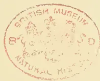A circular red ink stamp is centered on the page. The text "BRITISH MUSEUM" is arched along the top inner edge, and "NATURAL HISTORY" is arched along the bottom inner edge. In the center of the stamp is a heraldic crest featuring a lion and a unicorn flanking a shield, topped with a crown.

175------------------------------------------------

A black and white portrait of Alexander Harper, a man with a full beard and mustache, wearing a suit and bow tie. The portrait is set against a light, slightly textured background.

ALEXANDER HARPER.

176------------------------------------------------

<!-- stage4: FAINT old-images-only -->

[Faint page: no legible print of its own could be verified; text withheld (stage 4 review list)]

This image is a scan of a blank page. The paper has a light beige or cream-colored tint. There are several small, dark specks scattered across the surface, which appear to be dust or scanning artifacts. No text, lines, or other markings are present on the page.

177------------------------------------------------

This image is a scan of a blank page. The background is a uniform light beige or cream color. There are several small, dark specks scattered across the page, which appear to be scanning artifacts or dust. A faint, blurry, circular mark is visible in the center of the page, possibly a watermark or a smudge. The overall texture is slightly grainy, typical of a scanned document.

178------------------------------------------------

# \* The TROPICAL AGRICULTURIST \*

## ◇ MONTHLY. ◇

Vol. XVII.]

COLOMBO, SEPTEMBER 1ST, 1897.

[No. 3.

### “PIONEERS OF THE PLANTING ENTERPRISE IN CEYLON.”

(Second Series.)

ALEXANDER HARPER, J.P.

PLANTER AND MERCHANT:—1849—1889.

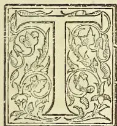

HE gentleman, whose portrait we present this month, is not one of whom much can be said; for, although an old and respected Colonist in his day and emphatically a Planting, Pioneer, he was among the most modest and unobtrusive of men, and as a relative has stated to us,—exceedingly reticent about himself. The district with which he was most identified is Matale East, where he came to own as well as manage the Mousakande Estate, before he was induced by Mr. George Wall to become a partner in his firm, and to do much of the work of visiting and inspecting the estates for which the Firm had the Agency.

But to begin at the beginning—and to give the purport of one or two slight sketches of Mr. Harper's career as put before us—we learn that Mr. Harper was born in the Parish of Birse, Aberdeenshire, of very respectable parents, his father being a man who took a firm stand for moral and religious life, at a time when evangelical doctrines and practice in those parts were rather dead. From a lawyer's office in Edinburgh young Harper came out to Messrs. Crowe & Co.,\* Colombo—then interested in planting as well as import business,—and

was engaged in planting in several places. For some time he was at work in the Galle district opening coffee land, but it turned out unsuitable. After that he was connected with the old “Ceylon Plantations Co.,” in Elkadua, and then went into business with George Wall and Captain Jolly, doing generally the Visiting Agent's work when Mr. Wall was in Colombo. Mr. Harper returned to Scotland in 1862, and for four years was Captain of Volunteers, making a most efficient officer; and then in 1869 when his first wife,—daughter of Andrew Cross, Esq., Sheriff Substitute of Perthshire, and a sister of Mr. A. L. Cross, so well-known and respected in Ceylon,—died, the widower returned to Ceylon and resided till 1872 on Mousakanda Estate in Matale East. Illness compelled him in that year to leave for Europe, and he never afterwards returned to the Island. In 1874, he sold his interest in Mousakanda to George Wall & Co., and in that same year, or early in 1875, Mr. Harper married for the second time, his bride being Miss Reid, eldest daughter of the Rev. W. Reid of Banchory-Ternan, Aberdeenshire. By his first marriage, Mr. Harper had one daughter, who became the wife of Dr. Leslie Milne now of Caledon, Cape Colony, son of the Rev. Dr. Milne, Parish Minister of Fyvie, Aberdeenshire; and one daughter and son by his second wife, but the boy died in infancy.

One of the most interesting parts of Mr. Harper's life was his residence and work in Italy. After his second marriage he resided a

\* Better known as Messrs. Crowe, Crabbe and Christian in the “forties” until Mr. Christian joined Messrs. J. M. Robertson & Co. and Mr. Crabbe returned to London, when the firm became A. & R. Crowe & Co.—Ed. T.A.

179------------------------------------------------

150THE TROPICAL AGRICULTURIST.[SEPT. 1, 1897.]

few years in Edinburgh, and then in 1879 he and his family went to Rome and passed the winters there till 1884, when Mr. Harper bought a small property "Torre el Praeto" near Florence, and spent the rest of his life there save for occasional visits to Scotland. Mr. Harper was much interested in agriculture in Italy, and began to pay special attention to the cultivation of Olives and Vines; but his health failed, and after a trying illness of five months, he passed away in April 1889.

Physically, Mr. Alexander Harper was one of the many fine strong young men that came from Aberdeenshire in the "forties and fifties." He has told Mr. A. L. Cross that when he first arrived in Ceylon, he could fell forest alongside of the very best Kandyan axemen; and so active did he continue in his habits that when he became a Visiting Agent he would often turn up at estates 20 miles from Kandy, while the Superintendent was preparing to muster his coolies in the early morning.

To the last his interest in Ceylon was warm and deep, though there can be but few in the Island now who can recall the tall manly form of the late Mr. Alexander Harper. One hears a great deal in the present day of Social Brotherhood; but we fancy (from all we have heard—not from himself of course, but from others) of Mr. Harper's good deeds, that there have been few men who made it more their aim to keep the helping hand always outstretched than the late Mr. Alexander Harper:—

'Tis ever wrong to say a good man dies.

## Agricultural Pests:

WITH METHODS OF PREVENTION,  
BY MISS E. A. ORMEROD

(LATE CONSULTING ENTOMOLOGIST TO THE  
ROYAL AGRICULTURAL SOCIETY OF  
ENGLAND.)

(Concluded.)

### VIII.—LIVER FLUKE, &c.

Slugs are injurious to almost every kind of crop. They belong to the division *Mollusca*. The true slugs may be generally described (when extended or in movement) as being long, more or less spindle-shaped, cylindrical or tumid, head prominent, "tentacles" (commonly known as horns) four in number, and two eyes placed on the tips of the uppermost pair of horns. When at rest or alarmed they draw themselves together into a lump. The field, or milky slug, *L. agrestis*, is a somewhat spindle-shaped kind, about an inch and a third long, grey in colour, and with milky slime, and is very common. The *Arions*, or black slugs, are distinguishable by the skin being wrinkled, and the shield on the back shagreened. *Arion ater* is as much as four inches long. The colour of these two kinds of *Arions* is very variable, and they are stated to lay their eggs separately under ground.

One very important point to be considered in methods of prevention is the circumstance that the slug can exude slime, so that it can "moult off," as it were, a coating of lime, or other obnoxious dressing thrown on it, and thus (quite getting rid of it together with the slime) be no worse for one application of any ordinary dressing. This moulting the slug can do a few times successively, but after the operation has been repeated two or three (or at least a very few times), the creature requires an interval to regain the power; the slime reservoirs, or power of exuding slime, are exhausted for the time being, and the obnoxious dressing consequently takes effect on the skin of the slug and kills it.

Where there is bad slug-attack in fields, attention is particularly needed to these points. On unoccupied land, such a heavy dressing of gas-lime, or quicklime or salt, may be put on, that wherever the slug crawls there is the obnoxious stuff, and it soon loses its slime-producing power and perishes. But very often, where crops are infested lime is only thrown in the middle of the day, or at any convenient time, just when the slugs are sheltered from the dressings falling on them, and as it soon slacks it does very little towards getting rid of the infestation. I have seen the slug resting as comfortably in the slacked lime as it would under a stone. Or again, if one dressing is given in the morning, or when the slugs are out at feed, it often happens that it is not followed up by another before the slugs can protect themselves. To do good the dressing should be thrown in the evening, when the slugs are at feed, and again the following morning. If the slugs should re-appear next evening, the dressing should be given again; but if it has been properly applied, probably there will be no need.

One or more kinds of the marsh, or water snails play a most seriously injurious part as "hosts" of the liver fluke of sheep, during the early stages of its life. The *Limnæus truncatulus* is the kind which is especially recorded as infested by the fluke in its early stages. Regarding presence of infestation in the *L. peregr*, there has been difference of opinion. These marsh snails wander about, and both kinds are nearly amphibious; they may be found in damp grass as well as in pools.

During the years in which I had personal knowledge of habits of *Limnæus* at Sedbury Park, in West Gloucestershire, *L. peregr* was excessively prevalent in small field ponds or drinking places, where floating water plants, weeds round the bank, and more or less mud, according to weather or season, gave every encouragement to their increase; but we only met with the *truncatulus* in one of these small pools. It would have been of considerable scientific interest (if we could have had technical examination by an expert) to find whether, in circumstances so congenial to *peregr*, the fluke infestation was perfected in it up to maturity, which it does not appear to reach in this species of snail, as observed in captivity. But, as a coincidence at least (whether of this, or of, great amount of rabbit presence), our sheep were constantly affected by rot to so serious an extent that it was stated by the bailiff he "never killed one with a sound liver." Neither snails nor flukes are connected with insect life, but this one parasitic attack is given in some degree of detail as an example of the very different successive forms which some of our farm infestations go through, and also of the very different localities in which they are to be found during their progress to maturity.

The following information is abridged from the history of the liver fluke, recorded from his own observations by Prof. A. P. Thomas.—"The liver fluke, *Fasciola hepatica*, lives in livers of various vertebrate animals, and, in this country, especially of sheep, as well as of rabbits and hares; it averages from about an inch to an inch and a quarter in length, and in shape may be described as not unlike a little sole, in width about half its length, flat, and largest towards the head end. At the tip of

180------------------------------------------------

SEPT. 1, 1897.]THE TROPICAL AGRICULTURIST.151

its head part is placed the mouth, in the middle of small sucker, and at the point where the head joins the flat body, on the lower surface, is another sucker. The colour is pale brown. The eggs, which are brownish and excessively minute, are passed down from the liver to the intestines, and thus distributed with the droppings of the infested animals. If the eggs fall in favourable circumstances for hatching (that is, warm weather on wet and marshy ground, or are washed into ditches or ponds), the embryo within develops in a period which may be of from two or three weeks to two or three months, according to temperature; then the contained embryo pushes off one end of the egg-shell, and swims away with great rapidity and activity. This embryo is described by Prof. A. P. Thomas, in his minutely recorded observations from life of this infestation, as being only about 1-200th of an inch in length, that is, almost too minute to be visible to the naked eye, and in shape not unlike a sugar loaf. In the centre of the largest end is a peg-like projection which is used as a boring tool, and can be withdrawn, or greatly thrust out, at pleasure. The embryo darts and circles about in the water, large and foremost, and if, in the course of its movements, it meets with the water snail (*Limnæus truncatulus*), it at once commences operations. It inserts its borer, and, spinning round and round on itself in the water so as to work the point in like a centre-bit, squeezes its way into the substance of the snail. Here the embryo settles into almost still life, and changes into an oval form, which, when complete, is known as a sporo-cyst, that is, a "cyst," or a bag or bladder, of germs. Within this bag, so to call it, about ten germs develop, known as "rediæ." Each redia as it is developed makes its way out of the sporo-cyst, and being furnished with a mouth and intestine, and two projections that answer the purpose of legs, it feeds on, and makes its way about within, the body of the snail.

Up to this point it will be seen there are four distinct stages of fluke life—the egg: the free swimming embryo; the quiet form of the sporocyst, altering to a mere bag of developing germs; and the germs called rediæ, free from the bag, and feeding on the snail, which ultimately (for the most part) sinks under the parasitic attack. Continuing the history from the same observations, it is shown that in each of these rediæ there form (as in the sporo-cyst before mentioned) a number of germs, but different to these in shape. The germs (the rediæ) that formed in the sporo-cyst are long and narrow, about the sixteenth of an inch in length, and about one-fifth of their length in width; but the germs which form within the rediæ are exceedingly like tadpoles, being oval and flat, and furnished with long slender tails more than twice the length of the body.

These "fluke tadpoles," so to call them, are technically called cercariae, meaning animals with tails. On the escape of each cercaria from the rediæ in which it was formed, it makes its way from the body of the snail into the water (if in a pond or ditch), but shortly attaches itself to water plants, or whatever may be accessible. There it draws itself up into a round ball, exudes a gummy secretion, wags its tail violently, till at last the appendage, which has now ceased to be useful, is thrown off, and the gummy substance hardening, the cercaria remains within the covering as a little white spot on the plants, or on the locality to which it has attached itself. It is mentioned, however, by Prof. Thomas that "if the infested snails are crawling on the margin of a ditch or over a damp field, the cercariae, on leaving the snail, at once proceed to form their envelopes or cysts at the bottom of the grass, and so attach themselves to the stalks or leaves near the roots." The next step completes the circle of infestation. When the grass, to which the white speck-like cysts containing the young liver flukes adhere, is eaten by the sheep, or other suitable hosts (as rabbits or hares &c.), the young fluke comes out of the covering, and passes to the liver

of its host, increasing in bulk, after being swallowed, from about the eightieth of an inch, to the adult length of an inch or an inch and a third.

Amongst methods of prevention and remedy mentioned by Prof. Thomas are the following:—

Care must be taken to avoid introducing eggs of the fluke either with manure, or with fluke sheep, or in any other way. Rabbits and hares must not be allowed to introduce the eggs.

Dressings of lime, or salt, should be spread over the ground at the proper seasons, to destroy the embryos, the cyst of the fluke, and also the snail, which acts as "host."

Sheep must not be allowed to graze closely, for the more closely they graze, the more fluke germs will they pick up.

When sheep are allowed to graze on dangerous ground, they should have a daily allowance of salt, and a little dry food.

Amongst the details of treatment, of which the above is an abstract, is the observation:—"The freedom from rot of sheep feeding on salt marshes is well known, and is now shown to be due to the poisonous action of the salt on the embryos, sporocyst, redia, cercaria, and cyst, and to its similar action on *Limnæus truncatulus* itself. Even a weak solution of salt in water (containing only  $\frac{3}{4}$  per cent. of salt) proves fatal to this snail.

This principle of prevention would be especially applicable where (as in the instance, before mentioned, in West Gloucestershire) it was the custom to have exceedingly small ponds or cisterns of mason work open to the field on one side and very shallow, and only a few yards square. From the immense quantity of weed or grass growth in or at the edges of these so-called "cattle-drinks," and sometimes the quantity of mud (which is stated to be the especial place of deposit of spawn of the *Limnæus truncatulus*), there was every circumstance that was good for shelter, or propagation, of either *truncatulus* or *preger*; and in circumstances like these a very small outlay on salt would carry destruction with it to the snails and the fluke embryos in the water. Clearing the various vegetable trash, and sprinkling some salt on the mud and into the water, would cost little, and from the details given would, in many cases, strike *in embryo* at infestation which presently, when dispersed over the field, would be far more difficult to deal with.

THE END.

## ARECA-NUT CULTIVATION IN INDIA.

### IN THANA.

The betel-nut is grown largely in Thana, Bombay. The best nuts are carefully selected in October, and dried in the sun; unhusked nuts are considered best for seed. They are planted in a well-ploughed plot of land in pits three inches wide and three inches deep, and at a distance apart of from six inches to a foot. For the first three months the young palm is watered at least every fourth day, and afterwards every third day. When the plants are a year or a year and a-half old they are fit for planting out.

The selling price of young plants varies from 6 pies to 1 anna.

The betel palm usually grows in red soil, but it flourishes best in sandy soil that remains moist for sometime after the rains. Before planting the young palm, the ground is ploughed, levelled and weeded, and a water channel is dug six inches deep and a foot and a-half wide. The pits 9 inches deep and two feet wide are dug at least four feet apart, nearly full of earth, but not quite full, so that water may lie in them where the soil allows; plantains are grown in the beds to shade the young palms. Except during the rainy season, when water is not wanted, the young trees are watered every second day for the first five years and after that every third or fourth day. During the rains the manure is sometimes given.

The cost of betel-nut cultivation in Thana is calculated as follows:—An acre entirely given to betel palms would, it is estimated, hold 1,000 trees. The

181------------------------------------------------

152THE TROPICAL AGRICULTURIST.[SEPT. 1, 1897.

total cost of rearing 1,000 betel palms for five years—that is, until they begin to yield—is about £127. 13s., including compound interest at 9 per cent. After five years a thousand trees are estimated to yield about £50 a year, from which, after taking £18 14s. for watering assessment and wages and £11 9s. 11½d. as interest at the rate of 9 per cent on £127 13s., there remains a net estimated profit of £19 16s. 3½d., or 15-52 per cent.

#### IN BENGAL

The supari, or betel-nut is common in Eastern Bengal, especially in Tipperah, Backergunge, and Dacca; and its cultivation is very profitable to proprietors of land. It bears fruit in the eighth year, and is most productive from that time to the sixteenth year, when the produce falls off. The nuts are gathered in November.

Betel-nut cultivation is very extensive, especially in the Police circles of Tubkibagara and Hajigunge. A considerable trade in this article is carried on with Dacca, Naraingunge, and Calcutta. The cultivators of the palm usually own a large piece of ground, slightly raised above the level of the surrounding country, and surrounded by ditches. In the centre of this they build their dwellings, and all round them they plant betel-nut trees. An acre of land will obtain about 3,000 trees. When first planted the betel-nut requires to be protected from the sun; for this purpose rows of madar trees are planted between the lines of betel-nut trees, and the growth of jungle is encouraged. When the betel-nut trees have grown strong, and no longer require the shade, the cultivators are too lazy and thoughtless to remove the jungle; and the result is that whole pergunnahs which were once fully cultivated are now covered with dense jungle, in which even the betel-nut trees cannot grow; while thousands of the inhabitants have been swept away by cholera and malarious fever of a very virulent type. The unhealthiness of the neighbourhood of betel-nut plantations is variously attributed to the dense jungle and under-growth above mentioned, to the exhalations from the trees, and to the malarious gases generated by decomposing vegetable matter in the ditches surrounding the plantations. The betel-nut trees grow to a height of about 60 feet; and in some pergunnahs they are cultivated to such an extent as to almost entirely exclude rice cultivation.—*The Indian Agriculturist*.

### PLANTING IN JAVA.

#### TEA—ARABIAN COFFEE—LIBERIAN COFFEE.

We mentioned lately that the M. M. steamer "Oceanien" brought back to Ceylon, after a visit to the Straits, Mr. John W. B. Davidson, engineer of Messrs. Walker, Sons & Co., who set out in May last, chiefly with the object of doing business for his firm in the way of supplying coffee machinery to the planters in Java. Leaving here by P. & O. steamer in May, he made no stay at Singapore, but took the first steamer to Batavia, which he reached on the 27th of May. From Batavia he visited the tea districts, situated at an elevation of about 3,500 feet, and which are reached by means of a narrow-gauge railway in three hours. This railway he describes as very suitable to the needs of the country and the trains only capable of improvement in being furnished with a refreshment car, as the Ceylon trains are, instead of the refreshment arrangements being confined to a few stations on the route. His halting-place was Tjiwangie estate, a place of over 1,600 acres owned by a company, but having an Englishman, who is a part proprietor, in charge. Here he made his headquarters, and, going round the district, he says, he saw

#### TEA THAT SURPRISED HIM

very much indeed. "The growth and appearance of the bushes," he remarked, "were a great way ahead of anything I had seen in Ceylon in that time; in fact, tea 18 months old was something similar to the tea here three years old. The soil was far superior to the Ceylon soil, and they do not bother about weeds,

and neither have they to manure. I must say I am rather surprised that more Englishmen do not go there, for there are only two Englishmen in the place that I know of, and they are keen on getting some of their fellow-countrymen there. I suppose I visited nine or ten estates in that district—all good, and furnished with well-equipped factories. Their process of manufacture is not like ours; they do not go in for withering to the same extent that we do, their tea being sun-dried, which entails a lot of work, and does not give good results. A fair proportion of the tea I saw was in full bearing.

#### ARABIAN COFFEE.

After leaving there I went to the East of Java, where there is nothing grown except Arabian coffee. This part is where Mr. Turing Mackenzie is, but I did not meet him, and only made a short visit there.

#### LIBERIAN COFFEE.

I next went to Samarang, where there is a great deal of Liberian coffee planted, and I saw it in various stages of growth, and noted that there was a great deal of disease amongst the trees. I also saw a quantity of cocoa; but this year's crop is awnutter failure, owing to disease. I rode through a great many miles of coffee, planted by Government, which struck me as a novelty. The Government there plant up coffee, and what they grow is gathered by natives and pulped in the native villages. While going through the same district I saw some very fine teak forests. The Government goes in largely for plauting teak trees, and lets out the forests to different people after the trees are in condition for felling. It was all beautiful teak wood. Then I returned to the tea district again, and visited one or two of the estates I had not previously seen, and then returned to Ceylon, having given up the idea I had of visiting Sumatra, and having practically also abandoned, for want of time, my visit to other parts of the Straits, though I called at Penang on the way down. Liberian coffee in Java is in a bad way at present, owing to low prices, as it barely fetches half what it did last year. Only the really first-class estates are maintaining the old high prices, and there is a great deal of disease about. Those who have Arabian coffee are still getting good prices, and there is some very good Arabian coffee in the place. I saw some over 100 years old and still bearing fairly well; but Liberian has gone down in price, and the disease trouble cannot be accentuated too much.

Mr. Davidson added that, professionally, his trip was a success, and his firm will be occupied for some time yet in executing the orders he brought back with. —Local "Times."

FEVER IN PLANTS.—Mr. H. M. Richards, who has previously studied the effect of wounds on plant-respiration, now describes (*Annals of Botany*, xi., 29) a course of experiments on the evolution of heat by wounded plants. He finds that accompanying the increased rate of respiration is an increase in the temperature of the parts affected. A kind of fever supervenes, and as in the case of respiration, the disturbance runs a definite course, and attains its maximum some twenty-four hours after injury. It is interesting to note that the attempt to rally from an injury is accompanied by somewhat the same symptoms, increased rate of respiration and evolution of heat, in plants as in animals. Owing to the nature of the case the re-action is less obvious in the former than in the latter, and a delicate thermo-electric element was required to appreciate the rise in temperature; but compared with the ordinary temperature of plants in relation to the surrounding medium, the rise after injury is "as great, if not greater than in animals." The maximum in all the plants investigated was between two and three times the ordinary excess above the surrounding air. Potatoes proved the most satisfactory objects for experiment, and it was found that in massive tissues (such as Potatoes or Radishes afford) the effect of injury was local, whereas in the case of leaves (e.g., Onion-bulbs) a much greater extent of tissue was sympathetically affected.—*Natural Science*.

182------------------------------------------------

SEPT. 1, 1897.]THE TROPICAL AGRICULTURIST.153

## OUT WITH THE INDIA-RUBBER GATHERERS.

INDIA-RUBBER : ITS COLLECTION AND CULTIVATION

IN NICARAGUA.

By ROWLAND W. CATER.

AT or near the month of all the large rivers on the Mosquito Coast will be found the bungalow of a trader, generally English or American, fitted up as a shop, and stocked with cloth, tinned and other provisions, rope, tobacco, rum, gunpowder, and similar necessaries. When the unsophisticated Indian from the interior has collected a canoe-load of Jungle-produce, such as rubber, vanilla beans, sarsaparilla, herons' feathers, gold, deer, Jaguar, and puma skins, &c., he pays a visit to the trader, and an exchange of commodities is promptly effected. Hard cash plays a very small part in these transactions. In due course the merchant ships the produce to New York or London, reaping a profit of—I am almost afraid to say how much per cent.—two or three hundred perhaps. At any rate the trader speedily makes a fortune large enough to recompense him for his banishment from some more civilised country.

Many of these merchants are large employers of labour in the shape of mahogany cutters and rubber collectors. The men, Indians and Caribs mostly, bind themselves to a patron for a certain period and become practically serfs. The laws regulating these 'mozos matriculados,' as they are called, are very severe and strictly enforced. The patron or master supplies provisions, implements and perhaps a small sum of money in advance, and each mozo is constrained to be diligent, and to return with the fruits of his labour at the expiration of the term. Rubber gatherers (huleros) are obliged to deliver one half of their cancho to their employer and to sell him the remainder at the current market price, less the value of the provisions, &c., previously advanced. But the patron almost invariably keeps a shop. He does not pay for the huleros' share of the rubber in cash, but mostly in goods. Consequently all the evils of the truck system are rampant.

A large proportion of the rubber exported from Nicaragua comes from the Prinzapulca district. At the mouth of the Prinzapulca River—called Apnlca in some maps—there is a village where scarcely a week passes without the arrival or departure of huleros, and there I found myself during my travels on the Mosquito Coast. My host was one of the principal traders, an American, whom I will call Hayes. In his employ were many rubber collectors, so that I experienced no difficulty in making arrangements to accompany a gang into the interior. This comprised six men, four Mosquito Indians of pure blood and two Caribs of negro type.

We started at daybreak in the usual frail dug-out, and at nine o'clock the following morning reached the point from which the huleros intended to take to the woods. Disembarking, we concealed the canoe in a sedge thicket, and after a meal of boiled rice and salmon, set out across a sandy plain in the direction of a coneshaped hill. José, one of the Caribs, informed me that the rubber trees are usually found in groups of twenty or thirty, and that he had often travelled for days together without discovering a single one.

'Dis time, sah,' he added, 'we go straight to big lot. See dem long time ago.'

But José was unaware of what the elements had in store for us. A belt of forest intervened between the plain and the hill which was our landmark. I noticed pine trees, cedar, oak, and mahogany, interspersed with wild cherries and cacao, ceibas, or silk-cotton trees, and here and there a guayava, not unlike an apple tree, but with more foliage. This is the white guava, from the fruit of which the famous jelly is made. It grows to a height of twenty feet, and is to be found in many dry jungles as well as in almost every garden or patio. The apple-

shaped fruit is a little larger than a hen's egg, smooth, and somewhat resembling a small lemon when ripe. Inside is an aromatic pulp full of small white seeds. The red guava of the West Indies is more acid and less agreeable.

We had cut our way through some miles of this forest, and had just reached a part where the undergrowth and creepers were less dense, when one of the Indians stopped suddenly and uttered an exclamation. A peculiar sound, between a moan and a sigh, was creeping through the woods; the tops of the trees were in motion.

'Huracan, señor!' shouted the Indian in a tone of alarm, and all set off running as fast as they could.

I followed, buffeted by branches and climbing plants, and torn by thorns at every step. It was a desperate race to get into the open and out of danger before the dreaded hurricane should overtake us. In speed I was no match for those practised woodmen. They left me behind. The forest swallowed them up. But I could hear their shouts and the crashing of bushes as they tore their way, and I struggled on until I could run no longer. In a cleft of a big rock on the outskirts of the wood I crouched and waited for the storm to pass.

It came quickly. The murmur swelled to a roar.

The sky grew black almost as night. Branches and twigs fell in showers. Great trees bent and swayed as reeds, groaning like giants in torture. Soon crash followed swiftly on crash as the older monarchs of the forest were swept down. Some, stripped of every branch, defied the fearful blast, comparatively safe in their nakedness. Others were torn up entire, and carried yards away from the great pit their roots had left behind. But while the tornado raged, even if I had dared to look out from my place of refuge, it would have been impossible to distinguish anything, except perhaps when a flash of lightning revealed the hurling mass of leaves and branches overhead and all around.

As suddenly almost as it came, the hurricane swept onward and passed, followed in its course by myriads of twigs and small boughs, drawn forward it seemed by suction. For long afterwards these floated in the direction taken by the storm, resting apparently on the thick cloud of dust which seemed to reach from the ground to the tops of those trees that had withstood the storm.

No hurricane so terrific had visited Central America for many years, but luckily it was confined to the coast. Adjectives are of small use to describe its effects. These provided the Indians with a topic of conversation for months, and very marvellous were some of their stories.

An old man walking beside a river was said to have been lifted up and deposited on the opposite bank. An Indian who had lost his horse discovered it in the fork of a tree thirty feet from the ground, and was compelled to fell the tree to recover it. Whether it remained sound in wind and limb the more or less veracious chronicler omitted to state. Another found in his garden a row of banana trees which he had not possessed before. Great was the mystery until the owner of an hacienda many miles away identified them as his property. Some of the tales might be true—*¿Quién sabe?* Nobody is obliged to believe them. But I can testify that the hurricane was a very bad one, as also do the many wrecks remaining to this day on the beach near the mouth of the Prinzapulca and other rivers.

Pushing on over the debris, I eventually reached the hill, and there found the huleros, who had sheltered in a cave with which they were acquainted.

From the hill-top the keen-sighted fellows marked down several clumps of rubber trees not in the track of the hurricane and set out in couples to tap them. I accompanied José and Pete, the Caribs, both of whom spoke English after a fashion of their own.

Here I should observe that the best and purest rubber comes from the great forests intersected by the Amazon and its many branches. It is known

183------------------------------------------------

154THE TROPICAL AGRICULTURIST.[SEPT. 1, 1897.

as Pará rubber, and is obtained from several species of Hevea. The India-rubber plant of our greenhouses is *Ficus elastica* of India, generally epiphytic, the seeds germinating at the top of forest trees, whence are sent down numerous aerial roots. Rubber, or caoutchouc as it is called commercially, is also obtained from species of Manihot, Landolphia, Willughbicia, &c., in addition to the subject of this paper, the *Castilloa elastica* of Mexico and Central America.

The *Castilloa* grows to an average height of sixty feet, and throws out its huge branches, many of them a yard in diameter, at a considerable elevation. The bark is of a dark slate or ash colour; the leaves measure from ten to eighteen inches long, are elliptical, glossy, closely veined, and paler beneath than above. They usually grow at the end of the boughs in compact groups of three. The fruit consists of a capsule comprising three divisions, each containing a large seed, white, irregularly marked with black.

The best season for tapping is from August to February; and the operation should be performed early in the morning, before the daily rain, or in the evening after the rain has fallen. In the latter case the milk should be coagulated as soon after sunrise as possible next morning.

The milk, or sap, is white, and of the consistency of cream. The tree thrives best in moist but not marshy forests on a warm sandy clay. It seeds in the tenth year, and ought not to be tapped before its eighth year, or its growth may be much retarded.

On reaching the group of trees, which numbered seventeen of various sizes, my Carib friends first cut away the twining creepers that almost hid the trunks, and then carefully removed a couple of burrachas, natural ropes of rubber, formed in the following manner. From incisions in the bark, possibly caused by woodpeckers or some insect, the juice often exudes, trickling down the trunk, in and out of the encircling creepers, and sometimes reaching the ground. The milky stream coagulates and turns black as it runs, forming a long strip or cord, with which the *huléros* often tie up their bales.

The parasites removed, Pete and José strapped on their *aspuela* (climbing spurs), fastened at the knee and ankle, and having dug a small pit or basin at the foot of each of a couple of trees, passed a ring of stout rope round the trunks and their own waists, and walked up with their machetes between their teeth. By lifting the rope at every step they were enabled to stand almost erect, and when lying back in the ring both hands were at liberty.

José, whom I watched closely, commenced operations immediately before the first branch. With his broad-bladed sword he cut in the bark a horizontal canal which almost encircled the trunk and terminated in a V-shaped angle. From the point of the V downwards he next cut a perpendicular canal about two feet in length, which joined another horizontal channel ending in a V, and so on to the ground. In the last cut he inserted a large green leaf to serve as a funnel and guide the milk into the basin.

The Brazilian rubber collectors always place a receptacle of tin or earthenware in the hole at the foot of the tree to prevent the admixture of grit or other foreign matters; they also strain the milk through coarse muslin; hence the greater value of Pará rubber. But Nicaraguan methods are primitive.

The sap runs down the incisions to the basin, where the water evaporates. Artificial heat is employed to hasten this evaporation in Brazil, but happy-go-lucky Nicaraguans leave the process to nature. When the *huléro* is of opinion that no water remains, he makes a decoction of liana vines, or of a kind of *convolvulus*, and adds it to the juice in the proportion of one pint of the former to a gallon of the latter, when the sap immediately coagulates and forms india-rubber.

When the sap had ceased to run, my Carib companions ought to have filled up the canals carefully with mud or clay. There was a stream close at hand, but they did nothing of the kind. Consequently, when next they passed that way, the trees would

probably be dried up and sapless. It is said that a kind of wood-leech attacks the tapped *Castilloa*, introducing itself through the channels, and so injures the tree as to cause its eventual decay. This the clay would prevent, and at the expiration of six months the tree might be again tapped, with as much profit as on the first occasion. I took José to task on the matter.

'Plenty *hulé* heab, sah,' he answered, grinning. 'Me find ten—twenty *nio* trees while 'um doin' dat. An' what good? Perhaps I ueber come heah no mo.'

To that I had nothing to say. The forests are No Man's Land, and another *huléro* would probably have reaped the fruit of his labour.

The heated air speedily evaporated the water from our rubber milk, and the necessary coagulation did not occupy much time, though the process appeared to me very wasteful. With this I will deal presently, however. While the evaporation was taking place other trees were being tapped. When the sun sank the Caribs left off work. We slept beneath the rubber trees, as is the *huléros'* custom. All the day following the Caribs toiled, and at sunset we returned to the dug-out, José and Pete carrying about forty pound of rubber each. The *Indiús*, who had been less successful, were awaiting us. Next morning we ascended the river still farther and again entered the forest, leaving two men with the boat to take care of the rubber and pack it in bales.

Dishonest *huléros* frequently put stones and pieces of heavy wood in the middle of the bales to increase the weight. But the merchant usually pierces every package with a sharp-pointed steel rod, so the rogues seldom escape detection.

At the expiration of ten days, being then four days from the mouth of the river, we commenced the return journey, towing the bales of rubber behind the dug-out. We did not escape the usual capsizes; but as each man had a life-buoy in the shape of a waterproof bag, and, besides, could swim like a fish, nothing more serious than a wetting resulted, and that we could not avoid on land.

These rubber bags, which a native of this coast is seldom seen without, are made by the *huléros* as they go along, so to say. A sack of unbleached calico is stretched on the ground, and painted over with rubber milk, a coconut husk serving for a brush. When the first coat is dry the operation is repeated, three coats being necessary before the bag is fit for use. The result is a waterproof article, rather heavy, but in every other respect far superior to any manufactured in Europe. Before setting out in their trail canoes, the natives take care to inflate their bags and tie up the mouth. Thus the sack forms a receptacle for clothes, a pillow on land, and a life-buoy in the event of an accident upon the water.

On arriving at what was left of Mr. Hayes' bungalow, for the hurricane had not spared it, I had several discussions with that gentleman in reference to the practical cultivation of *Castilloa elastica*. The result of my inquiries on the Mosquito Coast and in other parts of Nicaragua are here summarised.

The subject has been ventilated by many private persons in addition to the various Central American governments, and in Nicaragua a bounty of ten cents native currency is paid for every tree planted. As the world's supply is rapidly diminishing, while the demand is increasing by leaps and bounds, there appears to be a magnificent field for Englishmen with capital. Certainly, unless the output is soon increased, manufacturers of rubber goods may have to fall back upon substitutes. In Mexico there are English and American Companies already at work, but, except two plantations in the Chontalca district, I am not aware of anything of the kind in Nicaragua. That the industry would be exceedingly profitable has been demonstrated by the results of many experiments; and when I say that neither coffee, tea, cocoa, sugar, bananas, indigo, nor hemp growing would pay so well as the cultivation of india-rubber

184------------------------------------------------

SEPT. 1, 1897.]

THE TROPICAL AGRICULTURIST.

155

trees, I speak on the authority of Mr. Hart, F.L.S., of the Botanical Gardens, Trinidad.

In March of last year I visited a plantation in Chontales, which, strange to say, is the result of native enterprise. It then comprised one thousand trees, well developed, of hardy appearance, and as large as a good-sized apple tree. An early maturity seemed assured.

Señor Romero, Mexican Minister to the United States, in an article published in the *India-rubber World* (New York) for April 1892, estimates that each sixty-year-old tree, planted at intervals of fifteen feet, will have cost eight cents U.S. currency, and will yield six pounds of rubber. Other authorities fix the yield at maturity as high as fourteen pounds of rubber. It depends on whether the season has been wet or dry, and whether the trees are well or badly cultivated.

In order to be on the safe side, I propose to estimate the cost to the end of the eighth year at 18 cents U.S. currency, or 9d. per tree, and the eighth year's average yield at five pounds of rubber. The market price of good Central American rubber is 2s. 4d. per lb. Pará rubber fetches from 2s. 3d. to 3s. 6d. per lb.; and if gathered and coagulated in the same cleanly manner, rubber produced in Nicaragua should be worth as much. Nevertheless, I prefer to estimate on a selling-price basis of 2s. per lb. only. The result at the end of the eighth year of an acre plantation comprising 193 trees planted fifteen feet apart would be as under, including the premium of ten cents native currency—say 3d.—per tree paid by the Nicaraguan Government.

<table border="0">
<thead>
<tr>
<th style="text-align: left;">Dr.</th>
<th style="text-align: right;">Cr.</th>
</tr>
</thead>
<tbody>
<tr>
<td>Cost of cultivation for the term of eight years, with seed, &amp;c., of 193 trees at 9d. each.....</td>
<td style="text-align: right;">Government premium of 3d. per tree..... £2 8 3</td>
</tr>
<tr>
<td>Cost of tapping or harvesting.....</td>
<td style="text-align: right;">Yield of 193 trees at the end of the eighth year —965 lb. at 2s. per lb..... 96 10 0</td>
</tr>
<tr>
<td>To balance.....</td>
<td style="text-align: right;">8 3 0 6</td>
</tr>
<tr>
<td style="text-align: right;">£98 18 3</td>
<td style="text-align: right;">£98 18 3</td>
</tr>
<tr>
<td>Profit.....</td>
<td style="text-align: right;">£88 13 6</td>
</tr>
</tbody>
</table>

I arrive at the cost of tapping, or harvesting, in the following manner: A *hulero*, working in the dense, overcrowded forest, can tap four wild, creeper-grown trees in a day; therefore it stands to reason that, in a plantation where the trees are weeded and cleaned of all superfluous growth, he could tap five at least, and also plaster up the cuts with mud. Thus the 193 trees would occupy him 39 days. A *mozo* in Nicaragua is well paid if he earns fifty cents native currency, or say 1s. 3d. per day, but I have calculated his daily wage at rather over 1s. 6d.

Supposing that the plantation comprises five hundred acres, then, on the above figures, the eight years' profit would amount to the enormous sum of £14,337, 10s. And the yield increases every year, with no outlay except for weeding and harvesting.

The gross capital expenditure for the eight years I estimate as under:

<table border="0">
<tbody>
<tr>
<td>Cost of 500 acres of land at 5s. per acre.</td>
<td style="text-align: right;">£125 0 0</td>
</tr>
<tr>
<td>Surveying and procuring titles thereto.</td>
<td style="text-align: right;">100 0 0</td>
</tr>
<tr>
<td>Clearing land for planting.....</td>
<td style="text-align: right;">1000 0 0</td>
</tr>
<tr>
<td>Collecting seed and planting.....</td>
<td style="text-align: right;">500 0 0</td>
</tr>
<tr>
<td>Eight yearly weedings at £200 each....</td>
<td style="text-align: right;">1600 0 0</td>
</tr>
<tr>
<td>Extras, implements, &amp;c.....</td>
<td style="text-align: right;">300 0 0</td>
</tr>
<tr>
<td></td>
<td style="text-align: right;">£3625 0 0</td>
</tr>
<tr>
<td>Interest on £3625 for eight years at five per cent. per annum.....</td>
<td style="text-align: right;">£1450 0 0</td>
</tr>
<tr>
<td>Planter's expenses, cost of living, &amp;c., for eight years at £200 per annum.....</td>
<td style="text-align: right;">1600 0 0</td>
</tr>
<tr>
<td>Cost of gathering the eight year's crop.</td>
<td style="text-align: right;">1500 0 0</td>
</tr>
<tr>
<td></td>
<td style="text-align: right;">£8175 0 0</td>
</tr>
</tbody>
</table>

I have included in the above the cost of maintaining the planter during the eight years that should elapse before the *Castilloas* are tapped; but it

should be borne in mind that when the trees are planted fifteen feet apart, coffee, sugar-cane, cotton, cacao, and other shade-loving plants, yielding yearly crops, may be grown between them, and their produce should maintain the planter. But adding five per cent. interest, the planter's expenses, and the cost of harvesting, there still remains a net profit of £36,162, 10s. Estimating the value of the ninth year's yield at £50,000, and deducting £200 for the annual weeding, £1,500 for the cost of harvesting, £180 for interest, and £100 for the planter's expenses, the net profit for that year will amount to £47,620, which is a pretty good return for a net capital outlay of £3,625. Of course it will be necessary to maintain a nursery of young plants to fill vacancies caused by accidents and replace trees when their rubber-bearing life is over; but the cost of such a nursery would not be great. And one must not count on the Government premium being paid in perpetuity.

In reference to the life of a rubber tree and its increasing productiveness, the following extract from *The World* (New York) of 21st August 1892 will be of interest:

'Three young trees transplanted from the forest to a cultivated field in Soconusco, Mexico, are now said to be seven feet in diameter, and have yielded rubber for more than thirty-five years; the present product averaging more than fifty pounds of gum per year.' The average increase is generally estimated at one pound of rubber for each year of the tree's life up to a certain age, which, however, I am unable to fix.

On the eastern side of Nicaragua, and especially in the Mosquito territory there are immense tracts of land suitable for the cultivation of *Castilloa elastica*. In choosing land, shelter from strong winds, the greatest enemy of young *Castilloa*, should be kept well in view. The seeds should be sown in a nursery bed shaded from the mid-day sun, and the young plants transferred to the hacienda when twelve months old. For each plant a hole should be dug three feet in diameter and one foot deep, and filled with fine loamy soil to which a little sand has been added. The mixture should be well-trodden down and watered night and morning for two days, when it is ready for the young *Castilloa*, which must be placed in its new bed at exactly the same depth as in the nursery; if it is weak, a stake support is very desirable.

Trees tapped in the wet season are estimated to yield five times as much milk as in the dry. The quantity of rubber produced therefrom depends to a great extent on the coagulating agent employed. Sixty per cent. of the milk ought to be turned into rubber. A very good agent is one ounce of alum dissolved in sixteen ounces of water. But a weak alcoholic solution will give even better results, for the process is immediate, and the solution may be used many times. In my own experiments I never lost more than forty per cent. of the bulk, and often only thirty-five per cent.

That the cultivation of *Castilloa elastica* is worth the attention of the thousands who are seeking really remunerative investments there cannot be the slightest doubt, and this the author intends to show in a work on the whole subject of india-rubber which he hopes to publish shortly. For success careful study and inquiry is imperative.—*Chambers's Journal*.

## THE DISEASES OF PLANTS.

Throughout a long series of years the pages of the *Gardeners' Chronicle* have from time to time conveyed much information regarding the diseases and ills connected with plant life—and its work continues, for the foes still advance. Now-a-days, however, the prevention and remedy of disease come more to the front, and naturally this aspect appeals to the cultivator of plants. There has never been any lack of suggestions for the cure of disease in our gardens and plant-houses, yet within the last ten years of thereabouts, remedies may be said to have showered on us at all times and in all kinds of gardening periodicals, till one feels lost in the numbers,

185------------------------------------------------

156THE TROPICAL AGRICULTURIST.[SEPT. 1, 1897.

and when a pest appears amongst our plants it is difficult to know what to do.

The subject of diseases of plants is a wide one, too large to be successfully grasped, even after long experience, while in many points there is too much obscurity as to the cause of disease to allow of successful treatment of cure. From the multitude of diseases liable to appear amongst plants, two classes stand prominently forward: (1) those due to the action of parasitic plants particularly Fungi; (2) those due to injurious animals, particularly Insects. The remaining diseases have their cause in adverse soil conditions, in mistakes of cultivation, in defects in the plants themselves, or in other causes at present difficult or impossible to make out. In the present series of papers it is proposed to deal with the first class of diseases only—with those caused by the action of injurious plant-organisms on such plants as are useful to the out-door or in-door gardener. Diseases of this class are sufficiently common and disastrous enough in their results to be only too familiar, and their importance needs no further emphasising than to recall the ravages of Potato Disease, Vine Mildew, Damping-off Fungus, and the Hollyhock Rust of former days, not to mention the thousand-and-one mildews, rusts, and blights of less consequence. The subject of fungi is, to the ordinary gardener or cultivator of plants, one fraught with many difficulties arising from the minute structure and complex life-history of these tiny organisms, and any text-books available tend to bring these very difficulties into prominence. This is no doubt necessary and valuable in its way, yet we believe that, as in a "first aid" ambulance training, it is possible by a few exact observations to know enough about a funguspest to understand how to proceed against it. We do not then propose to deal with the fungi themselves any more than is necessary to understand them, but refer the seeker after detail in this direction to the books, some of these are—*Diseases of Field and Garden Crops*, (1884) Worthington G. Smith; *Diseases of Plants*, Professor Marshall Ward; *Diseases of Trees*, Somerville (Macmillan, 1895); *Diseases of Plants due to Cryptogamic Parasites*, Translated from the German by William G. Smith (Longmans, 1897).

For all kinds of plant-diseases the treatment is one of two kinds: (1) preventive, aimed at keeping the disease away altogether; (2) remedial, which aims at destroying the offence. To prevent disease is more truly the work of a gardener than to cure it, for, after all, his efforts towards remedy cannot go much beyond the stage of "first aid;" if more be needed, the specialist should be applied to. To keep one's plants free from disease requires more skill, foresight, and experience than to try remedies; it also demands great patience, for, as it were, the results are negative, no disease appears; but, on the other hand, the value of the crop repays all the extra care in raising. WILLIAM G. SMITH, Edinburgh.—*Gardener's Chronicle*.

### LIBERIAN COFFEE.

The extension of Liberian coffee cultivation in S. India, in many cases in an experimental stage, in others on a more extensive scale, is ample excuse for my calling attention to the results actually obtained in Ceylon, and a district where there is very so far old Liberian coffee not a thousand miles from Cape Comorin.

#### LIBERIAN IN CEYLON.

In Ceylon in the latter seventies there was a considerable amount of land planted with what was fondly hoped was going to replace the Arabian variety. The original plants were planted at too high an elevation, and not making any satisfactory growth were removed to a lower elevation, where they thrived admirably, and I believe brought in the fortunate proprietors as much as 4 ar. a cherry. What has become of all the Liberian planted in Ceylon at that time is not hard to say, as it has practically disappeared, and to such an extent that not long ago I saw Liberian coffee cultivation alluded to as a new product in a Ceylon paper. The causes of its disappearance were various, in many places the soil was unsuitable and probably the treatment, and the coffee

more or less came to an untimely end by starvation, death being in many cases accelerated by a mamoty. The low price of the coffee was another great cause; I think about 1884 it was only worth some R5 a bushel of rice coffee. This cause led to the cutting out of some decent coffee, some that I saw being so well grown that hitching an elephant on to the trees was considered a cheaper and more efficacious system of removal than by coolies. There was yet another cause, a cause that I hope Indian planters may be spared, and that was bug. Bug obtained such a hold on the coffee, and throve so well, that the only way of getting rid of the bug was cutting out the coffee. At the present day I see the Delgolle Company refer to Liberian coffee, of which they have a considerable acreage of young coffee, in a most discouraging way, both as regards present crop and future prospects. As the result of all the Ceylon experience, it may safely be inferred that Liberian coffee wants good soil. Crossing the water there is some old Liberian to be found which bore well and steadily for years, but is now unfortunately in a very unhealthy state.

#### LIBERIAN IN INDIA.

One clearing along a stream being, I believe, affected by the extensive felling of the forest on both sides which must have had a great effect on the moisture during the dry seasons, and another clearing, which was under heavy forest shade, has been terribly damaged by thinning the shade so much so that it is being densely planted up with artificial shade in the hope it may save it. There would be nothing very serious in this as it would only point to shade being a desideratum for Liberian, but the most serious thing is the failure of young coffee planted three to four years ago, even when planted with shade. This would, I think, point to deterioration of the seed, and I am confirmed in this by the opinion of the planter who originally planted the old coffee, who holds that Liberian does not grow as it used to. There is no doubt that looking at any lately planted coffee and comparing it with the old original trees, that it seems an impossibility for the stems to attain the same size within any reasonable time. There is another item of interest in regard to Liberian, and that is that the crop has been a complete failure last year and the year before through drought, the blossom failing to set. That long droughts are not good for it I think may be taken as proved by the success of this species in the Straits, where I believe they seldom have a month of the year without rain.

#### DIFFERENT JATS OF COFFEE.

There is a very important thing to be borne in mind in planting Liberian, and that is that there are distinct varieties of the coffee, one bearing much heavier than the other. So that in starting a Liberian as in a tea clearing, the importance of jat is of vital importance. From all I have seen of Liberian in Ceylon and on the continent, the successful growth of the tree seems to require—

1. I. Good soil.
2. II. Plenty of moisture.
3. III. Shade where at all liable to drought.
4. IV. Selection of the right jat.

In reference to the deterioration of the trees, it is harder to know how to meet that. Importation of fresh seed from Liberia would undoubtedly be the best way, provided any guarantee could be had that it was the right variety and carefully selected, but it is questionable I think whether it would not be better to rely on the survival of the fittest; careful selection and cultivation of the parent seed trees would I believe be as good a way as any to ensure success of future clearings and avoid repeating past mistakes. I may be wrong, but I am strongly of opinion that sufficient care has not in many cases been paid to the selection of the seed. Taking a bushel of parchment out the store for seed is hardly the way to command success. I hope some of your readers will let us know how far their experience of Liberian coffee agrees or differs from the somewhat unsatisfactory experiences I have related.—B. NELSON.—*Planting Opinion*.

186------------------------------------------------

SEPT. 1,THE TROPICAL AGRICULTURIST.157

### FRUIT CULTURE IN CEYLON— ORANGES.

One direction in which we are rather anxious that the enthusiasm of the new Director of our Botanic Gardens should benefit the agriculturist, is in connection with Fruit Culture. We have seen, and heard of, many interesting experiments with the cultivation of fruit, not alone in private gardens, but also on estates supervised by planters of horticultural tastes, whose leisure hours are not too exclusively devoted to "sports and pastimes." Few pursuits can give greater pleasure than horticulture; while scarcely anything can contribute so largely to the pleasures of the table and the maintenance of health in a tropical climate, as the produce of the garden—flowers, fruits and vegetables. The Udapussellawa, Maturata, New Galway and Nuwara Eliya planters have always been foremost in their interest in the cultivation of fruit; and of recent years Mr. Nock's operations at Hakgala have contributed materially to maintain and stimulate that interest, and to add to the list of table delicacies. But there is no reason why Fruit Culture should be confined to the upland districts, and we know some lowcountry planters—prominent among them the veteran Mr. W. H. Wright of Mirigama—who have in the Western Province, taken an intelligent and successful interest in the growth and propagation of indigenous and exotic fruits. Generally, almost exclusively, the efforts of the growers have been directed towards supplying their own personal needs, and, perhaps, those of their own friends; and seldom have attempts in the past, been made to supply the Colombo market or shipping. We are bound to say that such as have grown fruit beyond their personal requirements, and made the attempts to find a market, have not a very encouraging story to tell. "Fruit Culture looks very well, indeed, on paper," they say; "and if one could only derive from 50, or even 20 acres, the profits estimated per acre from limes, or oranges or pineapples, one would not need to trouble oneself at all about tea, or coconuts, or other big products. It is when the fruits have to go to market that one realizes the hopelessness of the venture, with railway freight exorbitant and the market rates infinitesimal." We cannot dispute the facts which our friends submit for consideration; but we refuse to accept the conclusions as inevitable, or permanent. There are difficulties in the way of every new venture; and until supply and demand are fairly regulated by experience, the grower must be prepared for some disappointment. We have known a Kentish fruit grower send 50 bushels of plums to Covent Garden and get back a debit note for 1s 6d! A rush of plums spoilt the market for the time, and railway rates—since amended—were too high. So in Ceylon we want special "fruit" rates by railway and market experiments, before giving up hope in this new industry. For how many years, for instance, was not tea, now the first among our great exports, looked upon as an interesting shrub, but without any commercial value in the special circumstances of the island? We have heard a story of the Messrs. Worms who exhibited some specimens of made tea, manufactured on one of their Ramboda or Passellawa properties by an imported Chinaman, at a Colombo Agri-Horticultural Show. Mr. George Wall, himself the largest local importer of China tea—coffee being then King here—was one of the Judges

at the Show and pronounced the samples excellent, and worth a guinea a lb. "It cost us about five guineas a lb. to make," said the shrewd and enterprising elder Jewish Planter-Merchant Mr. Gabriel Worms! And yet, the collapse of coffee was the opportunity for tea, which is now manufactured and placed in the market at a ridiculously low cost from certain favoured places. The laws of supply and demand have solved problems which once seemed insoluble; while improvements in machinery, co-operation, and the handling of increasing quantities, have helped to reduce the cost of production to a minimum. So it must be—and we trust soon will be—with Fruit Culture in Ceylon. There is money even in the commoner fruits of the country, such as those we have named; but the grower will, for some time, have to be his own purveyor until a regular trade is established. One obstacle to success, which has been brought to our notice by a lowcountry planter who grew Mauritius pines in abundance a few years since, is the contract system which finds favour with Hotel Managers, and specially with Steamer Agents. Applications to such quarters, too often result in references to the Dubashes and Purveyors from whom alone they draw all supplies; and these are, of course, only prepared to pay bazaar wholesale prices of the lowest standard! Quality, size and flavour were denied a place, in the calculation. The dozen was their standard! And being paid by the dozen, they supplied by the dozen without troubling themselves in the least about quality! What wonder that, under such circumstances, Ceylon fruit served up on board-ship are generally a disgrace to the island, and that passengers who drop in for a day or two into our hotels, carry away a very poor notion of local fruit of all kinds. Surely, it ought to be worth some one's while to start a really good fruit-stall in the Fort, or within easy reach of it, where the best specimens of local fruit could be made available to householders and passengers. The drawback of the climate can now be guarded against through the cheapness of ice, while a steady demand might result even in the growing of some at least of our fruits out of season. Perhaps the enterprising promoters of the Cold Storage Company will see in our suggestion a means of increasing the usefulness of their charge and supplying a farther want of the community. We are aware that Mr. Wright, already mentioned, has had an interesting and successful experience in one direction this very season. For the present we do not go into particulars; but ere long we may have some account of his fruit-growing experiments from this veteran planter.

So much for the commercial aspects of the question, which we have thought it necessary to discuss fully, quite as much in the hope of eliciting useful suggestions, as of making the public fairly acquainted with the difficulties in the way of fruit-growing as an investment and a source of income. We now turn to the cultural aspect of one of our commonest and most wholesome fruits, which has been suggested by an article in the *Trinidad Bulletin* published by the Botanical Department of that island. The article is a most suggestive one, from the pen of Mr. Hart, the Superintendent of the Royal Botanic Gardens, and emphasizes the need of grafting in dealing with the citrus species. To the question, do oranges come true from seed? the writer, after a careful consideration of the *pros* and *cons*, returns an answer

20

187------------------------------------------------

158THE TROPICAL AGRICULTURIST.[SEPT. 1, 1897.

in the negative. Though direct evidence may be wanting, tracing plants from the seed in the nursery to their growth duly labelled, until they fruit, the experience of observant people corresponds with the general belief among, what may be called, the uneducated classes, that sweet orange seeds do not invariably produce sweet orange plants. The testimony of Professor McOwan, in his Manual of Practical Orchard Work for Cape Colony, is quoted in the following terms:—

"It would therefore appear that the colony possessed in the first instance excellent named sorts of this delicious fruit, but by the cultural error of propagating by seeds a mongrel race has sprung up, which does justice neither to the exceptionally suitable climate of the Cape nor to the possibilities of the fruit itself."

And the Professor thus quotes an eminent Florida grower:—

"Do not let any man or number of men in a pomological convention induce you to establish a seedling orange grove. If you do, you will some of these fine days wake up from a Rip-Van-Winkle dream and find yourself as far behind the age as he is represented to have been.

"No two seedling orange trees will ever produce fruit exactly alike, consequently your fruit will become promiscuous and variable in character and quality, and your neighbours who have selected known and uniform varieties will find a more ready demand and sale at fully 50 per cent advance on what you can get for your mixed promiscuous fruit."

Another authority, while admitting that "seedlings of the sweet orange produce fruit similar to those produced by the parent," observes that "there is yet much variation in the fruit from such seedlings." Now, these are important facts to remember by those who would engage in orange culture—that a sweet orange seed may produce a tree bearing sour or bitter fruit, and that if the tree be true to type as regards sweetness, the quality of the fruit may be very different from that of the parent tree. In regard to the production of the "bitter sweet orange," we have curious confirmation from a Veyangoda planter, who has a grove of sweet and sour oranges planted by the former proprietor as sweet, and whose own plantation of sweet from seed has produced different varieties. Last year one of these plants had a first crop of a few fruits which he took for large rough skinned oranges. They ripened yellow and looked very tempting; but when cut the rind was almost as thick as that of the shaddock, without the spongy protuberance at the stem; while the taste was different from both the orange and the shaddock. He finds no difficulty in calling it now a bitter sweet! The remedy for this variation from type is said to be grafting; and here is what Mr. Hart writes:—

"We can say without hesitation grafted plants for choice, if planters can afford it; for though costing more, it is true economy in the long run. Such plants will fruit earlier, will be true to name, will deceive no one, will allow the grower to put a regular class of fruit upon the market; their quality can be depended upon, and a fruit can be grown exactly to suit the grower's taste, or to suit any particular demand. Grafted plants will certainly be much dearer to plant than seedlings, and at present few would invest at the rates which would be charged for them; but if a certain and continuous demand arose, this price would certainly be reduced and grafted trees would be sold at reasonable rates." This is one direction in which the Royal Botanic Gardens and the School of Agriculture should combine their forces for the public good, by raising grafts, giving "demonstrations" of the best methods of grafting, and teaching practical

grafting as a special subject. The article itself is so interesting, and likely to prove so useful, that we shall reproduce it in full in the *Tropical Agriculturist*. As we have said, the orange is one of our commonest fruits and it is grown in almost every native garden; but—as usual in the case of Sinhalese—without any attention to cultivation. We have tasted oranges of splendid flavour, equal to anything we have tried on the Continent of Europe or in England: but the flavour can be ascertained only after tasting the fruit! The general belief is that oranges grown on the seaboard, or in the low-country, are far superior to those grown upcountry. If the verdict be correct, what is the explanation? Meanwhile, we trust that what we have written may stimulate investigation and experiments.

## BOTANICAL INVESTIGATIONS.

The news comes from Cambridge that the special Board for Biology and Geology has voted £100 to Mr. H. H. W. Pearson, B.A., of Christ's College in aid of his expenses in visiting Ceylon for the purpose of making Botanical Investigations, the grant being conditional on the recipient reporting to the Vice Chancellor the results of investigations in a form suitable for publication. The grant is made from the "Wort's Travelling Scholars' Fund." A grant of £300 is also made to Dr. Haddon for anthropological researches in Torres Straits. As Mr. Pearson comes from the same College as Mr. Willis of Peradeniya, they will no doubt co-operate heartily in the work to be undertaken.—*London Cor.*, local "Independent." [Dr. Haddon is Professor Alfred C. Haddon also of Christ College who spent a year in Torres Straits and New Guinea some time ago. Professor Haddon is an enthusiastic Naturalist and Anthropologist.—ED. T.A.]

## PLANTING IN JAVA.

(From a Correspondent.)

I have a letter from Java in which I get the following information:—Java soil is a long way ahead of Ceylon, but for all that they have many difficulties to overcome. Labour is scarce, and very bad at its best. Cholera is very bad in Soorabaya. Sugar planting is almost at a standstill owing to heavy fall in prices. They expect a very heavy crop.

## A TRIP TO THE TRAVANCORE HILLS.

FINLAY MUIR'S ESTATES, &c.

(From a Correspondent.)

From Bodynaikanur up to Devikulam is a ride of about 30 miles, 5 to the foot of the hills, 10 up a terribly steep glaut some 4,500 ft. in height, and then 15 more through a beautiful grass valley shnt in by high cliffs and fringed with thick forest, rising at the end up to nearly 6,000 ft. Once over this pass we enter the property of the North Travancore Agricultural Society, which, with the exception of a few private estates, is now owned by Finlay Muir & Co., whose operations are spread over Ceylon, Assam and Travancore, and who have a capital of two millions sterling to back them up. About 2½ years ago Sir John Muir bought up the whole of the shares of the old Society. The shareholders did not benefit much, for they only got about R70 for every R100 invested some 15 years previously. But

188------------------------------------------------

SEPT. 1, 1897.]THE TROPICAL AGRICULTURIST.159

*sic vos non vobis* appears to be the motto of all pioneer Companies, and Sir John Muir acquired an estate of some hundred square miles with at least thirty thousand acres of virgin forest for next to nothing. Counting only the forest land, the cost was not more than R10 per acre for land which in Ceylon is worth from R150 to R200. Since the purchase, the new Company has not let the grass grow under its feet. Something like 5,000 acres have now been cleared and are being planted out with tea and coffee. The original Company confined its operations almost exclusively to cinchona, but the slump in the price of bark left so small a margin of profit that most of the trees have been cut down and replaced by tea or coffee. There are, however, still some 700 acres of cinchona belonging principally to private individuals, and the bark yields a very good percentage. The headquarters of the new Company are at Munaar, about 8 miles west of Devikulam, in a beautiful valley where three rivers meet, to fall shortly afterwards, through a gap in the hills, nearly 1,000 ft. into the Travancore low country. Here the visitor cannot fail to be struck by the enormous energy that has been displayed. On all sides are huge clearings divided into estates of about 500 acres each, looked after by a manager and two *Chinna Dorais*. The elevation here is about 4,500 ft. and the lower part of the hills are therefore planted with coffee, the higher ranges being reserved for tea.

From Munaar to the Pulliar Valley is a ride of 14 miles, first of all through a pretty valley with what ought to be a trout stream running at the bottom, past two big tea clearings and through another, and so up to the top of the Pulliar gap. Here we look almost due North, down a valley sloping from about 5,000 ft. down to the Anjanaad and the low country of Coimbatore, distant between 60 and 70 miles. To the right are steep, rocky mountains, with precipices talling sheer 1,000 ft. and more, and above them towers the summit of Anaimoodi the highest peak of Southern India, being about 50 feet higher than Dodabetta. These hills are generally covered with thick mist and are still the haunt of the ibex, whilst the valley at the head of which we stand used to be the favourite feeding ground of herds of elephants. For four or five miles we go down through thick virgin forest with a dense undergrowth. As we get down into the valley we come across extensive coffee clearings. These belong entirely to private individuals. Some of these, however, have recently been bought out by the new Company. Some of the coffee here is very fine, and one small estate of 60 acres, which was only planted out 2½ years ago, was pointed out to me as having been recently valued by a Ceylon expert at £6,500, or more than £100 per acre. The soil is excellent, for the dense forest has until now never been touched and the ground is thick with the vegetable accumulations of centuries. But the great drawback of these valleys seems to be the violence of the monsoon. From the middle of June until the end of August the rain comes down in perfect torrents accompanied by a heavy wind. I was told that last year in Munaar the rainfall was over 200 inches, and here in Pulliar it was over 180. The consequence is that not only are the planters cut off from their communications, but they are also put to considerable trouble and expense in protecting the young plants and trees from the wind and rain. For three consecutive years after the coffee seedling has

been planted, it has to be staked, which involves a considerable amount of labour and cost. Even then the wind and rain cause many vacancies, which have to be replaced, not to speak of occasional landslips which may carry away an acre or two of promising trees. The valley we are now in is affected by both monsoons and the N.E. wind has a very withering effect on the young trees especially, and it is chiefly where there is a South aspect that the plantations look better. But this is a very valuable valley and has produced some very fine crops. In course of time no doubt the new Company will buy up the old estates and open out the remaining forest.

From Pulliar back to Devikulam by another route is about 15 miles. After climbing a high hill we pass through an extensive cinchona clearing of nearly 500 acres, lately the property of a small Company in Madras, but recently bought by Finlay, Muir & Co. Uncommonly fine trees they are too, but until there is a rise in the price of the unit they are hardly likely to be barked. We then go down a steep hill, cross one of the Munaar tributaries, up through a thick forest with a dense undergrowth of creepers and ferns, and then over some grass hills, past a 300 acre cinchona clearing belonging to Mr. Kindersley, of Ootacamund, through some other cinchona clearings belonging to the Devikulam Company, one of the two private Companies left, and so back to Devikulam, after having completed a round about 45 miles in circumference.

We have, however, only seen about one half of the whole concession. To the West the thick forest extends down to 1000 ft. from the low country, and work is actively going on there, whilst to the East there are also large clearings where tea is being planted out. Although Finlay, Muir and Co. own about 30,000 acres of forest in this concession alone, this extensive tract of unopened land does not seem to satisfy them, for they have also purchased from the Travancore Government other forest land outside the concession and towards the British boundary. Here they are engaged on a large clearing for coffee, about 500 acres in extent for which they have not hesitated to pay as much as R50 and R60 per acre, although the concession forest stands them in at R10 per acre only—leaving the enormous extent of grass land entirely out of the question. As was to be expected, this activity has excited a considerable amount of competition, and Mr. Knight, the well known planter of Ceylon and Peermaad, has recently acquired 1,000 acres in a valley outside the concession, for a large portion of which he had to pay as much as £5 per acre. Within the concession itself land is no longer procurable, for Finlay, Muir and Co. will not part with an acre, and there seems little doubt that in a very short time all the available forest land will be sold at prices ranging above £10. It seems a pity that all this valuable land should be lost to Madras enterprise. The original North Travancore Company, which obtained the concession, languished for 15 years. It had too little capital of its own to open out more than a fraction of the huge concession; very few private planters took up land even at the low rate of R15 or R20 per acre, and the original shareholders had to sell out at a loss of 30 per cent besides interest for 15 years. Now it turns out to be a valuable property, and a concession the value of which may be said to be nearly R30 lakhs has passed into other hands

189------------------------------------------------

160THE TROPICAL AGRICULTURIST.[SEPT. 1, 1897.

for less than three! One natural effect of this great activity has been to send up the price of labour. Cooty labour now costs 5 annas per diem, and many of the managers are bitterly complaining about the contractors and the difficulty of recovering advances. A curious and significant incident in connection with famine labour may be mentioned here. Sir John Muir offered to employ a gang of 500 Cuddapah famine coolies. Scarcely had they arrived at Munar than in spite of good wages and a cool climate a great part of them absconded. Government work on famine dole in a parched-up country was pleasanter to them than hard work in a strange country at double the wages. The incident is significant of the apathy of the Indian cooly, who prefers dying at home to working in a distant district.

It may be safely calculated that in two or three years' time there will be about 25,000 acres of forest planted out on these hills, yielding a produce of not less than 5,000 tons annually, exclusive of traffic in rice, and other supplies. A very large portion of this must find its way to the Cumbum Valley for transport to Tuticorin, the nearest harbour, and would go a long way towards providing a dividend for the electric railway which ought to be constructed there. At present there is no agency on the hills, and not even a shop. All money for payment to coolies, stores, rice, supplies, &c., are sent from Madras, the money either in specie or in notes at considerable inconvenience and loss of time. Here again would seem to be an opportunity which Madras firms would do well not to lose.—*M. Mail*, June 30.

#### TEA IN COORG.

Sir,—In your issue of the 25th June, in the course of some editorial remarks on the proceedings of the Annual General Meeting of the Coorg Planters' Association, you state:—"Thus one more coffee district has succumbed to favourable prospects held out by tea, and very soon we may expect to see Coorg in the transition stage from coffee to tea in which Wynaad and the Nilgiris and some other districts now are." Kindly allow me to suggest that the sentence as it stands would lead one to infer that the cultivation of tea is rapidly displacing that of coffee in South India—whereas, if you will kindly refer to the latest statistics of the Planting Industry collected by *Planting Opinion*, or by the U. P. A. S. I., you will see that king coffee not only reigns supreme, but seems bent on maintaining his supremacy, to judge from the large extensions made, and the new districts that are being conquered, since the nineties began. Only Travancore figures as far more a tea than a coffee district; but this has been its condition for years past, I believe. The tea planted in the districts of the Nilgiris, Mysore, Wynaad, Coorg, Pulies, &c. is either *nil*, or very small in extent, except on the Nilgiris. On the Nilgiris there has always been, concurrently with coffee, a fair area of tea cultivated. The same in Wynaad, but to a very small extent only, until recently, when lands, years ago proved unsuitable for coffee, are now being to some extent reclaimed by tea; but to say that Wynaad and the Nilgiris are in the transition stage from coffee to tea is altogether contrary to facts, as it implies that the cultivation of coffee is being given up for that of tea. The cultivation of tea is extending, it is true, but it by no means follows that it is going to, or, for that matter, is intended, to displace coffee. On some very old coffee land, or on land more or less originally unsuited for coffee, it may do so, and thereby prove a valuable adjunct to coffee. Nor can I see that the way tea is mentioned in the Report of the proceed-

ings of the Coorg Planters' Association warrants the inference that Coorg expects to be in a transition stage from coffee to tea. I am sure, most planters will have read your remarks with much surprise. We have had two most erratic, and quite uncommon, flowering seasons, first, in the unprecedented drought of the spring of 1896—a good deal worse than the prolonged drought of 1895,—followed by a want of seasonable cold weather in 1896-1897 after quite abnormal rains in the fall of 1896 and early rains this spring so soon as February last; but I have yet to meet the man who, in the face of the vigour and health of the coffee tree of today, and of its most rapid recovery from an attack of leaf disease a few months back, the like of which I do not think the districts have been visited with since 1891, and who has an estate worth anything, is prepared calmly to sit down, and begin to count up the cost of converting his property into tea on the ground that his coffee is not going to bear any more. I have heard of one man who did this, some years ago, and then within 18 months picked one of the best crops his place ever gave, and it is still going strong! —*M. Mail*, July 1. SEMPER FLOREAT.

#### THE SOLOMON ISLANDS.

Mr. Woodford, in the course of his sojourns, found some difficulty in getting at terms with the natives owing to the number of dialects. Fijian, however, appears to be very similar in roots and inflections, and in this language the Commissioner could generally make himself intelligible. The natives themselves live on very easy fare. One of their principal foods is a preparation of sago flour and pounded almonds. This they bake into cakes. "These cakes," Mr. Woodford testifies, "are most excellent and sustaining food. From their portability they are taken by the natives upon canoe voyages, as they are not liable to damage by salt water and, moreover, are most convenient to sit upon." Many more interesting things does Mr Woodford tell about the Protectorate and the people. The trade, which is done entirely by Sydney merchants, is mainly in copra (dried half-coconuts from which oil is extracted), ivory nuts (the fruit of the sago palm used chiefly for making buttons), and pearl and turtle shells. Mr. Woodford, who has visited the islands before has great belief in the possibilities of a larger trade in the future, and considers that capital might be profitably expended in the growing and gathering of indiarubber, sago, sponges, and certain timbers. The European population, though it numbers only fifty souls, is growing with the prospects of increased trade. In the Solomons, as in other island groups of the Pacific Oceania, the British Protectorate does not cover the whole Archipelago. The northern islands are in the German sphere of influence. But the Teutons have imposed such taxation, in the way of licence fees and export duties, that the traders in the British Protectorate have practically given up visiting the islands north of the line of demarcation.—*Scotsman*, June 10.

#### CACAO DISEASE.

MR. E. E. GREEN, who is naturally much interested in this matter, writes in answer to our enquiry:—

"As for the 'poochie' theory, neither my own observations nor any arguments brought forward by any correspondents, at all tend to shake my belief in the independent nature of the disease. But I keep myself quite open to fresh evidence and hope that personal examination in the various affected districts will settle the matter one way or the other. Mr. Van Der Poorten's argument in favour of the 'poochie' theory, is merely that 'the dead wood is full of beetles, and that they are often attracted in the large quantities by light.' This is extremely probable; but is as easily explicable by the fact that these boring beetles are always at-

190------------------------------------------------

SEPT. 1, 1897.]THE TROPICAL AGRICULTURIST.161

tracted by dead and diseased wood, and if canker had been present on the estate for some time there would naturally be a large increase in the number of the insects which would have been freely breeding in the decaying wood bark."

Seeing that two or three kinds of "poochies" are recognised enemies of cacao in Trinidad and elsewhere, it would seem not unlikely that Ceylon should be troubled with one or other in addition to "canker." But the attack on each estate should be the subject of careful inspection by the Entomologist.

### COFFEE IN FIJI.

WE append a specimen of the glowing, but defective if not unreliable, paragraphs which find their way into the columns of inexperienced journalists in discussing products which they would fain see established and extended in their midst. We take the following from the latest *Fiji Times*:-

"A very handsome sample of Arabica coffee in parchment is on view at this office from the small estate of Mr. R. Morel, and has been much admired by connoisseurs, and pronounced by them equal to coffee grown in any part of the world. The grower says that his crop is a very prolific one this year, and will yield more than fifteen cwt. to the acre. This is a very exceptional yield, as five cwt. is considered a good average crop, although in some favoured places in Ceylon we have read of 8 to 10 cwt., but this was exceptional and not the rule. Mr. Morel's plantation is situated on an exposed portion of the coast, and is quite free of any disease."

In the first place, no mention is made of the area of "the small estate." To secure a crop of 15 cwt. from one acre or even up to 10 acres once in a way, would be no great feat if high or rich garden cultivation were resorted to; but that would, obviously be no criterion of what 100 acres treated in the ordinary way would yield. But we doubt Mr. Morel's estimate; and we are borne out by the opinion of a planter who knows Fiji well:-

"No reliance can be placed on the estimates made by the settlers there as they have never properly grown and cultivated coffee. The only two men I know in Fiji who could at present give a fair estimate of crop on trees are Dixon, who used to be on Kelvin, Dolosbage, in the old coffee days, and Geo. Drummond (an older planter than Dixon) and a brother of Gangwarily Drummond. These two know all about coffee and could give reliable estimates. The others only go by guess-work. I have often seen fields put down as bearing 12, 15, and even 20 cwt. an acre when at the outside they only had 5 to 6 on the trees and when laughed at have offered to back my opinion and invariably won. The same applies to leaf disease. Settlers will tell you there's not a trace of it on their trees, and on examination one who knows anything of *Hemileia vastatrix* can see it distinctly. Leaf disease is all over Fiji; this with dear and scarce labour, not to mention hurricanes, will militate against successful coffee-growing there."

COCONUT LAND IN THE SOUTHERN PROVINCE.  
—Mr. Wace in his Report for 1896 states that there is still a large extent of suitable land available for coconuts in his province. It ought to be surveyed and put up for auction sale in convenient blocks as soon as possible.

### COFFEE PLANTING ON THE SHEVAROY HILLS.

(From a Correspondent.)

The Shevaroy Hills, which I visited early in June, after an absence of 30 years, give me the impression of having been asleep for those 30 years. Nothing seems to have altered. There is the same steep ghat, impossible for wheeled traffic, there are the same old bungalows with some additions—there is the same diminutive lake which always looks half empty: there is a tiny Reading Room, which has not as yet developed into a club, and there is a general air of drowsiness over the place. But Yercand is exceedingly pretty notwithstanding. The air is cool and pleasant, a nice wind is blowing, and the hollow lanes fringed by flowering hedges remind one of the old country. In one respect some progress has been made, and that is in the extension of coffee cultivation. Almost all the land that has not been reserved by the Government has been taken up and planted out. Already half way up, at an elevation of about 2,000 ft.,

#### THE PLANTATIONS COMMENCE.

and improve the higher we rise. Once on the top of the hills, almost every compound is full of coffee bushes, and any one wishing to open out a new plantation must go a distance of 14 or 15 miles. At the time of my visit the coffee berries were all set after the second or April blossom. In a great many of the clearings the trees were perfectly loaded with crop, and on the whole I have seldom seen a finer show. Many points struck me as very different to the system of cultivation I had seen elsewhere, especially in Travancore, whence I had just come. In the first place, there seems to be very little virgin forest. There is a small piece still standing near the lake, known as the Sacred Grove, which shows what the virgin forest really was. The rest of the forest seemed to consist almost entirely of secondary growth, sprung up during the last 60 or 70 years. None of these trees are very large. What struck me first of all was the large amount of natural shade. From a distance, a hill side will have all the appearance of forest, but as you come closer you find that it is a plantation. Only some of the trees have been felled and the remainder left for shade. In Travancore they make a clean sweep of the whole of the trees, burn them and then plant out artificial shade trees. The next thing that seemed to me strange was

#### THE HEIGHT OF THE COFFEE BUSHES.

Instead of being topped at 3 ft. from the ground, most of them were about 6 ft. and some as high as 10 ft. In some places the trees had been coppiced and fresh shoots were springing up from the stools and bearing a good crop. One result of this system of growth seems to be that there is not such a show of leaf. In plantations where the trees are lopped 3 ft. from the ground, the branches spread out so as to cover the whole soil, of which in a well planted tote there should be as little to be seen as possible. Another thing that struck me as peculiar was the absence—with few exceptions—of estate roads and paths, which should make supervision difficult.

During my stay I visited several estates and made many enquiries from different persons. One great

#### ADVANTAGE OF THE SHEVAROYS

seems to be the mildness of the monsoon. There are no violent bursts as there are in Travancore. There is but little wind, indeed so little that the young plants are never staked, and it is owing to this absence of wind that there is no danger in allowing the coffee trees to grow higher than elsewhere. Instead of heavy torrents of rain lasting for several days together, they only get good showers every day, with breaks of several hours during the monsoon months and a fairly steady supply during the rest of the year. This has been a dry year, March and part of April especially so, but in May they had 9 inches

191------------------------------------------------

162THE TROPICAL AGRICULTURIST.[SEPT. 1, 1897.]

of rain, and when I was there, early in June, everything was looking fresh and green. The soil for the most part seems to be excellent, and owing to the number of cattle on the hills, and the nearness of the plains, manure is easily available, and the proximity of the railway makes the supply of fish and artificial manures less expensive than on the Travancore Hills. Manure is therefore extensively used and apparently with excellent results, for the average yield appears to be 5 cwt. an acre, and some of the estates which are 25 to 30 years' old show no signs of being exhausted. Leaf disease appears to be unknown or at all events in only a very mild form, and the grub gives no trouble.

FIVE CWT. AN ACRE

is a very good out-turn and at present prices should give a return of nearly R350 per acre, for Shevaroy coffee has a very good name in the market and realises good prices. But most of the estates are very small, and it therefore stands to reason that when the proprietor has to make a living out of it and maintain a house and family, there is not much left for the estate. A great many of these estates have also been opened out on borrowed money, and 10 to 15 per cent. interest accruing on a growing estate is calculated to saddle it, when it comes into full bearing, with a load of debt which it may take years to remove, and most likely ruin the proprietor in the end. It seems doubtful whether a system of small proprietors is calculated to properly develop a coffee country, because the cost of supervision falls with undue weight on a small estate. Supervision is generally calculated at the rate of Re. 1 per acre, and when this charge is distributed over an estate of from 300 to 500 acres it does not become an undue burden, but if the estate is only 50 or 60 acres in size this rate is not sufficient for the maintenance of the Superintendent. Whatever, therefore, is paid to him in excess is so much taken from what ought to be spent on the estate itself. This, therefore, would seem to account for the fact that with a favourable climate, excellent soil, cheap labour (3 as. per diem) and the vicinity of a railway, Shevaroy planters as a rule are not so prosperous as one would expect them to be. Here again the Government seems to have done very little towards helping the enterprise. Only now, after more than half a century of planting industry, has it been decided

TO BUILD A CART ROAD.

and until that is made everything has to be carried up the ghaut by coolies. The only representative of the law on the hills is a Native Deputy Tahsildar, and there is no Bank or Government Treasury from which the planters can draw money to pay their workmen, &c. In this respect the Travancore Government has been more liberal and has appointed a European magistrate to exercise jurisdiction over the European planters of the High Range.

At the time of our visit

YERCAUD

was very full and rooms were not obtainable for love or money, unless ordered long before. It seems strange that with this annual influx of visitors so little is done to provide them with amusement. A couple of tennis courts and a diminutive reading room are scarcely sufficient. In Yercaud itself there are few unoccupied building sites available and where one can be found it fetches from Rs800 to Rs1,000 per acre. The great want seems to be water. There are but few streams which last throughout the year, in striking contrast to the Travancore Hills, where almost every valley has its little river. The stream which feeds the lake and flows down to the West, and another small river, the Vanniari, which rises near the Green Hills and flows to the South, appear to be the only perennial streams near Yercaud. This is a want which it is difficult to supply, for it is not easy to sink a well on a hill range. But every place must have its drawbacks and on the whole the advantages of Yercaud far outweigh its disadvantages. The scenery is charming, and the range of hills being comparatively small in extent, almost

every hill top has a view over a wooded valley, with a glimpse of the low country beyond, dotted with gleaming tanks and patches of green cultivation. Its accessibility is also a great advantage, whilst the change of climate is not so abrupt as is that of Ootacamund. The hills certainly deserve more attention from the inhabitants of Madras and the expenditure of more capital in developing their resources. —*M. Mail*, July 1.

A TIN AND COFFEE COUNTRY.THE CONFEDERATED STATES OF MALAYA.

[In these articles the writer chiefly describes Perak, one of the Malayan States, with its races of Malays, Chinese, and Sakais, oraborigines. The island produces five-eighths of the tin consumption of the world, and promises to be a fine coffee producing country.]

Hitherto the industries of Perak might have been described by the one word

"TIN."

This is no longer the case. The extensions of the railway and the improvement of communications, coupled with other causes, such as the depreciation in the value of tin, and appreciation of coconuts, coffee, and other tropical products, has brought agriculture and the development of the waste forest land very much into the foreground. There has been special progress in 1896, when the wealthy Chinaman, equally with the European, and often conjointly with him, began to invest in land, and once John has begun there is no telling when he may stop if tin does not rise above what is now considered rather a low price. The State at last has come to realise that, while it was consuming its capital in tin at a tremendous rate, it was doing but little to develop its very extensive forest land, exceedingly well suited for the growth of all tropical products.

COCONUT AND SUGAR PLANTATIONS

have been for many years carried on successfully in Province Wellesley, opposite Penang, and other parts of the Straits; and during the last few years the planting of coffee (Liberian) has advanced sufficiently to show that the soil and climate will produce this variety of coffee abundantly and of good quality. In Selangor there are already many estates established and producing, but in Perak coffee planting on any large scale was not gone into until within the last year or two, with the exception of two or three estates, each in separate districts. One of these, having a planted area of 250 acres in bearing, between six and seven years old, gave in 1895 a return of 6½ cwt. of clean coffee for the market, and the extensions of a year or two old on some estate promise to do still better. These are the results in Perak. Other States have done as well, and the return is what may be ordinarily looked for. The leaf disease which destroyed the Arabian coffee in Ceylon is certainly present in Perak; but in the case of the stronger and more vigorous

LIBERIAN TREE

it has not hitherto done any damage worth speaking of, and it is the general opinion that with this variety of coffee the disease is powerless to do much harm, and may be discounted. Judging by the experience already acquired, and the results attained, I see no reason why the Malay States should not become extensive growers of the Liberian coffee tree, and make up for the million cwts. lost to British Colonial produce when the leaf disease wiped almost out of existence the Arabian variety in Ceylon.

Not a few of your readers have been, if they are not now, interested in coffee, directly or indirectly, and those may be curious to know how things are done in connection with coffee planting in Perak, where conditions are different from those that prevailed in Ceylon in the old palmy days. In the first place, the Government gives the land on

PERPETUAL LEASE

at an annual rental of half-a-dollar (little more than one shilling) per acre, and for every acre cleared and planted it allows a forest reserve of two acres

192------------------------------------------------

SEPT. 1, 1897.]THE TROPICAL AGRICULTURIST.163

free of rent till it is required. There is besides an export duty on coffee of 2½ per cent ad valorem, that is, all the rent and taxes to pay. All imports, except wines and spirits, are free of duty. In fact the ports of Perak are practically free. The polite Malays do all the felling and clearing. It is gentlemanly work that can be done in their own way, and in the doing of which they can take their rest at will, and smoke their cigarettes as often as they like. Such freedom suits their lazy, lounging habits, and easy-going, sufficient-for-the-day disposition.

The more muscular and uncouth

#### CHINAMAN

follows. He cuts the roads and drains, and digs big holes for the coconut, and smaller holes for the coffee. The two products are sometimes interplanted, the one slow-growing, coming into full bearing in ten years; and the other quicker, giving crop in the third year, and being in full bearing in the fifth or sixth. The light work of making and tending nurseries, taking the plants therefrom, filling the holes with good soil, and putting the plants therein, is, as a rule, done by the slim Indian Tamils, though the Malays are gradually getting into this work, and do a fair day's work when they can gather sufficient energy to compete with the Tamil, whom they despise.

#### THE WORK OF UPKEEP

of the estate is in Perak rather more expensive than in Ceylon, not so much from difference in cost of labour (which is as sixpence in the latter to ninepence in the former) as from the more rapid growth of weeds in a more forcing and at the same time more equable climate, much the same all the year round, with a mean temperature of 80 degrees, and a well-distributed rainfall averaging 120 inches per annum. There is never a day without sunshine, there is hardly ever a month without rain, though it does come down "a plumper" in some months more than in others, causing havoc to roads and to drains, of which many are required to meet these downpours, and so save damage by wash. The invariable sunshine, even distribution of rainfall, and absence of high winds are valuable elements in producing, ripening, and curing crop.

The disturbance of the soil to any extent in tropical lands gives out malarial gass, and fever results. For this the planter has to be prepared, and where there is a large charge he is often kept busy with his medicine chest, for there is no doctor or hospital within many miles, and fever treated quickly is as a rule fever treated successfully. The methods may be wrong and the doses strong, but the coolie has faith in his master and lives.

Both coconut and coffee plants have in their youth enemies. The boar from the forest brings a following into the plantation. His tribe have a sweet tooth for the young coconut, but are too wily to be trapped, so night has to be made hideous by tum-tumming to make believe that high festival is being kept, and Mr. Piggy had better come another time. Then there come the pests to worry—beetles that have to be caught, and "bug" that has to be skotched. But in spite of all these and more, the coconut and coffee grow luxuriantly in the favoured clime of Perak. So much for the agricultural industry.—*Inverness Courier*, June 18. D.M.

THE DIMBULA VALLEY TEA COMPANY.—It is no wonder the shares of this Company have sprung up, after the glowing account of its position and prospects given in the "Limited Liability Review." There can be no doubt the Directors have behaved well by the shareholders in paying them quarterly dividends and if they can complete the 10 per cent and show earnings equal to 15 for their first year,—they will deserve all that is said of their success and good management.

### THE AMSTERDAM CINCHONA MARKET.

Our Amsterdam correspondent gives the following particulars with regard to last Thursday's sale, of which the result was announced shortly in our telegram last week: The cinchona auctions were very quiet all through, contrary to the general expectation. It is quite evident that the combined manufacturers were determined to keep down the price and to abstain from buying rather than raise the unit. The consequence of this was that the largest buyer, who generally has speculative orders in addition to those for his factories, was able to obtain one-third of the quantity offered without advancing the unit above 420c., against 410c. at the last sales. The unsold parcels are held for 450c. per unit. There is some idea that the quinine-makers' attitude is meant to frighten second-hand holders here (who hold about 18,000 packages) into accepting the small profit that the present unit would yield most of them, but it is not likely that any will be tempted. The richest parcel of bark in the sale was one of 20 bales of crushed *Ledgeriana*, analysing 8.51 per cent. This realised 36c. per half-kilo. *Druggists'* bark were in good demand at higher prices. This applies especially to broken quills and *Succirubra* chips and dust, which realised a unit of about 7c. Fine quills also found ready buyers, but medium varieties are quiet. We understand that, since the sales, bids have been refused on the basis of the sale-prices for several lots bought in at the auctions.—*Chemist and Druggist*, June 19.

### THE DIAMOND JUBILEE OF INDIAN TEA.

As it is customary to recall just now the important events of the reign, it should be remembered that the Indian tea industry has flourished about as long as the Queen has reigned. The year 1837 witnessed, we believe, the first experimental efforts at tea growing in Assam, and it is needless to point out the developments which have followed. Tea has been cultivated in China for 2,000 years, in India but 60, and in Ceylon but 20 or so; and in the latest report by our Consul at Kinkiang he tells us "China teas are undoubtedly giving way more and more to teas from India and Ceylon." As for the consumption of tea, the increase during the Queen's reign has been extraordinary. Until three years before Queen Victoria came to the throne the tea trade was monopolised by the Dutch East India Company, and although we had tea in England as long ago as 1610 we were comparatively small tea drinkers before the present reign. Not the least significant feature of the Victorian era is this, that during it we have become the largest consumers of tea in the world. The United Kingdom itself consumes in the aggregate nearly as much tea as all other civilised countries combined.—*H. & C. Mail*, June 18.

### EXTRACTION AND PREPARATION OF TALC.

Talc is extracted on a large scale from the granite mountain of St. Barthélemy, in the French Department of Arrège, about 32 kilometres (20 miles) from the main chain of the Pyrenees. The principal quarry, at Tremouin, is worked open-cast in three banks or terraces, each about 15 metres (49 feet) high. The best rock is of a bright white tint, and feels greasy to the touch when reduced to fine powder. The quarried rock is brought by a tramway to the end of the quarry in the Axiat Valley, and then by wagons for a distance of 19 kilometres (11 miles) to Luzenac, where 90-horse water-powers is taken from the Arrège river. The mechanical preparation consists of drying in a rotary oven, breaking up small, grinding and sifting, the grinding being effected in mills with steel balls. The larger portion of the product, observes an Ingénieur des Arts et Manufactures, who has communicated these particulars to the *Chronique*

193------------------------------------------------

164THE TROPICAL AGRICULTURIST.[SEPT. 1, 1897.

*Industrielle*, is converted into powder, only a small portion being sent away in the rough state, or cut into pencils for writing on metals. Besides its use throughout most parts of Europe and America, in soap and paper-making, talc enters into the composition of wagon-axle grease, while it also serves as an insulator for electric conductors.—*Journal of the Society of Arts*, June 18.

### COFFEE PLANTING IN THE HAWAIIAN ISLANDS.

The cultivation of coffee in the Sandwich Islands is as yet in its infancy, but it has made such strides of late years that hopes are confidently entertained by the local Government that the industry will soon be placed upon a sound and important footing. It is said by Consul General Hawes, in a report that was received, lately by the Foreign Office in London, that the situation in Hawaii is (according to Mr. Charles Metcalfe, a planter of great experience in Ceylon and the islands referred to,) very similar to that of Ceylon\* in the early days, when, owing to the want of experience, plantations were opened out in unsuitable localities, and when, owing to the neglect of considerations of soil or elevation, much money was lost, and the industry was brought into undeserved discredit. Conditions as to the labour supply, the distribution and amount of rainfall, the nature of the prevailing winds, and the range of the temperature, have to be studied at Hawaii as elsewhere. The soil is of volcanic origin, and is extremely rich and fertile, as Miss Isabella Bird long ago stated in her charming narrative entitled "Six Months in the Sandwich Islands." There is a vast area of land at elevations of from 500 to 2,400 feet that is believed to be admirably adapted for coffee, and only a small portion of it is under cultivation. The general lay of the land is westerly, so it commands plenty of sunshine. The rainfall is heavy, and varies from an annual average of 75 to one of 200 inches. The seasons are fairly regular, and they are favourable to coffee, as they insure the proper setting of the blossom, they facilitate pruning operations, and they furnish ample water for pulping and washing. The temperature rarely exceeds 85° in the shade. The Hawaiians being a self-indulgent and unreliable race do not make good field-labourers, and planters greatly prefer Japanese and Chinese when they are to be had. But immigrants from Japan and China are not as yet very numerous. The feeling of planters is strongly in favour of the monthly free-labourer; but the supply of suitable men is small and precarious. Contract labourers usually receive \$12½, and free labourers \$15 a month—rates which compare unfavourably with the scale of wages in force in Ceylon. On the other hand, the making of roads is not costly, owing to the easy gradient of most of the land. Then the coffee tree in Hawaii gives a yield greatly in excess of that of Ceylon, where a return of 672 lb. per acre on an average is considered a very good crop, whereas in the Sandwich Islands a yield of 1,000 lb. may, it is stated, be reasonably expected, or at the rate of 1 lb. per tree, which may be increased to 1½ lb. to 2 lb. by pruning and fertilising. The country is being covered by a network of fine carriage roads, which will greatly facilitate transport. Harbours on the western coast are numerous, and the landing places are available for almost the whole of the year. One District, called Kona, is peculiarly favourable to coffee, for it is blessed with perpetual calms, rich soil, a moderate rainfall, and regular season. The coffee grown there gives the large proportion of from 12 to 15 per cent. of pea-berry of fine quality.

Mr. Hawes quotes an estimate of the cost of establishing and maintaining a coffee plantation of 75 acres from the first to the seventh year. The pur-

chase of 100 acres of Government land will cost \$1,000. The Manager's salary is set down at \$1,200 a year. Six Japanese are employed in the first two years, nine in the four following years, and twelve in the seventh year. The estate should give 20,000 lb. of coffee of the value of \$3,600 in the third year; 60,000 lb., of the value of \$10,800 in the fourth year; and 85,000 lb., of the value of \$15,300, in the fifth year. This will suffice to clear all the working outlay up to date. This sixth year is calculated to yield 100,000 lb., of the value of \$9,955; and the seventh year 125,000 lb., of the value of \$11,680. At the end of the seventh year the balance at the credit of the plantation should it is said, be upwards of \$21,000. The above yields are stated to be far below what may be attained by thorough cultivation and fertilising. The estimates were compiled by the local Commissioner of Agriculture, and Mr. Hawes says that they may be relied upon as correct. He adds that fairly good coffee land can often be leased in the islands from private individuals at from 2 to 4 dollars per acre, for terms varying from 20 to 25 years, and that this method of obtaining land does not necessitate the holder becoming a denizen of the country.—*M. Mail*.

### LEASING OF VIHARE LANDS.

A correspondent enquires:—"Do you know if there has been an extension of time for leasing Vihare lands allowed? I have an idea that there has been a Minute sanctioning leasing of such lands for 50 years. Can you say if I am right? Without such an extension few people would care to have such lands, at any rate for any permanent product such as coconuts."

Under the provisions of "The Buddhist Temporalities Ordinance 1889 and 1895," the Trustee of a Buddhist temple may with the sanction of the Provincial Committee, and for such rent and subject to such conditions as they shall deem reasonable, lease for any term not exceeding 50 years, all or any of the lands vested in him; provided that whenever a Trustee shall, with the consent of the Provincial Committee, be desirous of leasing any land for a period of more than 20 years, the sanction of the District Judge of the District in which such land is situated, shall first be had and obtained by him for that purpose. There is no later regulation that we are aware of.

GOOD OLD TIMES.—In the good old days of China tea some sixty years ago, the duty was 2s 1d per lb., and the range of prices per lb. in bond was as follows: Bohea 2s 10½, Congou common 1s to 1s 4d, strong 1s 6d to 2s, Pekoe kinds 1s 10d to 2s 8d, Souchong 1s 1d to 2s 1d, Caper 1s 1d to 1s 5d, fine Orange Pekoe 2s 6d to 3s 6d. The retail price of tea ranged in 1837 from 6s 4d to 14s. This was of course before the days of Indian tea. To those who remember the difficulty experienced over twenty years ago in procuring Indian tea from the shop of the tea retailer the following passage from the last issue of the *Grocer* shows the changes brought about by time. "As China is now making strenuous efforts to assimilate her produce to that grown in India and Ceylon, it becomes," says the organ from which we quote, "all the more necessary for British planters to turn out tea of extra good quality; for it is the undoubted excellence of their productions, adapted to the peculiar tastes and made to suit the palates of consumers at home, that has enabled them to achieve so signal a victory over their Chinese rivals as has been shown for many years past, and it is to be hoped that nothing on the part of the British tea-growers will be left undone to preserve their old reputation for successfully building up a gigantic industry, and thus maintain the prestige of their favourite product."—*H. & C. Mail*, June 25.

\* Mr. C. Metcalfe, we feel sure, cannot recall the early days of Ceylon? We have no volcanic soil which makes a big difference, but Dumbura often gave over 1,000 lb. per acre of coffee.—*Ed. T.A.*

194------------------------------------------------

SEPT. 1, 1897.]THE TROPICAL AGRICULTURIST.165SCALE PESTS (ON COFFEE ESPECIALLY)  
AND LADY BIRDS.

At the last Annual Meeting of the U. P. A. S. I., attention was called to the success which had attended Professor Koebele's attempts to combat the scale pests which destroyed the Coffee plantations in Hawaii, and a Resolution was passed asking the Madras Government to communicate with the Commissioner of Agriculture, Hawaii, with a view to securing the services of Professor Koebele for a short period for the purpose of investigating the insect pests which attack coffee in Southern India. The Madras Government undertook to do this, and in a letter to the Commissioner of Agriculture, Hawaii, asked for information on the following points:—

(1) as to the results obtained from the experiments which have been conducted.

(2) as to the approximate cost obtaining a consignment of lady birds for experimental purposes in Madras and the source from which to procure such a consignment, and

(3) as to whether Professor Koebele could arrange to visit Madras for a short period for the purpose of investigating the insect pests which cause damage to coffee in the Madras Presidency.

Should Professor Koebele consider such a visit to be practicable, what salary and allowances he would consider sufficient remuneration for his services and on what conditions he would undertake the visit.

The following is the reply received from the Commissioner of Agriculture and Forestry, dated Honolulu, 3rd March, 1897, and the Government Order thereon:—

Your communication, dated the 14th November, 1896, in which you make certain enquiries concerning the entomological work of Professor Koebele was duly received. I have delayed answering your letter until I could communicate with Professor Koebele who had departed from these islands on a mission to Mexico and Central America, in search of beneficial insects to send to this country. I can offer you no encouragement that Professor Koebele's services will be available for the Madras Government, at least for two or three years to come, as he is under an engagement to this Government and to the Hawaiian Sugar Planter's Association, each paying one-half of the salary and expenses. The salary paid to the Professor is \$3,000, or six hundred pounds sterling per annum and all travelling expenses. Your first question, as to the results obtained from the experiments which have been conducted, I beg to answer as follows:—Before the engagement of Professor Koebele, the vegetation of the Hawaiian islands was sorely infested by numerous coccids or scale insects, which were so destructive that any industry, except sugar growing, seemed impossible. Particularly were the coffee trees infested with a terribly destructive scale insect (*Pulvinaria psidii*). The tree could not ripen its fruit, the berries turned black and dropped off long before they became ripe. *Tetranychus telarius* (red spider) was also present as well as several other destructive scales infesting coffee trees. The outlook for the coffee planter was gloomy indeed, and no one had the courage to start a new plantation and it seemed but a question of a short time when the industry would cease to exist in this country. Now, all is changed, the coffee trees are free of scale pests and blights, and new plantations are being started all over the islands. This wonderful change has been accomplished by the introduction in this country of the natural enemies of the scale pests that were present. The work of finding these natural enemies and sending them to this country was entrusted to Professor Koebele, and well has the work been done. The Professor has sent us beneficial insects from California, Australia, Ceylon, China and Japan and these keep our vegetation practically clear of scale pests. The Professor is now on a mission to find and send to us parasites and beneficial insects for cut-worms

and caterpillars that are injurious to sugar-cane, pastures and garden produce.

Question (2) as to the cost of obtaining a consignment of lady birds for experimental purposes in Madras and the sources from which to procure such consignment—The cost of such a consignment should be but trifling—an experienced collector can collect many hundreds of lady birds in a day. The method of packing them for shipment is to place the lady birds in small, practically air-tight wooden boxes, in which some slightly moistened moss has been placed; the boxes should then be wrapped in oil cloth so that no outside moisture can penetrate to the boxes. In order to safely carry the lady birds on journeys of over one week's duration, they must be carried in a temperature of between 30 and 40 F., this temperature can be found in the cold storage or ice room of all passenger steamships. If transhipment from one steamship to another is required on the journey, a trustworthy agent should be on hand to make the transhipment without delay, for if the lady birds are once thawed out it is fatal to make them cold again. In this manner they can be safely carried on journey's occupying from one month to six weeks. As to the source from where to procure the lady birds, I am afraid that my advice will be of little service to you as I am not familiar with the coccids or scale insects affecting the vegetation, of Madras, if there are any of the *Dactylopids* present, the *Cryptolaemus montrouzeri* will surely feed on them. Australia is the nearest country that can furnish that valuable lady bird as well as many other useful coccinelladæ. China and Japan also have many indigenous species, some of which have proved of great value to these islands. I would strongly advise against the wisdom of relying on the importation of one or two shipments of lady birds and judging from the effects of these importations as to what can be accomplished in this branch of applied entomology. There are over 1,700 different kinds of coccinelladæ or lady birds catalogued and probably many hundreds yet undiscovered, and all are, with very few exceptions, coccid or scale feeders, some such as the *vedalia cardinalis* will feed only on one scale, while others as the *Cryptolaemus* will feed on several. In order to obtain the best results, all countries within reach of a month's or six weeks' journey, should be explored for the beneficial insects they can furnish, and the work should be entrusted only to a skilled entomologist, one who has made the life habits of beneficial and injurious insects a special study. While all countries have their beneficial insects, they also have those that are injurious, and if the work of collecting is done by a person not thoroughly competent, injury instead of benefit might result.

As to whether Professor Koebele could arrange to visit Madras for a short period for the purpose of investigating the insect pests which cause damage to coffee in the Madras Presidency—In reply to this question I beg to say that I have communicated a copy of your letter to Professor Koebele and in reply he writes that he feels himself bound to the service of this country as long as we may require him. I am about to visit the United States and shall be absent from these islands for three months. During my trip I shall visit some of the United States agricultural experimental stations and shall meet several entomologists of established reputation; among them I may find one who would be willing to undertake the work of searching for and introducing beneficial insects to Madras; should you desire to learn the result of my enquiries I shall be glad to send the same on receipt of a request from you. Order—No. 351, Revenue, dated the 18th May, 1897.

Communicated to the Hon'ble Mr. H. P. Hodgson:

The following letter acknowledging the receipt of the second of the papers read above and stating that the question of employing an entomologist from the United States cannot be decided until after the receipt of definite proposals from the Planters' Association, will be sent to the Commissioner of Agriculture and Forestry, Honolulu.—*M. Mail*, July 3.

21

195------------------------------------------------

166THE TROPICAL AGRICULTURIST.[SEPT. 1, 1897.]

ABYSSINIA : THE WASTE OF A  
WONDROUS LAND.  
COFFEE AND CACAO AND "NUWARA ELIYAS."

(BY G. W. WARD.)

Harrar, May 4.

Idling here, in the midst of a luxuriant plantation, whose groves of coffee, and cocoa, and semi-tropical fruit-trees innumerable, separated by acres of sugarcane and maize, pepper, cotton, and tobacco, are sunlit and noisy with a host of birds screaming, trilling, belling, cooing—it is easy to understand that I do not envy you who read.

Imagine an undulating region clear of jungle, for a long day's ride in any direction, blessed with a perfect soil, innumerable streams, game in just sufficient abundance, and willing labour at hand; imagine hundreds of square miles of soil capable of growing anything from an orange to a cabbage, so friable that a cat might draw the plough almost, and needing ten sickles where one hoe has been plied; picture to yourself such a land, if you can, and then mourn the fate of Harrar province.

I have spoken of the weary desert that lies between here and the Red Sea-coast; I have outlined the faintly-disguised designs of French politicians in regard to Harrar, and the unpardonable policy which led to the abandonment of this Eden by England when the Soudan was about to be evacuated; let me now utilise one of the many long hours that must be spent lazily, awaiting Menelik's passport to the beyond, in shortly describing the lost garden-land of north-east Africa—the paradise that an Englishman flung away fifteen years ago.

In all there may be thirty plantations around Harrar, though that is but a thousandth part of the possibilities. All practically were

CREATED DURING THE HALF-CENTURY

of Egyptian rule which England interrupted. They range in size from 200 to perhaps 2,000 acres. When the Abyssinians made the Galla country their easternmost colony—which they did very promptly after the evacuation—they found Harrar and many of its gardens ready-made. Being beef-eating, meat-drinking warriors, like so many modern Norse men, they disdained agriculture, and (slavery being interdicted) but slightly appreciated the new-found treasure. A large proportion of the cultivated ground was therefore generously presented to the Greek and French community during the succeeding ten or twelve years. Here where I write, and all as far as I can see from this hill-side, was so given, by Ras Makonnen, in consideration of such valuable services as the dismounting a mitrailleuse, steady attendance for some weeks at his durbar; submission, uncomplainingly, to unjustifiable arrest by over-zealous soldiers; and things of that sort. The result is the extraordinary spectacle of almost the entire environs of the eastern capital of Abyssinia held by foreigners who mostly keep little grog-stores in town, know nothing of farming, and use the land chiefly as a place of recreation for Sunday outings. The only serious attempt at development is being made by a Cretan—the only man, too, who possesses title-deeds, and who, nevertheless, privately notified me that, if I excited the suspicion of the Ras by again applying for leave to visit his land, the land would probably be summarily seized,

WITHOUT ANY RED-TAPE BOTHER

about title or improvements. And he has spent some £5,000 on the plantation, mind you!

The richest soil in all Abyssinia, almost without a stone or a weed; with plentiful water and all the labour one wants at 6d a day; with no apparent foe or obstacle but wild animals and the long desert which lies between this and the sea—putting aside the insecurity of tenure under Abyssinian administration—it is an hourly marvel to me how England permitted such a territory to be thrown away, needlessly. Why—knowing nothing of planting, following primeval methods that an East or West Indian colonist would sneer at, the favoured landowner I have referred to draws already some 12s

net from each of his thousands of coffee-plants annually, not to speak of the other revenues from the great garden. And he hardly knows coffee when he sees it, and has no idea what to do with his cacao! His neighbour on each side is a store-keeper. On the hill opposite is the ground of a watch-maker. Fancy—only fancy!—what estates producing easily their £7 and £20 an acre annually, under the slip-shod management of this batch of incompetent, insecure, indolent Greek and Armenian traders, might be worth in the hands of substantial, energetic, British colonists, who could rely on their titles being respected to an extent which no Levantine can in this despot land.

I have seen the gardens of the Far East, and few could surpass in fertility these which encircle Harrar, given the same care. That this place is

UNKNOWN AND UNEXPLOITED

is easily explained: it would have been far less difficult to have obtained Ras Makonnen's leave to go a hundred miles in any direction, shooting, than to spend a few days of leisurely espionage in this Mount Pisgah.

This is not Abyssinia. It is hardly an Abyssinian colony. It is a derelict Paradise that Menelik has seized. Ten years ago it was his boundary. Today the frontier of Ethiopia is a hundred miles nearer the coast, and two hundred southward. The frontier is spreading, extending always, in whichever direction one looks. Your very latest London maps do not show it, by any means, or the believers in the eventual partition of Africa among three or four European

POWERS WOULD BE ASTOUNDED.

Even here the present boundaries are not known definitely. The western side is an enigma—the south a puzzle. South-east our sphere of influence is already invaded, and north-east Italy is limited once more to Erythrea. And Menelik has just ordered thirty Krupp cannon and a dozen mitrailleuses through a French agent. What does all this indicate?

Have I made the situation clear (to some extent, at least) in my later notes from this eastern gate of the leading North African independency? Fertile, rich in minerals, healthy, on the one side; governed in a mediæval barbaric style, with a dash of Thibetan exclusiveness; either the likely prey of a rival Power whose only interest is a foot of sandy beach at Djibouti, but who is avowedly to establish herself nearer the Nile source, or, if Britain misses her opportunity, a formidable obstacle against the spread of real civilisation beyond Khartoum if left independent—Abyssinia must be kept in view by our Foreign Office. To make her an ally will be a mistake—even the Little Britain party must see that her "protection" must inevitably follow the re-opening of the Soudan. And among other things British influence here will mean a dozen Nuwara Eliyas to our countrymen.—*Daily Mail*.

THE INDIAN TEA ASSOCIATION.

At the sixteenth annual meeting of this Association held at the Bengal Chamber of Commerce on the 16th June, the Chairman (Mr. G. A. Ormiston) in the course of his opening address referred to several important matters. One of the first subjects touched upon was the work of the Darjeeling and Doors Sub-Committee and satisfaction was expressed with regard to the outcome of representations made in regard to the waste land rules and leases. Road communications in the Doors do not seem to have advanced, but the Bengal Government has sanctioned a comprehensive scheme. Railway extension in that District is also much needed and Government is giving consideration to the question. As to the development of Assam it is pointed out that in that Valley alone it is estimated that the cultivable waste land is 6,700,000 acres not including the enormous tracts of reserved forests. The area

196------------------------------------------------

SEPT. 1, 1897.]THE TROPICAL AGRICULTURIST.167

allotted to tea estates at present is 1,672,000 acres and so far as the Chairman can gather there does not seem to be any prospect of the waste land being brought under cultivation by the indigenous population. Alluding to the labour difficulty he argued that facilities must not be given whereby coolies would be enticed from the gardens, and that immigrative population brought in to cultivate these large tracts must be imported from other provinces, and not be drawn from tea. Government must take protective measures against famine, and look to a wide distribution of the population of congested districts, and Assam provides a large field for cultivation, and would add considerably to the revenue of that province. Subsequently reference was made to the interest the new Chief Commissioner is taking in the development of the Province, Mr. Cotton has journeyed through the whole Province, including Cachar and Sylhet, and if the many railways, tramways and communications are carried out in the way he desires, they would soon see the Province one of the most important and flourishing in Her Majesty's Dominions. Mr. Cotton has brought forward most prominently the necessity of branches of the Association being located in all districts, viz., Sylhet, Cachar and Assam, and that they ought to be in direct and constant communication with the Tea Association in Calcutta. In regard to the labour question, Mr. Cotton has given on behalf of the Assam Administration his full support to the scheme for the establishment of a Central Recruiting Agency, and expressed the hope that all interested would combine to make it a success;

In regard to the American Market Fund and Foreign Tea Committee it was stated that the results of the continued efforts being made in America by Mr. Blechynden, in conjunction with Mr. Mackenzie on behalf of Ceylon, could not but be viewed with satisfaction and it is added that it is desirable that every one interested should contribute their share towards the general interest, at the rate of four annas per acre on the area under cultivation, and half an anna per maund on the production. It is not laid down that the whole of the Fund will be spent in America as the American and Foreign Tea Committee would be prepared to support efforts to extend new markets in Russia, South Africa, and other places. In addition to these there is hardly another country which has not participated in some degree in the introduction of tea, and there are signs from all quarters of increasing consumption, to meet which, together with the further expansion at home, the additional production from India and Ceylon should not prove excessive. Thankfulness was expressed for the cordial co-operation of Ceylon in carrying on the good work in connection with the Indian representative in America, and the Chairman had no doubt that their united efforts will be crowned with success.

Mr. Blechynden attributed the slow progress of consumption there to the unwillingness of large firms to deal with Indians composed of small breaks, and, therefore, favour the facilities in handling long lines of China and Japan tea, but the Americans would, no doubt be able to adopt a remedy, and bulk themselves as is done at home. After a reference to the price of tea in Russia making the price prohibitive to the masses it was stated that it does not appear that we should fear so much from any change China and Japan may make in their mode of manufacture by the use of machinery, nor by the reduction of import

duty at home, but from the unnatural state of our currency giving our Eastern competitors a most important pull over us at present.

It is computed that the total acreage now under tea, both in India and Ceylon, is not far short of 800,000 acres, two-thirds of which is in India. With regard to the reduction in duty on tea at home it is stated that it has had the desired effect, and there is no reason to doubt that a further reduction will not result even more favourably to India, and they must get every assistance to be relieved of the additional out-turn, which must be expected from the increased area coming into full bearing. With regard to the bulking of teas it was stated that there should be a clear understanding come to, and although he had read a recent notice that the London Docks had plenty of space, and would give any further accommodation required for the increased importations to bulk a larger proportion of tea in London, they should ask the Committee of the London Association to look carefully into the matter, so that gardens might know what was best to do under the altered position recently suggested. In regard to handling of packages at the Tea Warehouse and Jetties, it was satisfactory so far to know that the Special Committee appointed to inquire into the treatment the tea had to undergo while in the hands of those they entrusted with their care, had had good effect, and he would only suggest to the next General Committee, not to relax their vigilance in seeing that the tea received every care in handling. After allusion to the necessity for an improved tea chest and the appointment of an agricultural chemist, it being stated that if the tea bush receives proper treatment here can be no reason to doubt but that the plant will be long-lived, mention was made of the value of prizes for individual research. Reference was next made to the prospect of a Planters Ward in the general hospital and the necessity for a Pasteur institute. From the annual report we quote as follows:—

At the time the last report was written, the General Committee had just issued a circular calling for further contributions on the same basis as in the year 1895. In that year the sum of R92,545 was contributed, representing a production of nearly 80 millions of pounds of tea, and including liberal contributions from the two Planters' Associations in Travancore, which have always evinced a practical interest in the efforts made to exploit the American market. The result of last year's circular has been still more successful, as the amount subscribed was R1,03,674 8-0, or an increase of about R11,000 upon the previous year. This included, as in the previous year, contributions from Travancore, and the increase was due to a special effort made by the Committee to induce gardens, which had hitherto held aloof to subscribe. The Committee do not feel that it is necessary to remark at any great length on the features of American campaign as carried on during the past year, as the American and Foreign Tea Committee in London issued an *interim* Report in February last, accompanied with copious extracts from Mr. Blechynden's Report for the year 1896, both of which have been widely circulated, and are also included in the Appendix. It will suffice to say that Mr. Blechynden, the representative of the Association, has continued to work vigorously in conjunction with Mr. Mackenzie, representing Ceylon, although their efforts this year have been carried on upon somewhat different lines, which are fully touched upon in Mr. Blechynden's Report. Advertising has been resorted to on a much more extensive scale than ever before and the system of giving subsidies, or grants-in-aid, was also established on a regular basis early in the year.

197------------------------------------------------

168THE TROPICAL AGRICULTURIST.[SEPT. 1, 1897.

These subsidies were fixed, as a rule, at one fourth of the amount each firm was itself prepared to expend on advertising, demonstrating and otherwise pushing its own brands of Indian and Ceylon teas, and Mr. Blochrynden points out that it would have been practically impossible for him by his own efforts, to have covered the large area worked during the year by subsidised firms at Food Shows. Bizards and Grocery shows Mr. Blochrynden has also done considerable amount of travelling, both in the States and in Canada, and has again made use of the varied means of bringing British-grown teas before the American public which are now familiar to anyone connected with the tea industry. The Committee in London have decided—and in this the General Committee here agree with them—that bearing in mind that the present year's crop, both for India and Ceylon, is again likely to show a substantial increase, there should be no relaxation made at present in the efforts which have hitherto been rewarded by so much success, and a circular has accordingly been issued, asking for further contributions on the same basis as last year, viz., at the rate of four annas per acre on the area under cultivation, and half an anna per muid on production. The Committee trust that the present levy will show a still larger amount of subscription than the last, and that many of those who reap the benefits of the efforts made but who have not hitherto subscribed will send in contributions. The usual statements of accounts are annexed to this Report, showing receipts and expenditure in Calcutta, London and America.

#### A SCIENTIFIC OFFICER FOR THE TEA DISTRICTS.

The Committee regret that the proposals in connection with this matter, which was referred to in the last Report under the head of "Mitigation and Prevention of Insect Blights," are for the present in abeyance. On the 15th June 1896 the Committee issued a Circular to members, which summarised what had been done up to that time and asking for the views of members at an early date. The Committee were specially anxious to ascertain whether the project was likely to meet with a sufficient amount of support to warrant them in making an appeal to the tea industry generally for the requisite funds. The matter was also referred to the Committee of the Association in London, and was brought before their members at their Annual Meeting, at which it was found that there was a considerable divergence of opinion among members as to the advisability of going on with the project, the importance of which, however, was generally recognised. Reference is also made to the prospects of trade in Persia and Afghanistan.

The following information was supplied by the General Committee to the Secretary to the Chief Commissioner of Assam for insertion in the Annual Report on tea culture:—

<table border="0">
<tr>
<td></td>
<td></td>
<td>As. P.</td>
</tr>
<tr>
<td>Avg. price per lb. of Assam Valley tea in 1896</td>
<td>8 3</td>
<td></td>
</tr>
<tr>
<td>" " " Surma "</td>
<td>1896</td>
<td>6 10</td>
</tr>
<tr>
<td></td>
<td></td>
<td>lbs.</td>
</tr>
</table>

<table border="0">
<tr>
<td>Outturn of tea in Assam Valley in 1896</td>
<td>61,155,793</td>
</tr>
<tr>
<td>" " Surma "</td>
<td>1896 47,000,973</td>
</tr>
</table>

These figures show an increase of about four millions of pounds in the production of the Assam Valley and of about six millions of pounds in the production of the Surma Valley.

The total planted area represented by the Association during the year is 275,445½ acres. This shows an increase of 10,307½ acres on the previous year, but the total area under cultivation is still a long way from being reached. The year's subscriptions at the rate of one anna per acre amount to R17,215.5-6, of which, however, only R16,219.12-6 were realised up to the 28th February, and, consequently, only this latter amount can be included in the accounts, the balance, however, having since been paid. The revenue account, notwithstanding the increase in the amount of the monthly contribution to the Chamber, shows a surplus of R2,139.7-10, and the Commit-

tee had a balance in hand on the 28th February 1897 of R17,926.4-7 less sundry liabilities amounting to R1,584.5-9. The Committee remitted to the London Association on account of the expenses of the London Office the sum of £200, the equivalent of which, R3,141.1-8, is debited to the revenue account, and has been provided, as usual, out of ordinary income.

We have next to refer to the speech made by Mr. H. D. Ashton in moving the adoption of the report. Amongst other interesting facts he mentioned that in the previous year the tea crop within what he described as the jurisdiction of this Association, amounted to 100,000,000 lb. more than in 1881-82 when the Association came into existence. When he examined the expansion of the Association as apart from that of the crop as a whole, the result did not appear to him so satisfactory. In 1881 the crop was returned as 47 millions, in 1896 as 148 millions; in 1881 the Association membership represented 103,000 acres; in 1896 275,000 acres, and he was told that the acreage under tea in Northern India last year might be estimated at 400,000. Taking this as correct they got an average out-turn of 370 lb. per acre, and applying that figure to 1881 there must have been 127,000 acres under tea to produce a crop of 47 millions. Therefore in 1881, 103,000 acres out of 127,000 supported the Association, and in 1896, 275,000 out of 406,000. Thus in 1881 about 82 per cent. of the whole acreage subscribed to the Association and in 1896 only 68 per cent—not a satisfactory circumstance. He was aware that these figures were only a rough estimate, but they indicated at least that the Association had not expanded so rapidly as the Indian Tea Industry, and as he was of opinion that the work of the Association was thoroughly representative and goes to benefit the industry as a whole, he was necessarily also of opinion that those gardens which did not subscribe were evading their share of a burden that should be borne by all,—this being due to some misapprehension as to the objects and scope of the Association. Labour questions were only a part of the work of the Association and that work increased rapidly year by year in quantity and variety.

In supporting this motion Mr. G. G. Anderson referred to the efforts made to exploit the American Market. The past year's operations were, he was of opinion, distinctly encouraging but they must be unceasing to give their produce a firm hold on the American Market. The campaign must be carried on vigorously, as they had an energetic and enterprising competitor to contend with and one who had not only had for years the command of the market, but who was evidently prepared to go to some considerable monetary sacrifice to maintain the monopoly so long enjoyed. Vigorous efforts would have to be made to maintain and consolidate their position in America, not to mention extending their operations in that country and he could only hope that the further levy which had been called would receive the most favourable consideration of all concerned. The total shipments to Great Britain last year amounted to 132½ millions lb., and the quantity available for shipment this year was estimated at 138½ millions lb. and as similar increases might be expected yearly, he was afraid that, unless fresh fields were opened up, they would have to face a surfeited market in the near future. The speaker then proceeded to advocate the Central Agency Scheme for the supply of labour,

198------------------------------------------------

SEPT. 1, 1897.]THE TROPICAL AGRICULTURIST.169

The Labor question had been receiving the attention in Government, and amongst other suggestions the peopling of Assam by the surplus population of other Provinces was one deserving of very serious consideration. The Hon. Mr. Turner referred to the handling of tea at the jetties and warehouses and pointed out how difficult it was when coolies had the handling of packages, to make them use that care they should use, and it was only by putting on extra European supervision that this could be done. That had been done and he thought with satisfactory results. A resolution was unanimously carried that the rate of subscription for the current year from each garden belonging to the Association should be one anna per acre under cultivation.

### EXPERIMENTAL AND BOTANICAL GARDENS, ANURADHAPURA.

I was agreeably surprised to find cacao doing so well in the gardens. The conductor, Mr. Gooneratne, tells me that last year he gathered the largest crop.

The oranges have done fairly well. From the garden I have distributed both in the town and amongst the villagers on my circuits jak, Liberian coffee, cacao, and other plants.

A larger number of fruit trees should be grown for the free distribution amongst the villagers; it is useless to expect payment, for the villagers will not buy plants. Free distribution will, I feel sure, do good, and I fully endorse what Mr. Nevill stated in his report for 1893:—

The gardens here, if to be of any use to the Province, should introduce and test the varieties of well-known fruit trees and vegetables grown elsewhere or in Ceylon as well as introduce new kinds. Little nurseries should be made of trees useful for food or affording by profit or luxury an incentive to careful home culture by the peasantry. Sourops, pomegranates of better quality than now exist, oranges, limes, even country damsons, uguressa plums, West Indian papaws, and all such fruits could be sown on small plots of ground for distribution to the villagers.

The eucalyptus trees are doing well. The mahogany trees in the town look better than they did since I had them manured, and I dare say the extra amount of rain last year has helped them. There are some very fine mahogany trees in the Government Agent's grounds, so that it is fully established that this tree will thrive here.—*Mr. Byrde's Ad. Report* for 1896.

### CACAO CULTIVATION IN CEYLON.

#### THE HARDIER KINDS AND AN EXPERIMENT IN GRAFTING SUGGESTED.

MR. E. E. GREEN sends us the the following interesting note:—

"There seems to be little doubt but that the red variety of cacao is less suited to our climate than the Forastero stock which has a more vigorous growth and resists to a great extent all diseases and blights. Agriculturists all over the world seem to be turning their attention more and more to the cultivation of disease-resisting varieties of plants. In this connection you should note Prof. Marshall Ward's remarks in the last number of *Nature* (June 10, 1897, p. 122, lines 14 to 33). It would also be interesting to try the effect of grafting the more delicate 'red' on to the hardier 'yellow' stock."

From *Nature* we take over the following portion of Prof. Marshall Ward's review of a book on the "Diseases of Plants," by Dr. Tubenfu, which is given the first place in the weekly scientific journal:—

One of the most striking and important features in this new book is the far too meagre note on "selection of hardy varieties"—the word "hardy" does not accurately translate the original. From all sides we are now hearing that different varieties of vines, potatoes, wheat, etc., show different disease-resisting powers, and Tubenfu says, "An important method for the protection of plants from disease . . . consists in the selection and cultivation of varieties and species of plants able to resist the attacks of parasitic fungi."

The very brief account of what has done with the vine, and the reference to what has been discovered about wheat, will only leave the reader hungry for more information.

In Eriksson and Henning's exhaustive volume on wheat-rust—to which I can discover no reference here, the author confining his remarks to a note they published last year in the *Zeitschrift f. Pflanzenkrankheiten*—the student will find that as matter of fact some varieties of wheat suffer little, and others much from *Puccinia*.

I remember being strongly impressed, in 1880-81, by the varied differences between the *Hemileia* on coffee and that on *Canthium* in Ceylon, and even then threw out the hint that the former had been derived from the latter; but the comparative immunity of *Coffea Liberica* as contrasted with *C. Arabica*, suggested that it was not impossible that a disease-resisting coffee should be found.

The subject is complex and bristles with difficulties; but that is no reason for hesitating as to the experimental inquiry; and indeed it has already been commenced in several countries, as the reports from Australia, America, and elsewhere show.

Another feature of interest and importance in Von Tubenfu's book, is the chapter on "preventive and combative measures," involving the treatment of diseased plants by means of chemicals. Here, again, I notice a lack of attention to the English literature: Berkeley, and others of our countrymen, had experimented with sulphur in various forms, long before most of the authorities mentioned had taken the matter up. Still, it is quite true, the introduction of Bordeaux-mixture, and its employment on the enormous scales adopted in France, Australia, America and elsewhere, have taught us much, and suggested more. It is a common mistake to suppose that the intelligent application of remedial measures to plant-diseases does not pay—there are plenty of witnesses to the contrary; but, unfortunately, school and university courses generally have allowed of so little attention to the knowledge that must be utilised in carrying out such measures, that even skilled farmers, foresters, and other cultivators of plants, have to enter upon these experiments quite unequipped for carrying them out properly.

Tubenfu's chapter on the "economic importance of diseases of plants" may be cordially—if sadly—recommended to all who are interested in the very necessary extension of technical education by the institution of agricultural schools and colleges. He quotes the losses due to the Californian vine-disease (1892) at 10,000,000 dollars; in 1891 the wheat-rust cost Prussia over £20,000,000, and Australia something like £2,500,000. Even allowing for large exaggerations—though reports from Sweden, India, Ceylon, the West Indies, and elsewhere suggest similarly large losses from fungus epidemics—in these estimates, it is evident that we have here to deal with the annual losses of which even a saving of a very few pounds per cent would be worth consideration; and the comparatively meagre experiments to hand hold out hopes of much more considerable saving, if steps are taken in time, with a due and intelligent knowledge of the problems to be faced, and the methods of facing them.

199------------------------------------------------

170THE TROPICAL AGRICULTURIST.[SEPT. 1, 1897.TEA-GROWING IN JAPAN :MR. BALLARDIE'S VISIT.

Seeing his whole absence has only been a little over three months, and that he visited Hongkong and Canton on the way going, and Shanghai on his way back, Mr. Ballardie had only a few weeks to give to Japan. The favourite route was followed, calling at Nagasaki, passing through the Inland Sea to Kobe, thence round to Yokohama and from there into the interior, visiting most of the places of note and attaining at one place an elevation of 5,000 feet above sea-level. All was very enjoyable notwithstanding occasional uncertain weather.

At Ugi, Mr. Ballardie was in the centre of the tea-growing districts; but unfortunately it was the season for prunning—done by women and youngsters after a very rough fashion with big knives, just as if hacking into a hedgerow—and very little plucking was seen. What he saw, however, was exceedingly coarse, and the cultivation is chiefly in garden style, though there are some considerable areas, kept in good order. One peculiarity was the artificial shade provided for the tea in pandals—shelter from frost in winter and spring perhaps, but also to induce tender buds. At Kobe, Mr. Ballardie was in a "Hong" employing some 500 coolies preparing tea,—withering in the sun, then firing, artificial facing and packing. Everything is very primitive and until the Japanese learn to pluck more carefully and to use machinery, they cannot do much. Mr. Ballardie is surprised more do not visit Japan; and yet a round dozen from Ceylon met in a local hotel one day including Messrs. Anstruther, Hadow, Major and Mrs. Lowry. He also saw Capt. and Mrs. Bayley in passing through.

NEW AREAS OF CULTIVATION IN N. C. PROVINCE.

Of the 775 acres of land sold during the year about 500 were opened. The sum total of the sales amounted to Rs. 13,348. No large blocks of land were sold; nearly all were small lots below village tanks, and realized an average of Rs. 21 per acre. This is satisfactory, for what I wish to encourage is the purchase by villagers of lands below their village tanks. In most cases the villagers have as much land as they can cultivate; as the restorations of tanks progress the sales of lands should also increase. What is chiefly wanted now is more population and more enterprise, and though some of my predecessors objected to the low-country Sinhalese coming amongst Kandyan villagers, there can be no doubt that there is more go in the low-country man, and that his enterprise stirs up his more apathetic Kandyan brother, and that he really does good. There seems a greater inclination now to grow coconuts, and I hope soon to be able to dispose of some high lands for coconut cultivation to some enterprising low-countrymen. —*Mr. Byrde's Administration Report for 1896.*

THE HURLEY-BURLEY WIND AT THE KNUCKLES !

(From a Planter.)

If in some places there be a question as to the want of energy in the present S.-W. monsoon, it is not at the Knuckles that they dispute it. There, at present, there is wind enough for any half-dozen ordinary districts in Ceylon, with a margin over to restore the lost character of any suspected monsoon to regulation vigour. The configuration of land with its deep and long valleys, up which it can rage, allows of more than justice to its excessive boisterousness. When

the wind is in a playful mood you have to furl your umbrella and put the strap of your hat under your chin; but when it wakens to real earnest, you have got to stop and hold on, if you chance to be on a ridge. Coolies have been blown over lately when plucking; one factory had over sixty panes of glasses blown in, in a squall; bungalow windows have been banged open which had been thought to be securely fastened;—but the crowning feat of the roaring element has been causing a flush to disappear, and making the S. D. to look foolish, wandering about looking for it! When he reported to his chief that there was no need for pluckers that day, as the flush had been blown, he expected to be denied belief; but the P. D. had experience of what a raging element the wind was in those parts, when it got anything like "a fair field and no favour" and knew besides that "truth was often stranger than fiction." Galvanized sheets flying about in the squally days of the S.-W., are common enough, and the visitor from more sheltered districts has disturbed nights, as the wind rages, around, and threatens to pull everything down. All the same, it is fine healthy bracing weather, and the tea is looking fit for anything, waiting only for a chance.

THE AMSTERDAM CINCHONA-MARKET.

Our Amsterdam correspondent writes, under date of June 23:—"Today the quantity of cinchona-bark put up for auction on July 15 has been made known. It amounts to 258 bales, 53 cases of Government bark, and 4,770 bales, 524 cases of private bark; total, 5,028 bales, 577 cases, which is a fairly large quantity. Besides this quantity the stock in first hands only consists of 1,301 cases Government bark and 238 cases private bark, which is the smallest we have known for years. There are rumours that the export from Java for June will be large. These are based upon the applications made for space in the steamers at the beginning of the month. A few parcels of *Druggists'* quill have been sold privately since the auctions at somewhat advanced prices. The buyers for *Manufacturing* bark, however, are very reserved, and no business has been reported."—*Chemist and Druggist*, June 26.

FORESTLAND FOR SALE ON THE ANAMALAI HILLS, COIMBATORE.

WHY SHOULD PLANTERS GO TO SUMATRA, JAVA, OR EVEN THE STRAITS?

We direct attention to an advertisement from the British Collector of Coimbatore elsewhere. Eighty square miles of hillcountry in the Anamalais are declared to be available for the selection of suitable forestland by planters of tea, coffee, &c. We give the following information from Balfour's "*Cyclo-pedia*," new edition:—

ANIMALLY, literally Elephant hills, a mountain range in the collectorate of Coimbatore, in the southern part of the Peninsula of India, and in the Travancore dominions, extending from lat. 10° 13' 45" to 10° 31' 30" N. long. 76° 52' 30" to 77° 23' E., with peaks up to 8850 feet high. There are small scattered colonies of the Kader, the Malai Arasar, Pul, yar, and the Maravar races. The Kader are open independent, straightforward men, simple, and obeying their *Mopens* or chiefs implicitly. They are of small stature, strong built, active, with woolly hair, and something of the African features, and file their front teeth to a point. The women wear enormous circles of pith in the lobes of their ears, which they distend down to their shoulders. A black monkey is

200------------------------------------------------

SEPT. 1, 1897.]THE TROPICAL AGRICULTURIST.171

their greatest dainty. The Malai Arasar are taking to agriculture. The Pulyar are demon-worshippers. The mountains are covered by valuable forest trees, and at one time were worked with an annual profit of about 50,000 rupees a year, and there are many beautiful woods suited for turnery. The wild animals are the elephant, tiger, leopard, bear, hyena, wild dog, bison, sambur, spotted harking and hog deer; also the wild goat.—*Lt.-Col. Hamilton in literis; Imp. Gaz.*

COIMBATORE district occupies an area of 7,432 square miles, over which about 7,000 villages and hamlets are spread, possessing a population of 1,763,274 human beings. It has but little rain. The produce is grains, mostly of the dry description, cotton, sugar, tobacco, and hemp. The climate is warm, and not unfrequently oppressive, being completely hill-locked. The Anmallay Hills are in the S.W. border of Coimbatore, and are richly clothed with valuable forests, with many elephants; and some of the lower hill ranges from the Neilgherries, between which is the valley and gap or pass of Palghat leading to the western coast. The Guzzlehutti pass leads up the deep valley separating the Neilgherry Hills from Collegal.

Coimbatore land is many times valuable than it was forty years ago: and wheeled carriages, which were 603 in 1846-7, in 1867 were 4,500.

"Little rain" must refer to the lowcountry rather than to the hills.

#### CACAO CULTIVATION AND DISEASE AGAIN.

We draw attention to an interesting Correspondence sent to us, for publication elsewhere by one of the younger generation of planters, whom we are glad to see following the example of our "planting pioneers" in taking a thoughtful practical interest in their profession. Men of this stamp, far more than capitalists even, constitute the mainstay of the continued prosperity of the planting enterprise and the Colony. Mr. Greig is not alone in the view he has taken of the evils attending free "elkering": one of the very oldest of our cacao planters gave a word of warning on the subject some time back. Meantime, the sample which Mr. Green has given of the views of Mr. Willis and himself, must make all look forward for the matured opinions of both gentlemen. The grafting of the valuable but delicate Caraccas or Red variety on the hardy Forastero, is one well worthy of experiment. We hear of one Ceylon plantation of Forastero in bearing, where there is not a trace of disease; but query whether the same extent of grafted trees would not be even more valuable. Grafting, however, is for the future; the immediate problem for solution is, how to save the already afflicted fields of the Red Caraccas Cacao in Ceylon?

#### COFFEE IN THE HAWAIIAN ISLANDS.

Coffee, according, to the report of Mr. Consul-General Harris, is attracting much attention in the Hawaiian Islands, and promises to become an important article of export. Though yet in a somewhat experimental stage, coffee planting has nevertheless made great strides in the last five years, and "there is every reason to believe that ultimately the industry will be placed on a sound and profitable footing." Before that end has been attained, however, "it is not improbable that several failures and disappointments will take place from various causes." The situation at the present time is very similar to that of Ceylon in the early days, when plantations were started in all sorts of unsuitable places without any regard to soil or elevation, the result being that many estates were abandoned and large sums of money were lost before coffee planting could be called a success or a profitable investment. That the Hawaiian Islands are eminently adapted to the

successful cultivation of the plant seems to be assured by the numerous patches of wild coffee trees throughout the islands, but particularly in the district of Kona, in Hawaii; but whether they will produce trees yielding crops year after year which will prove remunerative to the planter, with the high price of labour as compared with other countries, is a question which remains to be answered. With regard to labour for coffee culture there is said to be much diversity of opinion. The best authorities are opposed to the contract system, which has been in practice in the past on the various sugar plantations, and is still greatly in vogue. The contract plan was the only one at first open to the planter that secured him means for controlling and retaining his labourers on his plantation, but it was open to many serious abuses, and has caused from time to time endless trouble and disputes. At present the feeling is strongly in favour of the monthly free labourer, and the Japanese as a class, when properly handled, are found to be steady, good workmen. The Chinese also make excellent field hands, but they are very scarce for such purposes. The native Hawaiian cannot be recommended, being by some authorities considered totally unfit as a labourer on a coffee plantation, as he is "most unreliable, and from his nature seems to abhor any employment which demands constant and regular attendance." Other authorities, again, have great hopes that he will become useful in the coffee fields, and that the more intelligent may ultimately, like the Japanese, be even trusted with pruning and planting. *H. and C. Mail, June 25.*

#### A TIN AND COFFEE COUNTRY. ALSO COCONUTS, FIBRES, FRUITS, RUBBER, &c.

(In Conclusion.)

I have written of coconuts and coffee as products to be largely produced in the near future, but have said little about another product, "padi" (rice in the husk). It is at present grown only to a very limited extent. There are many thousands of acres lying waste on which it could be grown profitably, and the attention of Government is directed to irrigation works for those districts that offer the largest field for this industry, which is almost entirely in the hands of Asiatics, but not necessarily Malays, who stick to their ancestral fields and have little desire for pastures new. The fresh departure in this line is more by Chinese and Japanese, though the Tamils will no doubt eventually come in. The importance of the development of this industry is shown by the large quantity of rice annually imported up to the value of a million-and-a-half of dollars.

So far Perak has produced but little of the fibres of commerce, but the country has extensive tracts suitable in soil, and this, coupled with the heavy, well-distributed rainfall, has attracted the attention of those interested in Ramie grass, from which a beautiful fibre is produced by recent processes of decortication and degumming. As the quality of this fibre, and the processes by which it can be made fit for the spinner, are fully and successfully proved, there is every probability that Ramie grass growing and fibre producing will become a great industry in Perak and the other States. This fibre is of such excellence in strength and fineness, and the countries are so few where the grass can be grown profitably, by reason of droughts and climate, that it can hardly be overdone where the conditions are favourable.

Fruits of various kinds are grown, but two stand out prominently, the maugosteen and the durian. The former is a delicious fruit, slightly acid, with a delicate but characteristic flavour. The contrast between the white of the fruit and the purple of the rind is as striking as it is beautiful. The durian, so far as smell is concerned, is indescribable. All Easterns who have ever tasted it crave for this fruit, though the odour is overpoweringly offensive and the taste to one who has tried it for the first and last time sickly and repugnant.

201------------------------------------------------

172THE TROPICAL AGRICULTURIST.[SEPT. 1, 1897.

The liking, once acquired, like other habits, sticks, and the craving of the European becomes as strong as that of the Asiatic. The Malay, who owns some durien trees, builds himself in the fruit season a hut near the trees, perched high up on poles, and jealously guards them from all intruders, of which there are many of the animal kind. Bears, monkeys, squirrels, elephants, horses, cattle, goats, pigs, are all fond of this extraordinarily offensive but fascinating fruit. Tigers even, of which there are many in the country are credited with liking it; but that is a statement not verified, and it is supposed Stripes is more after the animals looking for the fruit than after the fruit itself. The produce of half-a-dozen durien trees will, with sundry other aids, keep a Malay family in comfort for a twelvemonth.

Pepper of excellent quality is produced largely in the Malay States, inside and outside the Confederation, and forms a considerable part of the export of that spice to Europe from the ports of Penang and Singapore. It may not be generally known that the black and white pepper of commerce come off the same vine, and that the white is made so either by steeping in water and rubbing off the black skin, or by decortication in special mills on the banks of the Thames. The latter is the white most prized by sausage and such like manufacturers. Sumatra and some other of the islands of the Eastern Archipelago also contribute to the pepper supply of the world, but none produce a finer quality than Perak, if we except a small Malay State called Trang, north of Keddah.

Nutmegs and cardamoms grow wild in the jungle, and are collected by the Malays for sale.

The indiarubber tree (*ficus elastica*) is a well-known forest tree, attaining immense dimensions. The Malay has no idea of the slow process of milking the tree, but cuts it down, with the result that it is in a fair way of being exterminated. The same fate is threatening the gutta-percha trees, of which there are several varieties in the forest.

Sugar is grown extensively only in one district (Krian), but if there were any improvement in the price other districts could grow it as extensively. It is a cultivation much in favour with the Chinese and whatever they take up and gives a fair profit is sure to be persevered in and rapidly extended.

Tobacco has not been much grown, and lacking probably the finer soil and more suitable climate of Sumatra, where the finest known leaf is produced, it is not likely this product will ever be extensively grown in the Malay States.

Such are the prospects in Perak for the future advance of the State in tropical agriculture. The cordial support and encouragement of the Government is all that is needed to bring the State into the front rank for the production of most of the products mentioned, and probably for a good many more.

Having touched on the Perak of the past, of the present, and of the probable future, I may finally conclude my remarks by the enquiry how this future that lies before the country is to be hastened and brought into operation. Not, I may answer, by the present system of an imperium in imperio, but by placing more power in the hands of the immediate and active head of the Confederation, and so enabling him to pledge a year's revenue of the combined States, say ten million dollars (as it will be a year hence if it is not now) for a loan to extend railways and roads,\* proceeded with irrigation works, and give encouragement to planters and settlers to engage in the cultivation of coconuts, coffee, padi, sugar, pepper, and all the other products of export and commerce.

The tin mining industry is so well established that it does not require special encouragement, but the gold mining, confined to the more isolated districts of the North of Perak and Pahang, requires extension of communications in these directions before any progress of consequence can be made. Were this reasonable power given the Resident

General, and a forward policy inaugurated, another thing would happen in a few years, the Malay States outside of and surrounding the Confederacy, Kelantan and Trengganu on the East, Johore on the South, Reman and Keddah on the North, would have to fall into line and come into the Bund, and so fulfil the dream of those who have foreseen the unity of the whole of the Malay States of the Peninsula for general purposes and the common good, under the sheltering wing of the great Empire of the East and the West. D. MACKAY.

—*Iverness Courier*, June 22.

## PLANTING NOTES.

COFFEE GROWING.—“In a recent number of this magazine”—“The Hawaiian Planters’ Monthly”—“a writer stated the cost of bringing a coffee plantation into bearing at ten dollars per acre. Ten pounds are nearer the average cost to the end of the third year, as may be seen in an article on coffee in this number.” The article is one we copied from a New South Wales journal by Mr. C. Skelton. Our contemporary must remember that the cost varies with the charge for land, for labour and food. In Ceylon in old days the cost varied from £5 to £30!—the latter where the land cost R200 or more per acre.

A PARADISE FOR COFFEE AND CACAO.—Mr. G. W. Ward in the London *Daily Mail* gives a glowing account of the growth of coffee and cacao around Harrar in Eastern Abyssinia—see page, 166. We presume Mr. Ward must have accompanied Mr. Rennell Rodd’s mission to King Menelek. Of course, Abyssinia is the native home of coffee—so that we are prepared to hear of bushes or trees doing wonders in the way of crop; but it is a surprise to hear that cacao has also found a home in this region and is prospering exceedingly. It is certainly a great pity the district should not have good government and be open to British colonization. Perhaps King Menelek might be tempted by some exchange in the Soudan region?

SOAP MANUFACTURED IN FIJI—WHY NOT IN CEYLON?—A correspondent writes:—“Some weeks ago I wrote to you wondering why we had no soap manufactory in Ceylon, mentioning that such existed in far away Fiji. I enclose an advertisement cut out of a Fiji paper to show you what kinds of soap are manufactured:—

TO STOREKEEPERS, TRADERS, ETC :

LIST OF PRICES OF SOAP AS MANUFACTURED BY

SUVA SOAP AND OIL COMPANY.

<table>
<thead>
<tr>
<th></th>
<th>Per case.</th>
</tr>
</thead>
<tbody>
<tr>
<td>No. 2 Blue Mottled ..</td>
<td>.. 24/6</td>
</tr>
<tr>
<td>No. 1 Blue Mottled ..</td>
<td>.. 26/-</td>
</tr>
<tr>
<td>Extra Special, Blue Mottled ..</td>
<td>.. 29/6</td>
</tr>
<tr>
<td>Household, No. 3 ..</td>
<td>.. 19/6</td>
</tr>
<tr>
<td>Household, No. 2 ..</td>
<td>.. 20/6</td>
</tr>
<tr>
<td>Household, No. 1 ..</td>
<td>.. 22/-</td>
</tr>
<tr>
<td>Golden Crown Yellow ..</td>
<td>.. 23/-</td>
</tr>
<tr>
<td>Double Crown Yellow ..</td>
<td>.. 24/6</td>
</tr>
<tr>
<td>Extra Special Yellow ..</td>
<td>.. 29/6</td>
</tr>
</tbody>
</table>

To be obtained at above prices from all Merchants and from

THE SUVA SOAP AND OIL Co., Suva.

MESSRS. R. BENTLEY AND Co., Levuka.

It is certainly rather absurd that a minor colony like Fiji should be making its own soap, while Ceylon with its widespread coconut plantations, pays away every year as much as R200,000 for soap. Half, if not two-thirds, of this at least ought to be saved by a local manufactory properly conducted.

\* A loan of 5 million dollars has been sanctioned by the Secretary of State for railway construction in the Federated Malay States.—*Ed. T.M.*

202------------------------------------------------

SEPT. 1, 1897.

THE TROPICAL AGRICULTURIST.

173

"ASH OF COCONUT HUSK."

THE VALUE OF SALT IN COCONUT PALM CULTIVATION.

The following communication from our City Analytical Chemist, Mr. Cochran, although it may look, to the general reader, very dry and technical, is of special value to all cultivators of the coconut palm and in some degree to agriculturists generally. In the first place we are particularly pleased to have this important testimony—(added to that of Messrs. Davidson and Lepine whose figures in our "Manual," however, refer to Jaffna peninsula)—to the value of common salt in palm cultivation. Only a few days ago, we were astounded to have a planter of experience declare to us that, in his opinion, salt was of no value to cultivators in Ceylon! He no doubt chiefly referred to cultivation otherwise than of coconuts, though he made no exceptions. We should like Mr. Cochran's opinion as to the value of "sodium chloride" as a manurial agent, in respect of a variety of industries in the island, in order to justify the call—in next Session of our Legislature, we hope,—for leave to use untaxed salt (made useless for human food) for agricultural purposes. What Mr. Cochran says of the value of burning coconut husks and returning the ashes to the soil, ought to be made known and acted on far and wide, among the natives especially. At present these husks, in some cases, are being sold for less than their value as manure. It will be observed that Mr. Cochran evidently inclines to the view—though he has not yet demonstrated it by analysis—that the farther coconut palms are situated from the sea, the more likely they are to benefit by the direct application of "sodium chloride," or common salt. Here is Mr. Cochran's Report (which is just in time to be included in the new edition of our "Coconut Planters' Manual" now passing through the Press):—

I had recently occasion to ascertain the amount of potash in coconut husk; and, not being able to meet with this information in any of my books, I determined the same in the ash of a ripe coconut grown in the neighbourhood of the sea. I further extended the examination to the other ingredients of the ash of the coconut husk, knowing that such an analysis was much wanted.

The nut was one of fair, if not large size; weighing with its husk and calyx 3.482 lb. The nut alone weighed 1.693 lb., so that the husk and calyx weighed 1.789 lb.

One-third of the husk, cut longitudinally with a third of the calyx, as the smallest portion that one could be certain of as representing the whole husk, was incinerated at the lowest temperature practicable. The temperature was kept low to avoid loss of the chlorides of the alkalis by volatilisation. For the same reason, I did not attempt to procure a white ash, but stopped the incineration while there was still an appreciable amount of unburned carbon present.

The crude ash, which amounted to 1.9381 per cent. of the husk, was analysed, and from the results obtained

the composition of the pure ash was calculated. The following were the results of the analysis:—

<table border="1">
<thead>
<tr>
<th></th>
<th>Crude Ash. per cent.</th>
<th>Pure Ash. per cent.</th>
</tr>
</thead>
<tbody>
<tr>
<td>Carbon ..</td>
<td>4.57</td>
<td>—</td>
</tr>
<tr>
<td>Insoluble silica ..</td>
<td>3.00</td>
<td>3.14</td>
</tr>
<tr>
<td>Soluble silica ..</td>
<td>3.80</td>
<td>3.98</td>
</tr>
<tr>
<td>Lime ..</td>
<td>3.83</td>
<td>3.54</td>
</tr>
<tr>
<td>Magnesia ..</td>
<td>3.60</td>
<td>3.77</td>
</tr>
<tr>
<td>*Potash ..</td>
<td>29.06</td>
<td>30.45</td>
</tr>
<tr>
<td>*Potassium chloride ..</td>
<td>3.44</td>
<td>3.60</td>
</tr>
<tr>
<td>Sodium chloride ..</td>
<td>38.17</td>
<td>40.01</td>
</tr>
<tr>
<td>Phosphoric acid ..</td>
<td>1.18</td>
<td>1.24</td>
</tr>
<tr>
<td>Sulphuric acid ..</td>
<td>1.35</td>
<td>1.41</td>
</tr>
<tr>
<td>Carbonic acid, &amp;c. ..</td>
<td>8.45</td>
<td>8.86</td>
</tr>
<tr>
<td></td>
<td>100.00</td>
<td>100.00</td>
</tr>
</tbody>
</table>

\* Equal to total potash .. 31.23 32.72  
The crude ash from one husk amounts to 0.34673 lb. or 34.673 lb. per 1,000 husks. One thousand husks carried off the estate thus removes from the soil  
Potash .. .. 10.828 lb.  
Lime .. .. 1.172 "  
Magnesia .. .. 1.248 "  
Phosphoric acid .. .. .409 "  
Sodium chloride (Common Salt) .. 13.235 "

It is only necessary to multiply these figures by the number of thousand nuts grown upon an acre of land to ascertain the amount of these mineral constituents removed per acre. Thus, if they are multiplied by 6, the results may be compared with those obtained by Messrs. Davidson and Lepine, approximately, the terms used by them, viz.: "Salts of potash" "salts of lime," not being quite definite. For comparison, I have changed pounds troy of Mr. Davidson's into pounds avoirdupois.

MORE IMPORTANT MINERAL CONSTITUENTS, IN 6,000 HUSKS.

<table border="1">
<thead>
<tr>
<th></th>
<th>Messrs. Davidson &amp; Lepine. lb.</th>
<th>From Seaside Nuts. lb.</th>
</tr>
</thead>
<tbody>
<tr>
<td>Potash ..</td>
<td>252.00 ..</td>
<td>64.968</td>
</tr>
<tr>
<td>Lime ..</td>
<td>55.00 ..</td>
<td>7.032</td>
</tr>
<tr>
<td>Magnesia ..</td>
<td>— ..</td>
<td>7.488</td>
</tr>
<tr>
<td>Phosphoric acid..</td>
<td>2.27 ..</td>
<td>2.454</td>
</tr>
<tr>
<td>Sodium chloride (Common Salt) ..</td>
<td>28.117 ..</td>
<td>79.410</td>
</tr>
</tbody>
</table>

It will be observed that there is no approach to agreement in the two sets of results except in the case of the phosphoric acid. Mr. Davidson finds that the coconut husk removes much more potash from the soil, than the entire amount of crude ash according to my calculation from seaside nuts.

I am not at all disposed to attribute all the difference in the foregoing sets of results to the cruder methods of analysis prevailing when Mr. Lepine made his determinations. I have no doubt differences of soil may account for part of it. I can well believe, from theoretical considerations, *e.g.*, that coconuts grown on a rich alluvial soil would have husks, the ash of which would differ in composition from those grown on sandy soil in the neighbourhood of the sea, in the direction of containing higher proportions of potash and lime and a lower proportion of common salt. It must be a satisfaction, however, to coconut planters to know that the coconut husk is not necessarily nearly so exhausting to the soil in the matter of potash as would be naturally inferred from the earlier analyses or estimates. At the same time, the ash of the husk is far richer in potash than any wood ashes I have analysed, and if the unit, *i.e.*, the hundredth-part of a ton of potash be valued at R2.50, a ton of the crude ash is worth for its potash alone R78, and, with the phosphoric acid, fully R80. It would take 64,604 husks, similar to the one dealt with, to furnish a ton of crude ash. One thousand husks, therefore, are worth for their potash and phosphoric acid alone about R1.24; or, to put it with greater accuracy, the ash of 1,000 husks is worth for its potash and phosphoric acid R1.21. This is without assigning a value

2

203------------------------------------------------

174THE TROPICAL AGRICULTURIST.[SEPT. 1, 1897.

to the lime, magnesia and common salt. A few intelligent coconut planters consider it more economical to burn the husks and return the ashes to the soil than to sell the husks at rates, including delivery, of from R1 to R3.50 per 1,000 according to the distance from the estate of the Fibre Works. The results of my analysis quite confirm this view; and, as soon as it comes to be generally recognized and acted upon, the price of husks must rise, to the benefit of the cultivator.

It will be observed that the ash of the husk of a seaside nut is very rich in common salt; indeed, more so than the ashes of many marine plants. This led me to determine whether or not a considerable portion of this might not be simply a deposit on the outside of the husk from the sea air. A pretty large nut weighing 3.8 lb. was, therefore, washed with distilled water, and the amount of salt in the solution determined; but it only amounted to a little over one-tenth of a pound per 1,000 nuts. The coconut husk is not unique as regards the large amount of common salt in its ashes; thus, the ash of the root of the Mangold-wurzel contains 49.5, and the ash of the leaves of the same plant contains 37.7 per cent of common salt.

In order to ascertain how much common salt is really necessary to the proper development of the coconut husk, analyses would have to be made of well-grown husks from trees situated far from the sea. The common salt in the husk is got rid of to a large extent in the process of steeping the husks. Thus, in the drainage water from pits on which coconut husks have been steeped in well-water, I have found, when analysing the same on behalf of the Colombo Municipality, chlorine equivalent to from 34 to 44 grains per gallon of common salt, the greater part of which must have come from the husks.

M. COCHRAN.

#### THE SAN PAULO COFFEE ESTATE CO., LD.

As everything bearing on tropical products interests us, we quote as follows from the prospectus of this Company:—

This Company has been formed to acquire certain coffee estates and other properties in Brazil, which Messrs. Schroder Gebrüder & Co., of Hamburg (the vendors to the Company), have agreed to acquire from the Conde de Sao Clemente, who has been in possession of the estates for many years. The property as described in the accompanying memorandum shows an area of about 9,225 acres (3,735 hectares) of coffee land and about 5,981 acres (2,541 hectares) of other land, and is situate in the province of Sao Simao, and is comprised of the estates of Santa Olympia, Sao Joaquim and Chanaan, which are contiguous and at a distance of six, 10, and 18 kilometres respectively from Serra Azul station, on the Mogyana Railroad. Messrs. Zerrenner, Bulow & Co., of San Paulo, in Brazil, reported upon the property at the request of Messrs. Schroeder Gebrüder & Co. A copy of their report accompanies this prospectus. From the memorandum and report it appears—

Approximately Santa Olympia contains 810 alqueires of coffee land and about 979,000 coffee trees; Sao Joaquim contains 236 alqueires of coffee land and about 232,300 coffee trees; Chanaan contains 497½ alqueires of coffee land and about 390,000 trees. In addition thereto there are at Chanaan about 1,000 alqueires, and at Santa Olympia 50 alqueires, of low grounds for other cultivation and pasturage.

The coffee plant comes into good bearing after the plants are six years old, and it will be seen from the following table that the plants are of various ages, young plants coming on in rotation:—

<table border="1">
<thead>
<tr>
<th></th>
<th>years old.</th>
<th></th>
<th>years old.</th>
</tr>
</thead>
<tbody>
<tr>
<td>140,000 being</td>
<td>17</td>
<td>93,000 being</td>
<td>5</td>
</tr>
<tr>
<td>88,000 "</td>
<td>14</td>
<td>25,000 "</td>
<td>4</td>
</tr>
<tr>
<td>155,000 "</td>
<td>9 to 13</td>
<td>132,000 "</td>
<td>2 to 3</td>
</tr>
<tr>
<td>155,000 "</td>
<td>8 to 10</td>
<td>259,300 "</td>
<td>1 to 3</td>
</tr>
<tr>
<td colspan="2"></td>
<td>1,601,300 trees.</td>
<td></td>
</tr>
</tbody>
</table>

There is amongst the coffee land about 2,720 acres available for further planting. The estates are

equipped with dwellings, machinery, workshops and various appliances for the management of the estates, accommodation for labourers, and other appliances suitable for a large business, and on the property is a railway and a canal belonging to the estates.

The railway connects the estates with each other and places them in connection with Serra Azul Station on the Mogyana Line. The estate railway measures about 32 kilometres with branches and sidings, and is used, not only for the carriage of produce of the estates, but also for the carriage of produce of surrounding estates, and arrangements have been made with the Mogyana Railway Company under which that company pays 8 milreis for every ton of coffee delivered at Serra Azul Station by the estates railway. The Company acquires the benefit of this arrangement.

As therein stated, the return of coffee sent to Santos, and the amounts realised, after deduction of the expenses from the estates to Santos, are given:—

1894, 62,099 arrobas, realising 1,061,000\$000, calculated at the exchange of 7½d. = £34,813.

1895, 64,481 arrobas, realising 1,271,000\$000, calculated at the exchange of 7½d. = £41,704.

\*1896 (approximately) 104,000 arrobas, realising about 1,700,000\$000, calculated at the exchange of 7½d. = £55,781.

\*Since ascertained.

The 1897 crop, now being picked under very favourable conditions, is estimated at a minimum of 80,000 arrobas—a diminution in the yield as anticipated and explained in Messrs. Zerrenner, Bulow & Co.'s report—which further puts the future production at an average yield of 125,000 to 130,000 arrobas, owing to the increasing production of the younger plants, of which there are a large proportion.

<table border="1">
<tbody>
<tr>
<td>125,000 arrobas at the present depressed price, 9$200 per 10 kilos, equal to 13$800 per arroba, would give</td>
<td>1,725,000$000</td>
</tr>
<tr>
<td>Less expenses as hitherto incurred, 5$900</td>
<td></td>
</tr>
<tr>
<td>per arroba .. .. .</td>
<td>737,500$000</td>
</tr>
<tr>
<td>Would yield a net return of</td>
<td>987,500$000</td>
</tr>
</tbody>
</table>

At the exchange of say 7½d £32,402

There are other sources of revenue arising from trading profits on commodities bought by the colonists and others in the neighbourhood—also from railway traffics on goods other than those carried for the Company.

<table border="1">
<tbody>
<tr>
<td>The annual amount required to provide for the interest on the debentures now offered is</td>
<td>£8,800</td>
</tr>
<tr>
<td>The amount required for the sinking fund is</td>
<td>4,000</td>
</tr>
<tr>
<td>The amount required to pay the interest on the preferred shares annually is</td>
<td>8,400</td>
</tr>
</tbody>
</table>

<table border="1">
<tbody>
<tr>
<td>Total amount required for the present issue</td>
<td>£21,200</td>
</tr>
</tbody>
</table>

Leaving a considerable surplus for contingencies and dividend on the deferred shares.

The Company has entered into a contract for the acquisition of the property and estates and the provision of working capital hereinafter mentioned, in consideration of the issue to Messrs. Schroder Gebrüder & Co. and the Conde de Sao Clemente, and their nominees, of the whole of the share capital of the Company, and the whole of the first mortgage debentures, all credited as fully paid up, or of the proceeds thereof, and the issue of mortgage debentures and preferred shares is now made on behalf of the vendors. The 15,000 deferred shares are held by the Conde Sao Clemente, the present proprietor, the vendors and their friends.

The vendors agree to provide the Company with £10,000 sterling in cash for working capital, and to bear and pay all costs, charges and expenses whatever, including legal expenses, printing, advertising and brokerage, the investigation of title, and the transfer of the property and all stamps in England

204------------------------------------------------

SEPT. 1, 1897.]THE TROPICAL AGRICULTURIST.175

and Brazil. The purchase price has been fixed by the vendors, who have agreed to buy the property from the Condé de Sao Clemente, in consideration of cash and of deferred shares.

The properties are being worked on account of the Company from the 1st day of January, 1897, so that the Company is entitled to the crop now being gathered. Messrs. Zerrenner, Bulow & Co., of Sao Paulo and Santos, have been appointed agents for the Company in Brazil, and are arranging for the appointment of a competent resident manager.

The debentures are secured by a deed of trust dated the 9th day of June, 1897, and made between the Company of the one part, and Bruno Schroder, Esq., and Walter Campbell, Esq., as trustees, of the other part, and which contains covenants by the Company, with the object of the debentures being entitled to the benefit of a specific mortgage on the coffee plantations and other immovable property in Brazil. The deed, of trust also provides that the debenture debt is to be a charge upon the Company's other existing properties, stocks, &c., as a floating security. Any new coffee plantations which the Company may hereafter acquire will not be included therein. By the deed of trust power is reserved for a prescribed majority to bind a minority of the debenture holders.

#### EXTRACTION AND PREPARATION OF TALC.

Talc is extracted on a large scale from the granite mountain of St. Barthelemy, in the French Department of Arrige, about 32 kilometres (20 miles) from the main chain of the Pyrenees. The principal quarry, at Tremouin, is worked open-cast in three banks or terraces, each about 15 metres (49 feet) high. The best rock is of a bright white tint, and feels greasy to the touch when reduced to fine powder. The quarried rock is brought by a tramway to the end of the quarry in the Axiat Valley, and then by wagons for a distance of 19 kilometres (11 miles) to Luzenac, where 90-horse water-power is taken from the Arrige river. The mechanical preparation consists of drying in a rotary oven, breaking up small, grinding and sifting, the grinding being effected in mills with steel balls. The larger portion of the product, observes an Ingenieur des Arts et Manufactures, who has communicated these particulars to the *Chronique Industrielle*, is converted into powder, only a small portion being sent away in the rough state, or cut into pencils for writing on metals. Besides its use throughout most parts of Europe and America, in soap and paper-making, talc enters into the composition of wagon-axle grease, while it also serves as an insulator for electric conductors.—*Journal of the Society of Arts*.

#### NEW AREAS OF CULTIVATION OPENED DURING THE YEAR IN MATARA DISTRICT.

The largest extension of cultivation has been in citronella. The high prices ruling early in the year, and probably the existence of contracts, led to good prices being realized at the Crown land sales, and induced private owners to open more land, and in some cases to extend their operations and buy in the Morawak korale, where there had been little hitherto. About 2,500 acres were planted in 1896. About 100 acres of tea were opened in the Weligam korale by natives and about 900 in the Morawak korale. In coconuts little, if anything, was done beyond small village patches of a few trees, and what I have previously referred to as planted by Mr. Le Mesurier.—*Mr Vigors' Administration Report for 1896*.

#### OPENING OF NEW CULTIVATED AREAS: S. PROVINCE.

A very small extension of the area under paddy was reported; all are turning their attention to tea, citronella, and coconuts. The Mudaliyar of

Gangaboda pattu estimates that there was an increase of about 500 acres under tea in his pattu; the Mudaliyar of Wellaboda pattu estimates the increase under the same product at about 400 acres. Citronella is advancing chiefly in the Talpe pattu; cinnamon in Bentota-Walallawiti korale and the Wellaboda pattu. The following table will show the principal products and the area of cultivation:—

<table border="1">
<thead>
<tr>
<th>Product.</th>
<th>Area in Acres.</th>
<th>Product</th>
<th>Area in Acres.</th>
</tr>
</thead>
<tbody>
<tr>
<td>Coconut ..</td>
<td>94,000</td>
<td>Tea ..</td>
<td>7,760</td>
</tr>
<tr>
<td>Paddy ..</td>
<td>43,000</td>
<td>Cinnamon</td>
<td>4,680</td>
</tr>
</tbody>
</table>

Citronella being a comparatively new product finds no place in the Blue Book returns. This should be rectified.—*Mr. Wace's Administration Report for 1896*.

#### THE RUBBER INDUSTRY IN WEST AFRICA.

From a paper recently read by Sir Gilbert T. Carter, K.C.M.G., before the Royal Colonial Institute, we quote what bears on the Rubber industry, and the very pointed comments of Dr. Morris in the discussion which followed:—

#### THE PRODUCTS OF THE COLONY OF LAGOS.

This Paper would be incomplete without some reference to the products of Lagos. Until the year 1895 the colony may be said to have relied almost entirely upon palm oil and palm kernels, which formed the bulk of the exports. In that year, however, a flourishing rubber industry developed, a brief account of which will not be devoid of interest. For some years a considerable quantity of this valuable product had been exported from the Gold Coast, due to the efforts of Sir Alfred Moloney; and he had, so far back as 1882, suggested the possibility of a similar industry at Lagos. Through his initiative some experiments were made upon rubber-producing plants, but it is difficult to stir up the native mind to effort in a new direction, and no practical results followed. During my expedition to the interior, in 1893, I had noticed the prevalence of a tree, in certain parts of the Yoruba country, having a milky sap; but as the tree was unlike any other rubber-producing plant which I knew, I attached but little importance to it. At that time there was in Lagos a political prisoner from the Gold Coast, who used to visit me occasionally to endeavour to obtain my co-operation in getting his release. On one of these visits he told me that he had learnt, from some of his Fanti surroundings, that the same tree whence the supplies were obtained on the Gold Coast existed in great numbers in the neighbourhood of Ibadan. I at once asked him if he could get some people down from the Gold Coast who understood the process of collecting and preparing the rubber, promising, if he did so, that I would put them in communication with the European officer at Ibadan, to whom I would give instructions to have the men properly accredited to the native authorities, who, I felt sure, would be glad to assist them in an enterprise which would be a source of additional wealth to the country. He promised that he would do so, and as soon as practicable about forty Fanti rubber-collectors arrived from the Gold Coast. These men were despatched, as I had promised, and in a very short time samples of rubber were forwarded which convinced me that Lagos was on the eve of a very important addition to its exports.

A notice was issued apprising the merchants of the possibilities before them, and I will only add that my most sanguine expectations were more than realised. Indeed, the development of the industry was phenomenal. While, in 1893, the total export amounted to 5,867 lb., valued at £324 6s 4d, the following year it rose to 5,069,576 lb, valued at £269,893. Through the courtesy of the Colonial Office authorities, I have been able to obtain the figures for 1896, and learn that for that year the value reached the large total of £347,730. It is feared that unless means can be devised to prevent the trees,

205------------------------------------------------

176THE TROPICAL AGRICULTURIST.[SEPT. 1, 1897.

from being over-tapped, their wholesale destruction will follow; but obvious difficulties are in the way of any satisfactory check in this direction, more especially as but little rubber is found within the British jurisdiction. I do not think, however, that the trees are destroyed to anything like the extent which is generally supposed. The tree is known as the "Kickxia africana."

EXPORTS.

It has been previously stated that the total exports for 1895 amounted in value to £985,595, and it will be interesting to see how large a proportion of this sum is distributed amongst the three main staples of export trade of Lagos. The details are as follows:—

<table>
<tr>
<td>Palm Kernels</td>
<td>..</td>
<td>..</td>
<td>..</td>
<td>£320,434</td>
</tr>
<tr>
<td>Palm Oil</td>
<td>..</td>
<td>..</td>
<td>..</td>
<td>205,553</td>
</tr>
<tr>
<td>Rubber</td>
<td>..</td>
<td>..</td>
<td>..</td>
<td>269,892</td>
</tr>
<tr>
<td>Total</td>
<td>..</td>
<td>..</td>
<td>..</td>
<td>795,879</td>
</tr>
</table>

When it is stated that out of the difference between the two totals no less a sum than £100,789 represents specie, exported mainly to West African ports, it will be understood how comparatively unimportant are the other local products.

The bulk of the palm kernels is absorbed by Germany, the figures being:—

<table>
<tr>
<td>Germany</td>
<td>..</td>
<td>..</td>
<td>..</td>
<td>£227,556</td>
</tr>
<tr>
<td>Great Britain</td>
<td>..</td>
<td>..</td>
<td>..</td>
<td>92,877</td>
</tr>
</table>

The distribution of palm oil is as follows:—

<table>
<tr>
<td>Great Britain</td>
<td>..</td>
<td>..</td>
<td>..</td>
<td>£155,344</td>
</tr>
<tr>
<td>Germany</td>
<td>..</td>
<td>..</td>
<td>..</td>
<td>48,528</td>
</tr>
<tr>
<td>France</td>
<td>..</td>
<td>..</td>
<td>..</td>
<td>1,680</td>
</tr>
</table>

and of rubber:—

<table>
<tr>
<td>Great Britain</td>
<td>..</td>
<td>..</td>
<td>..</td>
<td>£166,343</td>
</tr>
<tr>
<td>Germany</td>
<td>..</td>
<td>..</td>
<td>..</td>
<td>79,999</td>
</tr>
<tr>
<td>Cape Coast</td>
<td>..</td>
<td>..</td>
<td>..</td>
<td>17,471</td>
</tr>
<tr>
<td>Accra</td>
<td>..</td>
<td>..</td>
<td>..</td>
<td>6,077</td>
</tr>
</table>

From this it will be seen that Lagos helps to swell the export of this commodity from the Gold Coast. It would appear that the process of drying the rubber is understood better in that Colony, and probably its improved condition pays for the double handling.

DR. D. MORRIS, C.M.G.: Not long ago we had the pleasure of hearing a Paper from Sir George Baden-Powell on West Africa as a whole. Now we have been favoured with an account of one of the most important Colonies in that part of the world. The Governors present have been specially connected with the wonderful development of West Africa. Taking only the rubber industry, Sir Alfred Moloney has told us how in the Gold Coast Colony in 1882 hardly any rubber was exported, and yet through his individual interest in the matter it is now exporting rubber to the value of £200,000. Sir Alfred mentioned £100,000, but the exact figures were £218,162 in 1893. It was important that capable and progressive men should be sent out to administer our Colonies, because they have it in their power to do more for their Colony than anyone else. Development is much more rapid when a Governor takes a real interest in the affairs of his Colony. In the case of Lagos its development has been most remarkable. For instance, the rubber industry in three years has risen from practically nothing to something like £300,000. Everyone who uses rubber in any way should feel grateful to Sir Alfred Moloney and Sir Gilbert Carter. In regard to the question of the future supply of rubber, companies are being floated, and a large number of people are saying, "If you plant anything, plant rubber." If, in a few years or so, rubber of the value of half a million could be raised in two little spots in Africa, I think the people who are advocating planting rubber all over the world should look more closely into the matter. We know that in Brazil the Amazon Valley and both sides of the Andes are largely devoted to the rubber industry. In Central America, Mexico, and other parts of the world rubber is likewise being produced as a forest product in large quantities. During the last twenty years the price, according to reliable statistics, has risen only a few pence per pound. Before we start planting

rubber in our own Colonies, and especially on land which can produce other things more valuable, we should be satisfied that the rubber industry is not likely to follow the cinchona industry, which has caused so much loss to planters in the West Indies, India, and Ceylon. The tree which has been the means of yielding so much rubber in Lagos extends probably right across from Sierra Leone to the mouth of the Niger. The tree is not unlikely to be found in extensive tracts in the interior of West Africa. It is needless to say that it should be most carefully preserved in all the British Colonies where it is found, because it is not fit to tap until it is of some size, and it cannot again be tapped for some time. No doubt many trees are bled too severely, and killed. There is, however, a great difficulty in regulating the tapping of these trees and preventing their destruction; but there can be no doubt that everything should be done by the authorities to preserve them.

THE PROMISE OF CHEAPER RUBBER.

("India Rubber World" June 10th.)

Bolivia's government has become very much alive to the possibility of greatly increasing the public revenue, and promoting public improvements and private enterprise, through the development of her rubber resources, and this is being attempted in many ways, including the admission of alien rubber-collectors on the same terms as citizens, which has not been permitted hitherto. There are yet many difficulties to overcome, but the example of the recent growth of Pará and Manaos, based upon the rubber trade alone, has not been lost upon the Bolivians.

An important steamer line has opened a new direct service to Iquitos, implying confidence in a largely increased trade with eastern Peru and the upper waters of the Amazon, the basis of which can only be rubber. Transportation facilities must exist before rubber-gathering can be developed, even in the richest districts. With sparse populations, indisposed to industry of every kind, the inducements to gather rubber must be definite. There must be frequent trips by steamers, trading stations with goods temptingly displayed, and collectors financially able to bring camps of laborers from a distance to supplement the work of the natives. Rubber comes to market from a new district in driblets—a few pounds here and a few pounds there—and a large production is a matter of long growth. But this growth has been in progress so long in the region beyond Iquitos that more substantial returns are now to be looked for.

The work of actively exploring for rubber in Brazilian forests which have not yet been attacked is likewise proceeding, and renewed interest is being manifested in the rubber resources of Colombia, Venezuela, and the Guianas, not to mention the rubber-planting projects in Mexico and Central America.

In Africa only the completion of the Congo railway is needed to give a great impetus to a rubber trade which already has assumed large proportions and made of Antwerp an important rubber mart. With the natural obstructions to navigation removed, no doubt the government will be pressed to amend the present restrictive regulations, with the effect of opening the rubber trade to all comers and largely increasing the output from the forests which stretch from the mouth of the Congo to the headwaters of the Nile. Then the probability of the abundance of the *Kickxia africana*—the tree which yields the rubber of Lagos—all the way down to the Congo gives promise of sources of rubber unsuspected until lately. Finally, in Asia, recent investigations have impressed the authorities of British Burma with the great extent of rubber forests in that country. The trade in rubber there has been in the hands of Chinese merchants who have tried to conceal the extent of the supplies, but while they have insisted that the trees were disappearing, the yearly exports from Rangoon have increased. Now that the truth is beginning to be suspected, the Chinese traders are likely to find competitors in the field.

206------------------------------------------------

SEPT. 1, 1897.]THE TROPICAL AGRICULTURIST.177NEW AREAS OF CULTIVATION IN SABARAGAMUWA.

The rapid, perhaps too rapid, extension of tea plantations is remarkable. The area of the new clearings for all produce is stated by the headmen at 3,800 acres, mostly for tea. The largest extent is 1,800 acres in Kadawata and Meda korales, i.e., in the Balangoda planting district. In Atakalan korale the extension for tea is reported at 600 acres, chiefly at Madampe. In Nawadun korale about 600 acres have been cleared and in Kuruwiti korale about 300 acres.

The advance in the cultivation of paddy is represented by 144 acres, of which 131 was land under the Uggalkaltota irrigation channel.—*Mr. Moysey's Administration Report for 1896.*

LEGISLATION AGAINST WEEDS.

In Madras the State takes a benign concern in the destruction of weeds, namely, in the matter of cutting away the jungle-growth in the close precincts of villages, in which snakes are likely to find cover. The villagers are generally somewhat inert to the procedure, and the weeds, as far as the people are concerned may grow at will. None the less, the Government continues forcibly to urge the destruction of the weeds, and, even though for some reason or another, the deaths from snakes are greatly increasing in number, in spite of the efforts to the contrary, the destruction of weeds should tell if the thing were really done properly. In some of the United States the law is in serious force against weeds, not on account of snakes, but in the matter of agriculture. A bulletin of the Washington Department of Agriculture mentions that laws against weeds are found upon the Statute-books of as many as 25 States of the Union. In some cases, as in California, Delaware, and Kentucky, the law is directed against only a single species, usually the notorious Canada thistle. Other States, such as Minnesota and Ohio, proscribe as many as 14 species of weeds. The Canada thistle is on the black list in 21 out of the 25 States, whilst six States legislate against the Russia thistle. This "Canada thistle," by the way, is interesting—Canadian in nothing more than in name. It belongs to Great Britain, where it is known as the creeping thistle, growing to a height of some three or four feet, with dingy purple flowers. In some form or another, however, either in bales of merchandise, or otherwise, its seeds have followed civilisation round the world, all over Europe, into Asia, America and Australia. Weeds are peculiar things, and, like the rabbit in Australia, most weeds are more prolific abroad than in their own home, and the creeping thistle is a much greater nuisance in Canada and in Asia than in its original home. The Washington Department has calculated that one per cent. increase in the crops of the United States, such as might be obtained by the destruction of weeds at little cost, would represent the large total of \$17,000,000, and it urges that there should be a common federal law against weeds in general, though each State should necessarily be left to decide which are the particular weeds that need extermination within their own borders.

In India our agriculture is not yet crowded out, and the agriculturist soon gets rid of weeds when they interfere with his returns of rupees, annas, and pice. The mortality in human lives, however, is so great year by year from snake-

bite—and shows such a tendency to increase seriously—that it might be well perhaps if villagers were not merely 'persuaded' but could be 'compelled' to cut away the snake-harbouring jungle within a certain area round their houses or their villages.—*M. Times*, July 13.

SOME INDIAN POOCHIES.

The last volume of Indian Museum Notes relates, among other miscellaneous reprints and notes, to an exhibit collection of economic insects in the Indian Museum, to some new species of Indian beetles, aphids and other insects, to insect pests and Indian "forest flies," and to the common crow of the United States as an enemy to insects and so as an aid to man. The notes are accompanied by three full page photo etchings of several of the *poochies* described, beautifully executed by the Survey of India Office in Calcutta. The exhibit collection has been prepared with a view to illustrate the life histories of some of the more important "economic" insects, both injurious and useful, in the various stages of their development, the pests being arranged in accordance with the plants which they attack. Thus we find 17 different insects which are harmful to tea bushes and three to coffee, either as defoliators or borers. No illustrations of these pests are given, which is to be regretted, as they would no doubt have greatly assisted planters in detecting these their enemies at a glance. Mr. C. Kerremans describes a new species of (*Buprestid*) beetle discovered in the Dehra Ismail Khan District, which is very destructive to melons and cotton crops. He has dedicated this "very beautiful species" to the memory of the late Mr. Atkinson, and it will accordingly be known in the future as *Julodis Atkinsoni*. The beetle is minutely described, but it is not everybody who will be able to make much of the following:—"Julodis Atkinsoni, nov. sp.—Oblonga, convexa, apice subattenuata, supra viridi obscura, nitida, elytrorum fossulis thoracisque punctis aeneo-viridis; subtus viridiaenea, segmento abdominis 2°, 3°, 4°, que nigro coerulei cinctis, ultimo irregulariter nigro-vermiculato; pedibus aeneis, antennis nigris;—capite granuloso, fronte antice subrugosa, vertice longitudinaliter rugata;—pronote convexo, transverso, grosse punctulato, punctorum, intervallis elevatis et irregulariter vermiculatis . . ." and so on for several lines. True, a translation is given, but even that is more or less unintelligible to the uninitiated. Mr. Buckton descants on two new species of gall-aphids in the North-West Himalayan region, one a homopterous insect which forms smooth rounded galls on the twigs of poplars growing at an elevation of 9,000, in the Valley of the Yasin river, and one which forms large galls with a rough surface on aspens at Bunji, on the road to Gilgit. Mr. L. de Niceville has a note on the "Potu" or "Pipsa" fly which attacks men and beasts alike and whose bite generally causes intense irritation and sometimes death. It attacks the ears and eye orbits, and it is reported that when the Chakrata-Saharupur road was being constructed, numbers of the work people died from the effects of being bitten by these flies. Tea planters will appreciate Mr. E. Barlow's careful descriptions of certain tea pests, accompanied as they are by a plate showing five different species. As regards miscellaneous tea pests, Mr. Barlow says that four species of moth-caterpillars, one species of beetle and two species of scale-insects have been reported during the past year as doing extensive damage to growing tea-plants in India, none of which are mentioned in Mr. Cotes's "Insects and Mites Destructive to Tea." Mr. Barlow adds:—"As regards remedial measures, in the case of the caterpillars, drawings of the parent moths and of the cocoons were forwarded to the parties interested, in order that the pest might be searched for, recognised and destroyed. In the ships of the Indian Marine, it is, we believe, found possible to keep down even such nocturnal animals as cockroaches, by set-

207------------------------------------------------

THE TROPICAL AGRICULTURIST.[SEPT. 1, 1897.]

ting boys to catch them, and there seems to be no reason why the same plan should not be successful in the case of such large tea-peests as caterpillars, cocoons, etc." Among other interesting notes in this number are those relating to the maugo weevil, insects infesting croton plants, ticks infesting fowls, and the reprints, especially that referring to the formation of new colonies by *Termes incifugus*, and the crow as an insect destroyer. The 60 pages of which this number consists contain a quantity of valuable and interesting information.—*Madras Mail*.

### NEW AREAS OF CULTIVATION IN THE HAMBANTOTA DISTRICT.

There was but little new land brought under cultivation during the year.

Ir. Magam pattu a tract of forty acres under Yodawewa was swarddumized.

In East Giruwa pattu Mr. Elliott, late Government Agent, Southern Province, commenced to cultivate the Walawe estate, but no new land was sown before the end of the year.

In West Giruwa pattu there was more land than usual cultivated during the year, but none of this was cultivated for the first time as far as I can ascertain.—*Mr. Hopkins' Administration Report for 1896*.

### FOOD SUPPLY IN MATARA DISTRICT.

The paddy crops reaped during the year were fair average ones. The outturn was about the same as in 1895, viz., 750,000 bushels. This was supplemented by imported paddy for the estates and portions of the district to the extent of about 10,000 bags. The figures are practically the same as last year. In the Morawak korale and portions of the Kandaboda pattu the extent of land capable of irrigation is small, and the inhabitants have for years been dependent on fine grain of different kinds to supplement their food supply. These crops were average ones last year. There was however money to be earned for clearing and cultivating citronella estates, and the villagers were thus able to buy better food, and did not attempt to grow much last year. The crops of coconuts, jak, breadfruit, &c., were very good, jak and breadfruit being especially plentiful. Vegetables of the common sort are grown through most of the district, but not in large quantities, and taken to the communal markets, where they find a ready sale. Fish is taken by coolies to the markets at Tihagoda, Kirinda, Hakmana, and Kamburupitiya. There is practically no room for any extension of paddy cultivation. All available land has been brought under cultivation, and is in most cases assured of its water supply from one of the numerous tanks, anicuts, and channels with which the district is supplied. As regards coconut planting, I do not know of any large extents being opened. Mr. Le Mesurier has cleared and planted some land near Kotawila, and also inland on the edge of the Dediagalamukalana; but native capitalists do not seem to care about opening anything but the very best land. This is scarce everywhere and even near the coast, where there is still unplanted land: most of it is condemned as unsuitable.—*Mr. Vigors' Administration Report for 1896*.

**MOUNTING ENGRAVINGS.**—Cut a piece of clean waste paper the same size as the engraving, and lay the engraving face downwards on a table or board, with the waste paper underneath. Now paste the back of the engraving until it is limp and saturated. The cartoon paper should then be damped with a sponge until saturated, and placed on the pasted back of the engraving. Press it down flat with a duster, put drawing pins or tacks round the edge, and leave for twenty-four hours. Trim off when dry.—*From Work for July*.

### CROPS AND FOOD SUPPLY IN THE HAMBANTOTA DISTRICT.

Though the rainfall during the year was not above the average, the crops were fair, thanks to the different irrigation works in the district. The acreage under paddy and fine grain and the yield is estimated by the Mudaliyars as below:—

<table border="1">
<thead>
<tr>
<th></th>
<th></th>
<th>Paddy.</th>
<th>Fine Grain.</th>
</tr>
<tr>
<th></th>
<th></th>
<th>Acres. Bushels.</th>
<th>Acres. Bushels.</th>
</tr>
</thead>
<tbody>
<tr>
<td>Magam Pattu ..</td>
<td>4,384</td>
<td>87,780</td>
<td>380</td>
<td>3,012</td>
</tr>
<tr>
<td>East Giruwa Pattu ..</td>
<td>2,227</td>
<td>11,148</td>
<td>1,972</td>
<td>6,348</td>
</tr>
<tr>
<td>West Giruwa Pattu ..</td>
<td>10,830</td>
<td>130,646</td>
<td>3,572</td>
<td>17,864</td>
</tr>
<tr>
<td>Total ..</td>
<td>17,441</td>
<td>229,574</td>
<td>5,824</td>
<td>27,224</td>
</tr>
</tbody>
</table>

A good supply of vegetables is usually raised in the West Giruwa pattu, such as pumpkins, cucumbers, brinjals, &c. These are planted in the chonas in the same enclosures as fine grain, so it is not possible to form any estimate of the extent cultivated or the yield. It must, however, be considerable, for during the annual pilgrimage to Tissamaharama I noticed large quantities of vegetables, chiefly ash pumpkins, exposed for sale by the roadside between Ranua and Ambalantota. Of such vegetables there was a good supply, but coconuts, jak, breadfruit, and sweet potatoes were rather scarce owing to protracted drought.

There is an abundant supply of sea fish, which, however, is not made the most of by the local fishermen, who in their small boats are afraid to venture out to sea, and consequently the fishing grounds near the shore are overfished, and the number as well as the size of the fish caught is much below what it should be. During the north-east monsoon fishermen come in large boats from the Galle and Matara Districts, and during their stay catch large numbers of fine fish, the results of standing well out to sea and fishing water which is undisturbed by the local men.

Thanks to the large number of Mohammedans in the town of Hambantota, beef is generally to be had once or twice in the week, and the quality is very fair. At Tangalla, however, the supply is less certain, and the quality of the meat worse. Mutton is unknown, but goat meat is eaten occasionally by the better classes in the town. Fowls are scarce throughout the district, and ducks are never seen.

On the whole, the food supply during 1896 was amply sufficient for the wants of the people, and no complaints of scarcity reached me from any quarter.—*Mr. Hopkins' Administration Report for 1896*.

**EXPLORATION AND CULTIVATION IN AUSTRALIA.**—Winding up an article on recent exploration and loss of life on the Australian Continent, the *Sydney Mail* well says:—We are about celebrating the glorious reign which is the longest in our history. A feature, and not perhaps the least important, is that in the space of 60 years this vast continent has been surveyed from every one of its coasts through its remotest parts and now thanks to the bravery and the skill of thousands of pioneers, known and unknown, it is for ever dedicated to the occupation of mankind. Coolgardie lies beyond an explorer's "farthest." England receives the wool and perhaps the mutton and beef that are grown over the graves of Burke and Wills and the unmentioned resting-place of Leichhardt. We in New South Wales grow wheat where Oxley and Sturt gave no hope of human subsistence. The Australian desert has infinitely receded, but, as the fate of Wells and Jones denotes, there is a desert.

208------------------------------------------------

SEPT. 1, 1897.]THE TROPICAL AGRICULTURIST.179

### FOOD SUPPLY IN SOUTHERN PROVINCE.

The food supply of the people consists of rice, jack and breadfruit, coconuts, fish, yams, curry stuffs. The town population and the inhabitants of the seaboard consume Coast rice, and even in the interior local production is not sufficient for local requirements. Thus, in the large Bentota-Walallawiti korale it is estimated that two-thirds of the rice consumed was imported; in Gangaboda pattu one-quarter, in Wellaboda pattu three-quarters, while upwards of 2,000 bushels found their way to distant Nididuma. [All paying 10 per cent., while locally grown rice was free of tax.—Ed. C.O.]

Jak and Breadfruit.—These very important constituents of the food of the people were plentiful during the year.

Coconuts.—Probably the coconut industry is the most prosperous in the Province. It is steadily on the increase, but there is still a large extent of suitable land available. The supply of coconuts was abundant.

Fish.—The fishing season was a bad one, and the export to other Provinces contributed to the natural scarcity. The fishermen attribute the bad season to adverse currents prevailing along the western and southern coasts. However that may be, the poorer classes suffered somewhat from the scarcity; but dried fish brought from Mannar and Batticaloa found a ready sale and helped to supply the local deficiency. Fish in Ambalangoda quantities of fish are sent up-country, and last year "fancy" prices were realized as the supply began to run short.

Yams.—The villager can usually command an ample supply of this vegetable, but where he earns wages on tea, citronella, and sugar estates he does not take the trouble to cultivate it. Although the extension of the tea, sugar, and citronella industry supplies the villager with a money wage, it withdraws labour from native products, and in this manner affects the supply of home-grown articles of food.

One of our Mudaliyars says:—"The villager formerly cultivated his plot of ground with yams, fine grain, and vegetables, and consumed the produce of his own paddy fields." Now he labours on another man's land, and is paid "partly in advances of rice or of paddy, while for the other necessaries he goes into debt." He is, in short, being converted from a peasant proprietor into an industrialist, and as such is becoming dependent on his purchasing power to supply his wants. As the process continues he will become more and more sensitive to fluctuations in the price of food, and unless he learns thrift will be substantially nearer to want than when rupees were scarce and he supported himself on the produce of his own land.—*Mr. Wace's Administration Report for 1896.*

### TEA BULKING ON ESTATES AND IN LONDON.

#### MR. LIPTON'S FURTHER VIEWS.

In answer, specially to the representations in the *Observer* against his circular *in re* tea bulking in London, Mr. Lipton has had the following explanation drawn up and forwarded to Mr. Leake, a copy being placed at our disposal:—

London, E.C., 1st July, 1897.

W. MARTIN LEAKE, Esq., Secretary, Ceylon Association in London, 61-62, Gracechurch Street, E.C.

Dear Sir,—I notice various comments in the Ceylon papers upon my action regarding teas which have not been bulked in London and as no mention is made of the reasons that compelled me to so act, I would like to put the matter clearly before your Association.

I have had great cause to complain of the irregularity of many parcels both of Ceylon and Indian teas and have repeatedly found damaged teas in the parcels, such damage evidently having been sustained before the teas reached London.

I have had whole blends of tea completely spoilt through a chest of this damaged tea getting into a blending of tea, which could not have been detected unless each chest had been turned out and thoroughly examined. What this means in a large business like mine, it should not be difficult for anyone to understand, involving as it would do a great deal of extra labor and time, and especially when it is considered that each of my mixes consists of 2,500 lb. of tea. To have a mix therefore spoilt as just mentioned, means a most serious loss to me.

Whenever a case arose, where there could be no doubt of the irregularity and that the damage complained of had taken place and existed before the purchase, I would claim for the loss incurred, but how was my claim met even by sellers who admitted these facts and the justness of my claim? Simply by an expression of regret and refusal to admit my claim and a curt reference that they were fully protected against any claim of this sort after delivery of the goods, under Clause 5 of the Public Sales Conditions. These conditions of sale were framed when it was the custom to bulk almost every parcel of tea in London and there was less reason therefore for exception being taken to them by either of the contracting parties, but what are the circumstances now? Instead of the former custom, there has grown up a practice which seems to have become the general rule with Ceylon importers, not to bulk anything here, but to run the risk of buyers discovering any irregularity or damage in the teas before they leave the warehouses, and should the damage or irregularity not be discovered till afterwards, to repudiate any claim that may arise as abovementioned. No doubt they are legally entitled to so act, but surely it cannot be maintained that such action is treating the purchaser fairly. So long as this method of dealing with just claims prevails with sellers, it is small wonder if a purchaser resents it and endeavours to secure some protection against serious losses arising through negligence or carelessness of others.

It will doubtless be said that the teas are inspected before sale, but under the present system it is absolutely impossible to properly inspect even a large proportion of the packages that are put on sale every week.

You can quite understand therefore my reasons for preferring teas that have been bulked in London as I can then rely upon their practical uniformity, and in the event of country damage this is discovered when the teas are turned out. Notwithstanding this I would be quite agreeable to buy teas that have not been bulked in London, provided I had some assurance that any claim for irregularity or damage, when clearly demonstrated, would receive the due consideration and attention it fairly called for instead of being practically ignored, as I am well aware that bulking in London is an expensive operation which I would gladly assist the planters in saving; and, if they wish buyers to help them to effect this saving, is only reasonable that the planters, on their part, should waive Clause 5 in so far as sheltering themselves behind its terms and refusing to consider or entertain any claim, the *bona fides* of which they are thoroughly satisfied with.—Yours faithfully,

T. J. LIPTON.

It will be observed that Mr. Lipton now falls back on the risk of non-discovered damage to estate-bulked tea, and the impossibility under present rules of recovering anything against the said damage. On the other hand, in London-bulked tea, any damage is at once discovered in the bulking and the offending chest is marked accordingly. Mr. Lipton gives this as a good reason for his buyers preferring London-bulked teas; but in the last clause of his letter he offers to meet proprietors who care to have his competition for their estate-bulked teas, provided they are willing to make good any damage where such is shown, to their satisfaction, to have been sustained.

209------------------------------------------------

80THE TROPICAL AGRICULTURIST.[SEPT. 1, 1897.PLANTING NOTES.

LEMON-CULTURE is extending (says a home paper) very rapidly in California. This year what is said to be the largest lemon-grove in the world has been planted near Colton, in San Bernardino County. It comprises 9,000 trees on 100 acres.

CACAO CULTIVATION.—The lesson taught by the experience of Mr. Van Starrex—see his letter elsewhere—would seem to be, to leave nature alone as much as possible in regard to the growth of the cacao tree—no handling or pruning whatever, at any rate for many years.

“COFFEE PLANTING ON THE SHEVAROY HILLS”—is, the title of an interesting, not to say flattering, description of the condition and prospects of coffee estates on that range, contributed to the *Madras Mail*, see our *Tropical Agriculturist*. “No leaf disease” and “five cwt. an acre of crop” is an experience worth going a long way to note in the present day in Southern India; but the contributor must have overlooked some drawbacks,—or, if not, how is it that Shevaroy planters do not make a fortune and clear out every ten years or so?

COFFEE IN MEXICO, &c.—In San Salvador and Mexico coffee planters “are highly incensed at the low prices and do not wish to part with their coffee. In either country they have not shipped more than 25 per cent up to the present time. They are still making fully 100 per cent profit, as both countries claim that it costs them about 10 cents in silver to produce the coffee, which is 6 cents in gold in our currency, and they are still getting 12 cents. It is a pity that they are so dissatisfied with these ‘miserable’ profits, but it speaks volumes for the danger in which the article still finds itself. Even if some of the countries like Central America and Mexico hold back a part of their crop we believe that our estimate of 14,000,000 bags production for the present crop is a conservative one.”—*W. H. Crossman & Co.*

THE DECORTICATION OF RAMIE.—A communication from the Board of Trade was submitted to the Manchester Chamber of Commerce enclosing copy of a letter received by the Department from Tourcoing, respecting a new method of decorticating ramie less expensive than that now employed. A sample of the decorticated fibre was enclosed. This was stated by the inventor to have been freed from the bark by a machine capable of turning out 500 kilogrammes of cleaned fibre per day under steam power, or 40 to 50 kilogrammes when worked by hand. It was ordered that the samples and the communication from the inventor should be exhibited to any inquirers interested in the cultivation or manufacture of ramie.—*L. & C. Express*, July 9.

THE RAJAKADALUWA DISTRICT.—A coconut planter writes:—“The returns published recently of 107,000 nuts from 160 acres eight to eight and half years’ old are magnificent. Only in the North-West parts of the island, I fancy, can such quick returns be expected, though exceptional soil and exceptional planting, as at Mirigama, may secure similar results; but, surely, the estimator had no experience of the district when he provided only for three-fifths of the actual yield. That is certainly erring on the safe side! Will trees that crop so easily last as long as those which are slower in giving returns?” If liberally cultivated, we should think there would be no risk—at any rate the neighbouring district can show very old, rich-bearing palms. As to the “estimate,” more than one-third of the crop was got in the last picking, shewing how the trees had improved in the year. To estimate higher a year ago could not be justified to the time.

CEYLON TEA FOR PEKIN.—It is of interest to learn that Ceylon tea is finding its way to the very capital of the Chinese Empire to be used in the British Embassy. Who could have dreamt of this when twenty or thirty years ago every drop of tea drunk in Ceylon was brought in “5 catty boxes” from China?

CACAO AND ORANGE CULTIVATION.—There is food for reflection in more than one communication in our Correspondence columns: “Potts” in the Cacao Dialogue (see page 64, July issue) discourses on the sin of cutting off suckers or any branches from the cacao tree; while the successful orange cultivator in Queensland (a man with trees bearing up to 175 dozen fruits each in a year) declares he never prunes his trees nor disturb their roots!

A FERTILISER FOR ORCHIDS.—MM. A. Hebert and G. Truffaut have addressed a short paper to the Paris Academy of Sciences regarding the withering which attacks orchids cultivated in hothouses. They have endeavoured to trace the cause, and have experimented with the *Cattleya* species. Analysis made by them on a series of these plants in 1891, 1893, and 1897, that is, from the moment of importation to the degeneracy period, proves that at the latter moment the orchids are poor in nitrogen, potash, lime, magnesia, and phosphoric acid. The remedy they suggest is a fertiliser containing exactly these matters.—*hemist and Druggist*, July 3.

RHEA CULTIVATION.—Mr. J. Cameron, Superintendent, Mysore Government Botanical Gardens, Bangalore, has published a short but interesting memorandum on the Rhea fibre plant. (*Bahmeria Nivea*) with an explanatory plate. Mr. Cameron has, under the direction of the Mysore Government, raised large nurseries of this plant, and every facility, in the shape of grants of plants is, we believe, given to planters, ryots and others to extend its cultivation. In favourable situations the rhea plant will to a certain extent, run wild, and a good suggestion made in the memorandum is that endeavour should be made to make it replace the aggressive and useless *lantana*.—*Pioneer*.

BENGAL OR NEPAL CARDAMOMS.—Two cases of this fruit, imported this year and marked “land carriage,” were sold at 1d. per lb. at a recent drug-sale. The “Nepal” cardamom has not been seen at the public auctions for many years. At one time considerable doubt existed as to the plant yielding it, but the matter was cleared up by Dr. King, of the Calcutta Botanic Gardens, who came to the conclusion that the “Nepal” fruits were the produce of *Amomum subulatum*, a native of the mountainous parts of India. The fruits are of a dark-brown colour, three-valved, and coarsely striated, the seeds being arranged as in the true cardamom, but much more numerous, and held together by a viscid pulp. In India this product is generally known as the greater or larger cardamom, the Bengali name being “Bara-elachi.” They are plentiful in the bazaars, and are valued at about 12r. per maund of 37½ lb. The seeds are aromatic and camphoraceous. They are employed in India as a cheap substitute for the true cardamom, and are largely used in the preparation of sweetmeats. An oil is also obtained from them of a pale-yellow colour. The fruit is an agreeable aromatic stimulant, and is applied to the eyelids to allay inflammation.—*Chemist and Druggist*, June 26th.

210------------------------------------------------

SEPT. 1, 1897.]

THE TROPICAL AGRICULTURIST,

181

**CACAO CULTIVATION IN CEYLON AND TRINIDAD,**

We find in the Agricultural Society's Journal of this Colony, a very curious, as well as interesting return, in respect of the cacao cultivation of the island. It affords details as to the acreage, average crop, cost of production, the labour employed, total expenditure, etc. One heading baffles us as to its meaning, namely,—"Amount of importations per annum," the answer being given in "L. S. D."—The total result for 24 estates tabulated is thus given:—

**COCOA.**

The figures furnished by the Cocoa Planters show that the total amount spent in the Colony in producing 10,038 bags of cocoa is £17,025 or an average of £1 14 per bag of 165 lb.

The exports for 1895 amounted to 158,803 bags. 158,803 by £1 14 equal to £269,965.

<table border="1">
<thead>
<tr>
<th rowspan="2">CACAO ESTATES.</th>
<th rowspan="2">I. Total Acreage.</th>
<th rowspan="2">L Aver. crop per annum.</th>
<th rowspan="2">II. Cost of production per bag.</th>
<th rowspan="2">VI. Number of Indentured Immigrants employed.</th>
<th colspan="2">VI. Number of free-residents employed.</th>
<th rowspan="2">VI. Outside la- bour employed.</th>
<th rowspan="2">XII. Amount spent in production of Cocoa per annum.</th>
<th rowspan="2">XIII. Amount of importations per annum</th>
</tr>
<tr>
<th>East Indian.</th>
<th>Creole.</th>
</tr>
</thead>
<tbody>
<tr>
<td>Talparo</td>
<td>394</td>
<td>165</td>
<td>1 11 6</td>
<td>NH</td>
<td>8</td>
<td>19</td>
<td>6</td>
<td>941</td>
<td>£ 3 0</td>
</tr>
<tr>
<td>Mount Pleasant</td>
<td>227</td>
<td>100</td>
<td>2 15 0</td>
<td>NH</td>
<td>14</td>
<td>4</td>
<td>(a)</td>
<td>447</td>
<td>4 6 0</td>
</tr>
<tr>
<td>Montserrat</td>
<td>300</td>
<td>572</td>
<td>1 17 6</td>
<td>NH</td>
<td>8</td>
<td>20</td>
<td>20</td>
<td>333</td>
<td>NH</td>
</tr>
<tr>
<td>San Leon Grande</td>
<td>335</td>
<td>(b)</td>
<td>1 13 4</td>
<td>NH</td>
<td>10</td>
<td>16</td>
<td>14</td>
<td>1153</td>
<td>NH</td>
</tr>
<tr>
<td>San Louis</td>
<td>571</td>
<td>1237</td>
<td>1 12 0</td>
<td>NH</td>
<td>33</td>
<td>16</td>
<td>14</td>
<td>1756</td>
<td>NH</td>
</tr>
<tr>
<td>La Compensacion</td>
<td>311</td>
<td>949</td>
<td>1 6 0</td>
<td>35</td>
<td>16</td>
<td>...</td>
<td>(c)</td>
<td>1250</td>
<td>600 0 0</td>
</tr>
<tr>
<td>San Jose</td>
<td>520</td>
<td>444</td>
<td>3 15 0</td>
<td>15</td>
<td>19</td>
<td>34</td>
<td>100</td>
<td>1300</td>
<td>NH</td>
</tr>
<tr>
<td>Maraval</td>
<td>520</td>
<td>350</td>
<td>(c)</td>
<td>(c)</td>
<td>(c)</td>
<td>(c)</td>
<td>(c)</td>
<td>(c) 1342</td>
<td>50 0 0</td>
</tr>
<tr>
<td>La Carmelita</td>
<td>744</td>
<td>349</td>
<td>2 1 8</td>
<td>NH</td>
<td>30</td>
<td>(c)</td>
<td>(c)</td>
<td>637</td>
<td>NH</td>
</tr>
<tr>
<td>Esparanza</td>
<td>600</td>
<td>940</td>
<td>2 1 8</td>
<td>NH</td>
<td>6</td>
<td>0</td>
<td>30</td>
<td>1866</td>
<td>100 0 0</td>
</tr>
<tr>
<td>La Descada</td>
<td>564</td>
<td>300</td>
<td>1 17 6</td>
<td>NH</td>
<td>30</td>
<td>3</td>
<td>25</td>
<td>1237</td>
<td>300 0 0</td>
</tr>
<tr>
<td>San Rafael</td>
<td>766</td>
<td>800</td>
<td>1 13 4</td>
<td>NH</td>
<td>(c)</td>
<td>(c)</td>
<td>42</td>
<td>937</td>
<td>75 0 0</td>
</tr>
<tr>
<td>San Carlos</td>
<td>849</td>
<td>400</td>
<td>1 13 4</td>
<td>NH</td>
<td>2</td>
<td>4</td>
<td>(c)</td>
<td>(c)</td>
<td>NH</td>
</tr>
<tr>
<td>Tierra Nueva</td>
<td>430</td>
<td>520</td>
<td>3 18 10</td>
<td>NH</td>
<td>NH</td>
<td>NH</td>
<td>(c)</td>
<td>1508</td>
<td>NH</td>
</tr>
<tr>
<td>Caurita</td>
<td>649</td>
<td>807</td>
<td>1 15 0</td>
<td>NH</td>
<td>38</td>
<td>23</td>
<td>NH</td>
<td>1396</td>
<td>NH</td>
</tr>
<tr>
<td>Torreella</td>
<td>200</td>
<td>150</td>
<td>3 0 0</td>
<td>16</td>
<td>NH</td>
<td>NH</td>
<td>(c)</td>
<td>676</td>
<td>NH</td>
</tr>
<tr>
<td>Ortinola</td>
<td>357</td>
<td>1500</td>
<td>2 5 0</td>
<td>80</td>
<td>2</td>
<td>0</td>
<td>80</td>
<td>800</td>
<td>100 0 0</td>
</tr>
<tr>
<td>Santa Estella</td>
<td></td>
<td></td>
<td></td>
<td></td>
<td></td>
<td></td>
<td></td>
<td></td>
<td></td>
</tr>
<tr>
<td>San Francisco</td>
<td></td>
<td></td>
<td></td>
<td></td>
<td></td>
<td></td>
<td></td>
<td></td>
<td></td>
</tr>
<tr>
<td>El Salvador</td>
<td></td>
<td></td>
<td></td>
<td></td>
<td></td>
<td></td>
<td></td>
<td></td>
<td></td>
</tr>
</tbody>
</table>

(a) No returns. (b) Young cultivations.  
(c) Includes cost of purchase.

23

Very recently Mr. J. R. Martin showed in our columns that "cocoa" could be produced in Ceylon at about £1 10s per cwt., and that 55s was, perhaps, a high average net price to put against this. In Trinidad apparently, the cost of production is only a little over 23s per cwt.; but then the value of the produce is distinctly lower than for Ceylon cocoa. Still, the Trinidad figures surprise us, considering the comparative dearness of its imported labour. Perhaps, the explanation is found in the richness of the soil, and the little trouble cacao gives after being, fully established. Looking at the acreage and crops of each estate, we find that while several places do not yield, apparently, one cwt. per acre according to the return, yet there are others cropping up to 2½, 2.86, 3.25, 4.57 and, in one case "El Salvador," to over 6 cwt. per acre. This is very fine: we suppose Dumbara Valley cacao fields at their best did not give more? The average yield for Trinidad is, however, not much above the 2 cwt. per acre estimated for Ceylon.

It is pointed out that we were unfair in our above comparison between the cost of cacao cultivation in Ceylon and Trinidad. For instance, Mr. J. R. Martin's estimate of £1 10s. per cwt. was f.o.b. for a crop of 2 cwt. per acre. A crop of 3 cwt. might therefore be put down at 26s. per cwt., and of 4 cwt. per acre at 23s. for cost of production. As regards net prices in London, too, Mr. Martin's 55s. per cwt. seems to more than one interested, to be very low, instead of high. We learn of one estate netting 60s., while a great deal of its crop sold at 75s. As to yield, the highest in Ceylon, we have yet heard of, is 7 cwt. per acre off a 21-acre field which had never been manured at any time and is still in excellent heart. To learn of an average yield for five years of an estate being 3.67 cwt. and the crop costing in Colombo only R20 (say 25s.) f.o.b., gives one a new idea of the profitable character, under suitable circumstances, of cacao cultivation in Ceylon. Still more, what will croakers say to an actual experience of an estate, not 100 miles from Kandy, giving last year 6 cwt per acre delivered in Colombo at R10 (13s.) per cwt.! After this, we shall certainly not be inclined to condole with proprietors of cacao property, but rather to congratulate them; although we may be as anxious as the most troubled of them, to see their Red (Caracas) trees cleared of "canker," "fungus," or "beetle-borer" through the good offices or advice of the scientists.

In this connection we would call attention to a paper on next page by Mr. Hart of Trinidad, discussing and describing the different varieties of commercial "cacao" (*Theobroma Cacao*).

And once again, while on the subject of cultivation, we would inquire if any cacao-planters in Ceylon have experimented with artificial manures on their fields. If so, we should like much to know what their experience has been, and their opinions on the subject generally.

THE THOMPSON FIBRES COMPANY, Limited, has been formed to acquire from the British North Borneo Company the right to collect two indigenous fibres known as wild lamba, and wild or bastard Manila hemp.—*British Trade Journal*, July 1.

211------------------------------------------------

182THE TROPICAL AGRICULTURIST.[SEPT. 1, 1897.A GEOLOGICAL SURVEY FOR CEYLON.

A recent "Madras College Magazine" had the following deliverance:-

It will perhaps surprise many of our readers to be told that a geological survey of Ceylon has never been undertaken; but such is the fact. Rich as the colony is known to be in plumago, in iron ore and in gems, the extent of its wealth has never been scientifically ascertained. The *Ceylon Observer* in an editorial points out that the great industry in plumago alone would more than justify Government in appointing a survey. The exports of plumago have developed from 28,823 cwt. in 1850 to 326,754 cwt. in 1895. "But," remarks the *Observer*, "the exploiting of plumago deposits is done entirely by the Sinhalese without any scientific guidance. No one knows how great may be the rich deposits that a geological survey might bring to light within certain untouched areas; and as the Ceylon Government draws a royalty of R5 on every ton exported, it has a most practical interest in extending the industry." Nor have the gem deposits ever been surveyed or mapped out, though they are known to be very rich in some localities. Iron ore too of an exceptionally fine quality is to be met with in abundance in the island and it is believed that, with freights so low, it would pay to carry the ore to London and Glasgow to have it smelted and manufactured. What further mineral wealth might be found in Ceylon, were a survey to be undertaken, it is impossible to say; but plainly such an undertaking has been too long delayed, and it is to be hoped that at no distant date Government will set itself with energy and determination to make amends for its long neglect.

NOTES ON THE VARIETIES OF COMMERCIAL CACAO (THEOBROMA CACAC.)

BY J. H. HART, F.L.S.

(From the Proceedings of the Agricultural Society.)

The samples of Cacao to which I wish to call attention are one and all the produce of trees known to Botanists as *Theobroma cacao*. The different forms taken on by these species are, strictly speaking, varieties only, and not species as they are sometimes locally called. For instance, the well known "Forastero," is to be described as the same species as the old "Criollo" of Trinidad; the difference between the two forms being varietal only, and not specific. There are, however, other species of *Theobroma* besides *T. cacao*, among which are *Theobroma bicolor*, *Theobroma angustifolia*, *Theobroma sylvestris* and others; but, so far as I am aware, none of these produce the Cacao bean of Commerce. *Theobroma pentagona*, a species which is doubtfully distinct from *Theobroma cacao*, produces a very fine class of commercial Cacao, and is one of those varieties introduced from Nicaragua by me in 1893. These will probably show their character within the next two years. One plant at the gardens on which I was relying for the production of pods this year, has been unfortunately killed by the beetle borer, but I have the young pods in preservative fluid for examination, which clearly shows it to be a distinct variety, if not a distinct species. Common observation shows clearly that the variation in the form and colour of the pods of *Theobroma cacao*, is wide and distinct, for we see them in all shades of red and yellow, and some have been found with a milky white exterior, when ripe, while others are nearly black. If we examine the interior of the pods, and cut through the seeds, we again find a great variation of colour, ranging from white to a deep purple, and usually with a differing flavour in proportion to the amount of colour present in bean; the white being of the mildest flavour, and the purple strongest and most bitter. Examining the samples on the table we

find that the Ceylon beans are the lightest coloured of all, and that this class of Cacao has a very mild and equable flavour. The variety called Caracas Cacao is seen to give a bolder sample than the Ceylon, is heavier, but possesses a similar though darker colour, other Venezuelan samples running it very closely. The nearest of our Trinidad samples to the Caracas type is that from San Antonia estate in the Santa Cruz valley. I have many examples of the different classes of Trinidad Cacao, some kindly selected for me by local firms, and some samples taken in European markets. From these it would appear that we have a very considerable variety among our samples, but the higher qualities are in a decided minority. The samples would appear to show that there has been little endeavour among the planters to select and grow upon scientific lines, the best and highest priced forms.

According to my observation the quality of Trinidad taken as a whole, has suffered some deterioration during the past ten years, and if the process goes on it will certainly be a matter of very serious moment for planters to face in the near future. I have no doubt that the prevailing contract system is to be held largely responsible for the existing qualities of Trinidad Cacao. The deep purple colour is certainly produced by a class of trees having greater vigour and vitality than those which produce the better and higher priced kinds; and therefore it is easy to see that the contractor who is paid according to the size of his trees, will invariably select those having the quickest growth. It has been fully proved by the importation of growing plants of Ceylon Cacao direct from that colony, that the class of Cacao there grown, is nothing more than the original "Creole" or "Criollo" Cacao of Trinidad, which is probably synonymous with that kind known as the Old Red Dutch on the mainland and in Dutch Guiana. There is but little Cacao of this kind grown in Trinidad at the present day, and some even may not be aware of its existence, but I had specimens kindly sent to me some time since, which were found growing wild in the woodlands of one of our remote districts. These gave white seeds, and a bean having identical characters with those imported from Ceylon, which have now reached their fruiting stage. I would not advise, however, that planters should grow this kind, for it may well appear that there are other and different kinds which would suit much better. What I would suggest is, that planters should pay more immediate attention to the quality of the cacao they use for seed, for it is clearly apparent that the cacao tree is no exception to the general rule, viz., that the quality of our produce can be readily improved, if care is taken in selecting seed from those trees only which bear produce of the highest quality. We have as yet undertaken no experiments to prove whether the cacao tree can be successfully budded or grafted; but should it be found possible, it follows as a matter of course that to produce an even quality of Cacao, would be a very easy matter indeed, for it would simply be necessary to select and grow the exact kind we may require from grafted plants. A great deal, however, may be done by the proper selection of seed, and I show specimens which prove that we can produce (if we carefully select our seed) almost any type of Cacao which it may be found desirable to cultivate.

To secure trees of a class which will produce beans from which a first-class sample can be made, our procedure must be somewhat as follows:—

1st—Never select seed from any tree but those giving Cacao of the very finest quality.

2nd—To give a vigorous constitution, we must take our seeds only from those trees having plenty of vitality.

3rd—To secure large yields, we should select seed from trees which regularly bear large crops.

From the mixed character of the trees at present growing on our estates, and the opportunity which necessarily exist in the fields for cross-fertilization, there

212------------------------------------------------

SEPT. 1, 1897.]

THE TROPICAL AGRICULTURIST.

183

would probably in the first instance be much divergence from the type planted, but by duly excising all the trees of the poorest kinds, we should eventually obtain a first class strain, and once obtained, such a strain would be of the greatest possible value, for it assuredly will be suited to our soil. Probably there are few planters who would be willing to carry out the measures which are essentially necessary in a work of this kind. Some may say we have at present all we require. One answer to this should suffice, and this answer is, that what can be done with one plant can be done with another. We have seen the yield of sugar in the beet, improved beyond all expectation, and we have very promising results in our seedling cane experiments, and we see daily in European countries that all varieties of agri-horticultural produce are being improved and made more productive, and it cannot, I think, be truly shown that it is impossible to improve West Indian cultures. If we do not look out and try and improve our produce in quality and quantity, we may wake up some fine morning and find that other countries are a long way ahead, and that the Cacao of Trinidad had lost its long held prestige. It is, however, fairly confessed that such work as the raising of improved kinds of Cacao, is work which is not suited to be carried out on private establishments, and can best be done in public institutions, which are not alone dependent upon what they realize by produce. What private planter would be willing to sacrifice half the trees in a plantation, because they did not yield the exact quantity, or quality, or grow with the desired vigour? Yet this is one of the most essential of the operations which would have to be carried out, if we are to succeed in quickly raising standard types of the very highest class. Work of this kind faithfully and properly carried on, is full justification for the existence of Public Establishments such as Botanic Gardens, Experimental Stations, Farms, or Schools, outside of the direct teaching they afford. Work of the same kind is done in Europe for the agricultural classes by the professional seed grower or raiser, who is well paid by the sale of seeds of any new thing he may raise, but as there is little hope of such institutions being commenced here, owing to small area, it devolves upon public institutions to supply the want.

If Trinidad Cacao is actually declining in quality, and if it is true that owing to the prominence of the bitter flavour, manufacturers are not able to use so much of it as formerly, it is high time that such work as the improvement of the quality of our produce should be commenced. There can, I think, be no doubt whatever, even from the few samples on the table, that Trinidad should grow generally a better quality of Cacao, and obtain a far better average price for its produce. Some may say, can we do it? I answer, it can be done. How are racehorses raised? How are Zeou, Shorthorn, Devon, and other breeds of cattle raised? How are Dorkings, Game, Cochins, and other varieties of fowls produced? How are new kinds of Tomatoes, Peas, Corn, Cabbage, etc., raised? If not in the same way and under exactly the same principles; and there appears no good reason why we should not have high grade Cacao and proper establishments for producing it, and not to be dependent upon the irresponsible contractor for the kind of trees we grow and the sample we send to market. Improvements as a rule do not come quickly, and many persons would probably wax impatient, but it is easy to point out that similar institutions in other lands have fully proved their value, by the improvements effected in all classes of vegetable produce, and there does not exist, in my opinion, any good reason why they should not be equally successful in Trinidad. There are, I know, many points which might properly have been touched upon in a paper of this kind, which I have been compelled to omit; but I trust that in any discussion that may follow, these omissions may be brought forward, for it is but proper that every should one add his mite for the benefit of Trinidad.

NAMES OF VARIETIES EXHIBITED.

<table border="0">
<tr>
<td>No. 1.—Puerto-Cabello—(clayed)</td>
<td>No. 24.—Trinidad (Cadbury-burgh)</td>
</tr>
<tr>
<td>No. 2.—Maracaibo</td>
<td>No. 25.—African—via Ham)</td>
</tr>
<tr>
<td>No. 3.—Venezuelan (clayed in Trinidad)</td>
<td>No. 26.—Tiger Cacao (<i>Theobroma bicolor</i>), Nicaragua</td>
</tr>
<tr>
<td>No. 4.—Ariba</td>
<td></td>
</tr>
<tr>
<td>No. 5.—San Antonio</td>
<td>No. 27.—Nicaraguan Creole</td>
</tr>
<tr>
<td>No. 6.—Para } Brazil</td>
<td>No. 28.—Trinidad (blended) (R.B.G.)</td>
</tr>
<tr>
<td>No. 7.—Para }</td>
<td></td>
</tr>
<tr>
<td>No. 8.—Caracas</td>
<td>No. 29.—Kola</td>
</tr>
<tr>
<td>No. 9.—African</td>
<td>No. 30.—Coffee (sample six years old)</td>
</tr>
<tr>
<td>No. 10.—Ceylon</td>
<td></td>
</tr>
<tr>
<td>No. 11.—Bahia (Ecuador)</td>
<td>No. 31.—Coffee (sample of 1896)</td>
</tr>
<tr>
<td>No. 12.—Guayaquil (Ecuador)</td>
<td></td>
</tr>
<tr>
<td>No. 13.—No. 2—</td>
<td>No. 32.—Mexican (R)</td>
</tr>
<tr>
<td>No. 14.—No. 3—</td>
<td>Trinidad. No. 33.—Java (R)</td>
</tr>
<tr>
<td>No. 15.—No. 4—</td>
<td>No. 34.—Carupano (R)</td>
</tr>
<tr>
<td>No. 16.—Grenada</td>
<td>No. 35.—Puerto Cabello (R)</td>
</tr>
<tr>
<td>No. 17.—Grenada</td>
<td>No. 36.—Guayaquil (R)</td>
</tr>
<tr>
<td>No. 18.—Dominica</td>
<td>No. 37.—Bahia (R)</td>
</tr>
<tr>
<td>No. 19.—No. 1—</td>
<td>No. 38.—Trinidad (R)</td>
</tr>
<tr>
<td>No. 20.—No. 2—</td>
<td>No. 39.—(L.R.C.) Trinidad</td>
</tr>
<tr>
<td>No. 21.—No. 3—</td>
<td>Trinidad. No. 40.—Grenada (R)</td>
</tr>
<tr>
<td>No. 22.—No. 4—</td>
<td>No. 41.—Domiuca (R)</td>
</tr>
<tr>
<td>No. 23.—Special Trinidad (R.B.G.)</td>
<td>No. 42.—Para (R)</td>
</tr>
</table>

BRITISH CENTRAL AFRICA : NYASSA-TANGANYIKA PLATEAU :

CULTIVATION AND PROGRESS.

This plateau, from Karonga on Lake Nyassa to Kitutu on Lake Tanganyika, is 240 miles long, the greater part of which belongs to the British South Africa Company. The Company have five stations on the road, viz., Nyala, Ikawa, Mambwe, Mpanga and Fort Abercorn. At each station there is a white man and twenty native police, armed with breechloaders. The plateau is from 4,000 to 5,000 feet above the sea-level, and is healthy enough for Europeans. I am living at Mambwe, having recently come here from Mpanga, eighteen miles off, where I have been since last May. There is a good garden and orchard. Bananas, lemons, guavas, oranges, strawberries, etc., all do well. The soil is fertile; anything almost will grow. All sorts of English vegetables do well, potatoes best of all. Wheat will grow well on the high ground. The London Mission grow a lot of wheat, and supply all the white people here with meal at 2½ a lb. Everyone could grow his own, but there are no mills in the country. Labour is plentiful and cheap—eight yards of calico a month. This costs about 5d a yard or less, and the men feed themselves. Their chief food is a small grain like poppy seed, called malesi, pumpkins and mealies. The Trans-Continental Telegraph is being pushed on as quickly as possible under Major Forbes, who is Administrator for this part under the British South Africa Company. It is a huge undertaking, from Salisbury in Mashonaland to Uganda. There is a weekly post both ways; a letter takes about two months to England, but delays often occur through the steamers on Lake Nyassa, and weather. I am glad to say we are to have horses up here soon. At present there is only one, and it has been here for over three years. I think horses ought to do well.—E. E. D.—*Natal Mercury*, June 18.

PLANTS AND THEIR HISTORY.—The first volume of an interesting work by Professor Ch. Joret on "Plants: their History, Usages, and Symbolism in the Ancient and Middle Ages," has just been published. It refers to the Oriental world, and especially to Asia and Egypt. The subject is treated from the pharmaceutical, agricultural, alimentary, and other points of view in a very curious and exhaustive manner.—*Chemist and Druggist*, July 10.

213------------------------------------------------

184THE TROPICAL AGRICULTURIST.[SEPT. 1, 1897.

CEYLON PLANTERS AND THE OPENING  
OF THE ANAMALLAI HILLS, COIM-  
BATORE, SOUTHERN INDIA.

We learn that a Syndicate made up of prominent Ceylon planters has already seen a block of 2,000 acres on the Anamallai Hills. This Syndicate includes Mr. J. N. Campbell (Chairman of the Ceylon Planters' Association), Messrs. Norman Grieve, N. Rowsell, E. Hamlin, W. A. Mooyaart-Denison and D. Edwards and Dr. Renny; and our readers will recognise among these names men of high standing and great and varied experience. The land taken up has been the subject of a very favourable report; the elevation is from 3,600 to 5,200 feet; the rainfall is ample; the land itself excellent and very suitable at the lower elevation for coffee (Arabica) and higher up for tea. All this is very encouraging to such other planters as desire to take advantage of the offer now made by the Collector of Coimbatore to secure land from the large block of 80 square miles (51,200 acres) thrown open for selection. It is a great matter to have reliable experienced neighbours who, in this case, will no doubt pioneer the way with the products already mentioned and demonstrate how far a labour supply and means of transport can be relied on. In both respects, we feel sure that the Government of Sir Arthur Havelock will do all it possibly can to help Ceylon planters taking up and opening lands on the Anamallai Hills. The Governor of Madras knows well by experience the great advantage gained by the native population and the country generally through the introduction of British capital for the opening up of hill plantations. He has seen the results in Ceylon and has no doubt noted how comparatively little the general revenue of the Madras Presidency is benefited by the industry which has been the mainstay of the revenue and of the general prosperity of the community, in Ceylon. Then again, there never was a time, perhaps, when fresh and abiding sources of revenue are more urgently required in India than the present. Sir Arthur may feel quite certain of the approval of the supreme authorities both at Simla and in Downing Street, in adopting a policy calculated to give Madras a greater share of the prosperity which has attended the planting development of Ceylon. At first, Sir Arthur must know well that he will have to aid the planters with means of outlet—although this may be difficult just at present in view of the orders issued to him to suspend public works—and with such legitimate encouragement as can be given to ensure a due labour supply. If the Collector of Coimbatore and his subordinates have been duly impregnated with this view, the Ceylon pioneers should have a comparatively easy time; and surely, men taking up land on the Anamallais may be congratulated in continuing under the British flag as contrasted not only with those who go so far afield as Java and Sumatra; but also even with those whose property is situated in the Native State of Travancore. On the other hand, when once entered upon, cleared and planted, the Anamallai lands ought to be much more readily accessible to Ceylon planters, than are the Straits Settlements of Selangor and Perak, with their three or four days of voyaging from Colombo.

We cannot write on a matter of this kind—the development of planting enterprise in British Southern India—in anything akin to a dog-in-the-manger spirit. Nevertheless, we are by no

means blind to the possible effect on Ceylon interests when further competition for coolies labour springs up. But facing the fact that large districts in the Madras Presidency are decidedly over-populated, we have no fear that when the surplus supplies are properly got at, there will not be enough coolies for both Indian and Ceylon planters, and these undoubtedly should have the preference whatever may become of planting colonies across the seas who look to India for indentured coolies.

DIMBULA VALLEY CEYLON TEA  
COMPANY LIMITED.

DIRECTORS' REPORT.—To be submitted to the Shareholders at the First Annual Ordinary General Meeting, to be held at the Offices of the Company, 16, Philpot Lane, London, E.C., on Thursday, the 8th day of July, 1897, at 12 noon.

The Directors have the pleasure to submit the General Balance Sheet and Profit and Loss Account for the year ending 31st March last.

The net amount at credit of Profit and Loss Account, after providing for general expenses, Directors' fees, and writing off £1,000 of the preliminary expenses, is £13,375 6s 2d.

Dividends aggregating 6 per cent. have been paid for 1896. *less* Income Tax, on the Preference Shares, amounting to ..£3,000 0 0

Interim dividends aggregating 7½ per cent. on the Ordinary Shares have been paid up to 31st December, 1896, amounting to .. 7,500 0 0

It is proposed to pay a final dividend of 2½ per cent. on the Ordinary Shares (making 10 per cent. in all), which will absorb .. 2,500 0 0

It is proposed to carry forward to next year a balance of .. 375 6s 2d

£13,375 6s 2d

For several months after the inception of the Company, by reason of legal difficulties in obtaining possession of some of the properties, the Directors were unable to exercise control over the working of the estates referred to. The exceptionally high rate of exchange ruling for the whole year and the loss sustained in supplying rice to the coolies, both consequent on the Indian Famine, constituted a serious deduction from this season's profits.

Notwithstanding these drawbacks, and the unforeseen expenses connected with the first year's working of a new Company, the directors have pleasure in recommending a final dividend of 2½ per cent., making 10 per cent for the year.

The Chairman visited Ceylon last winter, and reported most favourably on all the estates, and also appointed as manager Mr. C. J. Pattenson, a gentleman of great experience. The directors feel absolute confidence that the Company's interests in Ceylon are in safe hands.

<table>
<tbody>
<tr>
<td>The total area under full yield was ..</td>
<td>1,441</td>
</tr>
<tr>
<td>Mostly giving its maiden crop ..</td>
<td>250</td>
</tr>
<tr>
<td>Not in bearing, about ..</td>
<td>194</td>
</tr>
</tbody>
</table>

<table>
<tbody>
<tr>
<td></td>
<td>1,885</td>
</tr>
<tr>
<td>To plant, say ..</td>
<td>25</td>
</tr>
<tr>
<td></td>
<td>1,910</td>
</tr>
</tbody>
</table>

The total tea crop for the year was 801,629 lb., realizing the fine gross price of 9.22d. The average rate of exchange was 1s 2½d.

Your directors having had the offer of Langdale estate, lying adjacent to the other properties of the Company, at the price of £22,000, purchased as from 1st April last, the vendors accepting in payment £12,000 in cash, and 1,800 ordinary and 200 preference shares. The purchase-price has been paid, and the shares allotted to the vendors. The conveyance having been completed, the Estate is now being worked on behalf of the Company. The

214------------------------------------------------

SEPT. 1, 1897.]THE TROPICAL AGRICULTURIST.185

Directors consider this property a valuable acquisition. It consists of 272 acres of Tea in full bearing, and 31 acres of jungle, &c. The elevation runs from 4,200 to 4,500 feet above sea level, and its Tea-producing qualities are amongst the best in Ceylon. The crops have averaged about 1b. 450 per acre, realizing from 10d to 1s, and your Directors are confident that, with the cultivation this property will now receive, crops equal to the other gardens will result. In order to meet this outlay, it is now proposed to issue to the holders of Ordinary Shares the balance of the fresh issue, viz., 1,267 Preference Shares and 1,133 Ordinary Shares. They will be offered to the Ordinary Shareholders at a premium of £1 per Share, in proportion to their present holdings, and notice will be sent with this Report.

#### NATAL TEA: BARROW GREEN TEAS.

Mr. John Fraser is again to the front at the Agricultural Show in Maritzburg this time as witness the following from the *Natal Witness*, May 29th:—

In our report yesterday we omitted to make more than passing reference to the excellent exhibit of teas by the Barrow Green Estate, which obtained a special and a very high. The exhibit was in charge of the manager of the estate, Mr. J. Fraser, an experienced and enthusiastic planter, who though he has only been connected with the estate since February has succeeded in obtaining a grand sample of tea, this being an extraordinarily rich Golden Pekoe, of which 1 cwt. was shown. The tea in question was made in March, and without exaggeration it may be said that it will be extremely difficult to find any of better quality in the Colony, or even farther afield. So much is this particular tea sought after that 5s per lb can be readily obtained and was, indeed, obtained for a 20 lb. case yesterday. The Barrow Green teas are, it is pleasing to hear, gaining popularity every day, and there is a growing demand for them both in the Transvaal and the Cape Colony. Mr. Fraser is to be congratulated on the success which has attended his efforts.

#### MANUFACTURES SECTION I.—FOODS, EXTRA.

(3), Barrow Green Estate tea; h c, Stantial & Allerston, lemon squash, lime juice and cordials, manufactured in 1897 by exhibitors, 12 doz.; h c, W. Francis & Son, ginger ale, soda water, manufactured by S. S. Birch & Co. in 1897, 12 doz; h c, R. Derrett, mineral waters and ice, manufactured by exhibitor in May; h c, Hesom & Sons, Maritzburg, spiced beef; h c, Hesom & Sons, carcasses, beef and mutton; c, Barrow Green Estate, tea.

#### A VISIT FROM THE "SUGAR ISLAND."

WM. SCOTT, ESQ., DIRECTOR OF  
FORESTS AND GARDENS,  
MAURITIUS.

Sixteen years without a change, is a long spell of work to put in, in a tropical colony like Mauritius, and this has been the experience of Mr. Scott who is now on his first holiday since, in 1881, he succeeded Mr. Horne at the head of the Mauritius Gardens and Forests. Mr. Horne paid two visits to Ceylon during his term of office, once in the "sixties" to carry back a consignment of the then precious "cinchonas" granted by the Ceylon Government, and once again in the "seventies" when on furlough. He was an esteemed correspondent of the late Mr. Wm. Ferguson, F.L.S., and we have often quoted his writings. Mr. Horne, though retired on pension, cannot be idle and living in Jersey, he is giving his attention a good deal in that delightful climate to horticulture. No one would suppose that Mr. Scott, his successor, had been so

long without a change; but then he is a hard-headed as well as athletic Aberdonian, and his work as Conservator of Forests must take him a good deal over the island and into the higher districts. Still, height is comparative, the highest point in Mauritius being under 2,800 feet from which the sea can be seen breaking on the shore all round the little island, and even Bourbon, 80 miles distant, be described. As regards forests, Mr. Scott has only about 2,500 acres of virgin forest, covering the water-shed at the highest part, under his care; but a great deal has been done by Government in planting up with Grevillias, Blue Gums and Casuarinas. The last-mentioned is the favorite tree with the sugar-planters which they put in on abandoned land for fuel. Besides this, little but sugar is attended to. There is no chance of the little experiment in tea, leading to any extended industry; a far more likely by-product would be cacao, suiting the deep rich soil (but not the hurricanes) and requiring far less labour than sugar. A good deal, however, can be said for the Mauritius planter confining his attention to the product for which he has provided very costly buildings and machinery and which, on the whole, best suits his rich soil. The troubles in Cuba should give sugar a "spurt" at present; but the fact is that Mauritius has almost become a Dependency of India in respect both of its imports and exports—most of its finest sugar goes to India from which it gets coolies and rupees. Part of the sugar, of course, goes to Europe and also some to Australia and America direct. As to total exports, we quote as follows, the latest figures to hand:—

In 1894 the weight of sugar exported was 139,449,413 kilos, with an estimated value of R28,672,008. The value of the rum exported was R424,697; that of vanilla, R82,720; that of aloe-fibre, R171,526; and that of coconut-oil, R187,116.

On landing from the B. I. steamer last July, Mr. Scott went at once to Kandy and became the guest next day of Mr. Willis at the Peradeniya Gardens. Two days later he passed on to Nuwara Eliya and visited Mr. Nock at Hakgala. He is delighted with the hill-country of Ceylon and felt elevated, standing in Nuwara Eliya 6,200 feet above the sea (no time to do Pedro close by with its 8,296 feet) as compared with the maximum 2,711 feet of his own island. Mr. Scott left a few days after for Europe by the B. I. ss. "Golconda" and it is satisfactory to think he carried away so pleasant a recollection of his visit to Ceylon.

#### RAMIE (RHEA CULTIVATION).

##### PRACTICAL EXPERIENCE.

The article on "Ramie" (this name is more generally familiar in Jamaica than "Rhea") reproduced in your May issue contains three important statements:—

1. 1.—That India generally is not so suited for Ramie cultivation as has been supposed;
2. 2.—That Ramie, when grown in some places there proved quite unfit for commercial purposes;
3. 3.—That Ramie cannot withstand a drought.

1. One of the chief and most important arguments put to me, why Ramie is not likely to prove commercially successful in Jamaica, is that the enormous quantity which could be produced in India would soon swamp the market, and would be put in at a figure with which we could not profitably compete. The above article confutes this statement, and points out that only a comparatively small area in India is suitable for the production of Ramie on a business

215------------------------------------------------

186THE TROPICAL AGRICULTURIST.[SEPT. 1, 1897.]

basis. It must also be borne in mind, that any advantage India may have over us in this industry, so long as the preparation of Ramie for market remains essentially a hand process, lies in her cheaper labour, and that this advantage will be greatly reduced, if not entirely swept away with the advent of a successful decorticating machine. Then, aided by machinery, or proximity to market should enable us to compete with success. I venture also to suggest, that the innumerable uses to which Ramie fibre could be put, owing to the low price at which it could be produced with the aid of a successful machine, or process; underselling cotton, Jute, Flax, &c., and being capable of replacing all these to advantage, make it improbable that the world's supply should exceed the demand, at least in this generation.

2.—The second statement:—"It was then proved that the Rhea stalk of Saharanpur was usually *quite unfit* for conversion into fibre," is perhaps the most important, shewing that, although Ramie may be grown, it may at same time prove commercially useless. How are we to ascertain whether this is the case or not with the Ramie we are growing here, without putting same through a machine or process? It is most essential that one should be able to ascertain this before entering into extended cultivation. I must admit the growth of Ramie in my rough nurseries has been very unequal; the flowering stage varies greatly, some blossoming at 2 ft. high and others not before 5 ft. and upwards; it is therefore quite *possible* that if cut together as a crop, some difference in the quality of fibre might be apparent. The third statement by Mr. Baden-Powell "*drought kills it outright*" would *if correct*, show that Ramie cultivation, without irrigation would be a very risky one in Jamaica. What little experience I have had here tends to show that this statement is incorrect. I cut down my Ramie here on and after 19th January last. It is admitted we had this year one of the severest droughts ever known in this district; yet by end of March last, or in about two months with drought, I cut some stalks averaging 3 ft. 9 in. and over. From 27th April to first week in May last, I had my Ramie cut down, (that is what had not already been fed down by small stock, sheep and pigs.) On 19th May, or after about three weeks' growth, I cut Ramie measuring over 4 ft. This Ramie nursery is well established; say two years old. The cuttings, planted out during end of last year, died apparently from the drought. I feel therefore justified in expressing my opinion, that Ramie, *once thoroughly established in suitable soil*, will not only withstand a severe drought, but may also grow during dry weather although less quickly than usual. Mr. Allison, a well-known American authority on Ramie, supports this view in his pamphlet, where he states, in reference to a Texan Ramie Plantation:—"But early in July, 1889, a drought began, which lasted nine weeks. During this period, so great was the intensity of the heat, that the soil was dried to a depth of more than two feet. Hundreds of thousands of coffee plants perished, but Ramie survived the drought, and, quickened by the fall rains, grew with such luxuriance, that often 150 stems were found in clusters not more than two feet in diameter, etc." The article in your *Journal* does not state what variety of Rhea is referred to. My plants are of the "*Nivea*" variety or white under-leaf. As my seeds came originally from Mr. Allison, I presume it is of the same variety he writes. My neighbour Mr. Craig, has, however, been growing the "*tenuissima*" variety, and as he has, since the drought, supplied me with growing roots, it is evident this variety can also survive a drought. Dr. Morris in his late lectures did not touch upon these points probably because he saw no future for Ramie here until a satisfactory decorticating machine, or process had been made available. It would be interesting to hear the experience of others, who are trying Ramie in this country; as to its general growth, and power of withstanding drought.

SIDNEY MOSSY,

Suttons, Chapelton, 22nd May, 1897.

## WORN-OUT COFFEE LAND IN JAMAICA

### PROPOSED MANURIAL EXPERIMENTS.

In my evidence before the Royal Commission, April 1st, 1897, I stated that up to that time I knew of no manure, or system of cultivation that could bring back our exhausted coffee lands to a bearing state, and that unless something was found there would be no coffee cultivation in this Parish after the next 25 or 30 years. It must be understood that my statement referred to a larger cultivation than that of the peasantry which consists of a patch round each dwelling, and which is kept in heart by penning pigs, etc., and the usual household garbage; this I call garden cultivation, as contra-distinguished from a large cultivation, and I have no doubt that such a cultivation succeeds on old worn-out land, but I am sure that it would be impossible to cultivate, say 50 acres, in this way, therefore, if coffee cultivation is to be carried on on a large scale in this Parish experiments must be made with the various fertilizers on the market. I have spent considerable sums in manurial experiments but I am sorry I am still unable to say that I have found out the right sort. Unfortunately my trial of "Berts" Coffee Manures was a failure, owing to the unfavourable seasons during the last two years. Owing to Dr. Bernard Dyer's

#### ANALYSIS OF MY SOILS

I began to apply lime to my coffee trees, and although it was highly disapproved of by my fellow coffee planters, seems to me to have done good. It certainly made the trees grow, although there was no crop. I applied 30 barrels per acre but as lime in this quantity is difficult to get I doubt whether this mode of fertilizing is practicable (my experiment (?) took 9,000 barrels). Mr. Bert suggested Marl as a good cheap fertilizer so I went as far as to dig, sift and put Marl in heaps of a barrel, here and there all over my fields, but when I saw how poor the crop was last year, I thought I would wait till the trees bore a crop before putting it into the soil. My idea now is to carry out a scheme of exhaustive experiments with Fertilizers, keeping a strict account of all expenditure, cultivating highly, noting the effects of the different manures, rainfalls, weather, etc., and I intend parcelling out into quarter acre plots some ordinary common pasture land. My object in writing to you is, that I hope you will make my idea known to the various makers of coffee manures and if they think fit to supply me with enough to cultivate say a quarter of an acre, I assure them that their various fertilizers shall each have a fair trial and that I will supply them with all the information they may think necessary, and I shall be glad to receive any instruction as to the mode of application of their manures. I may say that I intend cultivating two quarter acre plots under any circumstances, one with applications of sifted marl and coffee pulp; and one with Bonemeal and 10 per cent of high grade Potash. The former being with the object of ascertaining whether there is any value in marl and pulper trash, (because if there is, every small cultivator in the Parish can avail himself of it) and the other, the Bonemeal one, I am trying on the advice of Mr. Robert Craig and others. It seems to me that there should be no hesitation on the part of the

#### MANURE MANUFACTURES

to give enough of their manures for these experiments on worn out land; because if any, or all, succeed in making coffee growing possible, *i.e.* with a margin of profit, there is an immense market open to all, as it is quite certain capital would be forthcoming to reinstate the thousands of acres of land which used to bear coffee in the days not too long ago; there would be every reason for the industry to be centred here as the land is "easy," and accessible and there are scores of old, thrown up coffee works that could be put in order for very small sums, and labour is plentiful and cheap.

I append an analysis of the soil I propose to put into cultivation made by Dr. Bernard Dyer in 1894. It was owing to his note attached to his analysis that I put lime to my coffee.

WALTER W. WYNNE.

Brokenhurst, Maudeville, 29 April, 1897.

216------------------------------------------------

SEPT. 1, 1897.]

THE TROPICAL AGRICULTURIST.

187

COPY OF ANALYSIS OF SOIL I PROPOSE TO PLANT.

<table border="0">
<tr>
<td>Silica and Silicates insoluble in concentrated acids</td>
<td>..</td>
<td>..</td>
<td>7.200</td>
</tr>
<tr>
<td>Alumina, Oxide of Iron and a little Manganese</td>
<td>..</td>
<td>..</td>
<td>63.333</td>
</tr>
<tr>
<td>Lime</td>
<td>..</td>
<td>..</td>
<td>.485</td>
</tr>
<tr>
<td>Magnesia</td>
<td>..</td>
<td>..</td>
<td>.300</td>
</tr>
<tr>
<td>Potash</td>
<td>..</td>
<td>..</td>
<td>.066</td>
</tr>
<tr>
<td>Soda</td>
<td>..</td>
<td>..</td>
<td>.155</td>
</tr>
<tr>
<td>Sulphuric Acid</td>
<td>..</td>
<td>..</td>
<td>.075</td>
</tr>
<tr>
<td>Phosphoric Acid</td>
<td>..</td>
<td>..</td>
<td>.032</td>
</tr>
<tr>
<td>Water of Combination, Organic Matter, etc., etc.</td>
<td>..</td>
<td>..</td>
<td>28.355</td>
</tr>
<tr>
<td></td>
<td></td>
<td></td>
<td>100.000</td>
</tr>
</table>

<table border="0">
<tr>
<td>Nitrogen</td>
<td>..</td>
<td>..</td>
<td>.200</td>
</tr>
<tr>
<td>Phosphoric Acid Soluble in 1 per cent Solution of Citric Acid</td>
<td>..</td>
<td>..</td>
<td>.0008</td>
</tr>
<tr>
<td>Potash Soluble in ditto ditto</td>
<td>..</td>
<td>..</td>
<td>.0028</td>
</tr>
</table>

NOTE BY ANALYST.—This soil is poor in lime and would be benefited by a good application of it.

NOTE BY W.W.W.—The soil is common pasture now but was in ruinate for more than 30 years till 1890.

FRUIT TREES AND COFFEE.

The following further communication from Mr. Wynne, dated 17th May, has been received:—Since writing to you on the subject of Worn-out Coffee Lands I have had the following work done upon the experimental plot:—I have weeded one and a half acres of Common Land at the cost of £1 11s 0d which was done by day labour. I lined and pegged out the land for planting, six feet by six feet, at a cost of 6s 10½d. Cutting the pegs for same (1,875) at 1½d per 100—2s 4½d. Planting bananas 12 x 12, say 406 bananas, 3s 6d. Cost of banana suckers at 4s per 100, 16s. Planting Seville Orange Trees at thirty feet apart, say twenty five trees, 2s. Carrying and applying seventeen barrels of old stable manure to the orange holes, 2s 1½d. Cost of orange trees, 3s. Cost of planting coffee 1,400 trees 12s. Cost of digging 1,875 holes 2 feet x 2 feet and 2 feet deep at 3s 4d per 100—72s. I have given the land a top dressing of sifted marl, actually 387 barrels at a cost of £3 7s 10½d. There was also 6s spent upon a fence, a small sum as I only had to fence one end of the plot the other three sides being already built.

It will be seen by the above statement that to hoe up the ground, peg, line out, and plant for the coffee, and digging the holes, (I had the coffee holes dug now, which I consider a great advantage, as the digging will erate the soil, and in the subsequent weeding, between now and the time for planting the coffee, the weeds can be hoed into them) has cost, with the dressing of marl, £10 6s 9d. I have estimated that the cost of my nursery of coffee seeds will amount to 10s or 12s by the time the plants are ready to put out, it being my intention to plant the plants direct and not from suckers, which is a great waste of time, say £11 for the acre and a half—or about £5 per acre if the cost of marling is left out. It may be considered that the cost of digging the holes (3s 4d per 100) is excessive, but I am convinced, by my own experience, that if big holes are dug, the plants can be established more thoroughly, and this mode is cheapest in the end. I am perfectly acquainted with the usual mode of planting and know all the evils of it,—a thrust or two with a hoe, and the hole made deeper with a crow-bar, or, more often, a hard wood stake, the coffee suckers jammed in, a stamp with the foot—and the planting is done. I have heard of even more primitive planting, viz: a hole made with a cutlass and the suckers put in. It stands to reason that planted in either of these ways the plants have but a poor chance of thriving, and I have long since given up the "Old Time" way, and now plant in big holes—holes two feet square and quite two feet deep. I am quite aware that this adds to the initial cost, but know that in the end it is a saving, and the field grows more regularly and the per centage of

supplies is very small. I have before me as I write the cost of trimming, pegging and planting 60 acres which was just over £30. Also cost of 22 acres £11 16s 6d: to these sums must be added the cost of coffee suckers, say 1s 6d per 100.

WALTER W. WYNNE.

—Jamaica Agricultural Journal for June.

DRUG REPORT.

(From the Chemist and Druggist.)

London, July 1st.

CINCHONA.—The cinchona-bark auctions held in London on June 29th were of fairly considerable extent. The offering comprised of—

<table border="0">
<thead>
<tr>
<th></th>
<th>pkgs.</th>
<th>pkgs.</th>
</tr>
</thead>
<tbody>
<tr>
<td>Ceylon Cinchona</td>
<td>37 of which</td>
<td>253 were sold</td>
</tr>
<tr>
<td>E. Indian cinchona</td>
<td>1845 "</td>
<td>1520 "</td>
</tr>
<tr>
<td>W. African cinchona</td>
<td>118 "</td>
<td>118 "</td>
</tr>
<tr>
<td>Java cinchona</td>
<td>76 "</td>
<td>76 "</td>
</tr>
<tr>
<td>S. American calisaya</td>
<td>135 "</td>
<td>— "</td>
</tr>
<tr>
<td>" cup'ea bark</td>
<td>8 "</td>
<td>— "</td>
</tr>
</tbody>
</table>

2519 1977

Throughout the auctions there was a very steady demand, almost all the agents buying a fair proportion of bark, and only a few parcels were bought in on account of the high limits placed upon them. A considerable part of the Ceylon bark, and several parcels of the East Indian, were imported between three and six years ago, and part of the Calisaya was landed in 1893. Druggists' barks were particularly well competed for. The average unit may be placed at 3d to 4d per lb., but for some lots a full penny-unit was reached. The following figures represent the quantities of bark purchased by the principal buyers:—

<table border="0">
<thead>
<tr>
<th></th>
<th>Lbs.</th>
</tr>
</thead>
<tbody>
<tr>
<td>Agents for the Mannheim and Amsterdam factory</td>
<td>78,763</td>
</tr>
<tr>
<td>Agents for the Frankfort and Stuttgart factory</td>
<td>66,220</td>
</tr>
<tr>
<td>Do Imperial quinine-works</td>
<td>62,786</td>
</tr>
<tr>
<td>Do Brunswick quine-works</td>
<td>60,350</td>
</tr>
<tr>
<td>Do American</td>
<td>55,560</td>
</tr>
<tr>
<td>Do Auerbach</td>
<td>49,968</td>
</tr>
<tr>
<td>Messrs. Howards &amp; Sons</td>
<td>42,771</td>
</tr>
<tr>
<td>Various druggists</td>
<td>29,125</td>
</tr>
<tr>
<td>Agents for French factory</td>
<td>18,000</td>
</tr>
</tbody>
</table>

Total quantity sold - 462,973  
Bought in or withdrawn 125,285

Total quantity offered 588,258

The following was the range of prices paid:—Ceylon cinchona: Succirubra, natural chips 1d to 1½d; renewed ditto 2½d to 3d; Officialis, natural chips 2½d to 3d; renewed ditto 2½d to 3d; natural Ledger, stem chips, 3½d per lb.

CITRONELLA OIL is held for 1s 1½d to 1s 2d per lb., on the spot, in drums or tins. For arrival 1½d per lb. c. i. f., for drums has been refused.

QUININE.—No business whatever has been reported this week. Practically all the German agents are now without quotations, though they still nominally quote a price, being unwilling to sell excepting in small quantities to special buyers.

CINNAMON CHIPS steady: ordinary coarse Ceylon 2½d; fillings 9½d per lb.

VANILLIN is said to have suddenly advanced, most of the manufacturers being temporarily unable to deliver. There has been a good inquiry for immediate shipment to America, one of the manufacturers, who was asking 3s 1d per oz. is said to have raised his quotation to 4s 6d. Others still quote 3s 6d per oz., but cannot deliver anything immediately.

JUBILEE OF THE OOTACAMUND BOTANIC GARDENS.—The Ootacamund Botanic Gardens celebrate their jubilee this year. They were opened during the Governorship of the Marquis of Tweeddale, in 1847, and now cover an area of about 51 acres. The object with which the gardens were founded was to improve horticulture in the Madras Presidency; to introduce vegetable productions not indigenous to India, and to further the distribution of seeds and plants. The gardens are estimated to cost more than 21,000r. for the present year, and the expenditure is progressively increasing.—*Chemist and Druggist*. July, 10.

217------------------------------------------------

188THE TROPICAL AGRICULTURIST.[SEPT. 1, 1897.SALT IN AGRICULTURE.

Pending a translation of the papers we have received from Germany on the uses of salt in agriculture, and the methods by which it is denatured, it may be well to observe that the present is only a renewal of a campaign which has been waged for many years, to induce the local Government to issue salt at cost price, or at a reduction, for agricultural purposes. Our Siyane Korale correspondent, we remember, was very strong, so far back as the "eighties," in urging the importance of salt as a manure for coconuts, in inland districts, especially those far removed from the influence of salt-laden breezes; and several past volumes of our *Tropical Agriculturist* bear evidence of his pertinacity and industry in pressing the matter on official and general attention. We were not aware, however, that the agitation then begun had been continued within the past three years; or, when we drew attention to the information brought back from Europe by the Hon. P. Coomaraswamy, that Government had been applied to so recently as March 1895 to sanction experiments with salt at cost price in coconut cultivation. But "F.B.," whose letter on the uses of "coconut husk and husk-ash as a manure" we give elsewhere, sends us, as promised, some important correspondence with the Colonial Secretary which has not been previously published, and from which we are able to judge of the attitude of our last Governor. During the administration of Sir Arthur Gordon, some attempts were made to move the Government to issue salt at reasonable rates for agricultural experiments; but the early years of his administration were so beset with financial troubles—our revenues having run down by about one-third within a decade—that Sir Arthur hesitated to touch any branch of revenue. It was pretty well known that he was favourable to Auditor-General Ravenscroft's proposal to do away with the present system of Arrack Rents; but the Government Agents had only to suggest that any change would result in a diminished revenue from arrack, at least for a time; and the Governor had immediately to let the matter drop! So, with any request at that time, that salt should be issued at a low rate for agricultural experiments—the suggestion that it might tell on the salt revenue was sufficient to ensure a refusal.

A Veyangoda coconut estate proprietor, however, anticipated a more liberal policy when all anxiety regarding the revenue was at an end; and Sir Arthur Havelock had not the same excuse in 1895 as his predecessor had in 1887 for giving anxious attention to the immediate present, and refusing to hazard a rupee of revenue. But it is so seldom that officialdom in Crown Colonies can take a large and liberal view of things, or adopt a new line on any matter which has previously come up for consideration and been adjudicated upon. An illustration will be found in our Correspondence column, in the reply which "F.B." received to his modest and very reasonable application to the Government of Sir Arthur Havelock. In reference to this answer our correspondent writes to us:—

"I was more struck with the courtesy and the considerateness of tone, of the reply, than with its force or logic. My application was not, as the first paragraph might imply, for a gift of the salt. I offered to pay the cost price of the salt, or the price at which it is sold for exportation. As you are aware, salt cost the Government about 40 cents a

cwt., and it sells it to dealers at R236; but it sells salt for export at R425 per ton, or 21 cents per cwt.\* So there was nothing unreasonable in the application. I admitted that the experiment was not undertaken from wholly disinterested motives; but it would cost me some money. I therefore wrote, "I do not ask for a free issue of the salt, though if it were offered I should not decline it, as I shall have to incur some expense in connection with the experiments."

"The reasons for the refusal set forth in the 2nd paragraph are transparently inconclusive. I offered to carry on the experiments, if necessary, on lines suggested by the Government, or under the direction of the Superintendent of the School of Agriculture; and nobody would expect the Government to issue salt to anyone and everyone who applied for it. It would be a sufficient answer to say, an experiment is being carried on and we are awaiting results; or, better still, salt might have been issued for experiments to half-a-dozen typical estates—typical of soil and climatic conditions, and typical of our different products; and then a more comprehensive and conclusive answer would have been available to charges of favouritism.

"The suggestion that a cooly, who would not use the salt himself, would pollute his hands with washing it clean, and would run the risks of an illicit sale—all for a few cents, a3 sodium chloride, though indispensable to human life has not yet reached the value of gold dust or uncut gems!—the suggestion, I say, is not one demanding serious refutation. Yet, I anticipated it, for I reasoned, on the assumption that the revenue would be defrauded to some extent, that the total loss would not be comparable to the gain to the revenue if the application of salt really benefited the soil and made it more productive. What would a few illicit sales here and there be, in comparison with the benefit to the people and the Government by the increase of crops even by one-twentieth, and by the protection of herds against the diseases which carry them away in such numbers?"

We are only surprised that the matter was not carried farther in 1895. Had the Correspondence been sent to us, we should have condemned the extremely illiberal and impolitic attitude of the government of Sir Arthur Havelock. We cannot believe that our present Ruler will content himself with following the precedent of 1895 or even ten and thirty years earlier. In the *Gazette* of May 1869 we find recorded a number of unsuccessful experiments made by Mr. Russell, Government Agent, Northern Province, under the direction of Dr. Charsley, P.C.M.O., to denaturalize salt, chiefly by the admixture of carbolic acid. Equally unsatisfactory were similar experiments by Mr. Macready—(son of the great tragedian, the "Willie" of Browning's well-known verses)—when Assistant Agent at Puttalam. But it was rather absurd to quote the failures of 1869, or the refusal—probably to Mr. David Wilson—of 1887, as precedents for Government in 1895. However, we are now likely to be equipped for the campaign in an altogether different way, thanks to the courtesy of Mr. Coomaraswamy and his friend Mr. Lange; and with the German law and practice before it, we do not think Sir West Ridgeway's Government will need much persuasion, to allow a trial at least to be made. Meantime, it is of value to have the Correspondence of 1895 placed before the public. We should also reprint the Reports of the Experiments of 1869 had they any practical value now; but we take it they are altogether too primitive in the light of the latest chemical science on the subject.

\* What—at half the cost of manufacture—a dead loss?—Ed. T.L.

218------------------------------------------------

SEPT. 1, 1897.]THE TROPICAL AGRICULTURIST.189

### THE PLANTING OF RUBBER: DR. MORRIS ON THE ADVERSE SIDE.

Some little time ago, we gave advice to local planters in search of a new product for which the demand seemed likely to increase as years rolled on, out of proportion to the supply, to cultivate rubber, the Para variety for choice. We cannot help still thinking that, large as is the supply of the raw product from the forests of West Africa and South America, an extending demand will do more than take it all off and that the cultivated article should meet with a remunerative market. But we are bound to show the argument on the other side, especially when stated by so good an authority as Dr. Morris. We therefore give a recent strong utterance of his on the subject, as well as other extracts referring to activity in Bolivia, Brazil, etc., and we ask our planting readers to give all that is stated, due consideration. There is just one remark we would make on Dr. Morris's mention of cinchona, namely, that there is no risk of any planting community rushing into "rubber" as the Ceylon planters did, twenty years ago, into "cinchona." Rubber is not so readily grown, or at any rate not so soon and easily cropped as cinchona bark—a very material difference which must weigh with intending planters. On the other hand, rubber is a product which, if added to an existing tea or coffee or cacao plantation, gives very little trouble after being planted along roads, boundaries, or in fields by itself, till the cropping time arrives—so that the total expenditure upon it should be very moderate indeed.

Evidently recent words of warning as to abundant supplies of rubber must have told on the British capitalist; for a scheme which opened with a glowing prospectus of a "British India Rubber and Exploration Company, Limited," £200,000 capital, to acquire and develop 500 square miles of rubber-growing country, 35 miles North of Cape Coast Castle, has fallen to the ground. The shares were not subscribed for, and yet the Reports of experts pointed to profits of something like 30 to 50 per cent. Here are a few striking paragraphs from the prospectus:—

"According to Her Majesty's Foreign Office Reports, the consumption of india-rubber by six countries now exceeds one hundred million pounds (lb.) per annum, worth in the market about ten million pounds sterling (£10,000,000); within the past 18 months the price of Rubber has risen enormously, as it is absolutely indispensable for cycle tyres, motor cars, cabs, and various other industries. It is a well-known fact that the consumption of Rubber in the manufacture of cycle tyres alone has reached prodigious proportions; and according to many competent authorities the supply of the raw material does not equal the demand. It is estimated that there are in England over one thousand cycle factories today, working at full pressure, and last year there were registered in London alone cycle and motor corporations giving a total capital of £19,898,000. Messrs. Bagot and Anderson estimate that there are at least four hundred and fifty thousand (450,000) trees yielding Rubber on the property proposed to be acquired by this Company, and the Directors contemplate making arrangements to plant a large number of additional trees, thereby providing for a future continuous supply. A very large proportion of the Rubber, at present being shipped from West Africa, is taken from the district in which this property is located.

"As it is estimated that there are some 450,000 trees on the property at present bearing Rubber, and as an average rubber tree yields a minimum supply of three pounds of India-rubber annually, which, at the very low estimate of 2s per lb. (and marketable Rubber is now selling at about 3s 6d per lb.), a gross Re-

venue should be earned from India-rubber for the first year of the Company's operations of £135,000 (*vide* report of George Bagot). The supply from an India-rubber tree is stated to increase 1 lb. per tree per annum for several years after the first year's tapping. Consequently, from the 450,000 trees, the Revenue for 1898 should be about £180,000 gross, again assuming that Rubber realises only 2s per lb. on the market in 1898. Marketable Rubber is now selling on an average at about 3s to 3s 6d per lb., so that in quoting 2s per lb. the Directors are placing a very low estimate on the sale price. It is the general opinion that the price will still further advance, and the press quotations given hereafter confirm this belief."

There can be little doubt that West Africa rivals the valley of the Amazon as a home for rubber; but year by year, the goose that yields the golden harvest is being used up and if the demand as seems likely, goes on increasing, we do not see that planters should be discouraged from putting in rubber, more especially as a by-product where they have plantations already formed of tea, coffee, or cacao, or even coconuts, as their staple.

### COCONUT CROPS IN RAJAKADALUWA, CEYLON.

(From a Correspondent.)

I was amused at the criticism the remark about crop of nuts evoked. The reference to Kandaugomuwa was, of course, not made with a view of instituting an invidious comparison between it and the Rajakadaluwa place; but, as you pointed out, the interest was the age at which coconut palms properly cared for come into bearing in the two districts of which these estates are typical. As to the inaccuracy of the estimate being the result of the estimator's "want of experience of the district" I would propound the following question to the "planter" critic who I assume *has* some experience of the coconut districts in the N.-W. Province:—guess the average number of trees from which a crop of 108,372 nuts was picked in the year on a plantation 8 to 8½ years in the Rajakadaluwa district?

108,372 nuts were harvested for the 6 pickings in the year of which number as much as 63,492 were got in the last two gatherings (March-April and May-June.) The estimate was originally 65,000 (since raised to 95,000); but the forecast was made more than a twelve-month ago and the number of trees that came into bearing immediately afterwards was larger than was calculated upon, while the crop bearing capabilities of the palms which were then already in bearing also proved to be better than what was expected. Those who have had any experience in the matter know that an estimate of crop for a young coconut plantation *just coming into bearing* is at best mere guesswork. There are no data to go upon. To begin with, in making an estimate for the following twelve-month, the number of trees that will be in bearing within the next 3 months has to be guessed and when the palms are not uniform, this is not an easy matter.

### MICA BOILER COVERINGS.

The increased use of electric power during recent years has led to a largely increased demand for mica for insulating purposes. But the producers of mica have not found in the electric demand any relief from the state of affairs which was a continual source of loss to them before it began. Large sizes and good shapes of mica, such as are required for insulation purposes, were always marketable, but the difficulty remained of disposing of the waste or scrap which forms so large a percentage of the output of mica mines and accumulates so rapidly at mica-cutting works. Through the initiative of Mr. H. C. Mitchell of Toronto, this waste mica has now a value though no doubt a small one as

24

219------------------------------------------------

190THE TROPICAL AGRICULTURIST.[SEPT. 1, 1897.

compared with the merchantable sizes. It is being utilised as material from which to manufacture coverings for boilers and steam pipes to lessen the loss of heat by radiation, mica being a good non-conductor of heat as well as of electricity. The scrap mica blocks are first put through a series of corrugating rolls which loosen the laminae; these are finally separated from each other by air currents, after which the sheets are again put through a process which corrugates them singly. They are then laid between light galvanised wire-netting, made into webs of a thickness suitable for the particular purpose they are intended to serve, and stitched with wire on a machine the first of its kind yet made. The flexible web of mica is covered with canvas stiffened at the back with millboard, and rounded into the desired shape. The covering when finished is fastened on the pipes by firmly lacing the edges together.—*Indian Planters' Gazette*.

### THE ANGLO-CEYLON AND GENERAL ESTATES CO., LTD.

DIRECTORS:—Quintin Hogg, Chairman; Claude E. S. Bishop, Norman William Griève, Alex. William Crichton, Managing Director; and Henry Kerr Rutherford.

Report of the Board of Directors to be presented to the stockholders at the eleventh annual ordinary general meeting, to be held at 20, Eastcheap, London, E.C., on Tuesday, July 20th, 1897, at noon.

The Directors herewith submit to stockholders their report of proceedings, together with the accompanying accounts for the 11th year of the working of the Company.

The net profit as shewn in the audited accounts annexed hereto amounts to £15, 15s 19d, and the directors recommended the payment of a dividend at the rate of 5½ per cent per annum on the Consolidated Stock of the Company. The dividend now recommended as above, will, if assented to by the meeting, be payable on the 3rd August 1897, at the London Office of the Company's Bankers.

In the autumn of 1896 the Committee of shareholders referred to in the last report of the directors, after making considerable enquiry and conferring with the directors of the Company, formulated a scheme for the reduction of capital, and rearrangement of the shares of the Company. The scheme was duly laid before and unanimously adopted by full meetings of shareholders in December, 1896 and January 1897, and in due course it received the necessary sanction of the High Court.

The effect of the above changes was to reduce the capital of the Company to £250,000 Consolidated Stock, of which the old preferred shareholders were allotted £204,510, and the old ordinary shareholders £45,490, while the preferred shareholders received the dividends in arrear partly in cash, and partly in surplus certificates payable as therein specified.

New certificates have been duly prepared and are being issued in exchange for the old share warrants to bearer, as and when surrendered.

The name of the Company was also, pursuant to resolutions, adopted at the above meetings, changed from The Oriental Estates Company, Limited, to The Anglo-Ceylon and General Estates Company, Limited, and this change was officially sanctioned on the 26th April 1897.

In further pursuance of the policy already approved by shareholders, and referred to in the last Report of the Board, the directors have satisfaction in stating that the liquidation of the Highlands Company of Mauritius, which had been occupying their attention for some time, has made considerable progress during the past twelve months. A large area has been disposed of in lots to native cultivators and others, and there is good reason to hope that the remaining lands will gradually be taken up in a similar manner. The factory on this estate, which is a powerful one, and capable of dealing with a

large crop, will, together with about 500 acres of selected cane land, be retained by this Company, and worked as a Central factory.

The quantity of sugar from the Mauritius Estates, amounted to 11,960 tons as against 12,066 tons in the previous year, the canes being reaped from a smaller area.

The tea crop in Ceylon during the period under review amounted to 1,743,524 lb., which includes 21,406 lb. from bought leaf, as against a total of 1,649,577 lb. in the previous year. The gross average price was 7·95 pence per lb. in London.

The cocoa crop was 1,346 cwt as against 1,390 cwt. in the previous year, and the price realised was 60·8 per cwt.

With the consent of the Trustees for the De-benture holders the outlying estate of Havilland in Ceylon, was sold as from the 1st January of the present year.

The results of the working of the estates in Ceylon and Mauritius respectively are given in the profit and loss account, calculated at the average rate of exchange of 1/2½, as against 1/1½ in the year 1895-6.

The directors have pleasure in expressing their satisfaction with the manner in which their representatives, both in Mauritius and Ceylon, have performed their duties under circumstances of considerable anxiety.

Mr. C. E. S. Bishop, a member of the Shareholder's Committee above mentioned, was on the 18th February last elected to a seat on the Board of the Company.

Many large shareholders have expressed a desire that Mr. S. C. Macaskie, the Chairman of the Shareholders' Committee, should join the Board, and a motion to that effect will be submitted to the meeting, and, if it is carried, the necessary alterations in the articles of Association will be laid before the extraordinary meeting of which notice is endorsed hereon.

In accordance with the articles of Association, Mr. Henry Kerr Rutherford retires from the Board, and, being eligible, offers himself for re-election.

The Auditors, Messrs. Welton, Jones & Co., also retire from office, and have expressed their readiness to act if re-elected.—By order of the Board,

HENRY GREEY, Secretary.

7th July, 1897.

### SCHEDULE OF ACREAGES.

<table border="1">
<thead>
<tr>
<th colspan="10">CEYLON.</th>
</tr>
<tr>
<th>Tea in bearing.</th>
<th>Tea not in bearing.</th>
<th>New Tea clearings.</th>
<th>Cocoa, Coffee, Cardamoms, &amp;c.</th>
<th>Fuel Reserves, Grass Fields, &amp;c.</th>
<th>Forest, Chena, &amp;c.</th>
<th>Total.</th>
<th colspan="3"></th>
</tr>
<tr>
<th>Acs.</th>
<th>Acs.</th>
<th>Acs.</th>
<th>Acs.</th>
<th>Acs.</th>
<th>Acs.</th>
<th>Acs.</th>
<th colspan="3"></th>
</tr>
</thead>
<tbody>
<tr>
<td>5,260</td>
<td>1,100</td>
<td>413</td>
<td>1,197</td>
<td>1,144</td>
<td>3,328</td>
<td>12,442</td>
<td colspan="3">MAURITIUS.</td>
</tr>
<tr>
<td colspan="7"></td>
<td>Under Cane Acres.</td>
<td colspan="2">Total Acres.</td>
</tr>
<tr>
<td colspan="7"></td>
<td>2,345</td>
<td colspan="2">4,260</td>
</tr>
<tr>
<td colspan="7">Estates owned by the Company..</td>
<td colspan="3"></td>
</tr>
<tr>
<td colspan="7">Estates in which the Company is Interested ..</td>
<td>3,257</td>
<td colspan="2">7,310</td>
</tr>
</tbody>
</table>

### DIMBULA VALLEY CEYLON TEA CO.

#### THE CHAIRMAN'S SPEECH.

Gentlemen,—In moving the adoption of this, our first annual report and accounts, which has been circulated amongst the shareholders, and has appeared in many of the public prints, I think I may safely congratulate you on your year's working, especially when all the circumstances and difficulties connected with our first off-go are taken into account. First we experienced difficulty in getting possession of two of the properties; secondly, we had an abnormal

220------------------------------------------------

SEPT. 1, 1897.]THE TROPICAL AGRICULTURIST.191

high rate of Exchange, which ruled, I may say, from the date of drawing our first bill of Exchange; and then there was the scarcity of rice and of labour. I think, therefore, that it must be satisfactory to you to find that, notwithstanding these drawbacks, a substantial dividend is possible. We are now in quiet possession of the estates, which since January last have been managed by Mr. C. J. Pattenson, who resides on one of the properties, and gives practically his undivided attention to the Company's interests. I was fortunate in securing the services of this gentleman when I was in Ceylon last December. He is well known to most of your Directors, and I feel sure the Company's management there is in safe hands. During the first months Mr. Thomas Mackie acted, until we could appoint a permanent manager, Mr. Mackie is a gentleman of great experience, and was of infinite use in organising the Company's staff, and taking over the estates from the vendors. As I have stated, we are now in full working order, Exchange is more in our favour, and rice will soon be obtainable at lower prices, owing to a satisfactory monsoon. Labour, too, has been coming in more plentifully lately, hence most of our difficulties of last year are rapidly disappearing. To some, no doubt, it may appear lacking in caution to have commenced with so large a dividend as 10 per cent., instead of carrying forward a larger balance than we have done, but, deliberating on this point, your Directors had in view the gradual increase in crops, which will enable them not only to continue to pay similar dividends, but to gradually build up a substantial reserve. Ten per cent. is not so large a dividend as one or two of the lately-formed Companies pay, but in estimating the satisfactory character, or otherwise, of this, I would ask you to bear in mind the source from which your dividend is derived. Every acre you possess is of first-class soil. The estates are situated in perhaps the best district of Ceylon, at an elevation of from 4,000 to 5,000 feet, producing teas of a high class, as our prices for the year indicate. I consider the Dimbula Valley Tea Estates are amongst those holding a unique position in respect of the bugbear over-production, which some discern in the horizon, but, even if there is reality in that in the case of common teas, I think our's may have immunity. The area over which teas such as our's are used almost entirely for blending and for bringing up to a certain standard commoner teas, is very circumscribed. Indeed, it is practically already planted up, so that no extension of cultivation can take place. In fact, many people whose opinions are worth having, say that the more common teas there are produced, the more will be the demand for our's. But that as it may, you have embarked in a concern which will hold its own in stability and ability to pay dividends. This year, in spite of our difficulties, we have a net of over 4d per lb., and, provided we get similar prices during the current year, the net for our teas will be nearer 4½d or 5d, and it is not difficult to calculate what a half-penny more on a million lb. of tea means. We have now a fairly good supply of labour on our estates, namely, 1,742 coolies, and, although our advance of 20 rupees per head is very much less than many estates, I hope to see some reduction during the current year. Langdale estate, which is in the same district as our other gardens, was offered to us at a price at which your Directors deemed it advisable to secure it. It is a property which yields similar tea to our other gardens, and is of first-class soil. The price paid was actually £21,000, half in cash and half in shares at £1 premium. Deducting the premium on 2,000 shares, the estate will stand in our books at £2,200, and should, judging from past figures, yield 12 per cent., should we only get similar crops. But the Directors are hopeful that, with the cultivation it will now receive, and the economy in being worked with the whole group, even better results will be obtained. The balance of this issue to meet the £12,000 cash paid to the vendor has been allotted pro rata to ordinary shareholders at £1 premium, and has all been taken up. I have pleasure in moving the adoption of the report and accounts.

## PLANTING PROGRESS IN PERAK, STRAITS.

FROM ANNUAL REPORT ON THE MATANG DISTRICT FOR THE YEAR 1896.

ESTATES IN MATANG.—There are three coffee estates in the Matang district, viz:—The Jebong estate, with Mr. F. A. Stephens as owner and manager. The estate of the Straits Coffee Planting Company, under the management of Mr. Mac Gilvary. On the Jebong estate 165 acres have been planted. The young coffee on this estate seems to be doing remarkably well. Mr. Mac Gilvary has opened and planted about 80 acres. Both these estates are situated in low lying land, entirely different in every respect from the estates opened up at Waterloo, Gapis, Rumah Papan and Kamuning. The land appears very rich, and the managers sanguine as to results, which I sincerely hope will be more than justified. Mr. C. L. Gibson owns the other coffee estates, but he has so far only cleared a small portion and put in his nurseries. Tapioca has been planted by a Chinaman named Goh Hooi Chew to the extent of 692 acres. He has also planted 300 acres of coconuts, and has 8,000 more nuts ready for planting. There are about 20 acres of pepper in the district, the balance of the 80 acres granted to Haji Yusuf. Sugar has not been planted as yet, although the Stewart and Kennedy concession should have been commenced some time ago. This causes a great deal of trouble to the *padu* planters in the vicinity, owing to its jungle affording shelter to the pigs and vermin which destroy the *padu* all round.

## PLANTING IN SELANGOR, STRAITS. REPORT ON THE KUALA LANGAT DISTRICT FOR THE YEAR 1896.

LAND AND AGRICULTURE: EUROPEAN ESTATES.

The year has not been successful as regards European enterprise. Messrs. Maynard and Rendle were allowed to abandon the greater part of their block and are now taking up 300 acres of fresh land in its place. Similarly, Mr. Boring found himself compelled to abandon his coffee planted alongside the road (amounting to several acres), though I am glad to say that some fifty or sixty acres at the back of his estate near the river bank appear to be really good, and are growing what is generally admitted to be some of the finest coffee in the State. At the end of the year Mr. Boring applied for, and obtained, about 120 acres of good land adjacent to his estate. Mr. Orchard, who had purchased a block (No. 51) on the Klang Road, was permitted to exchange his land for a block of similar area in Klang district. Finally, Mr. Bernard, who was granted 1,000 acres of land near the eighth mile on the Klang road, abandoned his land entirely, and has, I hear, taken up land in Sumatra. The main cause of this want of success was no doubt insufficient prospecting. There is an abundance of really first-rate land at Telok, as in other parts of the district, but it requires more careful prospecting than it has had hitherto. On the other hand, signs are not wanting that low-water mark has been passed, and, with a fresh start and better luck, I am confident that a really bright future will be in store for this hitherto backward part of the State. Thus, at the time of writing, I have just received a letter applying for a thousand acres of land on the Klang Road, where the soil is known to be excellent, and where the 18-foot road, when gravelled (as it should be next year), will materially assist the development of this part of the district, whilst yet other land in the same neighbourhood is being prospected by applicants who desire large areas.

CUSTOMARY HOLDINGS.

The total area of customary holdings on the mukim registers for 1896 was 6,255 acres 1 rood 33 poles. The total area of land applied for was 2,195 acres 2 roods 11 poles. The total area of land demarcated, 1,636 acres 3 roods 22 poles. The total area of land issued under extracts from register during the year was 546 acres 1 rood 39 poles.

221------------------------------------------------

192THE TROPICAL AGRICULTURIST.[SEPT. 1, 1897.

There were 32 mutations of customary lauds during the year. An area of 1,051 acres 2 roods 13 poles was demarcated at Klanang, but it was not possible to prepare the extracts and to bring them on the rent-roll before the end of the year; there will, however, be an exceptionally large addition to the rent-roll in 1897. To enable land work in this district to be brought up to date and in accordance with the new instructions issued a special clerk for land work is required. The new settlers at Klanang are almost exclusively Javanese, who form our best colonists, and are still the pioneers of planting in localities yet unprospected by Europeans.

PROGRESS OF CULTIVATION.

COFFEE.—Coffee is still the rage among native settlers, and during the year the whole of the road-side as far as Morib, nearly ten miles, has with a few unimportant gaps been taken up for the prevailing coffee-culture, which is rapidly converting this part of the district into one vast garden.

It is an especially healthy sign that many of the proprietors of bright green patches of lalang by the road-side have at length awoke to the fact that their property has a value, and have commenced to cultivate it. The demand for land has been growing perceptibly brisker for some time past, and an acre of coffee at Klanang now realises something not very far short of Klang prices.

In October I received on a single day 38 applications from Chinese for land at Tanjong Duablas, whilst in December I received also on a single day 44 applications from Malays for land at Telok Goujeng, a portion of the big island opposite Jugra, which has hitherto been occupied solely by Sakeis.

As an example of the universal coffee-fever, I may remark that near Sepang there is a small plot of ground which some Sakeis have started to plant, and on which they have built the small thatched hamlet in which they reside.

PEPPER AND GAMBIER.—Cultivation of both these products has been practically at a standstill on the Sepang estates owing to the prolonged absence of the manager, to which reference has already been made. Neither pepper nor gambier is a species of cultivation which it would be wise to encourage in future without making some stipulation as to the planting of shade-trees.

COCONUTS.—The area taken up for this form of cultivation has not increased during the year, though there is no reason why it should not do so, the soil near Morib being especially well adapted to this form of cultivation. Some of the best coconuts I have seen in the State are to be found close to the sandy beach at Morib, and there must be at least 30 or 40 miles of sandy coast in the district on which they would flourish exceedingly.

REPORT ON ULU LANGAT DISTRICT, STRAITS, FOR THE YEAR 1896.

LAND AND AGRICULTURE.—A great demand has sprung up for agricultural land in the Kajang mukim due, to a great extent, to the advent of the railway, which has also had a marked effect on the value of town lands, vacant building lots having risen 100 and 150 per cent. in value during the past twelve months. About 80 per cent. of the customary land applied for during the year has been selected for the purpose of Liberian-coffee cultivation and practically nothing else in the shape of permanent crops is receiving attention in any part of the district. Further impetus has been given to this form of agriculture by the influx of more European capital, six blocks of 320 acres each having been alienated to European planters during the earlier part of the year. The total area under cultivation on all estates under European management amounted, at the close of the year, to about 1,200 acres.

WILD ANIMALS IN SELANGOR.

Mr. Walter D. Scott, Acting District Officer, Kula, Selangor, reports:—One tiger, four panthers and 180 crocodiles were killed during the year, the rewards for which amounted to \$256.25

REPORT ON ULU SELANGOR DISTRICT, STRAITS, FOR THE YEAR 1896.

LAND AND AGRICULTURE.—3,925 acres of customary lauds were given out as compared with 1,644 in 1895. The average price at which customary lands changed hands was \$25.58 an acre. The average price in 1895 was \$18.27, and this increase is I think one of the most satisfactory signs of progress and prosperity I have to record. At present there are only two estates, both of 320 acres, held under title. Three more of a like area are in process of alienation. Of the two held under title one, at Batang Kali, belongs to Messrs. W. Meikle and H. A. Hamerton, and was originally taken up in 1894. A considerable portion of this estate is now planted with coffee. The other, held under permit by Mr. J. Pasqual, is now fully planted up with coffee. Four other blocks, extending to an area of 460 acres, have been applied for, but pending survey it has not been found possible to issue titles for them. Nearly all the lands opened during the year have been planted with coffee. I am agreeably surprised to note how clean and clear of weeds the large majority of native coffee gardens are. It would probably be a great benefit to cultivators and Government alike were there an officer available who had a good knowledge of coffee cultivation, and who could be spared to go round all the native holdings and give advice. I find that most of the cultivators are only too anxious to be instructed. One hears a good deal against the native practice of planting padi and other auxiliary crops amongst their coffee during the first year or two, and it is occasionally recommended that this should be altogether prohibited, but to prohibit it is to prohibit a number of new settlers planting coffee at all, as there are very few native immigrants who came to the country with sufficient capital to live on until their coffee plantations come into bearing. Under instructions from the Government I held a meeting, on 6th June, of all the penghulus in the district to discuss what could be done to encourage and increase the cultivation of padi. They all seemed very anxious to see more padi planted and suggested many irrigation schemes with this object. I have no doubt that the cultivation of padi could be very largely increased, but the Government must be prepared to allow (1) a considerable sum for irrigation works, (2) security against disturbance by miners, and (3) a sufficient land office staff to supervise operations.

BRITISH CENTRAL AFRICA COFFEE.

We have received from Mr. Duncan (of Messrs. H. J. Gardiner & Co.) some statistics of the past season's coffee crop. The best price ever obtained for B. C. A. coffee was in the past year, viz., 114s 6d, obtained by the firm of Buchanan Brothers for several parcels of peaberry. The average price of the whole crop consigned to Messrs. Gardiner & Co., was £86 6 8. The highest average price got by any one shipper was obtained by Mrs. A. Waller, viz., £97 6 8. On the whole, Mr. Duncan considers that this year's figures are distinctly good when compared with the results from other countries.

Mr. Duncan states that they are looking forward to a large crop this year, and if it is despatched early enough to reach London in time to be sold in October, it should again fetch splendid prices.—*B. C. A. Gazette*. June 15.

TEA PICKERS IN FORMOSA.

Between April and August tea picking constitutes one of the sights in Taihoku (Taipe). Just as in the interior of Japan, the tea pickers are girls and women, all of the lower classes. Generally girls constitute six-tenths, married women three-tenths, and unmarried women and children one-tenth. In one respect the Formosan tea-pickers surpass their sisters in Japan proper. In every tea district in the interior whether in Shizuoka and Uji, or in Yokohama and Kobe, the tea pickers are not remarkably careful

222------------------------------------------------

SEPT. 1, 1897.]THE TROPICAL AGRICULTURIST.193

about decency. Such is not the case in Formosa, in consequence of the long established social restraints concerning manners and customs of women. The Formosan tea-pickers are neatly dressed, often in full toilette, while old and young generally fasten in their hair sprays of fragrant flowers. Therefore when one visits a tea plantation in the season he will inhale an atmosphere deliciously scented from the leaves and the head adornments. The Formosan mothers are also more considerate about their babies. They do not go about working with their little children fastened on their backs, as their Japanese-born sisters generally do both to the inconvenience of mothers and babies. When they happen to come to work with their babies, the latter are quietly placed in large beds made of bamboo provided for the purpose by the tea planters, before the mothers go to work. Thus may be seen even as many as twenty or thirty babies in one bed. The Formosan tea manufacturers do not feel any inconvenience at all in the matter of the supply of hands. There is an abundance of labour in Taïpe and its vicinity for the purpose, and the people flock to tea plantations as soon as the season commences. The process is simple, girls or women employed the previous season resort to their old plantations and bring with them new recruits. No advance is asked for or paid, and as their wages are paid every day after the work is over, pickers are perfectly free to continue or discontinue work. The number of tea-pickers in Taïpe, or more strictly Daitotei (Twatutia), alone is something enormous. There are a hundred and sixty tea manufacturers in Daitotei, large and small, a large firm employing more than two hundred and fifty and a smaller one about forty. Putting the average at eighty, the total number of hands for the whole of the tea manufacturers amounts to 12,800. Pickers are generally divided into three or four classes, according to their skill, and wages are paid accordingly. The 1st class pickers receive 40 *sen* a day, the 2nd class 25 *sen*, and the 3rd class 10 to 15 *sen*. But wages are also paid by results of work, at the rate of 30 *mon* (1 *mon* corresponds to 1 *rin*) per *kin*, or 5 *mon* per basket, according to plantations. It is not difficult to pick 10 to 14 *kin* or 60 baskets, a day, working from about 7 a.m. to 5 p.m. Of course no particular training is needed; a month's picking will make a girl a first class picker, provided she is endowed with ordinary intelligence. Therefore little girls of fifteen or sixteen years old, whose hands and eyes are quickest, get in general the highest pay; next, women in their "twenties," and lastly old women or children. When these have picked a sufficient quantity they deliver the leaves to overseers, who give them in exchange bamboo checks or tally-sticks, one per *kin*, and after the day's work is over the checks are exchanged for cash. Supposing that a tea-picker gets on an average 20 *sen* a day, an estimate that is most likely below the mark, the wages paid in Twatutia alone to 12,800 girls and women aggregate 76,800 *yen* a month. These are the good features of tea-picking labour, but unfortunately there is also a bad side, that is to say, corrupt morals of tea-pickers. For at least a third of the total are little better than strumpets or unlicensed prostitutes. The peculiar circumstances of life on tea plantations are the main cause of this moral corruption; the tea industry gives employment not only to girls and women but also to a large number of men. Therefore when the season begins, the ingress of labourers to Taihoku is considerable. Every junk or steamer brings to Formosa hundreds of these labourers from the opposite coast of China. In Taihoku alone at least three thousand labourers, mostly from Amoy and Swatow, arrive each season. They are men of low class, whose only desire in coming over to the Formosa tea plantations is to earn a little money and gratify their animal passions at opium shops and brothels. Under the circumstances, it is not unnatural for ignorant girls, eager to get fine clothes and knick-nacks, to be seduced into secret prostitution, for procurers are plentiful in Formosa as in any other part of the world. Indeed it is a common thing in Formosa for girls of low class to sell their

virtue for money, not unfrequently with the encouragement of their parents. Married women are also guilty of the same offence, though proportionally less as compared with the others.—*Japan Times*, July 2.

---

## JAPAN TEA CROP.

Owing to several unfavourable circumstances which we have noted from time to time, it was generally believed that the total output of tea this year would be far smaller than in ordinary years. The latest return shows that the total amount of tea sold in Yokohama before the third instant, is estimated at 1,396,150 catties, showing a slight decrease of 32,650 catties compared with the amount sold up to the corresponding date last year, while the total now in stock amounts 687,000 catties, that is, 107,200 catties less than that of last year, the total decrease being 139,850 catties, which is a much smaller difference than was expected. Such being the state of the tea market at present, it is generally believed that the export of tea will reach 22,000,000 catties this year.—*Japan Times*, July 10.

---

## PLANTING NOTES.

PARA RUBBER IN NORTH BORNEO.—We are interested to hear from Mr. H. St. J. Hughes of Labuan that he has two Para Rubbers doing very well in his garden—young trees in pot which he is sending up to Mr. Keasberry at Sapong to plant there. He has also given one to Mr. Hewett to plant in the Government House gardens and one Dr. Adamson has planted in his garden in low ground by the Calaghan Road so they will be able to speak with authority with regard to the tree doing well in Borneo before long.—*B. N. B. Herald*.

RED ANTS: A WARNING TO CACAO AND OTHER PLANTERS.—We direct attention to the important warning Mr. E. E. Green sends to his brother planters through our columns in reference to the "red ant." It has been drawn forth by the statement to us of a lowcountry planter that he was in the habit of carrying the red ant to his cacao trees in order to get rid of various minor insect pests. Mr. Green shows, however, that the risk of introducing other and worse enemies is too great; and we fancy our friend will after reading this letter, deem it wise to suspend operations.

MANURES FROM INDIA.—A correspondent writes to a contemporary:—"I enclose a chance cutting from the *Times of India* list of exports for one day this month which shows the brisk export of bone manure and oil cake now going forward from our Indian ports. The bone meal—2,000 cwts.—for Hamburg—is no doubt being sent to Germany for the beetroot crop raised under the bounty system by every device known to agricultural chemistry to the ruin of our West Indian cane sugar interests. If the Government of India had more, in fact a grain, of the science of agriculture in its composition, there would be an export duty put without delay on all items of plant-food before they were allowed to be taken out of the country to the impoverishment of its soils and deterioration of every British interest. This would not be open to the objections applying to export duties of an ordinary kind on raw produce. With the state the Indian soils are in there is no bone dust or oil cake whatever to spare for the enrichment of the land of countries outside.

223------------------------------------------------

194THE TROPICAL AGRICULTURIST.[SEPT. 1, 1897.FOR ALL INTERESTED IN "TEA."

There is a great deal of instructive, if not practical, information in this issue of the *Tropical Agriculturist*. First, we may call attention to the letter of our old contributor, Mr. John Hamilton, who, to experience as Ceylon planter and estate proprietor, has long added that of a London merchant and expert. Mr. Hamilton has always proved a good friend to Ceylon planters, and they will think all the more of him if his surmise in a private note to us, proves true when he says:—"It seems probable that we have now reached the end of unsatisfactory (tea) prices for the present." But to turn to his letter *re* the Bulking and Packing of teas, it will be observed that Mr. Hamilton throws quite a new light on the situation. He avers that much of the trouble arises from *overpacking* and occasional carelessness in refiring, on the part of the Ceylon planter. The temptation to get as much tea as can be squeezed into each chest is, it seems, a very real one with some of our Superintendents and mischief results in several ways as pointed out by Mr. Hamilton. The latter is even doubtful if refiring does not do more harm than good; while he is strong about the unequal gross weight of packages in a break. We commend the letter to the careful consideration of planters and should like to hear what "Senex" and some others think of it.

We have next to draw attention to the valuable review—given on page 195—by the *Investors' Guardian* of July 10th of the working of Indian and Ceylon Tea Companies for 1896, with reference to their value as an investment. Our contemporary has taken considerable trouble in the matter, and, as a leading Colombo merchant writes to us, "the article is well-written and the figures appear to have been carefully compiled." The comparisons and results cannot fail to attract considerable attention in this community. The surprising fact brought out by this examination of the accounts of 94 Tea Companies is that the total result shews a larger net profit for those belonging to Ceylon than for India, though "Ceylon teas do not reach anything like the high-water mark of the best Indian Companies." The highest average in the case of an Indian Company is 12.45d for the Assam, the net profit being 20 per cent on the ordinary shares; while in Ceylon, our highest average is 10.30d for the Nuwara Eliya Co., the net profit being only 6 per cent. But the *Guardian* editor should really have had a note to say that 1896 was the very first year of the latter Company and could therefore scarcely be taken as a fair criterion. At the same time there are high average (12.18d or 10.75d) Darjiling Companies which only pay 6 and less per cent. Nevertheless, the Indian Companies with fine teas show the highest percentage—11.62 p. c. as compared with 7.48 p. c. (medium class) and 9.17 low-class teas; while in the case of Ceylon the result is quite the reverse, the high-class teas averaging only 9.10 per cent. against 12.5 for low-class teas and 9.90 per cent for "Not classified." This is a matter which surely requires to be looked into in Ceylon, or the reputation of Companies owning high estates must be affected. As the *Guardian* says, "the Companies in Ceylon which have produced tea below the average of 8.25 d per lb. have given a much better result for the investor than the better class, the percentages being 12.5 for the former and only 9.1 for the latter."

We await the further article of our contemporary on the subject with considerable interest.

We have further to note the good feeling manifested at the annual meeting of the Indian Tea Association in London as to the joint Tea Campaign in America and the confidence felt in the good work done through the Agency of Messrs. Mackenzie and Blechynden. The *Grocer*—ever snarling at Indian and Ceylon, and unduly praising China, teas—has been at its old game it seems, while the editor also deprecates any further reduction in the British tea duty. Both this question and that of "bulking" are likely to be the subject of consideration shortly by Committees representative of tea interests in India and Ceylon.

---

 THE TRINIDAD GOVERNMENT  
STOCK FARM.

The working of this establishment for the past year (1896) is reported to have been a moderately successful one. The following are some particulars relative to the dairy. The total output of milk was 133,151 quarts; the daily average number of cows milked was 64, and their yield 5.55 quarts per day. The yield, which is apparently less than in 1895, is said to be due not to any fault of the cows, but to the Colonial Hospital suddenly discharging its inmates in the middle of the year for the purpose of clearing the building, with the result that the demand for milk simultaneously ceased! On this account as many cows as possible were dried off to save feeding. The yield of the milch cow is regulated by the quantity required by the medical institutions. Any surplus after meeting these demands goes to the calves. As regards the feeding of the cows, rye meal was supplied all through without any ill-effect. With it was mixed "middlings" (a fourth crushing of wheat), cotton-seed meal, and coconut meal. The actual cost of the food, 8 lb. per day, is about 10 cents. The health of the cattle was satisfactory, the total mortality being 7 head, that is 1 cow, 1 bull, and 5 calves. The following remedy for ticks is recommended by the Manager:—2 gallons coconut oil, 1 quart kerosene, and sufficient Stockholm tar to colour well. This mixture will dress 20 head of cattle at, say, 3½ d per head, if they are not too much troubled. It has to be well rubbed in with a piece of old sacking all over the animal. The price of milk in Trinidad as sold to the hospitals is only 5 cents per imperial quart.

We have referred at some length to the dairy as being that part of the Trinidad Stock Farm which is of most local interest, but it should be noted that the breeding of cattle and horses is successfully carried on as well. In writing to us, the Manager, Mr. C. W. Meaden, says that the year 1896 "has been fairly successful, though in all such establishments it must be expected that the success and profit will fluctuate. I enclose a photograph of a group of our milch stock. It is hard to define the origin of them, but they are the product of creole cows by Indian bulls ('Harrina'). These cows give 400 to 500 imperial quarts of milk per month and produce excellent working oxen." We thank Mr. Meaden for the excellent photograph and his satisfactory report, and wish the Trinidad Farm continued success.

224------------------------------------------------

SEPT. 1, 1897.]

THE TROPICAL AGRICULTURIST.

195

**TEA COMPANIES AS AN INVESTMENT.**

Indian and Ceylon tea companies have lately attracted a great deal of attention, both from the remarkable development which has taken place in the industry during the last few years and also because of the very profitable nature of the enterprise. With a view to obtaining reliable data to guide intending investors in this class of shares, we have collected statistics of the result of last year's working from the balance-sheets of those companies which are open to the public, and which have already published their accounts for 1896.

There are several points of great interest in the history of the tea-growing industry of India and Ceylon, whether we regard it from a financial or from a political or social point of view. These latter have their bearing on the aspect of the subject with which we are more particularly concerned—that of the investors'—and therefore, they may with advantage be briefly reviewed.

In the first place that the industry is situated within the British Empire is an advantage upon which it is not necessary to dilate. The remarkable fact is that this tea industry of India and Ceylon is a comparatively new one, at least in its present dimensions, China having been in the past the great tea-producing country. Now, however, the teas of India and Ceylon have completely ousted China teas from our home markets.

Another feature for consideration in judging of the merits of the tea companies as an investment is the marvellous development which has taken place in the consumption of tea in the United Kingdom. The following figures, for the alternate years from 1891-5, taken from the last Blue Book, will show this in the simplest way possible, and will also indicate to what extent Indian teas have beaten China teas out of the British market.

<table border="1">
<thead>
<tr>
<th></th>
<th>1891</th>
<th>1893</th>
<th>1895</th>
</tr>
</thead>
<tbody>
<tr>
<td>India ..</td>
<td>109,637,790</td>
<td>115,022,926</td>
<td>123,361,870</td>
</tr>
<tr>
<td>Ceylon ..</td>
<td>61,900,075</td>
<td>72,630,852</td>
<td>83,417,792</td>
</tr>
<tr>
<td>China ..</td>
<td>171,537,865</td>
<td>187,653,778</td>
<td>206,809,662</td>
</tr>
<tr>
<td></td>
<td>57,023,986</td>
<td>49,911,926</td>
<td>31,329,421</td>
</tr>
</tbody>
</table>

Total imports 240,779,331 249,546,451 255,360,128

The above observations indicate fairly well the present general position of the Indian and Ceylon tea industry. There are other and very important circumstances affecting the future; these will be considered later on.

We now come to examine the companies individually. The statistics given below, being the figures of the paid-up capital and the net profits for last year, have been collected by us from the accounts of ninety-four companies—all those which have, so far, been published, and of which we could procure a copy. In the majority of cases they cover the twelve months, January-December, 1896, but in many instances the accounts are made up to the end of the half-year, or to one of the quarters. In collating these statistics our chief difficulty has been to make the term "net profits" mean exactly the same thing in all cases. The different methods adopted in making up the accounts explains this difficulty. For instance, some companies deduct income-tax in order to arrive at the net profits; others do not. In the figures given below as net profits, income-tax has not been deducted, and where possible we have restored the amount in those cases where it had been charged as if it were an item of management expenses. This restoration has not been possible in every case. There are also variations in respect of allowances for depreciation and extensions of gardens out of revenue. These it has been impossible for us to remedy. We give the figures as accurately as we can; perfect uniformity is impossible.

In order to allow of convenient comparison we have kept the Indian and Ceylon companies distinct, and we have further subdivided them into groups, according to the quality of the tea produced, as shown by the prices realised—viz., high class, medium, and low class. The average price of Indian tea last year was 8.75d. per lb., and of that of Ceylon growth 8.25d

per lb. In the case of the former we have taken as the margin for high class tea those which realised over 10.50d. per lb.; as medium, those selling at between 8.75d. and 10.50d.; and as low class those which fell below the average for the year of 8.75d. Ceylon teas do not reach anything like the high-water mark of the best Indian companies, and we have therefore made the single distinction—those ruling over and those ruling under the average of 8.25d. This classing is purely arbitrary. Only companies with paid-up capitals of £40,000 and over have been set out specifically:—

<table border="1">
<thead>
<tr>
<th rowspan="2">Company.</th>
<th colspan="3">INDIAN.</th>
<th rowspan="2">Per cent. ordy. shares.</th>
</tr>
<tr>
<th>Paid-up share capital.</th>
<th>Price per lb. 1896.</th>
<th>Net profit, 1896.</th>
</tr>
</thead>
<tbody>
<tr>
<td colspan="5"><b>High-class over 10.50d per lb.</b></td>
</tr>
<tr>
<td>Assam ..</td>
<td>£ 187,160</td>
<td>d. 12.45</td>
<td>£ 44,632</td>
<td>20</td>
</tr>
<tr>
<td>Darjeeling ..</td>
<td>135,420</td>
<td>12.18</td>
<td>9,862</td>
<td>6</td>
</tr>
<tr>
<td>Darjeeling Consol ..</td>
<td>120,000</td>
<td>10.75</td>
<td>5,031</td>
<td>2 1-12</td>
</tr>
<tr>
<td>Doom-Dooma ..</td>
<td>157,500</td>
<td>11.75</td>
<td>31,332</td>
<td>12½</td>
</tr>
<tr>
<td>Eastern Assam (a) ..</td>
<td>61,120</td>
<td>11.50</td>
<td>3,188</td>
<td>4</td>
</tr>
<tr>
<td>Lebong ..</td>
<td>65,656</td>
<td>12.30</td>
<td>12,682</td>
<td>15</td>
</tr>
<tr>
<td>Tingri ..</td>
<td>56,500</td>
<td>13.42</td>
<td>4,059</td>
<td>6</td>
</tr>
<tr>
<td>Assam Frontier ..</td>
<td>285,000</td>
<td>10.77</td>
<td>22,687</td>
<td>6</td>
</tr>
<tr>
<td>Jokai ..</td>
<td>300,000</td>
<td>10.79</td>
<td>30,590</td>
<td>10</td>
</tr>
<tr>
<td>Nahor Rani ..</td>
<td>40,419</td>
<td>10.50</td>
<td>4,049</td>
<td>10</td>
</tr>
<tr>
<td>* Other Cos. (7) Under £40,000 capital ..</td>
<td>178,400</td>
<td>—</td>
<td>16,331</td>
<td>—</td>
</tr>
<tr>
<td></td>
<td>1,587,175</td>
<td>—</td>
<td>184,443</td>
<td>11.62</td>
</tr>
<tr>
<td colspan="5"><b>Medium class 8.75d—10.50d per lb.</b></td>
</tr>
<tr>
<td>Attaree Khat ..</td>
<td>66,745</td>
<td>9.25</td>
<td>4,823</td>
<td>8</td>
</tr>
<tr>
<td>Borelli ..</td>
<td>78,170</td>
<td>9.12</td>
<td>4,513</td>
<td>5</td>
</tr>
<tr>
<td>Chubwa ..</td>
<td>66,000</td>
<td>9.93</td>
<td>7,445</td>
<td>10</td>
</tr>
<tr>
<td>Jhanzie ..</td>
<td>83,500</td>
<td>10.33</td>
<td>9,521</td>
<td>10</td>
</tr>
<tr>
<td>Majuli ..</td>
<td>95,970</td>
<td>10.31</td>
<td>5,162</td>
<td>5</td>
</tr>
<tr>
<td>Mungldye ..</td>
<td>52,320</td>
<td>8.87</td>
<td>660</td>
<td>—</td>
</tr>
<tr>
<td>Scot. Assam ..</td>
<td>79,590</td>
<td>9.40</td>
<td>6,761</td>
<td>7</td>
</tr>
<tr>
<td>Dejoy ..</td>
<td>43,580</td>
<td>8.99</td>
<td>3,469</td>
<td>8</td>
</tr>
<tr>
<td>Rajmai ..</td>
<td>41,000</td>
<td>9.75</td>
<td>3,700</td>
<td>10</td>
</tr>
<tr>
<td>Hunwai ..</td>
<td>46,600</td>
<td>9.77</td>
<td>750</td>
<td>2½</td>
</tr>
<tr>
<td>Empire India and Ceylon ..</td>
<td>429,380</td>
<td>9.56</td>
<td>30,046</td>
<td>10</td>
</tr>
<tr>
<td>Jorehaut ..</td>
<td>100,000</td>
<td>9.64</td>
<td>19,213</td>
<td>20</td>
</tr>
<tr>
<td>Singlo ..</td>
<td>180,000</td>
<td>9.13</td>
<td>9,398</td>
<td>5</td>
</tr>
<tr>
<td>† Other Cos. (6) ..</td>
<td>157,000</td>
<td>—</td>
<td>7,988</td>
<td>—</td>
</tr>
<tr>
<td></td>
<td>1,519,855</td>
<td>—</td>
<td>113,819</td>
<td>—</td>
</tr>
<tr>
<td colspan="5"><b>Low class under 8.75d.</b></td>
</tr>
<tr>
<td>Brahmapootra ..</td>
<td>114,500</td>
<td>6.98</td>
<td>27,593</td>
<td>20</td>
</tr>
<tr>
<td>British Indian ..</td>
<td>77,325</td>
<td>7.19</td>
<td>5,592</td>
<td>5</td>
</tr>
<tr>
<td>Cachar and Dooars ..</td>
<td>153,000</td>
<td>7.00</td>
<td>10,426</td>
<td>7</td>
</tr>
<tr>
<td>Dooars ..</td>
<td>225,000</td>
<td>8.26</td>
<td>30,139</td>
<td>12½</td>
</tr>
<tr>
<td colspan="5"><b>East Indian and Ceylon</b></td>
</tr>
<tr>
<td>Ceylon ..</td>
<td>170,000</td>
<td>7.70</td>
<td>12,657</td>
<td>7</td>
</tr>
<tr>
<td>Indian Tea Cachar ..</td>
<td>94,060</td>
<td>7.47</td>
<td>1,589</td>
<td>3</td>
</tr>
<tr>
<td>Lankapara ..</td>
<td>50,000</td>
<td>7.50</td>
<td>5,238</td>
<td>10</td>
</tr>
<tr>
<td>Lungla ..</td>
<td>200,000</td>
<td>7.59</td>
<td>13,059</td>
<td>6</td>
</tr>
<tr>
<td>Chargola ..</td>
<td>153,017</td>
<td>7.23</td>
<td>15,557</td>
<td>10</td>
</tr>
<tr>
<td>Borokai ..</td>
<td>43,560</td>
<td>7.69</td>
<td>1,684</td>
<td>4</td>
</tr>
<tr>
<td>Meenglass ..</td>
<td>43,000</td>
<td>7.19</td>
<td>2,887</td>
<td>6</td>
</tr>
<tr>
<td>Allynugger ..</td>
<td>120,000</td>
<td>6.94</td>
<td>5,531</td>
<td>3</td>
</tr>
<tr>
<td>† Other Cos. (9) ..</td>
<td>180,031</td>
<td>—</td>
<td>16,983</td>
<td>—</td>
</tr>
<tr>
<td></td>
<td>1,623,493</td>
<td>—</td>
<td>148,935</td>
<td>9.17</td>
</tr>
</tbody>
</table>

(a) Eastern Assam, capital been reduced by half.  
 \* Baligan, Budla, Beta, Kamroop, Moran, Behubor, Brit, Darjeeling, Suddia Road (7).  
 † Bargang, Brit, Assam, Chardware, Choonsali, Borjan, Tiphook (6).  
 ‡ Borholla, Derby, Leesh River, Mazdehee, Sylhet, Dekhari, Sephiujuri Bheel, Southern India, Wynaad (9).

225------------------------------------------------

196THE TROPICAL AGRICULTURIST.[SEPT. 1, 1897.

<table border="1">
<thead>
<tr>
<th rowspan="2">Company.</th>
<th colspan="4">CEYLON.</th>
</tr>
<tr>
<th>Paid-up share capital.</th>
<th>Price per lb. 1896.</th>
<th>Net profit, 1896.</th>
<th>Per cent. ordy. shares.</th>
</tr>
</thead>
<tbody>
<tr>
<td colspan="5"><b>High class over 8-25d.</b></td>
</tr>
<tr>
<td>Nuwara ..</td>
<td>£ 158,700</td>
<td>d. 10-30</td>
<td>£ 8,320</td>
<td>6</td>
</tr>
<tr>
<td>Ouvah ..</td>
<td>100,000</td>
<td>9-15</td>
<td>5,351</td>
<td>6</td>
</tr>
<tr>
<td>Spring Valley ..</td>
<td>80,000</td>
<td>9-08</td>
<td>—</td>
<td>2½</td>
</tr>
<tr>
<td>Dimbula ..</td>
<td>150,000</td>
<td>9-22</td>
<td>14,375</td>
<td>10</td>
</tr>
<tr>
<td>Ceylon Land ..</td>
<td>47,950</td>
<td>8-25</td>
<td>11,372</td>
<td>20</td>
</tr>
<tr>
<td>Carolina ..</td>
<td>60,000</td>
<td>8-35</td>
<td>7,586</td>
<td>11</td>
</tr>
<tr>
<td>Imperial Estates ..</td>
<td>90,000</td>
<td>8-36</td>
<td>4,113</td>
<td>5</td>
</tr>
<tr>
<td>Scottish Ceylon. ..</td>
<td>50,000</td>
<td>8-86</td>
<td>8,976</td>
<td>15</td>
</tr>
<tr>
<td>Standard ..</td>
<td>56,000</td>
<td>—</td>
<td>11,284</td>
<td>15</td>
</tr>
<tr>
<td>Alliance ..</td>
<td>50,000</td>
<td>8-23</td>
<td>5,187</td>
<td>10</td>
</tr>
<tr>
<td>Scottish Trust and Loan ..</td>
<td>45,000</td>
<td>9-50</td>
<td>5,539</td>
<td>12½</td>
</tr>
<tr>
<td>* Other Cos. (2) ..</td>
<td>46,000</td>
<td>—</td>
<td>3,702</td>
<td>—</td>
</tr>
<tr>
<td></td>
<td>933,650</td>
<td>—</td>
<td>85,805</td>
<td>9-10</td>
</tr>
<tr>
<td colspan="5"><b>Low class under 8-25d</b></td>
</tr>
<tr>
<td>Ceylon and Oriental ..</td>
<td>101,264</td>
<td>8-07</td>
<td>8-316</td>
<td>7</td>
</tr>
<tr>
<td>Ceylon Plantations ..</td>
<td>248,460</td>
<td>8-14</td>
<td>50,596</td>
<td>15</td>
</tr>
<tr>
<td>Consol. Estates. ..</td>
<td>62,000</td>
<td>6-50</td>
<td>6,866</td>
<td>8</td>
</tr>
<tr>
<td>Eastern Produce ..</td>
<td>299,888</td>
<td>7-33</td>
<td>39,163</td>
<td>6½</td>
</tr>
<tr>
<td>Lanka Plantations ..</td>
<td>164,700</td>
<td>8-15</td>
<td>10,708</td>
<td>5</td>
</tr>
<tr>
<td>Sunnuygama ..</td>
<td>55,000</td>
<td>6-75</td>
<td>6,213</td>
<td>8</td>
</tr>
<tr>
<td>† Other Cos (11) ..</td>
<td>228,363</td>
<td>—</td>
<td>23,236</td>
<td>—</td>
</tr>
<tr>
<td></td>
<td>1,159,675</td>
<td>—</td>
<td>145,158</td>
<td>12-5</td>
</tr>
<tr>
<td colspan="5"><b>Not classified—</b></td>
</tr>
<tr>
<td>New Dimbula ..</td>
<td>86,200</td>
<td>—</td>
<td>20,323</td>
<td>14</td>
</tr>
<tr>
<td>United Planters ..</td>
<td>139,400</td>
<td>—</td>
<td>10,268</td>
<td>6</td>
</tr>
<tr>
<td>Madulscema ..</td>
<td>96,700</td>
<td>—</td>
<td>2,033</td>
<td>—</td>
</tr>
<tr>
<td>Haputale ..</td>
<td>66,547</td>
<td>—</td>
<td>4,040</td>
<td>—</td>
</tr>
<tr>
<td>‡ Other Cos (3) ..</td>
<td>48,949</td>
<td>—</td>
<td>4,602</td>
<td>—</td>
</tr>
<tr>
<td></td>
<td>437,787</td>
<td>—</td>
<td>41,266</td>
<td>—</td>
</tr>
<tr>
<td></td>
<td></td>
<td></td>
<td></td>
<td>Per cent.</td>
</tr>
<tr>
<td>Total Indian..</td>
<td>4,730,523</td>
<td>—</td>
<td>447,197</td>
<td>9-45</td>
</tr>
<tr>
<td>„ Ceylon..</td>
<td>2,531,112</td>
<td>—</td>
<td>272,229</td>
<td>10-75</td>
</tr>
<tr>
<td>Grand Total ..</td>
<td>7,261,635</td>
<td>—</td>
<td>719,426</td>
<td>9-90</td>
</tr>
</tbody>
</table>

The striking feature in the above figures is the remarkable and uniform success of the companies, the normal dividends on the ordinary shares being from 6 to 15 per cent, whilst the average is 10 per cent. The 94 companies represented above have an aggregate paid-up share capital of £7,261,635, and the net profit on last year's working was £719,426, equal to an average return of 9-90 per cent. The Indian companies, representing an aggregate capital of £4,730,523, last year made a net profit of £447,197, or 9-45 per cent. The Ceylon companies, representing £2,531,112 capital, gave a return of £272,229, or 10-75 per cent, or 1¼ per cent more than the return on the higher priced Indian teas.

The classification according to the price of the teas produced on the various gardens gives some remarkable results. The Indian companies which produce the best class of teas have obtained a profit on an average of 11-62 per cent, and the cheaper teas gave a return of 9-17 per cent, the better class of tea yielding 2½ per cent more than the inferior quality. In the case of

\* Battalgalla, Ragalla (2).

† Bandarapolla, Central Ceylon, Ederapolla, Highland, Hunasgeria, Kelani, Rangalla, Tyspane, Goomera, Nehalma, Panawal (11).

‡ Calcedonian Plantations, Poonagalla, New Ceylon Plantations (3).

Ceylon, however, the reverse holds good. The companies which have produced tea below the average of 8-25d per lb. have given a much better result for the investor than the better class, the percentages being 12-5 for the former and only 9-1 for the latter.

What of tea-growing as an investment? The statistics given above point to it as being a very remunerative undertaking. Tea-growing, we believe, is a sound industrial enterprise, and although there are influences, both advantageous and disadvantageous, which will greatly affect the future of the industry and which need to be very carefully considered, under present circumstances we think the debenture stock and the preference shares afford opportunities for safe investment. An average return of 10 per cent on a total capital of 7½ millions is sufficient evidence of the satisfactory security which the preference shares, at least, offer as an investment. A considerable proportion of this 7½ million being preference share capital, the dividend upon which is fixed, the amount required for that dividend would be much less than 10 per cent, leaving a larger amount than a ten per centage for the ordinary share capital, which surplus constitutes, in effect, an annual reserve for the preference shares. In other words, the security for the preference shares in the aggregate in the above companies is very much more than the 10 per cent which the net profits seem at first sight to indicate. The ordinary shares are, of course, more liable to fluctuations. Their value as permanent investments will be inquired into in a subsequent article.—*Investors' Guardian*, London, July 10.

#### DUMONT COFFEE CO., LD.

The report of the directors of the Dumont Coffee Company, Limited, states that the profits for 1896 were guaranteed by the vendors at £120,000 which sum was duly paid to the company. After meeting expenses and writing off the entire preliminary charges, paying the debenture interest and preference dividend, and also a distribution of 10 per cent. on the ordinary stock, a sum of £83,506 is placed to reserve account, and £11,411, carried forward. The actual profits of the Companhia Agricola Fazenda Dumont for 1896, after providing for all outstandings on the estates, amounted to R2,444,024 \$694, which sum, calculated at the average rate of exchange, is equivalent to £92,605 sterling. This short fall in the profits is mainly attributable to the heavy drop in the price of Santos coffee, and to want of care and supervision in the harvesting and curing of last year's crop, owing to the ill-health of the vendor's manager. A large difference arises, moreover, in the conversion of the profits into sterling at the average rate of exchange for 1896, as against the rate at which the auditors based their estimates in the prospectus. The crop, which had been calculated at 80,357 cwt., amounted to 74,415 cwt. The directors were not in a position to exercise any control over the management of the property until the 1st January last. Since then steps have been taken to introduce a better system of management, and to add considerably to the machinery and appliances for curing the coffee crop. A considerable quantity of new machinery has been purchased, and some of it is already erected and in working order on the estates.—*Financial Times*, July 9.

COFFEE PLANT DISEASE.—A Nilgiri correspondent writes:—"The comparatively dry weather that has prevailed in the southern and eastern parts of the Nilgiris has developed a serious attack of leaf disease on coffee estates and the planters are anxious that some investigation should be made by Government."

226------------------------------------------------

SEPT. 1, 1897.]THE TROPICAL AGRICULTURIST.197Correspondence.*To the Editors.*SALT FOR AGRICULTURAL AND PLANTING PURPOSES.

Franklands, Veyangoda, 13th March, 1895.

The Hon. the Colonial Secretary,

SIR,—1. I beg that you will place before His Excellency the Governor this my application for five tons of salt, to be used in certain agricultural experiments on this estate.

2. The manurial value of salt in agriculture is well-known; but so far as I am aware, the quantities in which it may safely be applied to land, the particular crops to which it is most beneficial, and the duration of the benefits which may follow on an application, have never been ascertained, at any rate locally.

3. A few years ago there was considerable discussion in the local newspapers, on the special value of salt as a manure for coconut estates situated at a distance from the sea-borde where coconuts are known to flourish best, presumably owing to the presence of salt in large quantities in the soil, and to their being under the influence of salt-laden winds. My recollection is that an application was made by the Agricultural Association, which has ceased to exist, for the issue of salt at cost price; but the then Government felt itself unable to accede to the request because of the difficulty of denaturing salt, so that it might be made absolutely unfit for human food.

4. Since then the island, or to be more accurate the districts in which coconuts are most extensively cultivated, have passed through two successive years of drought, which have told disastrously on coconut estates and coconut crops; and it has occurred to me that experiments might establish, that the use of salt as a manure might minimize the evil effects of droughts, by rendering the soil more retentive of moisture—the hygroscopic properties of salt being well-known. It is the desire to carry out these experiments, not wholly from disinterested motives, which impels me to make the present application; but if I do not ask for a free issue of the salt, though it were offered I should not decline it, as I shall have to incur some expense in connection with the experiments. I am prepared to pay the cost price of the salt, or the price at which it is sold for exportation.

5. The application that salt should be issued for a local experiment, which may be fraught with immense benefits to a national industry, at the same price at which it is issued to strangers to be carried away from the island, cannot be justly regarded as unreasonable; but it may be as well to anticipate two possible objections.

(a). If it be asked what guarantee is there that the salt thus issued or a portion of it, may not be used for food, to the detriment of the revenue, my only reply can be a personal undertaking that the salt shall be kept under lock and key, and applied under my personal supervision, mixed with cattle manure, or some compost, and so dug in, as to be practically inaccessible for food.

(b). To the objection that assuming the experiments to be successful it would be impossible so to denature salt, issued for agricultural purposes as to render it unfit for food, I answer that it may be so. I am not aware that ex-

periments have established that salt can, by mixture with other ingredients, chemical or offensive, be rendered absolutely unfit for food; but it would be wiser to deal with probabilities than mere possibilities in the practical issues of life. Every planter knows the difficulty there is in getting coolies to handle, or even to manure, manures offensive to the smell and suspected to be mixed with excrementitious matter. Is it then in the least degree probable that even the most needy or foul-feeding coolies will wash small crystals of salt clean, in order to use it for food? Assuming that a certain proportion of labourers may do so, to what extent will the revenue be diminished by their erratic and exceptional proceedings? Probably not to the extent of R10 a year.

6. It seems to me therefore, quite practicable to issue salt of a quality unfit for human food, or so treated as to render its use for food practically impossible, and under guarantees from the purchasers which shall protect the revenue; but assuming that these safeguards may fail, it would be absurd to assume that it will fail in every case, and that every purchaser of salt for agricultural purposes will risk criminal consequences by turning retailer of salt. The loss to the revenue, if any, is likely to be trifling, and caused chiefly by penultion. But as against that must be placed the immense benefit it would be to the whole country, if its productivity can be increased even by one-twentieth, by the use of salt as a manure, and if its herds can be protected against sickness by the free exhibition of salt.

7. If it once be established that salt can be applied with appreciable benefit to the land, the Government may find it possible to sell salt, without any restriction as to its uses, at a reduction in price, which, through the increased consumption, will ensure the same direct revenue, while indirectly the revenue will be greatly benefited by the greater productivity of the soil, by the improved health of the people as a result both of more abundant food and cheaper salt, and by the greater immunity of cattle from sickness.

8. I have said thus much to show that my experiments if they establish that salt would be decidedly helpful to coconut cultivation, will be very beneficial to the country at large and will not imperil the revenue. I beg that His Excellency may be pleased to give my application favourable consideration. If necessary, the experiments may be carried on under the direction, or on the advice, of the Superintendent of the School of Agriculture, so that results might be carefully noted.—I have the honour to be, sir, your obedient servant,  
FRANCIS BEVEN.

Colonial Secretary's Office,  
Colombo, 5th April 1895.

FRANCIS BEVEN, Esq.

SIR,—I am directed to acknowledge the receipt of your letter of the 12th ultimo, applying for 5 tons of salt, to be used in experiments to test its value as manure, and to inform you that the matter was duly laid before the Governor.

2. In reply, His Excellency desires me to say that personally he would have no hesitation in trusting you to carry out your experiments; but that, if salt were so issued on a large scale to as many persons as desire to try it, the privilege would be abused to the detriment of the revenue. The Government would, therefore, in granting your request, be exposed to a charge of favour-

23

227------------------------------------------------

198THE TROPICAL AGRICULTURIST.[SEPT. 1, 1897.

itism, inasmuch as the desire to safeguard the public interests would certainly dispose the Government to refuse similar applications from many others.

3. As regards paragraph 5 of your letter, I would refer you to the *Government Gazette* of May 1st, 1869, and would further point out that a cooly who had cleansed salt of its impurities and rendered it marketable, would not probably consume it himself, but would sell or exchange it in the bazaar.

4. It may be mentioned that in 1887, a similar application from a well-known member of the Mercantile Community in Colombo was refused on the same grounds.

5. His Excellency regrets therefore that the Government is not in a position to meet your wishes.—I am, sir, your obedient servant,

H. L. CRAWFORD, for Colonial Secretary.

### COCONUTS AND SALT.

Veyangoda, July 15.

DEAR SIR,—I was much interested in Mr. Cochran's report on his analysis of coconut husk, (see page 173). The manorial value of the husk is well-known; and even villagers bury or dig in the husk round coconut trees. As a rule, however, they prefer to spread it on the surface round a tree, but more frequently they let heaps of husk rot *in situ*. This neglect of a valuable manure is not always due to ignorance of the fact that it is a manure. Heaps of cattle manure, whose virtues the most ignorant will not deny, may be seen similarly left unapplied. The neglect is generally due to two reasons—1st, idleness, or unwillingness to trouble oneself to transport and dig in the valuable stuff which is all there, and with which no one will run away! And second the superstition that manures are ultimately hurtful to a tree—that if once applied, its discontinuance will be injurious if not fatal to the tree; but I have never been able to get an answer to the question, why one should discontinue the use of a thing proved to be profitable. Any way, even the occasional and infrequent application of the husk, in however primitive a fashion, is evidence that it is recognised as a manure; and I presume, the soil derives the benefit of the same constituents from the husk, whether buried or reduced to ashes—only in the former case the absorption of the manure is much slower. Mr. Cochran's interesting and practical investigations are of special value, because they furnish accurate information on the constituents of the husk ash; for though he deals tenderly with the analysis which Messrs. Davidson and Lepine have published, the great difference between his and their figures cannot be entirely explained away in the manner he suggests. But even his more modest figures prove that a ton of the crude ash is worth £80, and that the husk of 65,000 nuts would produce that quantity, giving about £1.24 as the value of 1,000 husks for their potash and phosphoric acid alone? I was at first under the impression that it was a ton of potash which was valued at £80. That would have reduced the value of the husks to about one-third the price stated; but on re-reading Mr. Cochran's calculations, I see I am mistaken. On his showing, proprietors part with husks at much below their manorial value in selling them to fibre mills, but the question remains, will the mills be able to afford to buy them at more than their value as a manure?

The coir fibre and bristle trade is believed to be overdone, and the margin of profit is said to be very small. What would the effect of a rise in the price of the raw material be? Then, I suppose, analysis of the soil alone can determine whether it needs all the constituents which the husks taken from it yields, and whether its needs may not be more efficiently and economically supplied in other ways. Then again, there is the further question—how much of the manorial constituents is taken away by manufacture, and how much remains in the refuse coir dust? The dust is known to be an excellent deodorizer, and its efficacy as a defensive armour for ships between plates or planks has been asserted. If its ashes contain an appreciable proportion of the constituents which the husk has been credited with by analysis—then estates may take back the dust after selling the husk! and, who knows how much more that is valuable in coconuts and is now allowed to run to waste, may be rescued by science for the benefit of proprietor and manufacturer?

Though I have not systematically reduced husks to ashes, I have used them largely to pack trenches and to fill up depressions with good results; while I have sold husks to Fibre Mills only when carriage was practically free. That is whenever I send my carts for roadside cattle manure, I send them laden with husks if available. Otherwise husks are retained for application to trees. After Mr. Cochran's letter, it is a question to be considered whether I gain any advantage, and how much, by exchanging a cart of husks for a cart of cattle manure. Curiously, only last week when I had the pleasure of taking the Director of Public Instruction over this place, we discussed the uses of husk, and I mentioned to him its richness in potash, and made special reference to the sharp taste of the ash and its resemblance to saltpetre. I had no analysis in view then, but as Mr. Cochran states that no wood ashes he has ever analysed had more potash than the ash of coconut husks, I would ask him whether he has ever analysed the *lantana* bush? I have a recollection that Mr. Dixon, the first Science Master of the Royal College, found *lantana* the richest of all vegetable substances in potash, but Mr. Cull was unable to confirm my impression.

Then, there remains the question of salt. Its presence in such large quantities in the ash—two-fifths of the weight—is additional reason for the use of husk as manure, especially in inland districts; but I must reserve what I have to say on salt for another occasion.

Faithfully Yours,  
F. B.

### “ASH OF COCONUT HUSK”; AND VALUE OF SALT AS A MANURE.

Colombo, July 17.

SIR,—Referring to your correspondent's remarks as follows—“I would meanwhile point out that Mr. Cochran's calculations are rather out. Has he not taken the weight of ash in working out the value of the potash?”—I would reply yes, certainly; but not in such a manner as to “enhance the value of the husk 3-fold.” The value put on the crude ash is simply the value due to its contents of potash and phosphoric acid, so that there is no mistake.

The question as to the value of common salt as a manure has always been a disputed one;

228------------------------------------------------

SEPT. 1, 1897.]THE TROPICAL AGRICULTURIST.199

men like Liebig, Lawes, Warrington, and Voelcker declaring against it; although Dr. Voelcker (according to Dr. Griffiths) latterly recognized its value as a manure which increased the yield of wheat, barley and oat crops. There is no doubt that in special cases salt is of use as a manure. Thus Dr. A. B. Griffiths states that from his own experiments and experience, a dressing of  $1\frac{1}{2}$  cwt. nitrate of soda, and  $1\frac{1}{2}$  cwt. salt per acre, forms an excellent manure for mangold-wurzel. From the evidence before us, I am disposed to consider the coconut tree as one of the special cases in which salt is useful as a manure.

Dr. Griffiths sums up the general properties of common salt from an agricultural point of view as follows:—

(a) The property of salt, in small quantities, in promoting the decomposition of the animal and vegetable matters contained in all cultivated soils is considerable

(b) It acts as a *direct plant food* in small proportions.

(c) It has the power of destroying noxious insects, slugs and weeds, when applied to fallows.

(d) Salt possesses stimulating powers on growing plants.

(e) It has the power of preserving the juices of plants, and the soils in which they grow from the effects of sudden transitions in the temperature of the atmosphere (C. N. Johnson, F.R.S.)

(f) "It increases the power of certain soils of absorbing moisture from the atmosphere."

I may mention, in conclusion that, according to the same author, salt has been used as a manure in Palestine and in China for more than 2,000 years.

M. COCHRAN.

#### SALT AS A MANURE.

July 26.

DEAR SIR,—The discussion on the use of salt as a manure is one deserving of consideration. I have noticed that seaweeds are largely used in England as a manure, and consequently trees and plants which grow near the coast in the island may improve by the addition of salt to the soil. It has been proposed from time to time to reduce the Government price of salt for agricultural purposes, and to so adulterate it as to render it unfit for human food. According to a reasonable way of putting the matter it is anything but just and equitable to raise the price of salt for the food of man and to reduce it for the food of plants. What would be said if the Customs charged a higher duty for paddy imported and used as food for human beings, and lessened the duty when imported to feed dumb animals. Such a proceeding would not for a moment be countenanced by Government.

As far as I know the quantity of salt for a coconut tree need not be very much, one seer or measure, or a little more, would be sufficient for each tree. A bushel contains thirty-two seers, I think, and this may suffice for thirty-three young coconut trees, but older trees may require a little more. If one-third of the price of a bushel of salt be reduced it would answer both for agricultural purposes and as a necessary of life. Of all the taxes on food the most unjust one is a *salt tax*.

The salt which is annually destroyed may be collected and used. Those who have noticed the manufacture of salt, and also the natural crystallization of it in salt pans, or little lakes called leways, would have observed that if soon after the crystallization of salt it is not collected, long

crystals shoot between the square crystals of common salt and render the salt bitter and unfit for human food. The long crystals are those, I think, of glanber salt, or sulphate of soda. Salt of this kind may well be collected and sold cheap for agriculture. The mixed salt is too bitter for food and not easily removed from common salt; and the cost of doing so would be expensive and not worth the trouble if salt for food is made cheaper. This would at once remove the difficulty of adulterating salt so that it may not be used as food.

One time salt was sold cheap, or in reduced price, for fish curing yards; but there have been such restrictions that the fishers gave up curing fish in the yards or huts kept by Government for the purpose. It is a pity that more encouragement was not given to this industry, as it is believed that badly cured fish as a diet, is very unwholesome and apt to produce disease.

—Yours truly, X.

[We quite agree that it will be a happy day for the mass of the people when the salt tax can be reduced or abolished; although it is questionable if people in remote districts could even then get salt cheaper than it is now given by Government. But the principle on which salt is wanted free for agriculture is that it may increase the production of food staples.—Ed. TA.,

#### SALT IN AGRICULTURE.

DEAR SIR,—It is a matter of great satisfaction to me to find that the agitation I started about ten years ago for the use of salt in agriculture in general and in coconut cultivation in particular, receives support now from you after the analysis of Mr. Cochran revealed the fact that salt in large quantities is to be found in the products of the tree. I received no support from you at that time as you shielded yourself behind the analysis of Lepine and the opinion of Dr. Trimen that the small quantities of salt vegetation required was supplied by the storms of the S.-W. monsoon.\* The aspect of affairs has changed now that Mr. Cochran has proved the unreliability of Lepine's analysis as regards husks. What about the other parts of the tree? Will not the moribund National Association do a "national" duty by a product of "national" importance and have complete analysis made of all the products of the coconut tree after the manner of Lepine's tables.† My agitation of 10 years ago started in this wise, coconut leaf disease was receiving attention. It was found chiefly in inland districts‡ where coconuts were not growing under natural conditions as regards situation and soil. I suggested that possibly the cause of the disease was due to this and that it would be wise to restore natural conditions as much as lies in our power by systematic application of salt to the coconut tree.

\* We cannot understand to what our correspondent refers. In the very first edition of our illustrated Handbook (Ceylon in 1883) and in every edition since, we have placed the releasing of salt from tax for agricultural purposes, as one of the reforms of the future to be kept steadily in view. "B." must be referring to some remark of our "senior" during our absence from Ceylon? But on the general question of free salt for agricultural use, we know he also wrote favourably so far back as the "sixties."—Ed. T.A.

† How is a "moribund" institution that has not paid its debts, to do this?—Ed. T.A.

‡ It was very bad in Slave Island near Galle Face.—Ed. T.A.

229------------------------------------------------

200THE TROPICAL AGRICULTURIST.[SEPT. 1. 1897.]

If I mistake not Mr. Francis Beven then, for the first time, applied to Government for salt to be issued to him for experimental purposes at wholesale price. In reply he was asked for figures of the probable consumption of salt for agricultural purposes if issued at reduced rates. Of course he could not answer so unreasonable a question unless all agriculturists became specially communicative and confided their probable requirements to him. Then the matter dropped. The reply to Mr. Francis Beven's reasonable and modest request of 1895 does not redound to the credit of Government as far-seeing, paternal or practical. The objections put forward are fanciful. No cooly will purify contaminated salt to sell it. He will hardly find a purchaser for it when it will be known far and wide that contaminated salt is being used on the estate he hauls from.

I attempted to revive the agitation for the use of salt in coconut cultivation so lately as last year and quoted numerous authorities in support of its use in agriculture. My communication was published in the *Observer* without one single word of comment,\* and it led to no correspondence. I gave the matter up in disgust as no one danced to my piping.

Now as to the method and time for application. Salt being so soluble it will not be advisable to apply it even in heavy soils except as a top-dressing and with the last rains of the S.-W. monsoon. Owing to its power of attracting moisture from the atmosphere, it will be helpful towards enabling the trees to pass through the trying period of drought. For districts suffering from drought and where it becomes necessary to water not only coconut plants but trees as well, its use cannot but be of the utmost use. My guiding principle in cultivating a coconut estate is to let no product leave it but what is essentially necessary for financial purposes and to get into it for application to the soil all I can. I for a time successfully resisted the wish of a former employer to sell his husks to fibre mills. He said I could get a return load of fibre dust. I was for getting the dust in addition to keeping the husks. His wishes or orders as supreme prevailed in the end. I feel sure after Mr. Cochran's analysis of the husk he must feel sorry that he allowed so much valuable manorial matter to be removed from his estate and for only a small consideration. I think Mr. Cochran's calculations should not be the means of inducing intelligent planters to sell their husks if they get an offer for them above what they are worth as a manure. All waste products should be returned to the soil, after burning, as a rule, for substances that decay slowly. Of course, there is a loss of organic matter by this, but that is compensated for by the quickness of the results.

The richness of husks and branches in potash is well known to Ceylon diobies though they are not chemists and they take practical advantage of their knowledge to the destruction of our clothes. In the Western Province the ashes of husks is used in the place of soap to wash clothes, and in the Southern Province that of the branches, or rather petioles. After rain had fallen on bunning branches I have picked up crude potash in white crystals very sharp and corrosive to taste and touch. B.

[The agitation to enable Ceylon salt to be used for agricultural purposes, began first in 1896, within our time, and has been renewed at intervals since.—ED. T.A.]

\* In our absence again unfortunately!—ED. T.A.

## THE CACAO DISEASE.

Suduganga, Matale, 10th July, 1897.

DEAR SIR,—In solicitation of practical experience in the matter, and under this to elicit as far as possible what may be the cause of the disease which attends the Common Red variety of Cacao at a certain age, would you kindly publish the enclosed Correspondence.—I am, dear sir, yours faithfully,

GEORGE A. GREIG.

*Mr. G. A. Greig's letter to Mr. Green.*

Suduganga, Matale, June 28th 1897.

E. E. Green Esq., Punduluoya. Dear Sir.—I was very glad to see from your letter of the 21st in the *Observer* of the 23rd you were of opinion that the present causes of the disease affecting our cacao were not directly traceable to any insect.

I have a theory on foot that the spread of "canker" has been entirely due to having cut off suckers, which I base on the following points—1st, I notice in cases where old trees have been allowed to grow with very little suckering or none at all, these remain (so far) healthy and are for the most part not subject to disease:

2nd. That canker predominates in the better cacao where soil is richer; and 3rd. that the poorer cacao besides being unaffected looks better than it ever did.

Taking the 2nd and 3rd points into question I can only arrive at a reason for the diversities in these, in the following:—That cocoa in the richer soil having borne abundant crops, and the limbs in consequence (being unable to extend or renew themselves in time owing to suckering) were in a weak state, and diseased (and thereby subject to the attacks of insects and fungi) resulting in mortality. That the poorer cacao not having cropped to the extent of the other, though subject to the same treatment in every way, the limbs were in healthier condition enabling the trees to withstand the attacks of insects and fungi as well as respond to last year's favourable weather.

I agree with you that the branches of a *canker* tree, as a rule, are not affected, and this goes to prove, I would think, there is no infection in the disease.

It is well known, or it may not be, that branches renew themselves, and are auxiliaries to one another in different periods of fruiting, and cacao being a stem-bearing tree, so also, I maintain should stems have the same advantage in not being suckered at all at any time to either elongate themselves or that the tree have two or three limbs from the bottom as nature may provide. In having an increased number of stems or limbs (the latter term properly speaking, and I borrow this vantage after reading your letter of the 21st), this would mean a further development of primaries (?) secondaries, &c., and equalize the fruit bearing area, and possibly prevent trees over-bearing. And it is to over-bearing on the one limb I attribute weakness. I notice that if a tree does not give much crop in the autumn it generally responds in the spring and *vice-versa*. In the same manner this may account for extra cropping every alternate year.

Of course the question now is in the present causes of disease in old cacao,—What is the best course to pursue for a cure?

In the theory I put forward the only answer is let all suckers grow. But (that inevitable!) in cases where the trees have been subject to a severe treatment of suckering it will take at least two years or perhaps longer to prove the remedy. And this inasmuch as suckers will require the time to mature and assert themselves from the roots, and no tree will be safe till it has a limb auxiliary either in extended form or in two or more stems. Likewise suckers will die with the old stem or limb if their growth is not well advanced.

I know of cacao trees (Common Red variety) which have been allowed to run up and to all appear

230------------------------------------------------

SEPT. 1, 1897.]THE TROPICAL AGRICULTURIST.201

ance have not been suckered, and (these for my "idea") I would not wish to see better.

I should be much obliged if you would kindly let me have your opinion on my views. And you can make what use you like of this letter if it will be of assistance.—Yours, &c.,

(Signed) GEORGE A. GREIG.

(Mr. Green's letter in reply.)

Etten, Pundaluoya, July 2nd.

GEORGE A. GREIG Esq., Suduganga, Matale.

DEAR SIR,—Please excuse delay in replying to yours of 25th ult., but I have been very busy the last few days, and could not find time to give your letter the attention it deserved.

I will commence by repeating part of a circular which, in conjunction with Mr. Willis, I have drawn up for distribution through the cacao districts. It runs as follows:—"From personal examination (on the spot) of a large number of diseased trees, we are led to the conclusion that the canker is the outcome of some obscure constitutional disease or weakness, the cause of which is still undetermined (whether due to fungus, to over-cutting, insufficient shade, or old age); but that it cannot be directly attributed to the work of any insect. The diseased patches on the bark were frequently found to originate quite independently of any insect attack; though any wounds, unclosed knot holes, or insect borings were found to aggravate the disease by permitting the water to enter and permeate the inner layers of bark. On the older and weakened trees, a very large number of the cankered patches were distinctly traceable to open knot holes where suckers or branches had been torn off—affording lodgment for water and small insects. On young and vigorous trees all such wounds were repaired by a renewal of the bark. We should be glad to know how far these observations agree with your own."

Now returning to your letter,—briefly stated, your theory seems to be that *canker is mainly due to the practice of suckering the trees*. And you base your argument on the supposition that *cacao trees in good soil are weakened by over-bearing, and are not allowed to recover themselves by the free growth of fresh wood*.

I think there is a great deal to be said for your theory—and on more extended grounds even than you give. As you will note by my earlier quotation I am of opinion that the disease is the outcome of weakness, and though I was not in a position to make the assertion, I personally suspected the weakness to be largely due to over-cropping which sapped the vitality of the tree and besides predisposing it to disease, prevented the healthy repair of wounds.

It is a very general rule, which is being constantly corroborated, that the more vigorous the growth of a plant, the less liable it is to attack from insects or other pests. It is when the flow of the sap is retarded or its nature altered by weakness or other causes, that the plant falls an easy prey to blights of all kinds. It is evident therefore that a system of reducing or concentrating the cropping area, which necessarily exhausts the plant, would predispose it to the disease.

Not being myself a cacao planter, I am not able to speak with any authority upon the actual methods of cultivation of that particular product; but from an outside point of view and from observations made during the examinations of this disease, I should think it would be more profitable to encourage the growth of several stems or limbs than to confine the tree to one main stem. I noticed during my recent visit to Matale that though these old stems continued to produce flowers, very little of this blossom actually produced fruit in such situation, the bulk of the crop being borne on the more vigorous limbs and branches. My investigations also plainly showed that the canker was practically confined to the old weakened stem. Young trees and the more vigorous-growing Forestero variety were almost entirely free from the disease. Have you ever tried stumping the young plant to induce it to start several stems from the base? With regard to your suggestion to entirely stop the practice of "suckering," I should think

there must be a limit to the number that could be left with advantage, but you on the spot must be in a better position to decide that question. But wherever suckers have to be removed, the work should certainly be done carefully and the wound stopped with some water-proof mixture.

Although with careful treatment, such as you suggest it may be possible to keep the red cacao free from canker, still there seems to be no doubt that the Forestero is a much harder plant and more capable of resisting disease of all kinds. Attention cannot be too strongly drawn to the advisability of selecting hardy disease-resisting varieties in any cultivation. It is a most fortunate circumstance that there are such disease-resisting stocks in so many cultivated plants. In the low-country of Ceylon the immunity of the Assam indigenous tea from *Helopeltis* is most marked and convincing. Particular varieties of potatoe were long ago found to be more or less proof against the potatoe disease; and rust-resisting varieties of wheat have been most successfully cultivated in Europe. In the case of *Phylloxera* the scourge of the continental vineyards, particular stock was found that resisted this insect pest, and though the fruit of this variety was not so profitable as that of the more delicate vines the difficulty was overcome by grafting the more valuable variety on to the harder stock. This last hint might perhaps prove valuable to cacao planters. It would be interesting to try the effect of grafting the more delicate Red cacao to a harder Forestero stock—Yours &c. (Signed)

E. ERNEST GREEN.

#### CACAO DISEASE.

Crystal Hill, July 21st.

SIR,—Mr. G. A. Greig of Suduganga, Matale, whose correspondence with Mr. E. E. Green, on the cacao disease now prevailing appeared in your paper, will be surprised to hear that his next door neighbour so long ago as the year 1890, discovered that it was a mistake to remove the suckers and gormandizers from the cacao tree as it not only tended to weaken the tree by depriving it of its "breathing lungs;" but also helped the old wood to harbour insects which eventually destroyed the trees. But the then proprietor of this property, the late Mr. A. G. K. Borron, like many other old planters, did not believe in it. Two years after, great mortality ensued among the cacao in the district, and it was attributed to a deficiency in the rainfall and want of more shade to the trees. Everyone then resorted to planting dadap trees as shade. The year following was no better both with regard to the rainfall and the disease; but just then this property became my own, and enabled me to put my theory into practice at once. The result may now be seen by any one who wishes to do so, and the visitor will be well repaid for his trouble when seeing that while the mortality is still continuing among my neighbours, I am enjoying a perfect immunity from it.\*

Mr. J. H. Barber paid me a friendly visit two years ago, and surprised me not a little when he observed that I was doing just what he had also been doing on his property, "The Grove" Ukuwala, i. e. he allowed the cacao tree to grow according to its natural habits. He had been to the West Indies, the home of the cacao plant, and had seen for himself that this was the law there.

It would be presumptuous on my part, though a planter of 20 years' standing, to express any opinion bearing on the scientific notions of Mr. Green; but since that gentleman has had the modesty to acknowledge that he himself was not a cacao planter, I make bold to remark that if by grafting (as he suggests) the delicate Ceylon or Caraccas over stocks of the harder Forestero, we succeed in producing a disease-resisting variety of cacao, still I doubt that the pro-

\* We should like to know if Mr. Vanstarrex means that diseased *Red Cacao* trees after allowing suckers to grow, fully recovered?—Ed. T.A.

231------------------------------------------------

202THE TROPICAL AGRICULTURIST.[SEPT. 1, 1897.

duct of the grafted tree would any way be superior to the pure Red Caraccas with which Ceylon always topped the market. Anyone examining the contents of a Forestero pod will perceive that the beans are much flatter than those of the red pod. The latter is the variety that produces the nice and plump bean, and it is this plumpness that gives tone to our produce. Scientific treatment may overcome diseases and pests, but never improve the quality of the product. Our endeavour should therefore, be entirely directed to preserve the purity of our red cacao. This could easily be obtained by allowing the plant to grow in its natural wild state with, of course, the usual help given to nature by the agriculturist. Mr. Green is careful to caution us with regard to the number of suckers allowed to grow; but in my opinion the placing of a limit to the number of suckers grown is likely to do more harm than good. For the fact is that when a superabundance of suckers springs from the tree, only a few takes the lead—following, I suppose, Spencer's theory of the "survival of the fittest"—and the rest linger for a while and die off. And if it is desired to leave only a few suckers to grow and remove the superfluous ones, who is to distinguish the fittest from those which are unfit to survive? There is no room here to even err on the right side; so we better leave it to nature.—I am  
&c.,  
A. VAN STARREX.

### RED (CARACCAS) CACAO RECOVERING ON SUCKERS BEING ALLOWED TO GROW.

Crystal Hill, July 24th 1898.

DEAR SIR,—In reply to your query whether "diseased Red Cacao trees, after allowing suckers to grow, lully recovered?"—I assure you that such has actually been the case in my experience where the so-called disease had been only an insect attack. I am unable to say whether the tree had any other disease. Neither could I detect any disease in the Red Cacao trees that are dying on some estates in my neighbourhood other than insect attacks. These insects are in various forms as weevils, caterpillars, wire worms, g.ubs *et cetera* which infest the old wood. The infected wood decays gradually when white ants or termites begin to invade it, and finish the work of destruction which the weevils and company had begun. It is remarkable that the insects do not attack new wood. To my mind it seems the attack begins just as the bark attains a certain degree of maturity; but its baneful influence does not manifest itself until it is too late for curative remedies to be of any good. Hence it should be understood that a tree incurably attacked, the suckers—if any could be got to grow on such a tree—would be of no avail. But if that tree had had its sucker growing from an earlier stage of the attack, it is the infested wood that would have gone off and left the sucker to take its place, which again as time rolls on will be attacked by the insects and die off, leaving its place for another successor. It should also be noted that a sucker growing from the stem nearest the ground strikes root and becomes a new tree. Apart from this suckers growing higher up or over the branches—which in the planting parlance are known as gormandizers—are also not to be despised, for they create new arteries in the stem and roots of the old tree and transform it to a new one. Also observe the attacks of helopeltis, the branch dies backward till a joint is reached, whence a new shoot springs out and fills the place of the decayed portion. The same law of nature obtains in every other case.—I am, &c.

A. VAN STARREX.

### "CACAO SPEAKS."

SIR,—I have no disease—canker, etc. I have enemies:—The Helopeltis and the Paddy Fly (sap-suckers from small branches); the Red Borer (pith-eater=bad pruning, over-bearing); since the Red Cotton Beetle which perforates the leaves and unripe seed; the Planters' Indifference (bad plants and badly planted in different soil.)

The Helopeltis and Paddy Fly come in swarms at times and suck my sap from the tender branches at edge of leaves.

A mixture of sulphur  $\frac{1}{4}$  fresh dolomitelime 1, powdered wood ash 3—well mixed and thrown over and throughout the tree either after a shower or early in the morning when leaves have dew on them, will keep the Helopeltis, Paddy Fly and Cotton Beetle away and this application will strengthen leaf and small branches.

The Red Borer—you should catch the moths in May and June before they lay their eggs; later on you have to watch the trees and as soon as you find the borer at work supply some coolies with a piece of wire and then push in the hole and kill the borers—let him dip it in margosa oil, stop up the hole if you cannot even reach the insect, the smell and no ventilation or egress to carry out its own excrement will soon kill it.

You make such a cry out against poor Tomicus; he would never come near me if not for your planters; and why:—

1. You get and plant unripe as well as over-ripe seed, sometimes in soil without lime and potash. You should remember I require both lime and potash especially in my infancy, same as a child requires milk.

2. Coolies are not always careful when taking me up with transplanter or with baskets and put me in the hole anyhow to get their day's task completed. In this injured or crippled state, I cannot draw up sufficient nourishment to form a healthy tree without some help from you which, however, you decline to give—though in your walks round, by the colour of my leaves and their blotchy seedy bark stems, you ought to see that I am suffering from certain wants, not disease.

3. You are so anxious to secure crops that often when I am still young and afterwards when older you allow me to bear more fruit than I can carry and cannot shake off (spirit willing but flesh weak), when you should relieve me of some of the fruit or give me stimulating food to enable me to ripen that crop without suffering in body, not being able to supply the whole tree and fruit with sap, especially when Helopeltis has injured the leaf and twigs and thus stops their help in taking nourishment from the atmosphere and return same with sap, part of the fruit and branches will die and even stem gets bark-bound.

You at times plant me in a soil totally unsuited for me to live and thrive in, soil too poor, a subsoil of clay or rock exposed to much hot wind at one season then to much cold with gales at another season; while so placed I cannot supply sufficient sap for fruit and body, and stem gets also bark-bound.

When bark-bound the juice with fibre between outer bark and stem turns sour, then decays. Tomicus is a great drunkard and soon smells the decay in the sap and then bores holes in the bark to get to the sour sap; when no more between outer bark and stem, then bores into the wood which by this time also gives out sour sap.

You also allow me to be handled rather roughly. You know I am a delicate plant, yet you allow the coolies to pull off suckers and hack off branches, leaving the rough cut to decay and the insects to follow up the decay, where as you ought to have made a clean cut and covered my wound with a mixture of oil and tar. It is not necessary to stump me to start several stems from the base; it is one of my failings to throw out young shoots continually if all these were allowed to remain, I should very soon be choked wanting more sap, than the roots and leaf and twigs can supply and then decay will also set in; but when one or two suckers only are al-

232------------------------------------------------

SEPT. 1, 1897.]THE TROPICAL AGRICULTURIST.203

lowed then these will become very strong—even part of the stem below these suckers gets enlarged; such make a hardy tree and after a time you can cut down the old tree—so lose no crop—but you can saw off the old tree eighteen inches above ground and then allow one or two of the lowest (if two, one on each side) suckers to grow—only always cover the cut on old tree with a waterproof mixture of tar and oil to prevent sap oozing out and insects to come to the sap; after it becomes sour then they would bore into wood, &c.

CACAO.

### TREE PLANTING AND CACAO.

13th July 1897,

SIR,—“*A revolution in tree planting*” is very interesting reading. It must be very encouraging to old coffee planters to know that the system had been anticipated and practised by them almost from the beginning of the era of coffee cultivation in Ceylon. The system of root pruning and cutting of the plant was known as “stumping” and the plants so treated were known as “stumps.” I believe the system originated by the planter making thoughtful provision in his nursery for plants both for the actual planting of his clearing and for supplying. The planting was done during the S. W. monsoon and the supplying during the following N. E. and S. W. monsoons. The plants for supplying having been found to have far out-grown the 6 to 9 inches in height, supposed to be the orthodox height, stumping was resorted to save transport, the too great shock to the transplantation of large plants and chiefly to prevent injury to the plant by the tearing up of the tap-root and primary roots. The system was found to answer well and supplying was always done with stumps. They were found to be hardier than plants, and when the usual monsoon rains failed, they stood a better chance of growing than plants.

The same care of and attention to the pruning of roots was not given by the planter as is directed by Mr. Stringfellow. An ordinary coolie was set to the task with a pruning-knife. He held the plant top upwards and first pruned the tap root and then the side roots, cutting at each stroke as many as would come between his thumb and the knife. We are now advised to hold the plant top-downwards and cut the roots, so that when planted the cut surface will be downwards; for “experience has shown that these roots are generally emitted perpendicularly to the plane or surface of the cut.” Whether this was a necessity with a surface feeder like coffee is a question, but with a deep feeder like tea there can be no question that it should be carefully followed.

I wonder whether anybody has tried stumping cacao. It is considered a very delicate plant and a non-disturbance of its roots at planting, essential to successful growth. The general belief was that cacao was one of the most difficult plants to raise, but once established that it grew on for ever and was as hardy as a jack tree, as I once heard it described. With the experience of the Boring Tomatoes, all that is changed now and cacao is thought to be hardy only after 20 years’ growth.

I have a religious love and regard for everything old and it grieves me to read that the old red variety of cacao is condemned as delicate and its supersession by the Forastero suggested. It cannot be so very delicate after all, for there are trees of great age still existing in Ceylon. There are some very old trees at Mango Lodge,

Kandy, facetiously called Graves-end, opposite the Military Hospital. If I mistake not, these trees have been alleged to be the parents of the trees on the Doonibera plantations. At the “Dewala,” Badulla, there are also some old trees and when Mr. Sproule was residing there, the pods were freely requisitioned by the planters on the surrounding estates. At the Mansion, Grandpass, Mr. De Breard has very old trees growing vigorously, from which old Mr. Chas. de Breard used to manufacture chocolate. Please desist from condemning the old red variety as delicate, if on enquiry these old trees are found flourishing.—Yours truly MARAVILLA.

[The delicacy is associated with unsuitable conditions of soil chiefly; but the great matter now is to try grafting.—ED. T.A.]

### COCONUT BEARING—TREES AND NUTS.

DEAR SIR,—Your para *re* coconut crops in Rajakadaluha does not disclose the number of trees from which these 37,000 nuts were plucked.\* It is impossible to judge whether the return was satisfactory, good, bad or indifferent, without this very essential item of information.

Is it fair to institute any comparison between Rajakadaluha and Kandangomua as to the early bearing capacities of coconut trees? Were the Kandangomua trees that came into bearing so soon, put down by the present proprietor as young plants, or were they trees that had already come into bearing and simply transplanted by him after he bought the property? R.

### RED ANTS ON TEA.

Keenagaha Ella, Balangoda, July 25, 1897.

DEAR SIR,—One of my fields is very badly infested with large red ants, some of the tea bushes being full of nests. Can you or any of your readers tell me of any remedy that could be applied to drive them away, as they interfere a good deal both in plucking and pruning.—Yours faithfully, H. H. KIRBY.

[There is a great deal of information interesting to planters scattered through the volumes of our *Tropical Agriculturist* about red ants. One planter welcomed red ants as the “tigers of the insect world” ready to devour all other insects, even white ants! Another complained of his young potatoes at 4,000 feet being all eaten up by red ants. A third in 1882, begged in the interests of morality for a remedy, as his coolies were indulging in awful language in consequence of the numerous red ant nests! But the only remedy we find suggested, is the following and that was for “coffee” not “tea”; however we quote it.—

#### A CURE FOR RED ANTS.

Dimbula, 23rd April, 1882.

DEAR SIR,—Your correspondent “H. J.” will, I think, find fire a very effective remedy. I once used it on an estate in the Badulla district where there was a patch of coffee that coolies avoided as much as possible: some of the trees had so many as three nests in them. As it was important to destroy the nests without arousing the ants, I tied branches of dry managras to long poles, and having sprinkled the grass with kerosine (a very small quantity) placed the fire under each nest in succession. A great many of the

\* We fancy the Rajakadaluha trees are planted about the usual distance, say 70 to 80 to the acre: the year’s crop was 107,000 nuts. We do not know anything of the comparison referred to, and do not in the least desire anything invidious to be fostered. The interest is simply in noting at what age and with what crops, coconut palms come into bearing in different districts.—ED. T.A.

233------------------------------------------------

204THE TROPICAL AGRICULTURIST.[SEPT. 1, 1897.

ants were burnt, and those that escaped took care not to come back. Precautions should, of course, be taken against the fire burning anything more than the nests.  
—Yours faithfully,  
B.  
[This remedy, if adopted, should certainly be tried only in wet weather.—ED. T.A.]

#### RED ANTS ON TEA: A REMEDY. RED ANTS ON CACAO: HOW TO INTRODUCE.

DEAR SIR,—When the coffee trees were infested with Red Ants, I used to apply a few grains of arsenic dropped into their nests from above. In a day or two after getting a dose, they were all dead on the ground and about their nests.

#### OLD COFFEE PLANTER.

[The above ought to suit Mr. Kirby's case.—How true it is that what is one man's meat (delight) is another man's poison (aversion). A cacao planter in the lowcountry has just been telling us how he welcomes and even introduces red ants to his trees, regarding them—"the tigers of the insect world"—as most useful in clearing away a variety of smaller but more injurious insects. His way of introducing red ants into his fields is ingenious. For a jungle walk he provides himself with a long stick with a piece of meat tied along the end of it: when he wants red ants he thrusts this into a nest, the ants fix in the meat and will not leave it, and finally meat and ants are left on a cacao bush where the insect "tigers" make their future home. Our friend also mentions as a fact within his experience, the great fear of the comparatively big red "tigers" of even one of the small ants so often found in sugar! He has seen a regular "bolt" of the former on one of the latter being dropped in their midst, and he has seen how the little fellow rushes at one of the big ones, fixes immovably on his back and quickly kills him. Can the smaller ants eject a poison with their bite?—ED. T.A.]

#### THE RISK OF INTRODUCING RED ANTS ON PLANTATIONS—OF CACAO ESPECIALLY.

Eton, Pandaluoya, Aug. 5.

DEAR SIR,—With reference to the recent correspondence in your columns upon "Red Ants," I think a note of warning should be given against the too free adoption of the plan recommended by your lowcountry correspondent—who encourages and even introduces red ants on his cacao trees. Although they will undoubtedly destroy many small insects; on the other hand, these so-called "tigers of the insect world" (would not "wolves" be a better simile?) are most distinctly guilty of encouraging the presence of some of our most injurious insect pests. Their relations in connection with "scale-insects" and aphides have often been misunderstood. This same "red ant" was once before largely introduced into the coffee districts by some ingenious individual under the mistaken idea—based upon imperfect observation of its habits—that it would prey upon and finally exterminate the coffee-bug. This was an excellent arrangement for both the ants and the bugs; but the result—from the planter's point of view—was not so satisfactory. Firstly, the coffee was rendered almost unapproachable by the ferocity of these

supposed allies; and secondly, the "bug" increased and waxed fat, if possible, faster than before. "Scale-bugs" and aphides are to the ants what herds of milch cows are to us; and, as such, are tended and cultivated most carefully. In return for the plentiful supply of "honeydew" yielded by their "insect cattle," the ants will defend them from their natural enemies. I have often noticed that "scale-bugs" attended by ants appear to be in a much healthier and plumper condition than are those which are left to shift for themselves. Colonies of "scale-bugs" and "mealy-bugs" are often included within the nests of the ants; and when the ants outgrow their quarters and migrate to other parts, they carry with them some of their cattle to form the nucleus of fresh herds. If the ants are to be got rid of, after destroying the nests, search should be made upon the neighbouring branches for any "bugs," and these also destroyed;—otherwise the ants will surely make their way back to the source of attraction.

The fact that the small "sugar-ant" (*Plagiolepis longipes*)—one of the weakest looking of its kind—can attack and overcome the ferocious "red-ant" (*Ecophylla smaragdina*), is a most curious and interesting one,—and rather mysterious too. For the smaller ant is, to all appearance, without any efficient means of offence or defence. Its mandibles are comparatively small and weak, and it is unprovided with a sting. But the fact has been observed more than once. I have been told by one very careful observer, of a regular warfare conducted between the smaller and the larger species, in which the former invariably come off victorious, to the gradual extermination or expulsion of the latter. I have myself seen a large cockroach speedily collapse under the attack of three or four of these weak looking little ants. Possibly these natural enemies might be employed with advantage in ousting the 'red ants' from any particular locality where their presence was inconvenient.—Yours truly,  
E. E. GREEN.

#### LACE BARK.

Colombo, July 26.

DEAR SIR,—The June number of the *Indian Agriculturist* has the following reference to the lace-bark tree of Jamaica (*Thymelææceæ*, to which also belong the Sinhalese Naha and Walla—two indigenous fibre trees):—"The tree producing the well-known lace bark of Jamaica is called in that island by the name of lagetto. The inner bark of this tree (the scientific name of which is *Lagetta linearia*) consists of numerous concentric layers of fibres which interlace in all directions, and thus present a great degree of resemblance to lace. It is said that Charles II received as a present from the Governor of Jamaica, a cravat, frill, and a pair of ruffles made of this material, and it is to this day used for bonnets, collars, and other articles of apparel by Creole ladies."

I have long been thinking whether the fibre of another tree, belonging to quite a different natural order, viz. Nava (*Sterculia Balanphas*) could not be used in the same way as that of the lace-bark tree. It appears suitable enough for hat-making work, as you will see from the accompanying samples of rough and prepared fibre, and specimens which I have bleached as well as dyed in various colours.—Yours truly,  
C. DRIEBERG.

[We shall forward the specimens of fibre to London for report: they look very promising and attractive.—ED. T.A.]

234------------------------------------------------

SEPT. 1, 1897.THE TROPICAL AGRICULTURIST.205THE VALUE OF KAJU (CASHEW) NUTS.

Galle, August 2.

SIR,—Kaju nuts being looked upon and classed as fruits of inferiority which grow in jungles, their usefulness and intrinsic worth are lost to the detriment of a good trade. They will contrast favorably with many a fruit tree which adorns gardens and plantations.

If the good uses that are made and can be made of the kaju nuts were more generally known, they would be sure to a rest the attention of enterprising agriculturists. How largely have they already taken the place of almonds in the preparation of cakes and a variety of other confectionery. The publicity in which these nuts were held by some Civil Servants of old, can be imagined by the fact of their having been frequently applied for from England. Mr. Cripps, the Government Agent of the Southern Province, after leaving the service had an agent in Galle, in the person of the late well-known Mr. Adam de Silva, who at the request of the former sent, I unders and, a supply of roasted nuts properly skinned by the monthly mail steamers of the P. & O. Company. The late talented Dr. Sortain of Batticaloa, having doubtless perceived that some medicinal property was to be found in the juice of the fruit, tried some scientific experiment to ascertain its virtue, but with what result I am not aware.

In no other part of the island in which I have been stationed or travelled have I seen kaju trees grow so luxuriantly and to bear so abundantly as in Batticaloa. They appear to grow like mushrooms in some places and within 3 or 3½ years begin to bear. The soil seems peculiarly adapted for its growth.

There are large tracts of land in the vicinity of coconut estates and in other places and Crown lands abandoned as unfertile. All these can profitably be utilised for the cultivation of the kaju plant, if people can only be made to realise the hidden value that is to be found in the produce of this despised plant.

Large quantities of kaju nuts are annually exported to Jaffna and Baduila, while the latter station sends in as large a supply of gallnuts to Batticaloa, for shipment to other districts. The use and value of gallnuts are sufficiently well-known to need any recommendation to encourage their cultivation, but not so with the kaju nut, as far as my observation will warrant me to speak with any degree of assurance. The day, I think, is not far distant when the kaju tree will rise to assert its superiority over many other indigenous plants of our island. TRAVELLER.

CASHEW-NUT TREE—FRUIT, &c.

August 6.

SIR,—Traveller's letter on Cashew nuts (*Anacardium Occidentale*) is interesting. The kernel of the nuts as he says, is used in many ways. Before the nuts are matured the natives pluck and eat and eat the kernel—the nuts are also roasted and the kernel eaten—but kota cashew (the sun dried nuts) are the most appreciated and deservedly so, as they are delicious and used very largely in the manufacture of cakes and numerous other "sweets." They take the place of almonds and by many they are considered superior to almonds, they are more milky and have not the bitter taste of some almonds.

To the European palate too they are very acceptable, some of the old residents appreciate them very much. It is said that in olden times, a Commander of a Portuguese vessel spent the whole proceeds of the sale of his vessel in the purchase of kota cashew nuts and jaggery, of which he was passionately fond! In the Western Province the cashew trees are getting scarce—the old cinnamon gardens used to be full of them, but they are fast dying out as the cinnamon is being cleared. In the interior the trees are felled for fuel. The process adopted is when a tree is cut down to bury all the wood for a short time, then dig it up and char the branches—the charcoal thus obtained is largely used by blacksmiths and is said to be an excellent substi-

tute for imported coals—the fire kindled being hot and uniform. The secret of cooking a juicy beef steak on a gridiron locally is the use of cashew nut coals!

C.

TEA PACKING AND BULKING: No. I.

August 5.

SIR,—Many a time and oft have I perused with pleasure the letters of our quondam planting friend John Hamilton, but his latest epistle smacks so much of the Broker, I begin to fear all his old planting instincts have become absorbed or are out of date.

Most Tea Factories worthy of the name employ machine packers nowadays, and with these it is next to impossible to put more tea into a chest than it can comfortably contain.

Final firing is no absolute necessity in a moist climate like this as no matter how airtight our bins may be the teas are apt to lose crispness, during the two or three weeks it usually takes to make up a sufficiently large break to please those London people. Bulking is usually done after, as well as prior to this operation and if done properly there should be no unevenness about it.

That there must be some donkey amongst us however, is evident, or there would never be such a variance as 6 to 8 lb. on the gross weight of a package in any one grade, but why damn the crowd on account of one or two black sheep who could so easily be hung up for public execration by our London friends.—Yours faithfully,

F.

No. II

5th August 1897.

DEAR SIR,—In these days of low prices it will indeed be a serious matter for Ceylon Planters if bulking in London is insisted on by the buyers, and we all owe our thanks to Mr. Hamilton and yourself, for calling attention to the matter.

With reference to his remarks *re* OVERPACKING, it always struck me as a weak point in the advertised recommendations of packing machines that so much MORE TEA could be got into a chest with, than without a packer. And unless a packer was used in the London Warehouse it needs follow that either part of the excess would be left out to swell the "sweepings", or be crushed into the chest by porters' boots, causing complaints of "Dusty and Broken."

As to final firing causing unevenness. If the Tea is slightly rebulked after final firing this need not occur. Mr. H. seems to consider final firing a mistake, but would not tea taste very flat, if nothing more, if sent home without being final fired. That is tea kept for a few weeks in the factory before packing. Packing day by day does not admit of bulking.—Yours faithfully,

BULKING PASSED IN LONDON.

DEAFNESS. An essay describing a really genuine Cure for Deafness.

Ringing in Ears, &c., no matter how severe or long-standing, will be sent post free.—Artificial Eardrums and similar appliances entirely superseded  
Address THOMAS KEMPE, VICTORIA CHAMBERS, 19, SOUTHAMPTON BUILDINGS, HOLBORN, LONDON.

26

235------------------------------------------------

206THE TROPICAL AGRICULTURIST.[SEPT. 1, 1897.]THE CACAO DISEASE.

July 6.

DEAR SIR,—Mr. E. E. Green in his letter (see page 160) states:—"Mr. v-D-Poorten's argument in favour of the "poochie" theory, is merely that the dead wood is full of beetles and that they are often attracted in large quantities by light." Not wishing your readers to have the notion that my intellect is below par, I wish to state that in the letter I wrote to Mr. Green, at his request, on the subject, these were only minor observations and I wonder that he failed to see this. The main one I considered to be the following:—"The 1st sign of the presence of the grub is the weeping of the bark which when shaved, presents only a slightly grey coloration which deepens rapidly, becomes of a claret colour and later dries up. When the ring is not complete the tree survives, if complete but sufficiently high to allow for new shoots, they soon appear and form a new tree or rather bush. I think that when the tree is only partially attacked, the flow of sap kills the grub, but however the vitality of the bark within a regular radius of the puncture is destroyed."—Yours faithfully,

A. VANDER POORTEN.

"MANNA" IN AUSTRALIA.

Technological Museum,

Sydney, July 22nd 1897.

DEAR SIR,—Seeing your note on "Manna" in the June issue of the *Tropical Agriculturist*, p. 828, I have taken the liberty to enclose herewith a copy of my paper on that substance, read before our Royal Society, and hope it may be of interest to you in your Editorial work of that excellent publication.—Yours faithfully,

RICH. T. BAKER.

[The pamphlet referred to is entitled:—

ON THE PRESENCE OF A TRUE MANNA ON A "BLUE GRASS," ANDROPOGON ANNULATUS, FORSK.

By R. T. Baker, F.L.S., Assistant Curator and Botanist, Technological Museum, and Henry G. Smith, F.C.S., Chemist, Technological Museum. [With Plates XXI-XXII.] Read before the Royal Society of N. S. Wales, December 2nd, 1896.

And the opening paragraph runs:—

The specimens, the subject of this paper, were obtained at Wild's Valley, Torrens Creek, via Townsville, Queensland, by Mr. J. R. Chisholm. They had, previous to our receiving them been determined as *Spumaria alba*, Bull,—a fungus found on grass in this Colony and figured in Cook's Australian Funji, Pl. 35, fig. 356, but as Mr Chisholm was of opinion that they were galls, he asked if we would also examine them for him. Our first examination showed that they were manna and not a fungus, as we found that they consisted of large quantities of crystals, as well as some sugars.

There are some 17 pages of letterpress including "Chemical investigation" besides the two of plates.—Any one interested can have the loan of this pamphlet.—ED. T.A.]

PLANTING IN HAWAIIAN ISLANDS:UNDER A FOREIGN V. BRITISH

FLAG.

Ewa Mill, Oahu, Hawaiian Islands, May 31, 1897.

SIR,—I am anxious to acquire some information respecting Ceylon and Coffee Planting. If you have any works bearing on this subject, I should

be glad if you would send me your book catalogue. There are three of us here, who came with the idea of going into coffee-raising, but we do not like the political insecurity and should prefer to invest our capital under the British flag.—Yours truly,

CHARLES LENNOX.

[This is refreshing, while Ceylon men are going freely into land for planting, in foreign territory; but then the Dutch who rule in Java and Sumatra, may be said to be good as well as near neighbours.—ED. T.A.]

PLANTING NOTES.

MR. H. L. TEMPLER, who left for Europe recently in the M.M. ss. "Australien," was on his way to Brazil, there to take up the new appointment on the Dumont Company's property which we mentioned some time ago Mr. G. A. Talbot had offered him. He will spend about a month in the old country before going to South America, but will set out from Liverpool for Rio about the end of October, en route for the Province of Paulo; and he expects to take up duties about the middle of November.

CEYLON SUPPLY BASKETS FOR BRAZIL.—Ceylon planters, and Ceylon tea and coffee machinery, are not the only things that other planting countries obtain from this island, for we understand that a well-known Civil Servant has placed a very large order in the hands of a manufacturer for "Supply baskets." They are intended for Brazil, and, as soon as they are ready, will be sent off to their destination. They have been ordered for a coffee estate there, and it is very likely that further orders will follow this shipment.

ORANGE CULTIVATION.—We learn that our informant was not quite correct in the information published by us (see page 210) about orange cultivation. The importation consisted of 15 doz. plants which the Manager of the Ceylon Tea Plantations Company ordered from Australia, and we learn that they have now been planted on 30 estates connected with that Company, from Nuwara Eliya to sea level, and it will be interesting to see where they thrive best. They have been planted more for the benefit of the estate superintendents than anything else, although useful information will doubtless be forthcoming as to their growth.

PLANTING IN PARAGUAY.—The Paraguayans have not found much market for their "Maté" of Paraguay (*Ilex paraguayensis*), the bush from which the South Americans prepare a kind of tea. The Indians collect and dry their leaves, which are ground in mills, those of Parana and St. Catherine, for example, and the powder is packed for transport. According to Dr. Caminhoa, maté is less exciting than tea or coffee, about as stimulating as green tea, and more diuretic than coffee. Some think that mateine, the active principle of maté tea, is the same alkaloid as caffeine, others that it is different because it acts directly on the muscles, whereas caffeine only acts upon them through the nerve centres. Be that as it may, mateine would appear to increase the vital activity in every way; and it does not cause sleeplessness, even when taken in a large quantity. Tobacco is to be cultivated on a larger scale in Paraguay. Several Cubans who paid a visit to Paraguay at the invitation of the Government, go so far as to say that the soil in some parts is almost identical with that of Cuba, which produces the best growth. About a year ago the Government placed two of these Cubans in charge of a plantation near Villa Rica, paying them salaries, and giving them a half share in the profits, besides providing labourers, on the understanding that Cuban methods of cultivation should be employed, and the same taught to such Paraguayans as were willing to learn. The crop raised on this plantation in 1886, though small, is said to be almost equal to the *Vuelta Abajo*, one of the most esteemed tobaccos of Cuba.—*H. d' C. Mail*, July 30.

236------------------------------------------------

SEPT. 1, 1897.]THE TROPICAL AGRICULTURIST207

INSECT PESTS—AFFECTING PLANTING  
AND AGRICULTURE GENERALLY  
IN CEYLON.

“INDIAN MUSEUM NOTES,” VOL. IV.,  
No. 2.\*

This most useful and interesting serial is still issued periodically from the Museum at Calcutta. The latest part,—Vol. IV., No. 2, contains, amongst other valuable matter, the following articles of more particular interest to agriculturists in Ceylon. The first section describes “an Exhibit Collection of Economic Insects in Indian Museum.” This is a very practical method of giving information on the subject of Insect Pests, and one which might well be imitated in Ceylon. An exhibit of this kind would be a valuable addition to the Museum at Peradeniya, where it would be more available to planters than if placed in Colombo. In the Indian Museum,—

“The insect pests are arranged not in any natural order, but in accordance with the plants which they attack: thus the insects that attack tea and coffee are placed together, then those that attack cereals, and so on.

Wherever necessary, the actual exhibits have been supplemented by enlarged illustrative drawings.”

Amongst the exhibits are several insects with which we are familiar in Ceylon, viz:—*Claria crameri*, the “faggot worm”—common on tea; *Zeuzera coffee*, the coffee borer; and many other old foes. The third part of the report consists of “Notes on Insect Pests,” by Edward Barlow. These also are divided into sections according to the plants affected. Amongst the Tea Pests the first place is given to a description of the moth *Thosoa recta*, the caterpillar of which is frequently reported as doing considerable damage to tea in Ceylon by defoliating the trees.

As this pest is an important one the description may be quoted in full:

“On the 6th May 1895, Mr. E. E. Green of Punduloya Ceylon, forwarded to the Indian Museum specimens of the moth and cocoon of the species *Thosoa recta*, Hampson., also specimens of a Hymen-opterous insect belonging to the family Ichneumonidæ, said to be parasitic on the caterpillars of the moth, with the information that the caterpillars had proved a serious pest to tea plants in Ceylon. He wrote:—“Mr. W. Holland, of Balangoda, tells me that it has completely defoliated the trees over several acres of tea on his estate, and that the ground is quite black with their droppings. Fortunately a species of *Tachina* preys freely upon them, and eventually reduces their numbers. Mr. Willisford, of Blackwater Estate, sent me specimens, and stated that they had stripped the bushes of everything but the youngest shoots over a field of 50 acres.”

The following particulars are taken from a notice furnished by Mr. E. E. Green:—Larva: Colour bright yellowish green with a quadrate saddle-shaped spot occurring on the middle of the bag; a chain of smaller red spots on the median line in front, and two or three similar spots behind. Oval; convex above, a marginal and two dorsal series of conical spinous tubercles. Cocoon, compact, oval, dull green, fixed to tea leaves or stem.”

[Not a *Tachina*, but a species of Ichneumonid fly.]

I may here take the opportunity of pointing out two rather prominent misprints (or clerical errors on my part). In the description of the larva the large quadrate spot is on the middle of the

back—not bag as printed. And the cocoon of the insect is dull brown, not green as stated. In quoting my remarks the author has appended a footnote contradicting my statement that a species of *Tachina* (a 2-winged fly) preys freely upon and reduces the numbers of the caterpillars. I can only repeat the statement here. The *Tachina* was by far the most prominent of the several insects that attacked the pest. Mr. Barlow was apparently misled by the fact that I at the same time sent him an Ichneumonid fly which also preys upon the insect. The best method of dealing with this pest is to collect and destroy the cocoons, before the emergence of the moths, thus preventing a second and increased brood. The compact oval cocoons will generally be found clustered upon the branches and twigs of the plant. The caterpillars may also be collected; but as they are plentifully arrived with urticating spines, this would not prove a pleasant task. If the field attacked should happen to be ready for pruning, the tea might be cut down and the prunings burnt.

The next insect noticed also hails from Ceylon and caused some anxiety at the time of its first appearance. I have not, however, received any recent reports of damage from this pest. It is a small boring beetle (closely allied to the supposed; cause of the present cacao disease) that riddles the stems and branches of tea plants. This account, and the author's remarks, may also be of interest.

“2:—*XYLEBORUS FORNICATUS*, EICHHOFF.  
(Ord. Coleoptera, Fam. Scolytidæ.)

Plate V, fig. 2—*a*, larva; *b*, pupa; *c, d*, imagoes ♂ and ♀  
*e*, affected tea stem.

*Xyleborus fornicatus*, Eichhoff. Berl. Ent. Zeitschr., p. 151 (1868).

On the 28th January 1895, specimens of a small beetle, together with pieces of tea stems riddled by them, were sent to the Indian Museum through Mr. E. E. Green, of Ceylon, from Mr. G. Alston, Superintendent of Tea Estate, Craighead, Nawalapituya.

The insect proved, on examination, to belong to a species of Scolytid beetle, which has not previously been reported to attack tea plants in India. Specimens were therefore forwarded to Mr. W. F. H. Blandford, who very kindly examined them and identified them as belonging to the species *Xyleborus fornicatus*, Eichhoff, a form closely allied to the often destructive species *Xyleborus dispar*, of Europe and North America.

The following is an extract from a letter furnished by Mr. G. Alston:—

“The pest appears mostly in patches, but has spread very considerably since I first observed it in any numbers three years ago. There is no evidence of any previous disease in attacked trees. Most of the trees attacked show no outward sign of the pest, except when almost every branch is attacked, when they turn rather yellow and stop flushing. Young trees about two years old, before they are topped, often snap off at the spot where the borers have made holes for their entrance or exit. Strong vigorous trees in good soil seem to be very little affected by it, and throw out good red wood even from badly bored stems. On the other hand, poor plants on ridges or poor soil seem to naturally feel the effect of it quickly, though in no case have I seen a tree killed by it. Isolated branches die off, but new branches come out in their place. As a rule, you can only tell an attacked tree (except in the case of young plants, when the stems snap off) on pruning it, when the holes in the wood are very apparent. It (the beetle) does not attack the cut surface after pruning, but makes its entrance through the bark. In the case of young red wood it very generally goes straight down the pith: in older branches I have often seen the wood riddled as if a charge of snipe-shot had been fired into it, with only one or two

\* Published by Authority of the Government of India, Department of Revenue and Agriculture.

237------------------------------------------------

208THE TROPICAL AGRICULTURIST.SEPT 1, 1897.

minute holes in the bark for exit or entrance. And yet in the case of vigorous trees, they seem to thrive notwithstanding. Since 1893 the pest has spread very much, and become more general, though I cannot say that I see much difference in the fields that were attacked them."

The writer, in the foregoing account of the pest, practically suggests the remedy—namely,—either not to plant in poor soil, or, if the soil is poor, to improve it, and thus to strengthen the plant against the attack—the great object of all medical treatment everywhere.

To prevent the spread of the disease, the affected branches should be cut off and burnt."

It is unfortunate that the very beautiful figures of the above insect—on plate V—cannot be here reproduced. They are Photo etchings executed at the Survey of India offices, Calcutta, and rival any work of the kind that I have seen in England.

The third article deals with *Carteria decorella*, a coccid insect allied to the species producing the shellac of commerce and the lac-dye. This insect has hitherto been considered a strictly Australian form; but has recently been received from Northern India, where it is reported to have attacked tea. We have two allied species in Ceylon; but neither of them has so far shown any preference for our staple product.

The fourth tea pest is another 'scale-insect,' determined by Mr. Maskell as a variety of *Chionaspis prunicola*. This species has not yet been observed in Ceylon.

The next section is devoted to insects destructive to cereals and other crops. A beetle, *Hispa aenescens*, is reported as having caused great damage to rice crops in India.

"The insects are said to have caused damage to the paddy crop in Pouna Taluk, 1,280 acres of land in 10 Amasms are reported to have been affected, and the loss is estimated at 20,000 paras of paddy, worth about R10,000."

No remedy is suggested. If this most destructive little insect should appear in any of our paddy fields in Ceylon, prompt measures should be taken to exterminate it before it shall have made headway.

In connection with insect pests of fruit trees, the fact that what the Americans know as "The Red-Scale of Florida"—*Aspidiotus ficus*—is reported as seriously injuring orange and lime trees near Poona, is of some concern to us. This species is already with us, but I have at present found it only upon rhododendron trees in Nuwara Eliya. In the case of the affected citrus trees in India, an application of Kerosene emulsion (strength not stated) is said to have proved effectual in exterminating the pest.

On p. 81 is a reprint of an interesting paper by Mr. R. Newstead—the curator of the Grosvenor Museum, Chester,—upon the agency of birds in the destruction of scale insects. The author finds that the "Blue Tit" and "Long-tailed Tit" devour a considerable number of certain species of Coccidae in England. Our experience in Ceylon does not lead me to give much credit to birds as aids in the reduction of these particular pests. We have many small insectivorous birds; but they either do not appreciate—or, at any rate, do not make much impression upon the bountiful feast provided in a field of bug-infested coffee. They certainly frequent such coffee; but chiefly to feed upon the flies and other insects attracted by the sweet secretion ("honey-dew") from the scale-insects. It is possible that the "green-bug," *Lecanium viride*, may have developed distasteful qualities that make it unpalatable; or that,

being (as I believe) an introduced species, the native birds do not recognize it as an article of diet. The more local species of scale insects may partly owe their comparative rarity to the attacks of our insectivorous birds.

Altogether this periodical publication from the Indian Museum more than maintains the high standard of interest with which it commenced some seven years ago.

E. ERNEST GREEN.

## A NEW SCHEME FOR CYPRUS.

Professor Patrick Geddes of Edinburgh and Dundee is no ordinary man. By many of his admirers he is considered an extraordinary genius and he certainly never fails to impress all with whom he comes in contact with his own views. The result is that he has carried out some notable schemes in his day. Almost single-handed he started and carried on University Extension Summer Meetings in Scotland. He has been instrumental in rebuilding a great part of High Street, Edinburgh, beautiful and stately houses taking the place of squalid tenements. He has long been interested in the countries bordering on the Mediterranean and attributes the decline of ancient Rome with modern Spain, Turkey and the Egean to the gradual deterioration of their soil—chiefly due to the cutting down of trees. This he thinks has altered both soil and climate; and he is very strong now on the mischievous which has similarly been wrought in Cyprus. He has been writing in the *Contemporary* as well as in London weeklies on a scheme he now has for resuscitating Cyprus. This must be found in afforestation,—"a holy war" Mr. Geddes calls it which may last a long time, but which as it goes on will bring back wealth, health and happiness to the impoverished and degenerate Eastern races. But the Professor does not simply preach about afforesting and irrigating: he takes action himself. He is forming a Company to take over two estates in Cyprus already purchased by him; and he has secured Mr. Chamberlain's promise to ask for a grant of £60,000 to be applied to irrigation in the island. Professor Geddes considers Cyprus to be both healthy and safe for British residents: no one has had fever or been molested for 18 years back. The island is also a great centre for the South-East of Europe and when his Company has its farms, fruit gardens, its trees, springs and wells, in flourishing order, there will be a profitable trade outlet available both locally and for export. We feel sure that Professor Geddes will have the good wishes of all who hear of his scheme for the restoration of prosperity to Cyprus—an island of whose scenery and highland people he speaks in most favourable terms.

PLANTING IN PERAK AND SELANGOR.—We have culled a good deal of interesting information from the Annual Reports of the several District Officers just published, which will be found reproduced on page 191. Coffee, tapioca, coconuts, pepper and sugar are the products dealt with in Matang of Perak.—Planting in Kuala Langat, Selangor, by Europeans, does not seem to prosper.—But we have Ulu Langat district with a very sanguine account of the future in Labian coffee, for which a large area of land has been taken up.—Finally, there is Ulu Selangor district where coffee-planting under both European and native auspices, is in progress.

238------------------------------------------------

SEPT. 1, 1897.]THE TROPICAL AGRICULTURIST.209COFFEE NOTES.

In 1895 France imported 142,156,372 kilos of coffee, of which 56,734,903 were from Brazil.

A company of Americans has recently purchased 60,000 acres of coffee, on the Rio Tinto, in the state of Oaxaca, Mexico, and will colonize the tract with several hundred American families.

Experiments have been recently made with hot talc for drying coffee, and excellent results are reported. It is stated that freshly gathered coffee, can be dried in this way in four hours and that the article thus prepared is superior in aroma color and weight to coffee prepared by other processes.—*The Rio News*, July 6.

A SUBSTITUTE FOR COFFEE.

Consul Denster, under date of April 8, writes from Crefeld :

Believing that it will prove of interest to the malt-coffee manufacturers of the United States, I submit the following report for publication :

Under the firm name of Katheriner's Malz-Kaffee-Fabriken, factories have been established in Germany — of which one exists in this consular district, at Merdingen-on-the-Rhine, and others at Munich and Berlin — for the purpose of manufacturing a coffee substitute from cereals. The invention relates to an improvement in preparing the same, which consists in applying to the grain during the steeping process, an electric current proportionate to the quantity and quality of the grain whereby the proteid substances existing in the grain are altered in such a manner that, in the subsequent roasting process, only a small quantity of the products of decomposition (as pyridine and its derivatives which are objectionable to the taste) can be formed, a substitute pleasant to the taste being obtained.

Under this patent, factories have also been established in Austria, Italy, France, Switzerland and Sweden. The inventor has also applied for a patent in the United States.—*American Grocer*, July 7.

NEWS ITEMS.

(From the *Chemist and Druggist*, July 24.)

THE PERFUMERY-TRADE OF NICE.—The manufacture of perfumery goods in Nice is on the increase. In 1896 1,420 cwt., worth 10,634*l.*, was exported; the year before 1,120 cwt., worth 8,492*l.*

PARAGUAYAN OIL OF PETITGRAIN.—There has lately been an increase in the shipments of petitgrain oil from Paraguay. The oil is exported chiefly to France. The principal seat of the industry in Paraguay is at Yaguaron, a village about twelve miles from the railway.

ARMOUR'S PEPIN-FACTORY BURNED.—The *Practical Druggist* reports the destruction of Armour & Co.'s new pepsin factory at Chicago by fire. A terrific explosion was heard in the factory, and almost before the alarm could be sounded the big six-storey building was in flames. Every available engine in the city was set to the fire, which is in the centre of the stock-yards district, and the fire was checked after it had completely destroyed the factory. The building was only completed in May, and the machinery was moved into it ten days before the fire. The explosion which started the fire was in the chemical store room. The damage done is about \$75,000.

RINDERPEST IN SOUTH AFRICA.—It is reported from Cape Town that satisfactory experiments have been made with the new method of inoculation discovered by Dr. Edington.

THE ENGLISH DRUG-CROPS.

Only a few weeks still separate us from the season when the English peppermint and lavender plants will be put in the still. According to our custom, we have asked some of the principal growers to give

us their opinions of the state of the crops and subjoin some of the replies received :—

Messrs. W. J. Bush & Co. (Limited) say : " We think we are justified in anticipating very good crops both of Mitcham peppermint and lavender oils, especially of the former. It is true that the young cuttings which were planted last autumn suffered severely from the excessive rains, and a large number of them 'damped off' and were lost; but as the weather in the early spring was so very favourable for mint-growing, we know that several farmers planted more cuttings, which have done remarkably well, and, in fact, look as strong and healthy as those which survived the bad weather of the autumn. We are sanguine, therefore, of a good crop, and although the acreage is slightly smaller than last year, we think that the deficiency will be made up by a good yield of oil. So far as lavender is concerned, we believe a good crop will also be obtained. The fields look very healthy, and the farmers are getting over the loss of plants which they sustained by the severe weather of some years ago."

Messrs. John Jackson & Co. report : " Our plantations of mint, lavender, chamomile, and rosemary are this year of a most promising appearance, and lead us to expect fine crops. Mints are gratifying to look at, especially the white sorts, which have now become fully developed in most of our fields. In the early part of June both black and white mints were thin and undeveloped, but since then the rain-storms, followed by sunny days and high temperature, have changed the appearance of the vegetation within a few days, and by the end of June the plants were fully expanded, and had taken such a vigorous start that they were covering the soil so thickly and uniformly as to prevent the air circulating round the stems. As a result the lower leaves soon turned yellow and withered, and they may, if we judge from appearance get dry and fall before ripening, thus impairing the coming crop (should this damage become general), as no remedy could possibly avail. Our lavender-plantations are, as a whole very fine, and promise a fair crop. Should this expectation be realised, we may be induced to lower our prices, which for some years past have been kept high, thus causing foreign inferior oils to come in to the market in preference to our higher-grade Mitcham lavender oils. Rosemary is also in a very satisfactory condition, and will, we trust, give us full satisfaction. The chamomile-plants have grown with abnormal vigour, and the first flowers seem generally very small. We fear, therefore, that the undue development of the leaf may lessen the yield of the flowers."

Messrs. J. & R. V. Matthew Brothers say that the peppermint-fields look fairly well, but will not yield a heavy crop if the present dry weather should continue. Lavender is a very indifferent crop, owing to blight; appearances indicate a light yield. Chamomile look well. Messrs. Matthew Brothers add that these observations refer to their own growth only.

Messrs. W. Ransom & Son, of Hitchin say :— " The prospects of our crops, with one important exception, are fairly good. Henbane, however, is shorter than we have known it for many years, and the prices of extract and leaf ought to be much higher than they are. The belladonna-crop is about equal to last year's. Lavender and peppermint both look well at present, but much will depend upon the weather during the next few weeks. Aconite is abundant; but the prospects for elaterium are hardly up to the average."

It will be seen that our informants, with the exception of Messrs. Matthew Brothers, are unanimous in their anticipation of good crops for the leading essential-oil plants. The Messrs. Matthew's views are in peculiar contrast to those of the other growers and we must say that our own general observations lead us to draw the same conclusions as the majority of our correspondents. But the Messrs. Matthew, it will be seen, expressly state that their statements refer to their own fields only.—*Chemist and Druggist*, July 17.

239------------------------------------------------

210THE TROPICAL AGRICULTURIST.[SEPT. 1, 1897.TEA MACHINERY FOR JAVA.

We understand that Mr. J. H. S. Davidson, nephew of Mr. S. C. Davidson, the inventor of the well-known "Sirocco" Machinery leaves, by the P. & G. steamer "Rosetta" on Saturday next, Aug. 3 for Java in order to superintend the erection of extensive orders for Sirocco Tea Machinery including a number of the newly patented automatic dryers, which machines have proved themselves unequalled in India during the past season. One factory alone about to be fitted will require machinery for 2,000,000 lb. per annum. On one Indian estate alone this new machine dried over 700,000 lb. tea last year, which on the London market averaged  $\frac{3}{4}$  more than teas dried by other large tea dryers. Mr. Davidson will also take charge of the erection of a number of Davidson's Patent Rollers, Oxidizers, Downdraft and Updraft Siroccos, Sorters, Packers, etc., numerous orders for all of which machines have been booked for that Island. Mr. J. H. S. Davidson has been a practical planter and engineer for over 8 years, and he will no doubt be able to give a lot of assistance to Java planters.—Local "Times."

ORANGE CULTURE IN CEYLON.

An upcountry planter sends us a copy of the local "Times," marked at an editorial paragraph on "Orange Culture" with notes as appended:—

As a result of the attention drawn to the matter, some planters from upcountry ordered a number of orange plants through a Colombo store-keeper from Melbourne.\* The parcel of plants duly arrived here by the last P. & O. steamer in a very healthy condition, and they were despatched in lots on Thursday night by the rail to Veyangoda, Nawalapitiya, Talawakelle, and to a few other places upcountry. We understand that the plants are very choice ones and were selected from a special nursery, and that they cost very nearly £500 laid down at Colombo. They were securely packed in small bags, with the nursery soil, and looked quite fresh and green, but without a single leaf. They promise to do very well, and we shall be glad to know results of their successful cultivation upcountry. The native orange (by the way, is it indigenous?) like other native products, is not systematically cultivated by the Sinhalese. It is generally believed that oranges grown on the hills are not so palatable as those grown in the lowcountry, and that the Salpiti Korale, Kotte, and the neighbouring villages, produce the best oranges, as the soil there is best suited for their culture. Upcountry, we are told, the plants thrive well, but the oranges do not taste so well as those grown in the lowcountry, though Nuwara Eliya and the Uva Province produce fairly good specimens.† Of course, the oranges grown in Ceylon and India are quite unlike those from Australia and the West our oranges, however ripe they may be, as a rule preserve their verdant hue and do not take on a yellow one, while the taste is a sharper and more refreshing one than the sweet flavour of the oranges met with in Europe. We understand that a large quantity of oranges are imported into Australia during the summer from Italy and Spain, and there is a growing demand for them in the Colonies. Should therefore the experiments now being made upcountry prove a success, there should be no reason why Ceylon should not compete in the Colonies with Spain and Italy.‡ It

is a pity that a few lemon plants were not imported as well. The Australian lemons are simply exquisite, and they have a much finer flavour than our Ceylon limes. There is every reason to believe that lemons could be cultivated in our Island as well as oranges.

[The original habitat of the Orange is Northern India whence it spread West, East and South. Some species of lime and orange were introduced here from the Malay Archipelago.—ED. T.A.]

DRUG REPORT.

(From the *Chemist and Druggist*.)

London, Aug. 12th.

CARDAMOMS.—An Indian correspondent writes: "A very good business was formerly done between Ceylon with Bombay in cardamoms, but the Plague put an end to it, and transferred the trade from Bombay to Calcutta. The principal buyers at that place are the chetties, and a smart business has been done between them and the native merchants during the last two months, in both Malabar and Mysore cardamoms. About 3 rs. per lb. was paid in June for Mysore, and native merchants were very eager to make advances on crops on estates. But since then there has been a sudden fall in price, and the chetties will not touch the produce now. Very few of their shipments realised any profit at all, and they are now repenting of the high prices they paid for the drug. Large stocks of Mysore cardamoms are held by the native merchants, and, with the influx of the season's new crops, it is believed there will be a further drop in prices." In London the market is firm, but there is a disinclination to pay the advance asked by owners who have bought at auction.

CINCHONA.—A parcel of fifty-five bales Maracaibo bark has arrived and will be offered at next Thursday's auctions when a lot of 26 packages newly arrived Guayaquil Crown bark will also be offered for sale.

COCOA-BUTTER.—At auction on Tuesday 300 2-cwt. cases of Cadbury's best cocoa butter sold with little competition at a decline of  $\frac{1}{4}$ d to  $\frac{1}{2}$ d per lb.—viz. 11 $\frac{1}{2}$ d to 10 $\frac{1}{2}$ d per lb.; 205 cases Dutch cocoa-butter were bought in at 10 $\frac{1}{2}$ d to 10 $\frac{1}{4}$ d per lb.

OILS (Essential).—The quotations from the East are higher. Oil of Citronella is altered Lemongrass held for 2 $\frac{1}{2}$ d per oz. on the spot. To arrive no business is reported.

QUININE.—Several small sales, aggregating about 5,000 oz. were made early in the week at 9 $\frac{1}{2}$ d per oz., for fair second-hand German bulk, showing a firm market. The price of the Auerbach brand has been raised to 10d per oz.; other foreign agents have no definite prices, although Brunswick quinine was erroneously reported in one quarter to have been raised to 10d per oz. Early in the week the B. & S. agents sold two 1,000-oz. lots to druggists at 9d per oz., but since then they have stopped offering. They refused to deal with any but druggists, or to sell more than 1,000 oz. to any one firm. On Saturday a Mincing Lane broker went around trying to buy 5,000 oz. at 9 $\frac{1}{2}$ d, but he appears to have been unsuccessful. Howard's price is unaltered, but Whiffen's is reported to have been raised. Sulphate of cinchonidine has lately been in strong demand for India, and is quoted higher.

TONCA BEANS remain extremely quiet, and no business has been reported lately. Good bright Angostura are quoted at 7s to 8s per lb.; good frosted Para at from 1s 7d to 1s 10d; fair black, partly foxy mixed at from 1s down to 5d per lb.

THE DUTY ON COCOA-BUTTER.—In reply to Sir Howard Vincent, the Chancellor of the Exchequer has given some information as to operation of the duty on cocoa-butter. The revenue obtained by the duty has amounted to 3,004*l.* from August 7th, 1896, the date on which the duty took effect, to June 30th, 1897. There are no statistics of the importation of cocoa-butter prior to the imposition of the duty, but, so far as can be ascertained by inquiry of the trade, the quantity of foreign cocoa-butter has increased rather than diminished. This is probably due to the fact that the business in cocoa and chocolate has been very active during the past eight months.—*Chemist and Druggist*, July 17.

\* Not supplied to C. T. P. Co.'s superintendents for private use.—Cor

† None in N. Eliya and Uva oranges are the worst in Ceylon.—Cor.

‡ Meanwhile the Colonies are supplying us not only with oranges but with plants!—Cor.

240------------------------------------------------

SEPT. 1 1897.]

THE TROPICAL AGRICULTURIST.

211

COLOMBO PRICE CURRENT.

(Furnished by the Chamber of Commerce.)
Colombo, Aug. 31st, 1897.

EXCHANGE ON LONDON: CLOSING RATES. Bank Selling Rates:—On demand 1/3 13-16; 4 months' sight 1/3 27-32; 6 months' sight 1/3 7-8 Bank Buying Rates:—Credits 3 months' sight 1/4 1-16; 6 months' sight 1/4 5; Docts 3 months sight 1/4 3-32; 6 months' sight 1/4 5-32.

COFFEE.—Plantation Estate Parchment on the spot per bushel R14.50 Estate Crops in Parchment, delivery per bus. no quotations. Plantation Estate Coffee, f.o.b. on the spot per cwt. R80.00 Liberian parchment no the spot per bushel, R7.00. Native Coffee unpicked and undried per cwt. R62.00

TEA.—Average Prices ruling during the week Broken Pekoe, per lb. 52c. Pekoe per lb. 41c. Pekoe Souchong per lb. 31c. Broken mixed and Dust, per lb. 21c. Averages of Wednesday's sale.

CINCHONA BARK.—Per unit of Sulphate of Quinine per lb 04c. Scarce

CARDAMOMS.—per lb. R2.18 2/30 for special quality COCONUT OIL.—Mill oil per cwt. R13.50.

Dealers' oil per cwt. R13.00 Coconut oil in ordinary packages f.o.b. per ton R300. 300 to 307.50 in hogshead

COPRA.—Per candy of 560 lb. R41.50 COCONUT CAKE: (Poonac) f.o.b. (Mill) per ton. 90.00 Cocoa unpicked and undried, per cwt. R41 none offering

COIR YARN.—Nos. 1 to 8 Kogalla R17.75 do do Colombo R16.00

CINNAMON.—Nos. 1 & 2 only f.o.b. 62 1/2c. Do Ordinary Assortment, per lb 56c.

EBONY.—per ton No sales. PLUMBAGO:—Large Lumps per ton, R365 Ordinary Lumps per ton, R330

Chips per ton, R180. Dust per ton, R130 RICE.—Soolye per bushel, R 10.25 to 11.50

„ per bag, R10.25 to 11.50 Pegu and Calcutta Calunda R10.00 to 11.25

Coast Calunda per bushel, R4.20 to 4.50 Muttusamba per bushel, R4.10 to R4.65

Kara per bushel, R4.05 to R4.15 Rangoon Raw 3 bushel bag—

Freights.

Cargo. Per ton London s. d. s. N. York s. d. Trieste per str. Mar'ses per str. Haab' Brenen Acc.

Tea 15/ 20/ 20/ 15 25 12/6

Coconut Oil 10/ 20/ 20/ 12/6

Plumbago 10/ 20/ 20/ 12/6

Coconuts in bags 10/ .. 20/ 12/6

Other Cargo 10/ .. 20/ 12/6

Broken Stowage 7/6 .. ..

SAILERS. Coconut Oil .. 25/ .. ..

Plumbago .. 25/ .. .. Genoa 7/6

LOCAL MARKET.

(By Mr. James Gibson, Baillie St., Fort. Colombo Sept. 1st, 1897.

Estate Parchment:—per bushel R14.00 to 15.00 Chetty do do R13.00 to 13.50

Native Coffee } per cwt R5c.00 to R55.00 do F.O.B. } No business all nominal

Liberian coffee:—per bushel R6.00 to 7.00 do clean coffee:—per cwt R42.00 nominal

CARDAMOMS.—per lb R2.15 to 2.50 COCOA.—unpicked per cwt R35.00 do picked do R45.00

RICE Market List. Kazala—per bushel None first quality Soolal:—per bushel R4.30 very scarce

2nd. & 3rd. do do R4.20 to 4.30 very scarce Callunda per bushel R4.15 to 4.30

Coast Kara. do R4.15 to 4.20 Muttusamba do R4.20 to 4.60

CINNAMON.—per lbs Nos 1 to 4. at 50c. to 60c. Nominal no do do 1 & 2 60c. to 65c b'ness same

do CHIPS.—per candy R60.00 to 80.00 as last week COCONUTS.—Ordinary per 1000. R33.00 to 36.00

do Selected do R40.00 to 42.00 COCONUT OIL.—per cwt R13.62 do F.O.B. per ton R303 to 307.50

COPRA.—per Candy:— Kalpitiya do R33.00 to 41.00 Marawila do R30.00 to 38.00

Cart Copra do R34.00 to 37.00

POONAC.—Gingelly:—per ton R83.00 to 87.00 do Chekku. 2c R9.00 to 94.00 Mill (retail) do R85.00 to 90.00 Cotton Seed:— do R32.00

SATINWOOD.—cubic feet:—R1.75 to 2.25 Flowered Satinwood do R3.00 Palu do R1.00

HALMILLA.— do R.50 to 2.00 EBONY.—per ton do R120 to 135

KITUL FIBRE.—per cwt R31.00 to 32.00 PALMYRA. do do R10.00 to 23.00

Jaffna Black.—Clean per cwt R15.00 to 20.00 do Mixed do R16.00 to 18.00

Indian do do R10.00 to 17.00 do Cleaned do R12.00 to 20.00

SAPAN WOOD.—per ton R50.00 to 60.00 KEROSINE OIL.—American per case R7.75 to 7.87 to Bulk Russian per tin R2.78 to 3.00

do Russian in Case R5.60 to 6.00 KAPOR.—Cleaned F.O.B.:— per cwt R26.00 to 28.00 do Uncleaned do R5.00 to 6.50

Croton Seed. per cwt; R25.00 to 4.00 no business Nux Vomica do R5.00 to 6.00 nominal,

Plumbago per ton, according, to grade { Large lumps R240 to 380 Lumps R180 to 350 Chips R100 to 200 Dust R 70 to 120

CEYLON EXPORTS AND DISTRIBUTION 1896-97.

Table with 4 columns: Item, 1896, 1897, and Total. Rows include Pugo, Coconut Oil, Cinnamon, Cocoa, Tea, Cinchona, and Coffee. Includes a summary for Countries and Total exports from 1st Jan. to 31st Aug.

241------------------------------------------------

<!-- stage4: ACCEPT_TABLE vsplitV/V_003:10+11+12+13+14 -->

212THE TROPICAL AGRICULTURIST.[SEPT. 1, 1897.]MARKET RATES FOR OLD AND NEW PRODUCTS.*(From Lewis & Peat's Fortnightly Prices Current. London. August 11th. 1897.)*

<table border="1">
<thead>
<tr>
<th colspan="2"></th>
<th>QUALITY.</th>
<th>QUOTATIONS.</th>
</tr>
</thead>
<tbody>
<tr>
<td colspan="2">ALOES, Socotrine cwt.</td>
<td>Fair to fine dry</td>
<td>44s a 120s</td>
</tr>
<tr>
<td colspan="2">Zanzibar &amp; Hepatic ,,</td>
<td>Common to good</td>
<td>11s a 76s</td>
</tr>
<tr>
<td colspan="2">BEES' WAX,</td>
<td></td>
<td></td>
</tr>
<tr>
<td>Zanzibar &amp; { White ,,</td>
<td></td>
<td>Good to fine</td>
<td>£7 a £8</td>
</tr>
<tr>
<td>Bombay { Yellow ,,</td>
<td></td>
<td>Fair</td>
<td>£6 a £6 10s</td>
</tr>
<tr>
<td>Madagascar ,,</td>
<td></td>
<td>Dark to good palish</td>
<td>£5 15s a £6 5s</td>
</tr>
<tr>
<td colspan="2">CAMPHOR, China ,,</td>
<td>Fair average quality</td>
<td>95s</td>
</tr>
<tr>
<td colspan="2">Japan ,,</td>
<td>" "</td>
<td>110s</td>
</tr>
<tr>
<td colspan="2">CARDAMOMS, Malabar lb</td>
<td>Clipped, bold, bright, fine</td>
<td>3s a 3s 1d</td>
</tr>
<tr>
<td colspan="2"></td>
<td>Middling, stalky &amp; lean</td>
<td>2s 6d a 2s 9d</td>
</tr>
<tr>
<td>Ceylon.—Mysore ,,</td>
<td></td>
<td>Fair to fine plump</td>
<td>2s 6d a 3s 8d</td>
</tr>
<tr>
<td colspan="2"></td>
<td>Seeds</td>
<td>2s 4d a 3s 1d</td>
</tr>
<tr>
<td>" Tellicherry,,</td>
<td></td>
<td>Good to fine</td>
<td>2s 9d a 3s</td>
</tr>
<tr>
<td colspan="2"></td>
<td>Brownish</td>
<td>2s 6d</td>
</tr>
<tr>
<td>" Long ,,</td>
<td></td>
<td>Shelly to good</td>
<td>2s a 2s 6d</td>
</tr>
<tr>
<td>" Mangalore,,</td>
<td></td>
<td>Med brown to good bold</td>
<td>3s 3d a 3s 6d</td>
</tr>
<tr>
<td>CASTOR OIL, Calcutta ,,</td>
<td></td>
<td>1sts and 2nds</td>
<td>3½d a 4½d</td>
</tr>
<tr>
<td colspan="2">Madras ,,</td>
<td></td>
<td>3½d</td>
</tr>
<tr>
<td colspan="2">CHILLIES, Zanzibar cwt.</td>
<td>Dull to fine bright</td>
<td>20s a 37s 6d</td>
</tr>
<tr>
<td colspan="2">CINCHONA BARK.—</td>
<td></td>
<td></td>
</tr>
<tr>
<td>Ceylon lb.</td>
<td></td>
<td>Ledgeriana Chips</td>
<td>1d a 3½d</td>
</tr>
<tr>
<td colspan="2"></td>
<td>Crown, Renewed</td>
<td>2d a 4½d</td>
</tr>
<tr>
<td colspan="2"></td>
<td>Org. Stem...</td>
<td>1¼d a 3½d</td>
</tr>
<tr>
<td colspan="2"></td>
<td>Hybrid Root</td>
<td>2¼d a 2½d</td>
</tr>
<tr>
<td colspan="2"></td>
<td>Chip</td>
<td>1¼d a 2d</td>
</tr>
<tr>
<td>CINNAMON, Ceylon 1sts</td>
<td></td>
<td>Ordinary to fine quill...</td>
<td>10½d a 1s 6d</td>
</tr>
<tr>
<td>per lb. 2nds</td>
<td></td>
<td>" "</td>
<td>10d a 1s 5d</td>
</tr>
<tr>
<td>3rds</td>
<td></td>
<td>" "</td>
<td>9½d a 1s 3d</td>
</tr>
<tr>
<td>4ths</td>
<td></td>
<td>" "</td>
<td>8½d a 1s</td>
</tr>
<tr>
<td>Chips</td>
<td></td>
<td>" "</td>
<td>2½d a 3d</td>
</tr>
<tr>
<td>CLOVES, Penang lb.</td>
<td></td>
<td>Dull to fine bright bold</td>
<td>4½d a 9½d</td>
</tr>
<tr>
<td>Amboyna ..</td>
<td></td>
<td>Dull to fine</td>
<td>5d a 4½d</td>
</tr>
<tr>
<td>Zanzibar</td>
<td rowspan="2">}</td>
<td>Good and fine bright</td>
<td>2 5-16d a 2½d</td>
</tr>
<tr>
<td>and Pemba</td>
<td>Common dull to fair</td>
<td>2d a 2 5-16d</td>
</tr>
<tr>
<td>Stems ..</td>
<td></td>
<td>Fair</td>
<td>1d</td>
</tr>
<tr>
<td colspan="2">COCULUS INDICUS cwt.</td>
<td>Fair</td>
<td>8s 6d</td>
</tr>
<tr>
<td colspan="2">COFFEE</td>
<td></td>
<td></td>
</tr>
<tr>
<td>Ceylon Plantation ,,</td>
<td></td>
<td>Bold to fine bold colory</td>
<td>110s a 118s</td>
</tr>
<tr>
<td colspan="2"></td>
<td>Middling to fine mid</td>
<td>104s a 108s 6d</td>
</tr>
<tr>
<td colspan="2"></td>
<td>Low mid. and low grown</td>
<td>97s 6d a 100s</td>
</tr>
</tbody>
</table>

<table border="1">
<tbody>
<tr>
<td>Native</td>
<td>„</td>
<td>Smalls</td>
<td>...</td>
<td>36s a 98s</td>
</tr>
<tr>
<td>Liberian</td>
<td>„</td>
<td>Good ordinary</td>
<td>...</td>
<td>65s a 80s</td>
</tr>
<tr>
<td>COCOA, Ceylon</td>
<td>„</td>
<td>Small to bold</td>
<td>...</td>
<td>40s a 65s</td>
</tr>
<tr>
<td></td>
<td></td>
<td>Bold to fine bold</td>
<td>...</td>
<td>70s a 80s</td>
</tr>
<tr>
<td></td>
<td></td>
<td>Medium and fair</td>
<td>...</td>
<td>64s a 68s 6d</td>
</tr>
<tr>
<td></td>
<td></td>
<td>Triage to ordinary</td>
<td>...</td>
<td>45s a 55s</td>
</tr>
<tr>
<td>COLOMBO ROOT</td>
<td></td>
<td>Fair to good</td>
<td>..</td>
<td>20s a 30s</td>
</tr>
<tr>
<td>COIR ROPE, Ceylon ton</td>
<td></td>
<td></td>
<td></td>
<td>nominal</td>
</tr>
<tr>
<td></td>
<td>Cochin „</td>
<td>Ordinary to fair</td>
<td>..</td>
<td>£10 a £16</td>
</tr>
<tr>
<td>FIBRE, Brush</td>
<td>„</td>
<td>Ord. to fine long straight</td>
<td></td>
<td>£10 a £21</td>
</tr>
<tr>
<td></td>
<td>Cochin „</td>
<td>Ordinary to good clean</td>
<td></td>
<td>£15 a £21</td>
</tr>
<tr>
<td></td>
<td>Stuffing „</td>
<td>Common to fine</td>
<td>..</td>
<td>£5 a £6 10s</td>
</tr>
<tr>
<td>COIR YARN, Ceylon</td>
<td>„</td>
<td>Common to superior</td>
<td>..</td>
<td>£12 a £26 10s</td>
</tr>
<tr>
<td></td>
<td>Cochin „</td>
<td>„ „ very fine</td>
<td>..</td>
<td>£12 a £34</td>
</tr>
<tr>
<td></td>
<td>do. „</td>
<td>Roping, fair to good</td>
<td>..</td>
<td>£10 10s a £13</td>
</tr>
<tr>
<td>CROTON SEEDS, sift. cwt.</td>
<td></td>
<td>Fair nominal</td>
<td>...</td>
<td>75s</td>
</tr>
<tr>
<td>CUTCH</td>
<td>„</td>
<td>Fair to fine dry</td>
<td>...</td>
<td>9s 3d a 32s 6d</td>
</tr>
<tr>
<td>GINGER, Bengal, rough „</td>
<td>„</td>
<td>Fair</td>
<td>...</td>
<td>16s</td>
</tr>
<tr>
<td></td>
<td>Calicut, Cut A „</td>
<td>Good to fine bold</td>
<td>...</td>
<td>70s a 77s</td>
</tr>
<tr>
<td></td>
<td>B &amp; C „</td>
<td>Small and medium</td>
<td>..</td>
<td>30s a 68s 6d</td>
</tr>
<tr>
<td></td>
<td>Cochin Rough „</td>
<td>Common to fine bold</td>
<td>..</td>
<td>23s a 50s</td>
</tr>
<tr>
<td></td>
<td></td>
<td>Small and D's</td>
<td>...</td>
<td>10s a 27s 6d</td>
</tr>
<tr>
<td></td>
<td>Japan „</td>
<td>Unsolit</td>
<td>...</td>
<td>12s</td>
</tr>
<tr>
<td>GUM AMMONIACUM „</td>
<td>„</td>
<td>Sm. blocky to fine clean</td>
<td></td>
<td>17s a 36s 6d</td>
</tr>
<tr>
<td>ANIL, Zanzibar „</td>
<td>„</td>
<td>Picked fine pale in sorts</td>
<td></td>
<td>£10 7s 6d a £13</td>
</tr>
<tr>
<td></td>
<td></td>
<td>Fart yellow and mixed</td>
<td></td>
<td>£7 17/6 a £10 10s</td>
</tr>
<tr>
<td></td>
<td></td>
<td>Bean and Pea size ditto</td>
<td></td>
<td>70s a £7 12/6</td>
</tr>
<tr>
<td></td>
<td></td>
<td>Amber and dk. red bold</td>
<td></td>
<td>£5 10s a £7 10s</td>
</tr>
<tr>
<td></td>
<td></td>
<td>Med. &amp; bold glassy sorts</td>
<td></td>
<td>80s a 137s 6d</td>
</tr>
<tr>
<td></td>
<td>Madagascar „</td>
<td>Fair to good palish</td>
<td>...</td>
<td>£4 8s a £8</td>
</tr>
<tr>
<td></td>
<td></td>
<td>„ „ red</td>
<td>..</td>
<td>£4 5s a £9</td>
</tr>
<tr>
<td>ARABIC E. I. &amp; Aden „</td>
<td>„</td>
<td>Ordinary to good pale</td>
<td></td>
<td>40s a 62s 6d</td>
</tr>
<tr>
<td></td>
<td>Turkey sorts „</td>
<td></td>
<td></td>
<td>56s a 85s</td>
</tr>
<tr>
<td></td>
<td>Ghatti „</td>
<td>Pickings to fine pale</td>
<td>...</td>
<td>20s a 55s</td>
</tr>
<tr>
<td></td>
<td>Kurrachee „</td>
<td>Good and fine pale</td>
<td>...</td>
<td>52s 6d a 65s</td>
</tr>
<tr>
<td></td>
<td></td>
<td>Reddish to pale selected</td>
<td></td>
<td>35s a 45s</td>
</tr>
<tr>
<td></td>
<td>Madras „</td>
<td>Dark to fine pale</td>
<td>...</td>
<td>35s a 40s</td>
</tr>
<tr>
<td>ASSAFETIDA „</td>
<td>„</td>
<td>Clean fr. to gd. almonds</td>
<td></td>
<td>40s a 80s</td>
</tr>
<tr>
<td></td>
<td></td>
<td>Ord. stony and blocky</td>
<td></td>
<td>30s a 37s</td>
</tr>
<tr>
<td>KINO „</td>
<td>„</td>
<td>Fine bright</td>
<td>..</td>
<td>£45 a £55</td>
</tr>
<tr>
<td>MYRRH, picked „</td>
<td>„</td>
<td>Fair to fine pale</td>
<td>...</td>
<td>70s a 82s 6d</td>
</tr>
<tr>
<td></td>
<td>Aden sorts „</td>
<td>Middling to good</td>
<td>..</td>
<td>32s a 57s 6d</td>
</tr>
<tr>
<td>OLIBANUM, drop „</td>
<td>„</td>
<td>Good to fine white</td>
<td>...</td>
<td>34s a 60s</td>
</tr>
<tr>
<td></td>
<td></td>
<td>Middling to fair</td>
<td>..</td>
<td>20s a 31s</td>
</tr>
<tr>
<td></td>
<td>pickings „</td>
<td>Low to good pale</td>
<td>...</td>
<td>11s a 12s 6d</td>
</tr>
<tr>
<td></td>
<td>siftings „</td>
<td>Slightly foul to fine</td>
<td>...</td>
<td>9s 6d a 14s</td>
</tr>
<tr>
<td>INDIARUBBER, Assam lb</td>
<td>„</td>
<td>Good to fine</td>
<td>...</td>
<td>1s 9d a 2s 4d</td>
</tr>
<tr>
<td></td>
<td></td>
<td>Common to foul &amp; mx'd.</td>
<td></td>
<td>3d a 1s 6d</td>
</tr>
<tr>
<td>Rangoo „</td>
<td>„</td>
<td>Fair to good clean</td>
<td>...</td>
<td>1s 4d a 2s 1d</td>
</tr>
<tr>
<td>Borneo „</td>
<td>„</td>
<td>Common to fine</td>
<td>..</td>
<td>1s 1d a 1s 7½d</td>
</tr>
</tbody>
</table>

<table border="1">
<thead>
<tr>
<th colspan="2"></th>
<th>QUALITY.</th>
<th>QUOTATIONS</th>
</tr>
</thead>
<tbody>
<tr>
<td colspan="2"><b>INDIARUBBER, (Contd).</b></td>
<td></td>
<td></td>
</tr>
<tr>
<td>Java, Sing. &amp; Penang lb.</td>
<td></td>
<td>Foul to good clean ...</td>
<td>11<math>\frac{1}{4}</math>d a 2s 3d</td>
</tr>
<tr>
<td></td>
<td></td>
<td>Good to fine Ball ...</td>
<td>2s 2d a 2s 7<math>\frac{1}{2}</math>d</td>
</tr>
<tr>
<td></td>
<td></td>
<td>Ordinary to fair Ball...</td>
<td>1s 2d a 2s 1<math>\frac{1}{2}</math>d</td>
</tr>
<tr>
<td>Mozambique</td>
<td>„</td>
<td>Low sandy Ball ...</td>
<td>10d a 1s 1d</td>
</tr>
<tr>
<td></td>
<td></td>
<td>Sausage, fair to good..</td>
<td>1s 4d a 2s 5<math>\frac{1}{2}</math>d</td>
</tr>
<tr>
<td></td>
<td></td>
<td>Liver and livery Ball...</td>
<td>1s 3<math>\frac{1}{2}</math>d a 2s 1<math>\frac{1}{2}</math>d</td>
</tr>
<tr>
<td></td>
<td></td>
<td>Fr. to fine pinky &amp; white</td>
<td>1s 11d a 2s 5d</td>
</tr>
<tr>
<td>Madagascar</td>
<td>„</td>
<td>Fair to ood black ...</td>
<td>1s 3d a 1s 10d</td>
</tr>
<tr>
<td></td>
<td></td>
<td>Niggers, low to good...</td>
<td>10d a 1s 5d</td>
</tr>
<tr>
<td><b>INDIGO, E.I.</b></td>
<td>„</td>
<td>Bengal--</td>
<td></td>
</tr>
<tr>
<td></td>
<td></td>
<td>Shipping mid to gd violet</td>
<td>4s 4d a 5s 1d</td>
</tr>
<tr>
<td></td>
<td></td>
<td>Consuming mid. to gd.</td>
<td>3s 4d a 5s</td>
</tr>
<tr>
<td></td>
<td></td>
<td>Ordinary to mid. good</td>
<td>2s 10d a 3s 3d</td>
</tr>
<tr>
<td></td>
<td></td>
<td>Mid. to good Kurpah...</td>
<td>2s a 3s 6d</td>
</tr>
<tr>
<td></td>
<td></td>
<td>Low to ordinary ..</td>
<td>1s 3d a 1s 11d</td>
</tr>
<tr>
<td></td>
<td></td>
<td>Mid. to good Madras...</td>
<td>1s 1d a 2s 3d</td>
</tr>
<tr>
<td><b>MACE, Bombay &amp; Penang</b></td>
<td></td>
<td>Pale reddish to fine ...</td>
<td>1s 9d a 2s 9d</td>
</tr>
<tr>
<td>per lb.</td>
<td></td>
<td>Ordinary to fair ...</td>
<td>1s 4d a 1s 7d</td>
</tr>
<tr>
<td></td>
<td></td>
<td>Chips and dark ..</td>
<td>1s 1d a 1s 6d</td>
</tr>
<tr>
<td><b>MYRABOLANES, }</b></td>
<td>cwt.</td>
<td>Dark to fine pale UG...</td>
<td>3s 9d a 5s 6d</td>
</tr>
<tr>
<td>Madras</td>
<td></td>
<td>Fair Coast ...</td>
<td>4s 6d</td>
</tr>
<tr>
<td>Bombay</td>
<td>„</td>
<td>Jubblepore ...</td>
<td>4s a 7s</td>
</tr>
<tr>
<td></td>
<td></td>
<td>Bhimlies ...</td>
<td>4s 3d a 9s</td>
</tr>
<tr>
<td></td>
<td></td>
<td>Rhajpore, &amp;c. ..</td>
<td>3s 9d a 7s</td>
</tr>
<tr>
<td>Bengal</td>
<td>„</td>
<td>Calcutta ..</td>
<td>3s 6d a 5s 6d</td>
</tr>
<tr>
<td><b>NUTMEGS—</b></td>
<td>lb.</td>
<td>64's to 57's ..</td>
<td>3s a 3s 2d</td>
</tr>
<tr>
<td>Bombay &amp; Penang</td>
<td>„</td>
<td>112's to 67's ..</td>
<td>1s 3d a 2s 11d</td>
</tr>
<tr>
<td></td>
<td></td>
<td>160's to 130's ..</td>
<td>8d a 1s 2d</td>
</tr>
<tr>
<td><b>NUTS, ARECA</b></td>
<td>cwt.</td>
<td>Ordinary to fair fresh..</td>
<td>12s a 14s</td>
</tr>
<tr>
<td><b>NUX VOMICA, Bombay</b></td>
<td></td>
<td>Ordinary to middling...</td>
<td>1s a 6s 6d</td>
</tr>
<tr>
<td>per cwt.</td>
<td>Madras</td>
<td>Fair to good bold fresh...</td>
<td>7s a 7s 6d</td>
</tr>
<tr>
<td></td>
<td></td>
<td>Small ordinary and fair</td>
<td>6s 6d</td>
</tr>
<tr>
<td><b>OIL OF ANISEED</b></td>
<td>lb</td>
<td>Fair merchantable ...</td>
<td>8s</td>
</tr>
<tr>
<td><b>CASSIA</b></td>
<td>„</td>
<td>According to analysis..</td>
<td>5s a 7s 6d</td>
</tr>
<tr>
<td><b>LEMONGRASS</b></td>
<td>„</td>
<td>Good flavour &amp; colour...</td>
<td>2<math>\frac{3}{4}</math>d</td>
</tr>
<tr>
<td><b>NUTMEG</b></td>
<td>„</td>
<td>Dingy to white ...</td>
<td>3<math>\frac{1}{2}</math>d a 4d</td>
</tr>
<tr>
<td><b>CINNAMON</b></td>
<td>„</td>
<td>Ordinary to fair sweet...</td>
<td>4d a 1s 3d</td>
</tr>
<tr>
<td><b>CITRONELLE</b></td>
<td>„</td>
<td>Bright &amp; good flavour...</td>
<td>1s 1<math>\frac{1}{2}</math>d a 1s 2d</td>
</tr>
<tr>
<td><b>ORCHELLA WEED—</b></td>
<td>cwt</td>
<td></td>
<td></td>
</tr>
<tr>
<td>Ceylon</td>
<td>„</td>
<td>Mid. to fine not woody...</td>
<td>10s a 12s 6d</td>
</tr>
<tr>
<td>Zanzibar.</td>
<td>„</td>
<td>Picked clean flat leaf ...</td>
<td>10s a 15s</td>
</tr>
<tr>
<td></td>
<td></td>
<td>„ wiry Mozambique</td>
<td>10s a 11s</td>
</tr>
<tr>
<td><b>PEPPER— (Black)</b></td>
<td>lb.</td>
<td></td>
<td></td>
</tr>
<tr>
<td>Alleppe &amp; Tellicherry</td>
<td></td>
<td>Fair to bold heavy ...</td>
<td>2<math>\frac{3}{4}</math>d a 3<math>\frac{1}{2}</math>d</td>
</tr>
<tr>
<td>Singapore</td>
<td>..</td>
<td>Fair ... ..</td>
<td>3<math>\frac{1}{2}</math>d a 3s-32<math>\frac{1}{2}</math>d</td>
</tr>
<tr>
<td>Acheen &amp; W. C. Penang</td>
<td></td>
<td>Dull to fine ... ..</td>
<td>2s-16d a 2<math>\frac{1}{2}</math>d</td>
</tr>
<tr>
<td><b>PLUMBAGO, lump</b></td>
<td>cwt.</td>
<td>Fair to fine bright bold</td>
<td>15s a 17s 6d</td>
</tr>
<tr>
<td></td>
<td></td>
<td>Middling to good small</td>
<td>3s 6d a 13s</td>
</tr>
<tr>
<td>chips</td>
<td>„</td>
<td>Dull to fine bright ..</td>
<td>1s 6d a 8s 9d</td>
</tr>
<tr>
<td>dust</td>
<td>„</td>
<td>Ordinary to fine bright</td>
<td>2s a 6s</td>
</tr>
<tr>
<td><b>SAFFLOWER</b></td>
<td>„</td>
<td>Good to fine pinky ...</td>
<td>80s a 85s</td>
</tr>
<tr>
<td></td>
<td></td>
<td>Middling to fair ...</td>
<td>60s a 70s</td>
</tr>
<tr>
<td></td>
<td></td>
<td>Inferior and pickings ...</td>
<td>50s a 55s</td>
</tr>
</tbody>
</table>

<table border="1">
<tbody>
<tr>
<td><b>SANDAL WOOD—</b></td>
<td></td>
<td></td>
<td></td>
<td></td>
</tr>
<tr>
<td>Bombay, Logs</td>
<td>ton.</td>
<td>Fair to fine flavour</td>
<td>..</td>
<td>£20 a £35</td>
</tr>
<tr>
<td>Chips</td>
<td>„</td>
<td>... ..</td>
<td>...</td>
<td>5s a £3</td>
</tr>
<tr>
<td>Madras, Logs</td>
<td>„</td>
<td>Fair to good flavour</td>
<td>..</td>
<td>£30 a £50</td>
</tr>
<tr>
<td>Chips</td>
<td>„</td>
<td>Inferior to fine</td>
<td>...</td>
<td>£4 a £8</td>
</tr>
<tr>
<td><b>SAPANWOOD</b> Bombay,</td>
<td></td>
<td>Lean to good</td>
<td>...</td>
<td>£4 a £5</td>
</tr>
<tr>
<td>Madras</td>
<td>„</td>
<td>Good average</td>
<td>...</td>
<td>£4 a £5 nom.</td>
</tr>
<tr>
<td>Manila</td>
<td>„</td>
<td rowspan="2">} Rough &amp; rooty to good bold smooth...</td>
<td>..</td>
<td>£4 10s a £5 15s</td>
</tr>
<tr>
<td>Siam</td>
<td>„</td>
<td>..</td>
<td>£6 a £7</td>
</tr>
<tr>
<td><b>SEEDLAC</b></td>
<td>cwt.</td>
<td>Ord. dusty to gd. soluble</td>
<td>..</td>
<td>70s a 80s</td>
</tr>
<tr>
<td><b>SENNA</b>, Tinnevelly</td>
<td>lb.</td>
<td>Good to fine bold green</td>
<td>..</td>
<td>4d a 8d</td>
</tr>
<tr>
<td></td>
<td></td>
<td>Fair middling medium</td>
<td>..</td>
<td>2½d a 4½d</td>
</tr>
<tr>
<td></td>
<td></td>
<td>Common dark and small</td>
<td>..</td>
<td>1d a 2d</td>
</tr>
<tr>
<td><b>SHELLS, M. o'PEARL—</b></td>
<td></td>
<td></td>
<td></td>
<td></td>
</tr>
<tr>
<td>Bombay</td>
<td>cwt.</td>
<td>Bold and A's</td>
<td>... ..</td>
<td>£5 7/6 a £5 12/6</td>
</tr>
<tr>
<td></td>
<td></td>
<td>D's and B's</td>
<td>... ..</td>
<td>£4 7/6 a £5 12/6</td>
</tr>
<tr>
<td></td>
<td></td>
<td>Small</td>
<td>... ..</td>
<td>£3 17/6 a £4 7/6</td>
</tr>
<tr>
<td>Mussel</td>
<td>„</td>
<td>Small to bold</td>
<td>...</td>
<td>20s a 55s</td>
</tr>
<tr>
<td><b>TAMARINDS</b>, Calcutta...</td>
<td></td>
<td>Mid. to fine bl'k not stony</td>
<td>..</td>
<td>7s a 8s 6d</td>
</tr>
<tr>
<td>per cwt. Madras</td>
<td></td>
<td>Stony and inferior</td>
<td>..</td>
<td>4s a 6s</td>
</tr>
<tr>
<td><b>TORTOISE SHELL—</b></td>
<td></td>
<td></td>
<td></td>
<td></td>
</tr>
<tr>
<td>Zanzibar &amp; Bombay</td>
<td>lb.</td>
<td>Small to bold dark mottle part heavy</td>
<td>{</td>
<td>18s a 25s</td>
</tr>
<tr>
<td><b>TURMERIC</b>, Bengal</td>
<td>cwt.</td>
<td>Fair</td>
<td>... ..</td>
<td>10s a 10s 6d</td>
</tr>
<tr>
<td>Madras</td>
<td>„</td>
<td>Finger fair to fine bold</td>
<td>..</td>
<td>16s a 17s</td>
</tr>
<tr>
<td>Do.</td>
<td>„</td>
<td>Mixed midlng. [bright</td>
<td>..</td>
<td>12s a 13s</td>
</tr>
<tr>
<td>Do.</td>
<td>„</td>
<td>Bulbs</td>
<td>.. ..</td>
<td>8s a 9s</td>
</tr>
<tr>
<td>Cochin</td>
<td>„</td>
<td>Finger</td>
<td>.. ..</td>
<td>12s 6d</td>
</tr>
<tr>
<td></td>
<td></td>
<td>Bulbs</td>
<td>.. ..</td>
<td>7s 6d</td>
</tr>
<tr>
<td><b>VANILLOES—</b></td>
<td>lb.</td>
<td></td>
<td></td>
<td></td>
</tr>
<tr>
<td>Mauritius and } 1sts</td>
<td></td>
<td>Gd. crsallized 3½ a 9 in.</td>
<td>..</td>
<td>19s 6d a 33s</td>
</tr>
<tr>
<td>Bourbon ... } 2nds</td>
<td></td>
<td>Foxy &amp; reddish 4½ a 8 „</td>
<td>..</td>
<td>17s a 26s 6d</td>
</tr>
<tr>
<td>Seychelles</td>
<td>3rds</td>
<td>Lean and inferior</td>
<td>..</td>
<td>12s a 26s</td>
</tr>
<tr>
<td><b>VERMILION</b></td>
<td>lb.</td>
<td>Fine, pure, bright</td>
<td>...</td>
<td>2s 1d a 2s 2d</td>
</tr>
<tr>
<td><b>WAX</b>, Japan, squares</td>
<td>cwt.</td>
<td>Good white hard</td>
<td>...</td>
<td>42s 6d</td>
</tr>
</tbody>
</table>

242------------------------------------------------

# THE AGRICULTURAL MAGAZINE, COLOMBO.

Vol. IX.]

SEPTEMBER, 1897.

[No. 3.

Added as a Supplement Monthly to the "TROPICAL AGRICULTURIST."

The following pages include the Contents of the *Agricultural Magazine* for September:—

## SEASON REPORTS.

**Western Province.**—Paddy. Yala crop thriving, preparations for Maha going on in some places. Fruits and vegetables plentiful in Colombo district and Rayigam

Korale. Rainfall sufficient.

**Central Province.**—Paddy. Maha cultivation begun; rainfall at Matale 3.38 in.; a case of alleged murrain reported from Matale South. A good supply of fruits and vegetables in Nuwara Eliya.

**Northern Province.**—Paddy. The threshing of the Kalapokam paddy crop is nearly over every where; where Sirupokam paddy was sown the crop is about to be harvested. No rain in Jaffna and Mannar districts, but few showers in Mullaitivu.

**Southern Province.**—Paddy. Yala crop in course of being harvested. Rainfall in Galie 5.26 in.

**Eastern Province.**—Paddy. Pinnari cultivation somewhat interrupted by rain and flood in Batticaloa, in Trincomalee satisfactory and promises well. Cattle murrain still lingers in some villages, but is being stamped out. Rainfall, .51 in Batticaloa, and .95 in Trincomalee.

**North-Western Province.**—Paddy. Crops in various stages, but good yields are expected; no murrain except in Hiriyala Hatpattu. Rainfall at Puttalam .69 in.

**North-Central Province.**—Paddy. Crop nearing harvest and prospects good. No cattle murrain. Rainfall at Aunuradhapura .10 in.

**Province of Uva.**—Paddy. Maha harvest over, yield good. Vegetables scarce and dear. Health of cattle good.

**Province of Sabaragamuwa.**—Paddy. Yala crop prospects good. No reports of cattle murrain. Rainfall at Raanwella 8.63 in., same in Amban-pitiya.

## RAINFALL TAKEN AT THE SCHOOL OF AGRICULTURE DURING THE MONTH OF AUGUST, 1897.

<table style="width: 100%; border-collapse: collapse;">
<tbody>
<tr>
<td>1</td><td>Sunday</td><td>..</td><td>.06</td><td>17</td><td>Tuesday</td><td>..</td><td>.25</td>
</tr>
<tr>
<td>2</td><td>Monday</td><td>..</td><td>Nil</td><td>18</td><td>Wednesday</td><td>..</td><td>Nil</td>
</tr>
<tr>
<td>3</td><td>Tuesday</td><td>..</td><td>.13</td><td>19</td><td>Thursday</td><td>..</td><td>Nil</td>
</tr>
<tr>
<td>4</td><td>Wednesday</td><td>..</td><td>.02</td><td>20</td><td>Friday</td><td>..</td><td>Nil</td>
</tr>
<tr>
<td>5</td><td>Thursday</td><td>..</td><td>1.43</td><td>21</td><td>Saturday</td><td>..</td><td>.02</td>
</tr>
<tr>
<td>6</td><td>Friday</td><td>..</td><td>.57</td><td>22</td><td>Sunday</td><td>..</td><td>Nil</td>
</tr>
<tr>
<td>7</td><td>Saturday</td><td>..</td><td>.07</td><td>23</td><td>Monday</td><td>..</td><td>1.33</td>
</tr>
<tr>
<td>8</td><td>Sunday</td><td>..</td><td>Nil</td><td>24</td><td>Tuesday</td><td>..</td><td>1.10</td>
</tr>
<tr>
<td>9</td><td>Monday</td><td>..</td><td>.61</td><td>25</td><td>Wednesday</td><td>..</td><td>Nil</td>
</tr>
<tr>
<td>10</td><td>Tuesday</td><td>..</td><td>2.14</td><td>26</td><td>Thursday</td><td>..</td><td>.35</td>
</tr>
<tr>
<td>11</td><td>Wednesday</td><td>..</td><td>1.85</td><td>27</td><td>Friday</td><td>..</td><td>.27</td>
</tr>
<tr>
<td>12</td><td>Thursday</td><td>..</td><td>.50</td><td>28</td><td>Saturday</td><td>..</td><td>.07</td>
</tr>
<tr>
<td>13</td><td>Friday</td><td>..</td><td>.10</td><td>29</td><td>Sunday</td><td>..</td><td>.08</td>
</tr>
<tr>
<td>14</td><td>Saturday</td><td>..</td><td>.41</td><td>30</td><td>Monday</td><td>..</td><td>Nil</td>
</tr>
<tr>
<td>15</td><td>Sunday</td><td>..</td><td>.03</td><td>31</td><td>Tuesday</td><td>..</td><td>.02</td>
</tr>
<tr>
<td>16</td><td>Monday</td><td>..</td><td>Nil</td><td>1</td><td>Wednesday</td><td>..</td><td>Nil</td>
</tr>
</tbody>
</table>

Total..11.30

Mean.. .36

Greatest amount of rainfall in any 24 hours on the 10th, Tuesday, 2.14 inches.

Recorded by A. R. JEREMIAH.

## THE LABOUR QUESTION.

The Labour difficulty in Ceylon cannot be expected to decrease with the increase of plantations.

The formation of large companies of late years, and the opening up of extensive tracts of land in the Balangoda district by Messrs. Finlay, Muir, & Co. chiefly, have created a great demand for large gangs of coolies. And as all the required fresh labouring hands are not brought over from

243------------------------------------------------

214Supplement to the "Tropical Agriculturist."[SEPT. 1, 1897.

the coast, the home of the immigrant labourer, it follows that the required forces are in great measure drafted from the already existing plantations. No great foresight is therefore needed to prophecy that the simple plan of taking from Paul to pay Peter, or from Peter to pay Paul is not conducive to their mutual benefit.

In the meantime, as the shifting of labour is the direct result of immediate or prospective gain to the labourers, advances on coolies have gone on increasing all over the Island. To what extent advances have already risen is shown in the evidence afforded in the late desertion case of Rowlands *vs.* Valliamma. It appears that the sum of R274.50 was not considered too high for two women and one boy. And this brings us once again to

#### THE LAW OF CONTRACTS.

It is unfortunate that Superintendents do not regard in all its gravity the requirement that the contract of hire and service is one that should be entered into directly with the labourer and not with the kangani.

It is often the case that negotiations are carried on entirely with the kangani who offers to place the labourers on the estate upon the payment of a certain sum of money, which is called an advance.

In the case under consideration, the advance per head amounts to as much as R91.50, a sum considered high for Ceylon even by Mr. Justice Withers. The Superintendent, Mr. Rowlands, naturally thought that all things and conditions were done and fulfilled by him to entitle him to consider that the labourers who found their way to his estate, were to all legal intents and purposes his servants. If the entry of the servant's name on the check roll, the occupation by them of rooms in the lines, and the receipt of a few measures of rice were elements that sufficed to support an implied contract, how much more would not the payment of so large a sum of money to save the cooly from his persecuting creditors, the Chetty dealer and the Moorman trader, afford confirmatory proof of a contract between the labourer and the Superintendent,—so at least must have thought the Superintendent.

But the Court held that there was no contract proved between the parties to support the charge of desertion. It cannot be too often repeated that the requirements of the Labour Ordinance should be strictly adhered to by the employer before he could claim the benefit of its provisions, so as to bring an offender before a summary Court of Justice as a criminal.

The subject of advances to coolies is one that has engaged, no doubt, the best attention of the foremost planters in the Planters' Association, among whom too are men of legal attainments, and it has more than once been recommended to the Planting community by those best able to foresee difficulties, that advances should be made to the labourer direct and not to the kanganies.

The usages and customs between planters and coolies which obtained in the past, and were regarded as a sort of unwritten or common law have gradually come to the ground, and in the present day the planter who relies on these usages reckons very frequently without his host.

It has been contended that this is not a practical suggestion. It may or may not be so; but now that advances are going up gradually to three figures per head it would not be out of place to state that whatever may be the conveniences afforded by the system of making advances in a lump sum into the hands of the kangani to enable him to pay the debts due by his gang, or by cheque to the employer who sends out his "tundu," it would be well for the Planting community to consider whether they should not introduce a rule, that in all cases new coolies should be individually seen by the Superintendent upon their arrival, and whenever it is practicable that the advances should be ascertained as separate debts and placed against each man and woman as stated or acknowledged. Such acknowledgement by cooly and entry by Superintendent cannot fail to be of service to the Superintendent in Court.

And if such a system had been in vogue among planters, the case under review could not possibly have failed from a want of evidence of the contract to serve, since to acknowledge the receipt of the advance parties had to meet face to face as master and servant.

In the case of Rowlands *vs.* Valliamma the Superintendent has not only failed in the case of desertion, but stands a slender chance of recovering his advances from the three coolies to whom he granted a "tundu."

---

#### OCCASIONAL NOTES.

The two varieties of paddy seed received from the Agricultural Department of Madras some time ago were sown in the School of Agriculture grounds last sowing season and the crops are now coming into ear. We owe our thanks to the Director of Land Records and Agriculture of the North-Western Province of India, for three varieties of paddy received from Cawnpore. The seed paddy we have been so fortunate as to secure was sent on our application for the best approved varieties. Some of this seed will be grown at the School of Agriculture and the rest in the Matale district.

---

We make no apology for publishing in full the Report of the Superintendent of the School of Agriculture on the working of the several establishments under his charge during last year. Few of the public have the opportunity of reading the Administration Reports of heads of departments, and we have no doubt that there are many who will be glad to note the progress made by the dairy, and to be provided with the financial details of the concern. Owing to the publication of this report a good deal of other matter has to stand over.

---

The Colonial Veterinary Surgeon thus refers in his report for last year to the "obscure disease" more than once written about in the pages of the Magazine, and once treated of under the head of "Hepatitis":—During the year several cows appeared to be slightly unwell at intervals and to change colour gradually, principally white cows. The first thing noticed about

244------------------------------------------------

SEPT. 1, 1897.]Supplement to the "Tropical Agriculturist."215

them was that they panted a little during the heat of the day, and for this laxatives and salive febrifuges were administered. In two or three weeks, on closely examining the skin, bluish hairs could be detected mixed with the white. This gradually advanced until the colour of the animal was a distinct bluish gray. In a few weeks more the shade gradually changed to brown, finally developing into dark brown. At the same time the hair grew very long, making the animal appear to have developed a thick winter coat. The skin itself also tends to become darker in colour. In connection with this change in colour the animals very gradually became thinner, appearing to grow smaller in size, and gradually ceased milking (if a milk cow). In all other ways there was nothing to be noticed, so that a stranger would not observe anything wrong. I did not have an opportunity of a post-mortem examination, as there were no deaths. I have noticed on one or two occasions odd cases at the public sales in Colombo exactly similar to those I have described, but as far as I have been able to learn it was not recognized as a disease. Professor Wallace, the eminent Agriculturist, saw these cases when in Ceylon and suggested liver disease. I was convinced the change was of a pathological nature. Consequently, I sent a photograph of one animal and specimens of its hair to the Royal Veterinary College, London, to an eminent pathologist, whose reply was as follows:—"The cases to which you refer are certainly remarkable, if the change in colour of the skin and hair is really pathological. I never heard of such a thing, and am quite at a loss to account for it....I shall be glad if you will let me know what the further progress of the cases was, and whether you have observed any other cases of the same sort since you wrote." I may mention that all the cases I saw were imported animals. I am unable to give a definite opinion upon the nature of the change, but my impression is that it is due to morbid change of the blood glands of the liver, due to the changed mode of life and feeding upon rich food. In one case, a white Coast cow, the change in colour developed in patches, which gradually became larger and confluent.

We acknowledge with thanks the receipt of five copies of a pamphlet containing Dr. Koch's reports on experiments conducted by him for the discovery of a cure and a propylactic for rinderpest, sent to us by Vet. Major Mills, Principal of the Bombay Veterinary College. These reports were published in the pages of the Magazine from time to time, but as now presented they form a handy little book of reference. The pamphlet is published with the sanction of the Government of India.

---

#### FRUIT CULTURE.

---

The physiological facts referred to in our last issue are what all successful tree culture is founded on, whether the workman knows and

intelligently applies them, or whether he follows empirical rules that have been taught him without explanation of the reason for them. They show that compact un-aerated ground, which has never been mixed up with its own bulk of air by trenching to something more than the depth to which average roots penetrate, is not fit to grow trees. They show that the unfitness is only locally and partially rectified by digging out a two or three foot hole and making its earth contents as loose, aerated and open as the whole orchard ought to be. They show that when the advancing root system of the trees has got beyond the poor thirsty dozen cubic feet of decent soil in its hole it reaches the compact earth walls around it and progress is barred. If the feeding tips force their way in, there is little or no air, and they cease to respire freely. If they coil back upon the loose earth in the hole, they find it impoverished, for it is their leavings of former years. Of course the trees' demands are just as great as ever, but the stifled rootlets in the hard untrenched soil and the famished ones in the hole space cannot supply them. Then follows a lingering period of death, more or less drawn out according to circumstances. The young wood of the year dies back, making the well-known appearance that gardeners have likened to stag's horns. This fatal error of insufficiently trenching up land meant for orchard purposes and relying on the contents of small artificial pits is one of the reasons why fruit trees that do not get fair play are so shortlived.

Again, in watering, what do we do? We pour it on the depression round the tree till the hollow is full and bubbles of air keep coming up in the pond that has been formed. Where are the air spaces which we saw were so essential for the vitality of the roots? Why, every bubble of vital air has been drowned out and forced to ascend and escape at the surface. What should be full of air is now full of water. The roots are completely immersed and their respiration is stopped. Fortunately this state of things does not last long. Even the most compact-clays slowly absorb water, and the destructive surplus percolates away through their substance, relieving the asphyxiated roots and making way for air to enter from the surface. The repetition of this drowning process several times a week is a common cause of the dropping of fruit, the dying out of the special young shoots of the year, and the general short space of life allotted to a neglected orchard on any other than a sandy open soil.

Successful culture depends upon the degree of completeness with which we can make our soil resemble the mechanical condition present in a sponge. We must recognise that trees do not grow in earth alone, but in a mixture of earth, air and water. That mixture is *soil*, if the word is properly understood. Our endeavour should therefore be to bring earth into the condition of soil, for between the two there is something of the difference that exists between the rudest barbarism and a high civilization. Little or nothing is possible to the former, but everything is possible to the latter.

245------------------------------------------------

216Supplement to the "Tropical Agriculturist."[SEPT. 1, 1897.NOTE ON GREVILLEA.

*Grevillea robusta*, which makes such a useful and ornamental windbreak in our tea plantations, has been ascertained to draw from its soil for nourishment so little of the properties demanded by the tea, that its presence is rather an advantage than otherwise in the opinion of many planters even as regards the yield of the bushes round about them; but one curious feature has been noted in places where occasionally a *Grevillea* dies out, and that is that the tea in the neighbourhood of its roots dies out also. It is impossible to account for this phenomenon without a careful examination of the roots of the *Grevillea*. A few years back a mycelium which affected patches of cocoa in the West Indies was traced by the Director of the Botanic Gardens, Leeward Islands, (Mr. C. A. Barber) to the dead stumps in the ground which started the root fungus that spread so rapidly and with such disastrous effects to the cocoa.

Whatever may be the causes leading to the destruction of the tea at the foot of the dying *Grevilleas*, it would not be amiss in all cases to have the roots of the latter taken off the ground as far as it is possible along with the dead stumps occurring in tea fields.

REPORT OF MR. C. DRIEBERG, B.A., F.H.A.S.,  
SUPERINTENDENT OF THE COLOMBO  
SCHOOL OF AGRICULTURE.

THE SCHOOL.

The number of students in the school has never been allowed to exceed twenty-five at any time, as the dieting vote does not permit of a larger number being provided for. As a rule, however, applications for admission have been in excess of our requirements, but in 1896 the applicants were few, and when the usual examination test for admission came to be applied, it was found that there were less than a dozen eligible students. The falling off is attributable to certain alterations in the conditions that attach to studentship at the school, made by the then Acting Director, as well as to the fact that the boarding fees were raised. But the reversion to the old order of things will, I expect, in spite of the higher boarding fee, give to the school its full complement of students next year. As yet no separate vote has been allowed for special agricultural work in connection with the school, but in spite of so serious a drawback some work of this nature was done. A cheap and light type of plough (weighing about 25 lbs.) was designed and constructed, and serves its purpose well. Trials were made with blood manure as prepared in Colombo, and "Homco," a vegetable manure meal manufactured from rape and other oil seeds by the Hull Oil Company. The makers kindly placed a ton of the latter at my disposal free of all cost, and I am glad to be able to report for their satisfaction that "Homco" has given excellent results with garden crops and acted more quickly than blood. The manure is also being tried on coconuts and other planting products in various parts of the Island, but it is yet too early to judge of the results of these trials, though so

far reports received have been favourable. The following is an analysis of "Homco," as supplied to me, by Dr. Bernard Dyer:—

<table>
<tbody>
<tr>
<td>Moisture (loss at 212° F.)</td>
<td>...</td>
<td>...</td>
<td>11.82</td>
</tr>
<tr>
<td>Organic matter*</td>
<td>...</td>
<td>...</td>
<td>80.58</td>
</tr>
<tr>
<td>Phosphoric acid†</td>
<td>...</td>
<td>...</td>
<td>2.36</td>
</tr>
<tr>
<td>Lime</td>
<td>...</td>
<td>...</td>
<td>1.02</td>
</tr>
<tr>
<td>Magnesia, alkalies, carbonic acid, &amp;c.</td>
<td>...</td>
<td>...</td>
<td>2.27</td>
</tr>
<tr>
<td>Insoluble silicious matter</td>
<td>...</td>
<td>...</td>
<td>1.95</td>
</tr>
<tr>
<td colspan="3" style="text-align: right;">Total...</td>
<td>10 000</td>
</tr>
</tbody>
</table>

\* Containing nitrogen ... 5.48

Equal to ammonia ... 7.09

† Equal to tribasic phosphate of lime 5.15

The Company guarantee 6½ per cent. of ammonia and less than 3 per cent. sand. The price of "Homco," guaranteed to contain from 6¾ to 7 per cent. ammonia, in double bags, free on board, London, is quoted at £3. 5s. per ton.

The vine experiments had unfortunately to be abandoned, much to the disappointment of many interested in the venture, as satisfactory arrangements between Government and Mr. Zanetti, the viticulturist, could not have been made for its continuance. The experiment, while it lasted, was decidedly promising, and went to prove that, under suitable conditions and intelligent management, the "extensive" system of grape cultivation, according to continental methods, ought to be a success in Ceylon. As a result of the experiment a few landowners have begun growing vines on their own account, while it is satisfactory to know that about a thousand vines of the finest cultivated varieties have, by sale, been distributed throughout the Island. It is to be regretted that the experiments could not have been kept up at the school till the vines had reached the full-bearing period.

I am daily expecting half a ton of "Jadoo fibre" which the manufacturers are sending me free of cost from Exeter. This growing medium has been brought prominently to the notice of the agricultural public, and I am most anxious to give it a fair trial. It has already been highly spoken of as being of the greatest service in "supplying" tea plants in nurseries, in propagating by cuttings, and especially in pot-culture.

I have also been in communication with the manufacturers of "Natragin" in Höchst-on-the-Main and hope before long to be in a position to say, whether pure cultivation bacteria for leguminous crops are likely to be of practical value in the agriculture of the Island.

As in former years, a large number of inquiries were received and answered, while such seeds and plants as were available for distribution were supplied to those who applied for them.

It is to be hoped that before long the School of Agriculture will be placed on an independent footing, so that its interest may be specially cared for and not sunk in the general interests of a complex establishment of which it is now but an unit—without a proper status, scheme, or vote of its own, and without the means of fulfilling the true functions of an agricultural school.

During the year the Government dispensed with the services of the agricultural instructors, as it was thought that the results of the work of these officers were not sufficiently fruitful to warrant

246------------------------------------------------

SEPT. 1, 1897.]Supplement to the "Tropical Agriculturist."217

their retention. An exception was however made in the case of the instructor at Balangoda (Mr. H. D. Gunasekara), who at the special request of the Government Agent of the Province of Sabaragamuwa was kept on. This officer, who has a good record of work to show, is at present engaged in establishing an experimental farm at Mahawalatenne, where the cultivation of economic and medicinal plants as well as the breeding of cattle and poultry will receive attention. The experiment should prove an interesting one, and with the liberal help of the Ratemahatmaya (Mr. C. D. Mahawalatenne), and the patronage of the Government Agent, should not fail for want of support or for lack of enthusiasm on the part of the instructor.

On the discontinuance of the agricultural instructors I forwarded the annexed report to Government, submitting suggestions for re-organizing and better equipping the school and for carrying on its work on more practical lines.

It is a difficult matter to show the exact expenditure on the School of Agriculture as distinct from the expenditure on the other schools located in the same building, and this fact has led to incorrect estimates of the actual cost of the school to Government. But making as fair a calculation as possible, the cost of the School of Agriculture does not exceed Rs. 6,000 per annum.

The "Agricultural Magazine" in a slightly enlarged form is still kept up: it is now in its eighth year, and is, I venture to think, of good report. Though the work of editing is rather a tax on my time, the magazine has proved of great service to me as a medium of communication with other countries, where it has been accepted in exchange for agricultural publications which I would otherwise have no opportunity of seeing. I am glad to state that the Government has allowed a bonus of Rs. 150 per annum for the publication of the magazine, and I should here wish to record my gratitude for the concession. My thanks are specially due to the Indian and Tasmanian Governments for their liberality in supplying me with their valuable reports and bulletins free of cost.

#### THE SCHOOL OF FORESTRY.

This school started work on the 15th of April with six students (a limited number), three of whom were drafted from the Forest Department, and the remaining three selected from the students of the School of Agriculture after competitive examination. The following is a list of the subjects taught, with the names of the teachers annexed:—

<table>
<tbody>
<tr>
<td>Forestry</td>
<td>...Mr. Broun, Conservator of Forests.</td>
</tr>
<tr>
<td>Mathematics</td>
<td>...Mr. Walter Parys.</td>
</tr>
<tr>
<td>Forest Law</td>
<td>...Mr. F. M. de Saram, Advocate.</td>
</tr>
<tr>
<td>Surveying</td>
<td>...Mr. Dyson Blair.</td>
</tr>
<tr>
<td>Botany</td>
<td>...Mr. C. Drieberg, Superintendent, School of Agriculture.</td>
</tr>
</tbody>
</table>

The course of training as at present arranged covers one year. During the latter part of the year the students were taken on tour by the Conservator of Forests himself. The tour occupied about six weeks, during which period many of the forests of the North-Western and Central Provinces that lie on the route between Kurunegala, Dambulla, and Matale were traversed, while visits were also paid to the Galboda, Nanu-oya, and Nuwara Eliya plantations. The six students who will be the

first trained in the Forestry School are Messrs. Jansz, Jayman and Galagoda of the Forest Department, and Messrs. Fernando, Mendis, and Ratnayaka from the School of Agriculture.

#### THE TRAINING SCHOOL.

The number of students trained at one time in this school was, until 1896, ten; but during the year this number was reduced to five as the result of the opening of a training school in Peradeniya, which was intended specially for the training of Kandyan teachers for Government vernacular schools in the Central Province.

#### THE PRACTISING SCHOOL.

The Practising School, conducted in connection with the Training School, has about 80 boys on the roll and an average attendance of about 50. The school is a purely vernacular day school. Situated as it is in the metropolis and in a more or less remote suburb, it is not taken advantage of as much as it would be if it were an Anglo-vernacular institution. The demand for an English education is naturally keen in the neighbourhood of Colombo, and native parents of the poorer class are satisfied with a IVth or Vth Standard vernacular education for their sons, who are then given the finish in English which qualifies them for the higher grade appointments as domestic or office servants. For this reason the highest standard that can at present be maintained in the school is, much to the disadvantage of the training students, the Vth.

#### THE GOVERNMENT DAIRY.

All things considered, the dairy has had a fairly good year. I have endeavoured to curtail my report on this institution by arranging facts and figures in tabular form. Statement A. is a return of the stock. The dairy was free from of any form epidemic, but, as will be seen from the return furnished, a comparatively large number of calves was lost during the twelve months. The causes of death were worm-complaint and other common ailments, which unfortunately could not have been coped with so successfully as in former years. Statement B. shows the quantity of milk supplied during the year. I have included this statement in order to show that the demand for milk varies within comparatively wide limits from month to month. It will be seen that the demand rose continuously towards the latter part of the year.

These circumstances, and the difficulty experienced in procuring additional stock when required, made it necessary for the Manager to supplement the output of milk at the dairy with milk purchased from outside. But the impossibility of obtaining pure milk in any quantity from external sources naturally gave rise to some unpleasantness with the Medical Department, which it is to be hoped will be avoided in the future.

I would urge upon those who rely upon the lactometer as a test for the purity and quality of milk to see that their instruments are correct by trying them with pure water reduced by ice to a temperature of 60° F., and if found correct to add 4 to the reading of the lactometer at 85° F. and 5 to the reading at 90° F. The temperature of milk should always be taken in Ceylon before using the instrument. Believers in the lactometer would do well to bear in mind (1) that milk can be made to show a high specific gravity by adding foreign matter,

247------------------------------------------------

218Supplement to the "Tropical Agriculturist."[SEPT. 1, 1897.

or (what is simpler) by abstracting some of the cream by a few turns of the cream separator; and (2) that milk abnormally rich in cream has a specific gravity below the normal. In the face of these paradoxical results it will be admitted that the lactometer may often lead its owner astray. My opinion of the instrument is founded on my own experience of its use and on numerous careful tests that I have carried out; but if any one desires to have the views of an acknowledged authority on the subject, I would refer him to Dr. Wauklyn, who, in his work on "Milk Analysis," speaks in this wise:—"From a careful consideration of the whole subject I am convinced that one of the most necessary steps to be taken in milk analysis is to abandon the use of the lactometer."

Statement C. shows the work of the Dairy during the year and needs no explanation.

During 1896, 18 cows were purchased at a cost of R2,510, while 22 cows and 25 calves (9 with their mothers) were sold, the sum realized after paying all the incidental expenses of the sale being R1,257.06.

D. is a financial statement for the Dairy Farm (including Government Dairy, Dairy grass lands, and Model Farm) for the year 1896.

Statement E. shows the financial position of the Dairy Farm in its relation to Government.

F. is a statement of the assets and liabilities of the Dairy Farm. In this last statement no credit is taken for a sum of R4,400 which was paid out of Dairy Funds as compensation to the late lessee of the Model Farm, though the amount is recoverable as value of the "good will" from any future lessees.

#### GRASS LANDS ATTACHED TO THE DAIRY.

These lands, cultivated with Mauritius grass, constitute the chief source of the Dairy's grass supply. The area under regular cultivation covers an extent of 20 acres. The net income for the year was R776, but this amount should be greatly enhanced as the result of new arrangements for working the lands next year.

#### THE MODEL FARM.

In the management of the Model Farm (about 220 acres in extent) I have had valuable assistance from Mr. Samaranayaka, an Assistant Master in the School of Agriculture. The total receipts of the Farm in 1894 were R2,506.90; in 1895, R3,001.36; while in 1896 they amounted to R4,269.72.

The expenditure incurred solely on Farm account was R403.89, but an additional sum of R849.77 had to be expended on account of the dry cattle sent there from time to time from the Dairy, so that the total expenditure amounted to R1,253.66, leaving a credit balance of R3,016.06. Deducting from this a sum of R1,350 payable annually as rent to Government, the net income from the Farm stands at R1,666.06.

The pasture land at the Model Farm is not of the best character, being considered by the Veterinary Surgeon too low-lying and wet for the cattle. With the leasing of the Havelock Race-course by the Dairy there will be less occasion for using the Model Farm for pasturing purposes.

The greater part of the high lands of the Farm were during the year laid out as golf links, and named after His Excellency the Governor "The Ridgeway Links."

#### THE HAVELOCK RACECOURSE.

This was taken on lease by the Dairy from October. It covers an area of over 80 acres, and affords good pasturing for the stock, thus enabling the Manager of the Dairy to make a reduction in his expenditure on grass for "soiling." The proximity of the racecourse to the Dairy is its chief merit, making it possible for it to be used as an exercising ground for the milking cows as well as the rest of the stock. In this way it becomes of special value to the Dairy, which has no suitable land for exercising cattle on the premises. A rental of R60 per mensem is paid to the Ceylon Turf Club for the monopoly of the grazing.

C. DRIEBERG, B.A., F.H.A.S.,

Superintendent.

REPORT by the Superintendent of the School of Agriculture, Colombo, submitting suggestions for the re-organizing and better equipping of the School, and for carrying on the work of the Agricultural Branch of the Educational Department on more practical lines.

*Introductory.*—Since the School of Agriculture was established in 1884, the departmental policy, which has been pursued in the attempt to bring the native cultivators of the Island under the influence of modern agricultural teaching, as well as to further their interests by adopting such measures as would tend to facilitate their work and improve their condition, has virtually been left to the agricultural instructors to work out. It must needs be inferred, however, from the action of Government in discontinuing the instructors, that the plan hitherto followed, whether owing to the nature of the policy pursued or the manner in which it was sought to carry in into effect, has been found wanting. Under the circumstances I deem it my duty to submit an alternative scheme, drawn up on more practical lines, and, as I consider, better calculated to benefit cultivators in Ceylon. The failure of a first attempt to reach the native agriculturist, so far from deterring the Department from persevering in its efforts, and warranting the desertion of the cause of native agriculture, would, on the other hand, seem rather to call for a fresh attempt on new lines, which later experience may suggest. For this reason I would urge that the vote for agricultural instructors be not allowed to lapse nor be appropriated for other purposes, but utilized for the re-organizing and better equipping of the School of Agriculture, and for carrying on the work of the Agricultural Branch of the Educational Department with better effect.

*Site*—The availability of the old Normal School buildings no doubt suggested the idea of locating the School of Agriculture where it now stands, but the site, as far as its suitability for agricultural experiments is considered, has proved an unfortunate selection. The extremely poor character of the soil and the difficulties that stand in the way of draining the land have been serious obstacles to the success of the practical part of the work of the school.

*Staff of Coolies and upkeep of Grounds.*—At present the staff of servants is composed of a messenger or peon, a room boy and indoor coolie, and two outdoor coolies. It will thus be seen that there are only two hands available for the upkeep

248------------------------------------------------

SEPT. 1, 1897.]Supplement to the "Tropical Agriculturist."219

of the grounds. I have often had to meet the reproach that the premises are not maintained in an efficient state; but how could this be expected with only two garden coolies at my disposal? I see no reason why the premises should be behind the Victoria Park or Museum grounds in efficiency, both of which institutions are allowed the necessary votes for upkeep.

Originally the school had an isolated situation with a good deal of waste land lying about it; now it is the centre of a much-frequented public resort, and it is a pity that under the circumstances it should wear a neglected appearance. Apart from this consideration, it is important that the surroundings of the students should present lessons in neatness and method; and the garden offers possibilities of being well laid out. I would suggest that a staff of six (*i.e.*, an additional four) outdoor coolies—two good gardeners and four ordinary coolies—be attached to the school. The services of these men would be also available for helping in such cultivation as the students may be engaged in, as it is a difficult matter to carry on systematic work of any extent with the limited amount of labour derivable from the students.

*Improvement of Native Implements.*—In the early days of the school, and before it came into my charge, a large number of English ploughs were purchased both for the school and for the use of the agricultural instructors, but these implements were eventually found to be unsuitable for the purposes of native cultivation. The purchasing of these ploughs, before at least carrying out preliminary trials with specimen implements, was a mistake. Subsequently a specially-designed plough—called the "Cingalee plough"—was constructed, which, it was thought, would meet the requirements of paddy cultivators, but even this implement did not find favour with them, as it was considered too heavy. Since then no ploughs have been purchased in connection with the work of the school. In spite, however, of past failures, I think that there is still an opportunity of doing good work in the way of facilitating and improving the quality of the work of the native cultivator in the preparation of his land, by further attention to the question of implements. The great point to be attained in the matter of ploughs is to persuade the cultivator to adopt an implement that turns over the soil, which the so-called plough commonly in use does not do, since it has no mould-board—an essential element in every plough. Another mistake that was made in the endeavour to supersede the native implement was to force a novelty in the shape of a foreign plough on the cultivator. The better way of going to work would have been to improve upon the defective implement, and, though earlier alterations may not have been sufficiently effective, to gradually evolve the most approved plough for local requirements, so that the operation of ploughing might be more thoroughly and quickly done than it is now: the modern English plough has been the outcome of such gradual evolution. Another matter which policy would have suggested in dealing with notoriously conservative class is, that the improved implement should have been locally manufactured. I believe that a plough which will meet the requirements of the native cultivator can be made locally. I have had ploughs weighing

only 24 or 25 lb. constructed by native blacksmiths, and these have worked and worn well. I would suggest that the opportunity be afforded to the school for making another attempt, on the lines I have indicated, towards the improvement of the native implements now in use, as well as the introduction, if possible, of other implements and machines—simple forms of sowing and drilling machines such as are now in use in India, for instance—which are calculated to improve the condition of native agriculture. For a beginning, specimens of these latter might be secured for the school for trial and report, and if found suitable one or two of each might be kept at convenient centres, such as Kachecheries, and on application being made to the officers connected therewith the use of the implements or machines allowed and, if necessary, a small fee charged. Again, by exhibiting select implements and machines, and demonstrating their uses and advantages at agricultural shows or special gatherings convened at suitable centres, much can be done to bring them to the notice of cultivators.

*New and improved varieties of Seeds and Plants.*—Another important matter about which the School of Agriculture should concern itself is the distribution of seeds and plants. It is of great importance that paddy cultivators should be given facilities for exchange of seed and for the purchase of fresh seed from other districts than their own, as well as for procuring new varieties of seed which might with advantage be introduced into the Island from abroad. There are varieties of paddy not to be obtained in Ceylon which, owing to their possessing special characters suited to the special conditions which obtain in particular districts, can be introduced into the Island to the benefit of cultivators. In introducing such new varieties it might be arranged that before distributing the seed (which as imported would be a comparatively small quantity) among growers, a crop should be raised under the auspices of the Government Agents. Indeed, any measure directed towards the improvement of native agriculture must largely depend for its success upon the help and co-operation of the Revenue Officers. Seeds of other desirable grain or food crops and seeds and plants of fruit trees suitable for cultivation here should be procured and kept at the school, and offered for sale at reasonable rates, so that the country may be benefited by the growth of a larger variety, and of improved and new kinds, of food crops and fruit trees. There is much that we can do in this way in improving native agriculture and in encouraging fruit culture in the Island, by giving facilities to would-be growers for procuring seeds and plants which at present they do not know how or where to get. In certain remote parts of the Island such well-known food-supplying trees as the jack and breadfruit are unknown, while arrowroot is unknown in other parts. It will thus be seen that there is a good deal to be done even in helping to spread the cultivation of indigenous and naturalized trees with immense benefit to the poorer classes in remote districts of the Island.

*Publications: Advantages of circulating Leaflets.*—I would also suggest that pamphlets, bulletins, and leaflets containing information of value to the agriculturist, with reference to methods of cul-

249------------------------------------------------

220Supplement to the "Tropical Agriculturist."[SEPT. 1, 1897.

ture, manures, crops, stock, &c., should be published in English, Tamil, and Sinhalese (if possible with illustrations), and circulated free among the agricultural classes with the help of the Revenue Officers. This is a convenient and recognized means of reaching the people which is adopted by Agricultural Departments in India and elsewhere, and from my own experience in the publication of the "Agricultural Magazine" and in the issue of leaflets in the vernacular (now unfortunately abandoned for want of funds) I can state that the means have proved effectual in evoking an intelligent interest in much that should concern the cultivator of the soil.

*Students to be taken on Tour.*—In order to make the course of training at the school as thorough as possible, I would recommend that the students be taken on tour during one month of the year, so that they may gain practical acquaintance with the cultivation of Ceylon products as carried on a commercial scale. The necessity for supplementing what is at the best a limited knowledge of practical—but more or less experimental—agriculture gained at a college, by the wider and useful experience that would be afforded by such tours, is recognized by the promoters of agricultural education in England and India; and it is a pity that any element should be wanting in the course of training provided at the school which would tend to make that course as complete as it might be, and go to disprove the charge that the students are lacking in practical experience.

*The Superintendent of the School to itinerate.*—It is very necessary that provision should also be made to enable the Superintendent to itinerate through the Provinces in order to study native agriculture in all its phases, and acquaint himself with the special features which characterize the various forms of cultivation in the Island: to find out the needs of the people, to confer with village authorities, and, where opportunity offers, to advise and instruct with reference to agricultural practice. As the result of these tours the Superintendent should furnish reports to Government. I think it would be an encouragement to the native cultivators to have some one taking an active interest in their work and welfare. I do not mean to insinuate that no such interest is evinced by the Government Agents and Assistant Government Agents. They are no doubt doing all they can in the cause of native agriculture, but the duties of the Superintendent in this connection will be of a special nature. During such tours much can be done in the way of distributing seeds, leaflets, &c. There are whole Provinces—and many districts—that I have not yet had an opportunity of visiting. A practical acquaintance with the methods and forms of culture adopted in different Provinces and districts should place me at a great advantage whenever I am called upon to report and advise in my official capacity (or when privately consulted) on agricultural matters. Some of these tours of inspection might be undertaken during school vacations.

*A Clerk to be attached to the School Staff.*—I would urge that a clerk, on a salary of say R25 per mensem, be attached to the school, to undertake the comparatively large amount of clerical work and book-keeping which has to be attended to in connection with the School and Dairy Farm, the greater part of which at present falls to the lot

of the Superintendent. The appointment of a clerk should relieve me considerably, and by confining me less to my office leave me free to do more work of an important practical nature. I may mention that a properly furnished office room, to which the many business callers at the school could be shown, is a great want.

*Expenditure on the School.*—There is a general impression abroad that the expenditure on the School of Agriculture is excessive; and in considering the cost of the institution to Government the fact that there is a considerable revenue from the school and the establishment appertaining to it is seldom recognized. The work of an agricultural school or college, if it is to be at all effective, must be based on a comprehensive and complete scheme, and the necessary funds should be available for carrying out the details of such a scheme.

*Savings and Estimates.*—The following statement shows how Government will practically save a sum of nearly R9,000 from January, 1897:—

<table>
<tbody>
<tr>
<td>By the abolition of agricultural instructorships, 6 at R528 per annum and 6 at R396 per annum</td>
<td>5,541</td>
</tr>
<tr>
<td>By raising of the fee for agricultural students from R5 to R10 per mensem (a measure which came into force in January, 1896) the vote for dieting students will be practically saved</td>
<td>3,000</td>
</tr>
<tr>
<td>By lapse of vote for travelling by Superintendent to inspect the agricultural instructors</td>
<td>200</td>
</tr>
<tr>
<td>Total</td>
<td>8,741</td>
</tr>
</tbody>
</table>

I beg to recommend that part of this saving be utilized for better equipping the school and in giving a more useful and practical turn to the work connected with the agricultural branch of the Department of Public Instruction. The following is an approximate estimate of the cost of carrying out the recommendations made in the above reports:—

<table>
<tbody>
<tr>
<td>Cost of extra hands, 2 at R15 and 2 at R10</td>
<td>600</td>
</tr>
<tr>
<td>Cost of laying out and maintaining premises, including cost of implements, manure, fences, cart, bulls, &amp;c.</td>
<td>800</td>
</tr>
<tr>
<td>Exchange and purchase of seeds and plants, storing, maintaining nurseries, distributing, &amp;c., together with cost of implements for trials and report</td>
<td>800</td>
</tr>
<tr>
<td>Cost of printing and circulating leaflets, &amp;c.</td>
<td>400</td>
</tr>
<tr>
<td>Vote for itinerating by Superintendent</td>
<td>600</td>
</tr>
<tr>
<td>Cost of taking agricultural students on tour</td>
<td>800</td>
</tr>
<tr>
<td>Salary of clerk</td>
<td>300</td>
</tr>
<tr>
<td>Miscellaneous</td>
<td>700</td>
</tr>
<tr>
<td>Total</td>
<td>5,040</td>
</tr>
</tbody>
</table>

I have endeavoured to make the estimates as low as possible. Considering the cost of a visit to the Eastern or the Northern Province, the vote for itinerating by the Superintendent is by no means high. The miscellaneous vote would provide for the undertaking of special experiments under ex-

250------------------------------------------------

SEPT. 1, 1897.]Supplement to the "Tropical Agriculturist."221

ceptional circumstances, and need not be an annual expenditure. The trial in vine-growing at present going on is such an experiment.

*Agricultural Shows.*—I would urge upon Government the importance of drawing up a scheme for holding agricultural shows at short intervals at different centres. These shows should be of a purely agricultural character, held mainly in the interests of native agriculture. Such shows are frequently held in India, where it is acknowledged that the native cultivators have derived material benefit from them.

*Employment of trained Students.*—Whenever possible students who have had a training at the School of Agriculture might be appointed to posts that would bring them in contact with the agricultural classes, particularly where such appointments would give them a certain amount of influence over the people. Of this nature would be the appointments of native writers and other posts in the Revenue Department carrying salaries of less than R600 per annum, as well as of minor forest and irrigation officers and officers appointed for special agricultural and veterinary work.

*Further development of the School.*—I have thought that with the help and through the influence of the Revenue Officers it would be possible to arrange for a curriculum for vernacular students (to be nominated by the Revenue Officers) drawn from the classes to which the rural native officials belong, with a view to giving an agricultural training, lasting for one or two years, to those who would be eventually employed as police

officers, peace officers, vel-vidanas, fiscals' arachchieh, division officers, constable arachchieh, &c.

Special provision might also be made at the school for the sons of wealthier landowners who may desire to avail themselves of a course of agricultural training. For such somewhat better arrangements as regards accommodation and diet might be provided on their paying a higher rate of boarding fee. It would be an advantage if surveying could be added to the subjects in the agricultural course, by arrangement with the teacher of surveying in the Forestry School.

I would again emphasize the importance of providing for a practical veterinary training for the students.

In case the recommendations referring to changes in the school are approved of, I shall be prepared to revise the present printed syllabus and bring it up to date for re-publication.

In conclusion, I may state that some of the suggestions embodied in this report have been put forward by me from time to time in my annual reports, in reports read at public prize givings, and in my official correspondence. A want of funds and other causes would seem to have stood in the way of any such suggestions being adopted. I would earnestly press upon Government (1) the necessity for adopting some definite scheme for agricultural work in connection with the Educational Department; and (2) of providing the funds necessary for satisfactorily carrying out all the details involved in such a scheme. With these provided, there will be an opportunity of doing really useful work.

A.—RETURN OF GOVERNMENT DAIRY STOCK FOR THE YEAR 1896.

<table border="1">
<thead>
<tr>
<th>Cattle.</th>
<th>Balance on hand on December 31, 1895.</th>
<th>Purchased during the Year.</th>
<th>Born during the Year.</th>
<th>Total.</th>
<th>Died during the Year.</th>
<th>Sold during the Year.</th>
<th>No. to be struck of the List.</th>
<th>Balance on hand on December 31, 1896.</th>
</tr>
</thead>
<tbody>
<tr>
<td>Cows</td>
<td>74</td>
<td>18</td>
<td>—</td>
<td>92</td>
<td>5</td>
<td>22</td>
<td>27</td>
<td>65</td>
</tr>
<tr>
<td>Calves ..</td>
<td>65</td>
<td>—</td>
<td>52</td>
<td>117</td>
<td>34</td>
<td>25</td>
<td>59</td>
<td>58</td>
</tr>
<tr>
<td>Stud bulls ..</td>
<td>2</td>
<td>—</td>
<td>—</td>
<td>2</td>
<td>—</td>
<td>—</td>
<td>—</td>
<td>2</td>
</tr>
<tr>
<td>Draught bulls ..</td>
<td>2</td>
<td>—</td>
<td>—</td>
<td>2</td>
<td>—</td>
<td>—</td>
<td>—</td>
<td>2</td>
</tr>
</tbody>
</table>

B.—STATEMENT SHOWING SUPPLY OF MILK DURING 1896.

<table border="1">
<thead>
<tr>
<th>Month.</th>
<th>Supply. Bottles.</th>
<th>Month.</th>
<th>Supply. Bottles.</th>
</tr>
</thead>
<tbody>
<tr>
<td>January ..</td>
<td>8,779<math>\frac{3}{4}</math></td>
<td>September ..</td>
<td>8,855<math>\frac{1}{2}</math></td>
</tr>
<tr>
<td>February ..</td>
<td>7,819</td>
<td>October ..</td>
<td>8,875</td>
</tr>
<tr>
<td>March ..</td>
<td>7,552</td>
<td>November ..</td>
<td>9,041<math>\frac{1}{2}</math></td>
</tr>
<tr>
<td>April ..</td>
<td>7,495</td>
<td>December ..</td>
<td>9,273<math>\frac{1}{2}</math></td>
</tr>
<tr>
<td>May ..</td>
<td>8,116</td>
<td></td>
<td></td>
</tr>
<tr>
<td>June ..</td>
<td>7,713<math>\frac{3}{4}</math></td>
<td></td>
<td></td>
</tr>
<tr>
<td>July ..</td>
<td>8,187<math>\frac{3}{4}</math></td>
<td></td>
<td></td>
</tr>
<tr>
<td>August ..</td>
<td>8,762<math>\frac{1}{2}</math></td>
<td></td>
<td></td>
</tr>
<tr>
<td></td>
<td></td>
<td>Total ..</td>
<td>100,491</td>
</tr>
</tbody>
</table>

Of these 100,491 bottles, 25,692 $\frac{1}{2}$  bottles had to be purchased from outside sources. Total output of milk at the dairy = 74,798 $\frac{1}{2}$  bottles of 26 oz., or nearly 12,500 gallons.

251------------------------------------------------

222Supplement to the "Tropical Agriculturist."[SEPT. 1, 1897]C.—FINANCIAL STATEMENT OF THE GOVERNMENT DAIRY FOR THE YEAR 1896.

<table border="1">
<thead>
<tr>
<th colspan="2"><i>Receipts.</i></th>
<th><i>Amount.</i></th>
<th colspan="2"><i>Expenditure.</i></th>
<th><i>Amount.</i></th>
</tr>
<tr>
<th></th>
<th></th>
<th>Rs. c.</th>
<th></th>
<th></th>
<th>Rs. c.</th>
</tr>
</thead>
<tbody>
<tr>
<td>January ...</td>
<td>Realized by sale of milk, manure, &amp;c. ...</td>
<td>1,626 29</td>
<td>Paid to the Maanger as salary during the year ...</td>
<td>...</td>
<td>465 00</td>
</tr>
<tr>
<td>February ...</td>
<td>do. ...</td>
<td>1,498 98</td>
<td>Paid to coolies ...</td>
<td>...</td>
<td>1,390 00</td>
</tr>
<tr>
<td>March ...</td>
<td>do. ...</td>
<td>1,636 46</td>
<td>Expended in transporting milk ...</td>
<td>...</td>
<td>179 85</td>
</tr>
<tr>
<td>April ...</td>
<td>do. ...</td>
<td>1,445 60</td>
<td>Expended in feeding cattle during the year ...</td>
<td>...</td>
<td>9,246 50</td>
</tr>
<tr>
<td>May ...</td>
<td>do. ...</td>
<td>1,558 88</td>
<td>Paid as rent of the Havelock Race-course ...</td>
<td>...</td>
<td>180 00</td>
</tr>
<tr>
<td>June ...</td>
<td>do. ...</td>
<td>1,482 9</td>
<td>Expended for medicines ...</td>
<td>...</td>
<td>27 20</td>
</tr>
<tr>
<td>July ...</td>
<td>do. ...</td>
<td>1,569 39</td>
<td>Expended in the purchase of utensils...</td>
<td>...</td>
<td>23 65</td>
</tr>
<tr>
<td>August ...</td>
<td>do. ...</td>
<td>1,674 32</td>
<td>Expended for repairs to water service, buildings, and utensils ...</td>
<td>...</td>
<td>314 66</td>
</tr>
<tr>
<td>September ...</td>
<td>do. ...</td>
<td>1,688 27</td>
<td>Expended in purchase of milk ...</td>
<td>...</td>
<td>4,624 65</td>
</tr>
<tr>
<td>October ...</td>
<td>do. ...</td>
<td>1,694 56</td>
<td>Credit balance (profit)* ...</td>
<td>...</td>
<td>3,011 44</td>
</tr>
<tr>
<td>November...</td>
<td>do. ...</td>
<td>1,723 43</td>
<td></td>
<td></td>
<td></td>
</tr>
<tr>
<td>December...</td>
<td>do. ...</td>
<td>1,772 33</td>
<td></td>
<td></td>
<td></td>
</tr>
<tr>
<td></td>
<td>For services of stud bull ...</td>
<td>77 50</td>
<td></td>
<td></td>
<td></td>
</tr>
<tr>
<td></td>
<td>For extra milk delivery ...</td>
<td>5 85</td>
<td></td>
<td></td>
<td></td>
</tr>
<tr>
<td></td>
<td><b>Total ...</b></td>
<td><b>19,453 95</b></td>
<td></td>
<td><b>Total ...</b></td>
<td><b>19,453 95</b></td>
</tr>
</tbody>
</table>

\* The Manager of the Dairy is allowed a commission of 6 per cent on this sum.

D.—FINANCIAL STATEMENT OF THE DAIRY FARM, INCLUDING THE GOVERNMENT DAIRY, DAIRY GRASS LANDS, AND MODEL FARM, FOR THE YEAR 1896.

<table border="1">
<thead>
<tr>
<th></th>
<th>Rs. c.</th>
<th></th>
<th>Rs. c.</th>
</tr>
</thead>
<tbody>
<tr>
<td>1896.</td>
<td></td>
<td>1855.</td>
<td></td>
</tr>
<tr>
<td>Dec. 31 To purchase of stock in 1896</td>
<td>2,510 00</td>
<td>Dec. 31 By Balance at credit Dairy Farm, 1895 ...</td>
<td>2,984 75</td>
</tr>
<tr>
<td>To amount paid to the Treasurer ...</td>
<td>2,687 55</td>
<td>1896.</td>
<td></td>
</tr>
<tr>
<td>To amount of commission paid to Manager for 1896 : 6 per cent. commission on Rs. 3,011.44...</td>
<td>180 68</td>
<td>Dec. 31 By net profit working the Government Dairy, 1896...</td>
<td>3,011 44</td>
</tr>
<tr>
<td>To balance cash in hand...</td>
<td>4,964 84</td>
<td>By net profit working the grass lands, 1896 ...</td>
<td>776 00</td>
</tr>
<tr>
<td></td>
<td></td>
<td>By net profit working the Model Farm, 1896 ...</td>
<td>1,666 6</td>
</tr>
<tr>
<td></td>
<td></td>
<td>By sale of stock, 1896 ...</td>
<td>1,257 6</td>
</tr>
<tr>
<td></td>
<td></td>
<td>By interest allowed by Bank ...</td>
<td>47 76</td>
</tr>
<tr>
<td><b>Total ...</b></td>
<td><b>9,743 7</b></td>
<td><b>Total ...</b></td>
<td><b>9,743 7</b></td>
</tr>
</tbody>
</table>

E.—STATEMENT SHOWING FINANCIAL POSITION OF THE DAIRY FARM IN ITS RELATION TO GOVERNMENT.

<table border="1">
<thead>
<tr>
<th></th>
<th>Rs. c.</th>
<th></th>
<th>Rs. c.</th>
</tr>
</thead>
<tbody>
<tr>
<td>1893 To vote from Government...</td>
<td>19,539 12</td>
<td>1893 By amount paid to revenue ...</td>
<td>7,627 86</td>
</tr>
<tr>
<td>1894 To special advance, 1894 ...</td>
<td>11,500 00</td>
<td>1894 By amount paid to revenue ...</td>
<td>1,262 65</td>
</tr>
<tr>
<td></td>
<td></td>
<td>1895 By amount paid to revenue ...</td>
<td>5,237 35</td>
</tr>
<tr>
<td></td>
<td></td>
<td>1896 By amount paid to revenue ...</td>
<td>2,087 55</td>
</tr>
<tr>
<td></td>
<td></td>
<td>By balance to be paid to the revenue ...</td>
<td>14,823 71</td>
</tr>
<tr>
<td><b>Total ...</b></td>
<td><b>31,039 12</b></td>
<td><b>Total ...</b></td>
<td><b>31,39 12</b></td>
</tr>
</tbody>
</table>

F.—ASSETS AND LIABILITIES OF THE DAIRY FARM.

<table border="1">
<thead>
<tr>
<th></th>
<th><i>Liabilities.</i></th>
<th>Rs. c.</th>
<th></th>
<th><i>Assets.</i></th>
<th>Rs. c.</th>
</tr>
</thead>
<tbody>
<tr>
<td>1896.</td>
<td></td>
<td></td>
<td>1896.</td>
<td></td>
<td></td>
</tr>
<tr>
<td>Dec. 31 To amount due Government, balance as per account...</td>
<td>14,823 71</td>
<td></td>
<td>Dec. 31 By cash in hand ...</td>
<td>4,964 84</td>
<td></td>
</tr>
<tr>
<td>To assets over liabilities ...</td>
<td>3,641 13</td>
<td></td>
<td>By value of stock, buildings, and utensils ...</td>
<td>13,500 00</td>
<td></td>
</tr>
<tr>
<td><b>Total ...</b></td>
<td><b>18,464 84</b></td>
<td></td>
<td><b>Total ...</b></td>
<td><b>18,464 84</b></td>
<td></td>
</tr>
</tbody>
</table>

252------------------------------------------------

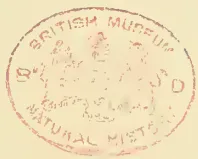A circular red ink stamp is centered on the page. The text "BRITISH MUSEUM" is arched along the top inner edge, and "NATURAL HISTORY" is arched along the bottom inner edge. In the center of the stamp, there is a faint, illegible emblem or crest. The stamp is slightly faded and has a soft red color.

253------------------------------------------------

A black and white portrait of a man with a full, dark beard and mustache. He is wearing a dark suit jacket over a white shirt and a dark bow tie. The portrait is set against a plain, light-colored background.

WILLIAM MARTIN LEAKE.

254------------------------------------------------

<!-- stage4: FAINT old-images-only -->

[Faint page: no legible print of its own could be verified; text withheld (stage 4 review list)]

This image is a scan of a blank page. The paper has a light beige or cream-colored tint. There are a few very small, dark specks scattered across the surface, which appear to be scanning artifacts or dust particles. No text, lines, or other markings are present on the page.

255------------------------------------------------

This image is a scan of a blank page. The background is a uniform light beige or cream color. In the center of the page, there is a very faint, blurry, and indistinct shape that resembles a ghost or a watermark, possibly from the reverse side of the paper. There are also a few small, dark specks scattered across the page, which appear to be scanning artifacts or dust particles.

256------------------------------------------------

# \* The TROPICAL AGRICULTURIST \*

## ∞ MONTHLY. ∞

Vol. XVII.]

COLOMBO, OCTOBER 1ST, 1897.

[No. 4.

## "PIONEERS OF THE PLANTING ENTERPRISE IN CEYLON."

(Second Series.)

MR. W. MARTIN LEAKE,  
ENGINEER, PLANTER AND MERCHANT:—1859—1873.

T is much more difficult to deal with the careers of "pioneers" and "public men" who are still in the land of the living, than with those who have already passed that "bourne whence no traveller returns." And this is especially true when the subject of our notice is a personal friend, and an ex-Colonist so very generally liked and esteemed as is Mr. William Martin Leake, the well-known Secretary of the Ceylon Association in London. But apart from the fact that Mr. Martin Leake's career has been nearly all contemporary with our own—and open before us as that of a public man, almost from first to last—we have had the great advantage of securing "notes" of that portion of his life of which we could know nothing, written, though reluctantly, at our earnest request.

We trust the use made of this information in the story of the varied career of a Ceylon Colonist of a past generation will tend to the benefit of his successors in the present day. It is something to bring before young Colonists of the present day the career of a man of culture and high professional training, who, nevertheless, entered on the ordinary and sometimes rough work of the pioneer—at least as Engineer—with the utmost zeal and pluck, and whose further experience as a Merchant, Planter and Public Man Ceylon was uniformly marked by transparent

honesty, straightforward devotion to duty and no small degree of self-denying interest in the welfare of subordinates and young employees. Mr. Martin Leake's work as Secretary to the Planters' Association (and for a term as Chairman and M.L.C.) alone entitled him to the gratitude of his brother Colonists, a gratitude which is still further enhanced by the continued good work for the Colony he is discharging as the Secretary of the Ceylon Association in London. But we must not plunge into the middle of our subject. We cannot better begin than by giving the following concise "chronology" for ready reference in regard to the, happily, still unfinished career of Mr. Leake:—

1831.—Born in Montagu Street, Bryanstone Square, on 23rd April, St. George's Day. [Birthday of one W. Shakespeare.]

1836.—Went to a Boarding School in Bayswater Village, kept by a lady.

1837-40.—At school at a day school in Upper Baker Street.

1840-45.—At the New Proprietary School, Blackheath.

1845-50.—At Rugby.

1850-54.—At St. John's College, Cambridge.

1855.—Traveling in Italy, Sicily, Austria, Germany and France.

1856-58.—Apprenticed to J. M. Rendel, C.E., President of the Inst. C. E. On his death at end of 1856, served out time with his executors—his sons Messrs. M. & G. Rendel, (former of whom is now Sir A. M. Rendel, K.C.I.E.) and Mr. W. G. Armstrong of Elswick (now Lord Armstrong). These years were divided between official work in Great George Street, Portland Breakwater (the late Sir J. Coode was in charge there), Shadwell Basin, London Docks, and the Elswick Works.

257------------------------------------------------

224THE TROPICAL AGRICULTURIST.[OCT. 1, 1897.

1858-59.—Assistant Engineer at the new Dock, Leith, under G. Robertson, F.R.S.E., who afterwards reported on the Harbours of India, visiting Ceylon in 1872.

Oct. 1859.—Sailed for Ceylon to join G. D. B. Harrison, then carrying out Irrigation works in Southern Province.

1860-61.—In Ceylon in Southern Province—Kirime, Tissamaharama, and Baddegama.

Oct. 1861 to June 1862.—At home. Married 6th Nov., 1862, at Galle, Louisa, youngest daughter of Sir James Tennent, K.C.B.\*

1862-1873.—Partner in Keir, Dundas & Co.—1869 and 1870 were spent in England—in 1870 made a tour in Russia, St. Petersburg, Moscow, Nijni Novgorod, and Odessa, to promote direct coffee trade through Suez Canal then just open.

1873.—Left Ceylon.

1874-1896.—Started Tunnel Portland Cement Works Co. and is still managing it.

In the case of Mr. Martin Leake we are able to begin at the beginning with an explanation as to the origin of the

#### FAMILY NAME.

This double name, we find, dates from the beginning of 18th century. In the time of William and Mary and Queen Anne there were in the Royal Navy two officers of distinction, Admiral Sir John Leake and Capt. Stephen Martin, who married two sisters named Hill. On the death of the former in 1719, without living issue, he left to his old ship-mate all his lands and money, value some £30,000, on condition that the latter assumed the name of Leake. By letters-patent of George I., dated December, 1721, Capt. Stephen Martin accordingly became Capt. Stephen Martin Leake. These two old naval worthies have not, like the many brave men before Agamemnon, perished unknown. The "vates sacer" has been found in Stephen Martin Leake, Garter King-at-Arms, son of Capt. Stephen Martin, who compiled from original documents a full and detailed Memoir both of his father and also of Admiral Sir John Leake. The latter he published himself in 1750, and the book though scarce is still obtainable. The Memoir of Capt. Stephen Martin was published so lately as 1895 by the Navy Records Society, Sir Clements Markham being the editor. The grandson of the Garter King-at-Arms referred to above was Stephen Ralph Martin Leake of the Treasury—who, in 1831, when his youngest son William was born, was official Private Secretary to Lord Grey, then Prime Minister.

The

#### SCHOOL-DAYS

of young William Martin Leake began early, owing to a prolonged absence in Ireland, on Government business, of his parents. His first school was in the then little country village of Bayswater. From his house in Nottingham Place, Regent's Park, William Leake can remember walking across fields where now are Westbourne Terrace, Lancaster Gate, &c., to the school situated in the present Queen's Road. The Great Western Station at Paddington was then in course of construction, and Master Leake was next removed to Blackheath to a Naval Proprietary School which was started sometime in the "thirties" in opposition to an existing old Proprietary School which is to this day a flourishing institution. One of its chief promoters was Mr. Meadows White, Solicitor, grandfather of the gentleman now or lately Private Secretary to the Chief Justice of Ceylon. For the better

edification of the pupil mind, a concrete structure after the model of the Parthenon was erected and divided into class-rooms. The school flourished for a few years, but soon languished. It must have been closed and the Greek temple pulled down some 40 years ago. But recollections of it have been lately stimulated by Sir Stuart Knill, who, during his recent mayoralty, gave a dinner to all such of his schoolfellows there as he could find. Forty-two old boys met that evening at the Mansion House, all probably over 60 years of age, most meeting after a separation of about half-a-century, a unique gathering. Three Messrs. White, sons of the Mr. Meadows White above-mentioned, were present.

Next we have young Mr. Martin Leake at RUGBY.

In 1845 Dr. Tait, after an exciting contest with Dr. Wordsworth, had comparatively recently succeeded to the headmastership on the death of Dr. Arnold. Arthur Stanley's life of Arnold had just been published, and Rugby was steeped in Arnoldism. Mr. Leake went to the house of Mr. Bonamy Price, afterwards Professor of Political Economy at Oxford. To the same house at the same date, from the old Proprietary School, Blackheath, came G.S. Goschen, now First Lord of the Admiralty, also (though not from Blackheath) William Palliser, brother (it is believed) of the Pallisers of Radella, famous afterwards for chilled shot and big guns. Even in his school days young Palliser used to have an illicit gun.

In 1849-50 Mr. Goschen became head of the school. In the upper forms all lessons were learned out of school in the home studies, generally two or three preparing the work together.\* For the last two to three years, in the Sixth Form, Mr. Martin Leake was thus associated in daily intercourse with the future Cabinet Minister. Another Rugby contemporary, afterwards well-known as a Ceylon planter, was the late Mr. William Greenwood of Gona Adika and Wattekelle.

Now we come to Mr. Martin Leake's

#### UNIVERSITY DAYS.

Among contemporaries at St. John's, Cambridge, were Mr. Leonard Courtney and Sir John Gorst. Mr. R. (afterwards Sir R.) Cayley came up in 1851, and in the Lent Term Races of 1852 steered the "Lady Margaret" second boat, in which Mr. Martin Leake was rowing. The boat was fifth on the river, and in the vain hope of maintaining that high place—vain because the boat lost one or two places—the crew was kept in pretty strict training. The constant association during these weeks of training was the beginning of the life-long friendship between the then coxswain and oarsman "Dick" Cayley, always so called to distinguish him from his elder brother Edward who was in the year above, and afterwards steered the "Lady Margaret" first boat, as head of the river in 1854 and had a great reputation as a judge of good rowing. In October, 1850, when Mr. Martin Leake went up, Mr. Arthur Gordon (now Lord Stanmore) was still an active member of the Union. Other leading speakers were William Vernon Harcourt and James Fitzjames Stephen. Later, Leslie Stephen, James Payn, and H. Moutagu Butler come to the mind as leading lights. Mr. W. Martin Leake was a scholar of St. John's, and in 1854

\* Sir James Tennent of the Bengal Artillery, made K.C.B. for distinguished services in the Sikh Wars. W. M. L. has nine surviving children.

\* See life of Bishop T. V. French of Lahore, Vol. I., pp. 5 to 7.

258------------------------------------------------

Oct. 1, 1897.]THE TROPICAL AGRICULTURIST.225

was 29th Wrangler and in the second class in the Classical Tripos.\*

#### CRICKET,

both at school and in college, received from Mr. Martin Leake, much time and attention. Blackheath in the "forties" was a very nursery of cricket. Kent with Fuller Pilch, N. Felix, the brothers Mynn, Wenman, &c., as its champions, had

\* Mr. Leake has favoured us with the following notice of "Rugby" and "Cambridge" in his day, which is well worth reproducing:—

Rugby 50 years ago was thoroughly penetrated with the spirit of Arnold. Though the great headmaster had in 1845, when W. M. Leake went there, been for three years dead, and his mantle had thereon fallen on Dr. Tait, the future Archbishop; the staff of masters were nearly all Arnold's men who had been appointed by and worked with him during the stirring years of his headmastership. Further, the recent publication of his life and correspondence by Arthur Stanley had made more widely known than was possible during his life-time the nature of his work at the great midland Public School. Dean Bradley (Westminster), Prof. J. C. Shairp (St. Andrews), Prof. T. S. Evans (Durham), Canon C. Evans were also masters of Rugby between 1845-50.

Chief among the assistant masters at that date were Bonamy Price, afterwards Professor of Political Economy at Oxford, and George Edward Lynch Cotton, afterwards headmaster of Marlborough and Bishop of Calcutta, the "young master" of Tom Brown's school days. These two taught respectively "The Twenty" and "The Fifth," the two forms next below the Sixth. Never probably have boys had a more lively teacher than Bonamy Price, "an alert and stimulating man" as the writer of an obituary notice styled him. "In the Twenty," Price put on the spur and kept us up to our best. He was an excellent master whom we all thoroughly liked and appreciated, all the more perhaps on account of his "lively eccentricities," so writes the Very Rev. G. P. Pownall in his contribution to the Memoir of Bishop French of Lahore. Cotton, though quieter and colder in manner, was also a very efficient teacher. The two had this in common, that they were at their very best in lecturing on the New Testament, in *Exegesis* as Price loved to call it.

Another notable master, who had a lower Form, was Richard Congreve, the disciple of Comte, who afterwards was, at it were, the High Priest of Positivism in England. He it was who in 1848, when the thrones of Europe were reeling under the strokes of the all-pervading Revolution, stirred the fags of the school to rise and throw off the thralldom of the Preposters of the Sixth Form. Excited meetings were held in the Quad at which fiery harangues were delivered, but all in vain. The Sixth proved themselves too strong for their more numerous foes, backed though they were by a Radical master.

It was to Bonamy Price's house that W. M. Leake went in the summer of 1845. He had the fortune at once to be chosen as a fag by George Lawrence, then head of the House, afterwards well known as the author of "Guy Livingstone," "Sword and Gown," and other novels. Strange as it may seem to those who know him only by his books, there can be little doubt that Lawrence was himself the original of his own heroes. Life in his eyes was not worth living unless as a series of thrilling incidents; he had no wish to live beyond the age of thirty, he would say, and meanwhile he would thoroughly run through every excitement that life can offer. He has now long been dead, though he lived for several years beyond the limit of his own naming.

Among those who came to Price's house in that same summer were George Joachim Goschen, now First Lord of the Admiralty (like W. M. Leake he came from Blackheath, but from the rival Old Proprietary School) and William Palliser, brother of the Pallisers of Radella, afterwards knighted for his inventions in connection with Big Guns and Chilled Shot. Even in his school-days Palliser shewed his leaning for firearms, for he managed to secrete an old shot-gun in his study, which had the reputation of shooting

played the rest of England on equal terms year after year at Lords and Canterbury; and Blackheath and its schoolboys—especially those who were at the school kept by Mr. Wanostrocht (that was the true name of the great Felix)—felt as if they shared in the glory of the country. Enthusiasm thus engendered at school was for Mr. Martin Leake further stirred by the proximity of his home to "Lords," where at a very early age he used to see and criticize all the leading players of the

round the corner, but none the less on occasion it would provide its owner with a stray pheasant, partridge, hare or rabbit, a savoury addition to the somewhat meagre school-fare of those days.

W. M. Leake did not remain long a fag, was moved quickly up through the various Forms, arriving safely in the desired haven of the Sixth Form in January 1848. In the upper Forms all lessons were prepared out of school, in the house studies, two or three preparing the work together. Mention is made of this custom in the sketch of Rugby in the Memoir of Bishop French already referred to. In that case Pownall, the writer of the sketch, was associated in this way with French, the future Bishop, and Cross, now Lord Cross. The companions of W. M. Leake, in lesson-learning during the years 1848-50 were G. J. Goschen and J. P. Beck, the latter, the eldest son of the late Mr. S. A. Beck, Chairman of the Gaslight & Coke Co. from whom that hive of industry, the Beckett Gasworks, takes its name. This system, giving life as it does to what is apt to be, when done alone, a work of deadly darkness, is an admirable one. Learning lessons under it became one of the most lively and sociable parts of the day.

In 1849-50 Goschen became Head of the School; and the year of his Headship is marked in the annals of Rugby by the departure of Dr. Tait, whose health had for some time been very indifferent, on his appointment to the less onerous post of Dean of Carlisle. This was probably the first occasion on which the future Cabinet Minister had a genuine opportunity for showing his powers of speech. Few masters can have had a more touching leave-taking than Dr. Tait on this occasion. The boys dragged him down to the Railway Station in his carriage, and the last scene in the stationyard dwells to this day in the memory of the survivors of those present. For the last few months of the school career of those who were leaving in 1850, the school was presided over by that excellent man Dr. Goulburn, but good as he was he was never meant by nature for a schoolmaster.

On looking back to the Rugby of those days, one of the most striking features is the number of distinguished schoolmasters sent out by the old school to propagate the Arnold tradition through the length and breadth of the land. Already in 1845 Dr. Vaughan, one of Arnold's pupils, was presiding over Harrow. Dr. Bradley, now Dean of Westminster, also a pupil of Arnold's and a master at Rugby in W. M. Leake's time, succeeded Dr. Cotton as headmaster of Marlborough on the appointment of the latter as Bishop of Calcutta. Mr. A. G. Butler and Dr. T. W. Jex Blake, both contemporaries and friends of W. M. Leake, became headmasters respectively of Haileybury and Cheltenham, the former being succeeded in his post by Dr. E. H. Bradley, head boy at Rugby in 1845, the latter succeeding in his Mr. H. Highton who had been both pupil and master at Rugby in Arnold's time. Dr. Jex Blake, alone among the Headmasters of Rugby of the last 70 years, was himself a Rugby boy. Further, Mr. Charles Evans (now Canon Evans) and Dr. Percival (now Bishop of Hereford) and the late Dr. Benson (Archbishop of Canterbury) all Rugby masters in the early "fifties" presided over Birmingham, Clifton, and Wellington respectively. To these who all became headmasters might be added the names of efficient assistant masters too numerous to mention. In the case of Arnold it cannot be said that the good he did was "interred with his bones."

(Continued next page.)

259------------------------------------------------

226THE TROPICAL AGRICULTURIST[OCT. 1, 1897.

Cay. Going to Rugby, Mr. Martin Leake had the advantage in his later years there of the instruction of old William Lillywhite and his son Jack. "Old Lilly," as he was called, was the inventor of round-arm bowling, all bowlers before his time having delivered the ball underhand; and for a time so destructive was the new style of bowling, that a rule was made that in delivering the ball the hand must not be raised above the shoulder. Bowling under this limitation "Old Lilly" succeeded by close and prolonged practice in acquiring an accuracy of pitch

(Continued.)

In October, 1850, W. M. Leake went up to St. John's College, Cambridge, while his friends, Messrs. Beck and Goschen, at the same date betook themselves to Oriel College, Oxford, where they both carried off high honours, their names appearing in 1854 in the First Class in *Literis Humanioribus* in the same list. Oriel men had not for some years previously shone in the schools, and so delighted was the College at this unwonted double success, that a great feast was made to celebrate the event, whereat a silver punch-bowl that graced the board was presented to the two brilliant students. Both could not hold this memento of their College days, so by the toss of a coin it was decided that it should become the property of Mr. Beck. On his death, however, it was transferred to the hands of Mr. Goschen, to be handed down doubtless as a treasured heirloom to his successors.

The changes effected in Cambridge in the past half century, though very striking both to the outward eye and also in the inner life, are probably hardly so great as those in the great Public Schools. In 1850 the studies of the University were almost confined to Mathematics and Classics, Mathematics still taking the precedence, as, for hours a certain modicum thereof was still indispensable. Cases still occurred of brilliant scholars being debarred, as was Lord Macaulay, from their due place in the Classical list owing to their failure in Mathematics. As with the studies, so with the athletics. These were confined to Cricket and Rowing. There was, it is true, one Tennis Court and one open Racket Court, but the players at these games were perforce very few. Football, Lawn Tennis, the Rifle Corps, the Athletic Sports, all now so popular, were things as yet unknown. The majority of reading men had to satisfy themselves with a constitutional of a couple of hours along the Trumpington road or elsewhere.

In the interval there have sprung up on the one hand well-equipped Laboratories, Technical Schools and Workshops; on the other Football Grounds, Tennis and Racquet Courts, Running Tracks, &c., Rifle Ranges. Another case in point is the Union: in 1850 the whole establishment was contained in one small room in Green Street, formerly a chapel, with a gallery round, lined with shelves wherein the books were kept; "a very one-horse affair" so said James Payn recently when writing on the subject in "Our Note Book" in the *Illustrated News*. Now how changed is all this! The present noble range of buildings with its spacious hall for debate, its library, reading room, writing room, smoking room, &c., affords to the members all the conveniences of a West End Club.

Another change noticeable by the undergraduate of the mid-century revisiting today his old University is in the style of dress. Top hats and black coats, which, in 1850, were the everyday non-academical costume, are now not to be seen. Light-coloured coats, straw hats, and caps are worn by all; no kind of free and easy garment is considered *infra dig*. To note the difference let any one, after a stay in the Cambridge of today, glance at Cuthbert Bede's pictures in "The Adventures of Mr. Verdant Green," book first published about 1850. Even Mr. Charles Larkyns and little Mr. Bouncer, the lively young gentlemen who took in hand Mr. Green on his arrival in Oxford as a Freshman, are depicted as riding and driving arrayed in tall hats, while Verdant himself is to be seen sculling on the river in the same headgear,

that probably has never been excelled: not bowling very fast, but keeping always on the wicket and varying the pitch at will he was an ideal practice bowler, while his son Jack, also a fair bowler, was besides a dashing batsman who could teach the young player by example no less than by precept. For three years Mr. W. Martin Leake played in the Rugby School Eleven, and on going up to Cambridge at once found a place in the University team. For the four years (1851 to 1854) he played in every match in which the University was engaged. In each of these years he played against Oxford at Lords. In the first year, 1851, when Cambridge won in one innings he had the fortune to make 66, the biggest score made in the match by any Cantab up to that date. In 1852, the first match of the series, an Oxonian made 71, but up to 1851 there was no other instance of a score over 60. Things are different in these days of centuries. The reasons are, no doubt:—(1) The better condition of the grounds. The wickets at Lords in the early "fifties" would not be tolerated today by any fairly good country club. Playing against fast bowling, even at Lords, was then a service of real danger. The improvement in the grounds it was that later brought about the abolition of the rule forbidding the raising the hand in bowling. (2) The system of boundaries which saves the breath of the batsman. In 1851 Mr. W. Martin Leake had to run out every hit, and in the innings mentioned at Lords was run out trying a fifth run. Boundaries, now rendered necessary by the attending crowds of spectators, had no place at a time when, even at the most important matches, a single row of movable benches gave full accommodation to all-comers. The thin line of spectators jumped from their seats to let the ball and fielder pass and repass. During the present season it has often been remarked, when Mr. Jessop has been driving ball after ball at almost lightning pace to the boundary, how inadequate is an allowance of 4 runs for such mighty strokes. The comment is just only on the surface. Had Mr. Jessop been obliged to run out each hit, as of old, he might indeed have converted many of his fours into fives, sixes, or even sevens. But how about the next stroke? Under the present system he has been able to score a second and may be a third four without running a foot in a shorter time than would have been needed for running out the first big hit. To score at the rate of two or three runs a minute, as Mr. Jessop has often been doing, and to continue the performance for half an hour and more, would, without boundaries, be a superhuman task.

To return from this digression. When Mr. W. Martin Leake went to live in Kandy in 1862,

#### CRICKET WAS LITTLE PLAYED UPCOUNTRY:

he lost no opportunity of encouraging the game. Organizing an eleven from among the Superintendents in his Firm's employment, he challenged the rest of the planters, and for several years this match was the occasion of a pleasant gathering in Kandy. On the opening of the Railway to Kandy in 1867, Colombo was promptly invited to bring up a team to play Upcountry. This, the first of very many succeeding contests, was a most exciting game, the visitors being defeated only by five or six runs. With Mr. T. E. B. Skinner, then Fiscal for the Central Province, Mr. W. Martin Leake about the same date started the Kandy A.B.C. (Athletics, Beating, Cricket) Club which, with the addition of one

260------------------------------------------------

OCT. 1, 1897.]THE TROPICAL AGRICULTURIST.227

more letter (D), lived for a space of well-nigh thirty years, and came to its end only last year.

After Cambridge, Mr. Martin Leake made  
A TOUR ABROAD.

The Crimean winter was spent in Rome. There he met the late Mr. A. H. Baillie who was travelling with his mother and sisters. Early in 1855 Mr. A. H. Baillie returned home to go out to Ceylon, where, subsequently, he and Mr. W. M. Leake were on very friendly terms as Proprietor and Agent. Messrs. Lightfoot and Benson, afterwards Bishop and Archbishop, were there also. Mr. Leake had known them at Cambridge; and with Mr. Benson, as being then a young Rugby master, there was a connecting link. Mr. Martin Leake belonged to the Artists' Club for the winter; there he met Mr. Leighton just about to exhibit at the Royal Academy his first picture, the "Procession in the Streets of Florence," about which all Rome was talking. With three others he walked through the length of the Volscian Hills from Albano on to the rail at Capua, saw no brigands though warned to expect them—people all very kind and civil. From Rome Mr. Leake went to Naples, saw a fine eruption of Vesuvius, to Sicily (ascended Etna), to Leghorn, Florence, Bologna, Padua, Venice, thence to Trieste, Vienna, Salzburg and the Tyrol, Munich, Prague, Dresden, Berlin, Hamburg and home.

Next we come to Mr. Leake's

#### APPRENTICESHIP AS ENGINEER.

An interesting item, as bearing on present controversies is the expenditure by London Dock Company in 1855-59 on construction of Shadwell Basin. To make this comparatively small area of Dock the Company spent about £1,000,000 sterling, half the sum being expended in buying up and pulling down streets of houses. The Dock Company's shares fell under this expenditure from par to below 6s, and have never risen again. Simultaneously the present Victoria Dock, just below Blackwall, was being made, G. P. Bidder being Engineer, by an independent Company on the Essex marshes where land was still cheap, and the London Dock subsequently bought up this much larger and more convenient Dock in self-defence, adding to it in 1878 and 1879 the Royal Albert Dock, the largest Dock of all. Sir A. M. Rendel is still Engineer to the London Dock Company as his father was 40 years ago. It was at Shadwell, in 1856, that Mr. W. Martin Leake first met his old friend and once partner, Mr. G. D. B. Harrison. Early in 1857 Mr. G. D. B. Harrison went out to Ceylon as one of Capt. Moorsom's staff for the Ceylon Railway.

At ELSWICK Mr. W. M. Leake saw the *second* Armstrong Gun made. This gun was taken to Woolwich to practise against the Royal Artillery. Its performance was such as to make absolutely necessary an immediate and complete revolution in big guns. It will be remembered that Mr. Armstrong was put in charge of the Woolwich Arsenal and given a free hand to the great discontent of Whitworth. Such a weapon as the Armstrong gun of that date, the bore with 40 spiral grooves and a shot with lead lining, has long disappeared from the scene.

LEITH.—One of the pleasantest years was spent in Edinburgh in August 1858 to August 1859. Unbounded hospitality awaited the Sonthron, especially one who was able and willing to play cricket, rackets and to row. The late Lawrence Mercer, once Manager of the Ceylon Co., Ltd., was then Secretary of the St. Andrew's Boat

Club, and there was a lively time generally. G. Robertson, the Resident Engineer of Leith Docks, was eldest son of Lord Benholm, one of the Judges, so the Assistant Engineer did not want for introductions.

In 1859, while at Leith, Mr. W. Martin Leake received an invitation from his old fellow-pupil, Mr. G. D. B. Harrison,

#### TO JOIN HIM IN CEYLON

where, Sir H. Ward being Governor, money was being freely spent by the Government on Irrigation Works, &c. The offer, seeming to be a promising one as regards prospects, was accepted, and in October of that year Mr. W. Martin Leake sailed from Southampton for Galle. Alas! for the future prospects—by the middle of 1860 Sir H. Ward left Ceylon for Madras, and Sir C. MacCarthy came out with orders to stop all expenditure that could be dispensed with, and then at once set in the period of "parsimony" so ably reduced to practice by that most economising and worthy of public officers, Mr. William Charles Gibson, who had succeeded the new Governor as Colonial Secretary. The young Irrigation Contractors were plainly told that they need look for no more work; and there was nothing for it but to wind up, realize profits, and look elsewhere for occupation. So ended the short-lived firm of Messrs. Harrison and Leake.

One evening in the latter half of 1860 and 1861 Mr. G. D. B. Harrison and Mr. W. M. Leake, dining at the Galle Face Hotel, Colombo, met Mr. John Anderson and family on their way to Galle homeward-bound, Mr. J. Anderson having been ordered home for health's sake with injunctions never to return. This sudden departure had, it seemed, quite upset the plans of his uncle, Mr. John Gavin, whom he was to have joined as partner in the Firm of Keir, Dundas & Co. Mr. Simon Keir had already arranged to retire from that Firm, and Mr. G. H. Dundas, who was at home, was anxious to retire if some one could be found to take his place, so that Mr. Gavin was likely to become the sole survivor of the three old partners. Negotiations were at once opened with Mr. Gavin which resulted in a very few days in Mr. G. D. B. Harrison taking an active share in the work of the Firm, while Mr. W. M. Leake went home for a few months' holiday. The upshot was that on 1st July, 1862, Mr. G. H. Dundas retired from, and Mr. G. D. B. Harrison and Mr. W. M. Leake were admitted as partners into, the Firm of

#### KEIR, DUNDAS & CO., KANDY.

A few words on the vicissitudes of fortune of the once famous Coffee Firm may be interesting, and perhaps useful as a warning, in the present days of unclouded prosperity in Tea. Probably no Ceylon Firm has ever had a brighter time than Messrs. Keir, Dundas & Co. enjoyed during the ten years, 1854-64. In the former year its dealings were on a humble scale; in the latter all three partners had retired on handsome fortunes leaving to their successors a well-secured and apparently most valuable agency business. In 1864-66 came a time of trouble enough to try to the utmost the strength of the Firm. First, the failure in Colombo of Messrs. Wilson, Ritchie & Co., with whom many joint ventures existed, involved considerable liabilities; then in quick succession in London of two houses, Charles Joyce & Co. and Kelson, Tritton & Co., to whom sums were due; and lastly, several natives to whom advances had been made, succumbed in the general financial disturbance that accompanied the close of the American Civil War, and culmin-

261------------------------------------------------

228THE TROPICAL AGRICULTURIST.[OCT. 1, 1897.]

nated in the Black Monday in May, 1866, when the city of London was a scene of panic such as has not since been witnessed.

Many of the properties on which the Firm had claims were owing to these failures thrown on a market where there were no buyers; and the position involved this dilemma, either serious losses must be faced or money must be found to buy in the properties in question, on which in most cases there were prior charges. The latter alternative was adopted, and before the end of 1866 the Firm, which had hitherto been mainly an Agency business, became sole owners of the Uplands and St. Sebastian Mills in Colombo, as well as the largest Coffee Estate Proprietors in the Island, the properties being necessarily subject to a somewhat heavy, though by no means as far could then be seen, crushing debt. Simultaneously the course of events had thrown into the hands of the Firm the valuable shipping business which had hitherto been transacted by Messrs. Wilson, Ritchie & Co. The crop of 1866-67 was a right good one, and so far all seemed to augur well for the new ventures of the Firm.

The sequel, however, may be best told by a few figures, shewing the

#### ANNUAL COFFEE CROPS

from that date of the estates owned by Keir, Dundas & Co., results arrived at, and to say, in spite of consistently careful and liberal management.

<table border="0">
<thead>
<tr>
<th></th>
<th>ewt.</th>
<th></th>
</tr>
</thead>
<tbody>
<tr>
<td>1866-67</td>
<td>36,135</td>
<td rowspan="4">} average 1st four years</td>
</tr>
<tr>
<td>67-68</td>
<td>32,561</td>
</tr>
<tr>
<td>68-69</td>
<td>29,265</td>
</tr>
<tr>
<td>69-70</td>
<td>30,717</td>
</tr>
<tr>
<td>70-71</td>
<td>24,155</td>
<td rowspan="3">} average 2nd do</td>
</tr>
<tr>
<td>71-72</td>
<td>14,018</td>
</tr>
<tr>
<td>72-73</td>
<td>21,215</td>
</tr>
<tr>
<td>73-74 estimate</td>
<td>12,600</td>
<td>17,996 ewt.</td>
</tr>
</tbody>
</table>

In face of such results the game was manifestly a hopeless one in regard to the ultimate liquidation of the debt. The partners placed themselves in the hands of their chief London supporters, to whom after many months of anxious deliberation the whole business was transferred, both assets and liabilities, in return for a small cash payment. Mr. W. M. Leake returned home in September 1873. He remembers calling to say "goodbye to the Editor of the *Observer*" with the above figures in his pocket. The Editor (he tells us he saw Mr. John Ferguson and adds) "was then eagerly advocating the extension of the Railway to Haputale, using freely as an argument in its favour the probable increase of coffee crops." Mr. Leake on introducing his view that crops had hitherto only been maintained by the rapid increase of new land coming into bearing met with so little encouragement that he did not disclose the figures on which he relied, but contented himself with wishing the Editor good luck in his crusade! \*—[See further on as well as in note for Editor's justification.]

\* In explanation, the Editor has to say that no one who knew the young districts in 1873 anticipated that they or Uva were to decline at any rate for a generation, as the old Kandy districts had done, and the figures for total crops of coffee will bear us out in this:—

<table border="0">
<thead>
<tr>
<th>Season</th>
<th>=</th>
<th>1871-2</th>
<th>ewt.</th>
<th>576,878</th>
</tr>
</thead>
<tbody>
<tr>
<td>"</td>
<td>=</td>
<td>2-3</td>
<td>"</td>
<td>860,360</td>
</tr>
<tr>
<td>"</td>
<td>=</td>
<td>3-4</td>
<td>"</td>
<td>509,329</td>
</tr>
<tr>
<td>"</td>
<td>=</td>
<td>4-5</td>
<td>"</td>
<td>988,328</td>
</tr>
<tr>
<td>"</td>
<td>=</td>
<td>5-6</td>
<td>"</td>
<td>688,434</td>
</tr>
<tr>
<td>"</td>
<td>=</td>
<td>6-7</td>
<td>"</td>
<td>927,093</td>
</tr>
<tr>
<td>"</td>
<td>=</td>
<td>7-8</td>
<td>"</td>
<td>627,246</td>
</tr>
<tr>
<td>"</td>
<td>=</td>
<td>8-9</td>
<td>"</td>
<td>824,058</td>
</tr>
</tbody>
</table>

Needless here to dwell on the oft-told tale of the part taken by Mr. Martin Leake's Firm in introducing the cultivation of

#### CINCHONA AND TEA.

It is not so well known that a venture was made in

#### CARDAMOMS

in 1871 or 1872 on the suggestion of Major Taylor, a Wynnaad planter, who came on a visit to Ceylon about that time full of the success of experiments recently made in South India. A beginning of this cultivation was made in Rangala, in the jungle between old Tunigalla and Girindi Ella; and though at first the plants did not come on and the experiment seemed to be a failure, after some years of practical abandonment, they were found to be doing well and good crops were obtained. The cultivation has been continued and extended in certain localities in the neighbourhood with varying success up to the present time.

We have already referred to the part taken by Mr. Martin Leake in

#### PUBLIC AFFAIRS,

but we may add that from February 1863 to 1868 he was Secretary to the Planters' Association, in 1872-73 Chairman of the Planters' Association and M.L.C.; 1877 onwards London Agent of Planters' Association; 1888-97 Secretary Ceylon Association in London,—a prolonged record of connection with Ceylon planting, extending already over more than 34 years. As to details of work done are they not all written in Planters' Association proceedings and the pages of the *Ceylon Observer*?

No sooner had Messrs. G. D. B. Harrison and W. M. Leake retired from Keir, Dundas & Co., than a singular change came over the fortunes of

#### COFFEE.

The price rapidly rose 50%, and many accounts, the position of which had seemed hopeless, were in the course of a few months restored to vigorous life. A notable instance was the account of the late Mr. G. A. Cruwell who had the good fortune on his Haputale estates,—now owned by Mr. Lipton,—to have in 1873 a fine crop on his coffee trees. It had been reckoned early in the year that the value of his properties fell short of the total debt on them by at least £10,000. Before the year was out Mr. Cruwell had sold the estates for £50,000 to the late Mr. R. B. Downall, had paid off all debts, and retired with a very substantial fortune, the balance of the purchase amount and of the proceeds of sale of the big crop sold at 120s. to 150s. per ewt. in London! Mr. Cruwell followed Mr. W. M. Leake to England in a very few months, summoned his friends to a sumptuous dinner to celebrate his good fortune, not least among his guests being his late Agent, Mr. W. M. Leake.

The "boom" in coffee in 1873 being brought about solely by the rise in price of the produce, was doomed to be shortlived so far as the value of Ceylon land was concerned. No enhancement of price could compensate for the falling-off in crops, and not many years elapsed before instances were frequent of collapses in the value of estates as sudden and as startling as was the prosperity that had attended Mr. Cruwell's venture. To mention an instance: in 1876 many estates had good coffee crops, prices were very high, and profits were very large. Among the rest Nilloomally, in Kelebokka Valley, gave returns stated at £6,000 to £7,000. It was currently reported that an offer of £40,000 was made for the pro-

262------------------------------------------------

Oct. 1, 1897.]THE TROPICAL AGRICULTURIST.229

perty and refined. The subsequent profits from the coffee on the estate can have been next to nothing.

Such were the ups and downs of fortune attending the last days of the reign of KING COFFEE.

#### TEA,

though it will surely have its bad as well as its good times, is hardly likely to be subject to the convulsive fluctuations of fortune that attended the downfall of coffee.

On retirement from Messrs. Keir, Dundas & Co., Mr. W. M. Leake hesitated as to his course in the future. His partiality for Ceylon and life there was finally overborne by family considerations; his elder children were growing up and continuance in Ceylon would necessitate separation for educational purposes. He determined to find work, if possible, at home. In 1874, co-operating with Mr. T. G. Wainwright, now Treasurer of St. Thomas's Hospital, he started the TUNNEL PORTLAND CEMENT WORKS CO., LTD., buying as the site for its operations a property of some 700 acres on the Essex shore of the Thames near Purfleet. The cement trade was at that time at the height of its prosperity. In common with nearly all productive industries in England, it has since come under changed conditions owing to the continued fall in prices. The fall in prices having been general without any compensatory fall in wages, shareholders in those industries, wherein labour forms a large proportion of the cost, have had to stand by while the position of the labourer has been year by year improved. In these circumstances it may be hoped that the good of the many, may in the long run prove to be the good of all, and that the wider diffusion of wealth, consequent on the economical position, may be surely, though silently, broadening the foundations of the prosperity of the United Kingdom.

Certain it is that demand in many branches has lately acquired a way of increasing by leaps and bound beyond all past experience. And though facilities for extending production are now-a-days such that no continuance of very high prices can be expected; yet in many depressed industries there have been of late signs of recovery and of a return even to the capitalists of a certain sober, healthy prosperity.

It is pleasant to add that Portland Cement, the leading industry of the Lower Thames and Medway, seems to be sharing in this revival.

Here, we leave the story of one of the best-equipped, most enterprising and most respected Colonists who ever laboured in Ceylon. The work of Mr. MARTIN LEAKE is by no means over: though in his 67th year—14 of those spent in the tropics—any one looking at Mr. Leake would take him to be at least ten years younger, and, humanly-speaking, his spare athletic form and vigorous constitution afford a guarantee for a number of years of usefulness; not least in connection with the Colony in which he has done such good and prolonged service. So mote it be!

AUSTRALIAN ORANGE PLANTS.—Messrs. Thompson & Co. have imported a parcel of young orange plants from Melbourne to the order of some upcountry planters. The plants were sent up a couple of days ago and we hope to hear of their vigorous growth.

—Cor., local "Examiner."

#### INDIARUBBER IN THE HUKONG VALLEY.

[By H. N. THOMPSON, ASSISTANT CONSERVATOR OF FORESTS, BURMA.]

The India-rubber as found growing in the Hukong valley is not a gregarious tree. It appears scattered generally through the dense evergreen forests, but nowhere reaches the density per acre, say, of an average teak forest; occasionally a family group of four or five trees may be met with, but these are very rare indeed, and the usual thing is to come across a mature tree every 200 or 300 yards in the richer forests. The average of four valuation surveys made at the headwaters of the Namkong *chaung* gives 48 large trees per acre. *Ficus elastica* is essentially a light-demanding species, and though an evergreen and associated with and growing amongst dense shade-bearers no tree can be more exacting in its demand for light. Whenever it is surrounded with dense shade it will be found that this tree, in order to escape from it, has grown to enormous heights, in many instances towering head and shoulders over every other tree in its vicinity. Trees of great size were met on the upper slopes (3,000 feet) of the Loima hill at the headwaters of the Namkong *chaung*, and some of them were certainly the largest trees that I have ever seen of any species whatever. In accordance with its light-demanding character seedlings growing on the ground are extremely rare, and though I searched diligently for them on many occasions on the rich soil surrounding the parent trees (but covered with dense shade) I was never able to find one. The only seedlings seen by me were growing, as a rule, in the forks or crevices in the bark of light foliaged trees (*Dalbergia*, etc.) at a great height from the ground and occasionally on the half-rotten trunks of dead and dying plants in places where from windfalls or otherwise clearings had been formed in the leaf canopy. The young seedling thus gets a good start over its rivals in the struggle for existence and grows rapidly up the stem of its host encircling the latter with its aerial roots and sending them downwards towards the ground till they form great supports on which the main trunk of the fig stands; meanwhile the host is gradually killed off and eventually disappears altogether, and the rubber tree is left standing on five or six or even more thick aerial roots. These roots often start from a height of 60 to 90 feet, and attain girths of from five to eight feet. The main factor determining the distribution of *Ficus elastica* seems to be an excessive humidity of the atmosphere. It appears to be able to accommodate itself to many varieties of soil (probably because its earlier stages are passed on a host) and to be indifferent, generally speaking, to rather large variations in altitude, though growing best at from 2,500 to 3,500 feet. The absence of a very high temperature would also seem to favour its growth, as the species is unknown from the otherwise suitable localities in Southern Tenasserim. However, this latter point may or may not be correct, and very likely the question may be complicated by the correlation of factors that we are not as yet cognizant of. But this much is certain, that it is found growing in abundance on the Loimaw hill at an altitude of 5,200 feet, and is reported from high altitudes in the Jan Mun Bun mountains to the east of N'tupusa and on the northern and southern watersheds of the Taron river, the higher crests and peaks of which are covered with large masses of snow in the winter. From what I could make out of the information given by the Singpho Chiefs of Ningbyen and N'tupusa, it does not appear to actually grow in places that are subject to snowfalls, but is found in all the deep, damp gorges on the slopes on such hills, very often creeping up the former to considerable altitudes. The winter snowline in the latitude of the northern portion of the Hukong valley (latitude 27° north) would appear to lie at least somewhere between 7,000 and 8,000 feet. As Colonel Woodthorpe and Major Macgregor, on their return

263------------------------------------------------

230THE TROPICAL AGRICULTURIST.[Oct. 1, 1897.]

journey from the Bohr Khampti State, found it lying in large patches on the Chaukkan and Mokoshat passes in April; these passes lie to the north-east of N'tupusa and are visible from Ningbyen; the heights are 8,450 feet and 7,000 feet respectively.

If the tree does actually grow high up the mountains on the north-east it must experience severe winter frosts, but it is probable that the influence of the latter is modified to a certain extent by the position of the seedlings on the stems of their hosts, and they very likely do not suffer to the same degree as they would if growing on the surface of the soil.

Mr. O'Brien, in his report on the India-rubber forests of the Bhamo district, divides those situated in the Hukong valley into the following areas, basing his classification on the routes by which the rubber is exported. As these divisions are convenient for the purposes of description, I will not disturb them. They are:—

(i) The tract north at the Tanaikha from its junction with the Tarom river to a point 20 miles above Lagang village.

(ii) The southern basin of the Tanaikha from the Numgaum *chaung* down to a point 20 miles above Lagang village on the Tanaikha, excluding the sources of the Nampyu *chaung*.

(iii) The area drained by the Namkong *chaung*, north of Kamaing, including the sources of the Nampyu *chaung*.

(iv) The area drained by the Tanaikha south of a point about 20 miles above Lagang village and the left drainage of the Namkong *chaung* between Kamaing and Mogaug.

To this I will add, as No. VIII, the whole drainage area of the Tarom river above its junction with the Gedu affluent, the greater portion of the India-rubber from this tract being exported to Assam, *via* the passes across the Patkoi range.

*The protection of the rubber forests.*—As before mentioned the Upper Burma Forest Rules relating to the tapping of India rubber trees appear to be a dead letter in the Hukong Valley and Namkong forests. And I have been informed by several Sawbwas, such as Ningbyen and Nitumtumsa, that they are unable to enforce these rules or attempt to interfere in any way with the rubber collectors. Doubtless they have their own reasons for not interfering, as the more rubber that is collected the greater the revenue paid to them for it. So it is not likely then that in the absence of any means of enforcing the rule the latter will be attended to.

Regarding the Hukong Valley itself, I think we are powerless to protect the India-rubber forests by any legislative methods unless we are prepared to take the country over and administer it directly. The Singphos are an exceedingly independent race, and at present *really* recognize no one as masters, under these circumstances, if we are not prepared to take over the country, and if we still wish to preserve the rubber forests from extermination, there is only one course left open to us, and that is to put a prohibitive tax on all rubber exported to the Myitkyina district from that valley. Of course there will be a great outcry from the Chinese firms engaged in the trade and from others, but unfortunately the choice of alternatives is very limited, and no half-measures are possible. The forests must either be completely protected or left alone; the Singpho would appreciate no other course of action.

I very much doubt whether the Hukong Singphos would understand very early why (in the event of a prohibitive tax being introduced) there would be no sale for their rubber. All they would concern themselves with would be the fact that there was no sale for it, and that therefore it was not worth collecting. There naturally would be a great falling off in the revenue, collected by the various Chiefs, and it is difficult to see in what way they could recover themselves, and perhaps this is the most important objection to the introduction of such a tax. The protection of rubber trees growing in forests situated within our sphere of direct administration, though a difficult matter where Kachins, (Singphos) are concerned, need not present any really serious

obstacles, and it is possible that if reserves are made of the richest areas, and the local Sawbwas in whose jurisdiction the reserves would be situated were induced to interest themselves in the protection of the forests, and that the subordinate forest officials appointed to supervise them were selected from amongst some of the better class of Singphos, a great deal may be done towards the protection of this tree.

Work would be found for those who at present live on the proceeds derived from collecting rubber by getting them employed in the plantations.

*Formation of rubber plantations.*—For experience gained in Assam, it appears that it is quite possible to undertake the creation of rubber plantations on an extensive scale with a fair prospect of their supplying large trees in the future. Under these circumstances it would be advisable to start such plantations in the richer India-rubber bearing tracts on the lines recommended in Assam. Local Kachins could be employed for the work, which they would probably take to readily. Seedlings of the species are frequently found planted round the Kachin villages, but they do not attain the same dimensions as trees that have grown upon the forest.—*The Indian Agriculturist*.

## CULTIVATION OF THE CHERIMOYA IN MADEIRA.

While on a visit to Madeira last autumn I was much interested in observing the extensive cultivation of the Cherimoya (*Anona cherimolia*) which is now being carried on there for the London market. Many of the estates on the warm southern slopes of the island, formerly covered with vineyards, have now been systematically planted with the Cherimoya, the sheltered valleys being particularly suited for them, the trees attaining a height of 30 to 40 feet and bearing abundantly. Propagation is by seed only. The young trees are grafted when about two years old and begin to bear about three years afterwards. When the leaves have fallen in May the trees are pruned, only those branches which are likely to bear fruit being left. On some plantations the young trees have been topped when about eight feet high and the laterals trained along horizontal espaliers with excellent results. The trees are in this way brought under thorough control, can be easily pruned and the fruit thinned out. Stable manure is usually dug into the ground over a considerable area around the trees in the early spring months. The crop is gathered in December and January. As the result of cultivation several improved varieties of the Cherimoya have been obtained bearing fruits with hardly any seeds and in which the fleshy eatable part is largely increased in quantity. The fruits vary in weight between three to eight lb., exceptionally large ones may reach 16 lb., and over. The maturity of the fruit is indicated by the loosening of the seeds inside which may be felt when the fruit is shaken. They are still quite hard to the touch but fit to pick and if laid in straw will rapidly ripen. The fruit is always cut off the tree with a sharp knife leaving a short stalk attached; if it is pulled off the core is injured and the pulp spoiled. Special boxes are made for packing the fruit which are first wrapped in paper and then embedded in straw; each box holds about two dozen fruits. The journey to London generally occupies four days. On arrival they are unpacked and placed on shelves in a warm room where they quickly ripen. Average-sized fruits usually fetch from six shillings apiece, larger ones 10s. and more. The Cherimoya grows well in the mountains of Jamaica. Fairly good fruit is not uncommonly brought into Kingston for sale. I venture to think that it might be worth while to bestow more attention on its cultivation in view of the possibility of getting the fruit to London in good condition in cool chambers. The Cherimoya is rightly acknowledged to be one of the most delicious of tropical fruits and there is no doubt that shortly the demand for it will increase very greatly.—*Journal of the Jamaica Agricultural Society*.

Kingston.

M. GRABHAM.

264------------------------------------------------

OCT. 1, 1897.]THE TROPICAL AGRICULTURIST.231TEA PLUCKING AND IRREGULARITIES IN TEA.

We must tell Mr. John Hamilton that the general consensus of opinion both in planting and mercantile circles in reference to his letter is that to abandon "refiring" would be a great mistake. In the moist climate of Ceylon, it is simply indispensable; but it is evident that more care must be taken in regard to both "bulking" and "packing" in not a few factories in our tea districts. At the same time when Mr. Hamilton speaks of "all the selling brokers employing a highly-paid expert to inspect the teas placed in their hands," exception is taken and one gentleman here who knows "all about tea in London" declares the inspection is left to quite a junior—an assistant in his second year usually.

Now as regards the need of special care in estate factories, we have had evidence put before us of very recent experience of irregularity in regard to the teas of well-known Ceylon estates which never sell in Colombo. In all, four cases are adduced as occurring within a few days and all telling against "Ceylon's." For, it is alleged that in regard to Indian teas, there is no trouble: on the catalogues of the latter "bulked in London" is now being printed. We fear it must come to this in respect of "Ceylons," unless each proprietor, who wants to sell in London, insists that special care is taken in his factory as to bulking and packing, due supervision being provided for the same. It is impossible that a Superintendent by himself can see to all the work in the field as well as in the factory. There ought to be a run therefore on careful Factory Assistants, who should be made to understand the penalty attaching to irregularity in bulking, to bad packing, difference in gross fares, or above all to using "cheesy" or bad boxes!

LAND ON THE ANAMALAI HILLS.

*To the Editor, Madras Mail.*

Sir,—I see that Government Notices appear in the *Madras Mail* and in District *Gazettes* that "about 80 square miles of land on the Anamalai Hills, in the Coimbatore District, are available for application for planting purposes under the subjoined rules." This would be say 50,000 acres. There is, no doubt this quantity "available," but I say without hesitation that the quantity *suitable* for tea or coffee cultivation is represented by a far smaller area. As I am the only one of the original applicants as yet who has begun to open out those hills, I may claim to be interested in their future welfare and development, and neither of these will be served if unsuitable land is taken up and money spent upon it. A new District has to make its reputation and a bad start takes a long time to get over; I trust therefore that any who think of taking up land there will use the utmost care in its selection. As I may now claim to have some little experience of the place, the following facts may be interesting. Health is very good, contrary to the alarmist ideas freely expressed. Fever is practically absent (and I am speaking of the worst time, from beginning of February to breaking of monsoon) both with Europeans and natives; I should say that, man for man, there is less fever than on an ordinary healthy hill estate, though it was not in other places a healthy season this year. The climate is very remarkably even, owing no doubt to the

mass of evergreen forest. Wind, before and during the monsoon, is absent on well-selected land, though I should be sorry to have much of the 80 square miles, on this account. I have been there also during the N.-E. monsoon and should say that no one selecting land carefully need get wind at any time of the year. The rainfall is probably abnormal this year, judging from the facts that Cochin and Calicut are many inches over their average to date, and that S.-W. rain at these places has, on every occasion this year, meant rain on the Anamalais, though in far less quantity at the latter place. As I have only had a rain gauge in position since the beginning of February I cannot yet say for certain what the result will be, but from results to date and what I have observed when there in September and November, I am inclined to forecast an average rainfall of something under 100 inches, heaviest in June and July but with a good N.-E. fall and enough in earlier months to ensure setting blossom (this year the fall from February to June was 11 inches 18 cents). Labour, of course, has all to be imported, and I may mention that the greater distance it is brought the better; labour from the small villages round the foot of the hills is of little use. Felling costs far more than in most districts, the forest being very heavy; pitting would be easy, but for roots, the soil being a sandy loam of great depth, with perfect drainage. I should mention that my remarks on health refer to an elevation of 4,000 feet, where I have my buildings, the clearings being a couple of hundred feet lower. I have no doubt of the future of the Anamalais as a planting District if care is taken at the outset, and it is to that end that I would speak a word of warning against indiscriminate selection of land while there is yet time. Every district has suffered from it. Experienced planters are the men first wanted in a new District, and I hope that is the only class which will attempt to settle there to begin with. A good bridle path is now open into the forest, passes my door, in fact, but I do not think the line of the bandy road promised by Government is settled as yet.

Kotagiri, 30th July.

E. G. WINDLE.

NOTES FROM MAHÉ, SEYCHELLES.VANILLA

The beans resulting from last year's flowering have nearly all been gathered, and are in course of preparation. Although much smaller than the previous year the crop generally will be a fairish one so far as is yet known. In the lower parts of the island the first flowers of this season are commencing to appear.

Apart however from Vanilla and its attendant uncertainties as to crop and price, there is an increasing source of productiveness here in *Liberian Coffee*. A good deal has been done in planting out of late years, and although slow of growth at first, the trees once established are flourishing well, and many can be seen here now of 4 and 5 years' growth, pictures of health and beauty and in full bearing.

H. T.

THE KELANI MILLS.—The mills were opened recently, and desiccating works is in full swing now. Besides this work, the mills are manufacturing coconut fibre for various purposes. As a result of the opening of the mills a large number of villagers have found work to keep them from idleness.—*Cor.*

29

265------------------------------------------------

232THE TROPICAL AGRICULTURIST.[Oct. 1, 1897.

SIR GREME ELPHINSTONE ON THE  
PLANTING PROSPECT OF PERAK.

"This will be a grand country in 20 years. Coffee Liberian, coconuts and rubbers; cattle feeding also will pay well. Somehow or another one always feels in touch with Ceylon here. So many of the Civil Servants and Planters have been and are associated with Ceylon either by relationship or business. Then in the lower grades of the Civil Service all departments and especially in the medical are recruited from Ceylon.

"I never look on this country except as having a sort of cousinship with Ceylon and that together they will help to supply a large proportion of the world's requirements.—GREME ELPHINSTONE."

PROSPECTS IN NYASALAND.  
INTERVIEW WITH MR. ALEXANDER  
WHYTE.

Mr. Alexander Whyte, the well known botanist and naturalist, formerly head of the Scientific Department in the Administration of British Central Africa, has just been in Aberdeen for a few days, on his way through to Braemar, where he intends spending a well-merited holiday after his arduous exploratory and scientific labours in Nyasaland, of which some account has already appeared in these columns. Mr. Whyte is looking hale and hearty, and none the worse of his experiences in British Central Africa, where indeed during all his stay of six years he has enjoyed exceptionally good health, having never been once down with fever. The collections which he has made of the dried plants and of the birds and the animals of the country are very extensive—among the most extensive made by single scientists it is believed—and the authorities at Kew and at the Natural History Museum in Cromwell Road are highly pleased with the results. The Zoological Society have rewarded Mr. Whyte by presenting him with their model in regard for the value of his investigations. Mr. Whyte speaks in glowing terms of the progress made in this Protectorate, now our newest Crown Colony. A review of what has been done during the past half-dozen years is truly astonishing, and it would be difficult to point to such a record of work effected for anything like the same expenditure of money in any other country or colony. The very tribes who were the most hostile and the most obstinate to submit to British rule and to abandon their slaving propensities are now furnishing the best recruits for the military and police forces. The revenue is increasing by rapid strides, and nearly all the tribes are willingly paying the tax of 3s. levied on every household.

Of the wonderful

NATURAL CAPABILITIES OF BRITISH CENTRAL  
AFRICA

Mr. Whyte is well qualified to speak. The most serious obstacle to the rapid development of the country, he says, is the want of easy and cheaper means of transport to and from the coast. Fortunately, however, this is to all appearances about to be remedied. A railway survey from Chiromo, at the junction of the Ruo and Shire rivers, to Blantyre has been most efficiently completed and laid down on a large scale by Mr. Macrone, who is now home in Edinburgh, with all the requisite details and information to lay before his directors. Britain in self-protection must push it on, so as to secure for herself the

most advantageous highway, *via* the Lakes, into and through Central Africa. Between the sea and the terminus of the proposed line at the Ruo and the Shire rivers, the Zambezi river steamers provide a transport, but the railway which the Portuguese are making from Quilimane to the same point will in a short time provide more convenient and quicker communication.

Of the prospects for

COFFEE

—the staple of the country—Mr. Whyte speaks in a very hopeful way. The soil and the climate are quite suitable. Mistakes have naturally been made through the want of experience. The coffee bush requires special treatment, and it does not follow that what suits it in one country will be equally successful in another. Hitherto the coffee planting in Nyasaland has been in a measure passing through the experimental stage. Now, however, the treatment of the coffee, especially as to shade, is better understood, and crops, paying very fairly, are being picked. The transport question once solved, land for coffee planting would, Mr. Whyte feels sure, be taken up on a large scale.

Among the other products likely to prove remunerative in British Central Africa Mr. Whyte considers the next best to coffee to be

RUBBER,

which is indigenous in the land, and the demand for which in the world of commerce is continually increasing. The Landolphiias, the best yielders of rubber, are growing in Nyasa, ready to be tapped in the native state. Samples of the rubber from this plant Mr. Whyte gathered and sent home to this country. His idea of how to cultivate the rubber trees would be to plant them in forests at the foot of other trees, which would serve as stakes up which they could climb. This would be an inexpensive method of establishing forests of rubber, and the only drawback is that it would entail the locking up of capital for five or six years before yielding a return. The Ceara rubber also grows freely in the Shire Highlands, but it has not been found productive enough to pay. Another product which has already been introduced, and which promises well in the lower and hotter districts is Liberian coffee, while cardamoms, nutmegs, and spices might also be grown to advantage. Cacao Mr. Whyte has tried to introduce on several occasions, but without great success. The cacao plant is very delicate and difficult of transport, but Mr. Whyte feels confident that there are many suitable localities along the banks of the rivers and in the mountain ravines where it would do admirably if once started. As to cotton, it could be grown to a boundless extent, but the cost of conveyance is at present killing to this branch of agriculture. Tapioca has been manufactured to a considerable extent by the members of the Established Church Mission at Domasi from the roots of the manihot or cassava plant, and has proved of excellent quality, finding a ready sale among the Europeans of the district. Arrow-root could also be cultivated, and in fact nearly all tropical and sub-tropical economic plants could find suitable habitats in Nyasaland. Stock of all sorts thrive well on the plateaux of west and north Nyasa. Cattle are now plentiful with the planters, supplies having been got from Tete, on the Zambezi, and from Angoniland, to the west and southwest of Lake Nyasa. Goats and fat-

266------------------------------------------------

OCT. 1, 1897.]THE TROPICAL AGRICULTURIST.233

tailed sheep are everywhere abundant. European sheep have as yet proved a failure, their fleeces being rendered all but valueless by the quantities of seeds and burns which become entangled in the wool.

As to the

#### HEALTH OF EUROPEANS

in British Central Africa, it cannot be said to be good. There is little danger to be dreaded from the ordinary malarial fever, but unfortunately a bad type, called black-water fever, sometimes crops up, and a good many valuable lives have fallen victims to it. Mr. Whyte, however, believes that a great improvement will come about when the country is opened up and more comfortable houses and surroundings become available. He remembers well when some of the West India islands and Ceylon were quite as unhealthy. Now they are in some cases being visited as health resorts, so salubrious have they become. In Nyasaland, the services of a staff of experienced and skilful doctors sent out by Sir Harry Johnston are now procurable, and Dr. Kerr Cross, formerly of the Livingstonia Free Church Mission, and Dr. Grey, of Portobello, have just sailed to join the Administration. The work recently completed by Dr. Cross on "Health in British Central Africa" will form an excellent guide for young men emigrating. It is all important in Nyasaland, as in all tropical countries, to know how to live, and a man's health greatly depends upon himself, whether he uses judiciously or abuses his constitution. Temperate yet active habits, with a well-balanced, cheerful, and equable mind, backed with a good thick stratum of common sense, are golden possessions out in Africa, where many trials and worries have to be encountered. Mr. Whyte describes with regret how practically the whole trade of the East Coast of Africa from Delagoa to the Red Sea has passed out of British hands through the enterprise of foreign, and especially German competitors.

Asked his opinion on the

#### MISSIONARY QUESTION,

Mr. White has no hesitation in saying that missionaries have been a great power in the land in influencing the natives. A great deal has been said of missions of late, and it is very easy, and so far legitimate, to criticise public bodies. Unfortunately, however, missions frequently undergo very unjust criticism. Of the work done by Dr. Laws and the free Church Mission Mr. White speaks in unqualified terms of praise. It is, he says, perfectly astonishing to witness the hold Dr. Laws has on the people and the influence he exercises over them.

Mr. Whyte's last

#### EXPLORATORY WORK

before his present return home was done in the Masuka Mountains, on the German boundary to the north-west of Lake Nyasa. Here he found a most interesting race of people. They were very shy and suspicious, and although he sent scouts and guides with presents to attract them, it was days before he got into touch with them. When he at last succeeded in getting the chief and some of his headmen to visit the camp and in gaining the confidence, of the people, he found them a most kind, docile, and tractable race, a branch of the Wankondi. The chief and his headman invited Mr. Whyte to come and reside with them and be their Chief. They promised to carry

timber for him and build a house if he would only settle with them and plant coffee. They are extremely cleanly and tidy in their habits, and their villages, which were well stocked with cattle, sheep, and goats, were patterns of tidiness. Mr. Whyte was more than surprised to find that public latrines, neatly constructed and screened off from sight, were in universal use throughout the villages, a striking contrast to the tribes further south, on whom it is very difficult to impress the value of sanitary measures.—*Aberdeen Free Press*.

#### TORTOISE-SHELL.

Mr. Frank S. Smith writes:—A good deal of the world's supply of tortoise-shell comes from the Solomon Islands. The term 'tortoise-shell' is one of many misused terms in common use. The shell is not obtained from the tortoise, which is a land animal, but from the hawksbill turtle, an inhabitant of the sea. All of the turtle family that I have come across are shellbacks, but, with the exception of the hawksbill, the shell is practically valueless. That of the hawksbill turtle is dark brown when on the back of the animal, and bears very little resemblance to the burnished and beautifully-mottled article seen in shops. It is not until the shell is cleaned and polished that the dark spots appear. The turtle from which the shell is taken lives in the sea just off the Solomon Islands. It varies in size greatly. I have seen them weigh up to 4 cwt., when it required the united strength of four men to overturn one. The female turtle comes up out of the sea at nights, especially when it is moonlight, to lay her eggs on shore. This is the time, and the only time, that the natives are able to catch turtle. They go in groups to the shore where experience has taught them to expect the turtle, and they wait silently in the grass undergrowth till the animal appears. Presently a broad dark form is seen moving slowly, laboriously, and cautiously from the water's edge up the sandy beach. It stops every now and then, and at last finds a spot suitable for depositing eggs. The natives at once rush out, get hold of the shell, and before the unfortunate wanderer knows what is the matter they give one simultaneous heave and it is lying helpless on its back. Unless they over turn the turtle they could not prevent it from forcing its way back to sea. Blows on the back would injure the shell and not incommodate the turtle greatly. When the animal is on all-fours the head is concealed, and it is impossible to get at the legs. Once on its back it is powerless. The natives tie the legs firmly together, and, after tethering it by a rope, put the turtle right side up again. A burning torch of resinous bark is obtained and passed up and down the back till the heat releases the shell. The shell is not in one whole piece, but consists of nine parts, which overlap like fish scales. The heat loosens the joints, and the pieces are then pulled off. If the islanders have plenty of food, the turtle is then released, when it goes off to sea in a bruised and painful condition, and sets to work to grow a new shell. But the new shell is of no commercial value, being thin and colourless. More often the turtle is killed and its eggs abstracted and eaten. It is only at spawning time that turtles come to land, and only the females come then. The shell is worth up to £1 15s. per lb. in London, and up to £9 worth is sometimes obtained from one turtle. As a small tortoise-shell comb costs £1 5s, or thereabouts, it may be believed that most of what we see exposed is imitation.—*Western Star*, Aug. 1.

CREEPERS IN SOUTHERN INDIA—seem to be able to manage more economically than in Ceylon when we are told—see letter in our *Tropical Agriculturist*—that "while R100 a month is better than R75 and R75 than R50, no man need starve or even stint himself if he has R50 a month to his name."

267------------------------------------------------

234THE TROPICAL AGRICULTURIST.OCT. 1, 1897.COCONUT PROPERTY IN CEYLON.

VALUE OF COCONUT PROPERTY.—No doubt the respective merits of the plantations sold yesterday justified the wide difference between the prices paid. For Letchimney estate, 248 acres, in the Chilaw district the price paid (R162,000) works out to nearly R660 per acre; while for Setavana estate 100 acres in the Puttalam district, the rate is just one-half or R330 per acre, the price being R33,000. We suspect that the popularity of the Chilaw district had a good deal to do with the difference.

A merchant writes:—

"Your reference to the sale of Letchimney and Setavana coconut estates, in issue of 12th inst., is surely based on insufficient information. The two estates are within a mile of each other." This has reference to our finding an explanation of the one realizing double the price of the other per acre, in the one estate being described as situated in Chilaw, and the other in Puttalam district. We now understand that there was some reason for the lower price not connected with the coconuts, soil or situation.

We lately mentioned that Aspokunawatte, the property of Mr. Melville White, in Kurnegala district, had been sold. The purchasers (or their Agents) are Messrs. Finlay, Muir & Co., and the price paid is R48,000 for a total area of 365 acres, of which fully 200 acres are planted with Coconuts and some Cacao and Liberian Coffee. This ought to be a bargain for the purchasers if the palms do well.

THE TREATMENT OF TEA IN THE LONDON WAREHOUSES.

(To the Editor of the *Home and Colonial Mail*.)

Sir,—It seems to me that the time has come for the Indian Tea Association to take up the question of the proper repacking of tea in the London warehouses. The objectionable method at present in vogue has been repeatedly shown up in the English and Indian press, in public lectures on tea in representations to the Association itself, and in the elaborate work on tea lately published. So far as we tea planters know only one warehouse has thus far shown itself open to improvement, and has brought in modern machinery to replace the rough docker's boot for pressing in the tea.

Anyone who has seen the present barbarous method in operation will, I am sure, agree with me that it is unworthy of the present century, and to an Indian or Ceylon planter who has been used to the utmost care in packing teas it is simply shocking.

If something is not done soon to improve matters the question will find its way into the magazines and daily papers, and we will have illustrations showing a heap of tea being shovelled into chests, and a row of dockers jumping upon it and stamping it in with their boots. It is a disgrace to civilised methods.

The question of cost is no doubt a great factor in all improvements, and the warehouse authorities seem to have thus far overlooked the fact that by using machinery they would probably save the cost of half a dozen men by each machine put into use.

As a planter I am anxious to push the subject, because I find that by using machinery I can get more tea into a chest, and thus effect a considerable saving in cost of packages and transit; but then I tremble for our fine teas when they come under the heel of the ruthless docker, for if ordinary stamping is not sufficient, such violence will be used that there will be nearly as much dust as leaf when the chest comes to be opened by the grocer.

Another point which urgently needs to be dealt with is the manner in which the chests are closed up after repacking; the shreds of torn lead being merely laid on the top and the lid roughly nailed down. Sometimes a bit of brown paper is added if the lead is in a very bad state. Why should not the packages be properly soldered up?

The Indian branch of the Tea Association has recently had a committee to inquire into the treatment which packages receive in Calcutta. Why should the Association in London continue to countenance and perpetuate a crying evil which causes a continual loss to all concerned and practically ruins a large proportion of our finest teas?—I am sir, yours, &c., ANXIOUS PLANTER.

—*H and C. Mail*, July 30.

THE CONSOLIDATED TEA AND LANDS COMPANY, LIMITED.

The following is from the report for the year ending 30th November, 1896, to be submitted to the first ordinary general meeting of shareholders of the Consolidated Tea and Lands Company, Limited, to be held in the Accountants' Hall, 106, West Nile Street, Glasgow, today (Friday):—

The directors have pleasure in submitting the accounts for the year ending 30th November 1896. The season, as a whole, has been favourable, the total crop having amounted to 10,620,520lb., against an estimate of 10,410,573lb. The average price obtained was 7.67d per lb. The season's operations have resulted in a profit of £112,228. 15s, to which has to be added the profit derived from the sale of land in Travancore, viz., £63,152 4s—in all £175,380 19s. Against this sum the following amounts are chargeable:—Commissions on profits to managers of estates, managing agents in Calcutta, and secretaries, £11,150 7s; interest to shareholders and others on deposits, £1,039 3s 5d; interest on purchase price payable to the North and South Sylhet Tea Companies, Limited, £55,811 11s 9d; dividend paid to the first preference shareholders of the company, £12,912 4s 10d; dividend payable to the second preference shareholders of the company, £7,231 6s 8d—leaving a balance of £87,236 5s 4d to be dealt with. Out of this the directors propose to pay a dividend of 10 per cent on the ordinary shares, which will absorb £8,000, to place the sum of £65,000 to a reserve fund, and to carry forward to next year a balance of £14,236 5s 4d.

The latest reports from the company's visiting agents and superintendents show that the estates are in good cultivation, and that the estimates of yield for the current season, viz., 11,486,300 lb., will probably be realized. During the year under review 4,827½ acres in India and Ceylon have been cleared and planted. Of this area, 4,118 acres have been planted with tea, and 679½ acres with cocoa, coffee, and coconuts, bringing the total planted area up to 32,257¼ acres. A further area of 4,337 acres will, it is hoped, be planted in 1897, chiefly in Assam and Ceylon.

As mentioned in the circular of May 21, 1897, to the shareholders, the directors have concluded an agreement with the Amalgamated Tea Estates Company, Limited, to work the whole of this valuable property on joint and equal account. It was the original intention of the directors either to sell portions of the company's property or to form various subsidiary companies, but further experience in developing it showed them that the introduction of competitors would probably tend to enhance the rates of labour considerably, and otherwise add to the cost of cultivation. It was therefore arranged to form the Kanam Devan Hills Produce Company, Limited—the shares to be held by the Consolidated and Amalgamated Companies equally—to purchase the land and estates of the company in the Travancore Concession for £146,525, being the valuation arrived at after careful inspection by Mr. William Milne and Mr. Leyburn Davidson. This has accordingly been done; and this arrangement, while preserving the advantages of one proprietorship, secures the necessary capital for the rapid development of the

268------------------------------------------------

Oct. 1, 1897.]THE TROPICAL AGRICULTURIST.235

undertaking. With regard to the proposal to sell four of the company's Ceylon properties to a subsidiary company, the directors have decided not to dispose of these meantime. As to the amalgamation of certain other of the company's estates in Ceylon with those of a neighbouring company, the Consolidated Company have now concluded an agreement to amalgamate their holdings in the Bambarabotua Valley with those of the East India and Ceylon Tea Company, Limited, in that district. The properties of both companies will be valued by Mr. Joseph Fraser, tea planter, Matale, Ceylon, and taken over by the new company, to be called the Hopewell Tea Company, Limited, which has been formed to work the amalgamated group, as from September 15, 1897. The shares in the new concern will be held as to two-thirds by the Consolidated Tea and Lands Company, Limited, and as to one-third by the East India and Ceylon Tea Company, Limited. This amalgamation will lead to greater economy in working, and consequently to more profitable results.

The directors have to advise the purchase of the Soongachi, Oodlabari, and Gajilidubah Estates, situated in the Dooars, for the sum of £16,000. Soongachi lies midway between two of the estates taken over by the company from the North Sylhet Tea Company, Limited, and as the three properties practically make one division, considerable economy in working will result from their being under one superintendent. The Oodlabari and Gajilidubah estates having been grouped with Soongachi at the auction sale, had to be bought along with the latter property, but as they were not favourably situated for being worked economically with the other estates of the Company in that district, the directors decided to sell them on the first favourable opportunity. This occurred last January, when the price of £32,500 was obtained for them. Since the close of the financial year, the directors have also bought the Kumla estate, Dooars, for £270,000. This garden lies between two of the Company's properties, and its acquisition will lead to more economical working on the Dam Dim-Division. The directors propose making a call of £1 per share on the ordinary shares, payable in September.—*II. and C. Mail*, July 30.

#### COFFEE COMPANY'S REPORT.

#### THE DUMONT COFFEE COMPANY, LIMITED.

The following is from the report presented at the second ordinary general meeting:—

The profits for 1896 were guaranteed by the vendors at £120,000. This sum was duly paid to the company, the appropriation of same being as follows:—Expenses to December 31st 1896: In London, £2,278 11s 7d; in Brazil, £754 16s 1d. Less amount of interest and commission, £834 5s 1d; writing off the entire preliminary expenses, £3,327 2s 3d; interest to December 31st, 1896, on the five and half per cent. first mortgage debentures, £5,100 15s 11d; dividend to December 31st, 1896, on the seven and half per cent. cumulative preference shares, £6,109 14s 9d; dividend to December 31, 1896, on the ordinary shares at the rate of 10 per cent. per annum, £3,145 16s 5d; interest on pre-payment of calls, £199 1s 9d; amount placed to reserve account, £83,506 17s; amount carried forward to 1897, £11,411 9s 4d; total £120,000. The actual profits of the Companhia Agricola Fazenda Dumont for 1896, after providing for all outstandings on the estates, amounted to R2,444,024,694, which sum calculated at the average rate of exchange ruling throughout the year, is equivalent to £92,605 12s 5d sterling. This short fall in the profits is mainly attributable to the heavy drop in the price of Santos coffee, and to want of care and supervision in the harvesting and curing of last year's crop owing to the ill-health of the vendor's manager. A large difference arises, moreover, in the conversion of the profits into sterling at the average rate of exchange for 1896, as against the rate at which the auditors based their estimates in the prospectus. The crop, which had been calculated at 80,357 cwt,

amounted to 74,115 cwt. Your directors were not in a position to exercise any control over the management of the property until January 1st last. Since then steps have been taken to introduce a better system of management and to add considerably to the machinery and appliances for curing the coffee crop. A considerable quantity of new machinery has been purchased, and some of it is already erected and in working order on the estates. The benefit of these improvements will only be partially felt during the current season, but when completed they will undoubtedly materially improve, the quality of the coffee and consequently the prospects of the company. The directors have further engaged a gentleman of experience, who will shortly proceed to Brazil to thoroughly examine and report on this machinery, and to advise regarding future requirements in this direction. The lands planted with coffee, stated in the prospectus as being about 13,000 acres, have now been surveyed, and are found to cover an area of 13,461 acres, of which about 9,800 acres are in bearing and 3,661 not yet in bearing. Latest advices from the managing director show that the estates are in a satisfactory condition and more labour had been obtained. Seven pulpers have been at work day and night on this season's crop, against only two last year, and the new machinery is being erected and gradually brought into working order. The reports and valuations received to date on this pulped coffee are of a most satisfactory character, and justify the expectations of the directors. Three Englishmen have been appointed to assist in the management of the estates, and two of them have already taken up their duties. The company's railway, which is being extended, has recently been favourably reported on, and is now in good working order. The properties have been duly transferred and mortgaged in favour of the trustees for the debenture-holders in accordance with the law of Brazil. The vendor company, viz., the Companhia Agricola Fazenda Dumont, the shares of which are held by this company, has been kept in existence for convenience of working and in order to maintain its local and trade relations. A Stock Exchange quotation has been duly granted for the debentures, and both classes of the company's shares. Mr. C. A. Carlisle, late of Sao Paulo, has joined the board of this company, while Senhor Cornelio Procopio, owing to failing, health, has been compelled to resign the management of the estates, which is now undertaken by Mr. John Buchanan, a director of the company, assisted by Senhor Bourgas. It is hoped that an interim dividend on account of season 1897 may be paid on the ordinary shares in October next, by which time the amount of this year's crop will be known and a large quantity of it sold. As far as the directors can see, the accounts in the future will be closed, so as to admit of the annual general meeting being held in London in the month of April.—*II. and C. Mail*, July 30.

#### AMERICAN DOMESTIC TEA INDUSTRY.

There has been no question that tea can be grown in certain parts of the United States, nor that it has been successfully grown in South Carolina. The labour problem has stood in the way. South Carolina cannot compete with cheap labour in the Orient. Machines have not yet been invented to pluck tea, and until that day comes domestic grown tea will not figure in the American market, except as a curiosity. There is also a deficiency in rain fall to operate against the successful growing of tea in the United States.—*American Grocer*, July 14.

#### INDIAN PATENTS.

Applications in respect of the undermentioned inventions have been filed, under the provisions of the Inventions and Designs Act of 1888, in the office of the Secretary appointed under that Act, during the week ending 24th July 1897:—

Improvements in Transplanters.—No. 61 of 1897.—George William Claride, planter, of Harehatch Estate,

269------------------------------------------------

236THE TROPICAL AGRICULTURIST.[OCT. 1, 1897.]

North Travancore, for improvements in transplanters, or implements for transplanting plants and shrubs. (Specification filed 15th July 1897.)

Improvements in apparatus for Drying Tea, Grain, Hop.—No. 277 of 1890.—Samuel Cleland Davidson, merchant, of Sirocco Works, Belfast, Ireland, for improvements in apparatus for drying tea, grain, hop, or other substances. (From 13th August 1897 to 13th August 1898.)

Now ceases:—Improved method of and means for the Drying of the leaves of Tea.—No. 302 of 1892.—Lionel Maynard Torin's invention for an improved method of and means for the drying of the leaves of tea and other plants. (Specification filed 19th April 1893.—*Indian and Eastern Engineer*, August 7.)

### VARIOUS PLANTING NOTES

THE PROSPECTS FOR THE FRUIT SEASON—says the Acting District Officer, Ulu Langat (Mr. O. F. Stonor), in the Selangor *Government Gazette*—owing to the long-continued rains, are extremely bad, and the durian crop promises to be the worst experienced for many years. On the other hand, a larger area of padi land is being brought under cultivation than was the case last year, planting being fixed to take place in about three weeks' time.

COLONIAL RUBBER ESTATES, LIMITED.—Capital £100,000, in shares of £1 each. This company has been formed to acquire certain territories on the West Coast of Africa, with the sole right to cultivate, gather, and trade in indiarubber from such territories. The purchase price is £80,000, payable as to £30,000 in shares, £10,000 in cash, and the balance of £40,000 in cash or shares, at the company's option, thus leaving £20,000 for working capital. We do not at all like the look of this company, which we should advise investors to avoid.—*Daily Chronicle*, July 27.

RUBBER CULTIVATION by the Ceylon Forest Department has not come to much as yet. Here is the Report for 1896:—

Province of Sabaragamuwa: Edangoda and Yatipowa Rubber Plantations.—No further additions were made. The para rubber trees show a most decided growth, especially in the flat portions above flood level where wash is not felt. I do not think that it is yet time to tap the dominating trees, but a beginning might be made with the suppressed trees, which will probably not yield much, as the ratio of yield of small trees is much smaller than that of large trees. The experiment with jak on poor chena land near the above plantations cannot be considered a success, especially as the plants suffered from attacks of porcupine and mouse deer. The expenditure of the year amounts to R361.79, and the receipts to R24.

THE GROWTH OF SISAL HEMP continues to promise profitable results as a fence plant in the Deccan and as a crop adapted for the most exposed positions on the Western Ghats, under a heavy rainfall. A single offset planted out three years ago at Khandalla, where the rainfall is excessive, has now leaves 4 feet in length; it is planted in stony soil and has not received special culture. A plantation of 170 young offsets has been made near Nandgaon on the crest of the Western Ghats, 12 miles south of the railway station at Lonavla. A quantity of Sisal fibre has been prepared from the plants grown at Poona and despatched to Kew for the opinion of experts regarding its value. The rope makers in this neighbourhood say the fibre is very much stronger than that of Agave vivipara which the plants greatly resemble.—Mr. G. Marshall Woodrow, Lecturer in Agriculture and Officer in charge Botanical Survey, Bombay.

THE TROPICAL AGRICULTURIST: A COMPLIMENT.—An upcountry planter who never wrote on the subject before, says in the course of a letter received today:—"For a planter I know of no such useful work as the one you monthly produce, and I for one am grateful for the reliable information it imparts."

SLEEPERS ON THE RAILWAY.—This is what the Engineer of Ways and Works has to say on this subject in his last year's report:—

Sleepers.—The use of doon, kumbuk, na, and other native wood sleepers that have been supplied by the Forest Department is not economical, as the average cost is R4 each, and the average life four years, while creosoted pine sleepers from the Baltic ports cost R3.69 each, and have an average life of eight years; but if the Forest Department could supply satinwood sleepers at a reasonable cost, they would be very valuable, as they have an average life of twelve or fifteen years.

Australian ironbark (one of the eucalypti) has proved to be very serviceable for sleepers, as it has an average life of eighteen years in Australia and England. It would be advantageous to ascertain if equally good results could be obtained here.

PROSPECTS IN NYASALAND.—On page 232, will be found the summary of an interview with Mr. Alex. Whyte, so well-known in Ceylon, on the above subject taken from the *Aberdeen Free Press*. Mr. Whyte speaks in a very satisfactory, not to say jubilant tone. Certainly Central Africa has done well for him. Remembering Mr. Whyte's age, and his comparatively poor health latterly in Ceylon, nothing has surprised us more than his great success as a pioneer botanist, explorer, collector and agricultural adviser in Central Africa. If Nyasaland is so unhealthy as some men say, how is it that Mr. Alex. Whyte has done so much there without apparently suffering in health? It is clear, however, that further development of the settlement must be slow until the much-needed railway is made.

THE TRADE OF THE PHILIPPINE ISLANDS.—Mr. Rawson-Walker, our Consul at Manila, states in his last report on the Philippines that the islands number about 1,200 and have a population of over 7½ millions, including 100,000 Chinese. The chief industries are all in the hands of the latter, of whom about 50,000 live in Manila alone. Next to Manila the chief centres of trade are Iloilo, in the island of Panay, and Zebu, where some of the chief British merchants of Manila have branch houses. The protective tariff which came into force in 1891 has caused a large and steadily increasing quantity of trade in cotton goods and yarns to be diverted from the United Kingdom to Barcelona, the chief loss being in the stouter piece goods and in yarns. The trade in fine goods still remains with the United Kingdom, as Spanish manufacturers have hitherto failed to produce cloths made of the finer counts at reasonable prices. For some years past the hardware trade has been gradually passing out of the hands of English firms to German and Swiss houses, so that now the latter have almost the sole importation of all classes of iron and its manufactures. Last year an increased scale of export duties, was put in force with only 24 hours' notice, to the great injury of the trade, and especially of the staple exports, sugar, hemp, and tobacco. The wealth of timber in the islands is incalculable, and it yields resins, gums, mastic pastes, dye products, fine grained ornamental woods, and heavy wood for building. The value of the sugar exported last year was £1,600,000, of the hemp £1,500,000, and of the tobacco and cigars £650,000.—*London Times*, July 17.

270------------------------------------------------

OCT. 1, 1897.]THE TROPICAL AGRICULTURIST.237

### THE SWINGING OF THE PENDULUM: AND DEPRESSION IN TEA.

Just at present the adverse influences telling against the tea industry are about as complete as can be. Tropical agriculture is seldom otherwise than a risky trade, and when the planter has low prices, high exchange, heavy cooly advances, dear rice, re-bulking in London, and excessive loss of weight in some cases, to contend with, they all emphasise that riskiness in a most emphatic way. Only a few weeks back, the London financial papers were chousing in a singularly unanimous manner what a good investment tea was, and singing the favourable outlook of the fragrant leaf; and the charm of the song at the time did much for Tea Companies and Tea Shares. It was the kind of piping to which the British capitalist likes to dance, and he footed the measure after an enthusiastic style. Big prices were paid for favourite estates in high districts, Companies were floated, shares were steadily on the rise, and the man who paused and wondered if everything had been considered, and if there was not just a trifle of inflation in the princely price per acre, did not thereby advance his reputation. He was considered a smart man who bought, and as for the long price paid—well, the places were worth it, and more. This has continued to be the feeling in London indeed up to the end of July; for a financial paper of the 27th ult., received by this mail, sums up the situation in the course of a long article on “Tea Companies”;—“altogether, the shares of Indian and Ceylon Tea Companies combine the attractions of good security with what in these days may be called a handsome return in interest to an extent of which there are few examples indeed among the whole range of investments.”

Here perhaps we reached our highest point a short time ago; for the outlook—save the fear of over-production—was clear, and the boom was booming. Now there is a change, and the swing pen of the dulum is very marked. If elation were the dominant tone before, and the song sung was both high-pitched and vehement, it is a doleful ditty we hear today, and that too in a minor key. The chirpiness has disappeared from Planting circles, and even in the local Commercial Capital there is an under-current of pessimism, with much shaking of heads. The Share List tells its own tale; for, whereas before there was a rush in, there is now a rush out; and it would not be hard to invest in almost any of the Companies therein named, at prices which a few months ago, would have found no sellers. Those with money to invest do not hesitate to tell their brokers, now-a-days, we believe, that they do not want tea shares—anything else but that.

Now, has the bottom fallen out of the Tea industry, or is this renewed swing of the pendulum in the opposite direction just what was to be looked for? As we have said above, there are at present divers causes telling against tea, but we have no hesitation in saying that most of them are temporary, and some although evil at present are really making for good in the long run. Low prices are not agreeable, but we have always found that they were the “open sesame” to many markets which before had been all but closed. Dear rice is only temporary and as yet the losses have been more than covered by a long way by former profits. Heavy cooly ad-

vances will work their own cure—though perhaps, some will suffer, for if there is to be “a squeeze” in tea, those who in the day of plenty gave little thought to the matter on the principle of “easy come, easy go,” so long as we get coolies, will be forced to revise their policy. And then, as for the minor troubles in London, if they cannot be cured they will have to be endured. The Exchange question is we admit the puzzler,—the real “Asian mystery”—to prophesy about which, would be unwise even for the wisest. Still, although we claim to be no prophet nor the son of a prophet, we cannot help thinking, that a system of currency which has a fictitious value—the result of being bolstered up—has a very unstable equilibrium, and is more likely to collapse than aught else.

Meanwhile everything is telling against the tea producer, and the call is urgent for watchful care. With the great markets of America and Russia hardly tapped as yet, our staple industry has no cause to sit down and weep because it has no worlds to conquer. Our tea planters have had a fairly good innings of good times, and there are good times yet ahead; but it may be that for a little the road to be travelled may be rough, and the fare scanty. The Ceylon planter has been reared in the school of adversity; knows what it is to have his nose at the grindstone and will meet a check in a manly way. What we deprecate is the violent swings of the pendulum in public opinion and the tendency to be either soaring in the clouds or grovelling in the dust. Tropical agriculture is always liable to marked periods of action and re-action; and there is no need to be unduly depressed when re-action is dominant as it undoubtedly is at present.

---

### VARIOUS PLANTING NOTES.

THE CONSOLIDATED TEA AND LANDS COMPANY, LIMITED—popularly known in Ceylon as Sir John Muir's Company—deals in very large figures and profits as may be seen by the Directors' Report given on page 234. The latter also affords very interesting information about dealings with other Companies—amalgamations and separations—purchase of estates and profitable re-sales. The parent Company occupies a strong position with £65,000 already in a reserve fund. The Hopewell Tea Company is one of the new Ceylon offshoots, representing the estates along-side of Balangoda.

THE “INDIAN FORESTER.”—A monthly Magazine of Forestry, Agriculture, Shikar and Travel, edited by J. W. Oliver, Conservator of Forests and Director of the Forest School, Dehra Dûn, for July contains the following:—Original Articles and Translations—Shade, Cover and Shelter, Letter from F. G.; Correspondence; Reviews—Forest Administration in Burma, 1895-96; Timber and Produce Trade; Extracts From Official Gazettes; Report on Tour in France—Fire-prevention and the Forest of the Estral; The Gurnaud System of treating and working forests or the so-called *Méthode du Contrôle*; The present system of Working Plans in France; Forest Management in a backward part of France “*Inspection*” of Bagnères de Luchou, Pyrenees; As above Savoie; Special investigation of Facts and Phenomena connected with the growth and maintenance of Forests. Establishment of Research Bureaux in Germany, Austria, Switzerland, and France.

271------------------------------------------------

238THE TROPICAL AGRICULTURIST.[OCT. 1, 1897.

**AREKANUTS.**—An estate proprietor writes:—

“Many of your readers would be glad if you would publish a market report for *arekanuts*.”

Where can such be got we ask? Not we think in London market reports—the great mart for Ceylon arekanuts being in India; but we have never seen quotations in the Indian papers. The trade is, we suppose, entirely in native hands.

**RADIOGRAPHY OF BUDS.**—In a recent number of the *Gardeners' Chronicle*, Mr. G. J. Barch contributes an interesting article, accompanied with figures, upon the use of the x-rays for photographing flower and fruit buds. Mr. Barch and his assistants began by exposing plates of glass of different colours to the action of the rays. The violet glass showed itself much more opaque than that of other colours. It contained alumina and cobalt in addition to the ordinary elements. An experiment was afterwards made with a violet-coloured hyacinth, and, as had been anticipated, the flower gave different results from those given by the glass. It was much more transparent. The sensitised plate, after development, showed the contour of the petals, the veins, and the internal that form of the ovary were well represented. Fortaking such radiographs Mr. Barch advises the use of tubes that give very little light, and that, for example, would scarcely give the contour of the hard parts of the hand. The aeriferous tissues are very transparent to the x-rays. The more water the tissues contain, the more opaque they are. Dry fruits and flower buds give excellent radiographs. The seeds are very distinctly seen, as are also the different parts of the flower.

**JAMAICA.**—The report on Jamaica for the past financial year which the Colonial Office has just published, shows that the colony is, upon the whole, prosperous. It is stated that the colonial public is now thoroughly roused to the importance of giving more attention to the cultivation of products. “There is a growing desire not only to cultivate, but to cultivate well, and to improve the quality as well as increase the quantity of these vernal crops.” The local agricultural society encourages this tendency in every way. It must be long before the loss on sugar can be compensated for by other products, but the rate of increase in the latter is greater than the decrease in sugar, and for this the fruit production is mainly accountable. The decline in the cultivation of the sugar cane is gradual, but persistent; the increase in coffee, ginger, cocoa, and tobacco has been great; while that in bananas is very much greater. Thus twenty years ago 31.6 per cent. of the total exports was sugar; last year sugar was only 11 per cent., though the value of the exports had increased. The increase in fruit exports, and especially in oranges, is due to some extent to the destruction in the Florida groves by a blizzard in 1894. The value of the imports last year was 2,288,946*l.* against 2,191,745*l.* the previous year, while the exports amounted to 1,873,105*l.* The population of the island is estimated at 690,667. In conclusion, Sir Henry Blake observes that though the year was not one of special prosperity, it was not one of depression in the colony generally. Some industries have not been so fortunate as in previous years, but others have been prosperous. Trade has not largely increased, but it has not diminished, and the value of the imports is greater than in any previous year, showing that the purchasing power of the population has not diminished.—*British Trade Journal*, July 1.

**THE DUMONT COFFEE COMPANY DIRECTORS**—have acted wisely in their generation in putting £83,500 out of their first year's earnings to a reserve fund. This should surely restore confidence, and bring up their shares to par one would think. The Report given on page 235 has much interesting information.

**COFFEE HUSK AS AN ARTICLE OF HUMAN CONSUMPTION.**—Occasionally orders are received at Colombo from the Persian Gulf ports and Aden for coffee husk, the refuse thrown away after pulping the coffee. It appears that the natives there boil the husk, and use it as a kind of tea, or make a preparation and mix it with real coffee. The husk of Liberian coffee is preferred to that of either plantation or native cherry.—*For*

**TEA CULTIVATION IN NORTHERN INDIA AND CEYLON.**—Many of our planters should be interested in the chatty and critical letter which “1874” (an Indian tea planter dating from that year) sends us elsewhere. Even if there be nothing much that local men can appropriate or utilise, still it is of interest, to learn how “manuring,” “pruning” and “plucking” are dealt with in the different Indian districts named. One piece of advice is worth considering; it is to spend money in manuring rather than in extending tea gardens.

THE “AGRICULTURAL GAZETTE” of New South Wales, has the following contents for June 1897:—  
—Remarks on the Object and Method of Soil Analysis; Chemical Notes; Reports on the Darling Pea; The Suppression and Prevention of Tuberculosis of Cattle, and its Relating to Human Consumption (Reprint); Pruning, Budding and Grafting; Pruning the Vine; The Fruit Fly; The City Abattoirs; A Tobacco-Growers' Association; Influence of Bees on Crops; The Treatment of Pelts; Orchard Notes; Vegetable Notes; General Notes; Replies to Correspondents; List of Agricultural Subjects Shown; Label for Specimens.

**JAPANESE TEA BUREAUS.**—In New York “Braststreets” of July 3rd we have the following “business note” :—

Among the passengers on the steamer “Gaelic,” which arrived at San Francisco this week, “was a party of Japanese who have come to this country in the interest of the Japanese government and the Central Tea Association, of Japan, to establish bureaus for the regulation of the tea business here. There is now a bureau in existence in New York, and other bureaus will be established at Chicago and Montreal. The tea bureaus will serve about the same purpose in respect to tea as the viticultural bureaus in the eastern cities do in the regulation of the foreign wine trade.

**THE QUEENSLAND AGRICULTURAL JOURNAL** is a new publication, the July number being the first part. It is issued by direction of the Hon. A. J. Thynne, M.L.C., Secretary for Agriculture, and the contents of the first number are as follows:—

To our Readers, Some Things we Need, Organisation amongst Farmers, Agriculture—A Paying Crop for the West, Coffee-growing at Cairns,\* Dairying—The Dairying Industry in Queensland, The Orchard—Fruit Culture in Queensland, Entomology—Destructive Insects Liable of Introduction to Queensland, Agriculture—Bee-keeping for Extracted Honey, Beekeepers' Association of Victoria, A Tropical Industry—India-rubber (Caoutchouc), Tea Farmers' Conference at the Galtan Agricultural College, Meat Export—Probable Meat Trade with Egypt, Botany—Contributions to the Flora of Queensland, General Notes—Rubber in Upper Burma, The Butter Industry of Canada, The British Import Trade in Eggs, Prickly Pears for Stock, Farming by the Wealthy Classes, The Maryborough Show, The Lockyer Show, Agricultural and Horticultural Shows, Show Fixtures, Farm and Garden Notes for July.

\* We shall quote this short paper in an early issue.  
—Ed T.A.

272------------------------------------------------

OCT. 1, 1897.]THE TROPICAL AGRICULTURIST.239"GREVILLEA ROBUSTA."

We call attention to the interesting letter, which a planting colonist, under the well-known signature "Senex," sends us respecting this tree. Our first acquaintance with it arose through a long series of vain attempts made by the late Mr. A. M. Ferguson under the encouragement of Dr. Thwaites of Peradeniya, to grow it at "Aloe Avenue," Kollupitiya. The plants flourished from September till May; but the saline breezes of the South-west monsoon invariably swept away their leaves, and the young trees dwindled down beyond recovery. We should like to know if *Grevillea Robusta* succeeds in the Kalutara or even in the Kelani Valley district? Upcountry, its success, as "Senex" points out, is unqualified. What he says of its uses as a timber-tree is very interesting, especially when coupled with the benefit conferred by its litter of fallen leaves, and through the tree tapping a deep subsoil. Mr. Cantlay of Mount Vernon, who, we suppose, has as fine a display of *Grevilleas* as any planter in the country, ought certainly to get an analysis made by Mr. Cochran of the fallen leaves, to see what his soil exactly gains from them? "Senex" mentions that the tree or its branches are not very useful as fuel unless left to dry thoroughly. He also refers to its ready growth from seed; but would it not be well to get seed as a rule from another country—or at any rate, a different district—and to be sure that it is from fully matured trees?

Since writing the above we find Mr. Cochran has dealt fully with the leaves of *Grevillea Robusta* in his "Ceylon Manual of Analyses" (a book which ought to be in the hands of all thoughtful practical planters). We quote as follows:—

LEAVES OF THE GREVILLEA ROBUSTA.

As the tea plant is found to flourish best under a certain degree of shade, the tree called *Grevillea robusta*, a native of Australia, has been largely planted on Ceylon tea estates. This tree serves the double purpose of breaking the force of the wind and of affording a suitable amount of shade for the tea plant. It is therefore interesting to ascertain how far this tree competes with the tea shrub for the plant food in the soil. With this object in view, two ten pound parcels of leaves were sent to the author for analysis; one parcel containing 10 lb. green leaves, the other 10 lb. of sun-dried old leaves.

It will be observed from the accompanying tables of agricultural analyses of *Grevillea* leaves and the comparison of their composition with that of tea leaves, that, while the tea leaves are very rich in the more important constituents of plant food, viz., the nitrogen, potash, and phosphoric acid, the *Grevillea* leaves are correspondingly poor in these constituents and are very rich in the less valuable lime. The tea and *Grevillea* trees are therefore examples of different trees well suited to grow together on the same soil. It will further be observed that there is a very considerable difference between the *Grevillea* green and old leaves. The latter show a smaller proportion of ash when calculated upon the dry matter of the leaf, and the ash is of inferior quality shewing more especially a remarkable decrease in the lime and potash and a correspondingly large increase in the siliceous matter. Supposing these old leaves to have lain on the ground for some time, part of this difference might not be in the constitution of the leaf; but might be accounted for by mineral matter being dissolved out and a small addition of persistently adhering soil, as an amount of adhering soil which would add a very trifling percentage to the weight of the leaf would add a considerable percentage to the weight of the ash of the leaf.

To the above remarks Mr. Cochran appends several tables of analyses of "Green leaves," "Old leaves, sun-dried," "Dry matter of old leaves," "Ash of green leaves," "Ash of old

leaves," and "Comparison of the important constituents of plant food in tea leaves and *Grevillea* leaves." These ought to be consulted by all interested—and what tea planter is not?

CULTIVATION OF COCA ("ERYTHROXYLON" COCA) IN CEYLON.

A planter writes to ask us:—"What was the reason that the cultivation of *Coca Erythroxyylon* (for cocaine) was not seriously taken up? I see by an old volume of the *T. A.* that an experimental lot of leaves sent home in 1885 was valued at 13s per lb. The plant is said to be almost naturalized about Peradeniya." Our correspondent will find a full history of our Ceylon experiments so far as they have gone in our "Planting Review" in "Handbook and Directory" pages 132-133. The one or two Ceylon planters who have gone in for coca have no doubt done very well; for the export of "coca leaves" has increased from 956 lb. in 1890 to 3,392 and 3,397 lb. in 1895 and 1896 respectively. The fear of overdoing the market (after the experience of cinchona) has no doubt kept planters generally in suitable districts—from Dumbara to lower Pussellawa(?) or so—from going in for coca. We see that cultivation is extending in Peru: in fact we may as well quote what is said in the very latest Journal of the "Society of Arts" (July 30th) on the subject:—

THE PRODUCTION OF COCA IN PERU.

Before the discovery of cocaine and its anæsthetic properties, the consumption of coca was limited to the demands of those provinces in Peru in which the mining industry was carried on, the miners refusing to work unless they were supplied with coca. Twenty years ago, according to the *Economista* of Lima, the cultivation was only engaged in in districts which enjoyed the most favourable conditions of climate and labour. In the province of Ouzco, the systematic cultivation of coca was only carried on in the haciendas of Choquisongo and Sanjumas, and the production amply sufficed for the needs of local consumption and the mining industries of Salpo and Saypullo. For some time past the production of coca has greatly developed, and the province of Ouzco is at the present time the most important producing district in the north of Peru, its production exceeding even that of the provinces of Huamachuco and Cajabamba, not only as regards quantity but also quality. The number of plants is 2,700,000, and the majority of the plants in this province have not yet attained their full development. The coca from these districts is bought by two houses of Trujillo for the cocaine factories, of Lima, and as they enjoy a sort of monopoly, the prices vary at will. The proprietors of the haciendas of Huayobamba and Cayhanchal are proposing to establish cocaine factories in close proximity to their plantations, which may have the effect of lowering the prices. With the exception of the hacienda of Chuqui lanqui situated on the river of that name, all the other coca plantations are found along the river Chicama. To obtain the best results, coca should be cultivated in places where the temperature rarely falls below 24° Centigrade (75° Fahr.) and frequently rises as high as 30° (86° Fahr.). As regards the altitude of the plantations, those of Callancas and Huayobamba are for the most part situated at an elevation of 3,000 to 4,000 feet above the level of the sea; a few are found as high as 5,000 feet, but the product in these cases is of an inferior quality. The haciendas of Chuquillanqui, and a few others of minor importance, are situated at an altitude of about 2,000 feet. The quality of the coca varies according to the soil. That obtained from dry ground is better than the product of a moist soil. It is for this reason that the Chuquillanqui coca, although frequently attaining a height of about 9 feet, is far from possessing the strength and aroma of that produced in

30

273------------------------------------------------

240THE TROPICAL AGRICULTURIST.[Oct. 1, 1897.

Calancas and Huayobamba. In the districts of Pampas and Calancas, there are about 80 small proprietors of coca plantations; at Compin the number exceeds 100, while at Chuquilanqui there are hardly 20, the cultivation of coca having only within the last few years been introduced in the latter district.

The latest quotation for Coca leaves in London is only 7d to 8d per lb.

### PLANTING IN JAVA : COFFEE.

Soerabaya is a "slummy"-looking place—narrow streets—lots of mud and the roads rutty and bumpy enough to shake the liver out of one! To the stranger passing along the streets two things are especially noticeable; first, the marked absence of Chinese (happy Soerabaya!) and secondly, the happy, contented and intelligent look of the natives of the place—from a cursory glance I should say a much superior type to the Javanese we get in the Straits. In Soerabaya I was given some coffee figures which fairly took my breath away. I have more to collect and will give the whole lot together. At present I am *currente calamo* and *currente jalana*! The country appears to be very thickly populated, the markets that we passed being crowded with women buying and selling; in some cases I should say there were over 2,000 present in one market. It is a quaint sight to see them riding along sitting astride their ponies, with a big pannier hung on either side. To show how these Javanese drivers rattle their ponies down hill, I give the following: From Prorong to Pigin took us three hours. The return journey was done in one hour and twenty minutes! The steep portion of the ascent was done in one hour and three quarters, with much whip-thong and bad language. The same on our return was done smiling in twenty-three minutes. Before I forget it the etiquette of calling in Soerabaya seems curious. The correct hour is from 7 to 8 p.m. and you have to give notice if you intend to visit for fear of finding the ladies in sarong and kabaya. This last was told me in a whisper, so please pruit accordingly.

The coffee in East Java is wonderful. As in other countries, there are failures; but the successes are marvellous beyond description. *All the coffee is grown under dadap shade*; and, where the soil has any inclination to stiffness, it is constantly worked up with changkol. The young coffee is very forward; but perhaps figures of actual results will be more interesting than the most glowing descriptions of appearance. One estate that I went over gives the following returns:—Total area 450 bouws. Age of coffee 12 years old to 2½ years old. All expenses, including the cost of the young coffee not yet in bearing, are paid; and the coffee has further given a clear profit of two hundred and fifty thousand rupees over and above the capital invested. Ye gods and little fishes! Let us pray that the Malay Peninsula may erupt heavily. The old saying is "It's money that makes the mare to go." I am sure that it's volcanic action that makes the coffee to grow. I am more or less sensitive about being called an Ananias; so I give the following figure taken from a Dutch Directory. The results are extraordinary, but I simply tell the tale as it was told to me. The appended table will, I am sure, be of interest to many a planter:—

TABLE OF RESULTS FROM SEVEN COFFEE ESTATES IN EAST JAVA.

<table border="1">
<thead>
<tr>
<th rowspan="2">Estates.</th>
<th rowspan="2">Elevation. ft.</th>
<th rowspan="2">Bouws.</th>
<th colspan="3">Crop in Pikuls.</th>
</tr>
<tr>
<th>1884.</th>
<th>1885.</th>
<th>1886.</th>
</tr>
</thead>
<tbody>
<tr>
<td>Limburg ..</td>
<td>1,200</td>
<td>600</td>
<td>1,705</td>
<td>509</td>
<td>2,041</td>
</tr>
<tr>
<td>Ayer Dingin ..</td>
<td>3,500</td>
<td>503</td>
<td>3,200</td>
<td>3,300</td>
<td>5,280</td>
</tr>
<tr>
<td>Pangadjaram ..</td>
<td>2,500</td>
<td>462</td>
<td>2,160</td>
<td>2,230</td>
<td>4,500</td>
</tr>
<tr>
<td>Minjin ..</td>
<td>3,000</td>
<td>500</td>
<td>1,600</td>
<td>3,108</td>
<td>4,150</td>
</tr>
<tr>
<td>Monorarie ..</td>
<td>3,500</td>
<td>650</td>
<td>3,900</td>
<td>4,300</td>
<td>1,500</td>
</tr>
<tr>
<td>Karang Nongko..</td>
<td>800</td>
<td>316</td>
<td>..</td>
<td>3,800</td>
<td>6,000</td>
</tr>
<tr>
<td>Kati Manis ..</td>
<td>2,000</td>
<td>550</td>
<td>6,000</td>
<td>3,350</td>
<td>6,000</td>
</tr>
</tbody>
</table>

### Crop in Pikuls.

<table border="1">
<thead>
<tr>
<th></th>
<th>1887.</th>
<th>1888.</th>
<th>1889.</th>
<th>1890.</th>
</tr>
</thead>
<tbody>
<tr>
<td>Limburg ..</td>
<td>5,342</td>
<td>6,160</td>
<td>5,700</td>
<td>1,200</td>
</tr>
<tr>
<td>Ayer Dingin ..</td>
<td>3,913</td>
<td>4,657</td>
<td>3,145</td>
<td>3,671</td>
</tr>
<tr>
<td>Pangadjaram ..</td>
<td>1,964</td>
<td>7,970</td>
<td>5,550</td>
<td>3,000</td>
</tr>
<tr>
<td>Minjin ..</td>
<td>1,656</td>
<td>5,620</td>
<td>532</td>
<td>3,531</td>
</tr>
<tr>
<td>Monorarie ..</td>
<td>3,600</td>
<td>2,431</td>
<td>2,200</td>
<td>1,000</td>
</tr>
<tr>
<td>Karang Nongko..</td>
<td>2,400</td>
<td>5,000</td>
<td>4,000</td>
<td>2,000</td>
</tr>
<tr>
<td>Kati Manis ..</td>
<td>1,600</td>
<td>8,000</td>
<td>3,100</td>
<td>530</td>
</tr>
</tbody>
</table>

Let any practical planter work out these figures, and he will find a very healthy average at the end of them. The estimate for Limburg this year is 11,000 piculs; and there is every reason to expect that it will be realised. I have seen no poor soil. All is very rich, and of volcanic formation. The strongest complaint, that I heard was that there was too much ash in it. Considering that the analysis of the coffee bean shows over 30 per cent of potash, ash must be indeed abundant to be a cause of complaint! The hospitality of East Java is unbounded.

The Java system of cultivation is thus: they work the soil, not the bush. But little is done to the bushes after topping, except taking off the suckers: but the soil is kept constantly worked up and open. Very little manuring is done: in fact one planter said to me: "If my coffee needed manure I should abandon it at once." I went over one estate that had just given ten piculs per bouw. The coffee looked well and in good heart, and able to be the same next year. . . . . Bawean is in regular communication with Java, and is only 8 or 10 hours' steam from Soerabaya. The climate of the hills is delightful: cool and bracing: and I think that, if Singaporeans realised that such a delightful little sanatorium as Pigin could be reached at such a cheap cost, more would avail themselves of it. I also heard much of a sanatorium at Tosari, 6,000 ft. elevation, but had no time to sample it myself. The country swarms with game. A few days ago a planter shot three tigers three nights running. You can scarcely go a hundred yards without finding pig-track; and there is other game in abundance. Let no aspiring young planter wishing to better himself, or out of a berth, say to himself, "Here is a paradise for a coffee planter, I will go and try for a billet." Unless a man knows the Dutch language and customs, and at least one dialect of Javanese, he will have to begin at the foot of the ladder on a salary of something like sixty rupees a month. Preference is also given to a man who has lived for a time either in Holland itself, or in Netherlands Indies. The etiquette in Dutch officialdom is somewhat complex: and a planter is frequently brought into contact with the officials, both in regard to his land and other taxes, his labour, and in many cases his water-supply. The dealings require much tact and "a deal o' saluti."—*Singapore Free Press*.

### OOTACAMUND BOTANIC GARDENS AND PARK : ECONOMIC PRODUCTS.

As regards the Report itself, there is not much of local interest unless it be the figures showing how low is the rainfall of Ootacamund—the average of 47 inches being exactly half that of Nuwara Eliya:—

The average annual rainfall of Ootacamund is 47 inches. The rainfall for the year was 76.07 inches, or 23.15 inches more than was registered during 1894-95 and 29.07 inches more than the average. The heaviest rainfall was in June when 26.91 inches of rain fell on 24 days. The monsoon burst with unusual violence, but did no material damage beyond blowing down a large unsightly old tree of *Cupressus macrocarpa* Hart. and blowing a few branches off trees generally throughout the gardens. The fact that little damage was done is chiefly due to the sheltered position the gardens occupy in the Ootacamund valley. Of a few notes on Plants of Economic Interest, we quote the following:—

*Ipecacuanha* (*Cephaelis Ipecacuanha*, Rich).—Very little interest seems to be taken in the cultivation of this plant, the powdered annulated roots of which form the *Ipecacuanha* of commerce.

274------------------------------------------------

OCT. 1, 1897.]THE TROPICAL AGRICULTURIST.241

*Dandelion* (*Taraxacum officinale*, Wigg.).—No indents for dandelion rot were received during the year from any of the Medical Stores departments, and so the crop here has not yet been lifted. It can well be left growing for another year or longer without deteriorating in value.

*Chiretta*.—Messrs. Babannaya & Co., Mangalore, wrote for information regarding the "chiretta" plant in this Presidency. They were informed that the true "chiretta" plant (*Swertia Chirata*, Buch.—Ham.) is a native of the mountainous regions of Northern India and that it is not found in Southern India, but that a substitute for it (*Exacum bicolor*, Roxb.) appeared to be used in Ootacamund. The nature of their inquiry led the Curator to suspect that it was just possible that a substitute for the true species might be used here. He accordingly obtained two samples of the dried "chiretta" plant—one from the Ootacamund Bazaar and the other from the Ootacamund Hospital. Both proved upon examination to be identical, namely, *Exacum bicolor*, Roxb.—a native of the Deccan Peninsula. Although belonging to different genera, both species belong to the same natural order (Gentianaceæ), and, therefore, doubtless possess bitter tonic properties in common.

*The Douglas Fir* (*Pseudotsuga Douglasii*, Carr.).—The District Forest-officer, Nilgiris, forwarded a packet of seeds of this species with the request that they might be sown and, should they germinate, that he would like to have half the resultant seedlings, the other half to be kept for the gardens. The seeds were sown in two boxes on the 26th October 1896 and it has been interesting to watch the process of germination of the seeds of this conifer. A certain proportion of the seeds germinated in three weeks, and the remainder have been germinating in succession, week after week, till the end of March; in other words, the process of germination has been going on in succession over a period of five months. The seedlings are only about 1 to 1½ inch in height at present, but they are in a perfectly healthy and promising condition. This species grows to a height of 150 to 200 feet, and forms immense forests in British Columbia and Oregon. Many of the precipitous slopes on the higher parts of the Nilgiris might be profitably planted with species belonging to the natural order Coniferae.

## COFFEE-GROWING AT CAIRNS, N. QUEENSLAND.

From the *Cairns Post* we reprint the following extracts from a private letter written by a well-known resident to a friend in England in reply to queries re coffee and sugar growing in the district:—"On the low-lying lands between the sea-coast and the foot of the Cairns ranges, the climate from about September to March is more or less damp and steamy, of course, perfectly suitable for tropical agriculture, such as sugar, which is fast becoming a very large industry. There is plenty of scope for sugar-planters; the soil is rich and well watered; rainfall very good; remaining months of the year are cool and pleasant. Ascending the range by railway, a sort of hilly tableland occurs, which extends inland, but which, for some miles around the vicinity of Kuranda and extending in each direction about parallel with the coast, is covered with dense tropical scrub. The soil is exceedingly rich in many places, and this portion of the tableland is from 1,100 to 1,600 feet above sea-level, and averages about six miles from the coast. This prevents frost in the cool months; and the sea breezes in the warm months, being above the influence of evaporation, are very cool and pleasant. The thermometer goes down to about 36 degrees in winter, and averages about 83 degrees in summer. Further inland again, at Atherton, about fifty miles from Cairns, lies an immense belt of agricultural country covered with very heavy scrub full of valuable timbers. The land about Atherton is about 2,500 feet above sea-level.

"Frosts occur in the cold months, and the climate with the exception of about three months out of the year, is probably as near perfection as it is possible to be. The soil about Atherton is generally considered to be amongst the richest in Australia. The rainfall is also good. The average rainfall at Cairns and on the adjoining ranges is about 80 to 100 inches per annum, well distributed. It is generally considered that along the top of the range or tableland, where the soil is good and no frost occurs, is the best place for growing coffee. There is no doubt, as has been proved, that at any rate up to about six years the coffee-trees grow exceptionally well and bear heavily when properly planted, but a lot yet remains to be proved before the industry can be called a perfect success, although enough has been proved to warrant anyone going in for it with an exceptionally good chance of success. With regard to labour, there is a moderate supply of Kanaka labour available, which is good labour. Wages are from £16 to £18 per annum and find them in food. Children (who pick well) are available to cope with it for some years to come. From the crops already picked, it is generally expected that, with 430 trees to the acre, about half a ton of dried beans to the acre may be relied on when the tree is five years old; the trees generally commence to bear when three years old, and the dried beans are worth about £90 per ton. The price of land is £4 per acre, varying in different localities. Anyone going in for coffee, by looking well around, might possibly pick up good bargains. The approximate cost of purchasing and preparing uncleared scrub land per acre for coffee would be about as follows:—

<table>
<tbody>
<tr>
<td>Purchase of land, say</td>
<td>..</td>
<td>..</td>
<td>£4</td>
</tr>
<tr>
<td>Clearing and burning off scrub</td>
<td>..</td>
<td>..</td>
<td>4</td>
</tr>
<tr>
<td>Grubbing up stumps</td>
<td>..</td>
<td>..</td>
<td>8</td>
</tr>
<tr>
<td>Digging holes for plants</td>
<td>..</td>
<td>..</td>
<td>5</td>
</tr>
<tr>
<td>Etc. ..</td>
<td>..</td>
<td>..</td>
<td>1</td>
</tr>
<tr>
<td></td>
<td></td>
<td></td>
<td>£22</td>
</tr>
</tbody>
</table>

"To put, therefore, say 20 acres under coffee would cost approximately as follows:—

<table>
<tbody>
<tr>
<td>Purchase of land, preparing same and planting coffee, 20 acres at £22 per acre</td>
<td>..</td>
<td>..</td>
<td>440</td>
<td>0</td>
<td>0</td>
</tr>
<tr>
<td>Fencing, say</td>
<td>..</td>
<td>..</td>
<td>60</td>
<td>0</td>
<td>0</td>
</tr>
<tr>
<td>Dwelling-house, say</td>
<td>..</td>
<td>..</td>
<td>150</td>
<td>0</td>
<td>0</td>
</tr>
<tr>
<td>Farming implements and horses about</td>
<td>..</td>
<td>..</td>
<td>100</td>
<td>0</td>
<td>0</td>
</tr>
<tr>
<td>Cultivating plantation for say, three years until trees bear, allow</td>
<td>..</td>
<td>..</td>
<td>150</td>
<td>0</td>
<td>0</td>
</tr>
<tr>
<td>Contingencies, allow</td>
<td>..</td>
<td>..</td>
<td>50</td>
<td>0</td>
<td>0</td>
</tr>
<tr>
<td></td>
<td></td>
<td></td>
<td>£950</td>
<td>0</td>
<td>0</td>
</tr>
</tbody>
</table>

"Add to this the cost of living, say, for three years. When trees are three years old you could expect a small return, which would increase to full returns when the trees are five years old. Half a ton of dried beans would be worth £45, and the profit per acre could be estimated at £20, according to present prices, which are considered lasting. That is: By an expenditure of, say, £950, and cost of living for three years, you should expect a return from 20 acres of coffee of about £400 per annum in five years from sowing the seed; allow about profit of £200 the fourth year. I may mention also that there are many other things that can be grown with more or less profit besides coffee and sugar, such as oranges, lemons, limes, citrons, mangoes, coconuts, bananas, maize, rice, ginger, pineapples, and many other things. Going further inland, there are immense tracts of rich mineral and pastoral country, producing gold, copper, tin, and silver, and carrying thousands of cattle. For anyone with a moderate amount of capital, and a fair stock of health and energy, especially young fellows with the best part of their lives before them, I think there are few better places than this for them to make a start and expect a good return for their outlay.

"It must be noted that the above approximate estimate of outlay and profit refers to men who are not used to manual labour themselves, and would

275------------------------------------------------

242THE TROPICAL AGRICULTURIST.[Oct. 1, 1897.

have to employ all the labour required. Of course, any man used to manual labour, or if married, or if he has children, could do, say with the help of a few kanakas, all the necessary work, and could put smaller areas under coffee at a much less outlay, and expect a larger profit per acre. This would apply in particular to married men with families."—*Queensland Agricultural Journal for July.*

### COST OF LIVING ON S. INDIA PLANTATIONS.

Sir,—Absurd stress has been laid on my omission of the dhoby's charges. He costs me exactly four rupees for three washes a month, as from long experience I have found that to insist on the weekly wash is to attempt the impossible. Instead of that, I merely have to lay in a larger stock of clothes. Not out of the 50 rupees a month, mind you, for I distinctly stated that clothes weren't to be got out of this sum at all. My bill of fare runs somewhat as follows, as it may interest your indignant correspondent to know the composition of the "last straw":—

Chota Hazri.—Porridge, a chop or steak, bread and butter and jam (home-made), and tea or coffee.

Breakfast.—Rissoles, or chop, or joint. Curry and rice. Bread and butter and cheese.

Tiffin or Tea.—Bread and butter, jam and cake, also cold meat if joint is on cut.

Dinner.—Soup, joint or made-dish, curry and rice and bread and butter and cheese or plain pudding.

As for drinks, an occasional peg.

My bazarr bill *now* costs me (for meat, rice, fruit groceries) R3 8, or say R16 per month. Soap, butter, jam, bread, tea or coffee, milk, &c., R19 per month. Liquor and smokes, R15. Dhoby, R4. Boy, R15. Total R50. Add, R15, for estate clothes and boots, you arrive at my R75 per mensem, which I estimated would keep a young planter very comfortably. Personally, I think that R100 is the lowest one should offer a European of over 18 months' experience in planting. But as a beginning, R75 should not be sneezed at, especially if yearly additions are promised—if work is satisfactory—of R25 per mensem.

By the way, a "Planter's Wife" gave some excellent directions some time back how a young planter should be able to keep a respectable and comfortable house on R100 a month or so. While R100 is better than R75, and R75 than R50, no man need starve or even stint himself if he has R50 a month to his name."

EX-CREEPER.

—*Planting Opinion, Aug. 7.*

### COFFEE PLANTING IN SOUTHERN INDIA: MEETING OF THE UNITED PLANTERS' ASSOCIATION.

At a recent meeting of the United Planters' Association of South India an able, interesting, and important discussion took place on the subject of "scientific investigation" into diseases affecting coffee, divided into two parts, one being leaf disease and the other scale pests. The discussion on leaf disease was opened by Mr. J. A. Harris who said (after reading Ceylon literature on the subject) he had reluctantly come to the conclusion that further investigation by an expert as to *Hemileia Vastratrix* would not be likely to add much to what was already known. He was inclined to the belief that, since the disease was not constitutional, but external, attacking only the leaves, a cure of a permanent nature was not likely to be discovered; and that they should turn their attention, as intimated both by Mr. Marshall Ward and Dr. Trimen to maintaining their trees in such strong vitality as would enable them to resist the attacks of this pest. As to how this might best be done he referred to careful cultivation and

judicious manuring. With regard to the former he emphasized the soundness of Mr. Marshall Ward's opinion that they should aim at making the plants grow leaves during the time that the disease was least likely to be propagated and avoid the growth of young and succulent wool when the spores are most blown about,—with the object of having the trees at the time of visitations covered with matured leaves both able to resist the disease and of having them as far as possible free from young ones on which the spores germinate with great rapidity. It was rather curious to notice that in Ceylon the worst attacks of *Hemileia Vastratrix* were usually in the S.-W. Monsoon, during the months of June, July and August, whereas in Mysore, and he believed in other parts, the worst visitations came in September, October and November, and sometimes extended over January and February. Moisture, heat and air being necessary for the spores, he presumed that the damp chill of the S.-W. Monsoon checked it. With reference to digging he considered it was a moot point whether deep cultivation checked the disease, the tendency nowadays being to avoid stirring up the soil more than necessary. As to manure he considered September as far as Mysore was concerned a better month than August for applying manure. Applications however, must be greatly influenced by the supply of labour. As to what manures they should apply he said that in this matter the planting industry of Southern India required the services of an Agricultural Chemist, his arguments in favour of getting a thoroughly competent man from home being that the mechanical conditions of a sample of soil sent home must undergo change in transit, and that a man on the spot would be in a position to observe the organic condition of the soil which would enable him to give a more accurate and valuable report. He concluded by moving "that this Association is of opinion that the time has arrived when the services of an Agricultural Chemist are essential to the future welfare of the Planting Industry in Southern India." Mr. E. G. Windle seconded Mr. Harris's Resolution. A discussion ensued which was taken part in by Messrs. O. Scott Skirving, Leeming, Parsons, Hay, Hodgson and Hockin and on the meeting going into Committee the following resolution was adopted:—"That a Sub-Committee be formed to consider the various proposals put forward, and to advise as to the result in general meeting and that for this purpose Messrs. Harris, Windle, Acworth, Parsons, Hocken, and Leeming do form the Sub-Committee."

The discussion on scale pests was opened by the Hon. Mr. Hodgson who said that a Government Order had been issued which was very satisfactory. It said that Government was desirous of seeing an entomologist appointed at an early date, and had already communicated with the Government of India as to the best means of obtaining one. That showed that the Madras Government had taken a great interest in this subject and he could speak himself of this being the case. This scale pest was increasing rapidly, and in Districts in which it existed it was almost as serious a matter as leaf disease was in the Districts where that existed, and everything should be done to eradicate it. Mr. H. O. Newport supported Mr. Hodgson's remarks in a speech in which he referred to various methods of dealing with the bug. He obtained a spray solution from the Chiswick Soap Company called "Spinno," and sprayed this evil

276------------------------------------------------

OCT. 1, 1897.]THE TROPICAL AGRICULTURIST.243

smelling liquid on to the trees with matter in proportion of 100 parts to 1 as directed by the Soap Company. This had no effect whatever; in fact the bug seemed to fatten on it! Stronger solutions had better results but even then he never succeeded in killing out at the scale on any one branch or leaf. He also tried a mixture of kerosene and soft soap in water in various proportions—also an infusion of quassia bark. Also mixtures containing in various proportions, turpentine, tobacco decoction, sulphur, lime, etc. Some of these seemed to have temporary slight effects but none did any lasting good. The conclusion he had arrived at was that lady birds would be not only the easiest and most effective way of getting rid of scales, but the only possible way of doing so. He suggested that the Government of Madras should communicate with Mr. E. E. Green (Ceylon) on the subject and ask him if he would be willing to come over and undertake the working out of this matter on the lines of the experiments so successfully made in Hawaii. The following resolution proposed by Mr. Aeworth was adopted:—"That a small Sub-Committee be appointed to decide upon an amount to be taken from the Reserve Fund to be added to any sum raised by the Lower Pulneys and other Associations for the purpose of immediately introducing the Lady Birds." Other resolutions adopted were:—"That the Secretary be instructed to forward copies of the correspondence on this subject to the Secretary of the Indian Tea Association, Calcutta, with a view to obtaining the support of that Association in the matter of the employment of an entomologist and the subsequent introduction of the national enemies of the various insect pests inimical to tea and coffee." "That this Association would wish to record its thanks to H.E. the Governor and the Government of Fort St. George for the active interest he has taken in the subject of the introduction of lady birds and other natural enemies of the insect pests to which tea and coffee are subject, and for the promise of practical help as conveyed in the G. O., No. 634, of the 27th July 1897." "That if the necessary support can be obtained from planters and the firms engaged in the manure trade, the U. P. A. S. I. engage to subsidise a suitable Agricultural Chemist for the purpose of analysing manures, soils, etc., by a standard method and advising on all points of planting chemistry." "That this matter be enquired into by the Sub-Committee appointed to consider the question of leaf disease, and if it is resolved that an expert shall be employed, that the Sub-Committee do also suggest what sum should be allotted from the Reserve Fund in aid of that purpose."

It is clear from the whole of the discussion that with both leaf disease and green bug to contend with, the end of coffee in India (as in Ceylon) is approaching unless lady birds can be introduced to stop the latter.

#### INDIA-RUBBER FORESTS IN MANY LANDS.

##### MAJOR KERBEY'S SOUTH AMERICAN TOUR

Letters have reached the India-Rubber World lately from Major Joseph Orton Kerbey, dated at Mollendo, Peru, whence he purposed starting overland through the rubber districts of Peru and Bolivia, expecting to reach Para via the Amazon during September. In his report Consul Kerbey declared his

belief in the practicability of introducing the Para rubber-tree into southern Florida, and his present mission to South America—the second since his official residence in Para—is based primarily upon plans in that direction, though he is also looking for ethnological and other specimens for museums. Major Kerbey left New York on the "Lucania" on January 16. From England he sailed for South America touching at Pernambuco on March 4 and later at Buenos Aires, whence he travelled by rail and on mules to the Pacific coast. On May 20 he reached Mollendo, the starting-point of a railway to Lake Titicaca, beyond which several land and water routes may be followed to as many important rubber districts. At Buenos Aires the government expressed considerable interest in Major Kerbey's journey and offered to send him to the *gran chaco*, adjoining the Brazilian state of Matto Grosso, to report on the practicability of cultivating rubber there. He declined this, but when he left there was talk of organizing a rubber-exploitation company at Buenos Aires.

"We propose," Major Kerbey writes, "to start a nursery in south Florida, capitalized at \$100,000, to propagate plants of India-rubber, cocoa, vanilla, and orchids. We want to sell plants of rubber of different sorts to companies to be formed for cultivating them in Florida, the isthmus of Tehuantepec, Central America, etc. When I get back, with 100,000 genuine rubber nuts in my possession, I know the land is ready and the money in hand to germinate them in our nursery. If you print anything about it, say that this nursery is established at Orlando, Fla., and Professor O. F. Winkelman will give information. Some rubber seed have already been sent there."

##### PERUVIAN SOLDIERS GATHERING RUBBER.

In an article on the revolution last summer in the rubber district of eastern Peru, Richard Payer, writing from Iquitos,\* makes a note of interest on the way in which the force of rubber-gatherers is recruited incidentally in that sparsely-settled country. Writing of the soldiers brought across the Andes from the coast districts to suppress the rebellion, Herr Payer says: How long the troops will feel at home in this tropical climate is difficult to say; at all events it would be unprofitable for the Government to transport them back over the mountains. As in the past, doubtless most of these defenders of their country who have undertaken the expedition into the inhospitable forests of eastern Peru with adventurous expectations will remain to become peaceful rubber-gatherers. They will discard their swords for rubber-paddles, and over the smoke of their camp-fires turn the milk of the rubber-tree into a merchantable product. At the present advanced prices, it requires little effort to make a rubber ball, which, at the weight of 120 kilograms, is worth 1000 francs in gold. Such a ball, while the present abundant supply of milk lasts, can be gathered by a family consisting of two or three persons in eight days; the children are especially adapted for this work on account of their agility. Thus material progress, healing all wounds, converts many an evil into good, and the rubber-men of eastern Peru will soon have regained the losses sustained through the war, the increased population enlarging the production. Rubber is, and will remain, the best paymaster, and North America, for export and import alike, affords the best market. There is a condition of solvency of the business world here which denotes that commerce is blooming anew from the ruins of the revolution.

##### ANOTHER OUTLET FOR BOLIVIAN RUBBER.

An enterprise under way in South America, backed by New York capital, but about which little has yet appeared in print, is thus referred to in the Panama *Star and Herald*:—According to *El Economista* (Lima), the firm of Ballivian & Co. has completed two-thirds of the road around the rapids of the river Madeira between Brazil and Bolivia, and will open the route to traffic January 1, 1897. This is only a cart-road with a total length of 112 miles, but it is of great importance. The disastrous attempt of Colonel George

\* In *Petermann's Mitteilungen*, XLIII (1897), 43-45.

277------------------------------------------------

244THE TROPICAL AGRICULTURIST.[OCT. 1, 1897.]

Earl Church to build a railroad around these rapids from San Antonio, on the Madeira, to navigable water on the river Mamore in Bolivia, is well known. But the natural trade route into the rich regions of eastern Peru lies that way, and the desire to open it up is irpressible. It is stated that Ballivian & Co. are backed by the Para house of R. F. Sears & Co., whose intention is to stimulate trade by this cart-road with a view to the construction later on of a railroad, with further extensions towards Cuyaba in the Brazilian state of Matto Grosso, thus drawing the trade of that region also, which now goes down the river Paraguay to La Plata ports, in the other directions via the Amazon and Para to United States and European markets.

The river Madeira forms the only water outlet for THE REPUBLIC OF BOLIVIA,

with a larger area than any European state save Russia. Into the Madeira flow streams which form a great system of waterways, draining every corner of Bolivia, and all those rivers are lined with rubber trees. It was not until 1880 that the first shipment of rubber from Bolivia was made, but in a single year recently 1,600,000 pounds of the finest rubber in the world, commanding the highest prices, have been floated down her rivers, into the Amazon, and out upon the Atlantic at Pará. This rate of progress will not seem insignificant when it is remembered that, owing to dangerous cataracts in the Madeira, scattered over long distance, a cargo of Bolivian rubber is sometimes three months on the way to the seahoard, at a cost of transportation of 25 cents per pound, to say nothing of what is lost through the capsizing of boats. In the belief that transportation in cattle carts will be cheaper and occupy less time, the road referred to has been opened. Cattle are as plentiful in Bolivia as rubber is, and, at present, cost practically nothing. With the development of trade which is expected to follow the opening of this new outlet for rubber and cattle the concessionaires believe that capital will be forthcoming for a railway to replace the cattle trail. Today the predominant idea in Bolivian national life is the development of the state by making her resources available, and the resource first considered invariably is rubber. The concession referred to above is held by a company headed by Sr. Adolfo Ballivian, who for some time past has controlled important contracts with the Government. The interest of Mr. Sears in the matter had its beginning a year ago or more, and he is confident of an important development in due time. The preceding has been in type for some time past, and is now printed without revision for the reason that the cart-road has not yet been completed. This has been retarded, the Indian Rubber World is informed by Mr. Sears, who is now in New York, by the fact that the laborers have been so largely utilized in gathering rubber. It is expected, however, that the road will be opened before the coming transportation season is ended. Since whatever rubber is produced hereafter on the Beni or in Bolivia will naturally come over this road, a very material saving in transportation charges is anticipated.

The newspaper *El Economista* reports that the EXPORT OF INDIA-RUBBER via Villa Bella in 1895 reached 1,712,544 pounds, of which 1,545,412 pounds were "fine" and 167,132 pounds "sernamby," or coarse. The greater amount of this was the product of Brazil and the remainder of the Brazilian country drained by the Mamore. A British consul in Bolivia, Mr. Alfred St. John, estimates the annual production of Bolivian rubber at 850 tons, provided that none is smuggled out of the country. There is an export duty of one boliviano per arroba of 25 pounds, with a duty one-half as large on coarse rubber.—*India Rubber World*, July 10.

## THE MOVEMENTS OF COFFEE.

The trade coffee year, which closed June 30, has passed into history with a record of large supplies; increasing stocks; unusual advance in deliveries; heavy decline in prices, amounting to 5¢ cents per pound for No. 7 Rio,

From 1887 to 1896 was a period of high prices, during which production was stimulated in Mexico, and Central and South America. The usual yearly gain in consumption was checked. The deliveries as will be noted from the table below varied slightly from the yearly average of 643,270 tons (or 10,935,595 bags) for the five years 1891-92 to an including 1895-96. During the year 1896-97 they reached the highest point on record in the United States, or 5,088,594 bags; in Europe, 7,155,610; total for two countries 12,244,204 bags, making the banner year for the coffee industry.

Present indications point to an era of low-cost coffee and steadily increasing consumption, due primarily to low prices, and, secondly, to the development of the coffee roasting industry and to the stimulus to demand, resulting from vigorous efforts to push the sale of package coffee. The bulk of the coffee consumed is of medium and low grade, used extensively in sections which formerly bought the raw bean, which was roasted as desired by the consumers, who have discovered that package coffee is of uniform quality, while its use saves time and trouble.

The total deliveries of all kinds of coffee in 1896-97 compare with deliveries of five preceding years as follows:—

### EUROPE AND UNITED STATES.

<table>
<thead>
<tr>
<th>Year.</th>
<th>Bags.</th>
</tr>
</thead>
<tbody>
<tr>
<td>1896-97 .. ..</td>
<td>12,244,204</td>
</tr>
<tr>
<td>1895-96 .. ..</td>
<td>11,142,813</td>
</tr>
<tr>
<td>1894-95 .. ..</td>
<td>11,212,851</td>
</tr>
<tr>
<td>1893-94 .. ..</td>
<td>10,571,533</td>
</tr>
<tr>
<td>1892-93 .. ..</td>
<td>10,946,228</td>
</tr>
<tr>
<td>1891-92 .. ..</td>
<td>10,804,551</td>
</tr>
<tr>
<td>Total, six years ..</td>
<td>66,922,180</td>
</tr>
<tr>
<td>Yearly average (656,099 tons)</td>
<td>11,153,697</td>
</tr>
</tbody>
</table>

The deliveries in Europe in 1896-97 show a gain over 18-5-96 of 351,925 bags, or 5.17 per cent. They compare with the five preceding years as follows:—

### DELIVERIES IN EUROPE.

<table>
<thead>
<tr>
<th>Year.</th>
<th>Bags.</th>
</tr>
</thead>
<tbody>
<tr>
<td>1896-97 .. ..</td>
<td>7,155,610</td>
</tr>
<tr>
<td>1895-96 .. ..</td>
<td>6,803,685</td>
</tr>
<tr>
<td>1894-95 .. ..</td>
<td>6,820,905</td>
</tr>
<tr>
<td>1893-94 .. ..</td>
<td>6,272,688</td>
</tr>
<tr>
<td>1892-93 .. ..</td>
<td>6,547,679</td>
</tr>
<tr>
<td>1891-92 .. ..</td>
<td>6,392,719</td>
</tr>
<tr>
<td>Total, six years ..</td>
<td>39,993,286</td>
</tr>
<tr>
<td>Yearly average (392,091 tons)</td>
<td>6,665,548</td>
</tr>
</tbody>
</table>

The United States consume more coffee than any other country in the world in the aggregate, but its use per capita is far below Belgium, Holland and Denmark. The deliveries in 1896-97 compare with five previous years as follows:—

### DELIVERIES IN UNITED STATES.

<table>
<thead>
<tr>
<th>Year.</th>
<th>Bags.</th>
</tr>
</thead>
<tbody>
<tr>
<td>1896-97 .. ..</td>
<td>5,088,594</td>
</tr>
<tr>
<td>1895-96 .. ..</td>
<td>4,339,128</td>
</tr>
<tr>
<td>1894-95 .. ..</td>
<td>4,395,946</td>
</tr>
<tr>
<td>1893-94 .. ..</td>
<td>4,298,840</td>
</tr>
<tr>
<td>1892-93 .. ..</td>
<td>4,398,549</td>
</tr>
<tr>
<td>1891-92 .. ..</td>
<td>4,411,832</td>
</tr>
<tr>
<td>Total, six years ..</td>
<td>26,932,889</td>
</tr>
<tr>
<td>Yearly average (264,048 tons)</td>
<td>4,488,814</td>
</tr>
</tbody>
</table>

### THE SUPPLY.

Brazil is the colossal producer and the dominant factor in the markets of the world. In 1896-97 that republic furnished 70.89 per cent. of the total

278------------------------------------------------

OCT. 1, 1897.THE TROPICAL AGRICULTURIST.245

arrivals of coffee in Europe and the United States, and 77.09 per cent. of the arrivals in the United States:—

The exports from Rio and Santos for the year ending June 30th, 1897, compare with the preceding seven years as follows:—

<table border="1">
<thead>
<tr>
<th></th>
<th>To U. States.</th>
<th>To Europe Bags.</th>
<th>Total Exports.</th>
</tr>
</thead>
<tbody>
<tr>
<td>1896-97 { Rio, Vic., etc.</td>
<td>2,616,000</td>
<td>1,084,000</td>
<td rowspan="2">8,634,000</td>
</tr>
<tr>
<td>          { Santos</td>
<td>1,565,000</td>
<td>3,369,000</td>
</tr>
<tr>
<td>1895-96 { Rio and Vic.</td>
<td>1,746,000</td>
<td>899,000</td>
<td rowspan="2">5,762,000</td>
</tr>
<tr>
<td>          { Santos</td>
<td>1,050,000</td>
<td>2,067,000</td>
</tr>
<tr>
<td>1894-95 { Rio</td>
<td>1,816,000</td>
<td>687,000</td>
<td rowspan="2">6,401,000</td>
</tr>
<tr>
<td>          { Santos</td>
<td>1,347,000</td>
<td>2,551,000</td>
</tr>
<tr>
<td>1893-94 { Rio</td>
<td>1,641,000</td>
<td>606,000</td>
<td rowspan="2">4,016,000</td>
</tr>
<tr>
<td>          { Santos</td>
<td>797,000</td>
<td>972,000</td>
</tr>
<tr>
<td>1892-93 { Rio</td>
<td>1,972,000</td>
<td>953,000</td>
<td rowspan="2">6,295,000</td>
</tr>
<tr>
<td>          { Santos</td>
<td>1,102,000</td>
<td>2,268,000</td>
</tr>
<tr>
<td>1891-92 { Rio</td>
<td>2,556,000</td>
<td>1,148,000</td>
<td rowspan="2">7,267,000</td>
</tr>
<tr>
<td>          { Santos</td>
<td>997,000</td>
<td>2,556,000</td>
</tr>
<tr>
<td>1890-91 { Rio</td>
<td>1,556,000</td>
<td>750,000</td>
<td rowspan="2">5,537,000</td>
</tr>
<tr>
<td>          { Santos</td>
<td>798,000</td>
<td>2,253,000</td>
</tr>
<tr>
<td>1889-90 { Rio</td>
<td>1,767,000</td>
<td>721,000</td>
<td rowspan="2">4,570,000</td>
</tr>
<tr>
<td>          { Santos</td>
<td>512,000</td>
<td>1,567,000</td>
</tr>
</tbody>
</table>

It is a matter of interest to note the irregularity of the Brazilian crop. In 1890-91 there was an export of 7,267,000 bags; two years later, of 4,016,000 bags. If two heavy crop years, such as 1896-97 and 1897-98 (as now estimated), are succeeded by a light crop, as is not improbable, we may anticipate a sudden marked rise in cost. Nature is not a confirmed prodigal.

#### STOCKS.

The total stock of all kinds in the United States July 1, 1896, was 375,113 bags; July 1, 1897, 676,856 bags—an increase of 301,743 bags. Stocks of coffee in Europe July 1, 1896, 1,569,080 bags; July 1, 1897, 2,332,024 bags, a gain of 762,944 bags.

The total visible supply of the world, as reported by the New York Coffee Exchange July 1, 1897 was 3,975,880 bags, against 2,583,193 bags July 1, 1896, an increase of 1,387,687 bags.

The gain in supply will fully offset the estimated reduction in the Brazil crop of 1897-98, while the probable increase in other countries will result in a world's supply this year more than equal to requirements of 13,500,000 bags as follows:—

<table>
<tbody>
<tr>
<td>Visible supply, July 1, 1897</td>
<td>..</td>
<td>3,975,880</td>
</tr>
<tr>
<td>Brazil crop, 1897-98</td>
<td>..</td>
<td>7,000,000</td>
</tr>
<tr>
<td>Other crops</td>
<td>..</td>
<td>4,800,000</td>
</tr>
</tbody>
</table>

Total estimated supply 1897-98 .. 15,775,880  
—American Grocer, July 14.

### THE MADRAS GOVERNMENT CINCHONA PLANTATIONS.

The late Mr. M. A. Lawson, who for twelve years had controlled the Cinchona Plantations of the Madras Government on the Nilgiris, died early in 1896, and Mr. W. M. Standen, a planter of some sixteen years' experience and of established reputation was appointed to succeed him. It is an open secret that this appointment, though passed in Calcutta, did not find favour at the India Office. The Secretary of State, preferring doubtless that he should select an officer as he had selected the late Mr. Lawson, withheld his sanction and in the euphemistic phrase of the Madras Government, the matter "was under correspondence" during the year. Finally the authorities in London gave way and agreed to the Madras Government's nominee holding office, at least on a five years' trial. It must, therefore, be a considerable source of satisfaction to the Government to find, as appears from the Annual Report on the Cinchona Plantations during 1896-97, that the results of that year's working under Mr Standen's control have been so satisfactory as fully to justify its selection. During the twelve years of the late Mr. Lawson's control, the revenue of the Department only twice exceeded the expenditure, and then only by a sum of about R1,500. In the

year 1896-97, on the other hand, a surplus of R69,000 has been shown, the expenditure being reduced while the receipts were R42,000 more than in the previous year. The Government, never very lavish of praise, remarks that "the administration of the Department must, in these circumstances, be considered to have been eminently successful."

The remarkable improvement in the results of the Government's Cinchona enterprise during 1896-97 appears to have been due to a very simple cause. The quantity of bark used in that year was practically the same as was used in the previous year, 238,000 lb. as compared with 234,000 lb. But the quantity of drugs extracted has risen from 5,900 lbs. to 11,241 lbs., or by very nearly cent. per cent. The percentage of the yield of quinine to bark was 3.3 as against 1.5 in the previous year, or more than double; and the effect has been to turn the operations, which for years had been conducted at a loss, into a very paying concern. The increased yield from the same quantity of bark was, of course, due to the more thorough extraction of the alkaloids\* and it certainly does not say much for the efficiency of the previous régime that it was left for Mr. Standen to discover this. The other results of the working of the Cinchona Department in 1894-97 appear to have been equally good. The quantity of quinine manufactured and the quantity sold during the year were the highest on record. The sales of the drug are now mainly conducted through the Post Office. The quinine is made up in five-grain powders and there are 1,550 Post Offices in the Presidency where these are kept. The idea is to bring the alkaloid to the doors of the people and to supply it at cost price and in small quantities. Apparently this plan is likely to succeed, for though it was only started in July, 1895, 4,180 packets were sold in 1896-97 as compared with 664 packets in the preceding year. As the diffusion of the use of quinine among the native population can hardly be other than beneficial, this aspect of Government's enterprise in cinchona can be entirely applauded. If the whole output of the Government plantations is thus utilized, most of the objections to the growing of cinchona by the State will be met, for the system of Post Office distribution reaches a public which, otherwise, would never use the drug at all. The most difficult thing to ascertain from an Annual Report such as that under notice is the actual state of the plantations; and this is doubtless the real crux of the management. It is stated, however, that there were 31,500 more trees at the end of the year than at the beginning and that a new system of transplanting seedlings was introduced which is expected largely to reduce casualties. As the good financial results were produced without any increase in the amount of bark consumed, there is no reason to suppose that the plantations were overcut, and the general impression left by the Report is a highly favourable one.—*M. Mail*, Aug. 20.

### NEW AREAS OF CULTIVATION IN PUTTALAM DISTRICT.

There was no marked progress in this respect. Capitalists are on the lookout for land for coconut cultivation in the south of the district, but up to the end of the year no land had been set free for sale. There are very extensive tracts of suitable land, but the equally extensive projects of the Forest Department in the matter of forest reserves tied up all this land. The limitation of these proposals within reasonable bounds was awaiting decision, which was expected early in 1897, when it may be hoped that some suitable land may become available for sale. About 35 more acres were opened under Maha Uswewa, the largest tank in the district.—*Mr. G. A. Baumgartner's Report for 1896*.

\* And the greater age of the bark.—*Ed. T.A.*

279------------------------------------------------

246THE TROPICAL AGRICULTURIST.[OCT. 1, 1897.

### CEYLON EXPORT TRADE IN COCONUT OIL.

Our Export of Coconut Oil to the United Kingdom and the Continent of Europe has been reduced, it is believed, owing to its great abundance in these markets, and consequent low prices; and, relatively to Coconut Oil, the cheap cost of Tallow during the last few years, and also of Cotton-seed Oil, both of which can be used instead of Coconut Oil for many purposes, although a certain quantity of Coconut Oil must be employed with them to obtain the best results in soap and certain other manufactures.

With regard to America, it is believed that, in addition to the above causes, the Silver troubles of the United States have had much to do with the falling-off in our Export of Coconut Oil to that Continent.

Up to the middle of 1894 there had been a gradual increase of our Export of Coconut Oil to India; but the Import Duty of 5% *ad valorem*, which was placed on all Imports into India about March 1894, had the effect of practically putting an end to the trade in our Oil, as it handicapped us to the extent of R17 or R18 per ton as against Cochin Oil which, of course, is not subject to the Import Duty.

About two years ago drought in Cochin caused Coconut Oil there to rise in price, and to such an extent that it again began to be possible to ship Ceylon Oil to India with advantage, and our Oil being much cheaper to lay down than Cochin Oil, and the facilities of shipment from here being very great, this trade has continued until now to expand to quite a remarkable extent, as the following figures will show, viz:—

#### EXPORT OF COCONUT OIL FROM CEYLON TO INDIA.

<table>
<thead>
<tr>
<th></th>
<th>Tons.</th>
<th></th>
<th>Tons.</th>
</tr>
</thead>
<tbody>
<tr>
<td>1890 ..</td>
<td>4,946</td>
<td>1894 ..</td>
<td>1,115</td>
</tr>
<tr>
<td>1891 ..</td>
<td>5,346</td>
<td>1895 ..</td>
<td>737</td>
</tr>
<tr>
<td>1892 ..</td>
<td>5,810</td>
<td>1896 ..</td>
<td>4,339</td>
</tr>
<tr>
<td>1893 ..</td>
<td>5,734</td>
<td></td>
<td></td>
</tr>
</tbody>
</table>

And for the 7½ months of 1897 to 17th August, the Export has been 4,087 tons against 1,997 tons for the same 7½ months last year.

In India the Oil is used for burning and other domestic purposes only, and not in manufactures, and it has not to compete with Tallow and Cotton-seed Oil, &c., as in Europe and America. Cochin Oil continues to be much dearer than Ceylon Oil, and as the consumption in India seems to be capable of great expansion, it appears as if the Export for this year, 1897, might reach the unprecedented total of between 7,000 and 8,000 tons.

**MANURING OF TEA.**—An Estate proprietor writes:—"There is one thing in Ceylon not half attended to and that is when applying manure either artificial or bulk, to be careful not to let the coolies cut the roots of the tea, the main side roots I mean. I have seen a lot of careless work done in this respect. The tree will expend its energy in making fresh roots using up the manure in the attempt, instead of its going to strengthen the whole tree, and make it flush more freely. For this work manomies should be forbidden, and forks or a blunted short scraper used. I think it folly manuring tea too when old coffee stumps with feeding rootlets are allowed to remain in the land. These should all be removed if manuring is to be done."

### "SOOTY MOLD ON ORANGE TREES"—LESSONS FOR TEA PLANTERS.

Mr. E. E. Green writes from Eton, Pandaluoya, on the 20th August, as follows:—

Thanks for the paper (Bulletin No. 13, U. S. Department of Agriculture) on the "Sooty Mold of the Orange and its Treatment." It has a certain amount of interest to us—as it deals with the black fungus that follows an attack of "bug," and its effect upon the plant. The following points may be noticed:—

1. The author confirms other observers in the opinion that the fungus is quite superficial, vegetating solely on the "honeydew" excreted by the insects.

2. Injury is however found to occur through interference with the process phytosyntax (the elaboration of carbon compounds under the influence of light). This fact has been demonstrated by Büsgen:—"He removed the fungous membrane from a small portion of a leaf and exposed the leaf to the sun. In the evening, after a sunny day, the leaf was plucked and the chlorophyll extracted with alcohol. After this the leaf was treated with iodine, and the parts from which the membrane had been removed in every case stained a dense blue, indicating the formation of an abundance of starch, while the surrounding portions of the leaf which were protected from the sun by the fungous membrane, remained entirely uncoloured, showing that no starch was formed." This has a direct bearing upon the practice of growing tea under old coffee. When the latter is infected with "scalebug," the "honeydew" and accompanying sooty fungus will be communicated to the tea leaves below, and though not actually penetrating their tissues, will interfere with their proper function.

The author includes "blighted and shrivelled leaves, and small and dry fruit" in his account of injury due to "sooty mold." But the larger part of this effect is surely attributable to the attacks of the insects that precede the fungus.

In treating of remedial measures also, the author writes as if the "sooty mold" were the main disease, instead of being one of the consequences of a more serious malady. He evidently understands the facts himself, as his proposed remedies are insecticides and directed against the insects; but the case might have been made more clear to the general reader. Such expressions as,—"the treatment of sooty mold by fumigation with hydrocyanic gas"—"kerosene emulsion, which has been recommended for sooty mold"—"resin wash for sooty mold," &c., &c.—are most misleading.

**THE AMHERSTIA NOBILIS.**—We see an "Enquiring Globe-trotter" writing to a contemporary to ask if the *Amherstia nobilis* is indigenous to Ceylon. No, of course, it is not. It was introduced from Burma to Ceylon. *The Treasury of Botany* refers to it as follows:—

*Amherstia*.—A genus of the Pea family (*Leguminosæ*) named in honour of the countess Amherst. *A. nobilis* is the only species. It grows near Martaban, in the Malayan peninsula, and attains a height of about forty feet. When in flower, it is said to be 'one of the most superb objects imaginable, unrivalled in India or in any other part of the world.' The leaves are equally pinnate, large, and, when young, of a pale purple colour. 'The flowers are large, scentless, and of a bright vermilion colour diversified with three yellow spots and disposed in gigantic ovate pendulous bunches.' The tree is cultivated in some of the larger English gardens; but, requiring so much space, is seldom met with in collections. The Burmese name of the plant is *Thoca*, and handfuls of the flowers are offered before the images of Buddha.

280------------------------------------------------

Oct. 1, 1897.]THE TROPICAL AGRICULTURIST.247

## HOW TO ECONOMISE THE AVAIL- ABLE LABOUR SUPPLY ON OUR TEA PLANTATIONS."

We have just been going over the answers received to our Circular on the above subject. They number between three and four score in all, and some of the more experienced and practical planters in the country are among our contributors, as well as not a few who are known as among the more energetic and interested of the younger generation of planters. We have also one or two contributors from among our local Engineers, these having been invited to say what machinery, inventions or arrangements they would recommend to the notice of our tea-planters as means of economising Cooly Labour. We feel sure, therefore, that the Correspondence will be regarded with considerable attention by Proprietors, Agents and Superintendents, more especially at a time when "economy" is in the air,—the one policy which we hear on every side, as requisite to counteract the effect of low prices and low exchange. It will be remembered that our "questions" covered a good deal of ground, including Estate Tramways, Wire Shoots and other similar labour-saving appliances in field or factory. Then, certain remarks were made about "Weeding" and "Draining" and the cultivation of crops to dig into the soil; while finally certain questions were preferred as to the best means of attracting and keeping coolies on estates, and of saving them from current temptations, or falling into the hands of crimps. Young planters cannot fail to benefit by what their seniors have to say on many of these topics, and still more by suggestions which, though they may not be practically adopted, or even suitable for adoption in all cases; yet are invaluable, because of making young men *think* for themselves on points connected with their planting profession which, perhaps, have not hitherto come specially under their notice. It seems to be generally agreed that the younger generation of planters (as a whole—of course there are exceptions) do not secure the confidence of the coolies to the same extent as their predecessors. "How do you manage to have always as many coolies as you want and on such moderate advances?"—was our question the other day to a manager, not a hundred miles from Dikoya district, and his answer was suggestive as to the great value the average cooly attached to the "master" who listened to his little complaints, quarrels and grievances, and generally treated his labourers as so many children in respect of their dependence on himself in their troubles. As an ex-coffee manager puts the case for the "days of old":—

Ramasamy, Menatchy and little Soondurum, used to get their Castor oil, Quinine, Dover's powder and Turpentine at the hands of their Durais and they—master and labourer—were in touch. Now all that is changed. The Head of the Medical Department gets Knighted, a few coolies may be saved when attacked by some disease that requires special medical care; but hundreds of men, women, and children die of diseases because such were not taken in time, and because the simple dose of Castor oil, Quinine and Dover's powder administered by the Factory Manager becomes obsolete, through these armies of Dispensers and Medical Assistants being let loose on plantations.

31

Then, as to labour-saving contrivances, have we not in many parts of Ceylon, to learn something from our neighbours in Northern India? For instance, the Chairman at the London meeting of the Jokai (Assam) Tea Company, two months ago, mentioned among other things,—

For years we have been extending our cultivation, replanting old inferior China fields with indigenous plants, thus doubling their value, replacing temporary buildings with permanent ones, improving the accommodation for our coolies, providing good water and laying down light railways and tramways in order to economise labour. We have now about 30 miles of railway and tramway on our estates. A large share of the cost of these improvements has in former years been charged to block; but revenue bore a considerable share of it. On this occasion we have charged the entire cost to revenue. Notwithstanding this we have the satisfaction of being able, after paying the usual 10 per cent. dividend, to add £1,191 to the reserve fund, and to carry forward £987. My colleague, Mr. Lawrie, has lately raised an important question as to the proper method of making up the accounts of a tea company so as to do full justice to the present shareholders, and at the same time to keep the necessary guarantees for stability and security, which are of fundamental importance. Mr. Lawrie proposes that instead of debiting revenue with the cost of maintaining new cultivation on a variable area, no year's revenue should bear the cost of maintaining an area of young tea exceeding 5 per cent. of the mature plant. I think that the proportion suggested would be fully ample to provide for any probable depreciation in the plant. We have still to spend a good deal of money to bring some of our gardens up to the standard of equipment I would like, but taking them as a whole, they will, when the improvements now in progress are completed, compare not unfavourably with any other estates I have seen. \* \* \*

The report expresses some apprehension that, owing to the large number of coolies we have lately imported, taking advantage of the large emigration caused by the famine, we may have more labour than we actually need. I have no fear on this head. The tea plant responds gratefully to good cultivation; an extra hoeing never fails to give an ample return in the quantity and quality of the crop. But besides this safety valve, we have decided to plant a fine tract of about 300 acres which lies on our own railway between Panitola and Kampti-Gwali Gardens, and 100 acres on our Tippuk estate, which is almost all held in fee simple. The abundant supply of labour may enable us to go on somewhat more expeditiously with this work than we would have done otherwise.

Every proprietor is interested in what may be done to conserve the health of coolies, to keep them up to the full working strength, and in all that may save them unnecessary labour. How can coolies in the present day care to abide on plantations which require the carriage of tea chests or even rice-bags for more than a mile, or two or three miles, on their heads or backs? Other things being equal, such estates must suffer a great disadvantage and surely the proprietor who does everything in his power to make work easy for his coolies, to make their lives comfortable and absolutely healthy with an ample supply of good water, must score. We are accustomed to boast of our progress on Ceylon plantations; but where are we to find even on the largest or best equipped in the island, "30 miles of railway or tramway" to expedite carriage? No doubt, on the flat and extensive Assam estates, the facilities for laying rails are much greater; but still, a good deal should be done here in this way, and in establishing wireshoots, to relieve the coolies of work they do not like, and to make the working of certain estates more economical.

281------------------------------------------------

248THE TROPICAL AGRICULTURIST.[OCT. 1, 1897.

## How to Economise the Available Labour Supply.

### QUESTIONS.

IN OUR CIRCULAR TO PLANTERS AND ENGINEERS.

(1.) Have you had any experience of WIRE SHOOTS, or seeing their working, and do you think them applicable much more freely than at present on estates? Do they damage tea leaf?

(2.) Particulars of any other Labour-saving appliances in field or factory of which you have had experience, or have noted among your neighbours?

(3.) Could small TRAMWAYS 18-in. or 12-in. gauge be applied profitably on average estates to save transport coolies?

(4.) On WEEDING, Has it ever struck you that weeding (both of coffee and tea) was overdone in Ceylon?

(5.) With reference to saving Labour as well as saving soil, would you advise an experiment in less frequent weeding, or in what may be called, selected weeding—that is the leaving of mosses, selaginellas, small ferns, and other such small plants?

(6.) Have you ever tried as experiment in cultivating any crop (of lupines, clovers—N.B., not the *Oralis*, a common and obnoxious weed like a trefol)—to be dug into the soil, or would you advise such an experiment?

(7.) Is the present system of DRAINAGE satisfactory? Could any partial means be devised for trapping or retaining the vast amount of soil that is annually carried away with the surface water? A favourable account has reached us of the result of planting rows of cuscus grass (which neither seeds nor spreads) above the drains—these grow close and strong, forming a barrier against soil being washed down, while allowing the rain to pass through.

(8.) Kindly mention any means in other directions in connection with the usual plantation work where Labour might be saved?

Next as to keeping Labour, would you

(9.) Suggest any special perquisites to coolies—is the giving or ground for gardens to each lines generally observed—and where not, would it not make them more contented?

(10.) Would you advise the multiplying of boutiques or bazaars—until each two or three estates have their own—in order to prevent coolies wandering a distance and being tempted?

(11.) Are you troubled with a liquorshop in your neighbourhood, and do you think labour would be saved if liquorshops were abolished, or reduced in number, in the purely planting districts?

### ANSWERS:—No. I.

DIKOYA.

(1.) I have worked wire shoots for many years, and find them of the greatest use, and most economical in transport of leaf and firewood, and consider they should be used on all steep estates. I don't think they do much harm to leaf if care is taken to have a good buffer at end of shoot, and the leaf taken out of sack as soon as it arrives at lower end.

(2.) I use single bullock carts for transport of bulky manures; they can go on a 5 to 6 ft. road, and amply repay cost of road construction, in yearly saving on application of bulky manures. When applying bulky manures, the carriage from the road to the different parts of the field, should be done by men in sacks; this cheapens application, as they carry more in sacks.

(3.) I have no experience of Tramways.

(4, 5.) I don't think any harm is done by hand weeding, though much damage is done when scrapers are allowed. Nowadays with scarcity of labour it is more than ever important to keep estates free from weeds, as an additional inducement to kanganies and coolies, who make money out of their contracts, and it keeps them contented. A weedy estate is harder to provide with labour, unless they have some other compensating advantages.

(6.) I have never tried any experiment of growing clovers, to be dug into the soil, although I think they would probably do good; but for the reasons stated above, relative to labour—I would not go in for it.

(7.) Tea responds well to close draining, and requires closer drainage than coffee used to; if this is well done, I think the loss of soil would not be great. I have never tried planting rows of cuscus grass above the drains, if it could be kept under control, I think it would be advantageous.

(8.) If care is taken beforehand, a great deal of transport can be saved by coolies carrying to and from work, timber, &c., stones for Factory, if building is going on, if it is so arranged that it is ready for the coolies near where they leave off work; firewood too, can be carried this way, and artificial manure can be carried in light loads by the pluckers from factory to fields nearer to point of application. All this if arranged beforehand, saves putting on special transport coolies, and is no great delay or trouble to the pluckers or pruners going in that direction.

(9.) Coolies like gardens round their lines, but I think it is only the few who take trouble to crop them. Allowing coolies to keep cattle is a great inducement, and it pays to give up some grass ravines for their use, and after building small sheds for their cattle, they are less likely to wish to move.

(10.) No. I don't advise increasing bazaars, the coolies would only increase their debts; but I think it pays to get rice carted each Sunday to the nearest point to the estate, so as to avoid the absolute necessity of all the coolies going to the big bazaars of the district, as there is no doubt, they are often crimped.

(11.) I have not suffered any inconveniences from liquor shops, and do not think their total abolition necessary, though I should not like to see their numbers increased.

DIKOYA.

### No. II.

(1.) I have worked a wire shoot for some years, but only used it for firewood, and on the majority of estates, do not think much labour could be saved if used to convey leaf to the Factory.

(4.) I believe strongly in clean weeding and with reference to questions 4, 5, 6 and 7 think that to a great extent, the planting of Grevilleas regularly through the tea meets the difficulty. Planted closely to start with, and thinned out as they increase in size they not only supply a certain amount of firewood, but do good to the tea. They manure the land with the quantity of leaf that falls, reduce the number of coolies required for weeding and prevent waste.

(9.) I believe in giving ground for gardens to the coolies and think it helps to make them contented and to stop on the estate.

(11.) The fewer the liquorshops the better. I find coolies who never drank arrack except at their annual festivals now drink it daily, owing to the proximity of an arrack tavern which benefits the proprietors of the tavern only.

BOGAWANTALAWA.

### No. III.—ALAGALA.

(1.) I have had no experience in working a wire shoot, but I have often seen one at work. It might be more largely employed in saving the labour of conveying the morning's delivery of tea to the Factory. I have not observed leaf damaged by the transit. The wire is useful in carrying fuel.

(2.) I have not observed any other appliances worked to save labour. Managers are keen to adopt any such that might arise.

(3.) Small tramways could be profitably employed on Estates of over 500 acres in extent, when the wire could not be used, and when land upon which to lay the tram is free, but upon small estates the expenditure would be prohibitory. Indeed I believe a narrow road for conveying leaf by carts where a wire could not be used would be cheaper.

(4.) Hand weeding it without the use of anything but a small piece of wood would loosen only a trifling

282------------------------------------------------

OCT. 1, 1897.]THE TROPICAL AGRICULTURIST.249

amount of soil; using mamoties and weeding once in 3 or 4 months as in the days of coffee, loosens much soil which is carried away to the paddy-fields as in this district, benefiting the paddy growers, and elsewhere into the sea. I do not believe in the retention of weeds, even small ones, for the formation of humus. In weeding by hand, I would only leave moss.

(5) Monthly weeding by hand—there can be no saving of labour upon this; it is most effectual and cheap.

(6) I do not believe in growing anything in proximity to the tea bushes to be dug into the soil—manure is the only thing I should dig in.

(7) I cannot suggest anything in the way of improving the drainage. I have seen cuscus grass planted on roads, but the roots I have found weakening the trees alongside.

(9) Giving coolies garden lots would entail much annoyance to the Superintendent as frequent robberies among the garden holders will arise and on each such occasion the Superintendent would be expected to give redress. By the sale of the produce of the garden coolies will secure money and we know the richer they become the less work will they do.

(10.) Certainly there should be no addition to Bazaars—each addition would mean another source of borrowing by the coolies, the new bazaar would offer greater indemnity than the old one to do so.

(11) Being surrounded by villages where the kitool flourishes, coolies in this district drink the toddy of this tree in preference to arrack—the drink being adulterated with bad tobacco and chunam-lime, it quickly effects the brain. I do not see how the sale of this toddy can be checked.

#### OLD PROPRIETOR AND PLANTER,

### NO. IV. CENTRAL PROVINCE.

(1) We have seven wire shoots working here very satisfactorily. Where the land is steep they are invaluable as labour-saving appliances. They might be much more largely utilised than they are. I have observed little or no damage to leaf where due care is taken. Minor cart roads to end of shoots might be more availed of.

(2) Well-equipped factories are practically complete so far as labour-saving appliances go, but for transport of chests and fuel, where factories are not favourably situated, aerial tramways might be much more largely used.

(3) Tramways as suggested are not suitable on average estates.

(4) & (5) No, distinctly not; clean weeding is absolutely indispensable on all Ceylon estates.

(6) I am starting an experiment with *Scradella* grown apart from tea. Is the *Oxalis* referred to the obnoxious weed defined by Mr. Nock as *Oscalis violacea* belonging to the *Geranium* family?

(7) As satisfactory as the conditions admit of, I do not know of any practical means of preventing loss of surface soil during heavy thunderstorms. I would fear more damage to surrounding tea than benefit from retention of soil by growth of cuscus unless under exceptional circumstances.

(8) Beyond aerial tramways, wire shoots and minor connecting cart roads, I can think of no means whereby labour might be saved.

(9) Ground for gardens for the married and settled old coolies is certainly appreciated, and adds to their contentment. A boutique on the estate under estate control is a decided advantage where the estate is situated far from the market.

(10) As perquisites, weeding contracts at R1 per acre kept thoroughly clean, leaving a good margin of profit to kanganies, and to the coolies payment by results for plucking, that is a rate per lb. or a day's name for a fixed quantity and from 1 to 2 cents per lb. for every additional lb. plucked.

(11) Not troubled with a liquor shop in this neighbourhood, but the illicit sale of arrack and toddy, in the villages some little way off, are certainly harmful and demoralizing.

D.

### NO. V.—LOWCOUNTRY ESTATES.

(1) Wire shoots are not numerous in the low-country as the lay of the land is unfavourable. Shoots save labor only on long lines and if carefully placed do no injury to tea leaf.

(2) The actual saving of cost of labor is not so much in the want of appliances but in the getting the day's work done, and the competition is so keen that planters overlook short work in fear lest pressure would induce his men to give notice to quit, hence heavy cost.

(3) Tramways—primary cost and upkeep together with interest on outlay would—only answer on large properties with central factory.

(4) Tea during the dry weather does not appear to suffer from low-growing weeds, but if not cleared and cleaned after the third month, turns yellow and does suffer. This I attribute to surface moisture in undue quantity.

(5) Tea, generally in Ceylon, will not bear the growth of weeds for any lengthy period. The chief feeders are all surface and any surface feeder starves the rootlets.

(6) No, I tried Sea Island cotto around germinated seed and satisfactorily for six months, but had to eradicate it after that.

(7) Drains cut at gradient one in thirty will carry off water and wash is only very heavy rain, but require constant removing of silt which is saved, but the best ingredients of the soil are wanting.

(8) A coolie can only do a certain quantum of work for the day's pay and if this be systematically agreed to, the cost of production will not be excessive. If planters pay different rates of pay and pamper their coolies so that they will not want to quit service, cost of labor must rise.

(9) Coolies who know masters in touch with their men rarely want to quit and contented coolies always ask for plots of ground to grow their vegetables, &c. When this is so, coolies generally live contentedly.

(10) I have tried this and the Tamil cannot compete with the Moormen or Sinhalese boutique-keeper. Wherever estates spring up there the boutique springs up.

(11) Not troubled. A liquor shop is necessary in the district and one legally established is under control. The Tamil will have his liquor occasionally and why not? The Superintendent should have it in his power to suppress excessive drinking.

I have never lost my coolie connection since 1857 and have yet one alive of the original kanganies, whose relatives and descendants number 76 here and their pay is today what it was in 1857.

B.

### NO. VI.—UVA.

(1) I have not had much experience in the working of shoots and have seen a good many working and am firmly convinced that where practicable they should be erected. If not kept too tight and bags are allowed to come in slowly at end, no harm is, I think, done to leaf, but if kept too tight (the rope) leaf is considerably broken by sharp collision at terminus.

(2) Small tramways would, I consider, pay on large estates where manuring is done extensively and where land is of a steep nature.

(3) Yes.

(4) I have always been of the opinion that weeding has been overdone. It is, of course, essential that some weeding should be done and all seedings weeds removed, but all mosses and weeds that do not climb but cling and cover ground should, I think, be left.

(5) Yes.

(6) No, an experiment on a small field of tea would be an excellent idea.

(7) The present system of drainage appears to work satisfactorily in taking the water from the ground; but the amount of soil taken with it is tremendous. The allowing of the selected weeding would do a large extent, I think, to rectify it. If the

283------------------------------------------------

250THE TROPICAL AGRICULTURIST.[OCT. 1, 1897.

cuscus grass were put above drains on steep land where wash is great, it would do good; but on land of the easier lay nothing is required.

(8)

(9) Every estate should set aside a small acreage round lines for the coolies to have small gardens to grow cabbages and the such like.

(10) Distinctly no. The present labour troubles have, I consider, largely to be attributed to the debts run up in the boutiques and the unmerciful prices charged by the boutique-keepers and interest charged on loans made by them to coolies and kanganies on surrounding estates. The farther the boutiques are away from the estate the better. Coolies then only go less often, and though perhaps the estate loses a day by their having to go a distance, it is best in the end.

(11) There are several liquor shops not far distant from here; but other than that coolies have a good deal of secret selling amongst themselves. They do not give much trouble. If the regulation were made in all liquor shops in the planting districts that all liquor were to be drunk on the premises, and the shop-keepers only allowed a license to that effect, it would do considerable good. C.

#### NO. VII.—HIGH DISTRICT.

(1) Wire shoots are very advantageous for large estates or groups of estates where the lay of land is suitable. If properly fixed up, damage to leaf should not occur.

(2) Nil.

(3) Certainly not. Initial cost prohibitory.

(4) *Weeding*.—Poor coffee was not given a fair chance in many cases, but to give clean weeding credit for killing it is really too outrageous.

On steep land drains were usually conspicuous by their absence and as on many estates weeding had to be discontinued during crop time, through insufficiency of labour (no new song this you see) and of coarse weeds grew apace and doubtless for months they helped to prevent wash; but, as they had to be ultimately exterminated by that useful implement yclept a mamotie, during the dry weather tons of soil trickled down the hillsides of its own accord or aided by the gentle influence of a North-East gale and when the rains descended and the floods came, poor old coffee, as well as its planters, felt sick indeed.

Rocky ground has naturally unusually rich soil and rocks tend to lessen wash: so it is not surprising that coffee under such favourable circumstances should struggle through, and I therefore decidedly repeat certainly not, in reply to No. 4.

(5) Certainly not, once more; and as for leaving mosses, selaginellas and ferns which so readily attach themselves to the stems and branches of tea, I would as soon think of advising a fellow to discontinue bathing for his own health's sake and the general pleasure it would provide for his friends and neighbours, as encourage this.

(6) With over-production continually staring us in the face, why try to go one better seeing present results are sufficiently satisfactory for most, if not all, of us.

In any case, I would not advise experiments with lupines or anything else of that sort except on the easiest lay of land.

(7) Where drains have been cut at an easy gradient and are periodically attended to, there is practically no loss of soil. In steep graded drains silt pits would prevent loss.

Guinea-grass was planted in the coffee days to prevent wash and it did so to some extent; but it killed the coffee near it and your cuscus will probably have the same effect on tea or at all events render it unproductive in its immediate neighbourhood.

(8) Nothing to suggest.

(9) Coolies are invariably allowed garden ground and in many instances are permitted to keep goats or even cattle where grass is plentiful or grazing lands are on or adjacent to the estates: so what more they can want to make themselves comfortable I fail to see.

(10) A multiplication of bazaars would do no harm, more especially if run on co-operative principles but what is to prevent the tempters from frequenting these and moreover Ramasamy, like a sensible man, wouldn't trust his own mother further than he could see her—so I fear the co-operative idea is impracticable.

(11) Liquor shops are an abomination and lead to breaches of the peace and such like and should therefore be discouraged; but there is no means of preventing the illicit sale of liquor in the lines, in a quiet sort of way, as the low-caste coolies nowadays insists on having his stimulants.

On the whole I think your queries might be answered thus:—What is, is best. "FARMER"

#### NO. VIII.—LOW COUNTRY.

(1) I have had no experience of wire shoots; and my observation of them has been very occasional and superficial, as I am seldom in the hill country.

(2) None.

(3) Small Tramways, I should think, could be profitably used only on Estates of considerable extent where labour is scarce. Original cost is the stumbling block.

(4) It always struck me that weeding was overdone on steep coffee lands, as on Tea. The few weeds industriously scraped off could do less harm in exhausting the soil, than the scraping in helping it to be washed off. The pulling out of strong weeds should generally do.

(5) Yes; less frequent weeding of the surface weeds, involving selected weeding. That is, the deep strong weeds would be taken off regularly, and the others at less frequent intervals than now. Their retention always, especially in damp and shady fields, would sour the soil.

(6) No experience; but would not the success of cotton (some years ago) with Tea on some estates, justify experiments?

(7) In the absence of experience in the hill country, I hesitate to offer an opinion; but it has often suggested itself to me that traps should prevent the carrying away of much valuable soil. Though the wash is less in the lowcountry, I have silt traps, and have also found cuscus useful in rugged patches and on broken ground.

(8) No suggestion to offer.

(9) Certainly, a patch of garden to each set of line would be an advantage; and I always regard the beginning of horticultural operations with pleasure, as suggesting a comparatively permanent settlement. Gifts of cloth or cash to the best workers on the estate, on *peranals*, are highly appreciated. Rs. 1.50 to a Sinhalese for his poll-tax was welcomed as a royal gift.

(10) The less boutiques the better, unless the keeper is a good man, or can be bound down as your tenant to give no credit. Indebtedness is the cause of much unrest, and perhaps bolting.

(11) I am not troubled with liquor shops; but the illicit sale of toddy and arrack is a nuisance. Taverns at regular intervals are a necessity. The coolies likes an occasional drink; and if he cannot get it fairly, as master does, why?—he must encourage the illicit uncontrolled seller.

F.B.

Siyane Korale, Aug. 10.

#### NO. IX.—SOUTHERN DISTRICT.

(1) It has long been recognized by planters that wire shoots are most helpful in the working of an estate, and that in the long run they greatly reduce the cost of expenditure in the transport of leaf, firewood, manure, &c., and on estates where the lay of the land is suitable, feeders to a main line of wire are easily adjustable; and the more this principle is adopted the greater will be the saving in labor. As regards damage to leaf, this could be avoided, if the gradient at the terminus be so arranged as to diminish the fall, and prevent the loads coming down with too great a shock.

284------------------------------------------------

OCT. 1, 1897.]THE TROPICAL AGRICULTURIST.251

(2) While wire shoots can be only used with advantage on comparatively steep land; on those estates where the lay of the land is fairly level or gently undulating, wheeled traffic, in the shape of light carts, made suitable for round roads, and drawn by ordinary native cattle, could be used with the greatest advantage.

(3) Tramways could not be used on the average number of estates, which are mostly steep; but on a percentage of them, where the lay of the land is suitable, *i.e.*, practically flat, 12" or 18" gauge tramway might be laid down, proving very beneficial and a great saving of labour. It must, however, be understood that individual capitalists could hardly be expected to gain from such an undertaking, as the initial cost would be prohibitive; but to a Company, with capital at their back, such a scheme would undoubtedly commend itself, and be found workable.

(4) The system of weeding adopted and carried out in Ceylon for so many years with success has proved itself to be the right one, and to change it now would, in our opinion, be unadvisable.

(5) Mosses and ferns might be left unweeded to a certain extent, but care should be taken to prevent them from spreading too thickly over the ground, as moss, especially, has a tendency to not confining itself to the ground alone, but of encroaching upon products in its immediate vicinity.

(6) We have never tried the experiment of cultivating any crop of lupines, &c., between the tea, so as to prevent wash, and hardly think it would be likely to succeed.

(7) We are of opinion that it would be unadvisable to effect a diminution in the system of drainage of estates as at present carried out. In preference to cactus grass, a close hedgerow of tea, planted immediately above each drain, would be found serviceable as well as remunerative.

(8) The only other way we can conceive for reducing manual labour, is the introducing into factories of the latest approved machinery; and if some ingenious person—yet to be born perhaps!—would invent an effective Plucking Machine, it would reduce the labour requirements of estates by at least one-half, to say nothing of the vast reduction in cost of production which would ensue, which, at present prices, is principally what we have to strive for.

(9) Coolies are as well off as they possibly can be in this respect, and we consider that the granting of any further perquisites or indulgences would not make them any more contented but rather the reverse. Volumes could be written on this subject were time and space not limited.

(10) We believe in groups of estates having their properly established rice stores and boutiques immediately under the supervision of the Superintendent. The ordinary boutique-keeper, who swindles the coolie out of his hard-earned wages, and encourages him to indulge in extravagance, is the man who is lining his pockets at the expense of the country and is without doubt the curse of the planting industry of Ceylon.

(11) Indiscriminate licensing of taverns and liquor shops in planting districts is another fruitful source of injuring our labour supply, and Government have a deal to answer for in this respect. Illicit drawing and sale of toddy and arrack is another crying evil, which should be put down with a high hand by the Powers-that-be.

TWO OF THEM.

#### REVIEW OF LETTERS NOS. I. TO IX.

The questions which we have propounded by circular to planters and others on the above subject, are not only supplementary to those which have been most useful in eliciting information on the cultivation and manufacture of tea in all their branches, and on the conditions which have affected the price of tea in

the markets of the world, but they may also be regarded as naturally flowing from the answers which have been published in response to our first circular. It may be remembered that, in those letters, the cry from district after district was, that labour was scarce; that the scarcity rendered the application of manures difficult, if not impossible; that even where there was sufficient labour, it deterred many from applying manures because of the probability that the labour would not suffice for the heavier crops which would follow manuring; and, perhaps most important of all, that it led to plucking at longer intervals, thus rendering coarser plucking, rasping liquor, and the preponderance of lower grades inevitable. In these circumstances, and with so serious a weight of testimony on the direct and indirect drawbacks of an insufficient labour supply, it became necessary at once to inquire, how can we increase our labour supply? Or, how can we utilize to the best advantage that which we have? The difficulties which beset recruiting have been well-known and appreciated by the planters and the Government for many years past; and in recent times they have been the subject of anxious inquiry, without in any way improving the outlook. That, however, is not of direct concern in the present investigation; but even if it were possible to draw on the labour reserves of India according to our needs, the duty of economizing what we have would yet remain. And especially necessary is it that we should make the present supply of labour suffice, in view of the shrinkage of profits caused by low prices, the upward tendency of exchange, the dearth of rice, and the growth of so-called coast advances, much of which, we fear, are all absolutely irrecoverable, and to which much more will have to be added if our labour force is to be permanently increased. It is these and such like considerations which weighed with us in framing the questions to which we have already received a very encouraging volume of answers.

We purpose drawing attention now to the first nine letters which we give above. The testimony in favour of wire shoots, as a labour-saving appliance, comes from all who have tried them—Dikoya, Bogawantalawa, "C" from Uva, "Farmer" from High District and "Two of them" from a Southern District, certifying from experience to their economy in the transport of manures, firewood and tea-leaf; while others who have no personal knowledge of "shoots" have observed their satisfactory working; and all seem agreed that their use might be greatly extended, especially on steep estates. Now hire is a most important means of economic labour, which has long passed the experimental stage—it was in use in the palmy days of coffee quite a generation since—and which comes to us with the highest credentials. Why is it not more largely in use? For, as "B from Lowcountry Estates" shrewdly points out, it is not only the direct saving in the cost of transport which has to be considered, but the setting free of labour for other urgent work which must be done, and the ability to exact a fair day's work for fair wage where it is not necessary to humour coolies for work which is distasteful to them, and of such work, carrying loads unquestionably is one form. The only doubt that is felt about wire shoots is connected with damage to leaf; but all our correspondents are agreed that there need be no damage, if the wire is not stretched too

285------------------------------------------------

252THE TROPICAL AGRICULTURIST.[OCT. 1, 1897.

tight, if there is a good buffer at the end of the shoot or the gradient is not too sharp, and if the sacks are emptied promptly as they arrive. Where necessary, single bullock carts have been found most useful in the transport of bulky manures to the fields to which they have to be applied, into which such can again be carried in sacks if men are employed, as baskets hold less. Tramways do not appear to find favour on account of their heavy initial cost; but on large estates of 500 acres or more it is admitted, they would be found useful and would probably pay for their cost. On small estates, a road and single carts will be found more economical in the opinion of "Old Proprietor and Planter."

On the question of "Weeding," there seems to be a considerable difference of opinion; for though clean weeding commends itself to a majority, as justified by experience, one admits that damage is done when scrapers are allowed. Some insist on hand-weeding alone, some would allow mosses and ferns to remain; some regard these as dangerous; while only two "C" from Uva and "F. B." from Siyane Korale declare that weeding has been overdone. The weight of opinion, so far, is therefore decidedly against any interference with the hoary system, which is further commended as helping to humour kanganies who make money out of weeding contracts, and the evils of which may be guarded against by careful drainage. But "Bogawantala-wa" 's suggestion has the merit of serving many purposes, and of apparently covering five out of our eleven questions—that grevilleas should be more extensively planted than now, and be gradually thinned out as they overshadow the tea. The advantages are that the shade will reduce the weeds, the litter of leaves will serve as manure and prevent wash, while the thinned out trees and the pinnings should supply firewood. Subsidiary crops, whether for profit or to be dug in as manure, do not find favour with our first batch friends. Lack of labour and the fear of wash are the chief considerations urged against any turning up of the soil; while "Farmer" preaches contentment with results which are "sufficiently satisfactory" without any adjuncts to tea. That is just begging the question; for if all are as prosperous and happy as our friend seems to be, inquiries like those we have initiated would be wholly unnecessary.

All our correspondents are practically agreed on the advantage of allowing coolies garden plots for vegetables, &c. Not only is a garden a source of profit and of health to coolies—vegetables in too great abundance cannot be consumed by those into whose diet dried and salted fish enters largely—but it keeps them from mischief when "absent," and binds them in a very desirable way to the "tottum" or "wattie." It is particularly satisfactory to find so great agreement among planters as to the necessity of being in touch with their coolies—a point not sufficiently appreciated, we fear, by many of the new generation. A kind or jocular word, patient attention to some trivial complaint, sympathetic notice of a minor ailment—all these go a great way to cheer the Tamil immigrant labourer and make him content with his lot, and even to prevent quarrels and misunderstandings in the lines. "B" says that he has never lost his cool connection since 1857; and he yet numbers among his kanganies one of the original lot, whose relatives and descendants on the estate number 76 and are

satisfied with the rate of wages they got 40 years ago. Surely that is remarkable testimony to the importance of good relations, and "B," like most of the others, does not believe in enforcing abstention from arrack. A licensed tavern can be controlled; its abolition would be almost certain to lead to unchecked illicit sales.

(Letters Continued.)

No. X.—NORTHERN DISTRICT.

WIRE SHOOTS.—I have worked these for many years and use them for all purposes, viz. (1) sending down firewood, (2) tea leaf in coir bags, (3) jungle soil for manure in gunnies, etc., etc. If lots of packing are placed against the delivery end, the leaf will not be much damaged, but if left to strike the tree or rock to which the shoot is attached the leaf will to a certainty be very much bruised.

OTHER LABOUR SAVING APPLIANCES.—Aerial tramways are undoubtedly foremost in this respect, and another few years will, I am sure, see many more erected in the tea districts. Terrestrial Tramways are out of the way, except on places like Mariawatte, and there Apphamy and his bullock cart would be as efficient and much more cheap.

WEEDING.—Surely this question has been threshed out long ago. A clean estate or none at all. There is no doubt "humus" is what our poor clayey Ceylon soils want, and no better way to obtain a supply is to grow a thick crop of some nitrogenous weed, the same to be cut down and forked into the soil before it seeded. But look at the labour it would require, let alone the thousands of obnoxious weeds that would grow and seed unseen among the sort you were raising! Who is there bold enough to try? Such a beneficial green manning would work wonders and make our soil last for years to come. An American plant called the Californian Cow Pea is what should be used for this green manuring. See back numbers of the *Tropical Agriculturist*.

DRAINS.—If the cross and centre drains now in use all over the tea districts are properly attended to, no better plan for the money we can afford to spend on this head can be employed. I know of estates where every coffee tree was terraced, and every roadside built up with hammer-dressed stone over hundreds of acres, until the land looked like the ramparts of Malta. This work was done splendidly many years ago, and it would be very interesting to know if the tea now growing on this land is better than what is growing on other and unterraced fields on the same estate. The capable Superintendent of Spring Valley Estate, Badulla, could say so if he liked.

COOLIES.—The possession of small gardens round the lines undoubtedly serves to make the coolies contented; but it won't deter him from leaving the estate if his kangani orders him, or if he wants to go himself. It certainly adds to his health.

BAZAARS.—Each estate should have its own bazaar if possible, under the fatherly supervision of the Superintendent, and owned by the head-kangani. The evil results arising from coolies going long distances to bazaars for their curry-stuffs, etc., are incalculable. They come across crimps and pimps, and bullies of every sort, get into gambling hells, and get drunk and are most likely robbed and beaten. I am now building a big kaddy on this estate which I hope to get my coolies to come to in future instead of going weekly to that den of iniquity, Huluganga.

LIQUOR SHOPS.—The arrack tavern is an evil we must all put up with, but liquor shops are the very mischief. In these shops the better class of coolies, the conductor and tea-maker go and booze and get corrupted. Otherwise they would not drink as they are ashamed to stand and drink at the arrack tavern with the common herd. L.

No. XI.—UVA.

In replying to your questions I must premise that for all practical purposes we have plenty of labour

286------------------------------------------------

Oct. 1, 1897.]THE TROPICAL AGRICULTURIST.253

in these parts. Occasionally, of course, we are a little rusted, but speaking generally we have a sufficient labour force and advances are small on the estates. I manage about R2 per head.

If it is asked how it is this state of Arcadian simplicity exist I would say it is due to several causes.

For one thing most of the Managers have been on their estates for a long period, from 5 to 15 years, and are well-known to the coolies. For another, (but let no whisper of this be heard beyond the editorial sanctum,) there is still coffee on our estates and Ramasamy dearly loves a fragrant cup in the morning and I fancy generally gets it!

Then most of our places being still in the transition state from coffee to tea, it is not yet altogether a matter of producing so many pounds of tea at so much a pound; we have our coffee to prune, our cinchona to cut out and our clearings to open and the coolies have more variety in his work.

Having said this I will only reply to a few of your questions:—

(1.) Have no experience. As regards their damaging leaf I fancy they do, but the test is what prices do those obtain who use them?

(4.) In theory, Yes. In practice, No.

(5.) I have known less frequent weeding tried on several estates and it has always ended in the place having to be cleared up with mamoties to the permanent damage of the property.

Leaving mosses and ferns was tried on a well-known estate in Dimbula and the coffee went back rapidly much more so than on the clean weeded portions of the estate. I have not seen it tried with tea.

(7.) Not at all satisfactory. The planting of cuscus grass sounds worth trying.

(9.) Certainly all coolies should have gardens if they want them.

(10.) At first sight this would seem a move in the right direction, but care would have to be taken as to who held the strings in the estate boutique, or the last state might be worse than the first.

(11.) Liquor and liquorshops are an unmitigated curse to our labour force; but under the present system all that can be done is to try and get a shop closed here and there. A benevolent Government having carefully fostered a taste for liquor for generations now says to us:—"There is no use in curtailing facilities for obtaining drink, for if we close our licensed shops there will be illicit sale." And so it is, but whose fault is it?

#### NO. XII.—MEDIUM DISTRICT.

(1.) I have seen wire shoots used with great saving of labour on large steep estates: in one case a transport of 5 miles is saved by means of 3 shoots which take the leaf to the store in twenty minutes. Leaf is not damaged provided it does not arrive at the bottom of the shoot with too great a speed, which can be checked in the case of steep shoots by means of a siding or "shunt" when the leaf is caught.

(2.) Hill tramways where spare power is available are useful for transport of chests, etc., from factory to road, if the former is not on cart road, and is yet within a reasonable distance of it.

(3.) I do not think small tramways would pay on average estates.

(4.) I do not think weeding is overdone on properly drained estates.

(5.) I certainly would not advise less frequent weeding or "selected" weeding; the latter would be much more expensive and require very careful supervision to see that only the proper weeds were left: less frequent weeding would mean less profit to the contractors, and kanganies will not stay on an estate where they make no profit on contracts.

(6.) I have not tried the experiment.

(7.) The present system of close and rather gentle gradient drains is a great improvement on the old system of steep and rather far apart drains. I find drains with a gradient of 1 in 34 or even 1 in 30

about 26 to 30 feet apart on steep land save the surface soil excellently. I have not tried cuscus grass in the way suggested.

(9.) I strongly recommend a small portion of ground for gardens being given to coolies round every set of lines, I find it makes them much more contented.

(11.) The number of liquor shops in this neighbourhood is far too great; undoubtedly labour would be saved if they were abolished or even reduced in number. Drinking is increasing very much among the coolies; after every pay day fully twenty-five per cent of the men don't come out to work until they have drunk all their pay. A.

#### NO. XIII.—MATALE NORTH.

(1.) I should say Wire Shoots would not be suitable for conveyance of produce.

(2.) A hill tramway might save time and labour on a large estate, and be economical when there was good water power.

(3.) I think ordinary tramways too expensive for Estate use.

(4.) I think the present system of clean weeding is the best and most economical.

(5.) The more general growing of shade would certainly render the working of an estate much cheaper, and therefore reduce the necessity for labour considerably. Weeding can be thus reduced by 30 per cent; when trees are selected from which there is a heavy fall of leaf, wash is almost done away with, and drains require little attention. The constant fall of leaf also is undoubtedly good for the soil and in time renders old worn-out soils fertile.

(6.) I think good comfortable lines and plenty of them have a good deal to do with making an estate popular and certainly improve the general health of an estate. An estate caddy is an advantage; but the keeper of it must be closely watched and there is a good deal of trouble attendant on one. A liquor shop is probably an evil that must be tolerated, but if the duty was raised on arrack very considerably it would check drunkenness to a great extent. My opinion however is that no great change for the better will take place in the labour supply until the pay of the *coolies*, not the Kangani, is raised all round. We have now heavy competitors for labour which we had not before, and yet we are actually paying the individual coolies less than we did 20 years ago. The pay of a good coolie in the coffee days was generally 37½ cents; of a good woman 27 to 29—against 33 and 25 at present; the coolies then, in crop time earned large amounts for extra and cash pickings, at least as large as are earned for extra plucking now—and living was cheaper.

(7.) The present rate of pay is adhered to, because tea has to be put into the market at so many cents per lb.

(8.) The Superintendent therefore has to make it up in advances which become so large that they in many instances can never be recovered, and the coolies gets to think far more of his advances than his wages. Such a system is rotten and cannot last. M.

#### NO. XIV.—UVA.

(1.) Wherever the gradient would allow wire-shoots are most valuable money savers; don't damage tea if sent in coir bags and packed loose.

(2.) —(Nothing; on other appliances.)

3 If cost is not too heavy. In Ceylon we must have practically no weeds or quantities, but tea is partially a weed killer; care should be taken to prevent surface being scraped.

(4.) Yes: (weeding overdone).

(5.) Our present system is good enough if scraping is fought against.

(6.) No. (Experiment tried to cultivate lupines, etc. so as to dig in.)

(7.) Can't say. (Drainage).

(9.) Coolies now go to the highest bidder at the command of the Chetty. He was a free agent; but is now a slave to the Chetty and however much he loves his

287------------------------------------------------

254THE TROPICAL AGRICULTURIST.[OCT. 1, 1897.

home they force him to move on to another if his master will not yield to extortion.

(11) Arrack taverns are a curse to the estate labourers and the Arrack renters seem to encourage illicit sales and Headmen don't try to stop it. R.

#### NO. XV.—MEDIUM DISTRICT.

(1) We have a large number of wire shoots and find them labor-saving and economical. The leaf is injured to some extent in them.

(2) Wire overhead tramways in the absence of cart roads meet all requirements of transport to or from the estate and it is surprising that they are not more generally used.

(3) The expenses of rail tramways would be prohibitory, on most estates.

(4) We believe in keeping the estate thoroughly clean.

(5) The mosses do not seem injurious to tea on well-drained land.

(6) No. (See above).

(7) Where the lay of the land permits, drains cut at a low gradient—say one in twenty to one in twenty-five, so as to permit the water to drain off slowly,—seem preferable to a steeper gradient which scours and carries off the loose soil with it. This does not apply to steep land and the drains must be deep.

(8) For transport of fuel and leaf, wire shoots on steep land and traced roads over which light carts can be taken on flatter land, are all that occur to us as applying at all generally.

(9) On estates not at a high elevation the more open the surroundings of the lines the better on sanitary grounds. Space for gardens is generally left; but is more often than otherwise neglected by the coolies; plantains and perhaps a few brinjals flourishing in the accumulated filth. Lines should be built wherever practicable near a good supply of water and where there is a slope in all directions from them. Where practicable the keeping of stock should be encouraged.

(10) Boutiques in close proximity to the Factory leads to pilfering; on the other hand coolies should not have far to go for their curry stuffs.

(11) We have no liquor shops near the estates; but illicit arrack selling goes on everywhere. T.

#### NO. XVI.—NORTHERN DISTRICT.

(1) About  $\frac{3}{4}$  of my leaf is brought in by means of Wire Shoots. I think they are very generally used. I do not see how any injury to leaf can occur with ordinary care.

(2) Wire tramways are being used on several Estates to bring tea to cart roads. Few Estates in Ceylon are large enough or flat enough to make a 12" or 18" tramway of service. But it would be an advantage on some in the low country.

(4) The cheapest Weeding and therefore that which occupies the least number of coolies, is undoubtedly the monthly contract system, which if properly carried out can be done for Rs 12 per annum per acre or even less. Viewed as saving expense not a fern or a moss should be spared, as they would soon form seed beds for other weeds. In damp climates, moss would, if left, soon choke up the trees and spaces under them and make the bark of trees unhealthy. The cleaner the Estate, the less the soil is disturbed and the less "wash."

(5) No—not because I think that less frequent weeding would do harm to the tea, but because it would be more expensive. Even if dug in (where the nature of soil admitted) twice a year, it would be expensive and require more labourers.

(6) Quite, when thoroughly done. I would not plant *anything* in good Tea, but in had, and on exposed ridges, Grevilleas if not too close are undoubtedly beneficial and make weeding cheaper.

(7) I know of none.

(8) They are too well paid already: the facility with which they can get advances is the great evil.

(9) No. A shop in the Lines has worked well in some instances, but it generally falls into the head-kanganis' hands.

(10) Yes. Abolishing liquor shops or their reduction would (if it were possible) undoubtedly increase the efficiency of the force we have; nearly all coolies drink; and many a gaug is lost from drunken quarrels.

T.

#### NO. XVII.—MID-DISTRICT.

Your circular to hand opens up a very wide subject—or rather series of subjects—to which it would be difficult to reply within the limit of the lines allotted to each question.

(1.) I have no personal experience; but believe the use of Wire Shoots to be capable of very great extension and improvement.

(2.) Have no experience of Factory work. Have used "Thompson's Patent Tea Pluckers" on new flush after pruning, with a considerable saving of time and labour; but hand plucking is found to be more satisfactory after the first two months. With an insufficient labour force these clippers should certainly prove of value as a labour-saving appliance.

(3.) I consider that Tramways (on the ground)—even of the smallest gauge—would be impracticable on by far the larger number of Upcountry estates,—chiefly owing to the difficult nature of the land and the costliness of construction. But overhead haulage tramways (with wire shoots) might—and probably will—be more largely employed as labour difficulties increase.

(4, 5.) I am very strongly of opinion that WEEDING has been and is being overdone in Ceylon. I am convinced that vast sums have been thrown away on injudicious weeding; the labour and expense being not merely wasted, but employed to the actual detriment of the property. The result of overweeding is everywhere visible in bare red soil divested of every particle of humus and affording no lodgement for fresh accumulations of leaf-mould. With the surface soil went the coffee. Tea being a deeper feeder is not so absolutely dependent upon surface soil; but how much it is benefitted by the presence of humus is amply evidenced by the more flourishing condition of tea bushes immediately surrounding a well filled weed hole.

On steep land, the Indian method of hoeing in the weeds every two or three months would be quite out of the question. Such a plan would soon transfer the remainder of our soil to the low-country. But a system of water holes between each 4 trees, into which the weeds, at the periodical (bimonthly?) handweeding, would be thrown and allowed to rot, would in my opinion produce good results. It must be remembered that weeds returned to the soil in this manner not only give back what they took out of the soil, but actually enrich it with the store of nitrogen that they have extracted from the atmosphere.

At the same time there are certain mosses and other small plants that might be encouraged to assist in the formation and retention of humus,—serving also to minimise wash. There would be no question of the necessity for artificially manuring tea if nature were allowed to play her willing part in helping to renovate the soil. The favoured plants should of course be selected with discretion. Such as have light surface roots and do not form too matted a growth being preferable. I have here a plant admirably suited to the purpose. I have submitted specimens to the Director of the Peradeniya Gardens for identification. The "Liver-worts" (Marchantia), amongst the moss-like plants, are not suitable, for the reason that their very close growth would interfere with the proper aeration of the soil. The advice of an economic botanist—to test the plants and inform us which would best enrich the soil—would be valuable. Possibly Mr. Willis may give us the benefit of his scientific knowledge.

(6.) I believe that no systematic experiments have yet been made in Ceylon in growing leguminous crops, to be dug into the soil. I fear that this would be open to the same objection that arises in the case of the Indian plan of hoeing in weeds. It might, however, be tried in connection with the system of water-holes suggested above. In districts

288------------------------------------------------

Oct. 1, 1897.]THE TROPICAL AGRICULTURIST.255

where gram is cultivated manurial experiments might be made in the use of the stalks and leaves after the removal of the grain. I believe very good results were obtained in India some years ago, by the use of the leaves of *Acacia decurrens* and *dealbata* as green manure. The trees were grown in waste places and cropped periodically, the leaves being placed in open holes in the tea and allowed to partially rot before being covered up. I know from experience that the fallen foliage of these trees forms good leaf-mould more rapidly almost than any other kinds. Grevilleas shed an enormous amount of leaf; but it takes a very long time to decay and form soil. I do not think that we make sufficient use of material existing close at hand—in the form of coarse weeds and small scrub growing in ravines and waste land. All such green stuff thrown into the open holes and allowed to rot would form valuable accumulations of leaf-mould. It would be advisable to let the stuff rot in open holes until the sour stage of fermentation is over. If it is thought necessary to cover the holes at once, a little lime might be included to neutralize the acidity.

One argument that I have heard propounded against a reduction of weeding is:—"How could we satisfy our labour force, if we reduced or took away their weeding contracts?" But while greatly minimising the cost to the estate, a reduced system of weeding could be made to leave as large or even a larger margin of profit to the weeding contractor. To give an example:—Say that under the present system of monthly hand weedings a contractor has to weed a 30 acre field for R45, employing 6 coolies in the work. These coolies cost him—at an average of say 30 cts.—R1.80 per day, or for the 20 days on which they would probably be weeding, a total of R36 leaving a profit of R9 per month. With a bimonthly selective weeding the same contract could be rated at R30 per month, and 3 coolies would cover the same ground in the time, at a cost to the contractor of R18, leaving the large balance of R12 for his profit.

Of course under any such system we must resign ourselves to a less trim appearance of our estates. These weedless expanses, that have been considered the acme of good cultivation for so long and have cost such endless trouble and expense, would please our eyes no more. But surely, if it can be conclusively proved that a reduced expenditure in this particular is accompanied by an increased efficiency, no one would be willing to pay so largely for mere appearances.

(7.) I have long thought that our elaborate system of DRAINAGE—as at present carried out—is merely an ingenious plan for enriching our native neighbours' paddy fields at the expense of our own property. The amount of soil carried off by every shower can be partially gauged by examination of a drain that has been temporarily blocked by some fallen stone or accumulation of tea prunings. What is wanted is some arrangement for checking the flow of surface water to allow of the deposition of the soil in suspension. I have tried the plan of growing cuscus grass above the drains. It answers most admirably from a mechanical point of view; but there is the objection that it is itself feeding upon the soil that it has saved. This grass is certainly a greedy feeder. Some part of the loss might be returned to the soil by repeatedly cutting the grass (a process advisable also to prevent interference with the tea bushes) and using it as a surface mulching. This plan has certainly one strong point in its favour: It affords a great saving in labour and expense in keeping the drains clean. Since the planting of this grass some four years ago—these particular drains have not once had to be cleared out. Not a stick or stone can pass the barrier, and the soil above the grass has gradually accumulated to a depth of at least 18 inches. I have also tried rows of cuscus grass instead of drains, with similar results as to trapping the soil; but here the volume of water increases as it gets to the bottom of the slope and is apt to score up the ground too

heavily. An ideal system would be one in which the barrier is formed of non-growing material, but sufficiently permanent to last without need of repair for at least eighteen months. Could we not utilize our tea-prunings for the purpose? At present they cumber the ground and add to our difficulties by blocking up the drains. Bundles of the green prunings might be fastened by stout pegs in lines following the course of, but about two feet above each drain. Or the prunings from each bush might be similarly pegged crossways below each plant, forming a series of small breakwaters which would catch and retain any drifting soil.

Your remaining questions, I will leave to others who have studied those subjects. I have already occupied too much space over the earlier items of your circular, which are those in which I have more particularly interested myself. G.

P.S.—With reference to my above remark on "Weeding," I am now able to give the name of the small plant which I there considered to be "admirably suited to the purpose." Mr. Willis informs me that it is an "*Elatostemma*." Mr. Willis has also drawn my attention to a small clover-like plant—the roots of which bear the nitrogen-fixing tubercles—which he considers would be a most suitable plant to grow amongst tea.—G.

P.P.S.—Firstly.—The name of the weed suggested as suitable for cultivation amongst tea for the purpose of preventing wash and loss of soil is *Pilea microphylla* (not *Elatostemma* as stated in my last communication). I see that this plant has an asterisk beside its name in Trimen's Catalogue of the Flowering Plants of Ceylon—which indicates that the species is an introduced one and more or less naturalized in this country. I have frequently seen it grown in English greenhouses as an ornamental rock plant.

Secondly.—With reference to my suggestion that tea prunings might be pegged down along the upper side of each drain, to catch the soil. Since making the suggestion, I have tried the plan—and found it wanting in practice. It answers admirably as long as it lasts; but it is not sufficiently permanent. As the leaves and twigs decay, they get dispersed, assisted by the careless foot of the working coolie, who will not take the trouble to step over the trifling barrier.—G.

#### PLANTING NOTES.

GROW FRUIT.—A Capetown farmer has obtained 36s. per 100 for fine peaches and 63s. for best pears. A prominent man has just purchased 11 adjoining farms near Paarl, and his first order has been for 200,000 trees.—*Natal Mercury*.

COFFEE PLANTING IN COLUMBIA.—The vast production of coffee in Brazil is affecting coffee prospects everywhere. A consular report on the trade of Columbia contains the following from Barranquilla:—"Coffee cultivation has progressed favourably this year. Some 250,000 bags have been received in Barranquilla during 1896, against 190,000 bags during 1895. Of the coffee received this year about 214,000 sacks have been already shipped, and the remainder will be despatched within a couple of weeks. The coffee exported in 1896 is valued at £987,192. Growers have felt a certain degree of uneasiness on account of the depression in prices in foreign markets which has been experienced since the early part of this year. This depression is attributed to an excess of production in the Brazils. Fortunately the greater part of Columbian coffee is of the finer class, and the fall in price in it has not been so heavy as in the more ordinary qualities. The Government of Columbia has decreed a considerable reduction in the export duty paid on coffee, and should the decline in value continue this duty will be taken off altogether. The new coffee plantations alluded to in last year's report as being under operation, in Tolima and Antioquia, will be proceeded with. On the slopes of Sierra Nevada, near Santa Marta, several large plantations are in course of formation, most of them aided by British capital.—*H. & C. Mail*, Aug. 2).

32

289------------------------------------------------

250THE TROPICAL AGRICULTURIST.[Oct. 1, 1897.

## DENATURALIZATION OF SALT AND ITS USE IN AGRICULTURE.

We are now enabled to give the translation of some portions of the German papers sent to us by Mr. Coomaraswamy's friend, Herr Lange.

These papers consist of:—(1) The Law concerning the Levy of a Salt Tax for the North German Confederation; (2) The Ratification of the same by the several Confederated Powers by name, whereby it came into operation from Jan. 1st, 1868; (3) A pamphlet of 62 pages explaining in detail the carrying out of the Law for a Salt Levy of July 5th, 1888, with exact directions for the several parties concerned as to collection, valuation, exemptions, also giving sample forms for the various registers to be kept by the owners of mines and works or by the Customs' officers in charge of the Levy in the various States. These are prepared for a European country with abundant means for checking and testing at every turn, and could not be adopted here; but we give enough of the paper to enable one to see that the same principle might be applied under simpler forms.

Of course the most important question, from a local point of view, has reference to the denaturalization of salt. Are the agents prescribed available, and can they be practically applied locally? On this point we thought it well to have the opinion of our local Analytical Chemist, Mr. M. Cochran, and it is very satisfactory to learn from him that he sees no practical difficulty. He writes as follows:—

"Most of the substances mentioned for denaturalizing the salt for manuring purposes could be easily and economically applied in Ceylon in the proportions stated, more especially charcoal, coal dust, soot, coconut oil, sulphate of iron or green vitriol; the latter is a cheap substance and a manurial and disinfectant value are claimed for it besides."

It only now remains for the Tamil Representative, who has been the means of raising the present discussion by introducing us to his German fellow-traveller, to bring the whole question before the Legislative Council. He will no doubt be warmly supported by all the members interested in planting and agriculture, who, in a colony like this, we may say, include the whole Council, both official and unofficial.

Probably the wisest course would be for Mr. Coomaraswamy to propose a Sub-Committee of the Council to consider the question in its various issues—practical, fiscal and agricultural. Evidence could be taken from those best able to give the needful information and papers could be examined, and the resulting Report would, we have no doubt, guide the Government in arriving at a fair and liberal decision on the whole question.

Some little time ago, we mentioned how the discussion on using salt for agricultural purposes was first raised in the "sixties"; but we have now come on an earlier reference, being a letter from Mr. Tyler, dated 25th October 1853, which will be found reproduced on another page.

The translations from the German are as follows:—

### LAW OF THE NORTH GERMAN CONFEDERACY

#### (NO. 1) LAW CONCERNING THE LEVY OF A SALT TAX, OF OCT. 12TH, 1867.

We William, by the Grace of God King of Prussia, &c., order, in consequence of the agreement of

May 8th, 1867, entered on by the States of the German Levy and Trade Union concerning a Salt Tax, we order the following law in the name of the North German Confederacy and Imperial Diet &c.:—  
ABOLITION OF THE SALT MONOPOLY § I.

The exclusive right of the State (as now existing) to carry on the trade in Salt is herewith and hereby

#### INTRODUCTION OF A SALT TAX § II.

Salt destined for inland consumption is subject to a tax of 2 *Thalers* per *cwt.*, nett weight, which where the Salt has been procured inland, must be paid by the producer or owner of the mine; but where the Salt has been brought in from other lands not belonging to the Confederacy, the introducer must pay the levy.

Under Salt (kitchen-salt) are included, beside the made or common and the sea-salt, all salts from which salt is usually separated; the head financial authority of any Confederate State is however empowered to allow such products to go free if there is no fear of a misuse of the same.

#### I. TAX ON INLAND SALT. I. NOTICE § III.

The procuring or refining of Salt is only permitted in the Salt Works, Mines and Refineries now existing and which have been at work at least six weeks before the promulgation of the law and shall have been announced to the Tax-Bureau of that district 6 weeks before; a similar announcement is necessary from the owners of Factories in which Salt in a pure or impure state is acquired as a by-product.

#### §.—IV.

Every owner of Salt Works or Factory already in operation, which produces Salt as a by-product, must, within a certain time, to be fixed by the Customs authorities of the district, present to the Head Office of the circuit, in duplicate, a description of and information concerning the manufactory, &c., and its dependencies. Every alteration in the premises as well as in the entrances and exits, as also in the appliances used and general arrangements is to be notified to the authorities before it is put into execution.

A similar duty devolves on any one wishing to establish new or to renew former works where Salt is produced, boiled, or refined, or obtained as a by-product, or on those wishing to start working a Salt, not hitherto traded in.

In building new Works or Refineries &c., the Ordinances of the levying authorities concerning fences &c., are to be observed, as also in erecting dwellings and sheds for the employees.

Where, according to existing regulations, deductions for rent for officials are made, the same must be paid by the Salt mine owner.

#### §.—V.

Every owner of new or restored Salt works is bound to hear the cost of the Customs watching of the same, if the total yearly out-put of the Salt does not amount to at least 12,000 *cwt.*

#### II. CONTROL. §.—VI.

The institutions indicated in §. 3, are subject to the control of the Customs authorities, for the discovery of the made salt liable to duty, as also to prevent any defrauding as regards the trade and business connections; all necessary regulations and papers being obtainable from these authorities.

This control is exercised for each Salt Manufactory by a Salt-Tax-Administration specially appointed or directed. The Manufactories indicated in § 3 paragraph 2 are subject to the control of the nearest Customs' Administration.

#### § VII.

According to the instructions indicated in the 6th section, every owner of Salt-works can be obliged by the Customs' authorities,—

1. To take care that the approach to the buildings for boiling and for drying, as well as to the chambers for sorting and breaking up, shall be easily overlooked and be protected by safe locks.

2. So to arrange the Salt Magazine that it shall be satisfactorily secured from forcible or secret with-

290------------------------------------------------

OCT. 1, 1897.]THE TROPICAL AGRICULTURIST.257

drawal of the Salt and to provide the authorities with necessary arrangements for the joint locking of the places.

3. To keep the Salt only in the appointed and announced receptacles, spaces or chambers.

4. To keep exact books showing the Salt made and despatched, and to place these books before the Customs' Officer whenever required.

[The enactments for the carrying out of the Tax are very detailed; the following are some of the points referred to:—Weighing of Salt in sacks; Control and Disposition of Inland Salt; Duties of owners of Salt-works; Withdrawing from the Depots; Allowances for Employees in Salt-works; Removal of Salt within fixed hours only; Monthly Statement of Salt-owners; 3 months' credit on sufficient security; Stores of Salt; Bonded Warehouses; Customs, treatment of Salt springs or Mineral springs, Baths, &c.; Foreign Salt how admitted and treated; Enumeration of objects freed from Salt tax; Products in Manufactories; Salt for Charitable Institutions free.]

#### EXEMPTIONS FROM SALT DUTY.

The preparation and sale of so-called Baths-Salt which is useless for human food is (under following conditions) free:—

1. The manufacturer must make no change in place or in utensils employed without consent of the Customs' officers.

2. He may keep the stores of this salt in one appointed place only.

3. He must follow his directions concerning approach and exit.

4. The Customs' officers must be admitted any hour of the day, and by night also when the boiling pans are in work.

Farther, rubbish from the salt works containing less than 36 p.c. of salt is quite free of control, and that containing less than 75 p.c. of salt is free, subject to various conditions.

The Customs' officers are to make periodic chemical examinations of the salt that is not being denaturalized and ascertain the exact proportion it contains of kitchen salt.

SALT USED FOR CURING OR PICKLING of herrings and other similar fish and for salting of other things intended for export is free of duty. The salt intended for the preserving of herrings is to be denaturalized with 6 Liter (quarts)\* of herring brine to every 50 kilogram (110 lb.) of salt.

Salt may also be allowed free of duty for charitable institutions or in cases of immediate need.

The substances that can be used for DENATURALIZING SALT are the following:—

A. For salt which is to be used for AGRICULTURAL or manufacturing purposes.

(a) For salt destined for the feeding of cattle:

(aa) For that from made salt:  $\frac{1}{4}$  per cent of oxide of iron and  $\frac{1}{4}$  per cent wormwood powder,

(bb) For that made from rock salt  $\frac{3}{8}$  per cent oxide of iron and  $\frac{1}{4}$  p.c. wormwood powder.

For the denaturalizing of salt, only such wormwood powder shall be allowed, as has been prepared according to directions and measures appointed by the Customs and has been locked up or taken in charge by them; it must also not be over two years old, dating from the time the raw weed was received.

(b) For so-called cattle-licking rock salt:

(aa) From made salt  $\frac{1}{4}$  p.c. oxide of iron and  $\frac{1}{4}$  p.c. charcoal powder,

(bb) From rock salt  $\frac{3}{8}$  p.c. oxide of iron and  $\frac{1}{4}$  p.c. charcoal powder;

(c) For SALT FOR MANURE 1 p.c. of soot.

(d) For salt for manufacturing purposes:

(aa) From made salt: either  $\frac{1}{2}$  p.c. train oil or fish oil and  $\frac{1}{4}$  p.c. iron oxide, or  $\frac{1}{2}$  p.c. train or fish oil and  $\frac{1}{4}$  p.c. lamp-black,

(bb) From rock salt either  $\frac{1}{2}$  p.c. train oil and  $\frac{3}{8}$  p.c. iron oxide, or  $\frac{1}{2}$  p.c. train oil and  $\frac{3}{8}$  p.c. lamp-black.

B. One of the following denaturalizing agents can be employed for salt destined for manufacturing purposes or for manure: and which has come from inland salt works at which it had once been denaturalized.

The process can be attended to in the godowns of the recipient under Customs supervision. If none of the already named denaturalizing agents is suitable for the purpose intended, one of these following agents can be employed:—

(a) 1 per cent black oxide of manganese; (b) 1 p.c. smart; (c)  $\frac{3}{4}$  p.c. minimum or vermillion\*; (d) 2 p.c. finely powdered charcoal, peat, black oxide of manganese or coal-dust; (e)  $\frac{1}{2}$  p.c.—lamp black; (f) 1 p.c. soot; (g) 5 p.c. palm oil, COCONUT OIL or train oil; (h) 1 p.c. fine dried soap powder, after a previous testing of its purity according to directions already indicated; (i) 4 p.c. iron or copper vitriol; (k) 6 p.c. alum with  $\frac{1}{2}$  p.c. pine oil.

For ordered salt, if necessary, some of the following agents may be employed by the Customs' officers:— $\frac{1}{2}$  p.c. mineral oil (peat oil);  $\frac{1}{4}$  p.c. red oxide of iron in combination with 0.05 p.c. animal oil; 2 p.c. sulphuric acid (of 66° B. diluted with 3 to 4 parts water), or also only 1 p.c. sulphuric acid of 66° B. with 1 p.c. water, if the salt is for a bona fide manufacturing purpose, and if no other agent can be employed; 2 p.c. strong fuming muriatic acid; 2 p.c. pink salt†;  $\frac{1}{4}$  p.c. chloride of tin.

Salt refuse can only be given for agricultural and other purposes free of duty when it has been denaturalized, in one of the ways indicated. Solid pieces like pan-stones must be denaturalized in the same way as rock-salt. Unbroken lumps can only be allowed to individual planters or manufacturers under the following conditions:—

1. The delivery of the same requires the consent of the Customs' authorities. Detailed information of purpose for which used, &c., &c., is required on penalty of forfeiting the privilege, unless every requirement is fulfilled.

2. Those who require the salt for cattle fodder, must state exactly number of cattle kept, &c., and fulfil various other regulations.

#### CEYLON TEA IN AMERICA: AN INTERVIEW WITH THE LADY DEMONSTRATOR.

"Well," she said, "You may grumble about heat, but I can assure you it was a good deal worse in America than this when I left. My customers were going in pretty largely for iced tea then. However I will begin at the beginning, and tell you all I can think of about the tea enterprise as I have to deal with it. I am working under J. H. Parke & Co., the advertisers of the Gold Camel blend. Here you see"—she continued, taking in her hand a tiny two-inch little tin box, daintily got up with a gandy picture of the gold camel on the lid, and a paper of instructions fastened by an elastic strap to the under side "is our sample tin. There is enough tea here for two infusions, and the paper accompanying every box tells exactly how to make it. Well, when I am going to a place to give a demonstration, we first send out a number of circulars saying, I shall be at such and such a store on a certain day. If it is in Philadelphia or anywhere near we send out also our waggon, which

\* With regard to minimum or vermillion, the German word "menuig" certainly has both these meanings, and yet they are totally different substances. Minimum is "red lead," i.e., an oxide of the common metal lead; vermillion is a red sulphide of mercury. Menig also stands for cinnabar, the chief ore of mercury of which vermillion is a purified form.—M. COCHRAN.

† Pink salt is a double chloride of tin and of ammonium used by dyers.—M. COCHRAN.

\* 6 liters=1.32 gallons.

291------------------------------------------------

258THE TROPICAL AGRICULTURIST.[OCT. 1, 1897.]

is a very pretty one. It is dark blue with medallions on the sides. Each medallion contains a looking glass, in the centre of which is painted a gold camel and the names of Ceylon and India are also printed. There is an electric bell under this carriage which never stops ringing all the time the waggon moves, and wherever it stops crowds collect to look or to find out where this bell is hidden. The driver wears a scarlet coat, and the horse is a good one, and altogether our waggon attracts notice where it goes. I have it drawn up before the store where my demonstration is going on, which of course brings people about the door. That pleases the store proprietor as well as ourselves, you see. Then if possible I get a window, or part of one in the store, and that I fill up with our advertisements and samples. Next I try always to have my table or counter, or whatever it is that is given me, as near the door as I can, so that I may catch the customers as they pass in and out and set out with flowers, etc., as prettily as possible. Also as you know everybody is equal in America. An assistant is as good as his master, and so I pay far more attention to the people behind the counter than to the proprietors, for it is the men selling other goods who will sell our tea. The first thing I do on entering a store and taking up my stand there, I give every assistant in the place a sample tin. I tell them whenever they are thirsty just to come to the table, and there will always be a cup of tea ready for them. At dinner time there are always probably some who take their meals on the premises, and for them I make a big jug of iced tea, or hot tea just according to the weather, or I give them all an afternoon cup if they prefer that. Of course these little attentions please them, and put them in good humour, and then when customers come they are willing to help the sales if they can, and push our tea a little."

"Now that sounds rather like bribery and corruption to me," I interposed. "However go on."

"It is n't really," she laughed back, "but I won't deny I think it helps us a good deal sometimes. Well, then, the customers come in to buy other goods, and I invite them to come to my table and have a cup of tea before they leave. They are generally quite pleased to do so and I give it to them with sugar and plenty of good cream, or else with a lemon if they prefer it that way, or iced—just as they like. There are bowls of crackers (all biscuits are crackers over there) and I tell them to help themselves; they are welcome to just what they like at the table. Then I tell them while they are drinking it, how Ceylon tea is made, and all the different processes. I describe the plant, and how it is plucked, the withering, drying, firing and all the rest of it; and impress on them how clean the manufacture of Ceylon and Indian tea is compared with that of China or Japan, and how much nice it is when done by machinery and not hand. They generally ask a lot of questions and are quite interested. Perhaps they will say they have tried it before, but they did not like it; that it tasted like poison, and so on. Then I ask them how they prepared it, and very often I am told that a handful of tea leaves was put in the pan and boiled with the water, or else that the same quantity was dropped into the teapot, and then the pot allowed to stand from two to four hours on the stove.

I assure you," she went on, seeing my look of incredulity, "that is no uncommon way of making tea in America, and then they come and say they don't like it, it is so bitter. You can just fancy what Ceylon tea would taste like heated in that fashion. That is my opportunity. I show them they have gone the wrong way to work altogether, and tell them the right manner of infusion—how much tea to put in, how long to let it stand, and all that, and then I wind up by giving them a sample tin and asking them to try it. There is enough for twice, and I ask them if they do not like the tea the first time to give it a second trial. Generally by the time, they have done so, they like it, and are quite willing to come back to the store and buy. But I forgot to tell you that we have other attractions. Besides the sample tins and our smart waggon with the bell always going we have a phonograph which sings songs and talks up Ceylon tea. Lots of people come to hear that. Then I always keep a supply of pretty cards with pictures about tea making, to give away to the children. Every child who comes in, gets one, and wherever I go I stick up in the window a big toy camel which wags backwards and forwards, and is a famous advertisement for our tea. You see in America we have a great deal of prejudice to overcome. The people are not tea drinkers but coffee drinkers, and you have really to teach them to take tea. Now to show you what I mean by that, I went to Reading once. That is a coal district, and I found the miners took far more tea than any place I had been in. They had never learned to drink coffee, and so there was no obstacle to our sales.

"And what do you charge for your tea over there?"

"Well, we start at 60 cents a pound—that equals about 2s 6d—and go up, but I don't believe there is any more profit, for charges are as you know, higher with us."

## PRODUCE AND PLANTING.

### THE TREATMENT OF TEA IN LONDON WAREHOUSES

—We published a letter last week on this subject from "An Anxious Planter." It is a matter, we know, that exercises the minds of a great many planters, and one which sooner or later must occupy the attention of the Tea Association. Like other reformers who cannot understand why certain hindrances to the public welfare are permitted to flourish, our correspondent is puzzled to know why the tea industry generally does nothing to mitigate the evils attending the repacking of tea in the London warehouses. He calls attention to the fact that machinery for tea packing is in existence, but for reasons best known to themselves most of the warehouse authorities ignore these machines. It is not in our province to advise experienced men of business how they should carry on their business operations, nor do we wish to infer that in some instances no earnest desire had been made to meet the requirements of the trade and the public in the matter. If in some of the warehouses antiquated methods are preferred, that is the affair of the proprietors of these warehouses. It is our province, however, to give publicity to the legitimate complaints of planters against those who handle their teas, and to ventilate a subject which needs light. There is one point in connection with this repacking question which must not be lost sight of. It is bound up with the duty question. The demand for the removal of duty on tea must come from the consumer say the representatives of the planters, some of whom are not even in favour of abolition. That is a fair way of looking at it,

292------------------------------------------------

OCT. 1, 1897.]THE TROPICAL AGRICULTURIST.259

Therefore it behoves those who handle to see that the re-packing at the warehouse is carried out under the best possible conditions, so far as the public are concerned. It would be awkward for the warehouse authorities if the consumers of tea were to couple the economic phase of the question with another reason when they demand, as they may do before long, the abolition of the tea duty. It would be a factor in the situation that would certainly count with the public if all the facts as to the present methods of repacking tea before it finds its way into the hands of the dealers were known, and saw the light in the guise of a new sensation. We have no desire to exaggerate the details, nor do we hold a brief for the consumer in the matter. We merely call the attention of those concerned to the complaints of tea growers on the subject, and accompany the notice with a hint that the matter well deserves attention before it enters, as it may do, on an acute and unpleasant stage.—*H. and C. Mail*, Aug. 6.

### THE CONSOLIDATED TEA AND LANDS COMPANY, LIMITED.

The first ordinary general meeting of the shareholders of this Company was held on 30th ultimo, in the Accountants' Hall, Glasgow, Sir John Muir, Bart, presiding.

#### PROFITS.

The Chairman said:—We have much pleasure in submitting to you the accounts of the past season, which show a credit balance, exclusive of profits made in sales of land, of £112,228, or £18,252 more than the average profits in the prospectus. Over and above this profit made on tea-trading we also show a profit made on the sale of the Travancore property of £63,162 4s or altogether a profit for the year of £175,380 19d. This enables us to pay dividends at the rate of 5 per cent. and 7 per cent. on the preference shares of both classes, to pay the interest due to the vendors, to propose a dividend of 10 per cent. on the ordinary shares, to pass £65,000 to a reserve fund, and to carry forward to next year £14,236 5s 4d. These figures speak for themselves, and I need not detain you further on the subject of the accounts. During the year under review we have added 4,827½ acres to the area of cultivation, and we are engaged in opening up a further area of 4,337 acres during the current year. You will observe that our crop for 1896 show a substantial increase over the previous year, and so far as we can gather from the advices from the estates, this quantity will be again increased in the current year. The new extensions consist not only of tea, but of coffee, cocoa, coconuts, and india rubber. We wish to encourage the growth of these products other than tea as much as possible, so as not to have all our eggs in one basket. In addition to this, the tea extensions we are making are practically all on lands capable of producing high quality tea, such as Upper Assam and the Travancore Hills. We are sure this is a wise policy. We are not disposed at present to extend our area of medium teas, as we think it possible there may be in the future an over-supply of this class of tea, whilst we think the demand for the higher qualities of tea is likely to increase.

#### OVER-PRODUCTION.

The Chairman of the Dooars Company has recently pointed out a possible danger to the tea industry in over-production, and this is, in our opinion, a real danger so far as concerns medium and common teas. On the other hand, everything points to the maintenance of prices for really good quality teas, and these are the teas we intend specially to cultivate and to extend. Of course, increased production in medium teas may be met as heretofore by increased consumption and new outlets. China tea is now, however, almost entirely displaced in Great Britain, and consequently, unless energy is shown in opening up new markets, a glut of medium teas in the home market may arise.

The subject of possible over-supply of medium teas is occupying our attention, and the remedies we are

encouraging are: 1. Economy in working; 2. Increased production of high quality tea; 3. The opening up of new markets. In regard to the latter, I am pleased to tell you that this company has sold in the United States and Canada during the past year more than two million pounds weight. It may interest you if I give our figures of sales in previous years in these countries on account of the North and South Sylhet Tea Companies, Limited, whose properties, including their American business, were acquired by this company:—1893, 707,200 lb; 1894, 1,288,147 lb; 1885, 1,591,324 lb; 1896, 2,099,784 lb; six months—1897, 1,665,044 lb. I think you will admit that this shows gratifying progress.

#### PUSHING TEA IN RUSSIA.

In addition to this I am glad to tell you we have recently made satisfactory arrangements for the pushing of British-grown teas on a large scale in Russia, and I hope at future meetings to report to you encouraging progress in this direction. These statements will, I think, satisfy you that the Consolidated Company is doing its duty in increasing in every legitimate way the opening up of new markets.

#### THE EARTHQUAKE.

As you are aware, a severe shock of earthquake passed over the tea districts last month, and fears were entertained, from the first account received, that the crop prospects for the year would be seriously affected by the damage done; but I am glad to inform you that the picking of crop has not been stopped for a single day on any of the company's estates, and energetic steps have been taken by the management to repair the damage done to bungalows, houses, and other buildings, so that we are able to report to you that the company has sustained no loss which cannot promptly be replaced, and, as already stated, we have suffered no loss of crop.

#### AMALGAMATION.

Regarding the sale of the North Travancore lands you are aware the company owned a large tract of very valuable high-country land in this district—more than it would have been possible for us to utilise profitably by ourselves. As foreshadowed in the prospectus, it was at first our intention to sell some of this land, or to form subsidiary companies for working part of it. After careful inquiry, however, we came to the conclusion that the introduction of outside elements would be detrimental to the company's interests. The only alternatives, therefore, were either to create new capital and work the whole of it ourselves, or to combine with others for that purpose. We felt, under all the circumstances, the latter would be the wiser course, and we accordingly came to an understanding with the Amalgamated Tea Estates Company (in which company most of the Consolidated Company's shareholders are interested) to work the whole of the Travancore lands on joint and equal account. To carry this out effectively a new company was formed, called the Kanan Devan Hills Produce Company, Limited, in which the two companies are the shareholders. The property was taken over from this company by the new company at a valuation arrived at by two experienced experts, Mr. W. Milne and Mr. L. Davidson, and the transaction showed a profit to the Consolidated Company of £63,152 4s. I have no doubt this powerful combination will lead to better results than if we had endeavoured to work single-handed. We have also entered into an arrangement with the East India and Ceylon Tea Company, Limited, to amalgamate the two companies' interests in the Bambarabotua district of Ceylon. This will be done through the formation of the Hopewell Tea Company, Limited, in which this company will have a two-third interest, and the East India and Ceylon Tea Company, Limited, one-third. This amalgamation will lead to more profitable working than if the two companies remained as active competitors in the same district. The properties of both companies will be taken over at a valuation to be arrived at on September 15th, and the result will appear in the current year's accounts. I am satisfied we should in every way encourage

293------------------------------------------------

260THE TROPICAL AGRICULTURIST.[Oct. 1, 1897.

combinations such as these, as they tend to keep down rates and reduce the cost of management. I am glad to have the opportunity of stating that the companies' superintendents, managers, and assistants are working well, and have as a rule given us satisfaction. I do not think I need detain you any longer.

I am happy to be able to give you so satisfactory an account of our first year's working, and, whilst we must expect ups and downs sometimes, I trust when we next meet I shall have an equally satisfactory report to make. I have pleasure in proposing the following resolution:—"That the balance-sheet and profit and loss account for the year ending November 30th, 1896, with the auditors' certificate and the directors' report thereon, be and the same are hereby received, approved, and adopted; that the dividend at the rate of 5 per cent., less income tax, paid to November 30th, 1896, on the first preference shares of the company be and the same is hereby confirmed; that a dividend at the rate of 7 per cent, less income tax, to November 30th, 1896, on the second preference shares of the company be now sanctioned and declared; and that a dividend of ten per cent, less income-tax payable August 14th next, be now sanctioned and declared out of the balance of the profits of the year on the amount paid upon the ordinary shares of the company, £65,000 placed to credit of a reserve fund, and the balance of £14,236 6s 4d carried forward to next year.

Mr. BUCHANAN seconded the resolution, and Mr. CARRITT, in the course of a few remarks expressed approval of the steps which the directors were taking in the way of increasing the growth of fine teas, selling the Travancore property, and extending the trade to Russia.

The motion was unanimously adopted. The auditors were reappointed, and after a vote of thanks had been passed to the chairman, the proceedings terminated.—*Glasgow Paper*.

## INDIAN PATENTS.

Aug. 21.

Applications in respect of the undermentioned inventions have been filed, under the provisions of the Inventions and Designs Act of 1888, in the office of the Secretary appointed under that Act, during the week ending 7th August 1897:—

Improvements in Apparatus for the Drying or other Treatment of Tea Leaf.—No. 306 of 1897.—Samuel Cleland Davidson, merchant, of Sirocco Engineering Works, Belfast, for improvements in apparatus for the drying or other treatment of tea leaf, tobacco leaf, grain, malt, fruits and other substances.

Improvements in the Method of and Apparatus for Extracting Oil from Seeds.—No. 448 of 1896.—William Robert Harrison, consulting engineer, and Edwin Stephenson, oil refiner, both of Hull in the county of York, for improvements in the method of and apparatus for extracting oil from seeds or other oleaginous substances. (Specification filed 2nd Aug. 1897.)

Improvements in Tea-Rolling Machines.—No. 333 of 1892.—John Brown, engineer, of London, for improvements in tea-rolling machine. (From 7th Aug. 1897 to 7th Aug. 1898.—*Indian and Eastern Engineer*.)

## THE HISTORY OF THE SWEET PEA,— SUPPOSED NATIVITY IN CEYLON.

In the *Florist's Exchange* for July 17, Mr. S. B. Dicks contributes an article on this subject, with illustrations copied from some of the older books. Mr. Dicks traces the sweet pea to John Banhin's *Historia*, 1650. The plant itself is a native of Sicily, but one form of it was considered to have come from Ceylon, and was accordingly called by Burmann, *Lathyrus-zeylanicus*. The word "nobis," which has misled Mr. Dicks, of course applies to Burmann himself! How the

mistake arose of considering the Sweet Pea as a native of Ceylon, we cannot tell. For those with leisure, it would, no doubt, form an interesting subject of enquiry. It is certain that neither Baker, in Hooker's *Flora of British India*, nor Trimen in *Handbook to the Flora of Ceylon*, admits the plant as a native of the island, though it is likely to have been taken there.—*Gardner's Chronicle*, Aug. 7.

## VALUE OF TEAK.

In an article in *Timber* (London) on the value of teak for structural and mechanical purposes, the claim is put forth that such wood is really the most durable timber known and of especial importance to shipbuilders, being very hard, very light, easily worked, and, though porous, strong and lasting. It is soon seasoned, shrinks but little, and on account of its oily nature does not injure iron. In southeastern Asia it is not only considered the best material for ship construction, but for house carpentry and other work where strength and other lasting qualities are required. It is rarely attacked by ants of the white-species, and its rare durability renders it specially valuable in a climate like that of India, where the elements causing decay are so numerous and powerful, where dampness brings on rapid decomposition, and where the white ant devours without scruple. In the operation of cutting this wood is frequently girdled one or two years before it is felled.

## CITRONELLA OIL.

Mr. J. C. Umney communicated, in a skilful abstract of his paper at the 34th annual meeting of the British Pharmaceutical Conference held at Glasgow from August 9th to 12th, the interesting fact that the native distilled oil of citronella has not so high a specific gravity as that distilled by two English firms in the East:—

He and Mr. R. S. Swinton have investigated the reasons for the difference, and find that the native oil contains a large percentage of a heavy and high-boiling sesquiterpene, which reduces considerably the odour value. The "English" oil is of finer aroma on this account, and Mr. Umney explained that the low specific gravity of the native oil is not an indication of impurity. The difference referred to is probably due to the use of steam-heat by the English firms in distilling, and of fire-heat by the natives; at any rate lavender oil distilled by steam is found to be of much finer odour than the oil distilled by fire-heat as done at Mitcham. Mr. Umney also mentioned that Sir Walter Gilbey is experimenting in the cultivation of lavender at Elsenham, in Essex.—*Chemist and Druggist*.

## THE SCHOOL OF FORESTRY, CEYLON.

This school started work on the 15th of April with six students (a limited number), three of whom were drafted from the Forest Department, and the remaining three selected from the students of the School of Agriculture after competitive examination. The following is a list of the subjects taught, with the names of the teachers annexed:—

<table>
<tbody>
<tr>
<td>Forestry ..</td>
<td>Mr. Brown, Conservator of Forests.</td>
</tr>
<tr>
<td>Mathematics..</td>
<td>Mr. Walter Parys.</td>
</tr>
<tr>
<td>Forest Law ..</td>
<td>Mr. F. M. de Saram, Advocate.</td>
</tr>
<tr>
<td>Surveying ..</td>
<td>Mr. Dyson Blair.</td>
</tr>
<tr>
<td>Botany ..</td>
<td>Mr. Driberg, Superintendent, School of Agriculture.</td>
</tr>
</tbody>
</table>

The course of trainings at present arranged covers one year. During the latter part of the year the students were taken on tour by the Conservator of

294------------------------------------------------

Oct. 1, 1897.]THE TROPICAL AGRICULTURIST.261

Forests himself. The tour occupied about six weeks, during which period many of the forests of the North-Western and Central Provinces that lie on the route between Kurunegala, Dambulla, and Matale were traversed, while visits were also paid to the Galboda, Nanu-oya, and Nuwara Eliya plantations. The six students who will be the first trained in the Forestry School are Messrs. Jansz, Jayman, and Galagoda of the Forest Department, and Messrs. Fernando, Mendis, and Ratnayak from the School of Agriculture. —*Report of Mr. C. Drieberg, Superintendent of School of Agriculture.*

## HOW TO DEAL WITH LOCUSTS.

### A LOCUST-DESTROYING FUNGUS.

In connection with the question of remedies and devices for the destruction of locusts, Dr. Edington of the Bacteriological Institute, Graham's Town, has prepared a fungus, experiments with which have been made by Messrs. Acutt and Crew, farmers in the Buluwayo district, which have proved highly satisfactory. Samples of the toxic preparation may be obtained *gratis* through the various Civil Commissioners in Cape Colony, with instructions as to its use. Of its efficacy, Mr. E. Roos-Townsend, Civil Commissioner at Buluwayo, in asking for a fresh supply, says:—

"I have distributed the tubes as widely as possible, and the universal opinion is that the results are most satisfactory, and there is a large demand for a further supply. The protracted drought has somewhat handicapped the experiment; nevertheless, it has been so successful that one can fairly assume that, given favourable conditions, *i.e.*, damp weather, the results would be most satisfactory. Hitherto experiments have been confined to the 'voet-ganger' stage of the pest. These are more easily dealt with, and the results can be more closely watched. Unfortunately we have not had sufficient of the fungus to make any perceptible impression on the myriads of the insects which have been hatching throughout the country. Had we sufficient toxin, I think we should be able to make use of it to a large extent in setting many of the native troubles, for those who have seen its satisfactory results regard the power of the white man with superstitious awe, and look to us to root out this pest which has so persistently taken their crops ever since the white man came into their country in 1890.—*Home paper.*

## THE AMSTERDAM CINCHONA MARKET.

Our Amsterdam correspondent writes, under date of August 4, that the auctions to be held on August 26th will consist of 5,448 bags, and 654 cases Java bark. The stock in first hands, including the above quantity, consists of 2,163 cases Government, and 6,739 cases private, bark. The shipments from Java during June have been declared as follows (in Amsterdam lbs.):—

<table border="1">
<thead>
<tr>
<th></th>
<th>1897</th>
<th>1896</th>
<th>1895</th>
<th>1894</th>
<th>1893</th>
</tr>
</thead>
<tbody>
<tr>
<td>July</td>
<td>900,000</td>
<td>1,174,000</td>
<td>548,000</td>
<td>953,000</td>
<td>680,000</td>
</tr>
<tr>
<td>Jan.-July</td>
<td>4,308,000</td>
<td>5,050,000</td>
<td>4,316,000</td>
<td>4,701,000</td>
<td>4,740,000</td>
</tr>
</tbody>
</table>

It will be seen that the shipments are smaller than at the corresponding period of last year, whilst it must not be overlooked that in the meantime the stocks in Amsterdam have greatly diminished. The feeling is firm, and a good demand is looked for at the coming sales.—*Chemist and Druggist.*

## INDIAN PATENTS.

Applications in respect of the undermentioned inventions have been filed, under the provisions of the Inventions and Designs Act of 1888, in the office of the Secretary appointed under that Act, during the week ending 14th August 1897:—

Rotary sifter for tea or other material.—No. 317 of 1897.—E. Pauling, engineer, of Khobong tea estate, Jalup P. O., Dibrugarh, Assam for a rotary sifter for tea or other material.

The fees prescribed in Schedule 4 of Act V of 1888 have been paid for the continuance of exclusive privilege in respect of the undermentioned inventions for the periods shown against each:—

Cleaning and polishing rice.—No. 17 of 1892. Christian Ludwig Meloseh, millowner and dealer in rice, of Chetla hât, Alipore, Twenty-four Pargunnahs, Bengal, for cleaning and polishing rice. (From 16th August 1897 to 16th August 1898.) —*Indian and Eastern Engineer, Aug. 28.*

## PERAK.

### EXPORT PRICES OF COFFEE AND GUTTA FOR JULY.

Liberian Coffee. \$22 to \$23 per pikul.  
India Rubber, First quality, \$145 to \$155 per pikul.  
" Second quality, \$105 to \$115 per pikul.  
Gutta Percha, First quality, \$300 to \$325 per pikul.  
" Second quality, \$280 to \$290 per pikul.

*Perak Government Gazette.*

## PLANTING NOTES.

RUBBER FROM THE AUSTRALIAN TROPICS.—The enormous increase in the price of rubber within the last ten years has led to the cultivation of the plant in many new countries. Certain British chemists are now visiting the rubber-producing countries in South America with a view to improve the quality of the product, and in Queensland, New South Wales, and South Australia inquiries are being made as to the possibilities of the industry. Mr. Maurice Holtze, then director of the Port Darwin Botanic Garden, in 1888 advocated the planting out of Ceara rubber and Para rubber trees in the Government forests. At present it is said that a wealthy London firm are about to start rubber-planting on a very large scale in Bathurst Island, to the north of Port Darwin.—*Chemist and Druggist Aug. 14.*

KOLA NUT CULTIVATION.—A planter asks for information in respect of this new product, and we have referred him to the *T.A.* volumes and our "planting review" for the best summary of what has been done locally. We believe there is a good demand: the latest quotation is about 3d a lb. Here is a further reference to Kola or Cola nuts:—

*C. acuminata* grows about forty feet high, and bears pale yellow flowers spotted with purple; its leaves are about six or eight inches long, and pointed at both ends. Under the name of Cola, or Kolla, or Goora nuts, the seeds of this tree are extensively used as a sort of condiment by the natives of western and central tropical Africa; and likewise by the negroes in the West Indies and Brazil, by whom the tree has been introduced into those countries. In Western Africa the trees grow mostly in the vicinity of the coast, and an extensive trade is carried on in Cola nuts with the natives of the interior; the practice of eating Cola extending as far as Fezzan and Tripoli. A small piece of one of these seeds is chewed before each meal as a promoter of digestion; it is also supposed to prove the flavour of anything eaten after it, and even to render half putrid water drinkable. There are several varieties of Cola nuts; the common kind has an astringent taste. [The Bitter Cola of Fernando Po is the produce of some guttiferous tree, as yet not identified.] Powdered Cola is applied to cuts.

295------------------------------------------------

262THE TROPICAL AGRICULTURIST.[OCT. 1, 1897.

COFFEE AND PEPPER EXPORTS  
FROM SOUTHERN INDIA:  
GREAT FALLING-OFF IN COFFEE AND  
INCREASE IN PEPPER;  
"LADYBIRD" BEETLES WANTED TO SAVE  
COFFEE ;  
WHY NOT CULTIVATE PEPPER FREELY  
IN CEYLON?

We are once again indebted to our old friend, Mr. Ralph Tatham (agent on the West Coast of India for Messrs. Arbuthnot & Co.) for the Annual Statement of Coffee and Pepper Exports from Southern India. His letter and full detailed table will be found as a Supplement on opposite page, and are worthy of the attention of all who take an interest in our old staple and in the second product—Pepper—which was once a leading export from Ceylon, and which ought to be a good deal more cultivated than it is in our Western Province and especially in the Kegalla district where "pepper" reigned supreme in the times of the Dutch and the early part of the present century. Planters, even in the Kelani Valley, are on the lookout for another "string to their bow" and have been testing Liberian coffee, &c.,—why not then try pepper? What good reason can be given why Southern India should export in one year as much as 222,383 cwt. of pepper valued at nearly four million of rupees; while Ceylon last year exported only a miserable 374 cwt. worth ten thousand rupees? The Dutch had an export rising from 4,000 to 5,000 cwt., chiefly picked in the Kegalla and Hanwella districts, and Governor Van Inhoff in 1740 considered that pepper was a far more important product for cultivation in Ceylon than either cardamoms or coffee, and that the natives should be induced to greatly extend the industry in this spice which might in course of time be made to rival its far-famed sister spice, Ceylon cinnamon. Now that the Governor is visiting the Kegalla district and that both His Excellency and the planters want to ensure a steady and increasing traffic for the new Kelani railway, we trust attention will be turned to this time-honored and very profitable product so long peculiar to the said Kegalla district. The case is one where the Director of the Botanic Gardens might well be asked, in conjunction with the Assistant Agent of the district and the local Planters' Association, to inquire how best the culture of pepper can be revived in native gardens, and introduced into European plantations in Kegalla and Ratnapura districts as also in adjacent portions of the Western Province.

Turning to coffee, Mr. Tatham has but a poor account to furnish and we much fear it is "the beginning of the end" for this staple in Mysore and Coorg as it was in the "eighties" in Ceylon. The conditions described at the recent meeting of the United Planters' Association of Southern India, exactly coincide with the experience of Uva—our driest and richest district in this island—a few years back. Until then, coffee in Uva had kept up against leaf disease; but when "green bug" appeared the planters found they had a far more terrible enemy to contend with and gradually nearly every one of them had to give up the struggle. The only chance we can see for coffee in Mysore and Coorg lies in the introduction of the "lady-bird" beetles to eat off the pernicious bug as they, apparently,

have done, from the coffee of the Hawaiian islands. Our latest information on the subject from Mr. E. E. Green—to whom we referred some papers—is encouraging. We quote as follows from Mr. Green's letter:—

The correspondence between the Government of Madras and the Commissioner of Agriculture to the Hawaiian Government bears high testimony to the value of Mr. Koebele's work in the introduction of "Lady bird" beetles and other beneficial insects. I think you have already published the Commissioner's letter in reply to the enquiries of the Madras Government. He states that Mr. Koebele's services would be unavailable for at least two or three years to come. (They appreciate the value of his work too much to part with him in a hurry). But the Commissioner is making enquiries in the United States for other trained entomologists who might be willing to undertake the work. If anything is to be done—it should be done quickly—or there will be little coffee left to benefit. I have by this last mail received a letter from Mr. Alexander Craw, quarantine officer and entomologist to the State Board of Horticulture, California. He writes:—"Our new lady-birds are doing splendid work, and especially *Rhizobius Ventralis* on *Lecaniums*, that there was so much adverse criticism about when we first distributed them. Two weeks ago I sent Dr. L. O. Howard two good sized boxes of *Vedalia Cardinalis* and *Novius Kæbelii* to send to Egypt."

We commend this important information to the attention of Mr. Tatham, his principals Messrs. Arbuthnot & Co., and to all others interested in the maintenance of coffee in Southern India, and also to the few proprietors who have fields of the old staple still remaining in Ceylon. It will be a great pity if the opportunity is lost of giving a fair trial to the lady-bird beetle against the "green bug" before any coffee left both here and in Mysore and Coorg, is weakened beyond recovery.

"HOW TO ECONOMISE LABOUR."—A proprietary planter thus expresses his opinion in reference to the series of letters now appearing in our columns:—"I think this series of questions will prove most interesting and useful. There is no doubt that some stirring up of the mental soil is wanted in these directions. There has, no doubt, been a tendency to keep too long in a groove, especially with regard to weeding. We have come to look upon the existing state of things in the same way as formerly they accepted the flatness and fixity of the earth. Did anything practical ever come of that single-rail railway in Ireland? Something of that nature might be a saving in cost and suitable in Ceylon. If it could be laid down cheaply enough, some modification of the 'Switchback' might be practical. But Government ought to do more in the matter of providing cart roads to stations. By estate path I am under four miles from the station; by cart road 8½, two and a-half of which I have to carry my tea and everything else on coolies' heads. For the last few months, I have been unable to take my horse to the station on account of the bridges. [Now there is a very good trace for a cart road to the station, which would join the estates from the Dimbula Gap by a loop road. Sackville was very keen on this being carried through, but got no support, and so it remains.] Cuscus grass I do not know, but if it neither seeds nor spreads it would act very beneficially in preventing loss of soil if planted above drains. My coolies are allowed all the garden room in a reasonable way they wish, but what they do not like is transport."

296------------------------------------------------

Supplement to the "Tropical Agriculturist."

## COFFEE AND PEPPER EXPORTS FROM SOUTHERN INDIA, 1896-97.

Dear Sir,—I have the pleasure to furnish you with my Annual Statement of Exports of Coffee and Pepper for the year ending 30th June 1897, the total figures of which approximately represent the crops of these products in India for the year in question. I further show the distribution of shipments to foreign ports. I have also added the figures relating to exports for the two previous years for the purpose of comparison.

**COFFEE.**—The crop of 1896-97 was remarkable as being the smallest exported from India for many years, the total quantity not exceeding cwt. 211,760, or some thirty-one per cent less than the previous crop, which itself was not a good one. Of the quantity shipped this past year cwt. 117,182 may be regarded as Plantation, and the balance cwt. 94,578 as Native Coffee, the value of the former being R7,968,876 and of the latter R5,580,102, calculated at R68 and R59 per cwt. respectively, which I consider an average value for the year, allowing for the difference in prices obtained for the produce of the several districts in which the crops were grown. The total value of past year's crop may therefore be taken at R13,548,478 as against that of last year, which I estimated at R22,461,857, but as already shown last year's crop compared unfavorably in quantity with that of the previous year and in addition the Coffee Market was weaker to the extent of an average of some nine rupees per cwt. The considerable reduction in the export from the ports of Mangalore, Tellicherry, Calicut and Madras point to the fact that the crops in the districts of Mysore, Ooorg and the Nelliampathies, which find their outlet at the ports in question were exceptionally short; whereas judging from the shipments from Beypore the crops from the Neilgherries and Shevaroys greater than those of the previous year.

**PEPPER.**—The total exports of this spice amounted to cwt. 222,383, or some forty-one per cent in excess of what was shipped last year, the value of which at an average of R17-8 per cwt. amounts to R3,891,702. The shipments from Tellicherry were the largest.—I am, dear sir, yours faithfully,  
RALPH TATHAM, Agent to Arbuthnot & Co.

Tellicherry, 23rd August 1897.

### MESSRS. ARBUTHNOT & COMPANY'S ANNUAL STATEMENT OF EXPORTS OF COFFEE AND PEPPER FROM SOUTHERN INDIA DURING THE SEASON ENDING 30TH JUNE 1897.

<table border="1">
<thead>
<tr>
<th rowspan="3">From To</th>
<th colspan="4">Mangalore.</th>
<th colspan="2">Cannanore.</th>
<th colspan="4">Tellicherry.</th>
<th colspan="3">Badagara.</th>
<th colspan="4">Calicut.</th>
<th colspan="4">Beypore.</th>
<th colspan="3">Cochin.</th>
<th colspan="2">Alleppy.</th>
<th colspan="2">Quilon.</th>
<th colspan="2">Colachel.</th>
<th colspan="2">Tuttcorin.</th>
<th colspan="2">Madras.</th>
<th colspan="2">Total.</th>
</tr>
<tr>
<th colspan="4">Coffee.</th>
<th rowspan="2">Pep. per.</th>
<th rowspan="2">Pep. per.</th>
<th colspan="4">Coffee.</th>
<th rowspan="2">Pep. per.</th>
<th rowspan="2">Pep. per.</th>
<th rowspan="2">Pep. per.</th>
<th colspan="4">Coffee.</th>
<th rowspan="2">Pep. per.</th>
<th rowspan="2">Pep. per.</th>
<th rowspan="2">Pep. per.</th>
<th rowspan="2">Pep. per.</th>
<th rowspan="2">Pep. per.</th>
<th rowspan="2">Pep. per.</th>
<th rowspan="2">Pep. per.</th>
<th rowspan="2">Pep. per.</th>
<th rowspan="2">Pep. per.</th>
<th rowspan="2">Pep. per.</th>
<th rowspan="2">Pep. per.</th>
<th rowspan="2">Pep. per.</th>
</tr>
<tr>
<th>Plan.</th>
<th>Nat.</th>
<th>Total</th>
<th></th>
<th>Plant.</th>
<th>Nat.</th>
<th>Total</th>
<th></th>
<th></th>
<th></th>
<th></th>
<th></th>
<th></th>
<th></th>
<th></th>
<th></th>
<th></th>
<th></th>
<th></th>
<th></th>
<th></th>
<th></th>
<th></th>
<th></th>
<th></th>
<th></th>
<th></th>
</tr>
</thead>
<tbody>
<tr>
<td>London Cwt.</td>
<td>23,901</td>
<td>..</td>
<td>23,901</td>
<td>210</td>
<td>..</td>
<td>..</td>
<td>12,974</td>
<td>..</td>
<td>12,074</td>
<td>9,194</td>
<td>..</td>
<td>..</td>
<td>23,778</td>
<td>54</td>
<td>23,832</td>
<td>634</td>
<td>23,964</td>
<td>..</td>
<td>23,964</td>
<td>..</td>
<td>531</td>
<td>..</td>
<td>531</td>
<td>9,308</td>
<td>17</td>
<td>612</td>
<td>45</td>
<td>..</td>
<td>..</td>
<td>184</td>
<td>..</td>
<td>18,207</td>
<td>45</td>
<td>103,055</td>
<td>20,003</td>
</tr>
<tr>
<td>Liverpool ..</td>
<td>..</td>
<td>..</td>
<td>..</td>
<td>..</td>
<td>..</td>
<td>..</td>
<td>..</td>
<td>..</td>
<td>..</td>
<td>500</td>
<td>..</td>
<td>..</td>
<td>3</td>
<td>..</td>
<td>3</td>
<td>..</td>
<td>..</td>
<td>..</td>
<td>..</td>
<td>..</td>
<td>..</td>
<td>..</td>
<td>..</td>
<td>..</td>
<td>..</td>
<td>..</td>
<td>..</td>
<td>..</td>
<td>..</td>
<td>..</td>
<td>..</td>
<td>3</td>
<td>500</td>
</tr>
<tr>
<td>Marseilles ..</td>
<td>..</td>
<td>9,768</td>
<td>9,768</td>
<td>..</td>
<td>..</td>
<td>..</td>
<td>13</td>
<td>2,098</td>
<td>2,711</td>
<td>..</td>
<td>..</td>
<td>..</td>
<td>1</td>
<td>50</td>
<td>51</td>
<td>..</td>
<td>..</td>
<td>..</td>
<td>..</td>
<td>..</td>
<td>..</td>
<td>..</td>
<td>..</td>
<td>..</td>
<td>..</td>
<td>..</td>
<td>..</td>
<td>..</td>
<td>299</td>
<td>..</td>
<td>151</td>
<td>..</td>
<td>12,950</td>
<td>..</td>
</tr>
<tr>
<td>Havre ..</td>
<td>..</td>
<td>18,958</td>
<td>18,958</td>
<td>600</td>
<td>..</td>
<td>..</td>
<td>1,227</td>
<td>28,567</td>
<td>29,794</td>
<td>85,675</td>
<td>..</td>
<td>..</td>
<td>1,597</td>
<td>3,375</td>
<td>4,975</td>
<td>9,350</td>
<td>..</td>
<td>..</td>
<td>..</td>
<td>..</td>
<td>..</td>
<td>..</td>
<td>..</td>
<td>..</td>
<td>..</td>
<td>..</td>
<td>..</td>
<td>..</td>
<td>589</td>
<td>..</td>
<td>131</td>
<td>..</td>
<td>54,457</td>
<td>70,125</td>
</tr>
<tr>
<td>Bordeaux ..</td>
<td>..</td>
<td>400</td>
<td>400</td>
<td>..</td>
<td>..</td>
<td>..</td>
<td>..</td>
<td>..</td>
<td>..</td>
<td>22</td>
<td>..</td>
<td>..</td>
<td>..</td>
<td>..</td>
<td>..</td>
<td>..</td>
<td>..</td>
<td>..</td>
<td>..</td>
<td>..</td>
<td>..</td>
<td>..</td>
<td>..</td>
<td>..</td>
<td>..</td>
<td>..</td>
<td>..</td>
<td>..</td>
<td>..</td>
<td>..</td>
<td>553</td>
<td>..</td>
<td>763</td>
<td>22</td>
</tr>
<tr>
<td>Nantes ..</td>
<td>..</td>
<td>100</td>
<td>100</td>
<td>..</td>
<td>..</td>
<td>..</td>
<td>..</td>
<td>..</td>
<td>..</td>
<td>..</td>
<td>..</td>
<td>..</td>
<td>..</td>
<td>..</td>
<td>..</td>
<td>..</td>
<td>..</td>
<td>..</td>
<td>..</td>
<td>..</td>
<td>..</td>
<td>..</td>
<td>..</td>
<td>..</td>
<td>..</td>
<td>..</td>
<td>..</td>
<td>..</td>
<td>..</td>
<td>..</td>
<td>100</td>
<td>..</td>
<td>..</td>
</tr>
<tr>
<td>Trieste ..</td>
<td>1,122</td>
<td>..</td>
<td>1,122</td>
<td>..</td>
<td>..</td>
<td>..</td>
<td>2,034</td>
<td>7</td>
<td>2,041</td>
<td>1,000</td>
<td>..</td>
<td>..</td>
<td>926</td>
<td>..</td>
<td>926</td>
<td>..</td>
<td>1,750</td>
<td>..</td>
<td>1,750</td>
<td>..</td>
<td>..</td>
<td>..</td>
<td>..</td>
<td>..</td>
<td>..</td>
<td>..</td>
<td>..</td>
<td>..</td>
<td>..</td>
<td>..</td>
<td>..</td>
<td>5,839</td>
<td>1,000</td>
</tr>
<tr>
<td>Genoa ..</td>
<td>..</td>
<td>..</td>
<td>..</td>
<td>..</td>
<td>..</td>
<td>..</td>
<td>..</td>
<td>..</td>
<td>..</td>
<td>700</td>
<td>..</td>
<td>..</td>
<td>..</td>
<td>..</td>
<td>..</td>
<td>200</td>
<td>..</td>
<td>..</td>
<td>..</td>
<td>..</td>
<td>..</td>
<td>..</td>
<td>..</td>
<td>..</td>
<td>..</td>
<td>..</td>
<td>..</td>
<td>..</td>
<td>..</td>
<td>..</td>
<td>..</td>
<td>900</td>
<td>..</td>
</tr>
<tr>
<td>Leghorn ..</td>
<td>..</td>
<td>..</td>
<td>..</td>
<td>..</td>
<td>..</td>
<td>..</td>
<td>..</td>
<td>..</td>
<td>..</td>
<td>100</td>
<td>..</td>
<td>..</td>
<td>..</td>
<td>..</td>
<td>..</td>
<td>..</td>
<td>..</td>
<td>..</td>
<td>..</td>
<td>..</td>
<td>..</td>
<td>..</td>
<td>..</td>
<td>..</td>
<td>..</td>
<td>..</td>
<td>..</td>
<td>..</td>
<td>..</td>
<td>..</td>
<td>..</td>
<td>100</td>
<td>..</td>
</tr>
<tr>
<td>Ancona ..</td>
<td>..</td>
<td>..</td>
<td>..</td>
<td>..</td>
<td>..</td>
<td>..</td>
<td>..</td>
<td>..</td>
<td>..</td>
<td>2,250</td>
<td>..</td>
<td>..</td>
<td>..</td>
<td>..</td>
<td>..</td>
<td>400</td>
<td>..</td>
<td>..</td>
<td>..</td>
<td>..</td>
<td>..</td>
<td>..</td>
<td>..</td>
<td>..</td>
<td>..</td>
<td>..</td>
<td>..</td>
<td>..</td>
<td>..</td>
<td>..</td>
<td>..</td>
<td>..</td>
<td>2,050</td>
<td>..</td>
</tr>
<tr>
<td>Messina ..</td>
<td>..</td>
<td>..</td>
<td>..</td>
<td>..</td>
<td>..</td>
<td>..</td>
<td>..</td>
<td>..</td>
<td>..</td>
<td>63</td>
<td>..</td>
<td>..</td>
<td>..</td>
<td>..</td>
<td>..</td>
<td>..</td>
<td>..</td>
<td>..</td>
<td>..</td>
<td>..</td>
<td>..</td>
<td>..</td>
<td>..</td>
<td>..</td>
<td>..</td>
<td>..</td>
<td>..</td>
<td>..</td>
<td>..</td>
<td>..</td>
<td>..</td>
<td>63</td>
<td>..</td>
</tr>
<tr>
<td>Naples ..</td>
<td>..</td>
<td>..</td>
<td>..</td>
<td>..</td>
<td>..</td>
<td>..</td>
<td>..</td>
<td>..</td>
<td>..</td>
<td>1,775</td>
<td>..</td>
<td>..</td>
<td>..</td>
<td>..</td>
<td>..</td>
<td>300</td>
<td>..</td>
<td>..</td>
<td>..</td>
<td>..</td>
<td>..</td>
<td>..</td>
<td>..</td>
<td>..</td>
<td>..</td>
<td>..</td>
<td>..</td>
<td>..</td>
<td>..</td>
<td>..</td>
<td>..</td>
<td>2,075</td>
<td>..</td>
</tr>
<tr>
<td>Venice ..</td>
<td>..</td>
<td>..</td>
<td>..</td>
<td>..</td>
<td>..</td>
<td>..</td>
<td>..</td>
<td>101</td>
<td>101</td>
<td>..</td>
<td>..</td>
<td>..</td>
<td>..</td>
<td>..</td>
<td>..</td>
<td>..</td>
<td>..</td>
<td>..</td>
<td>..</td>
<td>..</td>
<td>..</td>
<td>..</td>
<td>..</td>
<td>..</td>
<td>..</td>
<td>..</td>
<td>..</td>
<td>..</td>
<td>..</td>
<td>..</td>
<td>101</td>
<td>..</td>
</tr>
<tr>
<td>Hamburg ..</td>
<td>1,373</td>
<td>..</td>
<td>1,373</td>
<td>..</td>
<td>..</td>
<td>..</td>
<td>1,733</td>
<td>3</td>
<td>1,736</td>
<td>7,968</td>
<td>..</td>
<td>..</td>
<td>579</td>
<td>1</td>
<td>580</td>
<td>4,238</td>
<td>2</td>
<td>..</td>
<td>2</td>
<td>..</td>
<td>..</td>
<td>..</td>
<td>..</td>
<td>..</td>
<td>..</td>
<td>..</td>
<td>..</td>
<td>..</td>
<td>..</td>
<td>..</td>
<td>..</td>
<td>3,891</td>
<td>13,006</td>
</tr>
<tr>
<td>Amsterdam ..</td>
<td>..</td>
<td>405</td>
<td>405</td>
<td>..</td>
<td>..</td>
<td>..</td>
<td>113</td>
<td>2,219</td>
<td>2,332</td>
<td>400</td>
<td>..</td>
<td>..</td>
<td>..</td>
<td>172</td>
<td>172</td>
<td>03</td>
<td>..</td>
<td>..</td>
<td>..</td>
<td>..</td>
<td>..</td>
<td>..</td>
<td>..</td>
<td>..</td>
<td>..</td>
<td>..</td>
<td>..</td>
<td>..</td>
<td>..</td>
<td>..</td>
<td>..</td>
<td>2,909</td>
<td>403</td>
</tr>
<tr>
<td>Sydney ..</td>
<td>..</td>
<td>..</td>
<td>..</td>
<td>..</td>
<td>..</td>
<td>..</td>
<td>100</td>
<td>..</td>
<td>100</td>
<td>..</td>
<td>..</td>
<td>..</td>
<td>200</td>
<td>..</td>
<td>200</td>
<td>..</td>
<td>..</td>
<td>..</td>
<td>..</td>
<td>..</td>
<td>..</td>
<td>..</td>
<td>..</td>
<td>..</td>
<td>..</td>
<td>..</td>
<td>..</td>
<td>..</td>
<td>..</td>
<td>..</td>
<td>300</td>
<td>..</td>
</tr>
<tr>
<td>Melbourne ..</td>
<td>280</td>
<td>450</td>
<td>730</td>
<td>..</td>
<td>..</td>
<td>..</td>
<td>283</td>
<td>21</td>
<td>304</td>
<td>..</td>
<td>..</td>
<td>..</td>
<td>500</td>
<td>194</td>
<td>694</td>
<td>..</td>
<td>..</td>
<td>..</td>
<td>..</td>
<td>..</td>
<td>..</td>
<td>..</td>
<td>..</td>
<td>..</td>
<td>..</td>
<td>..</td>
<td>..</td>
<td>..</td>
<td>..</td>
<td>..</td>
<td>1,784</td>
<td>..</td>
</tr>
<tr>
<td>Brisbane ..</td>
<td>116</td>
<td>..</td>
<td>110</td>
<td>..</td>
<td>..</td>
<td>..</td>
<td>..</td>
<td>..</td>
<td>..</td>
<td>..</td>
<td>..</td>
<td>..</td>
<td>..</td>
<td>..</td>
<td>..</td>
<td>..</td>
<td>..</td>
<td>..</td>
<td>..</td>
<td>..</td>
<td>..</td>
<td>..</td>
<td>..</td>
<td>..</td>
<td>..</td>
<td>..</td>
<td>..</td>
<td>..</td>
<td>..</td>
<td>..</td>
<td>116</td>
<td>..</td>
</tr>
<tr>
<td>Auckland ..</td>
<td>..</td>
<td>..</td>
<td>..</td>
<td>..</td>
<td>..</td>
<td>..</td>
<td>..</td>
<td>..</td>
<td>..</td>
<td>..</td>
<td>..</td>
<td>..</td>
<td>36</td>
<td>..</td>
<td>30</td>
<td>..</td>
<td>..</td>
<td>..</td>
<td>..</td>
<td>..</td>
<td>..</td>
<td>..</td>
<td>..</td>
<td>..</td>
<td>..</td>
<td>..</td>
<td>..</td>
<td>..</td>
<td>..</td>
<td>..</td>
<td>30</td>
<td>..</td>
</tr>
<tr>
<td>Chicago ..</td>
<td>..</td>
<td>..</td>
<td>..</td>
<td>..</td>
<td>..</td>
<td>..</td>
<td>..</td>
<td>..</td>
<td>..</td>
<td>..</td>
<td>..</td>
<td>..</td>
<td>145</td>
<td>..</td>
<td>145</td>
<td>..</td>
<td>..</td>
<td>..</td>
<td>..</td>
<td>..</td>
<td>..</td>
<td>..</td>
<td>..</td>
<td>..</td>
<td>..</td>
<td>..</td>
<td>..</td>
<td>..</td>
<td>..</td>
<td>..</td>
<td>145</td>
<td>..</td>
</tr>
<tr>
<td>Turkish, African, Arabian, and Persian Gulf Ports, Bombay other Indian Ports, Ceylon</td>
<td>..</td>
<td>10,413</td>
<td>10,413</td>
<td>141</td>
<td>..</td>
<td>702</td>
<td>..</td>
<td>425</td>
<td>425</td>
<td>054</td>
<td>..</td>
<td>..</td>
<td>..</td>
<td>148</td>
<td>148</td>
<td>384</td>
<td>..</td>
<td>..</td>
<td>..</td>
<td>..</td>
<td>..</td>
<td>..</td>
<td>..</td>
<td>..</td>
<td>..</td>
<td>..</td>
<td>..</td>
<td>..</td>
<td>..</td>
<td>..</td>
<td>2</td>
<td>2</td>
<td>10,988</td>
<td>1,883</td>
</tr>
<tr>
<td>Civil</td>
<td>20,930</td>
<td>56,411</td>
<td>83,350</td>
<td>2287</td>
<td>3</td>
<td>52,178</td>
<td>18,580</td>
<td>36,949</td>
<td>55,538</td>
<td>118,551</td>
<td>..</td>
<td>20,623</td>
<td>32,017</td>
<td>5,547</td>
<td>37,564</td>
<td>22,023</td>
<td>25,716</td>
<td>1,905</td>
<td>27,621</td>
<td>20</td>
<td>708</td>
<td>206</td>
<td>974</td>
<td>22,715</td>
<td>02</td>
<td>35,580</td>
<td>45</td>
<td>104</td>
<td>..</td>
<td>..</td>
<td>0,466</td>
<td>285</td>
<td>18,883</td>
<td>47</td>
<td>230,496</td>
<td>209,413</td>
</tr>
<tr>
<td>Less Imports</td>
<td>..</td>
<td>..</td>
<td>..</td>
<td>..</td>
<td>..</td>
<td>..</td>
<td>4,794</td>
<td>12,800</td>
<td>17,594</td>
<td>44,033</td>
<td>..</td>
<td>..</td>
<td>374</td>
<td>006</td>
<td>1,070</td>
<td>2,997</td>
<td>72</td>
<td>..</td>
<td>72</td>
<td>..</td>
<td>..</td>
<td>..</td>
<td>..</td>
<td>..</td>
<td>..</td>
<td>..</td>
<td>..</td>
<td>..</td>
<td>..</td>
<td>..</td>
<td>..</td>
<td>18,736</td>
<td>47,030</td>
</tr>
<tr>
<td>1890-97</td>
<td>26,030</td>
<td>56,411</td>
<td>83,350</td>
<td>2287</td>
<td>3</td>
<td>52,178</td>
<td>13,705</td>
<td>24,149</td>
<td>37,914</td>
<td>99,513</td>
<td>..</td>
<td>20,023</td>
<td>31,043</td>
<td>4,851</td>
<td>30,494</td>
<td>19,026</td>
<td>25,044</td>
<td>1,005</td>
<td>27,540</td>
<td>20</td>
<td>708</td>
<td>266</td>
<td>974</td>
<td>22,715</td>
<td>02</td>
<td>35,580</td>
<td>45</td>
<td>104</td>
<td>..</td>
<td>..</td>
<td>8,460</td>
<td>285</td>
<td>18,883</td>
<td>47</td>
<td>211,760</td>
<td>222,383</td>
</tr>
<tr>
<td>1895-96</td>
<td>47,206</td>
<td>81,169</td>
<td>128,375</td>
<td>2071</td>
<td>..</td>
<td>26,360</td>
<td>23,424</td>
<td>33,656</td>
<td>57,08</td>
<td>62,023</td>
<td>..</td>
<td>7,919</td>
<td>39,663</td>
<td>9,595</td>
<td>40,258</td>
<td>18,096</td>
<td>22,282</td>
<td>546</td>
<td>22,828</td>
<td>5</td>
<td>756</td>
<td>158</td>
<td>014</td>
<td>12,970</td>
<td>195</td>
<td>35,750</td>
<td>930</td>
<td>580</td>
<td>..</td>
<td>02</td>
<td>10,004</td>
<td>207</td>
<td>37,743</td>
<td>62</td>
<td>307,417</td>
<td>157,011</td>
</tr>
<tr>
<td>1894-95</td>
<td>41,370</td>
<td>70,070</td>
<td>112,440</td>
<td>1010</td>
<td>2</td>
<td>28,890</td>
<td>20,688</td>
<td>13,808</td>
<td>31,496</td>
<td>46,178</td>
<td>..</td>
<td>5,857</td>
<td>50,422</td>
<td>4,483</td>
<td>54,905</td>
<td>6,527</td>
<td>28,556</td>
<td>1,018</td>
<td>29,604</td>
<td>2</td>
<td>684</td>
<td>211</td>
<td>895</td>
<td>12,071</td>
<td>822</td>
<td>49,741</td>
<td>586</td>
<td>325</td>
<td>..</td>
<td>..</td>
<td>13,773</td>
<td>281</td>
<td>43,889</td>
<td>31</td>
<td>291,62</td>
<td>151,439</td>
</tr>
</tbody>
</table>

297------------------------------------------------

This image is a scan of a blank page. The paper has a light beige or cream-colored tint. There are some very faint, blurry marks and artifacts scattered across the surface, which appear to be scanning noise or dust. No text, lines, or other graphical elements are present.

298------------------------------------------------

Oct. 1, 1897.]THE TROPICAL AGRICULTURIST.263Correspondence.

To the Editor.

SALT IN AGRICULTURE.

Kandy, 25th October 1855.

To the Secretary of the Planters' Association, Kandy.

SIR,—My attention for sometime has been given to the subject of employing *common salt* as an element in preparing fertilizers for coffee lands—and this subject I learn, is at present under consideration of Government, with the view chiefly of ascertaining whether some modification of the existing revenue regulations respecting salt might not be effected for the purpose of rendering this element more available for use on estates for manure, and for food for stock. And as the value of common salt as a fertilizer either by itself, or when brought largely into use in combination with other materials, has by some scientific men in the island, been questioned in its applicability to coffee in particular and generally to intertropical culture, I have been led to bring the subject, through you and the press, to the notice of the planting community in the hope that this course may elicit opinions and lead to experiments which may throw valuable light upon a question of some interest to us all.

Professor James F. W. Johnston, whose eminence as an Agricultural Chemist none will question, whose writings upon Agricultural Chemistry have been translated into every language of Europe, and some of whose works on the modern subject have been adopted as class-books, in many of the public schools, abroad and at home, is much in favor of the use of salt as a fertilizer. He has written a work on the use of salt in agriculture, which I regret not having, but upon referring to his other works I find much said upon the subject which I shall take the liberty of embodying in this communication making comments of my own as they occur, in relation to considerations of a local character.

Johnston says in his "History of Fertilizers" second edition:—"It would be difficult to name any other substance in the catalogue of fertilizers whose powers have been so often disputed as common salt." But he adds, "It has been generally employed with little scientific accuracy and in far too loose a manner for reliance to be placed upon reports upon its use. It is an agent which though employed in various agricultural operations from the earliest periods, has had to encounter many prejudices, obstacles and even prohibitions. Since the repeal of the duties in England the consumption by Farmers has rapidly increased. The examinations which have been carefully made of salt in the last ten years have demonstrated many important truths, dispelled much ignorant and absurd reasoning, and cleared the path for future investigators."

"Common salt is composed, according to Dr. Marcet, of Chlorine (a gas of a greenish colour, and unpleasant taste, and a suffocating odour, which combining with other substances forms chlorides) 59½ parts—and sodium, the metallic base of soda 40½ parts. Its fertilizing properties when applied to land are—

1st.—It promotes decomposition of animal and vegetable substances in all cultivated soils.

2nd.—It destroys vermin, kills weeds, &c., which are thus converted into manure.

3rd.—It is a direct constituent or food of some plants.

4th.—It acts on vegetable substances as a stimulant.—Dr. Priestly proved this by various interesting experiments shewing that while an overdose of salt killed plants, a limited application in water kept them alive longer than those treated with water alone. A solution of chlorine in water will make certain seeds vegetate which would otherwise rot in the earth.

5th.—Salt preserves vegetables from injury by sudden transitions in the temperature of the atmosphere.

33

6th (and most important).—Salt renders earth more capable of absorbing the moisture of the atmosphere, a property of the first importance, since those soils which absorb the greatest proportion of moisture, are always the most valuable to the cultivator. "It affords" (said Davy, Agric. Chem. p. 184) "one method of judging of the productiveness of land." The absorbent powers of common salt applied to land, are shewn by a table of experiments to be greater than those of six other well known manures.

The coffee plant, like the gluten cereals, in its development and productive powers is barely affected by the nitrates, whether derived from the soil or from the atmosphere. Johnston says "salt rarely causes the wheat (a gluten cereal) to grow larger or taller, but it fills the ear better, and brings the weak plants forward. On Mr. Sinclair's authority, salt appears to lessen the production of straw and increase the weight of grain.

Soil without any manure for four years gave 13 bushels weight per acre.

Ditto with 5 bushels of salt per acre, and no other manure gave 26 bushels.

Soil with 45 tons pit manure gave 49 bushels wheat per acre.

Ditto with 44 bushels salt added gave 75 bushels per acre.

Soil with 5½ bushels salt and 5½ bushels oil cake applied as manure gave 6½ bushels per acre.

Soil without any manure produced 30 bushels of barley per acre.

Ditto dressed with 16 bushels of salt per acre gave 51 bushels of barley per acre.

Sir Thomas Acland—August 1826—considered salt a good manure for light soils, but not calculated for clay or heavy lands.

Mr. Collyns Devonshire, whose farm is almost entirely a light black sand, writes, "I have found salt answer my most sanguine expectations, both as to the increased quantity and improved quality of the crops. My barley and oats which used to yield only 15 to 20 bushels per acre, now yield 40 to 45. In every field salted, I have found the grass very much superior to any produced before the use of salt."

For potatoes (a starch plant) a great Totham in Essex, with simple soil, the produce per acre was 120 bushels. Soil with 20 bushels of salt 192 bushels—with 20 loads of manure, 219 bushels. Ditto with 20 bushels of salt added, 234 bushels. At Hollenden house, Kent—soil three-fourths sand, without any manure gave 157 bushels, with salt 199 bushels. With 8 bushels salt, and 30 bushels soot 240 bushels. This Agriculturist adds "of ten different manures, salt, a manure hitherto of an ambiguous character, is, (one only excepted) superior to them all. The effect of the mixture of the salt and soot is remarkable."

Salt may be employed in gardens as a fertilizer with decided advantage,—in the case of some vegetables improving the crop by fifty per cent. A very small quantity of salt added to the water in which cauliflowers are placed adds considerably to their duration—it is a common custom with the importers of Exotic plants to dip cuttings into salt water. Before the adoption of this plan they almost invariably perished on the passage. An eminent florist Mr. Hogg of Paddington, says, "from the few experiments I have tried with salt as a Garden manure I am fully prepared to bear testimony to its usefulness."

Salt acts as a destroyer of grubs and like vermin. Mr. Burk in Hertfordshire used it on his land for the purpose of destroying worms and slugs, with which it was very much infested, and says in some fields this was the means of preventing the total destruction of the crop. There is other numerous testimony to the same effect. It is customary in most counties of England to apply salt and water as a *step* to prevent the ravages of disease in wheat called *smut*. Recent experiments have suggested that it may even be of use when employed in large

299------------------------------------------------

264THE TROPICAL AGRICULTURIST.[OCT. 1, 1897.]

quantities as a preventative of *mildew*. The experiments of the Rev. E. Cartwright strongly evidence that when salt and water are sprinkled with a brush upon diseased plants it acts as a complete cure. It appeared in the course of some enquiries made by the Board of Agriculture that a Cornish farmer, Mr. Sickler, and the Rev. R. Hoblin, were accustomed to employ refuse salt as a manure and that their crops were never affected with *Rust* or blight.

Salt is also a complete preventive of the ravages of the weevil, and other insect vermin, which attack the corn in granaries. It has been successfully employed in the proportion of a pint of salt to a barrel of wheat. An American corn merchant states that wheat placed in old salt barrels is never attacked by those destructive vermin. Query—might not salt, sprinkled in water upon the trees or existing as an element of food for the roots of the coffee plants, be an effective agent in removal of the aphides, known as the black and white bugs of Ceylon.

Salt has of late years been used in Great Britain at the rate of from 20 to 40 bushels per acre to kill weeds, if the cultivator can collect weeds, parings of turf, cleanings of dams, roads, &c., and spread on the surface of the heap half a bushel of salt to every ton of the collection, he will find every weed killed, and dissolved away in the course of a few weeks. Query.—Would not salt in the above proportion sprinkled upon the litter to a patanas, spread for cattle bedding, operate a more rapid dissolution and preparation of made compost, than would take place without it?

The light soils appear decidedly the most benefited by an application of salt as a fertilizer. For such soils it is found that salt is much more valuable if mixed with lime and laid in a damp place, as a cellar or shed, some weeks before it is spread on the land, as it, by this means, suffers a partial decomposition and the mass of salt and lime becomes partially mixed with a considerable proportion of chloride of lime and soda, both deliquescent and consequently moisture absorbing salts. It is by such a process in fact that common salt is decomposed in France by the Soda manufacturers. On heavy lands the use of salt has never been so strikingly advantageous as upon the lighter, more thirsty, upland soils, and that may be accounted for by the more absorbent powers of common salt on such lands being less needed. The mixture of salt with other well known fertilizers is a question well worthy of the agriculturist's attention. And chiefly with reference to the decomposition which occurs when it is mixed with lime, or when used as a compost with weeds, mud, vegetable refuse, &c., and to the extraordinary effects when mixed with *soot* as a manure for wheat.

The use of salt as a manure since the repeal of the duties in England has been considerable: its high price stood chiefly in the way of its use from the time of William III. In 1804 experiments were entered upon which proved that out of 25 manures, salt and lime were found superior to 19 others (com. Board. Agri. Vol. 4) and in 1816 Mr. J. Manley of Cheshire before a committee of the House of Commons stated that he increased his produce 5 bushels per acre by dressing with salted manure.

A mixture of salt and lime was recommended so long ago as the 16th century. The celebrated German Chemist Glauber, described at some length the mode of preparing it, and characterized the compound of soda and muriate of lime produced, as "most fit for dunging lands, and to be used instead of the common beasts' dung." Christopher Packe, in 1688 publishing Glauber's works, enforces the value of this fertilizing compound with much earnestness, and describes it in his preface as the cheapest of all mixtures for the enriching of poor and barren land."

From the Farmer's guide, published in 1768 we read "now I come to treat of the mother of all manures, viz. Salt.—Take 6 bushels salt, 6 bushels lime, 6 of dry ashes, and mix them all together.

This is sufficient for an English acre." In Sinclair's Husbandsy of Scotland we are told to slake 32 bushels of lime with boiled salt water, made into a compost with 40 loads of earth it will be sufficient for an acre. The component parts of the mixture will be muriate and sulphate of lime, mineral alkali in an uncombined state, and also muriate and carbonate of soda.

The mixture of salt and lime is recommended in the proportion of 2 of lime to one of salt, the mixture to remain incorporated in a shady place or covered with soil, for two or three months, by this process a gradual decomposition takes place—muriate of lime, and soda, are formed—and the whole mass speedily becomes encrusted with alkali. There is another advantage from this process besides the formation of soda. The muriate of lime is one of the most deliquescent, or moisture absorbing substances with which we are acquainted, and in consequence, whenever it exists in a soil, the warmth and force of the sun has much less injurious influence on it than it otherwise would have.

Mr. Kimberly, a practical farmer of 500 acres at Trotsworth near Egham, says "salt improves the condition of all kinds of stock and increase the durability and value of their manure. With reference to the applicability of marine salt for my liquid manure I have no hesitation in stating that it is one of the most valuable ingredients of its basis, and a material which every farmer should have in his possession as one of the most important means of supplying himself with manure at all times—and therefore any measure that will cheapen, and facilitate the introduction of salt into the agricultural districts, will cause an incalculable benefit upon the landed interest. I consider salt one of the most essential of our artificial manures."

Salt has never been employed with other substances so extensively as it might, with soot (the chief constituent of which is sulphate of ammonia, a deliquescent salt) it produces the most remarkable effects. Mr. G. Sinclair found that when unmanured soil gave 23 tons of carrots per acre, the same soil fertilized with a mixture of only 6½ bushels of salt and 6½ of soot, yielded 40 tons per acre. Mr. Belfield describes the mixture as equally beneficial for wheat (a *gluten cereal*) and Mr. Cartwright found that when the soil without any addition yielded per acre 175 bushels potatoes (a starch plant—*Rice* being a starch cereal) that dressing the same land with a mixture of 30 bushels of soot and 8 bushels of salt the produce per acre was 200 (Com. Board Agri. Vol. IV.)

Salt may be easily separable from lime if the mixture be subjected to suitable process before decomposition takes place, but not so after new chemical combinations have taken place in both materials.—Mixing salt with coal tar would probably thoroughly pollute the salt so as to render it utterly unfit for use as an ingredient in animal food, while coal tar, either alone, or in combination with salt, is rich in fertilizing bases, when these have been rendered soluble by decomposition. For all vegetable productions which are affected favorably by the nitrates, coal tar is suitable as a manure. It is composed entirely of substances which enter into the composition of all plants, is gradually decomposed in the soil and is powerful in its effects from containing a considerable proportion of the carbonate acetate of ammonia.

Coal tar and lime, however, ought not to be mixed in view of application as a manure to land because the tar uniting with the lime forms into a hard cement in which state, even if with considerable labour it were broken into small particles, it can be of but little service to any soil.

An overdose of salt to land kills vegetation. If a soil contain naturally sufficient chlorine and soda, in any state of combination, not only would salt be unnecessary as an ingredient of manure, but it might be deleterious. It is said that the soil of the interior of Ceylon is rich in the muriates, but this is not borne out by the straitened development and small

300------------------------------------------------

OCT. 1, 1897.]THE TROPICAL AGRICULTURIST.265

productiveness of such marine plants as the coconut tree whenever grown far from the sea coast. The addition of a handful of salt to the roots of the coconut trees in the Kandian Province is always attended with marked beneficial results. There are however few points more easily or closely ascertainable by an analyzer of soils, and it would be interesting and valuable to have the result or analysis of soils at different altitudes and distances from the sea. If the soil of the interior be rich or moderately well provided, with muriates, the alkalies could be furnished in some other form than in that of salt, which in that case might be injurious.

With reference to the action of salt when introduced into the sap of plants, we must consider the theory of chlorides, which is this. Common salt (and other chlorides) is frequently found in the sap of plants, supposed to enter into the roots dissolved into water, but without having undergone any previous decomposition. Sprengel and Meyen state that when plants grow in soil containing much common salt, they have been observed to evolve chlorine gas from their leaves as some plants give off ammonia and other emit from their leaves pure nitrogen (Danbeny). The evolution of chlorine implies the previous decomposition of the chlorides which have been absorbed from the soil. The green leaves under the influence of the sun, have the power of decomposing common salt, and of giving off their chlorine into the surrounding air. When chlorides have been introduced into the sap therefore by the roots, the plant appropriates so much of the chlorine they contain as is necessary for the supply of its natural wants, and evolves the rest. When common salt is thus decomposed, Soda remains behind in the sap, and this is either worked up into the substance of the plant or performs one or other of those indirect functions of alkalies, for the performance of which these are so indispensable in the economy of nature.

In the soil itself, in which organic matter of animal and vegetable origin is present, common salt is fitted to promote certain chemical changes, such as the production of alkaline nitrates, and probably silicates, by which the growth of various kinds of plants is in a greater or less degree invigorated. In the soil also from their tendency to deliquesce, or run into fluid, all these chlorides attract water from the air, and thus help to keep the soil in a state of moisture.

In the ash of the coffee bean there is no less than 70 per cent of alkaline matter, and 122 per cent of chlorine. Soda often takes the place of potash, if not altogether at least to a very large extent. We do not know all the functions these alkalies perform in the living vegetable. They render soluble silicide, &c. and are connected with the preparation and absorption of food from the soil and with the changes which the organic substances undergo in the circulation of the plant. Soda and potash are equally fitted to perform these functions, as has been confirmed by analysis which shew that the alkaline matter present may be either all potash, or half potash and half soda. If soda can in reference to the living plant perform the functions of potash, without injury to the health or usual mode of growth, then the greater abundance of soda will render the manufacture of artificial saline manures much more easy, and place them within reach of every agriculturist. We moreover know how important a part the nitric acid produced in the atmosphere or in the soil may be supposed to perform in the general vegetation of the Globe. This acid is observed to be more abundant either fixed, or actually produced in the soils or composts, which contain much potash or soda. It may be therefore that in giving these to the fields we give to the soil the means of bringing within the reach of the roots of our crops a more ready supply of nitric acid, and hence of Nitrogen which is so necessary a part of their daily food.

The above is almost entirely embodied from Professor Johnston's works on agricultural chemistry. It occurs to me very forcibly, that salt is calculated to be an ingredient peculiarly well fitted for manures

to be used on the Kandian hills—for coffee; as well as for native grains. I have suggested the sinking a bag of salt, well wrapped in gunny cloth to prevent its too rapid dissolution in the canals which lead to the water for irrigating the native rice lands. In most cases this might lead to stronger straw, the plant assimilating more silica would have a stem less liable to being laid by the wind and rain, while the crops of grain might be heavier, where the fields are so much washed the soluble alkalies must be greatly exhausted. For coffee manures on the wet hills of Ambegama, &c., where the soil is so much wasted by incessant rains, salt should be a component. For Rajawella and Dombera, and similarly dry localities, especially mixed with lime, poonac or with sulphate of ammonia which is the chief constituent of soot affording a highly deliquescent manure, salt would be a valuable application of peculiar value for coffee lands. Heaps of vegetable refuse, earth, pond and ditch mud, burnt clay, &c. would absorb and retain all the saline deliquescence and as this would go out in the shape of a compost these need not be lost. Salt ammonia and saltpetre are used much in this way to make what is called *Perindoye* manure, and in so far as the nitrates are concerned it is valuable, though open to the objection that its ammonia is too volatile, and very soon escaping from the soil into which it is placed.

Do the cattle and buffaloes near the sea coast suffer as much as those of the Central Province from murrain, and other epidemical attacks or would the health and strength of the horned stock generally in the interior be improved by having salt supplied to them with their food? Witness the salt licks of America: how eagerly animals far from the sea seek a supply of salt—and how fond all beasts wild or tame are of this natural element. In the form of Rock Salt it, ought to be within the reach of all domestic animals kept upon estates, and this at least should be passed by the Custom House duty free. At present its importation is prohibited. Its value as an ingredient for manure for coffee may be questioned. My own opinion is that it is highly fitted for this purpose, but I trust the question will be well discussed, opinions exchanged, experiments tried, and if it be deemed expedient to bring it within the reach of the coffee Planter and native for agricultural purposes there can be little doubt but that a mode could be devised of polluting it so that its issue as a manure would in no way affect the Salt Revenue.

Requesting that this paper may be laid before the committee of your Association.—I remain Sir, your most obedient servant (Signed) R. B. TYTLER.

### CACAO CULTIVATION: PRACTICAL RESULTS.

DEAR SIR,—I was surprised to read of one cacao planter insisting on "tomicus" being the cause of some cacao trees dying back if neglected, and other planters making out that the allowing of ever so many suckers on the Caracas cacao stem had been the saving of the trees. We also have one planter condemning the jack tree as bad for cacao and the home of the weevil "tomicus," and giving the average bearing at 2 cwt. per acre, valued at £5 10s; expenditure at £3 per acre; profit £2 10s per acre; and with this another planter finds fault. I now send you an account of crops and expenditure of a small estate at one time said by several planters and others as not fit to grow cacao or anything else, and it is on that account I am now proud to supply you with figures from July 1892 to July 1897 to show what careful cultivation can do in spite of helopeltis and weevil, and the estate has been worked by my third son under my supervision. Cacao has no disease as yet; it has, however, enemies, viz:—

1. Helopeltis and paddy fly which suck the sap from the stem of the leaf, twigs, then branches, also puncture over pods, etc.

301------------------------------------------------

266

THE TROPICAL AGRICULTURIST.

[OCT. 1, 1897.

2. The red borer which will bore to the pith of tree, make a passage half way between pith and bark around the stem, then eats the pith; and the stem above the round made hole of the borer dies and can easily be broken off; but leaves the tree as soon as it finds the pith no longer connected with lower part turns sour, and then goes to another tree if permitted.

3. The small red cotton beetle perforates the leaves, especially the young leaf of cacao plants.

4. Flying foxes and porcupines eat our cacao bark and destroy our pods. Kolavedda, squirrels and bats destroy our pods.

Remarks, 1. None of these are serious pests, and an intelligent, hard-working planter who is allowed sufficient funds can keep all these enemies in check keep his cacao in good heart and get good crops. Cacao is a delicate plant and wants continual watching and attending: a stitch in time saves nine.

Suckers, 2. I may say I chiefly got my crop on this estate from suckers, but I seldom allow more than one at a time; on some vigorous trees two, but never more than two. Often a good sucker grown on a Caracas is as hardy as a Forastero tree.

TREATMENT RECOMMENDED.

1. *Helopeltis* and paddy-fly can be kept away by making up a powder of sulphur  $\frac{1}{4}$ , fresh burnt dolomite lime 1 and wood ash 3 parts; well mixed together, then thrown into and over the trees either in the morning early when there is dew on the leaves or after a shower of rain. They can also be caught by coolies either late in the evening or early in the morning—by hand, with long sticks with a gummy substance near the end of the stick, or lighted torches on spare ground near the cacao field.

2. *Red borer*.—You should catch the moth and prevent it laying eggs on your estate; otherwise watch your trees. When your coolies find the least sign of a borer they should catch it at once. If he has already gone out of sight into the hole, then use a wire, push it in as far as possible with some margosa oil and sulphur at end of wire and then put a peg in the hole.

3. *The cotton beetle* can be kept off with the same mixture and is as recommended for helopeltis.

4. *Porcupines, flying-foxes, bats, kolaveddas and squirrels*.—Put on men to shoot them.

5. *Tomicus* of which so much has been written is a small beetle whose chief food is sour sap, so there is nothing to fear from them on a healthy tree; but their scent is very powerful and they can see a tree when its sap is turning, and then at once attack the tree.

It remains for the planter to be always on the watch and be able to judge from the trees whether they are healthy or not, if not what are the wants of the tree:—(a) has it been grown from unripe seed and requires an extra dose of lime, potash and humus to make it a vigorous tree?—(b) has the tree been starved and lost all its power of suetion?—(c) has it been exposed to a very hot wind by which leaves lost their power and dropped off and sap became stagnant in the branches?—(d) has it been poor soil and a dry season which weakened the sap and allowed blotches of bad sap to appear on the outer bark—attraction at once to a great many insects who live on the sour sap of decaying trees? Where these blotches appear the bark is raised and cracks, then insects get between bark and stem among the fibre lining and also bore into the tree. There is one other point: trees are often allowed to bear crop too young or more than trees can supply sap to; then the sap channels contract and sap cannot rise in sufficient quantity to nourish the tree though some of the ripe crop has already been picked.—Yours faithfully,

J. HOLLOWAY.

P.S.—I now find shade to be too dense, for the trees have grown too large: hence the crop is getting short. I will have to cut out fully half of the dadap now, to get better crops.—J.H.

ESTATE CROP AND EXPENDITURE :

For 1892-3 1893-4 1894-5 1895-6 18 6-7.

<table border="1">
<thead>
<tr>
<th></th>
<th>A. R. P.</th>
<th></th>
<th>15 acres in bearing cwt. qr. lb.</th>
</tr>
</thead>
<tbody>
<tr>
<td>Cocoa now</td>
<td>33 1 4</td>
<td>1892-3 Cocoa crop</td>
<td>82 1 01</td>
</tr>
<tr>
<td>Tea</td>
<td>3 2 38</td>
<td>1893-4</td>
<td>18 acres 125 0 09</td>
</tr>
<tr>
<td>Grass</td>
<td>1 2 38</td>
<td>1894-5</td>
<td>20 acres 104 1 22</td>
</tr>
<tr>
<td></td>
<td></td>
<td>1895 6</td>
<td>22 acres 99 2 27</td>
</tr>
<tr>
<td></td>
<td></td>
<td>1896-7</td>
<td>22 acres 86 1 23</td>
</tr>
</tbody>
</table>

For five years 502 3 26 on total

97 acres

Per annum 100 1 16, or 5 0 20

per acre these 5 years.

We will only take va-

luer cwt. these 5

years at the average

of R50. not £5 10s

though some was sold

at 85/.

<table border="1">
<thead>
<tr>
<th>We take Expenditure R</th>
<th></th>
</tr>
</thead>
<tbody>
<tr>
<td>for 5 years</td>
<td>11,433.01</td>
</tr>
<tr>
<td>* Expenditure 1 year</td>
<td>2,287.60</td>
</tr>
<tr>
<td>† Profit</td>
<td>2,595.45</td>
</tr>
<tr>
<td>Crop</td>
<td>5,183.05</td>
</tr>
</tbody>
</table>

\* Only 23 cacao acres and 1 1/2

acres tea bearing.

† But whole expenditure

charged on 38a. 3r.

R

25,149.91 Cacao crop 502 3 26

at 50/

509.34 Tea at 6/

226.00 Coffee

36.00 Pepper

25,915.25 for 5 ye rs, R5,183.05

per annum.

EXPENDITURE.

<table border="1">
<thead>
<tr>
<th></th>
<th>1892-3</th>
<th>1893-4</th>
<th>1894-5</th>
<th>1895-6</th>
<th>1896-7</th>
<th>Total</th>
</tr>
<tr>
<th></th>
<th>R e</th>
<th>R c</th>
<th>R c</th>
<th>R e</th>
<th>R e</th>
<th>R e</th>
</tr>
</thead>
<tbody>
<tr>
<td>Superin-</td>
<td>360 00</td>
<td>360 00</td>
<td>360 00</td>
<td>360 00</td>
<td>360 00</td>
<td>1800 00</td>
</tr>
<tr>
<td>tendence</td>
<td>336 82</td>
<td>431 35</td>
<td>516 47</td>
<td>474 53</td>
<td>342 43</td>
<td>2154 00</td>
</tr>
<tr>
<td>Weeding</td>
<td></td>
<td></td>
<td></td>
<td></td>
<td></td>
<td></td>
</tr>
<tr>
<td>Manure and</td>
<td>499 06</td>
<td>491 32</td>
<td>572 76</td>
<td>458 52</td>
<td>347 55</td>
<td>2369 81</td>
</tr>
<tr>
<td>application</td>
<td></td>
<td></td>
<td></td>
<td></td>
<td></td>
<td></td>
</tr>
<tr>
<td>Roads and</td>
<td>99 54</td>
<td>223 83</td>
<td>113 25</td>
<td>123 59</td>
<td>65 83</td>
<td>626 00</td>
</tr>
<tr>
<td>drains</td>
<td></td>
<td></td>
<td></td>
<td></td>
<td></td>
<td></td>
</tr>
<tr>
<td>Planting, shad-</td>
<td>46 97</td>
<td>85 89</td>
<td>27 40</td>
<td>...</td>
<td>2 55</td>
<td>162 81</td>
</tr>
<tr>
<td>ing &amp; cacao</td>
<td></td>
<td></td>
<td></td>
<td></td>
<td></td>
<td></td>
</tr>
<tr>
<td>Shade, planting</td>
<td>215 39</td>
<td>19 17</td>
<td>33 37</td>
<td>127 71</td>
<td>91 56</td>
<td>437 20</td>
</tr>
<tr>
<td>&amp; trimming</td>
<td>8 03</td>
<td>...</td>
<td>...</td>
<td>16 20</td>
<td>1 00</td>
<td>25 23</td>
</tr>
<tr>
<td>Nursery tea</td>
<td></td>
<td></td>
<td></td>
<td></td>
<td></td>
<td></td>
</tr>
<tr>
<td>Planting tea and</td>
<td>10 32</td>
<td>11 71</td>
<td>...</td>
<td>53 03</td>
<td>34 77</td>
<td>109 83</td>
</tr>
<tr>
<td>plants</td>
<td></td>
<td></td>
<td></td>
<td></td>
<td></td>
<td></td>
</tr>
<tr>
<td>Pruning tea</td>
<td>...</td>
<td>3 68</td>
<td>40 76</td>
<td>17 22</td>
<td>5 78</td>
<td>67 43</td>
</tr>
<tr>
<td>Plucking tea</td>
<td>36 90</td>
<td>...</td>
<td>37 64</td>
<td>70 82</td>
<td>4 08</td>
<td>149 43</td>
</tr>
<tr>
<td>Gathering and</td>
<td></td>
<td></td>
<td></td>
<td></td>
<td></td>
<td></td>
</tr>
<tr>
<td>curing cacao</td>
<td>247 84</td>
<td>434 34</td>
<td>402 44</td>
<td>372 06</td>
<td>401 53</td>
<td>1558 21</td>
</tr>
<tr>
<td>Pruning "</td>
<td></td>
<td></td>
<td>10 00</td>
<td>56 93</td>
<td>15 44</td>
<td>82 37</td>
</tr>
<tr>
<td>Lices</td>
<td>50 92</td>
<td>79 20</td>
<td>18 92</td>
<td>51 92</td>
<td>11 04</td>
<td>212 00</td>
</tr>
<tr>
<td>Bungalow</td>
<td>39 50</td>
<td>361 68</td>
<td>147 41</td>
<td>164 79</td>
<td>378 71</td>
<td>1142 09</td>
</tr>
<tr>
<td>Watcher, &amp;c.</td>
<td>12 47</td>
<td>57 69</td>
<td>62 01</td>
<td></td>
<td></td>
<td>132 08</td>
</tr>
<tr>
<td>Coffee gathering</td>
<td></td>
<td>5 42</td>
<td>3 89</td>
<td>7 20</td>
<td>0 34</td>
<td>16 85</td>
</tr>
<tr>
<td>Pepper "</td>
<td></td>
<td>0 90</td>
<td>16 19</td>
<td></td>
<td></td>
<td>17 06</td>
</tr>
<tr>
<td>Clearing bound-</td>
<td></td>
<td></td>
<td></td>
<td></td>
<td></td>
<td></td>
</tr>
<tr>
<td>aries</td>
<td>5 55</td>
<td></td>
<td></td>
<td>2 88</td>
<td>2 04</td>
<td>10 47</td>
</tr>
<tr>
<td>Cutting fuel, &amp;c.</td>
<td></td>
<td>13 80</td>
<td></td>
<td></td>
<td>0 63</td>
<td>14 43</td>
</tr>
<tr>
<td>Total</td>
<td>R209 91</td>
<td>2632 94</td>
<td>2362 48</td>
<td>2 57 35</td>
<td>2065 33</td>
<td>11438 01</td>
</tr>
</tbody>
</table>

THE EFFECT OF THE PAPAW ON TOUGH MEAT.

DEAR SIR,—Considering the quality of meat that is usually produced in Ceylon, I wonder it is not more generally known among householders that the leaves of the Papaw tree (*Carica Papaya*) have the remarkable property of rendering meat wrapped up in them tender in a very short time, a ferment in the exuding juice causing a separation of the muscular fibres. This is really a time-worn story, more especially in countries which have longest been associated with the papaw, though those who are yet unacquainted with the fact will probably regard it at first with some degree of scepticism. But, as the papaw leaves and fruit—for the unripe fruit possesses the same property in this respect—are easily available at all seasons in every habited locality in the island (the tree taking the name of "Mountain

302------------------------------------------------

Oct. 1, 1897.]THE TROPICAL AGRICULTURIST.

Papaw" when the altitude at which it grows is high, it is not difficult to put this efficacy to a practical test. A simple way of doing so is to wrap one or two of the papaw leaves (two leaves being sufficient for a moderate-sized joint) round a piece of fresh-killed meat or fowl; at the same time roll up in a sheet of paper a similar piece of exactly the same quality of meat; after an hour-and-a-half or so take away the leaves and paper, boil the two pieces of meat separately and note the difference when cooked.

In the West Indies where the people swear by the powers of "Papaw," it is asserted that the same effect is produced on the meat if it is suspended in the upper part of the papaw tree, or merely rubbed with the papaw leaf or unripe fruit; while others recommend boiling a small piece of either with the meat; some cooks being even satisfied with adding a small quantity of the juice to the water in which the meat is boiled before cooking. An Indian scientist has found on applying a few drops of the juice of unripe papaw fruit to raw fresh meat, the latter actually "fell to pieces before the water in which it was cooked reached the boiling point." For the veracity of this I am not responsible; but it is an admitted fact that the ferment papaine present in the milky juice abundant in the fruit and leaves of the Papaw has powerful peptonising properties and has of late become an article of commerce in Europe for medicinal purposes, it being said to be "capable of digesting 200 times its weight of fibrine." If even half of what is said of the useful properties of the Papaw, be true, it should prove a veritable blessing to ladies and householders generally upcountry, and save the butchers and appus from many an anathema. At any rate, I am myself sufficiently convinced to think that no resthouse in the island should be without a few Papaw trees planted around it, and to corroborate this suggestion I will quote the following from the "Natural History of Jamaica" by Browne:—Water impregnated with the milky juice of the Papaw tree is thought to make all sorts of meat washed in it tender; but eight or ten minutes steeping, it is said, will make it so soft, that it will drop in pieces from the spit before it is well roasted, or turn soon to rags in boiling. . . . Old hogs and old poultry which are fed upon the leaves and fruit, however, tough the meat they afford might otherwise be, are thus rendered perfectly tender and good if eaten as soon as killed.

HOUSEHOLDER.

#### THE USES OF "PAPAW"; RECEIPT FOR YEAST WANTED.

DEAR SIR,—I was much interested about papaw turning tough beef tender; but the fruit also makes delicious jam; they should be peeled and cut up in small pieces, along with  $\frac{1}{2}$  ounce green ginger to every pound of fruit; allowed to soak in sugar all night; for every pound of fruit  $\frac{3}{4}$  pound sugar should be allowed, and the whole boiled up for about an hour; fruit should not be too ripe, just fully formed and turning yellow, over-ripe fruit turns into a substance like mashed turnip!—If any of your readers would kindly give a receipt for good yeast for bread-making, they would much oblige

PLANTER'S WIFE.

#### RECIPES FOR THE JUNGLE.

DEAR SIR,—Some time ago you had enquiries from "A Planter's Wife" which I beg to answer to the best of my ability.—Yours truly,

ANOTHER PLANTER'S WIFE.

#### RECIPE FOR YEAST.

Boil  $\frac{1}{4}$  ounce dried hops in 1 pint water for  $\frac{1}{2}$  an hour; strain and let it cool until the liquid is of the warmth of new milk. Have ready 6 ounces of potatoes boiled and mashed;  $\frac{1}{2}$  lb. flour; 2 ounces

sugar; and a dessert spoonful of salt, all thoroughly mixed. Add the hop water and stir well. (The hop flowers throw away.) Let the mixture stand in a basin, stirring now and then, until it ferments, which may be the next day, or perhaps a day or two more. It should stand in a warm place.

When fermenting, strain and bottle for use. The bottles should not be more than half full, as there is a risk of their bursting if filled. It is as well to tie the corks down, as they may pop-out. It is best to use quite small bottles, instead of only one or two larger ones, as constant opening is rather detrimental to the Yeast. It will keep good for some weeks, but is usually at its best, when about one week old.

#### TO MAKE BREAD OF THIS YEAST.

To each pound of flour allow 1 salt spoonful salt; 1 table spoonful yeast; 4-5th breakfast cupful water.

Mix the salt with the flour, in a basin which it does no more than half fill. Make a round hollow in the middle of the flour. Mix the yeast with the *really* which must be lukewarm (*take care it is not stir y hot*), pour it into the hollow in the flour, and the in some of the flour from the sides—not touching the bottom of basin—until the centre is of the consistency of thick batter. Scatter a little of the dry flour from the sides over this batter. (It is well to do the foregoing part of the bread-making over night, as the yeast takes a long time working.) Cover over top of basin, and let it stand until the morning, when it will have fully risen, being full of little air bubbles. Stir it well, mixing in the flour from the edges until it is dry enough to handle; then turn out on a board, and knead well with the hands until it is quite smooth and springy (it will probably take 7 or 8 minutes doing) and sticks neither to the hands or the board. Experience only can tell exactly the stiffness it should be, for some flour requires more water than another does. If the dough be very stiff, it makes a close bread. It is best only just dry enough not to stick to the board and hands.

If the dough is too moist, a little more flour can be kneaded in, but if too dry, a little water can't very well be added, so it is best not to use up all the dry flour in the basin very quickly. Have tins ready, warmed, and greased at the bottom. Place the dough in tins, they should be rather less than half full, cover with a cloth and let stand until risen fully to the top of tin or even a little above it in centre. The usual time for rising *upcountry* is about three and half hours, but it varies. If the weather be warm, it is only necessary to stand the tins in some sheltered corner out of draughts, but if wet or windy, the bread would rise better near a stove or fire, but it should not be placed near enough for the outside to get hardened. Bake in a mod-rate oven. The appearance of the crust will tell when it is done.

#### TEA : INCREASE IN QUANTITY AND PRICES :

#### MANURING—PRUNING—PLUCKING.

(By an Indian Planter.)

SIR,—I have read with much interest the numerous letters sent in reply to your circular questions respecting tea, &c. I wish that we could copy your "public spirit" in India. Of course the grand effect of all those letters is not so much that many planters will be benefitted by advice given, as that they will be set "thinking," and something always comes of real serious thought.

I do not suppose that the improvements which are discussed in the above letters are *very* much required at the present time. I judge by the state of the Share Lists of Companies. We growl about low prices but surely we have to come lower still, in fact will not the limit be reached only when tea shares pay a steady and certain 5 or 6 per cent. on capital invested? I mean shares at par—the original shares of those who "open-out" new estates,

303------------------------------------------------

268THE TROPICAL AGRICULTURIST.[Oct. 1, 1897.

However some are certainly less forward in the race and for these we (myself amongst the rest) must continue to try and worry at improvement.

I have written a good deal, and still write for my own information; I got a good deal of knowledge by finding out what to write about, and I have come to certain conclusions which are perhaps only the beginning of enquiry:—

About MANURING—There are two answers as to the object of manuring: The manager will tell you that it is to improve the bushes. The proprietor may say that it is to get a good return for money spent.

And so there will be two ways of using manure: the one, which will improve bad bushes and take a long time to give any return, and the other to apply manure to the best bushes and get an immediate and maximum return. I would say that if you have R500 to spend on manuring, put it on to the bad bushes, because even a good percentage of profit on R500 would hardly be noticed in the year's accounts; but if you have from R3,000 to R5,000 to spend, then put it on to the best bushes, and it is possible that you will get cent-per-cent profit, and this will make a great show, and encourage you to go in on a large scale.

Strong manures are generally put down in large quantities and the effects are supposed to last for 3 years or so. It appears to me that it would be wiser to use one-third the quantity and apply it annually. Then this strong manure is placed at the roots of the bushes with the idea that it will be more readily assimilated; but by digging up the soil near good bushes, it will be found that the roots are not far from the surface at a distance of 2 feet from the stem; and these are the roots that creep about to find sustenance. So it will be well to distribute the manure all over the surface and dig (or wash) it in to within reach of these roots. Possibly the best method will be to apply the manure with water if available, or broadcast and hoe it in, both these methods would cost less than the one of digging a small trench round the bush and covering up the manure.

Manure will be of some benefit when it is looked to as a source of revenue and not as a bush-improver—that is to say that money spent in manuring good tea will probably yield more percentage of profit than the same sum put into opening out new extensions. An estate will spend R10,000 in extensions. I think that the same sum spent in manuring its present tea would pay better.

The effect of extending new tea and manuring old tea will be the same *i.e.* it will help to reduce tea shares to 5 per cent. profit. We must always be in this view and not be sad as each step brings us nearer to the end.

PRUNING.—I have a fairly wide experience. In Cachar, Assam, and Sylhet pruning is done every year, nearly all the year's growth is cut off, only 2 to 4 inches are left. When the bush grows too tall it is cut back to the manager's fancy—(from the ground to 24 inches). In those places you can do as you please with the bushes. In Kangra and up country districts the tea is allowed to grow, cutting back is resorted to as seldom as possible, heavy pruning is done in June, light pruning in the cold weather, the bush is allowed very little growth. In Chota Nagpur the bushes are pruned every second or third year, and not touched with the knife in between.

PLUCKING.—In Assam &c., the plucking begins by leaving 2 or 3 leaves on the new shoot, 1 leaf on every subsequent shoot to the end of the year (some few gardens pluck all close down for the last few flushes in October and November)—the consequence is a growth of from 18 inches to 3 feet, and this is all cut off in December.

In Kangra one leaf only is left on the new shoots after the cold weather pruning and after that each shoot is taken clean off; the growth of the year is about 4 to 6 inches. On hard pruned bushes (pruned in June) they allow 3 leaves of the 1st flush to remain, and pluck close after that,

In Chota Nagpur 3 leaves are left on the new shoot after pruning, and from that time to the next pruning, every shoot is taken (if possible) as soon as it has two leaves and a bud.

## TOBACCO IN RELATION TO HEALTH.

SIR,—A late number of the *Nineteenth Century* has an interesting article on this subject. In 1895 the total weight of tobacco for home consumption in the United Kingdom was 78,260,272 lb. or a trifle under 2 lb. per head of the population; the duty on it amounted to £10,547,310. The cost to the nation of this quantity of tobacco was approximately about £32,554,108. The value of wheat consumed in 1895 was £33,000,000. Thus we see how nearly the sum expended upon tobacco-smoking approaches the sum spent upon wheat. It is calculated by the Customs' authorities that no less a value than £1,000,000, is literally thrown into the gutter in the shape of ends of cigars and cigarettes. Holland uses the leaf up to 7 lb. per head of her population. Austria 3.8 lb.; Denmark 3.7 lb.; Switzerland 3.3 lb.; Belgium 3.2 lb.; Germany 3.0 lb.; Sweden and Norway each 2.3 lb.; France 2.1 lb.; Italy 1 lb.; Russia and Spain may be classed together with a consumption of 1½ lb., while the United States rises in the scale to 4½ lb. for each inhabitant. These figures give the comforting assurance that the United Kingdom is not so bad as her neighbours by a pound or more, taking the average consumption of the leading nations of the world. The whole world smokes and it is estimated that two thousand millions of pounds weight are consumed every year, and that its money value exceeds five hundred million pounds sterling.

Investigations made at the instance of the Board of Inland Revenue concerning the fate that befalls cigar ends, have been the means of revealing curious facts. Amid the crowd glimpses may be caught of a quiet fellow plodding along the highways and by-ways, with a bag slung over his shoulder and his eyes fixed on the gutters, picking up cigar and cigarette ends, or wending his way to the side door of some hotel or hall for the same purpose. Many a young hopeful of slender purse hugs with pride his penny or two-penny cigar, clad in a new coat, little dreaming of its having in a former existence shone glow-worm like, in another sphere. Then there are fancy mixtures made up for the pipes out of these cigar and cigarette ends, enticingly scented with an odour unknown to the weed. As regards the consideration of the effects of tobacco on health and character, it cannot be too strongly emphasized that there is no question as to the baneful action of tobacco in any form on growing youths. Until the age of twenty-one years has been attained, there should be no thought of smoking. The tests and experiments of physiologists, the untrained observation of laymen, and the accumulated experience of civilised nations are agreed in this conclusion. Every one knows that children cannot go on smoking with impunity, without, in fact doing themselves life-long injury. But in streets and lanes boys from nine to ten may be seen smoking. In Ceylon, amongst the Sinhalese and Tamils, boys of six to nine may be seen smoking in the presence of their parents. Since parents are so heedless of their children's welfare to prevent them from pursuing a practice, the inevitable results of which will by and bye appear in stunted, weakly growth, and the train

304------------------------------------------------

OCT. 1 1897.]THE TROPICAL AGRICULTURIST.269

of evils which follow on deranged nerve-tissue, it would be humane that the Legislature should prohibit the sale of tobacco in any form to children under the age of sixteen. In Ceylon we have an Ordinance prohibiting the sale of spirits to children under a certain age—and a similar provision should be extended to the sale of tobacco.\*

It will be interesting to know the number of prosecutions against tavern keepers for sale of arrack to children—for very few of the provisions of our Licensing Ordinance are enforced—for reasons best known to policemen and headmen. Distinguished travellers in Turkey attribute the change wrought in the character of the Turks to the use of tobacco. Mr. Layard and Mr. Crawford, whose large experience of Eastern people is known to the world, have each recorded his opinion, to the effect that the use of tobacco has contributed very much towards the present sobriety of Asiatics. As to the effects of tobacco smoking upon the human body, Sir Benjamin Richardson would appear to see no reason for thinking that it can produce any organic change, though it may induce various functional disturbances if carried to excess. These are such as all young smokers experience more or less severely, according to their temperament and the quality or the strength of the tobacco they use. The general conclusion Sir Benjamin Richardson deduces from his experiments is, that tobacco is innocuous as compared with alcohol; it does infinitely less harm than opium; it is in no sense worse than tea, and by the side of high living altogether, it compares most favourably. But on the question of youths smoking, he speaks most decisively against even the smallest indulgence in tobacco before the system is matured. His words are "with boys the habit is as injurious and wrong as it is disgusting. The early 'piper' loses his growth, becomes hoarse, effete, lazy and stunted." Those who pass severe censure on the smoking habit seem to overlook the fact that men do not eat or drink tobacco; that the prudent smoker is quite contented if its ambient fumes float about him regaling his olfactory sense. Deadly results follow the administration, not of the smoke, but of a single drop of the essential oil of tobacco (nicotine) to a dog. If each would be smoker will in this, as in other things, be guided by the unfailing monitor of experience, and act upon the dictates of common sense, no harm will come to him.

The above is a short summary of a paper which will well-pay perusal *in extenso*.

#### PRO BONO PUBLICO.

#### GREVILLEA ROBUSTA.

Kotagalla, Aug. 16.

DEAR SIR,—Sometime ago—there was a query by a correspondent, in the columns of the *T.A.* as to the date of the introduction of the useful tree *Grevillea Robusta* to this island. I intended to supply the information at the time, but something came in the way then.

Now I give it in so far as memory serves.

\* We have long wished to see such a regulation and the Police should be instructed to prevent young boys in our streets or anywhere in public from smoking, whether pipes, cigars, or even cigarettes.—Ed. *T.A.*

My first acquaintance with the tree was at the R. B. G. Kew. It was a straggling, "leggy" specimen, growing or rather *just living* in a large flower pot in House No. 1. This House a subtropical one, or "Green-house," was devoted to Australian plants; and a most *leathery, quaint, rigid, and uncouth* looking lot, they were in all their Protean forms! In those days, there was a rage on what were, somewhat unmeaningly called "foliage" plants, and *Grevillea*, with its fine fern-like leaves found a place in my note book—as one of them.

Early in 1860 I assumed duty in the R. B. G., Peradeniya, under the late eminent Dr. Thwaites, and having copious notes on Kew plants, for reference, it came to pass, that in assisting to make out a requisition for seeds and plants on the R. B. G. Melbourne (then in charge of Dr. Müller) *Grevillea* was entered as an ornamental tree by me,—without a thought of its economic uses, and little guessing that it was to be of such value to Ceylon. So you see,—the introduction of this tree was like many other good things—accidental or fortuitous! Seeds arrived duly—plants were raised, and by 1862, I think, we had a stock of them. So much for the date of the introduction of the tree. It may be noted, that a succession of plants has been raised and distributed, from time to time from the Botanic Gardens, judging from the number of old trees about the country.

The uses of the *Grevillea* are several:—it furnishes excellent timber which is easily worked. A large withering house on, perhaps, the best estate in Dimbula, has been built of this wood. The wood looks sound and dark in colour, although, no doubt immature—as the trees could not have been over 27 or 30 years old.

*Grevillea* is valuable in the field, as its light shade if planted at say 30' to 36' apart is rather beneficial to tea than otherwise. But the great good it does,—is the bringing up of plant food from the subsoil, and distributing the same in the form of fallen leaves,—(has an analysis of shed *Grevillea* leaves been yet made?)—which, too, are useful in preventing surface "wash"—while decomposing on the ground.

The tree thrives best in light, porous, stony or sandy soil—least so in clayey soil. It is easily raised from seed and after being planted out—if badly shaken by the rude monsoon winds—it should be cut down to within a few inches of the ground—when it will grow afresh. We can't get everything, you know; and don't deserve to! It would be too good if *Grevillea* furnished a good fuel? Well, it does not. It dries up very much after felling and although when seasoned burns very well in furnaces, the heating power is low—probably half that of old dry *Doon*; but I can't give figures.—Yours faithfully,  
"SENEX."

#### LACE BARK.

London, 17th August 1897.

DEAR SIR,—I have received two samples from you and a very brief note asking me to give you my opinion. I have also read Mr. C. Drieberg's letter on the Lace Bark, dated Colombo 26th July. I am well acquainted with the lace bark, yielded by the tree *Lagetta lintearia*, and have seen it put to many purposes, but the coloured specimens which you have sent are very interesting.

305------------------------------------------------

270THE TROPICAL AGRICULTURIST.[Oct. 1, 1897.

Now I come to the second sample, which I understand is named "Nava" (*Sterculia ba-langhas*). I presume that you want a commercial opinion upon this subject, and I think that the best reply I can give is that any quantity of this lace bark can be got in Jamaica and yet the public do not take it, perhaps from ignorance or stupidity.

I have found that if I got anything new that could be turned to account for bonnets or light hats, Paris is the place for it, and I have there fore sent all your samples over to a friend of mine in Paris asking him to get me an opinion upon the subject to see if any of the clever ladies who originate new bonnets and hats can see their way to utilise either of these basts, and if they think any quantity could be taken.  
—Yours truly, THOS. CHRISTY.

#### CORK WASTE—AND ITS USES.

London, E.C. Aug 20.

SIR,—The present is to notify that discovery has been made of glutinising and pressing cork waste (not cork dust) with the result that sheets can be turned out  $\frac{1}{2}$  metre or more square; this material is being turned to many purposes; it can be supplied in sheets for floors and it will support any amount of wear, and it is of course noiseless. It is being used on board vessels for lining cabins and placing under the decks, because no heat passes through. It can be washed, scrubbed and washed in hot or cold water without changing and without separating. The test has been made by placing specially prepared blocks, which have undergone considerable pressure, on the deck and large guns on their carriages have been run over it, without making any impression or mark. This cork has been laid down on some of the Government steamers.

It is well known to many of your readers the difficulty there is in obtaining large pieces of cork. By this plan, as I have mentioned before, pieces of  $\frac{1}{2}$  metre in size can be obtained; consequently bungs 8, 9 or 10 inches in diameter are as easily obtained, as corks or bungs 1 inch in diameter. Another feature is that once the size is established they do not vary, because they come from the mould invariably of a uniform size. This cork can be cut as thin as a shaving, and with this difference: a shaving cut from cork in its natural state—one is full of holes and is irregular; this is smooth as glass. It can be employed for artificial limbs and filed to any form desired. Screws hold in it perfectly, so that large bungs can have handles screwed into them to enable anyone to pull them out of vessels or jars. If the plates are placed upon the roof of a house, they can be joined tightly together, and they will not leak or let any heat pass through\*. They are quite unchangeable with the action of the atmosphere; they are not changed by moisture as no moisture can pass into them.

I should be very glad if any of your readers could suggest other employments for this substance. I might add that the finest polishing wheels are made with this cork, and they can be used to give the final lustre without any addition, or they can be used with emery.—Yours truly,

THOS. CHRISTY.

\* Such cork roofing impervious to moisture and heat, ought surely to be extremely useful in the tropics?—ED. T.A.

#### "GEOLOGY OF CEYLON": OUR DOLOMITES.

Wattegama, Aug. 24.

DEAR SIR,—Mr. Geo. Armitage says he is not aware that any hills of dolomite lime exist in Ceylon excepting in the lower parts of Matale and near Hanguranketa. He refers to Mr. Tomalin as believing there is no dolomite lime rock in Ceylon.

I am glad to say I am able to send them Mr. Hughes' analyses of dolomite lime-stone and burnt dolomite lime:—

(1) (25) Ambagamuwa dolomite lime stone.

<table>
<tr>
<td>Carb. of lime</td>
<td>60.73</td>
</tr>
<tr>
<td>„ of magnesia</td>
<td>18.45</td>
</tr>
<tr>
<td>Quartz &amp;c.</td>
<td>20.17</td>
</tr>
<tr>
<td>Oxide of Iron, &amp;c.</td>
<td>0.65</td>
</tr>
</table>

100

(2) (54) Wawinagh, Wattegama—beautiful crystalline Magnesia dolomite lime stone

<table>
<tr>
<td>Carb. of lime</td>
<td>50.01</td>
<td>(sent by me)</td>
</tr>
<tr>
<td>„ Magnesia</td>
<td>42.02</td>
<td>date 11/3/78</td>
</tr>
<tr>
<td>Insoluble Silica</td>
<td>7.09</td>
<td></td>
</tr>
<tr>
<td>Oxide of Iron and Alb.</td>
<td>0.70</td>
<td></td>
</tr>
<tr>
<td>Water</td>
<td>0.18</td>
<td></td>
</tr>
</table>

100

Wawinagh burnt lime in powder from same quarry as No. 2. (sent by me). date 20/3/78

(3) (55) Caustic lime 27.38

<table>
<tr>
<td>„ Magnesia</td>
<td>19.54</td>
</tr>
<tr>
<td>Carb. of lime</td>
<td>20.50</td>
</tr>
<tr>
<td>„ Magnesia</td>
<td>16.23</td>
</tr>
<tr>
<td>Mixture</td>
<td>7.25</td>
</tr>
<tr>
<td>Oxide of Iron and Alb.</td>
<td>1.15</td>
</tr>
<tr>
<td>Alkali salts</td>
<td>1.10</td>
</tr>
<tr>
<td>Insoluble matter</td>
<td>6.85</td>
</tr>
</table>

100

We also have in our district, in addition to dolomite lime rocks, plumbage in Udagama and Udagodde, moonstone rock at Teldeniya road near 10th mile-post, then at Eriagastenne, Franklands and Malvern. Magnetic iron I saw on Goonambil when cutting the cart road, with Mr. H. B. Stephenson of Colombo; the best clay for pottery, tiles and bricks at Wawinagh and Meegama; lots of ironstone, various granite rocks, &c.—Yours faithfully,  
JOSEPH HOLLOWAY.

#### COLOMBO AND LONDON TEA MARKETS: THE OTHER SIDE IN ANSWER TO "HILLS."

Colombo, 4th Sept., 1897.

DEAR SIR,—Your correspondent "The Hills" must be very ingenious and have lots of time for thinking out schemes for other people to secure money by; or perhaps he is an *agent*, not a planter at all; but one who makes double commissions by shipping from Colombo and selling in London. One who perhaps gets a return from the London Merchant, Broker, Warehouseman, and who does not care a bit for the owners of gardens as long as these commissions are forthcoming (why should we not have a theory that he wants to gull the Planter); how can an innocent planter evolve such deep schemes of "Bull" and

306------------------------------------------------

OCT. 1, 1897.]THE TROPICAL AGRICULTURIST.271

"Bear" and "rigging"; but let us consider facts and figures which cannot deceive. The average in the auction here of the 28th ultimo was 39 cents. The Colombo auctions have the smallest proportion of Hill Tea and the largest proportion of Lowcountry. London has the largest proportion of Hill Tea and the smallest proportion of Lowcountry. Nevertheless those London pillars of the trade Messrs. Gow, Wilson, & Stanton cable the average as 7½d per lb. in London notwithstanding that London is *up*. I calculate that this average means 39 cents to the Planter—at present exchange, if his business is managed well; so that Colombo at 39 cents and London at 39 cents are apparently on a level.

Only London is selling a larger bulk of fine tea in this average, and Colombo a larger bulk of common. Now let us look at further facts:

The following Ceylon teas were sold in London auction of 27th July, by Messrs. Geo. White & Co. :—

<table>
<thead>
<tr>
<th></th>
<th>Was sold in London. pence :</th>
<th>Last price in Colombo was cents:</th>
</tr>
</thead>
<tbody>
<tr>
<td>Murraywaithe bro. pek. 6½</td>
<td>..</td>
<td>48 or 9½d</td>
</tr>
<tr>
<td>Naseby do 9¾</td>
<td>..</td>
<td>90 or 1/3½</td>
</tr>
<tr>
<td>Glasgow bro. or. pek. 9½</td>
<td>..</td>
<td>73 or 1/1</td>
</tr>
</tbody>
</table>

By Messrs. W. H. Thompson & Co.

<table>
<tbody>
<tr>
<td>Dealla bro. pek. 6¾</td>
<td>..</td>
<td>45 or 8½</td>
</tr>
<tr>
<td>Pedro bro. or. pek. 10½</td>
<td>..</td>
<td>88 or 1/3½</td>
</tr>
<tr>
<td>Hethersett bro. or. pek. 8½</td>
<td>..</td>
<td>64 or 11½</td>
</tr>
</tbody>
</table>

By Messrs. Gow, Wilson & Stanton.

<table>
<tbody>
<tr>
<td>Minna bro. or. pek. 7¾</td>
<td>..</td>
<td>44 or 8½</td>
</tr>
<tr>
<td>Depedene bro. pek. 6</td>
<td>..</td>
<td>41 or 8</td>
</tr>
<tr>
<td>Murraywaithe pekoe 5</td>
<td>..</td>
<td>31 or 6½</td>
</tr>
<tr>
<td>Geragama pek. sou. 4¾</td>
<td>..</td>
<td>26 or 5½</td>
</tr>
<tr>
<td>Marguerita do 5½</td>
<td>..</td>
<td>37 or 7½</td>
</tr>
</tbody>
</table>

This looks as if Ceylon had gone up, and that London will have to climb very much to reach her giddy height; in fact you must quote "London advanced ¾d, London advanced 1d.

London advanced 5d," etc., before she becomes equally exalted; your "London Firm" or "rather firmer" or "better demand" won't do at all. But apart from this let "The Hills" consider a man here with orders for say America; well he buys a tea suitable at 50 cents and makes the following calculation: 50 cts at 1s. 4d. ¼Ex=8d.12

<table>
<tbody>
<tr>
<td>Freight to America 20s. per ton</td>
<td>=</td>
<td>25</td>
</tr>
<tr>
<td>Commission and Shipping say</td>
<td>=</td>
<td>63</td>
</tr>
</tbody>
</table>

Costs in America 9d. 00

Now suppose half the same tea is shipped to London and the same order is in that market—well the London dealer calculates he has to lay down at 9d. he deducts ¼d. for freight and ¼d. for commission and charges, together ¾d. per lb. and buys in auction at 8½d. This 8½d. is sent to planter minus 1½d. (the freight, handling, dock, auction, brokers' and merchants' charges are not to be avoided when selling in that market) result to planter 7½d. net is at 1s. 4d. Ex. 4½ cents about, against 50 cents realised here and yet the tea is laid down as cheaply in America. It is thus, sir, that Colombo, supplying Australia, Russia and America can give the best prices; it is more than this, because in its limited supplied market when an order comes a man who wants to buy any quantity of a special grade is forced to pay big prices or leave the grade alone; whereas in London with its 50,000 to 80,000 packages of tea a week a buyer can pick up when and how he likes.

Because London is reported slightly firmer one must not abuse this small but pushing place if it holds its breath at its boldness in pushing prices so high; and is slightly alarmed at the news of heavy failures among its own tea buyers.—I am, sir, with much respect, your obedient servant

ETRANGER.

## ROYAL BOTANIC GARDENS, CEYLON :—CIRCULARS.

Sept. 6.

DEAR SIR,—Enclosed are copies of first 2 R.B.G. circulars which will be regularly sent to you. Please note terms on which we supply to general public—postage charged to save waste of labour in sending to those who don't really want them.—Yours faithfully,

JOHN C. WILLIS, Director R.B.G.

### INTRODUCTORY.

It is intended to publish at irregular intervals, probably on the average every six or eight weeks, a series of small Circulars dealing with agricultural, horticultural, and botanical topics, with special reference to the work carried on in the Royal Botanic Gardens. Each Circular will, as a rule, deal with one subject only, and in as clear and simple a way as possible. Sinhalese and Tamil translations will also be published when required. To residents in Ceylon the Circulars will be distributed by post at a charge sufficient to cover the cost of postage and addressing. On receipt of a postal order for 50 cents the first eighteen Circulars will be sent as they appear, and so on at the rate of 36 for each rupee received in advance. Not more than one copy will be supplied free; second copies will be charged at "extra-colonial" rate. Single copies may be had free on personal application at any of the Gardens. Persons not regularly residing in Ceylon will be supplied post free with the Circulars at the rate of six for each rupee received. Single copies may be obtained at the Gardens on payment of 15 cents. The Circulars may also be obtained from Messrs. Dulau & Co., 37, Soho square, London, W.

In issuing these Circulars it is not intended in any way to compete with the various Journals that deal with such subjects, but to aid and extend the usefulness of the Botanic Gardens, and that especially in two ways. A considerable amount of experimental work in agriculture, horticulture, botany, &c., is carried on in the Gardens. The results of such work are often of considerable interest and importance, but when published in European Scientific Journals are practically inaccessible to the Ceylon public, except by meagre references in the annual report of this Department. In future such results will be published, at least in abstract, in these Circulars. Further, the officers of the Department carry on a very large correspondence with planters and others in Ceylon, India, and elsewhere, much of which is mere repetition; e.g., many scores of letters have been received this year asking for information about methods of planting rubber, rhea, &c. By the preparation of Circulars dealing with such questions much time and labour will be saved, and at the same time much more detailed instructions can be given than by letter.

The publication of these Circulars forms part of a general scheme (see *Government Gazette* No. 5,481 of June 11, 1897) for the promotion of the usefulness of this Department. The full benefit which such an institution is capable of rendering to those engaged in agricultural, horticultural, and botanical pursuits in the Colony can only be attained by co-operation between it and those for whom it caters. It is proposed that, in addition to publishing these bulletins, the staff of the Department should give occasional lectures in Colombo, Kandy, or elsewhere upon important subjects of agricultural interest, such as diseases of plants, new cultivations, &c.; also occasional practical demonstrations at the various Gardens. Tours for the study of the botany and agriculture of the various districts of the Island will be regularly made by the staff of the Department, and reports made to Government (and also published in these Circulars as far as desirable). On the other hand, the staff of the Department cannot without help find out everything relating to agriculture in the Colony, and the request is most earnestly made that Officials of all grades, planters, and others will assist this

31

307------------------------------------------------

272THE TROPICAL AGRICULTURIST[Oct. 1, 1897.

Department by informing the Director of important occurrences, such as the opening of new cultivations, the abandonment of old ones, outbreaks of disease, results of trials and experiments made, and so on. All information thus obtained will, if desired, be treated as confidential.

In publishing these papers of instructions, suggestions, criticisms, &c., we do not intend to speak dogmatically, nor is it our desire that our instructions should be blindly followed. Our aim is rather to offer suggestions or criticisms which the individual cultivator may apply as he thinks best to his own case. In purely horticultural work, it is indeed possible that the most skilful men employed in these Gardens may be the equals or even superiors of any in the Island, but in the larger agricultural enterprises this cannot well be so. The practical knowledge of a skilled planter of tea, rice, or other such produce ought to be much greater than that which we possess in the same line. On the other hand, their scientific knowledge and acquaintance with cultivations of all kinds of plants in the Botanic Gardens and in different parts of Ceylon and elsewhere places the members of this staff in a good position to criticize methods in use, to suggest new or better ones, to try experiments in all directions with the best chance of obtaining good and reliable results, to advise in cases of doubt, difficulty, or disease, and so on. Thus, in the introduction of new cultivations into Ceylon—*e.g.*, of cinchona in the past and of Para rubber in the present—this Department may prove of signal service, not only by providing plants, but by instruction in their cultivation and preparation for market. But when once the cultivation is fully established its function becomes more confined to advice and criticism, the study of diseases, &c. Expenditure on this Department (which at most amounts to about one-fortieth per cent. of the value of the produce annually grown in the Colony) should be regarded by cultivators rather as an insurance than as a directly remunerative investment. The successful introduction of such cultivations as cinchona, Liberian, coffee, cacao, rubber, and many others is alone sufficient to have amply repaid all the cost of the gardens. The experimental cultivations and other scientific work carried on in the gardens cannot by their very nature be directly remunerative, but may indirectly repay their cost many times by establishing new industries, by saving old ones from losses by disease or otherwise, by introducing improved methods, and so on.

The next Circular issued will probably deal with the disease now attacking cacao, and others to follow shortly will treat of the cultivation of Para rubber in Ceylon, of the chocho as a useful vegetable, of new ornamental plants, and many other questions.

JOHN C. WILLIS, Director, Royal Botanic Gardens.

### THE CACAO CANKER.

EXTRACTS (WITH ADDITIONS) FROM REPORT OF THE DIRECTOR OF THE ROYAL BOTANIC GARDENS AND THE HONORARY GOVERNMENT ENTOMOLOGIST.

Official and public attention was first called to this disease in February, 1897, by planters in the Matale District.

2. We have visited numerous estates in the districts of Matale East and West, Kurunegala, Hunasgiriya, Wattegama, Alagalla, Hantane, Badulla, and Veyangoda, and have found the disease in nearly all of these districts, but especially in Matale.

3. The date of the original appearance of the disease is uncertain, but most cacao planters are agreed that it has been prevalent since 1892 or 1893, increasing in extent every year. Certain experienced planters state that they have observed the disease upon cacao for the last twenty years. The area now affected is a very large one, and the disease is causing death or serious loss of crop in many thousands of trees.

4. The disease is practically confined to the variety known as the "old red" cacao of Ceylon (*Criollo*), the harder *Forastero* variety being usually unaffected. Many estates are steadily replacing the former by the latter.

5. The disease appears to spread to new trees only, or chiefly during the wet weather of the north-east monsoon, and we have therefore not been able to find any of the very early stages of its action or to determine its exact nature.

6. The recognition of the disease by external examination is often difficult. In the earliest stage which we have been able to find there is usually a darkening of the surface of the bark. This appearance however does not necessarily indicate the presence of the disease: darkening of the bark is often a result of other causes. When the disease is more pronounced a pinkish gummy matter exudes from the diseased surface. This is known among cacao planters as the "bleeding" stage, and is often considered as indicating the first appearance of the disease, whereas at this period it is in reality well established. On shaving away the surface irregular discoloured patches are observed. The tissues of these, instead of being of the normal whitish or yellowish appearance, are usually of a claret or brownish red colour. The diseased patches are usually surrounded by a definite cork-cambium layer, visible as a narrow dark line. The diseased parts may remain living for a long time, but ultimately become dead and shrivelled. The disease appears to begin at the surface and work inwards. Sometimes in vigorous trees it is found that the diseased parts are being thrown off by new growth from below. Most commonly, however, the disease has worked inwards to the cambium layer (at the outer limit of the wood), which is found dead and decayed and of a brownish colour. This discolouration was often found to extend upwards in the tissues of the newly-formed wood into otherwise healthy parts of the stem. Even at this stage growth from below may cut off the diseased part. In some cases of vigorously growing trees it has been found that if the diseased parts be completely cut out the tree may recover unless infected in new places. The branches of diseased trees die off from above, but are not themselves affected by the canker. When a diseased patch is immediately below any branch that branch usually dies. Frequently the disease spreads completely round the stem, and the whole tree dies above that point, but may be replaced by the growth of suckers below it. The roots and young branches are apparently unaffected by the disease, which seems to be confined to the bark of the older and mature stems.

7. In the diseased parts of the bark are frequently found the small tunnels of a boring beetle (*Tomicus* sp.). The farther advanced the stage of the disease, the larger the number of these tunnels. The presence of these tunnels and of the insects that form them has led to a very general opinion amongst cacao planters that the disease has been caused by these insects. Extended examination has however shown that the insects are a consequence, not the cause, of the disease. In a large number of cases the disease is found to be well established without any indication of insect attack. In such cases small irregular canals in the substance of the bark, caused by the death and breaking up of some of the cells, are often mistaken for the work of boring insects. But these irregular openings are very distinct from the cylindrical tunnels formed by the *Tomicus*.

8. It seems therefore probable that the disease is of a fungus nature, but no definite fungus has as yet been found in the diseased parts. It has been stated above that the disease spreads at a particular time of the year, and the fungus if present is now (July) probably in a resting condition.

9. Like most other diseases, this one appears to especially attack debilitated trees. Care should therefore be taken to keep the trees in as healthy a condition as possible. Among the causes which may weaken the tree (and which we have observed in operation on many diseased estates) are unsuitable soil, want of manure or injudicious manuring, too sudden or violent reduction of shade, bad drainage, the attacks of boring and other insects, inattention to selection of seed, and careless mutilation of trees in removing suckers or cutting out boring insects.

308------------------------------------------------

OCT. 1, 1897.]THE TROPICAL AGRICULTURIST.273

10. In most other cacao-growing countries the old red or *Criollo* varieties have been or are being replaced by the hardier *Forastero*, and it seems likely that this will be found necessary in Ceylon. The latter variety yields a less valuable crop, but its vigorous growth and larger yield may prove compensating advantages.

11. Experiments to test various modes of combating the disease are in progress upon an estate in Matale, but no results can be anticipated till after the break of the north-east monsoon.

12. The chief work of a specialist if obtained would be to investigate the life history of the organism to which the disease is due. Once provided with such knowledge we should be in a better position to intelligently apply remedial measures. The actual remedies or preventives usually applied in the case of fungus diseases are already well known to skilled agriculturists, but their success commonly depends upon their being applied at a particular time in the life of the parasite causing the disease.

13. We are of opinion that the bulk of the old red variety in most districts of Ceylon is doomed to gradual extermination as a profitable crop, and that therefore it would be better to continue to replace it with the hardier varieties than to expend much time, labour, and money in endeavouring to retain it. In favoured spots the more delicate variety may survive uninjured for many years.—JOHN C. WILLIS, Director, Royal Botanic Gardens; E. ERNEST GREEN, Hon. Government Entomologist.

Peradeniya, July 27, 1897.

SUGGESTIONS FOR TREATMENT OF TREES ALREADY  
AFFECTED, AND FOR PREVENTION OF FURTHER  
SPREAD OF DISEASE.

Diseases in plants are closely similar in cause, in action, and often even in nature, to those in animals. They are as a rule only serious when the organism is already weakened in some way. The old idea that a disease was always to be cured by administration of some definite remedy or drug is now dying out even in popular repute, and it is beginning to be more fully understood that the proper mode of treatment is to assist nature in throwing off the disease by placing the patient in such conditions of food, rest, &c., as will best prevent further weakening and tend to bring up the general health and strength. The use of drugs, &c., usually plays but a secondary part in the treatment. For the successful application of such treatments a thorough knowledge of the general constitution and previous history of the patient is of the utmost service. Hence comes the well-known fact that an intelligent family physician is often able to treat a patient whom he has long known much better than any specialist. Even when the family physician himself has been at fault and has had to have recourse to a specialist, the remedies suggested by the latter are often best applied by the former. The same is true in the case in hand. Whilst remedies and treatments may be suggested by scientific men, it is for the individual planter to decide for his own estate their application. He is, or should be, best able to decide which, if any, of the suggested causes is the one to which the weakening of his trees is due, and which, if any, of the remedial measures should be applied.

In paragraph 9 of our report we have called attention to some common causes of weakening of the trees.

The disease seems most often to have appeared first in very damp shady places. Drainage of the soil and very gradual reduction of shade may help here. It should however be remembered that reduction of shade increases the yield, and if this be allowed it will equally weaken the trees.

The disease is constantly found round holes in the bark, where water lodges, whether made by boring insects, by cutting the stem to remove borers or by removal of suckers. When wounds are made they should be covered with tar, tar and coconut oil mixed in equal quantities, tree wax, or other waterproof

substance. It is however of little use applying these things at times when the sap is running up in large quantity (so that the stem bleeds when cut), for they will not then adhere properly.

No more injury than is unavoidable should be caused in removing borers. Many trees that we have seen have been so hacked that it is a wonder how they have survived. Hacking the bark and pruning are two totally different operations, and while the latter may be beneficial the former in itself is not so, though it may be necessary in the removal of other causes of damage.

When only a few spots of disease appear among vigorous trees, it will probably be found sufficient to cut out the diseased part completely and cover the wound as directed above.

When a stem is really badly diseased it should be cut down at once, the cut being made below the lowest diseased parts. Suckers will often spring from points below the lowest diseased portions and form healthy stems.

When, however, a tree is dying away it should at once be entirely removed and its place supplied by a new plant.

All diseased parts, stems, or trees, whether dying or dead, should be at once burnt.

In areas where the disease is very marked the supplies put in should never be of the old red variety, but of *Forastero* or other hardy kinds.

In areas where the disease is really very bad, so that most of the trees are dying, it would be better not to plant the land in cacao, if possible, till a few years have elapsed, but to put in some other crop for a time. Rotation of crops is one of the chief preventives against disease known to agriculturists.

Great care should be taken in selecting seed for sowing. Only seed of perfectly healthy trees growing in districts free of the disease should be used, and it would be better to obtain seed from abroad as far as possible.

If the supplying with *Forastero* be done gradually so that the trees of this variety remain mixed with trees of the old red kind, the pods and seeds produced on the former will usually be found to show more or less of the *Criollo* character in colour, breaks, &c. This is due to the *Criollo* flowers being carried to the flowers of the *Forastero* trees by insects, &c.

INFORMATION DESIRED.

We shall be grateful to planters of cacao for any information relating to the disease; its prevalence, the time of its appearance, whether it attacks young trees or *Forastero* trees; its probable causes; any remedial measures tried, and their results, and so on. In making use of such information no names or places will be mentioned without special permission.

JOHN C. WILLIS, Director, Royal Botanic Gardens.  
E. ERNEST GREEN, Hon. Government Entomologist.

THE ROYAL BOTANIC GARDENS'  
CIRCULAR IN RE—CACAO.

Sept. 9.

DEAR SIR,—It is strange that in the first circular from the experts on the subject of cacao canker (so-called) no attention has been drawn to the beneficial results of using coral-lime and wood-ash. For years soils have been manured with cattle bulk, compost, bone dust, and bone meal, eastor, superphosphates, guanos, cotton-seed and coconut poonac, and perhaps a little nitrate soda and sulphate ammonia; but in very few instances, if in any, has an adequate quantity of lime been applied. It would be interesting to know what amount of lime has been used the last ten years; but it is pretty certain the quantity per acre would work out absurdly low. A good proportion of cacao lands has been formerly cultivated in coffee, and we may fairly assume that in coffee days there was the same failure in

309------------------------------------------------

274THE TROPICAL AGRICULTURIST.[Oct. 1, 1897.]

applying lime and wood-ash, so that we have soils which have been forced to yield all the coffee that could be raised, undergoing the same treatment under cacao, and now we are reaping the consequences.

Mr. Willis and Mr. Green however disarm criticism and invite assistance and suggestions, and I now venture to call on fallen cacao planters to work together to find out what is really best, under varying circumstances, in the way of prevention and cure.

Undoubtedly in some soils castor and bones help trees to throw off the attack, and in some cases the use of McDougall's wash—sulphur and tar,—after shaving off the affected bark, has prolonged the life of trees, enabling them also to go on cropping.

In tea we find "*Symplocos obtusa*" (the Singalese *Bombu*) very fatal to plants over a year old, i.e. after the stem is killed or uprooted and the roots left in the soil have begun to rot. They get covered with fungus which spreads, and attacks the surrounding tea roots in a heartrending fashion. It is very possible the thinning out of shade in cacao has a corresponding effect, and here again the digging in of freshly burnt coral lime is useful.

Mr. Willis deserves the thanks of planters for initiating these R. B. Gardens' circulars, and Mr. Green for his enthusiasm in the cause. Our part now is to assist them as far as lies in our power by taking the trouble to use the means recommended, carefully observing and reporting results.

T. KOKO.

P.S.—Cacao is thoroughly worth persevering with, and unless one is very much mistaken, consumption will largely increase and prices improve.

#### PLANTING NOTES.

FACTORY BULKING.—We specially direct the attention of our Ceylon tea planters to the advice which Messrs. W. Moran & Co. of Calcutta give to Indian planters (in their Report quoted on another page) as to the importance of careful bulking in the factory. More than ever does this require to be attended to.

COCONUTS AND COPRA.—While the price of coconuts is given as R35 per 1,000 in or near Colombo, it is R30 for selected nuts at Kurunegala and beyond, and only R27 on estates beyond Chilaw. The question is, therefore, asked as to whether it would not pay better to convert nuts on remote estates into copra than sell at R27? What do planters with experience of both courses, say to this?

PROCEEDINGS OF THE AGRICULTURAL SOCIETY OF MADRAS.—April-June, 1897—have reached us. Here are a few paragraphs:—

*Acacia auriculiformis* of North Australia.—A young tree of the above fruited for the first time last Dec. It was planted in October, 1894, and is now 25 feet in height with a girth of 15 inches at three feet from the ground, this is a favourable growth as the generality of Australian plants do not take kindly to our climate. A small quantity of the seed has been saved and will be distributed to members asking for it.

Paddy seed to Colombo.—Read letter from the Superintendent, School of Agriculture, Colombo, dated 6th April, 1897, thanking for the two varieties of paddy sent by us at his request in March last, and promising to send shortly some seeds of *Milletia* sp. which makes a pretty flowering tree for parks or roadsides.

Sorghum seed for Colombo.—Read letter from the Superintendent, School of Agriculture, Colombo, 20th May, forwarding a packet of seed of *Milletia* sp. and asking if we could send him some Sorghum seed.

CORK WASTE.—Mr. T. Christy gives us some curious information on another page in reference to this product and he asks for hints as to further uses, from Ceylon. Meantime we should like to know if the cork tree, *Quercus suber* could not be grown in the drier parts of the island?

A TEA FACTORY—on the uttermost borders of Uva and amidst palm trees, is the description given in a chatty letter on page 278 of the Factory just erected for Walton Estate, Moneragala, by Messrs. Walker & Greig. This indicates both Planting and Engineering enterprise of no ordinary type and of itself ought to hurry on the new road and bridges to enable the tea to get to the Railway.

PLANTAINS GALORE.—The Demerara *Argosy* reports a bunch of bananas in British Guiana that weighed, with the stem, 135 pounds. It was the Chinese variety known as *Musa Cavendishii*, similar to the same variety raised here for export. This monster bunch had ten "hands," with a total of 192 bananas or "figs." The largest hand weighed twenty pounds and the bunch filled a barrel. Such large bunches are not desirable for export, as they are so unwieldy in handling.

THE FLORIDA PINEAPPLE—says an American paper—has established the standard of excellence. Nowhere else in the world is better fruit produced, and nowhere else do influences combine to produce more excellent fruit. The climate, soil and methods are all perfectly adapted. Add to this, quick transit, which will permit the fruit to nearly ripen perfectly in the sunshine before shipment, and one can begin to account for the lack of core, the tender pulp, the delightful bouquet, and the delicious flavor of the Florida pine, grown in a territory less than 200 miles long by not more than 25 miles wide.

"THE AGRICULTURAL GAZETTE" of New South Wales, July 1897. Contents:—Useful Australian Plants, J. H. Maiden; No. 39—A Red Box (*Euca-lyptus Bosistoana*, F. v. M.); No. 40—Comet-grass *Perotis rara*, R. Br.); Botanical Notes—A Fodder Plant for the arid interior (*Portulacaria Afræ*, Jacq.), the Alleged Poisonous Nature of Sorghum, Pepper-tree Oil; The Sheep Fluke (Part I), N. A. Cobb; Explanatory Note on the Analysis of Fertilizers, F. B. Guthrie; Separated Milk as a Food for Calves, M. A. O'Callaghan; Influence of Bees on Crops, A. Gale; Poultry Food, J. J. McCue; Winter Dressing against Black Spot, M. Blunno; Orchard Notes, Geo. Waters; Practical Vegetable and Flower Growing, W. S. Campbell; General Notes; Replies to Correspondents; Agricultural Societies' Shows; Label for Specimens.

LIBERIAN COFFEE, &c. IN THE STRAITS.—A recent visitor to the Straits from Ceylon writes:—"I had a most enjoyable trip," but was too much rushed. There was no doubt that Liberian coffee has found its habitat in the Straits, where it grows most luxuriantly, but this terrible fall in price from \$44 to \$25 per picul is very alarming to those interested. I cannot help thinking, though, that much might be done to improve the sample by more careful drying and by picking and sizing it, like on Ceylon plantations; the bean has a most excellent flavor, and one cannot detect it from "Arabica" when carefully made and roasted. Kuala Lumpur is one of the prettiest towns I have ever seen, most excellent public buildings and well kept park and surroundings, in fact, one of the most striking effects in the Straits and more especially in Singapore is the neat and trim appearance of the compounds, frequently some acres in extent, surrounding the bungalows. Colombo residents might take a hint with much profit.

310------------------------------------------------

OCT. 1, 1897.]THE TROPICAL AGRICULTURIST.275

**COCONUTS AND COPRA.**—Certainly, writes a correspondent, the more distant districts should send their copra to market, and not their nuts. The weight of the kernel alone is reduced by one-half by drying; add to that the cost of transport of the shell and the water which are thrown away; and you will see how carriage tells.

**CACAO DISEASE AND THE R. B. GARDENS' CIRCULAR.**—We call attention to the letter of a practical cacao planter on this subject. It is quite evident that cacao disease is far easier to grapple with than leaf disease or bug in coffee, if only systematic care is exercised and careful observation made. Separate cacao trees can be treated in detail, and reliable results arrived at, when there are only 300 to the acre—far more so than was the case with coffee Arabia with 1,200 bushes to the acre. Our correspondent advocates the use of lime and wood ashes for the benefit of trees affected: the experiment is well worth trying.

**"ROYAL BOTANIC GARDENS' CIRCULARS."**—We call attention to the letter of the Director on this subject, to his introductory notice and to the first of the series of periodical Circulars, all of which we reproduce in full today and welcome with much pleasure. Such periodical deliverances on certain products cannot fail to be useful, and for our own part, as reproduced regularly in our monthly *Tropical Agriculturist*, they cannot fail to increase its interest and usefulness especially to readers in other tropical Dependencies. The discussions sure to arise in the daily press, out of certain of the Circulars as time rolls on, will also be of service when recorded simultaneously in our periodical. In the present case—the circular upon the cacao disease and suggested remedies—there is not much to be said, as the matter has recently been very exhaustively treated in our columns. But we notice that Messrs. Willis and Green are not very hopeful about the old Criollo cacao and strongly recommend all further planting to be with Forastero.

**BRITISH CENTRAL AFRICA.**—Mr. John M. Moir, one of the oldest and leading coffee planters in Nyasaland, was to leave Edinburgh on 28th August for B. C. Africa. Mr. Moir sends us an advance copy of his paper for,—

**BRITISH ASSOCIATION FOR THE ADVANCEMENT OF SCIENCE.** Toronto, 1897.—The Climatology of Africa.—Sixth Report of a Committee, consisting of Mr. E. G. Ravenstein (Chairman), Sir John Kirk, Mr. G. J. Symons, Dr. H. R. Mill, and Mr. H. N. Dickson (Secretary). (Drawn up by the Chairman.)

In the present report we are able to publish abstracts of two years' observations made by our old and valued correspondent, Mr. J. M. Moir, at Lauderdale. Mr. Moir is, after a holiday at home, about to return to Nyasaland; but his work has been continued during his absence by Mr. Thomson. We are also enabled, through the courtesy of Mr. A. Sharpe, to publish rainfall observations for ten stations. Earlier unpublished observations for *Livingstonia* have been added from the note-book of the late Mr. Stewart.

**RAINFALL IN NYASALAND—YEAR 1896.**

<table border="1">
<thead>
<tr>
<th></th>
<th>Inches.</th>
</tr>
</thead>
<tbody>
<tr>
<td>Chiromo .. ..</td>
<td>34.39</td>
</tr>
<tr>
<td>Chikwawa .. ..</td>
<td>28.78</td>
</tr>
<tr>
<td>Cholo (Nyamtemi Estate) ..</td>
<td>51.26—81 days</td>
</tr>
<tr>
<td>Mandala (Blantyre) ..</td>
<td>52.00</td>
</tr>
<tr>
<td>Zomba (Residency) ..</td>
<td>63.34</td>
</tr>
<tr>
<td>Mlanje—Lauderdale ..</td>
<td>108.15</td>
</tr>
<tr>
<td>Nyasaland Coffee Co. ..</td>
<td>78.54</td>
</tr>
<tr>
<td>Fort Johnston—Fort ..</td>
<td>42.20</td>
</tr>
<tr>
<td>African Lakes Co. ..</td>
<td>45.74</td>
</tr>
<tr>
<td>Likoma (Univ. Miss.) ..</td>
<td>50.58</td>
</tr>
<tr>
<td>Bandawe (Livingstonia Mission) ..</td>
<td>92.59—126 days</td>
</tr>
</tbody>
</table>

**COTTON.**—The experiment made with seeds of the best kind of Egyptian cotton in the Horticultural Gardens, Lucknow, gives promise of some success. The plants are profusely covered with blossom, and it is hoped that they will give a good deal of cotton.—*Pioneer*, Sept. 11.

**FISH GUANO.**—A Ceylon reader writes us from Kandy that Fish Guano has been tried on tea with very poor results. The favourite fertilizer employed is nitrate of soda. A comparison between the two is of course impossible without the fullest data, but we cannot help thinking that the guano has not been given a fair trial. We hear it is a new but great favourite with coffee planters in South India.—*Planting Opinion*.

**THE "INDIAN FORESTER,"** edited by J. W. Oliver, Conservator of Forests, and Director of the Forest School, Dehra Dun, August 1897.—Contents: Original Articles and Translations—The Export Works in the Bamsu Forest (illustrated) by G. E. McA. M. Correspondence—Irregularity in the Growth of Teak, letter from S. C.; The number of acres in a Cape Morgen, letter from A. W. Heywood. Reviews—Forest Administration in the Northern and Central Circle of Bombay during 1895-96. Extracts, Notes and Queries. Timber and Produce Trade. Extracts from Official Gazettes. Appendix Series of the Indian Forester. Reports by E. E. Fernandez, Esq., (Report of Pine in Germany and Switzerland), Constr. of Forests, Part III.

**TAPIOCA AS A FOOD CROP.**—The *Englishman* remarks that a good deal of correspondence has been taking place on the subject of the introduction into India of the Manioc or Mandioca (Tapioca) plants of South America as an alternative food-crop in times of prolonged drought and famine. It appears that the proposal emanated from Dr. Halliday Gunning, who has resided for a long time in Brazil, and is of opinion that the plant could be used as an alternative food when the rice-crop failed in rice-eating districts. It is pointed out that tapioca is already regularly cultivated in the Dinajpur, Raugpur, Bogra, and Jalpaiguri districts of Bengal. The yield per acre is very large. In most parts of India, however, the people have a prejudice against eating the root, and it is grown merely as a hedge plant. Any attempt, therefore, to introduce the plant generally as an alternative for rice would probably fail, though its cultivation might be encouraged in Northern Bengal, where the people are accustomed to regard it in the light of a foodstuff.

**PRONUNCIATION: "COCAINE"** (8th S. xi 485).—The note referred to is in several particulars somewhat misleading to the *simplicitas laicorum*. What is meant by "words of this formation" I do not quite understand, but there are many words, apparently formed on the same principle as those referred to, in which the termination *ine* does not denote an alkaloid, as, for example, iodine, bromine, glycerine, chlorine, crocine, and carmine. Nor is it quite correct to say that an alkaloid is the active principle of a thing. Many plants yield half a dozen alkaloids, none of which can properly be said to be the active principle of the plant. Opium, for instance, yields, besides morphine, papaverine, thebaine, codeine, narcotine, narceine, and probably several more, each of which has properties of its own, none of which has precisely the same value as any other. There are alkaloids, too, which occur in more than one plant (caffeine, for instance, occurs in both tea and coffee), and there are animal alkaloids, and artificial alkaloids almost without end, to which your correspondent's description would not apply.—C.C.B.—*Notes and Queries*, July 10.

311------------------------------------------------

276THE TROPICAL AGRICULTURIST.[Oct. 1, 1897.THE TEA TRADE OF THEFAR EAST:SOMETHING FOR THE "COMMITTEE  
OF THIRTY" TO FONDER OVER:

AN INCREASE, RATHER THAN DECREASE, IN TOTAL  
TEA EXPORTS FROM CHINA, JAPAN, AND FORMOSA;  
LARGE TOTAL CONSUMPTION OF FAR EAST TEAS  
IN RUSSIA AND AMERICA.

The friends of China tea who bemoan the falling-off in exports to the United Kingdom and Australasia, take good care to avoid all reference to the development of the trade in other directions. It is only when we get all the figures brought together that we are able to see that in reality the China tea-growers have not suffered even now, any diminution whatever in the demand for their produce. The confusion arises from the British merchants and Press in China taking little or no cognizance of the trade in "brick tea" via Kiachta to Russia, which has enormously developed in the past 25 years, nor do they even give returns of the "leaf teas sent via the Han River and Fanching," which do not come under the cognizance of the Foreign Customs. Then, again, another element of confusion of late is that the Formosan export of tea is now being connected with Japan, whereas it was formerly given with the figures for China tea. The only way, therefore, to get a fair comparison between the past and present export trade in China and Japan teas, is to put the whole together as we attempt to do in the following statement:—

<table border="1">
<thead>
<tr>
<th colspan="5">EXPORTS OF LEAF TEAS.</th>
</tr>
<tr>
<th>From</th>
<th>To</th>
<th></th>
<th>1871.</th>
<th>1896.</th>
</tr>
</thead>
<tbody>
<tr>
<td>China</td>
<td>U. K.</td>
<td>.. lb.</td>
<td>138,915,733</td>
<td>29,254,533</td>
</tr>
<tr>
<td>Do.</td>
<td>U. S.</td>
<td>.. "</td>
<td>39,806,533</td>
<td>30,146,000</td>
</tr>
<tr>
<td>Do.</td>
<td>Russia</td>
<td>.. "</td>
<td>4,277,333</td>
<td>45,179,066</td>
</tr>
<tr>
<td>Do.</td>
<td>Australasia</td>
<td>.. "</td>
<td>12,269,200</td>
<td>6,258,800</td>
</tr>
<tr>
<td>Do.</td>
<td>Sundry places via Hongkong</td>
<td>.. "</td>
<td>17,511,601</td>
<td>40,575,068</td>
</tr>
<tr>
<td colspan="2">Total (Leaf Tea)..</td>
<td></td>
<td>212,780,400</td>
<td>151,413,467</td>
</tr>
<tr>
<td>Do.</td>
<td>via Fanching to Russia</td>
<td>.. "</td>
<td>12,149,600</td>
<td>10,439,600*</td>
</tr>
<tr>
<th colspan="5">BRICK TEA.</th>
</tr>
<tr>
<td>Do.</td>
<td>Russia</td>
<td>.. lb.</td>
<td>11,172,000</td>
<td>76,949,200†</td>
</tr>
<tr>
<td colspan="2">Total for China proper</td>
<td>..</td>
<td>236,102,000</td>
<td>238,802,267</td>
</tr>
<tr>
<td colspan="2">Japan and Formosa to America</td>
<td>.. "</td>
<td>18,750,000</td>
<td>62,064,000</td>
</tr>
<tr>
<td colspan="2">Total Far East Teas..</td>
<td></td>
<td>254,852,000</td>
<td>300,876,267</td>
</tr>
<tr>
<td colspan="2">British-grown Teas</td>
<td>..</td>
<td>15,351,600</td>
<td>215,405,000</td>
</tr>
<tr>
<td colspan="2"></td>
<td>lb.</td>
<td>270,203,600</td>
<td>516,381,267</td>
</tr>
</tbody>
</table>

Here, then at a glance, it can be seen that the China tea-growers so far from exporting less tea in the 25 years, have actually delivered 2,700,000 lb. *more* in 1896 than in 1871, and that Russia has fully made up to them for the less demand from the rest of Europe, America and Australasia. Then we have the export trade in "Japan and Formosa teas" developing from 18 $\frac{1}{2}$  million lb. in 1871 to 62,064,254 lb. in 1896.

Let us now consider what the Russian and American markets still continue to take of the tea produce of the Far East,—of China, Formosa, and Japan. Here are the figures for

\* Varies greatly year by year: 1879 = 193,733 lb.  
1895 = 1,799,600.

† Including 2,717,733 lb. via Odessa.

TEA IMPORTS INTO RUSSIA.

<table border="1">
<thead>
<tr>
<th></th>
<th>1871.</th>
<th>1896.</th>
</tr>
</thead>
<tbody>
<tr>
<td>China: Congou and green Tea via Odessa</td>
<td>lb. 1,984,000</td>
<td>lb. 23,295,333*</td>
</tr>
<tr>
<td>Do. " Northern Ports</td>
<td>2 293,333</td>
<td>21,893,733</td>
</tr>
<tr>
<td>Do. Leaf Tea via Fanching</td>
<td>12,149,600</td>
<td>10,439,600</td>
</tr>
<tr>
<td>Do. Brick Tea via Kiachta</td>
<td>11,772,000</td>
<td>76,949,200†</td>
</tr>
</tbody>
</table>

Total.. 27,598,933 132,567,866

Here we have an enormous development of the Russian tea trade in the 25 years, and the fact should be realized that if we could only get the Russians to use Indian and Ceylon teas, our increased production would be required for a good many years to come. So with America if we put all the figures together thus,—

<table border="1">
<thead>
<tr>
<th></th>
<th>1871.</th>
<th>1896.</th>
</tr>
</thead>
<tbody>
<tr>
<td>China (Leaf Teas)</td>
<td>lb. 39,806,533</td>
<td>lb. 30,146,000</td>
</tr>
<tr>
<td>Japan and Formosa</td>
<td>18,750,000</td>
<td>62,064,000</td>
</tr>
<tr>
<td></td>
<td>58,556,533</td>
<td>92,210,000</td>
</tr>
</tbody>
</table>

Here, again, we have a large margin to go on in the total of 92 $\frac{1}{2}$  million lb. of Far East Teas consumed in America. Taking Russia and the United States together, we face a total consumption of 224,777,866 lb. of China, Formosa, and Japan teas, and how to supplant this by Ceylon and Indian teas is the great problem of the day for the tea planters in both countries,—for the Ceylon "Thirty Committee" and for the "Tea Associations" in Calcutta and London. The campaign has already gone on for several years and something more than a foothold has now been gained in both countries. May we see the introduction of our pure wholesome teas into Russia and North America, henceforward increase not at an arithmetical, but at a geometrical rate of progress, and so find our export to these countries doubling every year, until a victory is attained as complete as that already achieved in the United Kingdom and Australasia.

COFFEE, NUTMEGS, RAMIE AND COCO-  
NUTS AT THE STRAITS.

FROM REPORT BY THE ACTING DISTRICT MAGIS-  
TRATE, (A. W. JUST) MATANG, FOR JULY.

On the 29th July I went by launch to Kampong Dew, and stayed the night at Yam Seng estate. The next morning Mr. Waddell Boyd took me over Selinsing estate. I suppose this is the first time Selinsing estate has been heard of, and certainly it has sprung into recognition very rapidly, and gives already most hopeful promise. It lies a little back from the Kampong Dew road, on both sides of the river, so that from the road nothing of it can be seen, but what it loses in lack of road frontage it gains in having a long river frontage, which will be most useful for the future of the estate the block that lies to the north of the river Sapetang will be twice the size of the block to the south.

The land on the north of the river, a block of 420 acres, is the part of the estate at present being opened up, and is of the very best quality: 130 acres are already felled and cleared ready for planting. The nurseries consist of:—70,000 coffee plants, put in in April, now four to six inches up cut of the ground; 40,000 coffee seeds, not yet above ground; 8,000 nutmeg plants, planted at the same time as the coffee, in April, and now well up; 2,000 nutmeg seeds, not yet up (of the nutmeg plants Mr. Waddell Boyd is particularly proud); ramie—this is not in large quantities but the quality seems good; 3,000 coconuts.

\* Including 631,733 lb. green tea (Hysons) shipped to Batoum.

† including 2,717,733 lb. via Odessa.

312------------------------------------------------

Oct. 1, 1897.]THE TROPICAL AGRICULTURIST.277

PLANTING IN REUNION :  
SUGAR, VANILLA, COFFEE, &c.

(From Report by Consul Bennett.)

There still remains, however, plenty of land fit for cultivation besides the sugar belt running round the island, and up to about 1,500 ft. on the slopes. The upland plains of Salazie, Pilaos, Plaine des Cafres, Plaine des Chicots, and Dos d'Ane, among others situated at from 3,000 to 5,000ft., are all cultivable, and, except the Plaine des Chicots, more or less cultivated, but from 5,000ft. upwards the soil is practically non-existent, and cultivation is impossible.

SUGAR AND VANILLA.—"The Reunion sugar culture has been fully explained in my report above referred to, and calls for no further remark, except to observe that the fall in the price of sugar and the beet competition have been felt almost as acutely in Reunion, in spite of Protection, as in the British West India colonies. A distinction, however, must be drawn between planters and millowners. In spite of hard times, millowners have been able to offer to planters prices for canes brought to the mill to be crushed which have given fair profit to the planter. The better the mill the better the sugar product, and, therefore, if the planter elects to be paid in sugar, the bigger profit for the planter who chooses the best mill available. It is the millowner who has chiefly felt the pinch. Centralisation of mill has long been recommended, and under given circumstances works well. Decentralisation, *i.e.*, division of labour, would perhaps, work better, the millowner striking to his trade as miller and the planter to his as planter, mutual contracts existing between millowner and planter as to lands to be cultivated and the labour to be supplied on more or less the lines of the Queensland Sugar Acts. But Reunion would be in a far worse plight today than she actually is if she had depended entirely upon sugar. It is hardly too much to say that her planters, or many of them, have been saved from ruin by having a second string to their bow. Many a deficit on sugar has been covered by a handsome profit on vanilla, backed up by sales of manioc, coffee, tobacco, perfumes, cloves, and market garden produce. The largest of all these secondary products is undoubtedly vanilla. There is hardly a sugar estate in the island which has not more or less land under vanilla varying naturally in extent according to the nature of the locality. On the other hand, in certain districts are to be found large planters who cultivate nothing but vanilla, and as regards the quarters of Ste. Rose, St. Philippe, and St. Joseph, it is no exaggeration to say that the mainstay of the people is vanilla. The yards and courts and little plots of ground round the huts are covered with the vanilla creepers. When the pods are ripe they are sold green to a neighbouring merchant, realising quite a small fortune for the grower. The only drawback to this crop is that it gives rise to an immense amount of theft and dishonesty. The pods are stolen by night, and in spite of stringent laws are passed from hand to hand, and finally lost for ever to the grower. Many considerable fortunes are known to have been accumulated by illicit vanilla buyers, but the detection of the culprit is almost as difficult as that of a diamond thief at the mines.

SELF-SUPPORTING ESTATES.—In conclusion, Consul Bennett writes: The main industry will be seen to be sugar; coffee and vanilla and tapioca forming the only serious aids to counteract low prices and losses on sugar. But the fact must not be overlooked that large Indian corn, bean and pea crops are grown upon all estates, and that market garden produce is largely cropped either for family consumption, for supply to neighbouring towns, or for export to Mauritius and Madagascar. With the exception of flour, beef, and rice, all of which are imported, a well-managed Reunion estate is practically self-supporting as regards men and beasts and fuel for the mill, for no coal is used in the mill furnaces; and according to its vicinity to town or railway can make a considerable yearly income by the sale of market pro-

duce, &c. Continuous efforts are made to substitute Indian corn, peas, beans, lentils, and mandioca for imported rice, and one of the results of the plague at Bombay has been to very largely aid in forcing the inhabitants to look to native products in view of the great rise in the price of rice. As a rule, however, the market gardener is sadly hampered by want of means of communication; he can grow beautiful produce, but before he can reach the consumer freight has eaten up the profits. Neither are export duties charged at the ports favourable to the development of a trade with foreign or neighbouring countries. Something has been done to save the island from depending solely on sugar, but there is room for improvement. Reunion ought to grow all its own corn on its fertile upland plains. Horse and cattle rearing could be profitably extended, and sheep-raising on a smaller scale, with the by-products of soap, candles, and manures.

PLANTING &c. AT THE STRAITS.

The Acting District Officer, Ulu Langat (Mr. O. F. Stonor), Reports for July:—

Advantage has been taken of the moderately dry weather of the past six weeks to burn off numerous clearings throughout the district, many with but average success, owing to the enforced delay during the recent prolonged rainy season, and a consequent anxiety to take advantage of the earliest opportunity.

Padi, at the time of writing, is being transplanted from the nurseries, to the fields and the people are looking forward to a prosperous year, should present prices be maintained.

That energetic miner planter, Mr. Goh Ah Ngee, has applied for a grant in respect of 29 adjoining customary holdings near Semenyih (measuring altogether some 550 acres) which have recently been transferred to his name. I have referred in former reports to the promising work being done on this estate, which is, for the most part, worked by Christian Chinese.

Amongst native coffee growers I am glad to notice signs of an increasing belief in the practice of "topping" the trees—a practice which is, I believe, generally advocated by European planters. The condition of many of the older Malay gardens is certainly no advertisement to the contrary, though the systematic cultivation of lalang, and various sorts of weeds, has probably more to do with the result achieved. Remonstrance is invariably met with the plea of want of labour, the proprietor preferring to concentrate his energies on crops which yield a quick return, and leave the coffee to take its chance.

Good progress is being shown in the construction of the Sungei Cheow Road bridge over the Langat River. To enable the metalling of the road to be proceeded with forthwith, and to provide better means of access to the temporary railway station, it has been decided to construct a connecting road between the present foot-bridge and the Sungei Cheow Road, of sufficient width to carry a light line for trucks. Work is now in progress.

The opening of the railway extension is expected to take place during August, rails have been laid, at the time of writing, as far as the temporary station.

I am glad to notice a steam roller at work on the Cheras Road, the surface of which has long been a source of supreme discomfort to travellers.—*Selangor Government Gazette*, Aug. 27.

The District Officer, Ulu Selangor (Mr. R. C. Grey), Reports:—On the evening of July 27th there was a slight disturbance in Kuala Kubu village. Some thirty or forty Chinamen, armed with sticks, effected an entrance to a brothel and committed an assault on one of the inmates, against whom they had a grudge. On the police interfering some of them were beaten also. The following morning twenty-five mining coolies were charged before me with riot and four men convicted. Sergeant-Major Mat deserves great credit for the prompt action he

313------------------------------------------------

278THE TROPICAL AGRICULTURIST.[Oct. 1, 1897.]

took in the matter. Although all the rioters had at first got away, he had a shrewd suspicion of the kongsis to which they belonged, and proceeding there very early the next morning with a body of police, he arrested all the inmates. Though only four could be convicted there is little doubt that the whole party took part in the disturbance. Small fights in the village have been very frequent of late and it is to be hoped that this will have some effect in stopping them.

On the 28th I went with Mr. Edmonds to Kuang, where we met several Malay padi-planters, under the Penghulu, Raja Isa, who are anxious to start padi planting on a large scale there and are desirous of asking the Government to help them to dam up the Sungei Kuang and divert it into some hundreds of acres of low-lying land at Kuang. I have already reported on this subject.

On the 29th, early in the morning, we walked over Mr. Pasqual's coffee estate with him. Mr. Pasqual has done very good work on the estate in a very short time, but he has been put to much inconvenience owing to the delay in the survey of his estate.—*Selangor Government Gazette*, Aug. 27th.

#### JAVA CINCHONA—ROCK-BOTTOM REACHED.

The annual report of the Society of the Java Cinchona Cultivating Company, "Garocet," of Amsterdam, states that the year 1896 has resulted in a net loss of 582 florins (about 50*l.*), which, added to the loss of the previous year, makes a total loss since 1894, of 16,351 florins. The total expenses during the year amounted to 16,269 florins, and the revenue of the 54,690 kilos. of bark, sold at auction in Amsterdam during the year to 15,687 florins. The prospects are considered fairly satisfactory, but the directors propose to harvest only so much bark as is absolutely necessary, in order to allow their plantations to mature.—*Chemist and Druggist*.

#### B. C. AFRICA.

(*Central African Planter*, July 10.)

Mr. Israel is to be congratulated on having obtained a maiden crop of 20 tons of coffee from an acreage of about 48 acres. This output is an encouraging prospect for the future industry of Coffee in B. C. A.

We understand that Mr. Crabbe will not return to the management of the Nyasaland Coffee Company's estates. Mr. Mogridge has been appointed Manager. The Company is to clear 150 acres this season, which will make a total of 400 acres odd and this having been undertaken in two years shows there is no lack of labour.

Several other clearings are being opened in the Mlanje district which will add a few more hundred acres to the area now under cultivation. Mr. Boyd has assumed charge of Mr. Bradshaw's estates.

#### "THE AGRICULTURAL LEDGER."

1897—No. 5 is the value of Silt as a manure. A note on some experiments which have been made to test the value of Canal Silt. By Dr. J. W. Leather, Agricultural Chemist to the Government of India.

1897—No. 6 is the tinctorial properties of Kaiphal Bark and an analysis of the colouring principle. By professor John James Hummel and Mr. Arthur George Perkin. With an introduction by Mr. David Hooper.

1897—No. 7. Reclamation of Reh or Usar Land. Note by Dr. J. W. Leather, Agricultural Chemist to the Government of India, on certain experiments which have been carried out for that purpose.

#### A TRIP ON THE BOUNDARIES OF UVA.

Having passed Buttala where there is a Dispensary which distributes the much-needed and beneficial quinine, we reached

#### KUMBUKANA

where there is another resthouse. Not the usual type but an "upstairs" bungalow." Just in front the hill of Moneragala towers up, and looked quite imposing after the long level sketch of feverish country we had come through. At its base near the village of Mupane Messrs. Walker and Greig, Haputale, are building a large

#### TEA FACTORY

for Walton Estate. It is near the cart-road and the tea is to be sent down from the hill above, by the usual method of wire-shoots.

This picturesque factory, situated in the midst of palm-trees, was only begun in the end of May and was to be completed by the 1st September. When one considers the tremendous difficulty of getting heavy materials and machinery over such a road, the feverish district, and many other obstacles, it says a great deal for the enterprise of the firm, that their engineer has been able to do it in such a short space of time. It seems to be the beginning of opening up a new district. And when the two rivers between these and Wellaya are bridged, there will be a passable outlet for the produce—right up to Haputale station.

#### ECHOES OF SCIENCE.

Catching Insects by Electricity.—In these long summer days thousands of amateur naturalists are enjoying the fresh air of the woods and fields in hunting for specimens of insects, but probably few are aware that the electric light can render them a great service in this respect. Light is a fascinating lure to insects, fish, and wild creatures. Entomology has lately utilised this fascinating effect of light on insects, by employing it to draw them into a pond, net or trap. An electric glow-lamp of three or four candle-power, fed by a small battery such as cyclists use for lighting their machines, is fixed to the trap, which is lowered into the water. The current is switched on, and the light shines out. Ere long, insects, frogs, newts, and fishes gather round the strange light, and are easily caught.—*Public Opinion*.

#### ABYSSINIAN COFFEE.

It is interesting to note in Mr. Rennell Rodd's report on the trade of Abyssinia, just issued, he refers to—as if the matter were of no importance—to the fact coffee grown there is largely consigned to Mocha, whence it is exported as the genuine product of the place. It matters little, perhaps, now that Mocha figures so lightly in our imports, but it would have grievously affected Dr. Johnson and the wits who assembled in the first coffee-houses of the City to learn that the "heavenly decoction" came not from Arabia Felix but from the Dervish country. And yet coffee which is indigenous to Abyssinia, takes its name from Kaffa, where from time immemorial it has been cultivated where now the greater part of the product of the country is raised. Were it not for the peculiar customs of the country which retard commerce instead of fostering it, we should get a quantity from King Menelik's dominions, for the finest berries in the world are grown there.—*Grocers' Journal*, Aug. 21.

COFFEE PLANTING IN NEW SOUTH WALES.—It is rather curious that Reuter should telegraph from London this piece of news of the premier Australasian colony encouraging coffee planting! Our information goes to show that Northern Queensland offers a far better field for coffee than even the rich lands in the N.-E. portion of N. S. Wales; for one thing we should fear frost in the latter.

314------------------------------------------------

OCT. 1, 1897.]THE TROPICAL AGRICULTURIST.279

## “HOW TO ECONOMISE THE AVAIL- ABLE LABOUR SUPPLY ON OUR TEA PLANTATIONS.”

### REVIEW OF LETTERS NOS. X. TO XVII.

The last eight letters must now claim our attention; and they are full of variety and interest. “L” from the Northern Districts, is able through experience to anticipate the doubt which “M” from Matale North gives expression to later on in regard to the suitability of wire shoots for the transport of produce; and the directness and confidence with which “L” asserts that he has “worked shoots for many years” and “for all purposes,” illustrate one of the many advantages of the interchange of ideas for which we have arranged through our circular. *Experientia docet*; and here is a writer who has used shoots “for sending firewood, tea leaf in coir bags, jungle soil for manure in gunnies etc., etc.”; and all he stipulates for is that there should be “lots of packing” at the delivery end, so that the leaf may not be damaged, as it would be, if the impact were against the tree or rock to which the shoot is attached. The hesitancy of the unbeliever,—that is of the inexperienced,—should vanish before such testimony, supported as it is by “A” from a medium district, who has seen shoots used in the great saving of both labour and time on extensive and steep estates. In one case, he says there was a saving of five miles in transport through three shoots which took the leaf to the store in 20 minutes. What this means in coolies available for other work and exemption from grumbling, only those who have experience of shoot and coolie labour can appreciate. “R” from Uva tells the same story; also “T” from Medium District and “T” from Northern District three-fourths of whose leaf is brought in by means of shoots; while “G” in his lengthy and instructive communication, though having no personal experience of shoots, affirms that their use is capable of “very great extension and improvement.” Experience of aerial tramways, too, confirms the general feeling in their favour; and most of our correspondents doubtless regard them in the light of improved and more scientific shoots; but there appears to be a consensus of opinion that the initial cost of rail tramways is prohibitory, and places them beyond the reach of any but the most extensive estates, and even in their case, if they can be easily roaded, light bullock-carts will be as serviceable while saving the heavy original outlay of a tramway.

On the question of lighter and less expensive Weeding, the present batch of letters shows, with one exception, the same conservatism as the preceding batch, and even some little impatience that the question should be revived. “Surely this question has been threshed over long ago” protests “L,” who would have “a clean estate, or none at all”; though looking to the great deficiency of humus in our clayey soils, he would prefer to grow nitrogenous weeds—or say the Californian Cow Pea—and fork them in, if the labour were forthcoming. From Uva we learn that experiments have told against less frequent weeding, leading to the ultimate use of mamoties with disastrous results; while in Dimbula the retention of mosses and ferns threw coffee back

rapidly and seriously. “A” similarly sticks to clean weeding, both for its own sake, and as helping to satisfy the contractor-kangany; while “M,” who holds the same opinion, advocates the more general growth of shade as a means of keeping-off weeds and preventing wash. With that advantage, we fancy, must go the drawback of a falling-off of flush which needs sunlight to bring it out on hardening branches. The answer of “R” from Uva seems rather contradictory as he holds weeding overdone, while declaring that “in Ceylon we must have practically *no* weeds” and that “our present system is good enough, it scraping is fought against”; but “T” believes unequivocally in keeping an estate “thoroughly clean,” though mosses do not injure tea on well-drained land. “T” from a northern district, on the other hand, would not leave any mosses, as they would form seed beds for other weeds, and in damp climates themselves choke up the trees and produce unhealthy barks. Against this body of opinion, we have a very decided dictum from “G” in a mid-district, who does not content himself with merely affirming that “weeding has been and is being overdone”; but offers reasons in support of his view which we commend to the earnest attention of our readers, and which we should like to see discussed and answered by the advocates of clean weeding at any expense. “G” points to the bare red soil on our hillsides, destitute of all humus and affording no lodgement for fresh accumulations of leaf-mould, as evidence of injudicious weeding which has not only cost vast sums of money which might have been saved, but has positively worked to the detriment of the land. Coffee found itself unable to survive such treatment, but tea as a deeper feeder is less dependent on surface soil. Yet, it must benefit by the conservation of humus; and what “G” suggests seems very simple. He admits the impracticability of hoeing in the weeds, once in two or three months, as in India, on steep land, but would have a system of water-holes between every four trees, into which the weeds at every bi-monthly hand weeding—by which, we suppose, is meant the weeding once in two months and not twice a month—should be thrown. This would do more than give back to the soil the constituents which they had taken from it, by enriching it with the added nitrogen they have drawn from the atmosphere. At the same time, it is pointed out that there are mosses and other small plants which assist in the formation and retention of humus, and also serve to minimise wash; and if such mosses and plants are selected with discretion, even the necessity for artificial manuring might be obviated. These mosses would be auxiliaries to the leguminous plants which have the special quality of absorbing nitrogen, if indeed they do not take their place to some extent, and they might also find a place in the water-hole, where the steepness of the land forbids their being hoed in. The supplementary information which our correspondent supplies on the weed which he thinks it would be well to encourage, to prevent wash and loss of soil—*Pilea microphylla*—is specially interesting, as is indeed the whole letter with its happy combination of the practical and the scientific. Our own inclination, as indeed our question in a manner suggests, is to the view that weeding is rather overdone: and although numbers have, so far, been against us, we are content with the measure of support which “G” affords with his well-reasoned advocacy of selective weeding.

35

315------------------------------------------------

280THE TROPICAL AGRICULTURIST.[OCT. 1, 1897.

On drainage, too, there is much useful information in the letters before us, all which agree in condemning deep drains far apart, and in giving preference to the more modern system of shallower drains at more frequent intervals. "G" certifies to the help he has obtained from cuscus in preventing wash; and he therein confirms the testimony of the low-country planter in the first batch of letters we last reviewed. On reference to the same planter we learn that he has found suitable permanent barriers in logs of wood or blocks of stone buried in the drain at intervals which would arrest soil and gradually clear the water of matter in suspension as it approaches the wells he provides at more distant intervals. But what answers for tolerably level land may not do for steep fields. On the questions of boutiques and taverns there is considerable diversity of opinion, traceable, we fancy, to differing conditions; but vegetable plots for coolies find warm supporters. There is one point to which we would invite special attention—the explanation which we have from Uva of the Arcadian happiness of the Principality. Its freedom from labour troubles is chiefly due to the length of time estates are under the same management. The coolies knows his master!

(Letters Continued.)

NO. XVIII.—LOWCOUNTRY.

(1) Don't know enough to give any decided opinion.  
(2) No experience in tea, so have had no opportunity of observing.

(3) Only in exceptional cases I should say.

(4 and 5) Yes; I have often thought so, but never could think of any weed that might be employed to protect the ground and save wash without being injurious to the tea or coffee. The entrance of grass would have to be carefully guarded against. Mosses etc., would do on high estates, but they would not grow to any extent below 4,000 ft. Some imported plant, of very low growth, would have to be tried. While this system would I believe be beneficial, I doubt its being labour saving.

(6) No. I am entirely against loosening of soil on even moderately steep land. The loss in soil is infinitely more than the temporary gain by loosening the soil for the roots to have a larger feeding surface.

(7) While not satisfactory I know of no better to take its place. Some such plan as that you mention of growing *cuscus* above the drains would be advantageous. I have seen bundles of *maana* staked across the hill side, answer well.

(8)

(9) During the months of heavy flushes a rupee per head might be given to every coolie who worked 24 days in the month. I tried this in the coffee days and it answered very well. So far as my experience extends any coolie who wishes for a plot of ground for a garden could have it; many, however, prefer to pilfer the fruit of the labour of others. I think that those coolies who do make a garden and attend to it are more loath to leave than those who have none.

(10) I cannot answer this question. If coolies are compelled to buy goods at any particular hazaar, though the goods may be first-class and reasonable in price they will grumble and think they are being imposed upon. They like to traffic where they please.

(11) I reside in the lowcountry where liquor shops are numerous; but illicit sale of toddy is the worst. It is cheap and a coolie can get drunk for a few cents. It is the source of no end of rows in the lines. The muster of coolies would decidedly be larger if liquor shops were fewer.

(Signed) W. J.

NO. XIX.—HIGH DISTRICT.

(1) No practical experience; have seen them working. Said to damage leaf, but I should not think damage would equal the advantage gained by

the use of the shoot in saving labour. There must be a great advantage, again, to those who use them, in transporting firewood.

(2) Telephones, tavalams, wire tramways, cart roads where none existed before. Carts in the lowcountry.

(3) Could not easily be worked on steep estates, and would be too expensive on a majority of places.

(4) Emphatically no. Sometimes very undeceived.

(5) Decidedly no. The cleaner the better for every thing and everybody concerned.

(6) No. Might be useful on flat land. But rather impracticable on steep.

(7) Where large (18 inches at least) drains are opened, and kept so, very satisfactory. Grevilleas might also assist to prevent wash, and keep up soil; but as a rule any extra growths prevent easy working of the land.

(8) Keeping labour well occupied, preventing loafing in the lines, this will cause the coolies to become more apt, when more work will be done, and so economise those available. Good and suitable tools also assist this end materially—a matter to which sufficient consideration is not always given.

(9) I do not think coolies having gardens matters in the least, one way or the other, to make them more contented. If they intend to stay on a place they will almost always have or make a garden. My experience is that they ask for and require more line room than they did formerly.

(10) I am not favourable to the increasing of boutiques or bazaars on estates as I think they are the next temptation to liquor shops for coolies not to work.

(11) I am not I am happy to say troubled here but I have known of the disadvantages of a liquor shop elsewhere. Many quarrels would be prevented, and much labour to an estate would be gained by their reduction or abolition. In this connection I am afraid more illicit sale of arrack, than is thought, goes on on estates.

Y.D.D.

NO. XX.—MID-DISTRICT.

(1) Generally work very satisfactorily, and should be used far more than at present on tea estates, their great cost lies in "Runners" which are very expensive and wear out quickly, surely something more enduring could be provided? cost so long as the runner is lasting could be met. Have not found leaf damaged.

(2) None.

(3) Don't think so.

(4) Certainly not.

(5) No. Anything covering the surface of the soil prevents light and air reaching the feeding roots of the hush, and the plant sickens, even Grevilleas grow better where the surface of the land is kept free from weeds. I have a section of an estate that always gets covered with moss during the South-West monsoon, you would be surprised how the coffee used to, and now the tea improves when this moss is cut away with carandies in the early part of the year.

(6) No.

(7) The best we can do, if labour were always available would be to cut drains at a gradient to take off the water only, and at frequent intervals top dress with the accumulating silt. The sourness from cuscus or grass of any kind is objectionable to any kind of cultivated bushes. The roots also would injure one line of tea the whole length of the drain.

(8) Nil.

(9) On old estates where there is plenty of spare land, gardens are large, but those who cultivate them are generally friends of the kangani and seldom do any other work. The good estate coolie, who kept his little patch of ground and worked it for a few beans, chillies, etc., and never dreamt of its interfering with his ordinary day's work, is a man of the past. The more garden available, the less work there is from a coolie now.

316------------------------------------------------

OCT. 1, 1897.]THE TROPICAL AGRICULTURIST.281

(10) No, the cooly like everybody else prefers going to "London" to buy his provisions, where there is sufficient competition to ensure his getting all he wants at fair market rates, which he does not do in Estate kaddies: these are generally run by kanganies or their friends who give "tick," with the object of getting the individual cooly more and more into their clutches.

(11) Yes. The fewer liquor shops the better.  
S.

## XXI.—LOWCOUNTRY.

(1.) Where transport of manure and firewood is down-hill there is no question of the utility of shoots. For tea-leaf, wire tramways worked by power at the store will save crushing and damage, and loads can be sent up-hill.

(3.) My experience of tramways is confined to this estate where we have a 2 ft. tram. It saves a deal of labor. Each car fully laden (4,000 lb) is moved by four coolies.

(4.) Yes. I always thought that the system I have read of as applied elsewhere, of cutting down weeds, as the correct and scientific one.

(5.) When I was an up-country planter I always encouraged the growth of mosses and other low forms of vegetation as soil binders.

(6.) Mr. Holloway, shewed me some years ago a field on which he had experimented with green-manuring and it looked very well.

(7.) On Arapolakande, in the Kalutara district, terracing with stones between drains was successfully tried by Mr. J. Newman. Cuscus above drains is good. In the old coffee days I saw from a distance an estate with guinea grass both above roads and drains. Wash was said to be effectually stopped.

(9.) I would suggest that coolies who work 24 days and over a month be paid an increased rate of wages. Gardens are much appreciated.

(10.) We have enough of boutiques down this way and I do not think their multiplication will do much good.

(11.) Liquor shops, licit and illicit, are the curse of the country. Coolies who patronize them do not work steadily and they steal produce.  
B. W.

## XXII.

(Engineer's Opinion.)

(1.) Yes! I have erected many, and they could be much more freely used than at present. If properly erected at an easy gradient (not too steep) they do not damage tea leaf.

(2.) Endless wire rope tramways could be very much more freely used and effect an immense saving in transport.

(3.) Yes! but not on the average estate; but certainly a good many labour-saving appliances.

In my opinion, water power could be much more freely used, especially as regards estates having a small quantity of water and a large fall, where Pelton wheels are applicable; of which I have very considerable experience.

Many estates are now working with a steam engine the whole year round, and water power obtainable for say 8 to 10 months in the year, at very little cost.

Transport of firewood is often very heavy and a job the coolies don't care about.

ENGINEER.

## XXIII.—LOW DISTRICT.

(1.) Yes. Where they can be used profitably, they have as a rule been put up. This applies to the transport of firewood, as on few estates can they be used profitably for the transport of leaf. No, not to any great extent.

(2.) None known-tramways.

(3.) Doubtful. Their first cost (I presume at least R1,500—2,000 a mile) would be too great and the amount of traffic relatively too small for the earnings of such

lines to cover interest on capital. This applies to the ordinary estate where the factory is more or less centrally situated.

(4.) No. The soil is too poor to support anything but tea, which is a sufficiently heavy crop in itself. In new clearings especially, the cleaner the ground, the better the growth of the plants. Moss, however, when left does not seem to do harm, but it will only grow on certain spots. What is undoubtedly wanted is some plant that while spreading thickly over the ground and forming a mat would take little or nothing out of the soil. I know of none such.

(5.) No. It might be tried on flat land; but any such experiment on sloping land would through the thorough loosening of the soil only increase the amount of wash.

7. Fairly so, but the best means of stopping wash, would be the thorough terracing of new clearings before planting; impracticable on account of expense. I know nothing of the grass mentioned and am afraid unless the rows were planted very close all through the tea, it would be useless.

(8.) I think, in connection with transport of leaf, more use might be made of tavalam bulls for ordinary transport, where the factory is any distance from the work.

(9.) Yes, a cooly is undoubtedly less prone to leave an estate where he has his own patch of garden. Most lines have gardens round them.

(10.) Yes, a very good idea, especially if one or two boutiques were run in connection with or under supervision of the estates, coolies to be allowed to purchase so much per month, amount to be debited them in the Check Roll and paid to boutique-keeper at end of month. Estate to equalize prices, &c.

(11.) No. The curse of the cooly is not the liquor shop *per se*, but the illicit sale of arrack on estates brought either by outsiders or coolies belonging thereto. This is more prevalent than is generally known and is most difficult to detect.  
K. V.

## NO. XXIV.—HIGH-MEDIUM DISTRICT.

(1.) Yes! No, not at all events to any appreciable extent.

(2.) I have seen nothing used in the matter of labor saving appliances other than what has been published.

(3.) Where manuring is done to any extent, trams would no doubt be very serviceable. I have, however, had no experience.

(4.) Yes! where scraper or mamoty weeding has to be done it simply loosens the soil for the next rain to wash it into drains, and from thence to ravine or other outlet.

(5.) Mosses tend to keep soil together; also, I think to keep ground moist in dry weather.

(6.) Cannot venture an opinion.

(7.) I have seen, on a small patch, a ledge of tea immediately above roads and drains, and it undoubtedly proved a barrier against soil being washed away.

(9.) I am a great believer in letting coolies have a strip of garden ground, for if they ever cultivate it, they take an interest in it, and are loathe to throw it all up at the bidding of their cangany. I believe in distributing vegetable seeds.

(10.) Coolies prefer to meet, at some central place for their weekly supplies, as they can then depend on seeing their relations and friends. Boutiques on estates I think, generally lead to illicit sale of arrack, and perhaps for reception of stolen produce.

(11.) Liquor shops in the neighbourhood of estates are a perfect curse and generally mean at least ten per cent more loafers about estate lines, than there would otherwise be.

"LUNUGALLA."

## NO. XXV.—HIGH DISTRICT.

(1.) Every tea estate ought to have wire shoots leading to the factory wherever the lay of the land is favourable. The damage they do to tea leaf is practically nil.

317------------------------------------------------

282THE TROPICAL AGRICULTURIST.[OCT. 1, 1897.

(2) Endless ropes, or aerial tramways, for uphill transport in the field, and all machinery in the factories are labour-saving appliances.

(3) On most upcountry estates, I should say the gradients are too steep for ground tramways, but wherever an easy gradient is obtainable they might be very useful.

(4) From long experience, my opinion is that weeding cannot be overdone, provided it is done carefully, with the minimum of scraping of the soil only allowed. Of course, it can be greatly overdone when heavy scrapers and mamoties are in use.

(5) I do not think any saving of labour can be effected by weeding less frequently, but just the reverse, as if the weeds were left for some months, one weeding would probably cost a great deal more than two or three monthly weedings. As to selected weeding, I am afraid it would be hopeless, as the extra supervision and trouble it would entail would be infinite. The weeders would most certainly leave obnoxious weeds, in the shape of grasses, &c., amongst the ferns and other selected weeds, which in time would lead to no end of trouble and expense. I have personally tried it and found it a failure.

(6) I have never tried any experiments in lupines, &c.

(7) If the estate is handweeded, or practically so, the present system of draining, on our steep hill sides, cannot well be improved upon, if the drains are close enough, say half-a-chain apart, and traced at proper gradients, say 1 in 12 to 1 in 16.

(8) The use of bullock and hand carts as much as possible.

(9) I think the coolies ought to be allowed more space for gardens &c. than they generally have at present. Some Superintendents, in my opinion, are very parsimonious in this direction. All coolies appreciate a good plot of ground however small, and at present I fancy not more than 20% of our labour force have anything of the sort. Those who have not, very often feel the want of this convenience and have to go to the villages, and other places, to buy vegetables &c. instead of having a supply at their doors.

(10) In some districts bazaars are plentiful and in others they are insufficient, but it is almost impossible to get coolies to take their supplies from any one place. They will go miles to get their currustuffs at a fraction less cost than they could get the same articles on, or near to, the estate for an insignificant extra cost.

(11) Not much trouble about liquor shops in this district, but there is no doubt the fewer there are the better, although I think it would scarcely do to abolish them altogether. G.J.R.

#### NO. XXVI.—LOW DISTRICT.

(1) Wire shoots are in use for firewood and leaf on many estates, but the formation of the land and situation of the factories render them impracticable on many others.

(2) There is no work so hard on coolies of which disgusts them so much as carrying chests of tea. Light narrow hand carts would obviate this very much and ought to be in more general use than they are.

(3) On the majority of estates, no practicable, would pay on very few.

(4) No, but often underdone.

(5) There ought to be little weeding. Clean the land thoroughly to begin with and never allow weeds to get to a length that the soil would be disturbed by taking them out. Mosses should never be disturbed—they grow in wet seasons—and go off when heat and drought set in having served a good purpose while they lasted.

(6) No, nor do I believe it would be advisable in Ceylon where our lands are so steep even though we had the labour, nor do I believe it would return the cost.

(7) The present system, I believe, is as good as we could get but the distance between the drains is often too great; with 16 to 19 chains drains to the acre

according to soil and lay of land, there won't be much wash.

(8) Hand carts for transport of tea, lead, building materials, everything, where practicable will save 30 per cent to 40 per cent in cost and be much easier for the coolies.

(9) Certainly give coolies plenty of garden space; it makes them more at home, and if they barter a pumpkin or a few sweet potatoes for a coconut at the cadies, why not? In the low country it is a wise thing to dot the estate over with jak trees—they will begin to bear at 6 years. Set apart a division for each set of lines to get the fruit and lease out the balance—the Sinhalese will readily take it up.—Estates with plenty of jak trees will never be short of coolies.

(11) Liquor shops—especially illicit—are unmitigated evils in every district and Government Agents and Police Superintendents are powerless to suppress them,—though the places are pointed out to them. They are above detective work themselves; the supposed detectives they send are well entertained and bribed and report "nothing wrong."

W.M.U.

#### PICKINGS.

INDIAN INK, says the *Indian Forester*, is made in China as follows:—

SESAMUM (GINGELLY) OR COLZA OIL or oil extracted from the seeds of *Dryandra Cordate*, varnish and pork fat. The lampblack got by burning these is mixed with glue and made into a paste which is beaten on wooden anvils with steel hammers. Generally some musk or camphor is added for the odour, and gold leaves to give a metallic lustre. Two good hammers can prepare 80 pieces each weighing half a pound. The price varies from 2s or less per lb. to as much as £7 per lb., there being over a dozen different grades. In 1895, about two tons of Indian ink were exported to foreign countries from Shanghai valued at £564, but the best part of the manufactured ink (and the best qualities) are used in China and not exported.

According to the *Agricultural Gazette* of N. S. Wales, "Experiments with

#### RHEA

have shown that this fibre plant will thrive to perfection in the loose, well-drained, sandy loams of our Northern river districts." The Government is anxious to encourage the cultivation of the crop on a commercial scale and intends offering a special prize for quantities of the product suitable for export. It is said that numbers of farmers have already arranged to put small areas under Rhea this year.

CEYLON TEA IN AMERICA AND ON THE CONTINENT OF EUROPE.—The "Thirty Committee" have resolved that the Tea Advertising Campaign must be vigorously pressed in America for another year, at least: £12,000 have accordingly been voted for Mr. Wm. Mackenzie to spend during 1898, and attention is to be given to the Western States. For Russia £2,000 have been voted; but we were not told who are to be the Advertising Agents. For the rest of Europe, but more particularly Austria and Hungary, the great tea house of Messrs. Cooper, Cooper & Co., are to be assisted in advertising. What will "Horniman's" and other rival houses say to this? However, the work of advertising is to go on merrily and that much good may come of it must be the earnest wish of all in Ceylon. We only hope the Indian Tea estate proprietors will do their duty as fully as their Ceylon brethren. If Ceylon expends £12,000 in America, India ought to lay out £16,000 to £18,000; and in same proportion in Russia, &c. If further warning as to the need is required, we would just point to the latest deliverance of the *Investors' Guardian* quoted on page 283 *et seq.*

318------------------------------------------------

OCT. 1, 1897.]THE TROPICAL AGRICULTURIST.283TEA IN CALCUTTA ; FACTORY BULKING.

(From William Moran & Co.'s Market Report.)

Calcutta, Sept. 1.

**FACTORY BULKING.**—In a circular dated 23rd August just issued by the Indian Tea Association, the proceedings are reported of a meeting held in London, attended by most of the influential men of the Indian and Ceylon Tea Trade. Mr. Peek, the Chairman of the Dealers' Association, said: "The Trade would like to know where the Tea was bulked, but they preferred bulking in the Factory, because Tea got injured by being bulked in London." He further stated with regard to Teas not bulked on the Factory: "That what professed to be a sample of the bulk in some instances, was not what it purported to be, the result being, that the Trade not only had parcels of Tea thrown up by their customers, but often lost an account in consequence." In the face of this very decided opinion in favour of Bulking on the factory, we invite Agents and Managers to give it their attention, no chance should be lost to give Indian Tea every advantage in our power, to further its popularity with the consumer. Owing to the heavy arrivals of our Crop, during the rainy months in London, and the present system which prevails of bulking all Teas, exposure to the damp atmosphere is unavoidable, even under the most careful superintendence, as the bulking rooms, by the Fire Insurance rules, cannot be artificially heated and many fine parcels suffer in consequence and lose their flavour. If Factory bulking can be made really reliable, we think, it will prove a great boon to the Trade.

TEA PLANTING IN ANNAM.

A French paper states that after a long series of efforts and attempts which have been pursued with indomitable patience two Frenchmen have at last succeeded in giving to Annam a new industry in tea planting. It was in 1780 that the first attempt took place without any result; but in 1855 a French missionary residing at Phu-Thuong succeeded with a great deal of energy in getting some tea plantations started, but he was obliged to return to France, and thus the result of his energy was for a time dormant. Another missionary, after the insurrection of 1885, succeeded to some extent in making the population understand the value of tea planting. From that time all the neighbouring villages vied with each other to such an extent that now all the hillocks of Tung-Sen, Kien-Kien, Phu-Hoa, &c., are covered with tea, where formerly nothing but unhealthy shrubs were growing. Subsequently some French merchants came, they rented a few plots, and undertook to propagate by example in practising on their own plantations a well understood pruning, thus making the plants strong and healthy. A mission was sent to China, another to Java and Ceylon. A temporary factory was created in 1895, and today the cause has been so well fought that all the district of Phu-Thuong is devoted to the methodical culture of tea. A large brick and stone factory was constructed at Phu-Thuong at the beginning of this year, where the tea leaves are prepared as at Java and Ceylon, but without the addition of the perfume to which the Chinese have accustomed the Europeans.—*L. and C. Express*, Aug. 27.

PAPAW-JUICE.

A 30lb.-case of the concrete juice of the papaw (*Carica Papaya*), shipped from Ceylon, was included in the drug-sales recently. It consisted of small irregular masses of a light brown colour, having an odour somewhat resembling that of Para-rubber. Papaw-juice is obtained by scarification from the unripe fruits, and is generally employed medicinally in countries where the tree is found. The active principle papain is readily precipitated by the action of alcohol. Many virtues are attributed to papaw-juice; it is said to have the property of rendering tough meat tender, is used in the treatment of dyspepsia, diphtheria and as an anthelmintic, and is also recommended or ezema. The lot in question was sold at 5s per lb., "subject to approval."—*Chemist and Druggist*, Aug. 28.

TEA SHARES AS AN INVESTMENT:  
INDIA AND CEYLON.

In our recent article we tabulated the net revenue receipts for 1896 of nearly one hundred tea-producing Companies of India and Ceylon. These statistics showed that 57 Indian Companies, with an aggregate paid-up capital of £4,730,523, last year earned a net profit of £447,197, equal to 9.45 per cent. and 37 Ceylon Companies, with a capital of £2,531,112, made £272,229, equal to 10.75 per cent. Together, the ninety-four Companies with a paid up share capital of £7,261,635, made £719,426 in net profits, equal to 9.90 per cent. all round. These figures, we remarked at the time, pointed to tea-growing as a very remunerative undertaking, and it being, in our opinion, a sound and well-established industry, we unhesitatingly commended the debenture and preference shares generally as affording opportunities for safe investment. We added, however, that there were circumstances affecting the future of the trade which needed to be carefully considered in estimating the value of the ordinary shares as a permanent investment. The consideration of these circumstances is the purpose of the present article.

The immediate danger which threatens the tea trade is that of over-production, with all its associated evils. Hitherto India and Ceylon planters have had a competitive market in which to place their increased outturn, but that market has now been won and fully supplied. The British market has shown tremendous elasticity in the past for the teas of India and Ceylon, but it has been very greatly at the expense of those of Chinese growth. China is now almost completely beaten out of competition, therefore the expansion of the home market for tea in the future must depend upon additional consumption per head, and the natural increase in the population. It is improbable that these possible sources of increased demand will be sufficient to take the increase in the crop which would result merely from improved cultivation of the old gardens, and it is altogether impossible that the British market can by any means take up the enormous increase in the out-turn which must result from the very large extensions which are being made. The trade therefore depends upon the opening up of new markets—in Europe, America, Australia, and South Africa. Each of these continents offers the possibilities for a large trade, but in many instances they are pioneer, not competitive markets. Speaking broadly, they are not already occupied by another variety of tea, with which the product of the Indian and Ceylon gardens has only to be brought into competition to win, hands down.

In considering the value of the ordinary shares of British tea companies, it is of primary importance to gauge what probability there is of British-grown tea finding acceptance in these new countries. A large increase in the out-turn in the immediate future may be taken for granted. If it needs to be substantiated, we have only to refer to the extensions of their old gardens which are being, or have recently been made, by nearly every company—in some cases very large extensions—and the new areas which are being brought into cultivation. We are informed by an old planter of many years experience, that had there been sufficient labour to have gathered the whole of the Ceylon crop of last year, the market would have been glutted. This shows how imminent the danger of over-production is. There is no doubt that when, in the course of years, the young plants which have been put in during the last year or two, come into full bearing the increase must be something enormous. It is quite unnecessary to labour the point of how disastrous must be the effect of this large increase on the price of tea, unless the demand of the new markets is commensurate with the increase of the out-turn.

What are the prospects of new markets? Take first America. The consumption of tea in the United States in 1890-92 was about eighty-two or eighty-three million lb.; in 1893 the imports were 88,000,000 lb.; in 1894,

319------------------------------------------------

284THE TROPICAL AGRICULTURIST.[OCT. 1, 1897.]

91,800,000 lb.; in 1895, 96,500,000 lb.; and in 1896 over 100,000,000 lb. Canada imported in 1896 about 22,000,000 lb. These figures are unofficial, and too much reliance must not be placed upon them. The tea for American consumption, however, is supplied almost wholly from China and Japan. The consumption of British-grown tea, although increasing, is insignificant. According to Mr. Blechynden, the agent of the Indian Tea Association, Indian tea is displacing the China varieties in the American market. Although the capture of this market would be a valuable prize for the Indian tea industry, we do not think that it is in this displacement that British planters can look for relief from the threatened evils of over-production. The American consumption averages only  $1\frac{1}{2}$  lb. per head of the population, against 8 or 9 lb. for the United Kingdom, and we note also that Mr. Blechynden, in his 1896 report, specially qualifies his statement regarding the displacement of China teas, by adding, parenthetically, "not Japan." This indicates that the energetic and enterprising Jap will prove a more formidable competitor than his neighbour, the Chinaman. We think, therefore, that the best chance for Indian and Ceylon tea lies in creating a demand of its own, not in attempting to take the market—and that a comparatively small one—from rival varieties. That would come later, in the natural course of things. British-grown tea is steadily making its way in the favour of our American cousins and Canadian brethren, as the following statistics, being the imports from 1890 to 1893, will show:—

<table>
<tbody>
<tr>
<td>1890</td>
<td>..</td>
<td>2,364,152</td>
<td>lb.</td>
<td>1893</td>
<td>..</td>
<td>4,211,075</td>
<td>lb.</td>
</tr>
<tr>
<td>1891</td>
<td>..</td>
<td>2,635,772</td>
<td>..</td>
<td>1894</td>
<td>..</td>
<td>5,379,542</td>
<td>..</td>
</tr>
<tr>
<td>1892</td>
<td>..</td>
<td>3,208,655</td>
<td>..</td>
<td>1895</td>
<td>..</td>
<td>9,283,144</td>
<td>..</td>
</tr>
<tr>
<td colspan="4">1896 (U. S.)</td>
<td colspan="4">9,474,019 lb.</td>
</tr>
</tbody>
</table>

This improvement continues, and Mr. Wm. McKenzie, the agent of the Ceylon Association, reports that the shipments of Ceylon and Indian teas for London to North America in January and February of this year amounted to 1,202,000 lb. against 262,000 lb. in the corresponding months of the previous year. There was also a much larger shipment direct from Colombo and Calcutta, although he adds that the apprehension that a duty might be put upon tea may partly account for the enormous increase. Notwithstanding this, it is estimated that during the present year the American market will take upwards of five or six million lb. more than in 1896. If this expectation be realised—and there is every indication that it will—the outlook for British-grown tea securing at least a fair proportion of the American market is very favourable. Still there is the Japanese competition to meet. Already the Japanese Government has voted a sum of about 245,000 dols. to be expended over a period of seven years in the United States for the purpose of pushing the sale of Japan teas.

Outside of the United Kingdom, Australia is the largest consumer of British-grown tea. The tea drinking of the Australians is a by-word among nations, and it is in this market that the grower of Indian and Ceylon has the best chance of expansion, for here again he comes into competition with the China tea, which he has already shown he can easily beat. The quantity of British-grown tea consumed in the Australians is steadily increasing, having risen from eight millions to sixteen million lb. in the years 1891-6. In the last season the direct export from India and Ceylon was 17 $\frac{1}{2}$  million lb. out of a total import into Australia of 28,000,000 lb. This represents a considerable displacement of the China variety.

The other great possible market is Europe, and here again the outlook is distinctly promising. Tea is coming more and more into favour in the countries of the

**DEAFNESS.** An essay describing a really genuine Cure for Deafness. Ringing in Ears &c., no matter how severe or long standing, will be sent post free.—Artificial Ear-drums and similar appliances entirely superseded. Address THOMAS KEMPE, VICTORIA CHAMBERS, 19, SOUTHAMPTON BUILDINGS, HOLBORN, LONDON.

Continent. In the short space of five years the consumption has increased in Russia and Germany from 1 to  $4\frac{1}{2}$  millions lb.; in Turkey and Persia from  $4\frac{1}{2}$  to 6 $\frac{1}{2}$  millions. The French have not yet taken to it. In 1896 only 200,000 lb. was imported, although this is an increase of 100 per cent. in five years. In all these countries, however, there is promise of very considerable development.

In determining the value of tea shares, it is also necessary to consider several circumstances which are much in their favour. For the most part the Companies are not over-capitalised, and, in the second place, speaking generally, they are managed by practical business men of great experience either in tea planting, or in the tea market at home, or who are well versed in Indian and Ceylon administration. There are, perhaps, fewer "ornamental" directors in this industry than in any other of equal importance in the City. The trade is also a secure one—for tea is not a commodity which is at all likely to lose its hold on public favour.

With combined and energetic action on the part of British planters the new markets indicated above should furnish an appreciable outlet for the increased outturns. If growers do not find some such outlet the price of tea, which has already fallen 21 per lb. within the last few years, must fall still further.

**ERRATUM.**—In the statistical table in our previous article, the dividend on the ordinary or "C" shares of the new Dimbula Co. appeared as 6 per cent.; it should have been 14 per cent. The net profit of £20,323, on a capital of £36,200, made the mistake obvious.—*Investors' Guardian*, Aug. 21.

## DRUG REPORT.

(From the *Chemist and Druggist*.)

London, Sept. 9th.

**CINCHONA.**—The auctions to be held in Amsterdam on September 30th will consist of 3,925 bags and 366 cases Java bark, details of which will be published next week. The stock in first hands now consists of 2,661 packages, exclusive of above quantity. The stock in second hands have also decreased by 1,500 packages. The exports of cinchona bark from Java during the period from July 1st to June 30th have been as follows:

<table>
<thead>
<tr>
<th></th>
<th>1896-7 Amst. lb.</th>
<th>1895-6 Amst. lb.</th>
<th>1894-5 Amst. lb.</th>
<th>1893-4 Amst. lb.</th>
</tr>
</thead>
<tbody>
<tr>
<td>Private Plantations</td>
<td>8,826,536</td>
<td>8,401,282</td>
<td>8,030,536</td>
<td>6,961,293</td>
</tr>
<tr>
<td>Government Plantations</td>
<td>615,255</td>
<td>707,103</td>
<td>674,471</td>
<td>467,440</td>
</tr>
<tr>
<td></td>
<td>9,441,791</td>
<td>9,108,385</td>
<td>8,705,057</td>
<td>7,428,733</td>
</tr>
</tbody>
</table>

**COCAINE.**—It is reported that one continental manufacturer is offering Hydrochlorate at 8s 6d per oz., but we have not heard of any business at this figure. The makers of B. & S. brand do not seem to be offering, though the nominal quotation is from 9s to 9s 6d per oz. Seven packages crude have arrived, per the "Atrato," from Callao.

**COCOA-BUTTER.**—At auction on Wednesday 300 cases (30 tons), Cadbury's brand, sold at 11 $\frac{1}{2}$ d to 11 $\frac{3}{4}$ d, the average being about 11 13-16th d. against 10 $\frac{3}{4}$ d per lb. in August. One hundred and fifty cases of Dutch were bought in at 10 $\frac{3}{4}$ d per lb. At the Amsterdam auctions, held on September 7, 85,000 kilos (84 tons) Van Houten's brand were offered, and sold at prices ranging from 60c to 63c per kilo (equal to 1s to 1s 0 $\frac{1}{2}$ d); 30,000 kilos (29 $\frac{1}{2}$  tons) Hamer sold at 59c (equal to 11 $\frac{3}{4}$ d). For 15,000 kilos (15 tons) Hollandsche 55c (11d) was bid, and refused; 7,600 kilos (7 tons) Mignon were bought in, 53c (11 $\frac{3}{4}$ d) being refused. Of 4,000 kilos (4 tons) Suchard's brand offered, 2,000 kilos sold at 58c the remainder being bought in. On the whole, the market was irregular.

**OILS (Essenti l).**—Citronella oil is steady, but unchanged, at 1s 2d to 1s 2 $\frac{1}{2}$ d per lb. on the spot for either drums or tins. Owing to the continued rise in clove's English oil has been advanced 1d per lb., making list-price 2s 3d per lb. for opt., and 2s 1d per lb. for B quality, these prices being without engagement considering the strong position of the article. Lemongrass is firm at 2 11-16th d. to 2 $\frac{1}{2}$ d per oz. c. i. f. terms.

320------------------------------------------------

OCT. 1, 1897.]

THE TROPICAL AGRICULTURIST.

285

COLOMBO PRICE CURRENT.

(Furnished by the Chamber of Commerce.)

Colombo, Sept. 28th, 1897.

EXCHANGE ON LONDON: CLOSING RATES, *Bank Selling Rates*:—On demand 1/3½; 4 months' sight 1/3 21-32; 6 months' sight 1/3 11-16. *Bank Buying Rates*:—Credits 3 months' sight 1/3 29-32; 6 months' sight 1/3 31-32. Docts 3 months sight 1/3 1-16; 6 months sight 1/4

COFFEE.—Plantation Estate Parchment on the spot per bushel R14-25 Very scarce

Estate Crops in Parchment, delivery per bus. no quotations. Plantation Estate Coffee, f.o.b. on the spot per cwt. R81-00 Very scarce. Liberian parchment on the spot per bushel, R5-00. Nominal Native Coffee unpicked and undried per cwt. R62-00 do

TEA.—Average Prices ruling during the week Broken Pekoe, per lb. 48c. Pekoe per lb. 37c. Pekoe Sou-chong per lb. 28c. Broken mixed and Dust, per lb. 19c. Averages of Wednesday's sale.

CINCHONA BARK.—Per unit of Sulphate of Quinine per lb 03¼c. Very scarce

CARDAMOMS.—per lb R2-50 Rs.2-75 for special qualities

COCONUT OIL.—Mill oil per cwt. R13-50. Dealers' oil per cwt. R15-25 Coconut oil in ordinary packages f.o.b. per ton R302-50.

COPRA.—Per candy of 560 lb. R39-00.

COCONUT CAKE: (Poonac) f.o.b. (Mill) per ton, 90-00 Cocoa unpicked and undried, per cwt. R38 Nominal

COIR YARN.—Nos. 1 to 8 } Kogalla R18-00  
 } Colombo R16-50

CINNAMON.—Nos. 1 & 2 only f.o.b. 62c.  
Do Ordinary Assortment, per lb 56½c.

EBONY.—per ton None

PLUMBAGO:—Large Lumps per ton, R350 Ordinary Lumps per ton, R340

Chips per ton, R190. Dust per ton, R140 00

RICE.—Soolye per bushel, { R410-00 to 4-20 }  
" per bag, { R10-25 to 11-50 }

Pegu and Calcutta Calunda R10-00 to 11-25

Coast Calunda per bushel, R4-15 to 4-50

Muttusamba per bushel, R4-15 to R4-65

Kara per bushel,

Rangoon Raw 3 bushel bag —

FREIGHTS.

<table border="1">
<thead>
<tr>
<th rowspan="2">Cargo.</th>
<th colspan="6">Per ton</th>
</tr>
<tr>
<th>London</th>
<th>N. York</th>
<th>Trieste</th>
<th>Marilles</th>
<th>Hamburg</th>
<th>Bremen &amp;c.</th>
</tr>
<tr>
<th></th>
<th>s. d.</th>
<th>s. d.</th>
<th>s. d.</th>
<th>s. d.</th>
<th>s. d.</th>
<th>s. d.</th>
</tr>
</thead>
<tbody>
<tr>
<td>Tea</td>
<td>20/</td>
<td>25/</td>
<td>20/</td>
<td>25-00</td>
<td>15/</td>
<td>15/</td>
</tr>
<tr>
<td>Coconut Oil</td>
<td>..</td>
<td>25/</td>
<td>17/6</td>
<td>..</td>
<td>15/</td>
<td>15/</td>
</tr>
<tr>
<td>Plumbago</td>
<td>15/</td>
<td>20/</td>
<td>17/6</td>
<td>..</td>
<td>15/</td>
<td>15/</td>
</tr>
<tr>
<td>Coconuts in bags</td>
<td>15/</td>
<td>..</td>
<td>17/6</td>
<td>..</td>
<td>15/</td>
<td>15/</td>
</tr>
<tr>
<td>Other Cargo</td>
<td>15/</td>
<td>22/6</td>
<td>17/6</td>
<td>..</td>
<td>20/</td>
<td>20/</td>
</tr>
<tr>
<td>Broken Stowage</td>
<td>10/</td>
<td>..</td>
<td>..</td>
<td>..</td>
<td>..</td>
<td>..</td>
</tr>
<tr>
<td colspan="7">SAILERS.</td>
</tr>
<tr>
<td>Coconut Oil</td>
<td>..</td>
<td>25/</td>
<td>..</td>
<td>..</td>
<td>..</td>
<td>..</td>
</tr>
<tr>
<td>Plumbago</td>
<td>..</td>
<td>25/</td>
<td>..</td>
<td>..</td>
<td>..</td>
<td>..</td>
</tr>
</tbody>
</table>

LOCAL MARKET.

(By Mr. A. M. Chittambalam, Baillie St., Fort)

Colombo, Sept 30th, 1897.

Estate Parchment per bushel R17-75 to 14-25

Chetty do do R13-00 to 13-50

Native Coffee unpicked per cwt R48-00 to 50-00

do F.O.B. per cwt. R56-00 to 58-00 nominal

Liberian coffee per bushel R6-00 to 7-00

do clean coffee per cwt nominal R40-00 to 42-00

Cardamoms per lb. R1-50 to 2-25 little doing

Cocoa unpicked per cwt. R28-00 to 32-00

do picked do R35-00 to 41-00

Rice Market steady.

Sooly Scarce per bag R10-50 to 11-00 nominal

Callunda S aree

Coast Callunda 4-12 to 4-20 per bushel

do Kara 4-06 to 4-18 do

Muttusamba 4-18 to 4-40 do

Cinnamon per Nos 1 to 4 55c.

do do 1 & 2 60c.

do Chips per candy R30-00

Coconuts Ordinary per 1000 R30-00 to 34-00

do Selected do R33-00 to 40-

Coconut Oil per cwt. R13-25 to 13-50

do per ton F. O. B. R300 to 302-50

Copra per Candy.—}

Kalpiya do R39-50 to 40-00

Marawila do ,, 37-00 to 38-50

<table border="1">
<tbody>
<tr>
<td>Cart copra do</td>
<td>..</td>
<td>33-00 to 36-00</td>
</tr>
<tr>
<td>Poonac Gingelly per ton</td>
<td>R35-00 to 87-50</td>
<td></td>
</tr>
<tr>
<td>do Chekku do</td>
<td>..</td>
<td>85-00 to 90</td>
</tr>
<tr>
<td>Mill (retail) do</td>
<td>..</td>
<td>80-00 to 85-00</td>
</tr>
<tr>
<td>Cooton seed do</td>
<td>..</td>
<td>80-00</td>
</tr>
<tr>
<td>Satinwood R1-75 to 2-25 cubic feet</td>
<td></td>
<td></td>
</tr>
<tr>
<td>Halmilla R1 to 1-50</td>
<td></td>
<td></td>
</tr>
<tr>
<td>Ebony per ton R 100 o 185</td>
<td></td>
<td></td>
</tr>
<tr>
<td>Kitul Fibre per cwt. ,, 30-00 to 32-00</td>
<td></td>
<td></td>
</tr>
<tr>
<td>Palmyra Fibre:—</td>
<td></td>
<td></td>
</tr>
<tr>
<td>Jaffna Black clear per cwt. R19-00 to 20-00</td>
<td></td>
<td></td>
</tr>
<tr>
<td>do Mixed do</td>
<td>..</td>
<td>16-00 to 17-00</td>
</tr>
<tr>
<td>Indian do do</td>
<td>..</td>
<td>10-00 to 14-00</td>
</tr>
<tr>
<td>do Cleaned Nil</td>
<td></td>
<td></td>
</tr>
<tr>
<td>Sapan wood per ton R55-00 to 60-00</td>
<td></td>
<td></td>
</tr>
<tr>
<td>Kerosine Oil American per case R7-31 to 7-37</td>
<td></td>
<td></td>
</tr>
<tr>
<td>do Bulk Russian tin R2-68 to 2-73</td>
<td></td>
<td></td>
</tr>
<tr>
<td>do Russian in case ,, 5-45 to 5-50</td>
<td></td>
<td></td>
</tr>
<tr>
<td>Kapok Cleaned f.o.b. per cw. R27-00 to 29-00</td>
<td></td>
<td></td>
</tr>
<tr>
<td>do Uncleaned do</td>
<td>..</td>
<td>6-00 to 7-00</td>
</tr>
<tr>
<td>Croton Seed per dwt no business, R25-00 to 40-00</td>
<td></td>
<td></td>
</tr>
<tr>
<td>Nux Vomica per cwt R4-00 to 5-00 nominal</td>
<td></td>
<td></td>
</tr>
<tr>
<td>Plumbago per ton, according to quality</td>
<td></td>
<td>Large lumps R250 to 350 Ordinary ,, R220 to 340 Chips R100 to 200 Dust R 60 to 120</td>
</tr>
</tbody>
</table>

CEYLON EXPORTS AND DISTRIBUTION. 1896-97.

<table border="1">
<thead>
<tr>
<th rowspan="2">COUNTRY.</th>
<th colspan="2">Coff-e</th>
<th colspan="2">Cinchona.</th>
<th colspan="2">Tea.</th>
<th colspan="2">Cocoa C'mons</th>
<th colspan="2">Cinnamon</th>
<th colspan="2">Coconut Oil</th>
<th>Pbago</th>
</tr>
<tr>
<th>Plan-tation</th>
<th>Total.</th>
<th>1897 Bnch &amp; Trunk lb</th>
<th>1896 lb.</th>
<th>1897 lb.</th>
<th>1896 lb.</th>
<th>1897 cwt.</th>
<th>1896 lb.</th>
<th>1897 lb.</th>
<th>1896 cwt.</th>
<th>1897 cwt.</th>
<th>1896 cwt.</th>
<th>1897 cwt.</th>
</tr>
</thead>
<tbody>
<tr>
<td>United Kingdom</td>
<td>11207</td>
<td>249</td>
<td>75392106</td>
<td>69442510</td>
<td>25000</td>
<td>195758</td>
<td>721058</td>
<td>193855</td>
<td>54258</td>
<td>57030</td>
<td>116564</td>
<td></td>
<td></td>
</tr>
<tr>
<td>Austria</td>
<td>247</td>
<td>1</td>
<td>14360</td>
<td>29454</td>
<td>..</td>
<td>..</td>
<td>7600</td>
<td>29400</td>
<td>5163</td>
<td>17003</td>
<td>..</td>
<td>..</td>
<td>..</td>
</tr>
<tr>
<td>Belgium</td>
<td>..</td>
<td>..</td>
<td>9470</td>
<td>30395</td>
<td>86</td>
<td>..</td>
<td>55900</td>
<td>66248</td>
<td>909</td>
<td>2328</td>
<td>26700</td>
<td>..</td>
<td>..</td>
</tr>
<tr>
<td>France</td>
<td>..</td>
<td>600</td>
<td>59403</td>
<td>44792</td>
<td>232</td>
<td>..</td>
<td>45900</td>
<td>16160</td>
<td>..</td>
<td>114</td>
<td>307</td>
<td>..</td>
<td>..</td>
</tr>
<tr>
<td>Germany</td>
<td>216</td>
<td>216</td>
<td>189503</td>
<td>75721</td>
<td>271</td>
<td>29330</td>
<td>48600</td>
<td>305984</td>
<td>5147</td>
<td>8027</td>
<td>51850</td>
<td>..</td>
<td>..</td>
</tr>
<tr>
<td>Holland</td>
<td>58</td>
<td>58</td>
<td>15305</td>
<td>3889</td>
<td>..</td>
<td>..</td>
<td>..</td>
<td>..</td>
<td>..</td>
<td>400</td>
<td>891</td>
<td>..</td>
<td>..</td>
</tr>
<tr>
<td>Italy</td>
<td>..</td>
<td>..</td>
<td>5071</td>
<td>7257</td>
<td>..</td>
<td>..</td>
<td>116300</td>
<td>72452</td>
<td>269</td>
<td>1410</td>
<td>41</td>
<td>..</td>
<td>..</td>
</tr>
<tr>
<td>Russia</td>
<td>..</td>
<td>..</td>
<td>324612</td>
<td>224012</td>
<td>..</td>
<td>..</td>
<td>..</td>
<td>..</td>
<td>..</td>
<td>208</td>
<td>..</td>
<td>..</td>
<td>..</td>
</tr>
<tr>
<td>Spain</td>
<td>..</td>
<td>..</td>
<td>21576</td>
<td>39010</td>
<td>..</td>
<td>..</td>
<td>174760</td>
<td>9240</td>
<td>..</td>
<td>..</td>
<td>..</td>
<td>..</td>
<td>..</td>
</tr>
<tr>
<td>Sweden</td>
<td>..</td>
<td>..</td>
<td>35123</td>
<td>4925</td>
<td>..</td>
<td>..</td>
<td>..</td>
<td>..</td>
<td>..</td>
<td>..</td>
<td>..</td>
<td>..</td>
<td>..</td>
</tr>
<tr>
<td>Turkey</td>
<td>..</td>
<td>..</td>
<td>7280</td>
<td>14905</td>
<td>..</td>
<td>..</td>
<td>..</td>
<td>..</td>
<td>..</td>
<td>..</td>
<td>..</td>
<td>..</td>
<td>..</td>
</tr>
<tr>
<td>India</td>
<td>..</td>
<td>..</td>
<td>729793</td>
<td>698332</td>
<td>5</td>
<td>140503</td>
<td>..</td>
<td>..</td>
<td>119014</td>
<td>56997</td>
<td>..</td>
<td>..</td>
<td>..</td>
</tr>
<tr>
<td>Australia</td>
<td>..</td>
<td>..</td>
<td>9245501</td>
<td>7891692</td>
<td>60</td>
<td>25</td>
<td>4010</td>
<td>28896</td>
<td>2099</td>
<td>1830</td>
<td>630</td>
<td>..</td>
<td>..</td>
</tr>
<tr>
<td>America</td>
<td>3711</td>
<td>3923</td>
<td>569708</td>
<td>459216</td>
<td>47</td>
<td>..</td>
<td>7938</td>
<td>10000</td>
<td>39587</td>
<td>37444</td>
<td>51291</td>
<td>..</td>
<td>..</td>
</tr>
<tr>
<td>Africa</td>
<td>..</td>
<td>..</td>
<td>174655</td>
<td>75386</td>
<td>..</td>
<td>..</td>
<td>..</td>
<td>..</td>
<td>..</td>
<td>..</td>
<td>..</td>
<td>..</td>
<td>..</td>
</tr>
<tr>
<td>China</td>
<td>..</td>
<td>..</td>
<td>469408</td>
<td>218652</td>
<td>..</td>
<td>..</td>
<td>20000</td>
<td>..</td>
<td>266</td>
<td>4377</td>
<td>..</td>
<td>..</td>
<td>..</td>
</tr>
<tr>
<td>Singapore</td>
<td>..</td>
<td>..</td>
<td>22601</td>
<td>55545</td>
<td>599</td>
<td>..</td>
<td>..</td>
<td>..</td>
<td>32282</td>
<td>29081</td>
<td>..</td>
<td>..</td>
<td>..</td>
</tr>
<tr>
<td>Mauritius</td>
<td>..</td>
<td>..</td>
<td>11790</td>
<td>91790</td>
<td>..</td>
<td>..</td>
<td>..</td>
<td>..</td>
<td>..</td>
<td>..</td>
<td>..</td>
<td>..</td>
<td>..</td>
</tr>
<tr>
<td>Malta</td>
<td>..</td>
<td>..</td>
<td>45910</td>
<td>113050</td>
<td>..</td>
<td>..</td>
<td>..</td>
<td>..</td>
<td>..</td>
<td>..</td>
<td>..</td>
<td>..</td>
<td>..</td>
</tr>
<tr>
<td>Total exports from 1st Jan. o 21st Sept.</td>
<td>16403</td>
<td>250</td>
<td>530646</td>
<td>8721319</td>
<td>23800</td>
<td>366033</td>
<td>1712017</td>
<td>738238</td>
<td>259546</td>
<td>..</td>
<td>249271</td>
<td>..</td>
<td>..</td>
</tr>
<tr>
<td></td>
<td>1896</td>
<td>18355</td>
<td>645</td>
<td>79495833</td>
<td>25556</td>
<td>243177</td>
<td>1442253</td>
<td>568992</td>
<td>216636</td>
<td>..</td>
<td>253925</td>
<td>..</td>
<td>..</td>
</tr>
<tr>
<td></td>
<td>1895</td>
<td>64293</td>
<td>3707</td>
<td>74670751</td>
<td>23006</td>
<td>260255</td>
<td>155-562</td>
<td>491048</td>
<td>242653</td>
<td>..</td>
<td>206511</td>
<td>..</td>
<td>..</td>
</tr>
<tr>
<td></td>
<td>1894</td>
<td>23892</td>
<td>588</td>
<td>6490455</td>
<td>16111</td>
<td>212462</td>
<td>1372163</td>
<td>389732</td>
<td>343749</td>
<td>..</td>
<td>244829</td>
<td>..</td>
<td>..</td>
</tr>
</tbody>
</table>

321------------------------------------------------

286

THE TROPICAL AGRICULTURIST.

[OCT. 1, 1897.]

MARKET RATES FOR OLD AND NEW PRODUCTS.

(From Lewis & Peat's Fortnightly Prices Current, London, September 8th, 1897.)

<table border="1">
<thead>
<tr>
<th colspan="2"></th>
<th>QUALITY.</th>
<th>QUOTATIONS.</th>
<th colspan="2"></th>
<th>QUALITY.</th>
<th>QUOTATIONS.</th>
</tr>
</thead>
<tbody>
<tr>
<td colspan="2">ALOES, Socotrine cwt.</td>
<td>Fair to fine dry ..</td>
<td>48s a 120s</td>
<td colspan="2">INDIARUBBER, (Contd.)</td>
<td>Foul to good clean ..</td>
<td>1s a 2s 3d</td>
</tr>
<tr>
<td colspan="2">Zanzibar &amp; Hepatic "</td>
<td>Common to good ..</td>
<td>1s a 76s</td>
<td colspan="2">Java, Sing. &amp; Penang lb.</td>
<td>Good to fine Ball ..</td>
<td>2s 2d a 2s 7d</td>
</tr>
<tr>
<td colspan="2">BEE'S WAX.</td>
<td></td>
<td></td>
<td colspan="2">Mozambique "</td>
<td>Ordinary to fair Ball..</td>
<td>1s 2d a 2s 2d</td>
</tr>
<tr>
<td colspan="2">Zanzibar &amp; White "</td>
<td>Good to fine ..</td>
<td>£7 a £8</td>
<td colspan="2">Madagascar "</td>
<td>Low sandy Ball ..</td>
<td>10d a 1s 1d</td>
</tr>
<tr>
<td colspan="2">Bombay Yellow "</td>
<td>Fair ..</td>
<td>£5 12/6 a £5 17/6</td>
<td colspan="2">Sausage, fair to good</td>
<td>1s 9d a 2s 7d</td>
<td></td>
</tr>
<tr>
<td colspan="2">Madagascar "</td>
<td>Dark to good palish ..</td>
<td>£5 15s a £6 2/6</td>
<td colspan="2">Liver and livery Ball..</td>
<td>1s 4d a 2s 3d</td>
<td></td>
</tr>
<tr>
<td colspan="2">CAMPHOR, China "</td>
<td>Fair average quality ..</td>
<td>92s 6d</td>
<td colspan="2">Fr. to fine picky &amp; white</td>
<td>1s 11d a 2s 6d</td>
<td></td>
</tr>
<tr>
<td colspan="2">Japan "</td>
<td>102s 6d</td>
<td></td>
<td colspan="2">Fair to good black ..</td>
<td>1s 6d a 1s 10d</td>
<td></td>
</tr>
<tr>
<td colspan="2">CARDAMOMS, Malabar lb.</td>
<td>Clipped, bold, bright, fine</td>
<td>3s a 3s 1d</td>
<td colspan="2">Niggers, low to good..</td>
<td>1s a 1s 5d</td>
<td></td>
</tr>
<tr>
<td colspan="2">Ceylon. - A ysure "</td>
<td>Middling, stalky &amp; lean</td>
<td>2s 6d a 2s 6d</td>
<td colspan="2">Bengal--</td>
<td></td>
<td></td>
</tr>
<tr>
<td colspan="2">" Tellicherry, "</td>
<td>Fair to fine plump ..</td>
<td>2s 6d a 3s 9d</td>
<td colspan="2">Shipping mid to gd violet</td>
<td>4s 4d a 5s 1d</td>
<td></td>
</tr>
<tr>
<td colspan="2">" Long "</td>
<td>Seeds ..</td>
<td>2s 6d a 3s 1d</td>
<td colspan="2">Consuming mid. to gd.</td>
<td>3s 4d a 5s</td>
<td></td>
</tr>
<tr>
<td colspan="2">" Mangalore, "</td>
<td>Good to fine ..</td>
<td>1s 9d a 3s</td>
<td colspan="2">Ordinary to mid. good</td>
<td>2s 10d a 3s 3d</td>
<td></td>
</tr>
<tr>
<td colspan="2">CASTOR OIL, Calcutta, "</td>
<td>Brownish ..</td>
<td>2s 6d</td>
<td colspan="2">Mid. to good Kupah..</td>
<td>2s a 3s 6d</td>
<td></td>
</tr>
<tr>
<td colspan="2">Madras "</td>
<td>Shelly to good ..</td>
<td>3s a 2s 9d</td>
<td colspan="2">Low to ordinary ..</td>
<td>1s 3d a 1s 11d</td>
<td></td>
</tr>
<tr>
<td colspan="2">CHILLIES, Zanzibar cwt.</td>
<td>Med brown to good bold</td>
<td>3s 3d a 3s 6d</td>
<td colspan="2">Mid. to good Madras..</td>
<td>1s 1d a 2s 3d</td>
<td></td>
</tr>
<tr>
<td colspan="2">CINCHONA BARK. -</td>
<td>1sts and 2nds ..</td>
<td>3/2d a 4 1/2d</td>
<td colspan="2">Ordinary to fair ..</td>
<td>1s 10d a 2s 9d</td>
<td></td>
</tr>
<tr>
<td colspan="2">Ceylon lb.</td>
<td>Dull to fine bright ..</td>
<td>3/4d a 40s</td>
<td colspan="2">Picksings</td>
<td>1s 3 1/2d a 1s 4d</td>
<td></td>
</tr>
<tr>
<td colspan="2">Ledgeriana Chips ..</td>
<td>2d a 5d</td>
<td></td>
<td colspan="2">Dark to fine pale UG..</td>
<td>3s 9d a 5s 6d</td>
<td></td>
</tr>
<tr>
<td colspan="2">Crown, Renewed ..</td>
<td>2d a 4 1/2d</td>
<td></td>
<td colspan="2">Fair Coast</td>
<td>4s 6d</td>
<td></td>
</tr>
<tr>
<td colspan="2">Org. Stem ..</td>
<td>1 1/2d a 3 1/2d</td>
<td></td>
<td colspan="2">Jubblepole ..</td>
<td>1s a 7s</td>
<td></td>
</tr>
<tr>
<td colspan="2">Hybrid ..</td>
<td>2 1/2d a 2 1/2d</td>
<td></td>
<td colspan="2">Bhimlies ..</td>
<td>1s 3d a 9s</td>
<td></td>
</tr>
<tr>
<td colspan="2">Chip ..</td>
<td>1 1/2d a 2d</td>
<td></td>
<td colspan="2">Rhapore, &amp;c.</td>
<td>7s 9d a 7s</td>
<td></td>
</tr>
<tr>
<td colspan="2">Ordinary to fine quill..</td>
<td>10 1/2d a 1s 6d</td>
<td></td>
<td colspan="2">Calcutta</td>
<td>3s 6d a 5s 6d</td>
<td></td>
</tr>
<tr>
<td colspan="2">" " ..</td>
<td>10d a 1s 5d</td>
<td></td>
<td colspan="2">64's to 57's</td>
<td>3s a 3s 2d</td>
<td></td>
</tr>
<tr>
<td colspan="2">" " ..</td>
<td>9 1/2d a 1s 3d</td>
<td></td>
<td colspan="2">110's to 65's</td>
<td>1s 2d a 2s 9d</td>
<td></td>
</tr>
<tr>
<td colspan="2">" " ..</td>
<td>8 1/2d a 1s</td>
<td></td>
<td colspan="2">160's to 130's</td>
<td>5d a 1s 1d</td>
<td></td>
</tr>
<tr>
<td colspan="2">" " ..</td>
<td>7 1/2d a 3d</td>
<td></td>
<td colspan="2">NUTS, ARECA cwt.</td>
<td>Ordinary to fair fresh..</td>
<td>12s a 14s</td>
</tr>
<tr>
<td colspan="2">CLOVES, Penang lb.</td>
<td>Dull to fine bright bold</td>
<td>4 1/2d a 9 1/2d</td>
<td colspan="2">NUX VOMICA, Bombay per cwt.</td>
<td>Ordinary to middling..</td>
<td>1s a 6s 6d</td>
</tr>
<tr>
<td colspan="2">Amboyna ..</td>
<td>Dull to fine ..</td>
<td>5d a 4 1/2d</td>
<td colspan="2">Madras</td>
<td>Fair to good bold fresh.</td>
<td>7s a 7s 6d</td>
</tr>
<tr>
<td colspan="2">Zanzibar ..</td>
<td>Good and fine bright</td>
<td>2 1/2d a 2 1/2d</td>
<td colspan="2">OIL OF ANISEED lb</td>
<td>Small ordinary and fair</td>
<td>6s 6d</td>
</tr>
<tr>
<td colspan="2">and Pemba ..</td>
<td>Common dull to fair ..</td>
<td>2 1/2d a 2 9-10d</td>
<td colspan="2">CASSIA</td>
<td>Fair merchantable ..</td>
<td>8s 3d</td>
</tr>
<tr>
<td colspan="2">Stens ..</td>
<td>Fair ..</td>
<td>1d</td>
<td colspan="2">LEMONGRASS "</td>
<td>According to analysis..</td>
<td>7s a 7s 6d</td>
</tr>
<tr>
<td colspan="2">COCULUS INDICUS cwt.</td>
<td>Fair ..</td>
<td>8s 6d</td>
<td colspan="2">NUTMEG "</td>
<td>Good flavour &amp; colour..</td>
<td>2 3/4d</td>
</tr>
<tr>
<td colspan="2">COFFEE</td>
<td></td>
<td></td>
<td colspan="2">CINNAMON "</td>
<td>Picky to white ..</td>
<td>3 1/2d a 4d</td>
</tr>
<tr>
<td colspan="2">Ceylon Plantation "</td>
<td>Bold to fine bold colony</td>
<td>110s a 116s</td>
<td colspan="2">CITRONELLE "</td>
<td>Ordinary to fair sweet..</td>
<td>4d a 1s 7d</td>
</tr>
<tr>
<td colspan="2">Native "</td>
<td>Middling to fine mid ..</td>
<td>97s 6d a 108s 6d</td>
<td colspan="2">ORCHELLA WEED--cwt</td>
<td>Bright &amp; good flavour</td>
<td>1s 1 1/2d a 1s 2d</td>
</tr>
<tr>
<td colspan="2">Liberian "</td>
<td>Low mid. and low grown</td>
<td>97s 6d a 101s</td>
<td colspan="2">Ceylon "</td>
<td>Mid. to fine not woody..</td>
<td>10s a 12s 6d</td>
</tr>
<tr>
<td colspan="2">COCO, Ceylon "</td>
<td>Smalls ..</td>
<td>86s a 98s</td>
<td colspan="2">Zanzibar. "</td>
<td>Picked clean flat leaf ..</td>
<td>10s a 15s</td>
</tr>
<tr>
<td colspan="2">" "</td>
<td>Good ordinary ..</td>
<td>65s a 89s 6d</td>
<td colspan="2">" "</td>
<td>" wiry Mozambique</td>
<td>10s a 11s</td>
</tr>
<tr>
<td colspan="2">" "</td>
<td>Small to bold ..</td>
<td>58s a 50s</td>
<td colspan="2">PEPPER - (Black) lb.</td>
<td></td>
<td></td>
</tr>
<tr>
<td colspan="2">" "</td>
<td>Bold to fine bold ..</td>
<td>70s a 80s</td>
<td colspan="2">Alleppe &amp; Tellicherry</td>
<td>Fair to bold heavy ..</td>
<td>3 1/2d a 3s 10d</td>
</tr>
<tr>
<td colspan="2">" "</td>
<td>Medium and fair ..</td>
<td>64s a 68s 6d</td>
<td colspan="2">Singapore</td>
<td>Fair ..</td>
<td>3 1/2d a 3 3/4d</td>
</tr>
<tr>
<td colspan="2">" "</td>
<td>Triage to ordinary ..</td>
<td>45s a 55s</td>
<td colspan="2">Acheen &amp; W. C. Penang</td>
<td>Dull to fine ..</td>
<td>2 3/4d a 3 1/2d</td>
</tr>
<tr>
<td colspan="2">" "</td>
<td>Fair to good ..</td>
<td>20s a 30s</td>
<td colspan="2">PLUMBAGO, lump cwt.</td>
<td>Fair to fine bright bold</td>
<td>15s a 17s 6d</td>
</tr>
<tr>
<td colspan="2">COLOMBO ROOT "</td>
<td>nominal</td>
<td></td>
<td colspan="2">chips "</td>
<td>Middling to good small</td>
<td>3s 6d a 13s</td>
</tr>
<tr>
<td colspan="2">COIR ROPE, Ceylon ton</td>
<td>Ordinary to fair ..</td>
<td>£10 a £16</td>
<td colspan="2">dust "</td>
<td>Dull to fine bright ..</td>
<td>1s 6d a 8s 9d</td>
</tr>
<tr>
<td colspan="2">" "</td>
<td>Ord. to fine long straight</td>
<td>£10 a £21</td>
<td colspan="2">SAFFLOWER</td>
<td>Ordinary to fine bright</td>
<td>2s a 6s</td>
</tr>
<tr>
<td colspan="2">FIBRE, Brush "</td>
<td>Common to good clean</td>
<td>£15 a £21</td>
<td colspan="2">" "</td>
<td>Good to fine picky ..</td>
<td>50s a 85s</td>
</tr>
<tr>
<td colspan="2">" "</td>
<td>Common to fine ..</td>
<td>£12 a £26 10s</td>
<td colspan="2">" "</td>
<td>Middling to fair ..</td>
<td>60s a 70s</td>
</tr>
<tr>
<td colspan="2">COIR YARN, Ceylon "</td>
<td>Common to superior ..</td>
<td>£12 a £34</td>
<td colspan="2">" "</td>
<td>Inferior and pickings ..</td>
<td>50s a 55s</td>
</tr>
<tr>
<td colspan="2">" "</td>
<td>" " very fine ..</td>
<td>£10 10s a £13</td>
<td colspan="2">SANDAL WOOD--</td>
<td></td>
<td></td>
</tr>
<tr>
<td colspan="2">" "</td>
<td>Roping, fair to good ..</td>
<td>50s a 60s</td>
<td colspan="2">Bombay, Logs ton.</td>
<td>Fair to fine flavour ..</td>
<td>£20 a £35</td>
</tr>
<tr>
<td colspan="2">" "</td>
<td>Dull to fair ..</td>
<td>9s 3d a 32s 6d</td>
<td colspan="2">Chips "</td>
<td>... ..</td>
<td>5s a £3</td>
</tr>
<tr>
<td colspan="2">" "</td>
<td>Fair to fine dry ..</td>
<td>16s</td>
<td colspan="2">Madras, Logs "</td>
<td>Fair to good flavour ..</td>
<td>£30 a £50</td>
</tr>
<tr>
<td colspan="2">" "</td>
<td>Good to fine bold ..</td>
<td>70s a 80s</td>
<td colspan="2">Chips "</td>
<td>Inferior to fine ..</td>
<td>£4 a £8</td>
</tr>
<tr>
<td colspan="2">" "</td>
<td>Small and medium ..</td>
<td>3s a 68s 6d</td>
<td colspan="2">SAPANWOOD Bombay, "</td>
<td>Lean to good ..</td>
<td>£4 a £5</td>
</tr>
<tr>
<td colspan="2">" "</td>
<td>Common to fine bold ..</td>
<td>23s a 50s</td>
<td colspan="2">Madras "</td>
<td>Good average ..</td>
<td>£4 a £5 nom.</td>
</tr>
<tr>
<td colspan="2">" "</td>
<td>Small and D's ..</td>
<td>10s a 27s 6d</td>
<td colspan="2">Manila "</td>
<td>Rough &amp; rooty to good</td>
<td>£4 10s a £5 15s</td>
</tr>
<tr>
<td colspan="2">" "</td>
<td>Unsolt ..</td>
<td>13s a 18s 6d</td>
<td colspan="2">Siam "</td>
<td>bold smooth..</td>
<td>£6 a £7</td>
</tr>
<tr>
<td colspan="2">" "</td>
<td>Sm. blocky to fine clean</td>
<td>30s a 56s</td>
<td colspan="2">SEEDLAC cwt.</td>
<td>Ord. dusty to gd. soluble</td>
<td>70s a 80s</td>
</tr>
<tr>
<td colspan="2">" "</td>
<td>Picked fine pale in sorts</td>
<td>£10 7s 6d a £13</td>
<td colspan="2">SENNA, Timnevelly lb</td>
<td>Good to fine bold green</td>
<td>4d a 7d</td>
</tr>
<tr>
<td colspan="2">" "</td>
<td>Part yellow and mixed</td>
<td>£7 17/6 a £10 10s</td>
<td colspan="2">SHELLS, M. o'PEARL--</td>
<td>Fair middling medium</td>
<td>2 1/2d a 4 1/2d</td>
</tr>
<tr>
<td colspan="2">" "</td>
<td>Bean and Pea size ditto</td>
<td>70s a £7 12/6</td>
<td colspan="2">Bombay cwt.</td>
<td>Common dark and small</td>
<td>1d a 2d</td>
</tr>
<tr>
<td colspan="2">" "</td>
<td>Amber and dk. red bold</td>
<td>£5 10s a £7 10s</td>
<td colspan="2">Bold and A's ..</td>
<td></td>
<td>£5 7/6 a £5 12/6</td>
</tr>
<tr>
<td colspan="2">" "</td>
<td>Med. &amp; bold glassy sorts</td>
<td>80s a 137s 6d</td>
<td colspan="2">D's and B's ..</td>
<td></td>
<td>£4 7/6 a £5 12/6</td>
</tr>
<tr>
<td colspan="2">" "</td>
<td>Fair to good palish ..</td>
<td>£4 8s a £8</td>
<td colspan="2">Small ..</td>
<td></td>
<td>£3 17/6 a £4 7/6</td>
</tr>
<tr>
<td colspan="2">" "</td>
<td>red ..</td>
<td>£4 5s a £9</td>
<td colspan="2">Small to bold ..</td>
<td></td>
<td>20s a 55s</td>
</tr>
<tr>
<td colspan="2">" "</td>
<td>Ordinary to good pale</td>
<td>40s a 62s 6d</td>
<td colspan="2">Mid. to fine blk not stony</td>
<td></td>
<td>7s a 8s 6d</td>
</tr>
<tr>
<td colspan="2">" "</td>
<td>Pickings to fine pale ..</td>
<td>56s a 85s</td>
<td colspan="2">Stony and inferior ..</td>
<td></td>
<td>4s a 6s</td>
</tr>
<tr>
<td colspan="2">" "</td>
<td>Good and fine pale ..</td>
<td>20s a 55s</td>
<td colspan="2">Small to bold dark</td>
<td></td>
<td>18s a 25s</td>
</tr>
<tr>
<td colspan="2">" "</td>
<td>Reddish to pale selected</td>
<td>52s 6d a 65s</td>
<td colspan="2">mottle part heavy</td>
<td></td>
<td>10s a 10s 6d</td>
</tr>
<tr>
<td colspan="2">" "</td>
<td>Dark to fine pale ..</td>
<td>35s a 45s</td>
<td colspan="2">Fair</td>
<td></td>
<td>16s a 17s</td>
</tr>
<tr>
<td colspan="2">" "</td>
<td>Clean fr to gd. almonds</td>
<td>35s a 40s</td>
<td colspan="2">Madras "</td>
<td>Finger fair to fine bold</td>
<td>12s a 13s</td>
</tr>
<tr>
<td colspan="2">" "</td>
<td>Ord. stony and blocky</td>
<td>30s a 37s</td>
<td colspan="2">Do. "</td>
<td>Mixed midng. [bright</td>
<td>12s</td>
</tr>
<tr>
<td colspan="2">" "</td>
<td>Fine bright ..</td>
<td>£45 a £55</td>
<td colspan="2">Do. "</td>
<td>Bulbs ..</td>
<td>12s 6d</td>
</tr>
<tr>
<td colspan="2">" "</td>
<td>Fair to fine pale ..</td>
<td>70s a 82s 6d</td>
<td colspan="2">Cochin "</td>
<td>Bulbs ..</td>
<td>7s 3d</td>
</tr>
<tr>
<td colspan="2">" "</td>
<td>Middling to good ..</td>
<td>33s a 57s 6d</td>
<td colspan="2">VANILLOES-- lb.</td>
<td></td>
<td></td>
</tr>
<tr>
<td colspan="2">" "</td>
<td>Good to fine white ..</td>
<td>34s a 60s</td>
<td colspan="2">Vauritius and 1sts</td>
<td>Gd. crystallized 3 1/2 a 9 in</td>
<td>22s a 30s</td>
</tr>
<tr>
<td colspan="2">" "</td>
<td>Middling to fair ..</td>
<td>20s a 31s</td>
<td colspan="2">Bourbon .. 2nds</td>
<td>Foxy &amp; reddish 4 1/2 a 8</td>
<td>17s a 26s 6d</td>
</tr>
<tr>
<td colspan="2">" "</td>
<td>Low to good pale ..</td>
<td>11s a 12s 6d</td>
<td colspan="2">Seychelles .. 3rds</td>
<td>Lean and inferior ..</td>
<td>12s a 16s</td>
</tr>
<tr>
<td colspan="2">" "</td>
<td>Slightly foul to fine ..</td>
<td>9s 6d a 14s</td>
<td colspan="2">VERMILION lb.</td>
<td>Fine, pure, bright ..</td>
<td>2s 2d</td>
</tr>
<tr>
<td colspan="2">" "</td>
<td>Good to fine ..</td>
<td>1s 9d a 2s 4d</td>
<td colspan="2">WAX, Japan, squares cwt.</td>
<td>Good white hard ..</td>
<td>41s</td>
</tr>
<tr>
<td colspan="2">" "</td>
<td>Common to foul &amp; nxd.</td>
<td>3d a 1s 6d</td>
<td colspan="2"></td>
<td></td>
<td></td>
</tr>
<tr>
<td colspan="2">" "</td>
<td>Fair to good clean ..</td>
<td>1s 4d a 2s 2d</td>
<td colspan="2"></td>
<td></td>
<td></td>
</tr>
<tr>
<td colspan="2">" "</td>
<td>Common to fine ..</td>
<td>1s 2d a 1s 9d</td>
<td colspan="2"></td>
<td></td>
<td></td>
</tr>
</tbody>
</table>

322------------------------------------------------

# THE AGRICULTURAL MAGAZINE, COLOMBO.

*Added as a Supplement Monthly to the "TROPICAL AGRICULTURIST."*

The following pages include the Contents of the *Agricultural Magazine* for October :—

Vol. IX.]

OCTOBER, 1897.

[No. 4.]

## SEASON REPORTS.

*Western Province.*—Paddy. Yala harvest has begun; the excessive rains have to some extent damaged the crop.

*Central Province.*—Paddy. Yala crop being harvested in Kandy and Matale district. Rainfall registered at Matale 10.77 in.

*Northern Province.*—Paddy. Ploughing and manuring going on in Jaffna for next year's Kalapokam. Rainfall at Jaffna 5.41 in. Threshing of Kalapokam going on in Mannar as well as manuring of fields and tobacco gardens.

*Southern Province.*—Paddy. Yala harvest over and yield fair; good crop under Walawe channels. Preparations for Maha cultivation begun.

*Eastern Province.*—Paddy. Pinmari cultivation over 8,000 acres in good condition and ear. Murrain in some parts of Batticaloa South.

*North-Western Province.*—Paddy. Prospects of Yala crop good. Murrain in the Three Korales. Rainfall at Puttalam 2.11 in.

*Province of Uva.*—Paddy. Maha harvest still going on. Health of cattle good.

*Province of Sabaragamuwa.*—Paddy. Yala harvest in progress; prospects good. No cattle murrain reported.

*North-Central Province.*—Paddy. Crop maturing and being reaped, prospects good on the whole. Rainfall at Anuradhapura 1.83 in.

## RAINFALL TAKEN AT THE SCHOOL OF AGRICULTURE DURING THE MONTH OF SEPTEMBER, 1897.

<table style="width: 100%; border-collapse: collapse;">
<tbody>
<tr>
<td>1</td>
<td>Wednesday ..</td>
<td>Nil</td>
<td>17</td>
<td>Friday ..</td>
<td>Nil</td>
</tr>
<tr>
<td>2</td>
<td>Thursday ..</td>
<td>.42</td>
<td>18</td>
<td>Saturday ..</td>
<td>.75</td>
</tr>
<tr>
<td>3</td>
<td>Friday ..</td>
<td>.59</td>
<td>19</td>
<td>Sunday ..</td>
<td>.95</td>
</tr>
<tr>
<td>4</td>
<td>Saturday ..</td>
<td>.07</td>
<td>20</td>
<td>Monday ..</td>
<td>Nil</td>
</tr>
<tr>
<td>5</td>
<td>Sunday ..</td>
<td>.19</td>
<td>21</td>
<td>Tuesday ..</td>
<td>Nil</td>
</tr>
<tr>
<td>6</td>
<td>Monday ..</td>
<td>.05</td>
<td>22</td>
<td>Wednesday ..</td>
<td>Nil</td>
</tr>
<tr>
<td>7</td>
<td>Tuesday ..</td>
<td>.39</td>
<td>23</td>
<td>Thursday ..</td>
<td>.11</td>
</tr>
<tr>
<td>8</td>
<td>Wednesday ..</td>
<td>.09</td>
<td>24</td>
<td>Friday ..</td>
<td>Nil</td>
</tr>
<tr>
<td>9</td>
<td>Thursday ..</td>
<td>.13</td>
<td>25</td>
<td>Saturday ..</td>
<td>Nil</td>
</tr>
<tr>
<td>10</td>
<td>Friday ..</td>
<td>Nil</td>
<td>26</td>
<td>Sunday ..</td>
<td>.14</td>
</tr>
<tr>
<td>11</td>
<td>Saturday ..</td>
<td>.80</td>
<td>27</td>
<td>Monday ..</td>
<td>.43</td>
</tr>
<tr>
<td>12</td>
<td>Sunday ..</td>
<td>.85</td>
<td>28</td>
<td>Tuesday ..</td>
<td>Nil</td>
</tr>
<tr>
<td>13</td>
<td>Monday ..</td>
<td>Nil</td>
<td>29</td>
<td>Wednesday ..</td>
<td>.11</td>
</tr>
<tr>
<td>14</td>
<td>Tuesday ..</td>
<td>Nil</td>
<td>30</td>
<td>Thursday ..</td>
<td>Nil</td>
</tr>
<tr>
<td>15</td>
<td>Wednesday ..</td>
<td>.12</td>
<td>1</td>
<td>Friday ..</td>
<td>.80</td>
</tr>
<tr>
<td>16</td>
<td>Thursday ..</td>
<td>Nil</td>
<td></td>
<td></td>
<td></td>
</tr>
</tbody>
</table>

Total..6.32  
Mean.. .21

Greatest amount of rainfall in any 24 hours on the 19th, Sunday, .95 inches

Recorded by A. R. JEREMIAH.

## TREATMENT OF SUCKERS ON CACAO IN CEYLON AND THE WEST INDIES.

We are accustomed in text-books whether treating of agriculture or any other industrial pursuit to find certain hard and fast rules laid down for the guidance of the student,— rules, no doubt, founded on correct principles; but it would be the height of absurdity for the young agriculturist to stick by his text-book rules and regulations, and, irrespective of any modifying

323------------------------------------------------

288Supplement to the "Tropical Agriculturist."[OCT. 1, 1897.

circumstances, refuse to depart one hair's breath from their teaching. This would be as bad as the case of the enthusiastic novice who sallied into the field armed with a tome which he ever consulted before issuing instructions to labourers, regardless of the character of soil, rainfall, and other modifying conditions.

Many of our readers may have seen the textbook on *Tropical Agriculture* by Dr. Nicholls, a work which the Jamaica Government considered to be the best of those which were written in competition for a premium offered by it. In the end the work was published by the Government of Jamaica, it received the *imprimatur* of so high an authority as Dr. Morris, and was highly commended by the West Indian press. Dr. Nicholls states that his hope—expressed in his Preface to the first edition—that the book will prove serviceable to peasant proprietors, owners of estates, and intending settlers in tropical countries, is likely to be realized, while the fact that his work is being used in the colleges and higher schools in the West Indies is further testimony to the value which is attached to it. Dr. Nicholls himself accounts for the success of his *Tropical Agriculture* by stating that it "is due probably to the fact that it is not a mere compilation but the record of experience that has been gained by study, observation and experimental cultivation." So that it would appear that all West Indian authorities (including the good doctor himself) have accepted the book referred to as a standard work on the subject of which it treats.

Now the West Indies, where Dr. Nicholls has gained all his agricultural training and experience, is the home of cacao, and therefore may we expect to have sound advice as to the methods involved in the cultivation of the plant. We are, however, at present only concerned with the treatment of Suckers, and will therefore quote from *Tropical Agriculture* on this point.

In his chapter on Pruning, Dr. Nicholls thus refers to the treatment of suckers, no doubt speaking generally: "In all cases, however, suckers or robber stems, as they are called, must be removed from trees or bushes grown for their crops, as suckers rob the plant of much of the sap or food necessary for the growth of the flowers or fruit."

But again writing under Pruning—but referring specially to cocoa—he says: "The cacao planter will have to give careful attention to the pruning of the trees if he wishes to get large crops. As the pods are borne on the larger branches the principle is to develop such branches by judicious pruning and to see that they are not covered up by a mass of foliage and small twigs. A typical cacao tree should have one stem giving off at a few feet from the ground three to five branches which spread in an open manner and are free from leaves except at the tops—thus the leaves shade the open interior portion without interfering with a free circulation of air. If the young plants throw out more than one main stem, the surplus ones must be pruned off; and after the lateral branches are formed, no upward prolongation of the stem must be allowed to grow. If the tree be left alone, these upward branches will come off from the stem just below the laterals in the form of suckers, and to leave them on is to cause the strength to be taken off from these

fruitful laterals as well as to allow the tree to run up, perhaps, for thirty feet or more, thereby causing much trouble in picking the pods. When the suckers are pruned off fresh ones will grow after a short time, so that the trees will require frequent attention until they are mature, when the tendency to throw out suckers will be stopped.

Among cocoa planters in Ceylon there may be said to have been two schools,—those who believed in pruning, and particularly suckering, and those who did not. The merits of the system of culture which each school practised were sought to be gauged by the bulk of crop which resulted in each case, and it is still perhaps a debateable point which gave the larger produce. But of late there has been a new and unexpected solution to the differences of opinion as regards the treatment of suckers, worked out by the unfortunate malady, affecting cacao trees in certain districts, called by experts "the cacao canker." We will not weary our readers by summarising the large mass of correspondence on the subject of this disease in cacao and its relation to the treatment of the suckers on the trees, but suffice it to say that the tendency on the part of those who had studied the subject and took part in the discussion has been to condemn such a mode of treatment as that which Dr. Nicholls advises in his *Tropical Agriculture* from which we have quoted. We do not believe that any one who has been moving about the cacao districts and comparing the condition of the two types of estates representing the two schools of cacao planters, will persist in the treatment which favours pruning and suckering. The question which remains to be solved is "what reason can be assigned for the failure in Ceylon of a system of treatment which is considered to suit the cocoa plant in the West Indies?"

#### OCCASIONAL NOTES.

We have to acknowledge with thanks receipt of the first two Circulars or Bulletins issued by the Director of the Royal Botanic Gardens, Peradeniya, and we have no doubt, to judge from the character of these two, that the Circulars will prove of inestimable value to all who are interested directly or indirectly in the cultural industries of the Colony.

We are glad to be able to state that through a kind concession granted by the General Manager of Railways it will be possible for the students of the School of Agriculture to be taken on periodical tours in connection with their work.

In India the occurrence of serious or epidemic disease among cattle has to be reported direct, and if necessary by telegram to the Veterinary Department. This is a plan that should be followed in Ceylon, as in many cases outbreaks of cattle murain are found to have died out before the arrival of veterinary aid.

Mr. J. F. Bailey writing about the Papaw (*Carica papaya*) gives some interesting information about this familiar tropical fruit, in the last *Queensland Agricultural Journal*. The generic name is said to have been given to it

324------------------------------------------------

OCT. 1, 1897.]Supplement to the "Tropical Agriculturist."289

on account of the foliage somewhat resembling that of the common fig (*Ficus carica*); while Rumphius suspected that it was originally brought from a district called Popaya in Peru, and hence that name came to be applied to it.

The Papaw Juice—which is now quoted at 5s. per lb.—is easily prepared. The urripe fruit has to be scarred or lined some  $\frac{1}{4}$  in. deep, with a sharp knife daily, and the juice caught and dried upon sheets of glass, when it becomes at once a marketable commodity. The active principle, papain, is in much esteem as a medicinal agent. The *Chemist and Druggist* gives the following method of preparing it:—"The juice is pressed out of the fruit, clarified by filtration through a twill bag, and the ferment precipitated by alcohol. It is then dried but is sometimes purified by treatment with water."

The subject of rainfall has been much before the public of late, no doubt due to the furnishing of departmental rainfall returns and to the occurrence of some unusually heavy falls in the country. In this connection the following quotation will be found interesting: "Many local circumstances may affect the quantity of rain which falls in different countries; but, other things being equal, most rain falls in hot climates, for there the vaporisation is most abundant. The rainfall decreases in fact from the equator to the poles. At London it is 23.5 in.; at Bordeaux it is 25.8; at Madeira 27.7; Havannah 91.2; and at St. Domingo 107.6. The quantity varies with the season: In Paris, in winter, it is 4.2 in.; in spring 6.9; in summer 6.3; in autumn 4.8 inches. The heaviest rainfall at any place on the globe is on the Khasia Hills in Bengal, where it is 600 in., of which 500 in. fall in, seven months. The driest recorded place in England is Lincoln, where the mean rainfall is 20 in., and the wettest is Styne in Cumberland where it amounts to 165 in." This was written in 1877, and it would be interesting to know what changes have taken place since then.

### THE KAPOK TREE.

This tree, botanically known as *Eriodendron anfractuosum*, the floss from which is commonly known among the natives of Ceylon as "pulun," is the subject of a notice in the *Imperial Institute Journal*.

In the course of a description of the various uses of the tree, we find it stated that "the seeds are sometimes eaten; they yield a bland fatty oil, the residual cake being used as a cattle food." Such a statement would more correctly apply to the seeds of the true cotton (*Gossypium*), for to say that the cake or poonac is used as cattle food would convey the idea that such use is general or even common, while on the contrary it must be rare. Dr. Watt himself does not write very definitely regarding the uses to which the seeds are put. He says:—"The seeds are said to be eaten.....the seed cake is sometimes given as fodder." As regards Ceylon, it may be said that the seeds are used as food neither for man or beast.

Some time ago we were consulted as to the desirability of using the seeds of kapok for manurial purposes. The inquiry came from a

large dealer in the "silk cotton," who having to deliver the cotton clean naturally had large quantities of the seed on his hands. The following is a comparative analysis of the cake of Kapok and cotton.

<table border="1">
<thead>
<tr>
<th></th>
<th>Kapok.</th>
<th>Cotton.</th>
</tr>
</thead>
<tbody>
<tr>
<td>Water ... ..</td>
<td>13.28</td>
<td>12.00</td>
</tr>
<tr>
<td>Nitrogenous matter; albuminous compounds ... ..</td>
<td>26.34</td>
<td>20.62</td>
</tr>
<tr>
<td>Fat ... ..</td>
<td>5.82</td>
<td>6.36</td>
</tr>
<tr>
<td>Non-nitrogenous extraction ... ..</td>
<td>19.92</td>
<td>35.42</td>
</tr>
<tr>
<td>Woody fibre ... ..</td>
<td>28.12</td>
<td>20.36</td>
</tr>
<tr>
<td>Ash ... ..</td>
<td>6.52</td>
<td>5.64</td>
</tr>
</tbody>
</table>

"The ash of the kapok seed," we are told "contains 28.5 % of phosphoric acid, and 24.6 % of potash; it ought, therefore, to be of value as a manure."

The great partiality which rats and mice have for the seed (destroying pillows and mattresses, as they do, to get at the few seed that may have been left in the floss in cleaning) would seem to indicate the possibility of utilizing it as a stock food, at any rate in the rural districts, for feeding, ploughing and draught cattle.

As regards the floss we quote as follows from the *Imperial Institute Journal*:—

Serious complaint is made in Australia and elsewhere of the quality of the kapok shipped from India. "Even at the low price of India kapok (about 3d. per lb.) it is found better to pay 8 $\frac{1}{2}$ d. or more per lb., for kapok grown in Java. The former is frequently received in such a filthy condition as to be almost unsaleable." The hydraulic or steam-press packing of kapok tends to destroy that peculiar elasticity to which it owes its value. In addition, the packing tends to express a dark-coloured oil from the seeds left attached to the fibre, and hence a noticeable difference in colour between the Indian and the beautifully white Java products.

At Java the trade has assumed a uniform practice. No unclean stuff is shipped, but the different grades of cleaning denote standards of quality; the first, "extra cleaned," is the first picking of the crop, and is cleaned by machinery; the second, denoted as "best cleaned picked," being all hand-picked and free from seeds, except an odd one here and there; the third, is simply designated "cleaned." It contains a few seeds, together with the "slubs," or little knotty curly lumps, which are cast aside from the higher grades. Packing is all done in straw mats, and the floss is never tightly pressed.

The silk-cotton tree also grows in the West Indies, but for all practical purposes it is counted of little value. Considerable difficulty was at first experienced in the importation of silk-cotton, owing to its great bulk and the heavy cost of transport, but this has been overcome by a silk-cotton press constructed by Stork & Company, at Henglo.

In the annual report of the Director of the Botanical Department, Jamaica, 1884, the following remarks occur:—

"It now only remains for some enterprising firm to initiate the collecting of silk cotton in Jamaica, and to ship it in well-packed bales for the European market. If each cotton tree yielded at the rate of about 100 lb. weight of clean floss, there might be exported from Jamaica every year

325------------------------------------------------

290Supplement to the "Tropical Agriculturist."[OCT. 1, 1897.]

about 3,000 bales of silk-cotton of the value of £9,000."

"In Ceylon kapok is collected throughout the villages of the interior. The season commences in May, and one crop is obtained each year; the tree reaches maturity about the fifth year."

Australia receives large shipments of kapok both from India and Java, but it is difficult to obtain reliable statistics concerning the trade. It is entered at the local Customs under all manner of names, such as "vegetable fibre," "vegetable wool," "silk-cotton," "tree cotton," "raw cotton," and "small cotton."

So much attention is kapok receiving in the East Indies, that the cultivation of the trees is even said to be ousting coffee in the province of Bu ma. Kapok has not been received in England on a very large scale; 100 bales a month are sent from India and Ceylon (1 bale = 200 lb. Ceylon, 400 lb. Indian), and the price varies from 2½d. to 4d. per lb.

We recall a letter addressed by Messrs. Thirkell & Co., dated London, 24th May, 1895, to the *Ceylon Observer*, in which that firm stated that "kapok is wanted in fairly clean condition at 4d. per lb., and that a demand seems to be springing up for the silky floss of *Calotropis gigantea*—Mudar, or, as it known by the Sinhalese, Wara.

We note that the *Indian Forester* in taking over the article on kapok states that "kapok" is a Dutch name, whereas the word is undoubtedly of Malayan origin.

---

#### THE VITALITY AND DISSEMINATION OF SEEDS.

---

This is a subject upon which Mr. W. W. Glenny of Barking, Essex, contributes an interesting paper to the last volume of the *Journal of the Royal Agricultural Society, England*; a subject which he rightly terms a comprehensive one, but of great charm and value to the botanist, the horticulturist, the farmer, and even the general observer. The paper referred to is comparatively exhaustive, and we can therefore touch upon its most interesting points.

It is a common experience that ground disturbed below the average depth of cultivation, where fresh soil is brought to the surface soon becomes covered with varied and promiscuous vegetation. Plants unknown in the immediate locality greet the eye, and curiosity is aroused by the appearance of these strange visitors. Various theories are rife to account for the presence of such additions to the flora of the immediate district. Where do these abnormal specimens spring from? Prof. Balfour says that seeds, when buried deep in the soil, lie dormant for a long time, and only germinate when the air is admitted by the process of subsoil ploughing or other agricultural operations. As instances he mentions the springing up of white clover and other plants which had previously not been seen in the locality, when land is turned up for the first time, and refers to the growth of strange plants after the great fire of London, a phenomenon similar to that which follows the burning of forests and draining of marshes.

Mr. Dureau de Mallé enunciated a distinct and unique theory regarding this question. He calls it alternative succession, and held that, as good husbandmen provide for a rotation of crops, in like manner nature arranges that indigenous species follow each other of their own accord. He cited many instances of one kind of growth, when cut or burnt down, being followed by a totally different form of vegetation. Similarly Herne says that straws berries grow in great quantity where fire has passed over a country, and Du. Petil Thomas that whenever forests were destroyed in the Isle of France, the soil was instantly covered with alien species indigenous to Madagascar, while Buck, Mackenzie, Davies, and Darwin and others mention many strange cases which we need not quote here, in proof of the occurrence of what may be called a natural system of rotation of crops. Mr. Holt White asserts that the application of certain substances will cause seeds to gemmate that would otherwise lie dormant. Lime, he says, will produce white clover in some soils; furze if sown on a newly-made bank will rarely grow, but put a little gritty sand on the seed and it will certainly vegetate. In most of the Essex marshes, whenever a new ditch is dug, brown mustard will spring up, although it has not been seen before in the memory of man. Of Camomile it is said that it has been observed to spring up on the site of habitations, sometimes marking precisely the ground plan of the building. Miller records the springing up of the fumitory plant in a spot where the seeds had lain dormant for fourteen years.

All this, though not absolutely supporting M. de la Malle's theory teaches that seeds of certain plants will remain uninjured in the soil for an indefinite time, provided the conditions are such as to hinder germination.

Materials such as sweepings from warehouses, docks, cowhouses and stables, manure and dust from ships coming from foreign lands, pulp from jam factories, are some of the sources whence strange specimens arrive. Here are a few instances: the troops summoned from Algeria to France in 1870, disseminated by fodder and otherwise a number of African and southern species which excited wonder. Many foreign and colonial plants are seen for a season where the sweepings of the warehouses are deposited near London. It is amusing to contemplate a field of oranges in Essex, yet where the pulp from Keiller's Marmalade factory was distributed over the land with manure, thousands of young orange plants were noticed.

Wind, water and animals are also instrumental in disseminating plants; many seeds and fruits with winged and feathery appendages are easily wafted about, others are carried by rivers and streams, and some can be transported by the ocean current to a great distance with their germinating power unimpaired.

Seed-eating birds are, as a rule, not the seed-planters; seeds which convey nourishment are eaten, and in the process are ground and destroyed; seeds which are imbedded in nourishment are swallowed and survive. It has been discovered that American crows can take in and retain for some

326------------------------------------------------

OCT. 1, 1897.]Supplement to the "Tropical Agriculturist."291

time and finally disgorging at will anything distasteful or injurious. Hence, having swallowed berries and assimilated the pulpy part, they can eject by the mouth clean and polished seeds. Some seeds may also through the alimentary canal of the carrier travel far away into other provinces, countries or continents. Many birds go a long way for their daily food, whilst migrants cross whole kingdoms at recurrent seasons. A great number of birds traverse a considerable distance in a minute; they are thus able to carry into foreign countries in a short time the plants or vegetables on which they feed.

Sig. Pistoni of Messina, a patient observer, gives instances of birds disseminating the bulbs of a species of *ovalis*, bringing over two varieties of oak into Sicily and Sardinia and *Aeaeias* from Massowah and Australia. In Sicily, where quails abound, the plan is to open the cup of birds directly they are killed, to obtain the varied seeds therein. These seeds are sown in pots, and strange and rare plants are often found.

We shall conclude our notice of this interesting paper in our next issue.

#### ARROWROOT AND THE CANNAS.

We are indebted for the facts in this article to a paper on the *Canna* which is published in the September number of the *Queensland Agricultural Journal*. We here deal mainly with the economic value of the *Cannas*, but the paper referred to should prove most interesting and instructive reading to gardeners.

Arrowroot is the product of species of *Maranta* and *Canna*.

The name *Canna* is said to be derived from an old Carib name of the plant; *Maranta* from Bartholommo Maranta, a physician of Venosa, who died in 1559. It was bestowed in his honour by the botanist Plumier.

*Maranta aurundinacea*, and probably one or two other species, yield that which is known as West Indian or Bermuda arrowroot. The name arrowroot is usually supposed to be derived from the fact that the Indians used the bruised rhizomes as an antidotal application to the wounds from poisoned arrows, but some authorities contend that the word comes from "Aru-Aru," the name which the Arauc Indians of South America give to the farina obtained for the manioc. Tous-les-mois, another form of arrowroot, is produced in St. Kitt's and other West India Islands from the underground stems of *Canna edulis*, and possibly other species. The name Tous-les-mois is said to be derived from Touloula, which is a Carib designation for *Canna*. It is also said to be given in consequence of the plant flowering the whole year round. This is the variety of arrowroot produced in Queensland. It is in all respects as valuable and nutritious as the Maranta or West Indian arrowroot, being only a little darker in colour. Under the microscope it is very distinctive in character. The granules are very large, exceeding in size those of all other known starches. Maranta arrowroot, it should be mentioned, is the only kind recognised

under the Food and Drugs Act of Great Britain, and last year a dealer at Ashford, in Kent, was prosecuted for having sold Queensland arrowroot instead. It is interesting to find, however, that the case was dismissed on the ground that there was no intention to defraud, but the fact was pretty well established that Queensland arrowroot could only be sold in England under the distinctive name of Queensland arrowroot.

Efforts have been made to induce the cultivation of the Maranta plant instead of the *Canna edulis* for the production of arrowroot in Queensland. It is contended, however, that as a food product the Tous-les-mois is equal to or more valuable than the others, and the yield of the farina is very much greater per acre. Again, the Maranta roots much deeper than the *Canna edulis*, consequently requiring deeper and more expensive cultivation. For the same reason it is much more expensive to harvest.

From 1830 to 1860 attention was given to the *Cannas* chiefly as foliage plants, and cultivation and hybridisation was carried on with this purpose in view.

Since 1863 the value of the *Cannas* as flowering plants began to be recognised, and attention was directed to the raising of varieties of dwarfed growth, with brighter coloured flowers broader in the petal (or, correctly speaking, staminodia), thicker in texture, on finer and more massive spikes. The grower who has made the greatest advances in the production of the beautiful-flowered *Cannas* is M. Crozy, of Lyons, so thoroughly is he identified with our garden *Cannas* that he is said to be known in his own neighbourhood as "Papa Canna," a name given to one of his latest varieties.

The hard black round seeds of the *Cannas* are popularly known as Indian Shot, and they are reported to have been frequently used for shot in the West Indies. They have also been used as a substitute for coffee.

#### VETERINARY WORK IN CEYLON.

In my report for last year I suggested the formation of a staff of veterinary assistants stationed in various parts of the Island. In September last this was sanctioned by Government, and appointments were offered to Mr. W. A. de Silva and Mr. Hoole, Graduates of the Bombay Veterinary College, to be respectively stationed in the Northern and North-Central Provinces. Unfortunately Mr. Silva, from whom I felt certain of great assistance in the work, did not see his way to accept the appointment. Consequently, I was left with one assistant, Mr. Hoole, who is stationed at Anuradhapura.

Early in September Mr. Hoole took up his residence at Anuradhapura, and has been travelling most of the time since, as detailed in his reports furnished to Government. His work will certainly be difficult at first and disheartening, and must advance slowly step by step. He mentions that village headmen are not strict enough, and in the majority of cases do not take sufficient interest when an outbreak occurs, or even see that his instructions are carried out.

327------------------------------------------------

292Supplement to the "Tropical Agriculturist."[OCT. 1, 1897.

In some outbreaks, especially in the Western Province, when careful measures have been taken by headmen, disease has not spread further than the village in which it broke out.

The owners in most cases, especially in the Northern and North-Central Provinces, are poor and ignorant, and, what is worse, superstitious. A great many believe that disease is due to the displeasure of supernatural beings, and if they arrest the disease they will fall sick themselves. Others prefer to commit their cattle to the care of the gods sooner than carry out any sanitary or suppressive measures they do not know about or understand. Again, a large number of animals are semi-wild, and it is next to impossible to administer medicines or to do anything with them. These are a few of the difficulties encountered in dealing with outbreaks of disease.

It is very troublesome and expensive work in Europe to stamp out contagious and infectious diseases, where fences exist, the country is open, with a large police force and thoroughly organized Veterinary and Agricultural Departments and other things in favour of the work. In Ceylon, from the wooded nature of the country (hiding wild and domesticated animals dead of disease), seasons, impure water and scanty food, want of shelter, religious and superstitious beliefs, and indifference, the work is rendered extremely difficult. The headmen and people must first be made to understand the why and wherefore of such strict measures necessarily enforced, and that it is to their own advantage to try and prevent disease amongst their cattle; then I think they will take every precaution against disease. The Assistant Veterinary Surgeon's work must therefore at the outset be largely coupled with instruction upon management and hygienic and sanitary points.

A great deal rests with the headman of each village. If he would take precautions whenever a case of disease occurred, a large number of deaths might be prevented. As soon as a case comes under his notice of suspected cattle plague, he should at once remove it from all others and prevent any communication with it except by the person who is looking after it, or even kill it and bury it,—the deeper the better,—or burn it.

I have no doubt many cases are reported as murrain that are not murrain at all. In many cases reported the disease appears to be confined to buffaloes, black cattle escaping to a great extent.

True murrain does not pick and choose its victims, but spreads amongst all in contact. The buffaloes lay about in tanks and pass both dung and urine freely into the water. During the dry season, when the water becomes low, it is highly charged with these impurities, and from this alone there are many deaths from severe diarrhoea. Usually in dry seasons there is also great scarcity of food. The animals become weak and emaciated. Then when the rain comes and the young grass appears a great many are not able to stand the change, and die. It would be a good thing if some of the grass, &c., was dried in the sun and made into hay during the time when it is in plenty, and saved up for the cattle to eat during the dry season.

When cattle are sick they require very careful nursing. They lose appetite and will not eat

unless coaxed to do so by giving small quantities often of different foods. They also require gruel or congee of some kind until they regain their appetite. If they are not well attended to, the chances of recovery are minimized, and they have no strength left to support them during convalescence. It is with the greatest difficulty that owners can be persuaded to do this. They say they cannot afford it, and it is quite true. In some places I visited they were hardly able to get congee themselves. I am quite sure that if the cattle were well looked after, and given good food and water, there would be a great deal less disease reported.

In my report for last year I suggested that animals imported into the Island should be properly inspected before being allowed to land, in order to prevent as far as possible the introduction of any diseased animal or animals that have been in contact with diseased ones.

The number imported is considerable, as the following figures will indicate:—

<table>
<thead>
<tr>
<th></th>
<th></th>
<th>1895.</th>
<th>1896.</th>
</tr>
</thead>
<tbody>
<tr>
<td rowspan="4">Colombo</td>
<td>Cattle</td>
<td>11,276</td>
<td>8,983</td>
</tr>
<tr>
<td>Horses</td>
<td>—</td>
<td>832</td>
</tr>
<tr>
<td>Sheep and Goats</td>
<td>—</td>
<td>68,201</td>
</tr>
<tr>
<td>Deer</td>
<td>—</td>
<td>2</td>
</tr>
<tr>
<td rowspan="3">Mannar :</td>
<td>Cattle</td>
<td>4,764</td>
<td>4,934</td>
</tr>
<tr>
<td>Sheep and Goats</td>
<td>2,317</td>
<td>3,684</td>
</tr>
<tr>
<td>Horses</td>
<td>72</td>
<td>77</td>
</tr>
<tr>
<td rowspan="3">Vankalai</td>
<td>Cattle</td>
<td>801</td>
<td>1,358</td>
</tr>
<tr>
<td>Sheep and Goats</td>
<td>8,613</td>
<td>4,096</td>
</tr>
<tr>
<td>Horses</td>
<td>18</td>
<td>26</td>
</tr>
</tbody>
</table>

I am now making arrangements to inspect the cattle daily.

The "tick plague," so prevalent in Australia, has been noticed in horses imported into India. Most of the imported cattle come from India, where, as is well known, there are frequent outbreaks of "rinderpest." The South African experience should be a warning to countries into which cattle are imported. It has been reported the outbreak of rinderpest there was due to importation of cattle from Aden.

Several cases of rabies have been reported by the Police. On March 28th a rabid dog bit another dog and a goat on the ear. The dogs were destroyed. The policeman cut off the goat's ear at once and it apparently suffered no ill-effects from the bite. On April 7th another case was reported from Bambalapitiya, and a woman was bitten and placed under native treatment. On May 25th another case occurred, and the owner of the dog and two more dogs were bitten. The dogs were all destroyed. Probably there are many more cases than are reported. I saw two horses during the year that had been bitten on the nose by dogs suffering from rabies. One died showing well-marked symptoms of rabies, the other suffered no ill-effects.

A great many more of the unfortunate dogs seen about the town should be seized and destroyed. In nearly every street dogs are seen lying about covered with mange, whose life must be far from happy. Each valuable dog should be provided with a small collar, with a number upon it corresponding to the owner's name and address registered at the police station; the remainder should be seized and, if not soon claimed, destroyed.

328------------------------------------------------

OCT. 1, 1897.]Supplement to the "Tropical Agriculturist."293

I should like very much to see something done to prevent the branding of cattle with hot irons to such a great extent as is now practised. It is totally unnecessary, and nothing can be put forward to support it. Nobody can have any objection to branding a *small mark of ownership* upon the cattle, but the letters and name might be as small as possible instead of nearly covering the sides of the animal. The most unnecessary and cruel practice is covering the animal with the fantastic figures so commonly seen, especially on draught bulls. I have no doubt it is done with the belief that it improves, the health and condition of the animals, and I think a little persuasion from district officers and headmen would lessen the practice considerably.—*Colonial Veterinary Surgeon's Report for 1896.*

### INVESTIGATIONS INTO RINDERPEST.

Dr. Kohlstock has forwarded an exhaustive report to the Secretary for Agriculture at the Cape, on the results obtained from the experiments which Dr. Koch had directed him to carry out in completion of his work. From this report, which we are unable to take over bodily, we make the following extracts:—

To prove how long immunisation produced by the inoculation of 100 cc. of serum obtained from a salted animal lasted, three beasts were injected. No. 1 received after 24 hours a fatal dose of rinderpest blood. No. 2 was heated similarly after 10 days. No. 3 after 20 days.

Nos. 1 and 2 were immune after a slight attack of rinderpest, and No. 3 died.

This tends to show that immunisation produced by serum is of short duration, not longer than 10 to 20 days.

The serum used in this experiment was of weak immunising power, and it would be well to repeat this with a more potent sample.

Experiments undertaken to ascertain the best period at which to bleed the animals for immunising serum have given the following results:—

Serum taken from a healthy full-grown animal after mild rinderpest, which had been inoculated with 20 cc. of virulent blood without effect to prove its immunity, has given the strongest serum. Twenty-four cattle were used for this experiment. These have been rendered immune either by inoculation with gall or serum.

The best serum was given by an animal which was first injected with gall and then was injected by rinderpest blood, after four days, and before immunity was established, so that it suffered from a mild attack of rinderpest.

This is the method recommended by Dr. Koch, and which I have established by further experiments.

I think that these also should be repeated.

The serum is strongest when taken between the 10th and 20th day after the inoculation of 20 cc. of virulent blood, say the 15th day.

To raise the immunising power of the animal it would be advisable to inject higher doses than 20 cc. This has already been done, but the experiments are not yet concluded.

To ascertain if the mixture of one per cent. of virulent blood with immunising serum was capable of spreading the disease, I have rubbed the mixture in the nostrils, and introduced it into the nasal passages.

The animal did not become ill, but died after it was inoculated with virulent blood.

In this experiment only a weak serum was used, as this was the more likely to allow the animal to become infected. I wish the experiment to be repeated with a stronger serum, to see if it would be rendered immune.

With rinderpest gall the following experiments have been made:—

I may mention that previous to use all galls were tested microscopically and bacteriologically, since animals which died six or seven days after the injection of good gall had been previously infected by the accidents to which I referred at the beginning of this report.

Those which became immune were tested first with 0.2 cc. and then with 10 cc., and last with 20 cc. of virulent blood, and were unaffected thereby.

Animals which were injected either with brownish-green gall, containing the Simpson bacillus in pure culture, or gall of a brown colour, containing both bacteria and streptococci, became immune without the occurrence of any accidents such as abscesses, etc.

Thick green gall, free from smell and organisms, has often been taken from dead cattle. On one occasion I rendered an animal immune with such a fluid, which had previously been mixed with normal salt solution to render it thin enough to go through the needle by injecting 20 cc. of the mixture.

This is the only experiment of the kind yet made. The yellow-brown gall, with yellow flakes free from smell, taken from an animal which had been suffering 3 weeks from rinderpest, and died of the secondary infection, caused sickness in an animal on the 9th day and death on the 15th day. The gall if it did not cause the death of the animal certainly failed to render it immune.

It has frequently been stated that gall used while still warm is capable of infecting. I have injected an animal with 10 cc. of fresh warm brown gall which gave a yellow froth. The beast became immune and resisted the inoculation first with 2 cc. and then with 20 cc. of virulent blood.

To ascertain the period at which gall should be taken to give highest protection, a series of animals were injected and killed on the 5th, 6th, and 7th days of fever. Those killed on the 6th day gave the best results. Ten animals killed on the 6th day gave 750, 350, 470, 500 and 500 cc., total 2,570 of good dark green clear gall, without smell or organism, the others were useless. Thus 10 animals would have served to immunise 257 head of full-grown stock.

Gall kept in the ice box does not lose its power for some time; cattle have been immunised with gall kept 14 days in this way.

Several other experiments with a view to discussing methods of preserving gall are in progress, as it may often be necessary to send galls some distance.

\* \* \* \* \*

Two calves born on the station proved to be immune; the first was produced by a cow which had been treated with serum. The young beast when one month old received with impunity sufficient rinderpest blood to kill a full-grown animal sixteen days after it was inoculated a second time with enough blood to kill 100, and then with enough blood to kill 1,000 oxen, it is strong and healthy notwithstanding.

The second or weakly animal similarly proved to be perfectly immune.

\* \* \* \* \*

329------------------------------------------------

294Supplement to the "Tropical Agriculturist."[OCT. 1, 1897.]

Upon the famous Talpan and Klippiespan, the 217 animals inoculated by Dr. Koch, Dr. Turner and myself are in perfect health, and the majority after 59 days and the rest after 39. I may remark that neither of these animals developed an abscess.

To obtain a clear proof how long the immunity lasts, I have inoculated with rinderpest blood sufficient to kill 100 animals on the farm Susanna, five of the beasts previously operated upon by Dr. Koch three months ago.

Two of these animals had been tested in this way by Dr. Koch himself, the other three had not been touched since the first inoculation with gall. All five animals are in good health, with normal temperatures after the lapse of eight days.

This shows that this immunity produced by gall continues at least three months.

My experiences gained on farms on which I have infected the cattle shows me that infection can easily be introduced into the herd by the very Kaffirs employed to cast the animals for the purpose of the operation.

I can also see, too, that young calves and animals in poor condition are those most susceptible to the infection.

As regards the idea that rinderpest gall is capable of conveying the disease, I can assert that Dr. Koch used many galls of various kinds, and until the station became thoroughly infected failed to produce the disease in any animal.

At Klippiespan and Talpan wherever Dr. Koch, Dr. Turner and myself made arrangements which were strictly carried out no animals died from the injection, and I can only be responsible for inoculation preformed under such conditions.

My recent experiences convince me that gall of a dark green colour clear, without smell, and which when shaken gives a white froth with greenish tinge, never gives rinderpest but confers immunity, and only such galls must be used for the purpose.

Even these should be examined microscopically and bacteriologically to prove them free from septic organisms.

I repeat that gall in sterilised air-tight bottles will preserve its power on ice for the space of at least fourteen days.

This has been tested. Therefore the gall is a practically useful immunising agent.

In fact gall properly chosen and used with all scientific precautions cannot produce the disease.

I am sorry that it is impossible for me to experiment upon an undoubtedly clean herd, and can only recommend that this most urgently necessary experiment should be carried out without delay with 6 different galls collected on the 6th day as previously recommended, and tried upon 60 animals on a farm where rinderpest has never been and which is far away from any centre of infection.

The temperatures should be taken 4 days previous to the inoculation, and if they are normal the experiment should be made on the 5th day, and each lot of 10 animals inoculated with a different gall, and marked.

The persons casting the cattle must not have been engaged on infected farms.

The outside of the bottles containing the gall must be well disinfected; the cattle must be watched so that they can never incur any danger of infection until immunity has set in.

So far as I know such an experiment has never been tried before.

Should only one of these animals suffer from rinderpest, it then can be proved that good gall can convey the disease, a statement I shall dispute until thus tested.

If this last recommendation cannot be carried out, I advise that before beginning the infection the cattle should be divided into 3 lots.

The first lot should consist of strong full grown cattle.

The second sucking calves with their mothers.

The third lot weaned calves and old weak cows.

The temperatures should be taken, all suspicious cases isolated, and they should be inoculated with rinderpest gall on the 5th day.

This would determine whether the physical condition of the animal had any effect on the process of immunisation.

As regards the injection itself I would say that the cattle of lots 1 and 2 should all be injected with 10 cc. of gall except the calves, the latter should be inoculated 8 days later.

Cows heavy with calf should not be inoculated unless the operation can be performed without causing them accidental injury by casting, &c. Unless this can be assured the inoculation had better be postponed until after calving.

The third lot must be inoculated 8 days after lots 1 and 2, and the 5th and 7th days after inoculation the temperature should be taken and all those with fever must be isolated.

The 10th day after inoculation 2% should be taken out of each lot and infected with rinderpest blood.

Those full grown should receive 0.2 cc., calves 0.002 cc., the latter quantity is twice the lethal dose.

If the control animals are infected it will be proof that the gall has failed to immunise and the operation must be repeated.

I am certain that if gall inoculation is made in the manner indicated, rinderpest will soon be a thing of the past in South Africa.

#### CEYLON FISH.

Dr. Watt, in his Dictionary of Economic Products, gives an exhaustive list of Indian fishes of economic value, among which occur the following which are well-known and commonly eaten in Ceylon:—

*Cyprum commersonii*—Seer or Seir fish. The species of this genus are said to be amongst the most delicate of all marine fishes when of the proper size; if under a foot in length they are said to be dry, from  $1\frac{1}{2}$  to  $2\frac{1}{2}$  feet they are most excellent, while above this they become coarse. Other species of the same genus and also known as "Seer" are *C. guttatum* and *C. lineolatum*.

*Cynoglossus lingua*—the Sole. Highly esteemed for the table, and considered to be light, nutritious, delicate, and one of the fish that may be safely given to invalids.

*Engraulis indicus*—White Bait—extensively employed as food, cooked in the same way as white bait.

*Etroplus maculatus*—the Sinhalese "Rallia," and *E. surathensis*—"Corallia."

*Harpodon nehereus*—the Bombay Duck. Highly esteemed as food whether fresh or salted, and in the latter form extensively employed as a relish with curries and known as "Bombay Duck."

*Lates calcarifer*—the "cock-up" or "nair fish" (Koduwa). Good eating when obtained from the vicinity of large rivers; salts well and prepared as "tamarind fish."

330------------------------------------------------

OCT. 1, 1897.]Supplement to the "Tropical Agriculturist."295

*Anabas scandens*—the climbing fish (Kaviya). This fish is most remarkable for its powers of living in the air and can travel a long distance on land. It is esteemed as a nourishing food.

*Saccobrachus fossilis*—the scorpion fish, a freshwater fish of Ceylon, attaining one foot or more in length. It is considered very wholesome and invigorating by the natives.

*Rynchoedella aculeata*—the sand eel (theluja). Found in brackish waters within tidal influence. It is excellent as food though objected to by some owing to its resemblance to a snake but it is less disgusting in appearance than the murena; by Europeans this is considered the best of the eel-kind.

*Rynchobatus anchlostomus*—the Mudskate. The skin of this, as of other skates, is valued; also the fins and livers.

*Pristis cuspidatus*—the Saw Fish. Attains up to 20 feet. The flesh is highly esteemed, the fins and skins and livers are all valuable (Tamil, vela min).

*Ophiocephalus striatus*—the walking fish or murrel (Lulla). A freshwater fish which with *O. maralius* (another species) affords excellent sport and good food. Very suitable for stocking tanks.

*Mugil* (various species)—Mullet. Considered excellent eating, but perhaps rather too fat and rich for delicate stomachs. The spawn salted and dried forms a sort of "cavier" called by the Italians "Boborago."

*Mustacembelus armatus*—the spined or thorn-backed eel. Found in brackish waters. Attains two feet or more and is good eating, especially curried or fried.

*Lutjanus argentinaculatus*—the red-rock cod, found throughout the seas of India. Attains upwards of two feet in length and is good eating. The other species of this genus though eaten are rather insipid. They are extensively salted and dried in some localities, and are also known as Singara and Senan Karawa.

*Sillago sihama*—whiting; supposed to have special milk-forming properties like shark's flesh

---

## FRUIT CULTURE.

(Continued.)

No great reflection will be needed to show that the proper selection of a locality for an orchard may very materially diminish the amount of labour and expense required to produce the mechanical condition so much to be desired. Unless absolutely confined to a definite acreage without a chance of skilled selection, no person would attempt to establish an orchard on a compact clay, or in a place where the level of the ground relatively to other properties rendered it the recipient of surplus water from above. It is essential even when a man chooses his ground and receives no surplus water from his neighbours, that there be the freest possible outlet for his own drainage, whether of rain or irrigation water. The most favoured localities for orchard should be on a gentle slope to ensure the best conditions as regards water, so as to fulfil the proverbial saying "soon on, soon off," which concentrates in itself a good deal of gardening wisdom. The water-level should never reach the average depth of the roots.

By far the most thorough and satisfactory method of inducing the desirable spongy condition of the soil, is the simple yet expensive and laborious operation of trenching. Much has been done by the implement-maker to effectively break up raw earth and let vital air into it; but for the most part these mechanical appliances, however successfully they deal with such tilth as may suit cereals or even root crops, do not go deep enough for the best orchard preparation, except at an expense for steam-gear which brings their work pretty close to the cost of the much more effective hand labour of trenching. The great thing to be wished for in this regard is that the fruit-grower shall deal as handsomely by his orchard as he has, through long custom and prescription, habitually dealt by his vineyard. The depth to which the trenching should penetrate depends greatly upon the nature of the soil. It must be remembered that if in clay-land it penetrates only two feet, the drainage of the rain-water and much of the irrigation-water in spring and summer will creep along that two-feet level. The deeper therefore, under such circumstances, the cultivator pushes such trenching, by so much does he lower the water-table, and gives his trees immunity against water-logging of their roots. Should the soil be sandy and naturally open, rapidly relieving itself of surplus water by percolation downwards as well as along its natural slope, the necessity for deep trenching is not so absolute, and limits itself more particularly to the aeration of the soil.

Under any circumstances a sufficient number of drains should be taken down the main slope in every part of their course, and should descend into the subsoil a little lower than the depth to which the trenching has been regulated.

An excellent system of drainage consists of what are known as French drains. These drains are formed of a V-shaped trench cut down into the subsoil straight along the main slope of the land, care being taken to leave the bottom of the trench unbroken and in an exact plane, since if its level varies in the least the water will not get a free outflow and pools will form in its course so that much of the value of the drain will be lost.

The cutting of really good drains without flaws is a skilled operation. Drains that have been patched up by repairs, that is by ramming materials over parts that have been cut too deep will always be weak soft spots where the water will tend to hang. It is therefore best to give work of this nature to skilled workmen, seeing that the work will be better and more economical, because more rapidly executed. The bottom of the trench in these drains will as indicated above be narrower in width than the top. After cutting the trenches, it is usual to fill the channel with rounded river pebbles or similar rubble to a depth of 9 in. or a little more. Angular fragments should if possible be avoided as they do not give such large interstices and are more apt to cause clogging and stoppage. Upon the top of the pebble bed it is customary to put a layer of brushwood well battened down. The object of compressing the brushwood is to work the layer together and prevent filling from soil dropping down to the pebble-bed. When cultivators recognise that good drains are so much capital which constitutes a profitable outlay, they will use something more lasting in the place of

331------------------------------------------------

296Supplement to the "Tropical Agriculturist."[OCT. 1, 1897.

brushwood, which must ultimately, after a few seasons, moulder away and help to fill the openings in the pebble layer. The best plan would be to procure old galvanised sheeting and cut it into strips about a foot and make them serve as drain roofing; a coat of coal tar or gas tar on both sides will double the length of service of the iron sheeting. This plan will treble or quadruple the term of usefulness of an ordinary French drain.

(To be continued.)

#### GENERAL ITEMS.

Sir W. Wedderburn in his series of papers on the Agricultural Problem in India thus refers to the subject of agricultural banks:—Now the recognised method of supplying working capital to peasant proprietors is by the establishment of agricultural banks. In Germany alone there are some 2,000 such banks doing a business amounting to something like 150 millions sterling with immense benefit to the rural population. Every other country in Europe has followed the example of Germany: the Autocrat of All the Russias started such banks with liberal support; and even the unspeakable Turk has made some movements in the same direction. In India alone nothing has been done. The Autocrat of the India Office would neither move himself, nor allow others to move.

Maize growers will be interested to learn that at length a discovery has been made that may turn out of incalculable value to growers of the crop. A well-known ship-builder in Philadelphia (Mr. Cramp) has announced that a chemist under his patronage has discovered that, through a certain process, the stalks of maize will furnish material for a large variety of articles, notably paper, matting, smokeless powder, sugar, etc. Hitherto maize stalks have been of little or no value, except, of course, when a crop has been grown for green food. By this discovery, however, it is alleged that the stalks will be worth at least £1 per acre. In fact, the enormous area of land in America devoted to maize will make this by-product—the stalks—more valuable than cotton seed, at one time such a nuisance, but now of immense value every year.

A certain person calling himself Kwassie Museen writes to the *Locomotief* from Baujoemas stating that he has discovered a leaf of a certain tree, which is a native to all part of Java, as a remedy against

whiteants. By placing one or more of the leaves in the haunts of the whiteants one could get rid of them altogether. He is prepared to make known the remedy on payment of a sum of 3,000f.

Veterinary work would seem to be making rapid progress in Bengal. We read in the report for the year 1896-97 that at the Hospital in Calcutta "479 animals were treated as in-patients and 248 as out-patients, or 729 in all. The total shows a decrease of 46 cases, but the number of in-patients shows an increase of 42—a fact which no doubt indicates that confidence in the institution is growing among owners. The Superintendent proposes to modify the scale of fees with a view to securing a large number of patients. An ambulance has recently been provided to convey sick animals to the hospital." There are also dispensaries at other centres, supported by local subscriptions with a grant from the District Board or by the Municipality.

Some-time ago we referred to the variation of the Indian maund. A correspondent to the *Indian Agriculturist* now complaining of the anomalies of the system of Weights and Measures refers specially to the seer, and says: "Within a circuit of twenty miles from the place from which I am writing (Barharwar) there are no fewer than four standards for the seer—112, 92, 80 and 75 tolas respectively. The calculation of these is most confusing, and at this time of famine we can never be quite sure as to what the real price of rice is. A letter came to me saying that rice was selling at 6 seers for the rupee. I found on enquiry that it was the large seer of 112 tolas which would mean 8½ usual seers." The correspondent suggests that the Diamond Jubilee year be remembered by the introduction of the metric system throughout Her Majesty's Dominions.

The outer coat of the seed of the *Cannas* is as is well-known very hard, and without help the germ is seldom able to break through. It requires heat and moisture, and the best way, says a well-known grower, is to soak the seed in very hot water for about twelve hours before planting. Let the seed bed be exposed as much as possible to sun and water frequently. Even then only few seed germinate, and that too most irregularly. Some authorities recommend filing through the outer coat, others the use of boiling water.

332------------------------------------------------

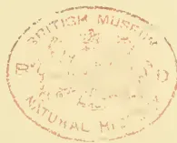A red circular ink stamp is centered on the page. The text "BRITISH MUSEUM" is arched along the top inner edge, and "NATURAL HISTORY" is arched along the bottom inner edge. In the center of the stamp, there is a faint, illegible emblem or crest. The stamp is slightly faded and has a soft red color.

333------------------------------------------------

A black and white portrait of William Walker, a man with a full beard and mustache, wearing a dark suit and a bow tie. The portrait is set within an oval frame.

WILLIAM WALKER.

334------------------------------------------------

# \* The TROPICAL AGRICULTURIST \*

## ∞ MONTHLY. ∞

Vol. XVII.]

COLOMBO, NOVEMBER 1ST, 1897.

[No. 5.

### "PIONEERS OF THE PLANTING ENTERPRISE IN CEYLON."

(Second Series.)

#### WILLIAM WALKER:

MERCHANT AND ENGINEER:—1854—1891.

[The result of our application to Mr. Edmund Walker for such particulars of his father's life as would enable us to include a notice of his career among the "Pioneers of Ceylon," was that our good friend set to work and prepared in booklet form a most interesting though brief biography intended for private circulation, but allowing preference of selection for the *Tropical Agriculturist*. The little book, we must add, is got up in the first style of the printer's art, and besides the same portrait of Mr. Walker as we give, it includes an exquisite reproduction of "Doun Castle from the Bridge of Teith," near which Mr. Wm. Walker's youthful days were spent. The booklet also includes quite a selection of the verses by "Brown Palmer" and "Sandy M'Alpine," under which sobriquets the late Mr. W. Walker wrote freely in the home press and to the *Ceylon*

*Observer*. The biographical notice is introduced as follows:—

"In the exceedingly interesting volume already published under the title of *Pioneers of the Planting Enterprise of Ceylon*, the proprietors of the *Ceylon Observer* have been good enough to include a sketch of the life of the late John Walker, and it seems fitting that this should be followed by a brief outline of the life of his brother William, who for so many years was associated with him in developing the business known all over the colony as "Walker's." The two brothers, who for so long were united in business, were not long separated, John being taken 'Home in October 1889 and William in June 1891."

We now give our summarized selection from Mr. E. Walker's fuller notice, only regretting that exigencies of space prevent our appropriating more of the very interesting record of good work appertaining to one of the most esteemed of Scottish worthies connected with the annals of Ceylon as a British Colony:—ED. T.A.]

WILLIAM WALKER was born in Doun, Perthshire, Scotland, in 1824, and attended the village school there. At an early age—for his parents were not in a position to keep him long at school—he entered the office of the

Deanston Works, where he worked for a number of years, and was fortunate in having as his master the late Mr. James Smith, who did so much for the people of Doun, and whose name is still remembered affectionately by a few of the older people. During this time, being eagerly determined, like so many Scottish lads, to push his way in the world, he continued his education by attend.

335------------------------------------------------

298THE TROPICAL AGRICULTURIST.[Nov. 1, 1897.

ing evening classes and neglecting no opportunity for improving himself. He was fortunate in having the help of his schoolmaster, who was interested in the lad, evidently recognising that he was "a lad o' pairts" and might do the "dominie" credit yet. This insatiable thirst after knowledge followed him all through life, and we find him at fifty years of age learning French, and at sixty taking lessons on the violoncello, which he played with great taste and feeling, for his soul was full of music.

It was only natural that one of his ambitious spirit should soon begin to look beyond the horizon of his country village, for he was aye "biggin' castles in the air," and Doune did not seem to offer sufficient scope for his boundless energy. So in due time he consulted Mr. James Smith, and that good man gave him every encouragement, with the result that he went up to Glasgow to mix with the busy throng there. By-and-by he got an appointment in the Calico Printing Mills, Thornliebank, near Glasgow, under the late Mr. Walter Crum. About this time, in the year 1842, the five brothers, Duncan, James, Ebenezer, John and William, all met together in Glasgow; but that meeting was never repeated, and now they are all gone with the exception of Ebenezer, who, after thirty-eight years' faithful service in the great ship-building firm of Randolph Elder & Co. (now The Fairfield Ship-building Co.), Glasgow, retired in 1881, with remarkable expressions of goodwill from the heads of the Company, and is still hale and hearty, though now in his eighty-fourth year.

In June, 1846, when only twenty-two years of age, William married Ellen Fortay, daughter of James Fortay, of Inverness, who for many years commanded the revenue cutter *Atalanta*, and was engaged in looking after smugglers on the west coast of Scotland. It was an early age at which to marry, and many people would say a very foolish thing to do for a young man who had yet to make his way in the world! But William had confidence in himself, and felt that, given a chance, he would get on all right. Besides the wisdom or otherwise of such a step depends very largely on the choice the young man makes! The reverence and affection in which the widow is held to-day by all who know her, and most by those who know her best, testify to the fact that the choice in this case was a wise one.

The next important step in the life of William Walker was when he entered the firm of Messrs. Wilson, James & Kay, now Messrs. James Finlay & Co., of Glasgow, and Messrs. Finlay, Muir & Co., of Calcutta, Bombay, and Colombo. It is interesting to note that while in the service of this firm he worked alongside of Mr. John Muir, who afterwards became Lord Provost of Glasgow, and is now Sir John Muir, Bart. Both young men were fortunate in having as their master one of the kindest-hearted of men—Mr. Alex. Kay—who years ago retired from the firm, and who, though now a very old man, still lives in his beautiful country seat at Biggar in Lanarkshire. William Walker was building up his character, on which alone, coupled with hard, conscientious work, he depended for his success. He had no other capital, and no influence to secure advancement; [but then "Character" is the most truly, permanently valuable thing in the world?—Ed. T.A.]

The time had now come when William Walker thought he might start on his own account in the cotton-yarn trade, then one of the most flourishing trades in Glasgow, and the one for which his past training had specially fitted him. He received a

fair measure of support, and would no doubt have prospered but for an unfortunate event—an event which was a sore trial to him at the time, though it was just one of those influences which made for the establishment of his character. Through the failure of Messrs. Blank & Co., cotton-yarn manufacturers, with whom William Walker had an account, he met with a great loss, and it became necessary for him to compound with his creditors. With one exception, he received great sympathy from those who suffered through him, and they did not hesitate to show it the day they met in his office. Mr. Alex. Kay was at that meeting, and such was his estimate of the character of his former assistant that he ventured at the meeting to say, "I may not live to see it, but I feel sure of this, that if Mr. Walker is spared he will pay up this debt." And Mr. Kay's confidence was not misplaced, for from that date it became the life-work of William Walker to pay off everything due to his creditors. It was a long effort, requiring great patience and much self-denial, for the claims of a large family were pressing on him; but his wife nobly seconded him in his efforts, and was able, twenty-five years afterwards, to rejoice with him when in 1875 he made the last payment. By that year every creditor had been paid, with interest at five per cent. per annum in addition; and thus was preserved unsullied the only capital with which he started—his good name. The creditors were anxious that public notice should be taken of an experience not too common in commercial life, and proposed to entertain Mr. Walker at a dinner, and have the proceedings published; but he begged them to take no such steps, as any public notice of what he regarded as merely the discharge of his duty would be exceedingly objectionable to him.

In 1854 William became the buying agent at home for his brother John, and established himself in Glasgow under the style of Walker Brothers. Later on, in 1862, he became partner with his brother in the Ceylon business, then known by the name of John Walker & Co. It was a small business in those days, but with the boom in coffee it was destined in due time to play a not unimportant part in connection with the history of Ceylon's planting industry. The following extract from a letter written by John from Kandy, Ceylon, to his brother William in Glasgow, gives a graphic account of the business in its early days. The letter must have been written somewhere about 1856. —

"The buildings may be valued roughly at £400 sterling. The motive power for driving lathes, bellows, etc., is the Malabar cooly, as we have not water enough for the blacksmiths' troughs, and fuel is expensive! Our customers are among three hundred planters scattered over the Central Province. As a class I would call them good customers, but some are very long in paying. Our workmen begin work at 6 a.m. and stop from 10.30 to 12 noon, when they resume work until 5 p.m. I am usually in the place from 6 a.m. until 5 p.m., less three-quarters of an hour for breakfast, and same for dinner. We have generally employed twelve to sixteen carpenters, four blacksmiths, five or six fitters, three or four turners, four or five boys, and ten to twelve coolies. There is quite enough of opposition to us to ensure the planters fair terms. We have in Kandy another similar establishment, carrying on all our branches of business."

336------------------------------------------------

Nov. 1, 1897.]THE TROPICAL AGRICULTURIST.299

From the above it will be seen that the firm employed at that period from thirty-eight to forty-seven native workmen; and to-day the number is about twelve hundred, while other large concerns of a similar character have also been established in the colony. No wonder the brothers were a little proud of the business which they had seen grow up and develop in this remarkable fashion!

In 1864 William made his first visit to Ceylon, to take charge of the old business at Bogambra during the absence of his brother John on a trip home. While in Kandy his time was very fully occupied with business arrangements, and from a pencil diary which is in my possession I find that even then he recognised that Colombo must become the capital and centre of Ceylon's business, and proposed that the entire business should be removed to Colombo. But the time for this change had not yet come.

Estate after estate in the Central Province was being cleared and planted with coffee—preparing for the good time coming. "Mr. Turner has just sold his Hantanne crop for fifty-four shillings per hundredweight—a splendid price." So wrote John to his brother William about 1857; but in later years coffee-planters received more than double that price for their produce. "The highest level of prosperity was reached in 1868, 1869, and 1870, in each of which years the total exports of coffee exceeded a million hundred-weights, of a value in European markets of not less than four millions sterling."\* This "boom" in coffee kept all industries busy, and it became necessary to extend, not in Colombo, but throughout the leading planting districts. Branch establishments were started in Dimbula, Dikoya, Badulla, and Haldummulla. The life in these young districts was at first a rough one, and the assistant who was sent to take charge of the Dikoya branch, and who is now a director in the company, sometimes tells how his room above the store was furnished. His table consisted of a packing case, and his chair was a keg of blasting powder!

With this rapid extension of the Ceylon business, including heavy expenditure for stocks for the new branches, arose the necessity for a great deal more capital than the two brothers possessed; but the good name William had established in Glasgow, coupled with that of his brother John in Ceylon, enabled him to find all that was necessary. Satisfactory financial arrangements were made with Messrs. Blank & Co., and everything went on well until 1874, when William's faith was again destined to be pretty severely tested. For the sake of those young men who may read this record, the story ought not to be omitted; and it is due to Mr. Kay, who proved so kind a friend to his old assistant during all these years and to the end of his life, to mention it.

One day in 1874, just at the very time when Walker Brothers' account with Messrs. Blank & Co. stood highest, in consequence of the large advances required in connection with the establishment of the up-country branches, the senior partner of the latter firm called. He then informed Mr. Walker that, being well advanced in years and anxious to curtail all outstandings, so as to simplify his financial arrangements as much as possible, he would like Walker Brothers not to draw any fresh drafts on his firm, and hoped they would be able to run off the debt by taking up existing bills as they

fell due. Mr. Walker, recognizing how much he owed to these financial friends, could only reply that to the best of his ability he would endeavour to carry out Mr. Blank's wishes. Though not knowing at the time where help was to come from, yet, being a man of strong, simple and devout faith, he felt that he would not be forsaken in this crisis.

When in his office one day at this juncture, Mr. Kay called, just to have a chat, and in a kindly way to inquire how his old friend Mr. Walker was getting on, though he knew nothing at the time of his trouble. Nor was the subject mentioned until, in course of conversation, Mr. Kay said, "I have been thinking I would like to help you, Mr. Walker, if there is anything I can do that would be a personal benefit to you. Now, would it assist you to have the command of a little more capital than you at present possess?" Mr. Walker then, for the first time, told the position in which his firm was placed. As the result of that interview Mr. Kay—after satisfying himself that the business was perfectly sound, full of promise, and only in need of more capital, and having perfect confidence in Mr. Walker—went to a leading Scotch bank and opened a credit in favour of Walker Brothers for all that was required, at an expenditure of a penny postage stamp! Needless to say that the prosperity of the Ceylon business has long since enabled the proprietors to dispense with that credit, and placed both houses beyond the need of any such help.

As already stated, Mr. Walker, as far back as 1864, contemplated removal to Colombo; but so rapidly did the business increase, both in Kandy and at the up-country branches, that further extension schemes had to be abandoned; and though in 1875 premises in Colombo were leased, and rent paid for three years, they were never occupied. By 1880, however, the collapse of King Coffee was placed beyond doubt, and it became necessary for the firm to turn their attention to other channels. At this time the grand breakwater for sheltering the Colombo harbour from the south-west monsoon was nearing completion, and circumstances all seemed to point at last to removal there. Accordingly, in 1881 the premises formerly occupied by the late Mr. Home, and known as "The Corner," were leased by the firm, and no time was lost in laying down new plant and getting the new workshops and stores ready. It required a great deal of faith to go on with this work, as the prospects of the colony at the time were about as black as could be. Planters of the highest standing up-country were being ruined, and the mercantile houses were coming down one after another, until the crisis culminated in August 1884 by the stoppage of the old Oriental Bank Corporation. It is, perhaps, not to be wondered at that amidst all this gloom, a Colombo merchant, when he saw in 1883 that, in addition to the workshops, a new foundry—the first in the colony—was being built, should exclaim, "Has Walker gone mad!" But every one was not of that opinion, for in July 1883 the *Ceylon Observer* wrote:—"It is well that when the time came for an era of new life to the port and trade of Colombo, the right men were ready to meet the crisis and provide its requirements. The names of Kyle, Griniinton, and Walker & Co. will be honorably associated with the New Colombo which is rising as the result of the partial completion of the Breakwater, and the resort to Colombo of many lines of mail, passenger and cargo steamers."

\* From "Ceylon in 1893," by John Ferguson.

337------------------------------------------------

300THE TROPICAL AGRICULTURIST.[Nov. 1, 1897.

Meanwhile, Mr. John Walker, who after more than thirty years of hard work in Ceylon, did not care to undertake the burden of further extensions, and had settled with his family in Stirling, decided to retire from the firm he founded, and an arrangement was come to whereby he agreed to take over the up-country places of business and carry them on under the style of Walker & Greig, leaving the Kandy and Colombo establishments to John Walker & Co. William Walker now became senior partner in the Ceylon business, as well as in that of Walker Brothers, who, after the opening of the Suez Canal, found it necessary to remove from Glasgow to London, and who, in addition to Ceylon, have now very large interests in South Africa. Although his home was in Glasgow, Mr. Walker frequently visited Ceylon, as he had no sympathy with "absentee landlordism," and desired to keep in touch with all, from his junior partners down to the office peons, who were engaged in the Company's service. Sometimes his family felt that he was not sufficiently strong for these visits to Colombo, and when the last trip was made, in 1889, I can remember Captain Bayley, who was struck with his appearance, urging him not to return to Ceylon, and concluding his remark with, "Remember the fable of the pitcher that went once too often to the well." But Mr. Walker loved Ceylon, and had a warm heart for the natives, to many of whom he was indeed a real friend.

Throughout his life William Walker was deeply interested in all schemes for the uplifting of those whom we describe as the "working classes." The term is very defective when we remember the number of masters, professional men, merchants, etc., etc., who work as hard as, if not harder than, the majority of our workmen. Still, it has its special meaning, and in that special sense I use it. He always deplored the struggles between masters and men, which have wrought so much mischief to trade and roused so much ill-feeling, destroying utterly the old kindly and personal relationship which used in many cases to exist between both. He had little faith in Trades Unions, which he regarded as in large measure involving the transfer of the men from one tyranny to another; and when, as so often is the case, they deliberately go out of their way to sow discord between master and men, he considered their work diabolical. It was not in Trades Unions he saw hope for a better state of things, but in co-operation and profit-sharing, which in the later years of his life he advocated, in season and out of season. I cannot give a better exposition of Mr. Walker's views on this exceedingly interesting question than by quoting from a pamphlet called "Christianised Commerce," which he wrote and published in 1888, as follows:—

"I am for freedom, not socialism. I am for freedom in our dealings with other nations, in our manufactures, in our merchandising, in our contracts between employer and employed. Freedom for every man to do his best for his own truest interest, and for the good of the community; but freedom tempered and controlled by the teaching and example of Christ. I see no other solution of the pressing social troubles and difficulties of our day."

So earnestly did he believe in this as the right principle that he laid aside a portion of his own share in the business, the income from which was to be divided among those who con-

tributed by their work to earn the profit. When on one of his visits to Ceylon in 1886 he was invited to meet some three hundred of the Company's employes, who presented him with a beautiful address, accompanied with a handsome desk made out of Ceylon native woods. In acknowledging the gift he said:—

"I desire as much to be your friend as your master. I think that the firm with which I have been connected so long as its head has done good work for Ceylon. We have brought works to the Island that were never brought before. We have also paid large amounts in wages every month to the Sinhalese and Tamil workmen. But we think we can go on a step further and do better. The first thing I will try to do for you will be to afford you medical aid in time of sickness. I wish also that some provision be made for any one who meets with any accident, or in cases of any protracted illness. The next thing I wish is that something be provided for our men when old age comes on and you are not able to work. If this is carried out, no old and steady worker in the Company's service will ever have to apply to the Friend-in-Need Society." The scheme thus formulated was carried out, to the great benefit of the workmen.

In the year 1890 Mr. Walker was persuaded to agree to the conversion of the Ceylon business into a Limited Company. For some time he had great misgivings about this step, as he feared the elimination of the personal element and dreaded the possibility of the business becoming a mere instrument for grinding out dividends for shareholders who had no interest in the concern beyond their shares. He was afraid that the government of the business by a "Board of Directors" would tend to blight personal responsibility, and was inclined to regard a "Board" in much the same way as Sydney Smith did corporations when he said "they had neither a body to be kicked nor a soul to be damned!" And so it was only under certain conditions he would agree to the change in the constitution of the business; and one of these conditions was that certain shares, the most of which he himself provided, should be set aside, and the income from the said shares be devoted to the formation of a "Provident Fund." This Provident Fund meets all expenses for the workmen when laid aside through ill-health; finds them in medical advice and in medicines; and finally, when the men are too old to work, or permanently disabled, secures to them a small pension. From this fund thousands of rupees are thus distributed every year among the men, in addition to their wages; and the members of the European staff also benefit by it.

In the preceding pages I have endeavoured to give some of the leading points in the business career of William Walker's life; but it is only one aspect of the life, and probably he himself would say it was the least important, except so far as it was a "means to an end." For mere worldly prosperity he had supreme contempt; but the joy of being in a position to "help lame dogs over stiles" was genuine, and many less fortunate ones have had cause to bless his name. He cared little for public subscription-lists, where people's names and contributions are advertised to the world. His belief was that if each member of the community, in a position to do so, were simply to attend to the cases that come across his or her path in life, then there would be a tremendous reduction in the sum-total of human misery.

338------------------------------------------------

Nov. 1, 1897.]THE TROPICAL AGRICULTURIST.301

From his youth he was an earnest total abstinence from all intoxicating drink. He joined the Scottish Temperance League shortly after its formation. His name appears in the first annual 'Register' published by the League in 1849, where it has stood continuously year after year ever since. From 1853 to 1856 he was a member of the Executive, and was for many years, and up to his lamented decease, an honorary director of the Institution. He was a most liberal subscriber to the funds of the League, and in many ways sought to extend its influence.

Throughout his life Mr. Walker was always busy with his pen. When in the company of those who thoroughly understood him, and with whom he felt perfectly at home, he was the very life of the gathering, full of good stories, and able to sing with exquisite pathos our chief Scotch ballads. This reference to his singing leads naturally to a quotation from the most beautiful of all the printed notices published at the time of his death. It appeared in the *Ceylon Observer* of June 15th, 1891, and is greatly valued by the family. Between Mr. Walker and the proprietors of the *Observer*—the late Mr. A. M. Ferguson, C.M.G., together with his able partner and successor, Mr. John Ferguson—there existed a sincere and warm friendship. I quote from the article referred to as follows:—"Mr. Walker's love of music and song was intense, and those who heard his illustrated lecture in Colombo on Scottish Poetry, Music, and Song, will long cherish the memory of a great intellectual treat. His own performances as a singer were exquisite. Who that heard can ever forget his rendering of Lady Nairn's pathetic ballad, 'I'm wearin' awa', Jean,' and George Macdonald's Scotch version of the grand parable of the good Samaritan, 'Wha's ma'neibor?' Who that heard and saw can ever forget the expression of voice and features, and the appropriate action of the truly artistic singer?"

In his youthful days William Walker must have worshipped in the parish church before the Disruption in 1843; and there is more than one reference, in articles written by him, to the Bridge of Teith Church, near Doune. But at an early period in his life he joined the Baptist Church, and for many years attended the Blackfriars Street Church in Glasgow, where he greatly appreciated the thoughtful and devout ministry of Dr. R. Glover, then a young man, but now (of Bristol) one of the leaders in the Baptist community. During the later years of his life he attended the Hillhead Baptist Church, where the Rev. F. R. Robarts still carries on a most successful ministry. Though a Baptist by conviction, yet in religion, as in all other departments of life, he claimed for himself, as he allowed to all others, the utmost freedom; and so we find him equally at home among Non-conformists of different denominations and Evangelical Churchmen.\* Not only was Mr.

\* One of many interesting experiences in Mr. Walker's life was that which brought him through temperance work, in contact with an earnest but extremely High ritualistic clergyman off City Road, London, who begged of him to come and give an address to his people. When the occasion arrived, and Mr. Walker watched the procession passing to the hall and all the symbols and forms accompanying the opening service, he felt far from comfortable and honestly stated how widely apart belief and practice were from all this, and then went on with his address in which he introduced one or two pathetic Scottish ballads. After

Walker actively engaged in Church work at home, but he took a great interest in missionary work abroad. He never visited Ceylon without devoting a great deal of time to this work, going right round the Island on one occasion, in order that he might see what was being done at the different mission stations along the coast. In 1886 he made a special trip to Bombay and the north of India to get some knowledge of the missionary work carried on there, especially in connection with mission schools and colleges. How best to work our missions and utilise the consecrated energies of our missionaries must always give anxious thought to all who are truly interested in the work, but anything like dogmatic assertion on these points must be left as the "prerogative of the passing tourist," to use the delightfully sarcastic phrase of Dr. Copleston, the devoted and able Bishop of Colombo. Mr. Walker wrote a number of very interesting letters to the *Ceylon Observer*, giving an account of his trip to India, and we may contrast his calm and judicial remarks with the extravagant utterances too often made by the "passing tourist." Thoughtful men cannot but realise that our missions in India and China, where the people are steeped in elaborate religious systems older than our own, present many a "great and perplexing problem"; but Mr. Walker felt very strongly that it was most unjust to abuse the missionary. Let those who sneer at the results of their work and the apparently slow progress that is being made, devise a more excellent way, and prove their earnestness by paying for the experiment.

In politics Mr. Walker was a staunch Liberal until April 8th, 1886, when Mr. Gladstone introduced his Home Rule Bill and broke up the grand old Liberal party that included such men as Bright, Chamberlain, Lord Hartington, Foster, Goschen, and many others. Bright and Foster are no longer with us, but the others are among the men who are today making this country's history, and many old Liberals feel it is a pity they had to go to the other side to do it. For the whole of his life, Mr. Walker, of the House like many others, almost worshipped Gladstone and when the crisis of 1886 arose, he felt as if he had lost a personal friend. He had taken his share in fighting for the different Liberal measures of a whole generation, but I do not think he even voted after 1886.

When he did take a holiday his great pastime was burn-fishing, of which he was enthusiastically fond; and then he was like a boy just let loose from school. His whole soul responded to the beauties of nature, and he seemed to find and see God everywhere.

Such is a brief and all too imperfect record of the career of one who, beginning life in a Scotch village, sought to live to some purpose, and with good effect, to make the most of what ever talents he possessed. He humbly but earnestly believed that for those who seek to do what is right "God shapes the fitness of us all, and gives to every man his meaning." Life for him was full of meaning, and the meaning of his life to those who come after him becomes the richer and more beautiful as the years pass by. It is something to make the little corner of the world in which a man lives the better for his being in it; and that is what Mr. Walker managed to do.

all was over and the audience gone, the ritualistic clergyman came and shook hands beaming all over and exclaimed out of a full heart to Mr. Walker:—"I do love you!" Wide as the poles asunder, denominationally and doctrinally, and yet brothers!—Ed. T.A.

339------------------------------------------------

302THE TROPICAL AGRICULTURIST.[Nov. 1, 1897.

A few months after his death the clerks and native employes presented the Company with a very good and handsome oil painting of their late master to be hung in the office. After the presentation the manager, astonished at the costly character of the work, expressed to the chief clerk, who headed the movement, his fear that the cost must have been more than the men could well afford from their pay. It was then explained to him that at first it was proposed to levy a percentage from the pay of each of the workmen and staff. "But we thought," said the clerk, "that Mr. Walker would not like that, as it would seem like forcing contributions. So last pay day we placed a box at the gate for the men to put in it whatever they felt inclined to give; and we got more than was required." Nothing could have been more in harmony with the spirit of him who was so long their master, and it shows that even the native clerks had caught something of the spirit of his teaching.

\* \* \*

There is a little thatched cottage occupied by a small farmer or crofter in the West Highlands of Scotland. A merchant from Glasgow one summer, when on a holiday, visited the cottage, and on looking round the parlour was surprised to see on the mantelpiece a photograph of Mr. Walker.

"Do you know Mr. Walker?" asked the merchant. "O yess," replied the farmer's wife, with the sweet Highland accent; "he used to bring his family here for the holidays when the children were young. He *iss* a good man."

"Yes," said the merchant, as he looked again at the photograph, "there is no better man walks he streets of Glasgow."

\* \* \*

"When I die, put near me something that has loved the light, and had the sky above it always." These words express exactly the feeling of Mr. Walker, for though death had no terror for him he often said that he hoped he would never be buried in a city cemetery—like the Glasgow Necropolis—where flowers cannot grow and Heaven's light is for the most part of the year made dim with the dark canopy of smoke overhead. And so, on June 16th, 1891, he was laid to rest in the little country grave-yard belonging to the parish church at Catheart; "until the day break, and the shadows flee away."

So passed away in his 67th year, one of the truest and best men who ever came to this Colony of Ceylon: his "pioneering" in one direction alone led to the expansion of industries with a staff under 50 to one of over 1,200 workmen, and he lived to see the usefulness of his Colombo and Kandy houses not only recognised all over Ceylon, but in India, the Straits Settlements, Java and Borneo as well as in far-distant Brazil and in the West Indies; while not a few ocean-going steamers have benefitted by the prescience which established the Colombo Iron Works. With these Works, the name of William Walker will ever be indissolubly associated, while all who knew him will acknowledge with us that a more single-hearted and altruistic Christian never lived:

"Only the actions of the just  
Smell sweet and blossom in the dust."

## A HOME-MADE ARROWROOT MILL.

We were lately asked by a farmer in the Blackall Range how to make an arrowroot-grinding machine. He had arrowroot growing on his farm, and wished to make enough starch for domestic use. The only method he knew of was to grind down the bulbs on a large tin grater, but the results did not compensate for the labour. As we were once in exactly the same predicament, we cannot do better than describe the primitive machine which we invented, and which proved eminently successful. Being far distant from any place where a machine could have been constructed, not to mention the detail of a scarcity of cash, we constructed the machine as follows:—First, a log about 2 feet in diameter and 8 feet long was hollowed out by axe and adze into a trough. At the head of this trough was fixed a framework much like the wooden stand of a grindstone. A large wheel was then cut from a sound log. This wheel was about 3 feet in diameter and 1 foot wide. Tin plates, turned into graters (which required frequent renewal) by punching holes in them with a nail,

were next nailed on to the edge of the wheel, to which a wooden axle was fitted. The wheel, when placed in position, turned in the water with which the trough was filled. Above it was a wooden hopper, through which the bulbs dropped on to the wheel. This was turned by a man with ease, and the grated bulbs went into the water in the shape of pulp and starch. The latter gradually settled at the bottom, and the pulp was removed with a narrow-tined fork and also by hand. After a short interval to allow the starch to settle down firmly, pegs were withdrawn from the lower end of the trough, and the water drawn off. The arrowroot was then dug out of the bottom of the trough and passed through calico stretched over a tub. By stirring it round with the hand on the calico, and at the same time pouring water on it, the whole of the starch passed through into the tub, leaving the gross impurities behind. This operation was performed three or even four times, until the arrowroot was perfectly white and quite free from any foreign substance. After the last washing, it was placed on shallow trays and dried. With the machine described, we not only made sufficient arrowroot for our own use, but we sent a quantity home to our friends, and sold the balance in Brisbane at 1s. per lb. This was in the year 1863. Such a machine, however, would scarcely enable a grower to-day to make a profit out of arrowroot.—*Queensland Agricultural Journal*.

## THE CULTIVATION OF CACAO IN MEXICO.

(From a Special British Consular Report.)

The tree that produces the "food of the gods" (chocolate), "theobroma cacao" of Linnaeus, "cacari," or "cacava quahuitl" of the ancient Mexicans, and "cacao" of the Spaniards, is a native of Mexico.

Long before the conquest, the Aztecs and other ancient Mexican tribes used the fruit as one of their alimentary beverages. They prepared a drink called *chocolatl* by mixing the seeds after having crushed them on the metatl, together with a fine corn meal, vanilla ("tilxochitl"), and a species of spice called "mecaxochitl," and those that drank it were a picture of health, preserving handsome and vivid features even to old age. All nations subjugated under the Aztec eagle had to bring, among other valuables, a certain

340------------------------------------------------

Nov. 1 1897.]THE TROPICAL AGRICULTURIST.303

number of bags of cacao to the place in the great Tenochtitla as an annual tribute to the Emperor. It was so highly prized amongst the ancient natives that in trade it was utilised as currency among the lower classes.

The varieties cultivated were, namely:—The "quahcahuatl," "mecacahuatl," "zochicucahuatl," and "tlacacahuatl." The beau of the last one was very small, analogous to the kind found at present at Soconusco, Chiapas. The fruit produced in Zoconochco, in the provinces of Tabasco and Chiapas was considered as the best.

The followers of Hernan Cortez endeavoured in vain to maintain the plantations then existing, but it is a well known fact that on the conquest of this country by the Spaniards agriculture and the industries then known retrograded to such an extent that the cultivation of the cacao as well as that of the cotton plant suffered so severely that both plants were reduced almost to a wild state. The conquered Mexicans were compelled to work in the mines and serve in slavery, and were thereby obliged to neglect their plantations. And as the conquerors were not versed in the culture the industry was nearly abandoned, and did not take a new life until some Spaniards started one or two large plantations in Choutalpa, Tabasco, a few years before Mexico threw off the Spanish yoke. Other plantations were established in different sections of Tabasco and Chiapas.

Chocolate, the product of the fruit, was first introduced into Europe (Spain) by the Spaniards from Mexico. Portugal followed in the use of it; France and England did not appreciate its full qualities until the latter part of the seventeenth century. After the year 1778 it came into vogue in all the cities in Europe. Its alimentary virtues became more generally known, and Doret, a Frenchman, invented a hydraulic machine to manufacture it on a large scale. Since then all civilised nations have consumed this rich American product of Mexican origin, which, up to date, is not produced in sufficient quantities to meet the world's consumption.

This tree is found growing wild and in cultivation in the States of Colima, Michoacan, Guerrero, Oaxaca (districts of Jamiltepec and Tuxtepec), Chiapas (districts of Soconusco, Mezcalapa, Pichualco, Simojovel, and Palenque), Tabasco, and central and southern Vera Cruz, where the elevation is from 100 to 1,200 feet above sea level, but Chiapas and Tabasco are noted as being its home, the climate and soil there being more particularly adapted to its culture and development than any other portion of the globe.

The production of cacao in the year 1893 was 2,147,730 kilos., valued at \$837,197. In 1870 the States of Tabasco, Colima, Chiapas, Guerrero, Michoacan, Oaxaca, and Vera Cruz had 569,795 trees in cultivation, producing an annual crop of 31,285 quintals, worth to the planters \$782,125.

Cacao is an evergreen tree of medium size, which, if grown in a good soil and left to itself, will reach a height of 20 to 30 feet, and spread out to an extent of 10 feet or more on each side. At the height of a few feet from the ground it sends out three to six lateral branches ("horquetas") without any sign of a leading stem, and it is only when the branches are matured that a leader or leaders ("rama chupona") spring out from the side, and not from the centre of these branches. The leaves are smooth, alternate, lanceolate, pendent, of a deep green colour, 9 to 10 inches long by 3 inches across. The flowers are small, of a pale yellow or very light red colour, and they come off in a bunch from the stem, branches, and the place where a leaf formerly existed. It is rarely that more than one of them develops into fruit, and thus many more flowers are borne on the trees than fruit pods. The cucumber shaped pods are 5 to 9 inches long, and nearly 4 inches in diameter at their widest part, with a thick, almost woody rind. They are pinched in at the top and pointed at the end, the point being curved to one side. The skin is first light green, then of a yellowish red colour, with ten furrows and tuberculated ridges. These

indicate a five-celled fruit, which contains on an average 38 seeds, embedded in its sweetish pulp.

The species most cultivated in Mexico are: Cacao or *Theobroma ovalifolia*, *T. bicolor*, and *T. angustifolia*. There are other kinds known, generally found growing wild, which come under the head of the *Guazuma* or *guacima*, *Guazuma polybotrya* being the principal species.

Practice and study have shown us that the cacao tree will thrive well in virgin lands recently cleared, but rich in organic matter and minerals, and as it has a long tap root the surface soil needs to be deep and thick with humus. The best soil, however, is that occurring in valleys and undulating lands, along the banks of rivers or streams made by years of alluvial deposits, or by the decomposition of volcanic rocks. A proof of this is shown in the department of Soconusco, Chiapas. It will also grow well in loams and the richer marls, but it will not thrive in stiff, heavy clay.

A warm, moist climate, having a mean temperature between 76° and 77° Fahr., is necessary for the cultivation of cacao if large crops are expected, but when the soil is suitable, the tree will grow and give fair returns in a moderately dry or well drained location. The ordinary cacao plant will not do well in the mountains above 600 metres (1,968 feet), and even at that height it becomes stunted, and is fruitful only for a few years. The best elevation is from 300 to 500 feet, and in sheltered situations near the seashore good crops are to be obtained, but the tree will not thrive if exposed to the direct influence of the sea breeze. Cacao will not bear much exposure, hence sheltered lands and valleys should be selected and on the Gulf side of Chiapas, Tabasco, and Vera Cruz, northern and eastern aspects should be avoided. Still, locations in Colima, Michoacan, Guerrero, and Oaxaca, on the Pacific side, having a south and south western exposure, must not be preferred for the formation of successful plantations.

Cacao plants are obtained from the seed, which germinates readily and quickly. The best looking pods from the April or May crop, which are not over ripe should be picked for the purpose. Those known as hechas are generally preferred by the planters. These are distinguished by their light colour, solid appearance, and the seeds not rattling inside. After selecting the largest seeds from healthy pods, the former are soaked in lukewarm water for 12 or 18 hours, rejecting those assuming a reddish tint and likewise those floating on the water, the rest, are left to dry.

A virgin spot close to a spring or stream whose soil is not porous, in the immediate vicinity of the plot to be planted, should be selected for the nursery. For the convenience of handling, more than one nursery should be formed along the plot, 300 feet distant, if a large sized plantation is to be established. The spot is prepared by hoeing the soil, extracting the weeds and roots and pulverising the earth with a rake; then beds are made 5 feet wide by any length, separating each one by a walk 3 feet wide. Small furrows are made, about an inch in depth and about 12 inches apart, and the seeds are sown in them 8 inches one from the other. That part of the seed attached to the stringy centre of the pod is the one to be placed downwards in sowing. The seed is covered with vegetable mould or loose loam mixed with horse manure and over that banana leaves. The bed is sprinkled every day for 12 or 15 days, when seedlings appear. Then the banana leaves are removed, and sheds, made of palm leaves and sticks, so fixed that they can be raised as the seedling grows, should be placed over the nursery as shade and shelter; no weeds or grass are allowed on the beds.

The sprinkling should be continued when necessary, or on rainless days, and the palm leaves are gradually taken off, but not altogether until the plants are ready to transplant. The operation of forming the nursery is done in some places in the months of April and May, and in other localities as late as September.

341------------------------------------------------

304THE TROPICAL AGRICULTURIST.[Nov. 1, 1897.

Either in the month of February or March the planter's attention must be directed to the preparation of the land; in some places, where the rains cease early in the season, that is done in December or January. The forests having been cut down (*tumba*) the branches must be lopped and strewn (*rozada*) evenly over the ground before they are burnt (*quemada*). But when the forest is cleared, shade belts should be left, or afterwards planted in exposed places so as to shelter the cacao trees from the wind.

Of course the felled forest trees must be allowed to remain for a time exposed to the sun, otherwise the smaller branches will not catch fire properly. Where possible it is better not to burn the bush, but to pack it in lines between the young plants or *madres*, in order that, by its rotting, it may add to the richness of the soil, otherwise the nitrogenous compounds so beneficial to plant life are sent off into the atmosphere by the burning.

Immediately after the burning, which should take place in April, or a month after the land is cleared, corn and beans are sown on the plot. If the land has no natural trees suitable for shade, mother trees (*madres*) are looked for, such as *mataraton*, *pito*, *cocoite*, *chipilcoite*, and *chontal*. The lastnamed, a broad leaved tree, is not good for anything but to give shade and shelter. *Cocoite* and *chipilcoite*, small leaved trees, are hard wood and are used by preference for posts for houses. These trees are obtained from forests in the shape of cuttings or young plants, and planted in the beginning of the rainy season and at a distance of from 15 to 18 feet apart on rich flat land, but on poorer soil and on hill sides, from 12 to 16 feet will be the proper distance. Rubber can also be planted as shade, but it requires more scientific work and care. In July and August the corn and beans are harvested, and the plot thoroughly cleaned; the banana suckers can then be planted between every for *madres*, providing rubber has not been thought of and no preparations made to raise it. In the spring of the following year another crop of corn can be sown between the *madres* leaving a hill close to the place destined for the cacao seedling which will serve as *chichihuas*, temporary shade, to the young plant when transplanted. In Chiapas and Tabasco trees called *challa* and *madre serrana* are utilised for this purpose. A year after sowing, seedlings are 50 centims. (20 inches) high and ready to be transplanted.

In the beginning of the rains, on a cloudy day, the operation of transplanting is proceeded with. A peon with a machete cuts a square line around the seedling and with a spade (*coa*) lifts up earth and seedling; this is done in 15 to 20 minutes. Then another peon wraps up the whole mass with a large leaf grown on a plant called *hoja blanca*, found in those sections. In the meantime the holes are being made, they are dug 8½ feet away from the *madres* if these are set 17 feet apart, so as to form a square with a mother cacao in the middle. The holes should be 2 feet square and 2 feet deep, that is 8 cubic feet of earth must be taken up, this can be done by a practical man inside of 5 minutes, in soft soil. The earth around the seedling after transplanting must be well pressed with the foot, but at the same time, before finishing that operation, dried leaves are mixed with the soil to be placed on top.

Of course land under cacao cultivation, as under all proper and successful cultivation, should be kept clear of weeds. In the first place the plot should be drained off to ensure quick crops; and then proper tillage will improve the soil and do good to the trees. To accomplish this, 4 weeding (*ladeas*) are necessary in the first 3 years, 3 in the second 3 years, and 2 in the following years. On steep hill sides cutlassing will be sufficient, and on level places hoeing will be required. When the trees are grown so that their branches shade the land, the weeds will not grow very fast, and as a rule they are so loosely rooted that they may be easily pulled up. The cultivation and harvesting of the side crops must be attended

to in due time. The cacao planter should give careful attention to the pruning of the trees and trimming of the *madres* if he wishes to get a large yield. As the pods are borne on the larger branches, the principle is to develop such branches by judicious pruning and to see that they are not covered up by a mass of foliage and small twigs. A typical cacao tree should have one stem, giving off at a few feet from the ground three to five branches which spread in an open manner and are free from leaves except at the top; thus the leaves shade the open inner portion without interfering with a free circulation of the air. If the young plants throw out more than one main stem, the surplus ones (*mamores* or *chuponas*) must be pruned off when the moon is on the wane, and after the lateral branches are formed no upward prolongation of the stem must be allowed to grow. If the tree be left alone these upward growing branches will come off from the stem just below the laterals, in the form of suckers, and to leave them on is to cause the strength to be taken from these fruitful laterals, as well as to allow the trees to run up, perhaps for 30 feet or more thereby causing much trouble in picking the pods. When the suckers are pruned off, fresh ones will grow in a short time, generally in a month, so that the trees will require frequent attention until they are mature, when the tendency to throw out suckers will be stopped. In gathering the pods, the suckers may be taken off at the same time, but the trees should not be pruned in the flowering season.

Unless in the case of sickly plants on poor soil the trees will not require manuring until the crops are taken off, when, as may be imagined, it will be necessary to restore to the soil, in a cheap way, what has been removed in the valuable produce. A good deal will depend on the nature of the soil and the yield of the trees. Should crops which were abundant be found to be falling off, it is an indication that manure is necessary. A compost of yard manure and bone dust in the proportion of 5,000 cart loads of yard manure and 500 lb. of bone dust per hectare of land applied every 3 years is all that is required. The successful harvesting of cacao requires great care and watchfulness, as it is a fruit that has many enemies, the principal being parrots, squirrels, *tusas* (a species of gopher), *tepeiscuintle*, another animal of the rodent class, and ants, specially those known under the name of *arrieras*. But damage by these can be obviated by proper cultivation and care.

Returns from a cacao plantation (*motelar*) cannot be expected until 5 years from transplanting. At 2 years old the tree, in rich soil, stands 5 or 6 feet high; when 7 or 8 feet high it begins to bear (*jugar*), but it is not in full bearing (*cuaja*) until it is between 10 and 12 feet high. The first flowers under favourable conditions will come out at the third year, but, as the tree is not matured then, they should by no means be allowed to produce pods, otherwise the plant will be so weakened by the fruiting that its growth will be greatly checked. The first flowers, therefore, should all be rubbed off.

After the leaves of the flower fall, a bud appears like the common Mexican chile pepper and takes 3 or 4 months to mature. Peons or *mozos* must be employed daily until the crop is harvested, as birds and squirrels are apt to eat the bud and afterwards the seed. The cacao tree flowers all the year round and the pickings of the fruit are divided into four harvests or seasons. The first, which covers the first three months of the year, is known as *invernada*; the second, lasting through April, May, and June, is the *cosecha* or harvest proper, and is the most abundant of the four; the product of the third, extending over July, August, and September, is known as *cacao loco*; and that of the three last months of the year as *alegron*.

The average yield of dry cacao from each tree of course varies very much. The limits may be said to be from 1½ to 8 lb. per tree.  
—*Sugarcane*.

342------------------------------------------------

Nov. 1, 1897.]THE TROPICAL AGRICULTURIST.305

### PALLEGAMA GRANT ESTATE.

Sportsmen occasionally find their way to the neighbourhood of Pallegama and we are glad to have independent opinions of the planting in some "Notes"—not from one of a recent party, but gained indirectly:—

"Pallegama has every appearance of being a very fine property in course of time: coconuts and coffee were looking very well indeed, though wild pig and buffaloes do a lot of damage to young supplies. But couldn't the hides and horns of buffaloes be turned into a 'New Product,' and add to the revenue of the estate instead of taking from it? The bungalow is a neat building on the top of a knoll, and has a cart road right up to the door. The whole distance from Matale is 47 miles, and sportsmen often go much farther than that in search of game."

### FRUITS AND VEGETABLES:

HINTS FOR MR. WILLIS AND HIS STAFF:

AS ALSO FOR ALL UPCOUNTRY (AND LOWCOUNTRY) RESIDENTS.

(From a practical Colonist.)

"THE TOTUM, Sept. 14th:—Don't you think, Mr. Editor, that our energetic Director of Peradeniya Gardens would be conferring a boon on the whole community, if he were to train a staff of coolies that could be hired out as garden workers at so much per month just as gardeners are lent out at home. For instance, if any one wanted a garden laid out or one remodelled, what a convenience it would be to get a coolie who knew how to do it, even by paying a good wage for him!—and an ordinary estate coolie could keep a garden weeded and watered when once it was laid out; and twice a year, say, an experienced gardener from Peradeniya might be had, to put in fresh plants and seeds. The Peradeniya Gardens might do wonders in introducing new fruits that could be grown in our island. I am perfectly certain there would be much less fever in many districts were people to eat more fruit. Even plantains are not to be always had in planting districts, and if oranges, limes, pineapples, papaws, &c., were for sale at the Government Gardens, there would be a great demand for them, and I have often thought a good way of celebrating this year of Jubilee would be for every one in the island to plant 60 fruit trees (of sorts) near bungalows wherever such a thing was practicable. The expense would be trifling and people ought not to be deterred by the feeling that those who planted the trees might not reap the fruit of them. Let us all be disinterested for once in a way: some one will eat the fruit in course of time.

"I fancy the pineapple fibre you wrote about is extracted from the leaves, is it not?—we could grow tons of these. Papaws planted from seed come into bearing in about 10 months at an elevation of 2,400 feet. So papaw juice could also be produced in large quantities."

### NOTES ON RUBBER.

The *India Rubber World* of New York is starting a discussion as to the relative values of the rubber of different countries, and certain authorities seem inclined to make out that Para rubber trees are never to succeed in Asia, nor Africa rubber from the Congo ever prove as

good as the rubber from South America. Even the latter proposition is improbable, while we have no faith in the former. Why should not Para rubber prosper well in moist warm Ceylon, just as much as Trinidad caeao has flourished in our upland valleys and Peruvian cinchonas on our hills? We quote from our American contemporary as follows:—

Any hope that rubber may be cultivated successfully in more favourable climates seems to us wholly unfounded. There is no higher authority on this subject than Mr. Mann, late forest conservator in Assam, who wrote recently in *The India Rubber World*: "The acclimatization of American rubber-trees in Asia has not been a success, and, generally speaking, I am now inclined to think that all rubber plants had better be grown in the countries in which they are indigenous." By the way, there is not, and never was, a large plantation of Para rubber-trees in India, although a statement is going the rounds in regard to such a plantation, said to cover 200 square miles. More than this, experiments made in Brazil have demonstrated that, while cultivated trees may flourish, they may not yield rubber on a different soil, or at a higher elevation, than is common to the native rubber forests. Thus it will be seen that the business of planting rubber should not be undertaken without considerable caution.

The cultivation of India-rubber, coffee, and pineapples together is proposed by the Mexican Gulf Agricultural Co. (Kansas City, Co.), incorporated under the laws of Missouri with \$100,000 capital. Organized originally to start a coffee plantation in the isthmus of Tehuantepec, their plans have been extended until they now include an offer of 100-acre tracts, one-half planted in coffee and pineapples, and 4,000 rubber-trees. The idea is to attract additional capital and increase the number of persons interested in tropical cultivation. They claim to have several thousand rubber-trees on their lands already, and more will be planted. After eight years it is promised that the rubber-trees will yield yearly \$1 each.

A despatch appeared in the *New York Sun* of July 12, dated from Oaxaca, Mexico, saying: "The India Rubber Company of Mexico, an English corporation with a paid up capital of \$2,000,000, is going into the rubber industry in Mexico on an extensive scale. This company is now planting 5,000,000 rubber trees on their lands in the district of Pochutla, this state. They have 400 men at work on the land now."

Every increase in the demand for any grade of rubber tends to raise its cost to the manufacturer. Suppose, then, that certain African sorts should be found truly to yield a substitute for Para. How long would the present difference in price continue? There would be a steady rise in Africans until it would be economical no longer to use them instead of Para rubber. This consideration would soon put an end to any hope for great profits from substituting low-priced African gums for the higher priced sorts from South America. But it remains to be proved that the African rubbers are capable of such use as has been asserted. Of course great advance has been made in their manipulation, permitting their use in channels where, not so many years ago, it would have been impossible. It is reasonable to suppose that the use of Africans will continue to extend in new directions, but the experience of every manufacturer who has ever had anything to do with these sorts has helped to make him conservative.

It is not the question of how much rubber there is in Central Africa, or of how many laborers can be had. It is not even the question of transportation that is most important, but how the rubber is going to find a market. Para rubber always has been and always will be the mainstay of the rubber industry. There is a demand of course, for African rubbers, and this will grow, but from this time on it will be only in the same proportion as the rubber industry grows as a whole. When the limit to the demand for Congo—or any other—rubber has been reached, the production will fall off, and this is why I say

38

343------------------------------------------------

306THE TROPICAL AGRICULTURIST.[Nov. 1, 1897.]

that we are not going to see such a great lot of Central African rubbers coming to market in the next few years as some other people think. Let the market once become overstocked with these grades, and prices will fall below the cost of producing and shipping them to market.

#### AMERICAN TEA IMPORTS OF 1897.

<table border="1">
<thead>
<tr>
<th>The total imports of tea for the year ending June 30, 1897, were, from the countries named, as follows:—</th>
<th>Pounds.</th>
<th>Dollars.</th>
</tr>
</thead>
<tbody>
<tr>
<td>United Kingdom ..</td>
<td>6,212,008</td>
<td>1,165,765</td>
</tr>
<tr>
<td>British North America ..</td>
<td>2,547,371</td>
<td>396,738</td>
</tr>
<tr>
<td>China ..</td>
<td>56,483,924</td>
<td>7,281,931</td>
</tr>
<tr>
<td>East Indies ..</td>
<td>2,120,003</td>
<td>272,683</td>
</tr>
<tr>
<td>Japan ..</td>
<td>45,465,161</td>
<td>5,651,279</td>
</tr>
<tr>
<td>Other Asia and Oceania ..</td>
<td>454,111</td>
<td>57,226</td>
</tr>
<tr>
<td>Other countries ..</td>
<td>60,597</td>
<td>10,240</td>
</tr>
</tbody>
</table>

<table border="1">
<tbody>
<tr>
<td>Total..</td>
<td>113,343,175</td>
<td>14,535,862</td>
</tr>
<tr>
<td>Exports ..</td>
<td>439,577</td>
<td>98,790</td>
</tr>
</tbody>
</table>

<table border="1">
<tbody>
<tr>
<td>Net imp'ts or cons'mpt'n ..</td>
<td>112,903,598</td>
<td>14,737,072</td>
</tr>
<tr>
<td>Net imports in 1896 ..</td>
<td>93,340,248</td>
<td>.....</td>
</tr>
</tbody>
</table>

<table border="1">
<tbody>
<tr>
<td>Increase ..</td>
<td>19,563,350</td>
<td>.....</td>
</tr>
<tr>
<td>Consumption, 1897, per capita ..</td>
<td>1.55</td>
<td>.....</td>
</tr>
<tr>
<td>Consumption, 1896, per capita ..</td>
<td>1.33</td>
<td>.....</td>
</tr>
</tbody>
</table>

Tea is the most talked-about article in the grocer's stock, and yet the total import cost of one year's supply is less than \$15,000,000, and the retail cost less than \$30,000,000. The trade is insignificant in comparison with other articles consumed, and yet it absorbs more attention than any other one article. It has always had a historical interest, a social connection; been in favour as a stimulant, and of interest to the grocer because it is a medium for generous profits.

The net imports, reduced to gallons of beverage, show a consumption of not less than 564,517,990 gallons, on a basis of five gallons of beverage to one pound of leaf. Some claim that one pound of leaf makes six gallons of beverage. When India or Ceylon tea is used, one pound of leaf will make from twelve to sixteen gallons of beverage, showing it to be the cheapest good stimulant in favor with consumers.—*American Grocer*, Aug. 18.

#### THE TRADE IN ALOE FIBRE.

The *Indian Textile Journal* writes:—Few of our readers are probably aware of the increasing business that is now being done in the export of aloe fibre. There has been a continuous demand for the fibre from many parts of the world and it seems that if India can supply it in large quantities there will be a good future before those who will set to work and begin the export on a large scale. As it is, it unfortunately remains a neglected industry, in this country, but if once regular shipments are made and depended upon, a steady demand will be kept up. According to a correspondent, a visit to the press houses at Colaba would surprise many a capitalist in search of a profitable investment. Waggon loads of the fibre are sent down to Bombay from the growing districts by merchants or their representatives. It is forwarded either in bulk or in loose bales and on arrival is carefully sorted by the buyer, who fixes his price, which varies from R75 to R125 per ton according to the different qualities. It is then pressed into bales of the same size as cotton bales. The price delivered in London is reported to be from £5 to £17, so that a good margin of profit is generally left to the Bombay exporter.

India, like most of the Eastern countries possesses a great variety of fibres; but a very few of them are commercially useful. Aloe fibre grows wild in many parts of India, the Bombay supply depending on the wild tracts of Central India, the whole of the Deccan and the Bombay Presidency, where on the coast of Katbiawar, and particularly in districts near Poona

it grows in abundance. No systematic cultivation of the weed is yet attempted. Men, woman and children of the lowest caste pick the leaves in swamps and malarious bogs when they have no better occupation to follow. The work is alike unhealthy and injurious, as the juice of the plant causes itching of the skin, and in the case of sores of cents the limbs have been known to swell. The families set to work in groups, and while some gather together the leaves and stems, the others strike the leaves, after they are dipped in water, against a stone, which operation separates the fibre from the leaves, juice, &c. This is the most primitive of the methods still followed in many districts, but of late several hand machines of somewhat crude design have been made by which the fibre is extracted. Having separated the fibre in this way, the natives attend the bazaar with their supply and part with their small bundles for a very nominal consideration in the shape of food grain or copper coins. The fibre is used in this country either pure or mixed with hemp or flax for making cordage, &c. America exports large quantities of the fibre to all parts of Europe, Mauritius being next in her supply. The plant in these countries is, moreover systematically cultivated, and the fibre being extracted by improved machinery, is commercially far superior to the Indian Aloe.—*Pioneer*, Sept. 9.

#### PLANTING AT THE STRAITS.

In the "Negri Sembilan Government Gazette" of Sept. 3rd, received today, we find the Report by the Commissioner of Lands and Mines (Mr. H. Conway Belfield,) F.M.S., dated Taiping, 23rd March, 1897, and from it we make the following extracts:—

SEREMBAN.—The progress of coffee planting by Europeans is very noticeable and satisfactory. Eight applications of this nature were registered during the year, and a total area of 4,138 acres was granted for this purpose. 6,977 acres were surveyed, and seven leases were registered for this purpose alone. The amount of quit-rent now paid annually in respect of large estates in the district owned by European planters is \$2,707.56.

PORT DICKSON.—One thousand eight hundred and ninety-two acres of land were alienated during the year, bringing the total on 31st December up to 49,393 acres, distributed among the following descriptions of cultivation:—

<table border="1">
<tbody>
<tr>
<td>Gambier and pepper ..</td>
<td>23,353 acres</td>
</tr>
<tr>
<td>Tapioca ..</td>
<td>21,395 "</td>
</tr>
<tr>
<td>Coffee, kampong, and sawah..</td>
<td>4,645 "</td>
</tr>
</tbody>
</table>

Ninety-one applications for land were received, embracing an area of 2,745 acres, and 195 leases were issued during the year. The concession of 11,000 acres of gambier and pepper land, granted in 1876 to Toh Eng Sew, for twenty years, fell in during the year, and the land reverted to Government.

JELUBU.—The total amount of land alienated in the State for agricultural purposes on 31st December was 2,740 acres, of which it is estimated that about 2,000 acres is padi land. Of this quantity, 552 acres were alienated in 1896. The mining lands now occupied amount to 6,514 acres, 411 acres having been given out in the past year, of the above area, nearly 6,000 acres are held by the two companies above mentioned.

#### A CEYLON PLANTER REPORTING ON DOMINICA.

In the "Colonies and India" of August 23rd we find the following reference to a Report presented to Mr. Philip Templer's Government by Mr. Naftel, so well-known here as a Pussellawa planter and afterwards *pro tem*, Visiting Agent to Messrs. Cumberbatch & Co. :—

We have received a copy of the report compiled by Mr. C. O. Naftel, late Inspector of Plantations in Ceylon, who, it will be remembered, was invited

344------------------------------------------------

Nov. 1, 1897.]THE TROPICAL AGRICULTURIST.307

by the Government of Dominica to inquire into the capabilities of the latter island. Mr. Nattel is eminently qualified to perform such a task, having had more than 20 years' experience of tropical agriculture in Ceylon, and his report is a most valuable and interesting document which, although it applies particularly to Dominica, may be found to furnish some useful general hints to planters in other parts of the West Indies. Mr. Nattel holds up the Ceylon system of cultivation as an example to Dominica, and, in writing this report, he has had before him the hope that means may be found to enlist the services of Ceylon men for Dominica. The question has been asked why the Dominicans do not take advantage of the natural resources of their island. The principal answer is that they have no capital, and though the planters are experimenting in new products to take the place of their old staple, sugar, they cannot do much without money. What are required to bring out the resources of Dominica are capital, cheap money, and experience obtained in more prosperous fields of enterprise. There is no doubt that Dominica offers a profitable field for an agricultural company, and in addition to their being a good opening for such a company there is one for men with the necessary knowledge and capital. Planters trained in Ceylon have gone to the Straits Settlements, Borneo, and East Africa, to take up lands for Liberian or Arabian coffee. If others are meditating such a step Mr. Nattel advises them to look at Dominica first. There is no need to go so far afield and to bad climates, when, within a fortnight of England, there is this fertile island, possessing a climate difficult to equal, and certainly not to be surpassed by any place within the tropics. Mr. Nattel has seen enough of the island, and so compared its advantages with all that is considered essential for agricultural purposes in Ceylon, to induce him to confidently advise anyone with capital (which he can afford to invest without requiring an immediate return) and with knowledge of planting, or with confidence in some person whose services he can secure to plant for him, to invest in Dominica. It is to be hoped, therefore, that this report may bear fruit in the shape of attracting capital and fresh settlers to the island, the inhabitants of which, however, can greatly help to improve its condition by recognising and acting upon the recognition of the fact that what is worth doing at all is worth doing well, and that method counts for much, both in the eyes of capitalists and in the successful carrying out of even the smallest enterprise.

Not only coffee, but cacao and nutmegs are reported to do well in the West Indian island administered by the ex-Government Agent of the Central Province.

### TEA PLANTING IN FIJI.

We find the following advertisement in the *Fiji Times* of 7th August:—

FOR SALE.—The Wainunu Tea Estate, consisting of 700 acres, 200 acres under tea, fully bearing, will produce 80,000 lb. of tea incoming season. The latest appliances for manufacturing and water power for driving. Estate thoroughly clean and all buildings in first-class order. Inspection invited.—Apply to, ROBBIE AND EVANS, Levuka.

And an editorial note referring to it is as follows:—

The Wainunu tea estate, it will be noticed in this issue, is advertised for sale. The property consists of 700 acres, 200 acres of which are under tea and in full bearing, while it is estimated that the mill will produce 80,000 lb. of tea during the incoming season. The mill has all the latest and most improved appliances for manufacturing, being driven by water power. All the buildings are in first class order and the estate is thoroughly clean. The Wainunu tea is well known all over Fiji and finds a ready sale in the group, and as the demand here is

nearly equal to the supply but very little has been exported, although what has been sent away has been reported on very favourably. Such an estate in Ceylon would be valued at from £80 to £100 per acre, for all the area under tea, so the planters in that island have evidently a high appreciation of tea property. The estate should prove a very profitable investment with any one with the necessary capital to carry on operations, not that the amount required would to our mind need to be very large.

We understand this Wainunu tea estate is the only one now in Fiji. If it were situated in Ceylon such a place would readily find a purchaser, but the scarcity and dearth of labour in Fiji will militate against it being sold for anything approaching a decent figure. Local sales of tea are the only thing to keep an estate going in Fiji, until labour conditions alter greatly for the better.

### TRINIDAD AND TOBAGO.

From the report of Sir H. Jerningham on the condition of Trinidad for the past year, it seems that the revenue was £618,332—the largest figure reached for years past—and the expenditure £594,462. The public debt is £356,288, wholly incurred for railways and roads. The population is estimated at 248,404, of which East Indians number 81,404. The imports amounted to £2,463,525 and the exports to £2,165,820, of which about half in each case belongs to British countries. Sugar and its products, cocoa, asphalt, and bitters are the chief exports. The area of the colony is estimated at 1,120,000 acres, of which more than half remains to the Crown. The area under sugar cane is 58,500 acres, and cocoa 97,000 acres.

The Tobago report is also satisfactory the revenue exceeding the expenditure. The labourers, who are mostly peasant proprietors, are in comparative comfort. The larger landowners and merchants may feel the pinch of the times, but the labourer, with his small holding and his few head of stock, supplemented by occasional work on estates or public roads, finds his existence an easy one.—*London Times*, Sept. 3.

### THE RESOURCES OF ABYSSINIA.

Ethiopia is a mountainous and very fertile country, the latter characteristic being especially true of the plateaus of moderate altitude (2,000 to 3,000 feet). According to the *Bulletin de la Société de Géographie Commerciale*, the products are barley, wheat, millet, maize, sorghum, flax, various oils, medicinal plants, potatoes, coffee, tobacco, sugar-cane, &c. There are vast forests; the sycamore, the mimosa, the tamarind, a variety of wild olive (reaching thirty feet in height), the lemon, the orange, and the coffee tree are among the principal species. The domestic animals are horses, donkeys, cattle, sheep and goats. Birds and bees abound. The latter contribute largely in certain districts to the wealth of the country, their honey being used in the preparation of hydromel, the favourite native drink, and the wax serving for candles. The mountains contain gold, copper, iron, and rock salt. Potter's clay is common, and in many places very pure. The principal articles of export are coffee, gold, ivory, skins, guns, wax and medicinal plants. The imports consist of cottons, silks, cloths, carpets, firearms, cutlery, hardware, provisions, and tools. The French colony at Obock has opened a route for commerce to Harrar and various provinces of the Empire. A postal service has been established between Djibouti, Harrar, Addis Ababa, &c., and there is telegraphic communication between the two latter places. In the interior,

345------------------------------------------------

308THE TROPICAL AGRICULTURIST.[Nov. 1, 1897.

the service is by horse; from Djibouti by boat. Addis Ababa, the capital, has a permanent population of some 50,000; the total number of inhabitants of the country is 15,000,000. Addis Ababa is an important centre of trade. Harrar is the residence of Ras Makonen; it has a population of 42,000. This is the point of transit of all the commerce from the southern provinces. The goods are brought to the city from the interior by mules, and carried thence to the ports by camels. The annual value of the trade of Harrar amounts to over £1,000,000, and is growing steadily. —*Journal of the Society of Arts*, Aug. 27th.

### AREKAS—PLANTAINS—PLUMBAGO.

#### KEGALLA DISTRICT (CEYLON) AND ITS INDUSTRIES.

We have already reviewed Mr. Davidson's admirable Administration Report for 1896 on the Kegalla District; but it was so full of matter worthy of notice, that we could only give samples at the time. On next page will be found an extract supplying useful information bearing on the local industries in new and old products—in plantains (of which nearly 3,500 tons were carried from Rambukkana to Colombo last year!) as well as in arekanuts, Liberian coffee, cacao, and rhea. About arekanuts Mr. Davidson gives us new and valuable information accompanied by suggestions well worth the attention of the Government. He estimates the gross return from arekas properly planted at R90 an acre; and as the expense of upkeep and collection must be comparatively moderate, there would seem to be a margin quite as good as that in coconut palms. Mr. Davidson does not mention how long it takes to bring arekas into bearing; but from our own little guide for areka planters (out of type, but which we must at once reprint) we see the time required is five to six years only—a great advantage over coconuts. Curiously enough, Mr. Davidson's estimate of gross return (R90) agrees very closely with that of the late Mr. Borron (R87), although the latter, planting 10 by 10 ft. had far fewer trees to the acre. The natives, according to Mr. Davidson, would allow 1,200 arekas grow to the acre—far too many; but while he would cut this down to 750, Mr. Borron would have less than 500 arekanuts to the acre in order to do them full justice. The different views will be fully discussed in our little manual.

What we want to ask is why should every tea estate in the Kelani Valley not have its boundaries marked by areka palms? If there is room for a double or treble row (each tree 10 feet apart) so much the better. As a supplementary product to tea in the Kegalla district—the favourite home of the areka—there can be no better cultivation, unless it be pepper of which, however, Mr. Davidson says nothing, although it was the special staple of the district up to 100 years ago or so. The time has come when we must press on all lowcountry planters to give special attention to arecas, pepper and nutmegs.

In regard to plumbago in the Kegalla district, Mr. Davidson affords interesting information. The next time the Governor visits the valley, he should be taken over a selected areka palm grove; and down into a plumbago pit, if His Excellency would care to venture into the latter. We cannot help anticipating a considerable development of plumbago mining as certain to follow a Geological Survey. Mr. Davidson mentions one Kegalla pit which employs no fewer than 200 labourers!

### CINNAMON: THE LAST LONDON SALES.

The particulars which have reached us of the last quarterly Cinnamon Sales, held in London on the 30th Aug., give no cause for anxiety regarding the position and prospects of one of the principal ancient staples of the Island. There were 1,289 bales offered, as against only 779 bales at the corresponding sales last year; and of these 1,120 were disposed of in the auction rooms, at rather better prices than prevailed at the May sales. It may be remembered that in May only about one-half of the large offering of 1,676 bales found buyers at auction; and fears were expressed that already the trade was being overdone, and that the better prices which obtained, consequent on a steadier demand, were leading to a rush. We worked out some figures in our article on those sales, published in June last, in which we showed a very large progressive increase during the past four years. We at the same time published an extract from the "London Commercial Record" which contained some pointed remarks on the probable effect of swamping the market with inferior spice, and drawing attention to the absence from the auctions of two of the principal buyers. We ourselves have more than once commented on the facility with which such an article as Cinnamon might be overdone—as indeed its recent history, when over-production led to an almost ruinous fall in prices, shows—and warned producers, both against any great extension of cultivation, and the shipment of coarse and adulterated qualities; but the article in the "London Commercial Record" seemed to us more partisan than judicial, and to express the views of one section of the buyers which was rather irritated at the departure from the older practices of the trade. However that may be, the sales now under review prove that the supply is not yet in excess of the better demand for the spice which has sprung up within the last two or three years; for the competition for the lots was free, and led to an advance of 1d and even 2d in some marks. As usual Gohna Pokuna heads the list, with its Firsts commanding 1s 7d, and one lot fetching as high as 1s 10d per lb., which quite recalls old days. Wester Seaton cinnamon realised up to 1s 4d, and J.D.S.R. 1s 3d; while the common kinds averaged about 1½d some marks fetching up to 1s. Nor was "unworked" spice neglected; so that altogether cinnamon proprietors are to be congratulated on the results of the last sales, and on the prospects before them. With all that, there is the danger of overproduction; and if all we have heard be true of large sales of seed for nurseries in the Southern Province, the next decade may witness an inevitable fall. Here is a statement of the exports to 14th September for four years:—

<table>
<thead>
<tr>
<th></th>
<th>Quills.</th>
<th>Chips.</th>
</tr>
</thead>
<tbody>
<tr>
<td>1894 ..</td>
<td>5,000,903 lb.</td>
<td>379,543 lb.</td>
</tr>
<tr>
<td>1895 ..</td>
<td>5,000,000 "</td>
<td>478,048 "</td>
</tr>
<tr>
<td>1896 ..</td>
<td>1,346,295 "</td>
<td>551,898 "</td>
</tr>
<tr>
<td>1897 ..</td>
<td>1,656,057 "</td>
<td>726,404 "</td>
</tr>
</tbody>
</table>

It will be seen how large and steady has been the increase during the past four years.

PLANTING IN SEYCHELLES.—It might be inferred from our notes of yesterday that "800" feet was the present limit of planting in the island. Not so, coffee and even vanilla planters have gone up already to 1,600 or even 2,000 feet above sea-level. As much as 22s 6d net has been got for Seychelles Vanilla (ordinary,) in the early part of this year, and 30s for very fine samples.

346------------------------------------------------

Nov. 1, 1897.]THE TROPICAL AGRICULTURIST.309LAND IN NORTH BORNEO.

Mr. A. E. Wright who represents some important Ceylon planters arrived here on the 15th August from Singapore and was the guest of Mr. H. Walker. He left for Lahad Datu on the 16th and on his return stayed at Government House until the 23rd, when he left with Mr. H. Walker for Kudat. He was looking for land suitable for coconuts, tea, coffee and cinchona and is reported to have been well pleased with some of the localities he visited.—*North Borneo*, Sept. 1.

ARECA PALMS; PLANTAINS; PLUMBAGO, &c.AGRICULTURE AND MINING IN THE KEGALLA DISTRICT.

(From Mr. W. E. Davidson's Administration Report for 1896.)

What we ask from the

AGRICULTURAL SCHOOL

and the Royal Botanical Gardens is (1) that the Superintendent and Director should guide us when we want information; (2) that we should be supplied with seeds and young plants when we want them; and (3) that the Superintendent of the Agricultural School, or a really competent assistant from the school or from Heuaratgoda or Peradeniya, should deliver special popular lectures on any new garden development. *E.g.*, this year we want in Four Korales to have all the information we can get on (1) the growing and preparing of rhea fibre; (2) the preparation of the tanning material in the green arecaunt, and an analysis of the increased profit to be derived from preparing the product locally. Again, this year and next in Three Korales I want the whole country to hear all the facts and figures about plantain culture, so as to have their produce properly cultivated and ready for the railway to carry it to the market. If Mr. Drieberg can prepare popular lectures on these points with limelight illustrations and such-like attractions, I will guarantee to find twenty audiences in selected neighbourhoods, and the net advantage to the country will in one season exceed all the advantages derived from any attempt at local school training. In fine, from my point of view the one benefit derivable by this district from the appointment of an Agricultural School in Colombo is that the Superintendent, or a competent assistant, should deliver locally popular lectures on popular subjects. He should fulfil the same functions as are discharged by a "County Council" lecturer, *e.g.*, as in Sussex.

The subject is fully discussed in my reports of the 2nd December, 1895, and of the 16th February, 1897.

NEW PRODUCTS.

In the same reports I have reviewed the history of the attempts to introduce new paddy, *e.g.*, mutusamba pulukhamban, and Carolina, and of barley; of new garden fruits such as pomegranate, Mandarin orange, Madagascar papaya, pomeleoe, loquat, jambu, guava, and the Cochín goraka; and of new commercial products, such as tea, Liberian coffee, cacao, cotton, cloves, pepper, and rhea fibre. The growing of rhea fibre promises to develop into a cottage industry.

In a fertile, highly cultivated district like the Four Korales a great deal depends on facilitating the transport of surplus produce to the best market, and in this direction my own efforts have been specially directed by opening out feeders to the railway and constructing bridges and developing paths into roads fit for wheeled transport. In this way the area upon which plantains can be profitably cultivated has been greatly extended.

Following up the detailed account of the plantain industry given in the 53rd paragraph of my report for 1895, I furnish in the next paragraph a few particulars of general interest regarding arecaunt cultivation. I may record here that the plantain industry around Rambulkana is still growing fast, and that the railway carried 3,481 tons of plantains from Rambulkana to Colombo, earning thereby freight charges amounting to R19,319.55. This local industry will reach its culminating point about 1,900 and will

then fall away owing to want of further suitable so I hope that the cultivation of rhea fibre—well-suited to village ideas—will step in to take its place.

The *Arecaunt palm* flourishes throughout the Kegalla District most luxuriantly. Although it grows freely over a limited range in other districts and countries, yet, as almost the sole source of supply to Southern India of what the Indian races look upon as a necessary of life, the arecaunt trade of the Kegalla District has for generations represented one of the few agricultural monopolies of the world. The produce of the arecaunts of Four Korales was the backbone of the King of Randy's revenue; and the Dutch Government on the coast used, whenever occasion arose, to put pressure on the Kandyan King by blocking the export trade at Puttalam and Kalpitiya and stepping the importation of salt in exchange.

Arecaunt palms, if left to seed as they please, grow as densely as 1,200 to the acre. This is often the density in the village Aramba; and then the average yield per palm is 80 to 100 nuts. If, however, the palms are planted (as is generally the case now) at 750 per acre, they practically double their yield. A fair crop is 120,000 nuts per acre, and 24,000 dried arecaunts go to the amunam, which is the standard measure of the trade. The weight of an amunam of dried nuts is 2½ cwt. The yield therefore may be calculated at 12½ cwt per acre. An amunam of dried nuts sells on the spot at from R12 to R24 according to the market demand and the facilities of transport. The present average rate is R18; it seems to me probable that high prices will be again reached owing to a quantity of the crops being sold when unripe as sliced arecaunts in order to meet the demand of a new market. The gross average return per acre would be about R85 to R90. An experiment in which 250 palms only were planted in an acre resulted in an average yield of 750 nuts per palm, or 187,500 nuts per acre. This is equal to about 8 amunams per acre, or nearly a ton in weight, with a gross return of R144 per acre. The yield of the Madras Presidency estimated at 3,000 tons off 1,600 acres, is manifestly inaccurate. The area under arecaunts in the Kegalla District is 24,749 acres, rather less than one-half of the total acreage under the arecaunt in Ceylon. The yield is 15,469 tons in weight, and that of the whole Island at perhaps 25,000 tons, of which about one-fourth appears scheduled in the Customs returns as exported to India or Mauritius. It is probable, however, that the weight of the produce has decreased before export, and that the quantity exported considerably exceeds one-fourth.

The growth in the demand for "kalli pakku"—the sliced green arecaunt—has been very marked in the past few years, and it is now most profitable to dispose of the crop while still green and unripe. It is used in South India, I am informed, to tan leather, chiefly sheep skins. But it is generally boiled down and made into a kind of "kaipu," and in its prepared state finds its way to Bombay and is shipped to Europe. It has been suggested to me that the Government should send a trained agricultural student to the coast of India to ascertain the processes through which the prepared produce passes, the prices current, the ports of destination, and the uses to which it is eventually put.

PLUMBAGO.—I here follow up the theme touched on in the 54th paragraph of my Administration Report for 1895. A professional miner, who has been appointed Inspector of Mines under the provisions of Ordinance No. 2 of 1896, has made a thorough inspection of the plumbago pits in this district and reports highly as to their prospects, which he considers equal to any in the Island. Of the 18 pits now open and working, 10 are situated in Beligal korale, 4 in Paranakurn korale, and 4 in Three Korales. In Beligal korale is the deepest perpendicular shaft in the Island, 323 feet deep; and at another pit there was on the day of his last inspection a force of 201 labourers, the largest force at any one pit in Ceylon. The average number of miners employed is a little short of 1,000 men. The condition of the timbering is generally

347------------------------------------------------

310THE TROPICAL AGRICULTURIST[Nov. 1, 1897.]

excellent, and the cooly lines, where such are required, are fair; the checkrolls seem kept in a business-like way, and there are no complaints as to the non-payment of wages. The labour shifts—24 hours—are too long for efficiency one would think, yet the arrangement is popular with the men, who like to have a day on and a day off. Nearly all the pits are sunk by perpendicular shafts, which are the most economical to work and the safest to work in. Two fatal accidents were reported during the year: one from the falling in of earth in the only pit which consists of an open cutting, and one in hammering a blast.

The output for 1896 is estimated at 1,516 tons, worth at the pit's mouth R196,305. The following are the figures, which are based on imperfect information, for the last four years:—

<table border="1">
<thead>
<tr>
<th></th>
<th>Tons.</th>
<th>Value.</th>
</tr>
</thead>
<tbody>
<tr>
<td>1893 ..</td>
<td>3,520</td>
<td>.. R. 422,400</td>
</tr>
<tr>
<td>1894 ..</td>
<td>1,875</td>
<td>.. 163,220</td>
</tr>
<tr>
<td>1895 ..</td>
<td>2,254</td>
<td>.. 225,400</td>
</tr>
<tr>
<td>1896 ..</td>
<td>1,516</td>
<td>.. 196,305</td>
</tr>
</tbody>
</table>

#### MINOR PRODUCTS TRADE REPORT.

Sept. 2.

**CARDAMOMS.**—The supply was again moderate and with an active demand; the whole sold, on the average, at an advance of about 2d per lb.: good bold pale Ceylon-Mysore realised 3s. 10d per lb.; medium ditto, 3s. 4d per lb.; small ditto, 3s per lb.; medium splitting, 2s. 9d to 2s. 11d per lb.; brown splits, 2s. 7d per lb. Seed sold well at 3s. 1d per lb; for good, down to 2s. 9d to 2s. 10d for pale. The arrivals last month were 160 cases, deliveries 303, and stock 862 cases, as against 426 same time last year.

**CINCHONINE.**—Howards' sulphate has been raised to 4½d per oz. in bulk vials 5½d for not less than 25 oz.

**COCA-LEAVES.**—At auction 20 bales of Truxillo and Bolivian were offered and bought in at 6d per lb. The following figures relate to the Java export of coca-leaves for the last four years from July 1st to June 30th:—Bales 1896-7, 1,067; 1895-6, 1,105; 1894-5, 1,121; 1893-4 362.

**CROTON-SEED.**—Seventeen bags were shown today at auction; 10 of these, poor and dark mixed, were bought in, there being no bid at 30s. Of another lot of 7 bags, 4 sold at 50s per cwt, subject to approval the remaining 3 being bought in nominally at 80s per cwt.

**OILS (ESSENTIAL).**—There in a fair amount of business doing in essential oils this week, but there are no changes in price to report. Cassia is without alteration; business has been done at 5s. 1½d per lb, c.i.f. terms, for 80 to 85 per cent. Oil of cubeb is offering at 4s. 3d per lb., 8 cases of Cinnamon oil were bought in at auction at 5d per lb. About 100 cases of Eucalyptus oil were offered today, but nothing was sold. For 17 cases, commercial quality, a bid of 10d is to be submitted; 16 cases from the Macedon Eucalyptus Oil Distillery Company. Macedon, Victoria, were bought in at 2s. 1d per lb. Other lots were bought in at 1s per lb for fair commercial quality. Nutmeg oil: Seventeen cases were offered, but nothing sold; from 2½d to 3½d per oz. is asked.

**QUININE.**—9½d per oz. still remains the nominal quotation, though we hear that business has been refused at this figure for a speculative order of 10,000 oz. Wholesale druggists' orders are being filled on the spot at 9½d per oz. At auction today 1,000 oz. of Tallandier's brand, in 100-oz tins, were offered at 9½d per oz, without finding a buyer. The arrivals last month were 2,686 lb, with deliveries 4,082 lb, and stock on August 31st, of 85,566 lb, as against 99,098 lb same time last year.

**VANILLA.**—At auction, 153 packages were offered. Of these 120 sold, common foxy, 3½ to 8 inches, 11s to 21s 6d; bad-keeping 6½ to 8½ inches, 23s 6d to 26s; fair dull to good chocolate, 3½ to 8 inches, 21s 6d to 26s; fine fresh chocolate, 6 to 8 inches, 26s to 27s 6d. —*Chemist and Druggist*, Sept. 4.

#### CEYLON TEA COMPANIES:—DIVIDENDS AND "RESERVES."

We happened to be in Scotland when the City of Glasgow Bank came down, and witnessed a scene of unexampled financial excitement and disturbance. We recall, too, the deliberate opinion of a shrewd old private capitalist who had prolonged experience as an investor and who was a great authority on share-lists. "Of all home investments"—he said—"my favorites are Railway shares. Railway Companies furnish their reports and accounts in such a way that each shareholder cannot fail to understand exactly his position at the end of the twelve months, and he gets such dividend as the earnings justify, no more and no less. There is never any question of keeping bad debts out of sight, any more than of laying by nest-eggs for the future."

We are reminded of this praise of the accounts of British Railway Companies as, in their system of financing, models for all Limited Companies to follow, by the criticism in which our evening contemporary has once more chosen to indulge against the Directors of local Tea Plantation Companies, Limited. This criticism strangely enough is directed against local Directors for following the example which was held up to us well-nigh twenty years ago by a shrewd financier as the very best model that could be followed. But whether this be the best model or not, any one who has thought on the subject must realize that there is a great difference between the case of shareholders resident and at work in Ceylon—as most of the holders of rupee shares are,—and the average of shareholders in home sterling Companies. Here, shareholders almost to a man do not want their money to lie in reserve; they prefer to get a full share of what is earned, in order to utilise and, if possible, turn over such profit on their own account; and we cannot therefore see any fault to be found with local Directors for doing as their shareholders desire. The latter know exactly how they stand and if they are wise, they take steps against the evil day of lower dividends—fully anticipated for some years in the face of the steady fall in the price of tea—by further investments on their own account. But we are not trusting in this matter to our own inferences and authority: here is the opinion of a leading Colombo merchant who has had as much to do with successful Tea Plantation Companies as any man in the place:—

"With regard to forming Reserve funds for the *equalization of dividends*, I look upon 'H.H.C.'s effusions in the local "Times" as all 'Tommy Rot' so far as Ceylon Companies are concerned. At home, where many of the shareholders may be persons totally unacquainted with the working of tea properties and perhaps looking for a steady income from their investments, Directors are no doubt wise in exercising a maternal care for the interests of their clients. You will not find that, in such concerns as Railways, which the British Public understand, this practice obtains. Shareholders in these Companies, I think, get as large dividends as can well be divided and consequently suffer or gain according to the returns of the year, and the value of shares fluctuates correspondingly. The origin of local Tea Companies was to enable people with a little spare cash and with faith in the future of tea, to take a limited interest in such ventures. A very large majority of the shareholders in local Companies

348------------------------------------------------

Nov. 1, 1897.]THE TROPICAL AGRICULTURIST.311

know quite well what they are about, and are not so idiotic as to expect the same return from their investments when the tea average is 7d and exchange is 4d, as with tea at 9d and exchange is 1d. The value of shares necessarily fluctuates with the price of tea, and a Reserve Fund to equalise dividends would not prevent this. Annual balance sheets are carefully examined and reserves are taken into consideration by purchasers of shares, but as soon as it becomes necessary to use such reserves for paying dividends, shares will fall in value. I am strongly of opinion that profits should not be reserved for future dividends, but that shareholders should have the choice of doing what they please with the annual earnings. Many may wish to 'average' their investments by putting the money into coconuts, hotels, &c., or into sterling concerns, instead of having it invested for them in a Bank at a nominal rate of interest. At the same time, unless a Company is *fully* capitalized, I am no advocate for dividing profits 'up to the hilt.' Almost every property acquired is in need of development, and if the subscribed or paid-up capital does not provide for the cost of such development, as well as for outlay on coast advances, &c., then by all means let the Directors reserve part of the profits to cover such excess expenditure. It may even be advisable in some instances (alas, that it should be so!) to have a cash reserve to carry on with, when the price of tea is so low as not to cover cost of production."

#### PURSLANE, A "BOTANICAL WONDER."

The common purslane (*Portulaca oleracea*) is one of the wonders of botany, as far as seeds are concerned at least. A single seed of this plant will produce about 20 seed-pods in a season. The average number of seeds in each of these, by actual count, is 6,000, making 120,000 in all. As far as we have been able to learn, there is no instance of similar fruitfulness in any plant found growing in this country. A single plant of either the Jamestown weed ("jimson"), the butter weed, the rag weed, and some of the vernalis produce an enormous number of seeds; but it is doubtful if any one of them produces one-fourth as many in a year as the purslane does.

#### COFFEE-PLANTING, LAND AND AGRICULTURE IN SELANGOR.

(From Mr. Rodgers' Annual Report.)

**EUROPEAN ESTATES.**—The chief cultivation was that of Liberian coffee, both by Europeans and Asiatics, and the cultivation of this product was extended in every district of the State. The number of plantations owned by Europeans now amounts to seventy-two, comprising approximately an area of 47,000 acres, of which 10,835 have been cleared and cultivated. The labour force employed consisted of about 4,000 men, chiefly Tamils and Javanese. I am glad to be able to record that several Ceylon planters, among whom was the Hon. T. N. Christie, the planters' representative in the Council, Ceylon, took up land in Selangor during the past year. The whole of the land selected by these gentlemen was in the Klang district, but some of it was situated at Damansara, a place 16 miles inland from the coast.

**NATIVE HOLDINGS.**—The area held by natives approximately amounts to 60,000 acres. The cultivation of coffee has largely increased, but that of rice, and other products of tropical agriculture, has made comparatively little progress, and still leaves much to be desired. Regulations are now being considered for ensuring the simultaneous planting of rice, so

as to minimise the damage caused to the crops by wild pigs, rats, etc., and the whole question of the best means to encourage and assist native planters is one of which should be taken into consideration at the first general conference of Federal representatives.

**COFFEE CURING.**—There is a small coffee-curing establishment at Klang, now owned by a Chinaman, which is of great use to native planters in the neighbourhood, but it is to be hoped that some firm of European merchants will soon see their way to establish a factory on a large scale, either in the Colony or Federated States, to which European coffee planters will send their produce to be treated, as is the practice in Ceylon. The export of coffee increased from 5,395 cwt. in 1895 to 8,388 cwt. in 1896.

**PLANTERS' ASSOCIATION.**—The Selangor Planters' Association has given valuable assistance to the Government, and its Chairman, Mr. E. V. Carey, was selected to represent the State on the Labour Commission. The various local associations have now been amalgamated, and a central association has been formed, representing the planting interests of all the Malay States.

#### NEW PRODUCTS IN THE KELANI VALLEY (CEYLON).

With reference to our remarks on another page, we are able to quote the views of a proprietor as follows:—

"(1) Arecas don't pay. I think that where they are grown on tea estates (and there are several estates which have them) the coolies are allowed to gather the nuts for themselves.

"(2) Pepper and nutmegs are troublesome subjects and Superintendents with the careful attention they have, or ought, to give to tea have not the time to devote to their successful cultivation. I do not think that these minor products can be made to pay (in Ceylon) the value of European supervision!" This simply means that tea, even now, is too profitable to make it worth while to attend to minor products. Should misfortune overtake tea, the case will be very different! After coffee failed in Ceylon, business in vegetables and milk and butter even was not despised by upcountry planters. It would be well, therefore, to keep planting arecas and nutmegs in the Kelani Valley against the chance of an evil day to come. The coolies can soon be taught not to steal when they see the durai in earnest about his crop; while as regards the trouble involving in growing and cropping the pepper-vine and preparing the product, all this is as nothing to the trouble taken over tea—at one time thought to be far beyond the Ceylon planter and his coolies. Surely one or two coolies, well up in "pepper," could be got down from that part of Southern India, which supplies for export some 222,383 lb. of pepper every year; while the export from Ceylon once considerable has dwindled to a mere trifle.

#### BRITISH NORTH BORNEO.

(Wednesday, September 1.)

RHEA cultivation has, we may note, just been commenced in the Suan Lambah district. Several thousand plants have been put in. People desirous of seeing the beautiful fibre it produces with specimens of cloth, canvas and belting manufactured from it, can do so at the B.N. Borneo Museum.

We hear that Mr. Hastings has had some good plants of tobacco raised on the Areudtsberg Company's ground near Tawao, in view of that Company's early opening of an estate there. The tobacco is reported to have grown well and to be very fine. The Company will commence work in September. A commencement has also been made with the necessary buildings.

349------------------------------------------------

312THE TROPICAL AGRICULTURIST.[Nov. 1, 1897.]PLANTING NOTES.

**TROPICAL FRUITS.**—It is surprising we do not see more tropical fruits in the markets. What would attract more attention at large dinner-parties during Christmas-time than a dish of Custard Apples or Avocado Pears? They would add the variety and change so much needed, the flavour is so unlike that of our own native fruits. The two fruits mentioned I can recommend as being very palatable. The Melon-Pear, frequently seen two or three years since, has not gained favour in this country. The Loquat (*Eriobotrya japonica*) I am not acquainted with. I had a large plant, but was not successful in fruiting it, I should be interested to know if it has produced edible fruits in this country [often]. W. H. Clarke, Wellington, Somerset.—*Gardeners' Chronicle*, Sept. 4.

**LOCAL TEA COMPANIES AND RESERVE FUNDS.**—In his rejoinder to recent criticism our evening contemporary takes special care to ignore the all-important reason given by a mercantile authority and ourselves for the course pursued by the Directors of Rupee Tea Companies with the full approval of their shareholders. The latter being nearly all in the Colony and busy on their own account, did not—and do not—want their money locked up in a reserve, lying idle at the bank; but preferred to get a full share of their Companies' earnings, in order to invest on their own account. For our contemporary to pose as superior in sagacity and business aptitude to the mass of the Directors and shareholders in local Companies, is rather ridiculous!

**VANILLA CULTIVATION IN SEYCHELLES.**—Government House, Seychelles, Sep. 25th, 1896. Sir,—I have the honour to report that the result of the Vanilla crop for this year is most satisfactory. The crop up to the present (it is not quite gathered) is returned at 40,000 lb., and has realised over half a million. The prices have been exceptionally high owing, I am told, to a reduced exportation of Vanilla from Mexico. Seychelles Vanilla is now well and favourably known both in London and Paris markets.—I have, &c., (Signed) H. COCKBURN STEWART, Administrator. To the Right Hon. Joseph Chamberlain, M.P., &c. &c. Extract from Colonial Reports. Annual. No. 182. Seychelles. Annual Report for 1895, p. 9. Next to coconut oil Vanilla is our most important produce, and in a good year the crop gives a return of about R400,000. Unfortunately vanilla is a most capricious plant, and, whereas we may have a good crop for two consecutive years, we may have also three, or even four, years without any crop at all.—*Kew Bulletin*. [One planter gets as much as 80s or 32s 6d per lb. for his Vanilla. For 1897, we believe, the crop will not exceed 25,000 lb.—Ed. T.A.]

**LONGEVITY OF SEEDS.**—Botanists, who have reason to revere the name of de Candolle, will read the following note with sympathy, not only for its intrinsic interest, but also as the production of one of the fourth generation of this famous botanical family. M. Auguste de Candolle, who now writes to us, is the great grandson of Auguste Pyramus de Candolle, who died in 1841. With reference to M. Ch. Naudin's paper on the longevity of seeds and their preservation in the earth, referred to in a recent number of the *Gardeners' Chronicle*, the following facts may be of interest. Some time ago, I was put in possession of some earth which had been dug up in Peru, near the Amazon River. Less than four days after the earth had been placed in two large germinating pans in a hothouse, a species of grass began to spring up, which proved to be Eleusine indica, Steud., and of which I subsequently counted over a hundred plants. I also detected *Vandellia crustacea*, Benth., a Spurge, and a species of *Verbenaceæ*, perhaps new. These species all flowered and produced seed in due course. No doubt, with proper care, and had the Eleusine been kept down, many more distinct species might have been reared. *Aug. de Candolle, Geneva.*—*Gardeners' Chronicle*, Sept. 4.

**NEW GARDEN PLANTS AT KEW IN 1896.**—Kendrickia Walkeri, Thw. (*G.C.* 1896, xx., 394.) Melastomaceæ. S. Described as one of the most beautiful of Ceylon plants. It is a climber with creeping ivy-like stems, ovate fleshy grey-green leaves and terminal umbels in large bright red flowers. Ceylon. (Kew.)—*Kew Bulletin*.

**THE MANUFACTURE OF PICRIC ACID.**—On Saturday, at the Dartford Petty Sessions, Mr. Bruce, on behalf of Messrs. Wallace & Co., manufacturing chemists, of Fenchurch Street, London, E.C., gave notice of an intended application for permission to make picric acid at their works at Crayford. Mr. Bruce stated that the acid is largely used in the manufacture of explosive, and at present is only made in Germany. The Bench fixed October 9th for hearing the application.—*Chemist and Druggist*, Sept. 4.

**THE FORESTS OF INDIA.**—Few people have any idea of the immense forest area in British India—a valuable asset which is now being systematically conserved. At the present time the reserves of forest cover an area of nearly 75,000 square miles, and they may hereafter be further extended in Madras and Burma, where the work of reservation is as yet incomplete. Outside these reserves are about 56,000 square miles of State forests some part of which will be brought eventually within the reserve area. This means that there are in India, practically for all time, forests which would completely cover the United Kingdom.—*Daily Chronicle*

**CRUELTY, COFFEE AND RUBBER IN THE CONGO FREE STATE.**—The following in *The Century* for September is from the journal of the late E. J. Glave who crossed Africa in 1895:—

There is good ground for coffee at Stanley Falls, where it grows prolifically. The station is on the north bank, just below the rapids and falls. In former times the station was on the south bank, but the tendency with the Arabs has been to the other side of the river. All ivory and rubber comes to the station of the Congo Free State. No matter how wide a road you make, the natives soon have in it a tiny foot-path, and tramp one after another in single file.

The state conducts its pacification of the country after the fashion of the Arabs, so the natives are not gainers at all. The Arabs in the employ of the state are compelled to bring in ivory and rubber, and are permitted to employ any measures considered necessary to obtain this result.

Mr. Glave died just at the conclusion of his expedition, May 12, 1895, at Matadi, near the mouth of the Congo. Shortly after his arrival at Matadi, he wrote a letter to the President of the Century Co., dated April 25, 1895, in part as follows:—The administration of the Belgians is decidedly progressive. Five large, comfortable boats have replaced the tiny A.I.A. "Royale" and "En Avant" on the upper river: a reliable postal service has been established to the very limits of the state territories; the Arab slavers have been crushed beyond ever again being a menace to the state's authority; and the Congo Railway, already running over a well-laid track for sixty miles, promises completion in three years' time, provided sufficient funds are found. This line will of course supersede the miserable depopulating system of manual transport by the native porters (the Bakongo), and will, when finished between Matadi and Stanley pool, bring the heart of Africa within easy reach of the markets of the world by steam communication. The state intends also to carry a telegraph line from the coast to Tanganyika, and operations are already begun. Coffee of a superior quality has been found to grow out here in nearly every district, with most promising results; and, to my mind, coffee and rubber will constitute the main articles of profitable export. Ivory is getting constantly scarcer, and in a few years' time trade in elephant-tusks will have yielded up its important position in the list of African products.

350------------------------------------------------

Nov. 1, 1897.]THE TROPICAL AGRICULTURIST.313

## "HOW TO ECONOMISE THE AVAILABLE LABOUR SUPPLY ON OUR TEA PLANTATIONS."

### REVIEW OF LETTERS XVIII. TO XXVI.

The nine letters now under review cover a very varied range of districts. "W.J." from the low-country, who has also had long experience up-country, is followed by "G. D. D." from a high district, and by "S." from a mid-district. The first has had no practical experience of shoots, and as he left the hill-country before the era of tea, he excuses himself from offering any opinion on shoots, tramways, and other labour-saving appliances. "G. D. D.," though also without personal experience of shoots, has seen them at work, and though they are said to damage tea leaf, he cannot understand how that can possibly equal the compensating advantages. For firewood they are undoubtedly useful; but tramways would be difficult to work on steep places and too expensive on most estates. Telephones, tavalams, wire tramways, cart roads, and carts in the lowcountry, are the labour-saving appliances which must be requisitioned according to special circumstances. "S." knows that shoots work satisfactorily, and think, they should be used more largely; but he counsels less costly or more lasting "runners" than those now in use, which are a great source of expense. "B. W." from the lowcountry, while asserting the undoubted usefulness of shoots for down-hill loads, expresses his preference for wire tramways for leaf, as they save crushing and damage, and can further work up-hill. He has experience of a 2 ft. tramway on the estate from which he writes, and finds that it saves a lot of labour, as a car fully laden with 4,000 lb. of leaf can be moved by four coolies. "Engineer," with experience of erection, supports the previous writer, as regards both shoots and wire tramways, and thinks they can be much more largely used than they are, as they effect an immense saving of labour; and the former need not damage tea leaf, if stretched at an easy gradient. His opinion coincides with that of most planters, as to the inability of the average estate to afford a tramway; but he believes that water-power might be far more largely used than it is—many estates using a steam engine all the year round, which might well utilise water 8 to 10 months in the year at a great saving of cost. "K. V."’s incredulity as to the fitness of shoots for the economical transport of leaf should cease in presence of the body of evidence in their favour; but he believes in them for fuel, though not in tramways on the ground of cost. "Lungalla" has had no experience of labour-saving appliances for transport, but thinks trams should be useful where manuring is done to any extent. This opinion is not shared by "G. J. R." from a high, and "W. M. U." from a low district, both of whom are in favour of shoots and aerial tramways; while the latter favours narrow hand-carts as a means of saving the coolies the carrying of tea chests, which is work they detest.

"W. J." is in advance of many, perhaps most, of his brother-planters in believing that weeding is being overdone. His difficulty lay in finding a weed which would protect the

ground and save wash without being injurious to tea and coffee. The entrance of grasses would have to be guarded against; mosses would not grow below 4,000 feet—is he sure of this?—and even if an imported plant of very low growth be found he questions whether there can be any real saving of labour. He is also entirely against any digging in of crops grown for that purpose, as the loss of soil would more than counteract any benefit from aeration on even moderately steep land. He is supported in this view by "G. D. D." and also by "S.," both of whom favour clean weeding; and the latter has special experience of a moss-grown patch on his estate, which at once responds, now in tea, as it did when it was under coffee, as soon as light and air are admitted to the roots by the use of the "karandy" on the moss. We can quite understand this result, especially in damp situations where the soil shows a tendency to sourness; while, perhaps, in soil without such tendency moss will not thrive. And this view finds favour with "K. V.," who, while holding that moss does not seem to do harm, has found that it will not grow on some spots. On the other hand, he does not think weeding overdone; but he desiderates, what would be priceless, a plant which, while thickly covering the ground, would take little or nothing out of it! Considering the general poverty of our soils and looking to the importance of preventing wash, he would neither grow a second crop nor dig it in. "W. M. U." shares this view, while holding that weeding as practised now is underdone, rather than overdone. He would clean the land thoroughly to begin with, and thereafter never allow weeds to grow to the extent that would cause disturbance of soil for their removal. Mosses he would not disturb, as they go off when heat and drought supervene. "Lungalla," too, favours mosses, and objects to mamoty weeding, and so does "G. J. R." who pronounces, from long experience, that weeding cannot be overdone, and considers selected weeding next to impossible. "B. W.," however, always encourages mosses, &c., as soil binders and thinks cutting down weeds the correct and scientific way of treating them and the soil.

On Drainage all our correspondents are pretty well agreed—that the drains should not be too far apart, nor the gradient too steep. Few have yet made the acquaintance of cuscus; but those who have tried it, like it. Terracing is considered the ideal provision against wash, but the cost is prohibitory over any considerable acreage. Hand-carts as auxiliaries to transport are recommended by more than one Planter, because they won't obviate unpleasant work for coolies who, in the opinion of two very experienced and observant Colonists, should be encouraged to make the existing labour supply go as far as possible by santosums to men who work 24 days at least in the month. The idea is an excellent one; but the gift should go direct to the worker, so that he might feel himself independent, to its value at least, of the Kanang who generally appropriates all he can of monthly balances for debts, real or fictitious.\* The

\* If it were possible to get Ramasamy to bank such surplus cash either at the Post Office or with his employer, a great advantage in starting him on a course of thrift would result; but we fear the time has not yet come for a move of that kind, however desirable.

39

351------------------------------------------------

314THE TROPICAL AGRICULTURIST.[Nov. 1, 1897.

influence of vegetable gardens to bind the cooly to the estate is very freely admitted; but any interference with his liberty to roam to whatever boutiques he pleases for supposed bargains in curry stuffs, is depreciated; and there is much in the suggestion that estate caddies are often the home of illicit trade in arrack and the destination of stolen estate produce. Ramasamy's weakness for a drop too much when he has a chance is a sad, but not unique, feature in his character, but far better a licensed tavern than contraband trade.

(Letters Continued.)

NO. XXVII.—HIGH DISTRICT.

(1) Have used wire shoots for manure, firewood grass, &c., but not for transporting tea leaf; they save a deal of labor.

(2) ————

(3) Have had no experience.

(4) It has often struck me that weeding was overdone, but, as a rule, our hilly land would suffer from any other kind of weeding.

(5) Selected weeding might be tried with advantage, but less frequent weeding would be a mistake.

(6) Have not experimented in this way.

(7) The present system of drainage is not satisfactory, but I doubt if it can be improved on at a cost that would pay.

(8) ————

(9) Good gardens make coolies more contented, as a rule.

(10) This might be advisable on outlying estates.

(11) Liquor shops to sell by the glass might be done away with altogether, with advantage.

C. A.

NO. XXVIII.

(1.) No experience.

(2.) I have not seen anything beyond what is usual in all well-equipped factories and estates.

(3.) Very doubtful, except in very exceptional places.

(4.) Weeds are pernicious wherever met.

(5.) One argument in favour of clean weeding, is the saving of labour; coolies are generally more content on a clean estate.

(6.) No.

(7.) A good deal more might be done in draining, both by having drains closer, and a system of silt traps; tea apparently feels

(8.) Wash more than coffee.

(9.) A present of a Spinning and Weaving Co.'s cloth every 6 months to all good pluckers, and once a year to everybody on the estate.

(10) Private Bazaars are good and they help to control illicit arrack dealing.

(11.) It is not so much the liquor shops as the enormous amount of illicit dealing that we have to content with.

(Signed) DIMBULDANDAOYA.

NO. XXIX.—MEDIUM DISTRICT.

(1.) Wire shoots can be used with advantage for shooting down tea leaf or firewood to the factory on estates where the land is steep.

(2.) I consider a tea-packer to be a considerable saving of labour in the factory.

(3.) Have had no experience of tramways, but should doubt if they would pay on most estates with labour at present rates.

(4.) I think selected instead of thoroughly clean weeding might be a good thing, but doubt if one could get coolies to carry it out properly.

(5.) Have never tried the experiment and can give no opinion on it.

(6.) Yes, if carefully and thoroughly done. In steep stony land I have put terraces at an almost dead level right across the hill-side instead of drains and found the system answer well.

(8.) ————

(9.) I think it is a good thing to let coolies have gardeus round their lines, but it is worse than useless trying to be *generous* to them. Give them good and sufficient line accommodation and treat them *justly*—but try and attempt nothing further.

(10.) It is a good thing, I think to prevent coolies going into the towns for rice, &c.

(11.) Yes, the liquor shops are a great source of trouble, but it is hard to know what to suggest except possibly that every liquor shop should be licensed directly from Government and the present system of arrack renting done away with.

E. W.

NO. XXX.—LOWCOUNTRY.

(1) Yes. Not if properly erected.

(2) ————

(3) No I do not think so. I believe that with rather broader roads cut, leaf carts drawn by bullocks is the cheapest method for transport of leaf to the factory.

(4) No. But too much "scraping" is done.

(5) I think shade trees such as Albizzia stop a good deal of wash.

(6) ————

(7) ————

(8) A really good machine for tea-plucking.

(9) Gardens. Cows and goats.

(10) Most of the kanganies and many of the coolies have been on this estate for twelve years, and seem as a rule contented.

(11) There are several arrack shops, but we have very little trouble from them. The illicit selling of toddy etc. by the villagers does more harm.

LOWCOUNTRY.

NO. XXXI.—HIGH DISTRICT.

(1) I believe in wire shoots and think on many estates they could be used and save a deal of labour; if properly erected they do no harm to leaf.

(2) Saws (circular) for cutting firewood could more extensively be used.

(3) No, I do not think so.

(4) No.

(5) No.

(6) No, I should not advise such an experiment.

(7) Drains are generally cut at too steep a gradient which causes loss of soil. But if cut at say 1 ft. in 25 to 30 feet I find they stop wash well and the soil except in very heavy rain is not wasted.

(8) In getting larger averages of leaf per cooly; but as the labour in Ceylon now is so utterly demoralized, I fancy this cannot be done.

(9) I do not think they want any.

(10) No.

(11) Very much so and if there were  $\frac{1}{2}$  the amount of liquor shops, our coolies would be certainly better I believe.

In reference to my answer to No. 8, coolies now do at most  $\frac{1}{2}$  the work they did (per day) 18 years ago and the average per cooly in plucking leaf is very much less in the last 8 years, in my idea and my experience extends over 20 years of planting life. I am of opinion, that our coolies now, are half useless—and what is the cause of this? Years ago one never heard of a cooly taking his master to Court. Now the exception is the other way. If you gain your case in the Police Court, it's one thousand to one, you get it upset in appeal, and the cooly soon believes this, and simply does as he likes.

G.

NO. XXXII.—MID-DISTRICT.

(1) Yes, my experience proves they might be far more largely adopted, but runners could be improved. Leaf is not materially injured.

(2) Many roads on easy gradients could be widened into tracks for single bullock carts.

(3) Only on large properties or groups of estates where roads had been laid out suitably.

(4) Clean weeding is cheapest and therefore best from every point of view.

(5) No.

352------------------------------------------------

Nov. 1, 1897.]THE TROPICAL AGRICULTURIST.315

(6) No, not in tea. Except when lay of land is unusually easy.

(7) Hedges of tea above roads and drains are tried now in parts of Dimbula. Cuscus suffers from a fungus at roots very often, also from scale and black bug and is not desirable.

(8) Machine pruners and pluckers. A light, cheap, narrow transport cart à la bicycle. *Better tempered steel tools!*

(9) Unquestionably, give gardens to all coolies who will use them and keep them clean; encourage growing vegetables largely.

(10) It would be a good thing for estates to have their own bazaars and canteens, but whether practicable is another question.

(11) Yes, liquorshops are a nuisance, but no use to abolish them. Their number might be reduced with advantage. Gothenberg System should be tried.

(Signed) T. KOKO.

#### NO. XXXIII.—HIGH DISTRICT.

(1) Yes. No, not more than leaf carried in sacks.

(2) \_\_\_\_\_

(3) On large estates only.

(4) Yes.

(5) Moss very bad for tea bushes.

(6) No.

(7) Fairly so. Only by terracing.

(8) \_\_\_\_\_

(9) Treating them justly and getting a good day's work from them. Gardens generally given.

(10) No. The nearer the bazaar, the bigger the debt.

(11) No. \_\_\_\_\_ S.

#### NO. XXXIV.—HIGH DISTRICT.

(1) Have had experience of wire shoots. They might be more freely used; but by any method I have seen of working they damage leaf.

(2) More cart-roads wanted. Less might be spent on useless tanks and a little more on cart-roads.

(3) Not only tramways, but a modification of switchbacks could be used on estates and elsewhere.

(4) Weeding is overdone especially on steep land and wind-blown ridges. The soil, if bare, cannot fail to suffer during the monsoon.

(5) I would advise selected weeding; especially on steep land and exposed ridges.

(6) Have no experience.

(7) I consider the present system as satisfactory as practicable; but if a grass could be got that did not spread, much benefit would result from planting as suggested.

(8) All estates of 100 acres or over, ought to be assisted to afford cart communication to the station at least from the boundary.

(9) I think, coolies are generally very liberally provided with gardens so far as the estate is concerned. The cultivation and turning them to account is in their own hands.

(10) Wherever there are coolies, boutiques or bazaars very soon follow.

(11) Liquor shops are a curse to the coolies and a perfect nuisance to all concerned. M.

#### NO. XXXV.—MEDIUM DISTRICT.

(1) Wire shoots are very useful on steep estates for firewood, less so for leaf. Are already in general use where suitable. Do some damage to leaf if the shock at the base be too great. Runners are a great trouble and expense.

(2) Wire tramways worked by power are being successfully worked and may often be much more economical than a cart road.

(3) Transport of leaf by coolies does not take up much labour and 18" or 12" tramways would be of little use for this. For transporting tea, rice, &c., a wire tramway or cart road would be better. Few estates would suit tramways.

(4) This was discussed in the papers about 1882-3 by "Ageratum" (G. D. Collinson) and others and has often been thought of since.

(5) Regular clean weeding is the cheapest and therefore most labour-saving method. No doubt soil would be preserved by letting weeds grow and "selected weeding" if it could be done would be good hnsbandry. Cleaning up after weeds have got in is very expensive.

(6) Have not tried, but think other forms of cultivation would pay better.

(7) Silt pits in the drains, about 4 ft. long by 1 ft. deep and the width of the drain have worked very satisfactorily. They must be kept cleared and should be at frequent intervals say 10 or 12 ft. apart.

(8) Labour would be saved if the migration of gangs could be diminished. The coolies in these migrating gangs won't work, but live on what the kangany can screw out of successive Superintendents.

(9) Certainly gardens are of great importance and when cultivated generally imply that the coolie intends to stay. Good lines, good water, and dispensaries on the estate or within easy reach, should be provided.

(10) If rice is issued on the estate, boutiques would be useful, otherwise coolies will go to the bazaar and exchange their rice for their other wants. More might certainly be done for the coolies, but they don't, always know what is good for them.

(11) If you abolish the arrack tavern you encourage the illicit dealer who sells adulterated arrack, also the cheap gin shop. Few estates but have their regular supply of arrack on sale in the lines.

O. Y. A.

#### REVIEW OF LETTERS XXVII. TO XXXV.

The nine letters under review do not cover as much space, as the batches we had previously reviewed; but they are none the less suggestive on that account, nor are the opinions they contain less weighty or definite. While "Dimbulanda Oya" has had no experience of wire shoots, and regards tramways a very doubtful ally, except in very exceptional places, "C. A." from a High District has used shoots for manure, firewood, grass, &c., and found them a great saving of labour. "E. W." from a Medium District commends shoots for leaf, as well firewood; but like "C. A." he has had no experience of tramways, and doubts whether they can be shown to pay on most estates.

"Lowcountry," "G." from High District, and "T. Koko" from Mid District, endorse this commendation of shoots, express their belief in the saving of labour they would effect in many estates on which they have not yet been erected, and see no reason why leaf should be damaged, if the shoots are properly erected and carefully worked. All three correspondents are further agreed that tramways are unsuited to the average estate, and two of them prefer wider roads and light single-bullock carts as means of transport. The suggestions that circular saws for cutting firewood and packers for packing tea, should be more largely employed as labour-saving appliances are deserving of attention. "S." from High District, as also "M." and "O. Y. A." from Medium District agree on the advantages of shoots; but, while "S." declares that leaf is not damaged by their use to a greater extent than leaf carried in sacks, "M." has found leaf damaged by every method tried. "O. Y. A." on the other hand, refers damage to too great a shock at the base—a drawback, surely, which can be avoided; while he has found runners a great trouble and expense. His experience of wire tramways is greatly in their favour, and they may often be much more economical than cart roads; while both are to be preferred to ground tramways which would not answer on most estates. "M."

353------------------------------------------------

316THE TROPICAL AGRICULTURIST.[Nov. 1, 1897.

is more venturesome than most of his contemporaries; for he goes beyond tramways, and suggests a modification of switchbacks, though he does not disdain cart roads, and thinks more might be spent on them than on useless tanks.

As in previous letters, so in those now before us, there is much diversity of opinion on Weeding. "C.A." has often thought weeding overdone; but as a rule hilly lands would suffer from any other kind of weeding; and though selected weeding might be tried he deprecates less frequent weeding. "E.W." would prefer selected weeding to thoroughly clean weeding; but doubts if coolies could be got to carry out the selection properly. "M." is more unequivocal in his opinion that weeding is overdone, especially on steep land and wind-blown ridges, as a bare surface cannot fail to suffer during the monsoon. He therefore favours selected weeding. Not so "O.Y.A." who thinks regular clean weeding the cheapest and therefore the most labour-saving, though selected weeding would be better husbandry. "Lowcountry" (with the qualification that there is too much scraping), "G." "T. Koko" and "Dimbulanda," all favour clean weeding as the best and most economical; while the last-mentioned pleads the further advantage, that coolies are generally more contented on a clean estate, evidently shaving master's opinion, that weeds are pernicious wherever they are met! None of our correspondents have had experience of digging in any other growth planted between the tea, and most of them are averse to any experiment in that direction.

On Drainage there is less difference of opinion—some of our correspondents being content with their drains, others suggesting minor modifications, such as the growth of a grass that would not spread and silt pits in the drains at intervals. "C.A." however, condemns the present system of drainage, but cannot suggest a better at a reasonable cost. The objection against cuscs, that it develops a fungus in the roots, deserves investigation. We have not heard of it before, and it may be due to purely local causes. Hedges of tea above roads—and why not above drains?—are said to be popular in parts of Dimbula as a preventive of wash. The importance of gardens in conciliating coolies is generally admitted. Goats and cows are suggested as an auxiliary by one planter, so that we may develop by-and-by, to the proverbial "three acres and a cow"; another, a present once in 6 months of a Spinning and Weaving Company's cloth for good pluckers, and a present once a year for all; while from more than one comes the caution, that the coolies need be only treated justly, and a good day's work got out of him. That is, however, the special difficulty of the time, as "G." suggests. In his view, the coolies now do more than half the work he did eighteen years ago and even in the plucking of leaf there has been a falling off within the past 8 years; and he refers it all to too frequent cases in Court and the ultimate decision against the Master. Yet, "Lowcountry" has had his coolies and kanganiies for 12 years without trouble! The opinions on Bazars and Taverns are of the familiar description, and present no special features calling for comment.

(Letters Continued.)

No. XXXVI.—LOWCOUNTRY.

(1) I have erected many wire shoots and firmly believe in them for all transport purposes where their gradient admits of a reasonable delivery i.e.

where not too steep—1 in 6 from point to point is a good all-round gradient though I have erected shoots as flat as 1 in 15. These, however, require runners of larger diameter to do good work, leaf is not damaged if properly packed, that is the loads should not exceed say 56 lb. It depends, of course, largely on the gradient of the shoot how many lb. one can send down without jamming at the end.

(2) No, I know of none (save wire shoots) of any importance.

(3) No. I suppose, I am one of the few planters who have had practical experience of tramways as I have had laid three miles of 2 feet gauge. No doubt circumstances exist, with reference to situation, &c., &c., where their adoption might with safety be recommended, but in the "vast" majority of cases, there is nothing to touch the cart road and bullock bandy for economy and serviceableness, and the native thoroughly understands this means of transport.

(4) No doubt of it. The trouble is that, in every case, you must find out what weeds, in your particular locality, may be left with advantage and what must be eradicated and educate your labor accordingly. The Indian system of leaving everything and holing in will never do for this country, but I could fill a page or two of foolscap on this subject!

(5) I don't believe in too long an allowance of moss—it tends to "sour" the soil.

(6) For five years, on Labnkelie estate, I cultivated a creeping grass which was the most admirable prevention of wash as well as doing no harm to the tea I have ever seen. I eradicated all other weeds and let this grass spread. It died down and lay upon the ground like hay in the dry weather and grew again in the wet. It is common in Ramboda and Nawara Eliya especially on Oiphant. I don't know what has become of the experiment since I left the estate in 1892. Probably treated like many another idea as "a' rot" by my successor!

(7) Yes this is good and I have seen it adopted advantageously though I have never tried it myself. I have, however, used "guinea grass" for the same purpose, because it killed two birds with one stone and afforded cattle and horse feed as well as stayed wash.

(8) Factories are not yet so well arranged as they might be; tea too often in course of manufacture being carried 'back' from machine to machine, instead of coming in at one end of the building "leaf" and leaving at the other "Tea." Where water power is abundant, we want firing by "electricity" to save fuel. This can and "ought" to be done. Dear fuel and continued squeeze in prices will no doubt bring it about.

(9) Coolies' needs and wants have grown since tea came in, but their pay has remained stationary. I am strongly of opinion that we ought to pay them more, and the heavy Coast Advances all over the country, (the greater proportion of which will be lost) simply mean that the coolies have obtained, in this form what would have done more good in the shape of "less advances and better wages." Sit on coast advances and pay coolies monthly should be the motto and at better rates.

(10) No, nothing of the kind, you can't drive labor in this direction. Coolies will go where they can meet the biggest crowd on Sundays, and have a yarn, and though you put Caddies just outside their lines they will sooner walk miles to get to the centre where the crowd congregates.

(11) No, I don't object to Ramasamy having a drink and it is better to know where the liquor shops, at which he drinks, are and that they are duly licensed. What is needed, however, is that some steps should be taken to see that only good liquor is dispensed and not, as is too often the case, a vile decoction, ruinous to the health of those who drink it, instead of sound arrack.

A. F. C.

354------------------------------------------------

Nov. 1, 1897.]THE TROPICAL AGRICULTURIST.317No. XXXVII.—HIGH DISTRICT.

1. No actual experience except for firewood, but propose, having an overhead-wire-tramway for transport leaf from several estates to factory, and believe this is just the kind of thing required to economise cost and labour, especially where labour is most required.

2. I know of nothing special for this.

3. Have not gone into the cost of this, and much would depend on cost and lay of land, etc.

4. Only where mamottes and scrapers are used and when not done by hands.

5. No. Certainly not; grevilleas, etc. Trees should be planted on road sides and on shuck hills, etc., the falling leaves would do good and the timber be useful.

6. No. But heard of "Scotch thistle" having been tried on one of these estates, years ago, and saw a few here and there for a time, but they have long since disappeared. It was supposed they would have kept down the weeds and taken their place. I fail to see much advantage even though this had been successful.

7. Close draining when thoroughly done and rocks all cleared out and leading drains and roads, etc., fitted to meet all this, is quite sufficient to stop all wash. I have found, but it must be done well and not half finished.

8. — — —

9. Let them have gardens of limited extent; they like them, but this does not positively keep them to the estate.

10. No. I would not multiply bazaars, but prefer a regular market for all, not far off, but certainly not too near. My objection to bazaars too near is—the amount of stealing in firewood, grass or anything the coolies can lay their hands on—that goes on when this is the case. Also if large properties, there might be with advantage estate dispensaries.

11. We have one not far off and I totally disbelieve in allowing one; it is only a cause of general evil, gambling, drunkardness, etc., and it is, I consider, absolutely unnecessary. W. B. J.

No. XXXVIII.—MEDIUM DISTRICT.

(1) Shoots save a lot of labour, and in many cases some pay themselves. Might be much more used. Don't think they damage leaf worth speaking of.

(2) None that I know of.

(3) Can't say; but coolies' wages are low, and engineers are high, and a tramway would cost a lot. It would all depend on the outlay required, as to whether profitable or otherwise; a big Company should try.

(4) No.

(5) No. At least on old estates. Tried it once, and that was enough. Leaf returns fell off, and the saving in weeding was gone before you could wink.

(6) Never tried but would strongly advise another fellow to try.

(7) Present system of draining works well enough; as the best of the soil is soluble, trapping would leave the silt which is not much worth. Mud taken from a dam, is an admirable top dressing, did well for coffee; does well for tea.

(8) Strict supervision, and every coolie doing his full share of work would help a number of estates. It is a bother, and worry to see to this, but it pays well.

(9) Giving perquisites spoils the coolie, it is like setting a beggar on horse-back. Kind, firm, treatment, readiness to re-consider decisions, keeping in touch with your force, and a joke thrown in now and again go a long way to cause content.

(10) More boutiques mean more Moormen, and where there is saleable produce, the close proximity of such gentry is to be avoided. If the estate ran its own boutique it might be difficult, but tea planters have enough to look after already.

(11) I suffer from liquor shops licenced and unlicensed, with rascally toddy-sellers to boot, results

gambling, stealing, lawlessness; had a set of lines burnt down by a drunken rascal; and thieving; would vote for the abolishment of liquor shops, or their reduction, and a tax on toddy trees, anything to save my labour force from the temptation to drink, and the evil results which follow.

HANTANA.

No. XXXIX.—HIGH DISTRICT.

(1) Certainly saves labour on long estates, and does not damage leaf if rightly managed at the receiving end.

(2) — — —

(3) Don't think tramways would be cheaper than coolie transport.

(4) Estates in country must be kept clean; for if allowed to grow, the lacing of weeds on our hilly land would cause more loss of soil than ever.

(5) Selected weeding would be a good experiment.

(6) Have been recommended to try a crop of clover, but abstained, as digging in it would also loosen the soil.

(7) Rows of cuscus grass would be good on steep land. On gentle slopes the litter from grevillea trees is a grand prevention of wash.

(8) — — —

(9) Anything by which a coolie can make money renders him more willing to settle on an estate, therefore a garden and a cow, though bothersome, are to be recommended.

(10) A coolie will go to his favourite boutique, whether near or far away, and prefers a village, where he can gossip and amuse himself.

(11) Drinking is very largely on the increase; but the idea is always held that if public liquor shops were abolished, private and illegal ones would supply an equivalent quantity. A. V. R.

No. XL.—SOUTHERN DISTRICT.

(1) To a certain extent the leaf is damaged. Unless there was great saving of labour, I should prefer not to shoot leaf.

(2) — — —

(3) No, I do not think so. In exceptional instances this might be done.

(4) Yes.

(5) I should advise hand weeding only, on ordinarily clean estates. It is "carandy" weeding and *scrapping* which ruin. Mosses to a certain extent are left, but not ferns &c.

(6) I should prefer to see results before saying.

(7) Yes, I think not. The cuscus grass would be the only thing benefitted by the surface wash. It would not prevent the soil at the tea roots being washed down to the next drain.

(8) Thoroughly good supervision perhaps saves more labour than any method one can devise off-hand.

(9) Most have gardens who care to. Good warm lines and comfortable. Inducements in cash picking over and above task for the day. A wholesome regard and confidence in their Dural.

(10) One or two bazaars on the estate are a great institution if properly worked even by the Superintendent and each coolie's account kept regularly and explained monthly and signed by him. It is the Chetties and Moormen who ruin labour, and unsettle them. It is they who compel coolies in many instances to ask a "tundu," or fraudulently obtain their advances to procure coolies from the Coast.

(11) No liquor shop on either of my places, but villages are too close, which is as bad as any liquor shop. I am afraid if liquor shops were abolished the coolies would migrate to where they could indulge in drink i.e. villages &c., &c. S.

No. XLI.—KANDY DISTRICT.

(1) Have used wire shoot for the last 5 years in sending down leaf to factory, little or no damage to leaf, provided you have a good buffer of grass to meet the bag.

(2) — — —

(3) Would probably be too expensive, much cheaper to have cart roads wide enough for single bullock carts.

355------------------------------------------------

318THE TROPICAL AGRICULTURIST.[Nov. 1, 1897.

(4) No, as regards coffee.  
 (5) No, you would never get coolies to discriminate between the different weeds.  
 (6) No.  
 (7) Fairly so, would have more water-holes cut.  
 (8) ————  
 (9) Yes, here coolies have their garden but few take the trouble to cultivate them.  
 (10) No, certainly not.  
 (11) No, no, I think the amount of drunkenness amongst coolies greatly exaggerated. T.C.H.

“THE GREVILLEA ROBUSTA” IN THE  
 PLANTING DISTRICTS OF CEYLON:  
 BIG TREES; AND WHAT THE LITTER  
 OF LEAVES MIGHT HAVE DONE  
 FOR COFFEE?

A planting correspondent writes:—

“Re your editorial note about size of Grevillea trees, there are six very old trees near my bungalow. Mr. ———— told me they were large trees when he came to the district, 26 years ago. I measured the circumference of them yesterday and find the largest stretches the tape at 6ft. 2in., a foot above the ground.”

Well, done we say! The size given is not far from the maximum size quoted of 8 feet in circumference. The trees referred to are on a well-known Kotmale estate, and cannot be over 34 years old (if so much) because as “Senex” showed the other day, no plants were issued from Peradeniya Gardens before 1862 or 1863.

In this connection, it is of interest, while noting the general testimony to the value of the “grevillea” planted in tea fields, to ask whether, if it had been generally adopted as a shade tree in the coffee era, its presence and beneficial influence would have delayed, or prevented, the ruin of our old staple? One proprietary planter writing from a high district expresses his opinion on this point as follows:—

“I know by practical experience that the good done by *grevilleas* is great. Every acre of tea on our ———— places (naming an old coffee district) has been planted with them, and I am planting up this estate as fast as I can. I think there are many acres of coffee that have been cut out and planted with tea, which, had we known the value of *grevilleas*, would still be bearing paying crops of the old staple.”

Has this been tested at all on any of few coffee fields still remaining to us? Or is it too late, even now to make an experiment? What does “Senex,” as an old coffee planter, say to the use of *grevilleas* among coffee?

THE NYASSALAND COFFEE COMPANY, LD.

A general meeting of the Nyassaland Coffee Company, Limited, was held on the 25th Sept. at the Registered Office of the Company in Baillie Street. Mr. G. K. Deaker presided and the others present were Messrs. F. Macindoe, W. Shakespeare, J. H. Carson, R. D. Carson and H. Creasy. Mr. Jameson was represented by his attorney Mr. Macindoe. The following report was adopted:—

Superintendence.—Since last year’s report was presented to the Shareholders, the Directors regret to report that Mr. G. M. Crabbe had to resign his position owing to ill-health, Mr. L. T. Mogridge was appointed in his place, and with Mr. S. Robins looks after the Company’s interests in Nyassaland.

Progress of Work.—During the financial year which closed in Nyassaland on the 31st March, 1897, 240

acres were opened and planted, making a total planted acreage of 250 acres.

Owing to the failure of a large nursery which was destroyed by grub, the expenditure on plants has been more than anticipated. A small consignment of seed from Brazil also proved a complete failure, none of it having germinated.

Estimate for season 1897-98.—The Superintendent has estimated for a further 250 acres to be opened and planted this year, but the Directors hope that he will be able to manage at least 500 acres, and have advised him accordingly. Labour is reported to be plentiful, and the only difficulty is the securing of an adequate supply of plants. Should additional European supervision be required, the Directors have authorized the Superintendent to engage that on the spot. The health of the Superintendent and Assistant Superintendent, the Directors are glad to report, is fairly good.

Purchase of Land.—During the year the title for the 2,000-acre block arrived, and the purchase was carried through. The Company now owns 8,476 acres in all, which was the acreage stated in the Prospectus to be purchased.

The negotiations for the acquisition of an adjoining estate in partial bearing referred to in Directors’ previous report fell through, and the money in hand will be devoted solely to the development of the already purchased land.

Mr J. H. Carson retires by lot from the board of Directors, but is eligible for re-election. It will be necessary to appoint an auditor for the ensuing year.

CARSON & Co., Agents and Secretaries.

PLANTING NOTES.

ROYAL GARDENS, KEW.—Bulletin of Miscellaneous Information. Contents for February and March, 1897:—A Lily Bulb Disease; Tenguah Bark; West India Sugar Trade; Prices of Home-grown Timber for 1896; Myrrh; Botanical Exploration in Yunnan; Kino from *Myristica malabarica*; Cultivation of Cotton in Egypt; Papain; Miscellaneous Notes.

THE NYASSALAND COFFEE COY’S Directors have not a very bright account to render of their stewardship so far; but they havenot al ated one jot of their faith in the enterprise and hope to have 500 acres added in the current year to the 250-acres already planted with coffee. Well one,—that area should give a fair trial to the capabilities of B. C. Africa.

EXPEDITION TO TORRES STRAITS AND OCEANA.

—At the sitting at Toronto of the Anthropological Section of the British Association (for which he is Secretary) Professor Haddon—according to the London Times—presented a report “on the necessity of the immediate investigation of the anthropology of oceanic islands.” Next Spring Professor Haddon is to renew his acquaintance with Torres Straits and South Pacific isles in order to finish his investigations there. The Council of Cambridge University have made him a grant of £300 for this Expedition and while he will be in command he will have five or six assistants. From a correspondent’s letter on the subject we quote as follows:—

Mr. Ray, the greatest living expert on the languages of the Pacific, will study the languages. Two young Cambridge honours men (medical)—very clever and extremely cultured—will more particularly study the physiology of the senses and experimental psychology. This class of work has never been done on savages and will be quite a new line of research. Another man is an under-graduate, a History student, and a first-class photographer who has published a book “Through Egypt With a Camera.” The two medicos are rich and pay their own passage money there and back, (100 guineas each); and another £400 is needed which will have to be raised before the party starts. Savages are fast disappearing and the work must be done at once.

356------------------------------------------------

Nov. 1, 1897.]THE TROPICAL AGRICULTURIST.319CEYLON VS. JAVA :COFFEE CULTURE IN EAST JAVA BY  
CEYLON PLANTERS.COFFEE IN QUEENSLAND.

There is really no comparison between the extent, population and natural resources of Java—one of the richest islands in the world—and Ceylon with its comparatively poor soil and scant population. Nevertheless, for political reasons, the British Government was glad to exchange Java for Ceylon with the Dutch at the peace of 1815. It was rightly felt that the geographical position of this island made it indispensable to the Power holding India.

At the last Census in 1891, the Western Province of Ceylon was found to be occupied at the rate of 532 persons to the square mile; but at the other end of the scale, we had only 19 to the mile in the North-Central Province. Even in the Western Province there is still a considerable area of unoccupied land, under forest or low jungle. But if the whole island were occupied at the same ratio as this province, Ceylon would have in its area of 25,333 square miles, a population of 13½ millions—which is probably, over rather than under the maximum population reached in the palmiest days of native rule from Anuradhapura.

Let us now turn to Java, and we find from the *Statesman's Year-book* that, while the Dutch claim to hold in their Netherlands Indies (including large divisions of New Guinea and Borneo) no less than 736,400 square miles of territory with a population of 33 millions, the gem of their "Indies" is one of in "Java and Madura" covering 50,554 square miles with a population of over 25 millions. Java, therefore, with double the area of Ceylon, has more than eight times our population! Of Europeans, Java has four times as many as Ceylon. Indeed, Java on the average is as thickly populated as the South-western division of this island, while its soil is far superior and its means of communication are not one whit behind. At the end of 1894, Java had over 1,000 English miles of railway open, and by this time has probably four to five times the mileage existing in Ceylon. It is no wonder, therefore, that British capitalists have been attracted to Java, and more especially, that Ceylon planters partly because shut out here from further investments through the embargo laid on Crown lands, but more especially in order to try coffee, rather than tea, in a new division of a country with virgin soil—should have found their way to Java.

Our attention has been called to the subject through information which has reached us, respecting the success of the coffee enterprise already undertaken by several well-known Ceylon proprietors in East Java. Messrs. D. and J. R. Fairweather, in association with Mr. J. H. Starey, took up a block of 4,000 acres in that quarter, of which altogether 1,300 acres have now been opened as Glen Nevis estate with "Arabian coffee" in successive clearings which range from one, two, three to four years old, the largest (about 500 acres) being in its third year. That the venture is proving a success may be judged from the fact that the crop gathered this year aggregated 6,000 cwt. The labour supply is described as ample, though the rate of pay—the standard being a gold one in Java—is not quite so cheap as in Ceylon. But the Javanese and Madurese

employed are of a manly type and do good work. Not far off is the block taken up by Messrs. Rutherford, Todd and Talbot—some 2,000 acres, of which 300 to 400 acres have been planted, the oldest coffee being over two years. Whether Messrs. Welldon and Dunsmure are to invest in the same division, as the result of a recent visit, is not known to us at present. Elsewhere in "old Java," if we may so call it, Mr. A. E. Wright and a relative have taken up an existing estate and are well pleased with their tea as well as Liberian coffee and cinchona. Everywhere there is the same rich volcanic soil; and while the last-named gentlemen are in the midst of the well-occupied planting districts commanding road and rail, the locomotive line constructed through the heart of the island had, at last report, got within a few miles of that part of East Java where Glen Nevis and its sister estates are situated.

So far, we have been writing on what may seem partial information, although the figures given are beyond dispute; but we are in a position to add the opinion of a competent and disinterested observer by quoting a letter from Mr. Donald Mackay to Mr. D. Fairweather, which has been courteously placed at our disposal (to be followed, we trust, by another after Mr. Mackay has actually gone over Glen Nevis plantation). Meantime, here is what he writes:—

Soerabaya, Java, Sept. 7.

"I arrived here on the 6th yesterday, Mr. Schiff met me and has shown me every kindness. I find however that the direct overland route to the Glens involves a very rough walk over the mountains and disabled, as I partially am, from a severe attack of lumbago, I cannot face that part of the journey and must wait departure of local steamer on 13th for Banjoe wangi. This will of course involve a much longer stay in the island than I anticipated, but as I came to see the Glens I am unwilling to leave the principal part of my journey unaccomplished. I expect to be back in Batavia early next month. I have been through the curing mill here and find it crowded with "Glen Nevis" which has produced a fine bold parching superior to anything else in the place. Reckoning roughly and mentally what you have had this season, I make out something like 10 cwt. per acre which is simply enormous for coffee of four and three years old and speaks volumes for the soil and climate. It is possible the trees may have overdone themselves this year in giving this wonderful crop which I believe excels anything known before in the is. land. I shall be interested in seeing the condition of the trees after bearing such a heavy crop. It is unfortunate I am so late, as crop is all over and I shall be seeing the trees at their worst."

We do not expect that Mr. Mackay will find much the matter with Glen Nevis trees even after bearing so heavy a crop, considering the depth and richness of the soil. So far, we understand, the Dutch authorities have been very considerate, if not liberal, towards the British capitalists. It is their desire that the enterprise by "foreigners" in their territory should, if possible, be located in the one extensive and hitherto unoccupied district; and from all we learn, we should be inclined to pin our faith more to this coffee investment in East Java than to the Dumont Company venture in Brazil.

Mr. J. R. Fairweather, who has been suffering from fever, left Colombo by the Orient steamer for a trip to New Zealand, returning *via* Queensland and Torres Straits to Java, where his brother and partner,

357------------------------------------------------

320THE TROPICAL AGRICULTURIST.[Nov. 1, 1897.

Mr. D. Fairweather—at present managing Yataria—expects to meet him before the end of the year. If there were time we should recommend to Mr. J. R. Fairweather a visit to the coffee gardens in the Cairns district of Queensland, where soil and climate seem specially favourable to our old staple; while the great difficulty, labour, might be overcome if (as Mr. Wardlaw Thompson reported) the Kanakas in the Pacific Isles, are now very glad to take employment from responsible planters in Queensland. At Cairns, which is in 17 degrees South latitude on the North-East coast of Queensland, there is a railway 42 miles long up to Herberton; but after 6 miles on the flat, in twelve miles of this line an elevation of 1,600 feet is attained through very grand scenery, rendered more impressive by the back-ground of the “Great Barrier Reefs” in the Coral Sea of the Pacific Ocean. Then there are 25 miles across a plateau with good soil. It is doubtless alongside this railway that coffee has been cultivated so successfully, although as yet only to a limited extent. For a capitalist doing business on a big scale, there is probably no comparison between the advantages of investment in East Java with plenty of rich land and good labour and in Northern Queensland with no local labour. But then, in the latter case there is the consideration of being under British rule.

#### BOTANICAL NOTES FROM MINCING LANE.

A botanical observer who visited the Mincing Lane showrooms lately gives us some notes of what he saw from his point of view. The goods which cover the tables he writes, bring before our mind within a few yards the three divisions of the vegetable kingdom mixed together, not by any means in accordance with the view of a botanical systematist in the dicotyledonous group we spot kola nuts, the true seeds of *Cola acuminata*, which about twelve years ago were to be had only from their native country, tropical Africa. About the time of the Colonial and Indian Exhibition, in 1886, when some fine fresh samples were shown from Jamaica and other West Indian islands, the cultivation of the plant was strongly recommended by some, and ridiculed by others—the wisdom of the former has since been shown. Cocoa-leaves, again, the produce of *Erythroxylon Coca*, are a comparatively new product which has thoroughly established itself, and which is a near botanically to the kola though belonging to another natural order, *Linaceæ*. Further on we see a sample of guarana, a peculiar substance from Brazil, made by beating up the small seeds of *Paullinia sorbilis*, a close ally to the horse-chestnut, into a pasty mass and then rolling it into thick sticks and drying it. The invigorating power of this substance has been known to the natives of Brazil for a very long period, and even at the present time they use guarana as of old, in the preparation of a beverage by grating a small portion of one of the hard cakes or rolls into a cup of water and drinking the contents. For this purpose they carry a roll of the guarana, and the rough tongue of a fish to grate it upon, with them on their journeys. Its introduction into English commerce, like that of kola, is of comparatively recent date. Proceeding from the *Sapindaceæ*, to which guarana belongs, the produce of a leguminous plant next catches the eye—namely the hair from the pods of *Mucuna pruriens*, popularly known as cowitch, and in commerce as cowage or cowhage.—C. & D.

It may not be out of place to mention a sample of Beldo-leaves (*Pauhus Holdus*) a Chilian shrub, which was introduced to this country in 1874 as an aid to digestion, and as a remedy in liver diseases. The discovery of the properties of the plant is said to have been made by noticing the beneficial effects on a flock of sheep that were suffering from liver

disease. The fold in which they were enclosed have been repaired with two boldo twigs, the sheep ate the leaves and shoots with the result that they rapidly recovered. Some singular-looking dried and shrivelled flowers have also been shown under the name of “Cactus flowers.” Though they cannot yet be satisfactorily identified, they probably belong to the genus *Ihysalia*, a group of fleshy jointed-branched leafless plants belonging to the *Cactaceæ*. They are of but little or no use economically, though in Brazil the fruits of *Rhysalis pachyptera* are reputed to have antiscorbutic and antilithious properties, and in the West Indies *Ihysalis Cassytha* is used as a vermifuge.—*Chemist and Druggist*, Sept. 4.

#### “QUEENSLAND AGRICULTURAL JOURNAL.”

THIS is the title of a new agricultural publication, only two numbers of which—those for July and August—have yet been issued. The journal is published by direction of the Minister for Agriculture in place of the bulletins that were issued from time to time. “Essentially of a utilitarian character”—to quote from the journal itself—“The Queensland Agricultural journal will be devoted mainly to the publication and wide dissemination of articles of a popular educative character. It is not intended that it shall take the place of an Agricultural Newspaper, nor that it shall in any way interfere with the peculiar work of such journals.” The bulletins that used to be issued by the Department of Agriculture, Queensland have always been of a most useful and practical character, but the journal now issued while including all the subject matter of the bulletins contains special contributions of much merit, and the letter-press and illustrations help to make it an agricultural publication of a high order. Indeed this new journal and the New South Wales Agricultural Gazette are undoubtedly among the best managed agricultural publications to be met with anywhere.

#### PLANTING IN PAHANG, STRAITS SETTLEMENTS.

(From the Administrator's Annual Report.)

Of planting, other than rice and the usual native fields of maize and sugar-cane, there has been little. The Liang Syndicate has brought 130 acres of land under cultivation, and has planted it with coffee during the year. A further plantation of 120 acres will be opened up on the same property during the current year. The coffee already planted is reported to be doing very well, and the land selected is said to be exceptionally good. It is to be hoped that this is but the beginning of an enterprise, which, if successful, may greatly benefit this State. It is probable that the superior rainfall on the east coast of the Peninsula will prove to be to the advantage of the coffee planter, but those who open up land in Pahang have still to contend with great difficulty as regards transport. The labour employed on this coffee estate is drawn entirely from Java and Sumatra.

Rami planted on the property of the Liang Syndicate has been favourably reported upon, and it is possible that deortica ors will be erected during the current year.

Rumi grows well on Pahang soil, but the necessity for its immediate deortication renders it improbable that it will be widely grown for some years to come.

ALOE FIBRE.—On page 306 we quote an extract in which a hopeful account is given of the trade in aloe fibre. There seems to have been a continuous demand for the fibre from all parts of the world and the prospects are such as to warrant the statement that the trade affords a profitable field for investment.

358------------------------------------------------

Nov. 1, 1897.]THE TROPICAL AGRICULTURIST.321MR. NAFTEL'S REPORT ON DOMINICA.

We have received both from the Ceylon Secretariat (and from Mr. Naftel direct) copies of the "Report of Mr. C. O. Naftel on the Forest Lands and Estates and Agricultural Capabilities of Dominica," sent to us at the request of Mr. Templer, the Administrator of Dominica. The Report was printed after Mr. Naftel left Dominica, so that he had not the chance of seeing it through the press, which accounts for certain aberrations in paragraphing. The Report itself is dealt with rather fully in certain of its aspects, by our London Correspondent on another page; but we may supplement what is there said. To the letterpress is prefixed a topographical map on which are indicated the several divisions with their elevation from 500 to 3,000 ft. above sea level and the rainfall (from 67 to 196 inches) for which there are detailed tables in an appendix. Mr. Naftel's paper is laid out after a very elaborate and satisfactory fashion, beginning with "a general description of the island" (Dominica is shaped like a cacao pod 29 by 9 miles greatest length and width, the total area being 190,000 acres—or about the total extent of the section of Ceylon between Nawalapitiya, Adam's Peak, the Bopatalawa Plains, Horton Plains and Nuwara Eliya—but the highest peak in the West Indian island is only 4,747 feet. Roads are few and generally bad. Climate, temperature and rainfall are well reported of. So is health and soil—the latter being of volcanic origin and rich. The census of 1891 showed a total of 26,841 persons of whom 335 were white, 6,806 coloured, and 19,700 black. The females exceeded the males by 2,723. The "blacks" go to work freely on estates—9d to 1s a day for men and 6d to 8d for women—task work preferred. Here is a typical extract:—

I think I have now shown that, with its rich soil, good climate and command of labour, Dominica fulfils all the conditions required for the profitable cultivation of most tropical products. What these are I will show later on in this report but I propose first to give some attention to Arabian coffee, as it was at one time the principal export, and might, I believe, have continued to hold that position but that the high price of sugar led not only to the abandonment of the cultivation but to the actual rooting out of the trees. It is the generally received opinion that the abandonment of coffee cultivation here was due to the ravages of a blight; but, that this must be an exaggerated or erroneous idea, is shown by the fact that coffee trees are now found growing in the bush on portions of estates which have not been cultivated for 50 years or more, and that, when relieved of the jungle growth, the old tools throw up strong suckers which crop well as soon as they reach the bearing age. These remnants of the old cultivation are found in almost every district in the Island and such vitality in so delicate a plant as Arabian coffee proves both the fertility of the soil and the suitability of the climate for its growth. The nearest approach to systematic cultivation of coffee that I saw was on Dr. W. Recs Williams's estates Bona Vista and Emelia. These are situated about five miles from Roseau on the Leeward coast at an elevation of between 1,000 to 2,000 ft. above sea level. He has some of the very old coffee there, of which I have spoken, both of the Arabian and Mocha varieties and the very fair crops these old trees gave him led to his planting more. The land is said to have all been coffee in the old days and is generally very steep and rocky. Its rocky nature has preserved much of the soil and much of it has reverted to forest or at any rate heavy bush. It has been opened in three or four small pieces, the largest of which does not, I think, exceed three acres. The oldest is about five years, and the youngest under two years old. Individual trees and small bits in the various fields are

good, but other patches, and generally these predominate, are thin and weakly. Some of the trees are evidently wind-blown and it is noticeable that all the trees that are fairly sheltered are doing well. The fields have not been filled up with "provisions" as is usually done here but some bananas have been put in for shade and there are a great many weeds. The most attention that they have ever received is, I understand, five weedings a year.

Of Liberian coffee, Mr. Naftel makes a good report:—

This variety was introduced into the Island during the "seventies" by the late Dr. Imray and a few trees were planted on his small experimental garden St. Arment. They are now about 20 years old and are still bearing well though they have not been cared for as well as they would have been if there had been a large acreage under the cultivation. The Planters have only recently begun to give much attention to this coffee, many having kept to their old staple, sugar, in the hope that prosperity would return to it. Others, more enterprising, have taken to lime growing which in its early days gave very large profits and still pays well, though the price during the last few years has fallen. There is consequently as yet no extent of land under Liberian coffee, but it is now being seen that it will pay to grow and, I believe, the next year or so will show a good increase in the acreage. There is hardly a place in the Island where it will not thrive and there are large tracts of virgin forest where it will flourish as well as anywhere in the world. The elevation best suited for Liberian Coffee here will be found to be from sea level up to 1,500 ft. but I am not prepared to say that it will not do well even higher than this. There is, however, no necessity to go into lands higher than 1,500 ft. for there are thousands of acres in the Island below this, the best being in the Northern district on the Lower Slopes of Morne Diablotin.

We need not refer to what Mr. Naftel says about "Possible Enemies of Coffee," or on the "proper cultivation of coffee"; and we must postpone our notice of tea, coconuts (nuts sell for only 3s per 100 lb), nutmegs, other spices, cardamoms, tobacco and limes (a profitable industry for lime juice). There is much under these headings to be quoted more specially for our *Tropical Agriculturist*. For the present we cannot do better than close with the summary which Mr. Naftel affords of the various planting districts, into which he divides the little island, with reference to further settlement, as follows:—

I.—Extensive flat—sheltered from prevailing winds—well watered—suited for Arabian coffee—2,500 to 3,000 ft.

II, III, IV.—Long valleys running into No. 1—suited for Liberian coffee, cocoa, kola, nutmegs, limes & oranges.—800 to 1,200 ft.

V.—Large plateau suited for same products as II, III, IV.—well watered and sheltered.—500 to 1,500 ft.

VI.—Slopes close under Morne Diablotin sheltered—suited for Arabian coffee.—2,000 to 3,000 ft.

VII.—Undulating slopes North of Basin Will—heavy forest—very good soil—parts possibly good for tobacco—excellent tea land—sheltered and well watered.—600 to 1,800 ft.

VIII.—Pagona Valley—well watered and sheltered—heavy timber—tea land.—900 to 1,300 ft.

IX.—Layou Flat—large extent of flat land—well watered and sheltered—heavy timber.—800 to 1,000 ft.

X.—Very fine land—particularly suited for Arabian coffee—well timbered and sheltered.—2,000 to 3,000 ft.

XI.—Fine extent of undulating land at foot of Trois Pitons Range—sheltered and well suited for Arabian coffee.—1,800 to 2,800 ft.

¶ XII.—Continuation of No. IX.—well watered with rain soil.—1,000 to 2,000 ft.

XIII.—Head of Roseau valley—very broken land but parts are suited for cocoa and Liberian coffee—1,000 to 1,500 ft.

40

359------------------------------------------------

322THE TROPICAL AGRICULTURIST.[Nov. 1, 1897.

XIV.—Soil very rich—suited for cocoa and Liberian coffee—sheltered.—800 to 1,500.

Though VII, VIII, IX, and XII, all contain rich soil and are generally sheltered, the absence of information about the rainfall makes it difficult to say for what cultivation, besides tea, they are best suited. The rainfall of these districts probably approximates to 200 inches annually.

### COFFEE IN COSTA RICA.

It will be remembered that Mr. J. L. Shand went out to Costa Rica last year to inspect a coffee plantation and large extent of land in private hands. The result was the formation of the "Sarapiqui Estates Coy. Limited," of which Mr. Shand and Mr. Huntly Thring—as representing Ceylon—are directors. This mail brings us information (not from Mr. Shand) of the progress of the Company, which we quote as follows:—

"The first lot of coffee has come and has realized the very good price of 108s for the A mark with an average of 96s for the parcel. I send you a sample of the mark which I feel sure will interest you and friends in Ceylon, the size of bean will make some open their eyes. The colour is not up to the mark, owing to being prepared in a most primitive fashion; but by next picking matters in this respect will be put right. We are all so far quite content with the outlook and I trust the next year will enable the Company to take a place in the ranks of dividend-paying concerns. All the shares are taken up and I think it will not be easy to obtain any later on when more definite news of the coming crop is to hand."

### BENEFITS OF THE NEW AMERICAN TEA LAW:

#### CHARACTER OF THE MERCHANDISE IT HAS EXCLUDED.

The following letter from the Indian Tea Commissioner to a leading New York journal explains very fully the interview with Mr. Phelan (Chairman of the Committee of Tea Experts) which it answers. The headings of Mr. Phelan's interview may, however, be given:—

"No Tea unfit for use Admitted to this Country—The Law has been Rigidly Enforced in all four Ports of entry where Tea Examiners are Stationed—Estimated supplies of Tea this Season." Also his estimate of tea supplies:—

<table border="1">
<thead>
<tr>
<th rowspan="2"></th>
<th colspan="2">Season</th>
</tr>
<tr>
<th>1897-8.</th>
<th>1896-7.</th>
</tr>
</thead>
<tbody>
<tr>
<td>Greens .. ..</td>
<td>14,000,000</td>
<td>16,216,906</td>
</tr>
<tr>
<td>Japans .. ..</td>
<td>40,000,000</td>
<td>42,626,418</td>
</tr>
<tr>
<td>Formosa .. ..</td>
<td>17,000,000</td>
<td>18,994,324</td>
</tr>
<tr>
<td>Amoy .. ..</td>
<td>200,000</td>
<td>1,152,848</td>
</tr>
<tr>
<td>Foochow .. ..</td>
<td>3,600,000</td>
<td>3,430,327</td>
</tr>
<tr>
<td>Congou .. ..</td>
<td>8,000,000</td>
<td>13,080,536</td>
</tr>
<tr>
<td>Ceylon and India .. ..</td>
<td>3,000,000</td>
<td>3,000,000</td>
</tr>
<tr>
<td>Total .. ..</td>
<td>85,800,000</td>
<td>98,501,359</td>
</tr>
</tbody>
</table>

Making deficit for the present season as against last year of .. .. 12,701,359  
Here then is Mr. Blechynden's reply:—

#### THE NEW TEA LAW IN AMERICA.

New York, Sept. 2, 1897.

Editor "The Journal of Commerce and Commercial Bulletin":

Sir,—I have read with some attention Mr. Phelan's remarks on the "Benefits on the New Tea Law," to which you give prominence in your issue of this morning, and I desire to take exception to certain matters of facts and figures, for which you make Mr. Phelan responsible. In the paragraph relating

to India and Ceylon teas you quote him as saying: "The importers of India and Ceylon teas made an appeal against the rejection of certain lots for excessive dust on the ground that some of the needle leaf was excluded as dust. By request of the General Board of Appraisers a conference was held between the tea examiner and the Committee of Standards, which resulted in an equitable adjustment of the matter, which arose simply through a misunderstanding of the term "dust" as contra-distinguished from Pekoe tips and small leaf." The fact is that appeals have been made to the Board of General Appraisers, and those gentlemen, while admitting that the regulations under which the fine leaf teas from India and Ceylon are excluded are opposed to the spirit of the law, appear to consider that their powers are limited in the matter until the regulations are changed, and this can only be done by the Treasury Department in Washington. The committee of which Mr. Phelan is chairman, has not actually met since the "misunderstanding" or misuse of the word "dust" in the regulation in connection with India and Ceylon teas became apparent, and the "conference" between the "Committee of Standards" and the tea inspector, to which Mr. Phelan refers, could not, therefore, have a practical result so far as the question at issue is concerned, so long as the regulations remain unchanged. I, therefore, take exception to Mr. Phelan's statement that an equitable adjustment has resulted. Importers' protests are in abeyance, and the India and Ceylon teas under appeal are still being held over pending an "equitable adjustment."

The flaw in the regulation relating to "dust" is that it fails to lay down a rule by which the examiner shall distinguish "needle leaf." The 16 mesh sieve is admittedly inadequate for this purpose, and is yet the only definite guidance provided by the regulations. It is further admitted that India and Ceylon tea leaf separated by 26 mesh sieve, contains no particles which can be classed as dust in the sense used in the regulations.

I have stated that Mr. Phelan's figures are wrong, and this I will proceed to show. The figures quoted by Mr. Phelan are practically those published by Messrs. James and John R. Montgomery & Co. in their circulars, with some slight differences, to which I will refer. Messrs. Montgomery & Co.'s statistics, and therefore Mr. Phelan's figures, include the imports for Canada, as well as the United States, they expressly omit all indirect shipments, which in this connection means for England. The latter I propose to supply. The fact that the statistics are for all North America should be borne in mind when reading Mr. Phelan's contention that the new law, applicable to the United States alone, is the sole factor in reducing the supply of tea available for Canada as well as the United States. As Messrs. Montgomery's statistics omit indirect receipts of teas their figures for imports of Congou from China are deficient to the extent of the imports of this tea via London (I concern myself only with black teas), Mr. Phelan therefore adds to their figures the round amount of two million pounds for season 1896-7, but makes no allowance from this source for season 1897-8, actually reducing Messrs. Montgomery's figures for the estimated supply by one million pounds.

Curiously enough, Messrs. Montgomery & Co. omit the figures for India and Ceylon teas, but Mr. Phelan makes a statement that the imports for season 1896-7 were three million pounds, and estimates the supply for season 1897-8 at the same figure.

The actual imports of India and Ceylon tea during the year 1896 were 9,681,040 pounds, which is six and a half million pounds in excess of Mr. Phelan's figures. The estimated supply for season 1897-8 is greater than that of the previous year. The actual imports for the half year ending June 30, 1897, are 6,249,608 pounds, more than double Mr. Phelan's estimate of the supply for the entire season and about 66 per cent increase over last year's imports to same date.

The figures I use have been published by accepted authorities, and are open to all in the tea trade.

If the law is strictly enforced it may be that much of the most impure tea from China and Japan will

360------------------------------------------------

Nov. 1, 1897.]THE TROPICAL AGRICULTURIST.323

be excluded from the United States. The deficiency can readily be met with supplies of the unquestionably pure teas from India and Ceylon. If an arbitrary regulation which acts in a manner never contemplated or sanctioned by the law is applied to these teas, and the finest are kept out by classing them as "dust," it will probably be a good thing for those who are importing Japan and China teas. —Yours, etc.,

RICHARD BLECHYNDEN

WYNAAD PLANTERS' ASSOCIATION.

AN EXPERT TO DEAL WITH COFFEE AS PROPOSED BY THE UNITED P.A., S. INDIA.

From Proceedings of a General Meeting on Sept. 1.

The last subject requiring notice is the decision arrived at on the employment of experts. We all felt that Mr. Newport's scheme deserved support. The Government of Madras will pay half the expense and the Lorver Pulneys will raise R4,000 to R5,000 for this purpose. Green bug does not at present affect us, but as it has spread from Ceylon to the Lower Pulneys it may easily spread north as far as coffee extends. Personally we hope it requires a dry district to thrive in and our heavy monsoon will kill it, but that is no reason the U.P.A.S.I. should not afford help to districts that need it.

There was considerable disagreement as to the practical benefit likely to accrue from employing an expert for improving cultivation, and the subject was thoroughly thrashed out in special meetings of those most interested. Eventually it was agreed to meet the views of both sides by trying to secure the services of Mr. Cameron to improve the strain of coffee, and also to ascertain if sufficient support could be obtained from Associations and Governments interested to obtain with the help of the U.P.A. the services of an Agricultural Chemist.

MACHINE-MADE TEA IN AMERICA.

One cannot withhold admiration of the pluck, enterprise and persistency that characterize the work of the agents of the India and Ceylon tea syndicate. They came into the markets of America to stay. Encountering a prejudice, as unreasonable as inexcusable, they have, by patient unceasing, made rapid strides in its overthrow, and succeeded in making it obligatory upon every up-to-date distributor of tea to place Ceylon and India tea in stock. By judicious and well directed advertising they have created demand, and with all classes of the people. Think of the enterprise shown in securing the cover page of the *Ladies' Home Journal*, which reaches 700,000 American homes, and to the unique and convincing ads. in other of the foremost journals and magazines of country, which enterprise is working directly for the benefit of the retail dealer. These teas not only have merit, but are much more economical than China or Japan growths. It pays the dealer to handle machine-made tea, because the demand is created by just such striking and suggestive and announcements as that on page 9 of this issue.—*American Grocer*, Sept. 1.

COFFEE CROPS—1897-98.

It is estimated by W. H. Crossman & Brother that the coffee crops of the world in 1897-98 will be about the same as during the 1896-97 crop—that is, a total of 14,000,000 bags, divided by about 8,500,000 for Rio and Santos and 5,500,000 for all other countries, with the possibility that one may be more and the other less, but the total not far from the figure mentioned. If low prices stimulate consumption this year as much as they appear to have done in 1896-97 it will tend to check a decline to the low prices of 1882, when a record of 5½ cents was made for ordinary, and No. 3 (or fair Rio) sold at 7½ cents. If this year's total supply is as large as estimated it may be that the market will drop to prices made fifteen years ago.—*American Grocer*, Sept. 1.

JAVA CINCHONA SHIPMENTS.

The exports of cinchona-bark from Java during the month of August have been declared at 697,000 Amsterdam pounds. The following figures show the totals for the past five years up to the end of August:—

<table border="1">
<thead>
<tr>
<th></th>
<th>1893</th>
<th>1894</th>
<th>1895</th>
<th>1896</th>
<th>1897</th>
</tr>
<tr>
<th></th>
<th>Amst.</th>
<th>Amst.</th>
<th>Amst.</th>
<th>Amst.</th>
<th>Amst.</th>
</tr>
<tr>
<th></th>
<th>lb.</th>
<th>lb.</th>
<th>lb.</th>
<th>lb.</th>
<th>lb.</th>
</tr>
</thead>
<tbody>
<tr>
<td>Month of Aug.</td>
<td>636,000</td>
<td>853,000</td>
<td>697,000</td>
<td>979,000</td>
<td>697,000</td>
</tr>
<tr>
<td>January</td>
<td></td>
<td></td>
<td></td>
<td></td>
<td></td>
</tr>
</tbody>
</table>

to Aug. 5,376,000 5,554,000 5,013,000 6,029,000 5,005,000

These figures have created a favourable impression at Amsterdam, and raised expectations of a better unit for the coming auction, at which a small quantity only will be offered. It is rumoured that the German combination of manufacturers contemplate an advance in the price of quinine. The Java works are looking for higher prices, but the figures they quote contradict the conclusions they arrive at in their reports, which state that they are enlarging their capacity to 100 kilos per day.—*Chemist and Druggist*.

PLANTING IN JAVA, STRAITS SETTLEMENTS AND B.N. BORNEO:THE VISIT OF AN EXPERIENCED CEYLON PLANTER.

At our request, Mr. A. E. Wright, the well-known Ceylonproprietor and Inspector of Estates, has written the following interesting account of his recent trip to the "Far East":—

I left Ceylon on the 5th July 1897, arrived at Singapore on 10th July, left there for Batavia on 13th July, where we arrived on the 15th July, and on 16th went on to Buitenzorg. Mr. and Mrs. Dunsmure and Mr. Welldon accompanied me so far and they went back by steamer, via Batavia, Samarang, &c., while I went up to

THE PREANGER

to visit my interest, there I found everything very flourishing.

Mr. Dunsmure, Mr. Welldon, Mr. Bingley and self, visited a Mr. Motman's

LIBERIAN COFFEE ESTATE

together, the day we were at Buitenzorg, and it certainly was a sight worth seeing, the soil, and growth of trees, and crop was magnificent, and his factory arrangements very complete, and as for his bungalow it was good enough for a Governor-General! You can fancy my surprise at finding a telephone wire connecting Tji Wangie estate with Tji Rengas Station (the rail and telegraph station) a distance of ten miles, for the cost of which we pay 20s a month to the Telephone Company, and they pay cost of plant, erection and for keeping it in repair. In this particular Java is far ahead of Ceylon. Some estates have telephone communication with each other thirty to forty miles apart.

I left Java for Singapore on the 23rd July, arriving there on the 25th and finding that there was no steamer for British North Borneo until the 3rd prox. and on Sir Charles Mitchell's recommendation I took a run up to the Native States, the result of which, was that I applied for a block of 640 acres at

KUALA SELANGOR,

which has been granted to me on very favourable terms, for coconuts, &c. I was not very favourably impressed with the land between Klang and Kuala Lumpur, through which the railway runs, but I was told that this was not a fair sample of the land at all, but had not time to

361------------------------------------------------

324THE TROPICAL AGRICULTURIST.[Nov. 1, 1897.

visit the better parts. Kuala Lumpur is a very pretty place, and their public buildings would do credit to a town twenty times its size, Mr. Spooner has certainly left his mark there, as I believe he designed and built these buildings by the P.W.D., they are of Moorish architecture, and very beautiful, and well finished.

After spending a few very pleasant days at Kuala Lumpur, I returned to Singapore on the 4th September to find my steamer did not sail until the 6th, when I started for

B.N. BORNEO.

Arrived at Labnan on the 9th, spent one day there, left for Kudat on the 11th, arrived there on the 12th, spent two days there, and went on to Sandakan, 14th, arriving there on the 15th left for "Sahad Datu" in Darvel Bay on the S.E. side of B.N. Borneo and returned to Sandakan on the 19th and spent four days at Government House where Mr. and Mrs. Beaufort were extremely kind to me, and made my visit a very pleasant one. On the 23rd I left for Maruda Bay in Kudat, where I found some very fine land, and visited some tobacco estates as well. I also saw some good land in Darvel Bay. Returned to Ceylon, 12th Sept. At present the B.N. Borneo Co. have only touched the fringe of the country; the interior is yet unknown. There are great possibilities for this country, but they want men and money to develop it; a young fellow with £2,000, and his head screwed on the right way might do well there with coconuts, &c.

FORESTRY IN THE ISLE OF MAN.

We have received, from the genial editor, a copy of the Journal of the Isle of Man Natural History and Antiquarian Society, published on September 2nd, 1897, edited by P. M. C. Kermode (M.B.O.U., F.S.A. Scot.), Volume III., Part V. This pamphlet covers a year's proceedings of the Society, and includes a full account of the very successful and instructive British Association Excursion in September last year, in which we took part and the memory of which will always afford us pleasure. But we do not mean to refer to this nor to the many attractions—archaeological, geological, botanical or geographical—connected with the Isle of Man and recorded in the pages before us. We wish rather to make one quotation of some practical concern to Planters in Ceylon who are interested in forestry and who should note the very large number of trees (5,500) planted per acre in the Isle of Man in experimental plantations and the object with which this was done. At an excursion to Archallagan, 10th July 1896, (Leader, Mr. G. W. Lamplugh, F.G.S.) we read:—

"Mr. Drinkwater was called upon for some particulars of the experiment of planting the waste land of the Island with trees. Archallagan Plantation was, he stated, planted in 1883 by Lord Loch, being one of a series of three Government plantations—this the earliest, next in order of date South Barrule, and the latest Greeba, Archallagan is about 381 acres in extent, and about 5,500 trees were planted per acre, or in round numbers over two million of trees at the first planting. Of the trees per acre there were of Larch 1,368, Scotch 1,368, Austrian 684, Corsican 684, Spruce 350, and Silver Fir 350, and the remainder hard woods—Oak, Turkey Oak, Sycamore, Ash, Elm, Birch, Beech, Alder, and a

few Mountain Ash. The hard wood has almost entirely disappeared. The principle of modern scientific planting is to keep the trees so thick that the branches die off and clean symmetrical boles are formed, the trees being supported by the air space above them rather than laterally. It becomes, therefore, important to consider the relative speed of growth lest one tree should overtop its neighbour, and so stop its growth. In Greeba the trees have been further arranged in groups so that the colours may stand out in the landscape—by which he meant that the principal trees are so placed that when the nurses are thinned out, the remainder will produce a distinct effect—mass by mass. A further point of interest is that the ash and sycamore have been placed to the best advantage for naturally seeding the plantation. Turning again to Archallagan, the speaker continued: You will notice patches where the trees are not crowded, according to my statement of the principles of forestry. You may attribute these either to the character of the soil being unsuitable, or to the fact that the drainage in the particular place is deemed too costly to be worth doing. As to the future value of the plantations, a good deal depends upon whether or not the yield of timber is in excess of the demand or the reverse. Until comparatively recently there has been a reckless destruction of timber. Now, in Switzerland, and I believe in Norway and America, there are regulations about replanting so many trees for each one cut down; and in India great attention is being devoted to scientific forestry. The age is such an inventive one that if the supply runs short before these trees arrive at maturity in some 50 or 60 years' time, some substitute for wood is sure to be forthcoming, and even already paper is used to some extent instead of wood. The Government plantations here are in a purely experimental stage, and are in consequence the more interesting."

THE DEMAND FOR CEYLON TEAS.

The figures given by Messrs. Gow, Wilson & Stanton in their "blue circular" issued by us yesterday, showing the consumption of teas in the United Kingdom and Export for the first eight months of 1897 as compared with 1896, are very satisfactory as far as "Ceylons" are concerned. The "home consumption" in the period named was 55,951,359 lb. against 52,397,003 lb.—or an increase of 3,554,356 lb. This amount is, in excess of the increase in imports; but apart from it there is also an advance in the quantity taken for Export, thus:—

*Export of Ceylon Tea from U.K. Jan.-Aug. 1896-7*

<table border="1">
<thead>
<tr>
<th></th>
<th>1897.</th>
<th>1896.</th>
<th>Increase.</th>
</tr>
</thead>
<tbody>
<tr>
<td>Continent of Europe..</td>
<td>3,692,683</td>
<td>2,826,899</td>
<td>865,784</td>
</tr>
<tr>
<td>United States ..</td>
<td>1,337,406</td>
<td>950,229</td>
<td>387,177</td>
</tr>
<tr>
<td>Canada ..</td>
<td>1,095,543</td>
<td>825,553</td>
<td>269,990</td>
</tr>
<tr>
<td>Other Countries ..</td>
<td>711,841</td>
<td>603,854</td>
<td>107,990</td>
</tr>
<tr>
<td>Total lb. ..</td>
<td>6,837,476</td>
<td>5,206,535</td>
<td>1,630,941</td>
</tr>
</tbody>
</table>

The total demand-increase, therefore, for the eight months may thus be given:—

<table border="1">
<thead>
<tr>
<th></th>
<th>lb.</th>
</tr>
</thead>
<tbody>
<tr>
<td>Home Consumption ..</td>
<td>3,554,356</td>
</tr>
<tr>
<td>Export ..</td>
<td>1,630,941</td>
</tr>
</tbody>
</table>

Total .. lb. 5,185,297

while the comparative increase in imports was only 3,037,726 lb. This is decidedly satisfactory.

362------------------------------------------------

Nov. 1, 1897.]THE TROPICAL AGRICULTURIST.325THE MANURING OF TEA.

There is, perhaps, no direction in which money can be more easily wasted in connection with the cultivation of tropical products, than in the purchase and application of manures. Not only should the fertiliser purchased be tested by the analyst; but also the soil to which manure is to be applied. The planter should know what is required for his tea-fields, as well as the exact value of what he is buying and its suitability to his own particular case. This is the more especially necessary in Ceylon because of the great diversity of soils in our tea-planting districts. Not only does one district differ from another; but it may be that adjacent plantations require very different treatment. But there is the great temptation among planters to follow some one particular lead; or there is the feeling that for Ceylon tea bushes, "bones and castor cake or fish manure" cannot fail to do good. Possibly not; but it is equally certain that a previous examination of the soil might supply information which would lead to considerable economy or to a great deal more lasting benefit from the application of fertilizers. A planter will tell you, "I have experience to guide me—look at the 'great improvement in that field I manured 'last year as compared with its neighbour: I 'cannot do wrong in following its lead all over 'the plantation.' Now one of the greatest temporary changes we ever saw on a tropical upcountry field arose from its having been all holed ready for manure which never came from Colombo,—so after a few weeks or months, the holes were filled in again, and the apparent benefit in the fresh show of vegetation some months after could scarcely have been greater if an expensive manure had been applied; but the good was but a fleeting one, and we merely mention this to show how unsafe it is for the planter to go by mere appearance. Fortunately, so far as the testing of manures sold in the Colombo or Indian markets goes, a good deal more use has, of recent years, been made of the scientific analyst, and guaranteed analyses are now generally furnished with any considerable quantity of manure purchased. What is wanted now is that the same care should be taken to have the soil examined, and as far as possible to adapt the manure to the needs of the field. But scientific men are the first to confess that guidance by analysis alone is not sufficient. Experiment and observation have also their part to play; only, we have long felt that certain clear directions were wanting in connection with manures of recognised value, to enable our tea planters to make for themselves the needful experiments according to the rules recognised by the best cultivators.

Such clear directions, and a great deal of valuable information, have just been brought together in a Report drawn up by Mr. Cochran with reference to certain standard manures for which Messrs. Freudenberg & Co. are agents in Colombo. This Report, with the clearest possible directions as to the needful experiments in fields, acres, or half acres—counting by bushes—or even smaller plots of trees, is given by Mr. Cochran, so that the planter can make his own experiment with a variety of mixtures named, and compare them alongside of similar experiments with the hitherto more commonly recognised fertilizers for our tea fields. The expense of such experiments need be comparatively little. We are much pleased that this opportunity is made so readily

available through the pamphlet about to be published and circulated very widely. We need not, therefore, quote from it; but we would urge every proprietor and manager in the island to take its teaching into consideration and to endeavour to make some, at least, of the experiments defined. In this way we should have the whole question of manuring put on a scientific basis—a result that could not fail to be vastly beneficial to the whole planting community.

THE AMERICAN TEA MARKET.

*To the Editor of THE HOME AND COLONIAL MAIL.*

SIR,—Your correspondent "Noreih" advocates the formation of a syndicate to take over the crop of two or three estates at a fair average price, and with the aid of an expert to prepare tea for the American market.

He thinks it is useless to contend in America for an adequate share of the market for our teas on their merits, but says that he is of opinion that the old-fashioned panned and soft liquoring teas are more of the kind to "catch on" in America.

I do not think that your correspondent is correct in saying that this market was gained by making a special tea to suit its requirements. My impression is that the market only took very gradually and unwillingly to Indian tea.

I do not agree with "Noreih" as to the policy of making green tea to suit the United States market. Such an attempt to make something resembling Japan or China tea would be sure to end in failure, and would result in having on hand a tea unsuited to any other market, if the United States people declined to buy it, as they probably would. I know of one such attempt to make a light unfermented tea, which was said to be just what was wanted, but, strangely enough, no one cared to buy the parcel of 50 chests.

We have infinite varieties of black tea, soft or rough, weak or strong, from different districts to choose from, and in time no doubt the Yankees will take to our tea, if we continue to offer them our machine-made sorts in place of other kinds prepared by the use of hands and feet.

The actual imports of Indian and Ceylon teas during the year 1896 were 9,681,040 lb. while the imports for the first six months of the present season, ending June 30, 1897, are 6,249,608 lb. or about 66 per cent. increase over last year's imports to same date. These figures have been published by accepted authorities, and are taken from a letter dated New York, September 2, 1897, addressed to the editor of the *Journal of Commerce* by Mr. Richard Blechinden.

They show that progress is being made in the United States.—Yours truly, ANGLO-INDIAN.—*H. & C. Mail*, Sept. 17.

CEYLON TEA SHARES AND PROPERTY  
IN THE LONDON MARKET:GOOD ADVICE TO CEYLON PLANTERS.

A Correspondent, much interested in our teas and the prosperity of Ceylon, writes from London by a recent mail:—

"The uncertainty of exchange is playing havoc with the tea share market and has entailed business, for people are doubtful of the effect upon dividends. When the market gets into the present state it is very difficult to realize as so few Ceylon Companies are quoted on the Stock Exchange, and business thereby entails a great amount of correspondence to bring buyers and sellers together. I think however the stringency will be only temporary, for tea is slowly moving to higher values.

363------------------------------------------------

326THE TROPICAL AGRICULTURIST.[Nov. 1, 1897.

"You should, however, waken up Ceylon Planters to the necessity of paying greater attention to manufacture for comparing them with that of India they are not in it as to superior fermentation, rolling and grading of their teas. The broken pekoes of Ceylon, which at one time would have been taken readily by the trade, are now neglected by the larger wholesale houses in consequence of their dusty and broken condition and therefore cannot mix with their higher class of blends and their forces the price down to the inferior grades. I send you four samples, two of desirables and two of undesirable broken pekoes with this relative values. These you can show to any enquirer. I also send four samples of Indian teas for comparison. It is not a matter Ceylon men should shut their eyes to, for the competition with Indians will become keener, because the liquor from Indians is superior to anything from Ceylon, and it is only by careful manufacture on the part of the Ceylon planter that he will maintain his ground and raise his teas to a higher value. At last sale some Ceylon teas were sold at 23/d and how any one could think of a profitable result from such tea is a mystery, for it would have been better to have put it into the furnace.

"Mr. John Hamilton's advice about packing teas and weighing of packages was deserving of more attention than it apparently received in Ceylon. So long as they remain blind to what materially affects their own interests, no improvement can be looked for. In the early days of Ceylon tea cultivation they showed the way to India, but now they are losing ground and should waken up.

"The value of tea properties, of course, has likewise been affected by the position of exchange and value of teas—to the extent, I should think of 30 to 40 per cent and the high prices lately paid need not be looked for, for a considerable time as Company promoters will not take up anything less than 10 per cent on present results. Several Companies lately floated will have a hard struggle to make ends meet if the present position of affairs remain long as it is."

#### CLOVE CULTIVATION AT ZANZIBAR.

From "The Shamba" or "Journal of Agriculture for Zanzibar" for Sept. 1897 we quote as follows:—

Our Pemba correspondent writes as follows:—I believe the clove crop as a whole is a very poor one, but I have noticed that when there is a clove tree close to a hut where the ground is kept more clear of undergrowth, and the refuse from the hut is thrown near clove tree, the crop of cloves is 4 or 5 times as great as on ordinary trees. In fact the tree is full of buds. This seems to show that careful cultivation and manuring will greatly increase the yield of cloves. Some of the trees that are being picked are very much damaged already, which will probably injure next year's crop. The buds are still being dried in the old rough and ready way. Nevertheless I have found some very nice clean and dry samples of cloves which if they could reach the market in their present condition would sell well.

I have been making some experiments in drying cloves in a small way with interesting results, though of course further experiments might show my present conclusions to be worth very little. So far, I incline to think that the buds should be gathered *pink*, not *red*, or else they will burst open in drying. They should be dried in plenty of air and wind with some sunshine. My best sample No. 4 is about equal to Penang but small. The samples were gathered in a

very poor plantation and the buds were small to begin with.

#### EXPERIMENTS IN DRYING CLOVES IN PEMBA, AUGUST 1897.

<table border="1">
<thead>
<tr>
<th>NO.</th>
<th>CONDITION.</th>
<th>METHOD OF DRYING.</th>
<th>RESULT WHEN DRIED.</th>
</tr>
</thead>
<tbody>
<tr>
<td>1</td>
<td>Red and fully grown buds but not opened.</td>
<td>Under cover from rain and dew, but exposed to air and wind and about 5 hours sunshine per day.</td>
<td>About 20% opened into flower 10% of the flowers came right out. 75% were striped and spotted with light brown lines on lower part. Sample poor.</td>
</tr>
<tr>
<td></td>
<td>Pink.</td>
<td>In broad daylight with all obtainable air and wind but no sunshine.</td>
<td>None damaged. Heads brown other parts chocolate no colour sample good but small.</td>
</tr>
<tr>
<td>3</td>
<td>Almost Green.</td>
<td>Same as No. 2.</td>
<td>None damaged, heads brown other parts darker than No. 2 and rather smaller, otherwise good.</td>
</tr>
<tr>
<td></td>
<td>Pink.</td>
<td>Same as No. 1.</td>
<td>None damaged, heads light brown other parts reddish brown—also rather small—Best sample—except for size about equal to "Penangs."</td>
</tr>
<tr>
<td></td>
<td>Large and Red.</td>
<td>In dull light with free air but no wind or sunshine.</td>
<td>About 6% opened into flower 30% discoloured with light brown lines and spots—the rest almost black. Sample large but poor.</td>
</tr>
</tbody>
</table>

Nos. 2. 3. 4. Were gathered from a poor plantation and were small buds.

#### COFFEE IN WESTERN AFRICA

has begun to suffer much from "borer." The following is from "Kew Bulletin":—

Extract from a letter, dated, Aburi, 6th January, 1896, from the Chief Justice to the Governor. I came up here on Saturday, and on Sunday morning I looked round the coffee. It is in a deplorable state. The Arabian coffee apparently likes the soil and climate, but is literally ruined by (I think) a boring grub, which enters near the bottom and makes a hole rootwards, thereby doing fatal injury to the trees. Practically all the Arabian coffee looks wretched. I never saw anything looking better than the Liberian coffee. It looks superb. On closer investigation I found about two trees out of five attacked by a boring grub, different, I think, from the grub which attacked the Arabian coffee. This grub has only lately begun to attack the Liberian coffee, and you can see trees laden and breaking down with fruit getting yellow from the effects of the grub; some are dying, some dead, all due to the boring grub. The natives see or will soon see it, and will abstain from planting coffee. Considering that this is an agricultural country, and that soil and climate appear to suit the Liberian coffee to perfection, something should be done to try and defeat the grub.

On specimens and information sent him, Mr. Walter F. H. Blandford furnishes a long report to the Colonial Office; much of what he writes is familiar to us in the East, but there can be no harm in repeating hints that are of use in

364------------------------------------------------

Nov. 1, 1897.]THE TROPICAL AGRICULTURIST.327

respect to the insect enemies of more plants than coffee:—

The following points in the life-history of the borer should be accurately made out:—

The *season* at which the perfect beetles appear. This will probably stand in some relation to the dry and wet season.

The *habits* of the perfect beetles, their flight time, place of rest during the day; their tendency, if any, to frequent flowers, oozing sap, diseased trees, &c.

The *place* at which they *oviposit*. This is of importance. Probably oviposition is favoured by wounds in the bark. Special attention should be paid to the probability of the eggs being laid at pruning wounds, and the system of pruning adopted should be looked to with this object.

The *length of larval life* and the length of time a tree will withstand injury without succumbing should also be investigated.

The *early signs of injury* should be carefully made out, in order that infestation may be detected as soon as possible.

*General Suggestions.*—The following general suggestions for treatment over and above those already given are based mainly on the assumption that information will be gained on the above points.

*Prevention of Egg-laying.*—All pruning and accidental wounds should be tarred. Possibly egg-laying may be prevented at the usual situations by plastering the part of the bark usually selected for the purpose with clay and cow dung, or a similar mixture, or painting it with lime-white mixed with rice water, to make it adhere. This treatment has proved successful with other species of borers.

*Capture of the perfect Beetles.*—This to be successful must be attempted after study of their habits and time of appearance. It may be done:—

(a.) By placing sheets under the bushes, and shaking off the beetles, in the early morning or whenever they are so sluggish as to drop. The beetles should then be collected and killed with boiling water.

A convenient plan of collecting them from sheets is to fit a tin bucket with a wide funnel-shaped lid of tin, furnished at the centre with a short tube. The sheets are shaken on to the lid, the beetles drop through the tin tube, and cannot escape until the lid is removed.

(b.) By setting baits for them, and collecting them from the baits. This cannot be done unless their habits show that some kinds of bait will serve to attract.

(c.) By providing logs of any tree which they will attack, ringed trees, coffee shrubs which have been condemned and are dying or have been ringed for them to lay their eggs in. These "tree traps" should be provided before the flight period and removed before the beetles in them have bred out, or they will do more harm than good.

*Preservation of attacked Shrubs.*—This can only be done, if at all, by attentive examination so as to detect the early signs of injury when the larva is still feeding under the thin bark. That these early stages can be detected with practice I have little doubt; whether it can be done with sufficient rapidity to make it practicable is more questionable. If such a patch is detected, the bark should be cut away and the larva tumbled out; it will soon die if exposed to the air and light. The cut part should then be tarred. If the patch has been opened after the larva has finished its superficial burrowing, and gone deep into the wood, it might possibly be killed with a wire, or by wetting the burrow with kerosene, which will penetrate. But these methods are not very practicable, and I regard the surface burrowing as the most important. With the exception of these methods the larval and pupal stages are not open to measures calculated to get rid of them. The suggestions made in the foregoing pages cover all the points by which success in the treatment of the borer appears to me likely to be obtained. That they are all practicable under local conditions is unlikely; but they are all measures which have proved of service in other countries and with other host plants

Particular attention is drawn to the necessity for investigating the antecedent causes which may have favoured the infestation, to the desirability of studying the relation of shade-trees to the infestation, to the great importance of destroying all woody material, shrubs, &c., which may harbour the larvae and are past recovery, to the importance of attending to pruning wounds, and of catching the perfect insects by shaking down.

## PLANTING NOTES.

"ROYAL GARDENS, KEW."—Bulletin of Miscellaneous Information. Contents for April is as follows:—DLIII.—Mycologic Flora of the Royal Gardens, Kew; DLIV.—Spindle Tree; DLV.—Miscellaneous Notes; Sir Robert Meade; Sir John Thurston; Seed Distribution; Botanical Magazine; Flora of British Central Africa; Drift Seeds from the Keeling Islands; Algae in the Kew Herbarium; Broom Root; Snowdrop disease; Canna disease; Double Rice; Sorghum Sugar. Bulletin of Miscellaneous Information for May and June has the following contents:—Insects destructive to Plants in West Africa; Fruit-growing at the Cape; Canaigre; Extraction of Gutta Percha from Leaves; Wine Production in France; U.S. National Herbarium; Completion of Flora of British India; Miscellaneous Notes. Bulletin of Miscellaneous Information for July 1897, has the following contents:—Marram Grass; Agricultural Depression; Fat Hen in Australia; Eucalyptus Timber for Street Paving; Grafting Sugar Cane; Grama Grass; Flora Capensis; Hand-list of Tender Monocotyledons; Fiji Ivory Nuts; Additions to list of Kew Publications, 1841-95; Miscellaneous Notes. Bulletin of Miscellaneous Information. Contents for August and September are as follows:—DLXXV.—Diagnoses Africanæ, X; DLXXVI.—Miscellaneous Notes; King of Siam; Botanical Magazine; Key Plan; Water Lily Pond; Tampico Jalap.

TIMHERI.—The Journal of the Royal Agricultural and Commercial Society of British Guiana, June 1897, edited by James Rodway, F.L.S. Contents:—Papers.—Nesting of some Guiana Birds, by C. A. Lloyd; Early English Colonies in Trinidad, by Hon. N. Darnell Davis, C.M.G.; Agriculture in 1829, by William Hilhouse; First Impressions of the Colony, by W. Arthur Sawtell; Tobacco and Cotton Cultivation in the British West India Colonies, by William H. Burnley; Ruin, by the Editor; The Result of Recent Scientific Researches into the Agricultural Improvement of the Sugar Cane, by J. B. Harrison, M.A., F.I.C., F.G.S., F.C.S., etc.; The Life History of an East Indian in British Guiana, by the Rev. J. G. Pearson, Note on the Arrangement of Sugar Cane Experiments, by J. B. Harrison, M.A. &c., &c., Reports of Society's Meetings, from January to June, 1897.

MR. CHAMBERLAIN AND SISAL.—It was recently reported says that Mr. Chamberlain had abandoned his sisal plantation in the Bahamas as a losing speculation. The annual report of the Governor, Sir W. F. Haynes Smith, which has just been issued, tends to confirm the general impression that a number of people burnt their fingers over this extravagantly-boomed West Indian industry. The Governor observes:—"The cultivation of sisal plantations is abandoned in some places, whilst in others it is reported to be on the increase. The prospects for this new industry are now becoming more defined, and although it has absolutely failed to fulfil the anticipations once formed of it, there seems to be less reason to fear that it will die out altogether, and some reason to hope that it may in time become a small but well-established industry returning fair profits to those engaged in it. Pine-apple cultivation in the islands is more promising." The Governor reports this industry to be increasing and that large growers are making substantial profits.

365------------------------------------------------

328THE TROPICAL AGRICULTURIST.[Nov. 1, 1897.

**COPPERAH GOES UP IN PRICE.**—The market in this article has suddenly risen and there is a stiff competition between millers and shippers. The sudden rise is due to the presence of a new buyer in the person of a Nattukotta Chetty, who is purchasing largely for the Calcutta market; which last week remained steady at Rs 39.75 per candy. The Chetty in question suddenly ran the price to Rs 40.75 and the wily boatmen are keen on holding to the new price, demanding the same from their old customers.—Local "Independent."

**THE COUNTRY NORTH OF KURUNEGALA.**—A gentleman interested in the Northern Commission's line of railway, but who has we believe, not been over the ground, writes:—

"People who see no value in the land north of Kurunegala forget that there is there soil, climate, and rainfall, such as would be admirably adapted to the growth of such an article as cotton." But far better soil and the very climate for cotton is that found between Anuradhapura and Manaar—the "black cotton soil" of Tinnevelly being repeated in part of the Manaar district.

**"TOON" TREES.**—We are often asked about these and their success in Ceylon. Here is information from a practical planter who has had as much to do with them as any man in the island:—

"There are two varieties of Toon pretty common in Ceylon. One is Cedrela Toona which is generally supposed to be the red, toon but I understand that is the name of the white variety which has been a failure all over the country except at Peradenia, where the late Dr. Trimen said it was a far finer tree than the other. The name of the red variety is Toona Serrata and I think it a very nice tree for wind belts especially if intermixed with grevilleas and the timber is said to be very useful indeed, but I doubt if much or any has so far come into use here."

**MANURES AND MANURING (Indian Manures).**—The "Agricultural Ledger" 1897—No 8 deals with Indian Manures, their composition, conservation, and application. A note by Dr. J. W. Leather, agricultural chemist to the Government of India. The materials dealt with are the materials which are more or less available to the Indian cultivator may be included in the following list:—

1. 1. Cattle Dung and Urine
2. 2. Cattle Bedding materials
3. 3. Night-soil and other city refuse
4. 4. Oilseed refuse
5. 5. Bones
6. 6. Saltpetre
7. 7. River, Canal and Tank silt
8. 8. Green manures
9. 9. Influence of Leguminous crops
10. 10. Sheep folding.

**A NEW SOUTH WALES FORESTER ON TREE GROWING IN CEYLON.**—We direct the attention of planters and others to a letter from Mr. Rudder of New South Wales in another column. His impressions of our hill-country and timber-growing are worth having. An upcountry correspondent writes:—

"A gentleman who has been paying us several visits in the past two weeks is a Mr. Augustus Rudder of Sydney, U. S. W., who on his way back from the Jubilee celebrations in London broke his journey at Colombo so as to have a fortnight in Ceylon. Mr. Rudder having served the Government of N. S. Wales for many years in the Forest Department, naturally saw a good deal to interest him in Ceylon. He is to leave Colombo this week by the "Oruba" for what he now considers his home in N. S. Wales, where, though not born there, he has spent 64 years of his life."

Mr. Rudder, it will be observed, recommends two trees that are comparatively new to us—one a Eucalypt and one a Cedar—*E. pulularis* and *Cedrela Australis*. Has Mr. Noek of Halkala or Mr. Fraser on Abbotsford got either of these growing?

**EXTRACTION OF GUTTA PERCHA FROM LEAVES.**—The following communication supplements the information already given in the *Kew Bulletin* (1891) pages, 231-239. Extract from letter from Director of Gardens and Forest Department, Straits Settlements, to Royal Gardens, Kew, dated Botanic Gardens, Singapore, September 18th, 1896:—"I have been down to inspect the little factory where Mr. Arnaud makes his gutta-percha. Serullas has gone back to Paris with endless patents of different kinds, and Mr. Arnaud alone keeps up the business. The leaves are imported in sacks dry from Borneo and Johore. Most of the trees are over-cut in Singapore, and there are no more leaves left, I hear. The leaves and twigs cost four dollars and a half a picul (133 lb.). They are then put, damped with hot water, into a rolling machine, two rollers working against each other, which grind them to powder. The powder is thrown into tanks of water and shaken about. The gutta floats in the form of a mealy-looking stuff, is lifted out by fine copper gauze nets, put in warm water and pressed into moulds. I have samples of the gutta as it comes from the eaves, and the pressed out finished article. It is really a very curious little manufacture. I do not know how long it will last, on account of the difficulty of procuring leaves, which must, I think, sooner or later stop the trade."—*Kew Bulletin*.

**THE INDIAN TEA CROP, 1897-8.**—We published the other day a special telegram from Calcutta announcing that the estimate for the current year's crop was reduced to 148 million lb., of which 130 million were expected to go to the United Kingdom. But nowhere has the original estimate been quoted to show the actual reduction now anticipated. This is no less than 8,669,112 lb., for the estimate framed in June last gave a total of 156,669,112 lb.—Our evening contemporary was between 7 and 8 million lb. wrong in the figures he gave the other day for the "total output" of the 1896 crop. According to Messrs. Wm. Moran & Co.'s return of 1st June last, the actual crop of 1896 was 148,217,416 lb. of which 16 million lb. went to the Colonies and America. It will be seen, therefore, that the Indian crop for the current year is not expected to exceed that of 1896; while the shipments to the United Kingdom may be 2 million lb. less! Here are the details published on 1st June last:—

We are favoured with the following figures by the Indian Tea Association:—The General Committee have now the pleasure to hand you the following figures showing an estimate of the Indian tea crop 1897.

<table border="1">
<thead>
<tr>
<th colspan="2">ORIGINAL ESTIMATE OF CROP OF 1897.</th>
<th colspan="2">Actual Crop.</th>
</tr>
<tr>
<th></th>
<th>1896.</th>
<th></th>
<th>1896.</th>
</tr>
<tr>
<th></th>
<th>lb.</th>
<th></th>
<th>lb.</th>
</tr>
</thead>
<tbody>
<tr>
<td>Assam ..</td>
<td>63,359,989</td>
<td>59,655,793</td>
<td></td>
</tr>
<tr>
<td>Caclhar ..</td>
<td>21,540,153</td>
<td>20,401,487</td>
<td></td>
</tr>
<tr>
<td>Sylhet ..</td>
<td>26,762,000</td>
<td>25,099,486</td>
<td></td>
</tr>
<tr>
<td>Drajeeling ..</td>
<td>7,644,250</td>
<td>7,817,495</td>
<td></td>
</tr>
<tr>
<td>Terai ..</td>
<td>3,734,000</td>
<td>3,735,927</td>
<td></td>
</tr>
<tr>
<td>Dooris ..</td>
<td>24,209,720</td>
<td>22,073,781</td>
<td></td>
</tr>
<tr>
<td>Chittagong ..</td>
<td>919,000</td>
<td>1,030,125</td>
<td></td>
</tr>
<tr>
<td>Chota-Nagpore ..</td>
<td>320,000</td>
<td>220,322</td>
<td></td>
</tr>
<tr>
<td>Kangra ..</td>
<td>2,180,000</td>
<td>2,180,000</td>
<td></td>
</tr>
<tr>
<td>Dehra Dun and Kumson (Estimate) ..</td>
<td>2,000,000</td>
<td>2,000,000</td>
<td></td>
</tr>
<tr>
<td>Private and Native Gardens (Estimate) ..</td>
<td>4,000,000</td>
<td>4,000,000</td>
<td></td>
</tr>
<tr>
<td></td>
<td>156,669,112</td>
<td>148,217,416</td>
<td></td>
</tr>
</tbody>
</table>

being 8,451,696 lb. over the actual outturn of the crop of 1896. Estimating shipments to America, the Colonies and other ports with local consumption at 18 millions (or say 2 millions more than last year) there will remain about 138½ million lb. for export to Great Britain.

<table border="1">
<thead>
<tr>
<th colspan="2">Revised Estimate:—</th>
<th colspan="2">lb.</th>
</tr>
</thead>
<tbody>
<tr>
<td>Total Output 1897</td>
<td>=</td>
<td>148,000,000</td>
<td></td>
</tr>
<tr>
<td>„ to United Kingdom</td>
<td>=</td>
<td>130,000,000</td>
<td></td>
</tr>
</tbody>
</table>

366------------------------------------------------

Nov. 1, 1897.]THE TROPICAL AGRICULTURIST.329

### “TEA MANUFACTURE BY ELECTRICITY.”

The first issue of the new series of the *Indian and Eastern Engineer* is an edition de luxe printed on toned paper with numerous illustrations and much instructive letterpress. The most interesting article to us is on the above topic, and we quote it as follows:—

Mr. David-on Rickie, Electrical Engineer to the British Darjeeling Tea Co., Ltd., has successfully introduced electricity as a motive power for the manufacture of tea. This we believe is the first instance in which electricity has been introduced with success for tea manufacture.

Mr. Rickie is also the patentee of a process for the complete manufacture of tea without the aid of fuel, where water power is available within reasonable distance from a tea factory. The value of this can hardly be overestimated when one considers the thousands of acres under tea cultivation, and the numerous gardens with water power available. A wide field for electrical enterprise, and a bright future for electricity in this direction, has now been opened out, and those who are interested in tea will not be slow to perceive the great advantage electricity holds over any other motive power. We will enumerate the advantages hereafter, and, for the present, confine ourselves to a descriptive account of the electrical plant which has been steadily at work from the beginning of 1896, and has proved to be a conspicuous success.

The Thurbo Tea Estate, which covers over 3,000 acres, belongs to the British Darjeeling Tea Co., Ltd., and extends from the Mechi River (one of the Nepal boundaries) to the Rungbong River, which flows through the Nagri Valley. The tea factory, of which we give an illustration taken from a photograph, is situated one mile from the Rungbong River at an elevation of 4,000 feet: all the machinery is worked by electricity. The water taken from the Rungbong River, is led by a substantial waterway of masonry to a point where a fall of 56 feet is obtained; from this point 16-inch steel pipes convey the water, down the 56 feet fall, to a 40 H.P. Jonval Turbine (this being one of the best low-water fall horizontal turbines, by Mr. William Gunter).

To this turbine is connected, by belt and pulley, a Messrs. Mather and Platt's Patent Manchester Dynamo capable of generating 30 B. H.P. indicating 320 volts and 70 amperes. The current of electricity is transmitted by overhead copper wires to the factory; the terminals being connected to a Manchester motor, patented by Messrs. Mather and Platt, and capable of developing 24 B.H.P. The motor is under complete control, and the speed is regulated by a graduated 10-stop switch; it is also supplied with drop sight oil cups, and Messrs. Mather and Platt's patent carbon brushes, so that, practically speaking, it requires no attention. We learn that this enterprising firm of electricians have further enhanced the value of their electric plants for tea manufacture by their recent patent enclosed motors, which protects the motor from all tea dust. Among other useful productions are their patent automatic brushes, which are absolutely necessary for the varying loads resulting in tea manufacture, during the rolling process.

The machinery driven by the above electric plant comprises:—2 Large Davidson Down Draft Sirocco tea driers; 2 Jackson's Patent tea-leaf rollers; 1 Davidson-MacGuire tea packer; 2 Tea sifters; 1 Tea cutter. It also provides for the lighting of the factory throughout by electricity with numerous 16 C.P. incandescent lamps which are hung from the ceilings and give a brilliant light. The electric lighting of the factory is effected by joining the positive and negative wires for the electric light, to the positive and negative wires between dynamo and motor; the current being regulated by a small resistance box.

The entire confidence which the British Darjeeling Tea Co. place in Mr. Rickie's abilities, and the reliance they place in electricity as a

motive power of tea manufacture, is proved by the fact that there is no reserve power at hand in the event of a breakdown; and no doubt can be entertained of the success of the above plant, seeing that such satisfactory results have been obtained, and it is now well through the second season, with no sign of any trouble or stoppage.

We will proceed to enumerate the many advantages to be derived from electricity, as a motive power, for tea manufacture. Firstly, we must consider that most serious question of fuel, always a difficulty, but more specially in the Darjeeling District, where it is difficult to obtain firewood owing to the stringency of the Forest Department, and the enhanced rates for freight on coal on the Darjeeling-Himalayan Railway, and the trouble and cost of carriage of fuel from railway to the tea gardens. Electricity has a great number of advantages over the old style of generating motive power by a steam boiler with its great cost for fuel, when, as is the case with most gardens, Nature is ready to supply ample power, constant and never-failing, in the form of abundance of water, which is running to waste.

It certainly seems almost incredible that those who are striving daily to reduce expenditure, and study economy, on a tea garden, cannot see that they are throwing away a large percentage of the profits in smoke; whereas, by utilizing this water power and adopting electricity, a great economy could usually be obtained. There are, at this present time, tea gardens in the Darjeeling District paying Rs4 per ton for coal, and Rs30 per hundred maunds for firewood; at the same time they have abundance of water power within easy distance from the factory.

What are the advantages derived from steam power? Coal or wood is absolutely necessary. There is the constant fear to the manager of a tea garden that the native driver may allow the water to run low in the boiler. The fires must be lit at a certain hour to be ready for withered leaf, and after steam is raised and the leaf is not quite ready, the fires have to be kept back.

The boiler has to be cleaned out occasionally and scaled, which incurs the cost of packing, jointing, etc.

The yearly overhaul to machinery, viz., steam engine and boiler.

The dirt and dust resulting from the use of fuel. These are all disadvantages, and the only advantage steam can claim over electricity is, that it does not require so large a supply of water. In all other respects, electricity proves to be superior.

It is the acme of cleanliness as a motive power.

It can be started and stopped at any moment, night or day, at a moment's notice.

It will run for years without requiring any repairs.

It is more economical than any other power excepting the water-wheel.

There is the great advantage of lighting the factory by electricity, and most of the disadvantages, arising from the use of steam power, are obviated.

The Superintendent can command the electricity at any moment, as he has only to ring an electric bell, and the man in charge, at the turbine house, turns on the water by opening a sluice door, and in 2 to 3 minutes all the machinery in the factory is in motion. There is no necessity to order more or less power, as the ammeter indicates what machine is at work by the resistance indicated thereon, and the voltmeter indicates the speed by the number of volts. No danger can arise from too great a pressure, as a safety fuse would immediately melt and cut off the current, or, in other words, break the circuit; but this seldom, if ever, occurs, and in the event of it occurring, a fresh fuse is always at hand, which can be replaced in half a minute.

We learn that Mr. Rickie is now making arrangements for testing his patent on a large scale; and should he prove successful it will create a revolution in tea manufacture; and it can only be a question of time for the general adoption of electricity.

Another decided advantage of electrical plants is, the ease with which they can be carried. A dynamo or motor can be taken in parts, and the heaviest of these can be carried by eight hill coolies to the

41

367------------------------------------------------

330THE TROPICAL AGRICULTURIST.[Nov. 1, 1897.

most inaccessible tea gardens in the hills; whereas it would take days of labour and anxiety, with hundreds of coolies, to drag a steam boiler and engine. As a matter of fact, it has been found to be quite impracticable in some of the hill gardens. We would impress on all interested in tea, who decide to adopt electricity as a motive power, the necessity of having the plant erected, and fitted up, at the outset by a thorough, practical engineer, as the secret of success is that electrical plants must be thoroughly put together, and if this is done they will run for years without giving any trouble.

Many who are not conversant with electricity have an idea that it is a dangerous power; that is a great mistake, as the only danger lies in touching the exposed parts which are charged with electricity, and there is no reason or necessity for doing so; but even should this occur, the only result would be a severe shock, as the power required for a tea garden would not be sufficiently strong to cause any serious accident. It has been very amusing to read in the local papers articles headed "The Dangers of Electricity," the writers of these articles appear to forget that, accidents due to electricity are few and far between, whereas accidents from steam are of frequent, we may say almost daily, occurrence. We are confident that such articles appearing in type will not affect the progress of the electricity, and we are glad to see that our enquiries in our issue of last March, "Notes on Electricity" as to "Whether Electricity had been adopted in any of the Hill Tea Gardens," have brought to light the fact that it has been successfully introduced; and we have no doubt that it will eventually, in the near future, be generally adopted, both in India and Ceylon.

There are three illustrations entitled:—Thurbo Factory, Darjeeling; A corner of the Factory showing Electric Motor and leaf rollers; The Manchester Motor showing regulator and electric light connections.

As a *Supplement* to the *Engineer*, there is an extremely good photo etching of the effects of the earthquake on Munshai Bridge, Cooch Belar State Railway. Altogether this issue is a splendid one of the new journal, and we congratulate all concerned on its get-up.

### "THE PROSPECTS OF RAMIE CULTIVATION IN PERAK."

MR. L. WRAY'S ESTIMATE SHOWS A LOSS ON THE CULTIVATION;

MR. E. MATHIEU—A NET PROFIT UP TO 136½ DOLLARS PER ACRE.

MR. J. M. MACDONALD'S ESTIMATED PROFIT, £25 TO NEARLY £50 PER ACRE!

WOULD THE SOUTHERN PROVINCE OF CEYLON RETURN £5 PER ACRE PROFIT?

WE have received a packet of papers on the above subject from the Straits Settlements containing information of an exceptionally interesting character. To the literature on "Ramie" Fibre, its cultivation and preparation, there is literally no end. We are heartily tired ourselves of all the glowing reports and circulars issued by interested Companies in the old country,—of the many new processes and patents which are to make the fortune not only of the holders, but of the producers of the fibre; and of the diverse instructions offered by gentlemen who probably never saw a tropical fibre-yielding plant in its habitat, nor did any practical cultivation in their lives. It has, therefore, become our practice to dispose of all fresh circulars or reports on "Ramie" after a very

cursory inspection; but in the present case we have been assisted by a careful summary of available information prepared for the Perak Government by Mr. L. Wray, junr., respecting the yield per acre, the cost of harvesting and preparing, and finally the value of the result. Here is the information as to yield put into tabular form:—

<table border="1">
<thead>
<tr>
<th></th>
<th>Fibre. lb.</th>
<th>Ribbon. lb.</th>
</tr>
</thead>
<tbody>
<tr>
<td>Forbes Royle ..</td>
<td>960</td>
<td>1,280</td>
</tr>
<tr>
<td>J. Montgomery (mean) ..</td>
<td>986</td>
<td>1,314</td>
</tr>
<tr>
<td>Hardy ..</td>
<td>1,260</td>
<td>2,100</td>
</tr>
<tr>
<td>E. M. ..</td>
<td>610</td>
<td>1,080</td>
</tr>
<tr>
<td>E. Mathieu ..</td>
<td>1,881</td>
<td>2,508</td>
</tr>
</tbody>
</table>

Mean yield per acre 1,173 .. 1,666

The mean yield of fibre is therefore a few pounds over half a ton, and 739 of a ton of ribbon per acre, that is about 14½ cwt. or 12½ pikuls.

Then as to cost:—

Very little is to be found, in any of the accounts of ramie, of the cost of the cultivation. It is variously stated that one coolie can keep in order 2 to 3 acres of land; while no information is available as to the cost of gathering, boiling, stripping, dying and baling the ribbon. Taking the mean, that is one coolie to 2½ acres of land, or 2 coolies to 5 acres, and the wages at \$9 per month, the cost per annum is \$43.20 per acre, and per ton of ungathered ribbon \$58.45. As I have already said, there is nothing on which to base an estimate of the cost of harvesting and preparing the crop. The process is as follows:—The stalks are cut near the ground, then stripped of leaves and topped. They are then carried to the boiling tanks and boiled for about a quarter of an hour. The bark is then stripped off by hand, carried to the works to dry, when quite dry it is sorted into lengths, and baled ready for shipment. Considering that some 15 tons of stalks have to be treated per acre, I do not think that less than \$20 could be allowed per ton of ribbon. This would bring up the cost of the ribbon to \$78.45 per ton or \$57.98 per acre.

There is then supervision, manure, rent, duty and buildings. The least that can be allowed for this is \$10 per acre per year. Taking a 500-acre estate this would be made up as follows:—

<table border="1">
<tbody>
<tr>
<td>Rent at 50 cents per acre ..</td>
<td>$ 250</td>
</tr>
<tr>
<td>Supervision, $300 per month ..</td>
<td>3,600</td>
</tr>
<tr>
<td>Manure ..</td>
<td>500</td>
</tr>
<tr>
<td>Upkeep of buildings ..</td>
<td>250</td>
</tr>
<tr>
<td>Duty on 369.5 tons at 2½% ..</td>
<td>623</td>
</tr>
<tr>
<td></td>
<td>5,223</td>
</tr>
</tbody>
</table>

The final cost of the ribbon would be \$91.97 per ton or \$67.98 per acre.

Summing up as to result, Mr. Wray is not encouraging:—

Dr. D. Morris, the Assistant Director of the Royal Garden, Kew, in a lecture delivered on the 30th November, 1896, gives the price of ribbon as £8 per ton in London. It does not appear that more than £7 (\$67.20) per ton could be reckoned on for the ribbon, and as by the above estimate it would cost to grow and prepare \$91.97 per ton, it would appear that there is a loss of \$4.77 per ton or \$18.30 for each acre of cultivation. There is another side to this question, and that is for the planter to also be the manufacturer of the finished product, in the same way as sugar planters are.

A reply to Mr. Wray's Report came from Mr. E. Mathieu of Singapore who quotes actual experiments made for two years at Buitenzorg, Java, under the control of the Director of Botanic Gardens:—

"One bouw gives four cuttings in one year, weighing in the aggregate 34,000 kilos of green stems, without leaves and topped."

In English figures this works out:—

One bouw (1¼ acres)=74,000 lb. of green stems, stripped and topped

<table border="1">
<tbody>
<tr>
<td>One acre</td>
<td>=42,800</td>
<td>"</td>
<td>"</td>
<td>"</td>
<td>"</td>
</tr>
</tbody>
</table>

368------------------------------------------------

Nov. 1, 1897.]

THE TROPICAL AGRICULTURIST.

331

He next quotes a series of American experiments; but we do not attach much importance to these, though the tabular results of all the experiments quoted may be given:—

I shall now bring together the figures presented you so far, and put them under tabular form:

YIELDS OF RAMIE.

<table border="1">
<thead>
<tr>
<th>Countries.</th>
<th>Number of years' growth.</th>
<th>Number of cuttings per year.</th>
<th>Weight of stems, without leaves and topped, per cutting per acre.</th>
<th>Weight of stems, without leaves and topped, per acre and per year.</th>
</tr>
</thead>
<tbody>
<tr>
<td>Java ..</td>
<td>2</td>
<td>4</td>
<td>10,700 lb.</td>
<td>42,800 lb.</td>
</tr>
<tr>
<td>Louisiana ..</td>
<td>3 to 4</td>
<td>2 }</td>
<td rowspan="2">12,880 ,,</td>
<td rowspan="2">25,760 lb.</td>
</tr>
<tr>
<td>Texas ..</td>
<td>..</td>
<td>2 }</td>
</tr>
<tr>
<td>California,</td>
<td></td>
<td></td>
<td></td>
<td></td>
</tr>
<tr>
<td>    Kern Valley ..</td>
<td>4</td>
<td>4</td>
<td>12,600 ,,</td>
<td>50,400 ,,</td>
</tr>
<tr>
<td>Algeria ..</td>
<td>4</td>
<td>3</td>
<td>11,013 ,,</td>
<td>33,040 ,,</td>
</tr>
</tbody>
</table>

It will be seen at a glance that while the above figures present very large differences in gross totals of the yearly crops, yet when they are apportioned into separate cuttings they agree very closely; the relative weakness of the weight of the Java cutting, as compared with those obtained in the States or even in Algeria, being explained by the fact that the latter experiments have been carried on for a longer period than in Java.

Mr. Mathieu is therefore inclined to think that after 3 to 4 years a ramie plantation in Malaya should give in 4 cuttings, 20 tons of stems per acre per annum. Such an estimate we consider most unreliable to work on as a permanency, even on the richest soil and with the best possible cultivation. It may be done on a small plot for a few years; but we scarcely think any practical planter—in Ceylon at any rate—would embark capital with the hope of harvesting 20 or 10 tons of a crop per acre, continuously. However let us see what Mr. Mathieu has further to say in respect of the “yield in fibre.” We agree with him as to the great confusion over the different terms used:—

“*Yield in Fibre.*—Turning now to the yield in fibre, here again we have to brush away the ambiguity attaching to the term fibre. It is dubbed ribbon, raw fibre, clean fibre, dry fibre, flasse—without these words conveying any true idea of the standard of purity of the fibre nor of its value in money: and sellers of patents or machines have too often availed themselves of the vagueness of the terms used to impose on the public as to the output of their inventions.” Mr. Mathieu adopts “clean dry fibre” and takes as the average of several experiments (chiefly with the Faure machine at Buitenzorg,) an average of 3.75 per cent. He then recapitulates after the following attractive—not to say triumphant—fashion:—

My estimate of yield of ramie stems, stripped of leaves and topped, stands as shown above 20 tons per acre per annum. Green stripped stems yield 3.75 per cent of their weight in clean dry fibre, as sample No. 2, worth £32 in London. Therefore 20 tons of green stripped stems, the aggregate yearly crop of one acre, will give 1,680 lb. of fibre, worth £24 in London. Conclusion: The gross yearly product of one acre planted in ramie in Malaya is £24 in London.

Let us now establish the cost of production of these 1,680 lb. of fibre, and laying them down in London.

<table border="1">
<thead>
<tr>
<th>ACREAGE, 500 ACRES.</th>
<th>$</th>
</tr>
</thead>
<tbody>
<tr>
<td>Rent per acre .. .. .</td>
<td>0.50</td>
</tr>
<tr>
<td>Cost of cultivation of 1 acre. trimming and cutting superfluous roots; light hoeings</td>
<td>30.00</td>
</tr>
<tr>
<td>Manure (using the leaves and refuse from decortication) .. .. .</td>
<td>4.00</td>
</tr>
</tbody>
</table>

<table border="1">
<tbody>
<tr>
<td>Cutting, stripping of leaves, gathering and carting 20 tons of stems to factory ..</td>
<td>25.00</td>
</tr>
<tr>
<td>Management and superintendence, per acre</td>
<td>20.00</td>
</tr>
<tr>
<td>Decortication { Cooley labour, 1 cent per lb. of fibre ..</td>
<td>16.80</td>
</tr>
<tr>
<td>{ Eugene-room wages, 1,680 lb. = 1 day's output ..</td>
<td>6.20</td>
</tr>
<tr>
<td>Depreciation of machinery and upkeep ..</td>
<td>10.00</td>
</tr>
<tr>
<td>Cost of production of 1,680 lb. at the estate</td>
<td>112.50</td>
</tr>
<tr>
<td>Duty 2½% on $112.50 .. .. .</td>
<td>2.70</td>
</tr>
<tr>
<td>Pressing, baling, transport to port of shipment, freight to London, etc., $30 per ton on 1,680 lb. .. .. .</td>
<td>22.50</td>
</tr>
</tbody>
</table>

Total cost of 1,680 lb. of clean dry fibre laid in London .. .. . 137.70

This figure of \$137.70 should be under ordinary conditions considered a maximum; under favourable conditions, and labour at \$6 per month, the expenditure should be much reduced. As it stands, however, it shows that one acre, at a cost of \$137.70, brings in a gross return of £24 or \$240, leaving a nett profit of \$102.30. But it is possible for the planter very materially to increase his profit by partially degumming his fibre himself.

How to gain the last-mentioned advantage with an additional profit of 34.20 dollars per acre, is thus described:—

Degumming, when the gum is yet fresh and fluid, offers very much less difficulty than when it is hardened, as is the case when the fibre is sent simply dried to Europe. Anyone can satisfy himself on this point by boiling freshly stripped ramie in water for, say, one hour; it will be seen that the fibre loses a notable quantity of its gum. If the boiling is kept up for several hours and a small quantity of washing soda added, or soft green soap, the reduction of the gum will be yet more complete; if the boiling is made under pressure in autoclave kiers an almost complete degumming can be obtained; but, beyond the fact that pressure implies more or less complication, it is not necessary nor desirable to carry the degumming so far, because in the presence of a perfectly finished fibre the spinner is apt to suspect the use of injurious chemicals; he prefers, as in the case of hemp and flax, to finish off the process himself with his own particular dressing. The planter, therefore, if he ungums at all, need only concern himself with a partial degumming, limiting himself to extracting, say, two-thirds or three-fourths of the gum.

And then the final conclusion becomes:—

<table border="1">
<tbody>
<tr>
<td>1 acre { =20 tons of stems, stripped and topped</td>
<td></td>
</tr>
<tr>
<td>{ =1,680 lb. of clean, dry fibre</td>
<td></td>
</tr>
<tr>
<td>{ =1,344 lb. of degummed flasse</td>
<td></td>
</tr>
<tr>
<td>Cost of production .. ..</td>
<td>$163.50</td>
</tr>
<tr>
<td>Value in London .. ..</td>
<td>300.00</td>
</tr>
<tr>
<td>Nett profit .. ..</td>
<td>$136.50 per acre and per year.</td>
</tr>
</tbody>
</table>

Mr. Mathieu further thinks that the best market for the fibre is not Europe but China itself, since while he puts the whole production of ramie (China grass) in China at 11,000 tons, the export is only 2,000 tons, the rest being used for local manufacture.

Finally among the papers sent us is an estimate from Mr. J. M. MacDonald (of MacDonald, Boyle & Co. London,)—“of the Machinery necessary, to decorticate and degum the produce of 1,200 acres of land, and of the profits to be made from the cultivation of Ramie and its subsequent decortication and treatment on the ground, so as to render it unfit for the manufacturer, in which condition it will readily command £42 per ton in Great Britain for large ontracts, and much larger prices for small quantities. In France as much as 2 francs per kilo, equal to about £90 per ton, have been offered; indeed at our mill at Long Eaton we are selling the noils or waste at from 4½d to 5d per pound.”

369------------------------------------------------

332

THE TROPICAL AGRICULTURIST.

[Nov. 1, 1897.

It may be judged from this passage alone that Mr. MacDonald is a sanguine man and that he writes after a magnificent fashion dealing in large figures. He is writing to Mr. T. Gibson, Hon. Secy. of the local Planters' Association :—

In calculating the return from an Estate, I have taken six months as the time required for the plant to mature, but as you are aware, from your experience of Ramie on your Estate at Klang, it matures in three months. I have also taken the product at one ton only for the first six months, but properly planted this may be calculated at 1½ tons, also the product of the second year at 1½ tons, when two tons per acre can be relied upon if the land is suitable. The estimate for machinery does not include buildings. What I should suggest for the consideration of the Planters is that a central factory to degum the fibre should be erected on some suitable spot, and a battery of decorticators placed on each Estate where the Ramie is grown, so that the decorticated fibre only, need be sent to the Central Factory to be treated. Thus an enormous saving in carriage would be effected; the decorticators would be worked by the central factory, and credit would be given to the Planter for the weight of stems decorticated daily, and according to the weight of stems decorticated the amount of his proportion of the profits of the central factory could be determined. The cost of the machinery for the central factory, including working capital for six months, would not exceed £10,000, which will be returned in full with 9 months of the first crop, leaving a considerable profit, and after that the Planters will be receiving at least £25 net profit per acre for every acre under cultivation. By doubling the item for decorticators the output of the central factory could be doubled, the other machinery being equal to the output of 2,400 acres.

We may as well put Mr. MacDonald's sanguine figures on record though we fancy few practical planters will put faith in those referring to returns on working of estate:—

RAMIE IN THE MALAY PENINSULA.

Estimate of cost of necessary Machinery and erection thereof for treating the product of 1,200 acres; 900 being under cultivation, the rest being roads and paths.

<table border="0">
<tr>
<td>Decorticators, 4 Installations of 40 drums, one installation of 20 drums, with 4-12 HP Engines .. ..</td>
<td>£ 1,898</td>
</tr>
<tr>
<td>Fixing and fitting same with brickwork including sheds .. ..</td>
<td>425</td>
</tr>
<tr>
<td>Degumming machinery, including fittings, &amp;c. .. ..</td>
<td>1,000</td>
</tr>
<tr>
<td>Steam boilers and engine.. ..</td>
<td>1,000</td>
</tr>
<tr>
<td>Soaking tanks .. ..</td>
<td>250</td>
</tr>
<tr>
<td>Chemical tanks .. ..</td>
<td>250</td>
</tr>
<tr>
<td>Water tank .. ..</td>
<td>100</td>
</tr>
<tr>
<td>Steam pumps and appliances .. ..</td>
<td>100</td>
</tr>
<tr>
<td>Wharf with loading crane, weighing machinery, &amp;c. .. ..</td>
<td>500</td>
</tr>
<tr>
<td>Soap tanks and fittings .. ..</td>
<td>125</td>
</tr>
<tr>
<td>Fittings for treating sheds.. ..</td>
<td>250</td>
</tr>
<tr>
<td>Steam barrel, steam valves and fittings .. ..</td>
<td>150</td>
</tr>
<tr>
<td>Belting, say .. ..</td>
<td>100</td>
</tr>
<tr>
<td>Baling machinery .. ..</td>
<td>500</td>
</tr>
<tr>
<td>Sundries, say .. ..</td>
<td>127</td>
</tr>
<tr>
<td></td>
<td>6,775</td>
</tr>
</table>

ESTIMATE OF THE FIRST 12 MONTHS' EXPENSE OF THE CULTIVATION OF THE ESTATE AFTER PLANTING.

£ s d

<table border="0">
<tr>
<td>Allowing one coolie for each two acres of land for the cultivation and cutting purposes it will be necessary to employ 450 coolies who will keep down the weeds for the first five weeks, and cut the stems as they ripen, but in case of illness allow for 480 at 6d per day, this will amount per annum to .. ..</td>
<td>3,208 5 0</td>
</tr>
</table>

COST 6 MONTHS TREATING THE FIBRE, SAY 156 WORKING DAYS.

The first cutting will take place from four to six months after planting, so that there will only be 6 months' produce the first year.

<table border="0">
<tr>
<td>Coolies collecting the stems and delivering to Decorticators, 2 to each 100 acres, 18 at 6d per day .. ..</td>
<td>70 4 0</td>
</tr>
<tr>
<td>330 coolies working Decorticators at 6d per day .. ..</td>
<td>1,287 0 0</td>
</tr>
<tr>
<td>16 coolies assisting in Mill and Baling and wrapping, at 6d per day .. ..</td>
<td>62 8 0</td>
</tr>
<tr>
<td>Chemicals to treat 450 tons at £2 per ton of Filasse .. ..</td>
<td>900 0 0</td>
</tr>
<tr>
<td>Engineer, 6 months .. ..</td>
<td>200 0 0</td>
</tr>
<tr>
<td>Cultivation Manager.. ..</td>
<td>500 0 0</td>
</tr>
<tr>
<td>Works Manager, 6 months .. ..</td>
<td>250 0 0</td>
</tr>
<tr>
<td></td>
<td>6,477 17 0</td>
</tr>
</table>

RETURN FROM ESTATE FIRST YEAR.

£ s

At the end of the first year from Planting it is estimated that the product will be at least 450 tons of cleaned fibre, ready for manufacturer. Taking the sale price of this at four-pence half-penny per lb. only, it amounts to .. ..

18,900 0

£ s

<table border="0">
<tr>
<td>Cost of producing the above as on other side .. ..</td>
<td>6477 17</td>
</tr>
<tr>
<td>Freight £2 per ton .. ..</td>
<td>900 0</td>
</tr>
<tr>
<td>Brokerage and Incidentals, 2% .. ..</td>
<td>260 0</td>
</tr>
<tr>
<td></td>
<td>7687 17</td>
</tr>
</table>

Working Profit

11,262 3

The second year the Estate should be in full bearing, and producing 2 tons of cleaned fibre per acre, but for safe calculation we will only take it at 1 and a half tons per acre.

<table border="0">
<tr>
<td>Product of Estate, 1,350 tons at four-pence half penny per lb. (£42 per ton) .. ..</td>
<td>56,700 0</td>
</tr>
</table>

Cost.

<table border="0">
<tr>
<td>450 coolies cutting .. ..</td>
<td>3,208 5</td>
</tr>
<tr>
<td>18 do. collecting stems and delivery to Decorticators .. ..</td>
<td>140 17</td>
</tr>
<tr>
<td>230 coolies on decorticators .. ..</td>
<td>1799 15</td>
</tr>
<tr>
<td>60 do. assisting in Mill and drying and baling sheds .. ..</td>
<td>469 10</td>
</tr>
<tr>
<td>Chemicals £2 per ton .. ..</td>
<td>2700 0</td>
</tr>
<tr>
<td>Engineers .. ..</td>
<td>400 0</td>
</tr>
<tr>
<td>Managers .. ..</td>
<td>1000 0</td>
</tr>
<tr>
<td>Freight, £2 per ton .. ..</td>
<td>2700 0</td>
</tr>
<tr>
<td>Brokerage and Landing charges, say 2 per cent .. ..</td>
<td>1134 0</td>
</tr>
<tr>
<td></td>
<td>13,552 7</td>
</tr>
</table>

Working Profit

43,147 13

From these profits the Patentees Royalty of 25% will have to be deducted.

For the present we would only note one little point of discrepancy: Mr. Mathieu writing on actual experience bases his estimate for Malaya on a 3½ years to 4 years old ramie plantation; Mr. MacDonald begins operations in six months after planting! It is a pity that planting opinion should, we feel, be prejudiced at the very outset by estimates and figures, which seem to us far too glowing. Far better pleased would practical men be to see a well-considered moderate statement work out a possible profit of £5 per acre than to be met with over £12 per acre profit the first year and well-nigh £50 of working profit in the second year from a cultivation which, so far as we know, no one has yet tried on a scale sufficient to justify reliable estimates for a plantation at any rate in the Eastern world. Garden experiments are useful as guides; but they do not count for serious estimates on a big scale with experienced tropical planters.

The Southern province of Ceylon has been described by practical men as "a paradise for

370------------------------------------------------

Nov. 1, 1897.]THE TROPICAL AGRICULTURIST.333

fibre-yielding plants" and labour in some parts, is abundant and cheap. But we should be sorry to see any one go in for "Ramie" there on an expectation of more than £5 per acre return—and even then the investment would be a venture as all pioneering attempts in the tropics invariably are.

Since writing the above we have seen it stated that Mr. MacDonald has arranged with a native Sultan (Datu Mahammed) to put 1,000 acres under ramie and that a central factory is to be erected to treat the product after the MacDonald-Boyle process. This undertaking and experiment will certainly be watched with the greatest possible interest. Mr. MacDonald has a wide margin to work on, and we wish him all success.

#### PLANTING NOTES.

PLANTING AND PRODUCE IN TRINIDAD.—The report of Sir Herbert Jerningham of Trinidad shows that the imports amounted to £2,463,525 and the exports to £2,165,820, of which about half in each case belongs to the United Kingdom and the British colonies. Sugar and its products, cocoa, asphalt, and bitters are the chief exports. The total area of the colony is estimated at 1,120,000 acres, of which nearly half a million acres have been alienated, the remainder being Crown lands. The area under sugar cane is 58,500 acres, and cocoa 97,000 acres. The Tobago report, which is annexed to that from Trinidad, is also satisfactory. The revenue exceeded the expenditure, and the island had a balance to its credit at the end of the year. The population of the island at the end of the year was estimated at 248,404, of which East Indians numbered 81,404.—*H. and C. Mail*, Sept. 3.

FIJI.—The last report from Fiji deals wholly with the trade of the islands for the past four years. The trade last year amounted to £677,834, of which, approximately, two-thirds were exports. Of the whole trade more than nine tenths was with, or through, the Australasian colonies, New Zealand taking nearly half the whole and New South Wales the lion's share of the remainder. More than four-fifths of the total trade of the group is carried on at the port of Suva and the remainder at Levuka. The chief imports are drapery, breadstuffs and biscuits, coals, hardware, meats, and a great variety of manufactured goods in small quantities, while the export trade shows an increasing tendency to concentrate around three main staples—sugar, fruit, and copra. When the figures for these are deducted from the whole it is seen that the export of minor products is diminishing. The value of the exports last year was £435,342, of which sugar absorbed £336,929. The area under sugar is increasing, in spite of the unsatisfactory condition of the market, for the sugar industry can only be profitably conducted on a large scale. The export of copra last year amounted to £48,950, which is very much below the average, and only half that of the previous year, while the fruit export—bananas and pineapples, wholly—was £18,490, also a great decline on previous years. But this decline is regarded as temporary only, especially as large areas are being put under fruit cultivation in different parts of the islands. There is a very great number of minor products, the export in most cases being very trifling; the list of them "is more indicative of possibilities than of their fulfilment;" the export of them is "of a more or less casual nature," although there are indications that some, such as coffee and rice, may increase in the near future, as soon as they have supplied the considerable local market which exists.—*London Times*, Sept. 17.

FECONDITY OF PLANTS.—Your Monday morning "Echoes of Science" made mention—says a correspondent—of the common Purslane (*Portulaca oleracea*), a weed common in Ceylon and known among the natives, who use it as a vegetable for their curries, as Gendakola. The plant is put down as a "botanical wonder" in that the average number of seeds in each seedpod was found to be 6,000. From the following (taken from Rhind's Vegetable Kingdom) it will be seen that there are other plants, which, for fecundity, beat the common Purslane:—"The fecundity of plants, in other words, the astonishing number of germs or seeds which they produce, is one of the causes which are most powerful in facilitating their reproduction, and in affecting their surprising multiplication. A single capsule of the white poppy has been known to contain 8,000 seeds, and a capsule of the *Vanilla* from 1,000 to 1,500: a single stalk of *Zea Mays*, Indian corn or maize, will produce 2,000 seeds; a single plant of tobacco has been found by calculation to possess the almost incredible number of 360,000, and a single stalk of spleenwort has been thought, by estimation, to produce at least a million of seeds."

IS COFFEE "KING?"—In an article under this heading *The Planter* says:—Coorg, doubtless, has for many years past held the premier position in the industry in Southern India, but there is no denying the fact that even there it is now slowly declining. Leaf disease, borer, and bad seasons are, of course, responsible for this falling off. What coffee planters ought to set about is to try and improve the soil which has had all the sustenance it once contained taken out of it by years of continuous planting. It is better to go on opening up fresh land than to persist in planting and replanting that which has borne fruit a thousand fold more than there was any reasonable right to expect, and then to do it at a loss from year to year. While on this subject it may be useful to glance at the Coorg coffee prospects for the current season. According to an official forecast which has just been published, the Coorg coffee crop of 1897-98 is as follows: Estimated yield at  $1\frac{1}{2}$  cwt., European 1,934 tons; estimated yield at  $1\frac{1}{4}$  cwt. per acre, Natives 730 tons; total 2,714 tons. The average crop during the last ten years has been 3,409 tons; thus the forecast represents only a thirteenth-anna crop. Viewed in the light of these figures we feel justified in repeating the question which heads the present article.

YERBA MATE, OR PARAGUAYAN TEA?—In his last report to the Foreign Office Her Majesty's Consul at Villa Asuncion has something to say about Paraguayan tea. He says: "There are two classes sold, but it is only in the manner of preparation that they differ. The kind known as 'Mborovire' is merely dried over a furnace, and then beaten into small pieces with sticks. The 'Molda' goes through the same process, but is afterwards ground in a mill. The export duty on the former was increased in 1895 from 30c paper to 10c gold, and on the latter from 25c paper to 9c gold per 10 kilos. The revenue derived from this source in 1895 amounted to 471,668dols (£16,845). The Yerba forests, called yerbales, were formerly the property of the States, but most of them have been sold, and are now in the hands of a few capitalists and companies. The Industrial Paraguaya Company, which owns about half of the yerbales known to exist in the country, exports annually about 400,000 arrobas (4,512 cns). The total quantity of yerba exported during the past year is estimated at about 9,024 tons, and the average price per arroba (25) was 11dols 50c paper (7s 8d)."

371------------------------------------------------

334THE TROPICAL AGRICULTURIST.[Nov. 1, 1897.

## Correspondence

To the Editor.

### TEA CULTIVATION IN SOUTH CAROLINA, U.S., AND THE PROSPECT OF A PROTECTION TEA DUTY.

Summerville, S.C., 13th August 1897.

DEAR SIR,—I have not received the July number of your excellent *Tropical Agriculturist*. I fear that it has quite gone to pieces in the mail. I recently sent you the Report on my Tea Farm by the Agent of the U.S. Department of Agriculture. The tea-duty must ultimately come and then the success of my work will be acknowledged.—Yours very truly,

CHARLES U. SHEPARD

[The Ceylon tea planters would not at all object to a moderate import duty by the United States Government on tea, as it would far more tend to discourage cheap and impure "Chinas" and "Japans," than the superior "Indias" and "Ceylons." There is no need, too, for Eastern planters to fear Mr. Shepard's little enterprise; for all he can do with his estate of 700 acres—of which, however, only a small area is under tea—with the available labour, will be to encourage tea-drinking habits among his neighbours and an appreciation especially, of really good pure tea, rather than to injure the import trade from Ceylon. The Report sent us is a very interesting one, and will be dealt with later: it is signed by Mr. "Wm. Saunders"—the same worthy officer of the Agricultural Department at Washington who showed us over the offices and gardens during our visit in 1884, and who was specially proud of his solitary tea bush flourishing in the open air (at Washington.) We need scarcely say Mr. Shepard had not then begun tea planting or we should certainly have visited his garden at Pinehurst when we passed through South Carolina.—ED. T.A.]

### "GAPES" IN CHICKENS: A REMEDY WANTED.

Sept. 8.

DEAR SIR,—I shall feel greatly obliged if either you or one of your many readers could give me a cure for "gapes" in young chickens. I have lost a number of quite young chickens, about a month old from this. I should be most glad to know the cause and cure.—Yours faithfully,

"AMATEUR."

[An experienced Head Servant advises:—"Mix saffron and sulphur well together and rub thoroughly about the head," &c.—ED. T.A.]

### COCONUTS AND COPRA.

DEAR SIR,—The question whether it is wiser to sell coconuts or to convert them into copra does not offer the same difficulties as beset consideration of the advantages and disadvantages of the sale of tea locally and of shipment to England. For one thing, the fluctuations in exchange do not enter into the calculation, and then the rise or fall in the price of the article between the shipment and the date of the London sale, is excluded. Whatever willowners may have done when the Desiccating industry was in its infancy, they now recognise the fact that the

price of oil is the chief factor in determining the price of copra, and through it of nuts; and they regulate their offers for nuts accordingly. Not only so, but they discount the advantage they doffer of quicker returns to the extent of fixing prices which have induced proprietors who are in no urgent need of cash to convert their nuts into copra, though the Desiccating mills are nearer to them than the oil mills; while needy holders have preferred to give the nuts they had unwisely carted to the mills without prior arrangement, at a loss, rather than carry them back for conversion into copra.

It is for these reasons I said in a few lines I sent you last week that estates at a distance from Colombo should certainly send down copra to Colombo rather than nuts. Of course, I mean, as a rule, and under present circumstances when the supply of nuts is ample for all needs—for the slack demand for oil and also for Desiccating mills working full time. If the supply fall rather short of the demand, or is only just equal to it, competition may disturb the fine calculation in prices which is now practised and which may yet induce me to convert my crops into copra though I am not far from Colombo, though I have generally preferred to sell nuts, and though I have benefited more from the sale of nuts than of copra, and though, like a burnt child, I dread fire. When distant estates are requisitioned for nuts, I rejoice, as I know they are getting to be scarce in, and

### NEAR COLOMBO.

### CASTOR OIL AND SUNFLOWER OIL.

Sherwood, Haputale, Sept. 13, 1897.

DEAR SIR,—I see there is an article in your T.A. magazine for August on the cultivation of castor oil and sunflower seed for their oils. Could not both these be grown to advantage in this island where they abound in the wild state? Is there any difficulty in extracting the oils for commerce?—I am, sir, yours sincerely,

PLANTER.

[We do not know that any systematic attempt has ever been made to extract the above oils in Ceylon; but the natives in the case of castor oil prepare a good deal for their own use after a primitive fashion, and we do not see why there should not be success in a big experiment; the native checku could, we think, be utilized for the expressing of castor oil.—Cultivation of both is a simple matter, though good or manured soil would be required.—ED. T.A.]

### TEA PREPARATION AND MACHINERY.

Central Province, Sept. 18.

DEAR SIR,—You ask the opinion of experienced Factory Managers in Ceylon on "Engineer's" letter of 4th Sept. in *Indian Planters' Gazette* on his remark: "a properly equipped withering-house should turn out the leaf at a given hour, let it be wet or dry." No doubt, that is the point to aim at; but there are precious few factories in Ceylon any more than in India that can meet this requirement. There is precious little control over the withering and that is why there is so much Sunday work. With reference to this same letter I should like to know "how many Ceylon planters have got Jackson's Rapids or Brown's Triple-action Rollers with their tops off and 2 feet added to depth of box and fitted up with circular battens?" Davidson's Roller meets this requirement to have leaf beautifully rolled and still keep leaf quite cool.—Yours truly,

ESTATE TROTTER.

372------------------------------------------------

Nov. 1, 1897.]THE TROPICAL AGRICULTURIST.335TEA PREPARATION—OVER-FIRING.

Dimbulla, Sept. 27.

DEAR SIR,—Replying to the letter from "Indian Planter" there is no doubt that a large quality of tea goes into the market that is over-fired, although it has no taint of burning. This, I think, most often arises from too long final firing at a low temperature, until the flavour is baked out of the tea.

I get the best results from final firing at 220° in a Desiccator, using one chamber only, and spreading the tea half-an-inch thick on the trays. When the tea is slightly heated the odour is rather unpleasant than otherwise, but when hot, all flavoury tea gives off a fragrant aroma; as soon as this begins I think it is time to stop.—I am, your faithfully,  
5,000 FEET.

REFIRING TEA: A QUERY FOR A  
"PUBLIC-SPIRITED CEYLON PLANTER"  
IN A HIGH DISTRICT.

SIR,—On an estate at a high elevation where delicacy of flavour is the chief desideratum we find that in re-firing the tea for packing, there is a decided loss of flavour. More strength perhaps, but less flavour is the result of re-firing for packing. Will any benevolent, public-spirited planter who has had experience with high-grown teas kindly offer any suggestions regarding the best temperature, length of time in drier, and thickness of leaf upon the drawers, which have been found to give the best results? I see the suggestion has been made *not* to re-fire for packing and doubtless if the binning of teas could always be avoided it would be very desirable to do this, but where one is obliged to bin the tea for a month or so surely, softness would be the result if the tea was not re-fired.—Yours faithfully,

INDIAN PLANTER.

CEYLON TEA IN RUSSIA.

Kandy, 27th Sept., 1897.

SIR,—I enclose letter received from Mr. Rogivue, regarding his work in Russia, in pushing, advertising and making known Ceylon tea.—I am, Sir, yours faithfully,  
A. PHILIP.

Maroseika-House, Lebedieff,  
Moscow, 21st August, 2nd Sept., 1897.A. Philip, Esq., Secretary to the "Thirty Committee"  
Kandy (Ceylon.)

DEAR SIR,—On my return from abroad, I find your letter of the 23rd July covering letter of credit No. 35/18 of the National Bank of India Limited, dated 22nd July 1897, for £st.500. (Five hundred pounds sterling) in my favour, to be used by me for the advertising of Ceylon tea in Russia. I thank you for this remittance and take due note of the resolutions passed by your Committee at one of their recent meetings, of which you send me a copy.

I also note that Mr. Thos. North Christie has been appointed by your Committee to visit Russia during the current year. I shall have great pleasure to see here this gentle-man and will make it my duty to give him every information regarding the work done, the money spent and the steps to be taken in future for the furtherance of Ceylon interests in this country.

When I was the last month in London, I have been pleased to attend a very interesting meeting of the "Ceylon Association," when I gave to the gentlemen present a short illustration of the work I have done during the past months of this year. The progress, I am glad to say are going steadily and the quantity of Ceylon tea imported in Russia is increasing visibly.

Many merchants are selling it *pure*, the consumption is now on a much larger scale and the quantity used for blending with China tea is getting rather important.

I also notice that *direct* Export from Ceylon to Russia has—in the six months past—from 1st January to 30th June 1897 increased of 10,600 lb. over the corresponding six months in 1896.—I am, dear sir, yours faithfully.

M. ROGIVUE.

TREE PLANTING IN CEYLON:  
AUSTRALIAN TREES BY AN AUSTRALIAN  
FORESTER.

DEAR SIR,—Being on a short visit to your beautiful island and having during that time found my way to "Kandy" and to "Nuwara Eliya," etc., and having observed the nature of the soil and climate, and its accompanying conditions, I was much struck with what I judged to be the fitness of the country for the extension and profitable growth of our Australian Red cedar (*Cedrela Australis*), so it occurred to me that this valuable and very light and easily worked handsome furniture timber might well be made to take the place here of a great deal that is now next to valueless, or only made use of for shade purposes amongst the cacao plantations, etc., in what was originally the jungle forests in and about Kandy, and other kindred places. In Australia this tree, so long and much sought after for its timber, is now becoming very scarce, and is besides more or less subject to the ravages of the ova of a moth which deposits her eggs in the young shoots when as they mature in the grub form, they eat the young tender germinating leaves and eventually work their way down into the pith of the young wood and, in this way, often do considerable damage. In this country I think it is highly probable that it would not have this pest to contend with, and as it is a quick-growing tree, and of large size (up to 20ft. in circumference) it might perhaps be introduced and cultivated to the greatest advantage, more especially on the hill slopes under the partial protection of other trees. That the Australian trees will thrive *well*, now you have abundant proof in the thousands of silky oaks (*Grevillea robusta*) to be seen on the tea plantations everywhere between "Kandy" and "Nuwara Eliya," besides eucalypts; also some of our acacias, *A. decurrens*, and *A. melanoxylon*, at the last mentioned place, where I have rarely seen their growth equalled in their native soil and habitat, nor have I seen a more vigorous and promising growth than is to be observed in the other trees mentioned, even in their native Australia, unless I except *E. Globulus* which might do better, but here I would remark that in some places under my observation, unless thinned out at an earlier stage of their growth, some of them are planted a great deal too close together. Of our eucalypts in N. S. W. I would recommend a trial of our Blackbatt, *E. pilularis*, which is a very quick straight-growing tree whose timber is fissile, and lasting when mature.

There is one thing in which I may compliment the tea planters of Ceylon: in the enterprise they have shown in their tree planting; also the administration of Ceylon in their system of Conservation of Forests, both of which have put us to shame in N. S. Wales, where these matters are treated with stoical and ignorant indifference, both by its people and Government.

AUGUSTUS RUDDER.

373------------------------------------------------

336THE TROPICAL AGRICULTURIST.[Nov. 1, 1897.

*N. B.*—I have been a continuous resident in N. S. Wales for over 60 years, and for 12 years in its Forest Department.—A. R.

*P. S.*—The timber of *Grevillea robusta* in N. S. W. is considered our best for the staves of casks as it is tough, does not warp, nor does it shrink much, nor impart any bad flavour to wine or butter stored in it. Our only regret in respect to it is, that it is now very scarce, indeed while we are now losing some of our best timbers, and fodder plants, other countries, more alive to their importance than ourselves, are getting the benefit of them. In N. S. W. the proportion of forest that has been conserved is little more than 2½ per cent of the whole and even this wretched provision is constantly liable to curtailment under political pressure from outside influences, and very bad Timber Regulations under an uninformed Administration of Forestry.—A. R.

#### TREE-GROWING IN CEYLON.

Abbotsford, Nannuya, Sept. 30.

DEAR SIR,—There is neither *Eucalyptus pilularis* nor *Cedrela Australis* on Abbotsford; but there are specimens of the former on Carlabeck in the near neighbourhood. It is a magnificent tree and nothing better could be used in forest clearings, but amongst tea it is objectionable, as it is one of the eucalypts which exudes any amount of tarry gum which tea dislikes. *Cedrela Australis*, I presume, is allied to the *Cedrela Toona*, etc., which have been tried extensively here.

The *C. Australis* evidently suffers from insect pests in the same way as the White Toon, and I should therefore say leave it severely alone in its native habitat.—Yours faithfully, F.

#### HOW TO ECONOMISE THE AVAILABLE LABOUR SUPPLY.

SIR,—From afar I venture to give you my ideas on some of these points: but will only touch on such of your questions as I can tackle with full personal knowledge.

To begin with, let me bracket questions 2 and 8. Let your field S. D.'s have a pony each, especially on large estates, and more especially in the lowcountry. It is a long morning from 6 till 11, and after 8 o'clock many a youngster feels slack and limp, especially where he has to cover long distances over rough ground from point to point, not to mention that a pony will save much time otherwise wasted in weary trudging, and will allow considerably more attention to be given to field supervision. I am satisfied that more time *behind the gangs* would result in more work being got out of the coolies; and a man fresh from the saddle would have more energy and could impart more of the same to his coolies, than one pumped out by a steep short cut; languidly dragging one foot after the other, and only wishing it was time to get back to the bungalow. I have vivid recollections of my S. D. days when I was not allowed to use the road if there was a short-cut; and I know of one man who was told by the doctor that he had injured his heart permanently by "busting it" up *koorka pāthies*. There used to be an idea that a man who rode to his work was lazy. The sooner this is put aside, the better.

4. The cleaner the estate the cheaper the work: and I never met a man who "believed in weeds" but he was short-handed. As soon as such an

one has sufficient labour he will unblushingly tell you that his estate has always been clean and that he never did believe in weeds!—and he is invariably stronger on the enormity of a dirty estate than the man who has been habitually clear.

5. Less frequent weeding would certainly end in disaster: and selected weeding is not possible in practice. I have known it tried: but the inevitable tares came up with the wheat, and the last state of that man was worse than the first.

6. Wheat and tares again.

7. Drainage might be much improved by renovation pits between the existing drains. These conserve much soil which is otherwise carried away; and if made big enough, could be filled in with prunings, the prunings, of course, being covered, and fresh pits opened. These cannot be too many nor too big. I prefer them in shape of a trough two feet deep and long enough to cover two trees. They should, of course, be diagonally one below the other, so as to overlap each other over the whole field, thus reducing the loss by wash to a minimum. They are risky on steep lands with heavy rainfall; as an overflow from such pits would cause more damage than bursting drains.

9. Gardens by all means. If they are well kept, you know that your coolies intend to remain. But no extra perquisites. One great cause of the labour trouble is that Ramasamy is too rich already. No Asiatic can stand prosperity. What percentage of coolies had plain rice and chillies brought out to the field twenty years ago? And how many have three meals a day of good curry and rice today? Most appetising is an occasional sniff from their breakfast in the fields. Further perquisites or presents make Ramasamy think himself indispensable, and as soon as that idea gets into his head, he is useless.

10. Estate boutiques and monthly payments are excellent—but the present custom of advances and payment of coolies puts the system, with its control of boutique debts, out of the region of practical politics.

#### WILD MAN OF THE WOODS.

PARAGUAYAN TEA.—In a report to the Foreign Office, quoted in the *Board of Trade Journal* H. M. Consul at Villa Asuncion states that *Yerba-maté* or Paraguayan tea, is the most valuable article of export from that place. There are two classes sold, but it is only in the manner of preparation that they differ. The kind known as "Mboroviré" is merely dried over a furnace, and then beaten into small pieces with sticks. The "Molda" goes through the same process, but it is afterwards ground in a mill. The export duty on the former was increased in 1895 from 30 c. paper to 10 c. gold, and on the latter from 25 c. paper to 9 c. gold per 10 kilos. The revenue derived from this source in 1895 amounted to 471,668 dols. (£16,845). The *yerba* forests, called *yerbales*, were formerly the property of the State, but most of them have been sold, and are now in the hands of a few capitalists and companies. The Industrial Paraguaya Company, which owns about half the *yerbales* known to exist in the country, exports annually about 400,000 arrobas (4,512, tons). The total quantity of *yerba* exported during the past year is estimated at about 9,024 tons, and the average price per arroba (25 lb.) was 11 dols. 50 c. paper (7s 8d.)—*Journal of the Society of Arts*, Sept. 17.

374------------------------------------------------

Nov. 1, 1897.]THE TROPICAL AGRICULTURIST.337

## "HOW TO ECONOMISE THE AVAILABLE LABOUR SUPPLY ON OUR TEA PLANTATIONS."

(Letters Continued.)

### No. XLII.—HIGH DISTRICT.

1. 1. Wire shoots of great advantage. The damage to leaf can be minimised.
2. 2. Aerial tramways.
3. 3. Average estates are too steep; and curves awkward.
4. 4. Not, when well drained beforehand.
5. 5. Not on my own estates.
6. 6. Have not tried. The experiment would be useful.
7. 7. Have no experience of cuscus. Might not the roots prove a nuisance in the soil?
8. 8. \_\_\_\_\_
9. 9. Time and half for night work in factories. Keep the lines clean and in good repair. They usually have gardens enough. Few care much for them.
10. 10. A rice store and one boutique are good.
11. 11. Liquor shops (having usually very bad liquor) are a curse to the coolies. D. K.

### No. XLIII.—UVA.

1. 1. I have worked wire shoots for transporting leaf, and consider them a great labour-saving appliances. If terminals are properly arranged, no damage will be done to leaf.
2. 2. On most estates labour might be economized by construction of light cart roads, and working single bullock carts to take leaf to end of shoots, firewood, &c.
3. 3. Tramways in my opinion can only be profitably utilized in very large concerns. On ordinary estates, traffic would not pay cost.
4. 4. I certainly do not consider weeding has ever been overdone in Ceylon, and weeds when not regularly taken out, become both expensive and troublesome.
5. 5. I certainly would not advise less frequent weeding, as a means of saving labour. In the coffee days it was tried with disastrous results.
6. 6. I have never tried the experiment and would prefer seeing some one else do so.
7. 7. I scarcely think cuscus grass or anything else would have much effect in the retention of the soil, when the rainfall registered in a couple of hours as 7 inches, and this is no uncommon occurrence in many parts of the island.
8. 8. \_\_\_\_\_
9. 9. Coolies are very fond of their gardens. All the same they are a doubtful advantage. The lazy coolies prefer staying in the lines to coming to work on the chance of being able to steal his neighbour's produce. The working coolies often remains at home to watch his garden produce; and often as not gardens are only nurseries for weeds.
10. 10. No, decidedly not. It would only multiply the coolies' borrowing powers, which are already extensive enough.
11. 11. Not with liquor shops licensed, but illegal sale of arrack is carried on to a great extent in the villages, where produce is taken in barter, both tea and coffee find their way to these dens, and small chance of catching the thieves or getting a conviction when they are caught. J. B.

### No. XLIV.—HIGH DISTRICT.

1. 1. No experience of their working, but I think they might with advantage be used on most estates. They are said to damage tea leaf, but it would get as much damage during long transport in bags on coolies' heads.
2. 2. Small tramways in factories and withering houses save a great deal of labour, and, if more automatic working of machines could be thought out and applied by engineers, tea house labour would

be saved and the work of the tea-house would be more satisfactory.

3. Only on estates with a favourable lay of land; not on the majority of upcountry estates.

4. Not hand weeding, but carandi weeding is certainly overdone, and it is very difficult to prevent it.

5. Less frequent weeding would result in a continual increase of weeds, and more expense or labour; a three weekly weeding would in the end take less labour. Mosses, and small ferns, &c. can be left with advantage.

6. No. Digging on the average estate, with the ordinary system of drainage, would probably result in the loss of a great deal of soil.

7. Not very satisfactory. I have seen good results in the way of retaining the soil from planting hedges of tea on the upper banks of roads and drains.

8. By giving tasks as much as possible, and paying extra for extra work done over and above the ordinary task, especially in plucking.

9. Coolies appreciate the privilege of having space given to them for vegetable gardens and of keeping cattle, where there is grazing land. Where land is reserved for gardens round each set of lines, coolies are more likely to be contented.

10. It is always an advantage to have boutiques on or near an estate, and coolies will work more regularly in this case than if they have to go a long distance for supplies, as they are then more likely to want a day off work.

11. Yes; and I find liquor shops and arrack cantteens most demoralising to coolies. The fewer liquor shops in a district, the better for all concerned, for there is nothing so damaging to the efficiency of a labour force as the close proximity of a liquor shop. J.

### REVIEW OF LETTERS XXXVI TO XLIV.

The nine letters under notice, share many of the distinguishing features of those which preceded them, especially in variety and vigour; and they cover more space than the batch of letters we last reviewed. "A. F. C.," from the low-country, has avoided the mistake of attempting to find an answer to each question in a word or two; and his deliverance on wire shoots is specially interesting, as his experience, based on the erection and working of several of them, is entirely in their favour. One in six is a reasonable all-round gradient and by no means too steep, though he has set up and worked shoots as flat as one in 15, but these require runners of large diameter to facilitate work. He has found that leaf is not damaged if carefully packed and the loads are not too heavy—say over 56 lb. This is also the experience of "Hantana" from a medium district, who is convinced that they save a lot of labour, that in many cases they pay themselves, and that they might be much more largely used. "W. R. J." from a high district, has no experience of shoots, except for firewood; but he is contemplating an overhead wire tramway for the transport of leaf from several estates to the central factory, and believes this is just the direction in which time and labour might be saved, where both are of importance. "A. V. R." also from a high district, like the two correspondents who follow him, has a blank against wire-tramways; but he is a believer in shoots and finds they do not damage leaf when properly worked at the receiving end. That, too, is the experience of "T.C.H." of the Kandy district, who has used shoots for the last five years in sending down leaf to the factory, with a good buffer of grass at the lower end which prevents any appreciable damage to the leaf. "S." from a Southern district, on the other

375------------------------------------------------

338THE TROPICAL AGRICULTURIST.[Nov. 1, 1897.]

hand, has been unable to prevent some damage to leaf and would prefer not to shoot leaf, except where there would be a great saving of labour. We fancy the gradient and the weight of the loads explain this difference of opinion; for we find both "D.K." from a high district and "J.B." from Uva uniting in their testimony in favour of shoots, as of great advantage in saving labour without damage to leaf if the terminals are properly arranged; while "J." also from a high district, though he has not worked shoots, sees how they must save labour, and how the damage to leaf need not be greater than during long transport. He also appreciates small tramways in factories and withering houses; but considers out-door tramways unsuited to the majority of upcountry estates; and that opinion is shared in by all the writers whose letters are under notice, including "A.F.C." who,—although he has laid three miles of a two feet gauge and has practical experience of tramways,—regards them as unsuited to most estates. There is nothing in his view—and most of the letters we have noticed comprise that view—to touch the cart road and bullock bandy for economy and serviceableness, and there is the further advantage of their being thoroughly understood by the native.

On the question of weeds and wash too, "A.F.C." writes with welcome freshness, and without being afraid of differing from other danters. He has no doubt that weeding is overdone; but the difficulty of deciding what special weeds peculiar to each locality should be left, and the impossibility of following the Indian plan of leaving everything to grow and then digging it all in, without the risk of having all the surface soil washed off, have reconciled people to the present system. Moss, as more than one previous writer hinted, has a tendency to sour the soil by excluding light and air; but on Labukella estate our friend cultivated a creeping grass which prevented wash admirably; although he fears his successors may have regarded the experiment as "rot." He prefers guinea-grass to cuscus, as serving for fodder, while protecting the edges of drains. "Hantana" and "W.B.J." do not believe there is over-weeding, though the mamoty and scraper are objected to. Grevilleas are recommended, as their leaves prevent wash, and the wood is useful for fuel; but the growth of a crop to be dug in is an experiment which "Hantana" as well as "J.B." would wish some one else to try!; while "W.B.J." refers to experiments with Scotch thistle which did not succeed, though he fails to see what the benefit would have been if the weeds had been replaced by the thistle! In fact there seems to be a consensus of opinion against digging in on steep lands, and a prejudice against a second crop on land of every description. Cuscus, about which some writers seem doubtful, does not, so far as we know, spread in a way to damage tea, while it can be easily thinned if it shows too great a tendency to spread. Tea hedges certainly strike one as a good idea; but whatever precaution and preventives be adopted against wash, there is nothing so effective as a careful system of drainage at the outset—shallow drains, of gentle gradient, not too far apart and with traps at intervals, for they can catch something more than silt, at any rate during average showers. It is noteworthy that from one planter comes the suggestion of effective supervision as one of the most potent means of saving labour; and from another the regular enforcement of tasks with

extra pay for extra work. Frequent absences from the estate, even for such pleasant recreations as most districts provide, and which, in moderation, would be most unreasonable to condemn,—can scarcely help towards effective supervision or the exaction of a good day's work for a day's pay; and if "master" takes it easy, Ramaswamy has too much of human nature in him not to follow the comfortable example. In this connection "A.F.C." raises the important question of the sufficiency of the cooly's pay, and whether the extravagant advances now in vogue, most of which are irrecoverable, are not an undesirable way of giving the cooly a higher rate than appears in the check roll. The discussion of higher wages is scarcely opportune in the face of dwindling profits; but how can we be sure that a higher rate of wages—even if adopted—would give the quietus to the injurious system of advances? While gardens commend themselves to most employers as a great attraction to coolies, it is gratifying to find that several of our correspondents give prominence to firm, just, yet kind treatment, with an occasional jocular remark, as the best way to attract the cooly to, and make him respect, his durai. The multiplication of boutiques is generally regarded as a mistake, as also would be the absolute prohibition of "a drop," seeing that it would be impossible to enforce such prohibition. It is quite evident that as regards the relations of master and servant, cooly and the durai must be in touch if they are to work to the best advantage of both, and this is just what so many experienced men say the young planters of the present day—with notable exceptions of course—fail to realize, not qualifying in the cooly language as they ought, nor in attention to cooly complaints, quarrels and little wants, even to the extent of an occasional jocular remark!

(Letters Continued.)  
NO. XLV.—KOTMALE.

1. None.

4.5. *Weeding*.—The existing system of weeding cannot well be beaten if carefully done with the minimum of scraping and moss and soil undisturbed in order to get a cover over the ground. Less frequent weeding would mean vigorous scraping, loss of soil and erelong more expensive weeding. It has already been proved that two-monthly or three-monthly weeding is more costly in labour per acre per annum than monthly weeding.

6. On weedy estates, rows of grass might with advantage be planted above drains, but on clean estates there is very little wash; hence these are unnecessary.

9. *Labour*.—Out of a total force of 764 working coolies and children, I find 175 were born on the estate. Some have never been to India and it has occurred to me that estates would have a better chance of retaining the old coolies and in a great measure stop the constant changing of estates by coolies if all estates were to adopt some system of an annual bonus to both adults and children born and resident on the estate, say at Tivali or Thai Pongal. I have been thinking out a scheme for some time, but have not yet decided upon the best means of doing it. A coat or cloth to each cooly would not amount to much and be money well spent. A.F.S.

NO. XLVI.—NORTHERN DISTRICT.

1. ————

2. ————

3. ————

4. There is weeding and weeding! Weeding has been vastly overdone by scrapers and mamoties. Hand weeding can scarcely be overdone.

5. With scrapers, weeds cannot be easily "selected." Mosses and hard ferns are not eradicated on my places, unless the ferns become too luxuriant.

376------------------------------------------------

Nov. 1, 1897.]THE TROPICAL AGRICULTURIST.339

I would not advise such experiments unless the land is flat.

6. No, and would not advise it.

7. Yes—in the circumstances No—the cuscus scheme is not practicable on a large scale. The rows would have to be moved every year or so.

8. ———

9. No. I always allow gardens up to reasonable limits.

10. No. Prices in these small boutiques are generally so high that a working coolie will never go to them if he can get to a larger village. They are besides admirably adapted to facilitate the coolie's getting into debt, and illicit sale of liquor.

11. No. But there is plenty of illicit selling. I scarcely think anything short of abolition of liquor shops within 25 miles of an estate would stop drinking and even that would only do so partially. The vicinity of villages with toddy trees also must not be overlooked.

The labour difficulty began with altered conditions of superintendence, assisted by the Medical Aid Ordinance, and its remedy is probably to be found in superintendents' hands taken generally. The coolie is pretty much what we have made him or allowed him to become. W.

#### NO. XLVII.—HIGH DISTRICT.

1. I have not much practical experience of wire shoots as regards leaf transport, but they must injure it to a certain extent.

2. A question impossible to answer without knowing cost of tramway. But on certain estates it would free a larger proportion of coolies for plucking purposes.

4. Weeding is not overdone in Ceylon. The best form of weeding, if it could be carried out, would be once in three weeks. At any rate in wet weather.

7. This applies to 5 or 6.

5. The present drainage system, I don't think, can be much improved upon.

9. *Coolies*—A certain amount of ground should be allowed round all lines for gardening purposes. Attention should be given to the water supply. Coolies greatly appreciate a supply of *pure* water, (which can only be done by spouting from the source) laid on to the lines.

10. A bazaar supported by the estate (at fixed rates as far as possible) is an excellent thing, but coolies would obtain from this all they could afford to pay cash for and would then probably run into debt in the bazaar outside. What in my opinion would be the best check against coolies running into debt in the bazaar would be a law making advances from the estate to the coolie a first claim over any other debts. Chetties rather would not then be so ready to accept Kanganis' promissory notes, which are the ruin of many a labour force. C.

#### NO. XLVIII.—MID DISTRICT.

(1) Yes, certainly. No; on steep gradients shunts could be used to obviate any damage.

(2) In the field, plucking shears; but I do not recommend them. Factories are as a rule, so well equipped now with labour-saving machinery that but little, if any, improvement can be made.

(3) No, but I think that Tavalam bullocks could be more freely used for transport of manure, tea boxes etc.

(4) Yes, most decidedly. Present system seems to me more for appearance than for any advantage derived therefrom.

(5) I should certainly advise a less frequent weeding, say once in six weeks, also selected weeding, taking care to keep the tea trees clear of mosses etc. 6 inches round the stems.

(6) No. Yes.

(7) No. Waterholing might be advantageous. The rows of cuscus grass on a neighbouring estate are certainly deterrents to washing down of soil.

(8) I can suggest nothing further.

(9) Gardens round lines are general. In my opinion as much ground should be given to coolies as is available and can be spared for the purpose.

(10) Yes, but coolies *will* go to the principal bazaars in their neighbourhood to learn the news and to meet friends and relatives from other estates.

(11) The liquorshop in this neighbourhood (which is luckily somewhat distant) gives no trouble, but there is a considerable traffic in illicit toddy.—No, as it would only lead to further illicit sales (and of adulterated liquor.)

"S. E."

#### NO. XLIX.—HIGH DISTRICT.

(1) *Wire Shoots*.—These are invaluable when ground is suitable, but gradients in hilly districts are often too steep for effective working and the converse holds true in the lowcountry. Intermediate ridges are the chief obstacle to their general employment.

(2) *Labour-saving Appliances*.—Except sifters and automatic driers, labour-saving appliances are of little use in a factory. A certain staff is required and labour-saving appliances reduce the hours of work rather than the number of men employed.

(3) Not in upcountry districts—there are about 10 miles of roads to 300 acres—at least 3 miles of road (Tram) would be needed to transport say 300 tons of green leaf per annum.

(4) Clean weeding may be overdone, but I do not think a dirty estate would last longer in bearing or give more crop or cost less than a clean one.

(5) Less frequent weeding would not save labour in the long run. Moss and *selaginellas* are hurtful to tea owing to the damp they engender. A coolie is not a botanist and it would be difficult to get him to discriminate between injurious and beneficial weeds, if the latter exist.

(6) No! I should be willing to try the experiment if seed were available.

(7) A tea hedge above each road and drain seems to me the best conservor of soil; if pruned low, it does not interfere with passage of workers and gives a good crop of leaf.

(8) It is evident that one must have coolies sufficient to pluck the maximum crop of the largest month and to manufacture it. The difficulty is not to save labour, but to find work for it in the slack months when sufficient for high pressure of crop.

(9) Coolies have as a rule more garden ground than they work. The gardening coolie very often does not work and simply squats on the estate occupying line room, keeping others away from the estate. There are exceptions to this rule.

(10) Small boutiques for each estate would keep down opportunities for crimping, but there are objections to them as leading to inferior supplies of certain articles.

(11) Liquor shops could not be too much reduced in number, *provided* that illicit sales were kept down. Quality of liquor should be rigidly seen to. R.

#### NO. L.—UVA.

(1) Yes, they might be more freely used. They do not damage tea leaf if laid at an easy gradient.

(2) Tramways in factories. Endless wire ropes, where the weight of down load brings an upload.

(3) Certainly wherever the easy gradient of road will admit.

(4) No. Kanganies must have a *quid-pro-quo* if weeding contracts be taken from them. (R100 a coolie!)

(5) If I resort to this, it will be solely due to shortness of labour.

(6) No. I cannot write from any experience of this.

(7) Yes. The closer the drainage, the less soil is carried away.

(8) A contented labor force and good rice.

(9) No. I don't think it is a situation of the coolie's lines has a good deal to do with this question.

(10) I would certainly.

(11) No. I consider them nearly a necessity, though I visit with severity any laborer who forgets himself in this respect.

D.

377------------------------------------------------

340THE TROPICAL AGRICULTURIST.[Nov. 1, 1897.No. LI.—MEDIUM DISTRICT.

(1) I consider wire shoots might be more used than at present. They do not damage the leaf. Wire shoots are most useful when they can also be made use of in manuring.

(2) A wire shoot from cattle shed, wire at the far end which can be moved from one part to another of the estate.

(3) I do not think so.

(4) I do not think *hand* weeding could ever be overdone, but I have noticed great damage being done by the use of mamoties and carandies.

(5) No. Not if hand weeding is done.

(6) No. I think not.

(7) The present system of drainage is satisfactory, and I am of opinion that nothing can be done to improve on it that would pay for the extra outlay.

(8) By paying cash for anything over a certain number of pounds. But the coolies require to be looked after and always paid by the Manager himself. There is no doubt an estate can be worked with two-thirds of the coolies if extra cash is paid and it is also cheaper.

(9) Yes, any cooly that wishes a garden can generally have one. A cooly allowed to look after all the coolies' cattle when out at grass.

(10) No.

(11) No. Great trouble is caused by the unlawful sale of fermented toddy by villagers.

G. C.

No. LII.—MEDIUM DISTRICT.

(1) Planters as a rule do not let slip opportunities for adopting labour-saving appliances. Wire shoots do not necessarily damage leaf.

(2) *Wire* tramways are the most paying appliances I know.

(3) The tramways you speak of are, I presume, small railways. They are not to be recommended as an estate appliance, but are possible as a district appliance.

(4) Never! Our contract system is our *grandest* labour-saving appliance. Indian men envy and wonder.

(5) See answer to No. 4.

(6) It would add to our labour troubles; though as a manurial agent, it would do good. On the score of labour, I deem the experiment inadvisable.

(7) Our drainage system has been often carried too far, removing too much moisture and thus checking the flush in dry weather. The rows of cuscus grass would only be a very partial remedy for wash.

(8) The only important direction in which labour might be saved is by the abandoning of unprofitable fields.

(9) Nothing but fairness and justice. "Suaviter in modo, fortiter in re." The velvet glove *covering* the iron hand.

(10) Each estate should have its own boutique run by the estate or a kangani; and all kaddie-keepers and chetties should be deprived of the power to give credit to our coolies by an ordinance.

(11) Rather! No liquor shops if possible, and no liquor on credit. Government *must* step in and protect our coolies as soldiers are protected; and we must be prepared to issue supplies ourselves to our coolies. In Australia, I believe, publicans can only recover a certain limit from all bushmen. So a law should be passed fixing say Rs 12 per annum as the maximum legal credit or debt that can be recovered from a coolie.

"1897."

No. LIII.—HIGH DISTRICT.

(1) Wire shoots are certainly a great saving where roads are steep for transport and factories distant. Leaf I have never found damaged.

(2) Leaf carts for transport where roads are available. Machine or hand-packers in factories if cheaper would probably be more used.

(3) There is too much horse traffic on most estate roads to allow of tramways being used. I doubt the saving even if practicable.

(4) The average estate weeding (i.e. *scraping*) is overdone. Land weeded carefully by hand or small stick is always clean and consequently take less labour. Scraping and scrapers are generally winked at.

(5) Moss on banks of drains and roads should be carefully left untouched. It keeps the soil up and does no harm.

(6) ————

(7) Holes cut in alternate rows are being tried on some estates to catch wash and soil, and are proving effective.

(8) A question most of us would like to know. Energy and a European S.D. means more work from the coolies and a smaller force required.

(9) Gardens are generally allowed, but very few contain anything worth growing. On estates where cattle and goats, etc., are allowed, the coolies seem content.

(10) The less bazaars the better. Most estate coolies deal near their rice depôts where they go on Sundays.

(11) Liquor shops do not themselves directly do harm, but the retailing of arrack in the lines means several coolies absent from work.

H. H.

REVIEW OF LETTERS NOS. XLV TO LIII.

The nine letters under notice are as full of interest and variety as their predecessors. "A.F.S." and "W." from a northern district are silent on wire-shoots and tramways; while "C." from a high district, who confesses he has not much practical experience of shoots in the transport of leaf, inclines to the view that they must injure leaf to some extent. As one ounce of fact is to be preferred to a ton of theory, "C." will be pleased to find considerably more than an ounce in the letters we have already reviewed, as also in many which follow his own welcome, if cautious, contribution. Thus "S.E." of a mid-district is emphatically in favour of shoots, and says that on steep gradients "shunts obviate any damage." "R." from a high district, regards them as invaluable when ground is suitable, though some places upcountry may be too steep, just as in the lowcountry the fall may be too flat for effective working; but the chief obstacle to their more general employment is the intervention of ridges. "D." from Uva, thinks shoots might be more freely used, as they do not damage leaf if they are laid at an easy gradient. "G.C." from a medium district, endorses this view; and so does "1897," who, however, considers wire tramways the most paying appliances in his experience; while "H.H." goes further, and declares he has never found leaf damaged by the use of shoots, which he holds to be a great saving of labour where the roads are steep and factories distant. And yet, he does not disdain leaf carts, where roads are available. Ground tramways continue to find little favour with our correspondents, owing to their initial cost—though for district, as distinguished from estate, purposes, they would be welcomed in many directions. Among the other labour-saving appliances which are recommended, are machine or hand-packers in factories, if their cost could be lessened; wire-shoots from cattle-sheds to be shifted to suitable points at the other end; tramways in factories; endless wire ropes, where the weight of a down-load brings an up-load; the planters' old friend the tavalam bullock; while one writer regards the contract system—the envy and wonder, he says, of India—as the "grandest labour-saving appliance" of the country, and the most economical means of weeding; and yet another thinks that cash for extra work beyond the task, would enable an

378------------------------------------------------

Nov. 1, 1897.]THE TROPICAL AGRICULTURIST.341

estate to dispense with one-third of its labour force. This, surely, is a matter that needs investigation; for although the dictum may support the view of more than one old planter, that the average of work at the present day is far lower than it used to be, it would indicate a way out of the difficulty of enforcing a full task, and facilitate the recovery of advances. The cooly who earns his extras will have less objection to deductions on account of advances than the man who is demoralized into idleness by the weight of advances he can never hope to liquidate.

On the question of Weeding, there is the same conservative love of the existing system which earlier letters disclosed, qualified by protests against the excessive use of karandi and mamoti. "A. F. S." thinks "the present system cannot be beaten;" but he would leave moss and soil undisturbed as far as practicable, and he would grow grass above drains on weedy estates, as there is very little wash on clean estates! "W" admonishes us that there is weeding and weeding, and that there has been overdoing only where scrapers and mamoties are in use. Hand-weeding cannot be overdone; and he leaves mosses and hard ferns alone, unless where the latter becomes too luxuriant. "C." is emphatic that weeding is not overdone in Ceylon, and he holds that the present system of drainage cannot be much improved on. "R." does not think a dirty estate would last longer than a clean one, and he condemns mosses and selaginellas as hurtful to tea owing to the damp they engender, while, with the unbotanical cooly, selected weeding cannot be entertained. "D." is as emphatic as he is brief against any interference with the present system; for without weeding contracts, the kangani will expect R100 per cooly. So with "G. C.," "1897" and "H. H." who more or less reflect the opinions of the writers we have above-quoted. The only exception is "S. E.," who is most decidedly of opinion that weeding is overdone, and that the present system seems to aim more at appearance than any real advantage from an agricultural point of view. He is in favour of less frequent weeding—say once in six weeks—and would enforce selected weeding, taking care to keep mosses away within six inches of the stem.

There is general satisfaction with the present system of drainage, with slight modifications, suggested, we fancy, by local circumstances. Cusens has not many friends as a stop-wash, but it is not altogether shunned by those who have tried it, or have watched its effect on adjoining places. Though gardens are generally recognised as an attraction to coolies, and planters, where they can, fallow them suitable plots, and also liberty to keep cattle and goats, we find very decided testimony from experienced and influential quarters that, what the cooly chiefly wants is fair-play—firmness combined with kindness, and a real interest in his poor soul and body. That was the secret of the *durais* of old; but, somehow, the modern master is, with commendable exceptions, either too busy or too keen on sport to cultivate the acquaintance of his labour force, and to make his men understand that he really cares for their welfare and is willing to listen to their grievances and remedy them, so far as he may. We should be glad to find the experience of "A.F.S." more common. Out of a total force of 764 working coolies and children, 175 or nearly one-fourth, were born on the estate, and a goodly number have never been to India! Similar results might, he thinks, be obtained

on other estates by occasional presents and bonuses. The suggestions are worth considering and trying. Boutiques and taverns call forth much diversity of opinion. Some favour estate boutiques as tying the cooly down to the spot; others regard it impossible to check the vagrancy of coolies in search of a bargain whereby even a cent may be saved on curry-stuffs, while an estate boutique is generally a handy receiver of stolen produce. Some would make Ramanami a teetotaler; others see the impracticability of enforcing total abstinence, however desirable, and welcome licensed taverns, as greatly to be preferred to the illicit sale of arrack.

(Letters Continued.)

NO. LIV.—MID-DISTRICT.

1. I consider wire shoots on estates, where suitable sites are to be found, a very great saving in transport of leaf. Where practicable, more should be used. They do well also for transport of fuel.

2. I fail to see why all final firing and packing should not be done in Colombo, all teas being sent down in special chests made for the purpose in good stout paper, so saving transport of all lead, nails, hoop-iron, etc. up to the estate.

3. I think not; besides, most estates require all their fuel for factory.

4. Nothing like clean weeding from the first. When tea covers the ground well and when weeding is done for a rupee per acre per mensem, I think, seeing our pluckers have to go over the ground every eight days, they can, at the higher altitudes, be made to keep down all weeds—when the kanganies would be well paid if they got 50 cents per acre *pro rata* on number of pluckers employed during the month, thus saving 50 cents per acre.

5. No, I would weed as above. Mosses and small ferns should be left as they do no harm, and all help to keep up soil and prevent wash; indeed with this in view, tea should be planted closer I should say two plants in each hole, say 18 inches apart. Land planted in this way will terrace itself, no matter how steep.

6. No, beyond growing grevilleas for fuel which do no real harm to the tea. I would do nothing in this line. The mulching of the ground by fall of leaves of this tree does a lot of good particularly in thin tea where there is a large percentage of vacancies.

7. I don't think we can improve our present system of draining. Drain as close as possible; but, try to have few leading drains, other than natural ravines, as possible as they always cut up terribly with our N.E. plumps. I don't believe in soil traps, the best soil is always washed away, leaving nothing but sand in the trap which is useless.

8. The best means of saving labour is to get a good S.D. or conductor and make him carry the pocket checkroll regularly, thereby keeping a lot of cents off the cost of the pound of tea. Allow a fair rate for each work and don't let it be exceeded.

9. Coolies gardens should always be encouraged; they are a sure sign of contentment. Few coolies, however, care to have them owing to the thieving that goes on.

10. Yes, every estate should have its own bazaar. They help to keep the coolies from wandering and from being crimped and save a lot of time lost by coolies, who should be at work, having to go for their supplies in some cases long distances.

11. Yes; the very curse of the low-caste natives. Government Agents should restrict them as much as possible in planting and all other districts.

OLD PLANTER.

NO. LV.—HIGH-DISTRICT.

1. I have had no experience in wire shoots, but have seen them working. They save labour, and might be used more than at present. Can't say whether they damage leaf or not.

2. Can't think of any except those generally known.

379------------------------------------------------

342THE TROPICAL AGRICULTURIST.[Nov. 1, 1897.]

3. Tramways would be too costly, including their own cost and the sacrifice of a number of tea bushes.  
 4. I prefer the present system of monthly weeding to any other.  
 5. With the present system of manuring, mosses, etc., etc. would scarcely get time to grow.  
 6. Answered in No. 4.  
 7. I think close draining on the present system the best. Can't give an opinion, on the effect of rows of cuscus grass planted above drains, having never seen them, or ever heard of the system being carried out before.

8. There are gardens around all my lines, but very little grown in them except weeds. The only thing coolies seem to care about now is getting into debt. It leaves them no time for gardening.

10. I think the system would be a good one, but it is very difficult to get boutique-keepers to start in isolated places. They like clustering together in certain central spots.

11. I am not troubled much with drunkenness amongst coolies except at Teevali and Pongal.

T.

No. LVI.—LOWCOUNTRY.

1. Have only used shoots for firewood. They might be used a good deal in this district for short distances.

2. Narrow cartroads for half-carts might save a good deal of labour on large estates.

3. I fancy cost and upkeep would be too large.

4. Yes, but the *cheapest* way is to keep the land clear of weeds by monthly weeding and—

5. I do not think there would be saving of soil or labour by less frequent weeding. Selected weeding might do good.

6. No.

7. I have done a little terracing above roads, but it would be too expensive to do much except in very stony parts.

8. Have found I require a less number of coolies for plucking since I started paying Tamils by the lb. instead of by the day.

9. Have always seen small plots given to coolies round the lines.

10. No, each boutique would sell illicit arrack.

11. No, but arrack is obtainable by the coolies on the edge of the estate, and I have reason to believe is likewise sold in the lines. Nothing will do any good in this direction unless we can get the co-operation of the renters.

C. H.

No. LVII.—MEDIUM DISTRICT.

1. Yes, they save a great deal of labour, and the damage done to leaves is very slight.

2. —

3. No experience.

4. Yes, it is often overdone, but occasional weeding is very expensive in Ceylon where weeds grow all the year round. In India from October to March no weeds grow.

5. No.

6. No.

7. The litter from grevilleas saves wash very much and keeps down weeds.

8. —

9. Coolies work far less when they have large gardens; they are very fond of living on their gardens and cattle. I am strongly against large gardens and cattle.

10. No.

11. Yes, they are a great curse, and spoil the good effect of cash plucking.

F. J. H.

No. LVIII.—HIGH DISTRICT.

1. Too constantly working. Yes, unless much care is exercised they do injure the leaf.

2. —

3. Tramways owing to formation not practicable except on very flat estates.

4. Weeding not overdone, scraping has been.

5. No. Remove "karandies."

6. No, no.

7. Closer draining and more frequent cleansing of drains very desirable; where land is very steep cuscus might be tried on upper side.

8. ?

9. Give more accommodation. Build lines and as a rule they will be occupied. Allow cattle and goats and provide accommodation for them.

10. Caddies, as a rule, are quite near enough and sufficient.

11. No.

B.

No. LIX.—HIGH DISTRICT.

1. Wire shoots are probably applicable much more freely than at present on estates. They damage tea leaf a little.

2. —

3. No experience.

4. Weeding may be overdone in Ceylon, but kanganies will not stay on estates unless they have weeding contracts given them.

5. Selected weeding might be advisable, but no moss or lichen should be allowed to accumulate on the stems of the bushes.

6. No experience.

7. The present system of draining is, as a rule satisfactory.

8. None to suggest.

9. I believe it always pays to give ground for gardens to coolies. Coolies with good gardens are those who think twice before leaving.

10. Yes, certainly.

11. Liquor shops might be reduced with advantage. Arrack is, however, smuggled into the lines on every estate, as is well-known.

O. C.

No. LX.—HIGH DISTRICT.

1. I have had experience with both shoots and wire tramways on Hunasgiriya. Shoots will do well for bringing firewood near the factory, provided there is wood growing or to be procured on the estate from any point where the gradient is sufficient. I should think a wire shoot would damage and bruise tea leaf; but a *wire tramway* with endless wires at a suitable gradient, and wheels with grooves on each wheel, also a brake to regulate the speed, would be correct for transporting tea from higher elevations. Every estate has not the lay of land suitable for a wire tramway of the kind I write of. I have used wire tramways for artificial and bulk manures frequently and with success, especially in bringing back bags or manure sacks.

2. Carts could be used more frequently.

3. Yes; very possibly.

4. Weeding.—I have no reason to believe weeding has been overdone in Ceylon. I know that Indian planters have remarked this; but coolies labour being expensive in Ceylon the general system of weeding contracts given to kanganies helps to keep a labour force, and I fear that any change of system would check a labour force. Selected weeding might be tried, but the Tamil being very conservative I do not think it will answer: as it is, the clean weeding, done in the coffee days, has not the attention given now to tea on account of daily plucking.

5. I cannot say; but a great deal of moss is left while weeding on many estates.

6. No, I have not; but I should like to see it tried.

7. I would suggest where *practical* a large pit or dam be constructed at the bottom of the estate and all drains directed to this pit. It has been done before with good results: possibly several pits should be dug, but many estates have not the lay of land for one pit.

8. A better Labour Ordinance; the one of 1865 was more for coffee; but tea being a daily product the present Ordinance is unsuitable.

9. During my experience all or most coolies have gardens; if not given they are generally taken and enclosed.

380------------------------------------------------

Nov. 1, 1897.]

## THE TROPICAL AGRICULTURIST.

10. Yes, until two or three estates have their own; also bring rice for coolies on to the estate.

11. Not now. No, I do not think liquor-shops should be abolished, as coolies, if they want liquor, will procure it some way or other; but I would reduce them in number in the planting districts.

J. N.

Note.—I consider the first thing necessary in planting is a new Labour Ordinance suitable for the tea product, Agents in India to help the cheated cooly, and longer terms of agreements with coolies and kanganies. Possibly bring a "Register Ordinance" in force, to prevent continual running away of coolies, and I would even suggest a legal visitor or Magistrate for coolies on estates to settle all their family and caste quarrels, also to act as a civil commissioner to decide all irregularities with respect to debts, as I know personally the present labour force is disorganized by kanganies and heads of families; possibly a visit once in four months would suffice.

### NO. LXI.—HIGH DISTRICT.

1. Yes; but not for leaf. No reason for damage unless the shoot is too steep when the check cord could be used.

2. They have been pretty well utilized in all well-going factories.

3. Only on exceptional estates.

4. Clean estates, weeded under a rupee, should be kept clean, with drains in proper order. Dirty estates, far better left, save taking out coarse weeds and the surface stirred over with a mamotie once a year to prevent a too compact surface forming.

6. No; have no experience of the process.

7. Drains are often traced too steep; one in 25 should not be exceeded. Cuscuta grass will rob three feet above it and grow too rank.

8. A good kangany, good tools, and task work, where practicable.

9. They usually cry for gardens, when there are none; when plenty space for them, gardens are usually quite neglected.

10. A bazaar under the head kangany is useful, but coolies like to go where they please.

11. Liquor shops are bad, and unnecessary; but here I never see a drunk cooly. I have plenty of labour and no advances out.

### THIRTY-THREE-YEARS-AT-IT.

### NO. LXII.—MEDIUM DISTRICT.

1. Yes! they can be used more freely than they are at present, especially on steep estates of large acreage. It does to some extent damage tea leaf, dependent more or less on the length and gradient of the shoot.

2. Usual machinery in factory.

3. Not in every instance, but it may be profitably used, where great distances have to be covered and where a dip exists between the starting point, and that to which goods, &c., are sent.

4. Yes; where the hoe was incessantly used.

5. No; but would suggest, that the hoe and karandi be dispensed with, and the kootchie used instead, and every weed being pulled up as far as practicable. This would not loosen the surface soil, and consequently there would be less wash.

6. —

7. Planting tea in hedges, both above and below roads and drains, will to a very great extent catch up the soil and prevent wash. There is no method yet found out, that can be practically applied towards preventing all the soil from being washed away.

8. A rough estimate before a work is started, as to its cost, and the work done thoroughly (allowing in cost for good and substantial work) will save a great deal of trouble and expense and be cheapest in the end.

9. Leave the cooly to look after his comforts and he will always be contented; but if you attempt to administer towards his comforts, you will breed discontent and he will never be happy. The cooly is happiest when he is the most ignorant; if attempts

are made to over-educate him, he will no longer be a cooly, for, when thus, he will not care to do the work of a cooly, but will look upon it as beneath his dignity to do such work. The best thing is to give him his wants and let him alone.

10. Yes.

11. No. If arrack shops were abolished in the planting districts, estates would get on very much more satisfactorily than at present.

W. S.

### PLANTING NOTES.

"WILL COFFEE-GROWING PAY?" asks Mr. D. Buchanan, Manager, State Nursery, Mackay. He answers:—

I would advise all those who are in doubt about the matter to visit the State Nursery and see for themselves the crops on the trees here. Mr. Dausy, manager of the Mackay Coffee Company's estate, says he has not seen a better crop in Ceylon. I feel sure that a good future is in store for the coffee-growing industry; and it is just those farmers who have 30, 50, or 100 acres of cane who can go in for coffee successfully, as they have money coming in to tide them over the three years during which they have to wait for a crop.

DOUBLE RICE.—In the *Proceedings of the Asiatic Society of Bengal* for April 1896, Dr. D. Prain describes and figures what is known in India as Double Rice. In all cases the phenomenon was found to be due to an increase in the number of ovaries, the other parts of the flower being invariably of the normal number. In the gynæcium of over 150 flowers examined not one was found with fewer than four ovaries, all apparently perfect; the usual number being five. A few flowers were found to have six, and one or two had seven ovaries. When five, six, or seven ovaries were present, sometimes only three, but usually four or five appeared to be perfect. The ovaries may be one-, two-, or three-styled. Usually only two ovaries develop into grain, sometimes three, and their shape is modified accordingly.—*Kew Bulletin*.

RUBBER-TREE LANDS.—The National Congress of Bolivia have issued decrees declaring all rubber trees, or other wild trees or plants, available for industrial purposes, which may grow in forests or lands not legally held by individuals or duly authorised Companies, the property of the Government. In doing so, the Congress, however, promise important concessions to natives or others exploring the public forests in search of rubber trees. Concessions are to be granted by "estradas," or groups of one hundred and fifty trees, and actual proprietorship will accrue to those who reside in the community for a period of five years. Unless actually authorised by the Legislative Chambers of Bolivia, no individual can hold more than five hundred estradas, and no Company more than one thousand. The expenses attending the grants (15 Bolivian dollars) are payable by grantees and may be extended over fifteen years. Discoverers of rubber trees will have the preference in the granting of concessions. Certain rules are made for the protection of labourers employed on the lands included in these concessions, but they do not seem unduly stringent, though they throw a great deal of responsibility on the grantee. There has been recently formed in London, the Columbian India Rubber Exploration Company (Limited) with a capital of \$1,500,000, it being the outgrowth of an agreement made on April 2, 1897, between the Columbian Syndicate, Limited, and Mr. R. Alena as Trustee for the new Company. The object of the Company is to explore, obtain concessions and carry on the business of India-rubber tree growers and merchants.

381------------------------------------------------

344THE TROPICAL AGRICULTURIST.[Nov. 1, 1897,

**PARA RUBBER, COCOA AND LIBERIAN,** says a Ceylon correspondent from Kandy to *Planting Opinion* :—" People are talking a lot about this para rubber, and I hear of some being planted. We have a hundred plants or so doing very well. I also hear of Liberian coffee being cut out as a failure. The cocoa ground here looks good enough for anything and carries a fair crop, but parts are being planted up in tea, which does not look like a paying concern."

**TEA MACHINERY.**—We ought to have directed the attention of planting readers to the criticism of Tea-preparing Machines and especially of Driers, by "Engineer" in a letter which we reproduced from the "Indian Planters' Gazette." We should like to know what experienced Factory Managers in Ceylon have to say on the criticism therein offered. "Engineer" is severe on Assam withering houses and says :—"A properly equipped withering house should turn out the leaf at a given hour should it be wet or dry."

**PROGRESS AND AGRICULTURE IN ZANZIBAR.**—We have received copies of a new Zanzibar journal "The Shamba," to which we wish all success. It quotes the "Tropical Agriculturist" about iron ploughs introduced into Madras and adds :—

We in Zanzibar have not yet reached the wooden plough stage, which is against us. There are now some iron ploughs and other iron implements on their way from England, which if successfully tried might help us to dispense with a period of probation with the wooden article; though a wooden plough would be better than none at all. We feel sure that the question of agricultural implements should be taken up by Arab planters.

It is interesting to learn about rainfall in Zanzibar :—

The total rainfall for May was 12.21 in. 9.04 in. of which fell on five consecutive days, May 19-23, when the Mwera Bridge was washed away. Though more than a month's dry weather has elapsed, the small lakes of water which were then formed, have not yet disappeared, and mosquitoes are the consequence. The average rainfall for April and May for the 5 years 1880-4 was 10.24, and 10.12 in. respectively, according to the reports published by Sir John Kirk, making 20.36 in. for the two *masika* months. This year it was 15.12 in. for April, which with the 12.21 for May, makes 27.33 in. for the *masika*, so we have had a wet time of it altogether.

The average annual fall should be given.

The clove crop is the most important :—

Reports have come in which show that the clove crop is not so promising in the north as in the middle of the island. The prospects in the neighbourhood of Kokotoni, and to the north of that, are not so good as they were last year.

**CLOVES.**—The stock of cloves in the London market on May 8 was 83,257 bales, the imports to date being 12,223. This shows that 71,036 bales of last year's crop have not yet been disposed of. The corresponding figures for each year since 1893 are :—

<table border="1">
<thead>
<tr>
<th>Stocks in hand Bales.</th>
<th>Imported to date (May 8.) Bales.</th>
</tr>
</thead>
<tbody>
<tr>
<td>1893 45,804</td>
<td>25,656</td>
</tr>
<tr>
<td>1894 53,535</td>
<td>23,141</td>
</tr>
<tr>
<td>1895 78,507</td>
<td>26,461</td>
</tr>
<tr>
<td>1896 79,479</td>
<td>8,199</td>
</tr>
<tr>
<td>1897 83,259</td>
<td>12,223</td>
</tr>
</tbody>
</table>

Here is a useful reference :—

As we shall frequently have occasion to refer to an acre of land and as many of our readers may not be familiar with its measurement, we give below a few figures. An acre of land measures :—

<table border="1">
<tbody>
<tr>
<td>220 yards long and</td>
<td>22 yards broad</td>
</tr>
<tr>
<td>110 " " " " " "</td>
<td>44 " " " " "</td>
</tr>
<tr>
<td>88 " " " " " "</td>
<td>55 " " " " "</td>
</tr>
<tr>
<td>69½ " " " " " "</td>
<td>69½ " " " " "</td>
</tr>
</tbody>
</table>

A yard is a good long stride: few men step a yard in their natural stride. There are two yards in a pima: one mile long and one mile broad is 640 acres.

**CEYLON BAMBOOS TO GERMAN EAST AFRICA.**—The N.-D. L. ss. "Sachsen" took away from Colombo, a well-packed box containing several shoots of bamboos of various varieties to Aden, to be transshipped thence to German East Africa. The plants are despatched from the Peradeniya Botanical Gardens. We believe they are sent at the request of a German gentleman as an experimental measure to introduce the bamboos to African soil. For a new country the bamboos should prove not only an ornamental plant, but one of great use for many purposes. Several kinds of the wild *bata* and cane are included in the outgoing shipment and as our readers are aware, one of this kind is profitably used in the manufacture of tea-plucking baskets.

**COCO-PALMS AND LOCUSTS.**—Mudaliyar Dassanayake brought to us recently part of a leaf of a coconut palm nearly all eaten away and a bottle of large bright-coloured creatures, pronounced at once to be huge grasshoppers or locusts—though the natives say they never saw such before. In Hapitigani Korale, the Mudaliyar said, palm branches were literally covered and riddled by these enemies. Mr. Staniforth Green kindly reports as follows :—

"Locusts—These usually appear in large numbers. They are of a most destructive species." The visitation is a most unusual one, and we trust the locusts may as suddenly disappear as they have come. Have they been seen in other districts ?

Mr. NATHAN SHARPE, an interview with the Inventor of the "Simplex" tea machinery is reported in *Indian Planters' Gazette* of July 17th, accompanied by a portrait. The information given is very much what we had before in Ceylon; but we may quote the following :—

Mr. Sharpe hopes to get some oxidisers at work on the Darjeeling gardens later on, and to lessen the time now taken up by the process of fermentation in those parts, and at the same time improve the standard of quality. Mr. Sharpe has received orders from the three largest estates in Ceylon for his machines, viz., Mr. Lipton's Lemastotte Factory, Dambattenne Group, the Diyagama estate and the Bandarpolla estate, and has promises of a good amount of orders for next season from Indian estates. The machines are all manufactured by the well known engineering firm, Messrs. Richard Moreland & Son, Aldersgate, London.

**THE COFFEE OUTLOOK.**—In the coffee market the influence of that bogey, the Brazil crop, is paramount. Speculation in "futures," which is supposed to rule the coffee market in the main, is still of a sorry character, and the downward tendency in prices goes on unchecked, says the *Grocer*. "Sagging," to use a familiar term, has been the order of the day with operators in coffee for several months past, and the decline in quotations for inferior and common qualities since the beginning of the year has been a very serious matter for holders. The prodigiousness of the Brazil crops for the 1896-97 season—which we have before pointed out—has been the sole cause of the prevailing depression, and until their full extent is known or realised, and the bulk of the coffee has been delivered, no solid improvement can be expected. With the 30th ult. the old season ended, and recent cables give the total receipts of Rio and Santos at the Brazilian ports, since July 1, 1896, as 8,680,000 bags, in comparison with 5,489,000 bags in 1895-96, also 6,699,000 bags in 1894-95, and 4,307,000 bags in 1893-94. Here we have a crop representing about twice the amount grown and gathered four years ago, and likewise materially heavier than what was then—in 1891-92—regarded as the largest yield ever recorded, viz., 7,386,000 bags, consisting of Rio and Santos in nearly equal proportions. Now, however, the excess is composed chiefly of Santos, which description has yielded over 5,000,000 bags of coffee, as contrasted with 3,100,000 bags in the previous season, and only 1,750,000 bags.

382------------------------------------------------

Nov. 1, 1897.]THE TROPICAL AGRICULTURIST.345PLANTING AND TRADE IN THE PERAK STATE IN 1896.

We have to acknowledge receipt of the Annual Report on the State of Perak for last year by Mr. W. H. Treacher, C.M.G., British Resident. It is a full and valuable statement of progress under the various heads of administrations with very copious statistical returns in appendices. At the outset we note there has been a falling-off in General Revenue last year, by less than 2 per cent on that of 1895; but quite 6 per cent below the Estimate. This is attributed to the low price of tin and a decreased output. The total trade too shows a falling-off as follows:—

<table>
<tr>
<td>Value of Imports</td>
<td>..</td>
<td>$ 8,713,940</td>
</tr>
<tr>
<td>do. Exports</td>
<td>..</td>
<td>14,239,680</td>
</tr>
<tr>
<td>Total value of Trade, 1896</td>
<td></td>
<td>23,003,620</td>
</tr>
<tr>
<td>do. do. 1895</td>
<td></td>
<td>25,177,597</td>
</tr>
<tr>
<td>Decrease, 1896</td>
<td>..</td>
<td>2,173,977</td>
</tr>
</table>

We are told a good deal about Public Works and Surveys trigonometrical and otherwise, and great activity is manifest in respect of Railways. At present there are open the Larut line 17 miles and the Kinta Valley line 51 miles. Then as to further progress we quote as follows:—

**EXTENSION TO PENANG.**—In the absence of any port worthy of the name, Penang (Kuala Prai) is the natural Port for the northern portion of this State, and the extension thither of the Larut line, at a small cost per mile, by arrangement with the Colonial Government, through flourishing agricultural country, would be of benefit both to Perak and Penang, and in all probability yield a fair return on capital expended. The distance is about 50 miles, of which 24 miles would be in colonial territory.

**CONSTRUCTION.**—During the year the extension of 13 miles from the terminus at Ipoh, via Tanjong Rambutan, to Chemor, was opened to traffic. Sanction was obtained for the extension of the line from Chemor to Kuala Kangsar in June 1896, a distance of 22 miles. Work was at once commenced, and by the end of the year about six miles of formation were completed. It is hoped that the extension will be opened to Sungei Siput, 12 miles from Kuala Kangsar by the end of June of the present year. A sum has been provided in the estimate to complete the line into Kuala Kangsar, by the close of 1897, with the exception of the superstructure of the bridge over the Perak river, which will probably cost \$130,000 and should be put in hand at once.

**SURVEYS.**—The survey of 16 miles from Chemor to the Perak river was completed, including selection of site for the river crossing. The survey thence to Taiping is being rapidly performed, and the hope is indulged in that the old trace may be somewhat improved upon and the anticipated cost of the tunnel at the pass be reduced.

Trial surveys for proposed extension from Tapah Road to Tanjong Malim, on the Selangor boundary. The Resident Engineer for Railways reports 58½ miles of trace cut, surveyed and levelled, seven miles cut and surveyed, 47 miles cut only. As far as can be at present ascertained the line will be easy and the length under 50 miles, but for nearly the entire distance it will be through heavy forest, and some considerable deviations will be required to avoid heavy works.

Towards the close of the year a commencement was made with the survey from Ulu Sa'petang to Parit Buntar (Kuala Prai extension.)

**FURTHER EXTENSIONS.**—Extension to Kuala Prai, 50 miles.

Joining up the 20 miles between Taiping and Kuala Kangsar. This will be essential to complement the proposed extension to Kuala Prai and to form a continuous line of railway from Kuala Prai, the northern port, to Teluk Adson, our southern port. It is, in any case, manifestly desirable to connect the Larut and the Kinta Valley Lines by the construction of this

proposed 20 miles of line, which has now been in contemplation for some years.

Tapah Road to Tanjong Malim, i.e., to the Selangor boundary. Distance about 50 miles. I am not in a position to express an opinion as to this extension. The district has not yet been opened up by roads, and I have seen no reliable report as to the capabilities of the country through which the line would pass. There are, doubtless, tin deposits, but the probability is that the railway will, to keep down cost, run even further away from the cross valleys which contain the deposits than does the cart-road now under construction. Again the richer deposits, it is anticipated, will be found towards the Selangor boundary, and the natural route to the sea would be the Selangor-Kuala Kubu line. The soil of many parts of the district is reported suitable for European plantations.

The time has arrived for a forward policy in railway extension, and for connecting the existing lines. In the past we, in Perak, have constructed our short pieces of railway, not out of current surplus revenue alone, but with the assistance of the surpluses accumulated by the wisdom of Sir Hugh Low, during the period when the question of Native States railways was in its infancy. We have no longer these accumulated surpluses to fall back upon, and if we are to extend it must be with the assistance of a loan. To employ any small amount of surplus revenue that can annually be provided in carrying out slight extensions, which can bring in no return until the completion of the scheme of which they form part, is hardly a judicious policy.

But to us in Ceylon the most interesting information is contained in the following:—

**THE TOTAL ACREAGE OF EUROPEAN COFFEE ESTATES,** Liberian with one exception, opened, or being opened, in the State by the end of 1896, is given as 35,242 acres (approximate). On the whole the reports from these estates are encouraging. Six thousand four hundred and five acres of new land for European coffee estates were given out during 1896.

Batang Padang is the district in which Malays have made most progress with the cultivation of coffee, and the District Magistrate reports:—"A very large amount of coffee has been newly planted by the Malays and three large blocks of land for the same purpose have been applied for by Europeans. I hope their example will lead to others coming into the district, which ought to be one of the finest in the State for coffee planting." In other districts Malays and Chinese are increasingly interesting themselves in this culture.

**PEPPER.**—The improved price of this article has caused the natives to pay some attention to their few and neglected pepper plantations but, except when high prices rule, this culture does not appear to attract our natives. One European planter has found that he can obtain very profitable prices for his white pepper.

**COCONUTS.**—Some of the European planters are now alive to the solid advantages to be derived from coconut plantations and are planting to a considerable extent. The soil and climate appear to be admirably suited to the requirements of this palm, in the island as well as in the coast districts. Natives in different parts own not inconsiderable plantations and efforts will be made to encourage them to extend. In the Matang district the Chinese proprietor of a tapioca estate of 692 acres has planted 300 acres with coconuts and is extending his plantation.

**RAMIE.**—The subject of ramie cultivation, as the Resident-General is aware, has not escaped the attention of the Perak Government, and thanks are due to Mr. L. Wray, the Curator, for the trouble he has undertaken in investigating points connected with the subject. The results of his investigations are not yet ready in a shape to be placed before the public. The plant has been grown for ages by the natives, in very small quantities, for their own use, and our rainfall and climate generally are said to be especially favourable to its growth.

43

383------------------------------------------------

346THE TROPICAL AGRICULTURIST.[Nov. 1, 1897.

**BANANA FLOUR.**—A new industry, the preparation of banana flour, has been inaugurated on a trial scale by one of the European coffee planters. Good quotations have been given in England for small samples, and hopes are entertained of the success of the experiment.

Mr. F. D. Osborne presented samples of some particularly well-cured Liberian coffee, grown near Gopeng, in the Kinta District, as to which the Curator writes, "this coffee has been fetching a better price in Singapore than any other produced in the Straits. The high value placed on it has been due to its colour and not to any superiority of the bean." He continues, "the Liberian coffee grown on the hill at Waterloo Estate apparently has a finer bean than any from the plains. Some trees planted by Mr. Cecil Wray in 1880-81 are well-grown, vigorous bushes, in full bearing, while trees of four years old, planted by Sir Graeme Elphinstone, on the same estate, on land cleared twelve years previously, compare most favourably with bushes of the same age on the low lands, planted on newly cleared forest land."

EXPORTS FOR THE YEARS 1895 AND 1896.

<table border="1">
<thead>
<tr>
<th>Article.</th>
<th>Total 1895.</th>
<th>Total 1896.</th>
</tr>
</thead>
<tbody>
<tr>
<td><i>Agricultural Produce.</i></td>
<td>$</td>
<td></td>
</tr>
<tr>
<td>Betelnuts ..</td>
<td>9,019</td>
<td>23,806</td>
</tr>
<tr>
<td>Tamarind ..</td>
<td>—</td>
<td>60</td>
</tr>
<tr>
<td>Cotton ..</td>
<td>—</td>
<td>32</td>
</tr>
<tr>
<td>Fruits ..</td>
<td>—</td>
<td>9,162</td>
</tr>
<tr>
<td>Patchouli ..</td>
<td>—</td>
<td>1,831</td>
</tr>
<tr>
<td>Tapioca ..</td>
<td>—</td>
<td>60</td>
</tr>
<tr>
<td>Coconuts ..</td>
<td>—</td>
<td>3,354</td>
</tr>
<tr>
<td>Copra ..</td>
<td>—</td>
<td>5,001</td>
</tr>
<tr>
<td>Indigo ..</td>
<td>13,377</td>
<td>—</td>
</tr>
<tr>
<td>Coffee ..</td>
<td>80,759</td>
<td>80,112</td>
</tr>
<tr>
<td>Padi ..</td>
<td>32,443</td>
<td>267,136</td>
</tr>
<tr>
<td>Sugar, Brown ..</td>
<td>593,329</td>
<td>546,196</td>
</tr>
<tr>
<td>" White ..</td>
<td>205,263</td>
<td>188,357</td>
</tr>
<tr>
<td>" Cane and Tops ..</td>
<td>2,187</td>
<td>27</td>
</tr>
<tr>
<td>Tobacco ..</td>
<td>—</td>
<td>—</td>
</tr>
<tr>
<td>Pepper ..</td>
<td>14,836</td>
<td>14,032</td>
</tr>
</tbody>
</table>

SALT IN AGRICULTURE.

A planting correspondent writes:—"You have placed agriculturists of all classes under a great obligation by the handy compilation you have just issued from the *Observer* Press. One great obstacle to effective and persistent agitation on any matter, is the difficulty of bringing the information bearing on it, and scattered in diverse ephemeral publications, into a focus. In respect of the value of salt for agricultural purposes, of the restrictions placed on its sale for other than culinary purposes through the Government monopoly, and of the manner in which similar obstructions have been overcome in Germany, admittedly one of the most progressive and scientific countries in the world, we have all the information now collected in a handy form in the little booklet, which is cheap at 50 cents. Its publication should not only strengthen the hands of those who are agitating for a relaxation of the stringency of the conditions under which salt is now sold, but it should also stimulate inquiry on the part of planters of all products, so that they might test the utility of salt in the cultivation of different products. The value of salt for stock is beyond all question, and is admitted and recognised in all countries."

RUBBER CULTIVATION IN CEYLON.

We give below the papers embodied in the Sessional Paper compiled in answer to Mr. Chamberlain's brief despatch giving cover to a letter from Kew. Neither Mr. Brown and his

able assistant, Mr. F. Lewis, nor Mr. Willis add much to our practical knowledge on the subject, although Mr. Willis's estimate of 750 acres being now planted with rubber in Ceylon is a safe one. Our latest Directory compilation gave 634 acres and we should hope the returns we are just about to call for, in order to make up a fresh Directory estimate, will show an increase of at least fifty per cent in area. The experiments in "tapping" promised by Mr. Willis will be looked for with much interest.

The Right Hon. J. Chamberlain, M.P., to Governor the Right Hon. Sir J. West Ridgeway, K.C.B., K.C.S.I. Downing street, April 23, 1897.

Sir,—I have the honour to enclose, for such action as you may think fit to take, a copy of a letter from the Director of the Royal Botanic Gardens, Kew, calling attention to a report on the cultivation of rubber-producing trees in Mexico, and suggesting that the subject should be entertained by your Government I have, &c., J. CHAMBERLAIN

The Director, Royal Gardens, Kew, to the Under Secretary of State, Colonial Office.

Royal Gardens, Kew, April 20, 1897.

Sir,—You have no doubt observed that the employment of indiarubber in the industrial arts has of late enormously increased. This substance is obtained in the tropical and warmer parts of the world from trees occurring spontaneously, and which have to no appreciable extent at present been subjected to cultivation. Apprehensions have therefore been expressed that the supply at no distant date may be very much restricted.

2. On this point without accurate information it is difficult to give a positive opinion, but it must be admitted to be extremely probable. It is therefore not surprising that projects have been formed to grow plantations of rubber-producing trees artificially. I am anxious to draw the attention of the Secretary of State to the account of an enterprise of this kind given in the accompanying report by Her Majesty's Minister in Mexico.

3. Twenty years ago the Secretary of State for India in Council invoked the aid of this establishment to introduce the species yielding indiarubber in South America into India. The operation was successfully accomplished at considerable cost. Three species were established in Ceylon, where they have since produced seed, which is available for distribution. As far as I am aware, no practical result has followed. Yet it cannot be doubted that there must be many spots in our Eastern Colonial Possessions where rubber cultivation might be prosecuted successfully. I venture to think that the matter is one to which the attention of the Governments of Ceylon and of the Straits Settlements might be properly drawn. Probably if a memorandum were issued by the botanical officers of these colonies pointing out the culture, conditions suitable to each species and the source from which seed could be obtained, planters would engage in the enterprise.

4. In recent years a tree (*Kickxia africana*) has been discovered in West Africa which yields a rubber of excellent quality, and this has become the basis of a trade of great magnitude. Seeds of this tree have been sent from Kew to the Botanical Departments of Ceylon and of the Straits Settlements. —I am, &c., W. T. THISELTON-DYER.

The Conservator of Forests to the Hon. the Colonial Secretary.  
Office of the Conservator of Forests, Colombo, May 20th, 1897.

Sir,—With reference to your letter No. 195 of 18th instant I have the honour to state that the pamphlet enclosed therein deals with the Castilloa rubber.

2. The late Dr. Trimen recommended the plantation, not of Castilloa, but of Para rubber plantations, and in consequence the Forest Department plantations have been made with the latter species,

384------------------------------------------------

Nov. 1, 1897.]THE TROPICAL AGRICULTURIST.347

3. I have already requested the Assistant Conservator to make an estimate of plantations on a larger scale than has hitherto been done, and as soon as it is submitted I shall forward it with my remarks.

4. I can however state here that if a large plantation is taken in hand it will be necessary to have a special superintendent in charge of the plantation for the Assistant Conservator, with his numerous duties requiring his presence in different parts of two Provinces, will be unable to devote sufficient time to a plantation which requires constant supervision.—I am, &c., A. F. BROWN, Conservator of Forests.

The Conservator of Forests to the Hon. the Colonial Secretary.

Office of the Conservator of Forests, Colombo, May 25, 1897.

SIR,—In continuation of my letter No. 202 of 20th instant I have the honour to annex copy of a report on the subject by the Assistant Conservator of Forests, Western Province.

2. Mr. Lewis proposes to plant 300 acres per annum, and submits an estimate for the first year amounting to R10,202, or R34 per acre. Against this expenditure he shows an estimate of revenue from the sale of timber, firewood, &c., amounting to R4,200. The net expenditure would therefore be R6,002, or R20 per acre for the first year. To this amount would have to be added the expenditure in the second, third, and fourth years on weeding and supplying, which I expect would amount to R12, R8, and R5 per acre, respectively.

3. To my mind, if such a place can be selected I would much rather keep the plantations in one block than open a number of different plantations at various points. Such a multitude of plantations would not only increase the cost of fencing and watching, and the cost on a larger number of coolies, but it would do away with the advantage of having a special superintendent always on the spot.

4. If Government wishes the work to be taken in hand, I shall early next month inspect the place near Pelenda where the Assistant Conservator proposes to start work. It will also be necessary to issue instructions to the Director of the Botanic Gardens to reserve all the seed from the trees at Henaratgoda for our plantations.

5. Finally, I beg to point out to Government that the expenditure on these plantations lessens the chance of a surplus for the Department, and that if it intended that the Forest Department should show an increasing net revenue, the starting of these plantations should be put off.—I am, &c., A. F. BROWN, Conservator of Forests.

The Assistant Conservator of Forests, Western and Sabaragamuwa Provinces, to the Conservator of Forests.

Colombo Kachcheri, 20th May, 1897.

RUBBER CULTIVATION, PASDUN KORALE

AND KUKULU KORALE.

SIR,—With reference to our conversation at Avisawella on the 12th instant, regarding the further addition to the area of land under rubber cultivation, I have the honour to state that I think it impossible that at Pelenda in the Pasdun korale, and in the delta formed by the Pelan-ganga, Kukulu-ganga, and Maguru-ganga streams, that the total extent might be brought up to say 3,000 acres.

2. I may remark here, however, that the question of area is not so difficult as the selection of land of a suitable degree of flatness, situation, soil, and elevation: for, while it is perfectly possible to find an even larger extent, experience shows that it is undesirable to plant steep hill sides or swampy lands, or lands in which the soil has a high percentage of sand in its composition, with this product.

3. Under these circumstances it is extremely difficult to find a continuous piece of land with all suitable conditions, and therefore I would respectfully suggest that selected areas be first fixed upon, and

if their success will justify it they could in many cases be connected by opening the intermediate areas.

4. I am of opinion that in this way a most profitable block of 150 acres could be obtained in the owita lands in the Kukulu korale; where there are 850 acres of this sort of land, but I think it would be unwise to select any below flood level, and so I restrict the proposed extent there to 150 acres. I have a further reason for suggesting this land in particular, as it is both flat and fertile and might be specially worked as a centre for raising seed, for which it is reasonable to anticipate a very large demand as rubber becomes known as a permanent industry; and judging by results of areas set apart in tea for seed bearing, it is not unreasonable to anticipate a very large revenue from this source alone.

5. I may moreover point out that local labour in the Kukulu korale is not in such demand as in other places, where tea estates absorb all available hands for plucking, &c., and therefore be easily obtained by us.

6. I would venture to suggest that 300 acres of rubber per year might be opened, and that operations might begin at once this year, by selection and survey of suitable blocks, and preparatory extraction of all timber that could be first disposed of; and if this is done under European supervision I anticipate that the return by sale of timber and firewood would more than pay the salary of the officer in charge, thus securing the services of one who would be able to devote his entire attention to the proper management of the plantations at practically no cost to the estate. I submit that constant supervision is essential to the proper management of such a plantation that I propose, to increase by 300 acres yearly, and for that purpose I have estimated for a European Assistant to be under my orders.

7. Annexed will be found an estimate for opening 300 acres at once, to be planted early in 1898 with plants to be first grown in a nursery, for which purpose all the seed at Henaratgoda should at once be secured; and I may add that I have, in anticipation, communicated with the Director of the Botanic Gardens to know what quantity can be obtained.

8. Finally, I would beg to be informed with as little delay as possible if I may make arrangements for the selection of 300 acres of land, and if the estimate may receive sanction.—I am, &c.,

FREDERICK LEWIS,  
Assistant Conservator of Forests.

ESTIMATE OF COST OF OPENING AND PLANTING 300 ACRES OF FOREST LAND WITH RUBBER : PASDUN KORALE.

<table border="1">
<thead>
<tr>
<th></th>
<th>R</th>
</tr>
</thead>
<tbody>
<tr>
<td>Felling and clearing 300 acres of forest at R12 per acre ..</td>
<td>3,600</td>
</tr>
<tr>
<td>Lining 300 acres 10 ft. by 10 ft. at R2 per acre ..</td>
<td>600</td>
</tr>
<tr>
<td>Holing 300 acres at 75 holes per coolie, at 40 cts. = <math>130,680 \div 75</math> by 40 ..</td>
<td>697</td>
</tr>
<tr>
<td>Filling and planting and carrying plants from nursery to holes, 300 per coolie, at 40 cts. = <math>130,680 \div 300</math> by 40 ..</td>
<td>175</td>
</tr>
<tr>
<td>Draining : 300 ft. of drain per acre at 1 ct. per ft. run ..</td>
<td>900</td>
</tr>
<tr>
<td>Lines for coolies : one shed of 10 rooms of 12 ft. by 10 ft., mud walls and battocalla roof, at R30 per room ..</td>
<td>300</td>
</tr>
<tr>
<td>Roads for inspection : 2 miles at R80 per mile ..</td>
<td>160</td>
</tr>
<tr>
<td>Bungalow for Assistant : improvements to present building at Midellana plantation ..</td>
<td>75</td>
</tr>
<tr>
<td>Plant nursery, including watering of seed beds ..</td>
<td>150</td>
</tr>
<tr>
<td>Weeding (assuming the opening of the land to be in July 1897), at R1 per acre, for six months = 300 by 6 ..</td>
<td>1,800</td>
</tr>
<tr>
<td>Cost of surveying lines round plantation, say ..</td>
<td>75</td>
</tr>
<tr>
<td>Contingencies, such as special work, bridges over streams, or supplying vacancies, &amp;c. ..</td>
<td>250</td>
</tr>
<tr>
<td>Total actual outlay ..</td>
<td>8,782</td>
</tr>
</tbody>
</table>

385------------------------------------------------

348THE TROPICAL AGRICULTURIST.[Nov. 1, 1897.]SPECIAL EXPENDITURE.

<table>
<thead>
<tr>
<th></th>
<th>R.</th>
<th>c.</th>
<th></th>
</tr>
</thead>
<tbody>
<tr>
<td>Salary of Assistant, for one year</td>
<td>1,000</td>
<td>0</td>
<td></td>
</tr>
<tr>
<td>Cooly to carry letters and orders</td>
<td>120</td>
<td>0</td>
<td></td>
</tr>
<tr>
<td>Tools (cost of supply)</td>
<td>300</td>
<td>0</td>
<td></td>
</tr>
<tr>
<td></td>
<td>
</td>
<td>
</td>
<td>
</td>
</tr>
<tr>
<td></td>
<td>1,420</td>
<td>0</td>
<td></td>
</tr>
<tr>
<td></td>
<td>
</td>
<td>
</td>
<td>
</td>
</tr>
<tr>
<td></td>
<td>10,202</td>
<td>0</td>
<td></td>
</tr>
</tbody>
</table>

ESTIMATED RETURN OF 300 ACRES OF FOREST TO BE PLANTED WITH RUBBER.

<table>
<thead>
<tr>
<th></th>
<th>R.</th>
<th>c.</th>
</tr>
</thead>
<tbody>
<tr>
<td>600 trees sold standing at R2 per tree</td>
<td>1,200</td>
<td>0</td>
</tr>
<tr>
<td>Value of firewood and "ritti" after deducting cost of working: R10 per acre</td>
<td>3,000</td>
<td>0</td>
</tr>
<tr>
<td></td>
<td>
</td>
<td>
</td>
</tr>
<tr>
<td>Total to credit of first year's work</td>
<td>4,200</td>
<td>0</td>
</tr>
</tbody>
</table>

The Assistant Conservator of Forests, Western and Sabaragamuwa Provinces, to the Conservator Forests.

Colombo Kachcheri, 9th June, 1897.

SIR,—In acknowledging receipt of the Hon. the Colonial Secretary's letter to you No. 211, and herewith returned, I have the honour to report that in 1890 a small plot of 15 acres was selected at a place called Edangoda, in the Kuuwiti korale in Sabaragamuwa, and planted with Para rubber. The land was selected close to the Kalu-ganga, and at certain periods of the year it was subject to floods. As the late Dr. Trimen was of opinion that as similar land in its native habitat was best suited for this species of rubber, I laid out my plantation in such a situation as would best correspond with these conditions.

2. It was found, however, that these periodical inundations were harmful, and that plants below flood level were destroyed, notwithstanding much attention having been paid to the supplying of vacancies. By this loss about one-fourth of the Edangoda plantation was destroyed, but of the remainder above high water mark I cannot speak too highly. The trees are in robust health, and form an unbroken cover of trees of some 20 feet in height and from 15 to 20 inches in girth at four feet from the ground. Some 275 trees are this year in fruit at the Edangoda plantation, and I anticipate getting a crop of 30,000 seeds that will be available for use during the present year.

3. In 1891 the Edangoda plantation was extended by one acre, and at a place called Yattipowa, six miles from Edangoda, a second plantation of 16 acres was planted, and in 1892 a further addition of 21 acres more, while as an experiment in chena soil 5 acres of chena land at Edangoda were planted, thus bringing the total area in rubber to, say, 58 acres.

4. The Yattipowa plantation is, on the whole, very successful, the only exception to its general regularity of growth being found upon a ridge where the soil is inferior and the wind appears to check the growth. This is only a very small piece and is quite compensated for by the satisfactory growth of all the rest of the plantation.

5. I am not so well pleased with the experiment of planting chena land, as it has shown a thin and weedy result in trees, but the general conclusion I have drawn from the experience gained is that flooded lands, wind-swept lands, sandy soils, and wide apart planting are equally unfavourable to the successful cultivation of Para rubber.

6. I am not in a position to give any information as to yield of the trees, as it has been deemed inexpedient to attempt to tap any of them, but for my own information I selected a solitary tree and obtained from it, from a single wound, a "tear" of pure rubber about 4 feet long and one-third of an inch wide, that when dried appeared to be of excellent quality. The oldest trees being only seven years old, I have not attempted to ex-

periment further, but I hope to be allowed to conduct a few tapping operations in order to test the yield per tree.—I am, &c.,  
FREDERICK LEWIS,  
Assistant Conservator of Forests.

NOTE.—I wish to add that the foregoing distinctly applies to the Sabaragamuwa Province and that 27 acres have been planted in 1896 in the Western Province and not as yet added to the area in rubber.

No. 5.

The Conservator of Forests to the Hon. the Colonial Secretary.

Office of the Conservator of Forests, Colombo, July 5, 1897

SIR,—With reference to your letter No. 243 of 26th ultimo, I have the honour to inform you that on the 3rd instant the Director of the Royal Botanic Gardens and I had a conference on the subject.

2. The demand for Para rubber seed is now so enormous that Mr. Willis says if all could be supplied 100 square miles could be fully planted up. The supply from the Royal Botanic Gardens can only satisfy a very small portion of the demand, and even some private sellers have booked all their crops, charging R20 per 1,000 seeds. The Director therefore thinks, and I agree with him, that the publication of a notice offering seed to the public on payment would lead to a great deal of disappointment.

3. He proposes, as soon as he has completed a series of experiments regarding yield of trees of different sizes and ages, &c., to publish a bulletin in which will be included the results of our experience as regards soil and locality.

4. I have lately visited the most recent rubber plantation in the Pasdun korale and was disappointed to find that some of the young plants had suffered from some extraordinary floods, and that as compared with the plantations at Edangoda and Yattipowa, the initial growth of the young plants is very slow. The sand, which enters largely into the composition of the soil, does not seem to favour vigorous growth.

5. A further area of 75 acres has been cleared this year and will be planted up. They will yield further data as to the suitability of the Pasdun korale forests for rubber.

6. There is little doubt that the rubber plantations now made, will, if successful, pay handsomely. At present from the sale of seed alone R200 per acre could be obtained. I beg therefore for orders as to whether the Forest Department is to satisfy itself for the present with the plantations now existing and being planted up in the Western Province and Sabaragamuwa, or whether we are to make further extensions in Para rubber plantations.—I am, &c.,  
A. F. BROWN, Conservator of Forests.

Report of the Director, Royal Botanic Gardens, on Rubber Cultivation in Ceylon.

Royal Botanic Gardens, Peradeniya, July 28, 1897.

The subject is one of great importance at present owing to the enormous increase of late years in the demand for rubber caused by the growth of the cycling trade and other industries in which rubber is consumed. That the price of raw rubber has not increased very greatly is chiefly due to the discovery in West Africa of a new rubber-yielding tree, *Kickxia Africana*. It seems likely that in a few years' time the reckless destruction of wild trees will cause the price to rise and that rubber-planting will thus become a profitable industry.

The trees yielding rubber are many, but most of them being large jungle climbers are unsuited for cultivation. The chief kinds likely to be useful in cultivation are Ceara rubber (*Manihot Glaziovii*), Panama rubber (*Castilloa elastica*), Para rubber (*Hevea brasiliensis*), and African or Lagos rubber (*Kickxia Africana*).

3. The cultivation of Ceara rubber was taken up in Ceylon about 12 or 14 years ago with some energy, but the returns were found unsatisfactory, though the plant grew very well indeed, and now there are but few trees remaining. Of Panama

386------------------------------------------------

Nov. 1 1897.]THE TROPICAL AGRICULTURIST.349

rubber there is but little in Ceylon, and seed is only obtainable in extremely small quantities. The new Lagos rubber has only been introduced in the last two years, and the proper mode of cultivation and most suitable soil have yet to be discovered. The only rubber of importance at the moment is the Para kind, and the rest of this report refers only to it.

4. Para rubber was introduced into Ceylon in 1876, when the young plants obtained from Brazil at the expense of the Indian Government were planted in the Henaratgoda Garden. These are now very fine trees with an average height of 60 ft. and average girth (at 6 ft. above ground) of 4 ft., and from their seed other plantations have been made in the Botanic Garden and also by the Forest Department. A large number of seeds have been sold to private planters since 1886. The tree produces only a few seeds, the seeds are large and only retain their vitality for a very short time, and thus it is difficult to obtain seed from or send seed to distant countries. The crop produced by the trees (about 450) in the Botanic Garden is now about 75,000 seeds a year.

5. It is very difficult to obtain exact information, but I estimate the number of trees on private estates in Ceylon to be between 200,000 and 250,000, of various ages from one to ten years. This number represents an area of about 750 acres.

6. The present year has seen a sudden increase in the demand for seed. Hitherto the crop produced in the Botanic Garden has sufficed for almost all demands, but the applications for seed in 1897 have been numerous, and I could easily sell 30 or 40 times as much seed as is obtained from the trees in the gardens. The trees belonging to the Forest Department are only expected to yield 30,000 seeds this year, an insignificant quantity when compared with the demand.

7. The practice of this Department at present is to book seeds for delivery when ripe, in quantities of not more than 3,000 for one person, in the order in which applications are received. The price asked is Rs 5 per 1,000. A much larger price could now be obtained: private planters are obtaining Rs 20 per 1,000 seeds this year.

8. The present system of supplying seed is open to the serious objection that as 3,000 seeds are only enough to plant four or five acres, a planter really wishing to take up the cultivation on a large scale cannot do so within a reasonable number of years. It is desirable that greater encouragement should be given to planters to engage in this cultivation on a considerable scale, and that one man should be able to get as many as 40,000 or more seeds in one year. This would take nearly all the crop and would expose the Government to accusations of favouritism, which might be avoided if the seed were sold in large quantities by auction or by invitation of competing tenders. This method would also probably increase the revenue derived from the sale of these seeds. An undertaking should be required from purchasers to the effect that the plants shall receive proper attention and cultivation on areas of land devoted to the one crop only.

9. The area of land suitable for this cultivation is not very large. The plant for complete success requires fairly flat land at about sea level, with good soil, not subject to frequent floods and to heavy winds, and with a uniform wet climate. Only in parts of the low-lying south-western region of Ceylon are these conditions found. On the other hand, the cultivation of rubber need not interfere with that of coconuts, as it does not do well in sandy soil or near the sea, and it should thus form an additional cultivation in the Colony rather than replace any of those already existing by using up the land occupied by them.

10. Opinions are at present much divided upon the question whether this cultivation will pay. The wild sources of rubber are at present far from exhausted, but they are becoming every year more and more difficult of access, and the cost of transport increases the price of the rubber.

11. The answer to this question really rests upon the amount of rubber that may be expected to be yielded by the trees when at a suitable age for tapping (say about ten years old). The accounts given by those who have observed the harvesting in Brazil vary greatly: many mention extraordinary amounts, but neglected the fact that such excessive tapping usually causes the death of the trees. Almost the only reliable observations are those made in the Henaratgoda Gardens. The late Dr. Trimen tapped one of the original (1876) trees every other year from 1888 to 1896. The result showed that from tenth year onwards a yield of about 1½ lb. per tree per year might be obtained. These trees being planted 30 feet apart the yield per acre would therefore be about 75 lb. of dry rubber a year. This is not sufficient to pay well. It would, however, be absurd to draw definite conclusions from experiments on one tree only. I have therefore commenced an extensive series of experiments in tapping, &c., upon a plantation of 11-year-old trees at Henaratgoda. These experiments are now in progress, and their results will be published from time to time. At present I can only mention this one fact, that the average yield so far of an 11-year-old tree is about 6 ounces a year, the trees being 12 feet apart. This represents an annual yield of 112 lb. per acre, which should pay fairly well. It is probable that the trees will be found to yield more than this without injury, but as yet I do not feel justified in making any definite statement upon this point. The price of good Para rubber in London is now from 2s. 6d. to 3s. 6d. a pound, so that a yield of 112 lb. represents a value in London of about £15 or £16. Considering the small labour cost of rubber, this should be enough to yield a good return upon the outlay.

My recommendations upon the question of rubber cultivation in Ceylon at the present time are as follows:—

(a) There being such a demand for seed by private individuals, I should recommend that the seed produced in the Botanic Gardens be sold as heretofore to such individuals, but in larger quantities, either by auction or by competing tenders.

(b) That the seed produced in the current year by the trees in the Government plantations under charge of the Forest Department should be used in planting the land which I understand to be already available for purposes of extension of those plantations, and that it be subsequently decided whether the seed of 1898 and following years be sold to the public or used in further extension of the Government plantations.

(c) That no further public attention be drawn to the question until after the seeding time for this year is past, when a bulletin should be issued from this Department dealing with the whole question of cultivation, yield, cost, &c.

(d) That in the course of the next year or two experiments in tapping on a large scale should be made upon the trees in the Government plantations, so as to ascertain, more accurately than can be done with the few trees in the Botanic Gardens, the yield of a plantation, the cost of collection and transport, and the price obtainable for the product.

JOHN C. WILLIS, Director.

## RUBBER PLANTATIONS IN SUMATRA.

Numerous India-rubber trees are growing on the east coast of Sumatra in a wild state, and the natives have collected large quantities of rubber, to the great damage of the rubber-trees, which have become debilitated and in some cases extinct. Within the past few years wealthy Holland companies have created rubber plantations and in the Kassan district a not unimportant market in Sumatra rubber may be expected in the near future. An idea may be had of the remunerativeness of such plantations when it is guaranteed by the directors of the companies that 100,000 rubber trees will clear annually, above all expenses, from 500,000 to 600,000 marks. The editor of the *Gummi-Zeitung*, in which we find this note, expresses very grave doubts of such figures being realized.—*India Rubber World*.

387------------------------------------------------

350THE TROPICAL AGRICULTURIST.[Nov. 1, 1897.]

PLANTING UP OF SHIFTING SANDS  
NEAR DRESDEN IN SAXONY,  
BY A. M. REUTHER, INDIAN  
FORESTER.

A considerable area situated within the Dresden Forest Circle has since many years been leased by the Military Department with the object of providing parade-grounds for the Cavalry and Infantry Regiments stationed there. In 1887 it was decided to extend the parade grounds, for which purpose a further area of 100 hectares was included in the lease; and in order to obviate payment of compensation, the Military Department allowed the tree-stumps to be extracted, and the litter to be removed, from this area after the forest on it had been clear felled.

The surface-configuration of this area is undulating and the soil consists mostly of pure sand, containing here and there an admixture of clay up to 18 or 19 per cent. Very soon after the complete exposure of the soil, the sandy surface began to grow unstable, and already in 1870 the shifting sand, moved by the wind, covered not only the adjacent Cavalry parade-ground but also blocked the more distant "Königsbrücker" Chaussee to such an extent as to interrupt all traffic on it. In the next few years the evil assumed such large proportions that it was found absolutely necessary to reafforest the area with the least possible delay.

Operations were commenced in 1874 by covering the whole area with a network of wattled fencing. Strong stakes, 7 to 9 cm. in diameter, were driven into the ground 60 cm. apart, in rows 20 m. apart running south to north, and interwoven with branches of Scotch Pine, the wattled fencing thus formed being 80 cm. high. At right angles to these lines of fencing similar fences were made, about 50 m. apart, and 60 cm. high. Towards the west, where the general surface-elevation is higher and exposed mounds and ridges exist, the fences were placed closer together than on the more sheltered east side so that the average area of each rectangle enclosed by the fences was about 1 rood on the west, and about 2 roods on the east side. The shifting of the sand was thus greatly reduced, and restricted within the enclosures; and already in 1875 it became possible to begin planting. In that year birch and alder were planted in rows along the fences (on the sheltered side), the planting holes being filled with good soil brought from a distance—and in the following year planting up of the interior of each rectangle was begun with Scotch Pine plants 1 to 2 years old, which were put out in squares with the aid of Butlar's planting tool, 8,000 plants being used per hectare, and each plant supplied with a handful of good humus soil. The compost was prepared in autumn and left lying in heaps during the winter, and conveyed to the site of the plantation just before the planting season in spring.

**RESULTS.**—The results are quite satisfactory in so far as the ground is now fully stocked, and the surface-soil completely consolidated. But owing to the dryness and poverty of the soil, the growth of the plants is in many places very miserable, many of the Scotch Pines being only 1 metre high though already 15 to 18 years old. The average height is, however, about 5 m., and for the most part the plants have closed overhead. The entire area has been most carefully protected; cattle have been strictly excluded, and grass cutting disallowed, and all unauthorised persons have been prohibited from walking across it. These precautions were absolutely necessary to prevent disturbance of the unstable surface-soil, and to give the plants a chance of establishing themselves.

The cost of the cultural operations was 44.40 mk. per hectare. The wattled fencing was constructed by a local battalion of Pioneers, and therefore involved no direct outlay; had the work been done by paid labourers, the cost would have been about 0.20 mk. (2½d) per running metre of fencing.

SALT IN AGRICULTURE.

MR. W. R. TRINGHAM sends us a couple of small pamphlets published by the "Salt Union Co.," on the manifold uses of their staple. Mr. Tringham says:—

The pamphlet "Agricultural uses of Salt" contains valuable information, for instance read General Observations p. 15.

We quote as follows:—

GENERAL OBSERVATIONS.

1. Salt should not, as a rule, be applied with the seed. A little salt is sometimes mixed with carrot seed, an exception to the above rule.

2. It is not advisable to apply salt to very cold, wet clay land. Salt nevertheless assists in the disintegration of clays, if applied before ploughing.

3. One of the principal reasons given by scientific authorities for the application of salt more or less to all soils is based upon the fact that Chloride of Sodium, like other soluble Salts, is constantly being carried off the land into the rivers and seas. If the soil is to be kept fertile, this unavoidable loss must be replaced. Bearing in mind the abovementioned fact, it will be seen that those who think the land near sea coasts does not require salt are in error, as the small amount of salt carried a short distance by sea breezes bears no comparison with the quantity carried away.

4. As a guide to those who wish to make experiments, we may say that a fair average quantity is two ounces of Salt per square yard. A rough calculation is one handful to each square yard.

6. Two cwt. of Salt to 1 cwt. of nitrate of soda, 1 cwt. Salt to 2 cwt. lime, equal quantities of Salt with basic slag, guano, and superphosphates, are usual proportions. Kainit generally contains about one-third common salt and in a report of recent experiments at Reading it is stated that "An equivalent amount of Salt to that contained in the Kainit dressing, has been equally effective."

The use of Salt for Agricultural purposes is by no means recent, as is evidenced by the fact that the Romans and Chinese used it as a fertiliser for centuries before the Christian era. Why its use has been so much neglected and undervalued in the nineteenth century is a mystery to many scientific men.

A provider of plant food. An absorbent. A purifier and cleanser. A destroyer of weeds and insects. Salt improves grasslands and renovates old pastures. Successful experiments with salt in the cultivation of grain crops. In the cultivation of flax Salt has proved to be very useful and necessary. Turnips, mangolds, and beetroot. Salt for gardens and orchards. Salt as a potato manure. Potatoes, cabbage, carrots. Save the ammonia by salting manure heaps.

Salt and Nightsoil.—Where nightsoil or house refuse is used as manure, it should always be mixed with Salt, which destroys any organic life therein, and by chemical action makes the manure more valuable. And from the other pamphlet:—

**GARDENS.**—Salt is useful to Gardeners in many respects, and when used with judgment its effects are often surprising. Light sandy soils require more salt than heavy loams and clays. For gardens infested with wireworms a good dressing of salt in autumn will effectually disperse this plague. Potato disease may often be prevented by mixing salt with the manure, or by salting the soil a week or two before planting. For celery a thin layer down the centre of the trench between the plants keeps them moist during dry weather and improves the growth. For onion beds a little sprinkled between the rows, not touching the bulbs, is of advantage. It is most essential to give asparagus beds a liberal top dressing in early spring, followed by a lighter application later on. Seakale beds should also be dressed with salt. Salt is also beneficial to fruit trees, especially Peach, Cherry and Apple. These remarks also apply to flowers, as many practical gardeners recommend salt for the Stock, Hyacinth, Amaryllis, Iris, Anemone, Colchicum, Narcissus, and Ranunculus, &c. As a

388------------------------------------------------

Nov. 1, 1897.]THE TROPICAL AGRICULTURIST.351

rule the best method of application is to use very weak solutions of salt and water. A little salt in the artificial compost used for potting flowering plants, is found to enhance the bloom and brilliancy of the flower.

**SALTING MANURE HEAPS.**—Horsekeepers and gardeners will find salt most useful for their manure heaps in destroying vermin and in preventing too rapid fermentation and the consequent escape of ammonia.

**WEEDS.**—To destroy weeds in pavements and garden walks, make a strong brine with salt and boiling water. Apply with a watering can. A moderate quantity of salt stimulates the growth of all vegetation. It is therefore a mistake to suppose that a sprinkling of salt will exterminate weeds.

### PLANTING NOTES.

**TEA IN THE CAUCASUS.**—Reports from Odessa states that the new tea plantations at Chakia, in the Osurgentski Government, on the Caucasus, have given most excellent results, and encouraged their proprietors to engage a number of Chinese experts to instruct the natives in all the intricacies of tea growing. The last tea crop yielded  $\frac{1}{2}$  lb. of tea for every bush planted, or 1,500 lb. from an acre having 6,000 tea plants on it. The whole available area for tea growing is 20,000 acres, therefore the total yield could with ease be brought up to nearly 30,000,000 lb. which represents more than half of the annual consumption of the tea imported into Russia. This news is not gratifying to those who expect an expansion of the Ceylon tea trade with Russia, but it is no doubt unduly sanguine in its estimate of future results.

**CANAL SILT AS MANURE.**—We learn from an Indian paper that Dr. J. W. Leather has been making some interesting investigations into the value of canal silt as a fertiliser, and he comes to the conclusion that the amount of silt and its contents of nitrogen and phosphoric acid are very small during the cold weather, and quite insufficient to replace the plant food taken from the soil by a crop of wheat. On the other hand, the silt carried on to the land during the monsoon period contains very material quantities of these plant foods. They are probably fully sufficient to replenish the amounts of plant food which are taken from the land by the rice crop. According to Dr. Leather's analyses, some 32 lb. of nitrogen and 42 lb. of phosphoric acid were supplied per acre by canal silt in the latter period, as against 8 lb. and 20 lb. respectively in the cold weather.

"THE QUEENSLAND AGRICULTURAL JOURNAL."—Issued by direction of the Hon. A. J. Thynne M.L.C., Secretary for Agriculture Volume I. Part 2. August, 1897. Contents:—Agriculture—The Agricultural Possibilities of Western Queensland, H. A. Tardent; Maize-growing on Scrub Lands, A. J. Boyd; The Velvet Bean; Dairying—Choosing and Breeding Dairy Cattle, John Mahon; On the Development of a Dairy Breed from our Native Cattle, P. R. Gordon; The Tick Pest; The Orchard—Fruit Culture in Queensland, Albert H. Benson; Co-operation in Marketing Fruit; Grape Fruit; Show Awards; Entomology—Scale Insects, Coccidae, Hy. Tryon; Apiculture—Bee-keeping for Extracted Honey—Part II., H. Stephens; A Tropical Industry—India-rubber (Caoutchouc)—Part II., E. Cowley; The Divi Divi Tree, E. Cowley; Chemistry—Composition of Foods, J. C. Brinnich; The Farmers' Conference at the Gatton Agricultural College; The Fruit growers' Conference; Opening of the Agricultural College; Exhibits of the Department of Agriculture at the International Exhibition, Brisbane, 1897; General Notes; The Markets; Farm and Garden Notes for August; Field and Garden Notes for Tropical Queensland; Orchard Notes for August; Oranges.

**CEYLON TEA IN AMERICA.**—We direct attention to the interesting extracts from Mr. Wm. Mackenzie's letter on this subject. Clearly a good hold has been got on the attention of both the Press and large tea houses in the United States, and this is mainly due to the interest fostered among the consumers. A very good answer to those who go on exalting "Chinas" and "Japens" and depreciate machine-made teas, should be to enquire how, as patriotic Americans, they regard the tea produced by Dr. Shepard in South Carolina. They cannot deny its purity and value, and it will be found, on examination, to be of the same type as our Ceylon teas, though scarcely so delicate as our medium and especially high-grown. Our Tea Commissioner may well take courage and go on with his advertising, whether in verse or prose, in the United States as well as Canada.

**COFFEE IN BRITISH GUIANA.**—Mr. Thos. Garnett writes in *Timchri* to correct the prevalent notion that coffee is being grown there for the first time:—

We are solemnly told—quite as a discovery—that the cultivation of Coffee on the already mentioned and misnamed *coast lands* is "perfectly practicable." Now, considering that Coffee was the principal product of this Colony before sugar was ever started here, and as one only has to refer to the annals of the Colony to see how largely it was grown in the No. 1 Canal and other suitable *river* districts, this information is indeed wonderful, and is about on a par with the strange dissertations that have been appearing lately in the local press on the subject of Coffee growing in this Colony. Why my father remembers that little property called "Java," on Canal No. 1—which at the time was entirely in Creole ("Arabian") Coffee—changing hands with only a handful of slaves, for £30,000! I myself have been growing both Liberian and Creole Coffee in the Canal District for a considerable number of years, and as Messrs. Lewis & Peatt's report on my sample appears to have led some people to think that this is the first time Liberian coffee grown here has been sent to England, I may mention that I have been shipping the same to London off and on for some years, and my shipments have been very ably disposed of, at prices more satisfactory than those now quoted by Messrs. Lewis & Peatt.

**THE ABOLITION OF THE TEA DUTY,** if effected in Belgium, will have important results says the *Pioneer*—to the advantage of planters in India and Ceylon. It will encourage the use of tea as a beverage, and experience shows that the taste once acquired is retained and spreads by example. As yet Russia is the only country in Continental Europe where tea drinking is general, but the custom is becoming common in Fance, where, however, as elsewhere tea is heavily taxed. More important than any fillip to consumption in Belgium resulting from the abolition of the duty, will be the effect of that step in strengthening the cause of those who are agitating for the abolition or reduction of the duty in England, and it is not likely that the Chancellor of the Exchequer will be able to resist their demand if he gets many more big surpluses. The advocates of "a free breakfast-table," like the income-tax payers, have been mortified of late years by seeing surplus after surplus allowed up by the navy, military works, education and the landlords, while the voice of Ireland, always crying "Give, give," is to be appeased by a bountiful dole next year. Their time seems long in coming, but it will arrive in the end. Tea has become a necessary of life at Home, and a tax of thirty-five per cent. of its value cannot be defended a day after the possibility of relief.

389------------------------------------------------

352THE TROPICAL AGRICULTURIST.[Nov. 1, 1897.

THE "AGRICULTURAL GAZETTE" of NEW SOUTH WALES, issued by direction of the Hon. Sydney Smith, M.P., Secretary for Mines and Agriculture Vol. VIII. Part 8. Edited by W. H. Clarke, August, 1897. Contents:—Useful Australian Plants, J. H. Maiden; No. 40—The Mulga (*Acacia aneura*, F.v.M.) A Fodder Plant; No. 41—Salt-grass (*Distichlis maritima*, Rafin); No. 42—A Mud-grass (*Chamorphis paradoxa*, Poir); Botanical Notes; The "Brush" of Wheat Grain, N. A. Cobb; Coccids (Scale Insects) in Sydney Gardens, W. W. Froggatt; Magpies (Black and Gray), Dr. Jas. Norton; Destruction of Rabbits by means of the Microbes of Chicken-Cholera, C. J. Pound; The Fodder Value of Salt-bush, F. B. Guthrie; A Gall-making Diaspid, C. Fuller; The Influence of Bees on Crops, A. Gale; Bee Calendar for September, A. Gale; Orchard Notes for September, G. Waters; Practical Vegetable and Flower Growing for September, W. S. Campbell; General Notes; Replies to Correspondents; List of Agricultural Societies' Shows; Label for Specimens.

PLANTING IN BRAZIL.—Mr. T. L. Villiers, formerly of the Scrubs, Nuwara Eliya, who has just returned to the island with Mrs. Villiers, has come to the conclusion that there are worse places than Ceylon to plant in. It will be remembered that he was engaged by the Directors of the Dumont Coffee Company to take charge of the large and recently-acquired property of the Company in Brazil. Mr. Villiers went with Mrs. Villiers to the estate, but found the life there rougher than he anticipated, and very different to a planter's life in Ceylon. The heat, he says, was very trying, almost as bad as Colombo, and yellow fever was very prevalent in the neighbourhood, so that he managed to get his agreement with the Company cancelled, and left Brazil after a very brief stay. His description of planting life in Brazil is interesting. There are very few English in the country, and they are not popular with the indigenous population. There was a European family on the Dumont Company's property—the Secretary and his wife—but the nearest European doctor was 16 hours' railway journey away, and the labourer is Italian, with little in common either with the coolies or with the planter. The little narrow-gauge railway that traverses the San Paulo district is the principal means of communication, but there is an accident on it nearly every day, so that, while it is useful for freight, passengers prefer to go round to Rio by sea, as being slower but safer. Brazil coffee growing may be profitable, but is evidently not an occupation for a married Ceylon planter, or for anybody who is not prepared to rough it a good deal. Mr. Villiers has gone up-country, and may be reckoned once again as a Ceylon planter.—Local "Times."

A NEW MIXTURE.—Adulterated tea is played out in these markets. The use of the Indian and Ceylon tea industries practically put an end to the art of doctoring tea leaves. On the Continent the game still flourishes, and a preparation of adulterated tea-leaves is described in a German medical paper. The preparation has long been known in Russia, where it is sold under the name of "rogogeski." It is made in the following way:—The manufacturers of this adulterate buy in the tea houses the residue of the teapots—leaves which have already been used—and mix these leaves while still moist with other leaves and very little genuine tea. The mixture is heated with an addition of extract of caramel and campeche wood, in order to improve the colour and the taste. The weight is also increased by the addition of sand or soil, and just before being dried the leaves are rolled between the hands. The adulteration is so difficult to recognise, that a chemical test is necessary to prove it. If tea prepared in this way is dipped into a cold saturated solution of copper the blue colour of the solution will not be changed, not even if the adulterated tea is allowed to remain in it for three or four months. If the tea is fresh and has not previously been soaked, the solution will turn green within a short time."

SUNFLOWER SALAD OIL.—Dr. Wiley, the chemist of the Agricultural Department in Washington, says that in his opinion the coming salad oil will be made of sunflower seed. It is a perfect substitute for olive oil, and will be very cheap.—*American Agriculturist*

ACACIA SEED.—There is quite a dearth of Acacia seed this year in New South Wales—two leading "Seedsmen" firms reporting that the dry season has stopped the trees from seeding. Another firm reports that the only Acacias available, are:—"Acacia Pynantha" S. A. Wattle for Bark. "Acacia Decurrens" N. S. W. Wattle Bark.

THE "INDIAN FORESTER,"—Edited by J. Olivier, Conservator of Forests, and Director of the Forest School, Dehra Doo. Contents for September, 1879:—Original Articles and Translations: Sir Richard Strachey and Indian Forestry by Sir Dietrich Brandis, K.C.D.E., PH.D., LL.D., F.R.S. Correspondence. Esparto Grass, Letter from "Q"; Forest Literature, Letter from "Miles"; Calotropis procera, Letter G. M. R. Reviews: Mathieu's Flore Forestière, Forestry in the Central Provinces during 1895/6, Forest Administration in the Southern and Sind Circles of Bombay during 1895/6. Extracts, Notes and Queries: Timber and Produce Trade Extracts from Official Gazette Appendix Series: Planting up of Shifting Sands near Dresden in Saxony, by A. M. Reuther, Indian Forest Service.

RUBBER AND CEYLON.—The Editor of *The India Rubber World* evidently thinks Ceylon may do for "rubber" what was done for "Cinchona" in a big production! We quote as follows:—

The new director of the royal botanic gardens of Ceylon—Mr. John C. Willis—is a believer in the cultivation of India-rubber as practicable at least for that part of the world. His initial report, recently published, has won high praise from the usually critical *Tropical Agriculturist*, of Colombo. While not underrating the value of the purely scientific work in botany performed by Mr. Willis's predecessors, the *Agriculturist* is pleased at the evident disposition of the new director to devote his attention to the more practical department of economic botany. The most important steps in rubber-cultivation now under way are being taken in Ceylon, where the new director of the royal botanic gardens is addressing himself to the task enthusiastically, in the belief that results of great value are attainable. It is not impossible that his hopes may be grounded on reason. While Mr. Gustav Mann's long experience in Assam led him to discourage all planting of exotic rubber species, the pioneer introducer of Pará rubber-trees into India—Sir Clements Markham—has recorded in *The India Rubber World* his belief that, if the initial attempts had been seconded with proper vigor, that country would now be an important producer of Pará rubber. But supposing Mr. Mann to be entirely right with regard to the localities in which he worked, it may be that Mr. Willis has found in Ceylon exceptionally favorable circumstances, and that the hundreds of planters who in that island are seeding Pará rubber alongside their tea estates may derive a profit therefrom as promptly as the last generation did from their first plantings of tea. Though we Americans are little tempted to invest in rubber plantations under any conditions, we may watch with interest the development so confidently predicted in Ceylon, remembering that we, no less than the rest of the world, have profited from the enterprise shown by the English colonists there for more than a third of a century in the growing of cinchona.

Renewed attention will be called to the subject by the papers laid on the Council table recently which we reproduce on another page and notice.

390------------------------------------------------

Nov. 1, 1897.]THE TROPICAL AGRICULTURIST.353

## "HOW TO ECONOMISE THE AVAILABLE LABOUR SUPPLY ON OUR TEA PLANTATIONS."

### REVIEW OF LETTERS LIV. TO LXII.

The nine letters to be dealt with at present do not occupy as much space as the batch immediately preceding; but they are full of interest nevertheless. "Old Planter," from a Mid-District, adds his own testimony to that of the many experienced men whose letters we have already noticed in favour of wire shoots, as a great labour-saving appliance, whose use should be extended for the transport of both leaf and fuel. In this opinion "T." from a High District concurs; for, although he has had no practical experience of them himself, he has seen them at work. "C.H." has used shoots for firewood, and thinks they might be used a good deal even in the lowcountry, whence he writes. Narrow cart roads for half carts he is in favour of for large estates, but like the two previous writers he doubts whether tramways could be laid down and worked at a reasonable cost. "F.J.H." from a Medium District testifies to the great saving in labour, shoots effect, while doing little injury to leaf; and so does "O.C." from a High District; but "B," also from a High District, has evidently had unpleasant experience, as he says much care is necessary to avert damage to leaf. "J.N." from a High District, who has had experience with both shoots and wire tramways on Hunasgiriya, approves of them for firewood; but would prefer wire tramways for leaf, as he thinks shoots would bruise the leaf. Planters, however, who have worked shoots have been able to reduce damage to a minimum; and "Thirty-three years at it," in a High District, cannot see any reason for damage if the shoots be not too steep; and even then a check cord can be used. "W.S." from a Medium District, while admitting some damage from too great length and steepness of shoots, believes that they can be more largely used. Only in very exceptional cases are tramways considered feasible on estates by our correspondents; but "Old Planter" starts a new yore entirely in suggesting as a labour-saving device, the sending down of all tea, "in special chests made for the purpose," in good stout paper, so that all final firing and packing might be done in Colombo. Even assuming that the Colombo charges will not swallow up the saving anticipated in transport of lead, nails and hoop iron, lessened by the original cost of the special chests and their transport, will planters accept Colombo firing and packing, including perhaps bulking, as a substitute for factory work done under their own eyes? The objection will not, of course, hold except in the case of proprietary planters: but the saving in transport, it strikes us if other objections are overcome, is likely to prove a more important factor than any convenience arising from the saving of labour on Estates. We fear though that experiments already made in this direction have not given satisfactory results.

On the question of weeding, conservatism continues to be the most prominent feature. "Old Planter" declares that there is nothing like clean weeding; and that if a rupee per acre per mensem is paid, the charge might be reduced to 50 cents when the tea covers the ground and

pluckers have to go their rounds once in eight days, and thus help to keep down the weeds. Small ferns and mosses are not objected to by this writer, who further recommends the closer planting of tea (two plants in each hole 18 inches apart) as an aid to the prevention of wash, and also the planting of grevilleas, whose leaves serve as mulch and do a lot of good, especially in thin tea with a large percentage of vacancies. "T," too, expresses his preference for the present system of monthly weeding which, with the present system of manuring, would scarcely give time for mosses and ferns to grow. "C.H." inclines to the same view, though he allows that selected weeding might do good. "B" is emphatic that weeding has not been overdone, though scraping has been; and "J.N." believes in the present system, as having the further advantage of satisfying the kangany and keeping the labour force together, though Indian planters have remarked that weeding is overdone. "Thirty years at it" also gives the weight of his experience in favour of weeding clean, when it can be done under a rupee; while for dirty estates he recommends the taking out of coarse weeds, and the stirring up of the soil once a year to break the hardening surface. So also with "W.S." who thinks weeding has been overdone only when the hoe has been in constant use. The hoe and the karandy ic would dispense with, and use "kootchie" instead; but "F.J.H." asserts that weeding is often overdone, and justifies the system on the ground that occasional weeding is very expensive, as our weeds grow all the year round, while in India they give no trouble from October to March. "O.C." while conceding that weeding may be overdone here, objects that kanganies will not stay on estates without weeding contracts. Does not this frequent reference to the kangany imply that he is gaining too much influence? Certainly humour him reasonably; and if the present system of weeding is maintained chiefly to propitiate him by enabling him to supplement his income from head money, he should not have the further privilege of practically unlimited "coast advances."

The present system of draining, generally approves itself to most correspondents, some of whom suggest slight modifications, while some would have the drains sent closer. Probably a goodly number of estates answer this requirement, and the writers express only the deficiencies of their own particular charge. "J.N." suggests of a large pit or dam to catch the wash is one which it would not be easy to adopt on most places; but where it can be provided, it should be useful in catching something more than the silt.

We have noticed the importance which older planters attach to personal relations with the cooly, combining firmness and kindness, task work, bonuses for extras, &c. In the batch of letters under notice too, similar suggestions occur; but "J.N." starts a new remedy in a new Labour Ordinance better suited to Tea than Coffee. We are not sure whether all that is needed may not be found in the existing Ordinances; and before longer terms of agreements are asked for, may not we inquire whether contracts are in force for three years, and have been found to be insufficient? There is a general disinclination for new legislation, which has always to be referred to the Indian Government for their consideration and approval.—The remarks on Bazaars and Arrack call for no special comment.

44

391------------------------------------------------

354THE TROPICAL AGRICULTURIST.[Nov. 1, 1897.]

(Letters Continued.)

No. LXIII.

1. Yes, I have used them and find them a great saving of labour both for transport of leaf and firewood.

3. Yes, I should think so.

4. No.

5. No.

6. No.

7. I think that as a rule drains are cut at too steep a gradient. If they were cut at an easy gradient, the soil would be sunk in them and thrown out round the tea bushes when the drains were cleared out.

8. None that I know of.

9. I think most estates give the coolies land for gardens.

10. In moderation.

11. No.

D.

No. LXIV.—HIGH DISTRICT.

1. Yes, have had a large experience of wire shoots (have worked five shoots myself: and there have been nine shoots on the three estates on which I have served, and I have seen six others working on various estates). In this district I know of and have seen five shoots now being worked for leaf transport, and some of them for firewood. I have a shoot  $1\frac{1}{2}$  mile long on my present charge, and another shoot,  $\frac{3}{4}$  mile long, also comes from a neighbour's estate to my factory for leaf transport. They do not damage the leaf: provided a sufficient supply of manure grass, or other soft substance, is heaped at the bottom of the shoot, to act as a buffer. I believe wire shoots are in general use where the lay of land admits of them, as a saving in transport by coolies.

2. Eudless tramways might be more generally used for transport by groups of estates in hilly steep districts. For instance an endless tramway from Padupolala to the top of Kurunduoya or High Forest, could be made to serve Alma, Greymont, Seaton, Kurunduoya, Rillamulla, Bramley, Lauriston, High Forest: for the down transport of tea, boxes of tea, and the up transport of manure, tea requisites, rice, &c. Such tramways are used on the Glen Alpine, Rock Hill, and Spring Valley estates for manure transport. Where tramways are not compatible with the lay of the land, tavalams might be used for tea transport, but the boxes would have to be made narrower and longer; this has, I believe, been tried on Dehigolla estate.

3. Not on ordinary estate roads: they might be on cart roads, or roads of a good gradient.

4. Yes. I feel sure it is overdone.

5. Yes.

6. No. I would like to see the experiment tried.

7. Fairly so. Large holes might be cut at intervals along the drains to catch soil washed into it, and this soil might be afterwards distributed over the adjoining ground, as each hole fills up. Thus:—

The cuscus grass idea seems very good.

8. Telephones between factories and bungalows often save coolies as messengers. District tapal coolies would be another saving, or one tapal cooly to each group of estates,

9. Plenty of ground for gardens, the allowing of coolies to keep cows and pigs, and goats; all tend to make them contented (gardens especially).

10. Yes! Strongly.

11. Yes! Liquor shops ought to be done away with.

D. E.

No. LXV.

1. Yes, I think wire shoots could be advantageously used much more largely for transport of fuel and leaf. The leaf is not injured by being sent down by a shoot.

2. The widening of existing roads, where practicable, to admit of single bullock carts being used, saves cooly labour to some extent.

3. I have no experience of small tramways and do not know what they would cost per mile.

4. I have never thought that small weeds do the least harm to either tea or coffee and they undoubtedly save wash. But it is cheaper and takes less labour to keep an estate quite clean than to allow small weeds to grow. Otherwise I think it would be better to leave them. Mosses should certainly be left to grow.

6. No, nor do I think it would answer.

7. Terracing was largely carried out on Delta and other old coffee estates, and did some good. But I do not think anything will stop the wash on the steep hills of Ceylon after the land is once cleared.

8. I know of none that would answer, beyond doing as much as possible by machinery in the factory and transporting by cart roads and wire shoots wherever practicable.

9. Coolies should certainly be allowed small gardens and they are on most estates. They should be always supplied with good rice and always of the same quality as far as possible. Large advances make coolies more unsettled than anything else.

10. I think multiplying boutiques might do some good and this is being done in several places. But I expect most of the coolies would always go to the large bazaars on Sundays.

11. The number of liquor shops, should be reduced as much as possible, and it is not altogether desirable that the monopoly of selling liquor should be in the hands of a very few, as they would sell poisonous stuff at extortionate prices. Coolies will go a long distance to get liquor, but numerous liquor shops, of course, increase the temptation to drink.

MERCHANT PLANTER.No. LXVI.—MEDIUM DISTRICT.

I have your circular on "How to economise the available Labour Supply."

The Labour Supply in most districts is now ample for all requirements; in districts where it is not, I would suggest a little more honesty in all dealings in connection with labour, and an honest endeavour to procure coolies from the coast; they, coolies, are to be procured; but so long as planters encourage the present buying and selling of coolies, and wink at all kinds of malpractices, districts that are short of labour will continue so.

Labour appears to be coming in from the coast very freely this year. [Written some time ago.—Ed.]

To those who will give up trafficking with the labour force of their neighbours and other districts, and who will honestly attempt to get fresh labour from the coast, I believe that the present is a very favourable opportunity.

I don't care to offer an opinion about *working*, etc.

*Keeping Coolies.*—The man who can get coolies, can keep them. The man who finds difficulty in getting them, cannot. Coolies know very well when they are well treated and want no bribes to stop; where they are badly treated no bribe will keep them.

G.

No. LXVII.

Was your circular of 20th instant sent to me as a joke?! I am afraid I can't throw much, or any, light on the subjects regarding which opinion is asked,

392------------------------------------------------

Nov. 1, 1897.]THE TROPICAL AGRICULTURIST.355

If you had asked me for an essay on the present troubles attending the working of the Labour Ordinance I would have been more pleased!

With respect to suggestions as to keeping labour, I found, in working my places in Badulla, that the giving of ground for gardens to each of the lines attracted and kept coolies. Another attraction to them was the great number of jack and arecanut trees I had on Brechin, by the stems of which I encouraged the coolies to plant betel vines. I was never hard-up for labor on Brechin; but those times have changed; heavy advances were unknown then.

I don't know that the multiplication of bazaars in the neighbourhood of estates, is an unmixed blessing. Still the coolies undoubtedly appreciate the convenience of a nearness of bazaars whence they can get their provisions.

What my opinion is about liquor shops, I have endeavoured to embody in the report of the Sub-Committee P.A., on the arrack question, of which I was a member. I am strongly of opinion that liquor shops should be lessened in the country; at the same time it is undoubtedly true that arrack, fairly pure, is sold in taverns; while it is an ascertained fact that vile adulteration comes in when the arrack is illicitly sold. It is a matter for much regret that kanganies themselves illicitly retail arrack *in the very lines* to the coolies. So that the close proximity of liquor shops really makes no difference—if any, it is rather favourable to the cooly who gets purer stuff to drink.

These are my crude ideas—next time, ask me something about Law or Procedure!

—LAWYER-PLANTER.

LXVIII.

(By an Old Planter.)

Aberdeen, Sept. 15th, 1897.

From the papers to hand by last mail, I see you are still putting questions to your Upcountry friends; permit me to answer from this distance, although it may be somewhat late in the day for publication.

No. 1. Yes, for transporting fuel, but not for leaf. Certainly, they might be more freely used than they now are. In some of the places of amusement in England, they are a great source of amusement as a means of getting from one place to another, simply by hanging to the hook attached to the pulley. The travellers did not seem to have the slightest fear of any accident: even two went along the shoot, hanging from the same pulley. You may yet hear of shoots being connected to the factory from the bungalow on some estates, as being the quickest and safest way of getting to the factory!

No. 2. In the field, by the use of saws, when they can be used, instead of employing axes for cutting fuel, also all the best tea machinery required including a tea-packer and circular-saw. Under this heading might be included the chests made by the Acme Tea Company, as they are far more easily put together than wooden chests.

No. 3. On an estate of an easy lay of land, tramways might be laid to be worked profitably, but hand-carts costing less, or even light bullock-carts would meet all the requirements equally well.

No. 4, 5, and 6. No, certainly not; weeding three times in two months is preferable in my opinion to once a month, and it is the best and cheapest way of tackling a weedy estate and keeping it clean. I look on a plant out of place as a weed, and prefer a clean estate.

No. 7. The present system I consider very satisfactory, and an improvement on the old coffee-day system, inasmuch as, that the drains are generally closer than they were then.

No. 8. If leaf be weighed only twice daily, try three times a day for a month, and, instead of having a staff of men spreading leaf in the factory, make the leaf carriers always spread their own leaf. It has been found that with a man looking after them, the work is quicker, and ought soon to be equally well done, and at less cost.

No. 9. Perquisites are always acceptable to coolies, and from their birth onwards, they are always in need

of any thing master is pleased to give; special needs are constantly arising, from the time the cooly enters the world till he leaves it. Estates having cattle establishments with plenty of milk to give to the young children, and the sick, are always favourite estates with coolies; also where land is allowed near lines suitable for cooly-gardens. These gardens may not always be well kept, but a good cooly likes his garden and will often be seen working it on Sundays and till late on week nights. Coolies, the so-called owners of gardens, are not so easily enticed to leave an estate as coolies are who have no gardens. Supplying coolies with cloths and cumbles direct, and charging them to their accounts is preferable to their buying them in the bazaar.

No. 10. I believe in allowing a few boutiques to be on a large estate, and a small kaddai for the sale of curry stuffs, etc., in a room of the lines on a small one.

No. 11. The illicit sale of drink (arrack) and especially *toddy* does more towards demoralizing the cooly, than even the indiscriminate issuing of so-called, coast advances.—Yours truly, J. W.

[This concludes the discussion raised by our Circular on "how to economise the available labour supply," and we have to thank the several correspondents who have answered our questions; the whole discussion will be reprinted in pamphlet form.—Ed T.A.]

## FINAL REVIEW—LETTERS

LXIII. TO LXVIII.

Our task now is to offer our final comments on the last six letters of the series, and a pleasant duty it is, equally in view of the prospect of finality to our labour in this direction, and because of the value of the information we have been able to bring together, through the courtesy and powers of observation of so many planting friends. To deal, however, with the letters immediately before us: first, "D." informs us in the briefest possible terms that he has had experience of wire shoots and has found them a great saving of labour in the transport of both leaf and firewood; that he thinks tramways should be useful, that weeding is not overdone, and that he is not favourable to any crop being grown to be dug in; that drains as a rule are cut too steep, and that an easy gradient would render the soil available for the adjacent tea bushes; that he is a believer in bazaars in moderation, but not in liquor! "D.E." from a High District claims extensive and varied experience with shoots himself, and has seen them at work on other estates: he has one on his present charge  $1\frac{1}{4}$  mile long, and another of  $\frac{3}{4}$  mile brings leaf to his factory from a neighbouring estate; and his verdict is that leaf is not damaged where a buffer of mana grass or other soft substance is provided, while shoots undoubtedly save labour. Endless tramways, he thinks, might be more largely used, and he instances the facilities to a large number of estates which one from Padupolala to the top of Kurunduoya or High Forest would afford, for fetching up rice, manure and tea requisites, and sending down tea and tea boxes. Such tramways have, in point of fact, passed the experimental stage for manure transport on the Glen Alpine, Rock Hill and Spring Valley estates; but where the lay of the land does not favour these wire tramways, tavalams are recommended for tea transport in narrower and longer boxes than are now in use, and which have been tried on Deligolla. Ground tramways are voted unsuitable on ordinary estate roads.

393------------------------------------------------

356THE TROPICAL AGRICULTURIST.[Nov. 1, 1897.

"Merchant-Planter" shares the opinion that shoots might be more largely used for fuel, as well as for leaf which is not injured in transport with care; and, while disclaiming knowledge of tramways, he advocates the widening of existing roads for single bullock carts as a means of saving transport labour. "G." from a medium district brushes off our questions as evidently altogether out-of-date. The labour supply in most districts, in his view, being ample for all requirements, the need of economizing labour does not seem to him to arise. Where labour is wanting, honest dealing will secure it; and the present is regarded as a good time for men turning over a new leaf—not the leaf in regard to the transport of which other planters are exercised!—and placing the Indian labour centres under contribution honestly for an adequate supply. Having persuaded himself of the general sufficiency of labour, and prescribed the best way of securing a supply in the exceptional circumstances in which it may be insufficient, "G." feels that those who can get coolies can keep them, through the recognised agency of good treatment, and he declines to offer any opinion about working. The conclusion whereof is, that "G." is a happy man with his labour, save when a crimp is about, at sight or sniff of whom he waxes grumpy; and that he wants neither to learn more than he knows, nor to teach those who may wish to know, you know! "Lawyer Planter," is somewhat of "G.'s" way of thinking; for he would much rather have been asked for an essay on labour troubles, on which he would seem to hold strong views, than for suggestions on the utilization and economizing of the existing labour force. "J. W.," however, although in far-off Aberdeen, has been carefully following the discussion in our columns, and he votes for the more extensive use of shoots, but not for leaf. In the absence of the unmanufactured leaf in England, the people there are manufacturing amusement out of shoots, by hanging on to the hook attached to the pulley, and transporting themselves from one place to another (presumably terrestrial); and from the safe distance of the granite city he contemplates the possibility of providing for rapid locomotion from bungalow to factory! Whether the general adoption of the suggestion may not lead to a reduction in the extravagant rates now charged by Insurance Companies on planting lives, is a question we should like to see discussed! Though tramways may be laid and worked profitably on an easy lay of land, "J. W." believes that hand carts and light bullock carts should meet all requirements equally well at a smaller cost; and he also advocates the use of saws, instead of axes for cutting fuel; the use of the best tea-machinery, including a packer; and also acriè chests, as a means of saving labour.

On the question of Weeding, "D. E." feels sure that weeding is overdone, and that selected weeding might be adopted, as also experiments with green crops to be dug in; while he favours us with a sketch showing how soil pits in side-drains and at the foot of the main ravines might conserve soil to be applied to the fields at each clearing out. Cuscus he welcomes as a good idea; he would have telephones between bungalow and factory to save coolies as messengers, and also a district tappal cooly, or a cooly for each group of estates; he would give plenty of ground for gardens, and allow goats, pigs and cattle to be kept by coolies; he would have more bazaars and do away altogether with liquor shops.

"Merchant-Planter" recognises the impossibility of doing more than reducing liquor shops; but he would not create a monopoly which would lead to the sale of bad liquor and exorbitant prices: on the other hand, he would multiply boutiques. In addition to humouring coolies with gardens, he would give them good rice, of fairly even quality. While always holding that small weeds could never do harm either to tea or coffee, at the same time that they prevent wash, he regards it cheaper and a greater economy of labour to keep an estate quite clean than to allow small weeds to grow; but mosses he would let alone. Terracing is useful, but wash is inevitable on cultivated hill sides. "Lawyer-Planter's" experience of jak and arecanut trees for their own sakes, and as supports for betel vines, as inducements to coolies, is interesting; and while he thinks that the multiplication of boutiques is not an unmixed blessing, he holds strong views on the mischief done by arrack especially when illicitly sold, as it is often impure, and when ganies are in kau the illicit trade. "J. W." holds strongly that weeding is not overdone, and he would even weed thrice in two months, as cheaper than monthly weeding; the present system of drainage has his approval as an improvement on that of the old coffee days when the drains were wider apart; he would save labour by making the leaf carriers spread the leaf in the factory, and by weighing the leaf thrice a day; and he would humour the coolies with garden patches which help to keep them on an estate, together with small perquisites; he would allow a few boutiques on a large estate, and would check the illicit sale of arrack and toddy, as more demoralizing even than so-called coast advances.

These, then, briefly are the substance of the final batch of letters and our comments on them; and it may be well to indicate, in a few words, the impression left on our minds by the series of letters as a whole which our circular elicited:—(1) Tramways are unsuited to most estates, and their initial cost stands in the way of their use, except under very exceptional circumstances. (2) Wire tramways are doing good work on the few places on which they have been erected, and their extended use should follow the high appreciation of them which our circular has elicited. (3.) Wire shoots are in tolerably extensive use; and their use is likely to spread, through the removal of the prejudice against them for the transport of leaf, on the strength of the testimony of experienced planters who have reduced the damage to leaf to a minimum by the exercise of ordinary care. (4.) Among other labour-saving appliances must be included roads, carts, telephones, up-to-date machinery and a well ordered Factory—all directed by strict, yet considerate oversight. (5.) The great majority of planters prefer clean weeding, partly on the principle that what is, must be best, and, partly, because the kangany must be propitiated, and weeding contracts have been his immemorial and most welcome perquisite; but a few who are not afraid to tackle a new difficulty are experimenting with water holes and selected weeding, as a means of reducing wash and conserving the soil-constituents. (6.) The principle is sound of the system of drainage; but modifications, called for by local circumstances, should be more readily adopted. (7.) The multiplication of boutiques carries with it risks of theft of produce, illicit sale of arrack, and growing indebtedness. (8.) Arrack Taverns

394------------------------------------------------

Nov. 1, 1897.]

THE TROPICAL AGRICULTURIST.

357

and Liquorshops are an evil; but they are the lesser of two evils; as, in their absence, illicit traffic is inevitable. (9) Just, firm treatment of the cooly is the great panacea for labour troubles and discontent; and to secure this, the master must be in touch with his men, sympathise with them, and not be too often absent from the estate, whether on pleasure or business.

PROGRESS IN THE STRAITS.

From a Report by the Commissioner of Lands and Mines, F.M.S., dated Kuala Lumpur, 12th August, published in the *Negri Sembilan Government Gazette* of Oct. 15th, we quote a few passages of planting interest:—

After driving for some thirteen miles, from Seremban, through a succession of coffee estates—all except one of which are in the hands of European owners, and the healthy growth of which, notably in the case of the older planta ions superintended by Mr. Dunman, is a pleasing augury of future success—we exchanged the dogcart for our horses, and rode for another thirteen miles on a track running through continuous kampong and sawah land to Chenong, where we halted for a midday rest.

The country lying between Kuala Pilah and the foot of the hill is at least as noticeable for picturesque scenery and continuous cultivation as any which we passed through during the course of our tour. The long valley by the side of which the road runs is one extensive padi field, and every little valley which diverges from it is utilised for the same purpose. The higher lands which fringe the valley have evidently been under cultivation for a large number of years, the fruit trees being for the most part mature, and, in many instances, of grand proportions.

I have seen stretches of country in other parts of the Native States exhibiting the same features of valleys emerging from among the spurs of the hills, and alternating with higher and undulating ground, but never have I seen any attempt to form those valleys into padi fields in a manner or to an extent which will bear even momentary comparison with what is regularly done in the Negri Sembilan. These States are not naturally more productive than other places. What has been done there can be done elsewhere, and for some considerable period in the future the States of the Negri Sembilan (old) will stand as an example of what can and should be done for the land by the native agriculturist.

Then from Report of the District Officer, Tampin for July, 1897.

On the 22nd we left Kuala Gemencheh, at 7.30 p.m., and walked over the footpath to Kelamah Tapioca Estate and thence to another estate at Chembul. The distance walked was about 20 miles, and the journey occupied the whole day. Between Kuala Gemencheh and Kelamah, at a place called Ladaug, there is a beautiful expanse of padi country, at present abandoned; I trust, however, it may ere long be brought into cultivation again by a scheme which I have proposed in a separate communication.

At Kelamah the managing partner of the estate, Li Kah, met us and accompanied us to Chembul, where we stayed the night at a very nice little house erected by Li Kah for his own use. Li Kah, who manages both Kelamah and Chembul Estates, complained that owing to the bad state of the Malacca roads he had hitherto been unable to export much of his tapioca and had 1,000 bags at Chembul and 2,000 at Kelamah awaiting export. As (owing to the dry weather) the state of the roads had improved, he asked assistance to enable him to get these large quantities of tapioca out as soon as possible. I have since detailed a clerk to weigh the tapioca at his factories, with the result that over 2,000 pikuls were weighed and exported during August, bringing in about \$500 duty.

DRUG REPORT.

(From the Chemist and Druggist.)

London, Oct. 7.

The Markets show several interesting features this week. Quinine has been the chief centre of interest. The spice-boom is still raging, but has shifted from white pepper to cloves.

VANILLA.—The following figures are supplied to us as being the "authentic" particulars relating to the Eastern vanilla crops of 1897 and 1898:—

<table border="1">
<thead>
<tr>
<th>Place.</th>
<th>Bourbon.</th>
<th>Seychelles.</th>
<th>Mayotte.</th>
<th>Mada-gascar.</th>
<th>Mauritius.</th>
</tr>
<tr>
<th></th>
<th>kilos.</th>
<th>kilos.</th>
<th>kilos.</th>
<th>kilos.</th>
<th>kilos.</th>
</tr>
</thead>
<tbody>
<tr>
<td>1896</td>
<td>98,000</td>
<td>25,000</td>
<td>13,000</td>
<td>2,500</td>
<td>2,500</td>
</tr>
<tr>
<td>1897</td>
<td>100,000</td>
<td>13,000</td>
<td>8,000</td>
<td>2,000</td>
<td>2,000</td>
</tr>
</tbody>
</table>

The total output in 1897 is therefore about 13 per cent less than last year—viz. 125,000 kilos, against 141,000 kilos. In these figures no account is taken of the small production of the West Indies, Ceylon, &c., nor of the large crop of Mexico. The London market remains firm, and a fair amount of business has taken place privately at steady rates since the last auction. It seems likely that prices will keep at their present level until Christmas and New-Year's wants have been filled.

CINCHONA.—The average quinine content of the manufacturing barks at last Thursday's auctions at Amsterdam was the highest on record. Not so very long ago a 5-per cent average was considered a high one; last week it was 6.10 per cent. The richest parcel offered was one of 27 bales le geriana crushed bark, analysing 9.24 per cent. This realised 58c. per ¼ kilo. The highest unit paid was 7c., at which 2,126 kilos of bark changed hands, the lowest 5¾c., at which 921 kilos sold. The tone was very animated throughout the auctions, and improved steadily towards the end. The general opinion is that a further advance is imminent. Druggists' barks realised irregular but generally higher prices. There was an especially good competition for crushed Succirubra, which was readily brought by cinchonidine manufacturers. The following figures show the result of the first eight Amsterdam auctions (Jan.-Oct.) of the past five years:—

<table border="1">
<thead>
<tr>
<th>Year.</th>
<th>Total weight of bark offered.</th>
<th>Representing supinate of quinine.</th>
<th>Average content of manufacturing bark.</th>
<th>Total weight of quinine sold.</th>
<th>Total weight of quinine bought in.</th>
</tr>
<tr>
<th></th>
<th>kilos.</th>
<th>kilos.</th>
<th>per cent.</th>
<th>kilos.</th>
<th>kilos.</th>
</tr>
</thead>
<tbody>
<tr>
<td>1897</td>
<td>4,005,504</td>
<td>221,088</td>
<td>5.26-5.10</td>
<td>186,444</td>
<td>34,614</td>
</tr>
<tr>
<td>1896</td>
<td>4,528,277</td>
<td>240,309</td>
<td>5.03-5.23</td>
<td>202,126</td>
<td>33,183</td>
</tr>
<tr>
<td>1895</td>
<td>4,636,859</td>
<td>225,367</td>
<td>4.63-5.17</td>
<td>141,314</td>
<td>81,553</td>
</tr>
<tr>
<td>1894</td>
<td>3,443,051</td>
<td>167,659</td>
<td>4.61-5.12</td>
<td>135,757</td>
<td>35,932</td>
</tr>
<tr>
<td>1893</td>
<td>3,930,594</td>
<td>172,932</td>
<td>4.23-5.02</td>
<td>97,679</td>
<td>75,303</td>
</tr>
</tbody>
</table>

The exports of cinchona-bark from Maracaibo, S. America in 1896 amounted to 161 cwt.

COCOA-BUTTER.—At auction on Tuesday 200 2-cwt. cases of Cadbury's best cocoa-butter sold at from 12½ to 13d per lb., being an advance of 2d on the last public sales. For 150 cases of Dutch cocoa-butter a 13d of 10½ per lb. was rejected, and the lot was bought in at 1¼ per lb. At the Amsterdam public auctions held on Tuesday about 80 tons of Van Houten's cocoa-butter were offered. Of this quantity 2¾ tons sold at up to 60c. per half-kilo. The only other parcel sold was one of 7 tons Dutch ("Hammer") cocoa-butter, which realised 55¾c. per half-kilo. Several lots of different brands were bought in. The market generally is quiet.

KOLA.—The demand has been slightly better recently but London holders have some difficulty in competing at present, Hamburg and Liverpool both offering at lower rates. In the last-named place there seems to be a big stock.

KOLA-NUTS are held for higher prices at last Thursday's auctions. Ordinary slightly mouldy good bright West Indian sold at from 3½d up to 8d per lb., and 19 packages wormy and mouldy African kolas were also disposed of.

ESSENTIAL OILS.—Lemongrass oil is rather dearer, and the cheap lots offering in London at 2½d per oz. have been bought up, and 3d is now asked on the spot. To arrive nothing is offering. Citronella oil steady at 1s 2½d per lb. in tins, and 1s 2d in drums. To arrive the quotation is 1¼d per lb. in drums, c. i. f. terms, shipment to end of year.

DEAFNESS.

An essay describing a really genuine Cure for Deafness. Ringing in Ears, &c., no matter how severe or long standing, will be sent post free.—Artificial Ear-drums and similar appliances entirely superseded. Address THOMAS KEMPE, VICTORIA CHAMBERS, 19, SOUTHAMPTON BUILDINGS, HOLBORN, LONDON.

395------------------------------------------------

358THE TROPICAL AGRICULTURIST.[Nov. 1, 1897.PLANTING NOTES.

COFFEE from British Central Africa, says a correspondent of the London *Times*, is fetching higher prices in Cape ports than any of the other kinds usually imported. It is far superior to Java or Rio coffee.

THE MANURING OF TEA.—Writing on the 1st Oct. from London, Mr. John Hughes says:—"Your letter of the 8th Sept. respecting the traffic returns on the railways for manure duly to hand, and I thank you for the explanation. I imagine there is very little increase in the use of manure either for tea or coffee."

STOOING OF GUTTA PERCHA.—The question whether the tree yielding gutta percha (*Dichopsis Gutta*, Benth.) will produce shoots from the stump after the tree has been felled is of some practical importance. It appears now to have been disposed of in the affirmative:—Extract from letter from Director, Gardens and Forest Department, Singapore, dated July 3rd, 1897. *Re* Professor Ramsay's letter about stooing of "Getah percha." The tree always comes up again when cut down. It can be cut to within six inches of the ground, and will then throw up shoots. Were it not for this there would hardly be a single specimen in this country. It grows slowly in this manner, but never fails to come up again. It is a very troublesome plant to propagate by cuttings, but this can be done.—*Kew Bulletin*.

THE MANGO.—With reference to the suggestion recently made that there should be a demand at home for the Indian mango, the cultivation of which was strongly recommended by Sir George Birdwood, whilst secretary of the Agri-Horticultural Society, it is interesting to find in this connection that the Government of Queensland lately sent an experimental cargo of mangos to London. The fruit was kept at a constant temperature of 45deg Fahrenheit during the voyage, and arrived here in excellent condition. As mangos thrive in the West Indies, no doubt some of the fruit will sooner or later be sent over from British Guiana and the West India islands.—*H. & C. Mail*, Oct. 8.

GOVERNMENT CINCHONA GARDENS IN JAVA AND INDIA.—The *Chemist and Druggist* of Oct. 2 in discussing the annual report on the Madras Cinchona gardens, remarks:—

It is generally known that, unlike the Java Government gardens, whose bark is sent to Amsterdam to compete in the open market with the barks grown by private firms, the Indian Government do not compete with private traders in Europe. They sell all their product to the Indian Medical Stores, and to native consumers—quinine at 18r., and febrifuge at 16r., per lb. The average yield of the Crown and hybrid barks treated during the year was 3.32 per cent. of quinine and 1.39 per cent. of febrifuge; that of the red bark 4.45 per cent. of febrifuge. The sale of cheap Government quinine and febrifuge to the Indian native population is increasing very slowly. In 1896 it only amounted to some 2,000 lb.—an advance of about .10 per cent. on the previous year. The bulk of these sales takes place through the 1,550 village postmasters in the Presidency, who retail it in 5-gr. packets. The Medical Stores Departments at Bombay, Calcutta, and Madras are the best customers of the gardens. In the course of last year the Madras cinchona department was separated from the botanical department. Mr. David Hooper, the Government Quinologist, was temporarily appointed assistant to Dr. Watt, the Reporter on Economic Products to the Government of India, and he has since been definitely appointed assistant-curator in the Indian Museum at Calcutta. Mr. Stander is therefore now in sole charge of the Nilgiri cinchona gardens. It is to be hoped that the experiment of appointing a practical planter and businessman instead of an official, which has been attended with so much initial success, will continue to work well in the future.

GREVILLEAS.—They are so taken with the great value of grevilleas in tea, that Ceylon planters are now asking themselves whether, if planted out in their now abandoned coffee, their old favourite might have been saved. For an answer, they need only turn to South India, where the silver oak enjoys enormous popularity.—*Planter*, Oct. 16.

ASCLEPIAS CURASSAVICA AS AN INSECTIFUGE.—The use of this plant for the purposes described in the following communication appears to be unrecorded:—Rostherne, Red Hill Surrey, July 21st, 1897. Miss Manning would be greatly obliged if the Director would tell her what the enclosed plant is. It grows everywhere, as a weed, about the Isthmus of Tehauntepec (Southern Mexico), and is used by the Indians there to keep away vermin, especially fleas. Miss Manning's friends in Mexico have tried it, and found it most successful. They make a rough broom of it, and sweep the floors and walls of their huts, and find that they are not troubled with fleas for a considerable time afterwards. They have tried brushing dogs with it when their coats are full of vermin, and it appears to answer the same purpose with them. The Indian name of the plant is "Chilpati."—*Kew Bulletin*.

THE MALAYAN COFFEE PLANTERS.—In a recent issue of the *Straits Times*, a correspondent, signing himself "A Planter," protests against a scheme laid before a committee of the United Planters' Association of the Federated Malay States. The scheme suggested that all parchment should be shipped to a curing establishment at Colombo and dealt with there; all the parchment on arrival at Colombo to be sampled and approved; the whole to be pooled or each shipment to be sold separately under estate mark. He urges that the Association should pass a resolution asking the Government of Selangor to give the Association a piece of ground at either Klang or Kuala Klang for the purpose of erecting a curing mill. In a letter to the same paper Mr. E. V. Carey points out that the scheme which the Committee of the U.P.A. is drawing up is only in an embryo state, that the Colombo project was only one of several laid before that body for consideration and that on the agenda for the next meeting of the Association there is a proposal to ask the Government of Selangor to give a piece of land as a site for a curing mill.

ARGENTINE PALM KERNELS.—The palm-kernels to which the following communication relates, were identified at Kew as those of *Acrocomia sclerocarpa*. This is known as the Gru-gru or Macaw palm. It is a native of Jamaica and other West India islands, and of South America from Brazil southwards. The nuts do not hitherto appear to have been turned to any use, though their shell, which is very hard, has been sometimes used for carving.—African Association, Limited, 35a, Castle Street, Liverpool, May 25th, 1897. Dear Sir,—My Board instruct me to ask the favour of some information from your department in regard to a considerable quantity of palm kernels lately arrived at this port from the Argentine Republic. They are informed that a very large tract of country produces the palm from which these kernels are gathered, and seeing the large interest of this Association in palm kernels from the Niger Coast Protectorate and other West African districts, my Board are naturally desirous to get what information they can in respect to this new competing product. Can you for their information be so kind as to say, is the palm of the Argentine region a true oil-palm, and would the fruit or kernel of this palm be likely to compare closely or differ considerably in oil product, from that in which this Company is interested.—Yours faithfully, (Signed) J. HAMPDEN JACKSON, Secretary. The Director, Royal Gardens, Kew.—*Ibid.*

396------------------------------------------------

Nov. 1, 1897.]

THE TROPICAL AGRICULTURIST.

359

COLOMBO PRICE CURRENT.

(Furnished by the Chamber of Commerce.)

Colombo, Oct. 19th, 1897.

EXCHANGE ON LONDON: CLOSING RATES. Bank Selling Rates:—On demand 1/3 21-32 to 11-16; 4 months' sight 1/3 11-16 to 23-32; 6 months' sight 1/3 23-32 to 3/.

Bank Buying Rates:—Credits 3 months' sight 1/3 15-16 to 31-32; 6 months' sight 1/4 Dcts 3 months sight 1/3 31-32 to 1/4; 6 month sight 1/4 11-32.

COFFEE.—Plantation Estate Parchment on the spot per bushel R14.00 Very scarce; nominal. Estate Crops in Parchment, delivery per bus. no quotations. Plantation Estate Coffee, f.o.b., on the spot per cwt. R81.00 No transactions; nominal.

Liberian parchment on the spot per bus. R5.50.

Native Coffee f.o.b per cwt. R61.00.

TEA.—Average Prices ruling during the week Broken Pekoe, per lb. 31c. Pekoe per lb. 42c. Pekoe Sou-chong per lb. 31c. Broken mixed and Dust, per lb. 22c. Averages of Wednesday's sale.

CINCHONA BARK.—Per unit of Sulphate of Quinine per lb 06 3/4c.

CARBAMOMS.—Per lb R2.55 R3 for special.

COCONUT OIL.—Mill oil per cwt. R13.00.

Dealers' oil per cwt. R13.00 Coconut oil in ordinary packages f.o.b. per ton R292.50.

COPEA.—Per candy of 560 lb. R39.50

COCONUT CAKE:—(Poonac) f.o.b. (Mill) per ton, R75.00

Cocoa unpicked and undried, per cwt. R41 Very scarce.

COIR YARN.—Nos. 1 to 8 { Kogalla R17.50 { Colombo R16.25

CINNAMON.—Nos. 1 & 2 only f.o.b. 63c.

Do Ordinary Assortment, per lb 56 3/4c.

EBONY.—Per ton No sales.

PLUMBAGO:—Large Lmmps per ton, R350

Ordinary Lumps per ton, R340

Chips per ton, R195. Dust per ton, R140.00

RICE.—Soolye per bushel, { R4.00 to 4.40

per bag, { R10.25 to 11.40

Pegu and Calcutta Calunda R10.50 to 11.50

Coast Calunda per bushel, R4.00 to R4.40

Muttusamba per bushel, R4.15 to R4.60

Kandappa and Kuruwe per bushel, R4.15 to 4.20.

Rangoon Raw 3 bushel bag—R10.60 to 11.25

FREIGHTS.

Cargo.

Table with 7 columns: Per ton London, N. York, Trieste, Marilles, Hamb, Bremen &c. Rows for Tea, Coconut Oil, Plumbago, Coconuts in bags, Other Cargo, Broken Stowage.

SAILERS.

Table with 2 columns: Coconut Oil, Plumbago.

LOCAL MARKET.

(By Mr. A. M. Chittambalam, Baillie St., Fort) Colombo Oct 27th, 189

Estate Parchment per bushel R13.75 to 14.25 Nominal

Chetty do do R12.50 to 13.00 do

Native Coffee unpicked per cwt R45.00 to 48.00

do F.O.B. per cwt. R52.00 to 55.00

Liberian coffee per bushel R6.00 to 7.00

do clean coffee per cwt nominal R38.00 to 40.00

Cardamoms per lb. R1.50 to 2.25 little doing

Cocoa unpicked per cwt. R30.00 to 35.00

do picked do R37.00 to 45.00

Rice Market.—Likely to go down.

Sooly Scarce per bag R10.0 to 11.00 nominal

Callunda S arce

Coast Callunda 4.12 to 4.25 per bushel

do Kara 4.10 to 4.25 do

Muttusum'a 4.30 to 4.50 do

Cinnamon per lb No 1 to 4 54cts to 56c.

do do 1 & 2 53c. to 60c.

do Chips per candy R30.00

Coconuts Ordinary per 1000 R30.00 to 34.00

do Selected do R35.00 to 40.00

Coconut Oil per cwt. R12.87 1/2 to 13.12 1/2

do per ton F. O. B. R292.50 to 297.50

Copra per Candy.—

Kalpitiya do R37.50 to 38.00

Marawila do 35.00 to 37.00

Cart copra do 30.00 to 34.00

Table with 2 columns: Item, Price. Items include Poonac Gingelly, do Chekku, Mill (retail), Cotton seed, Satinwood, Halimilla, Ebony per ton, Kitul Fibre per cwt., Palmya Fibre, Jaffna Black clear per cwt., do Mixed, Indian do, do Cleaned Nil, Sapan wood per ton, Kerosine Oil American per case, do Bulk Russian tin, do Sumatara in case, Kapok Cleaned f.o.b per cw, do Uncleaned, Croton Seed per cwt, Nux Vomica per cwt.

Table with 2 columns: Item, Price. Items include Plumbago per ton, La ge lumps, Ordinary, Chips, Dust.

CEYLON EXPORTS AND DISTRIBUTION.

1896-97.

Large table with 4 main columns: Item, 1897 cwt., 1896 cwt., 1897 lb., 1896 lb. Rows for Cocoa, Cinnamon, Tea, Coffee, Cinchona, and Countries.

397------------------------------------------------

<!-- stage4: ACCEPT_TABLE vsplitV/V_003:15+16+17+18+19 -->

360THE TROPICAL AGRICULTURIST.[Nov. 1, 1897.]MARKET RATES FOR OLD AND NEW PRODUCTS.*(From Lewis & Peat's Fortnightly Prices Current, London, October 6th, 1897.)*

<table border="1">
<thead>
<tr>
<th></th>
<th>QUALITY.</th>
<th>QUOTATIONS.</th>
</tr>
</thead>
<tbody>
<tr>
<td>ALOE, Socotrine cwt.</td>
<td>Fair to fine dry ..</td>
<td>44s a 120s</td>
</tr>
<tr>
<td>Zanzibar &amp; Hejatic ,,</td>
<td>Common to good ..</td>
<td>11s a 76s</td>
</tr>
<tr>
<td>BEES' WAX, ,,</td>
<td></td>
<td></td>
</tr>
<tr>
<td>Zanzibar &amp; } White ,,</td>
<td>Good to fine ..</td>
<td>£7 a £8</td>
</tr>
<tr>
<td>Bombay } Yellow ,,</td>
<td>Fair ..</td>
<td>£5 12/6 a £5 17/6</td>
</tr>
<tr>
<td>Madagascar ,,</td>
<td>Dark to good palish ..</td>
<td>£5 7/6 a £6 2/6</td>
</tr>
<tr>
<td>CAMPHOR, China ,,</td>
<td>Fair average quality ..</td>
<td>90s</td>
</tr>
<tr>
<td>Japan ,,</td>
<td>..</td>
<td>102s 6d</td>
</tr>
<tr>
<td>CARDAMOMS, Malabar lb</td>
<td>Clipped, bold, bright, fine</td>
<td>3s a 3s 1d</td>
</tr>
<tr>
<td></td>
<td>Middling, stalky &amp; lean</td>
<td>2s 6d a 2s 9d</td>
</tr>
<tr>
<td>Ceylon.— Mysore ,,</td>
<td>Fair to fine plump ..</td>
<td>2s 9d a 4s 1d</td>
</tr>
<tr>
<td></td>
<td>Seeds ..</td>
<td>3s 4d a 3s 5d</td>
</tr>
<tr>
<td>„ Tellicherry,,</td>
<td>Good to fine ..</td>
<td>2s 9d a 3s</td>
</tr>
<tr>
<td></td>
<td>Brownish ..</td>
<td>2s 6d</td>
</tr>
<tr>
<td>„ Long ,,</td>
<td>Shelly to good ..</td>
<td>2s a 2s 9d</td>
</tr>
<tr>
<td>„ Mangalore,,</td>
<td>Med brown to good bold</td>
<td>3s 6d a 3s 9d</td>
</tr>
<tr>
<td>CASTOR OIL, Calcutta,,</td>
<td>1sts and 2nds ..</td>
<td>4d a 5d</td>
</tr>
<tr>
<td>Madras ,,</td>
<td>..</td>
<td>4d</td>
</tr>
<tr>
<td>CHILLIES, Zanzibar cwt.</td>
<td>Dull to fine bright ..</td>
<td>35s a 45s</td>
</tr>
<tr>
<td>CINCHONA BARK.—</td>
<td></td>
<td></td>
</tr>
<tr>
<td>Ceylon lb.</td>
<td>Ledgeriana Chips ..</td>
<td>3<math>\frac{1}{4}</math>d a 5d</td>
</tr>
<tr>
<td></td>
<td>Crown, Renewed ..</td>
<td>2d a 4<math>\frac{1}{2}</math>d</td>
</tr>
<tr>
<td></td>
<td>Org. Stem..</td>
<td>1<math>\frac{1}{2}</math>d a 2<math>\frac{1}{2}</math>d</td>
</tr>
<tr>
<td></td>
<td>Hybrid Root ..</td>
<td>2<math>\frac{1}{4}</math>d a 2<math>\frac{1}{2}</math>d</td>
</tr>
<tr>
<td></td>
<td>Chip ..</td>
<td>1<math>\frac{1}{4}</math>d a 2d</td>
</tr>
<tr>
<td>CANNAMON, Ceylon 1sts</td>
<td>Ordinary to fine quill..</td>
<td>10<math>\frac{1}{2}</math>d a 1s 6d</td>
</tr>
<tr>
<td>per lb. 2nds</td>
<td>„ „ ..</td>
<td>10d a 1s 5d</td>
</tr>
<tr>
<td>3rds</td>
<td>„ „ ..</td>
<td>9<math>\frac{1}{2}</math>d a 1s 3d</td>
</tr>
<tr>
<td>4ths</td>
<td>„ „ ..</td>
<td>8<math>\frac{1}{2}</math>d a 1s</td>
</tr>
<tr>
<td>Chips</td>
<td>„ „ ..</td>
<td>2<math>\frac{1}{2}</math>d a 3d</td>
</tr>
<tr>
<td>CLOVES, Penang lb.</td>
<td>Dull to fine bright bold</td>
<td>4<math>\frac{1}{2}</math>d a 9<math>\frac{1}{2}</math>d</td>
</tr>
<tr>
<td>Amboyna ..</td>
<td>Dull to fine ..</td>
<td>5d a 4<math>\frac{1}{2}</math>d</td>
</tr>
<tr>
<td>Zanzibar } Good and fine bright ..</td>
<td></td>
<td>3d a 3<math>\frac{1}{2}</math>d</td>
</tr>
<tr>
<td>and Pemba } Common dull to fair ..</td>
<td></td>
<td>2<math>\frac{3}{4}</math>d a 2<math>\frac{1}{2}</math>d</td>
</tr>
<tr>
<td>Stems ..</td>
<td>Fair ..</td>
<td>1d</td>
</tr>
<tr>
<td>COCULUS INDICUS cwt.</td>
<td>Fair ..</td>
<td>8s 6d</td>
</tr>
<tr>
<td>COFFEE</td>
<td></td>
<td></td>
</tr>
<tr>
<td>Ceylon Plantation ,,</td>
<td>Bold to fine bold colory</td>
<td>110s a 116s</td>
</tr>
<tr>
<td></td>
<td>Middling to fine mid ..</td>
<td>103s a 108s 6d</td>
</tr>
<tr>
<td></td>
<td>Low mid. and low grown</td>
<td>95s a 101s</td>
</tr>
</tbody>
</table>

<table border="1">
<tbody>
<tr>
<td>Native</td>
<td>„</td>
<td>Smalls</td>
<td>..</td>
<td>9s3 a 98s 6d</td>
</tr>
<tr>
<td>Liberian</td>
<td>„</td>
<td>Good ordinary</td>
<td>..</td>
<td>65s a 89s 6d</td>
</tr>
<tr>
<td>COCO A, Ceylon</td>
<td>„</td>
<td>Small to bold</td>
<td>..</td>
<td>40s a 60s</td>
</tr>
<tr>
<td></td>
<td></td>
<td>Bold to fine bold</td>
<td>..</td>
<td>72s a 76s</td>
</tr>
<tr>
<td></td>
<td></td>
<td>Medium and fair</td>
<td>..</td>
<td>63s a 70s</td>
</tr>
<tr>
<td></td>
<td></td>
<td>Triage to ordinary</td>
<td>..</td>
<td>45s a 55s</td>
</tr>
<tr>
<td>COLOMBO ROOT</td>
<td>„</td>
<td>Fair to good</td>
<td>..</td>
<td>20s a 32s</td>
</tr>
<tr>
<td>COIR ROPE, Cylon</td>
<td>ton</td>
<td></td>
<td></td>
<td>nominal</td>
</tr>
<tr>
<td></td>
<td>Cochin</td>
<td>Ordinary to fair</td>
<td>..</td>
<td>£10 a £16</td>
</tr>
<tr>
<td>FIBRE, Brush</td>
<td>„</td>
<td>Ord. to fine long straight</td>
<td>..</td>
<td>£10 a £21</td>
</tr>
<tr>
<td></td>
<td>Cochin</td>
<td>Ordinary to good clean</td>
<td>..</td>
<td>£15 a £21</td>
</tr>
<tr>
<td></td>
<td>Stuffing</td>
<td>Common to fine</td>
<td>..</td>
<td>£5 a £6 10s</td>
</tr>
<tr>
<td>COIR YARN, Ceylon</td>
<td>„</td>
<td>Common to superior</td>
<td>..</td>
<td>£12 a £26 10s</td>
</tr>
<tr>
<td></td>
<td>Cochin</td>
<td>„ „ very fine</td>
<td>..</td>
<td>£12 a £34</td>
</tr>
<tr>
<td></td>
<td>do.</td>
<td>Roping, fair to good</td>
<td>..</td>
<td>£10 10s a £13</td>
</tr>
<tr>
<td>CROTON SEEDS, sift. cwt.</td>
<td></td>
<td>Dull to fair</td>
<td>..</td>
<td>50s a 60s</td>
</tr>
<tr>
<td>CUTCH</td>
<td>„</td>
<td>Fair to fine dry</td>
<td>..</td>
<td>9s 3d a 32s 6d</td>
</tr>
<tr>
<td>GINGER, Bengal, rough</td>
<td>„</td>
<td>Fair</td>
<td>..</td>
<td>16s</td>
</tr>
<tr>
<td></td>
<td>Calicut, Cut A</td>
<td>Good to fine bold</td>
<td>..</td>
<td>70s a 95s</td>
</tr>
<tr>
<td></td>
<td>B &amp; C</td>
<td>Small and medium</td>
<td>..</td>
<td>28s a 68s 6d</td>
</tr>
<tr>
<td></td>
<td>Cochin Rough</td>
<td>Common to fine bold</td>
<td>..</td>
<td>24s a 50s</td>
</tr>
<tr>
<td></td>
<td></td>
<td>Small and D's</td>
<td>..</td>
<td>10s a 24s</td>
</tr>
<tr>
<td></td>
<td>Japan</td>
<td>Unsplit</td>
<td>..</td>
<td>14s a 16s</td>
</tr>
<tr>
<td>GUM AMMONIACUM</td>
<td>„</td>
<td>Sm. blocky to fine clean</td>
<td>..</td>
<td>30s a 50s</td>
</tr>
<tr>
<td>ANII, Zanzibar</td>
<td>„</td>
<td>Picked fine pale in sorts</td>
<td>..</td>
<td>£10 7s 6d a £13</td>
</tr>
<tr>
<td></td>
<td></td>
<td>Part yellow and mixed</td>
<td>..</td>
<td>£7 17/6 a £10 10s</td>
</tr>
<tr>
<td></td>
<td></td>
<td>Bean and Pea size ditto</td>
<td>..</td>
<td>70s a £7 12/6</td>
</tr>
<tr>
<td></td>
<td></td>
<td>Amber and dk. red bold</td>
<td>..</td>
<td>£5 10s a £7 10s</td>
</tr>
<tr>
<td></td>
<td></td>
<td>Med. &amp; bold glassy sorts</td>
<td>..</td>
<td>80s a 137s 6d</td>
</tr>
<tr>
<td></td>
<td>Madagascar</td>
<td>Fair to good palish</td>
<td>..</td>
<td>£4 8s a £8</td>
</tr>
<tr>
<td></td>
<td></td>
<td>„ „ red</td>
<td>..</td>
<td>£4 5s a £9</td>
</tr>
<tr>
<td>ARABIC F. I. &amp; Aden</td>
<td>„</td>
<td>Ordinary to good pale</td>
<td>..</td>
<td>40s a 62s 6d</td>
</tr>
<tr>
<td></td>
<td>Turkey sorts</td>
<td></td>
<td>..</td>
<td>50s a 85s</td>
</tr>
<tr>
<td></td>
<td>Ghatti</td>
<td>Pickings to fine pale</td>
<td>..</td>
<td>15s a 45s</td>
</tr>
<tr>
<td></td>
<td>Kurrahee</td>
<td>Good and fine pale</td>
<td>..</td>
<td>52s 6d a 65s</td>
</tr>
<tr>
<td></td>
<td></td>
<td>Reddish to pale selected</td>
<td>..</td>
<td>35s a 45s</td>
</tr>
<tr>
<td></td>
<td>Madras</td>
<td>Lark to fine pale</td>
<td>..</td>
<td>30s a 35s</td>
</tr>
<tr>
<td>ASSAFETIDA</td>
<td>„</td>
<td>Clean fr to gd. almonds</td>
<td>..</td>
<td>40s a 80s</td>
</tr>
<tr>
<td></td>
<td></td>
<td>Ord. stony and blocky</td>
<td>..</td>
<td>30s a 37s</td>
</tr>
<tr>
<td>KINO</td>
<td>„</td>
<td>Fine bright</td>
<td>..</td>
<td>£45 a £55</td>
</tr>
<tr>
<td>MURRH, picked</td>
<td>„</td>
<td>Fair to fine pale</td>
<td>..</td>
<td>70s a 82s 6d</td>
</tr>
<tr>
<td></td>
<td>Aden sorts</td>
<td>Middling to good</td>
<td>..</td>
<td>38s a 57s 6d</td>
</tr>
<tr>
<td>OLIBANUM, drop</td>
<td>„</td>
<td>Good to fine white</td>
<td>..</td>
<td>34s a 60s</td>
</tr>
<tr>
<td></td>
<td></td>
<td>Middling to fair</td>
<td>..</td>
<td>20s a 31s</td>
</tr>
<tr>
<td></td>
<td>pickings</td>
<td>Low to good pale</td>
<td>..</td>
<td>11s a 12s 6d</td>
</tr>
<tr>
<td></td>
<td>siftings</td>
<td>Slightly foul to fine</td>
<td>..</td>
<td>9s 6d a 14s</td>
</tr>
<tr>
<td>INDIARUBBER, Assam lb</td>
<td></td>
<td>Good to fine</td>
<td>..</td>
<td>1s 9d a 2s 4d</td>
</tr>
<tr>
<td></td>
<td></td>
<td>Common to foul &amp; mxd.</td>
<td>..</td>
<td>3d a 1s 6d</td>
</tr>
<tr>
<td></td>
<td>Rangoon</td>
<td>Fair to good clean</td>
<td>..</td>
<td>1s 4d a 2s 2d</td>
</tr>
<tr>
<td></td>
<td>Borneo</td>
<td>Common to fine</td>
<td>..</td>
<td>1s 2d a 1s 9d</td>
</tr>
</tbody>
</table>

QUALITY.

QUOTATIONS.

INDIARUBBER, (Contd).

Java, Sing. & Penang lb.

Foul to good clean ... 1s a 2s 3d  
 Good to fine Ball .. 2s 3d a 2s 7½d  
 Ordinary to fair Ball . 1s 2d a 2s 2d  
 Low sandy Ball .. 10d a 1s 1d  
 Sausage, fair to good 1s 9d a 2s 7½d  
 Liver and livery Ball... 1s 4d a 2s 3d  
 Fr to fine pinky & white 1s 11d a 2s 5d  
 Fair to good black .. 1s 6d a 1s 10d  
 Niggers, low to good... 1s a 1s 5d

Madagascar

INDIGO, E.I.

Bengal--  
 Shipping mid to gd violet 4s 4d a 5s 1d  
 Consuming mid. to gd. 3s 4d a 5s  
 Ordinary to mid. good 2s 10d a 3s 3d  
 Mid. to good Kurpah... 2s a 3s 6d  
 Low to ordinary ... 1s 3d a 1s 11d  
 Mid. to good Madras... 1s 1d a 2s 3d  
 Pale reddish to fine ... 1s 10d a 2s 9d  
 Ordinary to fair ... 1s 6d a 1s 9d  
 Pickings .. 1s 3½d a 1s 4d

MYRABOLANES, } cwt

Madras

Bombay

Dark to fine pale UG... 3s 9d a 5s 6d  
 Fair Coast ... 4s 6d  
 Jubbepore ... 4s a 7s  
 Bhimlies ... 4s 5d a 9s  
 Bhajpore, &c. .. 3s 9d a 7s  
 Calcutta ... 3s 6d a 5s 6d  
 64's to 57's ... 3s a 3s 2d  
 110's to 65's ... 1s 4d a 2s 11d  
 160's to 130's ... 7d a 1s 1d

NUTMEGS—

lb.

Bombay & Penang

NUTS, ARECA

cwt.

NUX VOMICA, Bombay

per cwt. Madras

Ordinary to fair fresh... 12s a 14s  
 Ordinary to middling... 4s a 6s 6d  
 Fair to good bold fresh... 7s a 7s 6d  
 Small ordinary and fair 6s 6d  
 Fair merchantable ... 8s 3d  
 According to analysis.. 5s a 7s 7d  
 Good flavour & colour... 2½d  
 Dingy to white ... 3¼d a 4d  
 Ordinary to fair sweet... 4d a 1s 7d  
 Bright & good flavour... 1s 3d a 1s 3½d

ORCHELLA WEED—cwt

Ceylon

Zanzibar.

Mid. to fine not woody... 10s a 12s 6d  
 Picked clean flat leaf ... 10s a 15s  
 ,, wiry Mozambique 10s a 11s

PEPPER - (Black) lb.

Alleppe & Tellicherry

Singapore

Acheen & W. C. Penang

PLUMBAGO, lump cwt.

chips

dust

Fair to bold heavy ... 3½d a 3¾d  
 Fair ... 3 11-16d a 3¼1  
 Dull to fine ... 3¾d a 3¾d  
 Fair to fine bright bold 15s a 20s  
 Middling to good small 3s 6d a 13s  
 Dull to fine bright 1s 6d a 8s 9d  
 Ordinary to fine bright 2s a 6s  
 Good to fine pinky ... 80s a 85s  
 Middling to fair ... 60s a 70s  
 Inferior and pickings ... 50s a 55s

SAFFLOWER

<table border="1">
<tbody>
<tr>
<td><b>SANDAL WOOD—</b></td>
<td></td>
<td></td>
<td></td>
</tr>
<tr>
<td>Bombay, Logs ton.</td>
<td>Fair to fine flavour</td>
<td>..</td>
<td>£20 a £35</td>
</tr>
<tr>
<td>Chips ,</td>
<td>... ..</td>
<td>..</td>
<td>5s a £3</td>
</tr>
<tr>
<td>Madras, Logs ,,</td>
<td>Fair to good flavour</td>
<td>..</td>
<td>£30 a £50</td>
</tr>
<tr>
<td>Chips ,,</td>
<td>Inferior to fine</td>
<td>..</td>
<td>£4 a £8</td>
</tr>
<tr>
<td><b>SAPANWOOD</b> Bombay,,</td>
<td>Lean to good</td>
<td>..</td>
<td>£4 a £5</td>
</tr>
<tr>
<td>Madras ,,</td>
<td>Good average</td>
<td>..</td>
<td>£4 a £5 nom.</td>
</tr>
<tr>
<td>Manila ,,</td>
<td rowspan="2">} Rough &amp; rooty to good bold smooth...</td>
<td></td>
<td>£4 10s a £5 15s</td>
</tr>
<tr>
<td>Siam ,,</td>
<td></td>
<td>£6 a £7</td>
</tr>
<tr>
<td><b>SEEDLAC</b> cwt.</td>
<td>Ord. dusty to gd. soluble</td>
<td></td>
<td>70s a 80s</td>
</tr>
<tr>
<td><b>SENNA, Tinnevelly</b> lb.</td>
<td>Good to fine bold green</td>
<td></td>
<td>4d a 7d</td>
</tr>
<tr>
<td></td>
<td>Fair middling medium</td>
<td></td>
<td>2½d a 4½d</td>
</tr>
<tr>
<td></td>
<td>Common dark and small</td>
<td></td>
<td>1½d a 2d</td>
</tr>
<tr>
<td><b>SHELLS, M. o'PEARL—</b></td>
<td></td>
<td></td>
<td></td>
</tr>
<tr>
<td>Bombay cwt.</td>
<td>Bold and A's</td>
<td>... ..</td>
<td>£5 2/6 a £6</td>
</tr>
<tr>
<td></td>
<td>D's and B's</td>
<td>... ..</td>
<td>£5 a £6 5s</td>
</tr>
<tr>
<td></td>
<td>Small</td>
<td>... ..</td>
<td>£4 7/6 a £5</td>
</tr>
<tr>
<td>Mussel ,,</td>
<td>Small to bold</td>
<td>... ..</td>
<td>20s a 67s 6d</td>
</tr>
<tr>
<td><b>TAMARINDS, Calcutta...</b></td>
<td>Mid. to fine bl'k not stony</td>
<td></td>
<td>7s a 8s 6d</td>
</tr>
<tr>
<td>per cwt. Madras</td>
<td>Stony and inferior</td>
<td>..</td>
<td>4s a 6s</td>
</tr>
<tr>
<td><b>TORTOISESHELL—</b></td>
<td></td>
<td></td>
<td></td>
</tr>
<tr>
<td>Zanzibar &amp; Bombay lb.</td>
<td>Small to bold dark</td>
<td rowspan="2">}</td>
<td>18s a 25s</td>
</tr>
<tr>
<td></td>
<td>mottle part heavy</td>
<td></td>
</tr>
<tr>
<td><b>TURMERIC, Bengal</b>cwt.</td>
<td>Fair</td>
<td>..</td>
<td>10s a 10s 6d</td>
</tr>
<tr>
<td>Madras ,,</td>
<td>Finger fair to fine bold</td>
<td>..</td>
<td>16s a 17s</td>
</tr>
<tr>
<td>Do. ,,</td>
<td>Mixed midlng. [bright</td>
<td>..</td>
<td>12s a 13s</td>
</tr>
<tr>
<td>Do. ,,</td>
<td>Bulbs</td>
<td>.. ..</td>
<td>12s</td>
</tr>
<tr>
<td>Do. ,,</td>
<td>Finger</td>
<td>.. ..</td>
<td>12s 6d</td>
</tr>
<tr>
<td>Cochin ,,</td>
<td>Bulbs</td>
<td>.. ..</td>
<td>7s ½d</td>
</tr>
<tr>
<td><b>VANILLOES—</b></td>
<td>lb.</td>
<td></td>
<td></td>
</tr>
<tr>
<td>Auritus and } 1sts</td>
<td>Gd. crystallized 3½ a 9 in.</td>
<td></td>
<td>22s a 30s</td>
</tr>
<tr>
<td>Bourbon ... } 2nds</td>
<td>Foxy &amp; reddish 4½ a 8 ,,</td>
<td></td>
<td>17s a 26s 6d</td>
</tr>
<tr>
<td>Seychelles } 3rds</td>
<td>Lean and inferior</td>
<td>..</td>
<td>12s a 16s</td>
</tr>
<tr>
<td><b>VERMILION</b> lb.</td>
<td>Fine, pure, bright</td>
<td>..</td>
<td>2s 2d</td>
</tr>
<tr>
<td><b>WAX, Japan, squares</b>cwt.</td>
<td>Good white hard</td>
<td>...</td>
<td>41s</td>
</tr>
</tbody>
</table>

398------------------------------------------------

# THE AGRICULTURAL MAGAZINE, COLOMBO.

*Added as a Supplement Monthly to the "TROPICAL AGRICULTURIST."*

The following pages include the Contents of the *Agricultural Magazine* for November :—

Vol. IX.]

NOVEMBER, 1897.

[No. 5.

## SEASON REPORTS FOR SEPTEMBER.

**Western Province.**—Paddy. Yala harvest nearly over, a good Maha is expected, but prospects would have been better if excessive rains had not spoiled them. Rainfall all over above the average. Fruits and vegetables not as plentiful as usual.

**Central Province.**—Paddy. Yala harvest over, and sowing, transplanting, weeding, &c., in progress; crop prospects good. Rainfall in Matale 7.40 in. Health of cattle good.

**Northern Province.**—Paddy. Sowing, and preparation for sowing Kalapokam going on. Rainfall 4.86 in. in Jaffna, 3.25 in. in Mannar.

**Southern Province.**—Paddy. Yala harvest going on or over. Preparations in progress for Maha. Rainfall 11.37 in. in Galle.

**Eastern Province.**—Paddy. 6,000 acres in Kalmunai under Pinmari were partially submerged, 2,500 other acres in fine condition. Good crop in Trincomalee district. Rainfall in Batticaloa 7.53 in. and 10.35 in. in Trincomalee. Murrain still prevalent in parts of Batticaloa district.

**North-Western Province.**—Paddy. Yala crop being reaped, and Maha sowing commenced. Murrain still exists in the province. 12,000 bushels of paddy are expected from the Yala harvest of Pitigal Korale, central division, and 5,182 bushels have been sown for the Maha. Rainfall in Puttalam .91 in.

**North-Central Province.**—(Not received.)

**Province of Uva.**—Paddy. Maha harvest over, yield middling. In Wellassa a scarcity of food

is reported owing to failure of last year's chena crops.

**Province of Sabaragamuwa.**—Paddy. Yala harvest over, good in Kegalle district but damaged by rain in the Ratnapura district. Maha cultivation has also suffered owing to excessive rain. No cattle murrain reported. Rainfall at Ruanwella 14.76 in.

## RAINFALL TAKEN AT THE SCHOOL OF AGRICULTURE DURING THE MONTH OF OCTOBER, 1897.

<table style="width: 100%; border-collapse: collapse;">
<tbody>
<tr>
<td>1</td><td>Friday</td><td>..</td><td>30</td><td>17</td><td>Sunday</td><td>..</td><td>Nil</td>
</tr>
<tr>
<td>2</td><td>Saturday</td><td>..</td><td>16</td><td>18</td><td>Monday</td><td>..</td><td>Nil</td>
</tr>
<tr>
<td>3</td><td>Sunday</td><td>..</td><td>Nil</td><td>19</td><td>Tuesday</td><td>..</td><td>Nil</td>
</tr>
<tr>
<td>4</td><td>Monday</td><td>..</td><td>28</td><td>20</td><td>Wednesday</td><td>..</td><td>Nil</td>
</tr>
<tr>
<td>5</td><td>Tuesday</td><td>..</td><td>Nil</td><td>21</td><td>Thursday</td><td>..</td><td>Nil</td>
</tr>
<tr>
<td>6</td><td>Wednesday</td><td>..</td><td>Nil</td><td>22</td><td>Friday</td><td>..</td><td>Nil</td>
</tr>
<tr>
<td>7</td><td>Thursday</td><td>..</td><td>Nil</td><td>23</td><td>Saturday</td><td>..</td><td>Nil</td>
</tr>
<tr>
<td>8</td><td>Friday</td><td>..</td><td>15</td><td>24</td><td>Sunday</td><td>..</td><td>Nil</td>
</tr>
<tr>
<td>9</td><td>Saturday</td><td>..</td><td>Nil</td><td>25</td><td>Monday</td><td>..</td><td>Nil</td>
</tr>
<tr>
<td>10</td><td>Sunday</td><td>..</td><td>Nil</td><td>26</td><td>Tuesday</td><td>..</td><td>Nil</td>
</tr>
<tr>
<td>11</td><td>Monday</td><td>..</td><td>Nil</td><td>27</td><td>Wednesday</td><td>..</td><td>1.53</td>
</tr>
<tr>
<td>12</td><td>Tuesday</td><td>..</td><td>Nil</td><td>28</td><td>Thursday</td><td>..</td><td>Nil</td>
</tr>
<tr>
<td>13</td><td>Wednesday</td><td>..</td><td>Nil</td><td>29</td><td>Friday</td><td>..</td><td>1.06</td>
</tr>
<tr>
<td>14</td><td>Thursday</td><td>..</td><td>07</td><td>30</td><td>Saturday</td><td>..</td><td>.54</td>
</tr>
<tr>
<td>15</td><td>Friday</td><td>..</td><td>53</td><td>31</td><td>Sunday</td><td>..</td><td>Nil</td>
</tr>
<tr>
<td>16</td><td>Saturday</td><td>..</td><td>Nil</td><td>1</td><td>Monday</td><td>..</td><td>Nil</td>
</tr>
</tbody>
</table>

Total.. 4.32

Mean.. .19

Greatest amount of rainfall in any 24 hours on the 27th, Wednesday, 1.53 inches.

Recorded by A. R. JEREMIAH.

## RAMIE FIBRE.

The visit of Mr. J. M. Macdonald, of Messrs. Macdonald, Boyle & Co., London, to Ceylon last month should, if anything will, give an impetus

399------------------------------------------------

362Supplement to the "Tropical Agriculturist."[Nov. 1, 1897.

to Ramie cultivation in the Island. The excitement in connection with this much-discussed fibre—about which, perhaps, more has been written than any other plant, fibrous or otherwise—that was evinced some two years ago, waned as rapidly as it waxed, and the chief reason assigned for this was the technical difficulties that arose in the disposal of the produce. These difficulties, however, Mr. Macdonald brushes aside by his recommendations that the material to be exported should take the form of *filasse* to be prepared by means of a machine in which he is interested. The degummed and treated fibre, we are informed, will readily command £42 in England, while the cost of producing a ton (at 1½d. per lb.) should not exceed £14, that is to say there should be a profit of some £28 on every ton produced. Taking 1½ tons as what Mr. Macdonald considers a safe estimate per acre, this will represent a profit—when the estate is in full bearing,—that is from the second year—of £42 per acre. Deducting the royalty of 25% on the net working profits due to the patentees, there will be left a clear profit of £32 per acre on the enterprise.

In comparing Mr. Macdonald's estimates with those of other writers, we should bear in mind the method of planting which he recommends, namely, putting the cuttings 1' × 1' apart at first, or 43,560 to the acre, and afterwards taking away every other plant, so reducing the number permanently to 10,190 per acre. In a letter written just before leaving Ceylon, Mr. Macdonald says: "Get 40 tons (that is of stems free from leaves) per acre and Ramie begins to pay, but nothing under 30 tons will pay." Taking £32 as the profit per acre with a field of say 60 tons of sticks, the profit will be proportionately reduced to £21 per acre with a yield of 40 tons, and to £16 with a yield of 30 tons. But Mr. Macdonald bases his original cultivation on large acreages; with smaller plantations the cost of producing a lb. of prepared fibre may be expected to be greater, so making the profits smaller; and Mr. Macdonald gives R25 as a fair average profit per acre. Hitherto it has been customary to grow ramie 4 or 5 feet apart. Now, if we compare the number of plants in an acre put 2' × 2' apart and the number per acre put 4' × 4' we find that there are nearly 8,000 plants more per acre in the former case, so that the method of planting advocated by Mr. Macdonald upsets all previous calculations as to the amount of produce per acre and makes his own estimates unique. It may be said that there is a certain limit to the productive power of an acre of land, and that the amount of produce varies within certain limits which Mr. Macdonald's estimates overstep on the higher side. It may further be said that it is a bad system of agriculture which recommends close planting with the object of getting more produce. This latter statement applies of course with great force to fruit-bearing crops as we know so well in the case of the coconut palm. But the ramie is a stem-bearing crop, and we also know that when trees are planted close they tend to grow spindly, and in the case of a branching tree that the tendency to

branching is in a degree suppressed, whereas with plenty of light and air surrounding it the tree will grow more symmetrically, developing proportionately in a lateral direction as it grows in height. But in the ramie shrub the tendency to send up straight and tall stems without any lateral branches is a decided advantage, for the longer and straighter the stems and the fewer the side shoots the better the fibre. Indeed, in the cultivation of the plant it is necessary to remove all lateral foliage buds in order to preserve the continuity of the fibre in the stems. So that by growing the plants close together, beside the advantages of the weeds being kept down and the ground shaded—for ramie does not stand drought well—we as it were force the plant to produce long straight stems of the most acceptable form. This close planting of ramie has certainly thrown a new light on the method of cultivation which, as we have shown, most materially affects the quality and quantity of the fibre and also nullifies all previous calculations as to yield and profit.

As regards the cutting of sticks, Mr. Macdonald advises that this should go on almost continually, so that the sticks fit for cutting will be gathered at the proper time. Periodical cuttings he deprecates on the same grounds that periodical pickings of tea leaf are to be deprecated. There is no doubt that continual cuttings of ramie would result in the production of a more uniform quality of fibre. Mr. Macdonald estimates that one man can go over two acres in a day cutting the mature stems.

The chief point it seems to us in embarking on a new planting industry such as this is to discover the most suitable localities for cultivation. Ramie wants a loam or clay loam (not too heavy) and the more atmospheric moisture the better. Dry sandy soils are objectionable, but on the other hand land inclined to be water-logged is to be avoided.

The plan adopted by the patentees of recovering the royalty on their machines is certainly novel and speaks well for their certain faith in the prospects of ramie cultivation; for when they demand a percentage on the net profits of cultivation they at once identify themselves with the success or failure of the industry. If ramie cultivation succeeds, the patentees secure their royalty; if it fails they lose it. That is certainly a very fair bargain.

On the whole we confess to be favourably impressed with the prospects of ramie, and we feel justified in advising local growers—particularly those already engaged in cultivation with spare land available—to give it a fair trial on a moderate scale, and according to the methods of culture advocated by Mr. Macdonald. If there is no central degumming factory now, we fancy it must come before very long, and those who have their reserves of ramie will then be able to launch into extensive cultivation after, of course, having satisfied themselves by a tentative measure that they were justified in so doing. With them it will be "first come first served" by the factory, and to the £42 per ton which is so temptingly offered.

400------------------------------------------------

Nov. 1, 1897.]Supplement to the "Tropical Agriculturist."363OCCASIONAL NOTES.

The visit of Mr. Macdonald of Ramie fame has aroused a new interest in the cultivation of this well-known fibre plant, and we are inclined to think has also engendered a certain amount of confidence in the new industry. There was some talk about our having got the wrong variety of the plant. We will not here enter upon the discussion of the botanical difference between Rhea and Ramie, suffice it to say that Mr. Macdonald has stated that we have got the correct sort which could be easily identified by the white-back leaves that characterize the true Ramie. We should therefore abandon the word "rhea" for "ramie," as in this instance there is a good deal in a name.

We may state for the information of our readers that Ramie fibre cuttings can be had either at the School of Agriculture or from Messrs. Clarke, Young & Co., at Rs. 20 per 1,000 cuttings one foot long. We shall be glad to show the specimens of fibre, thread, and cloth prepared from ramie—which were given to us by Mr. Macdonald—to anyone who may desire to inspect them.

Arrangements which had been made for a first excursion-class of agricultural students, when the Henaratgoda Gardens were to be visited, had to be abandoned owing to the irregularity of the train service as a result of the big rock slip on the line.

We have to thank Messrs. Freudenberg & Co. for samples of the following manures:—Blood-meal, Kainit, Basic Slag and Sulphate of Potash, as well as for a number of pamphlets treating of the properties and uses of these fertilizers. We hope to make reference to the manures in their relation to Ceylon crops, in a future issue. In the meantime we would only say that the fact of Messrs. Freudenberg & Co. having brought these fertilizers into the local market must prove a great convenience to growers—at least to those who are wise enough to think of reducing their manure bill by replacing their stock compounds with the equivalent of more cheaply mixed fertilizing agents.

We are glad to have among our numerous exchange that most acceptable and up-to-date journal, *The Australian Tropiculturist*, for which we thank the Editor. We are greatly obliged to Messrs. Hynde & Stark of Zomba B.C. Africa for their letter of the 26th August, and are pleased to know that our magazine reaches them. P. G. S.'s letter from Mildura, Victoria, received.

INSTRUCTION IN AGRICULTURE.

In his Administration Report for last year, Mr. W. E. Davidson, Assistant Government Agent of the Province of Sabaragamuwa expresses his views on Agricultural Education—with reference specially to the case of the native cultivator—

and indicates the directions in which he thinks the School of Agriculture should work:—

"What we ask from the Agricultural School and the Royal Botanical Gardens is (1) that the Superintendent and Director should guide us when we want information; (2) that we should be supplied with seeds and young plants when we want them; and (3) that the Superintendent of the Agricultural School, or a really competent assistant from the school or from Henaratgoda or Peradeniya, should deliver special popular lectures on any new garden development. *E.g.*, this year we want in Four Korales to have all the information we can get on (1) the growing and preparing of rhea fibre; (2) the preparation of the tanning material in the green arecanut, and an analysis of the increased profit to be derived from preparing the product locally. Again, this year and next in Three Korales I want the whole country to hear all the facts and figures about plantain culture, so as to have their produce properly cultivated and ready for the railway to carry it to the market. If Mr. Drieberg can prepare popular lectures on these points with lemelight illustrations and such-like attractions, I will guarantee to find twenty audiences in selected neighbourhoods, and the net advantage to the country will in one season exceed all the advantages derived from any attempt at local school training. In fine, from my point of view, the one benefit derivable by this district from the appointment of an Agricultural School in Colombo is that the Superintendent, or a competent assistant, should deliver locally popular lectures on popular subjects. He should fulfil the same functions as are discharged by a "County Council" lecturer, *e.g.*, as in Sussex.

"The subject is fully discussed in my reports of the 2nd December, 1895, and of the 16th February, 1897.

"In the same reports I have reviewed the history of the attempts to introduce new paddy, *e.g.*, muttusamba, pulukhamban, and Carolina, and of barley; of new garden fruits such as pomegranate, mandarin orange, Madagascar papaya, pomelo, loquat, jambu, guava, and the Cochin goraka; and of new commercial products, such as tea, Liberian coffee, cacao, cotton, cloves, pepper, and rhea fibre. The growing of rhea fibre promises to develop into a cottage industry."

We have not had the pleasure of reading the two reports referred to by Mr. Davidson in which he has fully discussed the subject of Agricultural Instruction, for though, curiously enough, we receive the Agricultural reports and papers published in India and most of the British Colonies, we are not supplied with the local publications bearing directly on the agriculture of the Island.

Nearly all the suggestions made by Mr. Davidson were embodied in the scheme which was drawn up by the Superintendent of the School of Agriculture for the re-organising and better equipping of the school and for carrying on the work of the Agricultural Branch of the Educational Department on more practical lines. This scheme was appended to his annual report for 1896, and reprinted in the September number of

401------------------------------------------------

364Supplement to the "Tropical Agriculturist."[Nov. 1, 1897.

the Agricultural Magazine. The additional suggestion that the lectures in the provinces should be illustrated with limelight views and other attractions is a very practical idea. When it is remembered that a sum of nearly R9,000 is being saved by the withdrawal of Agricultural Instructors and other measures of retrenchment, it might reasonably have been expected that some alternative and more practical programme of work for the improvement and extension of native agriculture would be adopted, but so far no action has been taken in this direction. The views of so experienced an official as Mr. Davidson, who has been giving more than the ordinary attention of a revenue officer to native agriculture, coming also when the scope of working the Agricultural School has been diminished, ought we fancy to prove acceptable to Government and help towards the drafting of a scheme which would make the most of the material available in the school. We would advise further that in connection with the proposed lectures, there should also be demonstrations as far as possible, at the time of and in illustration of the lectures, and later also in a more practical way out of doors, and even literally in the field. Such practical demonstrations are always given in connection, for instance, with the itinerating dairy classes in England. There is nothing like going to the very doors of native cultivators to reach them. What we want is an agricultural campaign, so to speak, in the villages.

In his last Administration Report the Director of Public Instruction refers to the good work being done by Mr. Lewis, the Sub-Inspector of Schools in the Central Province. Mr. Lewis may be called an old boy of the School of Agriculture, where he acted for a long period as a master. We have a vivid recollection of his enthusiasm in all that pertains to the betterment of native agriculture, and can well imagine his making the most of his opportunities as an Inspector of Schools—who is *par excellence* a provincial grandee—to preach on the means available to the native cultivator for improving his status and prospects, and not merely to preach but to see that his precepts are put into actual practice by, for instance, growing such new products; the seeds and plants of which Mr. Lewis himself would supply them with.

Now we are inclined to think that Mr. Lewis' self-imposed duties provide an admirable example for imitation, for if his work is fruitful and commendable, why should not the School of Agriculture adopt the same course and work on the same lines as he pursues,—only on a wider scale. An Inspector of Schools is a busy man with little time to deviate from the road that leads from one school to another, and his agricultural skirmishes must necessarily be confined to his line of route and to school centres: but we take it that schools are not so numerous in this country, nor are they always the most convenient coigns of vantage from which to attack the agricultural labourer. The neighbourhood of schools may, we confess, be assumed to be the most enlightened centres of rural life, and therefore the people in such localities may be supposed

to be capable of readily assimilating the teachings of enlightened agriculture. But we would proceed further and work deeper, and, as we said, go to the very doors and fields of the agricultural labourer in making not mere skirmishes, but in carrying on a well-planned campaign, in which the impedimenta would be represented by seeds and plants, models and maps, machines, diagrams, *et hoc genus omne* so far as relates to agriculture.

In India—in connection with the Saidipet College, for instance—we know that a special feature of the practical work is the going among the cultivators, studying their needs and ministering to the wants, whether they lack information and instruction or such material requirements as seeds and plants. Dr. Morris, in a late address on Tropical Agriculture in Jamaica, is reported to have declared that there is nothing which "promises to be more widely appreciated by the mass of cultivators or calculated to be of more permanent benefit than the plan of sending agricultural instructors to advise and encourage them."

We think we have written enough to show that before any good may result from the teaching of the School of Agriculture its work must be made of a more practical character. Some will say that lecturing the people is not a very practical way of teaching them, but by lecturing we do not mean the declamation of the classroom lecturer, but a method of speaking to the people not merely in words, but by illustration and practical demonstration and all the available means of effectually appealing to all the five senses of an individual. Personal contact with the masses is what is necessary in order to influence them, no matter in what direction, and until some such programme of work as has been recommended by Mr. Davidson and which is supported (as we have shown) by so many independent authorities, is adopted, the question will continue to be asked, as it has been so often asked during the past year:—"What good has come out of the Agricultural School?"

---

## FRUIT CULTURE.

(Continued.)

But after all the French pebble drain which we have described, however great an improvement it may be on open channels or no drainage at all, is far from being perfect, inasmuch as it is comparatively a make-shift affair, which requires periodical cleaning out. The most perfect and satisfactory though costly system is undoubtedly the laying down of permanent drain tiles. These, when properly laid, outlast several generations and carry off the water with three or four times the certainty and swiftness of the French drain, while they never clog. Instances are numerous where by this means large areas of worthless "drowned" land, in which cattle could not venture without risk, has been converted into productive market farms.

The gospel of trenching and draining is a hard one; it means considerable outlay long before a return can be expected. To minimise this and attain a certain sort of success, though

402------------------------------------------------

Nov. 1, 1897.]Supplement to the "Tropical Agriculturist."365

not the best, the total expenditure might be spread over a number of years.

Thus an orchard of say 20 acres upon a gentle slope may be trenched up in strips of land straight down the incline with a drain alongside each strip. For example, let the first strip laid out be 20 ft. wide and the drain to follow. The next plot of 20 ft. is ploughed up in the first year and used for a catch crop. In the second year it is trenched up exactly as was No. 1. Next to this comes the 3rd plot trenched up at the same time as No. 1. Then comes a second line of drain followed by plot No. 4 treated as was No. 2 for a first year's catch crop and a second year's trenching. And thus the alteration goes on over the whole area. By this means about half the cost of completely trenching an acre to be devoted to fruit culture would be distributed over perhaps two or three years.

The time of trenching is the best time for manuring if the natural poorness of the soil requires that assistance. The old method of putting a bushel of manure near the foot of the tree will not do at all. The manure must be scattered with the aid of a six-pronged fork so as to diffuse it pretty evenly throughout the whole mass of trenched-up soil. If your supply runs short reserve it for the upper two feet of soil instead of working it deeper, and if you have a still shorter supply you will have to be very sparing. You will find it more thrifty to leave the top surface of your land rough. Then scatter what manure you have over the rough surface and turn it in when you finally level it down to a cultivable smoothness. Practically this amounts to a top-dressing only. When working with a clayey soil, manure that is not particularly rich in animal matter, but contains much of incompletely decomposed straw find its best use in aeration and preventing the packing together of the soil. We are apt to look upon manuring as a sort of cure all, which with the help of a copious water supply is to save the labour of trenching up the soil, pruning the trees to a fruitful condition, and looking well after them generally. Have we not given them plenty of compost? Then why don't they bear satisfactorily? The fact is the majority of fairly fertile soils that have been industriously cultivated will suit fruit trees without other manure than a light top-dressing, for years, if only they get the inevitable and necessary opening up by trenching. Heavy manuring is the cultural need of annual crops, which have to spring up, blossom and seed at racing speed, to get through with their short lives within the year. Your fruit trees do not take life so fast, and they therefore don't require the stimulus appropriate to cereals where work is done in 5 or 6 months.

(To be continued.)

### THE MANIOC PLANT.

Dr. R. H. Grenning, who in 1874 addressed the Secretary of State for India on the subject of inducing the people of India to freely cultivate Manioc, especially among their hedgerows, so that the trees may serve as an alternative foodstuff in

seasons of scarcity and famine, has again taken up the question in connection with the present famine in India. Dr. Grenning, who writing last year, describes himself as "blind and in indifferent health and in my 79th year" believes that manioc tubers will prove a valuable stand-by when other crops are killed by drought, and refers to them as "a God-ordained food for drought and famine" which will be the means of saving millions of pounds and millions of lives. Livingstone calls it the staff of life in Africa, while in Brazil, Chili, Peru and Central America it is a universal food, and it is a curious fact, says Dr. Grenning, that in these countries we never hear of famines though there are often very long droughts.

Two species of manioc are recognised, one with a sweet root (*M. Aipi*) and the other (*M. utilisima*) bitter and poisonous from containing prussic acid in its juice. The poisonous properties of the latter are, however, easily got rid of by squeezing out the juice or by heating. The poisonous kind differs from the other by having its leaves and the summits of the branches darker, and the roots have a purple hue beneath the cuticle which is wanting in the sweet kind. But the easiest test is to taste the broken roots; one is sweet like almonds, the other bitter and repulsive. The Brazilian arrowroot of commerce is nothing else than the starch (known as "polvilho") from manioc. Dr. Grenning believes that manioc, which has practically the same composition as rice will exactly replace it in the economy of the native Indian during times of scarcity. He writes thus enthusiastically in a letter to Lord Lorne:—"Men like Stanley, Selous, Bishop Tucker and others who know much of Africa, could assist and bear testimony to the thesis that manioc is God's natural provision against drought and famine, and is the secret means of saving people when drought destroys rice and other kinds of food."

The Superintendent of Botanic Gardens, N. W. P., India, reporting on Dr. Grenning's scheme says that manioc is extensively cultivated in Bengal, and is also well-known in the Madras and Bombay Presidencies. It is not raised as a commercial crop as it cannot compete with the potato and sweet potato and so does not pay. The Superintendent of Botanic Gardens, Calcutta, does not believe in the drought-withstanding properties of manioc, and states that it would fail as a food crop in seasons when rice also fails for lack of moisture.

Another authority on the subject is Mr. Robert Thompson, who writing from Lan Cayetano, Columbia, mentions that some 20 varieties are known in cultivation there, and that the plant could be grown from sea-level to full 6,000 feet. He then goes on to say that its peculiar and most commendable merit consists in its capacity to flourish in regions not only where prolonged droughts are experienced, but also in comparatively desert regions. Under favourable conditions as much as 25 lb. is procurable from one plant, but allowing an average of five pounds per plant, ten tons per acre would result if they are planted a yard apart.

It has been said that in most parts of India the manioc is not in favour with the people.

403------------------------------------------------

366Supplement to the "Tropical Agriculturist."[Nov. 1, 1897.

But the plea for manioc-growing is not as a principal crop, but as a stand-by in times of drought, during which periods the question of satisfying the palate must be secondary to the cravings of the stomach; besides, it is well-known that in seasons of scarcity the poorer classes have to resort to all forms of vegetable products, with which at ordinary times they would spurn to appease their hunger.

The State of Travancore would seem to be the only place in India where manioc is cultivated at all systematically, and "Tapioca Cultivation in Travancore" is the subject of an interesting paper by Mr. A. M. Sawyer which appeared in *The Indian Forester*, Vol. xxi, pages 290—296. We have, however, written more than we intended for the present issue on the subject of manioc, and must reserve any reference to an epitome of Mr. Sawyer's paper for another issue, when we shall also deal with the cultivation of manioc in the Island.

#### ARECANUT PREPARATIONS.

Dr. Watt gives the following methods of treating Arecanuts for the market in India:—In some cases after the nuts are husked they are boiled till soft; the slices are rubbed with the inspissated water in which the nuts are boiled, which become impregnated with the astringent principle contained in the nuts; the slices are then dried in the sun, and in this condition sent to market. Again, instead of being sliced and boiled the nuts are sold entire. In other places (Manipur) they are sold in the streets with the husk neatly opened up like a fringe to show that the nuts are fresh. In the Bombay and Mysore *Gazetteers* interesting details are given regarding the methods of preparing the nuts for the market. In Thana the growers sell the nuts wholesale to a tribe called Vānis, who by different treatment, prepare six classes of nuts. To prepare *phulbarī supārī* or those with flower-like fissures, the nuts are gathered when yellow but not quite ripe. The husk is stripped off and the kernels are boiled in milk or water in an earthen or tinned copper vessel. When the nuts grow red and the water or milk thickens like starch, the boiled nuts are removed and dried in the sun for seven or eight days. The red *tambdī* arecanuts are prepared by boiling ripe fruits stripped of husk in milk or water with a small quantity of pounded Kath (Catechu), lime and betel leaves. As soon as the boiling is over, the nuts and boiling milk or water are removed in a basket with a copper vessel under it to catch the droppings. To make *Chiknī* or tough betel-nut, the nuts are gathered when they are beginning to ripen, and when the boiling is over the catechu-like substance left on boiling is rubbed over the nuts, when they are dried in the sun. This process is repeated until the nuts grow dark red. To make *Lavangachuri* or clove-like nuts, the kernels of tender fruits are cut into clove-like bits, and after boiling in water are dried in the sun. *Pandhri* or white nut is prepared by boiling the ripe fruits with the husk and afterwards drying in the sun till the husk is easily removed. To prepare *dagdī* or strong nut the fruit is gathered when ripened

into hardness, and after stripping it of the husk, it is boiled and dried in the sun. To make *Kāpkadī* or cnt nut, the kernels are cut out of the nut when tender and dried in the sun without being boiled or soaked in water. In Mysore after removing the husk the nuts are boiled in water, then cut into pieces and dried in the sun; or they are first cut into pieces, then boiled in water with catechu and leaves of the betel vine and afterwards dried in the sun, when they are fit for sale.

*Extract.*—The water in which arecanuts are boiled becomes discoloured and thick; this on being inspissated forms *Kossa* or the catechu of the greatest astringency; but the best catechu of a red colour is obtained by boiling in fresh water the nuts which have been previously boiled.

The ripe fruit is boiled for some time in an earthen or tinned copper vessel and the nuts together with the boiling water are poured over a basket. The boiled water is caught in a tinned copper vessel and is allowed to thicken of itself or thickened by boiling into a black very astringent catechu. Sometimes these nuts are boiled a second time in fresh water, when the boiled water gives a yellowish brown catechu. The refuse after boiling is sticky and is used for varnishing wood and for healing wounds.

Chemists, after examining into the chemical character of the seed, have come to the conclusion that *catechin* is not a constituent of arecanuts, and that any extract made from them must be essentially different to the catechu of the acacia, and is rather to be considered a kind of tannic matter of the nature of *Ratanhia-red* or *Cinchona-red*. It is interesting to learn further that incineration of the seed produced 2.26 per cent of ash, which, besides peroxide of iron contained phosphate of magnesia.

#### BISULPHIDE OF CARBON FOR PRESERVING STORED GRAIN.

We have lately been consulted as to the best means of preserving paddy from the attack of weevils, and among other remedies recommended bisulphide of carbon. This is the chemical which is now most commonly used against *Calandra granaria* and *Calandra oryzae*.

We find in that useful publication, *The Agricultural Journal* of the Cape, full and clear instructions given by the Government Entomologist as to the method of using bisulphide of carbon, and we reprint them for the benefit of our readers.

Bisulphide is commonly considered to be a dangerous explosive, but there is no danger to be apprehended from its use if it be kept out of the reach of fire.

Carbon bisulphide has for a number of years been acknowledged as the simplest, most effective and least expensive of the many agencies recommended and used for the destruction of weevils and other grain-infesting insects. As supplied by chemists, it is a colourless liquid which, owing to impurities almost invariably present to some extent, possesses a penetrating and exceedingly vile odour not unlike the stench from a decomposed egg. The liquid rapidly changes to a heavy vapour when exposed to the air at ordinary temperatures, and to this property is largely due its utility as an insecticide.

404------------------------------------------------

Nov. 1, 1897.]Supplement to the "Tropical Agriculturist."367

The vapour is very inflammable and highly poisonous to animal life.

To ensure success the grain to be treated should be in a bin with tight sides and bottom, but the treatment of grain even in open cribs is reported to be successful by the Mississippi Agricultural Experiment Station, where experiments in the use of this insecticide were conducted for many years.

The chemical is placed in shallow dishes or on pieces of cotton waste or other absorbent material on the surface of the grain, or is even sprinkled directly on the surface of the grain. If there is a depth of more than five feet of grain in the bin, it is well to put part of the charge well into the mass either by pouring it in through a tube or by burying material soaked in it. After distributing the charge, the bin is usually covered with blankets or other heavy cloths to shut off the air; the fumes, however, being so much heavier than air, cannot escape upwards to any great extent. The liquid soon evaporates, and the fumes, descending, penetrate to all portions of the mass of grain, carrying death to all insect and other animal life.

If the bin is tight, the charge need not be over one pound of the bisulphide to each forty bushels of grain; one pound to each hundred bushels is said to be used with success at the experiment station alluded to above. It is customary to leave the grain exposed to the fumes for at least twenty-four hours. A longer exposure does not injure the grain for milling purposes, but an exposure of more than two days affect its germinating powers. After opening the bin, the fumes gradually pass off, although if the bin is very tight it may be necessary to stir the grain or even throw it out of the bin.

If the grain is in open bins and much affected by weevils, it may be desirable to repeat the treatment in six or eight weeks, particularly if the conditions of temperature are favourable for the rapid propagation of the insects; under favouring conditions of heat the common grain weevil (*Calandra granaria*, Linn.) passes through a generation during this period. It is also sometimes desirable to have the room in which the grain is stored or even the whole building fumigated, in which case the space should be made as tight as possible and not less than one pound of bisulphide evaporated for each one thousand cubic feet. Many mill owners in America periodically fumigate their entire buildings. The bisulphide is distributed about in shallow vessels or on absorbent material as is done when grain in the bin is treated. Because of the disagreeable and poisonous nature of the fumes and their tendency to sink to the lowest level, it is customary, when there is more than one floor, to begin the distribution on the ground-floor and to work upwards, making the exit from the top floor.

While carbon bisulphide is poisonous to all kinds of animal life if inhaled in quantities, the amount breathed by a man in handling and distributing it is insufficient to do him any harm. The only real danger from the substance is its inflammability, and care must be taken to prevent anyone approaching where it is being used with a flame of any sort; even a lighted pipe or cigar is dangerous. If this precaution is observed, there is no cause for anxiety.

Cape Town chemists sell carbon bisulphide at 2s. per pound in small quantities and generally at a slight reduction from this price when ten pounds or more are taken. The demand for it is small and no dealer carries very much in stock. It is not unlikely that if one is likely to require much, it would pay to import a quantity direct from England or the United States on his own account. Edward R. Taylor, Manufacturing Chemist, Cleveland, Ohio, U.S.A., makes a specialty of carbon bisulphide for fumigation purposes, and for several years has been supplying a very satisfactory grade which he calls "Fuma Bisulfide"; this he sells at 10 cents (about 5d.) per pound in fifty pound drums. From New York, the carriage on goods to South African ports is said to be even less than from London, so it might prove a good investment to some grain dealers to make a trial of importing a few fifty pound drums from him.

## THE VITALITY AND DISSEMINATION OF SEEDS.

(Continued.)

As to how long seeds carefully preserved retain their vitality, and the power of germination remains, there is little precise and reliable information, though attempts have often been made to solve the question. The labours of Danberry, Henslow and Lindley afford much material for reflection, having been conducted in a methodical and painstaking way, whilst their labours extended over a long series of years.

More is known of the seeds of cultivated species, for, being articles of trade, merchants make a careful study of a matter so closely affecting their interests. Coffee seeds, in order to grow, require to be sown immediately after ripening. On the other hand, melon seeds have been said to retain their vitality for upwards of 40 years. (Balfour, *Manual of Botany*.) The last example could only apply if the seed was preserved under special conditions, not exposed to the air. It is acknowledged that seeds of the Brassica family, (to which belong mustard, cabbage &c.) will germinate when 10 years of age, though a less percentage of growths arrive after the 6th year. Many gardeners maintain that the progress of certain vegetables is more regular, more gradual, with less chance of running away to bloom prematurely, when the seed is 2 years of age than when it is threshed from the pod. On the contrary, should conditions adverse to germination prevail, such as drought, or should mischievous insects abound, then new seed has a decided advantage as possessing more moisture and strength. The story of wheat produced from the Egyptian pyramids, and which was supposed to have been placed there at the time of the burial of the mummy, tests the credulity of the scientist as well as that of the husbandman. *De Candolle in his Origin of Cultivated Plants*, confesses that he does not believe in the so-called mummy wheat, which the Count of Stenberg is credited with growing at Prague, and which is supposed to have produced a new race of wheat. He states that the Arabs slip modern seeds into the tombs (even maize, an American plant) for the purpose of imposing upon visitors!

405------------------------------------------------

368Supplement to the "Tropical Agriculturist."[Nov. 1, 1897.

Mr. William Carruthers mentions an authentic case of the seeds of the sacred Lotus (*Nelumbium speciosum*) which were known to have been more than a hundred years in the British Museum, being grown by Robert Brown. Difference in germinating, says Carruthers, are mainly due to difference in the structure of the testa or outer covering of the seed. Where the testa, as in most cereals, is thin and soft, the dessication of the seed is rapid, but where hard and compact, the seed is protected from the air and the embryo is preserved in a living condition for a longer period. Thus the seeds of *Canna indica* and *Asparagus plumosus* have a very tough covering, and the only way to release the embryo is to boil or nearly boil them for 3 or 4 hours.

Some writers on horticulture as well as botanists have drawn up tables to guide gardeners as to the age at which seeds will germinate. These are interesting as giving different opinions, but as not being of any great practical value we do not reproduce the lists of Beecher, Watkins, and M. de Vilmorin. The last writer, referring to germination, says that the duration of the germinating faculty depends greatly on the condition more or less favourable under which the seeds have been harvested or preserved. Nothing contributes more to destroy seed than the influence of humidity and heat; these are difficulties which are encountered when seed has to be sent to tropical regions. There is no better means of preserving seeds than to put them into linen bags in a dry airy place.

When attention is called to the vitality of the seed of those indigenous plants called weeds, our experience is more at fault, and serious difficulties arise. How long will seed survive which have been buried deep below the surface where light and air cannot penetrate? It is a common experience to find the seeds of weeds lying dormant until again exposed to the elements, or brought within a reasonable distance of the top, and noxious annuals and biennials frequently reappear where such plants have been allowed to mature and ripen their seed, leaving a legacy for many successive seasons. It is obvious that no obnoxious plant should be allowed to reach maturity, as a few specimens are sufficient to poison a field.

Rhind in his *Vegetable Kingdom*, referring to the fecundity of plants, writes as follows:—

"The fecundity of plants, in other words, the astonishing number of germs or seeds which they produce, is one of the causes which are most powerful in facilitating their reproduction, and in affecting their surprising multiplication. A single capsule of the white poppy has been known to contain 8,000 seeds, and a capsule of the *Vanilla* from 1,000 to 1,500; a single stalk of *Zea Mays*, Indian corn or maize, will produce 2,000 seeds; a single plant of tobacco has been found, by calculation, to possess the almost incredible number of 360,000, and a single stalk of spleenwort has been thought, by estimation, to produce at least a million seeds."

Why does the seed lie idle so long in the ground, and in a dormant or lifeless condition? Without sufficient moisture to saturate and soften the

seed germination does not commence. As long as the seed is excluded from oxygen no movement need be expected, even if other conditions are favourable. In the case of seed under deep water this has been often exemplified. Again, a moderate temperature must exist, or seeds will not sprout. Some grain will start at a much lower temperature than others, but this does not generally apply, and different species need different degrees of heat according to the nature and temperament of the plant. The common and coarser indigenous plant will of course always have the advantage over the tender and cultivated one

## VETERINARY WORK IN CEYLON.

### I.—*The Prevention and Suppression of Contagious Disease.*

During 1896 the Island has been comparatively free from disease.

**Western Province.**—During the first half of the year cattle plague and foot-and-mouth disease existed in and around Hunwella. It was suppressed and the Province was free for the remainder of the year.

#### Cattle Return for the Western Province, 1896.

<table>
<tbody>
<tr>
<td colspan="3">Number of cattle:—</td>
</tr>
<tr>
<td>Buffaloes</td>
<td>...</td>
<td>31,904</td>
</tr>
<tr>
<td>Black cattle and other breeds</td>
<td>...</td>
<td>127,865</td>
</tr>
<tr>
<td colspan="3">Number affected by disease:—</td>
</tr>
<tr>
<td>Buffaloes</td>
<td>...</td>
<td>4,683</td>
</tr>
<tr>
<td>Black cattle and other breeds</td>
<td>...</td>
<td>13,026</td>
</tr>
<tr>
<td colspan="3">Supposed nature of disease: Principally foot-and-mouth disease.</td>
</tr>
<tr>
<td>Recoveries</td>
<td>...</td>
<td>14,937</td>
</tr>
<tr>
<td>Deaths</td>
<td>...</td>
<td>1,780</td>
</tr>
</tbody>
</table>

**Central Province.**—There were outbreaks of murrain in three villages of Yatinuwara and two villages of Tumpane, in Kandy District, during July and August. The villages were proclaimed infected areas. The proclamation regarding Yatinuwara was revoked in December, the disease having disappeared; that regarding Tumpane was still in force at the end of the year.

There was an outbreak of hoof disease in Udapalata in August, and certain villages were proclaimed infected areas. Cases of hoof disease were reported from Pahala Hewaheta, Pata Dumbara, Harispattu, Yatinuwara, and Tumpane, and of sore mouth from Pata Dumbara and Harispattu. The outbreak was not severe, and it was not considered necessary to take steps under the Ordinance.

**MATALE.**—Cattle murrain was prevalent in Warakamura and Purijjala in Matale South during the months of June to August, 1896. Three buffaloes and seven head of black cattle in Warakamura and four head of black cattle in Purijjala were attacked with the disease. Of these, one buffalo in Warakamura and one head of black cattle in Purijjala recovered, and the rest died. The disease was reported to have been introduced into Warakamura by some cattle brought for sale from Kunchuttu Korale of the North-Central Province. Prompt measures were taken and the spread of the disease was checked. Only one other case of murrain was reported from Aluwihara, about two miles from the town. Foot-and-mouth disease prevailed in almost all parts of the district, but no animals died from it.

**NUWARA ELIYA.**—There was no murrain during the year. There was foot-and-mouth disease in

406------------------------------------------------

Nov. 1, 1897.]Supplement to the "Tropical Agriculturist."369

almost every village of the district. Only a few cases proved fatal.

Cattle Return for the Central Province, 1896.

<table border="1">
<tr>
<td>Number of cattle:—</td>
<td></td>
</tr>
<tr>
<td>Buffaloes ...</td>
<td>42,387</td>
</tr>
<tr>
<td>Black cattle and other breeds</td>
<td>43,064</td>
</tr>
<tr>
<td>Number affected by disease:—</td>
<td></td>
</tr>
<tr>
<td>Buffaloes ...</td>
<td>4,178</td>
</tr>
<tr>
<td>Black cattle and other breeds</td>
<td>4,950</td>
</tr>
<tr>
<td>Supposed nature of disease: Foot and-mouth disease and murrain.</td>
<td></td>
</tr>
<tr>
<td>Recoveries ...</td>
<td>7,669</td>
</tr>
<tr>
<td>Deaths ...</td>
<td>1,459</td>
</tr>
</table>

*Northern Province.*—MANNAR: In January and February a purging sickness prevailed amongst black cattle and buffaloes in the Iluppaipadavaip Pattu, and 27 cattle died out of 52 attacked, the rest recovering. The disease is believed to have been introduced from the adjacent Vanni villages where murrain was prevailing.

About the same time some cases of foot-and-mouth disease occurred at Kannarponnai, but no mortality was reported. The cattle were quite healthy during the rest of the year owing to the good supply of water and pasture.

Cattle Return for the Northern Province for 1896.

<table border="1">
<thead>
<tr>
<th rowspan="2">District.</th>
<th colspan="2">Number of Cattle.</th>
<th colspan="2">Number affected by Disease.</th>
<th rowspan="2">Nature of Disease</th>
<th rowspan="2">Recoveries</th>
<th rowspan="2">Deaths.</th>
</tr>
<tr>
<th>Buffaloes</th>
<th>Black Cattle or other Breeds.</th>
<th>Buffaloes</th>
<th>Black cattle or other breeds</th>
</tr>
</thead>
<tbody>
<tr>
<td>Jaffna ...</td>
<td>2,421</td>
<td>137,996</td>
<td>43</td>
<td>813</td>
<td>Murrain Purging</td>
<td>218</td>
<td>1,013</td>
</tr>
<tr>
<td>Mannar ...</td>
<td>9,206</td>
<td>25,214</td>
<td>31</td>
<td>21</td>
<td>Murrain</td>
<td>25</td>
<td>27</td>
</tr>
<tr>
<td>Mullaitivu ...</td>
<td>5,362</td>
<td>3,442</td>
<td>...</td>
<td>...</td>
<td>Murrain</td>
<td>30</td>
<td>423</td>
</tr>
<tr>
<td>Vavuniya ...</td>
<td>5,605</td>
<td>4,647</td>
<td>368</td>
<td>140</td>
<td>Murrain</td>
<td>...</td>
<td>...</td>
</tr>
<tr>
<td>Total ...</td>
<td>22,594</td>
<td>171,299</td>
<td>817</td>
<td>974</td>
<td>...</td>
<td>323</td>
<td>1,418</td>
</tr>
<tr>
<td></td>
<td colspan="2">193,893</td>
<td></td>
<td></td>
<td></td>
<td></td>
<td></td>
</tr>
</tbody>
</table>

*Southern Province.*—Foot-and-mouth disease prevailed to some extent in July in the Four Gravets and Wellaboda Pattu, in September in the Four Gravets and Talpe Pattu, and in October in Bentota-Walallawiti Korale. There was no serious loss.

*Eastern Province.*—There were no cases of cattle murrain in this Province during 1896. Hoof-and-mouth disease prevailed all over the Batticaloa District and in the town of Trincomales and Kaddukulam Pattu, though not of a virulent type, and there were no cases of death from the disease.

*North Western Province.*

<table border="1">
<thead>
<tr>
<th rowspan="2">Place.</th>
<th colspan="2">Number of Animals infected with Foot-and-mouth disease</th>
</tr>
<tr>
<th>Number of Animals infected with Foot-and-mouth disease</th>
<th>Number of Animals infected with Foot-and-mouth disease</th>
</tr>
</thead>
<tbody>
<tr>
<td>Hiriyaia hatpattu ...</td>
<td>Nil</td>
<td>Nil</td>
</tr>
<tr>
<td>Weudawili hatpattu ...</td>
<td>Nil</td>
<td>Nil</td>
</tr>
<tr>
<td>Wanni hatpattu ...</td>
<td>Nil</td>
<td>Nil</td>
</tr>
<tr>
<td>Dewamedi hatpattu ...</td>
<td>37</td>
<td>Nil</td>
</tr>
<tr>
<td>Katugampola hatpattu ...</td>
<td>629</td>
<td>Nil</td>
</tr>
<tr>
<td>Dambadeni hatpattu ...</td>
<td>339</td>
<td>Nil</td>
</tr>
</tbody>
</table>

CHILAW DISTRICT.—Cases of murrain were reported in July as having occurred in Pulichchakulam, but the animals were isolated and the disease did not spread. Cases of murrain were also reported from Millawa, Potuwatawana, and Kahatawala in the southern division. The disease was supposed to have been introduced by animals purchased from the North-Central Province. 19 head of cattle were

attacked, but 3 only died, and the disease did not spread further. No cases of murrain were reported from the central division.

Cases of foot-and-mouth disease occurred in all three divisions, but no deaths seem to have followed.

PUTTALAM DISTRICT.—There has been little hoof-and-mouth disease within this district. The only imported outbreak was in Chenakudiyiruppu within the gravets of Puttalam in July, when 34 cases were reported. None of the animals attacked died. The village in question has an imported cattle trade, most of the animals being brought from the north. As regards murrain, Akkarai Pattu south, which connects Kalpitiya peninsula with the mainland, has been the worst sufferer. There was a sharp outbreak lasting through October and November, during which period 99 animals were reported attacked, chiefly at the important village of Kattakadu. In Demala Hatpattu, Peravili, and Pandita Pattus, which adjoin the Puttalam-Kurunegala road, have suffered rather badly. The disease is supposed to have been introduced into Pandita Pattu from Wilachchiya Korale in Anuradhapura. Puttalam Pattu itself has been singularly free, as only seven cases were reported.

Of the animals attacked, about 100 were buffaloes, the rest black cattle. The annexed statement shows the loss in each division:—

<table border="1">
<thead>
<tr>
<th>Pattu.</th>
<th>Affected.</th>
<th>Died.</th>
</tr>
</thead>
<tbody>
<tr>
<td>Puttalam (January)</td>
<td>7</td>
<td>3</td>
</tr>
<tr>
<td>Pandita (January to April)</td>
<td>29</td>
<td>3</td>
</tr>
<tr>
<td>Peravili (August to November)</td>
<td>57</td>
<td>29</td>
</tr>
<tr>
<td>Akkarai south (October to November)</td>
<td>99</td>
<td>47</td>
</tr>
<tr>
<td>Total ...</td>
<td>192</td>
<td>82</td>
</tr>
</tbody>
</table>

*North-Central Province.*—Murrain has been prevalent in this Province throughout the year: during the first four months it existed in the Nuwaragampalata and Tamankaduwa district to a great extent. About the end of April Tamankaduwa was freed from it, and nothing but a few cases of foot-and-mouth disease during the second half-year troubled that district again. In Nuwaragampalata the disease continued throughout the year, although not with the severity of the first half-year. In Hurulupalata and Kalagampalata the disease has broken out at places now and again, but not to the extent of the other two divisions. Hoof-and-mouth disease has prevailed only in Nuwaragampalata and the Meda Pattu of Tamankaduwa, but it has not been much noticed.

Cattle Return for the N.C. Province for 1896.

<table border="1">
<thead>
<tr>
<th rowspan="2">District.</th>
<th colspan="2">Number of Cattle.</th>
<th colspan="2">Number affected by Disease.</th>
</tr>
<tr>
<th>Buffaloes.</th>
<th>Black Cattle and other Breeds.</th>
<th>Buffaloes.</th>
<th>Black Cattle and other Breeds.</th>
</tr>
</thead>
<tbody>
<tr>
<td>Nuwaragampalata ..</td>
<td>18,300</td>
<td>13,800</td>
<td>4,000</td>
<td>2,000</td>
</tr>
<tr>
<td>Hurulupalata ..</td>
<td>16,559</td>
<td>20,126</td>
<td>223</td>
<td>118</td>
</tr>
<tr>
<td>Kalagampalata ..</td>
<td>9,482</td>
<td>7,480</td>
<td>427</td>
<td>89</td>
</tr>
<tr>
<td>Tamankaduwa District ..</td>
<td>2,338</td>
<td>4,450</td>
<td>85</td>
<td>120</td>
</tr>
<tr>
<td>Total ..</td>
<td>46,679</td>
<td>45,856</td>
<td>4,735</td>
<td>2,327</td>
</tr>
<tr>
<td></td>
<td colspan="2">92,535</td>
<td></td>
<td></td>
</tr>
</tbody>
</table>

407------------------------------------------------

370

Supplement to the "Tropical Agriculturist."

[Nov. 1, 1897.

Cattle Return for the North-Central Province for 1896.—(Contd.)

<table border="1">
<thead>
<tr>
<th>District.</th>
<th>Supposed Nature of Disease.</th>
<th>Recoveries.</th>
<th>Deaths.</th>
</tr>
</thead>
<tbody>
<tr>
<td>Nuwaragampalata ..</td>
<td>Murrain and hoof-and-mouth disease.</td>
<td>1,500</td>
<td>4,500</td>
</tr>
<tr>
<td>Hurulupalata ..</td>
<td>Murrain</td>
<td>186</td>
<td>155</td>
</tr>
<tr>
<td>Kalagampalata ..</td>
<td>Murrain</td>
<td>150</td>
<td>366</td>
</tr>
<tr>
<td>Tamankaduwa District</td>
<td>Purging and sores on hoof and mouth.</td>
<td>110</td>
<td>95</td>
</tr>
<tr>
<td>Total ..</td>
<td>—</td>
<td>1,946</td>
<td>5,116</td>
</tr>
</tbody>
</table>

*Uva.*—Foot-and-mouth disease prevailed all over the Province during the year.

Cattle Return for the Province of Sabaragamuwa for 1896.

<table border="1">
<thead>
<tr>
<th rowspan="2">District.</th>
<th colspan="2">Number of Cattle.</th>
<th colspan="2">Number affected by Disease.</th>
</tr>
<tr>
<th>Buffaloes.</th>
<th>Black Cattle and other Breeds.</th>
<th>Buffaloes.</th>
<th>Black Cattle and other Breeds.</th>
</tr>
</thead>
<tbody>
<tr>
<td>Ratnapura ..</td>
<td>19,960</td>
<td>19,558</td>
<td>2,450</td>
<td>4,123</td>
</tr>
<tr>
<td>Kegalla ..</td>
<td>22,523</td>
<td>16,686</td>
<td>6</td>
<td>21</td>
</tr>
<tr>
<td>Total ..</td>
<td>42,483</td>
<td>36,244</td>
<td>2,456</td>
<td>4,144</td>
</tr>
<tr>
<td></td>
<td colspan="2">78,727</td>
<td></td>
<td></td>
</tr>
</tbody>
</table>

<table border="1">
<thead>
<tr>
<th>District</th>
<th>Supposed Nature of the Disease.</th>
<th>Recoveries.</th>
<th>Deaths.</th>
</tr>
</thead>
<tbody>
<tr>
<td>Ratnapura ..</td>
<td>Hoof-and-mouth disease and purging</td>
<td>4,513</td>
<td>2,060</td>
</tr>
<tr>
<td>Kegalla ..</td>
<td>Murrain</td>
<td>10</td>
<td>17</td>
</tr>
<tr>
<td>Total ..</td>
<td>—</td>
<td>4,523</td>
<td>2,077</td>
</tr>
</tbody>
</table>

The information detailed above was received from the Government Agent of each Province. During the latter part of the year I requested returns to be furnished to me in the form in which the return from the Northern Province is rendered. It was found not possible to give exact details for 1896, but the most reliable information has been given, and complete returns in the form indicated will be compiled for 1897 and be rendered half-yearly. Foot-and-mouth disease appears to have given considerable trouble. Fortunately there has been no serious loss. It may be classed as a mild disease, and large numbers of deaths should not occur if the animals are carefully attended. The treatment for this disease has been several times published in official reports and in the public press.

GENERAL ITEMS.

For several years past Prof. Hummel of Leeds has been working on the dyes and tans of India, and recently, in conjunction with Mr. A. G. Perkin, who has submitted each dye to a critical chemical analysis, a most valuable series of papers has been published on Indian dyeing materials. Sir F. Abel, Director of the Imperial Institute, writing to Dr. Watt with reference to the labours of Prof. Hummel, says "he sends me a list of eight (dyestuffs) which are sufficiently rich in colouring matter to render them worthy of examination both chemically and tinctorially in preference to others." The following is the list in which the dyes are arranged in the order of their tinctorial value:—*Myrica Nagi* (bark), *Delphinium Zalil* (flowers), *Carpesium abrotanoides* (whole plant,) *Nyctanthes Arbor-tristis* (flower) tubes), *Kandelia Rheedii* (wood), *Gossypium herbaceum* (flowers), *Thespesia populnea* (flowers), and *Mangifera indica* (bark). It will be seen from this list of Indian dyes that all but the first three are familiar trees in Ceylon.

Mr. G. E. Dugmore, writing to the Grahamstown Journal, urges upon cattle-owners the importance of inoculating their herds against rinderpest. He says: "I can give names if necessary; one man out of 70 has not one left, another out of over 200 has 19 left, another out of 50 has 3 left, another out of 40 has one left, and another out of 146 has 26 left. Where inoculation has been carefully done while the herd was healthy the results have been as follows:—Out of 278, 4 dead; out of 160, no loss; out of 490, 5 dead; out of 200, 5 dead. These I have had from thoroughly reliable men. They have all been inoculated twice, and are now doing it a third time, and I could multiply instances indefinitely. How long the immunity will last we do not know, but the following is thoroughly established: Get the disease and without inoculation, losses are 99 per cent; get the disease and then inoculate, losses 50 to 80 per cent; inoculate with good bile before herd is affected, and losses will be nil to 5 per cent.

The following is given as the approximate average analysis of the fresh orange as calculated by Prof. Earle of the Florida Experimental Station, the average being taken from 15 varieties analysed by him:—

<table>
<tbody>
<tr>
<td>Moisture</td>
<td>...</td>
<td>per cent</td>
<td>87.33</td>
</tr>
<tr>
<td>Nitrogen</td>
<td>...</td>
<td></td>
<td>.121</td>
</tr>
<tr>
<td>Organic matter exclusive of nitrogen</td>
<td>...</td>
<td></td>
<td>11.55</td>
</tr>
<tr>
<td>Silica</td>
<td>...</td>
<td></td>
<td>.010</td>
</tr>
<tr>
<td>Sulphuric acid</td>
<td>...</td>
<td></td>
<td>.043</td>
</tr>
<tr>
<td>Phosphoric acid</td>
<td>...</td>
<td></td>
<td>.082</td>
</tr>
<tr>
<td>Ferric oxide</td>
<td>...</td>
<td></td>
<td>.005</td>
</tr>
<tr>
<td>Lime</td>
<td>...</td>
<td></td>
<td>.232</td>
</tr>
<tr>
<td>Magnesia</td>
<td>...</td>
<td></td>
<td>.048</td>
</tr>
<tr>
<td>Potash</td>
<td>...</td>
<td></td>
<td>.508</td>
</tr>
<tr>
<td>Soda</td>
<td>...</td>
<td></td>
<td>.041</td>
</tr>
<tr>
<td>Chlorine</td>
<td>...</td>
<td></td>
<td>.011</td>
</tr>
</tbody>
</table>

408------------------------------------------------

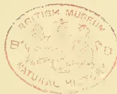A circular red ink stamp is centered on the page. The text "BRITISH MUSEUM" is arched along the top inner edge. The text "NATURAL HISTORY" is arched along the bottom inner edge. In the center of the stamp, there is a small, faint emblem or crest. Below the emblem, the text "B. 4. 10. 1880" is visible, indicating a date and possibly a reference number.

409------------------------------------------------

A black and white portrait of Charles Shand, an elderly man with a receding hairline, wearing a suit and tie, looking slightly to the left.

CHARLES SHAND.

410------------------------------------------------

# \* The TROPICAL AGRICULTURIST \*

## ◇ MONTHLY. ◇

Vol. XVII.]

COLOMBO, DECEMBER 1ST, 1897.

[No. 6.

### “PIONEERS OF THE PLANTING ENTERPRISE IN CEYLON.”

(Second Series.)

#### CHARLES SHAND:

PLANTER AND MERCHANT:—1842 TO 1890.

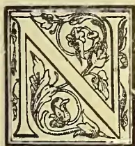

NOT many colonists now living have had a longer connection with the island of Ceylon than CHARLES SHAND, the subject of our brief memoir. Mr. Shand's grandfather, a native of Edinburgh, migrated to Liverpool to establish his sons in business, and there they engaged in the West India trade in sugar, &c., so that in the previous generation the family had been connected with tropical products, though not with the island of Ceylon.

Charles Shand's father and mother (Francis and Mary Shand) were both Scotch: the former born in Edinburgh and the latter in Aberdeen. Mr. Charles Shand was born in Liverpool on the 20th November, 1819. He was educated in private schools until he was fifteen years of age, and was then apprenticed for seven years to one of the principal Brazil mercantile firms in Liverpool. Mr. Shand was well grounded in his school, and we remember his challenging an English Public School lad of the present generation to compete with him as an old man, in his acquaintance with standard classics. Mr. Shand is one of the very few surviving free burgesses at Liverpool not disfranchised by the Reform Bill. “At the termination of my apprenticeship in January, 1842,” he says, “I took up my freedom as a burgess of Liverpool, as I was entitled to do,

from having served free men for seven years. I could have claimed it by birth, as I was born ‘free’ of the city. The firm I served wished me to remain with them; but I decided, if my relatives would support me, to go out to Ceylon as a coffee planter, being induced thereto by the reports of my uncle, Sir William Reid.

“My father had died when I was very young, so I had to look to his brothers for assistance to carry out my wishes. This was granted, and I left for Ceylon at the beginning of February, 1842, arriving by the overland route in the middle of April, a fact which exemplifies the striking advance which has been made since the early years of Her Majesty's reign in shortening the time occupied in journeying to the East, railways and ocean steamers being then in their infancy. I went through France by diligence to Marseilles, and there embarked in a steamer which touched at all the Italian ports to Lyra, one of the Greek Islands, and then on to Alexandria. After staying there a few days, I went to Cairo *via* the Manoudieh Canal and the Nile in a little steamer called, I think, the ‘Jack O’Lantern.’\* I remained a week at Cairo, visiting the pyramids, and going to the top of the highest, and seeing all that was to be seen in the neighbourhood of Cairo. I was accompanied by a young

\* Just as we did nearly nineteen years later, in October, 1861, on our way out to Ceylon!—ED. T. A.

411------------------------------------------------

372THE TROPICAL AGRICULTURIST.[DEC. 1, 1897.]

man of about my own age, who was going to Bombay. He had been appointed Chaplain to the 2nd Queen's Regiment; he was a very good fellow, having been educated for the Medical profession, but qualified for the Church, on the offer of an appointment. However, all this has nothing to do with my experiences of Ceylon, but it illustrates the length to which Memoirs of my life would extend, if I amplified the incidents upon which you wish me to expatiate." [We only regret that Mr. Shand has not given some more of his travelling experiences in these early days, especially of his journeying through France.—ED.]

"We left Cairo at 5 o'clock one afternoon, in the middle of March, travelling on donkeys, as all the vans were at Suez waiting for the arrival of the steamer in which we were to take our departure for Bombay. We reached Suez at 8 p.m. the next day, having made the 84 miles' journey in 27 hours! We changed donkeys only once. We arrived more dead than alive; but I insisted upon our agreement not to stop more than two hours at the half-way house, being adhered to, much to the indignation of my companion. By travelling in this way, instead of waiting for the vans to arrive at Cairo, we secured the choice of berths in the Government steamer.

"On arriving at Bombay I met the Messrs. Worms and Rigg, and we were fellow-passengers to Colombo in the Ceylon Government steamer 'Seaforth,' commanded by George Steuart, who afterwards became the head of the firm of George Steuart & Co., under the *egis* of his brother James, who was the Agent of Arbuthnot & Co., of Madras, and Master Attendant of Colombo."

What follows conveys a vivid description of coffee planting in the "forties":—"On my arrival," Mr. Shand continues, "I travelled about the country (Kandy and Badulla) in company with my uncle, the late Sir William Reid. After looking about me in search of land, I went down into Sabaragamuwa *via* Haputale; and, after visiting the different parts of the district, I bought 600 acres of land and settled down at Rakwana, which I planted as a coffee estate." [The joke used to be that Sir Wm. Reid—an experienced Demerara coffee planter—who chose the finest block of land in the country for his own estate, in Spring Valley, Badulla,—selected a very poor lot for his nephew and passed through all Haputale in order to settle on much inferior Rakwana; but the fact was that there being no roads, the frightful distance of Haputale from any port, and the difficulty of getting coolies to stay there in the early 'forties,' drove the prospectors nearer to Colombo.—ED.]

"There was a good deal of sugar planting going on at that time. I bought 1,200 acres of land in the Rayigam Korale with the intention of trying sugar planting, but afterwards gave up the idea and sold the land. Before I planted the sugarcanes, I ascertained that the climate and the soil of Ceylon was not adapted for the profitable cultivation of sugar. It grew well enough, but the yield was only about 2 tons an acre for the first year, and afterwards even less. The canes would not rattoon and required replanting every two or three years. Consequently, all the sugar estates came to grief, and about half a million sterling was lost by the planters. I went to Colombo to wait until the Rakwana land was ready to be opened. There was no way of getting to the land at Rakwana, which was about 90 miles from Colombo, but by walking. The roads were impassable for horses for want of bridges. I commenced to open the Rakwana land at the end of 1842, and planted it in June of the following year, when I was joined by my brother, Mr. T. L. R. Shand. I remained a coffee planter until 1848, when, owing to the commercial panic of the previous year, all sorts of produce went down to a very low point. I then commenced business as a merchant, and in 1850 I established a firm in Madras, sending my brother there to manage it. I continued in business in Colombo until 1862, when I came home to England and remained at home till 1875, when from circumstances well-known I went out again for three months. I returned again with my family in 1876, and remained there till 1890, and have now been at home seven years."

In 1849 Mr. Shand went over to Cochin, passed over the Nilgiris, stopping at Ootacamund about a month, and paid his first visit to Madras. The travelling *dawk* was in those days a very comfortable and easy way of travelling, all that was necessary being to deposit £25 with the Government at the Post Office, and they put all the relays of bearers on the road at the traveller's disposal, and he never had any trouble. Mr. Shand evidently had a very pleasant recollection of his journey by *dawk* down from Madras to Tuticorin, where he embarked on a native boat for Ceylon. The boat being, however, unable to make headway against the S.-W. monsoon, they had to put back, and on the return voyage—[tell it not to Mr. Harcourt Skrine!—] were shipwrecked on Hare Island. Mr. Shand had therefore to *dawk* down to Pamban and go from Pamban on to Negombo. In 1853 Mr. Shand married Miss Symons, daughter of Mr. Symons (father of the present popular Secretary to the Colombo Chamber of Commerce). All the nine children of the marriage are still alive.

412------------------------------------------------

DEC. 1, 1897.]THE TROPICAL AGRICULTURIST.373

Mr. Shand in 1855 or 1856 took a contract from the Government to construct a bridge road from Rakwana to Pelmadulla, a distance of 16 miles, for the sum of £5,000, undertaking to buy 5,000 acres of forest land to provide the money. He afterwards sold this land which formed the Aigbuth, Gilgarron, Deveronside and several other estates. At one time he held the estates of Springwood, Barra, Everton and Rangweltenne, but has sold them all with the exception of Rangweltenne:—"Everton to the Gen Notary" in 1870 and Springwood and Barra to the Asiatic Produce Company in 1889, and the latter have recently sold to the Tea Corporation of Ceylon.

Like everyone else Mr. Shand and his family were hard hit by the fall of King Coffee, but they were among the first to convert their plantations into tea. They also went in for cinchona which was only too successful, so much being produced by the colony that it became an unprofitable cultivation.

Mr. Charles Shand was one of the most enterprising, long-headed merchants that ever came to the East. His natural buoyancy and equableness of temper in prosperity or adversity stood him in good stead in any time of excitement or speculation such as followed on the American Civil War. We have heard that Mr. Shand's first happy stroke as merchant was in buying up all the native coffee available in Ceylon at a time when it was very low in price (in 1849), shipping it (of course *via* the Cape) to London where, seven or eight months after, it was sold at a splendid profit, coffee having risen in price as Mr. Shand had anticipated. We come next to the Civil War (1861-63) when Mr. Shand through his Madras and Colombo Firms made a rapid and large fortune by his dealings in Tinnevelly cotton, the cotton crop of the Southern States being shut in by the blockade. Almost our first bit of work in Colombo in November 1861 was to frame and print a Telegraphic Code for Mr. Shand—three copies only—for Tinnevelly cotton. "Up to what rate shall we go per lb.?" "Oh sixpence is ample." "Just as easy going to a shilling."—"The day Tinnevelly cotton is at 6d., I'll retire":—so spoke Mr. Shand when that staple was 2½d.; but within six months, if we remember rightly, our "shilling" code was useless, for Tinnevelly cotton had run up to *eighteen pence*! Mr. Shand had cargoes by sailing vessels sold half-a-dozen times over between Tuticorin and London. He was by far the boldest buyer in Colombo at that time; after him coming Messrs. E. J. Darley (Darley, Butler & Co.); Alex. Gibson (Alstons, Scott & Co.); and J. C. Fowlie—all of whom made ample fortunes in cotton. Mr. Shand had some strange experiences:—one of the

most curious followed on his agreeing to go partners with a big Madras landed proprietor in a cotton cargo. When the ship was half-way home, a rumour spread that the blockade was broken. Mr.—came in terror and tears to Mr. Shand to say he would be ruined, that he, a planter, &c., had no right to go speculating in cotton, and implored to be released of his share. Mr. Shand agreed. The blockade rumour proved false; the cotton got safely home; and Mr. Shand (then in London as well as his quondam partner) stood for an enormous profit, when he received a formal demand from Mr.—for his half share. He took the letter and papers to Mr. (afterwards Sir Hugh) Cairns, who decided that although morally Mr.—had not a leg to stand on and was besides a rascal, yet legally (through want of formality in cancelling the agreement) he would be certain to gain in any Court. Accordingly, Mr. Cairns advised Mr. Shand not to go to law, but to pounce down on Mr.—, give him a bit of his mind, and then offer him so much down. Mr. Shand did so; he called on and abused Mr.— up and down, and indicated how he would expose him in Court; but finally said "to be done with it I offer you"—say £5,000 (perhaps half or one-third of the half profits), and Mr.—jumped at the offer rather than face exposure!

During the interval between the failure of coffee and success of tea, Mr. Shand—even when well on to 70 years—during his last stay in Colombo, was indefatigable in experimenting with new products, among the rest with fibrous plants; and he tested, with machinery of his own invention, nearly every fibre-yielding plant in the island with the result that our little Ceylon aloe (*Sanseviera Zeylanica*) gave the best results, though not enough to make it pay at that time.

Another curious experience of Mr. Shand was his gifting (as a pleasant fancy) his Rakwana Coffee estates to Mrs. Shand when leaving Ceylon with his "cotton" fortune in the "sixties." Most fortunate accident! For when through business complications with the Messrs. Collie, London, Mr. Shand lost all that fortune, the despised Rakwana properties came in very handy as being free of his personal estate!

During his long residence in Ceylon Mr. Shand had never more than a day or two's illness, a fact which he attributes to the climate being suited to those who are able to move about the country or to those in Colombo who take plenty of exercise combined with moderate living.

Mr. Shand himself was one of the most active as well as cheerful men we have ever seen. His brisk step, cheery voice and pleasant laugh were missed in the Fort of Colombo when he left for England in 1863; and the same was

413------------------------------------------------

374THE TROPICAL AGRICULTURIST.[DEC. 1, 1897.

true when he finally quitted Ceylon in his 71st year in 1890. He is now in his 79th year and continues to take a great interest in Ceylon affairs, though his health will not permit of his moving about as freely as he did ever since he went home until very lately. He carried on a brisk correspondence in the *Observer* some months ago on the Currency question, pointing out how China Tea must score at the expense of Ceylon, with silver and exchange so much in favour of the former. The latest letter we have had from the veteran was still clearly written and hopefully expressed. For industry, cheerfulness and indomitable pluck, few Colonists ever came to Ceylon who equalled Mr. Charles Shand; may his shadow never grow less!

#### MAY TEA BE PROFITABLY GROWN IN THE (AMERICAN) SOUTHERN STATES. . . . . ?

It is not a question whether individual plants may not be successfully grown so as to present interesting and beautiful objects, in landscape or other gardening, nor whether small patches of the hardier varieties of tea may not produce sufficient leaf to supply the limited demands of a household, or even those of a country neighbourhood. Those problems have been satisfactorily answered long ago, in several of the Southern States. The price of labor and the yield per plant are not important factors under the latter conditions. Several large profits have been reaped on the imported commodity before it is sold over the village counter; and no account of the value of the labor expended in raising and preparing the domestic article is apt to be taken.

But the problem to whose solution much time and attention have been expended at Pinehurst, viz: the economical raising of tea on a comparatively large scale, is confronted by several serious obstacles, and much more than the past few years must be devoted to experimental work before a satisfactory solution may be obtained.

First and foremost is the difference in the price of labor between the tea-producing countries of the Orient and the Southern States of America. It costs almost as much to pick, with us, of fresh leaf sufficient to make a pound of tea as it does to raise, pick and pack the same quantity of by far the larger part of the teas sent to us from Asia. There are, therefore, two alternatives presented to the would-be American tea-grower; he must raise the quality of his product above that of the cheaper Oriental grades, or he must reduce the cost of production below that attained by us. The former course has been steadily maintained at Pinehurst, and with promising results. The establishment of a productive tea garden involves very considerable expense. A well appointed garden, of good quality and of large leaf production, with few vacancies and of vigorous growth, a sufficient body of reliable laborers, and a suitably equipped factory, cost a great deal of money and attention. That these conditions are essential in the production of good tea must readily appear on a little reflection. A well appointed tea garden implies favorable conditions of soil and exposure to the sun with protection from wintry blasts and the avoidance of stagnant water about the roots of the plant. Good quality means that the plants have been raised from the best seed attributable or capable of being grown in the local climate. It is certainly necessary to distinguish at least three sorts of tea plants. The Assam unquestionably leads. It derives its name from the north-eastern province of British India which was wrested from Burmah early in this century. It was found growing to the height of thirty

feet in the dark, steaming jungles along the banks of the Brahmaputra river, where the atmosphere was always damp and frost unknown. Its leaves are bright green and large, often attaining a length of seven or more inches, and broad in proportion. Few regions elsewhere appear to be favourable to the growth of this variety, although long ago the forests of those jungles have given place to well ordered tea gardens, where the indigenous plants bask in full sunshine—a requisite for the remunerative production of tea crops. The attempt is being made at Pinehurst to cultivate some of this variety; but the severe weather (15° F.) to which this section of South Carolina is liable, makes success less than probable. It may be that fully hardened and woody plants are capable of enduring such extreme cold, and that by grafting or otherwise, a slightly lower type may be obtained for successful use. At the other extreme is the Chinese variety. Not that all or even the greater part of Chinese tea plants should fall under this category, for unquestionably very many deserve far better treatment; but as the type exists to a considerable extent in China, and especially in its colder provinces, the name may be retained. This variety is a low, bushy shrub, slow of growth, adapting itself to a great range of climate, and capable of withstanding frost, snow and ice. The leaves are of a dark green color, tough and small, *i. e.*, from two to three inches in length and quite narrow, (lancet shaped). This stunted and generally unprofitable description of tea plant is supposed to be the result of the exposure of the better varieties for centuries to dry and cold climates, and to a lack of proper cultivation.

Intermediate between the Assam and Chinese types stand the so-called "Hybrids," and reproducing in their countless varieties the characteristics of both the parent sorts. Strictly only few of them have been obtained by the direct hybridization of the before mentioned varieties; most of them are the result of endless crosses of different kinds, as also of the effect of climate and cultivation. It has been observed at Pinehurst how few tea plants are not susceptible of great improvement in form, productiveness and quality by liberal cultivation; and that gardens of widely different origins exhibit, under the same treatment, a tendency to produce a local type of leaf, with marked and distinctive characteristics.

It is generally held, especially by English authorities, that those hybrids which stand nearest, by origin and in their nature, to the Assam, are to be more highly prized. There are substantial reasons for our advice to plant only the best seed that can be grown in each locality. The Assam plants produce, in their own climate, about twenty *flushes* a year, whereas the average number of pickings in China do not exceed more than three or four. And it may be well to here explain what is meant is meant by a "flush." The work of the tea planter is to produce from the seedling and as rapidly as possible a vigorous bush of from two to five feet in height, according to the variety of seed. He then proceeds to deplete the plant of by far the greater part of its foliage, which is usually done in the cold season. Nature makes a prodigious effort to restore the natural equilibrium between roots and foliage, and with the advent of warmer weather, throws out from every branch a vast number of tender shoots and leaves. The planter immediately plucks off as much of this young foliage as his experience has taught him to be wise, *i. e.*, without injury to the vitality of the plant or loss to the subsequent pickings. For the struggle between him and the plant goes forward through the entire season. These successive crops of young leaf are termed "flushes." The wise planter will not strip the plant of young foliage at any picking, and thus there is a steady gain in the size of the tea plant during the growing season. With the return of cold weather, a more moderate pruning is resorted to, severe pruning being enforced only every three or four years. The length of years that a tea plant can endure this struggle is uncertain, but it should, under favorable circumstances, produce at least ten good yearly crops.

414------------------------------------------------

DEC. 1, 1897.]THE TROPICAL AGRICULTURIST.375

Large leaf goes further than small leaf, (both being tender, for that is an indispensable condition for making good tea.) The young plants, whether grown from seed *in situ* or transplanted seedlings from the nursery, should fill out the gardens at regular intervals, determined chiefly by their expected growth, varying from three by four to six by six feet, where plowing is used. Vacancies occur from the death of individual plants; they should be as few as possible, as they waste the land and increase the labor of cultivation and gathering. A vigorous growth depends upon the productiveness of the variety of plants used, on the climate, the richness of the soil and the cultivation. As regards temperature, the best climate for tea is a warm one, ranging during the year from 45° to 90° F., and without sudden and great variations or severe wind storms. The rain-fall should be abundant and evenly distributed throughout the year. But it is essential that copious rains and frequent fogs should occur during the warm season when the flushes are produced. The rain-fall in the countries best adapted for raising tea ranges from 75 to 150 inches and more per annum. Nevertheless it is possible to remuneratively grow tea in medium climates with lower averages of both heat and rain-fall. Indeed, were this not the case, it would be idle to attempt the cultivation here with an average temperature of 65° F., and an annual rain-fall of 56 inches. The question then probably turns on the two points already mentioned, viz.: the dearth of labor and the liability to extreme cold in the winter. The occurrence severe cold in the winter may so weaken the vitality of the choicer sorts of tea that the crop of the following season may be reduced by the amount per acre that marks the limit of profit. An average production per acre of Indian and Ceylon gardens, in good bearing, is about 400 pounds of cured tea annually; although instances are not infrequent of 700 to 1,000 and even more pounds under the most favourable conditions of cultivation and climate.

The tea plant is an enormous feeder. If the soil does not afford abundant food, artificial enrichment must be resorted to. Liberal fertilization augments not only the quantity but improves the quality of the leaf, as has been demonstrated experimentally at Pinehurst, especially on poor and medium lands. The picking of the leaf on a garden of twenty-five acres will keep a small force of say twenty children almost continuously busy during the season. With patience and attention, the colored children in the Southern States quickly learn to perform the task satisfactorily. In the earlier flushes, they are taught to pick only the unexpanded leaf bud at the end of the shoot (the "Pekoe tip.") with perhaps the one or two next and very tender leaves. Later in the season, the number of leaves to be picked may extend to three or four. It is a pretty sight to see the gathering of the leaf by the children.

A suitably equipped factory is indispensable to even a moderate-sized garden. For the present only black teas are made at Pinehurst; and, consequently a brief description of what is requisite for their manufacture must suffice. The first step is the withering of the fresh leaf. This is effected by thinly spreading out the leaf on floors or trays, so that every pound shall cover about ten square feet. As each pound of finished tea represents four and one-fifth pounds of fresh leaf, it will be seen that an output of one hundred pounds of dry tea per diem requires about four thousand square feet of withering surface—in itself an expensive item. The purpose of withering is to render the fresh leaf susceptible of being rolled without breaking. As it comes to the factory it is crisp and elastic; it crackles when compressed in the hand; when bent, it immediately resumes its former shape. Withering requires a light, airy room, but it is better to exclude direct sunlight. A few hours sometimes suffices for the change, but usually a whole day's exposure is necessary. When sufficiently withered the leaf has lost its elasticity and feels like an old kid glove; no longer will it crackle when compressed, nor will it regain its shape.

Fresh leaf has neither distinctive taste nor odor. Withered leaf has a faint odor; peculiar, but not suggestive of the finished tea. By rolling (either by hand or machinery,) the oily cells in the leaf are broken up and the juice expressed upon the surface of the leaf. There it becomes foamy from the action of the air and the continued rolling. An oxidation begins, which is prolonged by exposure to the air. By rolling and oxidation (formerly and erroneously termed fermentation) are developed the strength and, in part, the flavor of the tea. The rest of the flavor and the fragrance are the result of the final process of "firing" or drying. It has been found advantageous to substitute machinery for hand power in most of these operations, especially where the production is sufficient to warrant the expense of buying and erecting the especially devised machines. And aside from economy in production, the greater uniformity of product and the more attainable cleanliness of the manufacture are commendable features. In the rolling of tea leaf, a capable man can handle thirty pounds a day; a "Little Giant" rolling machine can do as much in half an hour, and takes the labor of one mule to accomplish it. The total cost of a factory suitable for the daily production of fifty pounds dried tea may be estimated at \$1,500 to \$2,000.

It has been thought advisable to dwell on the expensiveness of tea production, as letters are constantly received asking for such information. There should be added the loss which follows from impairment of seed on the long journey from the East, whereby only one box in four comes to hand in good order, as also the remuneration of the skill and attention which must patiently and constantly oversee every step in the growth and manufacture of this product. And thus, even if the raising and manufacture of tea in the United States be divested of all fancy, and the utmost economy be practiced, it will be seen that the obstacles and expenses to be overcome are very considerable; indeed so considerable that any serious competition with Asiatic producers on the lower and medium grades is simply out of the question. What, then, are the grounds which justify the continuance of experimentation in this direction? And the only satisfactory answer that can be given is, that thus far experience appears to justify the original hope of our ability to grow high grade teas remuneratively. Thus far, we have established at Pinehurst very fair tea gardens from choice imported Chinese and Japanese seed. From them, we have produced both the green and black teas, of a quality which readily commands one dollar or more in the retail market. The gardens have few vacancies, and the plants have a luxuriant growth. There are also a number of gardens raised from hybrids that were introduced many years ago into this country by the national government. Unfortunately they exhibit the effect of neglect, in having largely relapsed towards the Chinese type. They require rigorous pruning, often the extirpation of refractory individuals, the promotion of a more favourable secondary growth, and liberal cultivation; under these conditions they give excellent results. Other gardens of Formosa, Assam, and the best hybrids from India and Ceylon are yet too young to afford reliable data. There can be no question of the luxuriant growth of the hardier sorts, nor that the quality of the product and its reception by the public entirely meet with our fullest anticipations. But not enough experience has been gained to form an estimate of its productiveness per acre (or per plant) of the gardens; nor can any positive statement be given as to the success of the two lines of experimentation to improve the general quality of the plants, by importing different varieties of the more tender sorts, until that variety be found which combines the utmost quality with the ability to stand this climate, or by direct propagation by cuttings and grafting to reproduce the best individual plants in the already established gardens. It was to be expected that our experiments must encounter many obstacles and cause many disappointments. But there has been

415------------------------------------------------

376THE TROPICAL AGRICULTURIST.[DEC. 1, 1897.

enough success thus far to warrant their continuance. Ultimately it is hoped to attempt the manufacture of those very highly esteemed and priced teas which are rarely met with outside the countries where they are grown; and simply, because of a light "firing," they do not stand distant transportation. They should be drunk shortly after manufacture. This is a field where the American grower need fear no competition from the Orient. Such teas must demand a high, very high price; but if better than can be otherwise obtained, there will be no scarcity of buyers.

CHARLES U. SHEPARD.

Pinehurst, 1896.

## COFFEE PLANTING IN MADAGASCAR.

In 1871, the late Mr. Alfred Guenot, of Vatomandry, tried large plantations of coffee in Mahanoro District. The plants grew very well, and if that gentleman had succeeded in the enterprise he would have certainly been one of the richest man who ever attempted serious planting in Madagascar. Some time after, in 1872-73, a kind of fever passed through the district of Mahanoro, the disease unknown until that time, acted so strongly on the brains of the inhabitants, that an epidemic immediately broke out: it was planting coffee; almost every one wished to plant, and planted coffee; that plant responded to the desire of the inhabitants and grew luxuriantly; unfortunately this did not last long. What often happens in such cases soon occurred, namely, deceptive appearances, and then disillusion. Coffee had been, it is true, planted on a large scale, but no one provided for the means of maintaining it. *Planted artificially, the care of bringing up the child was left to Nature alone.* In a short space of time large plantations of coffee has been made, but alas! they did not last long. In a few years, after a few crops all the plantations had disappeared. Almost all the coffee-trees had died. No one searched for a remedy, or to discover the cause of the disease. All contented themselves with saying, "The coffee plantations are destroyed by a disease." Only one planter, Mr. Jean Comte, now in Tamatave, was in the habit of *manuring the coffee-trees yearly.* Well, he preserved his plantation, and we remember, long after the disappearance of the other plantations, having twice accompanied him on his estate situated at Ambodiriana Lohariana and saw the coffee-trees in a very fair state of vegetation. When the late war took place and Mr. Comte was obliged to leave Mahanoro, his plantation was in full crop, while long before there remained only stumps of trees on the estates of the other planters. In our opinion, the coffee-tree was destroyed by a disease which could be summarised by these words: *want of nourishing elements.* We think that the coffee-tree could be planted and would succeed on the condition that the plantation be *manured yearly, even twice a year, if possible.* The soil of this country possesses an incredible degree of vegetation, but, by the very fact that the vegetation is so active the soil becomes impoverished quickly. *Since artificial plantations are made, Nature ought also to be aided artificially.* The late M. Alfred Guenot, who had lost so much money in planting coffee, was of opinion that coffee ought to be tried again and was preparing to do so, when unfortunately he died. The same sort of coffee: s that which was cultivated at the time could, we believe, be planted anew—the tree is not sick, since on all estates where coffee was planted, it is observed that a few have escaped owing, undoubtedly, to having been planted in richer veins of soil. In the villages and yards one notices a few coffee-trees growing nicely, probably taking their nutritive principles from the manure formed naturally in these places. It is a good idea to introduce the coffee of Liberia here, but it is no reason why the ancient sort should not be planted again. In 1880 the coffee in white shell was worth 3 dols. per 100 lb.; at the present time, one could hardly, by offering 11 dols. or 12 dols., obtain 100 lb. of the same produce. Most of the foreign community, if not all, make use of tea now.

We have also observed that coffee flourishes here in places sheltered from winds, and ever so little umbraeous. We believe that the plant would do very well as interlineary plantations.—*Madagascar News.*

## COFFEE CULTIVATION IN BRAZIL.

The following on the subject of the cultivation of Coffee in Brazil, published in the *Revue Colombie*, is taken from a report addressed to the Minister of Foreign Relations of France by Mr. Viener, on his return from South America:—

The largest coffee-planting region is found between latitudes 18 degrees and 25 degrees south; but it extends much farther north, and coffee raising is carried on in an immense territory, embracing 25 degrees of latitude and 24 degrees of longitude.

In the beginning of this century Brazil exported only a very small quantity of coffee, but now it is the principal coffee-producing country of the world.

The following statement shows the increase of the Brazilian coffee trade since 1800, from the ports of Rio and Santos alone in bags of 60 kilograms (133 pounds) each.

<table>
<tbody>
<tr>
<td>1800</td>
<td>..</td>
<td>..</td>
<td>..</td>
<td>18</td>
</tr>
<tr>
<td>1817</td>
<td>..</td>
<td>..</td>
<td>..</td>
<td>66,985</td>
</tr>
<tr>
<td>1820</td>
<td>..</td>
<td>..</td>
<td>..</td>
<td>97,489</td>
</tr>
<tr>
<td>1830</td>
<td>..</td>
<td>..</td>
<td>..</td>
<td>484,222</td>
</tr>
<tr>
<td>1840</td>
<td>..</td>
<td>..</td>
<td>..</td>
<td>1,037,981</td>
</tr>
<tr>
<td>1876</td>
<td>..</td>
<td>..</td>
<td>..</td>
<td>3,765,122</td>
</tr>
<tr>
<td>1895</td>
<td>..</td>
<td>..</td>
<td>..</td>
<td>6,508,768</td>
</tr>
</tbody>
</table>

In 1895 the crop was estimated at 7,000,000 bags; in 1896 it was even larger.

The coffee plant is not indigenous to Brazil, but it is today completely acclimated. One finds, it is true, in the forests of Botucato (State of Sao Paulo) a so-called wild coffee plant (*Coffea amarella*), but they are without doubt plants that have come up from seeds carried by birds or monkeys. The cultivated variety is called in the country *coffea vermelha*. The height of the plant varies from 2 to 5 metres and the stem measures from 40 to 70 centimetres in circumference.

The processes of cultivation vary according to the locality. Thus in the province of Ceara, according to a pamphlet by Mr. Joh, quoted from by Mr. Viener, the coffee plant is always started in green-houses. The roots are transplanted at the age of two years, preferably from January to April, and are planted at a distance of from 10 to 12 palms (the palmo is equivalent to about 9 inches). They begin to yield at four or five years. The season for gathering the crop is not always the same; on the other hand, it has quite a long duration, varying somewhat according to the heaviness of the rainy season, which generally begins in May or June and ends in August.

The beans are placed on a paved floor (uncovered), called in the country *fachine*, and the drying lasts from thirty to thirty-five days. In the State of Ceara the old system of decorticating by grinding by millstones (*rodieros*) turning in a stone trough is still employed. This method leaves much to be desired, for many of the grains are crushed by the weight of the stones. The cleaning and burnishing are done usually by hand.

In the States of Sao Paulo and Minas Geraes the cultivation of coffee occupies vast areas, and the treatment of the coffee after the crop has been gathered is done in a much more perfect manner than in Ceara, by the most improved machinery.

The largest *fazenda* (plantation) in Brazil, and perhaps in the world, is the Dumont plantation (State of Minas Geraes) established by a Frenchman, whose name the plantation still bears. The total extent of the property is 30,000 hectares, 6,150 of which are planted in coffee. The number of plants in 1896 was 4,718,000.

The cultivation is carried on by Italian emigrants, of whom there are 8,000 employed. Each year the extent of this plantation grows, and the production becomes larger and larger.

416------------------------------------------------

DEC. 1, 1897.]THE TROPICAL AGRICULTURIST.377

In 1895 the yield from the Dumont *fazenda* alone amounted to 4,100,000 kilograms, and that of 1896. rose to 4,500,000 kilograms. This plantation was sold three years ago to a Brazilian company for the sum of 12,000,000 francs.—*The American Grocer*.

### LUCERNE (ALFALFA) CULTIVATION.

*Extract from 'Hand-Book of Experimental Station Work,' published by the Department of Agriculture, United States, in 1893 (pp. 10-11.)*

**LOCALITIES SUITABLE FOR CULTIVATION.**—A perennial forage plant, resembling clover in its feeding value, habits of growth and effects on succeeding crops. Under favourable conditions it will live from eight to fifteen years and does not run out as clover does. It has long been cultivated in Europe and is grown quite extensively in California and some of the other Western and Southern States. It seems probable that it may be introduced with advantage into any parts of the Southern States east of the Mississippi, and over a wide tract of the more arid regions of the south-west. It has been grown successfully for several years at the station at Geneva, New York, but in recent experiments on thirty farms in different parts of Vermont, it was very largely winter-killed.

While a southern climate is more favourable to Lucerne, numerous experiments have shown that it will do well in many localities in the Northern States, and, when established, will produce from three to five crops each season for a number of successive years. "Lucerne is specially adapted to dry climates and withstands drought much better than ordinary clovers." For this reason it is largely relied on in Colorado and California, especially where irrigation is used.

**A NITROGEN-COLLECTING CROP.**—Lucerne is one of the plants which collects Nitrogen from the air. It also gathers a considerable amount of Phosphoric Acid and Potash. At the New Jersey station in two years Lucerne grown on 1 acre collected 553 lb. of Nitrogen, 98 lb. of Phosphoric Acid, and 586 lb. of Potash, valued at 124 dollars.

If Lucerne and its products are properly utilised on the farm, it cannot be considered an exhaustive crop, but rather one which transforms the raw materials in soil and atmosphere into products for man's use.

**SOIL PREFERRED.**—*Culture.*—Lucerne prefers a light sandy or loam soil, with a sub-soil through which its long roots can penetrate. In some cases its top root down 12 to 15 or even 20 feet. At the New York station, however, Lucerne has been successfully grown on a clay soil. On such a soil greater pains must be taken to secure a good stand, but, when the plant is once established, the character of the sub-soil is of more importance than that of the surface soil. Use fresh, pure seed. Sow at any time when the ground is in suitable condition, and when there will be time for the plants to become well established before they are subjected either to drought or extreme cold. The soil should be thoroughly prepared and the seed sown at the rate of 15 to 20 lb. to the acre. If sown broadcast, about the latter quantity will be required; if in drills, the former amount will be sufficient. In the north spring seeding is advisable, but in the south it is better to sow in the autumn.

**IRRIGATION.**—In regions where irrigation is necessary, the Colorado station advises that the water should be applied to Lucerne before cutting, because thus the reaper does its work more effectively, and the growth of the succeeding crop is stimulated. A relatively large amount of moisture is required the first year in order to secure a good stand.

**HARVESTING.**—Lucerne should be cut during the first period of good weather after the blossoms begin to appear. If allowed to stand too long, its stalk becomes hard and woody, and succeeding crops are likely to be diminished. If designed for hay, it must

be carefully cured and housed, for otherwise its leaves will drop off and only a mass of bare stalks be left.

**VALUE AS A FEEDING STUFF.**—During a single season Lucerne furnishes a large amount of nutritious green forage relished by all kinds of stock. It should be partially wilted or mixed with hay or straw. In the dry regions of the west it is much used for pasturage, especially in the autumn, but there is more or less danger that it will cause the cattle to bloat or that the plants will be killed by close pasturing. Cattle, sheep, and horses relish Lucerne hay and seem to thrive on it.

Chemical analyses and digestion experiments show that Lucerne compares very favourably with red clover both as green fodder and as hay. It may be used either for fattening or for milk. To secure a well balanced and economical ration, Lucerne, which contains a large proportion of *protein*, should be fed with corn, wheat, oats, straw, root crops, etc., which contain relatively large amounts of the other food ingredients (carbohydrates and fat). In many instances farmers might profitably raise Lucerne as a substitute for the wheat bran, cotton-seed meal, and other materials which contain large amounts of *protein* and which they are now buying in order to utilise the excess of carbohydrates produced in corn and other crops.

**DISADVANTAGES.**—(1) It is not easily established; (2) it is less hardy than clover; (3) if allowed to grow too long its stalks become hard and woody; (4) except in dry regions cattle cannot be safely pastured on it; (5) it requires peculiar treatment to make good hay.

**ADVANTAGES.**—(1) When established it does not run out; (2) it withstands drought much better than clover; (3) it grows rapidly and may be cut early in the season; (4) it gathers a large amount of nitrogen from the air as well as from the soil, and is therefore very valuable as a fertilising crop; (5) it furnishes several large crops of green fodder each season; (6) when properly cured it makes an excellent hay; (7) it is relished and digested by all farm animals and is an excellent flesh and milk producer; (8) it makes muscle rather than fat, and is therefore valuable to use with corn and other fat-producing crops to make a well-balanced ration for cattle.

In brief, experience at the stations and elsewhere indicates that Lucerne is valuable as a feeding stuff and as a fertilising crop, but that it requires peculiar conditions of climate and soil for growth and careful culture and curing to make it a profitable crop. It is worthy of repeated and systematic experimental tests by farmers, even though in some regions and on some farms it should prove a failure.

**DISEASES.**—(*Pseudoperiza medicaginis*).—This fungoid disease is found in nearly every place where Lucerne is grown. Usually it does not attack the plant until the second year's growth when the plant is able to survive the disease. Sometimes, however, it completely destroys seedling plants. The disease shows itself as minute dark-brown spots of irregular shape upon the green or discoloured leaflet. The centre of each spot forms a small pustule. In this are developed the spores, which are set free by the breaking of the epidermis. The disease readily survives the winter and may develop year after year in the same field. In serious cases covering with straw and burning alone stopped the disease. It may be held in check by frequent cuttings.

**LUCERNE ROOT-ROT.**—(*Ozonium auricomum*).—The fungus causing this disease has been identified as the same as that causing the "root rot of cotton." It attacks the crown of the plant and works down for 6 to 10 inches, completely killing it. In the field the disease spreads in almost a perfect circle, at a rate of 50 to 60 feet during the season, killing every plant. It is thought that sowing salt plentifully or applying kerosine over the infested spots will kill it out, thus preventing further spreading. The disease is worst in dry, hot weather.

In the Appendix to the *Handbook of Experimental Station Work* (pp. 386, 388 and 397) the following is

417------------------------------------------------

378THE TROPICAL AGRICULTURIST.[DEC. 1, 1897.]

given as the averages of the 23 chemical analyses of Lucerne:—

<table border="1">
<thead>
<tr>
<th></th>
<th>Water.</th>
<th>Ash.</th>
<th>Protein (N × 6.25).</th>
<th>Fibre.</th>
<th>Nitrogen-free extract.</th>
<th>Fat.</th>
</tr>
</thead>
<tbody>
<tr>
<td colspan="7">As GREEN FODDER.</td>
</tr>
<tr>
<td>Fresh air-dry material</td>
<td>71.8</td>
<td>2.7</td>
<td>4.8</td>
<td>7.4</td>
<td>12.3</td>
<td>1.0</td>
</tr>
<tr>
<td>Water-free substance</td>
<td><i>Nil.</i></td>
<td>9.4</td>
<td>17.1</td>
<td>26.2</td>
<td>43.9</td>
<td>3.4</td>
</tr>
<tr>
<td colspan="7">As HAY AND DRY COARSE FODDER.</td>
</tr>
<tr>
<td>Fresh air-dry material</td>
<td>8.4</td>
<td>7.4</td>
<td>14.3</td>
<td>25.0</td>
<td>42.7</td>
<td>2.2</td>
</tr>
<tr>
<td>Water-free substance</td>
<td><i>Nil.</i></td>
<td>8.1</td>
<td>15.6</td>
<td>27.3</td>
<td>46.6</td>
<td>2.4</td>
</tr>
</tbody>
</table>

Fertilizing Constituents of Feeding Stuffs:—

<table border="1">
<thead>
<tr>
<th></th>
<th>Moisture.</th>
<th>Ash.</th>
<th>Nitrogen.</th>
<th>Phosphoric acid.</th>
<th>Potassium oxide.</th>
</tr>
</thead>
<tbody>
<tr>
<td>Green Fodder ...</td>
<td>75.30</td>
<td>2.25</td>
<td>0.72</td>
<td>0.13</td>
<td>0.56</td>
</tr>
<tr>
<td>Hay or Dry Coarse Fodder ..</td>
<td>6.55</td>
<td>7.07</td>
<td>2.19</td>
<td>0.51</td>
<td>1.68</td>
</tr>
</tbody>
</table>

To contrast with the above Sorghum Fodder may be here shown from the same table of analyses of Fertilizing Constituents of Feeding Stuffs:—

<table border="1">
<thead>
<tr>
<th></th>
<th>Moisture.</th>
<th>Ash.</th>
<th>Nitrogen.</th>
<th>Phosphoric acid.</th>
<th>Potassium oxide.</th>
</tr>
</thead>
<tbody>
<tr>
<td>Green Sorghum Fodder ...</td>
<td>82.19</td>
<td>...</td>
<td>0.23</td>
<td>0.09</td>
<td>0.23</td>
</tr>
</tbody>
</table>

—Agricultural Ledger.

THE LONGEVITY OF SEEDS.—M. Charles Naudin contributes to the *Bulletin* of the Société Nationale d'Acclimatation de France a paper on "The Longevity of Seeds, and their Preservation in the Earth." Seeds, says he, are known to remain for an indefinite length of time, even for several centuries, in the ground without germinating, owing to atmospheric or other causes. M. Naudin instances, as a case of suspended germination, a packet of earth from the Sahara, which spread over a flower bed, and duly watered, was found to contain seeds of *Helianthemum*, which grew, and bore yellow flowers. The inference is, that an apparently barren region yet contains in its soil seeds which, were the climate to become more humid, would rapidly transform it to one of vegetable fertility and luxuriance. M. Naudin mentions, in further confirmation of his opinions, that in 1895 he received a few seeds from Gaboon packed in some of the soil of that place. This earth, less than two pounds in weight, was placed in a flower-pot, whence, in a fortnight, sprang twenty seedlings all belonging to the Cucurbitaceæ. The stems and branches of these plants grew to a length of from 20 to 24 feet, and it is hoped that they will put forth bloom, thus showing the genus and species. From this accidental yield, it is supposed that soil more carefully selected would give still richer results. In the many cases where plants cannot be brought to Europe in good order, where they die on the voyage, or are immature or past their prime, it is suggested that a sample of the earth selected from some likely spot in their vicinity should be sent over in their stead, and might be found to contain fertile seeds of the species desired. If this, says M. Naudin, seems a proceeding based too much upon chance, like that of a fisher casting his net at a venture, this difference may be pleaded: the botanical collector is no more sure of finding what he seeks, but in all probability will obtain something new and acceptable. Finally, it must always be borne in mind how easily packets of earth can be transported from place to place without any attention on the journey.—*The Gardeners' Chronicle*.

## PLANTING NOTES.

ORANGE CULTURE IN CEYLON.—We understand that there has been a considerable importation of good orange plants lately for distribution and trial in different districts. The plants are very choice ones and were selected from a special nursery, and that they cost very nearly £500 laid down at Colombo. They were securely packed in small bags, with the nursery soil, and looked quite fresh and green, but without a single leaf. They promise to do very well, and we shall be glad to know results of their successful cultivation up-country. The native orange (by the way, is it indigenous?) like other native products, is not systematically cultivated by the Sinhalese. It is generally believed that oranges grown on the hills are not so palatable as those grown in the low-country, and that the Salpitti Korale, Kotta, and the neighbouring villages, produce the best oranges, as the soil there is best suited for their culture. Upcountry, we are told, the plants thrive well, but the oranges do not taste so well as those grown in the low country, though Nuwara Eliya and the Uva Province produce fairly good specimens. Of course, the oranges grown in Ceylon and India are quite unlike those from Australia and the West. Our oranges, however ripe they may be, as a rule preserve their verdant hue and do not take on a yellow onc, while the taste is a sharper and more refreshing one than the sweet flavour of the oranges met with in Europe. We understand that a large quantity of oranges are imported into Australia during the summer from Italy and Spain, and there is a growing demand for them in the Colonies. Should, therefore, the experiments now being made up-country prove a success, there should be no reason why Ceylon should not compete in the Colonies with Spain and Italy. It is a pity that a few lemon plants were not imported as well. The Australian lemons are simply exquisite, and they have a much finer flavour than our Ceylon limes. There is every reason to believe that lemons could be cultivated in our island as well as oranges.—The orange fungus is a great pest in some districts: the introduction of lady-bird beetles would speedily stop that.

PLANTING LIFE IN BRAZIL.—Mr. T. L. Villiers, the Ceylon planter who recently proceeded to Brazil as the Manager of the Dumont Coffee Company's estates there, has returned to Ceylon. His description of planting life in Brazil is not attractive:—

"Mr. Villiers went with Mrs. Villiers to the estate, but found the life there rougher than he anticipated and very different to a planter's life in Ceylon. The heat, he says, was very trying, almost as bad as Colombo, and yellow fever was very prevalent in the neighbourhood, so that he managed to get his agreement with the Company cancelled, and left Brazil after a very brief stay. His description of planting life in Brazil is interesting. There are very few English in the country, and they are not popular with the indigenous population. There was a European family on the Dumont Company's property—the Secretary and his wife—but the nearest European doctor was a 16 hours' railway journey away, and the labourer is Italian, with little in common either with the cooly or with the planter. The little narrow-gauge railway that traverses the San Paulo district is the principal means of communication, but there is an accident on it nearly every day, so that, while it is useful for freight, passengers prefer to go round to Rio by sea, as being slower but safer. Brazil coffee growing may be profitable, but is evidently not an occupation for a married Ceylon planter, or for anybody who is not prepared to rough it a good deal."—*Planting Opinion*, October 16.

THE "QUEENSLAND AGRICULTURAL JOURNAL," Vol. I., Part 5, November, 1897.—Contents:—Agriculture, Dairying, The Orchard, Botany, Apiculture, Tropical Industries, Bacteriology, General Notes, Statistics, The Markets, Farm and Garden Notes for November, Orchard Notes for November, and Public Announcements.

418------------------------------------------------

DEC. 1, 1897.]THE TROPICAL AGRICULTURIST.379GEMMING—AND GEM-SEPARATING.

Ever since we made the acquaintance in London of Mr. W. S. Lockhart, M.I.C.E., M.L.M.E., and saw his patent Gem-Separator at work, we have been anxious to see his invention tested in the Gemming Fields of Ceylon. Quite two years have elapsed since we first heard of the formation of a Prospecting Syndicate in London having a strong Board and ample capital with the object of purchasing and utilizing the Patent Rights of the Gem-Separator for Ceylon. But we have still to learn of actual work having been begun.

It is, of course, quite possible that, taught by his experience in Burma,—where Mr. Lockhart was at one time connected with the famous Rubies Company, and which he left in order to invent and perfect the separating machine he felt to be indispensable to success,—the patentee prefers to make quite sure of his invention, as well as of his position in Ceylon, and of the certainty of getting at the best fields, before he consents to make a start. Delay, therefore, we hope, will only strengthen the assurance of eventual success; for, by recent news, it appears, the time is drawing near when Mr. Lockhart himself proposes to visit the island, no doubt in order to give a fair start to the Gem-Separator and to learn where it can best be applied.

Of the machine itself, though we do not mean at present, to attempt an exact description, we have only praise to give from what we saw of its work. It is simplicity itself. We saw a bucketful of such clay as our sapphires are found in, mixed up with a handful of small gems, carefully counted, and the whole thrown into the hopper of the machine; and in a wonderfully short time we had the full quota of precious stones deposited in a glass case below the machine, having, through the process worked clear of the clay by their specific gravity. When taken out they were found to be correct in number. So with minute grains of gold thrown into a mass of detritus which seemed to swallow them up, never more to be seen separately; but passed through the hopper and machine, the result was equally satisfactory, and not a grain was missing.

Not only therefore was it demonstrated that masses of clay or gravel containing precious stones or precious metals could be speedily treated in the machine; but that there was the most absolute guarantee against theft, hitherto the chief drawback experienced by all Europeans embarking in the gemming industry in Ceylon. Mr. Lockhart has said that he is prepared to deal with from 50 to 500 tons of gem-bearing earth per day per machine—a quantity ample to test the best fields around Ratnapura, or in the Rakwana and Matara districts. We feel sure that when the trial is made, the result will be satisfactory in bringing to light, and that very speedily, any gems or gold there may be in the soil treated; and we therefore consider that the introduction of Lockhart's Patent Gem Separators will mean the commencement of a new and important development in the history of Gemming—an industry going back beyond the Christian era—in Ceylon.

Since writing the above we have learned from the local Agents, Messrs. Lewis Brown & Co., that a Mr. Goldie was engaged some months ago, to take charge, it is supposed, of the interests of the Syndicate or Company in Ceylon. A call of capital has also been recently made. We may therefore hope for some active steps

erelong; but, unless machines are on their way out, they may be too late for operations during this North-East monsoon, and so lose the best of another year.

SCHOOLS OF AGRICULTURE IN ITALY.

Several agricultural schools have of late years sprung up in various parts of Italy, the most important in the Naples district, says Consul Neville-Rolfe, being that of Portici. The school has been in existence about 24 years, having been originally established by the province, but it was taken over by the State, and re-established by the Royal Charter in 1885. A portion of the disused Royal Palace was given over to its use, the spacious grounds, gardens, and useful group of farm buildings being especially adapted to that purpose. The instruction is conducted by sixteen professors, each of whom takes his own branch of the subject, as chemistry, botany, horticulture, zoology, entomology, geology, farm accounts, meteorology, physics, forestry, irrigation, &c., and lectures upon it. The course occupies three years, after which students who satisfy the examiners obtain the degree of *Laureato Agronomo*, or bachelor of agriculture. Besides the lectures, practical instruction is given in the field, and the making of cheese, wine, and oil is systematically carried on. It is, in short, an agricultural university; 670 scholars have passed through the school, of whom 228 have obtained degrees, and there are 21 freshmen inscribed for the coming year. Most of the laureates become professors in other colleges in Italy, and some have gone to other places, such as Cairo, Buenos Ayres, and San Francisco. One very useful branch of the institution is the exhibition of agricultural machinery, upon which the future of Italian husbandry depends so much, and another, the dissemination of pamphlets by the various professors on their special subjects. Of these last there is a very interesting one by Professor Italo Giglioli, the head of the school, on the importation of Italian fruit into Great Britain. He begins by stating that the total importation of fruit into the British Isles has risen from £5,977,351, in 1880, £7,287,566, in 1890, with a steady annual increase. Besides this, in 1890, nuts to the value of £622,936 were imported. In 1890, only 4 per cent. of the fruit imported into Great Britain came from her own colonies, and 8 per cent. from Italy, but the Professor is strongly of opinion that while the colonies have increased their export to a very large extent, the next decennial period will show that Italy has not been idle, and that with more attention to cultivation, packing, and means of transport, the Italian fruit will obtain a more influential place in Great Britain, which is shown to be the most influential fruit market in the world.—*Journal of the Society of Arts*, Oct. 1st.

PRESENT PROSPECT OF TEA PLANTING IN FIJI.

Only two estates of any importance have been opened in these islands, i.e., Alpha and what is now known as the Wainunu Estates. The former was started by the late hon. J. E. Mason, M.I.C. When he had to cease planting Arabian coffee owing to its destruction by leaf disease (*Hemileia vastatrix*) in 1884, he turned his attention to the cultivation of tea on high lands at the north end of Taviuni. The altitude was sufficiently high, about 1,000 feet, the land of good quality and the right nature to produce the best quality of tea, a result fully attained by Mr. A. J. Stephens who undertook the management for Mr. Mason.

Unfortunately while Mr. Mason was on a visit to England and acting as Commissioner for Fiji to the Indian and Colonial Exhibition he died, and the finances of the estate going into other hands, while the manager was unable to get suitable and cheap labourers, the plantation, originally about 400 acres, dragged along until 1895, when the proprietors decided to put

47

419------------------------------------------------

380THE TROPICAL AGRICULTURIST.[DEC. 1, 1897]

no more money into it. Mr. Stephens also thought that the restrictions placed on the employment of Fijians excessive for the minimum pay fixed by law is put at 8d. a task or day or a lump sum of £5 per annum which is absurd, as a man may do no work for it; while the cost of introducing the labourers on to the estate amounted to over £3 each, £1 5s. of which goes to the Government as commutation taxes and stamp fee; generally 10s. per head being also paid to return the men to their homes, while in addition to all this the planter has to feed, supply soap, tobacco, hospital medicines and housing to the labourer. The aggregate cost under these conditions amounted to from 1s. 3d. to 1s. 6d. per day per man according to the system and food supply at the command of the manager; about double the cost of the labour employed at similar work in India and Ceylon. Under these circumstances Mr. Stephens went back to Ceylon and is opening a tea plantation half of which he owns himself.

Of the Wainunu Estates, Masusu had a very chequered career from the start in 1884 through the vagaries of Mr. Barratt's partner. Up to 1894, Mr. Barratt being mainly a working partner, at this time was left with this and Mr. Simpson's Na Dua Estates on his hands, and with better machinery just to hand he hoped even with Fijian labour and their high cost to make the industry pay. Na Dua Estate of 80 acres had just been planted by the late Mr. G. H. Simpson and with the tea planted on Masusu (Mr. Barratt's original work) of 100 acres a surplus would be left for export after two years' operations. Excellent tea has been turned out and the high grades sell well in Fiji. The Pekoe and broken Pekoe are equal to the Ceylon teas the writer has tasted in Melbourne.

On the 18th ultimo, in company with hon. J. M. Borron, the writer paid a visit to these Estates and Mr. Barratt gave us full particulars of his experience at Wainunu. As Mr. Barratt had anticipated in 1895 and 1896 he had a surplus of several thousand pounds of tea, and for 1896 and 1897 he had a larger surplus mainly of low grade teas. A quantity of the first surplus was sent to the colonies and sold in competition with Indian and Ceylon the average price was about the same as that of ordinary Eastern teas which left no margin for the higher cost of production here on account of labour. On all other points the advantage of land, driving power of machinery (by a Pelton wheel), transport (by water), and timber for packing, are in favour of Fiji. Again the consumption of tea in Fiji is from forty to fifty thousand pounds of tea per annum, but only about half this quantity is used of Wainunu tea for the reason, given by Mr. Barratt, that on account of the low grade teas being admitted at the same rate of duty as the better kinds, the very inferior kinds are sent here from the colonies as trade stock. As to the best class of tea he is satisfied that he could hold his own under present conditions in the Fiji market. Mr. Barratt told us that he and his partner had had enough of Fijian labourers at present cost of them and unless liberal concessions were made quickly by the Government they would be compelled to close the place. Mr. Barratt, in reply to a question of Mr. Borron as to the suitability of coolies for the tea industry said, that if they had a larger capital to obtain a special class of labour mainly composed of women, their husbands and children, with a large percentage of the latter for picking tea, so that they might bring their area up to about 400 to 500 acres it would pay over 15 per cent interest on capital.

There is an abundance of land at Wainunu, thousands of acres unoccupied by natives heavily timbered and watered, with a luxuriant vegetation different to any other part of Fiji and as fine as any in the world. The Estates under discussion have over 400 acres and plenty of adjoining land which they could attach at a low cost. Any attitude may be got and all sorts of tea manufactured. Large cutters come up the river to within a few yards of the factory and load for Levuka and Suva. The factory has two tea rollers, green sorter cutter, sorter and graders of the latest patterns, a large

first-class sirocco, and splendid fittings recently erected (for labour saving purposes) to work the green leaf. The quarters for manager, overseers and labourers are excellent, and much taste has been displayed in arranging the homestead and grounds. A stream of water has been tapped in the hills and brought down in iron pipes to drive a powerful Pelton wheel capable of developing eight horse-power which drives all, and could drive more, machinery.

The closing of this, the last of the tea estates aiming for an export trade, would be a very serious calamity and might extinguish all means of advertising or bringing under notice a product which would utilize large areas of land fit for no other purpose and employing labour unsuited to sugar cane cultivation.

W. J. EWINS.

—*Fiji Times*, Sept. 11.

## ANOTHER PLANT FOR FIBRE:

### "CALOTROPIS GIGANTEA"—THE "WARA" OF THE SINHALESE.

It turns out that the mission of Mr. MacDonald to Bombay and Sindh has to do with testing the fibre-yielding property of *Calotropis procera*, a well-known plant growing wild over Sindh and the Punjab. In this connection, a correspondent of the *Indian Forester* for September (see below) pleads for the testing as well of the fibre of *Calotropis gigantea*, a common plant in Southern India and Ceylon. We shall therefore be much interested in the result of Mr. MacDonald's mission; for, the latter plant—the "Wara" of the Sinhalese and also well-known to the Tamils under three different names, see below—is a very common plant in our lowcountry as the following account from Dr. Trimen's "*Flora Zeylanica*," shows:—

*C. gigantea*, *Br. in Ait. Hort. Kew.*, ed. 2, ii. 78 (1811). *Wara Sinhalese*; *Manakkovi*, *Errukalai*, *Urkkovi*, *Tamil*.

An erect shrub or small tree, reaching 10 ft., bark yellowish-white, furrowed, branches stout, cylindrical, more or less covered with a very fine, adpressed, cottony pubescence.

Wasteland and roadsides, &c., in the lowcountry; very common, and often gregarious, Fl. all the year; pale violet or nearly white within, greenish-white outside, column pale blue.

Throughout India, Malaya, S. China.

Has a slightly fetid odour when bruised. The whole plant is very full of milky juice, which is given as a remedy for leprosy. The bark of the root (which is an official drug in the Indian Pharmacopoeia) is employed as an alternative tonic. A very good fine fibre is obtained from the stem and used for fishing lines. The long hairs on the seed form a beautiful silk-cotton, used for stuffing. Charcoal for gunpowder is made from the stems at Jaffna.

## CALOTROPIS PROCERA AND GIGANTEA.

You will probably be interested to hear that a representative of a firm (Messrs. Boyle and Company, London) is on his way to Bombay for the purpose of undertaking experiments in extracting fibre from the *Calotropis procera*, a plant, the fibre of which has been known to be of excellent quality for the past twenty years or more.

A small consignment of the fibre was sent to Messrs. Boyle and Company to be reported on, who then asked that some of the stems of the plant might be forwarded to them to ascertain whether the machinery they possessed could treat and decorticate the fibre from the stems. There was no use of course in doing this as by the time the stems reached England, they would, it was known, be too dry, for the purpose of experiment. On being in-

420------------------------------------------------

DEC. 1, 1897.]THE TROPICAL AGRICULTURIST.381

formed accordingly Messrs. Boyle and Company resolved to send a representative to India with machinery to decorticate the fibre if possible on the spot, and their representative is now on his way to Bombay via Singapore. He will probably be here in the cold weather. The step Messrs. Boyle and Company are about to take is a bold one, and it clearly shows that they consider the fibre to be extremely valuable.

The next question is, is there a sufficient quantity of the fibre available in India at present from stems to enable an export trade on a large scale to be carried out, should the experiment turn out a success? *Calotropis procera* grows wild all over Sind, and it is also to be found, it is believed, in the Punjab in this state. *Calotropis gigantea*, the larger plant and one which yields the larger quantity of fibre in proportion to the cut stems, is common according to Brandis "in South and Central India, Burma and Bengal, Gorakpur, Oudh, and in great profusion in an isolated locality in the Siwalik tract near Kali Dungri below Naini Tal."

The fibres from both the *C. procera* and *C. gigantea* are equally good. As at present arranged Messrs. Boyle and Company's representative is to proceed to Sind to undertake experiments with *C. procera* there, and the Government of Bombay have very kindly issued instructions that all the local Revenue and Forest officers in Sind are to render Messrs. Boyle and Company's representative any aid that may be needed for the purpose of conducting experiments with the plant there. It may be, however, that there is a better field for such experiments in other parts of India. If so will Forest officers in India and Burma or any others, through the pages of this Magazine, kindly let it be known, and will they also state (1) whether *C. procera* or *C. gigantea* grows in their Districts, (2) if so to what extent and (3) whether there is waste land available for the cultivation of the plants?

Such information, if it be not too much trouble to obtain, will be extremely useful and valuable at the present time, and I shall be greatly obliged if some, at any rate, will condescend to come forward with it. As *C. gigantea* yields a larger proportion of fibre to the cut stems than *C. procera* and as there may be an equally large quantity of the plant available as in Sind for immediate experiment, in some other district of India or Burma, it might be advisable after the completion of Messrs. Boyle and Company's experiments in Sind for their representative to go elsewhere.

An interesting monograph on *Calotropis gigantea* was written some years ago (1878) by Mr. Strettell, Deputy Conservator of Forests and he described it as being indigenous in Sind. He was in error here, for the plant which is to be found in that Province is *Calotropis procera*. Mr. Strettell in this paper shows how much more valuable the fibre of *C. gigantea* is than jute and how much easier the plant is of production. As regards its facility for producing and reproducing itself there can be but one opinion. I have seen it (*C. procera*) growing on the summit of rolling plains of sand away from the Indus and on fallow kharif land near this river. It coppices freely and in about 12 months the cut stems are again ready for the extraction of fibre.

My experiments in Sind were conducted, it ought to be mentioned, with the aid of Ranger Dulpatrai who obtained the cut stems for me and the fibre was stripped from them in my presence.

In 1891 Messrs. Ide and Christie, Brokers, of 7 Mark Lane, London, valued the fibre @ £15 to £23 per ton. In Mr. Strettell's time the market value of the fibre was £30 to £40 per ton.

I imagine its present market value must be rather in accordance with Mr. Strettell's figure or perhaps higher judging by the action of Messrs. Boyle and Company who are sending out a representative at their own cost and armed with machinery for conducting experiments on the spot. They were not invited to come out here, but merely asked to report on the quality of the fibre and its market value. Their enterprise is certainly very commendable.

15th September, 1897.

G. M. R.

—Indian Forester.

## COCONUT CULTIVATION AND MANUFACTURE OF THE OIL IN SOUTHERN INDIA AND CEYLON :

### WHY SHOULD COCHIN OIL SELL 36 PER CENT BETTER THAN CEYLON ? HOW TO IMPROVE THE CEYLON COPRA.

A most practical question, and one that has been far too long neglected, is raised in the enquiry with which we head our remarks, Can there be any permanent unchangeable reason why "Cochin" coconut oil should fetch, on an average, 36 per cent. more value in the London market than the coconut oil from Ceylon? Cochin is three degrees farther from the equator than Colombo; but in most respects must have a climate and soil very similar to that of our West Coast, save that its dry season is said to be longer. Applying to a Colombo friend with prolonged experience for an explanation, we have been favoured with the following interesting remarks :—

"The superiority of Cochin coconut oil over Ceylon oil is due to the superior whiteness and quality generally of the Cochin copra as compared with Ceylon copra. Although the S.-W. monsoon rains from end May to August are very heavy in the Cochin State, there is a larger number of dry months than in Ceylon and it is in these dry months, that the coconut kernels are dried in the sun only, which gives a whiter and better copra than the average of Ceylon, and as Cochin oil is made from this whiter copra, this accounts for its superiority. It is not supposed that the Cochin coconuts are practically better than Ceylon nuts, but that the superiority of the Cochin oil may be attributed solely to the better climate, and to the superiority of the preparation of the copra from which the oil is made. Cochin oil is believed to contain a larger proportion of stearine than Ceylon oil, and hence its special suitability for the manufacture of fine candles such as those made by Price's Patent Candle Company, which are so well and favourably known to the public."

We give next an interesting communication, —which, in reality, prompted our enquiry—that reached us by a recent mail from a very old Colombo merchant long retired from the island; we have filled in the figures of rainfall and temperature for our West Coast as desired by him. He writes as follows :—

"Has the question ever been raised and discussed wherefore there should exist such a material difference in the value in Europe between Ceylon coconut oil and the oil shipped from the Western Coast of India?" It is quite worth discussion. Though a difference in climate may account for part of the difference in value, there are methods in the cultivation of the nut and the preparation of copra which, if attended to in Ceylon, should increase the production of nuts and improve their quality and, therefore, the value of the oil. The climate of the West Coast of India differs greatly from that of Ceylon. The south-west monsoon beginning about the middle of May is generally one continuous downpour until about the first week in August; during which period mostly 100 inches of rain are measured, some 20 more inches falling during other parts of the year. In Ceylon the average fall in the low-

Prices in London (6th October) Ceylon oil £22 ;  
Cochin oil £29 10s at £30.

421------------------------------------------------

382THE TROPICAL AGRICULTURIST.[DEC. 1, 1897.]

country ranges from 90 inches at Galle, 88 at Colombo, 68 at Negombo to 54 at Chilaw. The temperature in Cochin ranges from 80° to 90° Fahr.; whilst on the sea coast in Ceylon the thermometer averages only about 79 at Galle and Puttalam and 80 degrees at Colombo. In both particulars there is therefore a considerable excess over Ceylon.

"The cultivation of the coconut palm for nut-production and copra-making, so far as these terms are applicable to Ceylon, is much influenced by the character of the natives of the two countries. The Sinhalese are not a painstaking people; the natives of South India are more intelligent and will take very much more trouble in all the work of their hands. No doubt the natives of both countries recognise the good old proverb, that 'the coconut tree likes to hear the people talk,' and the good effect of burning the dry fallen leaves underneath them to destroy injurious insects. The Indian 'prunes' his trees: that is, he cuts away the old stalks which have borne nuts. For cultivation a very simple process is practised, viz, breaking up the soil about the roots generally into little heaps, into which are brought the ashes of burnt leaves, at the time when the immediate advent of the monsoon is apprehended. Both these simple processes increase the yield of nuts, so that in ordinary years there is a bunch of ripe fruit, often of 12 nuts to be gathered every month.

"The making of copra is a careful operation in India; and far otherwise in Ceylon. The nuts when opened are not placed on the bare ground in the sun or exposed to a fire; but clean mats are put down to which the women attend, taking them in at night or covering them over on the approach of rain. The pressing of the oil by the checku is the same in both countries\*; but even in this part of the process the Indian is the superior in cleanly methods.

"These few hints are given for what they are worth. It is not supposed our native friends in Ceylon will change their methods; but European proprietors and superintendents of coconut plantations by accepting these recommendations may increase the produce of their trees and improve the quality and value of their oil. Sometimes a red tint is observable in the oil. This arises from too long delay between the gathering from the tree and the conversion of the kernel into copra by exposure to the sun; especially when the nuts in their husks are piled in heaps in the open air, germination having commenced within the shell. These should be carefully avoided, germinating nuts being discarded. What is desired is a clear colourless oil when finally pumped into the casks for shipment, to procure a white solid sample when offered for sale in London or at the Continental Ports."

We now return to the practical question with which we opened. Surely, we may say we have as good coconut palms in Ceylon as on the Cochin coast; as good soil and a climate equally favourable at least in the districts North of Colombo (and in Batticaloa and Jaffna?); and if this be granted what is to hinder equally good copra being prepared here? It seems to us that the explanation must be found in the greater care exercised by the natives of Cochin in their handling and drying of the copra—a fact that is testified to by both our mercantile

correspondents, and that it should be quite possible, say in the Maravila and Chilaw districts, if not in the Negombo district—to prepare with a little extra care, copra equal to that of Cochin.

For instance, not only can Negombo, Maravila and Chilaw (including Rajakadalwa) boast of most luxuriant palms growing in fine soil; but even Cochin can scarcely show a much larger number of dry sunny days during which copra might be prepared. We find that the meteorological record for the several centres of coconut cultivation in Ceylon runs as follows:—

Average annual total:

<table border="1">
<thead>
<tr>
<th>Name of Station</th>
<th>Rain-fall: days:</th>
<th>Rainy days:</th>
<th>Dry days:</th>
<th>Side of Ceylon.</th>
</tr>
</thead>
<tbody>
<tr>
<td>Colombo</td>
<td>88.52</td>
<td>171</td>
<td>194</td>
<td>West</td>
</tr>
<tr>
<td>Heneratgoda</td>
<td>93.84</td>
<td>148</td>
<td>217</td>
<td>West-inland</td>
</tr>
<tr>
<td>Kalutara</td>
<td>86.03</td>
<td>151</td>
<td>214</td>
<td>South-West</td>
</tr>
<tr>
<td>Galle</td>
<td>91.47</td>
<td>206</td>
<td>159</td>
<td>South</td>
</tr>
<tr>
<td>Matara</td>
<td>68.26</td>
<td>99</td>
<td>266</td>
<td>South</td>
</tr>
<tr>
<td>Negombo</td>
<td>67.11</td>
<td>98</td>
<td>267</td>
<td>West</td>
</tr>
<tr>
<td>Chilaw(Horakelle)</td>
<td>65.45</td>
<td>92</td>
<td>273</td>
<td>North-West</td>
</tr>
<tr>
<td>„ (Rajakadalwa)</td>
<td>54.3</td>
<td>106</td>
<td>259</td>
<td>North-West</td>
</tr>
<tr>
<td>Puttalam</td>
<td>46.36</td>
<td>78</td>
<td>287</td>
<td>North-West</td>
</tr>
<tr>
<td>Kalawewa</td>
<td>50.14</td>
<td>76</td>
<td>289</td>
<td>North-Central</td>
</tr>
<tr>
<td>Kurunegala</td>
<td>84.12</td>
<td>168</td>
<td>197</td>
<td>Central (low-country)</td>
</tr>
<tr>
<td>Jaffna</td>
<td>47.68</td>
<td>72</td>
<td>293</td>
<td>North</td>
</tr>
<tr>
<td>Batticaloa</td>
<td>54.85</td>
<td>101</td>
<td>264</td>
<td>East</td>
</tr>
</tbody>
</table>

From the above we would specially select the Negombo, Chilaw, Kurunegala, Jaffna and Batticaloa districts and ask, for what reason—if sufficient manual care be taken—as good and attractive copra cannot be prepared from the coconuts in each of these as in Cochin? We have heard, indeed, of plantation copra from Batticaloa being pronounced very superior to ordinary Ceylon. Is this an established fact? If there is no other remedy, would it not pay on some of our plantations to import some natives of Cochin accustomed to manipulate the coconut kernels for copra in that State?

We await the opinions, or experiments of practical planters in the districts referred to, from whom we shall be glad to hear on the subject; for surely, if increased care in preparation increase the price of a great part of Ceylon oil even ten or twenty, much more by thirty-six per cent., there is ample reward awaiting the experiment. One point may be raised as to the greater proportion of stearine in Cochin coconut oil; if this be due to soil, we should have to get samples from Cochin to analyse and compare with our Ceylon coconut soils\*; but we cannot believe there can be much difference in this respect between the best of our West Coast and the Coast of Cochin. The difference is most likely to arise from the more careful cultivation of the palm, the plucking of ripe nuts only, and the watchful manipulation, as already described, of the kernels to secure the best copra. All this should be within the reach of coconut estate proprietors in Ceylon, at least in some of the districts we have selected as most allied to Cochin in climate and soil.

#### CEYLON VS. COCHIN COPRA.

On the subject of the above article we have drawn up the following questions and circulated them among authorities in Colombo who have not already given us their opinions:—

The first set of answers to reach us, is from Messrs. Volkart Brothers, and this firm with

\* There is a valuable chapter of analyses for "Coconuts" (soils, nuts, oil, &c.), in Cochran's "Ceylon Manual of Chemical Analyses."—Ed. T.A.

\* We suppose there are European oil-preparing mills at Cochin as at Colombo?—Ed. T.A.

422------------------------------------------------

DEC. 1, 1897.]THE TROPICAL AGRICULTURIST.383

prolonged experience both here and in India, shew clearly that much more might be done with Ceylon copra :—

1. Yes ; Cochín copra is never smoked or kiln-dried, always sun-dried ; hence the oil, that is pressed out of it, becomes whiter.

2. Our opinion is that if the same method in preparing and drying copra as at Cochín, were practised in Ceylon,—Ceylon oil would equal Cochín oil or nearly so.

3. Certainly.

4. ———.

5. Jaffna and Batticaloa.

6. For merchants and mill owners it makes but little difference, whether ordinary or white oil is being shipped. It would certainly be to the interest of planters, to adopt Cochín methods and send people over to study these or employ Chinese here.

7. We are the largest shippers of copra from Ceylon and employ Malabar people to superintend drying etc.

8. Calpentyn, Jaffna and Batticaloa supply the best copra ; Madampe the worst.

9. ———.

Per Pro. VOLKART BROTHERS,  
A. BOHLMANN.

### THE CALEDONIAN (CEYLON) TEA ESTATE LIMITED COMPANY

Is generally discussed in the home press. It is reconstructed and enlarged from the Company started by our old friend and veteran colonist, Mr. Alex. Ross—one of the best planters who ever came to Ceylon—and he along with Sir Alfred Dent and Mr. Wm. Gow constitute the Directors of the new Company, while his son Mr. J. S. Ross is Manager out here, the Secretary being Mr. H. F. Stanley and offices at 11, Old Broad Street. The capital is £200,000 with a first issue of £110,000 in Preference, Ordinary and Debentures. Here is the criticisms of the *Daily Chronicle* on this issue :—

Only the profits for one year are given, which, from the three most advanced estates, amount to nearly £7,000. There is no valuation given of the properties to be taken over, but taking the price of the uncultivated land at £10 per acre, and the land under cocoa at £30 per acre, the price of the land under tea, including the factories, buildings, and machinery, is under £55 per acre. The present issue will leave £7,000 available for working capital, and the remainder of the capital is held in reserve for the future extension and development of the estates. The future of this class of company is largely a question of management. Tea companies are, as a rule, only applied for by those who have a certain amount of local knowledge and experience of the trade, who can be trusted to look after themselves.

The prospectus has a good deal of interest to Ceylon readers :—

This Company is formed to take over as going concerns the properties of the Caledonian (Ceylon) Tea Plantations, Limited, consisting of the Venture Estate, situate in the Bogawantalawa District, and the Selegama Estate, situate in the Matale District, also to acquire as going concerns the Kahawatte and Waveena Estates, both situate in the Matale District, and the Lawrence Estate, adjoining the Venture property in Bogawantalawa, and to acquire other estates in Ceylon and elsewhere as favorable opportunities occur.

The acreage of the estates now acquired is as follows :—

<table border="1">
<thead>
<tr>
<th>Venture</th>
<th>In full bearing.</th>
<th>Planted and in partial bearing.</th>
<th>Timber clearing</th>
<th>Forest.</th>
<th>Cocoa.</th>
<th>Total.</th>
</tr>
</thead>
<tbody>
<tr>
<td>Lawrence</td>
<td>399</td>
<td>0</td>
<td>—</td>
<td>12</td>
<td>—</td>
<td>407</td>
</tr>
<tr>
<td></td>
<td>450</td>
<td>50</td>
<td>—</td>
<td>65</td>
<td>—</td>
<td>565</td>
</tr>
<tr>
<td></td>
<td></td>
<td></td>
<td colspan="3" style="text-align: center;">Forest and Chena.</td>
<td></td>
</tr>
<tr>
<td>Selegama</td>
<td>200</td>
<td>300</td>
<td>—</td>
<td>530</td>
<td>—</td>
<td>1030</td>
</tr>
<tr>
<td>Waveena</td>
<td>20</td>
<td>220</td>
<td>—</td>
<td>46</td>
<td>—</td>
<td>286</td>
</tr>
<tr>
<td>Kahawatte</td>
<td>—</td>
<td>—</td>
<td>—</td>
<td>236</td>
<td>160</td>
<td>396</td>
</tr>
<tr>
<td>Acrees</td>
<td>1060</td>
<td>570</td>
<td>5</td>
<td>889</td>
<td>160</td>
<td>2684</td>
</tr>
</tbody>
</table>

All the above land is freehold, except about 140 acres of uncultivated land on the Kahawatte Estate, which is leasehold. The greater part of the land planted with tea is situated at a high altitude in Bogawantalawa, one of the finest tea-producing districts in Ceylon, and the remainder is situated in Matale, a district which has lately come into great favor for tea planting.

The net profits of the Venture and Selegama Estates for the season ending 30th June, 1897, and of the Lawrence Estate for the year 1896, with a total crop of 465,000 lb. of tea from 1,060 acres, were nearly £7,000. None of the young tea on the above-mentioned 570 acres was then in bearing.

The yield from the estates now acquired for the present season (1st July, 1897, to 30th June, 1898) is estimated by Mr. J. Stanley M. Ross, the manager of the properties, at 535,000 lb. made tea. Taking the rate of exchange at ls. 4d., and assuming that the tea will realise an average equal to that of last year (which may reasonably be expected, as the bulk of tea is produced at a high altitude), the profits should be approximately £7,500, which amount, after providing for the debenture interest and preference dividends, as well as London expenses, should leave a surplus sufficient to pay a dividend of about 8 per cent. on the present issue of ordinary shares. The profit should go on increasing as the 570 acres of young tea mature and come into fuller bearing, and there is still a large reserve of land available for planting.

A considerable portion of the Kahawatte Estate is believed to be suitable for the cultivation of coconuts, which will be undertaken should it be thought advisable to plant up the available land with this product.

The estates are in a high state of cultivation, and are well equipped with factories, bungalows, coolie lines, and sufficient machinery for all present requirements. The rainfall is ample, and the facilities of transport are excellent as the estates are all connected with the railway by Government or other roads.

The prices to be paid by the Company for the purchase of the estates and properties have been fixed by the several vendors at sums amounting together to £103,000, payable as to £11,000 in preference shares, as to £11,000 in ordinary shares, as to £13,000 in debentures, and as to the remaining £68,000 in cash. Taking the price of the uncultivated land at £10 per acre, and the land under cocoa at £30 per acre, the price of the land under tea, including the factories, buildings, and machinery, is under £55 per acre. The vendors will discharge all outgoings and liabilities belonging to seasons 1896-7, in respect of the estates up to the 1st July 1897, from which date the Company will be entitled to the profits ; but the Company will repay the vendors all advances made by them before that date, on account of the present season, and will take over all outstanding coast advances, and all stores purchased by the vendors for future use and in hand on the 1st July 1897, at cost price.

The present issue will leave an ample surplus for working capital, while the unissued capital and debentures will provide funds for opening out more land and purchasing additional properties as required.

423------------------------------------------------

384THE TROPICAL AGRICULTURIST.[DEC. 1, 1897.MR. CHRISTISON ON CEYLON TEA ESTATES.

We call special attention to the cautious but valuable deliverance of our visitor, Mr. Christison—experienced Darjiling planter as he is—as the result of his observations during the present trip in our tea districts. His remarks deserve careful attention. On the whole we consider they will tell in favour of Ceylon plantations; for the “possible dangers” have often been thought about locally, and the far more plentiful planting of tree belts and boundaries has had reference to blight as much as to fuel supplies. But more still should be done in this way.

Then as regards “want of rest” to the tea tree in Ceylon, we go on our oldest fields and the annual favourable report still from Loole Condura estate after 28 years’ experience. The same may be said of Mariawatte with its specially heavy cropping and yet which Mr. Christison no doubt found as flourishing in 1897 as in 1883.

Mr. Christison is quite right about tea at high elevations in Ceylon. So far back as 1864, we were taken by a Hapntale planter—long since dead—who had had six months in Assam before coming to Ceylon, to see the forest-clad valleys behind Baker’s Farm, as, in his opinion specially fit for the opening of Tea Gardens! But no one would authorise tea-planting in Ceylon for many years after that and even in 1878, first-class tea seed was unsalable in Colombo and was talked of by a bigotted coffee planter as “troublesome stuff” to be put in anywhere! Mr. Christison must know how much more deeply rooted tea is than its surface-feeding predecessor, coffee.

MR. CHRISTISON OF DARJEELING IN CEYLON.THE ADVANTAGES AND DISADVANTAGES OF CEYLON AS A TEA-GROWING COUNTRY.

Mr. Christison, late of Darjeeling, has returned from his visit upcountry to the tea districts, his excursions having been to the following estates and districts:—Colombo to Kandy, visiting Hantane, New Peradeniya, Udagama, Galaha, Haragama, and many other places; thence to Gampola (which he visited in 1883); and on to Adam’s Peak Hotel. He saw Wanarajah, Kintyre, Laxapane, Avoca, Bogawantalawa, Talawakelle, Diyagama, Agrapatana, Great Western, Abbotsford, Nuwara Eliya, Naseby, Scrubs, Udupussellawa; and, on his return to Colombo, one or two lowcountry estates near Alutgama. Besides travelling by train he posted 196 miles, and in addition walked considerable distances. Our representative interviewed Mr. Christison a few days ago at the Grand Oriental Hotel, and the following is that gentleman’s own account of the trip, though it is only fair to say that he would have preferred waiting before he gave his views so that he might have given fuller consideration to some of the points he advanced:—

GENERAL IMPRESSIONS.

I am (said Mr. Christison) very sorry my tour in Ceylon has been such a hurried one, and I should very much like to have had three times the time at my disposal. I have, however, seen a great deal in the time and I think have arrived at fair conclusions if allowance is made for the shortness of my visits. Before I started I was told by Mr. John Ferguson I could see a great deal of

tea from the train. I have tried to see it by railway from Alutgama to Nannoya and back and in going twice over these journeys have looked well around me. I have posted 196 miles, and in many cases I have retraced my steps by other routes and gained other opportunities for observation. I have in addition walked on the gardens themselves, but not so much as I would have done had I been a younger man, and further I have walked from time to time considerably amongst the tea along the side of the roads. I have been connected with land all my life and with tea and tropical and more especially hill cultivation for thirty-five years. I am still diffident in expressing my views, but I must say I felt immensely gratified by the hospitality shown me on all occasions, and the unfailing readiness to impart information on the part of all whom I have met wherever I have been.

FULFILMENT OF A FORECAST.

The longer I live and the more experience I gain the more cautious do I become in expressing dogmatic opinion on many points connected with tea. Instead, therefore, of stating my present impressions, gathered from my rapid tour, I would much prefer merely to recall attention to two prophecies I ventured 14½ years ago,

In 1883 when in Ceylon I expressed a decided opinion to the late Mr. A. M. Ferguson—I was standing at the time at a high elevation. I then said that my experience in Darjeeling in 1863 led me to consider from 3,000 to 4,000ft. the best elevation for tea. In 1883 I thought the best elevation in Darjeeling was 4,000ft. to 5,000ft. I then said to Mr. Ferguson that I was confidently of opinion there would be no fault to find with tea at 6,000ft. or over in Ceylon, considering the difference in latitude when compared with Darjeeling. “If,” I then said, “you have the soil there, I believe it would be found a most advantageous elevation for tea, and that it will be the best for flavour and in other respects.” That was commented on at the time, in May, 1883, I have no hesitation in repeating that. I remember in October or November of that year I was at a meeting of the Lebon Company: there was then considerable attention directed to Ceylon which was then beginning to attract notice as a tea-growing country, and my shareholders expressed considerable anxiety as to Ceylon becoming a formidable opponent to Darjeeling to its disadvantage. They asked my opinion and on the spur of the moment I gave it and the reply was

ADVERSELY CRITICISED IN CEYLON.

I then replied that from the impression I had gathered the soil was not sufficiently good and I had seen some instances of large estates between Nuwara Eliya and Kandy, changed from coffee to tea, which would not, I thought, be remarkably successful. Considering everything, I added Darjeeling had not much to fear from Ceylon although they had been getting fancy prices (30s a pound) for their tea, and though their average was higher than ours. Still, I then said, when Ceylon got into full bearing and full crops their teas would not be found equal to the best Darjeeling. Tea I tasted in Ceylon (though not a tea-taster) was not in flavour equal to teas I had seen from Darjeeling, and that I believed Ceylon teas would ultimately find their level nearer that of Cachar.

THE PRESENT DAY.

Those two prophecies (said Mr. Christison) I have no hesitation in now repeating. I have however been through many estates and I have a much

424------------------------------------------------

DEC. 1, 1897.]THE TROPICAL AGRICULTURIST.385

higher opinion of your soil than I had then. I believe there are more than one or two districts I have seen which possess great natural advantages in every way, and are capable of doing anything that is attainable in tea. I have seen a great deal of the island and I must say I have seen nothing I consider poor except some small scraps going up to Kandy. I have seen no "poor tea," but a great deal I consider very fine.

#### A HEALTHY PLANT.

I have been impressed with the healthiness and robustness of the plant. I may say I have seen surprising little signs of sickness or distress in any part, and hardly what I consider a trace of blight. I have also seen some very fine factories, probably the largest in existence at the present day, admirably arranged and most efficiently equipped. I hardly saw a weed within the whole area of cultivation. I was very much struck with that, for it is such a contrast with our hill district of Darjeeling. I saw none,—not even in the channels, or the banks of the streams, or in fact in any direction. Another thing that struck me was that I never saw throughout the whole of my excursions any attempt at terracing.

#### FURTHER TEA INVESTIGATION.

I propose to visit ten more tea districts in India and elsewhere. It is twenty-one years since I was in Assam: it is seventeen since I visited Cachar and Sylhet: and nineteen have elapsed since I was in Dehra Dun. It is four years-and-a-half since I was in Darjeeling, but I have been in constant communication with them there, so that is the only country of which I have up-to-date information, and comparing Ceylon with that I consider you have the following

#### ADVANTAGES.

##### 1.—Climate.

2.—The slopes are more gentle, lending themselves better to terracing, manuring and surface draining.

3.—The estates are less costly in the preparation of the land for planting and in after cultivation.

4.—In regard to transit you have splendid roads with easy gradients. Even in the gardens themselves you have the advantage over us for everything is carried on men's backs in Darjeeling.

5.—In regard to water-power you are most advantageously situated, the water being more easily brought to the side of your factories than is the case with us.

6.—The soil is even (though I consider nothing I have seen any where in Ceylon equals our best Darjeeling soil) and the land less broken up. There are fewer uncultivable portions. The gardens are much more compact.

7.—Looking at the physique and health of Europeans of long residence, I am convinced that even with the fine climate of Darjeeling you have an advantage.

8.—Through all the hill districts, so far as I have seen, the rivers are gentle in their flow; to some extent they are navigable with slight artificial aid. They are such a contrast to the mountain torrents of Darjeeling.

#### POSSIBLE DANGERS.

Nature (continued Mr. Christison) has been so lavish and so liberal to you that I am afraid you do not realise the importance of some sources of danger. May I diffidently suggest the following:—

1.—I have spoken as to the healthiness of the plant I have seen; but I believe in no instances in any former experience in any crop

where there has been such a surface covered, has there been exemption from blight. This ought to be thought about. I sincerely hope you will escape, but you will be exceptionally fortunate if you do. Wherever there is a large area of cultivation, no matter what plant, in any country and in any climate, there comes in time blight.

2.—The want of rest for the plant is another source of danger. You are always plucking or pruning. Pruning is not a rest, but a surgical operation more trying than plucking. I look upon it as a more severe process for the plant than plucking.

3.—I have seen some indications of waste of soil by wash and this requires to be seriously thought about—the effects of wash year by year, the carrying away of the constituent properties of the soil by rain. Yours is a light friable soil and in spite of your admirable and complete system of drainage this requires grave attention.

4.—We do not know the life of the tea plant yet. When tea is reduced to a science, the deterioration of the plant will be understood and must be reckoned with. Wherever the plant comes into full bearing, you ought to write off a sum for annual deterioration of the plant in the same way that you write off for deterioration of buildings, and other property.

5.—In many districts the want of firewood fuel will become very pressing, and, though I give you credit for much planting along roadsides and also separate plantations, further steps in this direction might be carried out with advantage in the shape of separate forest plantations.

For thirty years (said Mr. Christison in conclusion) I have been fighting against nature in a climate where we had practically five months without rain and I am consequently alive to some of these points I have mentioned. One thing I should like to do—to go back to the beginning of coffee and see what your land was like then. It is not what it was, but it is capable of very much now with the climate you have got. Too much attention cannot be paid to preserving and fertilising the soil, but especially to prevent any more of it being carried down your rivers. I have expressed myself hurriedly, and with many imperfections, but what I have said I have put forward with the most kindly feelings towards all associated with the tea industry in Ceylon.

#### FIBRES GALORE.

A PRACTICAL agriculturist writes to us from an outstation regarding Ramie or Rhea:—

"As regards the Rhea fibre industry, which has recently been the subject of discussion in the local press and is now causing anxiety in the minds of some planters, one can easily understand there can be such a thing as having an 'eye to No. 1.' Mr. MacDonald's figures for yield of crop were evidently based on a character of soil not very general in Ceylon. And yet Mr. MacDonald himself does not appear to have granted this, for, when talking as to soil for the Rhea plant, he strongly advocated planting thickly amongst coconut trees, 'the closer the plants and the more complete the shade from the coconut trees, the better the canes for fibre.' This should prove something worth knowing to owners of large coconut plantations."

425------------------------------------------------

386THE TROPICAL AGRICULTURIST.[DEC. 1, 1897.

We cannot believe that crops of ramie would not interfere with the crops on coconut palms; for, the roots of the latter spread out a great deal from the parent tree.

Regarding *Calotropis Gigantea* or Wara, a planter writes from the Gampola district:—

“I am very much interested in all about Fibres, and, on reading in *Observer* yesterday about the ‘*Calotropis Gigantea*, the Wara,’ I sent out and got some of it, and send you by same post a packet containing the leaf and flower, also a small sample of the fibre. The latter seems to be very fine, and, if it doesn’t set the ships on fire, like the New Zealand flax did, we should be able to ship it in large quantities, if machinery to clean it properly, and labor for growing and harvesting it, can be got. If it could be cultivated on road-sides and all vacancies in the tea supplied with it, I fancy the coolies would be glad to cut and bark it for the sake of the sticks on lowcountry estates, where fuel is so scarce. It would be a valuable perquisite for Ramsamy as well as an additional revenue for the estates. You might kindly show it to some of your friends, and I will be glad to know if I have hit on the right plant. It seems to answer to Dr. Trimen’s description of it.”

We have not the slightest doubt that our friend is right; we recognise the flower, and an intelligent Sinhalese in our office pronounces it to be the “Wara.” We must now await Mr. Macdonald’s report on the allied fibre at Bombay; but meantime our friend cannot do wrong in going on with its cultivation, and as he says, on lowcountry estates, it ought to be very useful.

#### THE AMSTERDAM CINCHONA-AUCTIONS.

The cinchona-auctions to be held at Amsterdam on November 4th will consist of 5,691 bales and 437 cases. The stock in first hand, including the above quantity, now consists of 2,049 packages Government and 5,778 private bark. The market is very firm.—*Chemist and Druggist*, Oct. 16.

#### THE ADULTERATION OF COCOA.

At the Isle of Wight Petty Sessions last week, Edward Henry Guess, grocer, of Shanklin, was summoned for violating the Food and Drugs Act. Divisional-Sergeant King, said that on August 24, he visited defendant’s premises at High-street, Shanklin, and purchased three-quarters of a pound of loose cocoa, he was served by a lad in the shop. The analyst’s certificate showed that it contained 16 per cent. only of cocoa, with 24 per cent of sugar, and 42 per cent. of arrowroot. Mr. Drew for the defendant submitted that he had no case to answer as the buyer was not prejudiced, being served with loose cocoa, and was told by defendant that it was not pure.—The Chairman: There is 84 per cent. of adulteration, there is a case to go on with.—Mr. Drew said that it was known that pure cocoa could only be had at 3s. 6d. per pound. What was sold as loose cocoa was a wholesome mixture of cocoa, arrowroot, and sugar.—The Chairman said it was a bad case of adulteration, and fined the defendant £4 and 19s. 6d. costs, or in default a month’s imprisonment.

Arthur Nobbs, grocer’s assistant to Messrs. Perry and Co., of Ventnor, was similarly summoned.—The analyst’s certificate in this case showed that there was 8 per cent. of cocoa 68 per cent. of sugar, and 24 per cent. of arrowroot.—Mr. Drew who defended, repeated his defence in the case previously mentioned, and urged that the mixture was not sold as pure cocoa. He asked that a nominal fine should be inflicted.—The Chairman said that this case was rather

worse than the last, as the purchase contained only 8 per cent. of cocoa. Defendant would be fined £4 and 19s. 6d. costs. The Court thought that the defendant’s employer should pay the fine, as the master was really the responsible person.—Mr. Drew said the master was away from home at the time.—*Grocer’s Journal*, Oct. 9.

#### THE NEW COFFEE CROP, B.C. AFRICA

The present crop is estimated at 450 tons, which we believe is a low estimate. The quality, so far as we can gather, is on the whole excellent, so that in spite of the heavy Brazil crops good prices should be obtained. As was to be expected, the transport difficulty is again acute and many are the signs for the much talked of railway. Even on the river the A.L.C. has as much as it can do to keep its stores clear. In such circumstances we think they would consult the interests of the planters if they were to pass on some of the crop to the other companies, as it is essential to get the coffee out of the country as soon as possible. Mr. Morkel’s carts are being kept busy and no doubt he sees that he could add to their number with advantage. Now that our roads are being so vastly improved, there is no reason why the present transport congestion should not be greatly relieved by ox-waggons. Judging by the fast rate of progress of the railway scheme since its inception, we will have to depend on human carriage and ox-waggons for some years to come. The transport difficulty is, however, a healthy sign from one point of view, as it shows we have something to export. Let it press heavier and heavier every year and the railway is sure to come. It is too soon to prophesy as to next year’s crop until the blossom showers have fallen, but so far as we have heard a healthy spike is showing up. Unfortunately at Mlanje some apprehension is felt on account of the locusts which have congregated in great numbers and it is feared may destroy the blossom as soon as it opens.—*Central African Planter*.

#### PLANTING NOTES.

RAMIE CULTIVATION.—The last words of Mr. J. M. Macdonald, before he leaves Ceylon this time, appear in our columns in the form of a letter written in reply to the communication from Mr. Rosling. We shall follow with interest the further experiments that are now about to be made.

THE PRESENT PROSPECT OF TEA PLANTING IN FIJI.—This is the title of an article from the *Fiji Times* which we quote on page 379. It gives an account of the two principal estates in the islands, one being “Alpha,” which was under the management of Mr. A. J. Stephen who is now in Ceylon, and the other, Wainunu. The labour supply seems to be one of the great difficulties there as well as here and liberal concessions by Government are stated to be urgently necessary if the industry is to be carried on.

CAMPHOR IN AUSTRALIA.—The camphor flora, it is well-known, grows very freely in these colonies. The increasing demand for camphor for use in explosives and in the manufacture of celluloid gives greater importance than ever to this commodity. The Japanese commenced to prepare it by distilling the leaves and branches of the trees instead of destroying only full-grown trees for the purpose. It seems to be worth while to ascertain if the shrub growing in the warmer climates will bear cutting sufficiently well to yield an adequate return of camphor when distilled.—*Chemist and Druggist*.

426------------------------------------------------

[DEC. 1, 1897.]THE TROPICAL AGRICULTURIST.LOCUST PESTS.

The advantage of having an "honorary Entomologist," and one so well qualified for the post as Mr. E. E. Green, is well illustrated in the official correspondence, which we republish from the *Gazette*. The visitation of locusts referred to must have been identical with that in the Hapitigam Korale of the Western Province, to which we drew attention at the time. It is evident from what Mr. Green reminds us of Mr. Nietuer's experience that different districts of Ceylon are liable to sudden visitations of locusts from time to time; but on so limited a scale that so far no extensive mischief has ever been done by them according to existing records. Nevertheless, to be forewarned is to be forearmed; and we trust Government will very urgently impress on all headmen the importance of collecting and destroying the locusts' eggs as described by Mr. Green. It is satisfactory to learn from him that, as regards coconut palms, the same precaution—tarring a circle round the trees—which prevents attacks from rats, will probably go far to prevent the locusts getting up the palms.

RAMIE CULTIVATION.INTERVIEW WITH MR. J. M. MACDONALD OF THE STRAITS SETTLEMENTS.

Mr. J. M. Macdonald (of the firm of Macdonald, Boyle & Co. of London)—to whom prominent reference was made in a previous article on Ramie cultivation has been recently on a visit to Ceylon. He arrived here from Singapore and continued his journey *via* Bombay to London, leaving Colombo by the outgoing P. & O. steamer. He read our article, from many of the statements of which he at once intimated his dissent, and subsequently granted a representative of ours an interview at the Galle Face Hotel.

"You have," said Mr. Macdonald, "called me a sanguine man with regard to my figures, but as a matter of fact these figures are considerably understated. I do not say that they apply in the slightest degree to Ceylon. I know nothing of Ceylon or of its soil or capabilities. I was simply asked by Mr. Wickwar, of the Hill Club, to call here on my way home and see some of the planters, and give them my views with regard to Ramie, and explain what my machinery and process can do. I have, therefore, brought my machinery to demonstrate the whole process from beginning to end, and to show that from the moment of cutting the stem to the time of producing the white flasse only two hours and a half are occupied. Your article is not sufficiently specific to let me know the other points on which I am thought to be too sanguine, but if it is on the point of production it would be as well to give the following absolutely authentic information:—

PRODUCTION.

"In planting Ramie the cuttings should not be placed more than eighteen inches apart. I advocate only twelve inches. The closer (in reason) that cuttings are placed the better for two reasons: (1) that no weeding would be necessary after the plants are 3ft. high: (2) the stems grow perfectly straight without lateral branches which are very deleterious to the

fibre. The first cutting can be taken in three months, but to be on the safe side we will say six. Many experts have said that the first cutting from a plantation is useless, but here you see (showing a stick of Ramie) a three months' stick which has been produced from the estate of Mr. Thomas Gibson, the Secretary of the United Planters' Association at Klang (Selangor). You see that the stem is 5ft. high: it is at least half an inch in diameter, and with perfectly good and strong fibre, which you can find by taking hold of the fibre and pulling it. This stem is one of those produced from a cutting about six inches long, planted only three months before the stem was taken. The stool contained altogether fifty stems in vigorous growth, which no doubt in six weeks' time would have produced about a fifth of that number of mature stems. This plant is one of a number which Mr. Gibson had dug up and showed at a meeting of the United Planters' Association of the Federated Malay estates.

RAPIDITY OF PRODUCTION.

"With regard to the rapid production in the Straits Settlements, we have the evidence of Mr. Gibson's plantation, where, as I have already stated, in three months' time there is a crop of stems ready to cut and plentiful supply coming forward, a fifth of which in six weeks will be ready for harvesting. Now, instead of taking three months as the earliest cutting, we will assume that it will take six months to produce three stems and not six. It becomes necessary to consider how many stems can be produced to the acre and what the weight of those stems would be. During the course of the experiments at Kuala Lumpur in Selangor, carried on before a meeting of the United Planters' Association, a trial was made of a given number of stems taken haphazard from a heap lying there. It was found that the mean of fifteen stems, small and large shoots, weighed 4.8 ounces each, but for the purpose of our calculation we will say four ounces. Taking, therefore, cuttings as having been put in at 18 inches apart this would give eight to the square yard or 38,720 to the acre. Assuming that each plant only produces three stems each in three months and calculating these at 4 oz. each it is found that you can obtain thirteen tons per acre, and inasmuch as the stems renew themselves every six weeks this will give an aggregate of 78 tons of stems per acre per annum. Bear in mind that this calculation only assumes a production of half the quantity actually produced from Mr. Gibson's estate."

Mr. Macdonald here handed to our representative a printed report of the proceedings of the United Planters' Association, which fully bore out his statement.

HOW RAMIE IS DEALT WITH!

"We will notice now the reports of the 'experts,' when they speak of obtaining so many cuttings per annum, varying from two to four. The practice has hitherto been to mow down the whole plantation, hand over the stems to natives, when they are stripped by hand, and then the ribbons are dried and packed into bales and sent away. A native has to produce a certain quantity of ribbons per day. It is perfectly immaterial to him whether he strips mature or immature stems, and the result is that in one bale of ribbons we obtain in some cases as many as twelve classes of fibre. I need not point to you that this cropping system is a very objectionable one inasmuch as stems from six inches to two ft. high, which would be the large majority of the stems, are utterly de-

48

427------------------------------------------------

388THE TROPICAL AGRICULTURIST.[DEC. 1, 1897.]

stroyed and wasted. I therefore advocate the daily cutting-system whereby only the mature stems are cut and so arranging your planting that this may be effected daily so that the coolie can go gradually through his two acres and on his return to the starting point he will find the immature stems be left have ripened and are ready for harvesting. By this means it is obvious, you more than treble the amount of your crop. I consider that each acre of land should produce three cwts. of stems per day. A coolie, therefore, from two acres of land, will have to cut six cwts. Taking the day at ten hours this means that he will have to cut about three stems a minute, and bale and deliver them every hour to the tram lines, when they would be picked up and delivered to the decorticators. Of course this is only possible in countries where the climate is equable throughout the year. The great advantage of this system ensures the quality of the fibre and is a guarantee to the manufacturer that the quality will always remain the same."

#### DOES RAMIE EXHAUST THE SOIL?

"A great deal has been said with regard to Ramie as an exhauster of the soil. It has been thought, because it is possible to obtain more than eighty tons to the acre on good land under favourable conditions, that an enormous quantity of material must be taken away from the land, but it is entirely lost sight of that Ramie contains eighty per cent of water, so that after all there is not so much taken out of the soil as would be imagined, and if the system be adopted of returning leaves and the refuse from the decorticators, in the shape of ashes to the land, it follows that the fibre itself, (only from two and a half to three per cent of the crop) is actually taken from the soil."

#### THE AMERICAN EXPERIMENTS.

"Experiments were carried out by the American Board of Agriculture in California to test the exhausting nature of Ramie and an acre was placed under cultivation and the crops taken during four years. Nothing whatever in the shape of manure was applied to the land, not even the refuse from the stems, and it was found that the fourth year's crop was larger than the first. Of course this may be in consequence of the richness of the land, but at all events the fact remains."

#### RAMIE AT PERADENIYA.

"The only Ramie I have seen growing in Ceylon (added Mr. MacDonald) was in the Peradeniya gardens, where through the courtesy of Mr. Macmillan I had the opportunity of making a thorough inspection of the plants, which were growing most luxuriantly although they did not appear to have had very much care given to them. There were some very fine stems there, in fact I have never seen better, but none of them were ripe enough."

"Now," put in our reporter, "can you explain the divergence of opinion between you and the other experts, who have signed the official reports we have quoted?"

#### MESSRS. WRAY AND MATHIEU.

"I would rather not have made any remarks as to these gentlemen, if I could have avoided it (said Mr. MacDonald), but if you had printed the reports *in extenso* your readers would have gauged their value. I have the official printed reports before me now, and what do they amount to? Simply the admission on their part that they personally know nothing of the

subject on which they report, but have filled eight pages of closely printed matter with quotations from books showing the results obtained in countries differing in every respect from Perak, they then proceed to draw their deductions therefrom. Can anything be more misleading? Mr. Mathieu says of Mr. Wray's figures:—'Mr. Wray puts forward several figures which do not afford any basis of conclusion, owing to the fact that they are obtained from stages and conditions of growth not stated,' so much for Mr. Wray's report. Then Mr. Mathieu in his report says:—'The figures which I shall give hereunder are also from widely different countries, because, unfortunately, Ramie having been so far neglected no data can be drawn from Malaya.' Surely this disposes of the whole question as to the value of these gentlemen's report. They are asked to report as to 'the prospects of Ramie cultivation in Perak,' and they say they know nothing about it, but they will consult their books and see what has been done elsewhere, entirely ignoring the fact of the different conditions under which the plant is grown. Had they been asked how many tons of Swedes can you grow to the acre in Perak? would they have reported, 'You can get 40 to 50 tons to the acre in England,'—because that is really what their report amounts to.

"If these gentlemen would burn their books and study the question from a practical point of view, and cultivate the plant on a sufficiently large scale to enable them to obtain data and then visit all the likely countries where Ramie can be grown as I have during the last 4 years, they would become entitled to call themselves experts, but until then it would be better to give up writing reports upon a subject on which they have only second-hand information and to bear in mind (to quote a favourite expression of Mr. Mathieu which I have recently seen in one of his letters 'that a little knowledge is a dangerous thing,' a quotation I advise him to think over and lay to heart."

#### FUTURE SCHEMES.

"One word more and I have finished. I am sufficiently satisfied with the prospects of Ramie in Malaya to embark with my friends a considerable sum in starting the cultivation of Ramie to the extent of 1,200 acres the Muar district of Johore, a district which your expert, Mr. Mathieu has reported to be not suitable for the cultivation of Ramie, but in which I have proved his information to be incorrect, so that although my figures and ideas are magnificent according to Mr. Ferguson, he will at least give me credit for the pluck to carry them out, and I hope as soon as sufficient accommodation is available to see him, and any Ceylon Planter interested in the subject, when they may be assured of a hearty welcome and all the information which has resulted from the 'magnificent' undertaking, an undertaking in which I have secured the moral and financial support of His Highness the Sultan of Johore, who has taken the warmest interest in the future of Ramie."

The interview here ended. Mr. Macdonald added as our representative left that there is no fear of a market for the present, as one firm alone in Dundee had offered to enter into a contract to take 100 tons a month at £42 a ton, and inasmuch as the stuff can be grown, treated, baled, and imported into England with freights and all charges paid, including brokerage, at 1½d per lb. this would leave a very handsome margin of profit to the grower.

428------------------------------------------------

DEC. 1, 1897.]THE TROPICAL AGRICULTURIST.389RAMIE CULTIVATION.

We are indebted to Mr. Rosling for the letter and information we publish on another page, and still more to Mr. MacDonald for the long and interesting interview granted to our representative. He is a little hard on Mr. Wray, who made no personal pretensions to experience, but performed the duty of compiler, as called on by his official superiors, conscientiously. As for Mr. Matthieu, his information was specially based on actual experiments made at Buitenzorg, Java. However, these are merely side issues. We shall be delighted to hear of the success of experiments made in the Straits, and still more, of course, to learn that a trial on a likely spot is to be made in Ceylon. Mr. MacDonald finds fault with the use of so wide a margin in crop as from 500 to 1,120 lb. per acre. But he is, we suppose, aware that this is a very common experience in the tropics; our coffee crops in Ceylon in old days used to run from 3 cwt. to 8, to 10 and even 15 cwt. per acre. Then there is our tea industry, very much to the point, because tea leaves, like ramie fibre, contain a large percentage of water; well, Mr. MacDonald will find that our tea crops vary from 300 lb. of made tea per acre to the maximum of 1,000 or 1,100 lb.—or putting the weight in leaf from 1,200 lb. of leaf to 4,400 lb. and that this dries down to one-fourth. Tea leaf losing three-fourths weight in moisture while drying, makes it somewhat analogous to Ramie; and yet the richest soil in Ceylon constantly manured cannot supply more than *two tons* of tea-leaf per acre per annum, the plucking going on for nine months out of the twelve.

We do not for a moment say that Ramie planted so closely as Mr. MacDonald mentions, is not going to give a great deal more in weight of crop than the leaves of the tea bush; though we take leave still to doubt whether 20, 13 or even 10 tons of yield of fibre per acre per annum will ever be gathered continuously for any number of years, over an appreciable area in Ceylon.

For a suitable spot for trial it is no use looking to our Northern, North-Central or Eastern regions with their long periods of drought. It is evident that the South-west portion of the island is best, and we would advise the Southern Province, an alluvial section by the side of one of the rivers where perhaps sugar cultivation was tried long ago, provided the land has been left fallow since—or we have no doubt there is virgin soil available in the vicinity. We are extremely sorry that there is no crop of Ramie available at this moment to give a full trial to the Decorticating Machine which Mr. MacDonald has so considerably made available. Better luck next time; and he may depend on our watching very closely all that is done at the Straits.

VANILLA IN SEYCHELLES.

Things here are very quite. The Vanilla crop this year is now being shipped home, the ss. "Baucoora" taking about £20,000 worth *via* Colombo. The prospects for 1898 in Vanilla are still very uncertain. We fear that the flowering will not be so heavy as last year. Prices still keep up, whole crops have changed hands at R16 per  $\frac{1}{2}$  kilo and selected parcels of long beans have fetched up to R18. The high prices and good crop of last year have had the effect of greatly stimulating imports. The Customs receipts are about R10,000 higher than last year, other taxes have also yielded more.—*Zanzibar Gazette*, Sept. 29.

THE AMSTERDAM CINCHONA AUCTIONS.

Telegraphing at five on Thursday afternoon, our Amsterdam correspondent states: The most critical cinchona auction of the year is over, and has resulted in an advance of fully 45 per cent upon its immediate predecessor. The total quantity of bark offered was 4,287 packages, of which 3,905 were sold; the quantity of sulphate of quinine represented by the bark offered was 21,781 kilos, of which 19,571 kilos found buyers. The average unit realised today by manufacturers' bark was 6.27c per half kilo, equal to about 11.8th d. per lb., against 4.32c, equal to about 11.16th d. paid at the August auctions. The following figures represent the quantities of quinine sulphate secured by the principal buyers: American and English manufacturers 3,439 kilos; Auerbach 3,701 kilos; Brunswick 2,752 kilos; Mannheim and Amsterdam 5,391 kilos; Frankfurt-on-maine and Stuttgart 1,633 kilos; various other buyers 2,835 kilos. The tone throughout the sales was exceedingly animated. Manufacturing barks realised from 18c to 58c, equal to  $3\frac{1}{2}$ d to  $10\frac{1}{2}$ d per lb., and druggist's from 16 $\frac{1}{2}$ c to 60c, equal to  $1\frac{1}{2}$ d to  $10\frac{1}{2}$ d per lb.—*Chemist and Druggist*, Oct. 2.

COFFEE PLANTING IN BRITISH CENTRAL AFRICA.

It is cheering to have practical and responsible planters reporting favourably of coffee prospects in Nyassaland after the many adverse reports recently current. The fact is, it requires one who can look back to what "pioneering" meant in Ceylon thirty to forty years ago, to do justice to the present stage in British Central Africa. Young planters trained in the "railway" and "district road" era in Ceylon—the era of district doctors, hospitals, padrões, bakers, butchers, general stores, almost of district hotels and all the conveniences of civilisation—are quite unfit to judge of *pioneering*. Let them try living on rice "roties" for a number of months—as we found old Thomas Wood and his Assistants on Spring Valley doing in 1865, because there was no baker nearer than Kandy; let them become Assistants even now in Monaragala district, or to the South-east of Gongalla, or in the heart of Bambarabotuwa; and then they can speak of a little bit of pioneering experience and may exclaim by-and-bye,—

"If you had seen these roads before they were made,

You would have held up your hands and blessed General Wade!"

In the interesting letter which Mr. Israel, the responsible manager of a large group of coffee estates in British Central Africa, sends us—see our Correspondence column—he speaks of the transport of coffee to the coast costing £3 per ton. We can recall Uva coffee costing £6 per ton to bring it 170 miles to Colombo, or more than it cost for freight over 15,000 miles via the Cape to London; while the labour difficulties of the Uva pioneers and planters for many years were infinitely greater than any so far realized, judging by the experience of Mr. Israel and Mr. Henry Brown, in British Central Africa. Under these circumstances, we hail with pleasure the cheery optimistic utterances of our correspondent, and we hope his labours as also those of the Ceylon Nyassaland Coffee Company Manager and Assistants will be crowned with all the success they, or their proprietors and shareholders, can desire.

We also call attention to an article on Coffee Planting from the *British Central African News*, on page 390, in which a first list of the

429------------------------------------------------

390THE TROPICAL AGRICULTURIST.[DEC. 1, 1897]

coffee properties in British Central Africa is given. The total acreage planted, it will be observed, is very considerable, albeit most of the clearings are young. Some local authorities think shade will be needful for coffee in Nyassaland as it is in Mysore and Coorg.

#### COFFEE IN BRITISH CENTRAL AFRICA.

It has often been discussed within this Protectorate as to whether a coffee bush will continue to bear crops for a long period. It is worthy of notice that a patch of the oldest coffee in the country, on Messrs. Buchanan Brothers' Zomba plantation, which was planted 12 years ago, this year gave a crop of between three and four hundredweight to the acre of good coffee.—*B. C. Africa Gazette*, Aug. 1.

The following notes on coffee plantations in B. C. A. have been recently collected by us. As our readers will see, they are by no means exhaustive, but are meant to give outsiders in other planting countries, such as Ceylon, India, &c., some rough idea as to what is being done in coffee in B. C. A.

We have been freely supplied with information and statistics by all the planters we have applied to (except one). Should we have omitted to mention any plantation now in existence, it is through inadvertence.—*Ed. B. C. A. Gazette*.

**NAMASI DISTRICT.**—The agent of Mrs. A. L. Bruce at Namasi has now about 200 acres of coffee planted, and a clearing of 70 acres ready to plant out. From what is seen of this plantation from the main road, it appears to be in a thriving condition. Plants of two years' growth look particularly healthy. Mr. Owen Stroud has been in charge of this estate since Mr. Livingstone's departure on leave of absence, and the neat appearance of the estate shows what care is bestowed on it. There is a line of blue gum and Pride of India trees along the road, and another line of Mlanje cedars planted a little further back. With a good brick house, which is being erected this year, the plantation will be completed.

Mr. J. Boyd-Wallace has already planted 116 acres, and has about 100 acres cleared ready for planting next season. Mr. Wallace has laid out his estate with taste, and the roads passing through are lined with Pride of India trees. All the plants are only of one year's growth so that two years must elapse before a return is obtained.

Mr. Gordon Mitchell's estate is being managed by Mr. J. R. Greenshields. He has about 70 acres under coffee: 100 acres of this is only first year, 70 acres second year, and 25 acres third year. This latter portion of 25 acres was originally planted with second nursery plants, and though this is but the second year since planting, the crop, being really third year plants is coming on, and looks promising. Mr. Greenshield, has also planted blue gums and Pride of India trees along the avenues on this estate, and along the main road. These are sufficiently well grown to afford shade. There is one rather noticeable feature in his estate in regard to shade: some of his young coffee plants were planted in the shade of a large *ficus*, near the Namiwawa river, and though the rest of the estate looks in a flourishing condition, the plants under the shade of the fig tree are sickly and delicate.

The following are the other Namasi planters with the approximate area under coffee:—Messrs. Robertson and Wren, 140 acres cleared and about 150 acres planted; Mr. K. Keiller, 100 acres planted; Mr. J. Cameron, about 30 acres planted, and Mr. P. Morkel, about 40 acres planted.

Another flourishing plantation along the Zomba Blantyre road is that of Mr. S. Israel. He has about 60 acres third year, 70 acres second year, and 80 acres first year: about 210 in all. He does not intend to plant any more this year, but this does not tell against the rate at which he intends to extend his estate, because he has decided to transplant from his first year nurseries into a second year nursery,

and this, while being much cheaper than actually putting in the seedlings where they are to remain in the fields, does not retard their growth; and next year, when these plants are finally set in the plantations, they are expected to be much stronger for the second transplanting, and a smaller proportion of blanks are obtained. The following is an extract from Mr. Israel's notes on coffee:—

"The first step, of course, is to choose the site of your estate. I selected mine on account of the healthy appearance of the forest trees and rich growth of grass. When the forest is cleared, pegs are put in where the pits are to be dug. This is called "pegging." After pegging comes the pitting, then draining. In my case, I prefer to drain immediately after pegging, because the drains can be made better then. Thorough drainage is necessary, as the open drains prevent wash, and admit air into the soil. Then the ashes of the burnt trees and grass are carefully mixed with earth and put in the pits where the coffee plants are to be set. It is not advisable to leave the ashes exposed as the rain may wash them away, or the winds blow them about. Putting in the plants is a simple matter, if well looked after. Pruning should be constantly kept up, and is even advisable in the second nursery. I have between 30 and 40 men continually pruning. After the plants are three years old, before bearing, I make pits between the rows, one pit between every four trees, and into these pits I throw all the weeds, rotten leaves, and decaying vegetable matter, as a substitute for manure. Then I cover up these pits, and when the substances decompose, a valuable manure is obtained. I also "thatch" my plantations in bearing, that is, cover the ground between the coffee trees with grass. After picking my crop I propose to manure the trees of one part of my plantation in the following way: dig a hole about 12 inches deep and about one foot distant round the stem in a half circle, fill this with cow dung, coffee-pulp and ashes, well mixed with soil. Another part of my plantation I intend manuring with sulphate of ammonia and phosphates, of which, for an experiment, I have purchased six ton.

I have now commenced to plant shade trees, and have big nurseries of different kinds of Australian trees for this purpose, I shall not be able to tell of two or three years what effect the shade trees will have. Coffee estates might be advantageously laid out in gardens of from 5 to 10 acres each. When these are numbered and recorded, it is easy to make reference to certain plots, and to know what has been spent on them, when weeded, what is produced and the working by task work is easier. In this manner my estate is laid out and worked. The following improvements will become necessary for a systematically worked plantation. Large cattle stalls (built near the coffee gardens so as to save carriage of manure), brick houses, for collecting ashes and manure, and good brick houses for the native labourers (to keep them in good health), good stores for drying coffee, for grain, and for general merchandise. Well laid out vats add to the value of a plantation. I have never a scarcity of labour. Labourers are constantly applying for work, and even in the wet season I am always well off. The fact of giving them good houses, giving them the option of food or merchandise to buy food with, weekly supplies of salt, and medicine when anyone is ailing, adds to a certain repute amongst natives. I notice that every tribe has its peculiarities and special fitness for certain kinds of work:—The Ajawa for skilled labour, such as sawing, pruning, brick-laying, carpentering; the Machinga, a section of Ajawa, are a strong set of men, and well suited for building, cutting trees and similar work, where strong muscles are required. The Angoni cannot be beaten for pit-making or careful weeding, and the Atonga, a strong and active race, can be made useful for all-round work. The Anguru are not well suited for garden work, but are excellent for tenga-tenga work—carrying loads up to 75 pounds.

430------------------------------------------------

DEC. 1, 1897.]THE TROPICAL AGRICULTURIST.391

If, however, you happen to pity one of these men and pay him something extra for carrying a heavy load, he is never satisfied, whereas, if you take no notice, he makes no complaint whatever."

Mr. Israel has now been in the country three years and says he has had practically no illness. He believes "a really active life" and moderate living to be the secret of health in British Central Africa.

Mr. Israel's crop just picked is close on twenty (20) tons of parchment (from 50 acres).

Around Blantyre, Mr. T. M. Hastings has an approximate area of 300 acres under coffee; Buchanan Brothers at Chiradzulu, 89; the late Mr. Horace Waller at Naguafui, 50 acres; Buchanan Brothers at Lunzu, 200; Mr. Killer, Matope, 60 acres; Kumtaja, 75; Blantyre Mission, 10; Sharrer & Co., a small plot at Blantyre of say, 20 acres; Malotta, 20; Pettitt Brothers, on their various plantations, more than 500 acres; Lloyd, 30; Lamagna, 200; Hunter, 100; McLagan, 100; Jonathan Duncan, 100; J. Lindsay, 100; African Lakes Co., Mandala, 10 acres; Bismarck, 10; and David Livingstone, 10.—*British Central Africa Gazette*, Aug. 15.

#### BRAZIL COFFEE NOTES.

There have recently been fires, supposed to have been caused by incendiaries, on several coffee plantations in the vicinity of S. Carlos do Pinhal, Ribeirão Bonito and Araraquara. The losses reported are as follows:—Bento de Abreu Vidal \$20,000; Boroneza de Dourados, \$30,000; Capt. Aurelio Civatti, \$200,000. In the fire on Capt. Civatti's plantation 5,500 arrobas of coffee were destroyed. The merchants who have been discussing the depression in the coffee market held their seventh and final meeting on Saturday. Before adjourning they adopted resolutions in which among the means recommended are the following:—Co-operative banking societies; reduction in the export duties; reduction in freight rates; responsibility of railway companies for losses caused by them or their employees; more stringent and efficient measures for punishing and repressing the theft of agricultural labor laws; measures for inducing immigrants to come to Brazil and to remain in the country; agricultural instruction of the necessary measures for the execution of the Torrens law; measures for promoting the increased consumption of coffee in foreign countries; negotiations for obtaining a reduction in the import duties collected in certain countries on coffee; cultivation of food products on a larger scale.—*Rio News*, Sept. 7.

On the Albertina plantation near Ribeirão Preto the buildings, machinery and 50,000 arrobas of coffee were recently destroyed by fire.—*Ibid*, September 14.

#### CEYLON TEA IN NEW ZEALAND.

We have a letter from the representative of one of the first houses in New Zealand—"the Hondai-Lanka Tea Co."—to go in for Ceylon teas, complaining of the frauds which are now practised in reference to the packet trade in our teas and calling on the Planters' Association to deal with the matter. Our correspondent tells us he has sent to his agents in Colombo a sample packet of tea bearing the words "packed in Ceylon and C. B. Hall, Printer, Colombo." We know of no such printer here and it is quite evident as our correspondent declares that such packets and many more besides, sold in New Zealand, as "packed in Ceylon," are really made up locally in Dunedin and other towns with blended teas. In most cases, as our correspondent indicates, nothing can be done to stop this practice; but the packet he sends over with an unknown (false) printer's name, gives an opening for steps to be taken, since the firm or firms selling such packets can be exposed and even prosecuted if our Planters' Association choose to move in the matter. The tea in the

packet we hope to have tested and reported on when it reaches the Colombo Agents: it has not yet come to hand. But meantime our correspondent adds:—"The best thing your Planters' Association (or Committee of Thirty) can do is to send over an agent to prosecute the houses in New Zealand selling spurious or blended, as pure Ceylon teas. New Zealand is now one of the best markets for your teas; but unless this system is checked, the trade will speedily fall off; for blenders are rapidly importing Fiji tea and calling it Ceylon." We commend the above suggestion to the "Committee of Thirty." A single prosecution in New Zealand could not fail to have a good effect all over the Australian Colonies as well.

#### DEVELOPMENT OF NORTH BORNEO.

Amongst the passengers who arrived in Colombo by the ss. "Friedrich de Grosse" were Mr. and Mrs. Fryer, who are returning to North Borneo. Mr. Pryer has lived there for twenty years and is the oldest European official in the island. He is the representative of the North Borneo Development Co., of which Lord Waterpark is chairman, and which owns 100,000 acres of land, of which, however, only some 1,500 are brought under cultivation at present. He is also associated with the Borneo Trade and Planting Company, the chairman of which is Mr. H. A. Scrutton. Mr. Pryer's errand at home has been to arrange for the further development of the large estates of the two companies and to engage European assistants, several of whom will join him en route or meet him on the island shortly after his arrival.

The large area of land, which the two companies have secured, is mainly situated on or near to the seaboard near Sandakan. This, Mr. Pryer claims, is one of the finest harbours in the world, almost landlocked, with an even depth of water and situate so as to be safe from violent winds. Vessels call on their way to and from Hongkong and Australia, but at present the trade is not sufficiently developed to enable them to call regularly at frequent intervals. The land that has been put under cultivation has been mainly devoted to coconuts and has been profitably employed, but experiments have been made in

#### COTTON CULTIVATION.

And it is intended, in view of cotton mills, started or to be started in China and Japan—the supplies for which are mainly derived from India—to make a commencement on an extensive scale. The cotton plant is indigenous to Borneo and the cotton that grows is much the same as Egyptian in staple, while it will realise in the home market a penny per lb. more than the ordinary American. That was the verdict at any rate of experts in Liverpool, who had the samples recently submitted to them. In Borneo, American cotton cannot be grown because the rain that falls, spoils the produce, but this does not prove to be so with the cotton indigenous to the island, which resembles Egyptian. Another development is to take place in the cultivation of

#### MANILLA HEMP

which is so largely exported from the Philippine Islands, where the export duties are so heavy and the restrictions on trade so vexatious. There are also other exactions there grievous to be borne, but at Borneo, under the British flag, all is free and everything that can be done to promote trade is done by the representatives of the

431------------------------------------------------

392THE TROPICAL AGRICULTURIST.[DEC. 1, 1897.

Government. Hitherto there has been a difficulty in securing suitable labour for this crop, but there is now a rebellion in the Philippines and it is believed that one of the results of the troubles there will be that there will be in Borneo a large influx of rebels, who, under a free and settled government, with the certainty of fair wages, will soon settle down to regular work. It is hoped that in five years Borneo will be exporting Manila hemp to the value of £1,000,000 sterling, and that in ten years the island will have virtually secured the trade now enjoyed by the Spanish colony. Another advance will be made in

#### RUBBER CULTIVATION.

In regard to the demand for which, there have been of late such rapid developments. Rubber is indigenous to North Borneo, the kind most commonly grown being Willoughbeia. There is already some exported and Mr. Pryer has secured twenty thousand seeds so that as soon as he lands steps will be taken to place an increased acreage under cultivation. Such are some of the anticipations Mr. Pryer has formed and our readers will join us in wishing him success in his enterprises. Mrs. Pryer was met at Colombo by Mrs. S. H. Dyer, of Kotagala, who is her cousin.

---

#### FACTS ABOUT TEA SEED.

[Contributed.]

To those who have billets on seed gardens, as also to those whose gardens are purchasers, there is little mystery in the manipulation of the annual crop. But as I myself have been often asked how it is done, and others having, I presume, been in the same predicament, there are many to whom the "history of the mystery" may possess some little interest. On the seed gardens the time and season comes round and passes away without causing any undue bustle. We look upon it as a matter of course and get ready for the crop as others at the beginning of a tea season put their machinery and leaf houses in order. The matter is simplicity itself.

About the middle of September the seed begins to fall, and previously to this we have cleared all the jungle from the foot of the bushes, so that picking it up may involve as little trouble as may be. As soon then as the first signs appear the children and some of the women are put on to grope for what they can get. At first this is little, but the seed ripening the night breeze of falling seed shakes down more and more until there is sufficient to justify the cleaning preparations in view of the first chalan; so we spread the seed out in the sun and down beside it plant such of the garden labour force whose physical incapacity for arduous labour best fits them for the matter in hand. These strip off the outer skins and throw the cleaned seed into baskets. Next day the cleaned seed is put little by little into a tub of water. Such as floats is thrown aside and that from the bottom and floating in mid-water is gathered up and spread on *chalnies* to dry. Some make a second quality of the mid-water seed, and keep it separate. Dried the seed is buried in layers in beds of clean dry sand heaped up on a leaf house floor, ready for packing. The seed ripening still further artificial assistance is necessary to cause it to fall, so some able-bodied men are put on to give the trees a good shaking. This brings

down a lot, and soon we are in the thick of our season, cleaning, sorting and packing as fast as we can.

The packing requires a little care in its supervision. We here use tea chests cut in half, as we find, filled with half a maund of seed packed in charcoal, lidded, nailed down and bound with iron, the finished chest turns out just a maund. This is as much as the despatch service allows.

The mistri first cuts the boxes in half. The bottom half is then taken, and the bottom and all four sides lined with stout paper. Then a layer of charcoal is dropped in thick enough to bed a seed in. Ideas vary as to the best transporting medium. Some use charcoal, others charcoal mixed with sand or earth, others, again, light dry earth only. On the first layer of any of these seed is scattered as close together as may be but not lying double. This is covered with the packing mixture and another sheet of paper laid down. Then the operation is repeated until the chest is full up, and a final sheet of paper is put down under the lid.

The seed and charcoal or otherwise are weighed out for each box, and one or two seed taken out from each as a test to determine the percentage. Now in this testing much difference of opinion is shown, and until a uniform method is agreed on it is as well in agreeing to a minimum percent good, to know now this will be arrived at. This is the usual method. Take one hundred seed, and breaking the shells, split them open into the two natural halves. Then all absolutely bad is counted out in one row, so many as are "spotted" in the second, and the good seed is in the third. The bad is at once counted out. In the spotted two out of three are counted good, and these, plus the third good row, give the percentage. This is a very fair method, and is usually accepted. The difference of opinion lies in the spotted seed. Some men testing will count out the absolutely bad as before and into this count all seed spotted near the germ. Those spotted away from the germ, on the other hand, being reckoned all good, there is not very much room on the surface of an opened seed, and the meaning of the word "near" may be read differently as one is seller or buyer. It is a delicate matter. Others again—these being buyers—will split a seed into four lest any imperfections should remain hidden after a single cut.

The boxes are looped, marked and sent off by the quickest route. The price runs from sixty to two hundred rupees a maund, and a further charge of rupees three per chest is made for packing. The expenses of collecting it on the garden are small, so the profit is—fair. First, however, catch your seed.—*The Planter*, Oct. 9th.

---

SIERRA LEONE COFFEE AND COTTON.—One of the most interesting of the economic plants of Sierra Leone is the highland or native Coffee (*Coffea stenophylla*) which though discovered about a century ago by Afzelius, was not described until 1834, and was not introduced into this country until sixty years afterwards (1894). It was figured in the *Botanical Magazine* (t. 7475), and described more recently in the *Kew Bulletin* (1896, pp. 189-191). This coffee has been widely distributed from Kew. It has lately flowered in the West Indies, and is there regarded as likely to prove useful for cultivation in lowlands where the Arabian coffee will not grow. Another promising economic plant in Sierra Leone is the native cotton, probably *Gossypium herbaceum*, L. In order to supplement this an effort was made some years ago to introduce the cultivation of the Egyptian cotton in the colony.

432------------------------------------------------

DEC. 1, 1897.]THE TROPICAL AGRICULTURIST.393TEA COMPANIES AND DIVIDENDS.THE NEW DIMBULA COMPANY.

We call attention to the Directors' Report of this Company for last year. It indicates continued prosperity notwithstanding adverse exchange and a lower average price for tea. The "New Dimbula" is one of the strongest Companies connected with Ceylon, and much credit is due to Mr. Dick-Lauder and his staff for the admirable management of the Company's extensive property, which now includes over 2,300 acres of tea. The Company has three classes of shareholders A. B. and C. and it will be observed that the first two have dividends at the rate of 16 per cent per annum divided amongst them; and the third 14 per cent; while after deductions for planting extension, some £3,000 are carried to the reserve fund. Among the home Directors we always think of Sir Arthur Birch, and Mr. W. Herbert Anderson (the Managing Director) in connection with this Company and its good management. It is in every way a credit to the Colony.

Few Companies give so much information about its operations as "The Consolidated Estates Coy., Ltd.," whose Report also finds a place in this issue. The interests of this Company are spread over a good many districts—Dimbula, Kotmalie, Hewaheta, Nilambe, Matale and Kalutara—and it has now 2,711 acres of tea in full bearing, 129 partial with 334 acres recently planted, besides some cardamoms and cacao. The crops of the past year have been excellent (and the prospects are good), but a lower average price for tea with adverse exchange has led to a reduction in dividend from eight per cent. in 1895-6, to six per cent. in 1896-7. The strictest economy is to be exercised during the current year, in order, if possible, to counterbalance exchange. We need scarcely say that with Messrs. Geo. Stewart & Co., as agents in Ceylon, and Messrs. Arbuthnot, Latham & Co. in London, the interests of "The Consolidated" are in good hands.

One has never heard much of "The Korala Tea Estates Coy.," and indeed it only dates from May 1895, when Riverside, Glenloch, Karagastalava, Wewesse and Debedde estates were taken up and the Company formed. The Report now published is not pleasant reading; but we trust there are better times in store for this Company as indeed for all Ceylon Companies.

PLANTING NOTES.

ROYAL GARDENS "KEW BULLETIN," of Miscellaneous Information. Contents for October is as follows:—Botanic Station, Sierra Leone; Improvement of the Sugar-beet and Sugar-cane; Forest Products of Sierra Leone; Butter and Tallow Tree of Sierra Leone; Coffee Cultivation at the Gold Coast; Botanical Enterprise in West Africa; Miscellaneous.

WHAT THE COFFEE PLANTER HAS TO PUT UP WITH.—Professor A. W. Stokes, the public analyst for the borough of Hampstead, says in his annual report to the vestry of Hampstead, which has just been printed: "Coffee showed an adulteration of 8½ per cent of its samples, by means of from 50 to 60 per cent of chicory. It is usually said that the buyer prefers a mixture of chicory and coffee. This may be true; but when the buyer asks for 'coffee' he ought not to get the mixture. But so long as coffee costs twenty pence and chicory only four pence per pound the temptation to some vendors to think the buyer means a mixture when he says 'coffee' will be irresistible."—*H. and C. Mail*, Oct. 22.

FROM TEA TO COCONUT PLANTING.—Mr. T. Patterson, employed on Holmwood estate, Agrapatnas, purchased on the 13th October last a block of land containing about 97 acres between Negombo and Mirigama. He intends to leave Holmwood, after fourteen years as conductor and assistant superintendent to take charge of the new block and plant coconuts and Liberian Coffee.

WEIGHT OF COCONUT CROP PER ACRE.—Our correspondent "D" writes:—"You were asking about the weight of a crop of coconuts. Taking 4 lb. as the average weight of a fresh coconut, and calculating 3,000 per acre per annum, for an average crop, the weight of the produce will be something over 5 tons." We are much obliged to our correspondent: now for "cinnamon" sticks and a'l?

SCIENTIFIC RESEARCH.—We understand that Mr. D. Hooper, formerly so well-known as a clever Chemical Analyst at Ootacamund, has established a research laboratory in the Indian Museum in connection with economic products. He will be allowed by the Trustees to undertake on a small scale private analyses of cinchona bark and other organic produce. It is a pity that the Madras Government could not see its way to retain his services in this Presidency, but, though further off, Madras planters will, we fancy, be only too glad to re-avail themselves of his invaluable services.—*Planting Opinion*.

GUANO IN THE SEYCHELLES.—By a recent mail we had a letter from Mr. John Hughes in which, *inter alia*, he mentioned:—

"I have this week completed the analysis of a Phosphatic guano forwarded me from the office of the Crown Colonies in Downing Street. The sample was forwarded from the Seychelles Islands. I don't know whether the results will be made public or not, so I had better say no more, but it may be interesting to know that a phosphatic guano exists in these islands, to what extent I do not know.

"I am very busy with agricultural analysis as the rise in the price of wheat has given quite an impetus to the manufacture and sale of manures."

COFFEE AND CACAO CULTIVATION AT THE GOLD COAST.—A good deal of general work has been done in the Government Botanical Station during the year and considerable attention has been paid to the plantations of coffee and cacao, in the cultivation of both of which, but more especially the former, the natives appear to have become interested. Along the road leading from the Botanical Station through the country of Akwapim to the interior are large numbers of small clearings in which coffee plants, chiefly obtained by purchase from the Botanic Station, are to be seen in a most flourishing condition. The Liberian coffee plant appears to thrive best, but there are large quantities also of the Arabian coffee plant, the berry of which, however, is small and apparently deteriorated. It will probably be necessary for the Government at no distant date, if the coffee industry is to be fostered into a trade, to instruct these native cultivators in the proper way of preparing the berry for export. At present the most primitive method is employed. The berries are scraped by hand with a round stone worked in the hollow of a larger stone, and after this process they are washed and dried in the sun. It is obvious that a large crop could not be so dealt with, and that the employment of machinery in the near future is imperative. During the last two years the Government has introduced machinery for pulping and curing coffee, and consignments of both coffee and cacao have been forwarded through the Crown Agents for sale in the London market. This plan afforded the best means for testing the commercial value of the produce, and it is gratifying to find that the result shows that coffee and cacao can be grown in West Africa capable of realising good prices in European markets. Much still remains to be done to induce the natives to cultivate and cure their produce in a satisfactory manner.—*Kew Bulletin*.

433------------------------------------------------

394THE TROPICAL AGRICULTURIST.[DEC. 1, 1897.]THE COCONUT INDUSTRY.

In view of the references which have lately appeared, from time to time, in our columns on the disappointing prices which rule for coconuts, and in continuation of our article on page 381, it may be of interest to note the change which has come over the oil industry on which the price of nuts most largely depends. Although the Desiccating Mills consume what a few years ago would be considered an immense number of nuts, yet, we saw in our review of last year's exports that the Mills accounted for only about 30,000,000 nuts, while the Oil exports represented 171,000,000 nuts—a figure much below the requirements in previous years. The new Desiccating industry has undoubtedly helped to keep up prices; but it has chiefly benefited estates in the neighbourhood of the Mills, as these save the cost of transport while they realise the same price for their nuts as estates situated at a distance. Oil, therefore, has practically ruled the price of nuts; and even proprietors who have found it advantageous to sell to neighbouring Desiccating Mills complain of the serious fall in price. From one of these we learn, that the difference between this year's and last year's prices averages between R4 to R7 per thousand for separate crops; while the difference is as much as R6 to R10 and even R12, compared with the prices of 1895. Does the difference in the value of oil then and now explain this immense fall in the price of nuts? Not wholly, we think; because the gold price of oil has remained about the same, and the difference is mainly connected with the rise in exchange which cannot account entirely for the lower prices which rule for nuts.

Let us look now at the Oil exports up to 26th October, the latest figures available, we find that the quantity sent away from the island, (300,857 cwt.) is greatly in excess of the quantity exported during the corresponding period of last year, which was 262,818, and little less than in 1895 which showed 310,168 cwt. The figures for the corresponding period of 1894 are 385,616 cwt.; but the shipments that year were exceptionally large and were exceeded we believe only once, that is, in 1892. The present year has thus been one of high average exports for oil; and there is nothing in the quantity exported to explain the price of nuts. The ruling prices for oil have, however, evidently stimulated the demand; and it is on this fact, perhaps, that the hopes of the Coconut Planter must primarily rest. When we turn to the table of distribution, we find that our oldest, and till recently largest customer, the United Kingdom, took from us only 58,770 cwt. as against, 68,285 last year; while America, our next best customer for many years took about the same quantity, 52,124 cwt. against 51,570; but India has more than doubled her demand with 135,723 cwt. against 64,961 last year. Singapore too, has made a stride from 32,921 cwt. to 37,566. These two neighbours of ours have thus absorbed more than one-half of our exports, evidently under the stimulus of low prices which are traceable to cheap and abundant tallow in Europe and America. When once the substitutes for coconut oil in the European and American markets rise in price, the demand for our oil, we suppose, will im-

prove; and with that the competition between our new customers and old should lead to better prices.

There are two hopeful circumstances connected with the trade with India and Singapore—that the oil is chiefly required for culinary purposes, this fact pointing to a regular demand; and, secondly that they have found our oil cheaper than Cochin oil; while, for Calcutta and Singapore, it is somewhat nearer at hand. On this point, it may be well to quote from the communication of a Coconut proprietor who had, curiously enough, written what follows before he had seen our last article. He says:—

“It has always been a puzzle to me why Cochin oil should be so much dearer than ours. The explanation offered, that the Cochin Oil is richer in stearine, affords no information as to why it should be so; and whether, by improved cultivation or improved manufacture, Ceylon may not secure for her oil, too, the pre-eminence she enjoys with almost all her products.

“Our oil might certainly be whiter; but the natives have an inveterate habit of resorting to methods which give them the least trouble; and, in the drying of copra, the easiest method is to split the nuts and put them on a low platform with fire under.

“This blackens the copra, and the resulting oil is of a darkish yellow colour. Careful drying, even over a fire, may yield clean white copra; but it is seldom the necessary care is observed, and some of the blackened stuff which is offered for sale, and readily purchased, is a disgrace to the producer. I do not say that all our copra can be sun-dried, because on a showery or cloudy day, the nuts in process of drying must be dried on a platform or they would turn mouldy and be discoloured; but what the mills might do is to offer higher prices for sun-dried copra, and to make oil separately, of the clean white copra and of the black. As it is, though higher prices are paid for clean copra, without reference to its being sun-dried, good and bad are mixed; and hence the oil is not white. May not a different system, save our reputation, and place at least some of our oil on a par with Cochin; for, in the Northern ports, at least, of the Island, sun-drying might be made the rule, if higher prices are paid for sun-dried copra, and white oil is manufactured separately? Then, can smoke drying have any effect on the stearine? Is it not the fact that Cochin oil prices are due *partly* to operations in the market, though it is decidedly superior to ours?”

These are interesting questions, and we are taking steps to get answers on several points involved—the first of which, indeed, we append. For the present, it is the shifting in the distribution of our Oil to which we wish to draw particular attention, both as a curious fact, having regard to our proximity to India and intimate commercial relations with her, and also as one which gives promise of competition with our older and larger customers for oil. In Desiccated Coconuts our exports are steadily growing and so in Coir. We have no reason to complain of the quantities of Coconuts removed in the shell, which are almost, if not quite, the highest on record; while in Copra we are far ahead of previous years. There is thus an abundant demand for the growing supplies, from the Island of the varied products of the Coconut palm; but what has to be done now is to introduce the Cochin mode of sundrying Ceylon Copra, wherever and whenever possible.

434------------------------------------------------

DEC. 1, 1897.]THE TROPICAL AGRICULTURIST.395

### COFFEE PLANTING EXPERIENCE IN B.C. AFRICA.

As, occasionally, misleading accounts of British Central Africa, and its prospects as a Coffee producing country appear in newspapers in various parts of the world, written in many instances by visitors who have merely passed through the Shire Highlands, and gathered their opinions from more or less reliable sources; we have for sometime past desired to obtain the actual experience of some leading coffee planter in the country, accompanied by accounts of expenditure and results which could be thoroughly relied on.

We recently asked Mr. S. Israel of the Chipande Estate, (now also manager of the various estates of the firm of Buchanan Bros.) if he would be willing to supply us with such notes and accounts; which he kindly consented to do; and these we publish below.

These are the actual experiences of a B. C. A. Coffee planter.

Mr. S. Israel arrived in British Central Africa in June 1894. In July 1897 he had 180 acres planted, the first 60 of which brought him this year 20 tons of coffee. He thus obtained a substantial return, three years and a month after first reaching B. C. Africa. In Mr. Israel's case a very large proportion of his expenditure has been incurred in erecting substantial brick buildings, stores, sheds etc. all of which could have been, dispensed with by a planter anxious to expend as little as possible until his returns came in.

The amount of expenditure in cultivation up to date is also, we think, considerably heavier than would be incurred by most B. C. A. planters on a plantation of similar size.

In the face of statements we have recently seen, made by a correspondent of the *Ceylon Observer*, to the effect that B. C. Africa is no coffee country, poor soil, no successes, and so on, we are glad to be able to publish an authentic statement of a practical planter's experience in this country. The following is what Mr. Israel says:—

"Being led by your wish, and also being requested by friends at home to give a statement of my progress in B. C. A. I have no hesitation in doing so.—The enclosed Balance Sheet and Estimates will speak for themselves; but I add the following explanatory notes.

"(1) The extent of my Estate is rather more than 500 acres, but this area is all required for opening such a coffee Estate as my own. I purchased the land at less than 7/- an acre, but this being at least the present value of good coffee land so near to Blantyre I think I am justified in taking that figure as a basis.—

"(2) To open up a Coffee Plantation, permanent buildings are not required, until success may be reasonably expected. No valuation has been made by me for any temporary improvements nor has any labour or profit been taken into consideration chargeable or due to outside transactions.

"(3) The expense of transport of coffee to the river port is included in wages for garden labour, and the valuation of £70 per ton for well-cured coffee will not be above the value, probably less.

"(4) The valuation of coffee land opened up may be considered by some too much, by some too little, but to bring the returns into account, I consider it fair. In valuing the younger planted coffee at £3 per acre less I was guided by my intention to spend this sum per year on that portion of the land.

"(5) The sum of £540 expenditure per year, put down by me allows for all labour, and for the purchase of manure.

"(6) The expenses provided for thorough cultivation of the soil; and the returns exclude first maiden crops which always have been stripped off the trees by me.

"(7) The estimate on returns of such coffee as has borne a first crop, I only put down for second bearing at one-eighth of the first year's returns while in the third year, when the manure will act better, secondaries on the trees being properly established, I anticipate a heavier return.

"Although I have made a valuation of my own plantation I would remark that such a value is placed on it by me for the purposes of this estimate only, and that I would decline an offer made at my own valuation.

"Being one of the younger settlers of B. C. Africa I must take this opportunity to apologize to older pioneers, should they consider that I wish to lay down the law, as to how to make coffee planting a success.

"I only give my own opinion founded on my own experience, and I am confident that, by planting shade, and light manuring, this country will become one of the best, though possibly not one of the largest coffee producing countries of the world."—S. ISRAEL.

### BALANCE SHEET.

CHIPANDE ESTATE, SHIRE HIGHLANDS. B. C. A.

From May 1st 1893 to July 31st 1897-3 years

and 3 months.

<table border="1">
<thead>
<tr>
<th></th>
<th>Expenditure.</th>
<th>£</th>
<th>s</th>
<th>d</th>
</tr>
</thead>
<tbody>
<tr>
<td>To 500 Acres Land ..</td>
<td>..</td>
<td>175</td>
<td>0</td>
<td>0</td>
</tr>
<tr>
<td>„ Wages for Garden Labour &amp;c., to produce returns ..</td>
<td>..</td>
<td>996</td>
<td>17</td>
<td>6</td>
</tr>
<tr>
<td>„ Tools ..</td>
<td>..</td>
<td>75</td>
<td>0</td>
<td>0</td>
</tr>
<tr>
<td>„ Pulper and Pumps ..</td>
<td>..</td>
<td>70</td>
<td>0</td>
<td>0</td>
</tr>
<tr>
<td>„ Nursery Plants bought 1st year, and Seed ..</td>
<td>..</td>
<td>85</td>
<td>0</td>
<td>0</td>
</tr>
<tr>
<td>„ 80 head of Cattle ..</td>
<td>..</td>
<td>150</td>
<td>0</td>
<td>0</td>
</tr>
<tr>
<td>„ Dwelling House ..</td>
<td>..</td>
<td>90</td>
<td>0</td>
<td>0</td>
</tr>
<tr>
<td>„ Baskets and Mats ..</td>
<td>..</td>
<td>5</td>
<td>0</td>
<td>0</td>
</tr>
<tr>
<td>„ Permanent Buildings built of Pricks:— Grain Store, Coffee Store, Cattle Barn for 100 head, 7 labourer's Cottages, Compost Pit, &amp;c., &amp;c. Ash House</td>
<td>..</td>
<td>650</td>
<td>0</td>
<td>0</td>
</tr>
<tr>
<td>„ Brick Well and Vats ..</td>
<td>..</td>
<td>125</td>
<td>0</td>
<td>0</td>
</tr>
<tr>
<td>„ Own Living Expenses ..</td>
<td>..</td>
<td>200</td>
<td>0</td>
<td>0</td>
</tr>
<tr>
<td></td>
<td></td>
<td>£2,621</td>
<td>17</td>
<td>6</td>
</tr>
</tbody>
</table>

### Receipts.

<table border="1">
<thead>
<tr>
<th></th>
<th>£</th>
<th>s</th>
<th>d</th>
</tr>
</thead>
<tbody>
<tr>
<td>By Sale of Plants ..</td>
<td>..</td>
<td>25</td>
<td>0</td>
</tr>
<tr>
<td>„ „ Timber ..</td>
<td>..</td>
<td>35</td>
<td>0</td>
</tr>
<tr>
<td>„ 28 tons Coffee (in Parchment) 1st Crop of 60 acres delivered at River Port, value ..</td>
<td>..</td>
<td>1,400</td>
<td>0</td>
</tr>
<tr>
<td>„ Balance ..</td>
<td>..</td>
<td>1,161</td>
<td>17</td>
</tr>
<tr>
<td></td>
<td></td>
<td>£2,621</td>
<td>17</td>
<td>6</td>
</tr>
</tbody>
</table>

### VALUATION OF CHIPANDE ESTATE.

August 1st 1897.

<table border="1">
<thead>
<tr>
<th></th>
<th>£</th>
<th>s</th>
<th>d</th>
</tr>
</thead>
<tbody>
<tr>
<td>To 60 acres planted with Coffee 4 years old 20/- ..</td>
<td>..</td>
<td>1,200</td>
<td>0</td>
</tr>
<tr>
<td>„ 60 acres planted with Coffee 3 years old 17/- ..</td>
<td>..</td>
<td>1,020</td>
<td>0</td>
</tr>
<tr>
<td>„ 60 acres planted with Coffee 2 years old 14/- ..</td>
<td>..</td>
<td>820</td>
<td>0</td>
</tr>
<tr>
<td>„ 320 acres uncultivated land 7/- ..</td>
<td>..</td>
<td>112</td>
<td>0</td>
</tr>
<tr>
<td>„ Cattle ..</td>
<td>..</td>
<td>250</td>
<td>0</td>
</tr>
<tr>
<td>„ Buildings ..</td>
<td>..</td>
<td>1,000</td>
<td>0</td>
</tr>
<tr>
<td>„ Pulper and Sandries ..</td>
<td>..</td>
<td>95</td>
<td>0</td>
</tr>
<tr>
<td></td>
<td></td>
<td>Total</td>
<td>£4,500</td>
<td>0</td>
</tr>
</tbody>
</table>

435------------------------------------------------

396THE TROPICAL AGRICULTURIST.[DEC. 1, 1897.]ESTIMATE OF EXPENDITURE AND RETURNS.

(to July 31st 1899)

<table border="1">
<thead>
<tr>
<th>August 1st.</th>
<th>£</th>
<th>s</th>
<th>d</th>
<th>August 1st.</th>
<th>£</th>
<th>s</th>
<th>d</th>
</tr>
</thead>
<tbody>
<tr>
<td></td>
<td></td>
<td></td>
<td></td>
<td>1897 By returns</td>
<td>1,460</td>
<td>0</td>
<td>0</td>
</tr>
<tr>
<td>1897 To Expendi-</td>
<td></td>
<td></td>
<td></td>
<td>1898 By returns</td>
<td></td>
<td></td>
<td></td>
</tr>
<tr>
<td>ture</td>
<td>2,621</td>
<td>17</td>
<td>6</td>
<td>60 acres com-</td>
<td></td>
<td></td>
<td></td>
</tr>
<tr>
<td></td>
<td></td>
<td></td>
<td></td>
<td>ing into bear-</td>
<td></td>
<td></td>
<td></td>
</tr>
<tr>
<td></td>
<td></td>
<td></td>
<td></td>
<td>ing</td>
<td>1,400</td>
<td>0</td>
<td>0</td>
</tr>
<tr>
<td>1898 To Expendi-</td>
<td></td>
<td></td>
<td></td>
<td>From 60 acres</td>
<td></td>
<td></td>
<td></td>
</tr>
<tr>
<td>ture for 1 year</td>
<td>540</td>
<td>0</td>
<td>0</td>
<td>old Coffee</td>
<td>700</td>
<td>0</td>
<td>0</td>
</tr>
<tr>
<td>1899 To Expendi-</td>
<td></td>
<td></td>
<td></td>
<td>1899 By returns</td>
<td></td>
<td></td>
<td></td>
</tr>
<tr>
<td>ture for 1 year</td>
<td>540</td>
<td>0</td>
<td>0</td>
<td>new Coffee</td>
<td>1,400</td>
<td>0</td>
<td>0</td>
</tr>
<tr>
<td></td>
<td></td>
<td></td>
<td></td>
<td>60 acres 1st year</td>
<td>900</td>
<td>0</td>
<td>0</td>
</tr>
<tr>
<td></td>
<td></td>
<td></td>
<td></td>
<td>60 acres 2nd year</td>
<td>700</td>
<td>0</td>
<td>0</td>
</tr>
<tr>
<td>Balance</td>
<td>£2,858</td>
<td>2</td>
<td>6</td>
<td></td>
<td>£6,560</td>
<td>0</td>
<td>0</td>
</tr>
<tr>
<td></td>
<td></td>
<td></td>
<td></td>
<td></td>
<td></td>
<td></td>
<td></td>
</tr>
<tr>
<td></td>
<td>£6,560</td>
<td>0</td>
<td>0</td>
<td>By Balance*</td>
<td>£2,858</td>
<td>2</td>
<td>6</td>
</tr>
</tbody>
</table>

\*Hereto to be added value of Plantation and Improve-  
ments.

(Sd.) S. ISRAEL.

Blantyre, August 16th. 1897.

—B. C. Africa Gazette, Sept. 7.

COFFEE IN BRITISH CENTRAL AFRICA.

**BLANTYRE AND CHOLO DISTRICTS.**—Mr. Jonathan Duncan, the pioneer coffee planter of British Central Africa, states that the coffee crop for 1897 is good, and that the amount exported from B.C.A. is sure to increase year by year, as a large quantity of fresh land is being opened up all over the country. He states that coffee is a somewhat precarious crop, and that one thing to be avoided is that the young trees should be allowed to bear too heavily. If this is done, he states, the result will be no crop for two or three years following the first heavy one, as it takes that length of time for the plants to recover themselves. Mr. Duncan is an advocate for shade.

From Messrs. Lamagna we hear that the Mapemba and Ntonda Hill Estates, gave a crop of 40 tons in 1896. The same trees are giving a better crop this year, and are looking healthy and strong.

About 120 acres more were opened up on the two estates, 80 at Mpemba and 40 at Ntonda Hill. Close to these two estates the firm has the Portenope Estate opened in 1896, on which 120 acres are planted.

On the slopes of Michiru Mountain facing the Upper Shire, they have the Tumbulumbo Estate, which in 1896 gave a crop of 9 tons from 60 acres. The same trees this year are giving about the same crop, perhaps a little more. Mwalanduzi Estate in Cholo (belonging to the same firm) gave 6 tons last year and 10 or 12 tons are expected this year.

On their estate at Nkawa (Cholo) they opened last year about 100 acres and were expecting this year only a maiden crop of some 4 tons from 40,000 plants which were planted in 1895.

Messrs. Lamagna tell us that the export of coffee will show a steady increase from year to year, and they also state that:—

"Although nobody is yet able to lay down a single rule, we mean a hard and fast rule, much less any fixed laws about coffee planting in this country, for the simple reason that the industry is too young yet, and we are without sufficient data extending over a number of years to go on, still from the experience of these last 3 years, we may safely say that coffee planting in B.C.A. is or can be made to be a perfectly safe, steady, and paying enterprise, a thing that cannot honestly be said of many colonial undertakings.

"One main advantage of course is the abundance and comparative cheapness of the labour supply and the soil is at any rate moderately fertile and as yet unexhausted, so that for a few years to come it will, unaided, yield fairly satisfactory crops—but naturally we must look ahead of us, and ensure a continuation of these crops; which can b

done by manure and shade,—those two most necessary helps to nature, which are being tried on various estates. Several kinds of shade trees are being given a trial; and in the course of the next two or three years we shall be able to determine what are the best shade trees for this country, and also what effect manures have on the growth and yield of our coffee bushes, and what sorts it is advisable to use in preference to others. Conscientiously we think this is all that can be said at present on the matter of the coffee growing industry, which however, should be highly satisfactory to any who intend starting plantations here or so investing their money.

"Although it might be said that the export of coffee in B. C. A. is increasing yearly simply because every year new estates come into their first bearing, still at the same time the same estates have proved to be able to bear crops for a succession of years. We think that with careful management and hard work an estate can be made to pay from 12 to 20 per cent. on the capital invested.

"Now, as far as regards ourselves, the following is a statement of our estates with their acreage (of course all at various stages of growth) and their estimated crops;—"

Mpemha Estate (I. Lamagna & Co., and others) acres planted, 400; crop expected in 1897, 30 tons.

Ntonda Estate (I. Lamagna & Co., and others) acres planted 390; crop expected in 1897, 25 tons.

Partenope Estate (I. Lamagna & Co.,) 120 acres newly planted.

Mwalanduzi Estate (Lamagna and McKinnon) acres planted, 200; crop expected in 1897, 10 tons.

Nkawa Estate (I. Lamagna & Co.,) acres planted, 200; crop expected in 1897, 4 tons, (from 40,000 plants.

Tumbulumbo Estate (I. Lamagna & Co.,) acres planted, 200; crop expected in 1897, 10 tons.

Makungwa Estate (Messrs. Josselin de Yong & Visser) acres planted, 170; crop expected in 1897, 17 tons.

Mr. J. Lindsay, the manager for Mr. E. Ch. A. Sharper, and also a planter himself, states that the prospects of crop are somewhat injured by the fact that when the blossoms were setting last year they had prolonged drought, and also locusts did considerable harm by settling on the primaries and destroying both flower and bud.

The extensions planted out in the early part of this year amounted to 300 acres, bringing the total amount of land under coffee cultivation by this firm to 1,800 acres. It must be understood that about half of this has not yet reached the bearing stage, and that 200 acres have only reached their maiden crop.

Mr. R. S. Hunter, the late manager of the firm of Buchanan Brothers, and also the owner of plantations in the Blantyre and Cholo districts, estimates the 1897 crop at 450 tons or a little less. He states that about 10 new plantations have been opened up, though very few new planters have come into the country during the last year. Thus he considers must be due to the deaths of the two Buchanan Brothers, whose names were so widely known that the fact of their deaths—both in the same year—has given a worse impression as to the unhealthiness of the climate of B. C. A. than it actually deserves.

Mr. Hunter states that about 2,000 acres have been opened up in the past year, a large portion of which has been done in the Cholo District. He thinks that the 1897 crop would have been much heavier had it not been for the unprecedentedly hot and dry weather during the last blossoming season. Mr. Hunter informs us that planters generally in B. C. A. seem to have come to believe shade to be a necessity, and in certain districts which have a short rainfall he thinks it most essential.

Shade has been largely planted in the various districts of the country, the *Gravillea Robusta*, and varieties of the *Ficus* apparently being the most popular, although the *Albizia* has also been largely planted.

436------------------------------------------------

DEC. 1, 1897.]THE TROPICAL AGRICULTURIST.397

Mr. Hunter informs us that the labour supply during the present year is a most gratifying feature to coffee planters, also the improvement in navigation on the Lower Shire river which has taken place in 1896-97, now makes it possible to ship coffee home expeditiously and safely.

**THE ZAMBEZI INDUSTRIAL MISSION.**—Mr. Alexander Hamilton of the Z. I. M. has furnished us with the following notes regarding the large coffee plantations belonging to this Mission.

"In the 'Notes' I do not see much said about Trenching.' I think this is one of the most necessary, because one of the most beneficial works, that can be carried on in connection with coffee culture, especially in this Land of Drought where the sky is unclouded for so many months in the year.

"Every plantation ought to have a systematic course of trenching every year. It should be gone over at intervals, say four or five times in the course of the year, during the dry season, as well as the wet. Those who have seen the good effect this has on the plants, will know the efficacy of it.

As some information as to the planting industry of the Zambezi Industrial Mission was requested I will try to give it briefly.

"On the Michiru Estate we have four planting centres, viz :—

1. (1) Mitsidi (Headstation) with 220 acres planted.
2. (2) Ailsa Craig, with 125 acres.
3. (3) Maliya, with 45 acres.
4. (4) Chilingani, with 15 acres.

In South Angoniland we have four stations growing coffee:—

(1) Lisungwe. We do not count the acreage on this station, as it has not had a fair chance yet, to know whether it will do or not.

(2) Ntonda, with 128½ acres.

(3) Chiole, with 96 acres.

(4) Dumble, with 66½ acres.

"The total for the Z. I. M. is thus 696 acres. These are our returns for the year ending 31st March, 1897. We expect at end of next planting season, to have fully one million plants growing in our combined plantations.

"As to the prospects of coffee being successfully grown in South Angoniland, I have very few doubts. I think Chiole Plantation, for instance, will compare favourably with any its own age in other parts of B. C. A.

"The first coffee planted by the Z. I. M. in South Angoniland was during the wet season of 1894-5 and amounted to 15 or 16 acres. This is now in full bearing and is giving a heavy crop. So that this year, another part of B. C. A. enters the market as a coffee producing district. The first sample which has been pulped shows a very good bean."—*B. C. Africa Gazette*, Sept. 7.

## PLANTING, LABOUR, &c. IN THE FEDERATED MALAY STATES, STRAITS.

In forwarding the Report of the Resident-General (Mr. Swettenham), Sir Charles Mitchell, as High Commissioner, said :—

This account of the progress of the Federated Malay States, during their first half year, contains, I submit, a record of much good work done, and fully justifies the important step taken on the 1st July of federating these States. So far as I have seen, the chief drawback to the new system is that questions requiring my decision are sometimes a long while in reaching me, but this is inevitable, and will diminish with every advance in developing the means of communication. I cannot speak too highly of the tact and ability shewn by the Resident-General and by all the Residents in overcoming difficulties, diminishing friction, and generally promoting the success of the Federation. The expense has been a good deal greater than I anticipated, but the greater part of it is of the nature of capital expenditure in providing quarters for various Federal Officers. The charge for the

Regiment of Malay States Guides forms, of course, a large part of the Federal Expenditure, but, on the other hand, the cost of the police in the various States has been diminished by the removal of their charges from the States to the Federation.

Mr. F. A. Swettenham, in the course of his annual Report, says :—

Since last June I have travelled close upon 7,000 miles, in and about the Malay States, and I have therefore had opportunities of seeing, not only the work being done under Government control, but also the operations of private individuals. I have been specially struck by two things; European planting in the Negri Sembilan and European mining in Pahang. Planting, especially the cultivation of Liberian coffee by Europeans, Chinese, Malays and Tamils, has made great strides during the last two years. The evidences of this forward movement will be found in all the States, even in Pahang, but I think the progress is most notable, or it may be only noticeable, in the Negri Sembilan. I am personally very glad that this is so, because I do not myself regard the Negri Sembilan as a State rich in minerals, and it is therefore fortunate that it has attracted planters. It is equally satisfactory to know that one must go to Pahang to find the greatest mining enterprises in the Peninsula. Pahang is the State where we want to see progress, for it is deeply in debt, it is backward in every respect, and fears have been expressed that it was likely to prove a millstone round the necks of its helpful sisters. I do not share those glooms forebodings. One of the best Chinese mining capitalist in the Peninsula has very recently come to terms with the Government of Pahang, and proposes to begin extensive tin mining operations in the Bentong district. If he carries out his present intentions and is successful (the prospects are encouraging) great advantages must result from this undertaking. But it is as a gold country that I think Pahang will presently become favourably known; a country where companies with capital and skilful management will make considerable profit.

With the extension of planting operations, the labour question has become one of such importance that, if the Governments of the Malay States really meant to encourage planters, it was evident that something must be done to help supply them with labour. It is not a new question, and the Malay States have never been backward in their desire to take a fair share of the cost of introducing immigrants into countries which possess no sufficient or reliable labour supply of their own. But unfortunately the matter did not rest with them; it was necessary to secure the sympathy and assistance of the Indian Government, as the source from which the best supply was hoped to be obtained. Whilst the question was discussed, year after year, Government works, especially roads and railways, could not wait, and, so far, the Government, either departmentally or through contractors, has taken advantage not only of the free labour that came into the country; but, I fear, to a considerable extent, of the labour introduced by planters in the Colony and Malay States. Now, however, there seems a prospect of better things, and the Federated States have this year undertaken to find a considerable sum of money to introduce Indian immigrants, to strengthen the force of labour available for their own works and the needs of the community. I trust no further difficulties will arise, for the number of large estates now being opened in Malaya, increases so rapidly that the scarcity of labour is likely to be increasingly felt, and if, as not uncommonly happens, the price of produce falls, the present high rate of wages cannot be maintained.

**NEW INDUSTRIES.**—The price of tin has fallen, and the price of Liberian coffee has fallen, and though miners in Malaya can produce tin, and planters can grow coffee, and make a profit at existing prices, it is distinctly advisable that we should increase the number of our productions, and not rely on these alone. As regards mining, there is gold, and that will probably take care of itself; but we have had to encourage agriculture, and it will probably pay us to

437------------------------------------------------

398THE TROPICAL AGRICULTURIST.[DEC. 1, 1897.

continue that policy. The climate and soil of the Malay States are suitable to most tropical products and, when a successful experiment has been made, imitators are never wanting. It is probable that, in the near future, there will be a great demand for rubber, and while many valuable species are indigenous here, amongst them the *ficus elastica*, which grows like a weed, others have been introduced from South America, and shewn to do well. That is one of the benefits conferred on the country by Sir Hugh Low. Excellent tea has been grown and manufactured in Perak, Arabian coffee of a high class has been produced on the mountains, and, when a cart-road has been carried into the highlands that divide Perak from Pahang it is probable that other paying forms of agriculture will be introduced.

### SIROCCO TEA MACHINERY.

We have received from Messrs. Davidson & Co. of the Sirocco Engineering Works, Belfast, an illustrated catalogue of their special tea machinery and also a letter upon the subject. The catalogue is no dry record of the appliances for preparing tea, but an interesting and well printed hand-book, descriptive of the Sirocco works, with portraits of the heads of the various departments. Amongst these are those of Mr. F. G. Maguire, chief visiting engineer of the Colombo branch and Mr. H. M. Harris, formerly of Ceylon, who is now commercial manager of the Calcutta branch. We commend the pamphlet to the attention of anyone interested in tea.

### PLANTING AND PRODUCE NOTES.

THE WEST INDIES AND TEA CULTIVATION.—In looking through the report of the West India Royal Commissioner and the subsidiary report by Mr. D. Morris, assistant director of the Royal Gardens, Kew, we find no mention of any suggestion that West India planters should turn their attention to tea cultivation. There are suggestions made as to the development of subsidiary industries other than sugar, but nothing is said about tea. Coffee, tobacco, and fruit cultivation are freely recommended, but, presumably, the Commissioner did not see any prospects for tea cultivation either in the West India Islands or in British Guiana.

THE USE OF THE BANANA.—No doubt its cultivation will be overdone, but at present there is a keen demand for bananas in the United States, where the baked fruit is being extolled in America as the ideal food both for the nervous, the anemic, and the brain worker. Bananas, it will be remembered, occupied a high place in the diet of the late Sir Isaac Holden, and without going so far as to say they are a panacea for all ills, it is asserted that their great power to sustain mental effort is recognised in India.—*H. and C. Mail*, Oct. 15.

### COCHIN VS. CEYLON COPRA AND COCONUT OIL.

(Answer to Circular.)

One reason for Cochin oil fetching more than Ceylon oil is, that the process of manufacturing it is quite different in the former place from that of the latter. Cochin nuts are smaller than Ceylon nuts and the output of oil is roughly speaking about cwt. 2½ per caddy for Cochin against cwt. 3 for Ceylon. The Coconut area in Cochin is small as compared with Ceylon, and more care is taken there in the plucking and the drying of the nuts. Only ripe nuts are plucked and the kernel is cut into slices, and carefully dried in the sun. All unripe and bad nuts are removed and only the good clean white copra is manufactured into oil. This is

the white oil of Cochin and it is used in some parts of India as a substitute for ghee. Monsoon-made oil sometimes fetches the same price as white oil, if the quality is fine, but the objection to monsoon-made oil is, that it is, as a rule, off the color in consequence of the damp weather rendering the copra liable to get mouldy, but of course there may be some fine oil made during the monsoon. Greater care in the plucking and drying of the nuts may be bestowed in Ceylon, but the area is too wide, and the climate will not permit of the proper drying of the nuts in the sun. Nuts are plucked anyhow or nohow here, split into two and thrown to dry in the sun, and if the weather is bad, all the kernels are put on a platform and smoked, which blackens the copra and imparts to it a smoky taste. The copra is then hurried off to the carts or boats to Colombo. Little or no trouble is taken to separate the good copra from the bad nor the white from the black. All come to the mills and it is this produces the Ceylon oil.

White oil, indeed is manufactured in Colombo, but the demand is limited and manufacturers do not keep a stock of it. It fetches about R20 per ton over ordinary good merchantable oil. A good deal of care is taken on some of the estates owned by well-known Ceylon gentlemen, and the copra from these properties always fetches quite R1 per caddy over ordinary quality. The best result would be obtained in the Chilaw District. Copra is frequently brought into Colombo from Batticaloa. The climate being dry there the shells get hard soon. It is for this reason that the nut is broken the other way, from top to bottom, for, if the usual custom was followed, the shell would get "splintered" and damage the kernel.

There is but little use, in my opinion, of either sending a Ceylon superintendent to Cochin to learn the method of manufacturing or in bringing over Cochinese to teach the way how to do the work in Ceylon, so long as our climate is what it is. The Cochin men may lead in any thing but he cannot control the clerk of the weather. We have rain almost throughout the year and the coconuts cannot be kept on the trees.\* They must be plucked, and rain or no rain, the copra is made and quickly converted into cash! Some years ago a firm of mill-owners manufactured oil from selected copra brought from their own estates. This was superior to ordinary oil and always commanded in London about £1 per ton over the value of ordinary Ceylon, but this firm have now gone largely into the Desiccating line and have given up oilmaking. In this connection it must not be forgotten that copra from the Pacific South Sea Islands, Australia and other places is imported into Liverpool and this competes to a large extent with our oil. In the sixties and seventies, during the existence of Armitage Brothers and C. Shand & Co., a very large business was done in Ceylon coconut oil, the contract being sometimes for 1,000's of tons at a time. The former firm who owned Mills at Mattacooly and Mutwal were very large charterers of sailing vessels, and some of the largest ships that ever loaded here were chartered by them. The volume of business then was done direct with London, but now every thing is changed and the news telegraphed out that the stock of coconut oil was 200 tons, the month's landings 200 tons, and the deliveries 200 tons, points to what straits the business in coconut oil with London has come to in 1897 compared with what it was in 1860-70. C.

THE AUSTRALIAN SALT BUSH.—Professor Hilgard of the California State University says that the Australian Salt Bush can be grown successfully on arid and Jalkali lands; that it removes from the soil large quantities of Sodium carbonate and Sodium chloride, the two most injurious alkaline salts. In soils, therefore, where the percentage of alkali is near the danger point they may be sensibly relieved by planting salt bush for several seasons. The yield is nearly equal to that of Alfalfa. —*Scientific American Supplement*.

438------------------------------------------------

DEC. 1, 1897.]THE TROPICAL AGRICULTURIST.399CHILLIES.

A correspondent writes:—During the past few months the prices of all food-stuffs have increased considerably, and notable among them are dry chillies, which some little time ago sold for 12c. a lb., now the market price has risen to 25c. a lb.! It is a matter to be explained why Ceylon with its thousands of acres of available land, should be dependent on the neighbouring Continent for this indispensable commodity. The cultivation of chillies is not new to the Sinhalese villager, almost every garden has a small plot planted with it and in many places where the crop is large a portion of it, in its fresh state, finds its way to our vegetable markets or is hawked about for sale by basket-women, but the process of drying and preserving the fruit, as it is done in India is foreign to the Sinhalese. The cultivation of the plant is not attended with any difficulty and does not require any special care. The requisite fertilizers being cattle-dung and dried keppettiya leaves (*croton lacciferum*.) Many years ago the late Sir Richard Morgan tried the experiment by planting some 40 acres of land in Veyangoda—he imported a few skilled labourers from India for the purpose, and if I remember rightly his experiment was a failure owing to his plants being attacked by poochies—perhaps some one who knows more of this undertaking may be able to give other particulars.

---

 NEW SYSTEM OF WITHERING  
 TEA LEAF.

With a rising exchange and increasing cost of production, planters are not likely to be slow in their appreciation of machinery designed with a view to labour-saving economy, and inventors are very alert just now in regard to all that affects the manufacture of tea. Last week there appeared in our advertisement columns some particulars of an apparatus for withering tea introduced by Mr. Edward Robinson. As it is our province to give details of all tea machinery coming within our knowledge, we give alike for the benefit of the tea planters and other inventors of machinery a description of this apparatus, together with a statement of the claim made on its behalf by the inventor, who mentions that working models of his invention have been on view for some time in the City, and are still to be seen on application to him. He also mentions that a complete installation has been sent out to Ceylon and will be set to work without delay, and that a large number of planters have inspected his working model, and opinions highly favourable to this new departure have been expressed. He points out that an important part of the system has already been thoroughly tested in practice and has proved a remarkable success namely—the arrangements for producing and evenly distributing large volumes of warm wind. Some forty installations of this special apparatus are, it is mentioned, at work, and there are excellent testimonials respecting it. Having thus been able to secure in large buildings the exact conditions necessary for successful tea withering, the inventor has turned his attention to this widely-felt requirement, and has designed and patented an arrangement of swinging trays which he claims is not only very simple, but which introduces a distinctly new idea into the practice of using trays as spreading surfaces for withering. The new method may be briefly described thus: Strong trays, having each an area of thirty to forty square feet, and made with a frame of round iron, covered with wire netting, and all galvanized, are attached on one side by means of staples to a strong angle-iron framework. They are fixed about four inches apart, and will swing about from one side to the other like the leaves of a book.

To the side opposite the hinge-like attachment ropes are fastened, which ropes are connected to a continuous roller or windlass, carried overhead and supported by angle-iron uprights. The windlass is worked by a worm-wheel gearing, so that a boy can easily raise up a whole row of trays at once. On commencing to spread leaf the whole row of trays is made to recline backs upwards. The first of the series is then turned over by hand and the leaf spread, the same with the rest of the trays in succession. The row of trays being thus spread, a few turns of the windlass raises them all up at once to any desired elevation. It is then found that the leaf rests securely on the trays when raised to an angle of 45 deg. or even more. To about this elevation the trays are raised and left until the leaf is withered. Obviously trays standing in this position, with clear spaces of about four inches between each tray, admit of a free up-draught of wind to carry away moisture from both sides of the leaf. The air pipes are so arranged as to disperse a constant gentle current of fresh dry air under each row of trays uniformly; thus each tray gets its own supply of fresh drying wind, such wind having only to pass once between the trays, after which it is driven out through the upper ventilators by the constant incoming wind from below. Thus in bad, wet weather it is only necessary, according to the inventor, to close all doors and windows, and set heater and fan to work, and first-rate withering can be done irrespective of the weather outside. Many planters of large experience, the inventor mentions have told him that this system of withering is well calculated to save a large portion of the losses now unavoidable during heavy flushes of leaf in the rainy seasons. Should this expectation be realised it is scarcely possible to over-estimate the importance of such an improvement.

As to the great saving of labour, that, the inventor contends, is obvious on the face of it, for the spreading of the leaf upon a flat open surface some 2 ft. from the floor is much easier than the stooping down, and climbing up, and reaching between the tats necessitated by the present mode of working, whilst for gathering in the withered leaf a few turns at the winding gear raises a row of some fifty or sixty trays to an upright position, and the leaf at once shakes down upon the sheet spread out under the series of trays. The sheet is then wound in upon a simple roller having a handle and light gear-wheels. The leaf can be dropped through an opening in the floor or picked up as desired. There is nothing in the process that can break or bruise the leaf, which is another very important consideration, having regard to all the vexed questions about small siftings.

At first sight it does not strike us that there would be the saving of factory space which is claimed for this system. It is, however, a matter of simple computation, but the inventor contends that upon a careful comparison of the spreading space obtained by the new arrangement with the actual spreading space available in numbers of factories of the ordinary kind more than twice the area of spreading space is obtained under the new method in the same area of building.

It is further claimed that in the wear and tear of plant a saving of fully 50 per cent will be realised. The wire trays are never moved from their places, and the only handling required is just to swing them over for spreading the leaf. Strong trays so used are calculated to last for some years.

The inventor claims that the most important results are expected to arise from the control the system gives over the necessary conditions of withering in bad weather. When the weather is good and quite favourable for natural withering the windows of the house are opened and no heater or fan used. The arrangement of the trays he regards quite as suitable for natural atmospheric withering as the ordinary tats now in use, plus the saving of labour, space, &c. If the weather is hot, dead, and still, the fan alone can be worked, imparting a nice gentle motion and life to the air and expelling the vapour,

439------------------------------------------------

400THE TROPICAL AGRICULTURIST.[DEC. 1, 1897.]

When the outside air is saturated with moisture and will not wither leaf a little steam can be let into the heater, raising the temperature a few degrees; vapour will then be freely carried away, and good withering done. By increasing the inlet of steam the temperature of the house can be raised so as to wither well on the coldest and wettest of days. Thus it is claimed that without in the least interfering with any existing advantages, natural or otherwise, this new system affords the planter the means of effectively withering his leaf, whatever the weather may be. The same thing is being done, says Mr. Robinson, now in numerous factories larger than any withering house on this system would need to be, the conditions obtained being identically the same as the well-known conditions required for withering tea leaf.—*H. and C. Mail*, Oct. 22.

## INDIA RUBBER.

### LATEST NEWS.

In an article on India Rubber in the *Indian Agriculturist* of the 1st September, we notice an extract from a paper by Mr. J. R. Jackson, which appeared in "Nature," Vol. 55, page 610. Except where this paper may be taken to refer to the few artificial plantations that have been established, it is, we regret to say, far from accurate; for it talks of the *Ficus elastica* forming large forests in India and Ceylon, while, as far as our Indian experience goes, we only find this species very sparingly interspersed in evergreen forests. The *Ficus elastica* is not sufficiently shade-enduring to permit of its germination and growth on the ground. The seed no doubt germinates very freely in the forks of trees where a little mould or debris has accumulated but in order to permit the young plant to establish itself and to become sufficiently strong to form a connection with the soil below, it is absolutely necessary that the tree on which it finds itself placed should be either dead or diseased. If not the young *Ficus* cannot obtain sufficient nourishment, and dies. That this is the case has been clearly established by experiments in the Chardura rubber plantations. Here many hundreds of *Ficus* were planted in the forks of trees. They were supplied with a considerable quantity of soil and grew to be healthy plants; but they lived the life of pot plants, and after more than 10 years not one of those growing on a healthy tree had established its connection with the soil. Now, even in a virgin evergreen forest, the majority of trees are neither dead nor so unhealthy as to yield sufficient nourishment to the *Ficus elastica* till it has become connected with the soil and established itself as an independent tree, and the "veritable forest of trunks" remains a thing to be wished for, but does not exist in nature.

As regards an entirely artificial rubber plantation, Mr. Jackson's description is perfect. In fact over acres of such plantations the roots of the trees, in some instances planted 100 feet apart, have not merely become interlaced but have amalgamated, and acres and acres may be said to live, so to say, on one great root.—*Indian Forester* for October.

### PLANTING NOTES.

THE PAPAW JUICE, which is now quoted at 5s. per lb., is easily prepared. The unripe fruit has to be scarred or lined some  $\frac{1}{4}$  in. deep, with a sharp knife daily, and the juice caught and dried upon sheets of glass, when it becomes at once a marketable commodity. The active principle, papaw is in much esteem as a medicinal agent. The *Chemist and Druggist* gives the following method of preparing it:—"The juice is pressed out of the fruit, clarified by filtration through a twill bag, and the ferment precipitated by alcohol. It is then dried, but is sometimes purified by treatment with water."—*Planting Opinion*.

THE OLDEST POPLAR IN FRANCE.—The citizens of Dijon, France, recently voted a sum of money for putting a railing round a tree standing within the city limits. The tree bears a label which informs the sight-seer that it is the oldest Poplar in France. The Town Council has a record tracing the history of the tree since the year 722 A.D. It is 122 ft. in height and in circumference.—*Scientific American*.

THE EXPORTS of Coal and Coke from India for the year ended 31st March, 1897—says the *Indian and Eastern Engineer*—amounted to 136,719 tons, the destinations of which were:—

<table>
<tbody>
<tr>
<td>Ceylon</td>
<td>..</td>
<td>..</td>
<td>93,635</td>
<td>tons.</td>
</tr>
<tr>
<td>Aden</td>
<td>..</td>
<td>..</td>
<td>16,775</td>
<td>"</td>
</tr>
<tr>
<td>Straits</td>
<td>..</td>
<td>..</td>
<td>14,532</td>
<td>"</td>
</tr>
<tr>
<td>Mauritius</td>
<td>..</td>
<td>..</td>
<td>7,757</td>
<td>"</td>
</tr>
<tr>
<td>Turkey in Asia..</td>
<td>..</td>
<td>..</td>
<td>2,550</td>
<td>"</td>
</tr>
<tr>
<td>Sumatra</td>
<td>..</td>
<td>..</td>
<td>1,300</td>
<td>"</td>
</tr>
</tbody>
</table>

and trifling quantities to the Persian Gulf and to Zanzibar.

CULTIVATION OF THE SOY BEAN.—Dr. W. G. King, of Calcutta, has requested certain officers in Vizagapatam, Bellary, and Saidapet to report upon the possibility of cultivating the "Soy bean," with a quantity of which he furnished them. The "Soy bean" is, he states, probably the most nutritious form of readily assimilable pulse at present known, and should it prove possible to introduce it widely in Madras, it would prove of great advantage in jail administration and also to the poorer classes generally.—*Pioneer*, Nov. 5.

GERMAN EAST AFRICA is politically and commercially the most important, as well as the largest, of the German possessions, but it is unfortunately also the most unhealthy, says a report in the London *Times*. "Not a foot of East Africa," according to Major von Wissman, "can be regarded as healthy." Of the produce of the plantations in the province of Tanga coffee pays best, but it has been attacked by a disease which is the most serious in that the destructive fungus is considered to be native to East Africa. Tobacco and cotton can be grown, but not, apparently, under remunerative conditions. Special attention is being paid to indiarubber and coconuts. Agricultural experiments are being made in other districts also, but no opinion can be yet expressed as to their success. Gold-bearing quartz has been discovered at Usambara, but of too poor a yield to repay mining. On the other hand, as rich deposit of hard coal has been found close to the water at the north end of Lake Nyasa. The only railway so far is the Usambara line, of which 40 kilometres were completed by January, 1896, but funds failed to extend it, and the company is chiefly occupied in maintaining and improving the existing section, over which one passenger train a week is conveyed. A grant of £15,000 has, however, been made for preliminary surveys of a line from Dar-es-Salam to Lakes Nanganyika and Victoria, the cost of which for the first section alone (258 kilometres out of 1,738) is estimated at £592,500, but its construction cannot be attempted without a financial guarantee, which the Government has not yet ventured to propose to the Imperial Diet. It is worth noting that the total trade of German East Africa in 1896 (R10,338,278) less than a quarter of the imports came from Germany and less than one-sixth of the exports went to Germany.

440------------------------------------------------

DEC. 1, 1897.]THE TROPICAL AGRICULTURIST.401CRITICISM OF CEYLON COMPANIES.

We felt sure that, sooner or later, the famous *Investors' Review*, edited by A. J. Wilson, was likely to find a text in some one or other of our Ceylon Companies; and sure enough in the October number just to hand we find three pages devoted to "A Weak Tea Company"; while an editorial note discusses the Company identified with its Chairman Mr. James Sinclair in anything but favourable terms. We can do no more in this issue than quote:—

A WEAK TEA COMPANY.

It is not a sign of prosperity, we regret to say, to find a particular industry honoured by a company formed under the fostering care of Messrs. Antony Gibbs & Sons. Whether it be the high and lofty ideals of the bank parlour, or the innate "cussedness" of things in general, that are against the firm, it is a fact that hardly a venture brought out by it of late years has been a success. Yet the firm does not weary in well-doing, and despite the malevolent way in which the vitrate, gun-making, and brewing industries have foiled its efforts in the past, it is now giving the reflected glory of its financial aureole to the tea-growing industry, by standing sponsor to a tea-growing concern. This Company—the Tea Corporation Limited (Ceylon)—was brought out at the end of July with a capital of £181,000 divided into £65,000 of Five per Cent. Debenture Stock, £65,000 of Six per Cent. Preference Shares, and £51,000 of Ordinary Shares. The object of the Company was to buy up a number of tea-growing estates in Ceylon, with a total area of 7,033 acres, of which 3361 acres were under cultivation. The price to be paid for this property, after allowing £5 per acre for uncultivated land, worked out at about £45 per cultivated acre. It does not seem to be a high price, as Ceylon tea companies go, but this is perhaps the best that can be said about the issue, for the prospectus is drawing up on the free-handed system. A list of thirteen estates to be purchased is given, and it is set forth in big type that considerable economy will be effected by working them in one combination. But the prospectus rhetorician does not mention that four of these estates have for years back been worked as one company, that three others had been similarly handled, and that two more were one in all but name. As a fact, the Loudon market knew these nine estates as three, and therefore the economy of combination had already been in force to a great extent. Then although the 3,211 acres under tea to be purchased was mature, except as to 282 acres, no record of past working is set forth in the prospectus. Now, to have such a mature area implies that the estates must have been worked for a number of years; why, therefore, this mystery of silence?

Most probably the reason for this omission is the fact that no satisfactory statement of past profits could be drawn up. The estates in several cases are poor, four of them having formed the Lauderdale Tea Estates Company, which after having been in existence a good many years, paid, we believe, its first and only dividend of 2 per cent. last year; and two others to the Asiatic Produce Company, which has the still more unenviable record of never having paid any dividend. A number of the estates, including the Lauderdale group, have to our knowledge been offered about the City with a view to inclusion in a company, but no one who had a knowledge of the industry would take them over at the prices asked.

The only piece of information vouchsafed as to the past by the gracious sponsors is that the crop for the year ended 30th June last amounted to 1,060,463 lb. But while no information is afforded, there is a wealth of estimates, and by the dexterous use of this childish device, a visionary dividend of 10 per cent. on the Ordinary Shares is brought out. These estimates, by the bye, are made by Mr. F. Tatham, who is to be managing director in Ceylon, and who, therefore, must be considered not wholly unbiased in his judgment. He

starts with the amazing surmise that in the current year the crop will be 1,250,000 lb., or just 189,537 lbs. more than in the preceding year. This is an increase 18 per cent., produced by an area that has less than 3 per cent. of tea shrubs only in partial bearing upon it. Why such an increase should be expected we fail to discover, except that it comes in hardly to swell the estimate of coming profit. Then this 1,250,000 lb. of tea is figured out to produce 6d per lb. *nett*, and from the gross revenue of £31,250 thus triumphantly reached, the deductions of working expenses and interest charges are made, so that it is all plain sailing. Now, the majority of the estates are situated in districts of Ceylon that produce a low-priced tea, and yet such a *nett* price would imply that the Company must dispose of its tea at an average gross price of at least 7d per lb., in order to cover the freight, landing, warehouse, and sale charges that go to make up the difference. In the most recent Mincing Lane sales the produce from six of these estates has been selling at 5½d per lb. gross; of one at 6¼d per lb. gross; and of another at 7d per lb. gross, and only the produce of three of the estates has produced more than the indispensable 7d per lb. gross. Finally, the exchange for the purposes of the estimate was taken at 1s 2½d, yet the day the prospectus was issued the Indian exchange stood at 1s 3½d, a difference of ¾d per rupee, which would probably mean a loss to this Company of £1,800 per annum at least, and since then the quotation has been forced higher still.

Too hopeful an exchange is therefore assumed, the increased production seems to be taken at too high a figure, and the *nett* price to be obtained appears sanguine. What this combination of favourable estimates means can be discovered if we assume more moderate figures. Should the Company produce in the current year 1,100,000 lb., more than last year, a very fair increase on an acreage of this character, and if this crop yield 5¾d. per lb. *nett*, which is by no means a low estimate, and if the exchange rules at 1s 3½d—it is now 1s 4d—the Company would find its *nett* revenue amount only to £5,370 instead of the £12,970 set forth in the prospectus. Were such to be the case, and from the present condition of affairs our estimate seems more likely to be fulfilled than that of Mr. F. Tatham, the Tea Corporation would not be in a position to pay the full interest upon its Preference capital, to say nothing about a dividend on its Ordinary Shares. Of course we do not say that this will be the result of the first year's working, but if estimates can be varied so easily, no one can wonder that we prefer to have hard facts as to past working. The remainder of the prospectus is filled up with windy generalities about the enormous increase in the consumption of tea, and a statement of dividends paid by Ceylon tea companies, which is not entirely correct. We note, however, that the vendors give themselves the option of taking the whole £169,000 of the purchase price in cash, if the public be foolish enough to subscribe the whole of the capital. Therefore, although the Company possesses the benefit of a son of the Governor of the Bank of England as director, and has a so other high-class banking connections upon its Board we should strongly dissuade the public from touching any part of its capital. It is companies such as these, and there are too many now being formed, that will bring disrepute upon the tea-growing community, which of late years has been rather free from wild-cat creations.

\* \* \* \* \*

Now we come to the first of "Company Notes" as follows:—

Dimbula Valley (Ceylon) Tea Company.—In our article about Ceylon tea companies, we advised the public not to be sanguine about the future of some of the newer companies. This is one of the newer companies, and in reference to it we might even go a step farther and say that we regard its future with extreme apprehension. Established in January 1896, its first report shows that with £150,000 of share

441------------------------------------------------

402THE TROPICAL AGRICULTURIST.[DEC. 1, 1897.]

capital and £6250 of mortgages, the Company possessed 1441 acres of land under mature tea, and 444 acres under immature tea, so that the reserve land only amounted to the trifle of 206 acres. The capital cost was therefore over £100 per acre, and how this must handicap the concern can be imagined when it is stated that any company with a capital cost of over £50 per acre is considered highly valued, while most of the good companies have a capitalisation of between £19 and £40 per acre. To show how badly this Company shows up, we compare its figures with those of a few other companies on the same basis, as we did the companies in the article on Ceylon tea companies,

<table border="1">
<thead>
<tr>
<th>Companies.</th>
<th>Total land held. ac.</th>
<th>Land under mature Tea. ac.</th>
<th>Land under im- mature Tea. ac.</th>
<th>Total Deben- tures and Share Capital. £</th>
<th>Reserve and Amount forward £</th>
<th>Capital p. mature a. after deducting Res. £</th>
<th>Aver. pr. realised for Tea. d.</th>
<th>Yield per acre. lb.</th>
</tr>
</thead>
<tbody>
<tr>
<td>Dimbula Valley</td>
<td>2091</td>
<td>1441</td>
<td>444</td>
<td>156,250</td>
<td>375</td>
<td>101</td>
<td>9½</td>
<td>556</td>
</tr>
<tr>
<td>Edarapolla ..</td>
<td>894</td>
<td>471</td>
<td>129</td>
<td>22,000</td>
<td>295</td>
<td>39</td>
<td>6½</td>
<td>640</td>
</tr>
<tr>
<td>Highland ..</td>
<td>702</td>
<td>545</td>
<td>41</td>
<td>92,000</td>
<td>404</td>
<td>55</td>
<td>9½</td>
<td>357</td>
</tr>
<tr>
<td>Standard ..</td>
<td>3290</td>
<td>1519</td>
<td>761</td>
<td>60,000</td>
<td>9800</td>
<td>22</td>
<td>11½</td>
<td>398</td>
</tr>
</tbody>
</table>

The Company has the benefit of a rather high yield per acre of tea, for which a good price is obtained, but this does not warrant such a high capital value per acre. The Board managed to bring out a trading profit of £14,596, and a nett profit of £13,375, but we should rather doubt their methods in arriving at this result, while nothing can be said about them, as no account of the working of the estates is rendered. By this means a dividend of 10 per cent. on the Ordinary Shares was distributed, but we feel sure that the heavy capital cost is bound to tell its tale in the future.

Two things puzzle us extremely here, namely, how Mr. Wilson makes out the Dimbula Valley tea area to stand so high as £101 an acre, and how the "Standard" can hold their fine properties so low as a cost of £22 capital per mature acre? Perhaps we may have corrections on both points.

#### PLANTING NOTES.

THE AFRICAN COFFEE COMPANY.—Mlangi Coffee Estates, Limited, was registered on Oct. 16th, with a capital, £50,000, in £1 shares to adopt an agreement with J. Crabb, and to plant, grow, manufacture and deal in coffee, cocoa, tobacco, sugar, maize, tea, etc. The subscribers are:—A. Eldridge, 32, Hamilton Bldgs, Gt. Eastern St. E. C., accountant; H. F. Garrett, 54, Gloucester St. Bloomsbury, W. C., gentleman, J. B. Somerville, 48, Lincoln's Inn Fields, W. C. solicitor; A. P. Paine, 20, Essex St. Strand, W. C. solicitor; J. Crabb, 26, Wetherell Rd, N. E. gentleman; C. H. Chambers, Belle Vue, Swanley, Kent, clerk; and J. Edwards, Swan Grove, Cricklewood, N. W. gentleman.

THE "INDIAN FORESTER."—A Monthly Magazine of Forestry, Agriculture, and Travel. Edited by J. W. Oliver, Conservator of Forests, and Director of the Forest School, Dehra Dún. The following is the contents for No 10—October, 1897:—I.—Original Articles and Translations. India Rubber; Kumri Teak Plantation, by A. L. Lowrie; II.—Correspondence. The After-training of Coopers Hill Men. Letter from "Scrutator"; Gunnand's System. Letters from N. Hearle and "Kritik"; The Formation of Chlorophyll. Letters from J. L. MacCarthy O'Leary and A. W. Lushington; III.—Official Papers and Intelligence. An Enunciation of Forest Policy by the Madras Government; IV.—Reviews. Forestry in Jeypore State; Forest Administration in Bengal during 1895-96; VI.—Extracts, Notes and Queries; VII.—Timber and Produce Trade; VIII.—Extracts from Official Gazettes.

CARDAMOM OIL.—The oils of different species of cardamoms described here have been distilled heretofore by us as well as by others. Their composition, however, has as yet not been ascertained; we therefore insert here a brief résumé of the results of our examination of these oils, abstracted from a report which will soon be published in some chemical periodical.—Schimmel & Co's. Report. [Then follows a learned analysis of oils from different species of cardamoms.—Ed. T.A.]

TEA CULTIVATION AT NEW CALEDONIA.—Efforts are being made to encourage the cultivation of the tea plant in New Caledonia. An exchange to hand by the steamer "Tanais" yesterday states that a quantity of tea seed was received by the Agricultural Union at Nonnea by the mail steamer "Polynesian," and would be distributed among those desirous of attempting the culture of the plant. It is considered that the climate of New Caledonia is admirably suited to the growth of tea, and that if the matter were taken up energetically it would prove a source of wealth to the French colony, by reason of the enormous demand for tea in all parts of the world.—Planters Gazette, Oct. 1.

A NEW ROOF AND WALL COVERING FOR IRON AND WOODEN BUILDINGS IN TROPICAL COUNTRIES—is described in the latest *Indian and Eastern Engineer*. It is a new cement called "Tilstoneite" Cement, which is both heat-resisting, waterproof, and fireproof and consequently for hot countries is an invaluable adjunct to roofs, and outside walls, of iron and wooden buildings. In fact, wherever it is desirable to reduce the temperature as in bungalows, station-verandahs, barracks, stores, factories, laundries, creameries, etc., the use of this cement does away with the necessity for the expensive double roof sometimes put up for that purpose. Further, being completely waterproof, it is specially suitable for wooden structures, the use of which is restricted by the fact of their not being rainproof; and, of course, the cement can be applied to buildings covered with iron or felt? We read further:—

A considerable advantage claimed for this cement is that it will adhere to perpendicular walls, whether constructed of brick, wood, or corrugated iron; and this virtue still further prevents the absorption of heat from the sun's rays, thus reducing the temperature within. "Tilstoneite" Cement is non-inflammable, and completely protects iron buildings from the corroding effects of salt, spray, steam, or vapour; and as it contains no deleterious substance, water coming from it may, with safety, be used for drinking and domestic purposes. The cement is light-grey in colour—the best refractor—and is made of materials which are the best non-conductors of heat, and it gives a stone-like and finished appearance to any structure to which it may be applied. The cement is applied in a dry state, and all that is required to bring it into working condition is the addition of a little water, when it can be applied in layers, with a trowel or plasterer's float, no skilled labour being required. The manufacturers reckon that one ton of this cement will cover about 430 square feet of corrugated iron, 1½ inch thick and the cost per square foot, therefore, is very trifling. Compared with slates or tiles the saving is equal to 50 per cent in material, with the additional advantage that no skilled labour is required. For wooden surfaces an inch being on sufficient the 2dss, a ton will cover 573 square feet, at a cost of 2d per square foot; whereas one ton of slates or tiles will cover only 220 square feet, and will cost 4½d per square foot. One of the best testimonials to the merits of this cement is the fact that it is supplied to the British Secretary of State for India, the Crown Agents for the Colonies, and the Agents General for the Cape of Good Hope, and Western Australia, for use on Government buildings.

The sooner the manufacturers get agents in Ceylon to advertise and supply "Tilstoneite," the better!

442------------------------------------------------

DEC. 1, 1897.]THE TROPICAL AGRICULTURIST.403Correspondence

To the Editor.

COFFEE-PLANTING IN NYASSALAND :  
A REPORT BY A RESPONSIBLE  
PLANTER.

Chipande Estate, Blantyre, B.C.A.,

Aug. 25, 1897.

DEAR SIR,—A contribution in your June number, headed "Planting Prospects in British Central Africa," by a gentleman, Mr. —, gives most misleading statements; hence permit me to correct his truthless allegations. Although I have lived a number of years in this country, I never heard of this man who tries to pose as one who came to prospect for land suitable for coffee plantations. Making enquiries about this coffee expert, I found out that he walked here from Mashonaland, and was glad to accept a position as barman, which he gave up with the intention of prospecting for gold in the Northern parts, and joining company with a trader, who allowed him to do so. When returning, without success, he tried to obtain a position with the Chartered Company, but being unsuccessful, he disappeared. It is only with a certain amount of reluctance that I write to correct statements of this description, but as a resident in this country I do not like to see injustice done to it by false and untrustworthy reports.

Coffee has not been a failure, and although in the beginning it did not always prove successful, for want of capital and knowledge, it has now established itself as a well-paying industry. It is distinctly untrue that everybody here is trying to form companies.

Transport, considering that we live in the interior of B. C. A. is cheap, costing only £3 per ton for coffee from Katungas to the sea coast. The average cost of land carriage to this part (according to distance) from 10s to 60s per ton. The average rate of wages is only 3s a month, which includes food pay. Labour is inexhaustible, and a number at certain times of the year must return home for want of finding work. If some planters cannot get sufficient labour in the wet season, they are themselves to blame, as they do not provide sufficient food supplies and the men want food to live. My labour, and the same of the majority of planters costs no commission for obtaining, and only in some instances are agents employed.

The soil is not inferior to that of any other country, where coffee is grown. It varies in quality, and large blocks of good uncultivated land can be bought at low prices.

Like in any other tropical country a man must live a moderate life, and by observing this condition, he need not fear to live here.

The Tanjanyiki plateau, to which Mr. — refers, as being unfit for white settlers, is a beautiful part of Central Africa and will soon be developed, and settle a large white population, in spite of that gentleman's wholesale adverse statements. The heat is not great, we are about 3,000 feet above the sea level, and if heat should inconvenience me I would sooner live here, than in Colombo.

We have plenty of water in this country, but no large river exists in Blantyre, as is stated by Mr. —.

50

Coffee disease in our country is also a new discovery of his, and this eloquent gentleman, surely knowing this, wasted his time prospecting for coffee land. I have no doubt that any reader will at once see what harm men of this type might do, if such statements are not corrected. Not wishing to encroach on your space any more I conclude with the offer to willingly give my report and information to any enquiries made to me.

Yours truly,

S. ISRAEL,

Planter, Chipande Estate, and Manager of Messrs. Buchanan Bros.' Estates, Mielirn and Zomba.

SIROCCO TEA MACHINERY.

"Sirocco" Engineering Works, Belfast, Oct. 6.

DEAR SIR,—As you have on many occasions been kind enough to make favourable reference to my tea machinery in your columns, and to publish descriptive articles regarding some of the new machines which I have placed upon the market from time to time during the past few years, I take the liberty of forwarding to you by this mail, under separate cover, a copy of my new catalogue of Sirocco Tea Machinery, and should feel very much gratified if you could see your way to notice same in your columns, as I have no doubt such an article would be read with interest by your planter readers.

This catalogue is very much more complete than any I have yet issued, and is the only complete catalogue of tea machinery that has ever been published—in fact no other firm manufactures machinery for more than two or three of the processes through which the leaf passes, whereas, as you will see from the introductory remarks in my catalogue, I can lay claim to be the "first who can now supply tea factories with an entirely complete outfit of mechanical appliances for each and every process in the manufacture of tea, from the time the leaf is brought into the factory up to its being sent off as finished tea in packed chests," and which wide claim is supported by the descriptions and illustrations subsequently given in the catalogue of the various machines that I manufacture. Amongst these are included one or two new machines which have yet to make their reputation in practical employment on the tea estates, though I expect they will do so in course, quite as much as my new roller (which was first brought under public notice in my catalogue of last year) has done already, and so well have the rollers been received by planters, more particularly in Ceylon—where they were first introduced—that many orders have already come in as a consequence of the working of the first machines sent out; and planters seem to appreciate the fact that this machine is an entirely new departure, both in construction and method of applying pressure to the leaf (which you will see for yourself, if you glance through the descriptive part relating to the roller), while at the same time it has the still further advantage in their eyes, of being considerably cheaper in price than other rolling machines of equal capacity.

The view of my works is different from any that has appeared in my previous catalogues, on account of its being taken from the reverse end of the premises to what my previous views were, namely from the end facing the river Lagan. The view of Belfast seen beyond the Works, is absolutely correct, and any planter knowing the town here would recognise the principal local features shown in the illustration. I have put the names of each of the "shops" on the tops of the roofs in these drawings, to indicate them for the benefit of planters who have never been my works, and don't know anything about their extent.

Then as you will see, I have shown photographs of the heads of my official staff at home and abroad, and I have also shown photos of the foremen of each of the various departments. The insertion of these I thought was desirable, because it has often been told me that many planters abroad, know.

443------------------------------------------------

404THE TROPICAL AGRICULTURIST.[DEC. 1, 1897.

ing that I was myself once a planter like themselves out there, fancy that my place is likely a kind of amateur engineer's place, and not got up on the lines, or to anything like the size of old-established premises, whereas in reality I think they would be larger than the average of engineering concerns over the country, and their equipment is complete and up-to-date in every respect. I thought therefore that if I would let my constituents see that it is not altogether with me personally that they are dealing, but, that I have a large and intelligent-looking staff in charge of the official and management part of the business, as well as an intelligent lot of foremen in the various departments of the works, it would likely produce in their minds a feeling of greater confidence as to the probability of my turning out good machines, than if they thought the whole thing was a kind of amateur place, without much in the way of a staff of foremen and officials, such as, I am glad to say, I am able to show; besides which, Ceylon and Indian planters will be interested in the photos of the men with whom they have to deal in connection with my depots in Colombo and Calcutta respectively.

In the introductory remarks that I make, following the photographs, I have confined myself to a few important and particular statements, which I hope you will find time to look over; and a peculiarity in the wording of the catalogue, to which I would like to call your attention, is that a portion of the matter is printed in heavy type, and if you simply glance down any of the pages, reading only the heavy type, you will find that it reads consecutively, and forms a condensed synopsis of the leading features of the body of the descriptive matter.

The first machine shown in the catalogue, which refers to the "conveying" of leaf, has of course not been worked on any tea estates yet, as it has only been employed in Messrs. Gallaher's enormous factory in Belfast for conveying tobacco leaf, but, as you will see mentioned in the descriptive matter, tobacco leaf being not only very much more delicate but a great deal larger and more difficult to deal, with than tea leaf, when the apparatus has been found very suitable for tobacco, it ought to be still more suitable for tea.

Then as regards the withering machine, which comes next, the difficulty of introducing such a new and "revolutionising" process is so great, that it has involved a large number of experiments, and I am not really pushing for orders for the machine yet, because the experiments have not been carried out so sufficiently far to satisfy me that the best possible results have yet been obtained with the machine, but notwithstanding this, the results show already that I can get quite as good a quality of tea as that made in the ordinary way, but I am still in hopes of being able to produce a *higher class quality* with this machine, and until my experiments are absolutely completed in a practical way—and which are being carried out under the supervision of my own engineers, I am not looking for orders as yet, but think it well to include the machine in the catalogue now, as its being shown will gradually get planters familiarised with the idea of effecting the withering of the leaf by machinery, which at present would be too much in the nature of a revolution, for them to think seriously of adopting, until their prejudice and conservatism is overcome as regards the old routine of manufacture, and they are forced in their own interests to adopt the latest and most up-to-date systems, when such are shown to produce as good, if not a better quality of tea than ordinary manufacture.

The other machinery illustrated and described in the catalogue is already well-known and in general use on the tea estates, but amongst the new improvements which are being applied to my Drying machines, you will see particular reference made to the new Multitubular Air-heater, of same type as applied in the large "Auto-Sirocco", which has proved such a successful machine, not only as regards the amount

of work of which it is capable, but also as regards the quality of the tea which it turns out, the improvement in which is attributable to the system of drying applied in the machine. This new Multitubular Air-heater is applicable, in reduced size to large and small Dwindrafts, also to 16 and 20-tray Upradrafts, and its employment is strongly recommended as it is more economical in fuel, and its air heating capacity is about 30 per cent. greater than that of the corresponding size of the vertical-flue type, which important advantages more than counterbalance the relatively higher price of the Multitubular Heater.

No doubt you will find other features of interest in the new catalogue, to which I needed not specially call your attention, and hoping that you can see your way to give a notice of same in your columns, and thanking you in anticipation.—I am, dear sirs, yours faithfully,  
S. C. DAVIDSON.

The catalogue was noticed in our last issue.—ED. T.A.

### LOCUST PESTS IN CEYLON.

DEAR SIR,—In your notes on this subject, in your last issue, you remark that, so far as existing records go, no extensive mischief has been done by locusts in Ceylon. With the columns of *Tropical Agriculturist* open to receive any information on planting subjects, this ought not to be the case. As a matter of fact, these insects have at various times developed in considerable numbers, and as they have apparently no known enemy except, perhaps, sudden changes of weather, it is necessary for planters in every district to keep a sharp look-out for them. I remember finding a single specimen in the Rotmale patanae some seventeen years ago, and subsequently on several occasions have come across whole broods of them in the low-country. In one instance they were found in some chena on the borders of a young cacao estate: the vegetation was stripped absolutely bare of foliage. I am not sure whether any lantana was attacked, but guava trees were stripped to the buds, and wild plautains had only their mid-ribs left. I killed nearly five hundred locusts: a few escaped. Insects that will devour either of these plants are not likely to have any objection to feeding on tea or cacao leaves whenever there is a scarcity of the food on which their parent brood subsisted.

About two years ago, on an estate not far from the one just referred to, the dadap trees over several acres were almost denuded of foliage: the sound caused by the falling chips of leaves and the locusts' droppings on the cacao trees beneath was like a heavy shower of rain. I was told that an adjoining estate was affected in the same way. I have not heard if the subsequent brood was destroyed or not.

So far as I have observed, the insects usually breed in illok grass and the stunted vegetation of abandoned coffee fields. To search for their eggs in such places would be practically impossible, but the destruction of the young locusts in the grass, before their wings develop, is an easy matter. If the grass is dry, one can set fire to it, but if this remedy cannot be applied, the insects can be caught in nets or Hessian bags and crushed on the nearest open space.

As the locusts when full-grown exude, when disturbed, an acrid yellow froth, birds and lizards will not eat them; the crow perhaps might be an exception. The burning off of chena and illok grass along estate boundaries would at first sight appear to be a good preventive measure: on the other hand these are the most convenient places in which to search for the insects when laying their eggs or for the newly hatched broods.

As verbal descriptions of insects would convey little information to the average planter, and as I understand the Director of the Colombo Museum has never sufficient stocks of these or any other insect pests to supply specimens for general distribution, the Government should circulate coloured lithographs of any insect pest which appears to be increasing.—  
Yours faithfully,  
B. E.

444------------------------------------------------

DEC. 1, 1897.]THE TROPICAL AGRICULTURIST.405

[We are obliged to our correspondent for his interesting information: we must await our 'topical index' to be able to say readily what is in the 16 volumes of the *T.A.* Nieter takes no notice of locusts.—ED. *T.A.*]

### RAMIE CULTIVATION:—FACTS AND FIGURES.

Dessford, 16th Oct.

SIR,—In the *Observer* of the 12th instant, (see page 330) there was a long and interesting article on the prospects of Ramie cultivation in Perak.

I quite agree with the writer that the exaggerated reports issued by Companies and individuals with a patent process or machinery for sale, have done much to retard progress in this product, so far as Ceylon is concerned.

In comparing the three estimates, Mr. Wray shows a loss on cultivating "Ribbons," Mr. E. Mathieu a profit of dollars 102.30 per acre for "China grass," and Mr. MacDonald a profit up to £50 per acre for "Filasse." These estimates are based, apparently, on experimental plots in various parts of the Straits and must be considered far from final; still, surely there is room for encouragement to persevere with the cultivation, if only experimentally.

The late local syndicate gave as their reason for ceasing operations, that the product was so hedged about with patents that they were afraid if they grew it on a large scale, prices would be such as to preclude all chance of profit. A few years ago "China grass" was £22 per ton, whereas now it is about £35 per ton, and the annual consumption has reached over 2,000 tons spread over the Continent, England and America. This hardly looks as if the price was being driven down by holders of patents.

There has been an endeavour to interest planters to grow "Ribbons," but seeing "Ribbons" lose 60 per cent in treatment, whereas "China grass" loses only 30 per cent, it will be seen that in this country of high freights, the former has not much chance, except when the cultivation is in an experimental stage.

It must be remembered that in dealing with a crop of 20 tons of green stems per acre that 80 per cent is water and another 15 or 16 per cent is woody matter and leaves, which can be returned to the soil, leaving only from 4 to 5 per cent or 16 to 20 cwt. per acre taken out of the ground.

Let any planter with suitable land try an acre or two experimentally, and make his crop into "Ribbons" which requires no machinery. He will then be able to see if there is sufficient encouragement to go into the matter on a larger scale and lay down "Plant" for either "China grass" or "Filasse."

Finally, to quote Dr. Morris, of Kew, in 1893, the total value of fibrous material imported into the United Kingdom was £50,002,244, of which £5,357,968 was received from British possessions and £44,644,279 from foreign countries. These figures speak for themselves and surely here is a possible chance of a remunerative low-country cultivation instead of increasing our acreage in tea.—Yours faithfully,  
ED. ROSLING.

Colombo, Oct. 19.

SIR,—I have read with much interest Mr. Rosling's letter in your impression of the 18th. It is quite refreshing to read a letter on this subject from one who undoubtedly understands the matter and looks at it from a practical point of view.

Mr. Rosling, I am glad to see, is backing up the advice I have offered to such of the planters as I

have had the pleasure of meeting over here—that is to experiment. I have suggested two acres as a suitable area to put under cultivation as this will enable them to check what the *Observer* calls my exaggerated figures. If they find in Ceylon that they cannot get more than 20 tons of stems free from leaves an acre, I should advise them to stick to their tea as 20 tons per acre will not pay. Calculating the filasse at  $2\frac{1}{2}$  per cent, it will only produce 11,000 lb. which at  $4\frac{1}{2}$  per lb. would fetch about £20. This £20 has to bear the whole of the expense of cultivation, treatment, freight, etc., etc., and would leave the planter a mere pittance. Get 40 tons per acre and Ramie begins to pay well, but nothing under 30 tons will pay.

Another thing for the planters to bear in mind is that the only way to make Ramie pay is to decorticate and degum on the spot and send the resulting filasse to London. When once this is done the days of ribbons and chena grass are numbered. Who will pay £35 per ton for chena grass when it takes three tons to make two of filasse. Hence each ton of filasse costs £42 10s. to which you have to add the cost of steam, English labour, rent, taxes and chemicals. British manufacturers will readily welcome Ramie filasse, and it will soon create such a demand as to increase its price, and for a reasonable crop £42 per ton pays well, but there is no reason why £60 per ton should not be obtained for small parcels of a few tons.

My firm do not sell our patented machines. We either supply them at cost price or supply working drawings, from which planters can have their own plant erected by any local firm. It may, however, pay them to have the machinery through us as our manufacturers have the patterns, and they would, of course, get the benefit of this, added to the fact that we should test any machines before leaving. We look to our profit when the planter makes his and not before. We then take 25 per cent. of the net profits, and undertake the sale of the filasse which, of course, it is our interest to see fetch the highest price and keep the market up.

I am writing a handbook to planters, with full instructions for planting and treating the fibre, which I shall be happy to send to your readers if they will apply to the office of my firm, 39, Victoria Street, Westminster, London, S. W.—I am, etc.,  
J. M. MACDONALD.

DEAR SIR,—Don't you think, Mr. Editor, you have misapprehended Mr. MacDonald's figures on Ramie somewhat, when you express a doubt "whether 20, 13, or even 10 tons of yield of fibre per acre, per annum will ever be gathered continuously for any number of years over an appreciable area in Ceylon?" The crop which Mr. MacDonald estimates, on the basis of experience at the Straits, is "78 tons of stems per acre per annum." The stems include leaf, stick and fibre—as they do in Cinchona and Cinnamon, the bark, leaf and wood; and he proposes returning to the soil all that can be returned, save the fibre. Now, the fibre he calculates at only " $2\frac{1}{2}$  to 3 per cent of the crop." It would, perhaps, be more correct to say that the crop is  $2\frac{1}{2}$  to 3 per cent of the cuttings, as what is thrown away, because useless, can scarcely be called crop! Well,  $2\frac{1}{2}$  per cent of 80 tons will be only 2 tons; and even that at £42 per ton ought to satisfy the average investor, assuming that the fibre can be laid down in Dundee at  $1\frac{1}{2}$  a lb. Of course, I venture no opinion on the figures, or on the investment. I only draw attention to the confusion that has evidently arisen from speaking of the waste products as crop, and to the difference between stem and fibre.—Yours truly,  
PLANTER.

[We are under no misapprehension as to Mr. MacDonald's figures; but doubt their realisation.]

445------------------------------------------------

466THE TROPICAL AGRICULTURIST.[DEC. 1, 1897.

Ceylon, as indeed does Mr. MacDonald himself. Can our correspondent tell us as a matter of curiosity what the gross weight of an average cinnamon crop—sticks and all—or of coconuts, is, per acre? We shewed the maximum for moist tea leaf was about 2 tons; while average coffee—in its cherry form—may have given 3 to 4 tons per acre?—ED. T. A.]

DEAR SIR,—Let me premise at the outset that I am a believer in Ramie as a paying crop, provided, of course, that the necessary machinery for treating the fibre is set up in Ceylon, and that the filasse will fetch £42 per ton. But at the same time I am not a believer in Mr. MacDonald's figures. Not that I mean for a moment to insinuate that they are cooked: but that they are not quite consistent, and are therefore misleading in a manner that Mr. MacDonald himself may not suspect. While he was here he pretty well bewildered ordinary mortals, and at least one editor, with the great mass of figures he thrust upon them. The "Examiner" in its leader of the 25th instant says: "From trials made it has been ascertained that fifteen of these stems will weigh four ounces." The statement is no the face of it absurd, nor could Mr. MacDonald be credited with saying it. What he did say was that the mean of fifteen stems small and large weighed 48 oz.

Now that Mr. Macdonald has left us we can examine his dazzling figures at leisure. The "Examiner" again in its editorial states,—"If therefore the cuttings were put at 18 in. apart they would give, he says, eight to the square yard, or 38,720 to the acre." Did Mr. MacDonald really say so, or was the "Examiner" misquoting again? On turning to the *Observer's* interview of Oct. 19th, it was found that Mr. MacDonald had actually put it so. Here is a sum in arithmetic: What number of plants will there be (1) in a square yard, and (2), in an acre of land, if the plants were put 18 in. by 8 in.? Work it out for yourselves and do not trust to any one's figures. And what do you get? Four plants per square yard, and 19,360 per acre,—just half Mr. MacDonald's figures, which would represent the number when the plants were put 6 in. by 6 in.

With 19,360 plants per acre, the weight of the crop of stems from an acre (at the rate of three stems per tree) will of course be 39 tons and not 78 tons. Now Mr. MacDonald when he put his crop of sticks per acre per annum at 78 tons, said that  $1\frac{1}{2}$  tons of filasse would be a safe estimate: we shall now have to divide this by two, whereupon the weight of filasse is reduced to  $\frac{3}{4}$  ton. This at £42 per ton in England would realize £31 10s.

Now what is the cost of producing a ton of filasse? Mr. MacDonald tells us that it can be grown, treated, baled, imported into England, with freight and all charges paid, including brokerage, at  $1\frac{1}{2}$ d per lb. At this rate the cost of  $\frac{3}{4}$  ton would be £10 10s; and the profit per acre would be represented by the difference between £31 10s and £10 10s, or £21 "From these profits," Mr. MacDonald candidly allows, "the patentee's royalty of 25 per cent will have to be deducted." And this will bring down the net profit per acre to £15 15s,—rather a come-down from £50 per acre!

But there are some who may point to the elaborate calculation in the *Observer* of the 12th Oct., (see page 332 of November issue) where Mr. MacDonald by giving all the working details makes out the profit of nearly £50 per acre, and may ask how such a calculation can be at fault. Well, it will be found that according to it, the cost of producing one lb. of filasse is as nearly as possible 1/14d only. Now if the price obtainable for 1 lb. (at the rate of £42 per ton) is  $\frac{1}{2}$ d, this would leave a profit of 3/37d on a lb. or £32 on a ton. But Mr. MacDonald elsewhere tells us that ramie costs  $1\frac{1}{2}$ d per lb. delivered in England. If we take the latter figure, the profit on a lb. will be reduced to

31 per lb. or £23 per ton, which makes a considerable difference on a thousand or so of tons! Now, which should we take of the two figures given for the cost of 1 lb. of filasse? Clearly  $1\frac{1}{2}$ d as this represents the cost per lb. laid down in England where the £42 per ton, or  $\frac{1}{2}$ d per lb. is to be got for it. So that we must decide to accept a profit of £28 on a ton of filasse. Now, what is the amount of produce as filasse per acre? That is the point to be settled. If we say with Mr. MacDonald  $1\frac{1}{2}$  ton, then we must suppose that the crop of sticks from which this must be got was 78 tons and that the land carried 38,720 plants per acre, or eight per square yard. We saw that with eight plants to the square yard the plants must be put down 6 in. by 6 in., but if on the other hand the plants were to be put in 18 in. by 18 in., when there cannot be more than four plants per square yard or 19,360 per acre, and therefore, the weight of filasse would by the same calculation be reduced to  $\frac{3}{4}$  ton per acre. The profits on an acre would thus be three-fourths of the profits on a ton, and that is £21. Taking 25 per cent off, this for patentee's royalty, we again get £15 15s profit per acre, and not £50!

Let me, however, reiterate here what I said at the outset of this letter than I am a believer in Ramie, and that what planters must now do is to have experimental plots of an acre or two and satisfy themselves as to the suitability of soil and locality and the probable crops to be expected per acre.—Yours truly, D.

[But "D." must remember the conditions laid down by Mr. MacDonald for successful growth, in which we quite agree,—namely, equable temperature, good soil, and well-distributed rainfall; and so we have pointed to the South of Colombo, and especially the Galle district, as best for an experiment. The Udagama Company should certainly try one. Particulars given of an experiment by Messrs. Clarke, Young & Co., to a contemporary are as follows:—"Two and three-quarter acres of land have been planted up with the new product (obtained from Calcutta), and they can supply 10,000 cuttings at once, and more in a month or two. Four crops a year, he said, may be safely counted on as far as his experience goes. Mr. Young took up the idea some time ago on hearing of the offers made for ramie by Capt. A. Whitley, and he has already sold several lots at good prices. From what he tells us, it is evident there is a good deal more rhea in Ceylon now than most people are aware of. Not only is it growing in Kurunegala and Ratnapura; but the plant is thriving in Colombo at no greater distance than the Cinnamon Gardens; while Mr. Young informs us also that they are going in for it pretty extensively on the Pallagama Grant Association's land."

Ratnapura with its abundance of rain and heat ought to be a good district for ramie.—ED. T. A.]

Colombo, Nov. 1.

DEAR SIR,—Your editorial comment on my letter, (see above) is to the effect that it would be quite possible to grow ramie successfully in Ceylon, and in that opinion I am at one with you. Indeed, I stated in the letter referred to above, that I was a believer in ramie as a paying crop. But the purport of my communication was to show that the calculation, according to which eight trees planted 18" by 18" are made to occupy a square yard, was wrong; *ergo*, the results based on such a calculation—viz., that 78 tons in sticks and 50 pounds in money would be got per acre—cannot be accepted. Like the estimable firm named in your quotation from a contemporary, I also grew ramie experimentally in the Cinnamon Gardens from plants imported from Calcutta, and can also supply 10,000 cuttings. But then there are others also growing ramie in Colombo—and a great many doing so outside Colombo. I doubt, however, if any

446------------------------------------------------

DEC. 1, 1897.]THE TROPICAL AGRICULTURIST.497

of us will, in spite of equable temperature, good soil and well-distributed rainfall, succeed in getting 78 tons per acre—which Mr. MacDonald makes out, as owing to his occult system of arithmetic, is a fair yield.

I see that the old word *rhea* is used in your extract. It is better that we should now drop it and stick to *ramie* as the name of the plant we are talking about. At one time *rhea* and *ramie* were considered to be a distinction without a difference, but that is not so now, and the words should not be confounded.—Yours truly, D.

Colombo Oct. 30.

DEAR SIR,—In a letter written by the Managing Director (Mr. MacDonald?) of the Boyle Fibre Syndicate to the Secretary to the Queensland Agent-General the following passage occurs: "If a guarantee could be given that 500 acres would be put down under cultivation and the product supplied to the mill, my company would be disposed to put up the mill, and the required machinery, and pay the farmers at the rate of 2d per lb. for every lb. of white degummed filasse produced from the stems supplied by them, or so much per ton for the stems supplied after. We have tested the amount of fibre produced, which would be about 4 per cent of the weight of the green stems."

It is a pity Mr. MacDonald did not volunteer to make similar arrangements in Ceylon, only offering something more than 2d per lb! In the above extract the fibre is said to be about 4 per cent. of the weight of the green stems. We have a recollection that Mr. MacDonald put down the percentage as between 2 and 3. Which is it? We want something definite to go upon.—Yours truly, D.

3rd Nov. 1897.

DEAR SIR,—Your correspondent "D," has very clearly exposed the simple error made by Mr. MacDonald in his estimates. The latter has taken a square yard, on paper, and planted it up at eighteen inches apart, quite forgetting that the plants on its boundaries would require a share of the soil in the adjoining square yards, and in his estimate of plants per acre he has further allowed for 10 vacancies caused by rocks, tree-stumps or drains. But there are other points on which information of a practical nature is desirable.

To begin with, the expert allows for roads and tramways three hundred acres in a twelve hundred acre block. Even if this large area is necessary for the regular and rapid collection and transport of crop, it is doubtful whether sufficient allowance has been made for the maintenance of three hundred acres of roads, especially as regards their weeding and drainage.

as he allows abus in Ceylon six months, instead of three, for the stems to mature after the cuttings are planted: no details, however, are given of the cost of the period which usually elapses before planting can be commenced. And there is apparently some confusion as regards the yield. If, just for the sake of argument, we take Mr. MacDonald's figures, at 78 tons of stems per acre per annum, we have, he tells us, to make each cooly cut and deliver to the tram lines six cwts. of stems (from two acres) for a day's work, at intervals of six weeks. But three cwts. per acre multiplied by eight cuttings per annum gives only 24 cwts. Even in an "equable climate," there would evidently be a serious shortage, and the cooly would have to find more stems than the expert reckoned, and telephone to the mills for more tram cars.

Next as regards the cultivation. We are not told whether Mr. MacDonald has ever grown *Ramie* himself on any large scale: apparently not. As one who has cultivated it, though not on a commercial scale,

so long as ten years ago, I may, perhaps, be allowed to suggest to the expert that such close planting as he proposes, 18 inches, even though it only gives a paltry 19,360 plants per acre, instead of double, that number, would most probably only lead to rapid deterioration. The advantages he claims are, of course, delightful to contemplate: (1) no weeding necessary after the plants are three feet high, let us say after the first two months; (2) the production of stems so extra long and free from knots that the market value could not possibly fall below £42 per ton, though, of course, buyers might gladly pay more. I do not claim to have ever seen even one acre of *Rhea* growing wild, but I very greatly doubt if it is to be found anywhere growing naturally as closely as the expert proposes to grow it. My plants were grown three feet apart: I supposed when planting them they would require air, sunlight and soil. Apparently my impression was correct: they grew very luxuriantly and the roots nearly met after six months. Mr. MacDonald evidently proposes to have no cultivation whatever: the cuttings have merely to be planted and then the climate and the cooly (nature and art) do the rest.

After this capacious criticism, it will probably surprise you, Mr. Editor, to learn that, like your correspondent "D," I am also a believer in *Ramie* cultivation. But I should prefer to see *Rhea* grown as a subsidiary crop, or at any rate combined with some other product, and I should certainly prefer to buy decorticating machinery outright rather than pay away twenty-five per cent of my profits to any inventor. I raise no objection to the price quoted, £42 per ton, though, as Mr. MacDonald's figures of crop have had to be reduced by half, the price might fairly be increased. The sample which I sent home in 1887 was, of course, prepared by hand, and was valued at rather less than £40.

I should deprecate planting any closer than three feet. Though this would still further reduce the number of plants to 4,840 per acre, I should be able to obtain a better quality of fibre, not only because the stems would be grown more naturally and would have the advantage of air and sunlight, but because I should have space (which the expert would not) for working the soil between the rows and returning to it all the waste foliage and stems. And I do not think that by this system of cultivation my weeding would be expensive. I make no stipulation for an equable climate: we must forego that in *Celycn*. But I venture to suggest that *Rhea* planted at this distance would yield per acre quite as good returns as plants treated on the wild kitchen-garden system which Mr. MacDonald has so strenuously advocated.—Yours faithfully,

B. E.

#### PLANTING NOTES FROM SOUTHERN INDIA:

#### RAMIE CULTIVATION, SHADE TREES, AND COFFEE, &c.

Oct. 28.

DEAR SIR,—I have carefully perused your notes and the writings of various Planters on the cultivation of the *Ramie* plant, but failed to discover that any one has reaped a profitable crop. More than 12 years ago I experimented with this plant, growing about  $\frac{1}{4}$  acre in a ravine with good soil, but only managed two good cuttings annually and the fibre I used for general use on the estate.

I have it again here in a ravine, but so far have not given it any attention. I have seen its cultivation in Tinnevelly district on the Parapet property. If it is to be cultivated to give a return, it must be grown on good flat land, capable of being planted and irrigated and also manured. Padi field land is suitable.

I suppose you receive that weekly Journal, "Planting Opinion." I occasionally have a look at it and observe it makes copious notes from the *Tropical Agriculturist*—it is a miserably con-

447------------------------------------------------

408THE TROPICAL AGRICULTURIST.[DEC. 1, 1897]

ucted paper and the editor appears to have no knowledge of the subjects he writes upon and his "General Notes and Articles" are most inaccurate. The chief subject in his paper for the three months is *Erythrina lithosperma*. In the issue of 16th instant we are told that *E. lithosperma* is good firewood. No one with any experience of timber would even make such a statement, the wood is utterly worthless for such a purpose, only spongy tissue. In the last number, 23rd instant, it is stated that the manager Arienkan, Shencottah, is the only person that can supply this variety of *Erythrina*: "that is a tall one!" Did he not bring the seed from Ceylon? Seventeen years or more, was the first of this variety introduced into Ceylon from Java, as a shade tree for Cocoa—the old *E. Indica* has been in the island for many years. Tons of cuttings and lb. of seed of *E. lithosperma* can be procured in Ceylon and also in Southern India. It is recommended as a "wud break;" that is not the experience of those who have planted it. It is a surface feeder, branches very brittle and easily blown over. The tree is a good temporary shade and for such a purpose it was planted in Java, Ceylon, Straits Settlements, Southern India and elsewhere. Now Mr. Nelson informs us, that, "old half abandoned coffee" has revived and become full of fruit and vigour under shade of *E. lithosperma*. We all ask where? I have Arabian and Liberian coffee growing with *E. L.* and cannot say that it is any better than the fields with *Grevilleas*, *Albizzias* and other trees. Let cocoa growers look round and say if their trees are superior under its shade. Under thick shade of *E. L.* our Liberian coffee trees bear very sparingly. The best crops of coffee I have seen were grown under shade of *Ficus Glomerata*, *Albizia lebbek* and *stipulata*, and *Pithecolobium Saman*.

Was there ever any district in Southern India where the Arabian coffee trees produced such stems as was found in Matala, Rangala, Pussellawa, Udapussellawa and Badulla. I think not. Coffee is doomed in Southern India and no system of manuring will ever save it. This year it has had a most virulent dose of leaf disease. To satisfy my curiosity as to the condition of the roots of some of the severely attacked trees I had the roots of a few trees exposed and examined and found them to be in a very healthy condition.

Let Mr. Nelson and others who write extensively on scientific manuring, discover an antidote for the cure of leaf disease, and I am sure their brother planters will gladly erect a "statue" to their honour and glory—Mr. Nelson is great on green manuring, as he calls it, how long after application was the humus in a state for plant food? Practical Agriculturists and Horticulturists, those who go in for high cultivation, generally apply manures that will give the best returns in the shortest periods. Most naturalists know that plants are most susceptible of the food their roots consume and few roots will penetrate into a decomposing mass of vegetable matter. Tea can't go on for ever, and will have its time as coffee and all other eastern commercial products have passed their course of existence. We must make the most of it while it is in a vigorous state and reap the reward. Cinchona will yet give handsome returns to those in new countries who can cultivate it at suitable devotions. When we are increasing our products, some should try, "Patchouli, Pojasteman patchouli" it is a most profitable cultivation, being a valuable perfume, leaves and flowers containing an essential oil.

ARBORISTS.

## RAMIE CULTIVATION, SHADE TREES, &c.

Nov. 4.

DEAR SIR,—Your correspondent, "Arborist," should be able to give us some useful information as to the yield of ramie fibre. He says he got only two good cuttings of stems from his plants annually: what was the actual yield from his quarter acre? I think your correspondent is wrong in supposing that paddy

fields are suitable for the cultivation: if thoroughly drained, of course they are, like any other flat land, but the *Alca* plant belongs to a family which is not aquatic.

With regard to "Arborist's" remarks on shade trees and his criticism of the Nilgiri journal, *Planting Opinion*, it is not possible, without perusing the whole of the articles he refers to, to say whether the Editor's views are right or wrong. Your correspondent in an airy way condemns the entire contents of three months' weekly issues, while admitting that he only occasionally has a look at the paper. He says the journal is "miserably conducted," but as the Editor "makes copious notes from the *Tropical Agriculturist*," there is hope for him yet. Personally, I may say that I have heard several Ceylon planters say they prefer the former paper as being lighter reading and less bulky than the "*T.A.*": there is probably room in the East for the circulation of both.

"Arborist" flatly contradicts the Editor's opinion that the dadap tree (*Erythrina lithosperma*) is useful for firewood. I have heard of one cacao estate in Ceylon on which the coolies use no other wood for fuel, and know of many others on which it has been used for years.

Your correspondent is in error as to the tree having been introduced from Java to Ceylon. The first seed was obtained from Assam, in 1887, with the object of supplying what was then thought to be of more importance than firewood, viz., charcoal for use in tea-house *chalas*, and cuttings from the first plants were distributed to the Royal Botanic Gardens and gradually to all the coffee districts, beginning with Pussellawa and Dikoya.

As regards the benefit to be derived from planting dadap in poor coffee, I am able from experience to confirm the opinion expressed by Mr. Nelson in the Nilgiri journal. No one has ever supposed, except perhaps your correspondent, that the dadap, or any other shade tree, was a cure for leaf-disease in coffee; but its shade is distinctly beneficial, and its roots going down to a great depth, open up and improve the soil wonderfully. I quite agree with "Arborist" that *Albizia*, *Grevillea* and *Ficus glomerata* are also useful. As to *Pithecolobium Saman* it is extremely brittle, and when a few years old is one of the worst surface-feeders known.

The last part of "Arborist" letter seems to indicate that he belongs to that class of planters which, for want of a better term, must be classed as "sweaters." Blindfolded he runs at it as green manuring, on the ground that "Practical Agriculturists and Horticulturists, those who go in for high cultivation, generally apply manures that will give the best returns in the shortest periods. Most naturalists (*sic*) know that plants are most susceptible of the food their roots consume, and few roots will penetrate into a decomposing mass of vegetable matter. Tea can't go on for ever. . . . we must make the most of it while it is in a vigorous state and reap the reward." We may leave the Horticulturist out of the question. The gentlemen who grows cabbages and onions generally knows that they will attain maturity in a few months, and he applies fertilisers accordingly: with staple products such as tea and coffee the case is rather different. There are probably few planters now in Ceylon who will not support the statement that the application of artificial manures to coffee was often extravagantly and recklessly carried on. In really scientific cultivation natural conditions must be considered and science and art must work together. "The best returns in the shortest period" is only a paraphrase of the simple expression "over-bearing."

As regards the activity of roots when in search of food, if your correspondent has the courage, let him try this cheap experiment. Take a few bundles of mana or illook grass, or a dozen old gunny bags, and spread them over the ground in tea, coffee or any other product. Then let him after the lapse of three or four weeks, before the grass or bags even reach the stage of decomposition, fork up the soil and see what growth the roots have made in order to get at the new food.—Yours faithfully,

MUSTARD,

448------------------------------------------------

DEC. 1, 1897.]THE TROPICAL AGRICULTURIST.409MANUFACTURE OF WHITE COCONUT OIL.

Colombo, Nov. 11.

DEAR SIR,—In connection with the discussion now going on in your paper it may interest you to hear that we have been manufacturing white coconut oil regularly for the last ten years.—Yours faithfully, FREUDENBERG & Co.

[We are interested to learn that this description of oil has been regularly manufactured at the Hultsdorp Mills during the past decade. The question then is,—how does its value compare with "Cochin Oil," and whether it is sold in Europe under a mark which distinguishes it from Ceylon oil generally.—ED. T.A.]

PLANTING NOTES.

SELANGOR PLANTERS' ASSOCIATION.—As will be seen from the summary of a meeting which we publish in another column this Association has had under consideration the question of having a labour-recruiting agent in India, but it has been allowed to lie in abeyance in the meantime. Steps are also being taken for establishing a central coffee-curing store in the State.

TEA PREPARATION BY ELECTRICITY.—The *Indian and Eastern Engineer* returns to this question as follows:—A correspondent of our contemporary, *The Englishman*, under the *nom-de-plume* of "X. Y. Z." writing on the subject of our article on "Tea Manufacture by Electricity," puts on record the fact that Mr. Lloyd originally introduced the *system* on the Darjeeling estate. Mr. Lloyd did originate electrical plant in this garden, but as an amateur in Electricity; and is entitled to great credit for the ideas on the subject which he partially developed. However as stated by us, Mr. Rickie is the first to *successfully* introduce Tea Manufacture by Electricity. *En passant* we hear that Mr. Rickie has been appointed Chief Engineer to Messrs. Finlay, Muir & Co., for all their gardens, and we look for considerable developments of electrical enterprise in connection with their numerous interests.

CACAO IN THE WEST INDIES.—By the last West Indian mail information arrives that cocoa-growers have of late been doing remarkably well. In three months the price had risen by 13s. per cwt. This, after a long depression, has greatly benefited all the colonies not wholly dependent upon sugar. Of late years many have chosen this delightful occupation. The planter's house is in the middle of a grass clearing surrounded by all trees, which in the earlier part of the year are a mass of pink flower. From the house, paths of about half a mile long radiate. Along these avenues on both sides the cacao tree, which is about the size of our own apple tree, is planted at regular intervals, each being allowed a certain number of square feet. Behind these cacao trees are larger trees, required to shelter them. In these leafy avenues the planter has merely to see that his small staff prune judiciously, thin out the immature pods where they are too thick, and keep the trees from parasites. In the best plantations costly machinery for drying and separating the beans has been introduced. Small beans are kept for home consumption, and large beans fetch better prices in Europe than those produced elsewhere, except perhaps Venezuelan.—*Grocers' Journal*, Oct. 23.

FRESH AIR IN BULK:  
A TRIP TO THE HORTON PLAINS.

To any one who has been long stagnating in an enervating climate such as is found in many of our lower districts, a change of scene even though a short one, with a cooler atmosphere, offers such temptation as hardly requires to be backed by the authority of medical advice. The pity is that we are sometimes not quick enough to grasp the occasion, and by putting off a holiday indefinitely, only prepare the way for a longer holiday, but one in which the only exercise we get is that of patience, while physical exertion is confined to the prescribed exhibition of pills, powders and mixtures. The weather is often made the excuse for delaying a much-needed trip, but without adequate reason: considering how little satisfied each of us usually is with the weather that falls to his lot, it would be only fair to assume that people even a short distance away have some of finer quality.

There are many ways of getting to the Horton Plains, and

THE LEAST TROUBLESOME WAY

is probably by rail to Ambawela or Ohiya station, the distance being short and the road easy; but for a cross-country trip, with plenty of exercise and varied scenery, a walk from Haldummulla via Kalupahani may highly be recommended. The elevation of Haldummulla is 3,380 and the Horton Plains some 7,000 feet. But the cart road goes downhill to Kalupahani, and the distance being nearly four miles, there is probably a drop of nearly 800 feet, so that one has a clear ascent of 4,500 feet to make before reaching the pure air on the summit. At the foot of the hills there is a painfully oppressive feeling in the atmosphere and even light clothing seems a burden, but long before the summit is reached a change of flannels becomes necessary.

The town of

HALDUMMULA

does not strike the casual visitor as a terrestrial paradise. There are two or three native shops well-stocked with tinned provisions, umbrellas, country salt, &c., but a striking scarcity of fruit and vegetables. Not a single lime was to be had for money, the only circulating medium with the Moorish fraternity, and only about a dozen plantains, more withered than ripe, were visible in the whole place. Possibly bolders of plantains were waiting for a rise in the market, but this seems to be their normal condition, and the population are not likely to take an increased interest in fruit before the Last Day, unless a Light Railway drops supplies at their doors. The few small gardens at the roadsides were being weeded and fenced, but

HORTICULTURAL EFFORTS

appeared to be limited to the growing of cabbages and beans. If the School of Agriculture can turn out a few practical gardeners, there is room for one here. The only fruit trees visible about the place, and those very few and for the most part utterly neglected, are mulberries, tree-tomatoes and papaws. Some of the former were carrying a fine crop, but the fruit is generally neglected by the natives, and the bulbuls were enjoying them. In the villagers' gardens at Kalupahani things seemed a little more hopeful: sweet potatoes, cassava, yams and a few chillies being grown. Jak trees and kitul palms are fairly numerous, but coconuts and arecas are represented by some half-dozen sickly specimens. The villagers seemed to be living largely on hope and short rations until their paddy and chena crops ripen three or four months hence, unripe jak fruits and the succulent stems of certain wild plants being much in demand. Plantain trees, even in the most sheltered situations, are very scarce: the large number of wild pigs and porcupines in the neighbourhood are said to account for the cultivation not being taken up.

CATTLE REARING.

The road, after leaving Kalupahani, is a tavalam road running, or more correctly climbing, up through

449------------------------------------------------

410THE TROPICAL AGRICULTURIST.[DEC. 1, 1897.

some miles of patana, here and there, with a sprinkling of trees, mostly wild figs and 'kahaata,' often miscalled the 'patana oak.' The soil, especially on wind-blown ridges, seems poor and gritty, and the periodical firing of the grass probably makes it annually worse. It seems a pity that the natives should be allowed to devastate such an enormous area as they do 'to improve the pasture.' If they raised cattle in proportion to the acreage burnt off, we should be able to export frozen meat instead of relying on Australia to supply us. Besides the large area fired each year for the benefit of the owners of cattle, a good deal of promiscuous firing is doubtless done with the object of driving game into convenient places for shooting and trapping.

GREVILLEAS AND PARA RUBBER.

Here and there on the patanas one comes across a paddy-field or a kurakkan chena defended from wild beasts and cattle by walls of loose stone, and cannot help wishing that the cultivation was more extensively carried on so as to remove more stones from the road. In the patana hollows too, below the most westerly of the Kalupahani estates, there are extensive nurseries of tea and grevilleas. About a mile or more from Haldummulla, a small plantation of grevilleas had attracted notice. They had apparently been planted in scrub and patana land and were growing very well with scarcely any vacancies? It seems curious that the Forest Department should, for so many years, have neglected its vast opportunities of redeeming the sterile grass lands of Uva by planting them up with grevilleas and other suitable timber trees, instead of trespassing on the right of private owners by starting extensive plantations of para rubber. Many planters were called upon, some ten years ago, by a circular issued in the Central Province, to give information as to the growth in their districts of some three or four dozen kinds of trees for timber and fuel, including some which were useless for either purpose, but rubber cultivation (with a view to the preliminary expenses being all wiped out by the sale of seed) was not then suggested.

The Government Blue-book for 1892 reported over 825,000 acres of

PASTURE LANDS

available in the colony; since then Mr. Vincent's examination of the country has probably added to this a large area, and the total of course does not include all paddy and dry grain fields, which are available for grazing purposes as soon as the crops are reaped. Even if these figures are above the mark, there is surely ample scope for considerable work in the patana hills of Uva alone. With a Government railway clamouring for fuel, to say nothing of estate requirements, why is this work so long delayed. It may be said in answer that experimental planting some years ago in Dimbula was disappointing: trees grew to a great height and then died out, apparently killed by the same boring beetle which has recently devastated our cacao trees. But is the Forest Department expected to squat, like a sedent Buddha, in contemplation? As regards the boring beetle, it has long been known to attack only trees in an unhealthy condition. Specimens of it were sent, with other insect pests, to the Planters' Association some fifteen years ago. The actual cause of the decay of the gums and grevilleas was most likely the prolonged visitation of cockchafer grubs. A great many of the large brown chafers have been flying about on the patanas in the evening lately, so that there would probably be a large number of grub ready to interfere with any experimental planting. But the aeration of the soil by draining and forking would soon put a check to their ravages, while a careful analysis of the patana soil would show in what chemical constituent, if any, it was deficient.

After leaving the patanas,

THE ROAD IMPROVES

considerably and winds up, at a very steep gradient, through some very fine tea fields and then through jungle till it joins the bridle road leading from Haldummulla to the Plains. Here tree ferns and rhododendron trees begin to get numerous, and in the early part of the year, when the latter are in flower and the varied jungle trees put on their new foliage, the scenery must be enchanting. Many of the wild flowers on either side of the road remind one strongly of those at home. On reaching the Plains, the road becomes easy: a mile and a quarter of comparatively level walking, through the grass land gay with crimson orchids, brings one to the resthouse.

It has been said that the finest scenery in the world is improved by

A GOOD HOTEL

in the foreground, but its attractions are distinctly increased when it is found near the vanishing-point. The garden surrounding the resthouse is bright with flowers, periwinkles, gladioli, cannas and hydrangeas, and the delicious air is filled with the perfume of borders of mignonette, but after a climb of four thousand feet æsthetic aspirations, unless very intense, are apt to be overcome for a time by considerations of the practical measures necessary to restore lost energy. The fresh air of the plains is certainly bracing but one cannot drink in much of it at once, and the suggestion of a draught of the liquid which is popularly supposed to be obtained from fermented grain is irresistible.

But the fine weather may not last all day, and if one of the great attractions of the plains, the view of

THE "WORLD'S END,"

is to be seen, it must be done quickly: a farther walk of two miles. Packets of sandwiches, which at starting seemed more than sufficient, disappear in a galloping consumption: the air makes one feel as hollow as a spectre, but breakfast must be postponed. About a mile from the resthouse, at the side of the road, with the jungle growth carefully cleared on all sides, appears a small log hut. The door has no hinges but is raised some two feet from the ground by a rope tied to a pole fixed horizontally above. The interior is uninviting; the uneven earthen floor is littered with brushwood, and at the farther end a small part of the space is fenced off. The guide explains that it is not a summer-house, but a cheetah trap: no one but a cheetah could feel sure of it. One wonders why no provision has been made for the animal's comfort: there is no dry straw to lie on nor any feeding-trough. There are many break-neck places in Ceylon, but the "World's End" is probably the finest known. Leaving the road at a point where it emerges from the jungle and dips into a saddle, one has only a few feet to step down the grassy slope to obtain a splendid view of the panorama spread out beneath. Cautious movements are necessary: there is no railing to support one and the stunted vegetation growing on the brink would be of little use. With a fresh breeze blowing behind one it is advisable to plant one's feet firmly: the slightest movement to save a blown-away hat might land one fifteen hundred feet in the valley below. The sunlight gradually fades and the air gets colder, and though the thermometer in the resthouse porch marks only 62° the ample fire-place in the dining-room is attractive. After breakfast a tour round the garden was very enjoyable. It is seldom that one finds a garden in which the splendors of Western floriculture are to be seen grafted, as it were, on Oriental luxury, many of the flower-beds are raised on banks of empty beer bottles. The effect is striking and probably also beneficial from a practical point of view: few visitors can conscientiously say farewell to the Horton Plains without making an effort to promote the cultivation of flowers in such an artistic way.

GIPSY JOHN,

450------------------------------------------------

DEC. 1, 1897.]THE TROPICAL AGRICULTURIST.411COCHIN vs. CEYLON COCONUT OIL.

THE following are the questions embodied in our circular :

1. Have you ever considered the reasons for Cochin Oil selling for 30 to 36 per cent more than Ceylon Coconut Oil?

2. What is your opinion after having read the article in *Ceylon Observer*, 30th October? (See page 381 of this issue.)

3. Do you think it possible in your District to give the same attention to palms and kernels as is given by the Cochinese according to the description under notice?

4. Any objections or difficulties in your district?

5. In what Districts of Ceylon would you think the best results could be obtained?

6. Would you recommend a Ceylon Superintendent being sent to Cochin to note what is done there from beginning to end; the nature of the soil, cultivation of palm, etc.?

7. Or, would you recommend getting two or three Cochin natives accustomed in copra and oil-making to lead on local plantations?

8. Do you know of any Ceylon estate or district whose copra or oil is always superior to ordinary Ceylon oil, and approximates to Cochin?

9. Any other observations?

The following have been received from well-known planting authorities:—

(Answers.)

No. III.

1. Yes; and if you will look up the *T.A.* for 1895 or 1896 you will find that this question was discussed in the *Observer* and opinions elicited.

2. My opinion is that the great difference is almost, if not entirely, due to the large amount of stearine in the Cochin oil.

3. Quite. Although there is not the same long spell of dry weather; yet copra dried over coconut shell fires can be cured quite as white as sun dried.

4. None except the more frequent rains preventing copra being sun dried.

5. In Jaffna, Kalpenty, Batticaloa, and Chilaw. I am sure that copra quite as fine as any Cochin article can be, and is prepared in these districts.

6. Perhaps it would be advisable. There may be something done there of which we are ignorant, though I doubt it!

7. No; by no means.

8. Answered in No. 5.

9. I am afraid that the difference is due to climate and soil and perhaps, to some extent, to keeping the nuts for so many months before converting them into copra. Is there no reliable person in Cochin from whom information might be got? W. J.

No. IV.

Oct. 5.

1. The difference in price of Cochin and Ceylon coconut oil attracted my attention many years ago. The experts in the trade whom I consulted, referred the difference, partly to Cochin oil being richer in stearine, partly to speculation and combination among owners.

2. My opinion, confirmed by the *Observer* article of 30th October, is that a third explanation is to be found in the fact that most of our copra is smoke dried, much of it positively black, yielding oil which cannot be filtered white.

3. Not the same, perhaps, to kernels, because of the greater humidity of the air and the greater rain fall; but more attention than now. To palms the same attention can be paid as in the most favoured countries.

4. The special difficulty in the way of sun drying in this district is the absence of the sun for a good part of the year. Half the number of days in the year is wet or drizzly, and the sun is often obscured by clouds; but smoke drying is resorted to too readily.

5. In Jaffna, Batticaloa, Manaar, Kalpenty, and Puttalam. If the copra from these districts should sell distinctly better, not only because it is better dried through its long journey but because it is

sun dried, other districts would resort to open air drying whenever possible.

6. It would be an advantage, but it is not absolutely necessary. Cultivation is understood here and is being practised with good results—larger crops and thicker kernels.

7. That, too, may be desirable, but is not essential. Copra drying is a simple process and every one knows that well dried copra is more valuable than damp, and clean is preferred to dirty. There should be an incentive to greater resort to the sun than to fire.

8. The copra of Jaffna, Batticaloa, Puttalam and Kalpenty is generally superior to that of other districts because it is cleaner and better dried, and it fetches better prices, because it contains less moisture. The oil of one district cannot be compared with that of another, as there are no district mills and district oils.

9. For the above reasons I do not agree that it is merely a planters' question. If the mill-owner offers more for sundried copra than for smoke-dried, in order to prepare white oil as a speciality, there will be inducement for planters to avoid smoke or steam drying, except as a last resort. F. B.

No. V.

Nov. 4.

I have not had any practical experience in coconut oil manufacture—so cannot reply to questions 1–7. As regards (8) I can only repeat what I heard from Mr. O'Grady of Karativoe estate, who told me he took home some of his (chekku-mill oil) and submitted it to some large dealers in London, who after examination assured him that it was far superior to ordinary Ceylon oil, and I think he said equal to Cochin; but that to secure a proper price it should come into the London market under some different designation than "Ceylon" oil.

On another occasion I know Mr. O'Grady made some very superior Copra for a local Chetty, who sent it to Calcutta (to be used he said for sweetmeats), but it took a lot of trouble and additional expense and did not pay.

So these facts show it is in the long dry season which prevails on the Eastern side of the that there island could be prepared a superior class of copra and oil.

Mr. O'Grady would give fuller particulars doubtless if asked.

I may also mention that in the Batticaloa estates, the nuts are left (I think for a month) in the (coir) husk before being split—which is done with an axe without removing the husk.

E. ELLIOTT.

No. VI.

1. For the reason that no endeavour is made in Ceylon to export white oil. I saw a sample of white oil in Colombo some time ago, which if exported, should approximate, if not equal, Cochin oil.

2. Except as regards any superiority due to climate conditions, there is no reason why Ceylon oil should not be as good as Cochin.

3. The attention given to palms on my estate is quite equal to that in the description you notice. In the treatment of kernels too, I do not see any difference between our methods and those adopted in Cochin except as regards the use of mats.

4. I believe there is not so much uniform sunshine here as in Cochin, hence we are obliged to have more recourse to fire. In drying by fire there is now no means of excluding the smoke, which accounts for the bad colour. If the smoke could be excluded by the introduction of some kind of Sirocco, I think much of our difficulties may be overcome.

5. Kalpitiya, Puttalam, Rajakadaluwa and Chilaw should do well. I believe Jaffna and Batticaloa would also do, although I have no acquaintance with them.

6. & 7. I do not see any necessity of adopting either of the suggestions. Given good weather and good nuts there is no difficulty in making white copra.

8. No.

51

451------------------------------------------------

412THE TROPICAL AGRICULTURIST.[Dec. 1, 1897.]

9. My experience is that nuts of estates on the seaboard make the best copra. I think this superiority is due to the presence of salt in the soil. If some means could be devised for obtaining salt at cheaper rates for manuring purposes and better methods of manuring are adopted, I think our nuts will not be much inferior to those in Cochin, and if some method can be devised of drying copra by means of a uniform heat without smoke, I think we will be able to manufacture a very superior oil in Ceylon. D. J.

We direct attention to two thoroughly practical communications discussing this matter below. One is from the Manager of a large plantation in the Rajakadaluwa district beyond Chilaw, which ought to be specially favourable for sun-drying; and the other bears the initials of an old contributor who will be recognised as almost "the Patriarch" among coconut planters, at any rate in the Western Province of Ceylon. The former supplies a great deal of out-of-the-way information as to the careless, if not fraudulent way in which copra is treated by native owners and middlemen before reaching the mills; and both writers seem to make it evident that the Mill Managers are pretty well helpless in reference to reform—since they must take the copra as offered, and it would not be profitable for them to deal separately with small quantities of cleanly superior or sun-dried copra.

But "W.B.L." shows us very plainly how private estate owners in Ceylon, anxious to do as much justice to their nut-kernels as is done in Cochin, can accomplish their purpose. We infer from what he says that a "Sirocco" (or query "Dessiccator")—or even a more primitive contrivance described by our correspondent—would enable copra to be properly dried even in our wetter districts; while in the drier series—which must have as many sunny days as Cochin—the result can be arrived at with a little care more simply and economically. "W.B.L." tells us of a proprietor of 200 acres of coco-palms who regularly prepared his own copra and manufactured superior oil from it on the estate, we suppose at a considerable profit over his neighbours' returns? With this example before them, we do not see why a good many individual planters should not go and do likewise and secure in the London market not £21 to £22 but £29 to £30 for their oil. "W.B.L." says it should pay to erect a Mill (with hydraulic presses) for 50 acres; but to make the venture safer, a Syndicate of proprietors owning not less than 1,000 acres—or why not a Limited Company buying up estates to that extent?—should be tried to establish a Mill to manufacture only superior Ceylon oil. No doubt, a distinctive mark would have to be adopted to secure due attention in the London market. With a margin of from 30 to 36 per cent. to go on, it does not seem to us that encouragement is wanting to deal with an enterprise of this kind.

(No. VII.—*Answer to Circular by a Rajakadaluwa Manager.*)

I have read the leader in the *Observer* of 30th ultimo with great interest. The superiority of the Cochin coconut oil, as evidenced by the high price it obtains in the London market, is a matter well worthy of our consideration and the remarks made in the leader are quite to the point. The opinions expressed on the subject by the authorities quoted are perfectly correct, and that little remains to be added. Considering what

large tracts of land in Ceylon are under coconut cultivation and what vast quantities of copra are prepared, it behoves us to put our best foot forward and see if we cannot successfully compete with our rival, but what is the use of the energy and care of a few when the vast majority of the natives in this island engaged in the coconut industry are notorious for their apathy.

To make good copra, as made in Cochin, three things are of paramount importance:—1st, the choice of nuts; 2nd, mode of manipulation; 3rd, time of drying.

1. With regard to the choice of nuts—these should be thoroughly well matured and dry on the tree before plucking and of a dark-brown colour. Nuts that are so dry that they sever their connection with the parent tree by their own weight and fall of themselves are the best adapted for making copra. The Cochin nuts are so gathered and I suspect this accounts for the larger percentage of stearine in the Cochin oil. By this method two bunches of thoroughly matured nuts may be relied upon from a well-bearing tree and the third or less matured bunch may be left to form the first bunch of the next crop and so on. These nuts should be plucked once in three months instead of two months so as to ensure two perfectly dried bunches. The nuts when plucked should not be left in a heap longer than three weeks or a month by which time the kernel is so far desiccated that it comes away from the shell after a slight exposure to the sun and very often the moment the nut is split. Germinated nuts should be avoided if a first-class copra is to be turned out. The general rule in Ceylon is to pluck once every two months. I think this accounts for the inferiority of our copra, for immature nuts are bound to be mixed with the mature ones even on the best regulated plantations.

2. As regards the manipulation, nuts should be placed in a fierce sun as soon as they are split, care being taken that no sand or earthy matter adheres to the inner surface. Where practicable they should be placed on mats or cadjans till the surface moisture sufficiently evaporates, leaving a dry inner surface to which foreign substances cannot cling. This can be ascertained by passing one's fingers over the inner surface a few hours after the nuts are exposed. When this amount of dryage is ascertained and the kernels are detached from the shells, mats and cadjans are no longer needed, as the kernels may then be placed on the bare sand (the looser and whiter the sand the better) till thoroughly dried, without any fear of taint. Where large quantities of copra are prepared at a time it is not always feasible to effect the preliminary drying on mats and cadjans, but it is trouble well laid out when the ulterior benefit is taken into account.

In Ceylon the natives are very careless as to what becomes of the nuts in the splitting. They are split and chucked about anyhow, rolling over muddy ground or dirty sandy soil clogged and damp with coconut water or over patches of cattle dung or any dirt that is lying unswept. The nuts are then spread out to dry with a large percentage of earth sticking to them thus indelibly spoiling their snow white appearance. The earthy matter leaves its stain and quantities of sand are embedded in the body of the kernel. This is regarded by the natives as the proper thing to happen as it increases the weight of the copra. I have seen sand actually thrown on the newly split nuts for this very purpose. How is it possible to obtain a good merchantable copra when men are capable of such nefarious practices? In some instances the coconut water is not all out of the split kernels when exposed to the sun, a small portion at the bottom is allowed to remain and evaporate slowly (as it is too much trouble to throw it out) and in this slow process of evaporation a sticky gummy substance is formed which clings to the bottom of the kernel and readily holds any rubbish that may eventually come into contact with it.

The kernels should be placed closely side by side to dry, but no nuts should be split after 11 a.m. as those split in the morning get the benefit of a full day's sun, whereas those split in the afternoon may, or may not, get a dry inner surface by the evening. This is an important factor in the drying process, for damp on the inner surface all night long is

452------------------------------------------------

DEC. 1, 1897.]THE TROPICAL AGRICULTURIST.413

apt to engender a sticky substance which may induce mildew before the sun rises next day and present a sorry appearance in juxtaposition with the better dried kernels.

The kernels should be placed in long narrow heaps about 8 inches deep and covered with cadjans before nightfall so as to prevent the dew getting on them, as any watery interference with the oleaginous surface is most detrimental to the unique colour of the copra. These heaps should next day be spread out again in the sun, as at first, and so on till perfectly dry.

Kernels dried on sandy soil dry quicker than those on ordinary hard ground, as the heat of the sand at the bottom is intenser than that of common earth, and helps to dry the kernel faster. A white colour is produced by hard bleaching.

When the kernels are well dried (which can be ascertained by a sharp snapping sound they make when doubled and pressed in the fist and by an even leaden hue perceptible in the broken portion where the escaping oil stains the outer surface) they should not be allowed to sweat too long in heaps. The sooner they are despatched to the mill the better for the oil they are expected to yield. Mildew forms thickly and rapidly and is most prejudicial to the making of a colourless oil; but with a nice, even, snow-white inner surface and a thoroughly sundried kernel, I don't see why good colourless oil should not be made in Ceylon equal to that of Cochin, provided no other copra of inferior quality is mixed with the good lot crushed. The heterogeneous mixing of all kinds of copra in the mills is a great evil. If good, bad and indifferent are all crushed together it is impossible to get any other than the amber coloured oil now in vogue, which, when cougealed, gives a palish yellow hue instead of alabaster white. The excess of stearine in Cochin oil, which makes it preferable for candle-making purposes, is, I suspect, due to the excellence of the nut and not to the superiority of the soil—an excellence attained by full maturity and a regular system of manuring the trees—for the soil of the west and north-west coast of Ceylon compares favourably with any soil in the world as a feeding ground for the coconut palm.

3. As regards the time when copra should be made I am convinced that the hottest and driest season of the year before the advent of the south-west monsoon (*i.e.*, between January and June) is the best, because it is the most reliable for heat and rainless days. Copra, to be white, should have no interruption in the process of dryage, save that of the night. It should run no risk—no heat but sun-heat being used. If it has to be transferred from the drying-ground to be finished off over the "Attoowa" fire in the event of clouds or rain intervening, then good-bye to the hope of making a pure white copra. The smoke of the coconut shell-fire soon leaves its tell-tale mark on the inner surface and a browned, if not partially blackened, copra is the result. If the heat brought to bear on the kernels is not unique and continuous, a brownish tint is observable on the borders and this tint is bound to tarnish the oil expressed therefrom. Should rain-drops find their way to the copra whilst drying a spotted and motley appearance ensues and these spots of many colours, in the development of mildew, can never be removed, no matter how severely they may be subsequently dried. Undoubtedly the colour of the oil is affected by these accidents. Rain and dew are the enemies of copra and should be carefully guarded against.

In Ceylon copra is made all the year round and plays at hide and seek with all weathers and consequently much damage accrues; but given a good season of the year, a well matured nut, thorough cleanliness of manipulation in a powerful sun and careful handling in the mill, and it would be hard lines indeed if we could not compete with Cochin. Good white copra has been turned out from heating rooms, so well constructed as to be impervious to smoke and maintaining an equable temperature regulated by a thermometer. The heating room, if in good order, makes one independent of the weather, and if it involve no risk, should be resorted to by all proprietors of estates who turn their nuts into copra.

Nov. 6.

(Answer by an Old Coconut Planter No. VIII.

Nov. 8, 1897.

Few parts, of the coconut districts of Ceylon, enjoy sufficient sunshine at all seasons, to dry copra without more or less damage. These unfavourable climatic conditions, are not the only causes of injury to this product, as it is usual to sell the nuts on the spot, to middlemen, who make a trade of it, and probably, three fourths of the crops of the Island, pass through their hands. It is of course their business to make as much profit as possible on their transactions, and as a large proportion of the original weight is moisture, it is an object to get it to market, with the greater part of the moisture retained. It is therefore put into a rude kiln after a few hours in the sun, not to dry, but to be smoked which prevents mould and rot from setting in at once. Thus most of the copra brought to market, is discoloured with smoke, and contains at least 50 per cent of its original moisture. The large buyers, therefore regulate the price according to the average quality, the only distinction being boat and cart copra. This seems rather a curious method of arranging prices, but there is some reason in it; boat copra comes chiefly from the dry climate, to the north of the Mahawely, where the drying process is less liable to be interrupted by rain, and if only half dry, when put into the boat, the drying goes on during the voyage of ten days or a fortnight, and, it is perfectly dry when it arrives in Colombo. On the other hand, the cart copra is collected from the country round Colombo, within a distance of say thirty miles, and consists of the smoked article of the traders, and the still more carelessly prepared produce of the villagers. I do not know whether any change has taken place, since I was familiar with the working of the oil mills, but then all copra that came in, was thrown in one heap, and taken to the stores as it came to hand. This produced a dark-coloured article which is still—I believe—the character of all Ceylon oil, and so it must continue, so long as the bulk of the copra comes through the trader and the villager.

Perfectly ripe nuts, cleanly and thoroughly dried, consists of 66 per cent oil, and of poonac 34 per cent. The checku cannot extract more than 60 to 63 per cent of oil, but the grinding stones and hydraulic press can do more with the same material; but with the common quality of the copra delivered at the mills the yield must be much less. Perfectly clean and dry copra yields an oil, that in a glass, beside another of spring water, the eye cannot distinguish a difference. Whether Cochin oil is intrinsically superior to the produce of Ceylon, is a question for the chemist to decide; but there can be no doubt that clean colourless oil, would command a higher price in the markets of Europe and America, than the smoke-stained article now supplied. There is not however the least hope, that the trader and the villager, will spontaneously improve their methods, and the mill owners probably make more profit on the existing system than they would do by a superior article.

The only hope of raising the quality of Ceylon oil, lies with the Europeans who are going in for coconut cultivation, which they may do, by rendering themselves independent of the nut dealer, and the mail owner. It has been done before, and can be done again on the same or improved lines. A coconut estate planted in 1840 about 200 acres, owned by a non-resident European, manufactured all its copra on the spot, for over twenty years, with very satisfactory results. This was done by checkus; but a property of 500 acres, could afford to have its own mill, or several neighbouring properties might join in it convenient; at all events in a coconut district, units to keep the mill going could always be purchased, at current rates. Every coconut estate should have an apparatus for artificial drying. Without that, no one can prevent copra all the year round, from getting mouldy and spotted. A sirocco would do first-rate; but there are cheaper means of attaining the end in view; anything will do that carries the heat without the smoke, say a sheet iron platform, with a fire of dry coconut husk, five feet lower giving out heat without flame, and raising the temperature of the chamber

453------------------------------------------------

414THE TROPICAL AGRICULTURIST,[DEC. 1, 1897.]

above to 150 deg., which if kept up for 48 hours, will thoroughly dry the copra, and so clean and bright, that the oil made from it will be perfectly colourless.

Once on a time, the Engineer of one of the Colombo oil mills, showed me a phial of clean bright oil, which I duly admired, and asked by what process he had got it. He replied, that was his secret. Do you propose to take out a patent? I'll consider of it, he said. Well I think you had best not go to that expense, for I could show you touns, as pure as that, and any one is free to inspect the process; it merely amounts to this:—'clean copra makes clean oil.'

Ceylon may not be able to compete with Cochin in quality; but it is in her power, to make the best of the material she has to deal with, and thereby gain both credit and profit. W.B.L.

We append some half-a-dozen additional answers to our circular-questions on this subject, so closing the discussion for the present. We trust, some practical good will come out of it. We may say that the whole of the correspondence and remarks will be embodied in our forthcoming Coconut Planter's Manual. There can be little doubt, we think, that as regards both copra and oil from our dryer districts—Jaffna, Batticaloa, Kalpitiya and Chilaw—only, as Mr. S. C. Munro hints, "a bad name"—a confounding of the superior with the general character of "Ceylon" copra and oil—can account for the value being placed lower than for Cochin. If that be the case, it rests with proprietors themselves we think to get matters put on a proper footing. Let them obtain standard samples of Cochin oil and copra from their Agents, and then challenge comparison when they feel, in the dryer districts especially, that they have attained to the same standard. At the same time, experiments in the directions pointed out by "J.D.V." and other correspondents could not fail to yield interesting and perhaps, profitable, results. "W's" idea of using a "Clerihew" for drying copra in the wet season is a very good one, and we hope to hear of success.

Answers to Circular: No. IX.

AN OFFER OF WHITE COPRA TO COLOMBO.

Nov. 7.

1. Yes. The reasons given in your issue of the 30th ultimo, are to the point. We of Pallai turn out much better copra than estates in the South, but nearly all our copra used to be shipped to Cochin! At present there are no purchasers here for the Indian market. In consequence price of copra has fallen, and we have to sell to the oilmongers.

2. I think it quite possible to make good clean copra rivaling that of Cochin, and indeed our copra is perfectly clean and white. I don't think there is much room for improvement over the Cochin treatment either of soil or kernel, though we don't use mats on which to spread the copra.

3. Matting would be excellent, but expensive. We heap the copra on the approach of rain and cover with kudals made of palmyrah olas and jungle sticks.

4. The only disadvantage is, this copra, if not sufficiently dry, is apt to get soiled and discoloured by heaping. Perhaps tarpaulin would be better to cover with, without heaping the copra.

5. Best results can only be obtained in the districts where the rainfall is lowest like Pallai: 40 in. average per annum. In the South when the copra is fired, it is sure to be discoloured, and the oil expressed from it to be anything but limpid.

6. I am not quite sure if a Ceylon man could profit much by going to Cochin? I think it had better be left to individual effort.

7. However I won't speak dogmatically on the subject. But I certainly should prefer the course suggested in (6) rather than get Cochin run over.

8. I think it is quite clear from what I have already stated that Pallai copra is just as good as the Cochin copra. The oil here is perfectly clear.

9. I was about to write to you when this paper came to hand, *in re* the quality of the nuts.

There cannot be any material difference between these and the nuts of the Western or Southern Provinces, or even those of the Cochin Coast—at least so far as they contribute towards the clearness of the oil. The so-called "superiority" of the copra is simply the *whiteness* of the copra which is entirely due to careful preparation, and fine weather. We have from 8 to 10 months of dry weather, which people in the South don't have. Hence our copra is whiter and better in every respect. We spread out the nuts when split open on fine white hot sand, and the copra is thereby subjected to heat both on *top* and *underneath*. Thus the kernel comes out quite crisp and dry and perfectly white from the shell. It is only when we are disturbed by rain unexpectedly that the copra suffers and is apt to get discoloured and mouldy. It also gets soiled by being thrown about during heaping and then spreading out when the sun shines. The one problem that has been simmering in my head for the last 11 years since I settled here, is, how best to cover the copra *without* heaping it on the approach of rain. Tarpaulin might answer, but I have never tried it: and I am not sure if it is without disadvantages. My second question is what do we gain here in the North by our copra being whiter, seeing that we do not get a higher price for it than people in the South. Supposing we take more than ordinary care with our copra and make it extra white and clean, what are the chances of getting higher prices, and what should be done to secure that end? There being no demand for copra in Cochin, local merchants do not buy copra now. Our price is regulated entirely by the prices ruling in the Colombo market! It is as a rule 4/ less per cundy at Jaffna than the Colombo price, with its inferior copra. If, indeed, the Colombo Oil Manufacturers offer us sufficient inducement, I, for my part, can guarantee to supply good, clean, white copra, quite equal to the Cochin copra in all respects.

One disadvantage of spreading out the broken nuts on mats instead of on hot sand is that it does not get the benefit of the hot sand, and I venture to think that spreading on mats is not a very great advantage any way. I don't think the copra would be any cleaner by the precaution.

I dare say that in Kalpitiya and Puttalam they should be able to turn out just as good copra as here. Good well-matured nuts, (especially dropped nuts) *sun-dried*, without being exposed to rain, will make excellent copra. I don't think you have the climatic conditions necessary for the preparation of copra of superior quality, either in the Western or in the Southern Province.

JOHN F. PHILLIPS.

No. X.

In answer to your circular on the above subject, the disparity between the prices for Ceylon and Cochin oil attracted my attention long ago, and I discussed the subject in the pages of a contemporary about a dozen years ago. It was then said that the reason was in the Cochin oil being richer in stearine than Ceylon oil. Coconuts in Cochin were said to be stored on covered *messas* or platforms, under which small fires were lighted, till the nuts were quite dry and had absorbed all the water or milk in them. They were then converted into copra. Of course this method of dealing with coconuts can be practised only by small peasant proprietors and is not possible on large estates which have to deal with hundreds of thousands of nuts at each picking, and when two crops are on the ground at the same time.

454------------------------------------------------

DEC 1, 1897.]THE TROPICAL AGRICULTURIST.415

I think the proprietors of the large oil mills in Colombo will be able to inform you whether Cochin oil is richer in stearine than Ceylon, and how the white oil they turn out compares with Cochin as regards prices.

The communication of the retired Colombo merchant is very interesting and instructive. What he says about the application of ashes to the coconut tree only supports Mr. Cochran's recent analysis, that Potash is the leading mineral constituent of the coconut palm. Potash manures ought to be the principal manure for coconut trees, especially in sandy soils which are poor in potash, but not I think the only manure. It is gratifying to know that I am practising the style of cultivation which he says is practised successfully in Cochin, i.e., turning up the soil round the trees and leaving it in little clods. The advantages of thus aerating the soil are too apparent to need explanation. I always dig in manure round the trees, and do not apply it in circular trenches, and I leave the clods of earth as they are. Further, to prevent them from being battered down by the rain and caked by the sun, I use a mulch of coconut leaves and weeds. The loosened soil is then kept free and open for a considerable period. This is especially important in heavy soils which cake as hard as cement in dry weather. A friend, who followed my advice on a heavy soil, was full of the increased freeness and porosity of the soil which resulted from this treatment.

What your merchant friend says of the color of copra from germinated nuts is true. Desiccating mills will not use these as the stuff turned out is quite yellow. Copra likewise from these is quite discolored and if dried over fires turns out black. Of course it is not possible for large estates to dry nuts on mats, but barnacles are possible and should, I think, be made on every estate making copra. The disadvantages of keeping nuts to be cured till dry weather sets in, are that left out as they of necessity are in the open, the bottom layer of nuts go bad or germinate even when the nuts are well spread out.

2. There is the delay in realizing their value. I think that with a little attention means could be devised to dry coconuts white over fires. That this has not been done yet is, I think, a reproach to all coconut planters. I know of experiments that have been made but have been unsuccessful owing to sufficient thought not having been bestowed on them. Fire or smoke should not be allowed to come into contact with the nuts, especially in the earlier stages when they are not quite dry as they then get readily discolored. I think a simple plan would be to have sheet iron immediately under the platform of "waratches" on which the nuts are placed.

Unfortunately everything on a coconut estate is done on the "cheap Jack" system. On coffee and tea estates expensive stores were and are built, and much money spent on up-to-date machinery. Not so on coconut estates. Everything is of the most primitive kind, and "cheap and nasty" is the rule.

3 and 4. Quite possible to give the same attention in this district and elsewhere to copra curing and cultivation as in Cochin, but since I came here we have had very little continuously dry weather. If after coconuts are split they have not two days at least of fine dry weather the copra gets mildewed. But after this, fire drying does not discolor the stuff.

5. Puttalam, Calpentyn, Jaffna, Batticaloa and last Chilaw.

6 and 7. Hardly necessary. Copra curing is well-known here and we can dry white given the weather and failing that proper appliances, i.e., a well-fitted hot room.

8. Calpentyn copra always ranks first in the Colombo market and Marawila second. I do not know whether Jaffna and Batticaloa copra fills a large place in the Colombo market, but if it does there is no reason why it should not be classed with Calpentyn.

9. Answered fully in the beginning of this paper.

I do not think it advisable for the copra to be in direct contact with the fire-heated iron sheets. If a "messa" of "waratches" will not live over the heated iron, wont perforated iron do?

B.

No. XI.

1. Yes, but could not fathom it, as some years ago, and (I believe even now), all copra from Jaffna was shipped to Cochin and the oil extracted there.

2. My opinion is, that it is not so much the copra that is to blame, but the mode of extracting the oil.

3. Yes.

4. No. Considering it to be the driest district in the island more or less.

5. Jaffna and Batticaloa.

6. Certainly. A good idea.

7. Certainly I should also recommend getting some Copra natives.

8. No.

9. I do not think the tint observed in the oil has anything to do with delay in collecting and making into copra, and nuts should always be allowed to lie in husks for at least a fortnight or three weeks.

T.

No. XII.

November 11th. 1897.

1. Yes, and in my opinion

2. The vast difference between the price of Cochin oil and Ceylon is due principally to the better quality of copra the Cochin country is turning out.

3. I do not see why in dry districts the palm should not enjoy the same attention as it does in Cochin, and so with the kernels, if not all the year through at least most part of it.

4. My district is one of the wettest and in such localities unless expensive factories are provided, with rooms heated by steam and free of smoke, the quality of the copra must be inferior to that of the dry district. It is unquestionable, though, that with care and cleanliness our present means should be sufficient to secure a quality of copra nearly as good as that now produced by our dry districts, and these in their turn go much nearer to Cochin. The colour of copra does not depend solely on the means of heat (sun or fire), but a great deal on the handling while curing. In wet districts it is in fact a matter of repeated handling and shifting from the drying ground to the drying tray, layer upon layer, and from this again to the ground. It is during this handling that the fibre dust of the shells, and other dirt sticking to the gummy kernel spoil the appearance of the copra. This could only be avoided by having commodious hot rooms with plenty of trays where only one layer of kernels should be spread, but as long as our copra must be heaped up on a single drying tray eight to ten layers, one over the other it will never turn out clean.

5. This is not the case in dry districts, where the split nuts once spread out on a mat to dry, and simply covered at nights, can be left there until ready. Those districts certainly should be able to give better copra than what they give at present.

6 and 7. Systematical, clean sun drying, or improved accommodation for artificial drying, and well matured nuts are, in my opinion, all that is wanted; hence not much to learn in Cochin, by a superintendent from Ceylon nor from a Cochin man here.

8. No, but I know of one estate in a wet district (with 128 inches up to 31st October) obtaining for its copra as good a price as Maravilla.

A NEW HAND.

No. XIII.

1. I have.

2. The principal cause is a bad name as regards the oil of this district, Batticaloa.

3. It is always done.

4. None.

Batticaloa, Jaffna and Kalpitiya

455------------------------------------------------

416THE TROPICAL AGRICULTURIST.[DEC. 1, 1897.]

1. 6. I would not.
2. 7. No.
3. 8. Batticaloa, Jaffna.
4. 9. In Buenos Ayres foreign wool growers can never obtain Australian prices from the bad name due only to the filthy condition of native wool.

S. C. MUNRO.

No. XIV.

1 and 2. Dr. Watt in his Dictionary of the Economic Products of India, says that to produce fibre of the purest hue the green or unripe coconuts, *i.e.*, about ten months old, are used in South India,\* and it may be that in this fact we have the explanation of the superiority of so-called "Cochin oil," with reference to which, too, Dr. Watt says that "he is almost forced to the opinion that by 'Cochin oil, as with 'Cochin coir,' may be meant the superior qualities of the oil derived from the Madras Presidency." Several gentlemen connected with the coconut industry of South India have told me that nuts are not allowed there to thoroughly mature before they are plucked, as the fibre of the immature nut is so much superior to that of the mature, and the oil, though less in quantity, is superior in quality. Another difference from Ceylon practice pointed out to me was that the nuts are not allowed to wither as with us for two to four weeks (and sometimes even as many months waiting for better markets) before they are husked, but are husked within a day or two of their being plucked for the sake of the fibre from the green husk and presumably the kernels are dried at the same time as well. Ceylon experience in the preparation of cooking oil and hair oil also shows that a superior white oil is obtained from the immature or rather partly mature nut. Our cooks, too, prefer such nuts in the preparation of curries. A careful series of analyses of samples of best and monsoon Cochin and of Ceylon oils extracted from nuts at various degrees of maturity and withering is very desirable.

3 and 4. The Ceylon growers and dealers would be only too glad to pluck their nuts earlier and dry them sooner, if it be the fact that less maturing on the trees and withering in the heap, would pay them better. But as for more careful preparation of copra than is the practice now, I do not think that is likely.

5. In the drier districts, that is where the air is least humid, Jaffna, Kalpi-iya, Puttalam, portions of the Kurunegala district and Batticaloa.

6. Yes. Will W. J. oblige? His long experience, open mind and clear judgment would be invaluable in such an investigation.

7. We have a large number of Cochinese working our chekkus and at our oil mills, and I suppose they are also to be found in our larger gardens.

8. Answered in 5.

9. I shall test on a few acres the value of "pruning" off the stalks that have borne fruit. Does the sap continue to nourish these stalks? If so, the advice to prune, seems sound; but would the bleeding of the sap not attract the red beetle?

J. D. V.-d-S.

No. XV.

1. Ceylon can produce as good oil as Cochin. The fault is that the men do not pick the nuts when mature. Natives as a rule send small quantities to the market, and the market people make copra from all sorts of nuts which are discoloured by their method of drying and smoking them. I am of opinion that we should dry our copra in a Cleihew's patent, similar to that used for coffee and the husk and shell could be used as fuel. Mr. Levy of Levy Bros. & Co. told me that they kept the coconuts on a shelf above a fire-place for two months and this caused the oil to be clear and good. I have seen some oil extracted from desiccated coconuts which was as clear as water. I mean by and by to have a Cleihew's patent and to dry my copra by hot air.

2. We must dry our coconuts in the sun or by steam.

3. Certainly. I for one will do it.

4. No. Where there is a will there is a way.

5. If we dry our coconuts by hot air and carefully pluck, I believe all the districts in the island will produce good results. In Jaffna, Batticaloa, and these places the copra is better simply because it receives more attention than in the other places.

6. I do not believe there is anything to be learned.

7. No.

8. No.

9. I am fully convinced that if our coconuts are dried by sun the oil will be every bit as good as that of Cochin.

W.

SOME TEA FACTORY DEVELOPMENTS IN CEYLON.

Much has been recently written about the over-production of tea in Ceylon by the opening up of new land, and the fear of a lowering of prices by the increased output. While the discussion has not particularly affected (if at all) the arrangements to open up more land for tea, it has neither prevented an extensive additional expenditure of money in connection with further accommodation and improvements for an increased output of tea in the principal tea districts of Ceylon. This does not apparently indicate that there is much deep conviction that tea production is being overdone, and that the industry has come to a precarious position in view of increased output, low prices, and high exchange. It rather indicates a commendable determination on the part of many proprietors of estate property that not only shall their properties be maintained at the highest attainable productivity, but also that the cry of deterioration in the manufacture of the tea shall cease to be true, if at all true, in the case of their estates. It is an undoubted fact that want of proper factory accommodation for tea manufacture is not only (to use an Irishism) an expensive economy in regard to output, but that this want of accommodation results in the production of an inferior quality of tea. This has been proved over and over again. We are glad to see these and other indications of wideawakeness in consolidating the industry, and hope the efforts to maintain and improve estate factories as indicated below, will prove, not only commercial successes to the engineering firm concerned—an important local industry in itself—but will stimulate other tea proprietors to similar efforts for the general improvement of the quality of our staple industry. It was with these reflections that the activity in regard to Factory accommodation was brought to our notice recently, and now we are pleased to give some particulars as follows:—

Among the engineering firms of Ceylon, Messrs. Brown & Co. of Colombo, Hatton, Norwood, Maskeliya and Nawalapitiya have recently shown great energy and push in regard to business extension. While the Hatton branch is generally full up with heavy work, the branches at Norwood, Maskeliya and Nawalapitiya are also busily pushing on with the lighter, though not less important operations, incidental to factory additions and buildings in extensive and important planting districts. Their principal branch at Hatton is under the efficient management of Mr. J. Grieve, who has also a general control over the branches; Mr. R. B. Stewart is engineer in charge at Norwood, Mr. Geo. Brown is engineer in charge at Nawalapitiya.

The Hatton branch (in the charge of Mr. Grieve) of Messrs. Brown & Co.'s engineering business is the largest. They have over one hundred and fifty hands constantly at work there. In spite of ex-

\* Nuts mature with us when about 12 months old.

456------------------------------------------------

DEC. 1, 1897.]THE TROPICAL AGRICULTURIST.417

tension to Norwood and Nawalapitiya, there is little decrease in the work turned out. Here all the heavy iron castings are done, besides other heavy iron work, and it forms an important centre from which the other branches can be worked.

Among the engineering work at present in hand is a complete factory for the estate of Feiham in the Dimbula district. The factory will have an output capacity of 150,000 lb. made tea. It is to be 40 feet by 84 feet in size. The motive power is to be a 14 horse-power oil engine, and a full complement of tea machinery is to be erected.

Wanarajah factory is having an extension of 60 feet by 40 feet made to the main wing.

An entire remodelling of Tunisgalla factory, Rangalla, is in hand, with an addition of 100 feet by 40 feet. There is to be laid down for this factory a 20 horse-power Pelton wheel.

At present the Norwood branch is exceptionally busy with a large number of orders from estates in the surrounding districts, and Mr. Stewart has his hands full for some time to come. Among the orders in hand are the following:—

A new factory for Gangawatte estate, in Maskeliya. The factory is to be 87 ft. by 40 ft., and like almost all new factories is to be built principally of iron with the roof the full 40 feet span. The motive power is to be a Pelton wheel of 20 horse-power, working under a 240 feet fall. There will be two rollers, one a 32-inch "Rapid" and the other perhaps a smaller one, two driers, one a down-draft No. 3 desiccator, Brown & Co.'s sifter and roll breaker (invented sometime ago by Mr. Stewart himself). It is expected that the capability of this factory will be a 200,000 lb. output.

Another order in hand is for Forbes estate in the same district where they are partly converting an old coffee store into an extension of the tea factory. Additional motive power is also to be introduced in a 15 horse-power Pelton, driven under a 630 feet fall. This is supplementary to a 10 nominal horse-power steam engine, put in some time ago. Last year a full complement of machinery was put into this factory which included, two 32-inch "Rapid" rollers, two No. 3 desiccators, sifter and roll breakers. In connection with the introduction of the water power, 1,900 feet of 5-inch diameter top-welded steel piping will be used, besides 500 feet open spouting to bring the water along the edge of a precipice to the piping.

In the Agras, Iona estate is having erected a very big factory 60 feet by 30 feet for which Norwood branch has secured the iron work contract. The girders are to be carried across the whole building without support in the centre. There is to be installed an 18 horse-power turbine and other machinery to turn out a total of 170,000 lb. of tea.

Another factory in the Agras for "Caledonia" estate has just been finished. It is almost similar to the Gangawatte estate factory already referred to, and has a 20 horse-power turbine, with a 16.3 feet head of water.

A 20 horse-power turbine is being laid down for Kotagalla estate, Bogawantalawa. At present this factory has a 30 feet water wheel and this turbine is therefore supplementary.

The iron work of a factory extension of 60 feet by 48 feet on Bogawana estate, Bogawantalawa, is another order in hand. There is also to be a 25 horse-power turbine and some new machinery laid down, which will entail an entire rearrangement of the present factory machinery.

An extension to the factory of St. John Del Rey estate, all iron, and 40 feet by 40 feet, has just been finished.

It is only ten months since Messrs. Brown & Co. extended their business: since then Nawalapitiya has become quite an engineering centre under the able management of Mr. G. L. Brown. An extensive workshop with engineering plant has been erected, and a pile of work is being turned out there. Since Mr. Brown went to Nawalapitiya, Little Valley and Ardross have been supplied with Pelton wheels.

A complete factory with a steam engine and 24 horse-power boiler is being completed on Rattewatte estate.

Donside, Gampola, is having a new factory built, for which Messrs. Brown & Co. are preparing the ironwork.

A new and extensive withering-house is being built on Sanquhar estate, Gampola. The size will be 76 feet by 35 feet.

Mount Temple estate, Gampola, is having an important addition to its machinery.

A Pelton wheel of 15 horse-power, under a 490 feet fall, with its connecting water course and piping is to be laid down on Raxawa estate.

Tellisagalla estate factory, Kotmalie, is to have an extension of some dimensions.

A Pelton wheel is to be installed at the factory of Dangkande, Rangalla.

The erection of new machinery cannot go on for ever; Messrs. Brown & Co. by having machinery at every branch have laid the plant down, so that they are able to cope with machinery repairs of any description on the shortest notice. One of our representatives was shown round the Hatton and Norwood establishments the other day, and was surprised at the various and large quantities of stores kept in stock. Mr. Grieve informed our representative that they had been slightly inconvenienced in the engineering department by the slip, but that, owing to their large stocks and the goodness of the Railway Company, they had not suffered much inconvenience in the store department.

In connection with their large store at Hatton, the firm has a most efficient aerated water manufactory, fitted up with some of the latest appliances for rapid work. Owing to the slip they have recently been working at high pressure to keep up with the demand for their aerated waters.

The Colombo headquarters are mostly used for forwarding and commercial purposes. The other places have not only engineering works, but the firm have attached to each a general store of large dimensions from which they do a large and increasing business. Mr. Pearson stationed in Colombo, controls the store business and acts in the capacity of Commercial Manager.

## PLANTING NOTES.

CHOLERA AND PLANTERS.—The Indian Tea Association has, we understand, recently engaged the services of a Dr. Mullheim in introducing his cholera specific in the coolie depots. The Doctor has accepted the moderate remuneration offered him i.e., R150 a month and all his travelling expenses for three months, and proceeds to Gauhati.—*Planting Opinion.*

SALE OF A COCONUT ESTATE.—Mr. Bastian Fernando, plumber merchant of Kollupitiya, has completed the purchase of a coconut estate about 300 acres in extent at Haldanduwana, in the Chilaw district, from certain villagers, about 30 in number, who held the land in common. The estate is fully planted, part of it being in bearing, and is situated opposite to the Ceylon Tea Plantations Company's property in the same district. The price paid was R60,000, and the negotiations were carried to a successful termination by Mr. Ekaunayake Mudaliyar, the well-known broker and commission agent.

COFFEE: MARAGOGIPE HYBRIDS.—A Nilgiri planter draws attention to the good effects of hybridisation. He writes: "I was much struck with the good outcome of last season's coffee from one of my places, and pleased with the large proportion of A. A. size. I attribute it to my having some years ago filled up the vacancies with Hybird Maragogipe plants. The neighbouring plants seem to have been inoculated," so to speak. I have a field of 5 acres of them just coming on. They are remarkably healthy and free from disease. There is no doubt about it: we have gone on too long planting Arabica, and the introduction of a fresh strain is desirable."—*Planting Opinion.*

457------------------------------------------------

418THE TROPICAL AGRICULTURIST.[DEC. 1, 1897.]TROPICAL PRODUCTS.

Mr. Raoul, chemist, who had been commissioned by the French Government to go to the Malay States in order to discover the plants which might be of utility for supplying raw materials to industry and commerce, has just returned. The mission of which he was the head was able to penetrate into unexplored forests, and to bring back some valuable plants destined for cultivation in French possessions. These consist of new textiles, india-rubber, some species of gutta-percha, some of the latter quite unknown as yet, some trees producing vegetable butters and greases, oils, resins, varnishes, and tannins. The immense island of Sumatra, which was visited, is almost unknown in the interior. There the mission found veritable riches, amongst which gold, which they were not seeking, and have located the presence of petroleum and discovered immense forests of trees, producing resin, india-rubber, and gutta-percha. All that wealth remains unutilised for want of workers, because the natives are apathetic, ignorant, and cannot be employed as labourers.—*London & China Express*.

PRODUCE AND PLANTING.

**RUSSIAN CENTRAL ASIA AND ITS TEA TRADE.**—In the last report from the British Consulate-General at Meshed some space is devoted to the tea trade of Russian Central Asia. Tea and indigo are the two main exports to these regions from India. Russia has now begun to cultivate tea in the Batum district with some success, but, although it is said that tea enough to satisfy the requirements of the Central Asian market will be produced here in time, it is evident that the Russian planter will not be able to compete with the Anglo-Indian for a long time to come. The bulk of the tea from India and China into Central Asia now goes by the Batum route in place of by Bandar Abbas and across Persia. At the end of last year it was stated in Bokhara that the Russians were trying to deprive Bombay of the trade in Chinese green tea by creating a direct demand between the Bokharan dealers and Russian agents in China, and also by inducing the Peshawar merchants trading in Bokhara to purchase in China and import by Batum. As the latter were representatives of Indian firms, they did not alter their commercial routine; but it seems clear that there is now direct communication between Russian houses in Bokhara and in China and direct purchases and sales between them, mainly of green tea, consignments being shipped direct to Batum. This involves loss to India, where great profit was made by importing green tea from China and then exporting it to Central Asia. But India has not lost the trade yet by any means. Indian traders in Bokhara continue to make their purchases in Bombay, and have them sent by Batum in place of Bandar Abbas. Thirty-six to fifty days is the time taken from Bombay to Bokhara by Batum. This is much shorter than the Persian route and the cost of carriage cheaper; but the Batum route is said to be unpopular with the Indian trader, for he has to pay the customs duty in cash at Askahad or Bokhara immediately on the arrival of the goods there, whereas by the Persian route the Persian forwarding agents paid all dues and charges and recovered them afterwards from the consignees without requiring any advances. Hence Indian traders are making inquiries about the new route from Quetta through Seistan into Khorasan, as they think it might suit them better than the Batum route. The Indian traders residing in Bokhara are natives of Peshawar, Rawal Pindi, and other Punjab districts, and prefer buying near their homes in India. Hence it is suggested that the tea planters in Kangra, Dehra, and other places

in India should endeavour to recover a trade which was wholly in their hands twenty years ago. They can beat the Chinese green tea imported by Russian traders, for their tea is of better flavour and cheaper, especially now that the Indian tea will have no heavy Afghan duties to pay by the new Seistan route. But it will not do to wait for the traders to come to the Indian gardens as they used to do; the purchasers must be sought out in Quetta, Karachi and other places in Upper India. In this way the Indian planter might be able not only to secure the green tea trade of Central Asia, but also a trade in black tea in the Seistan and Khorasan markets, and perhaps elsewhere in Persia. "Were a European Persian-speaking commercial agent deputed by the Indian tea companies collectively to travel in the country to study Persian tastes and ascertain the quality of the tea that may be in demand, and then to advise them to produce suitable tea especially for the Persian market, and make arrangements for its direct export and sale through a central depot in charge of a European or trustworthy Indian agent, the Indian tea trade with Khorasan might be expanded to a large extent even now."

**A TRAVELLER'S TALE.**—The opponents of tea drinking, who are always on the look-out for an object-lesson wherewith to point a moral, can find one if they turn to the columns of the *Boston Traveller*. As that journal may not come within their range of vision, we supply an extract from it referring to the case of Peter Schultz, an old man who has just died in a New York work-house. Peter, according to the *Traveller*, was a great tea drinker, and visitors to the almshouse encouraged his fancy by sending him many packages of his favourite leaf. Schultz was a hard drinker before he went to the almshouse, but it was of something stronger but apparently not more potent than tea. His reform and his affection for tea pleased the missionaries and good folks generally who visited him, and hence the many gifts of Oolong and Japan. But they did not know the truth. Schultz used to boil a great quantity of tea down to such a degree that the result was a potion that would have eaten away the stomach of an ordinary man. He increased the frequency and strength of his dose and soon became a tea drunkard. His nerves began to trouble and he "saw things." He was believed to have nephritis and was treated for it. One night Schultz partook of tea more liberally than usual, lit his pipe, and fell dead. At the autopsy it was discovered that his heart was fractured. It had been stimulated too much with tea and had broken under the strain. That is the plain English of it, the medical terms being left to those who deal in them. Otherwise than this fracture Schultz's body was that of a man in fine physical condition. He was a victim to his over-thirst for tea. Heavy drinkers of the beverage whose nerves trouble them should learn a lesson from the experience of old Schultz. Perhaps Oolong and Japan kill more effectively than Indian and Ceylon teas; but even the latter, when boiled as Peter is supposed to have manipulated them, are not good for the constitution.

**THE POSITION OF COCOA.**—Cocoa is advancing in popularity, and in the import market it stands well. The *Grocer* points out that its appreciation is not confined to a single set or class of consumers of one special or isolated nationality, but extends far and near, and, after winning favours with the British population of both high and low degree, it is fast making a conquest of the palates and likings of foreign drinkers of the beverage in Eastern Europe. Especially is this so with the Germans, who have become eager patrons of this form of food of late, and are buyers of large and increasing quantities every month. No separate official returns are given of the countries abroad to which cocoa is shipped from the Port of London, so that we cannot trace from official figures its destination, or form an opinion as to which part of the Continent is the best customer for cocoa after it leaves the United Kingdom. But, in the

458------------------------------------------------

DEC. 1, 1897.]THE TROPICAL AGRICULTURIST.419

absence of such authoritative particulars, it may be interesting to state that statistics are prepared from private documents as to landings and deliveries of cocoa in London, and they afford some criterion of what is the extent and nature of these movements, as compared with the entries in the previous year. First, then, we may state that the total exports of cocoa from London this year up to date have amounted to 76,700 bags, in contrast with 59,700 bags in 1896, showing an increase of 17,000 bags. In addition to shipments on an extended scale, there have been clearances for home consumption also at an advanced rate, bringing the aggregate at the present time up to about 118,000 bags, against 106,000 bags in the forty-one weeks last year, which exhibits another gain in the delivery of 12,000 bags, making, with the 17,000 bags above mentioned, an augmentation of 29,600 bags in the joint deliveries of cocoa at this port during 1897. The latest official accounts, carried up to the end of September, furnish similar comparisons, stating the duty payments in the United Kingdom to be on 20,667,905 lb. in lieu of 18,443,463 lb. last year, and returning the quantity exported as 11,620,787 lb. instead of only 8,752,442 lb. in the first nine months of 1896.

**KEW GARDENS AND TROPICAL PLANTS.**—The "excerpts of the Right Hon. Joseph Chamberlain, Secretary of State for the Colonies," are credited by the *Kew Bulletin* with being chiefly instrumental in securing for the Royal Gardens at Kew a very important extension. Kew is well supplied with accommodation for plants requiring the temperature of the stove and cool green-house, but has long wanted an "intermediate house" of larger dimensions than the conservatory. This, thanks to Mr. Chamberlain's kindly interest, has now been supplied by the erection of the new south wing of the Temperate House. It is intended to devote this wing mainly to large specimens of economic plants, such as the mango, guava, cinchona, sisal hemp, and so on. It will have largely a Mexican character, and will house a great many interesting flowering shrubs previously excluded. A new north wing about to be erected will be devoted chiefly to Himalayan plants. —*H. and C. Mail*, Oct. 29.

### THE PUTUPAULA TEA ESTATES COMPANY, LIMITED.

The Annual Ordinary General Meeting of the Shareholders of this Company was held on the Nov. 10th. at the Office of Messrs. Aitken, Spence & Company, when the following report was submitted:—

**DIRECTORS.**—Edward Aitken, Esq., Gordon Spence Esq., W. B. Kingsbury, Esq.

**SUPERINTENDENT.**—H. A. Tippie, Esq.

<table border="1">
<thead>
<tr>
<th></th>
<th>ACREAGE.</th>
<th></th>
</tr>
</thead>
<tbody>
<tr>
<td>Tea in bearing ..</td>
<td>391</td>
<td>Acres.</td>
</tr>
<tr>
<td>" , partial bearing ..</td>
<td>20</td>
<td>"</td>
</tr>
<tr>
<td>" under Two years ..</td>
<td>33</td>
<td>"</td>
</tr>
<tr>
<td>Literian Coffee ..</td>
<td>10</td>
<td>"</td>
</tr>
<tr>
<td>Forest—</td>
<td></td>
<td></td>
</tr>
<tr>
<td>Grass &amp;c. }</td>
<td>235</td>
<td>"</td>
</tr>
<tr>
<td>Waste land }</td>
<td></td>
<td></td>
</tr>
</tbody>
</table>

Grand Total .. 699 Acres.

The Directors beg to submit to the Shareholders the accounts for the year ended June 30th last.

The crop amounted to 155,593 lb. tea (against an estimate of 165,000 lb.) and 8 bushels Liberian Coffee. The net average price realised for the tea was nearly 39 cts. per lb. The Coffee sold for R67.69.

The estate suffered during the year from unavoidable change of management, Mr. Tippie having been invalidated home from July to end of April; the crop was short of estimate as above; and, added to this, there was the depressed state of the tea market, aggravated by high exchange, all combining to show poor results.

R8,312.00 were spent during the year in manure which has been charged to expenditure.

52

R3,000.000 were spent on the 36 acres young tea clearing and have been charged to capital account.

The net profit for the year amounts to R2,960.00, and, with the balance brought forward from last year, the balance at credit of Profit and Loss Account is R7,786.94.

The Directors recommend that as no working capital was provided for at the formation of the company, and as the charge for interest during the past year was, owing to dear money, very heavy, no dividend be paid; but that the balance at disposal R7,786.94 be carried forward.

The estimate of crop for the current year is 170,000 lb. on an estimated outlay on working account of R37,260.

In terms of the Articles of Association Mr. Spence retires from the Board of Directors and offers himself for re-election.

The appointment of an Auditor for the current year will rest with the meeting,—by order of the Directors, AITKEN, SPENCE & Co., Agents and Secretaries.

### OVERLAND TEA.

One by one our cherished illusions are being dispelled, our idols shattered, our piecemeal notions destroyed. When the reign was young we learned as an irrevocable fact that tea coming overseas gets spoiled, and that the Russians, recognising this, refused to use the dried leaves of the aromatic and purgient shrub if they had crossed the stormy waters. There was justification for this belief, so far that the overland system has continued to this day, and caravans are now on their way from China to Russia which will travel many months and over many leagues ere the buyers get acquainted with their load. But a change has occurred in these later days—the chain has been broken, and, as might be expected, it is English enterprise which has done it. Messrs. R. M. Moir and Co. could not see any reason why China tea should not reach Russia via England and penetrate to Siberia keeping yet its original fragrance. They organised an expedition to the Obi and the Yenissei to prove their contention, and in the last week of July a little fleet left London on its reforming mission. After seven weeks' voyage, the Kara Sea was passed, and Tietman reached, and those in charge of the venture were very anxious as to how the brick tea from Hankow which had been put on board in London would show up before the *cognoscenti* gathered together to test its merits. Singular to relate, not only did the tea commend itself to the judgment of those qualified to judge, but they were even forced to admit that the condition in which it had arrived was superior to that they were accustomed to in the consignments by the all-land route. It was an eye-opener to them, as we can well imagine, to get tea in four months from Hankow which has hitherto taken six times that period to reach its destination. Moreover, this new route is incomparably cheaper. Those who go down to the sea in ships have gained another victory. The fleet has returned from its voyage laden with golden grain and jubilant at its success, and no doubt is entertained that the future Siberian demand will be met in the new way. Thus the overland tea, the pride of Russia, the erstwhile envy of the *connois seur*, is to become a thing of the past, and the British flag is to float over the tea imported into the dominions of the Czar of all the Russias. Moreover, the same ships which convey these "bricks" can carry the products of British Indian tea gardens, and the slow process of conversion which Russian taste is undergoing in respect of its tea be quickened, to the benefit of the colossal trade the last decade has seen built up by British capital and British industry.—*Grocers' Journal*, Oct. 23.

### EXCHANGE AND PLANTING MATTERS. THE VIEWS OF A SOUTH INDIAN PLANTER.

Mr. G. L. Aeworth, late chairman of the United Planters' Association of South India was last month in Ceylon having booked his passage from Colombo to Europe by the P. & O. ss.

459------------------------------------------------

420THE TROPICAL AGRICULTURIST.[DEC. 1, 1897.

"China which left on the 18th, Nov. He had been subjected to the interviewing process, in the course of which he expressed the opinion that his successor was mistaken in his view that the Government of India should impose an export duty of 5 per cent., being convinced that if exchange dropped to a shilling the export duty would have to be considerably higher than 5 per cent—probably 10 or 15 per cent. The difference between the actual and artificial value of the rupee meant that the planter was then really paying an export duty of 52 or 53 per cent. The Government must resume their council drawings to meet their obligations and exchange must then fall. He did not think there was the slightest possibility of the mints in India being reopened without agitation, but the West coast traders were against agitation as they were remitters and desired a high exchange, and they shipped a class of goods for which there was always a steady market which did not come into competition with other silver-using countries.

Referring to tea cultivation he said it was extending very rapidly in Travancore and the Wynaad and he hoped it would continue as he was interested in the sale of tea seed. One of the advantages of buying tea from Travancore instead of Calcutta was that they could get it at all times of the year and perfectly fresh. He had already sent to Ceylon through Mr. Cole, formerly of Ceylon, and now in Permaad, a number of leaves, and had brought a great many himself picked at random. They measured from 10 to 12½ inches in length. The parent trees from which he got his seed were about 35 years old and there was not a hybrid plant within 20 miles of where they were planted. They were raised from wild seed from Assam. In the Wynaad he expected there would be a boom in tea in two or three years. As to labour supply he believed the cry there was one of "wolf." What however handicapped them in Southern India was the drought. As to Coorg they were beginning there this year. He added:—In Travancore my district, you must remember, is different from that Messrs. Finlay, Muir & Co. are working in. Our district was opened 40 years ago, and we are favourably off as regards roads and general conveniences, our produce being sent to Cochin, which is an excellent port where we can get direct freight home once a month, and freight *via* Bombay home twice a month. Messrs. Finlay, Muir & Co.'s district is a new one. The land was originally entered by one or two men after it had been attempted by the North Travancore Land and Plantation Company, but these few men had not means enough, and were not numerous enough to combine, and thoroughly open the district, so that Messrs. Finlay, Muir & Co. had practically a new district to develop. But they are going ahead fast, and their coming has been the greatest possible boon to the district. The place is now practically all Finlay, Muir, as they bought out the private properties, with the exception of those in the lower part of the district—particularly Mr. Knight and Baron Rosenberg, who are largely interested in cinchona, though Mr. Knight is going to open everything.

Referring to the labour question he said:—"Well our great trouble now is in recovering lost advances. There are a large number of fraudulent contractors, and the matter became so serious that we sent a special deputation to the Viceroy in 1895 and he granted a Commission

of Inquiry consisting of two Civilians and one planter to inquire into our grievance, and they wrote a very strong report in our favour, which was considered this year by our Planters' Association, and had our very cordial approval, and it was sent to the Madras Government, and has been passed on to the Government of India, and we hope if Plague and Famine do not stop the way, the Government of India will legislate in this present session. What we principally hope for is to have registration of kanganies. A man would have to hold a certificate as a properly authorised kangany to collect labour, and the name of this employer would be endorsed on his certificate, and we hope and have asked that the rule may be made applicable to anyone. Registration of kanganies is the chief thing we have asked for, but there are other matters such as increased punishments for thefts of predial products and some minor changes.

"Lastly," said Mr. Aeworth, "I should like to say a word about the healthiness of Travancore. There is a very mistaken idea that Travancore is unhealthy. It has unfortunately arisen through superintendents having gone from Ceylon to the south and got into an unhealthy tract of country. I believe in the Venture group they had many Ceylon Superintendents, and that gave Travancore a bad name, for Venture is unhealthy, and I don't think will ever improve. I know the country well. It is one of the richest pieces of land I know, and it is all magnificent tea, but it never can be otherwise than unhealthy. It is 800 ft. high—one of those steamy hot climates where fever is always remittent. Mr. Cole was very agreeably surprised at finding how healthy Permaad was, and we have two or three Ceylon men in the hills—Mr. Bisset and young Knight and Mr. Wood, who keep their health splendidly while I have been there for 20 years, and I don't think I am a bad specimen."

## INDIAN TEA ASSOCIATION.

### INTERESTING PROCEEDINGS.

We make a few extracts of special interest to Ceylon planters from the proceedings of the Meeting held in Calcutta, Oct 12th:—

The Chairman announced that the contribution promised to the American Market Fund up to date amounted to R97,431.

Recorded telegrams from branches in Assam, Cachar, Sylhet, Dooars, Terai and Darjeeling, with crop prospects at the end of September.

The Secretary was instructed to telegraph to London, stating "prospects show little or no improvement."

Recorded letter of 27th August, from the Secretary American Market Fund, enclosing copies of letters from Mr. Blechynden, dated 16th and 17th idem, with copies of his accounts for June and July, and pointing out that the injurious method of testing the purity or impurity of tea imported into America by means of a No. 16 sieve still prevails, and that Mr. Blechynden fears that in consequence English houses selling packet teas will be bound to do their packing in the States. Mr. Blechynden was taking active steps to have the new regulation altered, as a great injury was being done, as it was blocking the finer grades of what was known as needle leaf.

In his letter of 3rd September, Mr. Blechynden stated that he had just learned that the Japan people had made final arrangements in regard to the work they were going to do in America and he understood that they had entered into a contract to spend at the rate of \$60,000 each year in magazine and newspaper advertisements for seven years, and they had reserved \$10,000 for other purposes. He also understood that they had some hope of being able to secure a further grant from their Government after January next for additional work.

460------------------------------------------------

DEC. 1, 1897.]THE TROPICAL AGRICULTURIST.421

### IMPORTANT FACTS CONCERNING CATTLE MANURE.

The November number of the *Agricultural Magazine* contains an article, entitled "Denitrification—Some important discoveries," dealing with the latest investigations of the German Agricultural Society, into the action of cattle manure, the results of which, it must be admitted, are of a startling character. Experiments carefully conducted by the leading German scientists have gone to prove that cattle manure, when used with artificial fertilizers, tends to "depress" the action of the latter. We note that the power of denitrification, or of causing a loss of nitrogen, is possessed to a great extent by the straw or litter in the manure, while the depressing action is exerted, not only upon the artificials used along with dung but even upon the nitrogen naturally present in the soil. Superphosphate of lime and kainit were found to intensify and prolong the denitrifying action, but this objectionable property tended to decrease with the age of the manure and with long contact with the soil, while such substances as sulphuric acid and copper sulphate have the effect of minimising denitrification.

All these results, it must be confessed, open out new questions with regard to the use of manures, the forms they should take and their method of application.

The first idea that strikes us with reference to this question is that to defeat the denitrifying power we should apply cattle manure and artificials separately and at different periods, due time being given for the dung to lose the power of bringing about a dissipation of the nitrogen of artificial fertilizers. But the subject is altogether too complex to be disposed of by any offhand suggestion, and there is little doubt, considering the far-reaching results of the German investigations referred to—not only to the agriculturist but to the manure merchant—that English scientists will thoroughly thrash out the subject before long. It would be interesting to enquire whether the denitrifying power of dung also extends to or is exerted upon such organic fertilizers as castor cake, blood meal and fish manure, while we should be glad to know whether any of our tropical agriculturists have been struck by what is termed the "depressing action" of cattle manure when used in combination with the more concentrated fertilizers commonly in use in the tropics. We would draw attention to the article in question in the *Agricultural Magazine*, which we may mention is given as a Supplement to the *Tropical Agriculturist*.

### COFFEE IN THE STRAITS.

Mr. W. W. Bailey writes some pungent comments in the *Straits Times* upon the careless way coffee is pulped in the Native States. As the matter is of great importance to our own coffee growers, we quote a portion of his remarks:—On the cherry loft, I saw a lot of cherry which had been picked several days without having been pulped, though, in the old coffee days in Ceylon, one would have been in a great state of mind if any had to be left over even to the next day. 10 per cent. of the cherry was immature and the beans of such cherry are bound to shrivel in drying, and not turn out a good glossy sample (and I imagine it is more likely to go bad in transport). I remarked at the time that it was a very good sample of cherry. From the cherry loft, I went to the pulper, which was sending some 40 per cent. of pulp into the receiving cistern, we have not yet got a pulper which can do anything approaching good work in separating the cherry from the bean, no matter how well set it is; however, I think one will soon appear which I have seen do really good work.

From the pulper I went on to the receiving and fermenting cistern, and there I got a shovel and turned up some of the parchment which was being fermented. The stench was something horrible from enormous

percentage of pulp being fermented with the parchment; when I was looking at it, I said to myself, "No wonder our coffee is getting a bad name in the market." This treatment does not much interfere with the appearance of the coffee when it has been pulped, polished, and made ready for market; but I am absolutely certain that it must give the coffee a bad sour taste. I consider this fermenting of the parchment with the pulp the worst of all the evils I have mentioned, and the simple and cheap remedy for it is as follows:—

Pulp into the washing cistern, in which have two men washing and separating the pulp from the parchment, and this can be done to the large extent of 90 per cent; throw the pulp (which still contains a little parchment) alongside the cistern to be washed again the next day to get the rest of the parchment out, and the parchment into the fermenting cistern (it will then be minus 90 per cent. of the pulp it first had). If any one should say that this is expensive, I am prepared to prove that the curing per picul of clean coffee on the estate on which it is done is about the cheapest curing done in the Peninsula.

On looking over the sides of the fermenting cisterns, I saw flakes of nasty, sour, half-dry saccharine matter, and at the bottom in a pool at one end was some white looking stuff, which smelled very much like bad bread harm that had a dead rat in it for some days, and this horrible stuff, I know, is left there until the next lot of coffee is put in to be fermented and get its flavour; whereas with the water turned on for 5 minutes one man with a brush would make it as sweet as a nut.

I would not write the above if I did not realize that the planters have to do something to produce a better sample of Liberian coffee than they now produce, and I know they can produce one very much better at a cost of less than 60 cents per picul of clean coffee.

I am a strong supporter of doing something; but I do not think that the planters should look for any direct profit out of it, and I think that a travelling agent in America would be more likely to advertise our coffee than a place of business in London: but, before we had advertise our coffee better see and turn out a better sample than the present one,—*British North Borneo Herald*.

### CURING VANILLA BY THE CALCIUM CHLORIDE PROCESS.

The cultivation of vanilla is the largest secondary industry in the French colony of Reunion, near our own possession of Mauritius. Indeed, the profits yielded by it have more than once helped the farmers in the island to tide over a bad sugar season, although on an average the value of the vanilla production is only one-third of the 500,000*l.* which represents the sugar output. A great deal of the Reunion (or Bourbon, as it is often called) vanilla is consigned to London, and passes through our drug-auctions. About two seasons ago attention was called in the sales to some packages of Reunion vanilla which had just been received as having been "dried by a new process," but no information was given wherein that new process differed from the old. We were afterwards enabled (see *C. and D.*, September 12th, 1896) to give a short outline of the process, which consists, in the main, in the substitution of calcium-chloride as a drying-agent for the free air or hot-air stove formerly relied upon.

Consul C. W. Bennett, in a recent report, gives further particulars of the calcium chloride process, which appears to have thoroughly established itself in the island by this time. The preliminary treatment of the fruit is the same as that of the older method. The pods should be picked as soon as their lower portion begins to turn yellow. If picked too green their aroma does not fully develop; if too ripe they will split in the drying, which lowers

461------------------------------------------------

422THE TROPICAL AGRICULTURIST.[DEC. 1, 1897.

their commercial value. Withio twenty-four hours after gathering the pods should be dried in tins not too large to prevent all the vanilla from being heated evenly; old petrolcumtins do very well. The tin is lined all through with wool, a quantity of vanilla-pods placed vertically at the bottom, and a horizontal layer laid on the top of the first one. A number of tins are then put in a halved wine-barrel, and hot water poured into the barrel up to the lid of the box; but no water must penetrate it. The harrel is covered with a piece of sacking and left overnight. The pods are then taken out, dried for a while in the air, and then indirectly exposed to sunlight, covered with a woollen cloth, and spread on shallow wooden boxes placed upon trestles. This first drying generally takes two or three days, and is completed when the pods have acquired uniformity of colour.

At this point the calcium-chloride process comes into operation. This is carried on in a galvanised-iron box, 40 inches long and broad, provided with a hinged door with indiarubber edging—airtightness being a necessary condition for the success of the process.

The apparatus, as will be seen, is the same in construction as an ordinary hot-air chamber. The sliding hurdle frames rest on side brackets, a calcium-chloride tray being placed in the centre, and at the bottom. The vanilla-frames should not be made of resinous wood; split rattan is the best. The calcium-chloride vessels should be double-bottomed, the upper bottom being perforated, in order to allow the liquid ( $\text{CaCl}_2$  is extremely deliquescent) to escape. As a rule, the process of drying takes from twenty-five to thirty days. The box should be opened every two or three days, and all mouldy pods removed. The usual charge for a whole box is 40 lb. of calcium chloride and 100 lb. of vanilla-pods. Any mouldy pods removed during the process of drying should be sunned, collected, and dried in a separate box.

When sufficiently dried, the vanilla-pods are exposed on small frames for several days in a covered and well-ventilated place, and then put in tins holding from 30 to 50 lb. each. The pods are kept in these tins for several weeks, well closed, and are examined every few days, all pods showing traces of mildew being carefully wiped. When the pods appear to have reached full perfection of aroma the last stage but one in the treatment is reached. It consists in washing the pods in a receptacle containing clean water of a temperature of  $60^\circ\text{C}$ . ( $140^\circ\text{F}$ .) About three pints of water should be used for every pound of vanilla-pods, and the pods well stirred by hand during the washing-process. They are then lightly wiped and put to dry in the shade. In a few days they are ready for sorting according to length and quality, bundling, and boxing. Vanilla ought not to be shipped until at least a month after being boxed. Every few days it should be examined, and all pods showing traces of moisture removed.

The action of calcium chloride is of course due to the avidity with which it absorbs moisture. The advantages of the calcium-chloride process are that the loss of aroma almost inseparable from the old curing-processes is avoided, and that there is a great saving of hand-labour (which, in Réunion, costs about 1s 6d a day). Vanilla has realised very high prices recently, and its culture is extending in various parts of the Tropics. In Réunion there is now hardly a sugar estate which has not more or less land under vanilla. Many large planters cultivate nothing but vanilla, and in the parishes of Ste. Rose, St. Philippe, and St. Joseph the little plots of ground round the huts are covered with vanilla-creepers. When the pods are ripe they are sold green to neighbouring merchant, realising quite a small fortune for the grower. The only drawback to the crop is that it gives rise to a great deal of theft. Many small fortunes have been made by illicit vanilla buyers, but the detection of the culprits is almost as difficult as that of diamond-thieves at the mines.—*Chemist and Yeagist*, Oct. 30.

## COCA (*CERYTHROXYLON COCA*, LA M

BY J. F. BAILEY.

CULTIVATION.—The Coca is cultivated very largely in the Andes of Peru, Bolivia, Columbia (especially in the very moist mild climate met with at from 2,000 to 5,000 feet above sea-level), parts of Brazil, and many other countries of South America. The plants are propagated from seed, which should be sown as soon after gathering as possible (as like many other seeds in this climate, they do not keep well), in a plantation set apart for the purpose. When the seedlings are about six inches high they may be transplanted to their permanent situations.

COLLECTION, PREPARATION, ETC.—Great care must be taken in the gathering, drying and preservation of coca, as its activity and value depend in a great measure on its mode of preparation. The leaves should be gathered as soon as they have arrived at maturity, at which period they are bright-green on the upper surface and yellowish-green on their under surface, and have an agreeable and somewhat aromatic odour. The leaves are gathered separately and carefully by hand with the twofold object by preventing them being crushed or bruised in the process; and also so as not to injure the young leaf buds which are left behind for the purpose of obtaining a second crop of leaves. They are then spread out and dried slowly in the sun. This operation must be performed with great care, for if the leaves be dried too rapidly, they lose their odour and green colour; and if stored away before they are thoroughly dried their colour is also changed, and they acquire a disagreeable odour and taste.—*Queensland Agricultural Journal* for October 1897.

## PLANTING NOTES.

EUCALYPTUS OIL.—The trust in the therapeutic efficiency of this oil has passed its zenith and is evidently much on the decline. Most of the oil is still coming from Australia whose total export of the various eucalyptus oils amounted to the value of £5181 in 1895. As the average value per pound is about 1s 6d this amount represents about 69,080 lb. of oil. Algeria is still producing considerable amounts of oil; however, it cannot successfully compete with Australia. More recently the distillation of eucalyptus oil has also been introduced into Northern Portugal. The leaves used are from *Eucalyptus globulus* La Billardiere and *Eucalyptus resinifera* Smith. The latter species is remarkable for its rapid growth; the oil obtained from the same consists mainly of a hydrocarbon of turpentine oil odor, so that it hardly will meet with much favor. We expect soon to receive samples of the oils of both species for estimation.—*Schimmel & Co.'s Report*.

LEMONGRASS OIL.—The shipments from the coasts of Malabar have been considerably greater than those stated in our last Report. They amounted to:—

<table>
<thead>
<tr>
<th>Season of</th>
<th>1891/92</th>
<th>1450 cases.</th>
</tr>
</thead>
<tbody>
<tr>
<td>" "</td>
<td>1892/93</td>
<td>1863 "</td>
</tr>
<tr>
<td>" "</td>
<td>1893/94</td>
<td>2332 "</td>
</tr>
<tr>
<td>" "</td>
<td>1894/95</td>
<td>2370 "</td>
</tr>
<tr>
<td>" "</td>
<td>1895/96</td>
<td>3079 "</td>
</tr>
<tr>
<td>" "</td>
<td>1896/97</td>
<td>3000 "</td>
</tr>
</tbody>
</table>

These figures show that the production keeps in a close ratio with the increased consumption. Each original case contains 12 wine bottles filled with oil. Small instalments of oil of inferior quality are regularly shipped from Ceylon, but the production of this oil seems to be constantly on the decrease in Ceylon as is to be seen from the blue-hooks of the Straits-Settlements, while that of oil of citronella is very considerable. The demand for lemon-grass oil was brisk and most of the recent crop has been sold in advance and for delivery in fall. We are booked for 500 cases. In consequence of this demand, the prices have advanced from 2d per lb. to 2½d, and may go still higher during the time of delivery and use.—*Schimmel & Co.'s Report*.

462------------------------------------------------

DEC. 1, 1897.]

THE TROPICAL AGRICULTURIST.

423

**THE LANKA PLANTATIONS COMPANY, LIMITED.**

**DIRECTORS.**—George Allen, Esq. (Chairman), William Austin, Esq., Henry Bois, Esq., Edward Pettit, Esq.

**AGENTS IN COLOMBO.**—Messrs. J. M. Robertson & Co. **SECRETARY.**—Mr. Charles M. Robertson.

The following is a copy of the report presented at the seventeenth ordinary general meeting of the Lanka Plantations Company, Limited, held at the office of the Company, on Wednesday, the 17th November, 1897, at twelve o'clock noon precisely.

1. The Directors now submit their report for the twelve months ending 30th June last, together with the balance sheet and accounts of the Company made up to that date and duly audited.

2. The coffee crop shipped to London was 572 cwts., against 605 cwts. last year and realized £2,688 15s. 8d. net. The acreage under coffee alone is nominally 187 acres.

3. The total crop of cocoa gathered on Yattawatte amounted to 1,272 cwt., against 1,355 cwt. last year, and realised £3,755 8s. 4d. During the season 46 acres were planted with cocoa, 24 acres of which have been interlined with liberian coffee, and 58 acres of available land adjoining the estate have been purchased, making a total of 250 acres new land. The cost of the land and the new planting are charged to capital coamnt.

4. The tea received from the Company's estates amounted to 701,112 lb. and has been sold at an average of 7 5/8d. per lb. net, realizing £22,002 8s. 4d. Last year the Company received 646,161 lb. which was sold at an average of 8 1/8d. per lb. net, and realized £21,967 10s. 2d. The cost of production has, however, been increased by the rise in the sterling value of the rupee, consequent upon the closing of the Indian Mints, and by loss on the sale to the coolies of imported rice, owing to the famine in India. A fully equipped factory has been erected on the Rillamulle Estate, and the cost charged to capital account.

5. The following statement shows the acreage and state of cultivation of the Company's estates on the 30th June last:—

<table border="1">
<thead>
<tr>
<th>Estate.</th>
<th>Coffee.</th>
<th>Tea.</th>
<th>Cocoa.</th>
<th>Grass.</th>
<th>Chena and Patena.</th>
<th>Forest and Timber Trees.</th>
<th>Total.</th>
</tr>
</thead>
<tbody>
<tr>
<td>Ampittiakande, and Arnhall ..</td>
<td>50</td>
<td>414</td>
<td>..</td>
<td>4</td>
<td>167</td>
<td>70</td>
<td>705</td>
</tr>
<tr>
<td>Fruit Hill</td>
<td>..</td>
<td>227</td>
<td>..</td>
<td>..</td>
<td>10</td>
<td>..</td>
<td>237</td>
</tr>
<tr>
<td>Fordyce, Garbawn, Gonamatta.</td>
<td>..</td>
<td>784</td>
<td>..</td>
<td>17</td>
<td>..</td>
<td>135</td>
<td>936</td>
</tr>
<tr>
<td>Rappabannock ..</td>
<td>..</td>
<td>322</td>
<td>..</td>
<td>31</td>
<td>30 3/4</td>
<td>90</td>
<td>473 3/4</td>
</tr>
<tr>
<td>Rillamulle ..</td>
<td>..</td>
<td>232</td>
<td>..</td>
<td>..</td>
<td>6</td>
<td>20</td>
<td>258</td>
</tr>
<tr>
<td>Thotulagalla</td>
<td>137</td>
<td>235</td>
<td>..</td>
<td>4</td>
<td>83</td>
<td>96</td>
<td>555</td>
</tr>
<tr>
<td>Yattawatte</td>
<td>..</td>
<td>..</td>
<td>*717</td>
<td>95</td>
<td>303</td>
<td>82</td>
<td>1,197</td>
</tr>
<tr>
<td></td>
<td>187</td>
<td>2214</td>
<td>717</td>
<td>151</td>
<td>599 3/4</td>
<td>493</td>
<td>4361 3/4</td>
</tr>
</tbody>
</table>

\* 68 acres interlined with liberian coffee.

6. The net profits for the past year amounted to £8,281 0s. 4d., to which must be added the sum £2,060 7s. 11d. the balance brought forward from the year 1895-6, making together £10,541 8s. 3d.

7. Having already paid a half-year's interim dividend on the six per cent. Preference shares to the 31st December, 1896, amounting, less property tax, to £426 6s. 0d., the Directors recommend payment of the dividend on these shares to the 30th June last requiring, less property tax, a similar amount, and having deducted £1,493 8s. 0d., being one-tenth of the sums charged to suspense account during the 10 years ending 30th June, 1896, they further recommend a dividend of 10/- per share, being 5 per cent. free of income tax on the ordinary shares amounting to £7,500, carrying forward a balance of £495 8s. 3d. to the next account.

8. The Directors who retire on this occasion are Mr. George Allen and Mr. Edward Pettit, who being eligible offer themselves for re-election.

9. Mr. John Smith, the Auditor, also retires, and being a shareholder offers himself for re-election, —By order. C. M. ROBERTSON, Secretary.

12, Feuchurch street, London, E.C., 5th November, 1897.

**THE KANAN DEVAN HILLS PRODUCE COMPANY, LIMITED.**

**NEW ISSUE OF SHARES.**

CAPITAL ... £1,000,000.

DIVIDED INTO

25,000 Six per cent. cumulative preference shares of £10 each.

75,000 Ordinary shares of £10 each.

(Of which £500,000 of ordinary shares have already been issued to the Consolidated Tea and Lands Company, Limited, and the Amalgamated Tea Estates Company, Limited.)

PRESENT ISSUE—

10,000 Six per cent. cumulative preference shares of £10 each.

15,000 Ordinary shares of £10 each.

DIRECTORS.

Sir John Muir, Bart., of Deanston; and of Messrs. James Finlay & Co., 22 West Nile street, Glasgow, and 34 Leadenhall street, London; and of Messrs. Finlay, Muir, & Co., Calcutta and Colombo —*Chairman*. Sir Robert Drummond Moncreiffe, Bart., of Moncreiffe, Bridge of Earn, Perthshire. P. R. Buchanan, Esq., of Darleith, Cardross. William Allan Coats, Esq., Director of Messrs. J. & P. Coats, Limited, Thread Manufactures, Paisley. A. B. Murray, Esq., 33 Renfield Street, Glasgow, and Rosebank, Partick; A. M. Brown, Esq., of Messrs. James Finlay & Co., 22 West Nile Street, Glasgow; William Walker, Esq., of Messrs. James Finlay & Co., 22 West Nile Street, Glasgow; Robert Scott, Esq., of Messrs. Morgan & Scott, 12 Paternoster Buildings, London; R. H. Sinclair, Esq., 19 Kelvinside Terrace, Glasgow.

BANKERS.

The Bank of Scotland, Glasgow and London; The Royal Bank of Scotland, Glasgow and London; The British Linen Company Bank, Glasgow and London; The Clydesdale Bank, Limited, Glasgow and London; The Capital and Counties Bank, Limited, London; The National Bank of India, Limited, London, India, and Ceylon.

AGENTS IN INDIA AND CEYLON.

Messrs. Finlay, Muir, & Co., Calcutta and Colombo.

SOLICITORS.

Messrs. M'Grigor, Donald, & Co., 172 St. Vincent Street, Glasgow.

AUDITOR.

Alexander Sloan, Esq., C.A., 140 Hope Street, Glasgow.

AGENTS IN LONDON.

Messrs. P. R. Buchanan & Co., 45 Leadenhall Street, London.

SECRETARIES.

Messrs. James Finlay & Co., 22 West Nile Street, Glasgow.

OFFICES.

22 West Nile Street, Glasgow.

PROSPECTUS.

This Company was formed in May, 1897, for the purpose of acquiring and developing the lands and estates which originally belonged to the North Travancore Land Planting and Agricultural Society, Limited, particularised in section A of the accompanying schedule. The purchase price was fixed by Mr. W. Milne and Mr. L. Davidson, as follows:—

<table border="0">
<tr>
<td>Value of Land,</td>
<td>..</td>
<td>£102,775</td>
</tr>
<tr>
<td>Value of Estates,</td>
<td>..</td>
<td>43,750</td>
</tr>
</table>

£146,525

The purchase price has been paid, possession has been given, and the transfer of the property to the Company is in course of completion.

463------------------------------------------------

424THE TROPICAL AGRICULTURIST.[DEC. 1, 1897.

Since its formation, the Company has succeeded in securing the following further and adjoining lands and estates:—

<table>
<tr>
<td>The property of the Aneimudi Tea Company, Ltd.,</td>
<td>R159,600</td>
</tr>
<tr>
<td>The property of the Toliar Valley Planting Compan. Ltd.</td>
<td>70,000</td>
</tr>
<tr>
<td>The property of the Chittavarrai Planting Company Ltd.</td>
<td>7,000</td>
</tr>
<tr>
<td>The Benmore Estate, ..</td>
<td>38,000</td>
</tr>
<tr>
<td>The Cuddalaralle Estate ..</td>
<td>30,565</td>
</tr>
<tr>
<td>The Kanniamallai Estate..</td>
<td>100,000</td>
</tr>
<tr>
<td>The Haichatch Estate ..</td>
<td>29,000</td>
</tr>
<tr>
<td>The Peria-Kanal Estate ..</td>
<td>37,500</td>
</tr>
<tr>
<td>The Puli-Vassel Estate ..</td>
<td>25,000</td>
</tr>
</table>

R496,665 at

exchange, say  $1/3 = \text{£}31,041 \ 11 \ 3$

<table>
<tr>
<td>The Parvithi Estates, ..</td>
<td>8,500 0 0</td>
</tr>
<tr>
<td>The Vagavarrai Group of Estates, &amp;c., ..</td>
<td>19,000 0 0</td>
</tr>
</table>

£58,541 11 3

Particulars of these are given in section B of the accompanying schedule.

The Directors have also recently purchased—

<table>
<tr>
<td>The Estates of the Noakacharee Tea Company, Limited. Assam for ..</td>
<td>£100,000</td>
</tr>
<tr>
<td>The Lynsted Estate, Bogawantalawa, Ceylon .. ..</td>
<td>30,000</td>
</tr>
<tr>
<td>The Maddegdera Estate, Kalutara, Ceylon .. ..</td>
<td>35,000</td>
</tr>
</table>

R165,000

Particulars of the last-named Estates are given in Section C of the accompanying Schedule.

In regard to these last three purchases (Section C), it may be explained that the Directors thought it desirable to secure the property of the Noakacharee Tea Company, as, in their opinion, a combination of good Assam estates with high country estates, such as the Company's property in the Kanan Devan Hills, North Travancore, will secure the most permanently successful results. In addition to this, the Directors considered it, as a favourable opportunity offered, advisable to secure some estates capable of earning a dividend on the whole paid up capital during the period in which the Company's lands and young estates in North Travancore were being opened up and developed.

To complete the purchase of the properties named in Sections B and C, and to develop the same, some additional capital is required, and the Directors have accordingly resolved to make a new issue of £250,000, viz. :—

<table>
<tr>
<td>10,000 six per cent. cumulative Preference shares of £10 each,</td>
<td>£100,000</td>
</tr>
<tr>
<td>15,000 ordinary shares of £10 each,</td>
<td>150,000</td>
</tr>
<tr>
<td></td>
<td>£250,000</td>
</tr>
</table>

all of which are now offered for subscription to the Shareholders of the Consolidated Tea and Lands Company, Limited, to the Shareholders of the Amalgamated Tea Estates Company, Limited, and also to the employees of the Kanan Devan Hills Produce Company, Limited.

The Directors are of opinion that it is to the benefit of the Company to encourage the Managers, Superintendents, and Assistants (on whose work so much depends) to become Shareholders. They also think it fair that the Shareholders of The Consolidated Tea and Lands Company and of The Amalgamated Tea Estates Company, who as such Shareholders are now so largely interested in The Kanan Devan Hills Produce Company, should have an opportunity of becoming personally interested in it if they so desire. As, however, it is essential that this Company should, during the period of its development, be worked as a private Limited Company, Shares will only be allotted to those who desire an investment. The Company will be worked on some-

what similar lines to those on which The North and South Sylhet Tea Companies were so successfully conducted. \* \* \*

With the addition of the new purchases, the Company possesses:—

<table>
<thead>
<tr>
<th></th>
<th>Uncultivated Land.</th>
<th>Tea.</th>
<th>Coffee</th>
<th>Cinchona</th>
<th>Total acres.</th>
</tr>
</thead>
<tbody>
<tr>
<td>In Travancore,</td>
<td>92,200</td>
<td>2,131</td>
<td>606</td>
<td>926</td>
<td>95,863</td>
</tr>
<tr>
<td>In Assam,</td>
<td>10,326</td>
<td>2,442</td>
<td>—</td>
<td>—</td>
<td>12,768</td>
</tr>
<tr>
<td>In Ceylon,</td>
<td>141</td>
<td>778</td>
<td>—</td>
<td>—</td>
<td>919</td>
</tr>
<tr>
<td></td>
<td>102,667</td>
<td>5,351</td>
<td>606</td>
<td>926</td>
<td>109,550</td>
</tr>
</tbody>
</table>

TRAVANCORE.—A considerable proportion of the land in Travancore is of the very finest description, and is capable of yielding large crops of fine quality tea, and also coffee. It will be seen that there are 2,131 acres of tea, 606 acres of coffee, and 926 acres of cinchona, at present under cultivation. With the exception of the cinchona, and 515 acres of tea and coffee in bearing, the whole of this area consists of young tea and coffee, principally planted in 1894, 1895, and 1896, which will not yield much crop for two years. A further area of 2,000 acres of tea and 300 acres of coffee is being brought under cultivation in 1897. The whole of the Company's land in Travancore under tea cultivation is at an elevation of from 4,000 to 6,000 feet above sea level, and it is estimated that there are still 16,000 acres of forest and good grass land at a similar elevation, and suitable in every respect for the profitable growth of good quality tea and coffee. The lands at a lower elevation are also very rich, capable of producing large crops of coffee and medium tea, and suitable, it is believed, for the growth of rubber. To the last-named industry the Directors propose to turn their special attention. Important roads are in course of construction on the Company's Travancore property, to connect it with the east and west coasts, and these will greatly add to the value of the lands. There is a large permanent Coolie force, and labour is easily procurable. There is a good staff of European Managers and Assistants, under the supervision of Mr. W. Milne, the Resident Superintendent. It is proposed to extend as rapidly as possible the cultivation of high-grown tea as well as coffee and rubber in Travancore.

ASSAM.—The estates of the Noakacharee Tea Company, now acquired by the Company, are very valuable. They are situated in the district of Jorehant, Sibsagar, Assam, a locality of proved excellence in the production of high quality tea. There are 2,300 acres of tea in bearing, which are estimated to yield a profit of £7,000 per annum. But the feature which makes the purchase more particularly attractive is the possession of 7,600 acres of valuable freehold forest land, which will be rapidly developed.

Mr. Mann, the Visiting Agent for The Consolidated Tea and Lands Company, Limited, places the value of the whole property at £116,000, and the Directors succeeded in securing it on behalf of the Company for £100,000. In writing of this land, Mr. Mann remarks:—"The forest land is very valuable. If extensions are contemplated on a large scale, and at no distant date, the jungle forest would not be prohibitive, even if valued at R150 per acre, which would raise the value another £24,000. It must be borne in mind that this property is all practically freehold, which is now scarcely to be had in Assam. What still remains to be opened out is well timbered, and, were it now taken up under Government lease, there would be, at least, R80 per acre demanded by Government on account of Timber."

There is always a good demand for good Assam teas, which are in comparatively limited supply.

CEYLON.—The Lynsted Estate is a first-class high country estate, and is estimated by Mr. F. W. Clements, Visiting Agent, Ceylon, to yield a profit of £2,870 per annum.

The Maddegdera Estate is a specially attractive low country property, and is estimated by Mr. L. Davidson, Visiting Agent, Ceylon, to yield a profit of £3,200 per annum. Taking the profits of 1897 and 1898 of the bearing area in Travancore at £2,000,

464------------------------------------------------

DEC. 1, 1897.]THE TROPICAL AGRICULTURIST.425

the profits of the Company for those two years from all sources should be about £15,000 per annum, which will provide a satisfactory dividend on the called up capital. A large increase of profit may reasonably be expected when the young cultivation in Travancore comes into bearing. This point should be reached in 1899. The encouraging prospects of this Company will be immediately recognised from the fact that it possesses a total area of 100,000 acres or thereabouts of land, which, as will be seen from the Schedule, is practically Freehold, and a considerable portion of which is exceptionally rich, and suitable for the growth of tea, coffee, and other Eastern products.

### THE SCOTCH TRUST AND LOAN COMPANY OF CEYLON, LTD.

<table>
<tr>
<td>Capital ..</td>
<td>..</td>
<td>£250,000</td>
</tr>
<tr>
<td>First issue (fully subscribed) ..</td>
<td>..</td>
<td>£150,000</td>
</tr>
<tr>
<td>Of which paid up ..</td>
<td>..</td>
<td>£45,000</td>
</tr>
<tr>
<td>Reserve Fund ..</td>
<td>..</td>
<td>£10,000</td>
</tr>
</table>

**DIRECTORS.**—James Haldane, Esq., C.A., Edinburgh; John Wilson, Esq., of Messrs. Honeyman & Wilson, Edinburgh; Henry Johnston, Esq., Q.C., Advocate Edinburgh; and J. H. Beilby, Esq., 10, Clarendon Crescent, Edinburgh.

**SECRETARY.**—Francis A. Bringloe, C.A., 123 George Street, Edinburgh.

The following is the report by the Directors of the Scottish Trust and Loan Company of Ceylon, Ltd., to the Twentieth ordinary general meeting of shareholders, held within the Company's Registered Office, No. 123 George Street, Edinburgh, on Wednesday, the 27th of October. The Directors present their Twentieth Report, being for the year to 31st August, 1897.

**ESTATES IN THE COMPANY'S POSSESSION.**—The yield of tea from the estates continues satisfactory, both the crop and the net proceeds having been in excess of those of last year. The adverse factors during the past season have been the rate of exchange, the enhanced cost of rice, and a slight fall in the price of tea.

The coffee crop was slightly shorter than last year, but better prices made it equal in value. This product will be coming forward in diminished quantity, and the fields are by degrees being planted up in tea.

The new clearings are well advanced, and further small extensions will be made during the coming season.

**FACTORIES, BUILDINGS AND MACHINERY.**—Special attention has been devoted to these. The machinery is in efficient working order, and the buildings are maintained in thorough repair. The New Factory on Sarnia is almost finished and forms a valuable addition to that estate; it has, however, cost more than was originally expected.

The Directors have pleasure in recording their appreciation of the work of the staff in Ceylon, who have been successful in arranging their labour supply to suit the needs of the estates, with only a moderate increase in the advances to coolies.

**MORTGAGES HELD IN CEYLON BY THE COMPANY.**—The loans have been increased during the year by the sum of £1,600 in a further purchase of Terminable debentures of the Tonacombe Estates Company of Ceylon, Limited, bearing interest at 6 per cent. A loan of £9,000 over Lawrence estate is to be repaid in November, and the proceeds will be applied in meeting debentures maturing at Martinmas, and in reducing the temporary advance from the Company's bankers.

**DEBENTURE DEBT.**—The debentures have been reduced by £2,300 during the year, and the directors propose to pay off at Martinmas the sum of £3,600 falling due at that term.

As the Company's debentures have now been practically redeemed, the directors propose, in response to a very generally expressed feeling among the shareholders, to take the necessary steps to reduce the liability on the Company's shares by writing off £5

per share of uncalled capital, thus making the shares £5 shares, with £3 paid. Before the Company can proceed to the matter of reduction of capital, it is necessary to alter the Articles of Association of the Company. The necessary motion to that effect will be submitted to an extraordinary general meeting to be held after the close of the Company's annual general meeting.

**ACCOUNTS.**—The balance at the credit of profit and loss account is .. £8,395 12 0

And the Directors propose—

To pay a dividend of 5 per cent per annum, free of Income Tax .. £2,250 0 0

*Note.*—Two and a half per cent of this was paid as an Interim dividend at Whitsunday 1897.

And a Bonus of 7½ per cent free of Income Tax .. £3,375 0 0 £5,625 0 0

Thus leaving .. £2,770 12 0 to be carried forward to the next account.

The directors desire to record an expression of their regret at the loss they and the Company have sustained by the death in December last of their valued colleague, Mr. Thomas Dickson, who, from the inception of the Company in 1878, occupied the important post of Managing Director, and since 1880 that also of the Company's Agent in London. The directors have appointed Mr. W. Bowden Smith of Colombo, who will shortly be resident in London as Agent there, in place of Mr. Dickson, and Mr. A. Gordon Dickson as Assistant Agent. Until Mr. Bowden Smith's return from Ceylon, the duties of London Agent are being discharged by Mr. W. Herbert Anderson. The late Mr. Dickson was, in ordinary course, the retiring director, but the Board do not recommend that the vacancy caused by his death be filled up.

The Auditor for the current year falls to be appointed.—By order of the Board.

FRANCIS A. BRINGLOE, Secretary.

EDINBURGH, 19th October, 1897.

### PLANTING NOTES.

**COCONUTS AND PADDY AT THE STRAITS.**—The District Officer, Kuala Selangor (Mr. A. Hale), reports:—

A customary holder refused \$200 for an acre of coconut trees, half in bearing, half too old or too young, at Jeram. I assessed a lot of land at Dungun for Jeram people, who want to extend their coconut plantations.

The District Officer, Ulu Selangor (Mr. R. C. Grey), reports:—

The most important event of the month was the receipt of an application from Towkay Loke Yew for some thirty-two square miles of country in the Ulu Bernam district for the purpose of padi-planting. The Towkay came to see me on the subject on the 9th, and we then discussed some of the details of his scheme. He intends to import an army of Chinese agriculturists, and he and his partners in the enterprise are prepared to spend a large sum of money in irrigation. I have not yet visited the place as Towkay Loke Yew has not been able to accompany me, but as soon as we have had an opportunity of seeing the country I shall be in a position to report more fully on the matter. In the meantime the scheme seems so commendable that I think every possible assistance should be given to the Towkay. The greatest difficulty with which miners, and probably also planters, have at present to contend, is the high price of rice, and the most pressing want of the time is that rice planting should be undertaken on a really large scale. For these reasons the initiation of a scheme of this sort should rank among the most important events of the history of the Native States. If the price of rice in the country were definitely reduced, labour would become cheaper, and probably more plentiful.

465------------------------------------------------

426THE TROPICAL AGRICULTURIST,[DEC. 1, 1897.

**SCIENTIFIC PLANTING.**—Dr. Leather, Agricultural Chemist to the Government of India, has addressed the planters of Northern India through their representative body, the I. T. A., stating that his engagement was about to terminate, and enquiring whether it would be worth his while to commence practice as an Agricultural Chemist in connection with Tea, Indigo, &c. Unluckily, sufficient inducement could not be offered him at the present time, as there is "practically no work for an Agricultural Chemist." No work indeed! Rather should it be said that the necessity for such work is not recognised. Madras the Benighted will soon, we hope, give North India a lead, and a long one, in this matter.—Ibid.

**TEA PLANTING IN REUNION: A POSSIBLE OPENING FOR A CEYLON MAN.**—A Reunion sugar planter—whose name (Scotch) is not unknown in the past banking and surveying annals of Ceylon—is anxious to have tea tried in his neighbourhood. Writing to a relative acquainted with Ceylon he says:—

"Can you give me some good information as to the culture and manipulation of tea as it is cultivated in Ceylon; above all as to the price of labour. You will render me a service because here in Reunion tea grows admirably and is of very good quality, and I think if we could meet with an Englishman who would come to try it here, he would be well received by my family and neighbours, because you know our land is, as in Ceylon, 5,000 feet high and even more. If you know any one who would come and see for himself I would receive him with pleasure and show him much suitable country for growing tea."

We learn that the writer's place is easily got at being about three hours' journey from where the steamers from Mauritius land, and it is only 14 hours from Mauritius. The climate is delightful; but the doubt will be as to a sufficiency of labour for tea culture. Any one interested can have the address on application.

**TEA IN JAVA.**—Mr. J. H. S. Davidson, who went to Java some four months ago, in the interests of the firm of Messrs. Davidson & Co., has returned to Colombo with a very good impression of tea growing prospects there. He says that, though tea has been grown for a long time past in Java, the success of the place as a tea growing country undoubtedly lies in the future. Enormous tracts of land are being opened up, and there is a great demand for the newest kind of machinery. Mr. Davidson has had good opportunities of seeing tea cultivation in India, Ceylon, and Natal, and he says, he never saw a place better fitted for the industry than Java. From what he could see the soil is excellent and there is very little trouble in regard to labour. It is all Malay labour, of course, and it is free; that is to say there is no such thing as coast advances. He was also much struck with the facilities for travelling in Java. The gradients are not so steep as in Ceylon and he says that, besides a railway which runs into the heart of the tea-growing district, they have remarkably good roads. A kind of tea they go in far there to some extent is known as "white tips." It is a very delicate, light liquoring tea made without fermentation. He only met two English planters in Java, but both were doing well. One is Mr. Bingley, who was in Ceylon for a time, and the other Mr. Evans. Mr. Bingley has with him Mr. Adams, who went out from Ceylon at the recommendation of Mr. Wright not very long ago. According to Mr. Davidson, when all the newly opened estates in Java come into bearing, it will make an appreciable difference on the tea market.

**CINNAMON OIL, CEYLON.**—The result of the last cinnamon auction, which took place on May 3rd, was not as satisfactory as the preceding ones. Only about one-half of the bark offered was sold and prices declined by about 3d to 1d per lb. The prices realized for both commodities, bark and chips, seem to be profitable to the planters; for the issue of the 2nd of August of the "Tropical Agriculturist" published in Colombo contains an urgent warning against the contemplated extension of cinnamon plantations, correctly arguing that the consequence would be over-production and low prices.—Schimmel & Co.'s Report.

"THE AGRICULTURAL GAZETTE" of New South Wales, issued by direction of the Hon. Sydney Smith, M.P., Secretary for Mines and Agriculture. Vol. VIII. Part 9. Edited by W. H. Clarke. The following are the contents for September 1879:—Useful Australian Plants, J. H. Maiden; No. 43—*Triraphis micrædon*, Benth; No. 44—The Reflexed Panic Grass (*Panicum reversum*, F.v.M.); Botanical Notes—Note on two so-called Madagascar Beans—No. 1—A variety of the Lima or Doffin Bean (*Phaseolus lunatus*, Linn.; var. *inamunus*); No. 2—The Lablab or Sim Bean of India (*Dolichos lablab* syn. *Lablab vulgaris*). Weed eradication on a Canadian Railway. A note on the Lulla or French Honeysuckle (*Hedysarum coronarium*); Melanose of the Orange—Results of Experiments at Castle Hill, G. B. Owen; Agricultural Education, F. B. Guthrie; Plant Diseases and Legislation, B. T. Galloway; New Labour saving Implications, J. L. Thompson; Influence of Bees on Crops, Albert Gale; Profitable Poultry Breeding for the Local and London Markets, Geo. Bradshaw; The Keeping of Grapes, P. Moullart; Rules for Tuberculin Test issued by Board of Health; Trees for Shelter and Break-winds, H. V. Jackson; Bee Calendar for October, Albert Gale; Orchard Notes for October, George Waters; Practical Vegetable and Flower Growing for October, W. S. Campbell; General Notes; Replies to Correspondents; List of Agricultural Societies' Shows; Label for Specimens.

**PETER LUND SIMMONDS, F.L.S.**—The Society has lost an old and well-known member by the death of Mr. P. L. Simmonds, on the 3rd October. Mr. Simmonds's real name was Lund. He was born at Aarhus, Denmark in 1814, and was adopted by Lieutenant George Simmonds, R.N., whose name he took. Mr. Simmonds was a voluminous writer on technical and commercial subjects. In 1853 he published a volume on "The Commercial Products of the Vegetable Kingdom," and from that date, until within a few years of his death, he continued to produce a constant succession of books, which, if they were sometimes deficient in minute accuracy, were always full of useful information. Perhaps his best known works were "Waste Products and Undeveloped Substances," 1862, and "Tropical Agriculture," 1877. He became a member of the Society of Arts in 1855, and 1862 he was elected a life member, without payment, in recognition of the work he had done for the Society, and his services in the application of sciences to the arts. His contributions to the *Journal* have been very numerous, and include a great deal which does not bear his name. He read no less than sixteen papers before the Society on a variety of subjects. In spite of his constant and laborious work he was never prosperous, and as advancing age rendered him incapable of the journalistic work which formed his main support, he fell into pecuniary difficulties. About five years ago some of his friends were successful in obtaining for him admission to the Charterhouse, a refuge which few can have better deserved. His end was hastened by an unfortunate accident. About a fortnight before his death he was knocked down and run over by an omnibus in the Gray's-inn-road, the result of which was that one leg was fractured and he received scalp wounds on the back of the head and forehead of a serious character. He was buried on the 7th October, in the Charterhouse burying ground, Bow Cemetery, after a funeral service in the chapel of the Charterhouse.—*Journal of the Society of Arts*,

466------------------------------------------------

DEC. 1, 1897.]THE TROPICAL AGRICULTURIST.427JARRAH WOOD FOR CEYLON.

Amongst the many passengers on their way from England to Australia by the O.R.M.S. "Orotava," is Mr. William Traylen, J.P., of Guildford, Western Australia, who is travelling between Australia and England for the sixth time within eighteen months and six times he has landed at Colombo. Mr. Traylen is an ex-member of the Legislative Assembly of Western Australia and while in the house occupied the responsible position of Chairman of Committees. He is much interested in the introduction into Ceylon and India of Jarrah wood, the principal indigenous timber of Western Australia, and has been the means of bringing to Ceylon specimens of the timber for the purpose of making a definite trial with them. One of these—a pile 35 feet in length—he is offering through Messrs. Whittall & Co., to the Colombo Harbour Works with the view of it being employed (as a test of its staying capacities) in the new breakwater: other timber he is offering to the Public Works Department with the view of it being used as railway sleepers on the Ceylon Government Railways: further specimens deposited with Messrs. Whittall & Co. are to prove the superiority of the wood for other purposes, especially as shingles, for the roofing of bungalows, etc. Though more costly, Mr. Traylen claims that the Jarrah shingles would prove far more economical in the long run than the country-grown ones now in use. Further, the wood resists the attack of white ants and the torredo in the tropics, and so far as marine purposes is concerned it is not affected seriously by the attacks of the chilura. In one respect at any rate Jarrah is a reversal of the English oak, inasmuch as the best timber is on the outside.

"I believe," said Mr. Traylen, to our representative, "you will be well satisfied with its life, and in years to come you will find it work out cheaper than teak. At present I have no idea what you pay in Ceylon for Moulmein teak, but I understand that it is getting scarcer and dearer."

"And what," asked our representative, "is the price you ask for Jarrah?"

"We ask £3 10s. per load of fifty cubic feet in Western Australia. There we use the wood for every thing, but what interests you most, is that it is very largely used for marine work and for railway sleepers. For the latter purpose I think I can fairly say no other wood is now used by us. Messrs. Whittall & Co. have specimens of Jarrah, which have been used for thirty years in the water and you can see how it stands everything. Remember you must have well grown Jarrah. Here is what Mr. Ednie Brown, our Conservator of Forests, says:—

In all cases, this tree delights in an ironstone formation, and it would almost appear as though the rougher and the more the site is composed of ironstone rocks and barren of almost any other vegetation, the better the tree will grow. It is certainly beyond a doubt that, under such circumstances, the timber attains its greatest degree of soundness, strength, and general durability. There are, it is true, some belts and patches of Jarrah forest to be found upon many of the lower-lying portions of the district referred to, where the geological formation of those is composed of ironstone—as for instance in the country lying between Quindalup and Karridale—the timber is good in every respect; but where these lower-lying portions have fairly good sandy-loam soils the timber is sure to be more gummy and less durable than that on the higher ranges,

Some of this jarrah was sent some years ago to India and there was an unfavourable opinion formed of it: but of the hill-grown Jarrah we have received none but good accounts and I am sure it will suit Ceylon well. We have eight millions of acres of it and much of that is actually untouched yet."

THE FOOCHOW TEA IMPROVEMENT COMPANY, LIMITED.

(Extracts from Prospectus.)

Capital.—\$250,000, Hongkong Currency.

Dividend into 5,000 shares of \$50 each, of which it is proposed to issue at present the sum of \$125,000, in 2,500 shares of \$50 each, and the balance of \$125,000 in 2,500 shares, as may be hereafter determined on. Of the 2,500 shares now to be issued, 500 shares, which will be fully paid up, will be taken by the Vendors, in full payment of the properties, business, goodwill, machinery and effects purchased from them by the Company, and the remaining 2,000 shares are now offered to the public.

Directors:—Mr. Gustav Theodor Siemssen of Messrs. Siemssen and Krohn, Foochow, Merchants; Mr. Ernest Joseph Moss, of Messrs. Dodwell, Carill & Co., Foochow, merchants; Mr. William Graham, of Messrs. Jardine, Matheson & Co., Foochow, merchants; Mr. Richard Henry Wallace Fraser, of Messrs. Fraser, Ramsay & Co., Foochow, merchants; Mr. Michael Gabriel Cisselef, of Messrs. Tokmakoff, Molotkoff & Co., Foochow, merchants; and Lui Yneh Yen and Huang Pai An, of Foochow, merchants. Secretary:—Mr. William Pitcairn Galton, Foochow.

The Company is being formed to acquire as a going concern the business of Tea Planters and Tea Merchants heretofore carried on by the Association called "The Foochow Tea Improvement Company," at Foochow and Pehling in the Fohkien Province of China.

Recent experiments in the manufacture of tea carried out by the Association at Pehling with the aid of machinery have been attended with much success, inasmuch as teas of greatly improved character and quality have been produced, and it is therefore considered that the time has now arrived when capital on a larger scale can be successfully employed in various parts of the Fohkien Province. In this connection, it should be stated that the Chinese Government officials have shown themselves favourably disposed towards the Company, and have expressed their intention to protect and assist it in every way.

The property to be acquired from the Association, in consideration of the allotment of the 500 fully paid up shares, comprises the goodwill of the business and all trade marks and chops used in connection therewith; the lands and premises in the Fohkien Province of China used for the purpose of the business, with a two-storied factory, 100 feet by 48 feet, and a house for the Chinese manager, an office, and coolie quarters; also machinery, consisting of a new "Venetian" firing machine, and three new rolling tables, the largest being a Jackson's 24 inch; also a sifting machine; the whole being worked by a water wheel, 12' in diameter and 2' broad, also the following machinery, namely:—1 Campbell's oil Engine, 10 horse-power; one Davidson's Sirocco, two Blackman's Fans and one Davidson's cutter; also 4,400 withering trays and stands, and scales and requisite godown appliances. The Company is also purchasing a cash balance at the credit of the Association, amounting to \$1,795.16. It is proposed that as the lands are situate in China they shall be vested in two Chinese shareholders as Trustees for the Company. This course is necessary, because doubts exist as to the legality of Foreigners holding land in China.

The Chinese growers in the vicinity of the Factory, who are extensive growers of tea, have always been willing sellers of green leaf, of which an ample supply is at all times available for manufacture at the same price as the price which they can obtain from their own

53

467------------------------------------------------

428THE TROPICAL AGRICULTURIST.[DEC. 1, 1897.

countrymen, and from the first they have always welcomed foreigners.

As regards the prospects of the financial success of the Company, the Directors would particularly draw attention to the advantage China now has over India and Ceylon in cheap silver, the exchange value of the rupee exceeding that of silver by fully twenty-five per cent.—This fully compensates for the taxation which China tea has at present to bear. The cheapness of land; the low scale of wages, and the excellent quality of Chinese labour are likewise facts which cannot be overlooked.

The machinery has been erected by, and is in charge of an English Engineer, who is the manager of the Company's property and resides at the Factory, and who has for some years been in charge of a tea factory in India. The Chinese manager resides at the Factory, and was recently sent to Ceylon by the Association, where he had practical experience in tea making on several large estates. It is proposed to take over the business as a going concern as from the 10th July 1897. The present intention is to enlarge the existing factory at Pehling, and to establish other factories in suitable districts.

### COFFEE IN BRITISH CENTRAL AFRICA.

The following list will give an idea of the extent of the estates in Cholo:—

Mr. Adamson 200 acres of young and old coffee. Mr. McKinnon 200 acres, in bearing. Mr. Hunter 200 acres, 80 in bearing. Mr. Cox 250 acres, 80 in bearing. Mr. Whyte 200 acres, young coffee. Messrs. Buchanan 150 acres, in bearing. Mr. Noits 200 acres, 80 in bearing. Messrs. Pettitt 400 acres, 200 in bearing. Clamp & Stroud 100 acres young coffee, and 50 acres ready for planting. Mr. Taylor 140 acres young coffee and 60 ready for planting. Mr. Sinderham 250 acres, 60 in bearing. Mr. Kaesar 200 acres, 50 in bearing. Mr. Boyd 120 acres, 40 in bearing. Mr. Blair 100 acres young coffee. Messrs. Sharrer 150 acres young and old coffee. do. 200 acres ditto.

The following estates are on the Blantyre-Katung's road:—

Mr. Sharrer 120 acres of young coffee. Mr. McClaggan 120 acres in bearing. Messrs. Lamagna 700 acres in bearing. Mr. Hunter 100 acres, 20 in bearing. Mr. Sinderham 100 acres, 20 in bearing. Messrs. Pettitt 100 acres in bearing. Mr. Lloyd 50 acres of young coffee.

### COFFEE IN ZOMBA DISTRICT, B.C. AFRICA.

Mr. R. Ross Stark has supplied us with the following information. Songani estate, which is situated about 6 miles north of Zomba, (the headquarters of the Administration), has a total extent of 1,787 acres. 250 acres of this have been cleared, and 200 are planted. 100 acres came into bearing this season, yielding a crop of 18 tons (or 3 cwt. per acre). Next year, as more land come into bearing, a crop of 25 to 30 tons is confidently expected. The plantation was opened some 4 years ago and a small crop of 3 tons was taken off a small acreage in bearing last year. The Zomba-Liwonde road passes within two or three minutes of the estate and this gives us direct communication with Blantyre and the lower river on the one hand, and Liwonde and the Lake on the other. The prospects of coffee in this district are excellent. At first the elevation of Songani, (about 2,500 feet,) was considered by some to be rather low for successful coffee planting, but this has been proved to be a mistake. As shade is now becoming the rule in B.C.A., the lower elevation estates will benefit the most from it, and should give more remunerative crops, than those at the higher elevations of over 3,000 feet.

### PLANTING NOTES.

THOUGH CEYLON has not been subjected to seismic disturbances I read that the planters there are erecting factories entirely of iron; this certainly is a step in the right direction and worthy of emulation on the part of Assam people, one or two of whom, I am concerned to hear, are about to reconstruct their buildings of masonry.—Cor., *The Planter*.

CACAO HUSKS AS CATTLE FOOD.—The *Indische Mercuur*, of Oct. 30, says, that at the recent gathering of German chocolate manufacturers held in Hamburg it was stated *inter alia* that experiments in the use of cacao husks as cattle food had yielded favourable results. This is good news for cacao planters, and ought to cause a rise in the price of the beans!

COFFEE CULTIVATION AT THE GOLD COAST.—During the last two years the Government has introduced machinery for pulping and curing coffee, and consignments of both coffee and cacao from the Gold Coast have been forwarded through the Crown Agents for sale in the London market. This plan afforded the best means for testing the commercial value of the produce, and the result shows that coffee and cacao can be grown in West Africa capable of realising good prices in European markets. Much, however, still remains to be done to induce the natives to cultivate and cure their produce in a satisfactory manner.—*H. and C. Mail*, Nov. 5.

WEST AUSTRALIAN JARRAH.—We call attention to the interview on this subject on the preceding page. We visited the chief Jarrah Forest of Western Australia in 1893, and have ever since watched the development of the use of the timber. Mr. Traylen has left a copy of a valuable work with us:—

Report on the Forests of Western Australia, their Description, Utilisation, and Proposed Future Management, with Plan and Illustrations, by J. Ednie-Brown, F.L.S., F.R.H.S., Conservator of Forests for Western Australia, Late Conservator of Forests for South Australia and Director-General of Forests in New South Wales).

ARE BANANAS BENEFICIAL?—In an exchange we read that a boom in bananas, baked bananas, has been started in the United States, the well-known fruit being now said to be an "ideal food" for the nervous, the anaemic, and for brain-workers. Strange to say, the raw fruit is said to be dangerous, as it contains "germs"; but when baked it acquires properties never heard of before. In this country we cannot get bananas in perfection; but they have them in fine condition in New York, to which city and other places on the Atlantic seaboard they are quickly transported from the Bahamas. Fruits of *Musa paradiesica* and *M. sapientum*, the banana and the plantain, have long been known as a staple article of food in tropical countries, where they are cultivated just as the cereals and the farinaceous tubers are in temperate regions. In fact, cultivation has produced considerable variety in form, colour, and flavour. Humboldt and Bous-singault estimated that in a suitable climate, and well cultivated, a banana plant will produce on an average three bunches of fruit weighing 44 lb. each per annum, and that in hot climates more than 130,000 lb. of good food could be grown per acre—an amount greatly in excess of the yield of potatoes, which are, moreover, said to be less nutritious. That has, however, been disputed; but all travellers and investigators aver that the banana is an excellent food baked, roasted, fried, or boiled. In this country bunches weighing as much as 80 lb. have been grown in hot-houses.

468------------------------------------------------

DEC. 1, 1897.]THE TROPICAL AGRICULTURIST.429

### COFFEE-GROWING IN NEW SOUTH WALES.

The following note has been submitted by Mr. C. Skelton, who recently visited the northern districts to report on the prospects of coffee-growing:—

Since my article on coffee-growing appeared in the *Agricultural Gazette* for January last, I have, at the instance of the Minister for Mines and Agriculture, inspected the Clarence, Richmond, and Tweed Rivers districts, with a view to ascertaining their capabilities for the production of coffee. In all three districts I saw large tracts of land, cleared and uncleared, well suited for the purpose; soil and climate are all that could be wished for, as also are the specimens of coffee trees I saw growing in the different districts, strong healthy, well-grown trees; in many instances, at the time of my visit, laden with crops. With the wonderful fertility of the soil and the general suitability of those parts of the Colony for the purpose, it is surprising that the industry has not progressed beyond the experimental stage; for, with the exception of a small plantation of 800 or 900 trees made by Mr. Bale, at Chatsworth Island on the Clarence River, and groups of two or three trees in gardens in the different districts, coffee, to any appreciable extent, has not been tried.\*\*

In the northern rivers districts, I learned the usual rates for felling are from £1 to £1 2s 6d per acre; lopping will probably cost 10s an acre more, but it will be found after the fire to be 10s well expended, as it will, to a very great extent, do away with the usual piling and clearing up after the fire. To attain the same end, always set fire to the lee side of the clearing, and let it burn up against the wind; it will burn more slowly, but more effectively.\*\*

The conditions for planting here being somewhat different from India and Ceylon, where cheap coolie labour is obtainable, I believe it would be an advantage to set out the coffee trees wilder apart than 6 feet, as formerly stated; say, 7 feet by 7 feet, or even a foot more; this would admit of the use of a one-horse light scarifier between them to keep the ground clear of weeds; it must be a very light scarifier, as the roots of the coffee are very near the surface. This space would also allow of the passage of some sort of vehicle to pick up the bags of cherry coffee in crop-picking time for transport to the curing works.\*\*\*

Where the plantation is a considerable one, and pulping machinery, fermenting and washing cisterns, &c., have to be employed in the curing of the crop, it is scarcely possible to give directions that could be successfully carried out by a novice. When it is taken into consideration that in Ceylon, no man was deemed fit to take charge of a plantation until he had served for at least three years under an experienced planter, it will be understood there is a good deal to learn, and the proper conduct of curing operations is by no means the least part of it. The variations in the prices of coffee in the European markets—as much as 30 per cent and even more—are almost wholly due to the manner in which the curing of the different parcels has been carried out. It was principally for this reason, that in my report to the Minister, I suggested the opening of two demonstrative plantations by the Department of Agriculture, as object lessons to intending planters in the districts referred to. I can see no other way, with any hope of success, of imparting the requisite information.—*Agricultural Gazette*, for Oct.

**COCA CULTIVATION IN BRITISH INDIA.**—After consideration, the Government of Madras has decided not to engage actively in the manufacture of cocaine, but to do all in its power to foster the cultivation of coca in British India. The Curator of the Government Gardens, Nilgiris, has therefore been requested to obtain a small supply of seeds every year and to offer for sale the plants reared therefrom.—*Chemist and Druggist*, Nov. 6.

### DRYING PEACHES FOR HOME USE.

MR WILLIAM ANDERSON, of East Kempsey, sends the following note on drying peaches for home use:—"Peel the peach. Cut it into about five pieces, cutting from the outside into the stone. Take a strong needle and a piece of cotton a yard and a half long (No. 16 sewing cotton will do), make a small slip-knot at the end of the cotton and thread the peaches on, putting the needle from the outside of the peach to the inside. Hang up the strings of fruit in a verandah, or where the wind and sun will get at them (I do not take mine in at night unless the weather is wet). Two or three days will dry the fruit, when it should be removed from the cotton, and placed, a few at a time, in the oven, being allowed to remain there till very hot, but not scorched or burned. Pack away in tins or some airtight vessel till required for use."—*Agricultural Gazette*, for Oct.

### NATAL TEA INDUSTRY.

It is satisfactory to learn that, notwithstanding the much-talked-of trade depression, the Natal tea industry appears to be making steady progress. The fact that Messrs. J. L. Hullet & Sons, Limited, have found it necessary to erect new premises, warehouses, offices, &c., in Durban, is an indication of the gradual advance of this industry. The total output of the season just commenced is expected to amount to 1,000,000 lb., of which the firm under notice will probably produce about two-thirds. The trade secured with the Cape Colony and the Transvaal is gradually increasing, and when the free interchange of Colonial products is agreed to between the States and Colonies of South Africa, Natal tea growers and manufacturers hope to find a much larger and more appreciative market. It is noteworthy that Messrs. Hullet & Sons have recently established offices in London, and are doing their utmost to push Natal teas in the Old Country. The opinion recently pronounced by a tea expert at Johannesburg that Natal teas are now so well manufactured that they are equal in appearance to those of Ceylon and India, augurs well for the success of the efforts being made to obtain a footing in the Home market, and it will be interesting to watch the result of the experiment.—*Natal Mercury*, Oct. 29.

### COMMERCIAL OIL OF CITRONELLA.

Citronella oil, which is now extensively used in perfume and for other purposes, is chiefly obtained from Ceylon and Singapore. It has been noticed for some time that the native-distilled oils have an aroma much inferior to those distilled by two English firms, viz.: Messrs. Fisher, of Singapore, and Messrs. Winter and Son, of Galle (Ceylon), and that these two classes of oils also show very marked differences in physical characters, as the following average figures indicate:—

The oils of the first class, i.e., native-distilled, have a high specific gravity, .910 at 15° C. an optical rotation of -14° in a tube of 100 m.m., and yield a slight deposit upon treatment with five volumes of 80 per cent. alcohol.

The oils of the second class have a specific gravity of .886 to .889 at 15° C., a rotation of from -4° to -6° in a tube 100 m.m., and are readily soluble in 80 per cent. alcohol.

No details are known of the method of distillation adopted in the two cases, but it is stated that there is no difference in the variety of grass from which the oil is obtained. It has been suggested that the observed differences are due to the sophistication of the oils of the first class, but the nature of the adulterant, if any, has never been determined, and this view of the matter has been questioned.

To clear up the existing uncertainty, Messrs. J. C. Umney and Swinton have examined a number of commercial samples of both classes of oil, and their results were communicated to the recent British Pharmaceutical Conference. The following are the most

469------------------------------------------------

430THE TROPICAL AGRICULTURIST.[DEC. 1, 1897.

important of these:—On submitting the oils to steam-distillation considerable differences were observed. In the case of oils of the second class practically the whole readily passed over, whereas those of the first class gave a residue amounting to about 37 per cent. of the total quantity. This behaviour would suggest that the oils of the English firms are steam-distilled, while those prepared by the natives are obtained by fire heat. The residue, after purification, distilled between 245° and 280° C. at ordinary pressure, and had a high specific gravity. It is stated to possess all the characters of a sesquiterpene, but differs in physical properties from any previously-described bodies of that class. It is odourless and therefore a valueless constituent of the oil, and as it is only fairly soluble in alcohol, it affects the solubility in that liquid. Its high specific gravity accounts for the differences shown by the two classes in this respect, but as it is optically inactive its presence does not explain the higher optical activity of the native-distilled oil. To determine the cause of this, the first fractions of the oils were examined, in order to ascertain the nature of the terpenes present. After refractionation the first 6 per cent. of each was collected. In the case of the native-distilled oils this boiled below 170° C., and had a rotation of -42° in a tube of 100 m.m., its specific gravity was .859 at 15° C. These characters do not correspond with camphene, the only optically active terpene hitherto found in citronella oil, and, by acetylation and subsequent saponification, camphene was proved to be almost entirely absent. The corresponding fraction of the oil of the second class had a rotation of only -11° in a tube of 100 m.m., and its boiling point rose to 190° C. It was proved to consist chiefly of camphene, the active terpene of the former class being absent. There can be no doubt, therefore, that the high optical activity of the native-distilled oils is due to the presence of this terpene, which does not exist in, or has been removed from, the oils of the second class. The authors conclude from this that the native-distilled oil is in no way sophisticated, but is a genuine natural oil. Its high specific gravity and rotatory power are due to the presence of the above-mentioned sesquiterpene and terpene, which also affect the solubility in alcohol, and, by acting as diluents, impair the odour value.—*Imperial Institute Journal*.

#### BRAZIL COFFEE NOTES.

A telegram of the 17th inst. from Cerará says that the Baturité coffee crop is expected to be large.

Dr. André Werneck says that at the present cost of growing coffee the price of 12\$ an arroba does not pay expenses. He accordingly suggests that whenever the price falls below that rate coffee shall be exempt from export duty, which should moreover, he thinks, be regulated by a sliding scale when prices are higher.—*Rio News*, Oct. 19.

#### CEYLON AND INDIAN TEAS.

An old Ceylon friend in London writes again to hint at improvement in the 'make' of Ceylon teas:—

"So far as I can understand from the brokers the Ceylon samples I last sent you were high grown teas, but what I wished to impress upon the planters was the *make* of the teas and it did not matter one fig whether they were high or low. Any one would observe the superior finish of the Indian teas and it a very exceptional thing to see Indians manufactured like the undesirable teas I sent. I must say I think Ceylon people are not inclined to take suggestions that would result to their own benefit. Teas of the kind I refer to must be classed with low classed teas as they are not suitable for blending with teas well made and an improvement of 1d. a lb. would well repay a little extra care. Of course the present position of the market blinds them to

the fact that the present price will not long continue and it is only attention to manufacture that will keep up their average to a paying point."

#### THE CACAO CANKER—II.

Shortly after the publication of the last Circular in this Series, the reports on specimens sent to Kew were received through the Colonial Office. These, with the covering letters, are given below, with such footnotes as are needed to make them more readily intelligible. \* \* \*

[Mr. Chamberlain's letter is simply a formal covering letter in which he states no specialist will be sent out, in view of what Mr. Thistlethwaite-Dyer writes:—

"I enclose a report upon these specimens, which I think leaves little room for doubt that the disease is due to a fungus, the growth of which has been promoted by unsuitable methods of cultivation. I further enclose a memorandum by the Assistant Director as to the remedial measures which the circumstances suggest. With this information before him the Director of the Royal Botanic Gardens, Peradeniya, ought to be able to deal with the problem. I am not therefore prepared to recommend that a specialist should be sent to Ceylon as suggested by the Governor."—ED. T.A.]

*Memorandum from the Assistant Director Royal Gardens Kew, to the Director.*

The probability is that the canker in cacao trees in Ceylon is caused by a fungus, the nature of which is at present imperfectly known.

2. It is understood that since the attack of the *Helopeltis Antoni* some change has taken place in the method of cultivating cacao in Ceylon. More shade is used than formerly, and the trees are covered in to such an extent that the ground underneath is constantly kept moist and covered with a heavy layer of damp dead leaves. There is no definite information in regard to the amount of drainage provided. This is a vital point. In all damp situations and those liable at any time to the lodgment of water during heavy rains there should be drains cut two feet or more deep between every row of trees. In fact, the bottom of the drain should be below the level of the feeding roots of the tree.

3. In Trinidad and Grenada draining cacao has lately received considerable attention. Where the soil is "sour" through accumulated moisture the trees have died over considerable areas. The only cure for this is deep draining, turning over of the soil, and the application of a small quantity of lime or other suitable ingredient.

4. Everywhere young cacao appears to require some shade, but the extent to which mature trees require shade depends very much on the locality. In Trinidad the trees are usually shaded all over the island. In Grenada, on the other hand, the trees have little or no overhanging shade, but are usually protected by shelter belts planted or allowed to grow on the ridge.

5. The Ceylon cacao planters would do well (1) to examine the drainage of their estates very carefully; (2) to break up the soil where the trees have died and treat it with lime to kill the mycelium\* in it; (3) to isolate the healthy trees from the unhealthy by deep trenches, and give only the amount of shade absolutely necessary.—D. MORRIS.

*Report by Mr. G. Massee, Principal Assistant (Cryptogams) in the Herbarium, Royal Gardens, Kew.*

The material sent for examination is insufficient for the determination of the fungus, but the exact agreement in structure, &c., of the mycelium\* pre-

\* The body of a fungus, made up of fine colourless threads, as may be readily seen on examination of a piece of mildew or mould with a good lens.

470------------------------------------------------

DEC. 1, 1897.]THE TROPICAL AGRICULTURIST.431

sent in the different pieces of bark suggest a fungus as the cause of the disease, and furthermore, that the fungus belongs to the group causing root disease. If the roots of a diseased tree are removed and portions kept moist under a bell-jar, the characteristic snow-white nodulose mycelium would in all probability cover the roots in a few days.

The sporophores\* of such fungi are only produced on dead and thoroughly decayed host plants.

The two conditions favouring the spread of root disease are: (1) accumulation of humus,† &c., on the ground, which retains moisture and favours the spread of the mycelium from tree to tree; (2) overhead shade.

Diseased trees should be isolated by narrow trenches, 8 to 10 inches deep. These retard the spread of the mycelium. The removal of the roots of dead trees and sterilization‡ of the soil (by fire, &c.) is most important.

Ascertain if the disease attacks native trees, may be in a modified form.—G. MASSEE.

It will be seen from the above that the home authorities regard the fungus as one of the class of root-disease fungi. Without the reproductive organs, the exact identification of a fungus is all but impossible, and until quite lately no sign of such organs has been discovered on any of the diseased cacao.

It is obvious that if the canker on the stem be merely an indication of diseased roots, the treatment recommended in the preceding Circular will have to be modified: mere removal of diseased parts of the stem will be evidently only a temporary measure.

Most observations made in Ceylon seem to contradict the supposition of its being a root disease, and the publication of this Circular has therefore been delayed for further investigation of the subject. It so happens that the group of fungi causing many of the bark cankers of trees is very closely allied to the group causing root diseases.

These bark canker fungi as a rule can only enter the stem by way of wounded surfaces on the bark, but a very slight wound is often sufficient. The frequent connection of the cacao canker with wounded places has been pointed out in the preceding Circular.

Reproductive organs which appear to belong to the fungus causing the cacao canker have recently been discovered on the bark of the stem, and indicate that the fungus does belong to one of the two groups just mentioned. As no sign of these organs can be found on the roots, and the mycelium mentioned in Mr. Massee's report has not been seen on roots treated in the way there described, it seems more probable that the canker is only a bark and not a root disease. Again however the final decision of this question requires experiments in the infection of healthy trees, &c., which are now being carried on at Peradeniya, and also further reference to the authorities at home, it has been decided to publish this Circular without further delay.

The presence of the disease, as stated in the preceding Circular, is largely connected with insufficient drainage, and Dr. Morris's recommendations on this subject deserve careful attention. In many cacao plantations in Ceylon the soil has become sour through insufficient drainage, and the application of lime in some of these cases has been most beneficial.

Besides its action in removing the sourness of the soil, the application of lime helps to kill the fungi that may be present, and is therefore much to be recommended.

\* The spore-bearing organs of the fungus: the spores are the detached portions which reproduce the fungus; placed under suitable conditions a spore germinates and gives rise to a new mycelium.

† Decaying organic matter, whether of animal or vegetable origin.

‡ The killing of all living matter: spores, mycelium, &c.

Dr. Morris's remarks on shading should also be noted. Mature cacao can do with very little shade from the sun, but requires protection from wind. In the Botanic Garden at Anuradhapura the *Forastero* cacao does excellently with practically no overhead shade at all, hot and dry though the climate is. The shade in most Ceylon plantations was provided to avoid the attacks of *Helopeltis*, and now that the trees have grown very large it is probably denser than is necessary for that purpose. The reduction, if made, should be very gradual, otherwise the sudden increase of the crop will tend to weaken the trees. This reduction would act upon the fungus causing the canker in two ways: by drying the soil and thus helping to prevent its getting sour and so weakening the trees, and by the direct action of the sunlight, which checks the growth of fungi and is often fatal to fungus spores upon which it acts. Care should be taken to see that cacao is well sheltered from wind: not merely is wind harmful to the plant itself, but it also carries the spores of disease from one plant to another.

The period at which further spread of the disease usually takes place is now approaching, viz., the wet weather of the north-east monsoon, and especial care should be taken to destroy as far as possible all diseased trees, and parts of trees, to prevent the disease extending. The reproductive organs both of root and bark diseases are produced only on dead and decaying parts of diseased trees, and if these reproductive organs can be destroyed, or prevented from forming, as the case may be, the disease will thus be prevented from spreading to fresh trees.

To this end it is essential that the destruction be by fire, which alone is certain to kill the fungi. Also, the destruction should be on the spot where the diseased tree grew. If infected trees or parts of trees are carried about the estate, they will spread the disease as they go by scattering the fungus spores. For the same reason coolies should be prevented from going amongst healthy trees immediately after working amongst diseased ones. They should wash themselves before doing so. It would be advisable to employ a separate gang of coolies in working with diseased trees.

All diseased trees should be cut down to the ground, or better rooted up, and burnt upon the spot, and at the same time all the dead leaves and other rubbish lying round about them should be burnt. The surface soil should be turned over and treated with lime and the ground left fallow for some time. If planted again in cacao, *Forastero* varieties should be employed (see remarks on pages 10 and 11 of the preceding Circular).

On estates where the disease is widespread it would be well to burn all the dead leaves and lime the soil, as there will probably be fungus spores lying on the ground ready for germination in all parts of the estate.

In dealing with diseases caused by parasitic fungi, the aim is prevention rather than cure. Once a tree is fairly attacked cure is usually impossible, and it is best to kill and destroy it.

In the neighbourhood of diseased trees not merely the soil, but also the surrounding healthy trees (including of course the shade trees) will be more or less covered with spores of the disease. Those on the soil may be killed by the lime treatment above described, but considerable danger remains from those on the trees, which under favourable conditions will germinate there and produce further attacks of the disease. These spores may be killed by the application of various fungicides. The best

**DEAFNESS.** An essay describing a really genuine Cure for Deafness. Ringing in Ears, &c., no matter how severe or long standing, will be sent post free.—Artificial Ear-drums and similar appliances entirely superseded. Address THOMAS KEMPE, VICTORIA CHAMBERS, 19, SOUTHAMPTON BUILDINGS, HOLBORN, LONDON.

471------------------------------------------------

432THE TROPICAL AGRICULTURIST.[DEC. 1, 1897]

general fungicide is Bordeaux mixture. In Europe this can be applied to leaves as well as stems, but as it is said to cause damage to the former in wet seasons, it would be well in Ceylon to apply it only to the stem. This, however, is of less moment, as the disease does not appear to attack leaves or young shoots, and if all the leaves that fall from the plants are raked up and burnt the danger from the spores that may be resting on them will be lessened. The composition of Bordeaux mixture is:—

<table>
<tr>
<td>Copper sulphate (blue vitriol)</td>
<td>..</td>
<td>6lb.</td>
</tr>
<tr>
<td>Quicklime</td>
<td>..</td>
<td>4lb.</td>
</tr>
<tr>
<td>Water</td>
<td>..</td>
<td>45 gallons.</td>
</tr>
</table>

The vitriol should be dissolved in a little water and boiled; to it should be added, while hot, the lime which has been slaked in a small quantity of water and stirred into a paste. The two should be thoroughly mixed and the mixture diluted to 45 gallons. It should be tested by holding a clean steel knife in it for two or three minutes. If a raddish stain of copper is formed on the knife there is not enough lime present, and more must be stirred in until the mixture is neutral and no longer produces any stain. Before use, and while in use, it must be kept thoroughly stirred, as the important part of it is the sediment rather than the fluid. The mixture may be applied with a brush or a spraying apparatus. The latter, if used, must be thoroughly cleaned with hot water immediately afterwards, or the tubes and taps will be clogged.

Another useful fungicide is the lime and sulphur wash, but it must not be applied to the leaves. Its composition is:—

<table>
<tr>
<td>Unslaked lime</td>
<td>..</td>
<td>25 to 40 lb.</td>
</tr>
<tr>
<td>Salt</td>
<td>..</td>
<td>15 lb.</td>
</tr>
<tr>
<td>Sulphur</td>
<td>..</td>
<td>20 lb.</td>
</tr>
<tr>
<td>Water</td>
<td>..</td>
<td>60 gallons</td>
</tr>
</table>

To mix, take ten pounds of lime, twenty of sulphur, and twenty gallons of water, boil till the sulphur is thoroughly dissolved; take the remainder of the lime and fifteen pounds of salt, slake, mix with the first lot, and add enough water to make up to sixty gallons. Strain and use when milk-warm.

Either of these mixtures will kill the spores on the bark, but if the disease is already established on the tree it is useless to apply them, and the tree should be killed.

Of course the stems of the shade trees should be treated with the mixture as well as those of the cacao itself.

Heavy rains will soon wash off most of the fungicide, and a new coating should be given every month or so.

If care is taken to destroy all dying and dead stems, leaves, &c., on which the fungus might develop its reproductive organs, and if fungicides are applied regularly for at least six months, there would seem to be a fair chance of eradicating the disease to a large extent. The completely exterminate it may be regarded as all but impossible. All that can be done in cases like this is at best to reduce the prevalence of disease to a large extent by killing and burning diseased trees, applying the preventive measures to the survivors, disinfecting the soil as far as possible, and taking more care in cultivation to keep the trees in good health, and thus render them less liable to disease.

The chief causes of ill-health among cacao trees have already been mentioned in the preceding Circular, and attention may again be drawn to the recommendations there made, especially those relating to the treatment of wounds and the planting of *Forastero* varieties.

There is a good deal to be said in favour of the method employed by some planters of allowing the suckers to grow. Unskilful removal of them affords openings for disease to attack the trees. Probably on estates where there is much disease it would be better to leave them on the trees.

JOHN C. WILLIS,  
Director, Royal Botanic Gardens,

## THE CACAO DISEASE.

The Director of the Botanical Gardens continues his good work and the receipt of Reports from Kew Gardens enables Mr. Willis (in his circular No. III) to discuss at some length and in a way marked by practical good sense, the pest affecting so many of the Ceylon cacao fields especially in the Wattagama and Matale Districts. It is clear as the outcome of the discussion which is reproduced above—that there is no royal road to a cure—no heroic remedy;—but planters will find some good advice and suggestions which are well worth trying. More can be done by the planters themselves by intelligent experiments in the fields affected, than in any other way, and if results are carefully reported, the whole community concerned, cannot fail to be benefitted. We need do no more now than direct special attention to what is written on the subject by Messrs. Morris and Willis given above.

## MINOR PRODUCTS:—DRUG REPORT.

(From the *Chemist and Druggist*.)

London, Nov. 11th.

CARDAMOMS.—A fairly large supply (211 packages) was offered today, of which about 130 found buyers at barely steady prices, and in some cases a slight reduction in value. Ceylon-Nysore, fair long round medium palish, realised, 3s 9d to 3s 10d; fair medium brownish 3s 6d; small palish 3s 4d; very small ditto 3s 1d; medium brownish split and dull 2s 6d to 2s 8d per lb. Tellicherry cardamoms were all bought in. Fair to good bright seeds sold at 3s 7d to 3s 8d per lb.; dull ditto 2s 6d; really fine seeds are help 4s per lb.

COCOA-LEAVES.—The cocoa-leaves offered on our market nowadays are of much poorer appearance than those which we were accustomed to see a few years ago. At today's sales 86 bales were shown. They consisted mostly of ordinary partly broken greyish Truxillo leaves, which are held at about 6d per lb., and of Huano-co leaves of dark colour, which were bought in at 8d per lb.

CROTON SEED.—The only parcel of East Indian croton seed offered at auction was one of four bags very dark mixed seed from Colombo. This was bought in at 50s per cwt. nominally. Another parcel of 10 bags dark grey small seed from Shanghai, which has been offered before, was also bought in at 50s per cwt.

KOLA-NUTS.—Steady. At auction today a fairly large quantity was offered. Good washed African are held at 6d to 7d per lb., dark to fair at 4d per lb. No sales were made.

OILS (Essentia l).—Citronella oil is quieter at 1s 4½d per lb. nominally on the spot. To arrive 1s 2½d per lb., c.i.f., is asked for drums, although recently as much as 1s 4½d per lb., c.i.f., was paid. Lemongrass oil still rising. Cajuput oil still remains very scarce and dear. At auction 2 cases of 60 bottles each were offered. They were imported as far back as 1880, and sold at the high figure of 3s 1d per bottle, showing a decided advance in price. Two cases white Jamaica Oil of bay (each 28 quart bottles) were bought in at 7s per lb. Cinnamon oil of fine quality is scarce. Two cases fair (T Perera) oil were brought in at 1s 6d per oz., and 2 cases "sweet" oil at 5s per oz. Eucalyptus oil was plentifully represented at today's public sales. The chief consuming season is now at hand, but nevertheless the market shows no life. Nine cases pale yellow oil of good aroma from Melbourne were bought in at 1s 2d per lb., four cases pale "Cygnus" oil at 1s 7d per lb., eight cases fair "R.M.C." Tasmanian oil at 1s 8d per lb., and ten cases (two 33-lb. tins) fine globulus oil from Lisbon at 1s 9d per lb. For ten cases fair quality oil from Adelaide 1s 1d per lb. was suggested as the price. Twenty-five cases "Lubra" brand were bought in at 2s per lb., and for ten cases nondescript of fair appearance a bid of 9¾d per lb. was refused. Distilled W.L. Lime oil is still plentiful. At today's auctions four cases of good quality from Jamaica and Dominica were shown, and sold at 3s 4d per lb., which shows an advance of 1d on the recent figure. There were also two cases of expressed lime oil, of nice appearance, each containing twelve 16½-oz. bottles. One realized 4s 3d per lb., a considerable reduction on the last price.

VANILLA.—862 packages of mostly new crop Bourbon and Mauritius will be offered at auction tomorrow (Friday) when lower prices are expected.

472------------------------------------------------

DEC. 1 1897.]

THE TROPICAL AGRICULTURIST.

433

COLOMBO PRICE CURRENT.

(Furnished by the Chamber of Commerce.)

Colombo, Dec. 7th, 1897.

EXCHANGE ON LONDON: CLOSING RATES. Bank Selling Rates:—On demand 1/3 to 1/3 1-32; 4 months' sight 1/3 1-32 to 1/3 1-16; 6 months' sight 1/3 1-16 to 1/3 3-32

Bank Buying Rates:—Credits 3 months' sight 1/3 9-32; 6 months' sight 1/3 to 11-32.

Docts 3 months sight 1/3 5-16; 6 months sight 1/3 3 1/2

COFFEE.—Plantation Estate Parchment on the spot per bushel R15.00. Plantation Estate Coffee, f.o.b. on the spot per cwt. R80.00. Liberian parchment on the spot per bus. R5.50. Native Coffee f.o.b. per cwt. nominal

TEA.—Average Prices ruling during the week Broken Pekoe, per lb. 47c. Pekoe per lb. 35c. Pekoe Sou-chong per lb. 28c. Broken mixed and Dust, per lb. 21c. Averages of Wednesday's sale.

CINCHONA BARK.—Per unit of Sulphate of Quinine per lb 9c.

CARDAMOMS.—Per lb R2.50

COCONUT OIL.—Mill oil per cwt. R12.87.

Dealers' oil per cwt. R12.50. Coconut oil in ordinary packages f.o.b. per ton R291.25.

COPRA.—Per candy of 560 lb. R39.50

COCONUT CAKE: (Poonae) f.o.b. (Mill) perton, R03.00

Cocoa unpacked and undried, per cwt. R47.00.

GOIR YARN.—Nos. 1 to 8 } Kogalla R17.50

CINNAMON.—Nos. 1 & 2 only f.o.b. 60c.

Do Ordinary Assortment, per lb 51c.

EBONY.—Per ton R160.00

PLUMBAGO:—Large Lumps per ton, R360

Ordinary Lumps per ton, R340

Chips per ton, R210. Dnst per ton, R142.50

RICE.—Soolye per bushel, { R 3.80 to 4.10

Do per bag, { R9.75 to 11.25

Pegu and Calcutta Calunda None.

Coast Calunda per bushel, R3.90 to R4.30

Muttnsamba per bushel, R4.25 to R6.00

Kadappa and Kurnwe per bushel, R3.50 to R4.00

Rangoon Raw 3 bushel bag.—R9.75

Table with 4 columns: Cargo, Per ton London, Per ton N. York, Per ton Trieste, Per ton Marilles, Per ton Hamb., Per ton Bremen &c. Rows include Tea, Coconut Oil, Plumbago, Coconuts in bags, Other Cargo, Broken Stowage, SAILERS, Coconut Oil, Plumbago.

LOCAL MARKET.

(By Mr. A. M. Chittambalam, Baillie St., Fort)

Colombo Nov 18th, 189

Estate Parchment per bushel R13.75 to 14.25 Nominal

Chetty do do R12.50 to 13.00 do

Native Coffee unpacked per cwt R45.00 to 48.00

do F.O.B. per cwt. R52.00 to 55.00

Liberian coffee per bushel R6.00 to 7.00

do clean coffee per cwt nominal R38.00 to 40.00

Cardamoms per lb. R1.50 to 2.25 little doing

Cocoa unpacked per cwt. R30.00 to 35.00

do picked do R38.00 to 47.00

Rice Market.—Likely to go down.

Sooly per bag R10.50 to 11.00 nominal

Callunda S aree

do Kara 4.00 to 4.12 do

Muttnsamba 4.40 to 4.60 do

Cinnamon per lb No 1 to 4 53cts

do do 1 & 2 57c.

do Chips per candy R50.00

Coconuts Ordinary per 1000 R30.00 to 34.00

do Selected do R35.00 to 40.00

Coconut Oil per cwt. R12.87 1/2 to 13.12 1/2

do per ton F. O. B. R29.250 to 297.50

Copra per Candy.—

Kalpiiya do R38.00 to 38.75

Marawila do 36.00 to 37.50

Cart copra do 32.00 to 35.00

Table with 2 columns: Item, Price. Items include Poonae Gingelly, do Chekku, Mill (retail), Croton seed, Satinwood, Halmilla, Ebony, Kitul Fibre, Palmyra Fibre, Jaffna Black clean, do Mixed, Indian do, do Cleaned Nil, Sapan wood, Kerosine Oil American, do Bulk Russian tin, do Sumatara, Kapok Cleaned, do Uncleaned, Croton Seed, Nux Vomica, Plumbago.

CEYLON EXPORTS AND DISTRIBUTION 1896-97.

Large table with 5 columns: Item, 1897 cwt, 1896 cwt, 1897 lb, 1896 lb, Total. Rows include Phago, Coconut Oil, Cinnamon, Cocoa, Tea, Cinchona, Coffee, and Countries.

Total exports from 1st Jan to 7th Dec. 1896 1897

473------------------------------------------------

434

THE TROPICAL AGRICULTURIST.

[DEC. 1, 1897.

MARKET RATES FOR OLD AND NEW PRODUCTS.

(From Lewis & Peat's Fortnightly Prices Current, London, November 17th, 1897.)

<table border="1">
<thead>
<tr>
<th colspan="2"></th>
<th>QUALITY.</th>
<th>QUOTATIONS.</th>
<th colspan="2"></th>
<th>QUALITY.</th>
<th>QUOTATIONS.</th>
</tr>
</thead>
<tbody>
<tr>
<td colspan="2"><b>ALCOES, Socotrine cwt.</b></td>
<td>Fair to fine dry ..</td>
<td>44s a 100s</td>
<td colspan="2"><b>INDIARUBBER, (Contd.)</b></td>
<td>Foul to good clean ..</td>
<td>1s a 2s 3d</td>
</tr>
<tr>
<td colspan="2">Zanzibar &amp; Hejatic ..</td>
<td>Common to good ..</td>
<td>11s a 76s</td>
<td colspan="2">Java, Sing. &amp; Penang lb.</td>
<td>Good to fine Ball ..</td>
<td>2s 6d a 2s 7d</td>
</tr>
<tr>
<td colspan="2"><b>BEES' WAX.</b></td>
<td></td>
<td></td>
<td colspan="2">Mozambique ..</td>
<td>Ordinary to fair Ball..</td>
<td>1s 2d a 2s 5d</td>
</tr>
<tr>
<td colspan="2">Zanzibar &amp; White ..</td>
<td>Good to fine ..</td>
<td>£7 a £7 10s</td>
<td colspan="2">Madagascar ..</td>
<td>Low sandy Ball ..</td>
<td>10d a 1s 1d</td>
</tr>
<tr>
<td colspan="2">Bombay { White ..</td>
<td>Fair ..</td>
<td>£5 12/6 a £5 17/6</td>
<td colspan="2">INDIGO, E.I. ..</td>
<td>Sausage, fair to good..</td>
<td>1s 9d a 2s 7d</td>
</tr>
<tr>
<td colspan="2">Bombay { Yellow..</td>
<td>Dark to good palish ..</td>
<td>£5 7/6 a £5 15s</td>
<td colspan="2">Shipping mid to gd violet</td>
<td>Fr to fine picky &amp; white</td>
<td>1s 11d a 2s 4d</td>
</tr>
<tr>
<td colspan="2">Madagascar ..</td>
<td>Fair average quality ..</td>
<td>92s 6d</td>
<td colspan="2">Consuming mid. to gd.</td>
<td>Fair to good black ...</td>
<td>1s 6d a 1s 10d</td>
</tr>
<tr>
<td colspan="2"><b>CAMPHOR, China ..</b></td>
<td></td>
<td>10s</td>
<td colspan="2">Ordinary to mid. good</td>
<td>Niggers, low to good...</td>
<td>1s a 1s 4d</td>
</tr>
<tr>
<td colspan="2">Japan ..</td>
<td>Clipped, hold, bright, fine</td>
<td>3s 6d a 4s</td>
<td colspan="2">Mid. to good Kurpah...</td>
<td>Bengal--</td>
<td></td>
</tr>
<tr>
<td colspan="2"><b>CARDAMOMS, Malabar lb</b></td>
<td>Middling, stalky &amp; lean</td>
<td>2s 9d a 3s 7d</td>
<td colspan="2">Low to ordinary ..</td>
<td>Shipping mid to gd violet</td>
<td>4s 4d a 5s 1d</td>
</tr>
<tr>
<td colspan="2">Ceylon.-Mysore ..</td>
<td>Fair to fine plump ..</td>
<td>3s a 4s</td>
<td colspan="2">Mid. to good Madras...</td>
<td>Consuming mid. to gd.</td>
<td>3s 4d a 5s</td>
</tr>
<tr>
<td colspan="2">Tellicherry..</td>
<td>Seecs ..</td>
<td>3s 6d a 3s 8d</td>
<td colspan="2">Pale reddish to fine ..</td>
<td>Ordinary to mid. good</td>
<td>2s 1d a 3s 3d</td>
</tr>
<tr>
<td colspan="2">Long ..</td>
<td>Good to fine ..</td>
<td>2s 9d a 3s</td>
<td colspan="2">Ordinary to fair ..</td>
<td>Mid. to good Kurpah...</td>
<td>2s a 3s 6d</td>
</tr>
<tr>
<td colspan="2">Mangalore..</td>
<td>Brownish ..</td>
<td>2s 6d</td>
<td colspan="2">Pickings ..</td>
<td>Low to ordinary ..</td>
<td>1s 3d a 1s 11d</td>
</tr>
<tr>
<td colspan="2">Calcutta..</td>
<td>Shelly to good ..</td>
<td>2s a 3s 1d</td>
<td colspan="2">Dark to fine pale UG...</td>
<td>Mid. to good Madras...</td>
<td>1s 1d a 2s 3d</td>
</tr>
<tr>
<td colspan="2"><b>CASTOR OIL, Calcutta..</b></td>
<td>Med brown to good bold</td>
<td>3s 6d a 3s 9d</td>
<td colspan="2">Fair Coast ..</td>
<td>Pale reddish to fine ..</td>
<td>1s 10d a 2s 9d</td>
</tr>
<tr>
<td colspan="2">Madras ..</td>
<td>1sts and 2nds ..</td>
<td>3d a 5d</td>
<td colspan="2">Jubbepore ..</td>
<td>Ordinary to fair ..</td>
<td>1s 6d a 1s 9d</td>
</tr>
<tr>
<td colspan="2"><b>CHILLIES, Zanzibar cwt.</b></td>
<td></td>
<td>3d a 3d</td>
<td colspan="2">Bhimlies ..</td>
<td>Pickings ..</td>
<td>1s 3d a 1s 4d</td>
</tr>
<tr>
<td colspan="2"><b>CINCHONA BARK.-</b></td>
<td>Dull to fine bright ..</td>
<td>32s 6d a 42s 6d</td>
<td colspan="2">Rhajepore, &amp;c. ..</td>
<td>Ordinary to fair ..</td>
<td>1s 3d a 1s 4d</td>
</tr>
<tr>
<td colspan="2">Ceylon lb.</td>
<td>Ledgeriana Chips ..</td>
<td>3d a 5d</td>
<td colspan="2">Calcutta ..</td>
<td>Pickings ..</td>
<td>1s 3d a 1s 4d</td>
</tr>
<tr>
<td colspan="2">Crown, Renewed ..</td>
<td>4d a 8d</td>
<td>4d a 8d</td>
<td colspan="2">64's to 57's ..</td>
<td>Dark to fine pale UG...</td>
<td>3s 9d a 5s 6d</td>
</tr>
<tr>
<td colspan="2">Org. Stem ..</td>
<td>1d a 6d</td>
<td>1d a 6d</td>
<td colspan="2">110's to 65's ..</td>
<td>Fair Coast ..</td>
<td>4s a 7s</td>
</tr>
<tr>
<td colspan="2">Org. Stem..</td>
<td>3d a 4d</td>
<td>3d a 4d</td>
<td colspan="2">160's to 130's ..</td>
<td>Jubbepore ..</td>
<td>4s a 7s</td>
</tr>
<tr>
<td colspan="2">Renewed ..</td>
<td>3d a 5d</td>
<td>3d a 5d</td>
<td colspan="2">Ordinary to fair fresh..</td>
<td>Bhimlies ..</td>
<td>4s 3d a 9s</td>
</tr>
<tr>
<td colspan="2">Ordinary to fine quill..</td>
<td>8d a 1s 6d</td>
<td>8d a 1s 6d</td>
<td colspan="2">Ordinary to middling...</td>
<td>Rhajepore, &amp;c. ..</td>
<td>2s 9d a 7s</td>
</tr>
<tr>
<td colspan="2">per lb.</td>
<td>3d a 1s 5d</td>
<td>3d a 1s 5d</td>
<td colspan="2">Fair to good bold fresh..</td>
<td>Calcutta ..</td>
<td>3s 6d a 5s 6d</td>
</tr>
<tr>
<td colspan="2">3rds ..</td>
<td>3d a 1s 3d</td>
<td>3d a 1s 3d</td>
<td colspan="2">Small ordinary and fair</td>
<td>Bengal ..</td>
<td>3s a 3s 2d</td>
</tr>
<tr>
<td colspan="2">4ths ..</td>
<td>3d a 1s</td>
<td>3d a 1s</td>
<td colspan="2">Fair merchantable ..</td>
<td>Bombay ..</td>
<td>1s 4d a 2s 11d</td>
</tr>
<tr>
<td colspan="2">Chips ..</td>
<td>2d a 3d</td>
<td>2d a 3d</td>
<td colspan="2">According to analysis...</td>
<td>Calcutta ..</td>
<td>7d a 1s 1d</td>
</tr>
<tr>
<td colspan="2"><b>CLOVES, Penang lb.</b></td>
<td>Dull to fine bright bold</td>
<td>4d a 1s 0 1/2</td>
<td colspan="2">Good flavour &amp; colour...</td>
<td>Ordinary to fair fresh..</td>
<td>12s a 14s</td>
</tr>
<tr>
<td colspan="2">Amboyna ..</td>
<td>Dull to fine ..</td>
<td>5d a 4d</td>
<td colspan="2">Picky to white ..</td>
<td>Ordinary to middling...</td>
<td>4s a 5s 6d</td>
</tr>
<tr>
<td colspan="2">Zanzibar ..</td>
<td>Good and fine bright ..</td>
<td>3d a 3d</td>
<td colspan="2">Ordinary to fair sweet..</td>
<td>Fair to good bold fresh..</td>
<td>7s a 7s 6d</td>
</tr>
<tr>
<td colspan="2">And Pemba ..</td>
<td>Common dull to fair ..</td>
<td>2d a 2d</td>
<td colspan="2">Bright &amp; good flavour..</td>
<td>Small ordinary and fair</td>
<td>5s 6d</td>
</tr>
<tr>
<td colspan="2">Stems ..</td>
<td>Fair ..</td>
<td>1d</td>
<td colspan="2"></td>
<td>Fair merchantable ..</td>
<td>7s 9d</td>
</tr>
<tr>
<td colspan="2"><b>COCOLUS INDICUS cwt.</b></td>
<td>Fair ..</td>
<td>8s 6d</td>
<td colspan="2"><b>OIL OF ANISEED lb</b></td>
<td>According to analysis...</td>
<td>8 9d a 6s 3d</td>
</tr>
<tr>
<td colspan="2"><b>COFFEE</b></td>
<td></td>
<td></td>
<td colspan="2">CASSIA ..</td>
<td>Good flavour &amp; colour...</td>
<td>3d</td>
</tr>
<tr>
<td colspan="2">Ceylon Plantation ..</td>
<td>Bold to fine bold colour</td>
<td>10s a 11s</td>
<td colspan="2">LEMONGRASS ..</td>
<td>Picky to white ..</td>
<td>3d a 4d</td>
</tr>
<tr>
<td colspan="2">Native ..</td>
<td>Middling to fine mid ..</td>
<td>10s a 10s</td>
<td colspan="2">NUTMEG ..</td>
<td>Ordinary to fair sweet..</td>
<td>6d a 1s 7d</td>
</tr>
<tr>
<td colspan="2">Liberian ..</td>
<td>Low mid. and low grown</td>
<td>9s a 9s</td>
<td colspan="2">CINNAMON ..</td>
<td>Bright &amp; good flavour..</td>
<td>1s 4d</td>
</tr>
<tr>
<td colspan="2">Cocoa, Ceylon ..</td>
<td>Smalls ..</td>
<td>5s a 94s</td>
<td colspan="2">CITRONELLE ..</td>
<td></td>
<td></td>
</tr>
<tr>
<td colspan="2"></td>
<td>Good ordinary ..</td>
<td>6s a 8s 6d</td>
<td colspan="2"><b>ORCHELLA WEED--cwt</b></td>
<td>Mid. to fine not woody..</td>
<td>10s a 12s 6d</td>
</tr>
<tr>
<td colspan="2"></td>
<td>Small to bold ..</td>
<td>3s a 5s</td>
<td colspan="2">Ceylon ..</td>
<td>Picked clean flat leaf ..</td>
<td>10s a 15s</td>
</tr>
<tr>
<td colspan="2"></td>
<td>Bold to fine bold ..</td>
<td>7s a 8s</td>
<td colspan="2">Zanzibar. ..</td>
<td>wiry Mozambique</td>
<td>10s a 11s</td>
</tr>
<tr>
<td colspan="2"></td>
<td>Medium and fair ..</td>
<td>6s a 7s</td>
<td colspan="2"><b>PEPPER (Black) lb.</b></td>
<td></td>
<td></td>
</tr>
<tr>
<td colspan="2"></td>
<td>Triage to ordinary ..</td>
<td>5s a 6s</td>
<td colspan="2">Alleppe &amp; Tellicherry</td>
<td>Fair to bold heavy ..</td>
<td>3d a 3d</td>
</tr>
<tr>
<td colspan="2"></td>
<td>Fair to good ..</td>
<td>3s a 4s</td>
<td colspan="2">Singapore ..</td>
<td>Fair ..</td>
<td>3d a 3d</td>
</tr>
<tr>
<td colspan="2"><b>COLOMBO ROOT ..</b></td>
<td></td>
<td>nominal</td>
<td colspan="2">Acheen &amp; W. C. Penang</td>
<td>Dull to fine ..</td>
<td>3d a 3d</td>
</tr>
<tr>
<td colspan="2">COIR ROPE, Ceylon ton</td>
<td>Ordinary to fair ..</td>
<td>£10 a £16</td>
<td colspan="2">PLUMBAGO, lump cwt.</td>
<td>Fair to fine bright hold</td>
<td>20s a 2s</td>
</tr>
<tr>
<td colspan="2">Cochin ..</td>
<td>Ord. to fine long straight</td>
<td>£10 a £21</td>
<td colspan="2">chips ..</td>
<td>Middling to good small</td>
<td>15s a 19s</td>
</tr>
<tr>
<td colspan="2">FIBRE, Brush ..</td>
<td>Ordinary to good clean</td>
<td>£15 a £21</td>
<td colspan="2">dust ..</td>
<td>Ull to fine bright</td>
<td>10s a 15s</td>
</tr>
<tr>
<td colspan="2">Cochin ..</td>
<td>Common to fine ..</td>
<td>£5 a £6 10s</td>
<td colspan="2">SAFFLOWER ..</td>
<td>Ordinary to fine bright</td>
<td>6s 6d a 10s</td>
</tr>
<tr>
<td colspan="2">Cochin ..</td>
<td>Common to superior ..</td>
<td>£12 a £26 10s</td>
<td colspan="2"></td>
<td>Good to fine pinky ..</td>
<td>80s a 85s</td>
</tr>
<tr>
<td colspan="2">do. ..</td>
<td>very fine ..</td>
<td>£12 a £34</td>
<td colspan="2"><b>SANDAL WOOD--</b></td>
<td>Middling to fair ..</td>
<td>60s a 70s</td>
</tr>
<tr>
<td colspan="2">CROTON SEEDS, suitt. cwt.</td>
<td>Roping, fair to good ..</td>
<td>£10 10s a £13</td>
<td colspan="2">Bombay, Logs ton.</td>
<td>Inferior and pickings ..</td>
<td>50s a 55s</td>
</tr>
<tr>
<td colspan="2">CUTCH ..</td>
<td>Dull to fair ..</td>
<td>50s a 60s</td>
<td colspan="2">Chips ..</td>
<td>Fair to fine flavour ..</td>
<td>£20 a £35</td>
</tr>
<tr>
<td colspan="2">GINGGE, Bengal, rough ..</td>
<td>Fair to fine dry ..</td>
<td>9s 3d a 32s 6d</td>
<td colspan="2">Madras, Logs ..</td>
<td>..</td>
<td>5s a £3</td>
</tr>
<tr>
<td colspan="2">Calicut, Cut A ..</td>
<td>Fair ..</td>
<td>15s</td>
<td colspan="2">Chips ..</td>
<td>Fair to good flavour ..</td>
<td>£30 a £50</td>
</tr>
<tr>
<td colspan="2">B &amp; C ..</td>
<td>Good to fine bold ..</td>
<td>70s a £5</td>
<td colspan="2">Inferior to fine ..</td>
<td>..</td>
<td>£4 a £8</td>
</tr>
<tr>
<td colspan="2">Cochin Rouge ..</td>
<td>Small and medium ..</td>
<td>2s a 70s</td>
<td colspan="2">Lean to good ..</td>
<td>..</td>
<td>£4 a £5</td>
</tr>
<tr>
<td colspan="2">Japan ..</td>
<td>Common to fine bold ..</td>
<td>17s a 50s</td>
<td colspan="2">Good average ..</td>
<td>..</td>
<td>£4 a £5</td>
</tr>
<tr>
<td colspan="2">ANM Zanzibar ..</td>
<td>Small and D's ..</td>
<td>10s a 20s</td>
<td colspan="2">Rough &amp; rooty to good</td>
<td>..</td>
<td>£4 10s a £5 15s</td>
</tr>
<tr>
<td colspan="2">GIM ..</td>
<td>Unsuit ..</td>
<td>14s</td>
<td colspan="2">bold smooth ..</td>
<td>..</td>
<td>£6 a £7</td>
</tr>
<tr>
<td colspan="2">ANM ..</td>
<td>Sm. blocky to fine clean</td>
<td>30s a 50s</td>
<td colspan="2">SEEDLAC ..</td>
<td>Ord. dusty to gd. soluble</td>
<td>0s a 80s</td>
</tr>
<tr>
<td colspan="2">Madagascar ..</td>
<td>Picked fine pale in sorts</td>
<td>£10 7s 6d a £13</td>
<td colspan="2">SEENNA, Tinnevelly lb</td>
<td>Good to fine bold green</td>
<td>4d a 7d</td>
</tr>
<tr>
<td colspan="2"></td>
<td>Part yellow and mixed</td>
<td>£8 2/6 a £10 10s</td>
<td colspan="2"></td>
<td>Fair middling medium</td>
<td>2d a 4d</td>
</tr>
<tr>
<td colspan="2"></td>
<td>Bean and Pea size ditto</td>
<td>70s a £7 12/6</td>
<td colspan="2"><b>SHELLS, M. o'PEARL--</b></td>
<td>Common dark and small</td>
<td>2d a 2d</td>
</tr>
<tr>
<td colspan="2"></td>
<td>Amber and dk. red hold</td>
<td>£5 10s a £7 10s</td>
<td colspan="2">Bombay cwt.</td>
<td></td>
<td></td>
</tr>
<tr>
<td colspan="2"></td>
<td>Med. &amp; bold glassy sorts</td>
<td>50s a 100s</td>
<td colspan="2">Bold and A's ..</td>
<td></td>
<td></td>
</tr>
<tr>
<td colspan="2"></td>
<td>Fair to good palish ..</td>
<td>£4 5s a £8</td>
<td colspan="2">D's and B's ..</td>
<td></td>
<td></td>
</tr>
<tr>
<td colspan="2"></td>
<td>.. red ..</td>
<td>£4 5s a £9</td>
<td colspan="2">Small ..</td>
<td></td>
<td></td>
</tr>
<tr>
<td colspan="2"><b>ARABIC F. I. &amp; Aden ..</b></td>
<td>Ordinary to good pale</td>
<td>40s a 62s 6d</td>
<td colspan="2">.. to hold ..</td>
<td></td>
<td></td>
</tr>
<tr>
<td colspan="2">Turkey sorts ..</td>
<td>Pickings to fine pale ..</td>
<td>6s a 8s</td>
<td colspan="2">Mid. to fine h'l'k not stony</td>
<td></td>
<td></td>
</tr>
<tr>
<td colspan="2">Ghatti ..</td>
<td>Good and fine pale ..</td>
<td>5s a 4s</td>
<td colspan="2">Stony and inferior ..</td>
<td></td>
<td></td>
</tr>
<tr>
<td colspan="2">Kurrachee ..</td>
<td>Reddish to pale selected</td>
<td>52s 6d a 57s 6d</td>
<td colspan="2"></td>
<td></td>
<td></td>
</tr>
<tr>
<td colspan="2">Madras ..</td>
<td>Dark to fine pale ..</td>
<td>30s a 4s</td>
<td colspan="2"><b>TAMARINDS, Calcutta..</b></td>
<td>Small to bold dark</td>
<td></td>
</tr>
<tr>
<td colspan="2"></td>
<td>Clean fr. to gd. almonds</td>
<td>30s a 35s</td>
<td colspan="2">per cwt Madras</td>
<td>mottle part heavy</td>
<td></td>
</tr>
<tr>
<td colspan="2"><b>ASSAI CETIPA ..</b></td>
<td>Ord. stony and blocky</td>
<td>40s a 50s</td>
<td colspan="2">Zanzibar &amp; Bombay lb.</td>
<td>Fair ..</td>
<td></td>
</tr>
<tr>
<td colspan="2"></td>
<td>Fine bright ..</td>
<td>30s a 37s</td>
<td colspan="2"><b>TURMERIC, Bengalcwt.</b></td>
<td>Finger part to fine bold</td>
<td></td>
</tr>
<tr>
<td colspan="2">KINO ..</td>
<td>12s 6d a 15s</td>
<td>12s 6d a 15s</td>
<td colspan="2">Madras ..</td>
<td>Mixed midng. [bright</td>
<td></td>
</tr>
<tr>
<td colspan="2">MYRRH, picked ..</td>
<td>70s a 82s 6d</td>
<td>70s a 82s 6d</td>
<td colspan="2">Do. ..</td>
<td>..</td>
<td></td>
</tr>
<tr>
<td colspan="2">Aden sorts ..</td>
<td>Fair to fine pale ..</td>
<td>39s a 57s 6d</td>
<td colspan="2">Do. ..</td>
<td>Bulbs ..</td>
<td></td>
</tr>
<tr>
<td colspan="2">OLIBANUM, drop ..</td>
<td>Middling to good ..</td>
<td>33s a 60s</td>
<td colspan="2">Cochin ..</td>
<td>Finger ..</td>
<td></td>
</tr>
<tr>
<td colspan="2"></td>
<td>Good to fine white ..</td>
<td>20s a 31s</td>
<td colspan="2">VANILLOES-- lb.</td>
<td>Bulbs ..</td>
<td></td>
</tr>
<tr>
<td colspan="2"></td>
<td>Middling to fair ..</td>
<td>11s a 12s 6d</td>
<td colspan="2">Mauritius and ..</td>
<td>Gd. crystallized 3 1/2 a 9 in.</td>
<td></td>
</tr>
<tr>
<td colspan="2"></td>
<td>Low to good pale ..</td>
<td>1s 9d a 2s 8d</td>
<td colspan="2">Bourbon ..</td>
<td>Poxy &amp; reddish 4 1/2 a 8 ..</td>
<td></td>
</tr>
<tr>
<td colspan="2"></td>
<td>Slightly foul to fine ..</td>
<td>1s 3d a 1s 6d</td>
<td colspan="2">Seychelles ..</td>
<td>Lean and inferior ..</td>
<td></td>
</tr>
<tr>
<td colspan="2"><b>INDIARUBBER, Assam lb</b></td>
<td>Good to fine ..</td>
<td>1s 3d a 2s 8d</td>
<td colspan="2">VERMILION ..</td>
<td>Fine, pure, bright ..</td>
<td></td>
</tr>
<tr>
<td colspan="2">Rangoon ..</td>
<td>Common to foul &amp; mxd.</td>
<td>1s 3d a 1s 6d</td>
<td colspan="2"></td>
<td></td>
<td></td>
</tr>
<tr>
<td colspan="2">Borneo ..</td>
<td>Fair to good clean ..</td>
<td>1s 4d a 2s 6d</td>
<td colspan="2"><b>WAX, Japan, squares cwt.</b></td>
<td>Good white hard ..</td>
<td></td>
</tr>
<tr>
<td colspan="2"></td>
<td>Common to fine ..</td>
<td>1s 2d a 1s 9d</td>
<td colspan="2"></td>
<td></td>
<td></td>
</tr>
</tbody>
</table>

474------------------------------------------------

# THE AGRICULTURAL MAGAZINE, COLOMBO.

*Added as a Supplement Monthly to the "TROPICAL AGRICULTURIST."*

The following pages include the Contents of the *Agricultural Magazine* for December :—

Vol. IX.]

DECEMBER, 1897.

[Nos. 6 & 7.

## SAESON REPORTS.

*ESTERN Province.*—Paddy. Yala harvest over; Maha cultivation begun, and some damage caused by rain, but a fairly good crop is expected.

*Central Province.*—Paddy. Yala harvest nearly over, prospects of yield good; Maha sowing and transplanting going on. Rainfall in Matale 7.67 in. Health of cattle good.

*Northern Province.*—Paddy. Sowing practically over, and most of the plants are up. More rain wanted. Rainfall in Jaffna 1.88 in. Health of cattle satisfactory.

*Southern Province.*—Paddy. Maha crop sown, weather favourable on the Galle side, but rain wanted in the Hambantota district. Rainfall in Galle 1.76 in.

*Eastern Province.*—Paddy. Late pimmari being harvested and in some places thresed; Munmari cultivation for 1898 progressing. Rainfall in Batticaloa 1.14 in., in Trincomalee 2.81 in. Cattle murrain still in the Batticaloa district.

*North-Western Province.*—Paddy. Maha crops progressing, and prospects fairly good. Cattle murrain reported to be on the increase since September in the Kurunegala district. Rainfall at Puttalam .64 in.

*North-Central Province.*—Paddy. Yala crops reaped, cultivation began for Maha in some places. Murrain prevailing in some villages in Eppawala and Kalagama Korales.

*Province of Uva.*—Paddy. Preparations for Yala going on, and in some parts sowing commenced. Fruits and vegetables plentiful and cheap.

*Province of Sabaragamuwa.*—Paddy. Yala harvested, reaped and stored; the yield on the Ratnapura side not good. Maha prospects good in Kegalle district, but unfavourable in Ratnapura. Health of cattle good, saving some cases of foot-and-mouth disease.

## OCCASIONAL NOTES.

*Erratum.*—In the November number, on page, 41, the mean rainfall for October at the School of Agriculture should be 1.39 and not 1.19 in.

Early in November the students of the School of Agriculture and Training School were taken by the Superintendent over Messrs. Vavasseur's Coconut mills by arrangement with the Manager and saw the various operations in connection with the dessication of coconuts and the preparation of coir fibre. Our thanks are due to Messrs. Vavasseur & Co. for permitting the students to go over their works.

Mr. E. Roosmalecocoq, Instructor in Surveying and Levelling at the Technical College, has been appointed teacher in surveying to the students of the Forestry School, and has already taken up duties.

In his address on the opening of the new session of the Legislative Council on November 5th, His Excellency the Governor made the following statement:—"An endeavour is being made to bring the Gardens into closer touch

475------------------------------------------------

436Supplement to the "Tropical Agriculturist."[DEC. 1, 1897.

with the public by the publication of periodical circulars on important subjects. Mr. Willis (the Director of Botanic Gardens) intends to arrange for personal instruction by members of the Staff, whether by lectures away from Peradeniya, or by demonstrations in the Garden and elsewhere. The latter branch of work, however he thinks should be connected with the School of Agriculture, and he proposes to bring it before the Committee dealing with that institution."

Arrangements have been made for the appointment of a "Scientific assistant" to the Director of Botanic Gardens. For the first occupant of the post the Director is trying to get a man with sufficient training in the study of fungi to enable him to work out the life histories of the fungi of the cocoa and betel diseases and others. Another man might be afterwards obtained who would study rubber thoroughly, then perhaps a skilled viticulturist to teach vine-growing in Ceylon, and so on.

*Tous-les-mois*, St. Vincent arrowroot and Queensland arrowroot are different names for *Canna edulis*. The farina from the tubers of this plant, which has been more than once referred to in the Magazine, [vide vol. VI., No. 3, page 28, and vol. IX., No. 4, page 35] is considered to be equal to or more valuable than ordinary arrowroot, though not so white. In 1894 a crop of *Canna edulis* was raised on the School of Agriculture grounds. We may mention that the preparation of arrowroot from this plant is not unknown to the natives. In Badulla and the Rayigam Korale it is cultivated for this purpose.

We read in the Government Resolution on the report of the Agricultural Department of Bengal for 1896 the following reference to *Agricultural Education*:—"The Agricultural Conference held in Calcutta in 1896 recommended (1), that the course of study in primary and middle schools should be revised so as to include a graduated series of lessons in agriculture and in other subjects of elementary science; (2), that agricultural classes should be opened in connection with the Seebore Engineering College; and (3), that a certain number of appointments in the public service should be reserved for those who have received an agricultural education. The sanction of the Government of India has recently been received for the opening of agricultural classes at Seebore, and the details of the scheme, which will soon be published, for giving effect to these recommendations of the Conference, are now being worked out. We also note in the same connection that agricultural exhibitions were held in no less than 15 centres during the year, and that they were all assisted by Government with grants of money which were chiefly spent in prizes. The expenditure of the Department on agricultural enquiry and improvement alone (excluding pay of superior establishment, silk experiments, veterinary work, &c.) was R10,354; and the Lieutenant-Governor expresses his opinion that the expenditure which is spoken of as *small* is more than justified by the information collected and practical results achieved.

We would draw special attention to the recommendations referred to above, especially to that by which a certain number of appointments will be reserved for those who have received an agricultural education. It is to be hoped that the Ceylon Government will also come to recognise the necessity of holding out some inducements in order to draw to the School of Agriculture each year a number of students of fair intelligence and respectability, so that the teachings of modern agriculture might find in them a good nidus, and eventually leaven the whole mass of our rural population.

Among the visitors at the School of Agriculture during November was Professor J. L. Janson, Professor of Agriculture in the Imperial University of Japan, Tokiyo. Prof. Janson spent a couple of hours on the premises, in going over the grounds, and visiting the Government dairy in which he was particularly interested. It would appear that while the work of the Japanese Agricultural College has developed in the direction of agricultural chemistry, little or nothing is being done in the way of dairying and cattle breeding. Altogether the Professor's visit was a most interesting one, and having done a great deal of travelling, his agricultural experience is both extensive and valuable.

The Colonial Veterinary Surgeon left for the Kurunegala district during the latter part of November, as cattle plague was reported to be prevailing there. Mr. Sturgess, who made some serum inoculation experiments on the last occasion he visited an infected district, intends to carry out further experiments, this time with bile, on the lines recommended by Dr. Koch.

By the time the present number of the *Agricultural Magazine* reaches the hands of our readers, the Christmas season will have begun, and we therefore take the opportunity afforded us here of wishing each and every one of our supporters and well-wishers a bright and happy Christmas and the prospect and a prosperous New Year.

As usual, the present issue of the Magazine appears as a double number at this season. Subscribers will please therefore note that Nos. 6 and 7 appear in a combined form.

We would draw attention to the advertisement on the cover referring to bee hives.

*Tagasaste* or Tree Lucerne (*Cystisus proliferus*) which has been so much written about as a fodder plant would not seem to have much chance of extended cultivation in the Island. Mr. Nock, of the Hakgala Gardens, writing about the tree says: "The Cystisuses generally do not do well here, being very uneven in growth,"—one year making long shoots and the next scarcely any at all, and then going right out during the heavy rains or drought. However, *Cystisus canariensis* has done fairly well for some years, and last year we raised a few plants of the Tree Lucerne (*C. proliferus*). They did well for a time, and then most of them

476------------------------------------------------

DEC. 1, 1897.]Supplement to the "Tropical Agriculturist."437

suddenly died. We have now one plant over 3 feet high which is perfectly healthy, and the foliage looks soft and tempting as a fodder. I am afraid it would never thrive in the lowcountry." The Superintendent of Government Botanical Gardens, Saharanpur, writing to us says: "I have several times tried Tagasaste. It succeeded very well during the cold season, but always died off in the rains. I should say it has no chance with you on the plains, but it might thrive at one of your hill stations."

What is known as "Jarrah timber" is got from *Eucalyptus marginata*. We note that *Timber*, of May 20th, 1893, published a letter from Cathcart W. Methuen, Engineer-in-Chief of the Natal Harbour Board, in which he describes experiments made with Madagascar timber as compared with Australian Jarrah wood, and states that the Madagascar timbers were practically untouched while Jarrah was much worm-eaten.

RAINFALL TAKEN AT THE SCHOOL OF AGRICULTURE DURING THE MONTH OF NOVEMBER, 1897.

<table border="0">
<tbody>
<tr>
<td>1</td>
<td>Monday</td>
<td>..</td>
<td>Nil</td>
<td>17</td>
<td>Wednesday</td>
<td>..</td>
<td>Nil</td>
</tr>
<tr>
<td>2</td>
<td>Tuesday</td>
<td>..</td>
<td>21</td>
<td>18</td>
<td>Thursday</td>
<td>..</td>
<td>Nil</td>
</tr>
<tr>
<td>3</td>
<td>Wednesday</td>
<td>..</td>
<td>1.62</td>
<td>19</td>
<td>Friday</td>
<td>..</td>
<td>Nil</td>
</tr>
<tr>
<td>4</td>
<td>Thursday</td>
<td>..</td>
<td>88</td>
<td>20</td>
<td>Saturday</td>
<td>..</td>
<td>Nil</td>
</tr>
<tr>
<td>5</td>
<td>Friday</td>
<td>..</td>
<td>Nil</td>
<td>21</td>
<td>Sunday</td>
<td>..</td>
<td>Nil</td>
</tr>
<tr>
<td>6</td>
<td>Saturday</td>
<td>..</td>
<td>07</td>
<td>22</td>
<td>Monday</td>
<td>..</td>
<td>Nil</td>
</tr>
<tr>
<td>7</td>
<td>Sunday</td>
<td>..</td>
<td>Nil</td>
<td>23</td>
<td>Tuesday</td>
<td>..</td>
<td>Nil</td>
</tr>
<tr>
<td>8</td>
<td>Monday</td>
<td>..</td>
<td>Nil</td>
<td>24</td>
<td>Wednesday</td>
<td>..</td>
<td>Nil</td>
</tr>
<tr>
<td>9</td>
<td>Tuesday</td>
<td>..</td>
<td>Nil</td>
<td>25</td>
<td>Thursday</td>
<td>..</td>
<td>Nil</td>
</tr>
<tr>
<td>10</td>
<td>Wednesday</td>
<td>..</td>
<td>3.44</td>
<td>26</td>
<td>Friday</td>
<td>..</td>
<td>Nil</td>
</tr>
<tr>
<td>11</td>
<td>Thursday</td>
<td>..</td>
<td>Nil</td>
<td>27</td>
<td>Saturday</td>
<td>..</td>
<td>Nil</td>
</tr>
<tr>
<td>12</td>
<td>Friday</td>
<td>..</td>
<td>2.18</td>
<td>28</td>
<td>Sunday</td>
<td>..</td>
<td>Nil</td>
</tr>
<tr>
<td>13</td>
<td>Saturday</td>
<td>..</td>
<td>Nil</td>
<td>29</td>
<td>Monday</td>
<td>..</td>
<td>Nil</td>
</tr>
<tr>
<td>14</td>
<td>Sunday</td>
<td>..</td>
<td>64</td>
<td>30</td>
<td>Tuesday</td>
<td>..</td>
<td>Nil</td>
</tr>
<tr>
<td>15</td>
<td>Monday</td>
<td>..</td>
<td>1.39</td>
<td>1</td>
<td>Wednesday</td>
<td>..</td>
<td>13</td>
</tr>
<tr>
<td>16</td>
<td>Tuesday</td>
<td>..</td>
<td>Nil</td>
<td></td>
<td></td>
<td></td>
<td></td>
</tr>
</tbody>
</table>

Total..10.56

Mean.. '85

Greatest amount of rainfall in any 24 hours on the 10th, Wednesday, 3.44 inches.

Recorded by A. R. JEREMIAH.

THE VALUE OF PLANT ROOTS AS TILLERS OF THE SOIL.

This is the title of a communication to the last number of the Royal Agricultural Society's Journal, made by a writer (Robert H. Elliot) who states that he began life as an agriculturist in Mysore, and has since then been farming in Scotland. The object of the communication is stated at the outset to be to show how, in the face of foreign competition, farmers could produce more cheaper than now, and at the same time largely improve the fertility of their soils. But we will let the writer speak in his own words.

To clearly apprehend how both these objects can be carried out, it is necessary in the first instance to remark on the causes of the decline of fertility in most soils. And, first of all, let

us examine the conditions when the soil is taken in from forest lands, or from the original turf which has never been disturbed from time immemorial. If, then, we clear down the former, as I often have, we find that, partly from the land not having been exposed to the elements, but mainly from its being interpenetrated with the rootlets of jungle, shrubs, and tares, the soil is in the most perfect physical condition. But as time advances the rootlets of course decay, and the soil then loses its original condition and becomes a bad nidus for the plant; and so much so, that while in newly-opened land the young coffee plants flourish exceedingly, in the land that has been long ago opened the plants cannot be successfully grown without much cattle manure, or with the aid of virgin topsoil taken from the adjacent forest land. And many years ago we had excellent proof that the failure of the young plants was not owing to the decline of the, strictly speaking, chemical condition of the soil; for on comparing an analysis of the original soil with an analysis of soil from which sixteen crops of coffee had been taken without manure, we found that the soil was little the worse, and only showed a slight deficiency in lime, the leaves which annually fall from the large trees which shade the coffee having evidently supplied the exhaustion caused by the crops. The examination was carefully conducted by the late Professor Anderson, of Glasgow, and a brother-planter who called on him to hear the result very naturally asked how it was that, if the soil was only so slightly impaired, we could hardly grow young coffee plants in it, or put very unsuccessfully. "Simply," replied the Professor, "when turf land is first ploughed up, it being deeply interpenetrated with grass roots, is in the same condition as a new forest soil, and no fertility is apparent till after the lapse of a greater or less number of years. Then as the vegetable matter becomes exhausted the soil solidifies and becomes not only tough but shallow, as it is no longer thickened and disintegrated by roots, a decline in fertility being the result; and though tillage may lessen the evil for a time, the particles of soil, being no longer kept apart by vegetable matter, soon run together, and thus the land becomes a bad nidus for the plant. There are of course exceptions to every rule, and I may mention one of them, which after all proves the vast importance of a fine physical condition of the soil. . . . . A small quantity of manure on land in good physical condition, such as a fine sandy loam, goes much further than in another of inferior physical condition, because the soil is continually a good nidus for the plant, and the roots can always readily ramify through it in search of food." Sir John Lawes says with reference to his own great work: "All our experiments tend to show that it is the physical condition of the soil, its capacity for absorbing and retaining water, its permeability to roots, and its capacity for absorbing and radiating heat, that is of more importance than its, strictly speaking, chemical composition."

We have now seen the value of roots in maintaining the physical condition of the soil. To further extend our view of their importance,

477------------------------------------------------

438Supplement to the "Tropical Agriculturist."[DEC. 1, 1897.]

we must next consider the value of roots of certain classes of plants for bringing up nitrates, ash constituents and moisture from below, and look upon them besides as subsoil ploughing agents.

With certain crops (parsnips) it is found that though the land was worked only a foot deep, that the soil immediately below the part dug is in finer physical condition than the cultivated land above, due to the roots penetrating and minutely subdividing the hard subsoil. We give another illustration from India, where the same result is seen when forest gradually extends itself into adjacent grass land, and the roots of the trees permeate the land below the roots of the grass, and so turn the whole soil to a considerable depth into beautiful cultivated condition. Again, agriculturists in France, in order to improve certain arable lands, are known to sow on them a mixture of gorse and grass (to be cut for hay) with a view to improving the depth and texture of the soil which after some years is again ploughed up. We have now taken account of (1) the action of roots in disintegrating the soil, and (2) their power to act as subsoil ploughs, and so to enable the roots of grasses and clover, and other plants, not only to supply themselves with moisture from great depths in the soil, but also to retrieve and bring to the surface nitrates and ash constituents which are far beyond the reach of ordinary plants at present used in agriculture, and thus, I need hardly say, add enormously and without any special outlay, to the manurial resources of the farmer. We have lastly to consider the direct manurial action of roots as they decay in the soil.

Humus, or decayed vegetable matter existing in the soil, is well known to be one of the most important constituents in all fertile soils, and it is this which largely gives great value to newly-cleared forest lands and freshly broken up old pasture. Through two agencies of cultivation, cropping and drainage, it is gradually partly consumed and partly washed out of the land, and I think I am correct in saying that, in the opinion of our most experienced agriculturists, one of the greatest difficulties is the exhaustion of the soil, mainly arising from the decline of this most necessary agricultural agent. And this is proved by the fact that if we put back on the soil as large an amount of vegetable matter as it contained originally, the poorest soil, will again and for some years, produce good crops, with the addition of little or no manure.

#### SCIENTIFIC MANURING. COCONUTS. Communicated.

It will be a happy day for Ceylon when manuring is carried on generally on scientific lines. If we find a friend use a manure with satisfactory results, we take it for granted that it will yield like results if we use it ourselves, quite regardless of any difference there may be in the soil. We have not advanced sufficiently far in the path of agricultural progress to employ a chemist to analyze and report on our soil before

we use any manures. So far as the tea industry is concerned, thanks to Mr. Hughes, a complete analysis of the tea plant enables planters to apply manures to replace the elements of fertility removed by a tea cup.

Coconut planters unfortunately are not so highly favored. They do not count amongst their members men of sufficient progress who have a complete analysis of the coconut tree, and they have no Association to undertake what the individual has not the public spirit to do. "All about the Coconut Palm" has a series of analyses undertaken by Mr. Lepine of all parts of the coconut tree. The correctness of this table of analysis was taken for granted till Mr. Cochran recently undertook the analysis of the husk of a coconut. The disparity between his figures and those of Mr. Lepine was so startling as to shake confidence in all the figures of the latter. With this single reliable analysis of the husk, a system of scientific manuring for coconuts is recommended. This may strike one as not very scientific, but it is the best course to follow under the unfortunate circumstance in which coconut planters are placed, or rather have placed themselves.

Messrs. Freudenberg & Co. have with praise-worthy enterprise introduced into our market the chief manures which have been known to yield good results, and which are in general use in European agriculture, and they have with equal enterprise enlisted the services of Mr. Cochran to introduce them to the public with analyses of their composition and essays on the methods of applying them.

In Mr. Cochran's analysis of the husk of a coconut grown by the sea-shore, he found salt the dominant mineral constituent. He is not sure whether on this account he should recommend its application to coconut trees with other manures. It will be safe for him to do so, especially in situations removed some distance from the sea, and where in consequence the tree is not grown under natural conditions. On sandy, non-retentive soils it will be best to apply salt in grains on the surface of the soil towards the end of each monsoon. In the absence of reliable analyses of the products of the coconut tree, the plant food contained in manures, the application of which is known to yield good results in most soils, is taken as a basis to calculate the manurial ingredients of a coconut tree.

<table>
<tbody>
<tr>
<td>Nitrogen</td>
<td>...</td>
<td>1</td>
<td>lb.</td>
</tr>
<tr>
<td>Phosphoric Acid</td>
<td>...</td>
<td>1.25</td>
<td>"</td>
</tr>
<tr>
<td>Potash</td>
<td>...</td>
<td><math>\frac{3}{4}</math>—1</td>
<td>"</td>
</tr>
</tbody>
</table>

Thomas' Phosphate Powder being more soluble than the phosphate in bone meal, Mr. Cochran has thought fit to reduce the quantity of phosphoric acid in the mixture he recommends. Whether this is wise is a question. Perennials do not want so highly soluble and readily available manures as annuals. What the latter fails to take up during its limited life means in the first place a corresponding shortness of crop, and secondly a pecuniary loss. Chemical research has proved that drainage water has been found to contain manurial substances in solution. Not so with perennials, especially with the vast network of roots of the coconut palm. Hardly anything goes to waste. Everything is greedily sucked up. And

478------------------------------------------------

DEC. 1, 1897.]Supplement to the "Tropical Agriculturist."439

too readily available manure stimulates the tree to too heavy bearing and the natural reaction follows. For the coconut palm the available plant food ought to be continuous. The quantity of potash for each tree has been increased and rightly. The mixture recommended is:—

<table>
<tr>
<td>Castor Cake</td>
<td>...</td>
<td>15 lb.</td>
</tr>
<tr>
<td>Phosphate Powder</td>
<td>...</td>
<td>3 "</td>
</tr>
<tr>
<td>Sulphate of Potash</td>
<td>...</td>
<td>2 "</td>
</tr>
<tr>
<td colspan="3">which is equivalent to</td>
</tr>
<tr>
<td>Nitrogen</td>
<td>...</td>
<td>1.05 lb.</td>
</tr>
<tr>
<td>Phosphoric Acid</td>
<td>...</td>
<td>1. "</td>
</tr>
<tr>
<td>Potash</td>
<td>...</td>
<td>1.18 "</td>
</tr>
</table>

This dose is to serve for two years, but if husks are removed for the estate 1 lb. of Sulphate of Potash ought to be added in the year following the application. Not knowing the price of Sulphate of Potash, Mr. Cochran cannot say whether it will be more economical to sell husks and buy and apply Sulphate of Potash or to burn the husks on the estate for the Potash they contain. Only few estates are so situated as to be able to sell their husks, and whether it is wise even for them to do so is a question, for according to Mr. Cochran's own analysis the ashes of husks contain besides Potash, Salt, Phosphoric Acid and Lime, all very valuable manure agents.

#### KAINIT.

This is a Potash Salt that Mr. Cochran expects to yield very good results when applied to coconuts:—

<table>
<thead>
<tr>
<th colspan="2">COCONUT HUSKS.</th>
<th colspan="2">KAINIT.</th>
</tr>
</thead>
<tbody>
<tr>
<td>Potash</td>
<td>... 31%</td>
<td>... 12.8%</td>
<td></td>
</tr>
<tr>
<td>Salt</td>
<td>... 38 "</td>
<td>... 34 "</td>
<td></td>
</tr>
<tr>
<td>Magnesia</td>
<td>... 3.6 "</td>
<td>... 10 "</td>
<td></td>
</tr>
</tbody>
</table>

As the other products of the coconut tree do not contain so much Potash as the husk, Mr. Cochran is of opinion that Kainit will be found to contain sufficient Potash for the requirements of the tree. As one ton of Sulphate of Potash has as much Potash as 4 tons of Kainit, the question is suggested as to whether it will be cheaper to apply the one or the other. Four tons of Kainit has, besides the Potash it contains, 1.28 tons of common salt, a very necessary manure for coconuts. To form an opinion one requires the relative prices of the two manures. To price will have to be added transport of 3 tons extra and cost of application of same. Where transport is concerned, the more concentrated a manure is the better. No fear need be entertained about Kainit containing salt in excess of the actual requirements of the coconut tree as indicated by analyses, and no necessity will arise to balance it by the addition of Sulphate of Potash. The natural conditions under which the coconut palm grows, on the salt-saturated soil of the sea-shore and in an atmosphere heavily laden with salt, should not be forgotten. Besides, salt plays a very important part in altering the chemical and mechanical condition of soils.

#### CALOTROPIS GIGANTEA.

This plant known in India as Madar or Mudar, and among the Sinhalese as *wara*, is the subject of investigation by Messrs. Macdonald, Boyle & Co., the patentees of machinery for treating ramie

fibre. The bast fibre of the wara has attracted considerable attention in the past, and has been often referred to as one of the best of eastern fibres. The difficulty so far has been the inability to rapidly and cheaply separate and clear the fibre. If the ramie fibre machinery is found to do this as well as it has proved to do with ramie itself, a great success will be attained, and the wara which is a hardy weed in many parts should prove a dangerous rival to ramie.

Mr. Liotard, who has devoted much time to the study of Indian fibres, has, however, expressed a very unfavourable opinion with regard to Calotropis fibre, and that on two grounds, (1) the small percentage of fibre, and (2) the shortness of the fibre. Other observers, curiously enough, are loud in praise of it. The following statement contains the results of Dr. Wight's experiments as to the comparative strength of the fibre:—

<table>
<thead>
<tr>
<th>Name of Fibre.</th>
<th>Weight in lb. the fibre can sustain.</th>
</tr>
</thead>
<tbody>
<tr>
<td>Coconut...</td>
<td>224</td>
</tr>
<tr>
<td>Hibiscus Cannabinus...</td>
<td>290</td>
</tr>
<tr>
<td>Sansiviera Zeylanica...</td>
<td>316</td>
</tr>
<tr>
<td>Cotton...</td>
<td>346</td>
</tr>
<tr>
<td>Agave Americana...</td>
<td>362</td>
</tr>
<tr>
<td>Crotalaria Juncea...</td>
<td>407</td>
</tr>
<tr>
<td>Calotropis Gigantea...</td>
<td>552</td>
</tr>
</tbody>
</table>

A decided recommendation for Calotropis is the fact that it is not particular about the soil in which it grows, and flourishes in poor dry sandy situations as well seen along the seaside railway line. It has been suggested that the plants should be employed to reclaim waste lands with poor soil.

In India the leaves and twigs are much sought after as a manure for paddy-fields, and wet lands so manured are found to yield a much superior crop. Another use to which the herbage is put is to reclaim lands impregnated with salt. The decomposition of the leaves somehow or other "kills the salt" as the natives say. So that in growing the plant for fibre, if nothing but the fibre be removed off the land and the leaves and rejected parts of the stem be returned to it, there should be little exhaustion of soil. As regards the value of the floss or silky coma got from the pod there has been much speculation, but Dr. Watt mentions that at the time of the last Indian and Colonial Exhibition held in London, he had an opportunity of discussing with manufacturers the prospects of Mudar floss, and that a Lancashire spinner had declared that he had completely overcome the difficulties offered by this floss and was prepared to purchase any quantity. The spinner referred to is said to have put some money into the hands of a missionary for the experimental cultivation of a few acres. Dr. Watt reports that the results have been encouraging, and hope is even held out that by careful selection of seed and attention to cultivation it might be possible to change the character of the floss and improve its length. Mr. Cameron of Mysore states that a demand has lately arisen for Mudar floss, Messrs. Collyer & Co., of London, offering 5d. a lb. for it.

In 1895 a letter from Messrs. Thirkell & Co., London, addressed to the editor of the *Observer*, was published in that paper, and there the

479------------------------------------------------

440Supplement to the "Tropical Agriculturist."[DEC. 1, 1897.

following passage occurs:—"In conclusion we would ask for samples of the silk cotton or flax from the seed-pod of the *Calotropis gigantea*, or Mudar for which a demand appears to be springing up again, present value about 6d. per lb. landed in London." Among the other products of *Calotropis gigantea* may be mentioned a dye, gutta-percha, liquor and "manna," and wood for charcoal, while the medicinal properties of the lant are well known and widely reputed.

---

#### DR. WATT ON COCONUT OIL.

---

While a brief abstract has been given of coconut oil, it is necessary to deal with this subject in greater detail. Enquiries are frequently addressed to the Government of India by merchants interested in the trade in this substance, so that it has become necessary to put on record as complete an account as can be collected from the scattered publications that exist, even should that prove but a statement of the littleness of our knowledge. One of the earliest, and to this day the most satisfactory descriptions of the Indian coconut oil industry is that written by Lieutenant H. P. Hawkes, and published in 1857. Gazetteer writers have contented themselves with treating the subject as too well known to call for any detailed description, and at most only the meagreest accounts have been given to the merchant desirous of starting a new or extending an existing trade, the question of primary importance to which he calls for a reply being the province or district with which he should open up dealings. The chief products of the coconut are coir fibre, oil, and toddy, or the juice from which sugar and spirits may be prepared. We know that in Bombay the juice is largely extracted from the tree, that in Mysore the fibre is the chief preparation, and that in Madras and Travancore enormous quantities of both fibre and oil are exported; while Bengal, on the other hand, imports immense numbers of coconuts and a large quantity of copra, but exports very little of the products of the palm. It can nowhere, however, be discovered whether any two of these primary products, or all of them, can be derived from the same trees or even prepared by the same cultivators—certain plants or portions of the plantation being periodically set apart for these several industries. Under coir fibre it has been said that green or unripe coconut is alone used for that purpose, while most writers seem to agree that the ripe kernel is necessary for the oil. It would be most instructive to know if cultivation had resulted in the production of certain races of coconuts famous for their oil-yielding properties, just as the inhabitants of the Laccadive Islands appear to have developed a small fruited one with a specially good fibre. In connection with commercial reports on coconut oil it is generally stated that the finest qualities are obtained from "Cochin." (Spon places Cochin after Ceylon.) It will be recollected that this same statement occurs regarding the fibre derived (or supposed to be derived) from that Native State. The writer has failed to discover any account of the Cochin oil industry, and is almost

forced to the opinion that by "Cochin coconut oil" as with "Cochin coir" may be meant the superior qualities of the oil derived from the Madras Presidency. If ripe coconuts are essentially necessary for the preparation of the oil, then the Maldive and Nicobar Islands might be looked to as the great seats of the oil industry. But while these islands export perhaps little short of from 15 to 20 million ripe coconuts a year, they do not appear to manufacture coconut oil, and the ripe husks are of no use for fibre. So, in a like manner, the Laccadives would not be looked to as a source of oil; these islands are famous for their coir, the inhabitants growing a peculiar coconut that would seem to be inferior to the Malabar either as an oil-yielding or an edible nut. The imports from the Maldives and Nicobar Islands into Madras are very unimportant as compared with those recorded against Bengal, yet Madras, and not Bengal, appears to control the coconut oil market. This fact would lead to the inference that the locally-grown nuts of Madras were largely employed for the expression of oil—the very considerable imports from the Laccadives affecting mainly the coir industry. But if this inference be correct there remains the difficult position that the ripe nuts, serviceable for oil-making, yield no fibre. The presumption would therefore appear to be that a very much larger amount of the Madras coir comes from the Laccadives than we have any definite knowledge of at present, or that a large preparation of the coast coconuts or those of certain localities only are always or periodically set apart for oil-yielding. It may, of course, be the case that the trees are, so to speak, pruned by the removal for coir of so many green nuts from each tree, the remainder being allowed to ripen for oil purposes or as articles of diet.

This brief review, from want of definite information, may be accepted as indicating the direction that future reports might assume; but it may safely be concluded that, as with coir, so with coconut oil, Madras is the chief seat of the trade. Certain writers familiar only with Bengal (with the waving feathery clumps of coconuts dispersed through its suburban jungles or surrounding its mango topes) have advocated the claims of the Lower Provinces as a future region of oil-production. This would appear to be a pure hallucination which the enormous imports of ripe nuts should have prevented. It is extremely doubtful if Bengal is ever likely to do more than meet the local and internal demand for ripe nuts and oil. The European oil merchant, if he finds the suggestion impracticable which has been offered in an early paragraph, viz., to call in the aid of the Maldive and Nicobar Islands,—will do well to concentrate his attention on the Madras Presidency.

---

#### BANDAKAI FIBRE.

---

Enquiry has been made through the *Ceylon Independent* as to the possibility of extracting fibre from the plant locally known as "Bandakai" (its botanical name being *Hibiscus esculentus*),

480------------------------------------------------

DEC. 1, 1897.]Supplement to the "Tropical Agriculturist."441

and we therefore give the following references to the subject:—

The bast yields a strong useful fibre of a white colour, which is long and silky, generally strong and pliant, and composed of very strong individual fibres. It is employed economically in some parts of India, but in many districts where the plant is much grown as a vegetable, the excellence of the fibre seems to be unrecognised. It is undoubtedly valuable and seems to possess qualities specially fitting it for the purpose of paper-making. According to Roxburgh its breaking strain is 79 lb. when dry, 95 lb. when wet. It contains 74 per cent of cellulose, and in Messrs. Cross, Bevan & King's experiments it was found to lose 9.8 and 14.2 per cent of its weight when boiled in 1 per cent solution of caustic soda for five minutes and one hour respectively. The average yield of fibre by Death and Ellwood's process was found to be 84½ lb. per acre, while by retting it amounted to 6 maunds and 17 seers. (The acre yield of fibre by the same process from *Hibiscus abelmoschus*, Sinhalese "Kapu Kunissa" was 800 lb. by retting 12 maunds and 17 seers; the average breaking weight of the fibre whether wet or dry being 107 lb.). Liotard in his *Paper-making Materials of India* notices the fibre, mentioning that it is very fine and well suited for paper making, and in another passage says that paper has been made with it, though only on a small scale, in the Lucknow Central Jail.

In France the manufacture of paper from this fibre is the subject of a patent; it receives only mechanical treatment and affords a paper called *banda*, equal to that obtained from pure rags. In Burma, Madras and other parts of India, the stem is allowed to rot unused. This valuable fibre which could thus be obtained very cheaply does not appear to attract the attention that it merits. (Dr. Watt.)

The okro (*Hibiscus esculentus*) has long been known to yield a long silky fibre. Specimens of Indian okro fibre in the Kew Museums resemble hemp in colour and texture. It is evidently well adapted for making ropes, twine, and sacking, while the residual portion can be utilized for paper-making.

Recently the preparation and use of okro fibre has been revived in the Southern United States, where the plant is largely grown during the summer season, and also in Cuba. In a report by Mr. Consul Ramsden the following information is furnished: "The fruit is well-known in the English West Indies under the name of 'okra' and is used as a vegetable, but although Pichardo, in his 'Diccionario de Voces Cubanas' mentions the plant as being applicable to rope making, I am unaware that it has been used as a fibre, and, therefore, refer to it here. Last year Messrs. Bosch & Co., of this city, made an experiment with some, and sent 400 pounds of the dried fibre to London, where they say it was much liked, and found to be worth £40 per ton. Three crops are obtained in the year, and its preparation by maceration gave very little trouble. The stem produces a fibre of fine quality, and about 4 feet in length, and apparently strong. Further trials will probably be made here. I send sample of it with this

report." With regard to the commercial value of this Cuban fibre, Messrs. Ide & Christy of 72, Mark Lane, E.C., to whom it was referred reported as follows: "The sample shows the fibre to be only moderately stronger than jute, imperfectly cleaned and very yellow in colour. We value it at £18 to £20 per ton today in London. It is possible that the colour could be greatly improved by more careful preparation, and that in that case its value might be increased by £4 or £5 per ton. We cannot imagine it possible that fibre of this type could have been found worth £40 per ton last year in London as stated to the Consul and mentioned in his report." (*Kew Bulletin*, No. 46.)

We find the following reference made by us to Bandakai fibre in our issue of September 1893: Within the past few years, says the *Auckland Weekly News*, much attention has been given to okra as a fibre plant in the Southern States of America. Mills are said to have been erected in England as well as in Germany and France by a Mr. Sadlow, for working up the raw material, which he says he can produce at ½d. per lb. This information came originally from an American source, and may of course be overdrawn, but one fact is clear, and that is that the fibre referred to is a valuable one and its production, cost and value are worth careful enquiry. In an official report on the cultivation of jute and other fibres, *Hibiscus esculentus* is referred to thus: The fibre is harsh and brittle for which reason it is not manufactured to any large extent in Bengal, but in Myren Singh and Dacca it is occasionally prepared for adulteration with jute. The defect in the fibre it would seem is due to the process adopted in making it, for in the Southern Presidency it is so manufactured as to retain considerable strength and pliancy, well-suited to the manufacture of rope, string, gunny bags and paper, and bearing considerable resemblance to the true hemp of Europe. The quantity prepared annually is large, and there is an exportation calculated many years ago at between 6,000 and 7,000 cwt., and valued at between £27,000 and £28,000.

---

## SERUM INOCULATION FOR RINDERPEST.

---

Of the two methods recommended by Prof. Koch—the serum treatment and the bile treatment—for inoculating cattle with the object of rendering them immune against rinderpest, it would appear that the former will prove to be the most effective. Space does not admit of our referring to the difficulties which stand in the way of carrying out Koch's method of treatment with bile, or of describing Dr. Edington's improved method of using glycerinated bile (both of which when properly carried out have without doubt been the means of saving much loss of life), but we must not omit to quote the important communication made by the Colonial Veterinary Surgeon of the Cape with reference to the serum treatment:—

Professor Koch, in the early stages of his experiments at Kimberley, verified the fact already discovered, that serum obtained from salted cattle gave an immunity from rinderpest when injected

481------------------------------------------------

442Supplement to the "Tropical Agriculturist."[DEC. 1, 1897.

in large doses of 100 c.c., but that immunity conferred was only "passive in its nature and temporary in its effects." In order, therefore, to increase the immunising power of the serum, and at the same time reduce the necessity for so large a dose, he added to it 1 per cent. of rinderpest blood. This mixture acted more satisfactorily, but at that time he considered that it was neither so safe nor so effective as the gall obtained from sick animals. Contemporaneously experiments with serum were conducted conjointly by the chief veterinary surgeons, Mr. Pitchford, of Natal, and Mr. Theiler, of Transvaal, on similar lines. Since then Drs. Danysz and Bordet, the French scientists, have devoted their attention principally to the perfection of the serum method of treatment both as a preventive and curative agent. As they express it, "their main object was to procure a serum which could be successfully applied to a herd in which the disease had already made its appearance, and where the employment of methods which brought on the disease in a light degree could only aggravate the condition of the animals already affected," and the results of their numerous experiments show that this object has been attained.

With respect to the manner in which herds inoculated with serum should be treated, they say: "It is known that the blood of salted oxen does not give permanent immunity from rinderpest, but that animals injected with this blood acquire the property for a limited time of withstanding the attack of the disease more easily. If they are brought in contact with rinderpest after the injection with blood, they contract the disease but recover, and become salted. When the animals are already sick, or if they already possess the germs of rinderpest at the moment of injection, nothing else remains to be done than to inject blood to make the disease less serious for them. On the other hand, the animals that are not affected by rinderpest at the moment of injection must become infected, so that they can catch the disease in a light form which the blood will help them to get through, but which is also sufficient to thoroughly salt them. Rinderpest can be transmitted either by allowing the animals to mix with sick oxen, or by injecting rinderpest blood, and it must be known which of the two means is the better. We are convinced from the trials that infection solely and exclusively developed through rinderpest blood cannot be regarded as good, as it is impossible—within the range of our knowledge—to apply it in practice in such a manner as to obtain good results."

From the foregoing it will be observed that the principal advance which Drs. Danysz and Bordet have made in the application of the serum treatment to rinderpest consists in the method which they have devised for communicating the infection to the serum-inoculated cattle; so that they contract a modified form of the disease from which they recover and become salted. Other scientists, but principally Semmer, Nencki, Sieber, and Wyznikiewicz, had previously discovered that the serum of animals which have recovered from the pest has immunising properties, but these experts trusted to repeated injections

of the serum while the animals were liable to the disease rather than to one large injection followed by immediate exposure to infection, so that the inoculated animal should contract a mild form of the disease at once, under the modifying effects of the serum, from which they would recover. This is the most important point in Drs. Danysz and Bordet's application of the serum method of treating rinderpest.

It has to be noted, however, that these French experts do not consider the serum treatment so suitable for dealing with clean herds as with herds already infected, or herds which can be exposed to infected animals immediately and continuously after inoculation. They say: "The injection of small quantities of rinderpest blood into animals that have been previously inoculated with the blood of salted animals is not sufficient to infect a beast in such a degree as to secure for them a continuous salting after the cure. . . . To attain a good result a carefully regulated quantity of blood must be injected, large enough to occasion a small degree of sickness, small enough to guard against serious sickness or death. But the correct measure of such a quantity of infected blood cannot be determined in practice, as it depends on how much strength the preventive blood previously injected possesses. Two samples of preventive blood never have the same strength. . . . It happens differently with animals which have received an injection of preventive blood, and coming into contact with animals infected with rinderpest immediately afterwards. Such animals always get an attack of rinderpest, which is not deadly, when the preventive blood used is good, but which is sufficient to well salt the beast." Further, if healthy animals which have been inoculated with preventive blood or serum are exposed to infected cattle immediately and continuously afterwards, it is of little importance whether the dose of serum injected is unnecessarily strong or not, so long as it is sufficiently strong to give complete immunity at the time; because the subsequent infection being continuous each animal contracts a mild form of the disease as the strength of the immunity conferred by the serum gradually admits. This cannot be accomplished satisfactorily by an injection of rinderpest blood, which has to be made at a definite time after the serum inoculation, because if the dose of serum is very strong the majority of the animals may resist the after-blood inoculation and manifest no signs of fever, and consequently will not become salted. On the other hand, should the dose of serum be comparatively weak, and the after-blood inoculation be too long delayed, the animals inoculated would be liable to contract a virulent form of rinderpest, from which many would die.

In like manner if a healthy herd of cattle is inoculated with a strong dose of serum, and at the end of 24 hours they are driven in amongst an infected herd, and kept there from 12 to 24 hours and then withdrawn, this has been found to give very unsatisfactory results, because during the short exposure many of the inoculated cattle did not contract the disease but caught the infection subsequently from their companions (since the immunity had passed off by that time) and died of

482------------------------------------------------

DEC. 1, 1897.]Supplement to the "Tropical Agriculturist."443

virulent rinderpest. Experience indicates therefore that the plan which gives most promise of success is to inoculate with a large dose of good serum or defibrinated blood obtained from a salted animal which has been fortified by several injections of rinderpest blood, and to expose the inoculated cattle immediately and continuously for several days afterwards, until every one has contracted a mild form of disease from which very few will die. While this is the position at present, "we have every hope," says Dr. Hutcheon "of being able to devise a method by which clean herds which cannot be exposed to infected cattle may be successfully inoculated with serum. Drs. Turner and Kolle have recently been directing their attention to this matter, and in a telegram which I received from these gentlemen on the 8th inst. (Sept.) they state that "there is no longer any doubt that the best way to immunise cattle is by injecting into them one cubic centime of virulent blood, and directly after infecting them with serum." Should their confidence in this matter be confirmed by extended experience, the inoculation of healthy herds with preventive serum will become a comparatively simple matter, which it is not at present."

Dr. Hutcheon cautions cattle owners against the indiscriminate use of serum; for it is a mistake to think that to bleed a salted animal and inoculate healthy stock with the blood is all that is necessary, since the result will be useless and disappointing.

---

#### FRUIT CULTURE.

---

Let us suppose that the land intended for the orchard has been thoroughly broken up and converted into mellow well-aerated soil, and the drains also laid out in the manner described. Open drains are in many ways objectionable; they are so much space wasted, the side-slopes inevitably become gardens of weeds and harborers for pests innumerable.

The next consideration is the laying out and locating places for the trees. The question of how many trees to put to an acre, is one about which there are many opinions. The question, however, should not be "How close can I stick my trees without being considered mean to them?" but rather "what distance apart would be best for their healthy growth?" The tendency is naturally to put them far too near each other, because they come to the ground as mere plants and we have little idea of the proportions to which they will grow in 5 or 6 years. It is best to remember in allotting the space that the foliage-head of two adjoining trees must go halves for the space between them; and what is true of the branching head is also true of the branching roots which must share the feeding ground between them. The smallest distance which can be allowed between tree and tree is 20 feet; set squarely, this will give 109 trees to the acre. The more liberal allotment of 22 feet apart, giving 90 trees to the acre, will probably pay better in the long run. The device of planting by which any one tree in a row is between two trees of the next is now universally adopted as the best. The underground feeding

space of the roots is thereby more evenly divided, and the effect of high wind much diminished.

In planting, the holes should be dug out before beginning, one among other advantages being that the earth thrown out is all the better for being exposed to the sun and air, and particularly so where the land is inclined to be heavy. It is best for two men to attend to the actual planting out of the trees. A little of the upcast earth should be thrown into the bottom of the hole and the soil is then loosened up by a chopping action. More earth is then added until it is found by trial that the tree will sit easily on the loose contents and the collar stand a little higher than the level of the surface in which the hole has been dug. The contraction of the filling will take up that surplus and leave it true. The roots are then carefully looked over, all broken roots are cut off with a sharp sloping cut facing downwards, and the fibres distributed evenly upon the cushion of soil in the hole. They must be divided evenly around the circumference of which the stem is the centre. Little by little the attendant should shovel in small quantities of loose earth, and this is packed and worked in by the planter's hands, so that close contact, and above all the absence of hollows, may be ensured. At the same time the planter should see to the accurate setting of the tree both for line and uprightness. Then both men shovel in the earth to the surface. Neither immediately on the roots nor even on the surface soil is there any need for the ill-considered tramping and jumping which is often practised. The contact of earth and root system should be firm yet gentle. The ramming in of earth which may be necessary when planting a post will not do when dealing with a living organism from which we expect delicate rootlets to grow and for which we desire to prepare a suitable feeding ground. It is far better to manipulate the first additions of soil around the roots should be by the hands instead of the foot, so that the proper degree of firmness and closeness may be insured without losing the open texture of the soil. Then even if rain is falling at the time the final operation must be watering, and from  $1\frac{1}{2}$  to 2 gallons of water, according to the size of the hole, should be gently and slowly poured in through the rose of a can. It will not do to slush it from a bucket. The effect desired is to settle the particles of soil finally in their places and establish average and equal pressure round the root. A sudden dash of water will convert the top and layer into mud which will dry into an impervious caked surface, whereas after watering the soil round the tree should be as open and porous as before. If the time could be chosen, the planting should be done in cool overcast weather, without bright sunshine or much wind. In a few days' time the callusing of the cut roots should be over and new white feeding fibres spring forth. Then the tree will have caught on to its new situation.

---

#### PRESERVATION OF GRAIN BY WEEVIL.

---

(Note by Prof. Church.)

The only cheap and perfect application of the prevention of the attacks of weevil upon

483------------------------------------------------

444Supplement to the "Tropical Agriculturist."[DEC. 1, 1897.

corn and grains consists in the employment of bisulphide of carbon. The quantity required, provided the grain is kept in closed vessels, is very minute—not more than  $1\frac{1}{2}$  lb. to each ton of grain—so that 8d. is the cost of preserving a ton of wheat. The bisulphide leaves no disagreeable taste or smell behind, and the quality of the grain remains unimpaired. When bags are used instead of the iron cylinders specially prepared for use in the bisulphide process, the protective influence of this chemical soon ceases, and a fresh application of the bisulphide must be made. In either case the liquid is applied as follows. A ball of tow is tied to a stick of such a length that it can just be plunged into the middle of the vessel containing the grain. The tow receives the charge of bisulphide like a sponge and is then at once plunged into the sack or cylinder and left there, the mouth being closed tightly. When necessary the stick may be withdrawn and the charge (1 oz. bisulphide to 100 lb. grain) renewed.

(Note by F. W. Cabaniss, Asst. Director of Agriculture, Burma, on the Prevention and Destruction of Black Weevil.)

I have been trying for several years a number of experiments, with the object of finding a cheap and simple method of preventing the ravages of this weevil. I think that I have found it in the use of naphthalene powder. My method of using the powder is here given for the benefit of the grain dealers of Burma. It is best to place the naphthalene powder at the bottom of the bin or bulk of grain. To accomplish this take a bamboo, about  $1\frac{1}{2}$  inches in diameter and long enough to reach from the top to the bottom of the bulk of grain. Punch the joints out of the bamboo, so as to be able to pass a stick through from one end of the bamboo to the other. Have the stick made to fit the cavity in the bamboo. Pass the bamboo, with the stick in it, down through the bulk of grain from the top to the bottom. Withdraw the stick, and drop into the top of the bamboo about half a teaspoon of naphthalene powder. The bamboo can then be drawn out, as the naphthalene is safe at the bottom of the bulk of grain. If the bulks are large this should be done once to every 10 feet square of the bulk. Repeat the application every 15 or 20 days as the powder evaporates.

The weevil that can leave the grain will do so, and those that cannot leave are killed by the odour of the naphthalene. I do not believe that naphthalene thus used can cause any injury whatever to grain. For seed purposes the germinating powers appear not to be affected in the least. For marketable grain the colour is not affected, and the odour will leave in a short time if fresh naphthalene is not applied to it. The quantity of powder used is infinitely small in proportion to the quantity of grain, and the powder is entirely destroyed by evaporation, so that for food purposes the effect is *nil*.

Naphthalene powder can be procured at the Medical Halls in Rangcon at Rs. 2-8-0 per ounce, and a few ounces of it will be sufficient for one season for any grain dealer in Burma.

[There are two species of weevil (*Curculionidae*) belonging to the division *Rhynchophora* which attack stored wheat and other grain. One is *Calandra* (*Sitophilus*) *Granaria*, and the other *Calandra* (*Sitophilus*) *Oryzae*. The former is found principally in Europe America and Canada. The latter which requires a high temperature is chiefly confined to India and other hot climates.]

#### GENERAL ITEMS.

Good coca leaves yield 5 per cent or more of cocaine, but the average is less, and if fermented often *nil*. The London market price of cocaine in July 1897 was 9s. 3d. to 9s. 6d. per oz. Great care must be taken in the gathering, drying and preservation of cocoa, as its activity and value depend in a great measure on its mode of preparation. The leaves should be gathered as soon as they have arrived at maturity, at which period they are bright-green on the upper surface, and yellowish green on their under surface, and have an agreeable and somewhat aromatic odour. The leaves are gathered separately and carefully by hand with the two-fold object of preventing them from being crushed or bruised in the process, and also so as not to injure the young leaf buds which are left behind for the purpose of obtaining a second crop of leaves. They are then spread out and dried slowly in the sun. The operation must be performed with great care, for if the leaves be dried too rapidly, they lose their odour and green colour; and if stored before they are thoroughly dried their colour is also changed, and they acquire a disagreeable odour and taste. Commercial coca either consists of the leaves more or less pressed together in compact masses or of the leaves in a loose state. In either case the leaves are not curved or rolled in any degree, but perfectly flat. The properties in the leaves are injured by transportation and often by keeping; they should therefore be packed in tin-lined cases.—(J. F. Bailey in the *Australian Tropicalist*.)

*Hygroryza aristata* (Sin. Gojabba) is what is commonly known as "wild rice." It is an aquatic grass found floating on the surface of water or creeping on wet land. The grain, which in India ripens in September, is there eaten by the poorer classes who collect it by sweeping the heads of the grass with baskets. According to Roxburgh, cattle are fond of the plant. We have not heard of the grain being consumed in Ceylon.

There are three varieties of gingelly (*Sesamum indicum*) from which oil and poonac are got, viz., the white, black, and red-seeded varieties. All are extremely rich in oil, but especially the first mentioned. According to analyses Dr. Leather, Agricultural Chemist to the Government of India, white gingelly contains 48.13 per cent of oil, black 46.50, and red 46.20 per cwt. of oil, while the percentages extracted by the country mill were 38.1, 30.9, and 30.9 respectively.

Artificial Indiarubber, the most recent product of the laboratory, which is a mixture of

484------------------------------------------------

DEC. 1, 1897.]Supplement to the "Tropical Agriculturist."445

rape oil and sulphur dried down to solidification, though to a certain extent successful, has not by any means the requisite durability.

It has been well-known that a solution of iron sulphate has long been employed for the destruction of ground mosses which overrun plantations during damp weather. It has also been found that the same solution will cleanse the trunks and branches of trees of the numerous lichens which infest them, and may also be employed with success against the numerous colonies of *Agaricus campestris* (the common mushroom) which spring up in cultivated spaces. This peculiarity of iron sulphate has led to new efforts being made with it against parasitic fungi on plants in general.

On orders received from the Viceroy of India, Messrs. Carter & Co., the well-known seedsmen, shipped no less than 108 tons of carrot seed, which were collected and despatch within

nine days of the receipt of the Viceroy's telegram ordering the seed. The original order was, however, for 200 tons at a rate not exceeding £80 per ton delivered in Bombay. The seed which was brought over during the famine crisis was deemed sufficient to sow about 42 square miles of land.

There is a demand for cow-pea seed among the Queensland sugar growers who have come to recognise the merits of the plant as a nitrogen gatherer. Of leguminous crops the cow pea matures most rapidly and occupies the ground at the shortest time, and produces perhaps the greatest amount of nitrogen. When grown and ploughed into the land just before it reaches maturity, a manure is thereby added to the land containing about 100 lb. of nitrogen, equivalent to that produced by the addition of 4 cwt. of sulphate of ammonia or 8 cwt. of dried blood per acre.

A decorative floral ornament featuring symmetrical scrollwork and leaf-like elements, centered on the page.

485------------------------------------------------

<!-- stage4: FAINT old-images-only -->

[Faint page: no legible print of its own could be verified; text withheld (stage 4 review list)]

This image is a scan of a blank page. The paper has a light beige or cream-colored tint. There are a few very small, faint dark spots scattered across the surface, which appear to be scanning artifacts or minor imperfections in the paper. No text, lines, or other markings are present.

486------------------------------------------------

# \* The TROPICAL AGRICULTURIST \*

## ◇ MONTHLY. ◇

Vol. XVII.]

COLOMBO, JANUARY 1ST, 1898.

[No. 7.

### BUITENZORG BOTANICAL GARDENS, JAVA:

#### A LESSON TO INDIA AND CEYLON.

We have to acknowledge receipt of copies of "Hand-Guide to the Botanic Gardens, Buitenzorg with a plan published under supervision of the Director in Batavia, by G. Kolff & Co., 1897"—all printed in English and all very interesting. It includes besides the "introduction," a walk through the Botanic Gardens; a visit to the Agricultural and Experimental Gardens (which we must copy in full into our next *Tropical Agriculturist*); and "an index of scientific and vernacular names." The Guide is clearly modelled on the one drawn up for Peradeniya by the late Dr. Trimen; but the Java Gardens are far more diversified—although the Buitenzorg Botanic Garden itself at 145 acres is almost exactly the same area as Peradeniya which includes 150 acres. The Dutch Director has, however, a virgin forest reserve of 700 acres, as may be seen later on. Meantime we transfer the introduction as follows:—

The Botanic Gardens at Buitenzorg were established in April 1817, at the suggestion of Reinwardt, who was afterwards a Professor at the Leiden University. During Reinwardt's stay in Netherlands-India there was no special director for the new botanical establishment, he took over the superintendence himself. On his departure from Java Dr. C. L. Blume was appointed the first Director of the Buitenzorg gardens.

Blume proved to have remarkable abilities for natural science; in a short time he got great renown as a botanist and so the gardens seemed to have under his direction, a very satisfactory prospect. But, after a stay of four years, Blume was obliged to go home on account of his bad health; there was no director appointed as his successor, the gardens were left in charge of a curator.

The curator James Hooper, an able man, who came originally from the Royal Kew-gardens, returned to Europe in 1830. A young gardener just arrived with a new Governor-General was selected as his successor.

The young man's name was J. E. Teysmann; devoid of the slightest scientific notions, lacking even ordinary general instruction, and having had but a very superficial training in horticulture, he seemed rather an unqualified person for filling up the post of curator. Happily the Buitenzorg gardens belong to the institutions which have good luck. Teysmann turned out to be a most energetic man, with a bright intelligence and greatly gifted for natural science. By self-training and hard work, guided by a clear insight and supported by a keen aptitude for organization, he became, in fact, a second founder of the gardens, with which his name will always be inseparably connected.

In the course of his career as a curator Teysmann was assisted by two very clever men, J. I. Hasskarl, and S. Binnendyk. Hasskarl, afterwards famous as a botanist, was the man who suggested a new plan for the gardens, in order to have all the plants, even the trees and shrubs arranged after the natural system. That idea, once grasped by Teysmann, was pushed by him, often under great difficulties, with fierce energy. The arrangement after the natural system, in some parts already sixty years old, constitutes now one of the prominent features of the Buitenzorg botanic garden. It makes it still comparatively easy to study the plants and especially to compare the species belonging to the same natural order, though the number of species under cultivation is now some 10,000, covering an area of 145 acres.

Binnendyk was appointed assistant-curator in 1858. His services were of great value, not only because he was a very able horticulturist, but also because he had had a fair training in systematic botany at the Leyden botanic garden. And so as Teysmann resigned (in 1869) Binnendyk was of course, selected as his successor.

In the mean time the whole institution was re-organized, on a plan drawn up long before by Teysmann.

There was to be a Director again, and it was Dr. R. H. C. C. Scheffer who in 1868 was appointed the second Director of the Buitenzorg gardens. Having made thorough studies in botany under Miquel's direction at the Utrecht University Dr. Scheffer although young, was well prepared for the post. Devoting as much of his time as possible to research and original scientific work, he had the good idea of starting in 1875, the *Annales du Jardin Botanique de Buitenzorg*, a scientific periodical still existing. Beyond all other things the Buitenzorg establishment is most indebted to the late Dr. Scheffer, for establishing, in 1876, a special garden, on a large scale (an area of more than 180 acres) for agricultural and experimental purposes. He added also an agricultural school to this experimental garden. This school lasted only a few years. Without time to go on furlough to Europe to restore his health, Dr.

487------------------------------------------------

448THE TROPICAL AGRICULTURIST.[JAN. 1, 1898.]

Scheffer died, of overwork, in the beginning of 1880, only 36 years old.

Dr. Treub was selected as his successor. This gentleman, who has been in charge since 1880, still continues the extensions begun in 1876 by Dr. Scheffer.

The institution still called "s Lands Plantentuin" consists of the following nine Divisions:—

- Division I. Herbarium and Museum.
- II. Botanical Laboratories.
- III. Agricultural and experimental garden (181 acres) with Laboratory for agricultural chemistry.
- IV. Pharmacological Laboratory.
- V. Botanic Garden (145 acres) and Mountain Garden (77 acres and 700 acres of virgin forest) with Laboratory.
- VI. Office, Library and Photographic Laboratory.
- VII. Forest flora collections.
- VIII. Laboratory for the study of Deli Tobacco.\*
- IX. Experimental station for coffee.†

The second division has special laboratory accommodation for 8 foreign visitors, the institution acting, since 1885, also as an international botanical station that has already been visited by a great number of foreign naturalists.

It is hardly necessary to point out that the name of "Botanic Garden," does not give a fair idea of what the "Buitenzorg Institution" actually is. What is now the 5th division, corresponds, in general lines, with what was "the Botanic Gardens" till 1876.

In Dutch the difficulty arising from a no longer appropriate name, is partially avoided by keeping for the whole institution the original name "s Lands Plantentuin" and giving the name "Botanische tuin"† to the Botanic Garden belonging to the 5th division.

The Buitenzorg institution is working now with a staff of 27 Europeans, and over 200 natives.

The immense extent and variety of the Java Gardens must at once strike the reader; but still more conspicuous is the scientific as well as the practical enterprise of the Dutch Government in the staff of 27 Europeans and 200 natives attached to the Buitenzorg institution. It is useless to compare this with the three Europeans and handful of coolies given to the Gardens in Ceylon; but we believe it may be compared (to the advantage of Java rather than India) with what the Government of India does for the opposite Continent in this department. Ceylon ought at least to have a scientific staff of half-a-dozen Europeans—Director and Assistants, Entomologist, Cryptogamist, Analyst, &c.

### THE "DURIAN" AS A NEW PRODUCT.

Now that tea prices are low, exchange high, cacao attacked in some places by a fungus disease, and perhaps other adversities looming before us,—the question of "New Products" is again being freely mooted by planters, and among other resources, at such a time, the durian as a fruit-tree may well claim our attention.

Fruit culture in Ceylon as a profitable industry, as well as for local consumption, has been frequently discussed in the columns of the *Tropical Agriculturist*, but notwithstanding it is still looked upon only as a prospective venture. The obstacles that lie in the way of such an undertaking are not all imaginary, it is true. The prospects of a local market are not sufficiently encouraging, and the variety of really good fruits that have so

far been found suited to our climate and soil is somewhat limited. Orange and lemon cultivation has not made the strides that were predicted some years ago; neither have pineapples and plantains yet tempted cultivation on any considerable scale. The mangosteen and avocado-pear have not been entirely overlooked; but the durian so far is somewhat of a *rara avis* with us. Observant visitors to our shores are quick to observe that if we are *fruges consumere nati*, our choice of locally-grown table fruit can hardly be said to redound to the credit of the planters whose reputation as the best agriculturists in the tropics has travelled so widely.

Although the durian (*Durio zibethinus*) may in one way or another be known to many of us, yet the opportunities of becoming acquainted with it in Ceylon are very few. This is much to be wondered at considering that in our comparatively near neighbourhood—the Malay Peninsula and islands—the tree is met with plentifully, both in its natural growth and in its cultivated state. Any one who has lived for any length of time in the countries mentioned must perforce be acquainted with the name of durian, and probably also with its flavour. There all the natives are born durian-eaters; even the dogs, cats, and tigers are said to be fond of it, and especially the civet cat, to entrap which it is often used as a bait: hence the specific name.

The durian fruit to the Malayan inhabitants has many wonderful attributes, however adversely its odour may be classified by people inclined to be delicate in the olfactory sense. Irrespective of drawbacks in this way—which in time may be considered trifling—the craving of the natives for the fruit is simply insatiable; and, when in season, many families, not content with the local supply, remove from their homes and fix their abode temporarily, in fact camping out, in areas where the durian is found to be plentiful. One of the chief attractions of the fruit to them is the aphrodisiacal properties which they invariably believe it to possess. That it is in a measure exciting is scientifically admitted. Europeans also, notwithstanding the smell which is at first rather offensive, (being likened unto putrefying rats combined with rotten onions!) soon come to regard the fruit with peculiar favour, and when once they acquire the necessary taste, which is usually after the third or fourth trial, it is said to replace all other delicacies in the way of fruit. In fact, it has been said that the sensation of eating durians is in itself worth coming to the East for; and some writers on the subject describe it as being "beyond question the finest fruit in the world." It might be supposed too that it is also somewhat of a brain tonic, for Governors of Ceylon—notably Sir Arthur Gordon, and others performing mental work of a responsible character—have declared that there is nothing to beat a good durian.

The Dutch ladies in Java are credited with having developed a considerable liking for it, and to be reported "eating durians" is often sufficient excuse for their non-appearance to visitors. A durian in general appearance is not unlike a small jack fruit, though of course differing widely in its natural affinities. The chief point of resemblance between the jack and durian is found in the peculiar angularly-marked rind surface common to both, and which in the latter forms a complete covering of stout spines or prickles. In both cases the fruit is borne on the older branches and trunk; but this is also characteristic of very many other tropical trees. In shape, a

\* The divisions VIII and IX work at the expenses of private committees of persons interested in the culture of Deli tobacco and of coffee.

† The Dutch word "tuin" means gardens.

488------------------------------------------------

JAN. 1, 1898.]THE TROPICAL AGRICULTURIST.449

durian fruit is somewhat oval, and about the size of a large coconut. So the danger of walking under durian trees when laden with fruit can be readily appreciated. Fortunately, however, the fruits usually fall at night, seldom during the day. The edible portion is the cream-coloured fleshy pulp in which the seeds, which are about the size of nutmeg seeds, are embedded. The very mention of this pulp is enough to bring water to the mouth of durian epicures! The flavour is certainly all its own and apparently defies adequate description. A combination of cream-cheese, Sherry wine, and onion sauce, and other similar incongruities, seems to convey the most general conception of it. Various notions exist as to

#### WHEN THE FRUIT IS BEST FOR EATING.

Some say it should be left on the tree till ripe enough to drop, or until it opens naturally (dehisce\*). Very often, however, many of the fruits fall before reaching this stage either on account of their weight, wind, or heavy rain. But in many opinions this does not in the least detract from the quality of the fruit—provided the fall is not too early, of course—for it can be kept from a week to ten days to ripen.

For a novice to know whether a durian is fit for eating, it is only necessary to press the foot on it: if ripe, it opens at the growing end, showing five separate divisions. Those who are better accustomed to it, however, are guided more by the intensity of the odour which it emits, and of course, by the yellow tint the fruit assumes when ripe. Like almost all tropical fruits, the durian can also be used in the unripe state in a variety of ways as a vegetable: not even the seeds need be wasted, if not required for sowing. The conventional way of eating a durian is to retire to the bathroom or godown, with only nature's knife and fork (the fingers) to deal with it. But those who stand on scruples of etiquette may find the following recipe more to their taste:—

Extract the pulp from the fruit and leave it standing (in the back verandah) for a few hours, so that the offensive scent may escape; then place in a basin, and pour on it some fresh milk or cream; add a table spoonfull of sugar, or more if needed; beat well together to the consistency of thick cream; if the odour is still objectionable, add a few drops of rose-water; whisk the whole well, taking out any strands of fibre there may be, and serve the ambrosia. Unfortunately the durian does not readily recommend itself as a regular table fruit, for reasons already indicated. But the chief consideration for the present is

#### WILL DURIAN CULTIVATION IN CEYLON PAY?

The following facts justify a reply decidedly in the affirmative. Judging from what one sees in the markets of Colombo, Kandy, and Galle, the production of durian fruit in Ceylon is practically nil. In July and August, a few fruits are irregularly brought there and readily disposed of at prices varying from 50 cents to R2 each, Europeans often paying more than this when an opportunity of buying offers. Probably the largest and best fruits never find a place in the local markets, being sold to regular customers and given as presents to friends. A few trees on one favoured estate a few miles from Kandy supply all the fruit that reach the market of that town. More or less in consequence of this, many of the wealthier

Malays, we are told, leave Ceylon for their native country annually when the durian season there is approaching. From the prices mentioned, and the fact that even the ordinary Malay, Chetty, and Moorman—or for the matter of that all well-to-do inhabitants of the tropics, for the Sinhalese, Tamils, and Bengalees, have exhibited an indomitable desire for the fruit—is “fit” for anything between 50 and 200 durians in one season, it is evident that large quantities of the fruit could be profitably disposed of every year, in Ceylon. Unfortunately however the tree does not come into bearing until at least 14 or 15 years after planting. Nevertheless it warrants at any rate, a share of the patience that tropical planters are wont to exercise, not unfrequently. It may therefore be placed on a par with the coco-palm; and the planter of durians in the island may feel assured his property will yearly increase in value. When in bearing each tree will mature from 50 to 300 fruits. Planted at 30 feet apart, an acre would contain about 50 trees, which at the low average of 100 per tree would give 5,000 fruits; these if sold at 50 cents each (now the minimum rate) would give the appreciable return of R2,500 per acre. This forms a contrast with the best record returns from tea or coffee, especially when it is understood that hardly any outlay is necessary on the cultivation of the durian tree, and that it can be grown from sea-level to 1,500 feet altitude in the humid Central and Southern districts of Ceylon. Of course, 50 cents per fruit is not a rate to base an orchard or estate estimate on; but put it at 10 cents each and where else can we look for a gross return of R500 per acre? We have

AN ADVANTAGE OVER OUR INDIAN NEIGHBOURS, for despite many meritorious trials at Calcutta, Madras, &c., they are not yet able to revel in their own durians. The variableness of that climate is quite unsuited to the plant, and even in the southern parts of India the durian can only be grown as a matter of curiosity. Consequently with the latest improvements in the system of cold storage, the development of an export trade in durians with India and other countries seems eminently feasible. The durian, though a fruit-tree, does not on that account lack in being

#### AN EXCEEDINGLY ORNAMENTAL AND GRACEFUL TREE.

It is the tallest fruit-tree in the world, reaching a height of 90 feet or more, is evergreen and always symmetrical in shape and well-proportioned in growth, so that it cannot readily be surpassed as an avenue tree. As a wind-belt and shade-tree for lowcountry estates, it would also no doubt prove a valuable acquisition, for the older trees afford good fuel, and the trunks being remarkably straight and of large girths would, if required, make excellent planks, etc. As to cultivation, the tree thrives in deep marly loam. It might be described as a deep feeder, there being no tendency to develop buttressed roots above ground, as might be expected from its size. When planting, unless the ground has been deeply tilled already, it is best to dig holes four or five feet deep by five feet wide, which should be filled in with such soil as mentioned above. Once the plants reach a height of nine or ten feet, which they do in three years in a favourable situation, practically no care is needed beyond keeping down undergrowths and protection from cattle, which are often fond of the young twigs and leaves. The fruits set independently of any

\* Dehisce—to get open as the pods of plants.

489------------------------------------------------

450THE TROPICAL AGRICULTURIST.[JAN. 1, 1898.]

artificial agency; that is, the flowers are *complete* (the two sexes in one). Plants can be raised by means of "cuttings," but propagation is best from seeds, which are remarkable for their power of quick germination, taking only about seven days to germinate. As a natural consequence, however, they soon lose their vitality, so they should be sown immediately on being taken from the pulp. In three or four months' time the seedlings are ready for transplanting to their permanent places.

#### VARIETIES :

Considering that the durian has been cultivated, though not on any systematic principle, for some centuries now, we cannot be surprised to find there are a few varieties, some being more prolific than others. It is difficult however to discriminate between them till they reach the fruiting stage. Closely allied to the durian is the "Katuboda" (*Cullenia excelsa*) of the Sinhalese known also as the "wild durian." This tree is fairly common in Ceylon, at low and medium altitudes in moist districts. The fruit is not eatable, but monkeys are very fond of it. It resembles durian proper in foliage and structure of fruit, and in fact the two are sometimes confused by botanists unacquainted with living specimens. The "Katuboda" however can easily be distinguished by the leaves being narrower, the fruit much smaller and covered with thickly placed, long, slender, recurved spines, and of course by the absence of a pronounced odour. [The "Katuboda" fruit is variable in the character of prickles: a specimen just under examination shews these to be rather closely set and sinuated, not regularly recurved.]

### THE CULTIVATION OF INDIA-RUBBER IN NICARAGUA.

There has been a revival of interest in Nicaragua in the future of the India-rubber industry there, due to the decreasing yield and the resulting fear that the methods practised by the gatherers hitherto will lead to the extinction of the trees. The government has manifested its interest by means of the decree, published lately in The India Rubber World, prohibiting the exportation of other than cultivated rubber for the next ten years. This decree was preceded by laws for the encouragement of rubber-planting, and something has been done in this direction. But how far any law can prevent the exportation of native rubber remains to be seen. The United States consul at San Juan del Norte reported recently that, "notwithstanding the law made in Costa Rica some years ago prohibiting the cutting of rubber, much of the rubber shipped from San Juan del Norte comes from Costa Rica. It is estimated that Costa Rica has contributed between 35 and 60 per cent. of all the rubber shipped from San Juan del Norte."

Recently many persons in western Nicaragua—the Pacific-coast section—have declared their intention to plant and cultivate India-rubber in the eastern portion of the republic, investing some of the money which they have accumulated during several years past from their profitable coffee estates. Likewise many requests for information have been received in Nicaragua from citizens of the United States, bearing upon the whole subject of rubber cultivation, the impression evidently existing in many minds that India-rubber is becoming a scarce commodity. These circumstances have led to the preparation of some reports of interest published recently by the department of state, at Washington—one by Thomas O'Hara, the efficient consul at San Juan del Norte, and one by J. Crawfords, of Managua, the author of a paper, included in the volume of

special consular reports prepared at the instigation of The India Rubber World in 1890, which forms the most valuable contribution to our knowledge of Nicaragua rubber.

Consul O'Hara first calls attention to an extract from the Bluefields, *Recorder*, of June, 6, 1896, as follows:—

"On this subject of agriculture, we may add that a great deal of attention is being given to the cultivation of the India-rubber tree. Several of our banana growers on the river, while cultivating the product of the more rapid growth (the banana), devote some of their time to the India-rubber tree, which has the advantage of being a product full of staying qualities, yielding handsome profits after it has attained its full development, and which has not that baneful influence on the soil which is the peculiarity of the banana. We do not believe that we are beyond the mark when we say that there are to be found on several plantations on the Escondido more than 75,000 rubber plants, vigorous and promising, ready for transplantation. Ten or twelve years after these shall have been planted, bananas will be nowhere; the very places where they are now grown will be exhausted and allowed to lie fallow for the subsequent cultivation of other and less ephemeral products."

The consul has undertaken an inquiry respecting the details of such plantations, and he reports having learned through Vice-Consul Harry E. Low, at Managua, of two rubber plantations in western Nicaragua, with a producing capacity not to exceed 5,000 pounds a year. Further information on this head is promised to the department.

Mr. Crawfords writes in his report that localities in Nicaragua south of latitude 15° north and between longitudes 84° 10' and 85° 35', in low valleys where the soil is deep alluvial or deep vegetable humus and sand and capable of being rapidly drained and in a climate that is almost uniformly warm and humid, are best suited to the rubber tree. Many such valleys in central and north eastern Nicaragua supported groves of large-sized trees yielding rubber until about fifteen years ago, when nearly all the trees had been killed by too frequent tapping, or by being cut down by irresponsible collectors. There are, by the way, several species of rubber trees in Nicaragua, some of which are indigenous to a higher, drier climate and soil. Mr. Crawfords uses the term "elastic rubber" throughout his report, because some varieties, as the "tuno," for instance, are but slightly elastic.

Next to the *Castilloa elastica*, the second best rubber producers, in quality and quantity, are of the *Ficus* family, a variety locally known as 'matapala,' an epiphyte having numerous bodies from aerial roots (like the banyan tree). It is also an inhabitant of low, fertile, well-drained lands. By cultivation, this tree would, most probably, fully equal the other low-valley varieties in quality and annual output of rubber. It has the advantage that if one of its trunks or bodies is deadened by excessive bleeding or drainage of the sap, it has several other live trunks from which to obtain supplies of rubber. Evidently the tree thus described by Mr. Crawfords is not unlike the rubber tree of Assam and Burma.

"The quantity of the annual yield of elastic material depends," says Mr. Crawfords, "the soil and climate being suitable, on the bulk of the bast or lactiferous tissues that exist or that can be developed in the tree or vine. Some trees of two to three feet diameter and thirty-five to fifty feet tall will give annually twenty to forty pounds of good rubber. The quality of the rubber depends largely upon the shape or form of the cells and spaces composing the bast, or lactiferous tissue, and in part in the process used to separate the elastic material from the emulsion-like sap. Quality and quantity, therefore, are responsive to cultivation—to be increased or decreased."

Cultivation begins with sowing the seeds in beds and transplanting to a nursery at the end of the first year, and to the permanent plantation at two

490------------------------------------------------

JAN. 1, 1898.]THE TROPICAL AGRICULTURIST.451

and a half or three years. The planting is at such distances apart as to allow sixty-four "matapala" or 100 *Castilloa* trees to the acre. "Cultivation consists in ditching the land so as to drain it slowly or rapidly at will, keeping it moist without permitting water to stand in pools or low places. During the rainy season, drain rapidly. Keep all undergrowth cut down and the land 'hilled up' around the trees in cone shape to about six inches higher than the general level within five feet of each tree. Deaden or fell other varieties of trees and vines until they shade but a very small part of the surface of the land."

Tapping may begin during the sixth or seventh year of the tree's age. If the tree has matured properly it should yield from eight to twelve pounds of rubber every second year until it is twelve years old, after which ten to fifteen pounds of rubber should be obtained annually. "The coagulation of the milk and the separation from it of the elastic material can be effected by heating to 167° to 175° F. and stirring in a hot decoction or hot, strong tea of the leaves and twigs from some species of *Convolvulace*—as morning glory or bindweed, or, stirring into the emulsion, when fresh and hot, the smoke from burning palm-nuts or other oleaginous nuts—all of which are abundant in districts where the rubber trees grow."

Secondary crops which may be grown profitably between the rows of rubber trees until they reach a productive age are Liberian coffee and bananas, the latter of which would afford a large percentage of the food required by all the animals on the estate.

As for profits, Mr. Crawfords estimates that sixty-four trees to an acre, at nine years of age and thereafter, should yield an average of ten pounds of rubber, or 640 pounds to the acre. At 30 cents net per pound, this would yield \$192 per acre, which should give considerable profit, the cost of cultivation being so slight. The net profit from an acre of coffee trees in Nicaragua is given at \$65.

Consul O'Hara's attempt to compile statistics of the production of India-rubber in Nicaragua has not been entirely successful. For example, the customs recorded at San Juan del Norte extend back only to 1874, and the invoices on file since that date do not, for most of the years, specify the quantities of India-rubber shipped, but only the values. He is now trying to collect the figures for the other ports, but even if these can be obtained, it will be impossible to say how much of the total represented the product of neighbouring states.

The India Rubber World happens to have at hand the details of Central American rubber imported by Great Britain and the United States for the years 1870 to 1885, inclusive, the greater part of which was the product of Nicaragua. The larger share was taken by great Britain, until 1878, when the United States took the lead in the importation of Nicaragua rubber, which it has since maintained.

<table>
<thead>
<tr>
<th></th>
<th>Pounds.</th>
</tr>
</thead>
<tbody>
<tr>
<td>Taken by Great Britain ..</td>
<td>6,654,780</td>
</tr>
<tr>
<td>Taken by the United States ..</td>
<td>13,789,499</td>
</tr>
</tbody>
</table>

Total for sixteen years .. 20,444,279

This without doubt practically embraces the whole production of Central American rubber for the years named, though a small amount may have gone direct to Germany. More than half this rubber was exported during the last four years (1882-85), and by far the greater part of this half was taken by the United States.

Nicaragua rubber then began to be entered separately in the United States customs returns, and the imports from that country alone have since been as follows, by fiscal years ending June 30:—

<table>
<thead>
<tr>
<th>YEAR.</th>
<th>Pounds.</th>
</tr>
</thead>
<tbody>
<tr>
<td>In 1885-86 .. ..</td>
<td>1,552,574</td>
</tr>
<tr>
<td>In 1886-87 .. ..</td>
<td>1,575,837</td>
</tr>
<tr>
<td>In 1887-88 .. ..</td>
<td>1,545,121</td>
</tr>
<tr>
<td>In 1888-89 .. ..</td>
<td>1,573,331</td>
</tr>
<tr>
<td>In 1889-90 .. ..</td>
<td>1,209,730</td>
</tr>
</tbody>
</table>

<table>
<thead>
<tr>
<th>YEAR.</th>
<th>Pounds.</th>
</tr>
</thead>
<tbody>
<tr>
<td>In 1890-91 .. ..</td>
<td>1,146,727</td>
</tr>
<tr>
<td>In 1891-92 .. ..</td>
<td>1,027,232</td>
</tr>
<tr>
<td>In 1892-93 .. ..</td>
<td>958,703</td>
</tr>
<tr>
<td>In 1893-94 .. ..</td>
<td>892,908</td>
</tr>
<tr>
<td>In 1894-95 .. ..</td>
<td>907,243</td>
</tr>
</tbody>
</table>

Meanwhile Great Britain has begun to record imports from Nicaragua separately, with this result, for calendar years: In 1892—7952 pounds; in 1893—37,072 pounds; in 1894—75,936 pounds; in 1895—33,264 pounds. There have also been unimportant shipments from Nicaragua to France, Germany, and Holland.

Just what has been the rate of decline in the output of Nicaragua rubber can only be conjectured, but that it has been great is proved by the following table showing the receipts of all Central American rubbers by the two great importing countries:—

<table>
<thead>
<tr>
<th></th>
<th>United States [a]</th>
<th>Great Britain [b]</th>
<th>Total Pounds.</th>
</tr>
</thead>
<tbody>
<tr>
<td>In 1885 ..</td>
<td>2,079,278</td>
<td>237,552</td>
<td>2,316,830</td>
</tr>
<tr>
<td>In 1895 ..</td>
<td>1,300,802</td>
<td>33,264</td>
<td>1,334,066</td>
</tr>
<tr>
<td>Decrease ..</td>
<td>778,476</td>
<td>204,288</td>
<td>982,764</td>
</tr>
</tbody>
</table>

[a, fiscal year; b, calendar year.]

Nicaragua has not so long been a produce of India-rubber as many other countries. Its output suddenly more than doubled about 1880, continued at the figure then reached for a few years, and then began to decline at a rate which justifies the fears of the trade and the government that without protective measures the rubber tree will soon disappear from Nicaragua.—*The India Rubber World*.

## INDIA RUBBER IN ASSAM.

A brief account of how rubber trees (*Ficus elastica*) are grown in Assam. By Mr. D. P. Copeland, Deputy Conservator of Forests, Darrang Division.

1. *Ficus elastica*.—The Indian rubber fig or caoutchouc tree, is indigenous to Assam, where it is found a dominant tree in the evergreen forests. It requires an exceedingly damp atmosphere, and the best natural rubber trees are met with in the forests at the foot of the hills, or on the hills themselves up to an elevation of 2,500 feet.

2. *Natural germination*.—In its natural state the rubber tree starts from seed dropped by birds in the forks of other trees, often 20 or 30 feet or even more from the ground, where it germinates, and the young plant remains an epiphyte for years until its aerial roots touch the ground; as soon as this takes place the little epiphyte changes rapidly into a vigorous tree, throwing out numerous aerial roots which gradually envelope the tree on which it first began life and often kills it out.

Having started life so high up it soon throws out branches which overtop the surrounding trees, and the numerous aerial roots which fall from these and establish connection with the ground, in a few years enable it to dominate the forest growth around it.

3. *Seed*.—The seed of this tree is contained in a fig-shaped fruit about 75 seeds being found in one good sound fig. The fruit first begins to form on the trees in March and ripens from May onward to December. On some trees the whole crop ripens and falls off by June, but as a rule the rubber tree has fruit on it from April right up to December, the figs forming, ripening and falling off the whole of the rains.

After collection the figs have to be carefully dried and mixed with pounded charcoal, which preserves the seed for several months.

4. *Seed beds*.—In the Charduar rubber plantation nursery, for a seed bed 40'×33', two to three seers of pulverized rubber seed, 10 seers ash and 20 seers of vegetable loam or good soil, are well mixed in a half cask and spread evenly over the bed, and then lightly stamped down and watered. Such a bed should yield with good germination, 2,000 seedlings and should be sufficient for putting out 100 acres of rubber planted 70'×35'. The beds must be

491------------------------------------------------

452THE TROPICAL AGRICULTURIST.[JAN. 1, 1898.

well raised and drained, the soil being prepared in the same way as for vegetable or flower seed. If sown in boxes these should be put under the leaves of a house; if in beds light removable shades must be put up to keep off the direct rays of the sun. The shades should be removed during rainy or cloudy weather and at night.

Light sandy loam is most suitable for seedbeds, if the soil is stiff, charcoal dust should be mixed with it to make porous and prevent caking. The beds or boxes must never be allowed to get dry.

5. *Sowing*.—This should be done exactly in the same way as for vegetable or flower seed which requires transplanting after germination. The figs are broken between the hands. As the seed is very minute the particles of the fruit are left with the seed and sown with it, no attempt being made to clean or separate the pulverized figs. In order to distribute these minute seeds evenly over the seed beds or boxes, a certain quantity of ash and soil is mixed with them.

6. *Germination*.—Germination takes place from the end of April to the end of rains. Seed sown between October and January requires daily watering and screening from the sun, and will not germinate before the end of April or the beginning of May but seed sown any time during the rains will germinate in a few days (from five days to a fortnight). It follows the best time for sowing seed is during the rains that is from June to September.

The embryo appears on the germination of the seed as a seedling having a pair of opposite cotyledons with an entire margin destitute of incisions or appendage of any kind, with the exception of the notched or emarginate apex, oval in general outline, green in colour and of a glassy smoothness. The second pair of leaves shew a tendency to the alternate arrangement on the stem but appear at the same time. Their shape and venation are very different from those of the primary leaves for they have a central midrib and a distinctly coarsely crenate margin. The third pair of leaves do not appear simultaneously, and are distinctly alternate with a marked reddish colour. After this the plant is easily recognized.

7. *Pricking out*.—When the seedlings are two inches high in the seedbeds or boxes they should be transplanted into nursery beds, and put out in lines about a foot from each other. The nursery beds should be well raised and drained but the soil need not be so carefully prepared as for the seed beds. Here the plants are kept till the following rains when they are dug up and taken to stockaded nurseries in the forests and put out 5'×5' on raised well drained beds; where they remain for two years till they are required for planting operations.

8. *Forest Nurseries*.—Almost every animal will eat the young rubber plants, it is therefore impossible to plant out small seedlings in the forest owing to the destruction by wild elephants and game, unless each individual plant is carefully fenced in. As this is too costly and the rubber after it is 1-2 feet in height is very hardy and can be transplanted with ordinary care, at any time of the year (the best time in Assam is between May and July), the seedlings are kept in stockaded nurseries in the forest where planting operations are to take place, and remain there till they are 10 or 12 feet high, that is about three years after germination, when they are dug out and the roots are cut back 18 inches right around the plant and planted on the mounds in the forests.

9. *Planting operations*.—In artificial planting it is found that the rubber grows best on mounds. Lines are cut through the forest 20 feet wide and 70 feet apart from centre to centre; in these lines 15 foot stakes are put up 35 feet apart. Round each stake a mound is thrown up 4 feet high. The base of the mound is about 10 feet in diameter and tapers to 4 feet on the top; on this mound the rubber tree is planted, care being taken that the roots are carefully spread out before they are covered up

with earth. To prevent animals pulling the plant and wind blowing them down they are tied to the stakes.

10. *Cutting*.—The rubber tree can readily be propagated from cuttings, it only perfectly ripe young branches or shoots are used, but the tree raised from cuttings does not appear to throw out aerial roots, and as the future yield of the tree probably depends on its aerial root system it is questionable whether trees raised from cuttings ought to be used except where required only as shade givers, such as in an avenue. In the Chardaar rubber plantation propagation by cuttings were given up very early, that is about 1876, the plantation having been commenced in 1879. The best time to take cuttings is May and June.

11. *General*.—The rubber grows equally well on high land or low land, in forest land or grass land, so long as it is planted on a mound and its roots are not exposed to the sun. It is a surface feeder, but as soon as its roots appear above ground they must be covered with fresh earth until such time as the tree has formed sufficient leaf canopy to protect itself.—*The Indian Forester*.

### THE EXTRACTION OF GUTTA-PERCHA FROM THE LEAVES OF THE ISO- NANDRA GUTTA-PERCHA TREE.

Mr. Bourdillon has sent as a copy of an interesting report on the above subject by Professor W. Ramsay, Ph.D., F.R.S., of University College, London, from which we make the extracts given below. Could not a somewhat similar process be applied for extracting India rubber from the leaves of *Ficus elastica*? Perhaps some of our readers who are in charge of rubber forests would make experiments in this direction and let us know the results.

"The existence of a gum of a plastic nature in certain of the trees found in the Malayan Archipelago was first indicated by Montgomery in 1832; but it was not until 1847 that Mr. Thomas L. Webb sent specimens to Sir William Hooker. The material extracted from this tree was named "Gutta-percha"—or the "Rag Gum," to translate the word literally. The word "rag" refers to the appearance of the gum before it has been kneaded into the usual compact form in which it is known in commerce. In 1848 the material was patented as an insulator for telegraphic wires by Messrs. W. H. Barlow and T. Forster, and in the following year by Dr. Siemens; so that its value for the purpose for which it is now in ever increasing demand was early recognised. In 1849 Mr. Walker Breit laid the first cable, two miles in length, in the English Channel. It consisted of wire, insulated with Gutta-percha; and at the present date, with the exception of a small consumption for hottles and stop-cocks to resist the action of strong acids almost all the Gutta-percha produced is used to cover the wires of submarine cables. But the supply is far behind the demand. There is in existence to-day no less than 162,000 nautical miles of cable, and in 1884 over 3,000 tons were exported to England, involving the destruction of 12,000,000 trees of thirty years old. Owing to this great destruction of trees, the quantity of Gutta-percha in the market has been greatly diminished, and the price has risen accordingly, while the material is no longer of such good quality as it used to be. Indeed, it is stated ("Le Caoutchouc et le Gatta-percha," by E. Chapel, Paris, 1892) that the Chinese merchants are so much in the habit of adulterating the pure gum with resins from other species of trees, that it is not possible to find a pure specimen of Gutta in the market. The gums from species of *Euphorbia* are frequently used for this fraudulent purpose."

"There is great need to increase the supply of genuine Gutta-percha; and there is every prospect that a rich reward would recompense a successful effort to do so."

492------------------------------------------------

JAN. 1, 1898.]THE TROPICAL AGRICULTURIST.453

"The present process of producing Gutta-percha is, as has already been indicated, wasteful in the extreme, and very costly. The trees are either ringed, so as to cause a flow of sap, or felled, and in either case the tree is destroyed. Moreover the gum is mixed with impurities of vegetable matter, such as pieces of bark, and even with mineral matter, like sand and earth; to say nothing of the adulterations fraudulently added by the Chinese merchants. This necessitates a costly purification, which is achieved by softening and kneading the gum, or by squeezing it through wire gauze or some similar process, the results of which are, at the best, not very satisfactory. Solution in bisulphide of carbon, or in benzine, has also been tried as a means of removing these impurities, but the quality is thereby deteriorated. After the impurities have been mechanically removed, the gum is rolled between grooved or spiral rollers to expel water and air."

"The yield from a single tree, too, is by no means great. A tree of fifteen to twenty years old gives only three to three and three-quarter ozs. of Gutta, one of thirty years old gives some nine ozs., according to Serullas; and Burck gives about ten ozs. as the yield of a dichopsis tree twenty-six years old."

"The juice as it flows from the tree is white, on standing, it solidifies spontaneously, forming a sort of pellicle on the surface. On boiling or heating the juice, the Gutta collects into a more or less coherent lump."

"The Gutta as it comes into the market has usually a brown colour, which, however, does not belong to the pure gum, but is due to a trace of colouring derived from the bark; in some specimens the colour is dirty-white or pinkish, but the pure gum is really colourless. After being kept in the air for some time, the gum changes spontaneously to a brittle resin; this change does not occur if light be excluded, nor is the gum changed by light if air be excluded. Under water it is quite stable, whether the water be fresh or salt. It is found, too, that specimens differ in their power of withstanding the action of the air, and it is believed that the purer the Gutta the better it will resist the action of the air. It is found, indeed, that pure Gutta is only slightly attacked even after a very long exposure to light and air."

"In what is usually termed "Gutta percha" three distinct chemical substances are to be found. On boiling the gum with absolute alcohol a quantity of resinous matter is dissolved, varying with the specimen of Gutta employed. Even the purest gum in the market yields some 18 to 20 per cent. of its weight to boiling alcohol; and only what is left can be considered to be the chemically pure compound. Of worse varieties of gum, 40 or even 50 per cent. may be thus dissolved. These dissolved resins, although possessed of good insulating properties, cause the Gutta to deteriorate very rapidly if they are present in large amount; it becomes friable and easily disintegrated owing to oxidation. It is their presence in poor qualities of Gutta which renders them unsuitable for telegraphic purposes. But up to 18 or 20 per cent, they do not appear to act injuriously. The resins are named "albane" and "fluavile" respectively; the former, when quite pure, forms white crystals, the latter is a yellow gum. Both appear to be products of oxidation of the pure Gutta, albane containing twice as much oxygen as fluavile. Oudemans gives the formula of albane as  $C_{20}H_{22}O_2$ , and that of fluavile as  $C_{20}H_{22}O$ . But the chemical nature of these bodies, including Gutta-percha, has hardly been explored."

"M. Serullas has been led to devise a method of extracting these mixed gums from the leaves, instead of from the trunk of the Isonandra Gutta-percha. This tree used formerly to flourish in the Malay Peninsula in the neighbourhood of Singapore, but until it was re-discovered in 1887 by M. Serullas, it had not been utilised as a source of Gutta for thirty years, and it was supposed to have become extinct. It is the product of this tree which M.

Serullas says is best adapted for telegraphic purposes, for it yields gums containing the highest percentage of pure Gutta, mixed with the smallest proportion of albane and fluavile."

"In the best Gutta, the following are the proportions of these constituents:—

<table>
<tr>
<td>Pure Gutta-percha..</td>
<td>..</td>
<td>75 to 82 per cent</td>
</tr>
<tr>
<td>Albane .. ..</td>
<td>..</td>
<td>19 ,, 14 ,,</td>
</tr>
<tr>
<td>Fluavile .. ..</td>
<td>..</td>
<td>6 ,, 4 ,,</td>
</tr>
</table>

"The process of extracting Gutta-percha from the leaves is an exceedingly advantageous one. To quote from the *Sarawak Gazette*, of the month of April, 1895:—"A tree of twenty-five to thirty years old yields one catty (one and one-third lb.) of pure dry Gutta, the same amount can be obtained by two pluckings of the leaves." The *Gazette* goes on to say that the stumps of trees which have previously been felled have now become covered with shoots, bearing rich crops of leaves; and that M. Hournant has induced the natives to collect these leaves, and that they are now exported in considerable quantity."

"M. Serullas states that a tree thirty years old yields 25 to 30 kilograms (55 to 66 lb.) of green leaves, or about 11 kilograms of dried leaves (24 lb.), from which it is possible to extract, by methods to be described, no less than 1,000 to 1,100 grams (over 2 lb.) of Gutta-percha, while the felled tree yields only 365 grams as a maximum. It would thus require that a tree should yield only 7 kilograms of fresh leaves per annum in order to give as large a supply as the whole tree felled, and with much less expenditure of labour."

"It now remains to describe the method of extracting the Gutta-percha from the leaves. The process is due to M. Serullas.

"The leaves, either fresh or dry, contain Gutta-percha. The process of drying, whether artificial or natural makes no difference to the percentage of Gutta, if the latter be reckoned on the dry leaves. The leaves, after being dried, are ground to a fine powder, and then mixed with one-tenth of their weight of caustic soda dissolved in water, and heated to boiling, or indeed digested under a slightly increased pressure. The liquor turns dark brown in colour, owing to the solution of a brown colouring matter, to which the Gutta-percha which usually comes into commerce owes its colour. The weight of the leaves, and also their bulk, is materially decreased by this process. The power is then dried by heating to 212°F.; a solvent is added, in a closed vessel, so as to hinder loss by evaporation. The mixture is heated so as to effect the solution of the Gutta-percha more quickly. The mixture is placed in a filter press, and the solvent is separated as completely as possible. The residue of leaves is washed with fresh solvent so as to extract the whole of the Gutta. The solution is of a greenish-brown colour, owing to the solvent dissolving out some chlorophyll—the colouring matter of the leaves. As some solvent remains adhering to the powdered leaves, a current of steam is driven through this residue, which carries off the solvent and permits of its recovery. The extract is next placed in a still, and the solvent is partly removed by distillation, the pressure being somewhat reduced, so as to cause its boil at a temperature lower than that of boiling water. The concentrated extract is then run into a tank and mixed with twice its bulk of a volatile liquid. On mixing this liquid, which is done in a closed tank, there is produced a flaky or "raggy" precipitate of Gutta-percha. This precipitate is filtered off again by means of a filter press and the mixed liquids are run into a retort where they are submitted to distillation and are thus separated.

"The cakes of Gutta-percha from the filter-press are dried at a low temperature; they are then heated so as to soften them, and in presence of water they are moulded into lumps."

"The process is thus seen to be a very simple one. The products are easily prepared, and there is no loss except the unavoidable one, which always occurs when any substance is put through a round, and which is unlikely to be considerable."

493------------------------------------------------

454THE TROPICAL AGRICULTURIST.[JAN. 1, 1898.

"The next question is as regards the yield of Gutta-percha from the leaves and twigs. The following table is extracted from the valuable work on "Caoutchouc and Gutta-percha," by Seeligmann, Lamy, Torrilhon, and Falconnet, published by Britach, of Paris, 1896:—

<table>
<thead>
<tr>
<th></th>
<th>10</th>
<th>per cent</th>
</tr>
</thead>
<tbody>
<tr>
<td>"Old dry wood ..</td>
<td>9.15</td>
<td>"</td>
</tr>
<tr>
<td>'Dry twigs ..</td>
<td>10.20</td>
<td>"</td>
</tr>
<tr>
<td>" ..</td>
<td>10.50</td>
<td>"</td>
</tr>
<tr>
<td>'Dry leaves..</td>
<td>10.02</td>
<td>"</td>
</tr>
<tr>
<td>" imperfectly dried</td>
<td>9.06</td>
<td>"</td>
</tr>
<tr>
<td>" imported in water</td>
<td>10.05</td>
<td>"</td>
</tr>
<tr>
<td>" ..</td>
<td>9.00</td>
<td>"</td>
</tr>
</tbody>
</table>

"I have myself extracted Gutta from the leaves of the tree, by the process of Serullas, some six or seven times. Even on a small scale, where the difficulties of extraction, filtration, &c., are much more considerable than on a larger, I have obtained a theoretical yield. The following is a typical analysis of a sample of leaves, chosen at random from among many:—

Water in the naturally dried leaves 19.92 per cent.  
Extractive matter removed by caustic

<table>
<tbody>
<tr>
<td>soda</td>
<td>55.00</td>
<td>"</td>
</tr>
<tr>
<td>Gutta, reckoned on the thoroughly dried leaves</td>
<td>9.61</td>
<td>"</td>
</tr>
</tbody>
</table>

"The statements made by M. Serullas are therefore thoroughly borne out."

The following letter from the Director, Gardens and Forest Department, Straits Settlement, to the Director, Royal Gardens, Kew, which is printed in the Kew Bulletin for May and June 1897, gives a somewhat different account of the process. "I have just been to inspect the little factory where Mr. Arnaud makes his gutta-percha. Serullas has gone back to Paris with endless patents of different kinds, and Mr. Arnaud alone keeps up the business. The leaves are imported in sacks dry, from Borneo and Johore. Most of the trees are overcut in Singapore, and there are no more leaves left, I hear. The leaves and twigs cost four dollars and half a picul (133 lb). They are then put, damped with hot water, into a rolling machine, two rollers working 'against each other, which grind them to powder. The powder is thrown into tanks of water and shaken about. The gutta floats in the form of a green mealy-looking stuff, is lifted out by fine copper gauze nets, put in warm water and pressed into moulds. I have samples of the gutta as it comes from the leaves, and the pressed out finished article. It is really a very curious little manufactory. I do not know how long it will last, on account of the difficulty of procuring leaves, which must, I think, sooner or latter stop the trade.—*The Indian Forester*.

#### PRACTICAL EXPERIENCE IN LEGUMINOUS MANURING.

Dear Sir,—In P.O. of 15th August you published some experiments of mine in Leguminous manuring; and as "Wynaad Bean" in P.O., 9th January, asks that those who have tried the "Legume cult" should publish their experiences, I give you a few notes of what mine have been since August.

In my former letter I made mention of a 12-acre field manured in August and September 1895. The crop was small and I now consider the manuring was done too late, but at present time the tress are looking well and with a good spike. In June—July last year I applied "E. Lithosperma" cuttings to some other portions, and in three months the effect of the manuring was most marked, the trees having made a fine growth. They are continuing to look well and have an abundance of healthy spike. In October I manured another portion and the trees now show the effect of the manure by a nice growth of wood and leaves. The wood will of course not ripen to bear crop, and my experiments show the best time for applying Leguminous manures is not later than July. Their action is so quick that by applying them you get a wood for next year and help your tree through leaf disease.

I last year also manured with both Fish and Cattle manure, and before comparing results I might mention the cost to me of each manure. To cut and apply a good armful of "E. Lithosperma" cost 2 pies per tree. Fish applied at about 1 ton per acre cost 6 pies per tree. Cattle manure two baskets to a tree cost 1 anna per tree. Perhaps I did not manufacture my cattle manure as cheaply as it should have been done, and in calculating the cost I have taken cattle-keeper's pay and cost of applying. The fish was applied in May and the result is much the same as the "E. Lithosperma" manuring. The cattle manure was applied in June and so far the trees show very little appearance of having been manured and the benefit will come next year. The great point in "E. Lithosperma" manuring is its quick effect which proves that all the plant food constituents are in a soluble form and can immediately be taken hold of by the coffee. Those who don't know "E. Lithosperma" would be astonished at its quick growth, and when once established the amount of cutting it will stand, Albizzias are not in it with "E. Lithosperma" for growth. The wood is extremely soft, almost pithy, and if instead of the loppings being buried they are left on the ground, they decay and are eaten up by whiteants in a few months, thus improving the soil and feeding the whiteants. While on this point, I believe a remedy for whiteants in tea would be to place a quick-growing Leguminous tree, keep it lopped so that its shade should not interfere with the tea flusbing. The loppings would feed the whiteants and they would not then trouble about the tea and the nodules on the Leguminous tree would be supplying nitrogen to the tea. Whiteants don't attack tea in a new clearing, at least this is my experience, but only in clearings which have been opened some years and where the tree roots and trunks have all disappeared. The whiteants having nothing to eat, they attack the growing tea.

If confirmation is wanted that planters are on the right attack in using Leguminous manures, I think what native cultivators do is a proof in that direction. In the paddy districts below these hills the price for a bandy load of such Leguminous plants as "Tephrosea purpurea" (*Cassia Auriculata*) is Rs. 2 and they are carted miles. For cattle dung the price is 4 annas, but this is never carted except from the house to the field. The native has also found out that Leguminous manures are quick acting and prefers to apply them to this three months' paddy crop rather than to the six months' one.

—*Planting Opinion*.

LEGUME.

#### THE COCOA EPIDEMIC.

I've read it in the pipers,  
I've met it in the street,  
It's all abaht the bloomin' 'bus  
From wheel ter gawding-seat;  
The sa'mple tin comes rattlin' in  
Your letter-box all dye,  
Free—or they'll pye yer fur it, if  
Yer'll like a tin ywer.

Pickshur? Chap drinkin' cocoa.  
Reading? It's always there—  
It's cocoa this an' cocoa that  
An' cocoa ev'rywhere;  
It spiles the show where'er yer go,  
It's 'ummin' in her 'ead,  
Yer 'ole life smells of chorklit, and  
Yer wishes yer was dead.

It's 'ighly chawged with phosphits—  
I do not sye it's not;  
It's grite on tonic properties,  
An' touches of the spot.  
It is (whichever mike it is)  
The purest and the best,  
But canwt yer sell us sumfink else  
And give that stuff a rest?

—*Daily Chronicle*, Dec. 4.

494------------------------------------------------

JAN. 1, 1898.]THE TROPICAL AGRICULTURIST.455

### A VISIT TO UDAPUSSELLAWA. THE NEW FACTORY ON RAGALLA ESTATE.

(By a Special Visitor.)

The Ragalla New Factory, or rather the work of levelling, was commenced on November 13th of last year, and tea-making was started in the building on the 10th June of this year and continued ever since. The plan of the Factory may be sketched for the printer as follows:—

The ground plan of the Ragalla Factory is a rectangular layout with several rooms and their dimensions. The rooms and their dimensions are as follows:

- **Firing Pit:** 12'6" wide, 62'6" deep.
- **Firing Room:** 37'6" wide, 62'6" deep.
- **Fermenting Room:** 37'6" wide, 50'0" deep.
- **Sifting Room:** 50'0" wide, 21'0" deep.
- **Rollers:** Located between the Sifting Room and the Fermenting Room.
- **Roll Breakers:** Located to the right of the Rollers.
- **Power House:** 12'6" wide, 54'6" deep.
- **Up Draft Sirocco:** 125'0" wide, located at the bottom left.
- **Office:** Located at the bottom center, between the Up Draft Sirocco and the Power House.
- **Main Shaft:** A central vertical shaft runs through the Sifting Room, the Fermenting Room, and the Power House.

GROUND PLAN. RAGALLA FACTORY.

THE GENERAL DIMENSIONS OF THE FACTORY are—main building, 125 feet by 42 feet, with a 12 feet 6 inch verandah running the full length of the front side. The manager's office is in the centre of this verandah, but built higher and with a storey above it, for weighing the green leaf and as an entrance to the second floor. This entrance is approached by "ladders" from both sides running parallel with the main building. Ordinary stairways have not been adopted: sloping platforms reaching up to the entrance being considered more convenient. One of these "ladders" has ribs of wood to keep the coolies from slipping on wet days, but Mr. Nicol for the sake of the younger pluckers and to make the ascent as easy as possible for them has left the other without these ribs. Behind the main building almost at each end and built at right angles to it are the fermenting and firing rooms with an open court between them. The latter has an open verandah, on the outer side, from which the driers are fired, and is only one storey in height. The fermenting room however has two upper floors, same as the main building, for withering purposes. The fermenting room, unlike the rest of the factory, which has only three feet of brick above the ground level, has been built up with brick for 17 feet on both sides, and on the gable end with 14 feet. This is for the purpose of keeping the room as much as possible from being affected by the direct rays of the sun. The room itself is 50 feet by 37 feet 6 inches, and has a concrete floor. On passing into

#### THE FERMENTING ROOM

from other parts of the building we at once felt a considerable reduction in temperature, almost equal to the difference between the night and

day shade temperature of the locality. By a thermometer placed in the room, we found the temperature was about 64 degrees Fah. This lowering of the temperature is secured by hanging ordinary jute hessian from wires running the full length of the room, about 10 feet above the floor, and saturated with water. These jute hessian screens run down on both sides of the room, having immediately below a drain in the floor covered over with cast iron grating to carry away the surplus water falling from them. Besides these screens, and just in line with them, are two water taps, which are kept running as required to help to reduce the temperature. Practical tea planters will understand the reason for the moderation of the temperature while the fermenting operation is proceeding. The volatile and delicate

#### ESSENTIAL OILS OF TEA,

which, of course, give character to the commercial article readily evaporate from the newly rolled leaf. How to retain the essential properties of the leaf during the process of manufacture is the crux of tea-making, and perhaps the higher temperature at which low-country tea is gathered and manufactured may partly account for its inferior flavour! Who can say? We knew of one gentleman who was experimenting in this direction, by devising means to fire the tea in a vacuum! We have never heard with what result. This point, however, opens up the whole question of tea manufacture, and it is here where, perhaps, an expert chemist might score. In any case, the advantages of cool rolling and cooler fermenting is now widely recognized, although, perhaps, the practical application of the knowledge is not so widely effected owing, in many cases, to want of accommodation.

#### THE FIRING-ROOM

is 62 feet 6 inches by 37 feet 6 inches, and is fitted with an ample ventilator or lantern in the roof. The heated air can be directed into the withering-floor, by ducts which can be operated to supply either the one or the two floors to help the withering process. A new paragon drier fired, as already stated, from the verandah as well as a down draft sirocco, is installed in the firing-room. Both are driven from the main shaft by a counter shaft on to a short secondary shaft let through the wall on a level with the floor, which then drives the shaft in the firing-room. The paragon was in operation when we visited the factory, and on entering the room, the sweetest scented air we remember having ever experienced in a tea factory greeted our olfactory nerves, and, we could not help expressing our delight. It was more like going into a confectioner's shop with its delicate intermixture of scents! Here were the essential oils from the tea dissipating under the influence of the heat of the paragon, and which if retained might add a penny or twopence to the price of the tea on the market! This paragon is capable of making 400 lb. made Tea per day, and is a beautiful price of machinery in every way.

#### THE SIFTING ROOM

is a part of the main room partitioned off, close to the Firing Room. All the rooms are partitioned from each other by half glass partitions and large door ways, by which access can be got from the main building to any other one direct—verandah connection between the fermenting and firing rooms, 25 feet by 12, feet wide, facilitating access in their case

56

495------------------------------------------------

456THE TROPICAL AGRICULTURIST.[JAN. 1, 1898.]

to each other. The size of the sifting room is 50 feet by 42 feet. The machinery here is a Jackson's "Eureka" sifter, a Jackson's tea cutter and Davidson's tea packer. A 24-inch Blackman's fan is used in the sifting-room to expel the dust, not placed as is usually seen in the generality of sifting-rooms, near the top of the room, but level with the floor. This is its proper position, for the dust tends to fall, and the fan helps it.

#### THE LEAF-ROLLING ROOM—

the main room of the building is open and spacious, 1— feet by— feet. The first floor of the building is placed exceptionally high, so that the light of the whole ground floor is as good as could be desired—an important desideratum for facilitating careful manufacture and cleanliness. In this connection, a system of drains, covered with cast iron perforated covers, allows copious washing without any difficulty in getting rid of the water, etc. These drains run below all the rollers, roll breakers, and sifters. In the centre of this room the pillars, which support the second floor are placed sufficiently wide apart to obviate any appearance of crowding or breaking up of the space. There are nine pillars and these support the transverse beams all are 8 inches by 4 inches. Along these pillars run the main shafting for 138 feet varying in diameter from 4 to 2½ inches supported by angle iron brackets; and one useful apparent improvement on the usual arrangement for oiling purposes, is the erection immediately below, of a neatly constructed light staging extending from one end of the shafting to the other. This will be of much value in giving ready access to the bearings for any purpose.

#### THE MACHINERY

in this room is a Jackson's 32-inch circular "Rapid," a Jackson's square "Rapid," an "Economic," made by Walker, Sons & Co., 2 Michie's Roll Breakers, also made by Walker, Sons & Co., and one up-draft sirocco, for refiring purposes. All the machinery is new, except the square "Rapid" and Davidson's down-draft sirocco. There is provision made for the installation of 10 rollers altogether, and when these are placed it may be easily computed, what the output of this splendid factory will amount to. The rollers will be in two rows on each side of the main shaft and at the end nearest to the turbine, and close to the fermenting room. The sirocco is placed in the verandah, in line with the sifting room. It is sunk 6 feet below the factory floor, and very conveniently placed for refiring the manufactured teas. The whole arrangements of this room gives a feeling of great freedom, and is in every way arranged for the practical, expeditious, and easy handling of large quantities of tea leaf. At the end of the factory nearest the turbine is an ordinary stair ladder reaching up to the second floor, with another from the second to the third floor at the entrance above the office. On ascending we found ourselves face to face with a thicket of wood shelving. This was the first time we came across the extensive utilization of

WOOD INSTEAD OF THE JUTE HESSIAN TATS generally in use. It is well-known that leaf gets a better wither up on wood than upon hessian, and full advantage has been taken of this fact in the Ragalla factory. On the second floor of the main building these tats are arranged to allow 2 feet 3 inches space as room to pass down the centre and on both sides,

so that easy access is gained to spread the leaf. Above the fermenting room, the tats are full breadth across, 33 feet, leaving room on each side only. The tats are made of pine deal, ¾ inch by 7 inch wide, put together to form a width of 3 feet 9 inches, with three inches of a slope. Six inches are left between each shelf, and these are piled up to the ceiling of the third floor, not too much out of reach from the floor. The usual arrangements hold for sending down leaf to the rollers. Each floor has a 48-inch Blackman's fan, so placed as to draw the heated air from the firing room right through both floors. In the whole factory there has been used about 90 tons of wood alone, and this will of itself give some idea of the proportions of this modern and up-to-date factory.

In closing our remarks about this splendidly arranged factory, we may state, that it was built and designed by Messrs. Walker Sons & Co. Ltd., the well-known engineers, &c., of Colombo and Kandy, and everything in connection with the factory reflect of them the highest credit, for the care and finish bestowed on every detail. Mr. Holland Porter, we believe, has been the representative of the firm more immediately concerned with the building since its inception, and it is highly satisfactory evidence of his executive ability and professional skill.

---

#### TEA IN DARJEELING.

Nov. 16.

Leaf is still struggling out, but the season is nearly closed. We are, however, all making more tea than is usual at this time of year, on account of the warmer nights. The tea is very flavoury and will sell well in the London market, but these cold-weather-flavoured teas do not seem to be appreciated in Calcutta. The weather has been stormy in the afternoons for the last few days, very black thundery-looking clouds getting up, but they come to nothing and disappear in the evening. We do not want any more rain until Christmas time.—*Planter*.

---

#### THE NEW MAP OF THE TEA ESTATES AND DISTRICTS.

AFTER many disappointments and heart-breaking delays, we are at length enabled to offer to the public of Ceylon—and especially to the planters and merchants—the long-talked of, map of the Tea Districts, as compiled under our direction, and lithographed at one of the first London establishments. We are very far from claiming "perfection" for our map—indeed we are conscious that there must be not a few errors, most of which are attributable to our having had no opportunity of verifying the "proofs" or supplying the latest corrections as we should have done, had we been near to the lithographers. Still we trust the map will be found a fairly accurate and useful production—at any rate a great improvement on its predecessor of 1875. The execution by the printers has been admirable, we think—the printing being very clear and attractive.

If a second edition should be called for, we may hope to make any specially needful emendations.

---

#### THE AGRICULTURAL SCHOOL: A PRIZE STUDENT FROM THE STRAITS

MR. A. R. Jeremiah, who was awarded more than one prize and a certificate of merit at the late distribution of prizes at the School of Agriculture, came over from the Straits Settlements

496------------------------------------------------

JAN. 1, 1898.]THE TROPICAL AGRICULTURIST.457

with the special object of joining the School. He has gone through the full course of study extending over two years with credit; the only pity being that he could not have been shown the cultivation of Ceylon products as carried on, on our estates, the Government making no provision for taking the Agricultural students on tour.

### CACAO DISEASE AND SHADE.

Dec. 3.

PLANTING NOTES FROM MATALE WEST.

Pluckers will be very busy again. This season has been a good one for cardamoms, and with the high price we are having, owners of cardamom fields will have a happy time of it. I wish the same could be said for those having tea, cinnamon and coconuts.

Mr. Willis and the expert's opinion on the cacao disease are interesting reading, but the opinion that heavy shade might be one of the causes, does not seem to hold good, when one sees the growth of cacao on Marakona, where the shade is more dense, than any property I know of. Passing by train through about two or three miles of this property, one does not see for miles, a tree diseased, while higher up and lower down, a good many trees are diseased. A good number of planters passing this property were of opinion that the soil on the estate was too poor, as cacao required a rich deep soil, but luckily there was the superintendent, Mr. Holloway, who knew what he was about, and allowed weeds to grow, thus saving wash. Latterly when the estate had a fair amount of shade, the weeds were cut down, and mixed with lime and buried, thus giving the trees a good manuring at little cost, and making the soil richer than when first planted.

If this estate was kept clean from the commencement of planting, the soil exposed till the shade came on would have hardened, and with the rains, there would have been a great deal of wash.

### CHOCOLATE CULTURE IN NICARAGUA AND MEXICO.

BY ROWLAND W. CARTER.

The visitor to Nicaragua, will not be long in the country before an opportunity to 'sample' Tiste will present itself. It is a preparation of powdered cacao beans, sugar, maize-flour, and water, and may be called the national beverage. Europeans, accustomed to the chocolate of the French and Italian cafes, do not at first care for it, but they soon recognise its virtues. To the poor peon it is often both food and drink, and with a jicara gourd more or less full of it on his back, he will toil contentedly for six or eight hours, asking no other nourishment.

Long before the conquest, a decoction of which the cacao bean formed the principal ingredient was held in the highest favour in Mexico and Central America. The Aztecs called this drink *chocolatl*, and every tribe they subjugated had to bring a certain number of bags of cacao as tribute to the Emperor. The chocolate of those savage conquerors was flavoured with vanilla, even as ours is today, but other spices, some of which have not been identified, were used to improve this 'food for a god.'

#### EARTHQUAKES GALORE.

I am not likely to forget the catastrophe which led to my first introduction to *Theobroma Cacao* as cultivated on a large scale in Nicaragua, for it was nothing less than an earthquake. Seismic dis-

turbances are common in Central America; and the volcanoes on the flag of Nicaragua are not without meaning. It is a land of volcanoes, and the sonorous names which the Indians bestowed still cling to many of them, telling, as plainly as sounds can, of the awe and dread the ancient people held them in when they were not slumbering, as now, but active and malevolent. Omotepe—Mombacho—Momotombo—the names suggest a rumbling and roaring, fire, and a lava flood that nothing could withstand.

Granada, where I was dwelling in September 1890, stands at the foot of Mombacho. At one time it was the capital, but the jealousy of Leon has made Managua the seat of government. Granada, indeed, has never recovered from the Filibuster War, when General Henningsen almost razed it to the ground. Before the Revolution, and since, it was a city of palaces. Now it is more or less ruinous.

On Sunday, the second day of that eventful September, I was sitting in the patio, or court-yard, of the house in which I resided, when I suddenly became aware of a muffled roar, not unlike distant thunder, but apparently proceeding from the ground, which quivered under my chair. My companions instantly sprang to their feet.

'Tremblor—Tremblor!' they shouted, and ran through the wide portiere in to the street. I followed. They, and hundreds more, men, women, and children, were racing towards the plaza, or great square. Hysterical shrieks, cries, and shouts filled the air, which was so thick with dust that I could see no better than in a London fog. The plaza was no great distance, but the vibrating ground made my steps so uncertain that it seemed many minutes before I joined the terrified throng already gathered in that open, and therefore comparatively safe place of refuge. Some, struck down by falling tiles and bricks, never reached it, but the casualties were few.

The roar and the quivering died away, and after a while the people, thinking the danger at an end, began to return to their homes. But I had scarcely reached the patio that I had left so hurriedly when another shock, sharp and sudden, sent us all flying to the plaza again. This was followed at a brief interval by a third and a fourth, each more violent than the preceding one. Stone houses rocked to and fro like poplars in a hurricane; adobe walls cracked and fell; roofs seemed to be stripped off entire; but the huts of the poor, built of timber, with walls of plastered canes, generally escaped. The crash of falling masonry, clanging of bells in the church towers, howling of dogs, cries of children and lamentations of their parents, made an uproar almost indescribable.

A few priests of Spanish blood ran about endeavouring to calm the people; but many cried that it was the Day of Judgment, while others declared that it was heaven's punishment on the inhabitants for visiting the theatre, where an operatic company had been playing *La Mascota*.

The shocks continued at intervals for twenty-eight days—four weeks of panic, desolation, and distress. Those who had haciendas in the country fled thither, leaving their city houses at the mercy of thieves, whom even earthquakes could not restrain from pillage. The government ran free trains to places of safety, so that long before the shocks came to an end Granada was comparatively deserted. Those who remained ate and slept in the streets. I, almost a stranger in a strange land, did not at first know where to go until I bethought myself that I had an invitation from the manageress to visit the 'Valle Menier' cacao estate, situated near Nandaima, about half-way between Granada and Rivas. Thither I went, leaving my lares and penates in the care of the earthquakes, with small hope of seeing them again.

#### A LARGE CACAO PLANTATION.

The 'Valle Menier' plantation is by far the largest and best-managed in Nicaragua, and, as its name will indicate, it is the source of the famous 'Chocolate Menier,' so largely consumed in France and England. The owners, Messrs. Menier Brothers, of Paris, cultivate the cacao in a thoroughly

497------------------------------------------------

458THE TROPICAL AGRICULTURIST.[JAN. 1, 1898.

systematic way, and in consequence they have no rivals in Nicaragua, and no superiors anywhere—that is, as regards the quality of their product. The careless, unstudied methods of the native haciendados are scorned at 'Valle Menier,' where the very best machinery available is in use, and nothing spared in order to attain perfection.

Of course the earthquakes, of which Granada seemed to be the centre, were felt in the valley which the Brothers Menier have made so productive, and there was great excitement during my stay; still, I saw enough to convince me that a cacao plantation, carefully and systematically managed, is a very profitable investment. And this I think I shall be able to show.

*Theobroma Cacao* is a tree of moderate size, averaging when in a wild state from twenty to thirty feet in height. Its deep green oblong leaves vary in length from eight to twelve inches, and are generally about three inches broad. The light red or pale yellow flowers, growing in tufts at the extremity of the branches, are small. On these falling, the gourd or lemon-shaped pod appears. It is about eight inches long by three in diameter, and has a thick, tough rind, light green at first, then pale red, and eventually reddish purple. The pod contains from thirty to forty seeds, closely packed in white pulp. These seeds after being fermented, rubbed, and cured, constitute cocoa; if they are merely broken up, they are known as cocoa nibs. The soluble cocoa familiar to all is composed of the seeds or beans finely ground and mixed with starch. Chocolate is the same thing, but made up into a paste and flavoured.

There are many varieties of the cacao tree. The Tobasco cacao of the Atlantic slopes of Central America, and the famous Socunusco cacao of the Pacific shore are obtained from *Theobroma angustifolia*. This is supposed to be the best cacao known, and very little of it finds its way to foreign markets. In addition to Mexico, Central America, and many of the West India Islands, cacao of excellent quality is obtained from the United States of Colombia, Ecuador, Venezuela, Brazil, Ceylon, Madagascar, the Philippine Islands, &c. In British Honduras, *Theobroma Cacao* and *T. angustifolia*, the famous cacao tree of Socunusco, both grow wild. Mr. Morris, now the assistant-director of Kew Gardens, saw a number of them on the banks of the Rio Grande, 'with their stems covered with flowers, and often loaded with fruit,' growing 'under the shade of large overhanging trees in deep soil, and in rather moist situations.' British Honduras, therefore, where the most valuable species are indigenous, would appear to be the most favourable of our colonies for a cacao plantation.

#### PRACTICAL HINTS.

In choosing land an elevation of from three hundred to six hundred feet is desirable: the plantation must be sheltered from the winds and the direct influences of the sea-breezes. The cacao will thrive close to the sea-shore but the site must be sheltered. The well-drained but moist alluvial lands in the river-valleys afford the best soil and situation.

At the 'Valle Menier' in Nicaragua, when I received my first lesson in cacao cultivation, only seedlings, propagated in nurseries, are planted out. In other places the method known as planting 'at stake,' that is, propagating on the plantation, is sometimes adopted but this I cannot recommend. When the plantation is intended to be made on lands covered with virgin forest, the first step is clearing a space for the nursery. When the trees and undergrowth have been removed, the soil should be hoed and raked, and all weeds carefully pulled up. For planting, the best-looking pods, not overripe, should be chosen. Those known in Mexico as 'hechas' are generally preferred. They are light-coloured and solid, and distinguished from the 'viches' by the seeds not rattling inside. A light tap with a knife handle is the test usually employed.

The seeds should be planted eight inches apart and one inch deep in small furrows, covered with

loose, fine mould and banana leaves, and watered lightly every morning and evening for a fortnight, when the seedlings will begin to show above ground. The banana leaves should then be removed, and a roof of palm or other large leaves, raised on sticks, constructed to shield the young cacaos from the sun. This done, the planter may leave them and turn his attention to the land where they will be planted out.

The close of the rainy season is the proper time to begin clearing. This varies according to locality, but in the Rivas district the winter or rainy season—'Invierno,' as the natives call it—commences about the middle of May and ends in the middle of November. In Mexico the rainy season is not over, as a rule, before the end of December. The first step is to mark the valuable timber trees, fell them, and haul them away. The remainder, with the undergrowth, should be cut down, leaving, however, a belt on that side of the plantation which is most exposed to the wind. The branches should be lopped off the trunks, and the whole left a month to dry. When perfectly dry the brushwood and trees should be piled in convenient heaps and burned. It is advisable, however, to sort out such vegetation as will decompose quickly and allow it to rot for use as a fertiliser. When the whole is destroyed by fire, constituents very necessary to enrich the soil are given off and lost.

#### SHADE.

As the cacao trees require to be shaded from the direct rays of the sun and sheltered from violent winds, it is customary in Nicaragua to leave such trees standing as can be utilised for shade. When more shade is required, cuttings of fast-growing trees called 'Madres de Cacao'—mothers of the cacao—are planted to supply it. The tree generally used for this purpose in Nicaragua is locally known as 'Madera negra.' Various species are used in different places, but the most common perhaps is the Savonetta of Trinidad, supposed to be identical with the 'Madera negra.' As a rule these trees serve no other purpose than to give shade, whereas the banana, planted as a shade-tree, will yield fruit as well. I recommend either the banana or *Castilloa elastica*, the india-rubber tree, for this purpose, and give the preference to the latter, as being much more valuable and lasting. It would be a good plan to plant bananas first in rows fifteen feet apart, each tree in the row forty-five feet distant from the next. They spring up directly and afford good shade in six months or less. Then rubber and cacao trees should be planted between the bananas, thus forming a composite plantation. The bananas die down after fruiting, but are soon replaced from the same roots. When the rubber trees are big enough to shade the cacao, the banana roots might be grubbed up, leaving the rubber and cacao in possession of the ground. The space occupied by the bananas might then be filled up with rubber, or cacao, as desired, when the trees would be fifteen feet apart. As the *Castilloa elastica* is a deep feeder, and proof against the attacks of insects, it is perhaps the best possible shade-tree. The *Castilloas* may be tapped in the eighth year, when they will yield, on an average, five pounds of rubber worth two shillings a pound. The quantity of rubber will increase every year for a certain period, and continue for from twenty to thirty-five years or longer.

#### PLANTING OUT.

To return to the cacao seedlings. When twelve months old they will be about two feet high and ready for transplanting. This should be done at the beginning of the rainy season. Considerable care is necessary. In Mexico the process is as follows: A peon cuts a circle or square round the seedling with a machete, then with a spade lifts up both earth and plant. Another peon stands by with a large leaf, which he wraps round the mass to retain the earth and guard the taproot. Holes two feet square and two feet deep having been dug fifteen feet apart, or that distance from the shade-trees, the young cacaos are carefully placed therein, the holes filled up, and the earth well pressed down. Dried leaves, banana trash, or mixed wood ashes and decomposed vegetable

498------------------------------------------------

JAN. 1, 1898.]

THE TROPICAL AGRICULTURIST.

459

matter should be placed on the top, and the operation is complete.

At two years old the tree, in good soil, will stand five or six feet high: when seven or eight feet high it will begin to bear, and when ten or twelve feet high it will be in full bearing. This will take place in from the fourth to the seventh year, according to situation. In the meantime considerable attention is necessary. Twice in each year the land should be weeded, and the trees must be carefully pruned.

PRUNING.

With regard to pruning I quote from a valuable report on the productions of Mexico by Sir Henry Dering: 'As the pods are borne on the larger branches, the principle is to develop such branches and see that they are not covered up by foliage and small twigs. A typical cacao tree should have one stem, giving off at a few feet from the ground three to five branches, which spread in an open manner and are free from leaves except at the top; thus the leaves shade the open inner portion without interfering with a free circulation of the air. If the young plants throw out more than one main stem, the surplus ones must be pruned off when the moon is on the wane; and after the lateral branches are formed, no upward prolongation of the stem must be allowed to grow. If the tree be left unpruned, these upward growing branches will shoot from the stem just below the laterals in the form of suckers, and to leave them on is to cause the strength to be taken from the fruitful laterals, as well as to allow the trees to run up, perhaps for thirty feet or more, thereby causing much trouble in picking the pods. When the suckers are pruned off, fresh ones will grow in a short time, so that the trees will require frequent attention until they are mature, when the tendency to throw out suckers will be stopped.'

After the flowers have fallen a small pod appears like that of the Chile pepper, maturing in three or four months. The first flowers, however, should not be allowed to produce pods, but should be rubbed off. As the cacao tree blossoms all the year round, the harvest is practically unceasing, but for convenience there are considered to be four harvests, each covering three months. That lasting through April, May, and June is the most abundant. When the pod takes a reddish purple tint it is generally considered to be ripe, but this is definitely ascertained by tapping it with a stick or the knuckles. If it sounds hollow, and the beans are loose, it is gathered.

HARVESTING.

In the harvesting great care is necessary, or the next fruiting bud, which grows close to the pod, may be knocked off, and the branch rendered barren. When the pod is beyond reach the mozo generally uses a curved blade attached to a pole, and with a peculiar twist removes it without damaging the branch. When gathered, the pods are placed in heaps under the trees for twenty-four hours, then carried to the cacao-house and again heaped up. Round the heaps a number of men, women and children take their places. With their machetes the men open the pods, which are then passed to the women and children, who remove the beans.

CURING.

On large plantations, such as the Valle 'Menier,' the beans are then carried to the 'sweating-house,' heaped together, covered with banana or plantain-leaves, and allowed to ferment for from four to six days, according to the season and temperature. To insure thorough fermentation, the heaps are occasionally levelled and re-made. Unless this is done the beans in the centre of the heaps will turn black. When sufficiently fermented they are placed on shallow wooden trays and exposed to the sun to dry. Sometimes 'Barbecues,' or yards with a flooring of cement, are utilised. But whether dried in the trays or on a floor, the beans should be protected by a moveable roof of canvas running on rollers, or a temporary thatch of plantain or palm leaves. When the sun is out

the roof is rolled back and the beans are exposed: during rain at nights the roof is rolled over the trays or the yard as the case may be. This process is continued until the thin skin covering the beans becomes brittle and may be easily removed.

As the drying is very important, I quote again from Sir H. Dering's report:

'Where they are dried in yards the sweated beans are spread out thinly, well rubbed, and exposed to the sun in the morning, and at mid-day put back in the sweating-house to undergo another partial fermentation, for if they be dried straight off they will deteriorate in value. A peon must turn them over once in a while during the day, so as to expose the whole seed, otherwise one side only will become red and the other black. The second day they are kept longer in the sun, and the third day they remain out as long as the sun lasts. They are put out on succeeding days until they are thoroughly dry, which is told by their producing a crackling sensation when pressed between the thumb and forefinger, or when the outer skin breaks off easily. To brighten the colour to a deeper red, the beans are washed in a 33 per cent. solution of lemon or sour orange juice. Sometimes the cacao is clayed—that is, sprinkled with red clay that has been dried and pulverised—immediately after they have been removed from the "sweating-house."

Claying, however, is not advisable, as the buyer can tell immediately when the natural colour of the beans has been artificially heightened. Beans of a deep-red hue sell for the best price, but this should be attained by silkful curing, and not by giving them a coat of clay. The wash of lemon or orange juice is quite harmless. When perfectly dry the beans may be placed in sacks and sent to market.

CROPS, PRICES, AND PROFITS.

The yield of a mature cacao tree varies considerably. In Nicaragua it ranges from 3 to 8 lb., and I think 6 lb. per tree may be taken as a fair average. Sir Henry Dering, referring to Mexico, states:

'Generally one can reckon on 50 pods per tree a year, each of which will produce from 30 to 40 beans, and 250 dried beans will weigh one pound.' Taking the lowest number of beans per pod, namely, 30, this would give 6 lb. per tree. The trees, if carefully cultivated, will continue in bearing for from 22 to 25 years.

The price varies considerably. Cacao beans sometimes sell for 50 shillings per cwt., and at other times for as much as 130 shillings. Fair qualities may be said to average 75 shillings, but in estimating cost and profit I propose to base my calculations on the low average price of 65 shillings per cwt.

Sir Henry Dering estimates the cost of cultivation at £8, 8s. per acre, which includes the price of the land and all expenses incidental to forming a plantation. In order to be on the safe side, I estimate the cost at a shilling per tree to the end of the sixth year, so that an acre, planted with 193 trees, will have cost £9, 13s. The expenses of harvesting and curing Sir H. Dering places at 2½d. per lb., which is very fair. The following figures will show the cost and profit of one acre of land planted with cacao trees 15 feet apart:

<table border="0">
<thead>
<tr>
<th>Dr.</th>
<th></th>
<th></th>
<th>Cr.</th>
</tr>
</thead>
<tbody>
<tr>
<td>Cultivation, including cost of land, clearing &amp;c., for the term of six years, at 1s. per tree.....</td>
<td>£9 13 0</td>
<td>Yield of one acre, planted with 193 trees, bearing 6 lb., each, or 1158 lb., at 65s. per cwt.</td>
<td>£33 12 0</td>
</tr>
<tr>
<td>ng and ng for of 1153 cacao, at r lb.....</td>
<td>10 17 1</td>
<td>Profit, £13, 1s. 11d.</td>
<td></td>
</tr>
<tr>
<td>Bla.....</td>
<td>13 1 11</td>
<td></td>
<td></td>
</tr>
<tr>
<td></td>
<td>£33 12 0</td>
<td></td>
<td></td>
</tr>
</tbody>
</table>

Each successive year, for twenty years or more the plantation would yield a crop of the same, or

499------------------------------------------------

460THE TROPICAL AGRICULTURIST,[JAN. 1, 1898.]

greater value, whilst the only expenses beyond those of harvesting would be the cost of two annual weedings, pruning, and occasionally replacing a tree. These £5 per acre would more than cover. The profit, therefore, for the seventh and succeeding years would be £17, 14s. 11d., or 87 per cent. on the original capital expenditure of £20, 10s. 1d. per acre. The figures given by Sir Henry Dering show a cost per acre to the sixth year of £20, 13s., and a net annual profit of £53, but his calculations are based on 300 trees to the acre, which, in my opinion, is too many. Enough has been written, however, to show that chocolate growing is a very paying occupation.—From "*Chamber's Journal*," Oct. 23.

#### AGRI-HORTICULTURAL AND COTTAGE SHOWS.

Much credit is due to the Executive Committee and office-bearers connected with the late Agri-Horticultural Show at Nuwara Eliya—one of the most successful and useful in every way ever held in the island. The rock on which such Shows usually split is the financial one; but it will be seen by the accounts given elsewhere, how well matters have been managed this time, and how the Committee have been able to supplement with medals and votes where merit called for the same. The only omission we can observe in this part of the business has reference to Mr. Nock who, we suppose, more than any other individual, laboured for the success of the Show. We should have liked to see a gift or at least a special medal sent his way. The proposal to follow with a Cottage Show and to maintain such Shows once a year, is a most commendable one and has our hearty support. Still more important and suggestive is the further proposal included in our Special Telegram on Saturday, and reported more in detail elsewhere, and we sincerely trust that His Excellency the Governor may see his way to support the appeal for a PERMANENT ASSOCIATION to arrange for AGRI-HORTICULTURAL SHOWS at intervals at different stations throughout the island. Our readers are aware that an annual SHOW, FAIR AND SPORTS specially for the benefit of native agriculturists in connection with each Kachecheri, has long been advocated by us as a most desirable innovation. But we are aware of the difficulties in the way. Most of these would be removed if there were an Association with permanent plant which could be utilised for any station where a Show was projected. Such an Association with a fixed Committee and Rules could make the arrangements a much easier matter for the Provincial or District Agent, and there would then be no chance of one Show clashing with another. Shows of the extent meditated if held once in three years at most stations, could be supplemented in between with purely native gatherings in the shape of a Fair and Athletic Sports under the patronage and guidance of the "Agent-Mahatmaya." An over-true complaint of the natives is that the British Government which has given them Law Courts, Police Stations, and Arrack Taverns, has done nothing for the innocent amusement of the people in fixing Holidays with attendant Sports (free of gambling!) and if possible Shows of Stock and Produce, while the requisite Fair would be sure to come in of itself.

#### RICE FROM SOUTHERN INDIA.

The thanks of his brother planters are certainly due to Mr. James Ryan for his exertions to make all clear about getting rice readily

from Southern India. Unfortunately, to all appearances, we are on the eve of something like a Famine in the Madras Presidency counterbalanced by abundant—even superabundant—crops in Bengal and Burmah, whence therefore, it is evident our wants are shortly bound to be supplied. Madras Presidency, we fear, will require all the rice grown within its borders for some time; and indeed we may anticipate a rush of coolies to Ceylon early next year if the scarcity extends—so that a plentiful and cheap supply of labour should be the rule in the Spring of 1898.

#### THE SOY BEANS.

The Madras Government sends us a paper showing how Surgeon-Lieutenant-Colonel W. G. King, M.B., C.M., D.P.H., Sanitary Commissioner for Madras, addressing the District Medical and Sanitary Officer, Vizagapatam, the Deputy Collector of Bellary and the Tahsildar of Saidapet, on 8th September 1897, says :—

I have the honour to forward herewith oz. of soy beans, with the request that you will kindly cause them to be sown in any suitable place where they can be carefully watched as to progress of growth, and that you will oblige me by stating the nature and amount of crop obtained and whether you think the beans can be grown successfully in your district from the experience so obtained. I need not remind you that the "Soy bean" is probably the most nutritious form of readily assimilable pulse at present known, and that, should it prove possible to introduce it widely in this Presidency, it would prove of great advantage in jail administration and also to the poorer classes generally. The enclosed extract from "*Church*" will show you the method of cultivation and the various use to which both the seed and the stalk can be put. 2. As this is a suitable period of the year for sowing, I trust you will oblige by taking action in the matter as soon as the seeds are received. In asking you to kindly undertake the experiment, I may state that it was only after long and persistent search in India and Burma that I have ultimately obtained specimen.

THE SOY BEAN.—This crop is generally grown by itself; the seeds are sown from June to September; the harvesting takes place between November and January. It is consequently a kharif crop. The seeds should be placed at a depth not exceeding 1 to 1½ inch; 18 plants may be left, after weeding and thinning, to the square yard. A peaty soil, or one rich in organic matter, suits the plant best; a calcareous soil is also favourable to its growth. Sulphate of potash is a good manure; nitrogen may be supplied either as nitrate of soda, or, in the case of soils poor in organic matter, in the form of rape or mustard cake, but it is rarely needed, while large applications of nitrogenous manure exert a distinctly injurious effect upon the yield of beans. So far as we know, this very important, vigorous and productive pulse is not attacked by any insect or parasitic fungus.... That composition entitles the soy bean to the highest place, even amongst the pulses, as a food capable of supplementing the deficiencies of rice and of other eminently starchy grains. Very few vegetable products are so rich as this bean at once in albuminoids and in fat or oil, the former constituent amounting on the average to 35 per cent, and the latter to 19.... In China and Japan three preparations are extensively made from the soy bean. Soy sauce is the best known of these, but more important are the soy or bean cheeses, and a kind of paste. The beans are sometimes pressed for the sake of the oil they yield; the residual cake forms an extremely rich cattle food, containing as it does 40 per cent. of flesh-formers and 7 per cent. of oil. The soy bean may also be grown as a fodder plant. If cut just when the pods are fully formed, it makes an excellent hay, superior to that of the lentil.

500------------------------------------------------

JAN. 1, 1898.]THE TROPICAL AGRICULTURIST.461COFFEE IN MEXICO.

In continuation of our remarks yesterday, we may add that it will be interesting to Ceylon and Indian coffee planters and ex-planters to hear of the great interest which is at present being taken by "Britishers" in coffee cultivation in Mexico. In that country the coffee industry is now making rapid strides and coming well to the front. It has been known for some years that there existed in Mexico vast tracts of the finest coffee land, but it is of comparatively recent date only that the exploitation of coffee in that country has been taken up in a scientific and well-organised manner.

The recent visit of experienced Ceylon planters did much to open the eyes of both London merchants and Ceylon planters in London, to the immense advantages that Mexico offers for the cultivation of the bean; and during the last few months an influential Syndicate has been formed of merchants and planters in London, with a view of acquiring and working some of the promising plantations and of opening up new lands for coffee. Not three but four experienced Ceylon men, viz., Messrs. John Clark, Cecil O. Naftel, J. G. Fort and P. F. Hadow are now in Mexico on behalf of the Syndicate and should their Reports, as it is expected they will, confirm those already in the hands of the Syndicate, it looks as if a very big thing were likely to come out of it. Possibly this may prove the finest chance that Ceylon planters have yet had to take up their old favorite industry in a new country and those first in the field will no doubt obtain the pick of the land.

We understand that the name of the Syndicate is the "MEXICO PRODUCE & ESTATES SYNDICATE, LIMITED," of 138, Winchester House, London, E.C., and any Ceylon man interested in the matter cannot be wrong in placing himself in communication with the Secretary.

CEYLON TEA IN AMERICA.

The "tea campaign" of Ceylon and Indian planters in the United States, is certainly beginning to tell when Messrs. Gow, Wilson and Stanton can send us such satisfactory figures as those which are appended to their letter elsewhere. It will be observed that during the nine months up to 30th September last, the demand for Ceylon tea has increased by 50 per cent over the quantity taken for the same period of 1896. The Rood Lane firm sum up the case for both Ceylon and Indian tea as follows:—

"The use of Indian and Ceylon tea in North America shows decided progress, being 8,464,749 lb. taken during the last nine months, against 5,562,994 lb. during the same period of 1896. This increase having occurred in face of somewhat obstructive legislation, the development is very gratifying. As these restrictions are likely to be removed there is reason to believe that the use of British grown tea will become even more general."

For the whole year 1897, we may hope that the total of Ceylon tea taken will not fall much short of 6 million lb., and of Indian, 5 million or 11 million lb. of both and the improvement ought to go on steadily year by year now, seeing that the taste is spreading for sound teas among the people of the United States.

COFFEE PLANTING IN EAST JAVA :"WHY GO TO MEXICO?"

This is the question asked of us today with reference to our article on Mexico. "Why should young planters in Ceylon with some capital go across the seas to far away Mexico, when there is far better scope and encouragement near at hand in East Java?" We have had the pleasure, through Mr. Fairweather of Yataderia, of meeting the pioneer of coffee in East Java. This is Mr. Frank Adam with 23 years' experience of Java and the Straits and who has just come from Burmah on a month's visit to the Ceylon planting districts. Mr. Adam goes to Yataderia tomorrow, and afterwards he will visit his cousin, Mr. Mooyaart-Denison in Kandapola, and Messrs. F. and W. Stewart Taylor, Passara, and see some of the estates in Haputale, Passara, &c. Mr. Adam first thought of coffee in Banjoe-wanjie, East Java, in 1890, but he was scoffed and laughed at for going so far afield, to a district separated by 30 miles of "wilderness" from the occupied parts of the island. However he persevered, and the result now is some of the finest coffee plantations seen in Java (*notably that of Glen Nevis*), in the opinion of competent Ceylon and Java men; a capital road all the way, apart from steamer communication; and while labour was 90 cents (of a guilder) per man per day, to begin with, it is now down to 45 to 50 cents or 10d per day. Mr. Adam would fain see more Ceylon men turn their attention to East Java; and it must indeed be a certain proof of labour being abundant, that we find Mr. Fairweather and his partners seconding this proposition! For, what has been the cry for years in Ceylon; but that "a good thing is no sooner found than it is spoilt by too many hearing of it." Here, however, we can assure young capitalist-planters that they will be welcomed to East Java and that the advantages in rich land, good labour, easy rent and taxes—nothing to pay for five years and then about 2s 3d per acre rent with 2 per cent tax on produce—seem very decided indeed. We have no doubt that Mr. Adam while in Ceylon will be very glad to give information to any applicant. The Company comprising Messrs. Fairweather and Starey have 4,000 acres land with 1,000 in coffee; while Messrs. Talbot and partners have 300 in coffee out of 1,000 acres. One coffee crop is reported at 5,000 piculs (136 lb. each) of coffee, and that 1,000 of these cover expenses; while the coffee as curd is ranged with "M. P. Ceylon" at 100s per cwt.!

PLANTING NOTES.

RAMIE FIBRE.—Messrs. MacDonald, Boyle & Co., of 39, Victoria Street, S.W., write in reference to a note on "Ramie Fibre," that appeared in these pages recently, that we must have been misinformed. The Midlands Spinning Co., of Long Eaton, have been working Ramie under their process for the past four years, and tons of the yarn have been turned into lace and other materials.

—*Gardeners' Chronicle*.

THE EFFECTS OF EARTHQUAKE ON TREES.—Two or three correspondents of *Indian Gardening* says that since the earthquake in June the fruits on their Papaw-trees have not increased in size nor ripened, but remain in the same state as before the earthquake. New growth, however, and a fresh crop of fruit has been produced since the catastrophe, leaving the previously-formed fruit arrested.

501------------------------------------------------

462THE TROPICAL AGRICULTURIST.[JAN. 1, 1898.OUR RICE TRADE.

Mr. JAMES RYAN writes:—

“Re your article ‘Our Rice Trade’ (4-12-97), Mr. James Gibson does not bother whether Coast Rice arrives in bags of one size or another; but this matter is one which intending purchasers from the Coast must take particular note of. The consolidated rate of the South Indian Railway is the same for a large bag or a small one, provided the weight does not exceed 190 lb. gross, and it is this concession that enables the purchaser to land Rice at Bandarawella  $1\frac{1}{2}$  cents per bushel cheaper than Mr. Gibson’s seaborne Rice.”

The experiment of getting rice from Tanjore in the way pointed out is certainly one well worth trying; although we cannot think that the supply will continue available at the low rate while famine prevails in another division of the same Presidency.—Mr. Frank Adam, just come from Burmah, confirms today the report of a large rice crop, and says when I left Rangoon “paddy” was being shipped, he understood, to Tuticorin or Colombo.

CEYLON TEA IN AMERI A.

Writing from New York, 5th November, the Tea Commissioner sends us the following extract from a Metropolitan Journal:—

A DIRECT LINE TO INDIA.

A Regular Service to be Commenced this Month.—A regular direct steamship service between this port and India has just been arranged for, the first sailing being set for November 27th, by the “Sabara,” a vessel of 4,089 tons, going via the Suez Canal and taking freight for Aden, Persian Gulf, Bombay, Malabar Coast, Ceylon, Madras and Calcutta. She will be followed by monthly steamers. The new service is of especial interest, inasmuch as it is the first direct regular line to India from New York. Most India business has heretofore been handled via Great Britain and Mediterranean ports, with occasional sailings by tramp vessels. The new line is established with the definite purpose of developing trade, the agents and managers believing that present trade conditions were ripe for the enterprise, and also feeling confident that with regular facilities the trade will increase. The advantages will be especially felt by American manufacturers, who can thus sell on samples, and conduct their business with greater convenience. The outward cargoes will naturally be of a more or less general character, but steel rails and railroad material will figure as one of the most prominent items.

Bucknall Bros. of London are the managers of the new line and Norton & Son, the New York agents.

He adds:—“This cutting from the *Journal of Commerce* here, will interest your readers. It should also benefit the Colombo market, as our kith and kin here dearly love direct trading, and hate everything that looks like supporting London trade. The recent rise in the tea market in Colombo and London, has made importers here very angry. They were beginning to think Ceylons were permanently down to the level of common Chinas. It is the large quantity of insipid pointless teas made in April and May, that depresses the market, and gives cause to men to sneer at Ceylon quality. Why do planters make so much at that season? Better prune more in March, as quite half the April and May teas showed no profit this year.”

But is it not evident that cheap teas in America may benefit our planters in the end by enabling a wide dissemination and when once the “taste” is got, we may expect the enquiry to be for Ceylons?

PRODUCE AND PLANTING.

BRITISH GROWN v. FOREIGN PRODUCE.—This question of British grown versus foreign produce is of interest to tea as well as sugar planters, because it has often been stated that the consumer of produce desires to give his own countrymen the preference when he can, and that this has been a factor in the development of the Indian and Ceylon tea industry. We fear that in the case of sugar the facts do not point in this direction. The *St. James’s Gazette* recently instituted some inquiries as to the part the consumer played in the matter of cane sugar and beet. As a result the special commissioner who made inquiries says: “In the first place the average purchaser rarely knows what she is buying. This applies to pretty nearly everything. When Englishwomen go shopping they place themselves almost entirely at the mercy of the shopkeeper. They do not know the quality or the origin of the goods they buy, and when they take the trouble to ask, which is seldom, the shopkeeper, who is often equally ignorant, may tell the truth or not as he pleases. What they care about is not quality or origin, but cheapness and appearance; and of the two the upper classes are more taken by the cheap, the lower by the pretty. If they care about any other consideration it is the name attached to a thing, either because it has traditional value or because it is much advertised.—*H. and C. Mail*, Nov. 19.

PLANTING NOTES.

FIJI AND THE NEW HEBRIDES.—Mr. R. B. Heinekey, of Colombo, has, says the local “Times,” recently returned from Fiji travelling via New Caledonia and the New Hebrides. In New Caledonia Mr. Heinekey found the French Government encourages the growth of coffee, giving free grants to new arrivals of good character. In the New Hebrides coffee is as yet only in its infancy: and the coconut plantations are not good. With regard to Fiji we are told it “has always been a sink for money. Many men have taken money into the country, but it is not on record, any one has ever taken money out of it by planting.” Coffee is a failure, but sugar (under an Australian Company) is doing well, while copra is a large industry. Messrs. Lever, Bros., of Sunlight Soap fame, who have a mill at Sydney, crush 10,000 tons a year. Poonac realises £4 10s a ton in Australia. The conditions for tea in Fiji are favourable, but labour is very costly.

A PAMPHLET ON “BERMUDA LILY DISEASE” has reached us. A friend who has seen it, writes:—“This disease is also very troublesome in English gardens. Various remedial measures have from time to time been tried though none, of course, with permanent success, the disease being a durable form of fungus. Its evil effects can, however, be combated to a great extent by soaking the bulbs before planting, in strong solution of Condy’s fluid. But it is the minute ‘mite’ insect that gives most trouble; such applications as soft soap and sulphur, quassia solution, and carbolic acid solution, have frequently to be resorted to diminish its numbers. In Bermuda, where lily bulb-farming is a considerable industry, the disease seems to have made itself rather severely felt. But we need hardly fear its depredations in Ceylon, for, outside of the Botanic Gardens the lily is seldom, if indeed at all, seen. Even at our higher elevations the climate is such as makes the cultivation of this beautiful (and profitable, when grown for market) class of plants almost impossible.”

502------------------------------------------------

JAN. 1, 1898.]

THE TROPICAL AGRICULTURIST.

463

THE CEYLON GENERAL TEA ESTATES, CO., LTD.

This Company has just been floated principally through the agency of Messrs. W. H. Davies & Co., to acquire, we believe, the following estates:—

<table border="1">
<thead>
<tr>
<th>Estate.</th>
<th>District.</th>
<th>Full bearing.</th>
<th>Young tea.</th>
<th>Reserve, &amp;c.</th>
<th>Total acres.</th>
</tr>
</thead>
<tbody>
<tr>
<td>Penrith</td>
<td>Kelani Valley</td>
<td>361</td>
<td>79</td>
<td>368</td>
<td>808</td>
</tr>
<tr>
<td>Logan</td>
<td>"</td>
<td>202</td>
<td>36</td>
<td>50</td>
<td>288</td>
</tr>
<tr>
<td>Verulupitiya</td>
<td>"</td>
<td>175</td>
<td>90</td>
<td>160</td>
<td>425</td>
</tr>
<tr>
<td>Weymouth</td>
<td>"</td>
<td>110</td>
<td>105</td>
<td>81</td>
<td>296</td>
</tr>
<tr>
<td>Sirisande</td>
<td>"</td>
<td>148</td>
<td>42</td>
<td>77</td>
<td>267</td>
</tr>
<tr>
<td>Stinsford</td>
<td>"</td>
<td>300</td>
<td>86</td>
<td>52</td>
<td>438</td>
</tr>
<tr>
<td>Ivies</td>
<td>"</td>
<td>220</td>
<td>30</td>
<td>175</td>
<td>425</td>
</tr>
<tr>
<td>Hemingford</td>
<td>"</td>
<td>142</td>
<td>35</td>
<td>20</td>
<td>197</td>
</tr>
<tr>
<td>Bovillae</td>
<td>"</td>
<td>221</td>
<td>97</td>
<td>188</td>
<td>506</td>
</tr>
<tr>
<td>Alnoor</td>
<td>"</td>
<td>171</td>
<td>214</td>
<td>109</td>
<td>494</td>
</tr>
<tr>
<td>Glanrhos</td>
<td>Kalutara</td>
<td>195</td>
<td>—</td>
<td>50</td>
<td>245</td>
</tr>
<tr>
<td>Eaglesland</td>
<td>"</td>
<td>350</td>
<td>155</td>
<td>767</td>
<td>1,272</td>
</tr>
<tr>
<td>Clontarf</td>
<td>"</td>
<td>274</td>
<td>135</td>
<td>94</td>
<td>503</td>
</tr>
<tr>
<td>Attabagie Group</td>
<td>Pussellawa</td>
<td>434</td>
<td>13</td>
<td>599</td>
<td>1,046</td>
</tr>
<tr>
<td>Orion Group</td>
<td>Gampola</td>
<td>54</td>
<td>54</td>
<td>100</td>
<td>208</td>
</tr>
<tr>
<td>Hatale</td>
<td>Kallebokka</td>
<td>159</td>
<td>72</td>
<td>144</td>
<td>375</td>
</tr>
<tr>
<td>Kuruwilla</td>
<td>Matale</td>
<td>112</td>
<td>—</td>
<td>344</td>
<td>456</td>
</tr>
<tr>
<td>Benveula</td>
<td>"</td>
<td>234</td>
<td>200</td>
<td>110</td>
<td>1,067</td>
</tr>
<tr>
<td>Clova-Sana</td>
<td>Kuruwitte</td>
<td>225</td>
<td>179</td>
<td>119</td>
<td></td>
</tr>
<tr>
<td>Gonamotava</td>
<td>Haputale</td>
<td></td>
<td></td>
<td></td>
<td></td>
</tr>
<tr>
<td>Berragalla</td>
<td>"</td>
<td></td>
<td></td>
<td></td>
<td></td>
</tr>
<tr>
<td colspan="2">Acres ..</td>
<td>4,087</td>
<td>1,622</td>
<td>3,607</td>
<td>9,316</td>
</tr>
<tr>
<td colspan="2">Under Tea</td>
<td>5,709</td>
<td></td>
<td></td>
<td></td>
</tr>
<tr>
<td colspan="2">Reserve</td>
<td>3,607</td>
<td></td>
<td></td>
<td></td>
</tr>
<tr>
<td colspan="2">Coffee</td>
<td>143</td>
<td></td>
<td></td>
<td>143</td>
</tr>
<tr>
<td colspan="2">Total Acs. (about)..</td>
<td>9459</td>
<td></td>
<td></td>
<td>9,459</td>
</tr>
</tbody>
</table>

Share capital, £400,000; divided into 40,000 six per cent. cumulative preference shares of £5 each £200,000 (which are preferential as to capital as well as dividend); 40,000 ordinary shares of £5 each, £200,000; and 1,400 five per cent. first mortgage debentures of £100 each, £140,000.

PRESENT ISSUE.—27,000 preference shares, £135,000; 23,000 ordinary shares, £115,000; 1,400 first mortgage debentures, £140,000.

The purchase price to be paid by the Company for the above Estates, free of encumbrances, has been fixed by The Malabar Company, Limited, who are the Vendors, and are selling at a profit, at £363,500, payable as to £45,000 in fully-paid Preference Shares, as to £38,330 in fully-paid Ordinary Shares and as to £280,170 in cash, leaving the sum of £26,500 for Working Capital, which is considered quite sufficient. In part payment of the purchase price the Vendors have agreed to take one-third of the present issue of both Ordinary and Preference Shares, which is the limit allowed by the rules of the London Stock Exchange. The Vendors will discharge all outgoings belonging to the season 1896-97 in respect of the Gonamotava and Berragalla Estates up to the 1st day of Sept., 1897, and in respect of the other Estates up to 1st October, 1897, from which respective dates the Company will take possession and will be entitled to the profits. The Vendors will pay all expenses of and incidental to the formation and registration of the Company up to the first general allotment.

AUDITORS.—Messrs. Broads, Paterson & Co., Chartered Accountants, No. 1, Walbrook, E.C.

SOLICITORS.—Messrs. Harwood & Stephenson, 31, Lombard Street, London, E.C.

BROKERS.—Messrs. W. I. Carr, Sons & Tod, 2, Royal Exchange Buildings, E.C.

BANKERS.—The Commercial Bank of Scotland, Limited, 62, Lombard Street, London, E.C. Head Offices, Edinburgh, and Branches; National Bank of India, Limited, 47, Threadneedle Street, London, E.C.

AGENTS IN Ceylon.—Messrs. Carson & Co., Colombo.

MANAGING AGENTS AND SECRETARIES.—Messrs. Rowe, White & Co. and Registered Offices of the Company, 16, Philpot Lane, London, E.C.

For the past season, the crop is returned by the Estate Inspectors or the owners at .. lb. 1,896,917 of tea

The production for the current season is estimated by the Estate Inspectors or the owners at .. " 2,361,900 "

The large increase in the estimated crop for 1897-98 is due partly to the acreage of young Tea that will come into bearing, and partly to the natural rate of increase in the Tea in bearing though not yet fully matured.

The Directors believe that when all the young Tea is in full bearing the yield should, on very moderate estimate, be .. " 3,065,800 "

From a careful consideration of the figures given in connection with the Estates, the Directors consider that the following calculation is a reasonable one.

For the current year, taking the Tea at the moderate average selling price of 7½d per lb., and the cost thereof laid down in London at 5d per lb. at an exchange of 1s 4d per rupee the net profit of 2½d per lb. is the result. This on a crop of 2,361,900 lb. is equal to .. " £24,603

The profits from the sale of Tea Seed are estimated at .. 2,500 " " Coffee .. 2,686 " " Tea bought and manufactured for adjoining Estates are estimated at .. 1,700

Giving a total of .. £31,489

The interest on £140,000 debentures at 5 per cent will absorb .. £7,000

Dividend on £135,000 preference shares at 6 per cent. will absorb .. 8,100

London expenses, estimated at .. 1,250

..... £16,350

Leaving available for dividend on the ordinary shares .. £15,139 which, it will be seen, is sufficient to pay 10 per cent on the present issue, and leave a balance available for Reserve, &c.

It will be observed that a strong feature in this undertaking is the large proportion of young tea, which, each successive year, should bring increasing profits to the Shareholders, and that there is also an ample reserve of land for further extensions. There is also a steady business in the sale of tea seed from the Clova-Sana Estate.

AN ECONOMICAL MOTOR FOR TEA FACTORIES.

The following is a copy of a report from Fairfield estate to Messrs. Davidson & Co.:-

Cost of working *half a cent* per lb. of tea made.

A report has recently been received by us regarding the cost of working a Tangyes patent eight horse-power oil-engine supplied to Fairfield estate, Peer-maad, South India. The trials of the engine, which extended over a period of three months were carried out under the supervision of the Superintendent of the estate, and the figures here quoted have been authenticated by him.

The engine is a Tangyes' eight horse-power engine, and the oil used is ordinary Russian "Daylight," the contents of one case (two tins) being about 65 lb. oil say nine gallons.

This oil was purchased at Alleppey, and had to be transported to the estate for 12 miles by boat, and about 60 miles by bullock cart, a total distance of about 72 miles, the cost of which is included in the figures below. The total cost of oil consump-

57

503------------------------------------------------

464THE TROPICAL AGRICULTURIST.[JAN. 1, 1898.

tion on the estate per lb. of made tea was as follows:—Date May, 1897; total days worked, 29; Average hours worked per day, 4 hours and 58 minutes; total tea sifted, 11,013 lb.; total tea manufactured, 9,908 lb.; quantity of oil consumed, 14 cases; cost per lb. of tea made, 1.32 pice '67 of a cent.

In a similar manner during the month of June, the cost per lb. of tea made was 1.17 pice. '60 of a cent.

For the three months ending 30th June 1.30 pice '67 of a cent. The oil consumption in each case includes the cost of all oil used for the factory lamps, and all wastage and loss that may have occurred in addition to the cost of transporting it for 72 miles.

The actual cost of the oil required for driving the engine itself may therefore be reckoned at about  $\frac{1}{2}$  a cent (Ceylon coinage) per lb of made tea.

### CEYLON TEA IN RUSSIA.

#### INTERVIEW WITH MR. W. JORDAN.

Mr. W. Jordan, of Messrs. Jordan & Co., Talla-wakele, while recently in Europe, paid a visit to the Baltic and to Russia. In the course of an interview with a representative of the *Observer* Mr. Jordan gave a good many particulars respecting Ceylon tea and the progress made in Russia with its sale.

"What," asked our representative, "were your general impressions?"

"I went to Russia expecting to find them a very rough people, on an equality with the Turks, semi-civilised, but I came away with a very different opinion. The country is certainly ruled by an iron hand, but it is a great country and there are a great many tribes, some of them very warlike and difficult to control. We found the people we came in contact with, exceedingly courteous and willing to render us any help they could, though we certainly might have been watched but we did not know it."

"How did you travel from England to Russia?"—"By the steamer 'Ceylon,' an old P. and O. boat under the command of Capt. Roach. We called at Elsinore (where we looked in vain for Hamlet's ghost), Copenhagen, Stockholm, Cronstadt, and then (having satisfied the authorities that our passports were in order) to St. Petersburg, Moscow (400 miles distant) and Nijni Novgorod, a farther journey of 280 miles. At the last place a fair was on, and also the great Pan-Russia Exhibition. I was the only of the party connected with Ceylon. We travelled under the auspices of the London Polytechnic and altogether journeyed 4,820 miles at a cost of eleven cents per mile."

"And how then about Ceylon tea?"—"Oh yes? That was my chief reason in visiting Nijni Novgorod. Previous to going there, I called at the Ceylon tea shop in Moscow, which is under the management of Mr. Rogivue. Unfortunately it was a feast day and the shop was closed, but I saw that it was situated in a crowded thoroughfare and that there was a good exhibition of tea and advertisements of tea in the windows. At Nijni Novgorod the Ceylon tea-house was outside the exhibition, which, being a Pan-Russian Exhibition the authorities would not admit anything from Ceylon. The kiosk was situated in the main street leading to the chief entrance to the Exhibition and there passed by it millions of people, that were visiting the Exhibition from all parts of Russia, a very motley crowd indeed. It was a very good kiosk and there was a capital exhibition of tea. It belongs to Mr. Rogivue who deserves the greatest credit for displaying our teas in so attractive a way. We found Mr. Rogivue was not there, but we

saw his manager, a polished Swiss, quite a linguist, who was very kind and entertained us, supplied us with cups of good Ceylon tea, gave us all the information he could and took us round the Exhibition. There were then four shops in Russia for the sale of Ceylon teas and they not only gave samples away, but actively showed the people who visited them from time to time how to make tea properly. In the Exhibition itself, though we found no tea, we saw large placards on the tram cars advertising Ceylon tea."

"And about tea-drinking in Russia?"—"As regards the consumption of tea you must bear in mind the Czar rules over 120,000,000 and they have not to be weaned from drinking coffee or stronger liquors, but are actually tea-drinkers now. In Russia the usual refreshment offered a visitor is the glass of tea or 'chai,' as it is called. They produced to us two teapots, the small one contained the freshly made infusion, and the other, a larger one, containing boiling water. Glass tumblers were brought in with electro-plated handles and a small China tray containing slices of lemon with a lump of sugar. The glasses were then rolled in warm water, replaced in the stand, and slices of lemon put in each with a small quantity of the tea infusion poured in the cup, which is then filled with hot water. The piece of sugar is then inserted in the mouth and the tea sipped through the sugar. The visitor can, if he likes, have a single glass of tea just like a man can have his glass of ale and the charge for it is about 3d. We saw large halls in which scores of the peasants of the country had tea, calling for little if anything else."

"But we are losing Mr. Rogivue?"—"Yes and I am personally very sorry, for he has had very valuable experience and if he had been properly treated he might have been still with us. I am not of the opinion that the more Indian tea that is sold in Russia, the more room there will be in England, for Ceylon tea. What we want to do I am convinced, whether it be in Russia, or on board ship, or elsewhere, is to show people how to make tea. An American lady only the other day praised the work our Association is doing in America in introducing Ceylon tea, holding lectures and showing how it should be made. I have made it personally on board ship to show fellow passengers how the tea should be dealt with and have met with great success."

"What about the future?"—"I should" (added Mr. Jordan) strongly recommend that there should be a good representative of our Association stationed in Russia, with sub-agents at Warsaw, St. Petersburg, Novgorod le Grand, Odessa, and Moscow, and also in Nijni Novgorod during the Fair. None but the best tea—Pekoe and Orange Pekoe—should be sold and the agencies established by us should not sell tea retail. Push and publicity by means of advertisement would do much: samples should be freely given away. Mr. Lipton has made his special teas known throughout the world, and why should not Ceylon teas be similarly established in public favour. Let them get to work at once, before Indian teas are permanently established and before the completion of the railway to China makes teas of that country cheaper in Russia. Ceylon tea can hold its own in Russia, if it is only made widely known and the man who can do this will deserve well of his fellow-colonists. For myself, interested as I am in this island, I am trying to do what little I can, in the direction of making our teas known and showing how they should be made."

504------------------------------------------------

JAN. 1, 1898.]THE TROPICAL AGRICULTURIST.465CEYLON FISHING CLUB.

The annual general meeting of the Ceylon Fishing Club, was held at Hill Club, Nuwara Eliya, on the 27th Nov., when there were present:—Messrs. S. M. Burrows (in the Chair), C. H. Bagot, G. C. Ross Clark, John Fraser, and North C. Davidson.

Mr. BURROWS then read the following report of the working of the Club during the past year.

The last annual meeting of this Club was held on September 12, 1896, and a report was read by the Hon. Secretary (Mr. Lushington). Subsequently three meetings were held—one on December 23rd, 1896, when the usual election of office-bearers for the ensuing year took place, and the accounts of the Club up to that date were laid on the table. A second meeting was held on March 1st, 1897, to discuss the distribution of the fry, and a third meeting was held on September 25th at the request of several members, and a preliminary report was submitted by the Hon. Secretary; the accounts up to date were laid on the table and passed, and the arrangements as to *ova* for the next hatching season were discussed.

RULES.

During the year the following rules were altered or amended. In Rule No. 1 page 2 the word "person" was deleted and the word "resident in the island" were substituted for it. The following words were added to Rule XI:—"Sufficient notice of such proposed alteration or amendment shall be given to the Hon. Secretaries to allow them to give each member of Ceylon Fishing Club ten days' notice before the general meeting of such alteration or amendment." Rule III that licenses to fish for trout by non-members of the Club shall be at the following rates:—

<table>
<tr>
<td>One day (a)</td>
<td>R12.50</td>
</tr>
<tr>
<td>" week (b)</td>
<td>25.00</td>
</tr>
<tr>
<td>" month (c)</td>
<td>75.00</td>
</tr>
<tr>
<td>The whole season (d)</td>
<td>120.00</td>
</tr>
</table>

Rule V. section (b) was altered to read thus:—"They shall at once return to the water all trout accidentally caught."

Rule VII: that "subject however to the exception contained in Rule No. 5 was expunged." It will in consequence be advisable to bring out a fresh addition of the C.F.C. rules. It was also decided to keep on, the present watcher, who has done good work during the year, in watching the local streams and lakes preventing poaching and prosecuting offenders, and to employ in a similar capacity the resthouse-keeper, Horton Plains and the Patiapola resthouse-keeper.

FISH REGISTER.

The fish register kept at the Horton Plains resthouse having proved successful and interesting, it was thought advisable to start similar books in Nuwara Eliya; and the Grand Hotel, the Club. St. Andrew's, and Keena Cottage, have each been supplied with one. It is hoped that fishermen will keep the Club by entering them up carefully. The Horton Plains register shows that 384 fish were caught by members between February 15th and August 22nd, of which 216 were under 11 inches, and were returned to the water. The largest fish taken was one of 3½ lb. caught by Mr. A. T. Cathcart; while 8 fishes were caught between 2 and 2½ lb.; 70 between 1 and 2 lb. and 89 between ¾ and 1 lb. Unfortunately there is no register of fish caught in Nuwara Eliya though it is hoped that this will be remedied by next year.

CLOSED SEASON.

The alteration of the dates of the close season has been discussed, but no definite conclusion has yet been arrived at. It is a difficult question on which everybody defers. The fact is, we none of us know much about the breeding habits of trout in these waters, and of the alteration in their habits caused by change of climate, food, etc., because we are most of us busy men who have no time to devote to the close daily observation necessary for such a study. A leisured man with previous experience who would take up a matter as a hobby would be a real God-send. Two

stewponds were made early in the year—one by the kind permission of H.E. the Governor in the grounds of Queen's Cottage, and one under the superintendence of Mr. Farr at the Horton Plains. It is too early yet to pronounce whether they are a success or a failure. Fry were supplied to each but the Horton Plains pond, was seriously affected by a heavy flood. Queen's Cottage pond, has been undisturbed and it will be dragged early next year before fresh fry are put in, to ascertain how the last year's fry have fared. A great many female trout full of spawn were sent to us for inspection by the fishermen who caught them in July and August, but hardly any walers were caught then with signs of milt in them. Every effort was made to discover signs of fish working up towards the headwaters in pairs or of females depositing eggs in the sand, and the removal of sand and rubble from the upper parts of the streams was prohibited for several weeks in order to keep the waters as undisturbed as possible. But it cannot be said that so far there are any certain proofs that the trout are spawning in the Nuwara Eliya streams. An experienced member and former Hon. Secretary of the Club is of opinion that they never will and that our one hope of spawning lies in the Horton Plains streams. On the other hand our streams here are not much warmer than, or very different from, some of the streams in New Zealand, where it took from ten to twelve years before the fish would spawn and the power of adaptation to environment, talent in all animals, trout included, is well worth waiting for and endeavouring to encourage.

THE YEAR'S RECORD.

Under this head the year's record has been dis-appointing to the verge of disaster. 40,000 *ova* were ordered out at the end of 1896 from the usual source—the Surrey trout farm of the Messrs. Andrews. They arrived in two batches in January and February. Every possible precaution was taken to ensure their immediate delivery and rapid transport to Nuwara Eliya. The hatchery and trout house were in excellent order, the latter having been doubled in size. Unfortunately, Messrs. Andrews experienced great difficulty in finding properly appointed steamers to carry the *ova*, and in order not to miss the dates they shipped them by vessels where there were no proper cold rooms and no sufficient store of ice. Nor were the boxes left undisturbed, but had obviously been turned up on end, and shifted about ruthlessly. The result was that the last batch was ruined and the second batch being nearly so. The eggs when unpacked instead of lying flat were found crushed together into a horrid mass of corruption and it took many hours' hard work, day and night to extract the possible survivors. They, however, were so hopelessly affected by the corruption of their neighbours, that fungus set in almost at once and spread with fatal rapidity; so that eventually only 1,506 fry, were hatched and were distributed as follows:—200 to Ambawella Oya; 100 to Queen's Cottage Stewpond; 499 to Nuwara Eliya streams; 400 to Buluhalu Oya and Kurundu Oya; 500 to Horton Plains' streams and Stewpond. It is a disappointing result but it is useless to cry over spilt milk as over spilt *ova*. Messrs. Andrews, reduced their bill by about ¼d, and have promised to be more careful in future as to shipping the *ova*, and it is hoped that arrangements have been made as regards the coming batches which will prevent the recurrence of such disasters. It may be some slight comfort to know that we are not the only Club that has to face such disappointments, for the annual report of the Nilghiry Game and Fish Association has a very similar tale to tell, and even heavier losses to deplore. If it were necessary further to prove that "the best laid plans of trout and men gang aft a-glee" two slight incidents might be mentioned which confirm the theory. As it was an abnormally warm season when the *ova* arrived, we telegraphed to Colombo, for ice to lower the temperature in the filter boxes. It arrived packed in kerosine tins, and so impregnated with oil that none of it could be used. Again about 40 of our few surviving fry suddenly died in 24 hours of no perceptible cause except a small red spot on the gullet. A careful search through

505------------------------------------------------

466THE TROPICAL AGRICULTURIST.[JAN. 1, 1898.

the troughs disclosed the presence of 3 or 4 leeches and if they were really the cause of the loss another terror is added to the troubles of tropical trout breeding.

FINANCE.

The financial condition of the Clnb is quite satisfactory. After paying for the unlucky *ova* and meeting two abnormal and heavy charges, the rebuilding of the hatchery and the making of the stempowd at Queen's Cottage, the balance to our credit today is R1,230.91. Our income has steadily increased both in the way of subscriptions and licenses in spite of the manifold claims upon the purse during jubilee year: and, as far as one can judge, the average fisherman finds quite enough sport, to justify his expenditure.

Mr. Burrows' Report was received with applause, INTERESTING REGISTER OF TROUT CAUGHT.

The following postscript was added by Mr. Burrows to it:—"The two following records of a year's fishing in the Nuwara Eliya and Horton Plains' streams have been kindly supplied by two members, and are published here, as giving a fair average of possibilities." Mr. Burrows added this postscript in consideration of the following letter addressed to him and a promise by Mr. John Fraser, of Abbotsford, to give a register of trout caught by him:—

Calsay, Nanu-oya, November 24th, 1897.

S. M. BURROWS, Esq.

Dear Sir,—Herewith please find a register of trout, caught by me in season 1897, which includes fish caught at Nuwara Eliya, Hortons, and Ambewella.

<table>
<tbody>
<tr>
<td>1</td>
<td>Trout weighing</td>
<td>lb. 4</td>
</tr>
<tr>
<td>1</td>
<td>do</td>
<td>lb. 1½</td>
</tr>
<tr>
<td>3</td>
<td>do</td>
<td>lb. 1½</td>
</tr>
<tr>
<td>4</td>
<td>do</td>
<td>lb. 1½</td>
</tr>
<tr>
<td>11</td>
<td>do</td>
<td>lb. 1</td>
</tr>
<tr>
<td>29</td>
<td>do</td>
<td>from 8 oz. to 15 oz.</td>
</tr>
<tr>
<td>49</td>
<td>do</td>
<td>equalled 46 lb. 9 oz.</td>
</tr>
<tr>
<td colspan="3">29 trout returned, under 11 inches.</td>
</tr>
</tbody>
</table>

Last year, I was requested to send in an account of fish caught, and do so again, as I think it is interesting to know the number of fish caught in each season.

G. C. ROSS CLARKE.

The following Committee was appointed:—General Committee—newly appointed—Messrs. North C. Davidson, G. C. Ross Clarke, F. L. Clements; old members re-elected—Messrs. C. H. Bagot, A. F. Broun, H. G. Cuff, J. E. A. Dick-Lauder, T. Farr, E. Jeffries, E. M. Leefe, H. V. Masefield, J. M. Purdon, J. H. Starey, A. R. Wilson-Wood, C. P. Hayes, C. Bayley, J. Fraser, Capt. R. Ward Jackson, and G. M. Fowler. Managing Committee:—Messrs. T. Farr, H. V. Masefield, Wilson-Wood, and C. H. Bagot, with Messrs. S. M. Burrows and J. Wickwar as Managing Secretaries.

THE AMSTERDAM CINCHONA-AUCTIONS.

The cinchona-auctions to be held at Amsterdam, on December 9, will consist of 8,216 bales and 626 cases Java bark. The stock in first hand, including the above quantity now consists of 1,715 packages Government and 8,022 private bark. These auctions will be the largest ever held anywhere, and it will be interesting to see if the market can stand this severe test of its strength.—*Chemist and Druggist*.

THE JAVA QUININE WORKS.

The Java-quinine-factory at Bandong, has now been a work for several months, but, like most new undertakings, it has had a good many difficulties to overcome. The first of these was, that extensive repairs were found to be required in the machinery (which had been purchased in Germany) almost as soon it was put up. When that was done it was found that the producing-capacity of the work was inadequate to the probable demand upon the plant, and the factory had to be extended. The Dutch-Indian Government

in order to encourage the Java works, ordered 500 kilos. sulphate of quinine to be delivered on July 1, but this order could not be executed in time, and had to be transmitted to Europe by the authorities—a fact which did not increase the prestige of the works. Now, however, the factory appears to have passed through its teething period, and is already trying to extend its operations beyond the Dutch East Indies. Thirty kilos. of the Bandong quinine have been sent for sale to Singapore, where it was said (on whose authority we do not know) to be "better than Howards." Messrs. McNeill & Co., Tamsrang, Java, one of the firms who act as selling-agents for the Bandong works, report that the samples of the quinine which they have sent to their clients have everywhere given great satisfaction, and Messrs. Maclaine, Watson & Co., the selling-agents at Batavia, say that in the first week of October they received the following cablegram from London:—"Ship any quantity you can; we can sell large quantities up to 1s per oz." (At that time the London quotation of second-hand German quinine was 1s 1d to 1s 2d per oz.)

But the Java quinine works anticipate violent opposition from the European makers. They say that Herr Buchler, the director of the Brunswick factory, who visited Bandong just before the establishment of the works, publicly declared that if the factory were really started, the European manufacturers would kill it, even if they had to reduce the price of quinine to 6d. And it is held in many quarters in Java, that the great advance in cinchona bark which we are now witnessing is not due to the reduction of the bark-ontpnt, but to the deliberate policy of the great European manufacturers, who want to make the prices for cinchona bark in Europe so remunerative, that the Java planters will have no inducement to send their bark to the Bandong factory, to be converted into quinine. It is pointed out that two days before the Amsterdam sale of September 30, at which the unit advanced to 6.27c., a cablegram had been sent to Holland, announcing that the enlargement of the Bandong factory had been completed, and that the works were now able to turn out 100 kilos. of sulphate of quinine a day.—*Chemist and Druggist*.

"FINE PLUCKING."

A Planter writes:—"You remember the denial of the charge of fine plucking which a correspondent of yours reported. Well! I hear that so fine are they plucking now that they give a name for 5lb! How that will pay remains to be seen."

ORANGE-GROWING NORTH OF KANDY.

A planting friend is good enough to write:—"I am sending into Kandy a box of Mandarin Oranges which kindly accept;—when grumbling some time ago about not being able to find a market, you expressed a wish to 'send some along' so here they are. We can grow this kind as the leaf fungus which is so fatal to the other kinds does not affect these so badly. Coffee leaf disease is a trifle compared with the white fungus attacking the orange, as the finsh of young orange leaves is covered with the fungus the instant they appear, never giving the tree a chance to put on fresh leaves and it dies gradually. I have had hundreds of the large green orange trees killed by it and a good many Mandarin from this, and some other cause, a borer I think—were it not for this I could have flooded the market with oranges. I sent some of the fungus to Dr. Thwaites, years ago. His reply was collect and burn—it is very deadly, I quite agree with the verdict, I know nothing so terribly fatal to cultivation."

We have to thank our friend for a treat, shared with several invalids. The oranges arrived fully ripe but all in good condition. As to the fungus, our correspondent should send specimens to Mr. Willis or Mr. E. E. Green. The lady-bird beetles cleared the orange trees in Hawaii and California of bug.

506------------------------------------------------

JAN. 1, 1898.]THE TROPICAL AGRICULTURIST.467

### TREATMENT OF TEA IN LONDON WAREHOUSE.

INFORMATION of interest to planters appears in the proceedings of the latest meeting of the Indian Tea Association in Calcutta, from which we quote as follows:—

The London Secretary stated that from enquiries made he found that it was not now an uncommon practice to leave the process of bulking the tea to be done in London, notably by several well-known concerns, presumably with the object of avoiding claims, although in the opinion of the trade it had been avowed that a decided preference is given to teas bulked on the factory. He considered that it was much to be desired that a continued effort should be made to lay down tea in London in such a condition that it might be kept untouched without risk of deterioration owing to the humidity of the climate.

In reply to a letter of enquiry on the subject of the use of machinery in repacking tea, the Managing Director of Butler's Wharf wrote to Mr. Tye as follows:—

"We do not use any machines for repacking teas. It has been an utter failure at the London tea Warehouse. We fail to see how an average sample of tea can be drawn from any machine packed chest. All bulked teas are weighed gross, and nett, both under the supervision of Her Majesty's Customs; teas not bulked are weighed gross, and average tare fixed by Her Majesty's Customs."

In this connection the Secretary was instructed in writing to London to embody the remarks made by Mr. Traill, when the letter was in circulation, which were to the effect that the Association should press for nett weightment of all teas turned out for bulking in London. Nett weightment meant the actual weightment of the contents of each chest, and not as at present, weighing the chest gross, deducting fractions of a pound, then turning the tea out and taring the chest, taking any fraction of a pound as a full pound. By this system it is quite possible for the Customs' weight to show 1 lb. 15oz. less than is in the chest. There is no doubt that many claims for loss in weight are largely due to this antiquated and unfair method of weightment. It was presumed that the wholesale dealers could not reasonably object to a system that would ensure their getting the weights of tea they paid for.

### THE POSITION OF CITRONELLA OIL.

Buyers are afraid to purchase on speculation any longer, and unless they have firm orders in hand they prefer to await the further development of things. This is particularly the case in some essential oil markets, especially citronella oil. The position of this oil at present appears to puzzle most people in the trade, and those supposed to be in "the know" can only surmise, only guess at, the real cause of the present spurt in Ceylon. Prices there have risen in an incredibly short space of time from about 11d per lb. in drums to 1s 5d c.i.f., and it is extremely doubtful whether oil even at this figure would be procurable in Galle, the principal port for citronella oil, whereas here in the open market it would be difficult to find a buyer over 1s 2½d c.i.f. Abnormal circumstances only can have produced such an extraordinary market in the East, for there has not been a shortage of supplies or unfavourable crop report, nor has the equilibrium of the market been at all upset by a strong demand from Europe or America. In fact, all along the belief has been current that both dealers and consumers were well stocked. This belief in heavy stocks, we are inclined to think, is mainly responsible for the boom now prevailing in Ceylon, inasmuch as it has induced some shippers, and even dealers, to enter upon a bear tactic, and the attempt of these bear operators to cover their open engagements has been instrumental in creating the belief in Ceylon in a large bear account. Prices rose rapidly, supplies were withheld from the bazaars, and a veritable corner for prompt

and near months' shipments was established, to the great dismay of the few bear operators. Some of these speculators have been caught nicely, and have to pay heavily for their speculative operations, but it is comforting to know that the number of these luckless bears is a small one, consisting as it does to the greatest extent of dealers. To London dealers it will be somewhat gratifying to know that some of the Liverpool speculators are involved as well, gratifying inasmuch as they are accused by London dealers of having spoiled the market on various occasions by unjustifiably low sales. London must, however, not forget that Liverpool, with its large soap factories, is a staunch supporter of the citronella oil trade, in fact, only since the development of the Liverpool, or, rather, Birkenhead soap factories, has citronella oil attained the importance it now enjoys. To judge from indications from Colombo, it would appear that we have at last reached the highest price, offers under 1s 5d c.i.f. are invited, and, although some sanguine people talk of 1s 9d c.i.f. we have little doubt that as soon as the bear accounts have been covered in, Ceylon will recede quickly, and by the beginning of the new year, we shall see the old range of prices again.—*Commercial Record*.

### PLANTING NOTES.

"WARA" FIBRE.—A useful letter on this fibre and plant will be found on another page today, from a planter who has experimented to some purpose. It is quite evident that the cultivation of *calotropis gigantea* is worth a trial; but our correspondent "B" should tell us what he expended in labour, &c., for the quantity of cotton and fibre he sent to England.

ROYAL GARDENS, KEW "BULLETIN" of Miscellaneous Information. Appendix III.—1897. Contents:—List of Staffs in Botanical Departments at Home, and in India and the Colonies. For Ceylon we have:—Ceylon.—Department of Royal Botanic Gardens:—Director—John C. Willis, M.A.; Peradeniya, Curator, Hugh McMillan; clerk, J. Ferdinandus; draftsman W. de Alwis; Hakgala—Superintendent, William Nock; clerk and foreman, M. G. Perera; Henaratgoda—conductor, S. de Silva, Arachchi; Anuradhapura—Conductor, D. F. de Silva; Badulla—Conductor, D. A. Gueraatne.—Appendix I.—1898. Contents:—Lists of seeds of Hardy Herbaceous Plants and of Trees and Shrubs.

VANILLA-GROWING IN THE GERMAN COLONIES.—The German *Land und Plantagen Gesellschaft* of Kitopeni, near Bagamoyo, German East Africa, have set aside a large piece of land for the culture of vanilla. Part of this is already in bearing, but the crop this year has been very poor on account of the dryness. The plants want a moist soil and must have shade-trees, such as crotons or bananas to protect them from the sun and absorb the excess of moisture. The finest vanilla-plantation in German East Africa is that of the Catholic Mission at Bagamoyo.—*Chemist and Druggist*.

TEA-GROWING IN THE CAUCASUS.—The new tea plantations at Chakva, in the Osurgentski Government in the Caucasus, have given most excellent results, and encouraged their proprietors to engage a number of Chinese experts to instruct the natives in all the intricacies of tea-growing. The last tea crop yielded  $\frac{1}{2}$  lb. of tea for every bush planted, or 1,500 lb. from an acre having 6,000 tea plants on it. The whole available area for tea-growing is 20,000 acres therefore the total yielded could with ease be brought up to nearly 30,000,000 lb., which represents more than a half of the annual consumption of tea imported into Russia.—*Planters' Gazette*, Nov. 1.

507------------------------------------------------

468THE TROPICAL AGRICULTURIST.[JAN. 1, 1898.]

**TEA IN RUSSIA.**—An interesting interview on this subject will be found on another page. Though praising Mr. Rogivue's work, it is evident that Mr. Jordan does not believe in establishing a rival business to the Russian dealers as the best means of making our teas known.

**LAVENDER-GROWING IN VICTORIA.**—Mr. N. A. Woolnough, who has a lavender farm in Moorabbinshire, Victoria, advises Australian agriculturists to take up lavender-oil distilling. He says that all the oil Australia could send to Europe for ten years would be but a drop in the bucket of European consumption, so that there is no danger of overstocking the market.—*Chemist and Drug-gist*, 13 Nov. 1897.

**THERE SEEMS NO BOTTOM IN COFFEE**—says the *Grocers' Journal*—highest grades maintain their position fairly well, but the lower have got down to incredible depths. This week the record has again been beaten, and while the market has taken it quietly here pretty well a panic has occurred in Amsterdam. Santos has been sold forward as low as 29s 6d., French rates being equal to about 30s; while Hamburg prices have shaded even these low figures, and Java in Amsterdam has been bought and sold at wide ranges in the excitement induced by reports of immense quantities in sight in Brazil.

**COFFEE AT KOTAKOTA, B.C. AFRICA.**—Fourteen or fifteen miles inland from Kotakota is the pioneer coffee estate on Lake Nyasa. The coffee was planted at the end of the last wet season. I was surprised to see how well it looked. The land is evidently well suited for coffee growing as the young plants look exceedingly healthy. The elevation is about 300 feet above Kotakota or about an elevation of say, 1,800 feet above sea level. This seems to suit the coffee very well. Labour is cheap here (as it is all the way up the coast of the Lake) the ordinary wages being 1s 6d a month (with a yard of calico a week food pay).—*B.C.A. Gazette*, Sept. 2).

**WHAT IS PROSPERITY FOR A NATION?**—It behoves all intelligent Sinhalese to ponder the answer:—"It is to have all its people at work. When all the people are at work the nation is adding to its wealth all that is possible in its day and generation. New inventions might have made it more, but for each year the labour of each nation is the sum of that year's creation of wealth." This is in a Hawaiian journal which adds:—"Teach the young Hawaiian lads, who are each year graduating from our high schools,—teach them how to care for coffee trees,—how to prune and handle them, how to pick and care for the berries. They are well suited for this work, in which hundreds of them may find steady and profitable employment."

**LABOUR DIFFICULTIES IN FIJI.**—In the "Fiji Times" of Oct. 9th, we find an order of the Commissioner for Native Affairs which shews what restrictions are placed on engaging natives:—

A circular letter from Hon. W. L. Allardyce, Native Commissioner, is published, in which Bulis are warned that married men are not to sign on to work for Europe's for a longer term than three months under heavy penalties.

We learn from an authority on Fiji Affairs that "Married men often engage to go away and work for a year, but they are prohibited from doing so by law, and if found out are liable to punishment. No married man is allowed to engage to work out of his district for a longer period than 3 months."

**WOOD ASHES AS A MEDICINE.**—In the *American Naturalist*, Mr. Stahl of Illinois extols the virtue of wood-ashes as a medicine for farm animals, and says that used with discretion no other remedy is required to keep animals in full health. For swine he makes a mixture of wood-ashes, charcoal, and salt, and keeps it constantly before them in a large lox having holes in the bottom, through which the animals work it out as they require it. He also peaks well of the mixture for horses, and in thirty-seven years of experience of farm-life has lost only one horse, and that through an accident. The ashes may be administered by putting an even tea spoonful on the oats twice a week; but he thinks it preferable to place a mixture of three parts wood-ashes to one of salt constantly before the animal in a little compartment at one corner of the feed-box. Mr. Stahl also has great faith in the value of wood-ashes when used as a fertiliser.—*Journal of the Jamaica Agricultural Society*.

**COFFEE IN MEXICO.**—Our home correspondent elsewhere reports, not one, but two expeditions of Ceylon men to Mexico to see about "Coffee investments." Mr. Naftel appears to lead the one and Mr. Jas. Sinclair the other. Our readers are aware from letters in the *Observer*, of Mr. Wm. Forsythe (formerly of Maturatta) that European enterprise in coffee has been extending for some time back in Mexico; but with all the investments (on behalf of Ceylon men especially) in Brazil, Costa Rica, Java and the Malayan Peninsula, of late years, one would imagine that coffee had had its full share of attention. No doubt the troubles in Brazil over the Government and paper currency is an encouragement to invest elsewhere in our old staple.

**THE CAMPHOR TREES** of Japan, China, and Formosa are beginning to fail, and the United States Government have tried the experiment of growing camphor in Florida, with encouraging success. It is found that there is no need to kill the tree, as they do in the Far East, because the gum can be extracted from the leaves.—*Globe*.

**VERY OBLIGING.**—The Board of Tea Experts, recently appointed by the United States, who distinguished themselves by framing some obnoxious tea regulations, have found the task so tremendous that they have resigned in order, as they generously point out, that "other members of the trade" may "bring a more varied experience and wider range of interest toward perfecting the regulations of the new law." The report which the retiring members have fired off before seeking retirement is an outburst of collective wisdom. They do not seem to know much about tea and tea dust, but they are of an obliging turn of mind, especially towards China. The Chinese Minister having demanded a different standard for Canton teas, and a revision of the Board's rejections, the Board replies mildly that an endeavour shall be made to find specific standards more thoroughly satisfactory. With regard to Ceylon and Indian teas, it has been found that the effect of the sieve test has been simply to exclude high-class teas made from the youngest and finest leaves of the tea plant. The "Experts'" regulation has, therefore, been abandoned for more than two months past, and the Board can only plead that before that time "the difference between dust and needle leaf had not been sufficiently well understood." It is suggested therefore, that siftings from India and Ceylon teas may be resifted through a No. 26 sieve of thirty wire to separate needle leaf from dust. The Board made a show of objection to backing down on the question of the Hyson standard, but recommended. "That the examiners be instructed to compare all Imperials, Hysons, coarse leaf gunpowders, and extra young Hysons with the Hyson standard, and all other young Hysons and small-leaf gunpowders with the young Hyson standard.—*H. and C. Mail*, Nov. 12."

508------------------------------------------------

JAN. 1, 1898.]THE TROPICAL AGRICULTURIST.469CRYPTOGAMIST FOR CEYLON.

Mr. J. B. Carruthers, who arrived at Colombo by the mail steamer "Himalaya" from England, last month, accompanied by Mr. Dickman of Wariapola estate has come out to Ceylon, we believe, to conduct new investigations into the cacao disease. Mr. Carruthers went up to Kandy, where he was expected to remain about ten days. Mr. Carruthers has not been appointed or engaged by the Government. The London correspondent of our morning contemporary says:—

The Colonial Office, being of a dilatory nature, shewed no inclination to appoint a Cryptogamist to inquire into the disease, so Mr. Dickenson has taken the matter into his own hands. I hope that Ceylon may benefit by Mr. Carruthers' visit; he has many qualifications for the work before him. He has for some time past been working with his father who was till quite recently Keeper of Botany at the Natural History Museum, S. Kensington, and is now Consulting Botanist to the Royal Agricultural Society. Mr. J. B. Carruthers has therefore had ample opportunities of acquiring considerable and varied experience, and I may say, has also been very successful in his treatment of several fungus pests here in England, especially in connection with larch trees. He is recommended by Mr. George Murray, the present Keeper of Botany at the British Museum (Nat: Hist:) as "thoroughly fitted by training by natural ability and by performance to carry out such an investigation" as that in connection with the Ceylon cacao trees,

It may interest such of your readers as are Presbyterians to learn that Mr. W. Carruthers, F.R.S., the father of this rising cryptogamist, combines with the highest scientific attainments in his own special branch a very pretty knowledge of the "Shorter Catechism" drawn up two hundred and fifty years ago by the Westminster Assembly of Divines. Yesterday was celebrated the 250th anniversary of the day, 25th November, 1647, on which the House of Commons ordered 600 copies of the Catechism to be printed. In literary commemoration of the event a book has now been published giving a photographic facsimile of the document as then printed, with an historical introduction and bibliography by Mr. Carruthers, himself a prominent member of the Presbyterian Church in England.

The London correspondent of our evening contemporary says:—

It may be that the Colonial Office (notwithstanding the few people having decidedly said they saw no necessity for sending any one from England) have decided to act; it may be that a wire has come from Sir West Ridgeway upon which the Colonial Office people have promptly acted; or it may be that Messrs. Dickenson and Martin Pirie have secured sufficient support to their efforts to obtain £300 guaranteed by those interested in cocoa cultivation, and have closed arrangements with Mr. Carruthers and sent him off to catch the season. Mr. Leake, as Secretary of Ceylon Association in London, sent a circular to the leading cocoa proprietors here giving the facts up to date, and asking for adhesion to the above guarantee, but the replies were not of that nature that would enable Mr. Dickenson to act. But Mr. Dickenson has put his back into this business and deserves the greatest credit for all he has done. If his efforts have moved the various firms and individuals, armed as he was with the subscriptions of himself and Mr. Pirie, and, moving quicker than Government action moves, if he has carried his point and despatched Mr. Carruthers, he doubly deserves credit. I may mention that Professor Marshall Ward named a Mr. John Parkin, a demonstrator under him, but not more than two or three and twenty for the post. Mr. Carruthers is 30. His father, now retired, was many years at the Natural History Museum at South Kensington and is now Chemist to the Royal Agricultural Society. He has been, I hear, very strongly recommended for the Ceylon

post by his father's successor, Mr. Murray, under whom he has been working.

I have just heard that Mr. Dickenson has himself engaged Mr. J. B. Carruthers, and they have left today *via* Brindisi.

THE CACAO DISEASE AND A SPECIAL CRYPTOGAMIST.

We give Mr. J. Carruthers a hearty welcome to the island, and trust that his mission may result in lasting benefit to our cacao industry and in credit to himself. The name of his honoured father as well as his own have long been familiar to us, and from what we have heard of Mr. Carruthers' ability and past investigations—especially as to a disease affecting larch trees—we are very hopeful that practical good is likely to result from his visit to Ceylon. We feel sure he may depend on the hearty co-operation of Mr. Willis, Director of the Botanic Gardens, and of Mr. E. E. Green, Honorary Entomologist, as well as of the several planters in the island who have paid attention to the pest which has injured, and still troubles, their cacao fields. While admiring and giving special credit to the enterprise of the private proprietors—represented by Mr. Dickenson—who have brought out the Cryptogamist, we trust that the way will be made plain for an official engagement for Mr. Carruthers, so that he may be able to study the cacao disease not on one group of estates, in a single district; but wherever it is found, and so furnish an exhaustive Report and, let us hope, suggest a sufficient remedy. If it be true that Mr. Carruthers is the bearer of a letter from Lord Selborne, Under-Secretary of State to the Governor, we may feel hopeful that His Excellency will agree to make the visit, inspection and Report, more or less an official one, arranging that the three experts—Messrs. Willis Carruthers and Green—should, as far as possible, co-operate to the desired end, namely the overcoming of this cacao pest.

GEM-MINING IN CEYLON.

We call attention to a specially interesting letter from Mr. W. S. Lockhart, Managing Director of the Ceylon Prospecting Syndicate, Limited, which is about to commence active operations in Ceylon. Mr. Goldie and "the plant" may, by this time, be on the way, and Mr. Lockhart himself is likely to follow ere long. We are clearly on the eve of important developments in connection with this department of industry in the island, and about this we shall have more to say in another issue.

THE EXPERIMENT OF IMPORTING ORANGE from Australia in ordinary cases without refrigerating *en route*, has not been a grand success, judging from the out-turn of the fruit ex-"Lusitania," which must have been disappointing to shippers. Not a single case out of 1,157 catalogued was sound, and many lots contained so much waste that two boxes were required to make one sound when re-packed. Prices ranged from 5s to 17s; but it must be said that the fruit was delicious, and sure to find favour if shipments can be made in better condition.—*Grocers' Journal*, Nov. 13.

509------------------------------------------------

470THE TROPICAL AGRICULTURIST.[JAN. 1, 1898.PLANTING NOTES ON THE WEST INDIES.

(From Report of West Indies' Commission.)

ST. VINCENT.

"At St. Vincent, coffee and spices are being grown. The value of the spices, chiefly nutmegs and mace, exported in 1895, was £1,812.

"In the development of these and other industries (including that of sugar), valuable services have been rendered to the island by the botanic station established in the neighbourhood of Kingston. The plants distributed have included 34,335 Arabian coffee, 3,164 of Liberian coffee, 5,343 cacao, 1,183 nutmeg, 2,390 new and improved sugarcanes, and 1,108 limes. The total plants distributed have amounted to 53,224. Large stocks of plants are still available for distribution. The Curator visits various parts of the island whenever his duties allow, and gives assistance to all engaged in agricultural pursuits. *Bulletins* with agricultural information are issued, and gardeners are trained in horticultural methods. The present curator, Mr. Henry Powell, is devoted to his duties, and his services are widely appreciated amongst all classes of the community. If the stringent measures of economy necessitated by the poverty of the colony are carried out, it is feared the usefulness of the station will be destroyed." *Report of West Indies' Commission*.

DOMINICA.

"The botanic station at Dominica was started in 1890, in a charming spot immediately behind the town of Roseau. Mr. C. A. Barber, late Superintendent of Agriculture in the Leeward Islands, states in a recent report:—'The founding of the botanic station in Dominica will probably, in future years, be referred to as one of the greatest strides in the progress of that island during the present period.' There are large nurseries of economic plants and experimental plots for Cacao Coffee, Kola Rubber trees, spices, and fibre-plants. The station, which may be regarded as one of the most successful in the West Indies, has distributed 165,000 economic plants during the last six years, or an average of 29,000 per annum. The present curator, Mr. Joseph Jones, is described as having rendered 'great services universally acknowledged by the planters of the island.' The cost of the station in 1896 was £400, while the net receipts from the sale of plants were £99. It is proposed in the 'Additional Note' at the end of this report, to extend the work of this station, employ agricultural instructors, and establish an industrial school in connection with it." *Report of West Indies' Commission*.

MONTSERRAT.

"A botanic station, with a gardener in charge, was started at Montserrat in 1890, on a small plot of land to the South-west of the town of Plymouth. The space available was utilised for the cultivation of a selected number of economic plants: large numbers of these were raised and distributed during the last six years. Amongst them were 8,000 plants of Blue mountain coffee from Jamaica, 1,800 cacao, 2,000 nutmeg, pine-apple suckers, grape vines, 800 suckers of the Jamaica banana, Liberian coffee, kola, &c. The gardener also gave information in regard to the cultivation and treatment of new plants. The principal recipients were estate proprietors, and not small cultivators. The latter had evidently not been induced to start new cultivations, as, owing to the absence of shipping facilities, there was no prospect of being able to find a market for the produce. Owing to the straitened circumstances of the island, the botanic station has now been abolished, and the services of the gardener diverted to other duties. The work done at this station, with the limited means at its command, was of a distinctly promising character. It was the only organisation existing in the island for improving and extending the cultivation of industrial plants, and its abolition destroyed the hope of immediately benefiting the agricultural interests of the island."—*Gardeners' Chronicle*, Nov. 20.

PLANTING NOTES.

"LADY BIRDS."—We are pleased to see [that the Nilgiri Planters' Association has not lost its interest in the proposal to introduce the scale-eating beetles from Queensland. At a recent meeting, the Association offered to bear half the cost of "Mr. Newport's" scheme for their introduction. Surely other Indian Associations will follow—not to speak of aid from Uva (?) and Java.

TEA, COFFEE AND CINCHONA IN INDIA.—Supplementary to his Annual Report, Mr. O'Connor, Director-General of Statistics for India, has issued three separate papers dealing with the above products and giving the latest official information as to area, production, persons employed, exports and consumption, prices. A great deal is mere approximation; for Mr. O'Connor dealing with all India, cannot as yet approach for accuracy the statistical returns we have, for so many years, compiled for Ceylon in our "Handbook and Directory." Still Mr. O'Connor gives us the best possible, and we shall deal with his information in an early issue.

CACAO CULTIVATION IN CENTRAL AMERICA.—We call attention to a chatty account of personal experiences in Nicaragua, and especially on an extensive cacao walk in that State, by Mr. K. W. Carter, reproduced on another page. Our cacao planters may not learn much that is new from it; but they will find it interesting to compare notes with Mr. Carter, and they may discover some reasons for reflection in what is said about shade, pruning and harvesting. It is news to us that British Honduras should have rich indigenous cacao of a fine description growing along the river banks in some districts. Mexico has been long known for its production of cacao—indeed the seeds were a substitute for currency in some districts in the time of Montesuma; and now that English capitalists are going there in connection with coffee, they may see it to their advantage to develop cacao as well. Meantime Mr. Carter's paper, contributed to *Chambers' Journal*, will repay perusal.

A NEW COTTON.—Mr. H. D. Carroll, a young American traveller, a few years ago discovered a cotton plant in Central Africa, the quality and abundant growth of which—says *The Chamber of Commerce Journal* for November—so impressed him that he brought a quantity of the seed with him to the United States. Extended trials have been made with this seed in the State of Georgia, and if the reports thereon are only approximately true, it would appear, according to a New York journal, that a revolution in the cultivation of cotton is approaching. The first trials were made in the State of Georgia in the year 1895. Of the seed then sown fifty-seven cotton plants were obtained. The seed procured from these plants has multiplied to such an extent that it is intended to make extensive plantations in 1898. The cotton plants hitherto cultivated in the United States grow from three to six feet high. Whilst these plants, particularly during the first stage of their growth, require extraordinary care, the African plants require only very little attention. The new plants attain a height of twelve to fourteen feet, with numerous fruit capsules, which after bursting, show cotton wool of distinguished quality. This new plant is uncommonly strong in substance and presents by far more resistance to raisu than the American one. The picking of the cotton also costs considerably less than that of the American. Whilst in Georgia two to three acres of land are required to produce 500 lb. of cotton; the African sort produces three times as much.

510------------------------------------------------

JAN. 1, 1898.]THE TROPICAL AGRICULTURIST.471Correspondence

To the Editor.

COCHIN vs. CEYLON COCONUT OIL:  
OIL MILLS AT BATTICALOA.

Batticaloa, Nov. 15.

SIR,—I have read the leader and correspondence in the *Observer* of the 10th inst.—Cochin vs. Ceylon oil—with great interest.

It might perhaps interest you to know, that large quantities of our best sun-dried copra are bought up by middlemen and shipped by native vessels to Cochin, to be made into "Cochin" oil. This refers mostly to copra made by European planters, who take greater pains to produce good, clean copra, than the villager does. I know also that a considerable amount of copra is shipped from Jaffna to Cochin. The mill-owners in Ceylon would turn out an oil, which would be quite as good as Cochin oil, if they would desist from making good clean copra with inferior stuff. On the estates I am in charge of, every bit of discoloured copra is carefully picked out and sold separately. Mill-owners, however, don't seem to care to pay a higher price for superior copra, and therefore most estate proprietors don't trouble much about the making of good, clean copra. Mr. Le Mesurier, I am glad to say, is putting up an oil mill here, and I also hear, that a similar establishment is likely to be started by another European. But I think, there will be no room for two mills, as even a small mill will consume at least 50 cwts. of copra per day.—  
Yours faithfully,  
C. L.

COCHIN VS. CEYLON COCONUT OIL.

Jaffna, 16th Nov. 1897.

SIR,—You complained some time ago in your paper that the cause of the great difference in value of the Cochin coconut oil over the Ceylon article, is due to the superior whiteness of the Cochin copra, which, in its turn, is owing to the fact that, at Cochin, the copra is dried more carefully than in Ceylon. It may interest some of your readers,—merchants in particular—that, in the Jaffna district, owing to the dryness of the climate, copra is dried by exposure to the sun, as soon as the nuts are plucked, and it is, I believe, equal in quality to the best Cochin article. The oil made of it ought, therefore, to obtain as good a price.—Yours truly,  
B. L. MARTYN.

TEA CULTIVATION: SOME PRACTICAL  
QUESTIONS.

DEAR SIR,—With reference to the lengthy Enquiry being conducted in the columns of your paper I propose that you prepare and submit a few questions to the local scientific authorities such as the following:—

1. 1. Is the average temperature of the soil lower on weedy land than on clean land?
2. 2. Do the roots of the Tea bush become more clogged with moisture during the monsoon, on weedy land than on clean land?
3. 3. Do weeds pick up the soluble nitrates more easily and rapidly than do the roots of the Tea bush?

I venture to suggest these questions as samples of queries that I think should be dealt with by our recognised authorities.—Yours faithfully,

INDIAN PLANTER.

GEM-MINING IN CEYLON.

Nov. 24th, 1897.

SIR,—I am glad to see by the editorial article (see page 379) that you point out the importance of the gem-mining industry to the trade of the island.

58

It is my belief, when accurate returns can be obtained, as the result of washing on a large scale, that the value of the gem-bearing deposits will be found to be far greater than has hitherto been conceived. Gems are never evenly distributed throughout the gravel beds where they occur and as a necessary consequence, washing on a small scale becomes a matter of chance. A rich spot may be hit on at once, or tons of barren gravel may be encountered and the work abandoned perhaps, as unproductive. On the other hand, washing on a large scale and without risk of loss either by theft or accident, renders the result a practical certainty, as the rich spots are sure to be reached from time to time and if the work is economically and regularly carried on, the "finding" over the whole will seldom be otherwise than highly satisfactory. If this view is correct, and the coming Geological Survey brings to light, as it no doubt will, districts rich in gems but hitherto lying unworked, the importance to the general trade of the island can hardly be estimated.

It is this consideration that has caused the Ceylon Prospecting Syndicate to be called into being and I am glad to see these views stated by one so familiar with the subject as yourself.

It is quite true that Mr. A. B. D. Goldie will shortly leave England for Ceylon, and the first large plant, which has now been built and thoroughly tested here, will follow him at once. A series of machines capable of dealing automatically with 60 tons or so of gravel per working day required care in manufacture, but the result has been satisfactory, and the seeming delay you refer to, will be found to be fully warranted when washing commences on the ground. This plant has been kept per work in London for the last month and has fulfilled all expectations with regard to it. We are sending you by this mail, copies of some of the technical journals which described it, as I feel sure they will interest you.—I remain, sir yours faithfully,  
WM. S. LOCKHART,

M. Inst. C.E., M. Inst. M.E. Managing Director, The Ceylon Prospecting Syndicate Ltd.

THE CEYLON GEMMING INDUSTRY.  
BY A WORKER.

SIR,—As I had ten long years of Gemming life in the Southern Province, allow me a little space in your valuable columns, to throw some light on the gemming operations in Lanka, in a small as well as in a large scale.

The beginning (of course) was on a small scale, and owing to bad luck and thieving, the result was not a favorable one; after this with the help of Mr. C. P. Hayley of Galle, we got up a Syndicate and went Gemming on a large scale in Morowak-korale. This would have been a paying concern if I had been supplied with proper machinery, and owing to this lack it turned out a failure. Thieving in the gemming operations is carried on in Ceylon, by the coolies in the small as well as in the large scale, not only where European management is employed, but even amongst natives themselves. At the washing time is not an easy job for them to steal, as there goes only the small gems and the watching is kept on keenly, but most of the gems are stolen at the time of the disintegration of the gravel, where a large gem cannot be hidden in the mud, but as in the gemming pits, there is always water, so the large gems left clear showing their beautiful colour, so if it happens that the supervisor turns his eyes into a different direction, the gems will fly into the opposite way, the natives having many different tricks to let a gem disappear.

511------------------------------------------------

472THE TROPICAL AGRICULTURIST.[JAN. 1, 1898.

I do believe, that the new model of the Gem Separator will be good to a certain extent, but there are many other things to look into.

Generally gravels where gems are contained are not found on the surface, in many instances they must be dug several fathoms deep before they come over the gravels or (illama) as it is called by the native diggers, then the quantity of gravels secured by that pit, will be ten or twelve tons at most, then a fresh pit must be dug out, with this operation it will pass a month before you can secure a day's work for the Separator.

These given details are only preliminary. Now comes the trouble.

The people who go to dig or to desintegrate the gravels, are experienced diggers, the greatest villains and thieves in creation. After having broken the gravels they have to fill up the baskets and they are from hand to hand and are thrown out and put in a heap. And then they are filled up again and sent to the washing machine. After having passed so many hands, if a good gem had escaped detection from the coolies, you can say that it is a miracle. I am sure of this, because, I, and others employed under me, were watching very carefully, and many valuable gems were stolen by the coolies employed. Then it comes that, that the most of the gemming lands are paddy fields, where heavy loads cannot be taken across as the soil is swampy. Gemming operations in Ceylon are not an enterprise for Europeans as the facts have shown not long ago, that one after another, all the Gemming Companies have failed with heavy losses.

It is true that natives are gemming here and there; first of all they know all the tricks as to how a gem can be robbed; second, they have many trustworthy relatives to watch; third they have very little expenses to meet and in many instances they only feed the coolies. When they come across some gems, then they pay something to the coolies and the rest is pocketed by the Ralahamy or Locoo Mahatmeya.

These are facts, and not made-up stories.

The Prospecting Company may turn out a success. To do so, first of all their agents must learn the native language; second, they must acquire experience, then it will give a good return to the Company; but I fear that by elapsing such a long time—which means money—it will be too late.

The Company will be successful at the very beginning if they engage a trustworthy and experienced man—not otherwise.

If I had not given up Gemming and come to Colombo, to reside here, and carry out my profession as a watch-maker, I would have been always hardup. Many who know me, not only in the Southern Province, but in many other parts of the island, will confirm that this is nothing else but the very truth.

I hope that the new Company will overcome all these difficulties and will be a successful one, but no one can assure me that they will not fail.

A. DE DOMINICO.

### THE FIBRE OF CALOTROPIS

#### GIGANTEA:—WARA OR YERUKKALAI.

Vannarponne, Jaffna, Nov. 17.

SIR,—On reading in *Observer* of the 2nd November regarding *Calotropis gigantea*—Wara (Sinhalese), Yerukkalai (Tamil) cultivation and its use as a fibre plant, certain suggestions offered themselves to my mind which I wish to communicate to your journal and thereby make known to the planting community who are interested in its cultivation. Some six years ago Mr. F. A. Fairlie was deputed by the Director of a Manchester firm to see whether Wara cultivation could be carried on profitably in Ceylon. I then accompanied him through the Wanny district and we satisfied ourselves that the plant grows wild and that with proper management it will thrive well in the lowcountry.

Mr. Fairlie had to leave for England owing to urgent private affairs and nothing could be done further than to try the experiment on a small scale on "Temple Bar," Sir Græme Elphinstone's estate on Pallai, which was then under my management. The cotton produced on the estate was sent to England and was pronounced excellent. I have seen fishermen getting the fibre and making ropes out of it for their nets. Had even Sir Græme been in Ceylon at the time, I am sure the Wara cultivation would now be an accomplished fact and in full swing in the lowcountry.

The cotton obtained from the plant is of greater value than the fibre which must be considered as of secondary importance. It is of very fine quality and is much in demand and will find a ready market. I send you a sample of the cotton which you will find on inspection of the quality I describe.\* It adds an increased interest in the cultivation, for it turns out to be doubly productive and large areas that lie undeveloped in the lowcountry can be turned to use if Government will grant reasonable concessions. The plant is never allowed by the natives to grow in gardens as it exhausts the soil and sucks up all manure. They uproot it whenever it is grown, for the winged seeds find their way to all parts of the land and plant themselves.

Your correspondent's suggestion to cultivate it on road sides and to supply the vacancies in tea will prove, in my humble opinion, detrimental to the staple industry of the island. Instead of proving an additional revenue I fear it will stunt the growth of tea plants and exhaust the soil.—I am, sir, your obedient servant,

M. CATHIRAVALO.

We find the following in the *Journal of the Imperial Institute* by this mail:—

THE FLOSS, OR "SILK-COTTON," OF *Calotropis Procera*.

*Calotropis procera* is a shrub found in the drier parts of India, chiefly in the sub-Himalayan district, from the Indus to Jhelum; in Central India and the Deccan; and distributed to Persia and tropical Africa. *Calotropis gigantea*, a species only doubtfully distinct from *C. procera*, and which has the same vernacular names, is recorded as identical in its properties and uses. The sap yields a form of gutta-percha, and is also used as a tan and dye: a manna is said to exude from the plant; the bast fibre and floss from the seeds are well-known fibres; the root-bark and sap are medicinal; the wood is used for gunpowder charcoal; and various parts of the plant are employed for sacred, domestic and agricultural purposes.

These plants, *C. procera* and *C. gigantea*, yield two distinct fibres—(1) a silk cotton from the seeds, known commercially as "madar floss," and (2) a rich, white, bast fibre from the bark. The floss is soft, very white, and has a beautiful silky gloss; it is employed to some extent, like the Dutch "kapok," for stuffing pillows, but has generally been regarded as of too short staple to be spun, although as regards its possible use in this direction, a Lancashire spinner stated, at the time of the Colonial and Indian Exhibition of 1886, that he had overcome the difficulties, and was prepared to purchase any quantity. But, as the plant is only found wild, scattered over a wide area, the supply is limited and irregular. If it can be cultivated, there seems to be no reason why a regular supply should not find a market at a remunerative price, and, at the same time, by bestowal of attention to the cultivation and selection of seed, the character of the floss might be improved and its length of staple increased.

The attention of the Scientific Department of the Institute having been directed by the Government of India to the possible utility of this floss, it has been submitted to examination by Mr. C. F. Cross, Scientific Referee on Fibres to the Imperial Institute, and the following results have been obtained. The more important constants of the fibre, which has

\* A sample sent to us indicates a very fine staple or floss.—Ed. T.A.

512------------------------------------------------

JAN. 1, 1898.]THE TROPICAL AGRICULTURIST.473

the chemical characteristics of lignocellulose, are as follows:—

<table>
<tr>
<td>Moisture</td>
<td>.. 9.0 per cent.</td>
</tr>
<tr>
<td>Ash</td>
<td>.. 3.0 "</td>
</tr>
<tr>
<td rowspan="3">Hydrolysis</td>
<td>(Alkali, 1 per cent. Na O H),</td>
</tr>
<tr>
<td>26.2 per cent. (loss).</td>
</tr>
<tr>
<td>(Acid, 1 per cent. H2 SO4),</td>
</tr>
<tr>
<td></td>
<td>24.7 per cent. (loss).</td>
</tr>
<tr>
<td>Cellulose</td>
<td>.. 69.8 per cent.</td>
</tr>
<tr>
<td>Furfural</td>
<td>.. 19.5 "</td>
</tr>
</table>

Mr. Cross states that this floss fibre is an extremely interesting chemical type containing as it does a very high and, in his experience, unique percentage of furfural. He is of opinion, however, that although use may be found for some applications of floss fibre, its somewhat unfavourable chemical characteristics are not likely to recommend it to the spinner, in view of the present low price of cotton.

The floss has also been submitted to the Expert Referee to the Institute on Fibres, who has reported that this floss was in considerable demand in the markets a few years ago for fancy textile purposes, but that, owing to the difficulties presented by the variations in the quality of the parcels supplied, and to the intermittent supply when requirements arose, the material has dropped out of use. The quality of the Indian growth has, so far, proved inferior to the product of Java, which is probably derived from *C. gigantea*, and of which small samples have occasionally been received from India. The present specimen was of fair colour, of rather short staple, somewhat towy in character, and contained an excessive quantity of inferior, immature fibre and seed fragments. Many varieties of the floss in question have been dealt with, most of them from Calcutta, where it is sometimes called "akund cotton," which were usually inferior to the present sample. These samples were sold at as low a price as one penny per pound, and there was but little demand for them at the price. The trade in this floss might possibly be revived if a moderate and continuous supply could be guaranteed. If of good quality, it would realise prices ranging from 4d. to 5d. per pound (c. f. & i. terms). In packing for sale, the floss should be handled as little as possible, the pods and seeds being entirely removed and the floss left in its natural condition—unopened; any discoloured portions should be removed and forwarded separately. The bales received here from Java usually contain 80 to 90 pounds of floss tightly sewn in canvas, but not pressed.

### "WARA" FIBRE: CALOTROPIS GIGANTEA.

Nov. 30.

DEAR SIR,—With reference to your planting correspondent's note, (see page 477), how can the cotton of this plant be said to have valuable medicinal qualities? Is it made into 'cellular' shirtings and 'war(r)anted' to prevent chills?

I sent home a sample of this fibre some ten years ago unnamed. It was prepared by hand, regardless of cost, and the brokers classed it as the finest Rhea, value, I think, £36 or £38 per ton. I do not remember the percentage of fibre from the weight of stems cut, but it was rather higher than that from Rhea stems obtained at the same time: the latter were grown, though, under shade. The *calotropis* would doubtless be improved by cultivation. The plant is very common over large tracts of our low-country, growing often in poor soil and springing up frequently in abandoned chena lands.

The medical profession, when they have leisure and inclination to examine this and other native drugs, may find "Wara" of some value: the milky juice is often used as an application in cases of rheumatism and as a blister for liver complaints and for coughs.

If the Director of the Royal Botanic Gardens would send home a bale of the silky floss obtained from the seed-pods, we should soon know whether this product was worth collection, but I fear he has no funds for experimental work of this kind.—Yours faithfully,  
B

### HOW TO ECONOMISE LABOUR ON ESTATES.

SIR,—It seems at first sight venturesome, if not absolutely reckless, for anyone to undertake to criticise the opinions of an Editor, and especially of one having practical knowledge of this subject as an estate proprietor. But there are many questions, in connection with the discussion which has recently taken place, which naturally hinge on the points that have been specially brought forward for debate, and it is to these that the writer more particularly invites attention. As with other Examination papers, there is a natural tendency to stray beyond the limits of the questions set: indeed to answer them all fully, with all their collateral issues, would involve the compilation of a Treatise on estate management. Many of the contributors have been very careful to avoid going beyond the bounds: some no doubt with a wish to be precise, other apparently because they felt they were on dangerous ground. With the country flooded with "Experienced" creepers who have paid their trainers' board expenses and premium for twelve or eighteen months, and are eager to drop the opprobrious title of creeper for that of assistant superintendent, it is hardly safe for any planter, unless he has special interest with his employers, to breathe a syllable which might be construed as a reflection on the existing state of affairs. He must agree with Pope, "Whatever is, is best."

The circular issued by the Editor of the *Ceylon Observer* contained queries with reference especially to the labour supply on Tea plantations, but as many estates comprise, in addition to tea, considerable areas of coffee, cocoa, cardamoms, etc., it will be convenient to treat the questions as applying to all estates on which Tamil coolies are employed.

As regards the first question: *Wire Shoots*. The advantageous use of these may in some few cases perhaps depend on the situation of the coolies' lines. If the lines are near the factory and the estate a small one, a wire shoot for the transport of leaf might be of no advantage, but on very many estates there is no doubt that shoots might be erected and would effect a large saving in transport of leaf, grass and firewood. Anything that saves the labour force from extra work in the evenings is certainly worth consideration.

2. *Labour-saving appliances*.—There is room, as many contributors have shown, for more appliances in factories: some seem to be always muddled. Withered leaf, for instance, is often carried by coolies from the withering shed to the rollers, exposed to the outside air; in other cases it is carried downstairs instead of being passed through the floor into the roller's mouth. Able-bodied men, who might be employed at pruning, or sawing and splitting firewood are often to be seen in the factory doing work that would be better done by children.

For field works, the more extended use of single bullock carts, hand carts and porters' barrows, for transport of leaf, manure, grass etc., is very desirable. The objection to bullock carts on some places is that grass is required for the cattle, and the modern mania is to plant every yard of ground (except the Tennis court,) with tea, from the boundary right up to the bungalow doorstep. For this reason on many estates, no space is allowed to the coolies for vegetable gardens, and the Superintendent must live on condensed milk and feed his horse on straw as every ravine has been drained and cleared of grass.

3. *Tramways*.—There is little prospect of these being used except on large estates in the lower districts, and as long as coconut estate proprietors with their special facilities of level ground and large, acreages, do not adopt them, it seems hardly possible that they would prove economical for Tea unless a large group of estates combined for their construction.

4 and 5, *Weeding*: 7, *Drainage*.—The majority of planters in favour of the present system of weeding appear to be actuated solely by the fear of losing their labour force, if any change were made. This

513------------------------------------------------

474THE TROPICAL AGRICULTURIST.[JAN. 1, 1898.

world, of course, be a sad result from efforts to "economise the existing labour supply," but the question is a wide one, and some points in connection with it have been altogether unnoticed. We must all admit that with this question, as with many others, different methods may be necessary in different districts, but speaking generally, the following bases will be agreed upon (1) monthly weeding, instead of three-weekly, as giving less trouble to the superintendent, and (2) payment of R1.00 per acre as an average minimum. Fifteen or sixteen years ago, when the rupee rate was first introduced by a Colombo estate manager, the suggestion was met with howls of derision as an utter impossibility. And this was when coffee was the principal cultivation, nearly covering the ground with its horizontal growth! Varying rates were then in vogue, from R1.50 to 2.50, or more, per acre, but the weeding contracts were then, as now, looked on more as a means of drawing regular weekly supplies of rice than for making money.

First, as regards monthly weeding. This system was adopted naturally in the beginning as being most convenient, and it has many advantages when properly attended to. But the contractor is frequently left to his own devices: there is no proper supervision (on many estates, the weeding coolies do not even come to muster), and when the contract, through their bad work, illness or idleness, gets behindhand, it often happens, as the contractor has frequently shrewdly foreseen, that the superintendent is unable to lend him any labour, all checkroll coolies being required for ordinary words. Result: the field *goes back* and the rate of pay has to be increased for some months. Sunday weeding is sometimes resorted to, the hired coolies being paid in rice or cash. It is on occasions like these when, without supervision, work is disgracefully scamped, and more harm done to the field than most people realise. Growing weeds are covered up with dead leaves or soil scraped over them: holes are scratched a few inches deep and bushes of weeds "buried" with a handful of soil, only to be washed off with the next rain: weeds growing near timber-belts, precipices or jungle are thrown hastily into them where they quickly take root and become nurseries of seeds.

Secondly, as to rate of payment, most planters appear to be under the impression that when their weeding has been got down to a rupee per acre they have touched bottom: it is not safe to reduce the rate further as the Kangani must be considered or rather his so-called Coast Advance Account. *This is the parasite which paralyses all estate work.* It is a remarkable fact that the gentleman (?) who invented the "tundu" system, which has been the cause of all our modern labour troubles, has never yet come forward to assert his right to a statue or an annuity. When Hindu mythology has room for a new god, the chetties perhaps may elevate him, but he will probably go to his grave "unwept, unhonoured and unhung." Some planters argue that the rupee rate is incapable of being reduced, because the contractors always lose money in the wet months. They miss two points: weeds grow much less in cold, rainy weather, and the average contractor is not fool enough to retain a losing business. Were it not for the awful amount of advances outstanding, the average cost of weeding even on the present system, might be very considerably reduced, but it is a work, which, merely because it is done by contract, too often receives but little attention from superintendents. Too much power is sometimes allowed to a head kangani, the whole acreage of an estate being given him on contract. He will sublet the fields at perhaps half the rate paid him, and having the contract in his own name, he will keep their accounts, in a certain way, himself, and even where this mistake is not made, what a lot of room there is on most estates for more supervision. How often is the weeding of part of a field carried forward to the next month, and then repeated, instead of the contract being given to a better man; and how often is the weeders' use of mamoty and graper winked at if not actually sanctioned on estates

supposed to be weeded entirely by hand? On how many estates are cooty-sacks issued to the weeders, or when issued actually used for bringing weeds to the roads? We sometimes go out of our way to divide the weeding contracts into small fields, so as to give each sub-kangani one, at R10.00 or 12.00, though no single cooly, however conscientious (and these are scarce) can fairly earn so much in the average twenty days which they work in a month. So the small contract means either double payment or scamped work, the field if finished being done with the help of borrowed labour, often young children from the lines.

And what a waste of supervision (or loss of it) there is on the small contract! The kangani's wife or niece will saunter out at 7 or 7.30 a.m. (even if she has attended muster) and begin weeding when the sun is well up. If the field is too far away to allow of her going back to breakfast at 11, she will work on diligently till 2 or 2.30, when it is time to collect firewood. On any average estate she will by this time have collected all the vegetable luxuries, called by the general name of "keeri," which her family may require for curry, so that she can get back to the liva easily by four o'clock to attend to her household duties. And for this work, or rather occupation, she is paid about ten rupees per month, perhaps more, though five would cover its actual value. If we were to work five or six of these small contracts together, with the same identical coolies to weed them, for a month, and an independent kangani to look after them, paid by results, what a shock it would give us! The head kangani would ask for his "tundu," or a further advance of R500!

There are two sides to every question, so having looked at this from the employer's point of view, let us now take a glance at it on behalf of the cooly. Many estates are not kept in such good order as they should be. Roads and drains are often scandalously neglected, through a mistaken policy of economy or through labour being scarce, and though many people do not seem to be aware of it this adds considerably to the growth of weeds. Some fields are from aspect, soil and situation more favourable to the growth of weeds than others: some have weedy, ravines and precipices with perennial supplies of seeds ripening in them, and jungle boundaries are a perpetual curse if weeds have been thrown into them. Other fields may be perfectly sheltered and shaded, but are often given out at the same rate as the most difficult contracts. Bad drainage means not only wash but weeds also. The least accessible fields are often the most in need of additional drainage, while boundary drains even on many old estates have never yet been cut. Some fields are very badly roaded and without weed pits have no convenient places for depositing the weeds. So much for the cooly.

A wider knowledge of the first principles of agriculture would be of use to many of us. How few planters apparently practically understand the objects and effects of draining, and the results of planting shade trees. With a more extensive acquaintance with what is really only elementary gardening, we should not so often see the cutting of new drains postponed indefinitely, the clearing out of drains neglected for months together or exposed fields of tea left without shade trees being planted throughout. The general planting of grevilleas and other shade trees, as some contributors have advocated, would, with regular attention to drains instead of the present studious neglect, enable us to reduce our weeding expenditure by nearly 50 per cent.

Though "selected weeding" in fields devoid of shade, very considerably reduces the wash caused by heavy rains, its adoption cannot fairly be made an excuse for lowering rates at first, as the mosses and small ferns require occasional regulation and removal from the base of the stems. The writer was able some years ago to reduce his weeding rates from R1.25 and R1.50 per acre to 75 cents, and the contractors made larger profits than under the old system. But the reduction was facilitated rather by extra attention to drains and to the weeding coolies, and also to the planting of cuscus and lemon-grass

514------------------------------------------------

JAN. 1, 1898.]THE TROPICAL AGRICULTURIST.475

on rocky hedges to prevent wash. The estate was a steep one and W. J. (No. XVIII) will perhaps, be interested to learn that the mosses grew luxuriantly even below 1,000 feet elevation.

As regards cuscus grass, another contributor No. (XXXII) complains that it suffers often from fungus, scale insect, and black bug. This is the case only when it has been carelessly planted; often with all its rootlets chopped off the plant is *shoved* into a small hole in perhaps stiff clay, without any pretence even of forking up the soil. It is a grass: it *must* grow! Cuscus or lemon-grass is much to be preferred to hedges of tea as a means of stopping wash or preventing drains being choked, but it should be cut regularly, and if not required for cattle bedding, be spread on the ground and, if possible, forked in.

INSPECTOR.

### MR. T. N. CHRISTIE AND CEYLON TEA IN RUSSIA.

Kandy, 4th Dec.

SIR,—I enclose copy of a letter from Mr. Christie, acknowledging vote of thanks passed at a recent general meeting. I also send extract of a private letter from Mr. Christie as giving interesting information regarding his visit to Russia.—I am, dear sir, your obedient servant,

A. PHILIP,

The Hon. Secy., Planters' Association of Ceylon.

(Extract of a Letter from Mr. Thos. North Christie, dated 11th Nov. 1897.)

I am leaving London about the 25th for Russia. I have already obtained a good deal of information, and am well provided with letters of introduction for St. Petersburg, Moscow, and Odessa, and the Colonial Office people are providing me with letters of official commendation to the British Consuls. I hope to be able to report by the 1st January.

Drumblair House, Forge, by Huntly, N.B.,

11th November, 1897.

The Secretary, Planters' Association of Ceylon.

Dear Sir,—I have to acknowledge your letter of the 27th ultimo, giving cover to copy of a Resolution passed by your Association. I much appreciate the kindly manner in which my services, as M. L. C., are referred to, and I beg to thank the Association therefore.—I am, dear sir, yours faithfully,  
(Signed), THOS. NORTH CHRISTIE.

### RICE FROM SOUTH INDIA.

Glenomera, Talawakelle, Dec. 4.

SIR,—I am in receipt of a letter from Capt. Shelley, General Manager, South Indian Railway, from which I quote as follows. Date 29th ult. :—"The through rates we quote for a bag of rice not exceeding 190 lb. in weight include Indian export and Colombo import duties, Colombo harbour dues, and all other incidental charges. Provided the bags of rice do not exceed 190 lb. in weight, our rates cover *everything* after receipt at one of our stations to arrival at station on the Ceylon Government Railway. It may interest you to know the actual details of the harbour and Customs charges included in the through rates which are as under :—

<table>
<thead>
<tr>
<th></th>
<th>R.</th>
<th>A.</th>
<th>P.</th>
</tr>
</thead>
<tbody>
<tr>
<td>Pier dues at Tuticorin</td>
<td>..</td>
<td>0</td>
<td>0 2</td>
</tr>
<tr>
<td>Export Customs duty at Tuticorin</td>
<td>..</td>
<td>0</td>
<td>6 9</td>
</tr>
<tr>
<td>Harbour dues at Colombo</td>
<td>..</td>
<td>0</td>
<td>1 3½</td>
</tr>
<tr>
<td>Import duty at Colombo</td>
<td>..</td>
<td>0</td>
<td>13 5</td>
</tr>
<tr>
<td>Landing at Colombo and loading on carts</td>
<td>0</td>
<td>1</td>
<td>1½</td>
</tr>
</tbody>
</table>

Total R1 6 9

(say R1 42½ cts.)

Captain Shelley suggests that the writer should pay a personal visit to the Taurjore district, when he has little doubt that business might be done with a great saving of time

and money. For the information of the public he states that cheap excursion tickets for the Christmas holidays between Colombo and Madras are to be issued by his Company. The cost of S.I.R. time-table (to be procured from the Company at Trichinopoly) is 2 annas or 12½ cents Ceylon currency.

So far Captain Shelley, to whom our thanks are due for this information. It will be apparent that the cost of transport of rice by this route compares very favourably with that of sea-borne rice as estimated by Mr James Gibson, whose large experience of the rice-trade, places his figures above suspicion.

Taking the 190 lb. bag of rice at 2¾ bushels nett (it really amounts to a little more) it will be seen that the rate of transport to Bandarawella amounts to R5 02 cents per bag or R1 82½ cents per bushel, as against Mr James Gibson's estimate of R1 97—delivery charges by sea and Ceylon Government Railway at the same spot, a saving of 14½ cents per bushel.

It is therefore clear that South Indian rice can compete with sea-borne rice in the matter of transport rates, and I am informed that in January, 1896, the cost price of rice at Tanjore was slightly under R2 per bushel. This rice might have been placed at Bandarawella at R3 82½ per bushel as against R3 95 for Calcutta rice purchased at R2. I am also informed that the rice in question was Mootoo Samba and Kalnuda, which are superior in quality to the average Soolye rice given to coolies.

Under these circumstances it might be advisable for some one to go from this side to Tanjore about Christmas time and purchase a trial shipment of rice, and I shall be happy to join a small syndicate of not less than ten members to purchase 1,000 or more bushels of rice at a cost not exceeding the current Colombo rate. I regret that I cannot spare the time to go myself, but there will be little difficulty in finding a more efficient substitute.

I must apologise for trespassing so far on your space, and the patience of your readers, and remain, yours faithfully,

JAMES RYAN.

### AN INSECT ENEMY OF TEA.

Dolasbage, Dec. 8.

DEAR SIR,—Under separate cover I send portions of tea branches killed by a borer. You will see the borer (resembling a weevil) eggs &c., in and on the branches. You can also see the perforations on the outside of the branches, through which the borer enters. I have referred to a work on tea pests, but nothing resembling this is shewn.—Yours faithfully,

WALTER R. TRINGHAM.

[Our reference to the Honorary Entomologist has brought the following :—

"The insect is a scolytid beetle,—by name *Xyleborus fornicatus*, *Eichhoff*. It was described and figured in the 'Indian Museum Notes' Vol. IV, No. 2 page 37, from specimens sent by me in 1895, which specimens were obtained from the same district viz., from Craighead Estate, Nawalapitiya. The article from the 'Indian Museum Notes' was copied, (with description of this particular pest in full) into the *Tropical Agriculturist*, September 1897, Vol. XVII page 207."

Our correspondent has no doubt his *T.A.* by him to refer to—it ought to be filed in every Tea Factory in Ceylon; and if Mr. Tringham, requires further information and advice, he should consult Mr. E. E. Green, the Hony. Government Entomologist.—Ed. *T.A.*]

515------------------------------------------------

476THE TROPICAL AGRICULTURIST,[JAN. 1, 1898.]TEA PLANTATIONS: WATER-HOLES AND FORKING.

Dec. 11.

DEAR SIR,—When reading over the replies to your query No. 7, I note that “S. E.” “N. H.” and perhaps others advocate the old system of water holes! Surely they have little or no experience of the result?

In the old coffee days we cut trenches, say three feet long, one foot broad and 15 inches deep, on the face of a hill field in Dolosbague.

There came a heavy downpour of rain, after a few days' light rain: here and there, one of the holes became full and commenced to run over; this caused the next one below it to do the same with increased volume; each succeeding hole added volume and force to the rush of water. Hundreds of tons of soil were washed away, down into the drains, roads and ravines. The lines in that field ran as perpendicular as the hill would permit; consequently the scour was chiefly down between the lines of trees, but in many places the trees were left on stilts!

I give this one particularly bad instance. But I can point out hundreds of acres of land now in tea (formerly in coffee when the holes were cut) and the ledges still remain (2 feet square or so) showing what was the bottom of the old holes; there being the original hill slope between these ledges. All the soil excavated was soon washed away, once the holes began to fill and became shallow enough to run over in wet weather.

Another writer states that “forking would cause too much wash.”

Forking causes no wash if properly done. But forking and draining may have and do have ill effects on free soil in districts subject to long droughts. For that reason I have heard of drains being filled in again.

Forking in stiff soil, with traun forks, driving the fork as deep as it can go (15 inches to 18 inches) into the ground: then merely shaking the fork sufficient to loosen the soil between it and the spot it had last been inserted has a wonderful effect. The fork must be drawn out carefully, not pricked, no turning over of the soil. The surface remains as it was excepting that the humus and loose surface soil slips into the cracks, and hard lumps crumble as you walk upon them.

In very stiff clayey soil a light sprinkling of unslaked lime before the forking has a beneficial effect.

The foregoing is the result of many years' practice.—Yours faithfully, VETERAN.

THE MODERATE PRUNING OF TEA ADVOCATED.

Dec. 12, 1897.

DEAR SIR,—That you did a world of good by publishing those 84 letters on “Plucking, Pruning and Cultivation of Tea,” there cannot be a doubt, and your reviews on the same were fair and pertinent. I am not coming forward with a “Review of Reviews” but if you will allow me a little space, would like to revert to one of the topics discussed, viz., pruning or overpruning. Of the 84 writers, 56 were against the hacking down system, 22 alluded to the matter but slightly, three favoured severe cutting down, and two favoured it apologetically. Of the 56, some went the length of saying the tea made after excessive cutting down could not regain its former excellence in less than twelve months. Others men-

tioned periods of six to ten months. Different elevations, of course, regulate that considerably. But what about the cut down bushes? In some cases hacked in almost to the collar. I maintain that they are permanently damaged. The property deteriorated for all time. In such cases nature makes an effort, especially when the tea is not very old to make up her loss, a cluster of wiry shoots springs up close together, because the breadth has been cut off. The wood is slender and weakly, the leaf small, the coolies cannot bring in their former task. The work is thus easier. The tea made has neither colour, flavour, nor strength. Bad reports come from London. The directors, would never think of attributing blame to their V. As. who directed the cutting down. The superintendent must be made the scapegoat. I am not setting up as the superintendent's advocate however; but in such cases, I pity shareholders whose properties have been so reduced in value, and dividends curtailed, they all the time ignorant of this, as one great cause. That the system is fast running itself out is clearly proved by the great majority of those 84 experienced writers; but there is still to be seen, sadly mutilated fields, low narrow rows, instead of the once strong spreading bushes, the coolies stooping to pluck as if gathering strawberries, and the half-exhausted bushes looking as if in need of pruning again in less than nine months.—Yours faithfully,

“MODERATION.”

PAPAYA JUICE.

Sumatra, O.K., Nov. 1897.

DEAR SIR,—I would be obliged if I could get any information regarding the mode of packing the dried juice of the Papaya tree and also the address of a proper person in London to give a report thereon. Perhaps some of your obliging readers will help.

Also the quantity of fibre obtainable from the pineapple in proportion to weight of leaf, or number of plants of the proper kind for fibre.

SUMATRA O.K.

[Our correspondent makes rather a wide order. In back numbers of the *Tropical Agriculturist* there is much information regarding Papaya juice and Pineapple fibre, and Mr. Thos. Christy, 25 Lime Street, London, E.C., will, we feel sure, be ready to report on any samples sent to him.—Ed. T.A.]

MR. POPOFF'S TEA GARDEN AT BATOUM.

INTERESTING LETTER FROM MR. VALENTINE WEBSTER.

Moscow, Nov. 6.

DEAR SIR,—I arrived from St. Petersburg on the 2nd, and leave for Odessa on the 9th. I had a letter of introduction to Messrs. K. & C. Popoff, who own the largest tea packet business in Russia. I met Mr. Popoff, the founder of the firm and proprietor of the tea garden in the Caucasus mountains, today. The garden has nothing to do with the firm of K. & C. Popoff, of which he is chief.

Mr. Popoff has given me a letter to the superintendent of his garden, which is ten miles from Batoum, in the south end of the Caucasus mountains. He has many strange ideas, as will be seen from the following facts:—He has already planted 160,000 trees, mostly from China seed, with a few small patches of Assam, Darjeeling, Ceylon and Java. In the winter they have down to 10 degrees of frost; and in the summer it is very hot. Labour is 1s. 6d. per day and a free house! Mr. Popoff does not believe in machine-made teas and cannot understand why in Ceylon and in India with our cheap labour, we will spoil our teas with machinery, when it can be so well done by hand!! He says hand-rolled teas are far superior: the difference

516------------------------------------------------

JAN. 1, 1898.]THE TROPICAL AGRICULTURIST.477

is as great as a tune played by a good orchestra, and the same tune by a German organ! Mr. Popoff does not believe in the Ceylon and Indian methods: those of the Chinese planter are far superior. At the same time he was much pleased with my pamphlet, "How tea is grown and prepared in Ceylon," and asked if he might keep one.

I sail from "Odessa," on the 13th, and arrive at Batoum on the 17th, and at Mr. Popoff's garden on the 18th instant.

Mr. Popoff is giving me a sample of tea made on his garden. This will be very interesting.

Few can have any idea how much behind the times this great city is: even the houses in the streets are not numbered. Cold weather has set in, and I shall be glad when I see the last of it and of Russia. I hope to be in Colombo the first week in January.—Yours, &c.,  
R. V. WEBSTER.

—Local "Times."]

### THE "WARA"

I have just got a tin of "Wara" seed from the Coast and intend giving it a trial. I send you by same post a little sample of the "Wara" cotton, which is said to have very valuable medicinal properties. It looks very fine.—*Planting Cor.*

### PLANTING NOTES.

TEA CULTIVATION AND PREVENTION OF WASH.—We can only now direct the attention of Estate Managers and Proprietors to the very suggestive letter, which Mr. E. E. Green sends us on the subject started in our columns by a veteran planter.

OIL ENGINES.—With the rebate on Kerosine oil coming into force from the beginning of the year, there ought to be a considerable run on "Oil" Engines of the type that has already given satisfaction. It was the nonsuccess of "Priestman's" in Kandapolla, we think some years ago, that gave a bad name for the time and left an unfavourable impression on our mind as to Oil Engines. But there have been evidently great improvements in other inventions, as may be seen from what is stated by Messrs. Walker Sons & Co., Ltd. in reference to the "Campbell Oil Engine." One of these—9 horse-power—we learn, is to be erected in Colombo shortly to drive rice-hulling machinery and we have no doubt it will be an object of interest to very many in search of a reliable, simple and cheap motor.

TRADE ALLOWANCES ON TEA.—"Udappussellawa" writes to a contemporary:—"One pound per package, on full chests amounts to say 1 per cent, each chest containing roughly 100 lb. tea, but 1 lb. a package, on half-chests amounts to 2 per cent. This is most unfair for several reasons. Packing in half-chests is more expensive per pound than in full chests. Half-chests are more suitable for grocers, and therefore, more attractive for buyers. Several producers are obliged to pack in half-chests, owing to the distance they have to send their tea on coolies' heads to the nearest cart road. Thus in fairness half-chests, should be taxed at a lower rate in London, as they cost more in proportion than full chests, at any rate they should not be taxed by the buyer at a higher rate than full chests, which is being done at present."—We think this proposal a very reasonable one, and one that ought to be taken up by the Tea Committee of the Ceylon Association in London.

THE "CEYLON FORESTER," a quarterly magazine so Forestry, Natural History and Shikar. Edited by H. P. C. Armitage, Assistant Conservator of Forests, Colombo. Contents for the 3rd quarter, 1897, are as follows:—Ourselves; On Ceylon Ferns; The Girdling of Trees; A Tour in the Western and Sabaragamuwa Provinces; Feather Shooting in Ceylon; Reviews; Administration Report of the Royal Botanic Gardens, 1896; Practical Hints of Forest Zoology; Collection of "Dorana Tel" or Bambarabotuwa; More about Raobab Trees; Cobrain Stray Notes; Tit Bits on Forestry; Notes on Ceylon Birds.

GEMMING IN CEYLON.—Mr. W. S. Lockhart and Mr. Goldie cannot fail to be interested if not edified by the letter which Mr. A. De Dominico—the well-known Colombo watchmaker—sends us and which is reproduced on page 471. Allowance must be made for the use of what is, practically, a foreign language to the writer and then it will be found that the letter gives some practical information. It is quite possible that the Prospecting Company may devise some method of excavating by machinery to get over one difficulty pointed out by our correspondent. But if not, the risks of loss cannot be nearly so great with a Separator as under the old system. Still there are difficulties before the new experiment; but we may hope to see them overcome by the combined ingenuity of Messrs. Lockhart and Goldie.

RAPID GROWTH OF THE CEYLON TEA TRADE: A RECORD!—*Pearson's Weekly* of Nov. 20, in its column for queries and replies asks "State which is the Most Striking Instance of the Rapid Growth of a "Trade." The reply is as follows:—

Taking the word "trade" in its widest sense, the answer would be the trade of Ceylon. In 1883 Ceylon produced only one million pounds of tea. In five years this grew to about twenty millions. The reduction of the duty in 1890 to fourpence led to an enormous increase in consumption of tea generally, and this has, of course, greatly stimulated the Ceylon trade. Five years later the output had risen to the enormous figure of 67,718,371 pounds. The history of trade affords no parallel to this development. Of course the cycle industry is a case in point, but that is rather the development of a branch of the long-established engineering trade than the creation and development of a new industry. Given this limitation, however, the growth of the cycle trade would make a good second to the development of tea industry of Ceylon.

Well done the first of Crown Colonies!

JAMAICA RAMIE.—Mr. Leon Bernstein, Managing Director of the Jamaica Fibre Company, Limited, having forwarded to the Imperial Institute, London, two samples of Ramie filasse, prepared here by the Macdonald-Boyle process—says the Journal of the Jamaica Agricultural Society—has received a most encouraging report from Sir F. A. Abel, Hon. Secretary and General Director of the Institute. The best of the samples was declared by Mr. E. E. Collyer, the Expert to whom they were referred, to be "very good quality degummed, excellent in colour, and yielding a large percentage of top." He adds: "Supplies represented by it would probably realize £60 per ton and upwards here, if sufficient quantities can be guaranteed." The other specimen, derived from very young stems, though not so satisfactory, was estimated to be worth £45 to £50 per ton. An extensive firm of Produce Brokers, having seen the samples, have written offering to take a quantity of filasse. A good market for the fibre thus seems assured, and we trust soon to hear that the Company has started planting operations. Samples are a poor test after all: one would like to see a quantity turned out and to learn the cost.

517------------------------------------------------

478THE TROPICAL AGRICULTURIST.[JAN. 1, 1898.]THAT RIDICULOUS "COCOANUT."

THE EDITOR OF THE "DAILY CHRONICLE."

Sir;—In the "good long taste" you have today given your readers of Mr. Allen Upward's poetic quality, there is one "thing" described by that gentleman which can scarcely be characterised as "common." You quote Mr. Upward as referring to the A. B. C. shops.

"Whose air the rich aroma fills  
That from the cocoa palm distills."

For Mr. Upward's benefit I may state (1) that the odour of the toddy distilled by the coco-palm is the very opposite of a "rich aroma;" and (2) that cocoa is a product of the cacao-tree (*Theobroma cacao*). But so long as the erroneous spelling cocoanut (due to a blunder of the printers of Johnson's Dictionary) continues to mislead the ignorant, so long must we expect such absurdities as that perpetrated by Mr. Upward.—Yours faithfully, DONALD FERGUSON.

Croydon, Nov. 6.

[The strange part is that botanists beginning with Kew, keep to the "Cocoanut" form of spelling of *cocos nucifera*. Emerson Tennant set the example of "cocoanut" in his Ceylon books, and we have adhered to it for many years in all our publications.—ED. T.A.]

THE CHINA TEA TRADE.

We reprint in our *Tropical Agriculturist* from a Hongkong paper, information which ought at once to edify and amuse Ceylon tea planters. The latter are already aware of the steps taken by a Syndicate through a regularly organised Factory to arrange for the preparation by machinery of all teas grown in the extensive tea districts around Foochow, and of the high testimonials put forward as to the value of "machine-made" teas. Now, however, the tables are turned. The Dutch Minister at Pekin, acting on behalf of Amsterdam tea importers—of all people in the world—has protested against the fine delicate flavour of China teas being destroyed by European machines,—lost in the many processes incidental to the Foochow factory,—so that if the new scheme is persisted in, it will be impossible to procure the highly-prized teas prepared by the old Chinese methods. This protest has been taken up cordially by the Chinese authorities and the resulting Proclamation to the Provincial and District Mandarins may, quite possibly, have the effect of keeping back a great deal of the tea-leaf expected at the Foochow Factory.

Meantime, the export of China teas this season seems to show a decided decrease all round, while that of Japan teas to the United States shows a comparative increase!

IMPORTS OF TEA SEED.

THE imports of tea seed at Colombo this season have been rather notable, considering the feeling that extension of cultivation had received a check through adverse exchange and low prices. The Customs returns are as follows:—

<table>
<thead>
<tr>
<th></th>
<th>British India.</th>
</tr>
</thead>
<tbody>
<tr>
<td>September ..</td>
<td>Nil.</td>
</tr>
<tr>
<td>October ..</td>
<td>Cases 137</td>
</tr>
<tr>
<td>November ..</td>
<td>" 4,285</td>
</tr>
<tr>
<td>Up to 9th December ..</td>
<td>" 2,434</td>
</tr>
<tr>
<td></td>
<td>Cases 6,856</td>
</tr>
</tbody>
</table>

Each case of tea seed may be taken to represent a maund of 84 lb. with from 20,000 to 30,000 seed, and counting 15,000 plants as resulting

from each maund, and 3,000 to 4,000 plants as covering an acre, according to distance the planted,—total imports should represent from 27,000 to 34,000 additional acres to be planted with tea!

SEYCHELLES VANILLA.

From official information supplied by the Colonial Office we learn that the vanilla-crop of 1896 in the Seychelles was the largest ever produced in those islands, viz., 63,000 lb. As the prices ruled higher than for many years past, the planters have done so well by this crop that they have very greatly extended their plantations. Moreover, the country is now being opened up by new roads, and many thousands of acres of virgin soil suited to vanilla growing, but now uncultivated, will shortly be made available. In the district of the Mare aux Cochons alone there are about 5,000 acres of this kind. The cultivation of vanilla in the Seychelles dates back about 20 years, but it is only now beginning to be understood. Formerly the vines were trained on artificial supports, by the Mexican system of allowing the vines to grow wild has of late years almost superseded the old plan. It is said that nothing pays better than vanilla-growing. The average cost of production, including dry and getting ready for the local market in the Seychelles, is only R3 per lb. whereas the local sale price in 1896 averaged from R8 to R16 per lb. And as the average yield of dried beans per acre is 200 lb. it follows that there are few crops (certainly not sugar, the staple product of the Seychelles) which give the grower a better return. Most of the land in Seychelles is in the hand of private owners, but may be bought at from R100 to R200 the acre for ready money. There is also some land belonging to the Government well adapted for vanilla cultivation, which can be leased for periods varying from 9 to 21 years. In 1882 the yield of vanilla in the Seychelles was only 2,400 lb.—*Chemist and Druggist*, Nov. 27.

CALOTROPIS PROCERA AND GIGANTEA"WARA" FIBRE CONDEMNED.

In the "Forester" for September it is stated that an expert is coming to experiment with the above-named plants, and G.M.R. asks for information or opinion on certain points. He probably knows as much as anybody about *C. procera*. To begin with a trifle, it is a very mild statement that the fibre has been known for 20 years or more. A fibre that is used to the exclusion of all others for every important purpose, except clothing and large ropes, for which it is not common enough, must have been known to the people of Alexander's time, if not of Noah's, and the poor young merchant adventurer who left his bones at Tatta sometime about the middle ages had no doubt a practical acquaintance with it as we have. As to quality, it is stated that the fibres of both species are equally good. That is a statement that I have hitherto taken for truth, and have now to suffer certain qualms of conscience, because I knew the fibre of *C. gigantea* to be neglected in the Peccan, where it is common, and never suspected the possible reason, viz., its uselessness. However that may be, I found the fibre of *C. gigantea* quite useless in the Saharanpur District in the month of February. We have thus to find out when and where this species is worth gathering. That being the case it is little consolation to be told that this fibre gives a greater proportionate yield. As to cultivation, I considered the matter some twenty years ago, and came to the conclusion that it could not pay, and think so still, principally on the ground that the plant is of a straggling light demanding habit and could probably not be grown dense enough to give any considerable yield, but I made no experiments on the point, and that is the only reliable source of information.—F. GLEADOW, *Indian Forester* for November.

518------------------------------------------------

JAN. 1, 1898.]THE TROPICAL AGRICULTURIST.479

## THE ANGLO-CEYLON ESTATES DIVIDEND.

(To the Editor of the *Financial News*.)

### SUGAR-PLANTING IN MAURITIUS: A NEW VIEW OF FREE TRADE PRINCIPLES.

Sir,—A short time ago a feeling appeared to exist amongst those most interested in sugar planting in Mauritius, that as soon as the cable was repaired the principal conclusions arrived at by the Royal Commission which went to collect statistics of the sugar industry in the West Indies would be cabled to most parts of the world; for a rumour had obtained credence that its report would be published about the end of July. Up to the present time, however, nothing has been communicated, and the news received by the last mail is in no way assuring that we shall be placed in presence of the Commissioners' views at an early date. Mr. Chamberlain has stated that he declined to put any pressure on the members to hasten the issue, as he has no wish to hurry them in a matter of so great importance. The suspense is irritating to many proprietors, who feel that a sword is hanging over their heads, and are anxious to know the worst. We think that these should take heart at Mr. Chamberlain's change of front. At one time the Secretary of State for the Colonies appeared to think that the bounty question was one in which the Home Government was not called upon to interfere, but it is evident that of late he has adopted other views, and a large number of those who have carefully weighed Mr. Chamberlain's recent utterances on the question conclude that whatever may be deductions arrived at by the Commission, he will, by some means or other, succeed in re-establishing confidence in the industry upon which the welfare of so many of Her Majesty's Colonies depends.

The report of the eleventh annual meeting of the Anglo-Ceylon and General Estates Company, Limited, which was published on September 7, has been read with much interest, and, so far as Mauritius is concerned, the operations of the Company during the past financial year were such as to call forth congratulations; but the fact of the Company having been in a position to declare a dividend at a time when foreign bounties were on the increase and the price of sugar materially on the decrease cannot strengthen the hands of those who have been deputed to safeguard the interests of Mauritius in their representations to the Imperial authorities of the difficulties she, in common with other sugar-producing countries, has to contend against. The local manager in Mauritius stated that the equipment of the estates was first rate, and that they had been made to yield a profit owing to the great economy that had been exercised. So far as I am able to gather from the report, if the management be efficient it is possible to keep the sugar estates in good order and to make them yield a profit, even with the ruling bounties and the low price of the staple. There are, however, experienced planters in Mauritius who, knowing the company's estates, are not a little surprised at the figures that have been published setting forth the cost of production per ton. A solution may be ventured by supposing that two accounts have been amalgamated, viz., that of operations on the estates proper and the purchase of canes from planters. Should such be the case, it can be easily understood how the cost of production appears so low—that is, if large quantities of cane were purchased from planters; for it is well-known that there is far more profit made in buying canes for manufacture than there is in growing them. It may be said that the shareholders are indifferent as to how the accounts are made up provided the estates are kept in good order and a dividend is declared; but by the amalgamation of the accounts of the two transactions referred to a fictitious value is given to the properties, as, should planters' canes be unavailable for purchase, the figures showing the cost of production would be sensibly enlarged. Mr. Quinton Hogg's definition of what he conceives to have been Cobden's

ideas on Free Trade appears to be a rational one; each industry was to stand on its own merits—that is, the result placed on the market at the natural cost of production. Anyone who may be sceptical as to the advantages of Free Trade has but to read the Cobden Club's official report, in which are published "Facts relating to Fifty Years of Free Trade," to be convinced of the efficacy of the principle, and, in a measure, to condone Mr. Gladstone's recently expressed views on the sugar question; hut, as has so frequently been pointed out, to admit produce or manufactures that are subsidised is an infringement of the principle and productive of ultimate loss to the Governments which give the subsidy and to those which complacently accept the departure from what should be international commercial law. The result of the Mauritius local managers' economical administration, as portrayed in the company's last report, is an object lesson—one that carries with it the conviction that, as regards the sugar industry, the devil is not so black as he is painted?—  
Yours truly,  
Mauritius. A PLANTER.

### PRODUCE AND PLANTING.

THE TRADE IN BRICK TEA WITH TIBET.—Yatung is the town on the Tibetan side of the Jalep Pass, between Sikkim and Tibet, which was opened to Indian trade by a recent convention with China. A branch of the Chinese Maritime Customs has been established there, and the report on the trade of the place for the past year is interesting reading. It is published in the Yellow-hook of the Chinese Customs. At one time there was a considerable traffic between Tibet and Sikkim in brick tea; but no sooner was Yatung declared an open mart, and the question of introducing Indian tea across the frontier mooted, than the passage of Chinese brick tea into Sikkim was prohibited by the Tibetans for some inexplicable reason. Reduced supplies still reach Kalimpong and Darjeeling through Nipal and by other routes. Four kinds of brick tea are still to be purchased in the Chumbi valley at prices which are moderate when it is remembered that the tea has to be carried on pack animals ninety days' journey from the producing districts in Szu-chuan. The lowest quality, which is the tea of the masses in Tibet, is described as veritable rubbish. "Tea flavour it has none, and on careful boiling and examination a brick is proved to consist of mouldy leaves, many of them 4in. long and longer, twigs, sticks 2in., 3in., or 4in. in length, and some of them as thick as a slate pencil; sundry hard lumps of decayed leaves which barely separate when boiled, and, in addition, sweepings, dust, and various dirt. As is well known, the Tibetan system is to positively boil tea leaves; in fact, to make soup of them, and to add salt and butter, or mutton fat, or cheese, just as the decoction reaches boiling point. Thus it is rendered palatable, grateful, and comforting to the native. So far as this quality brick tea is concerned, it may be safely asserted that to European tastes equally pleasant tea could be made from a spadeful of good leaf mould dug from under an old oak, and, if prepared in their own peculiar style, it is doubtful if the Tibetan peasantry would notice any difference in the brew." It seems that during last year 6,444 Tibetans and Tomos, chiefly the latter, crossed the Jalep into the Chumbi valley under passports, and 6,268 went to India from the valley.

PLEASANT IF TRUE.—The disclosures made by the man in the street are not often reliable, and we therefore print the accompanying paragraph, which has been going the usual round of such interesting tit-bits, without vouching for its accuracy. If there is really a trade in second-hand tea leaves it is not surprising that tea is considered by some people to be a noxious drink. Exhausted tea leaves do not inspire respect for tea, and they are not calculated to either cheer, inebriate, or do anything but make life dreary. We should say that tea leaves re-stewed are very bad for both body and soul, and we

59

519------------------------------------------------

480THE TROPICAL AGRICULTURIST.[JAN. 1, 1898.

trust in the interest of decency and health that the following paragraph is not a square and solid fact. "Yes," said a man who was collecting tea leaves in the street the other day, "I make a business of collecting used tea leaves. You wouldn't think there was much to be got out of this work; but as a matter of fact quite a good number of men in London make a good living out of it. In a few cases the used tea leaves collected from the better-class restaurants and hotels are sold to proprietors of third-rate restaurants and coffee-houses, who mix burnt sugar with them, and use them for tea-making a second time. The greater quantity of used tea leaves, however, are purchased by proprietors of very cheap groceries. The tea leaves are made ready for the market the second time by being spread upon hot iron plates. The result is that they curl up and present a very good-looking appearance; in fact, tea when recurred in this way looks quite as good as first quality tea that has never been used. And when it is packed in attractive-looking packets it has a ready sale."

**ABYSSINIAN COFFEE.**—In a report by Mr. Rennell Rodd, H.M. Special Envoy to the Emperor of Abyssinia, recently published in the *Board of Trade Journal* for September last, it was stated that the indigenous coffee of Abyssinia is largely sent to Arabia for re-exportation as produce of Mocha. A question having arisen as to the above statement as regards Aden, a further report has been received at the Foreign Office from Mr. Rodd, stating that in his report the words "sent to Arabia" were not used to specify or even to include Aden, and also that it should be borne in mind that, besides the trade which goes directly to Aden from Zeila and Berbera, a great deal is carried in native boats to the Arabian coast; there is also, it is stated, a considerable movement of shows in the port of Gibouti.

**VANILLA CULTIVATION.**—Cultivate vanilla wherever soil and circumstances permit is the advice to be gathered from the report of Mr. H. Cockburn Stewart, Administrator of the Seychelles Islands, who, in forwarding his annual report, gives special prominence to the vanilla industry, which is experiencing quite a boom. The crop last year was the largest on record—63,000 lb.—and the prices obtained on the London and Paris markets were such as to delight the hearts of the cultivators. "Nothing pays better than vanilla," remarks the head of the Local Government, and, when the islands are still further opened up by roads, he anticipates a large increase of the acreage under vanilla cultivation.

**BOWSTRING HEMP.**—A plant at present found in great abundance in South Africa is likely, in the opinion of experts, to become an important article of commerce. This is "the Bowstring Hemp Plant." With the aid of a machine, which has been recently invented, fibres have been prepared from its leaves, which have turned out to be the strongest fibres yet known. This strong quality of the fibre was first discovered by the scientific experts of the Challenger Expedition, who used it to make their deep-sea lines.

**PLANTING IN BRITISH CENTRAL AFRICA.**—The *British Central African Gazette* has collected reports from various firms and planters engaged in coffee-growing in British Central Africa which point to the continued prosperity of the industry. It is estimated that for this year the crop will yield about 450 tons, and as every year new plantations are being opened up, and areas planted in previous years are coming into bearing, there is every prospect of the supply of coffee from Central Africa assuming very large proportions. One of the largest planting firms reports that "although nobody is yet able to lay down a single rule, we mean a hard-and-fast rule, much less any fixed laws about coffee-planting in this country, for the simple reason that the industry is too young yet, and we are without sufficient data extending over a number of years to go on, still from the experience of the last three years we may

safely say that coffee-planting in British Central Africa is, or can be made, a perfectly safe, steady, and paying enterprise." Experiments are being widely made as to the best kind of shade trees for coffee bushes. Very few new planters have come into the country during the past year, but ten new plantations have been opened up.

**LAND IN NEW GUINEA.**—According to Mr. T. H. Hatton Richards, who has been lecturing on the subject, cultivators of land who know their business may find British New Guinea a profitable field. As far as was practicable, every inducement was given by the Government to the bona fide settler. All that legislation could do had been and was being done; but, so far, the attention to the country had been rather disappointing. Land might be found for almost every tropical product, but not in the vast areas that were dealt with in Australia, for instance. To the man with experience and a little capital, who chose a moderate quantity of land with care and prudence after personal inspection, good results should follow. He would find two great things in his favour. First, the country was never visited by cyclones. Secondly, with care and tact on his part he should always be able to obtain a plentiful supply of good labour at an extremely moderate rate. But the man who went to British New Guinea must be prepared to rough it in the truest sense of the word, be ready to put his hands to anything, and wait patiently for the fruit of his labours. The chief difficulty to be encountered was the one of climate, and as to this he thought it might improve in time as the possession was opened up for settlement, and it became possible to use the hilly portions of the country for purposes of change.

**HONDURAS AND ITS PRODUCE.**—Honduras, the land of frequent revolution, is very fertile in the production of coffee, sugar, bananas, coconuts, and other fruit. Java can't produce better coffee. Sugar-cane grows as tall and as sound as a pine sapling. There are no vast plantations of bananas, but each and every adult raises several or more bunches for shipment. Bananas are raised in patches in the shadow of the mountains, in small clearings surrounded by almost impenetrable giant and gorgeous vegetation, around the little thatched roof dwellings and in wells and holes in the ground. Ships, mostly from New Orleans, make regular trips for this popular fruit, and buy it delivered on the boat for 16 cents a bunch. Every bunch must average "eight hand," which, to be sure, is large enough and full grown. Oranges bear two crops a year. Limes, lemons, gnavas, and kindred products grow with little or no attention.—*H. and C. Mail*, Nov. 26

### THE CHINA TEA TRADE, OLD AND NEW METHODS OF PREPARATION.

The exhortation of the Tsung-li Yamen and the Viceroy of the Liangkiang Provinces [see below] to Chinese tea plauters is not calculated to produce any striking results. The exhortation has been issued at the instance of the Minister for the Netherlands, who says that no tea is superior to the Chinese tea in flavour and delicacy of taste and urges that the ancient methods of preparation should be continued instead of being changed for the more modern methods. The Minister would appear to speak in the interests of a limited class of connoisseurs, by whom the delicate flavour and aroma of superior Chinese tea is held in high appreciation, but the amount of leaf required to supply the demand in that quarter can never be large. The great bulk of the consumers prefer the Indian and Ceylon tea and if China wishes to regain her place as the leading exporter she will have to adopt the methods of her competitors. Even in Hongkong, where one would expect China tea to hold its own if anywhere, we find Indian and Ceylon tea largely imported to supply the requirements of the European community, which is a plain indication of the direction in which popular

520------------------------------------------------

JAN. 1, 1898.]THE TROPICAL AGRICULTURIST.481

taste tends. It may pay Chinese growers to produce a limited amount of high class fancy teas for the supply of special markets, but the trade in those descriptions can never attain any great magnitude. It is the taste of the average consumer that must be consulted if the China tea trade is ever to regain its former proportions.

The Viceroy Liu ascribes the loss of so large a proportion of the tea trade to the carelessness and dishonest practices of the Chinese planters, which have allowed foreign teas to capture the markets. There is no doubt a good deal in that, but it is far from being the whole truth. Indian and Ceylon teas are preferred to China tea even when the latter is of unimpeachable quality. Nor must the deterioration of quality be ascribed entirely to the inherent dishonesty of the planter. The unfortunate man, finding his product labouring under a weight of taxation that prevented it competing on even terms with foreign tea, has been more or less driven to pinch the quality in order to retain a margin of profit. It is all very well for the Viceroy to exhort his people to "seek reform in the trade and mutually aid each other in producing carefully prepared high quality teas, and thereby create a new wide demand for the article, which will be followed by general prosperity to all," but if any success is to be achieved in that direction the Government must in the first place lighten the burden of taxation and so give the industry a fair chance.

Given lighter taxation, however, and the improvement in quality and the greater cheapness which might be expected to follow, a reform in the methods of cultivation and manufacture would still be necessary if China is to compete on equal terms for the supply of the general demand, for the small demand that exists for fancy teas will not be sufficient to keep up the volume of the trade. The Tsungli Yamen does not expressly condemn new methods, but urges that "whether their teas are prepared by the old methods or by the new" the inhabitants of the tea planting districts "should always keep in mind the importance of being careful in the work and aim at producing high quality teas in order to command the market." The Viceroy Liu also says he has on former occasions repeatedly exhorted the tea planters in his jurisdiction to introduce reforms into their methods of preparation, etc. What is intended by the Viceroy and the Yamen, however, is, apparently, that reform should proceed on the old lines rather than that an entire revolution in the trade should be effected; for the quotation of the Netherlands Minister's despatch and the general tone of the exhortation seem intended to throw cold water on the attempt now being made at Foochow to introduce foreign methods. Yet it would seem that in the success of the Tea Improvement Company's experiment, coupled with reduced taxation lies the sole hope of a resuscitation of the China tea trade. If the Company has not at once succeeded in producing a class of tea to command the approval of the open market we hope it will not thereby be discouraged, but will preserve until success is achieved. —*Hongkong Weekly Press*, Dec. 2.

## AN EXHORTATION TO CHINESE TEA PLANTERS:

### THE DUTCH MINISTER TO THE RESCUE.

The following despatch, of which we (*N. C. Daily News*) give a translation, has been received by His Honour Ts'ai Taotai from H.E. Viceroy Liu, of the Liangkiang provinces:—

#### TO THE TAOTAI OF THE SOO-SUNG T'AI INTENDANCY, AT SHANGHAI.

I have to inform you that I am in receipt of a despatch dated the 12th day of the 9th moon (7th October) from Their Excellencies the Ministers of the Tsun li Yamen, embodying a despatch of the 24th day of the 8th moon (20th September) from H.E. Knobel, Minister-Resident of the Netherlands at Peking, to the said Yamen to the effect that H.E. had received a communication from the Tea Im-

porters of Amsterdam, the contents of which ran as follows:—

"We regret to find that the samples of tea prepared by the new methods are not very good, but that the flavour of those made by the old methods is still vastly superior to the tea made in other countries. If therefore China tea be prepared after the new methods the leaf will be similar to that prepared elsewhere, while it will lose entirely the original delicacy of flavour peculiar to its place of production. Although the tea-planters of Java, Assam, and Ceylon expend much skill and labour on their products it must be confessed that they do not come up to the teas of China. As matters now stand people in Europe anxious to purchase high quality Chinese teas are unable to do so, and they are compelled to think that tea merchants in China are ignorant of the fact that the people of Europe and other places prefer to buy good Chinese teas to others. The tea made by the new methods in China is really a poor edition of the Indian tea, and therefore vastly inferior to that prepared by the old methods; whilst the prices demanded in England and the Netherlands for high quality [China] tea are three times greater than those asked for teas produced by the new methods. Moreover, tea prepared by the new methods is exported to foreign markets whilst British India tea are also exported to the same places for sale; and the two teas are compelled to compete for buyers. But then there are those [amongst tea consumers] who prefer to drink Chinese tea and yet others who like to drink British India tea. Upon a comparison of the respective merits of the two, however, it has been found that no tea is superior to the Chinese tea in flavour and delicacy of taste. Furthermore, the merchants of Russia, England, the Netherlands and other countries are of the same opinion and have requested the writers of this communication to inform the tea exporters of all China of the actual state of affairs as above explained."

"I, the Minister-Resident, have had the question of the preparation of Chinese teas in my mind for a long time, and after many years' investigation have also arrived at a similar decision as that of the tea importers of Amsterdam and elsewhere, and I have also reason to believe that Your Excellencies will be pleased to learn the opinions above presented."

I would, therefore, earnestly exhort all my people to seek reform in the trade and mutually aid each other in producing carefully prepared high quality teas, and thereby create anew a wide demand for the article, which will be followed by general prosperity to all. This despatch is to be distributed to the various local authorities of the tea districts, who are commanded to make the same known to all our people. Let no one be guilty of disobeying my exhortations.

Liu, High Commissioner of Trade of the Nanyang and Victory of the Liangkiang Provinces.—*Ibid.*

## THE AUTOMATIC GEM AND GOLD SEPARATOR SYNDICATE, LIMITED.

A CEYLON estate proprietor writes:—

"I see you are noticing 'The Ceylon Prospecting Syndicate' and in case you have not got it, under separate cover I send you a book on the Gem and Gold Separator. I saw it working at home, and I think it should do well out here. I had a letter from Mr. Goldie only last mail: he hopes to be out very shortly." We quote from the circular descriptive of the Ceylon "plant" as follows:—

The plant shewn has been built for the Ceylon Prospecting Syndicate, Limited, 10 St. Swithin's Lane, E.C., and will be sent to their Mines near Rakwana, Ceylon. The mines consist of deposits of alluvial gravel, containing Sapphires, Rubies, Spinels, Cat's-eyes, Zircons, Topaz and alluvial Gold. The gravel is trucked or sluiced to the head of the plant at the rate of about 8 tons an hour, or say 60 tons a day of 8 hours. Such gravel may contain boulders, clay, sand, sticks, roots and the like, but all are

521------------------------------------------------

482THE TROPICAL AGRICULTURIST.[JAN. 1, 1898]

shot promiscuously into a large revolving Grizzley which arrests and throws out anything that will not pass between bars 1 inch apart. The clay is broken up and washed through the bars and this, with the gravel and fine sand, passes on to a puddling machine which reduces the clay and washes it and the sand out together.

The washed gravel is then elevated by means of a bucket elevator to a classifier, which screens it into eight sizes, ranging from  $\frac{1}{4}$ -in. to  $\frac{3}{4}$ -in.; and each size is then fed by a band elevator into a special separator, which, by means of a current of water, automatically selects the gems and gold, their specific gravity being slightly higher than that of the worthless gravel, and discharges the latter into the tailings shoot, which conveys it away to the dump. The Gems and Gold are deposited in locked receptacles, from which they may be removed from time to time by an authorized person holding the keys. The main object to be accomplished is to perform all the above operations automatically, and without possibility of theft during the passage of the gravel through the plant, the difficulty of preventing theft of so small and valuable a product having hitherto been an insurmountable obstacle to the successful washing of gem-bearing gravels on a commercial scale. It will be noticed that the gravel cannot be seen, nor a handful of it in any way obtained, throughout the entire series of operations until the Gems are safely deposited under lock and key and the gravel finally discharged.

The weight of the plant is about 20 tons, and it is erected on a steel gantry, which requires only a few logs of rough timber as foundation. It is made in small parts for easy transport, and can be dismantled and re-erected when necessary, without skilled labour. The cost without driving-power is about £1,500, and the plant shown is being driven by a small 6 H.P. engine. Water-power is applicable, if available, for driving and, with this advantage, that the tail-water from the motor may be used again in the washing plant. The machinery at Westbourne Park is working with only about 1,000 gallons of water, pumped round and round by a small auxiliary engine. In most cases a supply of water will be available from a local source, so that the return of the water in this way will seldom be necessary. As the plant is automatic and one man can take charge of several plants, the working expenses are extremely low.

The machinery shown is suitable for Diamonds, alluvial Gold and other minerals in coarse sizes. Plant to deal with crushings from rolls or stamp-batteries is built on the same principle with same necessary modifications, the Grizzley and puddling-machine being dispensed with. For the ores of lead, tin, zinc, copper, and the like, it has special advantages, and is particularly suitable for tender ores such as Cinnabar. —November 1897.

#### CEYLON AND CHINA TEAS.

Mr. Thos. Fairhurst, the well-known merchant of Foochow, and Ceylon estate proprietor, who left by the homeward bound mail steamer "Valetta" has stated to a representative of your contemporary that when China teas were made in the European fashion the leaf did not seem to answer. It was neither China tea, nor Ceylon, nor Assam; and he did not think it was going to be a success. Experiments had not been made on a large scale, however, and Mr. Fairhurst said they were trying to enlarge the Foochow Tea Improvement Company, in order to see if they could not extend operations. He does not think that success is at all likely, because from his observations the leaf does not seem to answer made up in the Ceylon way. It produced a very good looking tea, but there was no flavour in it.

In his opinion it would be a long time yet before a new style of China tea is ready to compete with Ceylon.

He did not think China looked like resuscitating her tea trade to the danger of the Ceylon trade?

"Is not a good deal of your China, made tea green?" He was asked and he replied:—"Only

about ten per cent, and they do not seem to care much for it in America, or anywhere else as far as I can see. I believe people here at one time feared competition with China, but now, my impression, after spending a fortnight in Ceylon, is that they do not think there is anything in it. The fact is that as the output of teas like those made in Ceylon goes on increasing ours must proportionately decrease." With regard to the Straits he said that it struck him Liberian coffee was going to be a big success in spite of the white ants and other troubles. It was only a question of what price it would realise. It would grow well enough and it was only a question as to whether it would command a price to secure a big profit.

#### THE "ANNATTO" INDUSTRY AND OTHER MINOR PRODUCTS IN CEYLON.

The high prices paid for the seed of *Bixa Orellana* by one who is known to be the largest grower of the dye in the island, and the only exporter of the manufactured article, has attracted attention. Planters will now think, that after all, annatto is a paying product and that it was a great mistake to destroy the trees in some instances to make room for tea. The same might be said of croton oil seed which of late has been fetching high prices in the home market. Vanilla also comes under the same category; so do cardamoms. But let the cause of this sudden rise be carefully considered, before any one embarks in the re-cultivation of these products on an extensive scale. Two years back annatto seed was locally obtained at 10 cents a lb., and croton R6 per cwt.—not because there was no demand for them at that time, but rather because the output from different parts of the island was then much greater than it is now. The present prices will keep up as long as the present output is not exceeded and it must be borne in mind that the world's demand for these minor products is very limited.

#### TEA IN FORMOSA.

Tansui, Nov. 20.

The tea season in Formosa has closed. The total production runs about 450,000 half-chests, which is about the same as last year. The duty question in America disturbed the market considerably and it is reported that there have been some heavy losses in consequence. Japanese as yet have made no serious attempt to enter the tea business either as planters, packers, or exporters, with the single exception of one company which packed some 12,000 half-chests and exported via Kelung and Japan some 800 half chests to America. The Japanese Government rendered great assistance in officially endorsing a movement made by the merchants to prevent the export of impure teas. It has been the custom of an occasional unscrupulous Chinese dealer to import inferior Amoy teas, mix them with Formosa's, and then export the product as pure Formosa's, and also to add extraneous matter to Formosa. But the Government has now invested a committee consisting of three foreign merchants and four Chinese merchants with the authority to confiscate and burn all such teas found on the market, while the salesman of the same will be fined a sum double the amount he has named as the value of the teas. Several seizures of spurious teas were made during the season and it is quite reasonable to believe that there will be but few attempts made to dispose of false goods on this market during the coming season.—*China Overland Trade Report*, Dec. 2.

522------------------------------------------------

JAN. 1, 1898.]THE TROPICAL AGRICULTURIST.483GOOD ADVICE.

Somebody gives the following good antithetical advice:—"Drink less, breathe more; eat less, chew more; ride less, walk more; clothe less, bathe more; worry less, work more; waste less, give more; write less, read more; preach less, practise more."—*Indian Witness*.

COFFEE PLANTING IN BRITISH CENTRAL AFRICA.

The following are Messrs. Buchanan Brothers' estates in the Zomba District:—

Mlungusi Estate, about 70 acres, is the oldest plantation in the country, some of the coffee being 12 years old, and still bearing well.

Chirunga Estate, 120 acres, was opened in 1891 with 10 acres, additions being made every year. This year 50 acres have been added.

Namiwawa Estate, 100 acres, was begun in 1893 by planting about 20 acres, additions being made every year.

Likangala Estate, 60 acres, was opened in 1890. No additions have been made since 1892 to this estate.

Should the expectations of the Manager be realised, the crop for next year from the Zomba Plantations will be at least 40 tons of coffee.

Messrs. Sharrer have three plantations in this district, viz., at Zomba, Namitembo, and Likangala.

MLANJE DISTRICT.—The Nyasaland Coffee Co. have opened up 630 acres this year, all of which they hope to plant during the coming season. Carl Wiese opened up 100 acres last year, about 50 of which are planted. Further extensions are to be made during the coming year on this estate.

Mr. Richie of the Likulesi Estate informs us,—"We have now got about 220 acres under coffee, 60 of which has been planted out this year, and the seedlings look fairly well considering the long spell of dry weather they have had to fight against. We have now 160 acres four years old. When two years old it gave us 250 lb.; last year 9 tons 16 cwts.; and this year we expect to get 19 tons, picked off little more than 50 acres. These trees of course are still young, and taking everything into consideration I do not think we can grumble. The rainfall has been very insufficient indeed, there having been only a few showers after the end of January. We generally get a few days rain about the end of September and the beginning of October; this brings out the blossom right enough; then we get six or eight weeks of scorching sun and by the time the rains are on us in December, the primaries are likely to be burned black. This has occurred here for two years in succession on coffee that has never given a crop. Irrigation has been tried, but was not a success owing probably to insufficient supply of water. Of insects, the *White* (or *mealy*) *Bug* is the greatest enemy we have in the plantation here; it is most disastrous to the plants on which it may settle. *Red Spider* is visible during the dry season, but is always exterminated by the rains. We have a quantity of *borer* amongst the oldest plants, but nothing to any extent. With reference to shade it is now well understood amongst planters that we must have shade for coffee, and I think that most of the planters on Mlanje are going in for shade. On one block of 140 acres we are planting fig cuttings and they are breaking well. They are planted 25 feet apart, with the view of course of thinning out if necessary. We are also raising a nursery of *Grevillea Robusta* which we intend planting out as a shade tree."

The Mount Zion Estate of Mr. Bradshaw is comprised of,—

<table>
<tbody>
<tr>
<td>50 acres</td>
<td>..</td>
<td>7 years old,</td>
</tr>
<tr>
<td>50 acres</td>
<td>..</td>
<td>6 years old,</td>
</tr>
<tr>
<td>100 acres</td>
<td>..</td>
<td>4 years old,</td>
</tr>
<tr>
<td>50 acres</td>
<td>..</td>
<td>3 years old,</td>
</tr>
<tr>
<td>50 acres</td>
<td>..</td>
<td>1 year old,</td>
</tr>
</tbody>
</table>

A total of 300 acres, under shade one year old, *Albizia* mostly. The coffee returns from the above has been so far very satisfactory.

The Bloomfield Estate owned by the same gentleman consists of 250 acres under cultivation and another 50 being opened. This estate is also under *Albizia*, planted 24 feet apart.

Mr. A. C. Simpson, of the Ntandulima Estate, one of the oldest planters of Mlanje, does not think the coffee prospects of B.C.A. are of the brightest. He has tried cattle manuring and green manuring with no appreciable result. The fault is not to be found in the soil, as he says it has been proved to be suitable by analysis. Shade has not helped Mr. Simpson, as crops taken from coffee under bananas and other shade has not increased, but in fact, has decreased, as though the coffee trees look much better under shade, they do not bear such large crops.

The rainfall, he states, is the secret of non-success as the rain comes at the wrong time, heavier showers being required in September, October, and November.

Mr. Simpson states it is his opinion that for this reason coffee will never pay in B.C.A.

Mr. H. Cox of Ntandulima Estate intends putting the whole of his plantation under shade, using by preference native species of the fig (native names "*Tundu*" and "*Katchest*") and the "*Kunda*" tree. He is of opinion that the crop of 1896 would have been much larger than it was had more of the estates in B.C.A. been under shade. The promise of the blossom was very good indeed, but the crop did not come up to expectations owing to the coffee trees being parched by the dry weather, being in many estates quite unprotected.

The use of shade will also enable the planter to fight more successfully against the ravages of the *borer*. *Borer* has not been so bad this year on Ntandulima owing to the fact that many infested trees were cut down last year.

Mr. Eric Austen of the Stewart Estate only commenced operations in March, 1896.

Mr. H. BROWN'S DUNRAVEN ESTATE has some 170 acres under cultivation, and this year he has opened something like 150 more. Mr. Brown believes in shade. His house has been roofed with shingles, the first to be used in this country, made from native woods.

*Borer* is fairly active, and entails a good deal of labour in cleansing the trees. The estate also suffered last year from the prolonged drought.

Mr. JOHN MOIR of LAUDERDALE has also had a smaller crop than was promised by the blossoming, owing to drought. *Borer* is seen in parts of the plantation. On some of the new coffee plants there is white marking on the leaves. The larvae of a brown weevil was also found this year in some berries. *Black bug* was easily disposed of by washing with soapy water.

*Albizia muluccana* seedlings planted for shade in February last year are over 4 feet high with a good spread. This appears to be a suitable tree for shade. *Grevillea robusta* and native fig cuttings are about the same height, but they do not appear to give such a good shade. Some coffee under bananas is doing very well but then coffee under shade, although the trees may be in splendid condition, is said not bear a large crop.

Mr. Moir has this year cut semicircular trenches a short distance from the coffee trees and filled them with manure. This has been done on the side looking north and next year a similar semicircle will be made and filled with manure on the south side, thus completing the circle round each coffee tree. Trees treated in this manner are said to develop very strong wood.

In between the coffee grass has been strown on about 12 acres and left. This has been done with the idea of keeping the ground cool and moist. It is open to the objection that an accidental fire might destroy the coffee trees.

The hole on the Zomba plateau has recently been explored by Captain Brake and Mr. Gough of the B.C.A. Rifles. Having taken up with them a coil of stout rope Captain Brake was the first to descend, being lowered with a light to the bottom, Mr. Gough following afterwards. An immense pile of human skulls and bones was found at the

523------------------------------------------------

484THE TROPICAL AGRICULTURIST.[JAN. 1, 1898.

bottom, the hole having evidently been considerably made use of as a burial place. According to native accounts the last body buried there was about three years ago. The depth is about 60 feet.

The ivory which was reported to have been thrown down some years ago was not discovered, nor were there any relics whatever. A shot gun dropped down some time ago by Mr. MacDonald was recovered not very much the worse for its exposure.

The natives expressed great fear when the intention of exploring the hole was made known to them, but after Captain Brake had been drawn safely up again they recovered their spirits.

It is feared that the prolonged drought may cause some damage to coffee. This appears to have been the driest year on record, practically no rain having fallen in Zomba since the end of the last rainy season.

From reports received from the West Shire and Ruo Districts there is reason to believe that Rinderpest has made its appearance among the game in those districts.

Information has been received that game is dying in numbers in the Elephant Marsh. Prompt measures have been taken to endeavour to prevent its introduction into the Shire Highlands. In another column appear a few notes by Doctor Kerr-Cross as to the best method of preventing and treating the disease taken from reports and papers published in connection with the outbreak in South Africa.

The segregation of herds of cattle can be more easily carried out in this country than in the South and this is one of the greatest safeguards against the introduction of the disease.—*B. C. Africa Gazette*, Oct. 18.

#### THE AGRICULTURAL MOVEMENT IN ZANZIBAR.

Here is an example for the Ceylon Government in regard to backward districts. We quote from "The Shamba,"—a journal of agriculture for Zanzibar :—

A very successful Shauri was held at Weti on October 24th in connection with the work of the Agricultural Department of Zanzibar. Hamis bin Salm, the Li Wali had summoned the Arabs to meet Mr. Lister, Government Agent for Pemba, and Mr. Lyne, the Director of Agriculture, who were travelling through. The most significant feature of the meeting was the interest which some of the leading Arabs, notably Mohammed bin Jumah of Kish Kash and Mohammed bin Jumah of Mikindani, took in the matter. The Li Wali took the chair and in a brief speech explained the objects of the meeting and called upon the Arabs for their interest and support. Mohammed bin Jumah of Kish Kash followed with a very energetic address. The Arabs, he said, were too fond of sleeping and eating, and never bestirred themselves to any work, but the time had now come to make an end of all this. Mr. Lister next rose and said he had been among the people of Pemba now for eight months and during that time had made many friends both among Arabs and natives and he now appealed to that friendship for a fair and impartial hearing. He asked the Arabs to believe that what he had to say on behalf of the Government was sincerely said for their own welfare. In travelling through Pemba he had been struck by the fact that many people completely misunderstood the nature of their work. Most people seemed to think that because they were members of the Government that their only business was to help in taking their slaves away. He and Bwana Lyne had nothing whatever to do with this. Their business was with the land, the shambas, the cloves and chillies, coffee and cocoa, rubber and vanilla, all trees and plants; what to grow and how to grow them, how to prepare them for the market and so on. They all knew that cloves had been falling in price and that Arabs were not so well off as they were three or four years ago. The Zanzibar Government saw that if the people did not begin to grow something in addition to cloves

they would get less and less money each year and probably in the end be all ruined. And so the Government wrote home to Europe for a man to come and try and find out what would be the most suitable plants for these islands to grow. That was what Bwana Lyne was now doing at Dunga. He had many sorts of trees at Dunga and all the work that he was doing there was for the assistance of Arabs and their shambas. But it was no use trying to help the Arabs unless the Arabs would help themselves. They must try and improve their shambas. Each shamba should have a nursery of young trees for planting out as the rainy seasons came round. Every shamba had a lot of waste ground upon it, and if each Arab had planted out say 100, 500 or 1,000 coconut trees, according to the size of their shambas, they would soon become valuable estates. As it was many of them were almost worthless on account of being neglected. It was a work not of one year but many years. Bwana Lyne would get now seeds and plants for them but they must ask for them, and if they got them he would come round and see that they looked after them properly. They should all buy a copy of the *Shamba Gazette* which was written especially for Arabs. They could buy it every month from the Hindi Hashim in Weti for one anna. The Arabs should write letters to the *Shamba* if they did not understand anything, and their letters would be printed and answered. Rev. J. Key in proposing a vote of thanks to the Li Wali for his trouble in collecting the people said he himself felt very strongly about these matters. The whole system of cultivation in Zanzibar could be improved upon. Many of the products such as cloves, copra and chillies reached the London Market in a disgraceful condition and in nearly every crop which the Zanzibar planters grew they were at the bottom of the market.

CEYLON PLANTERS IN THE STRAITS.—In the district report on Kuala Langat, in Selangor, for October, it is noted that applications for land for planting have been received from Messrs. Munro and Carey at Morib, and an application for permission to take up the whole of the island opposite Jugra, received from Mr. Carey on behalf of Mr. Wiggins, of Ceylon, is now being considered and dealt with by Government. The area of the island is said to be about 30,000 acres. In view of the increasing activity in the district, it is a matter for regret that the only means of ingress by land—viz., the road from Klang—is in a very bad condition. Since the advent of the rains, the road is little better than a quagmire.—*Straits Times*.

FIBRE-YIELDING PLANTS.—A writer in the latest *Indian Forester* just to hand condemns the fibre of *Calotropis gigantea* ("Wara" of the Sinhalese) as comparatively useless: his letter will be found on another page. We cannot understand this experience after what we were told about the value of this fibre. Mr. Macdonald's report should clear up the discrepancy.—We have had placed before us by a Ceylonese land-owner, an appreciable quantity of fibre—rather coarse but strong—which he obtained without much trouble from the stems of *Hibiscus esculentus*, the well-known plant yielding the "bandekai" vegetable of our dinner table, described as follows in our "Gardening in Ceylon":—

BANDIKAY—*Hibiscus esculentus*.—The long capsules when young may be boiled and served like asparagus and are very delicate, or sliced and put into soups or curries. Seeds in good light oil, in drills 2 feet apart. This plant is easily grown and if it turns out that besides supplying a useful vegetable, it yields paying fibre, the cultivation might well prove profitable in the neighbourhood of our lowcountry towns. We are sending the fibre to London for report.

524------------------------------------------------

JAN. 1, 1898.]THE TROPICAL AGRICULTURIST.485

MINING AND GEMMING IN CEYLON.  
APPROACHING VISIT OF AN EXPERIENCED  
MINING ENGINEER.

We said the other day in discussing Mr. Lockhart's Patent Gem Separator and the Plant now on the way to Ceylon, that we were on the eve of new and important developments of local Mining and Gemming Industry. We had, of course, partly in view, the approaching Geological Survey of the island which, we hope is not to be much further delayed and the important results which may be expected to flow from it, as well as from the success of the Patent Separators in our Gemming regions. We have now another "departure" to report. Our old friend (and one of the shrewdest Colonists that ever came to Ceylon) Mr. C. Tottenham in a letter just received, reports that he is sending out to Ceylon, by the Orient steamer "Oroya" a Mining Engineer of great experience in Capt. Leonard Tregay. The primary object is to inspect and report to Mr. Tottenham on some extensive plumbago deposits on his Monarakanda plantation, Gallagedera. But Capt. Tregay will be open to engagements elsewhere in the Colony after he has discharged the mission confided to him on Monarakanda. The very fact of his being selected by so experienced and competent a judge as Mr. Tottenham is enough testimony in our opinion to the merits of Capt. Tregay; but our readers may like to know what Mr. Tottenham has to say of him in writing to us:—"Captain Tregay although not a scientific geologist has a true miner's instinct, comes from a mining family, and has been mining in many parts of the world in gold, tin, copper, and iron chiefly—with all of which he is thoroughly acquainted. Capt. Tregay is almost the only mining man I have ever known—and I have known *many*—on whose thorough honesty, one can perfectly rely. Like other mortals he may be mistaken, but it will be an honest mistake anyway. I have known Capt. Tregay for a quarter of a century, and for much of that time he has been associated with me, in charge of mining properties I was sole or part owner of, and I have rarely found him mistaken. I have asked Captain Tregay to have a good look round while in Ceylon, and to let me know what he thinks of our mining prospects generally. I have asked him to have a good look at our quartz formation for gold amongst other things. A man like Captain Tregay would be *invaluable* in connection with the proposed Geological Survey, you have so strongly advocated, and which now I am glad to see is to be undertaken. Capt. Tregay when he has done my work, goes on to Western Australia on a visit and to report on mining property there I believe." We think the Colony is greatly indebted to Mr. Tottenham for sending so experienced a mining authority into our midst; and we feel sure that owners of land likely to have plumbago deposits, cannot do better than put themselves in communication with Capt. Tregay, in order that he may make an inspection after he has finished on Monarakanda. If any letter for our visitor should be sent to this office, it can be handed to him on arrival.

We are almost afraid to reopen the question of "gold" after the many abortive attempts in the past; but clearly no such practical and ex-

perienced expert as Capt. Tregay has ever come to Ceylon before this time, and it would be a great advantage that he should inspect some of the spots associated by the Sinhalese from time immemorial with the finding of gold—in Rangalla, Ramboda (Rangboda), Ruwanwella, &c.; and if he goes so far, Capt. Tregay should see the quartz near Badulla recently referred to by Mr. Haly of the Museum. In our ironstone, especially the "15 miles of ore" in Sabaragamuwa, referred to by Gygax, Capt. Tregay would be certain to take a special interest if only he can be brought to the "location." He is sure also to have a "look-in" at the Ratnapura and Matara gemming pits, and to take an interest in Mr. Lockhart's new "plant." As respects the Geological Survey, of course the Ceylon Government is committed to the officer—Mr. Oldham probably—who is to be sent to us from India; but we can fancy that Mr. Oldham himself would be delighted if he had the chance of having the assistance of a practical mining authority of long experience like Capt. Tregay, and this might lead eventually to an engagement for the latter in India, when his mission in Western Australia is completed. It certainly seems a little puzzling as to why paying gold reefs should not be found and opened among the quartz hills of Ceylon (and Travancore) as well as among those of Mysore and the Nilgiris? Capt. Tregay's opinion on this matter will be very valuable one way or the other.

---

PLANTING NOTES.

THE BENGAL UNITED TEA CO., LIMITED, is one of the latest of new Tea Companies and is to hold 5,245 acres of tea in Assam, Cachar and Darjeeling—the capital being £300,000. Altogether the properties cover nearly 20,000 acres. The capital issued is only equal to £40 an acre of tea, not counting the 14,000 acres in reserve!

PEPPER is grown at the Straits on a big scale when a single estate despatches as reported by the District Magistrate, Kuala Kangsar, as follows:—

The weight of pepper shipped to London from Chigar Galah estate was 97 pikuls 33 katis. When shall we see estates in Kegalla district doing this?

THE SPRING VALLEY COFFEE COMPANY, LTD.—The Directors of this Company have decided in a circular, dated 9th November, "That no interim dividend will be paid at the present time, as the Board consider it advisable to adopt the same policy as last year, and let the dividend on the ordinary shares stand over until the annual accounts are presented to shareholders. The £15,000 preference capital recently issued was over-applied for and has been allotted, all works connected with the speedy development of the estate as a tea property are therefore being actively pushed forward. This year we are planting 186 acres of tea and 134 acres of fuel, and it is hoped that all the remaining area under coffee will be planted up next season. Plans for the additional factory accommodation for dealing with the increasing quantity of leaf have been approved by the Board, and this work will be put in hand at once. Latest reports from the estate with regard to tea are in every way satisfactory. The dividend on the preference shares will be paid half-yearly, viz:—On 1st February and 1st August,"

525------------------------------------------------

486THE TROPICAL AGRICULTURIST.[JAN. 1, 1898]

"RECORDS OF THE GEOLOGICAL SURVEY OF INDIA." Vol. XXX, Part 4. 1897, has for contents:—On Nematite from Afghanistan. By F. R. Mallet, late Superintendent, Geological Survey of India; On a Quartz-barytes rock occurring in the Salem district, Madras Presidency. By T. H. Holland, A.R.C.S., F.G.S., Geological Survey of India (with a sketch map); Note on a worn femur of *Hippopotamus iravadicus* Caut. and Falc. from the Lower Pliocene of Burma. By Fritz Noetling, Ph. D., F.G.S., Palaeontologist, Geological Survey at Jaintia. (With Plates xix and xx.); On the Supposed coal of India, Buxa Duars. By H. H. Hayden, B.A., B.E., Officialing Deputy Superintendent, Geological Survey of India; Per-cursion Figures on Micus. By T. L. Walker M.A. Ph. D., Assistant Superintendent, Geological Survey of India; Geological Notes; Donations to the Museum; Additions to the Library.

THE CONSOLIDATED ESTATES COMPANY, LTD.—(Messrs. Arbuthnot, Latham & Co., Great St. Helens, General Managers) are to purchase the Horana Group of estates, comprising about 657 acres in the Kalutara district of Ceylon, of which about 426 acres are planted with tea, with tea factory and machinery complete. This group of estates is conveniently situated for the business of the Company, and the price at which the estates have been acquired is considered a very favourable one. The price paid for the estates is a little over £15,700, in addition to which some fields planted with tea adjoining the estates, with expenses of transfer, will probably bring the total cost to nearly £18,000. To cover this, the Company are to issue, £7000 in 5 per cent. Debentures at par, £7,000 in 8 per cent. Preferred shares at £1 per share premium, £7,000 in ordinary shares at par, and these issues are to be offered to the shareholders.

THE BENGAL GOVERNMENT CINCHONA PLANTATIONS.—The Government cinchona plantations and quinine-factory in Bengal appear to be almost as profitable as those in Southern India. From the rather complicated accounts published in the annual report of these plantations for 1896-97 it is difficult to arrive at the exact profits on the year's working, but it is apparently half a lakh of rupees. The total factory output of sulphate of quinine was 14,124 lb. The Naduvatam factory made 7,891 lb. during the same period, so that Government manufactured in all just two tons of quinine last year. Most of this goes to meet a new demand that would not exist but for Government undertaking the distribution. In the Bengal report it is stated that cinchona-febrifuge is bought largely by the non-official public who are under no sort of compulsion to use it in preference to other febrifuges, but who do so because they find it such an efficient medicine. There is, for example, a single native medical practitioner in the Jessore district whose purchases of it last year exceeded the official consumption of the whole province of Bengal.—Ibid.

RUBBER IN ZANZIBAR.—One hundred and fifty Para rubber trees have been taken from the Dunga nurseries and planted out at Tandauwa, Pemba. They have been placed 25 feet apart and cover a space of a little over 2 acres. Up to the time of writing, all, with the exception of seven, have taken hold and show every sign of growing rapidly. The locality is low sandy swampy ground though not actual swamp. The "Para" rubber tree appears to be especially fond of light and sun. It was found that trees grew much faster if the shade were removed as soon as signs of renewed vitality became apparent. The great thing is to keep the roots moist and well mulched with grass or leaves. The mystery of the Pemba rubber forests has at length been cleared up. No one was more ignorant of the locality and nature of the reported forests than the Pemba people themselves, particularly those who lived almost in the middle of it and all around it. Natives are loth to leave pathways, hence a black forbidding wood is to them a thing to be avoided, as it means sore feet.—*Shamba*.

RUBBER AT THE STRAITS—is going to be done on a large scale to judge by what the Acting District Magistrate, Matang, says in his monthly report:—

Mr. Stephens of Jebong estate has applied for some 3,000 acres of land for rubber planting in accordance with the terms of the circular that lately appeared on the subject.

New rules for land have just been promulgated by Sir F. Swettenham as follows:—

CULTIVATION OF GUTTA.—As it is the desire of the Government to encourage a comparatively new industry, it is hereby notified that land applied for the cultivation of gutta can, for the present, be granted on the following terms, which, however, will only be given to the first six successful applicants, after which they will be cancelled. (a) *Quit-rent*.—Ten cents an acre for ten years, afterwards fifty cents an acre. (b) *Cultivation*.—In concessions of 1,000 acres or less, at least one tenth of the land granted to be planted with gutta of any description, every year, no other form of cultivation being permitted so long as the land pays a quit-rent of ten cents per acre only. In concessions of over 1,000 acres and not exceeding 2,000 acres, one twentieth to be planted in each year. If over 2,000 acres and not exceeding 3,000 acres, then one thirtieth to be planted in each year. (c) *Duty*.—An *ad valorem* duty of 2½ per cent for fifteen years from date of commencing work. After that the duty in force for the time being; such duty not to exceed 5 per cent. (d) The above conditions to bind the lessee and his assigns, alienation of the land being unrestricted.—1st December, 1897.

THE POSITION OF VANILLA.—It is believed—says the New York *Drug Reporter*—that a syndicate is in control of the situation, so far as vanilla imports from Mexico go, and one view is that the reports from Mexico during the past three years of damage to the crops have been colored to serve the ends sought by the manipulators; but on the other hand, the shipment last April of 42 cases of the crop of 1894-95 is thought to confirm the reports of actual shortages in the crops. The action of the Mexicans has seriously curtailed the consumption of the Mexican bean. Dealers have ransacked the markets of the world for the other varieties. That they have been successful in securing supplies is attested by the importations. During the past two years about 40,000 pounds of Tahiti beans per annum have been received here, as against annual average of 15,000 in the preceding three years. Thus far in 1897 about 570 cases, or 57,000 pounds, of Bourbon beans have been imported. Only in rare instances have dealers succeeded in persuading their customers to continue to use none but the Mexican beans. Most of the users have mixed the cheaper varieties with a certain proportion of the Mexican beans, and in instances a small quantity of vanillin has been added to produce and extract of the flavor desired. The consumption of vanillin has increased enormously, the drop in the price from \$5.50 per ounce to \$1.70 (in fact to 90 cents before the new tariff became operative) having been coincident with the advance in the price of beans. While it is probably true that the artificial product does not produce that same rich flavor in the extract that the best Mexican bean does, a very large quantity of the cheaper extracts are used, and unless the price of Mexican beans is speedily reduced, it is very doubtful if there will be an outlet for the former average crop of 1,000 cases, even at the prices which existed before the upward movement commenced three years ago.

526------------------------------------------------

JAN. 1, 1898.]THE TROPICAL AGRICULTURIST.487PROGRESS OF NORTH BORNEO AND THE PROSPECT OF TAXATION.

The recent action of the British North Borneo Government in notifying the increase of certain duties might have been anticipated by any one who knows the history of the Chartered Company. Established in 1881 by Sir Alfred Dent and some influential men like Sir Rutherford Alcock, whose death has so lately been communicated to us, the Chartered Company have seen their attempt prosper, and after sixteen years of paternal Government the territory can boast of a well established planting enterprise which is gradually increasing and comprises tobacco, coffee, gambier, pepper and other plantations in addition to the sago plantations which existed in 1881. Some of these have advanced to a paying stage, but no revenue is as yet collected except from tobacco which pays one cent a pound or in other words about one per cent of the value. We also have a well established timber trade with China, and the shipping engaged includes two steamers of 1,347 tons and 825 tons respectively which maintain a very valuable and constant communication with China whence a large proportion of our labour force is drawn. Time was when the Chartered Company paid a bonus on each trip to China and a large proportion of the ten thousand pounds sterling expended in the eighties on introducing Chinese immigrants had to be expended on chartering steamers to convey the immigrants; and even after the timber trade with China commenced the Government subsidised steamers and gave assisted passages from China by tickets issued here and in China. This paternal care extended to the trade with Singapore and it was only in 1891 that the subsidies to foreign steamers ceased. Since then the expansion of the trade with Singapore has enabled the shipping companies to hold their own, and today we are witness to the competition for this trade by the China Mutual Shipping Association which has lately commenced running two steamers from Singapore. But while watching the development of their territory, the Chartered Company have not benefited in any material way on the capital they have expended—a little over half a million sterling—except in 1889 and 1891 when dividends of  $2\frac{1}{2}$  per cent were paid, and in August of this year when the modest men of 1 per cent dividend on the paid-up capital was declared. On this last occasion the shareholders pointed out that the capital expended might fairly be viewed as a National Debt on which the Directors should try to pay a fixed rate of interest, as is done in all civilised countries. This suggestion naturally brings the Government face to face with its Revenue duties and the late increase imposed on the export of timber commended itself from several points of view. The duties formerly imposed were very low, and in the case of sawn timber were *nil*: moreover, when the first duty was placed on timber, exchange stood at a higher figure than it does today. Exchange is now so low that a profitable timber trade may be done with Europe, and the small increase in the export duty will probably not materially affect such a trade. Another point of view is that the timber exported was not grown by the timber companies, and it is only taken from the most easily accessible points along our coasts and rivers, and is therefore worked at the minimum of expense; and if the Chartered Company is ever to receive any return from this valuable asset it must be today, and

before these points are denuded of their natural forest growth. It may fairly be expected that, as the desirable timbers are exhausted along the frontage, increased knowledge and more effective appliances will reduce the working cost. Up to the present it is an open fact that want of capital has not allowed our timber companies to do justice to the magnificent stores of timber so freely laid open to them, and from this point of view the opinion has been expressed that it would be better to prohibit small exporters from entering into the trade. From yet another point of view the present is not an unfavourable time for increasing the timber duties as the prices ruling are fairly favourable, and exports have consequently increased from Sandakan, while Kudat has lately added some 5,000 to 10,000 cubic feet per month. Looking to the future it may naturally be expected that the Chartered Company will expect established industries to pay for the benefits accruing from a well established government. The paternal sympathy with the growing interests of the Colony are today exhibited by a continuance of the old steamer-subsidising policy which has largely assisted the establishment of the local Sabah Steamship Company which maintains frequent coastal inter-port communication and is a dividend paying concern, profitable to those concerned in it; and last, though not least, by the erection of a telegraph wire across the territory and by the construction of a Metre Gauge railway now being constructed from the West Coast to the interior. All this cannot be done without money, and it seems but fair to expect a small return on the capital expended on the development of the Colony. The history of the past sixteen years is a record of patient-waiting and of hopeful anticipation that the Colony established by the Chartered Company would pay its way. This has become an accomplished fact and the next hope to be realized is that the Colony may pay a fair return on the capital expended. This also seems to be in a fair way of realization, not by imposing heavy Customs' duties but by so carefully levying duties as not to be a hardship or a deadweight on advancing trade. There are some articles on which a heavy duty, properly placed, would benefit trade. Our sago now sells for twenty-five per cent. less than Sarawak sago, a difference entirely owing to our allowing the natives to export it in a filthy, raw state; and the action of the Government in the future taxation of this product will probably lead to a much higher value and to large, local, sago cleaning companies which will be domiciled on our shores and add to our population. The Government has no intention of departing from its policy, hitherto maintained, of assisting trade and enterprise in every legitimate way; we offer our land at nominal prices, and we offer to give land for nothing under certain conditions; but at the same time it is to be expected that we shall ask for the return of a small percentage of the incomes extracted from the land and from the trade which the Government of the Chartered Company has been so successful in building up.—*British North Borneo Herald*, Dec. 1.

THE GUTTA-PERCHA CORPORATION, LIMITED.(From the *Daily Chronicle*, Dec. 2.)

Capital £200,000, in 80,000 seven per cent. cumulative preference shares, 120,000 ordinary shares, both of £1 each, of which the whole of the preference

60

527------------------------------------------------

488THE TROPICAL AGRICULTURIST.[JAN. 1, 1898.

shares and 80,000 of the ordinary shares are now offered for public subscription. This company has been formed to trade in and manufacture gutta-percha, and to acquire and work a patent process "to obtain gutta-percha from the leaves and twigs of gutta-percha trees by an efficient and economical method." The prospectus goes on to show that there is room for a considerably increased supply of gutta-percha, which has advanced in price during the last few years, mainly owing to the wasteful method by which it is obtained—viz., by cutting down the trees. At the same time, to pay £150,000 for a patent which may possibly be very good, but which, so far as we can gather from the prospectus, has not yet been worked on a commercial scale, is, we think, too much, and it makes the company a very speculative venture. We think the patent should have been worked by a syndicate, and its merits fully ascertained, before being sold to a company at such a high price.

### AUTOMATIC GEM AND GOLD-SEPARATOR.

Although sapphires, rubies, spinels, cat's-eyes and other precious stones command good prices and a ready market, it has hitherto been an impossibility for companies formed to promote this particular branch of mining to become really successful, owing, principally, to the fact that they were unable to prevent theft during the process of washing and picking the gems from the gravel. This obstacle has now been surmounted by Mr. William S. Lockhart, M. Inst. C.E., M. Inst. M.E., the inventor of the Automatic Gem and Gold-Separator, and our representative had the pleasure of inspecting a complete plant, which has been specially manufactured for the Ceylon Prospecting Syndicate, Limited, the other day at the works of Messrs. Clayton, Howlett and Co., Woodfield Road, Westbourne Park, W. The mines where the Separator will be erected are situated near Rakwana, Ceylon, and consist of deposits of alluvial gravel, containing sapphires, rubies, spinels, cat's-eyes, zircons, topaz, and alluvial gold. In order to give our readers an idea as to how the plant performs its duty, we may say that the gravel can be trucked or sluiced to the head of the plant at the rate of about 8 tons an hour, or, say, 60 tons a day of eight hours. The gravel is shot promiscuously into a large revolving Grizzly, which arrests and throws out anything that will not pass between bars 1 in. apart. By this means the clay is broken up and passes with the gravel and fine sand on to a puddling machine, which reduces the clay, washing it and the sand out together. A bucket-elevator immediately carries the washed gravel to a classifier, which screens it into sizes, ranging from  $\frac{1}{2}$  in. to  $\frac{3}{4}$  in.; and each size is then conveyed by a band elevator into a special separator, which, by the aid of a current of water, automatically selects the gems and gold, their specific gravity being slightly higher than that of worthless gravel, and discharges the latter into the tailings shoot, which carries it away to the dump. The gems and gold are deposited in locked receptacles, from which they may be removed by an authorised person holding the keys. The above operations are automatically accomplished and it would be impossible for anyone to appropriate a particle of the valuable product during its transmission through the plant. The machinery is suitable for diamonds, and also deals successfully with alluvial and pyritic gold, free-milling, refractory

and telluride ores. Some modifications, of course are necessary to treat crnshings from rolls or stamp-batteries; for instance, the Grizzly and puddling machine, mentioned previously, are dispensed with. The weight of the plant is stated to be about 20 tons, and it is erected on a steel gantry, possessing the advantage of being made in small parts, and therefore, can be easily transported. The machinery at Westbourne Park is driven by a small 6-h.-p. engine, and is working with only about 1,000 gallons of water, pumped round and round by a small auxiliary engine. The separator is especially applicable to Western Australia and other countries, where water is scarce, as the same supply can do duty over and over again. We may mention that Rakwana is one of the best gemming centres of the Ratnapura district of Ceylon, so that with the aid of the Automatic Gem and Gold-Separator, the Ceylon Prospecting Syndicate may look forward to a prosperous career and to the inauguration of a profitable industry,—*The Mining World and Engineering Record*.

### CLUB ECHOES AND TEA LEAVES.

I do not know whether the idea may not have already been ventilated in Ceylon, but it occurred to my mind the other day in glancing over one of the Reports of the United States Department of Agriculture to wonder if

#### CAMPHOR

had ever been tried as a bye-product in your island. From the report mention it appears to be a tree, which grows well under widely different conditions. It grows in Egypt, Madagascar, Buenos Ayres, the San Joachim Valley in California, the Canary Islands, and the South East of France as well as in its native Japan. In Tokio the trees are subject to a winter of from 70 to 80 nights of frost, but the conditions of really of successful cultivation seem chiefly a temperature never below 20 degrees F. in winter, plenty rain, in the growing season, and a nitrogenous soil. The campor is distilled from the wood of the trunks, roots and larger branches, and the work is all done by hand. The wood is felled, cut into chips and placed in a tub something like a churu, size about 40 inches and narrower at the top than the base. A tight fitting cover is then put on. A bamboo tube from the tub connects with a condenser in which the oil is separated from the campor crystals. Twelve hours is required for the distillation of a tubful. Twenty to forty pounds of chips go to each pound of crude campor; and from Lewis and Peat's last fortnightly price list I see that Chinese campor sells in London at 92s 6d a cwt. and Japan at 100s.

### THE AMSTERDAM CINCHONA MARKET.

The 8,216 bales and 627 cases of Java cinchona-bark offered by auction at Amsterdam on December 9 weighed 753,859 kilos. According to analysis, they contain the equivalent of 40,793 kilos, of sulphate of quinine, or an average of 5.64 per cent. The tone of the market remains extremely firm. On Tuesday, December 7, 42 tons of cocoa-butter will be offered for sale at Amsterdam. These include 10 tons of "Hammer" brand (Dutch), 10 tons of "Helm" brand (Dutch), nearly 5 tons of "Holland" brand 9 tons of Suchard's (Swiss), and  $7\frac{1}{2}$  tons of "Mignon" brand.—*Chemist and Druggist*.

528------------------------------------------------

JAN. 1, 1898.]THE TROPICAL AGRICULTURIST.489PRODUCE AND PLANTING.

**THE BULKING QUESTION.**—The bulking question, like the problem of the poor, is always with us in some form or other. The latest point at issue has been whether the place of bulking should be mentioned in the catalogues. As will be seen from a report which appears elsewhere, the members of the Indian Tea Association are by no means unanimous on the matter, and suggest that, for the present at any rate, Indian tea producers should be allowed to follow their own sweet wills as to whether this information be given or not. As was pointed out in the discussion at the meeting, no valid reason has yet been put forward for giving the information on the catalogue, and if it is required, it can at all times be obtained at the warehouses. At the same time it may appear only reasonable to meet the views of the trade by stating the fact that the tea has been bulked in London when this has been done. It is certainly, however, strange that any dealer should prefer to have tea turned out of its original air-tight packages, thus absorbing the moisture in the London atmosphere, and losing not only its aroma but also its keeping qualities, merely to ascertain whether there was any country damage or not in the package. It looks as if the whole question has been raised in the interests of the warehouse-keeper to swell his profits, and to place a tax on the planter. It is a well-known fact that the cost of bulking on the factory does not amount to more than 2d, a package, while the warehouse charge for bulking an average, chest of tea is 1s. 5d. It will be seen, therefore, that the planter stands to lose 1s. 3d. a chest by this demand for bulking in London. On a garden producing 6,000 boxes of tea this would form an annual charge of £375 for doing in London what could be done far better on the garden.

**NATAL TEA.**—There is a steady development of tea cultivation in Natal, and this year's crop may reach a million pounds, which would constitute a record. Natal's tea trade with the Cape and the Transvaal is gradually increasing, and the local demand is larger. Messrs. Hullett and Sons have just erected in Durban large double-story warehouses and offices and are also opening out in London.—*H. & C. Mail*, Dec. 3

TEA IN AMERICA.

New York, Nov. 24.

At the last auction sale prices were off, and some lots sold at very low figures. Fancy Formosa brought 38c. This is strange in view of the better tone of the foreign markets, notably London. One of our foreign exchanges says:—"So far as the producer is concerned, the position and outlook of the tea market is favorable. Already the large distributing retail companies are showing some anxiety on the subject of supplies. Shipments from China have shrunk to small dimensions; the Indian crop is, so far less than last season, and there is only a small increase from Ceylon. Meanwhile consumption at home and abroad increases, and a steady depletion of stocks in the United States is taking place, the quantity in bond being 5,000,000 pounds less than it was a year ago. The tea trade of the United Kingdom, including re-exports, is now at the rate of 275,000,000 pounds per annum; the cocoa trade, which is rapidly increasing, is at the rate of 50,000,000 pounds weight."

The imports of tea, as reported by the United States Bureau of Statistics, for the nine months ended September 30, compare with the same time in 1896 as follows:—

<table>
<thead>
<tr>
<th>Tea imported from—</th>
<th>Pounds.</th>
</tr>
</thead>
<tbody>
<tr>
<td>United Kingdom . . . . .</td>
<td>1,778,513</td>
</tr>
<tr>
<td>British North America . . . . .</td>
<td>328,857</td>
</tr>
<tr>
<td>China . . . . .</td>
<td>28,214,238</td>
</tr>
<tr>
<td>East Indies . . . . .</td>
<td>782,236</td>
</tr>
<tr>
<td>Japan . . . . .</td>
<td>19,776,294</td>
</tr>
<tr>
<td>Other Asia and Oceania . . . . .</td>
<td>49,237</td>
</tr>
<tr>
<td>Other countries . . . . .</td>
<td>7,470</td>
</tr>
<tr>
<td><b>Total . . . . .</b></td>
<td><b>50,937,445</b></td>
</tr>
</tbody>
</table>

[The figures affording comparison with 1896 are not given]—*Ed. T.A.*

New York, Nov. 23, 1885.

*Editor American Grocer.*

There is something inconsistent in the actions of the leading tea importers. They petitioned Congress to pass an act to exclude cheap and nasty teas, and said that if their suggestions were carried out, the standard of teas in the United States would be higher than in any other country.

Well, their suggestions have been the basis of the new tea ordinance, but we find they still demand the cheapest and coarsest teas. *Excluding dust, which does not come here*, the average price of pure, uncolored tea in London has been for the last few weeks about 9½d. (say 19c). Yet importers seem to fix a limit of 12 to 14c, laid down in New York—a price at which only the sweepings of the London market can be secured.

The margin between this importing price and the price to consumers is surely great enough to allow ample profit, even if importers raised their limits to a figure which would enable them to buy average teas. This rich country should be able to afford itself food products of average quality.

Apart from this aspect of the matter, there is the important fact that with an improved quality of tea, an equal quantity would make 50 per cent more cups of tea. Other Anglo-Saxon countries consume three to five times the quantity per head that we use here, simply because they import the good quality, leaving the rubbish to come to America.—Yours, etc.,

DISTRIBUTOR.

TEA CULTIVATION: FLAVOUR AND MANURES.

A very delicate as well as important question is suggested in the course of an interview by an *Observer* representative with Mr. A. Baur who has just started the Colombo Manure Works. We have great faith in the experience and shrewdness of Mr. John Hughes and should be inclined to take his advice on any point affecting our tea culture; but we submit that only practical experiment can decide as to the effect on the flavour and aroma of our teas, of certain specified manures. *Prima facie* there would certainly seem to be good reason to object to certain rather unsavoury fertilisers, not only for the objection specially mentioned, but in view of the risk of introducing disease; but, on the other side, we have the fact of a good many years of experience appertaining to not a few plantations in the use of some, at least, of the fertilizers repudiated; while again many of our old coffee-planters used to think that the introduction and too free use of artificial manures had somehow to do with the succumbing of their coffee bushes to fungus and green bug. There is nothing, therefore, like having the whole question looked into and the way in which individual planters can settle it for themselves, it seems to us, is by giving a perfectly equal trial to the different ingredients mentioned. One acre or a-half or a-fourth for each plot—so long as all the plots are fairly equal in soil, lay of land, age and treatment of trees—ought to suffice and if the different manures are applied at the same time, and some trouble taken to keep the results in crop, flavour and value of tea, separate, and to report fairly on the appearance of the trees,—a very valuable object lesson should be the result. Meantime, we have no doubt that Mr. Hughes' opinions and recommendations will receive very careful consideration from our planting readers, leading to enquiry and practical experiments.

529------------------------------------------------

490THE TROPICAL AGRICULTURIST.[JAN. 1, 1898.PLANTING AND MANURING IN CEYLON.

Mr. A. Baur, who is well and favourably known in commercial circles, has on his return to the island, after a course of study at the Swiss Agricultural station of Zurich, and consultation with the best known agricultural chemists of France, and Mr. John Hughes, who has so extensive and intimate an experience of Ceylon soil, climate, and planting, devoted his business energies to the pushing of the sale of manure. His attention was naturally directed to the subject on account of his being a proprietary planter himself, and after perusing the correspondence, which had appeared in our columns, last year, on the manuring of tea estates he put himself in communication with a friend, who was a doctor of agricultural chemistry and who had originally gone out to Sumatra, under engagement to assist and advise planters of that colony. That expert advised him as to the qualities and defects of the manures in common use here, and this advice he followed up as we have already stated when he went home recently by securing the opinions of those who had given special care to the subject on the continent and in England, Mr. Hughes, in whose judgement must be placed the greatest value, expressing the opinion that no blood, raw bones and fish should be used as strong smelling substances taint the flavour often, and that unless first treated with acid, these materials were dangerous, there being a risk that they might introduce some fungus disease which should certainly be a warning to planters considering the havoc done by the coffee leaf disease.

Mr. Hughes was very particular as to the ingredients to be used and that their composition should be such as to suit the nature of the soil, crop and climatic conditions of low-country and up-country estates. There will however be this further advantage that his mixture can be made up in any proportion which planters with practical experience on the subject, may deem best suited to the requirements of their soil. Mr. Baur, who has made a special study of manures and of the principles of manuring will be very glad to give every possible information to planters and at nominal expense to secure analysis of their soils and obtain the best professional advice so that they may be induced to give the new method a trial which he feels confident will result in the adoption of more scientific manuring. Mr. Baur further assured us that his mixtures were made up on the most up-to-date scientific principles and that he was ready to guarantee the quality of the materials as being only first-class. He also pointed out the defects of the present system of manuring by which very often a good deal of the most expensive of the manural constituents gets lost without taking any effect on the plants and claims that his mixtures will effectually overcome this drawback and that they will therefore prove to be a more economical manure.

With regard to his Works at Vauxhall Street, Mr. Baur mentioned that he was importing special machinery for grinding and mixing, as it was very important that the ingredients should be carefully mixed, so as to ensure each plant getting the proper percentage. As to the motor power he was going to have a 25 horse-power oil engine which is considered the most perfect type of its kind, one advantage being that the engine is guaran-

teed to require cleaning of its inner parts only once every six-eight months. All the machinery is expected to be here by February, and we are sure from Mr. Baur's business enterprise that he will achieve a very fair measure of success indeed.

COLOMBO TEA SALES.

The results arrived at by Messrs. Forbes & Walker for the year 1897 as compared with 1896, differ a good deal from those given by Messrs. Somerville & Co. as may be seen from the following:—

(From Forbes & Walker's Circular.)

<table border="1">
<thead>
<tr>
<th></th>
<th>OFFERED. packages. lb.</th>
<th>SOLD. packages. lb.</th>
</tr>
</thead>
<tbody>
<tr>
<td>1897*</td>
<td>426,298=33,886,803</td>
<td>335,866=26,512,099</td>
</tr>
<tr>
<td>1896*</td>
<td>402,219=32,083,163</td>
<td>320,225=25,412,624</td>
</tr>
<tr>
<td>Increase</td>
<td>24,079=1,803,640</td>
<td>15,641=1,099,475</td>
</tr>
</tbody>
</table>

(From Somerville & Co.'s Circular.)

<table border="1">
<thead>
<tr>
<th></th>
<th>OFFERED. packages. lb.</th>
<th>SOLD. packages. lb.</th>
</tr>
</thead>
<tbody>
<tr>
<td>1897*</td>
<td>425,582=33,788,217</td>
<td>322,755=25,630,499</td>
</tr>
<tr>
<td>1896*</td>
<td>403,295=32,005,564</td>
<td>318,770=25,403,345</td>
</tr>
<tr>
<td>Increase</td>
<td>1,782,653</td>
<td>227,154</td>
</tr>
</tbody>
</table>

80 lb. is said to be about the average of a package of Ceylon tea—can the test be safely applied?

THE CHINA TEA TRADE.—“The Chamber of Commerce Journal” to hand by last mail contains a full report of a paper read by Mr. Geo. Jamieson, C.M.G. (H.B.M.’s Consul at Shanghai) on “The Effects of the Japanese War and Prospects of British Trade,” from which we quote the following:—

TEA TRADE

furnishes another and an even worse instance of how a great national industry is being ruined by the folly and indifference of the governing classes. It is only yesterday, as you are aware, since China supplied nine-tenths of the tea consumed in this country, and now I do not suppose she supplies a tenth. It is asserted, and I do not doubt it, that if foreigners were allowed to introduce machinery into the tea-growing districts and superintend the preparation of the leaf, China tea could even yet hold its own against the best that India and Ceylon can produce. But no such prospect, I am afraid, can be held out. The treaty gives us the right to buy from the Chinese such tea as they prepare, but not to grow and prepare it ourselves. I was consulted, just before leaving Shanghai, by a small syndicate who were very desirous of getting machinery introduced into one of the large tea-growing districts as an experiment. The proposal was to co-operate with a native company, who would be the owners of the plan, and employ as superintendents the necessary foreign staff. The plan seemed feasible enough, but it came to nothing. The native tea-men had not the courage to risk their money. They did not know what the officials would say, or probably enough they got a hint that the officials would not have it, and so the whole thing fell through. I am, glad, however, to observe that something of the kind is being done at Focchow, where a supply of leaf can be procured near the port. A foreign company has got some tea-firing machinery into operation with, it is said, the approval of the officials, and I trust this may be the beginning of a new departure. It is not particularly in the interests of China tea as against Indian that I say this, but in the interests of China trade in general. For unless the exports from China can be increased neither can her imports. What she exports does not matter, neither does it concern us what country it goes to.

\* Total to 22nd Dec.

530------------------------------------------------

JAN. 1, 1898.]THE TROPICAL AGRICULTURIST.491PAYMENT BY RESULTS.

It is impossible, in almost any walk of life, to do absolute justice to all classes, by any rule of universal application. We have all appreciated the obstacles which the old system of nomination to official appointments offered to justice. Had those with whom nomination rested been both clear-sighted in judgment and free from all taint of prejudice or partisanship, there would have been no need for change in the system; but men, however high-placed, being only human, the best candidates had often to give place to the most influential or the most showy. Competitive examinations were suggested as the best means of checking favouritism; but even on the assumption that perfect fairness obtains in the setting of papers and the awarding of marks, the candidate who obtains the highest number of marks may be far from being the ablest in intellectual power or deep reading. And even if he is the ablest, he may be deficient in character, or in aptitude for business, or in physical ability to do justice to his duties. The student is not always a practical man; and the cleverest student may prove a poor Administrator or be wanting in the Judicial instinct. Competition is accepted as, perhaps, the best test that has been suggested though far from being perfect, or even safe in many cases. Then, in regulating promotion, after admission has once been obtained into a Service or Department, we are confronted by similar difficulties. Seniority is regarded as an old-world tradition; and when any other system is adopted it opens the door to favouritism and to the advancement of the more plausible or complacent. The very necessity for the Re-organization Scheme which has been adopted as applicable to the Civil Service, is connected with the difficulties we have been considering of doing justice to the individual on the one hand, and the community he serves on the other; and the drawbacks even of that Scheme are neither few nor imaginary, as we have seen.

The difficulties which beset officialdom are present with the private employer of labour, but certainly not to the same extent. The latter has fewer interests to consider, fewer critics to appease. He deals with what is, in a sense, his own; and not a trust for the community or the country. Though a conscientious man will reckon whatever he has as a trust to be administered with care and circumspection, he can disregard all criticism when he feels he has done what is right; but still, awkward questions may arise, and have arisen, in regard to one's duty to one's employees; and the present contests between capital and labour, are but the expression of the difficulties we have indicated. One of the fairest and most reasonable solutions of these difficulties is to be found in giving the employé a pecuniary interest in his master's business. There are obvious difficulties in the way of a general application of concessions. Who are the employés who are to be allowed this modified partnership? What is to be the extent of their share in the profits? If profits are to be shared, why not losses? These are details which offer difficulties; but none of them are insurmountable; and it is being very widely recognized now by far-seeing employers of labour that, both good work and loyalty are best purchased, by

awarding to labour a share in the profits which it has the power to develop or lessen. In this view, we have always favourably regarded the action of local Plantation Proprietors who have offered their Superintendents something more than a living wage; who have provided for increments, at stated intervals, for good work: or better still, have held out the inducement of commission on profits, in order to create a closer feeling than is generally associated with payment for work. So far from considering the time inopportune for suggesting the division of dwindling profits from Tea, we are strongly of opinion that one of the most effective means of arresting the falling-off in profits, if not of materially increasing such profits, would be to offer the Manager or Superintendent a share in whatever is netted beyond the latest returns or beyond the average for two or three years. The interesting and instructive letters we received in response to our Tea Circulars, show how great and diverse are the responsibilities of a Superintendent, from day to day, and how widespread a feeling there is that all Superintendents do not attend to the manifold details of their duties as closely as they possibly might. What then is the best incentive to persistent effort, and to close attention to worrying details which one might with propriety leave to subordinates. Surely it is the offer of some benefit for extra trouble. It is impossible to bind people to hours in certain classes of work, just as it would be the height of unwisdom and cruelty to be guided by the law of supply and demand in regulating wages for duties which it is impossible to define. In keeping down advances, in exacting task work, in conciliating labour, in visits to the field and the factory, there is a vast difference between what can fairly be expected from a Superintendent, and what a careful, thrifty Proprietor will do for himself. The latter is the standard to be aimed at, and that can never be secured by rules and regulations, and any amount of supervision. Personal interest is required; and a share of the profits is the best inducement. For these reasons, we commend the action of Companies which encourage their Superintendents by an annual bonus; but we are inclined to think that the better course would be, after the example of the Advertiser in our columns for a Manager for Travancore, to offer Superintendents and Assistants a share in profits, or a commission, beforehand. We should then hear less of complaints like those which "Greatly Interested" suggests—complaints for which we would fain hope the occasions are few and far between.

THE CINCHONA CULTIVATION COMPANY *Pasir Nangka*, of Java, has declared a dividend for the last year's trading of 134.5ths per cent.

A NEW STEAM TURBINE.—Our (London *Times*) Rotterdam Correspondent informs us that two Amsterdam engineers, Mr. van Gink, managing director of the Cycle and Machine Factory de Hinde, and Mr. W. J. Holsboer, have invented a steam turbine which (according to a report in the *New Rotterdam Gazette*) will cause a revolution in steam engineering. The inventors have sold their system, it is said, to a German firm for one million marks, preserving for themselves the application of the system to gas and benzine motors; and have taken a patent for it in several countries.

531------------------------------------------------

492THE TROPICAL AGRICULTURIST.[JAN. 1, 1898.

THE CEYLON AND LONDON SHARE  
LISTS—IN 1896 AND 1897.

The following comparison is afforded by simply taking the local Share Association's list of yesterday's date and placing alongside the quotations in the similar list for 22nd December, 1896. The falling-off in the value of the shares of some of the local Tea Companies is very striking and shows how lack of confidence (due to lower prices, higher exchange and continued extension of cultivation) and scarcity of money have told on the financial standing of our local Tea Estate Companies. The last cause—scarcity of money—has also affected some of the more purely commercial or trading Companies; but these, as a rule, stand the comparison much better. So also, strange to say, do the London-Ceylon Sterling Tea Companies, and we are aware that, in their case, the quotations for the local market are not so good as those given in the London share lists. Several new Companies (some of them absorbing small Companies appearing in 1896) have to be noted, and also care must be taken to discriminate between Tea and other Plantation Companies. In one or two cases the value of the shares has been either reduced or increased (more capital called up) and this must be allowed for. Nevertheless the comparison afforded by the table cannot but prove instructive, not the least noteworthy fact being the readiness of so many holders of shares to "sell" at this year's quotations:—

CEYLON PRODUCE COMPANIES.

<table border="1">
<thead>
<tr>
<th></th>
<th>Quotations Dec. 21, 1897.</th>
<th>Quotations. Dec. 22, 1896.</th>
</tr>
</thead>
<tbody>
<tr>
<td>Agra Onvah Estate Co., Ltd.</td>
<td>1050</td>
<td>1300</td>
</tr>
<tr>
<td>Castlereagh Tea Co., Ltd.</td>
<td>117.50</td>
<td>1.0</td>
</tr>
<tr>
<td>Ceylon Hills Estate Co., Ltd.</td>
<td>70 noml.</td>
<td>107.50</td>
</tr>
<tr>
<td>Ceylon Provincial Estates Co., Ltd.</td>
<td>500</td>
<td>630</td>
</tr>
<tr>
<td>Claremont Estate Co., Ltd.</td>
<td>50 noml.</td>
<td>75.8</td>
</tr>
<tr>
<td>Clues Tea Co., Ltd.</td>
<td>115</td>
<td>170</td>
</tr>
<tr>
<td>Clyde Estate Co., Ltd.</td>
<td>105</td>
<td>120-125</td>
</tr>
<tr>
<td>Delgolla Estate Co., Ltd.</td>
<td>200</td>
<td>365-370</td>
</tr>
<tr>
<td>Doomoo Tea Co., of Ceylon, Ltd.</td>
<td>100</td>
<td>117.50</td>
</tr>
<tr>
<td>Drayton Estate Co., Ltd.</td>
<td>160</td>
<td>170</td>
</tr>
<tr>
<td>Eadella Estate Co., Ltd.</td>
<td>2.0</td>
<td>560</td>
</tr>
<tr>
<td>Ella Tea Co., of Ceylon Ltd.</td>
<td>50</td>
<td>155</td>
</tr>
<tr>
<td>Estates Co., of Uva, Ltd.</td>
<td>450</td>
<td>685</td>
</tr>
<tr>
<td>Glasgow Estates Co., Ltd.</td>
<td>1111</td>
<td>1400</td>
</tr>
<tr>
<td>Great Western Tea Co., of Ceylon, Ltd.</td>
<td>750</td>
<td>965</td>
</tr>
<tr>
<td>Hapugahalande Tea Estate Co., Ltd.</td>
<td>320</td>
<td>385</td>
</tr>
<tr>
<td>High Forests Estates Co., Ltd.</td>
<td>475</td>
<td>625-630</td>
</tr>
<tr>
<td>Do part paid</td>
<td>50 noml.</td>
<td>525</td>
</tr>
<tr>
<td>Horakelly Estates Co., Ltd.</td>
<td>1.0</td>
<td>90</td>
</tr>
<tr>
<td>Kalutara Co., Ltd.</td>
<td>330</td>
<td>530-535</td>
</tr>
<tr>
<td>Kandy Hills Co., Ltd.</td>
<td>60 noml.</td>
<td>90</td>
</tr>
<tr>
<td>Kanaplawatte Co., Ltd.</td>
<td>90</td>
<td>—</td>
</tr>
<tr>
<td>Kelani Tea Garden Co., Ltd.</td>
<td>90</td>
<td>102.50</td>
</tr>
<tr>
<td>Kirklees Estates Co., Ltd.</td>
<td>170</td>
<td>180-185</td>
</tr>
<tr>
<td>Knavesmire Estates Co., Ltd.</td>
<td>80</td>
<td>115</td>
</tr>
<tr>
<td>Maha Uva Estates Co., Ltd.</td>
<td>785</td>
<td>1025</td>
</tr>
<tr>
<td>Mecha Tea Co., of Ceylon, Ltd.</td>
<td>900</td>
<td>1175</td>
</tr>
<tr>
<td>Nahavilla Estate Co., Ltd.</td>
<td>650</td>
<td>900</td>
</tr>
<tr>
<td>Nyassaland Coffee Co., Ltd.</td>
<td>90</td>
<td>100 nominal</td>
</tr>
<tr>
<td>Ottery Estate Co., Ltd.</td>
<td>125</td>
<td>130</td>
</tr>
<tr>
<td>Palmerston Tea Co., Ltd.</td>
<td>500</td>
<td>615</td>
</tr>
<tr>
<td>Penrhos Estates Co., Ltd.</td>
<td>90</td>
<td>105-107.50</td>
</tr>
<tr>
<td>Pine Hill Estate Co., Ltd.</td>
<td>50</td>
<td>110</td>
</tr>
<tr>
<td>Putupaula Tea Co., Ltd.</td>
<td>100 noml.</td>
<td>115</td>
</tr>
<tr>
<td>Ratwatte Cocoa Co., Ltd.</td>
<td>3.0</td>
<td>475</td>
</tr>
<tr>
<td>Rayigam Tea Co., Ltd.</td>
<td>70</td>
<td>102.50</td>
</tr>
<tr>
<td>Roeberry Tea Co., Ltd.</td>
<td>75</td>
<td>105-107.50</td>
</tr>
<tr>
<td>Ruanwella Tea Co., Ltd.</td>
<td>60</td>
<td>110</td>
</tr>
<tr>
<td>St. Heliers Tea Co., Ltd.</td>
<td>800 noml.</td>
<td>1300</td>
</tr>
<tr>
<td>Stinsford Tea Co., of Ceylon, Ltd.</td>
<td>100</td>
<td>112.50</td>
</tr>
<tr>
<td>Talgaswella Tea Co., Ltd.</td>
<td>35</td>
<td>56</td>
</tr>
<tr>
<td>Do 7 per cent Prefs.</td>
<td>90 noml.</td>
<td>85-90</td>
</tr>
<tr>
<td>Tonacombe Estate Co., Ltd.</td>
<td>650</td>
<td>700</td>
</tr>
<tr>
<td>Udagabe Estate Co., Ltd.</td>
<td>5</td>
<td>105</td>
</tr>
<tr>
<td>Udugama Tea &amp; Timber Co., Ltd.</td>
<td>25 noml.</td>
<td>30</td>
</tr>
<tr>
<td>Union Estate Co., Ltd.</td>
<td>360</td>
<td>540</td>
</tr>
<tr>
<td>Upper Maskeliya Estate Co., Ltd.</td>
<td>700</td>
<td>830</td>
</tr>
<tr>
<td>Uvakellie Tea Co., of Ceylon, Ltd.</td>
<td>85 noml.</td>
<td>120</td>
</tr>
<tr>
<td>Vogan Tea Co., Ltd.</td>
<td>77.50</td>
<td>110</td>
</tr>
<tr>
<td>Wanarajah Tea Co., Ltd.</td>
<td>1350</td>
<td>150-1525</td>
</tr>
<tr>
<td>Yataderia Tea Co., Ltd.</td>
<td>265</td>
<td>4025</td>
</tr>
</tbody>
</table>

CEYLON COMMERCIAL COMPANIES.

<table border="1">
<thead>
<tr>
<th></th>
<th>Quotations. Dec. 21, 1897.</th>
<th>Quotations. Dec. 22, 1896.</th>
</tr>
</thead>
<tbody>
<tr>
<td>Adam's Peak Hotel Co., Ltd.</td>
<td>90</td>
<td>100</td>
</tr>
<tr>
<td>Bristol Hotel Co., Ltd.</td>
<td>75</td>
<td>100</td>
</tr>
<tr>
<td>Do 7 per cent Debs</td>
<td>101</td>
<td>100</td>
</tr>
<tr>
<td>Ceylon Gen. Steam Navgo. Co. Ltd.</td>
<td>105</td>
<td>85-90</td>
</tr>
<tr>
<td>Ceylon Spinning and Wvgg. Co. Ltd.</td>
<td>15</td>
<td>40</td>
</tr>
<tr>
<td>Do. 7 o/o Debs.</td>
<td>50</td>
<td>100</td>
</tr>
<tr>
<td>Colombo Apothecaries Co. Ltd.</td>
<td>130</td>
<td>109</td>
</tr>
<tr>
<td>Colombo Assembly Rooms Co., Ltd.</td>
<td>12.0 noml.</td>
<td>12.0</td>
</tr>
<tr>
<td>Do. prefis.</td>
<td>17 noml.</td>
<td>17 noml.</td>
</tr>
<tr>
<td>Colombo Fort Land and Building Co., Ltd.</td>
<td>50</td>
<td>95</td>
</tr>
<tr>
<td>Colombo Hotels Company</td>
<td>335</td>
<td>322.50-325</td>
</tr>
<tr>
<td>Galle Face Hotel Co. Ltd.</td>
<td>110</td>
<td>105</td>
</tr>
<tr>
<td>Kandy Hotels Co., Ltd.</td>
<td>85</td>
<td>90</td>
</tr>
<tr>
<td>Kandy Stations Hotel Co., Ltd.</td>
<td>100</td>
<td>7.50 noml</td>
</tr>
<tr>
<td>Mount Lavinia</td>
<td>1.0</td>
<td>—</td>
</tr>
<tr>
<td>Do. part paid</td>
<td>192.50</td>
<td>180</td>
</tr>
<tr>
<td>New Colombo Ice Co. Ltd.</td>
<td>75</td>
<td>95-97.50</td>
</tr>
<tr>
<td>Nuwara Eliya Hotels Co., Ltd.</td>
<td>17.50</td>
<td>17.50</td>
</tr>
<tr>
<td>Public Hall Co., Ltd.</td>
<td>75</td>
<td>55</td>
</tr>
<tr>
<td>Wharf and Warehouse Co., Ltd.</td>
<td></td>
<td></td>
</tr>
<tr>
<td colspan="3" style="text-align:center;">LONDON COMPANIES.</td>
</tr>
<tr>
<td>Alliance Tea Co. of Ceylon Ltd.</td>
<td>10½/8</td>
<td>13½</td>
</tr>
<tr>
<td>Associated Co., of Ceylon Ltd.</td>
<td>8</td>
<td>9½</td>
</tr>
<tr>
<td>Do. 6 per cent prefis.</td>
<td>11-11½</td>
<td>10½</td>
</tr>
<tr>
<td>Ceylon Tea Plantations Co., Ltd.</td>
<td>29½</td>
<td>29½-30</td>
</tr>
<tr>
<td>Ceylon Proprietary</td>
<td>1</td>
<td>—</td>
</tr>
<tr>
<td>Dimbula Valley</td>
<td>6½</td>
<td>—</td>
</tr>
<tr>
<td>Eastern Produce and Estates Co. Ltd.</td>
<td>6½</td>
<td>7</td>
</tr>
<tr>
<td>Ederappa Tea Co., Ltd.</td>
<td>13</td>
<td>13½-14</td>
</tr>
<tr>
<td>Imperial Tea Estates Ltd.</td>
<td>8½</td>
<td>10½</td>
</tr>
<tr>
<td>Kelani Valley Tea Assen. Ltd.</td>
<td>9½-10</td>
<td>12-12½</td>
</tr>
<tr>
<td>Kintyre Estate Co., Ltd.</td>
<td>10</td>
<td>10½-11</td>
</tr>
<tr>
<td>Lanka Plantation Co., Ltd.</td>
<td>7½</td>
<td>7</td>
</tr>
<tr>
<td>Nahalma Estates Co., Ltd.</td>
<td>1</td>
<td>1½</td>
</tr>
<tr>
<td>New Dimbula Co., Ltd. A.</td>
<td>23</td>
<td>26</td>
</tr>
<tr>
<td>Do B</td>
<td>25</td>
<td>25</td>
</tr>
<tr>
<td>Do C</td>
<td>15-20</td>
<td>15-20</td>
</tr>
<tr>
<td>Nuwara Eliya Tea Estate Co., Ltd.</td>
<td>11½</td>
<td>13-13½</td>
</tr>
<tr>
<td>Onvah Coffee Co. Ltd.</td>
<td>12½</td>
<td>12½</td>
</tr>
<tr>
<td>Razella Tea Estate Co. Ltd.</td>
<td>12½</td>
<td>—</td>
</tr>
<tr>
<td>Scottish Ceylon Tea Co. Ltd.</td>
<td>23-24</td>
<td>23-24</td>
</tr>
<tr>
<td>Spring Valley Tea Co. Ltd.</td>
<td>9</td>
<td>9-9½</td>
</tr>
<tr>
<td>Standard Tea Co. Ltd.</td>
<td>14</td>
<td>15-15½</td>
</tr>
<tr>
<td>Yatiyantota Ceylon Tea Co., Ltd.</td>
<td>8</td>
<td>—</td>
</tr>
<tr>
<td>Yatiyantota Pref 6 o/o</td>
<td>10½</td>
<td>—</td>
</tr>
</tbody>
</table>

\* Shares reduced from R100 to R60 each.

COFFEE AND ANTS.—Here is a receipt for driving ants away from coffee beds. It is sent to the *Straits Times* from Kuala Lumpur:—Dig where the black ants are to be found, and sprinkle cold wood ashes as much as may be necessary. This will drive away the black ants, and will probably prevent the white ones from coming up. The ashes will not only drive black and white but even red ants, and can be used to keep these little parties away from almost every object dear to their tiny hearts.—*B. N. B. Herald*, Dec. 1.

FRENCH COLONIES: HOW A COFFEE INDUSTRY IS (NOT) STARTED.—Says the *Daily Chronicle*:—A Paris contemporary tells an admirable story of French colonial administration. Some little time ago, 500 coffee plants were in store at the public garden of a French colony. The director conceived the happy idea of distributing these amongst the natives, and the suggestion was warmly approved by the Governor, who next day issued a proclamation to this effect:—

Art. I.—Any native requiring coffee plants must apply in writing to the authorities. Art. II.—This application must bear a penny stamp. Art. III.—The request must be countersigned by the head of the Second Department. Art. IV.—It must further be stamped by the head of the First Department. Art. V.—The director of the gardens must keep a strict account of the plants delivered.

It is, perhaps, needless to say that coffee culture still languishes in that particular colony. In the Belgian Congo State private traders buy up the plants and give them to the negroes, making the advantageous stipulation that they shall receive half the produce. One hardly knows which method is the more to be commended.

532------------------------------------------------

JAN. 1, 1898.]THE TROPICAL AGRICULTURIST.493THE VISIT OF THE MINING ENGINEER.

CAPT. TREGAY, M.E.—of whose mission to Ceylon we gave a full account, quite a week ago—passes a few days in Colombo before going upcountry. He will probably go to Kandy on Monday next and next day to Monerakande estate, and there, with the Manager, Mr. A. J. Thomas he will enter on the special undertaking which has brought him to Ceylon. He is meantime reading up local literature bearing upon the Mineralogy of the island, our compilation "Gold, Gems and Pearls" being new to our visitor. We have mentioned the "gold campaign" entered on during the dark days of the Colony a decade ago, and how more than one mining expert then inspected some of our quartz reefs and directed how shafts should be driven, although they could not remain on the spot themselves to see the work completed. The most elaborate investigation was made by Mr. A. C. Dixon, B.SC., &c.; but though a scientific man, Mr. Dixon had had no experience as a prospector or mining engineer. In Ambagamuwa and Dolosbage districts chiefly were the reefs examined. Capt. Tregay considers that too little time was given to the quartz reef trials; for, he holds with all other authorities that where gold is found in the streams as in the Mahaoya and some others of our rivers, there ought to be gold-yielding quartz not far off. At the same time, we know that gold is the most widely and finely distributed of metals and poor old Robert Dawson's saying about gold in India and Ceylon—has clung to our memory since he first repeated it over thirty years ago—"Gold in Ceylon?"—he would say to the enquirer,—"why, of course, gold is found in the sands of every river here, just as in Southern India, where, when a man has nothing else to do, he goes and washes for gold and makes his two fanams a day—and it is on record that a man once made four fanams (6d) a day!" There is no doubt of gold existing in our hill formation; but whether it is in an accessible and paying form is the problem. Still, there are the profitable mines in Mysore and Coorg to encourage investigation; and here comes Mr. Domenico in a letter elsewhere, to tell us how he found very appreciable evidences of gold below the Morawak-korale District in the Southern Province. Proprietors with likely quartz on their estates in that District should write and engage Capt. Tregay to pay them a professional visit. Our visitor has had very great and varied experience in both Victoria and New South Wales, in California, South Africa, Siam, Chili as well as in Europe, and he comes to us with the highest possible recommendations. We trust wherever Capt. Tregay travels in the island he will meet with courteous attention and all possible information of which he may stand in need. Our native Plumbago Pits or Mines and Gemming Districts' operations ought to interest him very much; and our readers will learn of Capt. Tregay's impressions at the close of his inspection. Meantime, Capt. Tregay's address after Sunday next, will be care of A. J. Thomas, Esq., Monerakande, Madawallatenna.

appointed is to act for Uva generally and is exceedingly well chosen as representative of the different districts in the principality. Very practical resolutions bearing on the subject were carried; and we trust Mr. Farr may be gratified by finding other divisions of the country establishing branches after the pattern just set in Uva.

THE AGRICULTURAL SCHOOL.

As an old believer in the Agricultural School and in its judicious well-trained Principal, Mr. Driemberg, we are delighted with the brave defence of the institution put forth in his Report reproduced on another page. It is monstrous that in this colony so purely agricultural, the one institution that should wither for want of proper encouragement and support is the Agricultural School. The Report very clearly shows where the institution is placed at a disadvantage as compared, with other not more deserving establishments for whose encouragement much more is done; and we sincerely trust that as the outcome of the present Commission, the Agricultural School in place of being allowed to lapse, may be established on a really liberal, sound basis and may prove the successful, progressive seminary which Ceylon should specially have in connection with its horticultural, agricultural and even planting interests. Several valuable suggestions were made by successive speakers and, the Mayor, who made a splendid Chairman, gave a most practical, enlivening as well as inspiring address—although he rose eventually to a point a little beyond the present generation. We must walk before we attempt to soar into the empyrean! Still, there is nothing like holding up a high ideal. With some of Mr. Davidson's illustrations of the backwardness of the community in its interest in Agricultural teaching we are rather puzzled. We do not know that we have ever seen the paper which he said provoked no criticism; but surely he cannot accuse the planters of the island or the city writers who fill the *Tropical Agriculturist* or Mr. Driemberg and his contributors who give us the excellent *Agricultural Magazine* with being at all backward in their interest in the main industries of the Colony. The rest of the world or "balance of creation" regard Ceylon (and its T. A.!) as the fountain-head of information on nearly every branch of Tropical Agriculture. We can only trust that Mr. Davidson and Mr. Obeysekara and Mr. Peris—if not on the Agricultural School commission already—will be individually asked for their advice and suggestions by the Commissioners, whoever they are, in reference to the School of the future. Meantime, it is refreshing to hear of Mr. Driemberg's headquarters being the centre of so much useful activity, and of the paying investments of Government that are represented there. May such activity, and success continue and expand largely through the influence which a well-adjusted, liberally-conceived Agricultural School is certain to exercise in the time to come.

THE GALAHA TEA COMPANY.

The shareholders of the Galaha Ceylon Tea Estates and Agency Company, Limited, held their first annual general meeting at the offices of the Company, 39, Lime street, London, on Tuesday, 7th December, Mr. C. E. Strachan, Chairman. After the notice convening the meeting had been read.

CEYLON GAME PROTECTION SOCIETY.

We direct attention to the letter of Mr. Farr—who is ever in the front in such matters—giving cover to an interesting report of a meeting lately held in Haputale in connection with the establishment of a local branch of the Ceylon Game Protection Society. The Committee

533------------------------------------------------

494THE TROPICAL AGRICULTURIST.[JAN. 1, 1898.]

The Chairman, in moving the adoption of the Report and accounts, said—The accounts, duly certified by your Auditors, and the Report, have been in your hands for some days, and have, no doubt, been carefully read by all interested in the Company. I trust, therefore, you will allow me to take them as read. In moving their adoption it is only necessary for me to say a few words, as the Report deals fully with everything, and states the causes of the differences between the estimated and actual results of the season, and you will see that these are causes over which the Directors had no control. The crop turned out 829,000 lb. of tea and 19,240 lb. of cardamoms, against our estimate of 880,000 lb. tea and 20,500 lb. of cardamoms, or a shortage of about 5 per cent. This may be considered close and careful estimating when you bear in mind the large acreage, the different ages of the tea fields, and the different aspects and climates, which had to be considered. At one time there was every reason to expect a considerable excess on the estimate, but the last two months of the season were unpropitious, and very little crop was harvested. With regard to price, we based our estimate on the return of the two previous seasons, but, in the case of tea, there was an unexpected fall, and we only realized 6½d. per lb. against the estimate of 7d.; while, in the case of cardamoms, there was a substantial rise, but the extra amount obtained for the cardamoms did not, of course, cover the difference in the price of the tea. Then we had exchange against us owing to the action of the Indian Government, and we also sustained a loss in rice, an advance in price being caused by the famine in India. As far as rice is concerned the crop reports from India are favourable, so there should be a decline in price soon, but about the course of exchange I can say nothing—high exchange is, of course, much against us, and I can only hope that the Indian Government will be unable to maintain its action. But, in spite of the circumstances I have detailed, the Company has done well, and it says a great deal of our properties, and business that, last season, with less than two-thirds of our tea in bearing, we are able to pay so good a dividend. With respect to our progress we have, as the Report tells you, added 200 acres to the acreage, opened 218 acres of new land, completed the Factory which is now able to deal with the crops for some years to come, provided new line accommodation for the larger force of coolies required, erected a hospital and doctor's bungalow, and, in fact, done nearly everything necessary to make the estates complete. All this expenditure has added materially to the value of the properties and to your security. We spent £1,418 in manuring, which amount was charged to current expenditure. Little or no benefit was derived from this last season, but it will be reaped in the future. This item alone represents nearly 3 per cent. on the ordinary share capital. I only mention this to let you know that the properties are being thoroughly well cultivated and cared for. During the present season we are opening 422 acres of very fine land, and we hope to have the tramway at work, and to complete all buildings in course of construction. The capital expenditure after this season will be small, as very nearly all this work is completed. The acreage in bearing and in partial bearing this season is 2,047 acres of tea, from which we expect 1,026,000 lb. I leave it to you to judge what we are likely to get when the

whole 2,774 acres in tea are in full bearing, and I will only say that the larger quantity will, I believe, be produced at a smaller cost per lb. The Directors have not lost sight of the necessity of creating a reserve fund, but at present we are developing the properties, this being considered the best reserve that can be made, forming as it does a solid basis for future profits. With all the buildings completed and fully equipped, and with so large an acreage of the best land to come into bearing, the prospects in my opinion are decidedly cheerful, as the whole business is a sound working concern.

Mr. JONAS, a shareholder, said that in one sense the declaration of the final dividend of only two per cent. on the ordinary shares was disappointing, after an interim dividend of five per cent. as it could hardly be expected that such a large proportion would be declared for an interim payment. The Chairman explained that at the time it was considered by the Board to be fully justified, and that there was every reason to anticipate the payment of ten per cent. for the year, but, owing to the unforeseen circumstances already mentioned, the estimate had not been obtained.

Mr. LOW enquired if any allowance were made for depreciation, and what steps had been taken to maintain a fuel reserve.

In reply, the Chairman stated that nothing had been written off this year for depreciation, most of the machinery being new, but that in future this important matter would be borne in mind; as to fuel reserve there was a large acreage in timber in addition to the belts of timber on the estate.

The CHAIRMAN'S motion to adopt the Report was seconded by Mr. HARWOOD, and unanimously carried.

The CHAIRMAN also proposed the payment of a final dividend of two per cent. in respect of the 5,000 ordinary shares, and this being seconded by Mr. Evans, was agreed to, making a return of seven per cent. for the year.

On the proposal of Mr. Low, seconded by Mr. Dunphie, Messrs. Fuller and Wise were duly elected Auditors.

The proceedings closed with a vote of thanks to the Chairman.

MADAGASCAR UNDER THE FRENCH.—From a commercial point of views this seems to have already proved a very unfortunate matter for trade. The "Tariff Général" has been introduced and the result is (says the correspondent of the *British Trade Journal*) that the whole trade of Tamatave is turned topsyturvy. Here are two instances of the troubles that have arisen:—

Ten cases of tea arrive from Ceylon, each of which contains 150½-lb. packets of tea packed in tin-foil. The Custom-house authorities exact that every packet be opened, the tea poured out in bulk, and the tin-foil weighed apart, as it pays a duty of 13s. per 100 lb., while the tea pays 2l. per 100 lb. Result: the tea is virtually ruined. *Morton's goods*, of which there is an enormous consumption in Madagascar, have to pay 35 per cent. on invoice price. The other day a merchant presented his declaration as per invoice of three cases "mixed pickles." Every case has to be opened, and amongst these mixed pickles were found several bottles of *piccalilli*. The underlings immediately drew up "a court of accusation," and condemned him to pay a fine of 35l., because *piccalilli* contains curry powder, which pays 35 per cent., although the saffron root from which it is ground pays nothing.

534------------------------------------------------

JAN. 1, 1897.]THE TROPICAL AGRICULTURIST.495THE CACAO FUNGUS SPECIALIST.

Mr. Carruthers is very busy with his investigation and hopes to be able to throw light on the origin and cause of the cacao plant disease, by-and-bye; but obviously the investigation is not one to be hurried, and will require time to deal with it. An upcountry correspondent (not a cacao planter) writes:—

I had the pleasure of travelling with the cacao expert sent to Ceylon by cacao planters for the purpose of investigating into the cause of death amongst the cacao trees.

That the canker is there, and the deaths in some of the fields are very numerous are facts beyond dispute. The cacao planters have an able and energetic Specialist amongst them in Mr. Carruthers and it is a fortunate circumstance, for he has a hard task before him, ere he can confidently say, "Here gentlemen is the cause of the disease and death, but prevention is better than cure and this is what you must do." Is the cacao enterprise of so little importance in Ceylon, that the Government should not be asked to contribute towards the cost of this investigation? I think Mr. Editor you will agree that His Excellency ought to come forward without being asked, and at least hold out some prospect of reward, and afford every facility for a thorough examination into the cause of so many deaths amongst the cacao trees of Ceylon. We have the man; let Government now provide the means.

"Hear, hear" we emphatically add; or at least, "let the Government supplement the means."

SALT FOR AGRICULTURAL PURPOSES.

"In the name of the Prophet—SALT!" After all, the Government wound up the somewhat controversial if not stormy sitting of the Legislature, with a very acceptable concession to public opinion as represented by the Tamil Member. A Committee to enquire into the denaturalising of Salt so as to be available duty-free for agricultural purposes was granted to Mr. Coomaraswamy, and the Colonial Secretary went further in showing his personal interest in the subject in a very satisfactory little speech. The area of "inland estates" likely to use salt has considerably increased since 1888, and we do not see why the demand for denaturalised salt should be confined to palm cultivation. So that the question may arise in an urgent form as to how the 150,000 (rising rapidly, perhaps, to 250,000) cwt. of salt required for local agriculture, are to be provided. Better means of manufacture and transport will be indispensable and a further reason will thus be adduced for the Railway to Puttalam. Meanwhile we congratulate the Hon. P. Coomaraswamy for bringing this long-standing request so far to a practical issue and we heartily trust that the labours of his Committee will be crowned with success (we had almost written with *salt!*) and then he will certainly deserve well of his countrymen even if the operation of the "five years' rule" bring his present term of service as Legislator to an early close.

The report of the discussion is as follows:—

The Hon. the TAMIL MEMBER moved:—That a Select Committee of this Council consisting of the Hon. the Auditor-General, the Hon. the Treasurer, the Hon. the Principal Collector of Customs, the Hon. A. De A. Seneviratne, the Hon. W. W. Mitchell, the Hon. J. N. Campbell, and the mover be appointed to consider and report upon the feasibility of selling salt at cheap rates for agricultural purposes.

He said:—It is not my intention, sir, to say more than a few words in support of this motion. It is admitted on all sides that salt is benefi-

cial to agriculture and especially coconut plants. It is largely used in other parts of the world, but in Ceylon because it is a Government monopoly and sold at prohibitive rates, the planters find difficulty, in using it as a manure. The Government makes a very good thing out of it, sir. I find that the revenue from this monopoly is certainly a million rupees a year. According to the Blue Books the cost of production is 32 cents per cwt. and it is sold at R2.40 per cwt. The profit therefore is R2.8 per cwt. and there are about 400,000 cwts. produced annually. Any amount of salt can be produced and the more it is produced the less it costs. Therefore I think the Government should find no difficulty in supplying planters with salt as manure. There is certainly one difficulty. The Government will naturally argue, if we supply salt at cheap rates as manure, how are we to prevent it being used for other purposes. Now, sir, this is a question that was solved elsewhere 30 years ago while we had gone to sleep over it. In January, when I went to Europe, I had the opportunity of meeting a German gentleman. One of the subjects we discussed was the Salt Monopoly here, and he told me that the King of Prussia, as far back as 1867, passed a law whereby the mode of denaturalising salt was fully laid out, and salt was sold cheaply, not only for manuring, but for another purpose—fishing—about which the Government had been very anxious, but which they had not been able to carry out before, owing to the difficulty to which I have referred. On my return I mentioned the circumstance to Mr. John Ferguson of the *Ceylon Observer*, whom we all know; and he has published a pamphlet giving full information on the subject and containing a translation of the German law which any member can read for himself, and see that it is most simple. Competent authorities in Ceylon declare that what has been carried out successfully for the last 30 years in Germany can with equal success be carried out here. I am sure that Your Excellency's Government will be only too glad to help the planters and it is because I believe that, that I ask that a Committee be appointed to go into the matter fully and report on the subject.

The Hon. the MERCANTILE MEMBER seconded. He said:—This subject has been brought before this Council in years gone by, but the difficulty hitherto has been in finding some method of denaturalising salt. This, as has been pointed out by the hon. mover, has been discovered by a German, and in the pamphlet to which he has referred, full details are given. I have reason to believe that one of the great needs for the cultivation of the coconut in inland districts is a good supply of salt, and, if Government can see their way to adopt the method suggested as an experiment, I think the result will be to afford encouragement to continue. I do not think the revenue will suffer in the least degree. I hope we shall not be told that the stocks of salt are so small that there will be difficulty because that is a difficulty that can be easily got over.

The Hon. the TAMIL MEMBER:—I would add to the Committee the name of the hon. the Government Agent, W.P.

H.E. the LIBUT.-GOVERNOR:—There is no objection whatever on the part of Government to the passing of this resolution, and in proof of that I may state that the subject has been under the consideration of the Government at different times during the last 40 years, and the last

61

535------------------------------------------------

496THE TROPICAL AGRICULTURIST.[JAN. 1, 1898.

occasion was in May 1889, when a communication was made to a European gentleman, who, I think, has taken up native industries. In that communication he was told that the Government would be quite prepared to consider any proposal which might be made on the part of the agricultural community. I, too, had the advantage of meeting the German professor to whom the hon. member has alluded and he assured me that the system of denaturalisation could be effectively and readily carried out. I was very much assured by what he said and I am very glad that the hon. member has brought the subject to the notice of Government in his motion today. It is now 30 years since the discovery was made but we need not go to Germany for information. Dr. Letheby in 1869 said there was "no substance which can be easily, cheaply and safely used for adulteration. Proper use is only secured by actual ocular supervision." I understand from the German professor that in the progress of science something has now been discovered which is effective and practical. I understand sir, that this is not such a large question as one would suppose at first: In 1888, the last time but one when enquiry was made there were only about 100,000 acres of inland coconut plantations, and the information given to me by coconut planters was that the amount of salt that they would undertake to purchase was 125,000 cwts. for the whole island. I may mention sir, that we have not at present such a very large stock of salt; owing to the season the stocks at some of the stations are very low. I am very glad that the hon. member has included the Auditor-General on the Committee because he is Controller of the revenue and has always been our authority on the salt revenue. As I have already stated there is no objection on the part of Government to help this Enquiry and I hope it will have a successful issue.

The resolution was unanimously adopted.

#### PLANTING NOTES.

**EXPERIMENTAL FARMING IN MADRAS.**—The question of the establishment of experimental farms and farm school is still under the consideration of the Government of Madras, and it is not probable that, if any scheme is ultimately settled, effect can be given to it before the end of next year. The provision of R20,000 made by the Board of Revenue in its Budget estimate for 1898-99 on this account has accordingly been struck out.—*Madras Mail*.

**VANILLA AS A CEYLON PRODUCT.**—Vanilla, which has hitherto been conspicuous by its absence in the products cultivated in the Island, will soon be included in that category, providing the climate and soil prove favourable. Herr Langa, a young German who came out some time ago to learn tea planting under Mr. Holloway of Franklands, Wattagama, has purchased an estate of nearly a hundred acres, on which he intends cultivating vanilla, and should he be successful, he will find little difficulty in securing for it a speedy sale in the market for Ceylon products. Vanilla by reason of the agreeable flavour which it imparts to tea and other beverages, is in great demand, though at a premium, and on this account the profits accruing from its cultivation will in time be considerable. Now that the projects have been fairly launched on the somewhat treacherous waters of experiment, it deserves encouragement, and Herr Langa ought to receive hearty co-operation in his endeavour to promote a new industry.—Local "Examiner."

#### SALE OF ESTATE PROPERTY IN CEYLON DURING 1897.

We direct attention to the long and interesting list of Sale of Estates in Ceylon during 1897 given on another page. Our mercantile and planting readers cannot fail to scan this detailed series of sales with special attention, and we trust they will give us credit for some little enterprise in presenting the list to them at this early date. There has been little or no abatement during the year now drawing to a close in the formation of limited Companies to take over Ceylon properties, and several of the sales are of groups of estates in different districts associated for the very purpose of starting a Limited Company. This continued activity in the selling and buying market is the more striking when we consider the discouragement offered by lower prices for tea and higher rates of exchange generally prevalent in 1897. Taking the totals realized by the Sales of Estates in our lists as compared with 1896 we have the following:—

<table>
<thead>
<tr>
<th colspan="4">Total Value of Plantations sold:</th>
</tr>
</thead>
<tbody>
<tr>
<td>1896</td>
<td>..</td>
<td>R5,790,768</td>
<td>.. £1,668,912</td>
</tr>
<tr>
<td>1897</td>
<td>..</td>
<td>3,382,311</td>
<td>.. £1,517,702</td>
</tr>
<tr>
<td>Decrease this year</td>
<td></td>
<td>R2,408,457</td>
<td>Decrease .. £ 151,210</td>
</tr>
</tbody>
</table>

#### CEYLON TEA COMPANIES.

##### A REVIEW.

We have on several occasions alluded in this column to the steady progress and splendid financial position of Ceylon, which, needless to say, has been brought about solely by the tea planting enterprise. When wonder is expressed that other tropical countries do not enter into the lists of competition against Ceylon by growing tea, the fact appears forgotten that no other country could suddenly open up its land into tea estates as Ceylon planters were able to do within a few years. The coffee-growing industry had been going on in the island for upwards of forty years before the first break of Ceylon tea was ever shipped to England. During all these forty years jungle had been felled, roads and drains traced and made, and Tamil coolie labour imported, or, indeed, had been raised upon the estates themselves. When, therefore, owing to the ravages of leaf disease and the fall in prices, coffee began to show a recurrent loss to planters who had been long accustomed to a high percentage of profit, the entire island was equipped with nearly all the requirements of a tea-growing country.

In thousands of instances tea plants were put in between the lines of the rapidly-failing coffee trees, so that the weeding which was required for the one product was equally advantageous to the other. The young tea plants also benefited from the shelter and shade furnished by the coffee trees. In hundreds of other instances the coffee trees were bodily removed from whole hill-sides, and either carted away or burnt in the ravines when the denuded portion of the estate was reined, holed, and planted up with tea seedlings, all within the space of two or three months.

Under such circumstances the cost and efficiency of the planting up of 200 acres with tea were such as to defy any competition, while the fact, that Ceylon was equipped with an army of 600,000 Tamil labourers all conversant with the routine and discipline of an estate enabled the new enterprise to be carried on without a hitch. The change of the face of the planting districts was comparable to nothing but a dissolving view. As the coffee trees faded away the tea plants came into focus, until the same dark green aspect was visible over all the hills of the upcountry districts,

536------------------------------------------------

JAN. 1, 1898.]THE TROPICAL AGRICULTURIST.497GENERAL CEYLON TEA ESTATES.

The history of the tea enterprise of Ceylon has been one continued success, and, although the price of tea may fall, there are no grounds for anticipating any alteration in the good profits now being made by well-opened estates. The company whose prospectus is before us has been formed for the purchase of some twenty-two different properties in various well-known planting districts, and including upwards of 4,000 acres of tea in full bearing, 1,622 acres of young tea, and 3,600 acres of reserve land.

It may therefore be literally said that the company has its capital scattered over a thousand hills, and from the figures and estimates given there is room for a considerable increase in the profits as uniformity of management curtails working expenditure and young tea comes into full-bearing, which it does usually at the end of the sixth year. The estimates contained in the prospectus are based upon the experience of the past ten years by experts who are seldom greatly at fault, and the total amount available for dividend shows that a rate of 10 per cent. may be reasonably expected. A good feature about the company is that the land to be acquired ranges in elevation from what may almost be termed the low country, such as the district of Kalutara, to the elevation of 3,500ft. or 4,000ft. or over in the higher portions of Pussellawa.

With low country teas the planters get quantity, provided the rainfall be sufficient to induce a constant "flush," while for the tea grown in the upper districts they expect a smaller yield per acre, but a considerably higher price in the market. Apart from the share capital the five per cent. Mortgage Debentures should be a good purchase for any investor desirous of having a stake in the tea-growing enterprise and who prefers a fixed rate of interest with specified security for his money.—Loudon *Echo*, December 2.

SALT AND COCONUTS.

We direct special attention to the letter of Mr. Cochran, Chemical Analyst, on this subject. Mr. Cochran seems to prove that it is quite needful to supply salt to the maritime, as well as to the inland, growing coco-palms. The former no doubt benefit by the saline breezes; but at the same time, they make great demands on the soil. Inland trees having no salt-bearing breezes to feed them, make still greater demands on the soil. Altogether, it is evident that our coconut-palm cultivation ought to greatly improve from the liberal application of denaturalised salt. Let us suppose that the result from 200,000 acres being so treated, was an increase of even so few as five nuts per tree per annum, and we should get an addition of between R1,400,000 and R2,100,000 to the annual income of the island. No mean improvement this! The fact is that neither the Government nor the public of Ceylon have ever awakened to a proper sense of the importance and capabilities of the great Coconut Planting Enterprise of the Colony.

THE GALAHA COY.

Considering the difficulties experienced during the past year through high exchange, lower prices for tea and dear rice, we think this new Company has done exceedingly well in paying a total dividend equal to 7 per cent per annum. This has been secured too without neglecting to do the fullest justice to the interests of the shareholders in cultivation, factory and transport improvements. Then the Company has no less than 700 acres of young tea, so that it occupies an exceptionally strong position. The report of the Chairman's (Mr. Strachan's) address and of

the other proceedings appears on page 493, and we now give the main portion of the Directors' Report :—

The Directors have pleasure in submitting their Report, also Statement of Accounts duly audited for the year ending 30th June last.

<table>
<thead>
<tr>
<th></th>
<th>£</th>
<th>s.</th>
<th>d.</th>
</tr>
</thead>
<tbody>
<tr>
<td>The gross profit for the season is ..</td>
<td>10,580</td>
<td>15</td>
<td>11</td>
</tr>
<tr>
<td>From this has to be deducted—</td>
<td></td>
<td></td>
<td></td>
</tr>
<tr>
<td>Interest on £55,000 Debentures £2,750</td>
<td></td>
<td></td>
<td></td>
</tr>
<tr>
<td>Dividend on £60,000 Preference</td>
<td></td>
<td></td>
<td></td>
</tr>
<tr>
<td>Shares at six per cent ..</td>
<td>3,390</td>
<td></td>
<td></td>
</tr>
<tr>
<td>And the Interim Dividend of five per cent on £50,000 Ordinary Shares paid in January</td>
<td>2,500</td>
<td></td>
<td></td>
</tr>
<tr>
<td></td>
<td>8,640</td>
<td>0</td>
<td>0</td>
</tr>
<tr>
<td></td>
<td>1,940</td>
<td>15</td>
<td>11</td>
</tr>
</tbody>
</table>

<table>
<tbody>
<tr>
<td>London Charges, including Directors' Fees, Trustees' Fees, Income Tax, &amp;c.</td>
<td>771</td>
<td>15</td>
<td>5</td>
</tr>
</tbody>
</table>

<table>
<tbody>
<tr>
<td>Leaving a balance of ..</td>
<td>£1,169</td>
<td>0</td>
<td>6</td>
</tr>
<tr>
<td>From which the Directors' recommend the payment of a—</td>
<td></td>
<td></td>
<td></td>
</tr>
</tbody>
</table>

<table>
<tbody>
<tr>
<td>Final Dividend of two per cent. on £50,000 Ordinary Shares, making seven per cent. for the year ..</td>
<td>1,000</td>
<td>0</td>
<td>0</td>
</tr>
</tbody>
</table>

<table>
<tbody>
<tr>
<td>Balance to carry forward ..</td>
<td>£169</td>
<td>0</td>
<td>6</td>
</tr>
</tbody>
</table>

The outturn of the Tea Crop was 829,000 lb., being 5 per cent below the estimate, and the Cardamom Crop was 19,240 lb., being 6 per cent below the estimate. These shortages arose from unfavourable weather during the last two months of the season. The Tea sold at 6-2½d per pound nett, or about ¾d per pound below, but the Cardamoms realized 10d per pound above the estimate. The unforeseen advance in exchange was an element of loss not calculated upon, as was also the high price of rice, caused by the scarcity in India.

The above causes account for the difference between the estimated and actual result of the season's working, but, considering these adverse circumstances, the Directors cannot but feel satisfied with the result.

During the past year 200 acres of additional land adjoining the Company's estates were acquired, 218 acres were opened for tea, and the expenditure of the season included the sum of £1,418 for manuring, the benefit of which will be felt later on. The factory was extended in a substantial manner in order to deal with the increasing crops, and new lines were built to accommodate the larger labour force necessary for the efficient working of the estates. The capital expenditure has materially raised the value of the Company's properties.

The acreages under cultivation, including 422 acres which are being opened for Tea and Cardamoms this present season, are :—

<table>
<thead>
<tr>
<th></th>
<th>acres.</th>
<th>acres</th>
</tr>
</thead>
<tbody>
<tr>
<td>Tea in full and partial bearing ..</td>
<td>2047</td>
<td></td>
</tr>
<tr>
<td>" non-bearing ..</td>
<td>727</td>
<td></td>
</tr>
<tr>
<td></td>
<td></td>
<td>2774</td>
</tr>
<tr>
<td>Cardamoms in full and partial bearing ..</td>
<td>93</td>
<td></td>
</tr>
<tr>
<td>" non-bearing ..</td>
<td>14</td>
<td></td>
</tr>
<tr>
<td></td>
<td></td>
<td>107</td>
</tr>
<tr>
<td>Timber ..</td>
<td></td>
<td>276</td>
</tr>
<tr>
<td>Total cultivated acreage ..</td>
<td></td>
<td>3157</td>
</tr>
<tr>
<td>And in addition to this are 1917 acres of Forests, etc., etc. ..</td>
<td></td>
<td>1917</td>
</tr>
</tbody>
</table>

<table>
<tbody>
<tr>
<td>Making a total of ..</td>
<td>acres</td>
<td>5074</td>
</tr>
</tbody>
</table>

The Tea crop for the current season is estimated by the Ceylon Manager at 1,026,000 lb. against 889,000 lb. for the last season, and the Cardamoms at 27,750 lb. against 20,500 lb. for last season.

The Directors are glad to say that the market has improved, and the sales of present season's Teas to date show an average of 6½d. net per lb. They

537------------------------------------------------

498THE TROPICAL AGRICULTURIST.[JAN. 1, 1898.

take this opportunity of expressing their satisfaction with the work done by the Manager and staff in Ceylon.

### CACAO IN CEYLON AND TRINIDAD.

The following paragraph from the London letter of our morning contemporary, is of so startling a character that we reproduce it in full:—

"The following extract from a letter penned by a writer well versed in cacao planting may be found worthy of the consideration of the Cryptogamist who is now called on to prescribe a remedy for the disease under which the trees are suffering:—'What I believe to be the matter with cacao is limit of age, which limit is reached at 13 or 14 years. At any rate cacao dies out, I may say, universally, when it reaches that age. Supplies grow vigorously where the original cacao has died out, so it comes to this, that on a cacao estate you have a certain proportion of acres bearing, a certain proportion dying out, and a certain proportion coming on towards bearing, i.e., if you re-plant as the trees die out, as you should do. When the cacao is sickening before dying it is no doubt attacked by various pests which do not attack it while it is vigorous and healthy. I do not think these pests are the cause of the death of the cacao, although they may hasten it.' If this be a correct view, the practical benefit to be anticipated from Mr. Carruthers' visit will be limited to a slight prolongation of the life of these infirm old patients, though from a scientific point of view his researches into the life history of the fungus may be full of interest.' We say the above is "startling" intelligence, because of what is said about the limit of age of cacao. All authorities on the plant and its culture in South America and the West Indies, that we have come across, give a widely different opinion and generally agree with the Dutch writer Berthelink, who, in his monograph on the Cacao in Dutch Guiana, states that no tropical product gives more trouble to the planter, or proves less certain success, up to its tenth or twelfth year, than Cacao; but after that all should be plain sailing, with little or no trouble, and the prospect of steady continuous crops up to a hundred years. The writer further quoted instances of "Cacao Walks"—as plantations are called—in Guiana that had gone on bearing for quite a century. Of course South America is the natural habitat of "Cacao" and the deep rich soil of the Guianas and Amazon valley is no doubt specially favourable; but wherever the plant has been established in fairly good soil in valley "poekets" or in alluvial expanses in Ceylon, we should be confident of a far longer term of productive life than is given by the pessimist quoted above. The risk of disease, such as is now engaging the attention of the Cryptogamist, Mr. Carruthers, must of course be taken into account, apart from soil or situation.

It will be remembered that Mr. R. S. Fraser of Kandewara and Warriapolla—like Mr. Tytler—before commencing Cacao cultivation in Ceylon, visited Trinidad, and we have just received from that Colony, Proceedings of "The Agricultural Society," which include a very full and valuable Report, giving elaborate analyses of soils and of fruit in all stages from different West Indian Colonies—the two kinds of Cacao dealt with being "Calabaeillo" (a new name) and "Forastero." There are more than a dozen pages of analyses alone. In Ceylon we can have no soils to compete with those here detailed. Types of good cacao soils are given for Demerara, Guiana, St. Vincent, Trinidad

and Nicaragua, and we must quote the table with the results obtained, into our *Tropical Agriculturist*. Meantime, it is of interest to learn from the Report:—

From these figures it appears that the cacao tree whilst storing up in the plant itself relatively large proportions of the important elements of plant food present in the soil, requires for the yearly production of young shoots, leaves and fruit not less than 138 lb. of nitrogen, 64 lb. of phosphoric anhydride, 94 lb. of potash, 104 lb. of lime and 31 lb. of magnesia. Under careful conditions of agricultural practice, however, of this great annual drain upon the soil but 87 lb. of nitrogen, 45 lb. of phosphoric anhydride, 37 lb. of potash, 141 lb. of lime and 11 lb. of magnesia are necessarily removed from it, the remainder becoming more or less available again for plant food by the decomposition of the fallen leaves, pruning and husks upon the land. Of the, in round numbers, 130 lb. of nitrogen returned to the soil a considerable proportion, possibly 20 to 30 per cent. may be lost during the decomposition of the vegetable matter, but where the trees are shaded by the nitrogen-collecting Bois Immortel or Oronoque tree (*Erythrina velutina* and *E. umbrosa* which are used on the islands, or *E. glauca* which is used in Guiana) doubtless much of the amount thus lost is reconced to the soil. Hence from these considerations, we are led to the conclusion that a good cacao soil should be one capable of yielding to the tree in the course of years a somewhat high proportion of the important constituents of plant food without exhaustion, and also capable of rapidly rendering again available the large quantities of manurial matter returned to it in the forms of prunings, leaves fallen and broken pods. It must in addition be one in which the course of nitrification readily take place; in other words, a fairly rich friable and well drained soil.

Again, as to manuring, we are told:—

In the absence of direct experiments on the manuring of cacao we have formed our opinion that where the *Erythrina* are used as shade trees, manuring should be directed largely towards the upkeep of the potash and phosphates necessary to enable the shade trees to do their part as nitrogen collectors and that where no shade trees are used the mineral manuring ought to be more largely supplemented by nitrogen. Thus the following mixture or mixtures of other materials yielding the same proportions of nitrogen, phosphates and potash per acre might be advisedly tried on cacao plantations:—

<table border="1">
<thead>
<tr>
<th></th>
<th><i>Erythrina</i> used for shade.</th>
<th>Not shaded.</th>
</tr>
<tr>
<th></th>
<th>cwt.</th>
<th>cwt.</th>
</tr>
</thead>
<tbody>
<tr>
<td>Nitrate of soda</td>
<td>1</td>
<td>2</td>
</tr>
<tr>
<td>Superphosphate of lime</td>
<td>..</td>
<td>..</td>
</tr>
<tr>
<td>36 per cent. soluble</td>
<td><math>\frac{3}{4}</math></td>
<td><math>\frac{1}{2}</math></td>
</tr>
<tr>
<td>Potash sulphate</td>
<td>1</td>
<td><math>\frac{1}{2}</math></td>
</tr>
</tbody>
</table>

The materials should be well mixed and applied in quantity according to the number of trees planted per acre around each tree at a distance of about two to three feet from the stem.

But the most interesting portion is the conclusion bearing on "pests," only unfortunately the tree gets little attention—nothing being said of "fungus" or "canker"—as compared with the fruit. We quote in full:—

*Pests affecting cacao plantations.*—This country being particularly suited over vast areas of its extent for the cultivation of cacao, we availed ourselves of opportunities for investigating some of the ailments that affect both trees and fruit. Two or three species of borers prey on certain trees, but on healthy plantations are not a serious pest, the trees growing under unfavourable conditions of soil, drainage, &c., suffering most from the attacks. Much of the prevalence of these pests is due to the amount of dead brushwood lying about on plantations dropped from the shade trees or left from pruning of the cacao. Plantations kept clear of dead wood would not suffer much. A more serious affection is the fungoid disease to which the fruit is liable and is often attacked with. Fruit so attacked are called by plan

538------------------------------------------------

JAN. 1, 1898.]THE TROPICAL AGRICULTURIST.499

ters "Black" cacao. The fruit is subject to it in many cacao growing countries. The disease as far as we can ascertain is, although present, not very common in this colony. The external signs of an attack of the disease consist of the following: first a minute brownish black spot or spots forms on the outside of the pod as a rule towards the lower part of it but frequently in the middle and occasionally near or at the top. In the majority of cases this first appears at the time when the cacao fruit has attained a considerable size and is approaching its period of ripening. The spot or spots rapidly increase in size producing large patches of a blackish brown colour which appear over the lower part of the pod, in the middle of it or all over the top and if the fruit is allowed to remain on the tree it rapidly becomes black all over and partially rotten.

On opening an affected pod when the disease has somewhat advanced it is found that the pulp surrounding the beans in the immediate vicinity of the blackened part of the husk is slightly discoloured, whilst in the more advanced stages of the attack the whole of the pulp becomes brownish yellow in colour and evolves a characteristic sour and somewhat offensive odour. Later it quite dries up, leaving the beans bare.

Where a diseased pod is in contact with a healthy one the disease in many cases extends to the healthy one. Microscopical examinations of the diseased fruit show that the blackened exterior is occupied by the mycelium of a fungus which gradually makes its way from the husk into the pulp surrounding the beans and finally into the beans themselves. The blackened husks if kept for a short time becomes covered with a light coloured incrustation consisting of vast numbers of the spores of the fungus. We have found that these spores when brought into contact with healthy fruit give rise to the same disease. We have been informed by J. H. Hart, Esq., F.L.S., that this disease or a similar one occurs occasionally in Trinidad but is there not looked upon as serious and is generally ascribed to an excess of moisture. We have recognised the disease as occurring commonly in one of the West Indian islands. It is common and has produced much injury in Surinam, from which colony we have seen and examined pods affected by it.

Analyses were made of diseased pods, and the following gives the composition of the dry matter of the whole fruit of the variety "Forastero" in a healthy and in a diseased state:—

<table border="1">
<thead>
<tr>
<th></th>
<th>Healthy.</th>
<th>Diseased.</th>
</tr>
</thead>
<tbody>
<tr>
<td>a. Organic matters ..</td>
<td>95.93</td>
<td>94.43</td>
</tr>
<tr>
<td>Phosphoric anhydride..</td>
<td>.81</td>
<td>.59</td>
</tr>
<tr>
<td>Sulphuric anhydride ..</td>
<td>.18</td>
<td>.19</td>
</tr>
<tr>
<td>Sodium chloride ..</td>
<td>.06</td>
<td>.11</td>
</tr>
<tr>
<td>Iron peroxide ..</td>
<td>.05</td>
<td>.04</td>
</tr>
<tr>
<td>Manganese oxide ..</td>
<td>traces.</td>
<td>.01</td>
</tr>
<tr>
<td>Calcium oxide ..</td>
<td>.22</td>
<td>.27</td>
</tr>
<tr>
<td>Magnesium oxide ..</td>
<td>.65</td>
<td>.59</td>
</tr>
<tr>
<td>Potassium oxide ..</td>
<td>2.03</td>
<td>2.85</td>
</tr>
<tr>
<td>Sodium oxide ..</td>
<td>.03</td>
<td>.40</td>
</tr>
<tr>
<td>Silica ..</td>
<td>.04</td>
<td>.58</td>
</tr>
<tr>
<td></td>
<td>100.00</td>
<td>99.98</td>
</tr>
</tbody>
</table>

Taking into consideration that the healthy fruits analysed were quite ripe whilst the diseased ones had only attained about two-thirds of their normal development, the variations in the analytical figures have but little significance. As the contents of nitrogen and of the mineral constituents derived from the soil varied but little in the two cases, probably the prevalence of black cacao in any place is not connected with defects in the composition of the soil. Wherever we have seen it occurring the diseased condition has appeared to be closely connected with an undrained condition of the soil or with dampness resulting from over-shading and over-crowding the trees. We consider that the remedial treatment consists in the proper drainage of the soil and judicious pruning of both the cacao and shelter trees to let

in light and air. All affected pods should be separated from the apparently healthy ones, broken at a distance from the trees and the husks either burnt or else treated in heaps with quick lime on a covered with soil. As an alternative the husks might be treated with a solution of half a pound of sulphate of iron (green vitriol) to one gallon of water or with Bordeaux mixture, but we are satisfied that the destruction of the pods by burning is the most effective process.

When trees are at all badly affected it may be advisable to spray them with Bordeaux mixture prepared in the following manner:—Dissolve six pounds of copper sulphate (blue vitriol) by suspending it in a coarse cloth bag near the surface in four gallons of water contained in a wooden or earthen vessel. Slake six pounds of quick lime (do not use air slaked or agricultural lime) in four gallons of water; mix the two and when thoroughly mixed, insert into the liquid the freshly polished blade of a knife and leave for a few minutes. If the blade then shows a copious discolouration more lime must be added until upon immersion it ceases to do so. Dilute the mixture with water to about 40 or 45 gallons.

We give this receipt as the mixture may be found efficacious in fungoid diseases of fruit and other crops of which the smuts so common on mango and orange trees may be mentioned as instances.

There is nothing here to help us in regard to the subject of Mr. Carruthers' investigation; but all through the Report under review, a great deal is made of drainage and clearing the soil, and also of "judicious pruning." But we do not think that Ceylon cacao planters have failed of their duty in respect of any one of these particulars.

#### OUR MAP OF THE PLANTING DISTRICTS OF CEYLON.

##### A FEW OF THE TESTIMONIALS RECEIVED. H. E. THE GOVERNOR.

His Excellency desires me to convey to you his thanks for your new Map of the Planting Districts, which will be most useful. It is in fact just the sort of thing we have been wanting for some time.—Yours truly,

R. WARD JACKSON,  
The Queen's House, Colombo, 7th Dec. 1897.

##### FROM AN OLD SUBSCRIBER.

I must send you a few lines to wish you a merry Christmas, and thank you for the new map of the Estates: its arrival has been one of the events of the week. Long-looked-for, come at last. Although I don't know all the districts, and am therefore no authority on the geography of Ceylon estates, yet so far as I do know, I think it is beautifully done and wonderfully accurate. The marvel is that you have been able to produce so useful a map of the planting districts and, issue it at the low figure fixed. One would think that you expected to sell them by the thousand before they could pay you for the trouble and cost you must have let yourself in for, to produce such a map. For my own part I thank you very much for undertaking the work, and congratulate you on the result, and hope it may prove, as it deserves to be, financially a success.—Yours faithfully,

A SUBSCRIBER.  
Matale N.E., 26th Dec. 1897.

##### FROM "TIMES OF CEYLON," DEC. 15TH.

We have to acknowledge receipt from the (bserver Office of a new large map of the Planting Districts of Ceylon, brought up to date, and such as planters and others have long needed. The map, which

a Containing nitrogen .. 1.52 1.64

539------------------------------------------------

500THE TROPICAL AGRICULTURIST.[JAN. 1, 1898.

is on a scale of three miles to an inch—with a small map in the corner for speedy reference—shows principal roads, railways completed, railway stations, resthouses, boundaries of provinces “pearl stations,” and gem and gold districts, and most useful of all, the estates in the new and old planting districts. These include, besides the former and better-known coffee districts, the new ones that have been, and are still, springing up in the low-country, such as the Kurunegala district—where the extension of tea and coconut cultivation during the last few years has been wonderful,—the Panadura and Kulutara districts, the Veyangoda estates, the Morawak Korle extensions, and the estates scattered throughout the Southern Province at Udagama, Ambalangoda, and near Galle. The publishers certainly deserve credit for their work.

FROM THE “CEYLON EXAMINER,” DEC. 15.

With characteristic zeal in everything likely to advance the planting interests of the Island, Messrs. A. M. and J. Ferguson of the *Ceylon Observer*, have just published a splendid map of the Planting Districts of Ceylon, showing the position of the principal Tea, Cacao and Coffee Estates in the country. The scale of the Map, 8 miles to the inch, has enabled its projector to delineate the natural features of the districts exploited for planting purposes, in a clear and comprehensive style. The Map cannot but be therefore, of the highest value to intending prospectors in search of suitable localities for cultivating the staple products that already form the objects of agricultural enterprise, or for the introduction of new ones for which peculiar conditions in regard to altitude, situation and so forth are essential. The range of country exhibited is from the Nalande Oya north of the Matale District to Anibalatota in the South in the vicinity of Hambantota, and from the West Coast of Ceylon to Monaragala District in the East. Each Planting District is distinguished by colour as well as by name, and to the ordinary traveller the inclusion of Principal Roads, Railways completed, Railway Stations, and Resthouses must prove of no small utility. A printed list of all the Tea Districts with the altitude of each forms part of the contents, while a smaller map on the same sheet in which is marked the Gem Districts, Pearl Oyster Stations, and the places where gold has been traced, will no doubt be of service to the mineralogist and the scientific explorer.

FROM THE “CEYLON INDEPENDENT,” DEC. 17.

Messrs. A. M. & J. Ferguson of the *Ceylon Observer* have placed both the planting and mercantile community of Ceylon, it may be added the general public as well, under a considerable debt of obligation by their publication for the first time of an up-to-date map of the Planting Districts of Ceylon showing in a clear and accurate manner the position of all the tea, cacao, cardamom and coffee estates in the Island. A reliable map of this description has long been a desideratum and we had a guarantee that if Messrs. A. M. & J. Ferguson undertook the work they would do it thoroughly and turn out something that would reflect credit upon their enterprise, but we confess that the excellent result achieved surprises us. It has been a colossal task, but the preparers have not shrunken from the difficulties in their path, rendered all the more acute by the rapid development that has gone on and is continuing to this day. We can well believe that every effort has

been made to secure reliable information and we can only find words of unstinted praise at the skilful way such information has been utilised. The size of the map is 48 inches by 36 inches, and on it the position of nearly 1,600 estates can with ease be located. It makes an invaluable reference and should form an indispensable ornament in every bungalow and mercantile office in the Colony. The proprietors hope to make it the basis of a series of maps which “issued from time to time will prove useful records of the progress of Tea Planting in Ceylon.” The map is arranged on a scale of three miles to the inch and the principal road, railways with stations and the resthouses are equally clearly defined. There is also a list of the altitude of the various planting districts, and a small key map of the Island of Ceylon showing the gem districts, pearl oyster stations and the places where gold has been traced. The work was lithographed by Messrs. Standidge & Co., Ltd., of Old Jewry at their extensive works in Worship street. Finsbury, and the proprietors accord ungrudging testimony to the care and efficiency with which this part of the labour has been carried out.

“CATHOLIC MESSENGER,” DEC. 18.

We received from the *Observer’s* Office a new large map of the Planting Districts of Ceylon, which will be very useful to all the Planters. The map which is on a scale of 3 miles to an inch, with a small map in the corner for speedy reference, shows principal roads, railways completed, railway stations, resthouses, boundaries of provinces, pearl stations, gem and gold districts and, most useful of all, the estates of the new and old planting districts. On this map are marked also the new estates that have been, and are still, springing up in the lowcountry, such as the Kurunegala, Panadura, Kulutara districts, the Veyangoda estates, the Morawak Korle extension, and the estates scattered throughout the Southern Province at Udagama, Ambalangoda and near Galle. This useful map, will no doubt, find a ready sale among the Planters.

“MADRAS MAIL,” DEC. 20.

Messrs. A. M. & J. Ferguson, Proprietors of the *Ceylon Observer*, have just published a very fine map of the Planting Districts of Ceylon, showing the position of the principal Tea, Cacao and Coffee estates. The scale of the map is three miles to an inch, and various simple devices, marginally noted, are used to indicate principal roads, railways completed, railway stations, rest houses and boundaries. The various districts are distinguished by colours as well as by name. To the right of the map is given a list and altitude of tea planting districts, some fifty in number, while in the left hand corner is a small map of the Island in which are shown the gem districts, the pearl stations and the gold producing tracts. The map is likely to prove most useful to the colonists and reflects great credit on Messrs. Standidge & Co., Lithographers of Old Jewry, London, who produced it.

AMSTERDAM CINCHONA SALES.

Our Amsterdam correspondent telegraphs on Thursday evening (Dec. 9th.) that of the 8,842 packages of Java cinchona offered as today’s public sales only 4,889 packages sold, at an average unit for the Manufacturing bank of 7c. per half-kilo (equal to 1½ per lb.) against 7.90c. paid at the auctions on November 4. Today’s sale has therefore resulted in a decline of about 12 per cent, the general tone throughout being dull

540------------------------------------------------

JAN. 1, 1898.]THE TROPICAL AGRICULTURIST.501

and with a downward tendency. The American and English manufacturers bought 5,372 kilos; the Auerbach factory, 2,613 kilos; the Brunswick factory 5,069 kilos; Mannheim and Amsterdam factories 1,552 kilos; Frankfurt and Stuttgart factories 2,421 kilos; various other buyers 4,921 kilos. The prices realised for Manufacturing bark ranged from 10½c. to 60½c. (equal to 2d to 12d per lb.) and for Druggists' barks from 10c. to 99c. (equal to 1 s-8th d. to 1s 6d per lb.)—*Chemist and Druggist.*

### THE AMSTERDAM DRUG-MARKET.

Our Amsterdam correspondent writes, under date of December 8, that the Cinchona market remains firm, everybody anxiously awaiting the result of the heavy auctions (equaling 40,793 kilos sulphate of quinine) on December 9. Quinine shows no change, business in this article being very restricted. There has been rather more speculative demand for Cubebs, and offer of 12c. per half-kilo have been refused for fair bold berries. But the stock, both in first and second hands is very heavy. A parcel of 186 kilos of Java Vanilla has been sold by tender at a secret price. The lot was valued at from 6f. to 10f per half-kilo. There has been some trade in Java Cannaga oil, of which about 100 bottles have been taken by dealers. The present value of good quality is about 7·50f. per bottle. Cassia fistula in pods is somewhat lower. About 200 baskets have lately been sold, but the price has not been made public.—*Chemist and Druggist.*

### THE SCHOOL OF AGRICULTURE IN 1897.

During the past year the School of Agriculture has been the subject of much criticism. Owing to the lack of encouragement on the part of Government and the reorganization of the Technical School as a Training College for employees in the various scientific departments of the Colony, the numbers of students in the School of Agricultural fell considerably. This state of affairs gave rise to a good deal of comment, some going the length of advocating the suppression of agricultural education, but the large majority rightly demanding the reorganization of the institution on a more liberal scale. The school has undoubtedly been neglected by the State and given small opportunity for carrying on the useful work which is expected of it owing to a want of funds and any kind of support from Government. It has been officially announced that a Commission is at present dealing with the school, and the result, if the interests of the Colony be consulted, should be that the institution will be set on a proper footing with wider scope for doing the good work which it is capable of doing. The School of Forestry for training students for the Forest Department has proved a useful adjunct to the Agricultural School and now supplies the necessary technical education, which was much required for employees in the Forest Department.

The Veterinary Surgeon attached to the School has been given an Assistant who is stationed in the N.C. Province, and between these two officers some progress has been made towards the suppression of cattle disease in the Island.

The Government Dairy has proved an unequalled success both as a source of revenue to Government and as an agent in the improvement of the indigenous breeds of cattle in Ceylon.

### OUR COMMERCE FOR 1897.

(Special Report by a European Merchant.)

Although returns for the year will not be completed till some time in January, yet those figures which are available now are complete to a point

sufficient to draw fairly accurate comparisons with those for 1896:—

#### A. EXPORTS.

1.—COFFEE.—In 1896 Ceylon exported 22,747 cwt.  
 ,, 1897 ,, exports not likely to exceed 19,250 ,,

showing a falling-off, of 3,497 ,,

2.—CINCHONA.—In 1896 Ceylon exported 1,309,560 lb.  
 ,, 1897 Ceylon exports not likely to exceed 650,000 ,,

showing a falling-off, of 659,560 ,,

A temporary increase in export of this bark might be looked for in 1898, as prices in London are dearer by 100 per cent than what they were about this time in 1895.

3.—TEA.—In 1896 Ceylon exported over 108,000,000 lb.  
 ,, 1897 Ceylon exports not likely to exceed 114,500,000 ,,

showing an increase of 6,500,000 ,,

4.—COCOA.—In 1896 Ceylon exported a little over 31,000 cwt.  
 ,, 1897 Ceylon exports expected to amount to 35,000 ,,

showing an increase of 4,000 ,,

Market for cocoa steadily improved during the last six months of this year.

5.—CARDAMOMS.—In 1896 Ceylon exported a little over 452,000 lb.  
 ,, 1897 Ceylon exports will, it is thought, exceed 515,000 ,,

showing an increase of 63,000 ,,

Prices for cardamoms show a sharp decline as the year closes, but for most of the year prices have been exceptionally good.

6.—CINNAMON.—In 1897 exports of quills and chips considerably exceeded these for 1896, and prices have gone back quite 1d per lb. both in Europe and locally, during the closing months of the year.

7.—COCONUT OIL.—In 1896 Ceylon exported a little over 343,000 cwt.  
 ,, 1897 Ceylon export is expected to exceed 416,000 ,,

showing an increase of 67,000 ,,

Exports of oil to India in 1897 are double those of 1896. Exports to the Straits also show a large increase in 1897. Rupee values have not fluctuated violently during the year.

8.—COPRA.—In 1896 Ceylon exported a little over 50,000 cwt.  
 ,, 1897 Ceylon exports will probably aggregate 107,500 ,,

showing an increase of 57,500 ,,

The large increase in export of copra this year is almost entirely due to a strong demand from Hamburg, where other copras were in smaller supply than usual.

9.—DRIED COCONUT IS EXPECTED TO show an increase in quantity exported, of 12½ per cent over 1896. Prices unfortunately for this industry remain at a very low figure.

10.—PLUMBAGO.—Exports for 1897 will show a slight increase over those for 1896. Prices during 1897 have ruled higher all through than for many years past, and owners of pits must have made good profits. The market closes very firm and dear prices seem likely to rule for some time.

11.—COCONUTS.—Exports this year will be much about the same as for 1896.

12.—COIR GOODS, ROPE, YARN AND FIBRE all will show an important increase, but Yarn and Fibre especially so.

13.—EBONY AND SAPANWOOD, both will show a large decrease.

14.—PALMYRA FIBRE AND KITUL FIBRE will also show a falling-off.

541------------------------------------------------

502THE TROPICAL AGRICULTURIST.[JAN. 1, 1898.]B. IMPORTS.

**RICE.**—The price of rice during the year ruled very high, gradually increasing from January till August, when it was dearest. Since then prices have been easier, and as the year closes good Kuruway is obtainable at R3.80 per hushel in Colombo.

**DRY GOODS.**—Imports of Manchester and Continentals have been considerable. Exchange has been favourable to importers; and as the year closes with high exchange, dry goods may be expected to arrive on a fairly large scale during the first half of 1898, and supplies will be ample for all demands.

Business was to some extent impeded during the latter half of this year owing to the slip on the Railway line. In anticipation of "Tivali" demand, upcountry dealers who came to Colombo for supplies, had in many instances to return without these—heing unable to get them up in time for Tivali—thus to some extent a market was lost. The small cash balances due to coolies after deductions for rice have also tended to curtail the offtake.

**ESTATE REQUISITES** have on the average ruled low in price.

**METALS** have been imported in fair supplies.

**HABERDASHERY GOODS.**—A fair business has been done during the year.

C. SHIPPING.

With the exception of the closing part of the year, tonnage has been ample and on the average freights ruled low. Increased facilities for loading and unloading at the wharf and jetties are urgently needed to expedite the despatch of steamers. The quantities discharged from and loaded into steamers—taken per hour of continuous work—compare unfavourably with former years.

REVIEW OF THE GENERAL NATIVE TRADE 1899.

(By a Sinhalese Trader.)

The native trade in the Pettah during the past year, has been looking up, in spite of prices fluctuating, consequent on the rise and fall in the value of our rupee. Luckily for importers of European goods, exchange rose opportunely, which enabled all Christmases goods to be placed at a reasonable value. A glance at the Main Street shops will convince one, that importations have been heavier than previous years. Some shops show better quality for instance in Drapery and Millinery, F. X. Perera's have kept up their usual reputation for good quality, fair value, and politeness.—"The Diamond Jubilee Warehouse" which was opened during the celebrations of Her Majesty's Diamond Reign is dressed in good style. Abdul Carrim also deserves mention for his usual display of superior goods, especially in Millinery and Drapery, and last, but not least, "The Pettah Cash Drapery Warehouse" owned by the general N. S. F. established in 1893, though still in its infancy, has done well in following in the wake of her elder English sister—all goods imported being of superior quality and finish.

**SPIRITS AND WINES** business has been brisk in good brands, but the market is glutted with spurious inferior rubbish which ought to be prohibited by the City Fathers.

**OILMANSTORES.**—Trade in this line has shown up well. Importations have been heavy. Australian Produce is making headway. Germany is still pushing her biscuits, dealers looking to cheapness rather than quality. Special mention may be made of A. Simon Fernando as being the largest wholesale dealer and Cornelius Fernando and Sons may be reckoned the largest retailers. Messrs. V. P. Perera and Sons, who established themselves about 32 years ago, have unfortunately collapsed; some attribute failure to recent bad management.

**LAMPWARE, GLASSWARE, HARDWARE, CEMENT, OILS, PAINTS &c.**, did a very big business during the year,

at steady rates, caused by increased demands for building purposes. Germany has held her own in nearly all the above lines.

**PAPER, PATENT MEDICINES AND DRUGS' TRADE.**—In these lines have been very favourable, Stearn's Wines Scott's Emulsion, &c, making good headway. But the line, which showed the greatest activity, and assumed large proportions, was Paper of all descriptions. Here again German makes, especially in printings and coloreds found great favor. Sorry to find that the Indian Paper Mills have fallen off considerably during the year. The Bally Mills were offering stocks on hand at cutting prices, but very little changed hands.

**CHINESE AND JAPAN goods**; transactions were much restricted, a little passed in Canton matting. Paper lanterns were in great demand during the Jubilee, but importations fell far short of demands. Fire crackers came into the market in large quantities and found good sale.

**INDIAN PRODUCTS, RICE.**—The demand during the year has been larger than ever, rates fluctuated daily for all kinds except Rangoon raw rice which was rather sluggish, owing to abundant supplies. Business done during the year was very steady. The Chetty firms almost monopolising the trade. Prices ran up to R6 per hushel for Muttusamba. Supplies were up to demands. The high prices ruling may be attributed to short crops caused by long drought throughout India.

**CASTOR OIL, CASTOR CAKE, FISH MANURE, AND CATTLE BONES**; next to Grain these form a very important importation, large business has been done with European Firms at steady prices, the trade being almost monopolised by the Tuticorin Tamils.

**SUGAR.**—Importations were heavy during the year, demands for the middle grades were great, but importations were restricted owing to European importations, German Granulated crushed has held the market firmly and bids fair to maintain its present position. Importations have been heavier than ever of the latter grade.

**KEROSENE OIL.**—Messrs. Carimjee Jafferjee are monopolising the trade in oil. "Daylight" as usual found most favor, "Sumatra" bids fair to do good business. The largest consumption has been in Russian Tank Oil.

**GRAIN, COTTON SEED, &c.**—These did a free sale as usual in spite of the heavy prices that ruled.

**DRY FISH AND MALDIVI FISH**; rates have been fully maintained and the bulk of the business in the former is in the hands of the Tuticorin Tamils. In the latter article the trade is almost entirely in the hands of Messrs. Carimjee Jafferjee, the Bombay merchants, who have the Maldivians sellers well in hand; shipments arriving in their own schooners. The demand was great, stocks plentiful. Prices exorbitant; a month or two ago rates ran up to R45. About four years ago Maldivi-fish was sold at R14.50 per cwt. Monopoly is the only reason one can give for this unjustifiable raising of prices.

**BOMBAY AND CALCUTTA FLOUR.**—The Bombay Flour Mill Co.'s brands were to the front, landings heavy and the trade satisfactory: but the Plague having broken out in Bombay, direct arrivals were nearly nil. The Bengal Flour Mills Co., did a fair trade. Importations from the former Company are now coming in freely and good business is being done in their brands.

**SUNDY INDIAN PRODUCE CURRY STUFFS, &c.**—There was keen competition in these, but prices have been maintained. Chillies ruled at unheard-of prices, and Shallots or Red Onions were ditto.

**EXPORTS.**—Leading native firms did good business in Ceylon Produce, heavy consignments of Coconuts, Coconut Oil, Desiccated Coconuts, and a little Tea, Plumbago, &c., have been shipped to England and the Continent, Madras, Calcutta, Coconada and Singapore drew large shipments of oil.

**NATIVE JOURNALISM.**—Success is still crowning the printers at Pettah. "Srilankodaya," another native journal, has come into existence during the year under review, and one or two other magazines,

542------------------------------------------------

JAN. 1, 1898.]THE TROPICAL AGRICULTURIST.503Sale of Ceylon Plantations (Tea and Coconut) during 1897.

<table border="1">
<thead>
<tr>
<th>District.</th>
<th>Name of Estate.</th>
<th>Name of Purchaser.</th>
<th>Amount.</th>
</tr>
</thead>
<tbody>
<tr>
<td>Kegalla</td>
<td>Hunugalla</td>
<td>Goomera (Ceylon) Tea Estate Co., Ltd.</td>
<td>£ 7,250</td>
</tr>
<tr>
<td>Maskeliya</td>
<td>Glencoe</td>
<td>Mr. Kennedy</td>
<td>„ 10,000</td>
</tr>
<tr>
<td>Negombo</td>
<td>Ekelle, Allegalle*</td>
<td>„ A. E. de Silva</td>
<td>„ 35,000</td>
</tr>
<tr>
<td>Dolosbage</td>
<td>Havilland and Donoughmore</td>
<td>The Gangwarily Tea Co., Ltd.</td>
<td>£ 9,000</td>
</tr>
<tr>
<td>Medamahanuwara</td>
<td>Ensalwatte</td>
<td>Messrs. E. J. Young, Chas. Young and Eric S. Anderson</td>
<td>„ 1,000</td>
</tr>
<tr>
<td>Bogawantalawa</td>
<td>Lynford</td>
<td>Mr. W. W. Maitland</td>
<td>„ 25,000</td>
</tr>
<tr>
<td>Ranboda</td>
<td>Tavalamtenna</td>
<td>„ Dobbs</td>
<td>„ 3,500</td>
</tr>
<tr>
<td>Balangoda</td>
<td>Balakotenna</td>
<td>Consolidated Tea and Lands Co., Ltd.</td>
<td>„ 25,000</td>
</tr>
<tr>
<td>Gampola</td>
<td>Gadadessa</td>
<td>Mr. E. de Silva</td>
<td>„ 10,000</td>
</tr>
<tr>
<td>Do</td>
<td>‡ Pussetenne</td>
<td>„ H. J. Charsley</td>
<td>„ 40,000</td>
</tr>
<tr>
<td>Panwila</td>
<td>Kaduwella</td>
<td>„ F. Tathan</td>
<td>„ 50,000</td>
</tr>
<tr>
<td>Dimbula</td>
<td>Langdale</td>
<td>The Dimbula Valley Tea Co., Ltd.</td>
<td>£ 22,000</td>
</tr>
<tr>
<td>Bogawantalawa</td>
<td>‡ Loinorn</td>
<td>Mr. W. A. Sparling</td>
<td>„ 3,200</td>
</tr>
<tr>
<td>Kelani Valley</td>
<td>Polatagama and New Polatagama</td>
<td>The Yatiyantota Ceylon Tea Co., Ltd.</td>
<td>„ 58,650</td>
</tr>
<tr>
<td>Do</td>
<td>We-oya</td>
<td>do do do</td>
<td>„ 28,325</td>
</tr>
<tr>
<td>Do</td>
<td>Walpola Group</td>
<td>do do do</td>
<td>„ 39,725</td>
</tr>
<tr>
<td>Pussellawa</td>
<td>Kanapediwatta, Blackford and St. Cuthbert</td>
<td>The Kanapediwatta Tea Co., Ltd.</td>
<td>R 322,200</td>
</tr>
<tr>
<td>Galle</td>
<td>Mount Pleasant</td>
<td>Dr. C. E. de Silva</td>
<td>„ 22,000</td>
</tr>
<tr>
<td>Kalutara</td>
<td>Neboda Group, consisting of Neboda, Deegalla and Narthupane</td>
<td>The Neboda Ceylon Teas Co., Ltd.</td>
<td>R 170,000</td>
</tr>
<tr>
<td>Maskeliya</td>
<td>Lower Cruden</td>
<td>Mr. Cotesworth</td>
<td>£ 8,500</td>
</tr>
<tr>
<td>Pussellawa</td>
<td>Heatherly</td>
<td>Ceylon Proprietary Estates Co., Ltd.</td>
<td>„ 500</td>
</tr>
<tr>
<td>Matale East</td>
<td>Cattarattenne</td>
<td>Messrs. W. H. Tindall &amp; Co.</td>
<td>„ 8,400</td>
</tr>
<tr>
<td>Wattegama</td>
<td>Flowerdew</td>
<td>Mr. Shelton Agar</td>
<td>R 5,900</td>
</tr>
<tr>
<td>Kurunegala</td>
<td>Bridstowe</td>
<td>The Kurunegala Estates Co., Ltd.</td>
<td>„ 61,000</td>
</tr>
<tr>
<td>Do</td>
<td>Matilda Valley</td>
<td>do do do</td>
<td>„ 9,000</td>
</tr>
<tr>
<td>Do</td>
<td>Ambanpitiya</td>
<td>do do do</td>
<td>„ —</td>
</tr>
<tr>
<td>Do</td>
<td>Moratenna</td>
<td>do do do</td>
<td>„ 19,000</td>
</tr>
<tr>
<td>Do</td>
<td>Pittiakanda</td>
<td>do do do</td>
<td>„ 85,000</td>
</tr>
<tr>
<td>Maskeliya</td>
<td>Blairavon</td>
<td>Mr. J. Shannon Stevenson</td>
<td>£ 8,500</td>
</tr>
<tr>
<td>Passara</td>
<td>East Gowrakele</td>
<td>The Namunakula Tea Estates Co., Ltd.</td>
<td>£ 5,000</td>
</tr>
<tr>
<td>Kurunegala</td>
<td>Handrokanda</td>
<td>Messrs. J. A. Roberts and A. H. Taylor</td>
<td>„ 5,000</td>
</tr>
<tr>
<td>Bamberabotua</td>
<td>Welewale Mukalana</td>
<td>The Consolidated Tea and Lands Co., Ltd.</td>
<td>R 21,600</td>
</tr>
<tr>
<td>Gampola</td>
<td>Ranawelle</td>
<td>Mr. Charles Blair</td>
<td>„ 37,000</td>
</tr>
<tr>
<td>Dimbula</td>
<td>Mayfield and Pittenween</td>
<td>Mr. F. W. Janieson</td>
<td>£ 21,750</td>
</tr>
<tr>
<td>Udapussellawa</td>
<td>Coneygar</td>
<td>The Standard Tea Co., of Ceylon, Ltd.</td>
<td>„ 3,500</td>
</tr>
<tr>
<td>Dik-ya</td>
<td>‡ Marlborough</td>
<td>Messrs. L. G. Young and R. H. Eliot</td>
<td>„ 5,500</td>
</tr>
<tr>
<td>Negombo</td>
<td>Hunupitiya Mill †</td>
<td>Ceylon Tea Plantations Co., Ltd.</td>
<td>R 45,000</td>
</tr>
<tr>
<td>Matale North</td>
<td>Urulindetenne</td>
<td>The Hapugahalanda Tea Co., Ltd.</td>
<td>„ 12,000</td>
</tr>
<tr>
<td>Dimbula</td>
<td>Mayfield and Chalmers</td>
<td>The Mayfield (Dimbula) Tea Co., of Ceylon, Ltd.</td>
<td>£ 63,000</td>
</tr>
<tr>
<td>Matale</td>
<td>Nicholoya</td>
<td>Do do</td>
<td>„ 130,000</td>
</tr>
<tr>
<td>Kurunegala</td>
<td>Daisy Valley † ‡</td>
<td>The Amalgamated Tea Estate Co., Ltd.</td>
<td>£ 110,000</td>
</tr>
<tr>
<td>Bogawantalawa</td>
<td>Bridwell and Kirkoswald</td>
<td>The Bogawantalawa District Tea Co., Ltd.</td>
<td>„ 55,000</td>
</tr>
<tr>
<td>Do</td>
<td>Elbedde</td>
<td>Do do do</td>
<td>„ 30,000</td>
</tr>
<tr>
<td>Do</td>
<td>Bogawanna</td>
<td>Do do do</td>
<td>R 73,000</td>
</tr>
<tr>
<td>Negombo</td>
<td>Pallanchena §</td>
<td>Lady De Soysa</td>
<td>£ 13,000</td>
</tr>
<tr>
<td>Dikoya</td>
<td>South Wana Rajah</td>
<td>The South Wana Rajah Tea Estates Ltd.</td>
<td>„ 20,000</td>
</tr>
<tr>
<td>Gampola</td>
<td>Dartry</td>
<td>Do do do</td>
<td>„ 6,600</td>
</tr>
<tr>
<td>Do</td>
<td>Blackburn</td>
<td>Mr. C. P. Plant</td>
<td>R 42,000</td>
</tr>
<tr>
<td>Ambagamuwa</td>
<td>Koladenia</td>
<td>Messrs. Edgar Smith and F. H. Davis</td>
<td>„ 85,000</td>
</tr>
<tr>
<td>Do</td>
<td>do</td>
<td>Messrs. C. Blair and A. M. Blair</td>
<td>£ 3,500</td>
</tr>
<tr>
<td>Kegalla</td>
<td>Rangegama</td>
<td>The Pitakanda Tea Co., of Ceylon, Ltd.</td>
<td>R 240,000</td>
</tr>
<tr>
<td>Matale</td>
<td>Pitakanda Group which includes, Pitakanda, Dambulagalla, Kinrara and Sylvakanda.</td>
<td>Ibrahim Bin Amethi</td>
<td>„ 8,000</td>
</tr>
<tr>
<td>Kurunegala</td>
<td>Puswelgodella||</td>
<td>Do</td>
<td>„ 50,000</td>
</tr>
<tr>
<td>Negombo</td>
<td>Brankajayali</td>
<td>Admiral Drummond</td>
<td>„ 40,000</td>
</tr>
<tr>
<td>Batticaloa</td>
<td>Forest Land †</td>
<td>The Kandapolla Tea Estates Co., Ltd.</td>
<td>£ 23,125</td>
</tr>
<tr>
<td>Nuwara Eliya</td>
<td>Kandapolla</td>
<td>„</td>
<td>„ 19,920</td>
</tr>
<tr>
<td>Do</td>
<td>Monkswood</td>
<td>„</td>
<td>„ 5,000</td>
</tr>
<tr>
<td>Ramboda</td>
<td>Rushbrook</td>
<td>„</td>
<td>„ 14,282</td>
</tr>
<tr>
<td>Do</td>
<td>Frotoft</td>
<td></td>
<td></td>
</tr>
</tbody>
</table>

\* Cinnamon principally. † Oil and fibre mills. ‡ Coconut and Cocoa. § Cinnamon and Coconuts. || For Coconuts. ¶ Cinnamon.

62

543------------------------------------------------

504THE TROPICAL AGRICULTURIST.[JAN. 1, 1898.SALE OF CEYLON PLANTATIONS (TEA AND COCONUT) DURING 1897.—(Contd.)

<table border="1">
<thead>
<tr>
<th>District.</th>
<th>Name of Estate.</th>
<th>Name of Purchaser</th>
<th>Amount.</th>
</tr>
</thead>
<tbody>
<tr>
<td>Bogawantalawa</td>
<td><math>\frac{1}{2}</math> Detenegalle</td>
<td>Mr. A. G. Layard</td>
<td>£ 6,000</td>
</tr>
<tr>
<td>Pussellawa</td>
<td>Beaumont, Bagatelle</td>
<td></td>
<td></td>
</tr>
<tr>
<td>Do</td>
<td>Clive, Winsley</td>
<td rowspan="2">The Ceylon Proprietary Tea Estates Co., Ltd.</td>
<td rowspan="2">,, 64,400</td>
</tr>
<tr>
<td>Do</td>
<td>Black Forest</td>
</tr>
<tr>
<td>Maskeliya</td>
<td>Forres and Warburton</td>
<td></td>
<td></td>
</tr>
<tr>
<td>Nilambe</td>
<td>Laurawatte</td>
<td></td>
<td></td>
</tr>
<tr>
<td>Dimbula</td>
<td>Aidlaw</td>
<td>The Agra Tea Co. of Ceylon, Ltd.</td>
<td>,, 13,025</td>
</tr>
<tr>
<td>Do</td>
<td>Wishford</td>
<td>do</td>
<td>R200,000</td>
</tr>
<tr>
<td>Batticaloa</td>
<td>Kalkudah*</td>
<td>do</td>
<td>,, 60,000</td>
</tr>
<tr>
<td>Siyane Korale (Veyangoda)</td>
<td>Kandebodda*</td>
<td>Mr. C. Pieris</td>
<td>,, 32,200</td>
</tr>
<tr>
<td>Alutkuru Korale (Welisara)</td>
<td>Welisara Kurundn wattat</td>
<td>„ D. S. Senanayake</td>
<td>,, 13,300</td>
</tr>
<tr>
<td>Do</td>
<td>Anningkande†</td>
<td>„ A. E. de Silva</td>
<td>,, 16,100</td>
</tr>
<tr>
<td>Dikoya</td>
<td>Exmouth or Donnybrook &amp; Frome or Midford</td>
<td>The Donnybrook Tea Co., Ltd.</td>
<td>,, 102,600</td>
</tr>
<tr>
<td>Puttalam</td>
<td>Setavana‡</td>
<td>Mr. T. Valuppillai</td>
<td>,, 33,000</td>
</tr>
<tr>
<td>Kurunegala</td>
<td>Aspokunawatta§</td>
<td>The Consolidated Tea and Land Co., Ltd.</td>
<td>,, 48,000</td>
</tr>
<tr>
<td>Trincomalee</td>
<td>Forest land (347 acres 1 rood and 23 perches)¶</td>
<td>Mr. H. V. Lushington</td>
<td>,, 5,288</td>
</tr>
<tr>
<td>Chilaw</td>
<td>Baldanduwana¶</td>
<td>„ H. Bastian Fernando</td>
<td>,, 60,000</td>
</tr>
<tr>
<td>Badulla</td>
<td>Moragolla</td>
<td>„ S. H. Fearless</td>
<td>,, 61,500</td>
</tr>
<tr>
<td>Chilaw</td>
<td>Letchmey**</td>
<td>„ T. Valuppillai</td>
<td>,, 162,000</td>
</tr>
<tr>
<td>Dikoya</td>
<td>Erroll</td>
<td>Kandapola Tea Co., Ltd.</td>
<td>,, 14,575</td>
</tr>
<tr>
<td>Bogawantalawa</td>
<td><math>\frac{1}{2}</math> North Cove</td>
<td>Mr. VanCitters</td>
<td>,, 5,000</td>
</tr>
<tr>
<td>Do</td>
<td>Devonford</td>
<td>The Kandapola Tea Co., Ltd.</td>
<td>,, 13,148</td>
</tr>
<tr>
<td>Ratnapura</td>
<td>Mahawala</td>
<td>The Mahawale Tea Estate Co., Ltd.</td>
<td>„ 3,000</td>
</tr>
<tr>
<td>Badulla</td>
<td>Oodoowere</td>
<td>The Oodoowera Estate Co., of Ceylon Ltd.</td>
<td>,, 85,000</td>
</tr>
<tr>
<td>Maskeliya</td>
<td>Laxapana</td>
<td rowspan="2">The Ceylon and Indian Planters' Association Ltd.</td>
<td rowspan="2">£ 65,060</td>
</tr>
<tr>
<td>Do</td>
<td>Maha Elliya</td>
</tr>
<tr>
<td>Yakdessa</td>
<td>Kandal Oya</td>
<td>do</td>
<td>,, 16,000</td>
</tr>
<tr>
<td>Panwila</td>
<td>Zululand</td>
<td>Mrs. Bird</td>
<td>R 32,600</td>
</tr>
<tr>
<td>N. Kadgannawa</td>
<td>Alagala and Dekanda</td>
<td>„ W. S. Bennett</td>
<td>£115,000</td>
</tr>
<tr>
<td>Kadugannawa</td>
<td>Bellongalla</td>
<td>Messrs. R. P. Warlow &amp; C. G. Turber-ville</td>
<td>,, 3,000</td>
</tr>
<tr>
<td>Dimbula</td>
<td>Lindula and Llan Thomas</td>
<td>The Lindula Tea Co., Ltd.</td>
<td>„ 37,050</td>
</tr>
<tr>
<td>Maskeliya</td>
<td>Bitterne</td>
<td>The Gangawatte Estates Co., Ltd.</td>
<td>R 84,500</td>
</tr>
<tr>
<td>Do</td>
<td>Gangawatta</td>
<td>do</td>
<td>,, 93,000</td>
</tr>
<tr>
<td>Dolosbage</td>
<td>Barnagalla and Dedugalla</td>
<td></td>
<td></td>
</tr>
<tr>
<td>Panwila</td>
<td>Goonambil and Eriagastenna and <math>\frac{3}{4}</math> Raxawe</td>
<td></td>
<td></td>
</tr>
<tr>
<td>Ambagamuwa</td>
<td>Waywetalawa</td>
<td>The Central Province Ceylon Tea Co., Ltd</td>
<td>£ 92,500</td>
</tr>
<tr>
<td>Dikoya</td>
<td>Berat</td>
<td></td>
<td></td>
</tr>
<tr>
<td>Pussellawa</td>
<td>Castlemilk</td>
<td></td>
<td></td>
</tr>
<tr>
<td>Dikoya</td>
<td>Lawrence</td>
<td>Messrs. Deut Brothers</td>
<td>,, 44,000</td>
</tr>
<tr>
<td>Alagala</td>
<td>Kotuagodella and Hingulgolla</td>
<td>Mr. H. F. Harris</td>
<td>R 38,000</td>
</tr>
<tr>
<td>Dolosbage</td>
<td>St. Helen</td>
<td>Ederepolla Tea Co., of Ceylon, Ltd.</td>
<td>£ 6,000</td>
</tr>
<tr>
<td>Nuwara Eliya</td>
<td>Denmark Hill</td>
<td>The Nuwara Eliya Tea Estates Co., Ltd.</td>
<td>£ 12,500</td>
</tr>
<tr>
<td>Do</td>
<td>Hethersett</td>
<td></td>
<td>„ 24,000</td>
</tr>
<tr>
<td>Ratnapura</td>
<td><math>\frac{3}{4}</math> Carney and Asoka</td>
<td>Mr. G. W. Greenshields</td>
<td>R 66,000</td>
</tr>
<tr>
<td>Dikoya</td>
<td>Lynsted</td>
<td>The Kanan Devan Hills Produce Co., Ltd.</td>
<td>£ 30,000</td>
</tr>
<tr>
<td>Kalutara</td>
<td>Maddegedere</td>
<td>do</td>
<td>„ 34,600</td>
</tr>
<tr>
<td>Kurunegala</td>
<td>Chena land 165 acres¶</td>
<td>N. D. P. Silva</td>
<td>R 8,300</td>
</tr>
<tr>
<td>Kelebokka</td>
<td>Relugas</td>
<td>The Central Province Co., Ltd.</td>
<td>£ 10,000</td>
</tr>
<tr>
<td>Udagama</td>
<td>Riseland</td>
<td>The Eastern and Ceylon Tea Estates and Trading Co., Ltd.</td>
<td>,, 1,400</td>
</tr>
<tr>
<td>Chilaw</td>
<td>Walahapitiya</td>
<td>Mr. T. Samnugam</td>
<td>R171,000</td>
</tr>
<tr>
<td>Kotmale</td>
<td><math>\frac{3}{4}</math> Gingran Oya</td>
<td>Mr. A. Padwick</td>
<td>£ 5,500</td>
</tr>
<tr>
<td>Veyangoda</td>
<td>Kalagala‡‡</td>
<td>Mr. M. J. Cooray</td>
<td>R 7,600</td>
</tr>
<tr>
<td>Henaratgoda</td>
<td>Kiriketta</td>
<td>Dr. Johnson</td>
<td>,, 15,000</td>
</tr>
<tr>
<td>Dimbula</td>
<td>Ouvakelle</td>
<td>The Vellekellie Tea Co. of Ceylon Ltd.</td>
<td>,, 20,750</td>
</tr>
<tr>
<td>Do</td>
<td>Vellekellie</td>
<td></td>
<td>,, 17,750</td>
</tr>
<tr>
<td>Pussellawa</td>
<td>Rosalie</td>
<td>The Ceylon Proprietary Tea Estates Co., Ltd.</td>
<td>R 40,000</td>
</tr>
<tr>
<td>Balangoda</td>
<td>Chetnole</td>
<td>The Consolidated Tea and Lands Co., Ltd.</td>
<td>£ 9,000</td>
</tr>
<tr>
<td>Kalutara</td>
<td>Sorana Group (including Nilambe, Sorana, Dorakedakande and Waykolakande)</td>
<td>The Consolidated Estates Co., Ltd.</td>
<td>R236,000</td>
</tr>
</tbody>
</table>

\* Cinnamon and Coconuts. † Cinnamon. ‡ Coconut and Cocoa. § Coconut 100 acres, ¶ For Coconuts, ¶ Coconuts 500 acres, \*\* Coconuts 218 acres.

544------------------------------------------------

JAN. 1, 1898.]THE TROPICAL AGRICULTURIST.505SALE OF CEYLON PLANTATIONS (TEA AND COCONUT) DURING 1897.—(Contd.)

<table border="1">
<thead>
<tr>
<th>District.</th>
<th>Name of Estate.</th>
<th>Name of Purchaser.</th>
<th>Amount.</th>
</tr>
</thead>
<tbody>
<tr>
<td>Badulla</td>
<td>Demodera Group (including Weywelhena, Oetumbe, Papolgashena and In- gurgama)</td>
<td>The Demodera Tea Co., Ltd.</td>
<td>£ 90,000</td>
</tr>
<tr>
<td>Dimbula</td>
<td>¼ Devon</td>
<td>Mr. Walker</td>
<td>, 2,000</td>
</tr>
<tr>
<td>Dikoya</td>
<td>Claverton</td>
<td>The Lethenty Tea Estates Associa- tion, Ltd.</td>
<td>£ 16,000</td>
</tr>
<tr>
<td>Do</td>
<td>Broadoak</td>
<td>do</td>
<td>, 20,000</td>
</tr>
<tr>
<td>Ramboda</td>
<td>Helbodde</td>
<td>Duffs Estates Co., Ltd.</td>
<td>, 25,000</td>
</tr>
<tr>
<td>Do</td>
<td>Ranghodde</td>
<td>do</td>
<td>, 25,000</td>
</tr>
<tr>
<td>Haputale</td>
<td>Wiharegalle</td>
<td>do</td>
<td>, 10,000</td>
</tr>
<tr>
<td>Dikoya</td>
<td>Lawrence</td>
<td>The Caledonian (Ceylon) Tea Es- tates Ltd.</td>
<td>, 44,000</td>
</tr>
<tr>
<td>Do</td>
<td>Venture</td>
<td>do</td>
<td>, 50,000</td>
</tr>
<tr>
<td>Matale</td>
<td>Selegama</td>
<td>do</td>
<td>, 3,000</td>
</tr>
<tr>
<td>Do</td>
<td>Kahawatte</td>
<td>do</td>
<td>, 6,000</td>
</tr>
<tr>
<td>Do</td>
<td>Waveena</td>
<td>do</td>
<td></td>
</tr>
<tr>
<td colspan="3" style="text-align: right;">Total {</td>
<td>£1,517,702</td>
</tr>
<tr>
<td colspan="3" style="text-align: right;">}</td>
<td>R3,382,311</td>
</tr>
</tbody>
</table>

CEYLON GAME PROTECTION SOCIETY.

A local meeting was held at K. C. C. on Nov. 29th, when there were present:—Messrs. J. A. Maitland (in the chair), H. C. Richmond, T. C. Robin, E. T. Clarke, M. E. Waddilove, W. Ormiston, W. G. Powell, J. Marks, R. D. Carson, A. P. Tucker, W. F. Reid, H. M. Wilson, L. R. Biddell, and T. R. Barkley, hon. secretary, *pro. tem.*

The Secretary read letter from Mr. Farr, expressing his regret at being unable to attend the meeting.

It was proposed by Mr. CARSON and seconded by Mr. ORMISTON.—That a local branch of the Game Protection Society be hereby formed, under the rules and affiliated to, the main society.—Carried.

It was proposed by Mr. BARKLEY, and seconded by Mr. WADDILOVE that Mr. Ormiston act as hon. secretary.—Carried

A committee was then formed consisting of Messrs. R. D. Carson, H. M. Philby, J. J. Robinson, J. R. Barkley, E. de Winton, W. Hermon, H. O. Hoseason, C. de Winton, J. H. Carson, A. G. Dupuis, and W. Ormiston, (Hon. Secretary.)

Mr. ORMISTON then rose to point out that in the Uva Province, the closed season might be cut short; it now ran from May 1st to October 30th. The only reason for a closed season in Uva was to prevent the slaughter of game while drinking at rivers during the dry weather, and he pointed out that the months of May and September were usually wet months and would not easily lend themselves to the poaching proclivities of the native. He would therefore propose that Government be asked to alter the closed season in Uva from the 1st June to 31st September. This was seconded by Mr. ROBIN.—Carried.

The next subject taken up by the meeting was the possession of fresh deer meat and hides during the closed season. Most of the members present had seen natives with meat in their possession, but it would seem that this was insufficient to obtain a conviction. It was understood that the poacher had to be caught *in flagrante delicto*, which was almost impossible; it was therefore proposed by Mr. Biddell and seconded by Mr. Clarke.—“That possession of fresh deer meat or hides during the closed season be made

a penal offence, and that Government be respectfully asked to alter the Game Ordinance accordingly.”

It was then proposed by Mr. MAITLAND and seconded by Mr. MURRIE WILSON:—“That the Government Agent of Uva be asked to issue orders to the various headmen and forest watchers of the Province to be more vigilant and in every way in their power to assist the Game Protection Society in preventing the present wholesale slaughter of deer during the closed season, the local branch of this society agreeing to pay a reward of R20 for each conviction.”

A lengthy discussion here ensued and it transpired that it was a well-known fact that there was a large illicit export of horns and hides from the Southern coast, and it was believed that the light-houses aided this smuggling. It was thought expedient to enlighten the authorities on this subject and to ask the hearty co-operation of the Trinity House and port officials of Southern India in the matter.

It was unanimously carried that a cordial vote of thanks be tendered to Mr. Thomas Farr for his untiring energy in furthering the interests of the Game Protection Society.

The meeting here adjourned.

J. R. BARKLEY, Hon. Secy. *pro. tem.*

CEYLON CINNAMON.

Mr. Ernest Williams offers in the “*Windsor*” amusing indictment of the Christmas pudding. It is consecrated to John Bull, and yet most of its ingredients are foreign, Greek currants, American plums, candied peel from everywhere, French brandy! The only comfort for Mr. Williams is that the cinnamon comes from Ceylon, and Ceylon is still part of the British Empire, though you can never be sure that when you open a Tory evening paper you will not find a suggestion that Lord Salisbury is thinking of making a present of Ceylon to France. However, it is plain now that patriots cannot eat their Christmas pudding any more and we expect to hear that it has been banished from Mr. Chamberlain’s household.—*London Daily Chronicle.*

545------------------------------------------------

506THE TROPICAL AGRICULTURIST.[JAN. 1, 1898.]Correspondence

To the Editor.

CEYLON GAME PROTECTION SOCIETY.

Dec. 1st.

SIR,—I have the pleasure to forward for publication in your columns, if you will be good enough to oblige me—a copy of the Report of a local meeting of the Game Protection Society held in Haputale on Nov. 20th. It is most gratifying to me to welcome this new departure, and I trust the example of Uva will be followed by other districts in Ceylon.

If only some enthusiastic Sportsman in each district would take up the matter of Game Protection in the same wholehearted way that Mr. Barkley has done, I am confident that real and lasting progress would be made.

I take this opportunity of recording my thanks to Mr. H. V. Bagot of Hewaheta, for his hearty co-operation.—I am, Sir, yours &c,

THOS. FARR, Hon. Secy.

[The report of the meeting referred to will be found on page 505.—ED. T.A.]

TEA CULTIVATION: PRACTICAL PLANTERS ON "FORKING," "DRAINS" AND THE "PREVENTION OF WASH."

Pundaluoya, Dec. 17.

SIR,—I am pleased to see "Veteran," (see page 476) drawing attention to the fact that forking on steep land does not engender wash, if carried out as he describes, namely, by loosening the soil without turning it over. I am prepared to go farther and assert that it is actually preventive of wash. The chief cause of wash is the inability of the rain water to penetrate the ground as enough when the surface soil is firm and close. Directly the soil is loosened by the proper use of the fork, the rain will soak in as it falls, and there will be no accumulation of surface water to rush down the slopes transporting valuable soil in his progress. The plants also will benefit by the well-known valuable properties of rain water and by the more perfect aeration of the soil.

"Veteran" also touches upon the question of filling up drains to avoid some of the effects of drought, which, it is thought, might follow the breaking-up of the surface soil. But when the rain water has been allowed to penetrate to the subsoil, instead of being hurried off into the nearest ravine, I think it will be found that the tea plant—with its deep roots—will feel the effects of drought much less.

In connection with both the prevention of wash and the closing of drains, I would draw attention to another plan that I have been lately adopting and which has so far proved most satisfactory. This is, to fill up all the drains evenly with the prunings immediately after a field has been pruned. Paradoxical as it may seem, this really prevents the disastrous blocking of drains that so often occurs during a heavy plump of rain. There can be no accidental heading back of water. Any solid matter that falls into the drain rests where it falls—above the prunings, and is not carried along to form a dam at the first obstruction. The water filters through the rubbish, depositing any soil it has

brought down, and trickles slowly away below, much of it finding its way into the subsoil. The repeated clearing out of drains is no safeguard against a block—as I have often found to my cost. The cleanest drain is at the mercy of the first rock that rolls down the hill.

I plead the following advantages for my method:—

1. The saving of soil: the water being filtered in its passage through the rubbish.

2. A great saving in expense: there being no necessity to clear out the drain until the time for the next pruning, when the accumulated soil and decayed vegetable matter will be spread over the surface below the drain, and the drain will be recharged with the new prunings.

3. The avoidance of any accidental block at one spot, with its consequent leading back of water and overflow.

4. Benefit to the tea by the freer percolation of water in its slower flow along the drain; and by the application of accumulated soil and humus.

5.—The convenient disposal of the troublesome prunings.—I am, sir, yours truly,

E. ERNEST GREEN.

THE CACAO DISEASE.

Dec. 16.

DEAR SIR,—As the investigation into the Cacao disease may benefit all growers of that product, and as it would be unfair that the cost of it should be borne by a few, I think that, as in the case of work done for the benefit of the Tea Industry, it should be met by an extra export tax on that product, to be levied till the account is closed.

This, at the rate of 25c per cwt., would probably take only one year.

Hoping you will give room to my suggestion,—I am, yours truly, A. V. D. P.

[A very fair suggestion.—ED. T.A.]

TEA CULTURE AND THE RISK OF APPLYING CERTAIN MANURES.

Colombo, 22nd Dec.

DEAR SIR,—With reference to your comments passed in Monday's issue of your paper on the question of tainting of the flavour of tea by the application of strong smelling manures, like blood or fish, it would read as if the chief argument of Mr. John Hughes against their use was in this direction, whilst on the contrary his principal objection against them—and raw bones—was on the ground of the risk of introducing some fungoid disease.

Mr. John Hughes laid special stress on this point and declared the use of these substances as "dangerous," unless treated with acid before their application.

The immense damage done by the Coffee leaf-disease, and more recently by the Cacao disease, whether due to the above cause or not, should certainly be a warning to planters not to treat this matter lightly, and in their own interest try to avoid any such risks—prevention in all cases being better than cure.

As regards the question of strong-smelling substances tainting the flavour of tea I would point out that I had been cautioned against their use by more than one authority on this matter, and as a practical demonstration one of the leading agronomists of France submitted to me samples of wine from a vineyard, which

546------------------------------------------------

JAN. 1, 1898.]THE TROPICAL AGRICULTURIST.507

had been manured with a strong-smelling fertiliser, and the flavour of which had been distinctly affected, whilst the wine from the unmanufactured plot of the same vineyard was all right.—Yours truly,  
A. BAUR,  
The Ceylon Manure Works.

### ESTATE SUPERINTENDENTS AND PROPRIETORS.

SIR,—How is it you have never given us your views on the question of treatment of Superintendents and all Tea Planters by Proprietors? Further reference to it seems desirable as some practical good may result from adequate ventilation of the matter. As a contemporary of yours once pointed out, the only difference—a very material one too—in which way employers treat their Superintendents and Assistants is, that the one is recognized as a fellow human being, toiling in a trying and dangerous climate to make capital bring in its largest return to the owner and the other is considered simply as a machine, to be used as long as it can go and then to be cast aside! Awaiting your opinion.—I am, yours truly,

GREATLY INTERESTED.

### GEM DIGGING AND GOLD PROSPECTING IN CEYLON.

SIR,—Will you kindly allow me for the second time a little room in your valuable columns for the benefit of your readers who may be interested in this special industry in the island.

I have read with interest some paragraphs which appeared in the local "Times" a few days ago. I agree with the explanations given by the writer, as regards the oriental amethyst (the ulakanthiya of the natives) which is a mixture of the red and blue colour in the same stone. When the ruby colour is predominant the stone is subjected to fire and in most of the cases the blue colour will disappear, leaving a first-class ruby, but when the blue colour is in excess no attempt is made to subject it to the fire and it is cut as it is and takes the name of the oriental amethyst. The real Ceylon amethyst is the best specimen I have ever seen. Certainly Lockhart's Gem Separator will not retain it as the specific gravity is very low. Even with the present system of washing if the water is muddy when the washer can't see its sparkling colour, in many instances it is lost, as this gem will not settle down under the gravel where the other gems separate from the rubbish. The amethysts, which are produced in Mexico and Brazil can't approach the Ceylon specimens. Up to date there has not been discovered any gemiferous primitive soil or matrix from which the gems are disintegrated. Therefore gemming is carried on only where the deposits of alluvial soil hides the deposit of gravel where gems are supposed to be. This kind of gravel or strata is found at different depths, depending especially upon the size of the water-course. When digging near a river at a depth of about 90 feet, I came across two or three strata of illan one over the other. The two upper ones showed no signs of gems, but gems and gold I found in the last one, that is to say the gravel resting on the malava, as it is called by the gemmers, or the primitive soil of the English. Therefore to wash all the alluvial silt which covers the gravel seems to me to be absurd. I admit that a gem may have been picked up by a cooly woman in Rangwalatene estate without any signs of illan. When the island came out from under the waters and before the vegetation took place, naturally the earth was naked. Therefore the water could easily wash the earth carrying with it all that it contained. In these days also landslips were more frequent and in large masses and where the waters found space there they left

it, so the present alluvial deposits which now we come across are of primitive formation. Then when the earth covered herself with vegetation the water could no more wash easily the soil of the highest mountains so it is not easy to find gems in recent deposits.

After the opening of so many estates in the island and the land being bare and naked again it will not be strange to find a gem on the surface of the earth without any signs of illan. The gem being naturally disintegrated from her matrix by the action of the water and remaining there unprotected, on the surface, anyone could have picked it up; this has happened many times on upcountry estates.

As to gold the writer says in his letter of the 17th inst., that gold has been found in the illan of gem pits in specks up to the size of half grains of rice. Gold has been found by myself a great deal larger than that size. At a place called Deturangalla three miles this side of Morawaka, gold nuggets were found of ten pennyweights and larger.

Another well-known European and I went prospecting there and we could not trace the matrix from which the gold had been disintegrated. I hope as the writer says that Mr. Lockhart's Separator may locate it in the bottom of the machine, but it cannot point out the reef.

There is another trouble which the Gem Separator will find on the way, that is, that the alluvial soil of the island contains a large quantity of piroxides of manganese which will fill up the receiver in no time, so there will be little or no space left for the gems, especially the large ones which remain at the very top of the *Kalu-wella*. There is another place well-known to me where I found gold dust and pepitas, better than the last-named place. I am sure that some startling things will be found—things which will surprise not only the aforesaid writer but the inhabitants of the island.

At the time of the gold prospecting I was in Ceylon I applied to Government for assistance, but it was refused. As my means could not afford the prospecting expenses the matter died a natural death; but, if God spare my life and provide me with the means to go and prospect the place at my own expense, I will not leave a spot unsearched for the precious metal. If this trial is not allowed to me the secret will pass to my heir.—Yours faithfully,

A. DE DOMINICO.

### GOLD IN UVA.

DEAR SIR,—I have read with interest your leader on "Mining and Gemming in Ceylon." I would certainly endorse Mr. Haly's opinion, that the quarries and localities at the foot of the hills below Namunukula Kanda should be searched and examined by Mr. C. Tottenham's friend Capt. Tregay; there is a village called "*Rang-denia*" reputed in ancient times as being a city of gems and gold in such abundance that the very plough shares of the villagers, were made of gold! (see a book called "*Wagarupota*" belonging to Tel-denia R.M.) Near Wellaway there is the site of an old ruin (temple or dagoba), with a rock inscription recording the existence in ancient times of a fabulous wealthy city and country whose inhabitants died of plague or famine; and that all their goods and chattels, *golden ploughshares* and all, were buried underneath this ruin and rock inscription. Some years ago, I got from the villagers near about this locality some ancient coins in gold and copper, and many other persons are said to have found lots of jewelry; I am of opinion that gold may be found in this locality if a search be made.

As for iron: I remember Dr. Gygax, the geologist in June 1858, was at Billuhuloya on his exploring expedition, and he reported that iron of a very superior quality existed between Katnapura

547------------------------------------------------

508THE TROPICAL AGRICULTURIST.[JAN. 1, 1898.]

and Haputale; iron used to be smelted in holes and kilns on the patnas by villagers near Kala-galla when I came in '58. The rough lumps of iron were taken to Ratnapura and they came back to us in the shape of catties and axes for felling our forests, and mamoties for the villagers ploughing season, besides gun-barrels and many other kinds of implements. I think Dr. Gygax said the ironstone contained 90 per cent of pure iron. What we want is coal to melt it.—Yours truly,

OLD HAND.

SALT IN THE ASH OF COCONUT HUSK.

Kandy, Dec. 27.

DEAR SIR,—Some time ago I sent you the results of an analysis of the ash of the husk of a coconut grown near the sea. The analysis showed that the ashes contained a large proportion of chlorides, the total chlorine found being 24.80 per cent, equivalent to 40.87 per cent of common salt. The inference from the analysis was that common salt should be regarded as an essential ingredient of plant food of the coconut tree; but to make certain that a large amount of chloride was normally present in the ash of coconut husk, and that this was not simply an accidental circumstance due to the proximity of the tree to the sea, it seemed to be necessary to prove by experiment that salt was also present in large proportion in the ash of husks of nuts of good quality grown far from the sea. A short time ago I had the opportunity of demonstrating this in the case of a well-grown coconut, much above the average size, received from Mr. Austin Fernando, of Veheralanda Watta, Kurunegala. I have not Mr. Fernando's letter beside me, otherwise I should quote from it, but it was stated in the letter that the nut was grown on land that had never been manured, and that the nut had been allowed to mature on the tree.

In the case of the sea-side nut, one third part of the husk, cut longitudinally, was reduced to ashes. If the husk be regarded as built up of three carpsels then one-third part corresponds to a complete carpel.

In the case of the inland nut, with a view to minimise the loss of chloride that is liable to take place during incineration, as chlorides of the alkalies begin to volatilise at a red heat, I took only one-sixth part of the husk, corresponding to half a carpel. Assuming the two halves of a carpel or modified leaf cut longitudinally to have the same chemical composition, a half carpel may be regarded as representative of the whole husk, while a shorter time is required to reduce the smaller proportion of the husk to ashes, and the possible loss of chloride is therefore proportionally reduced.

The chlorine was the only constituent of the ash that I considered it necessary to determine. This amounted to 26.498 per cent of the ash, which is equivalent to 43.67 per cent of common salt. The following exhibits, in tabular form, a comparison of the results obtained with the sea-side and with the inland coconuts respectively:—

<table border="1">
<thead>
<tr>
<th></th>
<th>Seaside Coconut.</th>
<th>Inland Coconut.</th>
</tr>
</thead>
<tbody>
<tr>
<td>Weight of coconut with husk ..</td>
<td>3.482 lb.</td>
<td>4.407 lb.</td>
</tr>
<tr>
<td>Weight of nut ..</td>
<td>1.693 lb.</td>
<td>1.914 lb.</td>
</tr>
<tr>
<td>Weight of husk..</td>
<td>1.789 lb.</td>
<td>2.493 lb.</td>
</tr>
<tr>
<td>Proportion of husk used for analysis ..</td>
<td>one-third</td>
<td>one-sixth</td>
</tr>
<tr>
<td>Percentage of crude ash yielded by husk ..</td>
<td>1.938</td>
<td>1.977</td>
</tr>
<tr>
<td>Percentage of chlorine in ash of husk ..</td>
<td>21.80</td>
<td>26.498</td>
</tr>
<tr>
<td>Percentage of common salt equivalent to chlorine in ash of husk ..</td>
<td>40.87</td>
<td>43.665</td>
</tr>
<tr>
<td>Weight of common salt equivalent to chlorine in one husk ..</td>
<td>.01417 lb.</td>
<td>.02152 lb.</td>
</tr>
<tr>
<td>Ditto in 1,000 husks same as those analysed ..</td>
<td>14.17 lb.</td>
<td>21.52 lb.</td>
</tr>
</tbody>
</table>

It will be observed that the larger coconut, although grown on an inland estate, yielded the larger proportion of chlorine; and even supposing the incineration of the husk of the inland-grown nut to have been conducted with somewhat less loss of chlorides the legitimate inference from these two analyses is that a sufficient supply of common salt must exist in the soil or be supplied to the soil, for the successful cultivation of the coconut tree.

M. COCHRAN.

THE "AGRICULTURAL GAZETTE" of New South Wales, Vol. VIII. Part 11. Edited by W. H. Clarke. Contents for November, 1897:—Further Notes on the Milling Qualities of the Different Varieties of Wheat, F. B. Guthrie and E. H. Gurney; Fruit-drying, W. J. Allen; The Culture of Tobacco, A. M. Howell; Summer Pruning of the Vine, M. Blunno; Pruning Ornamental Trees, H. V. Jackson; Profitable Poultry-breeding for the Local and English Markets (Conclusion), Geo. Bradshaw; The Curing of Meats, Reprint; Influence of Bees on Crops, Albert Gale; Bee Calendar for December, Albert Gale; Orchard Notes for December, Geo. Waters; Practical Vegetable and Flower Growing for December, W. S. Campbell; General Notes; Replies to Correspondents; Agricultural Societies' Shows; Label for Specimens.

MINOR PRODUCTS:—DRUG REPORT.(From the *Chemist and Druggist*.)

London, Dec. 9.

COCA-LEAVES.—Privately the market is very firm 8d per lb. for fair green sh Truxillo leaves. Of 54 bales Truxillo offered at auction, 6 sold 8d per lb. for fair greenish, and 7d per lb. for ordinary damaged. Nine cases of good Huacoro character leaves from Ceylon sold rather cheaply at 6d per lb.

CROPON SEEDS rem in neglected. At auction ten bags of ordinary part small and dull from Sharghad sold very cheaply at 13s per cwt. Another lot of two bags, rather dark mixed Ceylon, was bought in at 4s per cwt. nominally.

KOLA.—Four small consignments, totalling 27 packages, of West Indian kola were offered at sale today, and a portion sold at 8d for sound, and from 3d to 4d per lb. for damaged quality. Another lot of nice washed West Indian kolas is held for 7d to 7½d per lb., and fair natural at 6d per lb.

OILS (Essential).—Sandalwood oil firmer on account of the advance in the price of wood in India. A fair quantity of eucalyptus oil was offered at auction today. At auction there was a rather large supply of Cinnamon oil. One case of this oil was bought in nominally at 4s per oz.; others are limited at from 1s 7d down to 1s per oz. Two cases of very poor rank quality were knocked down at 5d per oz. There is plenty more of this same lot on hand. Lemongrass is extremely firm, and nothing can be had on the spot below 8d per oz., but it seems doubtful whether more than 6d per oz. has yet been paid. There is practically nothing offering to arrive. At auction 10 cases, "land carriage," were bought in. Another lot of 25 cases imported via Hamburg is limited at 8d per oz. At auction it was bought in nominally at 1s per oz. One case distilled W.L. Oil of limes sold at 3s 3d per lb., which shows no alteration compared with the last sale at auction. For three cases Nutmeg oil offered 'without reserve,' and sold at lower prices, viz. 1½d to 2d per oz. For Citronella oil, November shipment 1s 1d per lb. c.i.f. terms, in drums, has been paid, and on the spot, nearest quotation is 1s 3d per lb. for drums, and 1s 4d per lb. for tins.

**DEAFNESS.** An essay describing a really genuine Cure for Deafness. Ringing in Ears, &c., no matter how severe or long standing, will be sent post free.—Artificial Ear-drums and similar appliances entirely superseded. Address THOMAS KEMPE, VICTORIA CHAMBERS, 19, SOUTHAMPTON BUILDINGS, HOLBORN, LONDON.

548------------------------------------------------

JAN. 1, 1898.]

THE TROPICAL AGRICULTURIST.

509

COLOMBO PRICE CURRENT.

Furnished by the Chamber of Commerce.)

Colombo, Jan. 4th, 1898.

EXCHANGE ON LONDON: CLOSING RATES. Bank Selling Rates:—On demand 1/3½ to 27-32; 4 months' sight 1/3 25-32 to 7-8th; 6 months' sight 1/3 13-1½ to 27-32

Bank Buying Rates:—Credits 3 months' sight 1/4 1-32 to 3-32; 6 months' sight 1/4½ to 5-32; Docts 3 months sight 1/4 1-16 to ½; 6 months sight 1/4 5-32 to 3-16.

COFFEE.—Plantation Estate Parchment on the spot per bushel R14.75. Plantation Estate Coffee, f.o.b. on the spot per cwt. R80.00. Liberian parchment on the spot per bus. R4.75. Native Coffee f.o.b. per cwt. none.

TEA.—Average Prices ruling during the week Broken Pekoe, per lb. 00c. Pekoe per lb. 00c. Pekoe Souchong per lb. 29c. Broken mixed and Dust, per lb. 00c. Averages of Week's sale. No sales.

CINCHONA BARK.—Per unit of Sulphate of Quinine per lb 07c.

CARDAMOMS.—Per lb R2.35

COCONUT OIL.—Mill oil per cwt. R13.00.

Dealers' oil per cwt. R12.50 Coconut oil in ordinary packages f.o.b. per ton R297.50

COPRA.—Per candy of 560 lb. R40.00

COCONUT CAKE: (Poonac) f.o.b. (Mill) per ton, R70.00

Cocoa unpicked and undried, per cwt. R46.00.

COIR YARN.—Nos. 1 to 8 | Kogalla R17.25

Colombo R16.00

CINNAMON.—Nos. 1 & 2 only f.o.b. 60c. Nominal

Do Ordinary Assortment, per lb 51c. "

EBONY.—Per ton No sales

PLUMBAGO:—Large Lumps per ton, R365

Ordinary Lumps per ton, R345

Chips per ton, R220. Dust per ton, R145.00

RICE.—Soolye per bushel, { R 3.48 to 3.65

" per bag, { R9.15 to 9.70

Pega and Calcutta Calunda None,

Coast Calunda per bushel, R3.87 to R4.20

Muttusamba per bushel, R4.25 to R4.60

Kadappa and Kuruwe per bushel, R3.12 to R3.44

Rangoon Raw 3 bushel bag.—R9.75

LOCAL MARKET.

(By Mr. James Gibson, Baillie St. Fort.)

Colombo Jan 4th, 1897.

Estate Parchment:—per bushel R14.00 to 14.25

Chetty do do R13.00 to 13.25

Native Coffee } R12.00

do F. O. B. per cwt

Liberian coffee:—per bush R2.50 4.00

do clean coffee:—per cwt R36.00

Cardamoms Malabar:—per lb. R2.09 to 2.25

do Mysore do R2.25 to 2.50

Cocoa unpicked per cwt R34.00 to 36.00

do picked do R45.00

Rice Market List

Soolai per bag of 161 lbs nett R9.15 to 9.70

Slate & 1st quality soolai:—per bushel R3.60 to 3.70

Soolai 2 & 3rd. do do R3.66 to 3.60

Coast Calunda R3.37 to 4.20 Scarce

Muttusamba ordinary R4.60 to 4.75

Kuruvee R3.12 to 3.44

Coast Kara R3.75 to 4.00

Kazala R3.50

Raw Rangoon Rice per 3 bushels bag R9.75

Cinnamon, per lb No 1 to 4 at 54cts. to 56cts

do do 1 & 2 63c. 65cts

do Chips, per candy none

Coconuts. Ordinary per thousand R08.00 to 40.00

do Selected do R41.00 to 42.00

Coconut Oil per cwt 13.00 to 13.25

do F. O. B. per ton 293 to 295

Copra per candy:—

Kalipiya do R36.00 to 47.00

Marawila do R35.00 to 36.00

Cart Copra do R33.00 to 34.00

Poonac Gingelly, per ton 80.00 to 84.

do Chekku do R62.00 to 67.00

Mill (retail) do R75.00 to 78.00

Cotton Seed do R77.50 to 80

Batuwoog per cubic feet. R2.00 to 2.50

<table border="1">
<tr>
<td>do</td>
<td>Flowered</td>
<td>do</td>
<td>6.00 to 8.00</td>
</tr>
<tr>
<td>Palu.</td>
<td>do</td>
<td>do</td>
<td>1.30 to 1.40</td>
</tr>
<tr>
<td>Hahnilla</td>
<td>do</td>
<td>do</td>
<td>1.30 to 1.70</td>
</tr>
<tr>
<td>Tuun Palii</td>
<td>do</td>
<td>do</td>
<td>R1.30 to 1.40</td>
</tr>
<tr>
<td>EBONY per t n</td>
<td>R50 to 189</td>
<td></td>
<td></td>
</tr>
<tr>
<td>Kitul fibre per cwt</td>
<td>R35.00</td>
<td></td>
<td></td>
</tr>
<tr>
<td>Palmira do</td>
<td>do</td>
<td>R9.59 to 22.00</td>
<td></td>
</tr>
</table>

<table border="1">
<tr>
<td>Jaffna Black Cleaned per cwt</td>
<td>R20.00 to 22.0</td>
</tr>
<tr>
<td>do nixed do</td>
<td>R18.00 to 19</td>
</tr>
<tr>
<td>Indian do</td>
<td>R9.50 to 17.00</td>
</tr>
<tr>
<td>do Cleaned do</td>
<td>R12.50 to 17</td>
</tr>
<tr>
<td colspan="2">Japanwood per ton R55.00</td>
</tr>
</table>

<table border="1">
<tr>
<td>Kerosine oil American per case</td>
<td>R7.27 to 7.37</td>
</tr>
<tr>
<td>do Bulk Russian per tin</td>
<td>R2.60 to 2.65</td>
</tr>
<tr>
<td>do Russian in Case</td>
<td>R5.25 to R5.37</td>
</tr>
<tr>
<td>do Sumatra in Case</td>
<td>R5.00 to 5.05</td>
</tr>
</table>

<table border="1">
<tr>
<td>Kapok Cleaned F. O. B.—N stock</td>
<td>do none</td>
</tr>
<tr>
<td>do unpicked do</td>
<td>do none</td>
</tr>
</table>

<table border="1">
<tr>
<td>Croton Seed per cwt</td>
<td>25.00 to 40</td>
</tr>
<tr>
<td>Nux Vomica do</td>
<td>R4.60 to 6.00</td>
</tr>
</table>

<table border="1">
<tr>
<td rowspan="4">Plumbago per ton, according to quality</td>
<td>Large lumps</td>
<td>R240 to 280</td>
</tr>
<tr>
<td>do</td>
<td>R320 to 360</td>
</tr>
<tr>
<td>do Chips</td>
<td>R120 to 220</td>
</tr>
<tr>
<td>do Dust</td>
<td>R 90 to 140</td>
</tr>
</table>

CEYLON EXPORTS AND DISTRIBUTION. 1896-97.

<table border="1">
<thead>
<tr>
<th rowspan="2">COUNTRY.</th>
<th colspan="2">Coffee</th>
<th colspan="2">Cinchona.</th>
<th colspan="2">Pst.</th>
<th colspan="2">Cocoa Cmons</th>
<th colspan="2">Cinnamon</th>
<th colspan="2">Coconut Oil</th>
<th colspan="2">Pbago</th>
</tr>
<tr>
<th>Plan-tation</th>
<th>Native</th>
<th>1897 B'nch &amp; Trunk b</th>
<th>1897 lb.</th>
<th>1896 lb.</th>
<th>1896 lb.</th>
<th>lb.</th>
<th>lb.</th>
<th>Bales lb</th>
<th>Chips lb.</th>
<th>1897 cwt.</th>
<th>1896 cwt.</th>
<th>1897 cwt.</th>
<th>1896 cwt.</th>
</tr>
</thead>
<tbody>
<tr>
<td>To United Kingdom</td>
<td>12659</td>
<td>121</td>
<td>352963</td>
<td>5890059</td>
<td>5916046</td>
<td>29739</td>
<td>263252</td>
<td>1061987</td>
<td>254452</td>
<td>65468</td>
<td>85069</td>
<td>148842</td>
<td></td>
<td></td>
</tr>
<tr>
<td>" Austria</td>
<td>259</td>
<td>2</td>
<td>..</td>
<td>19833</td>
<td>3011</td>
<td>13</td>
<td>..</td>
<td>10100</td>
<td>57400</td>
<td>8717</td>
<td>23019</td>
<td>..</td>
<td></td>
<td></td>
</tr>
<tr>
<td>" Belgium</td>
<td>..</td>
<td>..</td>
<td>..</td>
<td>10010</td>
<td>31693</td>
<td>503</td>
<td>4659</td>
<td>93900</td>
<td>88536</td>
<td>1133</td>
<td>3314</td>
<td>38538</td>
<td></td>
<td></td>
</tr>
<tr>
<td>" France</td>
<td>..</td>
<td>..</td>
<td>624</td>
<td>91066</td>
<td>72185</td>
<td>282</td>
<td>..</td>
<td>76200</td>
<td>18900</td>
<td>..</td>
<td>129</td>
<td>411</td>
<td></td>
<td></td>
</tr>
<tr>
<td>" Germany</td>
<td>..</td>
<td>..</td>
<td>4132</td>
<td>256384</td>
<td>119002</td>
<td>342</td>
<td>30290</td>
<td>654088</td>
<td>556302</td>
<td>5754</td>
<td>17141</td>
<td>63517</td>
<td></td>
<td></td>
</tr>
<tr>
<td>" Holland</td>
<td>..</td>
<td>..</td>
<td>..</td>
<td>19775</td>
<td>6120</td>
<td>..</td>
<td>..</td>
<td>102900</td>
<td>..</td>
<td>..</td>
<td>400</td>
<td>1885</td>
<td></td>
<td></td>
</tr>
<tr>
<td>" Italy</td>
<td>..</td>
<td>..</td>
<td>3132</td>
<td>6121</td>
<td>10770</td>
<td>..</td>
<td>..</td>
<td>157400</td>
<td>146652</td>
<td>..</td>
<td>1917</td>
<td>145</td>
<td></td>
<td></td>
</tr>
<tr>
<td>" Russia</td>
<td>..</td>
<td>..</td>
<td>..</td>
<td>4393349</td>
<td>246233</td>
<td>..</td>
<td>..</td>
<td>..</td>
<td>..</td>
<td>..</td>
<td>81</td>
<td>..</td>
<td></td>
<td></td>
</tr>
<tr>
<td>" Spain</td>
<td>..</td>
<td>..</td>
<td>..</td>
<td>20070</td>
<td>54185</td>
<td>..</td>
<td>..</td>
<td>..</td>
<td>..</td>
<td>..</td>
<td>208</td>
<td>..</td>
<td></td>
<td></td>
</tr>
<tr>
<td>" Sweden</td>
<td>..</td>
<td>..</td>
<td>..</td>
<td>52875</td>
<td>9280</td>
<td>..</td>
<td>..</td>
<td>270760</td>
<td>..</td>
<td>..</td>
<td>..</td>
<td>..</td>
<td></td>
<td></td>
</tr>
<tr>
<td>" Turkey</td>
<td>..</td>
<td>..</td>
<td>..</td>
<td>12796</td>
<td>17304</td>
<td>..</td>
<td>..</td>
<td>..</td>
<td>..</td>
<td>..</td>
<td>..</td>
<td>..</td>
<td></td>
<td></td>
</tr>
<tr>
<td>" India</td>
<td>..</td>
<td>..</td>
<td>..</td>
<td>937207</td>
<td>921132</td>
<td>5</td>
<td>203799</td>
<td>..</td>
<td>..</td>
<td>163013</td>
<td>80932</td>
<td>684</td>
<td></td>
<td></td>
</tr>
<tr>
<td>" Australia</td>
<td>..</td>
<td>..</td>
<td>..</td>
<td>12445700</td>
<td>10344856</td>
<td>60</td>
<td>25</td>
<td>6510</td>
<td>32696</td>
<td>..</td>
<td>2341</td>
<td>1051</td>
<td></td>
<td></td>
</tr>
<tr>
<td>" America</td>
<td>..</td>
<td>..</td>
<td>..</td>
<td>826066</td>
<td>613322</td>
<td>47</td>
<td>..</td>
<td>109828</td>
<td>43800</td>
<td>..</td>
<td>66540</td>
<td>88810</td>
<td></td>
<td></td>
</tr>
<tr>
<td>" Africa</td>
<td>..</td>
<td>..</td>
<td>..</td>
<td>829178</td>
<td>134532</td>
<td>..</td>
<td>..</td>
<td>..</td>
<td>..</td>
<td>..</td>
<td>..</td>
<td>..</td>
<td></td>
<td></td>
</tr>
<tr>
<td>" China</td>
<td>..</td>
<td>..</td>
<td>..</td>
<td>690162</td>
<td>370480</td>
<td>..</td>
<td>..</td>
<td>..</td>
<td>..</td>
<td>..</td>
<td>4274</td>
<td>..</td>
<td></td>
<td></td>
</tr>
<tr>
<td>" Singapore</td>
<td>..</td>
<td>..</td>
<td>..</td>
<td>44215</td>
<td>93449</td>
<td>..</td>
<td>..</td>
<td>..</td>
<td>..</td>
<td>..</td>
<td>34153</td>
<td>..</td>
<td></td>
<td></td>
</tr>
<tr>
<td>" Mauritius</td>
<td>..</td>
<td>..</td>
<td>..</td>
<td>11790</td>
<td>124254</td>
<td>..</td>
<td>..</td>
<td>..</td>
<td>..</td>
<td>..</td>
<td>..</td>
<td>..</td>
<td></td>
<td></td>
</tr>
<tr>
<td>" Malta</td>
<td>..</td>
<td>..</td>
<td>..</td>
<td>72010</td>
<td>141250</td>
<td>..</td>
<td>..</td>
<td>..</td>
<td>..</td>
<td>..</td>
<td>..</td>
<td>..</td>
<td></td>
<td></td>
</tr>
<tr>
<td>Total exports from 1st Jan. to 21st Dec.</td>
<td>18327</td>
<td>371</td>
<td>18988</td>
<td>10873015</td>
<td>10873015</td>
<td>31590</td>
<td>502524</td>
<td>252704</td>
<td>1021838</td>
<td>390833</td>
<td>..</td>
<td>..</td>
<td>344666</td>
<td>..</td>
</tr>
<tr>
<td>do</td>
<td>20962</td>
<td>778</td>
<td>62557</td>
<td>10251708</td>
<td>10251708</td>
<td>25286</td>
<td>406061</td>
<td>2136519</td>
<td>765776</td>
<td>320769</td>
<td>..</td>
<td>..</td>
<td>315567</td>
<td>..</td>
</tr>
<tr>
<td>do</td>
<td>1886</td>
<td>50880</td>
<td>3877</td>
<td>9127919</td>
<td>9127919</td>
<td>25059</td>
<td>33286</td>
<td>9034571</td>
<td>843446</td>
<td>360579</td>
<td>..</td>
<td>..</td>
<td>300191</td>
<td>..</td>
</tr>
<tr>
<td>do</td>
<td>1894</td>
<td>23193</td>
<td>652</td>
<td>78904376</td>
<td>78904376</td>
<td>19250</td>
<td>276315</td>
<td>1878092</td>
<td>583568</td>
<td>440019</td>
<td>..</td>
<td>..</td>
<td>313303</td>
<td>..</td>
</tr>
</tbody>
</table>

549------------------------------------------------

<!-- stage4: ACCEPT_TABLE vsplitV/V_003:20+21+22+23 -->

510THE TROPICALMARKET RATES FOR

(From Lewis & Peat's Fortnightly Prices)

<table border="1">
<thead>
<tr>
<th></th>
<th>QUALITY.</th>
<th>QUOTATIONS.</th>
</tr>
</thead>
<tbody>
<tr>
<td><b>ALOES</b>, Socotrine cwt.</td>
<td>Fair to fine dry ..</td>
<td>44s a 100s</td>
</tr>
<tr>
<td>Zanzibar &amp; Hepatic ,,</td>
<td>Common to good ..</td>
<td>11s a 76s</td>
</tr>
<tr>
<td><b>BEES' WAX</b>,</td>
<td></td>
<td></td>
</tr>
<tr>
<td>Zanzibar &amp; { White ,,</td>
<td>Good to fine ..</td>
<td>£7 2/6 a £7 10s</td>
</tr>
<tr>
<td>Bombay { Yellow ,,</td>
<td>Fair ..</td>
<td>£5 a £6</td>
</tr>
<tr>
<td>Madagascar ,,</td>
<td>Dark to good palish ..</td>
<td>£5 12/6 a £6</td>
</tr>
<tr>
<td><b>CAMPHOR</b>, China ,,</td>
<td>Fair average quality ..</td>
<td>95s</td>
</tr>
<tr>
<td>Japan ,,</td>
<td>" ..</td>
<td>100s</td>
</tr>
<tr>
<td><b>CARDAMOMS</b>, Malabar lb</td>
<td>Clipped, bold, bright, fine</td>
<td>3s 6d a 4s</td>
</tr>
<tr>
<td></td>
<td>Middling, stalky &amp; lean</td>
<td>2s 9d a 3s 3d</td>
</tr>
<tr>
<td>Ceylon. - Mysore ,,</td>
<td>Fair to fine plump ..</td>
<td>3s a 4s</td>
</tr>
<tr>
<td></td>
<td>Seeds ..</td>
<td>3s 5d a 3s 6d</td>
</tr>
<tr>
<td>" Tellicherry,,</td>
<td>Good to fine ..</td>
<td>2s 9d a 3s</td>
</tr>
<tr>
<td></td>
<td>Brownish ..</td>
<td>2s 6d</td>
</tr>
<tr>
<td>" Long ,,</td>
<td>Shelly to good ..</td>
<td>2s a 2s 10d</td>
</tr>
<tr>
<td>" Mangalore,,</td>
<td>Med brown to good bold</td>
<td>3s 6d a 3s 9d</td>
</tr>
<tr>
<td><b>CASTOR OIL</b>, Calcutta,,</td>
<td>1sts and 2nds ..</td>
<td>3½d a 5d</td>
</tr>
<tr>
<td>Madras ,,</td>
<td>..</td>
<td>3½d a 3¾d</td>
</tr>
<tr>
<td><b>CHILLIES</b>, Zanzibar cwt.</td>
<td>Dull to fine bright ..</td>
<td>27s 6d a 35s</td>
</tr>
<tr>
<td><b>CINCHONA BARK.</b>—</td>
<td></td>
<td></td>
</tr>
<tr>
<td>Ceylon lb.</td>
<td>Ledgeriana Chips ..</td>
<td>3½d a 5d</td>
</tr>
<tr>
<td></td>
<td>Crown, Renewed ..</td>
<td>4¼d a 8d</td>
</tr>
<tr>
<td></td>
<td>Org. Stem ..</td>
<td>1½d a 6¾d</td>
</tr>
<tr>
<td></td>
<td>Red Org. Stem ..</td>
<td>3d a 4¾d</td>
</tr>
<tr>
<td></td>
<td>Renewed ..</td>
<td>3¾d a 5¾d</td>
</tr>
<tr>
<td><b>CINNAMON</b>, Ceylon 1sts</td>
<td>Ordinary to fine quill..</td>
<td>10d a 2s 4d</td>
</tr>
<tr>
<td>per lb. 2nds</td>
<td>" ..</td>
<td>9d a 1s 7d</td>
</tr>
<tr>
<td>3rds</td>
<td>" ..</td>
<td>8½d a 1s 5d</td>
</tr>
<tr>
<td>4ths</td>
<td>" ..</td>
<td>8d a 1s 3d</td>
</tr>
</tbody>
</table>

<table border="1">
<tbody>
<tr>
<td><b>OLOVES</b>, Penang</td>
<td>Chirs lb.</td>
<td>Dull to fine bright bold</td>
<td>2<math>\frac{3}{4}</math>d a 3<math>\frac{1}{4}</math>d</td>
</tr>
<tr>
<td>Amboyna</td>
<td>..</td>
<td>Dull to fine</td>
<td>4<math>\frac{1}{2}</math>d a 1s</td>
</tr>
<tr>
<td>Zanzibar</td>
<td rowspan="2">}</td>
<td>Good and fine bright</td>
<td>3d a 3<math>\frac{1}{2}</math>d</td>
</tr>
<tr>
<td>and Pemba</td>
<td>Common dull to fair</td>
<td>2<math>\frac{5}{8}</math>d a 2<math>\frac{1}{2}</math>d - 16d</td>
</tr>
<tr>
<td>Stems</td>
<td>..</td>
<td>Fair</td>
<td>1<math>\frac{1}{4}</math>d</td>
</tr>
<tr>
<td><b>COCULUS INDICUS</b> cwt.</td>
<td></td>
<td>Fair</td>
<td>8s 6d</td>
</tr>
<tr>
<td><b>COFFEE</b></td>
<td></td>
<td></td>
<td></td>
</tr>
<tr>
<td>Ceylon Plantation</td>
<td>..</td>
<td>Bold to fine bold colory</td>
<td>106s a 116s</td>
</tr>
<tr>
<td></td>
<td></td>
<td>Middling to fine mid</td>
<td>95s a 105s</td>
</tr>
<tr>
<td></td>
<td></td>
<td>Low mid. and low grown</td>
<td>90s a 95s</td>
</tr>
<tr>
<td></td>
<td></td>
<td>Smalls</td>
<td>70s a 90s</td>
</tr>
<tr>
<td>Native</td>
<td>..</td>
<td>Good ordinary</td>
<td>40s a 85s</td>
</tr>
<tr>
<td>Liberian</td>
<td>..</td>
<td>Small to bold</td>
<td>38s a 55s</td>
</tr>
<tr>
<td><b>COCOA</b>, Ceylon</td>
<td>..</td>
<td>Bold to fine bold</td>
<td>75s a 85s</td>
</tr>
<tr>
<td></td>
<td></td>
<td>Medium and fair</td>
<td>68s a 73s</td>
</tr>
<tr>
<td></td>
<td></td>
<td>Triage to ordinary</td>
<td>50s a 65s</td>
</tr>
<tr>
<td></td>
<td></td>
<td>Fair to good</td>
<td>38s a 50s</td>
</tr>
<tr>
<td><b>COLOMBO ROOT</b></td>
<td>..</td>
<td></td>
<td>nominal</td>
</tr>
<tr>
<td><b>COIR ROPE</b>, Ceylon ton</td>
<td></td>
<td></td>
<td></td>
</tr>
<tr>
<td>Cochin</td>
<td>..</td>
<td>Ordinary to fair</td>
<td>£10 a £16</td>
</tr>
<tr>
<td><b>FIBRE</b>, Brush</td>
<td>..</td>
<td>Ord. to fine long straight</td>
<td>£10 a £21</td>
</tr>
<tr>
<td>Cochin</td>
<td>..</td>
<td>Ordinary to good clean</td>
<td>£15 a £21</td>
</tr>
<tr>
<td>Stuffing</td>
<td>..</td>
<td>Common to fine</td>
<td>£5 a £6 10s</td>
</tr>
<tr>
<td><b>COIR YARN</b>, Ceylon</td>
<td>..</td>
<td>Common to superior</td>
<td>£12 a £26 10s</td>
</tr>
<tr>
<td>Cochin</td>
<td>..</td>
<td>.. .. very fine</td>
<td>£12 a £34</td>
</tr>
<tr>
<td>do.</td>
<td>..</td>
<td>Roping, fair to good</td>
<td>£10 10s a £13</td>
</tr>
<tr>
<td><b>CROTON SEEDS</b>, s ft. cwt.</td>
<td></td>
<td>Dull to fair</td>
<td>50s a 60s</td>
</tr>
<tr>
<td><b>CUTCH</b></td>
<td>..</td>
<td>Fair to fine dry</td>
<td>9s 3d a 32s 6d</td>
</tr>
<tr>
<td><b>GINGEP</b>, Bengal, rough</td>
<td>..</td>
<td>Fair</td>
<td>15s</td>
</tr>
<tr>
<td>Calicut, Cut A</td>
<td>..</td>
<td>Good to fine bold</td>
<td>80s a £5</td>
</tr>
<tr>
<td>B &amp; C</td>
<td>..</td>
<td>Small and medium</td>
<td>28s a 75s</td>
</tr>
<tr>
<td>Cochin Rough</td>
<td>..</td>
<td>Common to fine bold</td>
<td>17s a 30s</td>
</tr>
<tr>
<td></td>
<td></td>
<td>Small and D's</td>
<td>10s a 20s</td>
</tr>
<tr>
<td>Japan</td>
<td>..</td>
<td>Unsolit</td>
<td>14s</td>
</tr>
<tr>
<td><b>GUM AMMONIACUM</b></td>
<td>..</td>
<td>Sm. blocky to fine clean</td>
<td>30s a 50s</td>
</tr>
<tr>
<td>ANM, Zanzibar</td>
<td>..</td>
<td>Picked fine pale in sorts</td>
<td>£10 7s 6d a £13</td>
</tr>
<tr>
<td></td>
<td></td>
<td>Part yellow and mixed</td>
<td>£8 2/6 a £10 10s</td>
</tr>
<tr>
<td></td>
<td></td>
<td>Bean and Pea size ditto</td>
<td>70s a £7 12/6</td>
</tr>
<tr>
<td></td>
<td></td>
<td>Amber and dk. red bold</td>
<td>£5 10s a £7 10s</td>
</tr>
<tr>
<td></td>
<td></td>
<td>Med. &amp; bold glassy sorts</td>
<td>80s a 100s</td>
</tr>
<tr>
<td>Madagascar</td>
<td>..</td>
<td>Fair to good palish</td>
<td>£4 8s a £8</td>
</tr>
<tr>
<td></td>
<td></td>
<td>.. .. red</td>
<td>£4 5s a £9</td>
</tr>
<tr>
<td><b>ARABIC E. I. &amp; Aden</b></td>
<td>..</td>
<td>Ordinary to good pale</td>
<td>40s a £2</td>
</tr>
<tr>
<td>Turkey sorts</td>
<td>..</td>
<td></td>
<td>5s a 85s</td>
</tr>
<tr>
<td>Ghatti</td>
<td>..</td>
<td>Pickings to fine pale</td>
<td>15s a 45s</td>
</tr>
<tr>
<td>Kurrachee</td>
<td>..</td>
<td>Good and fine pale</td>
<td>52s 6d a 57s 6d</td>
</tr>
<tr>
<td></td>
<td></td>
<td>Reddish to pale selected</td>
<td>30s a 40s</td>
</tr>
<tr>
<td>Madras</td>
<td>..</td>
<td>Dark to fine pale</td>
<td>30s a 35s</td>
</tr>
<tr>
<td><b>ASSAFETIDA</b></td>
<td>..</td>
<td>Clean fr. to gd. almonds</td>
<td>40s a 80s</td>
</tr>
<tr>
<td></td>
<td></td>
<td>Ord. stony and blocky</td>
<td>30s a 37s</td>
</tr>
<tr>
<td><b>KINO</b></td>
<td>..</td>
<td>Fine bright</td>
<td>12s 6d a 15s</td>
</tr>
<tr>
<td><b>MYRRH</b>, picked</td>
<td>..</td>
<td>Fair to fine pale</td>
<td>70s a 82s 6d</td>
</tr>
<tr>
<td>Aden sorts</td>
<td>..</td>
<td>Middling to good</td>
<td>33s a 57s 6d</td>
</tr>
<tr>
<td><b>OLIBANUM</b>, drop</td>
<td>..</td>
<td>Good to fine white</td>
<td>34s a 60s</td>
</tr>
<tr>
<td></td>
<td></td>
<td>Middling to fair</td>
<td>20s a 31s 6d</td>
</tr>
<tr>
<td>pickings</td>
<td>..</td>
<td>Low to good pale</td>
<td>11s a 12s 6d</td>
</tr>
<tr>
<td>siftings</td>
<td>..</td>
<td>Slightly foul to fine</td>
<td>9s 6d a 14s</td>
</tr>
<tr>
<td><b>INDIARUBBEK</b>, Assam lb</td>
<td></td>
<td>Good to fine</td>
<td>2s 0<math>\frac{1}{2}</math>d a 2s 6<math>\frac{1}{2}</math>d</td>
</tr>
<tr>
<td></td>
<td></td>
<td>Common to foul &amp; mxd.</td>
<td>1s 3d a 1s 6d</td>
</tr>
<tr>
<td>Rangoon</td>
<td>..</td>
<td>Fair to good clean</td>
<td>1s 4d a 2s 6d</td>
</tr>
<tr>
<td>Borneo</td>
<td>..</td>
<td>Common to fine</td>
<td>1s 2<math>\frac{1}{2}</math>d a 1s 9<math>\frac{3}{4}</math>d</td>
</tr>
</tbody>
</table>

AGRICULTURIST.

[JAN. 1, 1893.

OLD AND NEW PRODUCTS.

(Current, London, December 15th, 1897.)

<table border="1">
<thead>
<tr>
<th></th>
<th>QUALITY.</th>
<th>QUOTATIONS.</th>
</tr>
</thead>
<tbody>
<tr>
<td colspan="3"><b>INDIARUBBER, (Contd).</b></td>
</tr>
<tr>
<td>Java, Sing. &amp; Penang lb.</td>
<td>Foul to good clean ..</td>
<td>1s a 2s 3d</td>
</tr>
<tr>
<td></td>
<td>Good to fine Ball</td>
<td>2s 7½d a 2s 8½d</td>
</tr>
<tr>
<td></td>
<td>Ordinary to fair Ball</td>
<td>2s 4½d a 2s 7d</td>
</tr>
<tr>
<td>Mozambique ,,</td>
<td>Low sandy Ball</td>
<td>10d a 1s 1d</td>
</tr>
<tr>
<td></td>
<td>Sausage. fair to good</td>
<td>1s 8½d a 2s 7½d</td>
</tr>
<tr>
<td></td>
<td>Liver and livery Ball</td>
<td>2s 4½d a 2s 5½d</td>
</tr>
<tr>
<td>Madagascar ,,</td>
<td>Fr to fine pinky &amp; white</td>
<td>1s 11d a 2s 5d</td>
</tr>
<tr>
<td></td>
<td>Fair to good black ..</td>
<td>1s 6d a 1s 11½d</td>
</tr>
<tr>
<td></td>
<td>Niggers, low to good..</td>
<td>1s 4½d a 1s 5d</td>
</tr>
<tr>
<td colspan="3"><b>INDIGO, E.I. ,,</b></td>
</tr>
<tr>
<td></td>
<td>Bengal--</td>
<td></td>
</tr>
<tr>
<td></td>
<td>Shipping mid to gd violet</td>
<td>4s 4d a 5s 1d</td>
</tr>
<tr>
<td></td>
<td>Consuming mid. to gd.</td>
<td>3s 4d a 5s</td>
</tr>
<tr>
<td></td>
<td>Ordinary to mid. good</td>
<td>2s 10d a 3s 3d</td>
</tr>
<tr>
<td></td>
<td>Mid. to good Kurpah..</td>
<td>2s a 3s 6d</td>
</tr>
<tr>
<td></td>
<td>Low to ordinary ..</td>
<td>1s 3d a 1s 11d</td>
</tr>
<tr>
<td></td>
<td>Mid. to good Madras..</td>
<td>1s 1d a 2s 3d</td>
</tr>
<tr>
<td>MACE Bombay &amp; Penang per lb.</td>
<td>Pale reddish to fine ..</td>
<td>1s 10d a 2s 9d</td>
</tr>
<tr>
<td></td>
<td>Ordinary to fair ..</td>
<td>1s 6d a 1s 9d</td>
</tr>
<tr>
<td></td>
<td>Pickings</td>
<td>1s 3½d a 1s 4d</td>
</tr>
<tr>
<td colspan="3"><b>MYRABOLANES, } cwt.</b></td>
</tr>
<tr>
<td>Madras } cwt.</td>
<td>Dark to fine pale UG</td>
<td>3s 9d a 5s 6d</td>
</tr>
<tr>
<td>Bombay ,,</td>
<td>Fair Coast</td>
<td>4s 6d</td>
</tr>
<tr>
<td></td>
<td>Jubblepore</td>
<td>4s a 7s</td>
</tr>
<tr>
<td></td>
<td>Bhimlies</td>
<td>4s 3d a 9s</td>
</tr>
<tr>
<td></td>
<td>Rhajpore, &amp;c.</td>
<td>3s 9d a 7s</td>
</tr>
<tr>
<td>Bengal ,,</td>
<td>Calcutta</td>
<td>3s 6d a 5s 6d</td>
</tr>
<tr>
<td colspan="3"><b>NUTMEGS— lb.</b></td>
</tr>
<tr>
<td>Bombay &amp; Penang ,,</td>
<td>64's to 57's</td>
<td>3s a 3s 2d</td>
</tr>
<tr>
<td></td>
<td>110's to 65's</td>
<td>1s 4d a 2s 1½d</td>
</tr>
<tr>
<td></td>
<td>160's to 130's</td>
<td>7d a 1s 1d</td>
</tr>
<tr>
<td colspan="3"><b>NUTS, ARECA cwt.</b></td>
</tr>
<tr>
<td>NUX VOMICA, Bombay</td>
<td>Ordinary to fair fresh</td>
<td>12s a 14s</td>
</tr>
<tr>
<td></td>
<td>Ordinary to middling</td>
<td>1s a 5s 6d</td>
</tr>
<tr>
<td>per cwt. Madras</td>
<td>Fair to good bold fresh</td>
<td>7s a 7s 6d</td>
</tr>
<tr>
<td></td>
<td>Small ordinary and fair</td>
<td>5s 6d</td>
</tr>
<tr>
<td colspan="3"><b>OIL OF ANISEED lb</b></td>
</tr>
<tr>
<td>CASSIA ,,</td>
<td>Fair merchantable ..</td>
<td>7s 6d</td>
</tr>
<tr>
<td>LEMONGRASS ,,</td>
<td>According to analysis</td>
<td>4s 9d a 6s 3d</td>
</tr>
<tr>
<td>NUTMEG ,,</td>
<td>Good flavour &amp; colour..</td>
<td>8d</td>
</tr>
<tr>
<td>CINNAMON ,,</td>
<td>Dingy to white ..</td>
<td>3½d a 4d</td>
</tr>
<tr>
<td>CITRONELLE ,,</td>
<td>Ordinary to fair sweet..</td>
<td>5d a 1s 7d</td>
</tr>
<tr>
<td></td>
<td>Bright &amp; good flavour</td>
<td>1s 2d</td>
</tr>
<tr>
<td colspan="3"><b>ORCHELLA WEED—cwt</b></td>
</tr>
<tr>
<td>Ceylon ,,</td>
<td>Mid. to fine not woody</td>
<td>10s a 12s 6d</td>
</tr>
<tr>
<td>Zanzibar. ,,</td>
<td>Picked clean flat leaf</td>
<td>10s a 15s</td>
</tr>
<tr>
<td></td>
<td>wiry Mozambique</td>
<td>10s a 11s</td>
</tr>
</tbody>
</table>

<table border="1">
<tbody>
<tr>
<td><b>PEPPER (Black)</b> lb.</td>
<td>Fair to bold heavy</td>
<td>3/4d</td>
</tr>
<tr>
<td>Alleppe &amp; Tellicherry</td>
<td>Fair ... ..</td>
<td>3 1/2d a 3 11-16 1</td>
</tr>
<tr>
<td>Singapore</td>
<td>Dull to fine</td>
<td>3 1/2d a 3 3/4d</td>
</tr>
<tr>
<td>Acheen &amp; W. C. Penang</td>
<td>Fair to fine bright bold</td>
<td>20s a 28s</td>
</tr>
<tr>
<td><b>PLUMBAGO</b>, lump cwt.</td>
<td>Middling to good small</td>
<td>15s a 19s</td>
</tr>
<tr>
<td>chips</td>
<td>Dull to fine bright</td>
<td>10s a 15s</td>
</tr>
<tr>
<td>dust</td>
<td>Ordinary to fine bright</td>
<td>5s 6d a 10s</td>
</tr>
<tr>
<td><b>SAFFLOWER</b></td>
<td>Good to fine pinky</td>
<td>80s a 85s</td>
</tr>
<tr>
<td></td>
<td>Middling to fair</td>
<td>60s a 70s</td>
</tr>
<tr>
<td></td>
<td>Inferior and pickings</td>
<td>50s a 55s</td>
</tr>
<tr>
<td><b>SANDAL WOOD—</b></td>
<td></td>
<td></td>
</tr>
<tr>
<td>Bombay, Logs ton.</td>
<td>Fair to fine flavour</td>
<td>£20 a £35</td>
</tr>
<tr>
<td>Chips</td>
<td>... ..</td>
<td>5s a £3</td>
</tr>
<tr>
<td>Madras, Logs</td>
<td>Fair to good flavour</td>
<td>£30 a £50</td>
</tr>
<tr>
<td>Chips</td>
<td>Inferior to fine</td>
<td>£4 a £8</td>
</tr>
<tr>
<td><b>SAPANWOOD</b> Bombay,</td>
<td>Lean to good</td>
<td>£4 a £5</td>
</tr>
<tr>
<td>Madras</td>
<td>Good average</td>
<td>£4 a £5 nom.</td>
</tr>
<tr>
<td>Manila</td>
<td>Rough &amp; rooty to good</td>
<td>£4 10s a £5 15s</td>
</tr>
<tr>
<td>Siam</td>
<td>bold smooth</td>
<td>£6 a £7</td>
</tr>
<tr>
<td><b>SEEDLAC</b> cwt.</td>
<td>Ord. dusty to gd. soluble</td>
<td>70s a 80s</td>
</tr>
<tr>
<td><b>SENNA</b>, Tinnevelly lb</td>
<td>Good to fine bold green</td>
<td>3 1/2d a 4 1/2d</td>
</tr>
<tr>
<td></td>
<td>Fair middling medium</td>
<td>3d a 3 1/2d</td>
</tr>
<tr>
<td></td>
<td>Common dark and small</td>
<td>1 1/2d a 2 1/2d</td>
</tr>
<tr>
<td><b>SHELLS, M. o'PEARL—</b></td>
<td></td>
<td></td>
</tr>
<tr>
<td>Bombay cwt.</td>
<td>Bold and A's ...</td>
<td rowspan="3">} £5 15s a £6 12/6</td>
</tr>
<tr>
<td></td>
<td>D's and B's ...</td>
</tr>
<tr>
<td></td>
<td>Small ... ..</td>
</tr>
<tr>
<td>Mussel</td>
<td>Small to bold</td>
<td>£1 5s a £4 2/6</td>
</tr>
<tr>
<td><b>TAMARINDS</b>, Calcutta...</td>
<td>Mid. to fine bl'k not stony</td>
<td>7s a 8s 6d</td>
</tr>
<tr>
<td>per cwt. Madras</td>
<td>Stony and inferior</td>
<td>4s a 6s</td>
</tr>
<tr>
<td><b>TORTOISESHELL—</b></td>
<td></td>
<td></td>
</tr>
<tr>
<td>Zanzibar &amp; Bombay lb.</td>
<td>Small to bold dark</td>
<td rowspan="2">} 15s a 23d 6d</td>
</tr>
<tr>
<td></td>
<td>mottle part heavy</td>
</tr>
<tr>
<td><b>TURMERIC</b>, Bengal cwt.</td>
<td>Fair ... ..</td>
<td>13s 3d</td>
</tr>
<tr>
<td>Madras</td>
<td>Finger fair to fine bold</td>
<td>18s a 19s</td>
</tr>
<tr>
<td>Do.</td>
<td>Mixed midlng. [bright</td>
<td>12s</td>
</tr>
<tr>
<td>Do.</td>
<td>Bulbs .. ..</td>
<td>12s</td>
</tr>
<tr>
<td>Cochin</td>
<td>Finger .. ..</td>
<td>12s 6d a 13s</td>
</tr>
<tr>
<td></td>
<td>Bulbs .. ..</td>
<td>7s 6d</td>
</tr>
<tr>
<td><b>VANILLOES—</b> lb.</td>
<td></td>
<td></td>
</tr>
<tr>
<td>Mauritius and } 1sts</td>
<td>Gd. crsallized 3 1/2 a 9 in.</td>
<td>18s a 27s 6d</td>
</tr>
<tr>
<td>Bourbon ... } 2nds</td>
<td>Foxy &amp; reddish 4 1/2 a 8</td>
<td>16s 6d a 21s</td>
</tr>
<tr>
<td>Seychelles } 3rds</td>
<td>Lean and inferior</td>
<td>7s a 11s 6d</td>
</tr>
<tr>
<td><b>VERMILION</b> lb.</td>
<td>Fine, pure, bright</td>
<td>2s 2d</td>
</tr>
<tr>
<td><b>WAX</b>, Japan, squares cwt</td>
<td>Good white hard</td>
<td>41s</td>
</tr>
</tbody>
</table>

550------------------------------------------------

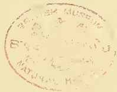A faint, circular red ink stamp is centered on the page. The stamp contains the text 'BRITISH MUSEUM' at the top, 'NATURAL HISTORY' at the bottom, and 'LONDON' in the center. The text is arranged in a circular pattern around a central point.

551------------------------------------------------

Yours very truly  
John. L. Grindleton

---

552------------------------------------------------

# \* The TROPICAL AGRICULTURIST \*

## ∞ MONTHLY. ∞

Vol. XVII.]

COLOMBO, FEBRUARY 1ST, 1898.

[No. 8.

### “PIONEERS OF THE PLANTING ENTERPRISE IN CEYLON.”

(Second Series.)

#### SIR JOHN J. GRINLINTON, KT.,

SOLDIER, ENGINEER, SURVEYOR, MERCHANT, COMPANY DIRECTOR, M.L.C.  
AND M.M.C. &c., IN CEYLON:—1857 TO 1898.

BEFORE the present issue of the *Tropical Agriculturist* is in the hands of the majority of its readers Sir John Grinlinton will have retired from Ceylon where he has been resident for 40 years, and he will carry with him hearty good wishes from all sections of our mixed community for a lengthy period of enjoyment of his well-earned *otium cum dignitate*. He has long taken a keen interest in the affairs of the Colony, and for many years an active part in its public life, rendering good service as a Municipal and Legislative Councillor, Administrator of Companies, and a member of various bodies which have for their object the promotion of the material and moral welfare of his fellow-citizens. He has had a very honourable as well as successful career, and of that career we now propose in this notice to give an outline.

Erect in figure, lithe in limb, and delightfully fresh in complexion, one can hardly think that Sir John has attained his sixty-ninth year, but such is the case. Time has certainly whitened his locks, but his silvery hair and beard only serve to enhance his erect presence and alert bearing. He carries his years extremely well indeed, and we can point to him as a proof of the argument we have frequently advanced that long residence in a tropical climate,

such as that of Ceylon at all events, is by no means inimical to good health or longevity. A son of the late Mr. Thomas Grinlinton of Portarlington, he was educated in Liverpool at Mount St. Institute, a well-known educational establishment, more especially for boys intended for engineering and mercantile pursuits. It was also at this school that Dr. Archer, late Brigade Surgeon in Ceylon was educated, but the Doctor had just entered when Sir John was about to leave to commence the business of life. Young Grinlinton's natural aptitude for engineering was well developed here, and at an early age he entered the Ordnance Survey Office at Liverpool, where his abilities gained for him the distinction of being selected to assist Major Tucker of the Royal Engineers and the Naval Officer in charge of the survey of the mouth of the Mersey in fixing the Channel and the treacherous sand banks in that locality. The excellent work which he did there attracted notice and led, before he was 17 years of age, to his entering the Royal Engineer Service with a view to special employment at the Ordnance Map Office, Southampton, where in a short time he was placed at important duties under Executive Officer (Colonel Yolland, R.E., and afterwards under the Director General Colonel Hall and the present General Gosset, who was as Capt. Gosset, Surveyor-General of Ceylon). Of General Gosset Sir John always speaks in the highest terms and looking

553------------------------------------------------

512THE TROPICAL AGRICULTURIST.[FEB. 1, 1898.]

back on his youthful career refers to the great scientific establishment at Southampton as the school of his life, having there had many unusual opportunities, of which he did not fail to take advantage, of making himself acquainted with many branches of practical science. When at the Map Office he had the honour, during the absence of the Executive Officer, of conducting the late Lord Palmerston round that large establishment and of explaining the work in the various departments—a circumstance which his lordship did not forget when an opportunity occurred of doing a good turn for “his young friend” as he called him. In 1848 the great Railway mania occurred, but although Mr. Grilinton had tempting offers to leave the establishment for good, he was wise enough not to relinquish his fixed post, as many did and repented afterwards. Altogether he served seven years on the Ordnance Survey of England. When a change was made in the Directorship he lost his patrons Colonel Hall and Capt. Gosset. This caused him to think of a new line of life, and having been strongly recommended for a Commission he was gazetted Ensign in the 65th regiment of foot then serving in New Zealand. He, however, did not join his regiment there, but continued for some time further on the Ordnance Survey discharging the same important duties. During the period he was stationed at Southampton he took a keen interest in the Polytechnic Institute, and as a member of Committee had an active part in its management. On handing over his responsible charge in the Ordnance Survey Department he joined the dépôt of his regiment in Jersey in 1854 and became Adjutant. Like most soldiers he desired to see active service, and preferring the rigours of campaigning to a military life in New Zealand he, when the Crimean War broke out, was successful, through the influence he had, in obtaining a transfer to the 4th King's Own. He joined that regiment as Lieutenant in the Crimea in 1855, and was at once placed in General Orders on the recommendation of General Sir Harry Jones (who commanded the Royal Engineers at the Siege) as Assistant Engineer, serving as such through the memorable siege of Sevastopol. It was there he met Capt. Wolsley, afterwards Sir Garnet and now Lord Wolsley, Field Marshal, Commander-in-Chief of the British Army, then in the 90th regiment and looked upon as a first-rate officer, as also the lamented Charles Gordon (R.E.) who was killed at Khartoum. Lieut. Grilinton was also engaged in making a military survey of the Allied positions, and on the fall of Sevastopol on 8th September, 1855, he was mentioned in despatches, recommended for promotion, and received the Crimean medal with clasp, the Turkish medal and the order of Medjidie.

After the peace (in 1856 and '7) he served with his regiment at Aldershot, in Dublin, and in Mauritius; and in 1857 he had the choice of two posts, but he preferred joining his former commanding officer, the present General Gosset, who was then Surveyor-General in Ceylon and who obtained for him a nomination to the Survey Department in this Colony on a commencing salary of £550 a year and allowances in September 1857. He carried with him the goodwill of all the officers of his corps and was presented by (then) Capt. Gosset on his own and their behalf with a very handsomely worded letter and a weighty purse which was most acceptable to a young fellow starting in a new life as a Subaltern in the line on half the pay he had at the Ordnance Map Office.

Sir John's career during his residence in Ceylon extending over a period of 40 years

is pretty well-known to old colonists; but in this sketch it is only right that we should enumerate a number of the prominent matters with which he has been personally identified. He laid out the Rifle Range at Mount Lavinia and was afterwards sent to Negombo and placed in charge of the Surveys in the “Alootcoor” and other Korales with a considerable force of Ceylonese who were instructed by him in the duties of field Surveyors. Thus was begun the first effort at a Cadastral Survey in Ceylon and it is interesting to think that the work started by Sir John, may in all probability be completed by his worthy son Mr. F. H. Grilinton who now occupies the important position of Surveyor-General of the island. When the Colombo and Kandy railway works were begun he was placed in charge of the necessary surveys at Marandahn and along the line within the Municipality of all properties to be taken up for railway purposes. About this time the Batticaloa irrigation works had been attracting a good deal of attention and early in 1859 Mr. Grilinton was despatched to that district with a large staff of European and Ceylonese surveyors to survey and make plans of all the lands fit for irrigation and subsequently all paddy lands for tithe commutation and it was when he was engaged in this responsible work that he had a difference of opinion with the then Assistant Government Agent, the late Mr. Woodford Birch (murdered at Perak) on a subject which seriously affected the natives who had purchased land which the works designed up to that time had been unable to irrigate. This difference however, was happily made up, as we have heard Mr. Grilinton say, before Mr. Birch left on promotion for the Straits Settlements. While resident in the Batticaloa District he was obliged to lead a rough nomadic life shifting his talipot camp every few days and travelling through uninhabited jungles known only to Veddahs and some native hunters and which very few Europeans ever visited. This was all in the course of his work in superintending the trigonometrical survey of the province; but a good deal of sport came in his way and he had what may be described as the “cream of shooting.” It was during his wandering in these lonely localities that he made the acquaintance of many of the Veddahs (some of whom acted as his guides) through the assistance of a Vedarala (native doctor) who stated that his mother was a Veddah. He found them at first to be extremely shy and they frequently ran away; but afterwards they became more intimate and he speaks of them as being on the whole a docile simple-minded people. After nearly four years spent in the Eastern Province Mr. Grilinton was transferred to the Southern Province, where he interested himself in a design for an improvement of the Galle Harbour and was granted a free passage home and back by the P. & O. Co., in order that he might further the designs. In 1865 he was brought to the Colombo Office and was Executive officer until the close of 1871 in which year he went home on leave of absence to study the narrow-gauge light railways system for the purpose of seeing whether they could be introduced to Ceylon, and had it not been for a difference with the Governor (Sir William Gregory) it is very likely that much good would have resulted from the work he did then in England and Scotland, a former commanding officer—Colonel Yolland—who was then Inspector of Railways (and who had known Mr. Grilinton well on the Ordnance Survey) having furnished him with introductions to the engineers of every light line known to the Inspector General. In 1866 he was appointed

554------------------------------------------------

FEB. 1, 1898.]THE TROPICAL AGRICULTURIST.513

one of five official members to the Municipal Council and was chosen as Chairman of the Public Works Committee, and during his six years of office he designed the first Public Latrines and received the thanks of the Council. He was asked to report on a Water Supply for the City, which he did at a considerable cost to himself. For this also he received the thanks of the Council; and to him the public are indebted for having led the way in introducing Gas into Colombo. In 1871 he along with others, (Capt. Fyers, R.E., Captain Donnan, and Capt. Graham) sent in designs to Government for a Breakwater to protect the Harbour of Colombo on which the Admiralty Engineer, Mr. Townsend, passed encomiums. This Engineer, however, considered (among other things) that a northern arm which formed a part of the design and a graving dock with tramway round the shores of the Harbour were more than could be undertaken. Time, however, has shown that all have been found necessary. In the year 1868 during the total Eclipse of the Sun, Mr. Grinlinton took special observations from the top of Trinity Church for which he was thanked by Astronomical authorities in England and America.

In 1872 Mr. Grinlinton resigned the public service and was immediately appointed Managing Director of the Gas Works. He likewise adopted mercantile pursuits and established Manure Works outside Municipal limits where he converted the offal of the Municipality and the scavenging of the town into fertilising material, there being added to it sulphate of ammonia with some thousands of tons of fish from the coast of India with ammoniacal liquor and gas-lime from the Gas-works. This proved a most successful undertaking as also did certain speculations in the purchase of large cargoes of teak from Burmah. In both of these ventures he was cordially aided financially by his esteemed friend, Mr. White, then the senior partner of Messrs J. M. Robertson & Co. On the visit of H.R.H. the Prince of Wales in 1875, Mr. Grinlinton was chosen as one of the Honorary Secretaries for the reception and the indefatigable efforts then made to make the illumination of the City and the large ball-room built at the Galle Face Club a success, caused the Governor to specially present Mr. Grinlinton to H. R. H. and to send him a letter of thanks for his special services. In 1876 the Wharf and Warehouse Co. was in very low water, and the post of Manager was offered to Mr. Grinlinton and he continued in the Company as Manager and Managing Director for a period of 20 years leaving it in a flourishing condition. In 1882 he accepted in addition to his other duties the Managing Directorship of the Colombo Hotels Co., Ltd., which at the time was in a very low state, its £100 shares selling at £15 and £20 and in 1888 he became also Chairman which post he now vacates, the present quotation of shares being £335. In the Jubilee year of Her Majesty the Queen, he was a member of the Committee which undertook the preliminary and active proceedings in raising funds and carrying out the object sought to be obtained and has ever since taken an interest in the Royal Victoria Home for Incurables, then established, of which he is a Life Governor and a member of Committee. In 1887 on the formation of the Irrigation Board he was appointed an Unofficial Member and his unremitting labours in connection with that Board are well-known and have been recognized by successive Governors. In 1888 he was appointed to the European seat in the Legislative Council and the general public know the keen interest taken in every question of importance that has come before that assembly, the latest instances being

his propositions in connection with sanitary management on the railway and the fares on the sea-side line, and in strongly advocating Railway extension on a narrow gauge (the metre he prefers) and on Irrigation he is ever "at home." A fluent and forcible speaker Sir John makes his points well and has always been listened to with close attention by his fellow members. He seldom if ever speaks except on a subject with which he is familiar or has carefully studied and it is generally admitted that he puts his case in a very strong light. In 1891 when preparations were being made for the Chicago Exhibition he was selected by the Planters' Association, Chamber of Commerce and the public in general as Special Commissioner and was so gazetted by Government, and during some months in 1892 and whole of 1893 he was at Chicago.

In 1891 Mr. Grinlinton succeeded (after more than a year's pressing the subject forward unofficially) in attracting the attention of Government to Uplands as the best site for a Graving Dock which could be made suitable for the largest ships in Her Majesty's Navy and the Mercantile Marine. A Commission was appointed by the Governor, Sir Arthur Havelock, to report on the subject, and the opinion of the Commission being unanimous, the site is now about to be converted into one of the finest Graving Docks in the world.

On the 25th March, 1894, soon after Mr. Grinlinton's return from America, he received the great blow of his life in the death of his wife who had been in delicate health for some years. This amiable lady was a daughter of the late Mr. Booth of Southampton, and her hospitality and benevolence are well known to many of the present residents of the Island, more especially to those who visited Nuwara Eliya. She had followed the fortunes of her husband to Mauritius and Ceylon, and was often with him in his journeys through remote parts of the Island where she made good use of her opportunities in writing interesting descriptions of her travels which have been preserved, and are to see the light at some future day.

Her belief in her husband was unbounded, and we do not wonder at the blank he now feels leaving this country alone and practically for good to take up his residence at Middle Wallop in Hampshire.

We attach an official record of Sir John Grinlinton's service:—

GRINLINTON, Sir JOHN J., M.L.C., A.L.C.E., F.R.G.S., F.S.A. &c.,  
son of the late Thomas Grinlinton, of Portarlington; was seven years on the Ordnance Survey of England, gazetted Ensign in the 65th Regiment, appointed Depot Adjutant, served the Crimean Campaign of 1855-56 as Lieutenant 4th King's Own Regiment, and Assistant Engineer during the siege of Sebastopol; was also engaged making a Military Survey of the allied positions, was mentioned in Despatches on the fall of Sebastopol, 8th September, 1855; Crimean Medal with clasp, 5th class of the order of Medjidie, and the Turkish Medal; Assistant Surveyor-General, Ceylon, 1857; retired from the Army by the sale of his commission 1858; appointed an Official Councillor of the Municipality of Colombo at its formation in 1866, and served for six years; resigned the Public Service 1872, and subsequently followed Mercantile pursuits; Member of the Central Irrigation Board 1887 to 1897; Councillor of the Municipality of Colombo (for a second time) 1887 to 1897; Member of the Legislative Council of Ceylon (to represent the European Community) 1888; Special Commissioner for Ceylon at the World's Columbian Exposition, Chicago, 1893; *m.* Emily, daughter of the late Mr. Isaac Booth, who died 1894; *cr.* K. B. 1894.

*Colombo, Ceylon, and Rose Hill, Middle Wallop, Hants. Clubs:—Royal Societies and the Junior Constitutional.*

555------------------------------------------------

514THE TROPICAL AGRICULTURIST.[FEB. 1, 1898.

He leaves two sons here—the elder Mr. Frederick H. Grinlinton being Surveyor-General of the Island, and the younger, Mr. Edward Gordon Grinlinton who has been a successful Tea Planter and who resides at Yalta, Nuwara Eliya. His only surviving daughter, Mrs. Coventry, proceeded to England last December.

*Finis coronat opus!*—The finishing touch to Sir John Grinlinton's career in Ceylon was put in the most cordial and successful and (in some respects) unique banquet accorded to him on the night of the 4th inst. by representatives of all sections and classes of the community, and which was honoured with the presence of the Queen's representative. Surely no old colonist or hardworked public man could desire a more congenial or fitting "send-off." He has not lagged "superfluous on the stage," but leaves at a time when the whole community must feel that his absence creates a blank, and when "troops of friends" regret the decision which makes his departure necessary. Sir John Grinlinton, though close on the ordinary limit of human life, is still hearty and vigorous, and his age is as "a lusty winter, frosty but kindly." No one can grudge a time of rest and retirement in his Hampshire home; but we may be certain of learning that he has found means of being useful in his new surroundings, while we may all look forward to a visit some years hence both to India and Ceylon. And so we take farewell of the worthy Knight—we have personally followed his career for over 36 years, always with interest, sometimes with criticism in words of praise or censure as the case might be, but more generally with feelings of admiration for the pluck, enterprise and indomitable industry which have marked his career. If we wished to sum up Sir John Grinlinton's character in a couplet we could not find one more fitting than that of the poet Wordsworth:—

"A man he seems of cheerful yesterdays  
And confident tomorrows."

## RUBBER CULTURE.

### A POSSIBLE AUSTRALIAN INDUSTRY.

An age of stone, of bronze, of iron, and also, say the scoffers, one of brass, has the world passed through in turn; is it too much to claim that we are now in the rubber era, considering to-day the multitudinous articles in common use, the manufacture of which is impossible minus the indispensable inspissated juice known as caoutchouc. Indian rubber comes from many countries, but the principal supplies have been secured heretofore from tropical South America, West and East Africa, Burmah, Assam, &c. Over extensive areas of these countries the different species of rubber trees are to be found, yet, although nature in the past has been so generous, it means wins in the present pneumatic tyres, &c., so great is the demand and so wasteful the usual process of rubber collections—left as it mostly is to either ignorant, savage, or semi-civilised savages, taking little heed for the to-morrow of manufacturers—that specialists are casting around for fresh fields of exploitation; their prognostications

being that nothing is more sure than a half response, or less, to the future cry for raw material. And this is owing to the exhaustion of the known forests, thanks to ruthless destruction of trees and lack of forethought in the matter of replanting.

Not so many years ago the Amazon valley with its *Hevea Braziliensis* yielded more than enough rubber for the world's use—and the real rubber trade may be said to have commenced less than thirty years ago—to-day this supply has been supplemented from the *Hancornias* of Pernambuco, the *Manihots* of Cara, the *Landolphins* and *Kicksias* of West and East Africa, not to speak of the *Ficus Elastica* of the East and the celebrated *Castilloa* of Central America. And yet the prices are slowly rising! Needless to say the manufacturing outlook is viewed with some uneasiness. Accordingly in other climes certain far-seeing people have started plantations, more particularly of the *Castilloa*, the *Hevea*, and the *Manihot*, whilst the Germans, with their usual thoroughness, in their West African possessions are making systematic attempts to propagate the *Landolphins*. And that the harvest to be reaped will be satisfactory is assured. The profits, based on present prices, at the expiration of the eighth year can be reckoned on at 300 per cent.

The parts of the world above mentioned are tropical, with a minimum average temperature of 66 F., combined with a heavy rainfall (though the *Manihots* and *Hancornias* do not require too much moisture), and it has always been laid down as a botanical postulate that Rubber and Rain, Miasma and Monkeys, are an indivisible quartette. But the knowledge of the earth's good things increases always. For example in 1893 the output of caoutchouc from Lagos, West Africa, was practically nil. Comes along one Kicks, who discovers a hitherto unknown tree. Its product is sent to Kew Gardens, London, for report, which being satisfactory, by 1895 nearly 4,000,000 lb. of rubber had been exported from that British Possession. But this by way of illustration only of what fresh discovery has done for the rubber market, for Lagos is an equatorial province. What is of far greater import to us is whether there is any possibility of the cultivation of any known tree in New South Wales. And considering what immense advantages would accrue to the farmer and planter by so doing no research for such a valuable kind of tree could be too comprehensive and no experiments too exhaustive, for the successful introduction of rubber-growing into New South Wales would mean an additional £1,000,000 to our annual export schedule. Surely an attempt to acquire such an increase is worth more than academic scepticism.

Twenty years ago that distinguished savant, the late Baron Von Mueller, stated emphatically that the *Ficus elastica* (E. Indies), being so closely allied to the *Ficus* species known here, would grow in the Gippeland valleys and gullies. Nothing so far has been done towards founding such an industry. However, opinions differ as to the speed of growth of this tree, for though experience elsewhere, in Ceylon, &c., quotes an average of eight years ere maturity is attained, it is at least likely in a fair cooler climate that the wait would have to be at least 25 per cent. longer. The deceased Baron spoke, too, of the well-known Port Jackson fig (*F. Rubiginosa*) which on analysis gives—Resinous sycoretin, 73; Acetate sycoceryl, 14; Caoutchouc, 13—100.

And the *Apocynaceous* "bitter bark," akin to the West African variety, is also reported to yield a fair percentage of commercial rubber when leaf and stalk crushing are resorted to. Beyond these *Lactaria Calocarpa* and *Lactaria Moorei* have been suggested by some writers as possible caoutchouc givers.

So much for the known Australian trees themselves.

Remains now to be seen whether there are any quick-growing varieties obtainable from other countries which are suitable to the climate, say, of the Tweed, Richmond, and Clarence rivers. And, it appears, while the *Castilloa* might possibly meet the case, it is more than probable that the *Sapium Biglandulosum* would do so.

556------------------------------------------------

FEB. 1, 1898.]THE TROPICAL AGRICULTURIST,515

There is considerable difference of opinion as to the florishable habitat of the Castilloa so far as New South Wales is concerned. Ordinarily speaking it is found best suited to tropical localities with a heavy rainfall; but it has been claimed that, owing to its adaptiveness, a sub-tropical climate would supply the necessary environment. Moreover it is at least suggestive to find the Ipomea Borna Nox, the juice of which is used to coagulate the caoutchouc milk of the Castilloa in Mexico, should grow luxuriantly in many part of New South Wales. So far, it is believed, no castilloas have ever been introduced into New South Wales. When full-grown it is a magnificent forest tree; but it must not be confounded with the Castilloa Markhamii, which belongs to the Perebea class. At maturity this tree's trunk often measures 10ft. in circumference, and its height will sometimes top 130 ft. It is easily distinguished by its immense hairy, oblong, and lanceolate leaves, often 18 in. by 7in., which are substrigose, as also are the branchlets the colour on the latter being buff. It is of small foliage area, taprooted, and requires a scrub surrounding when young. If grown as in a plantation the seeds should be set at a distance of 15ft. apart in uncleared ground. This is most important, a small area of about 1ft. in diameter being left clear around the young plant. So much do these trees desire shade in their youth that tests prove that whereas seedlings planted in uncleared ground develop a 9 in. trunk diameter, and flower and fruit in four years, those planted in well-cleared ground show nothing like similar advancement. In point of fact the young Castilloa needs above all things shade, for its stem's growth and juice supply else will be checked. Once suitably planted they require little or no attention. The rubber obtained at the fourth or fifth year is worth 2s 9d to 3s per lb., and so far as is known the tree with each year gives a large increase, expanding in geometrical progression. As for the collection of the juice and its metamorphosis into a commercial product that is an easy matter. It may be here added that recent discoveries show that a fair supply can be obtained from a crushing of the leaves. Whether this deciduous tree could be grown on the sugar lands of New South Wales has yet to be proved. The other tree, the Sapium aforesaid, which it is likely could be advantageously introduced here, is one of the Euphorbiaceæ. For years past rubber has been exported from the Port of Cartagena, and under the name of that Colombian city it was supposed to be a species of castilloa. This idea, however, is exploded, and the sapium mentioned now gets its due credit, with the acquiescent approval of the botanical authorities at Kew Gardens (vide "Kew Bulletin"). To Mr. R. B. White is due the honour of the initiatory indications on which subsequently Mr. Rob. Thompson, formerly in charge of the cinchona plantations, Jamaica, went so successfully to work. Mr. Thompson, who now resides at Chapperal, Sante Fe de Bogota, Colombia, has established since 1891 a plantation of 70,000 sapium trees, and in his report to Kew he states that this tree—trade name of it, "Colombia virgen"—has this peculiarity; "Unlike all other known sources of this substance it grows at a high elevation, and therefore, in a comparatively cool climate." There can be little doubt that the tree is one of the multiform varieties of the Sapium biglandulosum (Muell. Arg.), one of the Euphorbiaceæ, to which the Para hevea and the Ceara manihot belong. The variegations which this widely-spread species present are as extreme as are to be met with in the vegetable kingdom. . . . Under cultivation this tree thrives admirably, growing with great rapidity at the rate of 5ft. per year. Crops are obtainable in five to six years, at five years, the yield begin 1lb. of rubber per tree, which is worth about 2s 6d per lb., and when matured the tree, planted at the rate of 150 to the acre, attains a diameter of from 6ft. to 7ft. This, bear in mind, has received the cachet of Kew.

Mr. Thompson's plantation, lying at an elevation of between 6,000ft. and 7,000ft. above the sea level, is on land quite useless for other purposes, and so much

success has attended his efforts that at Monteira, Rio Sinn, Mons. M. P. Duand has put in no less than 100,000 cuttings and seedings, which are now florishing. Mr. Thompson, so the "Kew Bulletin" reports, has offered the Indian Government to deliver at the Nilgiris a large supply of Sapium plants and seeds insured to germinate for £1,000. Inquiries as to this tree are now being made by the higher authorities in Sydney, and should the replies be satisfactory no doubt an attempt will be made to acclimatise this tree.

Before concluding this article, it is as well may be, to disabuse the public mind of the belief that very cheap labour is required to make rubber-getting by tree-tapping a success. In the first place, little or no labour is needed until the trees have sufficiently grown. In the second place, from personal experience, and quoting from an exhaustive article on this industry as carried on by the half-civilised half-bloods of the Amazon Valley, those mestizos can and do earn £1 per day during the season of five months.—*Sydney Mail*.

### CATALOGUE OF COCCIDÆ COLLECTED IN CEYLON.

BY MR. E. E. GREEN.

[The following list of Coccidæ, which contains many undescribed species, is to be regarded as preliminary to a more exhaustive paper with figures of all the new species, now in course of preparation by the same author.—*Ed.*]

1. *Chionaspis braziliensis*, Sign.—On cultivated ferns, *Strobilanthus* sp., and *Acacia melanoxylon*, occurring, when present, in enormous numbers, the males usually predominating. A remarkable exception being in the case of specimens found on the *Acacia* which were all females.

Locality Punduloya.

2. *C. biclavis*, Comst.—Very common on stems of Cinchona and Tea, sometimes in such numbers as to considerably injure the plants. Found also occasionally on stems of *Grevillea* and *Coffee*; never on leaves, though the American type is described from examples found on leaves of fig. Male unknown. The female shield very inconspicuous, from the fact that it is always covered with the superficial fibres and loose material of the bark upon which it rests.

Locality Punduloya.

3. *C. aspidistæ*, Sign., var. *mussendæ*, n. var.—Found on stems and twigs of *Mussenda frondosa*. Differs from type chiefly in the character of the female shield, which is opaque, greyish white, and covered with the hairs and fibres of the bark instead of being of a "clear transparent yellow" as in Signoret's type. The male puparia are crowded together in large groups, each individual attached by the anterior extremity only, the rest of the body elevated.

Locality Punduloya.

4. *C. eugeniae*, Mask., var. *varicosa*, n. var.—Found on under surface of leaves of *Gelonium lanceolatum*. Differs from type chiefly in character of female shield, which is proportionately broader and marked with ramifying raised creases resembling veins.

Locality Punduloya.

5. *C. eugeniae*, Mask., var. *litææ*, n. var.—Found on under surface of leaves of *Litæa zeylanica*. Differs from type in the female shield being very thin and semi-transparent. Male with 3 knobbed digitules on feet.

Locality Punduloya.

6. *C. vitis*, n. sp.—Found on under surface of leaves of *Vitis*, producing discoloration of the leaf, the punctured parts turning pale yellow. Very occasionally found on upper surface of leaves of *E. wagnus*. Female shield thin, colourless and semi-transparent. Pygidial lobes small but prominent. Female insect pale yellow before gestation; afterwards reddish. Male with 4 knobbed digitules on feet.

Locality Punduloya.

7. *C. graminis*, n. sp.—On lemon-grass (*Andropogon*). Punctured area of leaf turning dark purple. Female

557------------------------------------------------

516THE TROPICAL AGRICULTURIST.[FEB. 1, 1898.]

shield snowy white; insect reddish orange. Pellicles of male puparium dark brown. Adult male with 3 knobbed digitules on feet.

Locality Punduloya.

8. *C. minuta*, n. sp.—On *Tetranthera*. A very small species, appearing to the naked eye like minute yellowish specks on under surface of the leaf. Female shield colourless and transparent. Male puparium also very thin and transparent. Adult female insect very pale yellow. Male with 3 knobbed digitules on feet.

Locality Punduloya.

9. *C. acuminata*, n. sp.—Found on both surfaces of leaves of *Aroisia* and several unidentified plants. Female shield very long and narrow with a median ridge, yellowish brown. Insect very pale yellow, tinged with bright orange in order individuals. Pygidia lobes very small. Male puparium strongly carinate, the furrows coloured reddish, giving a general pink tinge to the mass. Feet with 3 knobbed digitules. Terminal point of antenna with 3 knobbed hairs.

Locality Punduloya.

10. *C. elaeagni*, n. sp.—On *Elaeagnus latifolia* under surface of leaves. Female shield thin, whitish, but closely covered with the stellate hairs of the leaf. Insect bright yellow. Pygidium reddish. Pygidial lobes large and prominent. Male with 3 knobbed digitules on feet.

Locality Punduloya.

11. *C. exercitata*, n. sp.—On both surfaces of leaves of Tea, *Pysacotria* and other plants, in colonies consisting usually of one, or a very few females and a large number of males; the white carinated male puparia being disposed very regularly in parallel lines. Female shield long and narrow, reddish brown. Insect dull purplish red; pygidium with single median lobe. Male with 2 knobbed digitules on feet.

Locality Punduloya.

12. *Aspidiotus nerii*, Bouché.—Common on Tea, *Loranthus*, *Dalbergia*, Palms, etc.

Localities Punduloya, Kandy, Colombo.

13. *A. aurantii*, mask.—On Agave (American aloe) and *Citrus pomela*.

Locality Punduloya.

14. *A. osbeckiae*, n. sp.—On stems of *Osbeckia*, not common. Allied to *nerii*, but differs in the opaque brownish shield, and the marginal hairs of the insect. Male with black apodema. Feet with 4 knobbed digitules. Terminal joint of antenna with 3 knobbed hairs.

Locality Punduloya.

15. *A. occultus*, n. sp.—In minute galls on leaves of *Grewia orientalis*. Female pale yellow: no grouped spinnerets. Male with 4 digitules on feet, and 3 knobbed hairs on terminal joint of antenna.

Locality Punduloya.

16. *A. trilobitiformis*, n. sp.—On leaves of unidentified tree. Female shield broad and flat, opaque, reddish brown. Insect very regularly and symmetrically formed; segments strongly marked: a deep transverse groove behind the cephalic segments. Pygidium with well-marked reticulated path on upper surface.

Locality Punduloya.

17. *Diaspis lanata*, Morg. and Ckll.—Very common on stems of geranium. *Callicarpa lanata* and *Tylophora asthmatica*. Very destructive to cultivated geranium, the stems often being completely covered with the white male puparia.

Locality Punduloya.

18. *D. circulata*, n. sp.—Common on young tea plants and on the twigs of older bushes: also on *Cinchona* and *Osbeckia*. Female shield yellowish: pellicles usually dark, with a small whitish central boss surrounded by several concentric raised circles. Insect yellow. Male unknown.

Locality Punduloya.

19. *Mytilaspis citricola*, Packard.—On orange, and leaves of *Cocculus indicus*.

Locality Punduloya, Kandy.

20. *M. elongata*, n. sp.—On leaves of *Arundinaria*. Female shield very long and narrow, snowy white. Insect also very long; almost linear; pale yellow to orange. Male with 4 knobbed digitules on feet, and 6 knobbed hairs on terminal joint of antenna.

Locality Punduloya.

21. *M. pallida*, n. sp.—On leaves of unidentified shrubs. Allied to *M. citricola*. Female shield proportionately longer, smoother and more regular, very pale yellowish or brownish. Insect creamy white: pygidium pale reddish. Male pale lilac: foot with 3 knobbed digitules: terminal joint of antenna with 3 knobbed hairs.

Locality Punduloya.

22. *Aonidia corniger*, n. sp.—On upper surface of leaves of *Psychotria* and *Litsea*. A very remarkable form, the first pellicle bearing a series of 16 long, gassy, colourless horn-shaped processes. Adult female pale lilac: completely enclosed within second pellicle: pygidium without spinnerets: margin produced into tooth-like processes.

Locality Punduloya.

23. *Florinia saprosma*, n. sp.—On under surface of leaves of *Saprosma*. Female shield almost completely occupied by the second pellicle, which is pale orange coloured. Male puparia concealed beneath a mass of loose white filaments. Female insect pale yellow: minute jointed tubercles on margins of abdominal segments. Locality Punduloya.

24. *F. secreta*, n. sp.—In small galls on leaves of *Grewia orientalis*. Female insect yellow: pygidium long and pointed, with a prominent double median lobe: no grouped spinnerets.

Locality Punduloya.

25. *F. scrobicularum*, n. sp.—In glandular pits at base of veins on leaves of *Gaertnera kennigii*. Female shield very narrow in front, widened behind; pale yellowish with reddish median area. Insect pale yellow: pygidium with deep median cleft.

Locality Punduloya.

26. *F. Palmæ*, n. sp.—On fronds of Coconut palm. Differs from *F. saprosma* in smaller size, and in possession of a long stout spinelike process on rudimentary antennæ.

Locality Punduloya.

27. *Planchonia bambusæ*, Boisd.—On stems of Giant Bamboo. Male unknown.

Locality Punduloya.

28. *P. miliaria*, Boisd., var. *longa*, n. var.—On *Arundinaria*. Differs from type in proportionately greater size and length. Male yellow. Terminal joint of antenna with 3 knobbed hairs.

Locality Punduloya.

29. *P. delicata*, n. sp.—On leaves of *Arundinaria*. Much less convex than *P. bambusæ*: sometimes almost flat. Male reddish; antennæ with 6 very long whip-like hairs, and 3 knobbed hairs on terminal joint.

Locality Punduloya.

30. *P. solenophoroidei*, n. sp.—on leaves of *Arundinaria*, a minute species. Hinder part of female test narrowed and elevated. Insect bright yellow. Male pale yellow; foot with 3 digitules: antenna with 3 knobbed hairs at apex.

Locality Punduloya.

31. *Walkeriana floriger*, Walk.—On stem of *Litsea zeylanica*.

Locality Punduloya.

32. *W. compacta*, n. sp.—On stem of unidentified tree. Without the silky filaments and tufts of *W. floriger*. Short, stout, compact, conical white processes on dorsum.

Locality Kelani valley.

33. *W. euphorbiæ*, n. sp.—On branches of *Euphorbia antiquorum*. Very convex behind; narrowed and depressed in front. Short curved conical processes in concentric series.

Locality Hambantota.

34. *W. polcui*, n. sp.—On stems and twigs of *Dodonæa viscosa*. Pinkish grey: short, conical, truncate yellowish processes: very convex dorsally: laterally compressed inner side of femur with stout spines.

Locality Chilaw.

35. *W. seneca*, n. sp.—On stems and twigs of *Dodonæa viscosa*. Broader, flatter than *W. Polcui*: processes very long and curling white or brownish.

Locality Chilaw.

558------------------------------------------------

FEB. 1, 1898.]THE TROPICAL AGRICULTURIST.517

36. *Orthezia insignis*, Dougl.—On numerous ornamental shrubs, affecting specially *Acanthaceæ*. A very destructive species. Male slaty-grey with a brush of long silky filaments from extremity of abdomen. This species has been redcribed from Ceylon specimens by Mr. Buckton under the name of *O. naerea*; but I can find no distinguishing points between this and the species from Kew. In fact our specimens are doubtless the direct descendants from the Kew insect, as they first appeared in the plant-houses of the Government Botanical Gardens at Paradeniya.

Locality Kandy.

37. *Monophlebus zeylanicus*, n. sp.—On trunks of *Antidesma bunus*. Female bright orange-red: rather long and narrow. Insects of second stage occupying small cells in the living tissue of the bark.

Locality Punduloya.

38. *Icerya ægyptiaca*, Dougl.—On leaves of variegated Croton.

Locality Chilaw.

39. *I. tangalla*, n. sp.—On leaves of unidentified plant. Differs from *ægyptiaca* in absence of dorsal waxy cushions, and the marginal processes being very short, stout and truncate.

Locality Tangalla.

40. *I. crocea*, n. sp.—On leaves of Citrus, Croton and Cocculus. Body reddish orange: dorsal area covered with bright yellow mealy secretion, with double marginal series of yellow waxy tufts and numerous delicate silky filaments.

Locality Punduloya.

41. *I. pilosa*, n. sp.—On a species of wiry grass growing on seashore. Body dull crimson: dorsal area completely covered with white granular powder and short white filaments: skin with blackish hairs.

Locality Chilaw.

42. *Eriococcus arancariæ*, Mask.—On *Arancaria*, occurring locally in enormous numbers, making infested trees quite unsightly from the sooty fungus that accompanies the insect.

Locality Newera, Eliya.

43. *Coccus cacti*, Anct., var. *ceylonicus*, n. var.—On *Opuntia*. Differs from type in proportions of antennæ in different stages. Male, with a pair of longish knobbed hairs on each of last seven joints of antenna.

Locality Hambantota.

44. *Pseudococcus mangiferae*, n. sp.—On *Mangifera indica*. Female pale yellow, dorsal area covered with white mealy powder, except on a subtriangular median patch: a marginal series of stout white fragile processes. Male very pale yellow.

Locality Punduloya.

45. *Dactylopius adonidum*, Lin.—On nearly every cultivated plant and in every part of Ceylon.

Localities Punduloya, Kandy, Colombo, Chilaw, Hambantota.

46. *D. longifilis*, Comst.—On *Fasminum* and *Adiantum*.

Localities Punduloya, Kandy.

47. *D. talini*, n. sp.—On *Talinum*, *Lilium*, Croton. Female purplish brown, sparsely dusted with white powder: a single pair of longish stout filaments at abdominal extremity: numerous long, very delicate, colourless, glassy filaments.

Localities Colombo, Kandy, Chilaw.

48. *D. scrobicularum*, n. sp.—In glandular pits at base of veins of leaves of *Elaocarpus*. Dark slaty-grey, sparsely covered with whitish powder, abdominal segments only with stout white processes, which protrude from the opening of the cell in which the insect lives.

Locality Punduloya.

49. *Vinsonia stellifer*, Westw.—On leaves of Mango, *Ficus antinemsma*, Coconut palm and other shrubs.

Localities Punduloya, Kandy, Colombo.

50. *Ceroplastes floridensis*, Comst.—On Tea, Mango and Citrus.

Locality Punduloya.

51. *C. cerferus*, Anders.—On stems of *Antigouon* and *Poutzolia*. Specimens from the hills less than half size of those from low country.

Localities Punduloya, Chilaw.

52. *C. actiniformis*, n. sp.—On leaves of Coconut palm. Very convex. Median area of test with radiating purple lines.

Localities Punduloya, Kandy.

53. *Pulvinaria psidii*, Mask.—On Guava, Tea, Cinchona and numerous shrubs and plants. Occurring in enormous numbers and doing considerable injury to infested plants.

Locality Punduloya.

54. *P. tessellata*, n. sp.—On leaves of *Ophisrrhiya pectinata*. Female scale with tessellated markings; bright green ovisac, fluted.

Locality Punduloya.

55. *P. tomentosa*, n. sp.—On unidentified tree. Female scale olive-brown; median area rather thickly covered with small balls of tightly curled woolly filaments, ovisac with deep median longitudinal furrow.

Locality Punduloya.

56. *Lecanium coffee*, Walk.—Common on leaves and stems of Tea, Coffee, various ferns, and numerous other plants.

Localities Punduloya, Kandy, Colombo, etc.

57. *L. longulum*, Dougl.—On brauches and twigs of *Albizia* and *Grevillea*.

Locality Punduloya.

58. *L. viride*, Green.—On Coffee, Cinchona and numerous shrubs and trees. A very injurious species. But though it has killed out the coffee in whole districts, it has fortunately not seriously attacked Tea.

Localities Punduloya, Kandy, Colombo, etc.

59. *L. mangiferae*, Green.—On leaves of cultivated mango trees.

Locality Punduloya.

60. *L. nigrum*, Nietner.—Rather Common on various shrubs and plants, Croton, Asparagus, *Begonia*, *Cobæa*, etc. Though originally described from coffee, it is now very seldom seen upon this plant.

Localities Punduloya, Kandy, Colombo, etc.

61. *L. tessellatum*, Sign.—Rather common on leaves of *Caryota urens*. Found also on Cinnamon and some other shrubs.

Localities Punduloya, Colombo.

62. *L. planum*, n. sp.—On upper surface of leaves of unidentified tree. Bright castaneous to dark chocolate brown. Flat, broad. Subtriangular: pointed in front. Antennæ 6-jointed. Margin with continuous fringe of very delicate overlapping fan-shaped scales. Dermal cells small and circular on median area, oblong and irregular towards margin. Male puparium divided into 18 plates. Adult male without caudal filaments.

Locality Punduloya.

63. *L. planum*, var. *maritimum*, n. var.—Found on both surfaces of leaves of a thorny shrub growing on the sea-shore (within reach of surf). Differs from type in smaller size and absence of dermal cells. Scale protected by a secretion that becomes tough and gelatinous under treatment with potash.

Locality Bentota.

64. *L. geometricum*, n. sp.—On leaves of unidentified shrub. Pale castaneous, or fulvous. Flattish, sub-circular, median dorsal area with concentric series of polygonal depressed spaces. Antennæ 6-jointed. Marginal fringe of overlapping fan-shaped scales. Dermal cells oblong, irregular.

Locality Punduloya.

65. *L. marginatum*, n. sp.—On upper surface of leaves of *Psychotria thwaitesii*. Pale fulvous to castaneous, a sub-marginal zone almost colourless. Oval, pointed in front. Antennæ 6-jointed. Marginal fringe of overlapping semi-circular scales. No dermal cells. Male with long caudal filaments; costal nervure of wing bright carmine.

Locality Punduloya.

66. *L. expansum*, n. sp.—On leaves of *Litsea* and *Dalbergia*. A very large flattish species. Longest diameter nearly  $\frac{1}{2}$  inch. Margin with continuous fringe of fan-shaped scales. Antennæ obscurely 6(?)-jointed. Legs wanting.

Locality Punduloya.

67. *L. antidesmae*, n. sp.—A single specimen found on leaf of *Antidesma bunus*. Very flat, but opaque: reddish brown with a thin-greyish powdery film.

559------------------------------------------------

THE TROPICAL AGRICULTURIST.

[FEB. 1, 1898.

Antennæ 8-jointed. Margin with simple stoutish hairs. A distant series of short, fine, white cottony filaments springing from glandular spots near margin.

Locality Punduloya.

68. *L. caudatum*, n. sp.—Very abundant on leaves of *passiflora*, occasionally on Coffee. Convex oblong, oval; broadest behind. Colour varying with age from bright orange to deep chestnut brown; the paler specimens with a dark brown longitudinal and several transverse bands. Three or four very long white thread-like filaments springing from anal aperture, frequently extending two or three times length of insects. The hairs from ano-genital ring very conspicuous, stout and dark coloured; marginal hairs dilated and toothed. Antennæ 7-jointed.

Locality Punduloya.

69. *L. acutissimum*, n. sp.—On under surface of leaves of Coconut and other palms. Very narrow; pointed in front and behind of the shape and size of a caraway seed. Reddish brown to black. Antennæ 6-jointed. Single stigmatic spine.

Localities Punduloya, Kandy, Colombo.

70. *L. piperis*, n. sp.—On leaves of wild pepper, upper surface. Female broadly oval, flattish, with prominent median longitudinal, and two transverse ridges. Pale fulvous to pale reddish brown. Antennæ 8-jointed. Stigmatic spines in deep cleft, four to six. Male puparium divided into 18 waxy plates.

Locality Punduloya.

71. *L. ophiorrhiza*, n. sp.—On leaves and stems of *Ophiorrhiza pectinata*. Oblong, pointed in front. Pale fulvous with dark reddish, reticulated pattern. Stigmatic spines three, the central one very long and prominent. Antennæ 8-jointed. Male puparium composed of 9 glassy plates, a median longitudinal series of prominent points.

Locality Punduloya.

72. *L. formicarii*, u. sp.—On stems of Tea and other shrubs, always sheltered by nests of a small brown ant (*Cremastogaster*, sp.). Highly convex, almost globular; dull brown.

Locality Punduloya.

—Indian Museum Notes.

YIELD OF BLUE-GUM PLANTATIONS.

From some interesting figures lately supplied us by a correspondent, we gather some valuable information regarding the yield of fuel from gum plantations:—

<table border="1">
<thead>
<tr>
<th rowspan="2">Years.</th>
<th rowspan="2">Age.</th>
<th rowspan="2">Elevation. Feet.</th>
<th rowspan="2">No. of trees per acre.</th>
<th rowspan="2">Stack per acre.</th>
<th rowspan="2">Annual increase per acre.</th>
<th rowspan="2">Average dimensions of trees.</th>
<th rowspan="2">Annual increase per tree.</th>
</tr>
<tr>
<th>No.</th>
<th>Cubic ft.</th>
<th>Cubic ft.</th>
<th>Cubic ft.</th>
<th>Cubic ft.</th>
</tr>
</thead>
<tbody>
<tr>
<td>1</td>
<td>5</td>
<td>7,235</td>
<td>847</td>
<td>2,966</td>
<td>593</td>
<td>3.5</td>
<td>0.2</td>
</tr>
<tr>
<td>2</td>
<td>6</td>
<td>5,954</td>
<td>980</td>
<td>2,151</td>
<td>302</td>
<td>2.2</td>
<td>0.3</td>
</tr>
<tr>
<td>3</td>
<td>9</td>
<td>6,694</td>
<td>1,045</td>
<td>5,963</td>
<td>503</td>
<td>5.7</td>
<td>0.6</td>
</tr>
<tr>
<td>4</td>
<td>10</td>
<td>7,382</td>
<td>469</td>
<td>6,894</td>
<td>585</td>
<td>14.7</td>
<td>1.4</td>
</tr>
</tbody>
</table>

\* Equivalent of cubic feet in tons is 45 cubic feet = 1 ton, Govt. ratio.

Taking the question of elevation first, it will be seen that the highest plantations give decidedly the best results, both in actual stock and annual increase per acre. Naturally the youngest plantation (No. 1) leads the way in annual increase per acre, while it is undoubtedly the lower elevation that make No. 2 and 3 so inferior to the others. No. 4, by the way, is the average of two plantations, very similar in age, elevation and other details. Another factor to be noted is the number of trees per acre, No. 3 containing far too many for its age, nine years. The chief influence on the yield, however, to be gathered from our figures, is that of elevation. Detail as to soil, exposure, &c., are unhappily not given.

The Government ratio of 45 cubic feet to one ton seems to be far under the mark, as this gives very nearly 4,500 lb. dry weight per the usual stack of 100 cubic feet. With timber under ten years, the average

runs according to our experience to 3,500 lb. per 100 cubic feet or 64 cubic feet per ton. Naturally the younger the trees, the lighter the stack, for it is certain that the cubic space occupied by the stack certainly does not represent 100 solid cubic feet of timber owing to the interstices between the logs. The actual weight of a cubic foot of dry blue-gum timber runs out, it is true, to the Government standard of 45 lb. We mention this to warn planters basing the actual dry weight of the fuel they grow by such a high standard as 45 lb. per stacked cubic foot.

A query was recently propounded as to whether it paid better to buy or grow one's fuel for firing purposes. This depends of course on the price of the outside fuel available and on the quality of the reserve land on the estate. The annual yield in lb. of fuel per acre of gums varies from 10½ thousand pounds at say 6,000 feet to 20½ thousand pounds at say 7,000 feet. Or say the plantations were cleaned felled in successive plots each five to six years' old, the yield would vary from 70,000 lb. to 105,000 lb.

Any further information that our correspondents may furnish will be gladly welcomed.—*Planting Opinion.*

PLANTING NOTES.

FORESTS.—The following table of forest distribution in several sea bound countries, from which a fairly reliable data is given may be of interest, says Mr. D. Forbes in the *Hawaiian Planters' Monthly*:—

<table border="1">
<thead>
<tr>
<th>Countries.</th>
<th>Percentage of Forest area total average of country under forest.</th>
<th>Population per head of in acres.</th>
</tr>
</thead>
<tbody>
<tr>
<td>East India (British) ..</td>
<td>25 %</td>
<td>.5</td>
</tr>
<tr>
<td>U.S. America ..</td>
<td>17 "</td>
<td>7.6</td>
</tr>
<tr>
<td>Russia in Europe ..</td>
<td>42 "</td>
<td>6.1</td>
</tr>
<tr>
<td>Sweden in Europe ..</td>
<td>35 "</td>
<td>9.1</td>
</tr>
<tr>
<td>Germany in Europe..</td>
<td>26 "</td>
<td>.8</td>
</tr>
<tr>
<td>Italy in Europe ..</td>
<td>22 "</td>
<td>.5</td>
</tr>
<tr>
<td>France in Enrope..</td>
<td>16 "</td>
<td>.6</td>
</tr>
<tr>
<td>Germany in Europe..</td>
<td>4 "</td>
<td>.1</td>
</tr>
</tbody>
</table>

POOR QUALITY OF CEYLON TEA.—An Up-country Visiting Agent writes to our evening contemporary:—If most planters began to pluck fine, there would be a plethora of fine teas, which would be, a way, a drug in the market, while the few who continued to pluck coarsely would score considerably. There is a demand for different kinds of tea at different times, and it has paid of late to pluck coarsely to meet the demand for a particular kind of tea. As for the falling-off in quality in March, April, and May, and the consequent drop in the market, it is due in my opinion to the weather, which affects the sap in the tree, and, when the rains set in, the leaf improves at once, and prices rise. Fine plucking will not alter this. I have always held that the market would be relieved and prices steadied by planters going in for making green teas for America on a big scale, and that the Thirty Committee should financially assist for a twelve-month those who would do so. The Committee have lots of money, and this method of spending it would be quite as beneficial as subsidizing traders in America and Russia to build up big business for themselves." As to the "expert and tea rejection" scheme, it would require legislation before it could be carried out, as there is no law at present to prevent the tea planter shipping any rubbish he likes. Of course, if tea is bad enough, and we hear of tea bought in Colombo for ten cents being shipped home, the rejection ought to take place at the British Customs. Tea unfit for human consumption is rejected now in America as well as in Australia, and the same vigilance ought to be exercised in England. But the English tea-drinker appears to be able to consume what is too bad for any other country. Surely the Ceylon Association in London might wake the Customs up, as rejection on the other side would be much more easily carried out, and a less invidious duty, than if done in Colombo. Otherwise, we think something should be done on this side.

560------------------------------------------------

FEB. 1, 1898.]THE TROPICAL AGRICULTURIST.519CEYLON TEA IN RUSSIA.

We give prominence to the following interesting letter addressed to us by Mr. J. M. Maitland-Kirwan from Moscow. Its perusal will whet the general expectation for Mr. T. N. Christie's Report and advice as to the future campaign in favour of our tea in Russia:—

Moscow, Dec. 10, 1897.

DEAR SIR,—You will no doubt be interested to know what the position of Ceylon teas is in this country, and you will shortly have the report of Mr. Christie, whom I have had the pleasure of meeting on several occasions.

The enormous duty of eighty kopecks (1s 10d) per lb, together with many other restrictions, of which Mr. Christie's Report will inform you, tends heavily to hamper the budding of a new product, especially so in this country, in regard to Ceylon tea, where "Russians" have such a firm grip of the palate. Nevertheless, it is most encouraging to know that, in spite of such difficulties, the imports of our teas have risen during the last six years to close on 4,000,000 lb. and this, you may say, with practically no Advertising. I have been going mostly closely into matters during the week I have been here, and I am of opinion that a good round sum of money, spent judiciously in Advertising, would be a well-invested capital. I am afraid Mr. Christie does not altogether adopt my view as to this, but, nevertheless, with every deference to his excellent judgment, that is my undoubted opinion. Mr. Rogivue has done good work here; he has had a hard uphill game to play, and has played it honestly and well, and is now rewarded as he deserves, by having an uncommonly good business at his back. We want more "Rogivues" out here; there is plenty of room for them, and we shall no doubt get them in time, but assistance will be required to enable such to start, and to this the "Thirty Committee" will doubtless give their careful attention. It is certainly a most important matter and worthy of their gravest consideration.

Weather here is intensely cold, though the sun is shining, and clothed as you are from head to foot in fur, the icy air still finds its way in and makes one sometimes long for the balmy breezes of a certain isle far away in the gorgeous East.—Yours faithfully,

J. M. MAITLAND-KIRWAN.

We are as firm believers in Advertising as our Correspondent; but we doubt the wisdom of starting more "Rogivues" as opponents of Russian tea-dealers—cannot Ceylon planters work through the latter? Mr. Christie may tell us.

TEA PLANTING IN ASSAM :THEFTS OF TEA—BREAD AND LIQUORS:

(Notes from a Correspondent.)

What you wrote some while ago about the local consumption of tea, was very interesting. Our case here is very much the same. While nearly every native now-a-days drinks tea, it is not procurable in the open market. The amount of tea sold locally, on the gardens, is very small, so the pilfering that goes on in every factory must be enormous. Any cooly going to the village to buy rice or dhan (paddy) can always barter tea for these things or any little necessaries he may want; it is a beautiful system, naturally beneficial and free from all worry and waste of time, tea, unlike cash, being procurable whenever wanted. I have made several ineffectual attempts

at different times to buy tea, but the khyahs will not sell me any for fear I might make enquiry as to whence it was procured.

It seems rather hard lines that the coolies should always select the best tea for their simple transactions. If their pilfering was confined to the coarser grades, one would not mind so much, but they have not the decency even to take unassorted teas. In the numerous cases of theft on gardens, so far as I have seen, the tea found in the cooly's possession has been almost invariably of the best grades; taken away from the factory by a woman, or her child, as she was suffering from fever!

How do you make bread in Ceylon? I cannot get my servants to make it without yeast; they say it is impossible. Natives of course make use of the country grog, which is said to be made from the flower or fruit of the "mahwah" tree, but a paid servant cannot debase himself to use such stuff. It is imported into the district by the "sharab maholdars" or liquor-shop keepers, but it has an overpowering smell, enough without any of its adulterants to make the consumer drunk. I should think that "lao pani," fermented rice liquor, would be a good substitute for yeast. It is a glorious beverage, so I have been told, but the Government in its inscrutable wisdom has made its preparation an offence in order to realize a noble revenue from licensing liquor shops. If the natives wish to get drunk it must be done on spirits "recommended by the (Government) faculty," not on a simple, unsophisticated beverage at 8 annas a bottle!

COFFEE, RUBBER AND TOBACCO INCOSTA RICA :THE SARAPIQUI ESTATES CO., LD.

The Sarapiqui (Costa Rica) Estates Co., on whose property Mr. J. L. Shand made so favourably a Report, afterwards joining the Board, has issued its first Report. Besides Mr. Shand, two other well-known Ceylon men are Directors, namely, Messrs. J. H. Thring and R. P. Macfarlane, their colleagues being three city merchants, Messrs. Jennings, Maguire and Phipps. With a capital paid-up of £46,756 (£40,000 being the cost of the property which includes an immense area of fine land besides 144 acres of good coffee), the Directors are very properly going to work cautiously and judiciously. The following is from the first Annual Report:—

Work on the Company's plantations has been diligently prosecuted, and considerable progress has been made. The 128 acres referred to in the Prospectus as being already planted have on re-measurement turned out to be 144 acres. This area has been thoroughly cleaned and weeded, and part of it is bearing crop. In addition some 400 acres have been taken in hand and are being planted with coffee. The quality of the coffee has been established by a sample shipment which arrived in July and was sold in September at an average of 96s per cwt, part having realised 108s. Considering that this coffee was defectively cured, owing to the want of proper machinery the result must be considered satisfactory.

It is the desire of the Directors to proceed with the cultivation of Tobacco and India-rubber, and the realisation of the Company's large Estate in timber so soon as funds and the exigencies of work permit; but it is their opinion that for some time to come it will be necessary to devote the resources of the Company both in money and energy to the development of the coffee land.

It has been arranged for a Member of the Board, Mr. R. P. Macfarlane, who has great experience in coffee planting, to visit the plantations, sailing by the Royal Mail Steamer of 12th January, and with him will

64

561------------------------------------------------

520THE TROPICAL AGRICULTURIST.FEB 1, 1898.

go ont an assistant to Mr. Rothe. The heavy outdoor duties require all the Manager's time and attention, and very much interfere with the necessary work of accounts and stores, hitherto attended to by him personally.

As an experienced, shrewd and thoroughly reliable coffee planter, the impressions and report of Mr. Macfarlane on the Costa Rica estate will be looked for with much interest. The Directors are doing wisely in devoting some attention to other products, especially to tobacco (for which their rich soil is suitable) and to rubber for which the demand steadily grows year by year. The Secretary this Company, Mr. A. G. Beeston, has an old connection with Ceylon, his father having been Secretary and Agent to the first Ceylon Railway Company and resident here in Sir Henry Ward's time; while he himself is a nephew of the late Mr. Geo. Stewart, founder of the well-known Colombo firm. The Chairman, Mr. G. D. Jennings, is much esteemed as a man of high character and prolonged City experience.

### PRODUCE AND PLANTING.

PLANTING IN BRITISH BORNEO.—On Tuesday night, at a meeting of the Royal Colonial Institute, Mr. E. P. Gueritz read a paper on "British Borneo." The reason given by Mr. Gueritz for the absence of popular knowledge of Sarawak among the commercial community of London, as compared with that of the native States of the Malay Peninsula, Labuan, and North Borneo, was her inability to compete in mineral wealth with the vast tin deposits of the Peninsula. Trade, which was generally carried on through Chinese merchants, included exports of sago—flour (of which 15,481 tons were exported in 1896), gutta, india-rubber, beeswax, birds' nests, quicksilver, tobacco, rice, rattans, and coal. Attention was drawn to the territory as a field for the planter, and reference made to its success in regard to the production of tobacco, the area of which was being extended. Coffee and coconuts were receiving considerable attention, while manila, hemp and rhea had also been planted, and gambier to a small extent. An experiment in tea-planting was also being made on a considerable scale.

COFFEE MIXTURES.—Dr. Bostock Hill, who is the analyst to the Warwickshire county, in making his report to that body, recently referred to the sale of various kinds of mixtures, and said "there can be no doubt that the sale of these coffee compounds, even when labelled, is a fraud, as the price charged for them is always higher than their commercial value, while the purchasers have no means of knowing how infinitesimal is the quantity of coffee contained. In future legislation I am of opinion that it would be very desirable for all such mixtures to be labelled, and that the label should indicate the proportions of the foreign ingredients." Some of Dr. Hill's confrères made the same suggestion to the Select Committee on Adulteration, but their report states: "After careful consideration of the matter, your committee have come to the conclusion that they cannot support the proposal that the labels on mixtures should set forth the several components of the mixture, as well as the fact of admixture."—*H. and C. Mail*, Dec. 17.

### THE CEYLON LAND AND PRODUCE COMPANY, LIMITED.

#### REPORT OF DIRECTORS.

Your directors have the pleasure to submit the annexed profit and loss account and balance sheet for the crop year ending June 30th, 1897, duly

audited. The amount at credit of profit and loss account is £10,356 7s 5d, which, with the sum of £788 5s 9d brought forward from last year, leaves £11,144 13s 2d to be distributed. On July 22nd last an interim dividend of seven and half per cent on the ordinary shares and three per cent on the preference shares was paid, and your directors now propose to pay on December 31st, 1897, the balance of the fixed cumulative dividend on the preference shares (three per cent), making six per cent for the year, and seven and half per cent on the ordinary shares, making fifteen per cent for the year, and, in addition a bonus of five per cent on the ordinary shares—all free of income-tax. It is also proposed to transfer £3,500 from profit and loss account to reserve fund, increasing that account to £10,500, and carry forward the balance of £1,438 13s 2d, subject to the directors' remembrance for the year under review, to be fixed at the general meeting, and to the payment of income-tax, &c. In accordance with a resolution of the board, a call of 10s per share was made upon all members holding ordinary shares upon which only £2 10s had been paid, and the same was payable on January 1, 1897. In pursuance of the terms of the notice, the dividend and bonus will be calculated as from the date of receipt of cash. It is a source of gratification to your directors that they are again able to lay before the shareholders evidence of the continued success of the company, notwithstanding the increased cost of production, mainly due to the rise in exchange. The crop of tea greatly exceeded the estimates drawn up at the commencement of the financial year, but the forecast of the cocoa crop was scarcely realised, owing to a very heavy rainfall in December last. The prices obtained for tea were lower than those recorded in the previous period, but it is pleasing to note that a substantial rise in the values of cocoa has been realised.

TEA.—The expansion in the trade in Ceylon tea is indicated by the increasing quantity offered at auction here during the eleven months from January 1 to November 30, which was 1,082,700 packages, realised at an average price of 7½d per lb, compared with 8¼d per lb obtained for 962,000 packages in the same period last year. It speaks well also for the popularity of the article that deliveries fully kept pace with the increased supply, so that the bonded stock in London was 1,000,000 lb less on the 30th ultimo than it was a year ago. Quality has varied a good deal, probably due to climatic influences. On the whole the crop has been of a useful description, though the fine flavour, which was at one time the feature in Ceylon tea, is not now so often noticeable as formerly. Common to medium grades ruled about steady though most part of the year, due largely to the growing demand for "leafy kinds" for the Continent and other quarters outside the United Kingdom.

Fine and finest generally met with good competition, but prices showed some irregularity at times, being much influenced by the fluctuations in quality noticed above. Business from London to Russia, the Continent generally, as well as to Canada and America, continues to increase, and exports to these countries bid fair to become a very important feature. Total shipments for the first eleven months of this and the two previous years to November 30 were, according to the Board of Trade returns:—1897, 9,590,000 lb.; 1896, 7,418,000 lb.; 1895, 6,535,000 lb.

COCOA.—It is a satisfaction to your directors to report that the sales of our crops have been at enhanced values on those of last year, and we have to look back to 1894 for similar prices. By judicious handling, your directors were enabled to finish the realising up to 85s, which is the highest figure obtained this year. The outlook for the article is hopeful, but a return to the high values existing previous to 1894 is improbable.

COFFEE.—The small crops from the company's estates have been disposed of at the best possible prices, but the prognostications of your directors given in

562------------------------------------------------

FEB. 1, 1898.]THE TROPICAL AGRICULTURIST.521

last year's report, pointing to a further reduction in values, have been realised beyond their expectations. The price secured in February for good yellow Liberian was 70s, but in September only 54s 6d was obtainable, and although it is satisfactory to your directors to report that these were extreme at the time they regret that prices have had a further decline, and the value now is about 42s per cwt. The prospect for this article is not promising, on account of the large increase in the production of other countries, especially of Brazil, and we have to refer to the years 1885 and 1886 for similar values.

**ACREAGES.**—The following statement shows the approximate acreage of the company's properties at date:—Tea, 2,232½; cocoa, coffee, coconuts, etc., 1,582; forest, grass, chena, abandoned, etc., 1,341½; total acreage, 5,156½.

The crop prospects for the season 1897-98 appear to be, so far, favourable, and according to the last reports received from the chairman—who is presently in the island—the estates were in excellent condition. Mr. William Keiller, by rotation, retires from the directorate, but, being eligible, offers himself for re-election. Mr. James B. Laurie, the auditor, also retires, but he is eligible, and offers himself for re-election.—*H and C. Mail*, Dec. 17.

### THE CEYLON PROSPECTING

#### SYNDICATE LIMITED.

10 ST. SWITHIN'S LANE, E.C.

Report of the proceedings of the Annual Meeting, held at the Company's Offices, 10 St. Swithin's Lane, E.C., on Wednesday, 1st December, 1897, Mr. A. W. Lawder, M. Inst. C.E., F.G.S., in the Chair. The Secretary read the notice convening the Meeting.

The CHAIRMAN said:—Gentlemen, In rising to address you today, I am sorry that I have to do so in place of Mr. Wallis, the Chairman of the Company. Unfortunately he has been summoned to attend a jury this morning, and is therefore unable to be with us. He expresses his great regret at this, as he always has the interest of the Company at heart. The Directors' Report and the Balance Sheet have been circulated and are in your hands, and in rising to move their adoption, I would like to make a few remarks. Since the Statutory Meeting, held in this room, considerable progress has been made with the Company's business. At that time we had acquired the option for certain lands in the Island of Ceylon, and the rights to the patents for machinery to work them. We have since then exercised that option, and have become landed proprietors in the Island of Ceylon, being now in possession of 191 acres of freehold property. We have also been busy in the exercise of our patent rights, and have had manufactured for us a large and powerful plant, capable of dealing with the alluvial gravels of the Island in a way they have never been dealt with before. The land we have is acknowledged on all hands to be good gemming land, and as we have made up our minds, I think wisely, to commence our work on a large scale, and in a vigorous manner, there is no room to doubt that the operations of the Company must be successful. Our machinery has been on view and at work during the course of last month at Westbourne Park, and invitations to see it were issued to our shareholders, and to many other gentlemen interested in the subject, who were agreeably surprised at the power and suitability of the plant, and the efficiency with which it did its work. I may state that it has fully realised all expectations, and notices of a highly satisfactory nature have appeared in the technical journals. With regard to the Balance Sheet, there is not much in the way of explanation to be said. You have the figures and the Board will be very pleased to hear any remarks, or to add any explanations on points arising that may suggest themselves to the Shareholders. It will be noticed that we still have some shares to place, and I may say

that it is the policy of the Board to obtain further subscriptions for these, rather than to make further calls at present on those already taken up. I may add that we have with us to-day a Shareholder who knows our property well, and being thoroughly conversant with the Gemming industry in Ceylon, I will ask him a little later to make a few remarks on the subject. I now, Gentlemen, beg to formally move that the Report of the Directors and the Balance Sheet be adopted.

Captain H. L. PILKINGTON, a Director, said:—I rise to second the Resolution moved by the Chairman that the Report and Balance Sheet now before the meeting be adopted. I think we have done excellently when we consider the two great difficulties under which we have had to work; the difficulty of developing new machinery, and that of taking up an industry that has not up to the present been successfully worked by an English company. Should we prove successful in our work, we ought to have a very big thing indeed before us. The possibilities of the Gemming industry in Ceylon are almost unlimited, and as we have the sole right of using Mr. Lockhart's machinery in the Island, I regard our position as most favourable. We have a first-class freehold property in Rakwana, the great gemming district of Ceylon, we have plenty of water, and, above all, we know, by the very successful working of our machinery at the recent trials, that the gems in the alluvial to be treated by our plant will beyond doubt be secured, and that we shall not be in the hands of the natives as other companies were.

Mr. ARNOLD FRANCKE, a shareholder, asked for information as to the number of shares taken up, and the amounts paid on them, and some discussion on the subject ensued, the result of which was that the shareholders, with the desire to strengthen the hands of the Directors, expressed their opinion that any outstanding subscriptions should be energetically followed up and payment forthwith secured.

Mr. FRANCKE then said that his inspection of the plant the Company was sending out to Ceylon, had afforded him much pleasure; he fully endorsed all the Chairman had said as to its efficiency and the strength and excellence of its manufacture, and he considered that with such a plant the Company had every prospect of success before it. He wished to lay particular emphasis on the wisdom of the policy of the Directors in deciding to commence vigorous operations at once on a large scale. Past undertakings of a similar nature, both in Ceylon and elsewhere, had failed through the endeavour to work at first in a small and tentative manner with the mistaken idea that encouragement would be gained before facing the necessary outlay for plant adequate to ensure commercial results. He believed that encouraging results could never be obtained in this way, while expenses were all the time running on. It was far more prudent to commence with plant capable of making a return on the capital which would have, in any case, to be laid out, and thus put the success or failure of the enterprise beyond the possibility of a doubt in a short space of time. This course the Directors have decided to pursue.

Mr. LEOPOLD DAVIES spoke as to the necessity of all the shareholders loyally supporting the Directors in an enterprise of this nature, and in paying the calls on their shares promptly, so that the Directors might not be hampered in their use of the Company's working capital, and that the burden of providing it might fall equally on all. He also put a question with regard to the Directors' fees.

Mr. DUNCAN DAVIDSON, one of the Directors, in replying to the question as to the Directors' fees pointed out that they had not been drawn, but that he considered that Directors who gave their time and attention to the Company's business, and he would like to say that this Company made very considerable demands in this way, which were cheerfully and promptly responded to,—were fully entitled to at least the small sums provided for by the Articles of Association, and that, as soon as the Company's finances warranted it, he was of opinion that they should be paid.

563------------------------------------------------

522THE TROPICAL AGRICULTURIST.[FEB. 1, 1898.]

Mr. M. E. WESLEY called attention to some points in the Balance Sheet, noting that he had accounted for all the funds at the Company's disposal, with the exception of a sum of £350 and asked if the Chairmen could offer any explanation on the subject.

The CHAIRMAN replied that the £350 to which Mr. Wesley had referred was the sum mentioned in the Prospectus as the cash consideration for the benefit of the Option for the Land, since exercised, and for the Patent Rights. Although not specifically mentioned, it was actually included in the balance sheet and accounted for to the satisfaction of the Auditors. He then asked Mr. F. L. Shand, if he could give the meeting any information as to Gemming in Ceylon.

Mr. F. L. SHAND, on rising, said he had spent 15 years in Ceylon, and knew the district in which the Company's estates lay thoroughly. He had been engaged in gemming on lands immediately contiguous to them and, referring to the map on the wall, he pointed to "Golden Grove," "Everton" and "Ranweltenna" as properties well worth the Company's attention, and he said that it would be important to ascertain whether the surface illum or gem-bearing gravel, which existed there and was very rich, extended over the Company's land. He believed it did. This gravel bed was well known in the district to be very rich. The best gem-bearing gravel is usually found in level country, and not where you have abrupt hills. He instanced a case in which he found a small patch of the surface illum which had escaped denudation on the hill-side owing to its being protected by the roots of a few tea-bushes, out of which he washed gems to the value of 500 rupees. He would like to know what reports on the Company's property had been obtained; he, however, had no doubt that, situated as it was, the illum there might be valued at fully 10s per ton. He had known £7,000 worth of stones sold at one time as the result of three months' ordinary basket washing in this district. The beautiful gems in the case on the table were, he could see, Rakwana stones and of high value. He had once picked up a gem in the district, by the road side, which sold for 500 rupees, and he had sold other Rakwana Sapphires at £10 per carat.

The MANAGING DIRECTOR said that he was particularly pleased with the remarks which Mr. Francke had made as to the advisability of commencing work on a large and comprehensive scale, and with regard to the machinery he was well satisfied that it would accomplish the work necessary to ensure the success of the Company's operations. Referring to Mr. Shand's remarks, he said that the Company's ground had once been the bed of a lake, and was quite flat. It was well known that layers of rich illum existed in it, and the alluvial had been proved to a depth of 138 feet by a shaft sunk by the former proprietors. In reply to the question that Mr. Shand had put as to the Company's property, the most convincing report possible was the case of beautiful cut stones which he held in his hand, and would pass round for the inspection of the Shareholders. These, and many mere like them had been found during the sinking of the shaft referred to. Sapphires of such quality were very scarce in the market and never commanded better prices than at the present time. As to the question of working the illum, it was not his intention to do much in the way of selection of the ground, but to pass everything that came to hand rapidly through the machinery. His experience in actual gem-mining, was that valuable gems were constantly found in ground adjacent to the recognized gem-beds, and he had found it most economical to take the ground very much as it came, provided operations could be conducted on an extensive scale.

The CHAIRMAN then announced that the adoption of the Report and Balance Sheet had been proposed and seconded, and he put the Resolution to the meeting. It was carried unanimously.

Mr. FRANCKE then proposed the re-election of the Auditors, Messrs. Ball, Baker, Deed, Cornish & Co.

for the ensuing year. This was seconded by Mr. Pallett and duly passed.

A vote of thanks to the Chairman for presiding at the meeting, was proposed by Mr. Edwd. J. Sargeant, and seconded by Mr. E. Wright, and the proceedings terminated.

## AIDS TO AGRICULTURE IN CEYLON.

In commenting lately on the vast increase there would be in the production of Coconuts—valued at from R1,400,000 to R2,100,000 a year,—if the average on 200,000 acres be increased only by 5 nuts per tree, per annum, we declared that neither the Government nor the public had ever awakened to a proper sense of the importance and capabilities of the great Coconut Planting Enterprise of the Colony. By the public we meant, of course, the public as a whole; for individual members of the community—now an upcountry planter, then a Colombo merchant; now a lowcountry planter, then an enlightened retired Sinhalese public servant—as our columns, and specially the pamphlet on salt we recently published, show, have fully realised the immense gain there would be to coconuts specially and to the country generally, if salt were rendered available for agricultural purposes. Their efforts to move the Government were, however, unsuccessful; and it is not alone in connection with the question of salt that local authorities have failed to appreciate fully the importance of agriculture to the welfare of the whole country. This island is essentially agricultural, whether we regard the indigenous population, who have, from time immemorial, considered the cultivation of the soil as the most honourable industry, or the colonist, who has brought capital into the country to test its capabilities for coffee, cinchona, cardamoms, cacao, tea, rubber, and other products. Agriculture, therefore, is the mainstay of the island, the backbone of its prosperity; and yet, how grudgingly does the Government extend any help to the agricultural interest! We by no means assert that the planter, whether European or native, should be regarded as a disinterested philanthropist, and that he should be aided at every turn from the public funds, instead of being expected to help himself in the royal way which ensures a blessing. But what the Government too often forgets is that the planter—we use the word in a sense to include every agriculturist—is a public benefactor, in that, while he benefits himself, he in some way, and generally according to the measure of his success, benefits the country; that there are directions in which the Government can aid him, almost without any effort and almost at no cost to itself; that there are circumstances under which its help becomes an urgent duty, especially under conditions in which its influence and resources can command scientific knowledge and experience not readily available to the individual. We can recall the refusal of our Government a few years ago to avail itself of Mr. Ernest Green's services for work specially recommended by the Planters' Association; and it was rather grudgingly that, recently, official recognition was given to the same gentleman with a certain status as Honorary Government Entomologist, as if, in a little colony like this, every encouragement should not be accorded to those who develop a most uncommon, and yet most useful, aptitude for

564------------------------------------------------

FEB. 1, 1898.]THE TROPICAL AGRICULTURIST.523

patient scientific investigation. And then, after some show of readiness to help the cacao planter, — for which thanks are due to Sir West Ridgeway, — there has been a rather mysterious withdrawal, which has placed on a few private proprietors the obligation of securing the services of a Specialist to investigate a trouble in which every cacao plantation, large or small, is interested, and therefore the country generally. For, our cacao exports now represent a value approximating to one-and-a-half million of rupees annually. We do not underrate what Mr. Willis is doing to further knowledge on agricultural subjects, including the cacao pest; but he has proceeded rather on his personal initiative than at the instance of the Government. What we deprecate is the tendency of the Government to take too narrow a view of its responsibilities and duties, to look only to the immediate present, and to favour a strictly rupees-and-cents view of every question, even in regard to such comparatively light matters as the employment of a Scientist involving an outlay of five or six thousand rupees per annum. When the Island was under the cloud of depression, the Government added to the burdens of the taxpayers. That was, perhaps, in a way, inevitable; but it proceeded on the assumption that the best way of increasing the revenue was by the simplest expedient of doubling certain levies. Of course, its anticipations were not all realized in connection with the revenue from Stamps and Customs. Not only so; but an impulse was given to Crime, for when impoverished people found resort to the Courts to establish their rights rendered more difficult, they began taking the law into their own hands. The chief grievance, however, is that when prosperity returned to the island, there was no reduction or removal of the special levies. But rather, a new engine of taxation has been found — which many think will be widely used, should “depression” recur — in increased Railway fares. Take again the entirely unjustifiable enhancement by Sir Arthur Havelock of the Kerosine Oil Tax, to meet a contingency of his own creation. The apprehended deficit in the revenue did not happily arise from abolition, but when a reduction was applied for, and the interests of agriculture were specially pleaded in connection with oil engines which are a convenience on tea estates which have no firewood available, there was any amount of quibbling in order to escape an obvious obligation. Now, a reduction has been tardily granted, but applicable only to oil used for machinery!

But to return to the question of Salt, the revenue roughly makes a profit of R2 per cwt. a year on 450,000 cwt., or say a nett annual average of R900,000 by the monopoly. The production of a larger quantity cannot inconvenience in the least the Government which has the work chiefly done by contract, and has to arrange only for receiving the salt into its stores and for issuing the same. The probability is that the contract rates can be lowered for larger collections. The only reason advanced, in the past, against issuing salt at a cheap rate for agricultural purposes was that it could not be effectually denaturalized. The Ceylon Government was content to wait for an article that would render adulteration perfect, and it has renewed its refusal to help local agriculture during the 30 years that Germany has been strengthening the hands of her agriculturists by the issue of cheap salt. We

have already expressed our thanks to the Government for the tardy and round-about concession of a Salt Committee; but we hold that, even if it is impossible to denaturalize salt, the Government would lose nothing by the concession. Assuming that the wealth of local Coconut produce is increased to begin with, by only R1,000,000 a year, would the planters concerned, be able to avoid contributing at least 1 per cent of their profits to indirect taxation? That would represent R10,000 a year — a handsome insurance against any loss from the use of cheap salt for culinary purposes! But it is not for coconut land alone that cheap salt would be used. Other cultivators would benefit by it, while salt would rid land of grubs and other insect pests, and cattle would thrive on a free exhibition of salt and be protected against disease. We bespeak, therefore, for our local Agriculture, not alone as touching salt, but in every way, a far more considerate and sympathetic treatment at the hand of our Government, as its truest wisdom.

---

### AN AGRICULTURAL COLLEGE.

Ceylon is far ahead of the Straits in one respect, it possesses an Agricultural College, where we understand, several schools are being conducted, amongst which are those specially devoted to the separate education of students in agriculture, veterinary, science, forestry, and dairy-farming. Quite recently a technical school has been added, with, it is said, the brightest prospects of success. Now if there be any particular knowledge of more value than all others in the Straits, it should be that concerning agriculture and forestry. And yet, there is no establishment or institution, of even the most humble character, where the local youth can acquire any scientific training in reference to those two important subjects. Consequently, the Straits aspirants to knowledge in that direction must needs go elsewhere, and, Ceylon being not far distant, they naturally migrate there for a season of instruction. One of these students, Mr. A. R. Jeremiah, has achieved the latest success, and it is about him that a Ceylon contemporary has been pleased to say a few words of well-deserved commendation, which we give elsewhere. Of the ten prizes, offered for competition at the Agricultural School, this youthful Scientist has secured those for (1) Senior class 1891, for proficiency in Agriculture. (2) Agricultural Chemistry and (3) Dairy Work given by the manager of the Dairy. He has been also awarded a first-class certificate for 1897. We congratulate both the student and his family; the former on having made the best use of his time at College, and the latter on having had the good sense to permit the youth to do first a profession suitable to his tastes, and to send him though probably at considerable expense, to the best available source of knowledge on the subject, required to be studied. Everybody knows how staunch a supporter technical Science had in Sir Cecil Smith, and we presume that the present Governor is no less ready to do all that might be necessary to promote the success of an institution devoted to the study of that and kindred sciences. Yet if the Straits Settlements and the Native States, are even to have Schools for Agriculture and Forestry the first movement in that direction must come from persons intimately associated with the practical side of the question. We must, therefore, look to Messrs. H. N. Rildey, C. Curtis, Leonard Wray, A. B. Stephens and Robert Derry and the numerous planters around us, to take the initiative, feeling sure that, afterwards the several Governments in Malaya, if properly approached, will be easily persuaded to do all that may be required of them towards establishing an Agricultural College on lines suggested by the experts we have named. — *Penang Gazette*, Dec. 22,

565------------------------------------------------

524THE TROPICAL AGRICULTURIST.[FEB. 1, 1898.]

TEA CULTIVATION IN CEYLON:  
OUR HEAVIEST-BEARING PLANTATION—  
MARIAWATTE—BEATING THE RECORD.

We are indebted to Mr. H. V. Masefield, Manager of the Ceylon Tea Plantation Co. in the island, for the figures of crop, and bearing per acre, realized by the Company's far-famed Mariawatte garden for last year, as compared with the returns previously published;—

Revised statement of yield of Mariawatte old tea from 1884 to 1897 showing average per acre, also yield of whole estate for six years showing average:

OLDEST AND SPECIAL FIELD.—Actual acreage in bearing 101 a. 1 r. 0 p.

<table border="1">
<thead>
<tr>
<th rowspan="2">Year.</th>
<th colspan="2">Made tea.</th>
<th colspan="2">Yield per acre.</th>
</tr>
<tr>
<th>lb.</th>
<th>lb.</th>
<th>lb.</th>
<th>lb.</th>
</tr>
</thead>
<tbody>
<tr>
<td>1884</td>
<td>.. 109,230</td>
<td>.. 1,078</td>
<td>per acre.</td>
<td></td>
</tr>
<tr>
<td>1885</td>
<td>.. 117,842</td>
<td>.. 1,163</td>
<td>"</td>
<td></td>
</tr>
<tr>
<td>1886</td>
<td>.. 105,925</td>
<td>.. 1,046</td>
<td>"</td>
<td></td>
</tr>
<tr>
<td>1887</td>
<td>.. 115,996</td>
<td>.. 1,145</td>
<td>"</td>
<td></td>
</tr>
<tr>
<td>1888</td>
<td>.. 106,410</td>
<td>.. 1,050</td>
<td>"</td>
<td></td>
</tr>
<tr>
<td>1889</td>
<td>.. 113,834</td>
<td>.. 1,124</td>
<td>"</td>
<td></td>
</tr>
<tr>
<td>1890</td>
<td>.. 140,144</td>
<td>.. 1,384</td>
<td>"</td>
<td></td>
</tr>
<tr>
<td>1891</td>
<td>.. 120,366</td>
<td>.. 1,188</td>
<td>"</td>
<td></td>
</tr>
<tr>
<td>1892</td>
<td>.. 119,909</td>
<td>.. 1,184</td>
<td>"</td>
<td></td>
</tr>
<tr>
<td>1893</td>
<td>.. 115,440</td>
<td>.. 1,140</td>
<td>"</td>
<td></td>
</tr>
<tr>
<td>1894</td>
<td>.. 110,448</td>
<td>.. 1,090</td>
<td>"</td>
<td></td>
</tr>
<tr>
<td>1895</td>
<td>.. 118,560</td>
<td>.. 1,170</td>
<td>"</td>
<td></td>
</tr>
<tr>
<td>1896</td>
<td>.. 113,360</td>
<td>.. 1,119</td>
<td>"</td>
<td></td>
</tr>
<tr>
<td>1897</td>
<td>.. 105,729</td>
<td>.. 1,044</td>
<td>"</td>
<td></td>
</tr>
</tbody>
</table>

Average for above 14 years 1,137 lb. per acre.

YIELD FOR THE WHOLE ESTATE.

<table border="1">
<thead>
<tr>
<th rowspan="2">Year.</th>
<th colspan="2">Actual acreage in bearing</th>
</tr>
<tr>
<th>lb.</th>
<th>458½ acres.</th>
</tr>
</thead>
<tbody>
<tr>
<td>*1892</td>
<td>.. 643</td>
<td>per acre.</td>
</tr>
<tr>
<td>1893</td>
<td>.. 817</td>
<td>"</td>
</tr>
<tr>
<td>1894</td>
<td>.. 760</td>
<td>"</td>
</tr>
<tr>
<td>1895</td>
<td>.. 886</td>
<td>"</td>
</tr>
<tr>
<td>1896</td>
<td>.. 896</td>
<td>"</td>
</tr>
<tr>
<td>1897</td>
<td>.. 926</td>
<td>"</td>
</tr>
</tbody>
</table>

Average for above six years 821 lb. per acre.

\* Atgalla crops having been included prior to 1892 figures are not available.

We congratulate the Company, Mr. Masefield, and the Acting Superintendent of Mariawatte for last year (Mr. C. M. B. Wilkins) on the splendid result. It will be observed that over the whole estate of 458½ acres, the crop is the largest per acre—926 lb. made tea—ever gathered! It is in fact not only a "record" for Ceylon, but also for "the world." Nowhere in India or Java, we suppose, has 926 lb. (11 maunds) made tea, been harvested over so large an area as 458 acres? If we turn to the oldest field of Mariawatte, planted in 1879 and therefore in its 19th year, we find the crop shows a slight decline, but it still reaches the unprecedented figure of 1,044 lb. per acre for the 101½ acres, against an average for 14 years of 1,137 lb. The average for six years over the whole estate is 821 lb., while 1897 gave, as we have said, no less than 926 lb. per acre.

TEA CONSUMPTION AND CULTIVATION  
IN RUSSIA.

Mr. R. Valentine Webster is surely a man to be envied and admired! Envied for the free scope given to him in travelling over this world's surface as an Agent and Advocate of Ceylon teas, and admired for the "pluck" and enterprise he has displayed in the discharge of his duty and for his special facility in the use of his pen as an amateur "litterateur." Here he is sending to the Ceylon press by far the most graphic and interesting, as

well as instructive letter (see another page) that has ever reached us on the subject of Russia and its tea drinkers and growers. In half-a-dozen years, Mr. Rogivue and his colleagues did not manage to give us so vivid an impression of the country, the people and the "tea situation"; while Mr. Webster's expedition to the Crimea, to Batoum, the Caucasus and right into the preserves of the carefully guarded Government Tea Plantations, is unique and most interesting to every tea planter and tea merchant in Ceylon. As journalists in fact, we are inclined to think Mr. Webster has missed his vocation. He ought to be a special Press Correspondent and to climb up the ladder along which such men as Sir W. H. Russell, Archibald Forbes and Henry Stanley gathered fame. Probably, however, Mr. Webster, is quite content with his own particular calling and most heartily do we wish him the widest possible success in making Ceylon tea known and in extending its sale all over the habitable globe. Nowhere, do we wish to see such sales extend more freely than in Russia. Mr. Webster gives us much reason to expect rapid improvement during the next few years; while his account of the experiment of tea-growing in the Caucasus, shows there is no more to fear from operations in that quarter than in the Carolinas where indeed the climate is far more suitable. We thought the tea-bush a hardy plant when we saw it flushing in the open air in Washington at 39 degrees North latitude; but this is beaten by Mr. Webster's description of a tea field covered with snow! Then again the Chinese employé on the tea garden at £40 a month reminds us of the experience of the Messrs. Worms in Pusselawa in the "forties" when they got a Chinaman over to make tea from their Condagalla bushes; but dropped the experiment when they found the tea made, cost them £5 sterling per pound avoirdupois!

THE CEYLON TEA CROP FOR 1897.

Only at a very late hour as we are going to press, have we been able to get figures from the Chamber of Commerce final Export Return for 1897. We can only give the main results as follows:—

EXPORTS IN 1897.

<table border="1">
<thead>
<tr>
<th></th>
<th>Total lb.</th>
</tr>
</thead>
<tbody>
<tr>
<td>Tea for United Kingdom</td>
<td>.. 98,930,059</td>
</tr>
<tr>
<td>Tea for Australia</td>
<td>.. 13,258,456</td>
</tr>
<tr>
<td>Tea for America</td>
<td>.. 880,873</td>
</tr>
<tr>
<td>Grand total to all countries</td>
<td>116,054,567 lb.</td>
</tr>
</tbody>
</table>

The first estimate made by the Planters' Association was 117,200,000 lb., afterwards raised to 119,000,000 lb. Messrs. Forbes & Walker fixed their's at 120 million lb., and had it not been for exceptionally unfavourable monsoon experiences, we believe this figure would have been attained, as the best authorities in the island fully anticipated. But both in India and Ceylon first estimates had to be cut down as the year grew older.

PLANTING REVIEW FOR 1897.

TEA.—The past year has not been such a good year for planters as its predecessors. High rates of exchange, dear rice and a lower average of prices in the Local and London markets have upset many calculations. The yield has not been quite so much as expected. Such authorities as Messrs. Forbes and Walker and the Planters' Association made the forecast 119,000,000 lb. The result according to your contemporary, will

566------------------------------------------------

FEB. 1, 1898.]THE TROPICAL AGRICULTURIST.525

be 116,000,000 a little under 3,000,000 lb. Considering the weather, which has generally been antagonistic to flushing, I consider the estimates made by the leading authorities mentioned very close ones. The long-continued wet cold and sunless weather in S.-W. monsoon easily accounts the out-turn very less than expected. Up to July it appeared as if even more sanguine estimators than those quoted were to be true prophets, but the sponge had to be thrown up by end of October. Uva, I believe, will be found most progressive in 1897. The severe S.-W. monsoon in the Central and Western provinces carried moisture clouds into Uva, and this last province had not the prolonged dry showerless weather it generally experiences in the S.-W. Manufacture as a rule was well attended to. If not, it certainly was not the fault of Colombo and London Agents who continually were producing Managers of tea estates. I think, however, many factories have not sufficient withering accommodation without which it is impossible to have that fundamental operation in tea manufacture *an even wither*.—As we have had so many obstacles to contend with in 1897, we may have on the see-saw principle a good time of it in 1898 for tea planters: so note it be—

[We have added in the correct export figures in each case.—ED. T.A.]

<table>
<thead>
<tr>
<th></th>
<th></th>
<th>lb.</th>
</tr>
</thead>
<tbody>
<tr>
<td>Exported Tea</td>
<td>1895 ..</td>
<td>97,939,871</td>
</tr>
<tr>
<td>Do.</td>
<td>1896 ..</td>
<td>108,141,412</td>
</tr>
<tr>
<td>Do.</td>
<td>1897 ..</td>
<td>116,054,567</td>
</tr>
</tbody>
</table>

COFFEE.—The price of this staple has been lower during the past season than it has been for some time. Fortunately, Ceylon is not much affected by this for we have so little to export. The leaf disease is quite as bad in the few acres of coffee left, as it was when we had thousands of acres, so a revival of this product is not likely to take place.

<table>
<thead>
<tr>
<th></th>
<th></th>
<th>cwt.</th>
</tr>
</thead>
<tbody>
<tr>
<td>Exported Coffee</td>
<td>1895 ..</td>
<td>63,920</td>
</tr>
<tr>
<td>Do.</td>
<td>1896 ..</td>
<td>22,747</td>
</tr>
<tr>
<td>Do.</td>
<td>1897 ..</td>
<td>19,383</td>
</tr>
</tbody>
</table>

CACAO.—The disease which commenced to be talked about last season has made such strides, that scientists are now in our midst. Where you have soil and a climate adapted for the cultivation, we have planters who are quite pleased with the returns they get. "Supply, supply, supply" is their motto. Cacao is not like tea or coffee when the old bushes are so close that supplies have no chance. Supply with a hardy variety, and the results, say the favoured cacao planters, are successful. The action taken by the Proprietor and Manager of Wariapola ought to put to shame our lethargic Government, who after repeated prodding at its tough hide, on the part of the Planters' Association, labours like the mountain labouring and with the same result a ridiculous mouse,—munificently designates Mr. Green an Honorary Government Entomologist, and gives him a small honorarium. How differently does the Indian Government act when any of their Agricultural Products are threatened.

<table>
<thead>
<tr>
<th></th>
<th></th>
<th>lb.</th>
</tr>
</thead>
<tbody>
<tr>
<td>Exported Cacao</td>
<td>1895 ..</td>
<td>27,420</td>
</tr>
<tr>
<td>Do.</td>
<td>1896 ..</td>
<td>31,366</td>
</tr>
<tr>
<td>Do.</td>
<td>1897 ..</td>
<td>34,503</td>
</tr>
</tbody>
</table>

CINCHONA.—Alas we have none of this product to benefit by the higher prices now ruling:—

<table>
<thead>
<tr>
<th></th>
<th></th>
<th>lb.</th>
</tr>
</thead>
<tbody>
<tr>
<td>Exported Cinchona</td>
<td>1895 ..</td>
<td>921,085</td>
</tr>
<tr>
<td>Do.</td>
<td>1896 ..</td>
<td>1,309,560</td>
</tr>
<tr>
<td>Do.</td>
<td>1897 ..</td>
<td>653,346</td>
</tr>
</tbody>
</table>

CARDAMOMS.—A limited cultivation, but those who are fortunate to grow the article, look very happy:—

<table>
<thead>
<tr>
<th></th>
<th></th>
<th>lb.</th>
</tr>
</thead>
<tbody>
<tr>
<td>Exported Cardamoms</td>
<td>1895 ..</td>
<td>374,635</td>
</tr>
<tr>
<td>Do.</td>
<td>1896 ..</td>
<td>452,595</td>
</tr>
<tr>
<td>Do.</td>
<td>1897 ..</td>
<td>532,830</td>
</tr>
</tbody>
</table>

#### OUR STAPLE EXPORTS FOR TEN YEARS AND DISTRIBUTION FOR 1896-97.

We direct attention to the interesting tables given as a *Supplement* last month as compiled from the Chamber of Commerce return. We have already noticed the figures for tea and explained how the increase between 1896 and last year is 3 million lb less than between 1895 and 1896. Our table looks well however with the exports of tea running up from 24,381,296 lb in 1888 to 116,054,567 lb in 1897. As regards distribution, Australasia treats us well in taking 2,200,000 lb more last year than in 1896 (or over a fourth of the total increase). America only shows an increase of 112,000 lb direct but to this, undoubtedly 320,000 lb more entered to "China" should be added. So that America altogether takes direct (apart from U. Kingdom tea re-exports) 1,520,000 lb. The Export to Russia has greatly improved, showing 200,000 lb advance last year and so has that to Germany and to Africa, the latter export now standing at 265,480 lb. Leaving out the United Kingdom, Australasia, India (which continues to take close on a million lb.) America, Africa, Singapore, Mauritius and Malta, we get the totals for the CONTINENT OF EUROPE of tea sent direct as follows:—

<table>
<thead>
<tr>
<th></th>
<th>1896</th>
<th>1897</th>
<th>Increase</th>
</tr>
</thead>
<tbody>
<tr>
<td>Tea Exports lb.</td>
<td>617,345</td>
<td>937,529</td>
<td>320,184</td>
</tr>
</tbody>
</table>

Our poor old staple coffee makes a very poor show in 1897, but strange to say the export of 1888 was only twice last year's though in the interval we rose to nearly five times that quantity. Very different is the case with cinchona bark which has run down from 12½ million lb. to 650,000 lb in the ten years. Cacao, on the other hand, shows a steady advance from 13,000 to 34,000 cwt., nearly all sent to London. Cardamoms too have nearly doubled in export in the ten years, the shipments being divided between London and India with an appreciable quantity 30,290 lb to Germany direct. We must leave the more purely native Exports for notice later on, save that we cannot help attracting attention to the grand show made by the products of the coconut palm, more especially in oil, copra and desiccated produce. A thousand pityes, that the richest coconut region in Ceylon should not have its railway before seventy miles of unoccupied, uncultivated country which could so well wait!

#### OUR PLANTING DISTRICTS IN 1897.

Reports from well-known residents in nine additional districts will be found on our third page today, and deserve attention. They range from Madulkelly to Lower Dimbula and from Madulima to Rangalla. It is cheering to learn by the last-mentioned of the faith felt in the future of cardamoms and the probability of an extension of cultivation. The attention of a member of Council is directed to what is said in correction about road-making in the days of Major Skinner by one who ought to know: indeed we can ourselves testify that never was better work done on the roads than during the days of Ceylon's great Road-maker. Criticism of roads

567------------------------------------------------

526THE TROPICAL AGRICULTURIST.[FEB. 1, 1898.]

or of official action, and suggestions for improvement will be found in nearly all the Reports—and more especially in that for the Kotagalla division of Dimbula. Motor Cars electrically driven are suggested by a Wattegama planter, the power being taken off periodically from a storage factory placed near a good waterfall. This is, of course, quite a feasible idea, which may be realised freely in the country by-and-by. It is not pleasant to read how the railway slip sent more of the Uva planters to the Hambantota and Ratnapura cart outlets. Our Gampola reviewer has much to say about the usage and law regulating labour: a higher stamp on “tundus” is a feasible and probably good idea if it kept coolies steadier at work. Fifty-four applications for one vacancy of Superintendent is a big order; but we can quite believe it. North Travancore should take off some more of our trained planters.

#### PLANTING NOTES.

**RAT COFFEE.**—W. K. Brooks, the naturalist, in an article contributed to *Scrivner's Magazine* some time ago, on “Aspects of Nature in the West Indies,” states that the natives of Jamaica claim that their coffee is the best in the world, and that which grows on the sides of the high mountains is the best in Jamaica, for in high altitudes it acquires a rich flavor, which commands the highest prices in the English market. We are told, however, that the quintessence of all the rat coffee, or the seeds from herries which have been gnawed by rats, for these animals are very fond of the aromatic pulp of the cherry-like fruit which encloses the seeds; and as their fastidious taste leads them to select the best, children are employed to gather among the bushes the berries which they have gnawed, and this coffee is set apart as the finest and most delicious of all.—*American Growers' Journal*.

**CACAO CULTIVATION IN CEYLON.**—We omitted yesterday to call special attention to the excellent and reassuring letters from practical planters in answer to the London paragraph of a Ceylon cacao pessimist which we quoted the other day. We were of course aware of the old trees in Peradeniya Gardens, in Kandy town, and in front of the Palakelle bungalow; but a few detached trees growing in this way cannot be taken as a fair test of a field or “cacao walk.” Still it is quite evident from what our correspondent says that there is no reason to fear dying out in the latter case when proper land has been selected and the plants put in and treated judiciously. The very fact that our export in 1897 shows so large an increase—15 per cent above that of 1896—may be taken to indicate that “the cacao industry” has come to stay with us.

**THE CEYLON LAND AND PRODUCE COMPANY.**—We can do no more today than call attention to the summary of the Directors' Report for this Company. It is a very full and extremely satisfactory document, and we congratulate the shareholders on once more getting 15 per cent of dividends—a rate that has continued without interruption since 1892 and this notwithstanding that cocoa has fallen from 96s 5d. average per cwt. in that year to 66s 1d. in 1897 and tea from 7.81d. to 6.51d. per lb. The crops have however, increased: cocoa from 1,431 cwt. in 1892 to 2,266 cwt. in 1897 and tea from 503,293 lb. (average 364 lb. per acre) to 748,994 lb. (average 476 lb. per acre) in the same periods. Mr. James Wilson, the Chairman, of this prosperous Company is now in Ceylon and he reports favourably on the prospects of 1897-8.

**CINCHONA PROSPECTS.**—A Java correspondent writes as follows about Cinchona:—

“Cinchona continues to rise, the price of the unit being per last telegram 7 cents (1 2/5d) to 8 cents (1 3/5d) at the Amsterdam auction, and higher rates being realized for lots sold privately. This is a high rise from 2 1/2 cents in March of this year, and thanks alone to the starting of two Quinine Factories out here, which have for the moment broken the back of the German ring, who for the last 4 years have made the price just what they liked.”—Batavia, Dec. 15.

**THE RAGALLA TEA ESTATES, LIMITED.**—The Directors' Report dated 24th December last will be found on another page and affords very full information respecting the Company and estates. Dividends were paid up to July last; but for the current year, the Directors report they cannot declare a dividend on the ordinary shares. They are, however, very sanguine about prospects in the near future with young tea coming into bearing, a new factory, &c. Certainly Ragalla and Kellunne are both very valuable properties, and ought to do well.

**A NEW PRODUCT FOR EXPORT.**—Not long ago we stated that there was a good business done between Colombo and the Persian Gulf ports in coffee husk, which was practically refuse thrown away by planters after pulping and cleaning the coffee berries. The Arabs, especially, make use of the husk in place of the civilized preparation of *café noir*. We now hear that, besides coffee husks, dried cardamom husks have a marketable value, and that shipments of these are being made to some Continental ports. In grading the cardamoms, the “splits” are utilized for this purpose after “seeding” them, and the husks can be placed on the market without being thrown away as refuse. Planters would do well to note this fact, and, in sending the different grades, to add “husks” to the existing classification.—Local “Times.”

“THE AGRICULTURAL ANNUAL AND MARK LANE EXPRESS ALMANAC for 1898” has just been issued from the office of this wellknown journal. It contains, as in former years, a series of articles on topics of interest and profit to farmers, the contributors being experts in their different departments. Amongst the more notable will be found one entitled “Can the Empire Feed Itself?” by Mr. C. Kains Jackson; “Malt and Mure,” by Mr. H. Stores; and “Extended Stock Farming as a remedy for Depression,” by Mr. J. Darby. The importance of “Chemical Analysis” to the farmer is pointed out by Mr. A. E. Sibson, and Mr. T. Ironmonger describes, “The Position of Foreigners in the Hop Field.” An important contribution is one on “Teat Troubles,” by a Member of the Royal College of Veterinary Surgeons, and Mr. Sanders Spencer explains the great use and profit of “Grass as Food for Pigs.” Mr. W. Scarth Dixon describes the “Cleveland Bay, and their Place on the Farm,” and Mr. E. G. F. Walket treats of “The Seamy Side of English Dairying.” Other topics are “Small Fruit for Small Growers;” by Mr. G. H. Hollingworth; and “How to Combat Foul Brood in Bees” by Mr. C. N. White. Mr. J. T. Critchell directs attention to “Australasian Food Exports to Great Britain,” and their relation to the food supply of the Kingdom, whilst Mr. J. B. Simpson contributes an interesting article on the “Future of the Leicester Breed of Sheep.” The Editor (Mr. A. J. Stanton), as usual, contributes a summary of “Agriculture in 1897,” which will be read with considerable interest, as setting out the principal events of the year. The Annual is well illustrated, and more profusely so than ever, the pictures being up-to-date, including Mr. Worley's cross-bread steer “General,” which took champion prize at the Norwich, Birmingham, and Smithfield Shows this winter. The frontispiece is an admirable portrait of the Rt. Hon. Earl Spencer, K.G., President of the Royal Agricultural Society of England.

568------------------------------------------------

[FEB. 1, 1898.THE TROPICAL AGRICULTURIST527

## The Planting Districts in 1897.

### HANTANA DISTRICT IN 1897.

**WEATHER.**—On the whole it has been a fair average year. A capital season for planting and supplying though it was perhaps a little late before it could be begun. There has been an absence of very heavy rain; and burst drains, washed away roads, and scoured out ravines, have not been in evidence to any extent; land-wind has been wanting in energy, and not so prevalent.

**CROP.**—Estimates ought to be secured if they have been carefully made.

**LABOUR SUPPLY.**—Has been sufficient, and of a good quality.

**TRANSPORT.**—Many estates have their own carts, and those who have not, had to pay enhanced rates owing to the rise of price in all foodstuffs.

**ROADS.**—Nothing to brag about, and those in and about Kandy were never worse.

**RICE AND OTHER SUPPLIES** have been at famine rates pretty much. When the derangement of trade, owing to the plague precautions, had made itself felt in a general advance of price, the situation was intensified by the rock-slip on the railway, and any rag of conscience which the Moormen traders had left was then lost for good. There was no attempt to get a fair profit, and so grasping did the traders become that there was more than one occasion when the kaddies were in danger of being looted. This fear was the only thing that there was to check their capacity, and even with it, what they did demand was unmerciful.

**GRIEVANCES.**—I have not any. If I were only to think a little no doubt something might come to my mind which might serve as a plaint; but like the nation which is happy in having no history, so is the district happy which has no grievance. But Hantana is not quite that yet. Round about Kandy, there are a number of planters who have to serve on the jury, and too close to town to get any batta at all from Government for their work. When the Court is sitting they have to use their own horses to come in with: when it adjourns for tiffin they have to spend their own money or go without the meal: and if the trial be a long one, and the sitting is late, they have to find their way home in the dark, or pay for hotel accommodation. The Government takes every thing out of them, and gives nothing. They are the hardest-ground section of the jury world which I know of—and deserve some consideration, but get none. A man may during the time he is a juror have to travel 100 miles or more, and get no allowance, may have to eat half a score of Queen's Hotel's tiffins, while labouring for the public good, and have to do it at his own expense: have three or four nights in town, and yet if he asks for batta, or suggests carriage hire, he is smiled blandly at by a Civil Official, and is told the thing is not possible. Why not possible? Ah! that's the rub. It would be difficult to establish the justice of the act, or give sound reasons why the elect few should be so systematically neglected and preyed on.

### LOWER HEWAHETA AND HANTANA SOUTH.

**WEATHER** this year has been favourable.

**CROP.**—All the year the crop has come in well and estimates were generally exceeded.

**LABOUR SUPPLY.**—Owing to the district having its own federation, labour seems more settled and the supply seems ample for all requirements.

**TRANSPORT** has been as usual.

**ROADS** have been in very bad repair all through the year.

**RICE AND OTHER SUPPLIES** have been sold at increased rates on most estates owing to heavy prices ruling.

**GRIEVANCES** have been few and far between; but what have arisen, have been due to arrack.

**REMARKS.**—The area in tea in this old district must nearly equal the coffee area of the old days.

### AMBAGAMUWA DISTRICT IN 1897.

**WEATHER** generally not unusual for this district.

**CROP.**—Estimates have been a little short, but not to any material extent. Finer plucking business for it!

**LABOUR SUPPLY** very good. Advances a bit stiffish; a certain firm alone has to be blamed for this cause, which never existed before.

**TRANSPORT AND ROADS.**—Roads were never in better order. Great credit is due to Mr. Ward and his staff for the upkeep of roads.

**RICE AND OTHER SUPPLIES** very expensive. Unless the Chetty and Moormen clique are overcome by some other means it will be disastrous to the tea enter price to let it go on longer.

**GRIEVANCES.**—A permanent Magistrate for Gampola and Nawalapitiya a *sine quo non* and medical officers stationed in the district should on no account be taken away to act for others, and this vast district left to the tender mercies of under-strappers, and why do not the Medical Department have a man stationed in every province for relieving duty? Surely he can be well employed when not acting for a D. M. O.

### KNUCKLES DISTRICT IN 1897.

**WEATHER.**—RAINFALL:—January 6.48, February 3.55; March 2.08, April 14.40, May 6.05, June 15.15, July 4.80, August 11.03, September 9.01, October 9.5, November 17.51, December.

**CROP.**—The tea flushed well to June, but the flush has been very short the last six months.

**LABOUR SUPPLY.**—Short.

**TRANSPORT AND ROADS.**—Expensive owing to the railway slip and the bad condition of the roads.

**RICE AND OTHER SUPPLIES.**—Rice has been very dear.

### PUSSELLAWA DISTRICT IN 1897.

**WEATHER**—generally has been favourable for tea. There was a marked absence in comparison with previous years of high wind in the early part of the year. The advent of the South-West monsoon was rather abnormal, but when once clearly established we had some very severe bursts of strong wind which did no little damage. Rain has been more evenly distributed than usual and in comparison with former years considerably more has fallen.

**CROPS** have been up to the mark and estimates generally secured.

**LABOUR SUPPLY** has been ample throughout the year, employers generally combining to help one another.

**TRANSPORT.**—In some cases there has been a good deal of foot-and-mouth disease and carts have not been so freely available at all times as previously.

**ROADS** are going from bad to worse, and though attempts have been made towards repair, these have been of a very temporary and inadequate character.

**RICE AND SUPPLY.**—Prices for these have ruled exceptionally high throughout the year, reaching famine prices during the first short period after the Railway slip at Alagalla; Chetties and traders throughout the district taking advantage of the ignorance of the native population in keeping up prices long after the necessity, so called, to do so.

**GRIEVANCES.**—Telegraph station at Ramboda is very desirable. Hospital accommodation and a new dispensary for Pussellawa District absolutely necessary. More adequate grants for upkeep of roads keenly wanted. A resident Police Magistrate urgently required, and the abolition of toils at Gampola bridge and Pussellawa town longed and prayed for the necessity of such obsolete and barbarous taxation being out of all proportion to any advantage gained in having easy lines of transport communications.

### MORAWAKA DISTRICT IN 1897.

**TEA CROPS.**—Mostly short of estimates, chiefly owing to want of labor early in the season.

**LABOUR SUPPLY.**—has been very short on many estates till quite recently, when in common with the

65

569------------------------------------------------

528THE TROPICAL AGRICULTURIST.[FEB. 1, 1898.]

t of Ceylon, we benefitted by the influx from the st.

TRANSPORT.—The improved MacBride system has been responsible for our cart hire going up 25%, but our new District Engineer (Mr. Clementi Smith) is putting matters right. Transport of rice and tea to and from estates not served by roads is a matter of infinite difficulty and great expense.

ROADS.—During this year a grant-in-aid road from Deniya to Anningkanda has been finished, and extension will now be made to Hayes and later on, it is hoped to join the Rakwana road at Lauderdale.

RICE AND SUPPLIES.—The former rose to Rs. 5, and was scarce even at that for some time; other supplies have been dear. Supply of meat and bread is indifferent and uncertain.

GRIEVANCES.—Want of a police force and a proper resident headman, also a telegraph station (wire could be taken across to Rakwana, 10 miles). Hospital at Deniya should be finished sharp, as the present system of carrying sick coolies to Matara is inhuman. The balance of the Government land not required for public purposes should be sold and the country opened up by means of cheap roads, so as to render it available for Tea and other products.

#### KOTMALE DISTRICT IN 1897.

WEATHER GENERALLY.—The rainfall was about the average, but the N.-E. monsoon was a failure.

CROP.—Most estates were a little short of their estimates.

LABOUR SUPPLY.—Was sufficient except in the very busy months, April and May, when Sunday pluckings for cash had to be resorted to.

TRANSPORT.—Most estates keep their own carts, and as the farthest estate for Nawalapitiya is within 13 miles, no difficulty was experienced.

RICE AND OTHER SUPPLIES.—Always obtainable at Nawalapitiya, except when the slip occurred at Alagalla, then the Chetties, &c., raised their prices to exorbitant prices.

ROADS.—The main road was kept in very fair condition, branch road (Kataboola to Tyspane) especially, the last mile is very bad.

GRIEVANCES.—None that I know of. *Mirabile dictu!*

REMARKS.—Happy and Prosperous New Year to the *Ceylon Observer* and especially to the veteran Editor.

#### PASSARA DISTRICT IN 1897.

WEATHER.—Rainfall 115 inches.

CROP 2,500,000 made tea, bearing tea 5,821. Total 8,700.

LABOUR SUPPLY 7,000, shortly wanted 9,800 coolies. Transport via Bivella Rail 1.45 cart = 2 carts.

ROADS.—N. Kula Doomoo Gap Road Madulsuma progressing.

RICE AND OTHER SUPPLIES very dear.

GRIEVANCES.—Want of cheap transport.

REMARKS.—Rail charges on rice higher than on tea; shameful simply.

#### WATAWALA DISTRICT, 1897.

Around here, we are not sorry to say "off with the Old Love and on with the New." A hearty good-bye to Old 1897, as he fast expires! He might have been a good deal worse to us, and he might have been much better. A rather dull uninteresting old chap he has shown himself on the whole.

LABOUR.—To his credit be it said that he greatly improved our Labour Force, so that he leaves our estates, and district roads, &c., in good cultivation and order; but, what he gave with the right hand, he took back with the left; as with his gift of extra coolies, he gave an extra dose of wet and sunless weather which has left its mark on us and our crops.

CROPS.—Talking of crops, a few of the lucky "tom-tums" have got over their estimates, as many more have only managed to secure them; while the greater number seem to be just a shade on the wrong side; so, on the whole, the district will probably be found a little, but not greatly, short,

TRANSPORT.—Fortunately, with our ample and good roads, new station at Rozelle, &c., we are able to get our crops off cheaply, and get easily about, when we feel so inclined.

GRIEVANCES.—The one thing we lack, in the way of public conveniences, is a Central Telegraphic Station at the Post Office, to save us having to send to Hatton every time we need to "wire"; and we look to 1898 righting this.

RICE has been abnormally dear, as in other districts; but, now-a-days, with easy transport and facilities for buying from European Importers in Colombo, the planter who pays too much for rice may blame himself chiefly.

On the whole, we may close as we began, and say that 1897 here might have been worse; and had it and its predecessor not taken away so many of our oldest and well-liked neighbours, it should have had a fair place in the annals of "Old Ambegamo." R. I. P.

#### TWENTY MILES WEST OF THE PEAK.

Dec. 25.

##### WEATHER:—

<table>
<tr>
<td>1st Quarter 1897—</td>
<td>32.31 inches.</td>
</tr>
<tr>
<td>2nd "</td>
<td>68.29 "</td>
</tr>
<tr>
<td>3rd "</td>
<td>51.29 "</td>
</tr>
<tr>
<td>4th "</td>
<td>15.37 "</td>
</tr>
</table>

167.26

20 inches above average.

There were 35.19 inches in September, nearly twice the average; October 9.71 or about one-third the average; November 7.20 two-thirds the average.

1897.

<table>
<tr>
<td>Jan. 3.35 in.</td>
<td>July 12.23 above</td>
</tr>
<tr>
<td>Feb. 4.84 "</td>
<td>Aug. 20.87 above much</td>
</tr>
<tr>
<td>Mar. 7.18 normal</td>
<td>Sept. 35.19 above very much</td>
</tr>
<tr>
<td>Apr. 18.82 below</td>
<td>Oct. 9.71 below very much</td>
</tr>
<tr>
<td>May 11.95 normal</td>
<td>Nov. 7.20 below very much</td>
</tr>
<tr>
<td>June 20.42 above</td>
<td>Dec. 15.7C above</td>
</tr>
</table>

Total—167.26 inches, or above four years' average.

<table>
<thead>
<tr>
<th></th>
<th>Jan.</th>
<th>Feb.</th>
<th>March</th>
<th>April</th>
<th>May</th>
</tr>
</thead>
<tbody>
<tr>
<td>1894</td>
<td>2.12</td>
<td>2.85</td>
<td>4.78</td>
<td>19.93</td>
<td>5.48</td>
</tr>
<tr>
<td>1895</td>
<td>5.72</td>
<td>4.06</td>
<td>9.55</td>
<td>20.46</td>
<td>12.36</td>
</tr>
<tr>
<td>1896</td>
<td>5.27</td>
<td>2.35</td>
<td>12.07</td>
<td>10.88</td>
<td>14.86</td>
</tr>
<tr>
<td>1897</td>
<td>3.35</td>
<td>4.84</td>
<td>7.18</td>
<td>18.82</td>
<td>11.96</td>
</tr>
<tr>
<td></td>
<td>June</td>
<td>July</td>
<td>Aug.</td>
<td>Sept.</td>
<td>Oct.</td>
</tr>
<tr>
<td>1894</td>
<td>22.57</td>
<td>6.03</td>
<td>7.09</td>
<td>7.88</td>
<td>16.33</td>
</tr>
<tr>
<td>1895</td>
<td>14.37</td>
<td>5.18</td>
<td>10.37</td>
<td>22.81</td>
<td>22.08</td>
</tr>
<tr>
<td>1899</td>
<td>18.09</td>
<td>6.67</td>
<td>17.55</td>
<td>16.15</td>
<td>27.20</td>
</tr>
<tr>
<td>1897</td>
<td>20.42</td>
<td>12.34</td>
<td>4.26</td>
<td>13.09</td>
<td>13.80</td>
</tr>
</tbody>
</table>

Heavy squalls in S. W. monsoon, especially in July and August. November and December gloomy.

CROP.—Least said, &c.

LABOUR SUPPLY.—Village labour chiefly, very irregular and unreliable.

TRANSPORT.—Two miles by coolies, thence river and canal.

ROADS.—Private path bad; public roads tolerable.

RICE AND SUPPLIES.—Prices very high; Ratnapnra the dearest outstation in the lowcountry.

GRIEVANCES.—None that can be mended by a row.

#### ELPITIYA DISTRICT, (S. PROVINCE,) IN 1897.

WEATHER generally.—Very ordinary; rainfall consistent and satisfactory, although slightly below average.

CROP.—Slightly under estimates as a rule. Yet deficiency due more to overestimating than to natural causes.

LABOUR SUPPLY.—Sinhalese labour plentiful, and rates considerably higher than need be owing to reckless competition.

TRANSPORT.—Available at all times. Carts really to meet all demand.

ROADS.—In good order.

RICE AND OTHER SUPPLIES.—Supply always procurable although rates are high, nevertheless they compare fairly with quoted rates in newspapers.

GRIEVANCES.—None, but those that emanate from imagination and self-caused indifference.

570------------------------------------------------

FEB. 1, 1898.]THE TROPICAL AGRICULTURIST.529

REMARKS.—A happy valley that would be happier with more cordial co-operation for general good of proprietors.

MARAWILA DISTRICT (CHILAW) IN 1897.

WEATHER generally.—We had rain during every month of the year, with very heavy falls of 8 and 12 inches.

CROP.—Coconut and paddy crops have been good.

LABOUR SUPPLY.—Scarcity of Tamil labour all over the district. Sinhalese unreliable.

TRANSPORT.—The canal is the only means of through transport and on the whole it was in good navigable order except at Negombo, where it gets silted up with each rise of the Maha Oya.

ROADS.—There being very little heavy traffic on the main road, it was in good order. The old road was in fair order. Minor roads require attention.

RICE AND OTHER SUPPLIES.—Supplies sufficient, but prices very high and press heavily on the poor.

GRIEVANCES.—A more vigorous administration, viz., an A.G.A. untrammelled with judicial work.

REMARKS.—Badly served as regards mails. We have one mail either way and letters that reach Negombo one evening for districts northwards are forwarded the following noon! Two coaches leave Negombo together at noon and two leave Chilaw in the mornings. We want a mail for Negombo in the mornings, and from Chilaw in the afternoon. Our greatest want is a light line passenger railway.

BATTICALOA DISTRICT IN 1897.

WEATHER generally abnormal: too wet during the early and middle of year; too dry at the beginning of N.-E. monsoon; too wet now.

CROP.—Under the average.

LABOUR SUPPLY.—As usual.

TRANSPORT.—As usual.

ROADS.—In fair order.

RICE AND OTHER SUPPLIES.—Prices very high.

GRIEVANCES.—Continual change of magistrate and D. J. Want of communication with outer world.

REMARKS.—When the railway has been extended to Batticaloa, and the old Dutch Bar is re-opened, this place will be only second to Colombo in importance. It is destined to be the great rice-producing district of the island, and it only wants facility of communication by land and sea to develop it. Coconut cultivation has been largely extended during the past year. The trees do not yield so much and do not last so long, as in the wetter portions of the island, but they make up for this by producing better nuts. What the district wants more than anything else is fresh blood and competition, and this it will not get, until it is easier to get in and to get out of it.

RANGALA—MEDAMAHANUWARA AND NITRE CAVE DISTRICTS IN 1897.

WEATHER.—The weather throughout the year was very favourable, no long spells of either rain or drought. Both the South-West and North-East monsoons were mild. The rainfall varied on different estates from 98 to 150 inches.

CROPS.—Tea and cardamoms were above the average, especially the latter, which has been a record year.

LABOUR.—With no great shortage we could have given employment to a few hundred extra hands. Sinhalese labour comes as a great help in pruning and all odd jobs. The arrivals from the Coast on his side have been few.

TRANSPORT.—The majority of estates have a coolie and tavalam transport to cart road of from 3 to 7 miles. Coolies dislike the work and will not stay where the work is heavy.

ROADS.—Our cart roads have been kept in fairly good order, but more might be done in putting down a larger quantity of metal and not cribbing it from the sides of the roads. The beginning of the year saw our roads all smashed up by the great rainfall in the latter part of December 1896. We hadly want a few short extensions to make transport easy.

RICE.—We were kept well supplied, but the price was very high and likewise all Ramasamy's curry stuffs &c.

GRIEVANCES.—We have one great grievance. Our Grant-in-aid cart road from Nugatenna to Kobonelle is to cost us 3/4th of the total expenditure; Government only paying 1/4th. We cut the road and at the last moment Government refused the half of the cost, and now charge us one-half the expenditure for laying down the metal and finishing it.

REMARKS.—Coolies were fairly healthy and are taking kindly to hospital, some of them are even anxious to go to it. The birth and death rate was normal. Factories were enlarged on a good many estates; a large new one built on Deanstone; and wire shoots are coming into favour. The tendency was to pluck finer all through the year. Very little new land was opened for tea; but longing eyes were cast on every available acre for cardamoms; we are beginning to find that cardamoms are more permanent than we at first thought and there is no doubt we will take to manuring them before long and also replant old fields.

MADULKELLE IN 1897.

WEATHER.—Very favourable for the first six months but quite the reverse for the latter half of the year; a fairly fine Jure being followed by three almost sunless months, with low temperature on the higher estates and consequent check to vegetation generally. Almost all estates have made less tea than in 1896, some very much less, and those which close their accounts to the 30th June, will have to reduce their estimates considerably.

LABOUR.—Plentiful on one or two estates, but most people would be glad of more coolies.

TRANSPORT.—Almost all estates employ their own carts or contract for the regular hire of the carts they require.

THE ROAD gets worse every year, for the simple reason that sufficient money is not spent on its maintenance and that the work done is badly done. The form of the road is to a great extent lost, and in heavy rains, where there is a steep incline which is pretty general above the 7th mile stone. The water runs down the road instead of into the side drains, ploughing out deep ruts and washing away metal and "blinding" together. These ruts are roughly filled up with metal, to be washed out again with the next rains. The road above Panwila was thoroughly well made originally by the old pioneer corps (though the trace is bad) being, like the magnificent road from Ratnapura to Badulla, all firmly paved with large flat stones below the metal. Had it not been so, it would have been cut through long ago. I mention this as Sir J. Grinlinton's remarks in Council seemed to imply that work was better done now than formerly; quite a mistake.

RICE has of course been dear and a heavy loss has fallen on most estates, it having been issued to coolies at rates ranging from R4 to R4.40 per bushel. There was some scarcity at the time of the railway slip and some estates had to send their men to Wattegama and Matale in October.

EAST HAPUTALE IN 1897.

WEATHER.—The rainfall has been over 100 inches, rather more than the average and too evenly distributed for coffee, but very suitable for tea.

CROPS.—Coffee a vanishing quantity; tea a good average.

LABOUR.—Plentiful on most estates.

TRANSPORT.—Cost of transport has shown a tendency to rise during the year.

ROADS.—Minor roads in fair order. The Ampitiyakanda Gap Road is to be re-surveyed and will then if all goes well be constructed from Bendara-wela to Leangawela factory.

The effects of the slip have not perhaps been felt so much here as in some other districts as we have alternative routes of supply by Hambautota and Ratnapura.

571------------------------------------------------

530THE TROPICAL AGRICULTURIST,[FEB. 1, 1898.]

REMARKS.—Estimate for Haputale for 1898, 4,000,000 lb. from 10,000 acres in hearing.

#### KANDAPOLLA DISTRICT IN 1897.

We have had about an average rainfall; the S.-W. monsoon was mild, and we did not have as heavy wind as usual. It has been a good year for tea crop; and coffee what there is of it, has done well.

LABOUR seems settled and has been fairly abundant. The tramway from Nuwara Eliya is the great want of the district.

#### UPPER HEWAHETTA DISTRICT IN 1897.

WEATHER.—Generally favourable.

CROP.—Above the average.

LABOUR SUPPLY.—Sufficient except during the very busy months.

TRANSPORT.—Is also as usual except since October, when higher rates have been sought owing to the increased cost of food stuffs due to the rock-slip on the line.

ROADS.—The Government road from Riekelegasgoda to Kandy 20 miles, is in bad order, and has been so for the past two seasons. Too much metalling is taken in hand at one time, which as the road is of a very steep gradient over more than half its length, makes it hard on the cart cattle, and the complaints of the drivers are just.

RICE AND OTHER SUPPLIES.—All ample.

GRIEVANCES.—Delay in delivery of postal letters, the runners taking 12 hours and more in covering 23 miles, Kandy to Hewahetta *via* Deltotta, whereas an allowance of 7 hours, even, would be ample.

#### MADULSIMA IN 1897.

WEATHER.—The past year has been rather exceptional in the abundant supply of moisture during our usually dry months, and also in the long-deferred arrival of the N.-E. monsoon, which really only set in properly at the beginning of December. Since then the rain has been almost incessant, nothing very heavy, but more continuous than I ever remember.

TEA has flushed well and many places have exceeded their estimates mainly owing to the unusually forcing weather. Since July, prices generally speaking for our teas have been good, one or two estates as usual showing up well in the London sale lists.

LABOUR.—There does not seem to have been nearly so much trouble with labour as in previous years. Coolies and kanganies are, I think, beginning to realise that pleasant as may be the spending of that extra advance screwed out of their unwilling Dorai, yet the day of reckoning comes before long, and the more sensible among them realise that they gain nothing in the end by moving about from place to place increasing their debts with each change.

The extension of our CART ROAD is being pushed on and the energetic District Engineer Mr. Arnasalem is deserving of great praise for the excellent work done.

Had it not been for the stupid advocacy of another trace by a resident in the district, backed up by a late Government Agent who never took the trouble to examine the trace on which the road is now being cut, this extension would probably have been taken in hand several years ago. The main sufferers are the estates in Hewa Eliya, who now transport their teas to Lunugala, at a cost of 1½ cts. per lb. for the eight miles journey. Such is the unfortunate result of one man endeavouring to impose his will on the district.

#### WATTEGAMA DISTRICT IN 1897.

WEATHER.—Rainfall 14 inches over average; November and December very hot.

CROPS.—Generally good all round. December rather short.

LABOUR SUPPLY.—Ample generally.

TRANSPORT.—Rates nearly doubled in some cases owing to state of roads; severely tested by heavy plums in December.

RICE AND OTHER SUPPLIES.—Cost influenced by slip on incline.

GRIEVANCES.—More work wanted on roads and more labour to do that work.

REMARKS.—An enterprising firm (like say Bousstead & Co.) is wanted to start Motor Cars for transport on some of the awful roads now common in Ceylon, with central electric power station, at the big waterfalls in the districts.

#### LOWER DUMBULA IN 1897.

WEATHER.—Has not on the whole been very favourable for growth; especially was this the case during July, August, September and the beginning of October. Tea pruned during these months took very long to come into bearing again, perhaps longer than I ever noticed before. During November and the first half of December flush came on with a rush but unfortunately it shut up a good deal again from the effects of cold wet weather in the latter half of December.

CROP.—In proportion to acreage I do not think crop will be large; but I think the quality on the whole has been above average, notwithstanding the poor averages ruling.

LABOUR SUPPLY.—Rather scarce the first six months of the year, but fairly plentiful during the latter six months. The outturn seems to be poorest always during the busy months.

TRANSPORT.—An accommodation cart-road is badly wanted to the station at Kotagala from the North side; the only approach from that side being a narrow bridle path, with a large stream to cross and the bridge generally unsafe for a horse.

ROADS.—The condition of the roads has improved of late, but more roads are required, to shorten transport to station.

RICE AND OTHER SUPPLIES.—In spite of the slip there was no actual want of supplies, though the Chetties and bazaar-keepers tried to run famine prices. Prices and Railway rates have been very high.

GRIEVANCES.—Want of direct cart road to station from the North; a road could be got to station that would halve the distance and make an easier road. Platform and waiting-room accommodation at stations is inadequate.

#### GAMPOLA DISTRICT IN 1897.

A Happy New Year and a prosperous one to you all and all good wishes if not too late.

Reviewing the past year it must be admitted that it was one of the most anxious for all connected with the tea enterprise, since we began some 15 years ago, when we were all glad to listen to men such as Armstrong and Cameron and when we devoured with avidity everything they told us, old planters, about our new "Queen Tea." The year without doubt, has been a disappointing one to very many; but, after all it was more the rise in silver than any reduction in our average prices people felt.

WEATHER.—The weather generally has been all that could be wished; but the N.-E. plums were not quite as heavy as usual. Taking it all through, the S.-W. was not a good planting one; but rains in the N.-E. enabled those who had planting and supplying to get both done in good time.

CROPS.—The estimates as a rule were pretty well secured though a few will be short. Prices both home and local have been miserable and those buying leaf and making tea for others had difficulty in making ends meet and in view of lower prices; the superintendent who sticks to his estate and keeps cost of lb. of tea as low as possible will command a decent billet. There are a great many men out of work just now—some 54 applications having been made lately for one vacancy and that a temporary one! Cost of leaf during the year was about 6½ cents per lb. and poor stuff it was. At our P. A. meeting on the 11th December, it was decided to reduce the cost of cash plucking to 1½ cent per lb. This is I think a fair rate to pay now and the Sinhalese

572------------------------------------------------

FEB. 1, 1898.]THE TROPICAL AGRICULTURIST.531

avo had a very fair time of it getting all along 2 cents per lb. Superintendents must be unanimous, however, and the agents should insist on the reduction as it makes fully 2 cents per lb. on cost of the lb. of tea.

LABOUR.—Coolies, both Tamils and Sinhalese, have been with few exceptions sufficient for requirements. The Chetties are having rather a rough time of it, as also the Caddy men, and Planters feel that these people have a lot to do with unsettling of Ramasamy and that they induce the kangaries to ask their tundu and leave. If Government were to insist on a pretty big stamp being put on tundu, it would not only stop this much-abused system in a great measure, but it would be a very fair source of revenue, as most districts are swarming with them. Our worthy Police Magistrate continues to give satisfaction, but he is terribly overworked. The best thing for cooly, kangany and all concerned would be if we had a penal clause in our wretched Labour Ordinance, which would enable employers of labour, with debts of over R20 due the estate, to be in a position to refuse either notice or tundu while so in debt. This would at once not only raise Ramasamy from the dreadful state of doubt he is now in, but it would also be a direct blow at dishonest bolters and the rotten advance system, like a cancer gnawing out the very vitals of our planting enterprise. The Tamils have a most wholesome dread of being held in service for any specified term; so, I think, if being indebted to an estate or to his kangany over a certain amount held him if not in service, or limited him to the boundary of the estate till debt is paid; his condition, as also that of the planting employees, would be improved, for he would not be so fond of borrowing. Let him sever his contract of service by all means, but if indebted to the estate, or to his kangany over a certain amount, make his stepping over the boundary and finding new employment impossible until he has paid the utmost farthing. Other colonies have such laws for insolvent debtors (*white men*); why shouldn't we for coolies. If we had, our P.M. would have no work to do.

READS.—Mostly in very bad order and showing up the MacBride system in its true light. What a grand thing for the Colony a change of blood occasionally is.

HEALTH.—There has been a good deal of sickness during the year, but the average number of patients in our hospital has not been higher than usual. I never can make out what our Gampola Local Board is doing. The streets are a disgrace.

### IMPORTATION OF SEED OF SHADE TREES INTO B.C. AFRICA.

We are authorised by the Commissioner to publish the following extracts from a letter from the Director of the Royal Gardens at Kew to the Foreign Office regarding the introduction of the seeds of shade trees into the B.C.A. Protectorate from India.

"The coffee disease was introduced into Fiji through the instrumentality of tea seeds from Ceylon. Notwithstanding the splendid attempts made by Sir William MacGregor to stamp it out, it ultimately completely destroyed the coffee industry, which was the most promising planting enterprise in the colony. The Germans by some unknown means have succeeded in introducing the disease into their African territories.

"In the face of these undoubted facts it would in my opinion be the height of folly to run the smallest risk of introducing the disease into British Central Africa where its presence would be an irreparable disaster.

"Knowing the mechanical way in which such work is carried out by native officials in India, I do not think that any stipulation as to locality is of the smallest value.

"Whatever was stated to the contrary, the first parcel of seed would in all probability come from a plantation reeking with disease.

"The present request is the more unnecessary as according to a coffee planter in Nyasaland who is

well acquainted with coffee cultivation in Ceylon, a local African tree '*Albizia fastigiata*' is admirably adapted for a shade tree for coffee. If this is no sufficient the rain tree or '*Puthecolobium Saman*' might be tried. The seed can be obtained in abundance from Jamaica and that would be perfectly safe.

"In view of the opinion of so high an authority as to the danger of introducing shade-tree seed from India H.M. Commissioner cannot consent to any infringement of the provisions of Clause I. of the Queen's Regulations for the prevention of Coffee disease in British Central Africa."—"B.C.A. Gazette," Nov. 7.

### B. C. AFRICA: CURRENT CHAT.

A sale of 683 acres took place at Cholo a short time ago. The land is on or near to the Mowazi.

135 bags of Nyasaland coffee were sold in the last week of July at prices ranging from 58s. to 94s. 6d. The tone of the market at last advises was firmer.

We are glad to hear that H. M. Commissioner has refused to allow any recruiting of labour for export from B.C.A. to take place. Captain Sewell leaves immediately, his errand having been so far fruitless. We hope he will meet with more success in districts where there is not the same need to conceive labour as here.

Mr. Selby of the A. T. T. Co., who was up in Central Angoniland recruiting labour, has returned to Blantyre. He was successful in obtaining some 300 labourers who are being sent on by the Administration.

Our veteran pioneer, Mr. J. W. Moir, who has just returned from furlough, has been spending a few days at Blantyre before going on to his estate at Mlanje.

The rains which fell at Blantyre on the 29th and 30th October have been of great benefit to the plantations there and a good spike has been bought out. They seem to have been very local however, as only slight showers are reported from Zomba and some parts of Cholo.—*Central African Times*, Oct. 1897.

### PRICES OF COFFEE.

The New York *Journal of Commerce* says:—"Prices of Brazil coffees are now ruling at about the lowest figures in the history of the trade. In December, 1882, February delivery sold at 524c. Since that date until the current year the range has been between 63c. and 19c. During this year, however, there has been a gradual decline, and on the 9th instant November was quoted on the exchange at 445@460c. W. H. Crossman & Brother, large receivers, and authorities on coffee matters, say:—"The decline is the result of a coffee production greater than the consumption. The quality of this crop in both Rio and Santos is the best that we have seen for twelve or fourteen years. The average is better than any crops, except the large ones of 1881-82 and 1882-83. It is proof positive that it is the product of young tree and not old trees. The quality of the old trees was so poor that during the year of 1893, 1894, 1895 and 1896 any coffee grading better than No. 7 commanded a heavy premium and resulted in the high differences made on the Coffee Exchange last year. The quality of this crop was certainly not expected by anybody. On the basis of the receipts up to date nobody can figure less than 5,250,000 to 5,500,000 bags Santos and 4,000,000 to 4,250,000 bags Rio. From two parties in Santos estimates have been received that the growing Santos crop is as large as 6,000,000 bags. In one case it was estimated that, including the new-crop coffee, which comes in during May and June, the receipts for the twelve months could not be figured at less than 6,000,000 bags. And while this is a very high figure, actual receipts so far argue strongly in its favor. The coming crop has been estimated as high as 6,500,000 bags for Santos and 4,000,000 bags for Rio. And for the present crop, as there are new trees and a large number that will bear fruit for the first time next year, it does not seem so unreasonable. It will certainly, I should say insure low prices for a long time to come."

573------------------------------------------------

532THE TROPICAL AGRICULTURIST.[FEB. 1, 1898.]CEYLON TEA IN AMERICA.

Our Tea Commissioner sends the Committee of Thirty a full and cheering budget of news which will be found given in our Correspondence column elsewhere. Mr. Mackenzie deals largely with the progress made in the Canadian Dominion and especially in Lower Canada through the enterprise of Messrs. Larkin & Co. in conjunction with Messrs. Tetley & Co.—both, we take it, receiving a subsidy from our Tea Fund in support of their work. But we are also told of progress in Boston, New York and Philadelphia, as well as in more inland towns—Cleveland and Entialoe—and still more in some of the Far West States. So, the good work of accustoming our American cousins to really good tea, goes on, and by-and-bye, Ceylon and Indian planters ought to reap the fruit by finding the consumption of machine-made teas across the Atlantic, double every year for some time. Mr. Mackenzie is very clear as to the advantage of the new Customs system—a number 26 sieve being substituted for a 16 sieve—and he gives Mr. Blechyi'en the fullest credit for the good work he performed in urging the Government until the amendment was granted. The result is that instead of pure Ceylon and Indian teas, inferior Japan and China teas are now being shut out in large quantities both from the States and Canada. These, the importers now propose, to ship to the London market—that refuge for the destitute and worthless. We have already mentioned how teas rejected at Melbourne as "unfit for human food" got reshipped to London where they sold to more than cover expenses. We trust the Ceylon-London Association may stir up the London Customs authorities to try and put a stop to this state of things, and a very good opportunity is presented now for catching, rejecting and destroying the inferior China's and Japan's about to be reshipped from America.

CEYLON TEA: WHOLESALE AND RETAIL.

Writing from the North of Scotland, Mr. A. H. Duncan raises a point that may be worth considering about our teas:—"I don't understand why your tea has gone down in price compared with that of India. There is no difference in the retail shops—Ceylon being still foremost—and the £12,000,000 which you speak of as being lost to Ceylon, must be going into the pockets of the men of Mincing Lane or the shopkeepers. I am paying the same price for the same quality of tea as I have done for the past three or four years, so the loss to Ceylon is not benefitting the tea drinkers of Britain." We suppose the explanation is that our better high-grown teas have not fallen so much in price—but that our average has fallen chiefly through the effect of medium and low-grown teas being so largely produced.

RAGALLA TEA ESTATES, LIMITED.

Report of the Directors to be submitted to the Shareholders at the Ordinary General meeting, to be held at 59, Lime Street, E.C., on Tuesday, 4th January, 1898, at 3 p.m.

The Directors beg to submit their Report, and also Statement of Accounts duly audited, for the season ending 30th June last:—

<table>
<tr>
<td>Showing a nett Profit for the Season of..</td>
<td>£1495</td>
<td>6</td>
<td>5</td>
</tr>
<tr>
<td>And the balance of last Account ..</td>
<td>795</td>
<td>5</td>
<td>2</td>
</tr>
</table>

<table>
<tr>
<td>The Total is ..</td>
<td>£2290</td>
<td>11</td>
<td>7</td>
</tr>
</table>

Out of which the following Dividends have been paid:—

<table>
<tr>
<td>1st January—Ordinary Shares..</td>
<td>£620</td>
<td>0</td>
<td>0</td>
</tr>
<tr>
<td>Preference Shares</td>
<td>609</td>
<td>16</td>
<td>6</td>
</tr>
<tr>
<td>1st July—Preference Shares</td>
<td>1050</td>
<td>0</td>
<td>0</td>
</tr>
<tr>
<td></td>
<td>2279</td>
<td>16</td>
<td>6</td>
</tr>
</table>

Leaving a Balance to carry forward of £10 15 1  
During the year the crops realized in London were:—

Ragalla and Halgran Oya Estates, Tea, 205,858lb. at a gross average 9.14d. per lb.

Kelburne Estate, Tea, 101,734lb. at a gross average of 8.11d. per lb.

Ragalla and Halgran Oya Estates, Coffee, 341.0.9 cwt. at a gross average of 88s. 8d. per cwt.

Kelburne Estate, Coffee, 297.1.22 cwt. at a gross average of 98s. 6¾d. per cwt.

The following are the acreages of the Company's Estates:—

<table>
<thead>
<tr>
<th></th>
<th>Ragalla.</th>
<th>Halgran Oya.</th>
<th>Kelburne.</th>
<th>Total.</th>
</tr>
<tr>
<th></th>
<th>Acres.</th>
<th>Acres.</th>
<th>Acres.</th>
<th>Acres.</th>
</tr>
</thead>
<tbody>
<tr>
<td>Tea in bearing ..</td>
<td>615</td>
<td>11</td>
<td>465</td>
<td>1289</td>
</tr>
<tr>
<td>.. non-bearing ..</td>
<td>111</td>
<td>—</td>
<td>309</td>
<td>420</td>
</tr>
<tr>
<td>Coffee ..</td>
<td>—</td>
<td>—</td>
<td>10</td>
<td>10</td>
</tr>
<tr>
<td>Timber ..</td>
<td>150</td>
<td>15</td>
<td>135</td>
<td>300</td>
</tr>
<tr>
<td>Patna, &amp;c. ..</td>
<td>123</td>
<td>166</td>
<td>64</td>
<td>353</td>
</tr>
<tr>
<td>Totals ..</td>
<td>999</td>
<td>392</td>
<td>981</td>
<td>2372</td>
</tr>
</tbody>
</table>

The estimates for the Estates for the current season are as follows:—

<table>
<tr>
<td>Tea Crop.—490,000 lb. at 8d per lb. nett ..</td>
<td>£16,331</td>
</tr>
<tr>
<td>Coffee Crop.—100 cwt. at 90s per cwt. nett..</td>
<td>450</td>
</tr>
<tr>
<td>Profits on Bazaars and Manufacture ..</td>
<td>£17,783</td>
</tr>
<tr>
<td></td>
<td>380</td>
</tr>
<tr>
<td>Less Expenditure in Ceylon for upkeep; R169,564, at Exchange 1s 3¾d ..</td>
<td>£17,163</td>
</tr>
<tr>
<td></td>
<td>£10,951</td>
</tr>
<tr>
<td>Gross Profit ..</td>
<td>£6,212</td>
</tr>
</table>

During the past year a considerable amount has been spent on Capital Expenditure, which included the erection of the new and substantial Factory on Ragalla Estate, upon which was spent, to 30th June last, £5,376. The building was opened in June for the manufacture of the present season's crop, and has fully realized expectations.

The teas from Ragalla Estate are improved in manufacture and quality, and have in consequence sold at considerably enhanced prices, the average to date for the present season being for 48,210 lb., 1/-per lb. nett, against an average for last season of 8d per lb. nett.

The crop for the present season, from Kelburne Estate, has averaged 7¾d. nett for 20,020 lb., against 7d per lb. nett for last season. The earnings of the Company, in common with other undertakings of this kind, have been reduced by the unexpected advance in Exchange, the heavy loss caused by the dearness of rice owing to the famine in India, and also labour difficulties; but the Directors are glad to say that these latter drawbacks are now to some extent disappearing, but the question of Exchange is one upon which it is difficult to form a reliable opinion.

In addition to these adverse circumstances the crops, owing to unfavourable weather during the last two months of the season, resulted in a large deficiency as compared with the estimates.

The Directors, therefore, regret that they are unable to declare a Dividend on the Ordinary Shares.

There can be no doubt that the Company possesses a most valuable property, and the Directors do not hesitate to express their opinion that as far as they can foresee it cannot fail to be highly remunerative in the near future, as the benefit from Capital Expenditure which has been incurred for some years past in opening new land and in erecting the factory will show itself by increased crops and improved quality.

574------------------------------------------------

FEB. 1, 1898.]THE TROPICAL AGRICULTURIST.533

The crop for the past six months has sold considerably in excess of estimates, and prospects generally are more favourable for the ensuing year.

The Directors wish to express their satisfaction with the work done by the Staff in Ceylon.

Under Clause 97 of the Articles, Mr. C. Hannen retires from the Board, but being eligible offers himself for re-election.

The appointment of Auditors also rests with the Shareholders under the Articles of Association, and Messrs. Fuller & Wise, the present Auditors, offer themselves for re-election.

C. STRACHAN,  
Chairman.

24th December, 1897.

### BOUND FOR TRAVANCORE.

Mr. and Mrs. Donald Reid, of Western Dolosbag, leave before the end of the month to take up their residence in Travancore. Mr. Reid has been appointed to the management of the Hereford plantation, Shencotta, Travancore, belonging to the Messrs. Miller, which has very fine tea and large reserves. Mr. Reid—who is an experienced and much-esteemed Ceylon planter dating from the coffee days—will have a better climate in his new charge; but the country is primitive still in regard to roads. However, there is “a good time coming” for Southern Travancore; for when the long-expected Railway is made, it will pass close to Hereford estate. We congratulate Messrs. Miller in getting so good and valuable a manager, and we trust Mr. and Mrs. Reid will prosper in their new home.

### THE GAME PROTECTION SOCIETY OF CEYLON.

#### REPORT OF THE HON. SECRETARY.

##### PAST HISTORY.

The question of Game Protection in Ceylon has received considerable attention from prominent sportsmen and officers serving under Government for many years, and in 1888 a Committee, consisting of General Lennox and Messrs. Downall, F. C. Fisher, R. W. Ivers, and C. LeMesurier, was appointed by the then Governor to consider and report upon the existing laws relating to the protection of game. It was recognized then that game was decreasing rapidly and that the laws were inoperative. Remedies were suggested, and amongst these an annual license on guns was recommended and a duty on guns locally manufactured.

Elephants and buffaloes received due attention, and it was proposed to raise the cost of licenses to kill or capture these animals, and a heavy export duty on hides and horns of deer and buffaloes was recommended. As a result of the deliberations of this Committee, Ordinances 10 and 11 of 1891 were passed by the Legislative Council, and, with the Ordinance No. 6 of 1893 and the Proclamation of 1894 prohibiting the export of hides of sambhur and spotted deer, were brought up to the Game Laws as they exist at the present time.

That these are somewhat defective and lamentably inoperative will, I think, be admitted by Government itself, and it is for the Game Protection Society to devise and propose some scheme whereby the condition of the wild beasts of the Ceylon forests may be ameliorated.

##### MR. T. FARR'S VIEWS.

To me it seems clear that until the active co-operation of the officers of the Forest and Survey Departments is secured, with the sanction and support of Government, the Game Laws will never serve the purpose for which they were framed.

A legislative enactment, such as the Madras Forest Act, combined with an Act giving special

powers to officers of the Crown, would, I am convinced, do much good and would be an immense boon to the Game Protection Society in the prosecution of its work.

I would urge in addition that the revenue derived by Government from the sale of game licenses and from fines inflicted on offenders against the Game Laws be either placed at the disposal of the Society or expended by Government in the protection of game.

My object in this paper is to furnish to members as full a report as space will permit of the work of the Society since its initiation in 1894; and upon perusal of the following pages it will, I hope, be admitted that we have not been idle.

##### WORK DONE.

Although no drastic measures have marked its progress nor radical changes in the Legislature borne witness to its power a beginning has been made which, with better and wider representation, will develop into a sound and powerful organization.

There are many difficulties to contend with in undertaking the protection of game in a country so varied in its natural features, where its forests extend for miles and miles beyond the every-day influence of the European, and where the unscrupulous native or Moorish trader can carry on his nefarious trade at the cost of thousands of lives undetected and unchecked. There are, too, when endeavouring to check the wanton destruction of the wild beasts of the forests, the interests of the different classes to be considered. The *bona fide* villager should be given a free hand in the matter of his food supply, and the cultivator should have no restrictions placed upon the due protection of his crops; but the law should be made far reaching in its scope and relentless in its administration when dealing with those who, for purposes of trade kill down hordes of deer which the most rabid of non-protectionists can never assert those created for that end.

##### MEETINGS HELD.

The following reports of meetings held and resolutions passed will speak for itself, and if Government has been inclined to turn a deaf ear to our recommendations and to leave us severely alone, we have not failed to endeavour to make ourselves heard.

On the 23rd May 1894, a meeting was held at the Bristol Hotel, Colombo, at which the following gentlemen were present:—

<table border="0">
<tr>
<td>H E Rear-Admiral W R Kennedy (<i>presiding</i>).</td>
<td></td>
</tr>
<tr>
<td>Captain Lyon, A.D.C.</td>
<td>Milo MacMahon, Esq.</td>
</tr>
<tr>
<td>Colin Murray, Esq.</td>
<td>H Glyn Eccles, Esq.</td>
</tr>
<tr>
<td>E Gordon Reeves, Esq.</td>
<td>T Y Wright, Esq.</td>
</tr>
<tr>
<td>A P Green, Esq.</td>
<td>Edm Jeffries, Esq.</td>
</tr>
<tr>
<td>F H C Webster, Esq.</td>
<td>Hawtrey T Thwaites, Esq.</td>
</tr>
<tr>
<td>E H L Thomas, Esq.</td>
<td>W Waddon Martyn, Esq.</td>
</tr>
<tr>
<td>R V Webster, Esq.</td>
<td>Gerald Browne, Esq.</td>
</tr>
<tr>
<td>A H Thomas Esq.</td>
<td>E Rosling, Esq.</td>
</tr>
<tr>
<td>Richard Jackson, Esq.</td>
<td>Commander Fisher, R.N.</td>
</tr>
<tr>
<td>W Drummond Deane, Esq.</td>
<td>Lieut. Hickley, R.N.</td>
</tr>
<tr>
<td>R W Ivers, Esq., c.c.s.</td>
<td>Lieut. Hume, R.N.</td>
</tr>
<tr>
<td>Alex. Murray, Esq.</td>
<td>Lt-Col. Corse-Scott, R W</td>
</tr>
<tr>
<td>J E A Dick-Lauder, Esq.</td>
<td>Regiment.</td>
</tr>
</table>

The following resolutions were proposed and carried:—

1. 1 That this Society be called the Game Protection Society of Ceylon.
2. 2 That H. E. Admiral Kennedy be Honorary President and R. W. Ivers, Esq., c.c.s., President of the Society, and that E. Gordon Reeves, Esq., be Honorary Secretary.
3. 3 That H.E. the GOVERNOR be asked to prohibit the export of Hides and Horns of spotted deer and Sambhur for at least 3 years, provided only that Government reserves to itself the right

575------------------------------------------------

534THE TROPICAL AGRICULTURIST.[FEB. 1, 1898.

of purchasing at the various Kachcheries (after due inquiry as to the *bona fides* of the vendors) horns and hides that are the property of genuine villagers. Also that some regulations as to the local tanning of hides be adopted by fee, licenses or other control. The outcome of this meeting was the prohibition of the export of hides of sambhur and spotted deer for a period of 5 years as, from January 1st, 1895, by proclamation on Oct. 23rd H.E. Sir Arthur Havelock, K.C.M.G., Governor of Ceylon.

A second meeting was held in Colombo on August 14th, 1894, at which the following gentlemen were present:—

<table border="0">
<tr>
<td>R W Ivers, Esq. (<i>presid.</i>)</td>
<td>C H Bagot, Esq.</td>
</tr>
<tr>
<td><i>(dent)</i></td>
<td>H Wace, Esq.</td>
</tr>
<tr>
<td>T Farr, Esq.</td>
<td>W Saunders, Esq.</td>
</tr>
<tr>
<td>H V Masefield, Esq.</td>
<td>E L Thomas, Esq.</td>
</tr>
<tr>
<td>Edmd Jeffries, Esq.</td>
<td>J S M Ross, Esq.</td>
</tr>
<tr>
<td>Geo Beck, Esq.</td>
<td>A T Cathcart, Esq.</td>
</tr>
<tr>
<td>W Murray, Menzies Esq.</td>
<td>Fred Hadden, Esq.</td>
</tr>
<tr>
<td>N Rowsell, Esq.</td>
<td>A H Pain, Esq.</td>
</tr>
<tr>
<td>H P Gallwey, Esq.</td>
<td>Allanson, Bailey, Esq.</td>
</tr>
<tr>
<td>F C Fisher, Esq.</td>
<td>A M White, Esq.</td>
</tr>
<tr>
<td>H Gordon, Esq.</td>
<td>H W Kennedy, Esq.</td>
</tr>
<tr>
<td>A Jackson, Esq.</td>
<td>G W Templer, Esq.</td>
</tr>
<tr>
<td>A Thomas, Esq.</td>
<td>J V Owen, Esq.</td>
</tr>
<tr>
<td>A M Hurst, Esq.</td>
<td>E Rosling, Esq.</td>
</tr>
<tr>
<td>A S Broun, Esq.</td>
<td>H E Power, Esq.</td>
</tr>
<tr>
<td>R Jackson, Esq.</td>
<td>H Paterson, Esq.</td>
</tr>
<tr>
<td>Alhan A King, Esq.</td>
<td>G A Craib, Esq.</td>
</tr>
<tr>
<td>A Tatham, Esq.</td>
<td>C M McCausland, Esq.</td>
</tr>
<tr>
<td>B Ffashaw, Esq.</td>
<td>E Turner, Esq.</td>
</tr>
<tr>
<td>F H Price, Esq.</td>
<td>F J Hadden, Esq.</td>
</tr>
<tr>
<td>H M Philby, Esq.</td>
<td>E G Reeves, <i>Hon. Secy.</i></td>
</tr>
</table>

The following resolutions were proposed and carried:—

I. That a Committee be formed composed of all Government Agents and their assistants and all Conservators of Forests and their assistants and the following gentlemen, with power to add to their number:—

<table border="0">
<tr>
<td>Geo. Beck, Esq.</td>
<td>Major As, Esq.</td>
</tr>
<tr>
<td>H Gordon, Esq.</td>
<td>E Jeffriey, Esq.</td>
</tr>
<tr>
<td>A Jackson, Esq.</td>
<td>H M Philden, Esq.</td>
</tr>
<tr>
<td>R Jackson, Esq.</td>
<td>F J Hadnts, Esq.</td>
</tr>
<tr>
<td>A T Cathcart, Esq.</td>
<td>F L Clemeas, Esq.</td>
</tr>
<tr>
<td>A M Hurst, Esq.</td>
<td>M H Thomas, Esq.</td>
</tr>
<tr>
<td>C H Bagot, Esq.</td>
<td>A H Thomey, Esq.</td>
</tr>
<tr>
<td>T Farr, Esq.</td>
<td>H P GallwSmith, Esq.</td>
</tr>
<tr>
<td>E G Reeves, Esq.</td>
<td>W Bowden Smith, Esq.</td>
</tr>
</table>

To the above Committee the names of J. R. Barkley, Esq., and W. Hermon, were subsequently added.

II. That five shall form a quorum.

III. That the annual subscription be Rs for the current year.

IV. That the formulation of rules be left to the Committee.

As a result of this meeting the following rules were drawn out by the following members of Committee on August 17th, 1894.

<table border="0">
<tr>
<td>R W Ivers, Esq.,</td>
<td>H P Gallwey, Esq.</td>
</tr>
<tr>
<td>Geo. Beck, Esq.</td>
<td>W Bowden Smith, Esq.</td>
</tr>
<tr>
<td>G M Fowler, Esq.</td>
<td>Major A H Pain</td>
</tr>
<tr>
<td>E Jeffries, Esq.</td>
<td>Frank Hadden, Esq.</td>
</tr>
<tr>
<td>A F Broun, Esq., C. G.</td>
<td>A M Hurst, Esq.</td>
</tr>
<tr>
<td>Forest Department</td>
<td>H Gordon, Esq.</td>
</tr>
<tr>
<td>A Tatham, Esq., C. G.</td>
<td>T Farr, Esq., <i>Acting Hon.</i></td>
</tr>
<tr>
<td>Forest Department</td>
<td><i>Secretary</i></td>
</tr>
<tr>
<td>A H Thomas, Esq.</td>
<td></td>
</tr>
</table>

Rules of the Game Protection Society of Ceylon:—

1 It shall be the duty of every member of the Society to make himself acquainted with the provisions of the existing Game Ordinances and to see that these provisions are carried out within his District.

2 It shall be the duty of every member of the Society to lay information as to a breach of

the Game Ordinances before a Police Court, and members may exercise their discretion as to whether they shall proceed directly against offenders or after reference to the Hon. Secretary.

3. In the event of an informant in a successful prosecution being a member of the Society, the reward received by him shall be paid into the Society's funds.

4. The Society shall receive through the Secretary applications from members for the appointment of paid watchers, these applications to be dealt with by Messrs. G. Beck and T. Farr in conjunction with the Secretary.

5. It shall be the duty of every member of the Committee to obtain for the Society as many members as possible.

6. Annual General Meeting shall be held on the dates of the Colombo and Nuwara Eliya Race Meetings at Colombo and Nuwara Eliya and an Extraordinary General Meeting shall be held in Kandy or elsewhere whenever called by the Secretary.

It was resolved at this meeting that copies of the Game Ordinances (interleaved) be supplied to each member of Committee for their information.

On the 2nd December, 1895, a Special General Meeting was called by the Hon. Secretary at Hatton, at which the following gentlemen were present:—

<table border="0">
<tr>
<td>F L Clements, Esq. (<i>presiding</i>)</td>
<td>J Manley Power, Esq.</td>
</tr>
<tr>
<td>H Gordon Cuff, Esq.</td>
<td>W Maitland, Esq.</td>
</tr>
<tr>
<td>Capt. Justice</td>
<td>C Stafford Northcote, Esq.</td>
</tr>
<tr>
<td>J G Riadore, Esq.</td>
<td>H Blacklaw, Esq.</td>
</tr>
<tr>
<td>R Sidgwick, Esq.</td>
<td>D Renny.</td>
</tr>
<tr>
<td>W A Wilson, Esq.</td>
<td>E G Reeves, Esq.</td>
</tr>
<tr>
<td>T Farr, Esq.</td>
<td><i>Hon. Secretary.</i></td>
</tr>
<tr>
<td>K H Plumridge, Esq.</td>
<td></td>
</tr>
</table>

The following resolutions were proposed and carried:—

I. That Government be asked by the Society to allow a sub-Committee of sportsmen to make a draft of an Ordinance to revise the existing Game Ordinances in order to ensure the more efficient protection of game.

II. That Government be asked to provide a certain sum from the revenue collected from gun licenses for the payment of watchers for the protection of game, the Society finding an equal amount for the same purpose.

III. That the annual subscription due for 1895 be collected, and that the Hon. Secretary be asked to invite a certain number of members in each District to collect.

The Hon. Secretary, Mr. E. GORDON REEVES, resigned and Mr. T. FARR was elected in his place.]

Subsequent to the above meetings the Hon. Secretary approached Government on the subject of the 1st and 2nd resolutions, and was informed that Government was not prepared to legislate further in this direction, and that the funds asked for could not be granted, as "it would be irregular to place public money at the disposal of a private Association in no way under Government control."

On February 18th, 1896, a General Meeting was held at the Hill Club, Nuwara Eliya, at which the following gentlemen were present:—

<table border="0">
<tr>
<td>F. L. Clements, Esq. (<i>presiding</i>)</td>
<td>K. Macandrew, Esq.</td>
</tr>
<tr>
<td>Hon. W. Paulett</td>
<td>A. C. W. Clarke, Esq.</td>
</tr>
<tr>
<td>C. H. Bagot, Esq.</td>
<td>S. P. Gallwey, Esq.</td>
</tr>
<tr>
<td>A. W. Jackson, Esq.</td>
<td>F. J. Hadden, Esq.</td>
</tr>
<tr>
<td>R. Jackson, Esq.</td>
<td>H. M. Philby, Esq.</td>
</tr>
<tr>
<td>A. M. Walker, Esq.</td>
<td>W. L. Murray-Menzies, Esq.</td>
</tr>
<tr>
<td>W. Hermon, Esq.</td>
<td>T. Farr, Esq.—<i>Hon.</i></td>
</tr>
<tr>
<td>H. V. Bagot, Esq.</td>
<td><i>Secretary.</i></td>
</tr>
</table>

576------------------------------------------------

FEB. 1, 1898.]THE TROPICAL AGRICULTURIST.535

The following resolutions were proposed and carried:—

I. That the HONORARY SECRETARY be requested to summarize the various suggestions made by members of the Society for the better protection of game in Ceylon and to forward the same to Government.

II. That copies of the Game Ordinances be purchased at the expense of the Society and distributed amongst the members.

III. That the Society regrets the indiscriminate manner in which licenses to kill game are issued to visitors to the island, affording privileges to them which far exceed those to local sportsmen.

This last resolution was proposed by a member who had been refused licenses to kill in a certain District more than one buffalo, when certain "titled" visitors had been granted licenses to kill three or more in the same District.

During this year the Honorary Secretary obtained from the Government Printer as many copies of the Game Ordinances printed in Tamil and Sinhalese as were available. These copies were distributed to members and were also sent to kangaries and coolies of certain estates where illegal destruction of game was being carried on.

On August 12th, 1896, a General-Meeting was held in Colombo at which the following gentlemen were present:—

R W Ivers, Esq., c.c.s.

(President)

F. C. Fisher, Esq., c.c.s.

Lieut. A. C. Pitman, R.A.

A. M. Hurst, Esq.

W. S. R. Cox, Esq.

F. J. Saville, Esq.

W. L. Murray-Menzies, Esq.

Geo. Deane, Esq.

H. Whitham, Esq.

J. Wickwar, Esq.

C. H. Bagot, Esq.

H. O. Hoseason, Esq.

F. G. A. Lane, Esq.

H. Wace, Esq., c.c.s.

W. D. Bosanquet, Esq.

H. J. Vollar, Esq.

A. H. Thomas, Esq.,

T. Farr, Esq., Hon. Sec.

At this meeting the Honorary Secretary read his summary of numerous suggestions made by experienced sportsmen with regard to the better protection of game in Ceylon, which was as follows:—

Summary of suggestions received from a large number of sportsmen in Ceylon having in view the better protection of game in the Island.

ORDINANCE 10 OF 1891, Sec. 3.—Game should include Paddy Field Deer (*Axis Porcinus*.)

SEC. 5 SUB. SEC. 2.—License to capture Tusker should be R250 or R300.

If it is considered by Government that elephants require further protection, shooting at cow elephants should be forbidden.

SEC. 5 SUB. SEC. 5.—License to kill or capture game should be raised to R10 for each Province or R20 for the whole Island.

More stringent conditions and limits must be written on the backs of licenses by the Government Agents when issuing them.

CLOSE SEASON.—That a fixed period for the whole Island is inadvisable. That each Government Agent should ascertain from thoroughly experienced sportsmen in his Province or District the right and proper season that should be declared "closed," and should issue licenses accordingly. That gang hunting with beaters, dogs, and guns should be absolutely forbidden. Pitfalls, deadfall traps, large snares, spring guns and shooting game from machans should be made illegal. That sanctuaries should be declared by fixing limited areas of forest, from entering which all persons should be debarred.

That any person possessing fresh meat or raw hides or horns should be liable to account for

the same at any time, and that the Police or any Public Officer should have power to search for the same.

That the export of deer and sambhur horns should be prohibited for 5 years at least.

That guns should be licensed annually throughout the Island, the license to be obtainable at the local Post Office, and that in villages all guns should be handed in to the Kachcheri at the beginning of close season and restored at its termination to their respective owners.

That all Public Officers and a limited number of Members of Committee of the Game Protection Society should be empowered to demand the production of his license from any person carrying a gun, and to seize the latter and send it to the nearest Police Magistrate on no license being produced.

ORDINANCE No. 10, 1891 SEC. 11 (d)—That a minimum penalty of R10 be imposed for every breach of this clause. After the words "capture game" should be inserted the words "or aid and abet in the same."

The Conservators and Assistant Conservators of forests should be empowered to investigate all cases where any infringement of Ordinances Nos. 10 and 11, 1891, and No. 6, 1893, has occurred, and to administer the law as laid down by those Ordinances.

That licenses to Immigrant labourers on estates should only be granted at the written request of the Superintendents of such estates. That the possession of live sambhur or deer should be an offence punishable by the law, as it is reported that a large trade is done in this manner.

Complaints against the visitations of the Globe Trotter are frequent and emphatic, and the general opinion amongst members of this Society is that the present facilities for sport afforded to visitors to the Island should be discouraged by considerably increasing the cost of a license to such strangers, and that local sportsmen should not be unfairly restricted in the matter of obtaining licenses.

A copy of the above suggestions was placed in the hands of H.E. the Governor who gave them his careful attention.

At this same meeting it was resolved that a Sub-Committee consisting of Messrs. R. W. Ivers, F. C. Fisher, C. H. Bagot and T. Farr should be authorized to expend immediately a sum of R500 on the importation of game, and on the 14th August, 1896 the Sub-Committee met to discuss the expenditure of this sum.

It was resolved that the following game birds be imported at an early date:—Black Francolin, Chukhor, and Hungarian Partridges.

The HON. SECRETARY was requested to make enquiries regarding the importation of the Indian Antelope (Black Buck) and Cervus Hippelephus (Mauritius Deer).

On March 1st, 1897, a General meeting was held at the Hill Club, Nuwara Eliya, at which the following gentlemen were present:—

Allanson Bailey, Esq., c.c.s. (Presiding).

Captain Marker, A.-D.-C. F G A Lane, Esq.

E Boyd Moss, Esq., C G Forests C H Dagot, Esq.

W Ferguson, Esq., Alderson Smith, Esq.

North C Davidson, Esq., E Marker, Esq.

A E Wright, Esq., T C Huxley, Esq.

J Fraser, Esq., J Quayle, Esq.

R Jackson, Esq., J Wickwar, Esq.

T Farr, Esq.—Hon. Sec.

66

577------------------------------------------------

536THE TROPICAL AGRICULTURIST.[FEB. 1, 1898.]

The following resolutions were proposed and carried:—

I. That Captain Ward Jackson, A.D.C., be warmly thanked for his liberality in presenting the Society with 21 chukhor, which birds he imported from N. India.

II. That it be suggested to Government that the export of deer and sambhur horns be prohibited, and that the prohibition of the export of the hides of these animals be continued indefinitely.

III. That the Game Protection Society, in reply to a minute from the Hon. the Colonial Secretary, sees no objection to the proposed Buffalo Kraal on the Ragalla Patanas, provided that no buffalo be shot in the Kraal unless absolutely necessary.

IV. That the Honorary Secretary be authorized to expend a further sum of R500 in importing chukhor, and to make enquiries the cost of importing other game birds.

V. That the Secretary be empowered to have printed and circulated, forms inviting membership.

A copy of the above resolutions was forwarded to the Hon. the Colonial Secretary, and on the 27th March, 1897, the following letter was received by the Honorary Secretary:—

Colonial Secretary's Office,  
Colombo, March 26th, 1897.

Sir,—I am directed to acknowledge the receipt of your letter of March 12th forwarding for perusal copies of the resolutions passed by the Game Protection Society.—I am, sir your obedient servant,

J. J. THORBURN, for Colonial Secretary,

To T. FARR, Esq., Hon. Secretary, Game Protection Society.

#### ACCLIMATIZATION OF GAME.

From the minutes of the two last meetings it will be seen that the importation and acclimatization of game was first undertaken in 1826 under the auspices of the Game Protection Society, and late in the same year Hungarian and French partridges, 10 brace of each, were indented for by Mr. C. H. Bagot from Messrs. John Bailey & Co., London.

This experiment was attended with most disappointing results, and only twos Hungarian and two French partridges survived the long sea journey and reached Mr. Bagot alive.

These were turned down on the patanas adjoining St. Leonards' Estate in Udapussellawa, and represented an expenditure of £20.

Early in 1897 the Honorary Secretary received, through the kindness of Capt. R. Ward-Jackson, eighteen chukhor out of twenty-one birds that were despatched from Northern India.

They arrived in very poor condition, and three of them were evidently in a dying state on arrival. These were carefully nursed and attended to, but with no success.

The remaining 15 birds were confined in a warm and dry room with a "run" attached. With the exception of three sickly birds they appeared to thrive remarkably well on paddy and green food. Sods of turf were placed in the run twice a day and were soon made bare of vegetation by the birds who pecked at the blades of grass greedily. When considered sufficiently strong to feed for themselves, the surviving twelve birds were turned down on the Horton Plains in a sheltered and carefully chosen piece of jungle. They were fed three times a week for a short period, and water was supplied to them in small tins placed just on the edge of the forest. They had easy access to a stream of water some 50 yards from where they were turned down.

With the exception of a very small sum expended locally these chukhor cost the Society nothing.

#### THE RESULTS SO FAR..

The initiation and history of the Ceylon Game Protection Society having been given in the foregoing pages, a summary of the good done and points gained by it during the past three years may prove of interest to its members, and in order to set this forth clearly I must deal with each animal separately and summarize the reports of various sportsmen whose opportunities of forming a reliable opinion entitle them to respect and consideration.

**ELEPHANTS.**—These animals appear to have been on the increase of late years, and it is an undoubted fact that the enhanced license fee has checked their destruction in a most marked degree. It behoves the Society now to see that they are not destroyed for the purposes of trade by persons who may have discovered that their hides are of sufficient value to render the license fee of R109 a matter of no consideration.

**BUFFALoes.**—Reports reach me that a large and lucrative trade is carried on in dried meat and in hides, and that large numbers of buffaloes are killed by "Moormen" traders for these purposes.

**SAMBHUR.**—From my own observations in the Hills I am satisfied that there has been no decrease of late years; indeed, I am in a position to state that where legitimate hunting only has been the means employed to kill them they have increased in numbers.

Tracts of country too much overrun by estate coolies with guns and dogs or beaters have been almost denuded of game. Large numbers have been killed and still more have been driven to the quieter sanctuaries remote from cultivated land.

The more stringent conditions attached to licenses by the various Government Agents have proved beneficial, and during the past year many Tamil coolies were refused licenses altogether where they had in preceding seasons offended against the spirit of the game laws.

These measures have proved salutary, but I venture to question the propriety of issuing any licenses to kill deer to immigrant labourers on estates. In a force of, say, 200, to 1,000 coolies application will be made for 2 or 3 licenses at the most, but, protected by these, gangs of twenty and thirty go out into the forests and patanas and compass, jointly and severally, the destruction of many deer.

In the Plains I am told that sambhur are on the decrease, and that mature animals are seldom seen.

#### SPOTTED DEER OR CHITAL (AXIS MACULATA).

—There is a general consensus of opinion that these beautiful animals are decreasing in numbers to an alarming extent. They are destroyed in the remoter districts of the Island in a variety of ways, even to the extent of herding them together during the dry season near water-holes and pools in dried up river beds and killing them with clubs.

Their hides are, I believe, the most valuable of all hides on the markets of Europe, and their horns as well as those of sambhur are exported in immense numbers.

**RED DEER (OR MUNTJAC).**—It is impossible to state with any degree of accuracy whether this timid little animal has benefited by protection. That they are very plentiful in the habitats they most frequent is, I hear, an assured fact. They are

578------------------------------------------------

FEB. 1, 1898.]THE TROPICAL AGRICULTURIST537

not slaughtered for their horns or for their hides, and as they breed and multiply more rapidly than their larger brethren, there can be no danger of their extinction or even decrease.

**PADDY FIELD DEER (OR AXIS PORCINUS).**—This handsome little beast inhabiting the jungles, mainly of the Southern and Western Provinces, has been inadvertently omitted from the list of protected game. He is by no means common, and being by nature more or less a day-feeder should receive the attention of all sportsmen in whose vicinity he may be found who should endeavour to extend to him the protection he merits and needs. For the information of those who may not have come across this deer  $\frac{1}{2}$  describe him as a miniature sambhur.

**PEAFOWL.**—These birds are, I understand, becoming more and more scarce, as they are shot by native traders for their handsome plumage, and I fear their "closed" season is but lightly regarded by these poaching scoundrels.

**MOUSE DEER AND HARES.**—Theegis of protection is not extended to these animals which are very plentiful on the hills and plains alike, but sportsmen should endeavour to stop in their neighbourhood that pernicious habit of the Tamil cooly of setting dead-fall traps in the jungle and nets in the open patanas and scrub by which means large numbers are killed, whilst many a good hound and favourite dog has fallen a victim to the former.

**HORNS AND HIDES.**—The Proclamation of October 23rd, 1894, prohibiting the export of sambhur and deer hides compelled the traders in those commodities to seek fresh means of disposing of them, and a large local industry in converting them into leather is carried on in Colombo, as is evidenced by the large number of tanneries now in existence. Hides are also being stored in large quantities in anticipation of the expiry of the term during which the prohibition of the export is to be in force. The Proclamation should therefore be indefinitely prolonged.

I am of opinion that deer and sambhur hides are smuggled out of the Island in considerable quantities, concealed in cattle and buffalo hides as well as in native boats from South and East Coast Ports. A case of the former method was detected at the Custom House in Colombo some months ago, and the only punishment was, according to the newspapers, the confiscation of the hides.

With regard to horns of deer and sambhur, these are exported in sufficiently large quantities to prove that the export is not confined to shed horns. It is wellknown to all sportsmen who have studied the habits of deer that they eat the shed horns of their species very quickly, and unless the collector of horns goes his rounds very frequently he would find very little left for him to carry home. Within a few days all but the very base of the horn would be gnawed away and consumed.

Government is, I believe, to a certain extent in sympathy with the Society and would, I believe, gladly take measures to check the trade in horns could it be proved to their satisfaction that the bulk exported are not shed horns.

Horns stored for export in Colombo have been inspected and examined by members of the Society, and what would seem so easy to prove is by no means so. The itinerant Mahomedan traders who collect them have evidently some method of detaching them from the bone, so that

the horn has all the appearance of a shed horn, except that the corrugations on the base of the horn are rougher and fresher looking than they would be if shed in the course of nature.

On November 16th, 1897, the Honorary Secretary paid a surprise visit to one of the shops in the Pettah of Colombo where horns of deer are stored for export, and having discovered a large heap of deer and sambhur horns, took the opportunity of examining them closely with the object of ascertaining the proportion of shed horns amongst them. At a rough calculation not more than five per cent. were "shed" horns, the rest had bone attached and were undoubtedly those of killed animals. The Honorary Secretary was informed that the market value in London for spotted deer horns was R2 per lb., and that of sambhur horns 62 cents per lb. A pair of deer horns was then purchased for R5.

It is believed by many members of the Society that the export of deer horns is not confined to the Port of Colombo, but that a large illicit export is carried on from the Southern and Eastern coasts. With this in view, the Hon. Secretary on November 1st, wrote to the Hon. L. F. Lee, Principal Collector of Customs, asking for a statement of the export of deer and sambhur horns during the years 1896 and 1897 from Colombo and other ports, and the following reply was courteously and promptly returned:—

No. 1,113.

H. M. Customs,

Colombo, 3rd Nov. 1897.

SIR,—I have the honour to enclose a statement giving the information asked for in your letter of the 1st instant.

No horns were shipped from other ports in the Island during the period mentioned.

I am, &c.,

L. F. LEE,

Principal Collector.

THE EXPORT OF DEER AND SAMBHUR HORNS SINCE 1892 TO THE PRESENT DATE IS GIVEN BELOW IN HUNDREDWEIGHTS.

<table>
<thead>
<tr>
<th></th>
<th>1892</th>
<th>1893</th>
<th>1894</th>
<th>1895</th>
<th>1896</th>
<th>*1897</th>
</tr>
</thead>
<tbody>
<tr>
<td>Deer ..</td>
<td>—</td>
<td>—</td>
<td>—</td>
<td>—</td>
<td>548</td>
<td>512</td>
</tr>
<tr>
<td>Sambhur ..</td>
<td>—</td>
<td>—</td>
<td>—</td>
<td>—</td>
<td>605</td>
<td>295</td>
</tr>
<tr>
<td>Total ..</td>
<td>1313</td>
<td>1643</td>
<td>1760</td>
<td>1439</td>
<td>1153</td>
<td>807</td>
</tr>
</tbody>
</table>

\* For the first 10 months.

The above figures represent a ghastly record of slaughter.

It has been stated by the Custom House authorities that the average number of Sambhur horns to a cwt. is 114, and of deer 130. This evidently refers to the single horn and not the pair, for they are all cut or sawn in two for shipment.

If members of the Society will now reckon up the value to the trading native gunner of a spotted deer, of its flesh, its horns and its hide he will find that the temptation to make a trade in their carcasses is very great. It should be borne in mind also that more hinds than stags are killed by natives.

I am unable in this report to give a list of prosecutions under the Game Ordinances, but they are comparatively insignificant and will be dealt with in my next Report.

I append a statement of the Society's funds and accounts to the present date.

THOS. FARR, Hon. Secy., G.P. Society.

579------------------------------------------------

538

THE TROPICAL AGRICULTURIST.

[FEB. 1, 1893.

THE HONORARY SECRETARY IN ACCOUNT WITH THE GAME PROTECTION SOCIETY.

<table border="0">
<tr>
<td></td>
<td style="text-align: right;">R. c.</td>
</tr>
<tr>
<td>January 10th, 1896.—To balance per E. G. Reeves, Esq. ..</td>
<td style="text-align: right;">409 11</td>
</tr>
<tr>
<td>February 24th, 1897.—To subscriptions received in 1896 ..</td>
<td style="text-align: right;">500 25</td>
</tr>
<tr>
<td>Do. do in 1897..</td>
<td style="text-align: right;">15 31</td>
</tr>
<tr>
<td>December 30th, 1897.—To subscriptions received in 1897 ..</td>
<td style="text-align: right;">645 00</td>
</tr>
<tr>
<td></td>
<td style="text-align: right; border-top: 1px solid black;">R1,569 67</td>
</tr>
</table>

<table border="0">
<tr>
<td></td>
<td style="text-align: right;">R. c.</td>
</tr>
<tr>
<td>February, 1897.—To cheque books, Bank charges, &amp;c. ..</td>
<td style="text-align: right;">17 75</td>
</tr>
<tr>
<td>By Stationery ..</td>
<td style="text-align: right;">34 95</td>
</tr>
<tr>
<td>„ Printing ordinances..</td>
<td style="text-align: right;">8 91</td>
</tr>
<tr>
<td>„ Advertisements of meetings, &amp;c. ..</td>
<td style="text-align: right;">21 25</td>
</tr>
<tr>
<td>„ Postages ..</td>
<td style="text-align: right;">20 00</td>
</tr>
<tr>
<td>„ Cheque for demand draft for £20,000 at 1/3½ in favour of J. Bailey &amp; Co., for partridges ..</td>
<td style="text-align: right;">313 47</td>
</tr>
<tr>
<td>„ Bank charges, 1897 ..</td>
<td style="text-align: right;">8 50</td>
</tr>
<tr>
<td>„ Advertisements of meetings, &amp;c. ..</td>
<td style="text-align: right;">39 55</td>
</tr>
<tr>
<td>„ Balance ..</td>
<td style="text-align: right;">1,105 29</td>
</tr>
<tr>
<td></td>
<td style="text-align: right; border-top: 1px solid black;">R1,569 67</td>
</tr>
</table>

E. & O. E.

THOS. FARR, Hon. Secy., G.P. Society.  
December 30th, 1897.  
To balance .. .. R1,105 29

PLANTING NOTES.

SILKWORM. —Our local lovers of sericulture will be interested in the following :—“An interesting experiment is being made by the Department of Revenue and Agriculture in the importation of a quantity of China silk cocoons (anthelea pernyi). These have been procured from mountainous districts in China, and the cocoons are, therefore, being sent to Darjeeling and Chakrata.”

“PASSING OF THE OLD-SCHOOL GROCER.”—Under this heading an article signed “S. Elwood May, successor to the Ceylon Planters’ Tea Co.,” appears in the American “Merchants’ Review.” At the outset the author states that in his many travels in pursuit of new clients in the interest of the Ceylon planters and their bhud, tiffin and bungalow teas, his mind had been directed to how rapidly conditions change in that country. He states :—

Not many years ago, when I pioneered the introduction of Ceylon tea, the leading grocers of every city, large or small, were autocrats, who stoutly resisted any innovations of whatever nature, pleasantly dictated to their customers, and followed out their own ideas absolutely. This method of procedure caused me to study other lines of business, and I found that the grocer was the only old-school merchant successful at that period. Those representing other lines of trade had long ago been forced into transacting business in accordance with the advanced methods of the day. I made up my mind that the old-school type of grocer, wedded to his traditions and roots would soon find that the prerequisites to future success would be the following out of his clients’ whims instead of his own. I recently travelled some six thousand miles, and in most of the cities that I visited the passing of “ye olden school” grocer was quite visible.

After relating incidents, he concludes :—

I am one of many who wish the old-time merchants yet remaining would change before it is too late, for whatever credit may be given to the new school ones, all honor to the integrity and lofty purposes on the whole that have always existed in the class of the olden school,

THE “INDIAN FORESTER,” edited by J. W. Oliver, Conservator of Forests and Director of the Forest School, Dehra Dun, for December 1897, has the following contents :—Original Articles and Translations—Nitrogen and Forest Crops by E Henry, translated by G F Gleadow; Obituary—Mr. C H Hobart-Hampden; Correspondence—Extra Pensions for the Forest Department; Dry Rot in Deodar trees; Sir Richard Strachey and Indian Forestry, letter from A C W id; The After-Training of Cooper’s Hill Men, letter from “Spificator”; Official Papers and Intelligence—The Destruction of the Prickly-pear with the aid of the cochineal insect and other parasites; Ceara Rubber in a Malabar District; Extracts, Notes and Queries; Timber and Produce Trade; and Extracts from Official Gazettes.

INDIAN TEA COMPANIES.—The Planters’ Store and Agency Company, Ltd., has issued an analysis of the working of several London Tea Companies. Three companies stand far in front of the rest in the dividends declared in 1896, namely, the Assam Co., the Brahmaputra Tea Co., and the Jorehaut Tea Co., all of which yielded dividends of 20 per cent. The Doom Dooma Tea Co., and Balijan Tea Co., come next with dividends of 12½ per cent. but as regards the profit per pound of tea, Balijan and Doom Dooma take priority with 4/9/16d and 4/3/32d. In the percentage of profits over the entire share and Debenture Capital the Assam and Brahmaputra Tea Companies take the lead 23/14 and 23/43 per cent.—*I. P. Gazette.*

CEYLON LAND AND PRODUCE COMPANY.—We omitted to mention that besides the 15 per cent of dividends for each of the past six years, the fortunate shareholders in this Company got in addition, in 1893 and each of the last three years a bonus of 5 per cent, making 20 in all. The following return issued with the annual Report of the Directors is of interest :—

THE CEYLON LAND AND PRODUCE COMPANY, LIMITED, STATISTICS FOR PAST EIGHT YEARS :—TEA :

<table border="0">
<thead>
<tr>
<th>Year ending 30th June.</th>
<th>Arees of tea in bearing</th>
<th>Grop. lb.</th>
<th>Average per acre, lb.</th>
<th>Teas made for others, and from purchased leaf, lb.</th>
<th>Net average per lb. realized for all tea sold in London.</th>
<th>Rate of Exchange.</th>
<th>Rupee, Cents.</th>
</tr>
</thead>
<tbody>
<tr>
<td>1890</td>
<td>1,131</td>
<td>354,842</td>
<td>314</td>
<td>286,292</td>
<td>9/46d</td>
<td>1/5½</td>
<td>54/06</td>
</tr>
<tr>
<td>1891</td>
<td>1,245</td>
<td>480,684</td>
<td>358</td>
<td>357,648</td>
<td>9/10d</td>
<td>1/6</td>
<td>48/61</td>
</tr>
<tr>
<td>1892</td>
<td>1,385</td>
<td>503,293</td>
<td>364</td>
<td>479,005</td>
<td>7/81d</td>
<td>1/4½</td>
<td>46/63</td>
</tr>
<tr>
<td>1893</td>
<td>1,406</td>
<td>589,192</td>
<td>419</td>
<td>528,172</td>
<td>7/70d</td>
<td>1/3</td>
<td>51/33</td>
</tr>
<tr>
<td>1894</td>
<td>1,451</td>
<td>608,110</td>
<td>419</td>
<td>342,040</td>
<td>6/77d</td>
<td>1/2½</td>
<td>46/08</td>
</tr>
<tr>
<td>1895</td>
<td>1,556</td>
<td>597,399</td>
<td>384</td>
<td>435,908</td>
<td>7/34d</td>
<td>1/1½</td>
<td>55/40</td>
</tr>
<tr>
<td>1896</td>
<td>1,556</td>
<td>694,720</td>
<td>446</td>
<td>590,111</td>
<td>6/80d</td>
<td>1/2</td>
<td>48/37</td>
</tr>
<tr>
<td>1897</td>
<td>1,571</td>
<td>748,994</td>
<td>476</td>
<td>432,652</td>
<td>6/51d</td>
<td>1/3</td>
<td>43/40</td>
</tr>
</tbody>
</table>

COCOA :

<table border="0">
<thead>
<tr>
<th rowspan="2">Year ending 30th June.</th>
<th rowspan="2">Crop. cwt.</th>
<th rowspan="2">Net Average per cwt.</th>
<th colspan="4">DIVIDENDS :</th>
</tr>
<tr>
<th>Highest price realized.</th>
<th>Preference.</th>
<th>Ordinary.</th>
<th></th>
</tr>
</thead>
<tbody>
<tr>
<td>1890</td>
<td>1,224</td>
<td>95/11</td>
<td>115/</td>
<td>6 per cent</td>
<td>10 per cent</td>
<td></td>
</tr>
<tr>
<td>1891</td>
<td>1,355</td>
<td>108/</td>
<td>129/</td>
<td>6</td>
<td>10</td>
<td></td>
</tr>
<tr>
<td>1892</td>
<td>1,431</td>
<td>96/5</td>
<td>120/</td>
<td>6</td>
<td>15</td>
<td></td>
</tr>
<tr>
<td>1893</td>
<td>1,201</td>
<td>90/11</td>
<td>150/</td>
<td>6</td>
<td>15</td>
<td></td>
</tr>
<tr>
<td>1894</td>
<td>1,212</td>
<td>58/4</td>
<td>83/</td>
<td>6</td>
<td>15</td>
<td></td>
</tr>
<tr>
<td>1895</td>
<td>2,840</td>
<td>52/9</td>
<td>65/6</td>
<td>6</td>
<td>15</td>
<td></td>
</tr>
<tr>
<td>1896</td>
<td>2,335</td>
<td>56/8</td>
<td>80/</td>
<td>6</td>
<td>15</td>
<td></td>
</tr>
<tr>
<td>1897</td>
<td>2,266</td>
<td>66/1</td>
<td>85/</td>
<td>6</td>
<td>15</td>
<td></td>
</tr>
</tbody>
</table>

580------------------------------------------------

FEB. 1, 1898.]THE TROPICAL AGRICULTURIST.539

OUR STAPLE EXPORTS FOR TEN YEARS  
—AND DISTRIBUTION FOR 1896-97.

COCONUT PRODUCTS.

The growing importance of the Coconut industry, and the extraordinary change which has taken place in recent years in the distribution of the products of the Coconut palm, require a fuller consideration of the figures contained in the table of Exports we issued as a Supplement last Saturday, than they might otherwise receive. Although, in figures, the exports of the ripe nut in the shell and of the kernel after desiccation may make a braver show, it is the Oil which, after all, is the chief product and continues to govern the price of nuts. Estates in the immediate vicinity of Desiccating Mills may calculate on the new industry, which has sprung up within the last decade and which can show figures only for seven years, as controlling the market; but it is not in reality so; although such estates may benefit by their situation in saving transport and breakages, while commanding the same price for delivery at the Mills as Estates more distantly situated. And why Oil rules the market will appear at a glance, if we consider the exports only for last year. Whereas the number of Nuts exported was 13,610,568, and was exceeded only once in 1896, when about a quarter million more nuts were sent away; and whereas the record figure for Desiccated Coconut (12,054,452 lb.) represents, at three nuts to the lb., between 36 and 37 million nuts, the export of 409,600 cwt. of Oil represents no less than 204 million nuts, at 500 nuts to the cwt. Hence the importance of developing the Oil trade, and hence the significance of our inquiry into the causes of the vast difference in price between Cochin and Ceylon Oils. The upshot of our Circular appeal has been to place beyond doubt that the main factor in the advantage which Cochin Oil has in the Market, of between 30 and 40 per cent in the price, over ours, is the careless drying of local copra, which renders the extraction of white Oil from the greater part of the supply impossible. Mill owners do utilize the kernel from the drier districts which are able to avoid fire-drying and can turn out clean copra to manufacture a proportion of colourless Oil; but clean, white copra, so far as we can see, does not command the relatively higher price it should, chiefly because of the preponderance of bad copra. The general outturn of our Oil is slightly yellow; the price quoted is for Oil of that quality; that rules the price of copra; and it is the mill-owner who chiefly benefits by the white Oil he is able to extract from the white copra that comes into his hands, and not the owner of the copra who gets little beyond the market price for ordinary copra for his produce. The remedy would seem to lie in the general improvement of the quality of our copra, which would improve the general quality of our Oil, as it would hardly pay individual proprietors to manufacture and ship only their own white Oil. Or can it be expected that some capitalist may start a Mill only for the production of white Oil by purchasing only sun-dried clean copra?

But to return to the figures—the export of Oil last year was only a fair average quantity. It was in excess of the figures for the two previous years, but it fell short of 1894 when 487,571 cwt. were exported, and far short of 1892 when the figures reached 550,977 cwt. We cannot, therefore, record a progressive development of the Oil trade; but it is important to note that the

fluctuations in exports are in no way connected, as is the case with upcountry products like tea, coffee, cocoa &c., with seasons and crops. The exports of most of our staples represent practically the total production of the island for the year; the out-turn of Oil depends, not so much on the crop of nuts, as on the price of Oil and on the demand for it. Had prices been higher and the demand stronger, we take it that we should have been able to send away quite as much as in 1892, with perhaps a slight reduction in one or more of the other forms in which the products of the palm are exported. In such case, the brisker demand for Oil would have led to higher prices for copra and for nuts. And that leads us to a consideration of the distribution of Oil during the last two years in which there has been little short of a revolution. Ever since Coconut Oil formed one of our staple exports, the United Kingdom has been its largest purchaser, and the leaves from an old mercantile book of 60 years ago, which we recently published, disclosed almost the beginning of the trade; but last year the United Kingdom took only 72,004 cwt., out of the total of 409,600 we exported. That is only about one-sixth of our total exports, and nearly 20,000 cwt. less than was taken in 1896, which itself showed a considerable falling-off. Nor are there larger shipments for Continental ports to suggest the supersession of the London market by direct importations. Austria's imports of our Oil fell from 24,313 cwt. to 8,717; Belgium's from 3,314 to 1,133; Germany's from 17,141 to 5,754; Italy's from 1,317 to 310; while France and Russia which used to take a few hundred tons, have disappeared as customers! This falling-off in custom was not due to prices which, if any thing, showed a slightly downward tendency. The cause was probably cheap tallow which was reported to be very abundant in America and the United Kingdom. It would be interesting to inquire whether the quality of our Oil told against it, and whether the countries which took less from us, took more from Cochin, or found other substitutes. It is not unlikely that in some cases, and to some extent, larger importations of nuts and copra compensated for the falling-off in orders for oil. Anyway, what we wish to point out is the great shifting there has been in trade whereby India almost doubled its demands on us, and took away 166,238 cwt., against 86,796 the previous year. She is thus far and away our best customer, taking from us more than twice the quantity which the United Kingdom imported, and almost twice the quantity which America our second best customer indented for namely 88,009 cwt. Here, too, we find, if not a revolution, a considerable change, as it is comparatively recently that America began taking our Oil. She soon proved a good customer, but was long far behind, although now she is ahead of, the United Kingdom! Another place which has almost doubled its demand is Singapore which took 64,058 cwt this year against 34,133 in 1896. The great free Port of the Straits and India have thus taken from us considerably more than one-half of our total output of Oil; and if our older customers revert to their large orders, the brisker demand should lead to higher prices. But how is this to be secured? Cannot coconut growers combine to act in the way tea planters have combined, to make their teas known in new markets, and to study the requirements of the old markets?

581------------------------------------------------

540THE TROPICAL AGRICULTURIST.[FEB. 1, 1898.]

The effort is worth making, if there could be a satisfactory organisation, because, as we have seen it is the demand for Oil that governs the price of nuts; and with large extensions and immense areas coming into bearing, the supply may possibly go ahead of the demand.

In Copra, too, the exports represent only a fair average quantity in 106,601 cwt., though that is double the quantity sent away in 1896. Germany took 42,878 of the total output and Belgium 25,245 cwt. In Desiccated Coconut, the progressive increase has continued—12 million lb. having been sent away against 10½ million in 1896; but we are not hopeful there will be much more expansion in the manufacture. Already, we learn that some of the smaller Mills have restricted their output, or ceased work for some months of the year. The article is not one that improves by keeping; and although the oldest establishments may be able, through good business connections and advance orders, to keep up their output or increase it, there is no encouragement for new factories. More than three-fourths of the exports have been to the United Kingdom. America follows with 90,917 lb. or less than one-tenth of the total quantity; Australia with 672,897 lb. and Germany with 542,965 lb. Reference to other lowcountry and native products we must reserve for another occasion.

#### THE CEYLON TEA CORPORATION, LIMITED.

An extraordinary general meeting of shareholders in the Tea Corporation, Limited, was held on Wednesday (Dec. 22nd) at the registered offices of the Company, No. 15, Bishopsgate Street. Within, the chair being occupied by Mr. H. W. Tugwell.

The SECRETARY (Mr. Alfred Howell) read the notice convening the meeting.

The CHAIRMAN said: This, as you know, is only an extraordinary general meeting of the Corporation, and therefore the business we have to transact is purely formal. I will, however, give you a brief account of the Company's property, taken from the reports of our managing director in Ceylon. Mr. Tatham's reports are satisfactory. He left London for Ceylon at the end of July; but owing to delay in transferring the estates, he is just taking over the actual management of our properties. In the meantime he has been visiting all the estates and advising the managers how to proceed, and under the circumstances they are naturally ready to value his advice. In the estimates in the prospectus we put the yield of Dotaloya and Penyan at 530,000 lb. of made tea. I may remind you that these two estates produce nearly one-half of our tea. Now, our manager states that he will be rather disappointed if they do not produce 550,000 lb. during the first year of his management, and that in the third year he hopes to work the yield up to 700,000 lb., or an increase of 170,000 lb. of made tea. You must add to this the increase on the Kudaoya group which he is sure he can effect. The average net price so far obtained for our teas has been very satisfactory; but against this has to be set the advance of exchange and the high price of rice owing to the Indian famine. Our managing director, in his report on Dotaloya, says: "The factory is a fine building, and capable of making 500,000 lb. of made tea. The estate, taken acre for acre, would more than hold its own against any estate in the island. In the past it has suffered from scarcity of coolie labour, but in recent months the labour force has been increased by 481 men, with 200 more coming in." He also says he sees no reason why Dotaloya should not give 400,000 lb. in 1900, if the estate is aided with a little manure. Penyan is smaller than Dotaloya, and yet produces 250,000 lb. of made tea, which should be increased to 300,000 lb. In Penyan a gradual improvement can still be made. I think, therefore, we may

congratulate ourselves on being the owners of a good and improving property, which in my judgment, should soon show very good results. (Applause.)

The CHAIRMAN then moved certain special resolutions embodying some changes in the articles of Association so as to comply with the requirements of the London Stock Exchange.

Mr. SMITH seconded the resolutions, which were carried unanimously.

A desultory discussion ensued, during which Sir Charles Lawson asked how long it would be before any return of the tea would be made.

Mr. HANCOCK replied that for the first half-year the tea would not be sold until an interval of something like another three months had elapsed, so that it was impossible at present to answer that question.

A SHAREHOLDER asked whether it was the intention of the Board to declare an interim dividend.

The CHAIRMAN said he considered that the shareholders should give the directors a little time to see how things went.

A SHAREHOLDER said he considered that these matters might very safely be left to the discretion of the directors. (Hear, bear.) He had visited most of the estates in Ceylon belonging to the Company, and could confirm everything that the Manager had said in regard to them. The production on the estates had in the past been limited by the difficulty of obtaining a sufficiency of coolie labour; but the manager had now a force of 400 extra coolies coming on the plantations, and he had no doubt that the product in the future would be very largely increased.

Mr. SHAND also spoke hopefully as to the Company's prospects, and said that if reasonable arrangements could be made in regard to freight the estates would no doubt do very well.

The CHAIRMAN, in acknowledging a vote of thanks which was unanimously passed to the board of directors, expressed a hope that at the next meeting they would be able to put the shareholders into possession of an even more favourable statement as to the Company's position.

The proceedings then terminated.—*Grocers' Journal*, Dec. 25.

#### PROPOSED ASIATIC COMMERCIAL MUSEUM AT SAN FRANCISCO.

The United States Consul at Bangkok proposed, in a report to his Government, the establishment of an Asiatic commercial museum at San Francisco on similar lines to those of the Philadelphia Museum, for the special purpose of bringing the immense markets of the Asian Pacific into closer touch with those of the United States, and providing manufacturers and exporters with ready and accessible means for securing all kinds of information relative to the markets of the Far East. He recommends, *inter alia*, that the exhibits should be samples which could be readily obtained and shipped to the museum at San Francisco, or, if too cumbersome, then photographs could be made, the main object being to show exactly what competition must be met in style and quality. A study of these, with information as to prices, would provide the exporter with sufficient details and enable him to determine whether he could enter the field or not. It now requires fully three months for a manufacturer to receive a reply to enquiries sent to Asiatic ports, but through a museum of this kind the same information could be obtained in ten to twelve days, whilst exporters would reap the benefit of frequent consultation and ready access. The exhibits should consist of exports as well as imports, and all necessary information as to prices, firms, duties, etc., should be provided.—*Imperial Institute Journal*.

582------------------------------------------------

FEB. 1, 1898.]THE TROPICAL AGRICULTURIST.541CEYLON LAND AND PRODUCE COMPANY,  
LIMITED.GENERAL MEETING.

The thirteenth annual general meeting of the Ceylon Land and Produce Company, Limited, was held at 101, Leadenhall Street, London, E.C., on Wednesday, the 22nd December.

The chair was taken by Mr. William Keiller.

The Secretary having read the notice convening the meeting,

THE CHAIRMAN'S SPEECH.

The Chairman said: Before passing to the report I wish to remark that Mr. Wilson has expressed his regret at being unable to be present at this meeting, but he considers the company's interests will be better served by his remaining in Ceylon for a little while longer. Gentlemen,—The report of the directors for the year ending June 30, 1897, is in your hands, and I presume it may be taken as read. The statistics issued with the report, covering the crops of tea and cacao for the past eight years are so complete that I have nothing further to add in this respect. With regard to coffee, I am sorry to say that the crop was a very small one: in fact it was too small (only 264 bushels) to deal with in the same way as we have dealt with tea and cacao. I may say that the tea crop exceeded the estimates by 62,000 lb., but realised in Ceylon currency about five cents per lb. less than the previous year. Cacao fell short of the estimates by 50 cwt.

NO CACAO DISEASE.

This deficiency occurred solely in the North Matale group, and was due to abnormal rains in December last which injured the blossom, and, roughly speaking, resulted in a diminution of the crop by 200 cwt. With regard to cacao disease I may give you the opinions of the superintendent and Mr. Wilson regarding our estates. The former states that a tree here and there may have died (the same as happens to coffee, tea, or any other product), but no patches have died out and that there is no more disease now than what might have been, say ten years ago. He has made a point of going carefully through all the company's clearings, but has not seen a single instance of the disease that is being written about just now. He has questioned all the superintendents, and likewise the kanganies, if they have seen any signs of it, but their verdict is in the negative. He hoped this state of affairs may long continue. He has been over estates where it does exist, but he says it is nothing so serious as he was prepared to see. Most of the company's cacao is on undulating and pretty steep ground, which is a great advantage, I understand, although it may not crop so freely as what is planted on flat land. Trees die out here and there from different causes, as they have done ever since the company's cacao was planted, but to no greater extent than previously, just as tea does, and fruit trees and bushes in England. Mr. Wilson reports he has never seen the company's cacao, with the exception of some backward patches of the new clearings, look better than at present, and I think you will agree with me that this is a very satisfactory state of affairs for this company.

VARIOUS PRODUCTS.

At the last meeting the directors were asked to obtain a census of coconuts, and I now give you the figures collated in September last: 1,343 trees in full bearing, 16,052 trees not bearing (these all promise well), 24,336 nuts in nurseries. I will now direct your attention to our new clearings. Our last reports from the Alloo-wharie group state that they are doing well, and promise to be successful. As an indication of the progress being made here, I may say that during last year 8,000 lb. tea leaf were secured, whilst the estimate for the current year is 30,000 lb. leaf. We have seven acres of tea four and five years old in bearing, and in addition are now plucking from a portion of a 40-acre lot. About 20 acres have been added to this estate by purchase. The tea clearings at Andangodde are coming on very well; they consist of 6½ acres under three years old, 3½ acres above one-year old. The 80-acres clearing on Fetteresso is making good progress—we hope to commence plucking off about 30 acres during

the coming calendar year, and the balance in the financial period 1898-99. The young cacao at New Peradeniya is doing well, and at the moment there are no signs of disease whatever. The tea clearing also is progressing favourably, and in time will be a good field. During the present year the plucking area will be increased by nearly 30 acres. The coffee clearings at North Matale have not done well, I am sorry to say, the Arabian variety being almost a failure. It had a bad attack of leaf disease shortly after being planted, and since then it has not fully got over it. The young tea and cacao make good progress; sixteen acres of tea will come into bearing next financial year, and fifty-five acres of cacao in 1899-1900. The area of Oweila has been increased from 261 to 372 acres (by purchase), whilst the planted area now comprises 165 acres of tea, cacao, and coconuts. On October 31st the superintendent reports that the general condition of the estate is improving, and the various products are doing well and have a healthy look. The figures given in the directors' report for 1895-96 with regard to Strathisla, were not quite accurate owing to an error on the part of the superintendent, but I think the acreage statement, which shows an increased area of about sixteen acres in the present report, is substantially correct.

TO SUM UP.

The high opinion previously formed by Mr. Wilson of this estate he still adheres to. He thinks that in course of time we shall have a very valuable asset. It now remains for me to sum up. In 1896-97 we had 1,571 acres of tea in bearing, and thus it will be seen that our total tea clearings amount to 660 acres (including coconuts on Oweila), all of which will come into bearing during the next four years. The bearing area of cacao last year was 929 acres whilst since 1893-94 we have planted 445 acres, which will, we hope come gradually into bearing from 1899-1900 onwards. Now as to the prospects for the coming year. The estimates provide for 752,500 lb tea, against an intake of 749,000 lb last year, and a cacao crop of 2,500 cwt, comparing with 2,266 cwt brought into store during the past twelve months. Including tea made for others and from purchased leaf of our total estimate of tea figures out at 1,107,000. My advices from Ceylon bring estate figures down to November 15th, and at that time we were 23,000 lb tea ahead as compared with the same date last year, the increases being mainly from New Peradeniya and North Matale. Fetteresso and Rickarton crops are, so far, short, owing to the very wet weather encountered. On the whole, I think the prospects of our estimates being exceeded are encouraging. The cacao intake to 15th mt. is 575 cwt, and compares well with 141 cwt secured by November 15th, 1896, but it must be borne in mind that the crop is earlier this year than last. It is, of course, too soon to make any prophecies about the total cacao crop, but if I may hazard an opinion, I think it is likely—given normal weather—that the estimate will be secured. I now turn to the profit and loss account and balance-sheet, and with your permission will deal with the items separately. Upon comparing the present profit and loss account with the previous one, it will be seen that expenditure on crop account has been increased by £2,248; this is due to rise in exchange from 1s 2d to 1s 3d loss on rice, and cost of handling the increased tea crop.

THE RISE IN EXCHANGE.

The rise of a penny in exchange has cost us over the entire expenditure a little more than £1,800. Interest on debentures and loans is a decreasing quantity, the aggregate of bonds outstanding and the rate of interest payable being reduced. On the credit side it will be found that produce has realised rather more than £750, as compared with last year. Commission show a reduction from £753 to £190, whilst we have made a profit in realising the produce outstanding from the previous year of £177. Turning now to the balance sheet, it will be found that our paid up capital has been increased by £3,200, being the proceeds of a 10s. call on the ordinary shares. Debentures have been paid off to the extent of £5,140,

583------------------------------------------------

542THE TROPICAL AGRICULTURIST.[FEB. 1, 1898.]

Deposits are much the same. Sundry creditors, consisting for the most part of advances against produce, indicates a reduction of £536. The large increase in bills payable is due to a larger expenditure and also to the fact that an acceptance for a substantial figure matured in the early days of July. On the other side of the account our estates show a book value of £103,032, or an increase of £4,095. This represents the sum spent upon purchase of land, opening, and planting, plus up-keep of our new clearings during the year. The three following items need no comment. Coast advances are an increasing item, due principally to two causes: (1) the rate of advances has a tendency to grow; (2) we need a larger number of coolies in connection with the new clearing. It will be of interest to point out that we have 1,374 acres of cacao and 2,232 acres of tea, and that, allowing £5 per acre for forest, chena, &c. (say 1,550 acres), adding £2,000 as capital expenditure from July 1st to date, and deducting the reserve fund, the planted area of tea and cacao stands in the company's book at £24 12s. 5d. per acre.

The report and accounts having been adopted, and the dividend and bonus declared, Mr. William Keiller was re-elected a director and Mr. James B. Laurie an auditor.

The usual vote of thanks to the chair was carried unanimously.

#### NORTHERN QUEENSLAND AND THE "TROPICAL AGRICULTURIST."

A Queensland planter, ordering the T.A., writes from Geraldton, Johnstone River, Northern Queensland, on 10th Dec. and says:—

"I have read the numbers received with great interest. Such a paper is just what we require in Northern Queensland, and more particularly the articles relating to coffee and rubber growing. The first-mentioned is likely to be largely planted both in this district and Cairns, the climate and soil being well adapted for its growth. It may interest you to know that the price received by the Cairns growers this season was 9d per lb."

Ninepence a lb. equals 84s a cwt.; a very good price for coffee not very well-prepared probably, in view of the absence of pulpers and proper factory arrangements? These will come in time. Climate and soil are evidently well adapted for coffee in Northern Queensland.

#### PLANTING NOTES.

MATALE AS A TEA DISTRICT.—Matale has—says a contemporary,—not generally been considered a leading tea district, nor has it attracted much attention by its big yields or high prices. Probably its failure as a coffee district towards the end of the coffee era, and the disappointment experienced with cacao by many proprietors, prejudiced planters against it, but Mr. Storey (see our 6th page) again shows that Mariawatte is not the only estate that can boast of continuous big yields. It is true that the record for Warakamura does not cover such a series of years as that of Mariawatte, and the total acreage is not so large, but on the other hand the outturn of the 204 acres, which was 993 lb. in 1896 and 1,066 lb. of made tea in 1897, is higher than the yield of the 458 acres of Mariawatte, but does not beat the old 100 acres field of the Gampola estate, though Mr. Storey says his yield has been obtained without the aid of manure. If the yield goes on increasing, we may soon expect Warakamura to equal the record yield of the Mariawatte old field, and over twice as large an acreage. We shall look for future returns with interest, and we are glad to hear that there are other estates in Matale doing nearly as well.

COFFEE.—At a meeting of the Coffee Trade one Wednesday to consider the advisability of altering the conditions of public sale with regard to small lots, it was decided that no alteration from existing rules should be made.—*Grocers' Journal*, Dec. 25.

"HAND-BOOKS OF COMMERCIAL PRODUCTS."—We have to acknowledge receipt of No. 10, on Adhatoda Vasica. Revised by David Hooper, F. I. C., F. C. S., Assistant Curator, Economic and Art Section, Indian Museum.

FRUIT AND THE VINE.—There are now in Victoria 36,023 acres under fruit—an Australian exchange tells us. The wine-growers are becoming fewer, and have fallen off to the number of 372 during the last year. The area under vines is 28,000 acres. Tobacco-growing is another industry which shows a great falling-off from former efforts in that direction.

A FIREPROOF TREE.—A Government report from Colombia describes a tree, known as the Chaparro, which is said to be fireproof. It grows on the immense plains of Colombia and the north of South America, and when the enormous fires set going to clear off rank vegetation after the rainy season strip the surface, the bark of the Chaparro protects it, and it grows on unscathed.—*Sydney Mail*.

CINCHONA-BARK.—Louis XIV. for his "great Encouragement for Useful Discoveries of all kinds and particularly in Physick." 'Tis well known that he bought the secret of the Jesuits' Powder and made it publick." It would seem that towards 1679 an Englishman named Robert Talbot cured Louis XIV. of intermittent fever by a secret remedy, which the convalescent monarch gave him 48,000 livres (with a life pension and a title) to disclose. It was cinchonabark, and afterwards described in a book as the "English Remedy for the Cure of Fever, published by the King's Command 1682."—*Chemist and Druggist*, Dec. 25.

A PECULIAR FABRIC, which may find a use for many purposes, is made in Brussels. It is flexible, transparent, and impervious to water. This textile material can be washed off with cold water, like a glass pane, by means of a sponge, and is mainly to be used for portieres, window shades, umbrellas, &c. The patented process for the production of this tissue consists in filling the meshes of a wide-meshed fabric, such as muslin, with chrome gelatine or with a similar material, and then rendering the chrome gelatine insoluble by exposure to light. The fabric is then coated on both sides with boiled linseed oil or fat varnish: the treatment with chrome gelatine and linseed oil is repeated several times, and the fabric is ornamented by printing.

PEARL FISHERY IN WALES.—Sir Walter Besant (in the *Queen*) is responsible for the following:—

Are there any people in these modern times who carry on the old Pearl fishery of the River Conway? I have come across a few notes on the subject. There was an extremely ancient Fishery here, dating certainly far back before the Roman conquest. It is said that Julius Caesar obtained while he was in the country a breastplate set with pearls from the Conway, and offered it to the temple of Venus in Rome. It is also said that a fine pearl from the Conway was presented to Queen Catherine of Braganza by Sir Richard Wynne, of Gwydir, and that this same pearl is now in the Regalia. Lady Newborough, in the last century, possessed a good collection of Conway pearls, and in 1760 Sir Robert Vaughan appeared at Court, his hat adorned with a loop formed of Conway pearls. It might be worth while to collect a few mussels—it was in the mussel, and not the oyster, that they were found—and ascertain whether these interesting creatures have lost the art of making pearls,

584------------------------------------------------

FEB. 1, 1893.]THE TROPICAL AGRICULTURIST.543OUR PLANTING DISTRICTS.

Three more District Reports of an interesting character for last year will be found below. In all three—Central Maskeliya, Pundaluoya and New Galway—crops, with few exceptions, were nothing to boast of. Pundaluoya, we are glad to see, is still going on with cardamoms—a crop which sometimes beats tea for profitable results. More coolies and cheaper rice are wants which we hope this year will see generally rectified. In our Maskeliya Report, we get the best idea yet supplied by any District statement, of how the weather during the past year interfered with tea crops and estimates: may it prove more favourable in 1893. From New Galway, the one staring piece of folly is the non-completion of the Railway Station connecting road. The longer it is delayed, the longer must the railway receipts suffer. We must always maintain that this road should have been made in 1892 by the Government before the opening of the Uva line, and without reference to the few planters concerned in any way. It is chiefly required in the interests of the Government and the native trading community of Welimada and adjacent villages.

The Planting Districts in 1897.PUNDALUOYA DISTRICT IN 1897.

**WEATHER.**—On the whole very favourable. There have been no very long spells of drought, nor excessive wet and cold. August was the stormiest month.

**CHOPS.**—Tea leaf generally considerably below totals at same date in 1896. The small acreage of coffee left in the district is all on the northern side of the valley (North Pundaluoya and Eton) and gave what must now be considered a fair crop.

**CARDAMOMS** are cropping well in parts: but heavy, toll is taken of the fruit by petty pilferers—biped and otherwise. The rats are perhaps the worst enemies, and difficult to keep in check.

**LABOUR SUPPLY.**—Though no very serious difficulty has been felt, most estates, with a few favoured exceptions, could employ with advantage about a fourth more than they have.

**TRANSPORT.**—There seems to be no difficulty about transport.

**ROADS.**—In fair order.

THE PRICE OF RICE has been exercising the minds of planters. The Chetties have taken advantage of the recent slip to greatly advance their charges, on the plea that they have been compelled to cart their supplies for long distances. Those who had to go to the Chetties have had to pay as much as Rs 30 per bushel.

No particular grievance.

NEW GALWAY IN 1897.

The weather generally during the past year has been very abnormal, a good deal of rain fell during what we consider our driest months, while hot February-like weather was experienced in November, and the past seven days have been rainless.

THE TEA CROP has not been startlingly good, though I hear of one estate that has largely exceeded its estimate. The very little good coffee left has cropped fairly well, but the area under this product is getting smaller by degrees and wofully less. Of cinchona the less said the better, but several tons of acacia bark has found its way to the tan yard and the demand for seed of this valuable fuel tree (*accacia decurrens*) has been pretty brisk, as locally grown seed is more reliable than imported which is often very mixed.

THE LABOUR SUPPLY, as far as quantity goes has been ample, but there has been more "moving on" than usual, which means higher advances and less work.

TRANSPORT AS USUAL.

THE AMBAWELLA STATION ROAD will probably be finished to the *cul de sac* by 31st January, 1898, but official pig-headedness and Highland obstinacy combined still leave an impassable ridge away in the centre of the trace, while rumour has it that the station master at Ambawella will have to act the role of toll-keeper in addition to his present arduous (?) duties.

RICE AND OTHER SUPPLIES have been dearer than for many years past, but have always been procurable.

OUR CHIEF GRIEVANCE is the dishonest rupee which appears to have increased the bump of canton already pretty fully developed by our caterers, and when you see an English article with "price sixpence" printed on it, marked Rs 25 nett, it's enough to make anyone oave in and long for a planters' Co-operative Store with head office in Colombo and branches in the principal upcountry centres.

CENTRAL MASKELIYA IN 1897.

**WEATHER.**—The first half of the year just ended might be called nominal as regards weather. At this end of the valley, the rains from N.E. in April and May were disappointing, which is often the case in these months. The Castlereagh Trig range on the one side, and the Goweravilla and Peak range on the other, divide the thunder and rain clouds that come over from the Hortons and across Bogawantalawa giving welcome rains to the upper end of the valley and all round, but too often leaving us in our parched state with fine flushes drying up and going to bangy. The leaf came in steadily during the first six months and without any great rush in April-May. In fact the older tea gets, the steadier the leaf seems to come in, although two to three months in the Spring and the same in the Autumn are always heavier. The last six months of the year are invariably the poorest as regards flush, but the last half of 1897 was unusually so. The S.W. monsoon broke with the usual thunderstorms accompanied by wind and rain. This, we think nothing of, any time during June, July and August, but we look for a little sunshine in September and October, and generally get it to dry things up and start growth again; but this year, although there were only 36 days on which rain fell in these two months, there were only seven sunny days out of the 61, and during the whole time there was a cold bleak wind from S.W. keeping the temperature unusually low, which, succeeding the three monsoon months, retarded growth still more. With the advent of the N.E., November started pretty well, but this month as well as December did not do so well as usual.

The rainfall for the year was 124.55 on 188 rainy days against an average (for 20 years) of 141.50 inches. The half-yearly averages for the same period being

July to June rain 55.60 inches—Rainy days 84

July to Dec. " 85.90 " " " 191

**CROP.**—was in nearly every case short of estimates owing to the unfavorable weather. The quality in some cases varied a little, compared with previous seasons, but was on the whole fairly well maintained. The drop in the market was disappointing, but this we have to face and fight as we are doing, that is the market, but an artificial exchange is a direct impost much harder to bear, and I hope will soon be done away with.

**TRANSPORT AND ROADS.**—Cart transport to the railway station gives no trouble. The hoof and mouth disease talked of so much in connection with light railways and road trams is a bugbear. Our transport is as cheaply and more conveniently done than it could ever be by light rail or tramway. Our roads were never better kept or in such good condition. The cost of upkeep is a good deal more than it was a few years ago, but not more, I should say, than proportionate with the extra traffic.

67

585------------------------------------------------

544THE TROPICAL AGRICULTURIST.[FEB. 1, 1898.]

RICE.—The heavy cost has been a great hardship on Ramasamy as well as on the estates. Few proprietors or Companies have been able to charge the full price, but have divided the loss with the coolies, which, under the circumstances, was a fair way of dealing with the matter.

## RE-OPENING OF THE BAMBARABOTUWA-RATNAPURA DISTRICT.

The letter elsewhere on "planting, gemming and roading in Bambarabotuwa" reminds us of the wonderful transformation which is being wrought in this old coffee district through the agency and capital of Companies or capitalists represented by Messrs. Finlay, Muir & Co. We have not yet got the full returns or statistics for our "Handbook and Directory;" but we know enough to infer that "Balangoda and Bambarabotuwa" will ere long constitute a rising and important division among the sixty odd planting districts in our list. The neighbourhood of Balangoda was the first scene of operations by Europeans on that side of the country and so far back as 1838, land was selected there at an elevation of 1,800 feet, the luxuriant coffee in the surrounding native villages having attracted attention. In 1840 large purchases of land were made, out of which Massena, Pettiyagalla and New Pettiyagalla estates were created and later on Hatterabage and Lankabarony. But the crisis of 1845-47 brought abandonment in some cases, and the district, as a whole, never recovered a position of any standing until Messrs. Shelton Agar, Layard, Torkington and Bosanquet & Co. began in the later "Seventies," to give Balangoda a name as a tea district. Now we have an almost continuous line of estates from the neighbourhood of Ratnapura right on to Balangoda, lying between the Bambarabotuwa and Ratnawala and Walauwa gangas with a dozen more plantations detached along the road leading to Bogawantalawa. Altogether, some 25 properties are counted in the Rasagalla division (Balangoda proper) and some 15 in the Bambarabotuwa and Ratnapura division. A most important tea district it is bound to become very shortly. The huge "Hopewell Factory" (belonging to the Company of that name) is expected to turn out eventually 24 million lb. of tea annually, and it is intended to be connected by cart road with Ratnapura, 40 miles distant. The late Mr. John Dent Young traced and partly-made cart road comes in usefully here. The machinery of the Factory is to be electrically driven and tea from a group of neighbouring estates is to be made in it. A better watered district there is not in the island; but it is puzzling to think what gave rise to the idea that the Walauwaganga had its source in Walawadowa block for which the Government exchanged at the rate of 3 acres of splendid forest for one,—the true source of the river (which runs through this block) being much higher up! The activity, life and business connected with the opening up of hundreds not to say some thousands of acres with tea in the districts referred to, need not be dwelt on. Verily an immense change is coming over this side of the Adam's Peak range, and if the Kelani-Avisawella railway is prolonged to Ratnapura to catch the traffic at the end of the 30 to 40 miles cart road, its financial success will be still further confirmed. Indeed, we may be sure the several powerful Tea Companies in-

terested will want (and provide) a tramway on the new district road as soon as it is finished, in order to be ready to connect with the Government Railway.

## FERTILIZING MANURES.

The fact that, though last year only about one hundred tons of all kinds of chemical manures were imported into Ceylon, this year that quantity is likely to be greatly exceeded, is proof of the attention that is being paid to this question by estate owners, agents and superintendents. Following our policy of drawing attention to anything that can benefit the planter, we today turn to Odam's Special Tea Fertilizer, of which we have the following guaranteed analysis given:—18 to 20, soluble phosphate of lime; 4 to 6 per cent of undissolved phosphate of lime;  $3\frac{1}{2}$  to 4 per cent of pure ammonia and 4 to 5 of pure potash. Mr. Keith Rollo, manager of the Wanarajah Tea Company, says of it: "The results have been excellent, as tea has immensely improved and given remarkably heavy flushes, and when pruned two months ago there was magnificent wood to prune on, which means heavy flushes for another eighteen months at least."

The excellence of these manures has been certified by Dr. Voelecker, of London; Dr. Macadam, of Edinburgh; and others, including Mr. John Hughes, F.C.S. Consulting Chemist to the Ceylon Planters' Association. Messrs. Baker and Hall, the Ceylon agents have already this season booked extensive orders for Hatton, Kalutara, and Wattawala. To these districts in a very short time fifty tons of the tea fertilizer will be despatched. As an instance of what the manure will do we are assured that on part of one estate the yield was raised from 3.0 lbs. to 7.0 lbs. per acre.

## PLANTING IN JAVA AND CEYLON. INTERVIEW WITH MR. FRANK ADAM.

As our readers are aware one of the visitors to Ceylon at present is Mr. Frank Adam who is very largely interested in coffee planting in Java. Mr. Adam came here in the beginning of December last and since then he has been travelling about the Kelani Valley, Kandapola, and Uva districts. His visit will extend till the end of February and during that time he will do some more visiting in the hill and low country. He was the first to interest Ceylon capitalists in coffee planting in Java—men such as Messrs. G. A. Talbot, J. H. Starey, D. & J. R. Fairweather, Wilson Wood, Rutherford, Reid, &c.—and the Glen Nevis Company started in 1892-93 is doing so well that those interested are, along with Mr. Adam, now engaged in taking steps to float a Company here to start a further block of similar land in the same district of Java as the Glen Nevis Company. That, and the extension of this Glen Nevis Company, he explained to one of our representatives, who interviewed him, was the object of his visit to Ceylon.

### SIGHING FOR THE COFFEE DAYS.

Asked about his impressions of Uva he said:—I have met a good many old coffee planters and one and all of them sigh for the coffee days again in preference to those of tea. With regard to coffee here, I speak with a certain amount of reserve because the situation of the island, the soil, and the climate are entirely different from Java; but my impression

586------------------------------------------------

FEB. 1, 1898.]THE TROPICAL AGRICULTURIST.545

from what I have seen and from what I have heard from old planters is that one cause for the decadence of coffee here is that the plant was forced and grown under unnatural conditions—that under those same conditions the tree in the magnificent volcanic and humus soil of Java would have a chance of a longer life and a chance, with proper remedies, of recovering itself. From what I have seen the soil here is not altogether what coffee loves, but as I have said I speak with some reserve. When I say that coffee has been forced here I mean that it has been grown without shade. In Java we grow the coffee entirely under shade. In the second place until I came here I never understood the meaning of what Ceylon men said when they talked of pruning and handling coffee. That to me is another means of forcing the tree and thereby taking as much as possible out of it; and while it gave good crops as long as it lasted that rendered the tree less able to withstand any outside attacks. Our

**METHOD OF CULTIVATION IN JAVA**  
is to have no topping at all on high elevations, while on lower elevations we top from 5 to 6 feet leaving a flat surface on the upper portion of the tree, and we do not go in for such an unnatural process as pruning and handling. That is in contrast with what I have seen in Uva where they top the tree at about 2½ feet and leave the head of it exposed to the full force of the sun and the air. Another thing I notice is that the coffee, or what remains of the coffee, is growing in some places on slopes amongst boulders and stones. Uva planters seem to fancy that the worst spots for growing coffee are in the sheltered places at the foot of slopes. In Java such steep slopes abounding in boulders and stones would be looked upon as unplantable, and some of our best coffee in Java is grown in the very spots at the foot of slopes, which Ceylon planters, as far as I am able to judge, seem to condemn.

#### THE SOIL.

Then in Java, the soil especially where we are, is composed, for the most part, of deep vegetable humus mixed with volcanic ash. Going through the jungle, one is able in most places, to put a common walking-stick up to the head into the ground without resistance. Whereas it seems to me in Ceylon a good deal of the fertility of tea is owing to the climate; we in Java, in addition to our having a good climate, have an advantage in the superiority of our soil.

#### WHAT COFFEE CAN DO IN JAVA.

I will give you an instance of what coffee can do in Java. The Pioneer Company—that is the Glen Nevis Company—started by Ceylon people was first cleared or planted in 1892-93, and the last clearing was completed in 1894-95. At the end of 1897 over a cleared area of about 615 acres under coffee there was produced a crop of the gross value of £22,000 sterling. The amount yielded to the end of 1897 from the first year's clearing (1892-93) showed the equivalent of production of 15 cwt. of coffee per acre. At the end of the third year the land produced on the first year's clearing 5 cwt. an acre; at the end of the fourth year 7½ cwt. an acre; and at the end of the fifth year (1897) it produced the equivalent of 15 cwt. an acre. The proprietors are so well pleased with the results that they are putting all the profits into further clearing, the estate having a large jungle reserve. As regards

#### THE RAINFALL

it is very well distributed, not one month being without a certain proportion of rain. The heaviest rain-fall is from October to March inclusive, and the average annual rainfall is from 85 to 87 inches. As regards

#### THE TEMPERATURE

the observations taken at six o'clock in the morning, mid-day, and 8 p.m., in the verandah of the Superintendent's bungalow showed a range at 6 a.m., of not lower than 67 and not higher than 72 Fah: at mid-day not lower than 75 and not higher than 84; and at 8 p.m., not lower than 72 and not higher than 78.

#### CONCESSIONS BY GOVERNMENT

are not granted to the outside publics but only to Dutch subjects and foreign subjects resident in Netherlands India. The lands, acquired by the Ceylon planters were therefore obtained through myself as resident, having had 23 years' experience of Java. The conditions upon which the Government give the land are very fair, but they are very slow in making grants. They alienate no land. The land is given out by the Government on a 75 years' lease and if nothing is said to the contrary at the end of the lease it is renewable, so that it is practically ownership that one receives. The Dutch law allows the mortgage of these lands in the same way as freehold property, subject of course to the conditions of the concession. No tax of any kind is payable until the end of the fifth year, when an amount is levied, which varies, but which may be put down at a maximum of one Java guilder (equal to 1s 8d) per bouw, which is equal to 1¼ acres. No obligation is imposed as to bringing the land under cultivation. In British Colonies you are obliged in most cases to undertake to bring so much under cultivation, with a certain time, but in Java there is no such stipulation. As regards other taxes there is no tax levied, until the estate comes into profitable bearing, when the usual income tax is levied which is somewhere about 2 per cent. The Government reserve to themselves all rights to minerals on the lands and also the rights to open roads and water-courses, subject to compensation being paid to the concessionaires. They will not permit the manufacture on the land of salt, which is a Government monopoly, or the cultivation of the poppy for opium which is also a Government monopoly.

#### REPORT BY A CEYLON MAN.

A well-known Ceylon man, who is also interested in coffee in the Straits,—I refer to Mr. Donald Mackay—was down in Java and after seeing the lands reported most favourably on them. With regard to Glen Nevis he said that the soil, situation, and growth of the clearings were so far, beyond that of any plantations he had seen in many of the countries with which he was acquainted and the reality was better by far than the descriptions of his Ceylon friends had led him to expect. The sheltered situation, encircled on all sides by mountain ranges, the uniform richness and depth of the dark volcanic soil, and the luxurious growth of trees from two-and-a-half to four-and-a-half years old could hardly be excelled, if it could be equalled, by Arabian coffee in any part of the world. The Liberian coffee trees had made fine progress. As regarded the cacao trees he was inclined to think from their appearance, that they might do better next year (1898) than progress had led planters hitherto to expect. So far

587------------------------------------------------

546THE TROPICAL AGRICULTURIST.[FEB. 1, 1898.]

as his information went, the climate of the district generally was comparatively healthy; there did not appear to be much malaria; and the outbreaks of cholera which had been recorded were due more to preventible causes such as carelessness of the coolies themselves, than any unhealthiness arising from situation, soil, or climate, or water. Continuing Mr. Adam said:—The total acreage planted on Glen Nevis and the neighbouring estate by the same proprietors, up to the end of 1897 was about 1,400 acres of which two-thirds are in bearing. Off this acreage the gross value of the crop for 1895, 1896, and 1897 was £35,000 sterling.

#### ARABICA AND LIBERIAN COFFEE.

Our experience is that we obtain much more favourable results from coffee Arabia than Liberian coffee. Liberian coffee has been planted in these concessions experimentally but our attention is devoted to Arabia. Liberian coffee experimentally is doing very well, but the Arabian is what we depend upon. We argue that as long as we can find good land to grow Arabia it is better to grow that variety. As a fancy coffee it has very few competitors and we think it much better to leave alone Liberian which may be classed among the coffee of the many and not of the few. The wisdom of our doing so is evident from the fact that during the recent drop in coffee, such rough varieties as those of Brazil, Santos, Liberia, &c., experienced a very heavy fall, while the fall in fancy coffees such as Java, Ceylon Plantation, Guatemala was not appreciable. In fact since I came to Ceylon I have seen a quotation of bold, coloury, yellow Liberian in London at 44s per cwt. while Ceylon Plantation, which is very much the same preparation and quality as Java private estate coffee, was quoted in the same market report at 100s to 102s. Comment upon that I think is needless.

#### GEOGRAPHY.

Java, for agricultural purposes, is practically divided into two portions. The Western portion which is nearest Batavia and the main lines of sea communication is the part which is mostly seen by the globe-trotter. The climate of this part is very humid and the soil, upon which tea in the uplands is principally grown, is stiff and red. The east end of the island which very few people take the time to run down and see and which is remote from the main steamer lines, is the Garden of Coffee in Java. There is direct railway communication from Batavia to Djemoe quite close to the extreme east and the line has been surveyed for a further extension from Djember (tunnelling through a mountain range) to Bangowangte one of the principal stations of the Eastern Telegraph Company and the most easterly port in Java. It is from that port that the Glen Nevis coffee is shipped, the distance between the estate and the port being 38 miles, 25 of which are over a good Government post road and the balance over a good riding track. As regards

#### THE POPULATION

it consists in the first place of Sundanese (Aborigines) inhabiting the west or tea districts of the island. They are less hardy than the inhabitants of the east end of the island who are composed of Javanese (also indigenous) and Maduraese who crossed over to Java from the island of Madura immediately adjoining. There are also Malays in Java on the western sea coast, the descendants of Malay pirates in days gone by. These people are not employed as labourers,

but as household servants, coachmen, &c. The total of the population is about 23½ millions. The labour supply is very good. We have our own labour difficulties, like the planters in every other part of the East, but these have been reduced to a minimum. When Sir Stamford Raffles was in Java in 1810 to 1812 the population was somewhere about six millions and the figures now show how the natives have increased and multiplied under the Dutch rule. In regard to

#### THE WORKING OF THE ESTATES

we find it better to have that done by Dutchmen and according to Dutch methods with an Englishman at the head of the whole affair. The system works better than employing Englishmen who are not acquainted with Dutch methods, customs and language. The wages of a cooly on a coffee estate average about 40 to 45 guilder-cents per day.

#### EXCHANGE

is on a bi-metallie basis and therefore we do not have the fluctuations to which silver countries in the East are subjected.

#### THE ROADS

are amongst the finest in the world and for the most part beautifully shaded on both sides with tamarind trees.

#### OTHER PRODUCTS.

The land grows sugar very well indeed; but owing to the continental bounties during the last few years and the change in the tariff duties of America that industry is in a very precarious state. Indigo grows very well in mid-Java on a limited area. I may mention that at an agricultural exhibition in Calcutta some seven or eight years ago I remember to have seen that five prizes were given for Indigo. The first, second and third fell to Java and the third and fifth to India. Java also produces tobacco which is grown on a limited area naturally on account of the humid climate which it, like tea, requires. It also grows tea, as I have indicated, also cacao, vanilla, nutmegs, cinchona, &c. In the west of Java there is some of the finest table rice in the world, and throughout the whole island, there is the ordinary native rice. Of late years petrolemum has been discovered, principally in mid and east Java, and some of the Companies have obtained splendid results.

---

#### TRIP IN SOUTHERN INDIA: NEW NILGIRI RAILWAY.

Hill Grove Hotel, Coonor, Nilgiris,  
South India, Jan. 11th 1898.

We arrived here yesterday at noon having come by kind permission to the foot of the Ghat by the new Nilgiri Railway. This railway, I am told, has been some 12 years in construction, but it is hoped that it will now be opened for traffic in the course of a few months. It is a very difficult piece of work. It is a narrow-gauge railway with cog metal in the centre after the fashion of some of the mountain railways on the continent. The engine goes up behind the train, and the cogs secure the train from slipping back in case of any breaking of coupling irons etc. The line is now complete with the exception of seven miles which as I have said, it is hoped, will be completed all the way to Ootacamund in a few months. It is almost certain there will be

588------------------------------------------------

FEB. 1, 1898.]THE TROPICAL AGRICULTURIST.547

some heavy rock slips here and there in the future, but let us hope that precious lives may be spared. This railway will probably be much used, and probably Coonoor and Ooty will soon grow in importance. With such a magnificent climate, and charming scenery there can be no doubt that these two places will become very important in a short time. Coonor is about the elevation of our Nuwara Eliya, and Ooty is a 1,000 feet higher. Already rents are rising very high, and land which Mr. ———, could have bought at R20 an acre when he came here first, can't now be bought at R2,000. Mr. J. G. Gregson has just secured a large bungalow here called "The Lodge" as a home for missionaries during the hot season. The bungalow has good bedroom accommodation, and extensive grounds with pretty nooks under shady trees, and commands a most magnificent and extensive view. Mr. Gregson and his family will reside in a smaller bungalow during the hot seasons of the three years' Travancore work.

I have just tasted, at Mr. Thomas Stanes' bungalow, Springfield, some delicious strawberries gathered this morning from his garden. Mr. Stanes tells me that the *Tea* here, though of good quality, yields only about half the amount of leaf yielded in Ceylon, or about 250 lb. an acre. Coffee seems to do well.

We expect to stay here till Thursday morning, when we are to go on to Ooty till the following Monday. Then probably we shall descend to Coimbatore.

#### CEARA RUBBER.

The Madras Government has recently issued a resolution on the experimental cultivation of Ceara rubber in the Malabar district. The experiments have not been very encouraging but the Government is of opinion that the matter should be kept in mind and that it should be considered whether the cultivation cannot be improved. The following are the reports which form the subject of the Resolution:—

Report by M. R. Ry. V. S. Guruvatha Pillai, Acting District Forest Officer, South Malabar, dated Nilambur, 6th February 1897.

'In January 1896 one hundred Ceara rubber trees were tapped in Iravallikavu both morning and evening, each tree was tapped six times, i.e., twice a day for three days and 10 lb. of rubber was collected which was valued at 1s 6d to 1s 9d per lb. in England.' 'In the latter end of December 1896, 309 trees were tapped and 24 lb. of rubber collected; the largest tree tapped, i.e. 8 feet 9 inches in girth gave 8 oz. of solid rubber and the smallest, i.e. 3½ inches in girth gave 1-8th of an oz.; on an average 1 oz. per tree was collected.' 'Method of Tapping.—A few trees were tapped by making incisions on the trunk of various shapes and little cups made from leaves were pinned underneath to receive the milk, but it was found that no milk could be collected in this way. The milk trickling down the stem from the incisions was after three days peeled off in long strips which gave a few grains of rubber per tree, but the rubber was of good quality, i.e. clean and very elastic and free from disagreeable odour.' 'The other trees were tapped as follows:—the large roots near the surface were laid bare, and incisions 1½ to 1 inch long and ¼ an inch apart were made on the exposed roots with a hill-hook and the milk collected in little pits dug in the ground under the roots to receive the milk. The trees were tapped twice a day for three days i.e. between 6 to 10 a.m. in the morning and between 4 and 6 p.m. in the evening and on the next morning the milk was found to be coagulated in hard tongues. These were removed and the tree tapped again as before.' 'It was noticed that the trees bled

more freely in the early morning than late in the day; i.e. a tree tapped at 6 a.m. would bleed for 10 to 15 minutes, while those tapped later would only bleed for 5 or 6 minutes, as the heat caused the milk to set much quicker and clog the milk ducts. Again trees growing on moist alluvial soil bled more freely than those growing on dry soil, a small sized tree with a girth of 21 inches standing on good moist soil and little distant from the surrounding teak gave 4½ oz. of rubber, while a tree growing on dry soil and surrounded by teak though 37 inches in girth gave only ¾ oz. of rubber. Particular notice was taken of the trees tapped in January 1895, the incisions made then were completely healed and those that bled well then bled freely even this year. From this it is plain that soil and surroundings have a good deal to do with rubber-producing qualities of the Ceara.' 'In March and April 1896 attempts were made to tap but with little success, the trees bled but little, the weather being too dry and hot and the trees leafless, the best season to tap is between December and February.' 'From the experiment tried has been noticed that trees planted 20 yards apart i.e. 100 trees per acre (the soil being favourable i.e. deep moist alluvial soil) will produce on an average 4 oz. of solid rubber per tree per annum when 3 feet in girth in about 18 years.'

Report by Mr. H. Tireman, District forest Officer, North Malabar, dated Manantoddy, 29th Augt. 1897.

'Twenty-three Ceara rubber trees were tapped at the end of May this year. The average girth of these trees was 21 inches. The yield was 8 oz. of rubber. These trees were tapped three times on three consecutive days. They had never been tapped before. In July, during a break in the rains, 67 trees, all of which had been tapped last September, were again tapped once. Their average girth was 27 inches and the yield was 20 oz. I will do some further tapping after the rains are over. I do not, however, think that the Ceara rubber is of any use as a rubber producer, compared with *Ficus elastica* and *Hevea Brazilensis*.'

—Indian Forester.

#### NEWS FROM BRAZIL.

FROM AN EX-CEYLON PLANTER—MR. SCOTT BLACKLAW.

Rio, 15th Nov. 1897.

Three things have engaged public attention in Brazil for the last six months. The Little Rebellion in the State of Bahia—the Low Price of Coffee—and the Diminished Value of the Currency.

It has been

##### A BAD THING FOR THE COUNTRY.

This expedition alone cannot have cost less than 6,000,000\$, already a vote of 4,000,000\$ has been asked for from the Chamber of Deputies.

When the Vice-President began this struggle in December—by sending the forces of the Union to the aid of the State of Bahia, exchange on London was over ninepence per milreis; by the time the struggle ended it had fallen to seven pence. That is from 26½ milries to a pound sterling to 34½. The par value is 8 mil. 890 reis. Whenever any political commotion occurs or when the Government adopts any policy which may lead to drafts of money on the Treasury down goes exchange; for it is well known that the expenditure can only be met by increasing "the promises to pay" either in the shape of a loan or in the issue of paper money. Paper money in this country is different from yours. With you anyone can demand to be paid in metal, and the guarantee is the deposit in the coffers of Government of gold silver, and your exchange is regulated more or less by the value of silver. Here there is no guarantee but the Government promise to pay," and one is forced to accept payment in this forced paper currency. A Bank note of an English or Scotch Bank says distinctly *on demand* the value to be paid in sterling. In Brazil metal currency that is gold pieces of the value of twenty milreis and silver milreis, are

589------------------------------------------------

548THE TROPICAL AGRICULTURIST.[FEB. 1, 1898.

to be seen occasionally; but they sell at about  $3\frac{1}{2}$  times their value represented in paper—a twenty milreis gold coin can be sold for from seventy to seventy five milreis in paper! For a long time it could not be seen that it was the excessive issue of paper money that had lowered exchange. The popular belief was "Oh it is the English Banks that are bringing it down in order to make large dividends." The Government understand the reason now, for they want to sell or rent the State Railways, and apply the proceeds to the redemption of paper money. In the same sort of local arguing the present low price of coffee is not due to overproduction, but speculation and the grasping policy of the foreign merchants. This fallacy is beginning to be exploded too.

This leads me to the question of

#### COFFEE

to which I really intended to dedicate this epistle but was led by the current of circumstances to go off at a tangent, on other subjects not so interesting to your readers.

Coffee has been pouring into Santos and Rio at quite an unprecedented rate. Some days as much as 50,000 sacks (of 132 lb.) at the former and 30,000 sacks at the latter. For the season ending 30th June of this year (crop 1896-97) the shipments amounted in round numbers to 8,500,000 sacks (of 132 lb.)—That is to say 5,500,000 from Santos, and 3,000,000 from Rio—against 7,200,000 sacks from the two ports for season 1895-96, and 6,600,000 for 1894-95. For the ten years previous—with the exception of 1891-92 and 1892-93 when the shipments were in round numbers 7,300,000 and 6,400,000 sacks respectively—the average—in round numbers—has been 5,500,000 sacks (of 132 lb.) from the two ports. The effect of these heavy crops has been a great fall in the price of the product. The greater part of Brazilian coffee is shipped to the United States, where it is always quoted in cents, and decimals of a cent per lb. Coffee there and in Rio it is classed in numbers according to quality from No. 1 to 9. The Rio papers quote generally from 6 to 9. No. 7 in the average of Brazilian Coffee No. 6 is superior and No. 8 is inferior. Up till the end of Dec. '96 the price for that year was about 12 cts. per lb. for No. 7, and 11 cts. per lb. may be taken as the average for ten years previous to that—fluctuating a good deal but seldom falling below that figure. Since January of this year the price has continued to fall steadily until in November this year No. 7 was quoted in New York at  $8\frac{1}{2}$  cts. per lb.—and with the prospect of a million more sacks from the two ports—this increase being from Santos alone—the price is not likely to rise.

With regard to

#### THE ESTIMATE FOR 1897-98

opinions differ. A British exporting house telegraphed to London a few days ago—the fact being noticed in the Rio papers—that the Santos crop for 1897-98 would be 6,500,000 sacks (of 132 lb.) Rio which receives coffee from Minas Geraes, and Espírito Santo States—in addition to that of the State of Rio—will not ship less than its average quantity—3,000,000 sacks.

The State of Rio gives alternately large and small crops and this will be its small crop year, but on the other hand new plantations have been extending in the two sisters States at a remarkable rate,—justified of course by the substantial prices ruling for some years previous to this—which will more than make up for the yearly diminishing crops of the State of Rio de Janeiro.

Every year about this time (Oct., Nov. and Dec.), we see in the newspapers reports of there having been during the flowering season too much drought or too much rain, which has destroyed a great part of the embryo fruit, but somehow the yearly extending clearings—especially in the State of Sao Paulo—are seldom taken into account. The acreage in Sao Paulo of planted coffee has more than doubled during the last ten years, and until this check of low prices, and consequent inability to raise money, new plantations

will still continue to extend, for there in the far West there is any quantity of forest land, and near a Railway.

I notice in the newspapers as referring to what I mention above the following—"A Coffee Commission Agent in Santos, an educated and practical man, who has been taking a run through the Coffee Zone, affirms in a letter sent to us, that the Planters cannot at present count on anything but a small crop."

"A great part of the blossom has not set in consequence of a sontherly wind which blew during the opening of the flower."

The same paper adds a letter from a Planter in the interior to a commercial house in the town of Sao Paulo:—

"The crop of 1898 will be one of the smallest we have had since 1860. The flowers of August and September are completely lost, a flower is showing for this month (October), part has already fallen and the other part is in spike. It appears the plantations will flower later, say the end of December and January, which will be a great inconvenience to the Planter."

When I was Coffee Planting in these parts it was not customary to count on either too early or too late flowers; from the later end of September to the beginning of November was the flowering season, on which to estimate crop. I do not think the seasons have changed much since then.

The question remains—can coffee planting in Brazil pay at the present low price of the article? The consideration of this must be left to a future communication. The same as regards the supply of Labour.

A. SCOTT BLACKLAW.

#### OUR COMMERCE FOR 1897. II.—IMPORTS.

The fluctuations in Exchange have made business in Imports from sterling countries of a somewhat risky nature. An occasional rise or fall of one penny in the rupee brought a disturbing element among prices, and it may be safely assumed that dealers and consumers benefited accordingly, to the disadvantage of importers. Prices locally become depressed with any important rise in Exchange, but on the other hand when Exchange falls, it takes a considerable time to get prices up again. Business in Imports is at present much impeded by the tightness of the money market, and until rates of discount are easier sales must be small.

COTTON GOODS.—During the past year the tendency of prices of Cotton Goods was downwards and the following figures show the fall in the more important qualities:—

<table>
<thead>
<tr>
<th></th>
<th>Per Cent.</th>
</tr>
</thead>
<tbody>
<tr>
<td>Grey shirtings, a fall of</td>
<td>.. 7<math>\frac{1}{2}</math></td>
</tr>
<tr>
<td>White .. do.</td>
<td>.. 8</td>
</tr>
<tr>
<td>Prints .. do.</td>
<td>.. 20</td>
</tr>
<tr>
<td>Coloured woven goods do</td>
<td>.. 10</td>
</tr>
</tbody>
</table>

The fall in prices of prints is partially due to importation beyond the Island's requirements, and the losses sustained from recent forced sales will no doubt prevent a recurrence of oversupplies. It must be borne in mind that the off-take in the Island is a limited one. During the first nine months of 1897 there were bonded 495 cases of printed cottons, as against 362 cases during same period of 1896, showing an increase last year of nearly 100 per cent. A large crop of American cotton (probably the largest on record), coupled with every promise of a good crop in 1898, has kept prices in Manchester and other manufacturing centres at a very low level. Manufacturers appear to have bought largely both for immediate and forward supplies, and it follows that there will be a very large production of cotton goods this year at cheap prices.

590------------------------------------------------

FEB. 1, 1898.]THE TROPICAL AGRICULTURIST.549

**ESTATE SUPPLIES.**—Prices in general have been steady. Tea Lead became dearer as the year closed and is likely to continue dear for some time. Tea Chests have been in ample supply and prices were much lower on the average last year than was the case in 1896.

**METALS.**—A large and steady business has been done in iron and other metals. Prices of bar-iron at home were a little dearer, but the variation has not been great. Hardware has been imported steadily, but business in this is of a hand-to-mouth character.

**SPIRITS.**—The bazaar trade in Spirits has been a large one, but it is questionable if this trade is in a healthy condition. More than one dealer has failed to meet his engagements during the past year, and the readiness with which continental exporters shipped cheap liquors for sale on consignment, will no doubt be lessened when returns are received. The following figures for the first 10 months of 1897 and 1896 are interesting :—

<table border="1">
<thead>
<tr>
<th></th>
<th>10 Months 1897.</th>
<th>10 Months 1896.</th>
</tr>
</thead>
<tbody>
<tr>
<td>Entered for Home</td>
<td>2,113</td>
<td>1,420</td>
</tr>
<tr>
<td>Consumption</td>
<td>1,939</td>
<td>4,114</td>
</tr>
<tr>
<td></td>
<td>6,592</td>
<td>5,886</td>
</tr>
<tr>
<td></td>
<td></td>
<td>Cases Brandy</td>
</tr>
<tr>
<td></td>
<td></td>
<td>„ Gin</td>
</tr>
<tr>
<td></td>
<td></td>
<td>„ Whisky</td>
</tr>
</tbody>
</table>

The taste for gin is apparently on the decrease, whereas both brandy and whisky show increased demands.

**RICE.**—The year 1897 will be memorable as a year of dear rice in Ceylon. Soolye rice at the beginning of the year was worth Rs 50 per bag, whereas in September the price had gone up to Rs 10.50 per bag. Other qualities of rice were correspondingly dear. As the year closed, however, prices gave way considerably (about Rs 2 per bag) and with a large crop in Bengal and Burma, we may look for a continuance of cheap rice for some time. Some fear was held of a poor crop in Southern India, but recent rains have dispelled any fear of short supplies in that district.

**COAL.**—Indian Coal continues to be imported in largely increasing quantities, to the exclusion of English and Australian Coal. Cheapness is the great point in Indian Coal, and the quality of output is on the average better than in former years. It may be noted that Indian Coal is being largely used by local mills in place of firewood which has become scarce and dear. Local consumers can obtain supplies of good Indian Coal from Rs 14 to Rs 15 at the Wharf.

#### OUR STAPLE EXPORTS FOR TEN YEARS AND DISTRIBUTION FOR 1896 AND 1897 :

##### NATIVE PRODUCTS.

On page 539 we dealt with the figures relating to the Exportation and Distribution of the principal products of the Coconut palm, and showed that the steady development of business, from year to year, had evidently been hindered by the low prices and slack demand ruling for Coconut Oil. In contrasting the smaller shipments of Oil last year with the figures for 1894 and 1892, we remarked that, had the prices been better and the demand brisker, there was no reason why we should not have exported as much Oil as in 1892, with perhaps a slight reduction in some of the other products. A careful analysis of the figures shows that the last qualification requires revision, as the excess in Oil-exports of 1892 represents a far larger number of Nuts than is represented by

the development of business in Desiccated Produce and in Nuts in the shell; while in Copra, too, 1892 beat last year. The result is that the shipments of produce in 1892 show an excess, calculated in Nuts, of about 48½ million Nuts, over the exports of 1897. So that, so far from there having been an advance, there has been an actual falling-off! The figures are instructive, and not the less so because they were unsuspected, and we place them for the two years, as represented by Nuts, side by side to facilitate comparison :—

<table border="1">
<thead>
<tr>
<th></th>
<th>Exports in 1892. Nuts.</th>
<th>Exports in 1897. Nuts.</th>
</tr>
</thead>
<tbody>
<tr>
<td>Oil ..</td>
<td>275,488,500</td>
<td>204,800,000</td>
</tr>
<tr>
<td>Desiccated ..</td>
<td>11,549,172</td>
<td>36,163,356</td>
</tr>
<tr>
<td>Ripe Nuts ..</td>
<td>9,717,386</td>
<td>13,610,508</td>
</tr>
<tr>
<td>Copra ..</td>
<td>30,148,160</td>
<td>23,878,624</td>
</tr>
<tr>
<td></td>
<td>326,903,218</td>
<td>278,452,488</td>
</tr>
</tbody>
</table>

The above figures are based on the calculation that a cwt. of Oil is equal, on an average, to 500 nuts; a lb. of Desiccated kernel to 3 nuts; and a lb. of Copra to 2 nuts; and they show diminished exports in 1897 to the extent of 48,450,730 nuts as compared with five years ago! The Island's production having decidedly grown in that period, the shrinkage in exports must be referred to a slack demand, leading to a fall in prices which resulted in the retention for home consumption of a larger proportion than ever of the coconuts produced in the Island; and home consumption represents an enormous quantity which it is most difficult to calculate accurately.

We have not included the exports of Poonac in the above calculation, as Poonac is, in a sense, a waste product, the output of which depends on the output of Oil—every cwt. of Copra yielding 2-3rds the weight of Oil and 1-3rd of Poonac; but the inclusion of the figures will not avoid the general conclusion. In correspondence with larger exports of Oil than in 1895 and 1896, last year shows more Poonac sent away; but we never rejoice at the growth in exports of a substance, every pound of which is needed in the Island for the feeding of stock, and for increasing the productiveness of the soil. So long, however, as the prices now ruling are maintained—averaging about Rs 80 per ton—only working and milch cattle, owned by the well-to-do or the more enlightened classes, will be fed with the stuff; and it is not surprising that nearly 200,000 cwt. of Poonac were exported. Our largest customers were Belgium and Germany, which took over 90,000 cwt. each, the United Kingdom being content with 4,846 cwt, Italy and Australia being the only other countries, which took this product in small quantities. It is said to enter largely into the production of special cattle food; but whether it is given to stock as imported into other countries, or “made up” in attractive forms, it is curious that we should be sending away any cattle food at all, while importing from India immense quantities of gingelly poonac, cotton seed, cattleoid and bovinia, which are regarded with more or less favour by different people for cart-cattle and milkers. The other minor products of the Coconut palm are rope, yarn, and fibre,—in all of which a fair average business was done, the exports of every one of them having been exceeded once or oftener during the decade. Looking to the large number of small Coir Mills which have been erected in

591------------------------------------------------

550THE TROPICAL AGRICULTURIST.[FEB. 1, 1898.]

various parts of the Island, the comparative stagnation in exports may cause some surprise; but the local consumption, especially of rope, must be immense; and herein consists alike the value of our chief Palm and its safety, that the home demand for its products is continually growing and that their circulation adds to the health and industry of the community. The United Kingdom continue to be our largest customer for Yarn and Fibre, taking away about two-thirds of the total exports; but of 11,732 cwt. of Rope exported, no less than 11,486 cwt. found their way to Singapore.

Of the other lowcountry products, the next in importance to Coconuts is Cinnamon; and that has shown a steady development for some years now. We have long regarded the increased production of the spice, which is so closely identified with the very name of the Island, with much the same feeling with which we contemplated the growing output of cinchona, after receding prices had reduced the profits from it to a minimum, and indeed wiped them out almost entirely; but the increasing output of cinnamon the past four or five years has not caused the usual uneasiness. Prices, which had run down seriously through over-production, began to look up since 1893, and the larger exports, which have been stimulated by the better prices, have not led to a fall. It is reasonable to believe that the demand which has continued notwithstanding growing supplies, is a real demand and has not been created for speculative purposes. Yet, growers who contemplate extensions would do well to note that the last three years have shown larger exports than were ever before recorded; that in 1897 both Quilled Cinnamon and Chips have separately shown the largest quantity ever exported; and that a spice is a luxury on the advancing demand for which the same reliance cannot be placed as on that for articles of diet and necessaries of life. On the other hand, enquiries have reached the Colony about Cinnamon from London which indicate faith in its future—one English capitalist wanting to invest £1,000 in any Ceylon Company Limited for the production of Cinnamon! A satisfactory feature, too, apart from the maintenance of prices in the face of growing supplies, is that Cinnamon counts almost every nation among its importers; but the fact that less than one-half of our production is now taken by the United Kingdom, shows how the Suez Canal has diverted trade from London.

The exports of Plumbago have been fairly satisfactory and so have prices; but higher prices have ruled before now, and if there be a reversion to them, there is no reason to suppose that we shall not be able to send away more than the 357,257 cwt. we did last year, of which the United Kingdom took 159,675, America 88,810 or about one-half the previous year's supply, and Germany 63,518. The figures show a falling-off in the trade in Ebony (due, no doubt, to the gradual exhaustion of the supply); in Sapan wood (in which there ought to be expansion, if the value of the tree on boundaries is duly appreciated); in Palmyra fibre (in the collection of which much destructive work has been done); and in Kitul Fibre, which ought to show better figures. Cinnamon Oil shows a considerable increase, and is capable of further expansion. So also with Citronella Oil, which is much in demand now for perfumery and about the different qualities of which there are great dis-

putes in the chemical world at present. Considering the scarcity of money during the larger part of last year, and the interruption to trade with India, caused by the plague and famine, there is every reason to be satisfied with the position of Native Products, in which, however, we hope to record more substantial progress during the present year.

#### PLANTING NOTES.

RUBBER—says Messrs. S. Figgis & Co.—has been a capital market at advancing prices, which are 3d to 4d per lb. higher than a year ago for mediums. Supply reduced from Zanzibar, increased from Borneo and Penang.

THE CEYLON TEA CORPORATION LIMITED.—We direct attention to a report in our daily issue, and *Tropical Agriculturist*, of an extraordinary meeting of the shareholders in this Company and to an interesting statement by the Chairman, full of praise of Doteloya and Penylan estates; but not much reference is made to the other properties of the Corporation.

CEYLON LAND AND PRODUCE COMPANY.—The report of the proceedings at the annual meeting of this Company—see our daily and *Tropical Agriculturist*—makes pleasant reading in view of the continued prosperity of the Company. The Acting Chairman (Mr. Wilson being in Ceylon, was able to give a good deal of information about cacao, which is of special interest at this time. The present Company seem to be very fortunate with this product; but not so with Liberian coffee, which is not regarded with favour.

THE CEYLON PROSPECTING SYNDICATE LIMITED.—In our Daily and *Tropical Agriculturist* we give a report of the proceedings at the annual meeting of this Company last month. As will be seen from the speech of the Chairman (Mr. A. W. Lawder) the Syndicate are now in possession in Ceylon of 191 acres of free hold property which is reported to be good gemming land and in order that their work may be prosecuted vigorously and on a large scale they have had plant manufactured for dealing with the alluvial gravels of the island in a manner hitherto unknown locally. Capt. Pilkington, who followed the Chairman, spoke in a most hopeful manner of the possibilities of the gemming industry here, the position of the Company being all the more favourable, in his opinion, that they had the sole right of using Mr. Lockhart's machinery in the island. Several of the shareholders who took part in the proceedings expressed themselves in terms which must have been very gratifying to the directors in regard to the wisdom of carrying on operations on an extensive scale and as to the suitability of the plant; and Mr. F. L. Shand gave the meeting the benefit of his experience in gem-mining in the neighbourhood of the Company's property. He alluded to the "Golden Grove," "Everton" and "Ranweltenna" properties and expressed his belief that the rich gem-bearing gravel which existed there, extended over the Company's land—the illum of which he valued at 10s. per ton. The Managing Director produced convincing proof of the value of the land owned by the Company in a case of sapphires of a quality very scarce in the market and commanding splendid prices. It was his experience that valuable gems were constantly being found in ground adjacent to the recognised gem-pits. The proceedings altogether are of a very interesting and promising character,

592------------------------------------------------

FEB. 1, 1898.]THE TROPICAL AGRICULTURIST.551Correspondence

To the Editor.

CEYLON TEA IN CANADA.

Toronto, Nov. 30.

DEAR SIR,—We had the pleasure of a visit from Mr. McKenzie, accompanied by Mr. Blechynden, representing the Indian Tea Planters' Association. They are both we think very well satisfied with the wonderful progress Ceylon tea has made in this part of Canada, and is making in other parts. There is no article being offered to the public today, that is so largely advertised as Ceylon tea: there seems to be a craze among tea dealers to advertise. We ourselves were the originators of Ceylon tea advertising; in fact, before we took it up, no tea was advertised, but there are dozens of "Richmonds" in the field today.

We are sending you on with this, a couple of papers, one of last Saturday, and another of Monday, showing the extent to which Ceylon tea is advertised in Toronto.

The ousting of Japan teas in the Montreal districts is a harder task. Still, this is gradually taking place, and we have no doubt that in years to come practically nothing but Ceylon and Indian tea will be used in Canada.

In the United States we are making very great progress. We opened up branches there, in Buffalo first, at the instigation of Mr. McKenzie, and we had grave doubts as to the ultimate results; today we have none. It is only a matter of "holding on," when we shall catch the trade there, as we have in Canada. We have now offices in Buffalo, Pittsburg, Detroit, Rochester, Cleveland, and latterly Boston, in which place we had a fine exhibit at the Food Fair recently running there. This was very successful, crowded houses, afternoons and evenings; and it continued for over a month. The results to us have been magnificent. We have been shipping on in hundred or two hundred box lots until the other day, when we thought it best to get a carload of twenty thousand pounds ready, which we expect to despatch in a day or two. We have also about four tons to go forward to Buffalo, Pittsburg and Cleveland: in fact, we are kept at work night and day.

Mr. McKenzie has urged us on to push the business down by the Atlantic, in the Provinces of New Brunswick, Nova Scotia, and Prince Edward Island. You will perhaps understand that, although this is in the Dominion of Canada, it is a thousand miles further off than many parts of the United States that we are now in. Those provinces are exclusively black tea drinking districts, but the chief teas in use there are China Saryune Congous. We are making great efforts now to introduce Ceylon teas, and are meeting with fair success.

We venture to send this on to you, as it may be interesting to many of the planters.—We are, yours truly,

THE "SALADA" CEYLON TEA COMPANY,  
P. C. LARKIN & Co.

[The Advertisements are large and attractive and are an undoubted evidence of the earnestness of the Company, in pushing our teas.—ED. T.A.]

68TEA GROWING IN RUSSIA.ITS FUTURE, AND EFFECT ON BRITISH GROWN TEAS.

DEAR SIR,—While travelling in Sweden I met a gentleman who kindly gave me a letter of introduction to Mr. Popoff of Moscow, the proprietor of a tea plantation in Russia so I decided to visit Moscow, and if possible see the tea plantation.

AT ST. PETERSBURG.

After a very pleasant stay in Stockholm I took steamer for St. Petersburg, where we arrived on the third day. After presenting my Passport to a Military Officer, who took a keen interest in the valued document notwithstanding it was written in English, and he knew not a word, my baggage was examined and I was allowed to land.

At St. Petersburg my spirits were somewhat lowered; and all said it would be impossible for me to visit the tea plantation, as even Russians were not admitted, and they were very certain no foreigner would be allowed to see what was closed to them.

AT MOSCOW

Leaving St. Petersburg on the third day, I arrived at Moscow on the following morning. What a city to behold! Buildings of all sorts, and sizes packed in the smallest possible space; and as the houses are not numbered, the population close on a million, and few streets named, the new arrival must engage a guide as the "Svostchik" (Russian driver) has no idea of locality. To the Tourist there is much of interest: footpaths which in many places will not allow pedestrians to pass in single file, badly paved narrow streets the equal of which it would be hard to find. At every corner is an image of the Saviour, with a glass containing a lighted wick floating in oil. At each of these Altars the Svostchik takes off his hat and crosses himself some thirty times in the most devout manner, but trust him not, for in the same breath he will lie, and rob you in a manner that would put the lowest oriental in the shade. The leading merchants have their offices in the old city round which the famous Chinese wall still stands; the greater part of Moscow today, is outside the Chinese wall, and with few exceptions is as much behind the times as the old city.

CARAVAN TEA.

The cold was intense which made it all the more interesting to one who has lived for some years in the East. On the morning of the second day having procured a guide and droskie, I drove to the office of Mr. Popoff, where I met one of the chief clerks, who informed me that Mr. Popoff would be in at 2 p.m. I then drove to a large warehouse where a quantity of Caravan tea had lately arrived; the tea was in chests sewn up in hides with the hair still on, and placed next the chest! What with the close atmosphere and the smell from the hides (some of which were still damp), five minutes was as much as I could stand, and glad I was to get in the open. From that day I have, and always will carry my own tea when in Russia, and take good care it is not "Caravan tea." Ceylon, or Indian will be good enough for me.

TEA WITH A SLICE OF LEMON.

From my youth, having heard much of "Russia's tea with a slice of lemon," I was prepared

593------------------------------------------------

552THE TROPICAL AGRICULTURIST.[FEB. 1, 1898.]

for something "extra special" on my arrival at St. Petersburg. Soon did I find it, as many other good old stories of Russia were, a huge delusion. The tea as drunk by the Russians, is very weak, with little flavour, and as a finish, it is served in thick tumblers. The custom of drinking tea in tumblers dates back to 1812. When the French soldiers entered Moscow they are said to have broken all the crockery, and only a few tumblers were found on their departure. In these the tea was served to the higher officials, and ever after it has become the custom. At 2 p.m., I again entered the office of Mr. Popoff, and was met by the chief clerk, who informed me, "Mr. Popoff was not in, he was away from home, and would not be back that day." I told the gentleman I would call the following day. "It will be of no use, Mr. Popoff is away, and will not be back." I thought it strange after my interview in the morning as then not a word was said as to Mr. Popoff being out of the city! I asked for Mr. Popoff's address, as I wished to write him? "Don't know, he is away, and may not be back for a month." My doubts were then confirmed; this gentleman must be a pure-bred Russian; not one word of what he has said is true. The following morning, I went to the side entrance, and thus avoided my friend of the previous day; sent in my card, and was shown into the Committee room where I met Mr. Popoff—"the gentleman who was away, did not know where, and would not be back for a month or more!"

Mr. Popoff the founder of the firm "K. & C. Popoff" (whose packet teas are known throughout the length and breadth of Russia), is very interesting to talk with, and all the more so to a Ceylon Tea Planter, as some of his ideas on the growing and preparing of tea are to say the least strange from our point of view. Mr. Popoff cannot understand why we in Ceylon, and India will spoil our teas by preparing them with machinery when we have so much cheap labour? On his plantation where the cost of labor is 1s. 6d. per day and free lodging it is possible they may use a roller and sirocco for the cheaper teas, but it will be much against his will as he knows it destroys the natural flavor of the tea!! Mr. Popoff says the difference between hand rolled tea and that rolled by machinery is as great as, "a good tune played by a fine orchestra, and the same from a German organ"! Mr. Popoff who had visited China, Java and Ceylon, intends to adopt the planting system of the former, as it is far ahead of that in Ceylon!!! The prayer of the Indian and Ceylon tea grower will be that not only Mr. Popoff, but others who may be interested in the cultivation of tea in Russia, will not only think, but carry out his ideas. Before leaving Mr. Popoff promised to send me a packet of tea grown on his plantation in the Caucasus, and a card of admission to the Superintendent who would show me round.

A few days later, the tea and card having arrived, I took the express for Odessa, where I arrived in forty-eight hours. During my stay in Odessa I had the tea valued by the principal tea buyer in the South of Russia; "good tea suitable for blending, worth six-pence per pound C.I.F. Odessa." With 1s 10d per lb. duty in his favor the Russian tea-grower could realise 2s 4d. The question is—should it pay to grow tea at that price what is the Government to do?

#### BATUM.

Make it a Government monopoly, place an excise duty, or stand to lose five and a half millions sterling which is the revenue from the imports of tea! Knowing the Russian Government as I do, I am very certain it will not be the latter. Take petroleum from the wells at Baku (Caucasus). The price free on board at Batoum is 30 Kp (7½d) per pood (four gallons) the excise on that consumed in Russia is 60 Kp. (1s 3d) per pood, just double the cost of the oil. Tobacco grown in the Caucasus is taxed in the same way, and leaves the grower little profit. On the 13th November I sailed from Odessa for Batoum, where we arrived on the 18th after an interesting passage, as the steamer called at many ports including Sebastopol, where I visited the battle fields of the Crimea. Batoum has grown much of late, and now has a population of 24,000. That it has a great future no one can doubt, as not only is it the seaport for the great petroleum wells at Baku, the export from which in 1895 was 957,711 tons, valued at £3,634,000 sterling; but it is the terminus for the Siberian railway, the importance and future of which few have any idea. On landing only one fort at the entrance to the town is visible, but during my stay I discovered it to be a second Gibraltar with guns all over the mountain which forms a back to the town.

#### RUSSIAN PLANTATIONS.

Calling on the manager of Mr. Popoff's retail establishment I was astounded to learn that even he was not admitted to the plantation. He also informed me that the Minister of Finance at St. Petersburg, after driving to the plantation, was not allowed to enter it. The Svostchiks demanded double fare to drive to the plantation, as the snow in parts was deep, and they require four horses, so I decided to wait till the following day when I took train to Chakva and visited the first Russian tea plantation, which I now discovered was started by Colonel Solovitzoff in 1885. During my stay at the Caucasus I visited the Solovitzoff plantation, which has 100 acres of tea, Popoff's plantation with 250 acres, and the Imperial Domains plantation with 150 acres. Colonel Solovitzoff, a retired Officer of the Engineers, was the pioneer tea planter in Russia. In 1885 he planted 36 trees that were imported from China; with the seed gathered from these 36 trees, 250 out of the 500 acres in the Caucasus have been planted. The much-prized seed bearers stand three feet high, and are to be seen in front of the factory; that they will each year bear seed in abundance they may be assured, as they are a jât known only too well at great cost to many in India and Ceylon. I went through a clearing in its seventh year and found it not as far advanced as tea in Ceylon or India in its third year. This is partly due to the short summer, bad seed, and strong winds from the sea to which all the plantations are exposed.

#### MR. POPOFF'S PLANTATION.

Mr. Popoff has his plantation closely guarded. On arrival at the gate three Circassians, each armed with two swords, three pistols, and a rifle, presented themselves and demanded my permit. Handing my card of admission through the bars, two entered a hut to study the document, while a third kept guard. After some fifteen minutes, when they had satisfied their curiosity, one ascended the hill to the Superintendent's bungalow; another fifteen minutes in the sleet, and the messenger returned

594------------------------------------------------

FEB. 1, 1898.]THE TROPICAL AGRICULTURIST.553

with orders to open the gate, and for the first time a tea planter, and a British subject, entered the plantation which is kept such a profound secret. On ascending the hill I met the Superintendent, who showed me round the plantation, which has cost over 800,000 Rbls. (£82,000 sterling). It reminded me very much of the hill paddy-fields in Ceylon, as all the plantation is laid out in terraces five feet broad, the cost of which must have been very great, as the land in parts is steep. I saw tea trees from India, Ceylon, Java, and China, all of which looked well, notwithstanding the two feet of snow which lay on the ground, and the severe weather which had set in unusually early this year. Only a small area is planted with seed from India and Ceylon, and this has been condemned by Mr. Popoff. Perhaps his Chinese tea-maker thinks the leaves too long!

MR. CHINAMAN.

The Superintendent has no experience in tea, but informed me he is learning the work from their head Chinaman. This gentleman was brought from China and draw the nice sum of £50 per month. Along with him are ten other Chinese who, from all accounts, draw salaries that will enable them in a few years to return to their country and live on the fat of the land. Last year they imported 6,000 lb. of tea seed from China, out of which Mr. Popoff raised 49 plants. Mr. Chinaman may be counting on repeat orders till they raise the required number of plants!!

THE CAUCASUS.

In Odessa I was told that a large area suitable for tea was to be found South East of the Caucasus near the Caspian sea; but from what I have seen, and on what I believe to be reliable information, I report as follows:—South East of Caucasus, South of Baku, and near the Caspian sea there is a mild climate and fair soil, but as there is little or no rain, and all the year round is subject to violent wind storms it would be impossible to grow tea. On the East coast of the Caspian sea there is poor soil, no rain, and in summer violent hot wind storms that dry up all before them. On the Caucasus and to the north of Baku the winter has proved too severe. Last year out of the 5,000 plants put out near Tiflis not one survived to see the spring. South-West of the Caucasus, on the coast between Soukhoun and Batoum, there are about a hundred thousand acres where it would be possible to grow tea, but at no part is it more than three miles from the sea, and in many parts the mountains are very steep close to the sea. The soil is good and rainfall plentiful, and in winter there is snow and sometimes twelve degrees of frost. In summer they often have strong winds with hail which does much damage to the tea. From the 1st of April to the end of September the bushes will sprout, but after July the flush is checked by winds and hail. Tea of the right *jat* planted in the shade might in the eighth year give 200 pounds per acre; with labour at 1s. 6d. per day, I fail to see where the profit would come in for the grower even with 1s. 10d. per pound duty in his favour.

THE GOVERNMENT PLANTATION.

The latest addition to the Government plantation is 50 acres, planted with seed; the trees from which it will never give 100 lb. of tea per acre. The cost of opening the land, seed, planting, and up-keep for first three years was, £5,750 sterling, which is equal to £115 per acre. To this must be added the cost of land £10 per acre and Superintendent's salary! The Superinten-

dents' estimate for this clearing is as follows:—5th year 60 pounds of tea per acre; 6th year 90 pounds per acre; 7th year 130 lb.; 8th year 200 lb.; and 9th year 250 lb. for which he hopes to get 3 Rbls. (6s. 6d.) per lb. It is possible that he may obtain his estimate for the first two years, but I am very certain he will be sadly disappointed in his returns for the following years; as also the price he will realise. At 3 Rbls. per pound the Russian tea grower would have a nice profit, but when he comes to realise 1 Rble. 8 Kp. (2s. 4d.) per lb. he will find the balance on the other side.

So India and Ceylon may count on Russia as a good field for their increasing supply.—Yours truly,  
R. V. WEBSTER.

Sophia, Bulgaria, 10th December, 1897.

P.S.—Since writing the above I have received a valuation from Messrs. Gow, Wilson & Stanton, of the tea Mr. Popoff gave me while in Moscow from his plantation in the Caucasus "6d. per lb." This confirms the valuation of my friend in Odessa.

## A NEW VEGETABLE.

Dec. 21.

DEAR SIR,—In the December number of the "Agricultural Magazine," which you publish as a supplement, the *Canna edulis*, with its various misleading names of *Tous-les-mois*, St. Vincent arrowroot and Queensland arrowroot, is referred to as a plant considered to be equal to, or more valuable than, the real arrowroot, and is said to be grown in Badulla and the Rayigam Korle. I brought this plant some time ago to the notice of our late Director of the Royal Botanic Gardens and have figured it and described its cultivation, with other plants not generally known, in some papers which I hope soon to send you for publication. Meantime I may mention that the distribution of the *Canna edulis* is very much wider than stated above: it is largely grown in coolies' and in natives' gardens in nearly every planting district. The tuberous roots are an excellent curry vegetable, and when dried and pounded, yield a large amount of flour which is used for cakes, etc. The plant, one of the most handsome of the *Cannas*, with its flame-coloured flowers and broad foliage tinged with red, is called by the Tamils "Valay sembu" (plantation yarn), and by the natives "Büt-sarana" (Refuge in Buddha). It produces no seeds and is grown from stools in the same way as cardamoms are usually planted.—Yours faithfully, Br.

## CACAO CULTIVATION IN CEYLON: OUR OLDEST TREES; AND PRACTICAL EXPERIENCE: REASSURING NEWS.

Dec. 31.

DEAR SIR,—The intelligence (save the word!) is only startling in its silliness regarding cacao and its limit of age. There was fine cacao in bearing on Rothschild 20 years ago when I was S. D. there and I believe my old P. D. (J.G.C.), still wonders at its vigorous cropping. There are trees 40 years old in Peradeniya Gardens, and nearly 50 years old on Pallekelly. We have trees here 20 years old and only just in full bearing. They have been growing all these years and would touch at 30 feet apart. Udapolla and Eadella have trees a score of years old, 30 and 40 feet high with 40 and 50 feet spread, bearing grandly.

No! Cacao is good for a century. You try it, as the old man did with the raven.

595------------------------------------------------

554THE TROPICAL AGRICULTURIST,[FEB. 1, 1898.

Close planting has something to answer for. 16 by 16 is quite close enough for Forastero and alternate trees could be taken out when it is 13 or 14 years old and the field, left at 16 by 32, later on reduced to 32 by 32, and then cacao walks would be worked as orchards, and we should get twice and thrice the crops we do now. Jambed in 10 by 10 in the early days of inexperience, it is a wonder, worse has not happened to cacao, one of the very best investments a man can make. Bide-a-wee and we'll see a boom yet in Theobroma Cacao. "Calabacillo" is hardly a new name. It is the calabash shaped variety red and yellow and the most inferior but hardiest.

Possibly we have not the soil of some more favored cacao countries; but we have a climate it would be hard to beat, and I much mistake my fellow cacao Planters if they cave in to any of the pests that have yet attacked their trees. Helopeltis was and perhaps is in some parts bad enough in all conscience but it is most arbitrarily local and nearly always confined to a few corners exposed to paddy fields, swamps or bare chenas adjoining.

Of canker we'll say nothing till the experts speak. The case is *subjudice*, but the disease is not incurable. It is not general, and it does not attack some varieties—at any rate it has not yet.

Contradict most emphatically the utterly unfounded statement that "Cacao dies out, I may say, universally, when it reaches the age of 13 or 14 years" because facts prove otherwise and many Forasteros are not full grown till past that age!!—Yours faithfully, C. G.

NO. II.

Matale, Jan. 2.

DEAR SIR,—Our experience of cacao in Ceylon does not certainly limit its life to 13 or 14 years. The writer referred to by you contributing to your morning contemporary may well be termed a startler and can have no experience of Ceylon. The bold assertion "at any rate cacao dies out, I may say universally when it reaches that age"—(13 or 14 years) needs greater authority to support it, than the experience of the writer can elaim. There are plantations in Ceylon where thousands of trees may be seen of 20 years of age at least still in their prime. While there is a tree in Kandy opposite the Military Hospital, on the premises now in the occupation of Dr. Keyt, which cannot be less than 40 years old. The late Mr. Blackett mentioned to me, when we were discussing this same question regarding the longevity of cacao, that he knew the tree from his earliest recollection of Kandy. Where therefore writing about the limit of life enjoyed by this tree, it would be more safe to rely upon such writers as Berthelink, than to take the statements of modern paragonists writing from London.

The extracts from the Trinidad Agricultural Society reported by you are very interesting to cacao planters.—Yours truly,

A CACAO PLANTER.

#### SALT IN AGRICULTURE.

DEAR SIR,—I was very much interested in the discussion in Council on the Salt question and much cheered in the way the Government accepted the motion. It was over ten years ago that I attempted to get up an agitation for the issue of salt at cheap rates for agriculture in general. I pointed out to coconut planters that considering the natural home of the coconut palm, it became imperative for them to

apply salt freely to coconut trees growing inland so as to compare as nearly as possible with the natural conditions under which the palm grew. My agitation met with no response and Dr. Trimen, who was appealed to, pointed out to the analyses of Lepine as a refutation of my contention. He stated that the small quantity of salt a coconut tree required was supplied to it by one S.W. monsoon storm. I pointed out that apart from its manurial value, salt benefitted vegetation by the mechanical and chemical changes it effected in the soil. Mr. Cochran's interesting analyses establish the necessity for salt as a manure for coconuts. It will be invaluable for application in the heavy and dry soil of many favourite coconut districts.

Wherever did the Colonial Secretary get his figures of the probable consumption of salt for agricultural purposes? They remind me forcibly of the figures of the estimate of goods traffic on the proposed Puttalam Railway. In both instances the figures are based on assumptions. In the one case the existence of so many acres of coconuts is a fact that that: salt will benefit them is a fact. It is therefore assumed that salt will of necessity be applied to all existing coconut plantations. I will be agreeably surprised if one-tenth of the estimated consumption will be reached in the near future.\* Government may, I think, safely dismiss the fears they now run to entertain that should cheap salt be issued they will be unable to meet the demand.

I do not know whether it was under inspiration you wrote recently that in spite of the scheme for railway extensions sheltered by the Governor and in spite of what was placed before the Secretary of State for his consideration and sanction, there may yet be a possibility of the Chilaw-Puttalam route being adopted to the North in place of the Kurunegala-Anuradhapura route. If it be so, it shows that the recent journey of the Governor has borne good fruit in that, it has convinced His Excellency that the better and more reasonable route had not been originally adopted. Everything seems to have been sacrificed to serve the cost of construction of a few miles of railway to reach the Terminus at the North. Given a cheaply constructed railway, statistics prove that it will pay. This news must prove very pleasing to the Puttalam resident who so persistently fights for a railway to his adopted home.—Yours truly,

MARAVILLA.

#### DAYS OF OLD IN UDA PUSSELLAWA.

Haputale, 5th Jan. 1898.

DEAR SIR,—I am glad to see by your New Year's Correspondent signing "Y.", that another of the small band of pioneers who first opened the Udayapussellawa district, is still to the fore, "may his shadow never be less" and may he have many more happy New Years to spin us a yarn of the days of old; but if he will pardon me, I will correct him on a few minor points in which he has erred. On the 1st of January, 1858, I relieved poor "Dick" Crawford on Alnwick, James Wilson on St. Margaret's, William Boyd on Tulloes, and A. Vallance on Kirklees; we were a small band of four, who trod those hills and valleys in 1858, but your correspondent dates from a year or two earlier.—Browning opened Alnwick, the first 100 acres, another 100 acres being opened by Crawford, after which I got charge, but in a few months' time, I had to exchange billets with John Ward and go to Massena in Balangoda, both estates then owned by the Baron Delmar. James Wilson died in Stainton's Hotel

\* Of course, a possible maximum has to be provided for.—Ed. T.A.

596------------------------------------------------

FEB. 1, 1898.]THE TROPICAL AGRICULTURIST.555

without his leg being amputated, the Rev. G. Sprott and myself being with him to the last. William Boyd after leaving Tulloes in the Sixties went over to India, and for some years, managed an estate there, and some years after came back to Ceylon and died in Colombo as related; he was, I believe, a partner in the short-lived firm of Ackland, Boyd & Co., who collapsed in the forties. A. Vallance leaving Kirkees, had charge of the Peradeniya sugar estate, before his death and died in the island, I believe. I don't know your correspondent and should like to exchange greetings with him and tell him that the first tea plants I saw were some on Kondagalla estate before entering Nuwara Eliya, on the Rambodda side, owned by the brothers Worms and on my taking charge of Kahagalla estate in this district at the end of 1858, I found a large nursery of tea plants or rather trees eight or ten feet high, planted by my predecessors Littlejohn and Sandy Davidson, but prior to this the late Mr. John Nietner, who came to the island in 1853 as Botanist for the Baron Delmar to introduce new products into Ceylon (when I was a clerk in the office of the late Mr. J. P. Green) went to China, brought over tea seed and grew them near Negombo on land of a coconut estate bought from Dr. Elliott then proprietor of the *Colombo Observer* as it was called. These with some tea grown on Rothschild estate, Pussellawa, by Messrs. Worms, the history of which you have given in your Directories, were the first tea of the China sort introduced into the island; if anyone knows of earlier introductions of the tea plants by private individuals you can I fancy tell us in your next *Vade Mecum* the Ceylon Directory for 1898.

J. A.

CACAO IN CEYLON.

Ukuwella, Jan. 6.

SIR, — *Re* Cacao dying out in 13 or 14 years, I remember seeing a tree at the lower bungalow Keenakelle, Badulla, in 1876, which was then some 15 or 20 years old. Is that tree still in existence? And what about the Peradeniya trees which must be some 30 or 40 years old? Truly a little knowledge is a dangerous thing. Mc.

[The cacao tree on Keenakelle will be found described in our "Handbook and Directory." It is now not less than 40 years old and is flourishing 4,000 feet above sea-level! But, alas for Peradeniya trees, see a report elsewhere.—ED. T.A.]

DRYING TOMATOES—AND EXTRACTING FIBRE.

DEAR SIR,—I would be much obliged if through the *T.A.* I could get some information about drying or preserving tomatoes; could they not be dried the same as fruit and in the same kind of machine and what machine would be the best for a small quantity and cost?

Also how to extract the fibre from the pineapple leaf. Is there a machine to do it properly. I hear Death's machine only partially cleans the fibre; then what is the fibre so cleaned worth? And cost of hand machine, output of fibre per day, &c.—I remain, dear sir, yours faithfully,

TOMATO.

[Who can tell us about drying tomatoes? A "Desiccator" machine might suit the purpose. Experiments in Ceylon, in extracting fibre from pineapple leaves, have not been successful in yielding a paying result.—ED. T.A.]

DRYING TOMATOES.

Greenfield, Bambalapitiya, Colombo, Jan. 7.

DEAR SIR,—If you will put your correspondent in direct communication with me, I shall be glad to explain to him cheap and effective

ways of drying Tomatoes, and extracting Fibre from Pineapple Leaves.—Yours faithfully.

E. T. JENKINS.

[Our first correspondent is a planter in Sumatra, and he will be duly advised; but could the information not be given *pro bono publico* to include in our *Tropical Agriculturist*?—ED. T.A.]

CEYLON TEA IN AMERICA.

EXTRACTS OF LETTER RECEIVED FROM MR.

WILLIAM MACKENZIE, CEYLON REPRESENTATIVE IN AMERICA.

From the Secretary, "Thirty Committee," Kandy.

SIR,—I enclose for publication extract of letters received from Mr. William Mackenzie, regarding his work in America.—I am, sir, your obedient servant,

A. PHILIP,

Secretary, "Thirty Committee,"  
Kandy, January 8th.

I send some films showing in miniature an animated advertisement we have been flashing nightly in a very prominent position in New York. The figures are life-size and are shown in motion—just like the Biograph or Cinematograph in London. Thousands stand and look at on the street.

The first shows a Chinaman offering a lady a cup of China tea. The second shows her ordering him out after she has tasted it and found it disgusting as her face in a photo—not included—expresses.

Next comes the *loose piece*: a Japanese offering his tea: then No. 4 where she again shows her dislike.

Then comes an Indian servant with pure machine-made Ceylon and Indian; she tastes it, is delighted and has a second cup.

The lady is an actress, and acts her part beautifully. We are trying to arrange to have the thing in several large cities, but it is difficult and expensive—while still novel it is very catching advertising."

I have been at Montreal to see — — —'s Canadian Agent. I made an arrangement with the Firm in London for a vigorous push in Eastern Canada to cost £1,500, of which our share is to be £500. I was led to this by the then existing difficulties of getting fine teas into the States. I say "then existing" because I am glad to say the difficulties have been removed.—A 26 sieve is now to be used, not a 16. This is entirely due to the very clever manner, in which Mr. Blechynden fought our battle while the importers were divided and each was trying to get his own in and others excluded. Mr. B. took the matter up, and carried it direct to Washington.

I have also been to Boston, where we were interested in some exhibits in a Food Show. The show was well attended and was most interesting. I am sorry to say I found while our teas were being advertised, greens, oolong, and mixed were being served and sold. The excuse was the old one, "We cannot pay expenses unless we give what the people want. Much of this has to be winked at."

I enclose a letter showing how Salada Ceylon Tea (Larkin's Brand) has been progressing in Eastern Canada served from his Montreal branch. You will note the business has trebled in a year and his Manager is confident it will again treble during the next twelve months. A much smaller increase even will be satisfactory.

Instead of spending £3,000 a quarter, I propose to spend £7,000 during first half of next year and £5,000 during second half. Little can be done in July and August, as the weather is too hot, and everybody is away seeking cooler climes. If you agree with me arrange that £4,000 be remitted at end of December and £3,000 at end of March, please.

I have sent some advertisements and other matter in other envelopes.

The very low price of coffee is against us this year. It is being retailed at about half of its price two years ago.

597------------------------------------------------

556THE TROPICAL AGRICULTURIST.[FEB. 1, 1898.]

3. I have not much to tell you this week. Dealers are holding off under the belief that there will be soon a fall in the price of the Tea. One paper indeed has a paragraph to the effect that wires from Colombo have already reached here, quoting a fall on the local market there. I have wired to London to ascertain the truth.

Mr. Blechynden and I went down to Philadelphia last week to visit a Food Show where our teas were being exhibited. As is getting too common we found "greens" and "mixed" being sold as Ceylon and India Teas. This is going on to a greater extent than we like, but it is difficult to stop it.

The largest wholesale grocers in America with 300 travellers have made up their minds to handle a Ceylon-Indian tea package—I see I mentioned this in my last letter—but it is now a settled matter, as they have ordered 10,000 lb. in one-and-one-half lb. packages.

Copy.

Letter referred to.

Toronto, Oct. 5th, 1897.

Dear Mr. Mackenzie,—I am giving you a clipping from a letter from our man, whom since hearing from you, we have kept down in New Brunswick, Nova Scotia and Prince Edward Island. You see we are not only introducing Ceylon tea in Canada and the United States, but also in France, through their Navy.

I am enclosing Japanese advertisements that appeared in the *New York Herald*, *New York Sun* and *Buffalo Express*; it is really poor advertising, although they have taken fine positions they are paying pretty sweetly; it is a column on the front page, in the *New York Herald*.

I am enclosing advertisements that appeared in last Saturday's papers in the city of Toronto, in all, fifteen in number. Ceylon tea is well advertised here, isn't it? I am ambitious to bring about the same state of affairs in the Provinces of New Brunswick, Nova Scotia, and P.E.I.; then we have Canada well covered, and I have no doubt that after two years work, and possibly less, there will be as large a consumption of Ceylon and Indian Teas in those three Provinces, as there is today in Ontario.

In Quebec Provinces we are making great headway and no mistakes. Last week was the biggest week we have had in the city of Montreal; in Quebec Province our sales for the city were 1,810 lbs; in the country East of Montreal, 930 lb. making a total of 2,740 lb. I am just giving you below, what the increase has been in the Province of Quebec and thereabouts, which includes, of course, everything done from our branch there (Montreal)

<table border="1">
<thead>
<tr>
<th></th>
<th>lb.</th>
<th></th>
<th>lb.</th>
</tr>
</thead>
<tbody>
<tr>
<td>July 4 '96</td>
<td>517 ..</td>
<td>July 3 '97</td>
<td>1,758</td>
</tr>
<tr>
<td>" 11</td>
<td>577 ..</td>
<td>" 10</td>
<td>1,645</td>
</tr>
<tr>
<td>" 18</td>
<td>603 ..</td>
<td>" 17</td>
<td>1,646</td>
</tr>
<tr>
<td>" 25</td>
<td>705 ..</td>
<td>" 24</td>
<td>2,560</td>
</tr>
<tr>
<td></td>
<td></td>
<td>" 31</td>
<td>1,861</td>
</tr>
<tr>
<td>Aug. 1</td>
<td>651½ ..</td>
<td>Aug. 7</td>
<td>2,079</td>
</tr>
<tr>
<td>" 8</td>
<td>914 ..</td>
<td>" 14</td>
<td>1,743</td>
</tr>
<tr>
<td>" 15</td>
<td>905 ..</td>
<td>Aug. 21</td>
<td>1,764</td>
</tr>
<tr>
<td>" 22</td>
<td>791 ..</td>
<td>" 28</td>
<td>2,416</td>
</tr>
<tr>
<td>" 29</td>
<td>411 ..</td>
<td></td>
<td></td>
</tr>
<tr>
<td>Sept. 5</td>
<td>505 ..</td>
<td>Sept. 4</td>
<td>2,615</td>
</tr>
<tr>
<td>" 12</td>
<td>974 ..</td>
<td>" 11</td>
<td>2,632</td>
</tr>
<tr>
<td>" 19</td>
<td>1,527 ..</td>
<td>" 18</td>
<td>2,421</td>
</tr>
<tr>
<td>" 26</td>
<td>983 ..</td>
<td>" 25</td>
<td>3,078</td>
</tr>
<tr>
<td>Oct. 3</td>
<td>1,040 ..</td>
<td>Oct. 2</td>
<td>2,740</td>
</tr>
<tr>
<td></td>
<td></td>
<td>" 9</td>
<td>3,346</td>
</tr>
</tbody>
</table>

This is very encouraging isn't it? Last week would have been very much larger for the Montreal Branch, but our traveller was home part of the time.

There is no doubt about it, that the same state of affairs will come about on the American side, but it will take time, as it has here. You would be surprised at the talk that goes on in Buffalo now. Very often latterly, our man will be received, when he goes into a store, with "Oh no, we don't want any more 'Salada,' we have got a Ceylon of our own now; yours isn't the only Ceylon tea!" . . . Of course, we never told them that it was, but they seem to have formed that impression themselves

and when some wholesaler came along and sold them a box of Ceylon tea, and they immediately jump to the conclusion that they can displace "Salada" with this. We generally find that, in the course of another week or so if they are low in "Salada" when the man calls again, he gets an order, because people want what they are used to and know to be good and they won't take the loose Ceylon tea for it, that is, in most cases. We have the wholesales still sending in for small lots, but very small ones. The trade is a regular every day trade, but so small that I do not feel like keeping tab on it, although I am going to start now, and have books kept at Buffalo and Pittsburg, showing the exact sales every week. I did not keep this in Montreal for a long time after I had started, because it used to cost us about two dollars a pound to sell the tea. It is paying us a good round profit now every week, latterly never less than \$40 or \$50, and as big as \$76; and my man down there thinks he will soon be able to put another '0' to the end of it.

You will be glad to hear that, at the beginning of this week, we had 71 accounts in Cleveland and many signs up. We are now running in the "Press" there.

Mr. Larkins', manager in Montreal, tells me he feels quite confident the sales by October, 1898 will be 10,000 lb. a week (at the Montreal Branch) that is, that they will in the next 12 months treble, as they have done in the last year.

A large dealer in Philadelphia was shown a Ceylon sample—a pekoe—a few days ago. He liked it, and asked how much there was left; but being told there was only 25 chests he said, I don't taste a tea unless there are at least 300 packages. He has been accustomed to buy from standards of China Tea. I send some samples of the advertisement, used in Canada by Tetley & Co., under our joint scheme for working the Eastern portion of Canada.

Also—The tea trade "Tnssele" we are putting into magazines and newspapers just now.

I am going out west next week, Pittsburg, Chicago, Detroit, Cleveland, Buffalo, etc.

1st Dec., 97.

My last letter was that of 19th November, written before I went west. Mr. Blechynden accompanied me and we have returned much pleased with what we saw and heard. Much more interest is now being taken in our teas and the convictions are gaining ground that they have come to stay. Two or three of the largest importers still refuse to carry a stock of Ceylon or Indian, but they are constantly taking a few chests from those who have stock, showing that their customers insist on getting the teas. You would have seen Gow, Wilson's circular showing the great increase in American importations during first nine months of this year, as compared with same months of last year, viz., 8,464,000 lb. as against 5,560,000 lb. Whether our estimate of 12,000,000 lb. is to be realized or not, time must tell. The recent rise in price, stopped many orders. I have heard of a few large ones sent to Calcutta, because low grade teas there are cheap enough to meet the limits given.

I am glad to say Lipton's managers, here and in Chicago, are again pushing vigorously, and are meeting with much success. Their recent progress with packet teas surprises themselves. I saw today a letter from a New York grocer asking for samples and prices and ordering 200 lb. Now Lipton's people had never solicited this man's trade, they had never even heard of him, but he evidently had enquiries for the tea. A letter which I enclose from Miss Parkinson gives her experience of the increasing interest created by our advertising.

Lipton and Franklin Macveagh & Co., of Chicago have been introducing our teas into dozens of towns, small and large, in the Far West. The latter firm assisted by us are advertising the Naban Ceylon Tea in the most important papers between Texas and Washington territory on the west coast.

It was chiefly because of the work done by this firm that I asked the Committee's permission to spend a portion of the Fund beyond Chicago.

598------------------------------------------------

FEB. 1, 1898.]THE TROPICAL AGRICULTURIST557

The new regulations extorted by Mr. Blechynden are working favourably for us, but thousands upon thousands of boxes of China and Japan teas are being rejected. There is quite a panic among the importers of these teas. They had hoped to get rid of the rejected teas by damping them in Canada, but there we have check-mated them. We started the subject in the press and went to Toronto to get the trade to take the matter up. I enclose a leader from a Toronto paper and today I have a letter from the Editor of the "Canadian Grocer" to the effect that the Government is on the alert, and that a large quantity was seized at Montreal yesterday. Today I hear a number of importers there, were trying to induce the Manager of an English Tea Firm here to take charge of the rejected teas and ship them to London to be sold by auction there. I am afraid that will be the field for most of the rubbish as blenders can buy it very cheap, and put it in their packets.

We are to write fully on the subject to the London Association.

Of course, we are making the most of the rejections in our advertisements, and by doing so have made the would-be importers very angry. One very angry representative of the class called yesterday at the office of the "Journal of Commerce," and threatened to prosecute the paper.

I hope to sail for England next week.

## GAME PROTECTION IN CEYLON.

Madulkelle, Jan. 11.

SIR,—I am glad to see Mr. Farr's statement on the Game Protection Society. It shows that the Society is in a fairly good position, and that some good work has been done, and it is certainly not the fault of the Society that much more has not been effected. The Government, which is in the first place responsible for Her Majesty's dumb subjects, has been all along grossly negligent in its duties, and it would appear until we stirred it up about five years ago, was absolutely unaware that it had any responsibility or duties to perform towards these subjects.

We have had plenty of Ordinances passed. They cost the Government next to nothing, and are doubtless a salve to its conscience; but whoever heard of a single Ordinance connected with game protection, except that relating to elephants, and possibly buffaloes, being enforced?

As a matter of fact, it may be taken for granted, that the Ordinance so far as deer are concerned was never intended to be enforced; the Ordinance passed, but no machinery was ever supplied. It would surely be more consistent to repeal this Ordinance at once. The offence would at least be done away with; and Her Majesty would be the gainer in a few hundreds of law-abiding subjects.

I would strongly urge upon the Society to appeal to the Government for sanctuaries for game, say of 10,000 acres each, in the districts of Tamankadua, Binteane, Lagala, and various game districts; and for the appointment of rangers for these sanctuaries supervised by officers of the Forest Department with a substantial addition of pay for the extra work involved.

This, it seems clear to me, is the only way to protect deer in the big game districts. At present the Game Ordinance, with the exceptions I have stated, is a glorious farce. The Axis deer is rapidly being wiped out; and the Axis is *par excellence* the game of the great wilderness of the North-East and South-East. That game can be protected, and is only too susceptible of protection, I have good reason to know, having

for the last four or five years taken about 2,000 acres in hand, on my own account, chiefly Crown forest, be it noted.

In this sanctuary, by dint of thrashing every marauder, smashing his gun and shooting his dogs; I have succeeded in collecting and preserving a very respectable number of Sambhur and other game. They are, I say, susceptible of the protection offered, because they remain in spite of the fact that I continually hunt the ground for hogs, which I destroy both for the sake of the sport and for the protection of cardamoms.

The Sambhur very soon recognise the fact that they are protected. The result is that on any fine day, when the uplands are free of mist, you may see them, and a very pretty sight they are.

Beyond the sphere of protection you may look for a single shot for a long weary day and look in vain; because the intelligent officers of the Crown, who are supposed to be protectors of Her Majesty's property, seem to think that issuing licenses to vagabond estate coolies will conduce to the preservation of that property.

I have no hope whatever for the protection of game in the low-country except by means of great sanctuaries kept up at some expense, and under European supervision, and the Forest Officers and Government Agents are the proper persons to be entrusted with the work. Acclimatization should be actively pursued, and will I am sure repay labour. My own particular sanctuary has become a most interesting place in a very short time. I can show Sambhur in numbers, some Elephants, Barking Deer a few only, the altitude being great; wood-cocks, which I have never shot at, migrate annually, in increasing numbers, and as many as 4 or 5 may occasionally be flushed in a morning between January and May. Carp I have turned into a few big pools in the forest, and they are thriving; and later on I intend to try trout.

I heartily commend to the Game Protection Society as the result of my short experience, the formation of many such sanctuaries, not only in the low-country under Government protection, but in the mountain zone too.

If my protection has been afforded in rather a high-handed manner, I apologise to Her Majesty's representatives; but it has certainly had very good effect, and I propose to carry it out until matters "develop;" but, if I am bound down to keep the peace, and the *ruck* rabble of vagabond meat-sellers are let in to destroy Her Majesty's wild subjects in defiance of the law, and the deer and wild fowl disappear, it will be time for me to be shifting too from a land where such inconsistency in the application of law is permitted.

E. G. R.

## CHEAP SALT FOR AGRICULTURE.

Jan. 11

SIR,—"Maravila" in a recent issue on the subject doubts the probability of the estimates of traffic reported by me *re* Railway to Puttalam. A simple denial or doubt would not carry much weight in any controversy unless substantiated by reason, in the absence of which I can afford to treat his effusions with silence.

I should on the other hand like to impress upon your readers that a railway to Puttalam will undoubtedly cheapen the price of salt which is now sold at Puttalam at the rate of 2 cents per lb., but at about double that in the Chilaw district and at a still higher price in the Negombo district. This is certainly due to the great extent of transport by Canal, which on the other hand gives little or no

599------------------------------------------------

558THE TROPICAL AGRICULTURIST.[FEB. 1, 1898.]

profit to the poor padalotmen who resort to adulteration with sand to make up their losses. All this will be put a stop to, with the advent of a railway to Puttalam, which will cheapen the price of salt and stop adulteration thereof with sand.

RESIDENT OF PUTTALAM.

### PLANTING, GEMMING AND ROADING IN BAMBARABOTUWA.

DEAR SIR,—In reference to the article signed "Critic" in the local "Times" and headed "Gemming in Ceylon," the 860 acres Kondurugalla jungle referred to belonged to one Marikar, and was bought, I think, by Mr. L. Davidson, Messrs. Finlay, Muir & Co.'s late V. A., for something under R30 an acre and subsequently re-sold to Messrs. Finlay, Muir & Co. I am not sure at what price it was bought, or re-sold. The cutting of the road and connecting it with the Ratnapura and Balangoda districts did much anyway to add to its value, but for this, the land was difficult of approach. The road was cut by Messrs. Finlay, Muir & Co., when Mr. Gray was on Hopewell and enabled Messrs. Finlay, Muir & Co.'s, Visiting Agent to ride in at Ratnapura end and out *via* Balangoda. The land now belongs to Messrs. Finlay, Muir & Co. and felling operations are going on apace both there and on Bambara Ellakande, the adjoining land. I should say quite 2,000 acres or more are being felled in this one locality by this firm. I believe watchmen were actually put on to keep off petty gem-diggers and pilfering and contractors engaged on any work on this block are likely to delay finishing off, to enable them to have a good search for gems while so engaged.

It is strange that the old Bungalow sites on these blocks command a view of Hapugastenne Bungalow, and the Hopewell Wellawalamukelana are *all* more or less seen from one another, thus enabling the old Coffee Planters in 1848 to keep up a series of signallings, in troublous times. From S. D.'s Bungalow at Hopewell, only 12 miles by road (and about four in a direct line) from Balangoda, the Colombo Lighthouse flash is plainly discernible, while on a clear day steamers can be seen—and a view of the sea coast, as far as Hambantotta is obtainable in another direction. This would make an excellent signal post—with an electric light right across the Island,—or a Heliographing station, if occasion arose.—I remain yours,

PET ELEPHANT.

### FIBRE AGAIN: A CEYLON FIBRE-PLANT PRAISED.

DEAR SIR,—It is evident that the maxim of being denied honour in one's native country is also shared by our Sansevieria or "bow-string hemp." A correspondent to the "Florida Agriculturist" writes that Sansevieria Zeylanica though introduced into Florida as an ornamental plant, where it has been christened the "trout plant," probably on account of the peculiar spots or markings on the leaves, yields a fibre "of the finest and strongest yet discovered;" and that its cultivation in that country is about to assume the proportions of an important industry. Eighteen months after setting the plant, it is said, the first crop can be cut; but two crops annually will be yielded thereafter, the yield of clean fibre per acre being five tons. The writer in question also hints at the prospect of there being within the next twelve months thousands of acres in Florida, planted with Sansevieria; and that, if recent investigations were not misleading, "there will be no need to go to Klondyke for gold."

That the Sansevieria fibre is of a very fine quality, comparatively easy of extraction and well appreciated in the market, has already been testified to by planters in Ceylon. Yet though the Sansevieria is a jungle plant here, it has not so far proved quite amenable to our methods of cultivating it; or at least its cultivation has not been considered sufficiently remunerative to out-antecedent products. In our jungles the plant is almost invariably met with on rocky soil, a fact which suggests that the principle of affording it deep rich soil is at fault, and moreover that the Sansevieria is a most suitable plant for planting up waste and rocky corners on lowcountry estates, thus excelling the far-famed rhea or ramie which generally requires the richest of soils. The Sansevieria also enjoys total immunity from any disease or insect pest.

It is curious to note that in Dr. Watt's Dictionary of Economic Plants, there are no less than 25 vernacular names quoted for the Sansevieria, which, however, are mainly Asiatic, in Europe the plant is commonly known by the name "sword plant."—Yours truly, NIYANDA.

[We quote the Florida extract in full in our *Tropical Agriculturist*. The soil we saw in Florida was generally light and of brackish-sand as in the Rajatalawa-Chilaw district.—ED. T.A.]

### CEYLON TEA IN AMERICA.

Kandy, Jan. 17.

SIR,—Mr. Mackenzie writing from London on the 24th December commences as follows:—

"I returned home last week and in a more hopeful mood as regards progress in America, than on any previous occasion. Our teas are getting better known and more appreciated every month. He goes on to say that the packet business of a large English firm, which sells, Ceylon and Indian teas in America has doubled and another trebled during the year. He gives encouraging details of the manner in which a Chicago Firm known to be considerable purchasers of tea in the Colombo market, are advertising in the west states that two American Firms are now buying regularly in London and holding stocks of our tea in New York and refers to several English houses who are doing the same, one of the latter in particular doing a very large business and handling no China or Japan bear at all." He concludes as follows:—"The most satisfactory sign of all is the number of small dealers who are everywhere holding our teas now and the number of houses putting up their own packets.

"My report with the accounts will follow in a few days.

"I send you a memo, which you might publish for the benefit of Colombo shippers, showing the difficulties which arise when teas are shipped different from the samples. It comes from one of our best friends.

"I also send some of the indefatigable Larkins communications, they will show you how we get the rejected teas stopped entrance into Canada, also our advertisement in last Canadian Grocer."

### CEYLON TEA IN THE CONTINENT OF EUROPE.

MR. R. V. Webster who received as grant of £500 from the X X X Committee for the purpose of advertising Ceylon tea on the Continent of Europe writes that he has visited the principal towns in Belgium, Holland, North Coast of Germany, Denmark and Sweden, and that he has succeeded in interesting a great many in Ceylon teas

600------------------------------------------------

FEB. 1, 1898.]THE TROPICAL AGRICULTURIST.559

and is sending small shipments forward to each town. The duty in Belgium is 4d per lb. Holland 2½d, Germany 3d, Denmark 4½d, Norway 1s, and Sweden 3d. He has made arrangements with the largest tea importing firm in Stockholm for making known Ceylon tea in Sweden, and also with a Firm of good standing in Norway. He said "I can quite understand the British Commercial Agent giving Russia a wide berth. It has taken two days hard work to get my tea through the Customs, and then I had to pay duty on nearly double the correct weight in this country there is no redress and foreigners are treated with the greatest contempt.

Mr. Webster subsequently visited St. Petersburg, Moscow, Kief Odessa, and nearly every seaport in the Black Sea and writes as follows:—"Large quantities of Ceylon Tea is finding its way to Russia and I am certain there is a great future in this field for our teas which are mostly used for blending with China."

I know of two Firms who each imported last year over a million pounds of Ceylon Tea:—"The imports of Indian Teas into Russia have fallen off during the past few years, while those of Ceylon have very much increased, as they find them better suited for their blends."

Mr. Webster completed his three months tour on the continent by visiting Austria Hungary and Italy and has appointed Agents in many towns who will endeavour to push Ceylon Tea. He will return to Ceylon in the ss. "China" due on the 25th instant,—I am, dear Sir, yours faithfully,

A. PHILIP,

Secy. to the Thirty Committee.

India Tea Association 138 Front Street,

New York, Dec. 7th, 1897.

The main trouble with India and Ceylon teas in the American market is that when teas are sold forward on samples that it is most difficult, if not impossible to make the goods match the sample.

A firm may order from standard sample a couple of hundred chests of tea, when the shipment comes forward this is found to be made up of several "breaks" from one garden, or even from distinct gardens. These lines must differ somewhat under present conditions of manufacture, and, as a consequence, the buyer has a right, and exercises it of rejecting those which are least like the sample. Indeed, he may reject the entire shipment. This may be done in perfect good faith, for, he, in turn, may have sold to his constituents on the original samples, but finds the goods are not suitable for his trade either on account of leaf, or liquor not having been matched.

In the event of such rejection a great deal of cross correspondence ensues. The tea may have been paid for on letter of credit. The merchant rejecting it, has to notify the local agent who, in turn, notifies his principal in Calcutta or Colombo. Bills have then to be drawn on the shipper, and there is a delay of from two to three months before matters are adjusted. Or the tea may have been shipped and the documents drawn against. The bills have to be accepted by the merchant who ordered the tea, purely as a matter of courtesy, and bills drawn against the shipper.

In the case of the shipment being taken over subject to revelation and an allowance made, the same tedious process has to be gone through. The merchant buying on mail samples feels he is running risks as he is not buying on actual samples drawn from the chests as he would do if

the tea was on the spot, or where he a buyer in London, Calcutta or Colombo. The gist of this trouble is that it is apparently impossible to rely upon teas ordered on samples being matched.

This trouble will exist so long as no provision is made for blending teas in the Eastern markets. Until then there is no guarantee that samples will be accurately matched, and the trade is carried on practically upon the local agents' good character and reliance upon his good faith.

In some cases the buyer of a house refuses to buy on samples, and will only go so far as to order teas on approval. Such orders are at the risk of the local agents, and he in turn has to rely upon the Calcutta buyer, following his instructions as to selections of tea. In filling the order the same difficulty occurs in obtaining long lines, and the shipment is composed of several breaks bought at different prices averaging the limit imposed. The buyer here may select the teas which brought the highest price, and the balance on sale in the open market may lose the upper the entire margin of profit which would have been obtained, had the whole line sold at the average expected.

All in this class of business are of opinion that it would be better in cases where tea cannot be matched absolutely, or where only a portion of an order can be filled to match the standard, that that portion only be shipped, or the order left unexecuted, rather than that buyers here should be subjected to the trouble and annoyance of dealing with teas they do not want, and have not ordered.

---

#### WELL DONE MATALE: 1,066 LB. OF MADE TEA PER ACRE.

SIR,—I last year reported to you a crop of 993 lb. made tea per acre from this estate for 1896. For 1897 I realized from a total bearing acreage of 204½ acres, a crop of 218,290 lb. made tea, equal to a yield of 1,066 lb. made tea per acre. This has been realized without manure and by medium plucking. I manured some 25 acres in October, but no result has shown itself to date. Also I may say that some fields were "off" flushing, having run to leaf owing to my not having been able to prune them, otherwise crop might have been larger.

I believe that several Matale Valley estates can run my figures very close, too.—I am, &c.,

H. STOREY.

Warakamure Estate, Matale, Jan. 12th.

---

#### THE BAMBARABOTUWA DISTRICT — AND CORRECTIONS,

Ratnapura, Jan. 17.

DEAR SIR,—Some errors have crept into your leading article *re* opening of the Bambarabotuwa-Ratnapura districts.

Hopewell estate is 40 miles from Ratnapura: if you go via Balangoda outlet, but only 23 by cart road now being constructed via Hapugastenne it joins in, or branches off at Vewalkettiya.

Government did not give three acres heavy forest for one, but three acres *chena* mixed with botheresome native holdings per acre of jungle.

Hopewell factory is intended to turn out 1,250,000 or 1¼ not 2½ million lb.—Yours faithfully,

JAMES GRAY.

[The correspondent who distinctly wrote 2½ million to us, should be metaphorically "hanged." —ED. T.A.]

69

601------------------------------------------------

560THE TROPICAL AGRICULTURIST.[FEB. 1, 1898.COFFEE AND CONSPIRACIES IN BRAZIL.

After a considerable interval we have received an interesting, chatty letter—see page 547—from Mr. A. Scott Blacklaw, so long resident in Brazil, although he began life as a Ceylon planter. His introduction gives us a very graphic account of the curious disturbance in the State of Bahia—dignified with the name of “Revolution” through the persistent way in which the Government police and troops sent against the “rebels” home or stockade, got defeated over and over again. Mr. Blacklaw winds up too with a tragedy in the attempted assassination of the President and actual murder of the Minister at War. But in between comes the practical part of the letter in which our correspondent has to tell us about “coffee” in the great South American State. We should have wished to learn more particularly of the condition and prospects of the Dumont Company’s properties in which so many leading Ceylon men are interested; but we learn instead the general prospects, and certainly these do not indicate any cessation to the extension of coffee planting in Brazil, cheap though the produce has lately been. If the Brazil authorities really sold their State Railways and established a stable Currency, a new era of prosperity might be expected for their very rich country.

PRODUCE AND PLANTING.

**BRAZILIAN RUBBER.**—The British Consuls at Para and Manaus give in their official reports some interesting particulars regarding the rubber industry. Mr. Churchill, who is stationed at Para, says, in regard to the question of buying rubber forests, that he gathers from those engaged in the trade that it would be possible to buy forests, and probably whole islands, producing the best rubber, but excessive prices would have to be paid, as rubber is the chief industry at Para, and yields comparatively large profits to the greater part of the population. It is believed that it would be quite impossible to compete successfully with Brazilian and Portuguese forest-owners, who exploit their estates in the most economical manner, and can stand the climate, which is deadly to Northern Europeans. It appears that the trade is practically in the hands of a class of traders called aviadores, who establish themselves at various points on the Amazon, and advance food and other requirements to the collectors of rubber, and in exchange they receive all the rubber collected, which they send down the river for sale at Manaus or Para. Through the credit system the aviador makes the collectors of rubber permanently in his debt. He is enabled to accomplish this all the more as the rubber districts do not produce any foodstuffs, and all payments for rubber are made in kind. It is said that it is not customary to buy forests, as they are worthless to the owner unless he can get the produce, and he certainly does not get it unless he lives on the spot and acts in the same way as the aviador. This would appear simple, but, so far as Europeans are concerned, it appears to be rendered impossible by the climate. There is no doubt that the climate most suitable for rubber is the least suitable for human beings, especially white ones. But given reasonable comforts, and proper food, which it is possible to have on the banks of the Amazon, a Britisher, with proper organisation, might perhaps stand the much-dreaded climate. The best means of working a large rubber business would probably be to employ a large number of aviadores, and to make their centre at Manaus.

**PLANTING IN BRITISH CENTRAL AFRICA.**—Up to the present the exportation of coffee to Europe from the Nyasaland Protectorate has been little more than an

experiment. There was no question about the high quality of the berry there produced; all experts pronounced it to be quite of the old Mocha standard. But before going farther with the venture it was essential to ascertain whether transport charges would not swallow up all profits. The voice of the pessimist uttered that dismal prophecy freely enough, while the doleful Little Englander refused to believe that any good could come out of British Central Africa. Remembering these mournful predictions, it is pleasant to learn that the planters are entirely satisfied with the financial results of their plucky experiment. A greatly extended area has been brought under cultivation, and the time seems not far distant when the Protectorate will become a dangerous rival to Brazil in the European market. The planters also look forward to the time when the Zambesi branch of the Bechuanaland Railway will bring Nyasaland into touch with British South Africa. That is no longer a dream, but, thanks to Mr. Rhodes, on the way to become a realised fact at a comparatively early date. Tea of high quality is also produced in the Protectorate; indeed, so rich is the soil and so propitious the climate that it is very difficult to say what crops could not be cultivated. There is, too, an abundant supply of very cheap labour, and although newcomers are apt to pick up fevers before they become acclimatised, the old Scotch planters and missionaries are said to enjoy excellent health. When the Zambesi branch of the Bechuanaland Railway is completed there seems to be no reason why planters should not supply Mincing lane with both tea and coffee.—*H. and C. Mail*, Dec. 31.

GOW, WILSON & STANTON'S INDIAN AND CEYLON TEA SHARE REPORT.

London, E.C., Dec. 31.

It is only during the last few years that investments in Tea Producing Companies have been extensively made by the public. Until lately, they were looked upon as difficult of sale, an opinion which was certainly correct some years back, but is far from being so at the present time. Shares have lately become so widely distributed that their marketability has considerably increased.

The past year has been noticeable for its increasing number of comparatively small investments, rather than large amounts; and for the distribution of Tea Shares over a more extensive area.

Tea production was carried on under greater drawbacks than during the past two or three years. In the first place, Exchange ruled at a higher average. This enhanced cost of production, which was further raised by the high price of rice, owing to the recent famine in India; the average price was also somewhat below that of last year, while the earthquake in India has also, either directly or indirectly, affected several Indian Companies.

The average price of all Indian Teas sold in London since commencement of season was 8/99, against 9/13d same period 1896.

The average price of all Ceylon Teas sold in London during 1897 was 7/71, against 8/21d same period 1896.

It may therefore be doubted whether the result of cultivation will be as satisfactory as during the two previous seasons; still many of the best Companies should be making fair profits, although such as have not accumulated a solid reserve, may, and in some instances have to, distribute less in dividend.

The growth in consumption was larger than in production, new markets, as well as the home trade, having shown a substantial advance.

There appears, therefore, no likelihood of immediate over-production, while the fact that India and Ceylon together subscribe some £18,000 per annum for the purpose of fostering the use of their Teas in new markets, is sufficient evidence that Planters are on the alert to prevent actual danger menacing the Industry, through lack of energy or forethought upon their part.

602------------------------------------------------

1898.THE TROPICAL AGRICULTURIST

Regarding the question of Exchange, as long as the Indian Cuiage Act remains as at present, Exchange cannot rise much over 1s 4d, while many people who are intimately connected with the subject believe that the rate will be lower during the coming year; the average in 1897 was 1s 3 15 32d against 1s 2 13 32d in 1896.

Although the strong demand which has taken place in the last few years for Tea Shares caused a considerable rise in their market value, the prospects of a somewhat poor year have lately caused a reduction in quotations of many securities, and the market for the year closes lower. Several Companies were brought out during the year, the general tendency being for private owners to amalgamate different gardens together, and then form the groups into Limited Liability Companies.

Ceylon Dividends.—Ceylon L. & P., a final 7½ per cent Ord., 3 per cent Pref. and a Bonus of 5 per cent on Ord.; Dimhula Valley, 2nd Int., 2½ per cent Ord.; Mayfield, Int. of 3 per cent Pref.

### THE DIMBULA TEA ESTIMATE.

The following is a copy of the full return laid on the table at the recent annual meeting of the Dimbula Planters' Association:—

1897—Tea estimate 19,323,510 lb.

<table border="1">
<thead>
<tr>
<th></th>
<th></th>
<th></th>
<th>Aeres.</th>
</tr>
</thead>
<tbody>
<tr>
<td>Tea in bearing</td>
<td>..</td>
<td>..</td>
<td>41,232½</td>
</tr>
<tr>
<td>Native</td>
<td>..</td>
<td>..</td>
<td>2,826½</td>
</tr>
<tr>
<td>Total</td>
<td>..</td>
<td>..</td>
<td>45,059</td>
</tr>
<tr>
<td>Cultivated, but not tea</td>
<td>..</td>
<td>..</td>
<td>416</td>
</tr>
<tr>
<td>Total cultivated</td>
<td>..</td>
<td>..</td>
<td>45,475</td>
</tr>
<tr>
<td>Uncultivated</td>
<td>..</td>
<td>..</td>
<td>9,522</td>
</tr>
<tr>
<td>Total acreage</td>
<td>..</td>
<td>..</td>
<td>52,997</td>
</tr>
<tr>
<td>Average yield per net acreage</td>
<td>457 lb,</td>
<td></td>
<td></td>
</tr>
<tr>
<td>" gross "</td>
<td>437</td>
<td></td>
<td></td>
</tr>
</tbody>
</table>

### TEA AND COFFEE TRUST.

Any one who looks into the dates and periods of the formation of the various financial trust companies cannot but observe how invariably they have been promoted just when prices are at the top of the wave. It may be true to say that this must necessarily be the case inasmuch as investors are forced into subscribing for their Preferred or Deferred Stocks by cheap money. As cheap money also means high prices, the natural consequence is that the directors of the Trust Company either buy in at about the highest average of the year or they unconsciously become the recipients of unmarketable and bad securities.

The last boom in Financial Trust Companies corresponded roughly with the last boom in Argentines. We should like to see, just as a matter of curiosity, how many purchases of Buenos Ayres Great Southern or of Central Argentine Railway Ordinary Stocks were made at prices of 190 and over, and how many were made a few years later, when these quotations had sunk to 95 and 50 respectively. When these railways were up at the former level of value, the Trust Companies were coming out week after week, and had hundreds of thousands of pounds to lay out. When the same Railway Stocks were in the mud the same Trust Companies had neither the funds nor the faith to buy a single thousand Stock.

At the present time a great boom would be bestowed upon investors if a highly reputed Financial Trust Company could be formed for the purchase of tea and coffee shares, thus spreading a million or so of money among the shares both of well-known Indian and Ceylon tea gardens, and also among home trading concerns which sell tea retail and which pay handsome dividends. Sooner or later the far-off cry for a free breakfast-table will make itself heard in Parliament, and the consumption of tea will be increased by 50 per cent within the following three years.

There are many Indian and Ceylon tea shares as well as tea shares in the industrial market over here which can be bought to yield from 5 to 7 per cent upon money invested. If a sum of £10,000 were divided among a score of such companies, no one can say that it would not be far more safely invested than if sunk in any one company. Instead of £10,000 a sum of £3,000,000 could easily be outlaid, and a new company with a capital of £1,000,000 in Three-and-a-Half per cent Debentures, £1,000,000 in Four per cent Preference, and £1,000,000 in Deferred, would receive immediate support.—*Echo*, Dec. 28.

### HAPUTALE DISTRICT IN 1897.

WEATHER.—Rainfall about 45 to 50 inches above the usual average!

CROP.—Latter half of the year, bad flushing weather, most estates short of estimates. Coffee crop little or nothing.

LABOUR.—Fairly plentiful.

ROADS.—As there is a great saving of upkeep on the road all below Haldummulla, Government might allow the four miles, say from Kalupahana estate turn-off, to Haputale, to be repaired twice in the year. Once is not sufficient with all the heavy up-traffic it gets now, which it never did before the railway was opened.

GRIEVANCES.—No Telegraph station yet at Haldummulla, no siding at Idulgashena gap, where there should have been a Railway Station, according to original estimates. The line was made level on this spot for a station, and everything is ready for it. Natives would buy up the Government land on both sides the line very readily for boutiques. But nothing is done

### PLANTING NOTES.

AVOIDING A THUNDERSTORM.—On the approach of a thunderstorm French peasants often make up a very smoky fire, says *Industries and Iron*, in the belief that safety from lightning is thus assured. By some this is deemed a superstition, but Schuster shows that the custom is based on reason, inasmuch as the smoke acts as a good conductor for carrying away the electricity slowly and safely. He points out that in 1,000 cases of damage by lightning 63 churches and 8.5 mills have been struck, while the number of factory chimneys has only been 0.3.

PRICES OF PLUMBAGO.—A merchant calls attention to a remark in our review of the year's exports which ran as follows:—

The exports of Plumbago have been fairly satisfactory and so have prices; but higher prices have ruled before now, and if there be a reversion to them, there is no reason to suppose that we shall not be able to send away more than the 357,257 cwt. we did last year.

Our correspondent adds:—"I don't think prices ever came within 25 per cent of those ruling as last year closed and this year opened." We stand corrected: we certainly thought that in the "sixties" or "seventies" prices were higher than in 1897; but we had not time to refer. We are glad to note maximum prices for our one mineral of commercial importance, and feel sure that they must lead to a development of the mining industry. Indeed Capt. Tregay's "mission" is primarily connected with plumbago. Would that the Government Geologist from India made his appearance and began the Survey. Although no one has suggested it that we have seen, it is just possible, we suppose, that plumbago veins may run through the country North of Karunegala, about which we can get no encouragement from a planting or agricultural point of view.

603------------------------------------------------

562THE TROPICAL AGRICULTURIST.[FEB. 1, 1898,

### THE LAST QUARTERLY SALES OF CINNAMON.

The particulars we lately published of the quarterly sales of Ceylon Cinnamon held in London on 29th November, exhibit a very large and varied catalogue. The quantity brought to the hammer was no less than 3,690 bales, against 1,298 at the previous quarterly sale, and against 1,400 bales at the corresponding sale of 1896. Notwithstanding that more than double the quantity which we offered at previous sales was catalogued, and perhaps the largest quantity ever brought forward at one sale, the competition was brisk, and about three-fourths of the offerings were disposed of. Naturally, the prices were rather irregular, as buyers would hold back to see whether the demand was at all commensurate with the immense supply; but the prices at which most of the lots were cleared, make the disposal of 2,350 bales a very satisfactory feature of the sale. At most there was a drop of a penny a lb. for ordinary sorts, which had the drawback, in the eyes of the London monopolists, of being "unworked"—that is, in the opinion of local shippers, of not having contributed to the exorbitant charges of Warehousemen for undoing and re-doing (badly) the baling and sorting which had been already well done here; while the better sorts of cinnamon and those which had been "worked" fetched higher prices than in August. Indeed, the competition for the best brands was keener than it had been for almost a score of years, and quite recalled "old times." Thus A. S. G. P. (Golua Pokuna), F. S. W. S. and F. S. K. (Wester Seat and Kimbulapitiya, whose industrious head Frederick Schrader, joined the majority last year) and J. D. S. R. (Kajepakse Mudaliyar's brand) were well competed for and held their own at prices ranging from 1s 3d to 1s 7d for Firsts, and 11d to 1s 3d for Fourths; but the "record" was marked when Golua Pokuna fetched 2s 4d for a lot of six bales of its Firsts. Of course, this was a fancy price, and may not again be realized for years; but the competition which led to such a price shows, both that the old mark still heads the list under Mr. Gerald Nicholas's careful supervision, and that cinnamon is attracting more attention than it has done for years. "Unworked" cinnamon, which is not graded so carefully, realised from 7d. up to 1s. 1d. per lb., which, we fancy, is scarcely less than the price which "worked" cinnamon of the same class fetched. Anyway, of 2,500 bales of "unworked," including large quantities of the De Soyzamarks, 1,800 bales were sold at auction.

Altogether, the results of the last sales justify our confidence in the future of the Spice, as expressed in our Review of last year's Exports; and if too much is not thrown on the market at a time, the demand promises to ensure a maintenance of the prices which have ruled for the last three or four years, and given satisfaction to proprietors.

The following is the Report of a leading Firm in the Spice trade on the last Sales:—

London, Dec. 2nd, 1897.

At the closing auctions of this year, held on 29th November, the large supply of 3,690 Bales, Ceylon offered, against 1,289 Bales in the August sales, and 1,400 Bales at this period last year. Notwithstanding the large supply, there was a good demand resulting in about 2,350 bales being cleared. Prices, however, ruled irregular, but on the whole Ordinary and Fair sorts must be quoted about 1d per lb lower, while

the upper grades of fine and superior "worked" well-known brands were well competed for at advanced prices, some of the finest realising fancy prices far above the regular values. These extreme prices were entirely due to the spirited competition of two of the principal buyers to secure the fine lots, such as A.S.G.P., F.S.W.S., F.S.K., and J.D.S.R.; and they cannot be looked upon as any guide to values at the next sales. "Worked" sold, First sort, fair to good 11d to 1s; fine to superior 1s 3d to 1s 7d with one lot at 2s 4d; second, medium to fair, 10d to 11d; fine to superior 1s 2d to 1s 7d; thirds ordinary to good 9d to 10½d; fine to superior 1s to 1s 5d; Fourths ordinary to fair 8½d to 9½d; fine to superior 11d to 1s 3d per lb. Of the 2,500 Bales "unworked" cinnamon offered, some 1,800 Bales were cleared at prices ranging from 7d up to 1s 1d per lb, for ordinary to good.

Chips &c. Of 1,030 bags on sale, about 250 sold, ordinary to good 3d to 3½d; Quillings &c. 9d to 11½d per lb.

Stocks of Ceylon 4,384 Bales against, in 1896—2,100 Bales, 1895—5,679; 1894—4,087.

The next Sales are fixed for 28th February 1898.  
FORBES, FORBES & Co., Limited.

### THE CEYLON "THIRTY (TEA) COMMITTEE."

Minutes of proceedings of a meeting of the "Thirty Committee" held at Kandy on Saturday the 15th day of January 1898 at half-past seven o'clock (7-30 a.m.) in the morning. Present:—Hon. Mr. J. N. Campbell (Chairman), Messrs. A. Philip (Secretary), W. Henry Figg, James G. E. Ryan, Edward Rosling, A. Melville White, Edgar Turner, J. H. Starey, Joseph Fraser, F. G. A. Lane, R. A. Galton, Oliver Collett and Gordon Pyper. The notice calling the meeting was read. The minutes of proceedings of a meeting of the "Thirty Committee" held at Kandy on Saturday, the 13th day of November, 1897, were submitted for confirmation. Resolved:—"That they be and they hereby are confirmed."

FINANCES.—Submitted letter from the Treasurer of the Colony.

Read letters from the Manager National Bank of India Limited.

MINUTES.—Read letter from Government acknowledging receipt of copy of the minutes of proceedings of a meeting of the "Thirty Committee" held at Kandy on the 11th September and confirmed at a meeting held on the 13th November 1897.

GOVERNOR IN EXECUTIVE COUNCIL.—Read letter from Government intimating that the Governor has been pleased with the advice of the Executive Council to approve of the proposed expenditure of £200 sterling in advertising Ceylon tea in Austria and Hungary.

REPRESENTATIVE IN AMERICA.—Read letter from Mr. Wm. Mackenzie to the Secretary dated New York 7th November, 1897. Read letters from Mr. Wm. Mackenzie dated New York 1st November, 2nd November, 9th November, 16th November, 19th November, 1st December, 24th December to Mr. Campbell with enclosures. Resolved (I):—"That the memo forwarded by Mr. Mackenzie for the benefit of Colombo shippers showing the difficulties which arise when teas are shipped different from the samples be published." Resolved (II):—"That the thanks of the 'Thirty Committee' be conveyed to Mr. Blechynchen for his successful efforts in connection with the American legislation regarding the 'sieve' test for teas imported into the United States of America." Resolved (III):—"That the credit for £4,000 sterling favouring Mr. Wm. Mackenzie and wired to London the 8th January 1898 be confirmed." Resolved (IV):—"That the question of placing a certain amount of the 'Tea Fund' in fixed deposit be left for consideration in the hands of the Chairman and Secretary." Resolved (V):—"That an approximate statement of the amount at credit of the Fund and of the appropriations voted by the 'Thirty Committee' be placed on the table at the meetings of the Committee with a view to show the funds available.

604------------------------------------------------

FEB. 1, 1898.]THE TROPICAL AGRICULTURIST.563

Read letter from Mr. J. D. Quinn. Resolved:—"That the Secretary's letter in acknowledgement be confirmed and that Mr. Quinn be referred to Mr. Wm. Mackenzie."

Read letter from Mr. F. A. Pappe. Resolved:—"That the Secretary's letter in acknowledgement be confirmed."

Read letter from Mr. Fred. W. Bois. Read letter from the Ceylon Association in London forwarding copy of correspondence with the Secretary of Her Majesty's Customs in regard to tea rejected by the American Customs as to which Mr. Mackenzie sent advice. Resolved "That the letter be published."

CEYLON TEA IN RUSSIA.—Read letter from Mr. M. Rogivue. Resolved:—"That the letter be published." Read letter from Messrs. Peek Brothers and Winch Limited. Read letter from Mr. J. M. Maitland Kirwan. Read letter from Messrs. A. F. Vagd & Co. Resolved:—"That the Secretary's letter in acknowledgement be confirmed and that in further reply it be stated that the Committee will be glad to receive any information or letters from them for guidance."

CEYLON TEA IN THE CONTINENT OF EUROPE.—Read letters from Mr. R. V. Webster dated Stockholm, Sweden 24th October, St. Petersburg, 31st October, Moscow 2nd November, Buda-Pesth, Hungary 12th December, Syracuse, Sicily, 24th December 1897, reporting on the work done by him in advertising Ceylon tea on the Continent of Europe in terms of the minute and resolution passed by the Thirty Committee at a meeting held on the 16th of January 1897.

CEYLON TEA IN AUSTRIA AND HUNGARY.—Read letters from Mr. G. A. Marinitsch, Colombo with reference to the free distribution of Ceylon tea through the press or otherwise under the resolution of the Committee passed on the 13th November 1897.—Resolved:—"That Mr. Marinitsch be asked to confer with Messrs. Renton and Ryan in whose hands the arrangement of the whole matter is left by the Committee. Read letter from the Imperial and Royal Austro-Hungarian Consul at Colombo stating with reference to the contemplated presentation of Ceylon tea to His Imperial and Royal Majesty the Emperor Franz Josef on the occasion of the Jubilee of His Reign that the intention will be conveyed to the Lord High Steward of His Imperial and Royal Household."

Read letters from Messrs. J. H. Renton and J. P. Ryan.

Read letters from the Ceylon Tea Company Limited, Colombo, transmitting invoice for a 1,000 lb Ceylon tea in 800 one ounce packets shipped to the Anglo-Colonial Import Association Buda-Pesth, Hungary in terms of minute and resolutions passed by the Committee on the 10th July 1897. Resolved:—"That the approval of the Governor in Executive Council be obtained to this appropriation."

Read letter from the Agents Ceylon Tea Company, Limited, Colombo with Invoice for 500 lb. Ceylon Tea delivered to Messrs. Darley Butler & Co., for distribution in Austria and Hungary on behalf of a correspondent in Vienna under minute and Resolution passed by the Committee on the 13th March, 1897.

Read letters from Messrs. Cooper Cooper and Co., Limited, London.

CEYLON TEA IN BELGIUM:—Read letter from Messrs. Cooper Cooper and Company Limited on the subject of pushing and advertising Ceylon Tea in Belgium. Resolved:—"That £200 sterling be granted to Messrs. Cooper Cooper and Company, Limited for advertising Ceylon Tea in Belgium. (2) That Messrs. Cooper Cooper and Company, Limited be requested to furnish the Committee with a formal report of progress for publication from time to time. (3) That Messrs. Cooper Cooper and Company, Limited be asked to consider the grant made on condition that Ceylon Teas only are advertised and pushed. (4) That the sanction of the Governor in Executive Council be obtained to the above mentioned appropriation."

CEYLON TEA IN SWEDEN:—Read letters from Messrs. Cooper Cooper and Company, Limited in reference to advertising Ceylon Tea in Sweden. Resolved:—"That a sum of £40 sterling be granted to Messrs. Cooper Cooper and Company, Limited, for adver-

tising Ceylon Tea in Sweden and that they be informed that in future application should be made to the Thirty Committee and sanction obtained before expenditure has been incurred by Messrs. Cooper, Cooper and Company, Limited on behalf of the Committee (2) that the sanction of the Governor in Executive Council be obtained to this appropriation."

CEYLON TEA IN FRANCE AND SWITZERLAND.—Read letters from Messrs. Peek Brothers and Winch, Limited on the subject of pushing Ceylon Tea in France and Switzerland. Resolved that the Chairman do communicate with the Agent at Colombo of Messrs. Peek Brothers and Winch, Limited on the subject and that meantime consideration of the matter be deferred.

CEYLON TEA IN NORWAY.—Read letter forwarding Report from Mr. C. Floor on the progress made in pushing Ceylon Tea in Norway. Resolved that the Chairman be asked to deal with the matter.

CEYLON TEA IN SOUTH AFRICA.—Read letter from Messrs. Murdoch and Branwell asking for a grant for pushing and advertising Ceylon Tea in the South African Republic. Resolved that the Thirty Committee do grant to Messrs. Murdoch and Branwell, a sum of £200 sterling for the purpose of advertising Ceylon Tea in South Africa on condition that they or their constituents spend a further sum of £400 sterling in such advertising of Ceylon Tea in South Africa (2) that reports and accounts be submitted from time to time for the information of the Thirty Committee.

CEYLON TEA IN BURMA.—Read letter from Mr. C. G. Jansz. Resolved that the Committee regrets that they are unable to entertain the application. The Thirty Committee then adjourned. A. PHILIP.

Secretary to the Thirty Committee

#### (QUININE) CINCHONA BARK.

Messrs. S. Figgis & Co.'s Review, for the year 1897, is worthy of attention:—

This year has been eventful in the great rise in value compared with 1896. The excessive shipments from Java appear to have reached their maximum, after the very rapid growth of the previous fifteen years, and the same causes as have led to the almost exhaustion of many Cinchona plantations in Ceylon, whence we received as much as 12 million lb. 10 years ago, against 1 million this year, induce many to think that Java will decrease her production for some years. Whatever the causes may be, the Java shipments are only 8½ million lb. against 10½ million lb. last year. Ceylon has not increased her supply, nor India to any extent, and South America has not recommended, and Bolivia sent but trifles (mostly for Druggists' purposes.) Coupled with a falling off of 15 per cent. in supply of bark as compared with an average of the last five years, there has been an extraordinary demand for quinine, all the factories of the world having been fully occupied during 1897 and the old stocks of former years' speculation nearly exhausted in America, and reduced by one-half in Europe. Doubtless the unprecedented low price of quinine last February induced many dealers all over the world to buy freely, but today's stocks of quinine and of bark are very moderate, and probably not two-thirds of stocks at same period of the last ten years. We are of opinion that the very low price for bark, 3d (2.12 cent.) per unit, was totally unremunerative to growers, and that in consequence many estates have rooted up the trees; *Succinbura* plantations we know have largely decreased, and the active demand and enormous price paid for this Bark and for Cinchonidine, 8½d per ounce recently, is the natural consequence. It must be remembered that it takes 7 or 8 years for newly planted trees to yield appreciably. Therefore we expect that, unless we have a renewal of the very large shipments from Java and elsewhere, we may see a higher range of prices for some years. Our tables of figures of supply, price, contents, &c., shew the enormous quantity that has gone into consumption, and if this has been so with excessive old stocks of quinine, we see no valid

605------------------------------------------------

564THE TROPICAL AGRICULTURIST.[FEB. 1, 1898.]

reason to expect a less consumption in future. Indeed, the so-called "opening up" of China, Corea and the East must tend to enlarge the demand, and America has steadily advanced her requirements of late years.

<table border="1">
<thead>
<tr>
<th rowspan="2">January to November.</th>
<th colspan="4">Stock December 31st. Packages.</th>
</tr>
<tr>
<th colspan="2">In Amsterdam.</th>
<th colspan="2">In London.</th>
</tr>
</thead>
<tbody>
<tr>
<td>1897</td>
<td>12,000</td>
<td></td>
<td>16,000</td>
<td></td>
</tr>
<tr>
<td>1896</td>
<td>17,040</td>
<td></td>
<td>22,190</td>
<td></td>
</tr>
<tr>
<td>1895</td>
<td>16,147</td>
<td></td>
<td>27,450</td>
<td></td>
</tr>
<tr>
<td>1894</td>
<td>24,635</td>
<td></td>
<td>32,066</td>
<td></td>
</tr>
<tr>
<td>1893</td>
<td>14,184</td>
<td></td>
<td>37,841</td>
<td></td>
</tr>
<tr>
<td>Price of unit at close of year.</td>
<td colspan="2">Average price of unit for year.</td>
<td colspan="2"></td>
</tr>
<tr>
<td>London.</td>
<td>Amsterdam.</td>
<td>London.</td>
<td>Amsterdam.</td>
<td></td>
</tr>
<tr>
<td>1897 1½d</td>
<td>7 cents.</td>
<td>1d</td>
<td>4.70 cents.</td>
<td></td>
</tr>
<tr>
<td>1896 ¾d</td>
<td>2.25 "</td>
<td>¾d</td>
<td>2.67 "</td>
<td></td>
</tr>
<tr>
<td>1895 ¾d</td>
<td>3 "</td>
<td>¾d</td>
<td>2.79 "</td>
<td></td>
</tr>
<tr>
<td>1894 ¾d</td>
<td>2.80 "</td>
<td>13-16d</td>
<td>3.95 "</td>
<td></td>
</tr>
<tr>
<td>1893 13-16d</td>
<td>3.86 "</td>
<td>¾d</td>
<td>4.28 "</td>
<td></td>
</tr>
<tr>
<td colspan="5">Stock of quinine in London 31st December, 1897 1½, 1896, 1½, 1895 2, 1894 2¾ million ounces.</td>
</tr>
</tbody>
</table>

### PROPOSED ALTERATION OF COFFEE SALE RULES.

A largely attended meeting of the coffee trade was held last week at the London Commercial Sale Rooms, Mincing Lane, E.C., "to consider the advisability of altering the rule governing the conditions as to size and sale of lots offered in public sale." Mr. Melville Woodhouse was voted to the chair, and said the meeting had been called together to see whether some means could not be devised for facilitating and expediting the sale of coffee. If it could be done without in any way interfering with business they would all be glad, but personally he did not see how it could be done. He would, however, venture to make one suggestion, viz., that they should endeavour to be a little more punctual in the coffee trade.

Mr. G. W. Rouse said he received the following letter, which explained why the meeting had been called:—"To the committee of the coffee trade.—Gentlemen, we, the undersigned firms, have come to the conclusion that the regulations now observed in public sales no longer meet present requirements, and that they prevent an important and large section of the trade from attending to their business properly. It is a fact that at the sale of the considerable quantity of small lots absorbs an abnormally long time. Single bags are continually put in at 20s, 30s, and 40s under their value, and it often takes longer to sell a single bag than piles of 500 bags. Sales are consequently dragged out, and the disposal of important quantities of coffee and the proper working of those sold are prevented through want of time. Besides such a tedious working is demoralising to those interested in important parcels, and not worthy of a great market. We therefore think it would be advisable to dispose of all lots of less than fifteen bags after the larger quantities have been sold, in fact, to bring them under the category of the so-called 'odd lots,' all quantities of less than fifteen bags, irrespective of quality and condition, to be considered odd lots. This arrangement would not inflict hardship on anybody—in fact, it would, we believe, have the opposite effect. It would enable importers to make the desired progress with the important part of their consignments, which is now continually interfered with; it would enable the larger buyers to attend the public sales personally and to work their purchases as required, thus indirectly benefiting importers; and it would not make greater claims on those interested in the purchase of small lots, and on the selling and buying brokers. We may add that the tea trade have successfully adopted a similar regulation. We recommend these our proposals to your careful and prompt attention. (Signed) Lansberg & Co., R. Wales (Moffatt & Co., Khun & Co., C. Buck & Co., E. Schluter & Co., F. Huth & Co., Mr. R. Meyer & Co., Krauss and Graeff." Continuing, Mr. Rouse said that, according

to the invitation in the letter, the committee which consisted of buying and selling brokers, was called together, and they unanimously came to the conclusion that the question bristled with momentous difficulties to the importers, and especially those who shipped fine coffees, and also to the home trade. Accordingly the committee came to the conclusion that they did not see their way to recommend any alteration in the present system. They felt certain that their friends who proposed the change did not mean to do any injustice to the importers, and did not contemplate that their suggestion would have that effect. The committee, therefore, acting on the saying that "in a multitude of counsellors there is wisdom," had thought it better to call a meeting of the entire trade, so that the whole question might be discussed and definitely settled.

Mr. Schwartz (F. Huth & Co.), in proposing a resolution for the adoption of the change suggested in the letter, said that he and his friends wished to do the best for the market as a whole. The principal points of complaint and the remedies proposed had been embodied in the letter, and he hoped the trade would agree to the proposals they put forward. During the last few years, particularly since their trade with Columbia had developed, an enormous quantity of small lots had been put upon the market, and it had been felt by important sections of the trade that the sale of those small lots absorbed too much of their time, and made it impossible to conduct their business properly. He did not mean to argue that no attention should be paid to these small lots—on the contrary all due care should be paid them, but the large quantities should have the same chance as the small lots, and that was not the case at present. Nobody could dispute that it took longer to dispose of twenty lots of two or three bags each, than it did to dispose of a hundred large parcels. The alterations proposed would, he believed, get over the evil, and benefit all sections of the trade. It was the duty of every trade to arrange their methods of business so that no harm should be imposed on anybody, and that he believed would be effected if the suggestion made were carried out. It could not possibly interfere with anybody if small lots were to be sold afterwards, and under such an arrangement he considered the importers should benefit equally with the brokers.

Mr. Lansberg said that before any discussion took place he would like to suggest that a small committee be appointed to deal with the matter, and report to another meeting. It was obvious that there were many differences of opinion on the question, which could not very well be dealt with at a large meeting. Let a committee be appointed to discuss the pros and cons of the matter, and then perhaps they might be able to recommend an arrangement which might suit the trade as a whole.

Mr. R. Wales said that, as the meeting had been called to ventilate the question, he thought it would be advisable to get the views of some members of the trade before any resolution was proposed. If that were done they might be able to come to a solution of the difficulty which would be satisfactorily all round.

Mr. W. J. Thompson thought there were very grave difficulties in the way of making the alteration, as it would practically relegate the finest coffee into the odd lots.

Mr. Davis said he would move the following resolution: "That this meeting is of opinion that the suggested change in the odd lots rule is not desirable." He said he had taken the trouble to glance at last spring's catalogue, and if the suggested rule had been in force at least 80 per cent of the boldest size East Indian coffees, and 90 per cent of the peaberrys would have been relegated to the odd lots. Could anybody conceive a more manifest injustice to the importers than that—that the very finest parcels of coffee that came to this country should be treated as odd lots? He did not believe for an instant that

606------------------------------------------------

FEB. 1, 1898.]THE TROPICAL AGRICULTURIST

the room would tolerate such a proposal. The existing rule had worked to the general satisfaction of the trade, and had stood the test of many years' practical experience, and had proved a satisfactory solution of a difficult problem. It was quite possible it was not a perfect plan, but it had worked pretty well, and he thought the room had better let well alone. (Hear, hear.) He did not believe that the room would permit such a wanton act of injustice to the importers for the purpose of studying the convenience of a small section of the trade. In his opinion the fewer rules they had the better, and if rules were to be respected they must be framed in a generous spirit and found upon the goodwill of the whole trade.

Mr. Ivey seconded the resolution.

Mr. A. Devitt said, he was sure Mr. Schwartz had brought forward his proposals in the belief that they would curtail the waste of time which occurred in the coffee room sales, and which was to be deplored. If the sales were exhausting to buyer and seller, the exhaustion to the unfortunate auctioneer was even greater. Some of them had done what they could to hasten the sales, but even now some took such a time as was a disgrace and a discredit to the trade. He himself had sat in the box when a very small catalogue had taken three-quarters of an hour or fifty minutes, and a great deal of the waste of time arose from buyers of small and cheap lots not bidding up in a fair and proper way. They had coffee put up which was often started at 50 per cent less than it ultimately reached. But he did not think Mr. Schwartz's proposition would be acceptable to any of them who had to sell fine coffee, or coffee which came in small lots. Take Jamaica coffee—did the resolution include the eight, ten, and twelve barrel lots of Jamaica? Also, did it include East India cases? Because, if they came to analyse the sales it would be seen that the rules, if altered, would bring about an extraordinary state of things. No doubt the idea was put forward with the best of intentions, but he did not think it would work, and not one of the importers would agree to it. As far as he was concerned, and his merchants, they could not agree.

Mr. Graeff proposed the following amendment to Mr. Davis's resolution:—"That all East Indian and Ceylon be excluded from the present odd-lots rule, with the exception of triage, blacks, brown, and cherry pickings." He said he believed that if his proposition were agreed to, the difficulty they all deplored would be overcome. They quite understood that importers did not want small lots of fine coffee to be sold as odd lots, and he believed it was the general opinion of the trade that they should not be so treated. (Hear, hear.)

Mr. Lansberg seconded the amendment.

Mr. Wales said he would like to see the question relegated to a small committee, who might bring up an official report, which would act as a guide to the room at a future meeting, as to whether anything, and if so what, could be done to remedy the present state of thing.

Mr. Asser also supported this view, and said he believed a representative committee might be able to devise some means for remedying the evil which would be satisfactory to everybody.

Mr. Davis said he would rather that the meeting voted one way or the other, for if his resolution was carried no committee would be necessary.

The Chairman put the amendment to the meeting, and it was negatived by thirty-eight votes to twenty-one; and Mr. Davis's resolution was carried as a substantive resolution by fifty-four votes to thirteen.

A vote of thanks to Mr. Woodhouse for presiding concluded the proceedings.—*U. & C. Mail*, Dec. 31.

THE ALLEGED FAILURE OF STRAITS COFFEE.—The heavy fall in the price of Liberian Coffee has aroused widespread alarm in the Native Straits. It is alleged that coffee-growing will not now pay there, except under exceptional conditions.—*Straits paper*.

#### MATALE EAST DISTRICT 1897.

WEATHER.—The rainfall has been about 13 inches over the average of 20 years, well distributed throughout, and free from damaging storms with the exception of a few showers in November. The south-west was milder than usual, August and September perhaps being an exception. The north-east till December was fairly favourable.

CROP, excluding estates that are manuring, the yield generally speaking, is behind that of last year off the old area, mainly caused by more selective plucking, and three poor flushing months in the latter half of the year.

LABOUR.—Almost without exception ample for all requirements though with a tendency to a considerable increase in so-called coast advances.

TRANSPORT.—More difficulty has been experienced under this heading than in any previous year of my experience of 26 years almost entirely caused by the deplorable state the roads have got into.

ROADS.—Worse than I have ever known them and this time it has taken to get damaged bridges repaired on the Elkadnwa and Madulkella roads is a crying scandal.

RICE.—Rice throughout the whole year has been costly entailing heavy loss to estates issuing at R4 per bushel. Coolies have also suffered from the high cost of other supplies.

GRIEVANCES.—Bad roads, and an Indian tinkered, and artificial exchange.

#### PLANTING NTOES.

LADY-BIRDS.—We learn from the *Friend of India* that in connection with the introduction of lady-birds, into India, to combat coffee scale pests, especially green bug, and for which the Madras Government has promised to pay half the cost, the United Planters' Association of South India have voted R2,000, the Lower Pulneys Association have promised R4,000, and the Wynaad Association, probably amongst others, re inviting their members to subscribe.

PINE APPLES.—A prominent importer of pineapples stated a day or two ago—says the latest *Journal of Horticulture*—that it was probably safe to say that upon an average there are 10,000 pines imported into London every week throughout the year. They are coming now in enormous quantities from the Azores, which seem to have given up growing oranges and have taken to this new cultivation, for which their soil and climate seem to be admirably adapted. Pines are still too dear to be a popular luxury. The average wholesale price is said to be 3s and the retail buyer has to give 4s 6d or 5s for a good pine this Christmas. But the growing of these is rapidly extending, and there is every probability that the price will go down.

THE TIMBER TRADE.—The "Orotava," which arrived in Colombo from Australia lately brought a shipment of Jarrah the well-known West Australian ironwood, for this port. Among the samples, which arrived by the "Orotava," was one for the Public Works Department, and a report on the timber will be submitted by Mr. Davies, Factory Engineer. A special virtue of the timber consists in its immunity from the ravages of the *Teredo*, a worm which exists in salt water and which destroys more wood in its time perhaps than any other insect in existence. A representative of one of our morning contemporaries found Mr. Bostock a great believer in the potentialities of the Jarrah—as was also his predecessor Mr. Kyle. We have in hand an interesting paper about our local hard woods.

607------------------------------------------------

516THE TROPICAL AGRICULTURIST.[FEB. 7, 1898.]BRITISH NORTH BORNEO.

(Herald, January 1.)

It will be news to most people that Ccara rubber trees are indigenous to Sandakan. A tree in large bearing of seeds is to be seen any day on the Cemetery Road. As however the yield in Comparison with *Hevea* is so small it has not yet attracted the attention of intending rubber planters.

We have received a communication from a London firm stating that a specimen of pineapple fibre extracted locally is pronounced to be of very good quality and likely to meet with a large demand if shipped in sufficient quantities.

Mr. H. N. Ridley left Sandakan for Singapore on the 21st December. During his stay here he was able to make some interesting observations botanical and otherwise.

Continued wet weather has much interfered with cutting hemp and rhea which, of course, require to be dried before packing. Decorticators and haling presses are being shipped from home for the Suan Lambah Plantation.

KUDAT NOTES.

The visits of the Hon. C. H. Strutt, M.P., and Count Geloes d'Elslow bring us again in connection with Europe. Both these gentlemen are looking very well and appear well satisfied with the present tobacco crop of the New London Borneo Tobacco Company, Limited.

Coffee prospects in Marudu Bay are excellent, and a large crop is anticipated.

The tobacco crop in 1898 will be large, and of very good quality. The Dusuns, this season, have been earning up to 60 cents per diem, at picking and bringing ripe leaves.

---

 IVORY AND RUBBER IN THE CONGO STATE.

Writing from St. Paul de Loanda, British Consul W. Clayton Pickersgill says there are only two products of the Upper Congo, as far as its resources are known at present, which are valuable enough to pay the cost of transport. These are ivory and india-rubber, both of them, unfortunately, limited in quantity and slow of growth. It is a mistake, however, to regard the exhaustion of either as inevitable. Of the forty tons, more or less, of ivory now being shipped from the Congou monthly, very little is fresh. Comparatively few elephants are being killed, and it lies within the power of the commissaries of districts to declare hunting illegal whenever they have reason to believe that the animals are in danger of being exterminated. No law, of course, can entirely control the native in the wilds, but the State is feared enough to make prohibition serve the purpose desired, and tusks may some day become an article of regulated supply like Kimberley diamonds. In the meantime, there is sufficient indiarubber in the forest of the Haut Congo to yield rich harvests for many a year, even at a much greater rate of exportation than the present, which has attained an average of 100 tons a month. And nothing could possibly repay cultivation better. Ivory may be imitated, but caoutchouc remains indispensable, the one tropical commodity of which the consumption is ever on the increase, while the sources of supply are diminishing. The preservation of the climbing plants from which the elastic juice is obtained, and the introduction of trees containing it in greater quantities, is, therefore, a labour of forethought to which too much attention cannot possibly be given. Already something has been done in this direction by a few officers of superior intelligence, but others have caused wide stretches of forest to be stripped of wealth with little regard for the needs of the future.

—*Chamber of Commerce Journal.*

PLANTING NOTES.

CEYLON TEA AND EXCHANGE IN 1897.—We direct attention to Messrs. Gow, Wilson & Stanton's Tea Share Report reproduced elsewhere. Written on the last day of the year, it takes the form of a review and we learn that the average for Ceylon teas sold in London in 1897 was 7.71d against 8.21d in 1896; while the average of exchange last year was 1s 3 15-32d against 1s 2 13-32d in 1896—or 11-16d adverse to last year. Both facts tell greatly against profits. Let us hope 1898 may do better in prices if not in exchange.

THE ZANZIBAR CLOVE-CROP.—Advises from Zanzibar state that all plantation-owners in Pemba report a very poor crop of cloves this year. Pemba will probably never again equal the big crops of former years. Many of the trees are getting old and woody, and only have a little foliage at the top, although, if they had been properly pruned, they might now have been in their prime. As it is, some of the shambas present the aspect of forests rather than plantations, and the trees are being used for timber. A very fine sample of Penang cloves recently received from London has been the subject of much interest both in Zanzibar and Pemba. This sample was specially selected to show what good cloves should be like when properly prepared for market. Several experiments have since been made with the object of ascertaining whether it is possible to obtain such good results in Zanzibar. Apparently it is not enough to bestow attention upon the drying only. It is necessary that the buds when they ripen should be picked singly, not in bunches, as is usual in Zanzibar.—*Chemist and Druggist.*

INDIAN AND CEYLON TEA COMPANIES.—From a review in the *Financial Times* of 4th Jan. we quote as follows:—

The total output of tea for the period is estimated for India at 151 million pounds, as against 149 millions in the previous season, while the Ceylon output is calculated at 117 million pounds, as against 108 millions, the advance in both cases being comparatively small, but especially in that of India. As regards quality, that of the Indian crop, speaking generally, was only fair, in some districts the quality being not quite up to that of the 1896 season, while the Ceylon product was about equal to the average. A most encouraging feature of the year is the large increase in consumption, which has more than kept pace with the growth of the output, so that there can be no immediate fear of over-production. The efforts made by planters to extend the consumption of tea, for which purpose they subscribe some £18,000 annually, have met with great success. Continued progress has been made in North America, which bids fair to become soon one of the most important markets. Australia continues to increase its consumption, and the market in Russia and Continental Europe generally is steadily improving. The amalgamation of small concerns into one undertaking made further progress last year. Fifteen new Ceylon companies were formed chiefly for this purpose, and there were several reconstructions with the same object, as well as further issues of capital for extension by one or two of the older companies. It may be noted here that there is a general tendency on the part of private owners to amalgamate gardens into groups, and then to form these groups into limited companies, and there can be no question that the result generally is economy in working. With reference to the probable result to the Indian Companies of last year's working, it may be doubted whether on the whole it will be quite so satisfactory as in the two previous periods.

<table>
<thead>
<tr>
<th>Name of Company.</th>
<th>Rise or Fall in 1897.</th>
<th>Percentage of Rise or Fall per £100 Stock in 1897.</th>
</tr>
</thead>
<tbody>
<tr>
<td>Ceylon Tea Plant. Ord.</td>
<td>— 1</td>
<td>— 10</td>
</tr>
<tr>
<td>„ „ Pref.</td>
<td>pls. <math>\frac{1}{2}</math></td>
<td>pls. 2<math>\frac{1}{2}</math></td>
</tr>
</tbody>
</table>

608------------------------------------------------

FEB. 1, 1898.]THE TROPICAL AGRICULTURIST.567WHAT TO DO ABOUT CACAO? A HARD NUT TO CRACK.

We give prominence to the following statement of his experience, his fears and expectations by a well-known cacao planter; and we would wish to have the other side presented to us by one of the fortunate ones whose plantations are still free of any pest, or at any rate of any marked attack. At the same time, there can be no doubt of the strictures in the following paper being justly directed in regard to the Government; for, it is clear that there is room in Ceylon plantations of all kinds, for careful scientific investigation even beyond that of the Fungologist or Cryptogamist whom our authorities failed lately to provide for Cacao. What is said about the freedom on certain estates of the Forastero cacao from trouble, can only point to qualities of the soil present in one case and absent in the other. To discover these must be the work of the Chemical Analyst. In fact, we shall never be able to deal with the many questions (and troubles) which turn up in respect of the cultivation of our staple product in the lowcountry as well as on the hills, until an Analytical Chemist and Cryptogamist as well as the Honorary Entomologist, are added to the Staff of, or made available for, the Director of our Botanic Gardens.

(Communicated by a Cacao Planter.)

THOSE who have faith in cacao as a product which "has come to stay," base their belief pretty much on the understanding that the harder varieties can resist the disease. I hope this is so. The havoc which has been wrought on some estates, where principally the red sorts obtained, is sickening enough, and of late, since the dry weather set in, the deaths have been so numerous, as to greatly exceed anything we have before seen. I don't know how wide the zone may be that has been stricken in this way, but you hear of it in Matale, Kurunegala, Wattagama, and the Kandy side. Well-cared-for estates, that have had every attention, suffer as much as Chetties' gardens, if not more. Cacao under shade—thick or light—is equally ravished, and trees in the open, if perhaps they suffer less, die off here and there, and weakens one's belief, that these conditions of cultivation have ought to do with the pest. If one could be but assured that the harder varieties were disease-proof, to follow the advice to "go on supplying" with those sorts would be cheery work; for there would be hope in it; but the horrid thought will obtrude itself, that as some of the Forastero have gone already, others may follow. It has been suggested to me that perhaps there may be some deficiency in the soil—such as lime—which is favourable to the disease, and that if the missing element were supplied, the trees would have a healthier life, and be better able to resist. Perhaps some one may have tried lime and be able to speak as to its effects? Soils which were rich in manganese carried the vines successfully, while *phyloxera* was rioting where it was deficient, and it is possible that an added element to the soil might do a great work. Whatever may be said as to the duration of cacao, it is pretty clear that at present they are the older trees which are dying out. Not that I have not seen young trees three and four years old succumb; but it is more exceptional.

How useful it would have been if at this time there had been an Agricultural Department to refer to, and from which really good scientific

advice might have been sought; and it cannot but strike the intelligent taxpayer as an extraordinary anomaly that the Colony—the first Crown Colony too—which depends for its revenue on agricultural sources, should be so far behind the world as to leave things to haphazard. In a case like the cacao disease, the planter who sees his estate dying out before his eyes, is not always in a position to launch out in experiments; he sees something very like disaster before him, and even if he gets his supplies to come on and do well, he has years of outlay lying ahead of him, and to conserve his capital is his wisest policy. We have, of course, the enterprising example at Matale, where a private planter imports at his own expense, and without much trouble in finding him either, a thoroughly trained Scientist to investigate, and on the other side the island's Government with all its resources, reporting that such a man could not be had. What incapacity! However, the question is, what is best to be done to replace the ravished cacao fields? Although I feel timorous to some extent, and put out my new plants with my heart at my mouth and a prayer on my lips, still I too would vote for "supplies" as the best thing I know to do. Supplementing with another product, tea, coconuts, or what you like. If the worst comes to the worst, there is this insurance policy behind as it were,—that in the event of a burst-up of cacao, although money may have been lost, some time will have been saved. Under any circumstances, the Ceylon cacao planter who has suffered or is suffering, has a hard nut to crack, and those who report their gardens free of the pest, must have uneasy feelings, and an undefined dread of the future. A few years ago to possess a cacao garden was to be a favourite of the gods, and in for a good thing: now that the shadow of eclipse is over us, let us remember those good times and live in hope.

FACTORY EXTENSIONS AND WORK.

A few weeks ago we gave an account of the work Messrs. Brown & Co., Limited, of Hatton, had on hand. To this there is not much to add, but Mr. J. Grieve, the manager at Hatton, in showing a representative of ours round the extensive Works the other day, named a few points of interest that will be new to our readers. At these Works—branches of which are now placed at Maskeliya and Norwood—there is a large quantity of local labour employed.

Messrs. Brown & Co. have in hand the remodeling of the factory at Craigie Lea. Mr. Keith is doing the brickwork himself, but the firm have in hand the iron-work and the roof. The building will be 118 feet long and 40 feet broad, and it will be supported by iron pillars. The machinery of the remodelled factory will include—two rollers, three driers, twelve horse power engine and boiler, water wheel, sifter, packer, fourteen horse power wheel.

Then the firm have in hand an aerial tramway at Warwick estate for Messrs. Finlay, Muir & Co. It is to be half-a-mile in length and to be made of half-inch rope. It connects Ambewella-road with the factory. Loads of 150 lb. in weight will be carried. It is to be worked by an independent motor and the motor is a Pelton.

It is noteworthy that in spite of a good many other makes, Soutar's Rollbreakers are still in demand, and several are in process of construction.

With regard to Oil Engines Priestman's make—the original inventor—is again coming to the

70

609------------------------------------------------

568THE TROPICAL AGRICULTURIST[FEB. 1, 1898.

front. A heat igniter is now put on instead of the electric battery and the engines are doing better. One of the latest engines of Priestman's make is coming out to Kandapolla for use in a factory. It will be interesting to see how it compares with the old style. Priestman & Co., of Hull, were the early makers of oil engines, but their engines have in many places been superseded by other makes. They are trying to get the business back.

Messrs. Brown are also building a Withering house at Batalgalla, Dikoya: the dimensions of this are 100 feet by 40 feet, there being three flats. There are many other features of interest in the works at Hatton to notice, including a solid brass turbine of novel character; the pelton wheels, which are being used in some cases, instead of turbines; jets for condensing steam in an engine: winches for wire shoots: &c., &c. Heaps of old coffee machinery, gradually being melted down for use in other forms, are one of the points that attract the attention of a stranger.

#### PICKINGS.

The following is the text of a Proclamation issued by H.E. the Governor of the Cape and published in the *Government Gazette* of November 12th, 1897:—

Whereas it is desirable to prevent the introduction into this Colony of the destructive Coffee-bleight known as *Hemileia vastatrix*: Now, therefore, under and by virtue of the powers and authorities vested in me by Act No. 9 of 1876, intitled "Act to regulate the introduction into this Colony of articles or things which by reason of disease or otherwise might be injurious to the interests thereof," I do hereby proclaim, declare, and make known that I have made the Regulations set forth in the Schedule hereto for preventing the introduction into this Colony from beyond the boundaries thereof, of the articles and things specified in the said Regulations.

Any person or persons contravening any of these said Regulations shall, on conviction, be liable to a fine not exceeding £100 sterling, and in default of payment thereof shall be liable to imprisonment for any term not exceeding six months, unless such fine be sooner paid.

SCHEDULE TO THE FOREGOING PROCLAMATION.—The importation into this Colony, from places beyond the boundary thereof, of any coffee plant, or of any cutting, graft, or portion thereof, is hereby absolutely prohibited; and anyone importing or introducing any such coffee plant, cutting, graft, or portion thereof, shall upon conviction be subject to the penalty provided in the body of this Proclamation, and the addition thereto the plant, cutting, graft, or portion thereof, shall forthwith be destroyed.

#### WATER POWER.

Under the head of "Water: the Modern Rival of Coal," Mr. J. B. C. Kershaw, in *Chambers' Journal* for January, describes the development of the modern methods for tapping the almost limitless water-power of the earth by means of first, turbines (either 'reaction' or 'impact') and secondly, dynamos. He describes the wheel pit at Niagara as planned to hold ten turbines, so that when they are all in position 50,000 horse power will be produced at one station. The impact-turbine or Pelton wheel, he says, is principally used in the mining districts of the United States, though as our readers know they are not unknown in Ceylon. The article is a very instructive one and Mr. Kershaw points out that it is a curious fact that in Europe those countries rich in the possession of extensive

coalfields—namely England, Germany, and Belgium are extremely poor in their possession of natural water power: whilst Switzerland, France, Norway and Sweden have been highly favoured by nature in the number and the magnitude of their water powers.

#### WILD SPORT IN CEYLON.

##### HUNTING THE SAMBUR.

From Mr. F. Fitzroy Dickson's paper on this subject in the January number of *Travel* we take the following extract as illustrative of the interesting manner in which the writer has dealt with his subject and also of the character of the sport he describes:—

The next day was all that we could wish, and by daybreak we found ourselves at what is known as Round Patna, some five miles from where we were camped. This was always looked upon as a good cover, but the disadvantage was that, being isolated, if the deer took it into his head, he could go clean away from us, unless we were prepared for an all-day chase, as there was no open land by which to follow him. We were prepared for this contingency, however, and had each one of us put a few biscuits in his pocket, a precaution, as events proved, that was well justified.

A little stream trickled into the Round Patna at the upper end, and flowed through a luxuriant meadow. Here we took the pack and uncoupled. We had with us two seizers, Scotch stag-hounds, and these we kept in leash. It was my luck to hold them, and the bother they gave me, getting to one side of a tree when I wanted to go another, at times made me wish them somewhere else. "Grouach" and "Borap" were their names, and they were faithful, honest and staunch hounds as ever trod. Once uncoupled, the pack streamed all over the place, working with the keenness that characterizes a pack well handled and in good heart. Presently Marquis, a young dog of the first season, picked up a scent, which we ran down to the water's-edge and lost. Then Bugler took it up on the other side of the stream, and all at once three or four got on to it at once, and headed by old Melody, the pack were soon out of sight, having taken a bee-line up the face of the hill and into the jungle. As soon as they were over the brow of the hill we could hear nothing, and there was no help for it but to climb up after them as quickly as possible. Accordingly, up we went at a good swinging pace, and made for the highest ridge. Before reaching this, we crossed the line of the hunt, and there we saw the track of the stag.

"Men, alive!" cried W. with great glee, "he's of hoofs like auld hornie himself," and certainly the print showed that we had an old animal to deal with what would give us all we wanted and something more perhaps.

Well, we kept on that ridge running and panting and struggling for about an hour, and then found ourselves on the shoulder of one of the highest peaks. Every now and again we could hear the distant tongue of the hounds, and we knew that we were in for it, and intended to see the game through if it took us a week. Presently we got into a nasty bit of jungle, a mixture of nilu and bamboo. Nilu, I might explain, is a jointed, succulent plant, which grows up in dense clumps, many acres in extent. There are several varieties of it, and all equally objectionable from their obstructive properties. It is easily cut with a knife, but it has the faculty of tripping you up and barring your passage. "Nilu" is the Tamil word for "Stop."

We were pretty high up now, and so worked our way across the face of the hill, but it was an awful task. We had to relive one another at breaking the way, for such a tangle as bamboo and nilu is must be seen to be appreciated. The bamboo I speak of is, of course, not like the big cane that figures in

610------------------------------------------------

FEB. 1, 1898.]THE TROPICAL AGRICULTURIST.569

Japanese work. It is a trailer, not much thicker than a lead-pencil and as tough as whip-cord. It will give to any amount, but to break it is impossible, unless worked backwards and forwards like a piece of wire between the fingers. It is on this that the sambur feeds, and we always expected it.

The stag kept moving on steadily, and we had now been on the run for several hours, and began to think it was time he turned to bay. Evidently, from the way he managed things, he was a stayer. Presently we struck an elephant path one ridge that seemed to carry us in the desired direction. As it turned out, nothing could have been better, and a quarter of an hour brought us to where we could hear the hounds away below us in some stream, at bay. The seizers I hold in leash knew what was the matter and tried to get away, but the moment had not arrived for the utilisation of their services. We hurried as quickly as we could, for we knew that if we delayed too long the stag would regain his wind and then, if he started afresh, it would be all up for that day, at any rate. We soon found ourselves in a perfect forest of nillu, which for a moment threatened to utterly bar our way. Drawing my knife, I slashed viciously, whilst W., thinking he saw a clear passage, sheered off to the left. I went on chopping like a backwoodsman, crawling, jumping and advancing. All at once I discovered the stream running before me clear of obstructions. In a moment I was in it, and, running along it, came in view of the bay.

In a little recess, backed by smooth, perpendicular rocks, stood a magnificent stag, his mane bristling, his head down, ready to beat back any attack. The pack stood round him, raising a row that made the forest echo. I had at once slipped the seizers, and at the sight of them and at the sound of my voice, "Yoicks, to him!" they made a frantic rush at the stag.

At that moment W. appeared on the scene, and we advanced to the attack together. The stag was fighting for his life, and dangerous, and we knew that we could not touch him unless he was well held. In a moment there was a confused mass of dogs and deer. With gigantic springs Grouach and Borap had covered the distance between them and the stag, and had seized him cleverly by the throat. How they evaded his antlers I cannot tell, for he was as quick as lightning; but they were quicker, and the other dogs piled on top, and W. and I with them. Another moment, and, with a mighty, convulsive leap that threw off all the dogs except Grouach, the stag fell forward dead, both our knives having gone into his heart!

It was over! There he lay, as magnificent a specimen of a sambur as ever I saw. But for the seizers we should have had a hard battle to conquer him, for he was full of fight and go. Had we left him much longer he would probably have broken bay and got off altogether. As it was, however, we shouted like a couple of school-boys, and the hours of toil we had endured seemed but minutes, and the fatigue all disappeared when we looked upon this splendid beast lying there. Presently we were joined by the rest of our party in various stages of exhaustion and dilapidation, but all revived at the sight of our success. We sat down on the mossy bank and pulling out such grub as we had brought with us, ate it and washed it down with the cold water of the stream, tempered, I might add, with a few drops of Scotch whiskey from a flask that somebody carried. We all drank, and then we gave the dog-boy a nip, for he would have to come back the next day with coolies and carry the stag home.

#### CEYLON LIMITED COMPANIES IN 1897:

A list of all the local "Rupee" Capital Companies incorporated during last year; and also of the Sterling Companies registered in London, was published the other day in the *Ceylon Observer*. The former number a dozen and range from the

"Sinhalese Theatricals Company, Limited" with a capital of R5,000 to the Neboda, Oodoowerre, Gangawatte, Agra and Pitakandee Tea Estate Companies each of the five named having a capital of R500,000. The total (nominal) capital represented in the twelve new Ceylon Companies is R3,164,000.

Turning to the Sterling Companies, we find no fewer than twenty registered, representing a total (nominal) capital of no less than £3,392,500; but this includes the Kanan Devan Hills Produce Company, Limited, which is more properly an Indian Company, and has a capital of a million pounds to itself. So again the Indian & Ceylon Tea Trust Company (capital £250,000) cannot all be credited to this island, nor perhaps the Eastern and Ceylon Tea Estates and Trading Company with its £20,000 capital. Still the list for 1897 shows substantial additions to the roll of Ceylon Plantation Companies.

The following remarks from a contemporary are of interest in connection with this subject:—

There has existed during the year a tendency to amalgamate local concerns and to issue them on a sterling basis. One such scheme has been accomplished and the results are decidedly not encouraging. We refer to the Yatiantota, Weoya, and others. The two former were amongst the oldest of Ceylon Companies and were always pointed to as the most prosperous on the local share list, shewing 700 and 300 per cent premium respectively. These were placed on a sterling basis at near the rupee equivalent. Allowing for the issue of scrip at 50 per cent premium, the shares are now 20 per cent discount. Placing aside the cost of liquidation and reconstruction, even the most enthusiastic supporter of the scheme can scarcely look upon the venture with satisfaction. It is the popular idea that home investors are satisfied with 6 per cent, for their money—doubtless they are as a minimum, but there are contingencies to provide for. 1, Exchange; 2, Prices of produce; 3, War, famine, and disease. These are points that appeal to sound business men, who are the supporters we ought to endeavour to attract. At present we are supported by outside investors, ignorant of what they hold, and possibly first interested through advertisements and lured by the prosperity of old companies which have a splendid record, and which find a position in most prospectuses issued at home as indicative of what can be done. This class, when disappointed, air their misfortunes with persistent energy. Speaking of "decoys," perhaps the name and reputation of no Company have been of such service to promoters as those of the Ceylon Tea Plantations Company, whose splendid record has not been wasted when wanted to stimulate interest in the tea enterprise in Ceylon. The London Stock Exchange has been a weakness of some of our local financiers, but we think their affection was not reciprocated. During the boom a certain amount of interest was extended to Ceylon investments, but dealings were not a success; sales were made without finding a cover; and settlements were far from satisfactory. The capital of Companies in Ceylon was found far too small to command a ready market except on large margins, and the number of Companies entitled to a quotation was so small that it was not worth the attention required to investigate their merits. A point worth noting at the present time is that a number of local Companies are short of capital, and during the last few months this fact has been in evidence by the number of Companies making arrangements to borrow. This fact is of importance to investors who base their calculations on the usual statistics that appear in the local share lists. As an instance in point, we see in the *Gazette* that the Udabaga Coy. propose to borrow a sum of £11,000 sterling on a capital of R170,000. Considering the depressed state of the local market, and the depreciated condition of stocks representing good properties floated on the local market at prices considered reasonable by practical authorities and supported by local capital, we cannot but watch with interest the future of a num

611------------------------------------------------

570THE TROPICAL AGRICULTURIST.[FEB. 1, 1898.

ber of ventures recently introduced on the home market, consisting of properties at full prices and of more or less indifferent reputation. The public, we believe, are not committed to any large extent. The promoters and London Agents, as we have said before, hold the position at advantage, whilst the under-writers, though probably their "considerations" are not small, may be victims through the want of appreciation on the part of the public.

#### UPPER DIMBULA DISTRICT IN 1897.

Jan. 20th, 1898.

**WEATHER GENERALLY.**—The weather during 1897 was, on the whole, favourable for tea, the rainfall being slightly over the average and very well distributed.

**THE RAINFALL** here for the season, was 102.53 falling on 231 days against an average for the last 15 years, of 98.52 and 214 rainy days.

**CROP.**—With few exceptions crops were very satisfactory; estates as a rule having exceeded estimates and previous yields.

**LABOUR SUPPLY.**—Sufficient on most estates, but there are exceptions, as usual, to prove the rule.

**TRANSPORT.**—Foot and mouth disease caused a good deal of trouble for some time, but on the whole there has not been much to complain of.

**ROADS.**—The cart roads, especially those converging on Talawakele, were not what MacAdam would have considered perfect, but minor roads show a marked improvement during recent years.

**RICE AND OTHER SUPPLIES.**—These have been exceedingly dear during the greater part of the year.

The slip on the railway caused considerable inconvenience to nearly all of us as most estates now deal, directly with Colombo for their food supplies, and as we do not lay in stocks except during the heavy monsoon months, almost all were on short commons and felt anxious for some time; but, thanks to the shrewd common sense of that Tipperary Scotchman, who is such an ornament and tower of strength to the Railway Department, we all worried through fairly satisfactorily.

**GRIEVANCES.**—These are really too numerous to mention; but low prices, high exchange, dear rice, and perverse London Brokers prevent most fellows from keeping as soundly as they'd like to.

#### A CEYLON TEA COMPANY PROPERLY DEFENDED

**THE Dimbula Valley (Ceylon) Tea Company** has been the object of a good deal of criticism since it came into existence; but it has held on its way and paid successive dividends after a most satisfactory fashion. Nevertheless, the "Investors' Review"—rightly valued in London, for the honest, outspoken criticism of its Editor, Mr. Wilson, a hard-headed Aberdonian—had, in its October issue, an attack on the "Dimbula Valley" calling it "A Weak Tea Company." This was not seen by the Managing Director for some time after its appearance; but when it came under his notice, he immediately wrote a reply which we think very thoroughly disposes of the attack. The letter is inserted in the issue of Jan. 7th as follows:—

(From the *Investors' Review*, Jan. 7.)

We shall be as pleased as Punch if the anticipations in the following letter come true:—

DIMBULA VALLEY (CEYLON) TEA COMPANY, LIMITED.  
16, Philpot-lane, London, E.C., Dec. 1, 1897.

Sir,—My attention has been drawn to your article in the *Investors' Review* for October headed "A Weak Tea Company." With reference to the writer's comments on the Dimbula Valley (Ceylon) Tea Company, Limited, I can only say they are unfair in the comparison drawn between this company and the other two named.

In the first place, the writer of the article adds to the Company's capital £6,250, the amount of the mortgages which were taken over when the estates were purchased. These mortgages could only be paid off at certain dates, but the company hold the amount ready to pay them at due date.

Estimating whether our capital is high or low the amount of mortgages should, therefore, not have been added. Then our profit of £14,595 1s 8d was practically derived from 1,440 acres of bearing tea, or at the rate of £10 per acre net profit, whilst I assert without any fear of contradiction that the average profit for the whole of Ceylon is not over £5 per acre.

This shows that the dictum is all wrong of the writer of the article, to the effect that "any tea company's capital which stands over £50 an acre is over capitalised," because it is manifest that a company's gardens which turn out a net profit of over £10 an acre must be worth more than those giving only half that, or even less. The only estate belonging to the company absolutely in full bearing last year gave over £16 per acre profit, and I am aware that it has done something like this for several years. Therefore, no rule such as the writer lays down is applicable to Ceylon, or any other gardens.

I would, in conclusion, point out that in judging the stability or otherwise of a tea company as a safe dividend-paying concern, the net profit per pound of tea realised is the most important guide. A company whose net profit per pound is but a penny, is surely in a very different position from one whose profit is 4d as was, and, I hope, always will be, the position of this company.

Should tea drop 1d a pound, a capital of £50 would be a bit high, would it not?—Yours faithfully,

JAMES SINCLAIR.

There can be no doubt that the estates belonging to the Dimbula Valley Company are all exceptionally valuable—producing heavy crops of high-grown, high-priced tea.

#### PLANTING PROSPECTS IN NORTH BORNEO.

We take the following from the letter of a resident of long experience in North Borneo, dated Sandakan, 5th Jan. :—

"You may like to note as news from here that the present prices and future prospects for coffee in North Borneo are filling planters with consternation, and that parts of the forest already felled for coffee are being given up for that purpose and are being devoted to Cotton and Coconuts instead, while efforts are being made to plant up Rubber both Para and Willoughbia. It is a great pity that coffee has fallen in price, as coffee growing was rapidly spreading and offered an easy and expeditious way of making the country prosperous. The size, health and cropping powers of our coffee trees is undeniable, but what is to be done with the price at \$20 and not likely to stop long there either?"

Well-prepared good "plantation coffee," however, still keeps up wonderfully in price.

**THE GERMAN COMMERCIAL EXPEDITION TO CHINA AND JAPAN**—having completed its work, (among other trips, penetrating 1,100 miles up the Yangtsekiang in China) is now broken up. Dr. Hermann Schumacher, jr., the accomplished Secretary, with some of the members is now on the way home and the party have been visiting our hill-country. In all there were ten experts in the Expedition: two of these are now in India and two in Siam, afterwards to visit Java and Sumatra. Altogether a valuable body of information must have been compiled by the Commission and Dr. Schumacher is certain to prepare a very useful interesting Report.

612------------------------------------------------

FEB. 1, 1898.]THE TROPICAL AGRICULTURIST571IMPROVED TEA MACHINERY.

In our issue of December 3rd we referred to Mr. S. C. Davidson's exhibit of a working model of his new patent "Sirocco" Tea Roller at 121, Bishopsgate Street, C.C., and since then he has sent us copies of three additional testimonials as to the practical working of those machines which he has received—two from Ceylon and one from India. Although the machines to which these testimonials refer have only been at work during the past season the testimony in their favor which we quote will be of interest to our readers, as in each instance the machines have been in use a sufficient time to thoroughly test their working capabilities. The testimonials are as follows:—"From J. Armitage Ogden, Esq. Kirklees Estate, Udapussellawa, Ceylon, November 1897. I have used the Sirocco Roller for the last two months, and am much pleased with it. It takes very little power to drive, keeps the leaf cool, and rolls more evenly than any Roller I have seen. A very strong point, I consider, is the small quantity of broken tea, and even with dry, over-withered leaf the proportion of broken tea is very small, and I have no hesitation in recommending anyone to use it, particularly where short of power. The factory coolies like it because it requires no attention whilst working, and is easy to fill, and no trouble to clean after work."

"From W. R. Waller, Esq., Poyston Estate, Dikoya, Ceylon, November 19th, 1897. I am very well pleased with the work the Sirocco Roller does. It works easily with little or no attention, and certainly does not take more than 2 H.P. to drive it. It makes a good wiry tea, well twisted, tippy, and I find less choppy than other rollers. I think the pressure from the ploughs inside, combined with weight of tea, quite sufficient. My teas have been valued and sold for more since I used this roller."

"From Henry Weir, Esq., Kalline Estate, Cachar India, November 22nd, 1897. Davidson's Sirocco Roller is doing very good work indeed", we may also mention that Mr. M. Kelway Bamber who is already well-known to tea planters as an authority upon all matters touching the manufacture of tea, was amongst Mr. Davidson's visitors when he was showing the model of his roller in London at the above address, and Mr. Bamber has since then expressed it as his opinion that the rolling motion given to the leaf in this machine, and the coolness which is at the same time maintained in the leaf during the rolling process, could scarcely be surpassed, while the machine itself is a combination of strength and cleanliness, with evidently a great economy of power. Mr. Bamber further stated that, after having carefully perused Mr. Davidson's new catalogue, he considers that in the machines now illustrated and described for the first time, and also in the older machines, with the improvements which Mr. Davidson has lately made on some of them, the several, chemical and other requirements for the manufacture of good tea are eminently combined.—*H. & C. Mail* Dec. 31st.

RAMIE FIBRE MACHINERY AND PROSPECTS.

LONDON, Jan. 7.

Yesterday I was fortunate enough to catch

MR. J. M. MACDONALD,

of Ramie fame, at his office in Victoria Street, Westminster—one of a suite of comfortable offices tenanted by Messrs. MacDonald, Boyle & Co., engineers, and Boyle Fibre Syndicate. Mr. MacDonald was in excellent spirits, and spoke most hopefully of the prospects of his decorticating experiments, and of their probable outcome. He will remain in London until late in April, when he intends to start for Johore to superintend the operations in ramie preparation for which, as you are aware, arrangements have already been entered into. "A number of enquiries," said Mr. MacDonald, "have been made here since I arrived in England with re-

ference to the machinery for decorticating, and several Ceylon planters have called on me. One machine has already been got ready for almost immediate dispatch to Ceylon, to the order of Mr. J. Manley Power, who intends to use it for experimental purposes on.

BON ACCORD ESTATE, BOGAWANTALAWA.

I believe Mr. Manley Power purposes to try ramie at first over an area of about seven acres. The machine is to be sent through our agents, Messrs. Lee, Hedges & Co., and while I am on my Johore trip I shall pay a visit to Ceylon in order to superintend affairs connected with the decorticating experiment. I am due to arrive in Johore about the middle of May, and I propose to stay a week in Ceylon." Conversing on the subject of ramie cultivation generally, Mr. MacDonald spoke of what is being done in Jamaica, and referred me to the last-arrived issue of the *Jamaica Daily News Letter*, in which has given an interesting account of the steps that are being taken to begin the cultivation and preparation of ramie on a large scale.

"JAMAICA ISN'T IN IT WITH CEYLON, to my mind," said Mr. MacDonald; "Ceylon could, I think, do very much better than the Jamaicans." It seems that H.E. the Governor of Jamaica has given the Jamaica Fibre Company, which has been recently formed, his blessing, at the same time pointing out "the danger of the policy of letting any particular industry absorb or monopolise to too great an extent the effort and energy of the enterprising agriculturist." According to the editor of the *Jamaica News Letter*, who has a leading article on the subject, the result of enquiries made of a large number of people whose names were obtained from the Botanical Department is that in most of the parishes of the island ramie will thrive. Nine-tenths of the replies showed that very little care was taken in the cultivation, yet four crops were obtained in the year. Then we come to the Jamaica figures. It is estimated that an acre of ramie will give four cuttings per annum, 40 tons of green stems, "which green stems would be worth to a Central Factory 10/- a ton. An acre would, therefore, yield £20, less the expenses for cutting, which are estimated to be £9." In order that the planters may figure out the correctness of this it is stated that "one man, working 300 days a year, can cut the produce of two acres, and the cost of labour has been estimated at 1s 3d per day." It is mentioned that an offer has been received from the Midlands Spinning Company (England) of £42 a ton for all flasse that the Company produce in the next five years.

THE RAGALLA TEA ESTATES, LTD.

The Third Annual General Meeting of Shareholders was held at the Offices of the Company, 39 Lime Street, London, E. C., on Tuesday, 4th Jan., Mr. C. E. Strachan, presiding.

After the notice convening the Meeting had been read, the CHAIRMAN, in moving the adoption of the Report and Accounts, said.—The Report and Accounts have been in your hands for some days, and I presume you will take them as read, but you will, no doubt, expect to hear something from me about the past season's working and our prospects. You will see that we are unable to pay a further dividend on the Ordinary Shares, and I am sure you all feel disappointed, but certainly not more so than your Directors, who own a very large number of Shares in the Company. Circumstances have, unfortunately,

613------------------------------------------------

572THE TROPICAL AGRICULTURIST,[FEB. 1, 1898.

been against us; the crop turned out 50,000 lb. short of estimate, owing to an unfavourable season; prices were nearly 1½d per lb. less than we had every reason to expect; rice showed a heavy loss owing to the famine in India; and exchange was somewhat higher than we anticipated. All these adverse circumstances have reduced the profits. When we purchased the Ragalla Estate it was principally planted with Coffee, and we depended chiefly on this product for our income. In the course of time it became evident that Coffee was failing us, bug and leaf disease, year after year, were destroying its vitality and reducing the crops in spite of cultivation, and we saw that if we wished to make the Estates productive, and valuable to the Shareholders, we must push on with the cultivation of Tea as quickly as possible. Tea and Coffee will thrive together for a short time, but as soon as the Tea gets its head above the Coffee the question arises, which has to be eradicated. In our case there was no difficulty in deciding, but we deferred uprooting the Coffee as long as possible, so that we might have an income from this product towards meeting our expenditure and earning dividends, and also to give us time to get the Tea well forward. A difficult time is bound to arise during the change, and that time arose last season. A great part of the Coffee was removed, but the Tea—owing to the unfavourable season—did not respond as well as we expected. We have, however, rounded the corner and, as you will see, the tea crop this present season is estimated at 490,000 lb. and we have every reason to believe that this estimate will be secured. We could have adopted the policy of doing nothing, simply harvesting the crops and working the estates in the cheapest way, and we might in this way have earned enough to pay you a dividend for a few years, and perhaps have put aside a certain sum to reserve, but what would have been the final outcome of such a policy? In a few years the coffee would have died out, and we would have been left with a small sum in reserve, but practically unremunerative estates.

What then is your position now? You have no reserve certainly, but you have estates in the highest condition of cultivation, roaded, drained, and planted in the best possible way, with factories and buildings erected. The estates are, we consider, more valuable than the amount they stand at in the books, and will give larger returns each season, thus enabling us, as I hope, to earn good dividends. We feel that in the course we have adopted we have done the best for the estates.

The adoption of the Report was seconded by Mr. Evans.

Mr. BISHOP enquired as to the date for closing the accounts, as last year's Balance Sheet was made up to 31st July. He also asked about the future of the Kelburne property, when it was expected the 309 acres non-bearing would be fully productive, and if the estate would earn enough to cover the interest on the purchase-money. In reply the Chairman stated that the Ragalla accounts were for eleven months and the Kelburne accounts for twelve months, the 30th June being chosen as a convenient date for closing the books for both Estates. As to Kelburne the acreage at present non-bearing would be in full bearing in two to three years, and as all the land had been planted with Tea before the Coffee had been removed the Tea was well forward, and the property itself was considered most valuable and fully capable of earning sufficient profits to meet the required interest.

The CHAIRMAN then put the motion to adopt the Report, which was carried unanimously.

On the motion of Mr. HARWOOD, seconded by Mr. EVANS, Mr. HANNEN was re-elected a Director of the Company.

Mr. W. L. STRACHAN proposed the re-election of the Auditors, Messrs. FULLER and WISE, and this being seconded by Mr. RICHARDSON, was duly agreed to.

## TRADE REPORT.

(From the *Chemist and Druggist*.)

London, Jany. 6.

**COCAINE.**—The manufacturers quote hydrochloride from 10s 3d to 10s 6d per oz. nominally, and second-hand holders from 9s 9d to 10s per oz. So much stock is held by the latter that the market is lifeless.

**COCA-LEAVES.**—The available Hnanoco is of rather poor quality, and is offered at 8d. Truxillo leaves at 6d to 8d, but the colour of these is not good.

## PLANTING NOTES.

**CINCHONA AUCTIONS.**—The London cinchona auctions for 1898 have been fixed for the following dates: January 25, February 15, March 15, April 26, May 24, June 21, July 19, August 16, September 13, October 11, November 8, and December 13.—*Chemist and Druggist*.

**THE EUCALYPTUS-OIL INDUSTRY.**—The Tasmanian Eucalyptus Oil Company, Ltd. has recently opened a new distillery at Sandy Bay. The first charge of the still was started with some ceremony by the manager and the chief distiller, sample bottles of the "brew" of "Platypus" oil being distributed among those present.—*Chemist and Druggist*.

**RAMIE MACHINERY IN CEYLON.**—Our London correspondent reports that a well-known Bogawantalawa proprietor is getting out a decorticating Fibre Machine from Messrs. MacDonald, Boyle & Co., to deal with Ramie, grown over some seven acres on his property. Great interest will be felt in the results of this experiment.

**GAME PROTECTION.**—"E.G.R." replying chiefly to our contemporary of the "Examiner" shows very clearly the wide distinction which should be drawn between the Sinhalese villagers in out-of-the-way districts and the peripatetic as well as ubiquitous hunting and trading McCorman, bent on getting all he can out of the forest, of hides, horns, &c., no matter what may be the rules for Game Protection.

**THE CULTIVATION OF ORANGES FOR EXPORT.**—*Indian Gardening* publishes an article on the English fruit supply, and suggests the possibility of Indian exportation of oranges to compete with other countries in the English market. It proposes that the Government should set the example by establishing an extensive orange orchard in Nagpur, or Delhi, where oranges of the finest varieties grow to perfection, and develop the export business. "The local fruit-growers would, as soon as they found what a paying business it was, take over the orchards and work them among themselves. That it would pay handsomely to grow oranges for export scarcely needs to be insisted upon, because the finest oranges of Sylhet, the Punjab and Nagpur sell at a rate at which they would undersell the produce of every other country in the world in the English market.—*Pioneer*, January 16th.

## DEAFNESS.

An essay describing a really genuine Cure for Deafness. Ringing in Ears, &c., no matter how severe or long standing, will be sent post free.—Artificial Ear-drums and similar appliances entirely superseded. Address THOMAS KEMPE, VICTORIA CHAMBERS, 19, SOUTHAMPTON BUILDINGS, HOLBORN, LONDON.

614------------------------------------------------

FEB. 1, 1898.]THE TROPICAL AGRICULTURIST.573TEA RECRUITING IN INDIA.

In connection with the proposed Central Tea Recruiting Agency, a meeting was held on Tuesday at the Calcutta Chamber of Commerce to receive the Report of the Provisional Committee, to elect a Board of Management, and to consider, certain Resolutions. Sir Patrick Playfair presided, and in a short but appropriate speech introduced the business of the meeting. The important function of electing the five Calcutta members of the Board of Management was then proceeded with, and the result of the voting was in favour of the following firms:—Messrs Begg, Dunlop & Co., Messrs. Williamson, Magor & Co., Messrs. Shaw, Wallace & Co., Messrs. Finlay, Muir & Co., and Messrs. Octavins Steel & Co. The last-mentioned firm tied with Messrs. McLeod & Co., but the latter retired in its favour. The remaining resolutions were then submitted and carried unanimously. The newly-formed Board of Management will proceed to formulate the details of the scheme, so that all may be in readiness to start the agency by the 1st of November next.—*M. Mail*, Jan. 29.

INDIAN TEA SALES.

(From *Watson, Sibthorpe & Co.'s Tea Report*.)

CALCUTTA, Jan. 27.

11,285 packages of tea changed hands in the sales held on the 21st instant. The market was quiet, good lignoring teas, which were in small supply, were wanted and sold fairly well, all other kinds sold irregularly but without material change. There was a fair amount of business done for Australia, but the Bombay buyers were again very quiet.

The average price of the 11,285 packages sold is As. 5.2 or about 7d per lb. as compared with 11,249 packages sold on the 21st January, 1897 at As. 5.8 or about 7d per lb. and 13,649 packages sold on the 22nd January, 1896 at As. 6.3 or about 7d per lb.

The exports from 1st April to 24th January from here to Great Britain are 128,444,645 lb. as compared with 126,925,775 lb. at the corresponding period last season and 115,655,415 lb. in 1896.

NOTE.—Last Sale's average was As. 5.7 or about 7½d.

Exchange.—Document bills, 6 months' sight, 1s 4s-5-16d.

Freight.—Steamer—£2-1-3 per ton of 50 c. ft

PLANTING NOTES.

UNDERSTANDING AMONGST CINCHONA IMPORTERS.—We hear from Amstelveen that a conference of importers of Java cinchona bark was held there a few days ago; that which an understanding was arrived at to endeavour to regulate the price of the article to a certain extent, by offering only moderate quantities at the auctions, and by agreeing not to sell below a fixed minimum price. The auction of January 20, at which only a moderate quantity is likely to be offered will show whether this understanding is a fact or not.—*Chemist and Druggist*.

THE NEXT BATCH OF TROUT OVA.—The next batch of trout ova are expected about the 10th proximo, and the necessary preparation, are being made for their receipt in Nuwara Eliya. The trout-house behind the Kachcheri premises has been thoroughly overhauled under the supervision of Mr. Elhart, and the plant in the building is all being attended to. Of the four hatching boxes now in readiness three are new ones. New piping has been got out, and every precaution is being taken as regards the filtering of the water and the sieving of the sand; while the two ponds which supply the water have been cleaned out.—*Cor.*

COLOMBO COPPERAH MARKET.—This market is practically lifeless owing to the scarcity of copperah. During last week the arrivals were few, and this week the market opened with blank disappointment. There was a fairly good demand both from shippers and millers, and prices ranged from R32 to 38-75 per candy. According to the present market value of oil, which forms the basis of the price of copperah, and leaves a margin for the scarcity of crops, prices paid are fair. But with a reduction on them, they will compare favourably with the price of oil.

CINCHONA IN BENGAL.—Two months ago we referred to the manufacture of quinine and cinchona febrifuge by the Bengal Government during the last official year. It is to be observed in this connection that the cinchona plantations are gradually being enriched by the planting of *Cinchona Ledgeriana* seedlings, no fewer than 245,750 of such plants having been put into the ground, as compared with 20,000 seedlings of the hybrid cinchona. The policy now adopted is to plant the quinine-yielding *Ledgeriana* almost exclusively, and the result ere long may be that the Government will be able to supply all its own needs, it not more exclusively from its own plantations.—*Chemist and Druggist*, Jan. 15.

THE TRADE IN TEA SEED.—The great demand for Tea seed in the season 1896-7 led to a strong rise in the price of imported seed, and large profits were made by far-seeing importers. This brought about the usual consequences. Seed has been brought down in large quantities from Calcutta during the last two or three months, the market has been flooded, and at the same time the demand has declined. The price of seed has fallen rapidly, and we hear that heavy losses have been incurred by Colombo firms, one firm alone having dropped R10,000. The latest news is that another firm, who imported largely, have had a very large consignment of seed left on their hands, it being found to be rotten on arrival at Colombo.

"THE AGRICULTURAL GAZETTE" of New South Wales, issued by direction of the Hon. Sydney Smith, M.P., Secretary for Mines and Agriculture Volume VIII. Part 12. Edited by W. H. Claikc. Contents for December, 1897, are the following:—Useful Australian Plants; The Grading of Wheats, Judging the Milling Qualities of Prize Wheats at Shows &c.; Chemical Notes; The Kerry Cow; San Jose Scale; Some Notes on Draining; Green Manuring; The Importation of Dairy Produce to Great Britain; The Influence of Bees on Crops; Bee Calendar for January; A Sulphuring Bung; Orchard Notes for January; Practical Vegetable and Flower Gardening for January; General Notes; Replies to Correspondents; List of Agricultural Societies' Shows; Label for Specimens.

A SUBSTITUTE FOR COFFEE.—The United States Consul at Crefeld writes:—Under the name of Katherine's Malz-Kaffee-Fabriken, factories have been established in Germany—of which one exists in this consular district, at Merdingen-on-the-Rhine, and others at Munich and Berlin—for the purpose of manufacturing a coffee substitute from cereals. The invention relates to an improvement in preparing the same, which consists in applying to the grain, during the steeping process, an electric current proportionate to the quantity and quality of the grain, whereby the proteid substances existing in the grain are altered in such a manner that, in the subsequent roasting process, only a small quantity of the products of decomposition (as pyridine and its derivative, which are objectionable to the taste) can be formed, a substitute pleasant to the taste being obtained. Under this patent, factories have also been established in Austria, Italy, France, Switzerland, and Sweden. The inventor has also applied for a patent in the United States.—*British Trade Journal*.

615------------------------------------------------

574

THE TROPICAL AGRICULTURIST.

[FEB. 1, 1898.

COLOMBO PRICE CURRENT.

*Furnished by the Chamber of Commerce.)*

Colombo, Feb. 1st, 1898.

EXCHANGE ON LONDON: CLOSING RATES. *Bank Selling Rates*:—On demand 1/3 7-8 to 29-32; 4 months' sight 1/3 29-32 to 15-16; 6 months' sight 1/3 31-32;

*Bank Buying Rates*:—Credits 3 months' sight 1/4 5-32 to 3-16; 6 months' sight 1/4 7-32 to 9-32.

Docts 3 months sight 1/4 3-16 to 7-32; 6 months sight 1/4 9-32 to 5-16

COFFEE.—Plantation Estate Parchment on the spot per bushel R14.00. Plantation Estate Coffee, f.o.b. on the spot per cwt. R77.50. Liberian parchment on the spot per bus. R5.00. Native Coffee f.o.b. per cwt. 42.00

TEA.—Average Prices ruling during the week Broken Pekoe, per lb. 44c. Pekoe per lb. 33c. Pekoe Sou-chong per lb. 27c. Broken mixed and Dust, per lb. 19c. Averages of Week's sale.

CINCHONA BARK.—Per unit of Sulphate of Quinine per lb 61c.

CARDAMOMS.—Per lb R2.00

COCONUT OIL.—Mill oil per cwt. R11.37½ nominal Dealers' oil per cwt. R11.25 Coconut oil in ordinary packages f.o.b. per ton R282.50 nominal

COPRA.—Per candy of 560 lb. R40.00

COCONUT CAKE: (Poonac) f.o.b. (Mill) per ton, R67.50

Cocoa unpicked and undried, per cwt. R49.50.

COIR YARN.—Nos. 1 to 8 { Kogalla R17.25  
Colombo R16.00

CINNAMON.—Nos. 1 & 2 only f.o.b. 57c.  
Do Ordinary Assortment, per lb 51c.

EBONY.—Per ton No sales

PLUMBAGO:—Large Lumps per ton, R365

Ordinary Lumps per ton, R345

Chips per ton, R220. Dust per ton, R145.00

RICE.—Soolye per bushel, { R 3.35 to 3.80

per bag, { R8.90 to 9.50

Cost Kara per bus. none

Coast Calunda per bushel, R3.80 to R3.95

Muttusamba per bushel, R4.50 to R4.75

Kadappa and Kuruwe per bushel, R3.50 to R3.27

Rangoon Raw 3 bushel bag—R9.50 to 10.00

LOCAL MARKET.

*(By Mr. James Gibson, Baillie St. Fort.)*

Colombo Feb 1st, 1898.

Estate Parchment:—per bushel R14.00 to 14.75

Chetty do do R12.00 to 13.00

Native Coffee { R41.00 to 42.00

f.o.b. per cwt

Liberian coffee:—per bush R4.50 to 5.00

do clean coffee:—per cwt R31.00 to 35.

Cardamoms Malabar:—per lb. R1.25 to 1.

do Mysore do R2.00 to 2.5

Cocoa unpicked per cwt R44.00 to 48.00

do picked do R50.00 to 54.00

Rice Market List

Soolai per bag of 164 lbs nett R3.90 to 9.50

Slate & 1st quality soolai:—per bushel R3.65 to 3.80

Soolai 2 & 3rd. do do R3.45 to .55

Coast Callunda R3.50 to 4.00

Muttusamba ordinary R4.50 to 4.75

Kuruvee R3.20 to 3.37

Coast Kara R3.60 to 3.80

Kazala R3.25 to 3.30

Raw Rangoon Rice per bag of 3 bushels R9.50 to 10.00

Cinnamon, per lb No 1 to 4 at 66 to 58cts.

do do 1 to 2 65cts

do Chips, per candy R50.00

Coconuts. Ordinary per thousand R35.09 to 37.60

do Selected do R38.09 to 40.00

Coconut Oil per cwt 12.75 nominal\*

do F. O. B. per ton 257.50 to 290†

Copra per candy:—

Kalpiiya do R35.00 to 35.50

Maravila do R36.50 to 37.00

Cart Copra do R33.00 to 33.50

Poonac Gingelly. per ton 90.00 to 94.00

do Chekku do R72.00 to 76.00

Mill (retail) do R70.00 to 75.00

Cotton Seed do R50.00 to 82

Satinwood per cubic feet. R2.00 to 2.50

do Flowered do 6.00 to 8.00

Halmilla do 1.30 to 1.70

Palu, do 1.30 to 1.40

Taun Pali do R1.30 to 1.40

Ebony per ton R1 o 50s80

Kitul fibre per cwt R35.00

Palinva do do R9.00 to 22.50

Jaffna Black Cleaned per cwt 18.00 to 20.00

do nixed do R17.00 to 18

Indian do do R9.00 to 17.50

do Cleaned do R12.50 to 22.50

Sapanwood per ton R50

Kerosine oil American per case. R6.75 to 7.25

do Bulk Russian per tin R2.50 to 2.53

do Russian in Case R5.00 to R5.12

do Sumatra in Case R5.00 to 5.12

Kapok Cleaned F. O. B. per cwt—R27.00 to 28.00

do unpicked do R7.50 to 8.00

Croton Seed per cwt 36.00 to 40.00

Nux Vomica do R5.50 to 6.00

Plumbago per ton, according { Large lumps 260 to 330

to quality { do 240 to 260

{ do Chips 120 to 230

{ do dust 90 to 140

† In hogsheads transactions

‡ In mixed packages: minima

CEYLON EXPORTS AND DISTRIBUTION 1897-98.

<table border="1">
<thead>
<tr>
<th rowspan="2">Pbago</th>
<th rowspan="2">1898 cwt.</th>
<th colspan="10">1897</th>
<th rowspan="2">1898 cwt.</th>
</tr>
<tr>
<th>7703</th>
<th>4309</th>
<th>1274</th>
<th>101</th>
<th>15</th>
<th>4329</th>
<th>17837</th>
<th>6923</th>
<th>9582</th>
<th>7224</th>
</tr>
</thead>
<tbody>
<tr>
<td rowspan="2">Coconut Oil</td>
<td>1897 cwt.</td>
<td>7108</td>
<td></td>
<td></td>
<td></td>
<td></td>
<td></td>
<td></td>
<td></td>
<td></td>
<td></td>
</tr>
<tr>
<td>1898 cwt.</td>
<td></td>
<td></td>
<td></td>
<td></td>
<td>3777</td>
<td>4010</td>
<td></td>
<td>10365</td>
<td>14895</td>
<td>11228</td>
</tr>
<tr>
<td rowspan="2">Cinnamon</td>
<td>Chips lb.</td>
<td>19576</td>
<td>22400</td>
<td>5609</td>
<td>22630</td>
<td>2290</td>
<td>2800</td>
<td>5704</td>
<td>163</td>
<td>4498</td>
<td></td>
</tr>
<tr>
<td>Bales lb.</td>
<td>80750</td>
<td>7500</td>
<td>19300</td>
<td>8500</td>
<td>1100</td>
<td>10000</td>
<td></td>
<td>97024</td>
<td>13632</td>
<td>17050</td>
</tr>
<tr>
<td rowspan="2">Cocoa Cnoms</td>
<td>lb.</td>
<td>16317</td>
<td>14806</td>
<td></td>
<td></td>
<td>2437</td>
<td></td>
<td></td>
<td>33760</td>
<td>14564</td>
<td>10998</td>
</tr>
<tr>
<td>cwt.</td>
<td>6113</td>
<td>190</td>
<td>225</td>
<td></td>
<td></td>
<td>77</td>
<td></td>
<td>6698</td>
<td>1751</td>
<td>2377</td>
</tr>
<tr>
<td rowspan="2">Fea.</td>
<td>1897 lb.</td>
<td>5210053</td>
<td>12658</td>
<td>3705</td>
<td>115</td>
<td>500</td>
<td>33406</td>
<td>731833</td>
<td>6392</td>
<td>3350</td>
<td>1195</td>
</tr>
<tr>
<td>1898 lb.</td>
<td>7180635</td>
<td>1695</td>
<td>24417</td>
<td>90</td>
<td>7009</td>
<td>23169</td>
<td>126304</td>
<td>40570</td>
<td>69670</td>
<td>550</td>
</tr>
<tr>
<td rowspan="2">Cinchona.</td>
<td>1897 B'nch &amp; Trunk B</td>
<td>35929</td>
<td>3340</td>
<td></td>
<td></td>
<td>498</td>
<td>103319</td>
<td>126304</td>
<td>724</td>
<td></td>
<td></td>
</tr>
<tr>
<td>cwt</td>
<td></td>
<td></td>
<td></td>
<td></td>
<td></td>
<td></td>
<td></td>
<td></td>
<td>66101</td>
<td></td>
</tr>
<tr>
<td rowspan="2">Coffee</td>
<td>Total.</td>
<td>876</td>
<td>10</td>
<td></td>
<td></td>
<td>1</td>
<td>178</td>
<td></td>
<td>1005</td>
<td>953</td>
<td>5404</td>
</tr>
<tr>
<td>Plan. N'tve</td>
<td>876</td>
<td>10</td>
<td></td>
<td></td>
<td>1</td>
<td>178</td>
<td></td>
<td></td>
<td></td>
<td></td>
</tr>
<tr>
<td rowspan="2">COUNTRIES.</td>
<td>1897</td>
<td></td>
<td></td>
<td></td>
<td></td>
<td></td>
<td></td>
<td></td>
<td></td>
<td></td>
<td></td>
</tr>
<tr>
<td>1898</td>
<td></td>
<td></td>
<td></td>
<td></td>
<td></td>
<td></td>
<td></td>
<td></td>
<td></td>
<td></td>
</tr>
</tbody>
</table>

Total exports from 1st Jan. to 1st. Feb. 1898 1065 1897 953 1896 1621 1895 5404

616------------------------------------------------

# THE AGRICULTURAL MAGAZINE, COLOMBO.

*Added as a Supplement Monthly to the "TROPICAL AGRICULTURIST."*

The following pages include the Contents of the *Agricultural Magazine* for February:—

Vol. IX.]

FEBRUARY, 1898.

[No. 8.]

SEASON REPORTS FOR DECEMBER, 1897.

*ESTERN Province.*—Paddy. Maha crops in blossom and in some parts in ear. Fields for Yala paddy in preparation in a few districts. Fruits and vegetables scarce. Rain fell generally over the province. Paddy prospects fair.

*Central Province.*—Paddy. Maha crops blossoming (in some parts being transplanted) in the Kandy district, prospects good in the Matale district where the fields are in plants, in ear in the Kotmale district where the prospects are also good; ploughing for Maha in Walapane and Uda Hewaheta. Rainfall in Matale 16.74 in.

*Northern Province.*—Paddy. Crops that survived the drought are in blossom and ear. No cattle disease reported in the Northern Province. Rainfall at Jaffna 17.18 in., in Mannar 19.32 in.

*Southern Province.*—Paddy. In ear in all the pattus in Galle district; cultivation under Walawe channels commenced; sowing for Maha at Tissa over and crop in blade. Prospects in the Province generally good. No cattle disease reported. Rainfall in Galle 4.98 in.

*Eastern Province.*—Paddy. Some damage by drought to the Munamri sowing in Batticaloa, but out of 30,000 acres, 23,000 are in excellent condition; crops thriving in Trincomalee. Rainfall in Batticaloa, 29.17 in., in Batticaloa 27.22 in., except in Batticaloa south, the province is free from cattle plague.

*North-Western Province.*—Paddy. Crops in various stages, prospects fair; some damage done

by the paddy fly in the Puttalam district. Two cases of murrain in the Chilaw district. Rainfall 4.83 in Puttalam.

*North-Central Province.*—Paddy. In early stages of growth. Rainfall 18.28 in. in Anuradhapura. Cattle disease on the decrease.

*Province of Uva.*—Paddy. Harvesting of Yala (somewhat damaged by rain), Maha cultivation going on. Chena crop prospects good; health of cattle satisfactory. Fruits and vegetables plentiful and cheap.

*Province of Sabaragamuwa.*—Paddy. Crops not damaged by floods in good condition. Province free from cattle disease. Rainfall at Ambanpitiya 16.85 in., in Ruanwella 12.02 in.

## RAINFALL TAKEN AT THE SCHOOL OF AGRICULTURE DURING THE MONTH OF DECEMBER, 1897.

<table style="width: 100%; border-collapse: collapse;">
<tbody>
<tr>
<td>1</td>
<td>Wednesday..</td>
<td>13</td>
<td>17</td>
<td>Friday</td>
<td>..</td>
<td>Nil</td>
</tr>
<tr>
<td>2</td>
<td>Thursday ..</td>
<td>15</td>
<td>18</td>
<td>Saturday</td>
<td>..</td>
<td>Nil</td>
</tr>
<tr>
<td>3</td>
<td>Friday ..</td>
<td>Nil</td>
<td>19</td>
<td>Sunday</td>
<td>..</td>
<td>Nil</td>
</tr>
<tr>
<td>4</td>
<td>Saturday ..</td>
<td>Nil</td>
<td>20</td>
<td>Monday</td>
<td>..</td>
<td>20</td>
</tr>
<tr>
<td>5</td>
<td>Sunday ..</td>
<td>Nil</td>
<td>21</td>
<td>Tuesday</td>
<td>..</td>
<td>1.63</td>
</tr>
<tr>
<td>6</td>
<td>Monday ..</td>
<td>Nil</td>
<td>22</td>
<td>Wednesday..</td>
<td>..</td>
<td>Nil</td>
</tr>
<tr>
<td>7</td>
<td>Tuesday ..</td>
<td>20</td>
<td>23</td>
<td>Thursday</td>
<td>..</td>
<td>Nil</td>
</tr>
<tr>
<td>8</td>
<td>Wednesday..</td>
<td>21</td>
<td>24</td>
<td>Friday</td>
<td>..</td>
<td>15</td>
</tr>
<tr>
<td>9</td>
<td>Thursday ..</td>
<td>Nil</td>
<td>25</td>
<td>Saturday</td>
<td>..</td>
<td>Nil</td>
</tr>
<tr>
<td>10</td>
<td>Friday ..</td>
<td>30</td>
<td>26</td>
<td>Sunday</td>
<td>..</td>
<td>Nil</td>
</tr>
<tr>
<td>11</td>
<td>Saturday ..</td>
<td>Nil</td>
<td>27</td>
<td>Monday</td>
<td>..</td>
<td>Nil</td>
</tr>
<tr>
<td>12</td>
<td>Sunday ..</td>
<td>93</td>
<td>28</td>
<td>Tuesday</td>
<td>..</td>
<td>Nil</td>
</tr>
<tr>
<td>13</td>
<td>Monday ..</td>
<td>21</td>
<td>29</td>
<td>Wednesday..</td>
<td>..</td>
<td>Nil</td>
</tr>
<tr>
<td>14</td>
<td>Tuesday ..</td>
<td>Nil</td>
<td>30</td>
<td>Thursday</td>
<td>..</td>
<td>Nil</td>
</tr>
<tr>
<td>15</td>
<td>Wednesday..</td>
<td>Nil</td>
<td>31</td>
<td>Friday</td>
<td>..</td>
<td>Nil</td>
</tr>
<tr>
<td>16</td>
<td>Thursday ..</td>
<td>3.53</td>
<td>1</td>
<td>Saturday</td>
<td>..</td>
<td>Nil</td>
</tr>
</tbody>
</table>

Total..8.41

Greatest amount of rainfall in any 24 hours on the 16th, 3.53 inches.

Mean rainfall for the month 27 in.

Recorded by A. R. JEREMIAH.

617------------------------------------------------

576Supplement to the "Tropical Agriculturist."[FEB. 1, 1898.]DENITRIFICATION—THE OTHER SIDE.

In the November number of the *Agricultural Magazine* there was published a *resumé* of an article by Dr. Somerville on "Denitrification." In the *Mark Lane Express Almanac* appears a contribution from the pen of Dr. Bernard Dyer, in which that well-known authority critically examines the experiments referred to in Dr. Somerville's article. Referring to the work of the German investigators the writer says:—

"The discovery may throw some light on the failure of artificials in some English Agricultural experiments to make any material or satisfactory addition to the produce obtained by dressings of dung, and there is no reasonable doubt that dung, under some circumstances, may be a wasteful instead of an economical addition to the soil; nevertheless, the vast mass of practical experience of good effects following the use of dung makes it difficult to believe that the circumstances under which its action is baneful rather than beneficial to the farmer are the frequent circumstances of every day farming, and it is impossible to avoid a hope that it may eventually be proved that the conditions in which these ill-effects arise are exceptional rather than general in practical field work. German investigators are, however, thorough in their work, and no doubt the subject will continue to receive attention until its practical side is completely elucidated."

In 1891 Dr. Dyer and Mr. Rosling carried on some experiments in the manuring of cabbages. Dung alone gave an increase of 5 tons 13 cwt. per acre over the unmanured crop. The yield was somewhat decreased where superphosphate alone was added to dung. Where nitrate of soda and dung were used the increase rose from 5 tons 13 cwt. to 7 tons 6 cwt. When "super" and nitrate, either with or without salt, were both added to dung, there was a further increase over the dunged crop up to nearly 7 tons per acre. Guano when added to dung raised the increase from 5 tons 13 cwt. to 7 tons 15 cwt.; two cwt. of nitrate added to dung and guano gave 1½ tons more, while the addition of 2 cwt. more of nitrate gave still another ton of cabbages, the addition of salt to the dung, guano and nitrate making the increase 2 tons greater, bringing it up to 12 tons 8 cwt. or nearly 7 tons more increase than was made by dung alone.

Here then, in these experiments, the dung alone gave a substantial increase, which was more than doubled by the judicious addition of artificials. It will further be observed that there was no indication of the alleged depressing action of dung, nor of the intensifying of that action by superphosphate. Dr. Dyer gives the details of another series of experiments carried out in 1892, and concludes by saying: Here again we have chemical fertilizers working well by themselves, and dung working well by itself, with a largely increased advantage from the use of both together.

Again, Dr. Dyer refers to an extensive series of experiments conducted by himself and Mr. Shrivell in Kent, where the dung used was by

no means well-rotted stable manure, the result of which were that dung with phosphates and nitrate of soda produced 1½ tons more of crop than the artificials without dung.

These experiments were extended to a large variety of crops, and their general result was to show that though a full dose of artificials produces better results than dung alone, yet the heaviest crops are most frequently grown where a moderate dose of dung is used in addition to a liberal supply of artificials. It undoubtedly, however, occasionally happens, says Dr. Dyer, that the plot heavily manured with artificials without dung beats the similarly manured plot to which dung also is applied, but he points out that this is *not generally* the case. The chief economical value of dung, as pointed out, lies in its mechanical action which, however, says the writer would be too dearly purchased if dung has the destructive action on nitrate which the German experiments attribute to it.

Dr. Dyer honestly confesses that the results of the experiments detailed by him do not go to prove that dung is not destructive to nitrates, but that they indicate that the destruction, under at any rate some practical conditions, is not large enough to render the addition of artificials to dung otherwise than advantageous and economical.

With reference to the action of phosphates and kainit in intensifying the denitrifying action of dung, Dr. Dyer points out that this is directly contrary to the experience of Holdeffeiss of Proskau (given in the R. A. S. E. Journal for December, 1893) who found that a dung heap of 6 tons, left uncovered, lost in six months 23 per cent nitrogen, and that when 6 per cent of kainit was introduced into a similar heap, no nitrogen was lost. When phosphatic gypsum was used there was again no loss of nitrogen. Holdeffeiss also found that the dung treated with potash salts produced double the increase of potatoes produced by pure dung; while the dung treated with phosphatic gypsum produced four times the increase.

In an experiment with wheat, dung with phosphates gave an increase of grain 2½ times as large as that given by dung alone, while dung with potash salts gave nearly three times the increase.

Dr. Dyer thus concludes his practical article: Next to the great discovery of the special source of nitrogen in leguminous crops, the subject is one of the most interesting, as well as the most economically important, that agricultural chemists have attacked in modern times, and it is so complicated that it will probably hold the field for some time to come. Meanwhile, we are all indebted to Dr. Somerville for his timely, if somewhat disconcerting article.

OCCASIONAL NOTES.

The prize offered for the best milch cow at the last Horse and Cattle Show held on the Havelock Race-course was awarded to the Government Dairy's "Merry Girl."

The School of Agriculture re-opened after the Christmas holidays on the 15th January. The

618------------------------------------------------

FEB. 1, 1898.]Supplement to the "Tropical Agriculturist."577

number of applications for admission received was larger than it has been for some years past.

A Reading Room, where a large number of Agricultural Journals are laid on the table, has been opened at the School, and is available to the students and any visitors who may wish to make use of it.

Dr. Somerville, of the Durham College of Science, the contributor of the important paper on Denitrification which we summarised in our November number, writing to us on December 28th last, says:—"I am interested to learn of the manner in which your crops are fertilized, and I should think that if they receive a dressing of farmyard manure to the extent of 20 to 30 tons per acre, they will not require a great deal of other substances. I am not sure that any great loss would occur from mixing organic (inorganic?) substances with properly decomposed farmyard manure. It is mainly when that substance is in a raw condition that it is likely to be a serious source of loss. Your suggestion to defer the application of nitrogenous manures for two or three months after the dung has been applied will certainly prove effective in preventing loss."

We are glad to learn through Dr. Somerville that he believes Prof. Wallace's health is now much better. This is good news, as the last information we had of the Professor gave the very worst accounts of him.

Mr. A. R. Jeremiah of Krian, Parit Buntar, Straits Settlements, returned to the Straits early in January after going through a course of two years' study at the School of Agriculture, Colombo.

Mr. Edward Elliot, late of the Ceylon Civil Service, who is now engaged in agricultural work, in a letter explaining his inability to attend the late prize-giving held at the School, wrote:—"I trust you will have a successful meeting and some good speeches, and that someone will impress the necessity for liberal expenditure on both agricultural education and experimental cultivation. Nothing can be achieved without this, and unless it is continued for a very long period, if not indefinitely. The idea of agricultural instructors was an excellent one, but they were starved and expected to give illustrations and show results without any funds. I saw this and tried to remedy the mistake . . . and secured data which were valuable, and the correctness of which I have since verified, besides tangible results proving the correctness of the methods followed. Efforts in Ceylon are too spasmodic, and there is too great an anxiety to see "will it pay" within a very limited period of time. They seem to be ahead of us in this respect in India, and of course the Australian system of agricultural education, theoretical and practical, is splendid, and the Governments there do not grudge a large outlay. Look at the breed of cattle. What has Government done to improve this? Sir Hercules Robinson many years ago introduced some stud-bulls. Unfortunately they

were not very suitable—too big for the mates available in this country. They were soon sold off, though they were slowly fulfilling their purpose. This subject wants taking up, but there is no use issuing circulars to Government Agents and not giving them funds to carry out any plan agreed on. A sum of £10,000 a year would be well spent on this subject, and should be guaranteed for ten years to enable work on a regular system.

The Government Dairy has now paid back all the advances amounting to £11,500 made by Government from time to time for the working of the Establishment.

It is proposed to hold an Agri-Horticultural Show in Colombo about the middle of the year. The School of Agriculture grounds are spoken of as the probable site of the Show.

The second batch of Forestry students will complete their course of Study in February, and a new class admitted at the beginning of March next.

The following publications have been received and are acknowledged with thanks:—

*Foreign.*—Queensland Agricultural Journal, The Agricultural Journal of the Cape of Good Hope, The Journal of the Royal Agricultural Society, Transactions of the Highland and Agricultural Society of Scotland, Agricultural Ledger of India (No. 17 of 1897). The Scottish Farmer, The Indian Agriculturist, Barbados Agricultural Gazette and Planters' Journal, The Australian Tropiculturist, The Sugar Journal and Tropical Cultivator (Mackay, Queensland), Central African Times. Our thanks are due to Mr. F. H. M. Corbet for copies of the Imperial Institute Journal and Pharmaceutical Journal, to Mr. John Ferguson for the Journal of the Society of Arts, Agricultural Gazette of New South Wales, Live Stock Journal Almanac, Mark Lane Express Almanac and Agricultural Annual, and the Adelaide Observer.

*Local.*—The Magazines of St. Thomas' College and the Royal College, Our Boys, The Ceylon Review, Tropical Agriculturist, Ceylon Churchman, Ceylon Forester, St. Paul's School Magazine, Circular No. 3 of the Royal Botanic Garden.

The Tick question has for some time been engaging the close attention of scientific and practical agriculturists in the Southern Continent. We have now received a request (through Mr. J. Drieberg, District Engineer, Puttalam) from Queensland for information regarding our local varieties of the Tick, together with preserved samples of the Queensland Tick and bottled solutions for sending samples of local specimens. We have referred the matter to the Colonial Veterinary Surgeon, Mr. G. W. Sturgess, for his report.

#### CALATROPIS FLOSS.

Referring to the floss of *Calatropis procera*, Mr. Cross, Scientific Referee on Fibres to the Imperial Institute, reports that it is an extremely interesting type, containing a very high, and, in his experience, unique percentage of

619------------------------------------------------

578Supplement to the "Tropical Agriculturist."[FEB. 1, 1898]

furfural (an oily product obtained on distilling bran with hydrochloric acid, but also afforded by all fibrous substances in a greater or less degree). He adds, however, although it may find use for some applications of floss fibre, its somewhat unfavourable chemical characteristics are not likely to recommend it to the spinner in view of the present low price of cotton (at the end of last year).

The practical expert referee on fibres (Mr. C. E. Collyer) to whom the floss was submitted, has furnished the following report:—This particular floss was in considerable demand in the markets a few years ago for fancy textile purposes, but owing to the difficulties presented by the variations in the quality of parcels supplied, and to the intermittent supply when requirements arose, the material has dropped out of use. The quality of the Indian growth is inferior to the product of Java, which is probably derived from *Calotropis gigantea* (the Ceylon species), small samples of which have occasionally been received from India. The specimen now submitted is of fair colour, and of rather short staple somewhat towy in character, containing an excessive quantity of inferior immature fibre and seed fragments.

Mr. Collyer is reported to have inspected many varieties of the floss in question, mostly from Calcutta (where it is sometimes called "Akund cotton"), which were mostly inferior to the sample referred to in the above report. These samples were sold at as low a price as one penny per pound, and there was but little demand for it even at that price. The trade in the floss, it is thought, may possibly be revived if a moderate but continuous supply can be guaranteed. If of good quality, the price it would realize ought to range from 4 to 5 pence per pound, c.f. and i. terms. In packing for sale, the floss should be handled as little as possible, the pods and seeds being entirely removed, and the floss left in its natural condition unopened; any discoloured portions should be separated and forwarded separately. The bales received in London from Java usually contain 80 to 90 lbs. of floss tightly sewn in canvas, not pressed. In a letter to the *Ceylon Observer*, dated 24th May, 1895, Messrs. Thirkell & Co. wrote: "In conclusion we would ask for samples of the silk cotton or floss from the seed pod of the *Calotropis gigantea* or *Mudar* for which a demand appears to be springing up, present value about 6d. per lb. landed in London."

Later in the same year samples of wara floss were sent with other fibres from the Colombo School of Agriculture to London for report, but no definite opinion was received as to its value, the only remark made being that it was of no use in the fibre (rope) trade. The value of the floss as remarked above is, however, for fancy textile purposes.

#### FRUIT CULTURE.

(Continued.)

On no account should the common custom be followed of bottoming every tree-planting hole with a shovelful of manure under the idea that the tree is getting thereby a special mark of attention, independent of the fact that "manure" too often

means raw stable dung, fermenting fast and reeking with ammonia, there is this to be considered, that natural manurial agents can only be satisfactorily taken by the fine hair-roots when presented in a very dilute state by the help of water. Moreover, the fermentation and decay of this organic matter gives off a large quantity of carbonic acid gas, filling up the interstices of the soil and driving upwards the atmospheric air which ought to fill them. Were it not that gases have a wonderful power of diffusion and dilute themselves away with great rapidity, the custom of bottoming tree-pits with fermenting dung would have been dropped long ago as a sure means of asphyxiating the roots. If the soil is of average fertility and well prepared, or if being somewhat poorer, a little old well-rotted manure has been added during the trenching, there is not the least need for the manuring of the hole referred to.

As a general statement it may be said that orchard manuring is best done by top dressing, and turning the material into the upper tilth to be carried slowly by solution down to the level of the roots. It is a good plan to have a plan of the orchard in which the rows are plotted and the individual trees have their names entered. This will enable one to identify each tree—as labels soon become illegible and no reliance can be placed upon a vague remembrance—distinguish the qualities of one from the other, and enable him to gain a general knowledge of fruit trees. If supports are necessary for transplants, the best plan is to put in two stakes 14 to 15 inches distant from the tree and tie it to a cross-bar fastened horizontally from one to the other: a single stake driven in among the roots is objectionable.

When the trees have been firmly established, the condition of openness and aeration with free passages of moisture through it and away must be maintained.

The whole of the ground between and among the trees has to be kept in an open worked condition, not only because it would otherwise harbour weeds which would draw sustenance from the soil which belongs to the trees, but for another and important reason. An open pulverulent tilth at the surface is the best preventive of evaporation from the underlayers in which the roots lie and perform their functions. As soon as a hard continuous surface-crust is formed, the uninterrupted capillary attraction exerted by the interstices of the soil-particles draws the moisture of the lower strata up to the heated crust, where it evaporates as fast as it is transmitted. It is not long therefore before the feeding-bed of the roots under such surface-crust is far too dry for their proper functions, the growth of the root hairs ceases, and the tree begins to show signs of flagging. Matters cannot be set right, as some ignorantly suppose, by flooding the root-bed with water. As the water gets slowly away by percolation, most of it is evaporated from the surface and the crust reproduced, with the inevitable result of the same capillary rising of the very water just administered and its dissipation into the air. There is therefore a pernicious alternation of a fast and feast forced upon the roots. The

620------------------------------------------------

FEB. 1, 1898.]Supplement to the "Tropical Agriculturist."579

true remedy consists in interposing a loose powdery or fibrous stratum several inches thick between the layer of soil in which the roots live and perform their functions and the external air ever greedy of moisture. And there are two ways of doing this.

### THE MANURING OF PADDY.

Report on the proportions in which Bood Mixed Thomas' Phosphate Powder and Sulphate of Potash may be used as manure for paddy.

I propose to base my calculations on the results obtained at the Bardwan Experimental Farm for years 1894 and 1895. The following is a tabular view of the experiments:—

<table border="1">
<thead>
<tr>
<th rowspan="3">QUANTITY OF MANURE PER ACRE.</th>
<th colspan="4">OUTTURN PER ACRE.</th>
</tr>
<tr>
<th colspan="2">1893—1894</th>
<th colspan="2">1894—1895</th>
</tr>
<tr>
<th>Mds. S.</th>
<th>Grain</th>
<th>Grain</th>
<th>Straw</th>
</tr>
<tr>
<th></th>
<th></th>
<th>lbs.</th>
<th>lbs.</th>
<th>lbs.</th>
</tr>
</thead>
<tbody>
<tr>
<td>1 Cowdung</td>
<td>150 8</td>
<td>3641</td>
<td>4388</td>
<td>3291</td>
</tr>
<tr>
<td>2 Unmanured</td>
<td>—</td>
<td>1343</td>
<td>1714</td>
<td>1330</td>
</tr>
<tr>
<td>3 Castor Cake</td>
<td>6 0</td>
<td>3334</td>
<td>4114</td>
<td>1577</td>
</tr>
<tr>
<td>4 Cowdung</td>
<td>150 0</td>
<td>4443</td>
<td>5691</td>
<td>3195</td>
</tr>
<tr>
<td>5 Unmanured</td>
<td>—</td>
<td>1646</td>
<td>3291</td>
<td>4251</td>
</tr>
<tr>
<td>6 Bone-meal</td>
<td>3 0</td>
<td>4321</td>
<td>6295</td>
<td>3845</td>
</tr>
<tr>
<td>7 Do</td>
<td>3 0</td>
<td>3707</td>
<td>3801</td>
<td>2743</td>
</tr>
<tr>
<td>8 Unmanured</td>
<td>—</td>
<td>1786</td>
<td>2332</td>
<td>5993</td>
</tr>
<tr>
<td>9 Bone-meal</td>
<td>3 —</td>
<td>4690</td>
<td>6308</td>
<td>6267</td>
</tr>
<tr>
<td>10 Saltpetre</td>
<td>— 30</td>
<td></td>
<td>4673</td>
<td>2061</td>
</tr>
</tbody>
</table>

I take the Indian maund to be equal to 9.8 gallons; *i.e.*, a maund of water would weigh 98 lbs. equal measures of bone-dust, and of water would weigh about the same; so in round numbers I shall take the maund of bone-dust as equal to 100 lbs. and the maund of niter as about 111 lbs. Experiments 7 and 9 will be, therefore, when stated in lbs. per acre as follows:—

No. 7.

300 lbs. bone-meal per acre.

No. 9.

300 lbs. bone-meal per acre.

83 „ nitrate of potash.

The first of these (No. 7) would supply 10.5 to 13 lbs. of nitrogen and 70 lbs. of phosphoric acid per acre. The second (No. 9) would supply 21.3 to 22.8 lbs. nitrogen, 70 lbs. of phosphoric acid and 83 lbs. potash.

The following are mixtures containing the same amounts approximately of nitrogen, phosphoric acid and potash.

(1.) Corresponding to the 300 lbs. per acre of bone-dust, the following mixture might be used:

86 lbs. Blood-meal.

370 „ Thomas' Phosphate Powder.

(2.) Corresponding to 300 lbs. bone-meal and 83 lbs. nitrate of potash:

163 lbs. Blood-meal.

370 „ Thomas' Phosphate Powder.

66 „ Sulphate of Potash.

As a certain amount of nitrogen in the form of nitrate is regarded as of special efficiency to

rice in the earlier stages of its growth, it is found desirable to have nitrogen present in two forms (according to some authorities) a more soluble form, say, nitrate of potash and a less soluble form, say, blood-meal, instead of the last mixture, therefore the following may be used:—

(3.) 86 lbs. Blood-meal.

83 „ Nitrate of Potash.

370 „ Thomas' Phosphate Powder.

In experiment 7 in the table, the amount of nitrogen is a little over half what it is in experiment 9, while the bone-dust alone in experiment 7 contains about the quantity recommended in "The Farmers' Guide" for the manuring of rice. I am, therefore, of opinion that the increased yield in No. 9 is not necessarily due to the extra nitrogen, but may be attributed to the potash in the experiment.

I think, therefore, that the following mixture would give good results, more especially in cases where the soil already contained a fair amount of nitrogenous matter:

(4.) 86 lbs. Blood-meal.

370 „ Thomas' Phosphate Powder.

66 „ Sulphate of Potash.

In all these mixtures (1 to 4) I have taken 370 lbs. Thomas' Phosphate powder as the quantity containing phosphoric acid equal in amount to 300 lbs. bone-meal. I am disposed, however, to regard 370 lbs. as a maximum quantity, and it is possible that even 300 lbs. would be sufficient, when the greater availability of the phosphate powder is taken into account.

On upland peaty soils, rice could be grown without nitrogenous manure. On such soils 300 lbs. acid phosphate and 100 lbs. muriate of potash are said to give remunerative results. I am, therefore, of opinion that the following mixture would do even better on such land, the Thomas' phosphate powder tending to correct by means of its lime the natural acidity of such soils:

(5.) 300 lbs. Thomas' Phosphate Powder.

100 „ Sulphate of Potash.

100 lbs. sulphate potash does not contain so much potash as 100 lbs. muriate of potash does, but with the former there is considerably less loss by drainage through the ground than with the muriate, and, therefore, I think the sulphate would be practically equal in manurial effect, weight for weight to the muriates.

Another authority recommends the following manures for use in the cultivation of rice on new fields and on exhausted fields respectively: The figures are given in lbs. per acre.

<table border="1">
<thead>
<tr>
<th></th>
<th>New fields.</th>
<th>Exhausted fields.</th>
</tr>
</thead>
<tbody>
<tr>
<td>Sulphate of ammonia</td>
<td>89</td>
<td>178</td>
</tr>
<tr>
<td>Acid phosphate</td>
<td>222.5</td>
<td>356</td>
</tr>
<tr>
<td>Muriate of potash</td>
<td>44.5</td>
<td>80</td>
</tr>
</tbody>
</table>

In place of the above the following might be substituted:

<table border="1">
<thead>
<tr>
<th></th>
<th>New fields.</th>
<th>Exhausted fields.</th>
</tr>
</thead>
<tbody>
<tr>
<td>Blood-meal</td>
<td>150</td>
<td>300</td>
</tr>
<tr>
<td>Thomas' phosphate powder</td>
<td>222</td>
<td>356</td>
</tr>
<tr>
<td>Sulphate of potash</td>
<td>45</td>
<td>80</td>
</tr>
</tbody>
</table>

(Signed) M. COCHRAN, F.C.S.,  
City Analyst.

621------------------------------------------------

580Supplement to the "Tropical Agriculturist."[FEB. 1, 1898.ADHATODA.THE AGRICULTURAL SCHOOL.

No. 10 of the Handbooks of Commercial Products (Imperial Institute Series) published by the Government of India, deals with *Adhatoda vasica* (known in Ceylon by the various names of Adathoda, Agaladara, Wanepala and Pavetta). It will be remembered that this is the plant concerning the insecticidal properties of which so much was written some years ago. These properties have now been fully discussed, and the various experiments made with the leaves to test their action on insects are referred to in the publication under notice. It will suffice, however, to quote the "conclusions" given at the end of the Handbook:—

The leaves of adhatoda are insecticidal in the same way as tobacco, but being a vegetable its effects are not so powerful as the alkalis and arsenites of the inorganic kingdom. Tobacco and its preparations decompose when exposed to the air, and their poisonous effects pass off after they have served their purpose in killing the blights. This is a great advantage over the use of such substances as London purple which are poisonous as long as they remain in a concentrated form, and, if left upon them, are likely to injure, sometimes fatally, the trees or shrubs. Tobacco is now almost abandoned as an insect destroyer by horticulturists, but it is feared adhatoda is not in a position to be a substitute for it. The experiments have shown that the plant is distinctly poisonous to certain forms of insect life, but the results so far as they have gone may be held as very possibly not justifying its extended use in tea gardens. In fact it is questionable how far insecticides of any kind are practicable.

The chemical analyses have revealed the presence of an alkaloid vaccine as the active principle, and this result has been confirmed by the physiological as well as chemical tests of Dr. Boorsma, of Java. A tartrate of vaccine is now an article of commerce on the Continent and future possibilities may be expected of it in medical science.

The abundance of nitrogen in the plant shows it to be worthy of the confidence placed in it by the native cultivators as a manure, and its fertilising properties are not confined to the organic matter, but are also due to the large quantity of mineral salts.

The opportunity is taken of thanking the numerous contributors who have assisted with information and experiments, and in elucidating certain features of one of the most ancient drugs employed in Hindu medicine.

Dr. Trimen thus refers to the plant in his *Ceylon Flora*:—Much cultivated by the natives as a fence. Largely grown about Jaffna as green manure for tobacco gardens. The Tamil name means that goats will not touch it. The juice of the leaves, also the flowers and bark, are used medicinally in children's coughs; the leaves are bitter, but have no scent when bruised. Hermann states that the bark was used to procure abortion, whence its name *Ecolobium*. The name "Malabar nut" is applied to it by the English in India—a name I have never heard here.

PRIZE DISTRIBUTION.

The prize distribution at the Agricultural School took place last evening, when the Acting Mayor and Chairman of the Municipal Council, Mr. W. E. Davidson, presided. The Hall where the prize distribution took place, and the passage to it from the entrance, were very nicely decorated with flowers, ferns and flags. At the entrance to the premises a pandal had been put up with an inscription welcoming the Mayor. Among those present were Messrs. J. B. Cull, S. C. Obeysekera, Dr. and Mrs. J. B. Drieberg, Mr. and Mrs. J. Drieberg, Mr. A. Drieberg, Advocate and Miss Drieberg, Mr. Jacob De Mel, and Misses De Mel, Mr. and Mrs. James Peris, Mr. Charles Peris, Mrs. Human, Dr. and Mrs. Asserappa, and Miss Asserappa, Mr. and Mrs. E. C. Davies, Mr. and Mrs. A. Y. Daniel, Mr. G. W. Sturgess, &c.

THE REPORT.

Mr. DRIEBERG, the Principal of the School, read the following report:—

It was only recently that a detailed report of the working of this Institution was made by me for the Director's Administration Report, and as there is little that I can now add to that document, I have not much to give you in the way of a report today.

I am frequently asked the question, "How many boys have you here?" and the enquirer generally takes it for granted that the spacious accommodation afforded by this building, which someone has remarked is the only site worthy of the future University of Ceylon, that all this luxury of space was monopolised by a handful of agricultural students. I would then explain to the visitor that the building known as the School of Agriculture harboured no less than four Schools, viz., the Agricultural School, the Forestry School and the Training School—the three working more or less independently of each other—and the Practising School which is affiliated to the last mentioned; while a large section of the grounds is in the occupation of the Government Dairy. I am glad to be able to say that the building itself which some three years ago was pronounced by the Public Works' Officer in charge to be in a dangerous condition, has been gradually renovated block by block.

The students of the Training and Forestry Schools have a more or less definite prospect of employment under Government, as teachers and Forest Officers respectively, but the boys of the School of Agriculture have not that advantage. It may be said that they are expected to pursue knowledge for its own sake; but that has not proved to be a sufficiently strong inducement in technical instruction in Ceylon. It was on this account no doubt that Government generously decided to provide students who go in for a course of training in mechanical engineering and the allied subjects, with certain openings for admission into its scientific departments, and it is to be hoped some such inducements, will also be held out to those who choose to study agricultural science, seeing that it underlies an art which so widely and deeply affects the welfare of the country. This is all the more to be desired, as the superior prospects of the present students

622------------------------------------------------

FEB. 1, 1898.]Supplement to the "Tropical Agriculturist."581

of the Technical College have been the indirect means of draining the sources from which Agricultural Students have been drawn.

In this connection I should like to read to you a passage from the Resolution of the Government of India on the Report of the Bengal Agricultural Department for 1896-1897. It runs as follows:—"The Agricultural Conference held in Calcutta in 1896 recommended (1) that the course of study in primary and middle schools should be so revised as to include a graduated series of lessons in agriculture and in other subjects of Elementary Science; (2) that agricultural classes should be opened in connection with Sibore Engineering College; and (3) that a certain number of appointments in the Public Service should be reserved for those who have received an agricultural education. Sir Alexander Mackenzie accepted these recommendations. The sanction of the Government of India has recently been received to the opening of the agricultural classes at Sibore, and the details of the scheme which will soon be published for giving effect to all these recommendations of the Conference are now being worked out. There should therefore be a hopeful outlook for agricultural education and agricultural reform in India, and if a similar "resolution" of the Governor of Ceylon be passed, we of this institution will have good cause to congratulate ourselves and set to work with better cheer; for the result will be that a number of students of fair intelligence and respectability will be drawn to the school each year, and that the teachings of modern agriculture will find in them a good nidus and eventually leaven the whole mass of our rural population.

Suggestions have come from different sources, but agreeing in the main, for giving agricultural instruction in Ceylon a more practical turn, and these will no doubt receive full consideration at the hands of the Commission, which, it has been announced, is dealing with the school, and which we must sincerely hope will succeed in formulating a scheme that will be more fruitful of good results than the present routine of work has been.

Of the financial condition of the Dairy Farm and Model Farm I have a good account to give. The gross receipts of the Government Dairy alone for the year should not fall below R19,600, those of the grass lands attached to the Dairy ought to exceed R3,000, while for the Model Farm I put down the gross receipts at over R4,000. The profits, after deducting all working expenses, rent, &c., from these three sources, will be between R5,000 and R6,000.

The Dairy was started in 1893 with a vote of R19,522.12 from Government, but later on it was found necessary to procure an advance of R11,500 in order to meet the losses resulting from an outbreak of cattle plague and also to meet the demand for a sum of R4,400 as compensation for acquiring the lease of the Model Farm. Of this advance the Dairy has been paying back over R7,000, and the balance due about R4,000 will be easily met this year. Against the capital of R19,000 odd must be placed a sum of nearly R9,000 credited to revenue in 1893 and 1894. So

that the position of the Dairy, at the end of this year, may be roughly sketched out as follows:—

<table>
<tr>
<td>Capital cost</td>
<td>...</td>
<td>...</td>
<td>R10,000</td>
</tr>
<tr>
<td>Cash in hand</td>
<td>...</td>
<td>...</td>
<td>2,500</td>
</tr>
<tr>
<td>Value of stock, &amp;c.</td>
<td>...</td>
<td>...</td>
<td>12,000</td>
</tr>
</table>

This, I think, may be considered satisfactory, and if the Government decides to dispose of the whole concern the capital cost will be cleared by the sum realized.

The experiment in vine growing, which attracted considerable notice while it lasted, terminated at the end of one year for which period it had been originally arranged to make the trial.

We have now made a small beginning in apiculture, and I would draw attention to the new hives on the premises, for the designing and construction of which I am indebted to Mr. Chas. Andree of Kurunegala.

The *Agricultural Magazine* still continues to appear regularly every month, having now had a continuous life—by no means common in the history of Ceylon Magazines—of over 9 years. The Magazine, I can assert, has done good work in the cause of agricultural education by bringing much useful information before the public, and it now travels to most parts of the world, both independently and in company with the *Tropical Agriculturist*, while it serves as an exchange for all the important agricultural journals and papers published.

I stated at the outset that I had not much to give you in the way of a report this evening, and I will therefore conclude by thanking my assistants both in the Schools and Dairy and Model Farm for their co-operation, thanking you, ladies and gentlemen, for the kind support which you have given me by your presence here today, and last but not least thanking you, Mr. Chairman, for the honour you have done us in presiding on this occasion.

The prizes were then distributed by the Chairman, Mr. Driemberg calling out the names of the prize winners, who were the following:—

SENIOR CLASS, 1896.—Proficiency in Agriculture: C. E. Wickremeratne, (he was absent being employed as an Agricultural Instructor, and the Chairman testified to the good work done by him at Balangoda). Proficiency in English and Mathematics: C. E. Wickremeratne.

JUNIOR CLASS, 1896.—Proficiency in Science: W. R. De Silva; Proficiency in English and Mathematics: W. R. De Silva.

SENIOR CLASS, 1897.—Proficiency in Agriculture: A. R. Jeremiah; Proficiency in English: G. W. De Saram; Proficiency in English and Mathematics: D. C. De Silva; Proficiency in Science: J. E. Fernando; De Soysa's prize for Agriculture: E. R. Jeremiah; Prize given by the Manager of the Dairy, for proficiency in Dairy work: E. R. Jeremiah.

SCHOOL CERTIFICATES, 1896.—First class, C. E. Wickremeratne; second class, D. J. Dassenayake.

SCHOOL CERTIFICATES FOR 1897.—First class, E. R. Jeremiah; second class, D. W. De Saram.

Mr. B. CULL, the Director of Public Instruction, was the next speaker. He said, that there was an old proverb which many of them knew which ran to the effect that the cobbler should stick to his last. He felt that in addressing a

623------------------------------------------------

582Supplement to the "Tropical Agriculturist."[FEB. 1, 1898.

meeting of gentlemen—students more especially—some of them cognisant with agriculture, he knew nothing about it, but responsible as he was to some extent he supposed he must say a few words, but he could assure them that they would be very few. He was glad to hear from Mr. Drieberg's report that in spite of the paucity of numbers good work had characterised this last session of the year, and that good work had been attested by the recent examination held, manifestly showed that the work had really been good. For his own part he had always regretted and still did regret that more interest in the Agricultural College was not shown by those who ought to be interested in it. It started with very good beginnings and numbers, and was supposed to appeal to a special class of people, those who were more particularly interested in agriculture, especially land owners and the like, and general promises of support were held out. These promises had not been fulfilled. He thought it was a pity. He believed that boys who had been sent from the College during the few years of its existence had sufficiently shown that they had learnt what they ought to learn at the College and carried this knowledge out in practice. One special instance he learned the Chairman incidentally refer to during the prize distribution was the case of the Agricultural Instructor working at Balangoda. His work he (the speaker) could speak from personal experience showed very ample and satisfactory results. If more students were sent to the College more could be done by the College. But if landowners failed to redeem their promise, or failed to perceive the utility of the College, numbers must fall off. Another point to which special attention might be directed was that there was too much of a general idea—merely a casual idea gained without any sufficient information at all—of criticising the College as very expensive, a College consisting of only a few boys, half a dozen or so, and not worthy of support. It was so easy to write generalities of this kind, so easy to write without special knowledge. In the Superintendent's Administration Report he referred to at least five schools carried on in these buildings—the Agricultural School, the Forestry School, the Training School, the Practising School and the Veterinary School and there was also Dairy Farming. It seemed to him that most people were very hard to satisfy when they did not think that that represented a fair amount of work to be undertaken with a fair amount of success achieved. They must bear in mind that the school did not consist of half-a-dozen students. These were only one item in the mass. The school embraced other classes all of which were doing good work, so he was informed by those responsible for the work. If that was more generally recognised there would be less captious criticism as to the usefulness and maintenance of the school in its present status. Mr. Drieberg mentioned the bright prospects that had been opened up recently by the newly-established Technical School. Undoubtedly he thought that the Technical School had really a bright prospect before it, and he did not see why similar prospects should not in the hereafter extend to the various branches of this school as they became more widely known.

At any rate even admitting that the School of Agriculture is at present small in numbers, still it had been supplemented by the other schools which he had mentioned to them: notably the Veterinary School and School of Forestry, in which good work was being pursued. With regard to the Veterinary School two boys had been sent from the Colombo school to receive full instruction in the Veterinary College in Bombay. He was looking over the papers only a few days ago in regard to one boy who had since returned to the island. He found in the report of the Principal of the College at Bombay he spoke most highly of the work of this student. One paragraph that specially struck him was that for his own part, in case the student failed to obtain employment under the Government of Ceylon he (the Principal) would be only too glad to enlist his services on behalf of the Government of India. (Applause.) This was as good a proof of what a boy was worth as they could want to have. Coming back to the School of Agriculture and the possibilities of usefulness that ought to attach to it, it was only last week that he received a letter from the Government Agent of the North-Central Province in which he expressed his wish to attach to all Government schools in the Province about an acre of land to be planted with economic products, to be taken charge of by the head teacher of the school and also by the boys. Their interest and work were to be enlisted in the enterprise. It seemed to him to be a very good idea of utilising some of the agricultural students where they could be utilised by appointing them to districts where Revenue Officers or those in charge took an interest in the practical work that was being carried out. For his part he always thought that one of the chief agencies that led to the decrease in the Agricultural School was that there was not sufficiently direct influence or supervision over the school. There was a dual responsibility—the responsibility of the Department and the responsibility attached to the Revenue Officer. Neither of them were practical responsibilities, and so they to a certain extent became evanescent. In the case of such gardens he wrote to the Government Agent pointing out that many economical foods could be cultivated in districts where they were now neglected, by their treating such simple foods as yams, sweet potatoes and more especially betel. He had been amazed to find that the bulk of the betel sent upcountry was grown in villages a few miles from Colombo. Large supplies were sent day by day, and with the exception of a few places he had seen the supply of betel was mostly obtained for the higher districts from these two or three low-country districts. He believed the betel vine was capable of cultivation, if not in the higher altitudes at least in the lower ones, and seeing that betel was not a luxury but a necessity, it should be encouraged. (Applause.) He understood the Mayor was going to make an elaborate speech on sanitation, and he would not keep them further from the promised treat.

#### SUGGESTION OF A UNIVERSITY.

THE CHAIRMAN said:—It is a pleasure to me to preside at an annual prize-giving of the Agricultural School. It recalls to me the glowing enthusiasm of my friend. Mr. Green, to whom it

624------------------------------------------------

FEB. 1, 1898.]Supplement to the "Tropical Agriculturist."583

owes its birth. It is a pleasure to me to be associated with your Principal, with members of whose family I had lived on the pleasant terms for many years. I have, too, a double interest in schools, having been both a schoolboy and schoolmaster. A schoolmaster I was—earning a hard living at a younger age than most of the students who are present today. I always look back to that time with pleasure. It was the hardest work I ever had, for I was teaching others all day and myself a good deal of the night. There are those who argue that the Agricultural School, as a training school for agricultural students, seems likely to fail in its object because it cannot attract students without adventitious aid. Students only came because the fees were low and because they hoped that special prizes would be offered, and that were these inducements withdrawn, students would cease to be attracted. Why, of course, no school will attract students without offering some special attractions. But the reply is—an agricultural training school is founded no doubt to meet a special demand for that form of education. I used to discuss the question with Mr. Green who had a two-fold idea:—To spread the teaching of agricultural science among the peasantry through the agency of trained teachers from this centre in the Government village schools. The other idea was that gentlemen farmers—a most neglected illiterate class in this country—should send their sons here to pick up Western ideas. This was bound to fail from two causes, first, where the class of embryo agricultural school teachers came the sons of wealthy people would not come. The parents preferred a literary education because it sounded better and because the boys mixed with their equals. It was impossible to cater for both classes at the same time. But there was, and is still, this still more fatal objection. An agricultural training school, such as that at Cirencester is an excellent institution, but only under the condition, *i.e.*, that the students shall be sufficiently advanced in primary education before they enter such a class. It is specialising in knowledge and should be wholly apart from the rudiments of general knowledge. It is only wasting the time of the teaching staff if there is not this foundation to work on. The foundation is a sound elementary, commercial education in English:—A decent Board school curriculum, or better still, the learning to be got at a Scotch parish school. Your fundamental error here is to try to build on a defective foundation. Were I king, I would ordain that all boys in Colombo should be taught rather to a certain age, 14 or 15, or up to a certain standard in the English language and in reading, writing and arithmetic. Under our present voluntary system, one-half at least of the boys of Colombo get no education at all, and the rest, when they ought to be grounded in elementary subjects, are being taught to acquire a glimmering of special culture when they are mentally still unfit to assimilate the knowledge. A very fair illustration occurs to my own knowledge in connection with this School Magazine. Ceylon is essentially an agricultural country, although I see a dozen reasons why Colombo should also be a manufacturing centre. Well, it is for the present an agricultural country. I contributed not long ago

to the "Agricultural School Magazine" a paper on an agricultural subject in order to elicit criticism on the facts and figures which it had taken me years to collect. Six newspapers turned the stuff into leading articles and indulged in guarded generalities. But although the subject was one which must be vitally important to very many trained students, and to gentlemen farmers; and although I purposely quoted figures (not my own) which must have struck any reader as abnormal, not a single criticism ever appeared either in the magazines or in the six newspapers. You may call that Oriental apathy. I am inclined to hold that it is a direct result of the Ceylon system of education. An unhealthy Strasburg system of gathering up just a portion of all the chickens. And now I come to my deduction and the conclusion which has a special bearing on the future of this school. All boys of Colombo should be taught the English language and the rudiments of a commercial education, Reading, Writing and Arithmetic. They should be at School from 8 years until they have passed the Vth Standard of a Board School, or until they have attained 15 years. The rate-payers should elect their representatives by Wards, and each Ward should either arrange with the great Educational Societies to provide this elementary education or should apply to the Municipal Council for the establishment of a secular Board School. It is quite possible that this could all be arranged without an addition to the direct taxation; although Colombo rate-payers should bear in mind that their rates are only half of those in some other eastern cities, and only one-third of what I have to pay at home. At the end of this free course of elementary education, 90 per cent of the boys should straightway go and earn their living. If they care to read then, they can go on educating themselves till they die. We will give them opportunities to do so. If they don't care to read and go on, they can do without. They may forget what they have learnt and be none the worse for it. But they will have had their chance—which they have not now—and that is a chance which should be allowed to all free men under the principles of English rule. There will remain 10 per cent or so: either the sons of wealthy parents or boys of exceptional promise. Those who are destined to have a superstructure raised on the sound foundation thus laid in their mind will at the age of 15 or 16 matriculate at the University of Colombo. The University of Colombo—where all the higher education will be imparted—will raise a stately noble architectural triumph on the site where we are now assembled. Situated in the central of the wealthy suburbs of Colombo, it will be most convenient for the purpose. It will be a teaching, examining and residential University. The cluster of houses—Colleges we may call them—grouped round the University buildings would bear the time-honoured names of the Educational History of Ceylon. St. Thomas' College would be there, and the Royal, St. Joseph's, St. Benedict's perhaps: perhaps Trinity for the Kandyans and perhaps Gogerly House to represent the time-honoured name of a revered disciple of Wesley. And I have my eye on a big new house, not far off, for an ideal home for the

625------------------------------------------------

584Supplement to the "Tropical Agriculturist."[FEB 1, 1898.

Newnham of another climate. But, visions apart, what benefits has this new development of this site to recommend it? I will briefly enumerate them:—(1) The University will provide lectures in Letters—Litt: Hum: in law: in Medicine, in the applied Sciences: Engineering, Surveying, Electrical Engineering, Forestry, Agricultural Science. (2) All the teaching strength of Colombo—which is dreadfully wasted as it is,—would be concentrated for the benefit of all—and there would not only be a great addition to the strength of the tutorial staff, but there would be a great economy in the cost. You would have a better service cheaper. Think how strong the tutorial staff would be with the pick of Wesley, the Royal, St. Joseph's and St. Thomas', this school and St. Benedict's combined. Many others of us would be glad to offer our services: imagine how much more efficient would be the exercises of Mr. Broun, Mr. Human, Mr. Barnard, Mr. Templeton and many others, who now have to work with what material they can pick up. Many others of us would help. I for one would gladly serve under the classical tutor as a lecture in my hobby—English literature. Then, again, there is the social side. The old schools would still be gathered in friendly rivalry, with better knowledge of each other, more chance of mutual improvement, with far finer playing fields, and without the ragtails and bobtails, who now spend years at the schools without learning anything. Think of the advantage to the law students and medical students to be kept in hand and nursed in the tradition of a University, instead of being scattered about without cohesion or a local habitation. This too would be a solution of the problem which the Government has to meet in regard to appointments. When the class lists come out every year, the prize to the winners in the classical and mathematical sides would be University scholarships of £100 a year for three years at Cambridge, with the option of a local cadetship on taking at least a second class at Cambridge. Another English scholarship of £100 would go to the first in the Science Schools, for a three years' course at Cooper's Hill to be followed—after a satisfactory final examination at Cooper's Hill,—by a nomination into the Public Works Department. Other well placed lads in the Science side would get posted to vacancies in the Survey Department, in the Railway Workshops; in the Municipal Electrical Department. The first in class should have a scholarship of £50 a year to help him on at the Bar Examinations in England. Similarly, those in the Forestry and Agricultural Schools at Dehradun would earn scholarships to be followed and supported on good reports. There would be a regular examination held at stated intervals—once a year—just such a central test as should satisfy the Government: and we would all—I mean all of us who have thrown in our lives with Ceylon, whether we are born here, or who merely come to live and die here, or who toffer home to rest a few years in England—we would all be proud of our University at a city where alone throughout the East I believe such a University to be possible; and my friend, the Superintendent of the School of Agriculture, would make a first-rate Bursar, as well as lecturer, and he and I would put our heads together and see how we could manage

to run it at a cost to the Government, and to the Government Educational Societies, at not more than they spend now to less purpose. Thus and thus, ladies and gentlemen, would I do were I King of Utopia.

Mr. S. C. OBEYSEKERA was the next speaker. He thought Agriculture was one of the most honorable industries that a man could occupy himself with. He condemned the captious critics who ran down the Agricultural School, which was one of the best things that Government had given to the people. It was one which the Government had given for the greatest good of the greatest number. If the speaker had been able to avail himself of the agricultural training that was imparted in this school, he would have been much better able to discharge the functions of a landlord, than at present, and with more satisfaction to himself and the labourers under him. Ceylon possessed in an eminent degree, land, labour, and the capital for agriculture, but the only want for the improvement of this industry was scientific knowledge on the subject. This was a subject necessary to be seriously considered for the improvement and advancement of the masses of the population. Criticising the School on a commercial basis was an act of suicide and deserved the greatest censure. The Government which was a paternal one did not require profits as in a commercial undertaking. The profits and returns of the expenditure incurred, would be the amelioration of the people. The amelioration of the people and the improvement of the industry should be carried on through the medium of the school, and it was no matter whether there was an annual loss of £600, or even a thousand or two. This education should be supported by the Government for the good of the people. It was a recognized policy with the Eastern Kings, to devote funds for the improvement of agriculture without considering its returns. Why was it? Simply for the amelioration of the condition of the people. He then touched on the works done by King Panduwasa in Pihitirata, followed by Kings Dhatusena and Prakramabahu. Visitors to the parts of the Island where irrigation works had been carried on by Sinhalese Kings, would be surprised to see what amounts must have been spent on them, for the improvement of agriculture. Were they reproductive works on a commercial basis? The same was the case during the Dutch Government under Governors Flack, Vandergraes and Van Eyck. As an instance he pointed to the Mulleriya tank, a few miles from Colombo. He was sure that all would agree with him that the Agricultural School needed only encouragement, and he maintained that its existence should be hailed by everyone.

Mr. Advocate JAMES PERIS was the next speaker. He said he had been asked to move a vote of thanks to the Chairman. He was sure that every one would agree, that the selection made by Mr. Drieberg for the Chairman was an excellent one. The Chairman had taken a great interest in the people of Ceylon, since the day he had landed in the Island. He had taken a great deal of interest in his official and private capacities, in agriculture and education in the Island, and his interest in these subjects was evident from the educational scheme given by him

626------------------------------------------------

FEB. 1, 1898.]Supplement to the "Tropical Agriculturist."585

that day. His scheme deserved the serious consideration of all. It was time, the speaker thought, that they had a University at Colombo. The number of colleges and schools now existing could be concentrated to form a University. He was glad to see a passage in the report boldly suggesting to Government to improve the prospects of the agricultural students, as was done in the case of the Technical school students. This was a very good suggestion, and shows the interest he took on the subject, very few acquire knowledge for its own sake. Even in England it was the same, except that a very few, who were wealthy, who pursued knowledge for their improvement only. Good opportunities should be put forward for acquiring knowledge on special subjects. He then stated that the native Headmen, especially the Chief Headman, should acquire knowledge in agriculture. He was sorry to say that in the case of some Mudaliyars and Muhandirams of Korales, they were deficient even in their mother language. Such men should not be entrusted with the duties appertaining to Chief Headmen. He suggested that these Headmen should be given an agricultural training on scientific principles in this school. If they possessed such a knowledge, the people and the agriculture in the Korales under them could be greatly improved. He was sure that this was matter deserving serious consideration. He had great pleasure in moving a hearty vote of thanks to their Chairman.

Mr. ALLAN DRIEBERG, Advocate, seconded the vote, and it was carried with applause. On the call of Mr. Drieberg, three cheers were then given for the Chairman, and the proceedings closed. The Volunteer Band, which was present, then played a few selections of music, light refreshments being served to the visitors.

#### GENERAL ITEMS.

Numerous experiments and investigations, including the cultivation of crops under careful observation by practical men, have resulted in general belief and acceptance of the following facts which may be turned to practical account: (1) That leguminous plants well furnished with root nodules will collect and store per acre the nitrogen supplied by several hundred pounds of guano, nitrate of soda or sulphate ammonia. (2) That when the spores of the bacteria are distributed in the soil and taken up by the root hairs of the plants, these spores induce abnormal growth in the tissues of the roots and increase to many millions of organisms in a short while. (3) A soil may contain some of the bacterial spores and therefore there may be no nodules formed. And as each variety of leguminous plant appears to be the host of a special bacterium, it is quite possible that the one required may not be present to invest and form nodules on the crop; so that in both cases there would be no nodules or collection of nitrogen. To provide the proper bacteria in the soil, a mode of soil inoculation has been adopted. A small quantity of soil from a field in which a good crop of the special legume to be cultivated has been grown is spread over the new land.

The system of planting fruit trees in holes is much condemned. An authority on orange culture says:—I have found few places where fruit trees can be planted with any hope of success in holes. In a clay soil or clay subsoil planting in holes will be as bad as planting in an iron pot, and I have no doubt that the dying back of comparatively young trees and the yellowing of leaves must be attributed to that old system of digging a hole in the soil as hard as a sheet, planting the tree and filling the hole with water. The ground should be prepared by ploughing and subsoiling as deep as possible—say 18 to 24 inches—during the rains, and the clods broken up and the land levelled before planting.

A well-tried cure for the poultry scourge, contagious "roup" as it is called, though the disease is more probably typhoid in character, is to get a tub of warm water, add a disinfectant such as carbolic acid or other coal tar by-product, and with some soap dry the feathers and place the bird before a good fire.

Citronella oil which is extensively used in perfumery and for other purposes, is chiefly obtained from Ceylon and Singapore. It has been noticed for some time that the native-distilled oils have an aroma much inferior to those distilled by Messrs. Fisher of Singapore and Messrs. Winter & Son of Galle, and that these two classes of oils also show marked differences in physical characters. Messrs. Umney and Swinton have lately examined a number of commercial samples of both classes, and their results were communicated to the recent British Pharmaceutical Conference. In the case of the native oils, submitted to distillation, a residue amounting to 37 per cent of the total was left behind, while the whole of the oil from English forms distilled over. This difference was thought to be due to the fact that the latter were steam distilled and the latter obtained by fire heat. The residue referred to was distilled, after purification, between 245° and 280°C., and had a high specific gravity, possessing all the properties of a sesquiterpene, but differing in physical properties for any previously-described bodies of that class. Being odourless it is considered a valueless constituent, while being fairly soluble it affects the solubility of the oil. Again, it was found that while camphene was almost entirely absent from the native oils, the oils of the English firms consisted chiefly of camphene, the active terpene of the native oils being absent, owing probably to its having been removed. The chemists therefore conclude that the native-distilled oil is in no way sophisticated, but is a genuine natural oil. [It would be interesting to know (1) whether the natives use [any other grass other than, or in addition to, the true citronella grass (the cultivated form of *Andropogon nardus*), and (2) whether any difference as suggested in the above report is the methods of distillation by natives and Europeans. Some years ago it was pretty well known that a good deal of adulteration with kerosene oil was practised by the natives. Has this practice been given up now, or have the manufacturers found another adulterant which chemists are unable to identify?]

627------------------------------------------------

<!-- stage4: FAINT old-images-only -->

[Faint page: no legible print of its own could be verified; text withheld (stage 4 review list)]

This image is a scan of a blank page. The paper has a light beige or cream-colored tint. There are a few very small, dark specks scattered across the surface, which appear to be scanning artifacts or dust particles. No text, lines, or other markings are present on the page.

628------------------------------------------------

# \* The TROPICAL AGRICULTURIST \*

◇ MONTHLY. ◇

Vol. XVII.]

COLOMBO, MARCH 1ST, 1898.

[No. 9.

## RUBBER CULTIVATION IN CEYLON.

(Being No. 4 of the R. B. Gardens Circulars.)

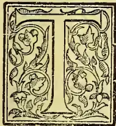

HE growth of the cycling trade, and other industries in which rubber is used, has caused a great increase in the demand for rubber. That the price has not correspondingly increased is chiefly due to the discovery in West Africa

of a new rubber-yielding tree, *Kickxia africana*. The collection of rubber from wild trees is carried on in a reckless manner, and the trees are being gradually exterminated. The rubber collectors have thus to go further and further inland every year for their supplies, and the cost of the rubber is thus increased by the difficulties of transport. There seems therefore a likelihood that the planting of the best kinds of rubber may prove a profitable industry.

The World's annual consumption of rubber is now over 100,000,000 lb., worth more than £10,000,000 sterling. Of this, from one-third to one-half comes from Para, which exported in 1895, 45,788,613 lb.

There are many trees which yield rubber in different parts of the World. Most of them, however, are unsuited for cultivation for various seasons: some are climbers requiring large trees as supports, some yield very little rubber or rubber of poor quality, and others do not yield rubber until they are twenty-five or more years old. The chief kinds likely to be useful in cultivation are Ceara rubber (*Manihot Glaziouii*), Panama rubber (*Castilloa elastica*), Para rubber (*Hevea brasiliensis*), and perhaps African or Lagos rubber (*Kickxia africana*).

The cultivation of Ceara rubber was energetically taken up in Ceylon about twelve or fourteen

years ago, but the returns were found unsatisfactory, although the plant grew very well indeed. There are but few trees now in cultivation. Panama rubber is also scarce in Ceylon, and has not given very satisfactory results. The only important rubber at the moment is the Para kind, which alone is dealt with in the remainder of this Circular. This tree is well suited to the climate of the low-country in the south-west of Ceylon, is readily cultivated, and gives a fair yield of rubber. Para rubber is the best quality upon the market, and obtains the highest and most uniform prices.

The town of Para occupies a position near the mouth of one of the vast embouchures of the Amazons, in about south latitude 1°, but the district of the same name extends over a vast forest region to the south and west, throughout which, and the enormous forests of Central and Northern Brazil, *Hevea brasiliensis* and allied species are abundantly found. The climate is remarkable for its uniformity of temperature, usually not exceeding 87°F. at midday, or below, 74° at night. The greatest heat recorded is 95°, and the mean for the year is 81°. The rainfall occurs principally during the months from January to June, the maximum being in April, when it reaches 15 in. For the remaining six months of the year very little falls, but there are fine days in the wet season, and occasional showers in the dry. The whole country is covered with dense, moist forests, and the soil near the numerous and gigantic rivers is deep, heavy, and very fertile. During the wet season much of the low-lying country near the Amazons' mouth is flooded. In the *qapos* near Para, visited by Mr. Cross, he found a flat district only three or four feet above the highest tides, and completely intersected with water-courses at low tide, filled with a soft, rich mud. The forest here, in which caoutchouc

629------------------------------------------------

588THE TROPICAL AGRICULTURIST.[MARCH 1, 1898.

collecting was vigorously carried on, was 80 or 100 ft. high and very damp and unhealthy, the soil full of moisture and very rich and fertile. The young plants, however, were not often observed to grow actually within the reach of the tides, but it is evident that they must frequently be subject to be partially covered with water.—**TRIMEN**, *Notes on Rubber-yielding Plants*.

Para rubber was introduced into Ceylon in 1876, when the young plants obtained from Brazil at the expense of the Indian Government were planted in Henaratgoda Garden. These are now very fine trees, with an average height of about 60 ft., and average girth at 6 ft. above the ground of 4 ft. From their seed other plantations have been made in the Botanic Gardens, and also by the Forest Department. A large quantity of seed has been sold to private planters since 1886. There are about 450 trees in the Botanic Gardens, producing about 100,000 seeds per annum.

The number of trees on private estates in Ceylon is probably about 200,000, of various ages from one to twelve years. This number represents an area of about 750 acres.

**CLIMATE.**—From the description of the climate of Para quoted above, it will at once be evident that only the wet, low-lying country in the southwest of Ceylon is suitable for the growth of *Hevea*. The best climate is probably that of the country lying between Kalutara and Ratnapura. Whilst the tree will grow at Peradeniya, (elevation 1,576 ft.) it suffers much from cold, and grows very much more slowly than in the low-country. Probably about 550 ft. or 600 ft. will be found to be the maximum elevation for successful culture. The tree is quite unsuited for cultivation in the dry regions of the Island.

**SOIL.**—In its native country *Hevea* is a jungle tree usually growing in deep, rich, alluvial soil which is liable to be flooded during the wet seasons. The earliest plantations made in Ceylon were therefore made on low-lying land subject to floods. It was found that if the plants were well grown up, flooding did them no harm, whereas it was fatal to seedlings or very young plants. It would seem, therefore, that what the plants really require is a damp soil, and this has been borne out by local experience. The immense level area of the Amazon valley tends to prevent floods of any great depth, whereas in Ceylon the valleys are narrower, and the water may easily rise several feet. Land liable to frequent flooding should therefore be avoided.

Chena land has been tried at Edangoda, but the result has been unsatisfactory; sandy soil also has been found unfavourable to the growth of *Hevea*, and the tree also grows badly where exposed to much wind.

It would appear therefore that the most suitable soil and situation for this tree is fairly flat land, at about sea level, with good alluvial soil, preferably jungle land, and not sandy. The land should not be subject to frequent floods or strong winds.

The area of land in Ceylon suitable for profitable rubber cultivation is thus comparatively small, possibly not more than 10,000 acres, but, on the other hand, this cultivation need not interfere with that of coconuts.

**CULTIVATION.**—*Hevea* forms a moderately tall tree, not very much branched. It begins to flower at about six years old, but for planting purposes the seed of more mature trees (twelve or more years old) is preferable.

About February, in Ceylon, the leaves mostly turn brown and drop off, and the flowers soon afterwards appear. They are followed by large woody fruits, each containing three seeds, which ripen in July and August. The fruits open explosively, usually in the hot part of the day, and scatter the seeds to some distance. The seed is very large, weighing about half an ounce. It has a hard seed coat, and the interior substance is very oily.

The seed soon loses its power of germination, and ought to be sown within a week of its falling from the tree. If it has to be sent on a voyage of more than a week, it should be very carefully packed in charcoal. Even thus, however, the majority of the seeds soon die, and the only satisfactory way of sending seeds to distant countries is to plant them in soil in a Wardian case and allow them to grow on the way.

The germination of the seed is very rapid, and a long tap root is soon produced. The seed should be sown about an inch deep in well prepared soil, in nurseries, or, if preferred, in bamboo pots or baskets. They should be kept shaded and watered, and when the young plants are from 18 in. to 24 in. high they may be planted out. Good results are also obtained by stumping, the plants being allowed to grow about 3 ft. high, then taken up, and the main root cut across about a foot below the ground; but the method of planting out the smaller seedlings is perhaps preferable.

The plant may also be propagated by cuttings. The method employed in the Botanic Gardens has usually been to take cuttings near the ends of the branches, but further back than any of the leaves. Each cutting is about a foot long, and as thick as a lead pencil, and is cut off at both ends by oblique cuts made just below leaf scars. The cuttings are planted in nurseries in wet earth. This method is somewhat precarious: sometimes nearly all the cuttings grow, at other times only a small proportion.

The seedlings, stumps, or cuttings should be planted out during rainy weather in prepared places. Holes should be dug as in the case of cacao, and filled with good soil. A little manure will often be advantageous. The young plants require to be lightly shaded for a time until they are established, and probably for the first two or three years they will grow the better for a certain amount of shade, such as would be given by narrow belts of trees running through the plantation. These belts should be arranged to act as wind belts, as the *Hevea* is easily injured by wind. By the time the trees are about three years old they will have grown up to a height of about 25 ft. or 30 ft. and form their own shade.

Various distances apart have been tried in planting *Hevea*. The younger plantation at Henaratgoda Garden has the trees planted 12 ft. apart. Their average girth is now about 30 in., and they require thinning. It will not do, however, to conclude from this, as is sometimes done, that the trees should be originally planted more than 12 ft. apart. On the contrary, the best results have been obtained by planting 8 or 10 ft. apart each way. The trees thus form their own shade and keep down weeds, and a process of natural selection of the best trees goes on, and the more weakly and dwarfed trees may be gradually thinned out in subsequent years. Another advantage of close planting is that the trees grow up straight without forming many branches low down, and this very greatly facilitates tapping,

630------------------------------------------------

MARCH 1, 1898.]THE TROPICAL AGRICULTURIST.589

Para rubber is a surface-feeding tree, and catch crops should not therefore be grown between the trees, which require all the nourishment that the soil can afford.

The young plants are greedily eaten by cattle, deer, hares, and other animals, and require careful protection for about eighteen months, after which time they are generally tall enough to require but little further protection.

Weeding is also required for the first year or two, but afterwards the trees form a dense shade, under which but few weeds grow.

The comparatively superficial growth of the roots renders manuring easy, and it would probably be found advantageous in poor or sandy soils.

**RATE OF GROWTH.**—The tree grows very rapidly in height. The original trees, planted at Henarategoda in 1876, were about 30 ft. high and 14 in. in girth two years later. In 1882 the largest tree was 50 ft. high and 25 in. in girth at a yard from the ground. The girth of this largest tree was taken annually after this, with the following results. It was 30 in. in 1883, 36 in. in 1884, 43 in. in 1885, 49 in. in 1886, 53½ in. in 1887, 60 in. in 1888, 65 in. in 1889, 69½ in. in 1890, 73 in. in 1891, and 79½ in. in 1893. The girth of the largest tree measured in Brazil by Mr. Cross was 82 in.

The measurements above given are those of the largest tree. More useful data for scientific and practical purposes are obtained by taking the mean girth of all the trees on a considerable area. This was done in January, 1897, on the plantation made at Henarategoda in 1876. This now consists of 45 trees, about 30 ft. apart. The girth was taken at the height of the eye, about 5 ft. 6 in. above the ground. The largest tree was 7 ft. 5 in., the smallest 2 ft. 1 in. in girth. The mean girth was 4 ft. ½ in.

In the plantations made by the Forest Department near Ratnapura measurements were taken in December, 1894, of the mean girth of trees at 3 ft. from the ground, with the following results:—

<table border="0">
<tr>
<td>At Edangoda (4 years old), mean of 100 trees</td>
<td>12.96 in.</td>
</tr>
<tr>
<td>Do. (3 years old), do.</td>
<td>50 trees 8.75 in.</td>
</tr>
<tr>
<td>Do. (2 years old), do.</td>
<td>20 trees 4.96 in.</td>
</tr>
<tr>
<td>At Yattipowa (3 years old), do.</td>
<td>108 trees 9.37 in.</td>
</tr>
<tr>
<td>Do. (3 years old), do.</td>
<td>108 trees 9.13 in.</td>
</tr>
</table>

The larger measurement at Yattipowa is that of trees on the western slope, the smaller that of trees on the eastern slope. The difference appears to be due to the fact that the latter are exposed to wind.

**TAPPING.**—The yield of rubber from very young or slender trees is too small to make their tapping worth while, and it is best for many reasons to abstain from tapping a tree until it has reached a girth of two feet. In a large plantation the girth of the trees always varies between wide limits. A few trees may be fit to tap after the sixth year, and in every subsequent year more and more trees will reach the size necessary. In favourable localities the bulk of the trees should be in bearing before the end of the eleventh year. The results of the experiments hitherto made at Henarategoda go to show that it is inadvisable, having regard to the future, to tap trees of less than two feet in girth, but it is still an open question whether the minimum size of tree for tapping should not be fixed even higher. This however would of course necessitate longer waiting for the return, as the mean rate of increase of girth in trees of this size is only about three inches per annum.

The methods of tapping and of coagulation of the rubber employed by the native collectors in Brazil and elsewhere are rough, wasteful, and inefficient, and there is great room for improvement. Experiments are being made at Henarategoda to test methods of tapping and coagulation, and their results will form the subject of a subsequent Circular. At present we shall only describe the method which has been employed for some years in the tappings carried on at Henarategoda.

The requisites for the work are a ¾-in. chisel, a wooden mallet, a number of clean coconut shells, each cut in two so as to form small basins, a knife, and a supply of clay and water with which to form the gutters round the trees.

The tree is first carefully and lightly shaved with the knife from a height of about 6 ft. down to the ground, so as to form a perfectly smooth surface. Only the outermost layers of the bark must be removed in this process, otherwise the tree will be injured. When the shaving is completed, the tree may be polished by hand, or carefully brushed. The great object in view is to obtain a smooth and clean surface, over which the milk can run easily, without becoming contaminated by small particles of bark or other rubbish, as the market value of rubber depends on its cleanliness.

A clay gutter is next made round the tree about six inches above the ground, so arranged as to catch the milk which will trickle down the tree and empty it by two or more spouts into as many clean cocoanut shells placed below. Three shells are sufficient for a tree of 2 ft. 6 in. girth, but larger trees may require four or five. The gutter is made by rolling rather wet clay into a sausage form, between the hands, and then pressing it on to the bark, and forming the channel against the bark by aid of a wet finger. The gutter must not be allowed to dry before the tapping is begun, otherwise the rubber will be contaminated by particles of clay; neither must the gutter be so wet or irregular as to allow the rubber to be dirtied.

Incisions may now be made in the bark with the mallet and chisel, commencing near the top of the cleaned portion. A V-shaped cut is made in two strokes. The object to be aimed at is to make these cuts to such a depth as just not to reach the wood. They should stop in the bark close to the cambium, as the vessels which contain the rubber occur only outside, but very close to, the cambium. If the cambium is not injured the wound rapidly heals, but if the cut penetrates this layer, and enters the wood, the healing of the wound is much slower, and at the same time risk is run of introducing parasitic fungi into the wood, which may cause much damage. Injury to the wood also causes a check to the upward flow of sap, and thus to the growth of the tree. Considerable practice is required before the chisel can be habitually driven in to the exact depth necessary. In dealing with a number of trees it will be found most economical and satisfactory to keep separate coolies for each of the various operations required, as they all need much practice.

As soon as the cut is made the white and very sticky milk commences to flow. A second V-shaped incision should be made about a foot below the first, and others at similar distances down to the gutter at the base of the tree. Another set of incisions may then be made parallel to the first, at about ten or twelve inches from them, and other vertical rows of cuts may be made if there

631------------------------------------------------

590THE TROPICAL AGRICULTURIST.[MARCH 1, 1898.

be sufficient room for them. On a tree of 2 ft. 6 in. in girth, four vertical rows of ants may be made without serious injury.

As each cut is made the milk flowing from the cut above it should be guided downwards to it along the bark by means of a twig, otherwise the milk is liable to be wasted by dropping to the ground from projecting portions of the bark. The bulk of the milk, especially in large trees or trees which have not been recently tapped, ultimately flows into the cups at the base of the tree. These should be kept covered in such a way as to prevent dust or other rubbish falling into the milk. As soon as the milk ceases to flow into the cups these are removed to a warm place, and in a few hours a cake of solid rubber can be removed from each, which should be kept in a dry place until it has become properly dry all through. The remainder of the milk dries upon the tree in the form of long strings, which are stripped off and rolled into balls. The whole of the rubber when dry is now ready for market. The most suitable times of the day and of the year for tapping are still the subject of experiment. The most satisfactory results have on the whole been obtained by tapping in the drier parts of the two monsoons, *i.e.*, from January to April and in August and September. The tapping should be done on dry days, otherwise it is difficult to prevent dilution of the milk and to dry the rubber.

The tappings may follow one another at intervals of a week for about four to eight weeks. The second tapping gives a much larger yield than the first, and the third and fourth tappings are usually very productive. In a series of experiments made during 1897 on trees of about 2 ft. mean girth, the average yield per tree of the successive weekly tappings was as follows:—

<table border="1">
<thead>
<tr>
<th></th>
<th>oz.</th>
<th></th>
<th>oz.</th>
</tr>
</thead>
<tbody>
<tr>
<td>First week</td>
<td>... 73</td>
<td>Fourth week</td>
<td>... 80</td>
</tr>
<tr>
<td>Second week</td>
<td>... 148</td>
<td>Fifth week</td>
<td>... 67</td>
</tr>
<tr>
<td>Third week</td>
<td>... 97</td>
<td>Sixth week</td>
<td>... 52</td>
</tr>
<tr>
<td>Total</td>
<td>... 517 oz.</td>
<td></td>
<td></td>
</tr>
</tbody>
</table>

**YIELD.**—The statements as to yield of rubber found in books of travel and popular articles are very unreliable, and experiments are being made to test the whole question of yield. The late Dr. Trimen commenced in 1888 to tap one of the original trees at Henaratgoda, then nearly twelve years old and 50½ in. in girth a yard from the ground.

It was tapped on seven days between January 25 and February 15, yielding 17¼ oz. of rubber, on six days between July 20 and August 29, yielding 7 oz., and on four days between December 6 and 20, yielding 4½ oz.; a total of 1 lb. 12¾ oz. The same method was followed in alternate years, with results as shown below:—

<table border="1">
<tbody>
<tr>
<td>1888</td>
<td>... 1 lb. 12¾ oz.</td>
<td>1894</td>
<td>... 3 lb. 3 oz.</td>
</tr>
<tr>
<td>1890</td>
<td>... 2 lb. 10 oz.</td>
<td>1896</td>
<td>... 3 lb. 0¼ oz.</td>
</tr>
<tr>
<td>1892</td>
<td>... 2 lb. 13 oz.</td>
<td></td>
<td></td>
</tr>
<tr>
<td colspan="2">Total</td>
<td>... 13 lb. 7 oz.</td>
<td></td>
</tr>
</tbody>
</table>

The average yield of this tree from the twelfth to the twenty-first year is thus almost 1½ lb. per annum. This result is very good, and if all the trees of the same age yielded as much rubber, the success of the cultivation would be assured. It should, however, be noted that the girth of this tree in 1888 was larger than the mean girth of the whole plantation, as mentioned above, in 1897, and that therefore this yield, if the tree tapped be accepted as a fair sample, represents rather the result to be expected after twenty years, by which time the average girth of the

trees should be equal to the girth of this one at the time its tapping was commenced. The trees in question are about 30 ft. apart, *i.e.*, 50 trees to the acre. These data thus indicate a yield of about 90 lb. of rubber per acre in the twentieth year, a result insufficient to make it worth the while of private planters to take up rubber cultivation.

It seemed probable that better results might be obtained by tapping younger and smaller trees more closely planted, and experiments were therefore begun in 1896 on a younger plantation of trees at Henaratgoda. The mean girth in January, 1897, taken at 5 ft. 6 in. from the ground, of 225 of these trees was 2 ft. 4½ in. The figures already given for the average weekly yields represent the mean results of the tapping of 27 trees of a mean girth of 1 ft. 10½ in., six inches less than the mean girth of the whole plantation. From six consecutive weekly tappings of each, a mean yield of 517 oz. per tree was obtained. This represents a yield of 97 lb. per acre of 300 trees (12 ft. apart). If the trees tapped had been of the same mean girth as the whole plantation, the yield would probably have been at the rate of about 120 lb. per acre. Further, only six tappings were made, and the trees, after a rest of a few months, would probably have stood three or four more tappings whose yield might have been at the rate of 30 or 40 lb. per acre.

No record, unfortunately, was kept of the date when this plantation was made. It is probably twelve years old at least. The sandy soil at Henaratgoda is unfavourable for Para rubber, and in better soil the trees would probably reach this mean girth in ten years or even less. It would seem, therefore, that if this cultivation is taken up in favourable localities, a yield of about 120 to 140 lb. of rubber per acre may be expected after the tenth year. This estimate is, however, liable to modification by the results of experiments which are still in progress.

**COST OF OPENING PLANTATIONS.**—The following estimate of the first year's cost of opening a plantation of 300 acres of forest land with rubber was prepared by Mr. F. Lewis, Assistant Conservator of Forests, Colombo:—

<table border="1">
<tbody>
<tr>
<td>Felling and clearing at R12 per acre</td>
<td>... 3,600</td>
</tr>
<tr>
<td>Lining, 10 ft. by 10 ft., at R2 per acre</td>
<td>... 600</td>
</tr>
<tr>
<td>Holing, at 75 holes per cooly at 40 cents</td>
<td>... 697</td>
</tr>
<tr>
<td>Filling and planting and carrying plants from their nursery to holes, 300 per cooly at 40 cents</td>
<td>... 175</td>
</tr>
<tr>
<td>Draining: 300 ft. of drains per acre at 1 cent per foot run</td>
<td>... 900</td>
</tr>
<tr>
<td>Lines for coolies: 1 shed of 10 rooms of 12 ft. by 10 ft., mud walls, and batti-callu roof, at R30 per room</td>
<td>... 300</td>
</tr>
<tr>
<td>Roads for inspection, 2 miles</td>
<td>... 160</td>
</tr>
<tr>
<td>Plant nursery, including watering</td>
<td>... 150</td>
</tr>
<tr>
<td>Weeding, at Re. 1 per acre per month</td>
<td>3,600</td>
</tr>
<tr>
<td>Cost of surveying lines round plantation, say</td>
<td>... 75</td>
</tr>
<tr>
<td>Contingencies, such as special work, bridges over streams, or supplying vacancies, &amp;c.</td>
<td>... 250</td>
</tr>
<tr>
<td>Salary of assistant</td>
<td>... 1,000</td>
</tr>
<tr>
<td>Tappal cooly</td>
<td>... 121</td>
</tr>
<tr>
<td>Tools</td>
<td>... 300</td>
</tr>
<tr>
<td><b>Total</b></td>
<td><b>11,927</b></td>
</tr>
</tbody>
</table>

This represents an average of R40 per acre. A return of R14,200 is estimated to be obtained

632------------------------------------------------

MARCH 1, 1898.]THE TROPICAL AGRICULTURIST.591

by the sale of timber and firewood from the land cleared. This should suffice to erect the Assistant's bungalow and leave a small margin for contingencies.

To this estimate private planters must add the cost of land and of seed (about R20 per 1,000). These items will probably bring up the total cost for the first year to at least R125 per acre. As a matter of fact, 300 acres is more than can be opened in one year, as the number of seeds required will be at least 160,000, which amounts to nearly two years' crop of the trees in the Botanic Gardens.

For the second, third, and fourth years Mr. Lewis estimates the expenditure on weeding and supplying at R12, R8, and R5, respectively. Assuming that the expenditure in the years following is at the rate of Rs.5 per acre, the cost of the plantation up to and including the tenth year, might work out as follows:—

<table>
<thead>
<tr>
<th></th>
<th style="text-align: right;">R.</th>
</tr>
</thead>
<tbody>
<tr>
<td>Cost of land, 300 acres at R75 ..</td>
<td style="text-align: right;">22,500</td>
</tr>
<tr>
<td>Cost of seed, say ... ..</td>
<td style="text-align: right;">3,600</td>
</tr>
<tr>
<td>First year's cost, as above... ..</td>
<td style="text-align: right;">11,927</td>
</tr>
<tr>
<td>Weeding and supplying, second year ..</td>
<td style="text-align: right;">3,600</td>
</tr>
<tr>
<td>Do. third year ...</td>
<td style="text-align: right;">2,400</td>
</tr>
<tr>
<td>Do. fourth year ...</td>
<td style="text-align: right;">1,500</td>
</tr>
<tr>
<td>Do. fifth to tenth years, inclusive .. ..</td>
<td style="text-align: right;">9,000</td>
</tr>
<tr>
<td>Salary of assistant, second to tenth years, inclusive .. ..</td>
<td style="text-align: right;">9,000</td>
</tr>
<tr>
<td>Tappal cooly and tools, second to tenth years, inclusive .. ..</td>
<td style="text-align: right;">1,250</td>
</tr>
<tr>
<td style="text-align: right;">Total ..</td>
<td style="text-align: right;">75,777</td>
</tr>
</tbody>
</table>

Allowing interest at the rate of 7 per cent. on all money expended up to the end of the tenth year, the outlay upon the plantation will amount to at least Rs. 110,000, or Rs. 366.66 per acre.

**RETURN.**—The value of Para rubber in the London market varies between two and four shillings per lb. according to the quality of the rubber and the state of the market. Of the rubber which has been collected in the Botanic Gardens and sent home for valuation, a large proportion has been valued at almost the highest market price then ruling, but a considerable proportion of the rubber is always of inferior quality, being mixed with particles of dirt. If we estimate the average value of the crop at 2s. per lb., and the yield in the tenth year at 100 lb. only per acre, the return in that year will be £10, or say R150 per acre. The cost of harvesting should not be more than R50 per acre, including carriage to London. This leaves a margin of R100 per acre, representing a return of 27 per cent. upon the original outlay; if 12 per cent. be allowed for contingencies and the usual vicissitudes of a tropical cultivation, there remains still a prospect of a good return on the capital expended.

JOHN C. WILLIS,

*Director, Royal Botanic Gardens.*

## CEYLON PLANTING AND PLANTERS IN HAWAII.

Mr. Hawke, of Orion, who is constantly making trips abroad from Ceylon, returned yesterday, after visiting a part of the world that Ceylon men do not often reach. Leaving Ceylon his intention was to travel *via* China and Japan to America, and so to Europe. China he did not like; but he thought Japan pleasant, and he stayed there two months, going on to San Francisco, *via* Honolulu. On his way to 'Frisco a fellow-passenger on the steamer revealed himself to him as Mr. Caine, formerly of Ceylon, and told him how well he was doing as a coffee-planter in Hawaii. Mr. Hawke was so interested that when he reached 'Frisco he went back to Hawaii, and he now returns from there perfectly enamoured of the place. He says the island is most suitable for Coffee planting, and a good acreage is already under cultivation, growing in rich volcanic soil—a soil that could not be found in Ceylon anywhere. Labor was plentiful, shipping facilities excellent, and Hawaiian Coffee was fetching 80s. a cwt. He secured 400 acres of land at an elevation of 2,000 ft. from the Provisional Government, and he returned at once to Ceylon to make arrangements to sell Orion estate and settle down in the Sandwich Isles to plant up his new property. Almost all the Coffee there is Arabian.—"Local Times," Feb. 19.

## LIBERIAN COFFEE.

### ITS PROSPECTS IN THE MALAY PENINSULA.

[By a Former Ceylon Planter.]

Selangor is undoubtedly the leading State as far as coffee is concerned. Two years ago, when the price of Liberian coffee was between \$45 and \$47, the prospects of Liberian coffee certainly looked bright, and the Selangor Government gave out thousands of small blocks of land to Javanese, who looked after their coffee tolerably well during the high prices; but a look-out of a railway carriage window between Klang and Kwala Lumpur now will show what a terrible change has come about with low prices. The land is fast becoming jungle again, and disease is being spread over the country by this uncared-for coffee; and this is not the only evil caused by giving out this land to the Javanese, for the lands given out were small, narrow blocks, all along the best roads and railways in the country, so spoiling the frontage of a vast extent of land behind, for no planter cares to take up land behind these seedbeds of disease and nurseries of weeds.

Another evil is that the Javanese, who were about the best labour force in the country, have become a lazy lot of good-for-nothing impudent men, and it is the general opinion amongst the planters that this labour force is lost to the country.

#### BAD TIMES AHEAD.

It is my opinion that we are about to face some years of very bad times, not only in short prices, but in short labour forces, and it will only be some of the best estates that will pull through the crisis; what chance will estates have that are not able to give three piculs per acre without manuring; and again what chance will others have that average 30 per cent. on the sick list? An answer to this will be to go in for new products; but, with bad times, where is the money to come from? besides, few of the old places are fit for new products.

#### HOURS OF WORK ON AN ESTATE.

In the face of this, it behoves planters to go in for every economy that is practicable, and the most practicable economy that I know of is the changing of the working hours from 6 a.m. to 2 p.m. to from 6 a.m. to 10.30 a.m., and again in the evening from 1.30 p.m. to 5.30 p.m. giving the coolies, conductors, and superintendents three hours' rest in the heat of the day. It is a well-known fact that, when the superintendent goes home for breakfast, the coolies

633------------------------------------------------

592THE TROPICAL AGRICULTURIST.[MARCH 1, 1898.

sit down under the coffee trees; then, why not have them in their lines, where they can also get a good meal and go out fresh in the cool of the evening. I positively state now that I have proved that I can get 30 per cent more out of my labour in this way; and I ask any superintendent whether he feels very fit to look after his work in a burning sun after a heavy meal and "perhaps" a bottle of beer. He wants two hours; rest at least, and so does any other man, and, what is more, most of them take it.

This question was brought before the S. P. A. a few days ago, and it required the casting vote of the Chairman to decide it against the motion for working morning and evening. Many men who then voted against it stated that they knew it was the best thing to do. One man said his lines were too far away for the men to go home (his lines should be near his store, when men can go home after measuring their first box of *palam*). He was a cricketer. Another man said rain came on in the evening, therefore he would vote against it. He was a golfer. Another said his coolies would not turn out again. He was a tennis player, and so a good motion was lost, a motion that would save the proprietors of estates 30 per cent on the labour expenditure and half their bill for doctors and medicine.

In the face of the labour difficulty individual estates cannot do it; but if two thirds of the estates agreed to do it, it could be done, and some of the others might be made to do it. Once a week is quite enough for a man to get away to his club and his golf, and any man who has not the interest of the estate at heart enough to make him walk round it in the evenings, whether his coolies are working or not, is not the man I used to know in Ceylon.

#### THE CURING OF LIBERIAN COFFEE.

The next great difficulty we have to face is the bad state our coffee arrives in the London market. I could not believe that the samples I saw were Straits Liberian coffee; and I am positive that the cause was mixing a lot of coffee from different estates together, and sending it home in sacks instead of in barrels. No matter how good and well-dried a lot of, say, 50 tons may be, if it is mixed with even 10 tons of imperfectly dried coffee, mildew will set in and spoil the lot before it reaches the London market; and this would happen even were it in barrels, so that uniform dryness must be insisted on.

*Sizing of Coffee.*—This is one of the great objections to our coffee, as it cannot be evenly roasted unless it is of equal size. This seems a very easy matter to settle, but it must be done on a large scale, and most estates are so small that they have not a chance of being able to do it on their own estates.

#### A CENTRAL CURING ESTABLISHMENT.

The remedy for these two predominating evils is a curing establishment in Klang. My own idea is an establishment owned by the planters of Selangor and worked by a directorate appointed by the S. P. A. At first I thought that Kwala Klang was the best place, but I have changed my mind on that question, on account of the difficulty of getting women and children at the Kwala, when they are very plentiful in and about the present town of Klang.

If this establishment is formed in Klang—whether it be by the Planters or by private enterprise—it must be on a large scale, if it gets  $\frac{2}{3}$  of the support of the acreage of coffee now planted in this State. The mill will make large profits, as they will get high prices for their coffee in London, and buy at the ruling price of the market here.

They will be able to dry their coffee to a uniform dryness, size their coffee to different sizes, and send each sort to the most suitable market for it, and pack all in barrels or tea boxes instead of in bags.

"Is Liberian Coffee any good, and will it ever bring a fair price in the American and London markets, and what is the reason that it is at such a low price in comparison to other coffees?"

The low price in comparison to other coffees is the most serious question of all, for other countries are getting a good paying price, and will go on increasing

their production, whereas if we were all at a low price, it would be only the waiting for the survival of the fittest to get a good price again.

As to whether Liberian coffee is any good or not, I must say I trust to my own palate, and to the palates of thousands who have declared it to be as good as any other coffee; and I believe that, if we can only produce it for sale in the London market as it leaves here, it will fetch a price in proportion to what it is worth. I once sent a tin of Johore Liberian Coffee to Britain, and most of the people in our own country have tasted it and pronounced it excellent. I saw and drank some of that same coffee at home two years afterwards, and it looked as glossy and as sound as the day it left the store, and tasted equally as well as it looked—very different to the dull mouldy-looking, half-decayed coffee I saw with London merchants as samples of Straits Liberian. I sent that sample home in a Java sugar tin soldered down.

#### THE CRISIS.

I have hopes that the best estates will pull through this crisis; but I should not like to raise the hopes of men in this Peninsula who have poor bad estates, some of them estates that I reported on years ago before coffee ever reached \$35 and recommended the abandonment of.

Those very estates kept on until coffee reached \$47, and even then they did not pay. The owners of those estates ought to know what to do now, for coffee is not likely to reach \$47 again. I only wish it would.

The fact of it is that any estate that requires manure to produce an average of 3 $\frac{1}{2}$  piculs per acre all over should be abandoned, unless the land is good for other products such as Rubber; but nine tenths of them are not fit to plant Para Rubber in, and more than half of them are good for nothing.

It is not until coffee comes into bearing that the real brains of a manager are tested. You often hear a man say on passing an estate: this is a fine little estate, and it is well managed, never thinking for one moment what it cost. Any imbecile can open up a small estate if he spends enough money on it; the good man is the one who can open up a place as well as it can be done, and at as small a cost as any other man can do it. I know of estates being opened up in this State at such a cost that, if coffee were to go to \$40 per picul and remain there, they would never pay. As a rule, the unfortunate men who supply the money do not question the acreage opened up and the cost of it. If they did it would be better for themselves and a man might have a chance of making a coolie give a day's work for a day's pay.

For men who have good rich young estates it is the time to make all improvements possible, above all things to get a day's work for a day's pay and to try to send a better sample to the European market.

NIL DISPERANDUM.

#### PREPARATION OF TANNIN EXTRACTS.

Under the name of tannin or tannic acid are included a number of different but closely allied substances widely distributed throughout the vegetable kingdom, which all agree in this one particular that they are greedily absorbed by the raw hide of animals, forming with it leather. They are contained in abundance in galls; in certain fruit, such as that of *Terminalia Chebula*, *T. Citrina*, *T. Bellerica*, *Phyllanthus Emblica*, etc.; in the leaves of some trees, such as *Sumach* and *Anoecissus latifolia*; in the wood of most trees possessing a durable heart-wood, such as oaks, chestnuts, *Acacia*, sâl, etc.; and last, but not least, in the bark of many trees and bushes, such as oaks, babul, sâl, *Terminalia tomentosa*, *Soyumda febrifuga*, spruce, *Pinus longifolia*, *Cassia auriculata*, etc.

Galls, fruit and leaves are easily exportable in a dry condition, but wood and bark are both bulky articles to transport over long distances. Moreover, in Europe the old system of tanning by stratifying hides alternately with layers of coarsely ground

634------------------------------------------------

MARCH 1, 1898.]THE TROPICAL AGRICULTURIST.593

bark, a system which occupied from one to two years before the leather was ready, has been rapidly giving place to tanning with liquid extracts, which have the great advantage of penetrating the hides quickly and shortening the process down to a few weeks. The question, therefore, is to turn to account the enormous quantities of bark and wood which at present go to pure waste in our Indian forests and to convert them into tannin extracts for export to Europe and even for use in the country. Under the old system of tanning, Europe had in her cold climate an advantage which forbade all Indian competition in the preparation of leather. The native system of sewing each hide into a bag and filling it with tan, besides not giving the hide enough time to absorb the tannin thoroughly is much too slow, cumbrous and space-demanding to have ever had any chance of producing an article fit to compete against the European one. But now that the use of liquid extracts has shortened the process of tanning so considerably, it seems absurd that India should export raw hides and not leather.

Professor Henry of the Nancy Forest School has shown, as the result of careful and repeated analyses, that in the common European oak the bark contains most tannin, heartwood coming next, with the sapwood a very bad third—so bad, indeed, that it would be an advantage if the sapwood could be got rid of by some cheap process when preparing the extract. The bark of the root stock is richest in tannin, the butt-end of the trunk being only a little behind it, while at the top of the trunk the bark contains hardly more tannin than the outer layers of heartwood. As regards the heartwood, the richest portion is that in the butt-end; moreover, the quantity of tannin diminishes from outside towards the centre of the tree. The heartwood of the larger branches contains more tannin than that of the top of the trunk. The very small branches and twigs, being nearly all bark, contain as much as the heartwood of the base of the trunk. The wood of coppice-grown oak is richer in tannin than that of high-forest grown oak, and generally the broader the annual rings are, the larger is the quantity of tannin. Also oak grown on limestone soils yields more tannin than oak from a soil deficient in limestone.

Another interesting result of Professor Henry's experiments shows that the tannin in the bark and sapwood deteriorates and disappears much more rapidly than that in the heartwood; in the first two it exists in the form of amorphous granules, which, in contact with water, first of all break up into minute globules and form an opaque mass, and finally become completely dissolved, whereas in the heartwood the tannin is found as a homogeneous deposit impregnating the membranes not only of the medullary rays, but also of all the fibrous tissues, and in this condition is better preserved. Even fossil oak wood contains some tannin, but fungi destroy the tannin completely, wood suffering from red rot containing no tannin at all.

It is very desirable to have similar analysis made of our Indian trees, which contain sufficient tannin for the leather industry, but in the meantime we may presume that what M. Henry has found out for the common European oak is more or less true of all trees.

I will now proceed to describe, first, the process of extraction treated in a general manner, and then briefly some of the more usual processes employed.

#### *Method of Extraction.*

##### I.—GENERALITIES.

Whatever the special method employed, the following is the order of the processes to be gone through:—

(1.) The wood or bark must be chopped up or shaved fine transverse to the grain, so that the fibres and vessels may be cut across.

(2.) The chips or shavings, as the case may be, must be macerated or subjected to the action of hot-water or steam, so as to yield an infusion or decoction. As all natural waters contain lime, and lime diminishes the yield of tannin, either distilled water must be used (expensive) or the water should

be mixed with a small quantity of sulphuric or oxalic acid, in order that the lime may be precipitated, excess of acid being afterwards got rid of by the addition of an alkali in the form of a carbonate or caustic.

(3.) The extract should next be cleared of the colouring pectotic and other matters in suspension. This is done either by treating with blood or any other albuminous substance, such as the coagulum of casein (blood has hitherto given the best results), or by filtering through animal charcoal (very wasteful, as the charcoal absorbs a large proportion of the tannin), or by the addition of metallic salts, or by centrifugal force (on the same principle as that of the cream separator). Each and every system necessarily involves some loss of tannin.

(4.) Mechanical filtration, preceded, if necessary, by decantation.

(5.) Concentration to the degree required, if a liquid is wanted, or reduction to an earthy form like cutch. In either case the pneumatic process should be used.

##### II.—SPECIAL PROCESSES.

It will suffice to describe here five processes, all of which may be easily employed in India and require no expensive or special plant that cannot be made in the country itself.

###### *1. Gondolo's Process.*

The chips or shavings are macerated, with or without the application of heat, in water, to which sulphuric acid has been added at the rate of 6 grammes to a litre. The extraction of the tannin being complete, the infusion is treated with sodium carbonate, 1 gramme for every 6 grammes of acid used. A precipitate forms which is got rid of by decantation.

The extract thus obtained is not highly coloured; but in case a lighter coloured and perfectly limpid fluid is required, clarification must be undertaken with a coagulating substance. This latter must be mixed with the infusion at a temperature not exceeding 45° C. The temperature should then be quickly raised, the mixture being constantly and energetically stirred. Care must, however, be taken not to allow the temperature to exceed that necessary for coagulation, otherwise the albumen will remain in suspension and fail to absorb the colouring matters. As soon as coagulation is complete, the liquid must be allowed to cool. After a rest of about an hour it is drawn off and filtered and then concentrated to 30 to 45° Baumé, according to requirements. The extract is very rich in tannin, is extremely soluble, and is of the colour of honey.

###### *2. Another Process.*

When the wood or bark used is of a very deep colour, a slightly different process has to be employed.

Macerate in water, adding at any time 20 grms. blood for every kilogram of bark and wood and keeping the temperature well below 80° C. When the maceration is complete, the temperature of the liquid is to be brought down to about 55° C., and 1 grm. of carbonate of soda or of another alkaline salt and 15 grms. of blood added to every litre of the liquid. The temperature should now be raised, whilst constantly stirring and gradually adding 6 decigrammes of sulphuric acid for every litre of the infusion. The result is that a flocculent mass at once forms in the liquid, consisting of lime salts and colouring matters with the albumen.

Cool, decant and concentrate as before.

###### *3. A Third Process.*

This is a slight modification of the preceding, a sulphite or bisulphite being substituted for the sulphuric acid and added *during*, not *after*, the maceration. The salt is decomposed, tannates and free sulphurous acid being produced, the latter of which acts as a decoloriser, becoming thereby changed into sulphuric acid, which precipitates the lime salts in the water and prevents their alkaline action on the tannin. The tannates or free sulphite or bisulphite, as the case may be, that still remain unused in the liquor, are got rid of by the addition of sufficient sulphuric

635------------------------------------------------

594THE TROPICAL AGRICULTURIST.[MARCH 1, 1898.

cid. Although up to this no blood has been used, the extract is less highly coloured than that obtained by the immediately preceding method.

To decolorise still further, proceed to coagulate with blood, and decant, filter and concentrate as before. The liquor thus obtained is of the colour of pale honey, and is so limpid that it enters the thickest hide rapidly and converts it into leather in the course of a few days.

#### 4. Villon's Process.

For this process a special, but very simple apparatus is required. A large square copper or brass vessel about 7 feet high and 3 feet side, divided by the removable cross-plates into three compartments, a false bottom of very stout wire gauze, which can be pulled up by means of four rods when the vessel is to be emptied.

Each of the plates (E.F., GH) has 250 circular perforations about two-fifths of an inch in diameter.

TT is a tube of about 3 inches bore and about 6 feet long, which passes through the centre of both moveable plates and is held in place by the lower plate at such a height that its lower extremity is only a few inches above the bottom of the vessel, while the upper extremity projects a little beyond the upper plate.

PPP is a pipe through which steam is introduced into the lowest compartment of the vessel, while  $t_1$  is a tap through which fresh water can be let into the same compartment, and  $t_2$  another tap through which that compartment can be emptied.

The height of the lowest compartment is about 23 inches, that of the highest about 6 inches.

To set the apparatus in operation, the middle compartment is filled tight with the chips or shavings of which the tannin is to be extracted, and distilled water is introduced into the lowest compartment up to a few inches below the upper level of the pipe PP. Steam is now let in. The water soon boils and, under compression of the steam in the space above it, is forced up through the central tube TT into the highest compartment, whence it enters the middle one below and finds its way back into the lowest compartment carrying away with it in solution extractive matter from the chips or shavings. In this way a continuous circulation of the water is set up, and in about 6 hours the extraction is complete.

By working a battery of several such vessels so connected with one another that the extract from the first, when the shavings have been sufficiently exhausted, can be turned on, through a tube furnished with a tap, from the tube KK into the uppermost chamber of the second vessel, and so on up to the last vessel, a liquor of great strength is at once obtained which requires very little concentration.

The advantages of this system are: (1) that the strongest possible extract is obtained with a given limited quantity of water,\* so that the labour and expense of concentration is very appreciably diminished; (2) that the liquor is light-coloured and fairly clear, and hardly requires special bleaching if the wood used does not contain a dark dye; (3) that it exhausts the wood of all its tannin; and (4) that the extract contains less gallic acid and gallate of tannin than that obtained by any other process. Moreover, as no chemicals are required and the entire process is within the comprehension of the lowest intelligence, the method is specially adapted for employment in our Indian forests, however remote. It would suit cutch manufacture perfectly.

The remark may here be made that there seems no reason why the vessel as well as the partitions should not be of wood, which would not only be much cheaper than metal, but also retain heat better and have no injurious effect on the tannin. Even the wire gauze sieve could be replaced by a wooden trellis frame covered over first with bamboo matting

and then with stout cotton drill, which would filter as effectively as the finest wire-gauze.

#### 5. Luc's Process.

M. Luc owns several large tanneries, one of which is at Nancy. He employs only oak, not only because oak liquor produces firmer leather and is more easily rendered lighter coloured than chestnut extract, but also because the tree is more widely distributed in France and therefore more easily procured. He uses only root-stocks, butt-ends and branches, i.e., such pieces as are useless for timber; but he rejects everything that measures less than 4 inches in diameter at the small end. His wood costs him about 22½ shillings per 100 stacked cubic feet delivered at the tannery.

At first M. Luc used to have the wood barked on the express advice of the chemist who invented the system employed by him, but he found the cost of harking very heavy and gave it up. Since doing so, the liquor he obtains is richer in tannin and is more easily made light coloured.

The wood is reduced to shavings less than one-twelfth of an inch thick. The decoction is effected in wooden vats, each taking nearly 6,200 lb. of chips, with boiling water which is kept in constant circulations. The vats are connected together so that the liquor from one passes into another holding fresher chips. When the liquor marks 25° Baumé it is run into a large wooden barrel containing a serpentine tube, through which cold water is constantly running. As soon as the temperature of the liquor has fallen to 30° to 35°C., blood is added with a little sulphuric acid. The temperature is then raised to 60°—65°C. to coagulate the albumen of the blood. By this clarification the density of the liquor is reduced to 2° Baumé. Concentration is now effected by the ordinary pneumatic process until the areometer marks 20° to 25°.

This extract is not used by itself, but is only added gradually to strengthen the ordinary tan liquor in which the hides are soaking.

The gallon weighs 12 lb. and sells at 23½d. Even at this rate the profits are very high, and M. Luc is driving a roaring business.

The exhausted chips are used as fuel for generating steam for the machinery and other purpose, special grates being used which do away with the necessity of previously drying the chips.

#### III. CONCLUDING REMARKS.

In India we could employ not only wood, but also harks for the preparation of tanning extracts. One of the functions of the Forest School at Dehra Dun should be to analyse for tannins the bark and wood of all our likely species. The system of effecting analyses with the help of students, which was in force during Dr. Warth's tenure of the Instructorship of Natural Sciences, should be resumed, especially as there is now an Instructor to spare during the open season. To assist the Instructor only the more intelligent students, who have shown a bent for chemistry, would be selected.

It will be remembered that Captain Wood, late Conservator of Forests of the Oudh Circle, made a solid extract of sal bark which he tried to get accepted at Cawnpore and by tanners in England. The experiment was not successful owing, no doubt, to the extract containing colouring matters and other impurities, and probably also to being prepared at too high a temperature; but the venture certainly deserves being repeated, not so much in order to make the preparation of the extract a departmental business, as to attract and invite to it private enterprise.—*Indian Forester*.

THE CODLIN-MOTH.—These orchardists who have but few Apples this year will have their compensation next year in the greatly lessened numbers of the Codlin-moth. It has been remarked that in orchards which had few Apples in any one year, the fruits were not greatly injured the following year, even when no measures were taken to prevent an attack. This was doubtless owing to the moth finding few or no fruit in which to develop the maggot.—*Gar deners' Chronicle*.

\* When chestnut wood, which contains 5 to 6 per cent of its weight of tannin, is used, the liquor obtained by decoction in a single vessel marks 50°—60° Baumé and contains 5 per cent of tannin.

636------------------------------------------------

MARCH 1, 1898.]THE TROPICAL AGRICULTURIST.597

the calyx or husk from the seed ball, Cook the husks as you would any fruit until done and strain the juice out for jelly as from any other fruit; in fact treating it as you would any jelly. It jells very easily and makes the most beautiful jelly ever seen, we all think. The residue, after straining out the juice may be put through a colander or vegetable sieve and made into marmalade or sauce, or the entire product may be so used without making jelly, and will be found excellent; or it may be cooked and canned as well as any other fruit and used in any way. Pies, shortcake and as a spread for the youngsters' school lunch are examples of its uses. In looks and taste it is almost identical with cranberries, only not requiring so much sugar and cooking, and lacking the bitter taste sometimes found in cranberries. A pleasant drink may be made from the leaves by boiling them in clear water. Pour this off, sweeten it and boil down until quite rich and when cool add a few spoonfuls to a glass of water. It is very refreshing. This juice from the leaves may be also made into jelly if one wishes, and the leaves may be eaten as greens. It is remarkably prolific and can be put to so many uses that it may well be considered one of the most useful plants we can grow in Florida. It is an annual and of course must be planted every year as with cabbage or potatoes, but it is tenacious of life and easily grown. We planted ours six by six feet apart last spring and now it is crowding together and presents a solid mass of green, red and yellow all over the patch, and fully eight feet high from the ground. The 150 plants will yield many bushels of fruit, and helps mightily in our living for a year, for I see evidences of store of jelly and canned goods to be made from it.

Another year I shall plant further apart, eight by eight, I think, and this you must remember is on a sand hill in the lake region of Polk county; on richer soil it spreads out even more.

W. S. PRESTON.

Auburndale, Fla.

#### NORTH NYASSA NEWS.

Plumbago (black-lead) has been discovered in the southern portion of this district. It is in the solid form and of excellent quality. Specimens of it were brought in to Deep Bay by the natives who use it for colouring their earthenware pots.

Game is more plentiful on the Konde plains this year than it has been since rinderpest visited the district in 1892. Amongst the game, large herds of Roan Antelope are to be met with, apparently having been forced to leave the hills through scarcity of water.

An antelope which may prove to be a new one has recently been discovered near here. It is very small with horns only about 1½ inches long. The colour of the buck is very similar to that of the otter.—*B. C. Africa Gazette*, Nov. 29.

#### AN INVENTION BY A CEYLON PLANTER.

Mr. A. K. Leitch, of Great Valley, Deltota, has patented an invention which is "an improvement in Lock-Nuts," and relates to improvements in lock-nuts for the purpose of rigidly bolting together various parts of materials employed in mechanical constructions, and to prevent any nut so employed becoming loose on the bolt. "The invention consists of making a groove in the bolt, deep enough to take a flexible pin or wire below the level of the threads of the screw, and at the end of the groove a hole is drilled in the bolt so as to allow of the bent end or head of the pin being passed into it, and so secured. A pin is then taken, bent at right angles at one end and it is laid in the groove with the bent por-

tion or head in the hole in the bolt, the bolt being passed through the bolt holes of the pieces to be connected together, and is then screwed on the nut (which may have any number of grooves on the face of it, so as to allow of the bending over of the other or tail end of the pin or wire without disturbing the level of the face, and so making the hold more secure and the tail end of the pin is bent over in one of the grooves cut in the face of the nut after the said nut has been thoroughly tightened up. Although only six grooves are usually cut in the face of the nut there may be any number where there is room for radiating from the centre for the end of the pin to be bent at right angles, over, depressed, or clamped into either of aforesaid grooves. It will be seen by this method that, after the pin has been fixed, it is impossible for the nut to become loose from the bolt and bolt head, owing to the nut being fixed to the bolt by the action of clinching the pin described.

#### CEYLON Vs. COCHIN COCONUT OIL—AN OLD COLOMBO MERCHANT.

NOTES FROM HOME.

(By a very old Colonist)

By the time you receive this it will be nearly two months since your most interesting papers containing what we may call.

#### THE COCONUT OIL QUESTION

came to hand and again the *Tropical Agriculturist* with much more on the same subject. Had it been possible I might have written you a short summing-up of the array of facts your circulated enquiries have elicited. In fact the question has been well threshed out and was well put in a nutshell by your correspondent W.B.L., an authority of experience.

Your

MEMOIR OF C. SHAND

is an admirable one, and the man himself an eminent type of the Pioneers you wish to record. We were known to each other from the earliest days. He was my neighbour (25 miles away) in Sabaragamuwa. As a merchant no one ever came to Ceylon with so thorough a mercantile training in the thick of Liverpool business. I last saw him at his London office on my arrival home at the end of 1870. I find he is two years my junior. N.B.—Mr. Shand did not marry the daughter of plain Mr. Symons, but of Colonel Symons, R.A., then Commandant of Artillery in Ceylon.

#### COCONUTS AGAIN.

I think it must be conceded that the climate of Southern India is hotter and drier than Ceylon (I found it so)—therefore more favorable for nuts and copra. Pruning away old fruit stalks does not bleed the trees, but is practised, as our rose cultivators here cut off the bud or seed vessel after the flower has gone off by which the blooms are increased. If coconut planters will take the lesson, they may gain for Ceylon oil a good reputation in Europe. Interior oil there will always be as of coffee and probably now of tea. By adopting new methods, coffee (Ceylon) was raised from the "elephant trol" of the thirties to the splendid samples which ruled the English market in late years. The natives greatly improved the merchantable condition of their coffee following the methods of English planters to some extent; and they may do so in copra and oil.

637------------------------------------------------

598THE TROPICAL AGRICULTURIST.[MARCH 1, 1898.

### WYNAAD PLANTERS' ASSOCIATION: PROGRESS OF TEA PLANTING.

We have received copy of proceedings of the annual general meeting held on January 5th, when the annual report for 1897, was read. Among other things it noticed work done by United P.A.S.I. as to finances:—

A Reserve Fund of Rs. 8,825.12.0 was established, of which Rs. 5,000/ has been placed at deposit with Messrs. Arbuthnot & Co., and the rest kept in hand to meet payments voted, if certain conditions are fulfilled. One of these payments is Rs. 2,000/ towards the introduction of Lady Birds to Combat Scale pests, and I think this payment will have to be made, as the Govt. of Madras have agreed to pay half the cost, and the Lower Palneys are also prepared to pay up handsomely. Another payment (was Rs. 2,000/ per annum towards the expense of an Agricultural Chemist, if District Associations and the various Governments concerned will also contribute. I think it doubtful if this payment will be made, as I am informed the Mysore Govt. will engage a chemist and collect subscriptions for Mysore planters, and that the only other district which will contribute any considerable sum is the Nilgiris, which promises Rs. 2,100/ per annum. The Shevaroys may also subscribe, but two districts will hardly provide enough money to start such an expensive scheme. The third payment is Rs. 1,000/ towards the expenses of Mr. Cameron, if the Mysore Govt. will lend his services for the improvement of the strain of coffee, I do not know if this payment will be required or not. The other important resolutions passed were in favour of reopening the Mints; of an export tax on Bones.

But we are told as to the above that the Wynaad Association approved of the agitation for the reopening of the Mints, but disapproved of the schemes for leaf disease remedies and the employment of an agricultural chemist, and has not subscribed to the introduction of Lady Birds to combat Scale pests.

From the general remarks we learn that,—  
Tea continues to be extended, and will shortly require an increased supply of labour, which it should not be difficult to get. Arahica crops are very short this year, as is the case in most parts of Southern India. Prospects for next year are, however, very good, there being every indication of a plentiful show of spike. Liberian coffee continues much as last year, and is not likely to be extended largely until good crops are realised. One of the greatest dangers to the future prosperity of the district lies in the action of Government in forcing up exchange, while our competitors in both tea and coffee enjoy an unprecedentedly low rate of exchange. With Brazil exchange at the equivalent of 7 per rupee and consequently Brazil coffee in superabundance at 25s/ to 30s/ a cwt. we may consider ourselves lucky that our prices for Arabica coffee have fallen only from 100s/ to 80s/, although Liberian has gone down from 75s/ to 45s/. Any further fall in price, coupled with high exchange, would render the cultivation of Arabica unprofitable. It is difficult to regard with equanimity the adherence of Government to a policy, which threatens to ruin our industry, and the whole export trade of India. Another very great danger to our prosperity is the insufficient grant for the upkeep of roads.

The election of office-bearers resulted in Mr. R. K. Walker being elected Chairman for the coming year, and Mr. de Fonblanque, Hon. Secretary.

### NAHAVILLE ESTATE COMPANY, LIMITED.

The annual general meeting of shareholders of the Nahaville Estates Company, Limited, was held this afternoon at No. 14, Queen Street, Colombo, the registered office of the Company.

Mr. A. Orchard presided, and the others present were: Messrs. J. M. Mason, William Anderson, Gordon Pyper, J. Paterson, J. Lewis Gordon, and Mr. T. S. Grigson by his attorney Mr. W. Anderson, Mr. A. F. Souter by his attorney Mr. F. W. Waldock, and Mr. W. H. Walker by his proxy, held by Mr. J. Paterson.

The fourth annual report of the Directors was laid on the table:—

The Directors beg to submit their Fourth Annual Report together with a Statement of Accounts for the year ended 30th September, 1897.

It is with regret that they find themselves unable to recommend the payment of a dividend in connection with the past season's work.

The crops, though much larger in quantity than those of the preceding season, have, owing to the fall in prices realised very little more money, and as the expenditure has been in proportion to the amount of produce harvested, the net income shows a material falling-off.

With a diminished income the Directors have had to provide during the year for the upkeep of a large area of land which has not reached the profit-yielding stage, and there has been some outlay in connection with the Factory now being erected on Nahavilla Estate, and a considerable increase in the Coast Advance Account.

The latter has been a source of anxiety throughout the year, and since the beginning of the current season there has been trouble with the labour on Galella, which it is feared will end in a portion of the outstandings on that Estate having to be written off.

The remaining advances are believed to be good and recoverable.

A Factory is in course of erection on Nahavilla Estate.

Messrs. Mason and Orchard visited the Uva properties in company lately, and were favourably impressed with their appearance and prospects.

The following is a definition of the Company's property as on the 30th September last:—

<table border="1">
<thead>
<tr>
<th></th>
<th>Nahavilla.</th>
<th>Uva.</th>
<th>Mahapahagalla.</th>
<th>Galella.</th>
<th>Total.</th>
</tr>
</thead>
<tbody>
<tr>
<td>Tea in full bearing</td>
<td>.. 273</td>
<td>209</td>
<td>195</td>
<td>313</td>
<td>990</td>
</tr>
<tr>
<td>Do. partial bearing</td>
<td>.. 61</td>
<td>—</td>
<td>—</td>
<td>—</td>
<td>61</td>
</tr>
<tr>
<td>Do. not in bearing and in course of planting..</td>
<td>.. —</td>
<td>319</td>
<td>57</td>
<td>3</td>
<td>379</td>
</tr>
<tr>
<td>Coffee</td>
<td>.. 120</td>
<td>48</td>
<td>—</td>
<td>—</td>
<td>168</td>
</tr>
<tr>
<td>Forest</td>
<td>.. 46</td>
<td>66</td>
<td>5</td>
<td>72</td>
<td>189</td>
</tr>
<tr>
<td>Cinchona, Grass, Fuel, Trees, Patna, &amp;c.</td>
<td>.. 101</td>
<td>121</td>
<td>66</td>
<td>244½</td>
<td>532½</td>
</tr>
<tr>
<td></td>
<td>601</td>
<td>763</td>
<td>323</td>
<td>632½</td>
<td>2,319½</td>
</tr>
</tbody>
</table>

Mr. J. M. Mason retires by rotation from the Board of Directors, but is eligible for re-election.

By order, GEORGE STEUART & Co.,  
Colombo, 19th Jan. 1898. Agents and Secretaries.

The adoption of the report was proposed by the CHAIRMAN, and was seconded by Mr. GORDON PYPER. The motion was carried.

It was proposed by Mr. J. PATERSON and seconded by Mr. Mason, that Mr. J. Guthrie be re-appointed as Auditor for the current year. The motion was carried.

It was proposed by Mr. WALDOCK and seconded by Mr. PATERSON, that Mr. Mason who retired from the Board of Directors by rotation, be re-elected as Director. The motion was carried.

A sum of Rs. 1,500 was voted to remunerate the Directors for their services during the past year, but the members of the board present at the meeting intimated that it would be

638------------------------------------------------

MARCH 1, 1898.]THE TROPICAL AGRICULTURIST.595SCIENTIFIC MANURING.

One does not expect to find agricultural information, especially on that branch of agriculture which deals with the latest advances in the scientific treatment of the soil, in an ecclesiastical journal; but the *Guardian*, one of the best edited and most influential organs of the Anglican Church, claims to be a religious paper in other than the ordinarily accepted sense. It is not entirely devoted to the discussion of religious questions. Its editorial notes, discussing the principal political topics of the week, are singularly well-written and judicial; and Mr. Gladstone has been quoted as having declared them to be among the best-written and fairest in current literature, though they are of late years decidedly Unionist in their tendency. The column articles are somewhat heavier, but are also well worth reading; and among these, at frequent intervals, is a paper of interest to the farmer, and presumably also to the country-clergyman, whose income still to a great extent depends on the soil and its treatment. We have been interested by recent articles, which present the details of experiments with manure, after the most approved scientific fashion, by comparing the yield of unmanured plots with manured; experiments in poultry-keeping with details of cost; in fattening cattle and pigs for the market:—all worked out with business-like accuracy, and generally tending to show how a limited income may be helped by small industries which are at once interesting and conducive to health. In one of these issues, we have noted a very instructive article, dealing with recent discussions on manuring which has a bearing on much that is going on among ourselves, in view of the growing interest in fertilizing substances, and their projected application to the soil on scientific principles. Probably, the enterprise of Messrs. Freudenberg & Co. and Messrs. Baur & Co. is not wholly unconnected with the movement in Germany to which the article refers. For, two topics to which special attention is drawn, with a preliminary lament at the paucity of agriculturists who read what is intended for their benefit, are first the inquiry by two eminent German Professors into the problem of combining ordinary farmyard manure with certain artificial manures—"notably those containing nitrogen in the form of nitrate of soda;" and second the success attending the use of basic slag to both wheat and clover in some of the farms of the Midlands. The topics are not wholly new; but we are not sure that we have ever seen the German conclusions so explicitly set forth, as going counter to accepted theories and practice. Not only is it claimed that the mixture of artificial and farmyard manures, as above described, leads to no improvement in the constituents but it is distinctly asserted that the combination detracts from the value of the separate manures! The theory is that the "denitrifying organisms" in the farmyard manure reduce the nitric acid to its elements of free nitrogen and oxygen, and so render it incapable of serving as plant food. Superphosphate and kainit are said to increase this deleterious action, by giving vitality and power to the denitrifying organisms. Professor Somerville of the Durham College of Science has found support for these conclusions in the experiments he had directed in the North of England, where, in certain instances, the crop of turnips was actually diminished in fields which

had a dressing of farm manure and superphosphates! We may note in this connection that in papers on scientific manuring recently circulated locally, there is a strong recommendation that kainit, which is condemned above for mixing purposes, should be added to cattle or stable manure or daily sprinkled over heaps, as it "has been proved to have the property, in a certain degree, of preventing loss of nitrogen from cattle manure"! We know that on one estate at least on which Messrs. Freudenberg's manures are having a trial, kainit has been sprinkled over the usual combination of cattle manure and bones dug into the soil at the root of coconut trees; and we hope to receive information, in due course, of any difference that may be observed, in the appearance of the trees and in crop, between the fields thus treated, and those to which kainit has not been so applied.

The German experiments go counter to more than the mixture of artificial and natural manures. They are said to establish—the experiments were limited to pots, that horse and cow dung added to the soil give a smaller crop than the unaided soil, and a much smaller crop than the soil assisted only with a dose of nitrate of soda containing the same amount of nitrogen as the dung. The writer in the *Guardian*, as we think rightly, refuses to accept this result as justifying distrust in the universal experience and belief of farmers in favour of the use of the droppings of animals to enrich the soil. The material used may have been too fresh, it may have been used in too large a quantity, or in its decomposition it may have had an untoward effect on the mechanical condition of the soil; but it is important to note that various practical English farmers insist that dung does act injuriously, when it is used upon grass ploughed up for an oat crop. In this instance, the article under notice suggests that the injury is probably due, not to "denitrification," but to the ground "being mechanically kept too open to allow the proper development of the roots, and retention of moisture"—oats requiring a good supply of moisture at every stage. What is of importance is, the knowledge which these experiments supply, that the best of manures, artificial and natural, may not only do no good, but be positively hurtful, under certain conditions of soil or climate. It is only correlative to the experience in human beings, that what is food to one may be poison to another, and what is nourishing at one time may be fatally injurious at another. The conditions must be ascertained by experience, supplemented by science.

In regard to the use of basic slag—which is, we believe, also known as Thomas's Phosphate Powder, and which is obtained from iron ores rich in phosphorus, by the extraction of phosphoric acid and the simultaneous addition of lime—its success with wheat and clover has given it an immense reputation, and it is claimed that 50 bushels of wheat per acre, and two tons of clover are the certain result of the application of 6 cwt of basic slag, costing about 12s. in all. The *Guardian* writer states that inquiry has shown that these results have been obtained where the wheat itself, or the preceding crop, had received full dressings of common manure; while the clover was grown on certain special soils. Without in any way questioning the value of basic slag, whose richness in phosphoric acid, combined with free lime and

73

639------------------------------------------------

596THE TROPICAL AGRICULTURIST.[MARCH 1, 1898.

magnesia, makes it often an excellent manure, the writer under review refuses to admit that it has been proved to be a universal panacea. Experiment is the sole and final test to which all suggestions, whether emanating from a "scientific" or a "practical" source, must be referred; and in every case of "sovereign remedies" a trial is possible, by manuring a strip of a field, and leaving an adjoining strip unmanured. A few months will enable a comparison to be made by the eye and also by the weight or quantity of crop produced, and then a decision can be arrived at applicable to a large acreage.

### BORER-RESISTING WOODS, RANAI, JARRAH, &c.

The Harbour Engineer, Mr. Bostock, has been expressing his opinion on the value of timber for the Harbour Works, and makes special reference to the durability of Australian Jarrah (*Eucalyptus marginata*) and the Ceylon wood known as Ranie. We give below some further information on this subject:—

RANAI or Yavaranai (Tamil) is the Sinhalese Wewarani; Alseodaphne (Persea) semecarpifolia, a tree belonging to the order Lauraceæ (the cinnamon family). Dr. Trimen thus refers to it in his Flora:—"Forests of the dry region, common. One of our best timber trees. The wood is exported from Trincomalee; it is heavy, durable, straight-grained, pale greyish-orange, and can be obtained of large size." W. Ferguson in his "Ceylon Timber Trees" makes mention of the tree referring to it as Ranie or grain wood and draws attention to the reports on the timbers of the Wanui and Batticaloa in yearly Dutch Campaign for 1789;—"This though long known as a valuable timber tree in various parts of the island, has only lately become of importance as a timber sent from Trincomalee to the Commissariat at Colombo. It is a common and gigantic forest tree near Batticaloa and Trincomalee, and is likely to become of considerable importance as a Ceylon timber tree of value for building and other economical purposes. It is of a light yellow color and said not to be liable to warp. Some specimens of it that I worked upon had the grain much confused; but in general it has a free straight grain and is easily worked. Logs of large dimensions of it can be procured from Trincomalee, it has been exported for some years past under its native name of Yaverne. Mr. C. A. Krickenheek, who was stationed for some years at Batticaloa, informs me that the wood of the Ranie resist the attacks of the teredo and wood-boring insects, and that it is consequently much used in that district in the construction of boats, &c. I beg to offer my best thanks to Messrs. Morris and Saunders, Government Agent and Assistant, and to Captain Watson, of the Commissariat Department at Trincomalee, and to Messrs. Grinlinton and Birch of Batticaloa, for the very obliging manner in which they supplied me with specimens both in flower and fruit of this tree, besides useful facts, and which enabled me to thus identify the plant botanically. I am fortunate in having Mendis Mudaliyar's original dried specimen of this plant No. 95. 'Wea Waene' from the Central Province and called "Crataeva Roxburghii" and though not in flower, I have no doubt of its being identical with the tree now described. Wood used for house building and pestles,—Mendis. Excellent wood and much used at Trincomalee as a substitute for deal—Wright." Mr. Alexander, late of the Forest Department, says in his Timber Trees of the Central Province that the tree affords most excellent useful wood, which weighs 52 lb. per cubic foot. Another late member of the Forest Department, writing of the timbers of the Northern Province, speaks of Ranai as 'a common and frequently a very large tree in this

province, and has a reputation of being a very valuable timber on account (amongst other qualities) of its resisting the attacks of the teredo and wood-boring insects; however, this may be in other parts, it certainly is not true of it in this province as regards the attacks of wood-boring insects, as my own experience here is that the tree is very subject to such attacks. Only last month (October 1891) in felling telegraph posts, I found in 27 trees, 18 of them utterly useless on account of their being riddled with wood-borers. It is true that these trees were more or less suppressed trees, and perhaps, under more favourable circumstances they escape the attacks of insects. I have seen felled trees of 5 feet girth without defects. It is a good timber and extensively used for various purposes.'

In the "Ceylon Forester" for February 1895 occurs the following note about Ranai:—"It attains a height of 50 feet and seldom branches under 18 or 20 feet. Logs of 30 feet in length are not uncommon. It does not attain a very great girth, seldom if ever exceeding 8 feet in circumference. . . . The wood is a light brown, is much used in house building, and also for bridge planks. It realizes 90 cents to R112 per cubic foot. There is a large supply available for future use. Unfortunately it is very liable to be attacked when growing, by a beetle, the *kniuminiya*, of the Sinhalese, which bores holes in it, and trees apparently sound are often found full of these holes."

In the Kew Bulletin (Nos. 82-83 of 1893) is published some correspondence with reference to the use of Jarrah timber for paving carriage ways and public streets. Among other letters is one from the Borough Engineer and Surveyor, St. Pancras, to the Royal Gardens, Kew, in which the writer refers to the experiments made by the Engineer-in-Chief of the Natal Harbour, which showed that the "Jarrah, Greenheart, and other timbers have all been more or less severely attacked by the worm, while the Madagascar timbers have been practically untouched." The Engineer of St. Pancras Borough, himself speaks to the destruction of Jarrah by borers, in his letter. Unfortunately the names of the Madagascar timbers referred to are not given.

It will be seen, therefore, that there is a want of unanimity among the authorities as regards both Ranai and Jarrah, the merits of which are being at present discussed.

What of PALU (*Mimusops hexandra*) of which Mr. Broun, the Conservator of Forests, says:—"Palu is very strong and exceedingly durable. I was informed that some piles put in at Mannar during the time of the Dutch, were taken out some six years ago, and were almost as good as when they were put in. The hardness of the wood, and possibly some essential oil which it contains, protect it from the attacks of the teredo."

I am sending specimens of Ranai and Palu wood. [But, is not the latter timber (Palu) getting very scarce?—ED. T.A.]

### JAMAICA SORREL ("HIBISCUS SABDARIFFA.")

[This grows well in Ceylon.—ED. T.A.]  
(From the Florida Agriculturist.)

The fact that my sorrel is blooming freely reminds me of a promise to say, through the columns of the *Agriculturist*, something of the methods of using it. In the first place then, the edible portion is the fleshy calyx that surrounds the seed ball. The pod itself is of no value and should not be cooked, but only the brilliant red husk that surrounds it. It is ready for use at any time after the flower has dropped a week until it begins to dry up as the seed ripens. After it is picked or cut from the bush take the pod, fruit or berry, or whatever you please to call it, between the thumb and finger of your left hand, stem end up, and with a knife cut off the stem and a little of the ball with it. This will enable you to easily remove

640------------------------------------------------

MARCH 1, 1898.]THE TROPICAL AGRICULTURIST.6C1

the expression of his desire to grant assistance, and for the interest he has shown in the matter from its inception,

Kandy, Jan. 1898.

SIR,—I am directed to inform you that the well-known Cryptogamist (Mr. J. B. Carruthers, F.L.S.) has been invited to Ceylon to investigate the cacao disease, and is now engaged in microscopic work on Wariapolla estate. This microscopic work is a necessary preliminary to gaining a full knowledge of the cause of the disease, and may occupy the cryptogamist some two or three months. When this work has been completed Mr. Carruthers will be in a position to make further investigation as to the means to be adopted for curing or preventing the disease.

Government have given a conditional promise, that they will defray half the cost.

The terms made with Mr. Carruthers are, that he should receive a first-class return passage costing say £100 sterling, and £200 sterling in cash for six months, and that should his services be required longer than six months, he is to receive £30 sterling per mensem for each month beyond the six months.

Should the investigation occupy twelve months, the total amount required will be R7,200, and this amount, it is proposed to collect by means of a guarantee fund, the amount actually payable by the guarantors, to be in proportion to the amount of their guarantee. The following sums have already been guaranteed, but if the full amount be subscribed it is expected that not more than half of the guarantee will be called up.

All information will be made public, and Mr. Carruthers will be prepared to visit estates belonging to subscribers, when his microscopic work is completed.

I am, sir, yours faithfully, A. PHILIP,  
Secretary to the Planters' Association of Ceylon.

<table>
<thead>
<tr>
<th>AMOUNT REFERRED TO.</th>
<th>£.</th>
<th>stg.</th>
</tr>
</thead>
<tbody>
<tr>
<td>Eastern Produce and Estates Co.</td>
<td>25</td>
<td>..</td>
</tr>
<tr>
<td>Anglo Ceylon and Genl. Est. Co.</td>
<td>25</td>
<td>..</td>
</tr>
<tr>
<td>Wariapolla Estate</td>
<td>25</td>
<td>..</td>
</tr>
<tr>
<td>Suduganga "</td>
<td>15</td>
<td>..</td>
</tr>
<tr>
<td></td>
<td>90.</td>
<td></td>
</tr>
</tbody>
</table>

61-62, Gracechurch Street, London, E.C., 26th Nov., 1897.

A. Philip, Esq., Secretary, Planters' Association, Kandy, Ceylon.

Dear Sir,—I enclose for the information of your Committee, copy of correspondence in reference to the proposed appointment of a cryptogamist to investigate the cause of the disease under which the cacao trees have been suffering in Ceylon.

I may add that the Government having failed to do anything in the matter, Mr. L. B. H. Dickenson, who has been taken great interest therein, has accepted the responsibility of himself employing Mr. J. B. Carruthers, a gentleman most strongly recommended by Mr. G. Murray, the Keeper of Botany, at the British Museum (natural history).

Messrs. Dickenson and Carruthers leave London this evening to meet ss. "Himalaya" for Colombo, at Brindisi.—Yours faithfully,

(Signed) WM. MARTIN LEAKE, Secretary.

Ceylon Association in London, 61-62, Gracechurch Street, 19th October, 1897.

The Right Hon. the Secretary of State, for the Colonies.

Sir,—The Cacao Planters of Ceylon are, as you are aware, anxious that the services of a qualified cryptogamist should be engaged to investigate on the spot the disease, from which the cacao trees are suffering, now ascertained to be fungus.

The matter is stated by them to be pressing, as the next two months are the season when the fungus is most active.

I am to suggest that if no instructions have yet been received from Ceylon for the engagement of a cryptogamist, a telegram should be sent asking for them, as no time should be lost.

I am to add that two qualified gentlemen, have expressed their willingness to undertake the mission—Mr. John Parker, of Trin. College, Cambridge; and Mr. J. B. Carruthers, son of the late head of the Botanical Department of the Natural History Museum.

Prof. Marshall Ward can speak for the former, Mr. Murray of the Natural History Museum for the latter.—I am, Sir, your obedient servant,  
(Signed) WM. MARTIN LEAKE, Secretary.

Downing Street, 23rd October, 1897.

Sir,—I am directed by Mr. Secretary Chamberlain, to acknowledge the receipt of your letter of the 19th instant, urging that a specialist should be engaged to enquire into the nature of the disease which has attacked the cacao trees in Ceylon.

In reply enclose for your information copy of a letter on this subject from the Director of Kew Gardens, and I am to inform you that in view of Mr. Dyer's recommendations Mr. Chamberlain informed the Governor, last August that he did not propose to send out a specialist to the Colony.—I am, your obedient servant,  
(Signed) C. P. LUCAS,

The Secretary to the Ceylon Association.

*Copy of Letter Referred to.*

Royal Gardens, Kew, July, 31st 1897.

Sir,—Referring to your letter on April 21st last (8 212/97) on the subject of a disease which has attacked the cacao plant in Ceylon, and my reply of April 22nd, following, I have now the honor to say that I have received from the Director of the Royal Botanic Gardens, Peradeniya, specimens from diseased trees which have been subjected to careful examination.

2. I enclose a report upon these specimens, which I think leaves little room for doubt that the disease is due to a fungus, the growth of which has been promoted by unsuitable methods of cultivation. I further enclose, a memorandum by the Assistant Director as to the remedial measures which the circumstances suggest.

3. With this information before him, the Director of the Royal Botanic Gardens, Peradeniya, ought to be able to deal with the problem. I am not therefore prepared to recommend that a specialist should be sent to Ceylon as suggested by the Governor.—I am etc.,  
(Signed) W. TISELTON DYRE.

Fred. Graham, Esq., Colonial Office, Downing Street,

Wariapola, Matale, December, 14th, 1897.

The Secretary of the Planters' Association of Ceylon, Kandy.

Dear Sir,—Referring to your conversation today on the subject for the Cryptogamist of the cacao, I write to ask whether you would consider it a good plan for circulars to be sent from the Planters' Association to the owners of cacao estates in Ceylon, asking them to contribute towards the balance of the cost of getting out the Cryptogamist, which is not paid by the Ceylon Government, which however is not certain yet although it seems probable. I proposed to ask the Ceylon Government to contribute one half of the cost and the Hon. Mr. J. N. Campbell, whom I saw today has promised to use his influence with Government to secure the same object we have in view. It has occurred to me to suggest for your consideration that a circular from your Association to the different owners of cacao, asking for contributions would come better than an application from a private individual like myself, and if you are of the same opinion and see your way to carry it out, I should be very much obliged.—I am, dear Sir, yours faithfully,  
(Signed) L. B. H. DICKENSON,

Kandy, 15th December, 1897

L. B. H. Dickenson, Esq., Wariapola, Matale.

Dear Sir,—I am in receipt of your letter of the 14th instant, and in reply write to say that until the matter is laid before the Committee of the

641------------------------------------------------

602THE TROPICAL AGRICULTURIST.[MARCH 1, 1898.

Planters' Association at its next meeting in January, I do not think that I could officially move. Meaning I am disposed to suggest that you might keep me informed, by perhaps sending me a copy of your letter to Government, and any reply received thereto, for the information and guidance of the Committee in deciding whether the Planters' Association can, and if so in what way, best assist in the furtherance of your views.—I am, Dear Sir, Yours faithfully,  
(Signed) A. PHILIP, Secretary.

Wariapola, Matale, Dec. 16th, 1897.

The Secy., Planters' Association of Ceylon, Kandy.

DEAR SIR,—Referring to your letter of the 15th instant, I enclose copy of my letter to Government asking Government to pay half the cost of Mr. Carruthers' investigation of the cacao disease. I will also keep you fully informed of all that goes on, sending you a copy of any and all letters in connection with this subject.—I am, dear sir, yours faithfully,  
(Signed) L. B. H. DICKENSON.

P.S.—I had an interview with the Hon. Mr. J. N. Campbell, in Kandy on the 14th instant, and he promised to press the matter upon the attention of Government.

Wariapola, Matale, Dec. 16th, 1897.

The Hon. the COLONIAL SECRETARY, Colombo.

SIR,—Referring to my previous correspondence on the subject of securing the services of a cryptogamist from England for the purpose of investigating the disease affecting the cacao in Ceylon, and to the Hon. Mr. North Christie's communication with His Excellency the Governor on the subject, in March last I have the honour to inform you that as it appeared to be a matter of the first importance that the cryptogamist should commence his investigations before the heavy rains of October, November and December are over, when the disease of the cacao is most virulent the proprietors of Wariapola and Suduganga met in London and decided to arrange with Mr. J. B. Carruthers, F.L.S., to proceed to Ceylon by ss. "Himalaya" which arrived in Colombo, on the 11th instant. It may be mentioned that Mr. Carruthers has the highest recommendation from Mr. George Murray, F.R.S. etc. Keeper of Botany, British Museum (Natural History) as a Cryptogamist, who is competent to investigate such a disease as we have in cacao and that Mr. Carruthers has also been lately employed by the Royal Agricultural Society of England, to investigate the disease in Larch and also the disease affecting Elm trees.

The terms on which Mr. Carruthers, agreed to visit Ceylon, are that he should receive a first-class return passage and £200 in cash for six months and that should his services be required longer than six months, he is to receive £30 per mensem for each month beyond the six months. For the reasons previously mentioned the proprietors of Wariapola and Suduganga, viz Messrs. Fraser, Hutton and myself, have guaranteed the payment of the sums mentioned hoping that after Mr. Carruthers had arrived in the Island, His Excellency the Governor, might perhaps appoint Mr. Carruthers as Cryptogamist in pay of the Government or failing that, that perhaps His Excellency the Governor might be willing to pay half the cost and that the other half might be contributed by the owners of cacao estates. As since my arrival in the Island I have learned that the Secretary of State has voted the appointment of a Cryptogamist by the Ceylon Government, I write to ask whether His Excellency the Governor would be willing for the Ceylon Government to contribute half the cost, (say one hundred and fifty pounds for the first six months, and £15 for any extension necessary) of Mr. Carruthers' visit to Ceylon, the other half to be contributed by the owners of cacao estates. I don't think that I need urge the importance of the cacao industry to Ceylon, both to natives and Europeans alike, both as an adjunct to tea and as an easy cultivation and natives in the lower districts of the island nor the seriousness of the disease. All are well known to his Excellency. When not affected by the disease, cacao

thrives as vigorously as ever and with market prospects so much improved and with every prospect of better prices, it seems a thousand pities for so valuable an industry to be ruined by a disease, which for various reasons unnecessary to mention, appears to be capable of successful treatment at the hands of a Scientist, who seems so capable for his work.

I am, sir, yours obedient servant,

(Signed) L. B. H. DICKENSON.

Colonial Secretary's Office,

Colombo, 18th January, 1898.

SIR.—I am directed by the Governor to enclose herein for the information of the Planters' Association, a copy of a despatch received from the Secretary of State and to state that should Mr. Carruthers' enquiry prove to be useful and beneficial, His Excellency will be prepared to propose to the Secretary of State, that Government should pay half the expenses connected with his deputation.

I am, sir, your obedient servant,

(Signed) H. WHITE, for Colonial Secretary.

The Secretary to the Planters' Association of Ceylon.

*Copy of Despatch Referred to Ceylon, No. 370.*

Downing Street, 26th November, 1897.

SIR,—I have the honor to inform you that since I wrote my despatch No. 352 of the 10th instant, I have been given to understand that persons interested in cacao planting, are sending out to Ceylon, by today's mail, Mr. J. B. Carruthers to investigate the cacao disease.

It was fully explained to Mr. Carruthers, when he called at this Office, that his employment being purely unofficial will not give him any claim to the Government appointment of Scientific Assistant in the Botanical Department should that post be created, although of course if he desires to apply for the appointment, his name would be considered with those of other candidates.—I have &c.,

(Signed) J. CHAMBERLAIN.

Governor, the Right Honourable Sir J. West Ridgeway, K. C. B., K. C. S. I., &c., &c., &c.

Other subscriptions received since were:—

<table>
<thead>
<tr>
<th></th>
<th>£.</th>
</tr>
</thead>
<tbody>
<tr>
<td>Finlay, Muir &amp; Co. ..</td>
<td>25</td>
</tr>
<tr>
<td>Sir T. J. Lipton ..</td>
<td>15</td>
</tr>
<tr>
<td>Major Pain ..</td>
<td>10</td>
</tr>
<tr>
<td>E. G. Simpson ..</td>
<td>10</td>
</tr>
<tr>
<td>C. M. Henry ..</td>
<td>10</td>
</tr>
<tr>
<td>F. Tatham, on account of Tea Corporation, Ltd. ..</td>
<td>5</td>
</tr>
<tr>
<td>Ratwatts Cocoa Co. ..</td>
<td>7</td>
</tr>
<tr>
<td>Pallakelle Co. ..</td>
<td>15</td>
</tr>
<tr>
<td>J. R. Martin for three estates, Yatewatte, Hilton and another ..</td>
<td>30</td>
</tr>
<tr>
<td></td>
<td>R.</td>
</tr>
<tr>
<td>Mr. Beechcroft ..</td>
<td>100</td>
</tr>
<tr>
<td>..</td>
<td>100</td>
</tr>
</tbody>
</table>

THE CHAIRMAN remarked that, in moving the adoption of the Report, he had only briefly to say that Mr. Carruthers came out under an arrangement with Mr. Dickenson of Wariapola, and if they succeeded in obtaining the guarantee which they were endeavouring to obtain, any arrangement by Mr. Carruthers with Mr. Dickenson would pass to the Planters' Association. He then moved the adoption of the Report adding that that meant that circulars would be sent to all cacao planters and superintendents they could discover.

The report was adopted.

This concluded the business of the meeting and a vote of thanks to the Chairman proposed by Mr. W. D. Gibbon terminated the proceedings

642------------------------------------------------

MARCH 1, 1898.]THE TROPICAL AGRICULTURIST.599

isfactory to them on this occasion if payment was limited to out of pocket expense incurred in connection with the business to the Company.

#### PLANTERS AND THE SOUTH OF INDIA RICE TRADE.

##### INDIAN AND CEYLON RAILWAYS COMPARED !

The party consisted of Mr. James Ryan, Mr. A. M. Forbes, Mr. G. C. Bliss, Mr. A. M. Carmichael, and Mr. P. F. Ryan of Ceylon Planters' who went to Southern India to see what prospects there were of inducing rice-growers and dealers there to take advantage of the new rates of through traffic to Ceylon devised by the Southern India Railway, and also what the feeling was on the proposal that the said dealers should send rice direct to Ceylon estates, instead of forwarding the same to Colombo Chetties, have returned to Colombo and Mr. Ryan, speaking to the representative of the local "Times," said :— Their position was that the Southern Indian Railway had reduced their rates for carrying rice enormously, speaking of the journey he said :— "The charges are exceedingly moderate—you get tiffin or breakfast for a rupee ; dinner for Rs 50, and drinks are in proportion—all very much cheaper than you get in the Railway Refreshment Car in Ceylon. The same beer you get here—(Beck's)—at 75 cents a bottle you can buy up there—300 miles in the interior of India—for 56 cents ; you can also get baths in the railway stations practically for nothing. You can stay at a station for a day, and you are only charged the small sum of 50 cents or a rupee for occupation of the station, use of bath and everything. Then, on the train, they gave us a special carriage all to ourselves, and in this carriage there was a servants' compartment, where our boys could cook anything for us that we liked, and also we were given the privilege of breaking our journey anywhere we pleased. We had only to give the word, and we could be run into siding and disconnected at any station—and in fact it was railway travelling under the most pleasant conditions—practically we could stop where we liked, and then when we went on we had only to, as it were, step out and whistle for the engine.

They visited Trinchinopoly and at Negapatam their real business began. They arrived on Sunday morning, and had an interview with the Chetties and leading rice merchants gathered in conclave. Captain Shelly was not with them then, but Mr. Mercer, of the South Indian Railway, accompanied them. Mr. Ryan's party showed the rice-dealers the samples of the rice Ceylon requires, and the Chetties showed them samples of what they could supply, and, in spite of the name that Negapatam has as the head-quarters of the sea-borne trade, the dealers pointed out that, owing to difficulties of navigation in the North-East monsoon, the through-booking system to Tuticorin would pay them to use, in fact it was particularly attractive for them as far as the North-East monsoon was concerned, though in the South-West monsoon they thought the native boats would do the work cheaper. They also expressed their willingness to deal directly with Ceylon planters on certain lines which the visitors laid down, so as to do away with any connection with Colombo dealers.

##### AT TANJORE AND CUDDALORE.

That night the party dined at Tanjore, where they did all the sights, and they also had a

very large meeting with the rice merchants and growers in that district. "Our interview was very long and full," said Mr. Ryan, "and embraced every possible point, and the rice-growers expressed themselves as quite ready—in fact, anxious, to deal, and at rates which would certainly be remunerative." Next they went to Cuddalore, which is the farthest station on the line to which the through-rates have been extended. There they saw only one merchant, whose ideas of business were exceedingly vague. After they left, some 500 bushels of rice were offered them for sale from this place—the offer being wired to them, but they were at rates quite impossible to touch. The only satisfaction the party got at Cuddalore was from an oyster feast. Cuddalore is a sort of Indian Colchester in this respect ; there are splendid oysters and they are very cheap. They paid 15 annas for 250, and then heard later from experts that they were swindled, as the ordinary rate is only annas 4 per 100.

##### SATISFACTORY INTERVIEWS.

Next they journeyed to Shiyali, where they saw rice-dealers, and a large grower—a man owning some 3,500 acres of land, who spoke English fluently and does business already with Colombo direct. He was able to give them a very valuable series of figures, showing his prices for rice for the last five years, and on the whole this was the most satisfactory interview they had. After Shiyali they travelled to Dindigul, where they saw some more cheroot manufacture going on, and they returned *via* Madura to Tuticorin, which they reached yesterday morning. There they interviewed and discussed the matter of finance with the banker, and they also interviewed a gentleman who is

PREPARED TO TAKE UP THE EUROPEAN AGENCY at Tuticorin. Then they rejoined the "Katoria" and they had a very rough passage in the steam launch out to her anchorage. This launch belongs to Messrs. Adamson and McTaggart, and the party unanimously vote it a disgrace. Said their spokesman : "Seas come over it ; it is very insufficiently protected from the weather, and the coolies who came out by it all got wringing wet."

##### THE TREATMENT OF COOLIES AT TUTICORIN.

"There is a great deal left to be desired in the treatment the coolies experience at Tuticorin jetty," said Mr. Ryan further. "We saw a gang of some 15 coolies turned back from the pier-head on the jetty who were said to be too late, but who, to our knowledge, had been there the best part of an hour—and they were sent back three-quarters of an hour before the launch started, and though there was ample room for them on it. Thereby they were exposed to all the evils of another day's extortions from the blackmailers at Tuticorin and the seductions of the crimps. We also heard that crimping and extortions are not confined to men of the town of Tuticorin, for the launch men have been known to have levied black mail from them. There is also a charge for luggage on the launch—50cts. a package which is excessive for the work done, because a ton of ordinary goods are taken in a lighter for the same price." Then the party had a very rough passage back to Ceylon.

##### CONCLUSIONS.

"In the main," Mr. Ryan concluded, "we are of opinion that when rice reaches a normal price in Southern India (which it is not at present owing to the abnormal season) there is no doubt that business can be done on the through-looking

643------------------------------------------------

600THE TROPICAL AGRICULTURIST.[MARCH 1, 1898.

system, with profit to the grower and the buyer in Ceylon. In spite of the scarcity, 25,000, bags of rice have already been booked over the rail during the past two months under the new rate, by cultivators and dealers,—this information we got from the Railway authorities. We went over, I may say, at a bad time; we ought to have waited awhile till the March crop is coming in. Then there may be a larger lot sent in this way. Even now, more might have been done had it not been that the dealers now had only small bags mostly in stock, which did not allow of their getting the full advantage of the concession. The ordinary bag in use at present appears to be one of 25 markals, whereas the rate calculated by the S. I. Railway is for a bag of 27 markals. Rice, I may add, is carried on the S. I. Railway at a rate that works out at about

#### ONE TENTH OF THE CEYLON RAILWAY RATE.

“Coolies also travel on the line cheaper than they do here—they pay only a cent a mile—in fact, the Ceylon Government Railway has many tips to learn from the South Indian Railway. All their shunting is done far quicker and far quieter than it is here, and their general management is better—yet there are no European guards, no European Station Masters, no Europeans on the line at all; but every man seems to put his shoulder to the wheel to get a train out of a station quickly, and, though we travelled over some thousand miles of the railway, and stopped I don't know how many times, on no occasion was the train five minutes late on schedule time in getting to a station—in fact I might say two minutes. And this is a single line and metre-gauge! We had nine days' incessant travelling on the line, and never knew a train two minutes late.”

The report of the party will be laid before the C. P. Association at its meeting in February.

#### RUSSIA AND CEYLON TEA.

Mr. J. Findlay, who arrived here a few days ago from China, has come with the object of arranging for the establishment of an agency here for exporting Ceylon tea to Russia. He is a representative of Messrs. Molbhanoff Peachatnof and Company, the largest firm of tea-buyers for Russia in the North of China, and proposes to open the branch here on the 1st of March, the tea-rooms and offices being on the same premises as Messrs. Bois Brothers in Queen Street. The agency will—the “Independent” says—be managed by a Russian gentleman at present in China, while a tea-taster will be got out from the firm of Messrs. Travers & Son in London.

#### THE TASTE IN RUSSIA.

Ceylon tea is increasing in popularity in Russia, and is gaining more favour with the Russians. But this, of course, is due not so much to any particular liking the Russians have for Ceylon tea, as on account of its strength and usefulness for mixing with China tea. The taste in Russia has of late considerably changed, and whereas formerly they preferred light-flavoured teas, they now want teas with more strength.

#### THE USE OF MACHINERY IN CHINA.

A new company is in process of formation in Kankow under the auspices of the Imperial Maritime Customs, to make teas with a certain quantity of machinery in the Ceylon style. In the attempt proves successful, as we have no doubt it will, it will lead to the introduction of machinery generally in China.

Mr. Findlay does not appear to be a believer in the Sirocco. He thinks the Chinese system of firing is infinitely preferable,

#### CEYLON AND CHINA TEAS.

The unpopularity of China tea in some quarters is chiefly owing to the fact that the tea is manufactured by hand, whereas if machinery were used a greater degree of cleanliness could be attained. In this particular Ceylon tea has a grand advantage. But although so much has been said about the uncleanness of China tea there are some people who are inclined to the belief that the ideal of such uncleanness is purely a myth. If that is really so, the question will be merely one of taste. Mr. Findlay is under the impression that the secret of the strength of Ceylon tea as compared with China lies in the withering and fermentation. He is a strong belief in that if the Chinese do ever adopt Ceylon methods, they can make teas that will have all the strength of Ceylon teas, and yet retain all the softness peculiar to their own teas. But when the Chinese will do that is quite another thing!

#### RUSSIAN HOUSES IN CEYLON.

It is probable that two more Russian houses will be established in Ceylon in the course of the present year. Mr. Findlay has a peculiar liking for China tea, but it is not a matter for surprise. He has been associated with the tea industry in China for the past 26 years, and his taste for tea must naturally have been trained towards China.

#### PLUMBAGO IN MADAWALATENNA.

We learn that Captain Leonard Tregay has opened up some very fine shows of plumbago on Monerakande estate, which the proprietor (Mr. Tottenham) hopes to turn to account in due course. The deposit appears to be extensive, and of the best quality for the most part.

#### CACAO DISEASE INVESTIGATIONS.

(From Proceedings of the Ceylon Planters' Association, held 31st January, 1898.)

The next business was to receive an interim report of the Sub-Committee on cacao disease investigation, and the report which was read by the Secretary was as follows: “The Sub-Committee having considered the annexed correspondence in reference to the appointment of Mr. J. B. Carruthers, F.L.S., as Cryptogamist to investigate the cause of the disease under which the cacao trees are suffering in Ceylon herein report progress, and recommend that all cacao proprietors—whether Companies or individuals—be invited to contribute to a guarantee fund for the purpose of defraying the expenses of the Cryptogamist. The total sum required to be guaranteed may be placed at R7,200, and it is hoped that the sum will be at once subscribed. Your thanks are due to Mr. Wm. Martin Leake, Secretary, Ceylon Association in London for assistance, on the suggestion and representation of Mr. L. H. B. Dickenson for the assistance in the initial steps, and who ultimately succeeded in finding a gentleman of Mr. Carruthers' qualification. Your thanks are also due to the proprietors of Waria-pola and Sudinganga, for their enterprise and public spirit in at once securing Mr. Carruthers' services. The circular letter appended to this report addressed to all cacao growers explains in some detail the manner in which it is proposed to make Mr. Carruthers' services, and the results of his investigation available so as to be generally useful. Your acknowledgments are further due to His Excellency the Governor for

644------------------------------------------------

MARCH 1, 1898.]THE TROPICAL AGRICULTURIST.603THE CEYLON FISHING CLUB.

We direct attention to the annual Report of this institution below, which contains details and informations of special interest to anglers and to all concerned about the successful acclimatisation and propagation of trout in Ceylon. The Committee and Secretaries have had a very trying experience last year: but there is much encouragement to persevere and the fact that trout have been caught up to 1, 2,  $2\frac{1}{2}$  and of  $3\frac{3}{4}$  lb. weight shew results already attained one of great value. As to spawning, it is rightly mentioned that it took ten years before success was attained in this respect in New Zealand rivers. What is wanted now is that some angler of experience and leisure with a proper love of natural history should settle down in Nuwara Eliya and study the life history of the trout in our highland streams.

ANNUAL REPORT.

The following is a copy of the official annual report of this Club:—

The last annual meeting of this Club was held on September 12th 1896, when a report was read by the then Hon. Secretary, Mr. Lushington. Subsequently three meetings were held; one on December 23rd, 1896, when the usual election of office-bearers for the ensuing year took place, and the accounts of the Club up to that date were laid on the table. A second meeting was held on March 1st, 1897, to discuss the distribution of the fry; and a third meeting was held on September 25th, at the request of several members, when a preliminary report was submitted by the Hon. Secretaries, the accounts up to date were laid on the table and passed, and the arrangements as to ova for the next hatching season were discussed.

During the year the following rules were altered or amended:—

In Rule 1 page 2 the word "person" deleted and the words "resident in the island" were substituted for it.

The following words were added to Rule 11:—"Sufficient notice of such proposed alteration or amendment shall be given to the Honorary Secretaries to allow them to give each member of the Ceylon Fishing Club ten days' notice before the General Meeting of such alteration or amendment."

Rule 3. That licenses to fish for trout by non-members of the Club shall be at the following rates:—

<table>
<tr>
<td>One day</td>
<td>(a)</td>
<td>R 12.50</td>
</tr>
<tr>
<td>One week</td>
<td>(b)</td>
<td>" 25.00</td>
</tr>
<tr>
<td>One month</td>
<td>(c)</td>
<td>" 75.00</td>
</tr>
<tr>
<td>The whole season</td>
<td>(d)</td>
<td>" 120.00</td>
</tr>
</table>

Rule 5 Sec. (b) was altered to read thus:—"They shall at once return to the water all trout accidentally caught."

Rule 7. The words "subject however to the exception contained in Rule No. 5" were expunged.

It will in consequence be advisable to bring out a fresh edition of the C. F. C. rules.

It was also decided to keep on the present keeper, who has done good work during the year in watching the local streams and lakes, preventing poaching and prosecuting offenders, and to employ in a similar capacity the Resthouse-keeper Horton Plains, and the Pattipola Resthouse-keeper.

The fish-register kept at the Horton Plains Resthouse having proved successful and interesting, it was thought advisable to start similar books in Nuwara Eliya; and the Grand Hotel, the Club, St. Andrews and Keena Cottage have each been supplied with one. It is hoped that fishermen will help the Club by entering them up carefully.

The Horton Plains register shows that 384 fish were caught by members between February 15th and August 22nd, of which 216 were under 11 inches and were returned to the water. The largest fish taken was one of  $3\frac{3}{4}$  lb caught by Mr. A. T. Cathcart, while eight fish were caught between 2 and  $2\frac{1}{2}$  lb; 70 between 1 and 2 lb; and 89 between  $\frac{1}{2}$  and 1 lb. Un-

fortunately there is no register of fish caught in Nuwara Eliya, though it is hoped that this will be remedied by next year.

The alteration of the dates of the close season has been discussed, but no definite conclusion has yet been arrived at. It is a difficult question, on which everybody differs. The fact is we none of us know much about the breeding habits of trout in these waters, and the alteration in their habits caused by change of climate, food, etc., because we are most of us busy men who have no time to devote to the close daily observation necessary for such a study. A leisured man, with previous experience, who would take up the matter as a hobby, would be a real godsend.

Two stew-ponds were made early in the year, one by the kind permission of H.E. the Governor, in the grounds of Queen's Cottage, and one under the superintendence of Mr. Farr, at the Horton Plains. It is too early yet to pronounce whether they are a success or a failure. Fry were supplied to each, but the Horton Plains pond was seriously affected by a heavy flood. The Queen's Cottage pond has been undisturbed, and it will be dragged early next year, before fresh fry are put in, to ascertain how the last year's fry have fared.

A great many female trout full of spawn were sent to us for inspection by the fishermen who caught them in July and August, but hardly any males were caught then with signs of milt in them. Every effort was made to discover signs of fish working up towards the headwaters in pairs, or of females depositing eggs in the sand, and the removal of sand and rubble from the upper parts of the streams was prohibited for several weeks, in order to keep the waters as undisturbed as possible; but it cannot be said that so far there are any certain proofs that the trout are spawning in the Nuwara Eliya streams. An experienced member; the former Hon. Secretary of the Club, is of opinion that they never will, and that our one hope of spawning lies in the Horton Plains streams. On the other hand our streams here are not much warmer than, or very different from, some of the streams in New Zealand, where it took from 10 to 12 years before the fish would spawn; and the power of adaptation to environment, latent in all animals, trout included, is well worth waiting for and endeavouring to encourage.

THE OUTTURN OF FRY.

Under this head, the year's record has been disappointing to the verge of disaster. Forty thousand ova were ordered out at the end of 1896 from the usual source—the Surrey Trout Farm of the Messrs. Andrews. They arrived in two batches, in January and February. Every possible precaution was taken to ensure their immediate delivery and rapid transport to Nuwara Eliya. The hatchery and trout house were in excellent order, the latter having been doubled in size. Unfortunately Messrs. Andrews experienced great difficulty in finding properly appointed ships to carry the ova, and, in order not to miss the dates, they shipped them by vessels where there were no proper cold rooms and no sufficient store of ice. Nor were the boxes left undisturbed, but had obviously been turned up on end and shifted about ruthlessly. The result was that the first batch was ruined and the second very nearly so. The eggs, when unpacked, instead of lying flat, were found crushed together into a horrid mass of corruption, and it took many hours' hard work, day and night, to extract the possible survivors. These, however, were so hopelessly affected by the corruption of their neighbours, that fungus set in almost at once, and spread with fatal rapidity, so that eventually only 1,596 fry were hatched, and were distributed as follows:—

- 200 to Ambewa Oya.
- 100 to Queen's Cottage Stew-pond,
- 396 to Nuwara Eliya Streams.
- 400 to Buluhala Oya and Kurnudu Oya.
- 500 to Horton Plains Streams and Stew-pond.

It is a disappointing result, but it is as useless to cry over spilt milk as over spoilt ova. Messrs. Andrews reduced their bill by about  $\frac{1}{3}$ rd, and

74

645------------------------------------------------

6c4THE TROPICAL AGRICULTURIST.[MARCH 1, 1898.]

have promised to be more careful in future as to shipping the eggs; and it is hoped that arrangements have been made as regards the coming batches, which will prevent the recurrence of such disasters. It may be some slight comfort to know that we are not the only Club that has to face such disappointments, for the annual report of the Nilgherry Game and Fish Association has a very similar tale to tell, and even heavier losses to deplore. If it were necessary further to prove that "the best-laid schemes of trout and men gang oft agley," two slight incidents might be mentioned which confirm the theory. As it was an abnormally warm season when the ova arrived, we telegraphed to Colombo for ice, to lower the temperature in the filter boxes. It arrived packed in kerosine tins! and so impregnated with oil that none of it could be used. Again, about forty of our few surviving fry suddenly died in 24 hours, of no perceptible cause except a small red spot on the gullet. A careful search through the troughs disclosed the presence of three or four leeches, and if these were really the cause of the loss, another terror is added to the troubles of tropical trout breeding.

#### FINANCE.

The financial condition of the Club is quite satisfactory. After paying for the unlucky ova, and meeting two abnormal and heavy charges, the rebuilding of the hatchery and the making of the Stew-pond at Queen's Cottage, the balance to our credit today is R1,230.91. Our income has steadily increased both in the way of subscriptions and licenses, in spite of the manifold claims upon the purse during Jubilee Year; and, as far as one can judge, the average fisherman finds quite enough sport to justify his expenditure.—S. M. BURROWS, J. WICKWAR, Hon. Secretaries.

The accounts from October 1st, 1896, to November 30th, 1897, showed the receipts (including a balance of R1,213.58 from last year's account) to be R4,459.31 and that after meeting payments there was a balance of R1,258.66.

#### COFFEE PLANTING IN COSTA RICA.

Report of proceedings at the First Annual General Meeting of the Sarapiqui estates Company, Limited, held at the Terminus Hotel, Cannon Street, E. C. On Tuesday, December 21, 1897. Mr. Gilbert D. Jennings in the Chair.

After the notice convening the meeting had been read by the Secretary, the CHAIRMAN said: In calling the attention of the Shareholders to a few more details than are given in the Report, I will begin with the Accounts that we have before us. I am happy to say that all the calls up to the present date on our Shares are enoashed. I wish also to explain the amount of £3,000 due to the Vendor for purchase money retained in hand. That sum is retained in hand to cover certain liabilities of the Vendor for advances made to him, and for taxes on the Estate. It probably will be cleared at an early date. The amount of the Bills Payable seems large, £2,850, but they have all been since paid, and I think I may state that the company is without any liability whatever, beyond those of a trivial kind. On the credit side, the item development Account demands a word or two of explanation. The Development Account may be described as money laid out on the working plant of the Estates, such as machinery, water power (I am thankful to say that there is no prospect of our needing any power but the water power which lies close to our own doors), pasture ground, and certain other matters connected with the Estate, including road-making. Labour Advances and other Balances in Costa Rica amount to £2,985.2s 11d. These are advances made to labourers. It is the custom in Costa Rica to secure labour by means of advances, which are worked off in one form or another, but principally in labour given to the Estate. The system is an advantageous one, and this account will reappear in the Balance Sheets year by year presented. The next item, I am glad to say, is the most satisfactory that we have on our Accounts:—Produce in Hand

(since realised), £186 3s 6d. The Accounts deal with only 8 months, but already we have produce which we can point to as realising the expectations held out to the Shareholders in the prospectus. We have saved and secured under disadvantageous circumstances a certain quantity of the crop of last year, we have brought that quantity to market, and have realised for it a high price. The highest price for the best coffee is 108s, the average is 96s, and we, the Directors, may well congratulate the Shareholders on having in their first accounts such an item as "Sales of Produce."

We pass to Old Cultivation expenses. In order to keep the estate going, and to secure the small amount of produce that was brought to market last year, we had to lay out the sum of £330 0s 5d. From this is deducted the amount realised for produce here, £186 3s 6d. There is a small balance of produce now in Costa Rica to be realised, and the amount which we stand to lose (if we can call it losing) will be probably £50 or thereabouts; so that we shall have recovered within a very small amount all that we have laid out on our property before we come to actual profitable working. I venture to submit this is a very satisfactory state of things in the inception of a Company like ours.

With regard to New Cultivation Expenses, the sum under this heading will be charged against our next crop, incoming within a few months, and now being gathered. The Administration Expenses have been kept as low as it is possible to keep them. I would only remark on two points: one is that the salary of the Manager has not been fully drawn, in fact a very small amount up to the present date has been paid on account of it. The Directors have drawn absolutely nothing up to the present time. They do not intend to work for nothing and it is their intention to draw £250 on account of the £500 which stands, as you will observe, on both sides of the Account, leaving the remainder over. It is necessary to put this amount of £500 in the account, but I wish to call your attention to the way in which the Directors propose to deal with it.

There is only one other item in the Account, viz., Preliminary Expenses. These are the expenses which have to be debited to account of the formation of the Company, consisting principally of Brokerage on the Shares. Our company was not advertised, and no promoter had to be paid. I think you will agree with me that this charge is reasonable.

Passing to the Report, we are glad to find that the acreage already being coffee, 128 acres in the prospectus, has remeasurable to 144 acres—a small gain. Since the company has been formed some 400 acres have been taken in hand and partly planted with coffee. It was the intention of the Board at first to realise the company's Estate in many other directions beside coffee, but this intention has been modified by their subsequent consideration of the circumstances. It has been found that our capital is only enough to provide at present for cultivation. The profits from coffee lie close to our hands. The other profits, enticing as they may be, from the cultivation of rubber and tobacco or the realisation of Timber, are more remote, and as business men we consider that every fact before us leads in the direction of seeking our profit at present from coffee, and coffee alone; and we submit this to the shareholders believing that they will approve our plan. The history of the company I need not refer to; it was formed from a small Syndicate which subscribed its money and has been repaid in Shares of the concern. Mr. Shand, to whom the Meeting will have the pleasure of listening directly, visited Costa Rica, and was so impressed with the value of the property that he expressed his willingness to join the Board. We received him with great pleasure, and we have looked upon him as our main stay in planting matters. Mr. Rothe felt for Costa Rica in February, this year. When he arrived in Costa Rica he had all the legal business of the concern to do; the transfer of the titles, the translation of Documents, and the Registration of the Company. It is hard to see what work it was possible for him to do

646------------------------------------------------

MARCH 1, 1898.]THE TROPICAL AGRICULTURIST.305

on the Estate before May; however, he *did* work on the Estate before May, and you will agree with me that from the time of his first reaching Costa Rica up to the 31st of August, he has done a considerable amount in the development of our property. He has erected a water wheel in order to secure the water power. He has set up saw mills for the Timber, and for building the dwellings of the labourers; he has weeded the land; and he has felled a large quantity of new land, and begun to clear it. I think we must congratulate him on what he has already done. The future of the Company will receive the constant and vigilant attention of the Directors. To get the Accounts into a proper form so to be intelligible to English people has not been altogether an easy matter. They are kept with great accuracy according to the method of Costa Rica, but the method of Costa Rica and the method of England are not quite the same thing. So much has this pressed on the attention of the Directors that they have invited one of the body, Mr. R. P. Macfarlane, to visit the plantations, and he will start next month, with a view to getting the affairs of the Company focussed in such a way as that the Directors first, and the Shareholders after, shall be able to tell at a glance exactly how our plantations stand at any one moment. The Directors have felt sometimes a little regret at the delays that belong to planting enterprise in this new land. Costa Rica is a place of large profits, but it is a place of large delays and of enormous difficulties. Here in London, and in England generally, there have been people who have occupied our places before us, and we have entered into their labours. In Sarapiqui the reverse obtains; there has been nobody before us there, and we have had all the difficulties of pioneers; but these are being gradually, steadily and economically surmounted, and I have no hesitation whatever in commending to you this Report and Accounts, and asking that they may be received and adopted. The motion will be seconded by Mr. Shand.

Mr. J. L. SHAND: I have pleasure, Gentlemen, in seconding the adoption of the Report and Accounts. The Chairman has gone very fully into these matters, and I need not follow him into the details, but there are one or two things to which I should like to refer. In the first place neither myself nor my colleagues are altogether satisfied with the form which these Accounts take. We have been very much pressed for time to fulfil the conditions required to hold our General Meeting, and we have had difficulty in bringing the customs of Costa Rica into conformity with those customs which I myself and my colleagues, who have been on the Boards of other Companies with similar objects to this, consider absolutely necessary and indispensable. We shall as soon as possible get these things into the form which we consider desirable, and I can only say that the object of your Board, so long as it is constituted as it is at present, will be to put everything before you as plainly and straightly as possible. The Report is called an Annual General Report, but the actual transactions which are recorded extend only over the last quarter of the year under review, because the first two or three months we were busily engaged in the re-formation of the Company, which you will remember, and which I need not refer to further, but which resulted very much in favour of the Shareholders; in the second quarter we had considerable delay in the legal technicalities which had to be carried out in Costa Rica—translations, and various other works—in connection with the many things which had to be done before we got a title to the land; therefore, the actual working referred to in the Account is only over a period of three months, and I think we can say that in those three months we have made a very fair start. The labour has been organised, which is always a great difficulty when you go to a comparatively new part of a country; and I feel very certain when we have the pleasure of meeting you again we shall have a tale of much greater progress to tell. As I have had an opportunity of visiting the Estates it may not be out of place here

for me to tell you that I endorse every word which appeared in my report, which you probably all had the opportunity of reading, and that is, that we possess a very magnificent property, in fact we have a very large area of land capable of producing Coffee of the very highest quality, and we have proved that it is of the highest quality by the sample sales which appear in the Accounts. We have land capable of producing Cocoa, Rubber, Tobacco, and in fact all other tropical products, and although we do not embark upon these at present, we do not lose sight of them, and I am in great hope that we shall soon be able to tell you that we see our way to the development of some of these things. In the meantime our resources are limited, and it is desirable that we should make use of those resources and the energies of our Manager to bring something to market as soon as possible. It is for this object that we have for the present confined ourselves to Coffee. The natural advantages which our land possesses are very great. We have a magnificent soil and a splendid climate—a climate which is not only suitable for tropical agriculture but which is a pleasant climate for labourers to dwell in—European or otherwise. We have an abundant rain-fall. We have well-watered lands with streams which we can utilize for our machinery all over it, and the natural advantages are very great; but at the same time there are other factors which might nullify these natural advantages altogether if we cannot secure them. One is a sufficient supply of labour, and another is means of transport by which we can get our requirements up to our Estates and get our produce to market easily. I think the labour difficulty, which I always looked upon as a thing we would have to face, is likely to adjust itself, and it will be for our Co-Director when he goes out, to see whether the supply of labour is sufficient, whether it would be desirable to import labour from some other part. With the advantages we have, with the good climate and the opportunity of giving constant work to labourers, I have no doubt we shall be able to secure all the labour we require. One other point is the means of transport. The President, who is a gentleman of the very highest intelligence, and who I am very glad to think has got a new term of office, I had a long interview with him on the subject. I ventured to point out that it was the duty of every civilized Government, if it wanted to take advantage of its waste land, to provide means of communication for pioneers who embarked money in those lands. He received me very kindly and talked very favourably on the subject, and he told me that a very considerable sum, 50,000 dollars, had been granted for the improvement of the road that leads to our property. When our Co-Director goes out, it will be his duty to impress upon the President that it will be impossible for us to carry out what we hope to do if we do not have assistance in getting means of communication either by road, river, or railway (and we have all these three things to our bow) to enable us to bring our produce to market. My friend Mr. Macfarlane, who joined this Board at my special request, has had a very long and, I am happy to say, a prosperous experience of Coffee planting, and planting of other tropical products as well—exactly the experience which we want to commend in the management of our property out there. He has the hearty co-operation of all our Board, and we all attach the greatest value to his visit to Costa Rica. With these words I will second the adoption of the Report and Accounts. I am sure that in answer to any questions you have to ask we shall be glad to tell you all we know.

Mr. C. N. P. PHIPPS:—I think we who are Shareholders have good cause to congratulate ourselves on the very satisfactory speeches that we have just listened to. If anything can be said to be certain of success in this world it looks really as if this Company, in which we are all interested, has a more than fair prospect of success and, let us hope, ultimate profit. I should just like, if you will allow

647------------------------------------------------

608THE TROPICAL AGRICULTURIST.[MARCH 1, 1898.

me—in no hostile spirit, I hope you will quite understand—to ask a few questions about the Accounts. Would it not be advisable to open a special Development Account in the same way as it is generally opened in other industrial concerns—a Capital Account, call it Development Account if you like—but have it set out by itself. Then there is another account that is also a very useful account, which I think may be worthy of consideration, and that is a Revenue Account. I may be told that unless we make a profit or actually make a loss a Revenue Account is not of much value. I think it would be a satisfaction to the Shareholders if we could see, and not have to wade through the accounts, what revenue is coming in each year. In the way of revenue there would be of course the coffee that we sell; and then I understand either the Chairman or Mr. Shand to say that there was a good deal of timber cut upon the land that we are now beginning to cultivate. I should like to ask: is that timber saleable timber or is it not? Of course one knows that there is a great deal of very valuable timber in Costa Rica, but at the same time one can quite understand that the timber may not be of a very valuable description. Then I should like to ask whether the sundry assets in Costa Rica, the live stock, the carts, the implements, were taken over with the property, or whether they were things that were bought afterwards, and whether that really belongs to the Development Account? I understood the Chairman to say that he did not consider perishable things as part of the Development Account? I understood the Chairman to say that he did not consider perishable things as part of the Development Account. Might I ask (I do not know whether it was that I did not follow it) whether the general expenses in Costa Rica, £396 11s 4d, are abnormally heavy, and if we could have some idea of what has constituted the amount of £396 11s 4d? I heard the statement that was made about the Directors' fees with a good deal of pleasure, and I want here to endorse, and fully endorse, the Chairman's remarks, "that the Directors are worthy of remuneration." I am sure that none of my brother Shareholders in this room would wish that the Directors' should work for us for nothing. When I saw the accounts I noticed that the Directors' fees were on both sides of the Account, but I was rather startled at the idea of our having to pay such a very large amount as £750 a year; but that has been explained by the Chairman, and I am sure that, speaking not only for myself but also for my brother Shareholders, we appreciate extremely the feeling which has prompted the Board to recognise what our situation is.

Mr. WHITBREAD:—Mr. Chairman, I should like to ask one question. Have the Directors been able to make up their minds or to forecast at all what it costs per acre to bring this land under cultivation, and to what extent does the present capital of the company enable us to go in the way of coffee planting? I quite agree with what the Chairman said; it is advisable at present to give our first attention to that. I should also like an assurance (I suppose it is hardly necessary to ask it) that the assistant who goes out to the Manager in Costa Rica will devote his immediate attention to getting the accounts in really proper order.

The CHAIRMAN:—Gentlemen, first in answer to Mr. Phipps, as to a special development account. I think the Board would probably like to confer with him. It is not very clear to my own mind at the moment what is intended. Capital account is always a little vague, and for that reason we chose development account, because we thought it best described item No. 2 on the credit side; but these headings are always subject to extension and to further division. The item in question is, as I before remarked, for fixed plant; and I think it will be dealt with, and worked off by depreciation year by year, and so brought into revenue account. Item No. 3 (Sundry Assets) are what I ventured to call wasting assets, such as live stock, carts, implements, &c. I think it

would be dealt with in rather a different way, when it is ascertained how much will be required by the company of this kind of material. When it is in full working, the stocks carried forward will be treated as capital, and so the year's purchases will roughly correspond with depreciation, and will pass the revenue account. I understand that is how it will be dealt with.

Mr. PHIPPS:—Is it what was found on the ground—part of the vendor's stock?

The CHAIRMAN:—The whole of the goods under Item No. 3 (live stock, carts, implements) are new and purchased by the company; as far as I can understand we have taken over little or nothing of what was there before. I think I am right, Mr. Shand?

Mr. SHAND:—Yes.

The CHAIRMAN:—Mr. Phipps called attention to the absence of Revenue Account. There is no such Account, because up to the present there is on Revenue beyond £186 3s 6d. The Revenue Account will be built up of Items Nos. 5, 6, and 8. No. 5 is produce in hand, No. 7 is old cultivation expenses, and No. 8 is new cultivation expenses; and of those three, with drafts from the other accounts, will be built our Revenue Account. When we next have the pleasure of meeting you, we shall have, I hope, a Revenue Account, and shall present it in proper form. The question about the timber, whether it is saleable or not, comes next. In this country we have an idea of turning everything into money, and Timber, we think, is a very valuable thing if brought to market. In Costa Rica I understand (but Mr. Phipps knows better than I do) they have a different way of dealing with the Timber. They allow it to rot on the ground, and make the manure or fertilisation for their coffee estates; and so extraordinary is the vitality of the vegetable and animal creatures that assist this fertilisation, that in a very short time these huge trees have become fertilising material and passed into the ground, so that it is a matter of consideration with the manager whether he can realise his timber as timber, or whether it is better to lay it along in lines on the ground and leave nature to do the rest and bring it into the soil. I am not able to say whether we have any quantity of saleable timber; I should think we have not, but as soon as we have we shall sell it. The other question of Mr. Phipps related to the item "General Expenses," which appeared as £396 11s 4d in Costa Rica. I say candidly that the Directors have not all the dissection of that item that they would like to have, but they have written for it, and it will come. At present it appears justified by the heavy expense the Company was at for translations and other preliminary work. The whole of this great body of Articles of Association had to be translated into Spanish and filed in the Government archives, costing a great deal of money; and this and other preliminary expenses in Costa Rica account for the large figure.

Mr. PHIPPS:—Might I ask one more question. Are we likely to be called on to expend very much more money on the roads?

The CHAIRMAN:—Mr. Shand has answered that as far as we can answer it. At present we know that the money is voted by the Chamber for the purpose of hardening our road, and all the influence we can bring to bear will be used in getting that money devoted promptly to the road.

Mr. PHIPPS:—I take it 50,000 dollars will not cover it. We shall have to make up some ourselves.

The CHAIRMAN:—£5,000 is a considerable amount. I am afraid we cannot tell you more at present. We shall do so as soon as we can. The sum that has already been expended on the road (which amounts to £32 in the account, it is £200 or £300 since the account) we feel certain we shall see back in a very short time.

Mr. SHAND:—The Government will repay us.

The CHAIRMAN:—Mr. Whitbread asked three questions: as to the cultivation of the coffee, as to the acreage the Directors were intending to put under cultivation, and as to our new assistant. As regards cost of cultivation, I have Mr. Shand's assurance that he sees no reason to vary the figure he brought

648------------------------------------------------

MARCH 1, 1898.]THE TROPICAL AGRICULTURIST.607

home with him from Costa Rica, namely, £18 an acre for the cost of bringing rough land into coffee land. Reverting to the statement made in the prospectus that we proposed to bring 1,700 acres into cultivation under coffee at £18 an acre, any gentleman quick at figures will see that that statement will not fit in with our present capital, but we must remember that our capital has been dealt with since. We have a smaller capital than was originally contemplated, and of course we can do with a small acreage of coffee. The 1,700 acres now loom in the Directors' minds as 500 acres. About 500 acres is what the Directors at present contemplate bringing into cultivation at the earliest possible date. There you will see that the figures square with the Capital that we have in hand. If the question is asked us: Do you desire to have more Capital in hand? the Directors after due consideration will answer that question, but at present we feel we have enough Capital to do what lies before us to do, quite enough to enable us to pay a handsome dividend if our plans hold. The other question was as to the assistant that has been appointed to go out to help Mr. Rothe, in the Accounts in Costa Rica. He has been selected with the special view of managing these Accounts and sending them home month by month in the perfect form in which they come from a first-rate Ceylon estate. We believe that he is a young man capable of doing this. He is used to Accounts, and we look forward with a great deal of confidence to having our Accounts, in a very short time in a perfect and regular form, month by month.

[The Resolution was put to the meeting and carried unanimously.]

THE CHAIRMAN:—The next resolution relates to our Auditors.

Mr. Phipps:—I have great pleasure in moving "That Messrs. McAuliffe & Davis be appointed Auditors for the current year's Account at a remuneration to be fixed by the Board.

Mr. HENDERSON seconded,

[The Resolution was put to the meeting and carried unanimously.]

THE CHAIRMAN:—That terminates the business of the meeting.

Mr. WHITBREAD:—I think we ought not to separate without moving a vote of thanks to our Chairman and Directors for the work they have so far done. I hope they will find the labours in front of them easy and satisfactory.

Mr. ROBERTS seconded.

[The Resolution was put to the meeting and carried unanimously.]

THE CHAIRMAN:—Answering not only for myself and my colleagues, but also for the staff, I have to express our indebtedness to you for your appreciation of our services. We shall be pleased to give in the future all the care and attention we have done in the past. It is not exactly a sinecure. We have worked very hard for the Company, the success of which we are all deeply interested in. There is no one on the Board with a small holding—we all have large holdings, and therefore we want to do our best in the interests of the Shareholders.

The proceedings then terminated.

LADY-BIRDS AND FRUITS.—A most interesting attempt is about to be made to acclimatise the lady-bird in Egypt in order to protect the fruit grown in that country from the attacks of parasitic insects. The necessary lady-birds are to be imported from New South Wales.

COCOA LOOKING UP.—There is compensation in all things. As against the fungus and its ravages, we have the price of cocoa going up; and we now read that "A large cocoa manufacturing house has adopted a new advertising scheme. They have arranged to supply all the conductors of the most popular lines of buses in London with satchels filled with sample packets of cocoa, which are to be distributed to lady passengers."

#### CEYLON TEA CROP ESTIMATE FOR 1898.

The official estimate of the Planters' Association has now been published. The particulars are given for each group of districts and we repeat the table here adding to it the average yield per acre where that was reported in the proceedings of the District Associations themselves:—

<table border="1">
<thead>
<tr>
<th></th>
<th>Crop lb.</th>
<th>lb. per acre.</th>
</tr>
</thead>
<tbody>
<tr>
<td>Ambagamuwa Association</td>
<td>5,750,500</td>
<td>425</td>
</tr>
<tr>
<td>Badulla do.</td>
<td>3,866,490</td>
<td>—</td>
</tr>
<tr>
<td>Balangoda do.</td>
<td>1,150,000</td>
<td>400</td>
</tr>
<tr>
<td>Dikoya do.</td>
<td>12,115,950</td>
<td>450</td>
</tr>
<tr>
<td>Dimbula do.</td>
<td>19,323,510</td>
<td>457</td>
</tr>
<tr>
<td>Dolosbage and Yakkessa Association</td>
<td>5,800,000</td>
<td>—</td>
</tr>
<tr>
<td>Haputale Association</td>
<td>4,000,000</td>
<td>394</td>
</tr>
<tr>
<td>Kalnara do.</td>
<td>6,100,000</td>
<td>500</td>
</tr>
<tr>
<td>Kelani Valley do.</td>
<td>13,205,000</td>
<td>523</td>
</tr>
<tr>
<td>Maskeliya do.</td>
<td>7,408,000</td>
<td>400</td>
</tr>
<tr>
<td>Matratta and Hewahetta Association</td>
<td>4,497,200</td>
<td>—</td>
</tr>
<tr>
<td>Northern Districts Association</td>
<td>17,000,550</td>
<td>—</td>
</tr>
<tr>
<td>Nuwara Eliya do.</td>
<td>2,174,000</td>
<td>429</td>
</tr>
<tr>
<td>Passara do.</td>
<td>2,800,000</td>
<td>—</td>
</tr>
<tr>
<td>Punduloya do.</td>
<td>1,733,500</td>
<td>—</td>
</tr>
<tr>
<td>Pussellawa do.</td>
<td>7,993,700</td>
<td>409</td>
</tr>
<tr>
<td>Rakwana do.</td>
<td>1,603,000</td>
<td>—</td>
</tr>
<tr>
<td>Udapussellawa do.</td>
<td>3,090,000</td>
<td>421</td>
</tr>
<tr>
<td>Udugama do.</td>
<td>560,000</td>
<td>—</td>
</tr>
<tr>
<td>Native and Unestimated</td>
<td>2,000,000</td>
<td>—</td>
</tr>
<tr>
<td>Total</td>
<td>122,171,400</td>
<td>—</td>
</tr>
</tbody>
</table>

It will be seen that Dimbula gives the largest quantity of tea in its well nigh 20 million lb. and that the highest average yield per acre—so far as estimated—appertains to the Kelani Valley. The time is approaching when some allowance will have to be made from the estimated total crop for our island consumption; but so far, perhaps the yield of native gardens not taken into account, counterbalances this requirement. The probability is that the total tea exports for 1898 will be somewhere between 120 and 124 million lb. and therefore 122 is a safe estimate, indicating shipments about 6 million lb. in advance of 1897. Again the shipments out of this total to the United Kingdom are likely to be about 103 to 104 million against 99 million lb. last year, a very limited addition indeed; while 18 to 19 million lb. are at least expected to be taken off for Australasia, North America, Russia and the rest of the Continent of Europe and all other parts. Seeing that 17 million lb. were diverted in this way from London last year, we shall be disappointed indeed, in view of all the efforts made to get well into the American and Russian markets, if less than 21 millions are required for direct shipments outside of the United Kingdom in 1898. This in fact is the estimate of Messrs. Forbes, Walker & Co., and if we take this quantity from the official estimate of crop, there would be only 101 million lb. left to go to London—a fact which if borne out, should ensure throughout the year, a good demand and steady if not better prices for Ceylon tea. In this connection we call attention to the proceedings of the "Thirty Committee" on our third page where it is mentioned that Mr. Christie is well pleased with the prospects of Ceylon tea in Russia, and still more to the contract entered into with Mr. H. H. Davies of Messrs. Peek Brothers & Winch Ltd. by which an expenditure of £1,000 in advertising Ceylon tea in Russia is ensured. We should like to see a native Russian Firm undertaking this duty as well, in consideration of a grant. Perhaps Mr. Christie may how the way to attain that result,

649------------------------------------------------

608THE TROPICAL AGRICULTURIST.[MARCH 1, 1898.TEA ESTATE EXPENDITURE."IS THERE ROOM FOR ECONOMISING?"

The above question we find is being seriously asked in Agency and Estate Inspecting circles. "Is enough work being got out of the well-paid labour force?" is the more immediate form of enquiry, and comparisons unfavourable to the present time are made with the era of coffee and with the early days of tea. It is said—with how much truth we know not—that the big wave of prosperity which came in about ten years ago relaxed the care, efficiency and economy of estate working in far too many instances and that there is urgent need now for harking back and returning to the old style and quantity of work. This is, however, we suspect more easily said than carried out. Where there has been a relaxation of the close scrutiny and continuous work distinguishing the hard times of a past decade, the explanation may perhaps be found in the increasing scarcity of coolies and the greater difficulty of keeping them contented and permanently settled. If putting extra pressure to secure more work, leads to a demand for "tundus," the latter state of that plantation and Superintendent may be worse than the first. Still, we are apparently entering on a year likely to be distinguished by an abundant supply of labour, and that should just be the season for attempting to work back to the old methods where it is felt there has been undue relaxation, slackness or extravagance. In this connection we are reminded of the trouble which has arisen at the Straits through the poor prospects of Liberian Coffee. Early in January, a Straits contemporary published a very gloomy account from the pen of an experienced planter, of the outlook for Liberian Coffee in Malaya: he threatened certain weak estates with going to the wall altogether and declared that the only way for the better estates to cope with declining prices was by reforming "the hours of labour." After a dark picture of the approaching crisis, the writer, evidently an ex-Ceylon planter, deals as follows with the economy which he deems essential:—

The most practicable economy that I know of is the changing of the working hours from 6 a.m. to 2 p.m., as at present, to from 6 a.m. to 10-30 a.m. and, again, in the evening from 1-30 p.m. to 5-30 p.m. giving the coolies, conductors, and superintendent three hours' rest in the heat of the day. It is a well known fact that, when the superintendent goes home for breakfast, the coolies sit down under the coffee trees. Then, why not have them in their lines where they can also get a good meal, and go out fresh in the cool of the evening. I positively state now that I have proved that I can get 30 per cent more out of my labour in this way: and I ask any superintendent whether he feels very fit to look after his work in a burning sun after a heavy meal and "perhaps" a bottle of beer. I want two hours rest at least, and so does any other man, and, what is more, most of them take it. This question was brought before the Selangor Planters' Association a few days ago, and it required the casting vote of the chairman to decide against the motion for working morning and evening. Many men there who voted against it stated that they knew it was the best thing to do. One man said his lines were too far away; he was a cricketer. Another man said rain came on in the evening; therefore, he would vote against the change; he was a golfer. Another said his coolies would not turn out again; he was a player of some other game. So a good motion was lost; a change that would save the proprietors of estates 30 per cent on the labour expenditure and

halve their bills for doctors and medicine. In the face of the labour difficulty, individual estates cannot make the change unless it were made general: but, if two-thirds of the estates agreed to make the change, it could be done, and some of the others, who are now against it, might be made to do it. Once a week is quite enough for a man to get away to his club and his golf, and any man who has not the interest of the estate at heart enough to make him walk round it in the evenings, whether his coolies are working or not, is not the sort of planter we used to know in Ceylon.

We do not think the system condemned above has any parallel in Ceylon: tea pluckers certainly do not end their day's work here at 2 p.m. and the hours altogether in our tea districts are regulated after a more satisfactory fashion than in the Straits. But still, that there is room here as in the Straits, for the application of economy in one shape or other, cannot be denied at least in a considerable number of cases. Not many of our working planters now, perhaps, can recall the dark days of 1866 which followed on "black Friday," the fall of Overend Gurney & Co., in London; but those who do will remember the valuable discussion on "Estate Expenditure" which resulted. A mere selection filled some sixty pages of our "Handbook" and in a final summing-up, Mr. George Wall showed in detail how between 1849-55 and 1862-5, estate expenditure had increased 54 per cent, the cost (per cwt. of coffee) of "cooly work" having risen from 12s 11-2d to 19s 4-1d and the average rate of coolies' pay including kanganies from 7-46d to 8-56d, while 27-7 days of a cooly were required for each cwt. where 20-8 days' labour had sufficed in the earlier period! Nor must it be supposed that crops had fallen off—the average rather having risen in this period from 5-8 cwt. to 6-2 cwt. of coffee per acre. Among other preliminary steps that gave a practical turn to the discussion of 1866, was the offer of two prizes by the Planters' Association for the best (first and second) Essays. These were won by Mr. P. D. Millie and E. Woodhouse and the leading of both ran:—

MR. MILLIE'S ESSAY.

The following remarks on increased expenditure on estates, its causes and remedy, may be confined to two general headings:—

1st.—On Increased General Expenditure.

2nd.—On Increased Expenditure connected with Coolie Labor.

MR. WOODHOUSE'S ESSAY.

"To be or not to be, that is the question."—*Hamlet*.

"The causes of the great increase of Expenditure on Coffee estates, and the means to be adopted for reducing it."

Can it be said that our Tea Enterprise has existed long enough to warrant the expectation of useful Essays if prizes are now offered? If there is a pressing need for economy in certain directions and if Colombo Merchants, Agents and Estate Inspectors feel that a marked change for the worse has gradually crept in, then we say there ought to be considerable scope for enquiry, reflection and practical suggestions towards reform as would warrant a call for Prize Essays. Much happens in a dozen years in a colony like Ceylon and with a tropical cultivation like that of coffee and tea. Now, Mr. Wall's comparison in 1866 only covered a period of ten to thirteen years; yet the result was eminently beneficial. The tea industry of Ceylon may be said to have begun with 1,080 acres planted in 1875; but in 1885 this had grown to 102,000 acres and by 1895 we had 305,000 acres planted out. Now, we suppose the returns for 1898 (which

650------------------------------------------------

MARCH 1, 1898.]THE TROPICAL AGRICULTURIST,609

are rapidly coming in for our "Directory") will show a total not far, if at all, short of 400,000 acres! Surely then, the interval between 1855 and the present year must cover much and varied experience which it would be well to bring into review. A comparison between 1855-7 and 1895-7 if undertaken after the pattern we have indicated, should give ample scope to a practical and well-informed Essayist who could perhaps tell us how Tea Estate Expenditure has increased, is increasing and how it can and ought to be diminished.

### SHIPPING FRUIT.

A scheme by a Colorado man is founded on the principle that dry, fresh air is far more beneficial to fruit in transit than is the moist and confined air of a refrigerator car. In the new car, ice is done away with. An immense metal funnel is attached to the engine of a train, just above the pilot, and from this funnel a pipe, about 1 foot in diameter, extends back to the fruit-car, resulting in an automatic draught of air flowing through the car. This, it is claimed, makes a perfect ventilation, and according to the dry-air theory, will preserve fruit for several days longer than the ice process.—*Queensland Agricultural Journal*, January.

### AMOUNT OF BARBED WIRE REQUIRED FOR FENCES.

The estimated number of pounds of barbed wire required to fence the spaces or distances mentioned with one, two, or three lines of wire, based upon each pound of wire measuring one rod (16½ feet), is as under:—

<table border="1">
<thead>
<tr>
<th></th>
<th>1 Line.</th>
<th>2 Lines.</th>
<th>3 Lines.</th>
</tr>
<tr>
<th></th>
<th>lb.</th>
<th>lb.</th>
<th>lb.</th>
</tr>
</thead>
<tbody>
<tr>
<td>1 square acre ...</td>
<td>50½</td>
<td>101½</td>
<td>152</td>
</tr>
<tr>
<td>1 side of a square acre ..</td>
<td>12½</td>
<td>25½</td>
<td>38</td>
</tr>
<tr>
<td>1 square half-acre ..</td>
<td>36</td>
<td>72</td>
<td>108</td>
</tr>
<tr>
<td>1 square mile ..</td>
<td>1,280</td>
<td>2,561</td>
<td>3,840</td>
</tr>
<tr>
<td>1 side of a square mile ..</td>
<td>320</td>
<td>640</td>
<td>960</td>
</tr>
<tr>
<td>1 rod in length ..</td>
<td>1</td>
<td>2</td>
<td>3</td>
</tr>
<tr>
<td>100 rods in length ..</td>
<td>100</td>
<td>200</td>
<td>300</td>
</tr>
<tr>
<td>100 feet in length ..</td>
<td>6 1-16th</td>
<td>12½</td>
<td>18 3-16th</td>
</tr>
</tbody>
</table>

—*Queensland Agricultural Journal*, January.

### THE PRODUCTION OF COCAINE.

To B. and C. "Druggist."

Dear Sir,—I have read with interest of the new enterprise encouraged in the Madras Presidency with regard to the cultivation of coca leaves for cocaine manufacture.

There is, as a fact, quite sufficient supply for the demand of cocaine as it stands, but what I fear is that the present demand will not develop, but rather recede, because cocaine is produced synthetically at less money than the lowest yet known cost of cocaine.

What is also a very important factor in the future of cocaine is that the synthetic cocaine, named eucaine, has far less toxicity than cocaine. This fact, combined with equal efficiency, should make a Government department very cautious. I say so, because I notice that the sale of eucaine is fast increasing.—Yours very truly,

AUG. ZIMMERMANN.

9 and 10, St. Mary-at-Hill, London, E. C.,

January 7th, 1898.

[We gladly publish the above letter from Mr. Zimmermann, who is in an advantageous position for speaking on the sale of cocaine and eucaine. At the same time, it is only fair to point out that eucaine is a special product of Seherings, for which well-known house Mr. Zimmermann's firm are agents. Independent observers, however, have declared that eucaine has certain advantages over cocaine. Schmidt says that it is less toxic than the latter. On the other

hand, he says that its local anaesthetic effect is inferior to that of cocaine (See B.&C.D. "Review of the Year") One well-known house has recently introduced to medicine a combination of baccine and cucaine for the purpose of uniting the advantages and overcoming the disadvantages of each body.]

### DURIAN SEED.

Our old friend, Dato Meldrum, writes from Johor Bharu, near Singapore, Jan. 25:—

I have sent per post (registered) to you some Durian seeds. They are of the finest sort, off a tree near the "Hall," which I planted myself perhaps 25 years ago. I wish you could only taste and try; the flavour is exquisite: Monsieur Soyer never concocted a custard to equal it—delicious is not the word—*tres superior?* No! better than that—indeed, the English language does not furnish an equivalent word to express the extreme delight and pleasurable satisfaction one derives from a full mouthful of this transcendent fruit—it is beautiful! it is magnifique!! it is "ver good"!!!! The odour—but no, I shall not allude to it—I have been to Cologne! the "goose dubs"!! and other salubrious places—yes, the less said regarding the odour, the better for weak or squeamish stomachs. Joking apart, the seeds I send are well worth careful planting and tendency. One branch of the tree broke with the weight of 40 young durians, causing weeping and wailing amongst our Malay servants, who always manage to secure their full share of the fruit. "Durio Zibethinus." The Durian should ripen on the tree; and unless one gets a properly ripened one at first, dislike and perhaps a "scunner" is taken to this queen of fruits—ever afterwards. Only the finest seeds should be planted such as I have sent to you. John Crawford, F.R.S., in his "Dictionary of the Indian Islands," &c., gives some information regarding the Durian.

### HOW TO MEASURE AN ACRE.

Farmers would often be glad to know the area of oddly-shaped fields without having recourse to a surveyor. The following may prove of some use:—Five yards wide by 988 yards long contains one acre; 10 yards wide by 484 yards long contains one acre; 40 yards wide by 121 yards long contains one acre; 70 yards wide by 69½ yards long contains one acre; 80 yards wide by 60½ yards long contains one acre; 60 feet wide by 726 feet long contains one acre; 110 feet wide by 397 feet long contains one acre; 130 feet wide by 363 feet long contains one acre; 220 feet wide by 181½ feet long contains one acre; 440 feet wide by 99 feet long contains one acre.—*Queensland Agricultural Journal*, January.

### CEYLON TEA IN RUSSIA:

MR. T. N. CHRISTIE'S REPORT.

The long and instructive Report which will be found on another page is, by no means so encouraging as was anticipated. The difficulties in the way of spreading a taste for Ceylon tea in Russia are very considerable, while no less are the obstacles to the promotion of trade. Mr. Christie goes fully into particulars bearing on this department, and the darker he draws the picture of official interference at every turn, of prohibitory duties, &c., the more, of course, Mr. Rogivue and his work stand out in relief; but we are rather surprised Mr. Christie did not try to find out what other large tea dealers—Lipton for instance—were doing. Eighteen months ago we saw in the London City Road warehouse, a very considerable consignment of tea ready for shipment to St. Petersburg, and we were told that the progress made by the new Agency in Russia was most encouraging. Then again we should have liked to see a big Russian tea house—like the Popoffs—sounded as to what they could do for Ceylon

651------------------------------------------------

610THE TROPICAL AGRICULTURIST. [MARCH 1, 1898.

tea by way of advertising, if the Planters' Association placed a grant, say, of £2,000 at their command? To enlist the interest of Russian tea firms would be a great matter. Mr. Christie gives us particulars respecting the Consuls who assisted him and Colonel Stewart's connection with Ceylon is specially interesting. There was also an officer of the Argyll and Sutherland Highlanders who left Ceylon to settle at Odessa as Vice-Consul. The varying and heavy differential duties show how terribly our staple is weighted in Russia; but there is certainly a good case for a Memorial to try and get the import duty by sea and land made uniform at  $1/2\frac{1}{2}$  per lb. (so getting rid of the prohibitory 1s  $10\frac{1}{2}$ d duty). To try and get the import duty reduced is Mr. Christie's first recommendation. His second and third we should be inclined to couple together; for surely it would in a manner be benefiting all retail dealers who handled Ceylon teas, to advertise their merits. Altogether Mr. Christie gives us a very useful and suggestive Report and one that may mark a new era in our Russian Tea Campaign. It will be observed that he is emphatic in his commendation of Mr. Rogivue's operations in the past on behalf of our teas, and we have no fear that the Rogivue Company will not benefit Ceylon as well as Indian teas.

#### THE HAPUTALE PLANTERS' ASSOCIATION.

How is it that Haputale with about the richest soil of any planting district in the island, is behind, comparatively, in its average yield of tea per acre? The total estimated crop for the current year is 4 million lb. from 10,154 acres in bearing—total acreage 14,355—or an average of 394 lb. A return of practically 400 lb. an acre with good prices, is of course very satisfactory; but we dare say it is going to be with tea as it was with coffee, that the older it gets in certain parts of Uva, and especially Haputale, up to 10 or 15 years, the better and richer in crop, it becomes. At the same time we recognise the fact that Haputale and Uva generally, would do with some more rain for tea, although it is wonderful what the heavy dews peculiar to the Principality, give in flushes of tea. Alas poor Coffee!—even in its most favoured home in our hill-country, it is rapidly becoming a thing of the past. What about Cacao, Cardamoms and Rubber? Haputale had an appreciable acreage in 1895 of all three products, and surely with its fine soil and sheltered valleys, some of these new products ought to do as well as in the Northern Districts? Let Mr. Bisset and Mr. Bethune, during 1898 give us a "crumb of comfort" in regard to new, even if very minor products. We had vainly hoped to see Uva developing a goodly acreage of cacao. Roads and Labour Supply are by no means perfect, but the Association has faith in the Labour Federation as a means of amelioration in regard to the latter. A good deal of further useful business was transacted; but the special feature of the meeting was the adoption of the Resolution moved by Mr. Bethune, seconded by Mr. Lloyd—both experienced, thoughtful and responsible members of the planting community,—in favour of a Commission to inquire into the feasibility of a separate Ceylon Coinage and Currency. This is a very complicated question indeed; and we fear now with the Straits on the one side voting for a Gold Standard, and India striving after the same result on the other, that

it will not be easy for Ceylon to go in a silver direction. However, a Commission of Enquiry may make the matter clear, and cannot possibly do harm.

#### PRESERVING FRUIT.

It is perhaps not widely known that fruit may be preserved without boiling, heating, or drying. All that is necessary is to alternate the fruit between layers of sugar. The sugar, however, must exceed the weight of fruit by one-half.—*Queensland Agricultural Journal*, January.

#### PLANTING NOTES.

COFFEE IN NETHERLANDS INDIA.—I returned from Port Darwin on 29th November last; *en route* I called at Timor Deli—the Portuguese have had part of the island for more than 200 years—found the place dull; no progress; Government on the one hand and the priest on the other keep the people down, poor and ignorant. One year, a while ago, 30,000 picnls of coffee were exported, mostly to Batavia, where it is said the Dutch mixed it with something inferior.—*Cor.*

TEA PACKING.—The following remarks are from the London Correspondent of the *Indian Planters' Gazette* :—

Looking over samples in a broker's office the other day, some teas struck me as selling considerably above their value. In reply to my query the broker said, "but they have such a good aroma, that fine malty-burnt which you so seldom get now," which remark led to a discussion on the firing question. He said there was no doubt teas generally were fired at too high a temperature, and, consequently, to avoid burning, were not thoroughly done, from which resulted want of keeping power, and much of the dull flat smelling teas met with in the market. I have no doubt there is much truth in this, and teas would arrive in more satisfactory condition if at least the latter part of the firing, as well as the final firing, was done at a much lower temperature than is the usual custom. To do this thoroughly in all cases means a larger consumption of fuel, and in many factories would also require more drying machinery, but it would, I believe, amply repay the expenditure. From this we went on to discuss packing, and he said, "An old planter was saying to me the other day:—'I was always careful to solder in my tea hot.' My reply to this was that I was afraid many were not sufficiently careful not to pack or solder their teas before they were nearly cool, as so long as the tea is hot it continues to give out moisture, and it should be allowed to come within not many degrees of the atmosphere before it is packed. I have not experimented on this myself, but I would advise some of your readers to try the experiment of packing one chest as it comes off the fire at say 240°, and another when the tea has cooled down to about 100°, and opening them some days afterwards to see which tea seemed in the better condition. Since I had this conversation with my broker friend, a dealer has been asking my opinion on the same subject; as he often found some damaged tea on the top of the chest, though the rest of it was in good order, and this he attributed "to the tea sweating when packed hot." The importance of the subject must be my excuse for drawing attention to it, as though practical planters must know more about it than we in London can do, yet there is doubtless difference of practice, if not of opinion, amongst them, as how both firing and packing can best be done. In a previous letter I drew attention to the question of bulking and the necessity of even packing, as well as even mixing if the tea was to pass without rebulking here, so need not refer to this today. Mr. Lepton is said to still continue buying only London bulked teas, but I do not think many others are following his example.

652------------------------------------------------

MARCH 1, 1898.]THE TROPICAL AGRICULTURIST.611

## Currency, Dear Money, Finance and Trade in India.

A LEADING CALCUTTA MERCHANT SPEAKS OUT TO SOME PURPOSE :—

"INDIA'S GREAT CURRENCY PROBLEM CAN BE SOLVED BY OUR FIELDS AND BY HER LOOMS AND BY THEM ALONE."

After referring to the Bank Accounts, (at the annual meeting of the Calcutta Bank Limited Jan. 28th) Mr. DAVID YULE as Chairman said :—

As you will remember, money was very stringent during the first half of the year, but as soon as July was reached, a much easier feeling was experienced, and employment for funds at profitable rates became, weekly, more difficult to find. Although a glance at the record of the official Bank rate does not indicate that money was too plentiful, it is nevertheless a fact that accommodation was available on short notice at 3 per cent below the official minimum. While strongly of opinion ourselves that the drop in the open market was not warranted by the real state of the currency, the persistent way in which money was, so to speak, thrown at their heads, induced many people to believe that the burden of tight money had been removed, and that they might enter into fresh transactions without fear of this disturbing influence in future. The mistake of trusting too much to the temporary depression cannot but be the cause of serious inconvenience now, and until this recent lesson be forgotten, borrowers will be inclined to accept the official Bank rate as a guide to their financial operations in preference to the illusiveness of Burra Bazaar. It is, however, interesting to know that the reason of the divergence between the two rates was, in great measure, due to native capital, previously employed in the financing of piece-goods and produce, seeking re-investment in new channels. This brought native capitalists more openly than has been customary into competition with the Presidency and other Banks. Piece-goods and produce dealers have not done well some months past, and many of them have lost the margin of security which alone commended them as borrowers. There is, I regret to say, no hopeful feature in their trade, which dealers can point to as an inducement to their bankers to renew advances. The piece-goods market has been upset by the vagaries of exchange, and stocks have accumulated owing to the failure of the retail demand, through poor crops and the general impoverished condition of the masses. As regards produce, the influences of anticipated large crops and glutted consuming markets have justified great caution being exercised in making advances.

### SPECULATION ENCOURAGED.

The result of the unwillingness of bazaar capitalists to provide, as had been their custom, for these branches of trade, was to create a strong speculative movement in the Shares of Joint Stock Companies and in Government Securities. Prices of some of the former advanced 40 per cent, and stocks, which previously were unsaleable, became freely inquired for, while the market absorbed readily the new Government 3½ per cent loan of 300 lakhs at the comparatively high rate of 98½ per cent, besides relieving holders of Indian Government Paper in Europe to the extent of about 425 lakhs. So far as can be seen at present, the money put into circulation in these directions is likely to remain looked up for some months, and, although the men who are providing the funds to carry over the heavy indebtedness, from month to month, are well able to look after their own interests, and invariably do so, borrowers are feeling acutely the change that has so suddenly come over the market. What their position is may be inferred from the fact that Banks have been unable to advance against Government Paper, with full margin, at 13 per cent. It is not surprising that there has been a sharp fall in the value of all securities, and the tendency appears to be still downwards. A source of weakness is that

so much of the burden is carried by native capitalists, who are not accustomed to the transitory periods of depression which overtake the stock market.

### RUPEES ARE NOT REMITTED.

There seems to be an impression, shared in by the Finance Minister, that the stringency of the money market is due, in great measure, to the withdrawal of European capital which had been employed for banking purposes in India. This transfer of capital indicates the existence of a want of confidence either in the prosperity or security of the country or in the ability of the present currency policy to maintain a favourable rate of exchange, but the transfer does not affect the number of rupees in currency, as it does not take the shape of a shipment of rupees. If A remits £100 to London, he pays over his rupees to B who wishes to transfer a similar amount in sterling to India. Such a transaction can have no power to increase the stringency of the Indian money market, unless the rupees A parted with are withdrawn from useful circulation by B. There is no evidence that the market has been deprived of the use of such rupees. On the other hand, it must be admitted that, had rupees not been released from hoards, since the closing of the mints, trade would have suffered even more severely than it has done for want of coin. The causes of the stringency must be looked for in the many directions in which it is possible for rupees to disappear from circulation. Besides these we have to take into account such factors in this question as the growth of population, the extension of industries and of railway communication, all of which tend, by opening out the country, to disperse rupees more widely from the centres of circulation. As you are aware, the life-blood of the currency policy of 1893 depends wholly on the scarcity of rupees, and so surely as December comes round once a year, will the period of dear money return. If money this year gets cheaper before the end of June, the fact may safely be taken as a sign of a falling-off in the trade activity of the country.

### FANCIFUL VS. ACTUAL CALCULATIONS.

At the meeting of the Legislative Council on 14th instant the mercantile member produced a statement to show the amount of money that would have been saved by Government if the rupee had been maintained at 1s 4d during the financial years of 1894-95, 1895-96, and 1896-97. The inference is that the saving not having been made, Government had lost, or become poorer, by the sum of Rs 1,192 lakhs, or (at exchange 1s 4d) £7,945,733. This calculation I regard as an altogether fanciful one, for there are many items which would have tended to reduce the saving, if not wholly to dissipate it, had Government been powerful enough, I will not say they did not try, to screw exchange up to 1s 4d, in spite of the conditions of trade which operated to make the actual rates what they were. While on the subject of this calculation, another one more interesting suggests itself to me, and that is the loss that holders of Government Rupee Paper have suffered, during the past six months, through the currency policy, or the pecuniary difficulties of Government. It would be well to compare it with the calculation before referred to—Government's loss in 3 years, 1,192 lakhs, equal to £7,944,733; holders of Rupee Paper loss in six months, 646 lakhs, equal to £4,310,833! I do not claim that there is any connection between the two calculations. I merely wish to point out that there are some losses about which we hear very little but which are even more important than that of the Government's loss by exchange. The difference between the two calculations is that one is fanciful, while the other is actual, as any one who held Government 3½ per cent Paper on 1st July last, and wishes to dispose of it now, can have practical demonstration of. Poor India has many evils to contend against, and very few of them are enquired into and redressed. It is a very curious thing, however, that the Government's loss by exchange is constantly the subject of complaint and commiseration. Folios of the annual budget are devoted to the subject. The Empire appears to be wholly in the power of this distressing item, although

75

653------------------------------------------------

612THE TROPICAL AGRICULTURIST.[MARC 1, 1898.

other preventible charges are greater, and have served no more useful purpose. Short rainfall, bad harvests, floods, fires, earthquakes, and other misfortunes affect the welfare of the people, and such calamities will, no doubt, recur from time to time, but so far no public meetings have been called to pray for legislation to stop the loss which they occasion, or to make those who do not suffer pay up for those who do. Such losses are regarded as not preventible and are borne resignedly. Loss by exchange, however, has come to be regarded, by Government officials particularly, as a preventible loss, which must be avoided at any price. The Government in endeavouring to get quit of the loss by exchange at this stage of the country's progress, are not a whit more reasonable than the directors of a steamship company would be in giving orders to their Commander to leave no room for the coal, but fill the space up with cargo, and then expect the steamer to proceed on its journey. No matter how the Government may avoid this loss in their accounts, the people of the country have got to pay the bill, and the bill comes to a great deal more than the saving to Government. I am quite sure that the Secretary of State had no conception of the harm that would be wrought by the closing of the mints. The course of starvation which had to be adopted to bring the rupee into subjection was not explained, or was not contemplated, by the authors of the policy. The measure was ostensibly to prevent the further fall of the rupee, but the Government have, instead, striven to raise the value to a point at which it cannot remain without breaking the backbone of the country, which is its trade.

It is this desperate ambition to have 1s 4d exchange, at any sacrifice that has wrought

THE FAILURE OF THE CURRENCY LEGISLATION OF 1893. and brought the people to the verge of ruin and discontent. What confidence can there be in a policy that buys rupees for 1s 4 1/32d and sells them a few days after at 1s 3 1/32d or declares that a limited amount of Telegraphic Transfer will be sold out of the 40 lakhs Councils offered and two weeks after sells the whole amount in that form! Can any business man have the patience to anticipate such vagaries, or to believe that they are working for the common good of the country? I think not. It is evident, too, that the Government have lost confidence in their ability to prevent fluctuations in exchange, and to maintain the rate at 1s 4d without utterly upsetting their revenues. The condition into which India has fallen may be gathered from a few words which fell from the Finance Minister's lips on 14th instant. He said:—"It must be understood that we are not rolling in wealth while we are refusing aid to others, and our inability to advance money is due, not to any wilful obstinacy, but to want of adequate means. The Secretary of State cannot draw on us for more than we are able to pay. The fear is, therefore, that the market may reach a point where money will become actually unavailable, and merchants will find it impossible to sell their bills." The Government claim the right to do what every sound trader does, but it strikes me that a sound trader could not expect to get assistance on such a statement of his accounts. There was, therefore, not much prospect of the Indian Paper Currency Act of 1898 which came into force on the 21st instant being of much help to the people. Its intention is to give relief in cases of dire necessity by allowing for the speedy introduction of foreign capital to the country. Council wire and bills might, at any time, be insufficient to meet the demand for money, and a panic would ensue were no other means available to get a supply of coin. It must be assumed that before the benefit of this Act could be taken advantage of by the people, the greatest measure of confidence would be required by the parties whose gold is to give the relief. There was not one word of encouragement given. "The Government did not know, and perhaps they need not care, whether the facility would actually be availed of or not." That was all. To know that there was a life-boat on the east coast of Scotland would give as much prospect of rescue to a sailor drowning in the Hooghly. The Exchange Banks, it

is admitted, are not benevolent institutions, and are not likely to pay 1s. 4 5/32d. in gold in London to get one rupee here, unless their way is clear to make a profit on the transaction. The Banks' position is such that they do not require accommodation of the sort for their own safety, and they assuredly do not intend to sell their gold for rupees at the topmost limit of the market until they first have the definite promise of mercantile bills at a covering rate. Exporters, in the same way, are not endowed with surplus charity, and are content to sit idle, rather than by produce, payment of which has to be negotiated at the maximum rate of exchange. The result is that prices of produce are driven down in the Indian markets until the level of security for the exporters is reached. This is what is happening today with all Indian produce, now in season, as sellers of indigo, jute, cotton, tea, gunny bags, cotton yarns, and other articles can tell you.

IS THE GOVERNMENT BLIND TO THE CONSEQUENCE.

Is it possible that the Government of India see no danger to their revenues if such a state of things be allowed to continue? Do they still persist in holding that this country, as a whole, makes no loss in its international trade by an appreciation of its standard, since the lower price received for its exports is balanced by the lower price paid for its imports? The fallacy of this theory in its application to India, needs no better illustration than what is happening in our markets for export produce, the condition of which I have just described. How long can growers go on accepting fewer rupees for their produce while they have to pay the same rent, the same wages, and taxes with an increasing burden of debt at an increasing rate of interest? How long will the money-lenders suffer repayment of their advances to fall into arrear? The agricultural population of this country display great, even dogged patience at their toil, but the money-lenders have the doggedness without the patience. The village grogshop harbours the result—a dissolute and heart-broken peasant, once a thriving ryot. His loss to the land is the loss of revenue to Government, for the people cannot continue to cultivate land which gives no return. As a practical illustration of the effect of stringent money and depressed prices, I am informed by some of the largest indigo producers in the North-West that they will not sow next season. The land thus released may not be cultivated, for other products are about as profitless as indigo.

MANUFACTURES HAMPERED.

It is not in agricultural pursuits alone that the stringency of money is felt. Manufacturing industries are hampered in their operations by the inability or unwillingness of bankers to advance funds either for further extensions or for the purchase of raw material. The manufacturer to get money has, therefore, to dispose of his goods as he makes them at the best price the market will pay for them. Importers, too, have cause for complaint, for buyers take delivery of goods only under compulsion owing to the absence of demand in retail. The fact is, the masses are unable to buy to the same extent as when money was cheap and plentiful. They have barely sufficient to purchase the food required to keep body and soul together. Comforts, such as new cloths, are out of the question. Some amelioration of the lot of the people is required, for nothing is so disposed to make a man discontented and rebellious as the stoppage of the wherewithal to buy these little comforts, which give some colour to the dull grey monotony of an Indian workman's existence. Lancashire men are quite aware that an artificial rate of exchange has done endless damage to their cotton piece-goods and yarn trades. Bimetallism for India is now the cry of these competitors with the Indian cotton mills, their rapacity is not satisfied with a 1s 4d rupee. It was believed that the Government of India would readily tumble into the trap that was laid for them by the enthusiasts of France and America, but as the records of currency literature show, the attempt to raise the rupee to 1s 11d was promptly refused. There

654------------------------------------------------

MARCH 1, 1898.]THE TROPICAL AGRICULTURIST.613

is now an excellent opportunity to make another calculation to show what saving Government would have effected if they had accepted the terms proposed. There is no rule, however, by which appetites are controlled, and it is difficult to understand why the meeting of the home expenditure at 1s 11d exchange, is not indefinitely more advantageous to the Government than a rate which varies between 1s 2d and 1s 4d. The irritability of the digestion which rejects the solid feeding obtainable for 13d in favour of an unhealthy and irregular repast at 16d might have been expected to be relieved when the Parisian treat at 23d was displayed. The Government of India have forgotten that one of the objects they had in view when the mints were closed, was to force international bimetallism.

#### NEW STANDARD AIDS.

In not accepting the Paris and American banquet the Government shewed good taste, as it certainly would not have looked well to display a leaning towards extravagance, while funds were so low in India. The Government have, however, explained their reluctance to have anything to do with the tempting advances made by America and France, and no true friend of India will, for a moment, believe that this decision was other than a wise one. The explanation given is, of course, not quite logical, but the experience of the past four and-a-half years is enough to show how disastrous the result of meddling with the standard of value, even to a minor extent. The consideration which has been given to this proposal and the arguments which have been adduced to show that it was better for India to hold aloof from its adoption, will, I trust, influence the Government to give back to the country the prosperity it enjoyed prior to 1893. That a great advance has been made in respect of our Indian currency, in the direction it was contemplated by the authors of the policy of 1893, is no doubt true, for rupees in circulation at trade centres have been reduced much below requirements, and India is now ripe either for a future experiment in making wealth exist by legislative enactment or for retracing the steps which have led to so much or inconvenience and loss. The belief is gaining ground that the Government are not prepared to rectify the blunder of 1893, until they attempt to inaugurate a system for making the rupee currency convertible, and some colour is given to the report by the statement of the Finance Minister that public and official opinion in England has been prepared for the possible necessity of a measure which may involve the actual diversion for Indian purposes of a certain amount of gold from the general available stock. The Finance Minister, however, was unable to give a final reply, as to the precise measures to be undertaken, as the matter was under consideration, and it was impossible at the present time to make any definite announcement. From this, it may be inferred that India may yet be involved in another experiment, which even though there be sufficient gold at its back to carry it to a successful issue, must, in the meantime, cause further disturbance to trade. It is but a few months ago that the Bank of England rate was raised to four per cent on the mere apprehension that gold might be withdrawn from the Bank of Japan, and there can be no doubt that the tendency is towards a higher rate of interest in England. The annual cost of a conversion fund in gold, sufficient to meet all possible demands on it, must be very heavy, and would in itself be a considerable tax on the Indian rate-payer, apart altogether from the enormous gold indebtedness which has already been incurred, and which, so long as the present currency policy lasts, cannot but increase. The late Finance Minister estimated that to establish an effective gold currency £77,000,000 would be required, and I think, he afterwards stated that for a conversion fund £15,000,000 or 1-5th of the rupee coinage in active circulation would be wanted. The estimate of £77,000,000 for the gold currency was based on the belief that there were in 1892, 115

crores of rupees in active circulation; the mints accounts show that in all 355 crores have been coined. There is no doubt whatever that the great danger to the convertibility of the rupee lies in the certainty of the hoarded or dormant rupees coming in for exchange. Another factor, which must not be lost sight of, is the rupees which have been, and may be, coined by the people themselves unknown to the Government and to the impossibility of preventing coinage in the native and neighbouring hill states. The demand for gold for India's purposes would most assuredly cause a further fall in silver bullion, and the manufacture of spurious rupees would become thereby all the more profitable, although the profits on this nefarious trade are now enormous. It must be remembered that so long as the rupees contain the required fineness of silver, the Indian public does not regard the coiner as one who inflicts loss on them. Very few will inform against him, he is an enemy to the state but not to society. So long as that is the case he is safe from interference; and when money is stringent and rupees are denied by the Government, the coiner's trade is probably looked upon, by his neighbours, as a very necessary one.

#### THE DANGER OF TRYING GOLD.

The assertion that the machinery for the convertibility of the rupee would be automatic, I do not for one moment believe. The Indians' love for gold is well-known, and they would, knowing the poor success that has attended the Government's efforts to maintain the gold value of the rupee in the past, not miss the opportunity of at once exchanging their silver while it was possible to do so at an advantageous rate. The ratio fixed at the outset of the new policy by Government would be regarded by the people as the maximum value of silver rupees as compared with gold. Rightly so; it would be quixotic to expect any change in favour of rupees. To defer making the exchange for gold would endanger, not benefit, the position of holders of rupees. To leave out of the calculation, when determining the amount of the gold conversion fund required, the hoarded and spurious rupees, would undoubtedly involve the failure of the system as soon as it came into force. The experience of the past should convince the Government that in a scheme of this sort, it is absolutely essential in the first place, to establish confidence in their power to carry out what they under take to do. This confidence could only be established by having a stock of gold of sufficient magnitude to meet all possible demands on it. Not only must the ability of Government to carry out their promises, under ordinary trade conditions, be undoubted, but they must be prepared at all times to meet a sudden run on the fund. A thoughtless word spoken in the bazaar might any day lead to a panic, and no considerations of the effect upon trade would restrain the rush that would ensue for gold. Rupees would appear from most unexpected quarters, and the demand would not be satisfied until the last available rupee was exchanged. What the effect on the money market would be can well be imagined. A movement of this sort would probably be engineered by men like the gold dealers of Bombay, whose operations have practically controlled the course of sterling exchange during the past year. Were the gold supply to fail, the rupee would fall to a lower point than it has touched before, and the credit of the Government would be, to use a mild expression, very seriously injured.

I do not deny that a machine to save the loss by exchange and to remedy the evils which have arisen from the 1893 policy is required. £10,000,000 would not be too much to pay for it. The purchase might have been made some years ago had the Government placed any reliance on its efficacy, for the contrivance was on view before the mints were closed, and its action was explained by two of the members of the Indian Finance Committee. The Government elected, however, to try the most likely tool first. They have done so, and it has failed. The coming one may do the work, it is more likely to break down, but will

655------------------------------------------------

614THE TROPICAL AGRICULTURIST.[MARCH 1. 1898.

in the meantime serve to carry on a mistaken policy. I have said that the first cost of the machinery would be cheap at £10 millions. The late Finance Minister thought it might require £15 millions, other experts have not committed themselves by naming any figure. They went no further than stating that the quantity of gold put down must be substantial. A business man, I think, would come to the conclusion that not less than the full equivalent of the hoarded rupees, one-half of the exported, something for the spurious and a quarter of the rupees in active circulation, would be sufficient—in round figures about £70 millions. The mint estimate of the gold in circulation in the United Kingdom is £91 millions, so that our friends in Lombard Street would have some little difficulty in providing the accommodation we seek. I fancy both public and official opinion would be found in a very unprepared condition to receive our order. I am afraid £10 million is about as much as India could afford to borrow for the purpose of rupee convertibility at present. The Finance Minister is in immediate want of the sum to meet payments in London, and on the principle that charity begins at home, he would, no doubt, put the capability of the machinery to test, by being himself the first and only customer for the gold. Those who cannot put their rupees in the slot, might occupy themselves by considering to what extent the diminution in balance of trade has during the past few months interfered, and will continue to interfere with the sale of Council Bills, and what period of time must elapse before the rupees in the treasury reserves are melted down and sold in the firm of silver hullion to meet current sterling expenditure. It may be interesting at this point to look back and examine the condition of India and Indian trade in 1892 before the closing of the mints. We find that the revenue was expected to be 249 lakhs more than anticipated in March, 1891. The losses due to the decline in exchange and the falling off in land revenue were nearly made good by the remarkable improvement in railway revenue and by the increase under most of the heads of revenue. The increases were ascribed by the Finance Minister to the "general progress of the country."

#### CHEAP SILVER MEANS PROSPERITY IN INDIA.

Sir Richard Temple, who must be credited with having a wide experience of India, in referring to this Budget in the House of Commons on 17th June, 1892, is reported to have said:—

"I have heard many such statements delivered in this House, but have never heard one which has given me greater confidence in the future of Indian Finance, despite all sinister anticipations. Nothing could tend more to inspire confidence in the stability of Indian Finance than the fact that, despite the enormous disadvantages which have to be contended with, there is still a surplus. The Revenue has not only been maintained but it has gone on increasing. There is ample evidence of the good financial management of the country, and of the most satisfactory features of that management is that great progress has been made in works of public improvement with very little addition to the public debt. The general prosperity of the country is shown in the extension of trade, agriculture, and other industries. There has been a marked increase in the population, every year adding two or three millions to the taxpayers of British India. There is a gradual reduction of the National Debt and of the interest upon it. Many have suffered from the fall in the rate of exchange, but the cheapness of silver has something to do with the prosperity that is shown by the Budget statement and has helped the people of India to bear up against their misfortunes. So that if they lose in one way they gain in another. The loss by exchange is recouped by the general prosperity of the people to which the cheapness of silver conduces. These facts speak volumes for the improvement of the country within this generation, and especially within the last fifteen years, and I think, the House is thoroughly to be congratulated on the existing state of things as shown by the

present Budget. It is quite clear that those who are best able to judge have come to the conclusion that the credit of India is good, and that the Government of the country is thoroughly to be relied upon."

I would ask you to compare the foregoing with the remarks made by Sir James Westland a few days ago, on the existing condition of Indian Finances. Not many weeks ago the Government deprived a Rajah of the privileges of his rank for alleged harsh treatment of his ryots. I wonder whether there is any prospect of similar punishment being accorded to the authors of the 1893 policy. The only sensible remedy to the present unfortunate position of India and of her traders is to gradually re-open the mints to the coinage of silver. As London thinks in gold, let India think in silver. Instead of borrowing or purchasing gold, let rupees be sold in Calcutta, Bombay and Madras by weekly tender, the tenderer of the greatest weight in silver bullion for each lot, say of one lakh of rupees, becoming the purchaser. The Government could fix a limit from time to time under which rupees would not be sold, thereby establishing an automatic silver currency regulated by the trade demand for money. This, with the application of the knife to certain of the home charges, would give to India the fullest measure of prosperity.

India's great currency problem can be solved by her fields and by her looms, and by them alone.

Gentlemen, I must apologise for having taken up so much of your valuable time. My only excuse for having done so is that the interests of your Bank are indissolubly connected with the prosperity of Indian trade in all its branches. I cannot help feeling that the high rates of interest now charged for accommodation are telling very heavily on all the industrial undertakings of the country, leading gradually to their decay and discouraging all effort in the direction of extension.

#### PLANTING NOTES.

RUBBER-GROWING IN PERAK.—Planters in Ceylon interested in this industry will give attention to the useful Notes affording official experience in Perak up to the end of last year prepared by Mr. L. Wray, curator, and which will be found in our *Tropical Agriculturist*. These notes are specially useful to compare with those given in the Ceylon Botanic Gardens and Forests' Reports and the latest results of all will be given in a second edition of our Manual on "India-Rubber and Gutta Percha" now being prepared.

TEA IN AMERICA.—The following is from the American *Grocer* of Jan. 5th:—

The estimated supply for the United States and Canada, seasons of 1897 and 1898 is 86,200,000 pounds against 93,551,357 pounds season 1896-97. Total shipments, as advised by mail January 1, were 75,298,904; to be shipped, 10,901,096, of which 6,485,561 pounds are Formosa, showing a very backward movement of the crop. From the estimated supply there must be taken the quantity of tea rejected at all ports, estimated at New York alone at fully 5,000,000 pounds for the present season. It is also stated that 1,500,000 pounds of Formosa yet to be shipped will not come up to present standard and is not likely to come forward. The estimated supply of green is 13,000,000 pounds, against 16,216,906 last season; of Japan, 42,500,000 pounds, or 176,418 pounds less than in 1896-97; 17,500,000 pounds Formosa, or a decrease of 1,494,324 pounds; only 200,000 pounds of Amoy, against 1,152,846 pounds last season; 4,000,000 pounds Foochow, an increase of 569,673 pounds; 9,000,000 pounds of Congou, a decrease of 2,080,536 pounds, as compared with the previous season.

The above brokers' statement fails to take and account of the movement of Ceylon and India tea, of which 12,000,000 pounds were imported last year into the United States and Canada. Statistically the year opens here and in England much better than last year.

656------------------------------------------------

MARCH 1, 1898.]THE TROPICAL AGRICULTURIST.615CEYLON TEA IN RUSSIA.MR. T. N. CHRISTIE'S REPORT.

We have received the following from Mr. A. Philip, Secretary to the Ceylon Planters' Association :—

REPORT ON A VISIT TO RUSSIA IN CONNECTION WITH THE PROSPECTS OF CEYLON TEA THERE.

During my trip to Russia, which occupied four weeks, I visited St. Petersburg, Moscow, Kiev and Odessa, and I gathered much information on the subject of my mission both from wholesale and retail dealers, as well as from other sources.

My inquiries were much facilitated, and my trip rendered pleasant, by the efficient services of Mr. C. H. Mackie (Proconsul in the Consul General's Office, St. Petersburg) in the position of Secretary and Interpreter to Her Majesty's Consul-General in St. Petersburg (Mr. J. Michell), Consul in Moscow (Mr. A. T. Medhurst), Consul-General in Odessa (Colonel-Stewart, C.M.G.) and Vice-Consul (Mr. H. G. Mackie) in Odessa, all interested themselves greatly in my enquiries and rendered me much assistance. Colonel Stewart, I may mention, was especially interested in Ceylon, being the son of a former Civilian and having been born in the island. He is likewise an old friend of H.E. the Governor.

The Russian tea market is one on which Ceylon has cast longing eyes for some years past, but it is well at the outset to understand that with one exception—a very important one it is true—there are no facts which make it at all attractive. The one attraction to us is the fact that Russia consumes in the aggregate a large quantity of tea—that there is still a world for us to conquer—but the consumption per head (for a tea drinking country—is miserable, the area of territory over which this consumption is spread is vast, and the conditions under which the trade is carried on are, one and all adverse to an increase of consumption and to a rapid change in the channels of supply.

In explaining these adverse features, it may be well to point out that they are not discouraging opinions of my own, but facts, the clear knowledge and recognition of which may save individual disappointment and the expenditure of public money in directions unsuited to the conditions we have to deal with.

IMPORTATION AND CONSUMPTION OF TEA IN RUSSIA.

The consumption of tea in Russia (excluding Finland) last year (1896) was about 52,000,000 lb of leaf teas and 40,000,000 lb of brick and slab teas, while the population by the census of 28th January, 1897, is shown to be 126,683,000. There was also an importation of green tea, but it is excluded in the official summary of imports, and seems to have been almost entirely re-exported to Asia. Finland, with a population of 2,527,000 imported 179,000 lb, and the import duty there is about 20 per cent. less than in Russia. From the table A. included in my annexures, it will be seen that the importation at the Black Sea frontier has during the last 10 years steadily and largely increased, while that at the Russo-Prussian frontier has proportionately diminished. The meaning of this is that the business in China tea for Russia, at one time to a great extent done in London, is now done by direct shipments from China to Russia in the Volunteer fleet steamer. That

the import across the Russo-Prussian frontier has not been killed altogether, and has indeed slightly gone up of late, is due to the increasing importation of Ceylon tea from London via Konigsberg. Although it was natural that there should have been a tendency towards direct shipments between China and the Black Sea, the change in that direction has been much accelerated by the establishment of differential railway rates on goods from Odessa to the Interior. Tea arriving in Russian ships is taken to Moscow for 92 kopecks per pood, while that arriving in English or other foreign ships is charged 1 rouble 20 kopecks per pood. This differential rate happens to act in favor of Ceylon as against India, owing to the fact that the Volunteer boats call at Colombo, but it is none the less unfair and in contravention of the most favored nation clauses of our treaty with Russia—see Articles IV. and V. of that treaty, Annexure E. From the figures given in my Annexure C. it will be seen that the importation at Irkutsk of China tea by the overland route has been well maintained during the last 3 years, and that, including brick tea, some 64 per cent of Russia's total consumption crosses the Chinese frontier, but of the leaf teas, which form our principal interest, less than 38 per cent adheres to that route.

I was surprised to find that in addition to there being, naturally enough, lower scales of duty on brick and slab teas, two rates of duty on leaf tea are in force. Tea crossing the Chinese frontier is charged a duty of, say, 1s 2d per English lb., while tea entering at the European frontier is charged, say, 1s 10½d per English lb. As Britain has no access to the Russo-Chinese frontier, this is practically a differential duty and a breach of our treaty of Commerce—see Article II of that treaty, Annexure E.

When one hears of the time occupied in bringing tea overland, one wonders that any tea for western and southern Russia should continue to come by land. It is generally 8 months on the way, often unheard-of, and its whereabouts unknown for 3 or 4 months, and the wholesale importer has to find the money for its purchase nearly a year in advance of its sale by him. The expense of the land route is about 3) kopecks per pound more than that of the sea route, but the difference in duty is about 33½ kopecks per lb. in favour of the former, and so the trade continues. Much of the tea, I was told, already reaches the new Siberian railway at or east of Tomsk, and the further extension of that Railway will alter many of the conditions of the overland trade. Ceylon tea chiefly enters Russia through the Russo-Prussian frontier, but the supply for St. Petersburg goes direct by the Baltic, except in winter, and the shipments to Odessa both from Ceylon and London supply the southern demand and to a small extent Moscow, etc. It is not possible to find out how much Ceylon tea enters Russia, as the English returns cannot discriminate whether tea shipped to Germany is for consumption there or for transit, and the Russian returns cannot discriminate between Ceylon, Indian or China tea coming through European ports.

I believe the consumption of Ceylon tea was close on four million pounds in 1896, and I would expect, from all I heard, that that quantity was considerably increased in 1897. I found that opinions varied as to the relative advantages of direct as against London shipments, but as yet a large majority of importers prefer the latter, and my opinion is that for the Moscow and Northern

657------------------------------------------------

616THE TROPICAL AGRICULTURIST.[MARCH 1, 1898.

districts, they will remain the most popular. There is such a manifest advantage in being able to receive by post samples of teas about to be exposed at Mincing Lane, in time to wire, or even write, purchasing limits and orders, that the saving in transport does not compensate for the uncertainty of Colombo, bought teas being precisely what is wanted. Direct shipments will, I doubt not, greatly increase, particularly if large uniform lines of tea can be purchased, and Odessa will more and more become the distributing centre for the South and South-East. I believe that through rates from China and Colombo to Moscow have been arranged for, and the system in force of keeping the teas in bond during their journey to and storage at Moscow, enables the dealers to clear just the quantities they may from time to time require. There is, I may mention, no foundation for the statement, made to me in London, that the Russian Customs' regulations necessitated the clearing of, and consequent payment of duty on, the whole of a consignment at once. The dealer can draw as much or as little as he likes, and he pays duty only on the quantity taken out. There are no Octroi duties in Russia.

#### GOVERNMENT REGULATIONS CONCERNING THE SALE OF TEA.

No tea can be sold retail in Russia except in closed packets and no packets can be sold unless they have been packed in an authorized packing-room in presence of a Government Officer, and have the Government bandarol or wrapper round them. Indeed, although the tea has all previously paid the import duty it is treated in the merchants' warehouses precisely as if it were in bond until the packing is finished and the bandarol affixed. The Government supplies and pays the supervising Officer, who keeps the keys of the warehouses, and it is only in his presence that the teas are moved to the packing-room, bulked, weighed and packed. He keeps detailed records of all the quantities received and sent out, and returns are rendered to the central authority. The Officer has it in his power to be obstructive, but I fancy a private monthly payment secures his good-will and makes him act as a general superintendent of the packing-room and the workers employed there. At present the Government requires that a minimum quantity of 48,000 lb. per annum shall be packed before they will grant authority for a packing-room to be established. It was reported that this minimum is about to be raised to 200,000 lb. per annum, but I could get no official confirmation of the report. The Government makes a charge for the bandarol label varying according to the size of the package. On a one pound (Russian) packet it is  $\frac{1}{4}$  kopeck, on a half pound 1-5th, on a quarter  $\frac{1}{8}$ , on an eighth  $\frac{1}{16}$ , and so on.

This system of compulsory Government supervision and use of a bandarol is of recent origin, and was introduced with the ostensible, and, no doubt, to some extent real, object of preventing fraud in weight and adulteration, but the large firm of Russian dealers to whose influence the system is said to be due, undoubtedly hoped that it would crush out all their small rivals.

It does offer a serious obstacle to the starting of a small business, and it entirely prevents the importation of packet teas, but small dealers have in some instances combined and maintain one packing-room amongst several, and in other cases they send their teas to be packed at one of the

establishments, paying an arranged-on charge. I heard this charge in St. Petersburg quoted at 4 kopecks for 1 lb packets.

#### THE CUSTOMS OF THE RUSSIAN TEA TRADE.

One of the prejudices on the part of the consumer adverse to small dealers is that of dealing only with shops which sell nothing but tea, or, at most, tea and the kindred products—coffee, cacao and sugar. The rent, taxes and administrative charges all fall on the one article, and it requires a large turn-over to meet them. In the country and in the poorest portions of the City, the prejudice does not hold good, and shops with a general business sell packet teas, supplied by some of the large packing houses. The custom of the Russian tea trade which is most adverse to small wholesale dealers is that of giving long credit.

The scarcity of money in the country, the long time occupied in transporting goods to the outlying districts, the necessity in some places, where winter closes the transport, of laying in stocks months in advance and probably the rivalry between the few large wholesale dealers, has led to a system of very long credit having become quite inseparable from a wholesale business. Six months is the usual period quoted, but it is often extended, and nine and even twelve months are not unheard of, It will be easily seen what a large capital is necessary to enable the wholesale merchant to provide for these long periods the cost of the tea and, what is much more serious, the  $1/10\frac{1}{2}$ d per lb of duty. The wholesale dealer gives the retailer a high discount—20 per cent. I believe is usual and as that discount is not merely on the cost of the tea and its packing, but also on the duty, it is evident that the price of the packets must be fixed at a very high figure in order to cover the discount. The Russian peasant is extremely poor, and the minute size of the packets prepared for him shows the limit of his purchasing power. Packets containing half an ounce are largely dealt in, and I saw some which contained but one-seventh of an ounce. I was assured that there are millions of the people to whom tea and sugar are practically unknown.

#### THE DUTY ON TEA IN RUSSIA.

The crushing import duty to which our teas are subjected, and which, as I have said equals 1s  $10\frac{1}{2}$ d per English pound, is of course the greatest hindrance to extended consumption. The present rate of duty on the European frontier seems to have been fixed in 1885, being a slight reduction on the previous rate, and that on the Siberian frontier in 1887, when it was slightly raised.

The price of tea has, as we know, fallen considerably during the last ten years and the *ad volorem* incidence of the duty has become much heavier. The Russian duty must now equal on an average more than 300 per cent. on the value of the article, for much of the China tea imported costs less than 6d per lb. The duty is, of course, in no way a matter of treaty arrangement, and can be altered at will by the Russian Government. Its reduction would greatly stimulate consumption and benefit the poorer classes.

#### ADVERTISING IN RUSSIA.

I found that while all the retail dealers in Ceylon tea were anxious that advertising should be undertaken and looked to much benefit therefrom, the whole sale merchants expressed the opinion that it would be of no use. The con-

658------------------------------------------------

MARCH 1, 1898.]THE TROPICAL AGRICULTURIST.617

ditions met with in Russia certainly differ widely from those in the countries where so much money has been spent on advertisements of our staple. The great mass of the people cannot read, and to this fact is attributable the rather curious extent to which picture representations of the goods dealt in are displayed on the outside of shops. The newspapers are read by comparatively few, and the journals have even a more limited circulation. The censor, to, has to be reckoned with, and no advertisement either in newspapers or by means of circulars, brochures or placards is allowed until the matter has passed him. There are a good many restrictions as to what may be said, and I was told by a leading advertising agent that such statements as "Ceylon tea is the best" or "Ceylon tea is preferable to China" would certainly be struck out. I asked whether in a brochure one might mention the fact of the Czar having accepted a gift of Ceylon tea, and I was told that such a statement would not be allowed, and that the names of members of the Royal Family could not be mentioned in connection with any commercial matter. Mr. Rogivue informed me that as regarded some suggested advertisements by means of magic lantern slides and descriptive lectures, it would be necessary to have the pictures approved of and a licence or permission for each lecture obtained, and that the presence of a Government Officer on each occasion would be essential.

Apart from the difficulties attending advertising in Russia, it must be remembered that nine-tenths of the Ceylon tea which goes into consumption in that country does so mixed with China tea, unacknowledged by the dealer and unknown to the consumer. The continued and extended use of Ceylon tea must for several years to come be as a strength and colour-giving ingredient in the dealers' mixtures. It is plain that for that description of business advertisements would not be of use. I enclose a *pro forma* estimate for a general and extensive advertisement of Ceylon tea drawn up for me by a leading Moscow Agent. The cost, it will be seen, is considerable, say, £4,800 for £3,200 insertions amongst 80 of the leading papers and journals. The advantages of dealing with an Agent are that a larger discount is obtainable, and payment can be made at the end of each month, *after* the advertisements have appeared.

#### THE ATTITUDE OF THE RUSSIAN DEALERS TOWARDS CEYLON TEA AND THEIR USE OF IT.

Speaking generally, the attitude of all the large Russian dealers is not a friendly or appreciative one. They are conservative in their trade, and they regard a new product as likely to bring in new dealers and possibly unsettle their Agents and customers. They would, I think, prefer that Ceylon had not appeared upon the scene, and most of them have, as it were, been driven in self-defence to handle a product that a few years ago they would not have touched, and which they declared was unsuited to the Russian taste and mode of drinking tea. The chief reason given me for the proportion of Ceylon tea now used by almost every packer was that the quality of China tea had fallen off and that Ceylon tea had to be used to give strength and colour to the mixture. The great cry, however, seemed to be for cheapness, and the lowest priced China leaf supplies the quantity, while a Ceylon tea gives the strength. I found the importers quite alive to the advantage which the lower exchange gives to China tea, and

I heard the opinion expressed that the consumption of Ceylon tea would not increase, and might, indeed, decrease owing to the lower sterling cost of suitable China tea.

#### MR. ROGIVUE.

I visited all of Mr. Rogivue's establishments in Moscow, as well as that of his Agent in Kief, and I inspected the shop which he has secured, and is about to open, in a capital position in Odessa. I am able now to form some idea of the great difficulties he had to face and overcome, and the Thirty Committee has never in my opinion spent any money to greater advantage than that spent through Mr. Rogivue, who might well claim much of the credit for the present satisfactory consumption of Ceylon tea in Russia.

#### RUSSIAN TEA IN THE CAUCASUS.

From all I heard of the cultivation there, I do not think Ceylon has much to be afraid of. Of course the cultivation could not be carried on at all but for the heavy protection afforded by the import duty, and the general opinion seemed to be that with the chance of the Government putting on an excise duty (if the production ever became seriously large) and the difficulty of getting labour, it was unlikely that much land would be opened out. The sample of tea I saw was of very fair quality, and I believe most of the tea is sold in Kief.

#### SUMMARY AND SUGGESTIONS.

Every fact I learned and almost every opinion I heard leads me to the conclusion that while Ceylon tea has got a firm hold in Russia and will more and more go into consumption there, the market is not one to be carried by assault, and we must be content to see and stimulate a steady annual increase. When we consider the opposition and the various retarding influences, nothing could be more encouraging than the almost ten-fold increase which has taken place in the last half dozen years. The mixture of Ceylon tea with China will gradually accustom the Russian taste to a stronger and more flavoring beverage, and eventually pure Ceylon tea will be appreciated and asked for, but for a good many years to come, I think the great bulk of our tea taken by Russia must be consumed mixed with that of China. It does not much matter to us how it is consumed so long as it is consumed; only were the taste more for our tea in its pure state we could push its sale much more efficiently than we can, so long as its use is for mixing. My recommendations to the Committee may start with a negative one, viz, not to think of appointing a special Commissioner to push the business, as has been done in America. Such a Commissioner would find little to do. He could only come to the conclusion that retail dealers were the people to aim at aiding, and he would find, even with Mr. Rogivue's success as a beacon to attract them, but few people prepared to devote the necessary time and capital to the enterprise. He would find that the wholesale dealers would regard him as a positive enemy to be checkmated in every possible way. The conditions which now prevail will gradually change, and after some years there may be scope for a Commissioner, but at present there certainly is not. I recommend for the present the Committee should

1. 1. Endeavour to get the Russian Import duty reduced, as the greatest aid to increased consumption.

1. 2. Encourage retail dealers in much the same way as they have done Mr. Rogivue.

659------------------------------------------------

618THE TROPICAL AGRICULTURIST.[MARCH 1, 1898.

### 3. Advertise the merits of Ceylon tea.

The first of these recommendations will be considered a big order, but there is nothing which would aid us more than a reduction of duty and consequent increase of consumption. A very strong case can be made out for a reduction, and as Mr. Chamberlain has expressed his great desire to aid Colonial trade in every possible manner, we could rely on all his influence being used in favour of the request. The request may not be successful at first, but the matter should be constantly kept in the foreground and would eventually have a successful issue.

Having stated that a Commissioner would find it difficult to find retailers prepared to devote themselves to Ceylon tea, my second recommendation may seem rather a contradiction, but there is a difference between the number of retailers required to justify the expense of a Commissioner to supervise them, and the number which the Committee would get into correspondence with, and one result of my third recommendation, if it be given effect to, would be that of increasing the number of retail dealers. My own observation, apart from Mr. Rogivue's demonstration, leads me to think that the retail of Ceylon tea in Russia offers a good opening for anyone who, having the proper qualifications, devoted himself to it and had sufficient capital to tide over the first or two.

In making my third recommendation, I do not advise advertising to the extent contemplated in the *pro forma* estimate which I enclose. At first the newspapers advertising should be limited to some selected papers circulating in the towns where pure Ceylon tea is sold, and there would be no difficulty in arranging a contract for that, and, what is more important arranging for the regular verification of the appearance of the agreed-on advertisements. Such advertisements should be general and name no particular dealer, but the dealers in pure Ceylon tea should be informed of the advertising programme, and thus placed in a position to issue their own supplementary advertisements with advantage. As I will shortly have an opportunity of discussing the matter personally with your Committee, I refrain from entering into further details in connection with my suggestions. I found it difficult to obtain in London reliable information on many minor points connected with Russian business. I, therefore, annex a brief memorandum which may be of use to those contemplating business there.

THOS. NORTH CHRISTIE.

3rd January, 1898.

### TEA GROWING IN THE RUSSIAN CAUCASUS.

To the main report by Mr. T. N. Christie on the prospects of Ceylon tea in Russia there are annexures: one of them is an interesting estimate of tea crops in the Caucasus:—

*Extract from Russian Newspaper.*

The following quantity of tea may be expected to be grown in the Bautoom district during the following years:—

#### PLANTATIONS.

<table border="1">
<thead>
<tr>
<th></th>
<th>Popoff.</th>
<th>Solovtseff.</th>
<th>Russian Govt.</th>
</tr>
<tr>
<th></th>
<th>lb.</th>
<th>lb.</th>
<th>lb.</th>
</tr>
</thead>
<tbody>
<tr>
<td>1897 ..</td>
<td>720</td>
<td>180</td>
<td>—</td>
</tr>
<tr>
<td>1898 ..</td>
<td>5,040</td>
<td>360</td>
<td>—</td>
</tr>
<tr>
<td>1899 ..</td>
<td>12,600</td>
<td>9,000</td>
<td>—</td>
</tr>
<tr>
<td>1900 ..</td>
<td>18,900</td>
<td>34,200</td>
<td>5,580</td>
</tr>
<tr>
<td>1901 ..</td>
<td>64,800</td>
<td>50,400</td>
<td>22,140</td>
</tr>
<tr>
<td>1902 ..</td>
<td>86,400</td>
<td>61,900</td>
<td>52,920</td>
</tr>
<tr>
<td colspan="4">Total expected in 1902—200,526 lb. Eng.</td>
</tr>
</tbody>
</table>

I think the quantities for 1897 must be considerably more than this. I know Colone Solovtsoff made more in 1896, and he has a "Little Giant" Roller.  
(Initialed) T. N. C.

### STENNING, INSKIPP & CO.'S CEYLON, &C., TEA MARKET REVIEW FOR 1897.

INDIAN.—POSITION AND PROSPECTS.—The new year commences with a Stock of 61,673,000 lb., as compared with 54,145,000 lb. a year ago; these latter figures, however, do not include an amount of 2,000,000 lb. that had then arrived but had not been taken into Stock, whereas the total for 1897 includes all arrivals. The Delivery for the year is disappointing, showing an increase of only 2,676,000 lb. during a time when taking the quality into account the average price of 9d. has offered extremely good value; hence the statistical position can hardly be regarded as satisfactory, and in view of the ever increasing supply there is some ground for apprehension concerning the future of prices for teas of poor quality. Consumption at home having now reached a high figure, further expansion in this direction can only be looked for on a gradual and small scale, and it would seem therefore that the main outlet for the increased production of coming seasons will have to be found in outside markets. In these circumstances it is encouraging to find so large a quantity of Indian growth already being taken for Australia, New Zealand, Bombay and Canada; but in the United States, where it was hoped ere this a large market for our teas might be found, progress has been but slow, and this is the more disappointing when the money, time, and labour given for some time past are considered.

JAVA.—38,905 packages have been brought to auction, against 39,666 packages in 1896. The quality of the Imports generally is still satisfactory, the liquors being fairly strong, and the leaf very well made.

CHINA TEA.—In our Annual Review of 1896 we alluded to machine-made teas from China. During the present season several parcels have arrived from Foochow, which consisted principally of very small lots; the leaf generally was fairly well made, but the colour of the infused leaf was too dark, and the teas had been too highly fired. They met with a poor reception, and sold at prices which are stated to be unsatisfactory to the Importers. Hardly any of this New Method Tea has been received from the North of China.

CEYLON.—THE COURSE OF THE MARKET.—The dulness that marked the closing auctions of 1896 continued into the early part of January, when a better demand took place, which was maintained throughout February, and in March whole leaf tea fractionally advanced, whilst fine kinds declined; no alteration took place in April, but in May a good enquiry sprang up, common kinds hardened, and fine sold at firmer prices, due to increasing scarcity. Owing to poor quality, in June all teas but a few finest gave way. The low range for common and medium teas attracted competition in July, but without influencing quotations, whilst fine tended upwards. Very large auctions took place in August, and as the quality showed some improvement, the competition was good at firm prices for desirable teas; this position was maintained until the middle of September, when smaller totals of better quality led to a brisk enquiry at full rates, and in the case of fine invoices to an advance, which was kept up during October; the commoner grades being in less supply, went a little dearer. Although in November totals at auction were small, there was less activity, and all teas went in favour of buyers. The enquiry continued slow throughout December, except for a few useful invoices which were well competed for at the closing auctions.

660------------------------------------------------

MARCH 1, 1898.]THE TROPICAL AGRICULTURIST.619

**SMALL BREAKS.**—As we have previously notified, lots of less than 18 chests, 24 half-chests, or 40 boxes, are reckoned as "small breaks;" occasionally during the year the proportion of these in the auctions has been excessive, and we would here repeat the remarks in our Circular, 4th March, "it would greatly facilitate business in every way if larger breaks, particularly of the lower descriptions, could be sent forward, and it seems to us that this might be managed in the case of many gardens by sorting for fewer grades." With the increasing, totals coming to auction it is to the producers' interest to avoid small breaks, as many buyers have no time to examine them, and confine their attention to the larger parcels.

**QUALITY.**—The proportion of finest invoices has been somewhat small, but there has been a fair selection of useful parcels; common descriptions were plentiful, and often of very poor character, especially so in the case of Colombo purchased teas, for which the offers made here were exceedingly low.

**LOSS IN WEIGHT.**—As this occasionally gives rise to much dissatisfaction we offer the following suggestions: that the gross weight of the package should be a few ounces, say four or five, above an even number of pounds, and that the empty, package, complete with lead, nails, bands, &c., be to a like extent below an even number of pounds. In weighing here the gross weight is reduced to the even number of pounds, whilst the tare is increased to an even number of pounds. With regard to garden bulked teas, it is imperatively necessary to put an equal quantity into each package of the break, and this quantity should be four or five ounces over the desired weight of content, viz., if the packages are invoiced to contain 100 lb. tea each, not less than 100 lb. 4 oz. should be weighed in; test packages, weighing here a fraction under 100 lb., are reckoned as 99 lb. only, or a loss of 1 lb. on each chest of the break.

Careful observance of the foregoing precautions will prevent loss and disappointment.

**DRAFT OF 1 lb. per package on all packages grossing 29 lb. and upwards is allowed to the buyer.**

**WEIGHT OF PACKAGES.**—When a gross weight of 129 lb. is exceeded, there is an additional charge of 5d per package up to 159 lb. The following scale of charges fully explains this and deserves attention:—

Dock and Warehouse management rates, subject to an uniform discount of 10 per cent, on packages grossing as under are:—

<table>
<tbody>
<tr>
<td>160 to 199 lb.</td>
<td>130 to 159 lb.</td>
<td>90 to 129 lb.</td>
<td>80 to 89 lb.</td>
</tr>
<tr>
<td>2/9</td>
<td>2/3</td>
<td>1/10</td>
<td>1/8</td>
</tr>
<tr>
<td>60 to 79 lb.</td>
<td>45 to 59 lb.</td>
<td>35 to 44 lb.</td>
<td>17 to 34 lb.</td>
</tr>
<tr>
<td>1/5</td>
<td>1/2</td>
<td>1/4</td>
<td>-7/</td>
</tr>
</tbody>
</table>

**MARKS ON CHEST.**—Nothing is wanted or is of any service here beyond (1st.), Garden Mark; (2nd.), Description of Tea; (3rd.), Garden Numbers. Gross, tare, and net, are not of the least use, and should be discontinued.

**METAL PACKAGES.**—There is practically no objection to these now, except on the part of some Continental buyers.

**PACKING SMALL BROKENS AND DUSTS.**—Special care should be taken to pack broken descriptions which are so liable to lose in weight, in strongly made wooden packages. Dusts should be packed in half chests, either of metal or of strong iron-hooped wooden packages; canvas coverings should in no case be used, as they disguise injury done to the packages by rough handling, and any tea retained in the canvas becomes of no value.

## NOTES ON BALANGODA-BAMBARA-BOTUWA.

### A NEW CEYLON TEA DISTRICT.

John Dent Young's cart road trace—some eleven miles of which are being cut to Vevelkettiya—is nowhere steeper than 1 in 35 and goes in at Meriakotta and I think is 32 miles from Ratnapura. From Vevelkettiya a branch will be cut to

Vevelwatte where the huge Hopewell Company's Factory to turn out 1,250,000 lb. of tea, is being made. Hopewell, Bamberellakanda, Alupola, Wewelwatte, Ballacotum and perhaps later Agar's Land and Welewalamukelana teas may be made here. All the machinery is to be worked by electricity and Mr. Pottie is the engineer.

After seventeen miles of road to Hapugastenne is cut, surely, Government won't stick at the other fifteen required to connect Maskeliya with Ratnapura, which was long ago advocated, but as Mr. Wace, in his Report of Sabaragamuwa, then said there was no trade and no justification to cut this road. No one will say so now with the thousands of acres opening and busy life and trade going on as far as Hapugastenne, 17 miles up and 4 miles farther, when Kondurugala is opened this year. This road will be a safe outlet for Maskeliya with a Railway slip on. This trace of John Dent Young's is rideable now from Ratnapura to Hapugastenne, and from there on to Hopewell and other estates, and on to Balangoda; the scotion from Hapugastenne to Rasagalla being made rideable by Mr. James Gray. The branch off at Kondurugalla is about twelve miles, and this portion of the trace is overgrown and very wild, and passes just by Kondurugalla Estate (coffee in 1848) bungalow; this is being cleared and cut into bridle-road now.

The Ratganga, one of the principal branches of the Kaluganga flowing past Hapugastenne Estate, the Walawaganga flowing through Wallaboda and Walawadova past the Balangoda Hospital, and the Kelaniganga going through Gartmore, all take their rise from the true source, viz., a place called Diatalawa or Dictalawa on the top of the Maskeliya ridge. This is a hollow natural dam or swamp full of diaparra trees, swampy marsh and wallowing elephants. This is the true reservoir and natural source of Ceylon's three rivers. It was a foolish idea to think the Walawaganga rose in Walawadova block, any one, the least bit acquainted with the country could see such a large stream did not rise only in 1,000 acres of forest but far beyond it. It is true it runs through the middle of it; but its real source is from Diatalawa, and there are numerous other small streams join in from the whole of Maskeliya range, composed of thousands of acres to say nothing of the streams from Detenagalla, &c., and from Bogawantalawa-Fetteresso. The Bilhuloya joins the Walawaganga and all the water of the Horton Plains about Denegama, &c., and then to say that 1,000 acres was the source of this fine river and to tell that would dry up the Walawaganga was a very far-fetched notion. Diatalawa (which means "water flat"), where the actual and real source of the Walawaganga commences, is also the source of Kaluganga, and Kelaniganga, as streams running out of Diatalawa a hollow flat marshy reservoir situated on the ridge of Maskeliya range. This is the source of three of Ceylon's principal rivers, and in Ceylon geography it says, they take their rise from or near Adam's Peak! Constant streams of coolies and artisans in search of work from Maskeliya, and other places use the road now, where once all was jungle and elephants reigned supreme.

I should say the big firm or Company have opened nothing under 3,000 acres of clearings last year in this District and that they own quite 10,000 acres land.

The cart road starts from the burial ground, or turn off at outer circular at Ratnapura, crosses by ferry at Malwola where the Bamberabotua and Kuruwitte or Gillemale River join and make the Kaluganga, and a few miles lower down, it becomes navigable for boats. The road goes to Vevalkettiya Estate, and where old John Dent Young in the days gone by (1848) had a rice store for the Hapugastenne and Kondurugalla Coffee Estates. From here the branch road is to go on to Wewelwatte. The rideable road from Hopewell to Hapugastenne is opened, and now shown in Surveyor Generals maps and plans of the district as connecting Balangode with that part of the country and an

661------------------------------------------------

620THE TROPICAL AGRICULTURIST.[MARCH 1, 1898.]

outlet from there to Bogawantalawa via Agar's Land is made into a ridable road, and Mr. Horsfall's horse was the first to pass over it. Mahawale estate is closest to Ratnapura, and is owned by the Mahawale Tea Co., Ltd.,—when completed it will be over 600 acres. The cart road goes through the estate, but I expect it will be over a year before the section from Malwala to Ratnapura (or vice versa) will get finished (5 miles) for cart traffic and from there to Wewalwatte is another 11 or 12 miles, but the difficulties are so great that it will take years to make, and may even have to be abandoned in monsoon months before completion. The Company have leased the old stones used in coffee days by the Commercial and Uva Coffee Companies. These will present a lively appearance and busy all over when tea, rice, tea seed and machinery and factory fittings come pouring in, but at present are being used on a small scale.—H. J.

## NORTHERN DISTRICTS PLANTERS' ASSOCIATION, CEYLON.

### THE ANNUAL REPORT.

After the signing of the minutes of last meeting the Hon. Secretary) read the following report of the past years' work:—

During the year two general and four Committee meetings have been held in Kandy. The change of venue has not been quite so successful in securing a larger attendance of members as could have been wished, though the improved train service is now as convenient, as could well be arranged.

The roll of members is slightly below last year's muster, 88, being then reported as having paid subscription against 85, this year, but several votes have been lost through groups of estates being incorporated into Companies, which register only one vote for the whole group. Your aid is invoked to try and get in new members in the current year. Balance at credit Association is R79.03 against which is due to Mr. E. E. Green R75 for his book on Coccidae of Ceylon.

Tea crop estimates have been collected with considerable care with results that may be regarded as satisfactory, no less than 6,734 acres being reported as not yet in bearing, not including considerable acres being opened by native cultivators. Efforts were made to get in some of these figures, but letters to proprietor or superintendent were returned through dead letter office as "not called for." The only effective way in future will be to try and get figures from the larger factories buying leaf.

Figures collected to date are as follows:

40,294 acres planted 33,560 in bearing 14,652,650 lb.

tea. To these must be added:—

<table>
<tbody>
<tr>
<td>2,492 acres planted and 2,371 in bearing, no returns received, estimated to yield</td>
<td>..</td>
<td>1,184,800</td>
</tr>
<tr>
<td>Total</td>
<td>..</td>
<td>15,873,450</td>
</tr>
<tr>
<td>Against last year</td>
<td>..</td>
<td>14,114,891</td>
</tr>
</tbody>
</table>

<table>
<thead>
<tr>
<th rowspan="2"></th>
<th colspan="4">Showing increase of</th>
<th rowspan="2">Average.</th>
</tr>
<tr>
<th>Acres.</th>
<th>In Estate Planted.</th>
<th>Bearing.</th>
<th>Yield.</th>
</tr>
</thead>
<tbody>
<tr>
<td>Allagalla ..</td>
<td>2,866</td>
<td>1,903</td>
<td>1,042,500</td>
<td>547</td>
<td></td>
</tr>
<tr>
<td>Kegalla ..</td>
<td>1,860</td>
<td>1,337</td>
<td>670,000</td>
<td>501</td>
<td></td>
</tr>
<tr>
<td>Knuckles ..</td>
<td>4,261</td>
<td>3,957</td>
<td>1,705,500</td>
<td>431</td>
<td></td>
</tr>
<tr>
<td>Kelebokka ..</td>
<td>4,712</td>
<td>4,455</td>
<td>1,723,000</td>
<td>386</td>
<td></td>
</tr>
<tr>
<td>Hunasgeria and Elkadua ..</td>
<td>3,030</td>
<td>2,981</td>
<td>1,147,000</td>
<td>384</td>
<td></td>
</tr>
<tr>
<td>Wattagama and Dumbara ..</td>
<td>2,805</td>
<td>1,931</td>
<td>841,500</td>
<td>486</td>
<td></td>
</tr>
<tr>
<td>Matale N. &amp; W. ..</td>
<td>4,957</td>
<td>3,298</td>
<td>1,130,500</td>
<td>555</td>
<td></td>
</tr>
<tr>
<td>Matale E. ..</td>
<td>7,746</td>
<td>6,300</td>
<td>2,877,650</td>
<td>456</td>
<td></td>
</tr>
<tr>
<td>Rangala and Madamahawara ..</td>
<td>5,889</td>
<td>5,194</td>
<td>1,711,400</td>
<td>329</td>
<td></td>
</tr>
<tr>
<td>Nilambe ..</td>
<td>—</td>
<td>—</td>
<td>1,136,100</td>
<td></td>
<td></td>
</tr>
<tr>
<td>Hantane ..</td>
<td>5,512</td>
<td>4,575</td>
<td>2,288,400</td>
<td>500</td>
<td></td>
</tr>
<tr>
<td></td>
<td>42,786</td>
<td>35,931</td>
<td>15,837,450</td>
<td></td>
<td></td>
</tr>
</tbody>
</table>

17,000,550  
Average per acre 440 lb.

Hantane and Nilambe are bracketed together in order that the figures may agree with those arrived at by the sub-Committee appointed to deal with the official estimate of the tea crop. The Secretary has not the acreages of the Nilambe District either planted or in bearing, but has added the figures giving as approximately the yield of the Nilambe District, excluding estates which were included in Hantane.

*Railway Time Table.*—The efforts of the Association to get an improved service on Matale-Kandy line may be regarded as satisfactory as regards the travelling public, though complaints are made against the mail service since night mail was taken off.

The new time table practically received unanimous support from members present at various meetings and deputation and the thanks of the Association are due to His Excellency the Governor and to the General Manager, C. G. R. for the concession of afternoon trains. The thanks of the Association are also due to the General Manager and staff for their efforts to meet the convenience of travellers and consignees of goods during the serious interruption of traffic caused by the big slip on the Allagalla incline.

*Ukuwela.*—Efforts are being made to try and get a siding here for loading and unloading goods, a want which is very much felt.

*Hill Tramways.*—Although Teldeniya returns showed that a steam tramway would at once give good returns, nothing more has been heard of the results of meetings, &c., in the Rangala District and of reports sent in to the commission.

*Post Office.*—It is to be regretted that equal energy was not displayed by this Government Department. Bitter complaints have been very general of the irregularity and infrequency of mails throughout the district caused by non-use of goods trains and extra runners during the block on the Railway incline.

The Uknwela office still remains only a receiving office in the hands of the Station Master, C. G. R., much to the inconvenience of residents in the district. The efforts to secure a proper Post-office this year being unsuccessful owing to the "several more urgent cases where Government is unable to sanction for the present the necessary funds."

*Labour.*—Generally the districts have been better supplied this year, large numbers of coolies having come in from the coast. The proposed labour federation is in the hands of Parent Association and matters may be left to your committee. A sub-committee has drawn up a set of rules, which has been adopted by General Committee to be brought before next annual general meeting. Your committee commend the Federation to the hearty support of proprietors and Superintendents in the district.

*Benevolent Fund.*—This is deserving of more general support and the Committee urges on members its claims and would refer them to the last annual report recently circulated for evidence of its usefulness.

*Mines & Machinery Ordinance.*—Rules in connection with this new ordinance have been sent by Government for circulation among members and copies were recently posted out.

*Ferguson Memorial Hall.*—The foundation stone was laid by Her Excellency Lady Ridgeway in Kandy on Tuesday 29th June, 1897, and the contractors are now busy at the foundation trenches. So we may hope ere long to see the walls rising.

*Indian Famine Fund.*—Your Association made special efforts to secure support and nearly R1,400 were collected and sent in to Mr. Philip.

*Consulting Entomologist.*—His Excellency deserves the thanks of planters for allowing a small grant to Mr. Ernest Green, Hony. Consulting Entomologist, for conducting experiments. Mr. Green has drawn up a scale of fees and his services are at the disposal of members on very reasonable terms.

*Cacao Disease.*—Mr. Willis, the new director of Botanic Garden, Peradeniya, has been very energetic in publishing three numbers of a circular on this subject, all of which have been reported in the local papers, and copies have been sent to most of your members through the courtesy of the Director, Royal Botanic Garden.

662------------------------------------------------

MARCH 1, 1898.]THE TROPICAL AGRICULTURIST,621

His Excellency the Governor thought the matter of sufficient importance to make special allusion to it in his address to the Legislative Council on November 5th, 1897. His efforts to secure a Cryptogamist from Kew were unsuccessful largely through the adverse report of Mr. Thistlethwaite Dyer, but private enterprise has stepped in and a sub-committee has been appointed by Parent Committee in Kandy to communicate with Mr. Dickenson with a view to steps having taken to carry out arrangements connected with the Cryptogamist's investigation.

*Licensing Boutique-keepers.*—The Dimbula resolution on this subject received the unanimous support of the Association. It is on the same lines as N. D. P. A. registration scheme which is familiar to you all.

The thanks to the Association are due to the Parent Association for their courtesy in allowing us the use of their rooms for our meetings.

*Obituary.*—We have to regret the loss of your late Secretary, Robert N. Anley and of Mr. Penny and Mr. G. W. Rudd. Owing to the lamented death of your late Secretary a new one had to be appointed and Mr. Chas. Gibbon undertook the office again in April last, to whom thanks are due for the interest, energy he has shown.

#### CEYLON TEA IN RUSSIA.

Appended to Mr. T. N. Christie's Report, which we publish on another page, are several tabular statements. One shows the import of tea at the European frontiers of the Russian empire during the period 1887-1896, the total in the last named year being 887,000 lb. against 591 lb. in first. In the next table there is shown the quantity of tea imported into the whole of the Russian empire during 1896, the total of green tea of high quality being 113,998 lb., of green tea of low quality 14,739 lb., of block tea 1,444,154 lb., of brick tea 987,817 lb., and of slab tea 45,422 lb. From these quantities after inspection were forwarded for clearance, (1) to the Askhtbad Custom House 28,554 lb., to the Bokhara Custom House 42,676 lb., and (2) to the Bokhara Custom House 12,062 lb. Another table is given in which is indicated the quantity of tea on which duty was paid, as also its value on importation into Russia during 1894-1896. Following that there is a translation of section 20 of the Russian Customs tariff and the following:—

##### RATES OF DUTY ON TEAS.

European frontiers Roubles 21., gold, per Poud or £10 10s 8d. per cwt.—1s 10½d. per lb. English.

Siberian Roubles 13., gold, per Poud or £6. 3d. 4d. per cwt. 1s 2d. per lb. English.

There is also appended a copy of the principal articles of the treaty of commerce and navigation between Her Majesty and the Emperor of all the Russias.

#### RUBBER CULTIVATION IN CEYLON.

The fourth circular issued by Mr. Willis, Director of Botanic Gardens, affords a very good and useful summary of information on the subject of "Rubber," although, so far as we can see, there is nothing specially new, and a good deal of the practical information is taken from the Reports of the Forest Department. Mr. Willis tells us that the world's consumption of rubber is now over 100 million lb. per annum worth more than 10 million sterling and nearly half of this comes from Para. We shall be compiling full statistics shortly for our Handbook and will be able to verify these estimates. The discovery of the new rubber-yielding tree *Kickxia africana* has met the increasing demand and kept prices

down; but the reckless destruction of trees in collecting must ere long tell. Mr. Willis proceeds to give an account of the Para district, the estimate and soil suited for *Hevea* (the Brazil rubber), the mode of planting, rate of growth, the mode and yield in tapping. He shows that tappings at weekly intervals of trees about 2 ft. mean girth in 1897 gave a return of 5.17 oz. per tree. Heneratoda experiments point to 90 lb. rubber per acre after 20 years—not very encouraging; but Mr. Willis thinks better results can be got by planting closer and tapping earlier. As to cost of opening plantations, he takes R75 per acre for cost of 300 acres of land and shows a total outlay of R75,777 up to the 10th year or with interest at 7 per cent. R110,000 equal to R366.66 per acre. Taking the yield in the 10th year of this properly planted plantation at 100 lb per acre we get a gross return of £10 or R150 per acre, and taking R50 for cost of harvesting, carriage to London, &c., we get R100 an acre, or 27 per cent. on outlay leaving an ample margin for contingencies and satisfactory profit. The circular will be found on another page.

#### NOTES ON RUBBER GROWING IN PERAK.

##### MEMORANDUM BY MR. L. WRAY, CURATOR AND STATE GEOLOGIST, PERAK.

The first seed of the Para rubber (*Hevea brasiliensis*) was introduced into Perak in the year 1882 by Sir Hugh Low, the then British Resident. It was sent to me to plant, but did not germinate, having been kept too long after picking. A second lot was received a short time after and was planted at Kuala Kangsar; so that the larger trees there are now about 14 years old. In 1887 some seed was obtained from the Kuala Kangsar trees and planted in the Museum grounds, Taiping. The soil is very bad, the land having all been mined over, but still the trees have grown well and have attained, in the ten years which have elapsed since they were planted, a considerable size. Finding that they grew so well I ventured, in 1891, to write to Sir F. A. Swettenham, the then British Resident of Perak, suggesting that they should be planted on waste lands, and, as a result, Mr. O. Marks, then Superintendent, Government Plantations, put out a number of trees at Kuala Kangsar, which are now about six years old and are doing very well.

It may be stated that it will thrive in any locality, from the *bakau* swamps to the foot-hills, and on any soil, from rich alluvial to old mine heaps.

There is little to guide one on the subject, but from 15 to 20 feet apart would appear to be about the correct spacing. At 20 feet it might be necessary to plant something in between to keep them from early branching, but this would not be necessary at 15 feet. In Larut, at an estate at Kampong Dew, they are being planted at 10 by 10 feet, that is 544 per acre. It is very close, but it is the intention, I am informed by Mr. Waddell Boyd, the manager, to thin them out later on to 20 by 20 feet or 108 per acre, tapping the intermediate trees—that is, those which are ultimately to be thinned out—as early as possible and as severely as they will stand, while the others are allowed to grow to a large size before tapping.

With a view to giving some data respecting the growth of the trees, I have measured some of those in the Museum grounds. These trees, it is to be remembered, are 10 years old and are planted on mined land of the poorest quality.

\* For 13 trees the mean height is 74 feet and the mean girth at 3 feet from the ground is 4 feet 2 inches. This gives a mean annual growth in height of 7 feet 3 inches, in circumference of 5 inches and in diameter of 1.6 inch. The greatest difficulty in planting Para is the very short time which the seed remains good after it falls from the trees. The time which

663------------------------------------------------

622THE TROPICAL AGRICULTURIST.[MARCH 1, 1898.

elapses before they are planted should not under any circumstances be longer than a week, and if they can be planted before this so much the better. Sown at once nearly all germinate, but each day which intervenes increases the number of failures till, at the expiration of ten days or so, none grow. The trees are very prolific seed bearers. Those in the Museum grounds have this year yield nearly 14,000 seed—or, to speak more correctly, that number have been collected. At 15 by 15 feet, 14,000 seed would be enough to plant  $72\frac{1}{2}$  acres of land. Where the land is ready it is certainly an advantage to plant the seed at stake, but where this cannot be done not much loss would follow planting in nurseries and then transplanting. The thing to avoid in this method is the production of double stems near the ground, caused by the original shoot dying out or being broken off. In the first few years a little judicious pruning would prevent this tendency to throw up more than one stem. In other respects they do not require any pruning, nor after the first few years any attention at all except a little cleaning with a parang. The trees are vigorous growing and, have such thick foliage that they would soon cover the ground and effectually keep out all weeds and scrub. Many methods have been suggested and tried for tapping the trees, but what may be called the herring-bone method appears to have advantages over the others. This is the way the Ipoh trees are tapped by the wild tribes of Perak and it is also used by the Malayas for tapping trees yielding bird lime etc. The American rubber collectors also adopt the same method for tapping Castilloa. In 1888-9 the trees, Para and Castillea, at Kuala Kangsar were tapped by herring-bone cuts by Malays.

On 5th July, a rubber tree in the Museum grounds was tapped by a herring-bone incision in the bark of the trunk about  $\frac{1}{2}$  inch wide and reaching down to the wood. The cuts were widened several times to ultimately about  $\frac{1}{2}$  an inch. By the 7th October, the cuts were closed up with a new growth of bark. Three months is therefore sufficient for the covering over of  $\frac{1}{2}$  inch wide cuts made right down to the wood. The last places to heal over were those where the side cuts met the vertical one. Here, of course, the width of exposed wood was considerably more than half an inch. The best way of carrying out the herring-bone method of tapping is a matter of much importance, as on it depends the cost of the collection of the rubber. Common knives, chisels, chopping knives, turning knives, etc., are quite unsuited to the work, so I devised an implement for scoring the bark which apparently answers the purpose in a satisfactory manner. The handles are made like a boat-builder's draw knife, but the cutting blade is shaped like the letter U and fixed by a suitable set screw or wedge in the bar joining the handles and in the same line with them. In cutting a herring-bone incision the knife is taken in both hands by the handles and a long vertical cut made in the bark, but not so deep as to reach the sap layer. The blade ploughs out a furrow having the same section as itself and of a depth corresponding to the inclination at which the instrument is held in relation to the surface of the bark; the set of the handles giving complete control over the direction of the blade. The side cuts may then be made to the same depth. Having gone so far and having cleaned away all the loose cuttings of outer bark, the receptacle for catching the sap may be fixed at the lower end of the vertical score, and then beginning from the top of the cut it may by a second application of the tool be deepened to the proper extent. By following this procedure waste of rubber may be avoided to a large extent and a cleaner product obtained. The same instrument can of course be used to enlarge the scores for the subsequent tapings. The scoring knife will, I think, be found to quite halve the time in tapping the trees and do the work in a much better fashion as well. The receptacles for catching the sap can conveniently be made as follows. A tin can is fitted with a sort of sharp straight-edged lip at one side and a hinged lid to keep out fragments of bark, rain water, etc., and it is best and quickest hung on to the tree by a couple of

attached wires furnished with sharpened hook points. In this way there is nothing required by the collector but his scoring knife and tins. He wants neither nails, hammers, wet clay, knives, chisels or the other things now in use. Mr. J. C. Willis, Director of the Royal Botanical Gardens, is trying a method of tapping; with small detached V-shaped incisions, made with two cuts of a chisel having a wide blade of about an inch in breadth. These cuts I find heal up in a very short time and do little damage to the tree, but it is doubtful if they will yield as much rubber as the native herring-bone shaped cuts. Mr. Willis informs me his experiments are not yet complete.

Some years back an instrument for tapping was recommended of the following description. A piece of wood about an inch broad and a foot or more long had the central portion set with sharp steel spikes like the hair of a brush. It was to be taken in both hands by the ends, which served as handles, and the spikes pressed into the bark, producing a series of punctures through to the wood. On trial in Perak, on the Kuala Kangsar trees, it was found that although the sap flowed when it was applied in fair quantities, it stopped almost at once, as the holes quickly became sealed up by the coagulation of the sap within them.—*Malay Mail*, Jan. 19.

TAPING, 4th Dec. 1897.

### BRITISH CENTRAL AFRICA.

We have received the following notice with reference to last season's coffee sales. The coffee in question was grown by Mr. S. Israel on the Chipande estate. Messrs. Garner & Co., have written as follows to Mr. Israel:—"The prices for your coffee sold are most satisfactory: in fact that is the best sale that has ever come under our notice of British Central Africa coffee, and we must congratulate you on the very excellent turnout. The average price obtained of 100s per cwt. the lowest, 15 bags, 78s per cwt, the highest, 18 bags, 114s per cwt.

### CALOTROPIS PROCERA AND GIGANTEA

Liottard, in his pamphlet "Materials in India suitable to the manufacture of paper" says, that "in the Punjab the fibre is available from the branches of *C. procera* by cutting down the largest branches in October and November or April and May, or the periods when the *muddar* blossoms and just before it ripens its seed." The plants, wherever I have observed them, seemed to be almost in perpetual blossom and the fibre, if I remember aright in Sind is available from *C. procera* all the year round. Of Thana I am not in a position yet to speak; but I may mention that I have extracted the fibre from *C. gigantea* when not in blossom. Whether the fibre extracted is of use or not commercially I cannot say, but there seems no difference in its quality. I may satisfy those like Mr. Gleadow, however, who possess qualms of conscience as to the quality of *C. gigantea* and *C. procera* being equally good, by saying that Mr. Macdonald the expert who experimented with *C. gigantea* fibre in November last in the Konkan declared it to be excellent. I had sent home specimens of *C. procera* fibre to his firm and it was entirely owing to the excellence of the quality of this fibre that Mr. Macdonald was induced to come out to India.

Apart from this, if authorities such as Dalzell (Bombay Flora in 1861, page 14); Drury, (Useful Plants of India 1873, page 101); Liottard and Royle, (Fibrous Plants of India 1855 pp. 306 to 310), are consulted, the assertion that the fibre of both plants is equally good will, it is thought, be found to be confirmed. The only questions to be solved, I think, now are, whether there is sufficiently large quantity of the fibre available from *C. procera* and *C. gigantea* in their natural state to render it marketable in various parts of India and if not whether there are areas which can be taken in hand for the artificial production of the plants, and whether any machine will extract the fibre

664------------------------------------------------

MARCH 1, 1898.]THE TROPICAL AGRICULTURIST.623

in a merchantable condition. On the latter point, I may say that Messrs. Boyle & Co.'s representative, Mr. Macdonald, visited Thana in November, but not with his machine, and after conducting experiments with the cut stems of *C. gigantea*, came to the conclusion that his machine, which is utilized extensively in the Straits Settlements for extracting Rhea fibre, could extract fibre from *C. gigantea* with certain slight modifications. He is so convinced of this that he has addressed the Bombay Government to obtain certain concessions to exploit the fibre in Bombay for a lengthened period. The action taken by Messrs. Boyle & Co. tends rather to upset the conclusions previously come to by Dr. Watt, who conducted experiments on the fibre in conjunction with Mr. Cross of Lincoln's Inn and who says (Dictionary of Economic Products Vol. II. page 40.) "The opinion we arrived to confirms the verdict already given that the mechanical difficulties are too great and the ultimate fibrils too short to justify high hopes being entertained of Madar bast fibre becoming of any great commercial importance, although its great beauty makes one resign it with regret."

Mr. Gleadow appears to be of opinion that the plant is of such a straggling light-demanding habit, that it could not probably be grown dense enough to give any considerable yield: but he seems not to have made any experiments on the point. In *qur. Strettell's pamphlet on C. gigantea* published in 1878 (page 73) he gives the yield of fibre per acre at 582 lb. or 727 lb. where waste is guarded against, and I have never seen his estimate controverted.

30th Dec. 1897.

G. M. R.

—Indian Forester.

### THE FIXATION OF ATMOSPHERIC NITROGEN BY DEAD LEAVES.

Following the important work of M. Henry, whose successful research will be doubly grateful to many Indian foresters for reasons of personal regard, comes a note by M. L. Detrie on the same problem, *viz.*, the reasons for the continual improvement of forest soils, notwithstanding the fact that more nitrogen is removed from them than is known to be acquired by them. The disastrous results of the removal of dead leaves, causing sometimes a loss of as much as 50 per cent., of the normal annual production, are well known to foresters, but have not yet been borne in upon the unwilling minds which oppose forest conservancy. This loss, at any rate the most serious loss is nitrogen. As regards sufficiency of other food supply, it may be granted that all soils, all waters, all atmospheres are rich enough to keep forests growing for ever. The mineral constituents, salts, &c., necessary to the continued formation of cellulose, starch and other reserve materials, are always to be found in sufficient quantities, resulting from decompositions or recombinations in the soil or atmosphere. But nitrogen, the indispensable, the arbiter of the rate of growth, even of life and death, is an extremely variable quantity. The German experimental stations proved the amount of loss growth caused by the removal of dead leaves. M. Grandean showed that the covering of dead leaves has a great influence on the amount of nitrogen carried in the soil. Then came the knowledge of the important part played by micro-organisms, moulds, ferments, microbes &c., in the decomposition of vegetable matter, and it was seen that the layer of dead leaves is not only a layer of partly digestible food material, but is especially a layer of microbes, ferments, &c., a kitchen in fact, where the indigestible materials are rendered easily assimilable. It follows that the mere raking about of the layer, not to speak of its removal, interrupts the micro-cooks and the scullion ferments at their work, and may even kill and bury them under the ruins of their kitchen.

The removal of leaves is thus a wasteful process, since the benefit accruing to the robber is far less than the damage caused to the forest. About this period, namely June 1893, M. Detrie just glimpsed the conclusions which M. Henry has worked out,

since he wrote that "the removal, or mere moving, of the layer of dead leaves, not only interferes with the formation of vegetable mould, but actually diminishes the fixation of nitrogen in the soil by stopping the development of micro-organisms." It remained for M. Henry to decipher the details. Even yet, there are illegible lines at the bottom of the page, and M. Detrie asks for an interpretation. Granted that the increment is affected by the chemico-physical action of the layer of dead leaves, how can this be reconciled with the admittedly greater increment in the standards after the cutting of the coppice, that is to say, at a period when the layer has been practically destroyed? M. Bartet's experiments showed that in high forest of 3 ages, up to a height of 9 m. 30 cm., the curve of diametral increment is inflected from the 1st to the 3rd decennial period, that is, inversely to the thickness of the layer of dead leaves. The cause of this greater increment is not explained, although theories more or less at variance with existing knowledge have been propounded. The problem has puzzled M. Detrie for the last 10 years, perhaps some Indian forester can throw light upon it.—Indian Forester.

INDIAN SOILS AND DIFFERING AUTHORITIES.  
—The final Report of Dr. Leather as the subject of consideration in the *Indian Agriculturist* and from the conclusion of its article, we quote as follows:—

Professor Wallace, of Edinburgh, it will be remembered, in his work on Indian Agriculture, answers with an emphatic negative the question whether the fertility of the soil is being exhausted by native practices. "Temporary fertility, the qualities possessed in virtue of some accumulation of material useful to plants, may," he says, "be dissipated; but when this is gone, no system of cropping can reduce the land to a lower point. The greater portion of the land in India which is not newly broken in, annually produces its minimum yield. Where declining fertility has been recorded, it was no doubt due to loss of temporary fertility which had accumulated during a period of rest." Dr. Leather, however, points out that the distinction between temporary and natural fertility of soils is only a question of terms, and maintains that, while "the presence of a store of 'temporary' fertility in the past may or may not be the case, the opinion that a soil cannot be reduced in fertility below a certain level is one for which there is absolutely no proof; on the other hand, we have the fact that in the Rothamstead and Woburn experimental fields in England, crops which have been grown for so many years without the aid of manure, do annually become less and less, and the limit (if there be one) has not so far been reached." However this may be, moreover the fact, as he points out, remains, that it is much more important to consider how the fertility of the land can be increased than whether it is becoming exhausted. It is beyond doubt not only that the fertility of the land in India is low compared with that of the land of other countries, but that, if it is not decreasing, it is certainly not increasing, and, with a better supply of manure, it would be at once increased and more grain produced per acre. For that better supply of manure, he is rightly of opinion that there is, under Indian economic conditions, but one principal source, *viz.*, the dejecta of the animals and human beings that consume very nearly the whole of the grain crops; and "it is in the more perfect direct (not indirect) return to the land of these matters, that one can look for an increased manure supply, an increased fertility an increased output of food-grain." As bearing on his remark that the fertility of the land in India is low compared with that of the land in other countries, Dr. Leather states, it may be noted, that, of all the Indian soils he has met with, the only soils to which the term "rich" can be at all applied were from a single limited area, *viz.*, a coffee estate in the Shevaroy Hills.

665------------------------------------------------

624THE TROPICAL AGRICULTURIST.[MARCH 1, 1898.PLANTING NOTES.

**FIBRE INDUSTRY.**—We direct attention to an interesting extract from the *Indian Forester* in our issue in continuation of what has already appeared about the fibre got from different species of *Calotropis*. It will be observed that Mr. MacDonald (of Ramie fame) reports very favourably of *C. gigantea*—the “Warra” of the Sinhalese. We must watch the further development promised in India.

“THE QUEENSLAND AGRICULTURAL JOURNAL,” for Jan’ 1898—Contents:—Students at Agricultural Colleges—The Queensland Agricultural College—Wagga Experiment Farm—Agriculture: Green Manuring and Farm Drainage—Dairying—The Orchard—Entomology—Botany—Economic Botany—Tropical Industries: Ramie Cultivation, Coffee prospects in Queensland, On Fibres, and The Coconut (*Cocos nucifera*)—Bacteriology—Chemistry—Pisciculture—Forestry—General Notes—The Markets—Farm and Garden—Notes for January—Orchard Notes for January—Tropical Farm and Garden Notes for January—Publication Received—List of Errata in “Insect Friends and Insect Foes”—Public Announcements.

**SOME RARE AND EXPENSIVE DRUGS.**—A writer in the January number of *Chambers’ Journal* throws some interesting light on rare and peculiar drugs. Saffron, he points out, would strike an ordinary observer as decidedly expensive at 56s a pound, until told that it is composed of the central small portions only of the flowers of a Crocus, 70,000 of which it takes to yield the material for one pound. Otto of Roses sells as £28 odd per pound, and it takes 10,000 pounds—or nearly five tons—of Roses to obtain one pound of the oil. Aconitine, extracted from the root of Monkshood, is said to be the very strongest poison extant, the dose being 1-600th of a grain. It is sold at the rate of £27 per ounce!

**COFFEE PROSPECTS.**—The year is notable, says the *American Grocer*, Jan. 5, for a heavy decline in prices, due to an enormous increase in the crops of the world, only partially offset by an increase in the deliveries, which are reckoned as consumption. The latter shows an increase of over 7 per cent, over 1896. The decline in prices has been most marked in Brazil it sorts and lower grades of mild coffee. On January 1, 1897, the world’s visible supply was 4,024,968 bags, since increased to about 6,500,000 bags, notwithstanding the gain noted in consumption. We have recently so fully outlined the position of coffee, and noted each month in detail the movement, that a further review at this time would be a needless repetition. The outlook is for a period of heavy supplies and low prices for at least two years to come. The aggregate of the world’s crop is over 2,500,000 bags above present annual requirements.

THE “INDIAN FORESTER,” a monthly magazine of Forestry, Agriculture, Shikar and Travel. Edited by J. S. Gamble, M.A., F.L.S., Conservator of Forests and Director of the Forest School, Dehra Dün. Contents. No. 1—January, 1898:—Original Articles and Translations. The Fixation of atmospheric Nitrogen by dead leaves; Imports by Quebracho wood into Germany. Correspondence.—The After-training of Coopers Hill men, letter from Dr. W. Schlich, C.I.E.; India Rubber, letter from J. R. Jackson; *Calotropis procera* and *gigantea*, letter from G. M. R. Official Papers and Intelligence.—Cacao and India Rubber in Mexico (Extract from Foreign Office Report No. 385, of 1895, Miscellaneous Series, by Mr. H. N. Dering). Extracts, Notes, and Queries. Experimental Morphology; British Woods and Forests; Pine Wood at the Cape. Timber and Produce Trade; Extracts from Official Gazettes.

**THE KALUTARA PLANTING DISTRICT**—to judge by the annual report we give elsewhere—is in a very happy way as regards cheap transport, and a plentiful contented supply of coolies—this latter due to a District Federation. There is encouragement therefore to Federate all round. But in the state of the roads, the Kalutara planter has abundant cause for grumbling, apparently. It would never do for a planting district to exist without a grievance!

**NORTH BORNEO RAMIE FIBRE CO., LD.** (3,704).—Regd. at Edinburgh, Dec. 20th, with cap. £15,000, in £1 shs, to purchase and acquire from Malcolm C. Thomson, of 25, Hope St. Glasgow, a concession of 5,000 acres of waste land in B. N. Borneo, for the cultivation of Rhea or Ramie and other fibrous plants. The subs. are:—

<table border="0">
<tbody>
<tr>
<td>M. Thomson, 25, Hope St. Glasgow, mcht</td>
<td>.. 1</td>
</tr>
<tr>
<td>A. McRay, 25, Hope St. Glasgow, cashier</td>
<td>.. 1</td>
</tr>
<tr>
<td>M. B. Thomson, 25, Hope St. Glasgow, mfr</td>
<td>.. 1</td>
</tr>
<tr>
<td>M. B. Thomson, 25, Hope St. Glasgow, clk</td>
<td>.. 1</td>
</tr>
<tr>
<td>W. Carswell, 25, Hope St. Glasgow, mngr</td>
<td>.. 1</td>
</tr>
<tr>
<td>J. Murray, 82, W. Regent St. Glasgow, C.A.</td>
<td>.. 1</td>
</tr>
<tr>
<td>A. Mitchell, 82, W. Regent St. Glasgow, C. A.</td>
<td>.. 1</td>
</tr>
</tbody>
</table>

First directors are M. Thomson, R. King, and R. Pater-sou; quahn, 100 shs. Regd. office, 82, W. Regent St. Glasgow—*Investors’ Guardian*, Jan. 1st.

**TEA CHESTS.**—A notice has been received in Calcutta from the Secretary of the Liners’ Conference to the effect that “in consequence of the insufficiency of metal chests in practical use” the Conference has decided that no claims for ullage will be paid on metal packages by steamers proceeding from Calcutta on and after February 1, next. A copy of this notice having been sent to the London Association the Secretary applied for information regarding any claims that had been made. The Secretary of the Calcutta Conference states in reply that he regrets he is not in possession of the particulars asked for. The only information furnished by the Liners respecting the matter was that several claims of the class referred to had been made, and as they were considerably on the increase it was decided to carry out the resolution referred to. We understand that a protest has been lodged against the action of the Conference in this matter, and that a request has again been made for full particulars of claims.—*H. and C. Mail*, Jan. 14.

**GOLD AND PLUMBAGO IN CEYLON.**—A great mistake will be made if the experienced Mining Engineer (Capt. Tregay) who is now open to engagements, is allowed to leave the island without advantage being taken both by the Government and private proprietors to get reports on likely plumbago land or likely gold-yielding quartz reefs. The Government Agent of the North-Western Province must know how much Crown Land is enhanced in value if it is pronounced to yield plumbago, and he ought to point out to Government the great benefit of getting Capt. Tregay to examine and report in likely divisions where land is to be sold. We understand that native proprietors of land are beginning to ask Capt. Tregay for reports. Then as to gold, surely proprietors in the neighbourhood of streams known (by their native names) to yield gold:—Ruanwella, Rangalla, Ramboda, Ranwelle, &c.—will not lose the chance of an expert like Capt. Tregay tracing the matrix quartz from the stream. In the case of the Kelani Valley above Rnanwella, we would advise the District or at least a group of proprietors to associate in employing Capt. Tregay. We know the old objections offered by planters to a gold-rush; but a gold-yielding quartz reef can be worked just to suit the convenience of the owner; no rush can well take place on such a reef.

666------------------------------------------------

MARCH 1, 1898.]THE TROPICAL AGRICULTURIST.625

**TEA IN NORTH BORNEO.**—We read in the *Herald* Mr. Ballardie and Mr. H. Walker went on up river to Sapong. Mr. Ballardie has come as the representative of an influential Company who are about to commence planting tea near Sapong.

**"PLANTAIN FLOUR."**—Who can tell us if this article has been prepared in Ceylon, and whether any quantity can be got at this time? There is enquiry for it from abroad and we cannot see why an industry and trace should not be developed in plantain flour, in a country where plantains grow so freely.—See a letter and enquiry elsewhere.

**COFFEE RIVALRY.**—The report of the Government of India on coffee cultivation affords another instance of the way in which the fortunes of distant and disconnected portions of the earth linked together, says the *Globe*. Take coffee. In the heart of India, a circumscribed zone might be marked out, including the districts of Mysore and Coorg, Malabar and the Nilgiris, which would be practically the whole of the coffee-bearing region under the Indian Government, and if we turn the terrestrial globe completely round, we shall find a similar coffee region on the other side of the world, in Brazil. In spite of geographical distance, when the naked coolie of Mysore finds work scarce and wages low, he may safely attribute it to the fact that prosperity is smiling upon his antipodean counterpart. This fact is very clearly brought out in the report of the Government of India. From 1876 to 1878 inclusive, Brazil was in political trouble, and the Indian coffee grower made such handsome profits that cultivation rapidly extended. Then came India's trouble in the shape of the coffee-boring insect and leaf disease; and Brazil ruled the market, while unremunerative Indian coffee plantations began year by year to give place to tea-gardens. But in 1889 the pendulum swung the other way once more. Science had defeated the coffee borer and rendered plants immune against the leaf disease in India: while American "corners" in Brazilian coffee and fresh political troubles gradually enabled the price of Indian coffee to rise in 1893 to double the price that ruled in 1885. Brazil is still more or less troubled, and the coffee of India still rules high; but assured peace and prosperity in Brazil would promptly send prices down again.—*H. & C. Mail*, Jan 21.

**CEYLON TEA IN NORTH AMERICA.**—In another column we publish a letter from our Tea Commissioner, Mr. Wm. Mackenzie, in which he points out how the prices of low grade teas are being kept up through orders from Russia and America chiefly, and how the blending houses, not being able to get these teas at their own prices, give less bids for mediums. Shares of recently formed home Companies are stated to be rising and our Commissioner thinks it is almost time for a Growers' Distribution Co. to be formed. With regard to the enclosures these include as the letter mentions the list of eighteen packet teas in Toronto, and instructions to Customs officers to forward to the department at Ottawa, for approval, samples of all tea imported into Canada from the United Kingdom and from the United States before delivery, unless the importer produces a certificate from the British or U.S. Customs that the tea has been duly approved for home consumption in their respective countries; and to exercise due care that tea which is unfit for use and such as is prohibited under the customs tariff shall not be entered for consumption in Canada where thus imported direct or in transit from foreign countries. In such cases if custom officers have reasonable grounds to suspect that a particular tea is not genuine, or that it is mixed with exhausted tea or other ingredients so as to injure its proper quality, a sample of the tea is to be tested at the port of entry.

**COTTON GROWING IN SOUTHERN INDIA.**—We get very bad accounts of the prospects of cotton growers over the way in Tinnevelly: high exchange has so affected the prices offered by the mills and export traders that there is no margin of profit left to the cultivators who, therefore, are not likely to grow cotton in their fields next year, where they can manage otherwise.

**CONWAY PEARL FISHERY.**—Sir Walter Besant in *The Queen* has the following:—

I have received more details concerning the Conway pearl fishery. As regards the upper reaches of the river the fishery is extinct. It existed, however, continuously from Roman times to about thirty years ago. Probably, therefore, it may be resumed some time with profit. The causes of the decline are said to be partly the demand for eating mussels—to eat a mussel that, if left alone, would produce a pearl is surely akin to killing the goose with the golden eggs—and partly from too great a drain upon the beds, which reduced the size as well as the quantity of the pearls. The time for fishing was between the months of May and August exclusive; during that time "several pounds weight" of pearls were found daily. Mounds from 10 to 15 feet high, consisting of mussel shells and sand, exist in the neighbourhood to show the magnitude of the operations. Last year the Mayor of Corway was presented with a ring set with black pearls from the river. It seems a pity that so picturesque an industry should fall into decay. Meantime, it has interested me greatly to read these details, and to learn that there has been for so long a fishery for pearls in our own country.

**GOOD NEWS FOR CACAO PLANTERS.**—The extraordinary activity in the cocoa market, and the substantial rise in prices in face of a large supply at the resumption of public sales last week, show—says the *Grocers' Journal*—what a change has come over the scene in regard to this article of consumption, and what strides it is making in public favour. Although great quantities have been accumulating during the holidays and the catalogues were therefore exceptionally heavy, all grades were actively competed for and substantial advances were recorded in all departments. Grenada crops showed the full effect of the improved position, prices being 8s to 12s per cwt. above the value ruling at the last auctions in the old year, and while everything was cleared, the market closed strong. Our contemporary goes on to remark:—

Never were the uses of bold advertisement better exemplified. That cocoa is an article of diet of great value has been known to the faculty for many years. But the heavy character of the usual decoction kept it back for years, and when the essences and powders appeared, though they made a certain headway, they were unable to dive straight to the stomachs of the people as tea has done. But of late there has come a remarkable change. Manufacturers everywhere have been waking up to the fact that merit alone cannot get an article into consumption. It needs an adventurous aid. As our readers know cocoa has found it. One can see it everywhere. Grocers can testify to the increased demand, especially for certain brands, and the public are realising, now that it is being borne home to them, that—whatever the merits of rival cocoas may be—the genuine article, in any and every form, is of great value to them in their ordinary dietary. Manufacturers may now be said to be fully employed in meeting the demand which has sprung up in response to the liberal appeals in the press of late. And we can at the more rejoice this and wish for its continuance when we reflect that it is unlikely to disturb the balance of trade in cognate goods, being in large measure, merely in addition thereto.

667------------------------------------------------

626THE TROPICAL AGRICULTURIST. [MARCH 1, 1898.

CURRENCY, DEAR MONEY, FINANCE  
AND TRADE IN INDIA.

A LEADING CALCUTTA MERCHANT  
SPEAKS OUT TO SOME PURPOSE:—

"INDIA'S GREAT CURRENCY PROBLEM CAN BE  
SOLVED BY OUR FIELDS AND BY HER  
LOOMS AND BY THEM ALONE."

WE have seldom if ever read a more convincing address on the Currency and Financial problems which for five years have disturbed India and Ceylon, than that afforded by Mr. David Yule,—a leading Calcutta merchant,—as Chairman of the half-yearly meeting of the Bank of Calcutta, Limited, on the 29th ult. It has reached our hands in pamphlet form and we cannot refrain, great as is the demand it makes on our space from giving it in full, so special must be its interest to every planter, nay every producer, merchant, banker, and trader in Ceylon. "Them's my sentiments" may well be the response to nearly every division of Mr. Yule's address and the marvel is with such convincing evidence of the evil inflicted on the opposite Continent—its agricultural millions, its manufacturing and industrial sections, bankers and traders, that no definite action by a Public League has been taken long ago to counteract the utterly foolish policy of the Government financiers.

We can assure Mr. Yule that all Ceylon is ready to back him, and to form a League tomorrow to secure a return to the sound automatic working of Exchange which prevailed previous to 1893, a condition which very lately Mr. Henry Dunning MacLeod—acknowledged to be one of the highest living authorities on Currency. Banking and Finance—pronounced to be a perfectly safe and sound one for a country situated as India was. We can fancy how readily Mr. Bethune (whose recent speech will be found on our sixth page), Mr. Joseph Fraser and other leading Ceylon planters as well as the Hon. W. W. Mitchell representing our solitary Spinning and Weaving Mill, will endorse what is said.

CEYLON TEA IN RUSSIA.

Mr. T. N. Christie has just received a cutting of an advertisement which has been appearing recently in all the Moscow papers, and sends it to us together with a translation as being of interest to our readers. The translation is as follows:—

CHINA-CEYLON TEA.

There has of late been a great increase, which still continues to grow, in the use of a tea consisting of a mixture of China tea with that of Ceylon and others, without a single firm selling such mixture making any mention of that fact on its labels. Thus the consumer is quite ignorant whether he is drinking China tea, Ceylon tea, or a mixture of the two.

The Company has hitherto had and will always continue to have on sale separately both *pure China tea* and *pure Ceylon tea*. Yielding, however, to the demands of buyers, the Directors have arranged for the sale of a tea consisting of a mixture of China tea with Ceylon tea, but in order not to anywhere lead astray the public as the tea they are using, have decided to call the new issue of tea by its proper name: "*China-Ceylon tea*," which name is printed on the labels.

BROS. K. & N. POPOFF.

We are extremely pleased to see this important Russian Tea House taking so much interest in Ceylon teas, and arranging to sell our teas pure as well as in blend.

YOUNG CEYLON IN BRITISH EAST  
AFRICA.

The following letter received from Mr. A. P. Wijeykoon, one of the medical men who proceeded to Uganda in December last, will be useful to others who intend to follow in their wake, says our legal contemporary:—

"We reached Kwindini on the 5th instant and reported ourselves to the Chief Engineer, who referred us to the P. M. O. Dr. Carie, whose instructions were that we were to remain here till we learn the Hindustani language. I am House Physician, Oorloff House Surgeon, and De Jong is in charge of the oxygen treatment for Ulcers, &c., which was introduced after our arrival. After we pick up a little Hindustani, two of us will be sent upcountry to attend to the men there. The Department seems to be very shorthanded and I expect that they will indent for some more men. The place does not seem to be so bad as we were led to believe. It abounds in fruits, such as bananas, coconuts, jak, mangoes, ajunuts, papaya, &c. The water supposed to be drunk is condensed water from the sea, but most of the people use well water. In addition to our pay we get our diet which consists of rice, dhall, curry stuffs, ghee and flour, &c., also two lb. of ice a day for each man."

COFFEE, COCONUTS AND CULTIVATION GENERALLY IN BORNEO.—In an official Report for 1897 on North Borneo, we read:—

Some gentlemen in Ceylon formed a Syndicate to cultivate coconuts in Borneo and Mr. A. E. Wright and a Sinhalese expert arrived here during the year and reported well on the soil.

And later on, we have the following record:—

Cultivation.—In general terms the Territory has progressed during the past year despite the fact that one tobacco estate has closed, with as yet no fresh opening, and that one or two products have given less satisfactory results than were hoped. Tobacco.—The prices as yet realized have been quite up to expectation. Bilib Estate was finally closed early in the year, but search has been made for suitable new land both on this and the West Coasts. A restricted area has been selected at Tawao, but home companies require much greater room, and it is believed that the early part of 1898 will see new land opened in Province Dent. Coffee.—The fall of home prices has had an effect on local enterprise in this direction, and it is generally felt that other products must be relied upon if money is to be made. The various gardens are however looking well and a fortunate turn in the market may restore it to former favour. Gambier.—This is flourishing and still maintains its price. Coconuts.—These seem to offer one of the best chances of making profit open to residents. The demand for coir, oil, copra, &c., is rather growing than decreasing, and the only drawback is the length of time which has to elapse between planting and gathering the nuts. Hemp.—This is being grown successfully at Snan Lambah, the only drawback being the want of cheap labour, and it is generally admitted that machinery must be used to secure profitable results. The next few months will determine the question. Rhea.—This is also being planted extensively and offers a better chance of good results, the price being higher than of hemp. But here again machinery is necessary and the remarks above made apply to this product also. Pepper.—This is grown only on a small scale by Chinese and does not figure largely as an export.

668------------------------------------------------

MARCH 1, 1898.]THE TROPICAL AGRICULTURIST.607THE CACAO DISEASE.A RECORD OF ITS RAVAGES.

There is abroad some sore feeling in regard to the cacao disease: those whose places have been spared inclining to "cut up rough," and would have no mention made of it, for fear cacao property should be depreciated. But it is a thousand pities that the "hue and cry" had not been started earlier. Much money might have been saved, and by this time we might have been well on the road to successfully combating the pest. As it is, the inquiry is just beginning; and although we hear now and again that one local scientist is on the track of the enemy, has marked him down, and will be his death erelong; yet it is but the wish being the father of the thought—the thing is only in the air. Mr. Carruthers has not himself spoken and while he is silent, things pretty much remain as they were. We have no wish whatever to exaggerate the extent of the harm done, not the strenuous efforts which must yet be put forth to stamp the pest out; for it goes without saying that in a land like this—the very paradise of insect and fungoid life—it will not be exactly a "walk over" which the cacao planters will have. Nevertheless, if there be hope, the men who grow cacao will undoubtedly be ready to grapple with the enemy, and have a sturdy wrestle for the mastery.

Up to this time, so far as we know, facts and figures as to the extent of the harm done, have not been forthcoming. Those who minimise the evil, speak of a tree here and there dying out, jauntily refer to it as a thing to be expected, common in all kinds of cultivation; and trace the cause to 'wet feet,' improper conditions of the soil, or *anything* in fact. It ought never to have been referred to at all, they say, and especially in the public prints. Those who have been and still are "under the harrow" have already enough to put up with, and do not particularly see what the public have to do with their bothers and losses. It is hard enough to bear them without being made an object-lesson for an agricultural community. All this is natural enough, and we are inclined to sympathise with both classes. Happily there is a third class, who, with the view to emphasise the need of action, are neither so sensitive nor reticent as the others, and we are today able to give the cacao crop, gathered from 110 acres, for the last six years. The planter who has obliged us with these figures does not desire that the name of the property should be known, nor that his own name should appear, but we know of what we write, and can vouch for the correctness of the figures. The crops run as follows:—

<table>
<thead>
<tr>
<th></th>
<th>cwt.</th>
<th>qr.</th>
<th>lb.</th>
<th></th>
<th>cwt.</th>
<th>qr.</th>
<th>lb.</th>
</tr>
</thead>
<tbody>
<tr>
<td>1892</td>
<td>..</td>
<td>318</td>
<td>2 1</td>
<td>1895</td>
<td>..</td>
<td>317</td>
<td>1 25</td>
</tr>
<tr>
<td>1893</td>
<td>..</td>
<td>432</td>
<td>0 17</td>
<td>1896</td>
<td>..</td>
<td>329</td>
<td>1 25</td>
</tr>
<tr>
<td>1894</td>
<td>..</td>
<td>394</td>
<td>3 3</td>
<td>1897</td>
<td>..</td>
<td>193</td>
<td>2 12</td>
</tr>
</tbody>
</table>

The disease first appeared on the estate at the end of 1894, but not until last year did it become very bad. The figures given are eloquent enough, and perhaps those planters who are inclined to charge us with the sinister motive of depreciating cacao property, exaggerating the evil, and such like nonsense, will now be convinced, that there is a constituency in Ceylon who feel that the publicity which has been afforded to this serious matter was certainly called for. The existence of the evil was smothered too much at the outset, and now it would seem as if the day of reckoning had fully come.

77

At present the Planters' Association is issuing a circular to all cacao growers, asking for support toward remuneration of the scientific services of Mr. Carruthers, whose aim, as we all know, is to find out a cure for the cacao disease. That this appeal will be well supported we doubt not, and the sum needed is not a big one. If the ravages of the cacao disease are to mean in all gardens where it appears, anything like what it has cost the proprietors of the estate whose returns we have been permitted to quote, then we need offer no word to press upon cacao-growers, to support the call now made upon them. Self-interest alone will be reason enough to open their purse-strings, not to speak of anything more public-spirited. Now that the needed Cryptogamist is in the Colony, and that the field for his investigations is clearly defined and wide enough in all conscience, Mr. Carruthers' valuable services should certainly be retained until our Cacao planters feel that the Scientist has his hand on the throat of their enemy, and that its destruction and expulsion are in a fair way to be compassed.

RICE FROM SOUTHERN INDIA.THE RECENT VISIT OF ENQUIRY BY CEYLON PLANTERS.

Report of a deputation, which visited the principal centres of S. Indian rice trade—viz., Negapatam, Tanjore, Shiyali, and Cuddalore—all of which are included in the special reduced through-booking scheme of the S. I. Railway.

NEGAPATAM.—This place was visited on the 23rd of January 1898. It is the centre of the *sea-borne rice* trade of S. India, although comparatively little rice is grown in the immediate neighbourhood. The evidence taken at this place was, therefore, exclusively that of shipping; chetties and their brokers and not of cultivators. The distance from Negapatam to Tuticorin by rail is 265½ miles; to Colombo about 415½ miles via Tuticorin; from Negapatam by sea direct (via Panuban) to Colombo is 260 miles more or less. It is, therefore, eminently satisfactory to have elicited from these people the opinion that in the North-East monsoon (at least) transit by rail to Tuticorin, and thence by sea to Colombo is preferable to direct shipment from Negapatam to Colombo.

The Nagapatam dealers expressed their willingness to send periodical samples and quotations with a view to direct dealing on the lines laid down by the deputation, which will be referred to later.

TANJORE.—Visited January 24th, 1898. Distance from Tuticorin 217½ miles by rail. Tanjore is the principal rice-growing district. It has a permanent irrigation system from the river Cauvery, and quotations from this district should be less liable to fluctuations than less favoured districts. The persons interviewed here were not owners of land or cultivators, but were buyers of paddy, who employ labourers to convert the paddy into rice, which they afterwards vend.

SIRIMANE AND SEMBALA.—They produced samples of two grades of rice, which are locally known as Sirimane and Sembala, which are known to us as Mootoo-Samba and Kalunda.

For these they quoted free on rail in double gunnies.

<table>
<tbody>
<tr>
<td>Mootoo-Samba</td>
<td>R7.06</td>
<td>per bag of 190 lb. gross.</td>
</tr>
<tr>
<td>Kalunda</td>
<td>R6.51</td>
<td>" " " " "</td>
</tr>
</tbody>
</table>

669------------------------------------------------

628THE TROPICAL AGRICULTURIST.[MARCH 1, 1898.]

The samples shown were certainly superior to the rice of similar grades sold in Ceylon, and distinctly cheaper, say, R3-13 per bushel in Colombo for Kalunda, including all commissions and agency charges.

After this interview with the dealers the deputation was approached by four rice cultivators (land-owners) who wished their address registered with a view to direct dealing with our Agent.

**CUDDALORE.**—Visited January 25th. Distance from Tuticorin 316 miles. Only one cultivator was interviewed, but this place (the most distant of the tour) has produced two firm offers of rice in large quantities—but of qualities not suitable for Ceylon requirements.

**SHIYALI.**—Visited January 25th. Distance 281½ miles from Tuticorin. This was the most largely-attended meeting of the tour. The persons interviewed included both merchants, brokers and proprietors-cultivator. The deputation found that business had been carried on direct between Shiyali and Colombo for some time, through Agents in Tuticorin and Colombo, and are of opinion that it will be easy to arrange direct dealings with this place although rates quoted on the spot were somewhat in excess of Tanjore figures.

The deputation were particularly struck with the enormous acreage under rice between Cuddalore and Tanjore, and its healthy appearance though no rain had fallen for some months owing to the failure of North-East monsoon.

#### CONCLUSIONS AND RECOMMENDATIONS.

1. That the through booking of rice should be strongly recommended to the notice of the Planting and Mercantile communities as profitable to both.

2. That not more than two persons (acquainted with the rice business) go to Southern India about March 1st or thereabouts—if possible in company with a future South Indian Buying Agent.

3. That they purchase rice in various places at the best rates then obtainable—guided by the average Colombo quotations for South Indian rice.

4. Meanwhile arrangements should be made for the appointment of 1st. An agent (European on the Coast.) 2nd. A distributing house in Colombo.

*Note.*—Without these, direct business between planter and rice-grower would probably prove unsatisfactory, in view of the universal desires of these interviewed for an agent, with whom they could deal directly, and who would be responsible for the conditions of payment, and for the quality of rice purchased by him at the centre of supply.

The distributing-house would have to split up consignments of rice, which would often be too large for individual consumers, (one truck load of 72 bags or say 200 bushels being the smallest quantity accepted at through booking rates.) It would also check quality and weight in the interest of the consumer, and make general arrangements for financing consignments.

*Note.*—It must be borne in mind that the concession (nominally a reduction in freight of 12 cents per ton) made by the Ceylon Government Railway is of no practical use whatever, and that it is a concession at all is not borne out by actual figures before the deputation. On the contrary the Ceylon Government Railway appears to have (while granting an apparent concession) quoted to the South Indian Railway slightly more than rates actually levied by the Ceylon Government Railway. There is therefore no objection to booking through only as far as

Colombo, where trustworthy agents could deal with the rice to their own profit and the convenience of customers.

6. The deputation therefore recommend that planters co-operate in supporting a Central Agency in Colombo with an agent on the coast, and consider that this agency could profitably do business at 2½ per cent. commission to approved constituents on the ordinary terms of local business.

**CONDITIONS OF PURCHASE, AGENCY, &c.,** as suggested by the deputation and generally approved of by dealers, cultivators, agents, and others interviewed.

1. The unit of purchase to be by weight, viz: the bag of 190 lb. gross in double gunnies—i.e., about 186 lb. nett rice.

*Note.*—The mean weight of new rice appears to be 62.656 lb. per bushel, and of old rice 65.728 lb.

2. No advances or forward contracts to be made except by special agreement.

3. All prices to be quoted free on rail, bags and all petty charges included.

4. Payment to be made by drafts at 14 days after sight (negotiable at the nearest bank or agency to the place of purchase) on production of the South Indian Railway receipts.

5. Rice to be at buyer's risk against loss in weight or sea\* damage from date of delivery on rail.

6. Commission to be at 12½ cents per bag for agent in South India,

*Memo.*—It is evident that the Distributing Agency (to avoid loss on individual consignments) would have to charge a covering rate, and the deputation recommend that such profit be divided 50 per cent to go to the constituents of the agency—*pro rata* to their individual purchases of rice, and 25 per cent each to the Colombo and South Indian Agents.

In conclusion the deputation wish to put on record their hearty thanks to Captain Shelly and many other officials of the South Indian Railway for their assistance in facilitating the collection of evidence, to the Colombo Agents of the B.I.S.N. Company, and to the various gentlemen who helped the deputation with their advice and information.

#### NOTE.

The addresses of cultivators, merchants, brokers, South Indian firms, and individuals willing to do business on the lines indicated by the deputation, may be obtained on application to the Secretary, Ceylon Planters' Association, who has been furnished with a verbatim report of the evidence collected on the spot.

(Signed) A. MANSFIELD FORBES, PHILIP F. RYAN, GEO. C. BLISS, A. M. CARMICHAEL, JAMES RYAN.

[Appended to the report is the circular regarding the through booking of rice, with useful hints and full details as to charges.]

**THE CULTURE OF VANILLA IN WEST AFRICA.** The experiments in vanilla culture in the German colonies of West Africa have, so far, been successful, and the plants appear to be becoming acclimatised. It is believed that these colonies will furnish as good vanilla as that from Reunion. The most important plantation is that of the Catholic mission of Bagamoyo.—*Apotheker Zeitung*.

\* Cost of insurance by Messrs. Adamson, McTaggart, & Co is R2 per 6 ton waggon load or about 1 cent per bushel.

670------------------------------------------------

MARCH 1, 1898.]THE TROPICAL AGRICULTURIST,629CINCHONA BARK : ITS "CONTROL" AND PROSPECTS.

Our friend, Mr. G. Mundt of Java, has been doing good work for the Cinchona planters, while in Holland and has at last succeeded apparently in securing such a union of cultivators and importers as may defy the alleged German combination of manufacturers of the alkaloid. In Amsterdam there is a Committee or Council of the Association for Promoting the Interests of Cinchona Culture, which lately called two meetings of the importers of Cinchona Bark. At one of these, Mr. Mundt, who is a very powerful personality amongst Java bark growers and importers, gave those present at the meeting such strong encouragement and assurance of support from Java that hesitation was at once put aside and specific clauses of agreement drawn up. The meeting agreed,—

1. 1. A committee of five, representing consignees and planters, to be entrusted with the direction of the operations.
2. 2. No cinchona to be offered except at auction.
3. 3. The quantity to be so offered to be limited to the requirements as estimated by the committee, if necessary, after consultation with the importers, and to be taken proportionately from the supplies declared available for sale by the importers, twenty-five days before the auction day; no lot to be split.
4. 4. If necessary, a minimum limit to be fixed before each auction by the committee in consultation with the importers.

The following were elected members of the executive committee:—

J. A. C. van Leenwen, F. L. S. van Heekeren, W. J. P. van den Bosch, G. Mundt, and Patrice Cramer.

The committee, in issuing the report of the proceedings mentioned above, appeal for the assistance of all interested in the cinchona trade of Java. Mr. Mundt will shortly return to that island, and endeavour to further the interests of the new cinchona combination there.

In framing these resolutions the manufacturers of quinine have not been lost sight of, but it is somewhat sanguinely expected—says the *British and Colonial Druggist*—"that the German combination will not oppose the action of the bark sellers. In support of this it was said that one of the manufacturers of quinine had declared that the latter would far sooner not have taken the steps which had resulted in injury to the proprietors of cinchona plantations, and that they would not regret an understanding being arrived at amongst such proprietors. It is probable that the manufacturer who uttered these sentences was quite sincere, but speaking at a time when such a combination of importers and planters appeared impossible, he would be in a far different frame of mind from that with which he would regard a strong and united ring amongst the sellers of the crude material with which he worked. Anyhow, we shall soon have the opportunity of seeing how this gentleman and other quinine manufacturers regard the new departure. Everyone interested in the quinine and bark markets will follow closely the next three auctions in Amsterdam, which are in the nature of an experiment to decide forthcoming plans. When those have passed, we, like the importers, shall be able to speak more confidently as to the future."

From the report of the Amsterdam meeting we quote some interesting passages:—

A good many cinchona planters imagine that the erection of quinine factories in Java has gained their point for them; the future, however, will in all probability show that these planters are mistaken. Much,

very much is gained by the erection of those factories; but most certainly not everything, especially as regards the immediate future.

In order permanently to relieve the cinchona market it is necessary that proprietors of cinchona undertakings, should place the fullest confidence in the judgment of their importers and that such proprietors should leave their importers perfectly free to deal with the stocks of cinchona bark as the importers think best. When importers have a free hand and will employ the latitude allowed them in a proper manner—and we cannot think that importers will act otherwise than properly—then it stands to reason that the importers and not the ring of German manufacturers will hold the reins in the matter. The result of this will be that the quantities of bark to be put up to auction will be judiciously determined, and that the unit will be fixed in such a way as to allow the proprietors of the cinchona undertakings to obtain a return for the sold portion of their produce, not only appreciably larger than during the last few years they obtained for their entire harvest, but amply sufficient to cover all expenses besides, and to leave a good margin of profit in addition. Besides which, the difficulty of the first-hand stock of cinchona bark becoming too large in consequence of the whole supply not being sold will vanish of itself; for assuredly the proprietors of undertakings will not be so foolish as to incur expense in gathering and shipping bark which they know will be warehoused for an indefinite period by their importers.

To produce a healthy condition, importers, once they have acquired the free disposition of the cinchona bark—at any rate during a series of auctions—will, probably, put coalition against coalition, at least have to fight, if only to convince the manufacturers that there can no longer be any question of dissension. But such a course will not prove necessary in the long run, provided importers be left a free hand. At any rate, while the injurious results of the position hitherto taken up by the proprietors of the cinchona undertakings will, on the one hand, gradually vanish, and the market be placed upon a sound footing, the Javanese quinine factories will, on the other hand, exercise a more and more wholesome influence upon our market, since those factories will be in a position to fight the manufacturers on their own ground if need be.

It may be mentioned that Mr. Massnik, one of the two Java quinine-makers, has written a letter to a local paper in which he states that the *modus operandi* of the European quinine-ring, consisting of four German makers and the firm of Howards & Sons, is as follows:—The members of the ring have placed the control of their sales of quinine in the hands of the *Gold- und Silber-Scheide Anstalt* of Frankfurt-on-Maine, or rather of Mr. Andrew, the director of that powerful chemical-factory. Mr. Andrew fixes the quantity of quinine which each factory may sell, and its selling-price. He signs all the quinine invoices of the five makers, and he determines in what markets each shall sell. The five makers may buy bark and at any price they like, but they always must buy back and as much quinine in the bark as they have sold of the manufactured article. They may buy more if they choose, but not less. It is not certain whether these conditions relating to bark-purchases are still in force.

We also understand that the Bandoeng (Java) quinine-works have made a contract to supply a fairly large parcel of quinine direct to Australia at the price of 1s 0¼d per oz, "c.i.f." terms. It is stated that the world's total output of quinine in the bark amounts to 300,000 kilos., of which Java alone produces 250,000 kilos., four-fifths thereof being yielded by one province of Western Java alone. The planters in that province propose to form an association for the protection of their industry, and to issue a periodical to the members giving the fullest possible information on the subject.

Mr. H. A. van Overzee, of Amsterdam, sends us his annual review of the Amsterdam cinchona-market for 1897. He considers that, while the power of the combined German manufacturers has not been suffi-

671------------------------------------------------

630THE TROPICAL AGRICULTURIST.[MARCH 1. 1898.

cient to prevent an advance in the bark-price, owing to the increased consumption of quinine, yet their strength is by no means broken. The existing supply of cinchona is not excessive, but if the Java planters harvest and ship recklessly this year the advantage in price gained in 1897 will be lost soon. The results of the quinine manufacture in Java have been but slight up to the present. He considers that the Java planters alone have it in their power to regulate the price of quinine in the future, provided they can make a working-arrangement among themselves.

### PRODUCE AND PLANNING.

**RAMIE CULTIVATION IN AUSTRALIA.**—It is suggested that the rhea, or ramie, plant should be grown in Australia, where there is reason to believe that it will flourish, as it grows well in the Botanical Gardens at Melbourne and in nurseries elsewhere. Until recently the labour involved in separating the fibre from its gummy covering was so great that the crop could be grown commercially only where labour was very cheap, in Eastern countries. But the invention of a labour-saving process in 1895 brought the production and manufacture of rhea within the reach of other parts of the world suitable to its cultivating and bark-stripping, after a plantation has once been made, at £4 an acre, and the value of the bark at £10; but, of course, both expenses and returns must vary in different parts of the world.

**TRAINING FOR BOTANICAL CURATORS.**—The gardeners of Kew have a journal of their own, or, rather, of the guild they formed some years ago. A list of the names and addresses of members shows that no less than fifty-three old Kewites hold positions in India and the Colonies, whilst all the curators of Botanic Gardens in the United Kingdom were trained in the Royal Gardens. The limit of service for journeyman-gardeners is two years, but those who are promoted to sub-foremen stay on until they obtain appointments either in colonies and dependencies, or at home. Courses of lectures are provided after working hours on systematic, economic, and geographical botany, chemistry and physics, and certificates are granted.

—*H. & C. Mail*, Jan. 28.

### THE EFFECT OF EXCHANGE RATES ON INDIAN AND CEYLON TEA PRODUCTION—WHAT INDIA HAS BEEN SAVED FROM.

[To the Editor of *The Home and Colonial Mail*.]

SIR,—Sir James Westland is credited with stating that he has saved India from a fall in the rupee to an exchange value of 9d. Where is the saving? Is there a saving? Who makes the saving?

Had not the Indian Government taken to tinkering with the currency and maintaining the exchange value of the rupee at a fictitious level, as compared with its intrinsic worth it is probable that the proprietors of tea estates in India and Ceylon during the year 1897 would have reaped in profit some £2,000,000 more than they are likely to do.

The total imports of Indian and Ceylon teas into the United Kingdom during the calendar year of 1897 were 228,000,000 lb, and the average price realised for same in London public auctions was roughly 8½d per pound. It is improbable that, taken over all, the profit on production exceeded 2d per lb, and, allowing another penny per pound for freight and charges not subject to exchange, we get 5¾d per lb as the average local cost of production at the ports of shipment—Calcutta and Colombo. This cost has to be remitted in some way or other to India or Ceylon, and, on a yield of 228,000,000 lb, we get £3,225,000 as the crop outlay for the year.

Taking the average rate of exchange for 1897 as 1s 3¾d, and deducting from same the 9d admitted by Sir James Westland to be the present real value of the rupee, we have 6¾d per rupee loss, or an aggregate loss

during the year, of £2,190,000 to the tea industry from exchange alone. Roughly speaking, therefore, every penny up or down in exchange quotations means £340,000 less or more in net revenue from British-grown tea. The calculations have not been worked out to a nicety because the complete date of working them do not exist, but the result shown cannot be far from an actual one. Anyone, it affords grounds for “pointing a moral” against the maintenance on merely sentimental grounds of a fictitious level of value for the rupee, and the statement of such serious considerations may awaken the large body of proprietors and shareholders in Eastern tea estates to a realisation of the grave injustice that is being done to their interests. They have hitherto accepted the position in the belief that the upward movement in exchange was merely a spasm, and that we should probably soon see rates lower than ever; but the position must now be becoming serious for many proprietors, owing to the constantly falling prices on the one hand and the rising exchange on the other. The full force of both considerations has not yet been felt, but, as the accounts and reports for 1897 begin to be issued in a mouth or two, the effect is certain to be clearly shown in the rates of dividend, unless in the case of properties worked under exceptional circumstances.

There is no question but that the tea-producing industry, greatly benefitted by the more or less continuous fall in the exchange value of the rupee from its per level, and that consequently much new capital (in the way both of reorganisation of old concerns with a new proprietary at enhanced values, and in direct opening up of new properties) has been put into the business in the last few years. Many of such investments were made on calculations which had for their basis the understanding that a rupee did, as the China dollar does, represent its silver value; but the financial advisers of the Government of India have given a rude shock to those who have placed their trust in that idea.

The amount of capital invested in tea estates in India and Ceylon is somewhere near £40,000,000, and it will be apparent that those who hold the investments are being taxed to maintain a high rate of exchange to the extent of something like 5 per cent. per annum on the capital value of their holdings.

—I am, sir, yours, &c., JOHN McEWAN.

—*H. & C. Mail*, Jan. 28.

### NEW MINOR PRODUCT FOR CEYLON : THE CAMPHOR TREE.

“It is reported that three well-known citizens of Orlando, Florida are going to plant about 60 acres with camphor trees.” So runs a paragraph in an English journal; but why should it not be one, two or three planters in Ceylon? If the camphor tree is expected to flourish in Florida, much more should it succeed in Ceylon and we know something of the conditions on both countries. Undoubtedly there has been a stir in the camphor trade lately; and between the 25th December and 15th January there was a rise in the price of crude camphor in the English market of from 4s to 8s 6d per cwt. But this may be a temporary movement due to interference on the part of the Japanese with the Formosan camphor trade. This is likely to be rectified, since we read that,—

The Japanese are now showing, that while they are determined to get a good grip of the Formosan camphor-trade, they are to gang warily about it, and those who know the Japanese agree that when they have the Formosan trade in their own hands, they will conserve rather than restrict the output of camphor, and by introducing their own method of distilling, they will get more out of the wood and put a better quality of crude Formosan camphor on the market. It will be remembered that the exports of camphor from Formosa have increased enormously during the past ten years. In 1886 the output was

672------------------------------------------------

MARCH 1, 1898.]THE TROPICAL AGRICULTURIST.631

1,335 piculs, and in 1894 no less than 39,547 piculs were exported. Some falling-off resulted in consequence of the war and the Formosan rebellion in 1896 but we observe that the Tainan export in 1896 amounted to 8,007 cwt., or 641 cwt. above the average for 1891-94, so that improvement had set in; and we may fairly say that the same holds good for the northern territory, which produces a much larger proportion of camphor. The London importations of camphor in 1897 confirm this view, 1,050 packages (approximately 1,837 cwt.) more being received than in 1896, but there is still a good leeway to make up before we reach the figures obtaining before the war, as the following shows:—

<table>
<thead>
<tr>
<th></th>
<th>1894</th>
<th>1895</th>
<th>1896</th>
<th>1897</th>
</tr>
</thead>
<tbody>
<tr>
<td>Imports ...</td>
<td>11,081</td>
<td>19,711</td>
<td>6,473</td>
<td>7,523 packages</td>
</tr>
<tr>
<td>Deliveries..</td>
<td>11,663</td>
<td>7,923</td>
<td>10,814</td>
<td>8,017 "</td>
</tr>
</tbody>
</table>

These figures represent Japanese and Chinese camphor. It is obvious that the imports at the present time are less than the demand, and we have during the past two years drawn upon the reserve stock held in London (fully a year's supply). In view of these facts refiners' reduction of price is an indication of their confidence in the future of the article. The Tainan Consul supplies an excellent corollary to this in his statement of the cost of crude camphor in first-hands at Formosa. It will be seen that the lowest cost was \$13 per picul, or about 33s 6d per cwt., taking the dollar value at 2s 6d. The product doubled in value (\$37 per picul) by the time it reached Hongkong, and the simultaneous price in London was 87s 6d cwt. As the market stands now, we have again reached the minimum, and while an increase is to be expected during the year, we do not think, that the extravagant prices of the past few years can rule in the face of an improving supply and the disaster which attended speculation in recent years.

There is encouragement in all this, to cultivate and as we said above, Ceylon planters might well give a trial:—

Cultivation.—The plant should succeed in most parts of the island. It may be propagated from cuttings or raised from seed in a bed set apart for the purpose. When ready for planting out, plant in rows 8 feet apart, giving a space of 4 or 5 feet between each plant.

Preparation.—In a letter to the Royal Gardens, Kew, Dr. A. Henry gives the following description, obtained from the Rev. E. Y. Gilman, of the process employed by the Chinese in extracting the camphor from the plant in the Island of Hainan:—The plant is in flower in July and August. During the fall and winter months the Chinese of the island, or the aboriginal Lois in Chinese employ, collect the young leaves of the plant, which there grows to a height of 8 or 10 feet. They say they only take the last three joints of the branch. The leaves are allowed to remain on the branch, and are wilted for a couple of days. They are then placed in the retrot, which is a cask about 2 feet high, open at both ends, and of a diameter suitable to place it over a large Chinese frying-pan (say the diameter is 20 inches). The frying-pan is filled with water, and over the water is placed a coarse sieve of woven bamboo to separate the leaves from the water. The cask is cemented with clay to the edge of the pan, and after receiving its charge of 30 lb. or 40 lb. of the leaves, a large brass basin is placed on the upper open end of the cask, and is filled with cold water which is frequently changed. Fire is placed under the frying pan, and the process of distillation is continued for about four hours. At the end of that time the brass pan is lifted off, and its lower surface is found to be coated with a layer of crystallised substance about sixteenth of an inch thick. This is the *ai fen* or crude camphor, and is sent to Canton, and remanufactured into *ai-pien* or refined camphor.

Another writer gives the following as the process of preparation:—(1) A large pan or cauldron is filled with water, and a tin or can without a lid is set upright in it. This tin has a small aperture beneath, into which is fitted a metal tube. The plant is put into the tin, and a second iron pan put over the tin

like a cap. This pan has an aperture through which issues the tube leading from the can. The water is made to boil, and the steam, having no other means of egress but the tube, passes through the can and out of the covering iron pan, steaming the plant on its way, and condensing as "*ai dew*." (2) In the second place, the "*ai dew*" is put into a tin or can which has no orifice in it, and, with that variation, treated as before. The product is called *ai fen* (or "*ai flour*" or "*powder*"). (3) The "*ai powder*" is treated according to the first of the three processes, and the essence thus distilled is the fragrant *ai yu* or "*ai oil*."

Notwithstanding the comparatively narrow limits of its natural environment, the camphor tree grows well in cultivation under widely different conditions. It has become abundantly naturalised in Madagascar. It flourishes at Buenos Ayres. It thrives in Egypt, in the Canary Islands, in South Eastern France, and in the San Joaquin valley in California, where the summers are hot and dry. Large trees at least two hundred years old are growing in the temple courts at Tokyo, where they are subject to a winter of seventy to eighty nights of frost, with an occasional minimum temperature as low as 12° to 16° F. The conditions for really successful cultivation appear to be a minimum winter temperature not below 20° F., 50 inches or more of rain during the warm growing season, and abundance of plant food rich in nitrogen. In the native forests in Formosa, Fukien, and Japan, camphor is distilled almost exclusively from the wood of trunks, roots, and larger branches.

The work is performed by hand labour, and the methods employed seem rather crude. The camphor trees are felled and the trunk, larger limbs, and sometimes the roots, are cut into chips which are placed in a wooden tub about 40 inches high and 21 inches in diameter at the base, tapering towards the top like an old-fashioned churn. The tub has a tight fitting cover which may be removed to put in the chips. A bamboo tube extends from near the top of the tub into the condenser. This consists of two wooden tubs of different sizes, the larger one right side up, kept about two-thirds full of water from a continuous stream which runs out of a hold in one side. The smaller one is inserted with its edges below the water, forming an air-tight chamber. This air chamber is kept cool by the water falling on the top and running down over the sides. The upper part of the air chamber is sometimes filled with clean rice straw, on which the camphor crystallises, while oil drips down and collects on the surface of the water. In some cases the camphor and oil allowed to collect together on the surface of the water and are afterwards separated by filtration through rice straw or by pressure. About twelve hours are required for distilling a tubful by this method. Then the chips are removed and dried for use in the furnace, and a new charge is put in. At the same time the camphor and oil are removed from the condenser. By this method 20 to 40 pounds of chips are required for one pound of crude camphor.

Remembering that some years ago, Mr. Nock of Hakgala advocated the planting of camphor, we enquired as to what had been done so far as he knew. Here is his very satisfactory answer:—"With reference to your question about camphor, I may state that during the year 1895 we sent out from the garden 975 plants to 37 applicants. These were planted in a great variety of elevations and climates and I believe they are doing well in nearly every place. Some that were planted near Galle had grown in two years to a height of 12 feet, others at Nuwara Eliya have grown to nearly that height, and some here at Hakgala are now over 9 feet high. This growth is very satisfactory. The plants coppice well and as solid camphor can now be extracted from the leaves, camphor is a plant, in my opinion well worth planting as a minor product. It is also a very ornamental tree. Not having had an oppor-

673------------------------------------------------

632THE TROPICAL AGRICULTURIST.[MARCH 1, 1898.

tunity of seeing the plants growing in the different localities, in the lowcountry (I wish I had) I am really not able to state, with any certainty, what locality will be likely to suit them best, but so far as I can judge at present they seem to be not at all particular, provided they have fairly good soil. Of course elevation, and a dry or wet climate may affect the yield of camphor oil and solid camphor. This can only be determined by actual experiment."

#### IMMIGRANT COOLY ROUTES.

#### THE PROPOSED DEPOT: HARE ISLAND VS. TATAPARAI.

##### THE SUB-COMMITTEE'S REPORT TO THE P. A.

##### COOLY ROUTES: TUTICORIN-COLOMBO.

At the present time the coolies find their way to Tuticorin by rail from the various stations on the South Indian Railway, and remain in that town for generally a day or so before embarking for Colombo. The place of embarkation is the jetty, which juts out from the open space along the sea-front of the town, and up to which a line of rails is carried connecting with the railway, so that trains can be brought straight up to the jetty. The usual hour of embarkation is about 4 o'clock p.m., and passengers are taken out to the ship in a steam launch, a distance of about five miles. Coolies staying at Tuticorin are subjected to risk of blackmailing as well as infection of cholera and other diseases. It therefore becomes necessary to organize some plan by which the coolies need not or cannot go into the town at all. Two places have been suggested, viz., a depot either at Hare Island or at Tataparai.

Hare Island lies on the course of the steam launches running between the steamers and the jetty, and is about one-hundred and twelve acres in extent. The Tuticorin light-house is situated on the island, which is otherwise uninhabited. Tataparai is the first Railway Station from Tuticorin on the S. I. Railway, and is about nine and half miles from that town. In considering the advantages and disadvantages of the two schemes, the points calling for attention are:—

1. 1. The expense.
2. 2. The convenience, accessibility and hygiene.
3. 3. The risk of infection.
4. 4. The comfort of the coolies.
5. 5. The attitude of the Government.
6. 6. The possibility of this route becoming less used.
7. 7. The existence of a depot and possible quarantine station at Ragama.
8. 8. The arrangements for remitting funds to coolies in transit.

1. **THE EXPENSE.**—The cost of the scheme at Tataparai is estimated at about R7,000, including all necessary buildings to accommodate, say, 1,000 coolies. It must be understood that it is not proposed to make either place into a quarantine station, but only a stopping place when the coolies can rest and cook their food after the railway journey. The cost of the Hare Island Scheme would have to include a jetty on the island besides quarters for the Immigration Agent, and could hardly amount to less than four or five times the cost of the Tataparai Scheme.

2. **THE CONVENIENCE, ACCESSIBILITY AND HYGIENE.**—If the Tataparai Scheme be carried out, coolies can be booked from stations on the railway to Tataparai and detained there, and can again be booked through from Tataparai to Colombo, or any station on the C. G. Railway.

Kanganies wishing to keep their coolies out of Tuticorin can therefore do so by through booking from Tataparai. Coolies will not be subjected to blackmailing by Tuticorin caddy-keepers or others, as the depot being on premises belonging to the railway, no persons will be admitted unless with the permission of the Agent. No caddies can be erected in the neighbourhood as the railway has a right to prevent any buildings being erected within a radius of half-a-mile from the station, and this right will be exercised.

As regards the Hygiene, the Ceylon Assistant Immigration and Medical Officer, Dr. Bawa, has reported that the soil at Tataparai contains organic matter, and is likely to become sodden and waterlogged during the rains but that by drainage, paving, and conservancy, this objection can be obviated. It appears, however, that the total rainfall for 11 months last year was only 21 inches, and that not more than 5 inches fell in any one month.

As regards Hare Island, in order to get there, the coolies would have to go first to Tuticorin, and would be liable while there to all the disabilities if the present system; unless they had booked through to Colombo or could be induced to go straight off to Hare Island. This they could not be compelled to do, and it would also be impossible to prevent residents of Tuticorin from visiting the Island unless the Madras Government took steps to prohibit any visitors. As regards Hygiene, Hare Island would be a healthy place, and the depot could easily be kept in a sanitary condition by the use of sea water which would be carried by the coolies. Fresh water can be supplied to either depot in any quantities required by means of tanks on the rail or by boat at a nominal cost. Should cholera break out in anything but a sporadic form at either depot, the result would probably be that the depots would have to be closed temporarily. The coolies would not remain at Hare Island if cholera prevailed there, and it is doubtful if the light-keepers even would stay, and as regards Tataparai, it would not be right to receive more coolies into an infected depot. But with efficient supervision it is improbable that any serious outbreak would occur at either place, as each case would be immediately segregated. It should not be forgotten in considering the necessity of an expensive scheme that but little trouble has been experienced hitherto as regards cholera amongst immigrant coolies, and that the immigration of this class by this route has only once been interrupted in recent years.

It has been suggested that in case of interruption of traffic between Tuticorin and Colombo, coolies might still be shipped from Tuticorin to Paumben, and quarantined at the station, and the flow of coolies to the Island thus maintained until the Colombo route was reopened.

3. The risk of infection of immigrants would be much less if either scheme were adopted, than it is at present. At Tataparai the only risk would be from coolies who had the infection on them, and at Hare Island the same remark would apply, provided the coolies could be induced to go there without stopping at Tuticorin on the way.

4. The comfort of the coolies could be equally provided for at both places. As far as buildings are concerned—but in stormy weather the coolies on Hare Island would be exposed to the full force of the wind and spray or drift sand—besides being exposed to the unavoidable discomfort of a double transhipment.

674------------------------------------------------

MARCH 1, 1898.]THE TROPICAL AGRICULTURIST.633

5. The attitude of the Madras Government is unfavourable to the Hare Island Scheme. We are informed on the best authority that that Government have no objection to the Tataparai depot scheme on the lines laid down in Mr. Wilkinson's letter of 1st November, 1897. The coolies being a free immigrant no compulsion of any sort will be permitted, and he must be perfectly free to come and go. It will, therefore be impossible to prevent him from visiting Tuticorin if he chooses, even after he has been conveyed to Hare Island, and also it may be supposed that the Madras Government will not sanction any prohibition of Tuticorin residents visiting the Island. If so, this of itself would almost be enough to condemn the Hare Island Scheme. Whereas by the Tataparai scheme the avoidance altogether of Tuticorin would be likely to work automatically.

6. The possibility of this route becoming less used must be taken into consideration in view of the statement by the Governor of Madras when on tour lately in reply to the address from the Municipal Council of Madras. He said he was convinced of the advisability of the project of a line from Madras to Paumben, and the certainty of its remunerativeness, and the Supreme Government has now recognised the expediency of the line being constructed. It follows that this line will probably be sanctioned in the near future, and the time for completion is estimated by the Railway authorities at about two years after sanction has been received. This line in conjunction with the North Road and the Northern Railway and the steamer service from Paumben to Colombo would undoubtedly divert a large amount of coolie traffic from Tuticorin. Expert opinion has been given that steamers can be laid alongside the jetty at Paumben, and coolies can walk on board, a great advantage over embarkation by launch or lighter. By the Madura-Paumban railway an alternative route will be available in the event of cholera closing the Tuticorin route, and the coolie will have the option of continuing his journey by sea to Colombo, or by the northern land route according to his destination.

6. By these means also should the port at Colombo be temporarily closed, the influx of coolies whether from Tuticorin or Madras could still go on via Paumben and Mannar.

7. THE EXISTENCE OF A DEPOT AND POSSIBLE QUARANTINE STATION AT RAGAMA.—As this station has been established and is now in use, and will not be discontinued so long as the Colombo route is open for coolies, it seems unnecessary to go to the expense of a quarantine station on the Indian side, and it is doubtful whether quarantine could be established on that side or whether such quarantine would be accepted as sufficient on this side. Coolies could not be expected to place themselves voluntarily in a quarantine station at Tuticorin. Neither Tataparai nor Hare Island intended to be a quarantine station, but only depots and resting places. Is it therefore necessary to go to the expense of the Hare Island scheme for a depot merely?

THE ARRANGEMENTS FOR REMITTING FUNDS TO COOLIES IN TRANSIT.—The Sub-Committee consider that owing to the position of Tataparai on the railway and telegraph line, it will be easier for the bankers at Tuticorin to provide banking facilities at that depot than at Hare Island.

In fine the Sub-Committee approve of the Tataparai scheme, and prefer it to the Hare Island scheme, not only on the score of expense,

which (were Tuticorin the only probable and permanently popular route) would not be an unsuperable objection, but because on the whole the former scheme seems to meet the necessities of the case by being more likely to accomplish the object in view—which is to promote immigration by preserving the coolie from interference and tampering at Tuticorin, and from risk of infection, whilst at the same time falling in with the views of the Madras Government.

The Sub-Committee hope to report later on upon the Northern route after visiting Paumben—but meanwhile would point out that in their opinion now that the railway has been sanctioned to Anuradhapura, that route should be made as convenient and popular as possible, and at the same time nothing should be done to compel the coolie to use that route or to interfere with his freedom of choice if he prefer the sea route.

The Sub-Committee recommended that an European Assistant Immigration Agent be appointed at Tuticorin to inaugurate the depot, and make arrangements for facilitating money transactions between planter and kangany.

Further as a result of their personal inspection the Sub-Committee make the following recommendations :—

RECOMMENDATIONS.

I. That two K. S.\* type steamers with bilgekeels be run.

II. That better bailwarks and shelter be provided for both launches and steamers.

III. That large placards in Tamil be posted at the jetty, coolies depot and railway stations warning coolies not to pay anything more than the actual cost of their ticket, and to report any cases of attempted blackmailing to the Agent on the spot. To facilitate identification the launch boatmen should be numbered.

IV. Inasmuch as the Tataparai scheme is an experiment, the Committee recommend that Government be requested to obtain the consent of the Madras Government to the continuance of the arrangement indicated in paragraph four of the letter dated 26th July, 1897, from the Government of Madras to the Government of Ceylon, (whereby the Collector of Tinnevelly has been directed not to make to private parties any further assignments of land on Hare Island) so as to allow an opportunity (if necessary) of reconsidering the Hare Island scheme.

(Signed) J. N. CAMPBELL,

„ JAMES RYAN,

„ A. PHILIP,

Secretary.

A SEPARATE REPORT BY MR. HARCOURT SKRINE.

In dissenting from the views of the three members of Committee who have signed the report, I am aware that my own views of the necessities of the Immigration question go a good deal further than what the Government appears to think necessary, and are perhaps tinged by my recollections of three years spent at Tuticorin during a period when cholera was unusually prevalent, and when I am satisfied that a Tataparai establishment would have had to be abandoned.

I also cannot disconnect from my mind the further question, in which the whole island of Ceylon is interested, of the requirement, ultimately, of some guarantee for the health-bill of the Colombo Port if the Coolie Route is to be

\* The K. S. type is similar to the "Katoria."

675------------------------------------------------

634THE TROPICAL AGRICULTURIST.[MARCH 1, 1898.

permanently kept open. It is because a Hare Island Depot will alone serve these objects that support it as against the Tataparai proposal, and seeing, that the success of tea depends on the free supply of cheap labour, cheaply financed, it behoves Planters to consider, when two schemes are presented to the Association,—which of the two will best serve their ends.

As the Committee's Report favours a depot at Tataparai, I propose detailing (1) a working scheme for a Hare Island depot; (2) the difficulties that would have to be overcome to make it practicable.

(3.) The drawbacks, as they appear to me, to the Tataparai scheme.

(4.) To compare the two schemes as regards (a) isolation and crimps; (b) hygiene; (c) outbreak of cholera; (d) closing of the route; (e) Ragama.

(1.) Were it decided to utilise Hare Island as a depot, and sanitary station for immigrant coolies (I purposely avoid the word Quarantine as the application of this can only be arrived at by mutual arrangement between the Governments of India and Ceylon), the system, I would recommend, would be this.

Kanganies taking gang tickets at stations in India would book direct to Hare Island. They should reach the terminus at the Export Jetty on the Tuticorin Beach Road (which is separated from the native town by a line of merchant offices) at about 12 noon. The British India agents, who control the whole of the well-disciplined lighter service, would have the requisite number of sailing boats waiting to receive the coolies at the jetty, and after the usual medical inspection parade, they would at once embark for the Island.

The voyage usually takes half an hour, and is so reliable as regards a favourable breeze in either monsoon that rowing boats are unknown in Tuticorin, and shipping charges to the steamers lying 6 miles out are actually lower than in Colombo, where manual labor at the oar is necessary.

The coolies should arrive at a jetty on Hare Island at 1 p.m., and the same boats should proceed to take on the coolies who had been resting from the previous day to the steamer.

ESTABLISHMENT.—The first requirement would be the erection of a jetty. The Committee who visited the Island were of opinion that a jetty 100 yards in length, might be necessary, and the cost of such a jetty is given by the Southern India Railway Company from their own experience at Negapatam at Rs8,000. I am of opinion, however, that if the coral required for building the depot were raised from the sea in this locality a jetty of forty yards long enough for boats to lie up against would be sufficient.

The following buildings would be needed for the depot.

COOLY LINES.—If as at Tataparai, R7,000.00. It is in my opinion probable that the cost of building will be much the same at Hare Island as at Tataparai, as coral can be raised by hand with little effort, and provides material for permanent buildings as well as lime, sand also being available in any quantity for cement. At Tataparai the buildings would be of mud and plaster costing probably as much, and not permanent. Roofing would be same in either case, either iron or cadjan, the latter very inexpensive, and generally in use throughout the native town of Tuticorin.

Space could be reserved for agent and banker's houses and gardens; quarters for medical staff and a Police Station.

Labor being cheap, and the material with exception of cement, timber, and roofing free, the whole complete cost of buildings should not exceed R19,200, divided thus:—

<table>
<tr>
<td>Cost of Jetty</td>
<td>R3,200</td>
</tr>
<tr>
<td>Houses for Agent, Banker and Police station</td>
<td>9,000</td>
</tr>
<tr>
<td>Cooly Lines as per Tataparai estimate</td>
<td>7,000</td>
</tr>
</table>

Total R19,200

In comparing this estimate with the K7,000 allowed by the Committee for Tataparai, it must be remembered that the latter scheme assumes that the Agent and Medical Staff would reside in Tuticorin. Ground rents are high in Tuticorin, a moderate-sized house letting at R1.00 and R1.50 per month. In point of expense, therefore, there appears to me to be little to choose between the two schemes.

HARE ISLAND AS A DEPOT.—Coolies on landing at Hare Island would pass on to the lines appointed for them by the medical authorities, where they would feed and rest, have their clothes disinfected, and, probably, bathe in the sea, on the following morning they would proceed to the Bank offices to shew their cheques and letters, and assuming estates to have opened, and account with the Bank, these would be debited with the necessary disbursements. The coolies having had a good mid-day meal, would proceed at 2 p.m. to the steamer one and half miles off.

2. THE DIFFICULTIES TO BE OVERCOME TO MAKE THE HARE ISLAND SCHEME PRACTICABLE ARE THESE.—(a.) To obtain a lease of the island from the Madras Government. (b.) To get the Madras Government to police it. (c.) To secure Bankers. (d.) Importation of water, food supplies and fuel. (e.) Exposure to weather.

(a.) The Committee were assured by the correspondence of the two Governments placed at their disposal that the Madras Government was wishful to assist Ceylon should it desire to establish a cooly depot on the island, and the sub-Collector assured them that matters were so arranged as to provide for a lease being given of the whole 112 acres with the exception of 7 acres reserved for the light-house.

(b.) The policing of the island would appear to be a natural office of the Madras Government.

(c.) An Indian Bank has already been in correspondence with the sub-Committee on this subject, and the Tuticorin officials appear to think a scheme in every way feasible.

(d.) The cost of water is ascertained to be  $\frac{1}{2}$  cent per cooly at  $\frac{1}{2}$  gallon a day, if the best imported water is used.

FOOD SUPPLIES.—As until lately rice and curry stuffs were mainly imported into Tuticorin by sea, there should be much difference between the cost of these on the Island and at Tuticorin, and with the cheap boat-hire, the difference, if any, would be immaterial.

(e.) EXPOSURE TO WEATHER ON THE ISLAND.—This is an objection that I cannot concur with the Committee in admitting. The force of the S.W. Monsoon is broken at Hare Island just at Tuticorin by the Cape Comorin Mountains, and can at no time be compared to the monsoon burst on the Ceylon coast. Yet cooly lines might be erected, without objection on this score (within 100 yards of the surf line) anywhere between Colombo and Mt. Lavinia.

DRAWBACKS TO TATAPARAI.—(a.) An objection to Hare Island that coolies would not go there, but stay at Tuticorin appears to me to apply equally to Tataparai. No doubt, at first

676------------------------------------------------

MARCH 1, 1898.]THE TROPICAL AGRICULTURIST635

a few kanganies might prefer to go to their accustomed hunts, but even these would soon recognise the advantages of the depot. It is an objection that may in my opinion be ignored in each case.

(b.) AS A RESIDENCE FOR IMMIGRATION AGENT AND MEDICAL STAFF OR BANKERS.—The fact that the report of the Committee supposes these officials to travel backwards and forwards from Tuticorin every day indicates that they would agree with me that this wayside station in a sun-baked desert, where the houses would be closely packed amongst a crowd of coolies, would not be acceptable for European residence. Assuming a Finance scheme to form part of the work, it is difficult to see how a banker travelling up and down with the silver necessary for the business would get through his work at all when 1,000 to 2,000 coolies were travelling during the limited time at his disposal.

(c) A special train would be required to take off the coolies for embarkation. This is an additional expense which must be paid for directly or indirectly. In the Hare Island proposal the ordinary train is sufficient.

(d) The coolies from Tuticorin would have to take their meals (previous to embarkation) at least two hours earlier than from Hare Island. As coolies do not feed on boardship, this is a point of importance.

COMPARISON OF TUTICORIN AND HARE ISLAND.—As regards (a) isolation and crimps; (b) hygiene; (c) outbreak of cholera; (d) closing of the route; (e) Ragama.

(a.) It is urged against the Hare Island Scheme that the Madras Government will permit no compulsion either in the matter of preventing natives other than immigrant coolies from landing at Hare Island or in preventing the coolies from visiting the mainland.

With regard to crimps it must be noted that these are said by Capt. Baker the Port Officer of Tuticorin, to be carefully excluded from the embarkation jetty there, so that the same practice might be adopted at the Hare Island jetty. Crimps would, therefore, have to land on their own account in small boats, and would find it difficult to persuade coolies who were well fed and resting from a journey to take a four and half mile voyage back to the shore while any resort to ill-treatment of the Kangan, or coolies which is the method so successfully in the Tuticorin bazaars, would be dealt with by the police under the immediate eye of the resident agent. The crimp would have no right in the lines, and would have to return at night to Tuticorin.

TATAPARAI.—When so much stress is laid on the inability of the Madras Government to exercise any interference in respect to an island separated by 4½ miles of sea from the mainland, it is as well to study the question of isolation at Tataparai. In this head Dr. Bawa states in Clause 7 of his report to the Ceylon Government. "The chosen site cannot be looked upon as an isolated one, situated, as it is, with a large village population within a short distance of it." It is also the first station on the rails way out of Tuticorin. I see nothing to prevent the crimp from travelling by the same train as the agent, Banker and coolies returning from Ceylon and alighting at Tataparai to do his business, or, he can make Muniachi—the junction station of the Tinnevelly and main lines his head quarters and travel down with the coolies from Madura. At night he can take them off into the villages referred to by Dr. Bawa.

(b.) HYGIENE.—Under this most important head the two schemes can be best compared by quoting Dr. Bawa's report, Clause 8, on Tataparai.

"As to its sanitary aspects I am of opinion that the heavy black Cotton soil containing much organic matter and boggy, and sodden during the rains, would be an undesirable situation for the collection of a large number of uncleanly human beings. A situation with a poor sandy soil would be preferable." The first is a description of Tataparai, the second of Hare Island.

WATER SUPPLY at Tataparai—though as a rule sufficient for drinking purposes, would, I should say, be quite inadequate for the ablution of the coolies, much less for the washing out of the lines. The advantages of Hare Island in this respect are too obvious to be worth going into.

(c.) OUTBREAK OF CHOLERA.—This expression appears to me misleading. It is well-known that cholera in an epidemic form is unknown in Southern India, but that, in times of famine as in 1876-7 epidemic cholera, arising from vitiated water, is so rife as to incur the name of "general outbreak." At such a time a certain percentage of coolies arriving either at Tataparai or Hare Island may be expected to develop disease contracted before they left their homes. Tataparai, described as it is by Dr. Bawa with its organic soil, limited area and surrounding village population, would not appear to be favourably situated for coping with such a contingency. On the other hand the pure air, the facilities for washing out and disinfecting lines coolies and clothing render Hare Island an ideal situation, while its area twenty times that of Tataparai would admit of any number of coolies remaining under medical supervision till the period of incubation was over. The immediate segregation of any chance cases that might so occur should be considered sufficient to practically protect Colombo from all risk of infection even without quarantine rules. Steamer agents would, of course, only issue tickets to coolies going to Colombo who had satisfied the medical authorities at Hare Island.

CLOSING OF THE ROUTE.—It must be remembered that if this route were closed the circumstances at Panmben, where the water is notoriously bad, would be no better and the general danger to our labour communication is impossible to over-estimate. In this respect Tataparai supplies a new danger to the route inasmuch as any general alarm of cholera there may induce the Tuticorin Municipality to bar arrivals from that place. At present it lies with the Ceylon Government to close the route which it is loth to do owing to the exigencies of the tea industry. I cannot therefore regard the Tataparai scheme as likely to be of service except during the existence of favourable conditions.

RAGAMA.—This depot has never been tested by cholera. In my opinion a depot at Hare Island would make Ragama quite unnecessary.

HARCOURT SKRINE.

TEA PLANTATION COMPANIES, LIMITED, IN RUPEE CURRENCY.—This compilation as a Supplement to that of Messrs. Gow, Wilson & Stanton of sterling Companies, has just left the printer's hands. It includes altogether some 50 Rupee Companies and about 120 Estates belonging to such Companies. An index for each is given, so that not only each Company, but each estate can at once be referred to. The volume should be very useful to brokers, bankers, merchants, and all dealers in tea shares.

78

677------------------------------------------------

636THE TROPICAL AGRICULTURIST.[MARCH 1, 1898.Correspondence

To the Editor.

CEYLON TEA IN RUSSIA.

Moscow, 5/17th Dec. 1897.

A. PHILIP, Esq., Secretary to the "Thirty Committee," Kandy, Ceylon.

DEAR SIR,—I confirm my letter of the 21st August, 2nd September. Having been since, a great deal absent from Moscow and expecting at any moment the visit of Mr. Christie, I refrained of writing sooner. I had, last week, the pleasure of seeing here Mr. Christie, and while I will leave it to that gentleman to express his own opinion about myself, my business and my work, past and future, as regards the interests of "Ceylon" and "Ceylon Tea" in this country. I will refute the hostile "Editorials" which have lately appeared in the columns of the "Times of Ceylon," by stating:—

1st. That my Company has been floated with the object of continuing to push the sale of "Ceylon Tea," as well as trying to introduce Indian tea, in Russia.

2nd. That the business I have been carrying on in Russia will be materially improved by the increased capital that has been put into it, and that I will be enabled thereby to increase the outlet for Ceylon tea in this country in a way that I have not hitherto succeeded in doing, so largely as I would have wished.

3rd. That none of the Ceylon money has been used by me for advertising Indian tea, and that it has never been my intention of doing so.

4th. That in the beginning of November last, before leaving London, I have acquainted Mr. Wm. Martin Leake of the fact that my Company had been successfully floated.

It remains now for Mr. Christie to report upon the progress of Ceylon tea has made in Russia and to suggest the plans of action to be adopted in future for further extension. Enclosing copy of my today's letter\* to the Editor of the "Times of Ceylon."—I am, dear sir, yours faithfully,

(Signed) M. ROGIVUE.

\* The letter referred to is as follows:—

Moscow, 5/17th Dec. 1897.

Sir,—In your issue No. 46 of 18th November, 1897, I read your two editorials, "Rogivue, Limited" and "Mr. Rogivue and the Thirty Committee" which I find rather offensive, both for myself and the promoters of my Company.

While contesting (*sic*) yourself the right to blame my action, I beg to state:—(1st) That I am not and have never been a paid servant of the "Thirty Committee." I spent the money they have sent me, and a great deal of my own, in advertising "Ceylon Tea" in Russia, without any compensation whatever for my work, my travelling expenses or other charges, but the only benefit my business has gained by the "advertising." I, therefore, think that I was quite at liberty to transfer my business to a Company, without asking the permission of the "Thirty Committee" or anybody else. (2nd) My Company has not been floated to push in Russia the sale of Indian Tea *only*. (3rd) I deny that I have been "crimped" by anyone.

I shall thank you to publish this letter in one of your next issues, and remain, dear sir, yours faithfully,  
M. ROGIVUE.

CEYLON TEA IN CANADA AND UNITED STATES: GOOD NEWS.

Toronto, Dec. 14th 1897.

DEAR SIR.—You will be glad to hear that our Government has placed restrictions on the importation into this country, of adulterated and low grade teas which have been refused admittance into the United States. Practically, this will not affect Ceylon and Indian Tea at all, but it will be a very serious blow indeed to China and Japan, because of the large amount of adulteration and coloring matter used in their teas.

We feel confident that it will prevent at least a million pounds of low-grade China and Japan Teas, coming into Canada annually, that have hitherto come in, and give us a chance to supply the people with our pure teas.

We might say that the action of our Government was chiefly brought about by the work of your Commissioner, Mr. McKenzie, and the Indian Commissioner, Mr. Blechynden. The series of articles that appeared in the American papers, on the refusal at American ports of large quantities of China and Japan teas, attracted the attention of our Government, or was rather brought to their attention by ourselves; hence their action. The insertion of these articles in the American papers was wholly due to Mr. McKenzie and Mr. Blechynden: they have accomplished a very great deal indeed, and we feel very grateful.—We are, yours truly,

P. C. LARKIN & Co.,

P. S.—We shipped a cart-load of twenty thousand pounds of tea to Boston, on the 8th. We can report splendid business prospects in the United States.

CEYLON TEA IN NORTH AMERICA:

Hampstead, N.W., Jan. 6.

DEAR SIR,—I enclose lists of tea packets being advertised in Canada, also orders sent to tea inspectors, on the subject of tea rejected in U.S. and trying to get into Canada.

Orders from "other" countries, chiefly Russia and America, are keeping up prices of low grades, which these countries chiefly take. The large blending houses here, cannot get those teas at their own prices; but to be averaged, they bid less for medium teas, and *foreign orders* do not defeat their combination. They divide breaks, instead of competing for them.

The shares of the recently formed Companies such as "Mazzawattie," are rising in consequence of the immense profits our cheap teas brought them in 1897. It is almost time a "Grower's Distribution Co." was formed.—Yours faithfully,  
WM. MACKENZIE.

[We cannot fully reproduce the enclosures; but they are referred to elsewhere.—ED. T.A.]

THE YIELD OF RAMIE PER ACRE.

39, Victoria Street, Westminster, S.W. Jan. 14.

SIR,—Instead of entering into a wordy discussion with your good self, and the various correspondents who doubted my figures as to the yield per acre of Ramie stems in the Straits, I put myself into communication with Mr. Tom Gibson of Klang, Selangor, the Hon. Secretary of the United Planters' Association, who for some time past has been experimenting with Ramie for his Association, and asked him for his candid opinion as to whether my estimate of 70 ton

678------------------------------------------------

MARCH 1, 1898.]THE TROPICAL AGRICULTURIST.637

per acre was an excessive one. I enclose you a copy of his reply; but at the same time, as I have always said, I wish it clearly to be understood, that, these figures may not apply to Ceylon—if the Ceylon Planters wish to know what the yield per acre is, they will have to plant up one and test the results.

Correspondent D, in your issue of the 1st November last asks, how I account for the variation between the yield in Australia, and that in the Straits. My answer is, that in consequence of the dryness of the Australian climate, the weight of the stems would be much less there, than in the humid climate of the Straits, where they contain 80 per cent of water. From experiments in Kwala Lumpor, it was found that the actual yield of cleaned filasse, was 2½ per cent. I assume that 4 per cent would not be excessive for a dry climate—we get 3 per cent in Algeria—the stems all contain the same amount of fibre; but the yield depends upon the quantity of water they contain.

As to his second question, let us see what Ceylon can produce. We will then consider how far we can meet the Planters on the question of machinery. I, however, repeat my advice: go slow; wait the result of our estate at Johore; and in the meantime test the capabilities of your land and climate.—Yours truly,

J. M. MACDONALD.

Sungei Puloh, Klang, Dec, 14th, 1897.

Messrs. MacDonald, Boyle & Co., 39, Victoria Street, Westminster, London.

DEAR SIR,—In reply to your inquiry, I may state that in my opinion your estimate of 70 tons of stems per acre is well within the mark given soil such as I have experimented on and from my personal knowledge the soil and climate of Muar where you have got a large concession of land is very similar to the soil here. I would go further and state that I consider more than 70 tons can be got, judging from results I have got since you were here—in fact the growth was so marvellous that I published the facts in our local paper and send you a copy per same mail. In addition to what I have there stated I may tell you that each of the unrooted cuttings planted on the 5th October last had six stems, four of which are now almost ready for cutting, and I yesterday exhibited an average stem at a Committee meeting of the United Planters Association, of which I am Secretary, and it was 5 feet 4 inches long. Further, from calculations I have carefully made and based on actual results I find that given one acre of Ramie say four months old, you can plant up 1,000 acres in 12 months. Please note that I am only counting on cuttings from the original acre and make no allowance for cuttings from the first and second series of plantings.

I consider you are exceedingly fortunate in getting, such a valuable concession of land at Muar and it may interest you to hear that \$5 per acre has been offered for a large area on the opposite side of the river to your concession.

As you know from experience planters want a lot of convincing before you can get them to take up a new product, and possibly you may have been disappointed that a greater interest was not taken in the matter after the demonstration you gave in Kwala Lumpor, and which, in my opinion was a success, but I may tell you that I can clearly see that a decided interest is being taken and I am confident that all those who have land suitable for the product will go in for it more or less.

In Selangor we have thousands of acres of alluvial land suitable for Ramie cultivation and there is also a large area in Perak. Muar Valley has also thousands of acres of similar land and it is bound to go up in value. I believe there is a great future

for Ramie in the Straits and the Malay States, in fact we seem to have exactly the climate required for the cultivation.

Let us produce the stems and you can do the rest and there will be no cause to grumble.—Wishing you every success, I remain, dear sir, yours faithfully,  
(Signed) Tom Gibson.

(Extract from the "Malay Mail," Dec. 9th, referred to above) Ramie Cultivation.

To the Editor of the "Malay Mail."

DEAR SIR,—Your planter readers may be interested in the following facts as to the growth of Ramie in alluvial Klang land:—

1. Several clumps of Ramie, having an average of 20 stems each were cut down to within three inches of the ground on the 16th November last and the stools today (21 days from cutting) have an average of 40 stems, three feet to three and a half feet long and nearly half an inch in diameter; there are besides about 20 young shoots on each stool about one foot high.

2. About 150 unrooted cuttings six inches high were planted on the 5th October last and in 28 days averaged four feet in height and are now all five feet and almost ready for cutting.—Yours faithfully,

TOM GIBSON.

#### CEYLON HIBISCUS AND OTHER FIBRES.

London, E.C. Jan. 19.

DEAR MR. EDITOR.—I have taken considerable trouble with the Hibiscus fibre that you sent; one of the fibre firms here value this at £9 per ton, but they say that they would prefer to have this fibre sent home in the form of "ribbons." In this form the China Grass comes to the market now, and the process is very simple for treating it without breaking the fibre. In sending home any fibrous material at the present time, you must remember what the standard is, one may be for string or for weaving, the other is for paper: if it is to compete for paper you must remember that the standard is pine-wood, the pulp from which comes away perfectly white and pure, without any dirt, and cannot be valued at much over 1d. per lb., if as much as that. Ever since pine-wood pulp has got to such a pitch of perfection it is only first-class fibres that they use for spinning or for strings and rope.—Yours truly,

THOS. CHRISTY.

#### WOODCOCK IN CEYLON.

Ratnatenna, Jan. 20th.

DEAR SIR,—If Mr. Massy, of Carnethan, Ramboda, had read the local papers he would have come to the conclusion, that the woodcock is not so rare in Ceylon as is supposed. The common woodcock has been shot in the island, on several occasions, and as I noted last week it is an annual migrant to these parts, and I frequently come across it between the months of October and May.

E. G. R.

#### SCIENTIFIC MANURING AND COCONUT CULTIVATION.

SIR,—The writer of the article on scientific manuring in your impression of 28th Jan. is not *au courant* with local agricultural literature. He will find a very full and lucid summary of the startling discovery of denitrification in the November number of the "Agricultural Magazine." It will be interesting to know what English agricultural chemists of the standing of Lawes, Warrington and Gibson have to say on the subject, they will no doubt ere this have instituted practical experiments to test the results of the German scientists.

679------------------------------------------------

638THE TROPICAL AGRICULTURIST.[MARCH 1, 1898.

Cattle manure mixed with so-called artificial manures have been known to yield good results in European agriculture. Perhaps, it may be said that the results would have been better but for the combination. In the cultivation of coconuts locally, the addition of cattle manure to the usual mixture of cester cakes and bones is known to yield better and more lasting results than when they are applied alone. There appears to be one way of preventing or at least minimizing the denitrifying process and that is by using well-rotted cattle manure. Locally this means a well-decayed mass of vegetable matter with mostly all the potash and nitrogen washed out of it.

I believe more than one coconut estate has been experimenting with artificial manures on the lines laid down by Messrs. Freudenberg & Co. But the drawback with coconut cultivation is that the ocular and material demonstrations of improvement are so slow.

The experiments in manuring as suggested by Messrs. Freudenberg & Co. are so elaborate and impractical that I fear they will never become general. Certain substances are not to be mixed as the combination will cause the loss of nitrogen. Then again the application of the other substances are not to be made at once, but at intervals. Altogether the same ground has to be gone over from three to five times. This will add to the cost of application. Then again the mixing of the manures, their weighing and serving out will have to be done under the personal supervision of the Superintendent. He cannot delegate the work to a subordinate. Then there is the strange suggestion that the manure should be buried in *deep* holes to reach a large root surface. Usually wide holes are used to attain this object. The unwisdom of applying such soluble substances as those recommended, especially sulphate of ammonia, in deep holes impressed itself on me. I found this view supported by Mr. John Hughes in a recent communication to the *Observer*.

I was always struck with the yellow color of the fronds of coconut trees growing on sandy soils. I tried to account for it by attributing it to the presence of water at the roots; but against that theory was the fact that coconut trees growing on rather high, sandy soil had also yellow fronds. Mr. Leclerc has said that "the yellowing of plants is due to defective transpiration and not to excess of moisture in the soil. When the air is moist, transpiration is slow, when dry it is fast." Another authority says:—"Sandy soils are powerful attractors of the moisture of the atmosphere. On the sandy plains of Chili vegetation is almost entirely dependent on dew for its moisture." That may be one explanation. I have given the matter much thought and my theory is that coconut trees growing on sandy soils suffer from what I will call vegetable anaemia due to the almost entire absence of iron in the soil. Chlorophyl, or the green colouring matter in leaves, is found only when iron is present in the soil. Without chlorophyl the assimilation of plant food by the leaves is not possible. Anaemia may be due to other causes as well, such as debility due to want of cultivation. In red clayey or e. booky soils, the yellowing of the leaves from want of cultivation is not so apparent and marked as in sandy soils, for they have a large admixture of iron in their composition. In the animal economy, the red blood corpuscles take the place of chlorophyl in the vegetable economy. Their absence is remedied by the administration of iron. Iron has been proved to be applied with benefit to vegetation. We read in the "Ceylon Manual of Chemical Analyses" that "it was formerly considered that most soils contained sufficient iron for the use of plants, and that it exercised rather a hurtful effect on plants. Dr. Griffiths appears to prove the efficacy of applying iron in a soluble form even to land already containing a considerable proportion of iron in an insoluble form. He says that his original proposition, that a fairly large proportion of soluble iron in a soil is favourable to the growth of plants, developing a large amount of chlorophyl, has been confirmed by all his subsequent investigations. He strongly recommends sulphate of iron both as a manure and as an antiseptic substance for application to other manures."

This brings me to the subject of Basic slag. It is obtained when converting iron into steel in crucibles lined with limestone. Mr. Thomas discovered that the phosphoric acid in the iron combined with the lime in the limestone and formed phosphate of lime. Hence its name, Thomas's phosphate powder. He experimented with it and found it a valuable fertilizer. Its weight suggests a large proportion of iron. Perhaps Mr. Cochran will be able to tell us whether in a soluble form or not. If in a soluble form, the beneficial effects of its application to sandy soils especially will be beyond question, for by the development of chlorophyl the assimilation of the plant food already in the soil and that applied as a manure will readily take place. I should wish to see this question discussed by scientist. B.

## THE PROTECTION OF GAME.

Ratnattenne, Madulkele, Jan. 21st.

DEAR SIR,—I have read with interest your article on the Protection of Game, and am only too glad to hear evidence for the other side.

There is I admit some danger of game being over-protected, which practically comes to the same thing; as being protected for the sake of Sport and Sportsmen.

This is a danger which must be carefully guarded against.

Such proposals for the protection of game, as the returning of all *native* firearms at the commencement of the close season, may be passed over as absurd.

We come then to *reasonable* measures for the protection of game, and I am firmly of the opinion which I believe coincides with your own that the existing ordinance if really put in force, together with the establishment of *sanctuaries* for game in *un-inhabited* districts meet all requirements.

It is *not* so much in populated districts, that game requires protection as in almost uninhabited wilds.

This may seem absurd, but a knowledge of the subject soon proves the correctness of the statement. Almost all the populated districts, more especially those of the Central, Western and Southern Provinces, and great areas of the North-Western Province; are well within the influence of the two monsoons. These districts either on account of their mountainous nature or the thick growth of forest and scrub which covers the waste lands afford *almost* sufficient protection to game, without the intervention of law. In the great wildernesses of the Northern and Eastern Provinces, the habitat, par excellence, of the Spotted Axis, and Buffalo the case is different. Here on account of the open nature of the land, and the dry seasons, game of all kinds is at the mercy, not of the villager, for practically, the villager does not exist there, but of the hide and horn *merchant*. It is therefore not the villager from whose raids game should be preserved, for the Sinhalese villager at any rate, is as a general rule innocent of any idea of accumulating wealth in this line; but it is the vagabond Moor with whom we have to deal and his hunting grounds are the aforesaid open plains and dry wastes of the north and east and *no* legislation—no measures can surely be too severe to apply against him and him only.

It is perhaps not generally known, that the chief offenders are not those whom we meet down in the wilds, but that they are in our midst.

By store-keepers in Matale, Kandy, Badulla and elsewhere—a common practice amongst these scoundrels—is to obtain a licence from the Kachcheri to collect myrabolams, wild cinnamon bark or such jungle produce; with this licence, a

680------------------------------------------------

[MARCH 1, 1898.THE TROPICAL AGRICULTURIST.639

gang of armed ruffians is despatched to the haunts of deer; and the slaying and collection of hides and horns and peafowl feathers goes on gaily. Should any official be in the neighbourhood a certain quantity of jungle produce is kept ready in case of necessity. The licence and the produce will of course be forthcoming on the appearance of the G. A. or any of his subordinates.

Needless to say the hides, horns and meat will *not*. It is with these marauders that the Game Protection Society desire most earnestly to deal effectually; and not believe me, with the usually unoffending villager.—Yours faithfully, E. G. R.

#### CACAO IN UKUWELA DISTRICT.

Kaduwella, Ukuwella, Jan. 22, 1898.

DEAR SIR,—Might I suggest that you publish names of correspondents who write so dolefully to you about Cacao Disease (so called) and its probable effects. Has it never struck you that you are allowing your paper to be made a medium for the systematic depreciation of all cacao property. On this estate, I have not seen any of the disease your correspondents write about. Marakona, an estate in the neighbourhood is also free from any disease, and dare say the same can be said of a great many more estates. Why should the value (in the market) of these estates be run down by allowing anonymous correspondents to write as if the whole of the cacao estates in Ceylon were plague stricken?

Is it any new thing for cacao to die off in patches after a very wet season or even for coffee or tea to die out in small patches here and there!

I have known coffee to die out from no apparent cause and the same with tea. Do you remember the Indian planter discovering a disease in the tea plant in the Kalutara district which was going to wipe out tea entirely? This was some 6 or 7 years ago, but I am told tea is still extensively grown in Kalutara.

Eight trees have died out on this estate since I took over  $2\frac{1}{2}$  years ago: 4 of these were killed by white ants, and had no tap root, and the other 3 died from, what I suppose is, the mysterious disease, supposed to affect cacao, but which I put down to wet feet.

I would not have troubled you with this letter did not I consider it a duty I owe to my employers to protest against the wild writing of anonymous correspondents *re* cacao prospects. I do not think it is too much to ask that men who write on the subject should sign their letters so that one may be able to judge of the value of the opinion offered or the *facts* stated.—Yours faithfully, JOHN MACDONALD.

[Mr. MacDonald's letter reminds us of letters we were accustomed to get from some coffee planters before Mr. Marshall Ward's arrival in Ceylon. Not that we mean the parallel to go further; for we are very pleased to learn of estates and districts, where cacao is flourishing. But we can assure Mr. MacDonald that we have allowed no one to write on the subject without being certain of his personal experience and responsibility and of his having a good purpose in writing. Now, for instance, our last contributor wrote, as he did, in order to show the Government, the urgent need of attention and of its employing an Analytical Chemist, as well as a Cryptogamist, to aid Mr. Willis in the Cacao investigation. Our present correspondent is fortunate in being in a district little affected,

we believe; but suppose he was in charge of a plantation such as was last described, and its proprietor at home, would he feel justified in writing in his own name and proclaiming the property—or would he feel justified in remaining silent, while the Government did nothing to investigate the cause of the Cacao dying out in his neighbourhood?—ED. T. A.]

#### FRESH-WATER FISH.

DEAR SIR,—Now that water is at a low ebb in the fields and water-courses in the suburbs around Colombo, fresh water fish is brought for sale in large quantities into the town, where it finds a ready market, almost exclusively among natives, but there are a few varieties of these fish which are acceptable to the European palate; of these may be mentioned the *lula*, the *anda* and the *welligowwa*: all these varieties are more or less known to the older residents upcountry. When properly cooked these fish are delicious and wholesome.

That esteemed upcountry resident, the late G. A. C. was a great believer in the *lula* and he wrote in praise of it to the *Observer* in the early seventies and maintained that the *lula* compared favourably with English soles. An old District Judge of Negombo insisted on having *welligowwas* (Ceylon whiting) for breakfast every morning, and growled fearfully at his "boy" if he failed to procure them!

The *anda* (Ceylon eel) is also very much resented: old Dr. Boake was always well satisfied with a meal when the *menu* included stewed eels. Very fine ones used to be caught in the *lake* near Captain's Garden, nearly opposite the doctor's residence. C.

[The Cold Storage and Refrigerating Managers are on the lookout for local supplies of fish, game, &c., to preserve and supply from time to time.—ED. T. A.]

#### PLANTAIN FLOUR.

DEAR SIR,—I should be glad if any of your readers could tell me where I could obtain plantain flour. I should mention that it is required for purposes of experiment, on the result of which will be determined its suitability for certain special purposes. About 28 lb. is wanted for the test. Is there here an opening for a new industry, or is at present the local demand for the fruit in its raw state as food so great that it fully equals the supply? From what I know of plantains, the ordinary table kinds are too sugary for conversion into flour, unless, perhaps, when treated in the unripe state. Possibly, the curry plantains would answer better. I am told by an esteemed correspondent that he once made some plantain flour, but found it did not pay. Possibly since then, however, circumstances may have altered: and I shall be glad if this letter elicits information on the subject.—Yours faithfully, C. W. H.

Feb. 8th.

DEAR SIR,—In reply to C. W. H.'s enquiry, there is no plantain flour made in Ceylon at present, but it is an article in which an immense trade might be developed. For general purposes the 'curry' plantains are most suitable: the sweeter kinds, if taken before they ripen, would be useful for cakes and dessert biscuits. The preparation of the flour is simple and inexpensive, and as to the *cost* of the fruit, the difference between wholesale and retail prices is so large that growers would be very glad to see not only a new industry spring up in the manufacture of flour, but another, perhaps of almost equal importance, the preparation of dried and crystallized plantains, for which we have in Ceylon several varieties specially suitable.—Yours faithfully, PLANTER.

681------------------------------------------------

640THE TROPICAL AGRICULTURIST.[MARCH 1, 1898.

Ratnapura.

NO. II.

5th Feb. 1898.

SIR,—In reply to "C. W. H." and plantain flour experiments: if he will write to me, or I now give him, some useful hints about preparing the table and sugary varieties when ripe, (and a superabundance of fruit are on hand). Cut them in two, thoroughly dry in the sun (desiccate them till they rattle like apple chips). Then get some large mouth bottles or jars—pack away a layer of chips—and pour over each layer some burnt sugar and brandy, or over two or three layers. It will soak down gradually through the dry fruit. Stacked away it will keep for years and taste exactly, and nicer than, figs. It is astonishing how nourishing and supporting the food is, and it can be eaten with bread. It packs away in an incredible small space; a full bunch of one hundred or one hundred and-a-half could almost pack down in an ordinary table salt bottle. When drying the fruit, it is advisable to do it under mosquito netting to keep off flies. The squirrels too make raids upon it, and run off with great quantities. I once caught four squirrels in a day in an ordinary box wire trap. The fruit should be dried on a clean mat, and turned several times a day to get all parts evenly dried. It can be packed away when dry without brandy and sugar, but does not then taste so much like preserved figs.—Yours truly,  
JAMES GRAY.

RAMIE AND INDUSTRIAL WORK.

School of Agriculture, Colombo, Feb. 1.

DEAR SIR,—I am sending, for your inspection, some specimens of Ramie fibre lace—kindly made for me at the Kandy Convent—which testifies to the suitability of the fibre for delicate textile articles as well as to the excellence of the work done at the Kandy Convent. The thread was some left with me by Mr. Macdonald, of Macdonald, Boyle & Co. I also enclose specimen of fancy work done on the leaves of the elephant creeper (*Argyrea speciosa*).—I am, your faithfully,  
C. DRIEBERG.

[The specimens, which are extremely interesting and well-executed, can be seen at our office.—ED. T.A.]

TEA ESTATE EXPENDITURE AND ECONOMY :—No. 1.

4th Feb. 1898.

SIR,—Your leader today on economising labour I have read. My experience for the last two years is that I have saved 4 cents a lb. on made tea by plucking for each. That coolies paid at so much a lb. easily pluck double the amount those do whose names are put down as a day's labour. Women at 25 cents say, as for other works. As regards coolies settling down, "as long as the tundu system holds good so long will they be discontented." If an oriental can increase his liabilities without any intention of repaying them by demanding a tundu and actually getting helped by his employer to do so by having one given him, what do you expect?

I have given up the tundu system, have been threatened with Court, given proctor's notice and leaving; but all have ended and I make when they found I did not care what they did. They all acknowledge that *without a tundu they CANNOT GET MONEY*. The CURE is in and on OUR OWN HANDS.—Yours truly,  
MANAGING PROPRIETOR.

DEAR SIR,—Your yesterday's paper has a very sensible article on retrenchment of expenditure on estates, this is a subject you will see will have to be taken up in a very short time, for, I have seen for some years back a great increase in cost of all works, this is simply caused by the present class of Superintendents, many, of the estates are in charge of. I could give you many instances; but it is not for me, nor would it do you any good in the meantime if you were to publish them. The man that has lots of coolies is the best superintendent; but, before the year is out, mark my word the man that can do his work cheapest will have the cake. I know of an estate that gave the Superintendent leave for 10 months and the man that took his place was a Sinna Dorie, got lots of coolies; cost of tea increased 5 cts. per lb and estimate short by 11,000 lb. Such are the facts the shareholders will have to face.—Yours,  
MANAGER.

P.S.—I think Mr. Campbell had no right to give such a speech before Mr. H. Skrine's motion the other day at the P.A. meeting. That was how a previous Chairman in the 80's disgusted people.  
M

CEYLON TEA IN AMERICA.

Kandy, 4th Feb. 1898.

DEAR SIR,—I annex extract of a letter received by Mr. Campbell from Mr. William Mackenzie, dated London, 14th January, 1898, as follows :—"I have been advised by the National Bank of a credit for £4,000. I have written to New York, arranging for a continuance of our work, and should (D.V.) arrive there myself about the time this reaches you.

"I have had a proposal for some strenuous pushing in Winnipeg and West of Canada, and may do something in that quarter in view of the rising importance of the N.W., since the gold discoveries.

"Mr. Talbot, sailed for Ceylon to-day.

"I may go to Ceylon in April, to give a personal account of my stewardship."—I am, dear sir, yours faithfully,  
A. PHILIP,  
Secretary to the "Thirty Committee."

THE CACAO FUNGI AND REMEDIES.

Kaduwella, Ukuwela, Feb. 7th, 1898.

DEAR SIR,—I hear that the Cryptogamist has discovered not one, but two varieties of fungi living on our cacao. Now I do not wish to be little the work of the Cryptogamist: on the contrary, I believe, he will be able to give us valuable information and perhaps instruction. At the same time I can't help remembering the little assistance, Coffee Planters received from the labours of Messrs. Morris and Ward. In fact, I believe, coffee would have lasted 4 or 5 years longer than it did, if we had not carried out Morris's instructions in applying sulphur and lime. The lime had the effect of making the trees give an enormous crop, which in their debilitated condition was too much for them and so died off, when if it had not been for the overstimulant they might have gone on giving small crops for years. What I would like to suggest is that planters, whose estates are suffering from the disease, should select a piece of soil close to a dead or dying tree and have a sample

682------------------------------------------------

MARCH 1, 1898.]THE TROPICAL AGRICULTURIST.641

of it lifted and sent for analysis. To be perfect it would require four samples to be taken as follows:—a cubic foot of the surface soil, a cubic foot immediately below that, and so on, till a depth of four feet is reached. Each of these samples, on being lifted, should be carefully weighed, put in a box, and sent to the chemist as soon as possible. I think the Agricultural Chemist is more likely to give practical help than the Cryptogamist. I offer the suggestion for what it is worth.—Yours faithfully,

JOHN MACDONALD.

[We would advise Mr. Macdonald and others not to listen to rumours of what Mr. Carruthers has discovered or suggested, until they see it above that gentleman's name. We have the fullest confidence in Mr. Carruthers' prudence as well as scientific skill. At the same time experiments such as are suggested by Mr. Macdonald can never come amiss.—ED. T.A.]

#### CACAO LOOKING UP IN PRICE.

“The Grove,” Ukuwela, 8th Feb., 1898.

DEAR SIR,—The enclosed from “the Lane” accounting for the hardening tendency of the cacao market may interest your readers. This rise in the market, unlike the inflation caused by a Trans-atlantic fashionable demand a few years ago, which came and went like all fashions, appears to be founded on a permanent basis.—Yours faithfully,

JAS. H. BARBER.

21, Mincing Lane, London, E.C., Jan. 21st 1898.

J. H. Barber, Esq., Matale, Ceylon.

DEAR SIR,—We had this pleasure on the 7th inst. and are since without any letter from you.

Cocoa P. “MAKASA MARU” ss.—We have to advise the following sales:—

<table>
<thead>
<tr>
<th></th>
<th></th>
<th>s.</th>
<th>d.</th>
</tr>
</thead>
<tbody>
<tr>
<td>Leville A</td>
<td>.. 20 bags cocoa at ..</td>
<td>78</td>
<td>6</td>
</tr>
<tr>
<td>“ B</td>
<td>.. 9 “ “ “ ..</td>
<td>75</td>
<td>0</td>
</tr>
<tr>
<td>Leville B</td>
<td>.. 14 “ “ “ ..</td>
<td>75</td>
<td>0</td>
</tr>
<tr>
<td>Grove A</td>
<td>.. 32 “ “ “ ..</td>
<td>77</td>
<td>0</td>
</tr>
<tr>
<td>“</td>
<td>.. 29 “ “ “ ..</td>
<td>76</td>
<td>6</td>
</tr>
</tbody>
</table>

These prices show fully 5s per cwt. advance on rates obtainable before Christmas and we trust they will be deemed satisfactory.

The rapid advance in the price of cacao has been caused chiefly by the opening of the several new manufactures such as Dr. Tibbles, whose advertisement of Vi-cacao you have no doubt seen. If as many anticipate the consumption of cacao is largely increased throughout the United Kingdom by means of such advertisements, we anticipate a very firm market throughout the spring and the earlier shipments are received here the better the result is likely to be.—Yours faithfully,

HARVEY BROS. & Co.

#### BORERS vs. CACAO AND DADAP TREE.

Kandy, 9th Feb., 1898.

DEAR SIR,—Herewith a block of dadap wood from a tree in the vicinity of cacao attacked by the boring beetle (*Fomicus perforans*). It may be worth while to find out why the dadap trees are bored by the same beetle “or a closely allied species” to that attacking cocoa. I have also noticed gumming—or exudation and crystallization of the sap—preceding decay of the tree. Evi-

dently fermentation of the sap, attracts the beetle. All beetles are fond of fermented liquor. Beetles and poochies of sorts are caught at home with a mixture of rum and sugar, plastered on the tree trunks. Also with porter and stout and water. The cure of the disease may depend,—on what causes the sap to ferment.—Yours faithfully,

VEDDA.

[The block of wood referred to has not yet come to hand: when it does, we must certainly have it examined.—ED. T.A.]

#### THE CEYLON TEA CAMPAIGN IN AMERICA.

DEAR SIR,—In a letter to Mr. Campbell, dated London, 19th January, 1898, Mr. Mackenzie writes:—“As I go to America next week, this may be the last letter from me while you are chairman. I must thank you for the interest you have evinced, and your kind dealings with me. I am sending you a report of last year's work from Mr. Larkin, and a lot of tea advertisements. I think the Committee will agree with me that he well deserves all the help he gets. He is by far our best friend. He forces others to follow in his steps.”

I also send a letter from a well-known firm working in America, but with headquarters here, explaining where our teas lack the roll and make of Indians and Javas. They tell me they have been obliged to substitute Javas for Ceylon in some of their blends. Were there enough of Javas we would be great sufferers.

#### IMPORTANT LETTER ON DEFECTIVE MANUFACTURE.

##### ANOTHER “BATTLE OF THE STANDARDS.”

W. Mackenzie, Esq., 39, Netherall Gardens, Hampstead, N.W.

DEAR MACKENZIE,—With regard to the conversation we had the other day in Leadenhall Street about Ceylons and Javas, I am now writing to confirm what I said about them then.

There is no question about it that many of the Ceylon teas now being imported are very inferior, both in liquor and in make, to Java teas. Until quite recently, with the exception of a few Java marks the bulk of the teas from that country were very inferior in flavour, but recently, especially during this year, the imports have been of a very much higher quality, and I make bold to say that better Java teas can be bought at 6½d to 7½d a lb., than Ceylon at 8d. Not only is the superiority marked in the dry leaf, but also in the liquor. The teas are exceedingly well made, very closely rolled with a fine amount of tip, and very heavy for bulk, compared with Ceylon teas, which are in the majority of cases very open leafed teas, and weigh very light by measure. I have before me now a Java pekoe, costing 6½d with a very pure, pungent liquor, and excellent quality. If I were to place sufficient of this tea into a one lb. tin without pressing it in, just to fill in and shave it off with a paper knife, and were to weigh the Ceylon tea in the same tin, in the same way—say a Ceylon pekoe at 7½d to 8½d—(that is, the majority of Ceylon teas) it would be found that the Java, bulk for bulk, would weigh 10 or 15 per cent more than the Ceylon tea, consequently the consumer weighing out sufficient tea, say four or five spoonfuls of Java, would use the same bulk of tea as if he took out Ceylon tea, but as a matter of fact the five spoonfuls of Java would weigh as much as about six spoonfuls of Ceylon, consequently the tea would come out stronger and better, the consumer would be better satisfied and the retailer would benefit to the extent of selling one spoonful in five more of tea by using Java than if using Ceylon. Where one is retailing hundreds of chests a week, this is a very im-

683------------------------------------------------

642THE TROPICAL AGRICULTURIST.MARCH 1, 1898.PLANTING NOTES.

portant matter, and I urge upon you to do all you can to make this fact known to Ceylon. The number of Ceylon teas that come to this market now, either very open in leaf, badly rolled, or rolled to powder, is extraordinarily large, and it seems a pity that it shuts out a great many teas from markets where they might find a remunerative outlet. Where teas are very small and very open, I fancy it must be either from a considerable over-wither, or from under-wither, whereas in the case of the Javas you only have to look at the teas to see that the withering has been perfect in every respect, otherwise the even small pekoe leaves could not be made. Of course, they might pluck finer there than in Ceylon, I cannot say, not having been to that country; but this is a complaint with all the dealers in Ceylon teas, that they don't come up to the Java or Indian teas in style of make. Were they to do so, were they to be heavier, bulk for bulk, there is no doubt in my mind that the consumption of Ceylon tea—already satisfactory—would at once show a large increase, in fact, the difference would amount to eight or ten millions in the year if it were possible by some “fait légendaire” to ensure that every lb. of tea leaf in Ceylon were rolled as well as it is possible. Of course, this cannot be so. At the same time, there are a great many go-a-head planters who, if only they knew the importance of it, would certainly take means to have their teas more closely rolled, and there is no other way I can think of in which Ceylon planters can make their produce more valuable than by paying more attention to close rolling and good make. As I told you the other day, I would rather remain anonymous in communicating this to you, and so I will simply sign myself.”

I am, sir, yours truly, A. PHILIP,  
Secretary to the “Thirty Committee.”

INDIAN TEA IN INDIA—is the heading of at sub-editorial in the latest *Globe* (Jan. 21) on a subject which has often attracted attention. Why should on it the millions of India, Burmah, Siam, Straits, Java and Ceylon drink tea as well as the Chinese and Japanese? There is certainly room for increased consumption in Asia. If all our common teas were so used, it would be well for tea planters:—

The conservatism of the people of India is very marked in their reluctance to use their own tea. India produces annually about 137 million pounds of tea. Of this 132 millions is exported, no less than 124 millions going to the United Kingdom. Only five millions of pounds, therefore, remain in India for the consumption of 300 millions of people; while the United Kingdom, with only about 40 millions of people, takes 124 millions. In other words, India uses less than half an ounce per head per annum of its own tea, while each inhabitant of the United Kingdom consumes on the average about five and a half pounds. The contrast between these figures becomes the more marked when we learn that the bulk of the tea used in India if consumed by the English community there, no fewer than one million pounds—out of the total of five millions—being purchased for the use of the British soldier alone. It is not that the natives of India have any prejudice against the use of tea; for they like it, and rate its medicinal properties against fever very highly. It is merely that tea, as a beverage and a luxury, has not yet found its way into the daily life of the natives, although the consumption is increasing year by year among the population of the larger towns, especially among the Mahomedans. The Indian tea-planting industry has, therefore, a splendid future before it. Not only is it fairly dividing with Ceylon the markets of the world, from which the merits of both have practically ousted China tea, but in the slowly educated population of 300 millions of native Indians it will have a new market of its own in the future.

VANILLA IN CEYLON.—A young German who has been tea-planting in Ceylon for some years has purchased an estate of nearly a hundred acres, on which he intends cultivating vanilla.—*Chemist and Druggist*, Feb. 5

“THE CEYLON FORESTER.”—A Quarterly Magazine of Forestry, Natural History and Shikar. Edited by H. P. C. Armitage, Assistant Conservator of Forests, Jaffna. Fourth Quarter, 1897. No. 7. Contents:—The Terrestrial Mollusca of Ambagamuwa; Para Rubber; Reviews; The Administration Report of the Ceylon Forest Department, 1896; Firewood Forests, Mirigama; Mexican Rubber; Experiments to Test Durability of Wood; Utilization of Forest Produce; Extracts: The School of Forestry, Ceylon; Sleepers on the Railway; Value of Teak.

INDIAN COFFEE IN CEYLON.—There is a very good business done in this line, chiefly among the Tamils of the Pettah and their neighbours of the Coromandel Coast. Fairly good sized parcels are often imported and there is a ready sale for them in the local bazaars. The grades are chiefly “trige.” Occasionally parcels of “Native” are brought down to Colombo, and these mixed with our own of the same name are sold to exporters, and pass off as entirely Ceylon “Native.” It is generally well known that our Island's produce in this line has a better marketable value than the Indian, which has not the same delicious flavour as, that of good old Uva!—*Cor.*—Local Examiner Feb. 17

FIXING BARBED WIRE.—Commence by first passing a complete turn of wire round one end post, and securely fasten it with stout galvanised staples; then carry the wire to the other end, and having gauged the approximate distance between extreme supports, bind two or three turns of the wire round a piece of quartering, by means of which using it as a lever against the back outer edge of the post, the intervening line of wire may be tightly strained across the face of the post, where it should be secured. The lever can then be removed, and a turn of wire passed completely round and stapled to the post in order to keep the line strained. An assistant will probably be wanted during the straining process, and it will be desirable to fix spurs to the inner sides of the end posts to prevent them being pulled over. A single staple driven in each intermediate post will be sufficient to keep the wire in position, and if more than one row is to be fixed, secure the top one first and the bottom line last.—*From Work for February.*

CIRCUMSTANCES ALTER CASES.—It has been assumed that Mr. Chamberlain's reference to the proposed grant-in-aid of the West Indies was intended to apply to sugar growing. It is now pointed out—says the *Home and Colonial Mail*, of 4th February—that this aid will be offered not to support the sugar industry alone, but it is to help in starting new planting industries. If this be so it will be in accordance with the recommendation of Sir Henry Norman's commission, but it will also be unfair to planters elsewhere. For instance, how would Indian and Ceylon tea planters feel if planters in our West India possessions were assisted by the State to grow tea in competition with India and Ceylon. It is claimed that the soil and climate of some portions of the West Indies are suited to tea planting, so that such a situation might occur. When the Ceylon coffee growing enterprises came to grief, we are not aware that the State came to the rescue, nor did Parliament vote a dole to enable planters in the island to develop other products. The Ceylon planters were left to their own resources, and had to fatten on their own enterprise.

684------------------------------------------------

MARCH 1, 1898.]THE TROPICAL AGRICULTURIST.643

THE NEW ESTATES MAP AND DAYS  
OF OLD:  
RESIDENTIAL PROPRIETORS V. LIMITED  
COMPANIES—INFLATION OF TEA SHARES  
—TEA PROFITS—THE T.A.

Your new Planting Districts Map is excellent, and supplies a very much felt want; but oh what visions it recalls of blasted hopes and departed friends, and oh what changes many for the better—and some for the worse!

Even the good old days of open house hospitality which plunged so many of us as youngsters into debt and which have naturally disappeared before increasing population. But how pleasant it was to be able to ride up to any bungalow between Matale North and Morowakkorale and call for breakfast and for dinner and a bed and feel that you were a welcome guest even if you had an absent host!

But the most serious change which has come over Ceylon and which will be felt much if bad times arrive, is the rapid elimination of the residential proprietary which socially and financially made Ceylon what it is today. What prospect is there for youngsters going to Ceylon now? If they have money they can play pitch and toss with tea shares which they can do quite as well in London; if they have not money they are destined to be hirelings for life and when the pinch of hard times comes to find—as has been found in some cases, already—that Directors have to do their duty to shareholders first; to their employes afterwards.

The inflation in tea shares has been followed in London as in Colombo, by a very rapid and very natural depression. Many of the shares were far too high, not only because they were and are good things in themselves but because the abundance of cheap money and the difficulty in finding investment for it drove people to be contented with a rate of interest on tea shares, which was altogether inadequate to the nature of the investment. Some good securities are as much too low now as they were too high before; but they will soon adjust themselves and find their level at about seven per cent which is what investors should look to as a fair return for tea share property.

The rise in the rupee takes a little of the gilt off tea production, but not so much as it gets credit for and it cannot be held mainly responsible for the present tightness of the money market. The wage of the cooly is the chief if not the only thing, by which the tea planter gains by a cheap rupee; and I believe a settled rupee about 1s 4d would in the long run be advantageous. Taking the day's wage at 33 cents, the sterling equivalent with a one and four penny rupee is 5.28d; surely a low enough wage, with a one and two penny rupee 4.62d and if the rise in the sterling value of the day's wage is accompanied by a fall in the silver price of tea leaf, machinery and all other estate requisites which have to be paid for in gold—and which should certainly result—and by a possible fall in the price of rice, a reduction in coast advances and a rise in the price of tea all of which theoretically should follow, the apparent loss to the planter will be counterbalanced.\*

The *Tropical Agriculturist* for the past year has been splendid, and the Photographs and

Biographical Sketches of our friends,—some gone and some still with us,—remarkably good, though the latter are in some cases veiled by the modesty of the autobiographer. J. L. S.  
LONDON, Jan. 28.

TEA IN SOUTH TRAVANCORE.

Mr. Joseph Fraser has returned from his visit to South Travancore and is favourably impressed with the appearance of most of the tea he saw, while the rich jungle-reserves and soil are all that could be desired. He does not think that South Travancore teas will ever attain a high position in prices; but planters can make up a good deal for this by quantity and in low cost of production. In the case of one group an average output of close on 700 lb. an acre was realized including plucking from some three to four years old tea, and this was turned out at about 20 cents per lb. This must be considered very good. The great trouble is that of "labour." Coolies are most plentiful at present; but when their own harvest comes in April and May, just as there is a "rush of leaf," they want to go home. With coffee, the case was different, as the ripening of crop was in September and October. For young planters with some capital and a good deal of pluck and perseverance, South Travancore should prove a good field for operations.

THE RICH TRADE OF THE UPPER AMAZON RUBBER REGION.

By Joseph Orton Kerbey.

Here is a rich country, almost equal in area to all of the United States east of the Rocky mountains. The natural products of India-rubber, balsams, nuts hides, etc., are of such value that there must always be a market for them. Amazonia, then, can never be a poor country; the people can pay liberally for all that they need, and they buy a lot. They can produce a great many commodities—sugar, cotton, coffee, cacao—but they prefer to concentrate all their labour on the more profitable occupation of gathering India-rubber. The United States buys the greater share of their rubber, paying for it through English banks, the money being used to buy cheap English goods and cheaper German goods for this market. It may be news to some of your readers that a regular service now exists between Peru and Europe by which Iquitos obtains the benefit of a steamer direct every forty days, by either the Booth or the Red Cross line.

The principal business house of Iquitos is that of Wesche & Co., a German firm who are conceded to handle more goods for the Ucayali and Javary and the rivers behind than any other house in the Amazon country. They seem to have succeeded the Mourrilles—the senior of whom has retired after the accumulation of a large fortune, though the house of Mourrille & Hernandez still do an immense trade. The present manager for Wesche & Co., is Mr. Julio Weiss, a young German of energetic temperament, whose thorough-going methods disprove the assertion that all foreigners soon become lazy in this climate. The firm own four steamboats, which may be termed floating stores, since they ply the different rivers in Peru, exhibiting their goods on shelves at the various landings, taking orders, and receiving Caucho and other produce of the country in exchange. In answer to my inquiries, Mr. Weiss unhesitatingly told me that their stock of goods at present exceeds in value \$1,000,000, gold. The extent of their business may be judged from the fact that they receive no less than 5,000 packages of freight every month. Mr. Weiss is thoroughly German, and he proudly boasts that every one of these packages comes from the "Fatherland." Yet he astounded me by frankly admitting

\* But J. MacEwan says Indian and Ceylon Tea-planters lost £2,000,000 last year through the artificial rupee!—Ed. T.A.

79

685------------------------------------------------

644THE TROPICAL AGRICULTURIST.[MARCH 1, 1898.

that the capital of the house was altogether American—heing supplied by Messrs. Charles Ahrenfeldt & Co., of New York (Nos. 52-54 Murray street) and Paris. Every employe of this large Iquitos establishment is a fair-hired German; even the officers of their various steamhoats give their orders in German.

The largest and longest tributary of the Amazon is the Ucayali, formed by the junction of the Tambo and the Uruhamba rivers, in the foothills of the Andes, and flowing northward for about 1,000 miles. It reaches the Amazon some five or ten hours' travel above Iquitos. The Caucho supply, once so plentiful on the Ucayali, has become almost exhausted along that stream, and on its affluents flowing from the west. By their reckless methods of destroying the trees, the armies of *caucheros* have ruined their occupation within the old limits, and are obliged now to go to the headwaters of the Ucayali, and to the tributaries which now from the east, having their source in Bolivia and Brazil. Whenever the latter are reached, the divide is soon passed which marks the watershed of the Jurua, another large tributary of the Amazon, parallel with the Ucayali, hut claimed by Brazil. The effect of the destruction of the Caucho on the Ucayali, in connection with the opening up of communication by these numerous affluents reaching the Jurua, in Brazil, would seem to be bad for Iquitos. Naturally the route from the Caucho fields *via* the Jurua or even the Purus to Manaos will be very much more direct than *via* Iquitos. There would be a saving of 1,000 miles, at least, and the advance of the market of Manaos, with telegraph communication and regular steamer service, might more than offset the low export duties charged on Caucho in Peru. Brazil exacts 22 per cent of the value of all rubber exported from her territory, while Peru requires only 5 centavos per kilogram on Caucho and 8 centavos per kilogram on India-rubber.

Para, Brazil, December 4, 1897.

#### A SIMPLE RECIPE FOR LIVING TO BE A HUNDRED.

1. 1. Eight hours' sleep.
2. 2. Sleep on your right side.
3. 3. Keep your bedroom window open all night.
4. 4. Have a mat to your bedroom door.
5. 5. Do not have your bedstead against the wall.
6. 6. No cold tub in the morning, but a bath at the temperature of the body.
7. 7. Exercise before breakfast.
8. 8. Eat little meat and see that it is well cooked.
9. 9. (For adults) drink no milk.
10. 10. Eat plenty of fat, to feed the cells which destroy disease germs.
11. 11. Avoid intoxicants, which destroy those cells.
12. 12. Daily exercise in the open air.
13. 13. Allow no pet animals in your living rooms. They are apt to carry about disease germs.
14. 14. Live in the country if you can.
15. 15. Watch the three D's:—drinking-water, damp and drains.
16. 16. Have change of occupation.
17. 17. Have frequent and short holidays.
18. 18. Limit your ambition; and
19. 19. Keep your temper.

SIR JAMES SAWYER, in *Church Bells*.

[Written for residents in a temperate climate.  
—ED.]

COFFEE IN B.C. AFRICA.—If the export of coffee as given in the "Gazette" is the total for the year, it shows—says the *C. A. Times*—that we have over-estimated by some fifty tons last year's crop. 853,080 lb. is only equal to 380 and about three-quarter tons, whereas the estimate was about 450 tons. A certain amount must be allowed for the coffee retained in the country for seed and consumption, but that, we should think, would not exceed 15 tons at the outside.

#### "SORTING TEA : NO. 1."

Machinery has done much to spoil the sorting of tea. In all the other processes machinery has improved tea, but in this, which is perhaps a very important factor to good prices, it has helped the managers to get the work done quickly and cheaply, but it has done away with the old "niceties" of the work. In the old days, when our tea was about three times the present price, we used to make Broken Orange Pekoe, two Orange Pekoes, two Pekoes, Broken Pekoes, Pekoe Souchong, Pekoe Fannings, Red Leaf Fannings, Pekoe Dust, and Dust; that is to say, eleven "sorts" of tea. And all these teas used to get different prices, ranging from ten annas as the lowest to two rupees or so for the highest, thus allowing several annas between the No. 1 and No. 2 of the Pekoes and Orange Pekoes. Nowadays, when perhaps we have only two annas difference between our best and our worst tea, it may seem absurd to "sort" carefully, and arguing on these lines, some managers have come down to three sorts—Pekoe, Pekoe Souchong and Broken Tea. Each one has come to his own conclusions from experience or expediency, and we have concluded that careless sorting is nearly as harmful as carelessness in any of the other processes of tea making. We argue in this way: If you take five pounds of Orange Pekoe and throw it into 100 lb. of Broken Tea, you have lost several annas. Suppose that the Orange Pekoe sells for 12 annas and the Broken Tea sells for six annas then you have lost  $5 \times 6 = 30$  annas. Then by way of experiment you throw 8 lb. of Pekoe into 100 lb. of Pekoe Souchong, the one being sold for 8 annas and the other for 7 annas, then you have lost 8 annas. Again, if you go further than this and put 20 lb. of Orange Pekoe into the Broken Tea you may raise the price of the Broken Tea by two pice ( $= 50$  annas), but you lose  $20 \times 6 = 120$  annas. It is impossible to be definite; but the conclusion is that you lose good tea by putting it into lower class tea without raising the price of the lower grade; and by leaving lower grade tea in the grade above it, you reduce the price of the higher grade.

No one makes tea so coarse as to have no Orange Pekoe in it; and, however small a percentage it may be, it would pay to separate it from the coarser teas. It is possible to carry this idea too far; for instance, by repeated cutting and sifting through a No. 14 sieve one can each time get tea of the size of Orange Pekoe, but all these mixed together would make a very bad Orange Pekoe: it would cease to be real Orange Pekoe after the first cutting, and after that it would be cut up Pekoe and cut up Pekoe Souchong, and these would also be very grey and unsightly. The perfection of sorting is as follows: The whole tea is put over a No. 14 sieve either untouched or gently disintegrated by hand; it must be a hand sieve made of cane and shaken until tea ceases to fall through freely; this makes Orange Pekoe No. 1. The tea above the No. 14 is then passed over a No. 12 sieve, and you get Pekoe No. 1. The tea is now cut up by any sort of machine or crushed by hand and again put over No. 14, which yields No. 2 Orange Pekoe; then over a No. 12, which gives No. 2 Pekoe. The residue is then sifted through a No. 10 sieve, and it is cut up time after time till all goes through. This when fanned makes Pekoe Souchong and Broken Tea. Broken Pekoe is got out of the Orange Pekoe by fanning, also out of the tea which drops through the sieves when firing, and nowadays a good deal of Orange Pekoe and Broken Pekoe is obtained by sifting the leaf before firing.

The crudest method of sorting is to cut up the tea with a machine breaker, and put it through a cylinder consisting of a No. 12. No. 10 and No. 8, then cut up the residue, or tailings, and send them through the cylinder again. By this means the work is done very speedily, but the result is, that each grade consists of a mixture of each sort more or less cut up. This style of machine accounts for the small difference in price to be found in many marks, between the Broken Tea, Pekoe Souchong, Pekoe and Orange Pekoe. The Orange Pekoe has Broke

686------------------------------------------------

MARCH 1, 1898.]THE TROPICAL AGRICULTURIST.645

Tea in it, and the Broken Tea has Orange Pekoe in it, and so on, hut (as stated before) this Orange Pekoe does not improve the Broken Tea, and the Broken Tea spoils the Orange Pekoe. Then, is it worth the trouble, or the expense? That is the question to be worked out by each Manager. Looking at the matter broadly, there is about 40 per cent of Pekoe Souchong and Broken Tea. Of 200 million pounds of our British tea this 40 per cent represents 8 million pounds. Of this 8 million 3 per cent is good Orange Pekoe—240,000 lb. and 5 per cent is good Pekoe—400,000 lb. and if this amount of Orange Pekoe and Pekoe could be placed on the market in excess of our present offerings, it would have a marked effect on the reputation of our tea, and this could be done by more careful sorting without lowering the prices of the Pekoe Souchong and Broken Teas.—*Indian Planters' Gazette*, Feb. 5.

### PLANTERS AND THE EXCHANGE QUESTION.

The United Planters' Association of Southern India has through its Chairman, Mr. George Romilly, sent the following letter to the Government of India, Financial Department:—

As we observe that the Madras Chamber of Commerce has recently laid its views on the currency problem before the Government of India, and as we note with alarm that it advocates the adoption of what is known as the Lindsay Scheme for establishing a gold standard and thereby fixing the rupee at about 1s. 4d., I now have the honour to submit for the consideration of Government the views of this Association on the subject, representing as I believe they do, not only the interests of the educated Native and European planters whom I have the honour to represent, but also the interests of the voiceless millions of native cultivators who are as yet unaware of the heavy burden under which they are laid.

2. We agree with the Chamber of Commerce that "if India is to be saved from ruin, if she is to prosper, cheap capital is absolutely necessary to develop her great resources"; but we go further than this, and maintain that not only cheap capital is necessary, but also a rupee at its natural value in order that the export trade, which is the backbone of the prosperity of India, may not be handicapped.

3. Our two chief industries are the growing of tea and coffee. Our teas have to compete with Japan and China. Japan has recently adopted a gold currency, but has fixed her exchange (doubtless having this and other competitions in view) at the present low rate ruling in silver standard countries and is for all practical purposes one of them. China has a silver standard, and a practical illustration of her favoured competition with India was recently afforded by the starting of the Foochow Tea Improvement Co. which in its prospectus lays stress on "the advantage China now has over India and Ceylon in cheap silver the exchange value of the rupee exceeding that of silver by fully 25 per cent." But taking the present intrinsic value of the rupee at between 9d and 10d and the exchange value at 1s 4d the actual advantage in favour of China amounts to 60 per cent. In like manner our coffees have to compete with those of Brazil and Central American States. Brazil has nominally a gold standard, but owing to bad financing the Milreis, its standard coin, has fallen in value during the past ten years from 27d. to between 8d. and 9d., so that for all practical purposes Brazil is a country with a currency on a level with that of all silver standard countries. Costa Rica and the other coffee exporting countries of Central America have a silver standard, and consequently, with Brazil, enjoy the same advantages in their competition with Indian coffee as China and Japan have in the tea trade.

4. The Madras Chamber of Commerce admits that "Indian producers will be heavily handicapped in competing with silver using countries by a fixed 1s. 4d. rupee; but to attempt to fix a lower standard

does not seem to be within the limits of practical politics." It is this prejudication which we would oppose. In our opinion the true solution of the present difficulty lies in the reopening of the Mints. We believe that if this were done a great stimulus would be given to the export trade of the country and capital would be again attracted. The only obstacle, which unfortunately has been allowed to overshadow the whole question, is the loss that would be entailed on the Government of India by its Home Charges. This, we believe, would be largely compensated by the increased trade and prosperity of the country, but if fresh taxation became necessary to meet the requirements of Government we as producers would prefer to submit to a small direct export tax on our producers than to have to struggle against the present crushing handicap in favour of produce from silver using countries.—*M. Mail*, Feb. 15.

### A NEW IRON TEA FACTORY.

The old factory at Dunedin, Yatiyantota, which was totally burnt down some months ago, has been rebuilt and tea is made there now. The new factory is a neat and handsome building, designed and erected by Messrs. Walker, Sons & Co., of Colombo. It is 112ft. 6in. long by 35ft. 0in. wide, with engine and boiler house at one end, and a spacious firing room at the other. The office and sifting room are finely situated and fitted with large glass windows. The main staircase, which is 8ft. 11in. wide, a part for ascent and part for descent, gives a fine appearance to the factory. The woodwork is all of well-seasoned teak, and all the materials are of the best workmanship. The factory was built in 2½ months' time, and it reflects great credit on this enterprising firm in being able to get work done so rapidly and so well. The executive engineer was Mr. E.B. Rose, assisted by Mr. Peter C. Dias.—*Cor.*

### THE PROPOSED LABOUR FEDERATION.

(From the Proceedings of the Ceylon Planters' Association, held 17th February, 1898.)

The SECRETARY took up the Rules for the proposed Labour Federation saying that they had been published in minutes of the proceedings of the Committee.

The proposed rules were taken as read.

#### THE PLANTING MEMBER.

The Hon. Mr. CAMPBELL said it was his duty to bring before the meeting the proposed Rules for the Labour Federation of Ceylon. They did not pretend these rules were in any way faultless. They knew it was a difficult task to make rules which would satisfy every one in a matter of this sort. He would call their special attention to rule No. 3. That rule was framed with the object of stopping roving gangs of coolies. They all knew how difficult it was to keep these gangs of the coolies on their estates and the object of this Federation was to endeavour to get the coolies to stop on the estates on which they were. If once they would get their coolies to stay with them for long periods a great many of their difficulties would vanish; they would turn out the work much better and would be more content, would earn better wages and would be in a better situation. If they agreed among themselves to get every planter to put his name down, and agreed that in no case would they give more advances than the amount put in the *tundu* they would go very far towards settling the labour difficulty.

687------------------------------------------------

646THE TROPICAL AGRICULTURIST.[MARCH 1. 1898.

They did not insist, in the event of any planter wishing to part with a gang, upon anything. There would be no objection to his putting on the *tundu* anything he liked. He wanted to part with them and there was no reason why they should not go to take the debt; but when their kangani came to them and said he wanted to go they said: "Here is your *tundu*." They wanted to prevent him going to another estate and getting a larger amount than they had given to him. If they did this it would prevent the Coast advances rising. If they accepted these rules that day it was but the first step. They had taken the initiative as the P. A., but the P. A. could not carry it through themselves. Everyone must help. They had limited the number of those who must support it at 75 per cent, and otherwise it could not take effect, but he hoped every planter would join the Federation and give it all the assistance in his power. He would appeal to every planter in Ceylon. Even if they could not consent to all the rules, but then at all events give the thing a trial. If they did not they remained as they now were, in the hands of their coolies, and could only go from bad to worse.

Mr. HUXLEY:—Seconded.

Mr. A. M. FORBES then asked that the rules should be read, and they were read by the Secretary.

Mr. FORBES said he could not follow Mr. Campbell in his remarks as to Rule 3. He said that in the event of their giving a *tundu* wishing to get rid of a gang of coolies, it was immaterial whether they put the amount of the advances due to the estate on it or coupled with a number of advances representing outside debts. He took exception to that. He thought it should be understood that when they gave a *tundu* to a gang of coolies leaving an estate they should have nothing to do with outside debts whatever (applause), and that only the amount due on that estate should be put in the *tundu*.

Mr. FORSYTH said he would like to ask what the mover would do if the kangani said "unless you include all the debts on my *tundu* I am afraid I cannot get the money in. I am afraid the coolies will run away and we shall lose half the money."

Mr. SKRINE said he supported the last speaker. It appeared to him to be class legislation. They would be putting the kanganies in a very tight place, especially on estates working on short time. The Chetty kept the coolies going and they incurred debt. In that case it was very hard if he could not get his money. If they did put the kangani in a tight place, it would do great harm to the kangani system which had worked so admirably. Indian planters, who knew the indenture mischief, knew how fortunate the planters of Ceylon were in having this kangani system. He thought something might be done to compel chetties to notify their claims to kanganies or the estates, but, as to the resolution itself, for his part he should demur before having anything to do with the rules.

Mr. A. M. FORBES said that in regard to what Mr. Forsyth had said, in the event of a kangani coming to them and saying "If you don't give me a *tundu* for so and so, part of the advances on the men, I shall have no end of difficulty in getting the money I owe you," he took exception to that. He said that if they did such a thing they ran the risk of laying themselves open to compounding a fraud. A kangani came to them and said he owed the kaddies this and

that and the other, and what proof had they got of that. If they gave him a *tundu* for the advances actually due to the estate plus the imaginary advances he owed the kaddies, he thought they were lending themselves to what might be a fraud (hear, hear).

Mr. L. STUART said he would like to say that the whole scheme at present seemed very incomplete, but at the same time he thought it was a step in the right direction, and he hoped the move might be made (hear, hear).

The CHAIRMAN said that the few words the last speaker had said was just what the Committee thought. The Committee did not pretend to have a perfect scheme. They had done the best they could to prevent the roving about of kanganies. It was chiefly the head kanganies this would effect. The sub-kanganies would not be down in the estate books, and therefore they were obliged to take their head kanganies' word and when they were paying off a sub-kangani they must take what they agreed to between them. It was to prevent whole gangs leaving estates for the sake of compelling one estate to give them more advances. Now the one estate could refuse and the kangani demanded his *tundu* and went on to the next. The proposed rules had been largely supported, and if three-fourths of the planting community were prepared to give it a chance of working for one year, they would, he was confident, be able to improve their rules by finding where the fault lay. He thought it was worth their while to give them a chance, and he did not think it would inflict a hardship on the kanganies. He thought that under Federation they would find that after all the planters were their best friends. They were protecting them from being lifted from one estate to another, because the creditor pressed them. And he thought, when it was found they did not go, the creditor would not press them. Let them give it a trial, and before the first twelve months were out, he thought that they would strengthen the rules, that they would see the weak points in them and would have a much more workable scheme for 1898. (Hear, hear).

The question was then put to the meeting and the rules were passed with only one member (Mr. Forbes) dissenting.

#### CACAO DISEASE.

(From the Proceedings of the Ceylon Planters' Association, held 17th February, 1898.)

Mr. H. DE SANCTIS moved:—"That this Association do have an analysis made of the whole of the cacao tree, leaves, branches, stem and pods." He explained that some time ago he saw it advertised by Messrs. Frendenberg & Co., that there were reports by Mr. Cochran, but the pamphlet stated that there was no definite information available on the subject, and it struck him that that Association which had spent two or three thousand rupees on coffee might afford to spend two or three hundred rupees on cacao as to prevent disease. If there was something wanted in the soil they wished to find that out and when they knew what a healthy tree was made of they would know what to supply. The cost for each analysis would be R50, making R250 in all.

Mr. RYAN seconded.

Mr. CHRISTIE said that as they were discussing a scientific matter in connection with cacao disease he would like to give some little information to the Association in regard to the non-appointment of a Government cryptogamist. He had

688------------------------------------------------

MARCH 1, 1898.]THE TROPICAL AGRICULTURIST.647

noticed in England and since he came out here various paragraphs, some from newspaper correspondents and others of more or less an editorial nature, putting the saddle upon the wrong horse. The Governor as they knew was extremely prompt in the matter and did his very best. When he got home he went to the Colonial Office and found that they had been equally prompt. He found that they had a despatch from the Director at Kew, which had since been published in Ceylon, in which he practically declined to send out a cryptogamist and suggested in the meantime getting a botanist from India. He was not at all satisfied with that and thought there was something behind it. The Colonial Office were good enough to arrange an interview between him and the Director. He heard all the Director had to say and he was not satisfied with it, but the Director showed him a letter written by their Peradeniya Director about that time specially asking him not to send out a cryptogamist—that he did not think it was fungoid and that it was inexpedient to send out a cryptogamist. Therefore it was at the request of the Peradeniya Director that a cryptogamist was not sent here. In making this explanation he did not wish it to be thought that he was blaming the Director; doubtless he did it with the best of intentions; but the effect of his letter naturally was to prevent the Director at Kew agreeing to the request for a cryptogamist.

The CHAIRMAN thought the request made by the mover of the resolution a very small one and one the Association could easily and readily comply with. He thought that it would be on the proper lines and that a Sub-Committee would be the best to see that the proper samples were given to an analyst. A Sub-Committee could be appointed at an early meeting to carry out the suggestion made by Mr. De Sanctis and the Association would be prepared to pay the fees.

This was agreed to and the Chairman intimated that the matter would be brought up at the next Committee meeting.

### THE CURRENCY QUESTION.

To the Secretary, Ceylon Planters' Association Colombo.

DEAR SIR,—At the last Annual Meeting of the United Planters' Association of Southern India, I was instructed to address all the large Produce Associations, Chambers of Commerce and Mill Owners in India and Ceylon with a view of ascertaining whether they would join us in forming a combination for the purpose of representing to the Secretary of State for India and the Houses of Parliament the critical condition of the producing industries of this country; and to forcibly point out that if the present financial policy is long continued the export trade of India must seriously suffer, with the result that the final position of the Government of India will be worse than if it had never made the fatal blunder of tampering with the currency.

2. In accordance with this resolution I beg to request that you will favour me with the views of your Association. (a) On the closing of the Mints and the General policy of the Government of India in endeavouring to create an artificial rate of exchange. (b) On the effect that this artificial rate has had on your industries.

3. With regard to ourselves the effect of the present financial policy of the Government of India has been as follows:—Our chief industries are the growing of coffee and tea. Our coffee has to compete with Brazil, and our tea with China and Japan. Taking the present intrinsic value of the rupee at between 9d and 10d the Government has forced it up to 1s 4d or 60 per cent. over its real value. Brazil has nominally a gold standard, but owing to bad financing the value

of its standard coin, the milreis, has fallen during the past ten years from 27d to between 8d and 9d, so that for all practical purposes Brazil is a country with a currency on a level with that of all silver standard countries. As a result Brazil has flooded the markets with coffee which she can sell profitably, owing to her low rates of exchange, at 40s per cwt. In India, on the other hand, under existing circumstances coffee cannot be produced at a profit under 80s per cwt. Luckily owing to its superior quality it can still command this price, but it has to compete with the better quality coffees of Costa Rica and other silver standard countries of Central America. We would point out to you that this action of the Government of India in maintaining an artificial rate of exchange act as a bounty in favor of those countries of 60 per cent.

4. In like manner our teas have to compete with China and Japan. The former has a silver standard, and Japan, though she has recently adopted a gold standard, has fixed her exchange (doubtless having this and other competition in view) at the present low rate ruling in silver standard countries, and is for all practical purposes one of them. Here again, owing to the action of the Government of India, China, and Japan enjoy a bounty of 60 per cent. Although Indian and Ceylon teas have been able to wrest the British and Colonial markets from China and Japan, they have only succeeded in doing so owing to their low rate of exchange in the past, and even then at a cost to themselves of more than 50 per cent. reduction in the price of their teas. It must further be borne in mind that Chinese and Japanese teas, although inferior in quality are still selling for a higher price in silver than ours and that the Japanese exports have increased during the last twenty six years, from 18½ to 60 million lb., and the Chinese from 236 to 239 million lb. This increased export has so far found an outlet in the markets of Russia and the United States, where our competition has been less keen. The struggle that is to come must be to conquer these markets, involving in all probability a further fall in the gold price of tea. In view of these facts, we maintain that it will be impossible for Indian and Ceylon Planters to continue giving this bounty of 60 per cent to their rivals and yet compete with them successfully in the world's markets. It seems to us that the future prosperity of India and the safeguard for its increasing population, shielded by Government from war and famine, depend mainly on the cultivation of the enormous tracts of waste land that it contains, and as pointed out in the Indian article of the London Times this has hitherto been effected by the cultivation of articles of export such as tea, coffee, juice, cotton, wheat and seeds. Owing to the constant opening up of new countries and increasing facilities of cheap communication with the world's markets, the gold price of India's produce is more likely to fall than rise. It seems therefore the height of folly for the Government of India deliberately to throw away the advantage which a low exchange gives the export trade of India in their severe competition with both gold and silver standard countries.

6. We shall be told that the loss to the export trade is largely balanced by the gain of the import trade, but the latter is a much smaller trade than the former, is not so necessary, and depends for its volume largely on the power of the exporters to purchase imports. If the export trade suffers the import will also suffer proportionately, and the better off exporters are the more imports they can purchase.

7. We are well aware that the Government of India is not in a position to forego the saving now effected in sterling charges without increasing its taxation to a considerable extent. But we believe that if Government were to re-open the mints and refrain from tampering in any way with exchange, the export trade of India, under a low exchange, would very rapidly increase, (as has been exemplified by the coffee and tea trades of South America) and that with increased land and other sources of revenue the imposition of a direct 5 per cent. export duty would be found sufficient to cover the loss on

689------------------------------------------------

648THE TROPICAL AGRICULTURIST.[MARCH 1, 1898.

the home charges. We, as producers, would infinitely prefer to submit to a direct tax than suffer this indirect loss of 60 per cent.

8. Our proposition, therefore would be that the Government of India be requested to re-open the mints that refrain from tampering in any way with the rate of exchange, and that it should refund itself for the losses caused by this policy by the imposition of a 5 per cent. export duty.

Requesting that you will favour me with your views at an early date,—I am, dear sir, yours faithfully, (Signed) A. RONALDSON, Acting Secretary, U.P.A., S.I.

### MINOR PRODUCTS REPORT.

CINCHONA BARK.—The first London auctions of the year took place this week. They began quietly, and the average unit selling price at the beginning of the auction was 1½d; competition grew keener afterwards, and rates rose till at the close the average unit for the whole auction worked out at fully 1¾d, or an advance of ¼d on the last London and Amsterdam auctions. The purchases of all the principal buyers are stated beneath, first in packages and then in kilos of quinine equivalent:—

<table border="1">
<thead>
<tr>
<th>Howards &amp; Sons</th>
<th>Agent for Auerbach Factory.</th>
<th>Agents for Mannheim and Amsterdam Factories.</th>
<th>Agent for Brunswick Factory.</th>
<th>Agent for American Factory.</th>
<th>Agent for Imperial Factory.</th>
<th>Other Buyers.</th>
</tr>
</thead>
<tbody>
<tr>
<td>116</td>
<td>386</td>
<td>777</td>
<td>438</td>
<td>219</td>
<td>71</td>
<td>24</td>
</tr>
<tr>
<td>565</td>
<td>1,195</td>
<td>2,190</td>
<td>885</td>
<td>1,060</td>
<td>360</td>
<td>—</td>
</tr>
</tbody>
</table>

The following shows the days at which other descriptions were sold:—*Ledgeriana*, Javan sold at 7¾d to 7¾d for rich ("Hybrid-Ledger") chips, 6¾d for good dusty chips, and 2¾d to 2¾d for poor dusty chips; East Indian sold at 6¾d to 7d for rich, part broken quilly chips, 5¾d for good chips and quills, 5¾d to 3¾d for good to poor stem chips, 4¾d for root chips, and 4d to 4¾d for branch chips. *Officialis*, East Indian sold at 5¾d to 5¾d for renewed broken quills and chips, 4¾d to 5d for original ditto, 4¾d to 5¾d for renewed chips, 3¾d to 5d for original chips, 4d for original chips and thin broken quill, 4d for root chips, 3¾d to 3¾d for poor thin chips; Ceylon sold at 9d for rich shavings, 4¾d for original quilly chips, 3¾d to 4d for original chips, and 3¾d for renewed chips. *Succinubra*, Ceylon sold at 4¾d for good bold chips down to 3d for fair small chips, 3¾d to 3¾d for renewed chips, 1¾d to 3d for mixed chips, shavings, and broken quill, 2¾d to 2¾d for chips and shavings, 2¾d for poor thin quill, and 1d to 1¾d for the lowest parcels.

CINNAMON.—Chips sold this week at auction at 2¾d and cuttings at 8¾d. 40 bags of the former out of 210 offered were disposed of, and all the 14 bags of the latter put up were sold. As regards Quills, a very good business has been done since the last auctions. The spot prices for the various grades are unaltered, but very little is to be had at what we quote, viz. 11d for firsts, 10¾d for seconds, 10d for thirds, and 9d for fourths; the price for the usual assortment to arrive is 9d c.i.f.

OIL OF CINNAMON.—The cases which were taken out of last drug sales were offered together with others at public auction this week, when the whole of the 67 put up were sold "without reserve and with all faults" at from 1¾d. per ounce to 3¾d. per ounce, the lower price being for oil mixed with water. All of these cases were "salved" from the Kawachi Maru.

OIL OF LEMONGRASS.—The present circumstances of the market are favourable to the currency of conflicting reports. It is known that pretty strong efforts are being exercised in opposing directions, one to advance, the other to depress the price, owing to a cause which we spoke of a fortnight or so ago. It seems clear, however, that very little actual business is taking place, though many inquiries are said to be about. For good oilsome holders asked 10d. spot

whilst a medium quotation is 8d., and in one quarter 6d., is being named, but for what sort of stuff we do not know.

VANILLOES.—The tins of these taken out of the last drug sales, as explained in a previous issue, were put up at auction last Friday, when practically the whole of the 150 offered were sold at unchanged rates. The following shows the range of price for the descriptions sold. *Seychelles*, fair to good beans sold at from 25s. to 26s. 6d. for 8 to 8½ inches, down to 18s. to 22s. for 4½ to 6½ inch. *Mauritius*, fair to good beans sold at from 21s. to 22s. 6d. for 6½ to 7 inch, down to 16s. 6d. to 18s. for 3 to 4½ inch.—*British and Colonial Druggist*, Jan. 29.

### PLANTING NOTES.

"SORTING TEA."—We call the attention of planters to a deliverance on this subject from the *Indian Planters Gazette* given on page 644. It is the first of a series of papers on a topic which is of practical interest in connection with Factory operations.

BASIC SLAG FOR MANURE.—In the course of last year arrangements have been perfected at Rotherham by the Parkgate Iron and Steel Company for the utilisation of the waste or by-products of the manufacture of basic or open-earth steel. Plant has been erected in a specially-constructed building for the purpose of grinding the basic slag as fine as flour, extracting the metal, and leaving a valuable phosphate manure, which is used in this country and on the Continent. The company's plant is adapted to turning out some 20,000 tons per annum.—*British Trade Review*, Feb. 1.

CEYLON PLANTERS IN HAWAII.—Mr. Hawke, of Orion, who is constantly making trips abroad from Ceylon, returned yesterday, after visiting a part of the world that Ceylon men do not often reach. Leaving Ceylon his intention was to travel via China and Japan to America, and so to Europe. China he did not like; but he thought Japan pleasant, and he stayed there two months. Going on to San Francisco via Honolulu. On his way to Frisco a fellow passengers on the steamer revealed himself to him as Mr. Caine, formerly of Ceylon and told him how well he was doing as a coffee-planter in Hawaii. Mr. Hawke was so interested that when he reached Frisco he went back to Hawaii, and he now returns from there perfectly enamoured of the place. He says the island is most suitable for Coffee planting, and a good acreage is already under cultivation, growing in rich volcanic soil—a soil that could not be found in Ceylon anywhere. Labour was plentiful, shipping facilities excellent, and Hawaiian coffee was fetching 80s a cwt. He secured 400 acres of land at an elevation of 2,000 ft. from the Provisional Government, and he returned at once to Ceylon to make arrangements to sell Orion estate and settle down in the Sandwich Isles to plant up his new property. Almost all the coffee there is Arabian.

### DEAFNESS. An essay describing a really genuine Cure for Deafness.

Ringing in Ears, &c., no matter how severe or long-standing, will be sent post free.—Artificial Ear-drums and similar appliances entirely superseded. Address THOMAS KEMPE, VICTORIA CHAMBERS, 19, SOUTHAMPTON BUILDINGS, HOLBORN, LONDON.

690------------------------------------------------

MARCH 1, 1898.]

THE TROPICAL AGRICULTURIST.

649

COLOMBO PRICE CURRENT.

*Furnished by the Chamber of Commerce.)*

Colombo, March. 1st, 1898.

EXCHANGE ON LONDON: CLOSING RATES. *Bank Selling Rates*—On demand 1/3 31-32 to 1/4; 4 months' sight 1/4 to 1/4 1-32; 6 months' sight 1/4 1-32 to 1/4 1-16.

*Bank Buying Rates*—Credits 3 months' sight 1/4 7-32 to 4; 6 months' sight 1/4 5-16.

Docks 3 months sight 1/4 9-32; 6 months sight 1/4 11-32.

COFFEE.—Plantation Estate Parchment on the spot per bushel R13.50. Plantation Estate Coffee, f.o.b. on the spot per cwt. R77.50. Liberian parchment on the spot per bus. R4.50. Native Coffee f.o.b. per cwt. R44.00

TEA.—Average Prices ruling during the week Broken Pekoe, per lb. 40c. Pekoe per lb. 32c. Pekoe Sou-chong per lb. 25c. Broken mixed and Dust, per lb. 18c. Averages of Week's sale.

CINCHONA BARK.—Per nmit of Sulphate of Quinine per lb 7c.

CARDAMOMS.—Per lb R1.80

COCONUT OIL.—Mill oil per cwt. no quotation

Dealers' oil per cwt. R12.62½ Coconut oil in ordinary packages f.o.b. per ton R290.00

COPRA.—Per candy of 560 lb. R41.00

COCONUT CAKE: (Poonac) f.o.b. (Mill) per ton, R72.50 Cocoa unpicked and undried, per cwt. R48.00

COIR YARN.—Nos. 1 to 8 } Kogalla R17.25  
Colombo R16.00

CINNAMON.—Nos. 1 & 2 only f.o.b. 57c.

Do Ordinary Assortment, per lb 51c.

EBONY.—Per ton No sales

PLUMBAGO:—Large Lumps per ton, R380

Ordinary Lumps per ton, R360

Chips per ton, R230. Dust per ton, R150

RICE.—Soolye per bushel, { R 8.30 to 3.60  
per bag, { R8.50 to 8.90

Cost Kara per bus. none

Coast Calunda per bushel, R3.80 to R4.00 scarce.

Muttinsamba per bushel, R4.30 to R4.75

Kadappa and Kuruwe per bushel, R3.45 to R3.55

Rangoon Raw 3 bushel bag.—R9.00 to 9.50

LOCAL MARKET.

(By Mr. James Gibson, Baillie St. Fort.)

Colombo Mar 2nd, 1898.

Estate Parchment:—per bushel R11.75 to 12.50

Chetty do do R11.00 to 11.50

Native Coffee } R35 to 36.00  
do F. O. B per cwt }

Liberian coffee:—per bush R1.50 to 1.75

do clean coffee:—per cwt R20.00 to 22.00

Cardamoms Malabar:—per lb. R1.30 to 1.50

do Mysore do R1.50 to 2.15

Cocoa unpicked per cwt R42.00 to 46.00

do picked do R48.00 to 50.00

Rice Market List

Soolai per bag of 164 lbs nett R3.50 to 8.90

Slate & 1st quality soolai:—per bushel R3.60 to 3.70

Soolai 2 & 3rd. do do R3.35 to 3.45

Coast Callunda R3.80 to 4.00

Muttinsamba R4.30 to 4.75

Kuruvee R3.40 to 3.50

Coast Kara R3.60 to 3.75

Kazala R3.25 to 3.30

Rangoon Raw Rice per bag R9.00 to 9.50

Cinnamon. per lb No 1 to 4 00.53 to 00.56

do do 1 to 2 00.56 to 00.60

do Chips, per candy R76.00 to 77.50.

Coconuts. Ordinary per thousand R36.00 to 38.00

do Selected do R38.00 to 40.00

Coconut Oil per cwt R2.75 to 13.00

do F. O. B. per ton 287 to 290.00

Copra per candy 39 to 41.00

Kalpitiya do R37.00 to 38.00

Marawila do

Cart Copra do R33.00 to 34.00

Poonac Gingelly. per ton 91 to 93

do Chekku. do R75.78

Mill (retail) do R76.79

Cotton Seed do R31.00 to 32.00

Satinwood per cubic feet. R2.00 to 2.30

do Flowered do 5.50 to 6.00

Halmilla do 1.30 to 2.00

Palu. do 1.30 to 1.40

Tuun Pali do do R1.30 to 1.40

Ebony per ton R80 to 180

Kitul fibre per cwt R35 to 00

Palmyra do do R9.50 to 21.50

Jaffna Black Cleaned per cwt 18.50

do nixed do R15.50 to 17.50

Indian do do R9.50 to 17.50

do Cleaned do R12.00 to 21.50

Sapinwood per ton R50.00

Kerosine oil American per case. R7.00 to 7.25

do Bulk Russian per tin R2.50 to 2.60

do Russian in Case R5.25 to R5.50

do Sumatra in Case R4.60 to 4.70

Kapok Cleaned F. O. B. per cwt R24.00 to 23.00

do unpicked do R8.00 to 8.50

Nux Vomica do R5.00 to 6.00

Croton Seed per cwt 34.00 to 40.00

Plumbago per ton, according to quality { Large lumps 320 to 390  
do do 200 to 380  
do Chips 190 to 200  
do dust 75 to 149

CEYLON EXPORTS AND DISTRIBUTION.

1897-98.

<table border="1">
<thead>
<tr>
<th rowspan="2">COUNTRIES.</th>
<th colspan="2">Coffee</th>
<th colspan="2">Cinchona.</th>
<th colspan="2">Fat.</th>
<th colspan="2">Cocoa</th>
<th colspan="2">Cinnamon</th>
<th colspan="2">Coconut Oil</th>
<th colspan="2">Plbago</th>
</tr>
<tr>
<th>Plan-tation</th>
<th>Total.</th>
<th>1898 B'nch &amp; Trunk b</th>
<th>1898 lb.</th>
<th>1897 lb.</th>
<th>1897 cwt.</th>
<th>1897 lb.</th>
<th>1897 cwt.</th>
<th>1898 lb.</th>
<th>1898 cwt.</th>
<th>1897 lb.</th>
<th>1897 cwt.</th>
<th>1898 cwt.</th>
<th>1898 cwt.</th>
</tr>
</thead>
<tbody>
<tr>
<td>To United Kingdom</td>
<td>1671</td>
<td>1671</td>
<td>82318</td>
<td>1418067</td>
<td>1397583</td>
<td>13411</td>
<td>45662</td>
<td>93621</td>
<td>45726</td>
<td>6911</td>
<td>7108</td>
<td>22706</td>
<td>3569</td>
<td>101</td>
</tr>
<tr>
<td>Austria</td>
<td>10</td>
<td>10</td>
<td>..</td>
<td>2390</td>
<td>845</td>
<td>250</td>
<td>..</td>
<td>..</td>
<td>..</td>
<td>2400</td>
<td>603</td>
<td>..</td>
<td>333</td>
<td>117</td>
</tr>
<tr>
<td>Belgium</td>
<td>..</td>
<td>..</td>
<td>..</td>
<td>3540</td>
<td>14168</td>
<td>..</td>
<td>..</td>
<td>7500</td>
<td>11200</td>
<td>..</td>
<td>..</td>
<td>..</td>
<td>5435</td>
<td>..</td>
</tr>
<tr>
<td>France</td>
<td>..</td>
<td>..</td>
<td>..</td>
<td>3167</td>
<td>..</td>
<td>225</td>
<td>22546</td>
<td>7000</td>
<td>30216</td>
<td>..</td>
<td>709</td>
<td>..</td>
<td>..</td>
<td>..</td>
</tr>
<tr>
<td>Germany</td>
<td>..</td>
<td>..</td>
<td>..</td>
<td>68195</td>
<td>3705</td>
<td>..</td>
<td>..</td>
<td>104175</td>
<td>57754</td>
<td>..</td>
<td>..</td>
<td>..</td>
<td>..</td>
<td>..</td>
</tr>
<tr>
<td>Holland</td>
<td>..</td>
<td>..</td>
<td>..</td>
<td>5176</td>
<td>115</td>
<td>..</td>
<td>..</td>
<td>..</td>
<td>65768</td>
<td>..</td>
<td>..</td>
<td>..</td>
<td>..</td>
<td>..</td>
</tr>
<tr>
<td>Italy</td>
<td>..</td>
<td>..</td>
<td>..</td>
<td>750</td>
<td>..</td>
<td>..</td>
<td>..</td>
<td>16500</td>
<td>..</td>
<td>..</td>
<td>..</td>
<td>..</td>
<td>..</td>
<td>..</td>
</tr>
<tr>
<td>Russia</td>
<td>..</td>
<td>..</td>
<td>..</td>
<td>252724</td>
<td>..</td>
<td>..</td>
<td>..</td>
<td>40000</td>
<td>..</td>
<td>..</td>
<td>..</td>
<td>..</td>
<td>..</td>
<td>..</td>
</tr>
<tr>
<td>Spain</td>
<td>..</td>
<td>..</td>
<td>..</td>
<td>7550</td>
<td>500</td>
<td>..</td>
<td>..</td>
<td>..</td>
<td>..</td>
<td>..</td>
<td>..</td>
<td>..</td>
<td>..</td>
<td>..</td>
</tr>
<tr>
<td>Sweden</td>
<td>..</td>
<td>..</td>
<td>..</td>
<td>11589</td>
<td>1850</td>
<td>..</td>
<td>..</td>
<td>..</td>
<td>..</td>
<td>..</td>
<td>..</td>
<td>..</td>
<td>..</td>
<td>..</td>
</tr>
<tr>
<td>Turkey</td>
<td>..</td>
<td>..</td>
<td>..</td>
<td>6996</td>
<td>300</td>
<td>..</td>
<td>..</td>
<td>..</td>
<td>..</td>
<td>..</td>
<td>..</td>
<td>..</td>
<td>..</td>
<td>..</td>
</tr>
<tr>
<td>India</td>
<td>..</td>
<td>..</td>
<td>..</td>
<td>42894</td>
<td>90812</td>
<td>3</td>
<td>4564</td>
<td>3100</td>
<td>3920</td>
<td>12360</td>
<td>13365</td>
<td>..</td>
<td>..</td>
<td>..</td>
</tr>
<tr>
<td>Australia</td>
<td>..</td>
<td>..</td>
<td>..</td>
<td>2103140</td>
<td>1744893</td>
<td>..</td>
<td>..</td>
<td>10000</td>
<td>..</td>
<td>163</td>
<td>828</td>
<td>..</td>
<td>..</td>
<td>..</td>
</tr>
<tr>
<td>America</td>
<td>..</td>
<td>..</td>
<td>..</td>
<td>199380</td>
<td>185165</td>
<td>77</td>
<td>..</td>
<td>..</td>
<td>..</td>
<td>6684</td>
<td>4016</td>
<td>..</td>
<td>..</td>
<td>..</td>
</tr>
<tr>
<td>Africa</td>
<td>..</td>
<td>..</td>
<td>..</td>
<td>72156</td>
<td>12637</td>
<td>..</td>
<td>..</td>
<td>..</td>
<td>..</td>
<td>..</td>
<td>..</td>
<td>..</td>
<td>..</td>
<td>..</td>
</tr>
<tr>
<td>China</td>
<td>..</td>
<td>..</td>
<td>..</td>
<td>186233</td>
<td>94339</td>
<td>193</td>
<td>..</td>
<td>..</td>
<td>..</td>
<td>..</td>
<td>..</td>
<td>..</td>
<td>..</td>
<td>..</td>
</tr>
<tr>
<td>Singapore</td>
<td>..</td>
<td>..</td>
<td>..</td>
<td>6967</td>
<td>3273</td>
<td>..</td>
<td>..</td>
<td>..</td>
<td>..</td>
<td>..</td>
<td>..</td>
<td>..</td>
<td>..</td>
<td>..</td>
</tr>
<tr>
<td>Manitius</td>
<td>..</td>
<td>..</td>
<td>..</td>
<td>..</td>
<td>..</td>
<td>..</td>
<td>..</td>
<td>..</td>
<td>..</td>
<td>..</td>
<td>..</td>
<td>..</td>
<td>..</td>
<td>..</td>
</tr>
<tr>
<td>Malta</td>
<td>..</td>
<td>..</td>
<td>..</td>
<td>14016</td>
<td>..</td>
<td>..</td>
<td>..</td>
<td>..</td>
<td>..</td>
<td>..</td>
<td>..</td>
<td>..</td>
<td>..</td>
<td>..</td>
</tr>
<tr>
<td>Total exports from 1st Jan. to 1st March</td>
<td>2238</td>
<td>2238</td>
<td>15016</td>
<td>17158747</td>
<td>14159</td>
<td>14159</td>
<td>73892</td>
<td>251896</td>
<td>235534</td>
<td>42516</td>
<td>41790</td>
<td>..</td>
<td>..</td>
<td>..</td>
</tr>
<tr>
<td></td>
<td>2928</td>
<td>2845</td>
<td>79373</td>
<td>16137435</td>
<td>9264</td>
<td>9264</td>
<td>66733</td>
<td>277003</td>
<td>60494</td>
<td>30504</td>
<td>25904</td>
<td>..</td>
<td>..</td>
<td>..</td>
</tr>
<tr>
<td></td>
<td>3058</td>
<td>3749</td>
<td>71967</td>
<td>14283166</td>
<td>6717</td>
<td>6717</td>
<td>40290</td>
<td>181770</td>
<td>94632</td>
<td>40591</td>
<td>34747</td>
<td>..</td>
<td>..</td>
<td>..</td>
</tr>
<tr>
<td></td>
<td>14306</td>
<td>20</td>
<td>127226</td>
<td>15290247</td>
<td>9591</td>
<td>9591</td>
<td>94698</td>
<td>271470</td>
<td>103938</td>
<td>60191</td>
<td>34791</td>
<td>..</td>
<td>..</td>
<td>..</td>
</tr>
</tbody>
</table>

691------------------------------------------------

650

THE TROPICAL AGRICULTURIST.

[MARCH 1, 1898.

MARKET RATES FOR OLD AND NEW PRODUCTS.

(From Lewis & Peat's Fortnightly Prices Current, London, February 9th, 1898.)

<table border="1">
<thead>
<tr>
<th></th>
<th>QUALITY.</th>
<th>QUOTATIONS.</th>
<th></th>
<th>QUALITY.</th>
<th>QUOTATIONS.</th>
</tr>
</thead>
<tbody>
<tr>
<td><b>ALCOES, Socotrine cwt.</b></td>
<td>Fair to fine dry</td>
<td>44s a 100s</td>
<td><b>INDIARUBBER, (Contd.)</b></td>
<td>Foul to good clean</td>
<td>1s a 2s 3d</td>
</tr>
<tr>
<td>Zanzibar &amp; Hepatic "</td>
<td>Common to good</td>
<td>11s a 76s</td>
<td>Java, Sing. &amp; Penang lb.</td>
<td>Good to fine Ball</td>
<td>2s 8 1/2d a 2s 10d</td>
</tr>
<tr>
<td><b>BEES' WAX,</b></td>
<td></td>
<td></td>
<td></td>
<td>Ordinary to fair Ball</td>
<td>2s 4 1/2d a 2s 7d</td>
</tr>
<tr>
<td>Zanzibar &amp; White "</td>
<td>G. od to fine</td>
<td>£7 2/6 a £7 10s</td>
<td></td>
<td>Low sandy Ball</td>
<td>10d a 1s 1d</td>
</tr>
<tr>
<td>Bombay { White, "</td>
<td>Fair</td>
<td>£6 5s a £6 7s 6d</td>
<td><b>Mozambique</b> "</td>
<td>Sausage, fair to good</td>
<td>1s 8 1/2d a 2s 10d</td>
</tr>
<tr>
<td>Bombay { Yellow, "</td>
<td>Dark to good palish</td>
<td>£6 a £6 7s 6d</td>
<td></td>
<td>Liver and livery Ball</td>
<td>2s 4 1/2d a 2s 5 1/2d</td>
</tr>
<tr>
<td>Madagascar "</td>
<td>Fair average quality</td>
<td>95s</td>
<td></td>
<td>Fr to fine pinky &amp; white</td>
<td>1s 11d a 2s 1 1/2d</td>
</tr>
<tr>
<td><b>CAMPHOR, China "</b></td>
<td></td>
<td>100s</td>
<td><b>Madagascar</b> "</td>
<td>Fair to good black</td>
<td>1s 6d a 1s 11 1/2d</td>
</tr>
<tr>
<td>Japan "</td>
<td></td>
<td></td>
<td></td>
<td>Niggers, low to good</td>
<td>1s 5 1/2d a 1s 8d</td>
</tr>
<tr>
<td><b>CARDAMOMS, Malabar lb</b></td>
<td>Clipped, bold, bright, fine</td>
<td>3s 6d a 4s</td>
<td><b>INDIGO, E.I.</b> "</td>
<td>Bengal--</td>
<td></td>
</tr>
<tr>
<td>Ceylon.--Mysore "</td>
<td>Middling, stalky &amp; lean</td>
<td>2s 9d a 3s 2d</td>
<td></td>
<td>Shipping mid to gd violet</td>
<td>4s 2d a 4s 9d</td>
</tr>
<tr>
<td>" Tellicherry, "</td>
<td>Fair to fine plump</td>
<td>3s a 4s 3d</td>
<td></td>
<td>Consuming mid. to gd.</td>
<td>2s 6d a 3s 5d</td>
</tr>
<tr>
<td>" "</td>
<td>Seeds</td>
<td>3s 4d a 3s 5d</td>
<td></td>
<td>Ordinary to mid.</td>
<td>1s 6d a 2s 5d</td>
</tr>
<tr>
<td>" Long "</td>
<td>Good to fine</td>
<td>2s 9d a 3s</td>
<td></td>
<td>Mid. to good Kurpah...</td>
<td>2s a 2s 6d</td>
</tr>
<tr>
<td>" Mangalore, "</td>
<td>Brownish</td>
<td>2s 6d</td>
<td></td>
<td>Low to ordinary</td>
<td>1s 4d a 1s 10d</td>
</tr>
<tr>
<td>" Calcutta, "</td>
<td>Shelly to good</td>
<td>2s 8d a 4s 3d</td>
<td><b>MACE</b> Bombay &amp; Penang</td>
<td>Mid. to good Madras..</td>
<td>1s 3d a 2s 4d</td>
</tr>
<tr>
<td><b>CASTOR OIL, Calcutta, "</b></td>
<td>Med brown to good bold</td>
<td>3s 6d a 3s 9d</td>
<td>per lb.</td>
<td>Pale reddish to fine</td>
<td>1s 10d a 2s 9d</td>
</tr>
<tr>
<td>" Madras "</td>
<td>1sts and 2nds</td>
<td>3 1/2d a 5d</td>
<td></td>
<td>Ordinary to fair</td>
<td>1s 6d a 1s 9d</td>
</tr>
<tr>
<td><b>CHILIIES, Zanzibar cwt.</b></td>
<td>Dull to fine bright</td>
<td>3 1/2d a 3 3/4d</td>
<td></td>
<td>Pickings</td>
<td>1s 3 1/2d a 1s 4 1/2d</td>
</tr>
<tr>
<td><b>CINCHONA BARK.--</b></td>
<td></td>
<td>3 3/4d a 40s</td>
<td><b>MYRABOLANES, }</b> cwt</td>
<td>Dark to fine pale UG..</td>
<td>4s 6d a 6s</td>
</tr>
<tr>
<td>Ceylon lb.</td>
<td>Ledgeriana Chips</td>
<td>3 1/2d a 5d</td>
<td>Madras }</td>
<td>Fair Coast</td>
<td>1s 9d a 5s</td>
</tr>
<tr>
<td>" "</td>
<td>Crown, Renewed</td>
<td>4 1/2d a 8d</td>
<td>Bombay "</td>
<td>Jubbapore</td>
<td>4s a 7s</td>
</tr>
<tr>
<td>" "</td>
<td>Org. Stem</td>
<td>1 1/2d a 6 1/2d</td>
<td></td>
<td>Bhimlies</td>
<td>4s 3d a 9s</td>
</tr>
<tr>
<td>" "</td>
<td>Org. Stem...</td>
<td>3d a 4 1/2d</td>
<td></td>
<td>Rhajapore, &amp;c.</td>
<td>3s 9d a 7s</td>
</tr>
<tr>
<td>" "</td>
<td>Renewed</td>
<td>3 1/2d a 5 1/2d</td>
<td></td>
<td>Calcutta</td>
<td>3s 6d a 5s 6d</td>
</tr>
<tr>
<td><b>CINNAMON, Ceylon</b></td>
<td>Ordinary to fine quill...</td>
<td>10d a 2s 4d</td>
<td><b>NUTMEGS--</b></td>
<td>64's to 57's</td>
<td>3s a 3s 2d</td>
</tr>
<tr>
<td>per lb.</td>
<td>" "</td>
<td>9d a 1s 7d</td>
<td>Bombay &amp; Penang "</td>
<td>110's to 65's</td>
<td>1s 4d a 2s 11d</td>
</tr>
<tr>
<td>2nds</td>
<td>" "</td>
<td>8 1/2d a 1s 5d</td>
<td></td>
<td>160's to 130's</td>
<td>7d a 1s 1d</td>
</tr>
<tr>
<td>3rds</td>
<td>" "</td>
<td>8d a 1s 3d</td>
<td><b>NUTS, ARECA</b> cwt.</td>
<td>Ordinary to fair fresh</td>
<td>12s a 14s</td>
</tr>
<tr>
<td>4ths</td>
<td>" "</td>
<td>2 1/2d a 3 1/2d</td>
<td><b>NUX VOMICA, Bombay</b></td>
<td>Ordinary to middling..</td>
<td>4s a 5s 6d</td>
</tr>
<tr>
<td>Chits</td>
<td>" "</td>
<td>6d a 1s</td>
<td>per cwt. Madras</td>
<td>Fair to good bold fresh</td>
<td>7s a 7s 6d</td>
</tr>
<tr>
<td><b>CLOVES, Penang</b></td>
<td>Dull to fine bright bold</td>
<td>4 1/2d a 5 1/2d</td>
<td></td>
<td>Small ordinary and fair</td>
<td>5s 6d</td>
</tr>
<tr>
<td>Amboyna "</td>
<td>Dull to fine</td>
<td>4 1/2d a 5 1/2d</td>
<td><b>OIL OF ANISEED</b> lb</td>
<td>Fair merchantable</td>
<td>7s 3d a 7s 6d</td>
</tr>
<tr>
<td>Zanzibar }</td>
<td>Good and fine bright</td>
<td>4 1/2d a 4 1/2d</td>
<td><b>CASSIA</b> "</td>
<td>According to analysis..</td>
<td>4s 9d a 6s 3d</td>
</tr>
<tr>
<td>and Pemba }</td>
<td>Common dull to fair</td>
<td>4d a 4 5-16d</td>
<td><b>LEMONGRASS</b> "</td>
<td>Good flavour &amp; colour..</td>
<td>3d</td>
</tr>
<tr>
<td>Stems }</td>
<td>Fair</td>
<td>1 1/2d</td>
<td><b>NUTMEG</b> "</td>
<td>Dingy to white</td>
<td>3 1/2d a 4d</td>
</tr>
<tr>
<td><b>COCULUS INDICUS</b> cwt.</td>
<td>Fair</td>
<td>8s 6d</td>
<td><b>CINNAMON</b> "</td>
<td>Ordinary to fair sweet..</td>
<td>5d a 1s 7d</td>
</tr>
<tr>
<td><b>COFFEE</b></td>
<td></td>
<td></td>
<td><b>CITRONELLE</b> "</td>
<td>Bright &amp; good flavour</td>
<td>1s 2d a 1s 2 1/2d</td>
</tr>
<tr>
<td>Ceylon Plantation "</td>
<td>Bold to fine bold colory</td>
<td>106s a 116s</td>
<td><b>ORCHELLA WEED--cwt</b></td>
<td></td>
<td></td>
</tr>
<tr>
<td>" "</td>
<td>Middling to fine mid</td>
<td>95s a 105s</td>
<td>Ceylon "</td>
<td>Mid. to fine not woody</td>
<td>10s a 12s 6d</td>
</tr>
<tr>
<td>" "</td>
<td>Low mid. and low grown</td>
<td>90s a 95s</td>
<td>Zanzibar. "</td>
<td>Picked clean flat leaf</td>
<td>6s a 15s</td>
</tr>
<tr>
<td>Native "</td>
<td>Smalls</td>
<td>7s a 90s</td>
<td></td>
<td>" wiry Mozambique</td>
<td>4s a 11s</td>
</tr>
<tr>
<td>Liberian "</td>
<td>Good ordinary</td>
<td>40s a 85s</td>
<td><b>PEPPER - (Black)</b> lb.</td>
<td></td>
<td></td>
</tr>
<tr>
<td>Ceylon "</td>
<td>Small to bold</td>
<td>38s a 50s</td>
<td>Alleppe &amp; Tellicherry</td>
<td>Fair to bold heavy</td>
<td>3 15-16da 4d</td>
</tr>
<tr>
<td>" "</td>
<td>Bold to fine bold</td>
<td>76s a 82s 6d</td>
<td>Singapore "</td>
<td>Fair</td>
<td>4 1-16d</td>
</tr>
<tr>
<td>" "</td>
<td>Medium and fair</td>
<td>70s a 74s</td>
<td>Acheen &amp; W. C. Penang</td>
<td>Dull to fine</td>
<td>3 1/2d a 4 1/2d</td>
</tr>
<tr>
<td>" "</td>
<td>Triage to ordinary</td>
<td>60s a 68s</td>
<td><b>PLUMBAGO, lump</b> cwt.</td>
<td>Fair to fine bright bold</td>
<td>20s a 28s</td>
</tr>
<tr>
<td>" "</td>
<td>Fair to good</td>
<td>38s a 58s</td>
<td></td>
<td>Middling to good small</td>
<td>15s a 19s</td>
</tr>
<tr>
<td><b>COLOMBO ROOT</b> "</td>
<td></td>
<td>nominal</td>
<td><b>SAFFLOWER</b> "</td>
<td>Dull to fine bright</td>
<td>10s a 15s</td>
</tr>
<tr>
<td><b>COIR ROPE, Ceylon ton</b></td>
<td>Ordinary to fair</td>
<td>£10 a £16</td>
<td></td>
<td>Ordinary to fine bright</td>
<td>5s 6d a 10s</td>
</tr>
<tr>
<td>Cochin "</td>
<td>Ord. to fine long straight</td>
<td>£10 a £21</td>
<td><b>SANDAL WOOD--</b></td>
<td>Good to fine pinky</td>
<td>80s a 85s</td>
</tr>
<tr>
<td><b>FIBRE, Brush</b> "</td>
<td>Ordinary to good clean</td>
<td>£15 a £21</td>
<td>Bombay, Logs ton.</td>
<td>Middling to fair</td>
<td>60s a 70s</td>
</tr>
<tr>
<td>Cochin "</td>
<td>Common to fine</td>
<td>£7 a £9</td>
<td>Chips "</td>
<td>Inferior and pickings</td>
<td>50s a 55s</td>
</tr>
<tr>
<td>Stuffing, "</td>
<td>Common to superior</td>
<td>£12 a £26 10s</td>
<td>Madras, Logs "</td>
<td></td>
<td></td>
</tr>
<tr>
<td><b>COIR YARN, Ceylon</b> "</td>
<td>" very fine</td>
<td>£12 a £34</td>
<td>Chips "</td>
<td>Fair to fine flavour</td>
<td>£20 a £35</td>
</tr>
<tr>
<td>Cochin "</td>
<td>Roping, fair to good</td>
<td>£10 10s a £15</td>
<td>Madras, Logs "</td>
<td>...</td>
<td>5s a £3</td>
</tr>
<tr>
<td>do. "</td>
<td>Dull to fair</td>
<td>50s a 60s</td>
<td>Chips "</td>
<td>...</td>
<td>£30 a £50</td>
</tr>
<tr>
<td><b>CROTON SEEDS, sift. cwt.</b></td>
<td>Fair to fine dry</td>
<td>9s 3d a 32s 6d</td>
<td>Chips "</td>
<td>Ordinary to fine</td>
<td>£4 a £8</td>
</tr>
<tr>
<td><b>CUTCH</b> "</td>
<td>Fair</td>
<td>10s</td>
<td><b>SAPANWOOD</b> Bombay, "</td>
<td>Lean to good</td>
<td>£4 a £5</td>
</tr>
<tr>
<td>Bengal, rough "</td>
<td>Good to fine bold</td>
<td>60s a £5</td>
<td>Madras "</td>
<td>Good average</td>
<td>£4 a 15s nom</td>
</tr>
<tr>
<td>alicut, Cut A "</td>
<td>Small and medium</td>
<td>28s a 75s</td>
<td>Manila "</td>
<td>Rough &amp; rooty to good</td>
<td>£4 10s a £5 15s</td>
</tr>
<tr>
<td>B &amp; C "</td>
<td>Common to fine bold</td>
<td>15s a 30s</td>
<td>Siam "</td>
<td>bold smooth</td>
<td>£6 a £7</td>
</tr>
<tr>
<td>Cochin Rough "</td>
<td>Small and D's</td>
<td>10s a 20s</td>
<td><b>SEEDLAC</b> cwt.</td>
<td>Ord. dusty to gd. soluble</td>
<td>70s a 80s</td>
</tr>
<tr>
<td>Japan "</td>
<td>Unsolit</td>
<td>15s a 16s</td>
<td><b>SENNA, Tinnevelly</b> lb</td>
<td>Good to fine bold green</td>
<td>3 1/2d a 4 1/2d</td>
</tr>
<tr>
<td><b>GUM AMMONIACUM</b> "</td>
<td>Sm. blocky to fine clean</td>
<td>30s a 50s</td>
<td></td>
<td>Fair middling medium</td>
<td>3d a 3 1/2d</td>
</tr>
<tr>
<td>ANM, Zanzibar "</td>
<td>Picked fine pale in sorts</td>
<td>£10 7s 6d a £13</td>
<td><b>SHELLS, M. O'PEARL--</b></td>
<td>Common dark and small</td>
<td>1 1/2d a 2 1/2d</td>
</tr>
<tr>
<td>" "</td>
<td>Part yellow and mixed</td>
<td>£8 2/6 a £10 10s</td>
<td>Bombay cwt.</td>
<td></td>
<td></td>
</tr>
<tr>
<td>" "</td>
<td>Bean and Pea size ditto</td>
<td>70s a £7 12/6</td>
<td></td>
<td>Bold and A's</td>
<td></td>
</tr>
<tr>
<td>" "</td>
<td>Amber and dk. red bold</td>
<td>£5 10s a £7 10s</td>
<td></td>
<td>D's and B's</td>
<td></td>
</tr>
<tr>
<td>" "</td>
<td>Med. &amp; bold glassy sorts</td>
<td>50s a 100s</td>
<td></td>
<td>Small</td>
<td></td>
</tr>
<tr>
<td>Madagascar "</td>
<td>Fair to good palish</td>
<td>£4 8s a £8</td>
<td></td>
<td>Small to bold</td>
<td></td>
</tr>
<tr>
<td>" "</td>
<td>red</td>
<td>£4 5s a £9</td>
<td></td>
<td>Mid. to fine b'k not stony</td>
<td></td>
</tr>
<tr>
<td><b>ARABIC, I. &amp; Aden</b> "</td>
<td>Ordinary to good pale</td>
<td>40s a 62s 6d</td>
<td></td>
<td>Stony and inferior</td>
<td></td>
</tr>
<tr>
<td>Turkey sorts "</td>
<td>Pickings to fine pale</td>
<td>12s 6d a 40s</td>
<td><b>TAMARINDS, Calcutta..</b></td>
<td></td>
<td></td>
</tr>
<tr>
<td>Ghatti "</td>
<td>Good and fine pale</td>
<td>52s 6d a 57s 6d</td>
<td>per cwt. Madras</td>
<td></td>
<td></td>
</tr>
<tr>
<td>Kurrachee "</td>
<td>Reddish to pale selected</td>
<td>30s a 40s</td>
<td><b>TORTOISESHELL--</b></td>
<td></td>
<td></td>
</tr>
<tr>
<td>Madras "</td>
<td>Dark to fine pale</td>
<td>27s 6d a 35s</td>
<td>Zanzibar &amp; Bombay lb.</td>
<td>Small to bold dark</td>
<td></td>
</tr>
<tr>
<td><b>ASSAFETIDA</b> "</td>
<td>Clean fr to gd. almonds</td>
<td>40s a 80s</td>
<td></td>
<td>mottle part heavy</td>
<td></td>
</tr>
<tr>
<td>" "</td>
<td>Ord. stony and blocky</td>
<td>30s a 37s</td>
<td><b>TURMERIC, Bengalecwt.</b></td>
<td>Fair</td>
<td></td>
</tr>
<tr>
<td><b>KINO</b> "</td>
<td>Fine bright</td>
<td>12s 6d a 15s</td>
<td>Madras "</td>
<td>Finger fair to fine bold</td>
<td></td>
</tr>
<tr>
<td>MYRRH, picked "</td>
<td>Fair to fine pale</td>
<td>70s a 82s 6d</td>
<td></td>
<td>bright</td>
<td></td>
</tr>
<tr>
<td>Aden sorts "</td>
<td>Middling to good</td>
<td>33s a 57s 6d</td>
<td><b>Do.</b> "</td>
<td>Bulbs</td>
<td></td>
</tr>
<tr>
<td><b>OLIBANUM, dtop</b> "</td>
<td>Good to fine white</td>
<td>34s a 60s</td>
<td>Cochin "</td>
<td>Finger</td>
<td></td>
</tr>
<tr>
<td>" "</td>
<td>Middling to fair</td>
<td>20s a 31s 6d</td>
<td>Bulbs</td>
<td>Bulbs</td>
<td></td>
</tr>
<tr>
<td>pickings "</td>
<td>Low to good pale</td>
<td>11s a 12s 6d</td>
<td><b>VANILLOES--</b> lb.</td>
<td></td>
<td></td>
</tr>
<tr>
<td>sifttings "</td>
<td>Slightly foul to fine</td>
<td>9s 6d a 14s</td>
<td>wanritius and } 1sts</td>
<td>Gd. crystallized 3 1/2 a 9 in.</td>
<td>18s a 26s</td>
</tr>
<tr>
<td><b>INDIARUBBER, Assam lb</b></td>
<td>Good to fine</td>
<td>2s 9d a 2s 6d</td>
<td>Bourbon ... } 2nds</td>
<td>Foxy &amp; reddish 4 1/2 a 8 ..</td>
<td>13s a 20s 6d</td>
</tr>
<tr>
<td>" "</td>
<td>Common to foul &amp; mxd.</td>
<td>1s 3d a 1s 6d</td>
<td>Seychelles } 3rds</td>
<td>Lean and inferior</td>
<td>7s a 11s 6d</td>
</tr>
<tr>
<td>Rangoon "</td>
<td>Fair to good clean</td>
<td>1s 4d a 2s 6d</td>
<td><b>VERMILION</b> lb.</td>
<td>Fine, pure, bright</td>
<td>2s 2d</td>
</tr>
<tr>
<td>Borneo "</td>
<td>Common to fine</td>
<td>1s 5 1/2d a 1s 7 1/2d</td>
<td></td>
<td></td>
<td></td>
</tr>
<tr>
<td></td>
<td></td>
<td></td>
<td><b>WAX, Japan, squares cwt</b></td>
<td>Good white hard</td>
<td>36s 6d</td>
</tr>
</tbody>
</table>

692------------------------------------------------

# THE AGRICULTURAL MAGAZINE, COLOMBO.

*Added as a Supplement Monthly to the "TROPICAL AGRICULTURIST."*

The following pages include the Contents of the *Agricultural Magazine* for March :—

Vol. IX.]

MARCH, 1898.

[No. 9.

## SEASON REPORTS.

**ESTERN Province.**—Paddy. Maha harvest begun, preparations in some places for Yala. Rainfall, light. The supply of fruits and vegetables was poor.

**Central Province.**—Paddy. Crops in various stages, prospects are considered good. Rainfall recorded in Matale, 6.19 in. No reports of cattle disease.

**Northern Province.**—Paddy. Crops in ear, and being harvested in some parts. In Jaffna district want of rain and the disease known as "Kuruk-kutti" has damaged the crop, while floods have done damage in the lower lands in Mullaitivu district, Health of cattle good. Rainfall in Jaffna 3.75 in., and 3.57 in. Mannar.

**Southern Province.**—Paddy. Maha crop being reaped, prospects fair. No cattle disease. Rainfall 4.20 in. in Galle.

**Eastern Province.**—Paddy. In Batticaloa some damage to early Munmari crop by drought, late crop in good condition and fit for reaping. In Trincomalee crop in ear, some damage by rain. Cattle murrain has almost disappeared from the Province. Rainfall in Trincomalee, 12.51 in.

**North-Western Province.**—Paddy. Harvest time on or approaching and prospects good. Cattle disease prevails in many places. Rainfall at Puttalam 1.98 in.

**Province of Uva.**—Paddy. Fields in preparation for Maha. About Badulla crops are nearing

maturity. Fruits and vegetables plentiful and cheap. Health of cattle good.

**Province of Sabaragamuwa.**—Paddy. Maha being harvested, weather favourable and prospects good. Province free of cattle disease. Rainfall at Ruanelle 3.48 in.

## RAINFALL TAKEN AT THE SCHOOL OF AGRICULTURE DURING THE MONTH OF JANUARY, 1898.

<table style="width: 100%; border-collapse: collapse;">
<tbody>
<tr>
<td>1</td><td>Saturday</td><td>..</td><td>Nil</td><td>17</td><td>Monday</td><td>..</td><td>Nil</td>
</tr>
<tr>
<td>2</td><td>Sunday</td><td>..</td><td>Nil</td><td>18</td><td>Tuesday</td><td>..</td><td>Nil</td>
</tr>
<tr>
<td>3</td><td>Monday</td><td>..</td><td>Nil</td><td>19</td><td>Wednesday</td><td>..</td><td>Nil</td>
</tr>
<tr>
<td>4</td><td>Tuesday</td><td>..</td><td>Nil</td><td>20</td><td>Thursday</td><td>..</td><td>Nil</td>
</tr>
<tr>
<td>5</td><td>Wednesday</td><td>..</td><td>Nil</td><td>21</td><td>Friday</td><td>..</td><td>Nil</td>
</tr>
<tr>
<td>6</td><td>Thursday</td><td>..</td><td>Nil</td><td>22</td><td>Saturday</td><td>..</td><td>Nil</td>
</tr>
<tr>
<td>7</td><td>Friday</td><td>..</td><td>Nil</td><td>23</td><td>Sunday</td><td>..</td><td>.06</td>
</tr>
<tr>
<td>8</td><td>Saturday</td><td>..</td><td>Nil</td><td>24</td><td>Monday</td><td>..</td><td>.20</td>
</tr>
<tr>
<td>9</td><td>Sunday</td><td>..</td><td>Nil</td><td>25</td><td>Tuesday</td><td>..</td><td>.14</td>
</tr>
<tr>
<td>10</td><td>Monday</td><td>..</td><td>Nil</td><td>26</td><td>Wednesday</td><td>..</td><td>.16</td>
</tr>
<tr>
<td>11</td><td>Tuesday</td><td>..</td><td>Nil</td><td>27</td><td>Thursday</td><td>..</td><td>Nil</td>
</tr>
<tr>
<td>12</td><td>Wednesday</td><td>..</td><td>Nil</td><td>28</td><td>Friday</td><td>..</td><td>Nil</td>
</tr>
<tr>
<td>13</td><td>Thursday</td><td>..</td><td>.87</td><td>29</td><td>Saturday</td><td>..</td><td>Nil</td>
</tr>
<tr>
<td>14</td><td>Friday</td><td>..</td><td>.26</td><td>30</td><td>Sunday</td><td>..</td><td>Nil</td>
</tr>
<tr>
<td>15</td><td>Saturday</td><td>..</td><td>.07</td><td>31</td><td>Monday</td><td>..</td><td>Nil</td>
</tr>
<tr>
<td>16</td><td>Sunday</td><td>..</td><td>.25</td><td>1</td><td>Tuesday</td><td>..</td><td>Nil</td>
</tr>
</tbody>
</table>

Total.. 2.01

Greatest amount of rainfall in any 24 hours on the 13th, .87 inches.

Mean rainfall for the month .06 in.

Recorded by D. W. SARAN.

## PROFESSOR WARRINGTON ON THE DENITRIFICATION QUESTION :

MORE REASSURING NEWS.

(Communicated.)

As was to be expected, our leading English Agricultural authorities have been critically examining into the startling results of the German

693------------------------------------------------

652Supplement to the "Tropical Agriculturist."[MARCH 1, 1898.

experiments with reference to which Dr. Somerville first made a communication to the R.A.S.E. Journal of September last. We have already had Dr. Bernard Dyer's deliverance (summarised in the *Observer* of the 3rd instant,) and now follows an exhaustive paper, covering 30 pages, written by no less an authority than Prof. Warrington, on the same subject. The Professor, after clearly stating the conclusions arrived at by the German experimenters, begins by tracing the history of the denitrifying question, referring to the labours of Dr. Angus Smith (1867), Mensel (1875), Deherain and Marquenne (1882), Dr. Frankland, Gayon and Dupetit (1886), Burri and Stutzer (1895.) It has been proved to satisfaction that the reduction of nitrates is due to certain bacteria present in abundance in the soil, in the atmosphere and all forms of organic matters; in facts these organisms may be said to be universally distributed. Their action, however, is controlled and regulated by conditions and circumstances.

There is reason to believe that animal excrements contain a greater abundance of the denitrifying organism. For one thing it may be taken for granted that denitrifying bacteria, like other bacteria present in food, pass uninjured through the intestines of animals, and will therefore be present in larger relative proportion in the solid excrement than in the original food. Again, the proportion of organisms will depend largely on the extent and character of the exposed surface, and on the length of its exposure to the atmosphere. The denitrifying bacteria belong to a class of organisms requiring oxygen, free or combined, to accomplish their work. Nitrates contain a relatively large proportion of oxygen. It has been found that nitrates in the soil steadily diminish as the proportion of oxygen present decreases, and that denitrification is at a maximum when no free oxygen is present, as in soils saturated with water. Where then does the denitrifying organism get its essential oxygen? From the nitrates which contain it in a combined form, and which, in giving it up, become reduced to lower compounds of nitrogen, and even to nitrogen gas itself.

What, perhaps, most controls the process of denitrification is the supply of organic matter. The abundance of the organisms is of little importance, since they are always present in some proportion, and will increase and multiply if the conditions are favourable. If the organic matter is small in quantity the denitrifying action will be proportionately limited, however large the supply of bacteria. Here, says Dr. Warrington, is where the German experimenters erred,—they sought to explain denitrification as due to the supply of additional organisms in the manures, when the results were really due to the supply of an excess of organic matter. In the absence of oxidisable organic matter it is the *nitrifying* organisms that command the situation, while with abundance of a combustible carbonaceous substance the *denitrifying* bacteria spring into activity. It is pointed out that in the German experiments with pot culture, while the quantities of nitrogen (estimated as such) was the same in different experiments, the quantity of *organic matter* was very different in each case. With intrate of soda, for instance, no organic matter was supplied; with urine and dried blood the

supply was very small; with cattle manure it became very large, and indeed the German experiments themselves bear out the fact that the denitrifying action increased with the increase in the supply of *organic matter* in the manure.

Some may demur to the statement that organic matter induces denitrification, and it would, therefore, be necessary to explain that the influence of decomposable organic matter affects the process both of nitrification and denitrification. The decomposition of organic matter and its partial oxidation must precede its nitrification. If much of this preliminary work has to be done, the commencement of nitrification will be delayed; the products of the decomposition of carbonaceous matters are, indeed, inimical to nitrification. When the proportion of organic manure exceeds a certain proportion therefore, it will be understood that a nitrifying medium may be converted for a time into a denitrifying medium, the oxygen demanded by the decomposing organic matter being now obtained by the destruction of the nitrates in the soil. An organic manure which is effective when applied in moderate doses, may thus become injurious when in excess. Dr. Warrington then goes on to show that this fact, viz., that large doses of fermentable organic matter retard the nitrification of other easily nitrified organic manures, must explain the evil effects resulting in the German experiments, since in these pot experiments the additions of dung were equivalent to 40, 70, 100, and in some cases 300 tons per acre! These are quantities which, of course, are never heard of in practice, so that the great delay of the process of nitrification and the production of active denitrifying conditions, was only what was to be naturally expected under the circumstances of the experiments, and is no proof that the same action will occur to the same extent in ordinary cultivation.

But again, all kinds of organic matter have not an equal effect, and quantity alone does not determine results. We must grasp the fact, which Prof. Warrington tries hard to impress on us, that denitrification is determined by the presence of *fermentable* organic matters. Hence it was that even in the German experiments black humified horse manure, and dung applied two months before the addition of nitrate of soda, did not cause any great loss by denitrification, while the use of fresh manure resulted in considerable loss; and again sheep manure, which contains less organic matter per unit of nitrogen, and that too in an easily nitrifiable form, gave much better results than horse and cattle manure. Prof. Warrington adds that superphosphate and kainit decreased the fermentation of manure when added to it, and in this way intensified its denitrifying power. Reference is made to a very significant German experiment made with the object of arresting the denitrifying action, by destroying the denitrifying germs in dung by treating it previously with bisulphide of carbon, with the result that denitrification was as active as ever! We could not, says Prof. Warrington, have a more conclusive proof of the fact that the presence or absence of the organisms in the manure is a matter of indifference so long as the neces-

694------------------------------------------------

MARCH 1, 1898.]Supplement to the "Tropical Agriculturist."653

sary organisms are present in the soil. The conditions of the German experiments, contends Prof. Warrington, were clearly not such as to allow organic manures to be employed to advantage, and the results cannot be taken as indicating what may be expected to happen in the ordinary use of farmyard manure, for Prof. Wagner is himself found to admit that his former experiments showed that under conditions which occur in practice a large proportion of the nitrogen of farmyard manure is recovered in the crop.

We now hear of another series of pot experiments carried out at Pas-de-Calais by Pagnoul, the results of which showed that with moderate applications of dung (that is the solid excrement of manure, which in the German experiments gave the very worst results) amounting to 20 tons per acre, the return obtained from nitrate of soda and sulphate of ammonia is not decreased; indeed, in every instance the dung itself contributed to the increase of crop. Lengthy reference is then made to the Rothamstead experiments bearing on the question. Here, too, we are told that the returns yielded by nitrate of soda and ammonium salts applied with farmyard manure were "remarkably good." In one particular experiment, however, we find that when rape cake and farmyard manure were used together in certain quantities, the return was not so good (in the case of a root crop) as where rape cake was used alone; from which Prof. Warrington concludes that with 2,000 lbs. rape and 14 tons manure (the quantities used) we apparently reach an amount of organic matter in excess of what can be economically used in an average season.

The danger of denitrification reaching considerable proportions will, it is pointed out, increase as the amount of fermentable organic matter in the soil increases, and will be much aggravated by a wet condition of the land. Those who employ dung in large quantities are, therefore, more likely to suffer loss from denitrification. The mode in which farmyard manure is applied and the extent to which it is incorporated with the soil must, says Prof. Warrington, have some influence upon its action. Where it is ploughed or dug in, and thus not intimately mixed with the whole soil (as in pot culture), it would be left in a succession of layers separated by unmanured soil. The denitrifying zone is, so to speak, limited, and does not include the whole of the soil penetrated by the roots. There is thus, says Prof. Warrington, much scope for careful enquiry as to the most profitable method of employing dung with other manures. The results furnished by the field experiments at Rothamstead, both with farmyard manure and with straw (the most powerful denitrifying agents according to the German experimenters) do not substantiate the conclusions arrived at by them. The results obtained must be considered to be due to the special conditions of the experiments, and particularly to the large relative quantities of dung or straw which were employed. Prof. Warrington then indicates the lessons to be learnt from these famous experiments. One fact, he says, which we are taught is that ordinary farmyard manure is valueless as food for plants until it is nitrified,

while the economy of large dressings becomes very questionable. Moderately dry soils are those most likely to yield a profitable return with farmyard manure; hence the importance of drainage. Prof. Warrington in conclusion points to the great variation in the manurial value of cattle manure, showing that its effect is clearly connected with the active and soluble nitrogenous matter it contains, while it has been shown that to the fermentable organic matters—of which the solid part of the manure is mainly composed—is to be traced the source of denitrification. The original viodings of animals, he points out, have a far greater manurial value than the final product of the manure heap. Loss of nitrogen goes on in the whole progress from the stall to the field. One practical conclusion arrived at by the writer is the economy of keeping animals on the land whenever practicable.

It will be seen from the resumé which has been attempted, of Prof. Warrington's exhaustive paper, that it in a great measure disposes of the difficulties created by the German experimenters, while it also deduces many useful and practical conclusions on the subject of manuring which should prove of great value to local Agriculturists. C. D.

---

#### OCCASIONAL NOTES.

---

Mr. D. C. Jayawardene, an old boy of the School of Agriculture has, we are glad to learn, established himself as an agent for seeds. Mr. Jayawardene was a successful student at the School where he was particularly good in field work. After completing his course of study he was for some time under Mr. J. H. Barber, and is at present on Abbottsford, Nanuoya. We understand that Mr. Jayawardene has opened out a pretty extensive garden on his own account, and we hope to hear of him before long as a local Sutton or Carter. We can highly recommend the seeds of vegetables and flowering plants supplied by Mr. Jayawardene, who has also drawn up a Catalogue of the different varieties he keeps in stock.

We have been asked to state what is the proportion of blood in the carcase of cattle, and the percentage of water in the blood. Steel in his Treatise on the Diseases of the Ox mentions that the blood of the ox forms  $\frac{1}{3}$ th of the weight of its body (that of the horse being estimated at  $\frac{1}{4}$ th). Roughly blood may be said to yield on evaporation 20 per cent solid residue, and 80 per cent water.

The Sugar Industry in the West Indies has come to a critical condition, owing to low prices and the large importation of Indian Cooly labour. Demerara, which is not making its profits out of sugar, has just now half a million of coolies on hand. "These coolies," says the *Indian Agriculturist* for March last, "must by the contract made with the Indian Government receive constantly three shillings a day, or else Demerara must pay their passage and expenses back to India. Say that costs £10 a head, Demerara cannot get rid of her coolies without paying a fine of five millions. She must therefore go on Sugar growing whether she likes or not. But, wherever sugar can be grown rhea can be grown also; and cooly labour is quite

695------------------------------------------------

654Supplement to the "Tropical Agriculturist."[MARCH 1, 1898.

sufficiently skilled not only for cutting the crop and stripping the bark by hand or machine, but also for preparing the *filasse*."

An Ideal Department of Agriculture and Industries is the subject of a paper reprinted in the Yearbook of the Department of Agriculture, 1896.

The report of the Parliamentary Recess Committee on the proposal to establish a department of Agriculture and Industries for Ireland, submitted to the Chief Secretary by the Right Hon. Horace Plunkett, M.P., Chairman, on August 1st 1896, contains among other valuable reports the admirable paper by M. E. Tisserand referred to above. The Report of the Parliamentary Committee says: "M. Tisserand is universally acknowledged to be one of the first authorities in Europe on Agriculture and the administration of aid to agriculture by the State, and the French Ministry of Agriculture, of which he may be described as the permanent head, has been to a large degree shaped by his hand." The paper which was prepared at the request of the Committee contains "such advice as his unique experience would prompt him to offer on the constitution of a ministry of Agriculture". Although prepared for adoption under special conditions, it is a paper of such breadth of view and general importance that it ought to be consulted by every State, not omitting our own Government, which, it must be admitted, is very backward in the matter of aiding agriculture. Referring to the director or minister of agriculture M. Tisserand, in one part of this admirable report, says that "It means for the man who is placed at the head the obligation to study the needs of agriculture, to surround himself with the necessary assistants for the purpose, to cause the extent of the problem to be understood, to seek for practical solutions, to point them out to Government, and to see that they are adopted." And who does not wish to have such a head to direct agricultural education and improvement in Ceylon!

Arrangements have been made for a series of lectures to be delivered at the School of Agriculture. The first of the series, on Physical Exercise, was delivered by Dr. W. H. De Silva, M.B.C.M., on Tuesday, the 15th February, to a very appreciative audience.

Mr. G. W. Sturgess, Colonial Veterinary Surgeon, left for Bombay and Karachi by the "Laos" on the 14th February to bring over a supplementary stock of Sind cattle for the Government Dairy. A number of cows and calves drafted from the Dairy herd will be sold on the 4th of March next.

The final examination of the present Forestry class began on Tuesday, the 15th February, and lasted till Wednesday the 22nd idem, Mr. W. Ferguson, Asst. Conservator of Forests presiding. The Entrance Examination for the new class was held on the 14th and 15th February (when six candidates presented themselves) under the supervision of Mr. Gillam, Superintendent of the Forest Timber Depot, Colombo. The new term begins on March 1st.

Specimens of Ramie fibre lace made at the instance of the School of Agriculture by the scholars of the Kandy R. C. Convent, have been sent to London for an opinion.

We understand that two enterprising gentlemen are intending to start the extraction of Ramie fibre in Ceylon, one using the McDonald Boyle machine and another the Favier machine. The interest in Ramie fibre is gradually taking practical form.

### COCHIN COCONUT OIL.

We are indebted to the Principal of the Madras College of Agriculture for the following note by Mr. Menon of the same institution.

"The name 'Cochin oil' in the London market denotes all coconut oil sent from the West Coast *i.e.*, the 'Malabar Coast.' 'Cochin oil' does not mean exclusively oil from the Cochin State. As the port of Cochin from a very long time was the active centre of the coconut oil trade, the name 'Cochin oil' came into vogue in the London market for all coconut oils from the Malayalam side as distinguished from 'Colombo oil' for all coconut oil exported from the island of Ceylon. The process of manufacture is the same as in Ceylon. It struck me while I was in Colombo some years ago, that the harvests were too early, and that the coconuts were not fully matured. Of course we know from experience that immature coconuts give muddy oil. No doubt more attention is paid on the Malabar Coast to the curing of the kernel. In Colombo artificial methods are employed for drying coconuts before milling, whereas on the Malabar Coast they are naturally dried. During the heavy rains of the S.W. monsoon the nuts are preserved in elevated sheds and receive smoking. The good 'copra' of commerce is obtained thus. don't think the superiority of 'Cochin oil' is due to any superiority in the variety of the coconut tree. The Ceylon coconuts compare very favourably with the Malabar ones. Perhaps *one main reason* for the superiority of the 'Cochin oil' might be found in the fact that throughout Malabar, Cochin and Travancore, coconut oil is an article of diet. Ghee is seldom used even by the wealthy. For all culinary purposes, even in the Royal families of Calicut, Cochin and Travancore, only coconut oil is used. This direct patronage by the aristocracy and the whole public must have greatly contributed towards the excellence of the oil.

"The whole question requires a thorough investigation before any definite conclusion could be arrived at. I give what appears to me to be the probable causes. Mr. Drieberg's enquiries cover a vast area, and I am sorry I am unable to give more information at present."

Mr. Menon then furnishes a list of names of persons who may be consulted on the subject, and kindly adds, "if necessary, I shall prepare a few queries which might facilitate matters."

### NOTES ON RINDERPEST.

I propose in these notes to give some idea of how rinderpest sometimes breaks out in the villages of the North-Central Province. There is a tendency among the villagers to hide the facts connected with the origin of an outbreak; but by enquiry I have found that most outbreaks can be traced to a certain extent. I shall give a few examples to illustrate this.

696------------------------------------------------

MARCH 1, 1898.]Supplement to the "Tropical Agriculturist."655

There was an outbreak at Onegama, a Moorish village situated ten miles east of Polonnarua in Tamankaduwa District. At first I was not able to find out how the disease was introduced, as I could not have got any clue as to its origin. But I was able to ascertain the facts in a neighbouring village. Some of the draught buffaloes in Onegama had been lent for paddy-field work in the Eastern Province. Shortly after they were lent, rinderpest broke out in that part of the Eastern Province where these cattle were working. The owners hearing of the outbreak went and brought back their buffaloes to Onegama in order to protect them from the disease. But soon after they reached the village it was found that they had already caught the contagion, and from them the disease spread throughout the village.

Again, at Bulankulam, a village situated a few miles north of Maradankadawela, and about a mile from the Matala road, a serious outbreak of the disease took place lately. It was brought to my notice about a month after it began, and the Velvidane of the village, whose cattle were the first to be attacked, bitterly complained that he had lost almost all his cattle. Questioned as to the origin of the outbreak, he said he was utterly ignorant of it; nor could I elicit any information about it from any other resident in that village. But subsequently I heard in another village that the Velvidane himself had introduced the disease unawares, and it came about in this wise:

One day while out in the jungle he found the carcase of a coast bullock lying there. Its long tapering, polished horns looked very attractive, and the Velvidane removed them and fixed them in the calf shed. A few days afterwards one of the calves got ill and died. In a short time another calf died, and then another took ill. The Velvidane noticing his calves getting ill and dying in rapid succession, suspected that some one had "done *hoonum*" to them by invoking an evil demon against them, and consulted the deity in a temple close by. The deity, through its spokesman, confirmed the man's suspicion, and suggested some medicine in which the dung of the ass was one of the ingredients! The medicine, however, was of little avail, and from the calves the disease spread to the older cattle. It was not until several of the cattle were attacked that the Vidane suspected the disease was rinderpest. Of course he tried to keep the history of the pair of horns and the fact of the outbreak as secret as possible; and it was after the disease had spread throughout the neighbouring village of Amune that it was noticed by the higher headmen.

In another instance which took place near Kalawewa the disease originated from some infected hides which happened to be placed in the loft of a cow shed. On a wet day the shed began to leak, and drops of rain fell on the hides and trickled down to the place where the cows were tied. So these were attacked first, and from them the disease spread to the other cattle in the village.

The question whether rinderpest is enzootic in Ceylon is very important in connection with the prevention and suppression of the disease. It is difficult to prove that it is enzootic, for one must be able to show that all sources of mediate

as well as immediate contagion have been absent before asserting that it is enzootic. It is the experience of the oldest men living in this Province that rinderpest was very uncommon here before the opening of roads, and they believe it is introduced by cattle newly brought from India.

Even supposing the disease is enzootic it is clear that it is at times introduced afresh by infected cattle from India driven across the Province. A strict watch should, therefore, be kept on such cattle; and they should be carefully examined both while landing and at certain stations along the course of their journey. Any found attacked with rinderpest should be destroyed and the rest quarantined; and in this connexion it must be noted that the importation of several hundreds in one herd is objectionable, as they cannot be managed in case an epizootic breaks out among them.

E. T. HOOLE.

Anuradhapura, 24th January, 1898.

#### THE EFFECT OF DIFFERENT MANURES ON THE QUALITY OF PRODUCE.

In the *Ceylon Observer* of December 20th last is published a press "interview" with Mr. A. Baur who has lately established manure works in Ceylon. In this interview we find the following statement:—"Mr. Hughes, in whose judgment must be placed the greatest value, expressing the opinion that no blood, raw bones, or fish should be used, as strong-smelling substances taint the value of tea." Mr. Hughes, who is here referred to, is the well-known Agricultural Chemist who has in a great measure identified himself with the tea industry in Ceylon, and it will be seen that his remarks with reference to the effect of manures on the quality of the crop have special reference to the tea plant, the flavour of the produce of which is so important a factor in its market value. On reading the opinion quoted above, one is at first naturally inclined to consider it rather a sweeping statement, as altogether prohibiting the use of so well-established and valuable a fertilizer as blood, and a subsequent explanation offered by Mr. Baur himself in the *Observer* of December 23rd, comes as a sort of relief. In this statement Mr. Baur says: "With reference to your comments on the question of the tainting of the flavour of tea by the application of strong-smelling manures like blood or fish, it would read as if the chief argument of Mr. Hughes against their use was in this direction, whilst on the contrary the principal objection against them, and raw bones, was on the grounds of the risk of their introducing some fungoid disease." From this explanation we may infer that Mr. Hughes did in some measure object to the use of the manures referred to, on the score of their tainting the flavour of tea (but to what extent we are not told), if we are warranted in inferring even this much. Under the circumstances we are inclined to think it most advisable that the question of the tainting of tea by strong-smelling manures should be submitted to Mr. Hughes for special opinion.

697------------------------------------------------

656Supplement to the "Tropical Agriculturist."[MARCH 1, 1898.

Mr. Baur also states, in the explanation referred to, that "as a practical demonstration one of the leading agronomists of France submitted to me samples of wine from a vineyard which had been manured with a strong-smelling fertilizer, and the flavour of which had been distinctly affected, while the wine from the unmanured plot of the same vineyard was all right." We do not know whether we should infer that the wine reproduced in its flavour the corresponding objectionable smell of the manure, but we may at least conclude that the flavour of the grapes was materially impaired,—and to that extent had its market value depressed—which is serious enough. We have heard it said that vegetables manured with foecal matter at the Straits, emit "when they are cold" a distinct odour of the foul fertilizer employed, and that the flavour or aroma of tobacco is appreciably affected by *buffalo* manure, which is, therefore, avoided by growers of the fragrantweed. The manuring of the betel-vine, it is well known, calls for the greatest caution.

All these opinions and experiences may have an important bearing on the question of economic manuring, and for that reason it should be ascertained whether there is sufficient grounds for believing that the peculiar compounds which impart special odours to manurial agents are, as such, absorbed by plants, retained in the cells of existing tissues, and even transmitted to new-formed organs such as the fruit.

Agricultural Chemistry tells us that plants partake, so to speak, of a regular diet of necessary plant food, the ingredients of which may, of course, be absorbed in greater or less proportion according to the species or variety of the plant; it also allows that they are able, to a certain extent, to take up useless and deleterious substances found in the soil, and thereby to do even fatal injury to themselves. Prof. Warrington says that "The roots take up apparently all diffusible substances which are present in the water which they draw up from the soil."

Are we then warranted in assuming that the roots of plants are capable of absorbing solutions of strong-smelling compounds, as such, together with their normal food ingredients, and reproducing a correspondingly objectionable flavour in their structures, whether leaf or fruit?

Referring to Prof. Warrington again, we learn that "a plant is capable of making use of nitrogen in the form of nitric acid or ammonia; it also, according to various experimenters, is able to assimilate nitrogen in the form of urea, uric, and hippuric acids and several other amide bodies. The facility, however, with which ammonia and other nitrogenous substances are converted into nitric acid in the soil is so great, that nitrates become by far the most important source of nitrogen at the plants' disposal. Could it be, then, that such compounds as urea as well as organic nitrogenous acids found in, or produced by the decay of, organic substances,—and yet to be decomposed into their ultimate constituents (ammonia, carbonic acid and water)—are instrumental in producing the objectionable flavours due, as is alleged, to the use of animal fertilizers?

That organic manures do produce distinct results, as regards quality of produce, is borne out by a report on "The Fertilization of the Soil as

affecting the Orange in Health and Disease," made to the Department of Agriculture, United States, by Mr. H. J. Webber:—

"The nitrogen used in fertilization," says Mr. Webber, "is derived from mineral or organic sources. Of the former sulphate of ammonia and nitrate of soda are the forms most used; of the latter, muck, dried blood, blood and bone, cotton seed meal, tankage, fish scrap, stable manure, &c. are the forms most commonly employed. Barn manure is largely used by many growers who hold that chemical manures are injurious to plants." The most important conclusions that are to be drawn from Mr. Webber's report are thus summarized:—

(1) By a proper combination of the various elements used in fertilization one can undoubtedly largely govern the quality and flavour of the fruit.

(2) To obtain a fruit with thin rind, use nitrogen from inorganic sources in moderate quantities, with considerable potash and lime.

(3) To sweeten the fruit, use sulphate of ammonia in considerable abundance, decreasing the amount of potash.

(4) To render the fruit more acid, increase the amount of potash and use nitrogen from organic sources.

(5) If it be desired to increase the size of the fruit, as is sometimes the case, apply a comparatively heavy dressing of nitrogen in some organic form, and slightly decrease the other elements. In the case of the Tangerine and mandarin, where a larger size is usually desired, a heavy dressing of nitrogen fertilizers would favour this end and is not objectionable unless carried to excess.

(6) Fertilization has an important bearing on disease.

(7) "Die-back," a serious malady, is in all probability the result of over-feeding with nitrogenous manures from organic sources. These manures, if used at all, should be used with great caution.

(8) Foot-rot, although not primarily due to improper methods of fertilization, is no doubt considerably influenced by this cause.

(9) Insect diseases are also apparently influenced by the use of fertilizers, organic manures rendering the trees more liable to injury from this source than chemical fertilizers.

Mr. Walter Scott Campbell, of the Agricultural Department of New South Wales, commenting on Mr. Webber's reports, gives it as his opinion that many of the differences in the results of manuring with different fertilizers are to be attributed to the character of the soil. He points out that the orange soils of Florida, the scene of Mr. Webber's experiments, are sandy and sterile. He speaks to having seen both good and bad results of organic manuring. He specially mentions volcanic soils, and believes that in them organic manures will be advantageous, particularly green-manures such as the cow-pea. Mr. Campbell makes special reference to the action of organic manures in improving the texture of the soil, and the good effects traceable to their power of liberating unavailable plant food during their decomposition.

Some cultivators give it as their experience that some plants are better able to deal with bulky and organic manures than others; the former, for this reason, being referred to as "gross feeders."

We have written enough, we think, to indicate the need there is for special research into the subject of

698------------------------------------------------

MARCH 1, 1898.]Supplement to the "Tropical Agriculturist."657

manures, their action on the quality, and especially the flavour of produce, the relation of different manures to soils of different characters, and to the nature of the climate, particularly temperature and rainfall. All these are questions for the Agricultural Chemist to study *on the spot*, and it will be to the advantage of the agriculturist as well as the manure merchant to see that they are solved by a competent authority. It will not do for any one to dogmatise in the face of the many apparently paradoxical facts that have to be carefully considered, and as carefully worked out in practice, before he can attempt to offer an opinion on so complicated a question. It is enough for us to remember what has been already hinted at, viz., that the action of a manure depends not only on its own inherent qualities, but on the soil, the conditions of temperature and rainfall, as well as the character of the plant to which it is to be applied.

### POTASH AND ITS FUNCTIONS IN AGRICULTURE.

The following is a brief summary of an exhaustive paper on the above subject by the Chief of the Division of Chemistry in the United States Department of Agriculture:—

1. The potash used in fertilizers and found in the soil has been derived from the decay of minerals containing it as an ingredient, and chiefly from feldspars.

2. During the progress of weathering, a portion of the potash in original rocks becomes soluble and is lost by lixiviation. As a rule, about 25 per cent of the potash finds its way by this means into the streams and seas.

3. There is usually a less percentage of potash in the finer particles of soil than in the coarser particles, and this is due to the fact that the solvent action of water is more strongly exerted upon the finer particles.

4. The potash is quite evenly distributed both in the soil and subsoil, there being only a slightly greater proportion in the deeper layers, doubtless to the fact that they have not been so thoroughly leached.

5. The solubility of potash in the soil is very different for different solvents, the least for the weak organic acids and greatest for the strong mineral acids. Hot hydrochloric acid extracts from the soil about 20 per cent of its total potash content, which is about thirty-two times as much as is removed by a 1 per cent citric acid solution.

6. A fertile virgin soil contains about 2 per cent of total potash, or about 70,000 pounds per acre taken to the depth of 1 foot. A crop removing 50 pounds of potash a year could be grown consecutively for about one thousand four hundred years on such a soil before exhausting all the potash which it contains.

7. The soil retains a certain quantity of fertilizing material with such tenacity as to render it practically impossible for plants to withdraw the whole of it, thus protecting the future against the rapacity of the present.

8. The quantity of potash removed by various crops per annum varies greatly. The largest quantities are removed by beets, and the smallest

quantities by cereals and cotton. Beets may remove as much as 100 pounds per acre, cereals about 30 pounds, and cotton about 23 pounds for the average crops as produced in this country. In Germany, beets grown for forage remove often over 200 pounds of potash per acre from the soil, clover hay about 74 pounds, and tobacco the same quantity.

9. Tobacco contains a larger proportion of potash than any other common crop, viz., about 40 parts per thousand of the dry leaves. Forage beets contain 35, potatoes 20, sugar beets 18, clover hay 19, beans 13, and cereals 5 parts per thousand.

10. There is about four times as much potash in the straw of cereals as in the grains, while in peas and beans the proportion is about as two to one.

11. A soil which yields about 0.01 per cent of potash to a 1 per cent citric acid solution, and contains about 0.30 per cent soluble in hydrochloric acid does not usually need a potash fertilizer.

12. The potash salts which supply the commercial potash fertilizers of the world have been deposited as the result of the evaporation of saline lakes charged with potassic materials.

13. The commercial potash of the world is derived almost exclusively from the neighbourhood of Stassfurt, in Germany. The quantity of crude salts annually mined is about three-quarters of a million tons, worth nearly three million dollars.

14. The high-grade commercial salts used for fertilizing purposes are manufactured from the crude salts, and are to be preferred when shipments are made to great distances and at high rates of freight.

15. The principal crude potash salts used for fertilizing purposes are kainite containing 12.5 per cent of potash, and carnallite containing 9.9 per cent.

16. Tobacco waste, cotton seed hulls, and wood ashes also furnish important quantities of potash for fertilizing purposes.

17. Recovered marsh or swamp lands and lands containing large quantities of sand need, almost universally, potash fertilizer. The percentage of potash in soils usually rises with their content of clay.

18. The maximum effect from fertilization with potash is secured only when other plant foods are supplied in such a way as to make a well-balanced ration, and where proper methods of culture are employed.

19. Lime is an important adjunct to potash fertilization, and, as a rule, should be added to a soil in large quantities wherever potash is applied.

20. The best kind of potash fertilizer is determined by local conditions, freights, and the nature of the soil and the crop. Fertilizers containing considerable quantities of chlorine should never be applied to vineyards and tobacco fields.

21. In intensive pot or garden culture, where highly-concentrated plant foods are desired, and where the cost of the fertilizer is unimportant, potash may be applied in the form of phosphate or nitrate.

22. In some soil potash salts, in common with other saline bodies, produce injurious effects by reason of their hygroscopic nature, attracting moisture, and, on drying, producing a cementation of the soil, which renders it impervious to water and impenetrable by the rootlets of plants.

699------------------------------------------------

658Supplement to the "Tropical Agriculturist."[MARCH 1, 1898.]

23. Crude potash salts can be applied with benefit in the preservation of stall manure, but their value for this purpose is perhaps over-estimated.

24. Potash fertilizers should, as a rule, be applied in the autumn, or at least from two to four weeks before planting, and should be thoroughly worked into the deeper part of the soil in order to come into contact with the rootlets of the plant.

25. The germination of seeds, especially if they have a low vitality, is retarded by bringing them into direct contact with potash salts.

26. The application of crude potash salts to a soil which is not easily cemented may be useful during a dry season by reason of their power of attracting and holding moisture.

27. Potash salts favor the decomposition of mineral particles in the soil, and thus tend to add to the stores of plant food therein.

28. The application of crude potash salts to the soil tends to protect the crop from frosts by preventing the too rapid evaporation of moisture and by producing a more luxuriant foliage.

29. The too abundant application of potash to the soil may become injurious by reason of the retardation of the process of nitrification which it produces.

30. Crude potash salts, especially kainite, when added abundantly to a soil, are said to act, to a certain extent, as an insecticide or a preventive of disease, and when mixed with stable manure act as a preservative by checking the activity of the denitrifying ferments.

31. It is impracticable to give formulas for the preparation of fertilizers containing potash, since both the quantity of potash to be used and the form in which it should be applied are determined by local conditions, which cannot be taken into account in the preparation of directions for the use of fertilizers.

---

### TEAT TROUBLES.

---

It is sometimes found that cows have naturally malformed or imperforated teats. In such cases the gland, of course, enlarges, but there is no exit for the milk and inflammation results from its retention. In some instances an incision at the end of the teat may open a partially developed duct from which the milk may be drawn off by a tube or syphon, but usually abscesses form and the curdled and decomposed milk is thrown off with the pus. Cows with congenital defects such as malformed and imperforated teats, and, as some times found, without any teats at all should not be bred with.

Warts on the teats, especially of heifers, are a common source of trouble to the milker, rendering the animal difficult to milk owing to the soreness occasioned by the regular friction twice a day, and occasionally, when growing on the end of the teat, causing occlusion of the duct. This leads to retention, and, in its turn, to mammitis in more or less severe form. The cause of these circumscribed growths is a moot point. Some associate them with dirt, others with what has been called a warty diathesis, but the tendency is now to regard them as the work of a specific organism. Dirt may be favourable to its development, but we certainly frequently

meet with animals growing warts the cleanliness of whose skins leaves very little to be desired.

It is sometimes found that after the animal has calved the warts disappear as mysteriously as they appeared, but the worst of waiting and hoping is that should they persist they become sore from friction, while the treatment is more difficult than when the animal is dry. Interference after calving necessarily occasions even more soreness than friction by the hand in milking, and it is generally better to take steps for the removal of warts in good time, so that the teats may become perfectly healed and the skin hard before regular milking becomes a necessity. Soreness of the teats from any cause invariably causes great difficulty in getting the animal to stand quietly, and where it does not lay the foundation of kicking or viciousness, it may lead to the retention of the milk. The method of removal depends largely on the nature of the growth. An excrescence on the point of the teat, or any case where the attachment is by a narrow neck, is best removed by ligature, *i.e.*, tying it tightly round the base with a waxed thread or piece of suture silk, so that the supply of blood by which it is nourished is cut off, when, as the result of the strangulation, it dies and drops off.

In most cases, however, of warts on the teats they are very numerous, and have their bases so diffuse that a ligature is out of the question. Some heifers have their teats, and in some cases portions of the mammary gland, so completely covered with small excrescences, popularly known as "seed" warts, that nothing can be done for their destruction except the application of caustic agents.

A remedy of this class, specially applicable to warts on the teats, and growths too small to ligature, is a formula introduced some time ago by M. Bondeaud. It consists of—Arsenic acid, powdered gum arabic, and powdered savin, of each 10 parts; simple cerate 36 parts. This when made semi-fluid by heat forms a very adhesive application. It should be spread over the surface of the warts, carefully avoiding the skin, by means of a camel-hair pencil. Another formula, to be employed in the same way, is—Corrosive sublimate, 1 part; castor-oil collodion, 30 parts.

Soreness of the teats from erythema can be best prevented by carefulness in milking, and drying them so as to avoid chaps and craks. The benzoated ointment of oxide of zinc is a useful application, or, as an alternative, the glycerine of carbolic acid may be tried. Once they become sore the necessity for regular milking interferes so greatly with healing that it is much better to use every endeavour to prevent the trouble than to cure it.

Wounds of the teats are not uncommon, indeed are met with increasing frequency since the introduction of barbed wire. Those of a superficial character require treatment similar to soreness of the teats, viz., careful milking, or the use of the teat-syphon for the removal of the secretion, in order to interfere as little as possible with repair, and mild astringent dressings to facilitate drying up of the sore. Wounds that tear or penetrate the substance of the teat and establish an opening into the duct are much more serious. A fistulous opening is then established, from which the milk squirts in a powerful stream when the teats are

700------------------------------------------------

MARCH 1, 1898.]Supplement to the "Tropical Agriculturist."659

manipulated, and the opening is by this means effectually prevented from healing. Little or nothing can be done while the cow remains in milk, but the repair of such an injury is not beyond the skill of the surgeon after she has been dried off. Occasionally, however, interference with a fistulous opening will cause inflammation of the lining membrane of the duct, which may lead to its thickening or occlusion, and as it is better to have two holes in a teat than none at all, it should be seriously considered whether the benefit likely to result is worth the risk.

Occlusion of the duct and obstructions in the passage are by no means rare. For cases of stricture or thickening, occurring as a complication of mammitis or resulting from inflammation of the lining membrane of the duct set up as suggested above, there is nothing that can be done to give relief except the frequent passage of probes or syphons of gradually increasing size.

Obstructions to the free flow of milk, other than stricture, consist either of small growths attached to the lining membrane or of lacteal calculi or milk-stones. Small tumours attached by pedicles to the membrane may be felt to block the passage as the teat is manipulated with the hand. They are difficult of removal; in fact, it can only be accomplished with a specially designed instrument. Masses of curdled milk or lacteal calculi, to be felt as nodules along the course of the duct, can sometimes be extracted, but the usual plan is to push them back into the galactophorous sinuses, where they sometimes remain. A quill, or wing-feather of some bird, is generally the rough substitute for a probe employed, but in every place where cows are kept, proper silver-plated teat tubes or milk-syphons should be kept for use as required. As all impediments to the free flow of milk tend to cause mammitis, garget or indurated udders, from retention of the milk, every care should be taken to overcome obstructions, and that all the milk is obtained in spite of the difficulty or the longer time occupied in stripping the udder.

Relaxation is a teat trouble of a different order to those we have been considering, since in this case a free flow takes place resulting in more or less loss of milk. The original cause is generally over-distension, giving rise to a weakness of the sphincter or ring-like muscle by which the milk is normally retained, but in some cases there may be a natural weakness. The milk either drips away as the cow stands, or squirts out in a forcible stream as the animal moves, and the distended bag is pressed by the thighs. Narrow-built animals with well-developed udders waste most when the sphincters are weak, but as a rule the loss is less than is supposed, since a little milk, like a little blood, makes a much bigger show on the ground than it does in a pail. There is nothing can be done in these cases but to replace the weakened muscle by an artificial sphincter in the shape of a rubber ring, designed to fit with sufficient accuracy to close the passage but not to strangulate the teat. Here lies the difficulty, since if the ring does not compress the teat tight enough to close the duct it is useless, while if it is tight enough to cause constriction it will cut into the teat substance and cause soreness, or by interfering with the blood-supply cause it to atrophy

just as we cut off a wart by ligature. The best way out of the difficulty is to set the cow that wastes her milk to rear calves, who will see that the udder does not become over-distended, and when she is too stale for this business, to dry her off, and fatten her out.—*M.R.C.V.S. in Mark Lane Express Almanac.*

---

## GENERAL ITEMS.

---

According to Mr. McJanet's well-known tables, the live weight of cattle is to the deadweight as 7 is to 4, or the deadweight is  $\frac{4}{7}$  of the live weight. Thus the carcass of an animal when live weight is 7 cwt. with weight 4 cwt.

The *Australian Tropiculturist* for January publishes the 4th prize essay on the slaughter of cattle. We have already reprinted one of the most instructive of these essays, and do not therefore consider it necessary to reproduce the latest one in extenso, though the subject is of local interest. The writer of the present paper (J. Lindsay) mentions that the old theory of starving cattle for longer or shorter periods before killing, is now quite exploded, and all practical men agree that the better the animal is treated in the matter of rest, food and water, the more wholesome will be the meat. For oxen, the writer considers the pole-axe the most efficient and humane means of slaughter, far preferable to "Greener's" system. The most humane method of killing calves is said to be by stunning them with a mallet and then inserting a small knife at the back of the neck and severing the spinal cord, thus destroying all sense of feeling; the head, being immediately severed, is preserved in good and saleable condition. The practice of bleeding calves is nearly or quite discarded, as it is now generally held that the colour of the flesh depends entirely on the feeding. In slaughtering sheep the best is the method in vogue of inserting a sharp-pointed knife just behind the jawbone and quickly severing the spinal cord.

Pea-nuts or ground-nuts are now recommended as a cure for consumption. The *Journal of Hygiene* states that Dr. Brewer's treatment of consumptives consists of inhaling the fumes of vinegar and the eating of pea-nuts. He gives his patients as many pea-nuts as they can eat without injuring their digestive organs. Two young ladies, who had been the rounds of the doctors and taken cod-liver oil and tonics till they were nearly dead, were put on his treatment and recovered. Concerning these cases Dr. Brewer says:—"I now commenced feeding pea-nuts. One would think this a very indigestive diet, but they craved them, and it has always been my policy to find out what my patients desire to eat, and unless it is too unreasonable I humour them. Both young ladies have become quite plump, and after a year's inhalation have ceased coughing, and I pronounced them well. The pea-nut was long known as an excellent fat producer, and much more agreeable than rancid shark-oil that oftentimes is sold for cod-liver oil. While not all can digest pea-nuts, a great many, even with feeble digestion, eat them without discomfort."

701------------------------------------------------

<!-- stage4: FAINT old-images-only -->

[Faint page: no legible print of its own could be verified; text withheld (stage 4 review list)]

This image is a scan of a blank page. The paper has a light beige or cream-colored tint. There are a few very small, faint dark spots scattered across the surface, which appear to be scanning artifacts or minor imperfections in the paper. No text, lines, or other markings are present.

702------------------------------------------------

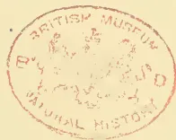A red circular ink stamp is centered on the page. The stamp contains the text "BRITISH MUSEUM" at the top and "NATURAL HISTORY" at the bottom. In the center, there is a faint, illegible emblem or crest. The stamp is slightly faded and has a soft red color.

703------------------------------------------------

A black and white portrait of a man with a mustache, wearing a suit and tie. He is looking slightly to the left of the camera. The portrait is set within a circular frame with a soft, vignetted background.

FRED JOHN HADDEN.

A black and white portrait of a man with short, wavy hair, wearing a suit and tie. He is looking slightly to the left of the camera. The portrait is set within a circular frame with a soft, vignetted background.

CHAS. S. HADDEN.

704------------------------------------------------

# \* The TROPICAL AGRICULTURIST \*

◁ MONTHLY. ▷

Vol. XVII.]

COLOMBO, APRIL 1ST, 1898.

[No. 10.]

## “PIONEERS OF THE PLANTING ENTERPRISE IN CEYLON.”\*

(Second Series.)

CHARLES S., & FREDERICK J., HADDEN:  
PIONEER PLANTERS AND PROPRIETORS, FROM 1840 ONWARDS.

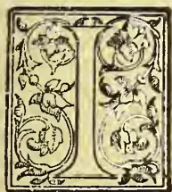

Any of the early estate proprietors deserve to be commemorated among the Pioneers of the Ceylon Planting Industry, they are certainly the two gentlemen whose names stand at the head of our page on this occasion. Coming out as very young men, the Messrs. Hadden (cousins) brought capital as well as energy and intelligence to the work before them. They did not spare themselves in the roughing which appertained to the life of the pioneer in those very early days, and nearly 58 years have elapsed since they landed at Colombo, they being among the very first to travel out to Ceylon by the so-called “overland” route. Mr. Frederick Hadden is no longer with us though well represented in the Island by his sons. Mr. Charles S. Hadden—who, we are glad to say still survives with plenty of life and energy to devote to the duties of the country squire in England,—was only 20 years of age when he landed at Colombo, and he is now in his 79th year, having been born on X'mas Day 1819, the same year though seven months after Her Most Gracious Majesty the Queen.

\*We have to apologise for interruptions in the monthly publication of our series of “Pioneers” caused by extra work in “bookmaking” in other directions. During the rest of 1898 we hope to continue the series at bi-monthly intervals, and among the Pioneers whose portraits and memoirs, or notices, are being arranged for are the Messrs. Frank and Wm. Sabonadiere, Mr. John Capper, Mr. C. Tottenham and Mr. Wm. Bowden Smith, all of whom had to do with the development of the Colony in diverse ways, and are fairly entitled to be enrolled among our pioneers.—Ed: “T. A.”

Let us now turn to the narrative of their trip out to, and early days in Ceylon:—Frederick Hadden and Charles Stanton Hadden (cousins) left London together for Ceylon in August, 1840, travelling through France to Marseilles, by French Steamer to Alexandria, by Nile boat to Cairo, to Suez on donkeys and to Bombay in the E. I. Coy.’s Gunboat “Zenobia.” From Suez to Aden and Bombay a terrible voyage it was in this wretched old paddle steamer of 300 tons. The officers on board were allowed to receive £50 from each passenger and provide bed and board (7 passengers only). The steamer was said to have been employed in conveying pigs and cattle from Ireland to Liverpool before she was purchased by the East India Co. for a gunboat. Rats swarmed on board of her. When the “Zenobia” steam gunboat made Bombay, the food on board was almost exhausted, there were a few fowls left alive in the coops which were under the seats round the quarter-deck, not more than five or six remained, and not one of them had all the toes remaining, for they had been eaten off by the rats, which attacked them in the night! Mr. Hadden has often feared to relate this (though it is positively true) since many think it to be a bit of romancing. The machinery broke down twice on the voyage to Bombay which occupied three weeks. Four of the European crew were kept in irons on the quarter-deck all the time, and two officers were under arrest in their cabins. Our pioneers remained six weeks in Bombay with Mr. Alexander Hadden, a brother of Mr. C. Hadden and then on to Colombo on board the good old teak-built sailing ship “Recovery.” The young gentlemen landed at Colombo on 1st or 2nd November, 1840; they had letters of introduction to the Hon. Geo. Turnour, then acting Colonial Secretary. He advised the Messrs. Hadden to buy land in the Ambagamuwa

705------------------------------------------------

662THE TROPICAL AGRICULTURIST.[APRIL 1, 1898.

District, because all the Government Civil Servants had secured land there, and the first of the new roads to be opened would be the one from Gampola to Yatiantotte through Ambegamuwa village. Mr. Wm. Hall, surveyor, had just cut the boundaries of a block of forest, of over 1000 acres, and offered to hand over his claim to them on receiving 1s. per acre commission. The Messrs. Hadden accepted this offer, and, as at that time it was considered dishonorable to bid at the auction against any one who had been at the expense of cutting boundaries, they obtained this land at the upset price of 5s. per acre. They at once set to work to cultivate it, and a very rough time they had of it; the land was situated beyond Carolina Estate towards Adam's Peak; there was not even a bridle-road to it beyond Gampola, and all supplies and rice for coolies had to be carried over 30 miles of jungle road, at that time one of the worst in Ceylon. After working hard for twelve months (which was well earned experience) the Messrs. Hadden wisely and fortunately concluded that Ambegamuwa was the worst district in Ceylon for coffee, and so they decided to abandon the place although they had spent £1,500 upon it: a serious loss out of the available capital, for money was not so plentiful in those old days. Luckily a small estate "Algooltenne," (or "Weygalla" as the Messrs. Hadden preferred to call it) was advertised for sale in the *Observer*, of the extent of about 230 acres, only 30 acres planted with coffee, adjoining Mr. Tindal's fine property under Hunasgeriya Peak, at that time managed by Mr. Austin. Having occasionally visited that gentleman, and being much impressed with the Hunasgeriya fine soil, and the splendid young coffee plants growing there, the Messrs. Hadden resolved to purchase Weygalla, and this Mr. C. S. Hadden always considered, turned out to be the best paying estate in Ceylon.

From the day of their entrance into Hunasgeriya district, the success of the Messrs. Hadden was secured. By the spring of 1845 the crops from Weygalla (the first sold for 124s per cwt) had returned to the Messrs. Hadden every penny of capital they had spent since leaving London. We have heard that their neighbours in Ambagamuwa called the young Pioneers, "a couple of fools" at the time they abandoned that district; but the majority of those, they left behind, came to ruin, several were proclaimed bankrupt, and so the Messrs. Hadden might then have asked "Who were the fools"?

On the 30th June, 1845, a fine block of forest land was sold by auction in Colombo situated on the Hunasgeriya range, only three miles from Weygalla, belonging to Mr. Fraser of Arbuthnot & Co., Madras. It was divided into four lots of about 250 acres each. The cousins examined this

land thoroughly, and thought it such fine old forest with splendid soil, that they resolved to attend the auction, and bid for the best three lots. These were knocked down to them at £5 per acre, a price at that time considered enormous, as good forest was still to be bought at 5s per acre! But the Messrs. Hadden knew the value of the land, and at once opened three new Coffee Estates of 200 acres each, called "Hunugalla," "Halgalla," and "Horogalla," all of which returned a profit to their fortunate owners, year by year, for *forty years*.

Mr. Frederick Hadden left Ceylon for good in 1850, and Mr. C. S. Hadden in 1852, by which time all stores and buildings were completed, leaving Mr. Peter Moir in charge of all the properties\* with his brother Mr. James Moir to assist him. Two more sensible, honest, and hard-working Scotchmen never landed in Ceylon. Under their charge the estates continued to flourish until the Coffee became unable to fight such dire enemies as "Leaf disease" and "Green Bug."

The land abandoned in Ambagamuwa was never revisited by either of the Messrs. Hadden after the day they gave it up; but it was divided into five lots by Mr. James F. Moir and put up to auction in Colombo on 30th Sept., 1874, at 1 p.m. On that day Mr. C. S. Hadden was out partridge shooting on his property in Herts, and remarked to a friend while taking luncheon under a hedge, that he had a property selling about that time in Ceylon, and expected to receive a telegram giving the result. On the morrow on returning home from shooting at 4 o'clock, the telegram was already on his table saying that all the lots were sold at a price which returned all the capital they had expended on the place. Benachie and surrounding estates in Lower Dikoya were formed out of this group of lots. Had they at once been put in tea, as we among others urged at the time, their owners would have scored; but most of the land went into coffee and did not pay for years until tea took its place.

---

\* The late Mr. Tytler was fond of telling the story of Peter Moir's selection as their responsible Manager by the Messrs. Hadden. How he (P.M.) and some other young men came out for an employer whose engagement was far from a fair one considering the times, and moreover as signed in London, it was not binding in Ceylon—and so two of the young men broke through it in a few months and speedily got employment at double the salary. Peter Moir no more considered he was fairly dealt with than the others; but he had signed his agreement, pledged his word, and no power on earth would make him break it. He was called a "softie," a "spoon," &c., until on the very day of his agreement expiring, he had the offer from Mr. Chas. Hadden, of a post and salary that placed him far before his old companions (who never greatly prospered we believe), while he had established for himself the most valuable thing in the world, a CHARACTER which made him esteemed beyond most men right through the Colony, and which he never forfeited till the day of his death in the old country. Succeeding generations of planters came to hear of Peter Moir as the man whose word was as good as his body.

706------------------------------------------------

APRIL 1, 1898.]THE TROPICAL AGRICULTURIST.663

Kotiyagalla in Bogawantalava was purchased for the Messrs. Hadden by Mr. Moir in the year 1872. It was never a great success in coffee, or at any rate never approached the Hunasgeriya Estates; but it did, and is doing, well in tea. Mr. Fred. Hadden, senr., died on 22nd April, 1882, thus terminating a partnership made with his cousin in 1840, during the whole of which time they remained on the most affectionate terms. Soon after, it was arranged that Messrs. Fred. & Frank J. Hadden, sons of Mr. F. Hadden, senr., should become sole proprietors of the Hunasgeriya Estates, and that Mr. C. S. Hadden should become sole owner of the fine Kotiyagalla property, of which his nephew and son-in-law Mr. Frederick Hadden became chief manager. Kotiyagalla contains 1,080 acres of rich land, about three-fourths of which are under fine tea, the jati, climate and soil being all conducive to a fine high-priced product. Later on Mr. Frank J. Hadden became sole proprietor of Hunugalla and Weygalla and, lately, he sold the latter with 344 acres to Mr. E. G. Beilby, retaining Hunugalla—770 acres with 400 doing well in tea—in his own hands.

We ought to mention, too, the close business connection between the Messrs. Hadden ~~& Co.~~ and the well-known Fenchurch Street Firm, Messrs. James A. Hadden & Co., of which their relative Mr. Alex. Brooke is the esteemed managing partner.

We may here give "a leaf from the past" kindly supplied to us without Mr. Hadden's knowledge by one well-acquainted with his family in the early days:—"I know not if you realise how Mr. Chas. S. Hadden links us with the eighteenth century. His father took an active part against the rioting then so rife and his commission dating back to the time when Kings of England still claimed to be Kings of France, is so signed by George III. That nonsense was not dropped until the Union with Ireland in 1801. There are not many now alive whose father's commissions were signed by a King of England, of Scotland, and of France!

"The old yeomanry officer had the freedom of Nottingham conferred on him in 1795. See enclosed cutting from a Nottingham journal. The Colonel Seely there is son of 'Seely's pigs' if you are old enough to remember them: The writer of the letter, Fellows, is author of a History of Nottingham Yeomanry Cavalry."

#### THE FREEDOM OF THE TOWN.

TO THE EDITOR OF THE NOTTINGHAM DAILY GUARDIAN.

Sir,—I notice in your paper of to-day, in the report of Mr. McGrath's speech in the Council respecting the honour that is to be conferred on Col. Seely in reference to the freedom of the town, that he says the honour "would be increased to those who followed after by the fact that the first name on the list would be that of Mr. Seely himself." In the

"Nottingham Date-book," 1st September, 1795, it recorded that the commissioned officers of the 12th Regiment of Light Dragoons—Lieut. Middlesmore and Cornet Hadden, of the Yeomanry Cavalry—were presented by the Corporation with the freedom of the town, as an acknowledgment of their meritorious exertions in quelling riots. It would appear, therefore, that conferring the freedom of the town by the Corporation is not unprecedented.—I am sir, &c.,

GEORGE FELLOWS.

Beeston Fields, Nottingham, May 7th, 1895.

In conclusion we heartily congratulate one of the earliest, most intelligent and persevering of the Planting Pioneers of Ceylon on his long and honorable connection with the Colony. We have given but the briefest outline of the actual jungle work of Messrs. Fredk. and C. S. Hadden. It will be observed that they stuck to their posts all through the financial crash of 1845-47 when coffee and Ceylon were supposed to be ruined. The senior Mr. F. Hadden, now deceased, gave ten years' continuous hard work to the development of the plantations before ever taking a holiday; while Mr. C. S. Hadden had twelve years for his share. No one of recent years can picture what life and work in the hill-country of Ceylon was like in the "Forties," and more especially what roughing in the wilds of Ambegamuwa—in one of the very wettest divisions in the island—was like in 1841-2. We remember hearing our late senior describe a visit he paid to Mr. Wm. Hall (the same who sold his interest to Messrs. Hadden) in Ambegamuwa in 1841, and how the rain got through their talipot hut, filled up their boots and gave him a cold which it took years to get rid of altogether! Scant supplies, there being no roads, and bridges and streams often unfordable, were recognised as a matter of course, while even the sun was rare visitor between May and December:—

Past five an' fifty busy years,  
An' lo! the wondrous change;  
Those Hills are now the white men's homes,  
Which were the wild beasts' range.  
And, mixing with the torrent's roar,  
The steam-pipe's puff is heard;  
While rattling round the roller goes,  
As merry as a bird.

And few and scant their comforts were—  
The leaders of that band—  
Whose cosie cottages now rise,  
Bright homesteads o'er the land;  
So while for all that's still to do,  
Ye strive with high resolve—  
Let grateful thoughts, too, have their play  
As ye THE PAST revolve.

All honour then to the men who laid the foundations of the prosperity of Ceylon as a plantation Colony. Very, very few are left to us who go back beyond the half-century in their experience, and among these none takes a more honorable position than the Messrs. Hadden who brought youth, intelligence, indefatigable energy and capital to their work in Ceylon; while more especially would we

707------------------------------------------------

664THE TROPICAL AGRICULTURIST.[APRIL 1, 1895.

offer our congratulations to Mr. Chas. S. Hadden whom we have known and esteemed since he began revisiting his properties here—so well-managed by his nephews—some twenty years ago. The very type and *beau-ideal* of country squire, of “a fine old English gentleman, all of the olden time,” it is a credit to Ceylon that she can number among her early Planting Pioneers, one so hale and hearty as

CHARLES S. HADDEN OF KOTYAGALLA, BOGAWANTALAWA, CEYLON; AND OF INGLESIDE, SUNNINGDALE, BERKS, ENGLAND.

Long may he survive for us to point to as one of the very first band of Proprietary Planters who invaded the Kandyan jungles in the early “forties,” and who have made Ceylon what she is today; and long may the name of “HADDEN” through younger generations, continue to be honorably enrolled in the Proprietary and Managing lists of Ceylon plantations.

## TIMBER TREES OF THE SEYCHELLES ISLANDS.

### REMARKS AND USES OF TIMBER.

*Sideroxylon* Species. “Capucin.” A large growing tree. Timber hard, almost undestructible either in water or in the atmosphere, used for beams, wall plates, frames of wooden houses, verandah posts, piles, planks, shingles, spokes for wheels, &c.

*Calophyllum inophyllum*. “Takamaka” or “Tacamahaca.” A large growing shady tree always found on the seashore. Trunk 4 feet in diameter. Timber tough, coarse grained, not easily worked, color reddish, used for boards, planks, beams, ship and boat building, masts. Cocoa-nut mills are dug out of the root end of the tree and excellent canoes “Pirogues” are made (hollowed) out of it. The exudation from the stem is the *Tacamahaca* resin of Commerce. Its seeds yield the bitter oil of India which is said to be worth £90 per ton. This oil has a great reputation in Polynesia and the East Indies as a liniment for rheumatisms, pains in the joints, and bruises, and its efficacy in these respects can hardly be exaggerated. The uses of the oil and resin are unknown in Seychelles.

*Dipterocarpus* Species. “Bois de fer.” This is a large lofty growing tree, often attaining a height of over 100 feet, with a trunk 40 to 70 feet to the first branch, and a diameter of from 4 to 6 feet. Has great repute for making canoes. Timber resembles Teak in color and grain, hard and durable, used in all parts of house-building, boats, &c. This is perhaps the most useful timber of the Seychelles Islands, for general purposes. When the tree is wounded there exudes an almost transparent resin which is exceedingly flammable, and was formerly used as incense.

*Azelia bejuga*. “Gayac” or “Faux Gayac.” Yields a very fine strong and durable timber. In color it is not unlike the last and is used for the same purposes. It is now very scarce, and few living trees exceed 8 inches in diameter.

*Terminalia Badamia* “Badamier.” A large growing tree from which canoes are frequently made. Timber is generally used for boarding inside of houses, &c, will not bear wet and exposure to the atmosphere.

*Imbricaria peticularis*. “Bois de Natte.” A large and lofty growing tree, Trunk often attaining a height of 50 feet. It is now becoming very scarce. Timber used in all parts of house building, cabinet work, &c. It is dark colored, close and fine grained, hard and durable. It makes beautiful furniture and when well polished it almost rivals the finest Mahogany.

*Gomphandra* species. “Bois Maree.” A middling sized tree, whose wood is used for boards and planks in house-building. The timber is of a dirty white color, and not very durable.

*Wormia ferruginea*. “Bois Rouge” Is an ordinary sized tree, Timber red colored, hard and durable, bears exposure well and is in great repute for flooring and roofing houses.

*Heritiera littoralis*. “Bois de Table.” A large growing tree, not common. Timber used in house building, furniture, &c. It is close grained and dark colored, and its quality is excellent.

*Rubiaceæ* Species. “Bois Sandal” or “Sandal.” A small tree, Trunk seldom exceeds a foot in diameter and 20 feet in height. Wood close grained, easily worked, polishes well, beautiful pale yellow color, used for ornamental work in the inside of houses, furniture, panelling, and occasionally boards, &c.

*Campanospermum Zeylanicum* “Bois Montagne.” Occasionally attains large dimensions. Held in great repute for making canoes which are said to be very durable. Timber used in house, ship and boat building &c.

*Casuarina Equisitifolia*. “Filao” or “Cedre” In Seychelles this tree attains a gigantic size. In 1871 I saw one whose trunk was 150 feet in length and 6 feet in diameter at about 20 feet from the root, lying on the beach near St. Anne’s Bay, Praslin. In 1874, I saw several trees of it, growing on the beach at Curieuse Bay, Praslin, that were 120 feet in height, and straight as arrows. They appeared to be comparatively young trees. Its timber is used in all parts of house building. It is close grained, and sinks in water when it is green. When kept dry it is very durable, but decays quickly when exposed to moisture. It is nearly impossible to draw nails out of it. It makes excellent firewood and burns freely even when green. It is indigenous to these Islands and grows readily from seed which may fall on cleared ground.—J. HORNE, *Sub-Director*.

## CINNAMOMUM TAMALA.

The Director of the Department of Land Records and Agriculture in Assam on the 22nd April 1895 forwarded some specimens of Tej-pat leaves for identification. In the letter accompanying the sample it was said that the tree yielding the leaves was largely grown in the Jaintia district for the sake of the leaves which were used as condiment. The leaves belonged to *Cinnamomum Tamala*, and on their being referred to Dr. Prain of the Royal Botanic Garden, Sibpur, he pronounced them to be those of the variety *intermedium*.

The use of Cinnamon leaves in India has been known for centuries. At one time, as *Folia Malabathri* or *Folia Indi*, the leaves of certain Indian species of *Cinnamomum* were employed in European medicine, but now they have become obsolete.

The information we possess on the subject of Tej-pat as recorded in works on materia medica is very fragmentary, but the discovery of a large trade in this drug in Assam has enabled us to bring together all the recent facts in connection with the industry. On the receipt of the letter from the Director, Land Records and Agriculture, Assam, a set of questions was drawn up by the Reporter enquiring into the extent of the cultivation and commerce of the leaves. The replies to these questions sent in by the Director and other officials in Assam have assisted very materially in the compilation of a fairly complete *Agricultural Ledger* on the subject.

*Botanical Origin.*—Tej-pat is obtained principally from *Cinnamomum Tamala*, Fr. *Nees*, and its variety *intermedium*. The leaves under this name have also been derived from *C. albiflorum*, *Nees* (in the Lahore bazaar), *C. obtusifolium*, *Nees*, and *C. impressinervium* *Meissn* (in Sikkim), and the wild species *C. zeylanicum*. *Breyn*. The Tej-pat from wild trees found in Mysore and referred to in the *Pharmacographia* would probably belong to the last named plant. Roxburgh alludes in his *Flora Indica* to Tej-pat leaves as those of *Laurus Cassia*, a name which is now synonymous with *C. Tamala*. It has been stated by some writers that the leaves of any species of cinnamon are indiscriminately referred to as Tej-pat by the Natives.

*Vegetacular.*—The drug is called *Tamali* in the *Raja Nirghanta* and this is probably the origin of the specific

708------------------------------------------------

APRIL 1, 1898.]THE TROPICAL AGRICULTURIST.665

name of the plant. *Tej-pat*, or, as it is also written, *Tidi-pat* and *Tez-pat*, is derived from *Twach* or *Twacha*, the Sanskrit equivalent for cinnamon bark, and *pat*, the leaf. *Dalchini* (Chinese bark) and *Taj* are Hindu names applied to any kind of cinnamon bark. The *Taleef Shereef* gives *Tudje* and *Putrudj* as other vernacular names. The leaves are the *Sazaj-i-Hindi* of Indian Mohammedans. In Kashmir the leaves are called *Barg-i-Taj* and in South India *Tamal patra* and *Talisha-pattiru*. From Assam we are informed that the cinnamon tree is called *Dieng Latyrrpat* and the leaves *Latyrrpat*.

**Habitat.**—Cinnamomum Tamala is wild in tropical and sub-tropical Himalaya, from near the Indus to Bhutan, at altitudes of 3,000-5,000 feet, ascending to 7,800 feet in Sikkim, and in Sylhet and the Khasia mountains to 3,000-4,000 feet. Gamble says it grows in the valleys of the Mahanadi and Tista, but it is not found much on the West of the Mahanadi. The tree is cultivated in Assam.

**Cultivation.**—In the Khasi and Jaintia Hills about six squaremiles are planted with Cinnamomum Tamala. Owing to the trees being grown amongst jack, betel-nut palms, and other fruit trees, the exact amount cannot be ascertained, but it is calculated that 400 acres are planted up in the Jaintia *parganas* and a small quantity in the submontane tracts, such as the Cherrapunji Hills in the north of the Sylhet district. The trees delight in a heavy rainfall. Continuous rain is said to be unfavourable for their cultivation, but heavy rainfall followed by bright sunshine is most congenial. Storms effect considerable damage by breaking off the leaf branches. It is also conjectured that excessive moisture diminishes the odour of the leaves. In the Khasi and Jaintia Hills the trees are grown in regular plantations 7 feet apart; the seedlings are raised in beds, and planted out permanently when the plants are five years of age. The tree takes five or six years to grow, or comes into bearing at ten years, and continues to bear for one hundred years. The cultivation is in the hands of the hillmen.

In Sylhet the trees are self-sown; the ripe seeds fall from the trees into the soil and germinate. When the plants are about a foot high they are transplanted. Great care is bestowed upon the plants when they are young and tender. As constant exposure to the sun would kill the shoots they are planted behind bushes or trees for protection. The undergrowth is kept down twice a year in the plantations for the first eight or nine years of the plant's life after that the jungle is cleared once a year in April. In some plantations the soil is dressed, but in most districts the soil is never manured or irrigated.

No reserve areas are kept for the growth of these trees. The Tej-pat and cinnamon trees are different. The former are only used for their leaves and no bark, or only a small quantity is collected in the Khasi Hills. A small quantity is sent to Sylhet from Sib-sagar and Lakhimpur by the Nagas.

**Collection and Crop.**—Tej-pat is plucked in dry and mild weather from October to December, and in some places the collecting is continued to the month of March. The leaves are taken once a year from young trees, and every other year from old and weak ones. On an average 15 seers may be obtained from one tree, but the quantity depends upon circumstances; a tree yields from 10 to 25 seers of leaves in a year. The average yield of leaf per acre in the Jaintia *parganas* is about 30 seers without, and 2 mounds with, twigs. The whole of crop from four hundred acres was worth last year as much as R1,100. The quantity of leaves from the Sylhet district last year calculated on the turn-over of the traders was estimated at 14,470 maunds, and from the Jaintia district 20,000 maunds.

In harvesting the Tej-pat the small branches are cut down with the leaves and dried in the sun for three or four days. The leafy branches are then tied up into convenient bundles ready for the market. In the other case, the leaves are separated from the branches and packed in bamboo nets of a cylindrical shape called *Bora* or *Jungra* which are four feet long by two feet in diameter. The packages are carried down the ghaut roads of the hills by coolies to Sylhet.

**Disease.**—The young trees are not usually attacked by insects, but the old ones are sometimes destroyed by white ants. The leaves are subject to a disease called *Guti* (small pox). When attacked with this malady the leaves are spotted with black eruptions about one-eighth of an inch in diameter. Spots like these are often seen on mango leaves. Leaves injured in this manner are not plucked for sale.

**Description of Tej-pat.**—This is how Tej-pat is described in the *Taleef Shereef*. A very common leaf in length from 3 to 5 inches and the breadth 2 inches, of a green colour and pleasant smell; it is strongly marked by veins. It is brought from the hills. The author of *Makhzan* describes them as yellowish, coriaceous, ovate-lanceolate leaves with five nerves extending from base to apex, and says they are produced from a large tree growing in the mountains of Sylhet. The most careful description of Tej-pat is that of the *Pharmacographia Indica*. The leaves vary in size, the largest are 6 inches or more in length and 1½ inch broad, oblong, obtuse-pointed, entire, with three principal nerves and two smaller ones which are quite marginal; the venation between these nerves, which run from base to apex of the leaf is finely reticulated, and the leaves are of an olive-green colour; the upper surface is polished. They have a pleasant odour like a mixture of cloves and cinnamon.

**Uses.**—Tej-pat partakes of the aroma, pungency and probably carminative properties of cinnamon bark, and is largely used as a spice in various culinary operations. According to Dr. Aitchison the leaves are used in Kashmir as a substitute for betel-leaf or *pan* (Piper Betle, Linn.) and Dr. Lisboa speaks of their being employed in the preparation of curries in the Bombay Presidency. *Pan* and various curry leaves have to be used in a fresh condition on account of the fugitive nature of their aromatic principles, leaves in retaining its volatile oil for a considerable time after being plucked and dried. As a matter of fact, cinnamon leaves in India take the place of the domestic flavouring agent in England known as Bay leaves (*Laurus nobilis*).

In the *Taleef Shereef* or Indian Materia Medica (translated by Dr. George Playfair, 1833) the medicinal properties of Tej-pat are described as being hot and light and cardiac, useful in wind, piles, nausea, pain in the stomach and flatulence. The author of the *Makhzan* considers the drug to be carminative, stimulant, diuretic, diaphoretic, lactagogue and deobstruent. In the *Raja Nirghanta* it is mentioned as a remedy for the expulsion of phlegmatic and rheumatic humours and is prescribed in cases of flatulence and dyspepsia. Besides being used directly in medicine, the leaves are employed as adjuncts to other drugs to render their exhibition less nauseous.

The third use is that of a dye. In the North-West Provinces Tej-pat is mixed with myrobalans and employed in calico printing and apparently acts as a clarifier. The bark and leaves of the *Taj* are used in Ohtia Nagpur as an auxiliary with *Kamela* (*Mallotus philippinensis*) as a dye.

**Chemical Composition.**—Kurz in his "Forest Flora of British Burma" made a very suggestive statement, when, in describing *Cinnamomum zeylanicum*, he said, "The leaves yield oil of cloves." The cloves are obtained from quite a different plant (*Eugenia caryophyllata*, Thun.), but it is a remarkable fact that the prevailing constituent of the oil is identical with that found in cinnamon leaves. The oil of the leaf was first described by Kampfer in 1712. Dr. Stenhouse in 1854 found it to have a specific gravity of 1.053 and to consist of almost pure eugenol with a little terpene and cinnamic aldehyde. Professor E. Schmidt, Berlin, confirmed the result of this analysis in 1891, and further showed that the oil of cinnamon root contained eugenol and terpene, and the oil of the bark cinnamic aldehyde and terpene. The oils of cinnamon leaf and cloves are, therefore, remarkably similar in consisting of a large proportion of a chemical body known as eugenol or eugenic acid.

709------------------------------------------------

666THE TROPICAL AGRICULTURIST.[APRIL 1, 1898.]

*Commerce.*—A small quantity of Tej-pat is consumed locally, but the bulk of it is exported to Narainganj, Dacca and other places in Bengal. The Khasias usually sell the leaves in Sylhet to Bengal merchants who send the leaves to a large extent to Calcutta. The price of the leaves is 8 to 10 annas per maund with branches, 14 annas with twigs, and R1-4 to R1-6 cleaned.

Tej-pat is largely imported from Nepal and the forests of the North-West Provinces. About 33 tons of leaves and 24 tons of bark are annually exported from the tract between the Ramaganga and Sarda rivers of the Kumaun district. Gamble notices the collection and sale of the leaves in Sikkim.

The following table shows the return of the sales of Tej-pat from three districts in the North-West Provinces about twenty years ago:—

<table border="1">
<thead>
<tr>
<th></th>
<th>1874-75.</th>
<th>1875-76.</th>
</tr>
</thead>
<tbody>
<tr>
<td>Bijnor . .</td>
<td>36½ cwts.</td>
<td>R 62 18½ cwts. R 76</td>
</tr>
<tr>
<td>Garhwal . .</td>
<td>14½ "</td>
<td>" 30 35 " " 37</td>
</tr>
<tr>
<td>Kumaun . .</td>
<td>88½ "</td>
<td>" 272 120½ " " 374</td>
</tr>
</tbody>
</table>

## TEA EXTENSION IN CEYLON.

### NEW FACTORIES TO BE BUILT IN 1893.

Messrs. Brown and Co., the well-known engineers at present have their hands very full executing a number of big orders for factories that have been entrusted to their Nawalapitiya branch. They have something like a dozen new factories in hand for this branch alone, and the manager, Mr. Geo. Brown, having to supervise all the works, is now kept continually on the move. A week ago he was away in the Kelani Valley, while yesterday he was again in Colombo on his way back from Udugama, and to-day, he set out again for upcountry. The work that took him south was the erection of a factory at Udugama on the property owned by the Udugama Tea and Timber Company. Here they are now erecting a large new factory, and the building to be made in such a way as to be capable of extension; but at the outset the dimensions will be 100ft. by 40ft. with two floors above the ground floor. The factory is to be built with brick pillars and brick walls, with ironcross-beams and centre columns. The roof will be of wood. It is to be fitted up with a 40 horse-power turbine with a fall of 50 feet, and the installation will include steel-piping, 20 inches in diameter. The machinery at present employed in the two old factories hitherto used is to be re-erected in the new building, with several additions of new machinery of latest design. The work has been commenced, and the factory is to be completed in four months. This will place the Udugama factory much nearer to Galle and close to the main cart road. The Company has got extensive reserves of jungle, amounting to several thousand acres, and we have no doubt there is a good future before it, although up to now it has been working under difficulties, chiefly as regards manufacturing its crop. There is also being erected on Donside, near Nawalapitiya, a factory of which a feature will be the way the motor power is to be provided. Arrangements have been made to place the factory on the main cart-road, to facilitate transport, and the water-power (which is at a considerable distance from the factory) is to be availed of by means of wire-robe transmission. Detailed plans have been made and submitted for this work, and, no-doubt, it will prove as great a success as it has already proved in other countries, although this system of water power transmission has not been hitherto largely employed either in England or Ceylon. We believe that this will be the largest wire-robe transmission of the kind in Ceylon. The work has been ordered by Mr. Hector and is already progressing. The new factory is also being constructed. It is being built so as to permit of extension at a later period, but at first will be 72 feet long by 35 feet wide. The building will be a two-storied one, and all the machinery it will contain will be new, as, there not having been

a factory on the estate before, there is no old machinery to be utilised. The place will be of brick and iron, with an iron roof. The work has just commenced and is to be finished in four months.

### TEMBILAGALLA.

A third new factory is going up on Tembilagalla, near Oolapane, the property of Messrs. George Christie and Haycock. It will be precisely similar to the factory just described as in progress on Donside, as far as relates to materials and accommodation, while water-power will also be used for this.

### A NEW WITHERING HOUSE FOR SANQUHAR.

A new withering-house of unusual size is in progress on Sanquhar estate, near Gampola. This work has been in hand about two months, and is expected to be finished by the end of next month. The dimensions are 72 feet by 35 feet, and the building will carry two floors above the ground floor. It will be used entirely for withering, and will be an addition to the large factory that is at present in working.

### DEVELOPMENTS ON GALATA.

A new turbine installation is being put in on Galata estate, near Gampola, on the other side of the river to Sanquhar. This work has been in progress three weeks and will be finished in a week's time. The horse power is 15 with 80 feet fall.

### THE NEW FACTORY AT RATWATTE.

Messrs. Brown & Co. executed a very smart piece of work for the Ratwatte Tea and Cocoa Company. They were commissioned to put up a complete factory, and, by their contract, they had to do it in four months; but they did it in three. It is now in full working order, and everything is going on excellently. The motor power here is a 24 (brake) horse-power and a large locomotive multitubular type of boiler. The new machinery supplied to the factory consists of one large down-draft improved sirocco; one 32 in. Rapid roller; one of Brown & Co.'s made-tea sifters; and one Breast roll breaker. This latter machine has been lately very much improved, and is reported to be doing excellent work. The dimensions of this factory are 50 feet by 40 feet at present; but extensions are likely to be made very soon. The factory, like the preceding ones described, is of two storeys, with iron roof, iron columns and cross pillars with brick walls. The rapidity with which this work was carried out (in a month under contract time) has excited much favourable comment.

### A BIG WHEEL ON CRAIGHEAD.

The next work calling for description is one fully as interesting as any that we have already enumerated. For long, Craighead estate, in Dolosbagie, has relied on two 13 horse-power turbines; but lately there has been a large acreage opened on this estate, and additional machinery being, therefore, required, extra driving power had to be obtained. It was accordingly decided, on the advice of Messrs. Brown & Co.'s experts, to discontinue the old turbines and substitute therefore a big Pelton wheel. This has now been done, and Craighead now boasts the largest Pelton wheel in the Island. The wheel has been most satisfactorily introduced, and this despite the fact that it is working under a comparatively low fall. The following are the dimensions of the wheel:—diameter 72 inches, (weight 19½ cwts. without shafting and other accessories); horse-power, 45½; fall, 30 feet evolutions, 115 per minute. The water supply is 400 cubic ft. per minute. This wheel has been thoroughly tested, and has been in use long enough to show that the change is a beneficial one and the proprietor has assured the engineers that he is more than pleased with the results.

### A NEW FACTORY AT RAXAWA.

There are two Raxawas in Ceylon, but the one at Dolosbagie has been enterprising enough to order a new factory, and the site for it has just been cut. It will be of two storeys—dimensions 70 feet by 30 feet; and the contract stipulates that it is to be handed over in four months' time. We understand that the motor-power to be used is a Pelton

710------------------------------------------------

APRIL 1, 1898.]THE TROPICAL AGRICULTURIST,667

wheel, with a very large fall, namely, 500ft. The supply of water, however, is small and in consequence the effective horse-power is only to be 15; but we are informed that this will be quite sufficient for the requirements of the property. The machinery to be supplied will be all new, and of the latest and most approved types.

A PROJECTED FACTORY ON UDABAGE.

There is a scheme afoot for a large factory on Udabage estate, in the Kelani Valley. The motive-power is to be a 40 horse-power turbine; but as this work has not yet been put in hand, we are unable at the present moment to give further details; but we may say the factory will be a large one—about 100 ft. long by 40 ft. broad, and, like all the other factories here described, it will consist of a ground floor and two upper floors.

The list we have given is probably an unprecedented one of work proceeding at one period; but it by no means exhausts the statement of operations Messrs. Brown & Co. are carrying out, for their Hatton branch has a good deal of work of a similar kind.

In addition Messrs. Finlay, Muir & Co. are putting up

A BIG FACTORY ON CHESTERFORD ESTATE,

in the Kelani Valley. This will be a noteworthy work, when it is completed. As our readers know, Messrs. Finlay, Muir & Co. employ their own engineer (Mr. W. Pottie), who supervises their buildings the actual work of erection being given to contractors, who work under the immediate direction of Messrs. Finlay, Muir & Company's superintendents. The new Chesterford factory is to be completed by the first week in February, and will be 150 ft. in length, and 40 ft. wide, with annexes. There will be a ground floor and two upper floors, and the structure will be an iron building with tea weatherboarding and window sashes all round. It will be a very fine building when completed, and great credit is due to the superintendent (Mr. Angus) for the speed with which the work has so far been carried out, and to Messrs. Walker, Sons & Co., who have furnished all the necessary iron-work in an incredibly short space of time. The factory will serve both Chesterford and Madooitenne, and is very central. Old Madooitenne factory adjoins it, and will be converted into a withering-house; while all the old machinery of the two factories will be re-laid in the new building, and will be supplemented by a new Paragon tea-dryer; one of Jackson's 32 inch Rapids; and one of Mickie's made-tea sifters. The power will be steam; and the engine one of Marshall & Sons' 12 horse power.

A HUGUE FACTORY AT CHETNOLE.

At Chetnole in Balangoda, the same firm are putting up, under the supervision of Mr. Clark, a new withering-house, 100 ft. long by 40 ft. wide—and, like the other buildings described, one of three floors. Moreover, the existing factory is to be extended, and a new turbine, with a fall of 150 ft., and capable of developing 40 horse-power, is to be installed. With the addition of a new withering-house, and the extension of the factory, the factory (which, by the way, serves also Meddakande estate) will be capable of turning out 600,000 lbs. of made-tea a year. The new building will be of stone and timber, with center pillars and cross-beams of iron, and a roof of corrugated iron. Plans are now being made, but the work is wanted quickly, and it is to be executed with all possible speed.

RASAGALLA'S NEW FACTORY

—a work also under the supervision of Mr. Pottie, and like the last, directly superintended by Mr. Clark, is rising fast, and here again Messrs. Walker, Sons & Co. have shown great expedition in preparing the iron-work, for, though it was only ordered a month ago, it is now ready for despatch. For this work, however, there is no immediate hurry as far as regards completion as it is intended to finish Chetnole before this, and also before

THE NEW FACTORY AT HOPWELL

is completed. This last-named building is being put

up under the direct supervision of Mr. Wm. Taylor, and when finished it will be 200 ft. long by 65 ft. wide, and 40 ft. high—in a word, one of the largest factories in the island.

THE HAPUGASTENNE CART ROAD.

A different class of estate work, but an equally important one, is now in progress in the Ratnapura district, when a cart-road is being cut from Ratnapura to Hapugastenne. There will be about 17 miles of this road, which will ultimately be carried right on to Hopewell. The work has been begun from the Ratnapura end, and is in charge of Mr. A. J. Emery, the manager for the Hapugastenne estates. The Road is already cut, almost to the tenth mile.

AN AERIAL TRAMWAY IN TRAVANCORE.

Messrs. Finlay, Muir & Co., however, are not only busy in Ceylon, for we hear an important undertaking they are about to set on foot in Travancore, where they propose to construct an aerial tramway extending from the bottom of the ghaut at Bhodiniya-Koonoor to the Yallaka Gap—a distance of about six miles. When completed it will give Messrs. Finlay, Muir & Co., a second outlet from their land. We have frequently referred to the work going on to the West, where Mr. Benzie is engaged in making a cart-road which will place the property in direct communication with Cochin. That is steadily progressing, but the firm deemed it advisable to have an alternative outlet, and so they propose on the eastern side of their block to put up an aerial tramway, which will convey their produce eastward to a point on the main road whence it can easily be forwarded to Ammanaya Koonoor, the receiving railway station for goods intended for Madras. The tramway will begin at an elevation of 2,000 feet, and will reach an elevation of 6,000 feet, and will be over a trace surveyed originally and recommended by Messrs. Benzie, Mickie & Pottie. Our readers will see at once that it will allow Messrs. Finlay, Muir & Co. to send produce down and to get rice up much more advantageously than they have hitherto been able to do. Tenders are to be invited for the work; and amongst those who have gone up to inspect the land and judge on the spot what is wanted is Mr. G. H. M. Hyde, of the Colombo Commercial Company, so that Company will possibly tender.—Local "Times"

BRITISH GUIANA AND CEYLON.—The *Times of India* says:—"Some time ago, in discussing the report of the West Indies Commission, we took occasion to compare the condition of British Guiana with that of Ceylon. We pointed out that both Guiana and Ceylon had, at a certain stage of their existence, suffered grave reverses owing to the failure of the respective industries upon which their prosperity depended; and we instituted comparisons regarding the subsequent policy pursued by the inhabitants of the two colonies, which did not altogether redound to the credit of the Guianese. A Guiana contemporary, the *Demerara Chronicle*, has published a reply to these criticisms, in which it points out that Ceylon, with its  $3\frac{1}{2}$  million inhabitants, has infinitely better opportunities for development than has Guiana, which only possesses 300,000 people all told. The disparity in population means, it urges, 'a vast difference in the cost of labour, a far greater consumption of dutiable products, and a larger number of people to occupy lands newly opened up.' Had it not been for the artificial increase induced by immigration from India, Guiana, says the *Demerara* journal, 'would have made hardly any advance upon the position held at the time of Emancipation.' At the same time, the general accuracy of our contention that the present depression would have been far less serious if the colonists of past generations had been less concentrated upon the sugar industry, and had tried to develop the other resources of the colony, is admitted."

711------------------------------------------------

668THE TROPICAL AGRICULTURIST.[APRIL 1, 1898.WHAT WE EAT AND DRINK.ADULTERATION AND NOMENCLATURE.

Dr. F. L. Teed, F.I.C., public analyst for Islington, in a report to the local vestry, issued yesterday, states that in one instance recently, he found "the custom of the trade" was for a vendor when asked for "coffee" up to 1s 6d per pound to hand the purchaser a mixture of fifty per cent. of chicory and fifty per cent. of coffee in a wrapper marked "This is sold as a mixture of coffee and chicory." Another defendant declared that unless "pure" coffee was asked for, this mixture was always given to the purchaser.

Dr. Teed adds:—"It seems to me that if this perversion of the meaning of words goes much further, it will become necessary for tradesmen to compile a dictionary of their own, so that the simple-minded public may understand the meaning they attach to the words, which, up to now, referred to unsophisticated foods. Demerara sugar is no longer that article, but yellow crystals, unless you ask for pure Demerara; butter is a mixture containing ten per cent. of margarine, unless you ask for 'pure' butter; whisky is a spirit (mostly potato), and adulterated with an unknown percentage of water, unless you ask for 'pure' whisky, when as likely as not you will be supplied with the same spirit, but at a strength of twenty-five under proof. Cocoa powder is chocolate powder (a mixture of sugar and cocoa), unless you ask for 'pure' cocoa; yellow wax is no longer beeswax, but earth wax, unless you require it 'pure' while paraffin wax is unblushingly substituted for white wax, which is bleached beeswax; and so on. It is about time this subversion of English words was put an end to. It began with fraud, but now it is the 'custom of the trade.'"—*Home paper*.

JAMAICA.THE VIEWS OF SIR H. A. BLAKE.

Sir Henry A. Blake, late Governor of Jamaica, naturally takes a keen interest in the welfare of the island, and his address last week before the members of the London Chamber of Commerce was an exposition of the condition and possibilities of the colony. Jamaica is not dependent upon any one industry, although sugar-planting is a very important factor. The island contains 2,692,000 acres, of which about 2,340,000 are cultivated. At present the area under the cultivation of the staple crops, is 33,000 acres in sugar, 19,000 in bananas, 25,000 in coffee, 11,000 in coconuts, and 1,700 in cacao. The value of the crops last year was £360,000 from sugar, £315,000 from bananas, and £169,000 from oranges. So that fruit-growing is developing rapidly into an enterprise of leading importance. Sir Henry Blake thinks that Jamaica has a right to ask the co-operation of the mother country in establishing a direct line of steamers between that colony and England. By that means the orange and banana industry of Jamaica would be largely improved. There is a large demand for both these products provided they could be brought to England in proper condition, and this can only be done by the establishment of a special boat service. Sir Henry Blake argues that Jamaica and the other West Indian colonies being weakened and ruined for the direct benefit of England, the home Government should come to their rescue. Barbadoes, which is entirely dependent on sugar, is in a very serious condition, as is British Guiana, and in the event of the failure of the sugar in-

dustry it will be necessary for this country to spend a large sum of money to provide these colonies with a means of revenue.—*H. & C. Mail*, March 11.

THE "COCOS" OF LARGEST SALE.

In our Green Supplement this week is announced the result of competition in which readers were asked to record their votes for the twelve cocoa preparations having the largest sale. The result of this competition is a striking testimony to the value of enterprising and judicious advertisement. During many years chemists have taken a share in the distribution of cocoas, the names of some of which had become household words throughout Great Britain, but the result of this competition shows that these have been out-marched by a preparation which some three or four years ago was unknown. The fact that so large a proportion of a body of chemists all over the kingdom return Dr. Tibbles' Vi-Cocoa as having the largest sale is primarily due to the spirited policy adopted by the proprietors in making their specialty known to the public and to the trade, and while we do not wish to detract in any way from the credit to which they are entitled for this success there is no doubt that its achievement has been rendered a somewhat easier task than would otherwise have been the case by the supineness of the older manufacturers.—*British and Colonial Druggist*, March 18.

INDIARUBBER.

Fears are sometimes expressed that the supply of rubber from Para will stop some day, but our Consul at Para is not of that opinion. Writing at the end of December, he says that the majority of authorities on the subject are of opinion that there is absolutely no fear for the exhaustion of the supply of rubber in Amazonian States. In some cases this produce is transported as much as 6,000 miles before it reaches Para, but it is found that the prolonged transportation improves the rubber, so that when it arrives at its destination it sells for higher prices than that collected nearer the mouth of the river.

Our Consul at Zanzibar remarks that Africa may he said, roughly speaking, to be full of rubber from Zambesi to the Sahara. Hitherto the rubber brought down to the coast has been mainly collected by natives, who, under the pressure of hunger, have gone into the forests, tapped the vines and taken the halls thus extracted (one the size of a cricket-ball represents about a day's work) to the nearest Arab or Indian; but the German firm of Harsing & Co. have set the example of collecting the rubber in a systematic manner, and it is expected that in a few years a regular and better supply will be obtained.—*Chemist and Druggist*.

BLOOD POISONING FROM TEA BUSHES.—It will be remembered that Mr. R. W. Waller, of Poyston, Dikoya, was unfortunate enough recently to suffer blood poisoning in the thumb of his right hand as the result of a cut from a pruning knife, and that eventually, after consultation with Surgeon-Captain Hallaran in Kandy, that medical officer removed the injured thumb successfully, thereby preventing the probable loss of Mr. Waller's hand. We are asked to contradict the statement, however, that Surgeon-Captain Hallaran, in connection with this matter, stated that he had "often" seen blood poisoning ensue on wounds got in pruning tea bushes, as he said no such thing, nor had he seen anyone who had injured his hand with pruning a tea bush till he came across Mr. Waller's case, which was one of "epitheliomatous disease of the right thumb." It is pointed out to us that professional men who have spent their lives in Ceylon and elsewhere amongst tea planters must have thought Surgeon-Captain Hallaran's statement extraordinary, but, as a matter of fact, he never made it.

712------------------------------------------------

L 5, 1898.]THE TROPICAL AGRICULTURIST.669ROYAL BOTANIC GARDENS, CEYLON:  
REPORT OF MR. J. C. WILLIS, M.A., DIRECTOR.

(See Supplement with Report.)

Following the admirable example of his predecessors, Mr. Willis continues to be first in the field of all the Administering Officers of the Government, with his Annual Report. Nor is this because of less trouble or value attaching to the compilation; for, with five separate Garden establishments under his care—each of which is separately dealt with—the Director at Peradeniya has as much to look after and embody in his Report as some of our minor Government Agents who are often well beyond the first quarter of the year before they send in their returns. Let us hope for greater promptitude all round in the present year.

There is no lack of interest attaching to the contents of the Report before us; but it strikes us as less full and novel in the department of most value to the general public, that dealing with "Economic Plants," than in previous years. And indeed this was inevitable in view of the publication of the periodical "Circulars" begun a few months ago by the Director and which have been welcomed on all sides. In these Circulars, Mr. Willis has been giving information for which, ordinarily, we should have to wait until we got the Annual Report where, of course, it would add to its novelty, bulk and importance. For the future, therefore, we may consider so far as our planting and agricultural world is concerned, the Circulars dealing with horticultural, agricultural and botanical subjects and issued periodically, as to a great extent superseding the Annual Report, though the latter may conveniently sum up the more important features of the year's work. It is satisfactory to learn that the general condition of the Gardens has improved, very much due to more liberal votes, though indeed only R3,100 of an increase and about R2,000 of a special vote were required to effect the change for the better. The appointment of Mr. E. E. Green as Honorary Entomologist is heartily welcomed and he and the Director have been busy studying not only the Cacao disease, but also various diseases of Tea, Coconuts, Betel, Nutmegs and other plants, though we are only told results in the case of the first-named. A good deal of attention has been given by Mr. Willis to "Rubber" as evidenced by the recent special Circular and to "tapping" experiments at Heneratgoda, of which we are to hear a good deal more by-and-by. The interest in this product has manifestly increased: 88,500 seeds of the Para kind having been sold to planters in 1897 out of the total crop of 100,000; but we scarcely think it is correct to say that the Gardens form, practically, the only source of seed from mature trees? Mr. Willis anticipates Rhea becoming an important cultivation, but only where there is an ample, well-distributed rainfall and a plentiful supply of manure to renovate the rapidly exhausted soil; two conditions which, we suspect will limit the Rhea area very much—though we are told of several planters experimenting on a small scale. A stimulus, too, in a small way has been given to Vanilla cultivation; while the fall in price has checked attention to Liberian Coffee. Mr. Willis takes an interest in the expansion of our great Coconut industry; but by far the two most important paragraphs in the Director's Report on the present occasion refer to our two upcountry staples, Tea and Cacao. In reference to tea, Mr. Willis gives a

word of warning to our planters which we feel sure, will be carefully considered and duly acted on,—all the more readily because there is no dread enemy apparent at present:—

The immense area now covered with tea still remains singularly free from disease, but great care and attention must be exercised if this condition of things is to last. When an outbreak of any disease apparently due to insects or fungi is noticed, the affected plants should be at once destroyed by fire to prevent, if possible, any further spread of the disease. One or two cases have occurred during the year of outbreaks of disease among nurseries of young plants grown from Indian seed. Planters should pay special attention to their nurseries in this respect, as considerable risk is run of importing dangerous or troublesome diseases with foreign seed.

In regard to "cacao," the Director refers to the investigation made by Mr. Green and himself and how the disease was found to be due to the attack of a "fungus," which of course specially concerns a Cryptogamist; but here again we had better give the paragraph *verbatim*:—

Much attention has been given during the year to the canker mentioned in last year's report. During the early part of the year an extended investigation of the diseased areas was made by the staff of this Department, and the disease was found to be common in nearly all parts of the Central and Uva Provinces. The disease was found to be due to the attack of a fungus, whose exact nature is at present unknown, but which almost certainly belongs to the class of fungi which cause the various cankers of stems and roots. The information collected was published in two of the circulars issued by this Department, in which also suggestions were made as to the treatment of diseased areas or plants and the prevention of further spread. It was suggested early in the year that a specialist in fungus diseases should be engaged by Government for the study of this disease. This proposal, being adversely reported upon, ultimately fell through. There is much misconception as to the capabilities of a specialist. His speciality is simply to discover the exact nature and life history of the fungus causing the disease. Many persons seem to think that once this is done he will be able to propose some simple wash or other treatment which will at once stamp out the disease where it already exists and prevent its re-appearance or its appearance in new places. This is far from being the case. The treatment of a fungus disease must generally be by improved cultivation destruction of diseased plants, disinfection of the soil and surroundings, and preventive measures generally, but to cure plants already diseased is usually almost impossible. Whatever may be discovered about the life history of the fungus, the treatment of the disease will be much the same. Had the disease been dealt with when it first appeared many years ago it would not now be so widespread. There seems now but little chance of freeing the old red varieties from it in most districts of the Central and Uva Provinces. The Forastero varieties seem much more capable of resisting the disease; the planting of these varieties is extending, and it seems likely that they will gradually replace the old red cacao to a very large extent.

It is strange no allusion is made to the presence and work of Mr. Carruthers; but until the Government extend its countenance and patronage, it may be premature to do so; and indeed Mr. Willis has done the very best service to the "Cryptogamist" by warning planters not to think that a "Specialist" can work a miracle in providing a remedy, even when he accurately works out the life history of a disease. The necessity of dealing with all plant diseases at the earliest possible stage is very clearly shown in the present case. Mr. Nock gives interesting

82

713------------------------------------------------

670THE TROPICAL AGRICULTURIST.[APRIL 1, 1898.

information in regard to fruit-trees, camphor, &c.: but we refrain from extracts, since we expect to give the greater part of the entire Report as a *Supplement* (handy for reference) with our tomorrow's issue. In conclusion it is interesting to learn from Mr. Willis how usefully the Laboratory, attached to the Peradeniya Museum has been utilised during the past year, by no fewer than five scientific visitors:—

(1) Mr. W. G. Freeman, of the Royal College of Science, London, from January 1st to March 19th; (2) Dr. A. J. Ewart, Deputy Professor of Botany at Queen's College, Birmingham, from April 6th to April 29th; (3) Dr. O. Penzig, Professor of Botany at the University, Genoa, from April 10th to April 15th; (4) Dr. G. Clautrian, of Brussels University, from May 26th to June 8th; (5) Mr. H. H. W. Pearson, Assistant Curator of the Herbarium in the University of Cambridge, from July 19th to December 7th. Mr. Freeman was chiefly occupied with studies in the anatomy of plants, Dr. Ewart with bacteriology and observations upon the effects on vegetation of tropical sunlight. Mr. Pearson made an extended study of the flora of the *patanas*.

The receipts from sales rather fell off last year in consequence of a very proper withdrawal from the sale of pot plants for verandah purposes at less than cost price; but the value of the Botanical Gardens and of the work of the Director and Staff is not for a moment to be considered in this connection; since the indirect return for the total expenditure of Rs2,500 is most ample, varied and important, and we trust some day soon will be made even more so than at present, by permanent additions to the Scientific Staff of the Gardens.

#### COFFEE IN BRAZIL.

Mr. Scott Blacklaw sends us an extremely interesting letter on the present occasion—see page 677—regarding the mode adopted in Brazil in growing, harvesting and curing our old staple "coffee." So little is seen of coffee locally, now-a-days that to many of our readers, all the information will seem novel and the means of making a comparison with the usage in "days of old" in Ceylon, may be wanting. Such a picture as even one hundred acres of coffee in simultaneous blossom—the bushes white with jasmine-like flowers as if covered with newly fallen snow—or again a field laden with scarlet and purple cherries, is now unknown in our planting regions and the sound of the pulper is unheard in the land. Mr. Blacklaw brings back very vividly the time when coffee was king with us, by his detailed account of the process observed on the plantations of the Brazil and the information he affords as to the course of prices and exchange, the cost and working of colonist labour are very instructive. It will be observed that Mr. Blacklaw is very confident as to the future of the industry in the South American Republic, even if the Ceylon system of harvesting and curing be not adopted. It will be interesting to watch how far the Managers for the Dumont Company are able to introduce improvements in this direction, and how much more than the average price they are, in consequence, able to secure for their coffee in the European or American markets. We may be sure that if they score a special success, it will not be long before other proprietors follow their example and we may then find a keen demand for coffee preparing machinery set in, to the benefit of Ceylon manufacturers!

#### INDIAN TEA CROP.

The latest circular to hand of Messrs. W. Moran & Co., Calcutta, affords us interesting information concerning the Indian tea estimates and actual crops (as made up by the India Tea Association) for the past year. Here is the detailed table:—

<table border="1">
<thead>
<tr>
<th></th>
<th>Original Estimate of Crop.</th>
<th>Revised Estimate of Crop.</th>
</tr>
</thead>
<tbody>
<tr>
<td>Assam ..</td>
<td>63,359,989</td>
<td>58,737,829</td>
</tr>
<tr>
<td>Cachar ..</td>
<td>21,540,153</td>
<td>20,924,401</td>
</tr>
<tr>
<td>Sylhet ..</td>
<td>26,762,000</td>
<td>25,470,920</td>
</tr>
<tr>
<td>Darjeeling ..</td>
<td>7,644,250</td>
<td>8,303,876</td>
</tr>
<tr>
<td>Terai ..</td>
<td>3,734,000</td>
<td>2,738,766</td>
</tr>
<tr>
<td>Dooars ..</td>
<td>24,209,720</td>
<td>22,955,867</td>
</tr>
<tr>
<td>Chittagong ..</td>
<td>919,000</td>
<td>925,458</td>
</tr>
<tr>
<td>Chota-Nagpore ..</td>
<td>320,000</td>
<td>204,588</td>
</tr>
<tr>
<td>Kangra ..</td>
<td>2,180,000</td>
<td>1,750,000</td>
</tr>
<tr>
<td>Dehra Dun and Kumaon (Estimate)..</td>
<td>2,000,000</td>
<td>2,000,000</td>
</tr>
<tr>
<td>Private and Native Gardens (Estimate)..</td>
<td>4,000,000</td>
<td>4,000,000</td>
</tr>
<tr>
<td></td>
<td><b>156,669,112</b></td>
<td><b>148,011,705</b></td>
</tr>
<tr>
<td></td>
<td>1897.</td>
<td>1896.</td>
</tr>
<tr>
<td></td>
<td>Actual Outturn of Crop.</td>
<td>Actual Outturn.</td>
</tr>
<tr>
<td>Assam ..</td>
<td>58,160,029</td>
<td>59,655,793</td>
</tr>
<tr>
<td>Cachar ..</td>
<td>20,720,053</td>
<td>20,401,487</td>
</tr>
<tr>
<td>Sylhet ..</td>
<td>25,405,001</td>
<td>25,099,486</td>
</tr>
<tr>
<td>Darjeeling ..</td>
<td>7,755,947</td>
<td>7,817,495</td>
</tr>
<tr>
<td>Terai ..</td>
<td>3,283,654</td>
<td>3,738,927</td>
</tr>
<tr>
<td>Dooars ..</td>
<td>23,960,237</td>
<td>22,073,781</td>
</tr>
<tr>
<td>Chittagong ..</td>
<td>1,020,659</td>
<td>1,030,125</td>
</tr>
<tr>
<td>Chota-Nagpore ..</td>
<td>146,828</td>
<td>220,322</td>
</tr>
<tr>
<td>Kangra ..</td>
<td>1,800,000</td>
<td>2,180,000</td>
</tr>
<tr>
<td>Dehra Dun and Kumaon (Estimate)..</td>
<td>2,000,000</td>
<td>2,000,000</td>
</tr>
<tr>
<td>Private and Native Gardens (Estimate)..</td>
<td>4,600,000</td>
<td>4,000,000</td>
</tr>
<tr>
<td></td>
<td><b>148,252,408</b></td>
<td><b>148,217,416</b></td>
</tr>
</tbody>
</table>

It will be seen that the original estimate framed at the beginning of 1897 was out by over 8,400,000 lb., although the revision that took place in July proved wonderfully near the actual result. The Indian tea crop of the past year was almost identical with that of 1896—only 35,000 lb. of increase! Assam is responsible for more than 5 million of the decrease on estimate; Cachar and Sylhet for over 2 million more.

A further table shows export and distribution of Indian tea from 1st April last year (the beginning of the Indian tea season) up to 15th Feb. instant. Here are the figures:—

Total quantity of Tea passed through Calcutta from 1st April to 15th February.

<table border="1">
<thead>
<tr>
<th></th>
<th>1897-98.</th>
<th>1896-97.</th>
<th>1895-96.</th>
</tr>
</thead>
<tbody>
<tr>
<td>Great Britain ..</td>
<td>132,155,252</td>
<td>131,412,381</td>
<td>120,223,505</td>
</tr>
<tr>
<td>Foreign Europe..</td>
<td>761,084</td>
<td>436,258</td>
<td>276,295</td>
</tr>
<tr>
<td>America ..</td>
<td>2,015,133</td>
<td>1,926,909</td>
<td>1,080,234</td>
</tr>
<tr>
<td>Asia ..</td>
<td>3,365,481</td>
<td>4,190,289</td>
<td>4,787,951</td>
</tr>
<tr>
<td>Australia ..</td>
<td>6,634,662</td>
<td>5,863,192</td>
<td>6,581,356</td>
</tr>
<tr>
<td></td>
<td><b>144,931,612</b></td>
<td><b>143,829,029</b></td>
<td><b>132,949,341</b></td>
</tr>
</tbody>
</table>

The total increase on the previous season is only 1 million lb., and the comparative increase in 1897-8 over 1896-7 to Australasia is not quite 800,000 lb., while it is very little above the shipments thither in 1895-6! Ceylon is doing a far better tea business with our Australian Colonies. The increase to America direct from India is also very gradual: let us hope 1898 may show up better.

714------------------------------------------------

APRIL 1, 1898.]THE TROPICAL AGRICULTURIST.671CEYLON TEA IN RUSSIA.

The main business transacted at the meeting of the "Thirty" Committee on the 16th Feb. in Kandy had to do with the promotion of Ceylon tea in Russia and the work of advertising is evidently to go on apace; for Mr. Rodigue is to be once more patronised with Ceylon funds, and £1,000 are voted to Messrs. Crosfield, Lumpard & Co. to advertise and push our teas in the same country; while, above all, Mr. Christie is empowered to arrange for systematic advertising of Ceylon teas in Russian newspapers.

But far more important, in our opinion, than all these steps, would it be to send in a well-considered, carefully-worded Memorial—say from the Ceylon Association in London—to the Russian Minister of Finance, pointing out the great field there is for benefitting the imperial revenue, the trade of the empire and the Russian people as a whole, by following the British example and reducing the duty on tea from 1s 10½d to 1s, to 8d, or even to 6d per lb. It cannot be said that revolutions or conspiracies are nourished on tea, or that the reduction of the tea duty would tend to the spread of Nihilism or Socialism in any form. Quite the other way about! Cheap tea and universal tea-drinking in Russia should lead to increased happiness and general contentment among the common people; while the Czar's exchequer would, at the same time, be greatly benefited. Who will (not "bell the cat," but) enlighten the Czar and his Minister? That, in our opinion, is now the chief problem in connection with the future of the Consumption and Prices of Ceylon and Indian teas.

EXPERIMENTS TO TEST DURABILITY OF WOOD.

Eleven pieces made like paving blocks were hurried to about  $\frac{1}{2}$  of their length in sandy soil in an exposed sunny place in the grounds of Wilhelmsruhe, Turret Road, on 3rd October, 1896. Six of the pieces were marked by means of tin tacks driven in on one side, and three were marked by notches cut in the side. The two outside pieces were not marked and are Kumbuk. The first examination of the blocks was made on 21st October, 1897, i.e., just over a year after they were put in. All the portions exposed to the sun and air were slightly cracked, especially Tumpalai, but with the exception of Illupai, all the pieces were sound. The following report as to each piece is:—

Outside piece "Kumbuk" covered by fungus on exposed side and slightly touched by white ants otherwise sound.

One tin tack. "Illupai" (Mi) from E.P. half eaten through by white ants.

Two tin tacks. "Tumpalai" E.P. somewhat cracked on top surface, under ground outside wood a little soft, otherwise sound.

Three tin tacks. "Kumbuk" E.P. sound-wood slightly softened on surface.

Four tin tacks. "Kumbuk," N.W.P. sound.

Five tin tacks. Milla E.P. quite sound.

Six tin tacks. "Halmilla" E.P. one side slightly eaten by white ants, otherwise sound.

One cut notch "Munkalai" (Munamal) E.P. quite sound.

Two cut notches "Palm" N.W.P. quite sound.

Three cut notches "Palm" quite sound.

Outside piece "Kumbuk" outside slightly eaten by white ants.

A. F. BROWN.

—Ceylon Forester.

TEA IN SOUTHERN RUSSIA: MR. WEBSTER AGAIN.

The following is an excerpt from an article in the *Pioneer* entitled "A Trip to Central Asia":—

Anglo-Indian readers will be interested in the fate of the attempts lately made to introduce tea into Southern Russia. The Empire imports between 50 and 60 million pounds of that product by sea; for arrivals by caravan from China are yearly dwindling in quantity. Of this 22 millions come to Odessa, mostly carried at very low freight, by the "Volunteer fleet," which would otherwise return nearly empty from the Far East. The source of supply has, till recently, been Northern China. But I heard at Odessa that a broker named Trautman had imported eleven tons of Ceylon tea with very satisfactory results. Mr. Trautman was in the China trade as far back as 1843, and has thus watched the markets for more than half a century. It argues well for the future of Indian tea in Russia that he should have embarked in the new venture. I learnt from a Mr. Webster, whom I met on the Black Sea steamer, that large shipments of our Indian product have been made during the last few months to Terebizond, a Turkish port on the southern shore. The route taken is *via* Bombay and Aden, where the tea is transshipped into vessels of the Volunteer fleet. From Terebizond it is smuggled across the Russian frontier, which is protected by Cossacks open to pecuniary influences. The pioneers in this branch of trade are Parsees. Mr. Webster is a Ceylon planter and shipper of old standing who has, for the last three years, been engaged under the auspices of a Ceylon association in preaching the gospel of Indian tea throughout the world. He is, perhaps, the greatest traveller in an age of universal locomotion; and, as he is equally interested in our northern plantations as a shipper, planters may rest assured that if markets can be found for their product Mr. Webster is the man who will find them. He gave me some deeply interesting particulars of an effort to introduce the cultivation of the cheering plant into Caucasus. Three years ago it occurred to a millionaire merchant of Moscow, a Mr. Popoff, that tea grown in the Russian Empire would escape the customs duty of 1s. 10d. per pound which the imported article is charged. With the sanction of Government he took up a few acres in the Tchakvi Valley, eight miles north-east of Batoum, and set out 150,000 China plants. This was three years ago, and the produce is already so assured that a specimen was presented to the Tsaritsa and was honoured with Her Majesty's approval. The Government has a small plantation in the neighbourhood, and there is a third belonging to the heirs of a Russian colonel. In all a hundred and fifty acres or so of tea have been planted in the Western Caucasus. The climate is everything that can be desired, for Batoum is as rainy a place as Darjeeling of Silchar, but Mr. Webster is inclined to doubt whether the soil is not too heavy and agrilaceous to produce tea of respectable grade. I tasted a sample on the steamer, and, though a layman, was able to pronounce it to be rather oily and rank flavoured. Mr. Webster, however, thinks it suitable for Russian consumption and fully worth the 6d. a pound at which an Odessa expert valued it. It is beautifully made by hand, for Mr. Popoff is no believer in machinery."

INDIAN TEA ASSOCIATION.TEA FUND FOR AMERICA.—NEW BULKING REGULATIONS.

Abstract of Proceedings of a meeting of the General Committee, held on 7th January 1893:—The Chairman announced that the contributions promised to the American Market Fund amounted to Rs 1,02,039, being Rs 1,635 below last year's levy hut; he pointed out that this did not include the sum of £200 contributed by the Assam Company

715------------------------------------------------

672THE TROPICAL AGRICULTURIST.[APRIL 1. 1898.

in London. In his letter of 26th November, the London Secretary stated that he had called on the Secretary to Her Majesty's Customs in reference to the question of granting further facilities for the bulking of India and Ceylon tea of the same mark arriving by different ships, at the London Warehouse, and (he subjoined copy of the fresh regulations which had been issued on the subject,) which substantially conceded all his Committee had asked for:—"The following Regulations, affording further facilities for the bulking of India and Ceylon tea are to be brought into effect in the Port of London. "(1) Parcels of Indian and Ceylon tea bearing the same garden mark, but imported by different ships, may be bulked together for home consumption, exportation or ships' stores. "(2) On request to the surveyor at the station at which any tea proposed to be dealt with under this order is to be warehoused, the bringing to account of the first and subsequent consignments may be deferred until all the packages have arrived provided that no package, remain in warehouse for more than two months from the date of the ship's report, without being weighed and brought into account." The same letter contained an extract of a letter from the Managing Director of the Assam Company as follows:—"I am much of opinion that the large quantity of tea-sweepings now imported, tends to lower the value of dust, and looking to the fact that we can now obtain no more than 2d per pound for sweepings, leaving us certainly not more than 1d per pound net, it is pretty clear to me that if all growers would cease shipping this stuff, we should be the gainers inasmuch as there is a good demand for theine and if the manufacturers cannot get our cheap rubbish, they must come to the market and compete for dust. "Please consider this, and see if you can get the views of other shippers." After some discussion the Secretary was instructed to write to the London Secretary, and request him to forward particulars as to the demand in London for dust and the amount of dust and sweepings respectively imported.

In this letter of 3rd December, the London Secretary stated that his Committee had tried in the past to introduce a reform in the system of nett weighing, but their efforts had not been rewarded by any permanent improvement in the system of weighing tea in the warehouses. They would, however, give due consideration to the question again, in view of the expression of opinion entertained by the General Committee.

He also stated that a meeting of Members had taken place, and in consequence of the views expressed by those present, the following resolution was passed unanimously, viz., "That the Association regrets that it does not at present see its way to induce Members to conform to any general rule in the matter of printing the place of bulking, and that Members be left to act as their interests may suggest."

—*Indian Planters' Gazette*,

#### THE PLANTERS' ASSOCIATION AND CACAO.

The annual meeting on the historic "17th" terminated with a very useful piece of business accomplished on the initiative of Mr. de Sanctis, by securing the consent of the Association to defray the cost of much-needed analyses in connection with the cacao plant. We shall look with interest to the result of these analyses and to the comparisons which can then be instituted between our trees and those of Trinidad and other cacao-growing Colonies, where analyses have already been accomplished. We can quite understand how Mr. Willis in all good faith gave his opinion at the time he did to Mr. Thistleton-Dyer, against the sending out of a Cryptogamist. It must have been after the decision arrived at by Mr. E. E. Green and himself that the fault of the cacao-planters

trouble lay in unsuitable soil, want of drainage or proper entlivation. However, now that a Cryptogamist has arrived and is at work, we feel sure that Mr. Willis rejoices in his presence and work (which will be valuable even if it proved a 'negative' as regards a fungoid enemy), and will be ready, if required, to recommend the support claimed from Government by the Planters' Association.

#### A LUCKY BOX OF TEA.

(Communicated.)

The aged and wealthy proprietor of one of the finest residential estates on Donside, Aberdeenshire, sat one autumn day in his baek parlour. He lived a very retired life, seldom see'ng anyone and had a specially well-rooted objection to receiving his near relatives.

A tea planter at home on furlough, was fishing in the Don—the tronts were not taking—and the idea struck him—"I will go and call on the old butler." "Ah, you need not trouble yourself" said a friend, "for he has for years declined to see those more sib.\*" "Karinm illa," said the planter as he strode up the steps, "I'll try;" knocked at the door and was admitted by an ancient butler, who took up his card and duly brought baek the message that the master did not receive visitors but he might have any refreshments he wanted "Then I do not want your refreshments," said the indignant doray as he walked out upon the lawn in high dudgeon; but scarcely had he got half down the avenue when the old appu overtook him—Gehas-like—but only to say, "Please come back, master says he would like to see you, he did not notice you had come from afar." So baek went the free and easy planter—had a long confab with the rich old Laird,—the burden however of which was a chest of tea the latter had purchased and with regard to which he was wishful to know if he had been overcharged. "By no means" was the verdict of the expert; "it is good tea, but we do n.ake better and I will send you a sample box when I return." A promise which fortunately he did not forget; for no sooner had he returned to the weary totum than he despatched a 40 lb. box of the best B. P. to Donside, which duly arrived while the old gentleman was swithering over his last will and testament, when—impulse of the moment—down went the name of the mindful giver of the tea, for the whole property:—a magnificent estate with £80,000 of accumulated funds!

Barely a year passed by when one day as the planter was sweating amongst his pluckers, up ran a coolie gasping, with a telegram in his hand, which telegram briefly intimated the death of the old Laird and the fact that he (the planter) had been left *sole* heir! "None of your practical jokes on me," said incredulous "Pekoe" as he pocketed the missive and thought little more about it. But next day came another and another cablegram from Aberdeen Agents asking for instructions, when it occurred to the planter that the Aberdeen lawyers were hardly likely to waste money on worthless jokes. So he wrote to his Colombo Agents to wire a reply and ask for particulars. When, sure enough the intimation was repeated: "All right, *sole* heir, the only condition being that he returns home, lives a decent life and invests the overplus capital in buying more land." Need I say that that tea totum had soon to seek

\* Anglice=near-of kin.

716------------------------------------------------

APRIL 1, 1898.THE TROPICAL AGRICULTURIST.673

another *periya doray* and that our fortunate friend found his way to Donside without any undue delay. Never did a retired Indian more enjoy his *otium cum dig* and never did a district more appreciate good tea. Now the moral of this *absolutely true story* is,—never forget the smallest promise, and let each planting proprietor be as much as possible his own dispenser. Were it possible to approach and convince the august “Thirty Committee of Ceylon,” one year of the funds wasted on comic advertising, would enable every planter in the island to send boxes of tea to friends in every part of the world!

[What a lame conclusion to a romantic tale all the better for being true. Whoever heard of money being *wasted* on Advertising—comic or otherwise? Planters no doubt send plenty of boxes of tea as it is; but there are no more lairds swithering over wills to receive them like the one on Donside!—ED. T.A.]

#### AN OLD CRY:

#### WANTED A SCIENTIFIC AGRICULTURAL DEPARTMENT.

It is no new cry for us to take up, that of the need of a Scientific Agricultural Department; and that we are again referring to it, is for the object of bringing prominently before the Government what has been done elsewhere in the same line, and the happy results which have accrued therefrom. The failure of the sugar industry in the West Indies has been so widespread and so serious that after the report of a specially appointed Commission to inquire into the causes, the Imperial Government has decided to grant some relief, but in what form has not yet been specified. The bounties on beet sugar have all along been credited with the West Indian disaster, and it has been regarded as another instance of the few suffering for the benefit of the many. The masses have been able to get their sugar cheap, at the expense of the bounty-paying Governments. It is said, of course, that British planters have had to go to the wall; but the balance of advantage to the nation at large far outweighs the loss to the West Indian growers. We find that a journal so literary and metropolitan as the London *Spectator* has been discussing “Mr. Chamberlain and the West Indies,” in an article which we reproduce on our seventh page. On the causes of the West Indian collapse, our contemporary lets in considerable light, and it is rather startling to find him saying “We very much doubt, however, if the West Indian planters really know their business.” Tropical Agriculturists will, perhaps, open their eyes to find that the *Spectator* the organ of the leisured and cultured classes at home—is coming out as an authority on sugar-growing, but so it is! The West Indian planters are old-fashioned, and stick to their ancient methods of extracting the cane juice; and while nature has blessed them with the finest soil for sugar growth, they are now on their beam ends simply from want of scientific knowledge. While it takes 16 tons of cane to make 1 ton of sugar in St. Kitts, Egypt can do as well from 10 tons, Queensland from 9 tons and Hawaii from 8 tons, and the Egyptian and Queensland sugars are worth £3 a ton more in the world’s markets! Java, too, has been able to hold its own. The writer of the article under review, quotes from *The Sugar Cane* as follows:—“The Java planters, though heavily weighed by the low prices lately

current, and by the occurrence of a new disease which has done extensive damage, continue to hold their own, being greatly assisted by the capital chemical control of their factories, and the valuable information supplied by their experimental stations. Every possible advantage is secured to them in this manner, and their *enviable position is mainly due to their intelligent utilisation of all the hints that agricultural and chemical science are continually affording them.*”

The lines we put in italics contain the key to the success of the Dutch planters of Java. They have been handicapped in the same manner and to the same extent as the West Indian planter has been; but they have stood the strain, whereas the others have broken down. It is presumable that what Java could do, should be accomplished in Barbadoes which is “perhaps naturally the finest island under the sun for the growth of sugar”; but simply for want of agricultural and chemical science locally applied, is all but bankrupt. It is to be presumed that in time British colonists and tropical planters will wake up to the need of having the best scientific advice available for all kinds of tropical agriculture and in all tropical colonies, but necessary reforms of this kind are slowly evolved. Our home authorities have the courage to run a railway through a sparsely-populated and a lean, unhealthy land; although when approached for a specialist for such a thing as the cacao disease, they fail at first to find one. A thoroughly equipped Scientific Department, ready for every kind of agricultural investigation, would pay the country and the whole body of agriculturists (native as well as European) a great deal better than broad-gauge lines to the North, and the thing must come, if Ceylon is to keep in the forefront, and not to get into the same lamentable position as the West Indian islands named.

We have just been recording an American opinion in regard to the better quality in appearance and liquor of Java pekoes; and although, of course, we maintain that our island can match anything going in the way of teas, still a rival in the race may creep upon us, and our place may become second by-and-bye. Certainly the Dutch planters with their Experimental Gardens and Scientific Experts have a decided advantage over the Ceylon tea-grower, who has to find out pretty much for himself and often cannot find out, simply from want of scientific training. In every branch of tropical agriculture, there is always cropping up some surprises. To have at hand a reliable Department willing and able to investigate any agricultural question, would be the natural state of things in a colony, whose whole property is bound up with the land; but we have got so used to do without it, and to wait until untoward events have become serious, instead of stamping them out to begin with, that this haphazard way is not only tolerated but regarded as the pathway of true wisdom. How far it is, however, from holding any such advanced position, let the present lesson from Java and the West Indies illustrate, and let it so come home to our rulers, that it may be as a word to the wise—to be acted on before it is too late.

#### COCONUT PLANTING IN KURUNEGALA DISTRICT.

KURUNEGALA, Feb. 23.—The weather is seasonable for this time of the year: hot and dry, and reaping and thrashing of paddy are in full swing. The outturn of crops will be fair. Rain would be

717------------------------------------------------

674THE TROPICAL AGRICULTURIST.[APRIL 1, 1898.

welcomed for plants planted out late last year, and I am inclined to think, we shall have it before long. A large acreage is going down this season for coconuts. The health of the people is good, but cattle are suffering from a disease, I don't quite understand; it is neither murrain, nor hoof and mouth disease. I have lost two animals, and I hear that many animals are down with it in this neighbourhood.

#### PULPING FRUIT.

Several correspondents have asked for information concerning the pulping of fruit. The Fruit Expert, Mr. W. J. Allen, reports:—The following is the method of pulping fruit in Mildura, where apricots and peaches are the principal fruits used, viz.:—The fruit is first pitted and put into a copper or cauldron, and a little water added (proportion—1 gallon of water to 3 cwt of fruit). It is then boiled for twenty minutes (*i.e.*, twenty minutes from the time it starts boiling). Unripe fruit will require a little longer, and should the fruit be watery it can be cooked without adding water. When first put it is stirred constantly to keep it from burning. After cooking it is put into tins and the tins soldered whilst hot. Occasionally the fruit is cooked in the tins, and when this is done the tins, after being filled and closed, are punctured and immersed in water to within, say, 2 inches of the top, or just so that the water will not boil over the top of the tin and get into the punctured hole. The fruit is cooked for twenty minutes, as explained, and the hot air is blown off through the hole. As soon as cooked the tins are sealed. Ten pound tins are the best when the fruit is cooked in this way, as the reaction draws in and disfigures larger ones. The fruit done in tins is not pulped or mashed to the same extent as that which is boiled and stirred in the cauldron.—*Agricultural Gazette*

#### COFFEE PLANTING IN CEYLON.

Mr. Frank Adam, largely interested in coffee planting in Java, who has been on a visit to our island since December last, leaves next week for India, and we trust that he may have a pleasant and profitable trip. Since our last interview he has visited the Nuwara Eliya, Kandapola and Dolosbage districts, and whilst he has been favourably impressed with the state of these he prefers not to express any opinion in regard to the tea industry as it may be judged from what he has seen in the course of his travels, as he considers that he has not been long enough in the country. With regard to coffee, Mr. Adam considers that bold coloury plantation sorts such as those of Ceylon and Java, which can only be cultivated on certain favoured grounds will always hold their own despite any drop that may occur in the price of coarse coffees such as Liberian, Brazil, &c. That had been demonstrated by the fact that in the London market recently some Ceylon Plantation Coffee was quoted at 151s whilst Liberian was quoted at 35s. His latest advices from Java were that notwithstanding the drop on the other side and the fact that the new crop would not begin to come in until March offers were being made for delivery in Java at 60 guilders per picul, crops of private estates W.I.P. coffee, that is about 97s 6d per cwt. in London. Private estate coffee from Java is assorted in four grades, viz., large, middle-size, small, and peaberry, as compared with five assortments from Ceylon, the additional one from Ceylon being extra large size. One thing that had struck him on going through Ceylon in 1894 compared with now was the

great increase in shade planting as seen on different estates. He thought that in Ceylon shade trees were in some respects even more important than in Java inasmuch as he observed a large area in 1894 deforested and carrying nothing but tea. In the event of an insect pest making its appearance it would on such deforested areas have nothing but tea to attack whereas shade trees would form an alternative object of attack; besides this shade trees served to attract birds, who are the foes of insect pests. Several planters had asked him his opinion as to the best kind of shade tree. His opinion distinctly was that the Dadap was the best shade tree. The Dadap however in some districts in Java had suffered from disease which had baffled the scientist so far and dried up the sap in the rees leaving a wilderness of skeletons. In such cases Java planters found it better to replant with Albizzia, the Moluccana variety being preferred. On some young coffee plantations in order to doubly safeguard the matter of shade it had been found advantageous to plant alongside of each other the Dadap cutting and Albizzia seedling. In the event of the Dadap failing the Albizzia is allowed to grow up in its place whereas should the Dadap strike well the Albizzia can be stumped. The grevillea is not very much used in Java. Whereas grevillea is a good alternative to Albizzia on a new plantation it has a tendency to grow up of a poplar and spindly character if planted on an old plantation to replace Dadap, the reason being that owing to the shade of the coffee trees which in Java are at a height of 5 ft. and higher, the young grevillea growing beneath the shade does not get the same amount of air and sun as it would on a new clearing alongside the coffee seedlings which it is later on intended it should shade.

#### RUBBER CULTIVATION.

The cultivation of Rubber is attracting a good deal of attention in the Malayan Peninsula, in Borneo and other far Eastern Lands. Mr. Ridley, of the Singapore Gardens, has compiled a valuable bulletin on the subject, and Mr. L. Wray, Chrator in Perak, has come out with a second paper, supplemented by a "report on the tapping of the Para Rubber trees at Knala Kaug-sar." All that is of essential value in these several papers we hope to include in detail in our future issues. But meantime, we may notice, that Mr. Wray is in favour of the "herring-bone" method of tapping, with lateral and vertical cuts, but not to meet each other. He quotes Dr. Trimen, Dr. G. Watt, and Mr. J. C. Willis.—From the Kuala Kangsar Report of Mr. Derry, Superintendent of the Government Gardens, we quote at once some very practical and interesting remarks:—

I would particularly point out that the experiments have not been conducted to test how much each tree would yield, for the reason that these trees are of much greater value to the Government at the present time as seed bearers than rubber producers; as an instance of this I would mention that applications for 70,000 seeds have been received for the current year (of which 25,000 have been supplied) and an application filed for 100,000 seeds next year. The Para rubber trees (*Hevea brasiliensis*) at Kuala Kangsar were first tapped during the month of August, and the work has been proceeding up to the present time. The frequent wet days have delayed the work considerably. At the end of October, 60 trees had been tapped and 88 pounds of dry marketable rubber prepared. Most of the trees tapped were six years old, and from these trees an average of 10 ounces of dry rubber has been obtained.

718------------------------------------------------

APRIL 1, 1898.]THE TROPICAL AGRICULTURIST.675

A few trees, twelve years old, produced 3 pounds each, but in no instance were the tappings exhaustive. Two samples have been sent to Mincing Lane for opinion and valuation.

**TAPPING.**—The trees were tapped with almost V-shaped cuts, a few inches apart, with a channel down the centre from the lower branches to the base. An ordinary pruning knife was used to make the first cuts, and about a quarter of an inch of the outer bark removed, care being taken not to cut too deeply. So soon as this commenced to callus, which varies from two to several days, the edges of the cuts were lightly shaved with a very sharp chisel every day, with an occasional interval, until the decided quantity had been exuded. The rubber was collected in locally made tin boxes, 6 inches by 4 inches by 2 inches, nailed at the base of the tree, with the lid partially opened so as to prevent wet or dirt from falling in. When full this was allowed to dry, and the water pressed out (a pinch of salt appears to expedite the coagulation), and then kept in smoke for about a week to prevent mildew.

**TIME OF TAPPING.**—Para rubber has a short resting season, when most of the leaves fall off. The flowers usually appear first, and when the tree is in full foliage tapping can be commenced, and carried on with different trees until again deciduous. The first cuts can be made at any time of the day, and may be left for weeks in the event of exceptionally wet weather, but the subsequent tappings should always be done in the evening as the rubber soon ceases to exude with the influence of the sun.

#### COFFEE IN HAWAII.

A British consular report on Coffee Culture in the Hawaii islands gives a very fair account of cultivation, but nothing specially new. The estimates, however, are worth referring to. They include the purchase of 100 acres of Government land at 10 dollars (say £2) per acre :—

<table>
<thead>
<tr>
<th></th>
<th>Dollars.</th>
</tr>
</thead>
<tbody>
<tr>
<td>Outlay, 1st year = ..</td>
<td>6,955</td>
</tr>
<tr>
<td>2nd year ..</td>
<td>3,080</td>
</tr>
<tr>
<td>3rd year ..</td>
<td>5,070</td>
</tr>
<tr>
<td></td>
<td>15,105</td>
</tr>
<tr>
<td>By 20,000 lb. (below 2 cwt. per acre) of coffee at 18 cwt. ..</td>
<td>3,600</td>
</tr>
<tr>
<td></td>
<td>11,505</td>
</tr>
<tr>
<td>Outlay, 4th year ..</td>
<td>6,220</td>
</tr>
<tr>
<td></td>
<td>17,725</td>
</tr>
<tr>
<td>By 60,000 lb. coffee ..</td>
<td>10,800</td>
</tr>
<tr>
<td></td>
<td>6,925</td>
</tr>
<tr>
<td>Outlay, 5th year ..</td>
<td>7,570</td>
</tr>
<tr>
<td></td>
<td>14,495</td>
</tr>
<tr>
<td>By 85,000 lb. coffee ..</td>
<td>15,300</td>
</tr>
<tr>
<td>Credit at the end of 5 years ..</td>
<td>805</td>
</tr>
<tr>
<td>We then get an outlay in the sixth year of 8,820 dollars and a credit of 100,000 lb. of coffee equal to 18,000 dollars, and in the seventh year the crop is 125,000 lb. against the following outlay :—</td>
<td>Dollars.</td>
</tr>
<tr>
<td>Manager's salary ..</td>
<td>1,200</td>
</tr>
<tr>
<td>Labour, 12 Japanese ..</td>
<td>2,160</td>
</tr>
<tr>
<td>Picking, pulping, and drying 125,000 lb. of coffee, at 4 c. ..</td>
<td>5,000</td>
</tr>
<tr>
<td>Hulling, polishing, and grading 125,000 lb., at 1 c. ..</td>
<td>1,250</td>
</tr>
<tr>
<td>Sundries : bags, freight, etc. ..</td>
<td>1,200</td>
</tr>
<tr>
<td></td>
<td>10,810</td>
</tr>
</tbody>
</table>

The result after 7 years is a balance to credit of 21,675 dollars, (not counting interest) and of course a valuable property.

#### THE JAVA COFFEE CROP.

The first Government estimate for the growing Java crop is 128,000 piculs, against 490,000 piculs this season. The new Private crop is estimated at 190,000 piculs, against 500,000 piculs.

The duty payments and deliveries of coffee in the Zollverein in 1897 were 135,790 tons, against 129,900 tons in 1896; in Holland, 73,476 tons, against 67,117 tons in 1896.—*American Grocer*.

#### PLANTING NOTES.

**THE SAN JOSE SCALE.**—We (London Times) learn from the *Deutsche Landwirtschafts-Zeitung* that the German Minister of Agriculture is taking active measures with regard to the possible infestation of furit-trees by the San Jose "Schildlaus." A small committee of well-known entomologists and botanists has been appointed to investigate the matter, and steps are being taken to render fruit-growers and other cultivators familiar with the appearance and the life-history of the dreaded *Aspidiotus perniciosus*.

**COFFEE IN INDIA** seems doomed, though it is fighting bravely against heavy odds. An Indian contemporary says:—The coffee crops just gathered in the Ouchterlony Valley and in South Wynaad are lamentably poor, and are said to be the worst on record. No estate has yielded anything like an average crop. Planters are hopeful and are already looking forward to the present year's yield, which promises to be good should the early spring showers fall at the right time.

**CEYLON TEA COMPANIES.**—An interesting article from the *Financial News* on this subject is quoted in our daily columns. It deals with the steady increase in the consumption of Ceylon tea and shows by figures how it continues to be one of the most distinct features of the tea trade. Ceylon tea is considered to be at present one of the best investments on the market and in proof of this statistics of dividends are given; but only of a few of the most flourishing Companies.

**PLANTING IN BADULLA.**—In another column we give some interesting notes on this subject from a correspondent. The low price of tea and the high price of rice we touched upon, the statement being made in regard to the latter topic that so far as the writer can see there is no reason why a greater proportion of the food stuffs which are daily consumed should not be grown by the labourers themselves. Our correspondent also considers it folly to construct the railway to the North on the 5 ft. 6 in. gauge.

**THE LARGEST COFFEE ESTATE IN BRAZIL** comprises 110,000 acres of which 13,000 are planted with coffee, and 20,000 more are suitable for coffee trees. It was sold recently for \$5,838,000. The trees in bearing rose from 1,300,000 in 1892 to 2,096,500 in 1895. The profit in 1895 was \$637,000; the estimated profit for 1896 is set at \$711,000. The total number of trees in this plantation was, in June 1896, 4,426,604, of various ages, and it is estimated that two-thirds of the trees being new, from 1897 onwards, an average harvest of 100,000 bags (13,200,000 pounds) may be expected, and that, in three or four years, the yield may increase to 250,000 bags or about 32,500,000 pounds per annum. The next largest estate in Brazil is of 9,785 acres, with 1,800,000 trees, populated by nine colonies with 260 families, furnishing some 1,500 laborers. There are several other plantations on which grow more than 1,000,000 coffee trees.—*Planters' Monthly*.

719------------------------------------------------

676THE TROPICAL AGRICULTURIST.[APRIL 1, 1898.SCIENTIFIC MANURING.

We observe that our old friend, Mr. John Hughes has been writing a letter to the Church of England *Guardian*, on the subject of the very article on which we made some observations in our issue of the 28th ultimo. The counsel of the experienced Analytical Chemist is much on the same lines we followed, and he does not withhold commendation of the article which struck us as very guarded and judicious. He points out that it is very unusual to apply cattle manure and artificials combined; and he indicates the value of the latter for spring crops. While doing so, he is very emphatic in his refusal to discredit well-rotted cattle manure, and points to the conditions which must decide on the value and utility of manures. As truly remarked, agriculture is not a Science but an Art; and the successful agriculturist is the man who is most patient, observant, and calls in the aid of science at the proper time. Here is what Mr. Hughes writes:—

"The interesting and very practical criticism of recent manuring experiments which appeared in the *Guardian* of December 22nd, must have been read by many country clergymen with a personal interest, because their prosperity is closely associated with that of agriculture. In many cases the parson is a very good farmer himself, and his previous education and ability of assimilating special technical knowledge enables him to progress with the times to a much greater extent than the average farmer, who has been brought up in the immediate locality, and has, perhaps, never travelled beyond his own county.

"It may be useful, therefore, to state that artificial manures are not usually applied in conjunction with farm-yard dung; indeed, the special value of such concentrated manures is that the industrious and enterprising farmer is enabled by their use to supplement and extend the average of land manured in one year, because no farmer, whether upon arable or grass land, has sufficient ordinary dung to dress the whole of the land that requires it. Moreover, these special fertilisers, containing the necessary elements of plant food in a generally soluble form, are therefore, immediately available for the use of spring crops, so that, under ordinary circumstances, the farmer who gets his artificials from a respectable firm may reap an increased crop before he pays for the dressing in the following autumn. But these fertilisers should be judiciously employed, after taking proper advice; otherwise the results may be just as unsatisfactory as the German pot experiments with cow and horse dung have been shown to have been, though it is rather too late to be induced to believe that *well rotten* dung, whether made in Germany or elsewhere, is not a reliable manure. Agriculture after all is not a science, but an Art founded upon long experience.

"The conditions which cause it to flourish or to fail are *not fixed*, nor under the control of man. *Soil, season, situation, seed*, and the personal *skill* of the farmer in the management of his workmen, his crops, his herds are the great and chief factors that affect the success of the ordinary farmer.

"Science, of course, is in capable hands and if locally available in the nearest market town can materially assist the farmer in the purchase of his fertilisers and feeling stuffs, in the selection of good seed, in the treatment of his stock, and in pointing out with the aid of analyses in what respects his soil may be specially deficient.

"Field experiments, carried out by the farmer himself, will give him, after a series of years, some useful information in regard to his own *particular* form; but it will not be safe for him to assume that experiments carried out in other localities, upon probably, very different soils, are likely, under a totally different season, to yield similar results on his form. It is important that these facts should be remembered; for in these days the agricultural press is constantly reporting the results of field experiments carried out in various parts of the country.—JOHN HUGHES, F.I.C., District Agricultural Analyst for Herefordshire."

PLANTING NOTES.

"THE AGRICULTURAL LEDGER."—1897—No. 19. *Aconitum A. Ferox*, var. *Crassicaulis*, and *A. Napellus*, (the Roots). *Dictionary of Economic Products*, Vol. I., A. 397-413.

HIGH PRICES FOR COFFEE.—Middling Plantation Ceylon coffee realized in February 1874 in London as high as from 135s to 139s per cwt. Choice "Peaberry" would certainly secure a good deal more. Indeed "Peaberry" often gets a fancy price above the ordinary market. But it is very notable that so old an Uva coffee estate as Mousagalla—we saw the first clearing we think in 1865 when on a visit to old Thomas Wood of Spring Valley—should realize for its Peaberry in 1898 so high a figure as 150s per cwt. (when Middling Plantation Ceylon is down to 103s). Would that Uva could show an appreciable area still flourishing under the old staple!

"THE INDIAN FORESTER," a monthly Magazine of Forestry, Agriculture, Shikar and Travel. Edited by J. S. Gamble, M.A., F.L.S. Conservator of Forests, and Director of the Forest School, Dehra Dún. Contents for February 1898, are as follows:—Original Articles and Translations: Note on the Forest School tour in Oudh, No. 1, by F. Gleadow; The effects of fire on grazing and the production of grass, by "X"; Note on a White Ant preventive, by Gokal Das; Willow for Cricket Bats, by B. U. C." Correspondence: Concentric Rings in the Mangrove, letter from A. W. Lushington; An Imperial Forest Blazer, letter from "Nil Desperandum." Official Papers and Intelligence: Note on the Fructification of *Deodar* by B. Ribben-trop; Reproduction of Teak by means of Taungyas, by ditto. Reviews: Forest Conservancy in Ceylon during 1896. Shikar and Travel; Extracts, Notes, and Queries; Timber and Produce Trade; Extracts from Official Gazettes; Appendix Report on the Manufacture of Spirits of Turpentine and Colophony by J. L. Pigot.

BIRD-EATING SPIDERS IN CEYLON.—"Smooth-bore" writes to the *Field* of Feb. 12th:—"Referring to Mr. William Hardy's note as to the spider he found eating a bird on his estate in Ceylon, it may be useful to note that there are two species of *Pæcilothenia* or "embroidered" spiders in Ceylon, and not found, so far, either in India or Burma. *Pæcilothenia sub-fusca* has the first segment next the body of the first and second pair of legs (the femur) entirely velvety, black or brown in the lower or ventral aspect, and has no colouring; whilst *P. fasciata* has the same segment lemon yellow, with a narrow black stripe across it. Mr. Hardy is the first observer who has recorded the fact that one of these spiders is a bird eater. The natives state that they do eat birds; but to the best of my remembrance Sir Emerson Tenant was unable to confirm the statement. I hope that the description I had given will enable Mr. Hardy to identify the species of spider mentioned in his note."

720------------------------------------------------

APRIL 1, 1898.]THE TROPICAL AGRICULTURIST.677COFFEE PLANTING IN BRAZIL.

(From our own Correspondent.)

Rio de Janeiro, 11th Jan. 1898.

Since I wrote you last the price of Brazilian coffee has risen a little in New York. The end of November No. 7 was 6¾ cts. per lb. at 10th December it was 6¾ cts. at which figure it has remained for the rest of the month. The question arises can

COFFEE PLANTING IN BRAZIL

pay at these low prices? We must consider that *exchange* or the gold value of Brazilian currency is a strong factor in the case. Labourers' wages (p id in currency), do not rise and fall with *exchange*; but the amount in currency which the planter receives for his coffee is larger when *exchange* is low. Planters always calculate their coffee by the *arroba*—or 15 kilos. Coffee was understood to pay at seven millreis per *arroba*, when *exchange* was at 24d per millreis or even at par 27d per millreis. Even with these low prices in New York, the price in Rio has seldom been below twelve millreis per *arroba* for the last twelve months. *Exchange* was at 8d for the first half of 1897, and 7½d the last half. With *exchange* now (in December) at seven pence coffee No. 7 is selling in Rio at twelve mill two hundred reis per *arroba*. The planter is thus receiving in currency 80 per cent above what was formerly considered the paying limit, while the cost of production and transport has not risen 50 per cent. The low value of currency though, has effected very much the price of labour in towns and on public works—where all necessaries have to be imported and therefore paid in gold—but on the plantations where the colonist-labourer produces his own food on the ground allotted to him by the planter, he consumes the imported article only in the shape of clothes and luxuries. Those planters, however, who do not work on the colonist system, but by days labour have to pay double what it cost them formerly in currency. By days' labourer the production of food stuffs—even at the enhanced price to be paid for imported food—cannot be made to pay. Rice comes from Rangoon and Siam, other cereals from the river Plate. Beef comes also from the latter place, and the United States sends lard and flour and all these have to be paid for in gold.

It is long since the

SAO PAULO PLANTER

found out that the colonist system of labour was the cheapest. For that State—Sao Paulo—alone more than 60,000 principally Italians have been introduced every year for the last ten years: 1896—74,000; 1895—104,000 in round numbers are the official figures. I have not time to go into the calculation which the figures as to price of coffee, *exchange*, and colonist labour suggest; but it will be seen that although the price of coffee in consuming countries has fallen considerably—and small prospect of a rise while Brazil continues to give enormous crops—capital judiciously invested in coffee property in Brazil is safe enough if in good managing hands.

The present Government seems in earnest to try and stop the

ANNUAL DEFICITS

and reduce expenditure, but it is a long way from seven (7d) pence—the present rate of *exchange*—to the par of twenty-seven pence (27d) per millreis. Every one expects that with a rise in *exchange* there will be a rise in the price of coffee. The present low prices cannot continue, consumption will increase. Comparing the gold price of plantation labour with that of other countries—Ceylon and India for example—in Brazil it is about four times more, but with all this owing to the system of cultivation or rather want of cultivation adopted, the production of coffee is not more expensive, than in other countries.

The system formerly in use in Ceylon of

PLANTING

is 6 feet by 6 feet, cutting down the tree and keeping it down to 3½ or 4 feet, the two handlings, and one

knife pruning per year, costing a vast number of days' labour, would never pay in Brazil. Weeding must be done in all countries and under any system of cultivation. The five weedings a year in Brazil, costs five times more than your monthly weedings in Ceylon. Then as regards the

GATHERING AND CURING OF THE FRUIT,

there is a vast difference the Ceylon system of picking consisted in picking only such fruit as was fresh and ripe, and the trees were gone over four or five times during one picking season, and the cherry skin was separated from the bean the evening of the day the fruit was gathered. The beautiful white parchment was dried with three days' sun, and a pretty clean sample was shown after the parochment and silver skin were taken off. How different in Brazil! Trees are planted 12 feet by 12 feet. Thanks to superior soil and a suitable climate, they grow up, spreading their branches out, towards the light to a height of 12 feet, each tree like a bunch of growing bamboos. Immediately before the gathering season commences, the ground is weeded clean and left in a hard swept surface under the trees, this prevents the over ripe berries which fall, from growing, but the season being dry all during the picking time, the beans have not a tendency to sprout. After part of the cherries are dry on the trees, another part are fresh and ripe, and a small proportion are still green, the men, women and children of the colonist's family, with long hooked sticks pull down the branches, and strip the secondaries of all that is on them, not respecting always the leaves. All goes to the ground on the clean surface, above referred to. The fruit is gathered up passed through a wire sieve, which removes earth, while sticks and stones are picked out by hand. Cart roads are plentifully made through the plantations, where the cherry is heaped—each colonist having his own heap. The mule-carts come round several times during the day, when the coffee is measured and put into sacks, and the quantity entered in the colonist's pass-book.

CURING

is a very simple matter: most of the drying grounds, are of earth, but a few are of mortar, and cement, some are of flat bricks, but all are beside the machinery house, and stores. Large stores are not required if the estate is near a railway. The coffee lies on these drying grounds for about a month, being turned occasionally by the workmen's feet, and put up in small heaps when there are signs of a shower. Only heavy rains do damage by washing the coffee off the drying ground—but this happens towards the end of the season, and on badly formed ground. When dry enough to pass through the huller without clogging, the cherry is washed by passing down a wooden sluice-spout, ending in a large trough with wire bottom. The earth and stones collect in the spout, and the dry coffee floats down, sticks are caught by hand while floating down. It is raked from the trough into baskets—the workman protecting his shoulders by a gunny sack—and spread out on a clean drying ground, for the last time. A day of sunshine makes it brittle and crisp for entering into the hulling machine. There are several kinds of hullers and different sets of cleaning machinery, but in nearly all the arrangements are such that the dried cherry goes in at the hopper of the huller—"Descascarador" they call it—passes through fans and sizers, and is received in sacks, and weighed, when it is ready for transport to the nearest railway station, *en route* for Rio de Janeiro or Santos, to be sold in the country. On very few estates in Brazil is there water enough to drive machinery, indeed in the famous Ribeirao Preto district there are many very fine plantations which have not water enough to wash the coffee in the manner I have described above. In these cases inventive genius has supplied machinery for separating sticks and stoues, before the dried cherry passes through the huller or "Descascarador". You will think this system of picking is very hard on the trees, but judging from the manner they send out young wood and leaves after the first shower, the damage does

83

721------------------------------------------------

178THE TROPICAL AGRICULTURIST.[APRIL 1. 1898.

not seem to be much. After a long dry crop season the first rains send out flowers all over; dry secondaries, primaries, and even stems, send out their flower buds. The same rule applies in Brazil as in Ceylon—an old coffee tree say above ten years will not give a heavy crop twice in succession. In the State of Sao Paulo, should the old trees bear little any one year, the regular or increase of quantity is made up by many young clearings coming into bearing.

A great deal of energy and money have been spent in trying the Ceylon mode of curing in Brazil. If Brazilian coffee were amongst the sixties, instead of Santos good average selling from twenty-seven to thirty-two shillings per cwt. (*vide Knowles and Foster's report, 16th Dec. 1897*) I believe from fifteen to twenty shillings per cwt. more could be got for it and this would go a long way to cover the extra expense in gathering the fresh cherry. The unsuitableness of the labour system, and partly the thinness of the cherry skin, with a very small layer of saccharine matter adhering to it, have hitherto been objections. The first can be remedied by an increased supply of cheaper labour, and with exerting patience in teaching the proper mode of picking, and the second by improving the Ceylon Coffee Pulper to suit such thin-skinned cherry.

In the time of Slavery—before 1888—a great deal of coffee in the Province of Rio de Janeiro was sold as "washed" coffee. This had undergone the pulping—or what was more appropriately called here "dispulping"—process, and was washed and dried in the parchment. It always sold much higher than the other. To increase the saccharine matter in the cherry it was always kept in water cisterns for twelve hours before *dispulping*.

#### COFFEE BEGINS TO RIPEN

in the State of Sao Paulo, end of March, and the first picking of fresh cherry would take place beginning of April. This is just the time the colonist, his wife, and children are securing their crops of rice, beans, Indian corn, potatoes, &c., for the year's consumption. There would be small straggling pickings until July, when the larger part of the crop ripens, and there would be small pickings after that until middle of September. The usual form of colonists' contract would not admit of this. By the present system the colonist commences picking in June, or the day after Sao Joao (St. John)—which is 24th of June—the trees are gone over only once, in the manner above described, and generally all is secured before the September rains set in. The good colonist is anxious to get over the crop picking quickly, for he has his ground to prepare for planting, corn, beans, rice and potatoes, before these same rains cease. The coffee tree has thus a rest before the principal blossoming time—the middle of October.

#### THE PICKING

difficulty could be overcome by the introduction of Japanese labour. The Brazilian Government have a treaty with that of Japan, which allows these labourers to be imported. The "Japan Emigration Company," composed of bankers, capitalists and merchants in Japan, have appointed as their agents in Brazil Messrs. A. Fiorita & Co., ship-brokers and Government contractors for European immigrants, having offices in Rio de Janeiro and other ports. These have lately issued a prospectus showing the advantages of such immigration and the rates of pay and passage-money which the planter will have to contract for. If they may not be cheaper than European colonists—the Government having hitherto paid passages and all expenses of the latter up to collocation on the plantation—they will be more tractable as they work in gangs, and their work can be depended on for the time of their engagement. Here is what they will cost the planter, and it must be paid in gold or its equivalent:—

<table>
<tr>
<td>Passage money, £14 each</td>
<td>..</td>
<td>£ 14</td>
</tr>
<tr>
<td>Wages, 17 dollars a month, gold, 3 years</td>
<td>..</td>
<td>126</td>
</tr>
<tr>
<td>Return passage, should he elect to return</td>
<td>..</td>
<td>10</td>
</tr>
<tr>
<td></td>
<td></td>
<td>—150</td>
</tr>
</table>

or £50 a year. They feed and clothe themselves, but are allowed house, water and firewood. The contract is for three years, each immigrant is submitted to a medical examination before leaving Japan and certificate of health given. If on arrival he is incapable of working the advance given by the planter is repaid. If he runs away during the time of contract, part of the passage money will be repaid in proportion to the time he has worked. If the immigrant elects to remain in the country the planter has not to pay the £10 for return passage. The advantages are that the planter can be able to plant other things besides coffee, that will help to pay for the extra wages the Japanese labourer requires.

The ground given to

#### EUROPEAN COLONISTS.

to plant on, is low-lying ground subject to frost in the cold months, and not suitable for coffee planting, although it could grow all the cereals the colonist requires to plant, and these same lands could be utilised to produce by Japanese labour not only these cereals for which there is a good market but sugar-cane and cotton. The first cost of establishing colonist labour, comes very heavy on the planter. The Government tries to relieve it by paying the passage and all expenses of the colonist family up to the time of collocation on the estates. The recruiting in Europe and steamer passage being arranged by contract with Italian shipping agencies, the colonist arrives at the Government Depot free to contract himself as he chooses. This certainly saves the planter a large sum. Those planters who struggled for the first ten or fifteen years to introduce European labourers were not thus relieved, but this served as a sop to the *Fazendeiro* for relieving him of his slaves. The houses for the families to live in have to be built by the planter, and large pastures planted with perennial grasses, and strongly fenced to keep hungry cows, and horses, from breaking through when the dry weather dries up the grass. A cow is a necessity to each family and the colonist is not long in the country before he buys a horse also. The houses are generally built in sets of two, each thirty feet by thirty inside. The house must be covered with tiles, have two doors and two or more windows. The wealthy planter makes the walls of brick or stone, but a great many have walls of weather boarding. The corn store, the pig and cow-houses are made by the colonist—and the dwelling house he is allowed to divide into rooms to suit himself.

A set of two colonists' families' houses will cost £100 or £50 for family. To make a good well fenced pasture will not cost less than £10 per family. This expenditure—of £10—a family—may be called reproductive, and it is an improvement to the estate. As soon as the colonist arrives on the estate, he gets an advance of money to buy a cow, a stock of pigs (young ones) and soon after—when the season comes—another advance to buy seed to plant his patch of ground. Food must be supplied from the estate store but charged to his account to keep him and his family until he has produced food stuffs for himself. Somehow the colonist very soon supplies himself—from these advances—with a gun, powder and shot, and some musical instrument.

The good colonist pays off these advances in two years; the indifferent may have still something to his debit at the end of his five years' contract, and the bad may take a "moonlight flitting," and the utterly worthless have to be got rid of, at any cost, or at any loss.

These advances may amount to £30 or £100 by the end of the year. A regular debtor and creditor account is kept for each colonist. This is balanced at the end of crop season. If the colonist is owing anything, it is carried forward to next season, and if the balance is in his favour he is at once paid in cash.

The colonist's contract is generally for five years. Not all have the same system of remunerating the colonist. Some are on the half and half system, that is half the cherry coffee goes to the colonist and half to the proprietor, but the latter takes all for curing and cleaning. Others pay so much per 50

722------------------------------------------------

APRIL 1, 1898.THE TROPICAL AGRICULTURIST.679

litres of cherry picked by the colonist, the latter giving five weedings as well as the gathering for that fixed amount. The first mode is unsatisfactory, because of the difficulty of adjusting accounts. The second equally so, because some years the crop is small and does not satisfy the colonist, and when he sees he has little to receive at the end of the year he shirks his weedings. The mode which many have adopted, and which works more smoothly, is to give a fixed sum for the five weedings, and another for the quantity of cherry picked. The price for the weedings is 80 millreis per thousand trees which at exchange of 10d per millreis would be about twenty four shillings of sterling money per acre, and for picking one millreis or ten pence per 50 litres or about  $\frac{1}{2}$  bushels of cherry—about the size of your cherry-box of which the task per cooly used to be two per day. This system always leaves the planter in a difficulty as to labourers for working for the drying-ground, the machine-house, and cartmen, cattlemen, &c.

These

#### DAY LABOURERS

are generally found from a vagabond sort of class, native Brazilians with a good deal of coloured blood in them, and freed slaves, a very difficult class of people to manage. Their pay is three millreis to three mill five hundred reis per day—equal at 10d exchange—to two shillings and sixpence to three shillings per day. These can only be got by paying a large advance to clear them from their former employer, and if a disagreeable word is said to him he leaves without any thought of paying what he owes; sometimes the advance is got from his next employer, but in many cases the planter loses it entirely.

The introduction of

#### JAPANESE

even at the high rates mentioned above would be a good substitute for these and it ought to have a fair trial.

I may mention that since the introduction of European families on a large scale, many of the young unmarried men work as day labourers, but they soon get into the careless habits of the Brazilian working only when it suits him, observes church and national holidays religiously, loses one day before each in capturing his horse and cleaning him, and one day after because he is tired, and however pressing the planter's work may be, he has to endure it, and practise that most important virtue *paciencia*. Happy is he who possesses that in a high degree.

With all this unsatisfactory system of working, coffee-planting in Brazil, has paid well for many years, and even with large stocks in the consuming centres and consequent low prices, there is no reason to apprehend that capital judiciously invested in coffee property is anything else but safe. With all the fluctuations in exchange and the steady lowering of the value of paper money, coffee properties have kept their value in gold. Rents of houses in towns have more than tripled. He who has lost greatly is the careful man who has deposited his money to be repaid in currency. The poor man who has been "laying bye for a rainy day" the foreign commercial or railway employee, who looked on the savings from his large salary to visit his native country he finds his passage ticket requires nearly four times as much in currency as formerly, and if he turns the rest of his savings into gold he finds he has more than two-thirds less than he ought to have had. The Commercial house which has not tripled its capital representative in currency has been losing. British Exchange Banks have all paid well during the last ten years, but their cash balances and other accounts are represented by very much larger sums than formerly taken in currency. With all this there is no need to fear that things are without a remedy. Brazil is a large country, its resources are enormous, to use Mr. Chamberlain's phrase "it is a large undeveloped estate." By abstention from party strife, and conscientious and honest administration of public affairs, by not allowing the expenditure to exceed the income and by an honest attempt to set aside part of the revenue, to replace by gold and silver the en-

ormous accumulation of paper money, Brazil will yet become a great country. There are many men amongst them of great ability and good education, but in public affairs the real interests of the country have to give way to party, and paid patriotism is of the worst kind sickens and pollutes public life. I have not left room to enter into other topics which I intended to, when I began this epistle; but must leave them for a future occasion.

Wishing you and the "old rag" a happy and prosperous New Year, I close this long rigmarole of a letter.

A. SCOTT BLACKLAW.

#### PLANTING NOTES.

PAWPAW JUICE.—The pawpaw juice mentioned by Mr. J. F. Bailey in his article on the Pawpaw (*Queensland Agricultural Journal*, Volume I., Part 3) as being worth 10s per lb. in London, is now quoted at five shillings per lb., and is easily obtained from the unripe fruit. The *Chemist and Druggist* gives the following as the best method of preparing it:—The juice is pressed out of the fruit, clarified by filtration through a twill hag, and the ferment precipitated by alcohol. It is then dried, but is sometimes purified by treatment with water.—*Queens and Agricultural Journal*, for February.

"THE QUEENSLAND AGRICULTURAL JOURNAL."—Vol. II, Part 2, February 1898. Contents:—The Wheat Crop of 1897; Co-operative Bacon Factories; Agriculture—To Keep Sweet Potatoes; Wheat-growing by Irrigation at Barcaldine; Wheat-growing at Roma; Dentition of Sheep; Directions for Curing Heavy Pipe and Export Tobaccos. R. S. Nevill; Notes on Silos and Silage; On Cross-breeding. P. R. Gordon; Daring; Horse-breeding; Poultry; The Orchard—Propagation of Fruit Trees. A. H. Benson; Viticulture—Fermentation of Dust. E. H. Rainford; Appointment of a Viticulturist; Botany—Contributions to the Queensland Flora. F. M. Bailey, F. L. S.; Plants Reputed Poisonous to Stock. Ditto; Popular Botany—Our Botanic Gardens, No. 3; Seeds for Exchange, with Short Descriptive Notes; Apiculture—Bee-keeping; Wax-extracting; Horticulture—Perfume-making as an Adjunct to Horticulture; Tropical Industries—Picking Coffee; Coffee at Landsborough; Coffee Cultivation in Brazil; Ramie Fibre Experiments in New South Wales; Ramie Fibre—An English Manufacturer's Opinion; Entomology—The Dissemination of Yeasts by Insects; Pisciculture—The Giant Perch; Forestry—Forest Conservancy—Part 3. A. J. Boyd; The Markets—Average Prices for December: Farm and Garden Notes for February; Orchard Notes for February; Public Announcements.

DURIAN IN THE WEST INDIES.—The well-known Durian tree of the Indian Archipelago (*Durio Zibethinus*, L.) has been successfully introduced to the Botanic Gardens, in the West Indies, but hitherto it has not fruited anywhere except at Dominica. In 1895, and again this year fruits have been produced by a tree growing in the garden of Dr. H. A. Alford Nicholls, c.m.c., at St. Arment. This was originally received from Kew with numerous other plants sent out to the late Dr. Inray and to Dr. Nicholls, in exchange for Dominica plants, contributed at the private expense of the two gentlemen above mentioned. Reference is made to the St. Arment Garden in the *Kew Bulletin* for 1887, June, pp. 9-10; and a list of the economic plants already established there was given in the *Bulletin* for July of the same year, pp. 10-12. It is gratifying to find that all the seeds saved from the Durian fruits so far produced have been placed by Dr. Nicholls at the disposal of the Botanic Station at Dominica, in order that plants may be raised for distribution to other parts of the Western tropics. One fruit was lately received at Kew, but, unfortunately, it did not arrive in good condition. Those interested in the subject may see a fine plant of Durian, about fifteen feet high, in the Palm House, where it has been established for about fifteen years, but so far has not flowered.—*Kew Bulletin* for November 1897.

723------------------------------------------------

680THE TROPICAL AGRICULTURIST.[APRIL 1, 1898.

**DUTCH (JAVA) PUBLICATIONS.**—We are indebted to Messrs. G. Kolff & Co., the well-known publishers at Batavia for two handy little publications in Dutch—(1) “Assam-Tree. Haar Culture ten Bereiding op Java Door Ch Van der Moore”—an evidence (in its 109 pages) if such were required, of how the general interest in tea cultivation is spreading in Java. The next is rather different:—“Uit Oud-Batavia: De Portugeseche Buitenkerk door Dr. F. de Haan, Uitgegeven Ten Bate van een fonds tot het Restaureeren dier kerk”—an extremely neatly got up brochure with an engraving of an old picture of a place of worship and people entering.

“THE AGRICULTURAL GAZETTE” of New South Wales, Volume IX. Part 1, has the following contents for January 1898:—Wine-making—Fermentation; Useful Australian Plants; No. 49.—The Pigmy Panic Grass (*Panicum pygmaeum*, R. Br.); No. 50;—The Stringybarks of New South Wales; Botanical Notes—Fruit-tree and Vine Pests; Comboyne Brusch Bees, and How to manage them, Part I.; Fowls for Profit; Export of Oranges; The Improvement of N. S. Wales Stock; Ensilage up to Date; Bee Calendar for February; Orchard Notes; Practical Vegetable and Flower Growing; General Notes; Replies to Correspondents; List of Agricultural Societies’ Shows for 1898; Label for Specimens.

**MAURITIUS** is not to be behind Barbadoes or any of the West Indian islands; for, in Governor Sir Charles Biucc’s “Council of Government,” on 21st December last—the full report has only just reached us in Port Louis papers of Jan. 29th—the Hon. H. Leclezio after a long speech moved and carried the following resolution:—

“The Council of Government join with the Chamber of Agriculture in the resolutions voted at its meeting of the 13th December instant, and beg that His Excellency the Governor be pleased to give them his support and to forward them to the Right Honorable the Secretary of State for the Colonies for his favourable consideration.

“The immediate measure of relief prayed for will largely contribute to keep up the Sugar Industry of the Colony which is now threatened with extinction.

“The Council think that the sum of £100,000 will be sufficient to meet the objects of the Chamber of Agriculture.

“The Council are also of opinion that, with the view of protecting the agriculture of the Colony against the effects of the frequently recurring droughts which visit it, and with the view of improving the sanitary condition of the Island the re-afforestation thereof be completed, and they recommend for that purpose that His Excellency the Governor be pleased to move the Secretary of State for his sanction to add the sum of £100,000 to the above loan to be applied to the re-afforestation scheme of the Colony.”

The Sugar Industry of Mauritius would be all right if an “honest rupee” was observed—so Mr. Chamberlain has good reason both in the interests of Ceylon and Mauritius to withstand the policy of the India Office and to support the appeal from producers in the East led by the United Planters’ Association of India. Mr. Leclezio concludes his speech as follows:—

No man understands better the wants of the Colonies than Mr. Chamberlain. It is well known that he himself selected the Post of Secretary for the Colonies in order to devote his great abilities and energy to their progress and expansion and to strengthen the bonds of Union between them and the Mother country. What he has already done has proved his desire to promote the welfare of those Colonies. We may therefore trust that an appeal to him will not be made in vain; that the British Government will consent to guarantee that Loan and, that their generous assistance will enable this Colony to maintain its past honour, to be saved from ruin and to remain a not unworthy jewel to the British Crown.

**THE CONSERVATORS OF FORESTS.**—Mr. J. A. Broun, writes to the *Madras Times* denying the truth of the report that his brother Mr. A. F. Broun, Conservator of Forests, Ceylon, was wounded by him and had to apply for an extension of leave. These facts are entirely incorrect, he adds:—“Mr. A. F. Broun was not wounded by me, nor did he apply for an extension of leave. He was granted the leave which he applied for before leaving Ceylon. Had the “Ceylon Standard taken the trouble of writing either to my brother or to myself before publishing this untrue report they would have saved themselves the necessity of cancelling it.”

**THE PEARL FISHERY OF CONWAY**—says Sir Walter Besant—seems to interest many readers, if one may judge from the letters received. The following information, the last I can promise on the subject, will enable everybody to go off fishing for themselves. There are two kinds of mussels found in the Conway river. The first, which is rare, is 5½ inches long by 2½ inches broad. The pearl found in this kind is said to be very fine, and in size and quality not inferior to the Oriental pearl. The other kind is much smaller; it is found in great quantities on the bar of the river, where it used to be gathered by the sackful at low tide. The sacks were then carried to a place where great iron pots filled with water were hung up over fires. Here the mussels were boiled. The fish were then taken out and put into a tub, where they were stamped with bare feet till they were reduced to pulp; water was then poured in; the animal matter floated, the sand and pearls sank to the bottom; when the pearls had been collected they were sold to buyers in the trade at a price varying from eighteen pence to three shillings an ounce. Nobody, it is added, ever knew what became of these pearls.

**TEA BULKING.**—Mr. J. Buckingham, C.I.E., Chairman of the Assam Branch, Indian Tea Association, has addressed an important communication to the Calcutta Association on this subject, embodying the views of the Assam planters and what they think of bulking. The *Indian Planters’ Gazette* tells us:—

Mr. Buckingham sums up the advantages of bulking in India as follows:—(1) Saving of time in London in bringing tea to market; (2) Saving of warehouse charges to the extent of about 1s per chest says £73,000; (3) Prevention of risk of damage to leaf through bulking in England; (4) Less liability to loss in weight, test packages only being weighed; (5) The superior condition in which the packages reach the buyer, estimating at 1 farthing per pound only, would be equivalent to over £150,000; and (6) The absolute certainty of a sample from one chest being a genuine sample of the whole break, and thus obviating the possibility of the trade having parcels of tea thrown on their hands on account of irregularity. While the disadvantage are these: the slight delay occasioned in keeping teas until the requisite amount of tea to make a break was secured, and accompanying fire risk; chance of tea deteriorating in bulk; the cost of erecting air-tight bins for keeping tea in. The possibility of teas being damaged by water or by any other cause during transit, which in the case of non-bulking in England would not be discovered until the tea was sold, and the utter impossibility in many cases of getting even tares to the boxes. Mr. Buckingham, however, disposes of these, and he says, there is no reason why gardens should not take united action in this matter, and have a registered mark for teas guaranteed “bulked,” the names of all such gardens being registered in London and Calcutta. From the planters’ point of view, therefore, it appears to be in every sense desirable that factory bulking should be adopted.

724------------------------------------------------

APRIL 1, 1898.]THE TROPICAL AGRICULTURIST.681LONDON TEA REPORTS.

We issue for our planting and mercantile subscribers the usual "blue" circular with reports on tea and sales of Ceylon tea. The market report on "Ceylon's" runs as follows:—

CEYLON.—A second week of heavy auctions proved too much for the market and prices gave way all round to the extent of fully  $\frac{1}{2}$ d. per lb., medium bokens being frequently difficult to dispose of except at a still further reduction. Average for week 740d., against 8d. same period last year. Ceylon tea sold on Garden Account 1st Jan. to date 1898, 141,060 pkgs., av. 8d. 1897, 126,290 pkgs., av. 8d.

In addition there will be found in another column a letter from Messrs. Gow, Wilson and Stanton, regarding the progress that has been made in the development of the sale of British-grown teas in North America. In 1897 the quantity was 5,698,596 lb. as against 1,489,479 lb. in 1892: in five years the quantity of Ceylon tea imported has quadrupled. It is noteworthy that the sale of Indian tea progresses at about the same rate in North America as that of Ceylon does.

Messrs. Wilson Smithett & Co., in their memorandum for 1897, which we shall give with an early issue, say:—

The cry of over-production has been warningly reiterated for years past, but so long as planters show due regard to the quality of the leaf plucked we see the reason to indulge in pessimistic apprehensions. When we consider that the increase in the Imports of Ceylon tea during 1897, over those of 1896, amounted only to some 2,000,000 lb., whilst the total deliveries showed an expansion of over 7,000,000 lb. we need add nothing to allay any fears on the score of over-production. It has long been felt that if Foreign and Colonial markets could be brought to recognize the economic and dietetic values of Ceylon leaf, a safety-valve against any prospective over-supply would at once be assured; consequently the efforts of all interested in the industry have for some years past been directed towards popularising the article in all Colonial and Continental tea-consuming countries. It is one of the hopeful signs for the future of the Ceylon tea industry, that the effects of producers and distributors alike in exploiting new markets have hitherto been eminently successful. One of the leading features of the market during the past year, perhaps the feature for which we have to be most thankful for, is the important expansion in the re-exports to the Continent. When we point out that more than a quarter of the substantial increase in last year's consumption of Ceylon leaf is due to foreign appreciation and support, and that fully 10 per cent. of the Imports into the U.K. last year were re-exported, and almost entirely to the full benefit of the producer without any intervening profits, owing to the orders received for auction on samples sent out previously, we feel entitled to indulge in hopeful anticipations for the future, and to congratulate planters on a success which has certainly never been vouchsafed in anything like a similar degree to their Indian brethren. As we anticipated years ago the merits of the Ceylon leaf have been most fully recognized and appreciated by the Russian distributors. For many years the work of gaining over this important market proceeded silently, patience and diligence in submitting samples being duly rewarded by the important Russian orders which now almost weekly constitute an important factor in the competition at the London auctions.

THE LETHENTY TEA ESTATES ASSOCIATION, LIMITED.

The first ordinary general meeting of this Association, incorporated on October 9th, 1897, was held on February 3rd at Winchester House, Old Broad Street, E.C.

Mr. W. J. Skene, the chairman of the board, who presided, informed the shareholders that the meeting was but a formal one summoned in compliance

with the provisions of the Companies' Act, 1862, at which no real business was proposed to be transacted, but as it provided him with an opportunity of speaking to the shareholders as a body he must avail himself of that opportunity by giving them a little general information on the subject of their undertaking. In the first place, he stated that the whole of the debenture capital and the whole of the share capital, with the exception of £4,500, which the board thought it desirable to hold in reserve, had been allotted, the whole of the estates had been conveyed to the company, and thereupon mortgaged to the trustees for the debenture holders, and all other formal matters in connection with the amalgamation of the properties and businesses satisfactorily completed. Further, he stated that since the date of the first general allotment applications for shares to the extent of upwards of £3,000 had been made by persons having interests in Ceylon and knowledge of the company's properties, but that the board had not thought it desirable to allot any portion of the reserved shares, as the available working capital of the company appeared to be sufficient. With regard to the business of the Association the Chairman stated that the reports from Ceylon were highly satisfactory, both as to the product of the estates and the prices realised on sales at Colombo, and that a substantial increase in the demand on the part of their home customers had occurred, which they had had considerable difficulty in satisfying, owing to the fact that, pending the completion of the transfer of the properties, they had thought it expedient to realise a larger proportion of their output in the Colombo market at good prices then offering, and their shipments to England had, as a consequence, to some extent fallen off.

The Chairman further stated with regard to the retail or private trade, which up to the date of the formation of the Association had been strictly confined to sales of one fixed quality, all other qualities being disposed of in the Colombo market, that the directors having satisfied themselves that the demand for other qualities was such that they were justified in putting additional qualities on the home market had given directions for the regular shipment from the estates of two other grades of tea for sale at lower prices, wholly distinct from the particular grade of tea hitherto known in England as "Lethenty tea," the grade of which would be strictly maintained as heretofore.

Generally the Chairman stated that the board retained all their original confidence in the prospects of the Association, and that everything that had occurred since the formation of the Company tended to confirm their belief that after the initial difficulty and expense incidental to the conversion of several separate businesses into one joint concern had been allowed for, the Association would be found to have started on a happy and prosperous career.

Mr. Skene, one of the directors of the Association, then addressed a few words to the meeting in confirmation of what had been stated by the chairman, pointing out the desirability of every shareholder doing his utmost to supplement the efforts of the board by spreading the knowledge of the company's business amongst their friends and all other possible customers with whom they might be brought in contact.

The meeting then closed with a vote of thanks to the chairman, proposed by Mr. R. A. Cameron, and seconded by Dr. Bolton.—*H. & C. Mail*, Feb. 11.

TEA IN AMERICA.EXPERTS' REPORT ON IMPURE TEA.

(From the *American Grocer*, Jan. 26.)

WASHINGTON, Jan. 23.—The full text of the recommendations of Board of Tea Experts is as follows:—  
New York, Jan. 21, 1898.

Hon. Lyman J. Gage, Secretary of the Treasury, Washington:—

SIR,—In accordance with your instructions to select standards of teas under the Act of Congress approved March 2, 1897, entitled "A bill to prevent the im-

725------------------------------------------------

682THE TROPICAL AGRICULTURIST.[APRIL 1, 1898.

portion of impure and unwholesome tea," we have the honor to report that we have selected and purchased standards for the season beginning May 1, 1898, and respectfully recommend that all arrivals of tea after that date be governed by these new standards.

We have the pleasure to inform you that the law has been successfully executed up to date, and that in consequence the crop which has arrived since May 1, 1897, is unprecedented in its quality and purity beyond any previous season in the knowledge of the tea trade.

With a view to preserve the protection afforded, our people by this salutary measure, and realizing the supreme importance of uniformity in the examinations at different ports, we respectfully recommend that the number of examiners be reduced to not more than four in all, the Act having, with careful forethought, specified three as the proper number, and that one examiner only shall take charge of both the ports of Tacoma and Portland. We can bear witness that the whole tea trade from the Pacific to the Atlantic coasts, excepting the locality interested, are unanimous regarding this point as the principal menace to the successful administration of the law, and in considering the reasons assigned for extra examiners at these ports as entirely unfounded or misconceived.

In order to promote uniformity in the methods of examination we have considered it necessary to suggest the following regulations as a substitute for those previously issued in Department Circular No. 69, page 8.

#### COMPARISON WITH STANDARDS.

In comparing with standards' examiners are to test all teas on these points, namely, for cup quality, for any foreign matter on the surface of the infusion, sometimes called scum, and for quality of leaf after infusion. Cup quality shall be ascertained by drawing, according to the custom of the tea trade, with the weight of a half dime to the cup. In country green teas, imperials, hysons, coarse leaf gunpowders and extra young hysons are to be compared with hyson standards, and all other young hysons and small leaf gunpowders with the young hyson standard. The quality must be equal to standard, but the flavour may be that of a different district, as long as it is equal in sweetness. As an illustration, a Teenkai may be equal to a Moyune, but a distinctly smoky or rank Foochow or Wenchow of sour character must not be considered as equal to the two first mentioned.

In order to test for floating coloring matter or scum and also for the quality of infused leaf, a second drawing should be made of double the foregoing weight. Before disturbing the infusion examination should be made for any floating substance, and after pouring off the water the infused leaf should be taken out so as to exhibit the lower side which rested against the cup. Should the mass show a larger quantity of exhausted, decayed or inferior leaf, or foreign substance than the standard, it shall be considered inferior in quality, and the tea must be rejected. In greens and Japans, particularly, the brightness of the leaf should be considered as an evidence of quality.

Should a tea prove, on examination, to be inferior to the standard in any one of the requisites, viz: cup quality, scum, or quality of infused leaf, it shall be rejected, notwithstanding that it be superior to the standard in some of the qualifications. All consideration of the appearance or so-called style of the dry leaf shall be omitted.

It is recommended that Macao or Canton Congous be compared with the standard for South China Congou, and that brick tea be compared with the standard for the district whence it comes. The mustiness or damaged flavour exhibited in certain Canton teas imported for Chinese consumption shall be considered as sufficient cause for rejection.

#### TESTING FOR DUST.

The dust and fannings in all Formosa, Foochow and Amoy Oolongs, Canton teas, Congous, Indias and Ceylons must be restricted to 10 per cent. when sifted through a sieve of No. 16 mesh, made of brass wire. In order that the needle leaf and Pekoe tips may not be confounded with dust, they

must be returned with the dust to the sieve for a second and third sifting until separated.

In the case of Ceylon and India teas the needle leaf and Pekoe tips shall be separated by passing them together with the dust through a No. 26 sieve of brass wire, after the tea has been first sifted through a No. 16 sieve.

Dust and fannings in Japan teas must not exceed 4 per cent. when tested by a No. 30 sieve of brass wire. Before condemning any tea for dust, examiners shall sieve at least two packages.

Examiners should preserve in tin for one year samples of all teas examined, for future reference, in case of complaints, and the Board of General Appraisers should also retain a portion of all samples sent them on appeal for the same object. To this end, examiners should always send the Board samples of at least half a pound, and never otherwise than in tin cans securely labeled.

Valuable statistics, showing the quantities of various kinds of teas, admitted and rejected, can readily be furnished by examiners should you see fit to instruct that records be preserved which heretofore have been omitted.

The following are the standards adopted:

- No. 1. Formosa Oolong.
- No. 2. Foochow Oolong.
- No. 3. Amoy Oolong (to be adopted later).
- No. 4. North China Congou.
- No. 5. South China Congou.
- No. 6. Indian Tea.
- No. 7. Ceylon Tea.
- No. 8. Pingsuey Green Tea.
- No. 9. (a) Country Green Tea. Y. Hyson.
- No. 10. (b) Country Green Tea. Hyson.
- No. 11. Japan Tea, pan-fired.
- No. 12. Japan Tea, sun-dried.
- No. 13. Japan Tea, basket-fired.
- No. 14. Japan Tea, dust or fannings.
- No. 15. Scented Orange Pekoe.
- No. 16. Capers.
- No. 17. Canton Oolong.
- No. 18. Scented Canton.

Respectfully yours, (Signed) E. A. Shoyer, of Chicago; A. P. Upham, of Chicago; A. P. Irwin, of Philadelphia; H. G. Woodworth, of Boston; Mansfield Lovell, of San Francisco; Wm. P. Room, of New York; Thos. A. Phelan, of N. Y., Chairman.

#### SELANGOR PLANTERS' ASSOCIATION.

The Annual Report for 1897 contains these paragraphs:—In presenting this, their Fifth Annual Report, your Committee have to announce that during the past year eight new members have been enrolled upon the books of the Association, whilst the attached statistics show an increase under cultivation of 1,854 acres and of 1,664 labourers of all nationalities employed on estates. The actual increase of land under coffee should be 2,454 acres as 600 acres of land under tapioca, included in the 1896 statistics, have gone out of cultivation this year.

These returns cannot be regarded as other than satisfactory in view of the fact that whereas in December 1896, the market quotation for No. 1 Liberian coffee was \$31, the price has now fallen.

The importance of the ramie industry was brought to the notice of Government, and assistance was asked to provide for an expert to visit Selangor and report on the suitability of the various districts for the cultivation of this product. The reply of the local Government was unfavourable; but in view of the fact that both the Indian and Dutch Governments have offered considerable pecuniary assistance in connection with the ramie industry, and the cultivation being one which may greatly add to the prosperity of the Federated Malay States, your Committee addressed the United Planters' Asso-

726------------------------------------------------

APRIL 1, 1898.]THE TROPICAL AGRICULTURIST,683

ciation on the subject asking that body to bring the matter to the notice of the Resident-General. We regret to say that the to \$19. That this latter figure shows quite an abnormal condition of things, your Committee feel convinced, and that, with improved curing, a reaction will set in appears merely a matter of time, for the Straits Settlements can always more than hold its own with regard to cost of production, as compared with Rio and Santos, whose huge crops have contributed so largely to the present depressed condition of the coffee market. At the same time, it is evident that coffee planters must turn their attention to the cultivation of other products as well, and your Committee are glad to be able to report that a large number of the valuable Para rubber trees have been planted, and that coco-nuts and ramie, the latter at present on a small scale by way of experiment, have both received their share of attention.

### CREEPERS AND DEPRESSION

We are urged once more by a prominent Colombo merchant to raise our voice or rather our pen, in depreciation of the continued flow of young men to Ceylon, in order to learn "tea planting" with the hope of getting a start in life and future employment as planters. Let it be known that the planting country is "chock-full" even now of young men who have little or no prospect of remunerative employment. For one vacancy—a minor Superintendentship—recently advertised, there were sixty applicants we are told; and yet we know that proprietors, agents and inspectors find difficulty in securing the right man, whose whole heart will be in his work, in this time of depression from poor prices and high exchange. A new feature full of warning to young planters and especially new comers, is that absent proprietors must, in many cases, return to work, throwing out their managers, if the depression continues. Again, the process will be—the abandonment in some of the older planting district's of non-paying fields and at the same time, an increase of the acreage in the charge of each reliable man. Every possible means of economising is bound to be adopted; and not the least will be getting rid of young men, "creepers" &c., who have not proved themselves "worth their salt." The time has therefore come, in all seriousness, for discouraging any additions to the list of "the unemployed" in the planting districts of Ceylon.

### SORTING TEA.

We believe that the tendency towards careless sorting is becoming universal, and that it should be checked, and perhaps the strongest reason in favour of more careful sorting is that the buyers and brokers complain of too many sorts. Take, for example, a merchant who dealt in coins: he should not object to finding several rupees in the bags of pice sold to him as copper only. It is strange that sorting machinery, instead of becoming more elaborate and delicate, has become more "simple," and the latest developments put temptations in the way of the Manager. A screw is provided at the lower end of the cylinder by which it can be depressed, i.e., a ready road is opened to hurry over the work when there is a press, and the tea can be rushed through. It is well worth thinking of. How much fine tea can you afford to present gratis to the buyers of your coarse tea, in order to save time and trouble? Is it just possible that you give away the "price of an extra sorting machine by hurrying through one month's tea? Suppose that

you make 72,000 lb. of tea in one month (=900 maunds =30 maunds daily) and that by hurried sorting you lose 3 per cent of orange pekoe, and this orange pekoe loses 6 annas per pound by getting into the low grade teas. The sum works out 72,000 lb.  $\times$  3 per cent. = 2,160  $\times$  6 annas = 12,960 annas = 810 rupees, which is the price of an extra sorting machine. We have purposely overstated the case, but do think that many estates throw away the price of a sorting machine during the course of one whole season, and that some few actually sacrifice R1 per maund of tea by careless sorting. (The figures above show a loss of R800 on 900 maunds of tea). The buyers like careless sorting because it saves them trouble and gives them better value for their money; the brokers like it because it saves trouble; the Managers like it because it saves trouble; and the inventors of machinery supply what is wanted. We can remember the birth of sorting machinery, and some of the earliest machines had oscillating frames, into which a hand sieve could be placed and removed when sufficient tea had fallen through. Later on we took to cylinders five feet in diameter with battens inside, and the tea received the treatment which turns cream into butter.

Now we find the cylinder to be about 3 feet in diameter, the different "meshes" are 3 feet long, so that the tea has hardly time to get fully sorted; then on a heavy day you can depress the cylinder and get the work done quicker. The machine referred to is admirably adapted for its purpose (which is not good sorting, but to suit the ideas of the Managers, brokers and buyers). With sufficient inducement the maker of the machine could turn out one which would give two Orange Pekoes, two Pekoes, Pekoe Souchong, Broken Tea and Dust. But the price of the machine would be greater. Or two of the above machines would sort well if not made to "do" a large quantity. Of course, the great inducement to hurried sorting is have big "breaks," but a reference to the tea sales will show that small breaks of good tea sell well. Referring to the last tea sales, we find a Doors garden sold 4 chests Broken Orange Pekoe at 10 annas and 23 chests Pekoe Fannings at 5 annas 8 pice. The Broken Orange Pekoe was 400 lb. the difference in price 4 annas 4 pice, and if that Broken Orange Pekoe had been put in or left in the Fannings, the loss would have been over R100, because 400 lb. of good tea would not have raised the price of the 2,300 lb. of Pekoe Fannings. There is danger in oversorting, because the tea can be made very grey if kept too long on the sieves, but the idea is not to get more Orange Pekoe by longer sifting; it is that the fine teas should be extracted before cutting and kept separate from the fine teas extracted after cutting up the bulk. We are writing from experience, and so can recommend others to try more careful sorting. On some estates the first operation is cutting up the tea in a Reid's breaker, which forces all the tea through a No. 4 sieve. This mixes up all the grades; pieces of Pekoe Souchong leaf will get into the Orange Pekoe. On these estates it would be well to try how much Orange Pekoe and Pekoe can be got without any breaking, and these two teas should be kept separate. Having got out the "fine" tea, the residue could be broken in the Reid's breaker and made into Pekoe, Pekoe Souchong and Broken Tea. This double sorting would necessitate more machinery, but the difference in prices obtained would pay for that and leave a profit. We believe so much in good sorting, that we think it would pay to buy tea in the market and resort it—extracting the higher grades from the lower and selling them separately. A company formed for this purpose would also be able to score by making big breaks for America. Supposing that they bought 500 maunds of Pekoe and 500 of Pekoe Souchong; by re-sorting, they extract 5 per cent Orange Pekoe out of the Pekoe and 5 per cent Pekoe out of the Pekoe Souchong, they would have 25 of Orange Pekoe, 500 of Pekoe and 475 of Pekoe Souchong.—*Indian Planters' Gazette*, Feb. 19.

727------------------------------------------------

684THE TROPICAL AGRICULTURIST.[APRIL 1, 1898.]PLANTING NOTES.

**THE MANGO: THE "PRINCE OF INDIAN FRUIT," AND A "DISEASE-CAUSING FRUIT."**—That most cultured of Anglo-Indian statesmen, Sir M. E. Grant-Duff, has been giving a lecture before the Society of Arts on the "Recreations of an Indian Official" and very interesting he made it; but we only refer to it today to quote the ex-Governor's high praise of the mango in the following sentence:—

There were the *Anacardiaceæ*, to which belongs the omnipresent mango as to which we may say, with more truth, what Bishop Berkeley is reported to have said about the strawberry, that he had no doubt that the Almighty could have made a better fruit, but that he had certainly not done so.

This we put in contrast with information given by Sir George Birdwood in a communication to the same journal as supplementary to the Lecture in which he gives the native meaning of the names of fruit, trees, &c., and among the rest:—

*Amba*.—(*Magnifera indica*) "disease causing"; the Mango, so called by Anglo-Indians because first known to them by its Tamil name, *manka*, meaning "man-fruit." The fruit is apt to act injuriously on the kidneys, and cows fed with its leaves for the production of the exquisite mango yellow dye of India, obtained from their urine, die in a few months. This is quite new to us—and, we fancy, to most of our readers—that the mango is apt to act injuriously on the kidneys (we suppose only when eaten in excess as is the case with the Bengal natives who live on mangoes at one season of the year) or that the leaves were so fatally injurious to cattle?

**THE CLUSTER PINE** is being introduced into West Australia by the Conservator of Forests, Mr. J. Edine Brown, who has obtained a large consignment of the seed for planting on the interior sand wastes as well as along the sea coast. Some interesting particulars are given as to the success which has attended the introduction of this timber to the Cape, where the Cluster pine at Genadendal has a clean, straight, robust growth that is unsurpassed by the best trees in the Cape Peninsula. Trees as straight as a mast and 70 feet to the first branch are not uncommon. Cluster pine timber is used for all the purposes where imported pine is employed in Cape-town, except for fine carpentry. Cluster pine answers well for floors, joists and beams; but for fine carpentry, such as windows, its hard, resinous nature makes it difficult to work. At Genadendal the Cluster pine timber is brought to the side of the road and there sold to the farmers, who come with their waggons and fetch it away. Prices are low. A sound straight log 9 inches diameter and 22 feet long would be sold for 3s. Scaffold poles 4 inches mean diameter and 36 feet long sell for 9d. The extended planting of Cluster pine in the southern and south-western districts has long been advocated by the Cape Forest department. All along the better watered south-western coast districts it exists as a hardy forest tree, requiring for its propagation only that the ground be ploughed or otherwise broken up and sown at the proper season, i. e., with the first winter rains. No plantations in south Africa, and few in other parts of the world, can be laid down so cheaply and so easily. It is as simple as sowing a field of wheat or oats. A good bushel of seed, or about 40 lb. to the acre, is required. The seed costs from 3d. to 4d. a lb., i. e., it can be obtained at this price from the Cape Government.—*Melbourne Leader*, Feb. 5.

A TEA PACKER is being sent out to the Poogbon Tea Estate. As bulking at the factory is coming into vogue again, says a Darjeeling paper, these machines must come into more general use as it is almost impossible to get two chests of tea packed exactly alike by the old methods of pressing in by the hand or feet, one chest is bound to contain more broken tea and dust than another. At the same time it is doubtful whether more tea is got into a chest by the machine than by foot (as some assert); so we are informed by some experts who have dealt with and seen many.

**LADY-BIRDS FOR MADRAS PLANTERS.**—The Government of Madras has promised to contribute R2,000 towards the expenses of sending Mr. H. O. Newport to Australia to collect and bring back ladybirds to exterminate the green bug and other scale pests which are doing so much damage to the coffee plantations in Southern India, on the Lower Pulneys especially. The Government's contribution is a moiety of the calculated expense of sending Mr. Newport to Australia, placed at a maximum limit of R4,000. The planters themselves have subscribed R5,100 for this particular purpose.

**"KAOLIN AND FIRECLAYS** of high quality are reported to have been found in considerable quantities in several parts of New Mexico. The most important is situated near Socorro, and is now being worked. A new discovery of a large deposit of fireclay and kaolin near Santa Fe is also notified." A correspondent in sending the above asks "What about Ceylon Kaolin?"—In reply we can only say that we have some of the finest of kaolin, prized in ancient times by the Chinese for their fine ware. But although Sir Wm. Gregory tested it satisfactorily in getting imitation Sevres ware made from it; yet it was not considered that it would warrant the cost of digging, packing and freight to export it.

**"HOPE FOR THE WEST-INDIES."**—In one of the Magazines Sir George Baden-Powell, a reliable colonial observer, finds the abolition of bounties insufficient for the preservation of the sugar and other industries, and pleads for an Imperial department for information respecting West Indian products, in connection with Kew:—

"The culminating advantage would consist in appointing a traveling Inspector of Tropical Products, who should, with a small staff proceed on regular tour, at the right seasons, to our tropical colonies to gather and to disseminate information of a thoroughly reliable and independent character."

In fact—as a correspondent observes—what is wanted is a peripatetic "T.A." ("Tropical Agriculturist").—Our Monthly T. A. is secured and filed in most of the West Indian islands.

**FISH MANURE AND WEEVILS.**—Recently a market gardener in Kent applied a heavy dressing of fish manure—the putrid carcases of sprats and starfish—on to a piece of poor land with the idea of enriching it. Soon after the ground appeared to be alive with small brown weevils, very similar to the Vine and Raspberry weevils, which played dreadful havoc with the vegetables which formed the crop. Now the gardener is at a loss to know how to destroy the hard-backed marauders, and questions the advisability of using putrid fish as a manure if it is the means of introducing pests of this kind. In many Raspberry and Strawberry growing districts fish manure is largely used, and the Raspberry weevil is the common enemy, and a hard one to fight. Is this pest introduced in the manure? because if such is the case it would pay Raspberry growers to let it severely alone. Perhaps other readers can throw some light on this matter.—**KENTISH MAN.**

728------------------------------------------------

APRIL 1, 1898.]THE TROPICAL AGRICULTURIST.685JAVA TEA IN 1897.

The annual report on the trade in colonial products for 1897, issued as a supplement to the *Indische Mercuur* of Jan 29, contains the following information regarding Java tea, supplied by the firm of Wed. J. vander Chijs and Zoon of Delft:—

During the past year there were offered at eight sales in Amsterdam 4,871,564 half kg. of tea at an average price of 32½ cents per ½ kg. (about 1 1-10 lb. avoirdupois) (according to the official statistics of the tea warehouse superintendents). In order the better to demonstrate the growth of Amsterdam as a colonial tea market, we append the totals of the imports, home consumption and exports since 1891. These amounted to:

<table border="1">
<thead>
<tr>
<th></th>
<th>Import. ½ kg.</th>
<th>Home consump. ½ kg.</th>
<th>Export. ½ kg.</th>
</tr>
</thead>
<tbody>
<tr>
<td>1891 ..</td>
<td>1,433,000</td>
<td>1,270,000</td>
<td>413,000</td>
</tr>
<tr>
<td>1892 ..</td>
<td>3,013,000</td>
<td>1,519,000</td>
<td>1,222,000</td>
</tr>
<tr>
<td>1893 ..</td>
<td>3,083,000</td>
<td>1,685,000</td>
<td>1,355,000</td>
</tr>
<tr>
<td>1894 ..</td>
<td>4,441,000</td>
<td>2,133,000</td>
<td>2,120,000</td>
</tr>
<tr>
<td>1895 ..</td>
<td>3,752,000</td>
<td>2,110,000</td>
<td>1,880,000</td>
</tr>
<tr>
<td>1896 ..</td>
<td>4,456,000</td>
<td>2,275,000</td>
<td>2,275,000</td>
</tr>
<tr>
<td>1897 ..</td>
<td>4,871,000</td>
<td>2,488,000</td>
<td>2,235,000</td>
</tr>
</tbody>
</table>

from which it appears, that the imports during 1897 were more than three times greater than only six years previously; the Netherlands consumption almost doubled in that short period, whilst the export was more than five times as great! The use of tea in this country is steadily on the increase, and shows an advance of about 9 per cent in the past year.

As regards the prices as these eight sales: The first sale began well, and prices even exceeded the brokers' rather high valuations; the second sale went off at somewhat similar figures, ordinary being even some cents higher. The *circa* 9,000 chests sold on April 22 went off dully, partly owing to the rather large quantity of ordinary, and also on account of the little variety. Prices however were not in that case lower than might reasonably have been expected. The auction of June 2 again brought us a large quantity of ordinary, for which there was little demand. This therefore again went off lower, whilst fine and finest teas showed a rising tendency. The demand for fine and best sorts was even more manifestly displayed at the sale of July 21, when a firm rise also took place. Notwithstanding the relatively large quantity (over 10,000 kgs.) all went off well, and ordinary was even some cents harder. On Sept. 9 again, over 12,000 chests were sold by auction, for which 400 different samples had to be tested. This quantity was however no hindrance to firm and generally higher prices. The choice also was a very good one, as buyers of the most ordinary could find what they wanted just as much as those who gave two guilders for the handsomest golden tips ever prepared by Assam or Ceylon planter. In our report on the sale of Oct. 20 we find that the prices were again on an average 3 or 4 cents higher, whilst we mention the plantations that, notwithstanding the distinctly evident advantages of our market, still continue to send their teas for sale to London. With pleasure we learn now, that the often crooked dealings and machinations on the English side, in order to retain in London that little portion of Java tea that still remains to them, have failed. With great satisfaction we see that two plantations that were formerly sold in London have now turned to the Netherlands trade. On Feb. 2 will appear

invoices of the Wana-Sari and Hardja-Sari plantations, as well as that of an entirely new mark, the Tjidjrock estate. These teas will undoubtedly, when once they have been better introduced into our market and our consumption, be more considerably treated than in London, where they, in common with all Java tea, are with true English arrogance characterized as surrogates of the British Colonial hobby-horse and the product of Ceylon—which island these friends were moreover so good as to filch from us once on a time.

The last of the series of sales of the year was held on December 8. We give once more what the *Telegraaf* reported regarding this: "The firm result of the last of the eight sales held on the 8th inst. was a worthy conclusion and a new proof of the strength of our Java tea market," with which we fully agree.

We advise planters—we have already repeatedly brought this forward, and only Pan-gerango has complied, thus setting a good example—to keep before their eyes the fact that Java tea is a product grown by Netherlanders, consigned by Netherland boats to a Netherland market, whilst in addition this product is to a great extent used by Netherlanders, or exported. We therefore gladly set forth with emphasis the following on the programme of 1898:

"New preparation" (or planting) for the supercession of "Assam tea" or "Assam grown."

The word "Java" to be marked in large letters on the chests.

"*Ge broken Pecco, Thee and oranje Pecco*" in place of the foreign denominations now used, just as *Wit-punt* or *silverpant Pecco* for so-called Flowery Pecco (with white tip) and for distinction from *Goudpant Pecco* for the so-called Flowery Pecco (with gold tip).

RUSSIAN TEA AGENCIES IN CEYLON.

Mr. J. Findlay, special agent of Messrs. Mochanoff, Pechatnoff & Co., Merchants and Commission Agents, Hankow, Kiskiang, Foochow and Tientsin, who arrived here sometime ago and left for Hankow by the ss. "Chusan" has established an agency of his firm here which is being temporarily taken charge of by Mr. Frank Blakwill who will be succeeded in about two weeks' time by a Russian gentleman. We trust that the firm will have a prosperous time. We understand that in the course of the year, two or three Russian houses will open branches here and this, we think, looks well for the Colombo market, although we fear the Russians will not have so large a selection as they would wish. That however is a matter which rests with the planters and London shareholders. At the present moment, the Colombo prices are said to be distinctly better than those ruling in London. We understand the Russians, however, prefer to buy their teas direct from Ceylon. About 70,000 chests of Ceylon tea were used in Russia last year, and we hope that, with the advent of Russian houses here, this quantity will be very largely augmented. It is very satisfactory to learn that Ceylon tea is found very suitable to blend with China, for Russian purposes—far more so than Indian tea—and everything points to our getting an increasing hold of the Russian tea market. There is scope for a manifold increased consumption of tea among the Russian people if only the heavy Customs duty was reduced.

84

729------------------------------------------------

686THE TROPICAL AGRICULTURIST.[APRIL 1, 1898.]

### A CEYLON PLANTER ON THE HUNT FOR TEA SEED.

Mr. R. C. Wright, formerly of Deaculla estate, Haput le, who left Ceylon last September, has been on a most extraordinary journey, which tried even his well known powers of endurance—says a contemporary—through the Shan States in search of the wonderful wild tea of Thelbwa. His object was to get the seed, and this took him seven hundred miles on foot through a wild uncivilised country. For three weeks he was tramping over native tracks and through jungle, sometimes up to his waist in an icy cold stream, and sometimes grinding up hill under a blazing hot sun. He was quite alone during the whole journey as far as European company is concerned, but, through good luck in getting a passport from the H-ipaw Sawbwa, he was generally treated with courtesy by the natives. He started along a road with a bullock waggon of provisions, &c., and attendants; then he went along accompanied only by an interpreter and a man who did the cooking; and when these ran away,—as they did, probably because they found the life too rough,—Mr. Wright was left to simply depend upon himself and his gun, shooting and cooking his own food and sleeping in the villages as best he could. He admits that the whole object of the journey was a failure, as though he saw a lot of splendid tea of the famous Manipuri jat, he could get no seed. It was, however, a great success from a sporting and exploring point of view. We understand he had some pretty large commissions in regard to the tea seed, and the sole reason why he could not get it was because he was there at the wrong time of the year, when the plants—some of them 20 feet high—were flowering.

After leaving Ceylon Mr. Wright went to the Straits and Java to have a look round. He proceeded to Batavia, and from there by steamer to Samarang and on to Soerabaya. Thence he went through the coffee district to see the coffee. He says he thought it very fine coffee. It suffices, he says, from all the diseases we have in Ceylon, but it is such a splendid soil that they do not seem to have the same effect, and the planters are able to struggle against them. Then Mr. Wright worked his way back overland by rail and whatever conveyances he could get, to Batavia, and from there he returned to Singapore, and went for a tour through the Malay States to see the country.

Then Mr. Wright went up to Burmah, with the object of going up into the Shan States and securing the wild tea seed he was after, which grows principally on the banks of the Upper Chindwin river and in the more Northern of the Shan States. He saw the tea at Pangnin. It was good Manipuri jat, dark leaf, the trees being about 12 feet high. They kept them down to about that height by chopping the tops off. There were some trees about 20 feet high. He was told, however, that he could get no seed because it was the wrong time of the year. He had been misinformed and had arrived in the flowering season. It was round Nansam that the finest tea was grown. It was 5,000 feet above the sea and very large quantities of tea were grown there. Whole hill sides were cultivated. Some of the bushes were good, but as a rule they were cut, and hacked about and spoiled for tea bearing purposes. It was all one jat, Manipuri, which is the wild tea of Burmah. From what he could see, if it were properly cultivated, it would be very good tea, and of very fine quality.

### TRADE IN COFFEE.

Although by the publication of the stocks last Saturday the world's visible supply of coffee was shown to have decreased during December by 4,870 tons, owing mainly to a falling off in the Brazilian receipts, there does not appear to have been any corresponding decrease in the quantity put on the London market, heavy receipts and a corresponding decline in value being the chief features of the trade since the turn of the year. Moreover the assortment of qualities is of the most varied description, and probably the difference between extremes is at the present moment wider than ever. Unfortunately the demand is in no way commensurate with the supply, and this is a condition of things which shows no improvement as time progresses. It is many years, however, since such keen depression has been experienced as during the past twelve months. Ordinary qualities receded from 63s. to 40s., owing to the enormous receipts at Brazil ports, which presage a crop of over 9,500,000 bags. In the early part of last year low middling to middling realised 82s. to 95s., but these declined to 64s. and 76s., and East India showed a proportionate reduction. Brazilian sorts have been naturally most affected, and suffered a depreciation of nearly 50 per cent., good average Santos at the end of November falling as low as 26s., while good to fine coloury descriptions, which have been comparatively scarce, were least affected, and the margin between the values of fine and common is now exceedingly wide, ranging from 30s. to 105s. Since the practical extinction of the coffee crop and its extensive cultivation in Ceylon about a quarter of a century ago, the world's supplies to London have never regained their normal character in consisting largely of good, useful home-trade qualities of plantation growths at moderate prices; and pending the opening up of fresh sources of supply in Central America and other tropical parts—which by the utmost limit of production have at no time been able to make up for the virtual loss of the Ceylon description—the wholesale dealers in coffee have been put to all manner of shifts and inconveniences to prepare for consumers in the United Kingdom a sufficient quantity of this excellent beverage, without, however, succeeding in gaining for it increasing popularity. In vain have other coffee-growing countries tried to fill the place of Ceylon, for while Costa Rica, Guatemala, and other tracts of the Argentine territory have produced beautiful specimens of coloury sorts—familiarly known as "fancy" kinds among both dealers and exporters—the total weight of their respective crops at the outside has been only light; and although Brazil produces far more than the rest of the universe put together, the style, quality, and taste of her coffee is certainly not that suited to the requirements of the users in this country. The extension of cultivation in British East Africa, however, promises to provide a better supply of coloury coffee, shipments showing considerable expansion, while a moderate parcel has been placed on the London market from Fiji showing ordinary mixed quality. Buyers have in consequence acted very cautiously. The Costa Rica and Guatemala crops have been both fine in quality and abundant, but the forthcoming crops will be probably 20 per cent. to 25 per cent. less on account of drought. Columbian has been in better supply, and shows a great improvement in quality. One effect of the lower prices is to stimulate consumption, the European and American deliveries last year exceeding those of 1896 by some 75,000 tons, or fully 10 per cent. In spite of this, however, European stocks have increased over 90 per cent., and the world's visible supply on December 1 amounted to 374,870 tons, against 233,020 tons a year previous.—*Grocers' Journal*, Jan. 22.

### VANILLA IN ZANZIBAR.

#### FRUITING VINES IN THE MWERA VALLEY.

Although there are many small patches of Vanilla growing on the island we never know till quite recently that Vanilla had ever flowered and fruited here. Vanilla is very popular here as

730------------------------------------------------

APRIL 1, 1898.]THE TROPICAL AGRICULTURIST.687

curiosity and an ornamental plant. Isolated vines can be seen in many shambas, both in Zanzibar and Pemba, trailing up coconut and mango trees. To Jack Savey of Dumbwi, Northwera Valley, belongs the credit of first having demonstrated that Vanilla not only grows in Zanzibar but flowers and bears fruit in due season. Jack Savey or Abdullah Brahmi, as he is more correctly known among the natives, is an old ship's Krooman. He was attached to H.S. "Thetis," and was paid off when the "London" was first commissioned. He therefore carries us back to what to most of us is prehistoric times. In early life he spent fifteen years in Seychelles and learnt, among other things, to fertilize the flowers of Vanilla and to prepare the fruit. So when in his old age he settled down to enjoy the repose of country life in Zanzibar he planted some vines in his shamba. Today the vines tower above him in huge tangled clusters, threatening to overwhelm his house.

Jack neither trained nor tended his charges but quietly bided his time till the flowers should come, when he deftly put in the fertilizing point. How many crops of fruit he has had is not clear, though it is more than one. Some of the pods we saw at the beginning of December were 7 inches long and had four or five months' growth before them. There is every promise therefore of good quality beans as far as size goes.

We have before pointed out that not until a plant has produced fruit can it be said that it has found a congenial home. There is always the after question whether the quality and quantity of fruit is sufficient for market purposes. The fruiting Vanilla in the Wera Valley has, as if by an accident, cleared up one hitherto doubtful point about this product. Plantations may be put down with the reasonable certainty that they will in due course come to flower and fruit. If the industry were seriously taken up here we see no reason why Zanzibar should not in time become a large exporting country, and run in harness with Reunion and Seychelles.—*The Shamba.*

#### PLANTING NOTES FROM BADULLA : TEA AND FOOD STUFFS.

March 5.

One cannot help but think that the low price of our staple "Tea" must be pressing some planters a good deal; economy in field and factory must be the order of the day, to make ends meet. What a tale our different tea companies are telling this year compared with previous years in the way of dividends!! and I am very much mistaken if we have seen the worst yet. With exchange so high, and still going higher. And dear rice still continues although it is difficult to see why this last should be; the many Chetty rice dealers in Ceylon must have been making their pile ever since the slip on the railway at Allacalla. Prices went up then, not only for rice, but everything else in the way of food stuffs which our coolies and even ourselves require for our daily sustenance, and when they are likely to fall again is a problem difficult of solution. There is no reason whatever why a great proportion of the food stuffs which are daily consumed should not be grown by the labourers themselves, as a rule. In fact it is the exception to find coolies on an estate without sufficient space to grow vegetables, etc., but they seem to go about it in a half-hearted way, and evidently prefer paying the grasping kaddy-keeper his excessive prices.—*Cor.*

#### CHANGED TIMES IN TEA: HOW TO MEET THE NEW CONDITIONS.

In the happy days when the rupee was allowed to follow its bullion value; when there were no currency tinkers to interfere with the present or endanger the future; when the Indian mints were

open, and Eastern trade was flourishing and prosperous,—the planters were every now and again reminded, as the London average for their teas grew less, that they were "living on Exchange." "What would we do, if it were to go against us?" was the question the long-sighted ones put to themselves and others; but as there was no pressing call for an *immediate* answer, and as "short views of life"—Sydney Smith's philosophy of happiness—brings most content, the question remained unanswered, and it was a good time the planters had. Now the inevitable is upon us, and currency tinkering has given to the world the astonishing spectacle, of an Empire, with a dishonest coinage and statesmen who uphold it—this *today*, and in the face of all that history has taught!—and instead of "living on exchange," as had been so comfortably done in the past, the planters are now called on to face and answer the question "What is to be done now that Exchange rules against us?" The steadily-increasing stream of rupees, which a falling Exchange provided in such an easy way for the producer, is dried up, and instead of now living on Exchange there is the prospect ahead, of either going back to the primal condition of earning bread by the sweat of the face, or like the Polar bear, in its winter, to living on one's own fat! The former of the two alternatives is the better one, and it is evident that, among the planters, there is a buckling to, and a determination to make the most of things, in the hints which have appeared in the public prints as to the crying necessity of careful and cheap working, and a general alertness in regard to all estate matters. As the margin of profit grows less and less, the room for "playing the fool" without being found out, is circumscribed; and to show well after a year's working, now that things are cut fine, will demand the prominence of qualities which were only secondary when the majority were able to live well on Exchange.

Prominence has been given to the cost of plucking and calculations have been made to show how Tea Companies and private proprietors would benefit, if, instead of day wages, there were payment by results. To reduce the cost of plucking from 8 cents to 6½ cents, is, it is said, quite within the reach of planters if there be combination among themselves, and contract plucking be insisted on. Those who advocate the new order, have tempting figures to offer as an inducement to follow it. Those who are against it, have a dread of coarse leaf, a lowering of the qualities of teas, and a further run down of prices. Quality, quality, quality, is what they emphasise, and to pluck fine is but another name for high cost. Cash pluckings on estates, whether it be on Saturday or Sunday, are we are told, always a bother; for although the quantity harvested may be excessive and the average per cooly something handsome, it has often to be gone over again to gather out the hard and coarse, and the trees frequently suffer from indiscriminate stripping. Cost of plucking must always be subject to the kind of tea aimed at; for, a fine tea is more expensive to gather than a medium quality. Still, whatever kind may be desired, to be able to produce it at the lowest cost is what should be the aim of all; for now that we are not living on exchange, and we have before us the prospect in the near future, of a considerable

731------------------------------------------------

688THE TROPICAL AGRICULTURIST.[APRIL 1, 1898.

Increase of our total out-turn, to work cheaply will be an essential to profitable working, and in some cases to existence. If contract plucking is to be the salvation of some estates, and the gilt edging of others, there can, of course, be no reason why it should not be carried out. But, as things are at present, where, below a certain average, a full name is not given we have contract-plucking now in force, and the question is simply this, has the average demanded not been placed too low? What coolies can do when working for cash,—or as is often done, a name for a certain quantity, and money for the surplus,—should open the eyes of most men, and the piece work, with its resulting higher wage is an appeal which Ramasami will not be able to withstand. It may take a little time before our estate labour force will pluck exactly as desired, and to the planter there would be at first a great deal of worry, and a call for alert attention: but that this could be overcome and that ere very long and without much friction either, we certainly believe. It would be folly of course to look for all the advantages of contract plucking to be secured just at once, but even a cent a lb. saved is something, and then to go on to further conquests. To judge by a cash scramble of the quality of leaf which regular contract plucking would result in, is about as fair as to compare the scurry of a belated weeding contractor in dread of a fine, and the work thus produced, with the carefulness manifested when the contract is well in hand. But on the whole, our conclusion alter full consideration and reading and listening to the opinions of many planters, is, that "contract plucking" is for the low country where quantity, rather than quality, is the *desideratum*.

The call for economical working is only muttering as yet; but it seems likely to increase in volume and imperativeness. At every point of an estate's outlay there will require to be careful thought and keen economy. It is the cents which will have to be taken care of, and all over the manifold daily workings of tea properties, there must brood the watchful eye, and a nervous determination to see that each individual labourer does his day's work, and that carefully and well. With dwindling dividends, there is sure to come the cry of change of management (and perhaps of Directorate!); for, without dividends, Companies have no call to be. As an army is said to march on its stomach, so the sweet reasonableness of public Companies only lasts as long as dividend-warrants are regularly received. When the Manager and Directors fail, repeatedly, to produce these, there must be a rough time in store. Ceylon planters have for some time back had easy times. When an estate was good, and there was exchange to live on, slack management and nominal oversight were not noticed much; but now that a dishonest rupee has to be wrestled with, as well as low prices and an increasing output, the conditions are wholly changed; and only to those who recognise this fact, and set themselves manfully meet it, will there be a due reward.

Gardens which was illustrated by fine photographs. Professor Marshall Ward was present and took a part in the discussion that followed; the question was gravely propounded "why do more coconuts fall in the night than in the day," and it was suggested that the explanation was to be found in the fact that the stem and stalk were fuller of sap, because the leaves retained their moisture during the night, while they give it off freely during the day. Mr. Pearson would like to know whether it is an acknowledged fact in Ceylon and elsewhere, that nuts *do* fall more in the night than during the day. Perhaps coconut planters will be able to speak with authority. Mr. Pearson has not yet received the botanical specimens in methylated spirits that he had collected, which shippers have fought shy of; but hears they are now on their way home, so nothing can be heard at present of his researches in reference to the patana grasses of Ceylon.

---

### THE EFFECTS OF FIRE ON GRAZING AND THE PRODUCTION OF GRASS.

Forest officers in their endeavour to extend fire conservancy, constantly find the objection put forward that fire protection will interfere with grazing. There is among agricultural people a firmly rooted conviction, which is not confined to natives of this country, that burning off the dead grass that remains at the close of the autumn or in early spring, is a necessary condition for a good crop of grass. It is said that burning not only causes the grass to spring earlier and yield a more luxuriant crop, but, also destroys a vast number of ticks and other insects, which if unchecked, would render grazing an impossibility.

On the other hand, it is asserted by Forest officers that the annual fires, though they may stimulate the grass to earlier growth, have the effect of killing out the better kinds and leaving only the coarser varieties which cannot be eaten by cattle except when they are quite young. That this is the case and that constant burning must necessarily cause deterioration of the soil, seems almost self evident, but in the absence of recorded facts it is often difficult to convince people who hold opposite views. It is hoped therefore that those who are in a position to do so will take the matter up and give the readers of the "Indian Forester" an account of the precise effect on the grazing or grass supply, of any protective measures with which they have been concerned. I have heard it stated that in many cases where fire protection has been for many years the rule, the grass supply has been so obviously improved that neighbouring landholders have come to recognize the value of such measures and have taken to fire-protecting their own forest lands, but I cannot find any reports in which such facts are officially recorded.

Another point in which information is desirable, is whether fire protection alone is sufficient to improve the crop in areas set apart for the production of grass, and if so how many years it takes to obtain the desired results. So far, my own experience has been that where rank grasses have once thoroughly established themselves, protection alone, unaccompanied by heavy cutting or grazing, only causes such grasses to grow more luxuriantly and that the finer kinds do not re-assert themselves. This, of course, applies only to bona-fide grass lands; in areas under forest, the young trees which naturally come up as a rule kill out the tall grasses, but I heard it stated that this is not the case in chir forests, in which fire protection is said to stimulate the production of coarser and ranker grasses.—"X" in *Indian Forester* for February 1898.

---

### PERADENIYA GARDENS AND CAMBRIDGE.

On 25th January Mr. Pearson, B.A., of Christ's College, Cambridge, who was recently in Ceylon for the purpose of botanical research, read a paper before the Botanical Club on the Peradeniya

732------------------------------------------------

APRIL 1, 1898.]THE TROPICAL AGRICULTURIST.689

### THE DEVELOPMENT OF THE COCONUT INDUSTRY.

When reading the paragraph on Coconuts, in the Notes on Economic Products in Mr. Willis's Administration Report for last year, it struck us that the language used might be misunderstood, if indeed it was not itself due to a misapprehension of the figures quoted. Our legal contemporary has been the first to trip in considering the export statistics on which the Director of the Botanic Gardens commented. Our fear was that the official comments,—as indeed those in the case of Cacao as well,—might lead to the impression that the exports show an uninterrupted advance. Of Cacao, for instance, Mr. Willis writes:—"The Exports continue to increase steadily, being 34,503 as against 31,366 cwt. in 1896." The increase last year as compared with the previous year is beyond question; but a steady increase can scarcely be predicated of the product which in 1893 showed much larger exports than in the two following years, and which has shown the fluctuating tendency which characterised Coffee after it had passed its meridian, when a heavy outturn was generally followed by a short crop. The remarks on Coconuts again may possibly suggest to the unwary the progressive increase of exports—the comparison of 1897 with 1896 being held to reflect the general increase from year to year. Careful examination of the figures for any decennial period will show fluctuations in every product of the Coconut palm, save the Desiccated Kernel in which there has been a steady annual increase since the industry was started, if we exclude the single year 1894, when there was a slight decrease as compared with 1893. That was due, as we explained at the time, to the Mills having worked short time for a few months, either owing to orders from home having slackened temporarily, or with a view to discourage would-be producers who were contemplating erecting small Desiccating Mills throughout the country. There may be—there probably has been for years—a steady increase in the Coconut crops of the Island, the produce of the area coming into bearing being more than sufficient to make good any shortage through bad seasons in particular districts; but all the same, our Export tables—and it is on these Mr. Willis bases his remarks—do not show that progressive increase which we all desire, and which our contemporary of the local "Examiner" has assumed. In referring to the decrease in the export of Nuts in 1897 as compared with 1896, he rightly says it is insignificant, and is more than compensated for by the increase in the quantity of Oil and Desiccated Kernel; but we cannot accept this increase as a reason for the decrease. That would imply that we sent away all that we could spare. We should think the island would have been able to ship double the number of Nuts it did, if only there was a demand. The quantity of Nuts shipped is regulated by orders from Europe (chiefly) and by the cheap freight which may be available, rather than by the outturn of our Coconut-groves. As we pointed out in our article on the Export Statistics of last year, in our issue of 11th January, the Coconut Oil exported in 1897 represented only a fair average quantity, for while it exceeded the exports of the two previous years, it fell short of the quantity for 1894, and was far short of that for 1892, when 550,977 cwt.

were exported. That quantity represented a total of 275,488,500 nuts; and adding to that, the numbers represented by Desiccated and husked Nuts, we have close on 300,000,000 Nuts for 1892; whereas our Exports last year represent about 40 to 50 million Nuts less. There has not been any falling-off in production; nor were the exports restricted by increased local consumption. The demand for Oil has been slack, and that doubtless stimulated local consumption. Without a better demand for Oil, in the future, the supply of Nuts is likely to outstrip the demand. Then, the local "Examiner" is mistaken as regards Coir. The Exports last year were far in excess of those for 1896, and Mr. Willis has had no monopoly in the statistics for 1897. They have been available to the public from the first week in January, and have been freely discussed and commented on ever since.

---

### PLANTING NOTES FROM KALUTARA.

Neboda, March 8.

We seem to be fairly over the "droughty" season which has let us down lightly in comparison with previous years; for I have known in bygone hot seasons quite a month's dry weather at this time of year; whereas this season we have scarcely had 12 days dry. But then our N.-E. monsoon (October-November) was a total failure and fortunately few believe in this monsoon for planting.

The newest (though not so new in this part of the world) of new products is Hevea Braziliensis (Para rubber) which promises well from all accounts and fortunate are the lucky ones who have seed to sell.

There are not nearly the quantity of seeds growing which are reported; owing to damage done by porcupines, hares, cattle (especially) and weeders and I doubt if a quarter of the seed sold from various gardens ever grows owing to these causes. It seems regrettable to me that the Government should have taken up the rôle of "seedsmen and florist" in connection with the sale of Para rubber seeds. I could quite understand it if the revenue of the Premier Crown colony was in danger of extermination from the collapse of our staple product. However, I hope, that Mr. Willis's Department will get the full benefit of the sales and that in future Reports (if this is to be the Government policy) we shall hear no more of cattle running wild in the Botanic Gardens and damaging valuable plants and all for the want of a few yards of wire fencing!

---

### THE HOT SEASON IN CEYLON AND SUMMER IN AUSTRALIA RABBIT AND INSECT PLAGUES.

(Communicated.)

THE beginning of the hot and trying season (from middle of February till towards the end of May) has again come round, and no doubt many of us who from business pressure or official duties are unable to leave the low-country (from altitude 2,500 ft. to sea level) for "the hills,"—4,000 feet and upwards—will be forced to give a thought to the unfairness or inequality of our climate and to the advantages of living in countries not styled the tro-

733------------------------------------------------

690THE TROPICAL AGRICULTURIST.[APRIL 1, 1898.

pics, where we are apt to think a cool and invigorating atmosphere can always be shared equally by all. Though Ceylon is as tropical geographically as it pretty well can be, yet we doubt very much whether if given the choice we should not prefer its climate generally to that which the Australian colonies have been experiencing during the last two or three months according to recent news received from there. Here in Ceylon, at our hottest stations the maximum shade temperature seldom if ever exceeds 95° Fah.; there it seems to reach as high as 125° or more, 110° being evidently looked upon as only an ordinary day temperature in summer.\* Our annual rainfall (not counting the Northern Provinces) is anything between 50 and 200 inches: whilst at Adelaide the total rainfall recorded for 1897 was only 15 inches and some odds. This scarcity of rain together with the recent heat wave have inevitably rendered everything of the nature of scrub and grass extremely inflammable. Consequently bush fires followed, as generally occurs at this season, but this time it seems with more appalling effect than usual. Whole countrysides, it is said, are to be seen in flames for days, felling forests, devastating farms and settlements, schools, churches, etc., involving the loss of human lives as well as great numbers of stock of all kinds. An escape from the omnipresent fires seems and sometimes is, impossible, and tragic and melancholy are indeed many of the incidents related regarding the circumstances. Though New Zealand, Tasmania, and New South Wales have all suffered severely from the devastation caused by these apparently spontaneous fires, Victoria seems to have the largest areas affected, the severest form of the calamity being felt in the districts known as the Gippsland, "the Garden of Victoria." It is, however, the position of the individuals affected that command the greatest sympathy. Flourishing settlements, the scenes of many years of arduous toil, have according to the *Melbourne Leader* been wiped out of existence, leaving hundreds of families homeless; and over large areas "there is now neither food for the cattle nor, in many instances, cattle to eat the food if there were any remaining."

Over Southern Australia generally the season which is now coming to a close seems to be reckoned as more than usually unfavourable to farmers and fruit-growers. The rabbit pest is still a question of serious difficulty, notwithstanding the handsome rewards offered for the discovery of a successful and satisfactory method of diminishing it. Poisoned water and phosphorised food are, at the request of the Government, being tried as the latest remedial measures; but to these farmers especially have serious objections.

The San Jose scale recently introduced, it is alleged, with nursery stock from California is also causing no small anxiety and trouble in agricultural districts. A greater nuisance than this however seems to be the grasshopper plague, which consists, it is said, of several species, "all numerous and all hungry." They are so thick that "they can be taken up in shovel-fulls," and in places so numerous that "it is with great difficulty the trains are able to get up the inclines on the Railway line." At one place they have "killed an avenue of 2-year old pines and are now attacking pine trees that have been planted for 20 years."

\* The dry climate and cloudless skies seem to make a difference; for as Pat said when reminded he was working in the field with the thermometer at 110 in the shade,—"Och, shure the thermometer has no effect on the heat in this land!" (South Australia.)—Ed. T.A.

## THE CACAO "TROUBLE" IN CEYLON.

A gentleman acquainted with cacao cultivation in the West Indies and interested in the welfare of Ceylon, writes:—

"I hope the disease in the cacao trees will be found not of a serious character. Cultural efforts promise the best results. There is apparently nothing more in Ceylon than appears now and then in the extensive cacao districts of the New World. Good draining and thorough sweetening of the soil by the use of lime and replanting with strong plants should bring things round."

This is very much the counsel given by Messrs. Willis and Green; but planters object that the trouble is present and persistent in what has been, for years, well-cultivated well-drained land, and where lime does not seem to be required. We have confidence that if anything of aspecial nature, can be done to combat the fungus, Mr. Carruthers will be able by-and-bye to advise judiciously.

## "PLANTING IN SANTO DOMINGO."

OUR monthly periodical brings us into contact with all parts of the tropical and sub-tropical world. It is a link binding Ceylon not only to every British dependency cultivating tropical products, but also to a variety of countries outside the circle altogether of Queen's Victoria's rule. Our latest communication is from a subscriber who, as Engineer and Planter, is hard at work in the Republic of Santo Domingo, the Eastern half of the island of Haiti, with an area of 18,045 square miles—three-fourths of Ceylon—and a population rising to 700,000. From the "Statesman's Year Book" we quote as follows:—

Of the total area, about 15,500 square miles is cultivable. Tobacco culture is declining, while the production of coffee, cocoa, and bananas, as well as of cane-sugar is on the increase; some attention has recently been given to cattle-raising and dairy produce; the principal industries are connected with agriculture and forestry. Large sugar plantations and factories are in full work in the south and west of the Republic. Iron, gold, copper, coal, salt, and other minerals are found, but there is no mining industry.

The chief articles of export and the quantities in 1894 were:—Coffee, 860,000 lb.; cocoa, 426,000 lb.; sugar, 20,000,000 lb.; logwood, 512,000 lb.; lignin vitæ, 2,860,000 lb. The imports consist of cotton goods, hardware, earthenware, breadstuffs, &c.

Now for our correspondent M. Bogaert, who writes from Santiago, under date 15th January, as follows:—

I am very satisfied with your magazine that was recommended to me by a gentleman of Trinidad, and as I am a coffee and cacao planter I don't think it would be possible to find one more useful and interesting for me. Allow me to answer several questions of your referendum: how to economise the available labour supply:—

3. Only Company's estates can afford the expenses of steam and electrical tramway transport. I think that a well macadamised road of 10 to 12 feet width and with gradients under 7 to 8 per cent will do better for single planters. They cost me only 30s the 100 meters.

5. I have tried all systems and finally came to this one which gave me excellent results. I made an allowance of 2s per acre and per year; the profits on this sum are divided with my native foreman who is allowed to treat the weeding of parcels of 3 to 10 acres with his native people. Every sixth month we settle. This system brought me the weeding-cost down to 22s—the foreman's part inclusive—and my books show me a constant decrease of the cost. It must be understood that the price of labour is here 1sh, a day.

Although selected weeding may be good to struggle against certain rapid seeding weeds, I think that an advised planter, if by any accident he sees his estate

734------------------------------------------------

APRIL 1, 1898.]THE TROPICAL AGRICULTURIST.691

invaded by the weeds, will take the bull by his horns and make six three-weekly weedings, and after that he can rest and go over to monthly cheap weeding.

10-11. I think it is necessary to stimulate the needs of our working people putting them in the "boutiques," "tendus," or shops useful goods before the eyes, so they acquire slowly the notion of civilised life; but I cannot condemn hardly enough the sell of "aquardiente," arrack, "pulque," etc., etc.,—which is the source of all crimes of the natives and too, a source of difficulties between the planter and drunken labourers.

I saw in your magazine Mr. Green's suggestion to graft Caraccas cacao on Foresterio. Has this been realized, and if so, please be so kind to indicate to me the manner it has been done.—Ed. Bogaert, C. E., and Planter.

Mr. Bogaerts appears to be well off for labour which costs no more than 1s a day. We have not heard of any successful grafting being carried out as yet of Caraccas on Foresterio cacao in Ceylon; but if such has been the case will hope to learn, with results, in answer to the present enquiry. We should be glad to hear from Mr. Bogaerts as to the prospects of Planting in San Domingo and how the staples pay as compared with the rest of the West Indies.

#### BUYING CATTLE IN INDIA.

MR. STURGESS AT BOMBAY AND KURRACHEE.

Mr. G. W. Sturgess, the Veterinary Surgeon of the Ceylon Government, returned from Kurra-chee on 12th March after an absence in India of nearly a month. He went from Colonibo by the M. M. ss. "Laos" to Bombay, starting on the 14th and landing on the 17th. Feb. Everything in that city, he said, seemed to be in confusion: he stayed at the Esplanade-hotel and there and every where he went there were evidences of precautions against plague, disinfectants of various kinds been freely used. At the Esplanade-hotel he found M. Ruinat, of the M. M. Company, residing: he was in good health and spirits. Mr. Sturgess saw funerals in Bonibay, "one after the other" and the whole town

#### SEEMED UNDER A CLOUD.

He left on the 18th for Kurra-chee in the B. I. ss. "Dunera" and on board that vessel were 600 natives, who had been to Bombay to witness the departure for Europe of Ahmaghan, a Persian prince. The natives (Mahomedans) were returning to Kurra-chee and on arrival there the boat was boarded by six doctors (four male and two female), who examined every one on board,

#### WHETHER NATIVE OR EUROPEAN.

The result was that ten passengers were sent back (five men and five women), their temperature being too high. They were suspected cases only and there was no actual plague on board. All the natives were quarantined at Kurra-chee, but the same rule did not apply to Europeans, who were allowed to land. Arrived at Kurra-chee Mr. Sturgess set about selecting cattle and for that purpose visited the principal villages and settlements within ten miles of the town. For this purpose he secured by hire a Kurra-chee police camel. The cattle in the district were not in as good a state as they were last year, one of the results of the famine, but prices were about the same. In the district around Kurra-chee there were no traces of plague and the effects of the famine were not very apparent. Mr. Sturgess secured his cows (32 in number) at 60 rupees each and also brought a bull, all being of the Seinde breed

He shipped them on board the ss. "Independent," which came direct to Colombo so saving the cost and risk of transhipment: and had a pleasant voyage home, until Cape Cormorin was seen, when the roll of the north-east monsoon produced a motion in the vessel not very pleasant. However the cattle were none the worse when they reached Colombo, none being lost on the way, and they were driven yesterday afternoon to the Government Dairy in good health. By the same vessel there arrived

#### FIVE HUNDRED SHEEP

which have been brought to Ceylon as an experiment in trading by an Indian merchant. The sheep are of the Seinde breed, black-faced and long-woolled. They cost in Kurra-chee about R5 per head but it is understood that they will realise R10 here. They were landed in good condition.

Whilst at Bombay Mr. Sturgess visited the Veterinary College, where there are seventy students studying for veterinary degrees. Amongst them is one from Ceylon, Mr. Chinniah, who is reported to be doing very well. There are near the College splendid wards for sick cattle. Many of them were given by wealthy Parsees, and there is also on the premises a laboratory which is at the present time being used for plague inoculation.

A correspondent adds:—"The herd consisted of 32 cows (14 with calves) and a bull. Most of the cows are young animals, and it is to be hoped they will be found to be good milkers as the milk supply of the dairy is just now short of the demand from the hospitals."

#### RAMIE FIBRE.

In the course of an interview with Mr. Kershaw, who is visiting the Australian colonies with a view to opening up a trade in certain cotton thread fabrics, of which he is an extensive manufacturer in Manchester, the subject of fibre plants other than cotton was introduced. With regard to cotton, Mr. Kershaw said that it certainly would not pay to grow cotton in Australia for shipment to the home markets. The American grower got from 4 to 4½ cents (2d to 2½d) per lb for his cotton. But it was not so much the fibre that paid the farmer as the by-products, such as cotton seed oil, oil cake, &c. These were worth more than the cotton itself. Speaking of other fibres, he said he did not profess to be an expert in Sisal hemp, but the demand for it was very great—in fact, almost unlimited. The quotation in the home markets of £40 per ton, he said, should yield a very handsome profit even if the working expenses and charges amounted to fifty per cent. If one ton of clean hemp is obtained per acre then, at even £12 per ton, it should pay well. On, the subject of jute and ramie, Mr. Kershaw was more emphatic. There is absolutely no limit, he said, to the market for ramie fibre. It was in every way superior to jute, and whilst the finer silk-like fabrics of jute, can be distinguished from pure silk, it is almost impossible to do so in the case of ramie fabrics. As to the price quoted—£30 per ton for clean fibre that was absurd. £30 per ton meant about 3½d per lb.; whilst the fibre commanded at least 6d per lb. in the open market, or £56 per ton. The improved machinery would even have the effect of increasing the price. Ramie was a fibre which lent itself to the most delicate fabrics, as well as to the coarser ones. From his knowledge of the trade, and from what he had learnt whilst in the colonies on the subject of the adaptability of the soil and climate of New South Wales and Queensland to the cultivation of the plant, he came to the conclusion that it was eminently worthy of attention—*Queensland Agricultural Journal*, Feb.

735------------------------------------------------

692THE TROPICAL AGRICULTURIST.[APRIL 1, 1898.

ROYAL GARDENS, "KEW BULLETIN" of Miscellaneous Information for November 1897, has just reached us. Its contents:—"West India Royal Commission; Miscellaneous Notes; Mr. J. H. Holland; Mr. W. Scott; M. Ipighi Celebration; Botanical Magazine; Hop Hornbeam; Tropical Fern House; Nepenthes House; Durian in the West Indies; Lily Culture in Natal." The first article contains a great deal of very interesting information referring to the West India Islands visited and reported on. That of DOMINICA, administered by Mr. Philip Templer, is perhaps the most interesting to us. About it we read as follows:—

It is with the development of the other industries that the Colony will be mainly concerned in future. In this direction there is not only very good ground for hope, but considerable progress has already been made. The value of the exports of cocoa have risen from £6,375 in 1882, to £13,453 in 1896; of limes and lime juice from £5,102 to £14,851; of essential oils from £295 to £5,012; of fruit and vegetables from £607 to £1,348; and of coffee from £321 to £967 in the same period.

But this is not enough. If Dominica is to be self-supporting, if an efficient Government is to be provided for out of its revenue, and the people are to be prosperous, or even comfortable, these industries must extend still further; and there is happily, no reason why this should not be the case.

The great extent of the cultivable area of Crown lands has already been noticed. These lands are undeveloped; they are mostly covered with timber, much of which is said to be valuable. Care no doubt, ought to be taken not to create increased risks of landslips or floods by allowing too much of the highest lands to be deforested, for the rainfall in Dominica is heavy; but even allowing for the utmost caution in this respect, there is a great extent of land, especially in Layou and Sara flats, which may be cleared and cultivated. The soils of much of this is believed to be very rich and fertile, and the appearance of such patches as have been cultivated confirms the probability of its being so.

Some of this land ought to be disposed of under proper regulations to peasant cultivators, and some of it may prove attractive to investors of capital or persons who are in a position to occupy and cultivate estates of their own. The Government of the Colony will have to be guided by circumstances in the disposal of it; it is not possible, under present conditions to say what opportunities will arise which may lead to its being occupied and cultivated. At the time of our visit all sale of Crown lands had been temporarily suspended owing to negotiations which were then pending for a large concession to a Company. We believe these negotiations have fallen through, but in any case the sale of Crown lands to cultivators in the suitable localities ought to be resumed.

There is enough labour in Dominica for its present industries, but it is to be hoped that these industries, will increase, and, if so, their needs will soon outgrow the capacity of the present labour supply. By the time, however, that this takes place there will, we fear, be only too many persons in other islands in want of employment, and it should be easy to import many labourers from them.

The present condition of Dominica is certainly one of depression, and it will need assistance from the Imperial Government. This may be given as part of a general scheme for subsidised steam communication between the islands, and of a special scheme for opening direct communication between St. Vincent, Dominica, and New York.

Dominica will also share in any assistance which may be given to the system of botanic institutions in the West Indies. In addition to this the island should

have some assistance from Imperial funds for making roads, which are essential to its progress. Such help need not be very costly, and need not be grudged, since Dominica may, if such assistance is given, be expected to attain a state of comfort, or even prosperity, and its capabilities and prospects are decidedly better than those of any other of the Leeward islands.

Here again is a most important chapter, full of warning to Ceylon as well as to any part of the West Indies:—

#### DANGER OF DEPENDING ON A SINGLE INDUSTRY.

The recommendations involving expenditure by the mother country, which we have considered it our duty to make, are based primarily on the present and prospective depression of the sugar industry in the West Indies, but they are of such a nature that they should, in our opinion, be carried out even if the sugar industry were restored, temporarily, to a condition of prosperity.

It is never satisfactory for any country to be entirely dependent upon one industry. Such a position is, from the very nature of the case, more or less precarious, and must in the case of the West Indies result in a prepondering influence in one direction tending to restrict development in other ways.

The representatives of the sugar industry in the West Indies have had special means of influencing the Governments of the different Colonies, and of putting pressure on the home Government to secure attention to their views and wishes. Their interests have been to a very great extent limited to the sugar industry, and they have seldom turned their attention to any other cultivation except when the sugar industry ceased to be profitable. The settlement of the labouring population on the land, and the encouragement of the products and forms of cultivation suitable for a class of peasant proprietors formed no part of their policy; such measures were generally believed to be opposed to their interests, which they regarded, no doubt, as identical with the best interests of the community, and in, at least, some of the Colonies met with opposition at their hands. If a different policy had found favour, the condition of the West Indies might have been much less serious than it is at present in view of the probable failure of the sugar industry.

The general statement regarding the danger of depending on a single industry applies with very special force to the dependence of the West Indian Colonies upon the sugar industry, for the cultivation of sugar collects together a larger number of people upon the land than can be employed or supported in the same area by any other form of cultivation. In addition to this it also unites the people, or at any rate gives them no training, for the management or cultivation of the soil for any other purpose than that of growing sugar cane. The failure, therefore, of a sugar estate not only leaves destitute a larger number of labourers than can be supported upon the land in other ways, but leaves them also without either the knowledge, skill, or habits requisite for making a good use of the land. In those Colonies where the sugar industry cannot be carried on without imported coolie labour the position of dependence upon this one industry is still more dangerous. In these cases not only is there a yearly charge upon the public revenue to meet the cost of immigration, but a liability for back passages is incurred, which a failure of the industry would leave the Colony without funds to meet.

Whilst, therefore, the vital importance of the sugar industry to the present prosperity of nearly all the Colonies is beyond dispute, we wish to observe that so long as they remain dependent upon sugar their position can never be sound or secure. It has become a commonplace of criticism to remark upon the perpetual recurrence of crisis in the West Indian Colonies, and we submit that the repeated occurrence of such crisis, as well as the fact that the present crisis is more ominous than any of the previous ones, illustrates the danger to which we have referred, and adds much force to our recommendations for the adoption of special measures to facilitate the introduction of other industries.

736------------------------------------------------

APRIL 1, 1898THE TROPICAL AGRICULTURIST.693

### LABOUR FEDERATION AND COAST ADVANCES IN CEYLON.

Report of the Joint Committee of the Ceylon Chamber of Commerce and the Planters' Association of Ceylon appointed to consider the question of Coast Advances to Estates Kanganies and Coolies with a view to their reduction.

The Joint Committee of the Chamber of Commerce and the Planters' of Ceylon have received the following replies to their recommendations, viz.:—11 replies from Colombo Agency Firms, 16 from District Associations, and 4 from Managers of Companies. Of these 25 were in favour of recommendation (a), and 3 against it; 27 in favour of (b), and 3 against; 28 in favour of (c), and 1 against; 13 in favour of (d), and 13 against, 25 in favour of (e), and 4 against.

The Joint Committee finally recommend the adoption of the following resolutions:—

(a) To make Coast Advances a matter of yearly settlement, this not implying that outstanding advances can in all cases be fully recovered, but that on all Estates there be a yearly reckoning and adjustment of advances as between Estates and Kanganies and Coolies.

(b) To adopt a system of Monthly Payment of Coolie wages within say 35 to 40 days, and in any events to make payments every two months.

(c) To send advances direct to the Coast as far as possible, and to consult the convenience of the previous employer before taking on any local labour.

The Committee would further suggest the desirability of recovering a certain proportion of advances each pay day when practicable.

The Committee have advisedly omitted recommendations (d) and (e), the former because it has been disapproved of; the latter because, on full consideration, it appears to the Committee inadvisable to continue a suggestion which seems to approve of the interference of the executive with the Police Magistrate.

The Committee, in conclusion, would, in the interest of all concerned, recommend these resolutions to all Resident Proprietors and Superintendents; and would urge upon Agency Firms and Managers of Companies to assist, so far as lies in their power, in carrying them out, as the Committee are of opinion that, in many instances, it lies to a great extent with them to give practical effect to the Committee's suggestions.

Resolved:—"That the rules of the proposed Federation, and the accompanying memorandum of the Joint Committee *re* coast advances be printed, and copies sent to the Hon. Secretary of every District Association for distribution to all planters in the respective districts with a request that each planter be invited to enroll himself as a member of the Federation."

---

### MEXICO AND ITS DEVELOPMENT BY CEYLON PLANTERS.

One result of the establishment of an artificial, dishonest rupee in India and Ceylon has, undoubtedly, been to send capitalists hitherto interested in the East, to seek investments in "silver" countries of the Far West. Messrs. H. K. Rutherford, G. A. Talbot, and other gentlemen well-known in Ceylon have given attention to Brazil and invested freely in extensive coffee property there; Mr. Huntly Thring, Mr. J. L. Shand, Mr. R. P. Macfarlane and others have made an investment in Costa Rica; and now an influential Syndicate of Ceylon men have—according to our London Correspondent—completed the purchase of coffee property in Mexico. It is well that these facts, and many more similar to them, should be brought under the notice of Mr Chamberlain and Lord George Hamilton to give them some idea of what India and Ceylon have lost,

and are losing, through the transfer of capital and planting enterprise to America, which would surely have been given to the East had the Currency not been tampered with.

Of all American lands, it is likely that Mexico will prove the most attractive from this time onwards to our planters and capitalists. It has made wonderful strides in progress during the past twenty years under President Diaz—a born ruler of men, a firm and wise administrator. A generation ago, scarcely a road in Mexico was safe from banditti, who robbed and murdered with impunity. Now order and justice everywhere prevail, and as a London contemporary puts it:—"today, great railways, connected with the American trunk lines, traverse the country, thousands of tourists from the United States make the spring excursions to Mexico to enjoy a bracing climate and a life more picturesque in incident and colour than more northern climes afford, and travel in every part is—by the admission of Americans—more secure than in some of the South-Western States and Territories of the Union." Then how few of us realize what a great country Mexico is with its 767,000 square miles (equal to thirty Ceylon's), magnificent climate on the extensive plateaux, enormous mineral wealth and rich agricultural regions. *Two-thirds of the whole silver stock of the world*—says the *Spectator*—has come from Mexican Mines; and at present general prosperity prevails with cheap living in view of a plentiful silver currency.

Of course we, in Ceylon, are most interested in the planting development of certain Mexican districts. Our Correspondent, Mr. W. J. Forsyth (formerly of Matiratta and Uva) has kept the readers of the *Observer* and *Tropical Agriculturist* for a long series of years back, fairly well acquainted with the coffee planting enterprise of Guatemala and Western Mexico; and later Mr. Laing Malcomson (who was also for a short time in Ceylon) has appeared in London as a promoter of investments in Mexico. Very wisely, the gentlemen who turned their attention to coffee in Mexico sent out trustworthy agents of their own in Messrs. Naftel, Clark, Fort, &c. and as a consequence "Tapia" estate in Cordoba district has been purchased. Of this investment we are sure to have some information later on. Meantime, we are a good deal to blame for neglecting to notice before now a very interesting practical book on "Mexico, its Progress and Commercial Possibilities" by Mr. E. J. Howell, F.S.S., kindly handed to us by Mr. W. S. Saunders on his return some time ago from England. We are told how Mexico embraces every climate from the temperate to the tropical, and how, with the exception of a narrow border of sea-coast, it is a lofty table-land between two oceans, rising to 4,000 and even 8,000 feet above sea-level, having therefore hot, temperate and cold zones and divisions. We must not on the present occasion do more than refer to the chapters referring to the sub-tropical products—coffee, cacao and rubber—in which we are most interested; and we cannot do better than quote as follows from our author:—

COFFEE.—If there is one product for which Mexico offers the best conditions for its perfect growth, in the matter of soil, climate, and altitude, it is coffee. Experience has proved that the best flavoured and heaviest coffee is produced by these conditions, together with a proper cultivation and preparation (or curing) for the market. All the coast States of Southern Mexico, of both the Gulf and the Pacific Coast, have excellent soil and climate for the growing

85\*

737------------------------------------------------

694THE TROPICAL AGRICULTURIST.[APRIL 1, 1898.

of coffee. Coffee is raised principally in the States of Chiapas, Vera Cruz, Morelos, Oaxaca, Michoacan, and Colima, and can be grown in several others, while portions of Colima, Michoacan, and Chiapas, have perhaps the best conditions for successful culture. The coffee of Uruapan (Michoacan) is celebrated, and is considered by connoisseurs to be finer than Brazilian coffee. The exports to the United States of this bean, during the fiscal year of 1887-88 amounted to \$2,117,299. The total exports for the year 1888-89 were valued at \$3,886,034. The rapid growth of the industry may be seen by noting the exports of the last few years:—

<table>
<tbody>
<tr>
<td>1887-8</td>
<td>..</td>
<td>..</td>
<td>..</td>
<td>$2,431,025</td>
</tr>
<tr>
<td>1888-9</td>
<td>..</td>
<td>..</td>
<td>..</td>
<td>3,886,034</td>
</tr>
<tr>
<td>1889-90</td>
<td>..</td>
<td>..</td>
<td>..</td>
<td>4,811,000</td>
</tr>
<tr>
<td>1890-1</td>
<td>..</td>
<td>..</td>
<td>..</td>
<td>6,149,808</td>
</tr>
</tbody>
</table>

Of this last amount the United States took \$3,542,851, whilst a very small amount was sent to England. The enormous increase in production during the last ten years indicates a corresponding growth of prosperity, as, whilst the expenses of cultivation are small, the profits are large.

The price of land suitable for coffee plantations is low, and may be purchased over a large area. The prices for suitable first-class land are:—

<table>
<tbody>
<tr>
<td>The State of Vera Cruz</td>
<td>..</td>
<td>$1.13 per acre.</td>
</tr>
<tr>
<td>Colima</td>
<td>..</td>
<td>0.90 "</td>
</tr>
<tr>
<td>Michoacan</td>
<td>..</td>
<td>0.90 "</td>
</tr>
<tr>
<td>Chiapas</td>
<td>..</td>
<td>0.62 "</td>
</tr>
<tr>
<td>Oaxaca</td>
<td>..</td>
<td>0.44 "</td>
</tr>
</tbody>
</table>

Two companies, one English and one American, have lately been established to cultivate coffee in the State of Oaxaca. In Chiapas the landed proprietors are increasing their coffee plantations, and have organised an association for protecting this industry. In the district of Soconusco in this State, there are now 26 Coffee plantations, which employ 1,520 men. The owner of one of these plantations states that there are sufficient coffee lands in that district still unoccupied to produce at least 200,000 quintals of 100 lb. each of the berry. The cost of growing would not exceed \$5 per quintal, or 5 cents per lb. packed in sacks and ready for transportation and as it finds a quick sale at the plantation at 20 cents, there is a profit of 15 cents per lb. at present in this industry. The coffee tree begins to yield the third year, but is not generally in full bearing until the fifth. The cost of the early cultivation is often covered by planting bananas between the rows, which forms a shelter for the young trees during their growth, and more than covers all the expenses of the plantation, as this fruit commences to yield the first year after planting.

Concerning coffee culture in Mexico, the following data is taken from a book entitled "Coffee Culture on the Southern Coast of the State of Chiapas," published by Señor Don Matías Romero, in the City of Mexico, August 1875:—"The cost of each coffee tree, four years after planting, including value of public land and wages, at the rate paid then in Soconusco is about 11 cents per tree. The yield of each tree in its fourth year is two pounds of coffee, which, at the minimum price of 10 cents per pound, is 20 cents; expenses of gathering the coffee beans and other expenses until the coffee is delivered to the market, 5 cents per tree. Net profit 15 cents per tree." Coffee husbandry will therefore form one of the most remunerative of Mexico's agricultural products, as there is a vast area specially adapted to its culture lying adjacent to ports, from which shipments can be conveniently made to Europe.

**RUBBER.**—Rubber planting is very profitable, and is largely increasing, especially in the States of Chiapas, Oaxaca, Vera, Cruz, Tabasco, and Guerrero. In the first-mentioned State, on the Pacific coast, there exist extensive forests of rubber trees, which are only necessary to tap in order to obtain the substance. It is estimated that Mexico could easily produce 10,000 tons per annum, which would command the same price as the best quality of Peru rubber, for the trees are identically the same as those in Brazil. It only requires the same treatment after the gum is extracted

to produce an equal quality rubber. The present method of collection is by the Indians, who spoil both the rubber and the trees by their unscientific and wasteful methods. The rubber is cured in a primitive fashion, both the good and poor qualities being mixed together. Labour is abandoned and can be readily instructed to collect and cure the rubber to produce better quality, which being done, would largely increase the demand for Mexican Rubber. The Mexican Minister in Washington owns large tracts of land in Chiapas, where he has planted largely, and obtains a considerable and steady revenue from his estates. It is a tree which gives little or no trouble in cultivation, requiring no preparation of the land, as it seems to prefer poor and arid soil. In fact, it yields a finer quality rubber if it is planted under such conditions. The cost is about £9 to £10 to plant an acre with 300 trees, which is about the largest number to plant without overcrowding. The average yield of sap from a tree in four or five years is six lb. giving a total of 1,800 lb. to the acre; this would boil down to about 800 lb. of solid rubber, and when sold would realise about £24, giving, say, £20 net profit to the acre. This profit would gradually increase until the yield would more than double in the eighth and succeeding years.

**COCOA.**—Cocoa-planting is one of the oldest industries of Mexico, for the cocoa palm, known botanically as *cacao theobroma*, is indigenous, and was largely cultivated by the Aztecs. It is a source of considerable revenue to Mexico, for like most other agricultural industries in the country, where labour and land are so cheap, the cost of growing is proportionately low. Over 400 trees can be planted to the acre. There is a small return in the third and fourth years, but the yield is large enough in the fifth and sixth to pay all expenses with a little over. In the seventh year the trees are in full bearing, continuing so for 30 years and over. The trees like lemons, bear hinds, flowers, and fruit at the same time, so that ripe pods may be collected at any time, but there are periodical harvests depending on the dryness of the weather. Each tree yields about 60 pods which contain from 20 to 30 beans, which should give about 13 to 14 lbs. of cocoa beans, or an aggregate of nearly 7 cwt. per acre, and consequently pays handsomely. The cocoa bean is chiefly cultivated in the States of Tabasco and Chiapas. The best is grown round the Port of Soconusco, near the Guatemalan frontier, and is considered by connoisseurs to be of the finest quality grown. Its flavour and natural richness commends it to manufacturers in England. Chocolate sells at Soconusco for 20 cents per lb., and an excellent opening is offered for the cultivation of the cocoa tree on a large and systematic scale.

Mexico had a population at the Census of 1895 of close on 13 million—19 per cent being pure white race; 43 per cent mixed; and 58 per cent of Indian race. Mexico, the capital, is a town of 350,000 people, of whom perhaps 8,000 are foreigners. The following passage from the latest Statesman's Year-book is of interest in this connection:—

Government has assisted in introducing plants of vines, olives, and other fruit trees, while seeds of vegetables and of silkworms have been distributed gratuitously. The chief agricultural products are rice, maize, barley, wheat, beans. The cultivation of cocoa, coffee, and tobacco is extending. In 1893-94, 18,568 tons of coffee were exported from the Republic; in 1894-95, 16,247 tons; and in 1893-94, 356 tons of manufactured and 1,596 tons of raw tobacco were exported; in 1894-95, 360 and 929 tons respectively. Henquen is grown chiefly in Yucatan. The fibre exported in 1894-95 amounted to 147,984,457 lb. Other products are cotton, sugar-cane, vanilla, cacao, indigo, rubber, bananas. Large numbers of cattle are reared in Mexico for the United States. In 1883, in Northern Mexico alone, on an area of 300,000 square miles, there were 1,500,000 cattle, 2,500,000 goats, 1,000,000 horses, and 1,000,000 sheep. In the whole of Mexico in 1883 there were 20,574 cattle ranches, valued at 103,000,000.

738------------------------------------------------

APRIL 1, 1898.]THE TROPICAL AGRICULTURIST.695

Mexico is rich in minerals, gold, silver, lead, iron, copper, quicksilver, tin, cobalt, antimony, sulphur, coal, petroleum, being either worked or known to exist. There in the country (April 1, 1834) 3,167 mining enterprises, of which two-thirds belong to Mexico companies or individuals, and the rest to foreigners.

In 1893 there were in Mexico 2,899 factories for sugar and brandy; 123 for woollen and cotton yarns and textiles; 41 for tobacco; the total number of factories being 3,844.

In 1893 there were nearly 7,000 miles of railway open, and 127 miles of tramway, besides a large mercantile marine. Telegraph lines covered 41,000 miles and there were 1,560 Post offices. All this will show how far advanced Mexico already is, and yet the scope for further development agriculturally—and especially in tropical planting—is very great; while the proximity to American and European markets gives an immense advantage to producers.

#### RUSSIAN TEA BUYERS IN CEYLON.

Mr. Isgaresoff and Mr. Daniloff, representatives of the well-known firm of Messrs. Popoff, arrived in Colombo by the ss. "Polynesian" and were met by Mr. A. H. Thompson, the tea-maker, with whom they have been engaged the greater part of the day testing tea for Wednesday's sale. Mr. Isgaresoff proceeds to China and Mr. Daniloff remains in Ceylon to do business in the Colombo market.

#### AMSTERDAM BARK MARKET.

Our Amsterdam representative wires us this afternoon that the result of the bark auctions in Amsterdam today was a drop in the unit of 1.4 Dutch cents. per half kilo., the average unit today working out at 5½ cents. (1d. per lb.), against 6.9 cents. at the last auction, a decline of over 20 per cent. It must be remembered, though, that only 2,953 packages were sold out of 6,547 offered, so that a large proportion of the bark appears to have been firmly held. The lowest price obtained for *Manufacturers'* bark was 10 cents, and the highest 46 cents, and the lowest for *Druggists'* bark 8 cents, and the highest 90 cents. The tone of the auctions was quiet. Below in tabular form we give the total quantity of quinine (in bark form) offered and sold, and the names of the chief purchasers with the amount of bark they purchased stated in quinine equivalent:—English and American Quinine factories (principally) 1,891 kilos. Auerbach factory, 1,282 kilos. Brunswick factory, 3,248 kilos. Mannheim and Amsterdam factories, 4,269 kilos. Frankfurt and Stuttgart factories, 70 kilos. Miscellaneous buyers, 1,533 kilos. Total sold, 10,690 kilos. Bought in or withdrawn, 18,257 kilos. Total offered, 28,947 kilos.—*British and Colonial Druggist*, Feb. 25.

#### PRODUCE AND PLANTING.

THE TEA TRADE OF FORMOSA.—Mr. Davidson, the United States Consular agent at Tamsui, Formosa, in a report to his Government, gives some interesting particulars about the tea trade of the island. It is stated in the report that, out of a total yield of some 450,000 half chests (18,900,000 pounds) for the season, more than half have been settled on the Tamsui market for foreign firms the remainder having been consigned to the native brokers at Amoy (a Chinese port lying directly across the Channel from North Formosa) for disposal on that market, where teas are sold in blocks of several hundred each, and the buyer is obliged to take the whole string, good and bad. Such of the purchase as is below the standard then usually returned to Formosa, where it is mixed

with a good quality of green leaf and takes its place later with the others as a grade up to the standard. Of the total export, it is estimated that over 90 per cent goes to America and the balance is distributed between Great Britain and the Straits Settlements. The Chinese control the Straits Settlements trade, so that for all practical purposes it may be said that the foreign tea houses are exclusively engaged in supplying the American market. The handling of the trade is divided among five foreign firms, who, with one exception, have their head offices in Amoy and branch offices in Formosa. For several years none but English firms have been engaged, but two years ago an American firm succeeded an English firm in Tamsui and they have already been able to obtain their share of the trade. There has been no serious attempt made on the part of the Japanese to enter the tea business either as planters, packers, or exporters, with the single exception of one company, which packed some 12,000 half chests to be disposed of to the foreign firms and made two small shipments totalling some 800 half chests (33,600 lb) of autumn teas to America *via* Kelung and Yokohama. It would seem difficult at the present high rates for freight first to Kelung and from there to Japan for Japanese to compete with the other exporters, if the Japanese continue to send their tea *via* Kelung and Japan, instead of Amoy, as is done by the foreign exporters.

AMOY AND THE FORMOSA TEA TRADE.—Amoy, China, is dependent to a great extent upon the Formosan tea trade for its prosperity, and there has been some apprehension in that port as to the likelihood of Formosa absorbing a large share of their business by making direct tea shipments to America. It would appear, however, that there is no probability that such will occur for some years to come. In order that this may be understood, it is necessary, said Mr. Davidson, to explain the peculiar condition existing in North Formosa. The present centre and most convenient station of the tea district is Twatutia (a suburb of Taipeihfu, the capital). After the tea has been packed and rolled sufficiently to permit of its transport, it is carried to the hongs at Twatutia where it is fully prepared for foreign markets. Down the river to Hohe, where the shipping is done, is an easy sail of some ten miles for the cargo boats, and there the steamers, lying in quiet waters, are loaded with perfect ease and convenience. The cargo-boat charge to Hohe is about ¾ per half chest, and the freight to Amoy 2½d. At Amoy the large American-bound steamers find it not much out of their way to call in for the tea which has there been packed ready for the foreign markets. With the facilities for loading in that harbour, they are only detained a few hours. Formosa can offer no such advantages. Tamsui harbour (Hohe) admits only vessels which draw less than 13 ft., while Kelung, in the present condition of its harbour, is unsuited. The harbour is being improved, but it will require many years before the work is finished, and even then there are other difficulties nearly as great. At to the suggestion that the final packing of tea be done in Japan it would seem necessary that railway running to Kelung be prepared with big trains, useful only during the tea season, to carry the tea to Kelung at the same rate as the cargo boats charge to Hohe—¾ per half chest—and that steamers carry it to Japan for the same rate as it is now carried to Amoy, 2½d per half chest—for the reason that the rate from Japan to America and Amoy to America are about the same. Steamers cannot, however, carry tea from Kelung to Japan proper for 2½d and pay expenses. Again, it has been said that the American steamers would call at Kelung and pick up the teas as they do at present at Amoy. But it seems unlikely that Kelung can be made as safe and quiet a harbour as Amoy, and even were it accomplished, it seems improbable that the American steamer would care to take the journey around the storm-ridden shores of North Formosa, if the tea could be obtained at Amoy.

739------------------------------------------------

696THE TROPICAL AGRICULTURIST.[APRIL 1, 1898.

Upon the establishment of the Japanese administration in Formosa, the people were relieved from all taxes for one year. At present, however, taxes are again imposed, including a tax on tea. The impost is 2.40 yen (5s) per picul (133lb), which, with the addition of the customs-export tax of 1.10 yen (2s 3½d), gives a total, impost of 3.50 yen (7s 2½d) per picul (133lb.) Although this is larger than the Japanese mainland tax, it is small compared with either the old tax in the island, 6.20 yen (12s 11d), and the present Amoy tax, 6.85 yen (13s 5d).

### THE INDIAN TEA ASSOCIATION (LONDON.)

#### EXTRACTS FROM MR. BLECHYNDEN'S REPORT FOR THE YEAR 1897.

Mr. Blechynden, in his annual report for the year 1897, addressed to the Secretary of the Indian Tea Association (London,) says:—

##### JOINT ACTION WITH CEYLON.

It affords me great satisfaction to be able to state that the complete alliance with the Ceylon Association, which was entered upon in 1896, continues in full force and has remained upon the most harmonious footing. This solidarity has been a great source of strength to both Associations in their relations with the trade here. This aspect is as important as the financial side of the question. From the latter point of view alone the working power of the two Associations combined has been more than doubled.

##### SUBSIDIES.

As progress in the taste for our teas in this country shows itself more and more as time passes, we have been able to modify the system of giving subsidies or grants in aid to firms handling and pushing them. When we made our first steps in this direction our aim was to encourage firms not hitherto interested in India and Ceylon teas to identify themselves with their introduction here and thus secure the machinery at their command to that end. We had also to offer some encouragement to some firms already in that line of business to continue efforts which had in many cases not proved very remunerative. The plan has worked very well, but has the objection that it is liable to abuse and we have more recently preferred to follow it in a modified form. As pointed out in my last report, the system of grants insures the expenditure of each sum under proper supervision, and work can be done and territory covered which would cost the association a great deal in salaries and expenses to supervise were it done directly.

##### TRAVELLING.

During the year I have visited most of the large centres where work is going on at different times, and they have been visited by Mr. Mackenzie independently. This work of inspection is very useful and should be done more frequently than I have been able to spare time for. It is only by actual inspection of the work as it goes on that we can be satisfied that the spirit as well as the letter of our arrangements are being carried out. During the summer, when there was but little to do here, I visited London and had the advantage of personally meeting the committee. While in London I called upon some firms and had the satisfaction of interesting at least one of them in the American work, which I had not heretofore contributed towards it.

##### LETTERING STORES.

The work in this direction has fallen off considerably. This is due to several causes. The firms who used to apply to us on behalf of the grocers are now nearly all engaged in pushing packets of their own, and are not desirous to give prominence to "India and Ceylon Teas" in a general and not in a particular way. Many firms have letters similar to those we use for their packet goods. Finally the teas are low pretty generally sold by grocers, and is not an uncommon thing to which special attention has to be drawn. There are many storekeepers—who hang up rough paper signs in their windows, calling attention to different things at different times—who now include our teas in such notices.

##### SHOWS AND DEMONSTRATIONS.

As the system now adopted throws all such work as would come under these heads into the hands of packet and other tea houses, the small expenditure incurred under these heads was very early in the year under review.

##### ADVERTISEMENTS.

The expenditure under this head is by far the heaviest item in the accounts for the year, being more than double that of any other item, and equal to about two-thirds of the entire expenditure under all other heads put together. As has been stated in another part of this report printing has been charged to this head; the balance consists mainly of two items—newspaper and magazine advertising. Under this head, too, have been charged several special advertisements which have appeared in souvenir programmes, such as that for the inaugural ceremonies at Washington, during the installation of Mr. McKinley as President, and others of less importance. During the summer months we had a Vitascope advertisement running in a prominent situation on Broadway in the heart of the theatre district. Of course such things are displayed at night only. This advertisement attracted a great deal of attention, as it is comparatively new to have such displays, and we succeeded in making ours very striking and dramatic. As an advertisement of 200 dols was offered for a poem of twenty lines, descriptive of Indian and Ceylon tea. Over 5,000 essays were sent in, and a committee awarded the prize to the successful competitor. As regards newspaper and magazine advertising I have little to add to my report on this subject on the plan we adopted in 1896. We have changed many of the magazines we then used and taken up others, but the aggregate circulation is probably about the same. In addition to the daily newspapers we have space in the leading commercial journal of this country, published in New York, which we use as we require it. The statistics of the tea imports into this country we published in this paper for the first time, and that advertisement caused a good deal of comment, the facts not being at that time thoroughly realised even by people in the trade. We were able to show that the consumption of our teas in North America had increased by about 54 per cent. in two years, against a decrease of 13, 40, 23, 13, and 53 per cent. in the consumption of other teas, the only kind besides ours showing an increase in the same period, Formosa Oolongs, having gained 13 per cent. The final or actual figures were not at the time and are not yet available, but closer estimates can now be made and even in the last case we will be able to show that there has been a falling off and not an increase

740------------------------------------------------

APRIL 1, 1898.]THE TROPICAL AGRICULTURIST.697

in the consumption of Formosa teas, some five million pounds, it is now estimated, having been shut out from this country by the action of the New Tea Law and the regulations in force.

#### GENERAL REMARKS.

In the last paragraph I referred to the New Tea Laws. Soon after they came into force it was found that the regulations intended to give them effect were so framed that they would exclude practically all but our coarse teas. These regulations read that our teas were to be tested with a number 16 sieve, and when more than 10 per cent. of leaf passed through the meshes it was to be classed as dust, and the tea either rejected or the excess "dust" removed before importation. I had to deal at such length with the matter at the time in my letters to the committee that it is needless for me to enter upon it again here, or to point out the hardness and injustice of this rule. It was not so much the actual harm that was done at the time (though one firm alone had some 45,000 lb of packet tea excluded at one time), but the effect of the rule on firms importing tea was to leave them in doubt as to what would be passed as tea and what classed as dust. The order hit the packet firms particularly, as in their case when tea was found to contain more than the 10 per cent. of fine leaf each packet would have to be broken open, the tea bulked and passed through the sieve, and then re-packed. After a good deal of trouble and much agitation and pressing the rules were revised in our favour, for which it was necessary to convene a meeting of the merchants, who acted as an advisory committee to the Treasury Department in drawing up the rules.

Owing to the circumstances surrounding the case the tea importers most deeply interested found that they could not act as vigorously as they might wish to do, and the active work therefore rested with the associations, which being independent bodies, had nothing to gain or fear from being in a position of seeming opposition to the wishes of important members of the trade. The position I was forced therefore to occupy for a time has brought me a recognition far beyond anything I merited from some of the leading importers, who the day before Christmas presented me with a very handsome letter and a cheque for 500 dollars to mark their appreciation of what the associations had done.—*H. and C. Mail*, Feb. 25.

#### OUR TEA INDUSTRY AND A YEAR'S LOSSES.

We preached "caution" the other day in view of the outlook in the local money market. "A Man of Business" emphasizes the lesson after a startling fashion in dealing elsewhere with our staple planting industry. He shows that the tea planters of Ceylon have received, approximately, ten million rupees less in 1897 than in the previous year for their produce; and he rightly infers that if exchange is to continue as adverse as at present and if prices do not improve, the outlook for our planters is a serious one. Already, we hear the question of abandoning tea fields yielding less than 300 to 350 lb. per acre is being considered, and certainly there should be a warning to our authorities, both here and at home, in the *figresso* far adduced, and in the outlook so far as it can at present be estimated. "Caution" in dealing with the general revenue ought to be a primary consideration.

#### MEXICAN PRODUCE AND ESTATE SYNDICATE, LTD.

This Company, of which our readers have already heard through the letter of our London correspondent, is going in for a very large increase of capital.

This Syndicate was (says a contemporary) formed in October, 1897, to take over certain options to purchase properties in Mexico, and to send out an experienced Ceylon Planter, to report upon same, with the view of subsequently forming a larger Company to purchase such properties as were reported upon favourably, and which could be obtained on reasonable terms. The Syndicate secured the services of Mr. Cecil O. Naftel, who is well-known in Ceylon, having held for many years the responsible post of Inspector and Valuer of Estates in that Colony. Mr. Naftel proceeded to Mexico in November last, accompanied by several other Ceylon Planters interested in the Syndicate, and the results of his inspections so far are favourable to several of the properties reported upon, but inasmuch as the owners are disinclined, at present, to extend, the options for such a period as would enable the Syndicate, if the shareholders thought fit, to form a larger Company for the purpose of acquiring them, it is submitted to the shareholders, that the best course to pursue is for the Syndicate to make a start by themselves by purchasing one property outright, and the "Tapia" estate has been selected, as the most desirable under the circumstances. Mr. Naftel's very favorable opinion, it is stated, is shared by Messrs. John Clark and J. G. Fort, both experienced Ceylon planters, who have lately returned from Mexico, having visited that country in order to satisfy themselves, by ocular proof that coffee cultivation there answered to the favourable descriptions given of it. As compared with Brazil, the advantages of coffee cultivation in this district of Mexico are declared to be immense—labour, transport, and freights are as cheap, or cheaper, whilst the quality of the coffee is so much superior to that of even the finer grades of Brazil coffee, that at the present time, when Brazil coffees are fetching prices of from 30s to 40s, according to quality, the product of the "Tapia" estate finds buyers at from 65s to 85s per cwt., sales having recently been made in Mincing Lane at these prices.

The Syndicate has the offer of the estate for \$300,000, inclusive of the present crop which is almost ready for shipment, but the Directors hope to obtain some reduction in this price. According to Mr. Naftel's estimates, which the Directors are satisfied have been made with great prudence, the nett income from coffee alone during the coming season (1898-1899 crop) will be fully \$40,000, on the basis of the above value of 55s. per cwt., besides which the Directors are informed there was last year a profit of \$6,000 from sundry sources, cattle etc., which amount this year should be larger. After allowing for interest on the Mortgage Debentures, and the London expenses of the Company, this will leave a return of not less than 10 to 12 per cent on the share capital, and were the present market value for this coffee realised, the returns would be considerably larger. The proceeds of the in-gathered crop of 1897-98, which is, as already stated, included in the price to be paid for the estate, will be utilised as working capital, and for opening out new coffee plantations. The amount thus realised should be ample for all requirements. As the Syndicate is

741------------------------------------------------

698THE TROPICAL AGRICULTURIST.[APRIL 1, 1898.

purchasing the estate direct from the owner, there are no intermediate profits, and the whole of the purchase money will be paid to him, plus a small commission to Messrs. Wm. Young & Company, who effected the introduction. In due time, as opportunities offer, it is the intention of the Directors to acquire other first-class properties, which will involve the formation of a larger Company, by which the shareholders of the present Syndicate are to greatly benefit.—Local "Times."

#### NILGIRI TEA.

Mr. George Christison, the well-known Darceeling planter, who recently made a short stay in Coonoor, gives the following opinion on Nilgiri tea: "I like your District in many ways. Your soil generally is very good, and your tea looks healthy and well. Of course without being with you all the year round, I cannot form any very reliable opinion. . . . As you must know, your tea has not been in good favour in the London market. This may, I think, be remedied in some measure."—*M. Mail*, March 15.

---

#### CEYLON NORTHERN PLANTING DISTRICTS.

(Communicated.)

CHANGED TIMES—THE OUTLOOK FOR TEA—LABOURERS NO LONGER RULE—NATIVE TEA GARDENS LIKELY TO CLOSE—BRIGHT-EYED HOPE!

Just at present the climate of the districts of which the Knuckles may be taken to be representative is matchless, bright, cool, and still. The outline of the hills is very sharp against the sky, and the shadows are wonderfully distinct. It is not always like that in this quarter; more than usually favoured with rain for the last two years, a dry season like the present is all the more enjoyed, and the flush which is vigorous and plentiful indicates how willing the trees are to respond. Tea however is somewhat under an eclipse, and when it is mentioned it is not with that fond respect that was wont to be. The question is "Where are we bound for?" and anything from a hard, worrying struggle to out-and-out bankruptcy and abandonment, is the answer given according to the disposition and temperament of the answerer. When every planter's eye has been opened, and got concentrated on the tea problem, it is not much in the way of a fit fact that is overlooked, and when you have had a series of doses of doleful ditties, all on the one subject, it becomes a little monotonous, not to speak of depressing and if you can't see any clearer way out of it, just take refuge in the comforting thought that "it is the unexpected that always happens." All the same the outlook is serious enough, and you hear of the stirring of Company Directors issuing orders for impossible quantities at or over market average—that delightful combination of quantity and quality combined, which would suit Managing Directors and find the dividends, the shareholders demand. "You must do it or die" is the stern mandate "and I give you a year to accomplish it." Accomplish the impossible! What a task! Clearly the times are out of joint, and we will all have to hustle, to keep step to them.

Even the Coolie who has had his innings is now finding out that he has reached the end of his tether, and the changed tea horizon is reducing Ramasami from the glorified individual he was when labour was much needed, back into his normal state. The gangs that are heavily indebted are handed "tundus" and invited to seek pastures new, a clear manifestation that there is a fear abroad that "to hold the baby" now, is rather precarious. These silver-gilt Malabars, don't find that there is anything like the former willingness to pay up anything that may be asked, and after much wandering and eye-opening they come back—unsuccessful. Here the trouble does not end, for with a debt which they can *never* work off, and the caddie keepers hungering for blood, and threatening law proceedings, the place gets rather hot for the silver-gilt, and they incline to fold their tents like the Arabs, and silently steal away.

There is likely to be a good deal of bolting of small gangs, and a loss of coin therefrom. Those Companies who some time ago were prepared to give any advances, and had no hesitation to lavish out, now that dividends are difficult to earn and the Directors' fees are sacrilegiously handled and questioned, will, perhaps, postpone writing off lost advances, but it will have to be faced. It will be a happy day when the kangani, who would come up to the bungalow—or meet you on the road with a cough to attract attention, and ask for a thousand rupees, and when you demurred, insinuated a "tundu"—when a high-flier of this kind,—finds that *that* style is wholly gone out, it will be a good thing. The "sweet uses of adversity" will appear in time when the planters' attention, which is at present wholly concentrated on probable losses, has relaxed a little and the horizon widened; for, it is a blessed law that there is compensation for most things.

The new clearings—native mostly—are still on the increase; but if prices are to keep down, it is evident that many of the native gardens will shut up, and that ere very long. The Sinhalese or Tamil proprietor likes well enough to follow the European where coin can be made; but when the game is partly a losing one, and the expected return is postponed, the native soon wearies when his banquet is only the pleasures of hope. And yet, has it not often been the most enjoyable of times, and what a lot of it there is even in these present dark days in Ceylon? Without bright-eyed hope it would be a poor world!

---

#### "BAD TEA."

Tea importers over in Victoria are complaining that the local Customs Department is too particular about the quality of tea shipped into the colony, and that the officers of the department have exceeded reasonable limits in their rejection of shipments of the leaf. According to a Melbourne paper, the importers allege that the Victorian Customs Department has often condemned as "bad" shipments of tea which have obtained subsequently a ready passage through the Custom-house of Great Britain, and which have been there at more satisfactory rates than could have been obtained at Melbourne. To demonstrate that they were right they sent recently a condemned shipment of tea to London, and had not the slightest difficulty in placing it upon the market there. The importers contend that the Custom-

742------------------------------------------------

APRIL 1, 1898.]THE TROPICAL AGRICULTURIST.699

house officers have been in the habit of condemning as "bad" tea that was not in any way "bad," but was merely a low-grade quality, and the importers say that this was a wrong condemnation, inasmuch as it meant the shutting out of very cheap, but, at the same time, not unwholesome tea. In the circumstances, the opinions of the secretary of the Customs and of the solicitor to the Board of Trade have been obtained, and these have decreed that the Victorian Customs authorities have been somewhat too rigidly interpreting an act which follows precisely the wording of the English act. The correct practice, they say, appears to be to reject all tea in which exhausted leaf or foreign substances are mixed, or in which leaf of bad quality is present in such proportion as would render undesirable its consumption.—*Madras Times*, March 15.

### THE FERNS OF BRITISH WEST INDIES AND GUIANA.

I am delighted to see that my good old friend Mr. Jenman, is describing the Ferns of British West Indies and Guiana. There is no one living who knows them better, and whatever Mr. Jenman does, he always does well. The Bulletin you sent me only contains two genuses—or what are popularly known as "Filmy Ferns." No less than 29 species of *Hymenophyllums* and 42 species of *Trichomanes* are here described, which shows what a wealth of these exquisitely beautiful Ferns there are in the Western British Colonies (so far as I can make out we have only 9 species of *Hymenophyllums* and 16 or 17 of *Trichomanes* in Ceylon). The introductory paragraphs to the tribes, and the key to the genuses are, to my mind, as plain as they can possibly be, and the descriptions of the species are so well arranged that any one who only knows a little of botany, can easily understand them. The explanatory note following each species as to localities &c. are to the point, and altogether this work promises to be of very great value both to professional cryptogamists and amateurs.—*Cor.*

### QUININE, TRACTS, AND GINSENG.

The culture of Ginseng, the celebrated "febrifuge" and aphrodisiac of the Chinese, has been of old one of the principal industries of Corea. Ginseng is not used in Western pharmacy, and its culture has been so often described that we do not propose to revert to it here. But it is of some interest to hear, as we are told by H.M. Consul at Soul, in Corea, that quinine has lately been introduced into that country in considerable quantities, and is gradually superseding Ginseng among the Coreans. The introducers of quinine into Corea are the missionaries, who, with a fine sense of practical Christianity, have hit upon the device of selling it at cost price in lieu of wages to their native distributors of tracts. The tract-disseminator re-sells the quinine to the natives at a profit, which he pockets, and the missionaries get their literature distributed free. The arrangement seems to suit all parties.—*Chemist and Druggist*, Jan. 22.

### "LADY BIRDS" FOR THE PLANTERS OF SOUTHERN INDIA.

SIR ARTHUR HAVELOCK'S Government has done the right thing by the coffee-planters of Coorg, &c., in reference to their request for help

about importing lady-bird beetles. We have received, today, copies of two official General Orders on the subject. In the first, dated 11th December, the decision reads:—"The Government is unable to render the planters any substantial help in obtaining the services of a competent Entomologist or an Agricultural Chemist, but that arrangements will be made with the Government of Queensland for the shipment of a consignment of lady-birds." But in a later order, Jan. 17th, we find:—

In modification of the decision expressed in paragraph 2 of the first of the orders read above, His Excellency the Governor in Council resolves to approve of the proposal made by the United Planters' Association to send Mr. Newport to Australia to collect and bring over to this country a consignment of lady birds and is prepared to meet a moiety of the cost calculated on the basis of a maximum expenditure of R4,000 under the following items:—(1) Passage to Australia and back; (2) return Sydney to Brisbane; (3) expenses in Australia, say for two months; (4) travelling expenses in Australia; (5) expenses for collecting the lady birds, packing, &c., and freight; and (6) sundries. In other words, the Government is willing to make a maximum contribution of R2,000 in respect of the expense under those items. Mr. Newport will be furnished with a letter of introduction to the Colonial Secretary to the Government of Queensland. The Accountant-General is requested to place an advance of R1,000 at Mr. Newport's disposal. Sir Arthur Havelock deserves credit for so handsomely modifying the original decision.

### PLANTING NOTES.

"COLONIAL": THE COLONIAL COLLEGE MAGAZINE.—Winter Session, December, 1897. Contents as follows:—Old Students' Column:—Communications from Africa, United States, South America, Italy, and Canada; Soils from Argentina; The British South African Police; Colonial Progress; Agriculture as a Career; The Suffolk Horse; Estate, Farm and Building Notes. Weather Report—October to December, 1897; Weather Report for 1897; The Athletic Club Report; The Entertainment Society; Responsibilities of Young Englishmen; Our Frontispiece; Opening in the Colonies, &c.; College Notes; Notice to Correspondents; Old Students' Directory (revised).

TRIFACIAL ORANGE.—M. Delechevalerie, in his account of the *Parc Public de l'Ezbelch, Cairo* (Ghent) p. 11, already noticed in these columns, gives the following particulars regarding the trifacial Orange: "Citrus Bigaradia, has long, pointed, often woolly leaves; the petiole is in some cases winged, in others not so. The flowers are white, but tinged with violet outside. When this tree was raised at Florence it was proposed to graft it, but the stock having grown out beneath the graft, it was noticed that the tree bore two sorts of leaves. It was therefore left to fruit. It was at first supposed that two branches, one of the Citron, the other from the Orange, had been grafted simultaneously, and had become united, but, as has been said, the tree produced shoots beneath the graft. Whatever the reason, the foliage shows this peculiarity, that the branches were intermixed. At Paris, at Howard's, there was formerly a specimen sixty years old bearing fruits partly Citron, and partly Orange. At Cairo, in the garden of V. R. de Choubeah, formerly the residence of Mehemet Ali, was one of these eccentric Orange trees from which we have gathered fruits of a three-fold form and nature, one third of each being Orange, one third Citron, and one third rough-skinne Citron."—*Gardeners' Chronicle*,

743------------------------------------------------

700THE TROPICAL AGRICULTURIST[APRIL 1. 1898.]

THE VALUE OF ESTATE PROPERTY IN HUNAGIRIYA DISTRICT,—may be judged from the fact that 190 acres of tea and 154 of waste and reserve on Weygalla realized £6,500—a good bargain, we should say, for the purchaser Mr. Beilby. The half of Hunagalla is equal to 215 acres tea and 114 reserve or waste and realized £7,250.—We have not heard the price paid for Ormondale in Allagalla; but it is sure to be handsome for such young tea on virgin soil.

DUST TEA WANTED FOR SOUTH AMERICA.—We have to thank Mr. Thos. Christy, F. L. S. d of Lime Street, for the very welcome news to Ceylon planters, of a special demand setting on for Eastern teas (even if for China as well as Ceylon) on behalf of the consumers of the Paraguayan Maté tea in South America. It would seem from what Mr. Christy says that Maté may be altogether superseded and he thinks that Ceylon and Indian "dust" tea is just the article required in substitution. Altogether there are forty to fifty million of people in South America, and perhaps one-half may be taken to be patronizers of mate; while nearly all may be tempted to become patrons of our teas if they put attractively before them.

THE COPPERAH MARKET: A RISE IN PRICES.—The market for copperah has gone up rapidly during the last four days, and dealers are bringing into Colombo anything and everything they can get to take advantage of the rise. "Cart" copperah as a rule fetches much less than "boat" copperah, and, owing to this, the former is being thrown into boats, and the arrivals of carts are almost *nil*. Well dried estate and Calpentyn, which fetched R39-50 per candy a few weeks ago, is now selling at R42, and Marawilla, Madampe and other inferior grades, mixed with black and tender refuse, are fetching R40 and R41 per candy. It is to be regretted that prices are being run up, considering the low state of the oil market, and in view of the forthcoming crops which are said to be heavy.—*Cor.* of local "Times."

CEYLON v. INDIAN AND JAVA TEAS.—A very careful and experienced Ceylon tea planter and maker, discussing the letter of the Lane expert to Mr. Wm. Mackenzie, says that in *appearance*, Ceylon upcountry teas as a rule can never equal Indian or Java teas on account of the more flexible leaf of the latter as compared with the generally stiffer or leathery high grown Ceylon leaf. It is also only natural, that teas from the rich heavy soils of Assam and Java should have a fuller "body" than much of the Ceylon tea; but in the actual work of "rolling," which the expert thought was deficient in the case of Ceylon teas, as a matter of fact our teas are often rolled for a much longer time than those of Assam. It is not therefore, a case of the Ceylon planter refusing to profit by outside experience; but the requirements mentioned are just what cannot be provided as a rule in the case of Ceylon teas, although in other respects they score over the teas of both India and Java.

TEA IN RUSSIA.—Here is how the London Tea Letter of *The Planter* deals with this question very sensibly:—

The total consumption in Russia is, I am told, about 120,000,000 lb., of which in the year just ended perhaps four per cent came from Ceylon. Of Indian teas, to use the language of analytical chemists, there was little more than "a trace." So that here as in the United States there is, even among present consumers, a big field open for missionary enterprise. Outside that field the possibilities of the future are practically unlimited. But in our respect the pro-

blem in Russia differs essentially from that in America. In the United States the non tea drinkers are at present coffee drinkers almost to a man, the consumption of coffee running as high as 10 lb. per head of population, and the battle of tea has, in fact to be waged against the fragrant berry already holding the field. The very low price at present ruling for coffee is, of course, an adverse element in the struggle. In Russia, on the contrary, tea is already the favourite beverage, and the consumption is limited, not by the existing taste for any competing rival, but solely by the absurd conservative, obstructive, ways of the Russians themselves. Government and traders both seem to combine to crush any tendency towards expansion of demand by high duties and big profits, the object being to confine the trade as far as possible to the few firms who at present hold it in their hands. A duty of 1-10s d per lb. on entering the country, obstructive regulations as the packing of teas for sale retail, result in prices for even teas of the poorest class that except to the well-to-do, are prohibitive. The enemy then to be fought in Russia is the system. The taste for tea is already established, let the duties be reduced, and distribution be made free of trammels, and the result would be seen not only in an enormously increased consumption, but also in a revenue advancing by leaps and bounds such as in days past need here to delight Mr. Gladstone.

Who will enlighten the Russian Finance Minister?

"THE TEA PLANTERS' MEMORIAL."—Such is the nominal heading we find in the Mauritius Planters' *Gazette* of 1st March. The striking fact is that there should be more than one or two tea planters already in the Sugar Island. They are petitioning for a rise in the import duty on tea and no wonder, for we read.—

At the present time the duty on imported teas is R0-10 per kilo. So far as we have been able to ascertain this is the *lowest* duty paid in any country, be it a British or Foreign possession. It is scarcely necessary to give a tabulated statement of the duties exacted in various countries: sufficient to say, that that range from 0-10 per kilo [or 4s cts per lb.—!—Ed. C.O.]—in Mauritius to about R1-12 per lb in India. [This is absurd: the Indian duty is 5 per cent on a value of 50 cts per lb for black tea and 75 cts for green tea—therefore only 2½ cts per lb for ordinary tea!—Ed. C.O.] In Ceylon duty on imported teas is R0-25 per lb. Those who drink tea in Mauritius have to pay from 80 to 90 cents per lb. for what they buy. The average price for teas disposed of at the weekly sales in the Colombo market, is about R0-36 per lb. Even assuming that the tea imported into Mauritius costs this figure—but we do not think it does—after adding freight, landing charges, duty etc., it stands the imported in, at the very outside, R0-50 per lb. There is therefore a profit of between 30 and 40 cts per lb or nearly 80 % on the cost price, to be divided between the importer and the retailer. It does not require very great intelligence to see that, at the present time, the cost of production and preparation to the Mauritius Tea Planter must be infinitely more than to his brother in Ceylon. The bushes are not, in the majority of cases, yet in full bearing, and the equipment of tea houses is, in most instances, crude and imperfect. The cost, therefore, of marketable teas being greater, every assistance should be given the Mauritius planter to enable him to enter the local market on terms of equality with his more advanced competitor. Our impression is that a good drinkable tea can be offered to the public both by local Growers and Importers for R0-80 the pound, and if the Government would impose the same duty on imported teas as is done in Ceylon, viz: 25 cts per lb Mauritius and Foreign teas would compete in the local market on even terms.

This is one result of leaving the absurd import duty of 25 cents per lb in tea in Ceylon; Mauritius planters say rightly why should we not have the same duty—and so shut out Ceylon teas from Port Louis market.

744------------------------------------------------

APRIL 1, 1898.]THE TROPICAL AGRICULTURIST.701THE FALL IN PRICE OF COCONUTS.

In considering the disastrous effects on our industries of the rise in Exchange, and of the falling-off in income which is involved in the disturbance in trade which has followed, one is apt to think only of Tea. And, perhaps, that is only natural, considering that it stands first among our staple exports, both in value and in the importance as well as suddenness of its development; but in discussing "the situation" we must not lose sight of the effect of the "dishonest" rupee on our other exports. The extent and gravity of this effect have been brought home to us by a reconsideration of the Report of the Horrekelly Estate Company Directors, which was adopted at a meeting of shareholders held on Monday last at Colombo. The proceedings at the meeting have been already published and we briefly referred to them at the time, congratulating the shareholders in these "hard times" on their five per cent dividend. But a friend who has sent us a copy of the Directors' Report for the previous year—when ten per cent was earned—has enlightened us and shown that there is room for criticism, or at any rate for seeing how the inflated rupee and high exchange may affect other produce than tea. We are not wrong, we believe, in taking the case of Horrekelly as a typical one. Of course, there are Coconut estates in Ceylon better than that on which the resolute and enterprising veteran, David Wilson, spent so much of his capital and energy, just as there are many worse. Maravilla, however, is counted among the best of our Coconut districts, and Horrekelly is well situated with respect to the sea in that division, while there are those who believe that this most useful palm flourishes best on and near the Coast, where it receives a liberal allowance of salt from the soil as well as from the salt-laden winds; it has exceptional facilities of transport in the canal which runs through it, and in the old and new roads which almost form its boundaries; and it has been liberally cultivated, perhaps from the beginning, but certainly since it passed into the hands of the Company say about twenty years ago, if not more. Yet what do we find? The dividend declared for last year (which we thought satisfactory before we were reminded of the rate for the previous year) is only just one-half of that for 1896! It would be a mistake to refer the whole of this difference to the course of exchange; for there are other circumstances, to which we shall presently advert; but there can be no doubt that the fictitious value of the rupee has told on the operations of those who deal in coconut products—whether oil, desiccated kernel, copra, or coir—and resulted in lower prices for nuts.

Among the other causes, which told on the income of the Company last year, was undoubtedly a shorter crop. Thus, we find, in the comparative statement embodied in the Report that whereas the estate yielded 1,548, 81 nuts in 1896, last year the yield was only 1,400,835. Here is a shortage of nearly 148,000 nuts—due, we suppose, to a less favourable season and not to any falling-off in cultivation; for the crop for 1895 is returned as 1,332,965 and for 1894 (in the Report for that year which we have just looked up) as 1,02,237. The heavy rainfall, of the latter half of 1895 and of 1896 as a whole, had evidently benefited the property, and hence what looks like

the exceptionally large crop of over a million and a half of nuts. Well, a difference of nearly 150,000 nuts in the crop statement, must tell on the income; but it is not there that the chief trouble was found, so far as we can see. Working out the average from the total income from nuts and copra and the number of nuts picked, we make out that 1896 showed R40 per 1,000 nuts, whereas last year gave only R34 per 1,000. Here we have a difference of R6 per thousand, or nearly 15 per cent—a fall that may be compared with that in tea shares for the period—and that works out into a big sum on a million and a half of nuts. We find too that the experience of most coconut proprietors is similar; for inquiries have made us acquainted with differences of from R4 to 6, and even more, in the average prices of the six crops generally calculated for the year. We look upon the average which Horrekelly obtained for 1896 as uncommonly good, and fancy it must have made an advantageous contract before prices began to recede. But not only had the Company to contend with a shorter crop and much lower prices; but its expenditure was larger! The explanation given at the meeting to an inquiring shareholder was that the crop of 1896 was sold on the spot in nuts purchased for Colombo Desiccating Mills; whereas the crop of 1897, in the absence of an advantageous offer for nuts, had to be converted into copra; and the cost of manufacture, of course, swelled the expenditure. Still, economy seems to have been practised; for we find the expenditure was lower in 1897 than in 1895—in which year the crop of nuts was smaller and the outturn of coir fibre was less. The Company, so far as we can judge, seems to us to be in a sound position and to be carefully administered; but it has suffered from exchange like most of our Island industries; and, we fear, unless the demand for coconut oil should advance, there is small chance of the price of nuts which ruled two and three years ago being ever again realised, with so much land coming into bearing. Horrekelly has, however, this advantage—that it will soon have two Desiccating Mills at its doors—which should help to raise the price of nuts locally.

---

 PLANTERS AND PLANTING IN THE MALAY PENINSULA.

A recent mail brought us some interesting papers from the Straits in the Annual Report and Proceedings at a General Meeting of the United Planters' Association of the Federated Malay States and separately of the Selangor Planters' Association. But the funny thing is that we find so many of the same planters taking part in both Associations—Messrs. F. H. Hill and E. V. Carey being most prominent in both—while Mr. Tom Gibson is Secretary for the two bodies. We fancied 'Selangor' might be as a District, subsidiary to the "United"; but if so it is far better off financially, closing the year with a credit of 790 dollars; while the United Association has a debit balance of 344 dollars. Moreover we think Mr. Carey's remarks at the Selangor meeting are about the most interesting:—

There was no denying the fact that the last year had been a disastrous one for them all. The local market price of coffee was at the commencement of the year \$31, and at the close of the year it had fallen to \$19. The position was both serious and critical, but he

86

745------------------------------------------------

702.THE TROPICAL AGRICULTURIST,[APRIL 1, 1898.

still saw no reason why they should not weather the storm. Ceylon, with a comparatively worn-out soil, had passed through a worse crisis, and now, thanks to a flourishing tea industry, was one of the most prosperous of our Colonies. In Selangor they had virgin soil and coffee was not the only product which would grow there. He would particularly draw their attention to Mr. Derry's report on the Kuala Kangsar rubber trees, which deserved their careful attention. The report was being printed and would be sent to all members shortly. The Klang land was much the same as at Kuala Kangsar, where such excellent results had been obtained, and, in his opinion, there was a tremendous lot of money in Para rubber. Coconuts also could be seen in the Klang district growing in perfect harmony with the coffee, which looked exceedingly healthy and was bearing heavily. There was one very important point which he thought had received insufficient attention, and that was the curing of their coffee. When Mr. Stephens, at a meeting of the United Planters' Association, suggested that expert opinion should be obtained from Java, many of us thought such not necessary and that we had nothing to learn, but there was no getting away from the fact that in Java the planters had got the market in their favour, whereas our coffee was not eagerly sought after. The more he studied this question the more convinced he became that we had nearly everything yet to learn on this important subject, and he could not too strongly urge upon all of them the necessity of experimenting, as was being done by a planter at Kajang, who had already made some most valuable experiments.

From the Selangor Report we learn.—

The actual increase of land under coffee should be 2,454 acres, as 600 acres of land under tapioca, included in the 1895 statistics, have gone out of cultivation this year. These returns cannot be regarded as other than satisfactory in view of the fact that whereas in December, 1896, the market quotation for No. 1 Liberian Coffee was \$31 the price has now fallen to \$19. That this latter figure shows quite an abnormal condition of things, your Committee feel convinced, and that, with improved curing, a re-action will set in appears merely a matter of time, for the Straits Settlements can always more than hold its own with regard to cost of production as compared with Rio and Santos, whose huge crops have contributed so largely to the present depressed condition of the coffee market. At the same time, it is evident that coffee planters must turn their attention to the cultivation of other products as well, and your Committee are glad to be able to report that a large number of the valuable Para rubber trees have been planted and that coconuts and ramie, the latter at present on a small scale by way of experiment, have both received their share of attention.

RAMIE.—The importance of the ramie industry was brought to the notice of Government and assistance was asked to provide for an expert to visit Selangor and report on the suitability of the various districts for the cultivation of this product. The reply of the local Government was unfavourable; but, in view of the fact that both the Indian and Dutch Governments have offered considerable pecuniary assistance in connection with the ramie industry, and the cultivation being one which may greatly add to the prosperity of the Federated Malay States, your Committee addressed the United Planters' Association on the subject asking that body to bring the matter to the notice of the Resident-General. We regret to say that the Resident-General regarded this question in the light of class legislation and on this score could hold out no hopes of Government assistance.

A memorandum from Mr. Wray, Curator and State Geologist of Perak, was however, published for the information of planters, and was altogether unfavourable to the prospects of ramie cultivation in this country; but the opinions of the different authorities who have studied this subject or so entirely contradictory that your Committee cannot regard the fiat of Mr. Wray as in any way conclusive, nor do they see how the application of a State grant towards the cluci-

datedation of a question of such importance to Europeans and natives alike can be fairly described as legislation for a class.

As regards the prospects of Coffee crops we have these figures:—

Statistics collected from those in favour of a general curing establishment, with the object of approaching well-known curing companies in Ceylon and other countries and inviting them to erect a large store in a suitable locality in Selangor.

<table>
<tbody>
<tr>
<td>1.</td>
<td>Acreage under cultivation in 1895 ..</td>
<td>11,992½ acres</td>
</tr>
<tr>
<td>2.</td>
<td>Estimated crop in piculs, for 1895 ..</td>
<td>12,633 piculs</td>
</tr>
<tr>
<td>3.</td>
<td>" " " " 1899 ..</td>
<td>21,179 "</td>
</tr>
<tr>
<td>4.</td>
<td>" " " " 1900 ..</td>
<td>38,093 "</td>
</tr>
<tr>
<td>5.</td>
<td>" " " " 1901 ..</td>
<td>53,290 "</td>
</tr>
<tr>
<td>6.</td>
<td>" " " " 1902 ..</td>
<td>64,533 "</td>
</tr>
</tbody>
</table>

(A picul is 133½ lb. English.—Ed.)

Turning now, to the United Planters' gathering, it is interesting to note so many names known in Ceylon:—

Mr. T. H. Hill (*Chairman*), Messrs. E. V. Carey, L. Douglas, C. Meikle, J. R. Watson, M. Cumming, H. d'E. Darby (Members of Committee), M. Stonor, A. B. Lake, J. C. Pasqual, R. Muuro, A. J. Thackwell, S. W. Moorhouse, H. M. Darby, F. Callaway, Logan Tod, Hughes, C. G. Glassford, R. C. Kindersley, S. M. Parry, J. D. Toynbee, F. B. Hicks, Brooke, Shepherd, Tom Gibson, (*Secretary*). By proxy: W. Coates, J. McClymont, J. B. Douglas, Horace Brett, Q. McClymont and H. Tunnicliffe. Visitor, Mr. Chubb.

Experimental Gardens form a subject of discussion and the Planters' Committee formulated a scheme:

(a) That a Committee or Committees be formed composed of two Government nominees and two or more resident planters in the State or States where the gardens are situated;

(b) That the Government allow a block or blocks of land high and low to be selected by such Committee or Committees for the purpose of cultivating economical plants;

(c) That the Government provide a vote of \$15,000 for the first year, which will be disbursed as the Committee think most advantageous, in salary of manager, wages, of labourers, purchase of plants and other necessary items of expenditure;

(d) That the Committee furnish estimates for the first twelve months working;

(e) That applicants have the right to plants in such rotation as the Committee may appoint, always provided that one applicant shall not have a prior right to a second allotment of plants until all demands have been met in turn;

(f) That members of Committee shall, in rotation, undertake to inspect the books to be kept and to report on the works and areas for a fixed period of a year, and to see that the gardens are managed upon a commercial basis.

The Resident-General by his Secretary very wisely asked in reply:—

(a) Seeing that the States are about to be connected by railway, would it not be preferable to establish one central garden, and if so, which of the States would be most convenient for the purpose?

(b) Can those of the old Ceylon planters who are on the Committee explain the system on which the Ceylon garden is conducted.

To this no answer is recorded so far.

From Mr. Hill's address as Chairman we quote,—

COFFEE.—Now, gentlemen, the next matter that I will call your attention to is the position of the coffee enterprise at present. As far as can be judged an estate of 300 to 400 acres in full bearing and highly cultivated can be looked upon to produce a crop of 5½ to 6 piculs per acre at a cost from \$90 to \$95 per acre, with the coffee delivered in Singapore, and this represents roughly 3½d. to 3¾d. per lb. in London. Now the question appears to me to be, is there any country where coffee can be produced at a lower rate of the

746------------------------------------------------

APRIL 7, 1898.]THE TROPICAL AGRICULTURIST.703

same quality? If not, our future, although dull-looking enough at the present, must brighten considerably. It should be one of the first duties of the Association's new year to ascertain as far as possible the annual cost of production in other places. This much I can tell you, that in the prospectus of the Dumont Coffee Company, which is the largest enterprise in the world of its kind, the cost of bringing an acre into bearing is given at £10 and the time that it takes before being reproductive is given at five years. You will at once see for yourselves that here we can compete with great advantage to ourselves as regards cost, and that being so our capital account will not be so heavy and we require to pay less interest to pay our way. It may interest you further to know that on an already opened labour established estate, in 37 months from the date of the plants being put out, 45 months from seed, piculs, 265 per acre have been gathered. These figures are given you as being of general interest and show that whilst the present depression should not be unduly magnified in its ultimate result, yet it may be the means of inducing an economical system of working, without which any enterprise is bound to suffer in the long run.

CURING.—My own opinion is that large estates will find it more economical to do their own curing, but should the tontine system be adopted with a division of profits after interest has been paid on capital invested, pro rata on the parchment supplied to the mill, the scheme might meet with general support. At the same time, it should not be overlooked how attractive store work is to the Tamil labourer as affording work to the wives of the labourers that may have families of children, for whom—I speak from experience—it is otherwise difficult to provide work.

The actual saving in cost of curing parchment on the estate and curing the coffee fit for the market as far as ascertained, is 30 cents, against which you lose the dust and increased cost of transport has to be added. We now, gentlemen, come to the all-important question of the means taken to raise the price of the coffee. I am not of opinion that, considering the state of the coffee markets, our coffee has been unduly depressed—it is a small article of trade and therefore there has hitherto been small competition for dealing in it. While Rio and Santos coffee was sold at 23s 6d our coffee was not lower than 32s to 33s at the same time. My personal opinion remains unchanged, that we should endeavour to get to the consumer and the grocer direct.

COCONUTS have occupied a good deal of attention during the year and large areas have been taken up for this cultivation. It can only be a matter of congratulation to those who have seen the devastation committed in the Klang district by the beetle that the Enactment which has been under consideration has been passed in Selangor, and with the aid of those interested in coconut planting there should be little difficulty in keeping this pest in check if not in exterminating it. This is plainly shown by a coconut estate (Sighap) in Singapore, which is practically free of beetle whilst its neighbours are in sorry plight.

"PARA RUBBER.—After a few words on rubber cultivation, prominently brought to notice lately, I will not detain you longer. "On one estate 38 lb. of rubber collected from 7 trees has been the year's crops. The best tree gave 7½ lb. The trees were of various ages from 10 to 12 years. The largest yield was from a tree grown at least 16 feet above water level on an alluvial soil highly coloured with peroxide of iron. My impression is that if there is anything in favour of planting rubber on low-lying damp land it remains to be ascertained. The cost of collection may be taken not to exceed 10 cents per lb. Rubber actually free from dust and bark was sold for 3s. per lb. and the remainder fetched very nearly that price, as it contained a little dust and bark, which it is very difficult to keep it free from.

From all which we can see that Straits planters are having a turn of hard times like their neighbours.

## ROYAL GARDENS, KEW, AND WEST INDIES.

WE are indebted to the Director for a special copy of a bulletin containing:—

Report on the Economic Resources of the West Indies, by D. Morris, C.M.G., M.A., D.Sc., F.L.S., Assistant Director, Royal Gardens, Kew.

It is introduced by a Preface from Mr. Thistleton Dyer, F.R.S., and there is a very good map of the West Indies. Each Colony is dealt with by Dr. Morris in a very interesting and practical way and we shall have occasion to refer to the Report very often and to make extracts in reviewing the state of each Colony.

## TEA TRADE IN RUSSIA.

The following correspondence has been forwarded to us from the Colonial Secretariat:—

Downing Street, January 21.

Sir,—I have the honour to transmit to you copy of a memorandum by Mr. T. N. Christie, formerly a member of the Legislative Council of Ceylon, with regard to the conditions of the Tea Trade in Russia. A copy of this memorandum has been referred to the Foreign Office with a request that full enquiries may be made into the matter to which Mr. Christie refers and which appears to be one of much importance.—I have,  
&c., (Signed) J. CHAMBERLAIN.

To Governor, The Right Hon. Sir J. West Ridge-way, K.C.B., K.C.S.I., &c., &c., &c., &c.

St. George's Club, Hanover Square, Jan. 13.

Sir,—I have recently returned from Russia, having concluded certain enquiries on behalf of Ceylon in connection with the Tea Trade there.

It is probable that as one result of my mission you will be approached from Ceylon with the view of trying to obtain the Russian Government's consent to a reduction in the very excessive import duty, 1/10½ per lb., now levied on tea entering that country, and good reasons will, I have no doubt, be given in support of such a request.

During my enquiries I ascertained certain facts which are of much importance, not only to Ceylon's trade, but to that of the Empire generally, with Russia and it might, I suggest, be well to have my statements verified forthwith, so that in the event of the representations I anticipate being made from Ceylon, there will be less delay in dealing with them.

I was surprised to find that tea entering Russia by the European Frontiers was charged a different and much greater duty than that entering by the Chinese frontier, and thus in practise a differential duty has been established regardless of the most favoured nation clause of our treaty (see extract). It might be argued that if Ceylon or Indian teas were sent to Russia through the Irkutsk Custom house, they, too, would be entitled to the lower rate, but I submit that access through that door into Russia being exclusively in the possession of one country (and that unfortunately our great tea-growing rival) the differential duty is contrary to the treaty.

While pursuing my enquiries in Moscow, it came to my knowledge that differential rates of railway freight exist between that City and Odessa. Tea arriving at the latter town in Russian ships is charged 92 Kopecks per pood, while that arriving in British ships is charged

747------------------------------------------------

704THE TROPICAL AGRICULTURIST.[APRIL 1, 1898.

one rouble twenty kopecks per pood. This I may mention is, by the accident that the steamers of the Volunteer fleet call at Colombo, not adverse to Ceylon (and indeed favours that Colony to the disadvantage of India) but it is none the less a clear breach of sections IV and V of the treaty (see extract). At one time a great proportion of the China tea consumed in Russia passed through London, and this differential transit rate has been a factor in killing that trade. I believe the differential rate effects other goods and probably other routes, but I could not obtain positive information on that point. I informed the Consul General at Odessa, that differential rates were in existence (of which he had not previously been aware) and he at once tried to get an official statement of the tariff, but up to my advices of a few days ago he had, on one pretext or another been put off. I believe efforts are being made at Saint Petersburg to obtain the information.

I was informed in Odessa, that the trade in rice between India and Russia had been killed when the latter country concluded a treaty with Persia, under which all the goods of that country are admitted at a 5 per cent *ad valorem* duty—much less than is charged to other countries.—It is difficult to understand how such a Treaty should have been passed apparently without any protest on our side.

I have little doubt that had my enquiries been in connection with our trade generally, I would have come across other instances of unfair treatment in breach of engagements supposed to be binding.

The importance of all this becomes manifest in connection with the completion of the Siberian Railway, and in my conversations with the Moscow tea merchants (who are very influential), it was evident that some of them have already considered that question and looks for a change in trade conditions when the line is opened.

If the Russian Government maintains that differential import duty and introduces railway rates on the Odessa-Moscow principle, the trade in Ceylon and Indian teas, now about five million lb. per annum, will be killed, and there will, in various directions, be most serious further diversions of goods from British Channels if the existing treaty clauses are ignored.

I understand that Russian merchants are representing to their Government how British trade has benefited at the expense of Russia by the Kara sea free ports, and the question of discontinuance of such free ports and the policy to be pursued in connection with the Siberian railway must now or very shortly be under consideration, and it would seem to me opportune and of great importance that when such tariff arrangements are being discussed, Her Majesty's Representative in St. Petersburg should have his attention directed to the circumstances which have given rise to this letter.

A reduction of the European tea duty to the same level as the Siberian should be aimed at, but failing that the increase of the latter to the same rate as the former would greatly benefit British interests.

I annex extracts from the Treaty of 1859 and a translation of that portion of the Russian Customs tariff relating to tea.\*—I am, &c.,

(Signed) THOMAS NORTH CHRISTIE.

The Right Hon. the Secretary of State for the Colonies.

\* See next column—Ed. T.L.

## TREATY OF COMMERCE AND NAVIGATION BETWEEN HER MAJESTY AND THE EMPEROR OF ALL THE RUSSIAS, OF 1859.

ARTICLE II.—No other or higher duties shall be imposed on the importation into the dominions and possessions of Her Britannic Majesty, of any articles, the growth, produce, or manufacture of the dominions and possessions of His Majesty the Emperor of all the Russias, from whatever place arriving, and no other or higher duties shall be imposed on the importation into the dominions and possessions of His Majesty the Emperor of all the Russias, of any article of the growth, produce, or manufacture of Her Britannic Majesty's dominions and possessions, from whatever place arriving, than are or shall be payable on the like article, the growth, produce, or manufacture of any other foreign country: nor shall any prohibition be imposed on the importation of any article the growth, produce, or manufacture of the dominions and possessions of either of the two contracting parties into the dominions and possessions of the other, which shall not equally extend to the importation of the like articles being the growth, produce, or manufacture of any other country.

ARTICLE IV.—The same reciprocal equality of treatment shall take effect in regard to warehousing, and to the transit trade, and also in regard to bounties, facilities and drawbacks, which are or may be hereafter granted by the legislation of either country.

ARTICLE V.—All merchandise and articles of commerce, the produce or manufacture either of the dominions and possessions of His Majesty the Emperor of all the Russias, or of any other country, which are or may be legally importable into the ports of the United Kingdom of Great Britain and Ireland, its dominions and possessions in British vessels, may likewise be imported into those ports in Russian vessels, without being liable to any other or higher duties, of whatever denomination, than if such merchandise and articles were imported in British vessels: and reciprocally, all merchandise and articles of commerce, the produce of manufacture either of the United Kingdom of Great Britain and Ireland, its dominions and possessions, or of any other country, which are or may be legally importable into the ports of the dominions and possessions of His Majesty the Emperor of all the Russias, in Russian vessels, may likewise be imported into those ports in British vessels, without being liable to any other or higher duties, of whatever denomination, than if such merchandise and articles were imported in Russian vessels. Such equality of treatment shall take effect without distinction, whether such merchandise and articles come directly from the place of origin, or from any other place. In the manner, there shall be perfect equality of treatment in regard to exportation, so that the same export duties shall be paid, and the same bounties and drawbacks allowed, in the dominions and possessions of either of the high contracting parties on the exportation of any article which is or may be legally exportable therefrom, without distinction, whether such exportation shall take place in Russian or in British vessels, and whatever may be the place of destination, whether a Port of the other Contracting Party, or of any third Power.

### ANNEXURE.

Translation of section 20 of the Russian Customs Tariff official edition of the Department of Customs of the Imperial Ministry of Finances, printed in 1894. Tea of all kinds imported at the European Customs Houses pay duty Roubles 21.-golt per Pound (of 36 lb. English).

OBSERVATION.—Tea of all kinds imported through the Ikutsk Custom House and at the South of it over the Siberian and Steppe Region frontiers pay a duty\*—(a) On Baikhoff Black, flower, green and

\* Literal translation from the Chinese—"little white hairs." It was the name originally given to flowery teas with perfectly white tips—later on all teas passing through Kiachla got the name of Baikhoi.

748------------------------------------------------

APRIL 1, 1896.]THE TROPICAL AGRICULTURIST.705

yellow tea. 13 Roubles gold per Poud: (b) On brick teas Roubles 2.50c gold per Poud: (c) On teas in Slabs accompanied by Consuls certificates as to their being prepared in Russia and with the names of Russian fabricants on each slab 10 Roubles, gold per Poud.

RATES OF DUTY ON TEAS.

European frontiers Roubles 21 gold, per Poud or £10 10s 8d per cwt.—1s 10½d per lb. English.

Siberian Roubles 13 gold, per Poud or £6 3s 4d per cwt.—1s 2d per lb. English.

KOLA IN THE FRENCH SOUDAN.

Great quantities of kola-nuts are imported in to the French Soudan. In French territory it is only found at Kissi, and as it is the most common article of exchange in the country, it is brought thither from other parts. The value of this import in 1896 was 1,350,000f., or about 21,500,000 nuts, the price varying from 2.5f. to 15f. the hundred nuts, according to the origin, and also according to their size and colour, the pink nuts being more highly esteemed than the yellowish-white ones. The kola nut is much appreciated for its medicinal property as a tonic, but it is also in great request in certain native ceremonies, such as betrothals, marriages, &c.—*Chemist and Druggist*, Feb. 26.

VANILLA.

At the meeting of the New York College of Pharmacy held on January 18 five papers were read on vanilla. Professor Rusby treated of the cultivation, &c., of vanilla. He said that there are thirty-three species of vanilla now recognised. The process of curing vanill-pods and preparing them for packing was described as he had seen it done in South America. Vanilla pickers, he mentioned, are subjected to poisoning, resulting from handling the beans, the symptoms being much like those resulting from prionivity, due, he thought, to penetration of the skin of the hand by oxalate-of-calcium crystals. Dr. S. E. Jelliffe treated of the microscopy of the subject, and said unscrupulous dealers often used benzoic acid to make a false appearance of vanillin on the beans. The microscope revealed the fraud readily, benzoic-acid crystals being flattened and rhomboidal, vanillin acicular and standing out at right angles from the surface of the fruit. Professor V. Coblenz treated of the chemistry of vanillin, and said it was frequently adulterated with acetanilid. Mr. A. Henning's paper was on the commercial varieties of vanilla. He said that from the Seychelles Islands, an inferior kind, was the sort chiefly used in England. The Mexican vanilla grown at Papantla had the most exquisite odour, and was the kind used in the United States. The pharmacy of vanilla was considered by Mr. O. Kalish, who recommended an extract made from a formula containing 8 oz. of vanilla in a gallon of finished product. He said that vanillin could never displace vanilla as a flavouring-extract, as it lacks the delicate flavour of the natural bean.—*Chemist and Druggist*, Feb. 26.

TEA IN AMERICA.

NEW YORK, Feb. 16.

Quotations on invoices unchanged. The tone of the market continues firm on greens. Low-grade Japan and other sorts steady.

Recently a trip through New York State demonstrated that the conspicuous sign in the grocers' windows is of some sort of Ceylon or Indian tea. They are growing in favor, and it looks as if the prophecy of an old veteran in the trade would soon come true, viz.: "Ceylon and Indian tea are to be the tea of the future."

Below will be found additional and amendatory regulations in regard to the importation and inspec-

tion of tea under the act approved March 2, 1897. This circular has been sent out by Lyman J. Gage, Secretary of the Treasury, under date of February 7, to collectors and other officers of the customs. It is as follows:

"The following standards for imported teas are substituted for those prescribed by Circulars No 69, of April 21, 1897 (Synopsis 17,995), and No. 186, of November 6, 1897 (Synopsis 18,554):

"First.—No. 1, Formosa Oolong; No. 2, Foochow Oolong; No. 3, Amoy Oolong; No. 4, North China congou; No. 5, South China congou; No. 6, India tea; No. 7, Ceylon tea; No. 8, Pingsuey green tea; No. 9, (a), country green tea (Young Hyeon) No. 10 (b), country green tea, (Hyson); No. 11, Japan tea, pan-fired; No. 12, Japan tea, sun-dried; No. 13, Japan tea, basket-fired; No. 14, Japan tea, dust or fannings; No. 15, scented orange pekoe; No. 16, capers; No. 17, Canton Oolong; No. 18, scented Canton.

"Second.—In order to promote uniformity in the methods of examination of teas, they include the following rules, recommended by the Board of Tea Experts, are prescribed.

"Testing for dust.—The dust and fannings in all Formosa, Foochow, and Amoy Oolongs, Canton teas, congos, Indias, and Ceylons must be restricted to 10 per cent when sifted through a sieve of No. 16 mesh made of brass wire. In order that the needle leaf and pekoe tips may not be confounded with dust, they must be returned with the dust to the sieve for a second and third sifting until separated.

"In the case of Ceylon and Indian teas, the needle leaf and pekoe tips shall be separated by passing them together with the dust through a No. 26 sieve of brass wire, after the tea has been first sifted through a No. 16 sieve.—*American Grocer*."

COFFEE AT LANDSBOROUGH, QUEENSLAND.

[It is interesting to Ceylon planters to see how "pioneering" with coffee is carried out in Queensland.—*Ed. T. J.*]

The success which has attended the cultivation of coffee the Buderim Mountain has at different times reduced selectors on the Blackall Range to start the industry in a small way, and these experiments have shown that the soil and climate in certain localities in the district are eminently suitable to the coffee plant. Two or three years ago a company was formed in Brisbane for the purpose of growing coffee on a large scale about twelve miles from Landsborough, on the North Coast line, and some 40,000 coffee plants were raised, and a few acres were planted out. The method adopted by the manager, Mr. Waldegrave Thompson, who had gained his experience in Ceylon, was to brush the scrub, burning off all undergrowth up to six inches in diameter, and leaving the large trees standing to serve as shade.

The experiment for various reasons proved a failure and when the plantation was purchased twelve months ago by W. Mr. Bartlett the whole of the plants had died off owing to the neglect.

Mr. Bartlett set to work energetically to reform the plantation and the nurseries. He found the nursery established on a flat beneath a ridge, subject to the washing-down of soil during heavy rains. He abandoned this spot, and located the seed beds and nurseries sixty feet higher up the bank, and close-paled it all round, surmounting the posts with a barbed-wire fence. He obtained some 500 plants of good varieties of coffee from the Department of Agriculture, and set them out in a nursery 80 feet long and 50 feet wide. He next planted out some 200 of the largest of these trees 9 feet apart, and they are now growing vigorously. Two thousand five hundred plants raised from seed have been planted in the nursery at a distance of 6 inches by 3 inches, and these will be ready to be transferred to the permanent plantation next season. In addition to these

749------------------------------------------------

7-6THE TROPICAL AGRICULTURIST.[APRIL 1, 1898.]

there are 20,000 plants of Arabian and Liberian coffee, all looking healthy and vigorous. Some seeds of fine Mocha were obtained from the Agricultural Department about three months ago, and they have outstripped all the other seedlings so far. Mr. Bartlett finds that the local seed is so far before that received from Cairns. The latter seems to do better in the hotter Northern climate than in the comparatively cool climate of the South, whilst the former exhibits a far more vigorous growth. The best seed of all is that obtained through the Department from Mr. Grieve at Broadwater.

In clearing the land, all the timber except the native plum trees is burned off, the plum trees being left about 30 feet apart to afford the necessary shade. The standing scrub on the boundaries of the estate breaks the force of the winds. Belts of scrubs will be preserved at intervals of chains, and as a further protection rows of olive trees will be planted. Of these thirty are already planted out, and 100 truncheons are, with the exception of three or four, giving promise of healthy trees. Mr. Bartlett says the Blanckall Range is undoubtedly the home of the olive tree. Two rows of coffee plants will be planted between the olives this season. Coffee will also be planted between fruit trees on a 3-acre orchard which has been cleared some eight years ago. Frost is not to be feared here, the thermometer in winter ranging 15° F. higher than on the site of the original nursery. The land faces the south-east, with a gentle slope towards Ubi Ubi Creek, which is always running. In addition to the main crop of coffee and olives, there are plots of arrowroot, sugar, maize and lucerne, whilst in the orchard may be seen bananas, apples, oranges, loquats, pears and a large bed of splendid rhubarb. The Giant Tomato has also been planted. The cultivation is fenced in with 14-gauge 36 inch wire-netting with a barbed wire 9 inches above the netting to keep out the marsupials. The whole of this work has been accomplished in twelve months, and it is anticipated that three years will see the estate self-supporting.—*Queensland Agricultural Journal*.

#### A CIRCULAR FROM MEXICAN SHIPPERS OF VANILLA BEANS.

The principal Mexican shippers of vanilla beans have forwarded to their New York correspondents a circular letter contradicting certain published statements concerning the crop and the present position of stocks. Reports that the actual vanilla crop of Mexico will amount to about 75,000 pounds have been widely spread, while it can be safely stated that the output this year and for several years to come will not reach 35,000 pounds, including the vanilla cuts, due to the havoc wrought to the vanilla plants during the frost of 1895, which were not replanted owing to the long drought of the same year and of 1896 and part of 1897. It will take some time to replace them, and then three or four years must elapse before they begin to yield crop. It is well known that the Mexican vanilla has the most delicate flavour, and its worth in every market is double or three times greater than that of other vanillas. Manufacturers of extracts in the United States know well that the active principle of Mexican vanilla is not only the most delicate; but also that it yields a greater percentage of essential oil. These are the principal reasons for the difference in value. The rise in prices is due to the insignificance of the last crops and the coming ones, economical reasons that regulate the supply and demand. And to this we may attribute the fact that at present vanilla from the French colonies is also worth twice as much as it was before.—*Oil Paint and Drug Reporter*.

#### MINOR PRODUCTS.

London, Feb. 24.

CCCA LEAVES.—There is still nothing doing in these leaves, and good *Truvillo* kind remains nominally worth 8d.

OIL OF CITRONELLE.—This is again a little easier, business having been done in 40 lb. tins this week at 1s. 2½, spot.

OIL OF LEMONGRASS.—A reaction appears to have taken place in this oil. The market will probably now become more settled, as it is understood that nothing for arrival is to be had before July-August shipment. The present price of spot stuff is 5d. and for July-August stuff 1d. c.i.f. is looked upon as a bid probably acceptable.

CINNAMON.—Damaged Chips, of which 22 bags were offered at auction this week, sold at 2¾d. Quills are firmly held, and in anticipation of next Monday's auctions, holders are not anxious to do business; prices are nominally the same.—*British and Colonial Druggist*, Feb. 25.

#### COCONUTS IN THE N.W. PROVINCE.

##### COCONUT CULTIVATION

and if nothing unforeseen occurs, coconut crops will be good. But prices are very disappointing and have been during the whole of last year as well, thereby seriously affecting the income of estates. A consolation is always found in having companions in distress and coconut estate proprietors have the grim satisfaction of knowing that the ramifications of exchange have smitten their tea-planting brethren as well. Dividends of prosperous Companies have been reduced by a half.

#### THE NEXT SANTOS COFFEE CROP.

There was a meeting at the Associação Commercial in Santos on the 1st inst. to receive the reports of the commissions appointed to estimate the next coffee crop marketed at Santos. These commissions were instructed to visit the districts assigned to them and obtain the best information possible. They reported as follows—the districts being the three main railway systems of the state of São Paulo.

Total estimate of Santos crop: 4,250,000 bags.—*Rio News*, Feb. 8.

#### THE LATEST IN BARK AND QUININE: MANUFACTURERS VS. PLANTERS.

Cinchona Bark dropped 20 per cent. in price at the last Amsterdam auctions, but over 60 per cent. of what was offered was either bought in or withdrawn. That much we told our readers last week. We have now to add that quinine has been reduced 3d per ounce in price by the leading English manufacturers, and 2½ per ounce by the large German makers in the combination. This seems a simple relation of cause and effect, but we are all accustomed by this time to look for something much more mysterious than such an easy explanation in the case of cinchona bark and quinine, and very few amongst the large buyers and sellers of quinine who have thought about the subject, have contented themselves with such a solution.

It is the same with us, as our readers must know from what we have said on previous occasions. There has not been a case of a natural drop in bark followed by a natural drop in the refined product made from it. We know that strenuous efforts have been made of late to keep up the price of cinchona bark to the satisfactory level it reached two auctions ago, and we conclude from fairly obvious signs that perhaps equally strenuous, probably better managed, and certainly more successful efforts have been made to reduce the price. What was the reason for this latter form of energy? If we bear in mind one or two of the latest developments in the quinine and bark markets we shall find one of the most satisfactory explanations. Java bark growers and importers have at last shown a willingness to com-

750------------------------------------------------

APRIL 1, 1898.]THE TROPICAL AGRICULTURIST.77

bine for their own good. They have even seriously set on foot and brought to a head at one spot an attempt to handle their product all along until it is ready to go in the most easily used form to the consumer. Such an effort, if wholly successful, would be little short of disastrous to the already established makers of quinine, and these are using every means to break down such an organisation. They wish to show the bark sellers that it is no good their combining to keep up the price, for the latter is twice reduced, just after the combination is effected. And then when Java quinine, as we told our readers last week, has reached Amsterdam, and as we hear is now in London, in New York, and in Havre, they take the readiest means of reducing the value of the Java alkaloid by dropping the price of their own, at the same time leading the planters in Java to think that it would be better to come to terms with them, say by supplying bark to the proposed factory in Java, or in any other way which the manufacturers wish.

That is our deduction from information we have published and more which we have received and not published from various sources. The drop has no doubt come as a disappointment to many second-hand holders of quinine, but in spite of this dejection they show a noteworthy determination to hold on to their stock, and for this course they have good grounds to support them. There is much to indicate that this decline can be only of a temporary character, and that quinine must go forward again very shortly.—*British and Colonial Druggist*, March 4.

#### QUININE DOWN AGAIN.

"Never prophesy if you don't know" is an adage peculiarly applicable to quinine. The cheapening of cinchona-bark at the Amsterdam auctions last week suggested a fall in quinine, but manufacturers of the alkaloid have not been in the habit of fluctuating its price with the rise and fall of bark. That is a fact of which statistics are eloquent. Why, then, did they reduce the price of the alkaloid 2*d.* per oz. on Tuesday? Several reasons are given, the most likely being that, owing to the almost entire absence of purchasers during the past three months, the manufacturers are getting full up with the alkaloid, and, as second-hand holders have been quietly unloading at about 1*s.* per oz., the reduction is intended to meet them. It is also known that one or two small makers have benefited by the recent comparatively high price, but the threatened invasion of Batavian quinine is the most serious thing for the manufacturers' convention. Up to the present, little of this quinine has been seen; but it is on the spot, more is on the way, and its increase is only a matter of time. Therefore the present is the best time for the European manufacturers to squeeze it out. Our information from Java is to the effect that at least one quinine-factory is in full swing there, and another is in the course of fitting, so that the competition from that source is real, and has to be reckoned with. It would, however, be folly to calculate on a period of gradually-diminishing prices in the near future. Rises and falls in quinine are now chiefly of interest to speculators, who have been so often bitten that they are now exceedingly judicious in buying. The consumers' interests are not seriously threatened so long as the bark-producers and the quinine-manufacturers are contending parties. It happens that the end of the three months' trial of the bark-sellers' combination is synchronous with the fall in quinine, and it may be that bark will go cheaper; but, as we have already pointed out, there is little relation between the unit and the price of quinine. The unit now is 5*sc.*, quinine 11*d.*; at this time last year the unit was barely 3*c.* and quinine was 13*d.*; and when the unit doubled (6*sc.*) quinine was 12*d.* But quinine has been sold at that when the unit was 3*c.* We must look to the men, not to the materials, for a solution of the riddle. We do not happen to be gifted with second-sight, but the falling clause, which one manufacturer announces that he will add to contracts, seems to be significant of much.

—*Chemist and Druggist*.

#### RECENT PATENTS.

The following are abstracts of recent specifications of inventions for which English patents are applied for. The complete specification of any patent can be obtained by purchase through any money-order office, where postcards price 8*d.* each, for ordering patents are obtainable. The number of the patent and year are specified at the end of each paragraph:—

Preparation of Tea for the purpose of rendering the infusion more digestible.—J. A. Martin, grocer, and F. Davis, analytical chemist, London. Moisten tea with a solution of gum arabic, or gelatine, or albumen, and, while it is still moist, sprinkle with a powder composed of:—Tartrate of soda, 2; neutral tartrate of potash, 1; sulphate or soda, 1 bicarbonate of soda, 2; and dried carbonate, 16; with the object of preventing the prejudicial effect of the tannin. (27,460, 1897.)—*Chemist and Druggist*, March 5.

#### NEW METHOD WITH CHINA TEAS.

A Shanghai correspondent writes us by last mail: It may possibly interest you to learn that a company is being formed to make tea by machinery entirely under Chinese auspices, to be under the safe protection of H.E. the Viceroy Chang-chi-tung, and the finances to be controlled by the foreign Commissioner of the Imperial Customs at Hankow.

The scene of operations to be commenced is in the Oopack district of Yung-low-toong, some distance above Hankow, where godowns are already in existence, which were used by Russians some years ago. Capital R80,000, in 800 shares of R100 each, grantable to and holdable by respectable Chinese.

Experts are to be engaged from Ceylon, in the first instance, to instruct the natives in the method of working machinery. Some machinery has been ordered from home, and more, we understand, is to be ordered in Ceylon, where a gentleman has gone to have a look all round at the situation there.—*L. and C. Express*, March 4.

#### THE MADRAS PADDY CROP.

The Madras paddy crop is reported to be damaged by insects in parts of the Godavery and Malabar Districts, diseased in North Arcot, and withering in the Carnatic District. Elsewhere the condition of the crop is reported to be fair. The average outturn for the whole Presidency is estimated at 66—the normal being represented by 100. It is probable that the total area cultivated during the whole year may come up to 6,968,200 acres and the corresponding yield may amount to 57,944,700 cwt. of cleaned rice, or about 20 per cent more than in the previous year.—*M. Mail*, March 19.

#### PLANTING NOTES.

COCOA-BUTTER.—The result of the Amsterdam auctions is reported in a separate paragraph. At the London auctions, 50 tons of Cadbury's make were sold at fluctuating prices, the average working out at about 9*½d.*, against 9*¼d.* in February and 9.9-16th d in January.—*British and Colonial Druggist*, March 4.

LEMON GRASS OIL.—The botanical origin of this oil is a matter of some doubt, and it is probable that various species of *Andropogon* are used in its preparation. Siedler states that various species of these grasses belonging to the *Andropogon* family flourish in German East and West Africa as well as in East India, which yield an essential oil. It is possible that these colonies may shortly export this oil.—*British and Colonial Druggist*, March 4.

751------------------------------------------------

708THE TROPICAL AGRICULTURIST.[APRIL 1, 1893.

**PROSPECTING FOR PLUMBAGO.**—We learn from Madawelattenne that Captain Tregay is still very busy prospecting for plumbugo and seems as sanguine as ever.

**EUCALYPTUS TREES** have grown so well in the Nilgiris that they threaten to push houses, near which they grow, out of existence, and steps are to be taken to have them felled.—*Chemist and Druggist*.

**A DRY REGION!**—The rainfall of Santiago, Chili, last year measured 335.20 millimetres [nearly 13 $\frac{1}{4}$  inches.] The mean average for the last 31 years was 328 millimetres [nearly 13 ins.] The rainy months are May, June and July, the rainfall in May last year measuring 206.48 millimetres [nearly 8.16 inches.]

**RISE IN RUBBER.**—In consequence of the advance in the price of crude rubbers, the principal firms (seventeen in number, and several of the first importance) notify—says the *British Trade Journal*, March 1st—the trade that their prices for mechanical rubbers are advanced 10 per cent. from the 10th ult.

**JAVA QUININE.**—We (*British and Colonial Druggist*) heard a few weeks ago that a quantity of quinine sulphate made by Bandoeng quinine factory in Java, to which we have referred several times of late, was on its way to Europe, and our Amsterdam representative now says that 21 cases of quinine, each containing 12 tins, holding one kilo, have arrived in Amsterdam per ss. "Talaman" from Java, and will probably come very shortly on the Amsterdam market.

**KOLA NUTS.**—According to Knebel, who discovered kolanine in kola nuts, this glucoside is broken up under the influence of a special ferment, into caffeine, glucose, and a red colouring matter. He considered that the action was not completed till the nuts were dry, and that, therefore, the dry nuts contained a relatively greater amount of caffeine than the fresh nuts. François has, however, examined the fresh and the dry nuts very carefully, and finds that dessication does not at all alter the proportion of caffeine contained in the nuts (allowing for the moisture driven off, of course); nor are the nuts containing the greatest proportion of red colouring matter richest in alkaloid, which should be the case, according to Knebel.—*Repertoire de Pharmacie*.

**AMSTERDAM BARK MARKET.**—Our Amsterdam representative sends us further information concerning the Amsterdam bark auctions of last week. The bark offered was distributed among the following species and varieties: *Succirubra*, 36,626 kilos.; *Ledgeriana*, 508,162 kilos.; *Calisaya*, 368 kilos.; *Officinalis*, 1,992 kilos.; *Hybridis*, Ac., 36,424 kilos. Root Bark formed 43,942 kilos among this. Our readers would notice that in the haste of going late to press with last week's telegram, the separate purchases were added up incorrectly, the total sold amounting really to 12,223 kilos of quinine, which left 16,724 kilos unsold. A printer's error made the purchases of the Frankfurt and Stuttgart factories appear as 70 kilos instead of 0 kilos.—*British and Colonial Druggist*, March 4.

**WOOD OIL.**—The Consular Department at Washington have been collecting information relative to the source of wood oil, so extensively used by the Chinese as a varnish. Woodwork in China is almost universally varnished with this oil, and on native crafts on the inland waters of China the oil takes the place of paint. Owing to its poisonous nature, it is suggested as a useful component of ships' bottom compositions for preventing marine growths. The exploitation of the wood-oil tree promises to reveal the secret of Chinese india-ink, as it is stated that the sort produced by burning the wood oil is the basis of the most expensive kind.—*Chemist and Druggist*, Feb. 26.

**MINERAL PRODUCTION IN INDIA.**—The following table shows the products for 1896 as to which reliable statistics of output are available according to Dr. Geo. Watt, C.I.E. :—

<table>
<tbody>
<tr>
<td>Salt</td>
<td>..</td>
<td>1,026,741 tons.</td>
</tr>
<tr>
<td>Coal</td>
<td>..</td>
<td>3,818,013 "</td>
</tr>
<tr>
<td>Iron ores</td>
<td>..</td>
<td>13,776 "</td>
</tr>
<tr>
<td>Petroleum</td>
<td>..</td>
<td>15,057,094 gallons.</td>
</tr>
</tbody>
</table>

**THE COPPERAH MARKET.**—The market is in a very unsteady state. Top prices were given during the week for all kinds and grades. "Carts" are seldom bought and the arrivals of boats during the week were up to the average. As much as R42.25 per caddy was paid, but the average for the week for well-dried Calpentyn was R41.50. Muravilla, Nengombo and Madampe fetched R38 to R40 per caddy. It is believed that a large stock will be brought down to the market before long, as it is usual to receive a large quantity before Easter and the Sinhalese New Year. This time the stock will be greater than the corresponding season of last year, as the crops are expected to be heavy after the last small season. Owing to the prevailing prices in the market, the price of coconuts has in a measure gone up. They are also scarce, as dealers prefer to convert them into copperah and secure top prices, rather than sell them for desiccating and shipping purposes.—*Cor.* of the "Examiner."

**WATTIGAMA: TEA PRICES.**—There seems great differences in prices of tea on estates close to each other in our district. Is it in the strength of the soil or in the manufacture?

<table>
<thead>
<tr>
<th>G</th>
<th>H</th>
<th>W</th>
<th>M</th>
</tr>
</thead>
<tbody>
<tr>
<td>1,265 broken</td>
<td>2,665 at '41</td>
<td>500 at '39</td>
<td>1,623 at '34</td>
</tr>
<tr>
<td>pekoa '49</td>
<td>1,040 at '32</td>
<td>595 at '31</td>
<td>1,321 at '28</td>
</tr>
<tr>
<td>1,650 pekoe.. '35</td>
<td></td>
<td></td>
<td></td>
</tr>
<tr>
<td>810 pekoe</td>
<td></td>
<td></td>
<td></td>
</tr>
<tr>
<td>souchong '21</td>
<td>570 at '29</td>
<td>680 at '23</td>
<td>1,120 at '21</td>
</tr>
<tr>
<td>160 dust .. '18</td>
<td>225 at '15</td>
<td>62 at '15</td>
<td>32 at '10</td>
</tr>
<tr>
<td>50 Souchong '20</td>
<td>—</td>
<td>40 at '22</td>
<td>20 at '13</td>
</tr>
<tr>
<td>average '38<math>\frac{1}{2}</math></td>
<td>'35<math>\frac{3}{4}</math></td>
<td>'28<math>\frac{3}{4}</math></td>
<td>'28<math>\frac{1}{4}</math></td>
</tr>
</tbody>
</table>

**WOOD ASHES FOR FLOWER GARDENS.**—There is no particular difference between equal weights of ashes from hard or soft wood. The reason for the erroneous common opinion on this point is due to the lightness of soft wood ashes, which makes it necessary to use a very large bulk of them to get the equivalent of a small bulk of hard wood ashes. As to using ashes as a substitute for stable manure where the latter cannot be obtained it must be said that ashes are only a special fertiliser containing potash and a little phosphoric acid. Stable manure contains these and adds a considerable content of nitrogen, which is usually the greatest need in flower growing. For this reason ashes do not make a good substitute for a stable manure, but in ashes and nitrate of soda the various needs of the plants are ministered to. If leaf mould is to be had, its use in connection with as she should produce good results.—*American Agriculturist*.

**USES OF COCONUT OIL.**—An Indian journal says that in that country a large amount of native soap is made from coconut oil by merely boiling it with dhibies' earth (impure carbonate of soda), salt, quicklime, and water. The ley apparently is not prepared separately as a rule, nor with any attention to causticity. Coconut oil is still used to some extent in India as an illuminant by the wealthier classes, and almost universally for culinary purposes, also for anointing the body, and as a hair oil. European, American, and native doctors also apply it in many ways as a medicine. In candle making, coconut oil is not nearly so much employed as it was in former days, palm oil and other materials having to a great extent superseded it, as have palm kernel oil and earth-nut oil in the case of soap making.—*British and Colonial Druggist*, Feb. 25.

752------------------------------------------------

APRIL 1, 1898.]THE TROPICAL AGRICULTURIST.759Correspondence.To the Editor.TEA PLANTING IN FIJI; THE "T.A."

Wainunu Tea Estate, Wainunu, Fiji,

22nd Jan., 1898.

SIR,—I note in the issue of November 1st, 1897, of your valuable paper, your comments on "Tea Planting in Fiji." There seems to me to exist a slight misconception with regard to the Labor question in this Colony. It is to a certain extent correct, that "scarcity and dearness" of labor are one of the drawbacks; although I presume you refer to the local supply only, viz., Fijians and Polynesians, and not to Indian coolies, who have never yet been obtained for this industry, and for its systematic working. A greater drawback is scarcity of capital, to enable the industry to be profitably carried on, by the introduction of the requisite labor supply, viz., the Indian cooly on similar terms, to the working of the Sugar Companies in this Colony—which were last year £13 7s 7d per caput for five years' term of indenture, and whose rate of wage is 1s (one shilling) per task per man and 9d (nine-pence) per task per woman. By arrangement on application a good percentage of women and children could be included in the number applied for, for tea garden purposes. It can hardly be said, that there is any scarcity in the supply of the cooly. As regards all other native laborers, except for certain works, they are out of the question, being unsuitable, unreliable, and too expensive in every way, and for the regular and systematic work of the tea garden, nowise adapted. But on the question of the Indian labor supply, there is much to be said in favour of this colony for tea growing, and even too favourably compare with other tea-producing countries; when it is taken into consideration the increasing cost and difficulties, of obtaining and keeping a trained body of labor in districts, where many hands are required at one and the same time. And for the production of good tea, at its lowest cost,—trained pruners and pickers, are indispensable, the 5 years' term of service to the plantation, and further five years residence in the Colony, give this requisite supply of skilled labor. It is true that the rate of wage is far too high, which is only too evident in many ways; but it is only reasonable to hope, that by a combined effort on the part of the Planters, and with the favourable consideration of the Government, that some reduction could be effected, and to meet the necessities of the various industries will be made, as in that direction appears to be the necessary alterations of labor conditions, to which you very rightly refer.

There is no doubt that when coolies were first introduced to induce them to come to a new and untried country, and the purchase of their food supplies being an unknown quantity, the higher rate of 1s and 9d per task respectively, was fixed upon; but when it is taken into consideration that this Colony has been found to be so well adapted to the Indian cooly, by reason of its extremely healthy and excellent climate, for working in, also the abundance of everything in shape of food and further the large sums of money and property these Indians are amassing, it is beyond all doubt, that 9d per task per man and 6d (sixpence) per woman would be an

ample wage, more especially for the light and agreeable nature of the work on tea gardens, and it is imperative that something must be done in this direction.

All the other essential conditions to the successful production of tea in this Colony, are most favourable. The tea itself is of a most useful character; in cup, it is clear and soft having sufficient body and strength without too much astringency or pungency, being in medical opinion an excellent tea to use.

There is abundance of good land—land exactly suitable for cultivation of tea.

Every facility exists for means of access and transport, as the tea can be loaded on board vessels at the factory door. There is an ample water supply for power purposes, in the numerous streams that abound. Good fuel is plentiful and ready to hand. The climate is all that can be desired for tea, and for health also, which cannot be said of most tea-producing countries; the tea flushes freely nine months out of the twelve.

On the question of cultivation, it is found here, on this estate, that the Planet "Junior" Horse Hoe, works very successfully, giving excellent results, both as regards cheapening cost of upkeep, and in improvement in the bushes, (all being 6 x 6 and 6 x 3 planting). They leave but little weeding to be done by hand in between the plants; by keeping them going round the blocks, no weeds can grow, while the soil is kept beautifully loose and friable. There is no wash, and no harm to bushes in any way. One Indian with a horse does from 3 to 4 acres every day. Of course for this style of cultivation, a suitable lay of land is necessary, but of such there is abundance, viz., very slightly undulating table-lands at suitable elevation. The system allows the tea to be worked with a smaller force than would otherwise be necessary; the tea also flushing steadily for 9 months, permits of the flushes being taken off, with a smaller force of labor than is possible, where they come on with a rush and shut up in the cold weather.

There is much more that could be said, but I will not trespass on your valuable space anymore.—I would here like to mention, how much your *Tropical Agriculturist* is appreciated and what a useful work it is, more especially to those who are engaged in new and distant countries. I trust the foregoing, will give you and your readers, a more correct and hopeful opinion of tea-growing here, and of the value of tea-property in this Colony; also that it may serve to show that we have good reasons for hoping to obtain something like a decent return, for all the years of hard work and anxiety we have put in, in bringing this tea to its present position.—I am, yours faithfully,

G. LE BARRATT.

"ARTOCARPUS NOBILIS"—A QUERY?

Bentota.

DEAR SIR,—Can any of your readers kindly let me know whether there are two varieties of the "Gan Del" (*Artocarpus nobilis*). If so, what difference is there between the trees. I have seen a tree with leaves somewhat like those of the breadfruit, which the natives say is a young plant of the "Gan Del;" but when asked why the leaves are divided they say they change when grown up. Is it possible that such a transformation could take place during the growth of the tree?

87

753------------------------------------------------

710THE TROPICAL AGRICULTURIST.[APRIL 1, 1898.]

I may also mention, that I have seen a "Gan Del" tree possessing a single branch with leaves like those of the bread-fruit; also a young "jak" tree possessing a few divided leaves and young "Gan Del" plants with the ordinary leaves.—Yours faithfully,  
"INQUIRER."

[In Ferguson's "Timber Trees of Ceylon" there are four varieties given of *Artocarpus*:—"Nobilis" or "Delgaha" of the Sinhalese; "Integrifolia" or "Kosgaha," Jak; "Incisa" or "Ratadel," Breadfruit and "Lakooela" or "Kanna-gona-gaha" of the Sinhalese. Can there be confusion between the first and last in the Bentota district? —ED. T.A.]

DEAR SIR,—In reference to "Inquirer's" letter it is not by any means a rare occurrence for the leaves of young plants to be totally different in outline from those of older plants of exactly the same kind or even of older branches of the same tree. A good example of this transition of form is seen in *Alcurites triloba*, the Telkikuna of the Sinhalese, or "Candle-nut" of Europeans. This in the young state has the leaves distinctly three-lobed, hence the specific name; but as the plant attains to some feet in height, the leaves gradually lose their lobed character and become perfectly egg-shaped, thus puzzling persons who look only to grown-up trees for the origin of the specific name.

Regarding the query put by "Inquirer" however, *Artocarpus nobilis*, the Gan-del, Wal-del, or wild Breadfruit, is a distinct species, not a variety, and, as far as I have observed, does not have the leaves lobed or divided in the young state. In this respect probably *Artocarpus incisa*, the Rata-del or real Breadfruit, has been mistaken for the former, the specific name denoting the particular described by "Inquirer." This has large and deeply "cut" leaves, the segments being again "cut" in the edges, and is altogether, in most opinions, a more noble tree than *A. nobilis*, despite the name. The fruit of *A. incisa* (Breadfruit) is usually quite round, contains no seed and is, perhaps on this account, much more in favour with curry eaters than the long oval-shaped wild Breadfruit.

*Artocarpus Lakooela*, or Kanna-gona, is also equally distinct both in general appearance and in the fruit, which is much smaller than that of the other two above mentioned, and can scarcely be considered edible in comparison with them. There are of course several recognized varieties of *Artocarpus integrifolia* (jak), some being much better appreciated than others by the natives.—Yours faithfully,

DEL JATHI.

Bentota, March 5.

DEAR SIR,—There is no confusion between "Artocarpus Nobilis" and "Artocarpus Lakooela" in the Bentota district. "Inquirer" has not often seen "Gan-Del" trees when young. In fertile places the young tree has leaves similar to those of the bread-fruit or "Artocarpus Incisa." The leaves change when the tree grows old. But, according to the quality of the timber, there are four distinct species of "Gan-Del." They are "Haburu-Del, Patta-Del, Alu-Del, and Meeau-Del." The first word in each case will explain the quality of the timber. Of these, the last two are valuable and the first two very inferior timber. The timber of "Haburu-Del" easily breaks in pieces, and that of "Patta-Del" is somewhat tough. "Alu-Del" has an ash colour and "Meeau-Del" timber is like the horns of a buffalo, hard and strong. But in all cases the tree looks alike.

#### MANGIFERA INDICA—THE MANGO TREE.

SIR,—Dr. Dey's notes\* give valuable and reliable information and I make the following quotations

\* Indigenous Drugs of India.

from it:—"Esteemed by both Europeans and natives as the most delicious of Indian fruits. The ripe fruit is very wholesome, nourishing, and highly antiscorbutic; the unripe fruit is made into refreshing sherbets and custards, into pickles and preserves, as a sour ingredient in certain curries, and as the principal ingredient of the chutnies so popular in Indian cookery and exported to Europe. The kernel inside the large flattened 'stone' or seed contains about 10 per cent of tannic acid, of which an enormous quantity must be wasted each mango season, the seeds not being utilized.

"The pulp of the ripe fruit contains a trace of gallic acid, with citric acid and gum: the unripe fruit contains about 20 per cent of free acids, tartaric, citric and malic. The bark of the tree contains tannic acid and from it exudes a pink-coloured gum partly soluble in water. The fruit exudes just before ripening a resinous substance with an odour of turpentine. The blossom is regarded as astringent.

"Medicinal uses.—The powdered kernel of the seed, called *amar kusi*, is used as an astringent in diarrhoea, and as a remedy, also as an anthelmintic. A fluid extract of the bark has been recommended in hemorrhages. The popular idea among Europeans in India that the mango fruit is productive of boils and skin eruptions is a fallacy, and has probably arisen through the coincidence of the occurrence of those symptoms with the mango season, the end of the hot season and the beginning of the rains. On the contrary as has been indicated, it is a valuable antiscorbutic, unless when used immoderately."

I have italicised the words *ripe*, and *immoderately* so as to lead to the accepted view that only ripe fruit should be indulged in and that the delicious flavour should not be allowed to cause excess of indulgence. The *unripe* fruit should be always cooked in some manner of preparation before it is used as a food or a condiment. The acids in the unripe fruit make it an extremely valuable addition to saltfish curry, and a thin sauce containing mango is pleasant enough with salt-beef, timed salmon, kippered herrings, bloaters etc.

After all, moderation in the use of a good thing is the golden rule. The fate of the cows fed to excess on mango fruit with the express intention of producing pathological results, and the experience of many that a few mangoes has a marked dinnetic effect teaches the value of moderation. The best mangoes do not cloy, but whet the appetite, hence heavy meals of the ripe fruit until satiety is attained with some difficulty. The most simple rules are as follows:—Eat only ripe mangoes, and those only after a meal, and do not eat any after evening; it is a positive disadvantage to have a juicy bulk of fermentable stuff in a stomach when one goes to bed.

It is worth noting that in certain varieties (and the cheaper kinds especially) a cluster of glands round the insertion of the fruit-stalk secrete a terebinthine resin which can permeate the pulp, and ruin much of the flavour of the fruit if the stalk end be the uppermost when the mango is lying in store or cupboard for a few days; hence, another rule, always lay by mango fruits with the stalk end undermost.—Yours truly, MEDICO.

#### EFFECTS OF FEEDING CATTLE ON MANGO LEAVES.

SIR,—You mentioned, in your reference to Sir Grand Duff's lecture before the Society of Arts, the deleterious effects of mango leaves on cattle; but what perhaps is stranger is that animals are fed on this peculiar diet with a specific object, being made use of as so many machines. The following facts gathered from the Kew Bulletin No. 39 should prove of interest to some of your readers. Indian fellow or purree is described in ordinary books of reference as a colouring matter highly esteemed by artists, but its origin was little known till comparatively lately.

754------------------------------------------------

APRIL 1, 1898.]THE TROPICAL AGRICULTURIST.711

In 1883 the Kew authorities made enquires as to its preparation at the request of Sir Joseph Hooker, with the result that a report on the subject was forwarded by the Indian Government. Piuri (as it is also spelled) is sometimes got from mineral sources, but it is inferior stuff. The real article is prepared chiefly in Monghyr from the urine of cows kept on a diet of mango leaves and water, which increases the bile pigments and imparts to the urine a brilliant yellow colour. Cows thus fed are believed to die within two years, though the cattle-keepers will not admit this is so, and will show cows from which they say that the dye has been got for four years.

The cows, it is admitted, have a very unhealthy appearance, and to prevent the animals breaking down altogether an allowance of ordinary fodder has at times to be resorted to, though it reduces the amount of piuri obtainable. Owing to the injurious effects on the cows, the manufacture is confined to a small number of people who are looked down on by their fellows. The cows are made to pass urine three or four times a day by a process of massage of the urinary organs, and indeed the animals after a time cannot urinate unless this is done. The urine is collected in earthen pots which in the evening are placed over the fire. The heat causes the yellow dye to precipitate. It is then strained, the sediment made into a ball and dried. The merchants who export the stuff give the manufacturer on the spot R1 per lb. (mineral piuri only fetches 4d per lb.). The cost of mango leaves also no doubt restricts the manufacture, the produce of a moderate-sized tree, say 30 feet high, fetching R2. An average cow produces about 3 qts. of urine per diem which yields about 2 oz. of piuri. D.

#### MR. HARCOURT SKRINE ON "EXCHANGE."

Osborne, Hatton, 5th March 1898.

SIR,—I send you copy of a letter I addressed by last mail to a London Newspaper on the subject of Exchange.

It represents the views of an individual Ceylon Proprietor, who, having been through the Coffee ruin, prefers to anticipate the sowing of a like calamity for Tea.

I have purposely omitted any reference to a gold coinage because, if this is to be accorded India, it can only be by an act of grace on the part of the Home Government and we should not ask ourselves for what we may not be prepared to pay.

What we have a right to insist on as capitalists working in this country is an honest and sufficient currency whether in gold or silver. Those who sympathise with these views should remember that the situation is only intensified by delay and that the Spring in London is the time for action.—Yours truly, HARCOURT SKRINE.

(To the Editor of the *Economist*.)

SIR,—In December, 1893, I with several others pointed out to the Press in Ceylon and to my then agents in London the Premium that was being put on China Tea by the closing of the Indian mints.

The reply, in Ceylon, was that our influence as Producers would not be weighted in the balance with the necessities of the Indian Government,

and in London—I was told that "China was a dead dog, that he were doing very well as it was and that it would be time enough to make a fuss when the shoe really began to pinch." For four years the experiment of drying up the currency has been going on and we have been content to abide our souls in patience, waiting the proofs of our convictions—convictions which have been ever disputed as the Exchange ebbed and flowed. The experiment is now complete and the one and four-penny rupee is left high and dry for all to inspect. Let us take stock of it as "selfish" producers first of all, and then as capitalists to whom the adjective selfish is inapplicable.

We will begin by admitting that the theory of China Tea being a dead dog as so far held good. No medicine can cure a man afflicted with a mortal disease. But does this affect the power of the Bounty in raising other and new competition? The Chinese on the strength of it are starting a new machine-manufactured Tea Industry; the Japanese are pressing on with their cultivation; and there lies in the Far East, only just developing, Ceylon's future great rival "Formosa." We have seen how the West Indies have been ruined by the Sugar bounties.

This was the doing of foreign Governments and perhaps could not be met by free-trade England, but here we have our own Government putting a premium of 40 per cent. on the opening up of Japan and Formosa. Is Ceylon to go the way of Barbadoes? is a question that may well be asked long before the next general election.

Now as regards the capitalist, who not being a producer, seeks to invest in India or Ceylon. How does the currency appear to him? He sees the Indian Government so hard up for its own rupees that it has passed a bill authorising the issue of notes by the currency department against deposits of gold in London. He sees the banks in the East charging from 12 to 15 per cent on overdrafts; the Rupee Tea Company shares fallen 40 per cent in a few months, though the price of Tea has only fallen 5 per cent; all pecuniary enterprise paralysed; and the lately prosperous Ceylon reduced to the condition of a fraudulent South American Republic.

The capitalist classes are thus thrown back, out of civilisation, into the middle ages to compete—without a Currency machine their own—with the modern barbarian provided with a Currency and a Bounty put upon his products by an English Government. The experiment has proved that the first duty of a Government is to provide an honest Currency, and to supply its revenue in ways apart from this. The Government of India could always have done this; for the fall in silver was no injury to the country and what the Government lost in Revenue the Tax-payer gained. It should therefore have re-adjusted its taxation and not tempered with its Currency. The only course to avert the financial ruin of India and Ceylon is for the Government to re-trace its steps, appoint statisticians to ascertain the supplies of silver needed to re-habilitate the Currency and purchase these by advertised instalments. Who would this injure? The Manchester shipper has had his unfair innings already and can well afford to discount the prospective falls in Exchange or send his goods to African markets.—Yours,

HARCOURT SKRINE.

755------------------------------------------------

712THE TROPICAL AGRICULTURIST.[APRIL 1, 1898.

### THE CURRENCY PROBLEM FOR "LITTLE CEYLON."

Colombo, 5th March, 1898.

DEAR SIR,—I have read with interest the articles and correspondence in your columns dealing with the Currency Problem. But it seems to me that we are all at present groping in the dark, owing to the want of a sufficiently wide and complete basis to argue upon. So far we have had expressions of opinion based upon the real or fancied interests of the particular writer. What we want is a well-reasoned argument, dealing with the varied interests of Ceylon, shewing how far they are antagonistic to or coincident with each other, and explaining what is our true policy in currency matters when these different interests have been adequately ascertained and balanced against each other.

I suggest that such an argument must take into consideration *six* different classes:—

1. Those who produce goods in Ceylon, the cost of production of which is mainly a silver cost, with the intention of selling them for gold.

2. Those who purchase or manufacture goods on a gold cost of production, with the intention of selling them for silver.

3. The Government considered as a corporation (in other words *the nation in its capacity as Taxpayer*, for it is of course the Taxpayers who have to pay for the Government.)

4. Those whose wages or salaries are a fixed number of rupees.

5. Those who produce or trade in goods locally produced and also locally sold, so that silver is their cost of production and also the price for which they are sold.

6. The whole body of *consumers*.

Everybody in Ceylon is comprised in one or other of these classes.

The argument would consider the effect on each of these classes. (*a*) separately (*b*) as they act, and react on each other, of the courses logically open to us, which are

1.—To have rupee standard based on the bullion value of silver. This would imply, of course the reopening of the Indian Mints or else a separate Ceylon coinage

2.—To keep the present artificial rupee

3.—To establish a gold standard either (*a*) with or (*b*) without an actual gold currency.

4.—By agreement with other nations to try to maintain a double standard of gold and silver. This is of course Bimetallism.

The argument would conclude by explaining a practical scheme for carrying into effect which ever of these four courses appeared to be most desirable. It is obvious that such an argument must be based on facts and statistics, extremely complicated and, as far as I know, very imperfectly ascertained at present. But to adopt any policy or currency scheme, without such exhaustive investigation, is simply to take a leap in the dark. My practical conclusion is that the press should combine to urge most strongly that a Commission of Inquiry should be appointed to ascertain the data, on which alone a sound policy can be adopted. Unfortunately it is doubtful whether there are trained inquirers in Ceylon competent to conduct such an investigation. For it is necessary to *analyse* the facts as well as merely record them. For instance it is not sufficient to state that the profits of a particular tea estate have fallen recently. It is necessary to go further and ascertain to what cause or causes this fall in profits is due—there are several possible causes,

such as deterioration of quality of the tea etc.—and disentangle the effects due to currency from the effects due to all other causes. I am afraid no one in Ceylon has either the leisure or the necessary qualifications for such a task. But England has many such men, and it is certainly worth while Ceylon's while to procure one of them for this necessary investigation.—Yours faithfully,

CURRENCY REFORM.

### COST OF PURE GOOD MILK.

DEAR SIR,—In his report on Colombo dairies, the Mayor says that "pure and good milk cannot be supplied at a profit for a less sum than 25 cents per bottle." This is just about correct, for though it may be said that the Government Dairy makes a profit over milk sold at 18 or 20 cents, it must be remembered that no rent is reckoned and no salary of Superintendent or Veterinary Surgeon taken into account. With small "Coast," cattle giving on an average 4 or 5 bottles of milk, or Sinhalese cows with a milk yield seldom exceeding two bottles, 25 cents will not leave a very large margin of profit if only pure milk is to be supplied. The Lunatic Asylum is now paying 22 cents per bottle for milk from cows kept on the premises,—so as to ensure the purity of the milk,—but here again the milkman gets the premises free.

ONE WHO KNOWS.

### TEA CULTIVATION AND ECONOMY.

Ambegamuwa, March 11.

DEAR SIR,—Any planter in Ceylon will tell you that no new conditions and not all the pressure of Companies which may be brought to bear can ever effect any saving on the working of tea estates. Expenditure has been worked out for years back to its lowest possible limits and in some instances so fine that the Superintendent had to carry forward a debit to the following year and try to keep to the allowed expenditure in that way. No sir! that is not the way to get out of our difficulty. It is simply a monstrous impossibility. All that can be done is to sack Superintendents wholesale and let your estates up in weeds, sort of semi-cultivation; these are the only two items on which they may try any improved method of curtailing expenditure and stop all extensions; but otherwise there is nothing that can be done which has not already been done. Our only salvation lies in our having a rupee of our own and allowing India to wallow in her own mire. Why should we sink when there is no necessity for it. If only our legislators and financial men put their heads together they can soon work out a currency for ourselves and fix it in such a way relative to our trade with India, as will not harass it and thus save the colony from this impending ruin. C. T.

### MR. MASEFIELD'S FINE CATCH AT NUWARA ELIYA.

Nuwara Eliya, Mar. 13.

SIR,—It will doubtless interest many of your readers to hear that I caught with a fly on the 10th two trout—one weighing 3 lb. 3 ozs. and the other 9 lb. 10 ozs. They both were taken in the stream flowing into the Nuwara Eliya lake. The largest trout hitherto taken in Ceylon, I believe:

756------------------------------------------------

APRIL 1, 1898.]THE TROPICAL AGRICULTURIST.713

was one caught by Mr. J. M. Purdon in 1896 weighing 8 lb. 4 ozs. The length of my trout was 2 ft. 1½ in. and girth 1 ft. 5½ in., the length being short for its weight. It was a female fish and unfortunately full of ova, and had I known this in time I would have tried to preserve the fish for breeding purposes. As it is I had it photographed and sent it to Mr. Jacob, of Kandy, to be set up. I hope he will make a good job of it.

An extraordinary occurrence was, that whilst playing the fish, a fine otter appeared on the scene and behaved in the most excited manner jumping in and out of the stream and swimming round and round with its head out of the water within a few feet of me and making a peculiar hissing snorting noise which otters do when excited. Whether the otter wished to help an old friend in difficulties, or to seize the opportunity of helping itself, or thought that I had hold of another otter (and I was not quite sure myself, for sometime that I had not) it is difficult to say. It will be interesting to note to what size trout will grow to in Ceylon.—I am, &c., H. V. MASEFIELD.

[This letter will be of peculiar interest to *The Field, Land and Water and Fishing Gazette* to whose editors, copies of this *Observer* will be sent.—ED. T.A.]

#### SCIENTIFIC MANURING ON CEYLON PLANTATIONS.

Colombo, 16th March, 1898.

DEAR SIR,—I have pleasure in handing you my circular and would direct your special attention to the testimonial of Mr. A. C. Bonner, of Kirkoswald estate as to the value of these fertilizers.

The old custom of simply applying castor-cake and raw bones may have answered very well in the past, when the margins of profit were large; but with many adverse circumstances besetting the tea industry in the present day, it becomes a necessity for producers to avail themselves of the advantages, which the progress of Agricultural Chemistry has placed within their reach, in order to bring about cheaper production and quicker returns for the money expended on manure. This end I submit, can only be accomplished by the application of a properly constituted fertilizer, based upon the average composition of the soil, the special conditions of climate and the requirements of the crop. The special fertilizers may safely be said to comply with all these conditions, and as Mr. Bonner's testimonial shews, they may be relied upon to give satisfactory results. Another point in their favour is that they are of a very concentrated nature, which means a great saving in the cost of transport and application, and adds to the profits of the crop.—Yours faithfully,

A. BAUR,  
Ceylon Manure Works.

#### "THE CRISIS IN THE TEA INDUSTRY:" TEN MILLIONS OF RUPEES LOSS FROM EXCHANGE AND LOWER PRICES IN 1897.

SIR,—Figures published by your evening contemporary shew depreciation in the value of local Tea Share Scrip of close upon six million rupees in 14 months, and of this sum I may notice in passing that nearly one-third is depreciation on shares in Companies managed (and ably managed too) by the firm of which the Chairman of the Chamber of Commerce is a partner. He it was who, a week or two ago, thought it the duty of the Chamber to approve "in no undecided way"

the broad-gauge railway to Jaffna and to recommend the appropriation of R1,500,000 from the general revenue during the next three years. The proposal was unanimously adopted! In the earlier part of his speech the Chairman commented on the bad effect exchange and low prices had had upon Ceylon trade for 1897; but his reference to this was most offhand and casual, and it is perfectly certain that he and the other members of the Chamber were unaware of the actual loss inflicted on hapless tea shareholders and proprietors, as a body, during the previous twelve months. As is shown by the prices referred to, the actual depreciation on shares was nearly six million rupees. It is rightly said that the fall is partially attributable to the undue inflation of 1895-6; but there is no gainsaying the fact that the primary cause was the fall in the average price of tea, and the higher exchange ruling for the greater part of the year. The average price of Tea for 1897 was 5-8tls of a penny less than in 1896, and as our shipments aggregated 116,054,567 lb., the loss to the tea industry through the fall in price was £301,183 or upwards of 4½ million rupees, independent of exchange! If we go a step further and work out this, what do we find? A loss of somewhat over 5½ million rupees! Total on Tea and Exchange say Ten Million Rupees.

It is no use trying to blink the fact that with Exchange as it now is, coupled with a low average for tea, there are less prosperous times ahead of us, and it therefore behoves the Government not to fritter away any surplus revenue—that may be required to afford relief, by lower railway rates for produce,—on a fancy scheme that cannot possibly give any return, or benefit many people for years and years to come; but to at once push on the Kelani Valley Railway, the success of which is assured from the day of opening, and which will bring untold relief to a district that suffers much for want of proper means of transport, while also benefitting many thousands of natives.

Reports of meetings of Tea Companies held since the Chamber of Commerce discussed the Railway question, show that the days for economy and caution have arrived. Firms are called upon to reduce their Agency charges; directors their fees; superintendents their salaries; and it is not at all unlikely that London and Colombo Brokers will be asked to consider the advisability of reducing their commission sales from 1 per cent to half per cent, which would mean a saving to the planter in one year of about R250,000.

Things are bad enough as they are; but if the island is to be saddled with the expense of Railways that won't pay for generations to come and the general revenue surplus be taken away for that purpose—the time is sure to arrive (and possibly in Governor Ridgeway's day) when we shall have to follow the example of the West Indian Colonists by appealing to the Imperial Parliament for relief.—I am sir, yours truly,

A MAN OF BUSINESS.

#### THE SILVER CURRENCY QUESTION.

Kandy, March 11th, 1898.

Sir,—The Secretary, Planters' Association of Ceylon enclose copies of correspondence with the United Planters' Association of Southern India, on the Silver Currency Question.

A. PHILIP,

757------------------------------------------------

714THE TROPICAL AGRICULTURIST.[APRIL 1, 1898.

To A. Ronaldson, Esqr, Secretary, United Planters' Association of Southern India, Madras.

Kandy, Feb. 23rd, 1898.

DEAR SIR,—Your letter of the 11th instant, with enclosure on the subject of the recent financial policy of the Indian Government in endeavouring to create an artificial rate of exchange, and inviting co-operation and support in representing the Producer's interests to the authorities, I know write to say that your communications were considered at the Annual General Meeting of the Planters' Association held on the 17th instant, and I confirm my telegraphic advice to you thereafter as follows:—"Letter regarding Currency Question duly received, resolution passed at Annual General Meeting resolving to co-operate in representing Producer's interests to authorities." For your further guidance, I now annex copy of the resolution above referred to, and would add that a further communication will be addressed to you later.—Yours faithfully,

(Signed), A. PHILIP, Secretary to the Planters' Association of Ceylon.

RESOLUTION REFERRED TO.

"That the Association recognising the extreme gravity of the existing conditions of exchange resolves:—1. To join the United Planters' Association of Southern India in representing to the authorities how disastrous to the interests of the Producer, European and Native, the artificial high rate of exchange has been. 2. To impress upon the Ceylon Association in London how essential it is that they should at once take steps to see that the Producer's interests are not thoughtlessly sacrificed in such a vital matter."

(Copy.)

United Planters' Association of Southern India.

Madras, 25th February, 1898.

The Secretary, Ceylon Planters' Association, Ceylon.  
Dear Sir,—I duly received your telegram of 22nd instant reading "Letter regarding currency question duly received resolution passed a annual general meeting resolving to co-operate in representing producer's interests to authorities," for which I am much obliged.—I am, dear sir, yours faithfully,

(Signed) A. RONALDSON, Acting Secretary.

The Secretary, Planters' Association of Ceylon, Kandy.

Dear Sir,—I thank you for your letter of the 23rd instant, and I am pleased to learn the terms of the resolution passed by your Association at its annual general meeting, in support of the action which we propose should be taken to bring about a change in the Indian Government's present currency policy.

I enclose, copy of a letter addressed by my chairman to the Government of India, giving expression to our views, and probably the views of all producers and exporters on the subject of the present artificial value of the rupee. This letter was necessitated by a communication addressed to that Government by the Madras Chamber of Commerce in favour of the Lindsay Scheme and it was felt that if we did not now raise a protest we might not have an opportunity to do so later.—I am, dear sir, yours faithfully,

(Signed) A. RONALDSON, Acting Secretary.

(Copy of Enclosure.)

From George Romily, Chairman, U. P. A. S. I.,

To the Secretary to Government of India.

Financial Department, Calcutta.

Sir,—As we observe that the Madras Chamber of commerce has recently laid its views on the currency problem before the Government of India, and as we note with alarm that it advocates the adoption of what is known as the Lindsay Scheme for establishing a gold standard and thereby fixing the rupee at about 1s 4d, I now have the honor to submit for the consideration of Government the views of this Association on the subject, representing, as I believe they do, not only the interests of the educated European and native planters whom I have the honor to represent, but also the interests of the voiceless millions of native cultivators who are as yet unaware of the heavy burden under which they are laid.

2. We agree with the Chamber of Commerce "that if India is to be saved from ruin, if she is to prosper, cheap capital is absolutely necessary to develop her great resources"; but we go further than this, and maintain that not only cheap capital is necessary, but also a rupee at its natural value in order that the export trade, which is the backbone of the prosperity of India, may not be handicapped.

3. Our two chief industries are the growing of tea and coffee. Our teas have to compete with Japan and China. Japan has recently adopted a gold currency, but has fixed her exchange (doubtless having that and other competition in view), at the present low rate ruling in silver standard countries, and is for all practical purposes one of them. China has a silver standard, and a practical illustration of her favoured competition with India was recently afforded by the starting of the Foochow Tea Improvement Company, which in its prospectus lays stress on "the advantage China now has over India and Ceylon in cheap silver, the exchange value of the rupee exceeding that of silver fully 25 per cent." But taking the present intrinsic value of the rupee at between 9d and 10d and the exchange value at 1s 4d the actual advantage in favor of China amounts to 60 per cent.

In like manner our coffees have to compete with those of Brazil and Central American States. Brazil has nominally a gold standard, but owing to bad financing the Milreis, its standard coin, has fallen in value during the past ten years from 27d to between 8d and 9d so that for all practical purposes Brazil is a country with a currency on a level with that of all silver standard countries. Costa Rica and the other coffee exporting countries of Central America have a silver standard, and consequently with Brazil, enjoy the same advantages in their competition with Indian coffee, as China and Japan have in the tea trade.

4. The Madras Chamber of Commerce admits "that Indian Producers will be heavily handicapped in competing with silver-using countries by a fixed 1s 4d rupee; but to attempt to fix a lower standard does not seem to be within the limits of practical politics." It is this prejudice which we would oppose. In our opinion, the true solution of the present difficulty lies in the reopening of the mints. We believe that if this were done a great stimulus would be given to the export trade of the country and capital would be again attracted. The only obstacle, which unfortunately has been allowed to overshadow the whole question, is the loss that would be entailed on the Government of India by its home charges. This, we believe, would be largely compensated by the increased trade and prosperity of the country, but if fresh taxation became necessary to meet the requirements of Government, we, as producers, would prefer to submit to a small direct export tax on our produce than to have to struggle against the recent crushing handicap in favour of produce from silver using countries.—I have the honor to be, sir, your obedient servant,

(Signed) GEORGE ROMILY, chairman, U.P.A.S.I., Kandy, 14th March, 1898.

A. Ronaldson, Esq., Secretary, United Planters' Association of Southern India, Madras.

DEAR SIR,—In acknowledging receipt of your letters of the 25th and 28th February, and in continuing the correspondence on behalf of the Planters' Association of Ceylon, I have, as regards the first paragraph of your letter of the 31st January 1898, only to confirm my previous communications and to assure the United Planters' Association of Southern India that it can rely on hearty co-operation in whatever combination may be deemed advisable for the purpose of representing to the Imperial Govt.

758------------------------------------------------

APRIL 1, 1898.]THE TROPICAL AGRICULTURIST.715

ernment, the critical condition of the producer's interests in Ceylon and in India, as well as the urgent necessity for action without delay. As Mr. T. N. Christie well remarked in 1893:—"The interests of every class in the colony are wrapped up in its producing interests."

Before dealing with the second paragraph of your letter of the 31st January 1898, it may be convenient and useful if I briefly state what has been done by the Planters' Association of Ceylon, on the subject hitherto. In August 1893, the following resolution passed at a general meeting of the Planters' Association was forwarded to Government:—

*Resolution referred to.*—"That the Government be urgently requested to take immediate steps to appoint a Commission to consider and report upon (1) the probable effect in Ceylon of the recent action of the Indian Government in putting an artificial value on the rupee; (2) the measures which it may be expedient to take to protect the interests of the colony under the altered nature of the currency, as, in the opinion of the Association, the prosperity of the colony has been seriously endangered."

In reply Government stated that a Commission would be appointed to enquire and report as to the probable effect in Ceylon of the recent action of the Indian Government in restricting the coinage of rupees and the measures which it may be expedient to take to protect the interests of the Colony, in consequence of the altered nature of the currency while Government guarded itself from being understood to express any assent to the opinions expressed in the last paragraph of the resolution quoted above. In this connection attention is also invited to the Marquess of Ripon's despatch, on the subject dated, Downing Street, July 7th 1893, and to the action of the Ceylon Association in London—Sir Arthur Gordon (now Lord Stanmore) addressing a general meeting of the Association said, "The most important subject that has engaged our attention, as it must have engaged the attention of all engaged in Eastern affairs is the great silver question. We now know that Lord Herschell's Committee has made its report, and that the report has been sent out to India for consideration of the authorities of that Country." It is satisfactory to record that several gentlemen representative of Ceylon's producing interests, gave evidence before Lord Herschell's Committee.

The Ceylon Silver currency Commission reported to Government in February 1894, and since then many of the conclusions arrived at by the Commission have been verified and few, if any have been disproved. The Association therefore considers that the Silver Currency Commission's Report 1894 should form an important document on which a case can be prepared to prove the detriment to the producing interests of Ceylon and India caused by the action of the Indian Government in putting an artificial value on the rupee. The Planters' Association proposes to approach the Secretary of State for the Colonies by Memorial, also to secure that a deputation from the Ceylon Association in London shall wait upon him thereon, and will further urge the Governor of Ceylon to write a despatch to the Secretary of State on the subject. As Ceylon has, of course, no *locus standi* with the Secretary of State for India except through the Colonial Office, the Planters' Association may not accordingly be able actually to combine with you, nor perhaps to advocate the precise measures which you suggest, but its action will be contemporaneous, and will have practically the same object in view.

Adverting to the second paragraph of your letter under reply the Planters' Association is in full agreement with the conclusions expressed in paragraphs 14-20 and 24-28 of the Ceylon Silver Currency Commission Report hereto appended for reference, and need only point to the diminished dividends declared by local Tea Companies in 1897-1898 notwithstanding increased crops. That this diminished profit in the tea industry caused, in a large degree, by high exchange has very seriously checked further extensions of tea cultivation admits of no doubt.

It is surely almost unnecessary at this date even to indicate that competition with silver-using countries where the currency is a bullion value, currency will soon be impossible by virtue of the enormous difference between the bullion value and the artificial value of the rupee amounting at the moment to about 60 per cent, and it is incredible that the Indian Government is not well aware of that. It is an unfortunate fact in the case, that the millions of India, who are the chief sufferers, are quite incapable of understanding the cause of their reduced profits and trade, and even if they did have no means of immediately making their voices heard; while the few who are gainers by the high rate of exchange are not only intelligent and educated but are intimately connected with the Government itself, or are sufficiently strong to influence the Government. It is a significant fact that those who without question gain most by a high exchange are European Government Officers, and that those are the strongest advocates of the present policy of the Indian Government in the face of such representations as the producing interests can bring and have brought forward.

It is probably an erroneous assumption that the rupee would ever have fallen to its present bullion value (say 10d), and that if it had, the Indian Government would have been unable to meet its liabilities and it is probably correct that if the mints were reopened there would be an immediate rise in the price of silver, and therefore of the bullion value of the rupee. Again had the Indian Government by its action not so severely crippled all the producing industries of its country, the population would have been in a condition to bear some additional taxation, indirectly, perhaps by means of an export tax.

All are agreed that cheap capital is absolutely necessary to develop the resources of Ceylon as of India and that staple exchange will tend to attract capital. Capital however seeks profits not stability of exchange alone and where here are no profits capital will not flow. Moreover the high rate of exchange induces the withdrawal of capital to London and hinders its return to India for the simple reasons that *with diminished or no profits there may also be loss of capital* in getting it back again. Capital will inevitably flow where there is most profit and prosperity, but apart from this, stability of exchange is just one of those objects of the policy of the Indian Government which it has certain not attained.

One of the worst features of the case is that the Indian Government by its action has rendered remedial steps exceedingly difficult. Having paralysed the producing industries, an export tax must temporarily be severely felt. Having closed the mints and raised the price of the rupee as well as depressed the value of silver, it is difficult, if not impossible, to reopen the mints without inflicting enormous loss on holders of merchandise for the time being.

In conclusion the Association would draw your attention to the report of Mr. David Yule's speech at the meeting of the Calcutta Bank, January 26th, which commends itself as an able exposition of the case from the producer's point of view.

Mr. Yule among other matters, emphasis the want of confidence that prevails, and how essential it is to establish confidence. When confidence is established the Planters' Association agrees in believing that capital would again flow freely to Ceylon and India, that probably the only sensible remedy to the present unfortunate position of India and Ceylon is to gradually to re-open the mints to the coinage of silver under certain conditions. In view of the different conditions prevailing in Ceylon, and that this Colony should not be involved in the same financial disaster as the Indian Government were the rupee to fall to its intrinsic value the Association would not be prepared to join in a request for the imposition of an export duty on produce.—I am, dear sir, yours faithfully,

A. PHILIP,

Secretary to the Planters' Association of Ceylon.

759------------------------------------------------

716THE TROPICAL AGRICULTURIST[APRIL 1, 1898.TEA FACTORIES AND SITES.

SIR,—Will any of your experienced correspondents favour me with replies to the following questions :—

1. 1. What amounts have been spent on excavating sites for tea factories?
2. 2. Would the bottom of a valley prove an unfavourable site for a tea factory as respects the withering of the leaf?
3. 3. Would it be wiser to incur extra expenditure on securing a site upon an open hill side rather than choose a site down in a valley?

—Yours faithfully,

AN INDIAN PLANTER.

[The first consideration, in regard to a factory site, is what power can be utilized—if “water-power” from a river and this can best be done by occupying a position near its banks, everything else gives way to this all-important consideration. We know of a first-class factory, turning out good teas, which has its factory at the bottom of a valley for the sake of the turbine driven from the river and which gets good ‘withers’ and makes good tea. But then the circumstances of Indian tea districts, in respect of climate and sunshine, may differ much from Ceylon.—ED. T.A.]

CEYLON TEA INDUSTRY.

(By an ex-Ceylon Colonist.)

LONDON, March 4.

What is coming over our

TEA INDUSTRY?

Only 18 months ago tea was being boomed in the city; and today men are shaking their heads, prophesying all manner of evil things and “refusing to be comforted.” Shares are practically unsaleable and the average price of tea goes steadily down. The reports of our different Companies are not pleasant reading. They all account for reduced profits by referring to the rice famine and the high exchange. No doubt, these are important factors; but I think they only partially explain the unfortunate position. The average price of tea is going down and those who are in the trade complain bitterly of the poor stuff that is now being shipped to Mincing Lane. The fact is that Ceylan is losing its good name and I think there can be no question that quality has been sacrificed for quantity. The temptation to show big yields and so assist the flotation of Companies at fancy prices has been too great, and now that these Companies are floated they must keep up the big yield to support the prospects. What chance has quality in the competition? But to my mind the most serious factor in the whole situation is the statement now being made very freely in the city that tea has been “cornered,” and that the produce is now in the hands of a few men who can practically control in the market. I believe I am right in saying that Lipton, Mazzawaite Co., Brooke, Bond & Co., and the Wholesale Co-operative Co. are practically today able to regulate the price of tea. The unfortunate thing about this combination, from Ceylon’s point of view, is that it exists not to keep up but to depress the price of the article dealt in. When these Companies are buyers something like fair price may be realised, but if they agree at any sale to withdraw, the market collapses. The tea sale

this week is the worst on record and men, usually sanguine, confess that the outlook is depressing. I do not wish to exaggerate the importance of Lipton, but my opinion is that he is primarily the cause of the present disturbed state of the tea market. The “largest dealer in the Kingdom” had to break all known prices; others in the trade entered into competition to save themselves and the demand was for cheap tea. One of the Companies mentioned above is now selling packet tea at 10d per lb. to compete with Lipton’s at 1s per lb. Sorry I cannot write more but the mail is just closing.

[The above may explain the Calcutta telegram contradicting any “corner.” Should such arise, planters will have to form Syndicates to get directly at consumers.—ED. T.A.]

PLANTING NOTES.

TEA PLANTING IN BOGAWANTALAWA-BALANGODA DIVISION.—A recent visitor passing from Dikoya to Balangoda remarks on the evidence of progress at the junction of the two districts:—“I have found a great change in this part of the country since last here. Before, Detenagalla was the first tea you saw after the gap; now the whole head of the valley, which used to be ‘chena,’ is planted up, and as the soil and the ‘jhāt’ are both good, it seems likely to be a good investment.”

INDIAN TEA.—The total shipments to all places, from 1st April 1897 to 31st January 1898, amounted to 141,678,418 lb., of which Great Britain alone took 130,419,051 lb., leaving less than 8 million pounds for consumption in India, which is a curious commentary on the exigencies of trade. The country producing the tea, with a population of 300 million souls, is unable to consume more than 8 million pounds of its own product. Not that the Aryan does not appreciate the value of tea, indeed he is fully alive to its merits, but it will require great efforts to penetrate his conservatism. The question of price is an important factor with him, and until he can get his *chah* by the pice, it is doubtful whether he will become an extensive consumer.—I.P. Gazette.

IN CENTRAL AFRICA.—A former coffee planter in Mysore writes to a friend in Ceylon describing his experience. A contemporary gives the letter, and from it we take the following extract:—“Since leaving six months ago I have not met half dozen Europeans and the Government Collectors. I have been in places and whole districts where no white man has ever been, and only on one or two occasions I have been badly received. Generally the Chief has turned out and given me his house. Where I have been badly received I have left an everlasting impression on the villagers. I have been buying ivory in exchange for calico, but have not made much out of that, but now I have taken up 2,500 acres of some of the best land in the world for coffee planting and have stated work in earnest. As a byplay I have over 700 men gathering Indiarubber, who bring me in over half a ton a week, and I hope to double that amount of men in a couple of months. I started with the idea of settling at least not within 100 miles of another planter and so I have, for my nearest neighbours are 600 miles away and yet my transport is just as easy as theirs. I am about ten miles from the lake shore and can send down goods by the lake into the Shire river and thence down the Zambezi to the sea. English coinage is of no value here.”

760------------------------------------------------

APRIL 1, 1898.]THE TROPICAL AGRICULTURIST.717AGRICULTURAL SHOWS IN CEYLON.

The following leaf from the past will be read with interest just at this juncture when Agricultural Shows are in the air:—

List of Prizes awarded by the Agricultural Society (of Ceylon) on March 31st, 1845:—

<table border="1">
<thead>
<tr>
<th>No.</th>
<th>Description of Articles.</th>
<th>Amount.</th>
<th>Names.</th>
</tr>
<tr>
<th></th>
<th></th>
<th>£</th>
<th></th>
</tr>
</thead>
<tbody>
<tr>
<td>1</td>
<td>Best 4 year old coast bull..</td>
<td>10</td>
<td>Mr. Tytler</td>
</tr>
<tr>
<td>2</td>
<td>2nd best do ..</td>
<td>4</td>
<td>do</td>
</tr>
<tr>
<td>3</td>
<td>Best cow ..</td>
<td>5</td>
<td>Mr. J. W. Little</td>
</tr>
<tr>
<td>4</td>
<td>Best yearling bull ..</td>
<td>2</td>
<td>Jayatilke Mud.</td>
</tr>
<tr>
<td>5</td>
<td>Best 3 year old bull (mixed breed) ..</td>
<td>10</td>
<td>Mr. Tytler</td>
</tr>
<tr>
<td>6</td>
<td>2nd do 3½ year old ..</td>
<td>4</td>
<td>Mr. W. Austin</td>
</tr>
<tr>
<td>7</td>
<td>Best heifer (mixed breed)..</td>
<td>3</td>
<td>Mr. Gerard</td>
</tr>
<tr>
<td>8</td>
<td>Best native breed cow ..</td>
<td>2</td>
<td>do</td>
</tr>
<tr>
<td>9</td>
<td>Best fattened bullock (any kind) ..</td>
<td>3</td>
<td>Mr. Tytler</td>
</tr>
<tr>
<td>10</td>
<td>2nd best do ..</td>
<td>2</td>
<td>do</td>
</tr>
<tr>
<td>11</td>
<td>A coast bull ..</td>
<td>2</td>
<td>Capt. Jolly</td>
</tr>
<tr>
<td>12</td>
<td>Best imported English cow ..</td>
<td>5</td>
<td>Mr. Lindsay</td>
</tr>
<tr>
<td>13</td>
<td>Best mule ..</td>
<td>5</td>
<td>Mr. Young</td>
</tr>
<tr>
<td>14</td>
<td>Best 3 year old jungle pony ..</td>
<td>3</td>
<td>Tikiri Banda</td>
</tr>
<tr>
<td>15</td>
<td>Best sow ..</td>
<td>1</td>
<td>Mr. Hamilton</td>
</tr>
<tr>
<td>16</td>
<td>Best bouquet of flowers ..</td>
<td>1</td>
<td>Mrs. Delegal</td>
</tr>
<tr>
<td>17</td>
<td>Fine sample of Peruvian cotton ..</td>
<td>5</td>
<td>Mr. Robbe</td>
</tr>
<tr>
<td>18</td>
<td>do. silk from Dumbara..</td>
<td>10</td>
<td>Dr. Hewlett</td>
</tr>
<tr>
<td>19</td>
<td>Sample of 500 bush Indian corn ..</td>
<td>2</td>
<td>Mr. D. A. Watt</td>
</tr>
<tr>
<td>20</td>
<td>Two pumpkins ..</td>
<td>1*</td>
<td>Tikiri Banda</td>
</tr>
<tr>
<td>21</td>
<td>A very large bunch of plantains ..</td>
<td>¼</td>
<td>Mr. H. Stewart</td>
</tr>
<tr>
<td>22</td>
<td>Best cabbage and pease ..</td>
<td>¼</td>
<td>Mr. C. Buller</td>
</tr>
<tr>
<td>23</td>
<td>A pair of fine rabbits ..</td>
<td>¼</td>
<td>Mr. E. R. Power</td>
</tr>
<tr>
<td>24</td>
<td>A pair of black fowls ..</td>
<td>¼</td>
<td>Mr. Tytler</td>
</tr>
<tr>
<td>25</td>
<td>For Mr. Guthrie's improvement on the pulper ..</td>
<td>20</td>
<td>—</td>
</tr>
<tr>
<td>26</td>
<td>Specimens of tiles and bricks ..</td>
<td>1</td>
<td>—</td>
</tr>
<tr>
<td>* 5s.</td>
<td>Total</td>
<td>£101½</td>
<td></td>
</tr>
</tbody>
</table>

A NEW WAY WITH DIRECTORS.

In these days we are told that it is rather difficult to catch hold of a Director of a local Tea Company. So many of the Companies have done badly, that, perhaps, it is not to be wondered at, that, rather than face the heated inquiries of disappointed shareholders, Directors should be content to "hide their diminished heads" and be as difficult to find as a profit to divide, or a prophet who can foresee, to any real purpose! Still it is in these times that really good men are expected to hold on to the helm, and the good man has always his worth. Directors' fees which, in prosperous days, float in so agreeably and at so slight a cost, are now approximating to Dead Sea apples; and the more sensitive a man is, the less does he like taking fees from a hungry and starved body of shareholders, who can "bill and coo" in the golden harvest days, but get nasty in "the winter of their discontent."

The London *Spectator* commenting on the "Grosvenor Hotel Case" suggests that "the Directors' reward can be made to depend upon what they are able to earn for the shareholders. The fee should be abolished, and a commission dependent on and proportionate to profits actually earned be substituted in its place." A capital idea if it could be carried out; but we fear that if today a Director of a local Tea Company is difficult to catch, he could not be found at all if the terms suggested by the *Spectator* were to obtain amongst us! Yet a fee proportionate to profits would give less offence than a fixed sum for all time, and, besides it should stimulate to good directorial work; and moreover would it not lead to a greatly diminished risk of unprofitable, non-paying Companies being started if the Directors—namely the promoters—had no prospects save through a commis-

sion on profits? Here are the *Spectator's* remarks at fuller length.—

We all know how under existing conditions the work of a Director, which is really of the most onerous and responsible kind, has come to be regarded as a kind of honorary or titular distinction whereby a man, often through doubtful intrigues, makes an income without doing any work. At the meetings of the Directors he signs the book and takes his fee, and that is about all he does. To "direct"—i.e., to act for the Company as the individual business man of an earlier stage acted for himself—to check accounts, to examine prices, to determine on orders and sales, to prevent leakage, all this is beyond his intention, perhaps beyond his capacity. We fully admit that no legislation, however stringent, can ultimately protect shareholders from dishonesty or incapacity on the part of Directors. But at least this can be done,—Directors' reward can be made to depend upon what he is able to earn for the shareholders. The fee should be abolished, and a commission dependent on and proportionate to profits actually earned, be substituted in its place. The great object, it cannot be too often repeated, is to compel the Director to direct, to make of him a real business-agent instead of a mere figure-head, an ornament, or, as in the case of the Grosvenor Hotel Company, a mere tool of a profit-seeking man. The Grosvenor Directors knew that their attendance fees were secure, and they cared for nothing else; the interests of the big hotel and of those who owned it were indifferent matters to these men of straw. The Directors must be interested in the enterprise, and their reward must be dependent on their exertions in behalf of their clients, the shareholders; that at least is certain if we are to relieve the Company system from the odium and the suspicion which, after this extraordinary case, must be held to attach to it. For the responsible managers of a commercial undertaking to pocket their rewards and shut their eyes to overcharges is intolerable. It is the idle and irresponsible Director who is at present the weakest spot in the modern business system.

THE GOVERNOR'S TRIP IN THE EASTERN PROVINCE:PROGRESS OF AGRICULTURE; FRESH COCONUT LAND.

(Communicated.)

THE Governor's visit to the Eastern Province passed off very satisfactorily, and he took great pains to make himself thoroughly acquainted with its capabilities and wants. He was much impressed with the magnitude that the paddy and coconut cultivation had attained and the industrial character of the agricultural classes. Three or four important measures that were laid before His Excellency for the further development of the Province will receive his immediate attention.

As regards Coconut cultivation there will soon be advertised for sale some excellent land near the sea-coast towards the south. Capitalists will do well to invest as they will have the opportunity of buying large blocks all together if they wish it. Coconut cultivation is the thing of the future.

"RAMIE: ITS CULTIVATION, DECOR-TICATION, TREATMENT AND USES,"

Is the title of a pamphlet just issued by Messrs. MacDonald Boyle & Co., of which a copy has been sent to us from home, and from which we quote some practical paragraphs as follows:—

In an Estate of, say 1,200 acres, we advocate the laying out of 8-acre blocks—two acres of which under cultivation, and the remaining acre, is devoted to path

88

761------------------------------------------------

718THE TROPICAL AGRICULTURIST.[APRIL 1, 1898.

—one coolie can attend to each block, as when once started he has only to cut a daily supply of stems; no cultivation being necessary, beyond returning to the land, the refuse consisting of the leaves (which are stripped off on the spot as each stem is cut) and the ashes from the burnt refuse from the Decorticators; the daily cuttings, assuming a crop of 70 tons of stems, per annum, per acre, would be about nine hundred-weights for each two acres. Assuming the stems to mature in three months the block would be planted in twelve sections occupying twelve weeks, and by the time the last section is planted, the first should be ready for cutting. Each section, will require weeding, until the stems have arrived at about 2 feet high, after that, no weeding will be necessary, as no weeds can grow in the neighbourhood of Ramie, after the plant has arrived at that height.

If regularly cut, the plants will continue to grow for an indefinite period, but in consequence of the spread of the roots they will require periodical thinning out—removing every other one for instance—care being taken to have other land ready to transplant the roots so as to prevent waste. Irrespective of other considerations, the system of daily cuttings is important, inasmuch as only ripe stems are cut, and a uniform quality of fibre assured, whereas by the crop system, ripe, over-ripe, and immature stalks are cut indiscriminately, thus preventing any possibility of uniformity in the fibre.

In order to select suitable land for the cultivation of Ramie it is necessary to understand the chemical constituents of the plant, these having been found by careful analysis of the incinerated green plants to be as follows:—

<table>
<tbody>
<tr>
<td>Potash</td>
<td>..</td>
<td>..</td>
<td>11.8</td>
</tr>
<tr>
<td>Soda</td>
<td>..</td>
<td>..</td>
<td>2.35</td>
</tr>
<tr>
<td>Lime</td>
<td>..</td>
<td>..</td>
<td>30.87</td>
</tr>
<tr>
<td>Magnesia</td>
<td>..</td>
<td>..</td>
<td>7.89</td>
</tr>
<tr>
<td>Ferric Oxide and Alumina</td>
<td>..</td>
<td>..</td>
<td>2.41</td>
</tr>
<tr>
<td>Oxide of Magnesia</td>
<td>..</td>
<td>..</td>
<td>0.17</td>
</tr>
<tr>
<td>Phosphoric Acid</td>
<td>..</td>
<td>..</td>
<td>7.29</td>
</tr>
<tr>
<td>Silica</td>
<td>..</td>
<td>..</td>
<td>33.01</td>
</tr>
<tr>
<td>Chlorine</td>
<td>..</td>
<td>..</td>
<td>2.43</td>
</tr>
<tr>
<td></td>
<td></td>
<td></td>
<td>100.5</td>
</tr>
<tr>
<td>Less excess of Oxygen due to Chlorine</td>
<td></td>
<td></td>
<td>0.5</td>
</tr>
<tr>
<td></td>
<td></td>
<td></td>
<td>100.0</td>
</tr>
</tbody>
</table>

From the above analysis it would appear that the Ramie plant exhausts the soil, but inasmuch as the whole of the refuse from the decorticators (consisting of bark and wood, and the whole of the leaves) is returned to the soil, there remains simply the fibre which is only  $\frac{2}{3}$  per cent. of the weight of the stems without leaves—under these conditions the exhaustion is more apparent than real.

From experiments undertaken by the United States Agricultural Bureau, the mineral ingredients extracted from the soil were found to be distributed over the whole plant as follows:—Of Potash about three-fifths in the stalk, more than one-fourth in the leaves, while the bark and fibre contain a little above one-tenth. Of the Lime 87 per cent. was in the leaves, 10 per cent. in the stalk, and 3 per cent. in the bark. 55 per cent. of the Nitrogen was found in the leaves, 29 per cent. in the stalks, and 15 per cent. only in the bark. So that all that is actually taken from the soil is an infinitesimal amount of the Potash which is contained in the fibre.

In the choice of the land therefore it is necessary to ascertain the quantity of the above ingredients it contains. A soil not too heavy should be selected, and be well but not too deeply drained, as the plant is a surface feeder; it grows better in the shade; in clearing jungle, therefore, many of the large trees may be left standing.

**METHOD OF CULTIVATION.**—When sufficiently cleared the land should be laid out in blocks of three acres, to which one coolie can attend, as all he has to do after the plants are two feet high is to cut the stems as they ripen and deliver them to the tram line. For the convenience of transport the tram should run through the centre of each block, so that the farthest

point to which he will have to carry the stems should not be more than 250 yards, that is, he will have one and a-half acres on each side of the line, the length of each block being roughly 250 yards; the three acres should be laid out in beds, 6 feet wide, with a pathway between of 3 feet. This will give two acres actually under cultivation. The beds should be turned over about 9 inches deep, and the earth from the paths (which should be about 18 inches below the level of the beds, to carry off the heavy rains into the drains), thrown on to them, and smoothed over. They are then ready for planting.

**PLANTING.**—If sufficient plants already exist in the neighbourhood, an estate may be started with cuttings, rooted layerings, or by means of the divided roots. If no plants exist recourse will have to be had to seed.

**CULTIVATION FROM SEED:** Sowing.—A piece of any light soil, is well dug once or twice, then divided into small beds, say six feet by four feet, the surface is pressed down with the back of a spade and made moderately firm, and then raked smooth. The evening before the seed is to be sown the beds are watered, the following morning they are likely raked and levelled. The seed, which is very small, is mixed intimately with dry earth, say one pint of seed with twelve pints of earth, which is sufficient for six beds of the size named. This mixture is sown evenly over the beds (*not covered with earth*) and then lightly pressed down with the back of a spade. Light thin mats are stretched on sticks about two feet above each bed, to keep them sufficiently moist, and to protect the germinating seeds from the sun. No water is given till the young plants are up, but if necessary, the shading mats are sprinkled by means of a broom dipped in water. The mats are removed at night, so that the young plants may catch the dew, and they are laid aside altogether when the plants are two inches high. If the beds are dry they are now watered, and this is repeated whenever necessary. The beds should be kept clear of weeds. As soon as the plants are big enough to handle, and before they become crowded, they are transplanted to the field—a wet day being chosen for the purpose; they are taken up with a spade, keeping a small ball of earth round the roots of each, and planted about nine inches apart. The beds should be kept weeded, until the plants are 2 feet high, when no further attention is necessary.

**PLANTING ROOTS.**—When the plantation is started by roots, they should be planted 18 inches apart.

**LAYERINGS.**—The plants can be propagated by means of layering either from the seedling or the root; when the plants are grown for the special purpose of propagation, they should be arranged three or four feet apart, set slantingly, two or three inches of earth covering the tops. The ground must be kept clean and loose. When the first stalks have attained the height of about three feet, they are ready for layering. The ground then should be thoroughly moistened, and the stalks bent gently down, fastened with small crochets, and covered with three or four inches of earth, leaving the top, of the layered stalk uncovered. Care should be taken to avoid detaching the stalks from the parent root. In the course of three or four weeks the layers will have made stalks, which can again be layered for the same purpose, and quite a number of the stalks can be dug out for transplanting in order to increase the plantation.

**CUTTINGS.**—These are prepared by dividing the stalks into lengths of five or six inches. They are set out obliquely, about twelve inches apart, and nearly covered with earth, and if the work is done before the hot weather begins, they will require neither watering nor shading, but must be kept clean of weeds. In two weeks they will have rooted.

**TRANSPLANTING.**—In time the entire space between the rows will have become filled with roots unless precaution is taken to remove every alternate plant as soon as the rows become overcrowded, but care should be taken to have other land ready for receiving the transplanted roots.

**EVEN GROWTH.**—The matter of securing an even growth of stalk is a very important consideration; by even growth is meant not only even length and size of stalk, but uniformity of growth. A stem of

762------------------------------------------------

APRIL 1, 1898.]THE TROPICAL AGRICULTURIST.719

Ramie grows rapidly when there is sufficient moisture, but is of stunted and slow growth when opposite conditions prevail. When one of these conditions follows the other in the same growing crop the fibre is adversely affected, for in the after-process, to fit it for spinning, the chemical treatment, necessary to reduce the hard and stunted growth, to the condition of spinable fibre, may wholly disintegrate the structure of the fibre, in the softer or free grown portion of the stalk, and great waste and loss ensue. Therefore, where lengthened droughts are likely to occur, means of irrigation must be provided.

CROP.—One acre of land should produce at least 70 tons of stems (stripped from leaves) per acre. This means that each coolie will have to cut and bundle, on his two acres under cultivation, about 9-cwt. of stems (weighing say 6 ounces each) per day, and reckoning 313 working days to the year.

DECORTICATION.—After cutting, the next operation is to decorticate the stems and separate the fibre. One battery of decorticators will treat the produce of 200 acres. This battery is placed in the centre of each 200 acre block, so as to minimise the transport of the stems.

DEGUMMING.—The fibre produced by the decorticators, is embedded in a mass of gum, and resinous matter, insoluble in water, which must be removed before the white flasse suitable for textile purposes, can be obtained. It has therefore to be sent to the degumming shed, where by means of a chemical process, the cleaning is effected, and a beautiful white fibre obtained; it is then dried and packed for export.

An estimate of Plant and Machinery to treat the produce of 400 acres under cultivation, amounts to £3,050.

This plant will produce about two tons of Filasse per day. The estimate does not include the cost of erection, which will naturally vary, according to the situation of the estate, and the labour available.

Estimate of Cost of necessary Machinery for treating the product of 1,000 acres—is

<table border="1">
<thead>
<tr>
<th colspan="2">PLANT AND MACHINERY.</th>
<th>£.</th>
<th>s.</th>
<th>d.</th>
</tr>
</thead>
<tbody>
<tr>
<td colspan="2">Decorticators, 5 Installations of 40 Drums, with 5 12-h.p. Engines ..</td>
<td>3,000</td>
<td>0</td>
<td>0</td>
</tr>
<tr>
<td colspan="2">One Degumming Plant ..</td>
<td>1,000</td>
<td>0</td>
<td>0</td>
</tr>
<tr>
<td colspan="2">Steam Boilers and Engine ..</td>
<td>1,000</td>
<td>0</td>
<td>0</td>
</tr>
<tr>
<td colspan="2">Soaking Tanks ..</td>
<td>250</td>
<td>0</td>
<td>0</td>
</tr>
<tr>
<td colspan="2">Chemical Tanks ..</td>
<td>250</td>
<td>0</td>
<td>0</td>
</tr>
<tr>
<td colspan="2">Water Tanks ..</td>
<td>100</td>
<td>0</td>
<td>0</td>
</tr>
<tr>
<td colspan="2">Steam Pump and Appliances ..</td>
<td>100</td>
<td>0</td>
<td>0</td>
</tr>
<tr>
<td colspan="2">Loading Crane, Weighing Machinery, &amp;c. ..</td>
<td>500</td>
<td>0</td>
<td>0</td>
</tr>
<tr>
<td colspan="2">Fittings for Treating Sheds ..</td>
<td>250</td>
<td>0</td>
<td>0</td>
</tr>
<tr>
<td colspan="2">Steam Barrel, Steam Valves and Fittings ..</td>
<td>150</td>
<td>0</td>
<td>0</td>
</tr>
<tr>
<td colspan="2">Belting ..</td>
<td>say 100</td>
<td>0</td>
<td>0</td>
</tr>
<tr>
<td colspan="2">Baling Machinery ..</td>
<td>500</td>
<td>0</td>
<td>0</td>
</tr>
<tr>
<td colspan="2">Freight and Sundries ..</td>
<td>say 350</td>
<td>0</td>
<td>0</td>
</tr>
<tr>
<td colspan="2"></td>
<td>7,550</td>
<td>0</td>
<td>0</td>
</tr>
</tbody>
</table>

The above machinery will produce 7½ tons per day of cleaned flasse. This estimate does not include fitting and fixing, for the reasons stated above.

TABLE OF COST, INCLUDING FREIGHT, &c.

Assuming the product to be one-and-a-half tons per acre per annum on 1,000 acres, the following table will show at a glance, approximately, the price of each ton Filasse according to the cost of labour, the other figures remaining constant.

<table border="1">
<thead>
<tr>
<th colspan="2">Wages per day.</th>
<th colspan="2">Cutting.</th>
<th colspan="2">Decortiating.</th>
<th colspan="2">Degumming, including Chemicals.</th>
<th colspan="2">Freight, including Wrapping for Bales.</th>
<th colspan="2">Breakage and Landing Charges.</th>
<th colspan="2">Total Cost per Ton.</th>
</tr>
<tr>
<th>£.</th>
<th>s.</th>
<th>d.</th>
<th>£.</th>
<th>s.</th>
<th>d.</th>
<th>£.</th>
<th>s.</th>
<th>d.</th>
<th>£.</th>
<th>s.</th>
<th>d.</th>
<th>£.</th>
<th>s.</th>
<th>d.</th>
</tr>
</thead>
<tbody>
<tr>
<td>0</td>
<td>3</td>
<td>1</td>
<td>13</td>
<td>9</td>
<td>1</td>
<td>4</td>
<td>3</td>
<td>2</td>
<td>9</td>
<td>0</td>
<td>0</td>
<td>0</td>
<td>16</td>
<td>10</td>
<td>8</td>
</tr>
<tr>
<td>0</td>
<td>6</td>
<td>3</td>
<td>2</td>
<td>5</td>
<td>1</td>
<td>10</td>
<td>3</td>
<td>2</td>
<td>12</td>
<td>10</td>
<td>0</td>
<td>0</td>
<td>16</td>
<td>10</td>
<td>11</td>
</tr>
<tr>
<td>1</td>
<td>0</td>
<td>5</td>
<td>19</td>
<td>9</td>
<td>3</td>
<td>8</td>
<td>4</td>
<td>0</td>
<td>7</td>
<td>2</td>
<td>10</td>
<td>0</td>
<td>13</td>
<td>10</td>
<td>15</td>
</tr>
<tr>
<td>1</td>
<td>6</td>
<td>3</td>
<td>17</td>
<td>1</td>
<td>4</td>
<td>17</td>
<td>5</td>
<td>3</td>
<td>8</td>
<td>6</td>
<td>0</td>
<td>0</td>
<td>16</td>
<td>10</td>
<td>20</td>
</tr>
<tr>
<td></td>
<td></td>
<td></td>
<td></td>
<td></td>
<td></td>
<td></td>
<td></td>
<td></td>
<td></td>
<td></td>
<td></td>
<td></td>
<td>9</td>
<td>10</td>
<td>9</td>
</tr>
</tbody>
</table>

The Brokerage and Landing Charges have been taken at the sale price of £42 per ton, which sum the Filasse will readily obtain in the English Market. If a higher price is secured, of course this item will be increased.

TERMS.—The above Machinery is supplied on condition that 25 per cent of the net profits is paid to Messrs. Macdonald, Boyle & Co. by way of royalty, and in all cases, before the machinery is supplied, the purchasers will have to enter into a contract to that effect. One third cash is payable with the order, and the balance when the machinery is packed ready for export.

The local Agents Messrs. Lee Hedges & Co., advertise that they are ready to supply copies of the pamphlet.

INDIAN PATENTS.

APPLICATIONS FOR THE UNDER SPECIFIED INVENTIONS HAVE BEEN MADE.

12th February, 1898.

No. 45.—G. F. M. Horbury, M. Inst. C.E., Bombay, for an improved latrine for natives.

No. 47.—J. S. E. Lumsden, office of Accountant General, Military Department, for an automatic machine for pulling punkhas.

No. 48.—Khetter Mohun Kurmukar, of Alipore, and Annada Prasad Mukerji, of Kidderpore, for an improved motor for actuating punkhas and other similar purposes, to be called a "powerball."

No. 49.—J. L. Spoor, Madras, for the manufacture of cement.

No. 50.—Charles James Dear, of London, for an improved machine for the breaking, scutching, decorticating and like treatment of ramie and other fibrous plants.

No. 55.—Dosabhai Khurshedji Eadan, Bombay, for an improved machine for extracting fibres.

No. 56.—John James Mursland, Bombay, for an improved latrine seat for the use of natives of India, to be called "the Aryan latrine seat."

19th February, 1898.

No. 64.—John Kiel Tulis, of Glasgow, for improvements in treating hides and skins.

No. 66.—John McDonnell, Ceylon, for improvements in apparatus for keeping tea-leaf cool during the process of rolling by machinery.

26th February, 1898.

No. 71.—William Martin, Agra, N.-W.-P., for a combined plough suitable for ryots in India.

4th March, 1898.

No. 79.—Heinrich Ludwig Verwoht, of Java, for improvements in and relating to machines for the treatment of Liberia coffee beans.—*Indian and Eastern Engineer*.

"THE AGRICULTURAL GAZETTE" of New South Wales. Volume IX. Part 2. For February, 1898, has the following contents:—The Making and Improvement of Wheats for Australian Conditions; The Economic Feeding of Working Horses; Bacteriology in Relation to Dairying, (with a contrast between European and Australian methods); Notes on Pests and Crops; Some Tools useful in Experiment Work; Fruits at Wollongbar Experiment Farm; The Australasian Fruit Case; Breeding and Rearing Ducks; The Causes of Bloating and Frogging in Fruits; Plans and Specifications of a small Circular Shed; Bees, and How to Manage them—II; Bee Calendar for March; Orchard Notes for March; Practical Vegetable and Flowers Notes for March; General Notes; Replies to Correspondents; List of Shows for 1898; Label for Specimens.

763------------------------------------------------

720THE TROPICAL AGRICULTURIST.[APRIL 1, 1898.MACHINE-MADE TEA IN CHINAA TRADE REVOLUTION.

SHANGHAI, March 3rd.—It is certain that very great interest will be taken in the modest prospectus of the Liang Hu Tea Improvement Company, which appears in our front page this morning. The Russians only remain faithful to China Congou, and the British public, the greatest tea-drinkers in the world, will not have China Congou any more, preferring the machine-made tea of India and Ceylon; and thus what was a magnificent trade has dwindled away to a shallop. But the leaf grown in China is still the best in the world, all the plants that produce decent tea in India and Ceylon having been introduced there from China; the trouble is in the mode of preparation. Three or four men have been working for some years to get the Chinese to adopt the modern system of manufacturing tea. The manufacture has been adopted successfully on a small scale at Foochow, and experiments made at Wenchow last year with very inferior leaf opened the eyes of the Chinese as to how by the use of machinery they may regain the market they have lost. Now the tea-men of Hankow and the high officials of the great black tea producing provinces, Hupeh and Hunan, have been interested in the matter, seeing that a recovery of the English market means wealth to themselves, as well as to the growers and the foreign merchants who handle the packed product. A Company, modest enough in its inception, has been formed at Hankow with a capital of Tls. 60,000 and Shanghai is also appealed to for its cooperation. The Chief Director is Mr. R. B. Moorhead, Commissioner of Customs at Hankow, and we understand that this appointment is particularly favoured by the Viceroy at Wuchang, under whose protection we may say the company is formed. The provisional directorate is a very strong one. Mr. Chi Ching-foo is the compradore of the Hongkong and Shanghai Bank here. Mr. Tang Kew-ching is familiar to all who have anything to do with tea as Awal, and his name is a synonym for enterprise, intelligence, and uprightness. Mr. Tang Soey-chie is the head of the leading tea hongs at Hankow and compradore to Messrs. Molchanoff, Pechatnoff, & Co; while Mr. Chun Fai-ting, the able and courteous Manager of the China Merchants' Steam Navigation Company in Shanghai, needs no introduction or commendation. A significant paragraph in the prospectus is that which says that "although this is a purely mercantile company, Mr. Moorhead has received the guarantee of the Viceroy of the Liang Hu provinces that the machinery and employes shall be fully protected", and still more significant is the statement that "no officials will be directors or in the employ of the company." The confidence that is justly reposed in the Hankow Commissioner, Mr. Moorhead, by Chinese and foreigners alike, is shown in the provision in the prospectus that the "Chief Director is to have full power in the direction of the company and in the engagement of all employes of the company; he is also to have power to delegate his authority temporarily to any respectable and trustworthy foreigner, whom he believes capable of performing his duties during his temporary absence, but he is to be accountable for the acts of his delegate."

It cannot be doubted that in this small beginning we have the germ of a revolution in the preparation of tea in China, and a resurrection of the trade between Hankow and London, which is dead if not actually buried. The first tea-leaf rolling machine for the company is on board the "Oanta" and will be landed in a few days. A commencement of operations will be made this year in Yangchao-tung district. It is not our province to recommend public companies to our readers; but the establishment of the Liang Hu Tea Improvement Company means a great deal more than the provision of a remunerative investment; it means the recovery of a great trade that has been lost, and, it was thought irretrievably lost. There is no question that China, by adopting Indian methods of preparation, can compete,

with India, and on still better terms if India adopts, as it is said she is going to do, the gold standard.—*N. C. Herald.*

CARE OF HORSES.

It is speed that kills, overloading that breaks down and ruins.

A rough, soft or sandy road, nearly or quite doubles the labour of a horse, and a head-wind adds greatly to it. A rise in the grade of one foot in ten doubles the draft. Dry axles double the labour and weariness of the team.

Overloading is costly and cruel, and has ruined thousands of horses. No load should be too heavy to haul easily over the hardest place on the strip. Steady hard pulling causes great pain, so a team should have frequent rests, especially during the early part of a trip.

Much horse power and distress is saved by starting slowly and driving moderately the first hour. Never start fast.

Balking is caused by overloading, whipping, cold or ill-fitting collars or harness, and ugly drivers. It is cruel and useless to whip a balky horse. Turn his attention; tie a string rather tightly around his leg or his ear, lift his foot and pound on the shoe, give him sugar or an apple, but do not hurt him. Rarey says, "horses never balk until forced into it by bad management."

Hard worked horses should have hay on the floor at night so that they may eat while lying down.

Plaster scattered on the stable floor keeps down bad odour and purifies the air.

To protect horses and cows from flies rub them with a cloth damp, *not wet*, with kerosene. It helps greatly. A decoction of walnut leaves is said to be very effective.

The feet should be examined every night and stones removed, as standing on them causes suffering and lameness.

It is cruel and impolitic to tie a horse so that he cannot lie down. Horses should have deep, soft bedding, night and day, especially hard worked ones.

Horses need water as often as men—or oftener. It is better to give them water five or six times daily than let them drink rarely and heavily.

Regularity of meals and variety of food are as important to horses as to men. Water horses before feeding them, or keep water within their reach.

The horse having a very small stomach does better on three meals a day than on two, and should not have an unlimited supply of hay. He is much like a man and needs very similar treatment.

Horses over twelve years old often suffer from tooth-ache, which prevents mastication and causes poor condition. Every horse should be examined annually by a veterinary dentist. It pays.

Horses need a variety of food. It pays to give them vegetables, a few apples, &c., also fresh grass, all moderately. Every horse should have a box of salt within his reach, also a pail of water, especially at night.—*Home paper.*

MINOR PRODUCTS.

London, March 5.

COCA-LEAVES.—At the drug-auctions today fair green Truxillo leaves were limited at 6d per lb., and broken at 5½d. A parcel of 11 bales fair Ceylon was brought in at 4½. The export from Java for the six months ending—

<table>
<tr>
<td>Year</td>
<td>..</td>
<td>1894</td>
<td>1895</td>
<td>1896</td>
<td>1897</td>
</tr>
<tr>
<td>Bales</td>
<td>..</td>
<td>369</td>
<td>619</td>
<td>560</td>
<td>598</td>
</tr>
</table>

CROTON SEED.—Two parcels consisting of 29 bags has come to hand from Colombo, but were not in time to be offered at today's auctions.

OIL CHAULMUGRA.—Good pale sold at 1s 5½ per lb.

764------------------------------------------------

APRIL 1, 1898.]THE TROPICAL AGRICULTURIST.721

**OIL, CINNAMON.**—Two parcels of "cinnamon-leaf" oil were bought in at 4s per oz. The exports from Ceylon from January 1 to February 8 were 17,375 oz.

**OIL, CITRONELLA,** sold, with good competition, at 1s 0¾d to 1s 0¾d per lb. It was bright yellow to green oil, put up without reserve, 159,291 lb. were shipped from Ceylon from January 1 to February 8, of which 76,949 lb. went direct to America and 77,331 lb. to the United Kingdom.

**VANILLA.**—In small supply. A few lots sold, fair chocolate 5 to 6½ inches, 17s to 18s medium brownish at 15s. A few lots split Mauritius 6 to 6½ inches sold at 15s mouldy Tahiti brought 3s 5d per lb.

**CINCHONA.**—At the sales in Amsterdam last week less than half of the bark offered was disposed of. The sales made at the respective units were as follows (in quinine-sulphate equivalents):—

<table>
<tr>
<td>5c</td>
<td>5¼c</td>
<td>5½c</td>
<td>5¾c</td>
<td>6c</td>
</tr>
<tr>
<td>522</td>
<td>1,426</td>
<td>2,354</td>
<td>2,445</td>
<td>1,094 kilos.</td>
</tr>
</table>

The following is a statement of the quantities and descriptions of bark offered:—

<table>
<tr>
<td></td>
<td>Ledger.</td>
<td>Sucoi.</td>
<td>Hybrid.</td>
<td>Offici.</td>
<td>Calisaya</td>
</tr>
<tr>
<td></td>
<td></td>
<td>rubra</td>
<td></td>
<td>nalis</td>
<td></td>
</tr>
<tr>
<td></td>
<td>Kilos.</td>
<td>Kilos.</td>
<td>Kilos.</td>
<td>Kilos.</td>
<td>Kilos.</td>
</tr>
<tr>
<td>Gov. Plant.</td>
<td>26,471</td>
<td>3,714</td>
<td>—</td>
<td>—</td>
<td>—</td>
</tr>
<tr>
<td>Private Plant.</td>
<td>481,860</td>
<td>32,743</td>
<td>36,461</td>
<td>1,992</td>
<td>368</td>
</tr>
</table>

—*Chemist and Druggist*, March 5.

## A COCONUT PALM CATERPILLAR.

[The following paper by Mr. E. Ernest Green, Honorary Government Entomologist, on the disease of Coconut Palms, is published by Government for general information.—*Ed. T.A.*]

### "THE BLACK-HEADED COCONUT CATERPILLAR."

**DESCRIPTION OF INJURY.**—The first indication of the pest is the withering of the palm leaves, only the very young leaves at the top of the tree remaining green. The disease rapidly spreads over a large area. The withered leaves droop and eventually fall off. Old trees and young plants suffer equally. Nuts and young plants in nurseries do not escape. Upon the under-surface of the injured leaves will be found an accumulation of what looks like saw-dust mingled with web. This has been formed by the caterpillars for the purpose of concealment, and they live and feed beneath this covering. All the green parts of the leaf are eaten away from below, leaving only the hard skin of the upper surface and the tough fibres. The husks of the young nuts are also sometimes attacked and the outer green skin eaten off. Gummy matter oozes out from the wounded parts of the nut and dries into hard reddish lumps. Such extensive injury to the leaves weakens the trees, resulting sometimes in a loss of more than 50 per cent. of the crop, and reducing the bearing capacity of the trees for two or three years.

**HISTORY OF THE PEST.**—It appears, from reference to old estate diaries, that the pest has been known in parts of the Batticaloa District for the last thirty years, sometimes breaking out with great virulence, and at other times disappearing altogether. The late Mr. H. Nevill, C.C.S., reported that the caterpillars were destroying the leaves and seriously injuring the trees over acres of coconut estates at Batticaloa in September, 1896. Mr. Nevill remarked, at the same time, that the pest was not known on the Jaffna estates. The pest appears to be at its height in the months of September and October, and to disappear with the advent of the heavy rains of the north east monsoon.

**DESCRIPTION OF THE INSECT.**—The caterpillar is small, scarcely more than half an inch long when full grown. The skin is smooth, with only a few very fine inconspicuous hairs. The head and next two divisions of the body are black and shining, the rest of the body is cream-coloured with minute brownish specks and lines. The parts immediately behind the head are considerably broader than the rest of the body.

The chrysalis (pupa) is shining reddish brown, and enclosed in an irregular cocoon amongst the old webs formed by the caterpillars.

The moth (which probably emerges in about fifteen days' time) is of a pale slaty-gray or yellowish gray colour, the front wings specked with black. The expanded wings measure ¾ inch from tip to tip. The eggs have not at present been observed. They are probably deposited in clusters upon the young leaves of the palm.

**REMEDIAL MEASURES.**—It is reported that the usual remedy now employed is to burn the fallen leaves and other rubbish with a sprinkling of sulphur over all. The smoke is supposed to kill the insects. Mr. Munro, one of the pioneers of coconut planting in the district, informs the Government Agent, Batticaloa, that his estate suffered severely at one time, but by dint of constant fumigating the pest has disappeared altogether, and has shown no symptoms of returning. His mode of procedure was to collect large heaps of rubbish and burn them in dry weather during the prevalence of high wind, which drove the smoke through the whole estate. The middle of the day was also selected as the best time, when the moths and caterpillars were not protected by a covering of dew or moisture of any kind. This was kept up for some days till the pest disappeared.

It is improbable that the smoke—or even the fumes of sulphur burned in the open air—would actually kill the insects. But the constant smoke may very possibly make the neighbourhood so unpleasant that the moths are driven away to other parts before laying their eggs. And consequently no fresh broods would appear on the protected estates.

The burning of the fallen leaves is to be recommended also for the reason that many of the pupæ of the insects may be destroyed by this means. Before the fall of the old leaves, however, the active caterpillars will have crawled on to fresh leaves. It would therefore be strongly advisable to cut off the injured leaves while the insects are still feeding upon them and to burn these with the rubbish. If carefully carried out at the commencement of an attack, this treatment would probably of itself be sufficient to keep the pest in check and to prevent it from spreading further.

Any attempt to kill the insects upon the growing leaves by means of insecticides is quite impracticable, except upon very young trees and upon plants in nurseries. Even in such cases, when the pest is once established, it would be difficult to reach the caterpillars by spraying, owing to their habit of secreting themselves and feeding beneath a dense web. But young trees and nursery plants at present unaffected by the pest, and even the nuts upon the older trees, might be protected by the use of a wash containing arsenic mixed with some soapy medium. This would make the leaves distasteful and poisonous to the caterpillars.

The burning of rubbish and weeds, with or without the addition of sulphur, in unaffected plantations might also prove of protective value. The smoke, if dense, would tend to keep away the moths that are migrating from neighbouring affected fields.

A careful watch should be kept for the first appearance of the pest, and every effort should be made to check it before it has become widespread.

E. ERNEST GREEN,  
Honorary Government Entomologist

February 24th, 1898.

## DEAFNESS.

An essay describing a really genuine Cure for Deafness. Ringing in Ears, &c., no matter how severe or long-standing, will be sent post free.—Artificial Ear-drums and similar appliances entirely superseded. Address THOMAS KEMPE, VICTORIA CHAMBERS, 19, SOUTHAMPTON BUILDINGS, HOLBORN, LONDON.

765------------------------------------------------

722THE TROPICAL AGRICULTURIST.[APRIL 1, 1898.]PLANTING NOTES.

**PLANTING IN THE NILGIRIS.**—A recent visitor reports:—"The *Coffee* in the Nilgiris looked grand and a fine blossom was just coming out, but the *Tea* is mostly China. The shops were advertising Darjiling Teas at R2 per lb."

**AMMONIA SULPHATE.**—The report of the Deutsche Ammonia Verkaufs Vereinigung for 1897 shows that during that year they sold in England 2150,000 tons of ammonia sulphate, in Germany 100,000 tons, in France 30,000 tons, in Belgium and the Netherlands 30,000 tons—altogether 375,000 tons, or 40,000 more than in 1896.—*Chemist and Druggist*.

**A COCONUT PALM CATERPILLAR.**—The Government has just sent to the press a very useful memorandum on a coconut pest from the Honorary Entomologist, Mr. Green, which we reproduce on page 721 with the intention of at once including it in our current manual "All About the Coconut Palm." We have not heard much of the caterpillar on the Western side of the island; but to be forewarned is to be forearmed; and Mr. Green states very clearly what ought to be done where its presence is detected.

**CEYLON GEMS.**—At a recent meeting of the Royal Society of New South Wales, Prof. Liversidge exhibited some mineral specimens. Amongst them was, says a home paper, a sapphire from Ceylon, which is of a fairly deep red or amethyst tint by candle or gas light, but of a blue colour by day-light, by the electric light and by magnesium light. The change in colour was exhibited to the members. These gems are being sold at Colombo as blue alexandrites (chrysoberyl). Many sapphires show this dichroism; but good specimens are not common.

**RAMIE**—says an expert—grows luxuriously, and with very little cultivation in both temperate and tropical climates providing that the atmosphere is fairly moist and the ground not swampy. Given a fairly warm and damp air, the rods grow quickly to a height of ten to twelve feet and are of a uniform character and easy to decorticate. But if the climate is irregular, and dry periods occur, then the vigorous growth of the stem is checked, and the bark is hardened and ripened to such an extent as makes separation of its fibres difficult. The main difficulty, however, has up to the present been experienced in the absence of a suitable machine to properly separate the fibre from the other constituent of the stem.

**OSTRICH FARM IN SAN ANTONIO.**—Before April opens an extensive and completely equipped ostrich farm will be well established within San Antonio city limits. Mr. Thomas A. Cockburn of California, formerly of Ceylon, the promoter of the enterprise, arrived in San Antonio about a week ago, (says a *San Antonio* paper of Feb. 17) and lost no time in making the preliminary arrangements for establishing the farm. He is one of the most experienced and best known ostrich raisers in the country. In partnership with Edwin Cawston he owns two of the greatest ostrich farms in California—one at Los Angeles and one at Pasadena—which contain some 300 birds. For this season the San Antonio farm will be stocked with between thirty and forty birds. Mr Cockburn's partner, Mr. Cawston, writes that he has picked out some of the finest birds on the Los Angeles farm to send to San Antonio, and that he has already fitted up a car for their transportation.

**EUCALYPTUS IN EAST AFRICA.**—The German Colonial Office reports that following upon the successful plantation of *Eucalyptus globulus* in German East Africa a small plantation of *Eucalyptus rostrata* (the red-gum tree) has been laid down at the Kovai Station, and it is doing well.—*Chemist and Druggist*, March 12.

**AMSTERDAM COCOA BUTTER MARKET.**—Our Amsterdam representative sends us the following information concerning the results of the cocoa butter auctions held in Amsterdam on the 1st inst. Of the 70 tons of *Van Houten's* make offered, all was sold at 47 to 48½ Dutch cents per half kilo, or an average price of 47.35 cents (about 8.3-5thd per lb.); of 20 tons of the "*Hamer*" brand 18½ tons were sold at 46½ to 46¾ cents (about 8.3-7thd to 8½d per lb.); of 5 tons from *Hollandsche Cacaofabriek*, all was bought in; of 10 tons of *Foreign* make about 3 tons (Mackay & Co.) were sold at 45 cents (about 8½d per lb.)—*British and Colonial Druggist*, March 4.

**ADULTERATION OF FOOD**—says the *Daily Chronicle* of March 4:—

What is chocolate? What is Demerara sugar? What is butter? What is whisky? What is beeswax? Judging by the information which appears in our news columns today, the authorities are disagreed, and the grocers, not being troubled by philosophic doubts serve out pretty much what they please when a customer mentions any of these familiar articles. According to an adulteration case that was tried yesterday, chocolate may legitimately contain a very large percentage of coco-nut oil and still be chocolate, whilst we have it on the authority of the public analyst for Islington that unless customers ask for pure sugar, pure butter, pure whisky, pure beeswax, pure coffee, pure anything, they may legally be served with any mixture the tradesman offers, provided it is not poisonous. Which all goes to prove that our adulteration laws are an amiable imposture.

**THE SAN JOSE SCALE.**—We are unwilling to create needless alarm, at the same time it is our duty to warn our fruit-growers of a possible danger, against which the Canadians and some of the States, of the Union have already taken action. Considering the enormous quantities of fruit imported from Canada, some of the Eastern United States, and even California, it is but too probable that the scale will make its way to this country. In California damage to the extent of millions of dollars has been effected. Within twelve years it has infested every fruit section of San José, and reached the orchards of Oregon and Washington. Evidently, says the *Canadian Horticulturist*, this pest will infest every orchard in Canada within the next ten years unless the greatest promptitude is taken to destroy it." We have already given illustrations of the insect.—*Gardeners' Chronicle*, March 12.

**THE WOMEN'S BRANCH OF THE SWANLEY HORTICULTURAL COLLEGE** has an enviable position at present. During 1897 it had the largest number of students it has ever had; at one time there were thirty-five students in residence. Moreover, the authorities are able to obtain remunerative employment for all their duly qualified students; the demand for lady gardeners is greater than the supply. It is pleasant to note that the Director of Kew Gardens now employs three of the Swanley ladies; two have posts at the Edinburgh Botanic gardens; other as are at a convale-cent home, an industrial farm colony, at ladies' schools and colleges; one finds employment in laying out gardens in London, under the Metropolitan Public Gardens Association. It is not generally known that four county councils—i.e., London, Berkshire, Essex and Kent—grant scholarships both to men and women to be held at the Swanley Horticultural College.

766------------------------------------------------

APRIL 1, 1898.]

THE TROPICAL AGRICULTURIST.

723

COLOMBO PRICE CURRENT.

Furnished by the Chamber of Commerce.)

Colombo, March. 29th, 1898.

EXCHANGE ON LONDON:—Closing Rates Bank Selling Rates:—On demand 1/3 31 16; 4 months' sight 1/3 27 32 6 months' sight 1/3 7 8

Bank Buying Rates:—Credits 3 months' sight 1/4 1 16; 6 months' sight 1/4 5 32. Docts 3 months sight 1/4 3 32; 6 months sight 1/4 3 16.

COFFEE:—Parchment on the spot per bushel R14.00. Plantation Estate Coffee, f.o.b. on the spot per cwt. R77.00. Liberian parchment on the spot per bus. R5.00. Native Coffee f.o.b. per cwt. R45.00 nominal

TEA:—Average Prices ruling during the week Broken Pekoe per lb. 44c. Pekoe per lb. 35s. Pekoe Souchong per lb. 26c. Broken mixed and Dust, per lb. 18c. Averages of Week's sale.

CINCHONA BARK:—Per unit of Sulphate of Quinine per lb 5 1/2c. 1 to 5 %

CARDAMOMS:—Per lb R2.05

COCONUT OIL:—Mill oil per cwt. no quotation. Dealers' oil per cwt. R13.25 Coconut oil in ordinary packages f.o.b. per ton R295.00 to 297.50

COPRA:—Per candy of 560 lb. R42.00 COCONUT CAKE:—(Poonac) f.o.b. (Mill) per ton, R75.00 Coooa unpicked and undried, per cwt. R51.25

COIR YARN:—Nos. 1 to 8 { Kogalla R17.25  
Colombo R16.00

CINNAMON:—Nos. 1 & 2 only f.o.b. 57c.  
Do Ordinary Assortment, per lb 52 1/2c.

EBONY:—Per ton Govt. sales on 4th April

PLUMBAGO:—Large Lumps per ton, R400  
Ordinary Lumps per ton, R380

Chips per ton, R250. Dust per ton, R170

RICE:—Soolye per bushel, { R 3.00 to 3.35  
" per bag, { R7.75 to 8.50  
Coast Calunda per bushel, R3.50 to R3.75  
Muttunsamba per bushel, R3.40 to R4.00  
Kadappa and Kuruwe per bushel, R2.87 to 3.12  
Rangoon Raw 3 bushel bag:—R9.25 to 9.40

LOCAL MARKET.

(By Mr. James Gibson, Baillie St. Fort.)

Colombo Mar 29th, 1898.

Estate Parchment:—per bushel R12 to 12 1/5  
Chetty do do R11.50 to 11 7/5  
Native Coffee { R336 to 33  
do F. O. B. per cwt  
Liberian coffee:—per bush R2.50 to 3.50  
do clean coffee:—per cwt R24 to 27  
Cocoa unpicked per cwt R48 to 51  
do picked do R50 to 52  
Cardamoms Malabar:—per lb. R1.50 to 1.75  
do Mysore do R1.85 to 2.25  
Rice Market List  
Soolai per bag of 161 lbs nett R7.75 to 8.50  
Slate & 1st quality soolai:—per bushel R3.20 to 3.35  
Soolai 2 & 3rd. do do R3.05 to 3.15  
Coast Calunda R3.50 to 3.75  
Muttunsamba R3.40 to 4.00  
Kuruvee (not good) R3.00 to 3.10  
Kazala R2.90 to 2.95  
Raw Rangoon Rice per bag of 3 bus. R9.25 to 9.40  
Cinnamon. per lb No 1 to 4 55 c to 57 cts.  
do do 1 to 2 58 c to 60 cts.  
do Chips per candy { R30 to 82 none to be hand end of Season

Coconuts. Ordinary per thousand R36. to 33  
do Selected do R39 to 40  
Coconut Oil per cwt R13 to 13.25  
do F. O. B. per ton 295 to 300  
Cobra per candy  
Marawila do R38.50 to 40.00  
Kalpitiya do R41.00 to 42.25  
Cart Cobra do R33.00 to 37.00  
Poonac Gingelly. per ton 93 to 95  
do Chekku do R37 to 92  
Mill (retail) do R50 to 85  
Cotton Seed do R50 to 82  
Satinwood per cubic foot, R2.00 to 2.50  
do Flowered do 5.50 to 6.00  
Halmilla do 1.30 to 2.00  
Palu. do 1.30 to 1.40

<table border="1">
<tr>
<td>Tuun Pali</td>
<td>do</td>
<td>R1.30 to 1.40</td>
</tr>
<tr>
<td>Ebony per ton</td>
<td>R50 to 180</td>
<td></td>
</tr>
<tr>
<td>Kitul fibre per cwt</td>
<td>R35.00</td>
<td></td>
</tr>
<tr>
<td>Palmyra do do</td>
<td>R9.50 to 20</td>
<td></td>
</tr>
<tr>
<td>Jaffna Black Cleaned per cwt</td>
<td>20.00</td>
<td></td>
</tr>
<tr>
<td>do fixed do</td>
<td>R17.00 to 18.50</td>
<td></td>
</tr>
<tr>
<td>Indian do do</td>
<td>R9.50 to 20.00</td>
<td></td>
</tr>
<tr>
<td>do Cleaned do</td>
<td>R12.50 to 20.00</td>
<td></td>
</tr>
<tr>
<td>Sapanwood per cwt</td>
<td>R45.00</td>
<td></td>
</tr>
<tr>
<td>Kerosine oil American per case</td>
<td>R6.37 to 6.50</td>
<td></td>
</tr>
<tr>
<td>do Bulk Russian per tin</td>
<td>R2.40 to 2.45</td>
<td></td>
</tr>
<tr>
<td>do Russian in Case</td>
<td>R4.70 to R4.75</td>
<td></td>
</tr>
<tr>
<td>do Sumatra in Case</td>
<td>R4.60 to 4.65</td>
<td></td>
</tr>
<tr>
<td>Nux Vomica do</td>
<td>R5 to 6</td>
<td></td>
</tr>
<tr>
<td>Croton Seed per cwt</td>
<td>23 to 30</td>
<td></td>
</tr>
<tr>
<td>Kapok no stock the seas n is in June</td>
<td></td>
<td></td>
</tr>
<tr>
<td>Plumbago per ton, according to quality</td>
<td>Large lumps 250 to 470 do do 220 to 370.00 do Chips 1.0 to 250.00 do dust 75 to 100.00</td>
<td></td>
</tr>
</table>

CEYLON EXPORTS AND DISTRIBUTION.

1897-98.

<table border="1">
<thead>
<tr>
<th rowspan="2">COUNTRY.</th>
<th rowspan="2">Plan- tation</th>
<th colspan="2">Coffe</th>
<th colspan="2">Cinchona.</th>
<th colspan="2">Tea.</th>
<th colspan="2">Cocoa Cmoms</th>
<th colspan="2">Cinnamon.</th>
<th colspan="2">Coconut Oil</th>
<th rowspan="2">Pbago</th>
</tr>
<tr>
<th>Total.</th>
<th>1898 B'ch &amp; Trunk h</th>
<th>1897 lb</th>
<th>cwt.</th>
<th>lb.</th>
<th>Bales lb.</th>
<th>Chips lb.</th>
<th>1898 cwt</th>
<th>1897 cwt.</th>
<th>1898 cwt.</th>
</tr>
</thead>
<tbody>
<tr>
<td>To United Kingdom</td>
<td>2639</td>
<td>2659</td>
<td>131990</td>
<td>2124577</td>
<td>21092137</td>
<td>1305</td>
<td>136621</td>
<td>80543</td>
<td>1898 cwt</td>
<td>1897 cwt.</td>
<td>1898 cwt.</td>
<td>34898</td>
<td></td>
</tr>
<tr>
<td>" Austria</td>
<td>10</td>
<td>10</td>
<td>..</td>
<td>3515</td>
<td>1305</td>
<td>..</td>
<td>..</td>
<td>3800</td>
<td>1898 cwt</td>
<td>1897 cwt.</td>
<td>1898 cwt.</td>
<td>11263</td>
<td></td>
</tr>
<tr>
<td>" Belgium</td>
<td>200</td>
<td>360</td>
<td>3345</td>
<td>4610</td>
<td>1983</td>
<td>250</td>
<td>7500</td>
<td>25300</td>
<td>1898 cwt</td>
<td>1897 cwt.</td>
<td>1898 cwt.</td>
<td>11545</td>
<td></td>
</tr>
<tr>
<td>" France</td>
<td>39</td>
<td>39</td>
<td>..</td>
<td>6442</td>
<td>15537</td>
<td>399</td>
<td>12000</td>
<td>20216</td>
<td>1898 cwt</td>
<td>1897 cwt.</td>
<td>1898 cwt.</td>
<td>333</td>
<td></td>
</tr>
<tr>
<td>" Germany</td>
<td>..</td>
<td>..</td>
<td>..</td>
<td>94934</td>
<td>47842</td>
<td>..</td>
<td>192575</td>
<td>158994</td>
<td>1898 cwt</td>
<td>1897 cwt.</td>
<td>1898 cwt.</td>
<td>..</td>
<td></td>
</tr>
<tr>
<td>" Holland</td>
<td>..</td>
<td>..</td>
<td>..</td>
<td>5676</td>
<td>3705</td>
<td>..</td>
<td>10000</td>
<td>..</td>
<td>1898 cwt</td>
<td>1897 cwt.</td>
<td>1898 cwt.</td>
<td>..</td>
<td></td>
</tr>
<tr>
<td>" Italy</td>
<td>..</td>
<td>..</td>
<td>..</td>
<td>730</td>
<td>215</td>
<td>..</td>
<td>16500</td>
<td>68763</td>
<td>1898 cwt</td>
<td>1897 cwt.</td>
<td>1898 cwt.</td>
<td>..</td>
<td></td>
</tr>
<tr>
<td>" Russia</td>
<td>..</td>
<td>..</td>
<td>..</td>
<td>315331</td>
<td>31098</td>
<td>..</td>
<td>..</td>
<td>..</td>
<td>1898 cwt</td>
<td>1897 cwt.</td>
<td>1898 cwt.</td>
<td>..</td>
<td></td>
</tr>
<tr>
<td>" Spain</td>
<td>..</td>
<td>..</td>
<td>..</td>
<td>10150</td>
<td>500</td>
<td>..</td>
<td>60000</td>
<td>11200</td>
<td>1898 cwt</td>
<td>1897 cwt.</td>
<td>1898 cwt.</td>
<td>..</td>
<td></td>
</tr>
<tr>
<td>" Sweden</td>
<td>1</td>
<td>1</td>
<td>..</td>
<td>11539</td>
<td>1350</td>
<td>555</td>
<td>..</td>
<td>..</td>
<td>1898 cwt</td>
<td>1897 cwt.</td>
<td>1898 cwt.</td>
<td>..</td>
<td></td>
</tr>
<tr>
<td>" Turkey</td>
<td>..</td>
<td>..</td>
<td>..</td>
<td>7326</td>
<td>1790</td>
<td>..</td>
<td>..</td>
<td>..</td>
<td>1898 cwt</td>
<td>1897 cwt.</td>
<td>1898 cwt.</td>
<td>..</td>
<td></td>
</tr>
<tr>
<td>" India</td>
<td>4</td>
<td>4</td>
<td>..</td>
<td>66947</td>
<td>119557</td>
<td>..</td>
<td>..</td>
<td>..</td>
<td>1898 cwt</td>
<td>1897 cwt.</td>
<td>1898 cwt.</td>
<td>..</td>
<td></td>
</tr>
<tr>
<td>" Australia</td>
<td>585</td>
<td>585</td>
<td>29448</td>
<td>2355099</td>
<td>..</td>
<td>6654</td>
<td>4600</td>
<td>5040</td>
<td>1898 cwt</td>
<td>1897 cwt.</td>
<td>1898 cwt.</td>
<td>..</td>
<td></td>
</tr>
<tr>
<td>" America</td>
<td>100</td>
<td>100</td>
<td>..</td>
<td>265867</td>
<td>208465</td>
<td>..</td>
<td>40000</td>
<td>11200</td>
<td>1898 cwt</td>
<td>1897 cwt.</td>
<td>1898 cwt.</td>
<td>..</td>
<td></td>
</tr>
<tr>
<td>" Africa</td>
<td>..</td>
<td>..</td>
<td>724</td>
<td>120814</td>
<td>35332</td>
<td>1130</td>
<td>..</td>
<td>..</td>
<td>1898 cwt</td>
<td>1897 cwt.</td>
<td>1898 cwt.</td>
<td>..</td>
<td></td>
</tr>
<tr>
<td>" China</td>
<td>200</td>
<td>200</td>
<td>2026</td>
<td>241495</td>
<td>109769</td>
<td>720</td>
<td>20000</td>
<td>..</td>
<td>1898 cwt</td>
<td>1897 cwt.</td>
<td>1898 cwt.</td>
<td>..</td>
<td></td>
</tr>
<tr>
<td>" Singapore</td>
<td>1</td>
<td>1</td>
<td>..</td>
<td>8697</td>
<td>6365</td>
<td>490</td>
<td>..</td>
<td>..</td>
<td>1898 cwt</td>
<td>1897 cwt.</td>
<td>1898 cwt.</td>
<td>..</td>
<td></td>
</tr>
<tr>
<td>" Mauritius</td>
<td>..</td>
<td>..</td>
<td>..</td>
<td>..</td>
<td>..</td>
<td>..</td>
<td>..</td>
<td>..</td>
<td>1898 cwt</td>
<td>1897 cwt.</td>
<td>1898 cwt.</td>
<td>..</td>
<td></td>
</tr>
<tr>
<td>" Malta</td>
<td>..</td>
<td>..</td>
<td>..</td>
<td>..</td>
<td>..</td>
<td>..</td>
<td>..</td>
<td>..</td>
<td>1898 cwt</td>
<td>1897 cwt.</td>
<td>1898 cwt.</td>
<td>..</td>
<td></td>
</tr>
<tr>
<td>Total exports from 1st Jan. to 26th March</td>
<td>3899</td>
<td>3899</td>
<td>167533</td>
<td>25674480</td>
<td>10947</td>
<td>134116</td>
<td>499096</td>
<td>394161</td>
<td>1898 cwt</td>
<td>1897 cwt.</td>
<td>1898 cwt.</td>
<td>82380</td>
<td></td>
</tr>
<tr>
<td></td>
<td>4690</td>
<td>4731</td>
<td>126540</td>
<td>24653481</td>
<td>19336</td>
<td>139052</td>
<td>562969</td>
<td>237736</td>
<td>1898 cwt</td>
<td>1897 cwt.</td>
<td>1898 cwt.</td>
<td>70355</td>
<td></td>
</tr>
<tr>
<td></td>
<td>1897</td>
<td>6259</td>
<td>115938</td>
<td>28249317</td>
<td>12459</td>
<td>88186</td>
<td>345575</td>
<td>211403</td>
<td>1898 cwt</td>
<td>1897 cwt.</td>
<td>1898 cwt.</td>
<td>87641</td>
<td></td>
</tr>
<tr>
<td></td>
<td>1896</td>
<td>30633</td>
<td>251931</td>
<td>21014707</td>
<td>12891</td>
<td>12791</td>
<td>418945</td>
<td>159384</td>
<td>1898 cwt</td>
<td>1897 cwt.</td>
<td>1898 cwt.</td>
<td>54317</td>
<td></td>
</tr>
<tr>
<td></td>
<td>20255</td>
<td></td>
<td></td>
<td></td>
<td></td>
<td></td>
<td></td>
<td></td>
<td>1898 cwt</td>
<td>1897 cwt.</td>
<td>1898 cwt.</td>
<td></td>
<td></td>
</tr>
</tbody>
</table>

767------------------------------------------------

<!-- stage4: ACCEPT_TABLE vsplitV/V_003:24+25+26+27+28 -->

724THE TROPICAL AGRICULTURIST.[APRIL 1, 1898.

MARKET RATES FOR OLD AND NEW PRODUCTS.

(From Lewis & Peat's Fortnightly Price

<table border="1">
<thead>
<tr>
<th colspan="2"></th>
<th>QUALITY.</th>
<th>QUOTATIONS.</th>
</tr>
</thead>
<tbody>
<tr>
<td colspan="2">ALCOES, Siccotine cwt.</td>
<td>Fair to fine dry ..</td>
<td>44s a 100s</td>
</tr>
<tr>
<td colspan="2">Zanzibar &amp; Hepatic ,,</td>
<td>Common to good ..</td>
<td>11s a 76s</td>
</tr>
<tr>
<td colspan="2">BEES' WAX,</td>
<td></td>
<td></td>
</tr>
<tr>
<td colspan="2">Zanzibar &amp; White ,,</td>
<td>Good to fine ..</td>
<td>£7 2/6 a £7 10s</td>
</tr>
<tr>
<td colspan="2">Bombay } Yellow ,,</td>
<td>Fair ..</td>
<td>£6 5s a £6 7s 6d</td>
</tr>
<tr>
<td colspan="2">Madagascar ,,</td>
<td>Dark to good palish ..</td>
<td>£6 a £6 7s 6d</td>
</tr>
<tr>
<td colspan="2">CAMPHOR, China ,,</td>
<td>Fair average quality ..</td>
<td>65s</td>
</tr>
<tr>
<td colspan="2">Japan ,,</td>
<td>..</td>
<td>97s 6d</td>
</tr>
<tr>
<td colspan="2">CARDAMOMS, Malabar lb</td>
<td>Clipped, bold, bright, fine</td>
<td>3s 6d a 4s</td>
</tr>
<tr>
<td colspan="2"></td>
<td>Middling, stalky &amp; lean</td>
<td>2s 6d a 2s 1d</td>
</tr>
<tr>
<td colspan="2">Ceylon.—Mysore ,,</td>
<td>Fair to fine plump ..</td>
<td>3s a 4s 6d</td>
</tr>
<tr>
<td colspan="2"></td>
<td>Seeds ..</td>
<td>2s 10d</td>
</tr>
<tr>
<td colspan="2">,, Tellicherry,,</td>
<td>Good to fine ..</td>
<td>2s 6d a 2s 1d</td>
</tr>
<tr>
<td colspan="2"></td>
<td>Brownish ..</td>
<td>2s 6d</td>
</tr>
<tr>
<td colspan="2">,, Long ,,</td>
<td>Shelly to good ..</td>
<td>2s 8d a 2s 10d</td>
</tr>
<tr>
<td colspan="2">,, Mangalore,,</td>
<td>Med brown to good bold</td>
<td>3s 6d a 3s 9d</td>
</tr>
<tr>
<td colspan="2">CASTOR OIL, Calcutta,,</td>
<td>1sts and 2nds ..</td>
<td>3 3/4 d a 4 1/4 d</td>
</tr>
<tr>
<td colspan="2">Madras ,,</td>
<td>..</td>
<td>3 1/2 d</td>
</tr>
<tr>
<td colspan="2">CHILIPEPS, Zanzibar cwt.</td>
<td>Dull to fine bright ..</td>
<td>32s 6d a 42s 6d</td>
</tr>
<tr>
<td colspan="2">CINCHONA BARK.—</td>
<td></td>
<td></td>
</tr>
<tr>
<td colspan="2">Ceylon lb.</td>
<td>Ledgeriana Chips ..</td>
<td>3 1/2 d a 5d</td>
</tr>
<tr>
<td colspan="2"></td>
<td>Crown, Renewed ..</td>
<td>4 1/4 d a 8d</td>
</tr>
<tr>
<td colspan="2"></td>
<td>Org. Stem..</td>
<td>1 1/2 d a 6 3/4 d</td>
</tr>
<tr>
<td colspan="2"></td>
<td>Red Org. Stem..</td>
<td>5d a 4 5/8 d</td>
</tr>
<tr>
<td colspan="2"></td>
<td>Renewed ..</td>
<td>2 1/2 d a 5 1/2 d</td>
</tr>
<tr>
<td colspan="2">CINNAMON, Ceylon 1sts</td>
<td>Ordinary to fine quill...</td>
<td>8 1/2 d a 1s 11d</td>
</tr>
<tr>
<td colspan="2">per lb 2nds</td>
<td>..</td>
<td>7 1/2 d a 1s 8d</td>
</tr>
<tr>
<td colspan="2">3rds</td>
<td>..</td>
<td>7d a 1s 6d</td>
</tr>
<tr>
<td colspan="2">4ths</td>
<td>..</td>
<td>6d a 1s 2d</td>
</tr>
<tr>
<td colspan="2">Chits</td>
<td>..</td>
<td>2 3/4 d a 3 1/2 d</td>
</tr>
<tr>
<td colspan="2">CLOVES, Penang lb.</td>
<td>Dull to fine bright bold</td>
<td>6d a 1s</td>
</tr>
<tr>
<td colspan="2">Amboyna ..</td>
<td>Dull to fine ..</td>
<td>4 1/2 d a 5 1/2 d</td>
</tr>
<tr>
<td colspan="2">Zanzibar } Good and fine bright ..</td>
<td>4 1/4 d a 4 1/2 d</td>
<td></td>
</tr>
<tr>
<td colspan="2">and Pemba } Common dull to fair ..</td>
<td>3 3/4 d a 4 1/4 d</td>
<td></td>
</tr>
<tr>
<td colspan="2">Stems ..</td>
<td>Fair ..</td>
<td>2d</td>
</tr>
<tr>
<td colspan="2">COCULUS INDICUS cwt.</td>
<td>Fair ..</td>
<td>8s 6d</td>
</tr>
</tbody>
</table>

<table border="1">
<tbody>
<tr>
<td><b>COFFEE</b></td>
<td></td>
<td></td>
<td></td>
</tr>
<tr>
<td>Ceylon Plantation</td>
<td>„</td>
<td>Bold to fine bold colory</td>
<td>110s a 121s</td>
</tr>
<tr>
<td></td>
<td></td>
<td>Middling to fine mid ..</td>
<td>102s a 106s</td>
</tr>
<tr>
<td></td>
<td></td>
<td>Low mid. and low grown</td>
<td>90s a 100s</td>
</tr>
<tr>
<td></td>
<td></td>
<td>Smalls ..</td>
<td>70s a 85s</td>
</tr>
<tr>
<td>Native</td>
<td>„</td>
<td>Good ordinary ..</td>
<td>40s a 85s</td>
</tr>
<tr>
<td>Liberian</td>
<td>„</td>
<td>Small to bold ..</td>
<td>35s a 45s</td>
</tr>
<tr>
<td><b>COCOA, Ceylon</b></td>
<td>„</td>
<td>Bold to fine bold ..</td>
<td>75s a 78s</td>
</tr>
<tr>
<td></td>
<td></td>
<td>Medium and fair ..</td>
<td>70s a 74s</td>
</tr>
<tr>
<td></td>
<td></td>
<td>Triage to ordinary ..</td>
<td>60s a 68s</td>
</tr>
<tr>
<td><b>COICOMJO RCOIT</b></td>
<td>„</td>
<td>Fair to good ..</td>
<td>42s 6d a 45s</td>
</tr>
<tr>
<td><b>COIR ROPE, Ceylon</b></td>
<td>ton</td>
<td></td>
<td>nominal</td>
</tr>
<tr>
<td>Cochin</td>
<td>„</td>
<td>Ordinary to fair ..</td>
<td>£10 a £16</td>
</tr>
<tr>
<td><b>FIBRE, Brush</b></td>
<td>„</td>
<td>Ord. to fine long straight</td>
<td>£10 a £21</td>
</tr>
<tr>
<td>Cochin</td>
<td>„</td>
<td>Ordinary to good clean</td>
<td>£15 a £21</td>
</tr>
<tr>
<td>Stuffing</td>
<td>„</td>
<td>Common to fine ..</td>
<td>£7 a £9</td>
</tr>
<tr>
<td><b>COIR YARN, Ceylon</b></td>
<td>„</td>
<td>Common to superior ..</td>
<td>£12 a £26 10s</td>
</tr>
<tr>
<td>Cochin</td>
<td>„</td>
<td>.. .. very fine ..</td>
<td>£12 a £34</td>
</tr>
<tr>
<td>do.</td>
<td>„</td>
<td>Roping, fair to good ..</td>
<td>£10 10s a £15</td>
</tr>
<tr>
<td><b>COTONS SEEDS, sift. cwt.</b></td>
<td></td>
<td>Dull to fair ..</td>
<td>50s a 60s</td>
</tr>
<tr>
<td><b>CUTCH</b></td>
<td>„</td>
<td>Fair to fine dry ..</td>
<td>9s 3d a 32s 6d</td>
</tr>
<tr>
<td>GINGIFF, Bengal, rough</td>
<td>„</td>
<td>Fair ..</td>
<td>3s</td>
</tr>
<tr>
<td>Calicut, Cut A</td>
<td>„</td>
<td>Good to fine bold ..</td>
<td>90s a 105s</td>
</tr>
<tr>
<td>B &amp; C</td>
<td>„</td>
<td>Small and medium ..</td>
<td>33s a 80s</td>
</tr>
<tr>
<td>Cochin Rough</td>
<td>„</td>
<td>Common to fine bold ..</td>
<td>22s a 32s 6d</td>
</tr>
<tr>
<td></td>
<td></td>
<td>Small and D's ..</td>
<td>17s a 24s</td>
</tr>
<tr>
<td>Japan</td>
<td>„</td>
<td>Unsolit ..</td>
<td>7s 6d a 18s 6d</td>
</tr>
<tr>
<td><b>GUM AMMONIACUM</b></td>
<td>„</td>
<td>Sm. blocky to fine clean</td>
<td>30s a 50s</td>
</tr>
<tr>
<td>ANM, Zanzibar</td>
<td>„</td>
<td>Picked fine pale in sorts</td>
<td>£10 7/6 a £13 12/6</td>
</tr>
<tr>
<td></td>
<td></td>
<td>Fart yellow and mixed</td>
<td>£8 2/6 a £10 10s</td>
</tr>
<tr>
<td></td>
<td></td>
<td>Bean and Pea size ditto</td>
<td>70s a £7 12/6</td>
</tr>
<tr>
<td></td>
<td></td>
<td>Amber and dk. red bold</td>
<td>£5 10s a £7 10s</td>
</tr>
<tr>
<td></td>
<td></td>
<td>Med. &amp; bold glassy sorts</td>
<td>£0s a 10s</td>
</tr>
<tr>
<td>Madagascar</td>
<td>„</td>
<td>Fair to good palish ..</td>
<td>£4 8s a £8</td>
</tr>
<tr>
<td></td>
<td></td>
<td>.. .. red ..</td>
<td>£4 5s a £9</td>
</tr>
<tr>
<td><b>ARABIC F. I. &amp; Aden</b></td>
<td>„</td>
<td>Ordinary to good pale</td>
<td>40s a 62s 6d</td>
</tr>
<tr>
<td>Turkey sorts</td>
<td>„</td>
<td></td>
<td>65s a 85s</td>
</tr>
<tr>
<td>Ghatti</td>
<td>„</td>
<td>Pickings to fine pale ..</td>
<td>2s 6d a 40s</td>
</tr>
<tr>
<td>Kurrachee</td>
<td>„</td>
<td>Good and fine pale ..</td>
<td>52s 6d a 57s 6d</td>
</tr>
<tr>
<td></td>
<td></td>
<td>Reddish to pale selected</td>
<td>30s a 40s</td>
</tr>
<tr>
<td>Madras</td>
<td>„</td>
<td>Dark to fine pale ..</td>
<td>27s 6d a 35s</td>
</tr>
<tr>
<td><b>ASSAFRETIDA</b></td>
<td>„</td>
<td>Clean fr. to gd. almonds</td>
<td>40s a 80s</td>
</tr>
<tr>
<td></td>
<td></td>
<td>Ord. stony and blocky</td>
<td>30s a 37s</td>
</tr>
<tr>
<td><b>KINO</b></td>
<td>„</td>
<td>Fine bright ..</td>
<td>12s 6d a 15s</td>
</tr>
<tr>
<td>MYRRH, picked</td>
<td>„</td>
<td>Fair to fine pale ..</td>
<td>70s a 82s 6d</td>
</tr>
<tr>
<td>Aden sorts</td>
<td>„</td>
<td>Middling to good ..</td>
<td>33s a 57s 6d</td>
</tr>
<tr>
<td><b>OLIBANUM, drop</b></td>
<td>„</td>
<td>Good to fine white ..</td>
<td>34s a 60s</td>
</tr>
<tr>
<td></td>
<td></td>
<td>Middling to fair ..</td>
<td>20s a 31s 6d</td>
</tr>
<tr>
<td>pickings</td>
<td>„</td>
<td>Low to good pale ..</td>
<td>11s a 12s 6d</td>
</tr>
<tr>
<td>siftings</td>
<td>„</td>
<td>Slightly foul to fine ..</td>
<td>9s 6d a 14s</td>
</tr>
<tr>
<td><b>INDIARUBBER, Assam lb</b></td>
<td></td>
<td>Good to fine ..</td>
<td>2s 4d a 2s 11½d</td>
</tr>
<tr>
<td></td>
<td></td>
<td>Common to foul &amp; mxd.</td>
<td>1s 6d a 2s</td>
</tr>
<tr>
<td>Rangoon</td>
<td>„</td>
<td>Fair to good clean ..</td>
<td>2s 3d a 2s 11d</td>
</tr>
<tr>
<td>Lorneo</td>
<td>„</td>
<td>Common to fine ..</td>
<td>1s 5½d a 2s</td>
</tr>
</tbody>
</table>

*s Current, London, March 9th, 1898.)*

<table border="1">
<thead>
<tr>
<th></th>
<th>QUALITY</th>
<th>QUOTATIONS.</th>
</tr>
</thead>
<tbody>
<tr>
<td colspan="3"><b>INDIARUBBER, (Contd.)</b></td>
</tr>
<tr>
<td>Java, Sing. &amp; Penang lb.</td>
<td>Foul to good clean ..</td>
<td>1s 5d a 2s 9d</td>
</tr>
<tr>
<td></td>
<td>Good to fine Ball ..</td>
<td>2s 9½d a 3s</td>
</tr>
<tr>
<td></td>
<td>Ordinary to fair Ball..</td>
<td>2s 6d a 2s 8½d</td>
</tr>
<tr>
<td>Mozambique ,,</td>
<td>Low sandy Ball ..</td>
<td>1s 1d a 1s 4d</td>
</tr>
<tr>
<td></td>
<td>Sausage, fair to good..</td>
<td>2s 6d a 2s 11d</td>
</tr>
<tr>
<td></td>
<td>Liver and livery Ball..</td>
<td>2s 6d a 2s 10d</td>
</tr>
<tr>
<td></td>
<td>Fr to fine pinky &amp; white</td>
<td>2s 6d a 2s</td>
</tr>
<tr>
<td>Madagascar ,,</td>
<td>Fair to good black ..</td>
<td>1s 10d a 1s 4d</td>
</tr>
<tr>
<td></td>
<td>Niggers, low to good..</td>
<td>1s 6d a 1s 10d</td>
</tr>
<tr>
<td>INDIGO, E.I. ,,</td>
<td>Bengal--</td>
<td></td>
</tr>
<tr>
<td></td>
<td>Shipping mid to gd violet</td>
<td>4s 2d a 4s 9d</td>
</tr>
<tr>
<td></td>
<td>Consuming mid. to gd.</td>
<td>2s 6d a 2s 5d</td>
</tr>
<tr>
<td></td>
<td>Ordinary to mid.</td>
<td>1s 6d a 2s 5d</td>
</tr>
<tr>
<td></td>
<td>Mid. to good Kurpah..</td>
<td>2s a 2s 6d</td>
</tr>
<tr>
<td></td>
<td>Low to ordinary ..</td>
<td>1s 4d a 1s 10d</td>
</tr>
<tr>
<td></td>
<td>Mid. to good Madras..</td>
<td>1s 3d a 2s 4d</td>
</tr>
<tr>
<td>MACE, Bombay &amp; Penang per lb.</td>
<td>Pale reddish to fine ..</td>
<td>2s a 2s</td>
</tr>
<tr>
<td></td>
<td>Ordinary to fair ..</td>
<td>1s 5d a 1s 11d</td>
</tr>
<tr>
<td></td>
<td>Pickings ..</td>
<td>1s 6d a 1s 6d</td>
</tr>
<tr>
<td>MYRAPOIANES, } cwt</td>
<td>Dark to fine pale UG...</td>
<td>4s 6d a 6s</td>
</tr>
<tr>
<td>Madras } ,,</td>
<td>Fair Coast ..</td>
<td>4s 9d a 5s</td>
</tr>
<tr>
<td>Bombay ,,</td>
<td>Jubbelpore ..</td>
<td>4s a 7s</td>
</tr>
<tr>
<td></td>
<td>Ehimlies ..</td>
<td>4s 3d a 9s</td>
</tr>
<tr>
<td></td>
<td>Rhajpore &amp;c. ..</td>
<td>5s 9d a 7s</td>
</tr>
<tr>
<td>Bengal ,,</td>
<td>Calcutta ..</td>
<td>5s 6d a 5s 6d</td>
</tr>
<tr>
<td>NUTMEGS-- lb.</td>
<td>64's to 57's ..</td>
<td>3s a 3s 2d</td>
</tr>
<tr>
<td>Bombay &amp; Penang ,,</td>
<td>110's to 65's ..</td>
<td>1s 2d a 2s 9d</td>
</tr>
<tr>
<td></td>
<td>160's to 130's ..</td>
<td>6d a 1s 1d</td>
</tr>
<tr>
<td>NUTS, ARECA cwt.</td>
<td>Ordinary to fair fresh...</td>
<td>12s a 22s 6d</td>
</tr>
<tr>
<td>NUX VOMICA, Bombay</td>
<td>Ordinary to middling...</td>
<td>4s a 5s 6d</td>
</tr>
<tr>
<td>per cwt. Madras</td>
<td>Fair to good bold fresh...</td>
<td>7s a 7s 6d</td>
</tr>
<tr>
<td></td>
<td>Small ordinary and fair</td>
<td>5s 6d</td>
</tr>
<tr>
<td>OIL OF ANISEED lb</td>
<td>Fair merchantable ..</td>
<td>7s 3d a 7s 6d</td>
</tr>
<tr>
<td>CASSIA ,,</td>
<td>According to analysis..</td>
<td>4s 9d a 6s 3d</td>
</tr>
<tr>
<td>LEMONGRASS ,,</td>
<td>Good flavour &amp; colour...</td>
<td>5d</td>
</tr>
<tr>
<td>NUTMEG ,,</td>
<td>Dingy to white ..</td>
<td>3½d a 4d</td>
</tr>
<tr>
<td>CINNAMON ,,</td>
<td>Ordinary to fair sweet...</td>
<td>5d a 1s 7d</td>
</tr>
<tr>
<td>CITRONELLE ,,</td>
<td>Bright &amp; good flavour...</td>
<td>1s 6½d a 1s 0½d</td>
</tr>
<tr>
<td>ORCHELLA WEED-- cwt</td>
<td></td>
<td></td>
</tr>
<tr>
<td>Ceylon ,,</td>
<td>Mid. to fine not woody...</td>
<td>10s a 12s 6d</td>
</tr>
<tr>
<td>Zanzibar. ,,</td>
<td>Picked clean flat leaf ..</td>
<td>10s a 15s</td>
</tr>
<tr>
<td></td>
<td>.. wiry Mozambique</td>
<td>10s a 11s</td>
</tr>
</tbody>
</table>

<table border="1">
<tbody>
<tr>
<td>PEPPER- (Black) lb.</td>
<td>Fair to bold heavy</td>
<td>... 4d a 4½d</td>
</tr>
<tr>
<td>Alleppe &amp; Tellicherry</td>
<td>Fair</td>
<td>... 4½d</td>
</tr>
<tr>
<td>Singapore</td>
<td>Dull to fine</td>
<td>... 3½d a 4½d</td>
</tr>
<tr>
<td>Acheen &amp; W. C. Penang</td>
<td>Fair to fine bright bold</td>
<td>50s a 28s</td>
</tr>
<tr>
<td>PLUMBAGO, lump cwt.</td>
<td>Middling to good small</td>
<td>15s a 19s</td>
</tr>
<tr>
<td>chips</td>
<td>Lull to fine bright</td>
<td>10s a 15s</td>
</tr>
<tr>
<td>dust</td>
<td>Ordinary to fine bright</td>
<td>5s 6d a 10s</td>
</tr>
<tr>
<td>SAFFLOWER</td>
<td>Good to fine pinky</td>
<td>80s a 85s</td>
</tr>
<tr>
<td></td>
<td>Middling to fair</td>
<td>60s a 70s</td>
</tr>
<tr>
<td></td>
<td>Inferior and pickings</td>
<td>50s a 55s</td>
</tr>
<tr>
<td>CANDAL WOOD—</td>
<td></td>
<td></td>
</tr>
<tr>
<td>Bombay, Logs ton.</td>
<td>Fair to fine flavour</td>
<td>£20 a £35</td>
</tr>
<tr>
<td>Chips</td>
<td>... ..</td>
<td>5s a £3</td>
</tr>
<tr>
<td>Madras, Logs</td>
<td>Fair to good flavour</td>
<td>£30 a £50</td>
</tr>
<tr>
<td>Chips</td>
<td>Inferior to fine</td>
<td>44 a £8</td>
</tr>
<tr>
<td>PAPANWOOD Bombay,</td>
<td>Lean to good</td>
<td>£4 a £5</td>
</tr>
<tr>
<td>Madras</td>
<td>Good average</td>
<td>£4 a £5 noin.</td>
</tr>
<tr>
<td>Manila</td>
<td>Rough &amp; rooty to good</td>
<td>£4 10s a £5 15s</td>
</tr>
<tr>
<td>Siam</td>
<td>bold smooth...</td>
<td>£6 a £7</td>
</tr>
<tr>
<td>SEEDLAC cwt.</td>
<td>Ord. dusty to gd. soluble</td>
<td>70s a 80s</td>
</tr>
<tr>
<td>SENNA, Tinnevelly lb</td>
<td>Good to fine bold green</td>
<td>3½d a 4½d</td>
</tr>
<tr>
<td></td>
<td>Fair middling medium</td>
<td>3d a 3½d</td>
</tr>
<tr>
<td></td>
<td>Common dark and small</td>
<td>1¼d a 2½d</td>
</tr>
<tr>
<td>SHELLS, M. o'PEARL—</td>
<td></td>
<td></td>
</tr>
<tr>
<td>Bombay cwt.</td>
<td>Bold and A's</td>
<td rowspan="2">{</td>
</tr>
<tr>
<td></td>
<td>D's and B's</td>
<td>£5 15s a £6 12/6</td>
</tr>
<tr>
<td></td>
<td>Small</td>
<td>...</td>
</tr>
<tr>
<td>Mussel</td>
<td>Small to bold</td>
<td>£1 5s a £4 2/6</td>
</tr>
<tr>
<td>TAMARINDS, Calcutta...</td>
<td>Mid. to fine bl'k not stony</td>
<td>7s a 8s 6d</td>
</tr>
<tr>
<td>per cwt. Madras</td>
<td>Stony and inferior</td>
<td>4s a 6s</td>
</tr>
<tr>
<td>FORTOISESHELL—</td>
<td></td>
<td></td>
</tr>
<tr>
<td>Zanzibar &amp; Bombay lb.</td>
<td>Small to bold dark</td>
<td rowspan="2">{</td>
</tr>
<tr>
<td></td>
<td>mottle part heavy</td>
<td>15s a 23d 6d</td>
</tr>
<tr>
<td>MURMERIC, Bengal cwt.</td>
<td>Fair</td>
<td>... 14s 3d</td>
</tr>
<tr>
<td>Madras</td>
<td>Finger fair to fine bold</td>
<td rowspan="2">bright</td>
</tr>
<tr>
<td></td>
<td></td>
<td>18s a 19s</td>
</tr>
<tr>
<td>Do.</td>
<td>Bulbs</td>
<td>.. 12s a 13s</td>
</tr>
<tr>
<td>Cochin</td>
<td>Finger</td>
<td>.. 13s a 14s</td>
</tr>
<tr>
<td></td>
<td>Bulbs</td>
<td>.. 8s 6d</td>
</tr>
<tr>
<td>VANILLOES— lb.</td>
<td></td>
<td></td>
</tr>
<tr>
<td>Mauritius and</td>
<td>Gd. crystallized 3½ a 9 in.</td>
<td>18s a 26s</td>
</tr>
<tr>
<td>Bourbon</td>
<td>Foxy &amp; reddish 4½ a 8</td>
<td>13s a 20s 6d</td>
</tr>
<tr>
<td>Seychelles</td>
<td>Lean and inferior</td>
<td>7s a 11s 6d</td>
</tr>
<tr>
<td>TERMILION lb.</td>
<td>Fine, pure, bright</td>
<td>2s 2d</td>
</tr>
<tr>
<td>VAX, Japan, squares cwt.</td>
<td>Good white hard</td>
<td>37s</td>
</tr>
</tbody>
</table>

768------------------------------------------------

# THE AGRICULTURAL MAGAZINE, COLOMBO.

*Added as a Supplement Monthly to the "TROPICAL AGRICULTURIST."*

The following pages include the Contents of the *Agricultural Magazine* for April:—

Vol. IX.]

APRIL, 1898.

[No. 10.]

## SEASON REPORTS FOR FEBRUARY.

**Western Province.**—Paddy. Maha crop reaped, and being threshed in some places, preparations for Yala going on. Rainfall light. Crop prospects good and exceptionally fine in Rayigam Korale.

**Central Province.**—Paddy. Maha cultivation in various stages, prospects good. No cattle disease reported. Rainfall registered in Matale 41 in.

**Northern Province.**—Paddy. Reaping and threshing going on. Yield moderate in Mannar district, disappointing in Jaffna district. Rainfall registered in Jaffna 112 in. Health of cattle good a disease called munanginui prevails among the goats in Mannar district.

**Southern Province.**—Paddy. Maha harvest on, preparations for Yala in progress. No cattle disease reported.

**Eastern Province.**—Paddy. Muumari crops reaped in Trincomalee district. Health of cattle good. Rainfall in Batticaloa 04 in.

**North-Western Province.**—Paddy. The harvest is on, prospects generally good. Murrain still prevails, but is decreasing in many places. No rain in most parts, and where it occurred the fall was very scanty.

**North-Central Province.**—Paddy in various stages. Rainfall at Anuradhapura, 138 in. Health of cattle satisfactory, though murrain was reported from Eppawala Korale.

**Sabaragamuwa Province.**—Paddy. Maha harvest in progress in most places and outturn satisfactory. No cattle disease. Rainfall at Ruanwella, 514 in.

**Uva Province.**—Paddy. Maha fields, some being shown and some ploughed. Chena crops good on the whole. Fruits and vegetables plentiful and cheap. Weather dry. A few cases of murrain were reported from Wellassa, otherwise health of cattle good.

## RAINFALL TAKEN AT THE SCHOOL OF AGRICULTURE DURING THE MONTH OF FEBRUARY, 1898.

<table style="width: 100%; border-collapse: collapse;">
<tbody>
<tr>
<td>1</td><td>Tuesday</td><td>..</td><td>Nil</td><td>16</td><td>Wednesday</td><td>..</td><td>Nil</td>
</tr>
<tr>
<td>2</td><td>Wednesday</td><td>...</td><td>Nil</td><td>17</td><td>Thursday</td><td>..</td><td>Nil</td>
</tr>
<tr>
<td>3</td><td>Thursday</td><td>..</td><td>Nil</td><td>18</td><td>Friday</td><td>..</td><td>Nil</td>
</tr>
<tr>
<td>4</td><td>Friday</td><td>..</td><td>Nil</td><td>19</td><td>Saturday</td><td>..</td><td>Nil</td>
</tr>
<tr>
<td>5</td><td>Saturday</td><td>..</td><td>Nil</td><td>20</td><td>Sunday</td><td>..</td><td>Nil</td>
</tr>
<tr>
<td>6</td><td>Sunday</td><td>..</td><td>Nil</td><td>21</td><td>Monday</td><td>..</td><td>Nil</td>
</tr>
<tr>
<td>7</td><td>Monday</td><td>..</td><td>Nil</td><td>22</td><td>Tuesday</td><td>..</td><td>19</td>
</tr>
<tr>
<td>8</td><td>Tuesday</td><td>..</td><td>Nil</td><td>23</td><td>Wednesday</td><td>..</td><td>Nil</td>
</tr>
<tr>
<td>9</td><td>Wednesday</td><td>..</td><td>Nil</td><td>24</td><td>Thursday</td><td>..</td><td>Nil</td>
</tr>
<tr>
<td>10</td><td>Thursday</td><td>..</td><td>03</td><td>25</td><td>Friday</td><td>..</td><td>Nil</td>
</tr>
<tr>
<td>11</td><td>Friday</td><td>..</td><td>Nil</td><td>26</td><td>Saturday</td><td>...</td><td>17</td>
</tr>
<tr>
<td>12</td><td>Saturday</td><td>..</td><td>02</td><td>27</td><td>Sunday</td><td>..</td><td>18</td>
</tr>
<tr>
<td>13</td><td>Sunday</td><td>..</td><td>Nil</td><td>28</td><td>Monday</td><td>..</td><td>08</td>
</tr>
<tr>
<td>14</td><td>Monday</td><td>..</td><td>Nil</td><td>1</td><td>Tuesday</td><td>..</td><td>01</td>
</tr>
<tr>
<td>15</td><td>Tuesday</td><td>..</td><td>..</td><td></td><td></td><td></td><td></td>
</tr>
</tbody>
</table>

Total..68

Greatest amount of rainfall in any 24 hours on the 22nd, 19 inches.

Mean rainfall for the month 02 in.

Recorded by A. H. AHMAT.

769------------------------------------------------

726Supplement to the "Tropical Agriculturist."APRIL 1, 1898.

## THE VALUE OF BONE-DUST AS A FERTILIZER.

(Communicated.)

We have only just seen an article in the New South Wales *Agricultural Gazette* on the above subject, referring to certain experiments, the results of which should prove of interest to planters in this Colony who largely use bone-dust as a fertilizer.

In 1889 Professor Wagner of Darmstadt carried out a series of experiments which led to the surprising conclusion that the phosphoric acid in the ordinary raw bone-meal was so low in fertilizing value when compared with the phosphoric acid in superphosphate or Thomas slag as to be almost worthless. The estimated low value of bone-meal was based, it is said, not only upon its immediate effects but also on its after-effects. We need not refer at length to the details of Wagner's experiments, suffice it to say that equal quantities of bone-meal superphosphate and basic slag were used, and all other conditions were the same, but the results as regards both the immediate and after-effects of the bone-meal were so inadequate as to lead Wagner to put it down as practically worthless for its phosphoric acid. As a result of these experiments the Association of Bone-meal Manufacturers of Saxony appealed to Professor Märcker, of Halle, to investigate the question thoroughly. Märcker's experiments extended over 4 years (as against 3 of Wagner's) and embraced different kinds of crops and soils, and different brands of bone-dust, (raw, steamed and degelatinized,) representing the best qualities of bone-meal on the market. Prof. Wagner would appear to consider that the phosphoric in raw bone-meal, in steamed and glue-free bone-meal is about equal in value.

Where equal quantities of bone-meal and superphosphate were used, the results of the trial for early effect were as was to be expected, very unfavourable to bone-meal. As a result of a variation of the same experiment it was found that there is no advantage in mixing bone-dust with superphosphate, as the increase of yield is practically due only to the superphosphate. The soils in these experiments were sandy ones which are regarded as being particularly benefited by the application of bone-dust. The next series of experiments were conducted to test the fact whether bone-meal is really valuable for its after-effects, and, if, as it is reported to do, it permanently enriches the land.

With small quantities of superphosphate there were no striking results in the second year, as the greater part of the available phosphoric acid had already been used up in the first year. Where a larger quantity of superphosphate (but equal to the amount of bone-meal) was used, the after-effects were considerable, and though not as good as in the first year, were, nevertheless, very much better than the after-effects of bone-meal. During the third year, the after-effects of bone-meal as compared with superphosphate, were found to be still less favourable.

Another series of experiments went to show that the after-effects of bone-meal are not increased when used in conjunction with superphosphate. The results of the experiments above quoted would

appear to warrant one conclusion, viz., that, at all events, for sandy soils, which are exactly the soils supposed to be benefited by bone-dust, the action of the phosphoric acid in bone-dust does not approach the action of the soluble phosphoric acid in superphosphate, whether the bone-dust is used alone or with superphosphate, whether in respect to the immediate results or after-effects.

The next series of experiments were undertaken on different classes of soils, relatively rich in phosphoric acid, having been used in previous years for bone-meal experiments. The soils included sandy soils, loam, humous loam, clay loam, sandy loam, humous sand, &c. The results were again unfavourable to bone-meal manure. These experiments, as Prof. Märcker observes, would have an unwelcome result if it were not possible to treat bone-meal in a cheap way so as to make it more effective, and this can be done by means of a small quantity of sulphuric acid not enough to produce superphosphate but bicalcium phosphate, a form which, though insoluble in water, is ready available to the plant and little inferior in fertilizing value to superphosphate. This can be done by adding to every 100 lbs. of raw bone-meal, 20 lbs. of acid of 60° strength (Baume) or 40 lbs. to every 100 of glue-free bone-dust. It is advisable that the bones should not be in too fine a powder, but in a coarse state about the size of peas. The proportions given are said to be the most effective.

To quote Prof. Märcker's own words: "One may twist and turn the matter as one will, whether used with cereals or crucifers, in sand, clay, or loams, rich or poor in phosphoric acid, in cold or hot years, whether in respect to its effects upon the first or upon succeeding crops, the result is always the same, namely, the action of the phosphoric acid in bone-meal, whether raw or steamed, or glue-free, is invariably unsatisfactory, and the author comes to the conclusion that it is high time that raw, steamed and glue-free bone-dusts ceased to be regarded as phosphoric fertilizers; they require previous treatment just as the mineral phosphates do, in order to make effective fertilizers of them, and the author believes that the future of the bone-meal industry lies in the preparation of these products which the experiments here recorded have shown to be effective."

The inference to be drawn from these experiments is that the beneficial action of bone-meal—for that it is beneficial cannot be gainsaid—is due not to the phosphoric acid but to the nitrogen it contains. Prof. Märcker is reported to be—at the date of the article here summarized—engaged in a series of experiments, with the object of ascertaining more exactly the nature of this action. As far as he has gone trials have shown that the effect of the nitrogen in bone-meal is 70 to 80 per cent of that produced by nitrate of soda in sandy soil, and from 55 to 70 per cent in humus loam. It is said that an independent series of experiments carried out by Dr. Liechti and Dr. Voght of the University of Bern in 1896, goes to substantiate the results of Wagner and Märcker. In these trials it came out that the effects of Thomas phosphate were far superior to those of raw as well as degelatinized bone-meal.

A question that suggests itself to our mind is, to what extent is bone-dust affected, i.e., rendered

770------------------------------------------------

APRIL 1, 1898.]Supplement to the "Tropical Agriculturist."727

available to plants by the different climatic conditions (temperature, rainfall, humidity of the air &c.) in the tropics? Again, is the gradual conversion of insoluble into soluble phosphate sufficient for the needs of perennial vegetation such as tea and coconuts? These and many more questions occur to us as they will to our readers. We should like to know whether any one of our coconut planters have pitted bone-dust against super-phosphate and noted results? The views of Mr. Cochran and Mr. Hughes on the subject would be interesting.

---

#### OCCASIONAL NOTES.

---

The students of the School of Agriculture were taken over Messrs. de Soysa's coconut mills on Friday the 11th March, and witnessed the various processes in the manufacture of dessicated coconuts, while the preparation of copperah, coconut oil and coir was also explained to them. Our thanks are due to the proprietors of permitting the agricultural students to visit their works, and to the manager of the mills for kindly showing them over the premises and carrying out special operations for the benefit of the visitors.

A sale of stock drafted for the Government Dairy herd was held at the School of Agriculture on the 4th March, Mr. A. Y. Daniel acting as auctioneer. In spite of the wet weather the attendance was fair, and among those present were a few well-known Estate proprietors, such as Mr. F. Beven, Dr. Rockwood and Mr. W. Jardine. The following statement gives particulars of the sale:—

*Cows*.—Nancy, R33, Mr. Abdul Raiman; Maggie, R26, Mr. F. Beven; Tulip, R41, Mr. W. Jardine; Sunny, R55, Mr. W. P. D. Vanderstraaten; Bee, R31, Mr. Beven; Molly, R60, Mr. A. Raiman; Ellen, R44, Dr. Rockwood; Jessie, R25, Mr. Vanderstraaten; Pearl, R52, Dr. Rockwood; Polly, R91, Mr. A. Raiman; Ila, R30, Mr. Raiman; Phyllis, R72, Mr. Jardine; Cowslip, R55, Mr. Chas. Pieris; Hilda, R35, Mr. Vanderstraaten; Mary, R42, Mr. J. de Vos; Edith and calf, R62, Mr. Kretser; Effie and calf, R65, Mr. de Vos; Minnie and calf, R36, Mr. Vanderstraaten; Frixie and calf, Rs 31, Mr. Beven; and Ranee and calf, R38, Dr. Rockwood.

*Calves*.—1. Dr. Rockwood, R47; 2. Mr. R. Pereria, R41; 3. Mr. Dias Bandaranayake, R45; 4. Mr. Chas. Pieris, R20; 5. Mr. Pieris, R19; 6. Mr. F. Beven, R17; 7. Dr. Rockwood, R20; 8. Mr. Pieris, R28; 9. Mr. Vanderstraaten, R31; 10. Mr. Jardine, R70; 11. Dr. Rockwood, R45; and 12. Mr. Jardine, R100.

Mr. G. W. Sturgess, Colonial Veterinary Surgeon, who left Colombo for Karachi by the S.S. "Laos" about the middle of February, returned to Colombo on Saturday the 12th March by the S.S. "Independent" with some fresh stock for the Government dairy. The herd consisted of 32 cows (14 with calves) and a bull. The animals arrived in good condition and were safely landed the same evening—under the supervision of the Superintendent and Manager of the Dairy—and after being

driven to the School of Agriculture, were placed in quarantine in the Government Dairy quarantine shed. The cattle are a nice lot, and are all of the Sind breed.

In an article on the Coconut, contributed to the January number of the *Queensland Agricultural Journal*, by Mr. E. Cowley, the writer says: "The one great factor that must be considered in this, as in other tropical pursuits, is that of labour. Machinery of modern type has, of course, been introduced to deal with the coconut, and it is highly probable that as yet the fibrous covering has not been dealt with, so that the most economical results have been obtained. The extraction of the kernel known in commerce as copra, has also to receive attention from the mechanical inventor. The difficulty here is the hard shell and the extraction of the kernel. The old-fashioned method of breaking the shell and scraping out the contents with the curved sharp knife will have to be improved. Once the kernel is removed, the after-manipulation is simplicity itself." We would only add that the old and slow process of breaking the nut and liberating the kernel has now been entirely superseded by the use of the circular saw worked by steam power, with the result that the work is done with wonderful rapidity, the kernels being got out entire, while it is doubtful whether the excellent mechanical devices for treating the fibre could be much improved upon to give more economical results. To those who have been used only to the slow, tedious methods of dealing with the coconut once in vogue, the work of our modern coconut mills will come as a revelation.

Ngai or Ai Camphor is the subject of an instructive contribution to the January number of the *Queensland Agricultural Journal* for January last. As far back as November, 1895, an account of this substance was given in the Kew Bulletin where the plant yielding Ai Camphor was identified as *Blumea balsamifera*. In the *Agricultural Ledger* No. 5 of 1896, "Camphor," reference is again made to it under the head of Ngai Camphor of Burma and China. We there read that the Camphor is manufactured very largely at Canton, and that it is probably got from several species, that most frequently employed being *B. balsamifera*. Ngai Camphor is said to be chemically more allied to Barus Camphor (*Dryobalansops camphora*) than to China Camphor (*Cinnamomum camphora*), and is in point of price intermediate between the two latter forms. Good Barus is said to fetch as much as R80 per lb., whereas common Camphor is little more than half that sum per cwt. Trimen in his Flora has the following note referring to the plant under notice:—*Balsamifera* D. C. (*Conyza balsamifera* L.) is recorded for Ceylon by Moan whose locality is Kandy, and by Thwaites whose so named specimens collected in Trincomalee by Glénie in 1862, which are C. P. 3665. (See *Laggera aurita*). The true *B. balsamifera* is native to Assam, Burma, and Malaya; it was, however, called *Conyza abor Zeylonensis*, &c. by Plukenet, and on that account got included in Burm. Thes. 74.

771------------------------------------------------

728Supplement to the "Tropical Agriculturist."[APRIL 1, 1898.

"Ramie, its Cultivation, Decortication, Treatment, and Uses," is the little of a pamphlet issued by Messrs. Macdonald, Boyle & Co., the patentees of the decorticating and degumming process known as the Boyle process. The Ceylon agents for the firm are Messrs. Lee, Hedges & Co. of Colombo, the head office being at No. 39, Victoria Street, Westminster, London, S.W. The pamphlet contains an analysis of the plant, directions for planting and harvesting, estimates of crop, plant and machinery and other information that will be useful to intending growers. The most suitable areas for planting are within the tropics, and especially within 10 degrees North or South of the Equator, where there is a moist climate, and very little variation in the temperature, or in the rainfall throughout the year. For other facts and figures we must refer our readers to the pamphlet itself, for a copy of which we are indebted to Messrs. Lee, Hedges & Co.

We have received the third Circular issued by Mr. A. Baur, proprietor of the Ceylon Manure Works, referring to fertilizers for tea, coffee, cacao, coconuts, paddy, &c. The price per ton for the fertilizers varies from R125 to R135, the terms being net cash delivered at the Colombo Railway Station. According to the Circular the materials employed are of the best only, blood, fish, raw-bones and refuse, saltpetre being excluded.  $\frac{2}{3}$  to  $\frac{3}{4}$  of the phosphoric acid are said to be in a readily available form, the balance being more readily decomposable than steamed bones. The percentages (except in the case of tea for which the percentages have been fixed by Mr. John Hughes) have been revised by an Agricultural Chemist with considerable experience and personal knowledge of Ceylon. Mr. Baur also advertises almost every description of manure, in addition to his mixed fertilizers.

#### CEYLON V. COCHIN COCONUT OIL.

The following information derived from Cochin and Calicut gives further interesting information with reference to the manufacture of Cochin oil. "The superiority of 'Cochin' over 'Ceylon' oil lies in the finer quality of the former, occasioned by only *white sun-dried* Copperah being used in its manufacture. The European merchants who get their supply of oil from the native dealers, I understand, strain it properly before exporting it. It appears that there is also an inferior class of oil made here (Calicut) out of inferior Copperah. The inferior Copperah consists of unseasoned coconuts. This is not exported to European or American markets, but only to Asiatic ports. The term 'Cochin oil' is not a trade name but means the produce of Cochin. Some of the European merchants who were consulted are unable to give any further particulars in the absence of information as to the methods adopted in Ceylon for the manufacture of Coconut oil."

A communication from Cochin says, that if the coconuts are gathered every second month, i.e., six gatherings a year, when they should be well seasoned and dried in bright sunshine for full seven days, the Copperah will make very

good white oil, fit to be shipped to any European port. If any of the nuts are gathered earlier these unseasoned nuts will, when converted into Copperah and mixed with the rest, go to spoil the colour and purity of the oil; the Copperah from unseasoned nuts also yield less oil than that from well-seasoned ones. That Colombo oil is not so much appreciated as Cochin oil is said to be attributable to the fruits there being dried by smoke. Indeed, no pure oil can be expected from nuts dried in smoke. Where it is good it is due to the vigilant care of the supervisors.

The above information coming, as it does, from the centre of the 'Cochin oil' industry is particularly valuable, and from it, we may infer, that it is the careful method of preparation that makes the Cochin oil superior to Colombo oil. A dry sunny clime is what seems to be essential for good Copperah, and we have been told by more than one contributor to the *Observer* that oil equal to that of Cochin is produced in the dry parts of the Island. There is no doubt something in the after-treatment of the oil, such as the "careful straining" (why not also bleaching?) referred to in the first communication. Our best thanks are due to the Indian official for procuring the opinions which we have given above.

#### SOME IMPORTANT AGRICULTURAL-CHEMICAL FACTS.

Prof. Maercker, of Halle, in an address delivered before the German Chemical Society, spoke of the advances of Agricultural Chemistry during the last quarter of a century, and referred to many important facts that have been established mainly as the result of German research.

The chief sources of our knowledge of plant-food has been the method of water culture introduced by Sachs, Knoop and Nobbe, and the method of Sand Culture of Hellriegel, by which experiments were carried on in pure media, which not only make it possible to find out what substances are essential to plant life, but also the part played by each. By this means it has been ascertained that phosphoric acid is essential for the formation of nitrogenous substances, since the albumens which are of fundamental importance in the transformation of substances in the plant, result from an intermediate phosphoric acid compound as is indicated by the occurrence of lecithin in protoplasm. Again, iron is an essential constituent of chlorophyll and sulphur of albumen. The true function of calcium was for long doubtful; its action is now known to be of a "medicinal character," since it serves to neutralize the poisonous oxalic acid which is always an intermediate product of the oxidation of the carbohydrates. It was formerly thought that calcium fulfilled some important function in the leaves, as it was chiefly found in the foliage of plants. Since, however, the leaves are also the chief seat of the oxalic acid, this distribution of calcium is easily explained. The part played by potassium has only within the last three years been explained by Hellriegel, who by exact experiments with beetroot showed that the amount of sugar in the beet stands in close

772------------------------------------------------

APRIL 1, 1898.]Supplement to the "Tropical Agriculturist."729

relation to the amount of potassium provided. P. Wagner has made the interesting observation that the potassium may be *partly* replaced, by sodium.

The exact value of magnesium is not yet well understood, but it appears to be of importance in the formation of the nitrogenous substances of seeds, as in these considerable quantities of magnesium phosphate occur.

Nitrogen is, of course, an indispensable plant-food, for it is an essential constituent of albumen.

In addition to the quantities of mineral substances required by plants to enable them to grow healthily, further quantities are found to be essential to satisfy what has been termed (though not very aptly) the mineral hunger of the plant. This is explained by an example. E. Wolff found that for the production of parts of the oat plant (dried), 5 parts of phosphoric acid were necessary when the remaining mineral substances were supplied in excess. The following quantities of mineral matter were found to be essential for 100 parts of oats: Phosphoric acid, 5; Potash, 8; lime 25; magnesia, 2; and sulphuric acid, 2; making a total of 195. There is, however, no oat plant which contains so little as 195 per cent of mineral substances, the minimum being 3 per cent. The difference (195) is the measure of what has been called the "mineral hunger," and represents the mineral matter which does not perform any special function. The excess may be supplied in the form of some different substance, as silica. This observation is said to be of considerable interest to the farmer, for it shows that it is not economical to manure crops with pure substances.

It has been found, unfortunately, that the chemical analysis of a soil is of little use as a guide unless accompanied by a "mechanical analysis," or a determination of finely-divided constituents present in the soil, which form the only part that presents a sufficiently large surface for the exercise of the solvent action of water and its dissolved carbonic acid. There is one case in which chemical analysis is said to be of the greatest importance, viz., when there are traces only of some necessary elements in the soil. Here there is a question of a need for a manure containing this substance. If on the other hand large quantities are present, it does not follow that there is a sufficiency in the soil even when the latter is in a satisfactory state of division, for the substance may be present in an insoluble refractory form. This is commonly the case with nitrogen, which exists in the soil chiefly in the form of a mixture of indefinite nitrogenous substances known as *humus*, or mould. These substances sometimes easily give up their nitrogen to plants, but in other cases are very refractory. The uncertainty as to their action is indeed so great that certain peaty soils are known which consist almost entirely of humus, but contain nevertheless an insufficiency of available nitrogen.

Phosphoric acid affords another illustration. The soluble phosphoric acid of the manure is absorbed by the soil as dicalcic phosphate, which is comparatively easily soluble in the soil water. With time, however, it may change in the soil to the insoluble tricalcium phosphate or even to iron or aluminium phosphates, which are still less soluble.

In the case of calcium, chemical analysis has been found to be of considerable service in determining what manuring is required, since calcium is chiefly valuable in the form of carbonate or humate, and these are easily estimated in the soil.

Since then the direct method of soil-analysis is an insufficient guide to manuring, it is fortunate that chemists have been able to develop successfully an indirect method. This is the *cultivation method*, by which plants are allowed to grow in the soil under examination, after taking care to provide a sufficiency of all plant-food stuffs except the one, *e.g.*, phosphoric acid, whose presence in available form is being tested. The plants are then analysed, and the results compared with the analyses of the same plants grown on soils provided with all the necessary plant-food stuffs. As an important result of the method it has been found that different plants take up very different quantities of the same mineral substances. On this is largely based the system of rotation of crops, where the second crop is so chosen that it chiefly removes the ingredients of the soil which have been left by the preceding crop.

With the aid of the cultivation method it has also been possible to draw up the following table, which represents the relative values of the different nitrogen compounds for plant-food:—

<table>
<tr>
<td>Nitrogen of Saltpetre</td>
<td>... 100</td>
</tr>
<tr>
<td>" " Ammonia</td>
<td>... 85-90</td>
</tr>
<tr>
<td>" " Albumen</td>
<td>... 60</td>
</tr>
</table>

This table may be made use of in determining the nitrogen value of a manure.

The cultivation method may be used for testing the value of manures of all kinds. Thus it was by a few cultivation experiments that Wagner in Darmstadt first showed the very great value for agricultural purposes of the "Thomas" Slag, produced as a by-product in the manufacture of iron by the basic process of Thomas-Gilchrist. The million tons of phosphate made annually produced in Germany is now wholly utilised by the agriculturist, and its preparation for the farmer has become an important off-shoot of the iron industry.

Prof. Maercker's address then goes on to deal with other points which we may refer to in a future issue. Those we have noticed are undoubtedly of interest and value, and deserve to be carefully noted by our readers.

---

#### NOTES FOR CATTLE OWNERS IN CEYLON.\*

---

This is the title of a little pamphlet of 16 pages by Mr. C. W. Sturgess, Colonial Veterinary Surgeon. The headings of the different chapters as given in the Table of Contents are: Food, Water, Shelter, Signs of Health and Disease, Breeding and Rearing, Prevention of Disease, Contagious Diseases, Nursing, and a List of simple Veterinary Medicines. What will be most interesting to cattle owners is, of course, the treatment recommended for the various forms of cattle disease that occur in the Island. The author, however, refers only to the two common forms of

---

\* Printed at the Government Printing Press.

773------------------------------------------------

730Supplement to the "Tropical Agriculturist."[APRIL 1, 1898.

contagious disease, viz., Cattle Plague (Rinderpest) or Murrain, and Foot-and-Mouth disease or Hoof-and-Mouth disease, and we quote the passages under the head of "treatment" for the benefit of our readers.

*Treatment for Cattle Plague.*—The diseased or suspected animals must at once be isolated, and all communication between healthy and diseased animals absolutely cut off. A supply of good water may be placed with the animals, in which is dissolved  $\frac{1}{2}$  or 1 oz. of saltpetre. At the first, when there is constipation,  $\frac{3}{4}$  lb. of Epsom salts or one pint of linseed or castor oil may be given as a laxative. Either of the following prescriptions may be given as medicine:—

*Prescription I.*

<table>
<tr>
<td>Hyposulphite of Soda</td>
<td>..</td>
<td>2 oz.</td>
</tr>
<tr>
<td>Quinine (or Quinoidin)</td>
<td>..</td>
<td>2 drs.</td>
</tr>
</table>

To be given every day in one quart of congee to full-grown cattle. If diarrhoea sets in with blood in the faeces, powdered opium 1 to 2 drs., or bhang  $\frac{1}{2}$  to 1 oz., should be combined with the above.

*Prescription II.*

<table>
<tr>
<td>Hyposulphite of Soda</td>
<td>..</td>
<td>2 oz.</td>
</tr>
<tr>
<td>Powdered Cinchona bark</td>
<td>..</td>
<td>1 <math>\frac{1}{2}</math> oz.</td>
</tr>
</table>

To be given daily in a quart of congee.

*Prescription III.*

Quinine (or Quinoidin much cheaper) 2 drs.  
To be given daily in a quart of congee.

*Prescription IV.*

The following is said to have been used with good effect in India:—

<table>
<tr>
<td>Camphor</td>
<td>..</td>
<td>2 drs.</td>
</tr>
<tr>
<td>Datura</td>
<td>..</td>
<td>2 drs.</td>
</tr>
<tr>
<td>Chiretta</td>
<td>..</td>
<td>1 oz.</td>
</tr>
<tr>
<td>Arrack</td>
<td>..</td>
<td>4 oz.</td>
</tr>
</table>

To be given in two quarts of gruel morning, and evening. The animals must be well-nursed and given congee and decoction of bael fruit, and good water and any soft food. No solid hard food must be given for some time. Milk and sloppy bran mash may be given, and a small allowance of tender young grass; during recovery such medicines as chiretta, arrack, Cinchona bark.

*Treatment for Foot and Mouth Disease.*—All the affected animals must be segregated, and the rules mentioned under "Prevention of Disease" put into force as far as possible.

For mouth and feet dressings the following are ample, good and cheap:—

*Mouth Dressing.*

<table>
<tr>
<td>Powdered alum</td>
<td>..</td>
<td>1 <math>\frac{1}{2}</math> oz.</td>
</tr>
<tr>
<td>Water</td>
<td>..</td>
<td>1 pt.</td>
</tr>
</table>

A little to be poured into the mouth night and morning.

*Feet Dressing.*

<table>
<tr>
<td>Powdered sulphate of copper</td>
<td>..</td>
<td>1 oz.</td>
</tr>
<tr>
<td>Alum</td>
<td>..</td>
<td>1 oz.</td>
</tr>
<tr>
<td>Water</td>
<td>..</td>
<td>1 pt.</td>
</tr>
</table>

Apply to the sores on the feet twice a day. The feet must be kept quite clean by washing with water containing a little Jey's fluid daily.

When the sores on the feet do not heal properly the following dressing should be applied in addition to the above twice a day:—

<table>
<tr>
<td>Margosa oil or Coconut oil</td>
<td>..</td>
<td>8 parts.</td>
</tr>
<tr>
<td>Turpentine</td>
<td>..</td>
<td>2 "</td>
</tr>
</table>

Internally give  $\frac{1}{2}$  or  $\frac{3}{4}$  lb. Epsom salt daily for three or four days in a quart of congee, which will relieve the constipation and fever.

We hope the author will also treat of ordinary cattle ailments, including those incidental to milking stock and calves in another pamphlet, as the want of a knowledge of the treatment of many of these (such for instance as Hoven) often results in the loss of valuable animals.

FRUIT CULTURE.

(Continued.)

One way of preventing the dissipation of moisture consists in covering the soil round the tree or plant with a layer of short broken straw or waste stable fodder. Gardeners knew this plan of old and call it "mulching." Under it, however dry the air, this soil is always more or less moist, never cakes into a crust and never robs the moisture in the region of the roots. In fact, loss of moisture through capillarity is stopped by the capillary tubes being blocked up and prevented from communicating with the atmosphere. About a fourth only of the total effect in preventing loss of moisture is due to the mulch insolation or shading the soil from the rays of the sun, the rest is due to its stopping the capillary withdrawal of the soil moisture at a point short of the evaporating surface. If it were possible to completely mulch the soil of an orchard in this manner, there would rarely if ever be sufficient dry of the ground to cause wilting or dropping of the foliage due to want of moisture. But the method is generally possible only on a small scale. One objection, even if it were generally possible, is the danger from possible fire in dry weather. Mulching has also been used with success on hill slopes in preventing washing-away of the soil.

Another way of preventing loss of soil moisture is by means of a soil mulch. If the top tilth were constantly kept broken up and never allowed to settle down into a close crust, it will almost as effectually check loss of deep-seated moisture by capillarity as would a mulch of straw. For this reason the soil between the rows of trees in an orchard must be kept constantly stirred to the depth of 3 or 4 inches. This is now commonly done on large areas by means of the implement known as the cultivator. One result of this constant stirring is that the land is kept perfectly clean. Nothing is more strenuously insisted on in fruit-culture by the best authorities—men who are speaking of their own practice upon farms of immense area—than this practice of keeping the surface soil in a loose powdery tilth.

BUFFALoes AS DAIRY STOCK.

We are indebted to Capt. Channer for a cutting from the *Pioneer* of Feb. 18th which he sends us from Agra, with the remark that milch buffaloes if kept on the soiling system are more remunerative than cows, that they should find the climate of Ceylon suitable, and that they should

774------------------------------------------------

APRIL 1, 1898.]Supplement to the "Tropical Agriculturist."731

give more milk than an ordinary Australian cow. But how are we to get over the prejudice in Ceylon against the use of buffalo milk? We remember Mr. Mollison, the Supdt, of Farms, Bombay Presidency, being both astonished and amused to hear of it? People here no doubt base their objections to buffalo milk on the habits of the amphilobious Ceylon buffalo fed on coarse and unwholesome food. Our first experience of the Indian milch buffalo was at Poona where we were much struck by the magnificent specimens of the Surat and Jafferbadi breeds kept in the dairy. Here is what we wrote at the time of our visit, early in 1893:—

"Buffaloes are in great favour on the Bombay side as milk and especially butter producers, and much surprise was expressed by those engaged in dairying at my statement that there is an insurmountable prejudice in Ceylon against buffalo butter. In the Bombay Presidency nearly all the butter is made from buffalo milk, the produce being slightly dyed with anatto... Colouring with a standard solution of anatto is of course quite common in English dairies. The Surat buffalo is, according to Mr. Mollison, unsurpassed as a butter producer, and even in the hot weather, while I was there, 1 lb. of butter was being got from 10 lbs. of milk, and the best milker was producing 36 lbs. of milk. With the price of butter at 12 annas (or 75 cts.) per lb., a good Surat buffalo thus gave by sale of its produce nearly R3 per day. In Poona, buffalo milk was selling at a higher price than cow milk."

We have more than once recommended that the miserable breed of Ceylon buffaloes should be improved by the introduction of some good blood from India, and we hope that this will be remembered in connection with the breeding establishment at Walapana which is spoken of. Here is a reference to the Allahabad Dairy from the cutting sent us by Capt. Channer:—

One of the most successful departments of the Allahabad farm is the dairy, from which the troops draw their supply of rich wholesome milk and butter made according to British methods by the aid of British dairy machinery of the most approved pattern. Three hundred female buffaloes and two hundred milch-cows are housed and kept on the "soiling system," being let out merely for exercise for four or five hours in the forenoon before the greatest heat of the day occurs. The buffalo is the great milch-cow of India, yielding double the amount given by an ordinary Indian cow, and, *when well fed and cared for* producing milk of extraordinary richness in butter-fat and milk solids generally. One pound of butter can be produced from one gallon of such milk—an amount more than two and-a-half times that yielded by average cows' milk in Great Britain. It is generally believed that buffalo milk is rank in flavour and inferior in quality, but that is true only of animals which feed on village garbage. Although it possesses, partly owing to the large amount of solids present, characteristic features which enable the palate to distinguish it from cows' milk, consumers who have had experience of it immediately complain if cows' milk is substituted for it.

The best female buffaloes come from the districts of Hissar and Rohtak, and cost from R100 to R300. Their daily average yield while in

milk is four and-a-half gallons, while some have been known to give eight gallons a day. This is an indication that the practice adopted at Allahabad of keeping bulls specially selected from heavy-milking families will ere long greatly raise the yield of the herd.

In addition to grass, silage, or hay, according to the season, an allowance of 7 lbs. of concentrated food, consisting of linseed, cottonseed, and pulse-lusks, is given in three feeds daily to animals, in full milk, the amount being lowered as the yield decreases towards the end of the season. The total annual cost per head, including a due proportion of the remuneration of an attendant, who receives eight rupees a month or £6 a year, is about £11.

Good butter sells freely in India at 11d. per lb.; but the white lard-like appearance of buffalo butter necessitates the colouring of the cream before churning, to please the eye of the consumer, though the quality is not thereby improved. The margin of profit at the above cost of production is quite large enough to make it possible to develop a remunerative trade in the export of butter to Europe.

The milkers employed are Punjabi men with very powerful wrists, as may be gathered from the fact that each milks ten cows and ten buffaloes morning and evening. Village cattle are prevented from passing the farm boundaries, with the object of warding off the various forms of contagious disease which are so common among Indian cattle and of averting the evil consequences which would result if the inferior bulls, herded with them, were to approach the selected females of which the dairy is made up.

Young buffaloes begin to be milk-producing at about three and-a-half years of age, and young cows at three years. It is much to be deplored that in the surrounding district good cows are decreasing in numbers, and consequently rising in price. Prices have gone up within recent years from R50 each to R100 and R120 (£3 2s. 4d. to £6 6s. and £7 12s.), chiefly owing to large numbers of the best milkers being taken to Calcutta and Bombay and slaughtered, after milking for but one season. This custom is mainly due to the present impossibility of getting food to tide them over the few months when they are not in milk and, in some measure, to the change of surroundings and probably to foodproducing temporary barrenness. It behoves Government to attempt some means to stop or minimise this disastrous drain upon the best milking stock of the country. And surely something could be devised to bring about the desired result without interfering with the freedom of action of those engaged in the business. Another almost equally important result to be achieved, so far as these great centres of population are concerned, is the development of a cheap and abundant milk supply, which would not be subjected to the dangers of adulteration now prevailing.

In consideration of the value of the produce of milch-cattle, it was found that to keep all progeny of the cows at Allahabad was too expensive. An annual fair has been established, at which most of the superior young bulls bred on the Government farm are disposed of to the natives at twelve to fourteen months old, when

775------------------------------------------------

732Supplement to the "Tropical Agriculturist."[APRIL 1, 1898.

the most dangerous period for stunting their growth by an insufficient supply of food is past. The natives can complete the rearing of them at little cost by using up spare or unmarketable fodder, the attendance being supplied without outlay by the members of the family. The price the native pays is from £1 10s. to £2 10s., and when the animals and their male progeny are three and-a-half to four years old, and fit for work and transport purposes, the Commissariat Department buys them in at from £4 10s. to £5, only exceptionally good specimens bringing higher prices.

### RINDERPEST EXPERIMENTS IN SOUTH AFRICA.

In the December number of the Magazine an account was given of the serum inoculation for Rinderpest. Experiments in this method were started by Veterinary Surgeons Pitchford and Theiler in the Transvaal, and were developed and brought to a successful issue by the French experts Drs. Danysez and Bordet, assisted by Mr. Theiler. The *Cape Agricultural Journal* of the 6th January contains a fuller report of the work of these French scientists, who claim not only a preventive but a curative virtue for their system of inoculation with the serum, or rather the defibrinated blood of "salted" animals. A further advantage claimed for this method is that its protective effect is speedily produced.

The most suitable period for drawing blood used for inoculation is from  $1\frac{1}{2}$  to six months after the animal is salted for rinderpest, cattle that have suffered most from the disease being selected for the purpose. The maximum strength of the blood is reached about two months after the cure; but instead of making use of the blood of animals simply salted, it is recommended to increase its immunising property still further by subjecting them to two or more injections of virulent blood before bleeding them.

Where a great number of animals are to be inoculated, defibrinated blood is preferred to serum, as the former is more economical and can be more quickly and cleanly prepared. The injection is to be made as soon as possible after the blood is prepared, and unless strict precautions are taken it cannot be kept longer than one day. This defibrinated blood can be used either for (1) animals in whom the disease has already developed, (2) those that already possess its germs and in whom the disease is in its incubative stage, or (3) animals that have not yet been affected by the contagion but are in danger of catching it. When those of the last-mentioned description are injected, that is when the inoculation is intended as a preventive, the animals are brought into close contact with the sick ones on the same day or the next, so that they may contract a mild form of the disease and recover, and thus get permanently salted. When animals already sick are to be treated larger doses of the blood should be injected so as to mitigate the effects of the virus in their system and cure

them. Out of 336 head of cattle which were inoculated by the French experts, no less than 309 were successfully salted; the death-rate thus being only about 8 per cent.

The instruments and appliances necessary for this method of inoculation are an enamelled pan that will hold about ten bottles, a trocar, a scalpel, a brush made of iron wire, and hypodermic syringes. Strict cleanliness must be observed in the process of drawing blood from the salted animal, as well as during defibrination and inoculation; and none of these operations must take place in the sun. The particulars as to inoculation and subsequent treatment are as follows:—

*The healthy animals* each receive a first injection of 100 c. c. of blood. They are then brought in contact with the sick, or, if possible, infected by spreading on the nose the contents of the bowels of an animal that has just died of rinderpest. The contact must be kept up for several days so as to ensure speedy infection. They receive a second injection (of 100 c. c.) five or six days after they are infected.

"To be thoroughly salted the animals must become sick and recover. But it may happen that out of a herd brought under protective treatment, a certain number of animals become sick only from twenty to thirty days after the injection, that is to say, at the moment that the animal loses from its body the blood which should protect it from the deadly disease. In such cases a fresh quantity of 100 to 200 c. c. of blood must be injected in order to cure them and thoroughly salt them"

The infected cattle must be carefully fed and nursed as in ordinary rinderpest cases.

*Animals already sick* must be injected for the first time with 200 to 300 cubic centimeters of blood from salted animals, and two or three days later there must be a second injection of from 100 to 200 c. c. of blood if the cases do not get better.

In conclusion, it is necessary for us to know the relative merits of the above method as compared with Dr. Koch's. Each of these has its proper place and application, and in this connection the Report of Veterinary Captain Haslam is very important as summing up the opinion of a recent Congress of Veterinary Surgeons and Bacteriologists assembled at Johannesburg. The bile inoculation invented by Dr. Koch is considered the best for uninfected herds while rinderpest prevails in the neighbourhood; and the immunity produced by bile is said to be increased to an unknown extent by injecting, 12 days afterwards, the blood of an animal suffering from rinderpest. The serum or blood system of inoculation is considered the only suitable remedy for infected herds.

Mr. Haslam, however, says: "There can be no doubt that all modes as yet known of dealing with rinderpest in South Africa are imperfect and much work still requires to be done." It will thus be found that while seeking to profit by the labours and researches of eminent bacteriologists, we cannot at least for the present afford to despise such simple and homely methods of prevention and suppression as quarantine, isolation, segregation, disinfection, &c.

776------------------------------------------------

APRIL 1, 1898.]Supplement to the "Tropical Agriculturist."733GENERAL ITEMS.

Prof. Wallace, of the Edinburgh University, has contributed an interesting paper on the Dairy question in India and the growing of fodder for cattle. He favours the system of co-operative dairying for which he believes there is a great future in India. The case of the Allahabad Dairy Farm, to which we made reference in our article on Buffaloes as Milking Stock, is quoted as an instance of remunerative dairying which might be emulated.

The following, says the *Queensland Agricultural Journal*, may prove of use to those who would be glad to know the area of oddly-shaped field without recourse to a Surveyor: 5  $\times$  988 yds., 10  $\times$  484 yds., 40  $\times$  121 yds., 70  $\times$  69½ yds., 80  $\times$  60½ yds., 60  $\times$  726 ft., 110  $\times$  397 ft., 130  $\times$  363 ft., 220  $\times$  181½ ft., or 440  $\times$  99 ft., contain one acre.

Mr. H. C. Russel, Government Astronomer of New South Wales, mentions the following fact in disproof of a generally accepted belief:—The destruction of forests in New South Wales from the time that ringbarking was introduced, and for some 15 or 20 years after, would seem to have been more rapid than the destruction of any other forest in the world, and during that period the rainfall gradually increased. There is a clear proof that the rainfall in this part of the world did not get less as the trees disappeared; and in other countries where the question has been fully investigated, it has been found that the rain comes whether there are trees or not.

Albert Gile, an authority on Bee-culture, writing on the influence of bees on crops, makes some interesting observations regarding pollen. He refers to the variegated laurel (*Aucuba Japonica*) a dioecious tree which was introduced into England by the Dutch from Japan. For a long time no seeds of this tree could have been got owing to the fact that the plants first introduced were "female" ones, till a Mr. Fortune brought over some "male" plants, when the original trees produced an abundance of fertile seed. Now, he adds, the pollen of the variegated laurel is an article of commerce in the London Covent Garden market! Referring to the enormous number of pollen grains discharged from flowers, he mentions the fact that the flowers on a Chinese laburinum (*Wisteria Sinensis*) were calculated to contain no less than seventy-seven billions of pollen grains.

The Holstein or Frisian breed of cattle is well-known for the milking qualities of the cows. In an account of the breed by the Principal of Hawkesbury Agricultural College, reference is made to a imported cow by this breed named "Dairymaid," whose milk records in Victoria are said to have been never surpassed. In 1887 she yielded, at a trial, 128 lbs of milk in two days, this quantity producing 4 lbs. 11½ oz. of butter. The yield of milk given above is equivalent to 78 "bottles" (26 oz.) or an average of 39 bottles a day.

Telogony is a strange word to many and therefore needs some explanation. It is derived

from two Greek words meaning "at a distance" and "off-pring," and may be freely translated as the science of remote influence in the production of species. Briefly, the question which this science sets out to answer is, Does the first impregnation of the ovaries influence several or all the subsequent progeny of the female? In the experience of many breeders the facts appear to favour an affirmative answer, but the absence of a carefully organised series of experiments has hitherto made it impossible for anyone to take up a positive attitude. Prof. Cossar Ewart, so well-known from his connection with the Edinburgh University, is carrying on such a series of experiments, using Zebra stallions for first impregnating the ovaries of males, owing to the characteristic markings of this class of animal. An account of the Professor's work, as far as it has gone, is given in *The Scottish Farmer* of February 19th, and so far there appears to be grounds for believing in telogony or permanent infection of the germ, but it is impossible to dogmatise yet till the experiments have advanced a further stage.

One of the dangers of unboiled milk is poisoning by tyrotoxicos, a characteristic milk product, described as an unstable poison, which is destroyed at a temperature 18 degrees below boiling point (194° F). The symptoms of this form of poisoning are nausea, violent headache, convulsions, and, in the case of death, a blanching of the alimentary canal. The poison particularly affects young children. In a case which occurred at Halifax, the jury emphasized the recommendation that milk should always be boiled before being given to young children.

The addition of salt to the food of animals does not increase the digestibility of the food consumed, but increases their appetite, and tends to promote repair of tissue by its searching diffusion through the body. Experiments by Bousingault showed that salt increases muscular vigour and activity among cattle, and improves their general appearance and condition. Where muscular strength is the object of feeding, a regular supply of salt improves health and vigour; thus it is that horses derive such benefit from partaking of it. The allowance of salt should not of course be overdone, as it will then throw too much work on the kidneys and even induce disease.

The difficulty in calf-rearing should be greatly minimised by the adoption of an arrangement such as is described below. A teat, about 4 in long, is fixed to one end of a bent tinned iron tube. The bucket containing the food is hung on a rail on the outside of the pen. A convenient hole is made through one of the boards of the rail into which the teat is fixed, the point projecting out on the inner side while the iron tube dips into the bucket. When the milk or other thinly-prepared food is put into the bucket the calf can only drink at a slow rate, giving time for the saliva to mix with and prepare the milk for digestion. In this way scouring and pot-bellies will be avoided. Teats, as described above, are supplied by Messrs. Clark & Co., Clarence St., Melbourne, at 1s. 8d. each.

777------------------------------------------------

<!-- stage4: FAINT old-images-only -->

[Faint page: no legible print of its own could be verified; text withheld (stage 4 review list)]

This image shows a blank, aged page with a light beige or cream color. The surface has a subtle texture and slight discoloration, characteristic of old paper. There are no markings, text, or illustrations on the page.

778------------------------------------------------

# \* The TROPICAL AGRICULTURIST \*

∞ MONTHLY. ∞

Vol. XVII.]

COLOMBO, MAY 2ND, 1898.

[No. 11.

## THE HOME OF "CARYOTA URENS."

THE CEYLON JAGGERY PALM.

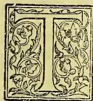

HERE is generally speaking, to the youthful mind a certain glamour surrounding the term Palm, primarily produced perhaps by the frequent mention of the name in holy writ, and the representations of the tree in books and pamphlets written for the young. As a child, the first book I had the patience to read from cover to cover was *Paul and Virginia*, and it was only very recently that I stumbled across a copy of the same book, and read it again with interest. The first reading gave birth to the longing to visit the tropics. This desire grew till I reached the state of manhood, when it was somewhat suddenly gratified, and I set sail in the year 1862 for India.

In those days Palms were not to be seen on "coster's" barrows, otherwise the desire to visit foreign climes for the sake of seeing their Palm-groves might have been somewhat damped. I had visited the Palm-house in the Edinburgh Botanical Gardens, and before embarking at Southampton I paid a hurried visit to Kew. What I saw at these two places only whetted my desire to pursue my journey to the East.

Arrived at Malta, I had the satisfaction of seeing Palms growing, not under glass, but under the sunny sky. Alexandria came next with its cloud of windmills and clusters of Date palms. Then the journey from thence to Cairo revealed a country mostly under water, with the stems of the Date-palms in the numerous groves standing in the flood, and gratefully taking up the reviv-

vifying waters of the Nile, their plumes tossing and waving as it in delight. Bombay, with its limited number of cultivated Coconut Palms brought renewed pleasurable feelings; but Calicut being my destination, I was totally unprepared for the glorious sight of cultivated Coco and other Palms which met my view as I coasted along the Malabar coast for several hundred miles in a native craft.

At first I was puzzled to know what the green belt reaching to the very sea consisted of. Our craft keeping well off shore, it was not till approaching the port of Calicut that I came to know that this broad evergreen band, reaching for so many hundred miles, was made up solely of Palms, the Coconut predominating, of course, with an occasional patch of Areca and other species.

On landing late in the evening I was conducted to the house of a friend situated on rising ground, and commanding a full view of this wonderful Palm zone. I slept that night in an upstairs-room with a spacious balcony, used in these hot climes as a promenade in the mornings and evenings. At daybreak I was aroused from a refreshing sleep by a native servant, who brought me a welcome cup of tea and slice of toast. Light was streaming in by the balcony windows. The sea-breeze had just begun to blow, and I could hear the distant murmur of the waves on the sea-shore, the plaintive screams from the flocks of kites as they flitted past, with heads bent downwards in search of their morning meal. These sounds were all that disturbed the silence of the morning air. As I stepped on to the balcony I shall never forget the sight that presented itself to my gaze. I looked down upon a veritable sea of Palms, gently weaving their

779------------------------------------------------

736THE TROPICAL AGRICULTURIST.[MAY 2, 1898.]

magnificent fronds in the light morning air. The house was surrounded by them, up to the very walls, and as far as the eye could reach nothing but Palms. Monotonous, you may say; yes, but very grand in its monotony! At that moment I thought of Edinburgh and Kew, and smiled. Mine host joined me on the balcony. I did not wish him good morning, but instead exclaimed, "That sight is worth a hundred voyages from Southampton to Malabar!"

It was difficult to imagine oneself in the midst of a thickly native-populated district, the scene having a certain wild appearance about its giving rise to the thought of the calm solitude of the jungle, and the absence of man. This illusion was quickly destroyed by a subsequent walk through the Palm-grove. Then were seen the innumerable native huts, with walls and roofs composed of the trunks and fronds of their loved Coconut Palm, nestling amongst the contorted stems of the growing Palms, and effectually protected from the burning heat of noonday by their glorious crowns of spreading fronds. This Palm, as it is cultivated in these climes, has no pretensions to the straight-stemmed dignity of the Areca, that "arrow-shot from heaven," the Palmyra Date, or Caryota; but the groves of stems appear in wanton entanglement, leaning in all directions, but always with the crowns turned heavenwards.

Occasionally, but not often, does the stem divide eight or ten feet from the ground, and produce two crowns of leaves. I do not think that this Palm is included in the list of sacred trees of the Hindus, but they seem to treat it with the same care and affection as if it were. Sometimes they will build their huts around the stem of a Coco-palm, thus giving the tree the appearance of having grown through the roof. So far as I can remember, it used to be calculated that each Palm-tree yielded, on an average, from nuts and "toddy" about two rupees (four shillings) per annum; so that an acre of Palms calculating 400 trees to the acre, would yield an annual income of £80, no small sum to a native proprietor.

After a week's stay at Calicut, amongst its Palm-groves, Mango, and Breadfruit-trees, I started for my final destination, viz., the Coffee-producing district of Wynad in Malabar. To reach this I had to cross the Western Ghaut chain by a pass in the mountains, and it was thus I first came in contact with tropical vegetation in one of its grandest phases.

Quitting the Bamboo forest at the foot of the mountains, and before reaching the mighty evergreen forest, a belt of sub-arborescent vegetation is encountered. In riding slowly through this I can well remember being struck with the extreme beauty of two plants, viz., *Lagerstroemia Floss-regine*, and *Cycas circinalis*. These were growing in abundance, the first-named being prodigal in display of its superb rose-coloured racemes, and the latter growing in large groups among granite boulders, which it draped with its beautiful fronds. Higher up the western Ghaut, forest proper commences, and continues till the crest of the ridge is reached, some 3,000 feet above sealevel.

The zig-zag road for a considerable way follows the track of a deep ravine, at the bottom of which one could hear the rushing of a mountain stream, but owing to the dense tropical foliage no water was visible. Before reaching the first thousand feet of elevation, an occasional group of tree-ferns was seen on the sides of the ravine, and thorny *Calamus* climbing its way to the

branches of lofty trees, as if to free itself from the dense foliage beneath, and show to the world its crowns of graceful fronds. As a matter of fact, this was the first wild Palm I had ever seen, but it was—though passingly beautiful—opposed in appearance to the ideas in one's mind of the dignified and independent grace of a Palm-tree proper. Reaching the summit of the Ghaut it was but a short ride to the first Coffee plantation, where I rested for a day or two, and where I had my first experience of that warm hospitality so well known amongst Europeans in India. Strange that the manager of this plantation should prove to have been an English gardener, the late Mr. James Boosey, an excellent and successful planter, as well as estimable man.

In going the round of the plantation in the cool of the evening with mine host, I had my first sight of the Caryota Palm in a wild state, which had even a greater interest for me at the time than the surrounding fields of Coffee shrubs, the cultivation of which I had come all the way from England to learn. I saw the noble Palm at its best, a little colony of trees of various heights the tallest bearing heavy masses of fruit, forming a strikingly beautiful appearance. The bipinnate leaves, with their ultimate divisions shaped like the fins and tail of a fish—together with the huge spadices of golden berries hanging from the brown trunks of the highest trees, give them a unique and elegant appearance. Nature, in one of her mysterious moods, has ordained that these wonderful drooping bundles of golden seeds shall be produced on the adult tree first at the top, and eventually at the very foot of the trunk, when the plant dies. She has, however, made ample provision for the reproduction of this beautiful tree by the enormous quantity of seeds produced by each spadix, and the suckers which the tree throws up. This Palm would seem to shun the interior of the dark mountain forests of the western Ghauts, and it chiefly grows on their outer skirts where, so to speak, it obtains the better opportunity for the display of its graceful fronds, and enjoys that necessary light and air which are wanting amidst the gigantic forest vegetation. It is also curious and interesting to find that wherever a homestead is seen on the edges of these forest, and overlooking the rice-fields, the ryot, in addition to such beautiful evergreen trees as the Mango, Orange, Jack, Roseapple, and others, is sure to have his garden furnished with a small colony of the Caryota Palm consisting of from six to eight trees from 70 to eighty feet, down to seedlings of some 2 to 4 feet in height. It is not quite clear whether the ryots have expected these sites for their habitations owing to existing groups of Palms, or have reared the trees from seeds or suckers, but the well-known love of the Hindoo for picturesque spots in or near which to locate his homestead, would justify the opinion that previously existing groups of the Caryota Palm has influenced his choice of a site for his homestead.

On the Nilgherry Mountains there exist a singular race of pastoral folk named Todas, few in number, illiterate, lazy, dirty, immoral, and degraded, and yet these people have admittedly selected the very loveliest and most picturesque spots on all those beautiful mountains for the building of their huts and villages.

That this Palm is known to require plenty of light and air for its development is shown by the fact that when small clearings are made in the forest of Malabar by the jungle tribes for

780------------------------------------------------

MAY 2, 1898.]THE TROPICAL AGRICULTURIST.737

the purpose of cultivating Cardamoms, Caryota urens is sure to make its appearance, together with the young seedling Cardamom plants, doubtless coming into existence from seeds which have lain under the thick coating of vegetable matter together with those of Cardamom, it may be for centuries, awaiting the advent of light and air to effect germination. It is perhaps worthy of mention that Cardamom cultivation in Southern India consists solely in first felling small patches in the great forests, and afterwards simply keeping the brushwood low by one or two yearly cuttings with the billhook, the Cardamom plants appearing in abundance and producing fruit in the course of three years without any other cultivation whatever, or artificial sowing of seed. Yet another proof, I think, may be found that the Caryota will not succeed in the too close proximity of other trees, in the fact that in the Bamboo or deciduous forests which stretch from the foot of the Western Ghauts to the confines of Mysore, occasional patches of evergreen forest occur containing trees exactly similar to those found in the parent forest but completely isolated, and frequently separated by many miles of Bamboo Jungle. The soil, too, of these patches in every way resembles that of the western slopes, and is inlaid, as it were, into the black mould of the Bamboo belt. These isolated clusters of evergreen trees are inexpressibly cool and refreshing to the eye during the hot and dry months of the year, and when the surrounding Bamboo clumps and hardwood-trees have destitute of foliage.

The natives have instinctively fixed upon these beautiful spots for the location of an idol, partly surrounded and protected by a wall of rough stones, so that they are all tinged with the glamour of sanctity; and woe betide the person who dares, in any way, to profane these spots.

I can well remember during my noviciate in the Coffee districts, having, from sheer ignorance of how seriously I was offending, felled a tree on one of these sacred places for the sake of its timber, and being pounced upon by the custodian of the temple in the form of an elaborately dressed Hindoo lady, who first of all abashed and confounded me with a torrent of choice abuse in the Malayalam language, and then demanded the handing over to her, under threat of legal proceedings, of a certain number of rupees, which I was only too fain to do, and thus prevent further trouble. Needless to say, this was my first and last iconoclastic offence.

In each of these romantic spots, and in close proximity to the stone idol, is sure to be found a group of the lovely Caryota urens waving their graceful fronds and, as it were, watching and gazing the natives as they come to worship. Amongst the stones, Ferns of various species have taken hold naturally, but giving the impression that they have been placed there by the hand of man.

This Palm, together with its congener, Caryota sobolifera, is used in England in subtropical gardening, but not to the extent that its graceful beauty would justify. I would dearly like to see a group of this Palm arranged on an English lawn similar to these I have so often stood and admired in the wilds of Malabar.—J. LAWRIE.—

*Gardeners' Chronicle*, April 2.

#### JAMAICA GINGER.

One of the most readable papers which we have seen for a long time is printed in the current issue of the *American Journal of Pharmacy*. It is entitled "In the Land of Ginger," and is written by Mr.

F. B. Kilmer, who has resided in Jamaica for several years. It contains the most graphic account of ginger planting and harvesting which has been printed for many years, and from it we draw the following particulars. Between 25,000 and 50,000 of the Jamaica population depend for their living upon the ginger-crop. The ginger is of two kinds—"blue" and "yellow"—but the plants are botanically indistinguishable; the "yellow" is the better root, being brittle, and more pungent than the "blue," which is tough and fibrous. These, again, are subdivided into "plant" and "ratoon" ginger—the former is ginger planted each season, and the latter is a return crop, secured by leaving a part of the rhizome in the ground at the harvest-time. Ginger is planted in March and April. Pieces of the rhizome, each with an "eye," are planted. Few planters have settled farms; they clear a piece of the forest, burn the weeds, and plough the soil a little, then do the planting. When once in the ground the plant appears to require little attention, except that it must be well watered, and as there is an abundant rainfall in Jamaica no labour in this direction is required. Attempts are rarely made to fertilise the plant, manure being scarce in Jamaica, as there are no stables. The most that is done is to plough in the weeds and cover the ground with banana waste. As an experiment, watering the beds with sea-water and sea-weeds has yielded good results; but the average planter is quite indifferent to scientific cultivation, and this is bad for him, because the soil is impoverished by a few ginger-crops and "dried-up streams, general barrenness—in fact, a wilderness—marks the progress of ginger-culture." The deep-black soil of the virgin forest is where the best quality is produced, and to grow ginger under this condition involves the destruction of large areas of woodlands by fire. This burning is considered of great importance, as potash and other mineral matters contained in the ashes are deposited to sweeten the ground, while the fire also destroys insect pests. In consequence of the many thousands of acres of land destroyed and abandoned in this manner in Jamaica, the local Agricultural Society has been at work since 1895 on worn-out land, and with the aid of suitable artificial manures have had very encouraging results in reclaiming the land. The Society is extending their operations by securing larger plots and giving aid to planters by furnishing manures, &c. The "ginger season," or harvest, is from March to January. When the stalk withers and the bloom has departed, the rhizomes are twisted out of the ground with a fork, and operation which takes long practice to become expert in. After the soil and fibrous roots have been removed, the root-stalk is thrown into water, when it is ready for the peeling-operation. "Peeling-matches," in which the planter gets all his friends to join, are a time of much merry-making in the sable community. The peeling is mostly done by experts with the aid of a simple knife. So far peeling-machinery has been a complete failure. The operation is an all-important one, as may be seen from examination of a transverse section of ginger. First there is an outer striated skin, under which are numerous layers of thin-walled cork cells. The oil contained in these cells in fresh specimens is very pungent, exceedingly aromatic, and almost colourless. As this corky layer contains the greatest amount of oil and resin cells, the deeper the peeling is made so much more of these substances are carried away with the

781------------------------------------------------

738THE TROPICAL AGRICULTURIST.[MAY 2, 1898]

epidermis. When peeled, the roots are thrown into water and washed; the purer the water the whiter is the product. Sometimes limejuice is used in the wash-water, which gives a whiter root, but as the lime-juice contains saccharine matter and pectose, it prevents drying, and mildew follows. After washing, the rhizomes are dried in the sun, and in from six to eight days they become thoroughly dry. At sunrise the ginger is put out upon a barbecue (platform of stone or concrete), turned over at mid-day, and taken in at sunset. The average loss of weight by drying is nearly 70 per cent. Experiments have been made with calcium chloride as a drying-agent, but the result was not equal to the native method, and the same may also be said of American fruit-evaporators, in which wood is used as the source of heat. It has been asserted that it is a common practice to bleach ginger with the fumes of chlorine or sulphurous acid, but Mr. Kilmer states that no instance of it is known in Jamaica, as the planters are unintelligent, and are opposed through prejudice to innovations. Mr. Kilmer tried chlorine gas as a bleaching-agent, but the product was of a dirty yellow colour. When the crop is fully dried it is carried, mostly by women, to the place of sale, which may be from five to forty miles distant. Here it is sold by the "heap," not by measure or weight. A "heap" of ginger varies considerably, according to the law of supply and demand. If the "hands" are finely shaped and large, there are fewer in the heap; if small, dark, and snarly, the pile is made larger. Should the price of ginger in London or New York advance it is because the heaps in Jamaica have been diminished, and should the price go down the heaps have become larger. The exporters of ginger assort the produce into four or five grades, the highest being the large-sized hands of light and uniform colour, the lowest being the ratoon finger sorts, which are small, soft, and lacking flavour. Some of the hands weigh as much as 8 oz. The amount of ginger exported from the island during the last ten years was as follows:—

<table border="1">
<thead>
<tr>
<th></th>
<th>lbs.</th>
<th></th>
<th>lbs.</th>
</tr>
</thead>
<tbody>
<tr>
<td>1887 .. ..</td>
<td>1,121,827</td>
<td>1892 .. ..</td>
<td>1,822,531</td>
</tr>
<tr>
<td>1888 .. ..</td>
<td>1,141,877</td>
<td>1893 .. ..</td>
<td>1,526,884</td>
</tr>
<tr>
<td>1889 .. ..</td>
<td>1,002,653</td>
<td>1894 .. ..</td>
<td>1,672,384</td>
</tr>
<tr>
<td>1890 ½ year</td>
<td>554,193</td>
<td>1895 .. ..</td>
<td>1,736,460</td>
</tr>
<tr>
<td>1891 .. ..</td>
<td>1,219,197</td>
<td>1896 .. ..</td>
<td>1,960,609</td>
</tr>
</tbody>
</table>

Half of this goes to the United States. An average crop may be estimated at from 1,000 to 1,500 lbs. dried ginger per acre, and in some cases 2,000 lbs. As already mentioned, the Jamaica Agricultural Society is improving the methods of cultivation by fertilisation, and from information recently to hand it is predicted that the crop now about to be gathered will probably be a record one, partly due to an abundant rainfall. This will mean lower prices for the ginger-planter.—*The Chemist and Druggist.*

## BEANS: A FEW PRACTICAL SUGGESTIONS FOR THEIR CULTIVATION AND UTILISATION.

The very mention of the word "Beans" makes the mouths of sea-faring men (yankees in particular) water as they think of the delicious pork nesting in its steaming bed of 'baked beans,' a delicacy seldom dreamed of by shore-folk on the east of the huge Atlantic.

To the medical mind the word is associated with the recollection of several drugs, such as Calabar bean, St Ignatius bean, Malacca and Carthageana beans, and a number of other vegetables whose only resemblance to the true bean or *faba* was either the shape of the seed or the fact of the seed having been enclosed in a seed-pod and to which the affix *faba* (meaning to feed) had been erroneously fitted.

An attempt has also been made by some authorities to include Soja Hispida, Cajanus, Dholl, the flat varieties of peas and many of the lentil family under the generic name of beans; simply because they, like beans, have been called and dietetically spoken of as 'pulses' and pulses embrace an enormous group of farinaceous seeds such as peas, lentils, maize, dholls, beans etc., all of which contain a large proportion of nitrogenous matter for avail by the animal creation.

But such a classification is erroneous in the extreme; as these several plants *materially* differ not only in their constitution, life-history, and botanical standing, but also in the chemical composition of their seeds, as may be seen by the subjoined table which shows the percentage of the various constituents of the flour obtained by pulverising the mature dry seeds.

<table border="1">
<thead>
<tr>
<th>Kind of Pulse.</th>
<th>Nitrogenous matters.</th>
<th>Starchy matters.</th>
<th>Fat.</th>
<th>Mineral matters.</th>
<th>Water.</th>
</tr>
</thead>
<tbody>
<tr>
<td>Kidney bean</td>
<td>26.9</td>
<td>49.9</td>
<td>2.0</td>
<td>4.946</td>
<td>16.0</td>
</tr>
<tr>
<td>French bean</td>
<td>27.3</td>
<td>48.84</td>
<td>2.0</td>
<td>5.212</td>
<td>13.5</td>
</tr>
<tr>
<td>Broad bean</td>
<td>27.00</td>
<td>52.6</td>
<td>1.6</td>
<td>5.08</td>
<td>12.8</td>
</tr>
<tr>
<td>Soja Hispida</td>
<td>38.83</td>
<td>26.65</td>
<td>1.51</td>
<td>4.14</td>
<td>10.25</td>
</tr>
<tr>
<td>Dolichos</td>
<td>23.27</td>
<td>59.38</td>
<td>2.20</td>
<td>3.19</td>
<td>12.03</td>
</tr>
<tr>
<td>Masoor Dholl</td>
<td>25.15</td>
<td>59.85</td>
<td>1.26</td>
<td>1.92</td>
<td>11.84</td>
</tr>
<tr>
<td>Lentils</td>
<td>25.2</td>
<td>58.4</td>
<td>2.6</td>
<td>2.3</td>
<td>11.5</td>
</tr>
<tr>
<td>Pisum Sativum</td>
<td>27.96</td>
<td>56.36</td>
<td>1.47</td>
<td>2.48</td>
<td>11.79</td>
</tr>
<tr>
<td>Cajanus Indica</td>
<td>22.18</td>
<td>62.13</td>
<td>1.95</td>
<td>3.11</td>
<td>10.63</td>
</tr>
</tbody>
</table>

One of the most prolific of the vegetable world and almost the most useful as a food stuff, but yet the most neglected in India, is the Bean of which there are more than four hundred varieties, all of which however belong to the natural order *Leguminosæ* of the class *Diadelphia* and the order *Decandra*.

### USES

The leaves, legumes and seeds are freely used as delicacies in company with meat or rice, in the shape of boiled vegetables, greens and curries; but the dried seeds are not largely indulged in as human food nor do the Indians live on them exclusively for the simple season that the crops sown are not very extensive and the supply of the nearly matured or young beans is in no way equal to the market demand for them.

As a cattle food, the *Dolichos Ghotwal* is the only one of the bean tribes that is popular; but even then this popularity does not extend beyond the Madras Presidency and the Mysore, Coorg and Carnatic Districts; because of the caste prejudices of the people who adhere to whatever their forefathers did in the way of stock-raising and foddering cattle.

The flowers contain considerable amounts of saccharine and starchy matter which might be turned to advantage for the production of alcohol or ensilage; but they are allowed to go waste in most places. The *Todas*, however, a semi wild tribe occupying some of the forest-lands in the Nilgherries collect the flowers of the wild varieties, mix them with various herbs and berries, add sugar and water, and from this mixture, prepare a kind of mild *arrack* by fermentation.

The leaves and stems which are rich in soluble salts make excellent fodder for cattle and might be stored up as such; but with the usual wastefulness

782------------------------------------------------

MAY 2, 1893.]

THE TROPICAL AGRICULTURIST.

739

of the ryot they are thrown away or perchance left to rot on the fields for manuring purposes; a bad proceeding as the manure value they return to the soil could easily be added at very little expense—certainly not a fiftieth of the commercial loss sustained by the non-utilization of these stems and leaves.

The *chlorophyll* from the green leaves and unripe legumes is pretty largely used to impart a fine green colour to sweetmeats and other toothsome delicacies, but it is not extracted to any commercial extent; and during this extraction of the coloring matter by the sweetmeat manufactures, a great deal of valuable matter in the shape of starch and sugar is lost.

*Bean flour* has frequently been used for the adulteration of wheat flour, but the cheat can readily be detected by throwing a little of the suspected meal into boiling water when the peculiar smell of the bean flour is almost instantly apparent, if it has been used.

Any doubt, however, can be easily removed by the aid of the microscope; for while the meshes of bean cellulose are very much larger than those of the fourth coat of wheat, the starch, which belongs to (class II. to which also belong the pea, darsi and mazie) is quite distinct and is composed of oblong oval (rarely reniform) granules, averaging 0.00135 inch, long diameter, and in which concentric rings or layers are all but invisible and the hilum is stellate.

*Alcohol* is not recovered from beans in India, but on the continent of Europe a very brisk trade is done in this commodity which afterwards finds its way to India in the form of cheap spirits and very often as the menstruum of the so-called No. I Brandy and Whisky.

*Starch*—Laboratory experiments prove that starch of an excellent quality may be recovered from beans in precisely the same mode as from wheat and other grains, but lack of energy and the extreme difficulty to secure capital for plant and necessary machinery combine to prevent this useful substance assuming commercial proportions, and in this way no encouragement is held out towards the cultivation of beans.

CULTIVATION.

*Season for planting* :—Indian or country beans should be sown at the beginning of the second week of May and so also many of the varieties of *Dolichos* and *ervum*; but creeping or runner beans such as the broad bean and scarlet runner etc. should not be put down before July, while English and French beans, kidneys and the delicate sorts of *Phaseolus* and *Vicia* may be sown at any time during October to December, yet far more healthy plants and luxuriant crops are obtained when the planting is done immediately after the cessation of the rains.

The reason why sowing should not be done within the rainy season is that as soon as a seed begins to sprout it depends for existence on the starch and gluten stored up in the cotyledons which under the influence of sufficient moisture are respectively converted into sugar and diastase and the latter helps the sap of the tender plant to dissolve, and utilise the starch; but under the influence of excessive moisture the farnia expanding too rapidly, germination is pushed forward long before its proper time and weak, unhealthy plants are the result or the continued action of the water on the seed may so thoroughly ret it as to utterly prevent germination.

*Sowing*, as it is done by the ryots, is a mistake because they cast the seeds on to the fields where the birds pick up a good quantity and a considerable number get destroyed by the action of the sun and air, while of the 60 or 70 per cent. that do find their way into the ground, about another 5 to 10 per cent are choked up by the time the plummets shoot out by having been cast too closely together; besides this too, little attention is paid to the condition of the soil or to the proper rotation of crops.

Soils not only sustain the plant in an erect position and afford it food but also are the medium of the various chemical actions necessary to the preparation of the proximate principles of which plants are built up.

No matter what part they are destined to play in the economy of nature or how diverse their appearance, structure and life-history, the whole of the vegetable world is composed of the same organic elements in varying proportions and from 2 to 9 per cent of inorganic matter of which the greater part consists of varying proportion of alumina, the alkalies, iron and silica in combination with carbon dioxide, chlorine, vitriol, and phosphoric acid.

Now as the organic matter is derived partly from the air and partly from the ground, while the whole of the inorganic substances are obtained solely from the earth, it stands to reason that the soil should bear a distinct relation to the substances composing the plant it is required to sustain, and any excess or deficiency of any necessary constituent must be compensated or regulated, if we wish to have successful crops and healthy fruitful plants.

Due allowance must also be made for the impoverishing action that plants exert on the soil by abstracting from it various important constituents that they require for their own nutrition and development.

By studying the subjoined analysis of the common bean (*Phaseolus vulgaris*) and remembering that the constitution of various plants depends greatly on the materials on which they are constructed the reader will understand the loss the ground must suffer.

<table border="1">
<thead>
<tr>
<th>Phaseolus Vulgaris.</th>
<th>Roots.</th>
<th>Leaves and Stems.</th>
<th>Seed.</th>
</tr>
</thead>
<tbody>
<tr>
<td>Organic matter</td>
<td>80.74</td>
<td>74.46</td>
<td>78.80</td>
</tr>
<tr>
<td>Water</td>
<td>14.21</td>
<td>19.28</td>
<td>16.09</td>
</tr>
<tr>
<td>Percentage of ash (i.e. minerals)</td>
<td>2.86</td>
<td>2.01</td>
<td>2.51</td>
</tr>
<tr>
<td colspan="4">100 parts of such as will contain:—</td>
</tr>
<tr>
<td>Carbonic acid</td>
<td>1.79</td>
<td>1.20</td>
<td>1.63</td>
</tr>
<tr>
<td>Chlorine</td>
<td>2.15</td>
<td>1.56</td>
<td>1.96</td>
</tr>
<tr>
<td>Iron sesquioxide</td>
<td>0.72</td>
<td>0.52</td>
<td>0.65</td>
</tr>
<tr>
<td>Lime</td>
<td>13.26</td>
<td>9.65</td>
<td>12.06</td>
</tr>
<tr>
<td>Magnesia</td>
<td>6.60</td>
<td>4.80</td>
<td>6.00</td>
</tr>
<tr>
<td>Phosphoric acid</td>
<td>37.11</td>
<td>26.99</td>
<td>33.74</td>
</tr>
<tr>
<td>Potash</td>
<td>40.39</td>
<td>29.38</td>
<td>36.72</td>
</tr>
<tr>
<td>Silica</td>
<td>1.67</td>
<td>1.22</td>
<td>1.52</td>
</tr>
<tr>
<td>Soda</td>
<td>1.53</td>
<td>1.25</td>
<td>1.44</td>
</tr>
<tr>
<td>Sulphuric acid</td>
<td>3.65</td>
<td>3.32</td>
<td>4.28</td>
</tr>
</tbody>
</table>

Or in other words every maund (i.e., 80 lbs.) weight of bean-plants raised, denuded the ground of the quantity of material shown in column A of the following table in which the figures under B represent the amount restored by the Indian system of burning such part of the stems &c., as they do not otherwise utilise and scattering the ashes over the ground. Column C gives the loss still sustained.

<table border="1">
<thead>
<tr>
<th></th>
<th>A.</th>
<th>B.</th>
<th>C.</th>
</tr>
</thead>
<tbody>
<tr>
<td>Carbonic acid</td>
<td>0.045</td>
<td>0.008</td>
<td>0.037</td>
</tr>
<tr>
<td>Chlorine</td>
<td>0.056</td>
<td>0.022</td>
<td>0.034</td>
</tr>
<tr>
<td>Iron sesquioxide</td>
<td>0.018</td>
<td>0.007</td>
<td>0.011</td>
</tr>
<tr>
<td>Lime</td>
<td>0.349</td>
<td>0.139</td>
<td>0.277</td>
</tr>
<tr>
<td>Magnesia</td>
<td>0.174</td>
<td>0.068</td>
<td>0.106</td>
</tr>
<tr>
<td>Organic Matter</td>
<td>60.840</td>
<td>24.920</td>
<td>35.920</td>
</tr>
<tr>
<td>Phosphoric acid</td>
<td>0.928</td>
<td>0.371</td>
<td>0.557</td>
</tr>
<tr>
<td>Potash</td>
<td>1.064</td>
<td>0.425</td>
<td>0.639</td>
</tr>
<tr>
<td>Silica</td>
<td>0.044</td>
<td>0.017</td>
<td>0.027</td>
</tr>
<tr>
<td>Sulphuric acid</td>
<td>0.112</td>
<td>0.044</td>
<td>0.078</td>
</tr>
<tr>
<td>Soda</td>
<td>0.042</td>
<td>0.016</td>
<td>0.026</td>
</tr>
<tr>
<td>Total in lb.</td>
<td>63.612</td>
<td>26.037</td>
<td>37.635</td>
</tr>
</tbody>
</table>

Suppose this was allowed to go on year after year and nothing were done to remedy the loss in some scientific mode, the most fertile ground would be rendered perfectly barren as may be seen by the

783------------------------------------------------

740THE TROPICAL AGRICULTURIST[MAY 2, 1898.]

subjoined statement of the average composition of some of the Indian soils.

<table border="1">
<thead>
<tr>
<th rowspan="2">Source of soil :-</th>
<th rowspan="2">Ootacamund</th>
<th colspan="3">Calcutta.</th>
</tr>
<tr>
<th>Bangalore.</th>
<th>Town.</th>
<th>Suburbs.</th>
</tr>
<tr>
<th>Reference numbers.</th>
<th>1</th>
<th>2</th>
<th>3</th>
<th>4</th>
</tr>
</thead>
<tbody>
<tr>
<td>Fine earthy and organic matter</td>
<td>92.82</td>
<td>85.42</td>
<td>62.16</td>
<td>84.26</td>
</tr>
<tr>
<td>Sand and silicates</td>
<td>4.95</td>
<td>13.62</td>
<td>37.64</td>
<td>15.43</td>
</tr>
<tr>
<td>Soluble saline matter</td>
<td>2.23</td>
<td>0.96</td>
<td>0.20</td>
<td>0.31</td>
</tr>
<tr>
<td>100 parts of this fine earthy and organic matter contained :-</td>
<td></td>
<td></td>
<td></td>
<td></td>
</tr>
<tr>
<td>Alumina</td>
<td>5.97</td>
<td>5.32</td>
<td>8.87</td>
<td>5.01</td>
</tr>
<tr>
<td>Ammonia</td>
<td>0.14</td>
<td>0.09</td>
<td>0.06</td>
<td>trace.</td>
</tr>
<tr>
<td>Carbonic acid</td>
<td>4.62</td>
<td>3.92</td>
<td>0.12</td>
<td>2.21</td>
</tr>
<tr>
<td>Chlorine</td>
<td>2.01</td>
<td>1.99</td>
<td>0.11</td>
<td>0.23</td>
</tr>
<tr>
<td>Iron oxide</td>
<td>5.94</td>
<td>4.84</td>
<td>6.26</td>
<td>3.08</td>
</tr>
<tr>
<td>Lime</td>
<td>6.12</td>
<td>5.24</td>
<td>10.62</td>
<td>4.21</td>
</tr>
<tr>
<td>Magnesia</td>
<td>0.92</td>
<td>0.87</td>
<td>0.14</td>
<td>0.52</td>
</tr>
<tr>
<td>Manganese oxide</td>
<td>0.16</td>
<td>0.28</td>
<td>Nil.</td>
<td>Nil.</td>
</tr>
<tr>
<td>Organic matter</td>
<td>10.46</td>
<td>9.04</td>
<td>4.00</td>
<td>6.14</td>
</tr>
<tr>
<td>Phosphoric acid</td>
<td>0.68</td>
<td>0.45</td>
<td>Nil.</td>
<td>0.17</td>
</tr>
<tr>
<td>Potash</td>
<td>0.32</td>
<td>0.31</td>
<td>0.04</td>
<td>0.12</td>
</tr>
<tr>
<td>Silica</td>
<td>53.53</td>
<td>60.81</td>
<td>69.56</td>
<td>76.02</td>
</tr>
<tr>
<td>Soda</td>
<td>0.81</td>
<td>0.42</td>
<td>0.09</td>
<td>0.24</td>
</tr>
<tr>
<td>Sulphuric acid</td>
<td>0.24</td>
<td>0.21</td>
<td>trace</td>
<td>0.07</td>
</tr>
<tr>
<td>Water and loss</td>
<td>8.08</td>
<td>5.47</td>
<td>0.09</td>
<td>1.98</td>
</tr>
</tbody>
</table>

No. 1 is an exceedingly rich soil that would easily give three successive bean-crops without requiring to be manured. No. 2 is also a fertile soil needing however a little toning. No. 3 has too much lime and is deficient in soluble salts and organic matter while No. 4 which would be a capital soil for floriculture requires to be brought up to standard in its lime and the soluble alkali before it can be successfully used for vegetables.

Here then comes the necessity for the reciprocity of labour between the cultivator and the chemist; for without the assistance of the latter is merely impossible for the former to judge with any degree of certainty as to what is really in excess or deficit, and in nine cases out of ten a heap of good money is thrown away in purchasing a manure that does not happen to be what was really needed.

Damp land being generally unproductive, efficient draining is necessary and is greatly helped by ploughing, but *after* the land has been drained there is nothing to equal deep-ploughing to bring new mineral manure to the surface and in very many cases this alone works marvels with supposed fallow-land.

If, however, manuring is necessary, the farmer must consider the sort of crop he intends to sow and regulate the manure accordingly from :-

(1) *Animal* manures such as blood, muscle, bones, horn, hair, wool, stable droppings and farm ordure, pigeons, dung guano, urine, sewage and night soil; but though the last is the most valuable it is not approved of by the Indian cultivator.

(2) *Mineral* manures as marl, lime, shell-sand, gypsum, salt, kelp, sulphate of magnesia, glauber's salts, chloride of potassium, nitrates, gas liquors, mixtures of saline manures with each other or with animal manures, and a number of patents.

(3) *Vegetable* manures which may be applied green or dry. Among these are sea-weeds, mill-siftings and sweepings, saw-dust, straw, husks, charcoal powder, tanner's waste, barks, &c.

Animal manures are the most energetic on account of the nitrogen and ammoniacal salts they contain, and *green* vegetable matter yields a speedy supply of food to the growing plants, by under going rapid decay; but *dry* vegetable manures act more permanently on the ground and mineral manures, if applied with special reference to the constitution of the soil they are required to improve or renovate, tend to early harvests with a plentiful yield and *perfect* fruit and seeds.

But though the farmer has a large variety of materials to choose from, he is perfectly helpless and runs the risk not only of spoiling his land and damaging his crops but also losing a large amount of money by studying the false economy of 'dodging the Chemist' out of his Rs. 6 to 10 as. analytical fee, and spending R40 to R100 in buying the wrong sort of manure, to thus depreciate his crop by perhaps three or four thousand rupees.

There is a huge volume of truth in the adage "Each to his own trade or profession; but no poaching on others' provinces" and if the cultivators would only combine to pay Rs. 6 per annum per capita, they could maintain a first class agricultural chemical laboratory that would save them from the loss of thousands of rupees on the purchase of useless materials and on futile experiments.

The following table gives the cost, composition and relative value for hundred-weight of the most reliable 'quick' manures, and they are available in very large quantities in India

<table border="1">
<thead>
<tr>
<th rowspan="2">Constitution of :-</th>
<th colspan="2">Humus or</th>
<th rowspan="2">Sewage or Foulrette.</th>
<th rowspan="2">Triplica.</th>
</tr>
<tr>
<th>Leaf mould.</th>
<th>Bones.</th>
</tr>
</thead>
<tbody>
<tr>
<td>Alumina</td>
<td>1.94</td>
<td>1.33</td>
<td>0.98</td>
<td>2.58</td>
</tr>
<tr>
<td>Ammonia</td>
<td>2.29</td>
<td>2.67</td>
<td>7.37</td>
<td>6.24</td>
</tr>
<tr>
<td>Carbonic acid</td>
<td>7.42</td>
<td>4.95</td>
<td>6.08</td>
<td>5.48</td>
</tr>
<tr>
<td>Chlorine</td>
<td>1.21</td>
<td>0.22</td>
<td>6.84</td>
<td>0.54</td>
</tr>
<tr>
<td>Fluorine</td>
<td>0.07</td>
<td>0.48</td>
<td>nil</td>
<td>0.79</td>
</tr>
<tr>
<td>Iron Salts</td>
<td>1.98</td>
<td>1.19</td>
<td>2.44</td>
<td>10.07</td>
</tr>
<tr>
<td>Lime</td>
<td>6.27</td>
<td>25.17</td>
<td>0.95</td>
<td>20.68</td>
</tr>
<tr>
<td>Magnesia</td>
<td>0.59</td>
<td>1.04</td>
<td>0.59</td>
<td>1.51</td>
</tr>
<tr>
<td>Manganese</td>
<td>0.16</td>
<td>0.45</td>
<td>0.09</td>
<td>0.64</td>
</tr>
<tr>
<td>Organic matter</td>
<td>28.33</td>
<td>22.07</td>
<td>56.85</td>
<td>22.81</td>
</tr>
<tr>
<td>Other salts</td>
<td>22.49</td>
<td>0.34</td>
<td>1.32</td>
<td>1.09</td>
</tr>
<tr>
<td>Phosphoric acid</td>
<td>2.14</td>
<td>41.08</td>
<td>1.93</td>
<td>20.74</td>
</tr>
<tr>
<td>Potash</td>
<td>1.49</td>
<td>0.15</td>
<td>2.96</td>
<td>1.77</td>
</tr>
<tr>
<td>Siliceous matter</td>
<td>8.53</td>
<td>2.21</td>
<td>2.25</td>
<td>10.90</td>
</tr>
<tr>
<td>Soda</td>
<td>2.66</td>
<td>0.76</td>
<td>4.06</td>
<td>1.16</td>
</tr>
<tr>
<td>Sulphuric acid</td>
<td>0.96</td>
<td>0.64</td>
<td>6.62</td>
<td>2.92</td>
</tr>
<tr>
<td>Undetermined Solids</td>
<td>1.26</td>
<td>0.35</td>
<td>0.79</td>
<td>Nil</td>
</tr>
<tr>
<td>Water or moisture</td>
<td>42.28</td>
<td>8.50</td>
<td>9.98</td>
<td>1.14</td>
</tr>
<tr>
<td>Easily soluble and ready for immediate avail</td>
<td>28.79</td>
<td>22.91</td>
<td>25.22</td>
<td>27.09</td>
</tr>
<tr>
<td>Slowly dissolved and for permanent effect</td>
<td>12.46</td>
<td>73.80</td>
<td>74.99</td>
<td>80.85</td>
</tr>
<tr>
<td>Cost per cent. Rs.</td>
<td>1½</td>
<td>3½</td>
<td>9</td>
<td>6</td>
</tr>
<tr>
<td>Relative quantity wanted in cwt.</td>
<td>8</td>
<td>3¾</td>
<td>1½</td>
<td>1</td>
</tr>
<tr>
<td>Therefore actual costs on equal conditions Rs.</td>
<td>12</td>
<td>11½</td>
<td>12</td>
<td>6</td>
</tr>
</tbody>
</table>

*Sowing* :- Two methods are suggested (a) direct sowing by casting the prepared seed into furrows 2 to 3 inches deep and (b) transplanting after the plumule has grown to nearly two inches high and the cotyledon leaves have dropped off or are about to fall off; but while in the first case it is wisest to 'cast' through a cocoanut-shell or wooden ladle drilled with an inferior hole just large enough to let the seeds run through in a very thin stream, in the latter form the plants should not be placed closer than six inches apart.

*Preparing the seed* :- If a rough examination show the presence of weevils, a thin sheet of vapour of bisulphide of carbon passed through the seed-boxes will soon get rid of these pests; but the seed will have to be aired for at least three hours in a moderately warm place to drive off the sulphide vapours before submission to the next process which consists in throwing them into cisterns carrying water containing corrosive sublimate in the proportion of one grain to the gallon of water. Here they remain for 24 hours so as to give the good seeds germinating impetus and float off the unsound ones, as well as to protect them from mould and ground larvae.

The seeds for direct planting are shovelled into the aprons of the 'sowers' for 'casting' while those intended for transplanting are transferred to nursery beds and lightly covered over with sand containing a small percentage of the soil in which they are to be afterwards placed. Here they are watered twice a day till the

784------------------------------------------------

MAY 2, 1898.]THE TROPICAL AGRICULTURIST.741

cotyledons rise half-way out of the ground, when the watering should not exceed once daily (gradually decreased, after planting out, to once in two days). This watering should be done with a rose-tipped can, and where available a spray is preferable. A mild day should be chosen for the transplanting during which at least one inch of the stem should be buried with the roots and the earth lightly pressed in. Begin in the afternoon and work on till sun down, so as to give the young plants all night to recover from the shock, and if they sicken, (as they will do for the first three or four days), sprinkle them with water containing nearly 0.001 per cent. of nitre which is a wonderful pick-me-up. When the plants begin to flower, lessen the water-supply and altogether stop when the bean-pods mature.

When the plants of the running or climbing varieties are nearly five inches high, supply them with climbing fences made of any kind of slender twigs that may be cheapest obtainable in a dry condition; but on no account resort to bamboo fencing which is apt to become a breeding pen for innumerable destructive insects and is particularly liable to a fungous disease which is fatal to bean plants.

Regularly overhaul the bean beds for slugs and caterpillars, and if the roots are at all denuded, earth them, taking care not to wound the roots. If the immature (*i.e.* young) beans are required for table, go over the beds carefully and snip off (do not pull) those only whose legumes are at least three-fourths ready for seeding, and do not water the plants on that day.

*Harvest* is betokened by the leaves beginning to fall off and the legumes, losing their chlorophyll, becoming pale and dry rapidly; and if ungarnished they will burst and discharge their contents on the ground. This must be guarded against by sending men into the fields with large huckster baskets into which are thrown the plants as fast as they are rooted up.

Those plants whose pods are not fully matured are left standing for two, three or more days till they do mature, and a practised hand will lose very few beans during the process of 'jerking' (*i.e.* up-rooting) the plant out of the ground.

Those beans that are required for a future sowing are allowed to "tree ripe," *i.e.* get thoroughly dry on the living plant before they are gathered.

Now remove the huckster panniers to a place where the floor is properly *laped* (plastered with cow-dung mixed with clay) and swept clean. On this empty the contents of the panniers till a heap of nearly two feet high is obtained. Then this heap is to be turned over four or five times for two days or more under a hot sun, so as to dry it and help to burst the pods. The thresh the bean seeds out with flails or by making cattle or men run to and fro over the heap and then winnow off the shreds of husk.

*Storing*:-The beans thus harvested may be packed in two maund (*i.e.* 160 lb.) sacks, which, until they are wanted for market, should be kept on some elevated and dry place to guard against the ravages of rats and protect them from getting damped and spoiled. Or they may be immediately bulked in iron tanks whose mouths should be sealed down to keep out weevils and other insects.

The seed-beans should be thoroughly dried and then placed in bottles or earthen jars, which after being closely stoppered and sealed ought to be stowed away (till sowing time) in a moderately warm but *dark* place.

The bean straw may be used as cattle fodder and the roots and harder portions of the stems should be thrown into a pit, covered over with about a foot of earth and daily moistened with water and stable fluids, so that, by the time next ploughing season comes round, they will have decomposed into an extremels valuable and highly fertilising top-dressing for the next crop, which should preferably be of oats or barley.

Pay particular attention to the nature of the soil and the proper rotation of crops, always remembering that the same kind of crop should not be raised on the same ground for two or more successive seasons,—no matter how rich the original soil—without fresh manuring.

ROGER S. CHEW, M.D., C.M., M.S.C.

## LIBERIAN COFFEE AND INSECT PESTS.

H.E. THE GOVERNOR, WINDWARD ISLANDS, TO THE SECRETARY OF STATE FOR THE COLONIES.

GRENADA, 4th December, 1897.

Sir,—I have the honour to transmit an extract from a letter I received on the 25th ultimo from Mr. G. Whitfield Smith, of this Colony, on the subject of the injury done here to Liberian coffee by a scale insect, some of which, on diseased leaves, I enclose for examination and report. I am collecting specimens of this insect in all its stages for identification.

2. Heretofore Liberian coffee has been looked upon as proof against any blight or insect attack. In view of its wide culture in every part of the world, it would be indeed a sad awakening to find the contrary.

3. In 1875 some trees are Liberian coffee, in its home, Liberia were affected by the *Hemileia vastatrix*. The effect was similar to what is described by Mr. Whitfield Smith. As regards the trees here, no extensive injury was experienced, nor have I heard since of any loss from the like cause.

4. May I invite a reference on this important matter to the Director, Royal Gardens Kew.—I have, etc., ALFRED MOLONEY, Governor.

EXTRACT FROM A LETTER FROM MR. G. WHITFIELD SMITH TO THE GOVERNOR, DATED 24TH NOVEMBER, 1897

—"I also forwarded some diseased Liberian coffee leaves. As Your Excellency will observe, these are attacked by a scale insect. When I first noticed it, some months ago, it was very scattered and seem to do little harm, but of late it has spread rapidly, and now seriously affects the health of the trees. It occurs on plants growing in the open as well as on those under shade and the trees attacked gradually lose their branches. Hitherto Liberian coffee has been considered proof against insect pests, and I thought Your Excellency would like to know of this, especially as there is a chance of the disease becoming a serious evil if it finds a suitable object of attack in the Liberian coffee."

DIRECTOR, ROYAL GARDENS, KEW, TO C. P. LUCAS, ESQ., COLONIAL OFFICE, LONDON.

Royal Gardens, Kew, 12th January, 1898.

Sir,—I have the honour to acknowledge the receipt of your letter of December 30th (2739/97) enclosing copy of a despatch from the Governor of the Windward Islands with specimens of diseased leaves of Liberian coffee. 2. On examination here it was found that these leaves exhibited no trace of "coffee-leaf disease" (*Hemileia vastatrix*) or of any other fungus. 3. I observe that in the 3rd paragraph of his despatch Sir Alfred Moloney makes the following statement:—"In 1875 some trees of Liberian coffee, in its home, Liberia, were affected by the *Hemileia vastatrix*. The effect was similar to what is described by Mr. Whitfield Smith," *i.e.*, apparently to that exhibited by the diseased leaves accompanying the despatch. 4. As the matter is of great importance I may say at once that the effect is not in the least similar. The Coffee-leaf disease is a fungus which speedily destroys the tissues of the leaf and causes it to fall prematurely. The Grenada Liberian coffee, on the other hand, as Mr. Whitfield Smith correctly states, is "attacked by a scale insect." As a matter of fact, two distinct kinds have been detected:—(1) The circular scale, *Aspidiotus articulatus*, which is also found on the West Coast of Africa (Lagos); (2) the long narrow scale, chiefly on the ribs of the leaves, *Ischnaspia nitiformis*, which is very common in the West Indies and is also found in England. 5. These scale insects, though no doubt injurious, are not to be compared for a moment as a source of danger to coffee cultivation to the coffee-leaf disease. You are aware that the progress and distribution throughout the world of this scourge to coffee cultivation has been watched by Kew with assiduous care. Originating about 1869 in Ceylon it spread to the Malayan Archipelago in 1876, to Fiji in 1879, to Mauritius in 1891, to Natal in 1894 ("Kew Bulletin," 1893

785------------------------------------------------

742THE TROPICAL AGRICULTURIST.[MAY 2, 1898.]

p. 362), and to German East Africa in 1894. But, as I stated in my letter of 16th December, 1896, it is not known to exist in the West Africa Colonies. Added to this, Liberian coffee is found to be only moderately affected by it. I cannot but think, therefore, that all probability is opposed to the correctness of Sir Alfred Moloney's statement that the disease existed in Liberia in 1875, as Eastern Africa was not affected till nearly ten years later. I should be glad to know on what precise evidence Sir Alfred Moloney bases it. If true, it seals the fate of coffee cultivation on the West Coast and seriously imperils that in the new world. 6. I enclose a memorandum of the most approved method of treatment for dealing with scale insects. 7. A honorarium of one guinea (£1 1s.) is due to Mr. W. F. Blandford (whose address is 48, Wimpole Street, W.) for his assistance in the matter.—I am, etc., W. T. THISSELTON DYER.

#### MIXTURE FOR DESTROYING SCALE INSECTS.

Heat milk nearly to boiling point and mix with double the quantity of kerosene; stir briskly until a thick creamy liquid is obtained. Dilute with ten times the quantity of water. Spray or apply with a brush, keeping the mixture constantly stirred.

Sour milk is as efficient as fresh.

If milk cannot be obtained, or if the mixture is required in large quantity, a strong soap emulsion may be used in its place.

COPY OF MINUTE BY THE DIRECTOR OF GARDENS,

SINGAPORE.

Hor. Colonial Secretary.

The scale insect is by no means rare here on Liberian coffee. It is usually a sign of weakness of the plant from want of nourishment. Liberian coffee is liable to a great many kinds of insect and fungus pests.—H. N. R., —*Selangor Government Gazette*.

#### ANOTHER COFFEE PEST.

I am afraid from what I see and hear, that a good deal of harm has been done to our coffee in more districts than one in a new way. The underside of the leaf becomes of a reddish tinge, it spreads rapidly, and soon affects the whole vitality of the coffee bush. I have pointed out to many fellow-planters, that where you have this, you have invariably a very small greenish white, louse-like insect. It has been maintained by some, that the injury must be caused by a fungus, (it is certainly not the *Hemitelea vastatrix*,) but I contend that the original damage is done by this insect. I have several times observed a rather larger, dark grey insect in the same leaves, and I was almost sure from the first, that these were thrips. They are a little different from any of which I have the description. But I am now satisfied that the little white lice are the larvae of thrips, and that this particular thrips has acquired such a liking for our coffee, that planters will have to fight him seriously. He can be killed by soap solutions, say one pound to 7 or 8 gallons; but a better cure where tobacco is so cheap would be:

- 1 or 2 lbs. Tobacco.
- 1 lb. soft soap, or common soap.
- 20 gals. water.

The soap should be cut into shavings and boiled, or dissolved in boiling water. The tobacco boiled separately and strained.

Unfortunately the thrips prefer the underside of the leaves so that a syringe that would throw upwards in a fine spray is necessary. Better still, a spraying pump, such as is used in the American Orchards. This can be used to throw from the ground a fine mist-like spray that reaches practically every leaf. A brush might also be used to sprinkle these liquids.

I send you a slide with these thrips mounted for the microscope. A couple of big, roundish insects are only aphides, which do no mischief to coffee, as far as I know. A mature thrips is on one side—the hairy wings mark it off from the others, and a number of the larvae are also shown. There seem very few mature thrips on the coffee at present.

I trust that this notice may induce correspondence on the subject.—JOHN W. MOIR.—*Central African Times*.

#### NITRATES IN THE SOIL.

As soil fertility is of so much importance to horticulturists, and as the productiveness of a soil is directly proportionate to the amount of nitrates which it contains, and the facilities or favourable conditions presented for the conversion of organic nitrogen into ammonia and nitrates, the subject of nitrification becomes one of intense interest to all cultivators of the soil.

Nitre or saltpetre is a compound of nitrogen, which represents the form of combination in which nitrogen must be in order that plants may use it as food. The organic nitrogen of the soil, called its inherent fertility, as well as that contained in such fertilising matters as stable or yard-manure, dried blood, fish scraps, rape-cake, vegetable and animal-refuse, &c., is not in a condition to serve as plant-food. To become available it must be converted first into ammonia and then into nitric acid.

All nitrates are formed in the soil through the agency of small microbes or living organisms called bacteria, which require certain conditions for their proper growth and development. These requirements may thus be briefly stated: air or oxygen, a due amount of moisture, a proper temperature, that ranging from 95° to 100° Fahr. being considered the best; phosphates and other ash ingredients of plants, a mild alkali, such as carbonate of lime (chalk); and organic matter (humus) containing nitrogen. Shade is favourable to soil nitrification. The germs themselves are in greater or less numbers in all cultivated soils, and in order for a soil to furnish the conditions necessary, as enumerated above, it must be loose and porous, so as to admit atmospheric air freely; it must be well drained, and have good capillary action, so that at all seasons it will, as nearly as possible, contain that amount of moisture about it which is present when ground digs well, as this is found to be the degree of moisture most desirable. The soil should have plenty of organic matter (humus) within it to furnish nitrogen, and favourably influence the supply of water. For this reason horticulturists find leaf-mould, pasture-turf soils, and peat soils so beneficial for plant-growing. Soils deficient in the nitric ferment germs or bacteria are barren, while those which furnish conditions favourable for nitrification, such as those enumerated above, are always fertile. The total quantity of nitrates formed in a fertile soil is considerable. Experiments have shown that they may range from 75 lb. per acre in an unmanured soil, to about 125 lb. per acre in a soil to which farmyard manure has recently been applied. But it may be well to note that the whole of this nitrogen is not available to our ordinary cultivated crops, for the reason that many of them only assimilate the spring or early summer nitrates, the principal growth and power of assimilation having ceased by the month of July. Vegetable crops, such as Cabbage, Beet, Onions, Turnips, Carrots, Parsnips, Celery, &c., may still get hold of summer nitrates, but the nitrates produced in late autumn and winter are of little use, in so far as this applies to outdoor plants. The spring nitrification of a soil alone is, as a rule, quite insufficient for the requirement of early-spring plants, hence the advisability of using some stimulating manure, if very early production of vegetables is desired.—J. J. WILLIS, Harpenden.—*Gardeners' Chronicle*.

WATERPROOFING CANVAS.—The following are to be recommended:—(1) Good boiled oil coloured with a little lampblack or yellow ochre applied to the canvas when damp, and allowed to dry in a cool draught. (2) 1 gal. of boiled linseed oil,  $\frac{1}{2}$  lb. of common yellow soap, 6 lb. of yellow ochre, and 3 oz. of terebinth. Dissolve the soap, cut in shreds, in about 1 qu. of boiling water, add the other ingredients, and boil together. Stir well to get thoroughly mixed while hot, and allow to cool before applying. Give two or three coats. (3) Litharge in the proportion of 1 oz. to 1 gal. of linseed oil boiled together with some colouring pigment for twenty hours. (4) For purposes where cleanliness is no object, tarpaulin canvas dressed with Stockholm tar is waterproof and pliable, but always more or less sticky.—*Work*, for April.

786------------------------------------------------

MAY 2, 1898.]THE TROPICAL AGRICULTURIST.743PROGRESS IN PLANTING.

As some of the first fruits of the compilation for our Directory we present our readers below, with a summary of the area of land held and cultivated on behalf of the various Companies represented in the island by Messrs. Finlay, Muir & Co. The total includes the present season's clearings, and it will be observed that there are 15,792 acres of tea and 1,088 acres of cacao; besides 4,000 acres under the coconut palm (on five different plantations) and 400 acres under Para Rubber. The Companies cannot be said therefore to be keeping all their eggs in one basket or to be neglecting new as well as old products. The detailed figures are as follows:—

<table border="1">
<thead>
<tr>
<th></th>
<th>Total acreage.</th>
<th>Cultivated acreage.</th>
<th>Tea acres.</th>
<th>Cacao acres.</th>
</tr>
</thead>
<tbody>
<tr>
<td>East India and Ceylon Tea Co., Ltd. ..</td>
<td>2,680</td>
<td>1,554</td>
<td>1,554</td>
<td>—</td>
</tr>
<tr>
<td>Amalgamated Tea Estates Co., Ltd. ..</td>
<td>2,610</td>
<td>1,532</td>
<td>1,338</td>
<td>194</td>
</tr>
<tr>
<td>Associated Tea Estates of Ceylon, Ltd. ..</td>
<td>2,789</td>
<td>1,979</td>
<td>1,979</td>
<td>—</td>
</tr>
<tr>
<td>Kanan Devan Hills Produce Co., Ltd. ..</td>
<td>1,140</td>
<td>840</td>
<td>810</td>
<td>—</td>
</tr>
<tr>
<td>Hopewell Tea Co., Ltd. ..</td>
<td>8,172</td>
<td>3,730</td>
<td>3,730</td>
<td>—</td>
</tr>
<tr>
<td>Mahawala Tea Estate Co., Ltd. ..</td>
<td>1,042</td>
<td>622</td>
<td>622</td>
<td>—</td>
</tr>
<tr>
<td>Consolidated Tea and Lands Co., Ltd. ..</td>
<td>11,066</td>
<td>6,623</td>
<td>5,729</td>
<td>894</td>
</tr>
<tr>
<td><b>Total ..</b></td>
<td><b>29,499</b></td>
<td><b>16,830</b></td>
<td><b>15,792</b></td>
<td><b>1,088</b></td>
</tr>
<tr>
<td>Rubber (<i>Para</i>) ..</td>
<td>..</td>
<td>..</td>
<td>400</td>
<td>..</td>
</tr>
<tr>
<td>Coconuts ..</td>
<td>..</td>
<td>..</td>
<td>4,000</td>
<td>..</td>
</tr>
<tr>
<td>Cacao ..</td>
<td>..</td>
<td>..</td>
<td>1,088</td>
<td>..</td>
</tr>
<tr>
<td><b>Total in Cultivation:—Acres: 21,280</b></td>
<td></td>
<td></td>
<td></td>
<td></td>
</tr>
</tbody>
</table>

MUSINGS ON THE HILLS: TEA IN HIGH DISTRICTS.(By *Masmos*.)

I never visit Nuwara Eliya without regretting that the cultivation of tea should have invaded the Plain. After an almost endless vista of tea all the journey up, one might have been spared the view from most places in the Sanitarium of long lines of green bushes or brown stretches of cleared land. From the top of Pedrotalagala or from Kikilimane, one is scarcely conscious of tea cultivation, because the sense of undisturbed nature becomes so keen; but from 'One Tree Hill,' now called 'Single Tree Hill,' it is very different. Alas that the walk up this should now be entirely through tea, the old jungle walk on the top having been cleared. It is a great pity that any of the charms of Nuwara Eliya should go in this way. How delighted one is when one gets a view of nothing but virgin forest and patana! Then it is

"Nature all, and all delight."

It is a pity, too, that every approach to Nuwara Eliya—from Ramboda, from Kandapola, from Badulla, from Nannoya—right up to the Plain should suffer from this monotonous intrusion of the commercial idea. The Colombo merchant and the planter are alike robbed of some of the benefits of a holiday, if it is taken here, by constant temptation to talk "shop," and by reminders and suggestions of the work-a-day world they are supposed to have left behind. And even those in other walks of life would be all the better for not being disturbed by anything but

"A Presence that disturbs—with the joy Of elevated thoughts,

91

I have been reminded, by certain pathetic bits of abandoned land, here and there, of a passage in the writings of Jean Ingelow:—

"Nature, before it has been touched by man, is almost always beautiful, strong and cheerful in man's eyes; but nature, when he has once given it his culture—and then forsaken it,—has usually an air of sorrow and helplessness. He has made it live the more by laying his hand upon it, and touching it with his life. It has come to relish his humanity, and it is so flavoured with his thoughts, and ordered and permeated by his spirit, that if the stimulus of his presence is withdrawn, it cannot for a long time do without him and live for itself as fully and as well as it did before."

A tea estate is not idyllic or poetic, and besides its monotony it has a 'relish' and a 'flavour' of man's life of want and work; but it has a very cheerful look compared with abandoned land, and it is a cause of thankfulness, for aesthetic as well as for commercial reasons, that so much old coffee land has been put into cultivation.\* How cheerful the country looks, and how well-ordered and prosperous its life; how the "air of sorrow and helplessness" has left it since tea began its reign amongst the hills. There is a bit of abandoned land just outside Nuwara Eliya that is an almost perfect illustration of Jean Ingelow's thought. It gives back sadness to him who looks at it. Its beauty, blasted appearance suggests that the vegetable world too must have its pessimists. Some distance farther on, the optimism of nature reigns for a long glance down the ravine ends on a glorious bank of forest foliage, variegated to perfection. This morning on looking down I was reminded of Dean Farrar's saying: "Valleys are the aisles in the magnificent temple of God." And so worshipping I went on my way.

In spite of such drawbacks as I have mentioned Nuwara Eliya is a grand place in which to spend a holiday. It will be better still when

CERTAIN IMPROVEMENTS

now much talked of by residents, because much is the increase of taxation, have been effected. There are splendid roads and many of them, and it is no spirit of unthankfulness that makes one wish for an Upper Circular Road at the Ramboda end of the Plain, so that old people and invalids might from the heights enjoy a sight of the place as a whole. How visitors to Kandy enjoy the view from the roads on the hills almost girdling the town, and what glorious prospects would open out in a drive round this place if at an elevation sufficient to take in its beauties. Those

\* We had just decided to find fault with "Masmos" for his apparent unthankfulness to tea—"which saved Ceylon from comparative "ruin"—when we came on this saving passage. He forgets too the "delicious flavour" of Nuwara Eliya tea above all other teas in the island, as the market shows; and amidst some occasion for grumbling, "Masmos" ought to be specially thankful that tea has not yet invaded the grand and wild expanse of Horton Plains (which ought always to be visited by Nuwara Eliya season residents); while he must also not overlook the really attractive picture presented by the dark green of a matured tea field in or about Nuwara Eliya, in contrast with the varied forest, the whole being framed by the everlasting hills. Most thankful above all ought such lovers of the beauties of nature as "Masmos" to be, for the official rule that nowhere can Crown forest above 5,000 feet be sold for purposes of clearing or cultivation.—ED. T.A.

787------------------------------------------------

744THE TROPICAL AGRICULTURIST.[MAY 2, 1898.]

who have climbed Single Tree Hill and Kikilimané and Pedro (the last I have climbed a dozen times) know how real and varied these are.

And yet another suggestion. At apparently but little cost, two or three romantic walks might be made. There are plenty of young people in Nuwara Eliya in the season to enjoy them, and it is true also to say that here the old feel young. I walked the other evening into the heart of Pedro on the left bank of the stream, the right bank as you ascend, as far as the reservoir; if there had been a walk back on the other side of the stream it would have been perfect. It would not cost very much to make one, probably; especially as the path up Pedro skirts the stream for a good distance. Another pleasant walk would be (but this would somewhat disturb the privacy of the Government Agent's house) a clear path from near the gaol along the hillside to the back of the hospital. Indeed there is a path there already, and by the side of part of it the water supply for Mr. Burrows' house runs. This path might be thrown open with safety when water is laid on to the bungalow. At one point, and about half way, is a waterfall, well worth seeing, and known to a dozen visitors for many years past as the "Gentleman's Waterfall." And the grandest walk of all would be one up a ravine, known to but a few in its entire length, between the Lady's Waterfall and the Bund of the Lake. It is a grand walk, or rather scramble-ramble and climb, even now for gentlemen certainly, and for ladies who are young and strong and when there is not too much water. I know ladies who have done it—with assistance. At one point there has been an earth-slip, by no means recent, and the stream goes underground for a considerable distance. The old bed is covered with ferns and mosses and lichens and flowers. Towards the top and just before the bund is reached the stream runs rather deep and there are no friendly stones to help one along; but bare feet and a little more can easily accomplish it and then one of the most satisfying outings of the Sanitarium has been taken. It might be more difficult than it looks to cut a path on one side of this stream, but if it could be done a most lovely walk it would be. I suppose, however, that Improvement Commissioners do not exist primarily to satisfy the romantic and the nature-loving, and that a Water Supply, Conservancy, Drains &c. must receive the chief attention for some time to come.

[A picnic below the Lady's Waterfall and a scramble afterwards up the course of the stream to the Bund or Lady Horton's Walk used to be part of every season's programme some years ago.—Ed. T.A.]

#### THE RUSSIANS IN MANCHURIA, AND THE OVERLAND TRADE IN TEA.

As regards the OVERLAND TRADE IN TEA BETWEEN CHINA AND RUSSIA, some useful information is afforded by this latest traveller in Manchuria. Mr. Christie in his Report told us that the Russians make a distinction in levying duty on imported tea, the rate on the product brought "overland" being only 1s 2d per lb. against 1s 10½d levied on all tea introduced by sea, or through other European States. Now we cannot suppose that the wish or policy of the Russian Government can really be to choke off the sea-borne traffic; for, such traffic is mostly conveyed in "Russian Volunteer vessels" and it

must surely be the wish of the Czar as of the Kaisar to encourage the development of a mercantile marine. Nevertheless we may be sure that the success of the great railway line from Manchuria to Europe will be very dear to Russian statesmen and the following extract from the London *Times'* Correspondence, indicates how great is the improvement in cost of freight which we must be prepared for when the railway is finished:—

The head of navigation on the Shilka is Stretensk, a town of Jews. It will be the terminus of the Trans-Siberian Railway, and will displace Kiakhta as the centre of the overland tea trade between China and Siberia. The cumbrous transport by camel will be abolished and an important change in commercial trade routes effected. This assumption is based upon the fact that by the Stretensk route after the railway to Irkutsk has been finished, the freight on tea will be reduced one-half. For example:—the freight charges on tea carried from Hankow to Tien-tsin and thence by the overland route through Kalgan and Kiakhta to Irkutsk are, assuming that five camels carry one ton, £20 10s the ton. The same tea sent from Hankow by steamer to Nikolaievsk, by river steamer to Stretensk, and then by train to Irkutsk will pay, assuming that on the railway freight is one penny per ton a mile, £8 a ton.

But Irkutsk is not Europe and the carriage thence added to the £8 a ton specified, should make the total far above anything involved in sea-freight from China, Calcutta or Colombo to Odessa, and therefore if the Russian Government would only deal fairly by imposing a uniform tariff on all tea entering the Empire, the sea-borne trade should certainly carry the day. Perhaps the differential duty is regarded as a slight encouragement to maintain this overland tea trade in the face of the necessarily, very heavy transport charges.

#### CINNAMON SALES IN LONDON.

The particulars which have come to hand by mail of the Quarterly Cinnamon Sales held in London on the 28th February, fully confirm the advices which were received by wire, and even put a brighter complexion on the position of our spice in the London market. The quantity offered—1,956 Bales—was about 1,110 Bales short of the offerings at the previous sales in November; but February's auctions are always light. Last year the catalogue showed only 1,248 bales, and in February, 1896, the quantity offered was 1,792; so that the first sale for the current year brought to the hammer a decidedly high average quantity. What is more gratifying, especially after the depths to which Cinnamon had sunk, and in which it had remained for years is that this comparatively large offering did not lead to a fall in price. On the contrary there was a brisk demand, and prices indicate an advance, nearly all along the line. The only spice which showed a slight decline was of low coarse sorts which, we fear, is being sent off in increasing quantities from small native gardens, and too often without any care in preparation. We fancy we must go back to the "Seventies" for the prices which Firsts of superior spice fetched—and indeed all four qualities of the better brands—for they ranged from 1s 3d for Fourths, to 1s 11d for Firsts. The advance may probably be explained by the small offerings of superior bark; but fair and medium kinds too shared in an advance of 1d to 2d per lb. over November prices. Comparing the prices which ruled last February with those which obtained

788------------------------------------------------

MAY 2, 1898.THE TROPICAL AGRICULTURIST.745

in February, 1897, the improvement is most marked. Thus, dealing with "good and fine" sorts, we make out the prices to compare as under:—

<table border="1">
<thead>
<tr>
<th></th>
<th colspan="3">Firsts.</th>
<th colspan="3">Seconds.</th>
<th colspan="3">Thirds.</th>
<th colspan="3">Fourths.</th>
</tr>
<tr>
<th></th>
<th>s</th>
<th>s</th>
<th>d</th>
<th>d</th>
<th>s</th>
<th>d</th>
<th>d</th>
<th>s</th>
<th>d</th>
<th>d</th>
<th>s</th>
<th>d</th>
</tr>
</thead>
<tbody>
<tr>
<td>1897</td>
<td>..</td>
<td>1</td>
<td>to 1</td>
<td>6</td>
<td>11½</td>
<td>to 1</td>
<td>5</td>
<td>10½</td>
<td>to 1</td>
<td>4</td>
<td>19</td>
<td>to 1</td>
<td>1</td>
</tr>
<tr>
<td>1898</td>
<td>..</td>
<td>1</td>
<td>to 1</td>
<td>11</td>
<td>10½</td>
<td>to 1</td>
<td>8</td>
<td>9</td>
<td>to 1</td>
<td>6</td>
<td>8</td>
<td>to 1</td>
<td>3</td>
</tr>
</tbody>
</table>

The above prices suggest carelessness in the preparation of fair and medium bark, the minimum prices comparing unfavourably with those for last year. It cannot be that the demand was slack for other than the best brands; for "unworked" spice—that is quilled Cinnamon which is not sorted and made up again in the London warehouses—also registered an advance on last year's prices. Curiously enough, in chips there was a falling off—the prices having ranged from 2¾ to 3¾, against 3¾ at the corresponding sales last year.

Altogether, the outlook for Cinnamon seems more hopeful just now than for any other of our staple exports, seeing that prices have advanced or been maintained for four or five years, in the face of increasing exports; but, being a luxury and not an article of diet, there is a limit to the demand, as growers found to their cost during the fifteen to twenty years before the recent improvement in price. Two cautions are necessary:—(1), the avoidance of large extensions; and (2) care in preparation. One safeguard against reckless extensions is to be found in the fact that the preparation of Cinnamon is a caste industry; and that the maintenance of gangs of good peelers is one of the severest trials of planting life. But few Europeans are likely to rush into Cinnamon in any case. The following is the Report of a leading London firm in the trade on the last sales:—

Loudon, 1st March, 1898.

CINNAMON.—The first periodical auctions of the year were held yesterday, when 1,956 bales Ceylon were offered, against 3,090 bales at the November sales, and 1,248 bales in February 1897. There was a full attendance of buyers, and a good demand prevailed, resulting in about 1,500 bales being sold under the hammer at generally improved prices. The greater part of the offering consisted of "unworked" quill with a very large proportion of low coarse cinnamon, while well-known brands of good and fine "worked" plantation spice were in smaller supply than usual.

"Good and Fine" sorts met spirited competition and all sold at an average advance on last November sales' rates of 1d to 2d per lb., while the medium and ordinary kinds mostly realised ¾d to 1d per lb. better, except low coarse sorts which frequently ruled cheaper.

"Worked" quill sold, firsts, fair to superior 1s to 1s 11d, seconds, fair to superior 10¾d to 1s 8d, thirds medium to superior 9d to 1s 6d, and fourths ordinary to fine 8d to 1s 3d per lb.

"Unworked" (as landed) brought 9d to 1s 2d per lb. for ordinary to good firsts, 7½d to 1s for low to good seconds, 7d to 10¾d for low woody to good thirds, and 6d to 8½d per lb. for low to good medium fourths.

CHIPS, &c.—Of about 820 bags offered, 400 bags sold at prices ranging from 2¾d to 3¾d per lb. according to quality. Quillings and pieces brought from 6½d to 11¾d per lb.

Stock of Ceylon—4,193 bales, against 1897, 2,790; 1896, 4,727; and 1895, 3,371 bales.

The next auctions are fixed for 6th June.

FORBES, FORBES & Co., Limited.

## THE HORTICULTURAL SHOW IN COLOMBO:

### POULTRY (AS WELL AS FLOWERS AND FRUIT) TO BE INCLUDED.

The upcountry lady correspondent who suggested the addition of Poultry to the Flowers and Fruit originally proposed for this Show, will—along with many more interested—be very glad to learn that "Poultry" have been included in the draft catalogue. So we are informed by the Honorary Secretary, Mr. C. Drieberg, Principal of the Agricultural School. We have no doubt that a full and varied show of poultry will be offered in June, and we trust altogether that the Exhibition will be a success, and the occasion for much innocent recreation, emulation and instruction.

## NOTES FROM NORTH-WEST PROVINCE:—COCONUTS.

Marawila, March 30.

CATERPILLARS.—We, on the Western and North Western sides of the island, do not suffer so much from caterpillar as the good people of Batticaloa, as witness Mr. Green's report. Occasional and partial visitations are not unknown. It will be remembered that some years ago the trees round the Slave Island station were badly affected and I have seen patches of trees affected in this district, but not to such an extent as to cause alarm. The lower leaves alone were affected, while those in the top, which principally perform the important functions of assimilation, were intact. I have never seen or heard of nursery plants or nuts being affected. The suggestion to cut down and burn the affected branches is a very good one, as most of the caterpillars will be burnt before they have been transformed into the active and mischievous moth. I do not think that smoke however dense, even when impregnated with sulphur, will do any good in the open, as the caterpillar is safely entrenched within a kind of cocoon where smoke cannot reach him. Fires at night will do good for the reason which is well-known that they attract moths to their destruction. Little fires at intervals should be very beneficial.

## KANGRA TEA PLANTERS AND RAILWAYS AND ROADS.

The Kangra Tea Association has reserved its greatest bid for fortune for another, and it is to be hoped a favourable opportunity. It wants two things both of an imperial nature, and it will not be happy till it gets them. It is anxious to represent them to the Vicery on the 5th April. One is a railway from Pathankot to Palampur. At present it costs us fourteen annas a maund to send our tea from Palampur to Pathankot, a distance of 71 miles, while from Pathankot to Karachi, a distance of 918 miles, only costs Rs 1-9-9. There is a horrible tax on the industry, absorbing at least fifteen *per cent* of its meagre profits. Nay more, a tax on the entire trade of Kangra, Kulu and Mandi. For a cart road between Palampur and Byjnath—only a skip of ten miles—would join the existing Mandi Cart Road to the former place, and enable the prouced of a vast extent of fertile country to be transported to Palampur on wheels instead of on the backs of oxen or the heads of coolies, and therefore poured out

789------------------------------------------------

746THE TROPICAL AGRICULTURIST.[MAY 2, 1898.

(let us hope) by railway into the plains. What an opening! The minerals, serials and wool and fruit of Kulu: the salt, timber and grain of Mandi, the wild mountain fibres (many of them valuable if, only transi were cheaper) the tea, the rice, the timber, the charcoal, the slates and the cut stone for building of the Kangra Valley. Not to mention the snow, frozen as solid as ice and a perfect substitute. You can land a maund of snow at Palampur any time in the middle of the hot weather for three annas; given a railway and you shall deliver it at Lahore for six or eight waste exelnded. It constituted a brisk trade in the days of Akbar when the snow of the Kangra Hills sold in the bazaar of Lahore for a rupee per seer. Does modern Lahore long less for this luxury then the Lahore of 333 years ago? Are the edueated peasantry of the parehed plains unable to appreciate it? Would Amritsar fall to use? I have seen a stalwart Jat agriculturalist driuk a bottle of iced *belate pani* at a railway station on May, and nothing will induce me to believe he did not like it.

The second thing the Kangra Tea Association wants is the Nushki-Seistan route to Mashed made clear and safe. To assure this, British Consular Agents at Nasirabad and Seistan are needful to counteract the influence of the Russian agents at those places. The Government of India spends eores of rupees in making ready to fight Russia on our frontiers. To what end? To preserve our possessions and our trade. Shall it not spare a few thousands to compete with Russia in the commercial arena of Central Asia? The new trade route requires developing. It earries us straight to Central Asia. All it wants is British Consular protection to guide it to success.—*Pioneer*.

#### PARA AND AMAZONIAN RUBBER.

It is stated in a Foreign Office report from Her Majesty's Consul at Para that the total amount of Amazonian rubber exported from Para, Manaus, Bolivia, and Peru during the twelve months ended June 30, 1897, was 22,216 tons, of which 12,368 tons were sent to Europe, and 9,848 to the United States. The Amazonian crop during the same period amounted to 22,315 tons, of which 9,100 tons belonged to the State of Para. The amount of Amazonian rubber exported during the year ended Dec. 31, 1896, was 21,597 tons, of which 12,542 tons were sent to Europe (10,637 to the United Kingdom, and 1,905 to France) and 9,055 to the United States; while the amount of Amazonian rubber exported in 1897 (Jan. 1 to Dec. 15) was 20,554 tons, of which only 9,726 tons went to Europe, and 10,828 tons to the United States.

The value of the rubber exports from Para during the year 1896-97 was £1,977,596, and the duties collected on this value amounted to £415,295.

All the trade between States watered by the Amazon (i.e., Para, Amazonas, Peru, and Bolivia) and the United States is transported in British bottoms; and all the rubber purchased by the United States is paid for through British banks, of which there are three established in Para. A British company—the Amazon steam Navigation Company of London—possess 35 steamers for the navigation of the river Amazon. Over 100 river steamers belong to Para. Most of them were made in England, and merchants in Para, Manaus, and Iquitos are continually purchasing others from the same source. Purchases have been made also in the United States, France, and Germany, but the British article is found to be superior.

Rubber of the best quality is produced throughout the continent watered by the Amazon between Para and the Andes mountains of Peru, and the majority of authorities on the subject are of opinion that there

is absolutely no fear for the exhaustion of the supply of rubber in the Amazonian States. Distance and rapids are not insurmountable obstacles, for in some cases this produce is transported as much as 6,000 miles before it reaches Para; and, when rapids impede the way, canoes and their cargoes are hoisted out of the water and rolled along the banks, sometimes for several miles, until navigable water is reached. This causes much delay and additional expense, but it is found in the end that distance and prolonged transportation have improved the rubber, so that when it arrives at its destination it sells for higher prices than that collected nearer the mouth of the river.—*Journal of the Society of Arts*.

#### COFFEE PLANTING IN THE STRAITS.

Mr. E. V. Carey, formerly well-known in upcountry, at one time superintendent of Amherst, Udapussellawa, and now in charge of several estates in Selangor, passed through Colombo on Thursday. In the course of a brief conversation with the representative of a contemporary, Mr. Carey gave one or two interesting particulars of the progress of planting in the Straits. He appears to be full of faith in the future of planting there, though the low price now ruling for coffee has, of course, been a great blow to the Liberian coffee industry in that part of the world. Mr. Carey thinks that considerable improvement is capable of being effected in the curing of Liberian, so that it shall occupy a better place in the market relatively to other coffees than it has hitherto done.

"What makes our bean so unpopular with buyers in great measure is the adherence of the silver skin to the bean," said Mr. Carey. "Many of us think this can be overcome by subjecting the parchment to a high temperature artificially, thereby contracting the bean itself before the silver skin has time to adhere to it. Experiments made in this way have shown that the silver skin is so much disliked comes off quite clean, and leaves the bean itself with a grand colour visible."

#### KILLING OUT THE JUNGLE!

It is to be noticed that planters in the Straits are turning their attention to rubber, and Mr. Carey made several enquiries as to the progress of the cultivation in Ceylon. He told us that the latest suggestion made to them in the Straits was to cut out lines through the jungle about 40 yards apart, and, making a heap of rubbish and top soil at convenient distances, to place a plant of *Fiscus elastica* on top. In six months' time the jungle growth round the plants would require cutting back, and a few supplies would have to be put in. This would have to be repeated two or three times at intervals of six months or so till the plants were well established, and in a few years the trees would kill out the remaining jungle! *Fiscus elastica* is not the most valuable of rubber trees; but, if this description of its hardihood be not exaggerated—and we fancy it is—there would appear to be a grand future before it.

#### OUTLOOK IN THE TEA MARKET.

##### GENERAL REVIEW OF THE DECLINE OF CHINA TEA AND THE ADVANCE OF INDIAN AND CEYLON.

A London authority on tea, writes:—"I enclose an article from the *Financial News* of the 22nd inst. on 'The Outlook in the Tea Market' which will doubtless interest you":—

Beyond a general idea that the teas of India and Ceylon have for some years past been gradually displacing China teas in the home market, the British public does not appear to have much knowledge of the facts connected with the wonderful development of the tea-planting industry in our Eastern dependencies, or of the size and importance to which that industry has attained. People have been satisfied that when the "resources of civilisation" were

790------------------------------------------------

MAY 2, 1898.]THE TROPICAL AGRICULTURIST.747

brought to bear in the carrying on of an industry that had hitherto been entirely in the hands of a semi-barbarous population, which obstinately adhered to the most antiquated methods of cultivation and production, the usual results had ensued. Modern skill and science, as applied by British capital and enterprise to the cultivation of the tea plant in India and Ceylon, produced a better article at a lower cost than the old fashioned methods of the Chinese produced, and the weaker industry went to the wall.

At the present time China teas are practically driven out of the English market. When it is considered in how short a time, comparatively, this has been accomplished, this achievement can only be described as remarkable. It is within the experience of only middle-aged persons of the present generation that China teas were absolutely the only teas that could be bought in the English market. Indeed, it was only so recently as 1862 or 1863 that there was any effective competition on the part of Indian teagrowers with China, and for ten or twelve years after that date the consumption of China teas in this country still continued to increase. It was not until Ceylon joined its forces with India as a tea-producer that an effective inroad began to be made upon the Chinese monopoly. From that time, however, the process of displacing China tea in the English market has been very rapid, as will be seen from the following table, which we have taken from returns published by one of the leading authorities on this subject, Messrs. Gow Wilson and Stanton:—

Quantity of Tea on which duty was paid at all bouded Warehouses in the Kingdom during the years named:—

<table border="1">
<thead>
<tr>
<th></th>
<th>Indian. lb.</th>
<th>p.c.</th>
<th>Ceylon. lb.</th>
<th>p.c.</th>
<th>China, &amp;c. lb.</th>
<th>p.c.</th>
<th>Total.</th>
</tr>
</thead>
<tbody>
<tr>
<td>1883</td>
<td>58,000,000</td>
<td>33</td>
<td>1,000,000</td>
<td>1</td>
<td>111,730,000</td>
<td>66</td>
<td>176,730,000</td>
</tr>
<tr>
<td>1886</td>
<td>68,420,000</td>
<td>38</td>
<td>6,245,000</td>
<td>3</td>
<td>104,226,000</td>
<td>59</td>
<td>178,891,000</td>
</tr>
<tr>
<td>1889</td>
<td>96,000,000</td>
<td>52</td>
<td>28,500,000</td>
<td>15</td>
<td>61,100,000</td>
<td>33</td>
<td>185,600,000</td>
</tr>
<tr>
<td>1892</td>
<td>109,528,000</td>
<td>53</td>
<td>63,102,000</td>
<td>30</td>
<td>34,483,030</td>
<td>17</td>
<td>27,113,000</td>
</tr>
<tr>
<td>1895</td>
<td>116,343,000</td>
<td>53</td>
<td>73,024,000</td>
<td>33</td>
<td>31,333,000</td>
<td>14</td>
<td>221,500,000</td>
</tr>
<tr>
<td>1897</td>
<td>124,534,000</td>
<td>54</td>
<td>85,493,000</td>
<td>37</td>
<td>21,372,000</td>
<td>9</td>
<td>231,40,000</td>
</tr>
</tbody>
</table>

Even these figures, however, do not give a complete idea of the effectiveness of the rivalry of British-grown teas, or of the real increase of tea consumption in these islands. For several years after the introduction of the teas of India and Ceylon into the English market it was noticed that, although tea-drinking was on the increase, the actual amount of tea imported advanced by very slow degrees. This was clearly shown by the Customs House returns, which showed that the tea duty was almost stationary for four or five years. This led to an inquiry by some of the high officials at the Customs House, with the result that a report was presented which contained the following remark:—"From the information which has been afforded us on the subject, we believe that we make a moderate estimate in assuming that Indian tea goes half as far again as Chinese tea, so far as depth of colour and fulness (not delicacy) of flavour are concerned. Thus, if 1 lb. of Chinese tea produce 5 gallons of tea of a certain depth of colour and fulness of flavour, 1 lb. of Indian tea will produce  $7\frac{1}{2}$  gallons of a similar beverage." It is clear from this statement—the accuracy of which can be confirmed by any tea-drinker who has taken the trouble to observe and compare—that the present consumption of some 210,000,000 lb. per annum represents a far greater actual increase in the tea-drinking of the country than the figures themselves would seem to show.

There is no doubt, at any rate, about the completeness of the triumph of British-grown over Chinese teas in the home market, and this is, of course, a matter of satisfaction and congratulation. But, on the other hand, the fact that the supply of India and Ceylon teas has been found sufficient to meet the whole of the British demand has given rise to grave doubts as to whether the danger of over-production would not have to be met in the near future. For two or three years past, indeed, this question of over-production has been discussed by those chiefly interested in the industry, and suggestions have been made as to the necessity of measures for curtailing the output. No practical scheme to accomplish that object, however,

has ever been devised, and in the meantime the difficulty has been met by a determined effort to open up new markets for the sale of British-grown tea. Until quite recent years Indian tea has met with scant favour in other countries, and China has almost completely maintained her monopoly in the continental markets, and even in the United States, Canada and Australia. At the time of the Chicago Exhibition, however, efforts were made by the Indian and Ceylon teagrowers to cultivate a taste for their teas in the United States and Canada, and the results of these efforts have been very encouraging, the consumption of British-grown teas in these countries having nearly doubled since 1893. Attention has also been given to Australia as well as to the European markets, and in both these directions there is good promise of success. Australia, especially, is regarded as an excellent field; she has a population second only to Great Britain herself as tea-drinkers, and already 50 per cent. of her tea-import is British-grown. Even Russia, which has obstinately adhered to her preference for the finest Chinese teas, has begun to appreciate the excellence of the Ceylon growths, and is importing more and more each year. The same is the case with France and Germany, and to a less degree with Turkey, Holland, South Africa, and the South American republics. The net result of these attempts to obtain possession of a share in foreign markets has been that the exports of Indian and Ceylon teas to other countries than Great Britain have increased from 19,600,000 lb. in 1893 to 51,148,124 lb. in 1897. With a good prospect that this increase will make further progress in the future, the dread of over-production has to a great extent disappeared, as it is found that there is still considerable scope for expansion of trade in these foreign markets.

It may safely be concluded, then, that the teagrowing industry of our Indian possessions is in a thoroughly sound condition, and has a good prospect of a prosperous future. The trade has, of course, had to meet with bad times and seasons, and during the past twelve or eighteen months has been experiencing one of the worst periods in its history. The recent increase in the price of the rupee has had the effect of stopping in a great measure the opening up of new estates, and this advance in the exchange and the famine and the plague in India have caused an advance in the price of rice—the chief article of food of the coolies—and so have increased the cost of labour to a serious extent. But, in spite of these difficulties, the reports of the established companies as to the results of last season's operations will show that in most cases profits have been fairly well maintained, and that there is no prospect of any serious falling off in dividends.

Considering the amount of capital embarked in this tea cultivation—the total capital of the Indian and Ceylon companies is something like £40,000,000—it is rather strange that so little interest has hitherto been taken in the shares of the various companies by the investing public. For one thing, the tea share market has not lent itself to any great extent to the purposes of the speculator, as the movements in prices are few and gradual. But there has always been a steady though quiet demand for the shares on the part of a small section of the investing public, and as during the last two years greater facilities have been offered for dealings in the shares, there has been a marked increase in the amount of business done on the Stock Exchange. A record of these dealings, with the fluctuations in prices and other information regarding the principal companies, is published in our columns daily. An examination of this table shows that there is an average yield on the present prices of the dividend-paying companies of something like 5 per cent, and it would be supposed that such a return would offer an inducement to more general investment in teagrowing companies. Many of the companies possess considerable reserves, which have been accumulated for the purposes of equalising dividends, and in addition they have in their holdings of actual landed property, buildings, machinery and teaplants such a

791------------------------------------------------

748THE TROPICAL AGRICULTURIST.[MAY 2, 1898.]

security as should certainly prove attractive to the investor. Tea shares are at present mostly held by people who have resided in India or Ceylon, and their friends—a class who have had an opportunity of seeing on the spot the stability of the industry into which they are putting their money. Still there has of late been a good deal more activity in the dealings in these shares, and there is every prospect that this activity will continue, as, owing to the adverse influences which have affected the tea-growing industry during the last year or two, the prices have declined to a level that is sure to attract the best class of investors. It is, however, a market in which it is desirable that investors should get good expert advice; for tea gardens, like vineyards, are good and bad, and can only be judged by experts.

### TEA PLANTING AND FINE PLUCKING.

Mr. Hastings Clarke is an experienced coffee, as well as tea planter—having begun his career in Kaduannawa so far back as June 1860—and let us mention as a common circumstance in those days of old, that for weeks together in crop season, the planter had to keep in the field pretty well all day, having his midday meal sent out to him. Mr. Clarke has passed through harder times with coffee, than any as yet experienced with tea, leaving the fungus out of view. In other words, Mr. Clarke is not at all disappointed with tea on his present visit, even with all the adverse circumstances of the times. It must be confessed, however, that there are few old districts in Ceylon, in which tea does so well as in Kellebokke, its subsoil is particularly good, and this is shown by the way in which the tea goes on flushing even during the present unprecedented drought. For, during his two months' visit, Mr. Clarke has only seen two slight showers of rain in what is a generally wet district. Mr. Clarke is strong on "fine plucking"; his own system is the moderate one adopted by the late Mr. Taylor of Loole Condura and if it were generally followed and estates usually giving up to 600 and even 700 lb. per acre, reduced their income to 500 lb., he thinks 20,000,000 lb. less of an export than estimated, might be realized or say 15 million lb. less, if allowance is made for young tea. But to get the full benefit of fine plucking, there must be close inspection of the work in the field and a constant check maintained.

It is well that thoroughly practical experienced planters, like Mr. Clarke, should continue their connection with Ceylon; and should visit the island periodically. We trust to see Mr. Clarke back again, well and hearty, after a due interval.

**LIBERIAN COFFEE IN SUMATRA.**—"Old Hand" sends us one of his bright chatty letters, given on another page, with some amusing as well as useful information. What he tells us about Liberian Coffee and its curing and reception at home is very much to the point. No wonder that Sumatra planters should doubt there being so many plantations and planters in little Ceylon. Their huge island covers 162,000 square miles against our 25,000! The total population of Sumatra though, is not larger than that of Ceylon so far as is known. "Old Hand" notices the fact—marvellous indeed—that in the last Report of the Ceylon Planters' Association for the first time in its history, there is absolutely no mention of coffee!

### FOOD SUPPLY IN CEYLON.

#### (EXTRACTS FROM ADMINISTRATION REPORT OF THE NUWARA ELIYA DISTRICT FOR 1897.)

There appears to be a general idea that the District of Nuwara Eliya is small, unimportant, and impoverished. Small it is, but the other two epithets certainly do not apply. It contains ore and a variety of gems and minerals; it possesses every variety of climate, except the worst; and there is no product which grows anywhere else in Ceylon which does not grow here. It is abundantly watered, and for the most part remarkably healthy. In Nuwara Eliya itself and its suburbs vegetables and fruits are readily grown and supplied abundantly. European vegetable extending, but the supply is much below the demand (owing to the large quantities daily sent to other towns and outstations), and this shows the advisability of throwing open more lands for vegetable cultivation—e.g., the Barrack Plains.

In the division of Kotmale the people get but one crop a year, but it is plentiful, and even if there were a deficiency they can supplement it with imported rice obtained in exchange for garden produce, cardamoms, &c.

Cardamoms are extensively cultivated, and in native gardens they have taken the place of coffee. In fact, they are becoming a very important industry, exactly suited to native habits, and paying handsomely at present prices. The area of native tea gardens also is rapidly extending, and they show a fair profit owing to the cheapness of the labour employed.

In the Uda Hewaheta district the people get two crops a year, but the fields are not so fertile as those in Kotmale in consequence of the biennial cultivation without the use of manure. During the year under review the people had normal crops from their paddy fields and the most favourable weather. The onion cultivation, which was very extensive in the two Maturata korales, fetched good prices. The greater part of the district is studded with estates, which provide employment to the natives at all times of the year. The cart road from Kandy to Kurunduoya, which passes through the greater part of the district, gives the people the advantage of selling their produce at an enhanced value. The korales of Gannewa, Diyatilaka, and Gangapalata received abundant crops from paddy fields in addition to the garden and chena produce, and they fetched good prices. These three korales require much attention, and with frequent visits by the Revenue Officer there is every prospect of converting them into fields of industry of various kinds, the climate and soil being well adapted for low-country products.

In the Walapane district the rain was seasonable and well distributed, and the crop in consequence has been abundant everywhere except in those isolated villages bordering on the Badulla boundary, which are inaccessible for want of a road and ill-favoured in respect of water supply. There has been a scarcity of food in Arukwatta, which is one of those villages, and I had to make an urgent appeal to Government and obtain a sum of R100 to relieve their immediate distress. To obviate the recurrence of such isolated cases of distress, what this part of the district requires is—

1. (1) The opening of roads by a special grant from Government.
2. (2) Improvements to and restoration of irrigation works, which cannot fail to develop the country if worked systematically.
3. (3) The issue of asweddum licenses to improve irrigable lands where water is available.
4. (4) The leasing of lands suitable for coconuts and other useful products on the half-improved value system.
5. (5) Improvements to live stock, for which the country is well adapted.
6. (6) The establishment of village markets for the encouragement of growers of native products,

792------------------------------------------------

MAY 2, 1893.]THE TROPICAL AGRICULTURIST.749

The estate and bazaar population lived on imported rice and had sufficient for their needs. They had however a hard time when the goods traffic was obstructed by the slip on the line at Alagalla. The prices of all imported articles suddenly rose to the highest figures ever known in Ceylon—looting and plundering were expected every moment in the bazaars, and, had it actually occurred, the results would have been disastrous. To the prompt and energetic action of the planters, with the co-operation of the police and headmen, is mainly due the preservation of order in these bazaars. I had to send an extra police force to Pundalu-oya, where all the coolies of surrounding estates flocked into the bazaar one day to plunder necessary articles of food when they found they were unable to pay the prices demanded by the boutique-keepers. The panic and threatened damage were however avoided by the wise steps taken by the police under the capable direction of the Unofficial Police Magistrate, Mr. Curtis.

#### PLANTING NOTES.

**HORTICULTURAL COLLEGE, SWANLEY.**—The sixth annual report of the Women's Branch is before us. From this it appears that six former students are now engaged in market gardens, eight in public establishments, nine in private gardens, three in institutions, six in teaching. Miss Gulvin, formerly of Kew, has now taken a responsible post, with several gardeners under her. Three other young women are at Kew, and two in the Edinburgh Botanic Garden.—*Gardeners' Chronicle*, March 19.

**CAMPHOR: A MINOR PRODUCT.**—We direct attention to the letters of Mr. Nock and Mr. Owen on this subject. We have got a tiny bit of Mr. Owen's sample, so there is no mistake about his success; and as the camphor tree, like cinnamon, coppices well, if it will pay to extract from the young shoots and leaves, a very useful minor product the camphor tree may turn out to be. Experiments will have to be tried as to the best months or seasons for making the extract and in the low-country and hill districts, respectively.

**CANAIGRE: A MINOR PRODUCT.**—A planter writes:—"I send you a cutting from *Household Words* re Canaigre. A small quantity has been produced at Hakgala this year and I believe sent home for report." We quote as follows:—

In the California canaigre, hitherto looked upon as little else than a beautiful weed, agriculturists may find a new field for production and manufacturers an exceptionally useful product. When the Spaniards came to America they found that the Indians of the south-west were skilled in the oldest of all the practical arts—that of tanning. The Spanish historians of Mexico mention that the inhabitants of the country used the juice of a native plant in curing skins, and when cattle were introduced that this same plant was found useful in tanning their hides. Recognising the plant as a relative of the European dock, they called it "canaigre," which is a combination of two Spanish words meaning "sour dock." Canaigre possesses the greatest store of tannin of any known plant, and it is this that gives it a value almost inestimable in tanning processes. The suture of canaigre has opened up a great desert agriculture, established a new industry and source of wealth. English tanneries are extensive consumers, and the demand for canaigre chips has grown so rapidly that were every arid acre in south-eastern California and Arizona, the native and favourable habitat for the plant, set with canaigre, there would be no danger of glutting the market.

Mr. Nock will be sure to report *pro bono publico* if the plant is worth cultivating in Ceylon when he gets back a report.

**A CURE FOR MANGE IN HORSES.**—Boiled linseed oil, sulphur, and kerosene, equal parts: First mix the oil and sulphur, then add the kerosene, and mix well. Applied with a hard stubby brush. Also, a teaspoonful of carbolic acid to a pint of lard, stirred in and well mixed.—*Queensland Agricultural Journal* for March.

**TEA BOXES AND RUBBER IN ASSAM.**—The following is an extract from a resolution by the Chief Commissioner, on the Report on Forest Administration in Assam for the year 1896-97.

The larger quantity of timber and forest produce taken by purchasers throughout the province is accounted for entirely by the increase in the quantity of produce taken in the Garo Hills under these *gurkati* passes. The quantity of timber removed by departmental agency was less than half the amount reported in the previous year, a result which cannot be considered satisfactory. The free grants of timber and fuel made during the year under home consumption permits and other concessions are estimated at much the same quantity as in the previous year.

<table border="1">
<thead>
<tr>
<th colspan="4">TEA BOXES.</th>
</tr>
<tr>
<th></th>
<th>Outturn, in boxes.</th>
<th></th>
<th>Royalty.</th>
</tr>
<tr>
<th></th>
<th></th>
<th></th>
<th>R.</th>
</tr>
</thead>
<tbody>
<tr>
<td>1893-94</td>
<td>.. 368,523</td>
<td></td>
<td>20,016</td>
</tr>
<tr>
<td>1894-95</td>
<td>.. 360,469</td>
<td></td>
<td>19,470</td>
</tr>
<tr>
<td>1895-96</td>
<td>.. 384,488</td>
<td></td>
<td>20,917</td>
</tr>
<tr>
<td>1896-97</td>
<td>.. 447,563</td>
<td></td>
<td>24,200</td>
</tr>
</tbody>
</table>

The outturn of tea-boxes from saw-mills in the Assam Valley districts which obtain their timber from Government forest shows some improvement. The result is, however, much smaller and the revenue derived by Government from this source is much less than it would have been if more active encouragement had been given by the Department to the saw-mill industry. It is very unsatisfactory that planters should still be compelled in a large measure to draw their supply of tea shooks from Norway and Japan. As members of a quasi-Commercial Department, the proper attitude for forest officers to take up in dealing with their customers should be one of conciliation and concession. The larger the development of the saw-mill industry the larger will be the profits of the department. Mr. Cotton has found it a subject of universal complaint throughout the province that the saw-mill industry is languishing, and it appears to him to be the interest as well as the duty of the Forest Department to remove the impression, which undoubtedly prevails, that this state of things is due to the unsympathetic attitude of the departmental authorities. This is another subject which is under special discussion between the Chief Commissioner and the Conservator.

The outturn of home rubber rose from 714 maunds in the previous year to 1,222 maunds, due chiefly to the Darrang *mahals* having been leased out this year, whereas they were closed in 1895-96. The outturn of foreign rubber also increased from 2,520 maunds to 2,825 maunds. The duty collected under both heads increased from Rs2,815 in 1895-96 to Rs6,178 during the year under report. Part of this increase, however, was due to collections which should properly be credited to the previous year. The general results under this head are satisfactory.

The following figures show the financial results of the working of the Forest Department in this province for the last five years (according to the Forest year July to June):

<table border="1">
<thead>
<tr>
<th></th>
<th>Receipts.</th>
<th>Expenditure.</th>
<th>Surplus.</th>
<th>Proportion of surplus to receipts.</th>
</tr>
<tr>
<th></th>
<th>R.</th>
<th>R.</th>
<th>R.</th>
<th></th>
</tr>
</thead>
<tbody>
<tr>
<td>1892-93</td>
<td>420,930</td>
<td>276,948</td>
<td>143,982</td>
<td>34.2</td>
</tr>
<tr>
<td>1893-94</td>
<td>492,811</td>
<td>265,421</td>
<td>227,390</td>
<td>46.1</td>
</tr>
<tr>
<td>1894-95</td>
<td>444,706</td>
<td>281,652</td>
<td>163,054</td>
<td>36.7</td>
</tr>
<tr>
<td>1895-96</td>
<td>404,482</td>
<td>289,323</td>
<td>115,159</td>
<td>28.5</td>
</tr>
<tr>
<td>1896-97</td>
<td>440,936</td>
<td>282,191</td>
<td>158,745</td>
<td>36.0</td>
</tr>
</tbody>
</table>

The results for the year, on the whole, compare favourably with those for the previous years.

793------------------------------------------------

750THE TROPICAL AGRICULTURIST.[MAY 2, 1898.]

MESSRS. LAARMAN & Co., of Amsterdam, have forwarded a Review of the 1896 Borneo Tobacco crop to Secretary of the B. N. B. Co. Whole crop 1896 in total:—13,992 Bales, British North Borneo Tobacco average about 91c. This is the price it was sold at *first hand*, value about £1,910,000 or = £175,000.—*British North Borneo News*.

RAMIE FIBRE.—Messrs. Lee Hedges & Co. as Agents for Messrs. MacDonald, Boyle & Co. hand us a pamphlet on the Cultivation, Decortication, Treatment, and uses of Ramie Fibre. But it appears to be the same pamphlet we lately noticed and extracted from, the only difference is a correction on page 6, where the second Estimate does not include cost "of erection" of machinery.

HOW TO GROW LARGE MELONS.—A very simple method of watering and at the same time manuring melon vines is to sink a cement or bottled ale-cask a little over half its own depth in the ground. Then throw up the soil against the uncovered part of the cask, thus making it the centre of a gradually sloping mound, much like a scrub turkey's nest. Fill the cask with stable manure. Sow the melon-seeds outside and at a little distance from the cask. Every day or every second day, when the plants have begun to grow vigorously, water the manure in the cask. The liquid passes between the staves, and thus fertilises the plants. A distinct advantage of this process is that during dry weather, when surface watering would only result in baking and calking the soil, the plants draw moisture and nourishment from below, and thus the soil round the roots is kept constantly moist.—*Queensland Agricultural Journal* for March.

HIGH PRICE FOR TEA LAND.—Our contemporary the "Observer" falls into an error in supposing that the price paid—equal to £120 per acre—is the highest price paid for tea estate property in Ceylon. The honour of securing the very highest price per acre does not lie with any Agrapatna estate, but with Dukinfield, which was sold a short while ago for £30,000, or at the rate of £126 per acre. The history of Holbrook and its purchase is given in another column. It may be interesting to compare it with that attaching to Dukinfield, or, as the place was once called, Sylvakande. It was, like so many others of our crack tea estates, once covered with coffee, and was mortgaged to the extent of some £5,000. In course of time the mortgagee foreclosed, and bought the property in—raising another £5,000 on it, which was subsequently increased to £7,000—and proceeded to develop the estate. For a considerable time, it is estimated, the estate brought in a return of 30 per cent. upon the total capital invested in it; and it was ultimately sold, as already stated, for £30,000, which, being at the rate of £126 per acre, is the highest price ever paid for estate property in Ceylon. The estate consisted of 230 acres of tea and 54 acres of forest. The latter was valued at £1,000, and this left the rate for the tea about £126 per acre. We may add that the estate gave a profit of £3,000 in 1896, and, judging by the average obtained for its tea last year, about a similar amount for 1897. Some estates have gone through strange vicissitudes in this respect, and the increase which has taken place in the saleable value of Ceylon tea estates of late years is almost incredible. Six years ago, for instance, we are told, an estate which fetched £5,000 three years afterwards was parted with for £9,000. Only 18 months ago it again changed hands this time realising £16,500. Again, another case is brought to our notice. The sum of £6,800 sufficed to purchase an estate seven years ago when it had no factory, but last year the purchaser refused £30,000 for it! It is interesting to note that a well-known Ceylon planter, now Managing Director of more than one Sterling Tea Company in London, refused to give more than £6,500 for this estate, so that he lost over £20,000 by not springing another £300—a reflection which we feel sure must be a most unpleasant memory to him to this day!—Local "Times."

TROUT OVA.—The letter, which Mr. Burrows, Hon. Secretary to the Ceylon Fishing Club, sends us (see further on) will be read with great satisfaction, not only by all anglers, but by all who wish well to the most interesting, and even important experiment of introducing trout into Ceylon streams. The capture of so fine a fish, the other day by Mr. Masefield, shows the potentialities involved, and we do not see why most of the Dimbula, Dikoya, Maskeliya, Ramboda and Upper Uva streams should not be supplied with fry, by-and-bye. Never was there a scheme better worth persevering with.

NARROW WAGGON TIRES have been proved inferior to broad tires by the Missouri Agricultural authorities. Given the same amount of draught, or pull, a load of 2,518 lb. can be hauled over macadam on 6in. tires, and only 2,000 on 1½in. tires. Tests have been made on all kinds of roads for a year, and the only surfaces unfavourable to broad tires have been found to be dry roads with several inches of dust, and sticky clay roads with firm ground underneath. On clay roads deep with mud, but drying on top, the tests were favourable to the broad tire. Six inches, the authorities have decided, is the best width of tire for a combined farm and road waggon.—*Home paper*, March 17.

COFFEE IN SOUTH AMERICA.—According to the *Bulletin* of the Bureau of the American Republics for January, coffee is still in the experimental stage of cultivation in Paraguay, but numerous plantations are now being made in different parts of the country, and especially in the government settlements. The largest plantation is to be found in the department of Emboscada. There are in this plantation already some 200,000 trees bearing fruit which is declared by some to be superior to the Brazilian berry. The results so far are considered satisfactory and encouraging, but whether the venture will ultimately prove a profitable one it is not at present possible to say. The government assists the coffee planters by granting them facilities for acquiring seed and by offering a reward of 30 cents for every plant transplanted and in good condition at the time of application. A loan of 30 cents for each plant may also be obtained, and, if granted, is payable in two yearly installments of 15 cents per plant.—*Rio News*, Feb. 22.

IMPERIAL TEA DUTY.—We had personally compiled a more elaborate return than the following, for our Handbook, a few weeks ago. Still the figures here given are strikingly put by the London *Times*:—

From 1836 to 1852 the tea duty was 2s 1d per lb.; in 1856 it was 1s 9d; in 1860 1s 5d; in 1863 1s; from 1865 to 1889 6d; and since 1890 4d. The yield of the duty is now about what it was 60 years ago, when the burden was more than 6 times what it is now. The yield of each penny of duty, which was £183,000 in 1836, was £263,000 in 1856, £426,000 in 1866, £320,000 in 1876, £745,000 in 1886 and in 1896 it had risen to £949,000. At the same time the whole sale price of tea apart from the duty had been steadily falling. Thirty years ago it was on the average 1s 7d per lb.; it is now only 9½d. Nor is it unimportant to note that while, just after the close of the Crimean War, we drew almost the whole of the tea consumed in Great Britain from China, about 80 per cent of the supply comes in the present day from India and Ceylon.

The price of tea averages 9 d, says *The Times*. We wish it did in Mincing Lane.

794------------------------------------------------

MAY 2, 1893.]THE TROPICAL AGRICULTURIST.751SCIENCE AND MANURING.

Certainly, one of the most valuable contributions to the discussion of this subject that we have read for a long time is that printed elsewhere above Mr. A. Baur's name. It is a letter that ought to be carefully considered by every Proprietary Planter and responsible Estate Manager in the island. Not simply is it well to understand the action of fertilisers aright; but immensely more important is it to make sure that in spending money on certain costly ingredients, we are not doing the wrong thing—wasting our money in fact, or so using it that the return for our investment cannot be reaped for many years to come. Mr. Baur shows how all this may happen, and so plainly that he who runs may read to understand. But we may be allowed to supplement what he writes with the words of one of the most illustrious Agricultural Chemists of the day, who writes:—"In 25 or 30 years, Europe has exhausted the supply of Peruvian guano. It is now doing its best to use up the available supply of nitrate of soda which is being brought over from the coast of Chili. By the replacement of gas by electricity another powerful agent of fertility—sulphate of ammonia—will soon disappear. What then shall become of us with the ever-increasing desire of increasing the fertility of our soils? The prospect might be alarming, if it were not for the micro-organisms, whose existence we have so long ignored and whose real importance we only begin to understand. As a matter of fact we can look forward now without the least fear to the exhaustion of those artificial sources of nitrogen, which we considered indispensable to ensure good crops. We can proclaim, not as a prophecy, but with certitude: the reign of the nitrogenous manures is finished and that of the bacterias commences."

Still further, we may put the matter after a more practical fashion still. We understand that one of the most approved preparations of artificial manures hitherto applied for tea in Ceylon consists of 7 to 8 per cent. Nitrogen, 2 to 3 per cent Phosphoric Acid, and 4 or 5 per cent of Potash. Now let this be contrasted with what is formally recommended by the well-known Analytical Chemist Mr. John Hughes, and the immense difference cannot fail to be realised:—

3 % Nitrogen; 10 % Phos. Acid; 15 % Potash. Still, there is nothing like a practical demonstration, and we would therefore recommend a trial of each mixture on an acre or two of the same tea land with as nearly as possible the same conditions.

COFFEE CULTURE IN HAWAII.

Consul-General William Hayward, at Honolulu, has been studying the possibilities of coffee culture in the Hawaiian Islands. He has spent some time inspecting the different coffee plantations to find if coffee could be grown profitably and the amount of capital required for its successful cultivation. The investigations was undertaken as a result of numerous inquiries from this country. The report is, therefore, very largely advisory in character. In part Mr. Hayward says: "There is no doubt in my mind, and I think it has been demonstrated, that coffee will grow in many parts of the islands, and, if properly

cultivated, will bear crops which will compare favorably with those produced in other countries. Still, the industry is so young that it is yet a question what per cent will be realised on the investment. Estimates range from 12 to 75 per cent. In questioning the planters on the subjects which had been decided, I found there was an unanimity of opinion, but no two men could, off hand, give the same estimate and support the opinion by facts. This year's crop will furnish some information as to the value of Hawaiian coffee in the markets of the world. The production, heretofore, has been so small that the price which has been paid is no criterion of what the standard value will be. The prices received have probably been for perfect coffee, the broken berries being reserved for home consumption. I believe, however, that the planters will lose nothing by proper grading. The quality of the coffee raised here is of the best. I was shown a letter from a prominent coffee dealer in New York to whom had been sent several samples of Hawaiian coffee for appraisement. He thought after proper grading the best would bring the New York 22 cents per pound.

"I do not think it advisable for any one to come here with the sole object of raising coffee unless he has at least \$3,000. It would be better if he had \$10,000 to \$15,000, or even \$20,000. With that amount of money, enough has already been accomplished to demonstrate that coffee raising will be profitable. One can eventually become a coffee planter on much less if he will raise other products on which he can quickly realize, only planting coffee as he means will permit.

"I visited a place where I saw as fine a lot of corn as ever grew. It was planted between one-year-old coffee trees. The owner told me that he got two crops a year, for which found a ready sale. The land produce each year \$100 worth of corn per acre. Potatoes would, I am sure, grow well on this land and command a good price. I had a conversation with a gentleman who is now engaged in raising fruit in California. He had just returned from Hawaii, having taken about the same trip I did. He told me he had bought a lot and intended to put it in fruit and coffee, as he felt confident that the fruit would be a success, even if the coffee was a failure.

"There is a class of people in the United States with certain incomes who, for reasons of health, are compelled to leave their homes in winter for a milder climate. Coffee raising to them, I think, would be a good thing. The climate is mild without being enervating. An investment of from \$10,000 to \$15,000 would buy a place already started, which would pay enough to allow of the employment of a competent manager, the expenses of a winter's residence on the place, and more than legal interest on the investment.

"To the man who has decided to embark as a coffee planter I have a few words of advice to offer. Do not under any circumstance commit yourself to the purchase of land until you have thoroughly gone over every foot of it, and do not do it then until you have visited all the coffee districts. While coffee, apparently, will grow in all the districts, you will be surprised to find how much they differ climatically. My advice would be to land at Honolulu and, after ascertaining all you can from the government and private parties as to land which is on the market, take a steamer for the island of Hawaii, buy a horse and employ some reliable person to pilot you around the island, visiting as many places as you can. You will be surprised to find how much you will have learned. You will also see how the planters live and work, and will be better able to decide whether the life will be agreeable to you. I do not believe everyone is fitted to be a coffee planter, and many will foolishly plunge into the business only to realize, in a few months, when too late to recede, that ten hours, work every day in a clearing with, in some instances, your nearest neighbour a mile or two away, with no means of visiting him, save over a miserable trail, is far different from life in a big city."—*Hio News*, Feb. 23.

92

795------------------------------------------------

752THE TROPICAL AGRICULTURIST.[MAY 2, 1898.]THE NEW AMERICAN TEA LAW.

We read in the latest *American G. occr* that the constitutionality of the new tea law has been attacked by a firm of importers, through a suit brought in the United States Circuit Court, to restrain the Collector of Customs at New York from destroying a lot of rejected tea.

The tea trade, ostensibly, sought to exclude the importation of unwholesome or injurious teas—a very commendatory act; but the new law, with its arbitrary standards, excludes many low-grade teas that are unobjectionable from a sanitary standpoint. The attorneys in the case state that the whole proceeding, in connection with examination is secret and somewhat of a “star chamber” character. The Secretary of the Treasury fixes his standards in February of each year. If teas are on the way during the change of standards, on arrival they will be judged by the new standards, the law making no provision for their being judged by the old standards. The claim was made that Congress was fooled in passing the act, the real purpose of its being passed being to shut out moderate-priced teas so as to make it possible to put on the market large quantities of old and inferior teas which could not compete with good, low-priced teas, and that this has been the actual result of the act. At any rate, the existence of this act makes the importation of teas a business too precarious to be continued. The claim of the plaintiffs is that the act is unconstitutional and void. The tea trade are said to be very timid in resisting the enforcement of the act, because the power of the examiners is so absolutely discretionary that a slight prejudice against a firm on the part of an examiner is liable to unconsciously affect his judgment, although he may be perfectly honest in the premises. No claim is made or suggestion that the examiners have not acted in this case with entire honesty and good faith; but the fact is that the power to almost arbitrarily exclude teas without appeal is too great a power to place in the hands of any official. The appeal to the Board of Appraisers is almost useless, inasmuch as the persons employed to examine teas acquire the habit of being a sort of prosecutors for the Government, and their natural tendency is to affirm one another's reports without any want of good faith on their part. Also the standards fixed are really no test of the quality or wholesomeness of the tea. In point of fact, the teas excluded are of a far higher quality as to purity and fitness for consumption than great quantities of teas which are admitted without objection.

The operation of the act is also capricious and arbitrary. At the port of New York the examiners seem to go on the principle of giving the benefit of the doubt to the Government in excluding the teas. In other ports they adopt the opposite policy.

The ostensible purpose of the act is to compel the American people to drink a higher-priced class of tea than they would otherwise do. The pretext for the exercise of the power by Congress is its constitutional power to regulate commerce; but the real, practical operation of the act is the exercise of police or health power for the tea-drinking in the United States. This power is not vested in Congress, and if the act were expressed to be for that police purpose its unconstitutionality would be beyond question: but the power to regulate commerce is not lost to Congress, because its results may be in some respects the exercise of police power.

There is a great deal of truth in the above criticism says the *American Grocer*. We cannot believe that Congress designed to exclude any tea not injurious to health, simply because it is low in price. The standards adopted by the Government do not recognize the amount of *theine* in tea; the amount of extractive matter; amount of ash, or other considerations which determine the physiological value of tea. The standards are purely commercial, and it is a well-known fact that many high-priced teas are inferior, from a chemical standpoint, to many low-grade teas. The absurd sieve test imposed last year revealed the unfairness of the standards governing last season's import, as it excluded some of the choicest teas grown in the world. We believe that the trade (including the critics) are a unit in favour of excluding tea that is injurious to health, but they are not a unit in favour of excluding very cheap tea if it is wholesome. We can say positively that some firms here have been overloaded for years with unsaleable low-grade teas. If the Government stops the importation of a tea below the standard, is it not equally its duty to stop the sale of similar tea now on the market?

Another feature of the situation is revealed in a letter from China, printed in the New York *Journal of Commerce* of Feb. 21, in which is a statement showing conclusively that the new tea act was justifiable, in so far as it prohibits imports of unwholesome or adulterated tea, and that it has had the effect of compelling Chinese dealers to improve the leaf. Reference is then made to facts to demonstrate the beneficial effect of a National tea act; but should the act deny entry to a tea that is wholesome, simply because it is of low grade, or, what some designate cheap and rasty? If the same rule was applied to the importation of coffee, *trigo*, or very low grades, would be excluded. And yet it has never been charged that such coffee is prejudicial to health.

Thus far the tea act has enabled holders to unload low-grade teas imported prior to the act at a big advance, their conscience not standing in the way of their selling teas for consumption that are below the established standards; while their conscience is very tender when similar teas are now offered for entry under the act.

We very much doubt, says our contemporary, if the Government has a right to establish any other standard than that of wholesomeness in admitting tea or any other article of food to entry for consumption. We are glad that this question is to come up for review by the courts.

EAST INDIAN PLANTING.

A writer in Calcutta paper, *Capital*, thinks that a farm for the purpose of producing lac affords as good an investment for capital as any the country can offer. It is said to have failed when attempted in Cachar, but that was simply from the person who undertook the business being unacquainted with the habits of the insect, and placing his nucleus out in the full blaze of the sun, whereas it is only found in the densest forest undergrowth. Again, he says, take the item of beeswax. The southern face of the mid-mountain range teems with hives; and in many villages artificial ones may be seen. Yet no European has turned his attention to the important industry of apiculture, though no more eligible site than the orange groves could be had, the blossoms of that fruit in March and April affording, perhaps, the most suitable food for the many million of insects that are encountered. Although there is but little doing in the wholesale trade, the price of the comb, as

796------------------------------------------------

MAY 2, 1898.]THE TROPICAL AGRICULTURIST.753

brought in by the people, has risen within the last decade from two to six annas per seer, and, allowing 25 per cent. for honey and impurities, there results a difference between the £20 for the 70 seers that will make up the cwt. and £7 to £8, the latest quotation in London for Zanzibar wax which the Assam article resembles. Unfortunately, the country is so sparsely inhabited that even were a monopoly secured, the quantity brought in would hardly justify the establishment of a go-down; so if wax is to be produced on a large scale, systematic apiculture must be resorted to, and the above figures sufficiently indicate the profits of such an undertaking. The only expense would be the cost of hives, dwelling-house, and fencing-in; the place would need snading and have to be in the neighbourhood of clean water, for the bee is a thirsty insect and affects seclusion. The writer might suggest also that European cultivators could do a great deal in ensuring our getting a purer wax from India than we obtain at present. Referring to castor oil he suggests that the other oil plants might be cultivated for the sake of the manure afforded by the oilcake. He also alludes to the possibilities in growing ginger, turmeric and anise, which could be raised in any quantity.—*British and Colonial Druggist*, March 18.

### NYASSA RUBBER—A NEW AFRICAN SORT.

Among the lots of rubber offered at the Antwerp inscription sales in February was one of 3,360 pounds described thus: "Nyassa—generally small and medium-size ball, hard good quality, Upper Congo red ball quality." The brokers' estimation was 7.35 francs per kilogram, while prime Lagos silk strips were put down at 7 francs. Nyassa rubber comes from the new protectorate of British Central Africa, and in regard to it we quote from the *British Central Africa Gazette*, published at Zomba, in the issue for November 8th, 1897:

"Considerable quantities of rubber are now being collected on Lake Nyassa, and it appears not improbable that this may become an article of extensive export from the protectorate. Rubber is being sent down from Bandawe at the rate of about two tons per month at present. It is collected from the *Landolphia* vine. This creeper does not grow all over the country, but it is found solely along the banks of streams. In the country west of Nkata and Bandawe all the numerous stream valleys contain *Landolphia*."

This rubber is shipped by the steamers of the African Lakes Corporation, Limited, across Lake Nyassa, down the river Shire to the Zambezi, and thence to the mouth of the latter, on the East African coast. The amount of such shipments, during the year ended March 31st, 1897, was 5,667 pounds, valued at the point of export at £277. The value of the rubber shipped during the preceding year was £28.—*India Rubber World*, March 10.

### BRAZIL AND ITS RESOURCES.

"It is remarkable how little the average American businessman knows, not of Brazil only, but of the entire continent to the south of him," says Hon. Thomas L. Thompson in the *March Forum*. "He does not realize that the link is nearly formed by which he may ride across the continent, from Valparaiso to Buenos Ayres, in a railway coach with accommodations equal to those of the best Pullman car. \* \* \* While seeking in the Far East for consumers of his surplus products of farm and factory, the average American overlooks the opportunities open to his enterprise and sagacity in a continent which lies, comparatively speaking, at the threshold of his factory and the gateway of his farm. At the same time, he fails utterly to realize that the United States—the chief consumer of South American pro-

ducts—is paying, by way of exchange, a vast tribute to Europe, not merely on what is taken from her nearest and most natural market for her own products, but on all she sells there. If intelligently utilized, not only would the semihome markets of South America save to the American consumer what he now pays in exchange to his more enterprising European competitor, who has forestalled him in the exploration and development of the vast resources of the southern republics, but they would in time turn the overwhelmingly adverse balance of trade to the credit of the United States. \* \* \* Today the leading commercial city of Brazil, Rio de Janeiro, with a population of nearly 750,000 souls, contains but one strictly American mercantile house supported by any considerable amount of capital. In the entire republic, with a population of 16,000,000, only two such houses exist. The American colony, registered, numbers probably 1,500, embracing a few coffee buyers (agents only), farmers, clerks, mechanics, dentists and other professional men scattered over the country, while the British, French, German, Portuguese and Spanish colonies number respectively, in the order named, many thousand inhabitants, representing hundreds of millions of dollars placed in mercantile, banking, mining, transportation and other pursuits which yield remunerative dividends. \* \* \* I believe that Brazil offers many good openings to energy and enterprise if properly griled by administrative capacity and duly supported by capital. It is obvious, in particular, that a large number of energetic and intelligent Americans engaged in industrial pursuits in Brazil would have an enormous influence in developing the natural resources, and, consequently, in increasing the purchasing power, of the country, as well as in directing trade toward the United States."—*Bradstreet*.

### TO COMPUTE THE WEIGHT OF LIVE STOCK.

Ascertaining the girth, in inches, back of the shoulders square and the length, in inches, from the buttock to a point even with the point of the shoulder blade.

2.—Multiply the girth by the length and divide the product by 144 to arrive at the superficial feet; then multiply the superficial feet by the number of lbs. per foot for cattle of different girths, the product of which will be the number of lb. of beef, veal or pork in the four quarters of the animal.

3.—For cattle of a girth of from five to seven feet take 23 lb. to each superficial foot and for a girth of from seven to nine feet 31 lb. to the superficial foot.

4.—For small cattle and calves of a girth of from three to five feet, 16 lb. to the foot, and for sheep, pigs and all cattle measuring less than three feet, 11 lb. to the superficial foot.

5.—When the animal is but half fattened a deduction of fourteen in every 280 lb. or one stone in every twenty should be made, but if very fat, one stone for every twenty should be added.

6.—Suppose it is desired to ascertain the weight of an animal, whose girth is six feet four inches and length five feet three inches.

7.—76 inches girth by 63 inches length equal  $4788 \div 144 = 33.25$  superficial feet. Multiply this result by 23 lb. and you will have  $764.75$  lb. 51.1.7 or stone.

8.—The deduction or additions mentioned in paragraph five should then be made, according as to whether the animal may be in ordinary or in every fat condition.—B. C. O'NEILL, in the *Journal of the Jamaica Agricultural Society* for Feb.

797------------------------------------------------

754THE TROPICAL AGRICULTURIST.[MAY 2, 1898.MARKET FOR MINOR PRODUCTS.

London, March 17.

**ZANZIBAR VANILLAS.**—Vanilla was introduced into Zanzibar by Jack Savey, an old sailor, who planted the vines at his house more for decorative purposes than anything else; but the plants have done so well that Savey has had more than one crop of good vanillas off them. His place is in the Mwera Valley. A local journal, referring to the matter, says "plantations may be put down with the reasonable certainty that they will in due course come to flower and fruit. If the industry were seriously taken up, there is no reason why Zanzibar should not in time become a large exporting-country, and run in harness with Renuion and Seychelles."

CINCHONA.

**CLASSIFICATION.**—Before the commencement of the sales on Tuesday Mr. David Howard, speaking as a manufacturer, drew the attention of the buyers to what he considered a defect in the classification of barks as regards the term "slightly country-damaged." As matters stood now the question of damage was a confusing one, he said. It ought to be clearly understood and adhered to that a slight discolouration of manufacturing bark, such as principally arose through defective collection, should not be classed as "country-damaged" unless the bark was musty or damp. "Sea-damaged" should remain as at present. Also slightly musty bark should not be classed as "country damaged." Another point was, Would the druggists be prepared to allow any such licence? Mr. Woodhouse suggested that Mr. Howard should submit his proposals in the form of a motion at the next sales, and this he agreed to do. Mr. Howard also complained that the August bark-sales in London followed very closely on the Amsterdam sales, and it was a great strain to analyse two lots of samples in so short a time. The whole matter will come up a month hence.

**LOWER PRICES.**—The auctions were then proceeded with, the tone being better than a month ago, and buying fairly good, especially for the American market and druggists. Altogether there were eleven catalogues, which included 2,826 packages of bark, divided as follows:—

<table border="1">
<thead>
<tr>
<th></th>
<th>Packages offered</th>
<th>Packages sold</th>
</tr>
</thead>
<tbody>
<tr>
<td>East Indian cinchona</td>
<td>2,335</td>
<td>1,641</td>
</tr>
<tr>
<td>Java cinchona</td>
<td>240</td>
<td>43</td>
</tr>
<tr>
<td>Ceylon cinchona</td>
<td>105</td>
<td>105</td>
</tr>
<tr>
<td>South American cinchona</td>
<td>89</td>
<td>26</td>
</tr>
<tr>
<td>African cinchona</td>
<td>57</td>
<td>5</td>
</tr>
<tr>
<td></td>
<td>2,826</td>
<td>1,820</td>
</tr>
</tbody>
</table>

The bulk of the offerings sold at a decline of  $\frac{1}{2}$ d to  $\frac{1}{4}$ d per lb. the unit being generally  $\frac{1}{4}$ d to 1d—a sensible decline. The principal buyers in order of the quantities of bark purchased by them were as follows:—

<table border="1">
<thead>
<tr>
<th></th>
<th>Lbs.</th>
</tr>
</thead>
<tbody>
<tr>
<td>Agents for the American and Italian factories</td>
<td>121,653</td>
</tr>
<tr>
<td>Agents for the Brunswick factory</td>
<td>72,592</td>
</tr>
<tr>
<td>Messrs. Howards &amp; Sons..</td>
<td>43,010</td>
</tr>
<tr>
<td>Agents for the Frankfurt and Stuttgart works</td>
<td>30,085</td>
</tr>
<tr>
<td>Agents for the Imperial Quinine factory</td>
<td>24,750</td>
</tr>
<tr>
<td>Agents for the Auerbach factory</td>
<td>23,128</td>
</tr>
<tr>
<td>Agents for the Mannheim and Amsterdam factories</td>
<td>16,921</td>
</tr>
<tr>
<td>Druggists, &amp;c ..</td>
<td>103,450</td>
</tr>
<tr>
<td>Total quantity sold ..</td>
<td>440,619</td>
</tr>
<tr>
<td>Bought in or withdrawn ..</td>
<td>213,534</td>
</tr>
<tr>
<td>Total quantity of bark offered</td>
<td>(51,153)</td>
</tr>
</tbody>
</table>

The following prices were realised:—Java, ledger stem chips, 4 $\frac{1}{2}$ d to 4 $\frac{3}{4}$ d per lb.; South American, Bolivian cultivated Calisaya quill, 5d to 5 $\frac{1}{2}$ d; 25 bales artagena, 4 bales Pitayo, and 29 Maracaibo were

bought in. Five bales of African chips, 3 $\frac{1}{2}$ d; Ceylon Succiruba, natural stem chips, 2 $\frac{1}{2}$ d; fair to good renewed shaving, 4 $\frac{1}{2}$ d; hybrid root, 3 $\frac{1}{2}$ d to 4 $\frac{1}{2}$ d; East Indian, natural red chips and shavings, 2d to 2 $\frac{1}{2}$ d; fair to good 2 $\frac{1}{2}$ d to 2 $\frac{3}{4}$ d; fine, 2 $\frac{1}{2}$ d to 2 $\frac{3}{4}$ d; ordinary renewed, 1 $\frac{1}{2}$ d to 2 $\frac{1}{2}$ d; fair to good, 2 $\frac{1}{2}$ d to 2 $\frac{3}{4}$ d; druggists medium quill, 3 $\frac{1}{2}$ d to 4 $\frac{1}{2}$ d; fine bold silvery, 7 $\frac{1}{2}$ d; small crown chips, 1 $\frac{1}{2}$ d to 1 $\frac{3}{4}$ d; medium to fair, 2 $\frac{1}{2}$ d to 2 $\frac{3}{4}$ d; good, 2 $\frac{1}{2}$ d to 3 $\frac{1}{2}$ d; good rich renewed, 4d to 5 $\frac{1}{2}$ d; ordinary, 3d to 3 $\frac{1}{2}$ d; small ledger chips, 1 $\frac{1}{2}$ d to 2d; medium to fair, 2 $\frac{1}{2}$ d to 3 $\frac{1}{2}$ d; and renewed, 2 $\frac{1}{2}$ d to 3 $\frac{1}{2}$ d per lb. The offerings in the drug-ancious today are reported under that section. The arrivals this week include 1,724 packages from Calicut and 342 from Bepore.

**JAVA CINCHONA.**—The Dutch Indian Government report on the Java cinchona-plantations for 1897 has just been issued. A good part of the report is devoted to consideration of the influence of mowing and different methods of culture upon the quinine value of the bark. During 1897 152,000 seedlings were planted—viz., 35,000 Ledgeriauas, 77,000 Succirubras, and 40,000 hybrids of these two species. The total number of trees in the plantations at present is 2,749,570, consisting of 1,718,495 Ledgerianas, 496,534 Succirubras, 476,846 hybrids of these two species, and 57,695 officinalis. We have also to note that the Dutch Indian Government has issued a decree, stating as a preliminary measure for the conversion of the Government cinchona-plantations in the Preanger residence of Java to a mere experimental station it has been decided gradually to uproot those parts of the plantations which it is the intention to abandon. The post of assistant-director of the Government cinchona-plantations is abolished, and until the reforms for restricting the Government undertaking to an experimental station are complete, there will be appointed an official botanist at a salary equal to 500 $\text{fl.}$ , 580 $\text{fl.}$ , and 670 $\text{fl.}$  per year respectively, with free house.

**BRAZIL CINCHONA.**—Should South America ever regain the position she once held in the supply of cinchona to Europe depends upon whether she will be able to grow the richest bark, and secure cheap transit and labour. In this connection we notice some progress in the first requirement, the cinchona-plantations in Brazil having put into the ground close upon half a million Ledgeriana seedlings, and 20,000 seedlings of hybrid cinchona. The plantations are under Government supervision, and the immediate intention of them is to provide an adequate supply of quinine-yielding bark for home use. It is not inconceivable that in course of time sufficient bark may be produced to permit of exporation.

**CASTOR-SEED.**—Small sound seed sold at 4s per cwt.

**CROTON-SEED.**—Good bright seed at 5s per cwt.

**VANILLA.**—Nearly 500 tons offered, of which about three-fourths sold; good to fine crystallised chocolate, 8 inches to 8 $\frac{1}{2}$  inches, 24s 6d to 25s.; 7 $\frac{1}{2}$  inches to 8 inches, 22s.; 6 $\frac{1}{2}$  inches to 7 $\frac{1}{2}$  inches, 18s 6d; to 20s 6d 4 inches to 6 $\frac{1}{2}$  inches, 16s to 18s; good fresh, 4 $\frac{1}{2}$  inches to 6 inches, 16s; medium brownish 12s 16d, to 16s and dry foxy at 10s to 10s. 6d.—*Chemist and Druggist*, March 91.

EXPERIMENTS WITH RAMIE.KURUNEGALA ESTATES COMPANY.

The directors of the Kurunegala Estate Company laid their annual report before the shareholders on the 29th ultimo. The Company is a private one, but a few particulars are available. The estate is all young, and the tea planted is very promising. In tea there are 17 $\frac{1}{2}$  acres, rising three years, and 102 acres rising two years, and 120 rising one year. Of Liberian coffee there are 140 acres rising 3 years, and of cacao there are 118 acres from 3 to 5 years old, and most of the land is interplanted with coconuts. This year it is intended to plant up the Liberian coffee in tea and also about 40 acres of new land. The total acreage is 1,189 acres. There are about 10 acres of Rhea fibre, and the Company has imported a decorticating machine, and is going to make some experi-

798------------------------------------------------

MAY 2, 1898.]THE TROPICAL AGRICULTURIST.755

ments; and, if the yield is satisfactory, it is intended to expand the acreage in that product at once.

The directors for the new year are—J. Manley Power, Managing Director; E. Scott, F. H. Shelley and H. Reynolds.

#### REPORT.

The directors have pleasure in submitting their report on the affairs of the Company for the year ending 31st December 1897.

The following is the detailed acreage of their property:—

<table>
<thead>
<tr>
<th></th>
<th style="text-align: right;">Acres.</th>
</tr>
</thead>
<tbody>
<tr>
<td>Tea and Coconuts over one year old ..</td>
<td style="text-align: right;">110</td>
</tr>
<tr>
<td>Tea over one year ..</td>
<td style="text-align: right;">72</td>
</tr>
<tr>
<td>Tea and Coconuts over 2 years old ..</td>
<td style="text-align: right;">17 <math>\frac{1}{2}</math></td>
</tr>
<tr>
<td>Tea and Rhea one year old ..</td>
<td style="text-align: right;">15</td>
</tr>
<tr>
<td>Cacao in bearing ..</td>
<td style="text-align: right;">52</td>
</tr>
<tr>
<td>Cacao not in bearing with Coconuts ..</td>
<td style="text-align: right;">79</td>
</tr>
<tr>
<td>Cacao, Coffee and Coconuts in bearing ..</td>
<td style="text-align: right;">13</td>
</tr>
<tr>
<td>Coconuts four years old ..</td>
<td style="text-align: right;">11</td>
</tr>
<tr>
<td>Liberian Coffee and Coconuts, two years..</td>
<td style="text-align: right;">140</td>
</tr>
<tr>
<td></td>
<td style="text-align: right; border-top: 1px solid black;">509<math>\frac{1}{2}</math></td>
</tr>
<tr>
<td>Jungle and Chena ..</td>
<td style="text-align: right;">679<math>\frac{1}{2}</math></td>
</tr>
<tr>
<td></td>
<td style="text-align: right; border-top: 1px solid black;">1,189</td>
</tr>
<tr>
<td style="text-align: center;">Total Acreage</td>
<td style="text-align: right;">.. 1,189</td>
</tr>
</tbody>
</table>

All the products, with the exception of the Liberian coffee, are coming on well, and the Directors propose to plant up the whole of the Liberian coffee in tea during 1898, and also 50 acres of the cacao "not in bearing." The whole of the tea was supplied in 1897, and the young plants are coming on satisfactorily.—Local "Times."

#### SALE OF PARA RUBBER SEED.

Acting under the instructions of Mr. John C. Willis, Director of the Royal Botanical Gardens of Ceylon, Mr. C. E. H. Symons, put up for sale at the Chamber of Commerce recently 70,000 para rubber seeds in seven lots of 10,000 each. The sale was poorly attended, there being only seven gentlemen present, besides Mr. Symons, but the bidding was satisfactory if not brisk. Mr. Symons opened the sale by reading the conditions under which the seeds were to be purchased, stating these to be that purchasers would be required to enter into a written agreement to the effect that the seed shall be cultivated in Ceylon in suitable districts and that it shall not be resold. Some desultory informal discussion followed as to the interpretation of the phrase "suitable locality," Mr. Symons explaining the matter by quoting from a letter. The first lot of 10,000 seeds was put up for sale at the upset price of R15, and the first bid was a rupee higher. The price briskly rose to R20, at which figure the hammer fell to the bid of Mr. M. Bremer on behalf of Messrs. Geo. Stewart & Co. The second and succeeding lots of 10,000 each were put up at the upset price of R25. R27 closed the competition for the second lot for Messrs. Lee, Hedges & Co. Mr. R. J. Booth captured the third lot (for Messrs. Cumberbatch & Co.) at R26. The same figure won the fourth lot for Mr. R. F. S. Hardie on the bidding of Mr. Tulloch. The fifth lot fell at the upset price R25, to Messrs. Finlay, Moir & Co. The same firm secured sixth lot for a rupee higher (R26) and with another rupee more (at R27) purchased the last lot as well.

BOLIVIA has an area of 499,200,000 acres, and a population of 2,500,000, or an average of nearly 200 acres to each inhabitant. This land is extremely rich in valuable woods, silver, copper, tin, etc., and the soil is especially adapted to the cultivation of coffee and tobacco.—*American Grocer*.

#### SALE OF A VALUABLE DIMBULA TEA PROPERTY:

OVER £102 AN ACRE PAID FOR HOLBROOK.

We learn that the price paid by the Messrs. Wyse to Mr. Thos. Mackie, the seller of Holbrook, in the Agra-patena division of Dimbula, is £20,000. The estate consists of 188 acres, of which 160 are in tea of all ages, with 28 acres of grass, patna and some timber; while trees are freely planted throughout the cultivated lands. There is no Factory—the tea being made at Agia Ouvah—but there is a valuable Cattle Establishment for Dairy, and Manuring purposes; and also roadside kaddies paying rent, where large heaps of manure accumulate from time to time. The price paid shows that confidence in high-grown tea in Ceylon has by no means abated; but as a residential property, Holbrook has a special value, and it is besides a perfect model of a highly-cultivated plantation on fine soil, with a delightful Eastern aspect. The price, we need scarcely say, is equal to more than £120 per acre.

Holbrook was originally operated as a select "home" estate—a place to retire to whatever happened—by Mr. H. S. Saunders. When the bad days in coffee arrived, we believe Mr. Saunders more than once cheered his friends by remarking:

Well, if the worse comes to the worst, there is Holbrook to retire to! Alas when the big crash did occur, Mr. Saunders like so many more had to say good-bye to Ceylon; and Holbrook was taken over by Sir Alfred Dent's Firm. Exactly four years ago, Mr. Thomas Mackie purchased this model little place and at a price that caused some people to think that Mr. Mackie was rather rash; but with the result that—apart from an income which has averaged £2,200 per annum from the property,—Mr. Mackie has now doubled his capital plus £500! This, of course, is one of the exceptional experiences—almost romances—connected with estate property in Ceylon of which we learn at rare intervals. Let it be clearly understood that Holbrook comprises one of the choicest bits of soil in the country, with a perfect climate for tea and to crown this, that most liberal and judicious cultivation has been followed by Mr. Mackie's direction, admirably carried out by his Superintendent Mr. Bartlett. Mr. Mackie has himself been a noted cultivator since the old Pitikande (Matale) days—his successor there Mr. Joseph Fraser, well maintaining the tradition. Purchasing Holbrook for over £10,000, Mr. Mackie of course at once formed a large Cattle Establishment, having special advantages in grass and patena. Moreover the estate had a long row of way-side "kaddies" for which rent was paid, and through which a further supply of manure was obtainable. Not only for manure too, were the cattle valuable: Holbrook Dairy supplied the district and hospital, with fine milk and butter, and this made no slight adjunct to profits. Briefly, Dairy and Kaddies yielded an average of £550 clear profit per annum, reducing the crop return average to £1,700; but let it be understood that this latter came almost entirely from 93 acres of tea which averaged 867 lb. per acre in crops, one field giving considerably over 1,000 lb. per acre while the price realised has always been much above the island's average. Of course, liberal cultivation told; but the soil and climate were so good that the little place only required pruning once in three years. It will be seen therefore that the Messrs. Wyse buy on a ten per cent basis as regards the experience of the past four years; but it may be asked

799------------------------------------------------

756THE TROPICAL AGRICULTURIST.[May 2, 1898.

where is the security against adverse exchange and a fall in prices from over-production? Well, there is this great advantage, that the new proprietors have 62 acres of young tea, very fine jât, coming into crop, and that the interference of "coffee" in certain fields will be quite a thing of the past—so that even at £20,000 or £120 per acre—the very highest price, we believe, ever paid for tea land in Ceylon?—there is no reason to doubt that the purchasers may do well. The Agrapatna tea is a choice product and will always—if properly prepared—command a good price; while the fine jât and rich soil guarantee the maintenance of flavour, body, &c. It is interesting to learn how the Messrs. Napoleon Bonaparte Wyse—relatives of the great Napoleon and the late French Emperor—came to invest in Ceylon and buy Holbrook. The proprietor of Choisy estate, Ramboda, is a merchant, Mr. J. J. Marcel, who was in Ceylon before our day, but who continues to read his *Overland Observer* and T.A., and from whom we hear occasionally. For Mr. Marcel, as Agent and Inspector of Choisy, Mr. Mackie acts. The Messrs. Wyse know Mr. Marcel; they also brought out letters to the highest in the land, and have had ample opportunity of learning all about our higher tea districts. Indeed one of the sons, Mr. N. Bonaparte Wyse, has been assistant on Holbrook under Mr. Bartlett for nearly a year, so that these shrewd as well as accomplished and wealthy French visitors have, by no means, bought "a pig in a poke." We have already mentioned that Mr. Wyse, senior, and Mr. N. L. Wyse have left for Mauritius, where doubtless they have also an interest in estate property.—But now to turn to Mr. Mackie's side, we know, from frequent talks with this gentleman during the past two or three years, how dear the place had become to him and that he has sold, with great reluctance even at £20,000, due to the fact that he had decided to return home on recently joining the firm of Messrs. Taylor & Noble of Leadenhall-street. Holbrook is simply a perfect residential property with delightful surroundings in mountain, forest, patana and river scenery as well as in its "perfect" climate. We may therefore well congratulate the purchaser of the property and home, of which he took possession yesterday, and feel assured that if justice continues to be done, Holbrook will return fair, if not good, interest on his money.—We may add that Messrs. Julius & Creasy were law advisers for Messrs. Wyse and Messrs. J. F. & R. F. de Saram for Mr. Mackie.—And it may be well to say in conclusion that Mr. Mackie (whom we are glad to learn is in better health than he was some time ago) is by no means withdrawing from his large interests in tea in Ceylon. He is one of the largest shareholders in the Great Western Company and also holds a big interest in the Standard Company; and maintains full faith in the future of Ceylon high-grown tea—provided, we suppose, that the Currency Committee do not raise the rupee still higher!

THE RISKS OF AGRICULTURE.—We suppose the insect referred to in the following cutting from an Indian paper is the same that sucks out the juice here from tender paddy:—"Paddy cultivators in the Hanthawaddy District complain that a large proportion than usual of their paddy has been destroyed by insects. One cultivator in the Twantay subdivision, who expected to get 1,500 baskets, finds he has little over 900. In Mawun the same complaints are heard."

TEA SHIPMENTS FROM CEYLON.THE QUARTER'S RETURNS.

The following are shipments for the first three months of the year as compared with the three previous seasons:—

<table border="1">
<thead>
<tr>
<th rowspan="2"></th>
<th colspan="3">TO UNITED KINGDOM.</th>
</tr>
<tr>
<th>1896. lb.</th>
<th>1897. lb.</th>
<th>1898. lb.</th>
</tr>
</thead>
<tbody>
<tr>
<td>January ..</td>
<td>7,229,549</td>
<td>8,542,837</td>
<td>8,152,769</td>
</tr>
<tr>
<td>February ..</td>
<td>7,550,431</td>
<td>6,345,232</td>
<td>6,726,001</td>
</tr>
<tr>
<td>March ..</td>
<td>7,139,579</td>
<td>9,172,886</td>
<td>9,500,000</td>
</tr>
<tr>
<td>Total..</td>
<td>21,920,559</td>
<td>24,064,015</td>
<td>24,378,770</td>
</tr>
<tr>
<th rowspan="2"></th>
<th colspan="3">TO AUSTRALIAN COLONIES.</th>
</tr>
<tr>
<th>1896.</th>
<th>1897.</th>
<th>1898.</th>
</tr>
<tr>
<td>January ..</td>
<td>775,127</td>
<td>956,977</td>
<td>1,290,955</td>
</tr>
<tr>
<td>February ..</td>
<td>934,018</td>
<td>787,916</td>
<td>1,031,972</td>
</tr>
<tr>
<td>March ..</td>
<td>1,441,466</td>
<td>1,279,468</td>
<td>1,160,000</td>
</tr>
<tr>
<td>Total..</td>
<td>3,153,611</td>
<td>3,024,361</td>
<td>3,482,927</td>
</tr>
</tbody>
</table>

The improved shipments to Australasia are satisfactory.

PATENTS.

The fees prescribed in Schedule IV of the Ordinance No. 16 of 1892 have been paid for the continuance of exclusive privilege in respect of the under-mentioned inventions for the periods shown against each:—

No. 419 of 1893.—David Kinloch Michie, Engineer, St. Sebastian Mills, Colombo. Invention for partially disintegrating, equal feeding, breaking, or sizing material, more especially as applied to tea leaf, either while such leaf is in process of manufacture or after it has become dry tea (from July 25, 1897, to July 25, 1899).

No. 421 of 1893.—David Kinloch Michie, Engineer, St. Sebastian Mills, Colombo. Invention for lubricating wiroshoot runners (from October 24, 1897, to October 24, 1899).

No. 432 of 1894.—William Jackson, of Thorngrove, Manorfield, Aberdeen, Scotland, Engineer. Improvements in tubular heating stoves, more especially intended for heating air for use in drying tea or other produce (from January, 9, 1898, to January 9, 1899).

No. 433 of 1894.—William Jackson, of Thorngrove, Manorfield, Aberdeen, Scotland, Engineer. Improvements in apparatus for subjecting materials to the action of hot air or for analogous operations, more especially intended for use in drying tea leaves, coffee, or other produce, for one year (from January 9, 1898, to January 9, 1899).

No. 434 of 1894.—John Roger, of 20, Guildford street, London. Improvement in the manufacture of tea (from January 10, 1898, to January 10, 1899).—*Gazette*.

"ALL ABOUT COCONUT PLANTING."

The Brisbane Department of Agriculture have ordered two copies of this book to be added to their reference library.

AGRICULTURAL STUDIES.—What is the Commission, which is said to have been appointed to inquire into the working of the School of Agriculture, about? In India the importance of an agricultural training, and of encouraging a knowledge of agriculture seems fully recognised. We read that "A resolution appears in the *Caleutta Gazette*, sanctioning the opening of agricultural classes at the Seebpore College, Mr. N. G. Mookerjee, now Assistant Director of the Bengal Agricultural Department, has been appointed Agricultural Lecturer. The scheme of education comprises two classes, and the Resolution states that His Honour the Lieutenant-Governor is prepared to assign certain appointments in the Provincial and Subordinate Executive Services to suitable holders of agricultural diplomas."

800------------------------------------------------

MAY 2, 1898.]THE TROPICAL AGRICULTURIST.757CARDAMOMS ; COFFEE.SOUTH MYSORE PLANTERS' ASSOCIATION.

The annual general meeting was held in Belur on 3rd March, and from the Report, we quote :—

The scheme for the employment of an Agricultural Chemist has practically fallen through for want of support. This is the more to be regretted, as from enquiries made it appears that the project would not have involved so large an expenditure as was anticipated, and had only three or four Associations come forward with offers of help, it might have been carried through.

**THE CURRENCY QUESTION.**—The persistent efforts of the Government of India to bolster up the value of the rupee to nearly double its intrinsic worth is a source of great anxiety to producers. The new gold Note Bill, and the remarks of the Finance Minister, show plainly their determination to keep up the rate of exchange, and indicate the possible introduction later on of a gold standard. With regard to the U.P.A. proposed circular letter, this Association, while it agreed that it was advisable to hold consultation with the Chambers of Commerce, Banks and other Mercantile institutions, deprecated the adoption of a definite policy and recourse to any action until the views of such bodies were ascertained.

**Cardamoms.**—The crop this season has been better than last, but prices are now lower. I have expressed our thanks to Government for settling the re-assessment question.

Labour has again been plentiful, and is, I think, likely to be so during the coming year ; the scale of advances has already been reduced, and I think a combined effort should be made to lower the rate of wages.

**Leaf Disease.**—Mr. J. L. Stewart spoke as follows : " Gentlemen, I have an explanation to ask for and a few words to say about a very injudicious and pessimistic speech made by one of our delegates, Mr. Harris, at the U.P.A. Meeting last year. This speech has caused an unnecessary small panic among agents, and consequently been the cause of much trouble and annoyance to men who depend on agents for money to work their estates. I use the word unnecessary advisedly, as after nearly twenty years' experience of coffee. I can honestly say that I consider that leaf-disease is no more virulent now than it was when I first came out to this country.

Mr. Harris replied : " Gentlemen, I find it hard to believe in the sincerity of Mr. Stewart's remarks. If he considered that my speech would have such deleterious effects as he has described, why did he not at once denounce it ? instead of waiting six months when the mischief, if any, would be done.

I believe myself that by judicious manuring and careful cultivation we shall successfully contend with the ravages of leaf-disease. We have two things in our favour as compared with Ceylon, a climate subject to long droughts, and a certain isolation as regards the position of our estates. The present season bears out this opinion : leaf-disease has been present in a very mild form, and prospects may be said to be decidedly favourable."

Messrs. J. G. Hamilton and J. A. Harris were re-elected President and Honorary Secretary ; Messrs. L. Crawford, G. Horne, J. G. Hamilton, J. A. Harris and W. H. Scott were elected to form the Committee, and Messrs. Graham Anderson, E. M. Playfair and W. H. Scott as extra delegates to the U.P.A.

**TO MAKE ROSELLA JAM.**—Pick the red calyx from the seed-pods ; boil the latter in sufficient water to quite cover them until the jelly is extracted, and they look dry. Strain them, and weigh the liquor and the red fruit. Then boil the fruit in the liquor until it is tender. Add as much weight of sugar as there was of liquor and red fruit before the second boiling, and boil again until it becomes jelly. This is a milder jam than when the seed-pods are not used, but not so good a colour. Boil the red fruit in sufficient water to cover it. When tender weigh it. Add equal weight of fine white sugar, and boil till it sets. — *Queensland Agricultural Journal* for March.

PLANTING NOTES.

**THE FINANCIAL AND TEA PROSPECT.**—A merchant writes :—" There will be a very strong case against the Government sinking unprofitably millions of rupees. Producers will soon be clamouring (and justly so) for reduced railway rates, if low prices and high exchange continue. What will then become of the anticipated annual surplus revenue."

**OIL ENGINES FOR ESTATES.**—Mr. Wm. Forsythe has had a twenty-four biaka horse-power Campbell engine at work on Pambegamma estate for about eighteen months past, and is thoroughly satisfied with its working. He tells us that the complaints as to the complicated nature of oil engine and their liability to get out of order do not apply to the Campbell engine, by which he swears as a model of simplicity. During the eighteen months the engine has consumed 3,000 gallons of oil, for which Mr. Forsythe has had to pay R750 duty—at the rate of twenty-five cents a gallon. The rebate of the duty will, he estimates make a reduction in the cost of working of about forty per cent.

**THE NORTH MYSORE PLANTERS' ASSOCIATION.**—We congratulate a very respected ex-Ceylon planter, Mr. E. C. Bolton, on his election as Chairman of this body, or rather we should congratulate the Association on securing so good and experienced a President. Mr. Bolton's letter to us will be read with interest by old friends in Ceylon; and we now proceed to quote from the Report of his Association and of the proceedings held on 23rd February last :—

**ACCOUNTS.**—In spite of the fact, that one of the largest Proprietors has withdrawn his estates from the roll of the Association, the income has been sufficient to pay our expenses and leave the Reserve Fund of R1,000 intact. The number of estates now subscribing to the Association is 59. It is with deep regret that we have to record the deaths of Messrs. Brett, W. Allardice, Sen. McMaster and Lee during the year under review.

**BAGGANI TODDY TREES.**—The objectionable Memorandum No. 215 issued by the Excise Supervisor last October, relating to toddy drawing on Coffee estates, has, on account of the protests raised by the Association been cancelled in the Malnad, until the end of the current official year.

**AGRICULTURAL CHEMIST.**—The Mysore Government through the Dewan has expressed its intention of providing an Agricultural Chemist for the Province. The matter is, at present, under the consideration of Dr. Evans, head of the Geological Department, who has kindly undertaken the difficult task of selecting a competent man.

**SCALE PESTS.**—Although we are not at present afflicted with the green bug, Your committee are pleased to announce that sufficient funds have been collected to send Mr. H. O. Newport of the Lower Palaces to Australia ; to bring over a consignment of lady birds, with which it is hoped that the pest may be eventually exterminated.

Mr. Parton and Mr. Leslie proposed, a vote of thanks to Mr. O. Scot Skirving for his services as President during the past year, and regretted the cause which had prevented his attendance at the Meeting. The Committee was then balloted for with the following result :—Mr. E. C. Bolton—President, Members.—Mr. F. J. Parton, Mr. C. H. Browne, Mr. F. Clifford, Mr. W. H. Maynard, Mr. H. M. Northey, Mr. H. Pilkington.

Mr. Bolton returned thanks for the unexpected honour done him and while regretting the absence of able men to fill the position, assured the meeting that no efforts on his part would be wanting to merit the confidence placed in him.

**AGRICULTURAL CHEMIST.**—Read letter from Mr. Maxwell Maynard. Resolved :—" That the Honorary Secretary be requested to communicate again with the Mysore Government in the appointment of an Agricultural Chemist for the Province, urging the necessity of early action in the matter."

801------------------------------------------------

758THE TROPICAL AGRICULTURIST.[MAY 2, 1898.

THE PLANTING RESOURCES OF CUBA.—Although it is three years since the standard of revolt was raised in Cuba against Spanish authority, and the plantations have suffered severely, there is sufficient evidence of the splendid resources of the island. Both the sugar and tobacco crops will be larger than last year. Some people estimate the total yield of sugar for the season as likely to be some 300,000 tons. The yield of tobacco will certainly considerably exceed last year's crop, and it is calculated at some 70,000 to 80,000 bales for the Vuelta Abajo and 120,000 or 130,000 for the rest of the island—in all about 90 per cent of an ordinary crop in times of peace.—*H. and C. Mail*, March 25.

TABACCO.—There is a great falling-off in the export of leaf tobacco from Bangalore this year, compared with that of previous years, writes a Bangalore paper. Formerly, the octroi duty realised in one week was something like R1,800 and R2,600, but for last week it was only R120. Owing to failure of the crops in the tobacco-growing districts of the Madras Presidency, the merchants in Bangalore have to pay a high price, besides paying duty and income-tax for their goods. The stock taken from the Bonded Warehouse for sale to constituents is less than one-half to what it usually was.

THE FIRST SHIPMENT of the season's fruit was sent away from Port Melbourne on Saturday last. The consignor is an agent who deals extensively with Ceylon, and he has already sent away 150 cases of early apples for sale in that island. The examination of the fruit prior to storing on board ship is placed in the hands of Mr. C. B. Luffmann, and that gentleman finds that the samples so far have been small. As only about 10 per cent. of the cases are opened, however, this must not be taken as proof of inferiority throughout. Yet to judge from the special articles now appearing in "The Leader," it is, unfortunately, most likely that this is the case.—*Melbourne Leader*, Feb. 5.

CARDAMOM HUSKS.—What is done with cardamom husks? asks the *Chemist and Druggist* of March 12th, and adds:—"Parcels appear in Mincing Lane occasionally and seldom fail to find a buyer at a penny or so per lb., but much more of them is bought on the Continent, where the husks have a distinct marketable value, and are now sent regularly there from Ceylon. In grading the cardamoms the splits are utilised for this purpose after seeing them. Formerly the husks were thrown away, but for some time back there has been a demand for them. What for?" Just the same use as for cacao or cocoa husks which are sold for 2d to 4d a lb and a delicious drink made therefrom.

COFFEE IN THE STRAITS.—Writes the District Officer, Ulu Selangor, for February, 1898:—"I am sorry to say that, owing to the low price of coffee, many of the Malay planters are allowing their gardens to relapse into jungle, and I have no doubt that we shall find some difficulty in getting in these rents. This is particularly the case in Rawang, where the general depression is causing much distress and the Assistant District Officer has received a petition from the "raiat" asking that Government will forego the collection of their rents. Discretion will, of course, be used in dealing with such cases. The District Officer, Kuala Selangor, for February, 1898, writes:—"The Banjarese coffee on Bukit Panjang is improving. They have cleared off most of their garden crops, and the coffee planted on Bukit Cheraka last year was even better looked after, and has no pisangs and tapioca planted amongst it; I have now hopes that they will perhaps do some good here with coffee.

"TEA PLANTING IN FIJI"—is the subject of a letter from a resident planter which contains a good deal of interesting information—as to the suitability of Fiji for the cultivation of our staple. An admirable lay of land and rich soil are great advantages; but if, through "over-production," there is the risk of tea not paying in India and Ceylon later on, how much more liable to be unprofitable in a distant Colony which looks to India for its labour supply?

THE OLIVE OIL TREATMENT OF ENTERIC.—The "Times of India" says:—"It may interest Surgeon-Major Reunie, who is making encouraging experiments at Meerut to establish the curative effect of olive oil in enteric fever, to know that the oil in question is in many parts of Spanish America considered the only remedy of much use in yellow fever. The usual practice is to make at patient drink half-a-pint of olive oil—not always an easy thing to do—and then send for a doctor, who, if he is well advised, repeats the dose. The remedy, real or supposed, is well known to the captains of merchant vessels trading with Havana the Brazils, and Pernambuco. They prescribe it for sailors under their charge who may be attacked by that deadly form of fever.

FINE TEAS AT LAST PUBLIC SALE.—The amount of fine teas offered at public sale was not so large as was the case a few days before, but one or two invoices of excellent tea were nevertheless offered. The following prices were realized for some of the flavy teas:—

<table border="1">
<thead>
<tr>
<th colspan="2">Pedro.</th>
<th colspan="2">Agraouvah.</th>
</tr>
<tr>
<th></th>
<th>cts.</th>
<th></th>
<th>cts</th>
</tr>
</thead>
<tbody>
<tr>
<td>47 hf-chs B. O. P.</td>
<td>87</td>
<td>53 hf-chs B. O. P.</td>
<td>66</td>
</tr>
<tr>
<td>18 chs P.</td>
<td>72</td>
<td>21 hf-chs O. P.</td>
<td>55</td>
</tr>
<tr>
<td>22 chs P. S.</td>
<td>53 bid</td>
<td>7 chs</td>
<td></td>
</tr>
<tr>
<td>21 hf-chs F.</td>
<td>38</td>
<td></td>
<td></td>
</tr>
</tbody>
</table>

Glasgow.

<table border="1">
<tbody>
<tr>
<td>42 chs B. O. P.</td>
<td>60 cts.</td>
</tr>
<tr>
<td>14 chs O. P.</td>
<td>67 "</td>
</tr>
<tr>
<td>12 chs P.</td>
<td>47 "</td>
</tr>
</tbody>
</table>

These teas were again, we understand, mostly bought for shipment to Russia, and, looking to the high rate of exchange, and the terribly bad prices brought out by the last mail from home, the advantages of the Colombo market for sellers are becoming increasingly evident.

THE CAMBRIDGE EXPEDITION TO TORRES STRAITS.—Yesterday (says the London *Times* of March 11th) an expedition of peculiar interest left England. Travelling scholars are often enough sent out both by Oxford and Cambridge; but this is probably the first time that a real exploring expedition has been sent out by either University. The expedition is under the command of Dr. A. Haddon, Professor of Zoology in the Royal College of Science, Dublin, and Lecturer on Anthropology at Cambridge University. The expedition is bound first for Torres Straits, between Australia and New Guinea, and afterwards to the province of Barran, in Central Borneo, in the territory ruled over by the Rajah of Sarawak. The chief object of the expedition will be to investigate the natives, their physical characteristics, their mental condition, their folklore, their customs, their amusements, their songs, their language, and their condition generally, as affected by their geographical environment. A phonograph will from an important part of the equipment of the expedition for the record of language and of native music. By means of a cinematograph, dances and other native ceremonies will be fixed for reproduction at home. The expedition will be away from England for 15 months.

802------------------------------------------------

MAY 2, 1898.]THE TROPICAL AGRICULTURIST.759PLANTING IN SUMATRA.

I have just had a visit from a friend returning from a meeting of the Serdang Coffee Planters' Association. "A fine meeting," he said:—

"TWENTY ESTATES REPRESENTED."

And so it was, considering that three years ago there were only four coffee estates representing less than 1,000 acres under cultivation: and to-day there 24 estates, the smallest of which is over 120 acres, and the largest over 1,500 acres, and extension is the order of the day notwithstanding the slump in the market. I put into my friend's hands the *Ceylon Observer* with account of the Planters' Association meeting in Kandy on 17th Feb. and told him that the Ceylon Planters' Association mustered close on 1,000 strong. "What! all present at the meeting?" "Certainly." I said: for I quite agree with Harry Warrington; that one must lie now and again "for the honor of the old country!" "Oh, but all assistants and so forth go to swell the number." "Nay," I replied: "only estates, firms or companies are represented." "But do you mean to tell me that there are 1,000 estates in Ceylon?"

FERGUSON'S DIRECTORY WAS HANDY

and I was able to show him on page 22, of the Directory of 1896-97—1,529 estates: 1470 managers. "By Jove! fellows here don't know that!" This I was aware of before. You good folks in Ceylon think a deuce of a lot of yourselves. And quite right too. It pleases you and it hurts nobody else. But outsiders have the most fractional idea of the limits of your tight little island.

IDEAS OF CEYLON.

Some time ago we had a visitor here from Nuwara Eliya, who, during his short stay among us, made himself very popular. A gentleman on his way home said to me "I must go and look up—in Nuwara Eliya; how do I get there?" Upon my giving him directions he threw up his hands and said "Why, I thought you could take a glarry and drive round the whole of Ceylon in two hours!"

From a Singapore paper it appears that the Selangor planters have gone into public mourning over the

FALL IN THE PRICE OF COFFEE

and their own ignorance of curing! This is a pity; and it does not look as if the Selangor men had the grit of their forbears in Ceylon who tackled and struggled through a much more serious crisis than Liberian coffee has yet had to face.

As regards Liberian coffee there are two questions. The curing question has been fully recognised: but few have satisfactorily overcome it. Mark this—well cured Liberian coffee will always fetch its price. One estate that I know fetched a fancy price in Europe two years ago: and has always been able to dispose of its produce at

A FAIR MARKET PRICE.

Another estate slipped a large parcel just before the recent collapse of the market, sold in Europe at public auction it netted—when the market was at smash—\$29 per picul. Singapore quotation at same date being \$19—and the shippers were told that they could always get an equal price for such a sample.

So much for Curing.

The other question is prejudice.

All in Ceylon except the podians remember the

93PREJUDICE AGAINST CEYLON TEA.

First they said in London that Brokers and Merchants would not waste their time on "Samples." When the samples increased in size, the *quality* was found fault with. It was trash: it was rank; it was sour; nothing was bad enough for it. And simply because they didn't know what was given them and treated Indian and Ceylon Tea just as they had treated Chinese *chopped straw* for the previous half-century. As a youngster I remember presents of Assam Tea being sent home from India. "Awfully good of dear old Charlie, you know: but ahem, ahem, &c." "Beastly," was whispered: and the tea was relegated to the kitchen.

And so it is with

LIBERIAN COFFEE.

It is called nasty, rank, oily stuff. And so it is, if it is not treated properly. In the first place, as a rule, it is not sufficiently dried. It needs far more drying than Coffee Arabica. This refers especially to coffee for the breakfast table, as distinct from coffee for the market. Then it is frequently drunk too new. It wants a lot of keeping. And finally the roasting must be done slowly and very thoroughly. If these points are well borne in mind, Liberian coffee will give as fragrant a cup as any other: and the quantity will go further. In short, point for point, and step for step, it has to fight the same battle that British-grown teas had to fight a quarter of a century ago.

NO MENTION OF COFFEE!

The forty-fourth Annual Report of the Ceylon Planters' Association should rank as an eighth wonder of the world. *There is no mention of coffee in it.*

OLD HAND.

PIONEERS OF CEYLON: THE  
MESSRS. HADDEN.

We stand corrected in some of the particulars given in our notice, respecting the younger generation. We stated that Messrs. Frederick and Frank Hadden, soon after their father's death became sole proprietors of the Hunasgeria estates. As a matter of fact they inherited their father's half-share in Kotiyagalla and the Hunasgeria estates, and it was not till some years later, that they sold their half-share in Kotiyagalla to Mr. Chas. S. Hadden and bought his share in the Hunasgeria estates, in which properties Mr. Frederick Hadden was interested till January 1st 1898, when he sold his share in Weygalla, as also did his brother, to Mr. Beilby. On the same date, Mr. Frederick Hadden sold his share of Hunagalla, Horagalla and Halgalla to his brother. We were wrong in describing Mr. Frederick Hadden as Mr. Charles S. Hadden's nephew; he is his cousin or cousin one remove.

BLACK ANTS.

A lady residing in a dry, lowcountry district, writes:—

"Could any of the readers of the *Observer* kindly inform me how to destroy or prevent the inroads of big black ants? Nothing seems to escape them here:—piano, bookcases, table, drawers, flower pots, &c., and I would be thankful to know of some good remedy."

We trust some one or other of the following hints will be useful to our Correspondent:—

How to PREVENT ANTS FROM ATTACKING SUGAR.—Some of your lady readers will no doubt be glad of this hint, the utility of which I can testify to, and

803------------------------------------------------

760THE TROPICAL AGRICULTURIST.[MAY 2, 1898.]

which I discovered by mere accident. Put your sugar (I mean the small quantities required for daily use) into bottles or other narrow-mouthed vessels, and use a common lime well squeezed in for a stopper and ants will never trouble it.—*Demerara Gazette*.

TO PREVENT ANTS FROM GETTING ON WASH-STANDS AND DRESSING-TABLES, &c.—Rub chalk round the legs of these a little up from the floor, till the wood is quite covered with it, and the ants cannot walk over the chalk. It must be renewed every week or so. Another plan to prevent ants getting on the table, teapoy, bed, &c., is to tie round the lower end of the leg or post a thin slip of flannel dipped in castor oil—they will not pass over this; or place the leg in pans of water. To secure boxes from their depredations, the best plan is to place them on glass bottles laid lengthways, and if kept free from dust, the ants cannot ascend. They have a great dislike to indigo, and will seldom touch cloth dyed in it or saturated in a solution of corrosive sublimate; the proportion of one pound to four gallons of water is sufficient. They also dislike salt, which may be mixed up with the mud or gober that is sometimes spread over the floor or wall; though this is not an effectual remedy, it is as well occasionally to adopt it.

TO DESTROY RED OR BLACK ANTS.—After having discovered the aperture of their nests, surround it with soft clay formed into the shape of a funnel, and pour in boiling water. Where they are in the habit of infesting a floor or room, lay down thin slices of raw meat or liver, upon which the ants will soon congregate; let a person go about with hot water in a basin, and throw in the meat as it is covered; then shake it dry, and put it down again to collect more.

A RECIPE FOR THE DESTRUCTION OF INSECTS, which, says the *Builder*, if it be one-half as efficacious as it is stated to be, will prove invaluable, and especially we may add in tropical countries, is published by the *Journal of Chemistry*. Hot Alum Water is the suggestion as an Insecticide. It will destroy red and black ants, cockroaches, spiders, chintz bugs, and all the crawling pests which infest our houses. "Take 2 lb. of alum and dissolve it in three or four quarts of boiling water, let it stand on the fire till the alum disappears, apply it with a brush, while nearly boiling hot, to every joint and crevice in your closets, bedsteads, pantry shelves, and the like. Brush the crevices in the floor of the skirting or mop boards, if you suspect that they harbour vermin. If, in whitewashing a ceiling, plenty of alum is added to the line, it will also serve to keep insects at a distance. Cockroaches will flee the paint which has been washed in cool alum water."

TO DESTROY INSECTS IN FLOWER-POTS, GRUB, &c.—A plant grower of considerable experience tells us that a strong solution of copperas in soapsuds water is very invigorating to ornamental shrubs and pear trees. It will also destroy the small grubs that infest the roots of pot-plants. Ammonia water, of the strength of one teaspoonful of spirits of ammonia to two quarts of water, is also a good remedy for the white grubs in pot plants, while it is very invigorating to the growth of the plants.

#### "THE CREEPING OF CHUFFLES" AND OTHER STORIES BY OSD. SLADE.

A copy of this brochure—very neatly turned out in paper cover from the local "Times" press—reached us today with the compliments of the author. His purpose in the chief story which gives its name to the volume is to illustrate "in narrative form, the kind of life which young men, coming out to learn Tea Planting, are so often unprepared for. But there, the purpose, if it has one, ends; and it is hoped that these 'yarus' concerning various phases of life and incident to be found in Ceylon, may be as interesting to those who live among them, and to those who so imperfectly visit them, as to those whose business or pleasure do not bring them so far East." From

the glance we have given over the "Creeping of Chuffles" we think Mr. Slade has succeeded very well in his aim, while in his autobiography as well as in the succeeding stories he touches on phases of estate, village and native (Sinhalese as well as Tamil) life in a way that makes his pages both interesting and amusing to the general reader. The contents of the little book give a good idea of the treatment of his principal subject:—

<table border="0">
<thead>
<tr>
<th colspan="3">CONTENTS.</th>
</tr>
<tr>
<th></th>
<th>The Creeping of Chuffles.</th>
<th>Page.</th>
</tr>
</thead>
<tbody>
<tr>
<td>Chapter I.</td>
<td>Eastward Ho!</td>
<td>1</td>
</tr>
<tr>
<td>Do II.</td>
<td>Up-country ..</td>
<td>9</td>
</tr>
<tr>
<td>Do III.</td>
<td>On the Estate ..</td>
<td>17</td>
</tr>
<tr>
<td>Do IV.</td>
<td>First Day's Work ..</td>
<td>25</td>
</tr>
<tr>
<td>Do V.</td>
<td>After Four O'clock ..</td>
<td>33</td>
</tr>
<tr>
<td>Do VI.</td>
<td>A Cholera Scare ..</td>
<td>39</td>
</tr>
<tr>
<td>Do VII.</td>
<td>A Typical Sunday ..</td>
<td>50</td>
</tr>
<tr>
<td>Do VIII.</td>
<td>Work and a Respite ..</td>
<td>57</td>
</tr>
<tr>
<td>Do IX.</td>
<td>Mount Lavinia ..</td>
<td>61</td>
</tr>
<tr>
<td>Do X.</td>
<td>Love and a Billet ..</td>
<td>66</td>
</tr>
<tr>
<td></td>
<td>DINGIRI'S LOVERS.</td>
<td></td>
</tr>
<tr>
<td>Part I.</td>
<td>Love ..</td>
<td>75</td>
</tr>
<tr>
<td>Do II.</td>
<td>Marriage ..</td>
<td>85</td>
</tr>
<tr>
<td>Do III.</td>
<td>Divorce ..</td>
<td>93</td>
</tr>
<tr>
<td>Mrs. Guthrie's Version</td>
<td>..</td>
<td>105</td>
</tr>
<tr>
<td>Batchie: The Story of a Dutch Planter in Ceylon</td>
<td>..</td>
<td>119</td>
</tr>
</tbody>
</table>

Again, the preface indicates the humour of the writer and his style otherwise, very fairly:—

#### PREFATORY FABLE.

To those of my country-men and women—and there must be many—whom the title of this little volume may tend to mystify, a word in season.

'Creeping!' What does 'creeping' mean?—And thereby hangs a tale.

There was once a Ceylon Planter who took upon himself to teach a certain young man from England the profession of tea-planting. Whether the work, or the life, or both, suited this young 'blade' or not, I do not know—possibly not. But history relates that the planter's lady, seeing one day the new arrival lounging lazily along some estate road, exclaimed of him:—"There is that youth again, creeping—creeping along as if, &c., &c., &c."—So many young men have come out to Ceylon (in particular) to learn nothing, or merely for the 'fun of the thing, or because their parents dubbed them 'fit for nothing else,' or because the old country was 'too hot to hold 'em!' Everyone knew instances of the kind, and few of these ever did any work; although their parents had paid a premium (often a heavy one) for the privilege of inflicting the Colony with their 'ne'er-dowels.' They should henceforth be called 'creepers.'—Time alters all things.

Nowadays the name 'creeper' implies 'a young man being taught planting,' and is a term almost exclusively applied to those who 'learn, and do not earn.'

The truth of this story I will not vouch for: let it stand for a simple explanation of an ambiguous term.

AUTHOR. Kegalle, Ceylon, 1898.

#### INDIAN TEA IN FRANCE.

##### TO THE EDITOR.

SIR,—I have read with considerable interest your article upon this subject, and, as a resident for many years in France, should like to state my experience in this connection. Although I have no statistics in my possession, I can assure you that tea is now by no means a strange commodity in Paris, nor at the many places in the south of France, where English-speaking people most do resort. Indeed, comparatively large quantities are now landed at and distributed from Marseilles, almost every week; and the quality is all that can be desired, though prices are exorbitant. After making sure that the tea shall be sold at a moderate profit, the great difficulty is to educate the French servant how to brew it properly, and this is no small trouble even amongst

804------------------------------------------------

MAY 2, 1898.]THE TROPICAL AGRICULTURIST.761

English servants. In going about the Continent we adopted the general custom of drinking the red wine at meals, but we like to have a cup of tea during the afternoon, and generally got it; but then we took care to have a small canister handy, and my wife brewed it herself. I remember that at two places we ran short, at Toulon and at the university city of Montpellier, and at those places—I am speaking of seven or eight years ago—we managed to get very small quantities at chemists' shops, sold as a drug, and exposed in the window in glass jars with loose lids. There are at Paris a few shops selling tea and coffee as specialties, and tea can be obtained at a limited number of establishments (tea rooms) at from 25 centimes to 40 centimes a cup; these are principally patronised by ladies out shopping, but, except in aristocratic or wealthy families, it is rare to find a tea-caddy in use. If you speak upon the subject, the lady will probably tell you that your tea is certainly delicious, but, with a shrug, add: "You know we cannot get our servants to make it like this." So that the mere exhibition of tea, or the giving or selling of cups of the beverage, is quite insufficient if the object be to bring it into general practical use. Then, again, even to English people, wine is so much handier, not requiring any manipulation beyond the water bottle, and very decent wine can be had at the equivalent of about Re 1 per gallon. As to prices, good tea is obtainable in France at from 12 francs to 20 francs per kilo, and it must be borne in mind that the French customs duty is 208 francs per hundred kilos when imported direct from the producing country, and 268 francs per hundred kilos when received from European entrepôts; but even then first-class teas should be saleable at 8 francs per kilo, of, roughly, 2 lb. It will take a long time to create a large demand for tea, unless the servant is educated, and that can only be done by practical demonstration; and it is not many shop-keepers (or tea-dealers) who will take this trouble. It ought to be a special business in the hands of interested promoters to be even moderately successful. I remember at Montpellier our landlady had a sick headache, and would take some tea as a *tissue*. Being curious as to her methods of making tea, I watched the process, and to my astonishment I saw her take a pinch between two fingers from a small box, holding, perhaps, half an ounce, deliberately put this into cold water in a very small saucepan without a lid to it, and she did not even trust this operation to her domestic. This may possibly be an exaggerated case, but it is typical of tea-making in France. You make a point of sending free samples to hotels. Most hotels keep tea. I know one that takes 200 to 300 lb. at a time, but they do not know how to brew it into anything like a satisfactory beverage, and it is a delicate matter to tell them so. I should not mind having a hand in this educational process, but it will require lots of tact to get the mistress to send the domestic—even when the latter is willing—to take a practical lesson in brewing tea. Opening shops in thickly populated centres for the sale of tea should be a self-supporting and paying venture, and the first outlay in establishment charges, stocks, and judicious advertisement, ought not to be a ruinous matter, for much larger profits are possible in France than is the case in England. I doubt the necessity of sending out Indian servants even to the proposed Exhibition: a couple, for effect, might perhaps be useful, but I consider the expense unnecessary, as there are plenty of English girls, a grade or two above the servant class, quite able and willing to make tea properly, or to learn how to do so. I trust this letter may be of service in a practical sense. W. S.  
—*Indian Agriculturist*, April 1.

THE OLDEST PARA RUBBER TREES in the Kalutara district are on the Culloden estate, planted we believe by Mr. R. Morison so far back as 1833. Three trees dating from that year are described as giants, and the seed from them ought to be specially valuable.

## TEA IN THE KANGRA VALLEY.

### REDUCTION IN RAILWAY RATES ASKED FOR.

The Kangra Tea Association is young; and, being young it has evinced its vigour by approaching the Financial Commissioner of the Punjab with a deputation which submitted a statement of the requirements of the tea industry in that salubrious valley. "The tea industry of the Kangra Valley has fallen into such a critical state," said the memorandum, "that unless some amelioration takes place in its circumstances, ruin must speedily follow." This was certainly not a cheerful view of the situation; but the Association was apparently justified in lamenting over the departed glory of the valley. Thus, it was stated that "green tea is manufactured almost exclusively by natives, and black tea by Europeans. The present market value of green tea, which used to sell at a rupee per pound twenty years ago, is two annas per pound at Palampur. Black tea, which twenty years ago was fetching a rupee per pound in Calcutta, now obtains with difficulty an average of about five annas per pound and deducting the cost of freight, sale charges, and packing in lead, this represents about 3½ annas per pound at Palampur. The lowest cost of production is 3 annas per pound for green tea, and 4 annas per pound for black." The memorandum then quoted figures in support of this; taken from the working of one of the tea estates, to show that it here, at any rate, realised a profit of only 3 per cent in two years. So much for tea gardens under European management.

On the other hand, gardens under native management, which manufacture only green tea, suffered equal loss; and the most curious feature of the memorandum presented by the Association is, that attention was drawn to an injustice perpetrated against the native grower. It was pointed out that while European planters paid only twelve annas per acre as Government revenue for their holdings, native planters were assessed at one rupee per *ghumao*, which was only one-fourth of an acre, and that the loss sustained on working by these native planters varied from Rs 10 to 15 per *ghumao*. "This," said the Association, "presents a positive injustice in the incidence of land taxation, and to this deputation desires to draw your attention." It seems to us that the European planters can scarcely complain if their tea holdings are assessed at rates more favourable than those of the native planters. But apparently the European and native planters have joined issues—hence this united action. Indeed, the deputation seems to have held a brief for the native tea planters. What the deputation was really leading up to, comes out at the end of the memorandum, for what they wished to press was "the desirability (in the interests of the industry started by Government) of suspending all, or a portion of, the land revenue on tea lands during its present life-and-death struggle for existence;" that should an improvement take place, taxation could be reverted to. A reduction in the rates charged for the carriage of tea on State Railways in the Punjab was also asked for. Summed up, the prayer of the deputation was not for any particular concession to the European tea planter, but to the native; and the reason for this is found in the statement that an attempt was being made to find new markets for green tea in Central Asia. No doubt the tea industry in the Kangra Valley suffers from an absence of proper roads and facilities for placing it on the market, and this will doubtless receive the attention of the authorities. It may interest some of our readers to peruse the letter which we reproduce elsewhere from a correspondent of the Allahabad paper on this subject.—*Indian Planters' Gazette*, April 2.

RUBBER.—As information has been received from the Collectors of various districts in the Protectorate that Rubber is procurable, and as it is, of course, very desirable to encourage and develop such a valuable industry, H. M. Acting Commissioner desires that Collectors will do all they can to foster this industry, by informing natives that they may pay their Hut Taxes in India Rubber, reckoning it at a value of 91 per lb. the price quoted by the Zomba Agent of the African Lakes Corporation, Limited.

805------------------------------------------------

762THE TROPICAL AGRICULTURIST.[MAY 2, 1898.]

INDIAN TEA: EXPORTS FOR 1897-8.  
CLOSE OF THE SEASON: INCREASE OVER  
1896-7 ONLY  $1\frac{1}{2}$  MILLION LB.

Messrs. W. Moran & Co.'s Calcutta Circular of 7th April gives us the total exports for the past season and previous two seasons as follows:—

Total quantity of Tea passed through Calcutta from 1st April to end of Season:

<table border="1">
<thead>
<tr>
<th></th>
<th>1897-98.</th>
<th>1896 97.</th>
<th>1895-96.</th>
</tr>
</thead>
<tbody>
<tr>
<td>Great Britain ..</td>
<td>133,782,962</td>
<td>132,599,882</td>
<td>121,174,380</td>
</tr>
<tr>
<td>Foreign Europe..</td>
<td>797,313</td>
<td>439,800</td>
<td>276,333</td>
</tr>
<tr>
<td>America ..</td>
<td>2,036,369</td>
<td>1,937,799</td>
<td>1,086,419</td>
</tr>
<tr>
<td>Asia ..</td>
<td>3,601,532</td>
<td>4,415,342</td>
<td>5,135,727</td>
</tr>
<tr>
<td>Australia ..</td>
<td>6,802,579</td>
<td>6,171,380</td>
<td>6,845,327</td>
</tr>
<tr>
<td></td>
<td>147,070,755</td>
<td>145,564,203</td>
<td>134,518,186</td>
</tr>
</tbody>
</table>

It will be observed that the increase last year over 1896-7 is only 1,506,552 lb. As regards the coming season, the circular before us has the following:—

Shortly after the date of our last, rain was reported from Cachar, but not in sufficient quantities to be of much service. By letter we hear that rain is again badly wanted, but by telegram we are informed that slight showers have fallen near Silchar. In parts of Assam there has been good rain, also in the Dooars, but in this latter district accompanied in some instances with hail which has done some damage. A few gardens in the Terai and some in Dooars are well ahead of last year in manufacture but on the whole, the season is not likely to be early.

PLANTING NOTES.

FINE COFFEE BLOSSOMS are reported from Uva—one planter writes that he wishes now he "had 1,000 acres of the old King"! The great question in Uva seems to be how to get cheaper rice for the coolies and cheaper transport for tea—every fraction per lb. being now a consideration in striving for a profit.

THE "TROPICAL AGRICULTURIST."—Major A. J. Boyd, writing from Brisbane on March 22, says:—"Since taking possession of the Editorial chair of the *Queensland Agricultural Journal* in May last year, I have had the greatest difficulty in obtaining your most valuable and interesting Magazine. I consider it one of the best, if not really the best of Tropical Agricultural publications and I derive a vast fund of information from it. I find that other officers of the department hold the same opinion."

WEST NYASA.—Mr. C. A. Cardew reports that Mr. A. Estermann, and Mr. A. Watkinson, are making rapid progress on their new plantations at Kawia, ten miles south of Bandawe. They are very confident of the suitability of the land for coffee culture. Mr. Estermann has 600,000 pits ready, and these will be all planted during February. Mr. Estermann has also gone in for rubber cultivation, and has collected some 2,700 lb in the last two months. He is confident that rubber culture will prove a paying industry. It costs about 4d per lb to collect, and the creeper from which the rubber is obtained is plentiful in the district. If a specimen of this rubber and the creeper are sent to this office they will be submitted to the Scientific Department in the first instance for the purpose of comparison with the rubber vine at Chikala, and afterwards for the opinion of an expert at home in regard to quality and actual value. Plumbago is to be obtained in abundance from the vicinity of the Bua River. A specimen of plumbago was recently sent home for inspection.

CHIKALA.—Mr. George Hoare is making an exhaustive census of the Chikala sub-district. He reports that rubber is plentiful at Chikala, of the same kind as the Mangoche rubber. The sample sent in is much whiter than that usually obtained from the landolphia creeper. I have sent a specimen of it to an American expert for a report on its value, and some hints on the best method of obtaining it, as well as suggestions for the proper cultivation of the vine itself. The result will be published in a future number of the Gazette.

THE COFFEE MARKET AND BRAZIL CROPS are thus discussed by Messrs. I. A. Rucker and Benercraft's on March 24th:—

Today, for the first time, we can talk of 9,000,000 bags (Brazils) receipts as an accomplished fact, and it only remains to be seen how far we eventually exceed 10,000,000 bags for the whole season. We have therefore entered, as it were, an unexplored country, and we can only hope that extremely low retail prices may become current in Europe, and that increasing consumption may successfully grapple with these enormous crops. The receipts are very heavy at the moment, 42,000 bags on Tuesday up-setting many expert calculations, and values on term and the Brazils are lower. We hear little or nothing about next crops, but it seems to be accepted that they are smaller than current ones. The spot market is lower. The fancy values current at the commencement of the season, in a majority of cases having disappeared. We may go lower, but it has to be remembered that the Java colony crops are very short, and colory coffees will be scarce in the late autumn.

MR. GEO. CHRISTISON, the well-known Darjeeling planter, whom, writes *Planting Opinion*, we unfortunately missed during his short stay in Coonoor, gives his opinion thusly on Nilgiri tea: "I like your district in many ways. Your soil generally is very good and your tea looks healthy and well. Of course without being with you all the year round, I cannot form any very reliable opinion . . . . As you must know your tea has not been in good favour in the London market. This may, I think, be remedied in some measure." We quite agree with Mr. Christison. The capabilities of the Nilgiris are shown in the success of perhaps only two or three gardens at most. The soil is good, the climate very good, but the jai is—mostly—vile. Until a fuller appreciation is shown of the virtues of a better jai of tea than is now commonly grown on the Nilgiris, and until the present style of three acres and a factory are given up the prospects of the Blue Mountains as a modern tea district, will remain ultramarine.

A CEYLON PLANTER ON OUR COFFEE INDUSTRY.—We had a desultory talk with Mr. Trubridge shortly after his arrival in Blantyre in which, although it was not a formal interview he gave his opinions very freely as to the Coffee Industry of B.C.A. He had just come straight out from London and his object was to see and report upon the suitability of B.C.A. as a field for the investment of capital in coffee and he would probably make a six months' stay in the country. Coming to the subject of coffee, Mr. Trubridge stated that he had seen some five plantations and as regards fertility of soil, plant growth, climate, rainfall, etc., he thought this was an ideal country for coffee. He was, however, very much disgusted to see how the weeds were allowed to grow up in many gardens and stated that weeds were a prolific cause of light berry. A special point to which he had directed attention was the presence of disease in the coffee. He said he had looked minutely for any trace of leaf disease, and (our Indian friends please note) had not so far seen a single speck of it. Mr. Trubridge has formed a most favourable idea of the capabilities of B.C.A. as a coffee growing country judging from the little which he has seen.—*Central Africa Gazette*, Feb. 26

806------------------------------------------------

MAY 2, 1898.]THE TROPICAL AGRICULTURIST.763PRODUCE AND PLANTING.

**REGULATION OF SALES.**—At a Committee meeting of the Indian Tea Association held on Tuesday, approval was given to the following notice, which has been issued to the trade by the Tea Brokers' Association of London, with reference to public auctions of Indian tea: "For the better regulation of sales, Indian tea importers have agreed to adopt the following rules: 1. That Indian tea sales be held on Mondays and Thursdays during eight months of the year, and on Mondays only from the first Monday in April until the last Monday in July. 2. That the quantity limit for Mondays be from 25,000 to 30,000 packages regulated so as not to require the sale to be continued later than 4 p.m. 3. Any surplus unsold from Monday's sale shall be offered on Wednesdays, no catalogue to be printed for Wednesday. 4. Small breaks appertaining to the tea offered to be sold at the close of each day's sale.

**TEA CULTIVATION IN THE SOUTHERN STATES OF N. AMERICA.**—The sale of Indian and Ceylon teas in the United States is not likely to suffer on account of the development of home-grown tea, for at present the experiment does not meet with any marked success. The British Consul at Charleston states that an experimental tea farm is conducted by Dr. Charles U. Shepard, at Pinehurst, Summerville, South Carolina, twenty-two miles from Charleston, under the auspices of the United States Government. The results appear to show that although it is possible, under such careful cultivation as Dr. Shepard has given to the plants under his charge, to produce in that climate a fairly good quality of tea so far as appearances go, no serious competition with imported teas is likely to arise. The product of the South Carolina farm has been sold for two or three years for 1 dol. per lb. (equal to about 4s), but the beverage made from this article had a yellowish, muddy colour, and a weedy taste in comparison with the ordinary grades of Chinese and Ceylon teas sold in the market.

**PLANTING OPERATIONS IN EAST AFRICA.**—In 1891 an Indian planter, Mr. W. W. Fitzgerald, was engaged by the British East Africa Company to establish experimental plantations on the coast lands, and to examine the soil of the great unexplored tract that lies between Lamu and Port Durnford. Mr. Fitzgerald has just issued a book entitled "Travels in British East Africa, Zanzibar, and Pemba," in which there is an account of his labours. The Arabs had already established plantations in the neighbourhood of Melindi, but with the abolition of slavery, large tracts of land were falling out of cultivation for want of labour. There were, however, settlements of runaway slaves who were induced to engage as plantation hands by the novelty of a promise of wages, and Mr. Fitzgerald, with that rare combination of tact and kindness which was conspicuous throughout his dealings with the natives, had a strong and loyal body of labourers at work upon the land within a few months of his arrival. While his crops were ripening he scoured the country in search of other promising fields, with his eyes always fixed upon the main object of his expeditions. Mr. Fitzgerald takes a cheerful view of agricultural prospects. In the Sabaki Valley he found a soil in which cotton, tobacco, sugar, fibre plant and coconuts, flourish with equal luxuriance, which can be tilled with a light bullock-plough, and is never subject to the long droughts of the Indian plains. But the planter has to contend with his old enemy—the dearth of labour. Mr. Fitzgerald would apply the old panacea—the importation of Indian coolies, but he does not say how the Indian Government is to be induced to waive restrictions and safeguards that are greater than any Protectorate is in a position to give, or how, with a minimum wage of shilling a day added to the cost of introduction, housing, and hospital, the East African planter is to compete with the Indian. With the exception of rubber, British East Africa does not produce anything that cannot be grown in tropical countries where the labour difficulties are

less acute, and what has failed to pay in them scarcely likely to prosper in a colony where the conditions are less favourable.—*H. & C. Mail*, April 1.

CURIO—AND CEYLON TEA.

LONDON, April 1st.

Messrs. J. & M. L. Tregaskis, the well known antiquarian booksellers of High Holborn had lately a carved coconut for sale, described as follows:

1950 Coconut Flask, carved, with stopper, 7 in high, 10/6

On one side a lady with a bottle, parting with a soldier holding a glass, beside a ship; on the other, an elephant with rajah in howdah and other figures, royal crown and Ceylon. Also the verse:

"The mother of me is a coconut tree,  
Her liquor is excellent sound:  
Arrack and toddy proceed from her body,  
So drink and be merry all round."

ADVICE TO CEYLON TEA PLANTERS.

There are many complaints by tea buyers that CEYLON TEAS are not leafy and whole, but are too much broken. Lately a London firm sent a crack orange pekoe to the Continent and heard that the purchasers had to sieve out the dust before it would sell. A small, well-twisted leaf, free from all dust, is the tea to sell at present. Far too much "broken pekoe" is shipped, buyers here are no fools, and know that when 75 per cent "Broken Pekoe" is shipped, it is only a name. Above all, make planters burn the "Red Leaf" and other trash too often shipped, and which is only fit to be condemned by H. M. Customs. It gives a bad name to all Ceylon tea and does not pay. If planters would agree to pluck finer and reduce the yield by 20,000,000 lb. they would not have to cry out about prices. A few years ago Oolongs were occasionally shipped. If carefully made, and in very small quantity, these would pay, but the demand is limited.

COFFEE IN BRITISH GUIANA.

Land of Canaan, D. R., 22nd Sept. 1897.  
S. Bellairs, Esq., Hony. Secretary,  
Agricultural Committee, Georgetown.

Dear Sir,—To procure a good sample of Liberian coffee, sweating is absolutely necessary. The berries must be fully ripe before they are taken from the trees. If the weather is wet, the berries as they are taken from the trees, may be made up in heaps in some shaded part of the field. Each heap should not be less than three feet high by five feet wide. The berries so heaped should be covered with plantain leaves and allowed to remain from four to five weeks, by which time the pulp should be black and soft, and the sweating is then completed. The pulp should be washed off and the berries dried and prepared for use. If the weather is dry, the berries should be taken from the field and placed under cover and the heaps watered and covered with plantain leaves. The heaps should be watered every second day, with a watering pot, the same as used for garden work; heavy watering will injure the sample of the berries. After fermentation has fully commenced, the watering should be stopped but the berries must be kept covered until the sweating is completed. I will send for the inspection of your committee the following samples:—

Berries as taken from the trees.

Berries with the sweating completed.

Berries washed after sweating.

Berries dried and prepared for use.

Hoping the above will furnish the information desired,—I am, &c.,  
(Signed) C. ROSS.

807------------------------------------------------

764THE TROPICAL AGRICULTURIST.[MAY 2, 1898.

The Secretary read the following letter and enclosure from Dr. Morris:—

Kew, 29th October, 1897.

Dear Harrison,—I am in receipt of your letter of the 28th September, respecting the samples of coffee sent from British Guiana. The latter were duly received and I was greatly interested in looking over them. There is no doubt coffee can be grown in British Guiana. That was evident from the samples. But it was equally evident that the preparation of the produce is in a very crude and primitive state. In order to obtain a commercial opinion upon the various sorts of coffee, I selected two of the best of the Arabian and Liberian samples and forwarded them to Messrs. Lewis and Peat, the well-known Produce Brokers in Mincing Lane. I enclose their report. Considering the great fall in prices recently, this is a very promising statement. It is admitted that the coffee itself is good, but it has been so badly prepared that it has lost nearly one-half its value. You will notice that if the coffee had been properly prepared the market value would have been from 60s to 80s per cwt.

The suggestion in regard to shipping coffee to this country in parchment is one that should receive serious attention. You will find plenty of information on the subject in the *Kew Bulletin*. See June, 1893 page 123. I enclose one on Liberian coffee herewith. When parchment coffee\* is cleaned in London, it costs only about 2s 6d per cwt. This is much less than the cost of cleaning by hand and the product is of much greater value. Liberian coffee is not so readily cleaned; but it can be done. It would be of great service to those engaged in coffee growing to let this be widely known.

All that really need be done in the colony is to pulp the coffee. This is a simple process and several good machines are available to be worked by hand or by power. Particulars of suitable machines as used in Jamaica could be obtained from Fawcett

The suggestion made by Messrs. Lewis and Peat in regard to cacao is an important one. Cacao was very depressed not long ago, but it has apparently picked up again. There is always an ebb and flow in the price of colonial produce, but there is one matter always to be borne in mind and that is, a really good commodity well prepared and skilfully presented will always stand a better chance than an inferior one. I am glad to hear rice is being taken so vigorously.—With kind wishes &c.,  
D. MORRIS.  
Professor Harrison, F.C.S., F.I.C.

Messrs. Lewis & Peat to Royal Gardens, Kew,  
6, Mincing Lane, London, E.C., Oct. 26, 1897.

Dear Sir,—We duly received your favour of the 23rd instant, with samples of coffee from British Guiana, which we have carefully examined, and beg to report upon same as follows:—

ARABIAN.—No. 1 Canal, small, broken, and very mixed in colour, some green and some foxy, apparently grown from East India seed and badly prepared, value about 38s to 40s per cwt. West Bank, ditto, peaberry, value about 55s to 60s.

LIBERIAN.—West Bank, mixed in size and very poor in colour, value about 38s per cwt. Essequibo River, good, bold, clean, and well prepared, value about 45s per cwt. In reference to the Arabian samples, it is quite evident that they have not been prepared in the right way. The coffee is a good deal damaged and broken in cleaning and of all colours. We would suggest sending home small parcels, well cured and dried in parchment that can be cleared here, taking great care that berries which have fallen on the ground and thereby spoiled are not mixed with the good berries. We should probably get a much better result.

Coffee, such as samples now before us, owing to the very low prices now ruling for Santos and Rio descriptions from Brazil, cannot possibly pay, but might eventually do so if cured and cleaned properly,

\* I send a sample of parchment coffee in a separate packet by this mail.

in other words, good and fine coffees may keep up in value, and good ordinary sorts remain very low. Our opinion is that if a well cured sample could be produced it would bring 20s to 30s per cwt more, say 60s to 80s. At present there is no chance of Liberian going up, there is too much Brazil.

Have your friends thought of cultivating cocoa? We should recommend this if the ground is suitable. Present prices range from 65s to 75s per cwt and the prospects are good, whereas except for fine coffees the outlook is not bright.—We are, etc.,

(Signed) LEWIS & PEAT.

On the motion of Mr Messer, a vote of thanks was accorded to Dr. Morris for the trouble he had taken in the matter, the Secretary being directed to convey the same.—*Timchi*.

## COFFEE.

The year is notable for a heavy decline in prices, due to an enormous increase in the crops of the world, only partially offset by an increase in the deliveries, which are reckoned as consumption. The latter shows an increase of over 7 per cent over 1896. The decline in prices has been most marked in Brazil sorts and lower grades of mild coffee. The average yearly cost of No. 7 Rio, in 1897, was 7.73 cents against 15 cents in 1896, a drop of 48½ per cent.

On January 1st 1897, the world's visible supply was 4,024,968 bags, since increased to about 6,500,000 bags, notwithstanding the gain noted in consumption. We have recently so fully outlined the position of coffee, and noted each month in detail the movement, that a further review at this time would be a needless repetition. The outlook is for a period of heavy supplies and low prices for at least two years to come. The aggregate of the world's crop is over 2,500,000 bags above present annual requirements.—*Hawaiian Planters' Monthly*, Feb. 1898.

## MARKET FOR MINOR PRODUCTS.

March 26.

OIL CITRONELLA, is quiet at 1s 1½d per lb. on the spot. 398,402 lb. were shipped from Ceylon from January 1 to March 1, of which 199,592 lb. went direct to America and 102,788 to the United Kingdom.

OIL EUCALYPTUS, is in good demand and firmer, 1s 10d to 1s 11d per lb. is the price for good brands, and up to 2s 3d for special brands, such as "Platypus." There has recently been inquiry for oil containing about 50 per cent of eucalyptol, in view of the requirements of the new British Pharmacopœia.—*Chemist and Druggist*, March 26.

## OIL OF LEMONGRASS.

Adulteration of this oil continues. Referring to the article by Mr. J. C. Umney in the *Chemist and Druggist* of December 18, 1897, a German firm of distillers confirm the observations therein recorded, and state that three kinds of oil may be met with in the market—(a) natural lemongrass oil, sp. gr. 0.9041, optical rotation—3 18°, and solubility in 70-per-cent. alcohol 1 in 3; (b) oil deprived of citral, sp. gr. 0.9102, which is insoluble in 70-per-cent. alcohol, and, being heavier than that solvent, sinks in it; (c) lemongrass oil adulterated with oil of lemon, sp. gr. 0.8386, optical rotation ÷ 18 20°, insoluble in and swims upon 70-per-cent alcohol. We also learn that *Andropogon citratus D.C.*, the plant from which lemongrass oil is distilled, is now grown at St. Thomas in Portuguese West Africa, and the oil distilled from it agrees in physical characteristics with East Indian oil, but it is optically inactive. In our report of March 5 we mentioned the importation by Mr. Schlesinger of Tonkin verbenal oil. This has now been chemically examined, and found to contain 70 per cent of citral.—*Chemist and Druggist*, March 26.

808------------------------------------------------

May 2, 1898.]THE TROPICAL AGRICULTURIST.765

## OUR TEA INDUSTRY: CURRENCY AND EXCHANGE:

### THE CHAMBER'S MEMORIAL.

The following notes which reached us from a responsible "City" man interested in Ceylon will, we have no doubt, receive careful consideration at this time:—

"Talking yesterday with one of the best informed and most largely interested men in the Ceylon tea industry he informed me that comparing 1897 with the year 1894 he calculated that the adverse influences at work last year meant altogether a loss of £1,300,000 as compared with 1894, made up thus:—

<table>
<tr>
<td>(1) Difference in exchange 2d per rupee</td>
<td>£250,000</td>
</tr>
<tr>
<td>(2) Extra cost of rice</td>
<td>600,000</td>
</tr>
<tr>
<td>(3) Reduced market price of tea</td>
<td>450,000</td>
</tr>
<tr>
<td></td>
<td>£1,300,000</td>
</tr>
</table>

That is for Ceylon only and if these figures are anything like correct the matter is serious indeed. The tea industry could no doubt successfully combat and overcome the difficulties caused by items (1) and (2); but the most serious matter is item (3), because it is likely to be more permanent and to get worse rather than better.

"Surely it would be better for the Government to push on the inexpensive line to Awissawella and so assist the tea industry there rather than give precedence to the expensive line to the North with its very uncertain prospects? I am not a pessimist, but I cannot help thinking that the time has come for very carefully disbursing, or perhaps even husbanding the revenue of the Colony."

It may be questioned whether it would not be advisable to include some such comparison as the above, or as lately made between 1896 and 1897, in the Planters' Memorial to Mr. Chamberlain. It would be out of place in that adopted by the Chamber of Commerce, because the latter has to serve for the producing or at any rate, the exporting interests of the Colony as a whole. The Chamber's Memorial will be found below. It is, in our opinion, an honest straightforward document which he who runs may read, and we are especially glad to note that the non-consideration by the Indian Government of the interests of Indian producers—the silent but suffering millions—is brought out. Mr. Chamberlain cannot fail to see at a glance how the shoe pinches in the case of Ceylon and he ought to be all the more ready to make his influence felt on our behalf from the fact that no special remedy is suggested; but that the memorialists on this occasion place themselves unreservedly in his hands.

Reveiting once again to the "tea industry" we must guard against the prevalence of an opinion that those of the planters who feel the pinch now, have the remedy in their own hands,—in other words that the advice 'to pluck finer and make better teas' applies to all who are suffering from the bad times, and are unable to make both ends meet. Such is not the case. There is a considerable extent of the tea districts where the planters have never gone in for "quantity"—simply because their soil was not equal to yielding returns over 350 lb. per acre,—and who have always done their best by the leaf they gathered. And yet, many of these are now realizing that tea production will not pay, do what they can, unless prices improve or exchange falls. For such, the visible means of economizing or improving are exceedingly limited if at all

existent. There are others who steering a medium course as regards plucking, complain of the cost of their transport, and say the railway could and should help them in this time of need. Of course, none of the lowcountry districts with their abundant crops of leaf are included in this category. To planters in the latter, as well as on plantations with virgin soil in higher districts, the counsel to pluck fine and improve the make and quality of their teas as a means of meeting the present hard times, may be very suitable. But, let Mr. Chamberlain and His Excellency the Governor understand that there is no inconsiderable acreage under tea in Ceylon whose owners may, before the year is out, require and deserve official aid quite as much as the West Indian sugar planters—if indeed their "case for relief" should not prove even stronger seeing that the direct occasion of their suffering is found in the action of the Indian Government in tampering with the Currency and forcing on the public an artificial, inflated and dishonest rupee.

## THE EXCHANGE QUESTION.

### THE MEMORIAL TO MR. CHAMBERLAIN.

The Right Hon'ble Joseph Chamberlain, M.P.,  
Her Majesty's Secretary of State for the Colonies.  
The memorial of the undersigned inhabitants of Ceylon.

Respectfully Sheweth,

That they represent the General Community of the Island, embracing all classes, and that they humbly beg to set forth the disadvantages under which they are at present suffering, and the deplorable condition to which the producing and exporting interests of the Colony is being reduced, owing to the policy of the Indian Government in regard to the Currency and the resultant artificial rate of exchange and dearness of money.

2.—That this Colony is dependent on India in a very large measure for its labour, and for its food supplies, these having to be paid for in rupees. The currency of Ceylon is identical with that of India, and cannot now apparently be dissociated from it.

3.—That with interest and discount ruling as they are now, at about 15 per cent. approved security, in Colombo, and even higher in outlying districts, the severe strain is exercising such a very adverse influence, that no industry can for any lengthened period stand it, and that business of all kinds is restricted and is being gradually strangled.

4.—That the staple export products of this Colony are not grains or cereals which are cultivated annually, and which if found to be unprofitable from any cause one year, need not be cultivated the next, but consist of articles, the cultivation of which requires a large capital outlay, and which have taken years to bring into production. If, therefore, the cultivation of these products be rendered unprofitable—and over a large proportion of the cultivated area of the Colony this point is dangerously near—the land will have to be abandoned and the result would be the loss of capital that has been invested and of all the time and energy that have been spent. In a word, it would mean ruin to many of those engaged in these industries, and prove a serious loss to the Government and Colony generally. There might then be a recurrence of the calamities which afflicted the Colony after the failure of coffee.

5.—That from its dependent condition, and merely by its adoption of the Indian currency, the Colony is obliged to be a party to the arrangements which were proposed and carried out for the supposed benefit of India, and is without any apparent means of extricating itself from its present difficulties.

6.—That as the efforts to establish the Rupee at 1/4 under the present policy depends upon the success

809------------------------------------------------

766

THE TROPICAL AGRICULTURIST.

[MAY 2, 1898.

attained in rendering it scarce, it is manifest that so long as this scarcity is maintained money will be dear, all business be carried on with difficulty and the prosperity of this island endangered.

7.—That they do not believe that the Indian Government anticipated this effect of its policy, and they would urge a consideration of the position on your part in the interests of this Island more especially, as, when the action was taken, from the ill-effects of which they are now suffering, the interests of the producers in India—largely consisting of uneducated natives unable to voice their own interests—were overlooked.

8.—That the producing interests of Ceylon, your Memorialists would point out, are overwhelmingly more important than any other, and these interests through the Colony's exports,—over two-thirds of which are sent to the United Kingdom,—suffer in a disastrous way from an artificially inflated rupee, since so many of its products compete with those exported by other countries using a silver currency based on silver bullion.

9.—That whilst fully recognising the difficulties of the Indian Government, your Memorialists are of opinion that any tampering with its currency must be injurious to the trade of this Colony, upon the prosperity of which all revenue, public and private, is dependent, and they pray that such steps may be taken, as may be effectual to afford them speedy relief.

INSECT-PESTS.

Miss E. A. Ormerod, so well known as one of the best authorities on this subject, has just issued her twenty-first report on injurious insects (Simpkin, 1s 6d). It is a book which is of decided value to chemists, especially those living in agricultural districts, who, if not actually consulted about the insect pests, are called upon to supply the necessary chemicals for exterminating them, and should be able to give an intelligent idea of the methods of using the various remedies. We have in this report, covering 1897, notes on thirty-six insects, and although during the year there was no special crop-attack spreading widely over the country, the infestations of orchard and fruit crops were unusually troublesome. Plum-trees were much attacked by the shot-borer beetle (*Xyleborus Saxensis*), large crops of strawberries were destroyed by ground-beetles (*Harpalus ruficornis* and *Pterostichus vulgaris*), and on black-currant bushes *Phytoptus ribis*, the currant-gall mite, was unusually active. We learn from the article on cockroaches that St. Bartholomew's Hospital has been infested with two separate species of these insects—the common cockroach and the German cockroach—each kind living quite apart, the German cockroaches eventually being driven out by the common variety or voluntarily migrated. It is with the remedies for insect-pests that chemists will be more concerned. Kerosene emulsion is frequently recommended, and as it is a somewhat difficult preparation to make except by methods well known to chemists, it should be a suitable article for retail trade. It is a preparation of paraffin, equally distributed by being mixed with soft soap and water. It is necessary that it should be made so that the emulsion will not separate, as paraffin itself is harmful to foliage. Another thing recommended as a top-dressing in some cases is kainite, the supplying of which seems to be drifting into the hands of seedsmen. Kainite is a salt of variable composition found in Strassfurt saltworks—it is potassium magnesium sulphate combined with magnesium chloride, and is represented by the following formula:—

$$K_2Mg(SO_4)_2MgCl_2 \cdot 6H_2O.$$

Although a somewhat "heavy" chemical, there is no reason why the supply should not come through chemists. Other chemicals used are sul-

phide of calcium, bisulphide of carbon, and sulphate of iron. In the case of tobacco preparations, it should be noted that Messrs. Whiffen, of Battersea, now turn out large quantities of nicotine, the Excise authorities allowing them to use duty-free tobacco for the purpose, thus putting English makers on equal footing with foreign competitors.

We would recommend chemists in agricultural districts to read this book; there is much useful information in it, and many suggestions of commercial value to them for the treatment of many kinds of insect-pests.—*Chemist and Druggist*.

TRAVANCORE TEA SALES.

Average 7.50l. April 1st.

<table border="1">
<thead>
<tr>
<th rowspan="2">Garden.</th>
<th rowspan="2">Total.</th>
<th rowspan="2">Ayer.</th>
<th rowspan="2">Bro. Or. Pek.</th>
<th rowspan="2">Bro. Or. Pek. or Flowerery or Pekoe.</th>
<th rowspan="2">Pekoe and Unassorted.</th>
<th rowspan="2">Broken Pekoe.</th>
<th rowspan="2">Pekoe Son.</th>
<th rowspan="2">Broken and Soochoungs.</th>
<th rowspan="2">Fannings, Dusts, and Various.</th>
<th colspan="2">Average 7.50l. April 1st.</th>
</tr>
<tr>
<th>Quantity.</th>
<th>Price.</th>
</tr>
</thead>
<tbody>
<tr>
<td>Travancore</td>
<td>1319 p</td>
<td>5.70</td>
<td>—</td>
<td>—</td>
<td>82 p</td>
<td>43 p</td>
<td>34 p</td>
<td>—</td>
<td>33 p</td>
<td>3 5/4</td>
<td>3 5/4</td>
</tr>
<tr>
<td>Bonaccord</td>
<td>192 p</td>
<td>5 1/4</td>
<td>—</td>
<td>—</td>
<td>66</td>
<td>118 1/2 c</td>
<td>—</td>
<td>14</td>
<td>21 1/2 c</td>
<td>3 5/4</td>
<td>3 5/4</td>
</tr>
<tr>
<td>Braemore</td>
<td>219 p</td>
<td>5 1/4</td>
<td>—</td>
<td>—</td>
<td>66</td>
<td>—</td>
<td>—</td>
<td>—</td>
<td>—</td>
<td>—</td>
<td>—</td>
</tr>
<tr>
<td>Cheroot Mallay</td>
<td>64 c</td>
<td>5</td>
<td>—</td>
<td>—</td>
<td>64 1/2 c</td>
<td>—</td>
<td>—</td>
<td>—</td>
<td>—</td>
<td>—</td>
<td>—</td>
</tr>
<tr>
<td>Great Valley</td>
<td>79 p</td>
<td>5 1/4</td>
<td>—</td>
<td>—</td>
<td>45 1/2 c</td>
<td>30 c</td>
<td>—</td>
<td>24 c</td>
<td>2</td>
<td>2 1/4</td>
<td>2 1/4</td>
</tr>
<tr>
<td>Invercauld</td>
<td>130 p</td>
<td>5 1/2</td>
<td>—</td>
<td>—</td>
<td>58</td>
<td>50 p</td>
<td>16</td>
<td>—</td>
<td>5 1/2 c</td>
<td>2 1/4</td>
<td>2 1/4</td>
</tr>
<tr>
<td>Merchiston</td>
<td>72 p</td>
<td>5 1/4</td>
<td>23 1/2 c</td>
<td>64 1/2 c</td>
<td>30</td>
<td>13 1/2 c</td>
<td>—</td>
<td>—</td>
<td>6 1/2 c</td>
<td>2 1/4</td>
<td>2 1/4</td>
</tr>
<tr>
<td>Poonnudi</td>
<td>192 p</td>
<td>5 1/4</td>
<td>—</td>
<td>—</td>
<td>84</td>
<td>70 1/2 c</td>
<td>19</td>
<td>—</td>
<td>19 1/2 c</td>
<td>3 5/4</td>
<td>3 5/4</td>
</tr>
<tr>
<td>Rivers</td>
<td>30</td>
<td>5</td>
<td>—</td>
<td>—</td>
<td>26</td>
<td>4</td>
<td>—</td>
<td>—</td>
<td>—</td>
<td>—</td>
<td>—</td>
</tr>
<tr>
<td>8th Trav TC</td>
<td>256 p</td>
<td>6</td>
<td>64</td>
<td>7 7/4</td>
<td>54</td>
<td>43</td>
<td>32</td>
<td>6</td>
<td>18</td>
<td>3 3/4</td>
<td>3 3/4</td>
</tr>
<tr>
<td>Vent</td>
<td>106</td>
<td>6 1/4</td>
<td>—</td>
<td>—</td>
<td>20</td>
<td>—</td>
<td>—</td>
<td>—</td>
<td>5</td>
<td>4</td>
<td>4</td>
</tr>
<tr>
<td>Wallardie</td>
<td>..</td>
<td>..</td>
<td>..</td>
<td>..</td>
<td>..</td>
<td>..</td>
<td>..</td>
<td>..</td>
<td>..</td>
<td>..</td>
<td>..</td>
</tr>
</tbody>
</table>

Gow, Wilson & Stanton's Report.

810------------------------------------------------

MAY 2, 1898.]THE TROPICAL AGRICULTURIST.767TEA REVIEW:ANNUAL REPORT OF MESSRS. GEORGEWHITE & CO., TEA BROKERS, LONDON.

We reproduce and issue as a *Supplement* the valuable Report received by a late mail from the above well-known firm of tea-brokers, and to which we direct the attention of all interested in our "tea industry." It opens with a review of the Indian, Ceylon and Java Tea Trade with the United Kingdom in 1897; and to take the last-mentioned first, we are glad to see that the said trade in Java tea is not increasing according to the landings in the United Kingdom. We have always insisted that with so good a market before them as Holland and Belgium (not to speak of the adjacent provinces of Germany.) the Java tea planters ought not to trouble the London market at all with their produce. In the year's review, we are shown how the Ceylon average has fallen from 8½d in 1895, to 8¼d in 1896 and to 7¾d in 1897; but in the interesting comparative table appended to the Report, the averages are given for eight months only in each case, namely 1st July to end of February and for 1897-8, the returns may be quoted as follows:—

<table>
<tr>
<td>All Ceylon</td>
<td>..</td>
<td>8d</td>
</tr>
<tr>
<td>All India</td>
<td>..</td>
<td>8½</td>
</tr>
<tr>
<td>All Java</td>
<td>..</td>
<td>6½</td>
</tr>
</table>

Now to take the Indian districts:—

<table>
<tr>
<td>Darjeeling</td>
<td>..</td>
<td>10¾d</td>
</tr>
<tr>
<td>Assam</td>
<td>..</td>
<td>10½</td>
</tr>
<tr>
<td>Dooars</td>
<td>..</td>
<td>7½</td>
</tr>
<tr>
<td>Kangra</td>
<td>..</td>
<td>7¼</td>
</tr>
<tr>
<td>Cachar</td>
<td>..</td>
<td>7</td>
</tr>
<tr>
<td>Travancore</td>
<td>..</td>
<td>6½</td>
</tr>
</table>

The above is for 8 months; but we may compare this with the Ceylon district list for 12 months:—

<table>
<tr>
<td>Udappussellawa, Nuwara Eliya, New Galway and Dimbula</td>
<td>..</td>
<td>9¾d</td>
</tr>
<tr>
<td>Maskeliya and Dikoya</td>
<td>..</td>
<td>8¾</td>
</tr>
<tr>
<td>Uva</td>
<td>..</td>
<td>8½</td>
</tr>
<tr>
<td>Eastern Districts from Maturatta to Rangala</td>
<td>..</td>
<td>7½</td>
</tr>
<tr>
<td>Central (Pussellawa, Ramboda, Pundalnoya Kadugannawa)</td>
<td>..</td>
<td>7½</td>
</tr>
</table>

And so on—see thirteen divisions of districts—some of them rather arbitrary—as detailed by Messrs. Geo. White & Co. in their table. It may be mentioned that of the Indian districts Kangra Valley is the only one that shows an improved average—7¾d in 1897 against 7d in 1896. The slow progress made in the re-export tea trade from the United Kingdom is not satisfactory. In three years we might expect a greater increase than from 30½ million lb. in 1895, to 36½ in 1897 or 6 million lb. of an increase. As regards prospects, Messrs. White hope for improved trade and larger home consumption, last year being affected by industrial troubles; but if war breaks out, we fear, there may be disappointment. All the more reason therefore, that, by finer plucking and more careful treatment, a better average quality of tea should be sent home during the present year. To this end, the Report before us makes one practical recommendation, which deserves attention here and in India. Why, it is asked, should coarse and dust teas be sent to London to increase the supply of poor and low-class grades really not wanted at home? Can an effort not be made both in India and Ceylon, to encourage a local *native* consumption that would work off a large quantity, if not the whole, of these lowest

descriptions; and so relieve the pressure in packages and weight of descriptions of tea that it can scarcely pay, in any case, to ship to London, while prices are so low?

JAVAN QUININE.

We have received this week from an independent manufacturer in Java a sample of quinine-sulphate made by himself. He says it contains "less than 1 per cent. of cinchonidine." So far as the absence of alkaloids other than quinine is concerned we find that the sample is good, and passes the ammonia-test; but the salt has in bulk a slightly yellowish tinge, although less so than another Java quinine, which was received here in January. We have submitted a portion of the sample to a well-known expert, who reports:—"It is evidently a very imperfectly refined product from a *Ledgeriana* bark. It might pass as 'unbleached quinine,' but it is certainly not of 'good commercial quality.'" Apparently, Java manufacturers have yet to learn the trick of how to make the sulphate absolutely white, and light as to density.—*Chemist and Druggist*.

BANDARAPOLA CEYLON CO., LD.

(Special Report for the "Tropical Agriculturist.")

The fifth annual meeting of this Company was held at 16, Philpot Lane, London, on March 31. Mr. George W Pain (chairman), presided, and among those present were Messrs. Hugh Fraser (managing director), Leopold F Davies, Mennel, Campbell, G G Anderson, A Leslie, W W Lord, W C Scott, J F Anderson, W Mackenzie and G W Dodds.

The CHAIRMAN said that the net profits for the year had amounted to £1,956 1s 8d, and the directors proposed to pay a final dividend of seven per cent and to write off for depreciation on buildings and machinery the sum of £295 1s 2d, carrying forward a balance of £66. They had had an average of 632 lb. per acre in tea, but the shareholders would notice that there had been a slight falling-off in the realized price. The directors had decided to incur no further expense for clearing for fresh tea while exchange was in its present unsatisfactory position, but they intended to continue to manure the estates freely (hear, hear). Except in that respect, and in regard to the ordinary expenses of the acreage now in full working order, they did not mean to incur any expense that could be possibly avoided till there was some settlement of the exchange question. They were able to pay the same dividend for 1897 as they had paid for 1896, although on an increased capital; and they had increased the reserve fund by £1,000 and written off nearly £300 for depreciation. The directors thought that, under all the circumstances, the report was a very fair one, and they felt that they were justified in thanking their manager, Mr. James Anderson, for the very satisfactory manner in which he had helped to achieve a very good result (hear, hear). He moved, "That the report and statement of accounts be received and adopted."

Mr. HUGH FRASER seconded, remarking that he considered they were in a very favourable and a very strong position. He did not think there would be any difficulty whatever in getting the shareholders to approve the report.

94

811------------------------------------------------

768THE TROPICAL AGRICULTURIST.[MAY 2, 1898.]

Mr. G. W. DODDS:—Is not the cost of manuring a very high charge? I see it comes out at about £3 10s 6d.

THE CHAIRMAN:—It is artificial manure, and it is, of course, a very heavy charge. But the directors think it will repay the Company from the outlay (hear, hear).

Mr. MENNEL said he had sometimes had to offer criticisms (laughter) but on this occasion he saw that on the whole they had a very satisfactory report. Looking at the things that were hanging over their heads—the low markets and the high exchange—he thought the shareholders would have been quite satisfied if the directors had paid a slightly lower dividend and kept a little more in hand for the reserve fund. But they were always thankful for all they could get (laughter.) Looking at the political situation and at the state of things in Parliament he did not think they would be justified in looking forward to any alteration in exchange affairs—at any rate, not to an alteration that would better their position. Things were far more likely to get worse than better; judging by the feeling that was shown in officialdom and the state of political affairs generally he did not think there would be any move to better the position of the exchange.

A Shareholder asked for an explanation of the large item of expenditure put down for new lines and bungalows.

Mr. LEOPOLD F. DAVIES said he thought they ought to congratulate the directors on their decision not to clear any more land at present. He noticed that last year the amount of tea from the Company for home consumption was less than the quantity sent on the previous year. He hoped that the Chairman and all the Ceylon Tea Companies would address words of warning to their people against sending over too much tea, and against sending tea of inferior quality. In London what was wanted was tea of the best quality, not large quantities. The private garden owners were perhaps the worst sinners, and often sent over as much tea as they possibly could—and were not very particular what they sent. (Hear hear.)

THE CHAIRMAN said with regard to what had been said about the rate of exchange, that the directors were somewhat of the opinion that there would not be a lower exchange; they would be glad if only they could know that it would remain at an average of 1s 4d. (Hear hear.) At any rate they had made their calculations on that for the future. They were doing their best in the matter to which Mr. Davies had referred; they were quite alive to the importance of it. Mr. Porter had made some suggestions to their manager, and those suggestions would no doubt be carried into effect. The suggestions included one for a better system of withering than they had hitherto adopted. Mr. Porter was confident that if the new instructions were followed they would be able to improve their tea to the extent of  $\frac{1}{2}$ d. per lb. (Hear, hear.) A shareholder had asked about the expense on bungalows, etc. In the last report they had written off £500 on account of the old bungalows and they had had to set about erecting new ones. On this they had spent R21,270. Then on new lines they had spent R2091, on the factory R6,249 and on machinery R6,894. The machinery consisted of a large engine that had been put up, and a new wheel for increasing the water supply. The factory was a large one, and was in a good position. An entirely new bungalow

had been built—a capacious one was necessary for so large an area of ground, and of course they wanted to make the managers as comfortable as possible (hear, hear.) All these expenses were considered necessary, and he could assure them that each item had been carefully looked into.

The report and accounts were adopted unanimously.

THE CHAIRMAN moved: "That a final dividend be declared of 7 per cent, free of income-tax, payable forthwith, making a total dividend of 10 per cent for the year."

This was also carried unanimously.

Sir GEORGE PILKINGTON was re-elected a director of the Company, the Chairman remarking, amid laughter, that Sir George was probably doing his duty more effectively in Ceylon than his fellow-directors were doing theirs at home.

On the motion of Mr. L. F. Davies, Mr. John Dalgleish, C.A., was re-elected auditor.

The CHAIRMAN moved a vote of thanks to the Ceylon and London staffs. The results, he said, were produced by the staff in Ceylon. In the London office, everything was done by the staff in the most capable manner, and he had always been able to get any information he required at a moment's notice (applause.) The best proof of belief in the fitness of the Ceylon manager, Mr. James Anderson, was that he (the Chairman) was sending out his son to work under him. He was starting for Ceylon on the next day (hear, hear.)

Mr. W. C. SCOTT seconded the proposition, remarking that he hoped Mr. Faine, junior, would add to their strength in Ceylon (hear, hear.)

The proposition was carried, and the meeting closed with the usual compliment to the Chairman.

---

#### PROGRESS OF TEA CONSUMPTION IN EASTERN EUROPE AND ASIA MINOR.

We are pleased to have a note from Mr. Marinitsch, dated Brindisi, April 3rd—he was on his way then to Vienna—and had experienced very cold weather just after leaving Port Said all along the Syrian Coast up to Smyrna. But the important part of his letter runs as follows:—"I am glad to tell you that the consumption of tea is visibly increasing all over Turkey, and that Ceylon sorts take a good share to meet the demand. It is amazing to see the progress, tea has made in the habits of the people inasmuch as at present, in some instances, tea is taken to alternate with coffee, it having dawned upon the people that tea when well made and fresh contains a good deal of stimulating power. Altogether you will be pleased to hear that people's tastes are now in that transitory stage which will ensure at an early date a larger consumption of tea and no doubt Ceylon's good qualities will give it the preponderance."

---

ENTOMOLOGICAL SOCIETY.—At a meeting of this Society held in London on the 16th ultimo—Mr. R. McLachlan, V.P. and Treasurer, in the chair—a paper by Mr. E. E. Green, of Pandaluoya, Ceylon, entitled "Further Notes on *Dysertina*, Westwood," and illustrated by specimens and drawings, was read. The author had discovered two distinct species of *Dysertina*, which he was able to keep in captivity and rear from the early larval stage to that of the imago. A discussion followed.—Local "Times."

812------------------------------------------------

MAY 2, 1898.]THE TROPICAL AGRICULTURIST.769THE CURRENCY QUESTION.

A Ceylon estate proprietor, now at home, writing from London, by a recent mail, remarks:—

"We are all deeply interested, of course, in the silver question, but from what took place in the House of Commons the other night, it would not seem as if there is to be any immediate relief. You will hardly credit it, but I have learned that some people who must be deeply interested in the matter of exchange, and who from their prominent position might be of some assistance in obtaining redress, or at least lead an agitation towards the opening of the Indian mints, decline to take part in any such agitation.

"I have seen our old friend Mr. Sharpe, who is very anxious indeed to do something that would relieve us, and I dare say hopes, by means of the Committee appointed to enquire into these matters to aid us somehow. I must confess however that the flourishing condition of the Indian finances, as shown in their recently issued Budget Report, and the personal interest of those engaged in the affairs of that country, apart from the merchants and producers, prevent the former adopting or acting upon any view likely to relieve the land owners, and those whose welfare depends upon exchange being governed by the market value of silver as before. It would not matter so much if, as many at one time believed, a rise in exchange meant also a rise in the value of produce on this side; but at present at any rate, that optimistic feeling has been belied. Never I suppose has tea been so cheap as at present."

The Currency question was discussed by the Chairman Mr. C. J. Lindsay Nicholson at the general meeting of the members of the Agra Bank, Limited in London on 24th ultimo, when after dealing with the satisfactory business of the Bank in 1897, he continued:—

This bank has up till now done very well this year, and your directors are quite satisfied with the results. We have nothing to complain of so far; but it is impossible not to realise that India generally is suffering severely by the closing of her mints and the artificial forcing of exchange to 16d. It would ill become us to attempt to criticise the action of the Indian Finance Minister, Sir James Westland, as you may remember he was for some time a member of this board, and his colleagues were sensible of his undoubted grasp of all the difficulties of Indian affairs and finance. Still it must be felt that at the present moment the position of the Indian export trade is most serious and for the vast amount of capital invested in India and Ceylon in tea, indigo, and other products, the look out this year is serious. It has well been said that India's great currency problem can be solved by her fields and by her looms, and by them alone. I will read too extracts of trite remarks on the present position which must strike one forcibly. One is from Sir James Westland's speech early this year. He said:—"It must be understood that we are not rolling in wealth while we are refusing aid to others, and our inability to advance money is due, not to any wilful obstinacy, but to want of adequate means. The Secretary of State cannot draw on us for more than we are able to pay. The fear is, therefore, that the market may reach a point where money will become actually unavailable, and merchants will find it impossible to sell their bills." And very recently the President of the Calcutta Chamber of Commerce, speaking and its annual meeting, and I think most reasonably, said: "It is not for use to say by what plan a gold standard should be made effective but we can point out to Government that the present position is intolerable, and that it is clearly their duty, in the interests of their own finances and of our trade, to fix on a sound currency system." He asks that the Government plan whatever it may be, shall be published on the same day in England and India, and that time shall be given for its criticism by the experts and practical financiers of both countries before the scheme is adopted. He protests against delay in dealing with the question "not only because loanable capital is being

driven from India, fresh capital repelled and trade hampered by the uncertainty of the future, but also because recurring periods of monetary stringency which we have recently experienced are gaining in intensity and it is impossible to foretell what the effect on Indian commerce may be when we are face to face with the next period of stringency which under the present policy, is as certain to come as the sun to rise tomorrow." I cannot go into the currency question, which has been said by Lord Beaconsfield "to have caused more madness than even love did." Let us hope that amongst the multitude of councillors there will be wisdom.

EXCHANGE AND TEA.

Our hearty endorsement of the action of the Planters' Association, the Chamber of Commerce, and the general public at the meeting in the Council Chamber, does not blind us to a possible danger that may result to the island's Tea Industry as one result of such action. We say "possible," because injury to the credit of the island, or misapprehension of all the causes affecting the returns for our teas in the market, is improbable with those who have accurate knowledge of the industry and its exact position. It is only those who are ignorant of all the facts, who are liable to misread the information within their reach in a way prejudicial to the island and its industries. But we adhere to the view we expressed in a recent article, that the publicity that has been given to the drawbacks under which our tea industry is now labouring, is much to be preferred to the reticence which prevailed twenty years ago when our then leading staple, coffee, was threatened. The facts to be remembered in connection with the fall in the price of tea shares—and the fall has been by no means universal—are that it is due to more than one cause; that some of the causes are temporary and may possibly ere long disappear; and that the intrinsic value of tea plantations generally in a large proportion of districts in the island, remains much what it was before the scarcity of money and "hard times" set in some months ago. When any Company yields smaller returns than it has done for some years, its shares, if the necessity arises for offering them for sale, naturally fetch less in the market. The would-be purchaser looks at the last dividend, and sees no reason why he should pay for shares the price which the seller had paid in expectation of double that dividend. Then, if money is scarce, and if he has to borrow any part of what he wishes to invest in shares, he has to take that into account in making his offer; and the man who is forced to realize has, of course, to accept what is offered. Meanwhile, there are shareholders who are quite content with their investment, who have no need to realize and no desire for a change; and who still, possibly, value their shares at what they paid for them. Their tea, perhaps, fetched nearly the same price as the year before; and if the profits were less, dear rice afforded one explanation, high exchange did some mischief, and a bad season may have reduced the crop; but the bushes it may be are now responding to manure, and there is no reason why, with greater care in manufacture, the old dividend should not be declared again. In such a case as the illustration we offer, the Share List may prove a very fallacious guide to the real value of the property or the group of properties which is worked on limited liability principles, and so convey an erroneous idea to the outsider. With the stringency in the money market, and the exodus of shareholders to the

813------------------------------------------------

770THE TROPICAL AGRICULTURIST.[MAY 2, 1898.]

old country for a time, it is inevitable that shares should frequently fetch less than they are really worth, while the price originally paid during the rush may have been too high. We think it well, therefore, to caution outside readers against being led away by the notion that a fall in the value of shares, must necessarily, indicate a corresponding fall in the value of tea property. It is significant that we have had to chronicle the sale of an estate within the past few weeks, at £120 an acre,—albeit an exceptionally good estate in a very favourite district,—a price which it has ever been exceeded, has been excelled only once and by a trifling sum.

The other point, which it is important to keep in view, is that high exchange is but one of the causes which have affected the diminution of profits from tea properties. We have already adverted to another—the high price of rice, due to the Indian Famine, aggravated temporarily by the Allagalla slip. But, on the other hand, as Mr. Renton rightly insisted at the meeting of the Chamber, greater economy and greater care in cultivation and manufacture are not only possible, but they must be enforced. The way we have fallen behind India is not at all comforting to proprietors; and although the increasing area in the low-country responsible for coarse teas, may, to some extent, explain the lower average, it can furnish no answer to the specific complaint that, in roll and appearance, our teas compare unfavourably with Indian makes of the same sort. We are aware that some of our planters consider the leaf crop from Ceylon soils can never be so good. But there is room for improvement in local arrangements and it is also a question how far judicious manuring may give a better leaf. Many thoughtful planters, among those who answered our circulars last year and those who did not, were strongly of opinion that more direct supervision was necessary, both in the field and the factory; and now that we are drifting into hard times, we are hopeful that every effort will be made to ensure improved teas with the utmost economy possible. Men who so exert themselves will have no cause for self-reproach should they, for any reason, be unable to show a profitable result, because this will be due to causes beyond their control.

“TEA PESTS AND BLIGHTS.”—For some time, we have heard very little of pests troubling the tea-planters in Ceylon and indeed with the prospect of over-production and the existence of low prices, there is not so much dread of the loss of a certain proportion of leaf. Still, no doubt there are fields and plantations still widely troubled by pests; and there has just appeared what must be regarded as the permanent standard volume on the subject. A copy has reached us from Calcutta today and it is entitled:—“The Pests and Blights of the Tea Plant being a Report of Investigations conducted in Assam and to some extent also in Kangra” by Geo. Watt, M.B., C.M., F.L.S., C.I.E., &c., issued by the Government of India. This is a bulky volume of 467 pages with a full index and table of contents. The eight chapters on tea pests are prefixed by an equal number on Indications of deterioration, ‘plant life,’ ‘seed gardens and improvement of seed,’ Hoing and Weeding, Drainage, Pruning, Planting, Tea Fertilisers. The volume is therefore a Manual for Planters, and it is one we shall doubtless have frequent occasion to refer to and quote after we have given Dr. Watt’s pages a careful perusal.

## PLANTING NOTES.

DEMAND FOR RAW COTTON.—The *Kobe Chronicle* translates the following Tokyo press despatch, dated 29th March, from a vernacular paper:—Owing to the scarcity of the stock of raw cotton, the cotton spinning companies at Osaka and other places have applied to the Nippon Yusen Kaisha that an extra boat be despatched to Bombay. Negotiations are going on as regards freight. The Nippon Yusen Kaisha will charter a foreign steamer for the extra trip.—*Hongkong Weekly*.

LOANS TO PEASANTS.—Cannot something be done for our peasants, to protect them from the usurer. We read in an Indian paper that taking advantage of the Agricultural Loans Act, the Chief Commissioner of Assam publishes in his provincial *Gazette* a code of rules under which any proprietor, landholder, or other occupier of arable land may borrow from the Government for agricultural purposes a loan not exceeding R300 at 6½ per cent per annum. The period of repayment varies with the purpose to which the loan is applied but is always easy. Loans made for the purchase of seed are to be repaid from the profits obtained from the crops so produced; loans for the purchase of plough cattle are repayable in three years; the maximum in any case is ten years.

THE SUGAR CRISIS IN MAURITIUS—is described as follows in the *Commercial Gazette* to hand today and has some points parallel to the case of Ceylon:—

There are some persons in Mauritius—among whom must be included our correspondent whose remarks on the subject appeared in our issue of the 4th instant—who take a pessimistic view of the planters’ chance of obtaining the loan of £400,000 which has been applied for. For our part we see no reason for supposing that Mr. Chamberlain will be less content to treat the position of the sugar industry in Mauritius with liberality than he is the West Indian planter. The conditions are analogous in many respects—the analogy is one instance being a depleted exchequer. As most people know, this state of affairs, in Mauritius, has been brought about, principally, by a short crop and the high price of the food which the country imports from India. Were the planters to obtain the loan of £400,000 it would not cover the deficit of 1897 crop. The real fact of the matter is, that the loan *must* be granted or great discomfort will prevail. Planters must have money to carry on their estates until the new crop comes in, and the money to enable them to do this is not in the country. This does not apply only to the estate proprietors who have liabilities to meet in the shape of interest and sinking fund, but also to those whose estates are unencumbered. It is only the interested, directly or indirectly, in Sugar Estates, who have any idea of the amount of money that is required “in advance” against a crop. Superintendence, cooly food and labour machinery, artificial manure, etc., have all to be taken into account. The loan of £400,000 has been applied for principally to improve the Sugar factories, but if its application be entirely restricted to this, other means will have to be found to provide monies for the upkeep of Estates until the crops come in. The yield for 1898 promises to be a very large one, and there is no reason why prices should go lower; so that making the necessary advances would not be hazardous. The question is:—where to find the spring to tap for the money to how? So long as there are men like the Honourable Leezeio and Sir Virgile Naz at the helm of the planter’s bark there will be confidence and hope—it is to them that all eyes are turned to find means to relieve the existing difficulties. Before long we shall know Mr. Chamberlain’s decision as to the loan and we repeat, there is no reason to suppose it will be an adverse one—on the contrary he has said British Colonies, when in distress, must be assisted, and he is not likely to leave Mauritius out in the cold.

814------------------------------------------------

MAY 2, 1898.]THE TROPICAL AGRICULTURIST.771

"THE WONDERS OF THE YANG-TSE VALLEY:"

"RICE FOR THE WORLD;" AND THE "HISTORIC TEA COUNTRY."

Mr. Alfred Kinnear has supplied to the London *Daily Chronicle* a very striking account of the region bordering on the navigable portion of China's central and grandest river—a region, moreover, which will now be rapidly exploited by British merchants and capitalists; as it is bound year by year to come, more and more, under British influence. The prospect is one that concerns the tea planters of India and Ceylon very nearly; but it is also one that opens up the bare possibility of a connection between China and this Colony, leaving India out of view, which, without being sanguine as to its fulfilment, is at least worthy of consideration. The two great difficulties in the way of Ceylon adopting a silver currency of its own have always been,—how are we to pay for our Indian rice and our Indian coolies? Nothing, it is always said, but the currency of India would suffice for these two indispensable elements of the Ceylon Planter's existence, as matters stand at present. But how if we got our rice from the valley of the Yang-tse—which is capable of supplying the needs of the whole world with this staple—and paid for the same in the Ceylon dollar to be coined of the same value as the dollar current in China—in other words an honest silver dollar? It is of course a question which only time and practical experiments could answer, as to whether rice could be laid down as cheaply at Colombo by steamers from the "Yangste" as from the Hoogly, although surely "exchange" for India, would give the former a certain advantage? As to labour, the difficulty is greater. We gather that new regions are now likely to be tapped with millions of hardworking Chinamen, many of whom would come to Ceylon or elsewhere for much less wages than the Coast Chinamen have hitherto demanded. But we doubt whether, under the most favourable circumstances and with more and better work, the Chinamen would ever be so cheap as the Tamil cooly; while there would always be the difficulty of diverse races and how the presence of Chinese would affect our Sinhalese as well as Tamils. True, in the Straits Settlements, the "Klings" (Tamils) and Chinese seem to get on fairly well together, and we are anticipating that from the Yangste Valley, a quieter and more agricultural class of yellow labourers is likely to be available as emigrants. Be that as it may and remembering how, year by year, more and more of our Tamil immigrants seem to settle in Ceylon—15 to 20 per cent perhaps—would it be impossible to have the dollar and face the "exchange" question with "Ramasamy" so long as he had his rice duly supplied as at present? In other words when the time came for coolies to return to their country all that would have to be done would be to exchange their dollar-balance of wages for Indian rupees. Even now it is pressed urgently on planters to get their departing coolies to allow their money be remitted by postal order in place of risking the carrying of silver in their cloths. The Post Office then would have no more difficulty in granting orders in "Indian rupees" for the equivalent of "Ceylon dollars," than for issuing sterling orders in exchange for our current rupees.

But leaving aside these questions of Currency, Rice and Labour Supply, there is another matter of unquestionable importance to our planters, arising out of the opening of the valley and border lands of the Yang-tse; for, these include the historic tea region of China, and with the progress already made on the Coast in establishing factories and securing machine-made teas, it is only reasonable to anticipate changes and improvements of special significance in the tea districts leading out from Hankow, as these come under the influence of British merchants, agents and possibly, of British tea planters working with an honest silver dollar at an advantage of 60 or more per cent over their brethren in India and (if it so be) in Ceylon. In proof of the importance of the advance and change that are fast approaching, we proceed to quote from Mr. Alfred Kinnear's paper, the portions which bear expressly on the fortunes of our planters in respect of their staple product, their rice, and labour supply. Mr. Kinnear writes:—

In the scramble for China Britain's place in the interests of herself and of the world is in the Yang-tse Valley. Even as it is, we dominate the most magnificent, most virile territory in the world. There is nothing to be compared with it, not even upon the banks of the great rivers of America. It is a territory of illimitable possibilities, for it constitutes all that is best worth having in China. It is the richest in the empire, and with its undeveloped opportunities the richest in the world. It is the tea-garden of the historic tea country. It is the birthplace of the discovery of silk. It cuts China in half, and it is a belt magnificent to the eye and jewelled with the brightest gems of commerce.

For 3,000 miles down to Shanghai, flowing between opulent valleys, the Yang-tse Kiang is nature's ready carrier for the produce of 700,000 square miles of the most wonderful soil in the world. There are points at which it expands into an inland sea, so that the traveller standing upon the deck of one of the many fine English liners that connect Shanghai and Hankow may look in vain for the banks that hedge this colossal artery. Then there are turns which suddenly switch the voyager into a defile of steep and rugged rocks, quaintly jagged, as with stony arms they would shake hands one frowning crag with another over the dark waters below.

The towns are numerous, and some of them are from a trading as well as a European point of view places of importance. But between them there are long tracts of open and wooded country glorious in its wealth of uncultivated vegetation, which only awaits reclamation by the pioneer. It might be made to grow

RICE FOR THE WORLD.

It grows wattles only. Wealth is a crime in China, and to conceal its possession is a virtue. The owner of the soil cultivates wattles because to cultivate rice would bring him under the suspicion of the Taotoi, and subject himself to the "squeeze" of the tax gatherer. So he remains poor that he may remain untaxed. That is political economy as "she is taught" in China.

While at Tientsin I was carried by an eminent European resident into a native street, and was presented to a dismal individual in a squalid home, reeking in filth. My friend informed me later that I had been with a subject of the Emperor who might put down sovereign for sovereign with Lord Rothschild. He simulated poverty to escape the Taotoi, who as it was taxed him and squeezed him on suspicion up to the income of an English Chancellor of the Exchequer. It is the fear of taxation that depresses native enterprise in China and keeps the valley of the Yang-tse for the greater part a glorious wilderness.

Vast quantities of game, wild geese, wild duck, snipe, and pheasant and deer abound about Chinkiang. The scenery almost throughout the entire length of the Yang-tse Valley, which for practical purposes begins at Shanghai and extends to Tchang is curiously English in tone. It is infinitely more English than

815------------------------------------------------

772THE TROPICAL AGRICULTURIST[May 2, 1898.]

America. The landscape is suggestive of Berkshire, and recalls the fertility of the upper reaches of the Thames. The wilder intervals of the Yang-tse are picturesque rather than grand. But these passed, the scene relapses into the normal characteristics of a valley, and the eye may roam for miles over a varied

PANORAMA OF FERTILITY,

wood and glade in alternate profusion, until the vanishing perspective is lost in a blue streak low down on the horizon betokening a far away range of hills.

It will be observed by a visitor, however brief his visit may be, that at each of the river ports up to Tchang, British interests—I will not say British influence—are already in the ascendant. We hold three-fourths of every material acquisition held by the European community.

HANKOW IN THE TEA SEASON—

in the period when the growers send down the new crops of the year for export—is a scene of incredible energy and bustle and business. The fine roadstead which the river at that time of the year affords is crowded with a great fleet of steamers, but ninety-five per cent are under the British flag. The best of the tea exported to Russia goes overland, but on one occasion a magnificent vessel steamed up and anchored under the Russian flag, and she turned out to be one of the Volunteer Fleet from the Black Sea. She was heavily enough armed to have run amok of the river, and though her captain took on board a fair consignment of tea, it was suspected that her mission was rather in the nature of a reconnaissance than in the nature of peaceful trading. Hankow itself corresponds in every respect to the gospel of British monopoly of trade. The Yang-tse Kiang's total course is estimated at 3,600 miles. At low seasons the tide runs up for 520 miles, and beyond this point the river is navigable for 1000 miles.

\*\*\* To put it in a nutshell, the British ascendancy in China has grown out of the capitalised British investment of not less than £300,000,000 sterling. The centre of our interests lies undoubtedly in the central provinces of China, Shanghai, on the seaboard, and Hankow, 700 miles inland (with all the treaty ports lying within that strip) are

PRACTICALLY ENGLISH TOWNS.

The entire German population might be deported in a single steamer without inconvenience to themselves or their fellow-passengers. By the occupation of the Wu-Sung ports the mainstay of our trade in China, from Chefoo to Hong Kong, and from the sea to the confluence of the Yalong Kiang and the Kin-Kiang, would be safe. We might then regard complacently Germany's "twelve-mile radius" at Kiae Chao and leave Russia tranquilly to rejoice in other sterile comfort of Port Arthur, for we should then dominate the most magnificent territory under the Eastern sun.—ALFRED KINNEAR.

“THE QUININE QUESTION.”

This is the leading of an article in the *Chemist and Druggist* from which we learn that “two years ago a German professor estimated the world's annual consumption of quinine salts to be 7,000,000 oz., and those who were able to check him did not think the professor wide of the mark. This must now be taken as an underestimate, for in the year ending December 31st, 1897, the United States alone imported 4,364,823 oz. of quinine sulphate, and as a third as much is made in U.S.A. as is imported, it follows that the consumption there is well over 5,000,000 oz. a year. The rest of the world consumes somewhat more, as Java alone supplies 100,000,000 oz. of quinine sulphate in the bark yearly, and the supplies from other sources bring the total up to over 12,000,000 oz.”—Our contemporary may see from our review in the “Ceylon Handbook and Directory” that so far back as August 1895, we gave statistics to show that the quinine

consumption of the United States was not less than five million ounces—or nearly half that of the world which we estimated (giving details for different countries) at close on 11 million ounces. No doubt in the two-and-a-half years which have elapsed, the consumption has increased to 12 million or more ounces. Mr. Joseph W. England, of Philadelphia, has been writing on the subject, and he reports that,—

Mr. Euglaud tells us that “since 1879 the United States has been the dumping-ground of Europe's excess of quinine” How long that will obtain is a problem—says our London contemporary—not that American manufacturers will increase their production, but because Java, as a quinine-producer has to be reckoned with. Nearly three years have elapsed since the foundation of the factory at Bandoeng, or, rather, Samarang, was laid, and the first consignments of quinine sulphate manufactured there are to be put forward to auction, one in London this week, another in Amsterdam next week. The Java people seem sanguine of success, as may be judged by the following glowing epistle which we have received from Amsterdam:—

‘On April 6th twenty-one cases, each containing 12 kilo. tins of Java quinine, will be offered in public auction. This is the first import of the quinine manufactured in Java. According to the chemical analysis of Dr. W. F. Koppeschaar, the quinine is of excellent quality, and can compete with the first qualities of the European market. There is every probability that the Java factories will in the future continue to send considerable quantities of their make to our market, and they will be able to sell at a lower rate than their European competitors, because they avoid the great expenses of freight, commissions, &c., on the bark, and have their plantations at their door. Should the English market show sufficient interest in this quinine, we feel sure that we shall be able to get the manufacturer to put it up in a style suitable for that market.’

Here are performance and a promise. The only comment that need be made in respect of the performance—i.e., the production of quinine in Java—is that they have hastened slowly, and they might, while they were at it, have made the quinine salt exactly as we like it—viz., in perfectly white, feathery crystals. It is almost impossible not to make chemically pure quinine from Java bark. The parcel of 10,000 oz. which comes up for sale in London today (Thursday) is accompanied by the following analysis from Dr. B. H. Paul:—

‘The sample of sulphate quinine (1 tin) received from Smith's warehouse gives on analysis the following result:

<table>
<tr>
<td>Water</td>
<td>..</td>
<td>..</td>
<td>..</td>
<td>15.4</td>
</tr>
<tr>
<td>Quinine sulphate</td>
<td>..</td>
<td>..</td>
<td>..</td>
<td>84.6</td>
</tr>
<tr>
<td></td>
<td></td>
<td></td>
<td></td>
<td>100.0</td>
</tr>
</table>

The quinine is of high-class quality.’

This analysis has tended to prejudice the article in Mincing Lane, through no fault of the analyst, but because many who are interested in the article have looked upon the 15.4 per cent of water as a contamination. We may, therefore, explain that B.P. sulphate of quinine contains 15 molecules of water of crystallisation—i.e., slightly under 16 per cent of water, so that the Java article is excellent in this respect. But while the quinine is chemically pure as far as pharmacopoeial tests go, it is in too minute crystals, and has a distinctly yellowish tinge, viewed by reflected light. The characteristics make it objectionable for general sale, and it is probable that it cannot be used for anything but manufacturing purposes. The result of the London auction will be noted in our trade report, and whatever that may be it is interesting to observe that, in Amsterdam, the price wanted (20 florins per kilo. = about 11½d per oz.) is too high to bring it into competition with German quinine. To get a footing Java quinine must compete in price as well as in quality. We see no reason why both should not be done, especi-

816------------------------------------------------

MAY 2, 1898.]THE TROPICAL AGRICULTURIST.773

ally as the director of the Bandoeng factory said, when the unit was very low, that he could produce quinine sulphate at a cost of  $\frac{3}{4}$ d per oz. At present it is worth 6d in the bark, so that there is sufficient margin to make it merchantable and to cut the price—if the European makers do not get before Java on the latter point, which is not improbable, seieng that cinchona is cheaper again.

#### PLANTING NOTES.

“CHINA CLAY.”—A New York trade journal reports a “strong market” for China clay for pottery purposes. With vessels running direct from Colombo to New York, it may pay to ship some of the deposits of “Kaolin” or fine China clay which are found at different points, especially in the Nuwara Eliya district.

CASTOR OIL PLANT FOR SILK WORMS.—I have three varieties of the plant here, seed as used in India for oil purposes. They grow promiscuously and come up spontaneously in newly cleared land, if I am not too low and too dry (35 inches rain in a year). I have at all events ample food free.—*Cor., lowcountry.* [An experiment is well worth making.—ED. T.A.]

NEW AREAS OF CULTIVATION IN THE N.-W. PROVINCE are thus given by Mr. King in his Annual Report:—

The cultivation of the coconut is advancing everywhere in those districts of the Seven Korales in which the rainfall is sufficient. It is difficult to arrive at the correct figures, but several thousand acres must have been added during the past year. It is also difficult to measure the advance of the asweddumisation of land for paddy, but this should be put at not less than 1,000 acres. The area of tobacco land is also extending, particularly in Hiriyala. The extent under cultivation in the Seven Korales is given by last return as follows:—

<table>
<tbody>
<tr>
<td>Hiriyala</td>
<td>..</td>
<td>..</td>
<td>694 acres</td>
</tr>
<tr>
<td>Dewamedi</td>
<td>..</td>
<td>..</td>
<td>590 ”</td>
</tr>
<tr>
<td>Weuda</td>
<td>..</td>
<td>..</td>
<td>157 ”</td>
</tr>
<tr>
<td>Kutugampola</td>
<td>..</td>
<td>..</td>
<td>59 ”</td>
</tr>
<tr>
<td>Total</td>
<td>..</td>
<td>..</td>
<td>1,500</td>
</tr>
</tbody>
</table>

In the Chilaw district there are over 700 acres under this cultivation, and about half that area in Puttalam. [These figures are far below the fact.—ED. T.A.]

THE PROCEEDINGS OF THE INDIAN TEA ASSOCIATION which we print elsewhere, are—says the *Indian Planters' Gazette*—more than usually interesting. One of the important subject discussed was the connection between the mints and the planting community. We referred some time ago to the protest entered by the United Planters' Association of Southern India regarding exchange, and demanding the re-opening of the mints. The London Secretary of the Association having asked for the views of the Indian Association, has been informed that the General Committee of the latter entirely agreed with the Southern India Association and would be prepared to take up the matter. This announcement will be received with general satisfaction by the entire tea planting community of India. We have all along held the view that in the absence of a stable exchange, the salvation of the Indian planting community depended upon the re-opening of the mints. The rising exchange value of the rupee has had disastrous effects on the tea industry of Ceylon as we showed last week. Capital which ought, in the usual course, to have remained in the Colony, is being transferred to America.

DISHORNING DAIRY COWS.—The dishorning of cattle is a subject which may be said to be settled in the affirmative so far as the great dairy districts of Illinois and Minnesota are concerned. On approaching a farmer for his reasons why he dishorned his stock he stated that he made the cows more gentle and docile, and that he noticed somewhat of an increase in the milk yield since it had been done. The cows lost their fidgety, nervous appearance, and did not seem to be so much afraid of the leader of the herd. Removing the horns, when it is properly done by the Keystone dishorning knives made by A. C. Brosius, Cochranville, Pa., is not a painful operation, as is evidenced by the fact that it will scarcely interfere with the flow of a cow's milk as much as the chase around the pasture in the front of the farmer's dog will do. These best acquainted with dishorning and its results are its strongest advocates.—*Oregon Agriculturist.*

THE PARIS EXHIBITION.—We see it stated in the Indian Press that a “comparatively small area of the Exhibition grounds is to be set aside for the construction of national pavilions by such countries or colonies as care to build them. This is an opportunity of which India certainly ought to avail herself. One of the most interesting features of the Exhibition of 1839 was the Indian Palace, in which Indian tea was served to all and sundry by Indian servants. This enterprise was avowedly undertaken with the idea of encouraging a taste for Indian tea in France.” Accordingly the *Indian Agriculturist* suggests that India and Ceylon should join forces to establish a permanent organisation in France to promote the consumption of British-grown teas. There are 35 millions of people, our contemporary says, to be won over to “tea,” and already a good beginning has been made. As to the Exhibition itself our contemporary speaks well of the new arrangement:—

#### INDIAN TEA IN FRANCE.

It is to be hoped that the Government of India is already considering what steps shall be taken for the suitable representation of the great industries of this country at the Paris Exhibition of 1900. The matter will certainly require more careful handling than it did on previous occasions, because of the new system upon which this Exhibition is to be arranged. The French authorities have decided that, instead of grouping the various exhibits in sections, according to the countries from which they come, all exhibits of a similar character are to be placed together, whatever be their country of origin. This plan has the great advantage of enabling the visitor easily to compare the competing products of different countries; but it excludes the possibility of any one country making a general display of the whole of its industries. From this point of view, in fact, it may fairly be said that the Exhibition of 1900 will be the first really International Exhibition; for national differences will be ignored, and competing producers from all parts of the world will have to set their products side by side with the similar products of their competitors, apparently also the organisers of the Exhibition hope, by the adoption of this principle, to secure a more uniform system of arrangement and decoration, for in each section, whether it be steam-engines or perfumery, the French authorities are to be paramount. From the point of view of picturesqueness this will probably be a distinct gain, not because uniformity is a necessary, or even in general a desirable, element of beauty, but because of the undoubted artistic feeling of the French people. Visitors to previous Paris Exhibitions who can remember the contrast between the brightness of the French and the stodginess of the British sections, will be grateful for the fact that no British Royal Commission is again to be allowed to try its hand on artistic work.

817------------------------------------------------

774THE TROPICAL AGRICULTURIST.[MAY 2, 1898.]

**SINHALESE TEA-MAKERS FOR CHINA.**—Messrs. Molchanoff & Co., are advertising in another column for a thoroughly competent native tea-maker to proceed to China on a six months' engagement. We understand that they intend to employ the man, when they have selected him, at a factory belonging to themselves at Hankow, where they are about to erect proper English machinery for making tea.

**BOLIVIAN RUBBER SYND., LD.** (56,508).—Regd. March 15th, with capital £5,000, in £1 shares, to seek for and secure openings for the employment of capital in Central and South America or elsewhere, and to acquire, own, and work any rubber-bearing or other lands on the banks of the river Amazon or its territories. Regd without arts of assn. Regd. office, 22, Charter-house Sq., E.C.—*Investors' Guardian*, March 26.

**PLUMBAGO AND SOME MINOR INDUSTRIES** are thus detailed by Mr King in his Annual Report on the N.-W. Province:—

Of industries not elsewhere referred to, mention should be made of plumbago. The quantity of plumbago conveyed by rail out of the Province was about 4,000 tons. A large factory for the desiccation of the coconut has been established by Mr. John Clovis de Silva close to the town of Kurunegala, which gives employment to about one hundred persons.

**A SIMPLE FIRE EXTINGUISHER.**—Hand grenades, the simplest form of fire extinguisher, can be made at home cheaply and easily. And it is well to have at hand a simple contrivance for extinguishing at small fire at its start. Take twenty pounds of common salt and ten pounds of sal ammoniac (nitrate of soda, to be had of any druggist,) and dissolve in seven gallons of water. Procure quart bottles of thin glass, such as are ordinarily used by druggists, and fill with this, corking tightly and sealing, to prevent evaporation. In case of fire, throw so as to break in or near the flame. If the fire is in such a place as to prevent the bottle from breaking, as in wool or cotton, knock off the neck and scatter the contents. The breaking of the bottle liberates a certain amount of gas, and the heat of the fire generates more, thus working its own destruction.—*Diocesan Gazette*.

**CHEAP COFFEE.**—The very low prices now ruling for coffee forces the question. Has the decline reached its limit? During the era of high-cost coffee, which ended in 1897, the planting of coffee trees in Mexico, the Central American States, and the United States of Colombia was greatly stimulated, as it was in Brazil, that Colossus among coffee-producing countries, which produced a crop last year and this equal to nearly two-thirds the total production of the world. Brazil's vast production makes that country the dominating factor in the situation, so that any failure of the Brazil crop would mean a rebound in prices. Such prolific bearing as during 1897 and 1898 rarely continues for three years in succession. If history repeats itself, and the crop of 1898 99 should drop back 25 to 33½ per cent. below the two previous crops, then coffee must advance. Below we present figures showing the Rio and Santos crops for ten years, and which demonstrate the fluctuations in yield and the probability of a sudden change from low to high cost within two years:

<table>
<thead>
<tr>
<th></th>
<th>Bags.</th>
<th></th>
<th>Bags.</th>
</tr>
</thead>
<tbody>
<tr>
<td>1887-88</td>
<td>3,033,000</td>
<td>1892 93</td>
<td>6 202,000</td>
</tr>
<tr>
<td>1888 89</td>
<td>6,827,000</td>
<td>1893 94</td>
<td>4,309,000</td>
</tr>
<tr>
<td>1889-90</td>
<td>4,260,000</td>
<td>1894 95</td>
<td>6,695,000</td>
</tr>
<tr>
<td>1890-91</td>
<td>5,358,000</td>
<td>1895 96</td>
<td>5,476,000</td>
</tr>
<tr>
<td>1891-92</td>
<td>7,337,000</td>
<td>1896-97</td>
<td>8,680,000</td>
</tr>
</tbody>
</table>

*American Grocer.*

**TEA IN AMERICA.**—The following instructions were issued at Washington on March 5th by the Treasury Department:—

All teas arriving after May 1st, 1898, shall be governed by the new standards adopted for the season beginning May 1st, 1898, and ending April 30th 1899, excepting such teas as shall have been shipped prior to March 1st, 1898, which shall be governed by the old standards.

**THE QUININE INDUSTRY IN GERMANY.**—Some interesting figures are given in an article on this subject in the *Suddeutsche Apotheker Zeitung* last week. During the 10 years 1887-1896 Germany imported cinchona bark to the value of 35,500,000 marks, whilst her exports in this article were only 2,000,000 marks. Her exports, however, in quinine and quinine salts reached the enormous total of 58,000,000 marks, of which the greater part was to the United States, Russia, Italy, and Holland absorb large quantities also. The imported quinine totalled, during the decade in question, 2,100,000 marks.—*B. and C. Druggist*.

**PLANTING REPRESENTATIVE.**—Why do not the leaders of the indigo and tea industries (asks the *Indian Planters' Gazette*) insist on having a representative on the Bengal Legislative Council. The matter has been brought forward on several occasions, but been quietly shelved. Surely in a matter like the recent amendment to the Tenancy Act such representation would have been most useful. The industries are, we believe, important enough to be represented separately, but if that be not feasible, planters should not rest until they have some one who is qualified to speak on their behalf.

**ALUMINIUM UTENSILS.**—The attempt being made at the Madras School of Arts to introduce aluminium as a substitute for brass and copper in the manufacture of domestic utensils, seems, says the *Madras Mail*, to have got beyond the experimental stage. About fifty workmen have been brought up from the great metal-working centres of the Presidency, to work off the large number of orders which have been received from all parts of India, and it is expected that the number will soon reach one hundred. Arrangements have been made to secure a regular supply of metal, and any one desirous of testing the claims put forward for the new metal can place orders at the School of Arts with the assurance that he will not be kept waiting.

**FRUIT TREES** are in some respects—says the *Planters' Monthly* (Hawaii)—like human beings. They live, eat, drink, get diseased and die. If trees could talk, they would probably say: "Save us or we perish; give us something to eat, we have too much to drink; remove the weeds that are growing all around us; and poison the gophers that are devouring us." Every year that you take a crop from your trees give them something for it. Don't ask them to give off their substance without an adequate return. Fertilize every year by using a good article of commercial or other fertilizer. If we want our orchards to live to a good old age, we must take care of them. If trees need fumigating, have it done; don't say you cannot afford it. As a matter of fact you cannot afford to neglect it. A well-cared for orchard of fruit or coffee trees will produce good crops for several generations.

818------------------------------------------------

MAY 2, 1898.]THE TROPICAL AGRICULTURIST.775INDIAN TEA ASSOCIATION.

Abstract of proceedings of a meeting of the general Committee held on 14th March, 1898. There were present:—Messrs. G. G. Anderson, Chairman; A. F. Bruce, M. R. Quin, T. Traill and W. Warrington.

In his letter of 18th February, the London Secretary drew attention to a press telegram which stated that the "Planters' Association of Southern India have addressed a strong protest to the Government concerning exchange, and demanding the re-opening of the mints, urging that increased trade would outweigh the Government loss," and he asked for the views of the Association on the subject. After discussion, the Secretary was instructed to inform Mr. Tye that the general Committee entirely agreed with the arguments put forth by the Southern Indian Planters' Association, and they would be prepared to take the matter up.

Letters of 28th January, and 4th, 11th and 18th February, from the Secretary, London Committee, in connection with the American Market Fund, with their various enclosures, came up for reference and record. The Committee read Mr. Blechynden's report with much satisfaction, and the Secretary was instructed to reprint and circulate copies to all members. In his letter of 14th February, the London Secretary stated that, after due consideration of Mr. Blechynden's advice, the London Committee, were of opinion that the Association should continue its work in America for another year.

The general Committee expressed their concurrence with this view, and instructed the Secretary to ask for contributions from members for 1898, on the previous basis.—*Indian Planters' Gazette*, April 9.

COCONUT PLANTING IN MARITIME N.-W. PROVINCE.

Marawila, April 21.

The date of the burst of the monsoon is a vexed subject of annual recurrence. Each station has a different date for the occurrence. We have every indication of the S.W. monsoon, in breezes from the sea, its roar, which is heard for a good distance inland and heavy rain-clouds rising from the sea in the mornings. Occasionally, too, we hear the low rumblings of thunder from the South-West.

The period of drought we passed through was an exceptionally mild one. We had no rain for exactly one month, but coconut trees did not show the slightest signs of distress. The fact is, our district is flat and low-lying and the level of the water did not recede beyond the reach of the roots of the coconut tree.

An exuberance of pasturage is not a characteristic of districts abounding in sandy soil. Cattle feed mainly on the roots of grasses and their food supply was by no means lessened by the drought and their condition was all that could be desired. Sheep, and well-nourished cattle everywhere was the rule and not the exception.

Those who practise the mulching of the soil round coconut trees after digging in manure and promoting a loose, porous tilth round them, must find great encouragement from the article, which appears in the last number of the "Agricultural Magazine," on Fruit Culture.

The usual way of applying manure is in shallow trenches round the tree and covering them up. I usually dig the manure in round the tree as this tends to mix the manure with the soil and

also prevents the caking of the soil. To further keep free and porous the soil, turned up, I mulch round the tree with coconut branches cut up and weeds when available. This helps trees to pass unseathed during a period of drought. The turning up of the soil round trees in annually widening circles is especially useful on hard, heavy soils. From an æsthetic point of view, an estate quite clean and trim and without a branch to be seen on the ground is very nice and gives its superintendent quite a reputation as a good planter. I prefer to subordinate æsthetics to utility. Study the habits of the coconut tree with some care. You will find that in shedding its fronds, the butt-ends are generally farthest away from the trunk. A neglected tree will in time have quite a litter or mulch of fronds. Nature thus provides for the requirements of the tree. Man must follow the teachings of nature.

MACHINE-MADE TEA IN CHINA.

The *North China Daily News* says that very great interest will be taken in the modest prospectus of the Lian Hu Tea Improvement Company. The leaf grown in China is still the best in the world, all the plants that produce decent tea in India and Ceylon having been introduced there from China; the trouble is in the mode of preparation. Three or four men have been working for some years to get the Chi-ese to adopt the modern system of manufacturing tea. The manufacture has been adopted successfully on a small scale at Foochow, and experiment made at Wenchow last year with very inferior leaf opened the eyes of the Chinese as to how by the use of machinery they may regain the market they have lost. Now the team of Hankow and high officials of the great black tea producing provinces, Hupeh and Hunan, have been interested in the matter, seeing that a recovery of the English market means wealth to themselves, as well as to the growers and the foreign merchants who handle the picked product. A company, modest enough in its inception, has been formed at Hankow with a capital of Tls. 60,000 and Shanghai is appealed to for its co-operation. It cannot be doubted that in this small beginning we have the germ of a revolution in the preparation of tea in China, and a resurrection of the trade between Hankow and London, which is dead if not actually buried.

COCONUT PLANTING IN THE STRAITS: NEWS OF MR. DONALD MACKAY.—The following interesting extract from the letter of Mr. Mackay to a friend has been placed at our service:—

My departure has to be again postponed, and I don't think it is any use my thinking of leaving Perak before the 7th prox. for Ceylon. I have good hope I shall be able to leave Penang on that date. The *Observer*, I see, has written an article on the fall in coconuts, his text being Horrekel results for 1897. You cannot from one estate reason out for all, and I much doubt if the reasoning is applicable in Ceylon: I know it is not in the Straits, for the price of coconuts was never so high nor the demand so great for both the inland and export trade:—

Penang export price for nuts \$28½ per 1,000;  
Local sales, home consumption \$30 per 1,000;  
Seed nuts, selected \$40 per 1,000;  
and difficult to get at that. There is a great rush into coconut planting noone is putting; in any more Liberian. We shall have about 30,000 coconuts in the ground by the end of this year. We have begun ploughing—Messrs. Davies & Co.'s plough not strong enough. Have written to Mr. Lewis Brown for one of the Horrekelly Swedish ploughs." With such prices as Mr. Mackay names, it may pay some day to ship coconuts from Colombo to Penang?

95

819------------------------------------------------

776THE TROPICAL AGRICULTURIST.[MAY 2, 1898.MANURING AND ECONOMIC PRODUCTION.

We would draw attention to another interesting contribution from Mr. Baur on the above subject. It has been hitherto assumed that weeds were chiefly harmful because they take nourishment out of the soil; but the reason, given by our correspondent is, at least, worthy of attention, if indeed, it be not admitted to be the correct one. The weeds being chiefly surface feeders, they dry up the surface soil, which is also the scene of activity of the micro-organisms. Mr. Baur's advice as to the necessity of loosening the soil is not a novel one, but now that the reason has been scientifically explained, and the advantages to be gained made clear, the matter should receive increased attention from planters. They all know the ease of the Superintendent who cut manure holes, and after waiting in vain for the manure, covered them in again with the best possible results to his coffee,—for a time. The explanation is found in the increased activity of the micro-organisms and of the consequent increased formation of nitrates in a soil that had been worked. Further interesting information is that which refers to the transpiration of plants and how by a proper system of manuring the same can be diminished, so as to retain the water in the soil for use during the dry months. Those who suffer from drought and small flushes have here a remedy indicated. Altogether the letter before us is exceptionally suggestive and should be carefully perused and as much as possible acted upon, by planters.

NUTMEG CULTIVATION.

The nutmeg cultivation is one of the profitable cultivations as a staple product. The cultivation is simple in all its branches, and does not take long for a novice to learn the planting, caring, and preparing the produce for market.

There are many parts of the island in which the nutmeg may be grown to advantage. It will not pay if planted in shallow soil or on stone ranges, and from lack of moisture, the plains on the south side of the island would be unsuitable. But on the north-east from St. Mary to Morant Bay, in any well sheltered spot, well drained, with deep soil the nutmeg should thrive well. The climate should also be mild and seasonable with frequent showers. The trees should be planted twenty to twenty-five feet apart each way, according to the nature of the soil. They are generally planted three in one hole triangularly, two to two feet six inches either way. They are planted so as to ensure a female tree to each hole (but sometimes two or three declared females or bearing trees) and in that case you can transplant to a vacant spot, and destroy the males or non-bearing trees. But in all cases it is requisite to leave the males to each acre of cultivation. In destroying and transplanting never leave more than one tree to each hole. The young trees should be transplanted when about one year old.

Nutmeg trees commence to declare from three years upwards, according to the nature of the soil and situation, (but they have been known to take twelve years to declare). In one case the trees were exposed, and in another case the soil being too fertile the fruits went into leaves and sap. A tree taking a long time to declare can always with safety be counted to be a bearing tree. After they have commenced bearing, and the limbs droop with the weight of the pods and exclude all light, they should be then carefully propped up so as to admit light. If kept too dark you will lose a lot of your nuts from premature opening of the pods. In establishing a nutmeg plantation it is always best to have cocoa planted between, besides the intermediate crops of

vegetables, such as coco, cassava, bananas; but coco is considered the best, cassava comes next, but they must not remain in the earth longer than one year. As soon as the nutmegs commence to get covered in and require room for the expanding of their branches, you commence to destroy the cocoa trees, just taking off a limb or two as required to make room. It is generally better to pick the nuts during wet weather, in young cultivations, as the rain spoils the mace. In dry weather you need only to gather the nuts as they drop from the trees. After the nuts are gathered, the mace is then taken off, pressed into shape placed in the sun to be tried, though neither nutmegs nor mace should be submitted to very much sun in curing. In wet weather when you cannot depend on the sun, you must place the mace on wire netting, and put it in a place where there is a free current of air, to prevent the mace from mildewing. A good bearing tree is averaged to yield £5 per annum. The expenses on same or less than on any other cultivation of staple products when properly managed. I have supervised a nutmeg plantation in the island of St. Vincent where there are only ten acres in bearing nutmegs, five acres of which have just declared within the last year. But it is to be remembered that a nutmeg tree is never considered in full bearing until it is twenty years of age, and it continues bearing for very many years. This plantation yields £400 sterling per annum. The expenses, including boxes for shipping, etc., amounts to £50 per annum. The prices of nutmegs vary a good deal, for the best and largest nuts from 2s to 3s 6d per lb. The intermediate sized and long sized nuts are sold in proportion to the large ones, varying from 10d to 2s per lb, worm eaten and rotten nuts are also shipped, these vary from 4½d to 8d per lb. Mace also varies a good deal, from 1s 6d to 2s 6d per lb. I think that any one having land in a sea-encable locality, would do well in establishing a nutmeg plantation here. D. W. MINORS.

—*Journal of the Jamaica Agricultural Society.*

MARKET FOR MINOR PRODUCTS.

London, April 2.

**COCA LEAVES.**—Bold green and sound Ceylon leaves sold at 7d per lb. and dull and damaged at 4d. Good green Truxillo leaves were bought in at 8d a bid of 7d being declined.

**CROTON-SEED.**—Dearer. Good seed, rather irregular in colour, sold at 61s. per cwt.

**OIL, CINNAMON.**—Five parcels were put up, but did not sell. For genuine bark oil 1s 3d per oz. was bid and refused; 3½d is asked for leafy. The exports from Ceylon from January 1 to March 1 were 16,312 oz. to the United Kingdom and 1,463 to Africa.

**OIL LEMONGRASS.**—No business done publicly today but sales have been made done at 5d per oz for genuine.—*Chemist and Druggist.*

CEYLON TEA IN AUSTRALIA:  
A SYDNEY MERCHANT'S VIEWS.

Amongst the visitors to Ceylon recently was Mr. Pitt Brown who has been in business in Sydney as a tea merchant for a period of about eighteen years and was on his way to England, this being his first visit to the old country since he left for the Southern Colonies. He arrived here (where he has a nephew in Mr. Stephen Brown of Messrs. Geo. Stewart & Co.) in the end of March by the "Victoria" and resumed his voyage last week by the "Australia." During his stay here he has visited the country planting districts, making Hatton and Nuwara Eliya his centres, and he hopes on his return from England to be able to see something of planting in the low-country. At Hatton he met such well-known planters as Messrs. H. Blacklaw, of Strathdon, Mr. Hamlin, of Darawella, and Mr. Keith Rollo, of Wanarajah, and at the Sanitarium

820------------------------------------------------

MAY 2, 1898.]THE TROPICAL AGRICULTURIST.777

he went over Scrubs. He next visited Kandy where he made a stay of a few days and no doubt met a number of planters. His trip was one of pleasure, but in Ceylon he had been happily able to unite business with enjoyment; and he was present at one of the tea sales, which was considered to be one of the biggest on record, and purchased some of the Scrubs' broken pekoe. The tea of this estate, he said, could be easily recognised by a boy, who has been only a few months in the tea room, on account of its peculiar earthy flavour, but the strange thing was that he could not discover this flavour on the estate, the explanation probably being that the tea he there saw was fresh off the fire. His impression of the tea market here was that at present the prices were ridiculously high, the Russians having forced up the better grades of whole leaf teas. The market here he considered was just like the wool market in Australia, where they were now selling much wool that used to go to London. The local markets were becoming much larger because, when they found it worth their while, the continental and American buyers went there as they were now doing pretty largely. Ceylon tea, in his opinion, bade fair to be the only tea sought for in Australia. Indian tea had never taken the hold that it did in London and really what we had to do was to oust China tea from the Colonies. What struck one here was what was going to become of all the tea that he saw, for miles and miles around him, for although extensions had been stopped there was new tea coming into bearing. Our tea trade with Australia would, he was sure, develop. The only hope remaining for China was to supply the common ration low-priced tea, for Ceylon tea could never be brewed as it was in a galvanized iron bucket over a fire. What the Australians liked was a well fermented tea. When he went to the colonies in 1880 it was nothing but Foochow tea that was in demand; but now that had "taken a back seat" and Ceylons were coming to the front even as compared with Indians. The Ceylon tea was much more suitable for drinking alone and there was a growing taste for it. The amount of choice tea wanted in Australia was really very small, the people there having been so long used to the low-priced China tea. On bulked tea imported into Queensland there was a duty of 6/1 and on package teas of 8d. All teas imported into Queensland were packed there because of course it was cheaper. When the duty was taken off at Sydney he was one of a deputation of two who waited upon the Treasurer and pointed out to him that it was not the wish of the trade that the duty should be taken off. The Treasurer's idea was that when he took the duty off the people would be able to pay better prices for tea and get a better article. Mr. Brown replied in the negative and he instanced what had taken place in the Channel Islands which was the jumping ground for all the rubbish which could not be sold anywhere else. He was of opinion however that the duty would have to go on again. At the Melbourne Exhibition he met the late Mr. A. M. Ferguson and he has pleasant recollections of his meetings with him.

#### COFFEE ENTERPRISE IN MEXICO.

However, I was fortunate enough to find Mr. Thos. Christy at leisure this afternoon and willing to give me his views about several matters. In regard to the Coffee Enterprise in Mexico,

his report is decidedly unfavourable. One of his sons has just returned from Tapachula, so that the facts he reports are brought up to the most recent date. Mr. Christy, junior, with his brother, who is in Mexico at present, have been located on the neighbourhood of Taeha, the volcanic mountain, and suffered much from fever. Most European residents are leaving the country. Mr. Christy tells me, because it does not answer in any way for them to remain. Though very fine coffee can most undoubtedly be grown, and is grown in Mexico, and prices are good, still the growers find the expenses of production are not covered. The absence of money is great also. So much is this the case that the Japanese Society formed near Tapachula, have been obliged to send their first batch of labourers back to Japan, and are at this moment uncertain whether to continue their present estates, not to speak of opening any new ones. Those estate agents from Mexico, who have been in Europe, visiting different capitals, endeavouring to finance their schemes on the strength of the buildings, fittings, area under cultivation and labour engaged have received no encouragement from German banks, who will have nothing to do with Mexican estates. In Austria, where the true state of matters was not at first known these agents met with more consideration; but after enquiries made at Berlin and elsewhere, the Austrian banks also showed the cold shoulder. In London the only approach to business is that advances are offered on the whole yield, but there is no inclination to buy estates outright.

This, it will be seen is a very different account from that in the prospectus of the Tapia Estate, and

#### INTENDING COLONISTS FROM CEYLON

would do well to pause and consider ere they proceed further as far as Mexico is concerned. There have been recently some meetings held in London, among those interested to see if nothing can be done to foist from the market the many made up concoctions of so called coffee (French coffee in tins, preparation of Cuban coffee, etc.) and to substitute in their place the pure article freshly roasted daily, but unground. It is felt that once the public had the opportunity of getting the whole coffee pure, these compounds which very often are not coffee at all would soon lose their hold of the consumer. The price at which coffee is now sold is 28s a cwt. which comes out about 3d a pound with 1½d allowed for duty per pound, and 1d for roasting—making the article 5½d a pound at first cost. That this coffee could be retailed at 7d or 8d a pound is already a well acknowledged fact inasmuch as 4,000 lb. weight of it is daily sold in Boston in America at that price, whereas the French and other preparations cost the consumer about 1s a pound.

The merchants who have the matter at heart therefore recently submitted to the Society of Public Analysts who in association with the Chemists and Druggists Company have a department in the Chamber of Commerce, several very pertinent questions on the point. Suppose, said they, a poor farmer who either from his poverty or other causes feeds his cows so ill that the animals give a weak standard of milk, would he not be fined for sending this inferior article of food to market? This the Society at once admitted. And suppose, continued the querists, this bad-milk was found to be used in

821------------------------------------------------

778THE TROPICAL AGRICULTURIST.[MAY 2, 1898.

Restaurants and Hotels would not the penalty be binding equally in such a case? Then what is the position in regard to coffee? When people ask for coffee, what sort of a mixture do they generally get in answer to their demand? And ought not the vendor to be liable in this case quite as much as the farmer who sells bad milk?

The analogy was obvious, but the Society hedged in an ingenious manner. Government they replied, had given them no instructions on the point, and they had no rule to guide them. Individually they admitted the justice of the question and the difficulty experienced in getting pure coffee, but as a body they were unable to take any steps.

The brokers and merchants however went further. In order to prove that the thing could be done, and that a really splendid beverage could be sold at the price mentioned, they offered to supply several of the large establishments in London with

#### COFFEE FREE OF CHARGE

If sold as genuine, but their proposal met with but a cool reception. It was too much trouble for the Conservative retailer to be bothered with. A written application was also made to the Army and Navy Stores Company, this establishment being supposed to be one which only looked for a reasonable profit on the goods it supplied, to see if they would be willing to put 28s to 30s pure Brazilian first quality coffee before their customers at 7d to 8d a pound freshly roasted whole beans, the fact to be notified to the London press, so that the public might be made aware of the fact. However, the secretary after consulting with his staff wrote that the Company could not sell coffee at these low prices, and there as I understand the matter stands at present. There is no question that the brokers have got the right end of the stick, but whether they will be able to make progress with it remains to be seen. To get people educated up to buying a pure article at 7d

#### INSTEAD OF A MADE-UP CONCOCTION

at 1s seems at first sight the simplest thing in the world, but he was so thinks, little knows the Great British public. Once the man in the street has got a notion he will stick to it through thick and thin, and it will be a clever person who can get it out for him again.

---

#### PLANTING NOTES.

**COCONUT OIL.**—Messrs. Lever Brothers (Limited), of Port Sunlight, have a large oil-mill near Sydney, N.S.W., where they press coconut oil from copra imported from the South Sea Islands. The oil-cake residue is entirely consumed in the colony.—*Chemist and Druggist*, April 2.

**LIQUID FUEL** is being introduced largely in England for locomotive engines on the Great Eastern Railway. Thirty-seven engines on that railway are burning oil fuel. The form of the engines is not different but the tenders carry two long cylinders of oil on the top of each side of the tender.—*Indian Witness*.

**THE RUBBER ESTATES** of Para, Limited, has a capital of £350,000, half in 7 per cent. cumulative and half in ordinary shares of £1 each. The company is formed to purchase and work Para Rubber Estates in the municipal district of Anajas, State of Para, Brazil. The purchase price is £300,000, leaving only £50,000 as working capital,

**THE SOWRASHTRA OR SILK-WEAVING COMMUNITY** OF MADURA intended holding a Conference at that city during the first week of April. Among the subjects for discussion was a scheme for a textile school in which weaving and dying can be learnt, for, which the leaders of the movement have sought the help of Mr. John Wallace, C.E.

**THE NUWARA ELIYA TEA ESTATES COMPANY'S** Report reaches us at too late an hour to do more than call attention to the splendid array of figures afforded for yield per acre, average price and profit per acre of the different estates. The average yield is 518 lb. per acre; the average nett price 9-28d., and the average profit per bearing acre £8 10s 11d. The Company have now 2,632 acres in tea out of a total of 3,047.

**COCOA.**—The allotments and most of the regrets in Tibbles Vi Cocoa were posted on April 3rd. This expedition has been attained by a large staff working in shifts, and by the adoption of an elaborate system on the part of Messrs. Williamson, Murray, and Co., who made the allotment. To all ledger customers, who applied for more than 10 shares, an allotment has been given on a liberal scale, and the bulk of the shares were absorbed by them and traders. Only a small balance remains for the general public.—*Globe*, April 4.

**PLANTAIN CULTURE IN CEYLON.**—A native correspondent writes urging that the larger cultivation of plantains by villagers might well be encouraged by Government, for the reason that there is a big demand for this fruit, and many a man could make a profitable living, who, for the present, resorts very frequently to crime to eke out a living. He makes a rather good suggestion, which is that a Government botanist from Peradeniya gardens might be asked to make a scientific investigation into the system largely followed in the N.W. Province, of planting up the land between young coconuts with plantain trees. If it can be carried on without impoverishing the soil, he thinks the method should be extended.—Local "Times."

**FIJI: A NEW CUSTOMS TARIFF.**—The "Fiji Colonist and Levuka Gazette," of March 19th announces the introduction of a new Tariff by Governor O'Brien, the main features of which are:—

The increased Revenue to be derived will be exacted mostly from the natives, the Indian Coolies, the Polynesians, the Rotumans, and all the other coloured races who have elected to make Fiji their home, while the European settler is affected only in one or two particulars, tinned meats and biscuits for instance, but it is the Fijian and Coolie who will practically have to pay the piper. The second scheme which suggests itself is, that these import duties constitute as nearly as possible a thorough-paced Protective Tariff. Sugar £4 13s 4d per ton, tea 6d per lb, meats 1d per lb, rice £2 per ton and flour of all sorts £1, while in many minor details the local producer of marketable commodities will find his wares more valuable.

We add a few more items:—

Coffee, chicory, cocoa and chocolate per lb. or reputed package of that weight, and so in proportion for any such reputed weight 3d.

Spirits, of all kinds imported into the Colony, the strength of which can be ascertained by Sykes' hydrometer, and is under proof, per liquid gallon 14s.

Tobacco, manufactured, per lb. 3s.

Tobacco, unmanufactured,

822------------------------------------------------

MAY 2, 1898.]

THE TROPICAL AGRICULTURIST.

779

THE YATIYANTOTA CEYLON TEA COMPANY, LIMITED.

Directors:—A. Thomson, Esq., Chairman; Charles Young, Esq.; W. J. Smith, Esq. Managing Agents:—Messrs. Whittall & Co., Colombo. Secretary and Offices:—T. A. Williams, 27, Mincing Lane, London, E.C.

REPORT OF THE DIRECTORS

to be submitted at the First Annual Ordinary General Meeting of Shareholders, to be held at the London Commercial Sale Rooms, 30 to 34, Mincing Lane, London, E.C., on Thursday, the 14th April, 1898, at 11 o'clock a.m.

The directors beg to submit the balance sheet and profit and loss account for the year ending 31st December 1897.

The net amount at credit of profit and loss account is.. £3,999 5 10 of which the following sums have been observed in paying absorbed at 6 per cent, annuum on the preference Shares—

<table border="0">
<tr>
<td>On 1st July 1897 ..</td>
<td>£900 0 0</td>
<td></td>
</tr>
<tr>
<td>On 1st January 1898 .</td>
<td>1,087 14 10</td>
<td></td>
</tr>
<tr>
<td></td>
<td></td>
<td>1,987 14 10</td>
</tr>
</table>

Leaving now to be dealt with a balance of £2,011 11 0

This the directors propose to appropriate as follows:—

1. 1. In payment of a dividend of 2 per cent (free of Income Tax) on the £90,000 Ordinary Capital .. £1,800 0 0
2. 2. In writing off the small balance of Preliminary Expenses .. 71 7 3
3. 3. In carrying forward to 1898 the balance of .. 140 3 9

£2,011 11 0

The crops secured amounted to 1,014,291 lb., being the yield for the full year from Polatagama, New Polatagama, We-Oya, and Walpola; and for nine months only, from the Rondura Group. The plucking area on all the estates was 2,032 acres, but the yield from 478 acres was very small, as the fields to this extent were quite young, and only just coming into bearing.

The quantity of tea sold in the Colomho market was 666,571 lb., and the balance of 347,720 lb. was sold in London,

The cost f.o.b. (or delivered to buyers in Colomho) was 3.91 pence per lb., and the average not realised price of the whole was 4.98 pence per lb.

The result for the year is disappointing, and much below the expectations formed at the time the arrangements were made for placing the Company on a sterling footing. To the lower range of prices which has of late ruled in the Tea market, and to the higher level of exchange between London and Ceylon, this result is mainly due, while last year the cost of production was enhanced in some measure, by the exceptional item of Loss on the Rice supplied to the Coolies, and by abnormal weather which lessened the yield. The average price obtained for the Crop the Directors do not consider satisfactory, but with the ample facilities for manufacture now at the disposal of the respective Managers of the Estates, they look for an improvement in quality which, apart from market considerations, should result in a higher average being secured in future.

A sum of £700 obtained as premium on the second issue of preference shares has been placed against the preliminary expenses of the Company, the balance of which (£71 7s 3d), as will be seen above, it is proposed to charge against the profits of last year, thus closing this account.

Up to 31st December last a sum of £10,317 12s 7d was expended on the development of the properties which amount is made up as follows:—

<table border="0">
<tr>
<td>On planting and upkeep of area not in bearing .. ..</td>
<td>£6,693 4 2</td>
</tr>
<tr>
<td>On purchase of 34 acres land added to the estates .. ..</td>
<td>152 12 11</td>
</tr>
<tr>
<td>On additions to Buildings and Machinery .. ..</td>
<td>3,471 15 6</td>
</tr>
</table>

£10,317 12 7

In accordance with the terms upon which the properties were, respectively, taken over, the above figures include all expenditure, less crop receipts, from 1st January to 31st March, 1897, in connection with the working of the Rondura group; as also the outlay subsequent to 14th August 1896 (as per Prospectus), on development of the other Estates.

The following are details of the acreage of the Estates as at 31st December, 1897:—

Acreage under Tea.

<table border="0">
<thead>
<tr>
<th>Estate.</th>
<th>Bearing.</th>
<th>Partial Bearing.</th>
<th>Not Bearing.</th>
<th>Being Cleared.</th>
<th>Total Cultivated</th>
<th>Forest Reserves, &amp;c.</th>
<th>Total Acreage.</th>
</tr>
</thead>
<tbody>
<tr>
<td>Polatagama</td>
<td>665</td>
<td>—</td>
<td>72</td>
<td>50</td>
<td>787</td>
<td>255</td>
<td>1,042</td>
</tr>
<tr>
<td>We-Oya</td>
<td>381</td>
<td>16</td>
<td>90</td>
<td>—</td>
<td>487</td>
<td>136</td>
<td>623</td>
</tr>
<tr>
<td>New Polatagama</td>
<td>235</td>
<td>—</td>
<td>5</td>
<td>—</td>
<td>240</td>
<td>209</td>
<td>449</td>
</tr>
<tr>
<td>Walpola</td>
<td>401</td>
<td>192</td>
<td>228</td>
<td>50</td>
<td>871</td>
<td>133</td>
<td>1,004</td>
</tr>
<tr>
<td>Rondura</td>
<td>350</td>
<td>—</td>
<td>169</td>
<td>80</td>
<td>599</td>
<td>631</td>
<td>1,238</td>
</tr>
<tr>
<td><b>Totals</b></td>
<td><b>2,032</b></td>
<td><b>208</b></td>
<td><b>564</b></td>
<td><b>180</b></td>
<td><b>2,984</b></td>
<td><b>1,364</b></td>
<td><b>4,348</b></td>
</tr>
</tbody>
</table>

As mentioned in their circular of 13th February, 1898, the Directors anticipate that the further issue of 800 Preference Shares, therein referred to, will provide all the funds necessary to bring the above cultivated area into full bearing.

The Directors are pleased to be able to report that the latest advices from the Managing Agents are of a satisfactory character, and justify the expectation of steadily increasing crops at lower cost of production as compared with that of last year. The yield for the current year is likely to show an increase of 20 to 25 per cent on that of last year, while three to four years hence, when all the young fields will be of a full yielding age, a very satisfactory return on the capital of the Company may reasonably be looked for, even under the present existing conditions of market and exchange.

Messrs. Cape & Dalgleish, C.A., offered themselves for re-election as Auditors of the Company.—By order of the Board,

T. A. WILLIAMS, Secretary.  
27, Mincing Lane, London, E.C., 6th April, 1898.

NUWARA ELIYA TEA ESTATES COMPANY, LIMITED.

SECOND ANNUAL REPORT.

(Annual meeting fixed for April 20 in London.)

The directors beg to submit to the shareholders the balance sheet and profit and loss account for the year ending 31st December, 1897.

The surplus shown is £13,584 18s 10d from which falls to be deducted Debeuturo Interest, amounting to £1,800, leaving a balance of £11,784 18s 10d. An Interim Dividend free of Income tax, was paid in October, 1897, of £1,761, being at the rate of 6 per cent per annum, and it is now proposed to pay a final Dividend, free of Income tax, at the same rate, making 6 per cent for the year, which will absorb a

823------------------------------------------------

780

THE TROPICAL AGRICULTURIST.

[MAY 2, 1898.

further sum of £6,000, and be apportioned as follows:—  
 Shares Nos. 1—15,870, from 1st Jan. to  
 31st Dec. 1897, at 6 per cent  
 per annum £9,522 0 0  
 Less In'm Div'd 4,761 0 0  
 -----£4,761 0 0  
 15,871—20,000, from 1st July to  
 31st December, 1897, at 6 per cent per  
 annum .. .. . £6,000 0 0

Of the balance £1,023 18s 10d, it is proposed to add £300 to the Sinking Fund against the premium of £2,162 15s 2d paid for Leases, bringing the total up to £6'0; to write off £481 1s 3d, the balance of the formation expenses of the Company, thus closing this account; and to carry forward £242 17s 7d.

The crop of Tea from the Company's Estates amounted to 964,963 lbs. of which all but 23,254 lb. were made at the Company's own factories.

Of other products, 505 bushels of Coffee and 27,338 lb. of Cinchona Bark, were gathered and sold in Colombo.

The cost of production of the Tea crop and placing on Steamer at Colombo was 5.58d. per lb.

The rate of Exchange for the year averaged 1/3 15.32, and the nett price realized for the Tea crop was 9.215d. as against 9.30d. in 1896, a decline which is almost nominal in face of the serious drop in the average price of Ceylon Teas during the year.

The following table shows the result of the year's working of each Estate, excluding Hethersett and Denmark Hill, two gardens in the immediate neighbourhood of the other properties of the Company, and which were only acquired as from 1st July, 1897:—

<table border="1">
<thead>
<tr>
<th rowspan="2">Estate.</th>
<th colspan="2">Acreage in bearing in 1897.</th>
<th rowspan="2">Tea Crop. lb.</th>
<th rowspan="2">Average yield per bearing acre.</th>
<th rowspan="2">Nett price realized per lb tea. d.</th>
<th rowspan="2">Profit per bearing acre. s. d.</th>
</tr>
<tr>
<th>Full.</th>
<th>Partial.</th>
</tr>
</thead>
<tbody>
<tr>
<td>Park</td>
<td>161</td>
<td>7</td>
<td>91,285</td>
<td>543</td>
<td>10.06</td>
<td>10 10 7</td>
</tr>
<tr>
<td>Kenmare</td>
<td>113</td>
<td>7</td>
<td>58,781</td>
<td>490</td>
<td>9.70</td>
<td>8 7 0</td>
</tr>
<tr>
<td>Portwood</td>
<td>260</td>
<td>—</td>
<td>148,561</td>
<td>571</td>
<td>7.58</td>
<td>4 19 0</td>
</tr>
<tr>
<td>Naseby</td>
<td>125</td>
<td>27</td>
<td>86,544</td>
<td>565</td>
<td>9.95</td>
<td>10 1 0</td>
</tr>
<tr>
<td>Pedro</td>
<td>213</td>
<td>—</td>
<td>131,809</td>
<td>619</td>
<td>8.89</td>
<td>10 18 3</td>
</tr>
<tr>
<td>Lovers' Leap</td>
<td>132</td>
<td>44</td>
<td>71,411</td>
<td>406</td>
<td>8.89</td>
<td>5 15 5</td>
</tr>
<tr>
<td>Concordia</td>
<td>80</td>
<td>102</td>
<td>83,000</td>
<td>456</td>
<td>10.06</td>
<td>10 4 4</td>
</tr>
<tr>
<td>Hillside</td>
<td>137</td>
<td>—</td>
<td>79,762</td>
<td>582</td>
<td>9.90</td>
<td>11 15 7</td>
</tr>
<tr>
<td>Court Lodge</td>
<td>302</td>
<td>24</td>
<td>148,070</td>
<td>454</td>
<td>9.25</td>
<td>7 8 7</td>
</tr>
<tr>
<td></td>
<td>1,523</td>
<td>211</td>
<td>899,223</td>
<td>518</td>
<td>9.28</td>
<td>8 10 11</td>
</tr>
</tbody>
</table>

The directors are sanguine that those estates which this year have not given a due proportion of profit per acre will in the future shew better results.

The weather during the season was exceptionally favourable for growth of leaf, and the tea crop considerably exceeded the estimate.

On the other hand the rate of Exchange continued adverse throughout the season, to the extent of about ¼d per lb. of tea as compared with the average of 1896, while the loss on rice owing to the famine in India, amounted to a further ¼d per lb. of tea. These causes have materially affected the result of the season's working. It is not, however, expected that this year there will be any deficit in the rice account.

A new issue of shares, amounting to £41,300, was made as from 1st July last, £17,300 of which was subscribed for at £2 per share premium, the balance being issued the vendor in payment of the purchase price of Hethersett estate.

The present acreage of the Company's estates is constituted as follows:—

<table border="1">
<thead>
<tr>
<th></th>
<th>Acreage</th>
<th>Acres</th>
</tr>
</thead>
<tbody>
<tr>
<td>Tea in full bearing ..</td>
<td>1,819</td>
<td></td>
</tr>
<tr>
<td>Do do leased lands ..</td>
<td>90</td>
<td></td>
</tr>
<tr>
<td>Tea, in partial bearing ..</td>
<td>393</td>
<td></td>
</tr>
<tr>
<td>Tea, not yet in bearing ..</td>
<td>330</td>
<td></td>
</tr>
<tr>
<td>Total land under cultivation with Tea</td>
<td></td>
<td>2,632</td>
</tr>
<tr>
<td>Jungle, Patna and Scrub, and Fuel</td>
<td></td>
<td></td>
</tr>
<tr>
<td>Trees, &amp;c. ..</td>
<td>415</td>
<td></td>
</tr>
<tr>
<td>Total acreage ..</td>
<td>3,047</td>
<td></td>
</tr>
</tbody>
</table>

During the year Mr. Alexander Thomson accepted a seat on the Board as an additional Director, and Mr. Wharram Megginson has also been elected in place of Mr. C. R. Robson, who resigned his seat in September last.

The Directors retiring are Mr. C. A. W. Cameron and Mr. H. St. J. Oscar Thompson, who being eligible offer themselves for re-election.  
 London, 31st March, 1898.

THE STANDARD TEA COMPANY OF CEYLON LIMITED.

Directors:—Alex. Brooke, 25, Fenchurch Street, London (Chairman); Robt. Kay-Shuttleworth, Slough Place, Cuckfield, Sussex; Norman W. Grieve, Harbury, Forest Row, Sussex; William Rollo, 5, Stanley Gardens, Kensington Park, W.

Secretary:—A. Trafford Brooke.

Agents in Ceylon:—George Stewart & Co., Colombo. Offices:—25, Fenchurch Street, London, E. C.

SEVENTH REPORT OF THE DIRECTORS TO THE SHAREHOLDERS.

To be submitted at the general meeting, to be held on Thursday, 21st April, 1898, at noon, at the offices of the Company.

The Directors submit Statement of Accounts to 31st December, 1897.

The Profit and Loss Account shows a profit on the working of the Estates in Ceylon of £12,332 18s 3d., which with amount brought forward from last year, less interest and home charges, shows a sum of £11,720 12s 3d available for division.

In July, 1897, the Directors, under the powers entrusted to them, distributed an interim Dividend for the six months ending 30th June, 1897, of five per cent. (10 per cent. per annum), absorbing £2,975.

They now recommend a Dividend at the rate of ten per cent. (making fifteen per cent for the year) absorbing £5,950; the placing £1,000 against depreciation; £1,000 to reserve; and the carrying forward to the next year £795 12s 3d.

Coffee has contributed to the results to the extent of about 440 cwt. of £1,900, less expenses of cultivation and marketing.

The average Exchange for the Company as drawn in Colombo was 1/3 15.32 against 1/2 19.32 in 1896, and 1/4 in 1895. The difference in 1897 compared with 1896, unfavourably affected the accounts to the extent of about £1,200. The Loss on Rice, that is the difference between the price at which it is supplied to the Estate Coolies and the price paid for it, is equivalent to something not far off 1 cent per lb. on the season's output of Tea. The Tea from the Company's Uda Pussellawa properties sold during 1897 in Mincing Lane averaged a higher price than any Ceylon Estate or group of Estates producing above 100,000 lb. Still, Tea prices have been lower this last season than previously, those for the Uda Pussellawa Estates 1¼d per lb. nett lower, and for the Maskeliya ¾d per lb. lower, and it is only the young land coming into bearing that gives opportunity to the Company to keep up the dividend.

Coneygar, the purchase of which was announced in the last report, is receiving careful attention, and the Directors are satisfied that this will eventually prove a good investment.

The Company's Properties at the close of 1897, were 3,465 acres, with 1,680 acres of Tea considered in full bearing, viz:—

<table border="1">
<tbody>
<tr>
<td>St. Leonards</td>
<td rowspan="2">} 901 acres.</td>
<td rowspan="2">399 acres tea bearing</td>
</tr>
<tr>
<td>Coneygar</td>
</tr>
<tr>
<td>Liddesdale</td>
<td>814 do</td>
<td>140 do</td>
</tr>
<tr>
<td>Eskdale</td>
<td>240 do</td>
<td>208 do</td>
</tr>
<tr>
<td>Gordon</td>
<td>386 do</td>
<td>154 do</td>
</tr>
<tr>
<td>Tulloes</td>
<td>419 do</td>
<td>165 do</td>
</tr>
<tr>
<td colspan="3">in Up. Maskeliya—</td>
</tr>
<tr>
<td>Gouravilla and Up. Cruden</td>
<td>} 705 do</td>
<td>614 do</td>
</tr>
</tbody>
</table>

There are also 507 acres tea in partial bearing, and some 295 acres in addition planted with tea. On St. Leonards, Liddesdale and Gordon Estates there is

824------------------------------------------------

MAY 2, 1898.]THE TROPICAL AGRICULTURIST.781

still some coffee interspersed through the tea. Mr. Norman W. Grieve, the Director, who retires by rotation, being eligible, offers himself for re-election.

#### PEPPER: GOVERNMENT ESTATES IN KUALA KANGSAR, STRAITS SETTLEMENTS.

On the Chigar Galah pepper estate permanent new coolie lines and a go-down have been built and a tank for making white pepper. About half the estate was manured with guano, with excellent result. The bulk of the *lallang* is now got rid off, and the whole estate is fairly clean. The crop was sent direct to London, where it fetched top market price: viz, 6¾d. per pound for white and ¾d. per pound for black pepper. The revenue derived by sale of pepper, fruit and young trees was \$2,848.82, and the expenditure \$2,833.45. This includes \$600 stolen, and \$225 given to Syed Musa (not a fair charge on the estate) while the expenditure on buildings will not recur.

Cicily has been on our hands, and visited regularly until handed over to Sir Graeme Elphinstone at the end of the year for \$25 per annum. He has since sub-let it for \$250 per annum, and he still keeps the Government pepper gardens.

The Kuala Kangsar gardens have been enlarged by a field of six acres planted with nutmegs, and six more acres under coconuts and other fruits. All the old trees have been thoroughly manured, and the grounds kept up. Fruit and seedlings were sold to the value of \$1,665.50, and cattle to the value of \$281.63. Total revenue \$1,957.15.

The herd of cattle have been improved by the introduction of new blood.

A nursery of Trang pepper has been planted up with cuttings direct from Trang, and looks very well. Many thousand Para gutta seeds and seedlings have been sold. All the Para gutta trees have been trapped, with good results, and samples sent to London are valued at 6s. 9d. to 3s. per pound. We did not sell any gutta in 1897, and have a lot still in store. The expenditure amounted to \$3,449.72. - *Report for 1897 by Mr. H. Berkeley.*

#### THE TICK PLAGUE AMONGST HORSES.

The most stringent regulations are in force in Madras regarding the quarantine of all shipments of horses from Australia, and particularly from Queensland, owing to the fear of bovine tick fever being introduced. The following is the text of a letter from the Government of India to the Madras Government upon the subject: The fact that, during the last shipping season, a shipment of horses was landed at Madras, and a part of them railed to Bombay, which had been brought direct from a tract in Queensland, where the tick plague is so prevalent that the Colonial authorities do not allow stock from within it to cross its borders, has directed the attention of the Government of India to the possibility of the new and virulent disease being introduced at any moment into India from abroad. Early measures will be taken to obtain the necessary legislative authority to prohibit or control the importation of live-stock from infested areas. But, in the mean while, it is very desirable that all shipment of Australian horses landed at ports in the Madras Presidency should be carefully watched with a view to minimising the danger of the pest being introduced into this country. Having regard to the terribly fatal nature of the disease, and the doubts as to its existence in India and as the immunity of Indian cattle, the Govern-

ment of Madras are assured of the cordial co-operation of the Governor in Council, in adopting such precautionary measures as may be possible, pending the grant of fuller powers by the Legislature.—*Asian.*

#### THE ALLIANCE TEA COMPANY.

Yesterday morning I was at the annual meeting of the Alliance Tea Company of Ceylon. The accommodation of 9, Fenchurch Avenue, is not so extensive as for instance at Winchester House, or Cannon Street Hotel, and the reduction of the dividend had the effect of bringing together sufficient shareholders to fully occupy the sitting accommodation provided. I noticed Mr. Bowden Smith, Mr. W. Mackenzie, Mr. E. M. Rossiter and others. Mr. John Bell-Irving occupied the chair, supported on either side by Mr. E. J. Young and Mr. R. S. Corbett. Mr. Bell-Irving was quickly on his feet and said:—The Directors regret the poor result of the season's operations, but this arises from circumstances beyond their control, and is not in any way caused by a failing-off either in the crops or the quality of the tea produced on the various estates. In most instances there has been an increase in the production, but, whilst the estates producing high-grown teas such as Thornfield, Gleneagles, Uda Radella, and Calsay, have shewn very profitable results, Aberdeen and Lucombe have practically only paid their way, owing to the high exchange and the poor prices ruling last season for the class of teas produced by these properties. The estimates for the present year to which reference is made in the report, lead us to hope for good profits from all the estates, particularly as every effort is being made to keep down expenses, to increase the outturn, and to improve the quality of the tea. Even if exchange remains at its present high level, and only the average prices of last season are realised, there should be a distinct improvement in the year's profit. You are aware of the issue of Debentures we have recently made. A reference to the balance sheet will show you that whilst we have a total capital in shares, premium and debentures of £105,838, the Capital Expenditure amounts to £112,000, and Advances to Coolies £3,230, and it was essential, therefore, that additional funds should be raised to cover this excess. The funds thus provided, however, are sufficient for our requirements, and we shall not I hope, have occasion to raise further money for some time to come. I should mention, however, that the estimates for the present year provide for a further Capital Expenditure of about £1,500, and that we have had to arrange for a new factory for Uda Radella. These Capital outlays are serious items, but they are necessary for the proper upkeep of the Company's properties, and for the increasing crops of tea, and the expenditure will, I think, prove to be justified by results. I might add that on last year's working there was a loss on rice supplied to coolies of £612, which represents almost 1 per cent. dividend on the share capital of the Company. We have again been at a disadvantage this last year in consequence of the high rate of exchange that has ruled throughout the year. As shewn in the Balance Sheet the average rate has been nearly 1d per rupee above 1896, and 1d in exchange makes a difference to us of 2 per cent on the share capital of the Company. In our report we give you particulars of the total acreage of tea in bearing, but these figures are slightly misleading, and we should have shewn separate columns of the tea in full bearing, in partial bearing, not in bearing, and tea clearings. These figures are as follows:—

<table>
<thead>
<tr>
<th></th>
<th style="text-align: right;">Acrees.</th>
</tr>
</thead>
<tbody>
<tr>
<td>Total tea in full bearing</td>
<td style="text-align: right;">.. 2,563</td>
</tr>
<tr>
<td>" " in partial bearing</td>
<td style="text-align: right;">.. 105</td>
</tr>
<tr>
<td>" " not in bearing</td>
<td style="text-align: right;">.. 61</td>
</tr>
<tr>
<td>" " clearings</td>
<td style="text-align: right;">.. 75</td>
</tr>
</tbody>
</table>

Without these details before you, some explanation would be required of the item under capital expenditure of tea clearings, £612 10s 2d, this expense

825------------------------------------------------

782THE TROPICAL AGRICULTURIST.[MAY 2, 1898.]

being in respect to the field outlay on the acreage not in bearing. He concluded his speech as usual with the remark that he would be glad to hear any remarks any shareholder might wish to make.

Mr. W. MACKENZIE rose and disclaiming any wish to cavil at the accounts or the year's results, asked, in connection with the purchase of Dunkeld estate, what the borrowing powers of the directors were. He was informed they were up to half the purchase price of the properties. He then remarked that he thought that the acquisition of estates in Ceylon should be submitted to the shareholders and receive their approval. That he thought £60 per acre for a property yielding 400 lb. p. r. acre was high, and he would be glad to know if the board contemplated any further purchase. The Chairman informed him that the board had no further purchase in view, and that the intended acquisition of Dunkeld was mentioned in last year's report. Mr. Mackenzie's remarks met with some approval amongst those in the room, and he sat down expressing himself perfectly satisfied with the replies he had received.

Mr. E. M. ROSSITER, whom I was glad to see looking so fit and well, then made some remarks upon Coast Advances. The amount, £3,250 17s 1d., showing under this head in the balance-sheet, was a heavy one. As an old Ceylon coffee planter he had been accustomed in his day to 10s per head. He did not know what labour force the Company employed, but he thought that this amount at 5 per cent. would yield something towards a dividend. [Mr. Rossiter had evidently not studied the Ceylon papers in these latter days, or he would know that things have changed a great deal since his day.]

The CHAIRMAN suitably replied, and then Mr. CORBETT rose to second the adoption of the report and accounts. But Mr. RICHARD WADE JENKINS, a shareholder, said he was anxious to make a few remarks upon an addition to the board. On enquiry he was informed that the articles provided there should be not less than three nor more than five members of the board. He said he thought it would be to the advantage of the Company if a thoroughly practical man were added to the board, and he wished to propose that Mr. F. H. WILGIN be elected. He thought this a most advisable measure, for, as an instance, however much knowledge Mr. Corbett might possess of Ceylon, he was not well acquainted with estate management. He suggested moreover that this addition to the board be made without increasing Directors' fees which he considered liberal. This class of reduction of expenses immediately results are not so satisfactory is well-known, and more than one shareholder expressed his disapproval of the suggestion. The articles, however, provide that the Chairman takes £150 per annum, and the other Directors each £100 per annum, surely moderate enough remuneration for a Company of the size and standing of the "Alliance." It was suggested to Mr. Jenkins that it was usual in a matter of this sort that notice should be given to enable all the shareholders to have a voice. But Mr. Jenkins persisted, and asked for the articles to be referred to. It was eventually decided that Mr. Jenkins should give the necessary notice. Mr. Rossiter seconded Mr. Jenkins' motion during the discussion.

The CHAIRMAN closed the proceedings by saying it was no pleasant to come down from 10 to 6 per cent, but he hoped for better things next year.—Cor. of the local "Times" April 26.

#### TRAVANCORE TEA ESTATES COMPANY, LIMITED.

The first ordinary general meeting of the shareholders of this company was held at the offices of the company, 20, Eastcheap, E.C., on Monday. The chair was occupied by Mr. W. Mackenzie, chairman of the board of directors.

The CHAIRMAN:—I presume you will take the report and accounts as read. The copy of accounts sent to all of you has told you that the directors have called this meeting in order to submit the general

balance-sheet and profit and loss account to the end of September, 1897. Various reasons, the chief being difficulties in obtaining transfers of properties purchased since the company was formed, account for the delay in calling you together. You are aware that this company was formed essentially as a development company—to open up extensive areas of land in Travancore, and plant them with tea. The table embodied in the report shows you, that of a total of 6,490 acres which we own, only 975 acres are in bearing, while 1,022 acres were planted in 1896 and 1897, and we are endeavouring to plant 1,300 acres this year. If we succeeded in getting this work done we shall have 3,297 acres of tea with almost as much more land for future extensions. Being a development company the ordinary shareholders are in the position of men who have joined together to buy and open land as tea planters, and of course, must expect to wait some time for their profits. The directors, however, could have paid a very fair dividend on the ordinary shares had they not been advised that the profits earned before registration, £1,150, were not available for dividend purposes. On £20,500 the amount paid up during the six months to the end of September, £1,150 would pay 10 per cent. You will observe also that £121 has been carried forward, so that we begin the New Year with £1575 on hand, of which £1,150 has been placed to reserve. Another point you will observe is that, although only at the end of our first year, there is nothing due for preliminary expenses, every penny being charged up and paid. In this you will see the conservative policy of the great company under whose auspices we were launched. We are further indebted to the directors of that company, who are also directors of this company, in that they have waived all claims to directors' fees for this first year. I may mention that although subsequent purchases have given us 975 acres in bearing our pinching area, last year, for which you have the report, was only 644 acres. About our future prospects I shall be in a better position to speak when I return from a visit I am to make immediately to our properties, but it is our hope and aim to bring into bearing and fully equip the 3,300 acres which we expect to have planted this year at a cost of somewhat less than £30 an acre, and have the remaining 3,000 acres for nothing. The estates Tangakul, Granby, Tekkadi, Inji Cadu, and Blocks 13 and 14, aggregating 2,293 acres, have been purchased since the prospectus was issued. I now move the adoption of the report and accounts.

The resolution was seconded by Mr. David Reid and carried unanimously.

On the motion of Mr. Haslam, seconded by Mr. R. B. Reid, Messrs. Harper Brothers, chartered accountants, were appointed auditors.

The proceedings closed with a vote of thanks to the chairman, proposed by Mr. Pettit and seconded by Mr. Haslam.—*H. and C. Mail*, April 8.

A SHARP CRITICISM.—"The Rubber Estates of Para," Limited, is one of those companies which wise investors should (says the *Daily Mail*) leave alone. The capital is big, and there is no independent evidence as to the value of the property to be acquired. It is all a question of estimate. The profit is estimated, the production is estimated, the revenue is estimated, and the extent of the estate itself is estimated. As the purchase price is to be £300,000, and as the estates are out in Brazil, something more than mere estimate is wanted to permit of an investor risking his capital. The course taken at the end of the prospectus in quoting an opinion from the *Daily Mail* on the rubber trade as being in favour of this particular company is not, we hope, likely to mislead many people; but, in case it should, we hasten to announce that we regard the "Rubber Estates of Para," as a highly speculative and most unpromising undertaking.

826------------------------------------------------

MAY 2, 1898.]THE TROPICAL AGRICULTURIST.783Correspondence.

To the Editor.

PLANTING IN MYSORE AND THE NORTH MYSORE PLANTERS' ASSOCIATION.

Koppa, Mysore, March 19.

DEAR SIR,—I enclose copy of proceedings of the annual general meeting of the North Mysore Planters' Association, of which I have had the honor of being elected President. Some of my old friends during my stay in Ceylon, from 1875 to 1883, in Ambagamuwa, Nitre Cave, and for the last five years at Wattekelle, Madukelle, may be glad to hear of me, though a good many have gone. I see many still mentioned in the weekly *Observer*, which I have taken and read regularly since I left Ceylon.

We are not having a very rosy time of it with coffee just now, owing to very late rains, chiefly in May; during the past two years crops have been very poor, and, with the aid of that arch-fiend leaf-disease, coffee is having a hard fight of it. We are now looking anxiously for rain, and if we get an early and good dose of it, crops should be good all round as places are in capital heart and having had practically nothing taken out of them for two years should make us the *amende honorable* this year. Exchange is, of course, hitting us very hard and with the price of coffee fallen from 15 to 20 per cent. Prospects for the coming year are a trifle depressing, but we must hope for the best.—I am, dear sir, yours very truly,  
E. C. BOLTON.

THE RECENT IMPORTATION OF TROUT OVA.

Ceylon Fishing Club, Nuwara Eliya, March 22.

SIR,—It may interest those of your readers who are members of the Fishing Club to know that the last lot of trout ova, imported by the ss. "Gera," have proved a great success. We have already hatched about 11,500 out of 20,000 eggs, and we shall probably get about 1,500 more. The alevins are strong and healthy, and we ought to get from 9,000 to 10,000 fry from them, which will be a most seasonable addition to our streams. This shipment proves that if only the eggs are properly and carefully treated on board ship, the hatchery here (under the very capable management of Mr. Elhart) can deal with them very efficiently. Messrs. Wickwar and Farr, who are both going home, have kindly promised to do their best to make such arrangements as to packing and shipping as will secure a few more successes like the present.—I am, sir, your obedient servant,  
S. M. BURROWS,  
Hon. Secretary.

TEA FACTORIES AND SITES.

25th March.

SIR,—In reply to "An Indian Tea Planter" whose letter appears in your issue of the 23rd inst., I would advise him, either to become a "Ceylon creeper" for a short time, or to pay for professional advice. As a practical planter of over 30 years experience, I shall be glad to visit his estate, and give him the best advice as to factory site, etc., for a moderate remuneration.

96

I will add a word of warning "free, gratis, for nothing." Don't rush in for expensive buildings and "up to date machinery" till you find your yield of tea per acre will afford the expense.—Yours faithfully,

A CEYLON PLANTER.

DEHORNING CATTLE.

DEAR SIR,—Can you or any of your readers tell whether the practice of dehorning cattle has ever been resorted to in Ceylon with the object of improving their condition. This is what the "Queenslander" writes on the subject:—"The manager of a large herd of cattle in the north, who secured one of the dehorning implements imported some two years ago, reports that he has used it very freely in his herd, and with the very best results. He states that dehorning has the effect of quietening the cattle, and his experience is that dehorned cattle fatten more rapidly than horned cattle. In the Western and North-western districts, where cattle are trucked to the coast, dehorning will be found of very great advantage; but when cattle-owners have made up their minds to adopt the practice, the operation will be much more effectively and less painfully performed on calves, either by means of the knife, or by caustic potash." Dehorning has also been used with good effects for years on some of the cattle runs in the Hunter River district.—Yours truly,  
INTERESTED.

[We have never heard of "Dehorning" cattle in Ceylon: only of the horns of buffaloes being blunted in some districts.—ED. T.A.]

No. II.

DEAR SIR,—Dehorning cattle in India and Ceylon is practised much and is a common thing, you will be surprised to learn. Dehorned cattle, it is quite true, fatten very quickly and on ordinary food. The practice has been introduced many years ago into Ceylon principally by the cattle-dealers from India. Dehorning is also resorted to, to show that cattle are younger than they really are! Sheep, goats and other cattle are dehorned, without giving any pain to the animals operated upon merely by gently applying for two or three days heat to the horns, which are previously covered with human hair or thin fibre to secure from excess of fire. The old horns come off very easily, while the root of the young horn (reddish in appearance) remains and by the time the horns have grown, the animal becomes fit for table and is in prime condition, generally. I should much like to know, through the columns of your valuable paper, "the how, the why and the wherefore" from some scientific and qualified authority. The Patriarch of Dimbula,—the late Mr. W. M. Smith—knew all about this I think. Can our amiable "Yet," Mr. Sturgess not enlighten us on the point. Many would "like to know, you know." The blunting of the horns of forocious buffaloes by Sinhalese is also, as you say, in vogue, particularly throughout the Kandyan country, but that does not fatten them. It is only for protection from being gored by them while working the animals.  
MUDALIYAR.

No. III.

DEAR SIR,—There may be said to be three degrees of dehorning or dishorning: (1) cutting off the external horns by means of the saw or shears; (2) removing the shell of the horn and leaving the core described by your correspondent "Mudaliyar," and (3) totally doing away with the horn, root and all. The third method is of course the most effectual and has resulted in

827------------------------------------------------

784THE TROPICAL AGRICULTURIST.[MAY 2, 1898.

the production of hornless or polled breeds. It is generally performed when the animals are very young before the development of the external horns, the rudiments of which are quickly and with very little pain removed with a sharp knife. Another way of destroying the horn is by making cross incisions into the horny tissue where the horns afterwards appear and inserting a small piece of caustic potash which has the effect of destroying the root of the horn. Where cattle are kept in enclosed yards, or large numbers are herded together, the operation of dehorning has the result of quieting the animals and so indirectly causing them to improve as fat stock or milch cows. There was some time ago a dead set against dehorning as a cruel practice; but the operation is now looked upon as more humane than otherwise where goring and worrying may be expected to take place among crowded confined herds.—Yours truly,  
X.

#### STOCK AND USEFUL HINTS.

Rosewood, Nuwara Eliya, April 16.

DEAR MR. EDITOR,—I enclose a slip taken from a newspaper, it might be useful to some people. I shall thank you to publish the same in your local paper.—Yours faithfully,  
E. J. T.

##### DEHORNING CATTLE.

Nowadays most of us accept the belief that cattle ought not to have horns. It is best to breed them off. There are as good animals of the beef breeds that are polled, as those that have horns. It is quite time that horns should be bred off all the milk breeds. If this has not been done, the next best thing is to prevent the horn starting to grow on the calf. The operation does not take five minutes. Use common concentrated lye, such as women use for softening water and making soap. While the calf is less than ten days old is the proper time. Simply wet the bump where you expect the horn, and rub on as much powdered lye as will equal three grains of maize. Do not wet elsewhere. Let the calf alone hereafter. The scabs will come off, and the hair grow out as nicely as on a natural poll.

##### SHELTER BENEFICIAL TO STOCK.

Calves will not thrive if they are gradually being transformed into roast veal under the burning rays of the sun. There is no species of farm live stock that pays better for being made comfortable, and the absence of protection from the summer heat is felt equally as much by the animals as by man. Every paddock should have its place of refuge, either a thick clump of trees or a shed open on all sides, placed on the highest point in the paddock, to allow the breeze to sweep through it. Protection in summer is almost as necessary as in winter, and is a duty that might be urged upon the sense of right of the stock-owner. Those amenable to appeals of this kind will need no urging to provide this needed protection.

#### THE CUCKOO (SINHALESE "COVAH.")

SIR,—The advent of the cuckoo (Sinhalese "Covah") in the Western Province of Ceylon, is an annual occurrence. It generally takes place by the middle of April or the beginning of May; but this year they have come in unusually soon. Early in the morning of the 14th inst., the hills around Maligakande echoed with the welcome "Coo-hoo" "Coo-hoo," which told us unmistakably that the cuckoo had arrived, much to the discomfort of our wily friend, the crow! It is said that the cuckoo has no architectural proclivities, it does not care to build, but is content with what the crow does in that direction—it stealthily gets into the crow's nest, lays its eggs and departs; leaving the hatching of her eggs, the care and feeding of her offspring to *pater* and *mater* crow.

Very often the deception is detected and the interlopers are ejected, to this is attributed the sparse numbers in the cuckoo tribe. We have two varieties of the cuckoo in Ceylon. The black and the spotted (the *kalu* and *pulley* covahs of the Sinhalese). Fine specimens of both are to be seen in Mr. Samming's beautiful aviary at Devon House. C.

#### ARTIFICIAL MANURES (BONES) IN AGRICULTURE: USEFUL INFORMATION.

Colombo, April 2nd.

DEAR SIR,—With reference to your article on the value of bones in agriculture, the following table, showing the results of some experiments carried on at home, may prove of interest:

Out of 100 parts of phosphoric acid there was removed by the first year's crop:

<table>
<tr>
<td>Superphosphate</td>
<td>63.</td>
</tr>
<tr>
<td>Bone-meal</td>
<td>7.</td>
</tr>
</table>

Out of 100 parts of phosphoric acid left by the first crop, there was removed by the three succeeding crops:

<table>
<tr>
<td>Superphosphate</td>
<td>30.</td>
</tr>
<tr>
<td>Bone meal</td>
<td>13.</td>
</tr>
</table>

The phosphoric acid in raw bones is now generally recognized to have the same manurial value as that of insoluble mineral phosphates. If bones exercise a better influence, as they undoubtedly do, it is due to the nitrogen they contain, and to nothing else. Out here bones ought to have a slightly superior value as our climate has a decided influence on the decomposition of organic matter, of which bones are largely composed, but this more favourable action is to a great extent counteracted by the coarser state in which bones are used.—I am, dear sir, yours faithfully,  
A. BAUR,

The Ceylon Manure Works.

#### MANURING OF TEA vs. CHEAP PRODUCTION.

DEAR SIR,—The difficulties besetting the Planting Industry have received such prominence of late, that it may not be out of place to examine whether there are not means to extricate the same from the present unsatisfactory position. Such a resource—lying within practical reach of every planter—I hold a proper system of Manuring to be.

Before referring to the practical side of the question, it may be well to note how this subject of manuring is thought about at home and out here. There, manuring has been generally adopted, because it has been recognised to be the only means of making cultivation pay, whilst in Ceylon manuring is looked upon rather as a luxury, which is resorted to only reluctantly and by few. What then, it may be asked, is the difference between manuring at home and manuring out here? The conclusion is simple. In Europe manuring is and can be carried on economically owing to the progress of and aid given by agricultural chemistry, whilst in Ceylon manuring has always proved expensive, owing to want of guidance and of knowledge as to its proper principles.

If manuring in Ceylon has not proved the success it ought to be, considering its exceptionally favourable climatic conditions, and if, in consequence, it has not been more generally resorted to, it is simply because the system of manuring is bad. It is not the planter, who is responsible for this. He cannot look after his business and be an agricultural chemist besides. But, as in other countries whose welfare is largely dependent upon agriculture, it should have been the duty of Government to keep a staff of agricultural chemists entrusted with the solution of matters of practical interest to the planter. Instead of that, agriculturists have been left to their own resources, and it is not surprising therefore that Ceylon should not have benefited by the progress made in agricultural

828------------------------------------------------

MAY 2, 1898.]THE TROPICAL AGRICULTURIST.785

chemistry during the past 20 years. The planter has recognized the necessity of returning to the soil certain plantfood ingredients removed by cropping; but with regard to the most important and most costly of them, he has not been made aware that it is largely supplied by natural sources. The consequence is that thousands and thousands of tons of nitrogenous manures are still yearly being put into the soil, for which there is but little necessity. And what consideration has been given to the other necessary manurial constituents? Very little and that little (except by a few) has been given without proper discrimination. It is well-known that, for its successful growth, the plant is just as much dependent upon one as upon the other plantfood constituent. It cannot live on the ready nitrogen first and on phosphoric acid (the yet undissolved bones) later on. Yet the most soluble nitrogenous manures are being applied along with the most slowly acting phosphatic manures. No wonder therefore that plants never do get the full benefit of those large applications of nitrogen, and that manuring should prove a costly operation. To recognize the necessity of applying phosphoric acid and yet to apply it only in a slowly available form, as in raw bones, means nothing else than to make the plants' growth dependent on the latter. It is therefore indispensable that phosphoric acid and potash should be applied liberally and only in a form readily available for the plants in order to enable the latter to make full use of the natural sources of nitrogen or of any nitrogen applied artificially.

In my second circular explaining the principle of the fertilizers recommended by Mr. John Hughes, for Ceylon Tea, I touched upon the natural sources of nitrogen and considering the importance of the matter I may be permitted to refer to the subject again. By last mail I received a Report published under the auspices of the French Minister of Agriculture, in which the fixation of atmospheric nitrogen has been most amply demonstrated. I have already pointed out that certain conditions are necessary to induce nitrification (the formation of nitrates by micro-organisms), of which warmth, moisture, and the presence of oxygen may be stated as the most important. In Europe nitrification is intercepted during the cold season, a good deal of the nitrates that are formed during summer and more particularly during autumn, get lost during winter through drainage and percolation, and in spring the soil is not only particularly deficient in nitrates; but owing to the lethargic state of the micro-organisms the formation of nitrates is going on at its slowest just when the growing vegetation stands most in need of it. That is why it has been found necessary to assist the growing vegetation by an artificial supply of nitrates, in the form of nitrate of soda. It had, however, been discovered that if some soil is taken from the field in autumn and during winter maintained in a warm room, where, it is kept moist by the addition of water and occasionally stirred up, the formation of nitrates went on uninterrupted. Some French agricultural chemists decided to give this lesson a practical application. For this purpose a certain number of experimental plots were set aside and planted. One series was manured with cattle dung and in addition with 2 cwt. of nitrate of soda (containing 15 per cent of nitrogen) per acre. The other series received an equal quantity of cattle dung and in addition 2 cwt. of nitrifying earth per acre. This nitrifying earth, as explained above, was nothing else than natural soil taken from a field in autumn, and maintained during winter in a state favorable for nitrification by being kept in a warm room, where it was occasionally stirred up and kept moist by the addition of water. These experiments were first undertaken in 1896, repeated in 1897, conducted independently at different places and with different crops. During their growth the plants which were thus differently manured, showed no difference in appearance, and when the produce was taken from the fields it was found that in most instances a better crop was obtained from the plots which had received this nitrifying earth than from those which had received the

nitrate of soda. To still further demonstrate the influence which this nitrifying earth had on vegetation, two plots were set aside and planted. One received an application of 2 cwt. of nitrate of soda and the other of 2 cwt of nitrifying earth without any other manure being added, nor had the two plots been manured the previous year. The results again justified expectations, for the crop from the field which had received the two cwt. of nitrifying earth exceeded by about 10 per cent the crop from the field which had received the two cwt. of nitrate of soda (which latter was equal to an application of five cwt. of best white castor cakes per acre). This favorable action of the nitrifying earth is not to be attributed to the insignificant quantity of nitrates introduced into the soil, but to the intervention of the micro-organisms, which, being maintained in full activity during winter, continued their work of fixing the nitrogen from the atmosphere and of rendering it available for the plants. If, however, they can succeed at home in doing away with the necessity of applying special nitrogenous manures why should not the same be possible out here where there is no winter to intercept nitrification? With such a damp climate, even temperature, and well-distributed rainfall, it may be taken that the most favourable conditions for nitrification are fulfilled by nature; and those who in spite of this continue to apply large quantities of nitrogenous manures do so uselessly and entirely against their interests in a monetary sense. Therefore let those who want good crops and who desire to make their cultivation pay go in for manuring liberally with phosphoric acid and potash, which ingredients are almost always deficient in soils and they will reap the benefit of the natural sources of nitrogen. Instead of saying I cannot afford to manure, they will, by adopting the right principle, find that, as at home, it will pay them handsomely to do so. It is not the cost, but an injudicious selection of manures, which makes manuring an expensive item.

In his climate the Ceylon Planter has a most powerfully, and if he will only take advantage of it, he will be able to hold his own: and it will not be for him, but for his competitors in the North of India, in China, and Japan, to fear the effect of low prices—I am, dear sir, yours faithfully,

A. BAUR,

The Ceylon Manure Works.

Colombo, April 4th, 1898.

## No. II.

SIR,—In my last letter I drew attention to the natural sources of nitrogen, which under our climatic conditions render the application of large quantities of nitrogenous manures unnecessary. I have pointed out that we owe these natural sources of nitrogen to micro-organisms living in the soil which fix the nitrogen of the atmosphere and convert into nitrates the organic nitrogen already present in the soil. The conditions favourable for nitrification are equally favorable for the fixation of the atmospheric nitrogen and consist in warmth, moisture, &c. When these conditions are fulfilled the micro-organisms acquire an extraordinary activity and it has been found that even without the aid of nitrogenous manures, the nitrates thus formed are usually in excess of the requirements of the most exacting crop. Unfortunately these nitrates are not capable of being fixed in the soil and cannot be stored up for future use as is the case with phosphoric acid or potash. Any excess or any nitrates that are not taken up by the plants immediately are carried off and get lost through drainage and percolation. Thus when the conditions for the existence of these micro-organisms cease to be favourable, the formation of nitrates diminishes in proportion, a scarcity of nitrogenous food

829------------------------------------------------

786THE TROPICAL AGRICULTURIST.[MAY 2, 1898.]

is brought about and very soon we find that the growth of the plant is arrested. This is exactly what happens here in dry weather. We are apt to attribute the want of growth to want of water for the plants. But we forget that if it was actual want of water for the plants, the leaves of the latter would fade and drop off. The true explanation is this. We know that plants act like pumping machines. By their transpiration they throw back into the atmosphere the water that has fallen to the ground; they cause the soil to dry up, and with the drying up the conditions favorable to the performance of the functions of these micro-organisms disappear. At this stage even the largest provision of nitrogen fails to do any appreciative good, since the micro-organisms are unable to perform their function of converting the nitrogen into nitrates, the form in which nitrogen is taken up by plants. Therefore, before these large and expensive applications of nitrogenous manures are resorted to, which we have seen may be superfluous at one time and useless at another, would it not be well first to attend to the conditions required by these micro-organisms? This can be done by increasing the absorbing and retentive powers of the soil for water. The planter has already recognised this necessity by keeping the soil free from weeds, those powerful evaporators of water. He ought now to go a step further (which some have already done,) and loosen the soil, either by turning, forking or cutting holes and filling them in again, in order to increase the capacity of the soil for holding water and to facilitate the circulation of air containing the oxygen, which is another condition necessary to sustain the functions of these micro-organisms. A soil thus worked has been found to generate as much as three times the amount of nitrates produced by a soil left itself.

But there are yet other means at the disposal of planters to preserve moisture in the soil. I have said already that plants may be looked upon as powerful pumping machines. It has been found that plant leaves often transpire in the space of one hour as much as their own weight in water and that generally they transpire from 233 to 912 lb. of water for every pound of plant tissue formed. What this means everybody can find out by multiplying this amount by the weight of leaves removed by crop. This transpiration has been found to be regulated by the amount of plant-food in the soil. Thus whereas a plant with a sufficient amount of nourishment in the soil transpires 250 lb. of water for every 1 lb. of plant tissue formed, the same plant transpires 800 lb. of water when left to grow in poor soil. It is clear therefore what an advantage it is to keep the plants liberally supplied with properly constituted fertilizers in order to prevent excessive transpiration and thus to keep the moisture in the soil where it is needed during the dry months.

The sooner the planter realizes the fact that nitrogen is not the food for plants but nitrates, the formation of which is dependent upon the function and activity of micro-organisms and that he will have to look to the conditions of life for the latter in order to get the benefit of the former,—the sooner will he arrive at a due appreciation of what constitutes soil fertility and the better will he be able to make his cultivation pay.—I am, dear sir, yours faithfully,

A. BAUR,

The Ceylon Manuring Works.

April 23, 1898.

1001 1001

## CAMPHOR CULTIVATION IN CEYLON

Government Botanic Gardens, Hakgala,

Nuwara Eliya, 6th April, 1898.

DEAR SIR,—Referring to your question as to what is being done with camphor cultivation in Ceylon, I may add the following to what I wrote you on the 11th of February last. Wishing to satisfy myself that solid camphor existed in the leaves and twigs, of even very young plants, I sent a small bundle of prunings, from plants planted out at the end of 1895, to Mr. S. A. Owen of Messrs. W. Jordan & Co. of Lindula, who had very kindly undertaken to make the experiment for me. I am pleased to state that he has been very successful in extracting solid camphor from them; and as this of general interest to planters, I shall be much obliged if you will be good enough to publish Mr. Owen's letter in an early issue of your paper.

The prunings from an average plant 28 months old as grown here, weigh from 10 to 12 lb.

I have a good many plants that want pruning, and if applied to before the end of this month, April, I shall be very glad to supply 10 or 20, or 35 lb. prunings to any person wishing to make the experiment for himself.—I am, dear sir, yours faithfully, W. NOCK,

Superintendent, Government Botanic Gardens, Hakgala.

The following is Mr. Owen's letter, Talawakele, March 30th, 1893.

Dear Mr. Nock,—Thanks for the parcel of camphor prunings duly received. I have made several experiments. The following is the account of methods employed and results.

(1) Took about 7 lb. of mixture of leaves, twigs and small branches and gently simmered with about 2 gallons of water for 3 hours. Result: a strong smell of Camphor pervaded the bungalow and a small quantity of Camphor Oil collected on the surface of the water but no solid Camphor appeared.

(2) Selected the thickest of the branches (averaging about an inch in diameter) and cut these into small pieces about 4 lb. in all. These chips were put into an empty kerosine tin, and this tin was placed inverted over another kerosine tin partly filled with water and the joints between the two were luted around to make it steam-proof. The upper tin had a circular hole cut into the top part, and this hole was fitted with a cork and the cork was provided with a glass tube about 2 feet long communicating with a condenser. Heat was applied to the lower tin and soon after water began to boil, solid Camphor commenced to form in the tube and a little while after the latter became blocked. The steam now forced a passage through the various joints and so the remaining Camphor was carried into the air thus spoiling this trial.

(3) A gallon iron kettle was packed with leaves and small twigs together with about 2 pints of water. The cover of the kettle was luted on and the spout fitted with a cork, while a long glass tube proceeded from the cork to a condenser. A short time after the steam commenced to flow, solid Camphor began to form in the tube until the latter was at length blocked to a considerable distance; there was in consequence a loss of Camphor as in previous experiments, but not so much as the tube was cleared by the application of a spirit flame which caused the Camphor to melt and run down. As the result was so promising I determined to carry out the same experiment, with a definite quantity of material, as below.

(4) Packed the kettle with 1½ lb. of leaves and twigs as before with same amount of water and modified the arrangement so that no blocking could occur. Applied heat gradually and kept it up for five hours. At the end of this time the sides of the

830------------------------------------------------

MAY 2, 1893.]THE TROPICAL AGRICULTURIST.787

condenser were coated with camphor, and small lumps were floating in the water which distilled over. All the camphor was collected carefully and dried between bibulous paper (to absorb most of the adhering oil). It then weighed 55 grains, which is equivalent to 12 ounces to the cwt. or 15 lb. to the ton.

I think the results very encouraging, as the leaves and young parts of the camphor tree contain but a very small proportion of camphor compared with the trunk-wood. Indeed I believe that in Formosa and other camphor-producing countries it is customary to altogether discard the branches and leaves and use the mainwood only.

I should think that planters who have young camphor trees coming on here in Ceylon, would find it well worth their while to utilise their prunings—especially if firewood is available and cheap, as this latter item would be practically the only expense, beyond the small amount of labour required and the initial expense of a still; which latter could be easily extemporised out of almost any kind of large iron vessel to which heat could be applied. As the camphor tree is a long while coming to maturity, considerations of this kind ought to be borne in mind.

I have pleasure in enclosing a small sample of the camphor obtained. As you will see it has a rather dirty appearance due to unavoidable impurity and the sample smells of camphor oil, but these are easily got rid of in the process of refinement. I also enclose a small sample of the same camphor partly purified by sublimation.

You are, of course, very welcome to make what use you like of this account of these small experiments, whether by publication or otherwise. No doubt it would be encouraging to those who have gone to the expense of planting up camphor trees to know that there is camphor in our locally grown trees. I have heard of one or two misgivings as to whether the soil and climate here would favour the formation of camphor in the tree.

The trees are cut out recklessly in Formosa and other countries, while the consumption of the article increases yearly. Enormous quantities being used in the manufacture of "celluloid" and other goods of this kind.—I am, yours faithfully, (signed)

S. A. OWEN.

## THE POSITION OF TEA: THE NEED FOR NEW PRODUCTS.

SIR,—Now that many of us have conquered our characteristic false modesty and have openly expressed the opinion that tea cultivation is and for some time has been on many estates an unprofitable occupation, it seems not unnatural to enquire what we propose to substitute for it in the event, by no means improbable, of no relief being afforded to producers in the matter of exchange.

Already we hear the more enlightened of our coolies, anxiously enquiring what their future prospects are when tea is no longer cultivated, and though they look at the great silver question from a different standpoint, who can say that the problem is not already of sufficient importance to demand immediate and earnest enquiry? Although we may consider the Exchange Question as the rock which most seriously endanger the future of the Tea Industry, as well as all others, it is not the only danger to be faced. Leaving out of consideration the great risks of over-production with so much young tea soon coming into bearing and the failure to secure new markets, with the competition of scientific manufacture in China, Java and Japan, we have to reckon on the gradually lessened yield from our older tea fields which the spread of insect-pests is certain to bring about. Efforts have been made in despatches and in public

speeches to promulgate the idea that the industry is absolutely safe from any danger of this kind, but it is time that the bubble was pricked and the true state of affairs generally admitted.

What about the ravages of *Helopeltis* in the lower district, the frequent appearance of red spider in many others and the prevalence of scale insects in nearly all? Does the wholesale burning of tea-prunings on many estates on which firewood is by no means plentiful mean nothing? Is it not a fact that tea is *apparently* being killed out on some estates by a boring beetle closely allied to the species which has for some years been attacking the most weakly cacao trees in every district? We are reaping the benefits again, as with coffee, of our indiscriminate *mono-cultivation*, and the only remedy lies, as before, in the cultivation of *New Products* and their substitution for all inferior tea.

But what are we to grow? Shall we go on dritting as before until one or more of us hit upon some profitable substitute and then all follow like a flock of sheep?

Again and again you have urged the cultivation of Fibre-yielding Plants, but the only result has been the spasmodic planting of a few roots of rhea: the Ceylon planter is sitting on the fence waiting for his brothers in India and the Straits to show him that rhea fibre will pay! Our indigenous fibres have been wholly neglected and nothing has been done with *Sisal*, with *Phormium tenax* or other plants beyond experiments which have shown clearly that they can be grown as profitably in Ceylon as in any other country.

Other industries have been urged in your columns, one at least for the past fifteen years and latterly camphor, but this should have been taken up some years ago as it takes so long before it brings in any substantial return.

In the lower districts tea can be planted up with Para Rubber and Coconuts,—a good deal has already been done in this direction—, but at higher elevations what are we to substitute where tea is likely to be no longer profitable?

We have become so imbued with the idea that any cultivated product in Ceylon must be a *permanent* one that it will be a difficult matter to hit upon any that will fulfil this requirement, and in this, paradoxical though it seems, lies our hope of salvation. We want an *annual* product, or, if possible, a variety of such, in order to avoid the evils attendant on *mono-cultivation*, and the Planters' Association might at this juncture invite Essays on the subject and so make an effort to save the Colony from a recurrence of the troubles which followed on the failure of coffee and cinchona. —Yours faithfully, SPERO MELIORA.

## THE TEA PLANTING INDUSTRY: REDUCTION OF EXPENDITURE: LONDON AND COLOMBO CHARGES MUST COME DOWN.

London, April 8.

DEAR SIR,—Those in England interested in the Ceylon tea industry read with great interest the articles published in the Ceylon papers on the necessity for a reduction of working expenses to meet the altered conditions of the industry, and it is gratifying to see that Agents and others are equal to the occasion and have already taken steps for retrenchment.

831------------------------------------------------

788THE TROPICAL AGRICULTURIST.[MAY 2, 1898.]

But reductions, as in the coffee crisis in the early eighties, must be general and the difficulty be grappled with in Colombo and London as well as on the estates. That there is room for cutting down in "the Colombo and London charges" will be admitted from the following scale of charges elicited by a few planting shareholders at a meeting of the "Imperial Ceylon Tea Estates, Ltd." this week:

Receiving and shipping tea in Colombo 1 cent per lb. plus export duty, and cess, etc.

Commission on disbursement 1 per cent.

London Agents' commission 2 "

When worked out these charges seem out of all proportion to the nett profits of 1897, thus:—

<table>
<tr>
<td>Receiving and shipg. at lct. ex 1s 3½d=</td>
<td>roughly £365</td>
</tr>
<tr>
<td>Commission on disbursements at 1 %=</td>
<td>141</td>
</tr>
<tr>
<td>Lon. Agents' com. on gross sales 2 %=</td>
<td>485</td>
</tr>
<tr>
<td>General charges .. ..</td>
<td>70</td>
</tr>
<tr>
<td>Directors' fees .. ..</td>
<td>350</td>
</tr>
</table>

<table>
<tr>
<td></td>
<td>£1,411</td>
</tr>
<tr>
<td>Nett profit for 1897 .. ..</td>
<td>3689</td>
</tr>
</table>

Directors of some Rupee Companies have waived their fees for the past year in view of the unfavourable results and this example might be followed by others to the extent of making a reduction in fees in proportion to the decrease in the profits.

Tea is shipped, as almost everyone knows, at half a cent a pound, and London charges for selling one per cent.

With tea prices lower than in 1897 and exchange steady at about 1s 4d, shareholders must bestir themselves and let their voices be heard at the general meetings and retrenchment in every possible form be insisted on.—Yours faithfully,

AN UNFORTUNATE SHAREHOLDER.

## SILK CULTIVATION: A NEW INDUSTRY FOR CEYLON.

10th April.

DEAR SIR,—When I wrote you some fifteen months ago on this subject, I had had no opportunity of making trials with the castor-oil silkworms at any high elevations and merely expressed the opinion that its cultivation would pay well in all the lower districts. Since then trials have been made at 4,000 and 5,000 feet with satisfactory results. In each case, though handicapped by a short supply of leaf and by want of accommodation for large numbers, the worms have been reared without any casualties and have produced very good cocoons.

A brood takes longer, of course, in a cold climate than in the lowcountry where eight 'crops' are yielded in a year, but this would probably after a little while be compensated for by a finer yield of silk. The castor-oil plant grows luxuriantly at all elevations, but the leaves are smaller in a cold district.

Trials have also been made at the elevations above mentioned with the Japanese and the Bengal mulberry-feeding silkworms with results which show that their cultivation will pay better than tea has done for a long time past on many estates. The object in view hitherto has been to improve the *stamina* of each species by careful selection. As regards the cultivation of the mulberry-feeding worms, those who contemplate taking it up should begin by planting mulberry trees amongst their tea and in other suitable places, as the leaf is not fit for feeding silkworms until the trees are two or two and a half years old.

The Colombo School of Agriculture might be of use in starting the cultivation of the castor-oil silkworms in the lowcountry.—Yours faithfully, B.

## STERLING TEA COMPANIES AND TEA PRICES.

Dimbula Estate, Kotagala, April 15.

DEAR SIR,—Will you allow me to point out that your "Editorial Note" headed "Sunnygama Tea Estates Company" is not perfectly correct. As you may see from Messrs. Wilson, Smithett & Co.'s Annual Circular for 1897, Queensberry estate sold in that year in London about 391,500lb. tea at an average of 8½l per lb. against an average of 8d per lb. in 1896 for a somewhat smaller quantity. In both years the whole produce of the estate was sold in London; the estate belongs to the Kotmale Valley Estates Co. of Ceylon (Ltd.), which has a sterling capital and its offices in London. This Company paid last month an interim dividend of 4 per cent on its ordinary stock, being at the same rate as for the corresponding period of last season. I quite agree with you that at present, Colombo prices for certain classes of tea are considerably above those ruling in London. The question is how long it will last?—Yours, etc  
J. ROYDON HUGHES.

## CANAIGRE—A TANNING PRODUCT—AND NOT IN MUCH REQUEST.

SIR,—Re your correspondent's remarks on Canaigre, this plant undoubtedly merits well-directed trials on upcountry estates, judging by the rate of yield I am told Mr. Nock has obtained at Hakgala gardens. Unfortunately, however, it is a tanning product, and other sources of tan not requiring cultivation are practically unlimited. Probably it is for this reason that, according to the *Australian Tropiculturist*, Agricultural Departments have failed to force the Canaigre on the attention of Australian farmers, some of whom regard it as being no better than the common dock, which it closely resembles.—Yours,

ENQUIRER.

## PLANTIG NOTES.

TIMEHRI "THE JOURNAL OF THE ROYAL AGRICULTURAL AND COMMERCIAL SOCIETY OF BRITISH GUIANA."—Contents for December, 1897:—Papers—Some Neotropical Birds, by C. A. Lloyd; Abortive Publications, by the Editor; Agriculture in 1829, by William Hilhouse; Our Peasant Population—Their Past Condition and Future Prospects, by Seaforth M. Bellairs; The Boa Constrictors, by J. J. Quelch; B. Sc. Lond., C.M.Z.S., Among my Books, by J. G. Cruickshank; Occasional Note; Reports of Society's Meetings, from July to December, 1897.

ERGOT IS A DISEASE OF GRASSES, which is different from smut. It attacks the flower, and assumes the form of large grains, which are in this case also the resting stage of the disease, remaining quiescent through the winter months until the grasses, corn, &c., are flowering when spores are formed in the ergot to be carried by the wind to attack the flowers. Smut or ergot in corn and hemileia in coffee cannot be considered analogous.—Mr. Wm. Fawcett, B.Sc., F.L.S., Jamaica.

DEAFNESS. An essay describing a really genuine Cure for Deafness. Ringing in Ears, &c., no matter how severe or long-standing, will be sent post free.—Artificial Eardrums and similar appliances entirely superseded. Address THOMAS KEMPE, VICTORIA CHAMBERS, 19, SOUTHAMPTON BUILDINGS, HOLBORN, LONDON.

832------------------------------------------------

MAY 2, 1898.]

THE TROPICAL AGRICULTURIST.

789

COLOMBO PRICE CURRENT.

(Furnished by the Chamber of Commerce.)

Colombo, May. 3rd, 1898.

EXCHANGE ON LONDON:—Closing Rates Bank Selling Rates:—On demand 1/3 15-16; 4 months' sight 1/3 31-32; 6 months' sight 1/4

Bank Buying Rates:—Credits 3 months' sight 1/4 3-116 to 4; 6 months' sight 1/4 5-16 to 11-32.

Docks 3 months sight 1/4 7-32 to 9-32; 6 months sight 1/4 11-32 to 3. Indian Bank Minimum Rates 11 % to 13 %. Local Rates 2 o/o to 3 o/o Higher.

COFFEE:—Parchment on the spot per bushel R13-50 Plantation Estate Coffee, f.o.b. on the spot per cwt. R78-00. Liberian parchment on the spot per bus. R4-50. Native Coffee f.o.b. per cwt. R45-00 nominal

TEA:—Average Prices ruling during the week Broken Pekoe per lb. 43c. Pekoe per lb. 34c. Pekoe Sou-chong per lb. 28c. Broken mixed and Dust, per lb. 19c. Averages of Week's sale.

CINCHONA BARK:—Per unit of Sulphate of Quinine per lb 5c. 1 to 5 %

CARDAMOMS:—Per lb R2-37

COCONUT OIL:—Mill oil per cwt. no quotation. Dealers' oil per cwt. R13-37 Coconut oil in ordinary packages f.o.b. per ton R30c-00

COPRA:—Per candy of 560 lb. R45-00 nominal COCONUT CAKE:—(Poonac) f.o.b. (per ton, R80-00 Cocoa unpicked and undried, per cwt. R48-50

COIR YARN:—Nos. 1 to 8 } Kogalla R17-25 } Colombo R16-00

CINNAMON:—Nos. 1 & 2 only f.o.b. 60c. } out of season Do Ordinary Assortment, per lb 53c.

EBONY:—Per ton

PLUMBAGO:—Large Lumps per ton, R440 } Tendency Ordinary Lumps per ton, R410 } upwards Chips per ton, R270. Dust per ton, R180

RICE:—Soolye per bushel, } R 3.40 to 3.75 } per bag, } R8.75 to 9.77

Coast Calunda per bushel, R3.65 to R4.00 Muttsamba per bushel, R4.00 to R5.00 Kadappa and Kuruvee per bushel, R3.60 to 3.70 Rangoon Raw 3 bushel bag:—R9.50 to 9.75 Kara R3.25 to 3.35

FREIGHTS.

LOCAL MARKET.

(By Mr. James Gibson, Baillie St. Fort.) Colombo, May 4th, 1898.

Estate Parchment:—per bushel R12-50 to 13-00 Chetty do do R9-50 to 10-00 Native Coffee } per cwt R32 to 35-00 do F. O. B } Liberian coffee:—per bush R3-0 to 4-00 do cleaned coffee:—per cwt R28-00 to 30-09 Cocoa unpicked per cwt R42-00 to 44-00 do picked do R45-00 to 48-00 Cardamoms Malabar:—per lb. R1-50 to 1-75 do Mysore do R2-00 to 2-25 Rice Market List Soolai per bag of 164 lb. nett R9-00 to 9-75 Slate or 1st quality soolai:—per bushel R3-60 to 3-75 Soolai 2 & 3rd. do do R3-40 to 3-55 Coast Calunda 3-50 to 4-05 Muttsamba R4-50 to 4-75 Kuruvee R3-60 to 3-75 Kazala R3-30 to 3-35 Coast Kara R3-67 to 3-80 Raw Rangoon Rice per bag R9-00 to 9-75 Cinnamon. per lb No 1 to 4 00-44 to 00-51 do do 1 to 2 00-53 to 00-57 do Chips. per candy R46-00 to 62-00 Coconuts. Ordinary per thousand R36 to 37 do Selected do R37 to 40 Coconut Oil per cwt R13-25 to 13-50 do F. O. B. per ton 300-00 to 305-00 Copra. per candy Kalpiiya do R42-00 to 43-75 Marawila do R33-00 to 41-75 Cart Copra do R34 to 36 Poonac Gingelly. per ton 98 to 109 Coc nut Chekku do R95 to 98 Mill (retail) do R82 to 86 Cotton Seed do R73 to 77 Satinwood per cubic foot. R2-00 to 2-25 do Flowered do 5-50 to 6-00 Halpilla do 1-90

<table border="1">
<tr>
<td>Tuun Pali</td>
<td>do</td>
<td>R1.00 to 1.12</td>
</tr>
<tr>
<td>Palu.</td>
<td>do</td>
<td>1.20 to 1.30</td>
</tr>
<tr>
<td>Ebony per ton</td>
<td></td>
<td>R75 to 1.75</td>
</tr>
<tr>
<td>Kitul fibre per cwt</td>
<td></td>
<td>R30-00</td>
</tr>
<tr>
<td>Palmyra do</td>
<td>do</td>
<td>R9-50 to 21-50</td>
</tr>
<tr>
<td>Jaffna Black Cleaned per cwt</td>
<td></td>
<td>R18 to 20</td>
</tr>
<tr>
<td>do mixed</td>
<td>do</td>
<td>R16-50 to 17-50</td>
</tr>
<tr>
<td>Indian</td>
<td>do</td>
<td>R9.50 to 14-50</td>
</tr>
<tr>
<td>do Cleaned</td>
<td>do</td>
<td>R12.50 to 21-50</td>
</tr>
<tr>
<td>Sapanwood per ton</td>
<td></td>
<td>R45-00</td>
</tr>
<tr>
<td>Kerosine oil American per case.</td>
<td></td>
<td>R5-75 to 5-81</td>
</tr>
<tr>
<td>do Bulk Russian per tin</td>
<td></td>
<td>R2-30 to 2-35</td>
</tr>
<tr>
<td>do Russian per Case scarce</td>
<td></td>
<td></td>
</tr>
<tr>
<td>do Sumatra in Case</td>
<td></td>
<td>R4-70 to 4-75</td>
</tr>
<tr>
<td>Nux Vomica per cwt</td>
<td></td>
<td>R5 to 6</td>
</tr>
<tr>
<td>Croton Seed per cwt</td>
<td></td>
<td>R35 to 40</td>
</tr>
<tr>
<td>Kapock cleaned f o b</td>
<td>do 27 to 37</td>
<td></td>
</tr>
<tr>
<td>do unpicked</td>
<td>do 5</td>
<td></td>
</tr>
<tr>
<td>Plumbago per ton, according to quality</td>
<td></td>
<td>Large lumps 280 to 450 do do 250 to 440 do Chips 120 to 280 do dust 76 to 180</td>
</tr>
</table>

CEYLON EXPORTS AND DISTRIBUTION 1897-98.

<table border="1">
<thead>
<tr>
<th rowspan="2">COUNTRIES.</th>
<th colspan="2">Coffee</th>
<th colspan="2">Cinchona.</th>
<th colspan="2">Tea.</th>
<th colspan="2">Cocoa C'mons</th>
<th colspan="2">Cinnamon.</th>
<th colspan="2">Coconut Oil</th>
<th rowspan="2">P'bago</th>
</tr>
<tr>
<th>Plan-tation</th>
<th>Total.</th>
<th>1898 B'rch &amp; Trunk b</th>
<th>1897 lb.</th>
<th>1898 lb.</th>
<th>1897 lb.</th>
<th>lb.</th>
<th>lb.</th>
<th>lb.</th>
<th>1898 cwt.</th>
<th>1897 cwt.</th>
<th>1898 cwt.</th>
</tr>
</thead>
<tbody>
<tr>
<td>To United Kingdom</td>
<td>3334</td>
<td>3334</td>
<td>215088</td>
<td>3189545</td>
<td>22889</td>
<td>12475</td>
<td>201982</td>
<td>105403</td>
<td>19518</td>
<td>48304</td>
<td></td>
<td></td>
<td></td>
</tr>
<tr>
<td>" Austria</td>
<td>25</td>
<td>25</td>
<td>3345</td>
<td>2755</td>
<td>250</td>
<td>..</td>
<td>7500</td>
<td>33600</td>
<td>1389</td>
<td>15311</td>
<td></td>
<td></td>
<td></td>
</tr>
<tr>
<td>" Belgium</td>
<td>401</td>
<td>401</td>
<td>..</td>
<td>5710</td>
<td>..</td>
<td>..</td>
<td>..</td>
<td>38400</td>
<td>..</td>
<td>474</td>
<td></td>
<td></td>
<td></td>
</tr>
<tr>
<td>" France</td>
<td>..</td>
<td>..</td>
<td>..</td>
<td>8555</td>
<td>..</td>
<td>..</td>
<td>..</td>
<td>29000</td>
<td>..</td>
<td>20561</td>
<td></td>
<td></td>
<td></td>
</tr>
<tr>
<td>" Germany</td>
<td>..</td>
<td>..</td>
<td>..</td>
<td>54180</td>
<td>..</td>
<td>..</td>
<td>..</td>
<td>245675</td>
<td>..</td>
<td>..</td>
<td></td>
<td></td>
<td></td>
</tr>
<tr>
<td>" Holland</td>
<td>..</td>
<td>..</td>
<td>..</td>
<td>5676</td>
<td>..</td>
<td>..</td>
<td>..</td>
<td>..</td>
<td>..</td>
<td>..</td>
<td></td>
<td></td>
<td></td>
</tr>
<tr>
<td>" Italy</td>
<td>..</td>
<td>..</td>
<td>..</td>
<td>2340</td>
<td>..</td>
<td>..</td>
<td>..</td>
<td>..</td>
<td>..</td>
<td>..</td>
<td></td>
<td></td>
<td></td>
</tr>
<tr>
<td>" Russia</td>
<td>..</td>
<td>..</td>
<td>..</td>
<td>496154</td>
<td>..</td>
<td>..</td>
<td>..</td>
<td>..</td>
<td>..</td>
<td>..</td>
<td></td>
<td></td>
<td></td>
</tr>
<tr>
<td>" Spain</td>
<td>..</td>
<td>..</td>
<td>..</td>
<td>12150</td>
<td>..</td>
<td>..</td>
<td>..</td>
<td>..</td>
<td>..</td>
<td>..</td>
<td></td>
<td></td>
<td></td>
</tr>
<tr>
<td>" Sweden</td>
<td>..</td>
<td>..</td>
<td>..</td>
<td>13434</td>
<td>..</td>
<td>..</td>
<td>..</td>
<td>..</td>
<td>..</td>
<td>..</td>
<td></td>
<td></td>
<td></td>
</tr>
<tr>
<td>" Turkey</td>
<td>..</td>
<td>..</td>
<td>..</td>
<td>9706</td>
<td>..</td>
<td>..</td>
<td>..</td>
<td>..</td>
<td>..</td>
<td>..</td>
<td></td>
<td></td>
<td></td>
</tr>
<tr>
<td>" India</td>
<td>..</td>
<td>..</td>
<td>..</td>
<td>186302</td>
<td>..</td>
<td>..</td>
<td>..</td>
<td>..</td>
<td>..</td>
<td>..</td>
<td></td>
<td></td>
<td></td>
</tr>
<tr>
<td>" Africa</td>
<td>..</td>
<td>..</td>
<td>..</td>
<td>4652391</td>
<td>..</td>
<td>..</td>
<td>..</td>
<td>..</td>
<td>..</td>
<td>..</td>
<td></td>
<td></td>
<td></td>
</tr>
<tr>
<td>" America</td>
<td>..</td>
<td>..</td>
<td>..</td>
<td>219241</td>
<td>..</td>
<td>..</td>
<td>..</td>
<td>..</td>
<td>..</td>
<td>..</td>
<td></td>
<td></td>
<td></td>
</tr>
<tr>
<td>" China</td>
<td>..</td>
<td>..</td>
<td>..</td>
<td>114614</td>
<td>..</td>
<td>..</td>
<td>..</td>
<td>..</td>
<td>..</td>
<td>..</td>
<td></td>
<td></td>
<td></td>
</tr>
<tr>
<td>" Singapore</td>
<td>..</td>
<td>..</td>
<td>..</td>
<td>297351</td>
<td>..</td>
<td>..</td>
<td>..</td>
<td>..</td>
<td>..</td>
<td>..</td>
<td></td>
<td></td>
<td></td>
</tr>
<tr>
<td>" Mauritius</td>
<td>..</td>
<td>..</td>
<td>..</td>
<td>14489</td>
<td>..</td>
<td>..</td>
<td>..</td>
<td>..</td>
<td>..</td>
<td>..</td>
<td></td>
<td></td>
<td></td>
</tr>
<tr>
<td>" Malta</td>
<td>..</td>
<td>..</td>
<td>..</td>
<td>60579</td>
<td>..</td>
<td>..</td>
<td>..</td>
<td>..</td>
<td>..</td>
<td>..</td>
<td></td>
<td></td>
<td></td>
</tr>
<tr>
<td>Total exports from 1st Jan. to 3rd May.</td>
<td>5048</td>
<td>5098</td>
<td>284371</td>
<td>36663813</td>
<td>24172</td>
<td>286033</td>
<td>727044</td>
<td>538801</td>
<td>110183</td>
<td>147201</td>
<td></td>
<td></td>
<td></td>
</tr>
<tr>
<td></td>
<td>1897</td>
<td>6935</td>
<td>273569</td>
<td>38902296</td>
<td>15153</td>
<td>19553</td>
<td>684838</td>
<td>435099</td>
<td>87281</td>
<td>169064</td>
<td></td>
<td></td>
<td></td>
</tr>
<tr>
<td></td>
<td>1898</td>
<td>7900</td>
<td>3451332</td>
<td>4513332</td>
<td>15883</td>
<td>192514</td>
<td>618591</td>
<td>340022</td>
<td>89211</td>
<td>123928</td>
<td></td>
<td></td>
<td></td>
</tr>
<tr>
<td></td>
<td>1895</td>
<td>25497</td>
<td>276220</td>
<td>3174383</td>
<td>14723</td>
<td>169634</td>
<td>532676</td>
<td>314504</td>
<td>110428</td>
<td>75068</td>
<td></td>
<td></td>
<td></td>
</tr>
</tbody>
</table>

833------------------------------------------------

790THE TROPICAL AGRICULTURIST.[MAY. 2, 1898.]MARKET RATES FOR OLD AND NEW PRODUCTS.

(From Lewis & Peat's Fortnightly Prices Current, London, April 6th, 1898.)

<table border="1">
<thead>
<tr>
<th></th>
<th>QUALITY.</th>
<th>QUOTATIONS.</th>
<th></th>
<th>QUALITY.</th>
<th>QUOTATIONS.</th>
</tr>
</thead>
<tbody>
<tr>
<td>ALCOES, Socotrine cwt.</td>
<td>Fair to fine dry ..</td>
<td>44s a 100s</td>
<td>INDIARUBBER, (Contd.)</td>
<td>Foul to good clean ..</td>
<td>1s 2½d a 2s</td>
</tr>
<tr>
<td>Zanzibar &amp; Hepatic "</td>
<td>Common to good ..</td>
<td>11s a 76s</td>
<td>Java, Sing. &amp; Penang lb.</td>
<td>Good to fine Ball ..</td>
<td>2s ¾d a 2s</td>
</tr>
<tr>
<td>BEE'S WAX,</td>
<td></td>
<td></td>
<td></td>
<td>Ordinary to fair Ball ..</td>
<td>2s 6d a 2s 8½d</td>
</tr>
<tr>
<td>Zanzibar &amp; White "</td>
<td>Good to fine ..</td>
<td>£7 2/6 a £7 10s</td>
<td></td>
<td>Low sandy Ball ..</td>
<td>1s 1½d a 1s 4d</td>
</tr>
<tr>
<td>Bombay Yellow "</td>
<td>Fair ..</td>
<td>£6 5s a £6 7s 6d</td>
<td>Mozambique "</td>
<td>Sausage, fair to good ..</td>
<td>2s 6d a 2s 11d</td>
</tr>
<tr>
<td>Madagascar "</td>
<td>Dark to good palish ..</td>
<td>£6 a £6 15s</td>
<td></td>
<td>Liver and livery Ball..</td>
<td>2s 6d a 2s 10d</td>
</tr>
<tr>
<td>CAMPHOR, China "</td>
<td>Fair average quality ..</td>
<td>95s</td>
<td></td>
<td>Ft to fine pinky &amp; white ..</td>
<td>3s a 3s 1d</td>
</tr>
<tr>
<td>Japan "</td>
<td></td>
<td>97s 6d</td>
<td>Madagascar "</td>
<td>Fair to good black ..</td>
<td>2s a 2s 4d</td>
</tr>
<tr>
<td>CARDAMOMS, Malabar lb</td>
<td>Clipped, bold, bright, fine ..</td>
<td>3s 2d a 3s 6d</td>
<td></td>
<td>Niggers, low to good..</td>
<td>1s 6d a 2s 4½d</td>
</tr>
<tr>
<td>Ceylon.—Mysore "</td>
<td>Middling, stalky &amp; lean ..</td>
<td>2s 9d a 3s</td>
<td>INDIGO, E.I. "</td>
<td>Bengal—</td>
<td></td>
</tr>
<tr>
<td>" Tellicherry,"</td>
<td>Fair to fine plump ..</td>
<td>3s a 4s 4d</td>
<td></td>
<td>Shipping mid to gd violet ..</td>
<td>4s 2d a 4s 9d</td>
</tr>
<tr>
<td>" "</td>
<td>Seeds ..</td>
<td>2s 6d a 3s 2d</td>
<td></td>
<td>Consuming mid. to gd ..</td>
<td>2s 6d a 3s 5d</td>
</tr>
<tr>
<td>" Long "</td>
<td>Good to fine ..</td>
<td>2s 9d a 3s 1d</td>
<td></td>
<td>Ordinary to mid. ..</td>
<td>1s 6d a 2s 5d</td>
</tr>
<tr>
<td>" Mangalore,"</td>
<td>Brownish ..</td>
<td>2s 6d</td>
<td></td>
<td>Mid. to good Karpah..</td>
<td>2s a 2s 6d</td>
</tr>
<tr>
<td>CASTOR OIL, Calcutta,"</td>
<td>Shelly to good ..</td>
<td>2s 8d a 3s 10d</td>
<td></td>
<td>Low to ordinary ..</td>
<td>1s 4d a 1s 10d</td>
</tr>
<tr>
<td>Madras "</td>
<td>Med brown to good bold ..</td>
<td>3s 9d a 4s 4d</td>
<td></td>
<td>Mid. to good Madras..</td>
<td>2s 3d a 2s 4d</td>
</tr>
<tr>
<td>CHILLIES, Zanzibar cwt.</td>
<td>1sts and 2nds ..</td>
<td>3½d a 4½d</td>
<td>MACE, Bombay &amp; Penang</td>
<td>Pale reddish to fine ..</td>
<td>1s 2d a 1s 7s</td>
</tr>
<tr>
<td>CINCHONA BARK.—</td>
<td>3½d ..</td>
<td>27s a 42s 6d</td>
<td>per lb.</td>
<td>Ordinary to fair ..</td>
<td>1s 7d a 1s 11d</td>
</tr>
<tr>
<td>Ceylon lb.</td>
<td>Dull to fine bright ..</td>
<td>27s a 42s 6d</td>
<td></td>
<td>Pickings ..</td>
<td>1s 4½d a 1s 5½d</td>
</tr>
<tr>
<td>" "</td>
<td>Ledgeriana Chips ..</td>
<td>3½d a 5d</td>
<td>MYRABOLANES, } cwt</td>
<td>Dark to fine pale UG..</td>
<td>4s 6d a 6s</td>
</tr>
<tr>
<td>" "</td>
<td>Crown, Renewed ..</td>
<td>4½d a 8d</td>
<td>Madras "</td>
<td>Fair Coast ..</td>
<td>4s 9d a 5s</td>
</tr>
<tr>
<td>" "</td>
<td>Org. Stem ..</td>
<td>1½d a 6½d</td>
<td>Bombay "</td>
<td>Jubbepore ..</td>
<td>4s a 7s</td>
</tr>
<tr>
<td>" "</td>
<td>Red Org. Stem..</td>
<td>3d a 4½d</td>
<td></td>
<td>Bhimlies ..</td>
<td>4s 3d a 9s</td>
</tr>
<tr>
<td>" "</td>
<td>Renewed ..</td>
<td>3½d a 5½d</td>
<td>Bengal "</td>
<td>Rhajpore, &amp;c. ..</td>
<td>3s 9d a 7s</td>
</tr>
<tr>
<td>CINNAMON, Ceylon 1sts</td>
<td>Ordinary to fine quill..</td>
<td>8½d a 1s 11d</td>
<td></td>
<td>Calcutta ..</td>
<td>3s 6d a 5s 6d</td>
</tr>
<tr>
<td>per lb.</td>
<td>" ..</td>
<td>7½d a 1s 8d</td>
<td>NUTMEGS— lb.</td>
<td>64's to 57's ..</td>
<td>3s a 3s 2d</td>
</tr>
<tr>
<td>2nds</td>
<td>" ..</td>
<td>7d a 1s 6d</td>
<td>Bombay &amp; Penang "</td>
<td>110's to 65's ..</td>
<td>1s 3d a 2s 9d</td>
</tr>
<tr>
<td>3rds</td>
<td>" ..</td>
<td>6d a 1s 3d</td>
<td></td>
<td>160's to 130's ..</td>
<td>6d a 1s 1d</td>
</tr>
<tr>
<td>4ths</td>
<td>" ..</td>
<td>2½d a 3½d</td>
<td>NUTS, ARECA cwt.</td>
<td>Ordinary to fair fresh..</td>
<td>12s a 22s 6d</td>
</tr>
<tr>
<td>Chirs</td>
<td>" ..</td>
<td>6d a 1s</td>
<td>NUX VOMICA, Bombay</td>
<td>Ordinary to middling..</td>
<td>4s a 5s 6d</td>
</tr>
<tr>
<td>CLOVES, Penang lb.</td>
<td>Dull to fine bright bold ..</td>
<td>4½d a 5½d</td>
<td>per cwt. Madras</td>
<td>Fair to good bold fresh ..</td>
<td>7s a 7s 6d</td>
</tr>
<tr>
<td>Amboyna "</td>
<td>Dull to fine ..</td>
<td>4d a 4½d</td>
<td></td>
<td>Small ordinary and fair ..</td>
<td>8s 6d</td>
</tr>
<tr>
<td>Zanzibar } Good and fine bright ..</td>
<td>Common dull to fair ..</td>
<td>3½d a 3½d</td>
<td>OIL OF ANISEED lb</td>
<td>Fair merchantable ..</td>
<td>7s 2d a 7s 6d</td>
</tr>
<tr>
<td>and Pemba } ..</td>
<td>Fair ..</td>
<td>2d</td>
<td>CASSIA "</td>
<td>According to analysis..</td>
<td>4s 9d a 6s 3d</td>
</tr>
<tr>
<td>Stems ..</td>
<td>Fair ..</td>
<td>8s 6d</td>
<td>LEMONGRASS "</td>
<td>Good flavour &amp; colour..</td>
<td>6d</td>
</tr>
<tr>
<td>COCULUS INDICUS cwt.</td>
<td>Fair ..</td>
<td>8s 6d</td>
<td>NUTMEG "</td>
<td>Dingy to white ..</td>
<td>3½d a 4d</td>
</tr>
<tr>
<td>COFFEE</td>
<td></td>
<td></td>
<td>CINNAMON "</td>
<td>Ordinary to fair sweet..</td>
<td>6d a 1s 6d</td>
</tr>
<tr>
<td>Ceylon Plantation "</td>
<td>Bold to fine bold colour ..</td>
<td>110s a 124s</td>
<td>CITRONELLE "</td>
<td>Bright &amp; good flavour..</td>
<td>1s 0½d a 1s 2d</td>
</tr>
<tr>
<td>" "</td>
<td>Middling to fine mid ..</td>
<td>103s a 108s 6d</td>
<td>ORCHELLA WEED—cwt</td>
<td></td>
<td></td>
</tr>
<tr>
<td>" "</td>
<td>Low mid. and low grown ..</td>
<td>90s a 100s</td>
<td>Ceylon "</td>
<td>Mid. to fine not woody..</td>
<td>10s a 12s 6d</td>
</tr>
<tr>
<td>" "</td>
<td>Smalls ..</td>
<td>7s a 8s</td>
<td>Zanzibar. "</td>
<td>Picked clean flat leaf ..</td>
<td>10s a 15s</td>
</tr>
<tr>
<td>Native "</td>
<td>Good ordinary ..</td>
<td>35s a 80s</td>
<td></td>
<td>" wiry Mozambique ..</td>
<td>16s a 11s</td>
</tr>
<tr>
<td>Liberian "</td>
<td>Small to bold ..</td>
<td>30s a 45s</td>
<td>PEPPER - (Black) lb.</td>
<td></td>
<td></td>
</tr>
<tr>
<td>COCO, Ceylon "</td>
<td>Bold to fine bold ..</td>
<td>74s a 80s</td>
<td>Alleppe &amp; Tellicherry</td>
<td>Fair to bold heavy ..</td>
<td>3½d a 4d</td>
</tr>
<tr>
<td>" "</td>
<td>Medium and fair ..</td>
<td>69s a 73s</td>
<td>Singapore</td>
<td>Fair ..</td>
<td>4 1-16d</td>
</tr>
<tr>
<td>" "</td>
<td>Triage to ordinary ..</td>
<td>60s a 68s</td>
<td>Acheen &amp; W. C. Penang</td>
<td>Dull to fine ..</td>
<td>3½d a 4½d</td>
</tr>
<tr>
<td>COLOMBO ROOT</td>
<td>Fair to good ..</td>
<td>22s a 40s</td>
<td>PLUMBAGO, lump cwt.</td>
<td>Fair to fine bright bold ..</td>
<td>20s a 28s</td>
</tr>
<tr>
<td>COIR ROPE, Ceylon ton</td>
<td>nominal ..</td>
<td>£10 a £16</td>
<td></td>
<td>Middling to good small ..</td>
<td>15s a 19s</td>
</tr>
<tr>
<td>Cochin "</td>
<td>Ordinary to fair ..</td>
<td>£10 a £21</td>
<td></td>
<td>Dull to fine bright ..</td>
<td>15s a 15s</td>
</tr>
<tr>
<td>FIBRE, Brush</td>
<td>Ord. to fine long straight ..</td>
<td>£15 a £21</td>
<td>chips "</td>
<td>Ordinary to fine bright ..</td>
<td>5s 6d a 10s</td>
</tr>
<tr>
<td>Cochin "</td>
<td>Common to good clean ..</td>
<td>£7 a £9</td>
<td>dust "</td>
<td>Good to fine pinky ..</td>
<td>80s a 85s</td>
</tr>
<tr>
<td>Stuffing "</td>
<td>Common to superior ..</td>
<td>£12 a £26 10s</td>
<td></td>
<td>Middling to fair ..</td>
<td>60s a 70s</td>
</tr>
<tr>
<td>COIR YARN, Ceylon "</td>
<td>.. very fine ..</td>
<td>£12 a £24</td>
<td>SAFFLOWER "</td>
<td>Inferior and pickings ..</td>
<td>50s a 55s</td>
</tr>
<tr>
<td>Cochin "</td>
<td>Roping, fair to good ..</td>
<td>£10 10s a £15</td>
<td></td>
<td></td>
<td></td>
</tr>
<tr>
<td>do. "</td>
<td>Dull to fair ..</td>
<td>50s a 61s</td>
<td>SANDAL WOOD—</td>
<td></td>
<td></td>
</tr>
<tr>
<td>CROTON SEEDS, sift. cwt.</td>
<td>Fair to fine dry ..</td>
<td>9s 3d a 32s 6d</td>
<td>Bombay, Logs ton.</td>
<td>Fair to fine flavour ..</td>
<td>£20 a £35</td>
</tr>
<tr>
<td>CUTCH "</td>
<td>Fair ..</td>
<td>19s</td>
<td>Chips ..</td>
<td>.. ..</td>
<td>5s a £3</td>
</tr>
<tr>
<td>GINGER, Bengal, rough "</td>
<td>Good to fine bold ..</td>
<td>78s 6d a 105s</td>
<td>Madras, Logs ..</td>
<td>Fair to good flavour ..</td>
<td>£30 a £50</td>
</tr>
<tr>
<td>Calcutt, Cut A "</td>
<td>Small and medium ..</td>
<td>35s a 76s</td>
<td>Chips ..</td>
<td>Inferior to fine ..</td>
<td>£4 a £8</td>
</tr>
<tr>
<td>B &amp; C "</td>
<td>Common to fine bold ..</td>
<td>17s 6d a 28s</td>
<td>SAPANWOOD Bombay,"</td>
<td>Lean to good ..</td>
<td>£4 a £5</td>
</tr>
<tr>
<td>Cochin Rough,"</td>
<td>Small and D's ..</td>
<td>17s a 21s</td>
<td>Madras "</td>
<td>Good average ..</td>
<td>£4 a £5 nom.</td>
</tr>
<tr>
<td>Japan "</td>
<td>Unsolit ..</td>
<td>16s 6d a 17s 6d</td>
<td>Manila "</td>
<td>Rough &amp; rooty to good ..</td>
<td>£4 10s a £5 15s</td>
</tr>
<tr>
<td>GUM AMMONIACUM "</td>
<td>Sm. blocky to fine clean ..</td>
<td>30s a 50s</td>
<td>Siam "</td>
<td>bold smooth ..</td>
<td>£6 a £7</td>
</tr>
<tr>
<td>ANM, Zanzibar "</td>
<td>Picked fine pale in sorts ..</td>
<td>£107/6a£1312/6</td>
<td>SEEDLAC cwt.</td>
<td>Ord. dusty to gd. soluble ..</td>
<td>60s a 70s</td>
</tr>
<tr>
<td>" "</td>
<td>Part yellow and mixed ..</td>
<td>£82/6 a £10 10s</td>
<td>SENNA, Tinnevelly lb</td>
<td>Good bold green ..</td>
<td>3½d a 4d</td>
</tr>
<tr>
<td>" "</td>
<td>Bean and Pea size ditto ..</td>
<td>70s a £7 12/6</td>
<td></td>
<td>Fair middling medium ..</td>
<td>3d a 3½d</td>
</tr>
<tr>
<td>" "</td>
<td>Amber and dk. red bold ..</td>
<td>£5 10s a £7 10s</td>
<td>SHELLS, M. o'PEARL—</td>
<td>Common dark and small ..</td>
<td>1½d a 2½d</td>
</tr>
<tr>
<td>Madagascar "</td>
<td>Med. &amp; bold glassy sorts ..</td>
<td>80s a 100s</td>
<td>Bombay cwt.</td>
<td>Bold and A's ..</td>
<td></td>
</tr>
<tr>
<td>" "</td>
<td>Fair to good palish ..</td>
<td>£4 5s a £8</td>
<td></td>
<td>D's and B's ..</td>
<td>{ £4 10s a £6 12/6</td>
</tr>
<tr>
<td>" "</td>
<td>" red ..</td>
<td>£4 5s a £9</td>
<td></td>
<td>Small ..</td>
<td></td>
</tr>
<tr>
<td>ARABICE, I. &amp; Aden "</td>
<td>Ordinary to good pale ..</td>
<td>40s a 62s 6d</td>
<td>Mussel "</td>
<td>Small to bold ..</td>
<td>{ £1 5s a £3 10s</td>
</tr>
<tr>
<td>Turkey sorts "</td>
<td>Pickings to fine pale ..</td>
<td>12s 6d a 40s</td>
<td>TAMARINDS, Calcutta...</td>
<td>Mid. to fine bl'k not stony ..</td>
<td>12s 6d a 14s 6d</td>
</tr>
<tr>
<td>Ghatti "</td>
<td>Good and fine pale ..</td>
<td>52s 6d a 57s 6d</td>
<td>per cwt. Madras</td>
<td>Stony and inferior ..</td>
<td>4s a 6s</td>
</tr>
<tr>
<td>Kurrachee "</td>
<td>Reddish to pale selected ..</td>
<td>30s a 4s</td>
<td>TORTOISESHELL—</td>
<td></td>
<td></td>
</tr>
<tr>
<td>Madras "</td>
<td>Dark to fine pale ..</td>
<td>27s 6d a 35s</td>
<td>Zanzibar &amp; Bombay lb.</td>
<td>Small to bold dark ..</td>
<td>{ 16s 6d a 23s 6d</td>
</tr>
<tr>
<td>ASSAFETIDA "</td>
<td>Clean fr. to gd. almonds ..</td>
<td>40s a 80s</td>
<td>TURMERIC, Bengal cwt.</td>
<td>mottle part heavy ..</td>
<td>13s 9d</td>
</tr>
<tr>
<td>" "</td>
<td>Ord. stony and blocky ..</td>
<td>30s a 37s</td>
<td>Madras "</td>
<td>Finger fair to fine bold ..</td>
<td></td>
</tr>
<tr>
<td>KINO "</td>
<td>Fine bright ..</td>
<td>12s 6d a 15s</td>
<td>Do. "</td>
<td>bright ..</td>
<td>18s a 19s</td>
</tr>
<tr>
<td>Myrrh, picked "</td>
<td>Fair to fine pale ..</td>
<td>70s a 82s 6d</td>
<td>Cochin "</td>
<td>Bulbs ..</td>
<td>12s a 13s</td>
</tr>
<tr>
<td>Aden sorts "</td>
<td>Middling to good ..</td>
<td>33s a 57s 6d</td>
<td>" "</td>
<td>Finger ..</td>
<td>13s a 14s</td>
</tr>
<tr>
<td>OLIBANUM, drop "</td>
<td>Good to fine white ..</td>
<td>34s a 60s</td>
<td>" "</td>
<td>Bulbs ..</td>
<td>7s 6d</td>
</tr>
<tr>
<td>" "</td>
<td>Middling to fair ..</td>
<td>20s a 31s 6d</td>
<td>VANILLOES— lb.</td>
<td>Gd. crystallized ¾ a 9 in. ..</td>
<td>18s a 26s</td>
</tr>
<tr>
<td>pickings "</td>
<td>Low to good pale ..</td>
<td>11s a 12s 6d</td>
<td>Mauritius and } 1sts</td>
<td>Foxy &amp; reddish ¼ a 8 ..</td>
<td>13s a 20s 6d</td>
</tr>
<tr>
<td>siftings "</td>
<td>Slightly foul to fine ..</td>
<td>9s 6d a 14s</td>
<td>Bourbon ... } 2nds</td>
<td>Lean and inferior ..</td>
<td>7s a 11s 6d</td>
</tr>
<tr>
<td>INDIARUBBER, Assam lb</td>
<td>Good to fine ..</td>
<td>2s 4d a 2s 11½d</td>
<td>Seychelles } 3rds</td>
<td>Fine, pure, bright ..</td>
<td>2s 2d</td>
</tr>
<tr>
<td>" "</td>
<td>Common to foul &amp; mxd. ..</td>
<td>1s 6d a 2s</td>
<td>VERMILION lb.</td>
<td></td>
<td></td>
</tr>
<tr>
<td>Rangoon "</td>
<td>Fair to good clean ..</td>
<td>2s 3d a 2s 11d</td>
<td></td>
<td>Good white hard ..</td>
<td>37s</td>
</tr>
<tr>
<td>Lornea "</td>
<td>Common to fine ..</td>
<td>1s 6d a 2s 2d</td>
<td>WAX, Japan, squares cwt</td>
<td></td>
<td></td>
</tr>
</tbody>
</table>

834------------------------------------------------

# THE AGRICULTURAL MAGAZINE, COLOMBO.

*Added as a Supplement Monthly to the "TROPICAL AGRICULTURIST."*

The following pages include the Contents of the *Agricultural Magazine* for May:—

Vol. IX.]

MAY, 1898.

[No. 11.

## SEASON REPORTS FOR MARCH.

**Western Province.**—Paddy. Preparations for Yala in progress. Fruits scarce, also vegetables except in the Colombo district. Rainfall very deficient, and interfered with preparations for paddy cultivation. No cattle disease.

**Central Province.**—Paddy. Maha harvest over in most places; outturn and prospects good. Rainfall deficient, 1.89 in. in Matale. No disease among cattle.

**Northern Province.**—Paddy. Kalapokam harvest in progress. Cattle plague in Putukudiyiruppu and a disease known as "Munanginai" prevails among goats in the Mannar district. Little rain, .83 in. in Jaffna, .22 in. in Mannar.

**Southern Province.**—Paddy. Preparations for Yala crop in progress, but somewhat retarded by the drought. Health of cattle good. Rainfall at Galle .73 in.

**Eastern Province.**—Paddy. Preparations for Pinmari crop under tanks in progress, the Munnari crop is reported fair. Rainfall .75 in. in Batticaloa. No cattle disease reported.

**North-Western Province.**—Paddy. Maha harvest on; prospects generally good. Preparation for Yala commenced in some parts. Murrain prevails in the Kurunegala district (but is on the decrease), also in some villages of the Chilaw district. Rainfall in Puttalam on six days, and measured 3.45 in.

**North-Central Province.**—Paddy. Maha crop reaped and yield good. Rainfall at Anuradhapura, 1.17 in. Murrain prevails among cattle, but it is not widespread.

**Province of Uva.**—Paddy. Maha cultivation going on. Some early sown fields in Welassa are withering for want of rain. Fruits plentiful and cheap. Health of cattle good, except for a few cases of murrain in Dambagalla Korale.

**Province of Sabaragamuwa.**—Paddy. Maha crop being harvested in most parts, prospects good, outturn very good in the Kegalle district. Some foot and mouth disease in Beligal Korale.

## RAINFALL TAKEN AT THE SCHOOL OF AGRICULTURE DURING THE MONTH OF MARCH, 1898.

<table style="width: 100%; border-collapse: collapse;">
<tbody>
<tr>
<td>1</td><td>Tuesday</td><td>..</td><td>.01</td><td>16</td><td>Wednesday</td><td>..</td><td>Nil</td>
</tr>
<tr>
<td>2</td><td>Wednesday</td><td>..</td><td>Nil</td><td>17</td><td>Thursday</td><td>..</td><td>Nil</td>
</tr>
<tr>
<td>3</td><td>Thursday</td><td>..</td><td>.35</td><td>18</td><td>Friday</td><td>..</td><td>Nil</td>
</tr>
<tr>
<td>4</td><td>Friday</td><td>..</td><td>.18</td><td>19</td><td>Saturday</td><td>..</td><td>Nil</td>
</tr>
<tr>
<td>5</td><td>Saturday</td><td>..</td><td>.76</td><td>20</td><td>Sunday</td><td>..</td><td>Nil</td>
</tr>
<tr>
<td>6</td><td>Sunday</td><td>..</td><td>.38</td><td>21</td><td>Monday</td><td>..</td><td>Nil</td>
</tr>
<tr>
<td>7</td><td>Monday</td><td>..</td><td>Nil</td><td>22</td><td>Tuesday</td><td>..</td><td>Nil</td>
</tr>
<tr>
<td>8</td><td>Tuesday</td><td>..</td><td>Nil</td><td>23</td><td>Wednesday</td><td>..</td><td>Nil</td>
</tr>
<tr>
<td>9</td><td>Wednesday</td><td>..</td><td>Nil</td><td>24</td><td>Thursday</td><td>..</td><td>Nil</td>
</tr>
<tr>
<td>10</td><td>Thursday</td><td>..</td><td>Nil</td><td>25</td><td>Friday</td><td>..</td><td>Nil</td>
</tr>
<tr>
<td>11</td><td>Friday</td><td>..</td><td>Nil</td><td>26</td><td>Saturday</td><td>..</td><td>Nil</td>
</tr>
<tr>
<td>12</td><td>Saturday</td><td>..</td><td>Nil</td><td>27</td><td>Sunday</td><td>..</td><td>Nil</td>
</tr>
<tr>
<td>13</td><td>Sunday</td><td>..</td><td>Nil</td><td>28</td><td>Monday</td><td>..</td><td>Nil</td>
</tr>
<tr>
<td>14</td><td>Monday</td><td>..</td><td>Nil</td><td>29</td><td>Tuesday</td><td>..</td><td>Nil</td>
</tr>
<tr>
<td>15</td><td>Tuesday</td><td>..</td><td>Nil</td><td>30</td><td>Wednesday</td><td>..</td><td>Nil</td>
</tr>
<tr>
<td></td><td></td><td></td><td></td><td>31</td><td>Thursday</td><td>..</td><td>.01</td>
</tr>
<tr>
<td></td><td></td><td></td><td></td><td>1</td><td>Friday</td><td>..</td><td>Nil</td>
</tr>
</tbody>
</table>

Total..1.69

Greatest amount of rainfall in any 24 hours on the 5th, .76 inches.

Mean rainfall for the month .05 in.

Recorded by A. H. ABMAT,

835------------------------------------------------

792Supplement to the "Tropical Agriculturist."[MAY 2, 1893.

### AGRICULTURAL SHOWS.

Agricultural Shows are everywhere recognised as a powerful factor in the agricultural education of the people.

We have lately been perusing a communication made by a farmer to an English Exchange, in which the writer states the many ways in which he derived material benefit by attending a Show of the Royal Agricultural Society in the provinces. And if the English farmer with the ready means of communication available to him and the facilities he has for deriving information through the press and other ways, is prepared to confess that there is so much good in Agricultural Shows, it will be confessed that to the village cultivator of Ceylon, living in remote parts of the interior of the Island, with little opportunity of hearing or reading anything calculated to improve his agricultural knowledge, the benefits derivable from Shows must be incalculable. The educational influence of Shows is in many ways greater than that of the written words of a book or newspaper or the spoken words of a teacher or lecturer, since they provide object lessons which always leave a lasting impression on the mind. Again, these Shows are important mediums for the dissemination of knowledge, for visitors do not simply look at what is to be seen without getting all the information that is to be gained with regard to the means of producing the exhibits so strikingly set before them.

But for bringing about the best results there must be some system in holding Agricultural Shows. What we mean is that a programme of these Shows should be once and for all decided upon, and everybody should be well acquainted with the details, while, what is of most importance, the Shows should be held at regular intervals, and if possible at different centres. There will thus be healthy competition which is often made impossible by the fact that a Show is frequently sprung upon the agricultural community after many years. Various interesting facts are made known by Shows, such as the best season, elevation, &c., for producing the best results with different crops, the comparative merits of produce raised under different conditions, the period of growth of plants, the effect of manures—facts which are often lost sight of in ordinary cultivation.

It is a matter for congratulation that H.E. the Governor is in favour of Agricultural Shows being held in the colony, as is to be inferred from the fact that there is so much activity being displayed in this direction of late. We should expect that a marked influence and improvement for the better will before long be discernible in the quality and scope of agricultural practice among native cultivators,—a result greatly to be desired.

### HOW TO TELL THE AGE OF NEAT CATTLE.

The age of an animal may be ascertained by the teeth until it reaches the age of six years, after which time the horns are the only guide. Cattle cast no teeth until they reach the age of two years, when they get two new teeth; at three years they get two more, and every succeeding year two, until five years old, when they are

termed "full-mouthed," although, strictly speaking, they are not "full-mouthed" until they reach the age of six years, because the two corner teeth are not matured until that period is reached.

The age may also be determined by the horns; but in some cases the most enlightened judge is deceived, as the horns may be scraped or filed in such a manner as to deceive any person.

At the age of two years the horns are without wrinkles; but at the age of three a wrinkle appears at the base, and every succeeding year another appears; so by adding two to the number of rings on the horns the age may be ascertained. "Poverty rings" are sometimes to be seen on the horns, which are brought about by starvation when rearing the animal, but are smaller than those brought about by age.

Mr. James Irving, M.R.C.V.S.L., gives the following as the test of age in dairy stock:—

<table border="1">
<thead>
<tr>
<th colspan="3">Table of Early Average Improved Breeds.</th>
<th colspan="3">Table of Late Average Improved Breeds.</th>
<th colspan="3">Table of Late Average Unimproved Breeds.</th>
</tr>
<tr>
<th>Years.</th>
<th>Months</th>
<th>Number of teeth.</th>
<th>Years.</th>
<th>Months</th>
<th>Number of teeth.</th>
<th>Years.</th>
<th>Months</th>
<th>Number of teeth.</th>
</tr>
</thead>
<tbody>
<tr>
<td>1</td>
<td>9</td>
<td>2</td>
<td>2</td>
<td>9</td>
<td>2</td>
<td>2</td>
<td>9</td>
<td>2</td>
</tr>
<tr>
<td>2</td>
<td>3</td>
<td>4</td>
<td>2</td>
<td>9</td>
<td>4</td>
<td>3</td>
<td>3</td>
<td>4</td>
</tr>
<tr>
<td>2</td>
<td>9</td>
<td>6</td>
<td>3</td>
<td>3</td>
<td>6</td>
<td>4</td>
<td>0</td>
<td>6</td>
</tr>
<tr>
<td>3</td>
<td>3</td>
<td>8</td>
<td>3</td>
<td>9</td>
<td>8</td>
<td>5</td>
<td>0</td>
<td>8</td>
</tr>
<tr>
<td colspan="3">permanent incisors.</td>
<td colspan="3">permanent incisors</td>
<td colspan="3">permanent incisors</td>
</tr>
</tbody>
</table>

—Queensland Agricultural Journal.

### OCCASIONAL NOTES.

Dr. Somerville writing to us with reference to a subject that was lately discussed locally says: "I should not think it impossible that strong smelling manures might give a flavour to garden and farm produce, but only if used irrationally."

As the result of actual trial it was found, on using the lactometer for testing the products of the cream separator worked at the School of Agriculture, that while the specific gravity of the skim milk was 1.035, that of the cream was below the 1.000. This gives an indication of the utter unreliability of the instrument.

Messrs. R. de Silva, Lucas Mendis, and M. A. Fernando, who lately completed their course at the Forestry School, have been asked to be in readiness to take up appointments in the Forest Department. The new batch of Forestry students whose term commenced on May 1st, are all drafted from the Forest Department.

We understand that a number of Ceylonese young men will probably leave for New Guinea in June to work for a Syndicate formed with the object of developing the agricultural resources of that Colony, and that one of the old boys of the Colombo School of Agriculture will most likely go out with the party to open out land for coconut cultivation.

We have to thank the Hull Oil Manufacturing Company, Limited, for a sample of their Homco Castor Meal, and their offer to send a consignment of the fertilizer for experimental purposes.

836------------------------------------------------

MAY 2, 1898.]Supplement to the "Tropical Agriculturist."793

The Andropogon family of grasses which is fairly well represented in Ceylon includes a number of species containing essential oils with characteristic odours. Of these, the best known are *A. nardus*, a cultivated variety, of which is the citronella grass grown in the Southern Province: *A. citratus*, the familiar lemon grass, also cultivated, though not so largely as citronella, in the South: *A. schoenanthus* var. *versicolor*, known variously as anise-scented, palmarosa, oil of ginger, and geranium grass. This grass is found in the north of the Island and is common on the Island of Delft. A good deal of oil (rusa oil) is extracted from it in India: *A. muricatus* is the cuscus grass, the scented roots of which are used for making fans and punkahs, and from which oil is to some extent extracted. Another well-known scented Andropogon of India is a *A. luniger*, the Herba Schoemanthi and *Juncus odoratus* of the old pharmacists, commonly met with in N.W. India, where the oil is extracted.

The British and Colonial Druggist of March 4, states that the botanical origin of lemon grass oil is a matter of some doubt, and that it is probable that various species of andropogon are used in its preparation. It may be that commercial lemon grass oils adulterated with essential oil yielded by other andropogons, but the botanical origin of true lemon-grass oil is by no means a matter of doubt, and the grass, which is so common a flavouring agent in Eastern cookery, is too well known to be confused with any other species of the same family. We note that the demand for lemon-grass oil has been rising owing to the fact that ionone or artificial essence of violets is obtainable from citral, the odoriferous constituent of the grass. Ionone is also obtainable from essential oils containing geranium, while the rhizome of *Iris florentia* also produces a substance resembling the odour of violets.

Apropos of the odour of violets it may not be generally known that cattle overdosed with turpentine, secrete through the kidneys a volatile product which gives off a strong scent of violets. Finlay Dunin in his *Veterinary Medicines* thus refers to this fact under the head of "General Actions and Toxic Effects" of turpentine: "Swallowed, it is rapidly absorbed and diffused, and may speedily be detected in the chyle, breath and sweat, which have a strong terebinthinate flavour, and in the urine, to which it imparts the odour of violets." We have ourselves had opportunity of noting this symptom of overdosing with turpentine in a herd of calves, and been much struck by the peculiar phenomenon.

We reproduce elsewhere a *resumé* (taken from the *Australian Tropiculturist*) of the Countess of Warwick's scheme for an opening for women in the domain of agriculture. The scheme is a bold one, but as our contemporary observes, by no means beyond the range of possibility, and we are inclined to think that the details could be so modified as to suit the conditions of different countries and communities. With us, it must always be a reproach that poultry keeping is a neglected industry, at least as a true commercial undertaking and not merely as a pastime.

There is, of course, a good deal of technical knowledge that is necessary before a poultry farm can be started on proper lines, but that is no excuse why poultry keeping should be a neglected industry. Again, if there are difficulties in the way of butter making in the low country, cream and other milk products will command a ready sale; while pig rearing is always referred to as a remunerative undertaking, though "clean" pork can be got only with the greatest difficulty.

#### CITRONELLA OIL,

We have to thank Mr. F. H. M. Corbert, Executive officer and Home agent for Ceylon at the Imperial Institute, London, for copies of the *Imperial Institute Gazette* and the *Pharmaceutical Journal* containing reports on the examination of Citronella oil. It had been noticed by the trade that native distilled oils have a much inferior aroma to those distilled by two English firms, viz., Messrs. Fisher of Singapore, and Messrs. Winter & Sons of Baddegama in the Southern Province, Ceylon, and that these two classes of oils also show very marked difference in physical character. The impression in England is that there is no difference in the variety of grass from which the oil is obtained. The idea of sophistication is put aside, as the nature of the adulterant, if any, employed has never been determined. Messrs. J. C. Umney and Swinton, after making an examination of oils reported their views to the British Pharmaceutical Association, stating that the high optical activity of the native-distilled oils is undoubtedly due to the presence of a terpene which does not exist, or has been removed from, the oils distilled by English firms. The latter class of oils was found to consist principally of camphene. The experimenters conclude that the native-distilled oil is in no way sophisticated but is a genuine natural oil. The high specific gravity and rotatory power are due to the presence of constituents which also affect the solubility in alcohol, and, by acting as diluents, impair the odour value.

We submitted the articles in the *Imperial Institute Gazette* and the *Pharmaceutical Journal* containing the reports referred to above, to an expert in the Citronella trade, who has been good enough to give us his opinion on the discussion, which we reproduce below. It will be seen that the differences in the qualities of the oil are really due to differences in the variety of the grass used, of which the English experimenters do not appear to have any knowledge. For this reason the opinion of our correspondent is of special value as settling a point which has apparently been giving rise to much misunderstanding:—

"There are two methods of distillation:

1. *Using Steam.*—Here the grass is placed in a cylindrical vessel which is closed, and steam, generated in a separate boiler, is let from the bottom of the vessel containing the grass: The steam passes upwards through the grass and in its passage extracts the oil.

2. *Using Fire-heat.*—In this process water and grass are put into one vessel and distillation

837------------------------------------------------

794Supplement to the "Tropical Agriculturist."[MAY 2, 1897.

is carried on by heat applied directly to the bottom of this vessel.

It is not correct to say that the difference in the quality of oil is due to different modes of distillation, as I know of no still in which fire-heat is directly applied as described in the second process, and am certain that only a very small proportion of the oil sold commercially is distilled in that manner, steam distilling being easier and cheaper.

Adulteration used to be common, but the spirit test introduced about five years ago put a stop to this, though I believe that even with this test you cannot detect adulteration under five per cent.

The real difference is the quality of the oil traceable to the different varieties of the grasses employed. The original Citronella grass (which I still use for my oil) is a surface feeder, soon grows out of the ground and gets exhausted; but about twelve years ago a variety was found in the Matara district, which is much hardier, has deeper roots, and produces a larger quantity of oil. Of this latter variety nearly all native oil is made."

#### THE NUTMEG FAMILY AS A SOURCE OF KINO,

The order Myristaceae is represented in Ceylon by *Myristica laurifolia* (Malaboda), *M. zeylanica*, *M. horfieldia* (Ruk), and *M. Irya* (Irya).

The malaboda is commonly called the wild nutmeg and closely resembles the true nutmeg. Its wood is sometimes used for making tea-boxes, but it is too light and soft for other purposes.

The male flowers of the Ruk are known to be very fragrant (resembling sandalwood oil), and Trimen mentions that scent is made from them, while the wood is used in boat building in the south of the Island.

Irya produces wood like that of Ruk, moderately heavy, even-grained and yellowish in colour.

*M. fragrans*, the true nutmeg tree, is now commonly met with in many places.

Other species of Myristica found in India are *M. longifolia* and *M. malabarica*. The last-mentioned is the subject of a note in the *Kew Bulletin* for Feb.-March, and is there referred to as a source of Kino.

The product of the tree was examined by Prof. Edward Schaer of Strasburg, who has written a paper on the subject to the *Pharmaceutical Journal*. The following is a summary of the results of the Professor's investigations:—

1. The dried juices of the bark of several Asiatic species of *Myristica*, for instance, of *M. malabarica* Linn., and *M. fragrans*, Houtt., as regards their appearance and physical qualities, show but little difference from the official Malabar Kino.

II. These substances, which may be termed Myristica Kinos, agree in the chemical reactions due to their constituents, in all important points, with the Kino of *Pterocarpus Marsupium*. It can therefore be stated that drugs of a very similar character, and partly of close resemblance to official kino, are to be found in the families of Leguminosæ (*Butea*, *Pterocarpus*, *Millettia*), Saxifragaceæ (*Ceratopetalum*), Myrtaceæ (*Eucalyptus*, *Angophora*), and Myristicaceæ.

III. The *Myristica* Kinos differ, as far as can be observed from the *Pterocarpus* Kino, and probably also from *Butea* and *Eucalyptus* Kino by containing, in the crude state of the inspissated fresh juice, smaller or larger amounts of a distinctly crystalline calcium salt, viz., calcium tartrate, suspended in, and depositing from, the liquid juice. By this characteristic admixture it can be easily distinguished from the official Kino, and probably also from other Kinos of commerce.

Whether this new substance might ever be obtained in combination with the production of nutmegs and mace, so as to play the part of a commercial drug, will depend upon a still better knowledge of its qualities, its formation in the living plant, its quantitative relations, and similar questions.

It would be interesting to know whether it would not be possible to get Kino from the succulent pericarp of the nutmeg and allied fruits (which is at present a waste product) by a process of boiling.

#### DAIRY NOTES

Too much care cannot be bestowed on cows during their first milking season. If they are allowed to go dry too early, they are inclined to ease off the following season in like manner. It is the experience of the most observant dairy farmers, that if a cow is forced to go dry, some part of the udder suffers, and in some cases the permanent impairment of one or more of the teats. Evidently, the best plan is to let a cow milk the whole time if she will, right up to calving, as drying off requires more care than the ordinary milker is inclined to give. Cows are sensitive animals, and he's a wise man who treats them as such.

Mr. D. Hyam, Terrara, is one of the champion Illawarra dairy stock breeders. His three-quarter bred Jersey, 6 years old, Blossom, at 3 years and four months, won the butter test at Wollongong, testing 9.3, producing 2 lbs. commercial butter from 19 lbs. milk; in 1897, on the same show ground, she tested 8.2, gave 24 lbs. milk which produced 2 lbs. 3 oz. butter. Same year at Albion Park she took the butter prize for cow yielding largest butter-fat. At Berry, same year, she gave 29 lbs. milk in 12 hours producing 2 lbs. butter, equal to 27 lbs. butter per week—which is one of the world's records. At last Dapto Show she gave 30 lbs. of milk, testing 6.7, making 2 lbs. 5 oz. butter. His half-bred Jersey with Ayrshire, 6 year old "Jenny" won first for best dairy cow at Nowra in 1896; in 1897, 1st and champion at Dapto, 2nd at Albion Park, Kiama, and Wollongong; 1st at Nowra, and 1st and champion at Berry. This year 1st at Dapto and 1st and champion at Wollongong. Mr. Hyam has good pastures and hand feeds, when they are on tests, twice a day, giving them a three-gallon bucket of chaff and coconut oil cake.

Dairy farmers cannot pay too much heed in the selection of the bull for their herds. Every farmer can't afford an out-and-out first-class bull for his cows, so he has to put up with one in the district, whether it is good or bad; and he often lets a stray animal, that he knows very little about

838------------------------------------------------

MAY 2, 1898.]Supplement to the "Tropical Agriculturist."795

mate with a good cow. There is money in a really good bull in dairy districts for the breeder, if he watched his opportunities as owners of stallions do.

Handle calves and get them familiar with you from birth; that is, those that are meant for the herd. Then, when they drop their first calf, and are ready for the milk pail, they come up to you without fear, and "let it go" like winking. If this isn't done, there is a lot of good time and good milk wasted.

A good dairy stock breeder will go less by breeds or types than actual individual milk results, as shown by careful separate tests. Dairy farmers have predilections for certain strains, and for large or small cows, but this bias shouldn't run away with their judgment.

Says the *Farm and Dairy* (Sydney):—Some condensed milk doesn't contain enough butter-fat in a dozen tins to oil the wing of a mosquito! We all know that by the modern system of milk separation fully 97 per cent of the butter-fat is extracted from the milk. Well now, some condensed milk makers eliminate the butter-fat, turn it into butter, and whisk up the solid refuse with sugar into "condensed milk." This stuff comes on to the market as a whole-milk product, whereas, it is a separated article, and, as a food, a mere worthless, indigestible compound. Only so recently as six weeks ago, three London grocers were proceeded against for selling tins of condensed milk not of the quality, nature and substance demanded. That is to say, the labels on the tins were delusive. The fact wasn't disclosed that the tins didn't contain whole milk, and the purchasing public were defrauded in consequence. Condensed milk is made at Coolangatta and near Singleton, and, doubtless, they will be able to stand the test; also, possibly, some imported brands. On the other hand, some brands are not milk in the food sense at all, and shouldn't be allowed to be sold. Anyhow, before any prosecutions are instituted against our own dairymen for having milk a few points below par, let the authorities see that no imported "milk" goes forth for general consumption that is below the standard for butter-fat.

#### WOMEN AGRICULTURISTS.

From time immemorial women have been connected with agriculture, but only as helpers to man. A new era has dawned for woman in this respect in all parts of the world; she takes an interest more or less direct in nearly all branches of husbandry. But now that interest is to be carried a step further. Instead of being, as at first, the servant of man, or, as afterwards, as man's assistant or helpmeet, she will now assume the role of man's competitor. In an article from the pen of the Countess of Warwick, contributed to the Christmas number of the *Land Magazine*, a perfect scheme is laid down for women (unmarried women, as the Countess puts it) desirous of

escaping from city rack rents, and enjoying country pursuits. The immediate object of the scheme is threefold—

1. 1. To open a new field of work for women.
2. 2. To stay the depopulation of our rural districts!
3. 3. To keep some of the money in this country which is annually spent in foreign dairy, poultry, and horticultural produce.

The Countess argues down any objections that might be brought up against the objects, and especially the first and third clauses. With the second we are not quite so sure. It is contended that the young men of our day have a tendency to leave the country and flock to the towns. To remedy this it is now attempted in this scheme to make amends for this by inducing the young women to flock to the country. We cannot perceive how the depopulation of the rural districts is to be prevented if such a state of things continues. Would it not be better to include in the scheme the idea that the presence of the emancipated, or shall we merely say sensible, women in the country would so attract the giddy young men that they would stay at home, and take a new lease of life as it were? An organisation is proposed to be formed under two distinct heads:—

1. 1. To open an agricultural training college for women.
2. 2. To establish women's agricultural settlements in different parts of the country.

It is intended to start the college at an early date, and it will be under the control of a lady principal, a lady by birth and education, and fully qualified to give instructions on two or three of the branches of the work to be carried out. The other instructions will be carried out by a thoroughly efficient staff of lecturers and practical instructors.

The practical work will include:—Dairy work in all its branches, pig keeping, poultry rearing, market gardening, fruit growing, bee keeping, jam making, bottling fruit, home made wines, &c.

The other details of management are all plainly set forth. These include the age (minimum 16), physical exercise and games, library, debating club, examinations and certificates, laying out of the ground, &c., &c.

Under the second heading, "Women's Agricultural Settlements," the plans are very complete in details: Each settlement shall consist of from 6 to 10 or 20 holdings or cottages, occupying from 1 to 4 acres, each holding to be occupied by two women settlers: A lady warden will have the control of each settlement as far as business (only) is concerned. Each settlement will have a factory, a creamery, central office and club room, but the entire management of the whole system will be directed from a central office in London. Co-operation will be the guiding spirit of the scheme.

The scheme is elaborate in detail, and quite within the possibility of actual fact, although the idea comes as something like a surprise to most of us. With Australians the idea will not "take on," but in a densely populated country like Great Britain we see no reason to doubt its taking a practical shape. And if young women take the lead in inaugurating such a system, who shall say that our men will not follow? We firmly believe that a tendency to go on the land, as a means of livelihood, will become stronger in the immediate future.

839------------------------------------------------

796Supplement to the "Tropical Agriculturist."[MAY 2, 1898.THE USES OF WOOD.

BY FILIBERT ROTH,  
Expert in Timber Physics, Division of Forestry,  
U.S. Department of Agriculture.

GENERAL REMARKS.

Wood, like soil, air and water, has until recent times been one of those materials which man could obtain without effort beyond the mere taking. Hence, although it has become one of the most important, most generally used, and to our civilization most indispensable products of nature, our attitude toward its production has been one of indifference. Wood has been used so generally that a large amount of empirical knowledge regarding its properties has accumulated. This knowledge has sufficed for immediate purposes, and the need of a more intimate knowledge gained by investigation and experiment in regard to the properties and characteristics of wood has never become very apparent. Abundance and cheapness, together with ignorance of its true merits, have led to a most extravagant and often erroneous use of this product. We have witnessed with indifference, also, the useless destruction of enormous quantities of timber in the vague belief, characteristic of the times, that when the supply is gone some substitute will be found. That this belief is poorly founded is quite apparent, for while such substitution as, for instance, that of iron in ship, bridge, and track construction has taken place, and undoubtedly will continue and even increase in many directions it has not prevented, even in countries like England, where wood is dear, an increased consumption per capita of population, while Germany, with all its well-managed forests, imports great quantities of large-sized timber. Moreover, as we learn to know the properties of this material, we find that it is capable of many uses for which it was supposed the metals alone were fit; wood is today displacing the best qualities of steel even in such delicately balanced structures as the bicycle. That this return to wood in many of our manufactures will continue, in spite of the cheapness of iron and steel, there is not the slightest reason for doubt, and the importance of wood as a material of construction, to say nothing of its use as pulp, cellulose, and its derivatives, and its growing value as a fuel, will steadily increase and not decrease, as is so commonly assumed and taught.

Before entering into the discussion of the uses of different kinds of wood, and the reasons for their selection, it may be well to review the principal useful qualities of this material, and to some extent compare it with its most natural substitutes.

WOOD AS COMPARED WITH IRON.

1. Wood is a natural product; iron the product of a costly, complicated manufacture. Wood may be grown wherever man wishes to use it; the manufacture of iron is practically confined to particular localities. The mines of both iron and coal are exhaustible; the forest, under proper management, produces for ever.

2. Wood is cheap; metals are dear. Even in the form of lumber, and with the cost of long-distance transportation added, wood costs the consumer in

this country rarely more than 25 cents per cubic foot, while iron in bars and sheets is worth at wholesale from \$5 to \$10 per cubic foot.

3. Wood is soft; simple tools and small effort suffice to shape it. Iron is hard, any change of form, whether by casting, rolling, sawing, cutting, planing, turning, filing, boring or grinding, requires much labor, or else complicated and costly processes and equipments. In the ease and rapidity with which wood can be shaped, reshaped, and combined in structures it excels all other materials.

4. Wood cleaves or splits; metals do not. While this property has its disadvantages, it is one that in some directions determines the usefulness of wood. It permits ready preparation for fencing and firewood, which latter use exceeds in bulk ten times the amount of iron and steel used in this country.

5. Wood is stronger than is usually supposed. In tensile strength (pull lengthwise or with the grain of the wood) a bar of hickory exceeds a similar bar of wrought iron of the same length and weight, and it even surpasses steel under the same conditions.

Similarly, a select block of hickory or of long-leaf pine sustains a greater weight in compression endwise (parallel to the grain of the wood) than a block of wrought iron of the same height and weight, and nearly approaches cast iron in this respect.

6. Wood is very elastic and resists bending to a marked degree; and though the modulus of elasticity of iron as ordinarily stated appears 10 to 15 times as great as that of good ash or long-leaf pine, yet a square 10-foot bar of the latter wood requires 6 to 8 times as great a load to bend it by one inch as a similar bar of iron of the same length and weight. Moreover, wood endures a far greater distortion than the metals without receiving a "set" or permanent injury. It does not rust nor crystallize, but retains its quality, and being light, and therefore used in solid pieces, may be selected with perfect assurance of avoiding "flaws" which are so dangerous in all metals when used in small pieces combined to make a larger structure.

7. Wood is light; iron and steel are heavy. The average weight of all wood used in this country does not exceed 31 pounds per cubic foot; that of iron and steel is from 430 to 450 pounds per cubic foot. This quality effects ease of handling and transportation; it permits the floating of most woods when green and of all when dry, and with its superior strength and stiffness results in a saving of more than 75 per cent in the weight of structures, frames, floors furniture, etc.

(To be continued.)

PERFUME MAKING.

In answer to a correspondent enquiring as to the method of extracting scent from flowers, we give the following description of the two processes generally adopted:—

(1.) THE COLD PROCESS.

Procure trays with glass bottoms, spread clarified fat a quarter of an inch thick upon each side of the glass; gather the flowers early in the

840------------------------------------------------

MAY 2, 1898.]Supplement to the "Tropical Agriculturist."797

morning, and spread thin upon the fat. Close the glass-sided box. Every second day replace the old flowers by fresh ones, and renew them twelve or fifteen times. Then scrape the fat from the trays, break it up into very small pieces and digest it in spirits of wine 60 over-proof, say two lbs. of fat to  $2\frac{1}{2}$  lbs. of spirits. Stir every day for a month, keeping it covered. Then bottle and label it "Extract No. 1." Now add fresh alcohol to the fat (1 lb. is sufficient), and stir daily for a month. Pour it off then, and label the bottle "Extract No. 2." Do the same thing a third time, and so obtain "Extract No. 3." Now you had three bottles, all containing different strengths of extract, and all of value according to their strength. The fat is now melted in a *Bain Marie*, is poured off, and kept for next year.

(2.) THE HOT PROCESS.

Take, say 2 lbs. of flowers, being careful that there are no stems; put them in a round tin. Melt 4 lbs. of clarified fat with only just sufficient heat to melt it. Pour it over the flowers, and leave them covered till next day. Now get a larger dish with hot water to melt the fat, on the same principle as the glue-pot. This is called by the French a *Bain Marie*. Now take another round tin containing 2 lbs. weight of the same kind of flowers. Place two strips of wood on top of this to hold a sieve. Then pour in the melted fat from the first pan, thus straining the leaves and allowing the fat to fall on the fresh lot of leaves in the second tin underneath. Cover up and again leave till next day. Clean the first tin for the morrow, so as to repeat the operation each day for fourteen days, when the fat will be fully charged and is ready to be digested in spirits of wine as described above. Only sufficient heat is required to cause the fat to melt and flow, as the extracts are very volatile at a high temperature, and a great loss may be occasioned by over-heating the fat.

If more rose leaves are gathered than can be used on the same day, sprinkle them with salt, when they will hold their scent for a few days. This is called salting the leaves. For oils of the same plants coarse cotton cloths are imbued with the finest olive oil and laid upon a frame containing wire gauz in lieu of glass. On these the flowers are laid and suffused to remain until fresh flowers are procured. This operation is repeated several times, after which the cloths are subjected to great pressure to remove the now perfumed oil.

*How to make the Clarified Fat.*—Take 7 lbs. each of beef, mutton, and pork fat; chop fine on a board, and wash in clean cold water, then put in a boiler with five gallons of fresh water; put on the fire; add two oz. of alum and a handfull of coarse salt and forty cloves; boil until all the fat is melted; then get another basin with five gallons of fresh water, and skim the fat through a wire strainer into the water; now boil the second time (adding the same quantity of salt and alum) for one hour, and then let cool. On each occasion of its cooling a dark-coloured sediment is found at the bottom. This must be carefully scraped away. When the fat is perfected white and pure throughout, it is remelted and put away for use.

*How to make a Cheap Still.*—Construct a metallic tank of about 100 gallons capacity, the interior fitted with a holed false bottom, about 9 inches from the base. Set in brickwork (although

this is not absolutely necessary) with a fire retort under it. A funnel about a foot in diameter at its greatest extent, with a rim to enter and a flange to support it, is fitted like a saucepan lid over a corresponding hole in the head of the tank. A pipe 2 inches in diameter—a continuation of the funnel—continues like a spiral worm around the interior woodwork of a barrel filled with cold water, the end projecting near the base like a faucet. This completes the apparatus. A five gallon still can be constructed for about £25 (about £5).

*How to Operate the Still.*—The space below the false bottom of the still is occupied by water, in which a few pounds of salt or alum are dissolved to increase the boiling point. The tank is now filled with the desired flowers and the funnel-shaped lid is held in place by being screwed down and the joint packed with moist clay. A quick fire is lighted under the still, causing vapour, which percolating through the flowers lying over the false bottom releases the attar, and steam and oil go jointly up the funnel, and wind their way through the condensing corkscrew pipe. A stream of cold water running into the tub condenses the steam and oil, which flows into a glass jug placed at the lower end of the tube. The oil is seen floating on the top, and is skimmed off with a spatula or flat ivory paper knife, or can be sucked off with a pipette (glass pipe), a crystal tube having a bulb about three inches from one extremity. The distiller places one end in his mouth, and, lightly touching the filaments of essential oil with the other, draws them into the bulb.

If the same distilled water is employed several times over, it increases the output of oil. The temperature of the steam must not be too great, or the essential oil is likely to be injured. Time—about three hours. The false bottom containing the stewed leaves is hoisted out, and the mashed mass is useful as a fertiliser. This process applies only to the rose.

Pots of different scented flowers should not be grown too close as each will become tainted with the other and the virgin aroma of each will become confused. Plots of roses, or jasmine, or tube-roses should be separated by others growing vegetables or other scented plants. The beds should run north and south so as to get the greatest benefit from the sunshine which is an important factor in the production of superior oil. As an adjunct to some regular form of cultivation, scent-making should always provide a nice sum of pocket-money. A few sheets of glass and some fat are practically the only necessaries. The work is light and pleasant. Saturated lard is worth from £1 5s. to £1 10s. per lb. in London or Paris, and the spirit or "extract" is worth 3s. 6d. per oz. or £3 10s. per pint. For the above information we are indebted to the *Queensland Agricultural Journal*.

---

#### GENERAL ITEMS.

Mr. Kershaw, who has been visiting the Australian Colonies, with a view to opening up a trade in certain cotton thread fabrics, of which he is an extensive manufacturer in Manchester, has been giving his views regarding fibre plants other than cotton. Speaking of ramie Mr. Kershaw was emphatic as to the superiority of

841------------------------------------------------

798Supplement to the "Tropical Agriculturist."MAY 2, 1898.

this fibre over jute. While the fine silk-like fabrics of jute can be distinguished from pure silk, it is impossible to do so in the case of ramie. As to the price quoted for ramie—£30 per ton for clean fibre—that was absurd. £30 per ton meant about 3½d. per lb., whilst the fibre commanded at least 6d. per lb. in the open market, or £56 per ton. The improved machinery would even have the effect of increasing the price. Ramie was a fibre that lent itself to the most delicate fabrics, as well as to the coarser ones. For his knowledge of the trade, and from what he had learnt whilst in the Colonies on the subject of the adaptability of the soil and climate of N.S. Wales and Queensland to the cultivation of the plant, he came to the conclusion that it was eminently worthy of attention.

The following cure for mange is from the *Queensland Agricultural Journal* :—Boiled linseed oil, sulphur, and kerosene equal parts. First mix the oil and sulphur, then add the kerosene, and mix well. Applied with a hard stubby brush. A tea spoonfull of carbolic acid to a pint of lard, stirred in and well mixed is also a good remedy.

Papaws are largely grown for fruit in Ceylon where it is also now being considerably used as a vegetable. The demand for the fruit, especially for the shipping, is great. There are three distinct varieties in cultivation, two of which produce huge fruits weighing up to 9 lbs. each. Lately, another variety referred to as the Singapore papaw, which is not large but has a characteristic flavour of its own, and turns golden when ripe, has been introduced; it was first grown by Mr. J. W. Ebert, who is well known as a cultivator of flowers and fruits in Colombo. It does not appear necessary to keep "male trees" in gardens, and these are generally destroyed, but sometimes these unsatisfactory specimens are topped—the operation requiring as a rule to be repeated often—till they become transformed into good fruiting trees. Papaw trees may be dioecious, monoecious, and even hermaphrodite.

Papaw juice is now worth 5s. per lb. The *Chemist and Druggist* says that it is best prepared by pressing it out of the unripe fruit, clarifying by filtration through a twill bag and fermenting the precipitate by alcohol. It is then dried and some purified by treatment with water.

The simplest way, says the *Queensland Agricultural Journal*, to tell the age of a fowl, and one which is adopted by the London poultry dealer, is to feel the breastbone, of the live bird. If the bone feels tender and supple like gristle, the bird is young. If, on the other hand, the bone feels hard and ridgy, the bird is fully matured, and very much so.

Paris Green or London Purple solution is an effective remedy against white ants. When they occur in walls, on the floor of buildings, on tennis courts or such places the stronger the solution the better, but care must be exercised in using the poison in the neighbourhood of plants.

The question has just cropped up in Scotland of the rights of women to study, obtain diplomas, and practice as veterinary surgeons in Great Britain. It arose peculiarly. The Principal of the new Veterinary College, Edinburgh, raised an action in that city for damages against the Royal College of Veterinary Surgeons, London, in respect that the latter refused to admit to the college examinations a lady student who had attended the requisite classes and obtained the necessary certificates. The action was dismissed, on the ground that it should not have been raised in the Scottish courts, so that it remains undecided whether or not a lady is eligible to become a veterinary surgeon. Surely there "is something rotten in the State of Denmark," when old-time prejudice blocks the paths of intellectual and social freedom in that way! If a woman is eligible by mental qualifications and physical fitness to follow the profession of veterinary surgeon, surely she should "be let." The mere question of sex in the matter of admission to the college should have no more to do with the Council of the Royal College of Veterinary Surgeons than whether the applicant wears tweeds or moleskins. It is not a question of pants or bloomers, but whether the applicant is, by virtue of his or her special attainments, sufficiently qualified to practice as a veterinary surgeon. Upon that issue, and that alone, the decision should be given.

The apple has been recommended far and near as the food of life. Now it will probably be the turn of the baked banana, which is being extolled in America as the ideal food for the nervous, the anæmic, and the brain worker. Bananas, it will be remembered, occupied a high place in the diet of the late Sir Isaac Holden, and without going so far as to say they are a panacea for all ills, it is asserted that their great power to sustain mental effort is recognised in India, and that pale, thin, poor-blooded people rapidly improve on adopting this diet. Whatever the value of the banana as an article of diet, it is worth noticing that in the West Indian islands the cooked plantain, which is first cousin to the banana, forms one of the staple articles of the food of all classes of the community—baked, roasted, fried, or, if green boiled.—*Australian Tropicalist*.

From the *Meat Trades Journal* we learn that a case came on before the Warwick (England) County Bench against a farmer for "ill-treating twenty-one bullocks by dishorning them." The solicitor who prosecuted described dishorning as "a survival of a barbarous age," and the veterinary surgeon declared the operation to be a most painful one. It is news to be informed that dishorning was even practised before the present century, and we have sufficient acquaintance with the latest methods to know that the operation can be performed without pain, and even were there a slight pain, the work is done so quickly and faultlessly as to class it as painless. No doubt it would appear more humane to dishorn when the animals were young, but we must not ignore the fact that painless dishorning can be performed at any age.—*Ibid*.

842------------------------------------------------

# \* The TROPICAL AGRICULTURIST \*

## ◇ MONTHLY. ◇

Vol. XVII.]

COLOMBO, JUNE 1ST, 1898.

[No. 12.

### A PIONEER PLANTATION IN CEYLON AND A SOLDIER PLANTER.

COFFEE-TEA-CACAO:-IN THE DUMBARA VALLEY.

[We are much indebted to the London friend who writes:—"You have published Memoirs of many of the Pioneer Planters. Would your readers care for one of the Pioneer Plantations? If so, the enclosed may interest you. I think all the figures and statements can be depended on as far as they go, if you put them into shape."—We are exceedingly pleased to have the following most interesting contribution, and to see that it tells us a good deal about a distinguished soldier-planter as well as about his plantation; and also gives us the story of the very beginning of Coffee; and afterwards of experiments in Tea; and later still describes Cacao cultivation in the Dumbara Valley.—ED. "T.A."]

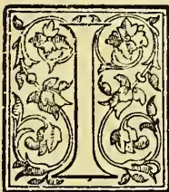

Some respects the history of THE RAJAWELLA ESTATES may be considered interesting if only as illustrating the more general story of Ceylon as a "Plantation Colony."

It commences on the 18th June, 1836, when a tract of Government forest land called Diabululawella and Rajawella, situated at Kengalle in the Oodoogampattu Korale of Dumbara, consisting of 1,583 acres, was granted by His Excellency the Rt. Hon. R. Wilmot Horton, Baronet, Knight of the Rl. Guelphic Order, Governor, &c., of Ceylon, (in consideration of the payment of £395 16s. 9d.) to the Hon. George Turnour, Esq. and Colonel Martin Lindsay, C.B.; and was opened by them as a Coffee Plantation.

There have been some additions and subtractions from the acreages of this grant; but much is still

owned by the Colonel's grandsons, Messrs. Martin Hadden and Charles & Martin Pirie.

Colonel Lindsay, a well-bred Scotchman and tough old soldier, had entered the Army in 1794 (above 104 years ago) at the early age of 12, and had seen much active service with the 78th Highlanders in India, Java, and Holland, in the great struggle with Napoleon Bonaparte. In the actions at the taking of Java he commanded the regiment as Major, the Colonel of it being shot, it was said, by his own men. In Holland at the attack on Merxem, January 1814, Lieut.-Col. Lindsay (promoted Lt.-Col. 1813) won his C.B., heading the gallant 78th in a bayonet charge which decided the day. He had his grey charger shot under him. He distinguished himself also at the bombardment of Antwerp, and indeed wherever he fought.

In 1826, Colonel Lindsay brought his Highlanders to Ceylon. He filled various civil and military posts here, until 1835, when he retired from the Army. In 1828 he was appointed First Commissioner for the Kandyan Province, and in early days turned his attention to Coffee planting as we have seen, in conjunction with his old friend and associate in office, the Hon. George Turnour. It used to be said that these old friends and associates in office were helped not a little in their Coffee ventures by commissariat carts in transport, and in various other ways\* This may be only the ill-natured or envious remarks of some with less suitable land; for, as always happens, very many of the pioneers were unfortunate in their choice of land. They were all helped at first by "Protection," differential duties in their favour against Brazil rivals, and others; and for awhile by good prices.

\* Even within our day, the Postmaster-General of Ceylon, old Major Barton, who fought at Waterloo, used to "frank" his daily supply of "oats" for a race-horse in training, through the post from Colombo to Nuwara Eliya.—ED. T.A.

843------------------------------------------------

800THE TROPICAL AGRICULTURIST.[JUNE 1, 1898.

It may interest some to read an estimate made in October, 1839, for opening 100 acres Coffee, when prices stood at 70s. to 80s. net. It is based, it will be seen, on a yield of 5 cwts. per acre and a "safe" net price of 60s. It was sent to Mr. Alexander Hadden, then a member of the firm of William Nicol & Co., Merchants, Bombay, probably by the Hon. George Turnour, possibly by Mr. Hew Stewart. It apparently induced him to make a venture as a Coffee planter, and more or less opened up a Ceylon connection with his firm which lasted long after he had retired from it, bringing to Ceylon Andrew Nicol and many others:—

*Copy of Report sent via Bombay under date, October, 1839.*

"In the district of Colombo agricultural labour is generally paid at the rate of 4½d. and in Kandy at 6d. per day. In general the Kandians are unwilling to engage as labourers; but the increasing demand is supplied by coolies from the Malabar Coast, who are continually coming over and locating.

"In the following Estimate of the Expense and Receipts of a Coffee Plantation, the land is supposed to stand in at £5 an acre when cleared. Forest land may be bought at 5s. an acre and cleared by contract at £2 10s.; but when to this the expense of making roads, fences, and superintendence is added, the cost cannot be calculated at less than £5.

"In Brazil it is usual to estimate the produce of a Coffee bush at the average of one pound per bush, but in the estimate below, half pound per bush only is taken. A Coffee Plantation cannot be considered as in full bearing until the fifth year, but the produce of the third and fourth years are calculated to equal a full year's crop. The value of the Coffee is estimated at 60s. per cwt. (present value is from 70s. to 80s in Ceylon).

*"Expenses for 100 Acres.*

<table>
<tbody>
<tr>
<td>100 acres cleared at £5 per acre .. ..</td>
<td>£500 0 0</td>
</tr>
<tr>
<td>25 coolies at £7 16s. per annum or 6d. per day for 4 years .. .. .</td>
<td>780 0 0</td>
</tr>
<tr>
<td>Superintendence and incidental expenses</td>
<td>780 0 0</td>
</tr>
<tr>
<td>100,000 Coffee plants at 6d. per 100 the regular price, 1,000 Coffee plants to an acre .. .. .</td>
<td>25 0 0</td>
</tr>
<tr>
<td>Bungalow (house) and tools .. ..</td>
<td>150 0 0</td>
</tr>
<tr>
<td>To which add expense of plucking, drying and cleaning from the husk, the estimated crop 491 cwt. .. .. .</td>
<td>122 15 0</td>
</tr>
<tr>
<td></td>
<td>
£2,357 15 0</td>
</tr>
</tbody>
</table>

*Receipts.*

<table>
<tbody>
<tr>
<td>100 acres each containing 1,000 plants, each producing ½ lb. = 491 cwt. at £3 per cwt. .. .. .</td>
<td>1,473 0 0</td>
</tr>
<tr>
<td>Less Cooty Lines and Superintendence for the fifth and following years</td>
<td>390 0 0</td>
</tr>
<tr>
<td></td>
<td>
£1,083 0 0"</td>
</tr>
</tbody>
</table>

Mr. Alexander Hadden, influenced by Colonel Lindsay's prosperity with Rajawella and this Estimate, opened in 1840 Dodangtalawa, an estate of 120 to 150 acres between Matale and Kurnegala, his partners Wright and Smith (in later years Smith, Fleming & Co. of London,) joining in the venture; but Coffee was not a success there. In 1846 it produced some 650 to 700 cwts. coffee of inferior quality, beans very small, and eventually the place had to be abandoned. His brother, Mr. Charles S. Hadden, the present owner of Kotiyagalla, Bogawantalawa, and his cousin the late Mr. Fred. J. Hadden, were more fortunate than their Bombay relative at this time, though they also went somewhat wrong in the choice of land at first, settling down in Ambagamuwa. However, they were shrewd men, had no other business to occupy their chief thoughts, were practical planters very soon, discovered their mistake in good time, and having command of capital, promptly moved into Hunasgeriya, where they did well with that glorious old

estate Weygalla. The Rajawella estates paid Mr. Turnour and the Colonel very well for some years.

In 1844, £70,000 was offered for these estates by a Mr. Autobus of Paris, but the offer was not accepted; for in the previous year they had yielded some £14,000 to the proprietors; there was nothing in their respective positions to make either of them anxious to sell; and who without some degree of urgency could part on a "5 years' purchase" with property so rapidly increasing in value? As things turned out unless Mr. Turnour and Colonel Lindsay were level-headed far beyond the average of men, it was probably as fortunate for them that they did not sell even for £70,000 what had cost them but £8,000, for those were days of inflation, and likely enough much of the proceeds would have been lost in the panic times that so closely followed—lost through one of the many Bank failures if uninvested, or through the general shrinkage of values if invested.

Late in 1844 the Hon. George Turnour died at Naples, and his Executor, Capt. H. A. Atchison, had to close the partnership; so the Rajawellas were put up for sale in five lots in February, 1846. They realised £25,170. Colonel Martin Lindsay bought lots which were numbered 1, 3 and 5 at £14,260, and Robert Boyd Tytler with Thos. Charles Morton lots 2 and 4 for £10,910.

In January, 1847, the Colonel also died, and left his portion as a provision for his widow and family. He had married a Miss Hadden in 1817 at Aberdeen, then and for many years afterwards a bright little Northern Capital, with all that implies, in connection with gaiety and good society. He died on a visit to Ceylon at Kandy, 28th January; and, though he had become a civilian, was buried in the Churchyard there with military honours rendered by Colonel Drought and the XVth regiment, as may be read by those who are fortunate enough to possess the *Ceylon Observer* of 29th January, 1847, where an account of the military funeral is fully set forth and much said of this "fine old gentleman."

He had not been dead many months when very dark days came. The year 1847 was memorable of financial troubles all over the world, and at the close of it and beginning of 1848 raged a Commercial Panic such as has not been known since. Consols fell from 94 to 78½. Not in the political complications that followed did Consols fall below 83, even when Revolution in France drove Louis Philippe from his throne. Hungary nearly separated from Austria, and the whole Continent seethed in discontent, troubles, and war, and Chartist riots kept people in a ferment at home. Ceylon Plantation Coffee, good quality on 4th January, 1848, was down at 40s. to 42s. in Mincing Lane. Native Coffee at one time was sold there at 19s. a cwt. 3,000 bags were sold at that figure by a much respected Broker who now no longer connected with Produce is still alive and very much to the fore in other lines.

The Commercial failures at the end of 1847 and in January, 1848, were appalling. They were announced daily, and in all trades—among Continental Houses, in American, in African and in West Indian Trades, and not least in the East Indian Trade. Calcutta Houses went down before the storm as fields of oats in an autumn gale. Cockerill & Co.; Colville, Gilmore & Co.; Lyall, Matheson & Co.; Hughesdon Brothers & Co.; Shearman, Mullins & Co.; and many others too numerous to enumerate. Glyn & Co.; London, refused in one day the drafts of the Union Bank of Calcutta and of the North-Western Bank of India. Those who had remittances to make were sorely put to. Private firms seemed to be all going down together, and Banks seemed to promise very little more stability than the private firms. In the general distrust recourse was had to specie to an extent this generation can scarcely realise; and bulition was travelling Eastwards and Westwards at the same time, as almost the only trustworthy means of making a remittance. The climax seemed to be reached when the great firms of Gower Brothers & Co.; and Reid, Irving & Co., of London failed. Abel L. Gowe.

844------------------------------------------------

JUNE 1, 1898.]THE TROPICAL AGRICULTURIST.851

was a Director of the Bank of England. Sir John Rae Reid, Bart., was one also. He had been Governor in 1839. John Cockerill had been on the same board. The senior of W. R. Robertson & Co., who failed in the corn trade, was Governor of the Bank when he failed: one nominated to fill a vacancy failed before the formalities of electing him could be carried through. No position in the City seemed then to testify to any solvency. A spirit of the very wildest speculation had become general in the world and this was the reaction. The speculative impulse which was first manifested at home chiefly in dealings in Railway stocks, had spread amongst all ranks and classes and into all trades. The result was collapse and panic. The purely mercantile troubles were aggravated intensely by crushing commitments for railway calls which had to be met and paid up whatever the state of the money market. These calls amounted to 22 millions in one half year and 3 or 4 millions during one single month in these bad times. The Bank Act had to be suspended. The minimum Bank Rate was 3 per cent. with very little to be had at that rate even on good security, and a rate equal to 13 per cent. per annum was paid for the discount of £10,000 City Bankers' acceptances within seven days of maturity.

The steady and prudent, as now, were in the majority both among individuals and firms; but for the while they seemed lost sight of, first in the wild days of speculation, and then in the turmoil of liquidation and failures that followed. When the storm had passed over and the atmosphere had cleared, these stood out who had weathered it and preserved the good name of the British Merchant for meeting the liabilities he undertakes to meet, and these were still the many.

The present times are by no means free from the spirit of speculation, and it is not amiss occasionally to cast a glance on the consequences to an earlier generation. Ceylon, not having escaped the infection of speculation, did not escape the wide-spread troubles that followed, as any may read in Ferguson's "Ceylon Handbook and Directory," and as shown in the failures of the Bank of Ceylon, Hudson, Chandler & Co., and others. In the "Handbook," confined to Ceylon affairs, there is naturally much said about the results of the speculations in Coffee in this Island with quotations from Sir Emerson Tennent, perhaps rather as if it were a thing of itself and not part of a world-wide trouble; but as we have seen the spirit of speculation of those days was not in any way or degree confined to Ceylon, nor was the epidemic more virulent here than elsewhere. The rush into Coffee here was only a sign of the times and of what was going on elsewhere. There was nothing in common between the failure of the Bank of Ceylon, and the great house of Prime, Ward & Co., Baring's correspondents in New York, except that both were results of the mad speculation that had raged; or between Hudson, Chandler & Co., Colombo, and the corn-trade house of the Governor Robertson of the Bank of England. The wild rush into Ceylon Coffee by military, civilians, clergy and East Indian officers, as described by Tennent, was another feature of the same classes in Europe more wildly rushing into railway shares and saddling themselves with liabilities for calls. The fever of speculation was an epidemic which had seized the many at home as here in the East and raged in America and elsewhere as violently. Now severe as the reaction was in Ceylon, there was not the extreme distress of some places, probably because there had not been the same inflation—not the distress for instance that there was in Mauritius, when Reid, Irving's failure was announced in December, 1847. To that Colony might have been applied the description of Liverpool at this time on the failure of the Royal Bank of Liverpool—"it reeled and staggered like a drunken man." Still in Colombo things were bad enough and money terribly scarce.

The Lindsay Rajawellas then had passed under the very free or extravagant management of Mr. David Baird Lindsay, an able determined energetic young son and ex-

ecutor of the Colonel, christened after his father's companion in arms, Sir David Baird, the hero of Seringapatam, at one time the rival of Sir Arthur Wellesley.\* The estates needed funds that were not to be found in Colombo, and Mr. Lindsay went home in order to obtain the needful, first making that arrangement with the Oriental Bank that was afterwards so profitable to the lawyers in the Island and in Westminster. We have no need to enter on the particulars of that long dispute, except to say time pressed, the arrangement was made in a hurry, at a period of excitement, and therefore probably ill-considered. Each party doubtless acted *bona fide*, but the result was that when Mr. Lindsay returned he found the estates in the hands of the Bank, that the Courts of Law in the Island† said they were rightly in the Bank's hands, and the Privy Council 23rd June, 1860, said they were wrongly in those hands, and ordered them to be restored to the Lindsays and Haddens with back profits and interest £28,525.

After this the history of the Rajawellas is more or less that of most other estates. For family reasons and for convenience in working they were made into a Company in 1863, and valued by Mr. Simon Keir, of Keir, Dundas & Co., at £45,000. They yielded fair Coffee crops for awhile. They had yielded 6,400 cwts. in 1857-58, and 6,822 in 1859-60; and an average of 5,100 cwts. in the 7 years 1853 to 1860. In 1862-63 they gave 5,635 cwts., and in "the seventies" averaged under 1,900 cwts. Succumbing to leaf disease they never saw 1,900 cwts. afterwards, and Rajawellas coffee days are now almost represented only by a fine tree stem in the rooms of the Ceylon Association in London, taken home by the late Peter Moir as a memento.†

Prices of the Coffee crops varied from a nett of 47s. 6d. in 1867-68 to a nett of 100s. 3d. in 1873-74.

Tea was planted by order of Mr. D. B. Lindsay (who already had a sort of speaking acquaintance with it in India), in the "sixties," with seed he obtained about 1864 from Calcutta; and a chest as sample was despatched home at the end of 1871: to be reported on. It was condemned unsparingly but deservedly by a firm of highest rank as Tea Brokers. We give the Report as below:—

*Report on two boxes Tea ex "Oxfordshire"*

19th April, 1872.

"Though one is called black and the other green, both have the characteristics of the first, and that of the most ordinary description, and as a marketable commodity they are worthless. The tea called green shows signs of some attempt at manufacture as there is a considerable portion of fair twisted black leaves in it. The tea called black is chiefly open half-curved leaf, and how any one could consider that such would pass as "tea" surprises us. However, looking at the future of the garden, the inspection of the leaf after infusion indicates that considerable improvement could be made in both the 'withering' and 'fermenting' processes connected with the manufacture. But we should hesitate to give an opinion as to whether the tea can ever be brought up to a high standard as the color of the water is so pale and the flavour so remarkably thin and poor.

\* When Sir David Baird's mother in Scotland heard that her son was a prisoner, chained to another man by Tippoo Sahib in Seringapatam, her characteristic remark was: "God help the man that is chained to our Davie,"—a rough-tempered customer evidently, but a splendid soldier and general as he afterward showed.—Ed. T.A.

† The Kandy District Court gave against the Bank: the Supreme Court for it. The Privy Council's judgment was a triumph for Mr. Tom Power, D.J.—Ed. T.A.

‡ As we drove through Dumbara and Teldeniya in 1863, Mr. Edward Mortimer, still alive, shouted: "Are you not coming to see 15 cwt. Coffee an acre on Rajawella?"—Ed. T.A.

845------------------------------------------------

302THE TROPICAL AGRICULTURIST.[JUNE 1, 1898.]

Still, a proper process of manufacture would make a very great alteration in this as well as in the appearance of the leaf."

The Tea was plucked from trees over 6 ft. high. They had never been pruned. It naturally had been most crudely cured; the curer had no experience, no books, no machinery to help him. He languished now over his attempts at withering the leaf by putting it into the firing pan, taking it out and rolling it, and so on, until he considered the tea was made. He was not very surprised to hear that it was too rasping for the English, but might possibly suit Holland or Russia; He could not easily have even a talk with any who had experience. He did his best from a description of the necessary operations written by Mr. Lindsay; but the great fault in the Tea sample was its emanating from a place unrecognised as a Tea-producing country; for no set of men are more conservative than those in Mincing Lane; anything new stiffens their backs and sets their countenances, as was shown when Cinchona bark was first sent to them from Ceylon. The drug brokers with one or two exceptions, scorned the suggestion of it being something worthy of their attention. Cinchona had never come from Ceylon, but from South Africa—was not that enough? The consequence of this attitude was that the sale of much of the Ceylon product, probably the bulk of it, went into the hands of the Coffee Brokers who at the beginning knew no more about it as a marketable article than the planters who grew it.

Be this as it may, the chilling reception given in Mincing Lane to the first attempts at Tea on the Rajawellas, the difficulties in making the Tea with no one on the estate or easily procurable who knew the process, and the absence of a principal, caused the attempt to be abandoned. It was not for many years that it was renewed. There are now 150 acres of promising Tea, and the area will no doubt be extended even with present low prices. We learn from the present Superintendent, Mr. C. W. Sinclair, that the 34 years old tea on Rajawella is represented by a few scattered miserable looking shrubs; it has always been in dense shade, never cultivated, and stands in poor washed out gravel thinly overlying limestone."

Cacao was first seriously planted on the Rajawellas in 1877-78, the proprietors putting out that season 60,000 plants, calculated as 150 acres, in alarm at the havoc in the Coffee by leaf disease, and encouraged at the growth of some 20,000 Cacao plants with which they had then already experimented. They calculated on the plants bearing at about 4 years old, and on their being in full bearing at 8 or 9 years, and producing then 9 to 10 cwt. per acre. After 1877 the area under Cacao cultivation was steadily extended.

In March, 1881, the estates were considered by a competent valuer as then worth £25,000, and he estimated they would be worth £31,000 by March, 1882, and above R500,000 by 1887 for Cacao alone, on an 8 years' purchase; but basing his calculations on 650 acres yielding by that time 5 cwts. per acre worth R35 per cwt.

In connection with our glance at days gone by, we may perhaps relate an incident that happened to Mr. Alexander Hadden, whom we have already mentioned, when he came down from Bombay to look after his Coffee venture in 1846, and see his many connections and friends in the Island; for it was an experience that would not be likely to befall an everyday visitor now, coming to the Island to view his property. He was in the good ship the "Recovery" which carried a number of convicts. (Those who mark coincidences may note it was his third voyage to and from Ceylon.) When off Goa at 3 p.m. the 3rd Feb. "Gang No. 3" made a rush up the hatchway, disarmed the sentries, got on deck, and, in number 20 or 30, made for the Captain, who was unarmed, but hearing the commotion and not realising what it was, naturally went forward to see what it was all about. Mr. Hadden, who was with

him, more instantly taking in the situation, ran off to the Captain's cabin, picked up two double-barrelled pistols with necessary ammunition, and firing at the felons as he returned, was quickly back at the Captain's side, slipping one of the pistols into his hand and reloading his own (for these were days before Colonel Colt and revolvers). The first shot fired marked the convicts' advance, they hesitated, and as soon as the Captain had fired the revolt was practically over. He, one Johnston, a well-known Captain in his day, managed rather well; for as soon as he saw the convicts on the deck hesitate, retreat and show there was no fight in them, he confided himself to shots at any fresh heads that came up the hatchway as reinforcements, making them promptly disappear. Meanwhile, three or four muskets were got together and fired also, and the scourings of Bombay and upcountry jails driven below. The whole affair lasted only three or four minutes. When it was over a Sepoy of the guard was found rather badly wounded in the head by a carpenter's large hammer which the ruffians had somehow managed to lay hold of and apply with effect. One of the convicts was killed by a musket ball; and five were wounded—four by pistol shots. After this brush the Captain had twenty well flogged, three dozen each, well laid on, and the stream cable put through the whole of their irons with the two ends brought on deck, except when the prisoners, two or three shackled together, were brought up for a wash. So they had no other chance of taking the "Recovery's" before she arrived in Colombo on the evening of 16th February, when Mr. Hadden left her, and was immediately informed that the Rajawellas were to be offered for public sale on 21st with the low limit on them of £25,000. It seemed to him a very low limit, when only two years before the places had been all but sold for £70,000; but low as it was, it was about all that was then attainable.

These figures certainly show great fluctuations:—

<table>
<tbody>
<tr>
<td>What cost</td>
<td>1839</td>
<td>and to open</td>
<td>£8,000</td>
</tr>
<tr>
<td>was valued</td>
<td>1844</td>
<td></td>
<td>70,000</td>
</tr>
<tr>
<td>and ,,</td>
<td>1846</td>
<td></td>
<td>25,170</td>
</tr>
<tr>
<td>And the part</td>
<td></td>
<td></td>
<td></td>
</tr>
<tr>
<td>that cost</td>
<td>1846</td>
<td>£14,260</td>
<td></td>
</tr>
<tr>
<td>with additions say</td>
<td></td>
<td>£ 1,740</td>
<td>= £16,000</td>
</tr>
<tr>
<td>was valued</td>
<td>1863</td>
<td></td>
<td>£45,900</td>
</tr>
<tr>
<td>and ,,</td>
<td>1881</td>
<td>at £25,000 or</td>
<td>£31,000</td>
</tr>
<tr>
<td>and t'en expected to be worth 1888</td>
<td></td>
<td></td>
<td>£50,000</td>
</tr>
</tbody>
</table>

There were, however, very special circumstances connected with all these fluctuations. If the £70,000 of 1844 was an "inflated value" it was at all events based on what the property had yielded, and within 20 years it was far exceeded if Mr. Simon Keir can be at all trusted. If the fall in 1846 to £25,000 was a reaction from the previous inflation, it was still well above 300 per cent advance on what the estate had cost the partnership, and what a magnificent income had been drawn meanwhile! Moreover, the fall might well have been expected to be far more severe, for it was aggravated by many very adverse circumstances, including the severest monetary pressure and the threat of "Free Trade," i.e., the abolition of those preferential duties that had contributed to the large profits. All letters from planters of this date are full of alarm at the certain ruin that awaited plantations under free trade. It was a very real terror to planters and intending investors. Free trade, however, became an accomplished fact, and the estates under it recovered in value nearly 300 per cent as Coffee property, and even when coffee, was *in extremis*, the estates were valued at 100 per cent above the price the Colonel gave for them on the death of his partner.

What strikes the observer in all this, is the speedy recovery even from extreme depression in Ceylon, if these Rajawellas are to be accepted at all as a type. If so the fair lesson seems to be that if you have Ceylon property you should stick to it. However dark the day, you may reasonably hope for brighter

846------------------------------------------------

JUNE 1, 1898.]THE TROPICAL AGRICULTURIST,803

times soon, and the recovery in a shorter period than would be probable in most countries. It may be just as well for a proprietor not to content himself with doing nought except sitting down and lamenting the bad times and waiting till the clouds roll by, but to exert, and in addition to energy, apply common sense to the problem how to quicken the advent of the better days. Then judging by the past the revival will not be far off. Compare things at home.

Railways have even yet scarcely seen their stock back at the values of 1844. When we see good Ceylon estates being sold by the "unco" prudent because having passed through times in which they could not sell, an opportunity is presented of getting out of such a land of ruin, or because they see of fancy further ills threatening them, we are reminded of a story of Duncan Forbes of Culoden or an Innes of Edingicht in Banff when in company with some fellow-lairds, high Conservatives, out of humour with the progress of free trade and other changes, who declared that there was nothing but ruin before landowners in Scotland, and that it was "no longer a place for a gentleman to live in." "Weel," says Edingicht, "I hae jist ae faut to this lan' and that is that I hae 'na a bittie mair o't." There are some in Ceylon who would be the better for discussing the land question with this old Banff worthy. On the other hand there is many a young planter in the island as good as any of those of the early days who finds but one fault with the land now so much in the hands of Companies, and that is that he has not a bit more of it.

#### WOOD-ASHES.

We learn from a report by R. Harcourt, B.S.A., Assistant Chemist, O.A.C. Guelph, that there is a growing interest in the subject of wood-ashes, and their use as a fertiliser. This is largely owing to the fact that long cultivated lands are beginning to show a lack of fertilising constituents that are supplied by ashes, and to a desire on the part of the cultivator of the soil to increase and improve his crops.

The growing plant gathers all its mineral constituents from the soil in which it lives, and these, not being combustible, are left as ash when the plant is burned; consequently, the ash must contain all the mineral constituents that are essential to growth. These are potash, phosphoric acid, lime, magnesia, iron, and sulphur. These substances form a very small part of a plant, yet without them no plant could grow and produce seed; in fact, they are indispensable to life. Of the six essential plant-food substances named, potash and phosphoric acid are the most important, not only because they are taken up by the plant in large quantities, but also from the fact that our average soils do not contain them any too abundantly. Wood ashes, therefore, are usually valued according to the amount of those two constituents which they contain. Although potash and phosphoric acid are the most valuable plant-food substances in ashes, yet ashes also contain large quantities of lime, which is of considerable value to the growing plant. Lime is usually present in most garden soils in sufficient quantities to supply the wants of plant-growth, yet its application may produce marked effects. By acting chemically on certain constituents in the soil, plant-food, especially potash, is brought into an available form. It neutralises the free acid of the soil, and thus helps along the process by which vegetable matter is changed into a form in which the plant may make use of its

nitrogen. It also tends to improve the mechanical condition of both clayey and sandy soils.

The amount of these fertilising constituents contained in an ash will vary according to the source from which it is derived. The ash from young branches will be richer in potash than that from the older parts of the tree. Different soils will supply varying quantities of potash, phosphoric acid, and lime. The following table gives the composition of a few of the more common ashes analysed by Mr. Harcourt. The figures given express the percentages of the various constituents in the dry ash:—

Constituents in Wood-ashes per Cent.

<table border="1">
<thead>
<tr>
<th>Ashes from :—</th>
<th>Potash.</th>
<th>Phosphoric Acid.</th>
<th>Lime.</th>
<th>Magnesia.</th>
<th>Iron.</th>
<th>Sulphuric Acid.</th>
</tr>
</thead>
<tbody>
<tr>
<td>Maple ..</td>
<td>9.31</td>
<td>2.03</td>
<td>45.24</td>
<td>..</td>
<td>...</td>
<td>1.14</td>
</tr>
<tr>
<td>Peech ...</td>
<td>7.53</td>
<td>1.39</td>
<td>41.21</td>
<td>6.16</td>
<td>0.30</td>
<td>traces</td>
</tr>
<tr>
<td>Cedar ...</td>
<td>3.30</td>
<td>0.98</td>
<td>49.06</td>
<td>2.49</td>
<td>0.70</td>
<td>0.77</td>
</tr>
<tr>
<td>Swamp Elm</td>
<td>35.37</td>
<td>0.45</td>
<td>23.64</td>
<td>6.48</td>
<td>0.19</td>
<td>traces</td>
</tr>
<tr>
<td>Black ash..</td>
<td>25.30</td>
<td>1.20</td>
<td>49.04</td>
<td>7.42</td>
<td>0.22</td>
<td>0.71</td>
</tr>
<tr>
<td>Hard coal..</td>
<td>traces</td>
<td>0.16</td>
<td>traces</td>
<td>..</td>
<td>5.32</td>
<td>0.41</td>
</tr>
</tbody>
</table>

The figures show clearly why ash buyers are so anxious to get black ash or swamp Elm ashes, but at the same time, it must not be forgotten that these ashes are very light and bulky; consequently, there may be more potash in one measured bushel of hard Maple-ash than in the same bulk of swamp Elm-ash. The hard woods contain a larger quantity of phosphoric acid and the soft woods. Cedar, as would be expected, is poor in both potash and phosphoric acid. The best way to ascertain the true value of ashes is to note the increased yield when they are applied to crops requiring potash, such as Potatoes, Carrots, Grape-Vines, and fruit-trees generally.

The caring for and application of ashes must receive special attention. If not properly stored while accumulating, much of the soluble plant-food will be lost by leaching. If not applied to those plants which are in special need of potash, no noticeable results may be obtained. Further, if mixed with farmyard or stable manure they may do more harm than good, because they tend to liberate, as ammonia, the nitrogen of the manure. If we may judge by the amount used by fruit-growers in the best fruit districts of the United States and Canada, they are fully aware of the value of wood-ashes in the orchard. J. J. WILLIS, Harpenden.—*Gardeners' Chronicle*.

#### ORANGE-GROWING IN JAFFA.

BY REINHOLD PALMER, JERUSALEM.

That much-prized fruit, the Jaffa, Orange, is now so well known and appreciated in England that it may interest readers of this journal to learn some details of the method of its cultivation.

The name by which this variety of orange is known in England is derived from the place where it is cultivated, the growing and prosperous little town of Jaffa on the coast of Syria, so well known to those who have visited Jerusalem, for which it is the port. In the vernacular the name for orange is 'Portugal,' doubtless a corruption of the word Portugal, and is an indication that the orange was probably in the first instance introduced into Palestine from Portugal; but as it is not recorded when or by whom this tree was thus introduced, the origin of the name can only be a matter of surmise. Although not a native of Syria, it thrives on the sandy coast of that country better probably than anywhere else in the world, the climatic conditions—the rainless summer, accompanied by heavy night-dews, and the winter without frost—being well suited to the growth and development of the fruit. But the culture must of course be supported throughout the long summer by artificial irrigation. Were

847------------------------------------------------

804THE TROPICAL AGRICULTURIST.[JUNE 1. 1898.]

it not that water to any amount can be procured in every garden and at a moderate depth, it would be impossible to grow oranges in Jaffa. The whole neighbourhood seems to cover a river of vast breadth, percolating through the sand *en route* to the sea. Hundreds of Persian wheels working night and day produce no sensible diminution in the supply of life-giving water.

Several varieties of the orange, such as the round Beladi, the Blood Orange, the Mandarin, &c., thrive along the coast of Syria, but the oval and almost pipples kind known as the Jaffa Orange is only produced in Jaffa itself and its vicinity; and this peculiarity, according to the native gardeners, must be attributed to the quality of the brackish water used in its irrigation. Until about thirty years ago this oval form was quite unknown, when a native gardener, quite by chance, through careful attention to his trees, succeeded, much to his own astonishment no doubt, in improving his Beladi or Spanish variety of orange into the Shamuti, by which name the Jaffa kind is known in the vernacular. By seling grafts from his improvol variety to other garden proprietors, he was instrumental in substituting the Shamuti for the Beladi orange throughout Jaffa. It is a remarkable fact that all attempts hitherto made at growing the oval orange elsewhere than at Jaffa have not been successful; even at Sidon and Tripoli on the Syrian coast, where the climate and soil seem precisely of the same nature as at Jaffa, all experiments in this direction have failed.

The method of laying out a garden in Jaffa is as follows. The land having been carefully selected and purchased—preference being always given to a red sandy soil—the owner will get in his workmen and start them on levelling and working up the ground. This is very thoroughly done; the levelling of the earth being important with a view to the future irrigating of the orange trees. The ground is in the first instance well ploughed, and then with the object of effectually removing every particle of weed, the workmen use their hoes to turn up the soil to a depth of fully three feet. This expensive process is very necessary, as the presence of even the smallest root of a weed will prove injurious to the trees and be difficult to remove later on. While this work is going on the proprietor will have fixed upon the spot where the well is to be sunk, and have commenced operations. The depth at which water is found varies materially in different gardens, and ranges from about twelve to sixty feet below the surface; consequently the cost of sinking his well is always more or less a matter of speculation to the proprietor. The deeper wells are, however, the exception and not the rule. The system of irrigating is by Persian wheels, simple in construction, cheap, quickly made and repaired; and experience has shown that they are much better adapted for the purpose intended than the steam pump. The whole of this simple machinery is quickly specified and described. A wide cog-wheel is kept going horizontally by a mule with a sweep; this turns a larger one perpendicularly, which is directly above the mouth of the well. Over this revolve two thick ropes, and upon these are fastened small wooden buckets; one side descends while the other rises carrying the buckets with them, these descending empty, those ascending full; and as they pass over the top they discharge the water into a trough which conveys it into an adjoining tank. The quantity of water discharged within the twenty-four hours depends on the speed at which the mule is kept going, and also, of course, on the depth of the well. An average sized garden requires the constant labour of three to four mules to provide the necessary amount of water, the animals being relieved about every three hours.

The ground prepared and manured, the Persian wheel fixed, and accomodation—of the simplest kind of course—being provided for the gardener and the mules, the proprietor now proceeds to buy young lemon trees about a year old. These are meant to be used as stocks upon which the orange slips are later on grafted; and of them there is always a fair supply available in the nurseries of the older

gardens. These lemon trees are now planted, under the supervision of the head-gardener, at a distance of four yards apart, and the most suitable time for this operation is during the months of March and April, before the great heat has set in. A hedge of cactus or prickly pear is planted at the same time round the garden, which in a few years' time grows into an impenetrable mass, preventing the intrusion of man or beast.

The young lemon trees will now thrive without much further attention, except that they must be carefully irrigated; this is done by a system of small masonry troughs running in all directions through the garden, and fed from the tank adjoining the well. The garden is generally divided into four equal parts, each part being irrigated within the course of two days, so that every tree receives its share of water every eighth day in rotation; and this is considered ample. A small trench is dug round each tree sufficiently large to hold its requirement of water, and as the tree grows and needs a larger supply, the trench is enlarged; the amount of water that will eventually be required must therefore be calculated on the basis of the irrigation necessary when the trees are six years old, and may be said to have reached maturity. If the garden is a full-sized one and contains about six thousand trees, it will be necessary to sink either two wells or one well sufficiently wide to admit a double set of buckets, thus raising double the quantity of a single set in the same space of time.

During the winter months the garden is left to itself, the garden employing his time in taking the mules to graze, thus saving the cost of feed. The winter (or rather rains) over, the garden is weeded, manure is worked into the soil, and the trenches round the trees are remade and enlarged. Irrigating commences about the end of June, and lasts till the end of October or middle of November.

In order to recoup himself or his outlay while the trees are growing, the proprietor will sometimes arrange with his gardener to grow vegetables in the empty spaces between the young trees, giving him the seed and one-third to one-half the produce of the vegetables in lieu of wages. This system is, however, not considered economical in the long run, as the trees, which are purposely grown in close proximity to each other, really require the whole of the soil; and their development and productiveness is retarded by the growing of vegetables.

The young lemon trees are allowed to grow for two summers before the orange slip is grafted upon them; this operation is performed in the autumn by the head-gardener, who is an adept at this work. After the fourth summer, calculating from the time the lemon stock was planted, a few oranges may appear on the trees; and during the following two years the whole of the expenses of a garden will as a general rule, be covered by the sale of the orange crops.

It is generally assumed that after the fourth year a garden becomes self-supporting; but it will require two years longer before a return in capital outlay can be expected. After the sixth year, however, a garden that has been well attended to will not only pay all expenses, but give a handsome return as well. The fortunate proprietor will now also have the further satisfaction of knowing that the marketable value of his property represents probably more than double the whole of his outlay. This will give an idea how profitable orange-growing in Jaffa really is, to those who can afford to wait a few years for a return on capital. To the native of Jaffa only one form of investment has a charm—the height of his ambition is to own a 'Biarah,' the technical term for an orange-garden; unfortunately for him, however, he is frequently as not launches upon the enterprise without having sufficient capital to see it through successfully, with the result that he is compelled to borrow money at a ruinous rate of interest in order to meet his current expenses, and finally has to part with his property before he has seen any of its fruit. This explains why most of the garden property is in the hands of the money-lending class, who have had very little trouble in growing the trees.

848------------------------------------------------

JUNE 1, 1898.]THE TROPICAL AGRICULTURIST.805

Once the garden is in full bearing, the proprietor, apart from an occasional visit of supervision, has little to do beyond selling his crop of oranges, paying the expenses, and pocketing the balance.

The gardner in charge receives a fixed wage of from two to two pounds ten shillings per measure only as long as the trees do not bear; once they are in full bearing he is no longer paid by a fixed wage, but receives a share of the produce, generally one-twelfth to one-tenth of the crop. It is also understood that the garden's wife and family, who live on the premises, assist in the garden-work without extra remuneration, hence the size of his gardener's family is a matter of some consideration with the owner. This system of making the gardener a partner in the produce of the garden works very well, as he thereby acquires an interest in the general up-keep of the property.

It is difficult to calculate the exact cost of laying down a garden. The price of the land varies of course according to position and quality; then the depth of the hater below the surface and consequent cost of sinking the well cannot be estimated to a nicety. As a general rule, however, a garden containing six thousand young trees will cost from eleven hundred to twelve hundred pounds to lay down complete, with livestock. To this sum will have to be added five years' expenditure (during which period the garden is assumed to be unproductive) at the rate of one hundred and twenty pounds per annum, making six hundred pounds. We have therefore a total of eighteen hundred pounds, representing the capital outlay on the garden up to the time that the trees are in full bearing. From now onwards the crop of oranges will have an annual value of from four hundred to five hundred pounds; and this will leave the proprietor, after deducting all expenses for wages, feed of live-stock, taxes, repairs, &c.; a clear revenue of ten to fifteen per cent. on his total capital outlay of eighteen hundred pounds.

The risks which the Jaffa orange-grower runs, as compared with those which the grower in Florida has to face, are infinitesimal. The storms that visit the Syrian coast, although of frequent occurrence during the winter months, are not of such force as to damage the trees; in fact it is remarkable how very small is the proportion of ripe fruit even which falls to the ground after a storm. This is no doubt due to the fact that the Jaffa orange tree is not allowed to grow larger than a good-sized shrub; and as the trees are placed only four yards apart they afford each other very considerable protection from the force of the wind. The cactus shrubs also, forming the hedge of the garden, grow very thick and high, and give additional protection from the storms. Blizzards and frosts, which have proved so ruinous in Florida, are quite unknown in Jaffa.

Owing to the good keeping qualities of Jaffa oranges, which enables them to be shipped to distant parts, there is always a brisk demand for them, and the grower has hitherto had very little difficulty in disposing of his crops at good prices. If not exorbitant in his demands, he can almost invariably sell his fruit for a lump sum while the fruit is still green, and before the winter, with its risks of hail, &c., has set in. The shipper who purchases the fruit in this way takes over the whole of the risk of any damage that may happen to it, and he cuts the oranges from the trees whenever it suits him to do so; the contract only stipulating that the garden is to be cleared by the middle of March, as the proprietor likes to see his trees free of fruit before the new blossoms appear.

The whole of the crop of Jaffa oranges does not at the present time exceed three hundred thousand boxes of about one hundred and sixty oranges each, which is a mere trifle compared with Spanish or American crops, and about four-fifths of this quantity is at present shipped to England.

The orange-growing industry is almost entirely in the hands of natives; a few of the newer gardens are, however, owned by Germans and Frenchmen.—*Chambers's Journal.*

## THE FUTURE OF COCONUTS.

(Contributed.)

In view of the interest that has lately been shewn by European planters and capitalists in the coconut industry of Ceylon, it may be of interest to state that a new impetus has been given to extend the industry by finding a more extensive outlet for the produce to Russia. This has been suggested by the presence of the new Russian firms in Colombo, and, there having been much talk on the subject, there now seems every possibility of an extensive trade with that country being worked up before long. Curiously enough, so far as we know, the demand in this direction is only for copperah, and no steamer of the Russian Volunteer Fleet has left our Port for Odessa without a large cargo of that commodity. The demand is increasing, and it will increase with the advancement and progress of the country of the Czar. Besides our shipments direct to Odessa, the London, Hamburg, and Antwerp markets also provide an outlet in this line. The greatest demand for our produce, however, remains, with Russia, but it seems it does not pay her merchants to import coconut oil, owing to the heavy duty imposed. They receive, therefore, the copperah and extract the oil themselves, and also turn the poonac into good use. The demand for copperah is increasing, and it is of interest to inquire whether in this respect, Ceylon can be competed with in the market by any other country. We apprehend no fear on this score. The nearest coconut-producing country to us is the Malabar Coast, with Cochin as its centre, and then we have, on the other side, the Straits. The output from those countries, comparatively speaking, amounts to very little, and we can lead the market yet, without any fear of competition from them, owing to our shipping facilities at Colombo. There are, in the far distant Pacific, the South Sea Islands, which produce an immense quantity of coconuts, and it has been said that the nuts produced in those Islands are far superior to ours in size. Sydney and some few other Colonial Ports, however, are the principal consumers of the produce from those Islands, and with that demand it does not pay to find farther markets, so we have no fear of the South Sea Islanders coming into the market to compete, unless they wait for the Siberian Railway, and even then it is hardly possible that anything much may come out of such competition. We, therefore, see that we can hold our own in the coconut industry until African produce is matured, and then it is doubtful whether new fields will come to anything in this line. Ceylon will always take the lead in the market for the industry, and investments in coconut lands is therefore no mere speculation, but one of sure and steady profitable returns. Glancing over the Administration Report of that most important Province of our Island—the North-Western—we say most important—because it has the finest coconut estates in the Island—we are pleased to note that new areas have been opened up during last year and planted with coconuts, and there yet remain thousands of acres of land in that Province to go under this cultivation. The Government Agent of that Province writes in his Administration Report for 1897:—"The increase in the receipts from land sales is satisfactory. There is a very large area of land still available if there were surveyors to survey it. Meanwhile, the demand for land is very great in this Province." Our Government however, it must be pointed out, is very short-sighted in its policy in considering the question of the future prospects of the coconut industry and the "sales of land by villagers." The policy has decidedly a tendency to mar the progress of the country. There are hundreds and thousands of acres of land belonging to the villagers, which can be profitably converted into paying coconut estates. They are just now a burden to the villagers, for he cannot properly cultivate them, because he has not the means, and they are an eye-

849------------------------------------------------

805THE TROPICAL AGRICULTURIST.[JUNE 1, 1898.]

sore to the country, owing to their neglected condition. The villager is threatened by the Government label "sales of land by villagers" and other consequences, and he is thus handicapped and so is the capitalist. We must repeat, in the interests of the country, that the policy adopted by Government is not only suicidal, but it is also a serious blow to the march of progress and civilization in the country. A tour round the North-Western Province and among the coconut estates there will amply repay the intending investor. He will note what land there is available for opening up, both from the Crown and natives, and what planted land there is to be had. A year ago, the value of land all round was not the same as the price asked for now. This is not to be wondered at, for the Province is making wonderful progress, though slowly, since the railway line was opened. Since labour and capital have been brought in to once a feverish and dreaded Province, and with the increase of the chief industry, the trade is daily increasing, and price of land is looking up. When Government finally decides to throw up its inane policy of restricting the sales of land by villages to capitalists, and thus assist both the villager and capitalist, its Customs returns from shipments of copperah to Europe will alone be a principal revenue to the island—not to speak of nuts, oil, or "dessicated."—Local "Times."

### THE USE OF ARTIFICIAL MANURES.

IS IT A CONTRADICTION, OR WHAT?—In the *Journal of the Royal Horticultural Society*, vol. xxi., Part I., August, 1897, p. 37, in a paper on "Artificial Manures," by Mr. J. J. Willis, I find the following:— "How much more useful these manures (stable and farmyard manures) could be rendered by an admixture with suitable artificial fertilisers."

And on p. 42: "Artificial manures, therefore, are not recommended to take the place of farmyard or stable manure, but to be used in conjunction with them."

On the other hand, in the *Journal of the Royal Agricultural Society of England*, third series, vol. viii., Part III., No. 31, Sept. 30, 1897, now before me, I find the following in a paper on "Recent Experiments on Denitrification." On p. 477: "Notwithstanding the high position that artificial manures now take in the estimation of farmers in all parts of the world, it cannot be said that they have done anything to displace the use of farmyard manure, which must still be regarded as, for our most general and important fertiliser. All the farmyard manure produced in this country is still applied to the land, and artificials find their legitimate place as sources of plant-food on areas that the available supply of home-made manure is insufficient to dress."

But observe what follows on p. 480: "By a series of experiments and calculations, Maercker showed that from 12 to 47 per cent. of the nitrogen in nitrate of soda was dissipated through contact with the various forms of dung in the soil, and the loss was greatest when the largest quantity of dung was used."

And on p. 482: "It now becomes of interest to ascertain what becomes of the nitrogen that loses its nitric form in the presence of dung. . . . In every case it has been found that the nitrogen has been liberated in the elementary form."

P. 484: "There is thus no escaping from the conclusion that nitrates, whether naturally present in manure, or the soil, or when added in so-called artificial manures, are rapidly destroyed by organisms (bacteria) which are very abundant in dung, and are also present, though to a much less extent in soil."

Further on p. 484: "It was found that the crop was least, and the loss of nitrogen greatest, in the mixture that contained most straw." In other words, if you use nitrates in "conjunction" with dung, you may as well save the money spent in artificial nitrates, and leave it in the savings-bank, for, if all that has been written be true, you will obtain no advantage from the use of the additional artificial manure!

What is called "long manure," with plenty of straw in it, seems to be the most wasteful, for the additional straw is prolific in denitrifying bacteria, which dissipate the nitrogen in its elementary form, and so render the nitrate valueless.

However, on p. 485, this is stated: "Evidently, therefore the denitrifying power of the dung is lost to a large extent by contact with the soil for two or three months."

"Wagner carried out a series of experiments, which also go to show that the denitrifying bacteria are much less energetic in old than in new dung."

In England it has been found that no appreciable increase of crop resulted when artificial manures, such as nitrates, were used with dung. And now German experiments appear to have solved this riddle. They seem to show that nitrogen is dissipated in its elementary form; that is, it is lost or wasted by contact with dung; and fresh dung, when used in "conjunction" with nitrates, is far more wasteful than well-rotted dung, "for the reason that the denitrifying organisms so abundant in the dung instantly attack to the nitrate of soda (or other nitrate, and also sulphate of ammonia, &c.) and dissipate the nitrogen in the elementary form."

I suppose we may infer that it would require the nodules of leguminosae to capture this elementary nitrogen again, and make it available for the growth of plants. The curious thing is, that purely phosphatic and potassic manures also fail to produce satisfactory results when used with dung; "but Wagner's experiments show that the negative results obtained, when mineral-manures are added to dung, are intimately associated with denitrification."

The conclusion to be drawn from all these experiments, if they are reliable, is first, that dung-heaps should be frequently turned, "so as to induce rapid fermentation, oxidation, and a high temperature" before using them; and second not to use dung in "conjunction" with artificial manures, and especially with nitrates.

There can be no doubt whatever that farmyard and stable manures are very valuable and important fertilisers. The whole agricultural history of man, all the world over, from the most primitive times, furnishes evidence of this. The safest plan would, however, seem to be to use home-made and well-rotted manures one year without artificial manures, and only artificial manures the next year.

Artificial manures are trumpeted everywhere as the saviours of agriculturists and horticulturists, and no doubt if the soil wants these ingredients, and if the crops to be grown require them, they must be of advantage; the question, however, remains as to how and when these artificial manures should be used.

Farm and stable manures have for ages given satisfactory results, under certain circumstances, that it would be a hopeless attempt to try and persuade practical growers not to use them; the problem is, how and when to use them, when the soil needs some ingredients which these home-made manures do not contain.

This subject is so important, from not only an individual but also a national point of view, that the more it is ventilated, the more is the likelihood that we shall get at the bottom of the conditions needed for scientific agriculture and horticulture. E. BONAVIA, M.D.—*Gardeners' Chronicle*.

PALMS OF MATTOGROSSO.—The Director of the Botanic Gardens at Rio Janeiro, Senr. J. Barbosa Rodrigues, has lately published a monograph of the Palms of this district, accompanied by twenty-seven lithographic illustrations. The species and varieties number nearly sixty. Among other things, we note a synopsis of the species of *Cocos* native to Brazil, and therein, under the section *Glaiziava*, is included the *Cocos Weddelliana*, Wendland, which has been the subject of enquiry lately. This Palm is stated to be known at Rio by the vernacular name of *Ikâ*.—*Gardeners' Chronicle*.

850------------------------------------------------

JUNE 1, 1898.]THE TROPICAL AGRICULTURIST.807

### SCIENTIFIC AGRICULTURE AND THE PLANTING INDUSTRY.

The three long letters dealing chiefly with this topic which we publish elsewhere may be regarded as "dry and uninteresting" by the majority of our readers. But to all the intelligent men concerned about the future welfare of our tea culture and the prosperity of the Colony—the two largely stand or fall together—we commend their careful perusal and thoughtful consideration under present circumstances. To the young or rising planter who wishes to master his profession, and to do the very best he can for his employers and the plantation entrusted to his care, such reading is of vast importance. Every day more and more clearly shows that there is a vast deal yet to be gained by acquiring knowledge from scientific and practical men, by personal observation, and above all by actual experiments, in regard to the tea plant in different soils, and not less as to the best mode of plucking and the details of manufacture. The third is not touched on today; the second is, to some extent treated by "T. K." who is an upcountry planter; while the first occupies the attention of all three writers, and it is something to bring together, such diverse experiences and opinions in the way we do today. Recurring to field-work, we have had many opinions expressed, similar to those of "T. K.", as to the great value of the services of young "sinna durais" (of the right stamp with full interest in their work) in the close supervision of field-work, but especially of "plucking." Conductors or kanganies who can be trusted to do as well, are very few and far between; and the higher salary is easily saved by the better results from the work of approved field assistants of the type described.

Now, to turn to the topic more immediately under discussion, our correspondent "B" opens with an assertion which was long ago in Western countries accepted as a truism when put into a briefer, pithier shape:—"the civilization of a country may be gauged by its consumption of sulphuric acid." There can be no doubt that we are face to face with an era of "scientific agriculture," that the planter who is to succeed and prosper, must study the subject theoretically and practically and seek the aid of the Agricultural Chemist as well as of the reliable importer and manufacturer of Manures. We cordially endorse the opinions of our correspondents that greater facilities are required, and we go further in saying that it is a disgrace in a purely Agricultural Colony like Ceylon, that the Government had not long ago—quite thirty years back—appointed an Agricultural Analyst. The value of the accumulation of analyses coupled with corresponding experiments in official Gardens or on Agricultural School plots that would now be available, may be judged from what Mr. Cochran has published even as a private individual in his "Ceylon Manual of Analyses," and from his useful writings for the benefit of planters and others, not the least being his contribution elsewhere today.

What is required is that such work should be rendered continuous and systematized, but this is impossible for any private individual; while the Ceylon authorities—unlike those of Java, where even the Service Cadets have to pass an examination in Agricultural knowledge—neglect to do justice either to their native or European agriculturists, by establishing an Agricultural Department and School with a staff of scientists (many of them already available) after the pattern set in the Buitenzorg institution, which has done such immense service for the Planting and Agriculture of Netherlands India.

To consider more particularly, the teaching of our letters, very striking surely is the statement repeated by Mr. Cochran that 50 lb. of nitrogen given in an available form is of more moment to a growing crop than are 17,000 lb. of organic nitrogen lying inert in each acre of land. Surely the planter who reads this needs no further evidence of the importance of "scientific agriculture"; and yet one of the means of rendering that which is inert, active and beneficial, requires no aid from the scientist or any scientific preparation. We refer to the digging and loosening—the aerating—of the soil about the tea plants. Not nearly enough in this direction is attempted in Ceylon, and although the benefit is only temporary, if supplemented by what the Agricultural Chemist, after analysis, informs him is most wanted to utilize the latent resources of his soil, the planter may feel assured he is doing justice to his fields and should reap success. Based on the work of analyst and the rules of scientific agriculture are the manures prepared and supplied, either as principals and agents, by Messrs. Whittall & Co., Freudenberg & Co., Baker & Hall, Eastern Produce and Estates Co., Colombo Commercial Co., and Mr. Baur, among other Colombo Firms, going by the advertisements before us. The planters have therefore, no want of choice in obtaining what they require; and of course not a few having already demonstrated to their own satisfaction, perhaps long ago, the value of certain manures obtained from their Agents, prefer to go on with the same. But even such conservatives should reflect that a small experiment on an acre or two, costs very little, and that the result may be, both economy in first outlay and improved crops. In any case, let the "practical man" who perhaps, scorns to be indebted to new-fangled notions at his time of life, just read the closing illustration with which Mr. Cochran winds up his letter, and then ask himself, for the proprietor of the estate in question, whether the facts related were not worth learning at the hands of the Analytical Chemist.

---

### PRICES IN COLOMBO AND LONDON COMPARED.

Some people may have thought that we rather exaggerated things when we stated the other day that Colombo prices for tea were 1½d higher than London prices.

In order to gauge the difference in value between the Colombo and London Markets, we have taken out from the London catalogues of March 15th the sale prices of a few marks, and the following is our comparison of these with teas sold in Colombo on the 20th ultimo. In offering this comparison we must not omit to point out

99

851------------------------------------------------

808THE TROPICAL AGRICULTURIST.[JUNE 1, 1889.

that there may have been a difference in quality. This, of course, we are unable to express an opinion upon:—

LONDON CATALOGUES. COLOMBO CATALOGUES.

March 15th.

April 20th.

<table border="1">
<thead>
<tr>
<th></th>
<th></th>
<th>sold.</th>
<th></th>
<th></th>
<th>about.</th>
</tr>
<tr>
<th></th>
<th></th>
<th>d.</th>
<th></th>
<th>cts.</th>
<th>d.</th>
</tr>
</thead>
<tbody>
<tr>
<td rowspan="3">Ganapalla</td>
<td>18 c B.O.P.</td>
<td>6½</td>
<td>18 c B.O.P.</td>
<td>33</td>
<td>= 6½</td>
</tr>
<tr>
<td>21 c O.P.</td>
<td>7</td>
<td rowspan="2">18 c O.P.</td>
<td rowspan="2">41</td>
<td rowspan="2">, 8¼</td>
</tr>
<tr>
<td>25 c O.P.</td>
<td>6½</td>
</tr>
<tr>
<td rowspan="2">Lonach</td>
<td>37 c P.</td>
<td>5½</td>
<td>50 c P.</td>
<td>32</td>
<td>, 6½</td>
</tr>
<tr>
<td>21½ c B.P.</td>
<td>6½</td>
<td rowspan="2">19½ c B.P.</td>
<td rowspan="2">44</td>
<td rowspan="2">, 6¾</td>
</tr>
<tr>
<td rowspan="2">Kirklees</td>
<td>42 c B.P.</td>
<td>7½</td>
</tr>
<tr>
<td>18 c O.P.</td>
<td>7</td>
<td>30 c O.P.</td>
<td>46</td>
<td>, 9</td>
</tr>
<tr>
<td rowspan="2">Carfax</td>
<td>14 c P.S.</td>
<td>5</td>
<td>36 c P.S.</td>
<td>33</td>
<td>, 6¾</td>
</tr>
<tr>
<td>32 c O.P.</td>
<td>6¼</td>
<td>26 c O.P.</td>
<td>41</td>
<td>, 8¾</td>
</tr>
<tr>
<td>Hatdowa</td>
<td>22 c B.P.S.</td>
<td>6</td>
<td>35 c B.P.</td>
<td>31</td>
<td>, 6¾</td>
</tr>
<tr>
<td>Kew</td>
<td>27 c P.</td>
<td>7</td>
<td>33 c P.</td>
<td>38</td>
<td>, 7¾</td>
</tr>
<tr>
<td>Naseby</td>
<td>14½ c P.</td>
<td>10</td>
<td>19½ c O.P.</td>
<td>70</td>
<td>, 1¼</td>
</tr>
<tr>
<td>Harrington</td>
<td>20 c O.P.</td>
<td>7¾</td>
<td>19 c O.P.</td>
<td>48</td>
<td>, 9¼</td>
</tr>
<tr>
<td>Gingranoya</td>
<td>28 c P.</td>
<td>5½</td>
<td>16 c P.</td>
<td>36</td>
<td>, 7¾</td>
</tr>
<tr>
<td>Anningkande</td>
<td>73½ c B.P.</td>
<td>7</td>
<td>26 c B.P.S.</td>
<td>38</td>
<td>, 7¾</td>
</tr>
</tbody>
</table>

Now though it cannot be said that the above table supplies a complete justification for our remarks it is as near as we can get. It must be remembered that the London market was decidedly higher on March 15th than it was last week, so there is no injustice in comparing prices for the same marks obtained in London on March 15th with those realized by them in Colombo at the last sale. It will be seen that there is a difference in favour of Colombo of from ¼d to 2d per lb.—Local "Times."

### GOVERNMENT GARDENS AT THE STRAITS.

Extracts from Report on Government Gardens for the year 1897, by the Superintendent of Government Gardens.

LARUT HILL STATION.—Revenue.—The revenue collected for hill produce amounted to \$1,353.20.

CATTLE HERD.—No cattle were sold during the year, but I propose selling some of the calves at an early date. The cows, with their calves, are kept at Maxwell's Hill, stronger calves—pending a sale—and pack-bulls, at the Tea Gardens. At the latter place an outbreak of foot and mouth disease of a mild type occurred in August, through the bulls visiting Taiping. The shed was at once disinfected, and a dressd supplied by the Veterinary Surgeon cured the infected animals in three weeks. The herd at Maxwell's Hill has kept healthy, but a change of blood is urgently needed, as the calves, through being too closely bred, are very weedy; and I am making enquiries as to the probable cost of importing a young Australian bull to replace the present Indian one. All the best cows are mixed breed.

TAIPING GARDEN.—This work was taken over by me, as well as collecting revenue for hill produce formerly collected by the Public Works Department, some months after my arrival. A nursery under formation was completed early in the year, and is now stocked with ornamental shrubs, shade trees and palms, mostly obtained from the Botanic Gardens at Penang and Singapore. Shade trees have been planted round the lake road, and since the arrival of Mr. Venning as Secretary to Government convict labour has been secured for clearing and remodelling the islands, under his direction.

KUALA KANGSAR GARDEN.—Revenue:—The revenue earned amounted to \$1,665.40, as follows:—Fruit, \$836.50; Milk and Sale of Cattle, \$149.79; Coconuts, Fruits and Plants, \$135.01; Fruit Trees and Seeds, \$244.10. Total, \$1,665.40. The garden has been well maintained, and an extension of nine acres cleared and planted with nutmegs, lemons and coconuts. Excellent crops of lemons and pomoloes were ob-

tained. The latter crop was secured against the ravages of the pomoloe moth by covering the fruits with thin drill bags, which proved fairly successful. Much time has been occupied in nursery work to meet the demand for coconut and fruit trees.

PARA RUBBER (*Hevea brasiliensis*). Many trees have been tapped, and a report on the work submitted. The rubber obtained is not yet sufficiently smoked for sending home, but samples have been valued in Mining Lane at 2s 8d and 3s per pound, and considered equal to Brazilian produced rubber, and also worth 1s per pound more than that usually sent home from the Straits. There has been a large demand for seeds, and about 35,000 have been supplied. How far this industry is deserving attention may be inferred from the following moderate estimate:—(Planted 14 feet + 14 feet = 225 trees to the acre.)

<table border="1">
<thead>
<tr>
<th rowspan="2">Age, years.</th>
<th>Yield per Tree.</th>
<th>Yield per acre, i.e. ons tree × 225.</th>
<th colspan="2">Gross value per acre, estimate at 2s per pound.</th>
</tr>
<tr>
<th>Ounces.</th>
<th>Pounds.</th>
<th>£</th>
<th>s.</th>
</tr>
</thead>
<tbody>
<tr>
<td>6</td>
<td>10</td>
<td>140½</td>
<td>14</td>
<td>10</td>
</tr>
<tr>
<td>7</td>
<td>18</td>
<td>250</td>
<td>25</td>
<td>00</td>
</tr>
<tr>
<td>8</td>
<td>26</td>
<td>365</td>
<td>36</td>
<td>15</td>
</tr>
<tr>
<td>9</td>
<td>34</td>
<td>478</td>
<td>47</td>
<td>13</td>
</tr>
<tr>
<td>10</td>
<td>42</td>
<td>590½</td>
<td>59</td>
<td>01</td>
</tr>
</tbody>
</table>

The importance of close planting is not generally realised. Planted at 14 feet by 14 feet, against 25 feet by 25 feet would possibly result in a difference of one year in six in favour of close planting. I am of opinion that planted 14 feet by 14 feet trees could be tapped in the fifth year, if not earlier. Para rubber is a remarkably adaptable tree, growing in swampy land or dry high ground without, so far as I have tested, any difference in the yield of rubber.

RAMBONG (*Ficus elastica*).—There are three moderate sized trees of this species in the garden which I propose to tap early next year, and also propagate as largely as possible. The rubber is not priced so high as para, and the tree is somewhat capricious under cultivation.

CENTRAL AMERICA RUBBER (*Castilloa elastica*).—Only one example of this tree is growing in the garden, and this is in very poor condition. It is not so much a question of soil, site or climate as is usually supposed, but the attacks of various borers, followed by ants, which proves so detrimental to many imported trees, e.g., mahogany.

NUTMEGS.—In Malay gardens along the Perak river nutmegs thrive exceedingly well, but are always too shaded, and in consequence only scanty crops are obtained. The price is nearly always good, and nutmegs might form an important cottage industry if Malays could be induced to plant more extensively.

CHIGOR GALAH PEPPER GARDEN.—This garden was taken over by Government about eighteen months ago, and I visited it during my monthly visit to Kuala Kangsar. Owing to its favourable situation, to keep the garden clean from weeds is not a light task, but good progress has been made, and much *lallang* got rid of. Most of the vines are long past full grown, and urgently need manure, which is being applied as fast as possible. The crop amounted to 63 bags (dry pepper) 14 black and 49 white, which I prepared myself, and which sold in London for 6 s. 8th d per pound, almost a record price for this class of pepper. Although situated high from the river most of the garden was covered by the flood to a depth of five feet, but the damage done was trifling.

EXPERIMENTAL WORK AND GARDENS.—I have mentioned what experimental work has been done, and I would call attention to the importance of developing and utilizing the Kuala Kangsar garden to a much larger extent in the interests of State agriculture. This garden could be made a really interesting one for

852------------------------------------------------

JUNE 1, 1898.]THE TROPICAL AGRICULTURIST.809

the planter, without in any way affecting its picturesque appearance, and much experimental work could be carried on.—R. DERRY, Supt. Govt. Garden.

### INTEREST ON ADVANCES TO KANGANIES AND KELANI VALLEY COOLY FEDERATION.

At the request of the Chairman, Mr. MACLURE brought up the following resolution at the meeting of the Maskeliya Planters' Association the other day:—"That in the opinion of this Association the time has come when interest should be charged on all advances to kanganies other than advances for the purpose of procuring labour from India, and that the matter be recommended to the consideration of the labour federation."

Mr. TAIT seconded.

Mr. MACLURE said that he thought every labourer would admit that the advance system which used to work well enough in the coffee days had of late years been much abused, and it was now a source of anxiety and worry to them all, and possible loss too in the future. The question was, did they do everything they could to discourage its abuse? It seemed to him that at present they rather encouraged it by giving out large advances to kanganies free of interest which the latter lent out at a heavy rate of interest. Now he would ask them to put themselves in the kangany's place; if money were placed at their disposal and they could lend out that money at a good rate of interest would they not get as much as they possibly could? Mr. MacLure said he would say the kangany would be a fool if he did not scheme and worry to get as much as he could on these terms, and that was just what he was doing as they (the planters) all knew to their cost. The system of advancing large sums of money to kanganies free of interest was opposed to all business principles, and it lent itself to abuse. For instance he would ask what there was to hinder a kangany when he succeeded by false pretences in extracting R1,000 out of his Dorai from going to the neighbouring estate or even to the caddies and lending that R1,000 at, say 10 per cent, interest to another estate kangani or to a bazaar man, and thereby carving a nice little annual income of R100 at the expense of the estate. Mr. MacLure said he believed if the truth were known the uses to which their advances had been put it would astonish them (the planters.) Continuing he said the profit on rice and interest on 3 to 4 months' pay due to the coolies used to be set off against interest on advances. He submitted there had not been much profit on rice lately and now-a-days most estates paid monthly, and even if the price of rice should go down he thought they ought, after recovering former losses, rather to let the coolies have it almost at cost price. By making a profit and considering it a set off against interest on advances they took from the coolies and gave to the kangany; now if anything he thought they ought rather to take from the kangany. For some years back the kangany had been slowly and steadily adding to his pay. In many cases the head money had been increased, names were given for looking after work which was never done before, and he demanded and got R30, R40 and R50 a head for his coolies when, before, he was content with R5 or R10 a head. The result was it had been made such a paying thing that the crowning ambition of every coolie was to be a kangany, and there was a consequent competition among the kanganies for coolies and to that competition among the kanganies was due the increased advances (far more than to competition among Dorais.) The kangany was continually scheming and intriguing to increase his connection whether the estate wanted coolies or not. Mr. MacLure went on to say that some planters were of the opinion that what they wanted was a greater supply of labour, and that things would run right themselves—that with a more plentiful supply they should be in a position to dictate. The

speaker asked how it could be said they were short of labour, and how could they expect more coolies to flock in from the Coast when for 8 or 9 months of the year one heard of 5 to 4 and even 3 days' work in the week. It was only for a few months during the rush that they could do all with some more coolies. Those of them who could recall the coffee days would remember that they had the same difficulties then in crop time. Crop often drop off the trees for want of labour to pick it, and yet they never heard of such enormous advances in those days. The worst of it was that it was teaching the coolies reckless and extravagant habits, and Mr. MacLure said he thought, therefore, it was their duty by every means in their power to combine to keep down advances, and now was the time to do it—later on it might be difficult. Perhaps the fact of the kangani having to pay, say, 1 per cent. interest for advances, would make him think and hesitate before demanding a large sum; perhaps it would not; in any case the money would be earning interest for the estate. Mr. MacLure went on to say there were two ways by which kanganies could be charged interest on advance—one was by charging them interest on the total amount of advances, and at the end of the year crediting each interest in a sum representing, say, R20 per head for any *bona fide* coast coolies brought to the estate: the other way would be to charge interest on all advances exceeding R10 per head. Perhaps the latter would be the better and simpler plan. Mr. MacLure, in conclusion, said that for some years back they had meekly submitted to the exorbitant demands of the kangani, and it was now time they put their foot down. The speaker trusted that those who agreed with him in thinking that the kangani had had too much of his own way lately would have the courage of their convictions and vote in favor of the resolution. (Applause.)

On the vote being taken, it was found that only five had voted in favour of the motion the majority raising their hands against it.

The resolution was thus declared lost.

#### THE KELANI VALLEY COOLY FEDERATION.

The rule of the Kelani Valley Federation, with a covering letter, were next laid on the table, the letter showing that 83 out of 87 planters had agreed to abide by the rules.

### TEA PLANTING IN SUMATRA:

MR. WM. BAKER OF BADULLA OPENING THE FIRST TEA ESTATE IN SUMATRA,

Mr. H. R. Porter of Messrs. Walker Sons & Co., Ltd., has returned from a trip to Sumatra. He left by the Austro-Lloyds ss. "Trieste" on the 29th March and returned by the P. & O. ss. "Chusan" on the 29th April. His visit was of a purely business nature, but a good deal of pleasure followed in its train, and Mr. Porter speaks in the highest terms of the manner in which he was received and the cordial hospitality which was extended to him by the Dutch planters who, he says, are very like the British Colonists in their jovial and courteous manner towards strangers. The Dutchmen in Sumatra as yet, know little or nothing about tea planting, their *forte* being the cultivation of the soothing weed although they may become gradually educated in taste and liking to the growth of the leaf which, when properly brewed, yields the cup which cheers but does not inebriate. His purpose was to visit the first tea estate opened up in Sumatra, belonging to the British Deli-Langkat Tobacco Company which owns over 35,000 acres planted with the fragrant weed, tobacco. The managers and superintendents of these tobacco plantations are, of course Dutch; but the labourers are either Javanese or Malay coolies who understand the work well and in

853------------------------------------------------

810THE TROPICAL AGRICULTURIST.[JUNE 1, 1898.

contradistinction to the system in force here, are individually under agreement to the planters. Labour, so far as he is aware, is plentiful, and the supervision is such as to prevent, to a large extent, desertion or crimping, it being necessary that everyone who goes off the estate, even on leave, should produce a pass to the Jagar or private policeman—and there are several of these employed by each estate—who accosts him, before he is allowed to go on his way. The management of the labour force is quite different from that which obtains in Ceylon, there being no such persons as kanganies, and the system seems to work very well. The estate which Mr. Porter visited is the first that has been opened in tea in Sumatra and is under the superintendence of Mr W. Baker, who is a former Ceylon planter and was stationed in the Badulla district before he went home and was appointed to his present billet in Sumatra. It is only two years since tea was planted on the estate which was formerly covered with Liberian coffee which has not been doing very well of recent years, and tea has been doing so well that orders have been issued to discontinue the cultivation of coffee and devote all attention to tea. The estate was opened in tea only about a couple of years ago and some of the bushes measure from 4 feet 6 inches to 5 feet height and  $\frac{1}{2}$  to 2 inches in stem. The whole of the country thereabout, Mr. Porter says, seems to be of volcanic origin, there being a kind of vegetable deposit on the top of the lava. The elevation is not much above sea level, the estate in question being about 300 feet above the level of the sea, and the climate approaches very much to that of the Kelani Valley. Mr. Porter went from Colombo to Penang, thence to Sumatra in a local boat landing at Belawan from which he went to Medan, about 20 to 25 miles by rail and then rode to Diski, and from Diski travelled over 12 miles of tramway which brought him to within half a mile of the estate. What tea has been made, has been disposed of very well locally. The only machinery at present used is a roller and Mr. Porter's visit was to design a new factory with water-power and to arrange for a complete outfit to suit the estate which is about 350 acres in extent. This has not yet been all planted in tea but will be as soon as possible. Medan seems to be a very go ahead place and has a fine big hotel which was opened about two months ago. The railway is worked by Dutch private enterprise and so far as could be judged, does very well. The principal officials are Dutch and the subordinates Javanese or Malays. The style of carriage is susceptible of improvement, the first class being only about equal to the second class carriage here. The carriages are open at the ends and the tickets are examined *en route*.

#### JACKSON'S IMPROVED 72 INCH VENETIAN DRYER.

This machine has recently been increased in size as compared with the old Venetian and Burra Venetian machines respectively. The drying area has been considerably increased, and the heating surface of the stove has also been proportionately increased, which will materially add to the economy in fuel consumption. The fan bearings have been improved and made dust-proof, and increased power has been given to the tray-tipping disc handles. An improved form of ventilator and cold air inlet has been provided, as

well as a new arrangement for the discharge gear, which is now fitted with index plate lever and bevel gearing, so as to bring full control of the machine within reach of the attendant on the feed platform.

The small size Venetian is also being redesigned, and will be brought thoroughly up to date in every detail, the same as the 72in machine.—*Home and Colonial Mail*, April 15.

#### CEYLON TEA PLANTATIONS COMPANY, LIMITED.

DIRECTORS:—Messrs. H. K. Rutherford, Chairman and Managing Director; Henry Todd, David Reid, G. A. Talbot.

SECRETARY:—Sir Wm. Johnston, Bart.

MANAGER IN CEYLON:—Mr. H. V. Masefield.

OFFICE:—20, Eastcheap, London, E.C.

Report of the Directors to be submitted at the Eleventh Annual Ordinary General Meeting of Shareholders, to be held at the Office of the Company, on Wednesday, 27th April.

The Directors have the pleasure to submit the General Balance Sheet and Profit and Loss Account for the year ending 31st December, 1897, duly audited.

<table>
<thead>
<tr>
<th></th>
<th>£</th>
<th>s.</th>
<th>d.</th>
<th>£</th>
<th>s.</th>
<th>d.</th>
</tr>
</thead>
<tbody>
<tr>
<td>The net amount at credit of profit and loss account, including balance brought forward at 31st December, 1896, and after providing for General expenses, Directors' fees, income tax, &amp;c. is ..</td>
<td></td>
<td></td>
<td></td>
<td>43,715</td>
<td>7</td>
<td>1</td>
</tr>
<tr>
<td>An interim Dividend of 7 per cent. on the ordinary shares was paid 28th October, 1897, amounting to ..</td>
<td>11,716</td>
<td>12</td>
<td>0</td>
<td></td>
<td></td>
<td></td>
</tr>
<tr>
<td>It is proposed to pay a final dividend of 8 per cent. on the ordinary shares (making 15 per cent. in all, free of income tax) which will absorb ..</td>
<td>13,390</td>
<td>8</td>
<td>0</td>
<td></td>
<td></td>
<td></td>
</tr>
<tr>
<td>Dividends on the 7 per cent. preference shares were paid for 1897 (less income tax) amounting to ..</td>
<td>5,486</td>
<td>16</td>
<td>4</td>
<td></td>
<td></td>
<td></td>
</tr>
<tr>
<td>It is proposed to add to Reserve Fund ..</td>
<td>5,000</td>
<td>0</td>
<td>0</td>
<td></td>
<td></td>
<td></td>
</tr>
<tr>
<td>It is proposed to write off for Depreciation ..</td>
<td>5,000</td>
<td>0</td>
<td>0</td>
<td></td>
<td></td>
<td></td>
</tr>
<tr>
<td>And to carry forward to next year a balance of ..</td>
<td>3,121</td>
<td>10</td>
<td>9</td>
<td></td>
<td></td>
<td></td>
</tr>
<tr>
<td></td>
<td></td>
<td></td>
<td></td>
<td>43,715</td>
<td>7</td>
<td>1</td>
</tr>
</tbody>
</table>

Notwithstanding the past year has been an unfavourable one generally for the Tea industry of Ceylon, as compared with the previous years, your Directors are pleased to be in a position to recommend the payment of the usual dividend of 15 per cent. on the ordinary shares, this being the eleventh consecutive year of a like dividend.

It is proposed to write off for depreciation, the sum of £5,000, and to add £5,000 to the Reserve Fund, which will then amount to £90,000, and to carry forward £3,121 10s. 9d.

Lower prices for Tea, a higher rate of Rupee exchange, and loss in supplying rice to the coolies, consequent on the Indian famine, are the causes of the fall in the profits for the year.

The yield of Tea was 495 lb. per acre over a plucking area of 8,067 acres, as against 470 lb. per acre the previous year.

The crop for 1897 was as under:—

<table>
<thead>
<tr>
<th rowspan="2">Estate Tea.</th>
<th colspan="3">Tea Manu-</th>
</tr>
<tr>
<th>Bought leaf lbs.</th>
<th>factured for others. lbs.</th>
<th>Total lbs.</th>
</tr>
</thead>
<tbody>
<tr>
<td>4,000,516</td>
<td>503,840</td>
<td>1,019,789</td>
<td>5,524,145</td>
</tr>
</tbody>
</table>

The gross price realised for the Company's teas, sold in London was 7-85d as against 8-14d per lb. in 1896.

854------------------------------------------------

JUNE 1, 1898.]THE TROPICAL AGRICULTURIST.811

The average rate of exchange was 1s. 3 1/3/32d compared with 1s. 2 3/4/64d the previous year.

The produce from the coconut properties is steadily increasing, 1,209,980 nnts were harvested, as against 375,570 the previous year, and the out-turn from our Estate mills was 3,800 cwts. copra, and 4,540 cwts. Fibre.

In June last the Hunnppitiya Mills; Negombo, were purchased for £3,000 for the manufacture of desiccated coconut and oil.

Appended to this report will be found a statement showing the annual position of the Company for the last eleven years.

The Directors again desire to express their appreciation of the zeal and ability displayed by the Officers of the Company in Ceylon and London. Under the Articles of Association, Mr. Henry Todd vacates his seat on the Board, but being eligible offers for himself for re-election. The Auditors, Messrs. Harper Brothers, Chartered Accountants also retired from office and offer themselves for re-election.

## PRODUCE AND PLANTING.

**PLANTERS AND STATE AID.**—When discussing the unfortunate position of West India sugar planters we have referred to the argument used against them in comparing their position with that of Ceylon planters some twenty years ago. When coffee failed in Ceylon the planters turned their attention to other products, and very successfully too. After the reading of a paper on the West Indies at the Colonial Institute last month, one of the speakers referred to this argument and endeavoured to show that there was no analogy between the respective positions. Colonel Alexander Mann, C.M.G., said on the occasion referred to:—"People at home say that if the West Indian planters cannot make sugar pay, they should follow the example of Ceylon and try something else; and that is a sentiment which, especially in the north of Scotland, appeals to many, because people from that quarter own and work a great deal of the land in Ceylon. It is well known, I presume, to nearly everyone here that when the staple product of that eastern island failed, its proprietors turned to tea. But the case is an entirely different case to the sugar question in the West Indies. In the case of Ceylon it was not the market that failed, but the article grown; nature simply refused to yield her fruits in due season. In the case of the West Indies it was the market that failed, and this through artificial causes." We doubt very much if those to whom this argument is intended to apply will regard it as a forcible one. There may be some subtle distinction between the failure of a crop and the failure of a market for that crop, but the result is practically the same. On the one hand the blame is attributed to nature; on the other, the consumer is the culprit. But the unfortunate planter in both instances is the sufferer, and we cannot see that the West Indian sugar grower is in a stronger position to claim State aid than the Ceylon coffee planter would have been twenty years ago. It may be said in reply, "But the coffee planter did not ask aid." No, but it is easy to imagine what would have happened had he done so. With every sympathy for the unfortunate sugar planter, we are unable to see why, if he receives State aid, similar assistance should be denied to other Colonial agriculturists at some future time. Supposing China were to swamp the tea market under labour or other conditions not imaginable at the moment, would not the position of British, British Colonial, or Indian tea planters be much the same as that of the sugar planters now? Possibly we may have a system of bounties on tea in Japan and China one day, and while we do not object to the aid proposed in the case of the West Indies, we think the Government, by granting it, will have established a precedent which subsequent Governments may one day be called upon to defend. The difference where "nature refuses to yield her fruits in due season," to use the language of Colonel Mann,

and where nature's fruits cannot be cultivated upon profitable lines, will have to be clearly defined.

**A CASE IN POINT.**—Take the currency question. Planters of all kinds of produce in India and Ceylon are at the present moment handicapped by the artificial rise in the rupee, the result of Government action. They can grow produce under ordinary conditions, and find a profitable market for it, but just now their profits are cut down and their prosperity threatened by the action of the Government which affects them, or will, if it be persisted in, much as the bounty on beet sugar adversely affects the West Indian sugar cane grower. In the one instance foreign Governments are to blame and the British Government proposes to come to the rescue. In the other case the Indian Government, with the approval of the home Government, is at the bottom of the business. No wonder planters in India and Ceylon are loud in their denunciation of the present financial policy in India, and they cannot be blamed if they fail to see the logic of a situation which proposes to support a threatened colonial industry in one case and handicaps it severely in the other.

**JAPANESE TEA AND THE RUSSIAN MARKET.**—The St. Petersburg *Vedomosti* reports that a regular communication by steamers will be established next year between the ports of the Black Sea and Yokohama. The chief aim of the promoters of this service will be the export of Russian petroleum to Japan, and in exchange for the commodity raw iron and camphor are to be brought back. The Japanese Ministry of Trade has lately sent one of its officials to Russia with a view to finding openings for Japanese goods in that country. The producers of tea in Japan intend to introduce their tea into Russia, and to that end the first depots for the sale of Japanese tea in Russia will shortly be opened in Moscow, Warsaw, and Odessa. An important company has been formed in Japan to carry out the project.—*H. and C. Mail*, April 15.

**THE TEA INDUSTRY IN THE KALUTARA DISTRICT.**—This is how Mr. Brodhurst reports for 1897:—

I am indebted to the Chairman of the Kalutara Planters' Association for some interesting statistics showing the progress of the tea industry. The number of estates in the Association is now thirty-one. This does not however include all the estates which are scheduled under the Medical Aid Ordinance, and most of which employ immigrant Tamil labour, the total number being forty-four. The acreage under tea for the 31 estates mentioned is given as 12,000 acres. The returns prepared for the Blue Book show a total of 17,913 acres in tea for the whole district, viz.:

<table style="margin-left: auto; margin-right: auto;">
<thead>
<tr>
<th></th>
<th style="text-align: right;">Acres.</th>
</tr>
</thead>
<tbody>
<tr>
<td>The totamunes ..</td>
<td style="text-align: right;">550</td>
</tr>
<tr>
<td>Rayigam korale ..</td>
<td style="text-align: right;">4,336</td>
</tr>
<tr>
<td>Pasdun korale west ..</td>
<td style="text-align: right;">9,703</td>
</tr>
<tr>
<td>Pasdun korale east ..</td>
<td style="text-align: right;">3,324</td>
</tr>
<tr>
<td style="text-align: right;">Total ..</td>
<td style="text-align: right;">17,913</td>
</tr>
</tbody>
</table>

This gives an excess of 5,913 acres over the Association figures. It is probable that a good deal of this acreage is not yet in bearing, but in forming an estimate of crop some additions would have to be made to the official figures. The number of immigrant labourers employed is given as 8,500, showing a large increase since the census was taken in 1891, when the number was put down at 4,190. The approximate amount paid to Sinhalese labourers is estimated at R400,000. It is the distribution of this large sum among the natives, more especially in the Pasdun korales, which chiefly accounts for the marked improvement in the physical condition of the people of those divisions. There can be little doubt that a considerable proportion of the grain imported at Beruwala goes to the Pasdun korales, and chiefly to the Iddagoda pattu, in which the estates are mostly situated.

855------------------------------------------------

812THE TROPICAL AGRICULTURIST.[JUNE 1, 1898.

### EASTERN PRODUCE AND ESTATES COMPANY, LIMITED.

**DIRECTORS.**—Messrs. Ralph A. Cameron, Managing Director; Norman W. Grieve, C. J. Lindsay Nicholson, David Reid, Christopher B. Smith, Edward Wahab, Douglas R. Smith, Secretary.

**REPORT.**—To be presented at the Eleventh Ordinary General Meeting, to be held at Winchester House, Old Broad Street, on the 29th April.

The Directors submit Report and Balance Sheet for the year ending 31st December, 1897.

The profit for the year is £37,941 18s. 11d., which, added, to £11,739 1s. 4d., balance from last account, amounts to .. .. £49,681 0 3

From this has to be deducted:—

<table>
<tr>
<td>Interest on Debentures..</td>
<td>£ 4,950 0 0</td>
<td></td>
</tr>
<tr>
<td>Debenturers for £7,500 drawn and paid off, with bonus of 5 per cent, on 31st Dec. 1897 ..</td>
<td>7,875 0 0</td>
<td></td>
</tr>
<tr>
<td>Interim Dividend of 2½ per cent on Preferred and Ordinary Share Capital, paid 4th November, 1897 ..</td>
<td>7,497 4 0</td>
<td></td>
</tr>
<tr>
<td></td>
<td><u>20,322 4 0</u></td>
<td></td>
</tr>
<tr>
<td>leaving a balance of ..</td>
<td>29,358 16 3</td>
<td></td>
</tr>
</table>

which it is proposed to appropriate as follows:—

<table>
<tr>
<td>Final Dividend on the Preferred Shares of 2½ per cent., making 5 per cent. for the year, and on the Ordinary Shares of 4½ per cent., making 7 per cent for the year ..</td>
<td>13,479 18 0</td>
<td></td>
</tr>
<tr>
<td>To Reserve Fund ..</td>
<td>5,000 0 0</td>
<td></td>
</tr>
<tr>
<td>Balance to be carried forward as provision for retirement of Debentures in the current year ..</td>
<td>10,878 18 3</td>
<td></td>
</tr>
<tr>
<td></td>
<td><u>£29,358 16 3</u></td>
<td></td>
</tr>
</table>

A higher rate of exchange coupled with a lower price of tea, and enhanced cost of rice—the result of the Indian Famine—have adversely affected profits in the past year.

As shown in the schedule below, the Company on 31st December last had 10,650 acres under Tea cultivation, of which 9,565 were over four years old.

The Koladenia Estate, a small outlying property, was sold as from 1st January, 1897, for £2,644 8s. 8d., and the amount has been invested in the names of the Trustees for the Debenture holders.

The yield of Tea in 1897 was 3,635,000 lb., being somewhat short of the estimate, and the average gross sale price was 7.06d. The estimated yield for 1898 is 3,850,000 lb. In accordance with the Articles of Association, two of the Directors, Mr. Norman W. Grieve and Mr. David Reid, retire from office, and being eligible, offer themselves for re-election. The retiring Auditors, Messrs. Welton, Jones & Co., offer themselves for re-election.

#### SCHEDULE OF THE COMPANY'S ESTATES AT 31ST DECEMBER, 1897.

Arapolakande, Asgeria and Bulatwatte, Colonna, Condegalla, Doombagastalawa, Dromoland, Hope, Ingurugalla and Berrewella, Kirrimittia, Kumaradola, Kumbukkan, Labookellie, Meddecoombra, Norwood Rothachild, Sogamma, Vellai Oya and Dandukelawa and Wevekellie.

<table>
<tr>
<td>Under Tea ..</td>
<td>10,650 Acres.</td>
<td></td>
</tr>
<tr>
<td>" Cocoa ..</td>
<td>642 "</td>
<td></td>
</tr>
<tr>
<td>" Coffee, Cardamoms and Sundries ..</td>
<td>343 "</td>
<td></td>
</tr>
<tr>
<td>" Forest Grass and uncultivated Land ..</td>
<td>4,825 "</td>
<td></td>
</tr>
<tr>
<td>Total ..</td>
<td>16,460 "</td>
<td></td>
</tr>
</table>

### MINOR PRODUCTS.

London, April 9.

**OIL, LEMON.**—Flat. It is possible to buy good brands at 3s 6d per lb. on the spot, though one holder asks 4s f.o.b., which would indicate a higher market in Messina.

**OIL, LEMONGRASS.**—From 4½d to 5d. per oz is asked, according to holder, for good oil.

**QUININE.**—The Amsterdam bark-auctions were no sooner over than speculation as to the fate of quinine commenced. By Friday it became known that the manufacturers had tacitly agreed upon a decline, and on Monday it was known on 'Change that this decline, was 1½d per oz. We believe that the decision was arrived at reluctantly, at least on the part of English manufacturers, who are not at all frightened by the advent of Java quinine. The market closes without firmness, and the sale of Java quinine at 8d per oz in Amsterdam may weaken it still further. Ferri et quinæ citras is now quoted at 5d per oz in 25 oz tins, and 6d per oz in 1-cz phials for quantities of not less than 100 oz.—*Chemist and Druggist*, April 9.

### BUYING CATTLE AND EXPORTING THEM FROM CEYLON.

It is not often one hears of cattle being purchased and shipped out of Ceylon. Some time ago the Private Secretary of the Governor of Mauritius was over at the Agricultural School enquiring about native bulls for draught purposes. Cattle have to be imported from Madagascar to Mauritius and the expense of this is very great. The Mauritius Government wanted a herd of native bullocks for use in Government carts, but though the Agricultural School authorities were asked to make arrangements for the collection of a fairly large number of animals, nothing further has been heard from the Mauritius Government.

Last week a Wynaad planter was a visitor at the Government Dairy and offered to take over a number of Sind cattle; but, of course, they were not available. The gentleman has left a commission for the purchase of some animals at the next sale of dairy stock. The manager of the dairy succeeded in procuring for him locally a couple of good animals which were taken on Saturday to Calicut. At the request of the French Consul a pair of young Sinhalese cattle have been procured for shipment to Hongkong; they are said to be going to Dr. Yersin, of plague fame, for breeding experiments.

We now hear of Sinhalese cattle being wanted for Trinidad, but for what purpose we cannot say. Trinidad has its Government Dairy and Breeding Farm which is working very successfully. It was in fact this establishment which suggested the idea of starting the Ceylon Government Dairy to Sir Arthur Havelock, who was formerly Governor of Trinidad. The Trinidad dairy farm has a satisfactory lot of cross-bred (English-Indian) animals and what it wants with our degenerated native cows (which seldom give more than 2 or 3 pints of milk a day) it is difficult to imagine. Can the Trinidad people be thinking that the Government dairy is working with Sinhalese animals, or be confusing Sind and Sinhalese?

**TEA PROSPECTS IN NORTHERN INDIA.**—Messrs. W. Moran & Co. of Calcutta report on 21st April:—"Some good showers of rain have again been reported from Cachar and Sylhet, but have dried up again and a great deal more is required to bring on the plant which is very backward. All other districts appear to have had a few inches, doing an immense amount of good. From parts of Assam the weather is said to be too cold."

856------------------------------------------------

JUNE 1, 1898.]THE TROPICAL AGRICULTURIST.813EXCHANGE AND THE TEA TRADE.

A MERCHANT kindly sends us *The Economist* of April 9th with the following letter ("rather strong" in its terms he naturally thinks):—

EXCHANGE AND THE TEA TRADE.

To the Editor of the *Economist*.

Sir,—I am often puzzled by the statements made by traders concerning the effect of exchange on their business, but I have seldom been so puzzled as by a comparison of the letter from your Ceylon correspondent, Harold Skrine, with your own note about the tea trade. He says with respect to the 1s 4d rupee :—"Here we have our own Government putting a premium of 40 per cent. on the opening up of Japan and Formosa. Is Ceylon to go the way of Barbadoes? .....All pecuniary enterprise is paralysed, and the lately prosperous Ceylon reduced to the condition of a fraudulent South American Republic."

In your note, p. 510, you say with respect to last year's tea trade :—"From Ceylon the teas were seldom of fine quality.....The total exports from Ceylon increased from 108 million lb to 116 million lb and the consumption of Ceylon tea kept pace with the receipts. The quality of the Japan tea crop was fully maintained, and the supplies to this country increased from 25,000 to 26,000 packages."

Which of the two is right—Mr. Skrine, who says that Ceylon tea is ruined by the high exchange value of the rupee, or you, who tell us of the increased export of tea from Ceylon, in spite of superior quality in Japan tea?

I should not call attention to this point if it were not for the nonsense so constantly talked by merchants about the effect of exchange on trade, and for the absurd attacks they make on the Indian Government for not allowing the rupee to fall to its silver value. —Your obedient servant FARRER.

Abinger Hall, Dorking, April 3rd, 1898.  
Lord Farrer and *The Economist* are both in the dark as to the nature of the Tea Industry of Ceylon. They evidently think that tea planters are like British farmers, able to change their crop at pleasure, or to abandon fields at short notice, so soon as they find that the returns leave no profit. Lord Farrer must be told that the tea plant is not an annual, but a perennial; that plantations are formed, planted and kept clean at great expense and to stop cultivation or allow weeds get in, would be a very serious matter, entailing double expense later on to recover ground, should the adverse circumstances be temporary. Then again there was little or no indication in 1896 that Exchange was to be adverse during 1897; and indeed the expectation all through last year was that the rupee could not be kept at so high a value. So that the tea planters necessarily went on taking their crops, hoping against hope for better returns. But Lord Farrer may be concerned to learn that the process of abandoning fields of tea has already commenced to some extent in Ceylon and it is bound to go on in certain of our older districts, unless exchange becomes more favorable or prices improve. But has Lord Farrer thought of the case of the millions of Indian ryots growing produce—wheat, jute, cotton—for export and how hardly the artificial rupee and high exchange press upon them? Just as his Lordship is so firm in allowing no interference with the "gold standard" at home, so should we expect him to be equally strong in maintaining that an honest silver currency was best for India. What is the Government and its revenue, compared to

the prosperity of the country with its hundreds of millions of people as a whole? For the sterling indebtedness and home charges of the Government, a levy on exports would be far preferable to interference with the currency.

MR. MACDONALD OF RAMIE FAME.

Mr. Macdonald, of the firm of Messrs. Macdonald, Boyd & Co., who was interviewed by the *Observer*, when in Ceylon last year and has since been in England forwarding the interests of the Company that has been floated, viz. the Muir Central Factory Company, of which he is one of the two managing directors. The capital of the Company is £25,000 and the whole of that capital has been readily subscribed. Mr. Macdonald is now on his way to Johore, to make preparations for the arrival of the machinery, over 200 tons of which will very shortly be on the way to the new works. This machinery includes four batteries of forty decorticators with the necessary engines, appliances and the subsidiary machinery.

Mr. Macdonald is as sanguine as ever as regards ramie fibre and both its productiveness and its profitable character. He hopes to return home before Christmas with a hundred tons of manufactured ramie. This depends upon the state of forwardness he finds when he reaches Johore. There may be delays but he hopes not. The machinery he is about to put down will turn out from 100 to 120 tons per month. He has received orders already for 400 tons from firms in Scotland and Saxony, and they are willing to take that quantity per month when it can be supplied. He calculates that it will be three years before he will be able to do that, but each month after he makes a start will shew a progressive increase and so far as he can, he will push matters on with all his accustomed vigour.

Mr. Macdonald went upcountry to see Mr. Manly Power, who has a decorticator at work, with the view of seeing what can be done in Ceylon with ramie fibre.

TEA BLIGHT AND PESTS.

Among other things Dr. Watt in his new book tells us that, paradoxical as it may seem, success in tea cultivation "consist in the production and development of a diseased state. The fattened ox is in reality an animal in a condition of disease." In other words, animals and plants are, strictly speaking, diseased whenever their natural functions are disarranged. "The tea is forced to produce an abnormal or disproportionate amount of leaf, having been refused the rest given after fruiting." These and similar observations are very much to the point. Dr. Watt further tells us that the chief cause of the late flushing of the purer Assam *jats* of tea is an undescribed mite which he found all but universal throughout Assam. It would seem to be found only on this tea, as he absolutely failed to detect it in the jungles around the tea gardens. This circumstance, he says, "will no doubt come as a revelation to many planters, since the opinion that the pale colour of Assam indigenous was an indication of the high quality of the *jat*, is all but universally held." Another point which Dr. Watt has brought is that out of the hybrid teas are those upon which the mosquito blight first makes its appearance, while the China and hybrid varieties *jat* first attract the red spider, the Assam being

857------------------------------------------------

814THE TROPICAL AGRICULTURIST.[JUNE 1, 1898.

comparatively free. In concluding his observations on this subject, Dr. Watt says: "During the past half century of cultivation, many very remarkable changes have taken place in the properties and disease-resisting powers of the Assam plant; I need hardly add that the problem, to my mind, that presents itself for consideration is more one of methods of prevention rather than of cure." We hope to return to the subject in a future issue.—*Indian Planters' Gazette*, April 23.

#### MR. C. TOTTENHAM AND HIS PLUMBAGO ENTERPRISE.

After an enjoyable stay of some months, seeing after his interests in Ceylon, Mr. Tottenham left per ss. "Shropshire"; but he is very certain to return, indeed to make an annual visit, in order to avoid winter and spring in England. It is pleasant to learn that an old Colonist like Mr. Tottenham, after a long absence, has found the climate of the district bordering between Kurunegala and Matale suit him so well, that he is able to say that he has enjoyed better health than for some time latterly in England. Mr. Tottenham has been busy about many things; but the most important matter, so far as the public is concerned, is his determination to develop the plumbago deposits on his property and that to this end he has just entered into a five years' agreement with Capt. Tregay who has been so long associated with him in Spain and elsewhere in mining enterprises. It is quite certain that plumbago is on the Morankande property and of fine quality; but as to the extent of the deposits, it is impossible to say until the digging and mining operations, chiefly on a hillside, have developed a good deal. But a full trial is now certain, and Capt. Tregay's work will be peculiarly interesting as that of the first plumbago mine in Ceylon developed from the beginning under European professional direction. Mr. Tottenham has this further encouragement that close to his property are more than one native plumbago mine, although in one case the absence of pumping arrangements stopped work, while in another, strange to say, the hard gneiss rock has to be blasted in order to get at the deposit of plumbago—a most unusual circumstance, yet the natives find it a profitable operation and they blast away very contentedly. It will be extremely interesting to see what the next year or two may bring to light through Capt. Tregay's operations, and it is important to know that the services of this very experienced Mining Engineer can be made available to Government or private individuals for special examination and report on land or quartz supposed to contain minerals. We would ask in this connection, what delays the long-promised Geological Survey? The Indian authorities are surely not behaving well to Sir West Ridgeway in this matter, unless it be that they are, geologically, shorthanded themselves. No one is more likely to prize the presence of an experienced Mining Engineer to follow up likely spots in the Survey, than the Geologist himself; and we trust to see important results follow both from the work of the member of the Indian Geological Survey when he comes and from that of Captain Tregay, M.E.

Meantime, we say farewell with all good wishes to Mr. Tottenham in the hope of seeing him back again in our midst, active and hearty,

before Christmas. By that time he should see the evidence of the narrow gauge line between Colombo and Kelani Valley being started—with, we trust, the probability of seeing the same gauge carried on North from Colombo. Mr. Tottenham thinks it both financial and engineering folly to carry a mile of broad gauge beyond Kurunegala and he well knows the country thence due North.

#### PLANTING NOTES.

NEW AREAS OF CULTIVATION IN THE HAMBANTOTA DISTRICT.—Mr. Hopkins reports for 1897:—

About 140 acres of land have been brought under cultivation in the Magam pattu during the year, and Mr. Elliott has added 225 acres to the cultivated area of the Walawe estate. Lands lately sold under the Walawe channels have been cleared but not yet cultivated. They are therefore not included in this year's return.

NEW AREAS UNDER CULTIVATION IN THE SOUTHERN PROVINCE—are thus referred to Mr. Wace in his report for 1897:—

In the Four Gravets and Akimmana districts the extent open up for tea and coconut is 250 acres; in the Gangaboda pattu about 160 acres; in the Talpe pattu about 100 acres. In Wellaboda pattu large areas have been opened for cinnamon, tea and coconuts, but the Mudaliyar states he cannot give extents with any accuracy. In the Bentota-Walallawiti korale the Mudaliyar quotes 507 acres as opened with cinnamon, tea, and coconut. The acreage offered during the year at the Gall Kachcheri was 1,318 acres.

PEPPER AND RUBBER: GOVERNMENT GARDENS AT THE STRAITS.—We call attention to an interesting Report reproduced in our *Tropical Agriculturist* dealing with a number of items of practical interest to Ceylon agriculturists—more especially in respect of rubber experiments, showing how trees of Para have yielded returns at 10 years old up to £59—at 9 years £47 and so on—gross per acre, and how Para is found to grow well on swampy ground. For other interesting facts, we refer to the report, and to other extracts about Pepper, another new (or rather old) Product which ought to be grown extensively here.

LIBERIAN COFFEE.—Mr. W. Turing Mackenzie, writes to the *Singapore Free Press* that while Selangor this year is to export 12,639 pikuls of Liberian coffee, for 1902 the figures are estimated at 64,533 pikuls. He adds that the East Coast of Sumatra is bound to do something considerable; but if so, how does Mr. Mackenzie explain Mr. Baker and his Dutch superiors abandoning Liberian coffee for tea? Our old friend is strong on the need of pushing Liberian coffee at home after the pattern set in the case of Ceylon tea some years ago; and as usual he winds up with a good story:—

Let every one interested in Liberian coffee send home a few lb. of the fragrant bean to his sisters, his cousins and his aunts, while Straits planters should urge Ceylon tea sellers to add Straits coffee to their list; there are many old Sumatra planters in business in Europe and elsewhere who would, I should imagine, gladly take up and push the sale of *Serdang coffee*. New York is a market to be captured, but, listen. An American gentleman once came to me and asked how many pikuls of Liberian coffee I could give him. I mentioned the figure—a few hundreds. "Cayn't you multiply that by 10?" he asked. On my intimating that my arithmetical powers did not go so far, he replied, "Waal, sir, if you cayn't give it us, we must make it." Subsequently I made enquiries as to the manufacture of Liberian coffee in the United States. The ingredients mentioned to me did not sound as if they would yield a savoury beverage.

858------------------------------------------------

JUNE 1, 1898.]THE TROPICAL AGRICULTURIST.815

### CONCERNING SOME STERLING TEA PLANTATION COMPANIES.

A planting correspondent asks how it is that we have refrained from noticing the wonderful differences shown in the "profits per acre" from different estates in the interesting table supplied in their Report by the Directors of the Nuwara Eliya Tea Estates Company. He adds that inasmuch as the properties of this Company are situated in the same district and within a limited distance of each other, the comparison should be all the more instructive. With this fact in view, it is certainly difficult to understand how one estate can give profits as high as £11 15s 7d per acre and four others shew profits exceeding £10 each; while the return from yet another adjacent estate is as low as £4 19s, one other giving not more than £5 15s 5d and two between £7 to £8 10s. Our correspondent ventures on no explanation himself, and we can only point out that the great differences are probably due to temporary causes since the Directors "are sanguine that those estates which this year have not given a due proportion of profit per acre will, in the future, show better results."

Of more general interest is it to consider the position of some of our sterling companies as a whole. The Nuwara Eliya Company has undoubtedly a very fine list of tea properties at the highest elevation in the island and yet its dividend of 6 per cent. looks very modest beside the 15 of the premier Ceylon Tea Plantations, and also of the Standard, Company. But then it must be remembered under what different circumstances these several Companies were formed. The estates in the "Nuwara Eliya" list were purchased three years ago when tea was very prosperous and prices high, so that the 2,632 acres of tea of all ages belonging to this Company must average in capital and debentures not much less than £90 per acre. On the other hand the "Standard" having been formed at a much earlier stage when prices were low has a series of fine estates with some 2,482 acres under tea of all ages which cannot be said to average in capital even £30 per acre! The comparison is a rough one because the latter Company has the greater area of young and newly planted tea. If we now turn to the Ceylon Tea Plantations Company, which is among the very earliest of Ceylon tea concerns, we find it holds 8,626 acres of tea of all ages against a capital of £248,600 or less than an average of £30 per acre. A net profit of £4 10s or £5 per acre in the case of both these fortunate Companies, should be sufficient to give a 15 per cent dividend, while each has besides a handsome reserve fund, which in the case of the C.T.P. Company, is invested in coconut plantations. In this connection we direct attention to the extremely interesting statement issued by the C.T.P. Company showing the results of its working for 11 years past. It will be found on page 816, and well deserves to be examined. The growth of the Company from 1,251 acres yielding 504,380 lb. of tea in 1887 to the 8,067 acres and 4 million lb. crop of last year, is very striking. But no less so, is the fall in average price from 13d to 7.85d; while exchange was 1/5 14 32nds eleven years ago, touched its lowest at 1/1 15-32nds in 1895 and was last year 1/3 13-32nds. It is remarkable that the average yield per acre

has increased from 403 to 495 lb. having been as low in 1889 in 338 lb. Liberal cultivation must largely account for the improvement.

It may not be amiss to see how two more tea concerns the Imperial and Alliance—both sterling Companies and both owning hill-country plantations—compare with the foregoing. The Imperial has 1,692 acres under tea (and 100 under coffee) against a capital with debentures of, we believe, £100,000, so that the average is under £57 an acre and it might be expected to do better than 4 per cent. But it is weighted by one estate (Nonpareil with 300 acres young tea) which is in a transition state. The Alliance Company has about the same amount in capital and debentures or say £101,000 against 2,804 acres in tea giving an average of not more than £36 an acre, and yet it only paid 6 per cent for last year. But, after all, not much importance can be attached to such rough-and-ready comparisons without considering more closely the value of the individual estates included. One plantation may be too dear at £30 an acre and another cheap even at £90. We need scarcely say that both the Alliance and Imperial, are much younger than the C.T.P. Co. and Standard Companies.

It only remains to notice the oldest and, in some respects the most important Plantation Company connected with Ceylon, first known in coffee days as "The Ceylon Company, Limited," and of late years as "The Eastern Produce and Estates Co., Ltd." The former Company had seen very low days, for it had to pass through the transition time from coffee via cinchona to the beginnings of tea and had then to be wound up. Even its successor, the E. P. & E. Company, had a hard struggle at first and its shares were so low (while its liabilities for debentures were so heavy) that if any one had prophesied six or seven years ago that the day was near when these shares would be above par, as they are today, he would have been deemed as little better than a mad man. Yet the E. P. & E. Co. has arrived at the proud position now that its shares are considered to be valuable property. The Company is one of the most judiciously and economically managed, and consequently one of the most prosperous in the Ceylon list. It must not be judged by its dividends, although these have now got up to 7 per cent on the ordinary shares, but by its annual paying-off of debentures and transfers to Reserve Fund. As regards cultivated area under tea, the E. P. & E. Co. beats the Ceylon Tea Plantation Co., having no fewer than 10,650 acres not counting some hundreds under coffee and cacao. Against this there is a large capital of £300,000 besides well-nigh £102,500 of debentures—so making the average not much less, roughly, than £37 an acre. This should not be too high; for the Company owns some very fine properties and, as we have said, it is very economically managed. Its net profits last year after payment of interest on debentures were equal to well-nigh 11 per cent on the capital. But close upon £8,000 was devoted to redeeming debentures; £5,000 went to Reserve Fund (now £25,000)—and about £11,000 was carried forward as a balance in order to make sure about reducing debentures again this year. We should think the shareholders will continue to be quite content with their 6 or 7 per cent, so long as they see the amount of debentures growing smaller and the Reserve Fund rising higher year by year. We need only add in conclusion that the Company's rendering of accounts is a

100

859------------------------------------------------

816

THE TROPICAL AGRICULTURIST.

[JUNE 1, 1898.

model of simplicity. Here are two items from the debit side of the "Profit and Loss" account for last year:—

Up-keep of Estates, including cost of Purchased Leaf and depreciation on Machinery and Buildings, etc. £ 77,610 3 10  
 Salaries and Office Expenses in London and Ceylon, including Directors' remuneration, Income Tax, etc. £ 9,306 12 5

Against income:—  
 Proceeds of Produce sold and brought to account at 31st December, 1897, and profits from Agency Business, Interests, etc. £121,180 5 7  
 Estimated value of Produce on hand at 31st December, 1897.. £ 25,173 11 2  
 The nett balance after paying interest on debentures but including balance from 1896, is £44,731 disposed of as per the Directors' Report which we published the other day.

THE EASTERN PRODUCE AND ESTATES CO., LD.

We could only, very briefly, above allude to the circumstances out of which this Company was started as the successor to "The Ceylon Company, Limited." The latter was, unfortunately, formed to take over sugar estates in Mauritius as well as to buy flourishing coffee properties in Ceylon but the name was cleverly confined to the more prosperous Colony. When a time of difficulties arrived—due more to Mauritius than Ceylon—and there had to be a reconstruction, the old shareholders of the Ceylon Company, Limited, had to be content with a 5s share in the new Eastern Produce Company in exchange for £20 paid in the Ceylon Company, Limited. The Ceylon Company, Limited, at one time owned about a sixth of the sugar estates in Mauritius and this became a cause of great embarrassment. The Company, however, paid all Ceylon creditors in full and arranged matters with old debenture-holders who had to make a small sacrifice. As regards its successor we have already referred to its prosperous career in Ceylon: but we should have made mention of its general business (outside of the plantations owned) as a correspondent reminds us. It is, of course, very creditable to the staff of the E. P. & E. Company that besides carrying on the work appertaining to its own plantations, it should do so much of general agency and engineering business. Still it must be remembered that many other Companies cure and buy outside tea leaf, and so add to their profits.

DR. GEO. WATT, C.I.E.,—in his new and voluminous work for the Government of India on "Tea Pests" and Tea-planting generally, supplies the following testimony to local authorities:—

I have only incidentally referred to Ceylon newspapers for information; but the *Tropical Agriculturist* has been found of great value in confirming or correcting information regarding India.

The very great assistance, most generously afforded, by Mr. E. E. Green, the distinguished Entomologist of Ceylon, who has for many years identified himself with the study of the tea pests and has in consequence discovered and investigated the life histories of a large number of very obscure species. Mr. Green has not only examined and reported on a complete series of the insect pests collected by me, but has in return presented a most valuable set of the pests collected by him in Ceylon. As types of the species he has named these have proved invaluable.

Ceylon Tea Plantations Company Limited.

STATEMENT SHOWING RESULTS OF WORKING FOR THE 11 YEARS ENDING 31ST DECEMBER, 1897.

<table border="1">
<thead>
<tr>
<th rowspan="2">Year.</th>
<th rowspan="2">Acreage of Tea in bearing.</th>
<th rowspan="2">Yield per Acre.</th>
<th rowspan="2">Rate of Ex. change per Rs.</th>
<th rowspan="2">Sale Price of Tea (London).</th>
<th rowspan="2">Estate Tea.</th>
<th rowspan="2">Bought Leaf Tea.</th>
<th rowspan="2">Tea manufactured for others.</th>
<th rowspan="2">Total.</th>
<th colspan="2">CAPITAL ISSUED.</th>
<th rowspan="2">Net Profits.</th>
<th rowspan="2">Additions to Reserve.</th>
<th colspan="3">DEPRECIATION.</th>
<th rowspan="2">Dividends Ordinary.</th>
<th rowspan="2">Preference.</th>
<th rowspan="2">None issued.</th>
</tr>
<tr>
<th>Ordinary.</th>
<th>Preference.</th>
<th>From Profits.</th>
<th>From Premiums on Shares issued.</th>
<th>Total.</th>
</tr>
</thead>
<tbody>
<tr>
<td>1887</td>
<td>1,251,408</td>
<td>1/5</td>
<td>14.32</td>
<td>13.00</td>
<td>504,380</td>
<td>84,268</td>
<td>lb.</td>
<td>10,131</td>
<td>598,779</td>
<td>75,090</td>
<td>£</td>
<td>13,257</td>
<td>18 3</td>
<td>0</td>
<td>0</td>
<td>12 9 3</td>
<td>0</td>
<td>0</td>
<td>15</td>
</tr>
<tr>
<td>1888</td>
<td>1,405,594</td>
<td>1/28.32</td>
<td>1.50</td>
<td>554.25</td>
<td>193,208</td>
<td>102,909</td>
<td>lb.</td>
<td>102,909</td>
<td>856,552</td>
<td>76,190</td>
<td>£</td>
<td>23,370</td>
<td>14 8</td>
<td>0</td>
<td>0</td>
<td>18 6 7</td>
<td>2 3 15</td>
<td>0</td>
<td>15</td>
</tr>
<tr>
<td>1889</td>
<td>2,779,398</td>
<td>1/28.32</td>
<td>1.00</td>
<td>937.40</td>
<td>799,779</td>
<td>277,148</td>
<td>2,014,334</td>
<td>122,040</td>
<td>2,237,014</td>
<td>122,040</td>
<td>£</td>
<td>3,000</td>
<td>0</td>
<td>0</td>
<td>18 6 7</td>
<td>2 3 15</td>
<td>0</td>
<td>15</td>
</tr>
<tr>
<td>1890</td>
<td>3,947,387</td>
<td>1/6</td>
<td>24 32</td>
<td>1.00</td>
<td>1,503,102</td>
<td>598,427</td>
<td>838,237</td>
<td>2,939,766</td>
<td>145,970</td>
<td>30,000</td>
<td>£</td>
<td>5,725</td>
<td>0</td>
<td>0</td>
<td>4,010</td>
<td>15 9</td>
<td>4,010</td>
<td>15 9</td>
</tr>
<tr>
<td>1891</td>
<td>5,168,414</td>
<td>1/5</td>
<td>19.32</td>
<td>27.2</td>
<td>2,086,291</td>
<td>886,565</td>
<td>1,318,755</td>
<td>4,291,591</td>
<td>146,590</td>
<td>70,000</td>
<td>£</td>
<td>5,493</td>
<td>8 0</td>
<td>0</td>
<td>0</td>
<td>0</td>
<td>0</td>
<td>15</td>
</tr>
<tr>
<td>1892</td>
<td>6,584,376</td>
<td>1/3</td>
<td>20.32</td>
<td>9.38</td>
<td>2,481,937</td>
<td>766</td>
<td>1,387,955</td>
<td>4,666,699</td>
<td>147,140</td>
<td>73,440</td>
<td>£</td>
<td>11,110</td>
<td>12 0</td>
<td>0</td>
<td>0</td>
<td>0</td>
<td>0</td>
<td>15</td>
</tr>
<tr>
<td>1893</td>
<td>7,167,419</td>
<td>1/3</td>
<td>8.32</td>
<td>8.85</td>
<td>5,009,055</td>
<td>539,615</td>
<td>1,418,258</td>
<td>4,966,528</td>
<td>167,380</td>
<td>81,080</td>
<td>£</td>
<td>17,100</td>
<td>0</td>
<td>0</td>
<td>0</td>
<td>0</td>
<td>0</td>
<td>15</td>
</tr>
<tr>
<td>1894</td>
<td>7,879,372</td>
<td>1/1</td>
<td>18.32</td>
<td>8.84</td>
<td>2,971,587</td>
<td>616,692</td>
<td>1,236,819</td>
<td>4,825,498</td>
<td>167,380</td>
<td>81,080</td>
<td>£</td>
<td>4,15,000</td>
<td>0</td>
<td>0</td>
<td>0</td>
<td>0</td>
<td>0</td>
<td>15</td>
</tr>
<tr>
<td>1895</td>
<td>8,073,437</td>
<td>1/1</td>
<td>15.32</td>
<td>8.09</td>
<td>3,530,737</td>
<td>663</td>
<td>1,110,564</td>
<td>5,306,904</td>
<td>167,380</td>
<td>81,080</td>
<td>£</td>
<td>10,261,000</td>
<td>0</td>
<td>0</td>
<td>0</td>
<td>0</td>
<td>0</td>
<td>15</td>
</tr>
<tr>
<td>1896</td>
<td>7,999,470</td>
<td>1/2</td>
<td>37.64</td>
<td>8.14</td>
<td>3,763,167</td>
<td>5,586</td>
<td>1,214,843</td>
<td>5,483,596</td>
<td>167,380</td>
<td>81,080</td>
<td>£</td>
<td>48,956</td>
<td>10</td>
<td>0</td>
<td>0</td>
<td>0</td>
<td>0</td>
<td>15</td>
</tr>
<tr>
<td>1897</td>
<td>8,067,495</td>
<td>1/3</td>
<td>13.32</td>
<td>7.85</td>
<td>4,000,511</td>
<td>503,840</td>
<td>1,019,789</td>
<td>5,524,145</td>
<td>167,380</td>
<td>81,080</td>
<td>£</td>
<td>5,000</td>
<td>0</td>
<td>0</td>
<td>0</td>
<td>0</td>
<td>0</td>
<td>15</td>
</tr>
</tbody>
</table>

"THE INDIAN FORESTER,"—Edited by J. S. Gamble, M.A., F.L.S., Conservator of Forests, and Director of the Forest School, Dehra Dun. Contents. No. 4.—April, 1898:—Original Articles and Translations: Teak Plantations, by C. M. Hodgson; The Cluster-pine in South Africa, by D. E. Hutchins; Insects attacking Teak in South India, by T. F. Bourdillon; Correspondence, Official Papers and Intelligence: Forest Fires and their Effects on the Reproduction of Teak; Report of the Imperial Forest School, Dehra Dun, for 1896-97. Reviews Shikar and Travel: After the Wily Boar. Extracts. Notes and Queries; Timber and Produce Trade; Extracts from Official Gazettes.

860------------------------------------------------

JUNE 1, 1895.]THE TROPICAL AGRICULTURIST.817RAZIL AND ITS MIRACULOUS PALM.

In the *Forum* for March the Hon. T. L. Thompson, late United States Minister to Brazil, writes on "Brazil: its Commerce and Resources." The most interesting passage in his article is that in which he describes the marvellous tree, which grows like a weed in Brazil, but the like of which is unknown in any other part of the world. It is the carnahuba (*Copernicia cerifera*), which grows uncultivated in the States of Paraíba, Ceará, Rio Grande do Norte, Piauí, and some of the neighbouring States. The description given of it to me seem incredible. Perhaps in no other region is a tree to be found that can be employed for such varied and useful purposes. It resists intense and protected droughts, and is always green and vigorous. Its roots produce the same medicinal effects as sarsaparilla. Its stem affords strong, light fibres, which acquire a beautiful lustre, and serves also for joists, rafters, and other building materials, as well as for stakes for fences. From parts of the tree wine and vinegar are made. It yields also a saccharine substance, as well as starch resembling sago. In periods of famine, caused by protracted droughts, the nutritious substances obtained from it are of immense benefit to the poorer classes. Its fruit is used for feeding cattle. The pulp has an agreeable taste; and the nut, which is oleaginous and emulsive, is sometimes used as a substitute for coffee. Of the wood of the stem musical instruments, water-tubs and pumps are made. The pith is an excellent substitute for cork. From the stem a white liquid, similar to the milk of the coconut, and a flour resembling maize may be extracted. Of the straw, hats, baskets, brooms, and mats are made. A considerable quantity of this straw is shipped to Europe; and a part of it returns to Brazil manufactured into hats. The straw is also used for thatching houses. Moreover, salt is extracted from it, and likewise an alkali used in the manufacture, of common soap. But from an industrial and commercial point of view, the most valuable product of the carnahuba tree is the wax obtained from its leaves.

Was there ever such a tree described before? There are many British colonies whose climate is not unlike that of the Brazilian States in which the carnahuba palm flourishes. It might be well worth Mr. Chamberlain's attention to conduct experiments to ascertain whether or not this marvellous tree could not be naturalised in our hotter colonies, which are, at present, in need of some help from without.

PRINCE HENRY OF GERMANY.—A Peking telegram to the local Mandarins reports that the Emperor has appointed H. H. the Prince of Li, and Their Excellencies Li Hung-chang and Chang Yihuan to go to Tientsin to meet Prince Henry of Prussia should the latter decide to visit Peking.—*N.-C. Daily News*.

SOMETHING ABOUT GUATEMALA.

"The resources of Guatemala are varied and abundant," says W. E. Curtis in the April *Forum*. "Coffee is the chief staple, and the berry is as good as the best the world provides. Corn and beans are the chief food of the people. Sugar, tobacco and other tropical plants can be raised, to an unlimited extent, on the hot lands along the coast; while wheat and other cereals yield rich harvests in the higher and more temperate districts of the interior. Guatemala might easily

sustain ten times its present population. The soil is rich and easily cultivated, and, unlike the other Central American republics, there is plenty of labor. Some parts of the country are quite thickly populated, but the others are covered with dense forests and a variety of timber which might be easily made marketable if means of transportation were provided. But, although Guatemala is much further advanced than the rest of Central America, her railway system does not exceed 250 miles; there is no internal navigation, and the wagon roads are in a deplorable condition. The mineral wealth of the country is supposed to be large, but it is only slightly developed. The mines are inaccessible, and, in the absence of modern machinery, which at present cannot be conveyed to them, cannot be worked with profit. The Government offers generous inducements to immigrants. The land laws are liberal, and efforts have been made from time to time to secure the establishment of colonies and the preemption, of public lands by private settlers. But all the accessible area is at present occupied, and no foreigner can expect to prosper in Guatemala unless he has abundant capital which enables him to purchase at high prices plantations already developed. If peace could be assured, if railways and wagon roads could be extended into the interior—so that the timber regions, the mineral deposits and the wild agricultural lands could be reached as conveniently as the new portions of our own country—Guatemala would offer great advantages to the immigrant and would enjoy a rapid development.

COFFEE PLANTING is likely to become an important industry in the Transvaal. The *Cape Times* says: It appears that the entire Eastern part of the Transvaal, from Spelonken in the North to Vryheid in the South, contains tracts of ground particularly suitable for the cultivation of coffee. The coffee plant must be sheltered and the chain of mountains from North to South through the Eastern half of the Transvaal affords that shelter. The equatorial current from the Indian Ocean and the other ocean currents blowing in a southerly direction through the Mozambique Channel have a beneficial influence upon the cultivation. Right up, in the North in Servaas country, many farmers grow their own coffee. One farm in the Lydenburg district, in Water-vallei, on the slopes of Spitzkop and the Secoercoenie Mountains, coffee has been cultivated with success. Some time ago Mr. Spearman, representing a Natal syndicate, inspected several localities with a view of establishing plantations. He was convinced of the suitability of the soil and climate. To the North and North-east of Middelburg, in that part of the district known as the "Banken," and in the immediate vicinity of the Cobalt Mines, the coffee plant as well as the date palm grew luxuriantly. The climate of the Vryheid district is eminently suitable for the cultivation of the plant, and on the farms of Messrs. Gune, Boistelman, Potgeiter, and others, coffee plantations of three years' growth yield 12 lb. per tree annually. These men find that it pays better than sheepfarming. Coffee from the district exhibited in the Vryheid Show in 1896 was judged to be of excellent quality. The plant appears to grow best in a loose, sandy soil of a reddish colour. It must be sheltered against wind and frost. Twenty-five years ago a farmer, named Gysbert van Rooyen, grew not only his own coffee, but his sugar.

861------------------------------------------------

818THE TROPICAL AGRICULTURIST.[JUNE 1, 1898.

### OUR RICE SUPPLY AND LOCAL CULTIVATION :

OUR DEPENDENCE ON INDIA TO WHICH WE PAY 20 MILLION RUPEES YEARLY FOR RICE;

MR. ELLIOTT'S WALAWE EXPERIMENT FIVE YEARS' EXPERIENCE OF PADDY RENTS' ABOLITION: A SPECIAL REPORT SHOULD BE CALLED FOR.

OUR RICE IMPORTS FROM INDIA INCREASING—ARE LOCAL CROPS INCREASING? THE COLONIAL OFFICE REGRET THE CHECK TO "TANK RESTORATION" OF LATE YEARS; BUT MR. CHAMBERLAIN'S POLICY OF TAKING REVENUE FOR NORTHERN RAILWAY A FATAL BLOW: "PUTTING THE CART BEFORE THE HORSE."

There never was an occasion in the modern history of Ceylon when greater interest should be felt in the question of local Rice Cultivation than at the present moment. The threatened advent and spread of plague in Bengal is enough warrant of itself for this statement. But it has for the past fifty years been a sore subject with thoughtful members of the Ceylon Government and general community that so large a sum of money should every year have to be paid away to India for the needful supply of our staple article of food, more especially in view of the attractive tradition that the island at one time grew enough rice for a larger population than it holds at present. If true, that must have been—as we have shown elsewhere by indisputable facts—very far back in its history, long before any European touched its shores. We have, however, to deal with our own day and to point out the immense importance of any local attempts to free ourselves from so much dependence on India, and the unprecedented encouragement now offering to native as well as European capitalists to make experiments in rice culture. The encouragement is found in the unusually high range of prices of late for imported rice, in the ten per cent "Protection" duty, in the countenance and aid of the authorities in any reasonable proposals and in the existence of suitable, irrigable land in more than one district available for cultivation. If, in the face of these several advantages it can be shown that rice-growing in Ceylon is not profitable, then indeed may we despair of ever seeing our dependence on India, Burma or other rice-growing countries greatly lessened, or, of North-Central or North Ceylon ever doing much to redress the balance.

However, we have rather more than theory to offer and it is well that due attention should be given to Mr. Elliott's statement (appended) of his full belief in the profitable nature of the enterprise he has himself taken in hand in the Walawe district of the Southern Province. There is land there and at Tissa, we believe, available for a good deal of extension should capitalists, at this time especially, think of trying an industry for whose produce there is always a local demand. But in considering this matter, surprise must be felt that during the past five years far more has not been done by native landholders and cultivators—to the manner born—for the extension of the industry of which they know more than any other in the land. We need not recall what Governors Ward, Robinson, Gregory and Gordon did to revive and extend rice cultivation. It was always said in their time, however, by adverse critics that

the interference of Government as rent-collector, with the tricks and extortions of headmen operated as a strong discouragement to any extension of the chief industry of the Sinhalese and Tamils. 'If only the Paddy Rents (or let us for once say Paddy 'Tax') and all its abominations were abolished, what a change would be witnessed!' Well at a stroke of the pen Lord Knutsford abolished the Rents; five years have elapsed; five millions of rupees of revenue (not to speak of extortions never accounted for) have been left in the pockets of those who used to pay the same to Government; a Protection duty has been in operation all these five years and this and "dear rice" (for most of the time) have operated as strong encouragements to extend;—and yet where are we to look for the great change, where do we find any evidence of an extension of rice cultivation among the natives under such exceptional circumstances, or where even, may we ask in our ignorance, is there any special evidence of a marked improvement in the condition of the people? The Reports of the Provincial Agents and their District Assistants have little or nothing to tell us of extension, or improvement, year by year, during the past five years; and we are driven to the conclusion that in the interests of the people and permanent prosperity of the country, a fatal mistake was made in the total abolition of the Rents, instead of modifying and abating the same in the poorer districts, and devoting the whole of the rest of the collection to the promotion of Irrigation and the improvement of the means by which the industry existed.

The subject is one that ought to be taken up in the Legislative Council, and the General European Member, as standing between the Planting and Mercantile and Native Representatives, might well be expected to make it his own. A special Report should be required from all the Agents and their Assistants on the results noted in their several Districts from the abolition of the Paddy Rents in 1893. A few pointed questions should be embodied in the official circular:—(1) as to extension (or contraction) of cultivation; (2) whether as much attention is given to the fields as before 1893; (3) who have chiefly benefitted (a select number of landholders, money-lenders and headmen—or the actual cultivators) by the remission of the rents; (4) whether the general condition of the people has improved. More practical and useful suggestions than these can doubtless be made. The local Government as well as the Colonial Office should welcome such a Report. Five years is a considerable period in a tropical land and there is the risk if further delay be made, of losing some more of the Public Servants with most experience of native rice cultivation in the era of paddy rents. Such a Report might be of great use to the Irrigation Department, and it would help to elucidate several puzzling problems such as the scarcity, almost famine, not long ago reported from one of the special rice-growing divisions of Batticaloa; and further how it is that cultivation does not extend on the unoccupied land within the Jaffna peninsula, although the crowded population in certain districts, are supposed to be ready to go out into the Wanni if a railway be made. The full expectation,—when the "rents" were abolished and "protection" established,—was that the effect would be felt in the Customs figures showing the import and home

862------------------------------------------------

JUNE 1, 1898.]THE TROPICAL AGRICULTURIST.819

consumption of rice. Such import should have been checked and by this time lessened. Here is the comparison between two quinquennial periods before and after abolition:—

BUSHELS OF RICE IMPORTED AND ENTERED  
FOR HOME CONSUMPTION.

<table>
<tbody>
<tr>
<td>1888</td>
<td>..</td>
<td>6,630,094</td>
<td>1893</td>
<td>..</td>
<td>7,447,376</td>
</tr>
<tr>
<td>1889</td>
<td>..</td>
<td>6,591,157</td>
<td>1894</td>
<td>..</td>
<td>7,556,505</td>
</tr>
<tr>
<td>1890</td>
<td>..</td>
<td>6,350,036</td>
<td>1895</td>
<td>..</td>
<td>8,722,737</td>
</tr>
<tr>
<td>1891</td>
<td>..</td>
<td>7,051,432</td>
<td>1896</td>
<td>..</td>
<td>7,594,413</td>
</tr>
<tr>
<td>1892</td>
<td>..</td>
<td>7,282,411</td>
<td>1897</td>
<td>..</td>
<td>7,354,690</td>
</tr>
</tbody>
</table>

Total 33,905,130      Total 38,675,721

The falling-off in imports during 1896 and 1897 is generally attributed to the Indian Famine and continuous dearth of rice; but it will be interesting to know from the District Reports whether the Revenue Officers can discover that extended local cultivation and increased crops influenced the local market to any extent? The Blue Book grain-crop returns were never deemed very trustworthy even in the days when the collection of "rents" should have given the officials some check on their headmen's figures. Now that the check is gone, we suppose there is less reason to rely on them? But it is fair to mention that they show an increase for 1894-6 (the returns for 1897 are not yet published) as to "paddy," though not as to "fine grain." If, however, headmen are interested in giving big returns, now that there is no rent to pay, the figures for each division will have to be carefully scrutinised. It will be specially interesting to learn, after the Provincial and District Officers give their special attention to the subject, if in their opinion, cultivation has been extended, or improved, or whether the improved figures in the Blue Book, if more than mere guess-work, are due to better seasons and crops. Most of the Civil Servants concerned, would, we feel sure, endeavour to make a full and fair Report on so important a subject and few State Papers for a long time back ought to be of more value and interest both to the Government and the general public.

No doubt the permanent officials of the Colonial Office who probably had little to do with the "Rent abolition" (if we except the late Mr. Fairfield) have fully realised by this time, the great blow it delivered at the Irrigation Policy of Governors Gregory and Gordon, both of whom as well as Sir Hercules Robinson, Sir James Longden and Sir Arthur Birch cordially supported the Protests we published in London in 1892 against the threatened Paddy Rents policy of Lord Knutsford and Sir Arthur Havelock. But it does not seem that the Colonial Office has profited by that lesson if Mr. Chamberlain is now acting on Office advice in the fatal course of appropriating large slices of our general revenue to payment of Railway Extension Northwards. Mr. Chamberlain in one breath bemoans the fact that little or nothing has been done in Restoration of Tanks of recent years. In the next, he takes away the very sinews of war which would enable so admirable an Irrigation adviser as Mr. Henry Parker, to show a good record. If the R1,500,000 (or is it to be R3,000,000?) to be taken from General Revenue for a non-productive Railway were devoted to irrigation works judiciously selected by Mr. Parker, there would be hope of sources of traffic arising within a reasonable date where few or none now exist. It is the expectation of some people that the Railway of itself is to renovate the wilderness of unoccupied country. Was ever a madder idea? We have heard of Railways in America and Australia

following pioneers (after a good many years often); but *never of preceding them*. In Ceylon hitherto, the opening of no single forest or waste district has been due to the Railway; roads have done much (and the North is beautifully roaded) and the Railway has come to carry away heavy traffic. Mr. Chamberlain is putting the cart before the horse. He ought to have appropriated the available revenue for tank restoration to come first and borrowed for the Railway to follow, and then he would have some reason to anticipate traffic. It is said of course that a locomotive line will aid the work of Irrigation engineers and tank-makers; but surely the very cheapest form, a 2½-feet tramway would suffice for this and for all the traffic of the North-Central, Northern and Eastern regions for fifty if not a hundred years to come, seeing that a 2-feet locomotive line in Tasmania is equal to 100,000 tons per annum. When will 100,000 tons be carried on an Anuradhapura-Jaffna line, even if we add Trincomalee and Batticaloa traffic? The result of the broadgauge policy, if carried out, will be to cripple the revenue of the Colony for Irrigation Works for many years to come, and yet the only hope of traffic in our North-Central regions hinges on the possibilities of Irrigation.

RICE CULTIVATION IN THE  
HAMBANTOTA DISTRICT:

MR. ELLIOTT'S EXPERIENCE HOW THE  
UVA PLANTERS CAN BE BENEFITTED.

The *Observer* has called attention very briefly to Mr. E. Elliott's advertisements and the significance of his offer to the planters of Haputale. He reports to us that he has secured an excellent crop of paddy (rice in the husk) over several hundred acres, and that his matured experience now confirms him in his views that rice cultivation can be profitably carried out by Europeans. Excellent crops have been raised both in the Walaawa and at Tissa, where paddy lately sold at R7 for the annam of 6 bushels; but it has gone up already to R9, and at Tangalle to R10, and is expected to reach R2 per bushel. This paddy is purchased by traders who retail it in East Matara and adjacent districts, chiefly to women who make a living by pounding the same and selling the rice. Further, a good deal of rice is sent to Kosland (Haputale) by steamer to Hambantota and thence by cart, and so successfully competing with the railway. Buying at Hambantota, planters save freight and shipping and landing charges which equal quite 25 cents a bushel. There is no reason why planters should not buy the locally-grown paddy and get it turned into rice by their own coolies, or adjacent villagers; (or why not a few of them club together and get a hulling machine.) Buying paddy in this way should save 50 cents a bushel on the rice. Every Tamil woman is accustomed to pound out paddy—a daily household duty in Southern India as in Ceylon—and a woman can pound out a bushel of rice in a day.

QUARRY STONE.—It is claimed that the largest single stone ever quarried is the Wisconsin monolith, which is 115 feet long, ten feet square at the base and four feet square at the top.—*Indian Witness*, April 15.

863------------------------------------------------

820THE TROPICAL AGRICULTURIST.[JUNE 1, 1898.PLANTING NOTES.

THE able address of Mr. MacLure, of Mocha estate, on the equity and wisdom of charging interest on a certain proportion of the advances made to Kanganies, constitutes the chief feature in the Maskeliya P.A. proceedings given page 809. And although nothing came of his speech or motion at the meeting, they will be by no means thrown away, as ventilating, for the first time, a question that is likely to come more and more to the front as months roll on. The old patriarchal mode of dealing with Ramasamy is falling gradually into abeyance, very much at the instance of Ramasamy himself, and there is no doubt that both coolies and kanganies have got too much into the way of regarding their masters as bankers to be drawn on to the fullest possible extent for money without a cent of interest. The readiness they show in changing masters, will no doubt by-and-bye, lead to a united determination to show kanganies that money is not to be got save on business lines. But one thing at a time, and certainly the great matter is to give Labour Federation a fair and adequate trial for the present.—We cannot believe for a moment that there is any official intention to sell a single acre of Crown forestland above the 5,000 feet limit. In fact, the Ceylon Government dare not do so: an information could be laid against him for something like High Treason if the Colonial Secretary attempted such a sale until the Order of the Secretary of State is rescinded! So the gentlemen in Maskeliya who are anxious about the matter may make themselves quite happy—and take our word for it that the 5,000 feet limit is inviolable!

THE CEYLON FOREST DEPARTMENT AND FORESTS.—The Saw Mill operations, either at Udagama, or at Batticaloa, have not—says our evening contemporary—been very successful, and though it would be premature to declare them both financial failures, it is the general experience of people in Ceylon that Saw Mills do not pay. In the case of the Forest Department Saw Mill, we have no doubt the experience has been the same, but it is in no way peculiar. The season is simply because Ceylon Forests are not packed with vast masses of trees of the same kind or quality. We do not possess the official returns and verifications of the wood that is said to have “rotted on the sea shore” in “hundred of logs,” but it is not novel in our experience to read of “hundreds” that turned out to less than “tens.” In this particular we are reminded of an instance in which, “one who knew,” reported to Government an instance in which he undertook to point out “upwards of ten thousand trees” that had been felled in a Crown Forest, and when a strict verification was made, the nett result was one tree, and twenty-six “warrachies”. So much for round numbers. We notice that firewood is said to yield 600 yards per acre in medium forests. We learn from those who have had some years experience of firewood supply, that 120 yards per acre is a high yield, and frequently only 70 is obtained. We might also remind our readers that a considerable area of land was lately been sold in planting districts for Rs50 to Rs80 per acre, upset price, only because of the value of the firewood, and that there was a demand for it. It is also within our knowledge that land has been reserved from sale by Government till the firewood has been worked out.

DEVELOPING THE TEA INDUSTRY.AMERICAN MARKET FUND.

The following Report has been issued from the Indian Tea Association, Royal Exchange Building, Calcutta, 15th April, 1898.

To all Proprietors and Agents of Tea Gardens. Dear Sirs,—In accordance with their annual custom, the general Committee have recently had the pleasure of circulating to all members of the Association, and its branches in Assam, Cachar, and Sylhet, as well as to the various Planters' Associations with whom they correspond, copies of the last Interim Report of the American and Foreign Tea Committee of the London branch of the Association, under the control of which Mr. Blechynden carries on his operations in America for the extension of the trade there in Indian tea. This Report, which is dated the 15th of February, 1898, and which was accompanied by an extract from Mr. Blechynden's report for the year 1897, summarises the results of the joint work of Mr. Blechynden and Mr. Mackenzie, the Ceylon representative, during the past year, and also gives details of the manner in which the funds subscribed in India have been expended. It will no doubt have been noticed that Mr. Blechynden's plan of campaign has been somewhat altered, and that it has been thought advisable to spend in advertising a larger amount of the funds available than has been the case in former years. Mr. Blechynden appears to have exercised great care and judgment in distributing his advertisements with the view of reaching the largest possible number of the tea drinking population. He has not, however, confined his efforts entirely to advertising, as considerable subsidies have been paid to firms undertaking to push British grown tea on definite lines, and it is intended to work more extensively on this latter system during the present year. He has also personally visited most of the large centres where the tea is being sold, satisfying himself that the spirit, as well as the letter of the arrangements made by him, were being carried out. Mr. Blechynden has continued to co-operate, under the direction and supervision of the London Committee, with Mr. Mackenzie, in the work of making known the existence and merits of British grown tea in the main centres of population in the United States. The arrangements under which the representatives of the two countries agreed to work conjointly, instead of in competition have, there is no doubt, been the means of arriving at distinctly better results than would otherwise have been the case.

The General Committee have much pleasure in placing before members the following figures which show in a concise form, the progress made in the use of Indian and Ceylon tea in North America. It will be seen that not only has the annual quantity taken nearly quadrupled since the year 1892, but that every year has shown a steady increase:—

INDIAN AND CEYLON TEA TAKEN BY NORTH AMERICA DURING EACH OF THE LAST SIX YEARS.

Indian.—1897, 5,663,000; 1896, 5,259,000; 1895, 4,072,000; 1894, 2,428,000; 1893, 2,111,000; 1892, 1,586,000 lb.

Ceylon.—1897, 5,699,000; 1896, 4,365,000; 1895, 3,745,000; 1894, 2,295,000; 1893, 1,871,000; 1892, 1,490,000 lb.

Total lb.—1897, 11,362,000; 1896, 9,624,000; 1895, 7,817,000; 1894, 4,723,000; 1893, 3,982,000; 1892, 3,076,000 lb.

864------------------------------------------------

JUNE 1, 1898.]THE TROPICAL AGRICULTURIST.821

In view of the certain increase in production both in India and Ceylon, during the next few years, and of the strong recommendations of the representatives of both countries, and also in the hope of counteracting the efforts which have been recently set on foot by the Japan tea industry, the London Committee have unanimously resolved that it is most desirable to maintain the work in America, and they have consequently recomended another levy on the same lines as that of last year.

The subscriptions for 1897 amounted to R1,62,039 collected in Calcutta, and a sum of £200 from a Company in London, which had hitherto held aloof. This compares favourably with the result of the levy for 1896, which amounted to R1,03,674. Liberal contributions have again been received from the two Planters' Associations in the Travancore District, for which the General Committee beg to tender their sincere acknowledgments.

The General Committee now instruct me again to ask for support from the gardens owned by you, or under your agency, on the same basis as last year, viz., at the rate of 4 annas per acre under cultivation, and half an anna per maund on the production. In making this request the Committee would again point out that a very large number of tea concerns still hold aloof from contributing to this Fund, while at the same time deriving equal benefit with the subscribers from the resulting extension of the trade. The Committee would repeat that it is only reasonable that an enterprise undertaken for the general benefit should be generally supported on the ground of a common interest and a common advantage, and they trust that the amount forthcoming this year may show a substantial increase on the sum contributed in 1897.

The General Committee would feel obliged if the support now solicited could be intimated to me not later than the 15th of June on the annexed form.—Yours faithfully, W. PARSONS,  
Planter, April 23. Secretary.

#### THE STANDARD TEA COMPANY.

We direct attention to the full report of the proceedings at the annual meeting of this Company given on another page. The worthy Chairman Mr. Alex. Brooke of the well-known Fenchrch Street firm, had a pleasurable duty to perform in announcing the continuance of the very handsome dividend of 15 per cent, notwithstanding the hard times. Nor was this voted by the Directors without making some provision (£1,000) for depreciation, adding £1,000 to reserve, and carrying £795 odd forward. This shows the good management of the fine properties owned by the Company and reflects credit on Directors, local Agents, Inspectors and Estate Managers all round. But the serious nature of the crisis overtaking our tea industry, through low prices, high exchange (dear rice and dear freight, though we hope these are only very temporary) was fully recognised; and the shareholders may feel confident of the continued careful manufacture of fine teas and watchful oversight of coolies on the estates, as well as of rice and shipping conditions in Colombo.

INDIAN PATENTS.—Applications for the under specified inventions have been made:—No. 112.—Samuel Cleland Davidson, of Belfast, for improvements in the construction of trays or sieves of foraminous material for use in machines for drying tea or other substances.—*Indian and Eastern Engineer*.

#### PLANTING NOTES.

AMSTERDAM BARK AND QUININE MARKETS.—All the 8,750 ozs of Java quinine offered at today's auctions in Amsterdam were sold, part of it at an equivalent of a fraction over 9d per oz and the rest at the equivalent of 8 1-10d to 8 3 20d per oz.—*British and Colonial Druggist*, April 8.

SALE OF ANOTHER COCONUT ESTATE TO EUROPEANS.—We hear that the Plopallai estate in Jaffna, consisting of 1,500 acres, of which 1,000 are in coconuts in full bearing and 500 acres in jungle, have been sold by Mr. Senathirajah to Mr. Lilley of Batticaloa but the price paid has not transpired. Mr. Lilley intends to reside on the estate with Mr. Candy—who has just come out from home—and will divide in his time between his work in Batticaloa and Jaffna.

PUSHING CEYLON TEA IN GERMANY.—Many of our readers will remember Mr. Chas. Bohringer, who came first to Colombo for the purpose of buying cinchona bark, and who has since established an importing house here. He is now in Stuttgart, where, we learn, he has opened several tea-shops for the sale of tea, both in the cup and dry. The tea dealt in is purely Ceylon, we understand, and Mr. Bohringer is confident that a considerable demand is likely, in course of time, to spring up in South Germany for Ceylon tea. He is doing this without any assistance from the Tea Fund.

A NEW LIQUID COFFEE.—Messrs. Cooper, Cooper & Co., Ltd., 16, Philpot Lane, London, E.C., whose name is identified with the introduction of high-class teas, have recently placed upon the market a new liquid coffee, known as "Siloya." This marks a distinct advance over the numerous essences and extracts heretofore in use. It has all the flavour and aroma of coffee made from the freshly roasted and ground berry, while it can, of course, be made without any of the trouble and apparatus which the older system necessitates.—*British Trade Journal*.

AMSTERDAM COCOA BUTTER MARKET.—Our Amsterdam representative sends us today the result of the cocoa butter auctions held in Holland on the 5th inst., from which it appears that all the 70 tons of *Van Houten's* make put up were sold at 50.66 cents per half-kilo (about 9½d. per lb.); that all the 5 tons from the *Hollandsche Cofabriëch* were bought in; that of the 5 tons of the "*Helm*" brand put up, 2 tons were sold at 50 cents per half-kilo (about 9d. per lb.); whilst of the 7½ tons of "*Mignon*" brand, 12 cwts. were sold at 50 cents per half-kilo (about 9d. per lb.).—*British Colonial Druggist*, April 8.

ADULTERATION OF FOOD AND DRUGS.—After a comparatively long sitting last evening the Municipal Commissioners managed to pass the report of the Committee recently appointed to consider the question of the adulteration of food and drugs in Madras. The proposal of the Committee, as we have already pointed out, is to introduce into the Madras Municipal Act a provision which already exists in the Calcutta Municipal Act. The opposition was wrong, and for the most part was confined to certain Commissioners representing "Bazaar" interests. What they lost in argument they sought to make up in tactics, and proposals for further adjournments were numerous, but were all rejected, and the Committee's recommendation was accordingly passed with a sensible amendment proposed by Mr. V. Desika Chary.—*Madras Mail*, May 3.

865------------------------------------------------

822THE TROPICAL AGRICULTURIST.[JUNE 1, 1898.

**NEW TRADE IN PAPAIN.**—The most approved method of preparing Papain is as follows:—1. The juice of the uniipe fruit should be collected. 2. This juice should be mixed with twice its volume of rectified spirit. 3. The mixture should be allowed to stand for a few hours. 4. The insoluble matter should then be filtered off. 5. The residue should be dried at the ordinary atmospheric temperature. 6. After being powdered, Papain should be kept in well-stoppered bottles, ready for use.—*Indian Planters' Gazette*, April 30.

**COPPERAH MARKET.**—Since our last report on Wednesday, arrivals have been more plentiful than during the previous week, and prices are unsteady. On Saturday there was a downward tendency, and rates did not exceed R42 per candy. On Monday, the market opened with an advance of one rupee on the previous sales, and yesterday (May 3rd) was a jump of R1.25 and three boats were closed at R44.25 per candy. Today three boats arrived. Of these a parcel of a Neginibo estate copperah fetched R44.50 per candy. The output is not sufficient to meet the demand at present. But dealers are holding pretty fair stocks in hand, which will soon be placed to the market.

**CINCHONA BARK.**—The *Indische Mercuur*, in a recent issue, contains a reply to what had been previously said in the *Arch. voor de Kinacultuur*. The latter paper had said that the depressed state of affairs in the bark market was caused by the owners of cinchona undertakings. These should not be so stupid as to lay out money in harvesting and sending large quantities of bark over before realising which the importers would have to wait an indefinite time. In reply to this it was pointed out that the cinchona planter cannot make the harvest smaller than nature has arranged, without spoiling plants, although he can improve it by certain timely operations. As a matter of fact, increase in exports over a normal harvest yield is often in direct consequence of low prices, because cinchona trees are then cut down because they do not pay.

**COFFEE SCALE AND LADY-BIRDS.**—We learn from proceedings of the Lower Peninsula Association in *Planting Opinion* that Mr. Newport left on 28th Jan. last on his Mission to Australia. It was resolved that the Honorary Secretary write to Mr. Newport (a) That no consignments of Lady-birds be forwarded to India prior to Mr. Newport leaving Australia, but that he bring as large a consignment as possible with him. (b) The question of future consignments will be determined upon after Mr. Newport's report in India upon the success of the first consignments. He will, however, be requested to make all necessary arrangements, short of committing the Association to any expense or liability with regard to future consignments, so that if such be decided upon, they can be obtained upon such terms as arranged by Mr. Newport in Australia from Agents or persons willing to undertake the collection and forwarding of them to India. (c) The matter of Headquarters in India will be decided upon after Mr. Newport's return to this country. This being the most affected district, it is very desirable that Mr. Newport's Headquarters be in this district. Mr. Ramsay has put the Pillavally bungalow at Mr. Newport's disposal for this purpose. (d) That the sum collected for this business, including the contribution by Government, amounts to R7,530. This sum must under no circumstances be exceeded, and on all that is available to cover every expense in regard to this business, of whatever nature. R3 m have already been spent, leaving a balance is R3,547 available.

**COTTON-SEED OIL** when imported by manufacturers of butter-colouring to be used in their factories, is admitted to Canada free of duty.—*Chemist and Druggist*, April 9

**CACAO ANALYSES.**—We are pleased to understand that Mr. Cochran is likely to have an analysis made of the various parts of the cacao tree in accordance with the proposal of Mr. de Sanctis, sanctioned at last meeting of the Planters' Association.

**COCA-LEAVES.**—The London market is flat, fair Trinillos being offered at 6d per lb. nominally. The following figures show the number of bales exported from Java during the last five years from January 1 to December 31:—

<table>
<thead>
<tr>
<th>1897</th>
<th>1896</th>
<th>1895</th>
<th>1894</th>
<th>1893</th>
</tr>
</thead>
<tbody>
<tr>
<td>1,105</td>
<td>1,046</td>
<td>1,371</td>
<td>731</td>
<td>—</td>
</tr>
</tbody>
</table>

—*Chemist and Druggist* April 16.

**THE TEA INDUSTRY AND RETRENCHMENT.**—“An Unfortunate Shareholder,” writing from London, sends us a call for retrenchment all round in respect of Tea Companies' outlay, not omitting the charges and fees of Agents and Directors. Certainly when dividends are below 5 or 6 per cent, and if there is no chance of improvement this year, consideration should be given to some, at least, of the suggestions made in this letter.

**NEW AREAS OF CULTIVATION.**—In the Matara District in 1897 are thus reported by Mr. Short:—

The extent added to the cultivated area of the district during 1897 may be put down as follows:

<table>
<thead>
<tr>
<th></th>
<th></th>
<th>Acres.</th>
</tr>
</thead>
<tbody>
<tr>
<td>Tea</td>
<td>..</td>
<td>600</td>
</tr>
<tr>
<td>Citronella</td>
<td>..</td>
<td>500</td>
</tr>
<tr>
<td>Coconuts</td>
<td>..</td>
<td>300</td>
</tr>
<tr>
<td>Paddy</td>
<td>..</td>
<td>—</td>
</tr>
<tr>
<td>Other products</td>
<td>..</td>
<td>—</td>
</tr>
<tr>
<td>Total</td>
<td>..</td>
<td>1,400</td>
</tr>
</tbody>
</table>

The actual extent of Crown land sold was 1,041 acres at an average price of R27 per acre.

**THE WEST AUSTRALIAN PEARL FISHERIES** are said to represent an export value of £7,000 a year. We read that there are about ten schooners, and ninety luggers engaged in the pearl industry, and employment is given to about 600 men afloat and 200 men on shore. During the past season about 400 tons of live mother-of-pearl shell have been raised, valued, say, at about £60,000, and pearls, the value of which it is nearly impossible to accurately obtain, have been found, valued, say, at £10,000. The West Australian Government receive a certain amount of revenue from licenses. Of course the fishery only lasts for a limited period each year.

**PAINTING BRICKWORK RED.**—First brush down the brickwork with a stiff bass dandy, and execute any necessary repairs or stopping with Roman (not Portland) cement; then apply a preliminary coat of smudge—odds and ends of colours and varnishes. Two coats of paint having a white-lead basis, say two tints of lead colour, or one white and one tinted red should follow, and then the final coat, which should be compounded with boiled oil, may be applied. To mix the red paint, take sufficient of the selected pigment ground to a paste in oil, and thoroughly incorporate boiled oil with it; then strain and use, adding a little turps to bring the colour to a working consistency. The boiled oil imparts body to the paint, which, being compounded of an iron pigment, lacks the body of a paint with a lead base; and to turps will tend to destroy the body it should be used sparingly. A little terebine should also be added as assist drying. Red pigment ground in oil can be obtained of various tints.

866------------------------------------------------

JUNE 1, 1898.]THE TROPICAL AGRICULTURIST.823THE IMPERIAL DUTY ON TEA.

Our evening contemporary, a few days ago, made the reduction or rather abolition of the imperial duty on tea, the subject of a deliverance. Now although there is a home party in favour of "a free breakfast table," among practical financiers, total abolition of the tea duty is considered a very impolitic step, to be resisted to the last, and for this reason. When any trouble arises leading to financial pressure, such as a war threatened or it may be realized—and no one can feel safe against a great European War in these days—there is no levy more easily collected, or more certain in its results, and no war tax more universally applicable, than the Customs levy on tea. To destroy the machinery for such a collection therefore, say finance authorities, would be very unwise and should be resisted by any Government in power. If such be the common official sentiments of a few years ago, we may be sure they will not be mitigated at this time in the face of all the warlike disturbances facing the British Cabinet. Of course, there is no chance now of the subject being dealt with in the present Budget, although we should hope a good deal of support might be given to a motion in the House of Commons for the reduction (not abolition) of the tea-duty, in place of touching the levy on tobacco. It is a great pity, certainly, that a movement was not commenced in India and Ceylon six or more months ago for a substantial reduction in the imperial tea duty. That duty realized for 1897 on 231,395,778 lb. of tea at 4d per lb., the sum of £3,856,662. For 1898 we may count on the four millions sterling or a million for every penny of duty. Now a reduction of the duty to three-pence would be a substantial gain, and of course to two-pence still greater; but below 2d per lb. we do not believe the levy will be allowed to go. The resulting collection of two million pounds sterling is substantial in itself; but still more important is it as the nucleus of what may be, with the consent of the Commons, increased on any emergency into a universal and most easily collected war-tax. Now on the present occasion, for the coming year, Sir Michael Hicks-Beach had an estimated surplus of £1,786,000 to dispose of, but, along with an amelioration of the income-tax, he has given it mainly to the reduction of the duty on tobacco. Had British tea-growers made themselves heard in good time, in conjunction with a sympathetic party at home, it is quite possible that a 2d reduction in the tea duty might have got the first place. But the lesson certainly is, not to fail in agitation for this boon, or even the half of it, against the Budget of next year.

WANTED FOR INDIA:—DEPARTMENTS  
OF AGRICULTURE, MANUFACTURES, AND COMMERCE.

The venerable Dr. Murdoch is indefatigable in trying to serve the people of India. He has just issued two letters—one to Lord Geo. Hamilton, Secretary of State for India, and the other to Mr. Samuel Smith, M.P.,—in the form of pamphlets. The object is explained in the appended summary embodied in a letter addressed to Newspaper Editors:—

Sir,—I beg to invite your attention to a Letter addressed to Mr. Samuel Smith, M.P., a Sequel to a

Letter to Lord George Hamilton, Secretary of State for India.

The Letter to Mr. Samuel Smith originated as follows:—

It was the general expectation, entertained by both political parties, that the British Government, following the precedent in the last Afghan war, would make a grant towards the recent heavy military expenditure on the frontier.

This was abandoned on account of the strong opposition of Sir James Westland, the Indian Finance Minister, who considered such a grant both unnecessary and impolitic.

During the Budget Debate the Hon. F. A. Nicholson, showed that Agriculture had been "starved," by the Indian Government; while proposals for its improvement and for the institution of Agricultural Banks were consigned by the Finance Minister to the *limbo* of "extremely desirable" but unattainable proposals.

Viewed on the light thrown, during the Budget Debate, upon the present very unsatisfactory state of things, it is suggested that the question of a Home Grant should be reconsidered.

The Letter to Mr. Samuel Smith advocates a grant on the grounds of Policy, Justice, and Humanity. It points out that two millions sterling might be most usefully spent on the following objects:—

1. 1. Organizing a separate Department of Agriculture.
2. 2. Organizing a separate Department of Manufactures and Commerce.
3. 3. Organizing a system of advances to free ryots from the oppression of Money-lenders.
4. 4. Organizing an Agency for the relief of Congested Districts.

The grant, it is true would provide only for the initiation of the proposed measures; it is shown how they might afterwards be supported by a redistribution of expenditure.

In the event of the Government of India declining to reconsider its decision, the Parliamentary Indian Committee are urged to bring the question before the British Public and move in the House of Commons for a grant. It is hoped, however, that this will be unnecessary.

The unanimous opinion of the Press would do much to secure the object in view. Your kind support is earnestly solicited. Yours faithfully, JOHN MURDOCH.

Dr. Murdoch is nothing if not practical: here is how he finally works out his scheme provided a home grant of two millions sterling for India is made:—

The AGRICULTURAL DEPARTMENT might be maintained by a third of the Famine Fund. It is better to prevent pauperism than merely to feed paupers.

The DEPARTMENT OF MANUFACTURES might receive a share of the allotment now devoted to "gridironing" the country with railways.

THE ADVANCE DEPARTMENT should be self-supporting, but might be aided at first from the Famine Fund.

MASS EDUCATION on a large scale can be secured only by a reduction in the military expenditure. There are so many vested interests concerned, that this will be the hardest task before the Committee. But it should never be forgotten. The friends of India should never rest till its people are educated. It is true that this can only be gradually accomplished, but the rate of progress will depend upon its being constantly kept in view.

It is touching to note the final paragraph in the letter addressed to Mr. Smith:—

CLOSING WORDS.—With me the sands of life have almost run; with in a few months, if life be granted, I shall enter upon my eightieth year. It is my encouragement that India never had more or warmer friends than at present. Amid the din of party politics, her interests are not forgotten by you and others like-minded. Your efforts in the cause of Temperance are also highly appreciated. May you be wisely guided, and may an increasing blessing attend your efforts to benefit one-fifth of the human race!

101

867------------------------------------------------

824THE TROPICAL AGRICULTURIST.[JUNE 1, 1898.]TEA ESTATES AND PROSPECTS.

An experienced planter writes :—" I have been reading Wilson Smithett's report for 1897. It is a pity they do not give the yields for 1896 as well as 1897, so that one could judge if results of higher and lower prices were from finer plucking or the reverse :—

<table border="1">
<thead>
<tr>
<th colspan="3">In 1897.</th>
<th>d.</th>
</tr>
</thead>
<tbody>
<tr>
<td>Diyagama in Agras.</td>
<td>high</td>
<td>goes down</td>
<td>.. 1½</td>
</tr>
<tr>
<td>Galaha</td>
<td>Medium</td>
<td>do</td>
<td>.. ¾</td>
</tr>
<tr>
<td>Yataderiya</td>
<td>Low</td>
<td>Higher by</td>
<td>.. ¼</td>
</tr>
<tr>
<td>Abbotsleigh</td>
<td>High</td>
<td>do</td>
<td>.. ¾</td>
</tr>
<tr>
<td>Badulla</td>
<td>Medium</td>
<td>Lower by</td>
<td>.. 1½</td>
</tr>
<tr>
<td>Campion</td>
<td>High</td>
<td>do</td>
<td>.. 1½</td>
</tr>
<tr>
<td>Elbedde</td>
<td>do</td>
<td>do</td>
<td>.. 1½</td>
</tr>
<tr>
<td>Mt. Vernon</td>
<td>do</td>
<td>Higher by</td>
<td>.. ¼</td>
</tr>
<tr>
<td>S. Leonards</td>
<td>do</td>
<td>Lower by</td>
<td>.. 1½</td>
</tr>
<tr>
<td>Talawakelley</td>
<td>do</td>
<td>Higher by</td>
<td>.. ¾</td>
</tr>
<tr>
<td>Densford</td>
<td>do</td>
<td>Lower by</td>
<td>.. 1½</td>
</tr>
<tr>
<td>Great Western</td>
<td>do</td>
<td>do</td>
<td>.. 1¾</td>
</tr>
<tr>
<td>Ury</td>
<td>Medium</td>
<td>Higher by</td>
<td>.. 2½</td>
</tr>
<tr>
<td>Sheen</td>
<td>High</td>
<td>do</td>
<td>.. ¾</td>
</tr>
<tr>
<td>Wootton</td>
<td>do</td>
<td>Lower by</td>
<td>.. 1</td>
</tr>
<tr>
<td>Diyanelakelly</td>
<td>do</td>
<td>Higher by</td>
<td>.. 2</td>
</tr>
<tr>
<td>Mahagastotte</td>
<td>do</td>
<td>do</td>
<td>.. 1</td>
</tr>
</tbody>
</table>

" The general average is ¾d less, but certainly there is a more general tumble down on high estates than on medium or low except on one or two places. I do not see where the 'V. A. and Merchant' finds the large number of estates that are to shut up if prices go down a half-penny more in 1898. Many a shnekold horse lasts longer than a gay prancing steed."—It is reported now that the "abandonment of a group" in Matale means the abandonment of certain fields of the group.

PRODUCE AND PLANTING.

THE BUDGET.—It was, of course, well known that the Chancellor of the Exchequer had a realised surplus upon the last financial year of over three and a half millions; but the public generally had come to the conclusion that the demands upon the public purse would be such as to leave no margin for the remission of taxation. Members of the House of Commons were therefore pleased to find that there is an estimated gross surplus for the year of a million and three-quarters, which will, however, be diminished by the demands of Ireland and Scotland to about a million and a half. Large as the amount is it is not sufficient, such is our growing wealth, to cover the reduction of the Income-tax by one penny. Sir Michael Hicks Beach therefore directed his attention to the alleviation of indirect taxation. There are but four articles upon which revenue is raised on any considerable scale—beer, spirits, tea, and tobacco. The Chancellor of the Exchequer, therefore, had to choose between the claims of tea and tobacco. Scorning the "free breakfast table," Sir Michael's decision was in favour of tobacco, partly, he said, because the working up of the raw material gave employment to British and Irish industries, and partly because the duty had not been reduced for nearly sixty years. Sixpence a pound, therefore, will in future be saved to smokers, and the consumers of other produce are left where they were.

THE OUTLOOK FOR TEA.—It has been urged as a mitigating circumstances of the present position of the Indian and Ceylon tea industry, suffering as it is from too much Government interference with the currency, that there is no inducement to extend the cultivation of tea. This, no doubt, is so, but apart from the restraining influence of the rising rupee we should have thought there were reasons why some check should be given to the desire for extending the area of tea cultivation. As lately pointed out in the statistics given by Messrs. Gow, Wilson, and Stanton, and emphasised by a correspondent in our issue of last week, the imports of Indian tea in relation to the deliveries are not such as to warrant an increasing area of tea cultivation, in the case of Ceylon tea the statistical posi-

tion is altogether different, due possibly to the forethought and enterprise of those interested, who have lost no opportunity of seeking new outlets for their produce and have not spared expense in the work of doing it. Our correspondent who pointed out the large increase in the stock of Indian tea to secure a portion of the London trade, the whole, or at least the larger share, of which it once held. We are quite aware that the difficulties in the way of the Chinese growers will be considerable. The market is in possession of the British grower, the public are accustomed to the flavour of Indian and Ceylon teas, and other points as well may be urged in their favour. Notwithstanding all this it is as well for Indian planters to bear in mind that this time their rivals mean business. The Chinese have hitherto neglected to equip themselves with machinery and up-to-date ideas. They appear to be about to put their tea-houses in order, and they also have acquired a considerable amount of experience. They are more formidable than they have ever been, and to crown all, thanks to the Indian Government, they are in a better position than ever they were to compete with India and Ceylon, owing to the artificially enhanced value of silver in the latter countries. It may be easier to assume that China tea is hopelessly beaten and that things will right themselves, new markets will be found, and the rest of it. But it will be wise to look the position squarely in the face. In view of the coming struggle some relief must be found for the glut of tea which comes into London. New over deliveries as compared with the position two years ago dwelt on the importance—nay the absolute necessity—of finding new markets for Indian tea. This warning has been preached for some years, but no special heed has been paid to it. Pessimistic forebodings are always unpleasant, and the voice crying in the wilderness is usually allowed to grow hoarse with lamentation. All the same it will be as well if tea planters in British dependencies hear in mind that they cannot expect to find the demand for their produce in the home markets expand indefinitely. To say nothing of minor matters, such as the boom in cocoa, there is the question of keen competition with the Far East, which is bound to come before long. China and Japan will soon be making supreme efforts to plant a firm foot in the tea markets of the world, and the former country will make strenuous efforts markets must be found and there must be no slacking of the spirit of enterprise. Moreover it will be very necessary to demonstrate to the Indian Government that the tea industry of India stands in danger of being throttled by the expedients now in force for inflating the currency, and that planters who are pursuing an active course of protest against the existing state of things are in no mood for tamely acquiescing in a policy which not only handicaps them, but benefits their commercial rivals in every way.

VERY PUSHING.—We do not know whether there are further possibilities in connection with the inducements offered by retail tea dealers to customers, but a pension scheme for widows is a fairly enterprising proposal. A Lincolnshire tea firm is offering "to every woman who shall have become a widow since Christmas, 1897, and who, since that date, shall have purchased not less than one half-pound of their tea per week for the last five consecutive weeks previously to her becoming a widow, 10s per week so long as she remains a widow; and to every woman who became a widow previously to Christmas, 1897, or previously to her commencing to purchase their tea, 10s per week as long as she remains a widow, provided that she shall have purchased half a pound of tea per week for ten years."

TEA IN THE ARMY.—Sir Herbert Kitchener, like Lord Wolseley, is a total abstainer, and he does his best to keep intoxicants out of the British camp. It is pointed out in a journal devoted to the advocacy of temperance that tea is in great favour with the troops in Egypt, that Tommy wins his Soudan battles on tea and coffee, and that tea is becoming increasing popular in the Army.—*H. and C. Mail*, April 22.

868------------------------------------------------

JUNE 1, 1898.]THE TROPICAL AGRICULTURIST.825

## RAMIE OR RHEA FIBRE GROWING IN CEYLON:

### A NEW AND PROMISING INDUSTRY.

Mr. MacDonald has returned fairly well satisfied from his inspection of the field of Ramie grown under the direction of Mr. Manley Power on the Pittiakande property of the Kurunegala Estates Company. In all some ten acres have been devoted to the fibre plant, and the growth and appearance so far have satisfied both Mr. Power and Mr. MacDonald. The latter brought to us specimen stems of a month's growth which in another fortnight would be quite fit for cutting. These are about 5 feet in length and half-inch diameter—very much smaller than the splendid stem we have had on show for a long time from the Colombo Garden of Mr. T. S. Clark. That big stem—8½ feet long and one inch in diameter,—Mr. MacDonald pronounces too old to be useful for fibre purposes. Pittiakande estate is situated between Kurunegala and Galagedera and—with an annual rainfall of 90 inches well-distributed, according to Mr. Manley Power,—is admirably adapted to grow Ramie, the soil being exceptionally good. But, for a proper experiment, this gentleman would recommend land which he can secure North of Kurunegala, only 1½ mile off the new line of railway and which he insists has good soil and an equally ample well-distributed rainfall, duly tested. Here 1,000 acres can be commanded, and 200 planted with Ramie, the minimum extent bargained for by Mr. MacDonald with reference to the application of his patent process of preparation. Mr. Manley-Power staggered us with his faith in land North of Kurunegala in view of all the adverse reports we have received from practical planters, surveyors, and public works' officers; but it turns out that the land he recommends is within the ten miles radius of Kurunegala which covers the good land with adequate rainfall; and he quite agrees that beyond that limit the railway will run through a miserably poor and comparatively rainless country for many miles.

But to return to the Fibre plant, there can be no doubt that Ceylon stands much more in need of a new paying product now, than it did when Mr. MacDonald was here last; and that in view of the trial already given, it would be exceedingly interesting as well as beneficial, to have 200 acres planted and the industry fully tested with the patent process. To this end, it is indispensable that a Limited Company be formed, and indeed, all the preliminary steps were taken last year, the papers are all ready, only requiring that the shares should be taken up. But "there's the rub." Where is capital to be got for a new venture at this time of depression and dearness of money in Ceylon? The amount required may not be large and if distributed throughout our planting and mercantile community, it ought to be a trifling affair to compass, if only each prominent man interested in new products took a very few shares each. The case is one too, where we think special countenance and aid might be looked for from Government. For, here is an entirely new industry which, if successfully started, could not fail to benefit large districts in Ceylon. The South-western part of the island was long ago described as a very paradise for fibrous plants, and a demand for land as well as the resulting

employment of labour and circulation of capital would, of course, benefit the general revenue. The ordinary mode of seeking official aid would be to ask for a grant of the land required. But it is doubtful if the Crown has any land in the neighbourhood where it is desirable the experiment should be made, so suitable as that Mr. Manley Power describes. Failing land then, we would suggest a plan freely adopted in other Colonies to our knowledge—namely in Queensland, Natal, New Zealand—namely, the granting of a "bounty" on the first appreciable shipment—10, 20 or 50 tons of marketable fibre made by the Company, the quality of the fibre to be duly tested, and its value declared by competent, impartial judges. It will be for the Directors of the Company if formed to take this into consideration, and to define what sum in "bounty" should be asked from the Government. If granted, the fact would, no doubt, give additional confidence to the public in taking up the shares.

Meantime, we may mention that we continue to receive specimens of Ramie grown in different districts and some samples of prepared fibre; One gentleman in the South is especially enterprising in this way; but we regret to say that Mr. MacDonald condemns his samples as being both discoloured and decayed. We fear it is not likely indeed that fibre acceptable to the British manufacturers can be prepared, apart from the patent process. Today, Mr. Macdonald brought us samples (1) of the fibre as produced from the stem, (2) after treatment, (3) after being combed, and (4) as prepared for weaving, also of canvas and table cloth made from such fibre and all are extremely fine and strong. Of course a central factory could be established to serve a whole district of cultivators (on a small as well as big scale) who would bring their stems in to be treated. But that must follow after it is shown unmistakably that the 200 acres planted as described above, yield profitable results. We wish Mr. Manley Power and his supporters every success in organizing and floating the first Ramie Cultivation Limited Company in Ceylon, in the full hope that it may be a profitable investment for all concerned and the beginning of an important industry well adapted to extensive districts in certain provinces of the island.

COFFEE IN SOUTHERN INDIA.—The Onechterlony Valley, we are told by Mr. E. de Foublanque in an interview with a contemporary, still yields as good crops as ever it did, whilst the trees are in splendid heart, and though l'af disease is present, the soil is so good, and the health of the trees so vigorous, that it does not seem to do any permanent harm. We are very much interested to hear that a hybrid between *arabica* and Liberian coffee has been discovered on Mr. de Foublanque's estate, and that from it many plants have been raised, and a small clearing of it is about to be planted. A few seeds were, we believe, sent to the Peradeniya gardens, and we should like to hear how they are getting on. The hybrid is described as a robust variety of *arabica* producing a large bean, but with none of the coarseness of the Liberian. It has been said that the time will come when Ceylon planters will once more take to coffee planting. If so (adds our contemporary) they could not well set to work with a better variety than a hybrid of this sort.

869------------------------------------------------

825THE TROPICAL AGRICULTURIST.[JUNE 1, 1898.]

CEYLON TEA ENTERPRISE AND LIPTON  
—HELP FOR CEYLON PLANTERS  
FROM MOTHER COUNTRY—

COCONUTS, &c.  
(By "Cosmopolite.")

LIPTON.

Many years ago, in fact as soon as Lipton purchased Downwal's estates, I began, in these notes, to warn planters against what he would likely cause the future to bring forth, but gradually he forged ahead with his schemes and overcame the scruples of the poor but honest planters, until, at last, they took him to their bosoms as the man who was to be the saviour of Ceylon and boomer of her teas. Now, in the *Overland Observer* of date 31st March, 1898, I read as follows:—"A Ceylon man in London says: 'Thus the man who has done more, in my opinion, than any other agency to spoil the tea industry from the planters' point of view, rides off with a huge fortune. In 1890 I wrote to you that I thought it a bad day for Ceylon the day Lipton arrived there, and there are many thinking the same thing today.' Now read what I said in the same paper several years ago:—"In these 'Odds and Ends' I have entreated my brother planters to keep the great pork, butter and tea vendor at a distance; that their worst enemy was the man who decried their wares by selling at 1s 7d a pound—and no higher price." Up to that time I had vainly striven to persuade my brother planters to 'ea eanny,' but, after that, I gave up in despair, and left them a prey to Lipton.

[But how could the brother-planters help themselves? And what about Lipton's pushing of tea in America and Russia? Let every man have his due!—ED. T.A.]

COCONUTS.

In the *Overland Observer* of same date, I read that the impression is gradually gaining ground that the main stand-by of Ceylon in the future must be Coconuts,—for Tea at present prices is not encouraging, and one more twist of the screw of exchange and profits will become losses. I left Ceylon when Tea began to reign, and poor King Coffee was quickly sinking into his grave; yet even when Tea was going ahead by leaps and bounds, I never fancied it, but always said that if I went back to Ceylon it would be as a Coconut Planter. I am sure if coconut estates had been as well attended to as coffee and tea estates have been, they would have paid as well, and been more lasting.

HELP FROM THE MOTHER COUNTRY.

In your leaders you darkly hint at a time, in the near future, when the planters of Ceylon may require help, as the planters of the West Indies have received. But does it not strike you as unfair that the agriculturists of Britain should be taxed to provide these planters with the means of tripping home, or up to the Nuwara Eliya Gymkhana, or to the festivities at Darrawella, Kandy, &c. &c. The farmers at home, who have been called upon to pay towards the upkeep of the West Indian planters, are probably suffering more from depression than any other class of British subjects. They never are able to take sundry trips to London, or winter up the Nile, or have a six months' voyage to the East. It takes them all their time to make ends meet, and they have to stay at home to do that. But the pauper West Indian planters, who are not ashamed to take the money from those overtaxed farmers, are able to run home every few years, live for some months like fighting cocks, and then go

back to their estates to prepare for the next run home. I hope Ceylon planters won't turn paupers also, the home folk have enough to do to keep the West Indian candidates for the poor-house, without having a batch also in the East craving bucksheesh.

[Our hint was for Mr. Chamberlain as to aid—not from the imperial exchequer—but through reduced *local taxation*: reduced railway rates or abolition of the unfair tax on imported rice.—ED. T.A.]

THE GENIAL GEORGE.

Poor George Maitland's death appeared in last week's paper, and how many of the old planters must have cast their thoughts back when they read the notice. I first met him, early in 1865, in Kandy, and many a time did we mount to the top of Mutton-button together before breakfast, to get a puff of fresh air. When I was introduced to him and learned that he came also from the Silver City by the Sea, I paid him an unintentional compliment, by supposing that he was a co-temporary of my own, but he laughingly undeceived me by telling me that he was 13 years older than I. How young and fresh he looked, and, the last time I saw him, he was stepping along as jauntily as ever, and looked good for another 20 years at any rate. Of course the obituary notice about him in the Aberdeen *Free Press* was all wrong, for, in it, he is graphically described as having been 40 years a tea-planter in Ceylon. The paper makes no mention of the 13 years he spent in the Cape, in the Civil Service, nor the 20 years he labored as coffee-planter and visiting-agent. The paltry six or seven years which he spent as tea-planter is all that the paper takes notice of, and that period is lengthened out to 40 years, just to save time and trouble, and altogether regardless of accuracy!

Aberdeenshire, 21st April, 1893.

TEA AND TOBACCO.

Here is a vital passage from Sir M. Hicks-Beach's Budget speech:—

The list of articles on our tariff is now very small. I do not think it wise to reduce it, and therefore I do not think it wise to abolish any indirect taxation. (Hear, hear.) What are the four articles to which my proposition applies? First, beer; second, spirits; third, tea; and fourth, tobacco. I have waited vainly for some indication from the Committee as to which of those articles they would prefer to see relieved. (Laughter.) With a tea for the brewers, I must put aside beer. (Hear, hear, and laughter.) I hope hon. members below the gangway opposite will pardon me if I also put aside spirits. ("Hear, hear," and laughter.) The choice, today, I think is between tea and tobacco. (Cries of "Tea" and counter-cries of "Tobacco," and general laughter.) Both are articles which are consumed by the people and especially by the poorer classes. (Hear, hear.) Both are very valuable stimulants when taken in moderation (laughter), especially by those who are insufficiently fed. Both are injurious when consumed to excess as, I am afraid, they are by a great many people. I can conceive myself listening to an alternate strain of poets, perhaps of different sexes—though I am not quite so sure of that at the present day—singing the respective merits of tea and tobacco. (Laughter.) There could be no more impartial umpire, for I am a total abstainer from both. (Loud laughter.) I claim that, like all total abstainers, as my solitary victue, but unlike some total abstainers, I am only anxious that the articles from which I abstain should be more and more consumed by everybody else. (Laughter.) On the whole, I give my vote in favour of tobacco. (Ministerial cheers and Opposition cries of "Oh" and laughter.) I do so for these two great reasons. Tobacco is not only an article of large consumption, but, imported

870------------------------------------------------

JUNE 1, 1898.]THE TROPICAL AGRICULTURIST.827

as it is to the extent, I think, of more than 70 million pounds, 95 per cent. of this importation gives most valuable employment to British and Irish industries. (Hear, hear.) In the second place, although no doubt the duty on tea is considerable in proportion to the value of the article, yet it has been frequently reduced to its present point. The tobacco duty has remained the same as now—3/21 in the pound on unmanufactured tobacco—for a period of 56 years except during the short interval in which it was attempted to raise it by 4/1 in the pound, an attempt which, I think, practically failed. (Hear, hear.) The tobacco duty is so high in proportion to the value of the article that I believe it actually increases the prime cost of the unmanufactured article by as much as 500 per cent. For these reasons I prefer tobacco. (Cheers.) I have a reason also with regard to the revenue. There is no doubt that the consumption of tobacco in the country is very great, and it is largely increasing, and, in spite of the high duty, I believe that the adulteration of tobacco has largely diminished.

#### CRITICISMS.

There were the usual criticisms of the Budget in the debate. The following are amusing:—

The selection of tobacco as a commodity to be relieved in preference to tea, Sir James Lowther approved, assuming that it was right to make any reduction, because if they were to reduce the tea duty materially a large mass of the population would have no inducement at all to counsel economy on the part of Parliament. This opinion, he explained, was formed quite impartially, for he was neither a smoker nor a tea drinker. (Laughter.)

Mr. Billson (Halifax) said he had no special complaint to make in regard to the reduction of the tobacco duty, but if he had to choose between tobacco and tea he should prefer to see the duty taken off tea rather than off tobacco.

Mr. Gibson Bowles congratulated the Chancellor of the Exchequer on the reception which his proposals met from the experts. As to tea and tobacco, he thought that an excellent choice had been made. Of the two vices, he considered the smoking of tobacco was much less injurious than the swelling of tea. ("Hear, hear," and laughter.)

#### PLANTING NOTES.

TEA CULTIVATION IN NORTH TRAVANCORE.—"The Kanan Devan Hills Produce Company, Ltd." have now 8,750 acres of tea under cultivation. There are three "Chief Managers" on the spot,—Messrs. L. Davidson, W. Milne, and J. A. Hunter. [Mr. Hunter has not yet joined, being in charge of Sunnycroft, Kelani Valley, until Mr. Forsythe returns in August.] Besides these there are 20 "Estate Managers" and 14 "Assistants" as also three Surveyors and Engineers and two Transport Agents. Full particulars will appear in our forthcoming Directory.

IMPROVED RICE-HUSKING MACHINERY.—A correspondent informs the *Rangoon Gazette* that "a gentleman from Ceylon is on a visit to Rangoon with the object of introducing new patent machinery into rice mills. The new machinery, according to his description, is wonderfully simple, only one floor being required for the one process by which the paddy is converted into white rice. He states that very much less rice is broken in the new machine, which occupies very little space, and the distributor attached to the machine separates and ejects the husk in one direction, the broken rice in another, and the coarse from the fine in the most perfect style. Besides, the same horse-power engine which a mill in Rangoon may now be using, will drive a number of these new mills, turning out fifty per cent more white rice than had hitherto been done. Also, fewer hands are required to these machines."—*Pioneer*, May 10.

PLANTING PROGRESS IN THE STRAITS.—We extract from the report on the Kinta District for the year 1897, by Mr. R. D. Hewett, the District Magistrate, as follows:—

Agriculture is progressing satisfactorily, and large areas are under coffee and other crops, the best estates being those owned by Mr. Osborne, Messrs. Dykes and Leong Fee, Messrs. Ephraims and Crawford, Mr. W. Smith and Mr. Fu Chu Choon. Mr. Ogilvie has about 350 acres under coconuts and coffee on the Ipoh-Gopeng road, and many Malays, Chinese and others are planting coffee on small holdings all over the district, the best being those owned by Ngah Ali at Tambun and Sini Ismail, near Gopeng. The Datoh Muda Wahab for the third time closed his dam at Pinji, which notwithstanding abnormally heavy rains which fell during the latter portion of the year shows no sign of giving way. Eight hundred and ninety-seven lots of agricultural land, measuring 5,912 acres 3 roods 23 poles, were alienated, so that up to the 31st December, 1877, four thousand nine hundred and six lots, measuring 18,463 acres 1 rood 34 poles, have been alienated.

FLORAL BEAUTIES OF DARJEELING.—A Darjeeling correspondent writes as follows to the *Englishman*:—The wind scorched and mercilessly shrivelled up the few remaining rhododendrons and magnolias, but, perchance, in a measure, spared the stately Iris, which has this year, above all years, unfolded her cool purple petals in dense banks of ravishing beauty. Surely a gladsome sight to the weary eyes of the dwellers in the plains calling up wistful memories of the distant Sister Isles. Even in these hills the Iris will not flower below an altitude of 5,000 feet. We would draw the attention of visitors to the Lloyd Botanical Gardens, which are well worth a visit. They are kept in most delightful order. The present is the season of the pansies, which, however, do not come up, either in size or in colouring, to those of last year, when they quite excelled themselves. The hot-houses are filled with a gorgeous array of cinerarias and calceolarias, of which one may become the happy possessor for a mere trifle. A wonderful blue wisteria, which droops in countless cerulean clusters from the roof, is alone worth a visit.

HOW TO PUSH LIBERIAN COFFEE.—This is Mr. Turing Mackenzie's scheme:—

First fix upon a field of action, and then concert a plan of campaign. I am inclined to believe that South Europe is worth a trial, and from what I have heard I would suggest commencing operations in Italy. [Poor Italy!—*Ed. C.O.*] The base of operations ought to be one of the many towns at which mail steamers frequently call.

(a) Let every 100 acres in bearing belonging to members of the Association contribute one pikul coffee free.

(b) Cost of transport to Europe to be borne by Planters' Association.

(c) This presentation coffee to be delivered free to the agent.

i. Provided he takes an equal quantity at a fixed price.

ii. That he guarantees to spend in advertising—say 25 per cent of the value of the presentation coffee.

iii. If in the second year his paying order doubles that of the first year, he is still entitled to receive the same amount of presentation coffee as he received in the first year.

In the third year of course he is supposed to be able to stand on his own legs, and the Association can move on to another town, that market having been captured.

871------------------------------------------------

328THE TROPICAL AGRICULTURIST.[JUNE 1. 1898.]COCONUT PRODUCTS AND THEIR DISTRIBUTION:LARGE INCREASE IN TRADE WITH RUSSIA.

The upward tendency of copra, or the dried kernel of the coconut palm, the price of which is generally regulated by the price of coconut oil in London, has attracted attention for some weeks back, during which the ruling prices have been far in excess of those which the price of oil would indicate. The explanation is that there is a strong demand for copra for Russia, which has specially developed this year with the establishment of new Russian firms in Colombo. Germany had been a good customer of ours for the article for some time, and last year she took 42,878 cwt., out of a total of only 166,601 cwt. exported—Belgium coming next with 25,245 cwt. During the present year, however, the first four months show an exportation of no less than 93,753 cwt.,—increased to 100,253 cwt. by 10th May—and this promises almost a trebled demand for 1898. Of this quantity, 49,376 cwt. were taken by Russia, while Belgium comes next with 20,283 cwt.; and Germany has had to be content with the third place, with 14,001 cwt.! The United Kingdom took only 10,298 cwt., indicating, we suppose, that London is ceasing to be a distributing centre for copra (as well as for other of our products,) for continental needs. This comes among the revolutions which the Suez Canal has wrought, and is the fruit of the great development in colonial commercial enterprise on the continent, which the past few years have witnessed. We have nothing to complain of in regard to this result; for keener competition and a steady demand secure to the producer adequate returns for his labour, and must stimulate agricultural industry.

In reviewing the Export returns for 1897, early this year, we drew attention to the shifting of the Coconut Oil trade. The mother country, which was not only our largest customer for a long period, but practically our only customer for some time, took only last year about one-sixth of a by no means large outturn, and about 20,660 cwt. less than she had taken in 1896; and even America, which has been proving a good customer, took only 12,000 cwt. more than in the previous year, or about 16,000 cwt. more than the United Kingdom. India, on the other hand, imported almost twice as much as she did in 1896—that is about double the quantity shipped to America! Singapore, too, about doubled her demand, from 34,133 cwt. to 64,658, and was short of the United Kingdom by only 8,000 cwt. These figures indicate a great revolution in the oil trade; and if only our old customers, whose orders had slackened somewhat owing to the cheapness of tallow, resumed their former demands, we pointed out that there was the prospect of a rise in the price of oil, and with it of better prices for copra and nuts. Since we wrote in this sense, Russia has been coming forward in a remarkable way as a bidder for coconut products. There are evidently obstacles in the way of her taking oil from us; for last year, out of exports aggregating 409,609 cwt. Russia claimed only 299; and in 1896 she had but 81 cwt.; while this year, so far, there is a blank opposite her name. But, as we have seen, in copra she has taken the lead this year, with four times the quantity already that she took for the whole of last year; while in desiccated coconut in which she made a good show last year with

18,250 lb., she has taken nothing so far. It is to be hoped the trial shipments will lead to business. On the other hand, Russia has up to date taken 60,000 coconuts—of which we have been shipping immense quantities this year, nearly 3½ million nuts—as against 30,000 last year. Altogether, the outlook for the coconut industry, in connection with shipments to Russia, is decidedly hopeful, and should cheer the hearts of planters who were lamenting the fall in prices; as compared with three or four years ago. Those prices, running close during the short crops to R50 per thousand of nuts, may never come back, but growers will have little reason to complain if prices do not fall below those of last year.

In making special reference to the new business which Russia is doing—through enterprising firms, to whom we wish all success—with the Colony, we do not lose sight of the growth in tea purchases locally, apart from the business which is done through London. The direct shipments to Russia this year are nearly five times as great as they were for the corresponding part of last year, and even more than was taken during the whole of 1897! We regard these figures with satisfaction, not only for commercial reasons, but owing to their political significance; since nothing can be more helpful to a good understanding between the two great Euro-Asian Powers, than intimate commercial relations which should provide an added bulwark against war, with its dislocation of trade and possible ruin to lovers of peace, quite as much as to those who have to bear the brunt of battle.

THE GROWTH OF RAMIE.

A gentleman down South, who has experimented, writes:—

“As regards the growth of the plants from which my fibre is procured, it may be of interest to say they were originally given to me by Mr. Drieberg, of the Agricultural School, and planted out by me (3 × 3) in June last year. They were fenced in and protected from cattle and wild animals, but no further care or attention paid to them. As I was assured ‘there was nothing in Ramie,’ I did nothing until a few days ago, when I cut one plant and found it yield 50 stems, weighing (deprived of leaves) 74 lb. Only 12 of the twigs weighed over 4 oz.\* and these I decorticated and they yielded just over ½ ounce of fibre. This is equal to 35,000 lb. per acre for one cutting or over 25 tons per cutting. Mr. MacDonald estimates ‘one acre of land should produce at least 70 tons of stems stripped from leaves.’ N.B.—The bush I cut was a corner one, with nothing growing near it in two sides, so perhaps it was of extra size.”

Great credit is due to the pioneers with this industry and to Mr. Manley Power in particular who has had the courage to plant an appreciable acreage, although he by no means accepts Mr. MacDonald's sanguine estimate as to continuous yield per acre per annum. Still he is convinced there is a thoroughly profitable margin and even if a Company be not started, Mr. Manley Power will probably go in for 100 acres. But nothing can be done now in clearing in his district till January next; and meantime the field of Ramie already formed is to be carefully attended to, cropped regularly and an exact record of results kept. This should form a valuable guide to future operations.

\* Those cropped should average 6 oz. (Mr. MacDonald says.—Cor.)

872------------------------------------------------

JUNE 1, 1898.]THE TROPICAL AGRICULTURIST.829THE HEAVIEST RAINFALL IN 24 HOURS:NEDUNKENI AND ITS 31.72 INCHES.

We direct attention to a very elaborate and interesting Report given below made by Mr. H. Parker, Irrigation Assistant, P. W. D. and Fellow of the Meteorological Society, on the subject of the extraordinary fall of rain during 24 hours in December last at Nedunkeni in the Northern Province. The Report is addressed to Government and the subject having been a good deal discussed in our columns, the document has been placed at our disposal. Mr. Parker affords evidence to show that the record was very carefully taken and is an accurate, reliable one, Nedunkeni being most likely on December 15th-16th last, the centre of a cyclonic storm. Mr. Parker's Report will prove of world-wide interest, especially to Meteorologists and their Societies in all civilized countries; for, as we have mentioned already, the number of cases on record, where more than 30 inches of rain has ever been recorded in any 24 hours, is extremely limited; and Nedunkeni and its last December's experience is likely to go down very prominently to proterity, while the occurrence will no doubt be freely discussed in scientific papers for some time to come.

ABNORMAL RAINFALL IN CEYLON:RAINFALL OF 31.72 INCHES IN 24 HOURS, AT NEDUNKENI, N.P.

FROM THE IRRIGATION ASSISTANT, C. I. BOARD.  
TO THE DIRECTOR OF PUBLIC WORKS.

Nabiritawewa, 16th April 1898.

SIR,—My recent visit to the Northern Province has given me an opportunity of making some enquiries regarding the abnormal rainfall of last December at Nedunkeni, and I have the honor to submit the following report on it:—

Nedunkeni, eleven miles down the southern road to Mullaitivu, and 122 feet above sea-level, is a small village at which there is a dispensary, with quarters for the Medical Officer stationed there, and two small bungalows for the use of Revenue and Public Works officials when travelling. It is a little to the east of the dividing ridge of North-Central Ceylon, and though itself in the catchment area of the eastern Per Aru, which flows through Tannir Murippu Tank, it is only a little to the south-west of the point where three separate drainages meet. Forest, containing a thick growth of high trees, extends over the neighbourhood, and more especially for many miles from the south to the east.

3. The staff at the dispensary consists of a Medical Officer, a dispenser, and an hospital orderly. For about three years, a rain-gauge has been established in the grounds of the dispensary, and its records are regularly transmitted to the Public Works Office, and are published among the rainfall returns.

4. I annex a sketch showing the position of the rain gauge, the dispensary buildings, and the nearest trees.

5. Although the mean annual rainfall at Nedunkeni is probably little more than 50 inches, the fall for last December was 67.07 inches, and of this amount 31.72 inches were measured at 9.30 a.m. on December 16th, as the rainfall of the preceding 24 hours. Unprecedented floods were caused by it throughout this part of the district, and 162 tanks were breached by the water which poured over their embankments, while water passed from 18 inches to 2 feet 6 inches deep over the bridges on the northern road to Mullaitivu.

6. The only rainfalls above 15 inches previously recorded in Ceylon according to the last published Annual Returns (for 1896) have been 18.75 inches, on December 14-15, 1896, at St. Martin's estate, Rangalla,

Central Province, 3,600 feet above the sea level, with an annual mean fall of 173.56 inches, as entered in the Return of the Surveyor-General; and the following amounts entered in the Public Works Department Return:—

<table border="1">
<thead>
<tr>
<th></th>
<th>Feet above sea-level.</th>
<th>Max: Rainfall in inches.</th>
<th>Date.</th>
</tr>
</thead>
<tbody>
<tr>
<td>Devilane, E.P.</td>
<td>136</td>
<td>19.50</td>
<td>Sept. 8-9, 1884</td>
</tr>
<tr>
<td>Padupola, C.P.</td>
<td>1,636</td>
<td>18.80</td>
<td>Sept. 8-9, 1872</td>
</tr>
<tr>
<td>Ambare, E.P.</td>
<td>65</td>
<td>18.50</td>
<td>Jan. 15-16, 1876</td>
</tr>
<tr>
<td>Avissawella, Sab.</td>
<td>105</td>
<td>17.90</td>
<td>Oct. 15-16, 1893</td>
</tr>
<tr>
<td>Tenepitiya, N.W.P.</td>
<td>9</td>
<td>17.60</td>
<td>Oct. 19 20, 1891</td>
</tr>
<tr>
<td>Ambanpitiya, Sab.</td>
<td>729</td>
<td>16.65</td>
<td>Aug. 6 7, 1886</td>
</tr>
</tbody>
</table>

The accuracy of these last records of rainfalls has not been investigated, and it is quite uncertain to what extent they can be accepted. So far as Ambare is concerned the method of measuring the rainfall that was in practice when I visited that tank last year was so rough as to render valueless any high measurements obtained there.

7. The gange at Nedunkeni is fixed on a plot of short thick grass inside the dispensary enclosure. Its top, 5 inches in diameter, is 2 feet above the ground, and the mouth of the funnel has a vertical rim 2 in. high. The bottle will hold a rainfall of  $4\frac{1}{2}$  inches, and is completely enclosed in a water tight receptacle, in which any surplus rain collects when the bottle overflows. The rainfall is measured in an ordinary graduated half inch measuring glass.

8. The rainfall of December 15th began at Nedunkeni at about 6 o'clock in the morning, and continued without intermission until some time on the following day. That which fell before 9.30 a.m. on the 15th was entered as usual to the previous day's account. At noon, at 3 p.m., and at 6.30 p.m. the bottle in which the rain was collected was emptied into an ordinary wash-hand basin by the Medical Officer or the Dispenser, having overflowed into the receptacle at 3 p.m. (this water also being emptied), and being full at the other times. The orderly states that during the night, acting on instructions given in the evening by the Medical Officer, he emptied it twice. On the first occasion it had overflowed, and all the water was poured into the basin, which was then nearly full. On the second occasion, the bottle was full, and he poured the water into the ewer belonging to the wash-hand set, after first examining the latter to see that it was empty. At about 7 or 7.30 a.m. on the 16th, the Dispenser emptied the bottle into the ewer, and again at 9.30 a.m., when it was about seven-eighths full. The whole of the water was then measured by the Dispenser, in the presence of the Medical Officer and the orderly. The Medical Officer is now stationed at Mankulam; the account that he gave me there agreed with that of the dispenser and orderly.

[Here Mr. Parker gives a sketch of the station, to show the situation of the rain-gauge.—ED. T.A.]

9. By a fortunate accident, this rainfall has occurred at a station where there is the check of a quite unusual number of observers. Practically the only doubt that can be felt with regard to the all-important check of the number of times the bottle was emptied is with reference to the statement of the hospital orderly that he went out twice in the night to examine and bring it to the house. With respect to this it may be noted that the intensity of the rain from 9.30 a.m. to 6.30 p.m. on the 15th, was almost exactly  $1\frac{1}{2}$  inch per hour. The Medical Officer informed me that heavy rain continued up to above 8 p.m., after which it became lighter. According to the hospital orderly's evidence, we have for the next 13 hours after 6.30 p.m., an intensity of a trifle more than 1 inch per hour, and this is only about two-thirds of the intensity of the succeeding 2 hours up to 9.30 a.m. on the 16th. There is therefore no evidence that the statement of the orderly is untrustworthy; on the contrary, it closely agrees with the actual measurement made on the 16th by the dispenser and the Medical Officer. If we accept his statement, a total of 6 $\frac{1}{2}$  bottles has been accounted for; this would be about 31 inches, or

873------------------------------------------------

830THE TROPICAL AGRICULTURIST.[JUNE 1, 1898.]

0.27 inches less than the measurement, this balance being the water that had overflowed from the bottle.

10. Thus, so far as the recorded measurements go they may be accepted as correct. Whether they represent the actual rainfall is another matter. There are other possible causes of error to be considered:—

(a). Splashing, caused by raindrops falling on ground covered by a film of water. It is possible that during the greatest intensity of the fall there may have been some slight splashing into the funnel of the gauge; but the protection afforded by the grass, and the height of the mouth of the gauge above the ground level could not but prevent this from being of importance.

(b). The presence of tall trees on the windward side of the gauge is a much more serious cause of error. While part of the heaviest rain was falling, a wind, described as "moderate" here in this forest, but "strong" at Kannkent tank, 11 miles away to the north-east, was blowing from the west, and veering round to the south-west, in which directions 2 leafy trees, 93 feet high, are so near as certainly to intercept a considerable quantity of rain if it fell at an inclination even much steeper than 45 degrees. It is impossible to even guess the loss from this cause; but it may safely be asserted that there must have been some, and that possibly it was considerable.

(c). The loss of rainfall while the bottle and receptacle were removed in order to be emptied. This cannot be estimated; its total amount must have been very small.

11. My general conclusion is that most probably the actual rainfall was in excess of the recorded amount.

12. The only unusual circumstance connected with this rainfall is its steady continuance for so long a period; and with regard to this fact the independent testimony of Mr. Sammugam, the District Engineer, and of villagers at Kodalikalla, 7 miles to the north-east is confirmatory. According to Mr. Sammugam, the rain began at Kanukeni tank at about noon on the 15th, and lasted until afternoon on the 16th December. I have myself at the Dedurn Oya works measured an intensity of  $1\frac{1}{2}$  inches per hour for 5 consecutive hours.

13. At Kanukeni there is the evidence of the District Engineer, Mr. Sammugam, at Kodalikalla, that of the villagers, at Nedunkeni, that of the Medical Officer and dispenser, that the heavy rain set in from the west. Towards evening the wind was blowing from the south, and on the following morning from the north-east, from which direction the wind was also recorded on the 15th morning at 9.30 a.m. Thus the storm was clearly cyclonic, as was to be expected, and the centre of the depression must have worked round from the north to the west of Nedunkeni. Regarding its earlier and later movements nothing is known.—I am sir, your obedient servant,

(Signed) H. PARKER,

Irrigation Assistant, F. R. Met., Soc., &c.

#### OUR PRINCIPAL TEA COMPANIES.

In the *Ceylon Observer* and *Tropical Agriculturist*, will be found full reports from our own representative of the proceedings at the annual meetings of the Ceylon Tea Plantations, and Eastern Produce and Estates Companies. The Chairman of the former, Mr. H. K. Rutherford, never fails to have useful information to impart in his annual deliverance, and the present occasion is no exception to the rule. He shows us how each penny up or down in exchange means £150,000 into, or out of, the pockets of the Ceylon tea planters; and that from this cause alone last year gave £250,000 less profit than 1895—when exchange was specially favourable. Then the Indian famine and dear rice made a difference last year of £100,000; while the lower price of tea, 3d per lb lower last year than in 1895, lessened the profits by £360,000—thus giving an aggregate loss to our tea industry of no less than £710,000 or equal to £2.5s per acre of tea in bearing. Is it any wonder after such a result, that

there should be more than talk about abandonment, more specially considering the area that, probably even in 1895 did not earn £2.5s per acre? For the future, Mr. Rutherford is hopeful: he thinks we have seen the worst; but that manifestly depends on the decision of the Currency Committee, while such elements as Plague and War must also be taken into account as possibly interfering with the profits of the industry. No Company, however, occupies a stronger position than that of the "Ceylon Tea Plantations" and both Messrs. Rutherford and Talbot were enabled to speak with confidence as to its future. The latter has come to believe in artificial manuring to a certain extent, while the evidence afforded of the coconut investments proving satisfactory, is very reassuring.

Mr. Lindsay-Nicholson represented even more extensive interests as Chairman of the meeting of shareholders in the Eastern Produce and Estates Company; but with a heavy burden of debentures, the ordinary shareholders here, are glad to have less than half the dividend of their more fortunate neighbours. We think the Chairman was too sanguine in anticipating the total abolition of the tea duty next year. Apart from the possibility of war (which would mean an increased duty), the most that can be anticipated, we think, is a reduction to twopence a lb. which would still leave a collection of revenue exceeding two millions sterling. Mr. Lindsay-Nicholson did justice to the Ceylon staff, and their duties will be better understood in view of the figures given by the Managing Director showing that 14,500,000 lb. of tea—or one-eighth of our entire crop—represented the Company's Agency business last year! Mr. Cameron very properly dwelt on the great importance of developing the trade in our teas outside the United Kingdom and more especially in Russia and America, to which he favours direct shipments from Ceylon.

The other two Companies whose proceedings are reported—the Highland and Poonagalla—are, of comparatively minor importance; but Sir George Pilkington well shewed how much the spirit of "economic working" had entered into the minds of Directors in devising wire shoots and one convenient, common factory for the Poonagalla group, in order to save labour. Sir George spoke out on the Currency question and no less so on the bad policy of planters shipping home large quantities of inferior tea. Everywhere at present, one blessing is recognised as arising out of the trouble of "hard times" and that is the check which has been, and must be, given to the planting of further areas with tea.

THE COPPERAH MARKET.—Since our last report prices have been very unsteady, while the arrivals were few and there was keen competition. Monday opened with rates closing at R48.50 for fairly dried, on Tuesday the market moved to R49, and on Wednesday it stood easy at that price. On Thursday there was a jump of one Rupee and an estate parcel of 61 cadies was closed at R50. On Friday there was much uneasiness and closing rates stood at R53.25 per cady, with an advance of R3.25 on the previous day's prices. This was an unprecedented jump, due more to the fact that a shipment for Odessa had to be closed, than to an actual upward move in the European market. Today there was a still further rise of fifty cents, and next week it is believed, will open with a slump in the market. According to day's private advices, there is a downward tendency in prices in the London market, with which local sympathy will before long be evinced.—Local "Examiner," May 14.

874------------------------------------------------

JUNE 1, 1898.]THE TROPICAL AGRICULTURIST.831COCONUT ESTATE PROPERTY IN THE NORTH AND EAST OF CEYLON.

If it be true as stated by the "Hindu Organ" that Mr. R. M. R. A. Supramanian Chetty has for two lakhs of rupees acquired four estates—Kotta, Karambogan, Kanagarayan and Serampattoo—belonging to the estate of the late David Todd, it shows that coconut property is not very highly valued in the North. We make out that there must be about 1,000 acres covered with coconut-palms on these properties, and the price mentioned would therefore only average about R200 an acre: can there have been a mortgage besides?

The Plopallai estate (of 1,500 acres—1,000 planted with coco-palms) has been leased from Mr. E. S. W. Senathirajah and others by Mr. J. Russell Lilley who has sent his nephew, Mr. H. E. Candy to manage the same.

In the Eastern Province besides his interest in several commercial ventures, Mr. Russell Lilley owns 107 acres of coconuts at Tirrukovil, while he also superintends 350 acres belonging to Messrs. Scott and Tatham at Kalkudah. Another Kalkudah property is that belonging to the Agra Tea Estate Co. of 300 acres under the care of Mr. A. E. Byrde. And once again of new estates we have the Tirrukovil property of Messrs. Scott and Tatham, 1,000 acres, of which 650 are planted, under the care of Mr. C. E. Northcote. Altogether about 1,500 acres have recently been added to the coconut palm area in the Eastern Province. We hope the plantations may all turn out well; and that success may also attend the operations of the Carnac Mill Co., and the local Steam Navigation Company—both new ventures at Batticaloa.

BRITISH-GROWN TEA.

We quote the following article and letter from the *Financial Times* :—

Owing to the fall in the prices of Indian and Ceylon tea, and the maintenance of the artificial rates of exchange on India, the dividends on last year's workings of tea-planting companies are likely to be on a much smaller scale than those of previous years, except in those cases where there are reserve funds for equalising dividends. From information we have received, we believe the remedy for the present depressed state of the tea market is entirely in the hands of the companies themselves. As combinations are now the order of the day, we do not see why they could not advantageously combine to diminish the output of the lower grades of common tea, which, it seems, do not pay to produce at present low prices. We are told that when the prices of common tea were much higher than they are now owners of estates in the low-lying districts, both in India and Ceylon, adopted the system of plucking one leaf more than was gathered in the higher districts for the purpose of compensating themselves by quantity for comparative inferiority of quality. It appears that this method of working low estates answered very well as long as prices of the grades obtained from the manufacture of the extra leaf were remunerative: but now the production of these grades has become unprofitable, and it is suggested that all tea companies who own estates on which the coarser plucking is practised should agree to discontinue it for a defined period. We learn that this can be done without the slightest interference with the ordinary working of the estates, and though it may increase the cost of the better grades of the tea produced on these estates, the advance in prices of all qualities which would follow from the decreased supply would more than compensate for the small increase in the cost of production. The fact is, as statistics prove, the production and

consumption of the British-grown tea are so nearly equalised that an increase in consumption, which may naturally be looked for from present low prices, or a decrease in the supply would cause an appreciable reaction in market values. As the first is a slow process the quickest and most certain way of obtaining the desired improvement would be to discontinue the supply of those grades which are now selling at from 4d to 5d per pound in bond and which consumers do not want. There can be little doubt that if proprietors of estates would agree to leave the fourth leaf on their bushes such a reduction in the supply of tea would take place as would enhance prices of all qualities to a point that would satisfy them, and at the same time not be high enough to discourage consumption, though it would probably curtail the profits of the big retailers, who can well afford it. However practicable and advantageous the plan of adopting temporarily the system of finer plucking may be, it would not go to carry it too far. If that is done, it will probably let in again large quantities of Chinese common Congou, the importation of which for the last eighteen months the English Government has been striving to increase by giving it a protection of at least 40 per cent. over British grown tea. The reason why this protection of China and Japan tea did not lead to increased imports last year is because consumers fully recognise the comparative cheapness and better qualities of British machine-made tea, and no longer appreciate the peculiar and distinctive flavour China tea acquires from being manufactured by the clammy hands of Chinese coolies. Still, it is very difficult to compete with a highly protected article, and we therefore warn British tea planters to watch Chinese exports next season and the vagaries of our own Government.

SIR,—My attention has been called to a leading article, under the above heading, in your issue of this date, on the contents of which, however, I crave your indulgence to make a few remarks.

1. Profits for Season 1897.—While you are correct in the view that these, owing to high exchange and overhead low prices of tea, are likely to be curtailed, it is hardly correct to opine that "dividends will," all round, "be on a much smaller scale," to use your own words. Undoubtedly, the dividends of those companies which in past favourable seasons have made no provision for "a rainy day" will have to be reduced, but in the larger number of instances, where reasonable provision of this sort has been made, there is not likely to be much diminution in actual dividends, though the profit earned may be less. The three principal Ceylon companies which have so far issued their reports—namely, the Ceylon Tea Plantations Company, the Standard Company, and the Eastern Produce Company—certainly show small signs of decadence (despite an unfavourable season), and they cannot fail to be most satisfactory to their shareholders; while, among the leading Indian companies—with a few exceptions (where conditions have been unusually unfavourable)—there is not likely to be much cutting down.

2. Quantity v. Quality of Produce.—While there is no doubt some truth in what you say as regards managers having it in their power to control the quality by regulation plucking, this is not always practicable, being chiefly questions of labour and of climatic conditions ruling at different periods of the producing (flushing) season, which extends over nine months of the year. The constant endeavour now-a-days, both of managers on the spot and of the home administrations of most of the leading companies, is to produce the best possible quality of tea. During the year just closed, however, conditions have been, in India especially, most abnormal, weather being frequently unfavourable and the health of the labour force bad, with heavy death-rolls, and this is the chief reason of the coarse quality produced. This will probably be entirely reversed next season. Indeed, there are not wanting those who believe that there is some fear of an excessive supply, during 1898, of fine

102

875------------------------------------------------

832THE TROPICAL AGRICULTURES.[JUNE 1, 1898.]

grade tea, which may cause a fall in the price of fine Assams. It should be noted, moreover, that there have been, even in 1897, many notable exceptions of gardens—where conditions were more favourable—sending very fine tea, notably the Assam Company, Doom Dooma, and Jhanzie in Assam, and the Lebong and other Darjeeling gardens.

3. Low-lying Districts.—You appear to have fallen a little into error in regard to this point. It is true that in Ceylon—where the best tea is grown at an elevation of from 1,000 up to 4,000 or 5,000 ft.—the produce of the districts lying at sea level is mostly poor, and the same remark applies to the produce of the so-called bheels or marshes in Cachar and Sylhet. But as regards Assam—that is, the whole valley of the Brahmaputra—which produces the strongest teas, and also parts of Sylhet, and even the Dooars, virtually the whole tea-planted area is only a few feet above river level, with no deleterious effect on quality, but the reverse.

4. Return of Chinese Competition.—You are quite correct, no doubt, in the view that any attempt to unduly raise the price of Indian and Ceylon tea, or to seriously diminish the supply of the less highly-priced grades, might possibly give a renewed impetus to the cheap China-Congou import. This, however, I believe is less to be feared, so far as home consumption is concerned, than by reason of its standing in the way of, or handicapping, the export trade to Colonial and foreign countries, in which direction, much more than to increase consumption in Great Britain itself, the expansion in consumption, and counteractive of over-production, of Indian and Ceylon tea is mainly to be sought.—I am, &c.,

GEO. SETON.

Indian Tea Share Exchange, 120, Bishopsgate Street  
Within, E.C., April 16, 1898.—*H. and C. Mail*, April 22.

#### PARA RUBBER GROWING:

#### THE COMING INDUSTRY FOR CEYLON.

“Is it to be Para Rubber or Ramie Fibre,” may well be a question asked by the puzzled planter anxious to have two strings to his bow; and we suspect the information published now will send a good many more customers after Rubber seed. We were aware of the wonderful progress made on Culloden estate when we took exception to a statement about good seed being unavailable save from our Government Gardens. The following report published in the *Ceylon Government Gazette* will shew what the Director of the Gardens has now to say on the subject:—

Royal Botanic Gardens, Peradeniya, April 14, 1898  
The Hon'ble the Colonial Secretary,

SIR,—I have the honour to report that during the week ended April 2nd last, I visited the plantations of Para indiarubber at Edangoda and Yattipowa made in 1890-93 by the Forest Department, and also some of the estates near Neboda, on which a considerable amount of rubber has been planted.

2. The plantations belonging to the Forest Department are in very good order, and in a year or two many of the trees will be in condition to allow of experiments in tapping being made on them, as is much to be desired.

3. On Culloden estate near Neboda, which I have examined in most detail, thanks to the courtesy of the visiting agent, Mr. Grigson, there are about 30,000 or more trees in very fine order. The older trees were grown from seed or cuttings obtained from Henaratgoda garden. Of recent years the estate has had much seed of its own, and this year their crop is expected to greatly exceed that at the disposal of Government.

4. A finer lot of trees than those on this estate and the neighbouring estates it would be difficult to find. The oldest trees are only fourteen years old, but rival the trees twenty-one years old at Henaratgoda,

This is partly due to the fact that the Culloden trees are more widely separated than those at Henaratgoda, being planted among tea at distances of about 30 feet, partly to the more favourable soil and conditions of the Kalutara district.

5. A few experimental tappings have been made on the older trees on this estate and have shown very good results, better than those obtained at Henaratgoda, on which the data of profit and loss given in the circular recently issued by this Department were based. As at present the demand for seed makes it more profitable to keep the trees for seed, these experiments are not being continued just now.

6. From what I saw of the condition of the trees and the results of these tappings, I am strongly confirmed in my previous opinion that the cultivation of rubber bids fair to prove a profitable industry in Ceylon and a useful adjunct to the larger industry of tea and coconut cultivation.—I am, &c.,

JOHN C. WILLIS, Director.

Simultaneously we receive from the Resident-General of the Federated Malay States, a copy of the very interesting and practical Report furnished by Mr. Derry, the main portion of which we published some time ago, but which we reproduce as follows, so that planters may at once be able to refer to it in full:—

#### Government Plantations Office.

Taiping, 24th Nov., 1897.

To the Secretary to Government, Perak,

Sir,—In reply to S.G. 61 64-97, I have the honour to forward the following report on the work done in connection with Para rubber trees at Kuala Kangsar.

2. Some months ago the Director of Kew wrote to me. He had heard from Sir Hugh Low that the Kuala Kangsar trees did not exude when tapped, and asked, with a view to information, for the reason.

3. It will be seen from this report that the work for the year is not yet completed, and I would particularly point out that the experiments have not been conducted to test how much each tree will yield, for the reason that these trees are of much greater value to the Government at the present time as seed-bearers than rubber-producers: as an instance of this, I would mention that applications for 70,000 seeds have been received for the current year (of which 25,000 have been supplied) and an application filed for 100,000 seeds next year.

4. The Para rubber trees (*Hevea Braziliensis*) at Kuala Kangsar were first tapped during the month of August, and the work has been proceeding up to the present time. The frequent wet days have delayed the work considerably. At the end of October, 60 trees had been tapped and 88, of dry marketable rubber prepared. Most of the trees tapped were six years old, and from these trees an average of 10 ozs. of dry rubber has been obtained. A few trees, 12 years old, produced 3 lb. each, but in no instance were the tappings exhaustive. Two samples have been sent to Mincing Lane for opinion and valuation.

5. Tapping.—The trees were tapped with almost V shaped cuts, a few inches apart, with a channel down the centre from the lower branches to the base. An ordinary pruning knife was used to make the first cuts, and about a quarter of the outer bark removed, care being taken not to cut too deeply. So soon as this commenced to callous—which varies from two to several days—the edges of the cuts were lightly shaved with a very sharp chisel every day with an occasional interval until the decided quantity has been exuded. The rubber was collected in locally-made tin boxes, 6" × 4" × 2", nailed at the base of the tree, with the lid partially opened so as to prevent wet or dirt from falling in. When full, this was allowed to dry and the water pressed out (a pinch of salt appears to expedite the coagulation) and then kept in smoke for about a week to prevent mildew.

876------------------------------------------------

JUNE 1, 1898.]THE TROPICAL AGRICULTURIST.833

6. Time of Tapping.—Para rubber has a short resting season when most of the leaves fall off. The flowers usually appear first, and when the tree is in full foliage tapping can be commenced and carried on with different trees—until again deciduous. The first cuts can be made at any time of the day and may be left for weeks in the event of exceptionally wet weather, but the subsequent tapings should always be done in the evenings as the rubber soon ceased to exude with the influence of the sun.

7. Planting.—Most of the trees at Kuala Kangsar are planted on wet land, subject to be flooded every year. Some, however, are on high dry land, but my experiments are not sufficiently complete to say if there is any difference in the yield of rubber on dry, against wet, land.

8. The tree appears to be the most adaptable of any rubber tree, growing from swampy lands to an elevation of several hundred feet, and seems to thrive on any ordinary soil. The material point in its cultivation is close planting. I recommend not more than 15 feet apart.

9. Remarks.—I am of opinion that a tree 5 6 years old is capable of producing 14 lb. and a tree 13 years old 5 lb. of rubber without injury. The cost of tapping, drying, and preparing, I should estimate, working on a large scale, about 30 cents per lb. The present London value for dry rubber is from 3s 6d to 8s 8d (sterling) per lb. I would add that I shall be able to offer some further remarks when my experiments are completed, and when I receive an opinion on the samples sent home.—I have, etc., R. DERRY,  
Superintendent of Government Gardens,

38, Mincing Lane, E.C., 19th Nov. 1897.

To R. Derry, Dear Sir,—I have received your samples of Para rubber and beg to report on same as follows:—

No. 1. Matta Grossa in character, fairly clear, imperfectly smoked, but apparently good, strong rubber,  
\* No. 2. Do. do. do. slightly preferable,  
Value 2s 9d to 3s per lb.

The market is very good and you should ship all you can, try and smoke it a little more and keep the bulk up to the standard you sent me. As a rule the rubber from the Straits is much inferior to that coming from South America, but your samples are quite equal to Para. You seem to have more carefully prepared it, ordinary Straits rubber, imperfectly collected and prepared, is worth about 1s per lb. less than the samples you have sent.

I hope to do fairly well for you in the pepper, the market keeps good.—Yours, etc., W. FICE,  
for W. J. & H. THOMPSON.

A crop of 100,000 lb. of rubber from the Culloden trees to sell at even 2s 6d per lb. (£12,500) is not to be despised!—It is our intention very shortly to issue a new edition of our manual "All about Rubber-growing, &c.," and to bring the information up to date, so far as we can collect it from official reports and from private planting experience made available to us.

#### CACAO ANALYSES.

Mr. De Sanctis and other gentlemen interested in this subject will be glad to learn that we have this day found papers that have been sought for during several weeks, giving very elaborate analyses of cacao soils, pods, various part of fruit (of different varieties—specially Forastero) of kernels dried and fermented, of the pulp, etc., etc. And also reports of a series of experiments with manure in cacao plots. Can our readers guess where these very extensive analyses have taken place? In the "Government Laboratory British Guiana"!

\* Prepared with a pinch of salt.

So, a second-rate Colony like Sir James Longden's "Demerara," can afford a Government Laboratory for many years back; while the first of Crown Colonies has nothing of the kind!

We are sending on the analyses and other information to Mr. Cochran to aid him in his present researches. We hope afterwards to embody all the material parts in an up-to-date Cacao Planters' Manual.

#### EXPORT OF TEA FROM CHINA TO GREAT BRITAIN.

<table>
<thead>
<tr>
<th></th>
<th>1897-98.</th>
<th>1896-97.</th>
</tr>
<tr>
<th></th>
<th>lb.</th>
<th>lb.</th>
</tr>
</thead>
<tbody>
<tr>
<td>Canton and Macao ..</td>
<td>5,948,752</td>
<td>6,287,826</td>
</tr>
<tr>
<td>Shanghai and Hankow ..</td>
<td>15,201,261</td>
<td>19,119,126</td>
</tr>
<tr>
<td>Foochow ..</td>
<td>12,160,708</td>
<td>12,749,506</td>
</tr>
<tr>
<td>Amoy ..</td>
<td>685,651</td>
<td>616,350</td>
</tr>
<tr>
<td></td>
<td>33,996,312</td>
<td>38,774,808</td>
</tr>
</tbody>
</table>

#### EXPORT OF TEA FROM JAPAN TO UNITED STATES AND CANADA.

<table>
<thead>
<tr>
<th></th>
<th>1897-98.</th>
<th>1896-97.</th>
</tr>
<tr>
<th></th>
<th>lb.</th>
<th>lb.</th>
</tr>
</thead>
<tbody>
<tr>
<td>Yokohama ..</td>
<td>26,826,182</td>
<td>27,567,053</td>
</tr>
<tr>
<td>Kobe ..</td>
<td>15,776,817</td>
<td>14,961,212</td>
</tr>
<tr>
<td></td>
<td>42,611,909</td>
<td>42,528,272</td>
</tr>
</tbody>
</table>

#### CEYLON TEA COMPANY MEETINGS.

##### CEYLON TEA PLANTATIONS COMPANY, LTD. (From our own Reporter.)

The annual general meeting of shareholders in the Ceylon Tea Plantations Company, Limited, was held at the offices, 20 Eastcheap, London, on Wednesday, April 27. Mr. H. K. Rutherford presided over a large gathering, being supported by Messrs. David Reid, H. Todd and G. Talbot, directors.

The SECRETARY, Sir Wm. Johnston, read the notice convening the meeting.

The CHAIRMAN:—As the report and accounts have been in your hands for some time, I presume it is your pleasure that they, as usual, be taken as read. Many shareholders doubtless have been somewhat anxious to see the kind of accounts and report this Company would present for 1897, as on all sides you must have heard that Ceylon and Indian Tea Companies generally have had a disappointing year. Well, I dare say it was a relief to you to see that, notwithstanding the many adverse conditions under which the enterprise suffered, your Company has done well. We have made a profit of £42,199 3s 0d, and are in a position to comfortably pay the usual 15 per cent dividend for the eleventh year in succession, to add to reserve £5,000, to write off for depreciation £5,000, and to carry forward £3,121 10s 9d to next year (appulse.) Although we have no reason to complain of these results, still, speaking generally, the tea industry of Ceylon has had its first shock in the year that has gone, and as you have been told in the report that the lessened profits have arisen from the rise in exchange, the loss in supplying rice to the coolies and fall in the price of tea, it will, I am sure, be interesting to you to understand the bearing these factors have on the industry as a whole and also to what extent they affect your Company in particular. In the year

877------------------------------------------------

334THE TROPICAL AGRICULTURIST.[JUNE 1, 1898.]

1895, the conditions with regard to exchange, rice, and price of tea were considered fairly satisfactory by growers, and a comparison between that year and 1897 will show you how adversely our interests have been affected by these causes alone. First, then, with regard to exchange, the Ceylon crops for 1897 was 116,000,000 lb. of tea, which roughly cost R30,000,000 to produce, so that had the favourable rate of 1895 continued the planters of Ceylon would have had £250,000 more profit from this item. It is presumed we now know the worst about the rupee. There is still, however, some hope of the Indian Government taking the producer's views into consideration and fixing the rupee at a lower value than 1s 4d. As every 1d in exchange means a difference of £150,000 to the Ceylon tea growers on the current year's crop it is to be hoped that some relief will be afforded the enterprise in whatever steps the Government may take with regard to the silver currency question. Had the Indian famine not taken place and the price of rice (the staple food of our coolies) remained the same as it was in 1895, the tea planters of the colony would last year have been better off by £100,000. It is a matter for satisfaction that Indian famines do not come more frequently as dear food means a higher cost of production for our tea. The sale price of Ceylon tea for 1897 was  $\frac{3}{4}$ d per lb. below that of 1895, so that from this cause there was a loss of £360,000. These three items represent a total loss to the tea growers of Ceylon of £710,000 arising from the difference of conditions existing last year as compared with those of 1895. This is equivalent to a drop of  $1\frac{1}{2}$ d per lb. on the tea produced, or a loss of profit of about £2 5s 0d per acre on the lands under tea. To this Company the loss arising from the difference in conditions obtaining in 1897 as against 1895 has been £17,000, and this notwithstanding our teas only fell  $\frac{3}{4}$ d per lb. in price as against a drop of  $\frac{3}{4}$ d per lb. for Ceylon tea generally. The steady drop year by year in the price of tea, may appear to many the most serious matter we have to contend against. To a certain extent this is so, but although not very pleasant at the time, it has the redeeming feature of cheeking large extensions of tea clearings and of pressing home on us the absolute necessity of economic production, of maintaining the quality of our teas and persevering in pushing their consumption in new markets (hear, hear). When these two desirable things—a lessened annual increase of production and increased consumption—are brought about, we may hope to see the product in a better position in the market than it is today. To return to our own special interests in the Ceylon Tea Plantations Company, I may say your directors have no fear whatever for its future, unless, indeed, the tea consuming world gives up drinking the beverage, which is scarcely likely in our time. When this Company is able to earn 22 per cent on its ordinary share capital after paying its preference interest, in the worst year the Ceylon tea industry has experienced it appears reasonable to entertain the belief that we are likely to continue for many years to come to pay good dividends (applause.) I consider it is advisable to point this out, as there is an unreasonable apprehension at the present moment with regard to all tea Companies and the shares of good concerns are in times like these prejudicially affected in sympathy with less favourable situated ventures.

From the report you will observe the yield was equal to 495 lb. per acre from 8,067 acres, so that when our young tea is a little older we may reasonably look for an annual crop of not less than 500 lb per acre, which over such a large acreage is a good yield. The trees on our coconut estates are reported as doing well and every year now, will see a steady increase in crop. The only place we have in bearing is Seringapathe, and this gave a profit of 7 per cent on its capital cost. When the whole of this estate is in full bearing we expect a return of at least 8 per cent, which, if obtained you will I think consider satisfactory on this portion of our reserve fund. Mawatte fibre factory is now completed and we hope to have satisfactory results from it and also the Hunupitiya desiccating and coconut oil mills during the current year. Our other reserve investments of £28,829 in securities are taken as usual at their cost values and the balance of our reserve is profitably employed in the agency business we have in connection with other tea Companies and proprietors. I do not know that I need say anything further but as usual shall be very pleased to answer any questions the shareholders may desire to ask and to give you any information that may be in our power to afford. I would now propose "That the report and statement of accounts, as submitted, be received and adopted, and that a final dividend of 8 per cent on the ordinary shares, making 15 per cent for the year, free of income tax, be declared payable on and after 30th inst." (Applause).

Mr. G. A. TALBOT:—I have much pleasure in seconding the adoption of the report and the accounts. I have as most of you know, lately returned from visiting the estates in Ceylon, and I can fairly say they are as carefully worked as they have been heretofore, and are all in good order. Our Chairman has rightly pointed out what he has correctly termed the anxiety about the tea of the future, and I, as one of those responsible for the working of the estates, have naturally looked to this part of the question and considered the position as to our strength, and reserve, for withstanding what we may call a siege of bad prices and low exchange, and how we shall be able to withstand them if these difficulties increase. You have heard me speak before about plucking and manuring. Our plucking is being carefully done, and the bushes have not been exhausted more than has been absolutely necessary. We have, where the conditions have been favourable, planted grass and instituted cattle sheds, and renewed with sustaining manure the fields that required it most. So we have, if required, a reserve strength in our bushes to fall back upon. But I have been further into the subject of manuring. Heretofore we have not resorted to artificial manures as they are called, partly because there was no need to do so, and partly because no one was quite certain of the effect they had, and we wished to do nothing that would injure the strength of our bushes by the use of any forcing manures. Lately, however, a great deal has been done in finding out the effects and different manures in Ceylon by analysis of soils and by experiments; and must say here that I think the good feeling that there is in Ceylon which prompts the planters to help each other by information, speaks very much in their favour and assists them all round. As far as I am concerned, when in Ceylon I had every assistance, from those who

878------------------------------------------------

JUNE 1, 1898.]THE TROPICAL AGRICULTURIST.835

knew, in finding out the effects of different manures, and in coming to conclusions which will be useful hereafter, and I am glad to acknowledge all this considerate cooperation. The effect of these manures has now been found to increase the yield of the tea—and consequently the paying property of the tea—without increasing the cost, because when you increase the yield the cost per lb. on certain works goes down. Though these concentrated manures as we may call them, have been used in one or two cases for eight or nine years they show no effect in the way of doing any harm to the bushes. So if the time should never come when the Ceylon Tea Plantations Company thinks its profits are not what they should be, we have also this reserve force to fall back upon: we can use these stimulating manures and increase our yield and output without injuring our bushes (hear, hear.) I may say that we ourselves have made arrangements to manure some of our fields with the stronger manures, partly because we wish to see what the result is, and so as to be quite certain in which direction to extend our manuring operations should the time arise when we find it necessary. I had the pleasure of addressing you last year, and I then spoke on what was then the burning question of the coast advances and the labour force in Ceylon. The burning part of that question has disappeared. Owing to the scarcity of rice in India the coolies have come over in great numbers to Ceylon, and I am quite within the mark in saying our estates are better supplied with labour than ever they have been before. Consequently this point about advances has been got over: the coolies have been so plentiful that there is no necessity for making these larger advances. In fact, the advances are being reduced (hear, hear.) And in that respect I would remind you that we have full confidence, in our staff. They are capable, and are using tact and energy in reducing these advances, and we may, in leaving the matter in their hands, be sure that this point, which appeared last year to be a rather dangerous one, will now be got over without any difficulty.

Mr. WELLDON:—Comparing this year's report with last year's I see that our first-class securities are some £8,000 less than last year and our coconut figures are about £8,000 more. The coconut profits are about the same. Is it within the power of the board to invest our money in anything outside first-class securities and the coconut plantations. What I mean is, would you consider it within your province to take shares in other Companies. That would be an important step, and one to which I should have a great objection to our taking (hear, hear.)

Mr. G. SETON:—It is a great satisfaction to us to hear what Mr. Talbot, who has technical experience, has told us about the manuring, because it is a question which has been very much *sub judice*. He has given, I consider, a very decisive opinion, which we can all appreciate. What he has said about this rather nasty question of coast advances, and so forth, is also very satisfactory. I would just like to point out that for the past year our advances seem actually to have increased. But I take it from what Mr. Talbot has said that it is merely a temporary advance and we shall probably see them diminish greatly. Could the Chairman say what the loss on rice has cost the Company and also whether at the present moment there is a loss on rice?

I understand there is no loss now that the famine is over. All the shareholders who are here are no doubt familiar with tea production; but coconuts are a sort of novel thing in connection with tea Companies. Can you give us in a few words, something to explain to us what the different products obtainable from the coconuts are? I take it in the first place the fibre is of a certain value, than the nut itself—copra is shipped for some purpose or other—and thirdly the product known as desiccated coconut. You have already stated that you think these coconut plantations ought to give about 8 per cent on their cost. Is that a fair expectation in view of the possibility of a large increase in the production of coconuts. If a large number of Companies like yours introduce these coconuts will it much diminish the profits to be earned from them? As to putting your Reserve Fund into these coconut mills I rather gather from the shareholder who spoke before me that he questions the wisdom of this course.

Mr. WELLDON:—Oh, no.

Mr. SETON: I misunderstood you. I think the directors are wise in doing this as a sort of hedge against tea. I quite agree with the report that the whole state of this well managed Company can only give ground for the great satisfaction of all the shareholders. Mr. Rutherford has made a point of the exaggerated views, people are taking as to the end of all things (laughter); but, as he has said, looking to the value of the shares of Companies seem to suffer more relatively than the others (hear, hear.) The better a thing is, the more sensitive it is to any fear there may be as to the future. That applies both to Indian and Ceylon tea Companies.

THE CHAIRMAN:—When we started this reserve fund, we hoped as nearly as possible to keep our securities at about one-half of the amount we were placing in the coconut business. If you take the absolute first-class securities and the balance which we have in working you find it practically comes to half and half—half in money and half in estates. It was necessary, of course, to put more to the coconut estates, because we bought a large area of land which was all jungle, and in order to bring that into cultivation it was necessary to dispose of some of our securities. What we estimate is that we don't intend to buy any more coconut lands. We have enough to do to develop the land we have now. We have 1,421 acres not in bearing, which means we have got to keep it probably eight years before we get anything out of it. But it takes only about £1 an acre. I estimate that the coconut estates when in bearing will not cost more than £27 an acre—£12,000 or £13,000 a year, which must of course come out of our reserve fund. The next question to answer is, have we any shares in other Companies? We do not hold a single share in any Company and we don't intend to (hear, hear.) With regard to coast advances, they have increased somewhat this year, but I think it will be found that in all Companies they have increased this year. In our last mail from the manager, however, he says he hopes to decrease the advances by about 20 per cent this year. As to rice, I was of course comparing last year with 1895 in my speech, and the difference on rice account is £3,000 for last year. Mr. Seton asks if 8 per cent is a safe return on coconuts. I think it is. Of course, I can't say what the price of coconuts will be in the next year and the year following, but if Sirangapathe estate

879------------------------------------------------

836THE TROPICAL AGRICULTURIST.[JUNE 1, 1898.]

was in full bearing we should have earned 8 per cent last year. I think that shows it is a wise investment (hear, hear.) If we can earn enough from our coconut estates to pay our preference dividends, then the whole of the tea properties belong to the ordinary shareholders (hear, hear.)

Mr. SETON:—What about the coconut products?

The CHAIRMAN:—Well; we don't sell many nuts as nuts; we manufacture the nut chiefly into copra, made chiefly into oil, for candles, soap, etc. The fibre is got not merely from our own estates; we purchase from native holdings at a low rate.

The motion was adopted unanimously.

The CHAIRMAN proposed Mr. Henry Tod's re-election as a director.

Mr. DAVID REID seconded the proposition, which was carried unanimously, Mr. Tod briefly replying.

Mr. ADAMES proposed a vote of thanks to the Chairman and Directors. The demand for Ceylon tea was, he said, increasing all over the continent.

The proposition was seconded by Mr. G. T. WHITE, and carried unanimously, the proceedings closing with a vote of thanks to the Ceylon staff, proposed by Mr. DANGERFIELD in eulogistic terms.

#### EASTERN PRODUCE AND ESTATES COMPANY, LIMITED.

The eleventh ordinary general meeting of shareholders in this Company was held at Winchester House, Old Broad Street, London, on April 29th, Mr. C. J. Lindsay Nicholson presiding.

The SECRETARY (Mr. Douglas R. Smith) having read the notice convening the meeting.

The CHAIRMAN said:—In rising to propose formally that the reports and accounts be received and adopted—and which I shall ask you to take as read—I am almost tempted to ask you to extend the courtesy and take the remarks I am about to make as said, for really there is so little that I can add to the fulness of this report. Indeed, as far as the success of this Company has gone, I am glad to say it is a mere twice-told tale. Still, in narrating the events of the Jubilee year, a year so full of rejoicings on this side and so full of plague, pestilence, war and other troubles for Her Majesty's Eastern dependencies, I can only say it is a subject of sincere congratulation that your directors, in the face of falling prices, of climatic influences which have reduced the crop, and other disadvantages such as the rise in the price of rice, which is so important to this Company, are able on this occasion to declare an increased dividend of 7 per cent, to put a sum of £5,000 to reserve, and to carry, over the very handsome sum of something like £11,000. We think you will congratulate us on this. (Hear, hear.) At the same time I will not trouble you with a long dissertation upon it. It seems to me that we are rich in advisers and reporters. The able circulars of our neighbours in Mincing Lane and the excellent articles which appear in the *Investors' Magazine* and in the *Ceylon Observer*, must give you Ceylon people very full information of the rise and progress of tea. There is no doubt we have to combat increased production, but as I have said before, and as my colleagues who have visited Ceylon lately have said, you are served in Ceylon by an able, intelligent and assiduous body of men (hear, hear)—from Mr. Starey, our manager down to the youngest assistant; and although it is only such praise as this that can recompense them for their work I believe there

is no body of men more ready to practise economy and make this concern a complete success than our officers in Ceylon. The position of a planter or superintendent as to emolument is not brilliant but we find that most of our men are keen in desiring to see this old Company a success. I need not trouble you on the subject of exchange. Able men than I have told you repeatedly of the difficulties which have arisen from the artificial rupee. I believe there is some Commission coming forward in the House of Commons to do something for it; but let us hope that whatever is done will be final, and not be of such a character as to be still subject to vicissitudes (hear, hear). While on the subject of this Company and its future—it is very diligent to prophesy unless you know, and dangerous—I was very much interested, and I dare say many of you were too, in listening to what the Chancellor of the Exchequer said in the course of his Budget speech, when he alluded to his peculiar virtue in consuming neither tobacco nor tea, having left him perplexed as to which of the two things should be relieved of taxation. He said he had carefully thought the matter over, and had determined to reduce the duty on tobacco. I cannot help thinking that it now seems probable that whoever is in the chair next year will be able to congratulate you, not only on the success of the Company, but on the fact that the cup that cheers, but that does not inebriate has been freed from taxation (hear, hear). We need not go through the accounts. But I might refer to the item showing that debentures for £7,500 have been paid off. As we come towards the end of these we should not desire to pay off such huge sums as we have done; but at the present moment we draw for the debentures and pay them off. I mention this incidentally. We have written off a large sum for depreciation—by no means a necessity, though it adds to our safety and security. If any shareholder has any question to put, I shall be very glad to answer him. I now formally move:—"That the report of the directors dated 13th April 1898 be received and adopted, and that a final dividend at the rate of 2½ per cent. on the capital paid up on the preferred shares and at the rate of 4½ per cent. on the ordinary shares for the year ending 31st December 1897, be declared and made payable on the 3rd May 1898."

Mr. R. A. CAMERON (managing director):—I have much pleasure in seconding the proposition. This is the tenth year since the Company was formed, and every year up to now it has been a progressive one as regards profits. I do not call this year's slight falling back a matter of anxiety at all. It has been due to causes entirely beyond our control. There is a considerable satisfaction, in speaking of this Company, that our profits are of such a varied character that we have suffered much less than we might otherwise have done. No doubt conditions like the present require us to be strict in economy and careful in manufacture; but as our chairman has said, the staff are fully alive to this, and you will join with me in recognition of the praise due to them for the way they have answered to the necessities of the situation (applause). There are several encouraging features in the figures. The continued increase in consumption of Ceylon tea outside the United Kingdom is very encouraging. The figures show that in 1897, 29,000,000 lb. of Ceylon tea went to parts of the world

880------------------------------------------------

JUNE 1, 1898.]THE TROPICAL AGRICULTURIST.837

other than this country, as compared with 23,500,000 lbs. in the previous year, the total of Indian and Ceylon having been 51,000,000 lb. as against 42,500,000 lb. in the previous year. That all means substantial relief to the market here. We must lose no opportunity of improving the position. There are several new methods and ways undertaken in various quarters to promote this, such as direct shipments to Russia and overseas shipments to America. All this we have endeavoured to keep up and to support as much as we could; and the efforts have been profitable in nearly every case. Our agency business continues to give every satisfaction. We handled 14,500,000 lbs. of tea this last year, the largest amount we have ever handled. (applause) As to the charges for buildings and machinery, you will notice in the account that a larger sum has been spent this year; but it was a necessity, for our early provision in this respect has not been anything like adequate for the enormous amount of tea now produced. So it is necessary now to very largely augment our equipment in this direction. We always write off the whole cost of these buildings in five years and of the machinery in three years, and I might point out that the £12,000 in the accounts represents no machinery of later date than six years, and in time that will disappear, though other expenditure may take its place. None of us can venture to make forecasts as to exchange. But taking the whole circumstances of our Company into account and the undeniably sound position we are in, and keeping in mind our policy of cautious distribution of dividends, there is no need for discouragement or apprehension on our part (applause).

The motion was carried unanimously.

The CHAIRMAN:—I formally move, "That Mr. Norman W. Grieve and Mr. David Reid be re-elected directors of the Company."

Mr. WAHAB seconded the proposition, and it was carried unanimously.

Mr. NORMAN W. GRIEVE:—I beg to thank you, gentlemen, on behalf of my colleague and myself. The present position of affairs in the industry is brief, and it really affords some encouragement. As some of you may be aware, the recent drop in prices of tea, and the bad times generally we have gone through in Ceylon, have had one very good and encouraging effect, and I think may have a very considerable influence on expenses in management there. The tea seed, which was recently at a very great premium, has now ceased to a very large extent to be in strong demand. That points out clearly that we shall not see an enormously increased acreage of tea in the near future—a very hopeful feature (hear, hear). It will have a considerable effect on the labour market. Owing to the abnormal rush to new land there has been an abnormal rush for the labour force, and prices have naturally gone up. I hope the stopper put on the extension of tea has had a good effect on our labour question. We may, I think, look for a considerable reduction in coast advances for coolies and for a more settled state of the labour market. I hope the coolies will be in a more comfortable condition, and that our able managers will be able to get from them even more work than in the past (hear, hear.)

It was proposed by Mr. Robertson, seconded by Mr. Lowe, and agreed, "That Messrs. Welton Jones and Company be re-elected auditors of the Company for the ensuing year at a remuneration of £50."

This closed the proceedings.

#### THE POONAGALLA VALLEY LIMITED.

N)

The second ordinary general meeting of the shareholders of the Poonagalla Valley (Ceylon) Company, Limited, was held at the offices of the Company, 16, Philpot Lane, E.C., on April 27.

The chair was occupied by Sir George A. Pilkington.

The Secretary read the notice convening the meeting.

The Chairman, in moving the adoption of the report and accounts, expressed regret that the results of the second year's working of the Company showed such a considerable falling-off in the receipts as compared with the first year. The reasons for this falling-off in the profits were the same as those applying to nearly all other similar enterprises, viz. high exchange and low prices, both of which subjects he had, he remarked, just alluded to at the meeting of the Highland Company, but in addition to these two troubles they had had to contend with almost total failure of the coffee crop. The report showed that they only obtained 153 bushels as against 1,651 last year—a very serious drop; these three causes accounted for a deficit of £1,432 as against last year. He was glad to say this year promises better as regards the coffee crop, and much of the young tea will soon be coming into bearing. The directors were giving their great attention to schemes for lessening the cost of working the estates and hope by means of a system of wire shoots and by concentrating the manufacture of tea in one factory at the bottom of the valley to save a great deal in the cost of transit, and to remove some grievances which have had a tendency to unsettle the labour force. The board had been much strengthened by the addition of Mr. Porter. He had recently visited and reported on the estates, and had made many valuable suggestions, which would, he (the chairman) hoped, tend to economise working, and to the attainment of higher prices at home. They had a very valuable property acquired at a very low rate per acre, and under more favourable outside circumstances might confidently look forward to better results in the future.

The resolution was seconded by Mr. G. G. Anderson, and carried unanimously.

The Chairman then proposed "That a dividend of 3 per cent (free of income tax) for the year be declared, payable forthwith."

The resolution was seconded by Mr. R. Porter and carried unanimously.

The re-election of Mr. G. G. Anderson, the retiring Director, was proposed by the Chairman, seconded by Mr. R. Porter, and unanimously adopted.

On the motion of Mr. Stocks, seconded by Mr. L. F. Davis, the auditors of the Company, Messrs. Cape and Dalgleish, were re-elected.

The proceedings closed with a unanimous vote of thanks to the Chairman, proposed by Mr. D. Andrew and seconded by Mr. P. Cowan, —*H. and C. Mail.*

#### THE HIGHLAND TEA COMPANY OF CEYLON, LIMITED.

The second annual ordinary meeting of the Highland Tea Company of Ceylon, Limited, was held on Wednesday, April 27, at the offices of the Company, 16, Philpot Lane, E.C., Sir George A. Pilkington in the chair.

881------------------------------------------------

838THE TROPICAL AGRICULTURIST.[JUNE 1, 1898]

Notice convening the meeting having been read the report and accounts were taken as read. The Report is as follows:—

Directors:—Sir Geo. A. Pilkington, Bellevue, Southport (Chairman); Geo. G. Anderson, 16, Philpot Lane, E.C.; Robt. C. Bowie, Aldourie Estate, Agrapatana, Ceylon; R. Porter, Arnhall, Brechin, N.B.

Agents in Ceylon:—Lewis Brown & Co., Colombo. Bankers:—The Commercial Bank of Scotland, Limited, 62, Lombard Street, E.C.

Secretaries and Office:—Lyall, Anderson & Co., 16, Philpot Lane, E.C.

Report of the Board of Directors to be presented to the Shareholders at their Second Annual Ordinary Meeting to be held at the Office of the Company, 16, Philpot Lane, London, E.C., on Wednesday, 27th April. The Directors have now the pleasure to submit to the Shareholders the Report and Accounts of the Company for the year ending 31st December, 1897.

The nett profits for the year amount to £2,371 12s 11d, which with £204 2s 5d brought forward from previous year, give a total to be dealt with of .. £2,575 15 0  
Interim Dividend of 3½ per cent (free of Income Tax) paid in September, 1897, amounted to .. £1,120 0 0  
It is now proposed to pay a Final Dividend of 3½ per cent (also free of Income Tax), making 7 per cent for the year, absorbing .. 1,120 0 0  
And to write off the Balance of Preliminary Expenses .. 260 0 0  
----- 2,50 0 0

Leaving a balance to carry forward of £75 15 4

Owing to the unfortunate position of Exchange and the state of the Tea market, the nett profits for the year fall short of those earned for 1896, but the Directors are glad that, notwithstanding that fact, they are able to recommend a distribution to the Shareholders at the same rate as last year.

The total crops secured for the year from Chrystler's Farm and Glenorchy Estates amounted to 220,205 lb., being about 335 lb. per bearing acre, showing the satisfactory increases of 25,185 lb. in the total and 28 lb. in the average secured over previous year.

The average price realized for the whole crop was 8/6/99 per lb., and the average rate of Exchange 1/3 21/32nds. per rupee, against 9/107d per lb. and 1/2 51/64th per rupee for 1896.

The Company's Visiting Agent, Mr. R. C. Grant, continues to send home very favourable reports on both properties, and under his advice, the Directors have sanctioned the clearing of 22½ acres jungle on Chrystler's Farm and 10 acres on Glenorchy, both of which clearings will be planted up in Tea during current season. In accordance with Article No. 76 of the Articles of Association, the Directors have since last meeting elected Mr. Robert Porter to a seat at the Board, and his valuable and long experience as a Planter and Visiting Agent will prove of great service to the Company. As provided in the Articles of Association, Mr. G. G. Anderson retires from the Board and, being eligible, offers himself for re-election. The Shareholders will also be called upon to elect Auditors for the ensuing year, and Messrs. Cape & Dalgleish, C.A., again offer themselves for this post.

The Chairman, in moving the adoption of the report, reminded the shareholders that last year at the annual meeting he expressed the opinion that the result of the year's working was not an indication of the full earning powers of the property. He thought this statement was borne out by the fact that in spite of a year of very exceptional depression they were able to show a well-earned seven per cent dividend. The chief

causes of depression were the high rate of exchange and the low prices realised for tea in the London market, both causes beyond the control of the management. The high rate of exchange and consequent fictitious value of the rupee was caused by the closing of the Indian Mints, and it seemed to him that the interests of the tea industry, representing in India and Ceylon £40,000,000 of invested capital, were being sacrificed between the influence of Lancashire exporters and the exigencies of the Indian Government. So serious had the question become that strong agitation was being made in the island to bring the subject under the notice of the home authorities, and they would have to rest in the hope that before long something would be done to place the currency on an honest basis. With regard to the second cause, viz., low prices, he was afraid planters themselves were much to blame for advising too rapid extension of tea cultivation, and sending to the home market an immense quantity of inferior tea. These two causes accounted for a very considerable falling off in the receipts as compared with last year. They would observe that the directors had invited Mr. R. Porter to take a seat on the board. This was owing to the fact that one of their colleagues had gone to the island for an indefinite period, and the board felt it essential to have amongst them a practical planter to whom they could from time to time refer on matters requiring the opinion of an expert. In Mr. Porter the board felt it had secured an ideal director; not only was he one of the most experienced and successful planters on his own behalf, but his large experience as a visiting agent had given him exceptional facilities for acquiring knowledge of the tea industry.

Mr. R. Porter seconded the motion "That the report and accounts as presented to the shareholders be received and adopted." Carried unanimously.

The following resolutions were also put to the meeting and carried unanimously.

Proposed by the Chairman, seconded by Mr. Geo. G. Anderson:—"That a final dividend of 3½ per cent (free of income-tax), making in all 7 per cent for the year, be declared, payable forthwith."

Proposed by Sir Geo. A. Pilkington, seconded by Mr. R. Porter:—"That Mr. Geo. G. Anderson be re-elected a director of the Company."

Proposed by Sir Geo. A. Pilkington, seconded by Mr. Geo. G. Anderson:—"That the ordinary meeting of the Company be held at such time in the month of April or May and at such place as the directors may from time to time determine."

Proposed by Mr. J. W. Stocks, seconded by Mr. C. J. Scott:—"That Messrs. Cape and Dalgleish, C.A., be re-elected auditors for the ensuing year."

Proposed by Sir George A. Pilkington, seconded by Mr. J. W. Stocks:—"That a vote of thanks be given to the Ceylon and London staffs for their efficient working of the Company's property and business."

Proposed by Mr. D. Andrew, seconded by Mr. H. Fraser:—"That a vote of thanks be and is hereby given to the Chairman and directors of the Company."

The proceedings then terminated,  
—H. and C. Mail.

882------------------------------------------------

JUNE 1, 1898.]THE TROPICAL AGRICULTURIST.839NUWARA ELIYACOTTAGERS' HORTICULTURAL AND  
POULTRY SHOW.*Complete List of Awards :*NUWARA ELIYA, May 13.

The Show opened today in brilliant weather. There was a large attendance. The following are the awards :

Class 1 for the best cropped and cultivated vegetable garden in Nuwara Eliya Board limits, 1st Mrs. Burrows; 2nd, not awarded.

For best flower garden, first Mrs. Colls; second Mrs. Masefield; extra prize Mrs. W. O. Garth for best market garden.

Class 2, Geraniums, first, Mrs. Aitken; second not awarded.

Begonias, first E. J. Thwaites; second Miss L. Cave.

Fuchsias, second Mrs. Aitken.

Extras: Orchids first J. Hill; second, E. J. Kellow.

Class 3 no exhibit.

Class 4 ferns best collection single adiantum T. H. Moorhouse; best single specimen of any other foliage plant, F. G. Saunderson.

VEGETABLES.

Class 5, best general collection of foreign vegetables, first Mrs. W. O. Garth; second Mrs. T. R. Walker.

Potatoes best collection, first Mrs. W. O. Garth.

Best dish potatoes first, A. J. Kellow; second Mrs. Garth.

Pears, first prize, not awarded, second K. A. Saibo & Co.

Beans, French, first, S. M. Burrows.

Broad do, first, Mrs. Garth.

Cabbages, first, Mrs. T. R. Walker.

Cauliflowers, Mrs. Garth.

Lettuce Cos Mrs. T. R. Walker.

Lettuce cabbages, Mrs. T. R. Walker.

Class 6, Beetroot, best dish, three roots, F. C. Loos.

Celery, K. A. Saibo and Co.

Vegetable marrow, Mrs. W. O. Garth.

Tomatoes, D. C. Jayawardene.

Cucumber, R. Jackson.

Carrots, Mrs. Garth.

Turnips, Mrs. Garth.

Artichokes, Mrs. Garth.

Leeks, Mrs. Garth.

Parsnips, K. A. Saibo; Brussels Sprouts, no award.

Kohl kohl, K. A. Saibo;

Potherbs, first, no award; second Mrs. Garth.

Salad, vegetables first, no award; second Mrs. Garth, extra prize Mrs. Garth.

FRUIT.

Best general collection, first, Mrs. T. R. Walker; second, Mrs. Kellow; third no award.

Peaches, first no award, second A. J. Kellow.

Pears, first, Mrs. T. R. Walker; second, no award.

Strawberry first, John Cotton; second, no award.

Tree tomatoes, first, Mrs. T. R. Walker; second E. J. Thwaites.

Pine apple, Korale of Uda Palate, second Yatipalata.

Oranges, Mrs. Kellow.

Rhubarb, C. M. Cornalis De Silva; second D. E. Jayawardena.

Passion fruit, F. G. Saunderson.

Mountain pawpaw, Mrs. T. R. Walker.

Any other papaw, Mrs. T. R. Walker.

Citron, E. J. Thwaites.

Best dish of any other fruit, not named above, Mrs. T. R. Walker.

CUT FLOWERS.

Yellow roses, first, A. J. Kellow.

Pink roses, first, A. J. Kellow.

Carnations, first, Mrs. McLeod; second, Master Garth.

Phlox Drummondi, first, Mrs. Loos; second Mrs. Bois.

Verbenas, first, E. J. Thwaites; second, Mrs. Saunderson.

Daisies, best bunch, Mrs. Saunderson.

Sweet peas, Mrs. Bois.

Best arranged table bouquet, first, Miss Edley; second Mrs. Saunderson.

Best arranged hand bouquet, first Mrs. Loos; second, Miss E. Kellow.

Best three button holes, first no award; second, Mrs. Loos.

Best group wild flowers, first Miss E. Kellow.

Best three blooms of any flowers, first, E. J. Thwaites.

NATIVE VEGETABLES, FRUITS, &c.

Best collection of native vegetables, first, Deyatalawa Korala; second, Sinthu, teacher.

Best collection of capsicums and chillies, first, Udagamapaha Korale.

Best collection of plantains, first, Gambra Korala; second Yatipalata Korale.

Best dish chocho, first, Udagamapaha Korala.

Best three coconuts, Banda, Kotmale.

Best three pumpkins, Appuhani Arachechi.

Best dish brinjals, Udagamapaha Korala.

Best collection, oranges, Kotmale, R.M.

Best bottle cow ghee, Deyatalawa Korala.

Best bunch arecanuts, Pallegampaha Korala.

Special for coconuts, Jayawardene Mudaliyar.

PRESERVED FRUITS, VEGETABLES, BREAD, &c. Best collection of Ceylon jams, etc., first, Mrs. Moorhouse.

Best collection of Ceylon pickles and chutneys, first, Mrs. T. R. Walker; second, Mrs. Moorhouse.

Best 2lb. loaf of home-made bread, David Appu.

Best loaf baker's bread Paul Soris and Company.

Best loaf brown bread, Mohideen Saibo.

DAIRY PRODUCE.

Best fresh butter, David Appu; second Mrs. Scott.

Best sample milk, Abram Saibo.

Best piece country cured bacon, Mr. C. Liesching.

Best basket fowls, eggs, Mrs. Moorhouse.

Best basket turkeys' eggs, Mrs. Moorhouse.

Best honey comb, Aluwattegoda.

Special for guinea fowl eggs, Mrs. Moorhouse.

Special for cream, Mrs. Scott.

POULTRY.

Best Plymouth rocks, Mr. A. A. Bowie.

Silver medal best pen in show, Mr. A. A. Bowie.

Silver medal, pair turkeys, Mrs. McLeod.

Silver medal, best pair ducks, J. H. W. Mayow.

Bronze medal, extra prize for ducks, Mrs. W. Hardy.

Bronze medal peacocks, Banda, Kotmale.

Silver medal, porcupine, Mr. North.

Silver medal table decorations, first Miss Cave; second Miss V Saunders; third Miss Jowitt.

103

883------------------------------------------------

840THE TROPICAL AGRICULTURIST.[JUNE 1, 1898.]DOGS.

Collies, Mr. Ross, gold and silver medal, Mrs. Bowie, (Silver medal). Mr. W. Hardy, (Silver medal).

Airedale, Mr. A E Wright.

Bronze medal, Irish setters, Mr. A A Bowie. Two silver medals, Spaniel Mr. H V Masefield. Bronze medal retriever Mrs. Edley.

EXCHANGE AND THE TEA TRADE.INTERESTING CORRESPONDENCE.

The following is the reply of Mr. W. Martin Leake to the letter by Lord Farrer in the *Economist* which we have already published:

Sir,—As no one has come forward to answer the question propounded by Lord Farrer in his letter on "Exchange and the Tea Trade," published in your issue of the 9th instant. I venture to ask a little of your space for the purpose.

The question it will be remembered, was this:—  
"Which of the two is right—Mr. Skrine, who says that Ceylon tea is ruined by the high exchange value of the rupee, or you, who tell us of the increased export of tea from Ceylon, in spirit of superior quality in Japan tea?"

If for the word "ruined" (a word used only by Lord Farrer and not appearing in his quotation from Mr. Skrine) the words "has received a serious check, and is threatened with ruin," be substituted, I answer unhesitatingly that both are right, and that the question reveals, on the part of Lord Farrer, a curious ignorance of the conditions under which tea is produced.

Tea bushes are permanent plants that do not yield crop till they are three or four years old. The increase of exports of tea from Ceylon in 1897, on which Lord Farrer relies as a proof of the flourishing position of the industry today, was due, speaking broadly, to the increase of area in hearing in that year.

This increased area was planted in the years 1892, 1893, or at least 1894, most of it before the Indian Mints were closed—all of it before the closing of the Mints had become effective. Is it possible that his lordship can have expected that the tea bushes thus planted would be so affected by that closing as to stop bearing?

It has been said that an ounce of fact is worth a ton of theory. For the first time in the history of our industry tea seeds have within the last few months been reported as unsalable. Three or four years hence the result of the check given to planting by the 1s 4d rupee will show itself in the exports, but not before.

The question that I have attempted to answer was avowedly framed to exemplify the "nonsense so constantly talked by merchants about the effect of exchange on trade." It has, I fear, missed its aim, but it may yet be useful in connection with the rupee controversy as a warning how far even the most eminent theorists may be led from the paths of good sense by a lack of practical knowledge.—  
Your faithfully,  
WM. MARTIN LEAKE, Secretary.  
Ceylon Association in London, 61 and 62, Gracechurch Street, E.C., April 18th, 1898.

TROPICAL ACCLIMATIZATION.

At the Royal Geographical Society, on Wednesday, a paper was read by Dr. Sambon on "Acclimatization of the white man in tropical lands." Sanitation had wrought wonderful changes, he said, in the healthiness of all tropical countries. They had been considered unfit for the permanent settlement of white men on account of their climate, or, to be more correct, on account

of their heat, because the word climate had been used as synonymous with heat. Heat was supposed to induce deterioration and diseases such as anaemia, liver abscess, and sunstroke. But anaemia was not due to heat, being in the tropics a symptom common to several parasitic diseases. Liver abscess was likewise of parasitic origin and sunstroke was a microbic disease, however paradoxical the statement might appear, on account of the mistaken etiology perpetuated by an erroneous nomenclature. As for deterioration, it was far more alarming in the overcrowded cities of the old world than in tropical colonies. The geographical distribution of tropical diseases was of the greatest importance in the study of acclimatization. Diseases being due to living organisms that had their peculiar dissemination like all other forms of life, this distribution was likewise determined by a variety of circumstances, among which meteorological conditions were certainly important, but association and competition more so. Under proper management European children did very well in tropical colonies, in the most unhealthy of which infant mortality was lower than in some districts of Europe. The belief, again, that white men could not labour in the tropics was disproved by facts. That man was capable of adaptation to a new climate was shown by the fact that he had constantly moved from one region to another. If attempts at colonization in the past had often been unsuccessful and always cost immense sacrifices in lives and money, it was because they had been made incomplete ignorance of the conditions essential to success. Acclimatization was a mere question of hygiene, and what was needed above all was a complete knowledge of tropical diseases. A discussion followed.—*Times Weekly Edition*, April 29.

TRADE OF INDIA FOR 1897-8.

We have just received from the Government of India a copy of the "Accounts relating to the Trade and Navigation of British India for the 12 months 1st April 1897 to 31st March 1898 compared with the corresponding period of the years 1895-6 and 1896-7." These accounts in full detail are issued for the whole Indian Empire in less than six weeks after the year closes; while in the case of little Ceylon we are still without the Report and Accounts of the Principal Collector of Customs for the calendar year 1897, although 4½ months have elapsed! Surely, there is much room for improvement here. India shows a falling-off in both Imports and Exports last year, a fact which ought to be considered in connection with the restricted currency. Of tea, the total export is given:—

<table>
<tr>
<td>1897-8</td>
<td>=</td>
<td>151,451,817 lb.</td>
</tr>
<tr>
<td>1896-7</td>
<td>=</td>
<td>148,908,461 "</td>
</tr>
<tr>
<td>1895-6</td>
<td>=</td>
<td>137,710,205 "</td>
</tr>
</table>

Of tea seed, the shipments were:—5,371 cwt.; 4,212 and 3,238 for the three years respectively. Coffee exports do not compare badly:—

<table>
<tr>
<td>1897-8</td>
<td>..</td>
<td>225,000 cwt.</td>
</tr>
<tr>
<td>1896-7</td>
<td>..</td>
<td>210,797 "</td>
</tr>
<tr>
<td>1895-6</td>
<td>..</td>
<td>290,902 "</td>
</tr>
</table>

Of rice Ceylon got:—

<table>
<tr>
<td>1897-8</td>
<td>=</td>
<td>4,583,022 cwt.</td>
</tr>
<tr>
<td>1896-7</td>
<td>=</td>
<td>3,897,588 "</td>
</tr>
<tr>
<td>1895-6</td>
<td>=</td>
<td>4,656,100 "</td>
</tr>
</table>

which indicates no falling-off, but a considerable increase last year over its predecessor.

884------------------------------------------------

JUNE 1, 1898.]THE TROPICAL AGRICULTURIST.841

Of cardamoms and cinchona the exports compare :—

<table>
<thead>
<tr>
<th></th>
<th>Cardamoms lb.</th>
<th>Cinchona lb.</th>
</tr>
</thead>
<tbody>
<tr>
<td>1897-8 ..</td>
<td>108,961</td>
<td>3,056,769</td>
</tr>
<tr>
<td>1896-7 ..</td>
<td>65,969</td>
<td>321,478</td>
</tr>
<tr>
<td>1895-6 ..</td>
<td>140,772</td>
<td>939,938</td>
</tr>
</tbody>
</table>

So that there has been quite a revival of cinchona bark harvesting. Cardamoms are, of course, too much in demand in the Presidency towns to be shipped freely. Chillies, ginger and pepper are the spices chiefly exported thus :—

<table>
<thead>
<tr>
<th></th>
<th>Chillies.</th>
<th>Ginger.</th>
<th>Pepper.</th>
</tr>
</thead>
<tbody>
<tr>
<td>1897-8 ..</td>
<td>8,154,144</td>
<td>8,272,489</td>
<td>9,688,930 lb.</td>
</tr>
<tr>
<td>1896-7 ..</td>
<td>8,126,173</td>
<td>10,708,228</td>
<td>13,604,520 ,,</td>
</tr>
<tr>
<td>1895-6 ..</td>
<td>8,290,346</td>
<td>10,802,983</td>
<td>9,852,112 ,,</td>
</tr>
</tbody>
</table>

Of coconut and castor oils the export is considerable :—

<table>
<thead>
<tr>
<th></th>
<th>Coconut Oil.</th>
<th>Castor Oil.</th>
</tr>
</thead>
<tbody>
<tr>
<td>1897-8 ..</td>
<td>1,046,225</td>
<td>1,953,509 gallons.</td>
</tr>
<tr>
<td>1896-7 ..</td>
<td>1,137,538</td>
<td>1,997,475 ,,</td>
</tr>
<tr>
<td>1895-6 ..</td>
<td>2,205,727</td>
<td>2,016,461 ,,</td>
</tr>
</tbody>
</table>

The export of cotton had greatly fallen ; that of jute had increased ; manures were steady ; so was the export of mica (talc) at 11,608 cwt. —For caoutchouc and coir (unmanufactured) we quote :—

<table>
<thead>
<tr>
<th></th>
<th>Caoutchouc.</th>
<th>Coir.</th>
</tr>
</thead>
<tbody>
<tr>
<td>1897-8 ..</td>
<td>5,563</td>
<td>60,994 cwt.</td>
</tr>
<tr>
<td>1896-7 ..</td>
<td>6,213</td>
<td>39,200 ,,</td>
</tr>
<tr>
<td>1895-6 ..</td>
<td>7,154</td>
<td>43,289 ,,</td>
</tr>
</tbody>
</table>

Besides this, coir manufactured or partly, made up 277,194 cwt. last year, and cordage and rope (excluding jute) 37,504 cwt. Be it noted that the export of caoutchouc is steadily decreasing.

#### FISH CULTURE AND HORTICULTURE : AN INTERESTING VISITOR.

Amongst the passengers from Brisbane to Europe by the ss. "Duke of Devonshire," is Mr. D. O'Connor, who has been interested very largely in fish acclimatisation in Queensland. He has with him four *Ceratodus Fosteri*. This fish is one of three dipnoi, the two other species being *Lepidosiren paradoxii* of South America, now nearly extinct, and *protopterous annectens*. The *Ceratodus* is confined to two rivers in Queensland, the Mary and Burnett, not being known to exist anywhere else in the world. With a view to prevent its extinction Mr. O'Connor recently transferred specimens to six different localities in Queensland, widely apart on the recommendation of the Royal Society. Encouraged by the success attending his efforts in this direction he resolved to attempt the transportation of a few specimens to England. A month ago, on the 15th April, he took on board the "Duke of Devonshire," four specimens which are now alive. They extend from 2 to 3 ft. in length and are in as good condition as when they left Queensland. They are kept in two tanks, the water of which is frequently changed, and fed twice a day. He considers that the secret of the fish being kept properly is to have some one, who understands about their care, being in constant personal superintendence. At Otago in the South and Wellington in the North they have, according to Mr. O'Connor, a revenue of over £500 a year from licenses nearly the whole of which is derived from trout licenses. The trout in Queensland have grown to a weight of about 30 lb. There are about six different kinds, but the trout he recommends for a climate like Ceylon is the rainbow trout of California

as it stands the heat better than any other. He thought the *gouramie*, which was a very excellent fish, might be acclimatized here without any difficulty. The *gouramie* is a fish always kept in captivity and the fish is taken to market alive and when it is not sold, it is taken back to the pond. The species is abundant in Batavia.

With regard to horticulture in which Mr. O'Connor is also very much interested, he alluded to the cultivation of the mango and the manner in which the fruit might be served, and said a very delicious preserve, not jam, might be made of the fruit by taking it before it is ripe, peeling it, cutting it into slices, dishing it, piling sugar on it according to taste, and then baking it. Another very easy and pleasant mode of eating mangoes was also used in Queensland, namely peeling them, cutting all the flesh off the stone, placing the fruit in a dish and mixing with cream and sugar. The passion fruit was eaten in the same way.

#### "SOURCES OF COMMERCIAL INDIA- RUBBER" ;

#### CANTOR LECTURES SOCIETY OF ARTS ;

BY DR. MORRIS, C.M.G. ;

LECTURE I. DELIVERED APRIL 18TH :

(Summary specially contributed by the lecturer.)

Since the days when Le Condamine first described the rubber tree of Brazil and Don José, King of Portugal, in 1755 sent several pairs of his royal boots to Para in order that they might be covered with the water-proof "gum-elastic" the use of India-rubber has enormously increased. Besides the demand in almost every department of arts and manufactures, the rapid development of cycling and of the use of rubber tyres for carriage wheels has added to the increased consumption of this interesting article. The quantity of raw Caoutchouc imported into the United Kingdom in 1830 was only 23 tons. Even in the year of the accession of our Queen it was only about 200 tons. Last year it had increased to 20,000 tons—exactly a hundred fold.

The present value of the imports are about five millions sterling. The total trade is probably not less than ten millions sterling. More than one third of the imports is now received from British possessions. In 1888 only about one-fifth was so received. It is estimated that the world's consumption of rubber is 60,000 tons, of the value of 14 millions sterling. This stupendous quantity of raw material is laboriously extracted from the milky juice of trees and shrubs belonging to three natural orders, viz., the Spurges (*Euphorbiaceæ*), the Nettles (*Urticaceæ*) and the Dogbanes (*Apocynaceæ*). These plants are distributed over nearly every part of the tropical zone—none are found in the temperate zones—the most important being found in the vast basin of the Amazon, an area almost as large as that of the Continent of Europe ; others are found on the East and West Coasts of Africa, in Assam and the Malay Archipelago.

Hitherto the preparation of India-rubber has depended upon the crude hereditary art of a semi-savage people, the rubber-hunters, who explore the depths of tropical forests and obtain the rubber milk at the sacrifice of millions of trees, which owing to the recklessness with which they have been treated are yearly decreasing.

885------------------------------------------------

842THE TROPICAL AGRICULTURIST.

The result is that many localities where rubber was once abundantly obtained have almost ceased to produce it. New sources or supply have, it is true, been found in West Africa, especially in Lagos, the Congo State and Portuguese South-West Africa. But here also the work of destruction is rapidly going on. The collectors have to go farther and farther into the interior and the cost of transit is thereby greatly increased. An account was given by the lecturer of an important discovery whereby the rubber could be extracted from the milk in a perfectly pure state. This is a mechanical contrivance on the principle of a cream separator. This was likely to prove of great value in the preparation of Central American and some West African rubbers where the milk flows in an appreciable quantity and is capable of being brought in by the collectors. It would be indispensable on regular plantations of rubber-trees. By such means the process of preparing the rubber could be kept under scientific control and all injurious substances such as proteids and all dirt and chip-excluded. The value of the rubber so prepared has been shown to be increased fully 25 per cent.

The rubber-trees of Brazil were then exhaustively described together with the distribution of the various species yielding the Para rubber of commerce. The exports from Para in 1897 including rubber received from Bolivia, Peru and Venezuela amounted to 22,650 tons. Of this amount 51 per cent was shipped to the United States and 38 per cent to the United Kingdom, leaving only about 11 per cent or 2,500 tons for all other countries.

The price of Para rubber which regulated the prices of all other sorts has been steadily increasing since 1894, when it was 2s 11d per pound; in 1895 it rose to 3s 2d; in 1896 to 3s 4d; in 1897 to 3s 6½d; while the average price for the first three months of 1898 was 3s 9½d. At the last sales on the 15th inst., it was 3s 11d per pound. It was, however, pointed out that these prices were below what they were in 1882 and 1883, when fine Para fetched 4s 4d per pound.

There is a consensus of opinion that in nearly all localities in Central America, the trees of *Castilloa elastica* are being gradually exterminated. Hence the supply of rubber from Mexico, Guatemala, Nicaragua and the U.S. of Colombia is steadily diminishing. The interesting tree yielding Ceara rubber (*Manihot Glaziovii*) readily propagates itself and its area has not apparently sensibly diminished of late years. The people, are, however, being more and more attracted into the rubber districts of the Amazon valley and the amount of Ceara rubber exported is comparatively small.

Mangeibeira rubber on the other hand seems to be increasing. The tree (*Hancornia speciosa*) is found in the States of Pernambuco, Bahia, Rio de Janeiro, and extends westward to Matto-Grosso. The rubber is cured by means of alum. It is of a pinkish colour and the price is generally only one half of that of fine Para. Passing on to the rubber-producing areas of the Old World it was stated that the rapid development of African rubber was one of the most remarkable incidents of recent years. As regards the world's commerce, Africa now occupies a second place as a source of India-rubber. The value of the imports of African rubber into the United Kingdom during 1896 amounted to over a million sterling. Of this Foreign Possessions

supplied rubber to the value of £206,972 and British Possessions £814,840. Up to within a recent period all the rubber produced in Africa was obtained from climbing plants belonging to the genus *Landolphia*, with sweet-scented flowers and edible pulpy fruits. In 1894 a new rubber tree (*Kickxia*) was found at Lagos from which in 1895 rubber to the value of nearly £300,000 was exported.

More recently still another new rubber-plant (*Carpodinus*) has been discovered in Africa. This is of a semi-herbaceous character with underground stems which are rasped in water and yield rubber of excellent quality. The rubbers of Assam, Burma, Penang, and Singapore were then dealt with. Borneo rubber although known since 1798 has only come into commerce within the last fifty years. It is yielded by climbing plants, closely related to the *Landolphias* of Tropical Africa and is generally of excellent quality.

New Guinea rubber is in part yielded by a species of *Ficus*. The natives are said to allow the sap to run over their arms and body, and when hardened they remove it and roll it up into balls, the size of cricket balls. The prospect of obtaining some of the future supplies of rubber from cultivated trees was favourably regarded. In selecting sites, preference should be given to localities in which the trees were already found. Para rubber-trees introduced to the East at the expense of the Government of India had done remarkably well in Ceylon, Tenasserim, and the Straits Settlements. In Ceylon such trees were estimated to yield 100 to 120 lb of rubber per acre after the tenth year. This would give a probable return of 20 per cent. on the capital invested. In the Straits Settlements the trees were apparently found to yield at an earlier age and the estimated returns per acre were placed as high as 30 per cent. It was added that where rubber trees were cultivated under suitable conditions, they would probably yield a larger quantity of milk than wild trees; also that the rubber from the greater care and attention it would receive would be more uniform in quality and therefore obtain a higher price.

## SUGAR IN MAURITIUS:

GOVERNOR SIR CHAS. BRUCE INTRODUCING  
OFFICIAL "CROP ADVANCES" FOR THE  
SUGAR PLANTERS OF MAURITIUS.

A novel departure from all past official rules and precedents is about to take place in Mauritius, and it will be extremely interesting to watch how the scheme (almost certain to be adopted) will work out. We take the following from the *Planters and Commercial Gazette*, Port-Louis, April 29:—

An excellent Ordinance.—With our Saturday's paper we issued a supplement in which we gave in full the Draft of an Ordinance:—"To provide for the making of temporary advances from Public Funds to the owners of sugar estates for the purpose of enabling them to carry on the cultivation of their estates and for the securing and recovery of the advances so made"—which said Draft was laid on the Council table on Friday last. As most people know, the proposed ordinance is to allow the Government to place three millions of rupees at the disposal of planters to enable them to secure the magnificent sugar crop that is now in perspective.

886------------------------------------------------

JUNE 1, 1898.]THE TROPICAL AGRICULTURIST.843

We have heard many persons express the belief that the clause which gives the Government priority of claim, in cases where it lends money to enable crops to be secured, will cause embarrassment both to proprietors and mortgage creditors. According to them the Government is too exacting in its guarantees. They allege that mortgage creditors will refuse to accord a first privilege on the estate itself, as they will wish to have their own interests properly secured. At first sight, there appears to be a show of reason for these objections, but on reflection it disappears. In the first place, if the Government does not effectually protect itself against any chance of loss, the Secretary of State will not consent to have the 3 millions of Rupees placed at the disposal of planters. Secondly, we do not see how the privilege of which we speak, could in any way act prejudicially towards proprietors or mortgage creditors. One article of the ordinance says:—"An advance shall not be made of a greater amount than two thirds of the total value of the crop on the security of which the advance is made as estimated by the Board"; and in another part of the ordinance it is stated:—"An advance shall not be made unless the Board is satisfied that sufficient money for carrying on the cultivation of the estate is not otherwise procurable on reasonable terms." It is therefore an exceptional law, made under exceptional circumstances, and only transitory. The State exacts that the whole of the growing crop and a first privilege on the estate shall be given as a guarantee. This privilege over the rights of the mortgagee in cases where he consents to abandon his priority, would be only nominal—until such time as the Government had repaid itself by the sale of crops. If there remained a balance due to the State after each crop was sold, it would be so small as to be not worth speaking of; such being the case the mortgages could not have the slightest objection to the Government ranking before him for a sum so insignificantly small. But we repeat, it is nearly certain that at the end of the 1898-99 crop no important balance will be due to the State. This clause in the law was necessary, otherwise the Ordinance would never have seen light—for the State would not be disposed to allow itself to rank as an ordinary creditor. For these reasons this Ordinance, which has been prepared with the help of financiers and men of experience, is excellent, and the sooner it is put into force the better it will be for us all. We hope that the members of the Legislative Council will accept the ordinance in its entirety—except, perhaps, one or two modifications of little importance. It is only a provisional one, and has been conceived with the idea of saving the planters, and giving them the means of securing a crop which promises to be an unprecedentedly large one. Sir Charles Bruce has taken the initiative in combating a crisis which was becoming daily more and more acute. By doing so he has proved himself to be an able administrator and a true friend to Mauritians. The whole community is deeply impressed by and grateful for His Excellency's action.

Later on we read in the Council proceedings of an amendment to an important clause:—

"No loan under this Ordinance shall be effected unless such objection is withdrawn by the creditor who has made it or unless such objection be declared by the Court on motion made by the owner, to be null because the person making it is not or does not represent inscribed privileged or mortgage creditor or creditors holding a title due and demandable against the *Owner*." The amendment was put to the vote and carried by 21 to 5, those voting against being Sir V. Naz, Mr. Sauzier, Dr. Roban, Messrs. E. Antelme and de Coriolis. The other articles of the Ordinance were adopted and the Ordinance was read a third time and passed.

But not only mortgage creditors, but ordinary creditors for store debts, rice, &c., strongly object unless their accounts against the estates are at once to be paid. Then again who are

to get the Rs. 3,000,000—is it to be "first come first served," or is a proportionate division to be made over all the estates? There is to be a Loan Board to decide on all such questions and on the advances to be made, these being limited to 3rds the estimated value of the crops in each case, the interest charged to be 8 per cent. One enthusiastic advocate of the loan measure estimates that the Government (by turning bankers) will make a clear profit of Rs. 200,000; but suppose a "hurricane" devastates the sugar plantations after the advances are made and before the canes are harvested? What a risky business!

#### SNIPE IN CEYLON:

#### THE DIFFERENCE BETWEEN THE "PINTAILED AND "PAINTED" SNIPE.

The following letter appears in the columns of our evening contemporary:—

Sir,—With reference to the letter from "Ornithology" in your issue of the 12th inst., headed "Do Snipe breed in Ceylon," the following may be interesting:—In 1871, when stationed at Kurunegala, Mr. Johnny Jobsz, a proctor, sent me a couple of young snipe as a curiosity. They were found above the Kurunegala tank. I fed the birds on worms, but they lived only two days. This is the only case of young snipe that I have known in Ceylon. Painted snipe breed in Ceylon, I have often been told, but I never found young birds.

—Yours, &c.,

EVAN M. BYRDE.

The Residency, Anuradhapura, May 16.

This has followed one or two statements of individual casual experiences; but it is strange that neither editor nor correspondent has thought of referring to the great authority on the Ornithology of Ceylon: Legge, p. 818, says of Gallinago Stennra (the Pintailed Snipe) our common species "some few birds occasionally remain in the island throughout the year; but these are evidently unfit for migration, owing to wounds, or, in some cases, they may be first year birds, which, as in the case of other Waders, remain stationary the first year. There can be no other cause to make snipe remain in such a tropical latitude as Ceylon." The penultimate sentence is a little puzzling as it would lead one to suppose that the young birds were bred in Ceylon, when the drift of the writer's argument is against such an hypothesis. But what are we to think of the editorial note appended to Mr. Byrde's letter by our "Sporting contemporary"?

[NOTE BY ED.—The above is most interesting. We were shown a young painted snipe caught near Polagalawella in 1885.]

We cannot but recommend a course of "Legge" to our contemporary. For, at present, he is evidently unaware that the "painted snipe" is a "permanent resident" in the Ceylon low-lands. We quote for his benefit and that of readers who may be interested in the subject:—Legge: On *Blychnoa Copensis* (the Painted Snipe) says:—"Distribution,—the painted snipe is a permanent resident in the low-lands of Ceylon; but on the West and South Coasts there is an increase of its numbers at the commencement of the cool season;" page 804 "Nidification. The painted snipe either has two broods in the year, or else it breeds indiscriminately at all seasons. It may be said, however, as a rule, that more nests are found, young captured, and eggs taken from dead birds between November and May than at the opposite season of the

887------------------------------------------------

844THE TROPICAL AGRICULTURIST.[JUNE 1, 1898.]

year. I have seen an egg taken from a specimen at Galle in March, young captured at Wackwella in September, and known that nestlings have been seen in May at Udagamma. In the Colombo district eggs have been procured in April, and young found by Mr. MacVicar in February. Mr. Holdsworth mentions the fact of a wounded bird laying an egg in a basket in which it was confined on the 31st December; but at this time of the year I have killed birds in the North of Ceylon which showed no signs of breeding. Layard states that the season of nidification is from May till July; but this observation is perhaps based upon a single occurrence. I myself shot a female that had evidently risen from the nest, in July, in the Hambantota district." \* \* \* "The number of eggs laid in Ceylon seems usually to be four."

#### MAURITIUS;

Port Louis, April 28, 1898.

**VANILLA.**—The market is in the same situation. We have to record the sale of a few small lot good quality at R37 to 38 per kilo. We maintain our last valuation as regards the outturn of the crop which will not exceed 5,500 kilos. We quote nominally:—

<table>
<tr>
<td>1st quality..</td>
<td>..</td>
<td>R37 to R38 per kilo.</td>
</tr>
<tr>
<td>2nd do. ..</td>
<td>..</td>
<td>R34 to R35 do.</td>
</tr>
<tr>
<td>Good to middling</td>
<td>..</td>
<td>R32 to R33 do.</td>
</tr>
<tr>
<td>Vanillons ..</td>
<td>..</td>
<td>R27 to R28 do.</td>
</tr>
</table>

**ALOE FIBRES.**—The market is Firm. We have to quote the sale of 175 bales 1st quality at R195 to R200 per ton and 65 bales 2nd quality at R185 to R190 per ton of 1,000 kilos.

**COFFEE.**—Both qualities are well supplied and worth R50 to R55 for good quality and R18 to R25 for mixed Triage per 50 kilos.—*Planters and Commercial Gazette*, April 29.

#### IPECACUANHA.

The source of supply is the rather limited area of the plateau of Matto Grosso, west of the Paraguay river, near the western border of Brazil, and in the extreme N.W.W. of Rio de Janeiro. Although the ipecacuanha plant is said to grow over "a very wide extent of territory" in Brazil, the collection is confined to the small patch. The demand for indiarubber is drawing off the labour from ipecacuanha-gathering. The cost of the drug to the merchant in Cuiaba is by no means trivial, for he must spend at least 3s per lb. before he gets the supply into his yard and ready for despatch to the coast. A return to cheap prices—say, 6s per lb. in Mining Lane—seems very remote.—*Chemist and Druggist*, April 30.

#### THE OLDEST FIELD OF TEA CEYLON: 30 YEARS OLD AND AS VIGOROUS AS EVER.

On each occasion that we have compiled a new edition of our "Handbook and Directory" within the tea era, we have applied to the Manager of Loolecondra estate for a few words of report on the state of the first field of tea planted by Mr. James Taylor in 1867, and Mr. G. F. Deane has on several occasions now very courteously responded as he does on the present occasion:—"Replying to your letter of 17th the oldest field of tea on Loolecondra is still looking remarkably well and continues to give yields varying from 400 to 500 lb. made tea per acre per annum. Last month (April) I got 65 lb. made tea per acre from it, but that is one of my best months; the wind when the S.W. monsoon is on, usually

checks it severely. It last year received a heavier pruning and cutting down than it ever had before and looks all the better for it. The ground is a network of roots and the stems of the bushes are very thick. This tea is now some 30 years old and is very wind-swept in S.W. monsoon and has I believe never been manured. The China tea planted along roadsides in 1866, shews no sign of decay; and 84 acres of tea planted in 1874-5 is looking well and gave 413 lb. made tea per acre last season." All this is very interesting and also encouraging as to the lasting character of our tea-fields in Ceylon.

#### CHINA TEAS AND ADULTERATION.

*Report of the Sub-Committee of the Shanghai Chamber of Commerce on measures that are necessary to prevent the adulteration of Tea.*

Shanghai, 6th April, 1898.

SIR,—In reply to your letter of 12th ult., enclosing a despatch from the Thatai and a decree from H. E. Liu K'un-yi, Superintendent of Trade for the Nanyang ports, *re* measures to be adapted to prevent the adulteration of Tea, we have now the pleasure to report upon the same in accordance with your request.

As there appears to be a good deal of uncertainty in the minds of the writers of the decree as to the requirements of the new law passed by the United States Government for the exclusion of spurious tea, we think, perhaps, the best way to put things in a clear light before them would be to give the results of this past season's working at the various ports of the United States as far as we can gather from our own experience, and from what has come to our knowledge.

**TEENKAI AND MOYUNE TEAS.**—We have not heard of a single package of tea from these districts having been rejected by the Customs Inspectors in the United States, and from this it may be inferred that the present mode of preparation satisfies the requirements of the Act. Complaints are occasionally made of colouring, etc., but the manufacturers in these districts have always shown a very commendable honesty in keeping their teas pure and free from any admixture of willow or other leaf. Care, however, will have to be taken in the coming season to prepare teas with less colouring matter, as, judged by the standard selected for this season's guidance, a good many of last year's low grades, or lines, would not pass the Inspector. Buyers who remember the teas of twentyfive to thirty years ago see a great falling off in the beauty of make, etc., but the carelessness in this respect is chiefly the consequence of the reduced prices obtainable in Shanghai. A few chops retain a high reputation for quality and are eagerly sought after. If all Green Teas were as pure and as good as those produced in the Teenkai and Moyune districts no law for rejection would be necessary, but we might add, by way of a word of advice, that Teenkai teas would keep better if more highly fired.

**FYCHOWS.**—These teas are inferior to Moyunes and Teenkai teas, and this is owing in a great measure to want of care in preparation, and to the use of wood instead of charcoal for firing, which imparts a smoky, undesirable flavour to the tea. The early picked teas are of fair quality and were all admitted into the United States, but the second and third packs are generally coarse, dark liquoring, poor teas, and some of these have been rejected by the Inspector at New York and Chicago. The quality of second and

888------------------------------------------------

JUNE 1, 1898.]THE TROPICAL AGRICULTURIST.845

third packs will have to improve very much to be of any use for the United States' markets next season. We have not detected any adulteration in the leaf used, and the poor quality appears to be entirely due to the want of care in preparation. A proclamation prohibiting the use of anything except charcoal in firing these teas would go a long way towards improving them and making the best of them equal to Teenkai teas. At present some of the first picked leaf is mixed with Teenkai, leaf, and the smoky flavour reduces the value of the chops so mixed.

**WENCHOWS.**—The first pickings of these teas are generally pure, but they are thin and would never be equal to Moyune or Teenkai teas even if the greatest care was bestowed on their preparation. Second and third packs are poor and often contain a large proportion of damaged leaf which has changed colour, hence the sour flavour so much complained of in the United States. Only the best of these are suitable for America.

**LOCAL PACKED TEAS.**—These are manufactured in Shanghai, and are generally made from leaf brought up from Wenchow in a half fired state. In favourable seasons, when the leaf is in good condition, these teas are similar to those packed at Wenchow, but, as a rule, they are poor in quality, though made from genuine tea leaf.

**PINGSUEYS.**—It is to the short-sighted policy of men engaged in this trade that all the trouble in respect to these teas in the United States is attributable, and if it had not been for their disgraceful practices no exclusion law would have been required. When the demand increased for low priced tea, the Chinese in the Pingsuey districts, with a few honourable exceptions, met this demand by adulterating their teas. At first it was confined to additional colouring matter, but gradually willow leaf, honey-suckle and other leaves, also dust (not tea sweepings) mixed with congee and rolled into small pellets were added and coloured to represent the true tea leaf, until Pingsuey became Tea only in name. It is unprofitable to try and fix the blame of this deplorable state of affairs on any one class of people, but if the Pingsuey men had only been as pious in their attitude as their neighbours in Moyune and Teenkai and had kept their teas pure and unadulterated, China Green Tea would not have been legislated against in America. We now wish to direct your attention to the remedial measures adopted during the past year. The Bill in the United States to exclude the spurious tea was passed, and the standard of lowest quality to be admitted was sent to Shanghai in the Spring of 1898 before Teamen had begun to make the new crop, and so fair warning was given to all that no tea below the standard should be brought to market. Those who make good tea found a ready sale for their produce at very remunerative prices, but several who disregarded the warning made tea so near to the quality but inferior to the general requirements of the standard, that buyers had doubts about buying them and a large quantity is still left in native tea owners' hands, most of which is not good enough to be passed by the Inspector; although we believe it contains no admixture of willow leaf or other spurious matter. Much of the tea, however, is "faced" with a colouring matter which produces a scum or grease found floating on the surface when the tea is infused in the American way. There are also other black substances which find their way into the tea. These are what the Inspection Act strikes at to a great extent. This year the standard has again

been raised, and none except really pure tea will be admitted into the United States.

Teamen have had notice of this for some little time. A sample of the new standard was sent to Mr. P. G. von Mollendorf, Commissioner of Customs at Ningpo, and we enclose a proclamation issued by him to the Teamen. It is estimated that about 10,000 piculs of Pingsuey tea have been rejected by the Customs Inspectors in the United States this past twelve months, most of which was shipped by foreigners in the full belief that it was equal in quality to the standard, but nearly all was more or less mixed with perished leaf.

We have not heard of any one becoming sick from drinking China tea, and we think this is an exaggeration.

The foreign buyers like some colouring matter to be used in the preparation of tea to make more attractive to the eye is proved by the custom prevailing in Japan, where the leaf is brought to the market and brought in its natural state, and the colour is added by foreigners afterwards.

China Green Tea has not been increasing in favour in the United States of late years, and we attribute this in a great measure to the competition of Japan where the only tax is an Export Duty of \$1 per picul.

The poor quality of Pingsuey tea may have had something to do with its not being so much in favour as it was, but we doubt if in its present form Green Tea will ever increase much in consumption.

The Central Asian markets have increased to an appreciable extent, but buyers for these outlets confine their attention to the description known as Hyson, and they require the teas to be quite pure and free from smoky or other objectionable flavour.—We beg to remain, sir, yours faithfully,—J. W. Harding, Joseph Welch and E. Davis.

E. F. Alford, Esq., Chairman, Shanghai General Chamber of Commerce.

#### MINOR PRODUCTS.

London, April 30.

**Oil, Cinnamon.**—Privately leaf-oil is scarce, and best brands are held for 2½d per oz. There is plenty of common oil to be had, as our market table shows.

**Oil, Lemongrass.**—A quiet market, at 4½d to 5s per oz on the spot.

#### CINCHONA.

At the monthly cinchona auctions in London on Tuesday the offerings were again fairly extensive, the twelve catalogues comprising 2,230 bales, divided as follows:—

<table border="1">
<thead>
<tr>
<th></th>
<th>Packages.</th>
<th>Packages.</th>
</tr>
</thead>
<tbody>
<tr>
<td>East Indian cinchona..</td>
<td>1,570</td>
<td>of which 1,211 were sold.</td>
</tr>
<tr>
<td>Ceylon cinchona ..</td>
<td>308</td>
<td>" 268 "</td>
</tr>
<tr>
<td>Java cinchona ..</td>
<td>151</td>
<td>" 151 "</td>
</tr>
<tr>
<td>South American cinchona</td>
<td>146</td>
<td>" 83 "</td>
</tr>
<tr>
<td>African cinchona ..</td>
<td>55</td>
<td>" 55 "</td>
</tr>
<tr>
<td></td>
<td>2,250</td>
<td>1,763</td>
</tr>
</tbody>
</table>

There was an improved tone, owing, no doubt, to the large purchases on American account.

The following figures represent the approximate quantities of bark purchased by the principal buyers:—

<table border="1">
<thead>
<tr>
<th></th>
<th>Lbs.</th>
</tr>
</thead>
<tbody>
<tr>
<td>Agents for the American and Italian factories</td>
<td>143,143</td>
</tr>
<tr>
<td>Agents for the Mannheim and Amsterdam factories ..</td>
<td>82,896</td>
</tr>
<tr>
<td>Agents for the Brunswick factories ..</td>
<td>70,865</td>
</tr>
<tr>
<td>Messrs. Howards &amp; Sons ..</td>
<td>39,791</td>
</tr>
<tr>
<td>Agents for the Imperial Quinine factory ..</td>
<td>19,864</td>
</tr>
<tr>
<td>Agents for the Frankfurt and Stuttgart factories</td>
<td>195</td>
</tr>
<tr>
<td>Druggists, &amp;c ..</td>
<td>30,143</td>
</tr>
<tr>
<td>Total quantity sold ..</td>
<td>386,897</td>
</tr>
<tr>
<td>Bought in or withdrawn ..</td>
<td>102,970</td>
</tr>
<tr>
<td>Total quantity of bark offered</td>
<td>489,867</td>
</tr>
</tbody>
</table>

889------------------------------------------------

846THE TROPICAL AGRICULTURIST.[JUNE 1, 1898.

The following prices were paid :—Ceylon Saccirubra, natural stem-chips and shavings, ordinary to fair, 1½d to 2¾d ; renewed ditto, 2¾d ; renewed quill, 2¾d, officinalis, renewed chips, 3d ; Ledgeriana root, 8½d ; and good stem-chips, 5¾d per lb.

Anatto seed.—One broker sold fine bright at 4½d per lb.

Coca-leaves.—Some Ceylon leaves, which contain no cocaine, were offered without reserve, and sold at 1½d per lb.

Croton Seeds.—Dearer. Medium to bold sound seed sold at prices ranging from 72s to 82s per cwt.

Kola.—Poor and dark West India sold at 1½d per lb.  
—*Chemist and Druggist.*

### PLANTING NOTES.

THE CENTRAL TRAVANCORE ASSOCIATION has had a full meeting with several Ceylon names among those present. Some useful business as to roads, coast shipments, registration of carriers and telegraph arrangements, was transacted.

PUSHING INDIAN TEAS IN NEW MARKETS.—It is satisfactory to see the Indian Tea Association doing its best once more to rouse tea estate proprietors to a sense of their duty in regard to the New Markets Fund. Hitherto all India has contributed less than half the amount assessed from little Ceylon ; just because the latter is a Customs assessment and the former collection is voluntary. The Travancore districts have been amongst the most liberal contributors. Now it is proposed to levy an assessment on every lb. of tea sold in Calcutta and in this way to raise perhaps no less than £300,000 or three times the present contribution—a half-pie a lb. could secure this. Now that steamers leave direct from Calcutta to America, more interest is likely to be taken in India, in “tea in America.”

THE FIBRE TRADE.—A further reason why attention should be given to “fibres” at this juncture is brought before us in the letter of Mr. Arthur Silburn, “Fibre Dresser” to the *Natal Mercury*, April 26th—We quote as follows :—

I beg to offer the following faint idea of the quantity of Manila hemp exported from the Philippine Islands during the three weeks ending January 24, 1898, as taken from the *Public Ledger*, London, of January 29, 1898 :—

<table>
<thead>
<tr>
<th></th>
<th>Bales.</th>
</tr>
</thead>
<tbody>
<tr>
<td>Shipped to the United Kingdom ..</td>
<td>12,000</td>
</tr>
<tr>
<td>Shipped to the United States ..</td>
<td>18,000</td>
</tr>
<tr>
<td>Shipped to other places ...</td>
<td>6,000</td>
</tr>
<tr>
<td>Loading for United Kingdom ..</td>
<td>28,000</td>
</tr>
<tr>
<td>Loading for United States ...</td>
<td>30,000</td>
</tr>
</tbody>
</table>

The ruling price for the above was £16 12s 3d f.o.b., and the freight to London 55s 6d per ton, and to Liverpool 55s per ton. For the last six years I have endeavoured to place this important industry on a commercial footing, but here in Natal gold and coal reign supreme. The prices for any and all classes of fibre are bound to go up, as Manila is the chief competitor in the hemp market all over the world, but the fibre sent by me from the mills at Umgeni fetched a higher price in the Liverpool open market than even this favourite of the ropemaker, viz., £23 15s per ton. It is only the want of moderate capital that compels me to keep idle the complete fibre-dressing machinery that is now lying at the above-mentioned works. I started sending plants to the Lower Umzimkulu farmers three years ago, but with the exception of Mr. Albers it has met with little response, but I am still in hopes of being able to turn out down there a few hundred tons of dry fibre, with the aid of my patent machinery, before long, to disprove the assertion that Natal is a Colony of samples.

Mr. Silburn ought to try Ceylon.

THE GUM-FIELDS OF Northern New Zealnder absent many features that are unique. They have one of the most remarkable populations these colonies can present. When a Northern New Zealander finds the world against him instead of retiring to the Domain, as in Sydney, he retires to the gum-fields. It is the last resource of the broken remittance man. There are to be found clergymen, lawyers, doctors, members of the British nobility who find it convenient to temporarily suppress their titles and their identity, the flotsam and jetsam of human wreckage. To many of these the gum-fields have proved salvation. To those incapable of moral reclamation they have been the last stage on the road to ruin. Side by side with this heterogeneous mass of all nationalities and all classes is a compact body of Austrians, working assiduously and systematically, sober, thrifty, and industrious. They have come out from Austria direct to these fields, though they knew little or no English and little of English ways. The gum lies spread over a good part of the North Island north of Auckland. It has been left in the ground by the noble kanri pine trees, which have disappeared in ages past, and the diggers procure it by probing the ground with a gun spear or by digging in likely spots.—*Sydney Mail*, April 16.

TEA IN CHINA AND THE REVIVAL OF THE EUROPEAN TRADE.—The experiments being tried at Foochow and Hankow of making tea by machinery will be watched—says the *Shanghai Herald* of April 25—with great interest, as the export to Europe is apparently doomed to gradual extinction unless something is done to revive this important trade. It may be doubted whether any efforts to compete with India and Ceylon will prove successful so long as the Chinese Government persists in the suicidal policy of strangling the trade by excessive duties. The taxation of tea amounts on an average to 30 per cent of the value, and until this crushing weight is lightened no improvements in the method of manufacture will enable it to compete with the untaxed product of India. On the other hand, the closing of the Indian mints has forced the rupee up to an artificial value and given China an immense advantage in exchange ; so that the present is an exceptionally favourable time for pushing on every endeavour to regain some of the lost ground. The cost of tea on the Indian garden has been greatly reduced of late years. Small estates have been amalgamated, thus reducing the number of factories and consequently the amount of European supervision necessary. The introduction of machinery has reduced the hands required in the factory, and skilled labour is practically eliminated. In the huge estates in the plains, the enormous quantity of leaf available and the facility and cheapness with which it can be handled by machinery, have made it possible to place the tea on the Calcutta market for four annas a pound or even less. At the present rate of exchange between Hongkong and Calcutta, this is equivalent to \$0.18. Before the closing of the Indian mints four annas were equal to less than \$0.12, and the difference represents the advantage which the closing of the mints has brought to the Chinese exporter. Supposing China, by the use of machinery, can make tea for the Indian cost in silver, \$0.12, a pound would be equal to \$16 a picul. But since tea can be made in this country for a still lower price even by hand, it would seem certain that only those gardens in India where the cost of production is very low would have any chance of competing with Chinese machine-made tea. High-class Chinese tea would easily compete in price with similar grades from India and Ceylon. There are, however, three things absolutely necessary to secure success. The factories must be established where there is an abundant supply of leaf close at hand : experienced European tea-makers accustomed to the use of machinery must be engaged, and taxation must be lowered. Given these three essentials, the export of Chinese tea to Europe will increase rapidly.

890------------------------------------------------

JUNE 1, 1898.]THE TROPICAL AGRICULTURIST.847PRODUCE AND PLANTING.

**JAPANESE TEA.**—It is mentioned in the report of the Yokohama Chamber of Commerce that the quality of the crop of tea—a great staple of the Japanese export trade—was decidedly inferior last year to that of 1896 and it is stated that Indian and Ceylon teas are now rapidly gaining an advantage in the United States and Canada, the chief markets for Japan teas. Meanwhile the restrictive measure adopted in America, requiring the quality of the tea imported to be up to a certain standard, has made more careful selection necessary. On the whole, the year is said to have proved fairly remunerative to the Japanese tea grower, though the attempts to introduce Japan tea into Russia have not yet met with much success.

**THE BUDGET AND THE TEA DUTY.**—Amongst tea producers opinions differ as to the advantages likely to accrue from the further reduction or abolition of the duty on tea. The majority of consumers, on the other hand, would like to have seen the duty on a popular article of food reduced or abolished. The Chancellor of the Exchequer thought proper to please the consumers of tobacco on the score that it was many years since there had been a reduction of the duty, and that other articles of produce have previously received benefits. A total remission of the duty on tea is a public service which we shall expect from some future Chancellor. Meantime the arguments used against the reduction or abolition of the duty on tea apply in the case of tobacco. It is argued by some that the market will be glutted with cheap and worthless tobacco, while others maintain that the reduction of duty will mean cheaper and better tobacco, the benefit of which will be specially felt by the working classes. In analysing the "breakfast table" part of the revenue Sir Michael pleasantly extolled tea and coffee, both of which had "done well." But cocoa in proportion as a friend of the Exchequer had done better relatively than either. There was a laugh when Sir Michael, a Bristol M.P., began to advertise the merits of cocoa as a beverage, the feeling being expressed that a Chancellor of the exchequer looks kindly on produce in proportion to its yield to the revenue. Since his Budget speech no fewer than three of the rival factors of cocoa have put forth pictures associating the Chancellor of the Exchequer with their particular brand.—*H. & C. Mail.*

CEYLON TEA COMPANY MEETINGS.CEYLON PROPRIETARY TEA ESTATES COMPANY, LIMITED.

(FROM OUR OWN REPORTER.)

The first annual meeting of shareholders in this Company, which was formed in January 1897, was held on Monday, May 2nd at 20 Eastcheap, London, the Chairman, Mr. G. A. Talbot, presiding. There was a good attendance, which included Messrs. H. K. Rutherford and R. A. Cameron (directors).

The Secretary (Sir Wm. Johnston, Bart.) read the notice convening the meeting.

**THE CHAIRMAN:**—We are very sorry, gentlemen, that Mr. F. H. Wiggins, one of your directors, cannot be here today. He has been very unwell, and is still in the hospital, but we are glad to hear that he is now making satisfactory progress towards recovery (hear, hear). As you have all received the report and accounts, I presume it is your pleasure that they be taken as read. As this is the first annual report that the directors have presented to you, it is as well briefly to consider the conditions under which the Company has worked during the year.

As compared with the previous year, on the basis of which our estimates were framed, the general selling average price of tea has been  $\frac{1}{2}$ d lower, and the rupee on an average was worth 1d more—1d rise in exchange means  $\frac{1}{2}$ d a lb. increase in cost of the production of tea—and the loss on rice supplied to the coolies, owing to its increased cost through the Indian famine, is another factor increasing the cost. These items make roughly 1d a lb diminished profits through general and unpreventable causes, and 1d a lb. on our crop of 868,710 lb represents over 4 per cent on our ordinary share capital. Whether these conditions will last or not it is not for me to say, but I may remark that the price of rice is falling. As to the present inflated value of the rupee, this is doing so great and so increasing an injury to Indian trade that it is only reasonable to hope that the Government will take some action to relieve the strain on producers, as an act of expediency if not of justice (hear, hear.) If, however, unfavourable conditions of market and exchange continue, we are in a position to meet them, for four out of our five estates are at a comparatively high elevation, and should therefore produce good tea. They are all in good order, I am able to report, for I visited each of them this year, and provision is made in the estimates for improving the cultivation by manuring. On Radella estate during last year, a factory of the best type was put up, and the machinery on Forbes estate was reorganised with new motive power. It is therefore only reasonable to hope that the quality of the tea on these estates—and they are both first-class properties—will be maintained if not improved under the more favourable conditions. I shall be very pleased to answer any questions the shareholders may wish to ask, and to give you any information in my power. I have now to propose: "That the reports and statement of accounts as submitted be received and adopted, and that a final dividend of three per cent on the ordinary shares, making five per cent for the year, free of Income Tax, be declared payable on and after 5th May."

**MR. H. K. RUTHERFORD:**—I have great pleasure in seconding the resolution.

**MR. E. TYE:**—I notice there are 100 acres to be added to the area of tea this year. What area is suitable for tea out of the 800 acres that we seem to have to spare on the estates?

**THE CHAIRMAN:**—I should say about 150 acres.

**MR. TYE:**—In addition to the 100?

**THE CHAIRMAN:**—Yes.

**MR. TOTTENHAM:**—Speaking from memory I think the capital issued when the Company was formed was £102,000: £104,500 seems now to be the figure. Where did the other £2,000 odd come from? You seem to have issued more.

**MR. RUTHERFORD:**—We acquired an adjacent property. It has a very small acreage. These are the vendors' shares.

The motion was carried unanimously.

**MR. G. T. WHITE** proposed that the directors' remuneration be fixed at £300, commencing with the year 1897.

**MR. TOTTENHAM** seconded.

**MR. LINDSAY NICHOLSON:**—It seems to me that at the time when we are doing the worst we are of ten having to work the hardest, and I was going to suggest that, seeing what a good Company this is and what a future it has before it, our directors should be entitled to draw £100 a year each, which would make £400 instead of £300. I am satisfied they will not draw this

104

891------------------------------------------------

848THE TROPICAL AGRICULTURIST.[JUNE 1, 1898.]

unless we are doing well. But it is always easier to arrange fees at the commencement. We are so confident that we shall succeed that we may as well show how that if we do we should like our directors to draw more than a quarter of £300 a year each.

Mr. G. T. WHITE:—I accept the suggestion.

Mr. TOTTENHAM:—Speaking from my experience of other Companies I should say that £300 was about the proper figure.

Mr. WORTHINGTON:—I gladly second the amended proposition.

The proposition as altered was then agreed to.

The CHAIRMAN:—We are very much obliged for the nice way you have put it. I may say we shall not draw the £100, but we are obliged all the same (Hear, hear.)

The election of Messrs. Harper Bros., as auditors for 1898, on the motion of Mr. J. Leake, seconded by Mr. E. Tye, brought the meeting to a close.

### THE RANGALLA TEA COMPANY OF CEYLON, LIMITED.

#### REPORT OF THE DIRECTORS.

For the year ending 31st December, 1897, to be submitted at the annual general meeting of shareholders to be held at the offices of the Company, on Monday, 9th May, 1898, at 2 p.m. The directors have the pleasure to submit the balance sheet and profit and loss account to 31st December, 1897, duly audited. The net profit, including the balance of £1,184 14s 7d brought forward from last account amounts to £2,526 0 1. The final dividend for the year 1896 was paid on 26th April, 1897, amounting to £1,100. An interim dividend for the year 1897 was paid on 13th September, amounting to £660. Total £1,760 0 1. Leaving a sum of £766 0 1.

Which it is proposed to apply as follows:—

<table>
<tr>
<td>In payment of a Final Dividend of 3 per cent for 1897—free of Income Tax—making 6 per cent for the year</td>
<td>..</td>
<td>..</td>
<td>..</td>
<td>£660 0 0</td>
</tr>
<tr>
<td>Balance to be carried forward to 1898 account</td>
<td>..</td>
<td>..</td>
<td>..</td>
<td>106 0 1</td>
</tr>
</table>

Total.. £766 0 1

The result of the year's working does not compare favourably with the preceding season, but this is attributable to the higher level of exchange and to the somewhat lower range of prices that has recently prevailed in the London tea market.

The yield of tea for 1897 has fallen short of the estimate, owing in a great measure to unpropitious weather at the end of last year, but the quantity of cardamoms was greater than was anticipated.

The sales of tea show a net average price per lb. of 6.70 pence, being equal to, say, 43 cents per lb.

Exchange for the Company's drafts during the year has averaged 1s 3s 6d, as against an average exchange for 1896 of 1s 2 17-32d; this fact alone adversely affecting the profit to a considerable extent.

The acreage of the estate is as follows:—

<table>
<thead>
<tr>
<th></th>
<th>..</th>
<th>..</th>
<th>..</th>
<th>Acre.</th>
</tr>
</thead>
<tbody>
<tr>
<td>Tea in full bearing</td>
<td>..</td>
<td>..</td>
<td>..</td>
<td>591½</td>
</tr>
<tr>
<td>„ partial bearing</td>
<td>..</td>
<td>..</td>
<td>..</td>
<td>63</td>
</tr>
<tr>
<td>„ not in bearing</td>
<td>..</td>
<td>..</td>
<td>..</td>
<td>61½</td>
</tr>
<tr>
<td>Cardamoms</td>
<td>..</td>
<td>..</td>
<td>..</td>
<td>56</td>
</tr>
<tr>
<td>Grass and Fuel Timber</td>
<td>..</td>
<td>..</td>
<td>..</td>
<td>25</td>
</tr>
<tr>
<td>Forest and Waste Land</td>
<td>..</td>
<td>..</td>
<td>..</td>
<td>444</td>
</tr>
</tbody>
</table>

Total.. 1,241

The yield of tea per acre has been 360 lb. as against 380 lb. in 1896.

During the year an additional expenditure of £544 1s has been incurred on capital account, but a sum of £300 for depreciation of machinery, and £55 11s 7d realised by the sale of tea plants, &c., have been written off Capital Expenditure. The prospects for the current year are satisfactory, the estimated yield being 240,000 lb. of made tea and 5,000 lb. dry cardamoms.

### SCOTTISH CEYLON TEA COMPANY, LIMITED.

#### REPORT OF THE BOARD OF DIRECTORS,

To be presented to the shareholders at their ninth annual ordinary meeting to be held at the offices of the Company on Thursday, 12th May, 1898, at 12 noon.

The Directors have now the pleasure to submit to the shareholders the accounts and balance-sheet for the year ending 31st December 1897.

<table>
<thead>
<tr>
<th>The net profits for the year amount to £4,429 5s 8d, to which has to be added £1,252 7s 3d brought forward from last accounts, giving a total sum to be dealt with of</th>
<th>£</th>
<th>s</th>
<th>d</th>
</tr>
</thead>
<tbody>
<tr>
<td>An interim dividend on the ordinary shares of 5 per cent (free of income tax) paid in September 1897, absorbed</td>
<td>2,050</td>
<td>0</td>
<td>0</td>
</tr>
<tr>
<td>Dividends on the 7 per cent preference shares have also been paid, amounting to</td>
<td>680</td>
<td>0</td>
<td>0</td>
</tr>
<tr>
<td>It is now proposed to pay a final dividend on the ordinary shares of 5 per cent (free of income tax), making 10 per cent for the year</td>
<td>2,050</td>
<td>0</td>
<td>0</td>
</tr>
<tr>
<td></td>
<td><u>4,730</u></td>
<td><u>0</u></td>
<td><u>0</u></td>
</tr>
</tbody>
</table>

Leaving a balance to carry forward to next account of £951 12 11

The Directors much regret that, owing to the high level of exchange during the past season and the depressed state of our tea market, the results for 1897 compare so unfavourably with those of previous years.

The average rate of exchange was 1s 3 13-32d per rupee, against 1s 2 15-16d per rupee for 1896, and the average price realized for the tea sold in the London market was 7 9s 6d per lb., against 8 8s 6d per lb. during last season, and to these two factors is mainly due the regrettable shrinkage in profits.

Owing to unfavourable weather at the close of the year, the total crop secured from the Company's properties fell somewhat short of expectations, the out-turn being 708,533 lb. or 4,467 lb. under estimate, against 729,200 lb. secured for 1896, the average yield being 415 lb. per bearing acre.

In addition to the above, 206,464 lb. of tea were manufactured for others, making a total output from the Company's factories of 914,997 lb. of made tea.

The Company's total acreage remains unaltered at 1,963 acres, including:—

<table>
<tr>
<td>Tea over 5 years old</td>
<td>..</td>
<td>1,627</td>
<td>acres</td>
</tr>
<tr>
<td>„ rising 4 and 5 years</td>
<td>..</td>
<td>80</td>
<td>„</td>
</tr>
<tr>
<td>„ under 2 years</td>
<td>..</td>
<td>13</td>
<td>„</td>
</tr>
</table>

Total in tea .. 1,720 „

The Ceylon Manager, Mr. Kerr, reports all the estates to be in good heart and likely to give satisfactory returns for the current season. The Directors would take this opportunity of again expressing their satisfaction with the working of the Company's staff, both in Ceylon and London.

“PADDY AND WEEVILS.”—We call attention to the letter of “Agricola” on this subject given on another page. The writer—a gentleman of special experience in native agriculture—draws a sad picture of the ravages already effected by the “poochie”; but gives no hint as to the kind of remedy to be applied, and yet the Sinhalese must know of some remedy from their past experience? We have referred to Dr. Watt's exhaustive work on the Products of India; but the enemies he deals with are those of the growing crop.

892------------------------------------------------

JUNE 1, 1898.]THE TROPICAL AGRICULTURIST.849THE ANALYSIS OF MANURE.

We have received the following from Mr. A. Philip, Secretary of the Ceylon Planters' Association:—

Minutes of proceedings of a meeting of the Joint Committee of the Planters' Association of Ceylon and the Ceylon Chamber of Commerce, appointed to confer and to co-operate with reference to the subject of the Analysis of Manure, held at the Ceylon Chamber of Commerce Rooms, Colombo on Friday, the 29th April at 3 o'clock in the afternoon. Present:—Messrs. W. H. Figg, (Chairman, Ceylon Chamber of Commerce) in the Chair. A. Philip, (Secretary Planters' Association of Ceylon), F. G. A. Lane, James Ryan, F. Macindoe, (Messrs. Carson & Co.), Joseph Fraser, L. Muller, (Messrs. Freudentberg & Co.), A. Baur, M. Bremer, (Messrs. George Stuart & Co.), Hon. J. N. Campbell, A. A. Prideaux (Colombe Commercial Co., Limited.)

Mr. Philip was asked to act as Secretary; The notice calling the meeting was read; Discussed the question generally; Resolved "that an Ordinance is desirable."

Considered and discussed clause by clause the draft of an Ordinance for regulating the sale of manures or fertilisers of the soil in conjunction with a copy of the English act 1893, to amend the law with respect to the sale of Agricultural Fertilisers etc., the following draft was the result:—

A DRAFT OF A PROPOSED ORDINANCE FOR REGULATING THE SALE OF MANURES OR FERTILISERS OF THE SOIL.

Whereas it is expedient to provide against the adulteration of manures or fertilisers of the soil. It is hereby enacted by the Governor of Ceylon, by and with the advice and consent of the Legislative Council thereof as follows:—

*Warranty on Sale of Fertiliser.*

(1) Every person who sells for use as a fertiliser of the soil any article manufactured in Ceylon or imported from abroad, shall give to the purchaser an invoice stating the name of the article and whether it is an artificially compounded article or not, and what is at least the percentage of the nitrogen, soluble and insoluble in water phosphates, and potash, if any, contained in the article, and this invoice shall have effect as a warranty by the seller of the statements contained therein.

(Note) whether the word "Manufactured" should come before or after the word "article.")

(2) For the purposes of this section an article shall be deemed to be manufactured if it has been subjected to any artificial process.

(3) This section shall not apply to a sale where the whole amount sold at the same time weighs less than half a ton.

*Penalty for Breach of Duty by Dealer.*

(1) If any person who sell any article for use as a fertiliser of the soil or commits any of the offences, namely—

(a) Fails without reasonable excuse to give, on or before, or as soon as possible after the delivery of the article, the invoice required by this ordinance; or

(b) Causes or permits any invoice or description of the articles sold by him to be false in any material particulars to the prejudice of the purchaser.

He shall without prejudice to any civil liability be liable, on summary conviction, for first offence to a fine not exceeding R100 and for any subsequent offence to a fine not exceeding R500.

(2) In any proceeding for an offence under this section it shall be no defence to allege that the buyer, having bought only for analysis, was not prejudiced by the sale.

*Power to appoint Analyst.*

(3) The Government shall appoint one or more Government Agricultural Analysts for the land, who shall, while holding the office of Government Agricultural Analyst, not engage in any trade, manufac-

ture or business connected with the sale or importation of articles used for fertilising the soil. Should more than one Agricultural Analyst be appointed, one of them shall be appointed chief Agricultural Analyst.

A person alleged to have committed an offence under this section in respect of an article sold by him, shall be entitled to the same rights and remedies, civil or criminal, against the person from whom he bought the article as are available to the person who bought the article from him, and any damages recovered by him may, if the circumstances justify it, include the amount of any fine and costs paid by him on conviction under this section, and the costs of and incidental to his defence on such conviction.

*Power for Purchaser to have Fertiliser Analysed.*

(1) Every buyer of any article used for fertilising the soil shall, on payment to a Government Agricultural Analyst of the fee sanctioned by the Governor, be entitled within ten days after delivery of the article to the buyer, or receipt of the invoice by the buyer, whichever is later, to have the article analysed by the analyst, and to receive from him a certificate of the result of his analysis.

(2) Where the buyer of an article desires to have the article analysed in pursuance of this section, he shall, in accordance with regulations hereto appended, take three samples of the article, and shall in accordance with the said regulations, cause each sample to be marked, sealed, and fastened up and shall deliver or send by post one sample with the invoice or a copy thereof to a Government Agricultural Analyst, and shall give another sample to the seller and shall retain the third sample for future comparison. Provided that a Government Agricultural Analyst, or some person authorised by him in that behalf with the approval of the Governor shall on request either by the buyer or the seller, and on payment of a fee sanctioned by the Governor take the samples on behalf of the buyer.

(3) The certificate of the Government Agricultural Analyst shall be in such form and contain such particulars as are directed, in the schedule hereto annexed and every Government Agricultural Analyst shall carefully enter in a register to be kept for that purpose, the result of any analysis made by him in pursuance of this Ordinance.

(4) If the seller or the buyer objects to the certificate of the Assistant Analyst, one of the samples selected in like manner, may, at the request of the seller, or, as the case may be, the buyer, be submitted with the invoice or a copy, thereof to the chief analyst, and the seller, or as the case may be, the buyer shall on payment of a fee sanctioned by the Government be entitled to have the sample analysed by the chief analyst, and to receive from him a certificate of the result of his analysis.

(5) At the hearing of any civil or criminal proceeding with respect to any article analysed in pursuance of this section, the production of a certificate of a Government Agricultural Analyst shall be sufficient evidence of the facts therein stated, unless the defendant or the person charged required that the analyst be called as a witness.

(6) The cost of and incidental to the obtaining of any analysis in pursuance of this section shall be borne by the seller or the buyer in accordance with the results of the analysis, and shall be recoverable as a simple contract debt.

*Penalty for Tampering.*

5. If any person knowingly and fraudulently (a) tampers with any parcel or fertiliser so as to procure that any sample of it taken in pursuance of this ordinance does not correctly represent the contents of the parcel; or (b) tampers with any sample taken under this Ordinance he shall be liable on conviction to a fine not exceeding R500, or for imprisonment for a term not exceeding six months.

*Application.*

6. This ordinance shall apply to wholesale as well as retail sale.

893------------------------------------------------

350THE TROPICAL AGRICULTURIST.[JUNE 1, 1898.COMMENCEMENT OF ORDINANCE.

7. This ordinance shall come into operation on the 1st day of January, 1898.

SHORT TITLE.

8. This Ordinance may be cited as the Fertilisers' Ordinance No. of 1898. Resolved:—"That the question of appeals be referred to Council for consideration.

Resolved further:—"That the draft Ordinance as above indicated be submitted for the consideration of the Planters' Association of Ceylon, and the Ceylon Chamber of Commerce."

The Joint-Committee then adjourned.

THE CONTINUED DROUGHT:"RUBBING IT IN."

Writes a correspondent—needless to say a tea planter and not in a wet district:—

"For the last few months planters have not had their sorrows to seek. To recapitulate them would be to catalogue everything that tends to harass and depress the tea industry, and all that is wanted now to round the circle, is perhaps Plague and War. And yet there is very little in the *Observer's* columns to indicate to the outside world what a death-and-life struggle there is going on, over a large zone of planted tea. Most men have their teeth set firm, and don't incline to say much, and the continued dry weather—which is so very trying in many of the districts closing up flush, and drying up streams—seems as if it were sent to emphasise misfortune and 'to rub it in.'

"Estimates are hopelessly behind, and when the planter has so much to contend with—everything against him—it is a little rough to be further handicapped by an abnormal season, such as we are having. Of course what can't be helped has just to be endured, but it is the continued serving us with this unsatisfactory fare, that makes one long for a change.

"The drought is certainly a severe 'extra' to put up with—and except that the lessened output of tea has kept prices steady, and saved that fall of  $\frac{1}{2}$ d which was to bring down many a goodly hope—and this can certainly be credited to the effect of the parching season, except that it has been a sad worry. Figures come in of the tea harvested; and the words 'Decrease as compared with last year' are growing hateful. So big is the array of numerals which stand behind it. A year ago, when one thinks of it, Ceylon was preparing to celebrate the Diamond Jubilee and there was a spring in the air, and a joyousness in life; but now a good deal has suffered eclipse: merry-making has given place to cross-carrying; troubles are roosting thick, and a planter's ordinary misfortunes are not only with us, but are markedly emphasized, and energetically 'rubbed in.' There is a lesson, I suppose, but it is difficult to learn it, and smile!"

THE MAZAWATTE BIG PURCHASE OF TEA.—We are indebted to Messrs. G.W. Wilson & Stanton for some interesting particulars sent to us in regard to this big transaction. We are glad to learn that the effect on the market was good and that it is likely to be even better on consumption. There is this great fact in favour of the Mazawatte Company that they do not quote "the best" teas at inadequate figures in their retail business.

STORED PADDY.SERIOUS REPORT FROM THE N.W. PROVINCE;DISEASE IN EVERY PART.

KURUNEGALA, May 24, 11.15 p.m.

All the divisions of the Kurunegala districts report attack on stored paddy by species of weevil insect compared to what is known commonly among natives as gullas. It begins the attack from the bottom of the granary. The grain is completely eaten up, leaving the husk only, which contains minute perforations.

The Ratemahatmayas of Hatpattus have sent in reports with samples of paddy with insects to the Government Agent.

Considering the ravages caused by cattle murrain, and paddy cultivation for yala season being unsatisfactory throughout the district, the present outlook is very gloomy, especially as there will be a dearth of seed paddy for cultivation.

The unattacked paddy, when separated by winnowing from the damaged grain, has been pronounced as unfit for human consumption and is said to taste bitter. Prompt enquiry into this matter becomes urgently necessary. Some splendid showers have fallen today and the sky is still threatening.

THE CACAO DISEASE INVESTIGATION:MR. J. B. CARRUTHERS' PRELIMINARY REPORT.

We direct attention to the Report supplied by Mr. J. B. Carruthers to the Cacao Sub-Committee of the Planters' Association, and by it, wisely sent to the press for publication. We have only been able to give the Report one hasty perusal—and that often interrupted—so that we are not in a position to discuss its conclusions and suggestions with the careful thought which they and all the contents demand. For, our perusal has amply sufficed to show that Mr. Carruthers does not deal with superficial observations or hasty inferences; but that his work right along is not only placed on a truly scientific basis, but is most thorough in all its details. We are indeed surprised that Mr. Carruthers has been able to tell us so much as he does, after the comparatively short term he has been at work. Recalling the experience of Mr. Marshall Ward and the period required for his investigation of the coffee-leaf fungus and for working out the life history of the same, we were prepared for a long interval of observation and inquiry without much of tangible results—that is, results that could be laid in popular language before the planting community. But here Mr. Carruthers gives all concerned a very large amount of information and arrives at conclusions both of a negative and positive character of great importance. This is the more satisfactory because we really think Mr. Carruthers has a more difficult task than that before Mr. Marshall Ward. There was no doubt before the arrival of the latter in the island, of the fungus that was working all the mischief in coffee; it was described by Dr. Thiwaites; named and scientifically placed by Berkeley and its ravages were apparent all over the country. Still, of course, its life history and course of operation had to be worked out, and this was done after a masterly fashion by Mr. Marshall Ward who was then enabled to

894------------------------------------------------

JUNE 1, 1898.]THE TROPICAL AGRICULTURIST.851

show how futile were all the attempted remedies, and how absurd were some of the theories as to disease in the soil, in the roots or in the sap of the bushes. But in regard to Cacao, Mr. Carruthers seems to have a more complex problem inasmuch as he has two enemies or two forms of attack to deal with, the fungus inducing canker in the system of the tree and the fungus or canker attacking the pods. On his arrival in the island without that amount of previous preparation in reading up the literature on Cacao plant diseases, or on this particular disease which might have helped him,—Mr. Carruthers found himself all at once in a paradise for fungi. The estate in which his work lay shewed the disease on trees of all ages, and apparently in all situations. On the richest, as well as on poorer, soils; in sheltered as well as exposed situations and in different aspects. This was not an encouraging state of things for the investigator; but as a fungologist he no doubt was satisfied with the abundance of specimens of the fungi which would be available to him. He first of all demonstrated that the disease was not in the roots or leaves; but when he came to the fruit, the case was very different and the large percentage of pods lost through its operation indicates how important is the investigation entrusted to Mr. Carruthers. He shews how readily damage due to drought or helopeltis can be distinguished in the pods from that which arises from the fungus and then we have a description, more or less technical of the experiments made, and a careful description of the external signs (from the earliest appearance) of the canker.

Finally, we have a very valuable summary of the problems Mr. Carruthers recognises as still awaiting solution, and for which he is preparing to carry on his further investigation. It is too soon to talk of possible preventives or cures as anyone may see from noting the stage arrived at. But we feel that Mr. Carruthers is on the right track to arrive at useful results as regards preventives if not remedies, and that he should have a unanimous vote of confidence at this stage and be encouraged to go on as deliberately and thoroughly as he has begun. It may be said that one of the two suggested forms of amelioration—the diminution of “shade,” would mean going from the frying-pan into the fire, as likely to induce helopeltis. Mr. Carruthers recognises this possibility and nothing but practical experiment can show in what the safe or happy medium consists. Far less doubt will be felt about the propriety of burning affected branches or pods as soon as the disease is observed. Finally we trust all cacao planters will carefully study Mr. Carruthers’ instructions, so as, if possible, to carry on observations and experiments for themselves with such notes as may prove useful in connection with the main investigation. We consider that Mr. Carruthers has already fully justified his appointment to this investigation and we sincerely trust the future course of his work will still further demonstrate the value of his services to the Cacao Planters of Ceylon.

COFFEE IN MEXICO.—A very unfavourable report about Mexican investments will be found elsewhere; but with “good coffee” selling in London at 28s per cwt., the prospect everywhere seems poor?

## CACAO DISEASE INVESTIGATIONS.

### INTERIM REPORT BY J. B. CARRUTHERS.

In this report I propose to confine myself almost entirely to a statement of observed facts as far as they seem at present to lead to a knowledge of the cacao disease; but many facts observed are unrecorded here, and may at a future time be of use when a final and fuller report on the investigation is submitted.

Leaving England at short notice I had no time to make myself acquainted with any literature which might bear directly on these diseases of cacao if any such exists, and, therefore, on arriving here began *ab initio* in my researches into the cause of the deterioration and death of the diseased trees.

The Director of the Royal Botanic Gardens very kindly placed at my disposal the result of his observations on the disease, as well as all the information he had accumulated from planters and other sources, and the two most valuable circulars issued by him showed me the knowledge of the disease possessed by planters up to that time.

At the estate where I began my work I was fortunately able to see diseased trees of all ages, both of Forestero and Red Cacao, and had every facility given me for experimenting on these and on healthy trees.

The fact that trees of all ages, from three or four years upwards, in the best and richest soil and in favourable aspects, were attacked, and that trees apparently in a most healthy condition became victims to this disease, pointed to its being the result of extraneous parasitic organism—either plant or animal—no animal injuries could be found exclusively on diseased trees, and therefore the supposition that it might be due to a fungus was a fair one, and I at once proceeded to learn if this was the case by discovering the fungus and endeavouring to induce it in a previously healthy tree.

The conditions favourable for the growth of fungi are moisture and heat; the latter of these is always sufficient in this country, but the former is more occasional. At the time of my arrival the North-East monsoon was providing a time most advantageous to fungi, and I spent the first week in collecting and examining all the fungi I found upon the cacao tree. Here I may say that one of the difficulties in an investigation of this sort is the very large number of fungi to be found in the cacao like all other plants, which are either saprophytic, *i.e.*, living on dead trees or dead portions of a tree, or merely superficial, like the *Lichens*. Both these classes are of little interest in this investigation, as the former, though often occurring with the disease, are an after-effect, appearing when the damage is done; and the latter have, as a rule, no effect whatever on the health of the tree. But the difficulty lies in distinguishing between these and the parasitic fungus which is the real cause.

In order to discover the nature of a fungus and to learn its life history, it is necessary to observe its reproductive organs, just as in identifying flowering plants the flower must be found. Two methods can be followed in such a research, either to discover the fruit of the fungus in the field (and this is naturally a not very easy matter, owing to the small size of the reproductive organs of fungi), or to place some of the mycelium or roots of the fungus under conditions most favourable to their reproducing themselves, and keep them under close observation.

The difficulty in this latter method, especially in this country, is the large quantity of *Bacteria*, *Torulæ* and other organisms which it is almost impossible to exclude from the cultures, and which destroy the fungus under observation.

In the case of the cacao disease it was necessary in the first place to form some conclusion as to portions of the tree affected. The examination of the roots of badly diseased trees showed no sign of fungus, and

895------------------------------------------------

852THE TROPICAL AGRICULTURIST.[JUNE 1, 1898.

other facts of importance in this connection are that trees, which are badly attacked, if cut down to within a few inches of the ground will produce from the remaining portion of the stem suckers which are perfectly healthy and produce sound leaves and fruit; also that seedlings planted only a few inches from a badly diseased tree—so that their respective roots must be intermatted and touch at many points—grow vigorously without any signs of disease. These facts lead me to the opinion which, I think, I shall farther prove in this report that *the disease does not affect the roots.*

On coming to the examination of the stem and branches in diseased trees, patches on the bark can be observed with the naked eye, in some places claret-coloured drops exume from the bark, and where these drops had presumably run over the surface, a characteristic rusty skin is produced, the patches were darker in colour and damp to the touch, and on cutting into them the tissues are found to be discoloured, their natural colour being changed to a neutral tint or claret colour. On examining these portions microscopically the tissues are found to contain the mycelium (that is the vegetative portion) of a fungus, and also in large quantities bodies of more or less spherical shape, the nature of which I at first thought to be fungal, through a certain resemblance to the rest spores found among certain groups of these plants—they, however, can be dissolved in hydrochloric acid, and therefore I consider them to be cluster-crystals of Oxalate of Lime, the nature of which I am investigating and hope to elucidate. These bodies, however, have no connection with the fungus and are therefore of less importance.

The leaves are free from fungi and, in cases of a tree having died from disease, present all the appearances, on microscopic examination, that the leaves of a tree dying from want of moisture would have, thus showing that there is no disease in the leaf, but that the death of the stem having cut off the supply of nutrition from the root, the leaves have died with the rest of the tree.

On coming to the fruit I noticed a very large number of dead and diseased pods of all sizes from an inch long, many of which were covered with saprophytic fungi and had died from causes which I hope at some future time to discuss; but others—and these the larger ones—were attacked by a disease which, from its occurrence on trees otherwise absolutely healthy and from its non-occurrence on cankered trees, I came to the conclusion has no connection with the canker, and the experiments which are afterwards described support this view.

The disease can easily be distinguished from the blackening of pods owing to drought or *Helopeltis*. It begins either at the point or at the stalk of the pod, almost never (about once in a hundred) in the middle, and creeps along the pod showing a well-defined boundary of brown tissue encroaching on the yellow, red or green healthy tissues of the pod. If the pod is cut this will be found to discolour the whole of the tissue not to be merely a superficial injury as in some other cases of browning or blackening.

The damage that this pod disease has caused in Ceylon I cannot yet say, but where I have observed it, it has probably produced a loss of 15 to 20 per cent of the annual crop by attacking pods that were approaching maturity, and if the number of young pods killed and never picked were included in this estimate the figure would be much higher. This percentage is for the whole year; during the wet season—favouring the growth of the fungus—more like 50 per cent of the crop was destroyed or rendered of much inferior value.

A microscopic examination of the discoloured tissue showed the quantities of mycelium, which was larger and of a different character from the mycelium in the stem, and a portion of it was placed under observation in a culture apparatus. After a few days the mycelium began to produce branches at the end of which egg-shaped bodies are borne. These egg-shaped bodies are seen to contain circular bodies, and are no

doubt the sporangia or fruits of a fungus which belong to a group of plants, the greater number of which are parasites in the tissues of flowering plants and to which the well-known Potato disease belongs.

A few days later I was able to confirm these observations by collecting from a pod in the field these same reproductive organs on the surface of the pod.

The fruit of this fungus can be easily recognised by the naked eye as a white mould occurring chiefly in the furrows of the pod. The rapidity with which the fungus completely permeates the comparatively soft tissue of the pod is shown by the experiments recorded later, and an important economic factor in dealing with this evil is that, after the pod has been well attacked by this fungus, no further nutrition reaches the seeds and they are found to undergo no increase in size. In the case of the younger pods where the seeds are still touching the husk, the fungus spreads into and destroys them, but if the pods have approached to that point of ripeness when the seeds are free from the sides of the pod then the mycelium of the fungus does not cross the space and the seeds are untouched.

Having thus examined the whole tree and come to the conclusion that the stem was the seat of the disease causing the death of the trees, I began to watch carefully for any outward sign of a fungus which was causing the canker, but for some time without success. I also carried on many cultures of diseased bark in the hope that I might get the fructifications under these artificial conditions. All these cultures, however, fell a prey to the enemies I have mentioned before without having produced any reproductive organs.

However, on January 24th I found a white excrecence on the cankered portion of a Red Cacao tree, and on microscopically examining it found it to consist of a mass of mycelium bearing oval-shaped thin walled bodies which I placed under hourly examination in a drop culture. In the course of 12 to 15 hours these bodies began to push out tube-like processes in diameter about a quarter the breadth of the oval bodies.

The processes in some cases grew more than ten times the length of the oval body in 18 hours; many of them sent out two tube-like processes, in some cases, three, and these frequently coalesced so that a string of two or more up to six or seven were all growing into one tube. These tubes grew and branched frequently, and after 50 hours produced some smaller branches slightly conical in shape, at the end of which were a number of spherical bodies, which, after a few hours, were seen to consist of bodies of the same shape as the original spores, and these in their turn pushed out tube-like processes in the same manner as previously described.

These facts leave no doubt that these oval bodies are *spores*. Spores are the portions of a fungus capable of producing a new individual, and they may for practical purposes be considered as the seeds of a fungus.

During the few weeks following the discovery of these white sporophores on the bark of the Cacao, I found them on many trees in different parts of the Estate, and collected and examined a large amount of material. A fortnight later I found a sporophore which contained bodies of a different kind to the previous spores. These new bodies were about six times as big as the former spores and crescent shaped or in the form of a bent cylinder and usually 8 septate—i.e., divided into 8 or less compartments. On placing these bodies under conditions favourable to their development they pushed out tubes from one or more of their compartments, and these tubes grew and branched until destroyed by bacteria and microscopic animals. In some cases in one sporophore I found both these spores occurring; the smaller oval spores forming the mass of the outside of the sporophore and only a few of the larger spores occurring.

As is well known to students of mycology, the fact of these two kinds of spores does not necessarily

896------------------------------------------------

point to there being two fungi, as many fungi produce different kinds of reproductive bodies, and my observations lead me to expect that in this case there will be a third kind of spore which will be found and will complete the reproductive bodies produced by this fungus. But as I wish this report to deal only with observed facts, I will not enter into any details with regard to this third form of spores.

With regard to the experiments which have been occupying my attention. In the first place I experimented with the pod disease and in the following manner: I took a number of pods in different stages of ripening and inoculated them, inserting into a small space previously cut a piece of diseased tissue taken from another pod. I put the diseased portions in at varying depths and at different parts of the pod—thus, one was near the stalk and almost superficial, and another was much deeper and half way down the pod. In all the pods the disease was speedily induced, and in some of them in five days the whole pod became brown and the tissue full of the mycelium of the fungus. Those pods that were inoculated near the end of the pod took the disease soonest, and as might be expected, where they were inoculated more deeply it began first. After some 8 days the spores of the fungus were produced in the furrows of one or two pods. From these facts we learn that the time taken for the disease to destroy the pod is comparatively short (as is the case with most fungi inhabiting soft tissue), I should estimate about ten days from date of attack, and much less than that from the time the disease is first noticed on the pod.

The experiments with regard to the canker in the stem were more elaborate. I selected a number of trees 5-7 years old in different parts of the estate, and chiefly in new clearings of both Forastero and Red varieties, all of which to all appearances were entirely free from disease, and whose tissues showed no sign of mycelium when examined under microscope. These I proceeded to treat by inoculation. The method of inoculation adopted was to make a slanting cut so as to expose all the different tissues from the cortex to the old wood and to insert by means of a paint brush the spores, or in the case of those inoculated with diseased bark to insert a thin slice, and these cuts were then bound up firmly.

I used some 30 trees and treated them in the following way:—

1st. 13 trees inoculated with the smaller spores, which I have previously described.

2nd. 6 with the secondary septate spores.

3rd. 10 with diseased bark containing mycelium.

In each of these treatments both Forastero and Red Cacao were used, and in one or two cases suckers were also treated.

Since these experiments were being carried on in an extremely dry season and the atmosphere was very different from the rainy times when the disease undoubtedly spreads, I wished to imitate as far as possible the conditions which are to be found in the wet seasons and so place these inoculated parts under the most favourable conditions for the germination of the fungi. I therefore kept them damp by means of moist paddy straw, which was tied on to the tree, and re-wetted daily, after I had examined the case; in cases where the sun had access and was likely to dry this up rapidly I placed shades over the part treated.

These were carefully watched for any sign of the disease, and, as will be supposed, those inoculated with the diseased bark containing the mycelium were the first to show any sign, and first of all a Red Cacao produced the sporophores of the fungus after 9 days, and all the other Red Cacao, followed suit and acquired the disease with the exception of one tree in which the wet straw treatment had been intentionally omitted. In the case of the three Forastero trees treated with diseased bark, one has, up to the time of writing, taken the disease and the other two are in a suspicious condition.

In the eleven cases treated with the smaller spores, six were Forastero and seven Red Cacao.

Three of the Red have developed symptoms after more than 15 days, and one of the Forastero.

The cases treated with secondary spores (those described as crescent shaped and septate) have none of them at present shown any sign of the disease.

The external signs of the canker are being carefully observed and recorded and permanent microscopic preparations made of its various stages, as well as many other observations and drawings which at present have no significance, but which, with the progress of the investigation, may be useful in throwing light on many questions of interest.

Usually the first external sign of disease is a moist spot on the tree with often a drop of claret or brown coloured liquid exuding from it. When this runs over the surface of the bark it gives it a rusted appearance—later the sporophores burst through the bark at different places, being at first white in colour and changing gradually to a red or brown—the size of these sporophores varies from that of a pin's head to almost the size of a pea, and the shape is as a rule round or oval. In the cases on older bark they are forced through the cracks already existing in the bark, and thus they appear more or less in vertical lines. The tissue is at first of a neutral tint, and later becomes brown and finally dark claret coloured. In most of the cases observed the fungus seems to spread more rapidly round the tree than vertically, but the rapidity of growth varies in the different trees and no opinion can be as yet formed as to this most important matter.

The three trees not kept moist by means of wet paddy straw have none of them acquired the disease and this during the recent dry weather is as expected. In regard to the trees which have developed symptoms of the canker, those inoculated with tissue containing the mycelium would not usually be so soon affected than those treated with spores—just as transplanting is quicker than growing from seed. No doubt much valuable knowledge as to means of prevention or cure will be gained from these trees as well as that for which the experiments were instituted, the observation of the different stages of growth of the fungus.

With regard to the future work, the main questions still to be solved by observation and experiment are the following:—The conditions of heat or dryness which will prove fatal to spores. The time—if any special time exists—for the formation of each kind of spore. The means by which the spores gain entrance into the tissues of the stem, whether they first germinate outside the bark or get in by a wound—and in this connection it must be remembered that the spores being of such a minute character need no appreciable wound. To give some idea of their size—in the case of the small spores first mentioned more than 50 million would be required to cover with one layer a square half inch, which is about the same superficial area as a ten cent piece.

Another extremely important question on which I am making many observations and experiments is the questions of the effect of heat and dry atmosphere on the cankered spots of the tree. I have observed in many cases that the characteristic moist claret coloured tissue dries up, and on cutting has all the appearance of dead wood. In these cases the mycelium is not to be found in a microscopic examination, and if present at all must be in a dried up and probably entirely lifeless condition. The conditions which bring this about and whether the tree subsequently forms new and healthy tissue at the spot are problems which must be discovered. The question of the effect of cutting out portions of the canker how far in bad cases it is practicable, and what measures should be taken, if any, for protection of the wound is of great practical importance and will be experimented on at different estates where the conditions vary.

So far as these investigations have gone—and they are of course in an incomplete state—though certain

897------------------------------------------------

854THE TROPICAL AGRICULTURIST.[JUNE 1, 1898.]

facts have been established, yet it is too soon to talk of possible preventives or cures—and a cure in these cases of parasitic fungi in permanent parts of a plant is always a more difficult problem to deal with than a prevention.

Until a complete knowledge of the enemy you are dealing with has been gained, all experiments in these directions must be empiric and to a certain extent unsatisfactory, yet it may be well to state the facts already learnt and what precautions they teach us to take. In the case of the canker the malady is due to a specific disease caused by a fungus which inhabits the growing tissues of the stem, and in the pods such a disease caused by a different fungus also exists.

As I have previously observed, the conditions necessary for the growth of fungi are moisture and heat—the heat in Ceylon is always sufficient, but the moisture can be to a certain extent controlled. During the rainy seasons the atmosphere continues moist where the sun is not shining, but when the sun is up, unless the place is too densely shaded the atmosphere must speedily become too dry for the germination of spores. It is thus most important that a minimum of shade should be employed—the amount of shade necessary for the profitable cultivation of cacao—to prevent attacks of *Helopeltis*, to protect from wind, and other reasons are questions which experience in planting shows, and which I will not presume to advise, but from my point of view, as far as the canker is concerned, this shade should be reduced as far as possible.

It also follows from the observation already made that a great risk is run by allowing any bark on which the sporophore or spore-bearing portions are present to remain on the trees, and all this should be destroyed by burning, which is the only absolutely effectual means of ensuring destruction of fungi. This also applies in the case of the pod disease, which should be stamped out if care is taken to destroy the husk of every pod as soon as it is observed to be attacked.

Any report until the life history of the fungus has been entirely observed, and the rate of growth of its different stages determined is, to a certain extent, unsatisfactory, and therefore it is of great importance that those interested in the cacao disease should remember that this is only a portion of the result of an investigation carried on as far as is possible on scientific principles, and that hasty conclusions on data more or less incomplete, are not likely to materially help in the eventual elucidation of the questions of prevention and cure.

J. B. CARRUTHERS.

March 26th, 1898.

#### ADDITIONAL NOTE AS TO EXPERIMENTS.

On many Cacao Estates the superintendents reading this report may be inclined to themselves help on this investigation, and, therefore, a few remarks as to experimental work which they could do may be of use.

The most important point in carrying out such experiments is exactitude in recording what has been done, and after observation what the effects are at regular and frequent intervals. No doubt much useful information will be gained if the data are carefully recorded, and it is hardly necessary to specify the exact knowledge to be got by each experiment. I will therefore briefly state one or two examples of how to treat such cases.

1. To cut out carefully the whole of a cankered part taking care that no discoloured tissue remains behind and leave the wound so made to the drying influence of the air, and also, if possible, to take a stem which gets direct sunlight on it. (Neither of these experiments of course could be expected to succeed in thick shade).

2. To cut as in No. 1 and treat the wound with tar.

3. To cut as No. 1 and treat with Bordeaux mixture as recommended by Mr. Willis in his report, viz.:-

<table>
<tr>
<td>Copper Sulphate (Blue stone)</td>
<td>..</td>
<td>6 lb.</td>
</tr>
<tr>
<td>Quick Lime ..</td>
<td>..</td>
<td>4 lb.</td>
</tr>
<tr>
<td>Water ..</td>
<td>..</td>
<td>45 gallons.</td>
</tr>
</table>

4. To scrape the cankered parts without entirely cutting them out and apply the mixture.

5. To cut out strips about one inch apart and about one inch in breadth in the cankered parts and treat as before.

In all the cases of using copper sulphate as a fungicide, its liability to being washed off is a difficulty, and experiments with regard to modifying this are important. They may, however, be left to the ingenuity of the individual experimenter if it is always remembered that the basis of the application must be the blue stone. In France molasses have been used, and this mixture resists the action of the rain remarkably well, using only one tenth of the weight of molasses to that of copper sulphate. Dextrine linseed oil and other substances have been used, but what is of course best is to use a cheap locally produced substance which can be readily obtained.

If these or any of these suggested experiments are carried out I shall be obliged if those superintending them will communicate with me, so that I may take advantage of the information gained and also, if possible, inspect the trees myself. J. B. C.

#### PLANTING NOTES.

RUBBER TREES AS SHADE—are discussed and it is stated that on Arapolakande in the Kalutara district, trees ten years old along the roadsides, &c, seem to do no harm to tea. The Para Rubber tree may be different; but the experience gained of mixing Rubber (Ceara) trees and other products in the Dumbara Valley was not satisfactory: Mr. Vollar had to cut them out as injurious to his coffee and cacao. Tea is no doubt a hardier plant; but it would be well not to presume, although boundary lines of Rubber trees might be allowed.—Since writing this, we have had the benefit of the opinion of an authority who knows as much about Rubber on plantations as any man in Ceylon, and gives it as his belief that Para Rubber trees put out in tea, if 50 feet apart, do no harm on lowcountry plantations. It is well to know this.

DR. MORRIS, C.M.G., &c., of Kew has just delivered (April 18th and 25th) two of the Cantor Lectures before the Society of Arts taking for his subject "Sources of India-rubber." Dr. Morris is good enough to send us (specially for the *Tropical Agriculturist*) concise summaries of both lectures; but meantime the following Syllabus of the Course will shew their interest and comprehensiveness:—

LECTURE I. April 18.—Distinction between caoutchouc and gutta-percha—Occurrence of latex in plants—Constituents of latex—Natural orders yielding caoutchouc—Methods of extraction—Coagulation of latex—History of india-rubber—Progress of industry—Imports into United Kingdom—Relative production in foreign countries and British possessions—Uses—Value of total trade—Forms of commercial india-rubber—Present yield—Future supply—Para rubber-trees—Geographical distribution—Conditions of growth—Yield—Quality of rubber—Methods for collecting and preparing rubber—Commerce in Para rubber.

LECTURE II. April 25.—Peruvian and Bolivian rubbers—*Castilloa elastica*—Conditions of growth and exploitation in Mexico, British Honduras, Guatemala, Nicaragua and United States of Colombia—Venezuela and Guiana—Mangebeira—Manicoba or ceara—Mattogrosso—African rubber plants—Distribution of Landoelphias—West African—East African—Mozambique—Madagascar rubbers—Lagos silk rubber (*Kaikxia*)—Methods of preparation—Present condition of industry—Commerce—New sources of supply—Assam—Penang—Sumatra—Java—Borneo—New Guinea—Fiji—Cultivation of India-rubber plants—Prospects in Mexico, Brazil, West Africa, Ceylon, Malaya,

898------------------------------------------------

JUNE 1, 1898.]THE TROPICAL AGRICULTURIST.855Correspondence.

To the Editor.

BOUGHT TEA LEAF—AND INDIGENOUS JÂT—VERSUS LOW AVERAGE PRICES.

Ambagamuwa, April 19.

DEAR SIR,—Talking on the subject of tea prices, I met a gentleman the other day, who was realizing a 7d to 8d average whilst his neighbour on the adjoining estate was only able to get 6d. I naturally remarked "you are plucking fine?" "No"—said my friend—"I go round every 9th day; you cannot call that fine plucking!" "No"—said I—"I do the same, but yet I cannot get up to your average." My friend promptly put in,—"But you buy leaf outside don't you? that accounts for it." There is much in that, no doubt. Same evening I met his neighbour and in course of conversation reverted to the talk I had with the other neighbour and told him all. "Well," said he, "he may be plucking medium but don't you know he has a very large acreage of low jât Hybrid or China tea and this generally helps to give him the prices!" If this theory is correct, I fear our indigenous teas have had much to answer for, for the present depressed state of the market. I always firmly believed in a good Hybrid. It will do its 500 lb. per acre with cultivation and give a fair average, while the indigenous, with its fabulous yields, helps to put in a coarse tea in every grade and thus brings down our average. Indigenos, I say, above 4,900 feet, nowhere else. C. T.

[This is surely rank heresy? "Indigenous" grows best at a low elevation and the finest field of "China" in the island is at Nuwara Eliya.—ED. T.A.]

BONE-MEAL, NITRIFICATION, AVAILABLE PHOSPHATES.

Colombo, April 25.

SIR,—Referring to the subject of the Value of Bone-dust as a Fertilizer, dealt with in an article which appeared a short time ago in the T.A. I beg to offer a few remarks. It has been pretty well demonstrated by Professor Wagner and others that, in temperate climates, and for most crops, phosphoric acid is more economically supplied in the more readily soluble forms, such as superphosphate and Thomas' phosphate powder, than in bone meal. This is more especially the case with crops which require much phosphoric acid, and which have to be matured in a few months. Thus, for cereal crops, which remove per acre 20 lb. or so of phosphoric acid from the soil in a few months, soluble phosphates have a great advantage over undissolved bone manures. The advantage is not so great in the case of dairy pastures, which remove about 12 lb. phosphoric acid, and remove it in more regular proportion throughout the year. Hence, for the manuring of permanent pastures, undissolved bone manures are still much in request.

For tropical products, which assimilate much phosphoric acid, as, for example, the sugar-cane, the great superiority and economy of soluble phosphates over bone-meal has likewise been demonstrated. The canes alone of the sugar-cane plant remove per crop 40 lb. phosphoric acid, and 41 lb. of nitrogen per acre. The soils in the sugar-growing Island of Hawaii are particularly rich in organic nitrogen, and in phosphoric acid; but both of these indispensable elements of plant food are present, for the most part, in a comparatively inert state. Thus the Director of the Hawaiian Experimental Station says,

that "50 lb. of nitrogen, given in an available form, is of more moment to the growing crop than the 17,000 lb. of organic nitrogen lying inert in each acre of land." In like manner, it might be stated with regard to the phosphoric acid in these sugar-growing soils, that an application of phosphoric acid in the soluble form is of scarcely less moment to the growing crop than the large quantities at present existing in these soils; but rendered comparatively inert by being in combination, to a great extent, with iron and aluminium. On these soils, bone meal produces but little effect except in the wettest districts, whereas the response to an application of soluble phosphates is most marked and the effect almost immediate. If an organism, capable of nitrifying the large stores of inert nitrogen could be introduced into these soils, little nitrogenous manure would be required. Meanwhile the planters find the most profitable manures are sulphate of ammonia and soluble phosphate, while the formula for manures most generally recommended by the Agricultural Bureau gives six per cent nitrogen, eight per cent phosphoric acid soluble in water, and potash to suit individual soil.

An abundant crop of tea, say 800 lb per acre removes 39 lb of nitrogen from the soil, and is therefore, comparable with the sugar-cane in this respect; but even an abundant crop of tea removes from the soil only a little over six lb of phosphoric acid, so that here comparison does not hold. It has to be borne in mind however that the tea prunings from good average bushes have been shewn to take up somewhat more phosphoric acid and considerably more nitrogen than are removed by crop. The tea crop, thus, requires much nitrogen, and only a moderate amount of phosphoric acid, and this explains the present system of manuring, according to which phosphoric acid has, for the most part, been supplied from the slowly available form of bone-meal, while the applications of nitrogenous manures have been on a liberal scale. The soils in which bone-meal gives the best results, are soils with plenty of organic matter, and very little carbonate of lime. The presence of much carbonate of lime hinders the decomposition of bone-dust, no doubt owing to the fact that the solvents of the soil act more readily on the carbonate than on the phosphate of lime as it exists in bone-manure. Ceylon soils contain very little carbonate of lime. Hence the solvents of the soil, carbonic acid, the more complex organic acids, and nitric acid, are more free to act on the bone phosphate. It is the custom to add nitrogenous organic manures, such as oil-cakes, along with bone manure; the decomposition of these produces acids which assist in bringing the bone phosphate into an available state. More than a fourth part of the bone dust itself consists of organic matter, and contains about 4 per cent. of nitrogen. The complete nitrification of four parts of nitrogen produces 18 parts of nitric acid; which, if saturated with lime from the bone phosphate, would remove therefrom eight parts of lime changing part of the phosphoric acid into more soluble forms. In like manner, the nitrogen of the oil-cakes by nitrification reacts on the bone meal. We thus find that the subject of nitrification, besides having a direct interest as nature's method of rendering organic nitrogen fit for plaut food, has also a collateral interest, as assisting in the process of rendering the more stable phosphates, such as bone-phosphate, available for plant food. It is interesting, therefore, to note the results of some experiments, on a small scale, published by Ph. Boname on the rate of nitrification of the organic matter in a typical soil of Mauritius, and of certain nitrogenous manures, all of which are used in our Ceylon tea-soil. The Mauritius soil is rich in nitrogen, and poor in lime, and the climate favourable to nitrification. In the unmanured soil, nitrification was greatly promoted by an addition of carbonate of lime, and still more so by caustic lime. The nitrogenous manures experimented with were Sulphate of Ammonia, dried blood, oil-cake and fish guano; and the result of a series of experiments, without addition of carbonate of lime or lime, showed that fish guano nitrified

105

899------------------------------------------------

856THE TROPICAL AGRICULTURIST.[JUNE 1, 1898.

the most readily, then cake, then dried blood, and, last of all, Sulphate of Ammonia, which nitrified very slowly. The rapid nitrification of fish guano explains why tea responds so readily to this manure. Boname remarks that "probably nitrification is assisted by the presence of Calcium phosphate and carbonate in the organic manures." Certainly, when chalk was added, along with the nitrogenous manure nitrification was hastened in every case, the order of nitrification being then sulphate of Ammonia, dried blood, oil-cake; no experiment with fish guano being recorded. I note, however, that in this experiment the chalk was added in very large proportion viz. 5 per cent. of the soil. The slow nitrification of Sulphate of Ammonia in the absence of carbonate of lime, and the beneficial results obtained by its application to crops, are regarded by Boname as supporting the view, that, under some conditions, plants can directly utilise salts of Ammonia. Seeing then that lime, or carbonate of lime, hastens nitrification, and liberates potash, an explanation seems to be required why the general experience of tea planters is unfavourable to the liming of tea soils. The only chemical reason which suggests itself to me is, that, by liming, the available phosphoric acid is not increased *pari passu* with the potash and nitrogen. Little, therefore, of the extra potash will be utilised, and much of the nitrogen wasted as, when nitrogen has been turned into nitrate of calcium, it percolates through the soil gradually, and is lost with the drainage water. Mr. Baur, whose articles on manuring have been read with much interest, is quite correct in his view that by the use of phosphate and of potash in readily available forms, the proportion of nitrogen in manures may be reduced. This may be regarded as a general principle in manuring; and, now that soluble phosphates and salts of potash have been brought within reach of the planter, it ought to be made matter of experiment how far the general principle enunciated is applicable to a perennial leaf-crop like tea. Several of the experiments with Thomas' phosphate powder suggested in the pamphlet published by Messrs. Freudenburg & Co. have this for their object to see how far the nitrogen in tea manures may be reduced by the use of Thomas' phosphate powder and sulphate of potash; thus, four of the experimental mixtures contain each only about two-thirds of the amount of nitrogen commonly used; one contains only one third of the amount, and one contains no nitrogen at all.

Mr. Baur's fertilizers for tea, supply phosphoric acid in a different, but very available form, together with salts of potash; and, although the nitrogen is in much smaller proportion than in the tea manures commonly used, it is, nevertheless, greater in amount than in the manures recommended and used with success for cereals, which take up fully as much nitrogen from the soil as average crops of tea. The great advantage of phosphates soluble in water is their initial diffusibility through the soil. They gradually relapse into the less soluble forms, but, in a very fine state of division, readily acted upon by the acids of the root fibres or hairs. I might cite one instance which appears to me to tell in favour of using more available phosphatic manure than bone-meal, together with a reduction in the proportion of nitrogen in manures. A short time ago, I had a soil to analyse from a very fertile tea estate, yielding in years of good rainfall over 1,000 lbs. dry tea per acre. I naturally expected to find this soil very rich in nitrogen; but, on the contrary, the nitrogen was scarcely of average amount; but the soil was rich in phosphoric acid and potash. The soil was a fine red soil, containing a good deal of oxide of iron and alumina; and, although the soil was in a fine state of division, it allowed water to percolate through it with sufficient freedom to ensure very good aeration. It was a soil evidently well fitted to utilise the natural supplies of nitrogen.

M. COCHRAN.

## TEA MANURING.

Central Province, April 28.

DEAR SIR,—You invite attention to the recent correspondence and circulars of the Manager of the Ceylon Manure Works; and it is somewhat remarkable, considering the vital importance of the subject, that you have not had ample pabulum to deal with in your columns. Too much time has been given to useless discussion of Exchange and Currency questions, and now Wars and Plague are likely to distract busy planters. And that word 'busy' reminds one that probably the men whose opinions are most worth having, from their extensive experience, are the very men who cannot spare time for newspaper correspondence, valuable though it is at times to our community. However, I venture to try and lead the way, in the absence of others better qualified, and hope some useful results may be attained.

And firstly it may be taken for granted that if Government will not assist us with an Agricultural Chemist, the P. A. should take up the question thoroughly. Having agreed to pay for the analyses of the cacao tree to assist cacao planters in determining the best manures to use, it should extend that principle to tea. Certain well-known tea gardens always secure stand-out prices, owing to the flavour, point and strength of their teas. Let these be analysed and compared with analyses of medium and low-grown in Ceylon, and let the analysis be a thoroughly exhaustive one. It is amply proved that elevation alone will not account for the superiority of high-grown teas. Climate certainly accounts for much, and if the micro-organism theory of nitrification is proved true for the tropics, then one can understand gardens in sheltered valleys with moderate rainfall and a fair share of sunny skies suffering less in periods of drought than estates in exposed, cold, wet and cloudy situations, the absence of extremes being favorable to growth of these organisms and consequent ample supply of nitrogen. To a certain extent a judicious selection and distribution of shade trees and wild belts will moderate the effects of both cold damp and extreme drought, and leguminous trees would undoubtedly add to the sources of nitrogen. The absence of red-rust too is often most marked under certain shade trees, e.g., some *albizias* and *jak*. Trenching in shade loppings (where lay of land permit) mana grass and young-lantana would also improve mechanical conditions besides enriching soil. Personally I believe the less we use artificial manures the better; but in many cases they are absolutely necessary for many palpal reasons. How far the quality of the soil influences flavor has yet to be discovered, also how far it is accountable. I know of two gardens which were planted almost entirely from Indian Indigenous, or the old Horagalla seed, and for some time stand-out prices marked these places, but in the latter case it is no longer the happy experience now; and in the former the prices are rapidly approximating the general average of the district notwithstanding every advantage of soil, climate and well-equipped factory. There seems good reason to believe that young tea in new soil will always give better flavor especially in the higher districts. But in the lowcountry I fear the cause of inferiority is incurable, owing to the too rapid growth of flush not allowing time for the mature elaborating of all the elements needed to give a strong well-flavored tea.

Experiments with Baur's and Freudenburg's manures should be undertaken at different elevations. The Kirkoswald experience is valuable for that district; but it is a question whether it would be equally satisfactory in Kelani or Kalutara.

Can any of your readers give us the results of using "Basic slag?" (Thomas' phosphate powder). Iron is a capital tonic, and it should prove a powerful vegetable stimulant in a phosphatic form.

On the principle "train up a plant in the way it should grow" the importance of the subject of manuring can hardly be exaggerated. 'Tis all very well to advocate finer plucking but personally I should commend more careful plucking, which need not necessarily

900------------------------------------------------

JUNE 1, 1898.]THE TROPICAL AGRICULTURIST.857

be finer; on the contrary it may be needful to make it coarser, as it is palpable that higher yields are necessary in the majority of cases at any rate as a counter-poise to lower prices. If we all plucked fine tomorrow, fine teas would no longer be scarce and down would go the prices for fine teas. The wretched packet dealers are the cause of half the mischief, as I said long ago (though you would not admit the argument sound), cut-throat competition, and then absence of rival bidding by large buyers, account for the almost bottom prices now reached. (They are wise enough to see that having established large sales of low-priced teas, it is against their interests to bid against one another as they cannot RAISE RETAIL RATES; and their advertising costs a pretty penny). No sir! we must go in for quantity more than ever keeping up quality as far as possible by careful plucking; strict attention to plucking "bhanjy" when young and tender, and *leaving no leaf*, to be plucked "hard" next round; and instead of paying off S. D.s wholesale, give them a bonus on the increase of yield resulting from careful plucking. The kanganies, and often conductors help their favourite pluckers, instead walking in the rear across the line of pluckers continually and checking bad work. An S. D. on his mettle is worth the whole crowd of native overseers, because he can throw enthusiasm into his work and make it contagious. And give the best pluckers a monthly bonus and the rivalry established will bring down cost of plucking more effectually and honestly than half-naming.

What has all this to do with manuring? Well, I take it manuring is intended to increase yield, and many of us have to use manure in the abstract, and substitute shoe-leather in the concrete. In the absence of profits, revenue or capital, we must capitalise our sense, energy, ingenuity, resourcefulness and see what brains and bootleather combined with courage and willingness will do towards tiding over adverse circumstances, which threaten to become worse ere they improve. We want loyalty all round, between employer and employe equally. Mutual self-sacrifices, a little less play perhaps, and more hard intelligent work (no crimping labour!), and to fight TOGETHER for an enterprise upon which we can fearlessly ask God's blessing. The supply of pure wholesome tea, is more or less a missionary enterprise against intemperance and drunkenness, against unwholesome water, and as such we can feel that after all, if we have enabled the poor workers at home to get a cup of decent tea at a price more proportionate to their means. We have lost a little coin, perhaps, but gained the good-will of the consumer, and done some good in our lives.

The consciousness of this should help every one of us to go on and do better, and as I said before pray for God's blessing on, and guidance in our work.—I am, yours faithfully,  
T. K.

## SCIENTIFIC AGRICULTURE IN CEYLON; AND THE SCHOOL OF AGRICULTURE.

SIR.—Before very long, the state of civilization of a community will be gauged by the state of its Agriculture and the quantity of artificial manures it consumes. That Ceylon is on the high-way of civilization, accepting the above as a correct test, is attested to by the fact that in our midst has arisen a gentleman with sufficient courage and belief in the future of Agriculture, to devote his time and talents exclusively to the sale of manures.

Hitherto the trade in manure, not a very large one, was in the hands of Agency houses with many estates in their books. The sale of manures was carried on as a subsidiary operation. Even at the Hultsdorf mills the sale of manures was simply an adjunct to larger and more important undertakings.

Mr. A. Baur with commendable courage, foresight and belief in the future, has started Manure Works to which he devotes himself exclusively. The difference between his works and those of other manure sellers, is that his operations are carried on on scientific

principles and he has called to his aid Mr. Hughes, who is by far the most competent Agricultural Chemist to advise on manures suitable for Ceylon soils.

Mr. Baur has addressed a letter to the "Observer" on the manuring of tea which has called forth high commendation in its editorial columns. The letter is not altogether free from the taint of self-interest and of the advertisement of one's wares, but the communication does not on that account lose one jot of its value. I do not use the word "taint" in any offensive sense, for I am of those who do not regard it as a reproach for an individual or for a community to advance his or their interests by all honest and fair means. Mr. Baur has supplied what he has felt to be an acknowledged want. His action has not been impelled by philanthropy, called by cynics the guiding principle of fools. While benefitting himself, he wishes also to benefit Agriculture, the back-bone of the Island's prosperity. He finds Agriculture rather shy and backward in the use of manures. It is a duty he owes himself and his constituents to place before them all the literature on the subject of manures and manuring which he has made it a duty to study.

Mr. Baur says, and truly, that in European Agriculture, manuring is a necessity; out here it is regarded as a luxury. I endorse this, but not the reasons he adduces for it. Competition is very great for the products of European Agriculture, the margin of profit, owing to prices for produce and high rent, is very small, so that unless farms are forced to yield high returns, farmers go to the wall. The condition of things is, or rather was, different here and Planters have the means of extending their borders as soon as some fields become unremunerative. With exchange and prices against the planter, he may recognize that the time for liberal cultivation, not using the expression in its accepted sense, has arrived and he may see the wisdom of going in for scientific manuring. Mr. Baur mentions why this cannot be generally resorted to viz., the absence of Agricultural Chemists to guide the planter. He suggests that the Government keep a staff of Agricultural Chemists to aid the planter. That is rather a "tall order." My suggestion is a more modest one, that an Agricultural Chemist be attached to the School of Agriculture in the same way that a Veterinary Surgeon is and that his services be made available to the public on payment of a moderate fee; this to be regarded as private practice.

The Government re-organized the Technical School and transformed it into a College without much loss of time. A Commission has been brooding over the School of Agriculture for an unconscionably long time. Its report has not yet seen the light of day. No doubt technical education is very useful and Government can, from the College, draw supplies for many of its departments. But it must not be forgotten that Agriculture is the mainstay of the Island, and the maintenance of the School of Agriculture as a College is of paramount importance. The important part that agriculture plays in the island's welfare can be fully realized at the present time when the tea industry is threatened. If at the present time we had an Agricultural College with a properly equipped staff, the service of its agricultural chemist would be available to tea planters to advise them how to economically manage their properties, i.e., to advise them what manures to use to yield the largest possible results. The present unscientific, and hap-hazard system is wasteful in that we apply in abundance ingredients tea plants take up in small quantities and which may be present in the soil, and in niggardly doses what is wanted in abundance. Besides, there is the further economy of an increased yield in many directions, and notably in the cost of plucking and supervision.

As in the case of coffee planting so in that of tea wide and unbroken areas are planted with one single product. Great care must therefore be taken to avoid fungoid pests and for this reason specially prepared manures in the use of which there will be no danger of infecting the soil, is of great importance.

The subject of fixing free atmospheric nitrogen in the soil in supersession of nitrogenous manures can-

901------------------------------------------------

858THE TROPICAL AGRICULTURIST.[JUNE 1, 1898.

not profitably be discussed at the present time. The matter has not advanced beyond the stage of experiment even in European Agriculture. The possibilities of it are proved in experimental plots and over small areas. On no large scale has the use of soil infected with nitrogen-fixing organisms been used in lieu of nitrogenous manures. Experiments have proved that these organisms exist in the nodules to be found on the roots of a certain class of plants or in the soil in the immediate vicinity of their roots. It yet requires demonstration that if a field be planted with these organism-yielding plants and be thoroughly infected, subsequent crops could be raised without the application of nitrogenous manures. If this can be satisfactorily demonstrated, then local planters can grow these crops and draw their supplies of nitrogen from the exhaustless atmosphere instead of from the manure merchant.

Mr. Baur, following the teaching of all Agricultural Chemists, preaches the use of readily soluble manures. I hold quite heterodoxical opinions on this subject. I do not believe in blindly following the teachings of Science. We must adopt them with discrimination and suit them to varying circumstances. The circumstances of European and local Agriculture are not identical. The books on Agricultural Chemistry treat almost entirely of the cultivation of cereals and annuals. The life of these is of a very short duration, and it stands to reason that if manures applied to them are to have effect, they should be in so highly soluble a condition as to be immediately available, otherwise they will lie dormant in the soil or be washed out of it. Not so in the cultivation of perennials, the roots of which are in constant occupation of the soil. No application goes to waste, as the processes of absorption and assimilation are continuous. When annual applications of manure are not possible, I think it an advantage rather than otherwise, to use slow-acting manures. Otherwise trees are stimulated into yielding heavy crops and unless they are kept up with annual doses of manure fall off considerably. This was why guano was discredited in the cultivation of coffee. It has been applied well mixed with a slow acting manure like cattle manure or in compost heaps, its use would not have been avoided. I have observed a similar result follow the use of too-readily available manures in Coconut Cultivation. B.

#### HEAVIEST DAILY RAINFALL.

DEAR SIR,—As you observe, the rainfall of 31.72 inches which fell, (or is said to have fallen) in 24 hours at Nedunkeni in the Northern Province on December 15th and 16th, 1897, is worthy of a special report. The heaviest rainfall at any place on the globe is, as is well-known, on the Khasia Hills, where it is 630 inches a year, of which 500 inches fall in seven months. In this neighbourhood it is recorded, no doubt as a noteworthy occurrence, that Dr. Hooker measured 90 inches in three days. We are unfortunately not given the heaviest daily rainfall, but at all events Nedunkeni would seem to be a formidable rival to Khasia.\* Mr. E. Heelis in his paper on the climate of Dimbula mentions that "in 1872 the rains began on June 2nd and never ceased for a quarter of an hour together during the day time nor, I believe, during the night till the 17th July." The highest rainfall last year was at Padupola with 243.07, and the lowest at Kayts with 33.39 inches. Garret gives the following averages for other places on the globe, and it would be interesting to compare these with our own records: London, 28.5; Bordeaux, 25.8; Madeira, 27.7; Havannah, 91.2; and St. Domingo, 107.6; these figures being given to prove that rainfall decreases from the equator to the poles. Kwashchi in Sind does not, I believe, get more than five inches per annum (can anyone verify this fact?; while Poona gets only about seven inches I think).

Has anyone heard or read of a daily rainfall heavier than 31.72 inches?—Yours truly, D.

\* Only as regards daily maximum: its annual average (for 3 years) is only 64.70 inches; but 1897 gave 121.85 inches.—Ed.

[Port Said only gets 2 inches a year; Alexandria 8 inches.—We are assured the return for Nedunkeni is correct; but surely there must have been something of the nature of a waterspout, seeing the annual fall is so moderate?—Ed. T.A.]

#### RUSSIAN TEA BUYERS IN COLOMBO.

SIR,—I see by the *Tropical Agriculturist* of April 1st, p. 695, that two representatives of the firm of Popoff "were met by Mr. A. H. Thompson, the tea maker with whom they have been engaged the greater part of the day testing tea for Wednesday's sale." This would have been a glorious opportunity to test my plan of paying subscriptions to the foreign market funds in tea and not in money. I would have taken Messrs. Isgaresoff and Daniloff to the tea rooms, having in my possession a list of subscribers, thus.

<table>
<tbody>
<tr>
<td>No. 1</td>
<td>Subscribers</td>
<td>R100.00</td>
</tr>
<tr>
<td>" 2</td>
<td>"</td>
<td>R500.00</td>
</tr>
<tr>
<td>" 3</td>
<td>"</td>
<td>R450.00</td>
</tr>
<tr>
<td>Others</td>
<td>"</td>
<td>R3,950.00</td>
</tr>
<tr>
<td colspan="2"></td>
<td>R5,000.00</td>
</tr>
</tbody>
</table>

and I would say to them, "Gentlemen you can have the tea of any of these subscribers at 1-16th less than the sale price. Here is a lot of No. 3 subscriber, a pekoe valued at (so many) cents, there are 45 chests, you can have 20 of them at 1-16th less than the price the rest sells for, I pay you the difference to induce you to sell it in Russia. We will let you have 20,000 lb. from this sale, another 20,000 3 months hence, and again another 20,000 the next quarter. Next year again we will let you have the same quantities from the same gardens at the same quarter of the year, in the same terms, that is to say, at 1-16th less than the price the tea actually sells for to other and less favoured buyers." I certainly would expect the above representatives to jump at the offer, and then the subscribers would have paid their subscriptions in the best possible form, *i.e.*, in tea and not in cash.

Now, if he wanted to sell his garden. The merchant would want to sell it for 300 chests or so, four times a year, he would be certain that he could get the same sort of chop next year, and he would get into the habit of buying big lots, even when the discount is stopped and when he has to buy at the ordinary market rate. Let us see how much tea can be introduced on these terms. R1,000 is equal to 16,000 annas of Indian money. (I don't understand your Ceylon currency) consequently R50,000 is equal to 800,000 annas and at 1 anna per pound you could send out 800,000 lb. of tea. There is little doubt that this amount of tea introduced into Russia would do more good than 50,000 rupees spent in cash, on advertising &c. &c. &c. But of your 100 million pounds of tea you could easily afford to sell half million at 1-16th less than its market price, and sell it to merchants who will do all the advertising and drumming. The way I look on the problem is, that unless you favour some merchants by giving them large lots of tea, at a substantial discount, the present buyers will take this discount out of you by paying lower prices. If there is more tea than the regular buyers want, they will pay you smaller prices, but if you withdraw the surplus and give it to outsiders at a discount, the regular buyers will not reduce their offers.

Supposing that you have established a market for the sale of 100 millions at an average of 6 pence. Next year you offer 101 millions, the price will go down to say 5 15-16 pence and every one suffers. But should you withdraw the one million extra and give it to Messrs. Popoff at 1-16th discount, the p 133 will not fall, and the extra million will be securely placed in a good market. It is very probable that the tea so placed will have been very profitable to the favoured merchants. The next year they will take the same amount at a discount, but it is very probable that they will take twice the amount at the ordinary market rates. 1874.

902------------------------------------------------

JUNE 1, 1898.]THE TROPICAL AGRICULTURIST.859DUTY ON TEA IN RUSSIA, &c.

SIR,—It has struck me that your powerful Planters' Association might do something towards lessening the tea duty in foreign countries by having a direct understanding with the Government of said countries.

There is no doubt that the object of imposing duty is to secure revenue, and not to favour China or home products so that the expected amount of revenue being secured, the Government would not very strongly object to the import of more tea.

Would it be impossible to guarantee (say to the Russian Government) the estimated amount of revenue on condition that 1-3rd more tea should be allowed free of duty. In other words, ask for a rebate in the duty, and deposit the deficiency as security that 1-3rd more tea would be imported into the country.

One-third is perhaps a large figure to begin with, but whatever proportion is deemed advisable would probably be accepted.

Now that Ceylon tea is just finding its way into foreign countries the idea is within reach of possibility.

The scheme is in the nature of a wager. We bet you so many thousand pounds that if you reduce the duty by 1-3rd your country will take 1-3rd more tea and it is highly probable that your country will take one-half more tea and you will gain by increased revenue. There is not the faintest doubt that this principle continued year by year would reduce the duty in Russia to 4d and increase their revenue six-fold within ten years.

The deposit would only be duty paid in advance, but perhaps the oiling of the wheels would cost a great deal.

It is hard to understand, why high duties should be placed on tea, but our own country has shown the benefit of reducing the rate. Our people are not nearly as fond of tea as the Russians, but consumption has increased with each remission in duty, and the revenue has increased.

Tea is not a commodity of which several years supply could be laid up, so there would be no fear that the merchants would import more than was required for the year, in order to benefit by the low rate of duty. Any increase in imports would be permanent.

The remission of a part of the duty, under the conditions proposed could be used to gain popularity if the transaction could be kept secret.

1874.

ALL ABOUT BIG TEA SALES.

London, E.C., May 6.

DEAR SIR,—By this mail we are sending you a copy of last Wednesday's *Daily Mail* which gives an account of the competition going on amongst large rival Blending Houses for each one to prove itself the largest distributor in the trade.

The fact of paying a duty cheque amounting to £63,147 means the clearing of nearly four million pounds weight of tea, and in order to do this a considerable quantity had to be purchased in recent sales, an order for the purchase of over 20,000 packages being placed in our hands for execution by the Mazawatee Tea Co. This led to a good deal of competition and without doubt did good to the market for both Indian and Ceylon teas, having the effect of lifting it out of the low groove into which it had got and giving a decidedly more healthy tone to the sales.

The *Daily Mail* mentions us as having purchased one "break" of over 10,600 packages; this is an error, and we expect they really referred to the fact that we purchased in one public sale for the Mazawatee Tea Co. some 10,523 packages. This we think is the largest contract for tea ever sent in from one firm to another.

We send you a copy of the Mazawatee advertisement and of their cheque, as we think it will probably be of interest to you; copies of the latter are being widely circulated throughout the whole country.

The previous record duty cheque was one paid by Messrs. Liptons some short time back for about £51,000. We think that such powerful advertisements as those made by the two firms named, cannot do otherwise than help to increase tea consumption, not only in this country but abroad where the information may be spread.— We are, dear sir, yours faithfully,

GOW, WILSON & STANTON.

"CEYLON PLANTERS' TEA UNION."

May 14,

DEAR SIR,—I notice in a home paper, an advertisement of the "Direct Supply Stores" proprietors; The English Farmers' Association Ltd., Holborn circus.

Substitute "The Ceylon Planters' Tea Union" as proprietors; find *the man*; and you have one remedy for vanishing profits. It would be to the interest of every agent, planter, proprietor and superintendent and S. D. in Ceylon to become a shareholder. Let the grower get the middleman's profits and we shall hear no more of that bug-bear exchange for some time to come. Very few understand the question and still fewer have time to spare to study the subject. *But we can all back up a Direct Supply Association.*—Yours faithfully, T. K.

CEYLON FISHING CLUB.

Nuwara Eliya, May 20.

DEAR SIR,—As the affairs of the Ceylon Fishing Club may possibly be of interest to a good many of your readers, I venture to send you for publication a list showing the distribution of the trout fry which have been hatched out during this season. The total result shows that 11,788 fry were successfully hatched: of these 600 died owing to various accidents on the way to their destination; leaving a net total of 11,188 which have actually been put into the various streams. This may be looked upon as a satisfactory result, reflecting great credit upon Mr. Elhart, who really bears the brunt of the delicate and anxious work at the hatcheries. The best thanks of the Club are also due to the gentlemen who kindly and skilfully superintended the distribution.—Yours faithfully, S. M. BURROWS,

Hon. Secretary.

DISTRIBUTION LIST.

<table>
<tbody>
<tr>
<td>1,250</td>
<td>to Kurundu Oya, Bulahal Ela, and Hal-gran Oya.</td>
</tr>
<tr>
<td>50</td>
<td>to Stew Pond, St. Leonard's.</td>
</tr>
<tr>
<td>800</td>
<td>to Sita Eliya Streams.</td>
</tr>
<tr>
<td>500</td>
<td>to Elk Plain Streams.</td>
</tr>
<tr>
<td>800</td>
<td>to Ambawella Streams.</td>
</tr>
<tr>
<td>600</td>
<td>to Streams in Dimbula.</td>
</tr>
<tr>
<td>600</td>
<td>to Streams on the Bopits.</td>
</tr>
<tr>
<td>300</td>
<td>to Streams in Maskeliya.</td>
</tr>
<tr>
<td>400</td>
<td>to Kurundu Oya (High Forest).</td>
</tr>
<tr>
<td>3,015</td>
<td>to Nuwara Eliya Streams.</td>
</tr>
<tr>
<td>3,273</td>
<td>to Horton Plains Streams.</td>
</tr>
<tr>
<td>200</td>
<td>to Stew Pond, Nuwara Eliya.</td>
</tr>
</tbody>
</table>

11,788

903------------------------------------------------

860THE TROPICAL AGRICULTURIST.[JUNE 1, 1898.]A LEAF FROM THE PAST.

Colombo, 20th May, 1898.

DEAR SIR,—I found the enclosed photograph of sketches made by C. R. Hall, in looking over some old relics of the past:—(1) "The last days of coffee killed by leaf disease, grub and bug"; (2) "In 1883, dawn of prosperity in the midst of ruin." Exchange was much higher then and freights three times as high as they have been for years now. Still prices for coffee remain the same in the markets of the world, and but for disease, Ceylon would have remained prosperous with good old coffee.

Fifteen years have passed and we have hard times again. No disease this time; exchange lower; freights ditto, and over-production cannot be pleaded—*it is quality*. Why don't someone try coffee again? or would the disease revive with the revival of coffee?—Yours faithfully,  
L. S.

[First, the price of coffee has fallen very much of late owing to bumper crops in Brazil; secondly, ordinary coffee when planted, is at once beset with its old fungus-enemy, nor does Libeanian escape. Many have been the experiments made with new coffee seed:—Mocha by the late Capt. Bayley; hybrid-Coorg-fungus-proof seed in Dumbara, and Libeanian on a big scale in the Kelani Valley; but we fear few if any have answered.—The allegorical sketches sent to us are clever and interesting, and full of melancholy reminiscence of a time of dire disaster in Ceylon: we sincerely trust that days so dark and depressing may not visit us again.—ED. T.A.]

PADDY AND WEEVILS.

Colombo, May 23.

DEAR SIR,—A serious trouble seems to threaten the villagers of Sina and Hapitigam Korales.

When I was there last week, I was informed that paddy of the last crop belonging to several people is rendered utterly useless by the grains of rice in the husk having disappeared within a short time of the paddy having been stored in the granaries. I have scarcely a doubt as to the cause of the mischief being the weevil. Why paddy of this particular crop should be so weevily, and whether future crops will be liable to the same danger would be worthy of investigation.

Both well-dried and stored *hill* and *field* paddy are said to be growing equally bad. In a short time, unless a remedy, easily available to the villager, is prescribed to him without delay, to arrest the progress of this evil, his prospects until the next harvest will be gloomy.—Yours truly,  
AGRICOLA.

RAW RICE AND OUR CEYLON COOLIES.

SIR,—I think I am right in saying that a few years ago 100 bags of raw rice would have been difficult to sell at Colombo. Lately several thousand bags have been landed and the "Lancashire" is now landing about 15,000 bags.

What becomes of this rice? Is not the Tamil coolies' preference for so-called boiled rice a mere fad, and if the raw rice were is ned to them with tact would they not very soon become accustomed to it and accept it freely? Get a little of each kind and try it and you will find there is very little difference. If the Tamil coolies can be induced to use the raw rice, there only remains the question of cost, and there would be no need to send Commissioners to Rangoon.—Yours,  
UNIVERSAL PROVIDER.

LOTUS LEAVES: (NYMPHÆA LOTUS.)

DEAR SIR,—It is not generally known that there is a brisk trade carried on in Colombo in Lotus leaves. In the ponds and fields in the suburbs, men and boys may be regularly seen in the mornings collecting these, which they tie up into bundles and carry into the different meat and fish markets in the town, and they are readily purchased by the fishmongers and butchers. These leaves are used for wrapping up fish and meat sold, in the same way as paper is in the Western markets. Every servant who goes marketing, if he does not carry a bag or a basket is supplied by the market man with a leaf or two, in which to wrap up his purchases, the charge made is  $\frac{1}{4}$  cent for a couple of leaves, thousands of leaves are thus sold daily and a lucrative trade is carried on by the collectors. It is a strange irony of fate that the sentimental Lotus of Poets should be put to such ignominious uses! C.  
[ "To what base uses may we come Horatio!"—ED. T.A.]

DRUG REPORT.

CINCHONA.—Last week's Amsterdam auctions contained a total of 625,862 kilos. of bark (1,376,896 lb.) of which 592,300 Jilos. (1,303,060 lb.) was manufacturing bark and contained the equivalent of 28,874 kilos. (1,010,590 oz. of quinine sulphate. The average quinine value was 4.85 per cent. the lowest bark containing 1.28 per cent, and the highest 8.81 per cent. The unit varied from 4.75c. to 6c., the average being 5.20 against 4.25c. paid at the April sales. Bark containing 7,482 kilos. of quinine (260,870 oz.) sold at 5c., and all but 1,971 kilos. of the rest at from 5.25c. to 6c. There was nothing of particular interests in the sales, and as our space this week is limited the foregoing particulars must suffice. The next sales will be held on Thursday, June 9th.

OIL, LEMONGRASS.—A quiet market, at  $4\frac{1}{2}$ d to 5d per oz.—*Chemist and Druggist*, May 14.

THE INDIAN TEA CROP.

The General Committee of the Indian Tea Association have issued the following figures showing an estimate of the Indian tea crop of 1898:—Original estimate of crop of 1898:—Assam, 63,851,592 lb; Cachar, 22,181,980 lb.; Sylhet, 26,630,540 lb.; Darjeeling, 8,145,520 lb.; Terai, 3,101,600 lb.; Dooars, 25,795,480 lb.; Chittagong, 982,000 lb.; Chota-Nagpore, 193,600 lb.; Kangra, 1,800,000 lb.; Dehra Doon and Kumaon (Estimate), 2,000,000 lb.; Private and Native Gardens (Estimate) 4,000,000 lb.; total, 158,681,312 lb.; being 10,428,904 lb. over the actual outturn of the crop of 1897. Estimating shipments to America the Colonies and other Ports, with local consumption at 18 millions, there will remain about 140 $\frac{1}{2}$  million lb. for export to Great Britain.—*Friend of India*, May 26.

CEYLON TEA COMPANIES.—The Directors' Reports of two more well-known Companies—the "Scottish" and "Rangalla"—will be found on page 848. Both suffer from the hard time of low prices and high exchange, the dividends of the Scottish falling from the usual 15 to 10 per cent. and that of Rangalla from 10 to 6 per cent. The estates in both cases are reported to be in good order under excellent local management.—We have also to draw attention to our special report of the proceedings at the first annual meeting of the Ceylon Proprietary Tea Estates Company which owns the Beaumont Group in Pussellawa, as well as some Maskeliya (Forres) and Dimbula (Rade la) estates. That 5 per cent of dividends should be declared the first year and under present circumstances was rightly deemed satisfactory and the shareholders seemed well-pleased with their prospects, voting bigger fees to the Directors than they desired to have!—Incidentally we are sorry to learn that Mr. F. H. Wiggins, the Company's manager in Ceylon, though at home, was ill in hospital.

904------------------------------------------------

JUNE 1, 1898.]

THE TROPICAL AGRICULTURIST.

861

**COLOMBO PRICE CURRENT.**

(Furnished by the Chamber of Commerce.)

Colombo, May 31st, 1898.

**EXCHANGE ON LONDON:—**Closing Rates *Bank Selling Rates*:—On demand 1/4 1-32 to 1-16; 4 months' sight 1/4 1-16 to 3-32; 6 months' sight 1/4 3-32.  
**Bank Buying Rates:—**Credits 3 months' sight 1/4 1/6 6 months' sight 1/4 11-32.

Docks 3 months sight 1/4 9-32; 6 months sight 1/4 5

Indian Bank Minimum Rates 11 % to 13 %.

Local Rates 2 o/o to 3 o/o Higher.

**COFFEE:—**Parchment on the spot per bushel R13.00 Scarce.

Plantation Estate Coffee, f.o.b. on the spot per cwt. R73.00. Scarce.

Liberian parchment on the spot per bus. R4.50 Native Coffee f.o.b. per cwt. R45.0 Nominal.

**TEA:—**Average Prices ruling during the week Broken Pekoe per lb. 43c. Pekoe per lb. 35c. I'ekoe Sou-chong per lb. 29c. Broken mixed and Dust, per lb. 20c. Averages of Week's sale.

**CINCHONA BARK:—**Per unit of Sulphate of Quinine per lb 5.85c. 1 to 4 %

**CARDAMOMS:—**Per lb R2.25

**COCONUT OIL:—**Mill oil per cwt. no quotation.

Dealers' oil per cwt. R13.75 Coconut oil in ordinary packages f.o.b. per ton R306.25

**COPRA:—**Per candy of 560 lb. R44.50

**COCONUT CAKE:—**(Poonac) f.o.b. (Mill) per ton, R85.00

Cocoa unpicked and undried, per cwt. R45.00

**COIR YARN:—**Nos. 1 to 8 { Kogalla R17.25  
Colombo R16.00

**CINNAMON:—**Nos. 1 & 2 only f.o.b. 60c.

Do Ordinary Assortment, per lb 55c.

**EBONY:—**Per ton Nosales

**PLUMBAGO:—**Large Lumps per ton, R500

Ordinary Lumps per ton, R480

Chips per ton, R320. Dust per ton, R200

**RICE:—**Soolyee per bushel, { R 3.45 to 3.70  
" per bag, { R8.75 to 9.70

Pegu and Calcutta Calunda per bus. R3.68 to 3.75

Coast Calunda per bushel, R3.75 to R4.00

Muttusamba per bushel, R4.00 to R4.50

Kadappa & Kuruve Kazala per bus, R3.35 to 3.40

Rangoon Raw 3 bushel bag:—R9.50 to 10.00

**LOCAL MARKET.**

(By Mr. James Gibson, Baulie St. Fort.)

Colombo, May 31st, 1898.

Estate Parchment:—per bushel R11 to 13

Chetty do do R9.75 to 10.00

**Native Coffee:—**per cwt R30 to 35

do F. O. B. } per cwt R30 to 35

Liberian coffee:—per bush R1.75 to 3.25

do cleaned coffee:—per cwt R22.00 to 25.00

Cocoa unpicked per cwt R37.00 to 40.00

do cleaned do R43.00 to 46.00

Cardamoms Malabar:—per lb. R1.50 to 1.65

do Mysore do R1.80 to 2.10

**Rice Market List**

Soolai per bag of 164 lb. nett R9.00 to 9.50

Slate or 1st quality soolai:—per bushel R3.60 to 3.70

Soolai 2 & 3rd. do do do R3.45 to 3.55

Coast Calunda R3.37 to 3.94

Muttusamba ordinary R4.12 to 4.50

Kuruvee none

Kazala R3.35 to 3.40

Coast Kara R3.65 to 3.75

Rangoon Rice per bag R9.50 to 9.75

Cinnamon. per lb No 1 to 4 00.42 to 00.48

do do 1 to 2 00.50 to 00.52

do Chips per candy R46.00 to 60.00

Coconuts. Ordinary per thousand R34 to 35

do Selected do R36 to 37

Coconut Oil per cwt R13.50 to 13.75

do F. O. B. per ton R306.25 to 310.00

Copra per candy

Kalpitiya do R41 to 43

Marawila do R38 to 40

Cart Copra do R36 to 38

Gingelly. Poonac per ton R99 to 100.00

Coc-nut Chekku do R92.50 to 97.50

Mill (retail) do R75 to 80.00

Cotton Seed do R70

Satinwood per cubic feet. R2.00 to 2.25

do Flowered do R5.50 to 6.00

Halmilla do R1.90

Tuun Pali do R1.00 to 1.12

Palu do R1.20 to 1.30

Ebony per ton R75 to 175

Kitul fibre per cwt R30.00

Palmyra do do R9.60 to 18.00

Jaffna Black Cleaned per cwt R18.00

do mixed do R16.00

Indian do do R11.00 to 14.00

do Cleaned do R12.50 to 16.00

Sapanwood per ton R45.00

Kerosine oil American per case R5.50 to 5.75

do Bulk Russian per tin R2.45 to 2.50

do Russian per Case none

do Sumatra in Case R1.55 to 5.00

Nux Vomica per cwt R5 to 6

Croton Seed per cwt R37 to 40

Kapock cleaned f.o.b. do R26

do unpacked do R4

Plumbago per ton, according { Large lumps R230 to 450

to quality { do " R250 to 440

{ do Chips R120 to 250

{ do dust R70 to 220

**CEYLON EXPORTS AND DISTRIBUTION. 1897-98.**

<table border="1">
<thead>
<tr>
<th rowspan="2">Coffee—cwt.</th>
<th colspan="2">Cinchona Branch &amp; Trunk lb.</th>
<th colspan="2">Cocoa C'moms</th>
<th colspan="2">Cinnamon</th>
<th colspan="2">Coconut Oil</th>
<th rowspan="2">Fea.</th>
<th rowspan="2">Cocoa C'moms</th>
<th rowspan="2">Cinnamon</th>
<th rowspan="2">Cinchona Branch &amp; Trunk lb.</th>
<th rowspan="2">Coffee—cwt.</th>
</tr>
<tr>
<th>1898. lbs.</th>
<th>1897. lbs.</th>
<th>lb.</th>
<th>cwt.</th>
<th>Bales lb.</th>
<th>Chips lb.</th>
<th>1898 cwt.</th>
<th>1897 cwt.</th>
<th>1898 lb.</th>
<th>1897 lb.</th>
</tr>
</thead>
<tbody>
<tr>
<td></td>
<td>3465</td>
<td>323540</td>
<td>231931</td>
<td>24741</td>
<td>531931</td>
<td>119925</td>
<td>35982</td>
<td>23529</td>
<td>4018946</td>
<td>24741</td>
<td>531931</td>
<td>119925</td>
<td>3465</td>
</tr>
<tr>
<td></td>
<td>25</td>
<td>1755</td>
<td>12500</td>
<td>250</td>
<td>12500</td>
<td>44800</td>
<td>2807</td>
<td>2145</td>
<td>6312</td>
<td>1755</td>
<td>12500</td>
<td>44800</td>
<td>25</td>
</tr>
<tr>
<td></td>
<td>401</td>
<td>4335</td>
<td>31200</td>
<td>624</td>
<td>31200</td>
<td>36400</td>
<td>903</td>
<td>199</td>
<td>5710</td>
<td>4335</td>
<td>31200</td>
<td>36400</td>
<td>401</td>
</tr>
<tr>
<td></td>
<td>39</td>
<td>18794</td>
<td>264475</td>
<td>529</td>
<td>264475</td>
<td>43616</td>
<td>2437</td>
<td>204</td>
<td>18226</td>
<td>18529</td>
<td>264475</td>
<td>43616</td>
<td>39</td>
</tr>
<tr>
<td></td>
<td>1</td>
<td>2340</td>
<td>39000</td>
<td>96</td>
<td>39000</td>
<td>213694</td>
<td>79063</td>
<td>109</td>
<td>131511</td>
<td>106583</td>
<td>39000</td>
<td>213694</td>
<td>1</td>
</tr>
<tr>
<td></td>
<td>1</td>
<td>1065388</td>
<td>65000</td>
<td>1625</td>
<td>65000</td>
<td>11200</td>
<td>...</td>
<td>...</td>
<td>1065388</td>
<td>102783</td>
<td>65000</td>
<td>11200</td>
<td>1</td>
</tr>
<tr>
<td></td>
<td>46</td>
<td>12150</td>
<td>555</td>
<td>...</td>
<td>555</td>
<td>...</td>
<td>...</td>
<td>...</td>
<td>12150</td>
<td>3600</td>
<td>555</td>
<td>...</td>
<td>46</td>
</tr>
<tr>
<td></td>
<td>1161</td>
<td>10391</td>
<td>11240</td>
<td>3</td>
<td>11240</td>
<td>...</td>
<td>...</td>
<td>...</td>
<td>10391</td>
<td>2470</td>
<td>11240</td>
<td>...</td>
<td>1161</td>
</tr>
<tr>
<td></td>
<td>190</td>
<td>328140</td>
<td>2712</td>
<td>...</td>
<td>2712</td>
<td>6720</td>
<td>45439</td>
<td>51961</td>
<td>6194777</td>
<td>199742</td>
<td>2712</td>
<td>6720</td>
<td>190</td>
</tr>
<tr>
<td></td>
<td>205</td>
<td>779010</td>
<td>2940</td>
<td>...</td>
<td>2940</td>
<td>32816</td>
<td>282</td>
<td>1587</td>
<td>5311396</td>
<td>501767</td>
<td>2940</td>
<td>32816</td>
<td>205</td>
</tr>
<tr>
<td></td>
<td>1</td>
<td>631885</td>
<td>450</td>
<td>...</td>
<td>450</td>
<td>...</td>
<td>...</td>
<td>...</td>
<td>146291</td>
<td>93289</td>
<td>450</td>
<td>...</td>
<td>1</td>
</tr>
<tr>
<td></td>
<td>1</td>
<td>724</td>
<td>720</td>
<td>...</td>
<td>720</td>
<td>...</td>
<td>...</td>
<td>...</td>
<td>402112</td>
<td>154569</td>
<td>720</td>
<td>...</td>
<td>1</td>
</tr>
<tr>
<td></td>
<td>1</td>
<td>2026</td>
<td>293</td>
<td>...</td>
<td>293</td>
<td>...</td>
<td>...</td>
<td>...</td>
<td>20589</td>
<td>11401</td>
<td>293</td>
<td>...</td>
<td>1</td>
</tr>
<tr>
<td></td>
<td>...</td>
<td>...</td>
<td>...</td>
<td>...</td>
<td>...</td>
<td>...</td>
<td>...</td>
<td>...</td>
<td>730</td>
<td>...</td>
<td>...</td>
<td>...</td>
<td>...</td>
</tr>
<tr>
<td></td>
<td>...</td>
<td>...</td>
<td>...</td>
<td>...</td>
<td>...</td>
<td>...</td>
<td>...</td>
<td>...</td>
<td>80579</td>
<td>13850</td>
<td>...</td>
<td>...</td>
<td>...</td>
</tr>
<tr>
<td></td>
<td>5464</td>
<td>317281</td>
<td>583139</td>
<td>2086.2</td>
<td>583139</td>
<td>583139</td>
<td>145030</td>
<td>...</td>
<td>46934156</td>
<td>26066</td>
<td>583139</td>
<td>583139</td>
<td>5464</td>
</tr>
<tr>
<td></td>
<td>8162</td>
<td>333883</td>
<td>563149</td>
<td>2228.58</td>
<td>563149</td>
<td>563149</td>
<td>114897</td>
<td>...</td>
<td>4631056</td>
<td>15395</td>
<td>563149</td>
<td>563149</td>
<td>8162</td>
</tr>
<tr>
<td></td>
<td>341</td>
<td>49501</td>
<td>776191</td>
<td>1528.44</td>
<td>776191</td>
<td>776191</td>
<td>97638</td>
<td>...</td>
<td>45736048</td>
<td>17504</td>
<td>776191</td>
<td>776191</td>
<td>341</td>
</tr>
<tr>
<td></td>
<td>1836</td>
<td>407625</td>
<td>41516796</td>
<td>16471</td>
<td>41516796</td>
<td>41516796</td>
<td>123196</td>
<td>...</td>
<td>41516796</td>
<td>16471</td>
<td>41516796</td>
<td>41516796</td>
<td>1836</td>
</tr>
<tr>
<td></td>
<td>3.084</td>
<td>...</td>
<td>...</td>
<td>...</td>
<td>...</td>
<td>...</td>
<td>...</td>
<td>...</td>
<td>...</td>
<td>...</td>
<td>...</td>
<td>...</td>
<td>3.084</td>
</tr>
</tbody>
</table>

Total exports from 1st Jan. to 31st May.

905------------------------------------------------

862THE TROPICAL AGRICULTURIST.[JUNE 1, 1898.]MARKET RATES FOR OLD AND NEW PRODUCTS.

(From Lewis & Peal's Fortnightly Prices Current, London, May 18th, 1898.)

<table border="1">
<thead>
<tr>
<th colspan="2">QUALITY.</th>
<th>QUOTATIONS.</th>
<th colspan="2">QUALITY.</th>
<th>QUOTATIONS.</th>
</tr>
</thead>
<tbody>
<tr>
<td colspan="2">RES, Socotrine cwt.</td>
<td>..</td>
<td colspan="2">INDIARUBBER, (Contd.).</td>
<td>..</td>
</tr>
<tr>
<td>Zanzibar &amp; Hcpatie</td>
<td>Fair to fine dry</td>
<td>44s a 100s</td>
<td>Java, Sing. &amp; Penang lb.</td>
<td>Foul to good clean</td>
<td>1s 2 1/2d a 3s</td>
</tr>
<tr>
<td>"</td>
<td>Common to good</td>
<td>11s a 76s</td>
<td></td>
<td>Good to fine Ball</td>
<td>2s 1 1/2d a 3s 2d</td>
</tr>
<tr>
<td>"</td>
<td>..</td>
<td>..</td>
<td></td>
<td>Ordinary to fair Ball</td>
<td>2s 6d a 2s 8 1/2d</td>
</tr>
<tr>
<td>ES' WAX,</td>
<td>..</td>
<td>..</td>
<td></td>
<td>Low sandy Ball</td>
<td>1s 1d a 1s 4d</td>
</tr>
<tr>
<td>Zanzibar &amp; White</td>
<td>Good to fine</td>
<td>47 2/6 a 47 10s</td>
<td>Mozambique</td>
<td>Sausage, fair to good</td>
<td>2s 6d a 2s 11d</td>
</tr>
<tr>
<td>Bombay Yellow</td>
<td>Fair</td>
<td>46 5s a 46 7s 6d</td>
<td></td>
<td>Liver and livery Ball</td>
<td>2s 6d a 2s 10d</td>
</tr>
<tr>
<td>Madagascar</td>
<td>Dark to good palish</td>
<td>46 a 46 15s</td>
<td></td>
<td>Fr to fine pinky &amp; white</td>
<td>3s a 3s 1d</td>
</tr>
<tr>
<td>MPHOR, China</td>
<td>Fair average quality</td>
<td>92s 6d</td>
<td>Madagascar</td>
<td>Fair to good black</td>
<td>2s a 2s 4d</td>
</tr>
<tr>
<td>Japan</td>
<td>..</td>
<td>97s 6d</td>
<td></td>
<td>Niggers, low to good..</td>
<td>1s 4d a 2s 4 1/2d</td>
</tr>
<tr>
<td>RDAMOMS, Malabar lb.</td>
<td>Clipped, bold, bright, fine</td>
<td>3s 7d a 3s 6d</td>
<td></td>
<td>Bengal--</td>
<td>..</td>
</tr>
<tr>
<td></td>
<td>Middling, stalky &amp; lean</td>
<td>2s 9d a 3s</td>
<td></td>
<td>Shipping mid to gd violet</td>
<td>4s a 4s 6d</td>
</tr>
<tr>
<td>Ceylon.--Mysore</td>
<td>Fair to fine plump</td>
<td>3s a 4s 3d</td>
<td>INDIGO, E.I.</td>
<td>Consuming mid. to gd.</td>
<td>2s 3d a 3s 4d</td>
</tr>
<tr>
<td></td>
<td>See's</td>
<td>2s 6d a 3s 2d</td>
<td></td>
<td>Ordinary to mid.</td>
<td>1s 4d a 2s 1d</td>
</tr>
<tr>
<td>" Tellicherry,</td>
<td>Good to fine</td>
<td>2s 11d a 3s</td>
<td></td>
<td>Mid. to good Kurpah..</td>
<td>1s 9d a 2s 5d</td>
</tr>
<tr>
<td>" Long</td>
<td>Brownish</td>
<td>2s 6d</td>
<td></td>
<td>Low to ordinary</td>
<td>1s 4d a 1s 8d</td>
</tr>
<tr>
<td>" Mangalore</td>
<td>Shelly to good</td>
<td>2s 8d a 3s 10d</td>
<td></td>
<td>Mid. to good Madras..</td>
<td>1s 5d a 2s 8d</td>
</tr>
<tr>
<td>" Madagascar</td>
<td>Med brown to good bold</td>
<td>3s 9d a 4s 5d</td>
<td></td>
<td>Pale reddish to fine</td>
<td>2s a 2s</td>
</tr>
<tr>
<td>STOR OIL, Calcutta</td>
<td>1sts and 2nds</td>
<td>3 1/2d a 4 1/2d</td>
<td>MACE Bombay &amp; Penang</td>
<td>Ordinary to fair</td>
<td>1s 7d a 1s 11d</td>
</tr>
<tr>
<td>" Madras</td>
<td>..</td>
<td>3 1/2d</td>
<td>per lb.</td>
<td>Pickings</td>
<td>1s 4 1/2d a 1s 5 1/2d</td>
</tr>
<tr>
<td>MITILIES, Zanzibar cwt.</td>
<td>Dull to fine bright</td>
<td>27s a 42s 6d</td>
<td></td>
<td>Dark to fine pale UG.</td>
<td>4s 6d a 6s</td>
</tr>
<tr>
<td>UNCHONA BARK.--</td>
<td></td>
<td>..</td>
<td>MYRABOLANES, } cwt.</td>
<td>Fair Coast</td>
<td>4s 9d a 5s</td>
</tr>
<tr>
<td>Ceylon lb.</td>
<td>Ledgeriana Chips</td>
<td>3 1/2d a 5d</td>
<td>Madras</td>
<td>Jubbepore</td>
<td>4s a 7s</td>
</tr>
<tr>
<td></td>
<td>Crown, Renewed</td>
<td>3 1/2d a 8d</td>
<td>Bombay</td>
<td>Bhimlies</td>
<td>4s 3d a 9s</td>
</tr>
<tr>
<td></td>
<td>Org. Stem</td>
<td>1 1/2d a 6 1/2d</td>
<td></td>
<td>Rhajpore, &amp;c.</td>
<td>3s 9d a 7s</td>
</tr>
<tr>
<td></td>
<td>Org. Stem..</td>
<td>3d a 4 1/2d</td>
<td></td>
<td>Calcutta</td>
<td>4s 6d a 5s 6d</td>
</tr>
<tr>
<td>NNAMON, Ceylon 1sts</td>
<td>Ordinary to fine quill..</td>
<td>3 1/2d a 1s 11d</td>
<td></td>
<td>44's to 57's</td>
<td>3s a 3s 2d</td>
</tr>
<tr>
<td>per lb</td>
<td>..</td>
<td>7 1/2d a 1s 8d</td>
<td>NUTMEGS--</td>
<td>110's to 65's</td>
<td>1s 3d a 2s 9d</td>
</tr>
<tr>
<td>2nds</td>
<td>..</td>
<td>7d a 1s 6d</td>
<td>Bombay &amp; Penang</td>
<td>160's to 130's</td>
<td>6d a 1s 1d</td>
</tr>
<tr>
<td>3rds</td>
<td>..</td>
<td>6d a 1s 3d</td>
<td></td>
<td>Ordinary to fair fresh</td>
<td>12s a 2s 6d</td>
</tr>
<tr>
<td>4ths</td>
<td>..</td>
<td>2 1/2d a 3 1/2d</td>
<td></td>
<td>Ordinary to middling..</td>
<td>4s a 5s 6d</td>
</tr>
<tr>
<td>Chins</td>
<td>..</td>
<td>7 1/2d a 1s</td>
<td>NUTS, ARECA cwt.</td>
<td>Fair to good bold fresh</td>
<td>7s a 7s 6d</td>
</tr>
<tr>
<td>VOYES, Penang lb.</td>
<td>Dull to fine bright bold</td>
<td>4d a 4 1/2d</td>
<td>NUX VOMICA, Bombay</td>
<td>Small ordinary and fair</td>
<td>6s 3d</td>
</tr>
<tr>
<td>Amboyna</td>
<td>Dull to fine</td>
<td>3s 6d a 4s</td>
<td>per cwt.</td>
<td>Fair merchantable</td>
<td>6s 3d a 6s 4 1/2d</td>
</tr>
<tr>
<td>Zanzibar</td>
<td>Good and fine bright</td>
<td>3s 6d a 4s</td>
<td></td>
<td>According to analysis..</td>
<td>4s 9d a 6s 3d</td>
</tr>
<tr>
<td>And Pemba</td>
<td>Common dull to fair</td>
<td>2 1/2d a 3 1/2d</td>
<td>OIL OF ANISEED lb.</td>
<td>Good flavour &amp; colour..</td>
<td>4 1/2d a 5d</td>
</tr>
<tr>
<td>Stems</td>
<td>Fair</td>
<td>1 1/2d</td>
<td>CASSIA</td>
<td>Dingy to white</td>
<td>3 1/2d a 4d</td>
</tr>
<tr>
<td>CULUS INDICUS cwt.</td>
<td>Fair</td>
<td>3s 6d</td>
<td>LEMONGRASS</td>
<td>Ordinary to fair sweet..</td>
<td>1s 1/2d a 1s 6d</td>
</tr>
<tr>
<td>COFFEE</td>
<td></td>
<td>..</td>
<td>NUTMEG</td>
<td>Bright &amp; good flavour..</td>
<td>1s 1/2d a 1s 2d</td>
</tr>
<tr>
<td>Ceylon Plantation</td>
<td>Bold to fine bold colony</td>
<td>110s a 124s</td>
<td>CINNAMON</td>
<td></td>
<td>..</td>
</tr>
<tr>
<td></td>
<td>Middling to fine mid</td>
<td>103s a 108s 6d</td>
<td>CITRONELLE</td>
<td></td>
<td>..</td>
</tr>
<tr>
<td></td>
<td>Low mid. and low grown</td>
<td>90s a 100s</td>
<td>ORCHELLA WEED--cwt.</td>
<td></td>
<td>..</td>
</tr>
<tr>
<td></td>
<td>Smalls</td>
<td>7s a 8s</td>
<td>Ceylon</td>
<td>Mid. to fine not woody</td>
<td>10s a 12s 6d</td>
</tr>
<tr>
<td>Native</td>
<td>Good ordinary</td>
<td>35s a 40s</td>
<td>Zanzibar</td>
<td>Picked clean flat leaf</td>
<td>10s a 15s</td>
</tr>
<tr>
<td>Liberian</td>
<td>Small to bold</td>
<td>30s a 45s</td>
<td></td>
<td>" wiry Mozambique</td>
<td>10s a 11s</td>
</tr>
<tr>
<td>COCA, Ceylon</td>
<td>Bold to fine bold</td>
<td>70s a 78s</td>
<td>PEPPER - (Black) lb.</td>
<td></td>
<td>..</td>
</tr>
<tr>
<td></td>
<td>Medium and fair</td>
<td>65s a 69s</td>
<td>Alleppe &amp; Tellicherry</td>
<td>Fair to bold heavy</td>
<td>4d a 4 1/2d</td>
</tr>
<tr>
<td></td>
<td>Triage to ordinary</td>
<td>52s a 60s</td>
<td>Singapore</td>
<td>Fair</td>
<td>4 1/2d a 4 1/2d</td>
</tr>
<tr>
<td>LOMBO ROOT</td>
<td>Ordinary to good</td>
<td>25s a 50s</td>
<td>Acheen &amp; W. C. Penang</td>
<td>Dull to fine</td>
<td>3 1/2d a 4 1/2d</td>
</tr>
<tr>
<td>DIR ROPE, Ceylon ton</td>
<td></td>
<td>nominal</td>
<td></td>
<td>Fair to fine bright bold</td>
<td>20s a 28s</td>
</tr>
<tr>
<td>Cochin</td>
<td>Ordinary to fair</td>
<td>1/10 a 1/16</td>
<td>PLUMBAGO, lump cwt.</td>
<td>Middling to good small</td>
<td>15s a 19s</td>
</tr>
<tr>
<td>BRE, Brush</td>
<td>Ord. to fine long straight</td>
<td>1/10 a 1/21</td>
<td></td>
<td>Dull to fine bright</td>
<td>19s a 15s</td>
</tr>
<tr>
<td>Cochin</td>
<td>Ordinary to good clean</td>
<td>1/15 a 1/21</td>
<td></td>
<td>Ordinary to fine bright</td>
<td>5s 6d a 10s</td>
</tr>
<tr>
<td>Stuffing</td>
<td>Common to fine</td>
<td>1/21 a 1/26</td>
<td>SAFFLOWER</td>
<td>Good to fine pinky</td>
<td>80s a 85s</td>
</tr>
<tr>
<td>DIR YARN, Ceylon</td>
<td>Common to superior</td>
<td>1/26 a 1/26 10s</td>
<td></td>
<td>Middling to fair</td>
<td>60s a 70s</td>
</tr>
<tr>
<td>Cochin</td>
<td>.. very fine</td>
<td>1/26 a 1/26</td>
<td></td>
<td>Inferior and pickings</td>
<td>50s a 55s</td>
</tr>
<tr>
<td>do.</td>
<td>Roping, fair to good</td>
<td>1/10 10s a 1/15</td>
<td>SANDAL WOOD--</td>
<td></td>
<td>..</td>
</tr>
<tr>
<td>COTON SEEDS, 5ft. cwt.</td>
<td>Dull to fair</td>
<td>87s 6d a 90s</td>
<td>Bombay, Logs ton.</td>
<td>Fair to fine flavour</td>
<td>1/20 a 1/35</td>
</tr>
<tr>
<td>"</td>
<td>Fair to fine dry</td>
<td>9s 3d a 32s 6d</td>
<td>Chips</td>
<td>..</td>
<td>5s a 1/3</td>
</tr>
<tr>
<td>NGER, Bengal, rough</td>
<td>Fair</td>
<td>19s</td>
<td>Madras, Logs</td>
<td>Fair to good flavour</td>
<td>1/30 a 1/40</td>
</tr>
<tr>
<td>Calicut, Cut A</td>
<td>Good to fine bold</td>
<td>75s a 83s</td>
<td>Chips</td>
<td>Inferior to fine</td>
<td>1/4 a 1/3</td>
</tr>
<tr>
<td>B &amp; C</td>
<td>Small and medium</td>
<td>32s 6d a 72s 6d</td>
<td>SAPANWOOD Bombay,</td>
<td>Lean to good</td>
<td>1/4 a 1/5</td>
</tr>
<tr>
<td>Cochin Rough</td>
<td>Common to fine bold</td>
<td>17s 6d a 25s</td>
<td>Madras</td>
<td>Good average</td>
<td>1/4 a 1/5 nom.</td>
</tr>
<tr>
<td></td>
<td>Small and D's</td>
<td>14s 6d a 21s</td>
<td>Manila</td>
<td>Rough &amp; rooty to good</td>
<td>1/4 10s a 1/5 15s</td>
</tr>
<tr>
<td>Japan</td>
<td>Unsolit</td>
<td>17s a 18s</td>
<td>Siam</td>
<td>bold smooth</td>
<td>1/6 a 1/7</td>
</tr>
<tr>
<td>UM AMMONIACUM</td>
<td>Sm. blocky to fine clean</td>
<td>30s a 50s</td>
<td>SEEDLAC cwt.</td>
<td>Ord. dusty to gd. soluble</td>
<td>60s a 70s</td>
</tr>
<tr>
<td>ANNI, Zanzibar</td>
<td>Picked fine pale in sorts</td>
<td>1/10 6a 13 12/6</td>
<td>SENNA, Tinnevelly lb.</td>
<td>Good bold green</td>
<td>3 1/2d a 8d</td>
</tr>
<tr>
<td></td>
<td>Part yellow and mixed</td>
<td>1/10 5/6 a 1/10 10s</td>
<td></td>
<td>Fair middling medium</td>
<td>3d a 3 1/2d</td>
</tr>
<tr>
<td></td>
<td>Bean and Pea size ditto</td>
<td>70s a 7/12/6</td>
<td></td>
<td>Common dark and small</td>
<td>1 1/2d a 2 1/2d</td>
</tr>
<tr>
<td></td>
<td>Amber and dk. red bold</td>
<td>1/5 10s a 1/7 10s</td>
<td>SHELLS, M. O'PEARL--</td>
<td></td>
<td>..</td>
</tr>
<tr>
<td></td>
<td>Med. &amp; bold glassy sorts</td>
<td>80s a 100s</td>
<td>Bombay cwt.</td>
<td>Bold and A's</td>
<td rowspan="2">1/4 10s a 1/3 12s</td>
</tr>
<tr>
<td>Madagascar</td>
<td>Fair to good palish</td>
<td>44 8s a 48</td>
<td></td>
<td>D's and B's</td>
</tr>
<tr>
<td></td>
<td>.. red</td>
<td>44 5s a 49</td>
<td></td>
<td>Small</td>
<td>..</td>
</tr>
<tr>
<td>ABACIFIC, J. &amp; Aden</td>
<td>Ordinary to good pale</td>
<td>40s a 62s 6d</td>
<td>Mussel</td>
<td>Small to bold</td>
<td>1/1 5s a 1/3 10s</td>
</tr>
<tr>
<td>Turkey sorts</td>
<td>Pickings to fine pale</td>
<td>65s a 85s</td>
<td>per cwt.</td>
<td>Mid. to fine blk not stony</td>
<td>12s 6d a 11s 6d</td>
</tr>
<tr>
<td>Ghatti</td>
<td>Good and fine pale</td>
<td>50s a 40s</td>
<td>TAMARINDS, Calcutta..</td>
<td>Stony and inferior</td>
<td>4s a 6s</td>
</tr>
<tr>
<td>Kurrachee</td>
<td>Reddish to pale selected</td>
<td>32s 6d a 57s 6d</td>
<td>TOITOESHELL--</td>
<td></td>
<td>..</td>
</tr>
<tr>
<td>Madras</td>
<td>Park to fine pale</td>
<td>27s 6d a 35s</td>
<td>Zanzibar &amp; Bombay lb.</td>
<td>Small to bold dark</td>
<td rowspan="2">1/6 6d a 23s 6d</td>
</tr>
<tr>
<td>SAFETIDA</td>
<td>Clean fr to gd. almonds</td>
<td>40s a 50s</td>
<td></td>
<td>mottle part heavy</td>
</tr>
<tr>
<td></td>
<td>Ord. stony and blocky</td>
<td>30s a 37s</td>
<td>TURMERIC, Bengalewt.</td>
<td>Fair</td>
<td rowspan="2">15s</td>
</tr>
<tr>
<td>NO</td>
<td>Fine bright</td>
<td>12s 6d a 15s</td>
<td>Madras</td>
<td>Finger fair to fine bold</td>
</tr>
<tr>
<td>ARRH, picked</td>
<td>Fair to fine pale</td>
<td>70s a 82s 6d</td>
<td></td>
<td>bright</td>
<td>18s a 19s</td>
</tr>
<tr>
<td>Aden sorts</td>
<td>Middling to good</td>
<td>33s a 57s 6d</td>
<td>Do.</td>
<td>Bulbs</td>
<td>12s a 13s</td>
</tr>
<tr>
<td>LIBANUM, diop</td>
<td>Good to fine white</td>
<td>34s a 60s</td>
<td>Cochin</td>
<td>Finger</td>
<td>13s a 14s</td>
</tr>
<tr>
<td></td>
<td>Middling to fair</td>
<td>20s a 31s 6d</td>
<td></td>
<td>Bulbs</td>
<td>7s 6d a 7s 9d</td>
</tr>
<tr>
<td>pickings</td>
<td>Low to good pale</td>
<td>11s a 12s 6d</td>
<td>VANILLOES-- lb.</td>
<td></td>
<td>..</td>
</tr>
<tr>
<td>siftings</td>
<td>Slightly foul to fine</td>
<td>9s 6d a 14s</td>
<td>Mauritius and } 1sts</td>
<td>Gd. crystallized 3 1/2 a 9 in.</td>
<td>18s a 26s</td>
</tr>
<tr>
<td>DIARUBBER, Assam lb.</td>
<td>Good to fine</td>
<td>2s 8d a 3s 1 1/2d</td>
<td>Bourbon } 2nds</td>
<td>Foxy &amp; reddish 4 1/2 a 8</td>
<td>13s a 20s 6d</td>
</tr>
<tr>
<td></td>
<td>Common to foul &amp; mxd.</td>
<td>2s a 2s 4d</td>
<td>Seychelles } 3rds</td>
<td>Lean and inferior</td>
<td>7s a 11s 6d</td>
</tr>
<tr>
<td>Rangoon</td>
<td>Fair to good clean</td>
<td>2s 3d a 3s</td>
<td>VERMILION lb.</td>
<td>Fine, pure, bright</td>
<td>2s a 2s 1d</td>
</tr>
<tr>
<td>Lorneo</td>
<td>Common to fine</td>
<td>1s 4 1/2d a 2s 2 1/2d</td>
<td></td>
<td></td>
<td>..</td>
</tr>
<tr>
<td></td>
<td></td>
<td>..</td>
<td>WAX, Japan, squares cwt</td>
<td>Good white hard</td>
<td>37s</td>
</tr>
</tbody>
</table>

906------------------------------------------------

# THE AGRICULTURAL MAGAZINE, COLOMBO.

*Added as a Supplement Monthly to the "TROPICAL AGRICULTURIST,"*

The following pages include the Contents of the *Agricultural Magazine* for June:—

Vol. IX.]

JUNE, 1898.

[No. 12.]

## SEASON REPORTS FOR THE MONTH OF APRIL, 1898.

**ESTERN Province.**—Paddy. Yala sowing going on; somewhat delayed by want of rain. Fruits and vegetables scarce in Kalutara district, but the supply was good in the Colombo district. Health

of cattle good, but at Welipenna some animals died "of an unknown disease."

**Central Province.**—Paddy. Maha harvest nearly over, prospects good generally. Rainfall at Matale 6.08 in.; no disease among cattle.

**Northern Province.**—Paddy. Crops reaped and stacked. Tobacco crops good and harvesting and curing is going on. Rainfall at Jaffna 1.04 in.; at Mannar .69 in. Health of cattle good.

**Southern Province.**—Paddy. A beginning of Yala cultivation has been made and in some places the plants are in blade. Rainfall 5.5 in. at Galle, dry in Hambantota. A few cases of foot and mouth disease among cattle.

**Eastern Province.**—Paddy. Munmari harvest nearly over and Pinmari cultivation commenced. Rainfall 1.63 at Batticaloa against 4.6 last year. In Trincomalee the rainfall measured 5.45 in. Health of cattle good.

**North-Western Province.**—Paddy. Yala cultivation going on in most places; crops fair. Cattle murain prevails in some districts. Rainfall at Puttalam 2.66 in;

**North-Central Province.**—Paddy. Maha crops being reaped. Murrain reported in Eppawala Korale and Kelegam tulana. Rainfall at Anuradhapura 4.2 in.

**Province of Uva.**—Paddy. Maha crops ripening but suffering for want of rain in some parts. Fruits and vegetables plentiful and cheap. Health of cattle good.

**Province of Sabaragamuwa.**—Paddy. Yala crops progressing where sown already, sowing still going on. No rain during the month at Kegalle.

## RAINFALL TAKEN AT THE SCHOOL OF AGRICULTURE DURING THE MONTH OF APRIL, 1898.

<table style="width: 100%; border-collapse: collapse;">
<tbody>
<tr>
<td>1</td><td>Friday</td><td>..</td><td>Nil</td>
<td>17</td><td>Sunday</td><td>..</td><td>.18</td>
</tr>
<tr>
<td>2</td><td>Saturday</td><td>..</td><td>Nil</td>
<td>18</td><td>Monday</td><td>..</td><td>Nil</td>
</tr>
<tr>
<td>3</td><td>Sunday</td><td>..</td><td>Nil</td>
<td>19</td><td>Tuesday</td><td>..</td><td>5.65</td>
</tr>
<tr>
<td>4</td><td>Monday</td><td>..</td><td>Nil</td>
<td>20</td><td>Wednesday</td><td>..</td><td>.08</td>
</tr>
<tr>
<td>5</td><td>Tuesday</td><td>..</td><td>Nil</td>
<td>21</td><td>Thursday</td><td>..</td><td>.41</td>
</tr>
<tr>
<td>6</td><td>Wednesday</td><td>..</td><td>Nil</td>
<td>22</td><td>Friday</td><td>..</td><td>1.07</td>
</tr>
<tr>
<td>7</td><td>Thursday</td><td>..</td><td>Nil</td>
<td>23</td><td>Saturday</td><td>..</td><td>.75</td>
</tr>
<tr>
<td>8</td><td>Friday</td><td>..</td><td>.05</td>
<td>24</td><td>Sunday</td><td>..</td><td>2.25</td>
</tr>
<tr>
<td>9</td><td>Saturday</td><td>..</td><td>.3</td>
<td>25</td><td>Monday</td><td>..</td><td>2.41</td>
</tr>
<tr>
<td>10</td><td>Sunday</td><td>..</td><td>0.9</td>
<td>26</td><td>Tuesday</td><td>..</td><td>.35</td>
</tr>
<tr>
<td>11</td><td>Monday</td><td>..</td><td>0.6</td>
<td>27</td><td>Wednesday</td><td>..</td><td>.03</td>
</tr>
<tr>
<td>12</td><td>Tuesday</td><td>..</td><td>.14</td>
<td>28</td><td>Thursday</td><td>..</td><td>1.02</td>
</tr>
<tr>
<td>13</td><td>Wednesday</td><td>..</td><td>.53</td>
<td>29</td><td>Friday</td><td>..</td><td>.08</td>
</tr>
<tr>
<td>14</td><td>Thursday</td><td>..</td><td>.16</td>
<td>30</td><td>Saturday</td><td>..</td><td>2.03</td>
</tr>
<tr>
<td>15</td><td>Friday</td><td>..</td><td>.11</td>
<td>1</td><td>Sunday</td><td>..</td><td>1.05</td>
</tr>
<tr>
<td>16</td><td>Saturday</td><td>..</td><td>Nil</td>
<td></td><td></td><td></td><td></td>
</tr>
</tbody>
</table>

Total..25.26

Greatest amount of rainfall in any 24 hours on the 19th, 5.65 inches.

Mean rainfall for the month .84 in.

Recorded by A. H. AHMAT.

907------------------------------------------------

864Supplement to the "Tropical Agriculturist."[JUNE 1, 1898.

## EXTENSION OF AGRICULTURAL EDUCATION IN INDIA.

The following is taken from the Resolution of the Government of Bengal regarding the opening of new agricultural classes at Sibpore:—

The scheme of agricultural education to be provided at Seebpore includes two classes. The course of study to be followed by students in the upper class, qualifying for the higher diploma, is intended to train students for employment in the higher branches of the Revenue and cognate services, or for employment as managers and sub-managers of estates, or as tahsildars and land stewards. The course of study for the lower class will be suitable for candidates for the office of *kanungo* and other subordinate posts in the Revenue service. The theoretical course for both classes will be limited to 14 months, including vacations, from June of one year to August of the next. During the eight months from November of the second year to the following June, it is contemplated that the students of both classes will receive practical instruction on the Seebpore farm, as probationers on Government and Court of Wards' estates, and that they will make excursions to the Burdwan and Dumraon experimental farms. Dr. Leather, who was recently Agricultural Chemist to the Government of India, has also suggested that the students should visit the Allahabad and Cawnpore Farms, and Mr. Keventer's Dairy farm at Aligurh.

The higher course of study will be open to students of the Engineering College who have passed the F.E. examination at the end of their third year, who will already have studied chemistry, physics, mathematics, surveying, levelling and drawing. It may be also arranged, so far as the available accommodation will permit, to admit to this class B.A.'s nominated by Government who have passed by the B. course, or other students of sufficient educational attainments so nominated. The subjects to be taught in the upper class during the 14 months' course of agricultural study are agriculture, organic and agricultural chemistry, and laboratory work, botany, physiology, geology, meteorology of hydraulics, book-keeping, and zemindari accounts. Arrangements may be made for students to attend lectures in veterinary science at the Veterinary College, and special lectures will be given on the culture of lac, indigo, sugar, etc., as shown in Appendix A. to this Resolution.

The syllabus of lectures prepared by Mukherji and revised by Dr. Leather, late Agricultural Chemist to the Government of India, which is printed as Appendix A. to this Resolution, is provisionally approved, but will be subject to such modification as may be found necessary. The lower course of study will be open to students of the College who have completed their second year in the apprentice department, and to teachers sent from training schools with the sanction of the Director of Public Instruction. The course will include agriculture, surveying, workshop practice, botany, and zemindari accounts. At the close of their terms of theoretical study, the students of both classes will be examined in the subjects prescribed in their course, and successful students

will receive from the Principal of the College, in the higher class, a diploma; in the lower, certificate of proficiency. On the conclusion of the further term of practical training, and after further examination, the diplomas and certificates of those students who satisfy the examiners will be countersigned by the Director of the Department of Land Records and Agriculture, and will then qualify the holders for employment in the higher or lower grades of the Revenue and cognate services.

His Honor the Lieutenant-Governor is prepared to assign one appointment annually in the Provincial Executive Service, and one in the Subordinate Executive Service, to such of the holders of agricultural diplomas as he may think most deserving of or suitable for these appointments, and will also consider favourably applications for nominations to be given to such students, authorising them to compete at the examination for candidates for admission to the Provincial, Executive, and Opium Services, provided the applicants are, in other respects, considered by him to be suitable for admission to these services. Students who hold certificates of proficiency in agriculture will be eligible for employment in the Subordinate Services as *kanungos* in the Canal Department and under the Court of Wards, and as normal school teachers. But it is not possible, at present, to state how many such appointments can be given each year to the holders of agricultural certificates.

For the present, students in the agricultural classes will not be required to pay tuition fees, but board, lodging, and lighting must be paid for at the ordinary scale; accommodation for students will be provided in the hostel attached to the College.

Senior scholarships held by students when passing the F.E. examination will continue to be tenable in the agricultural classes during the fourth year; the number of such scholarships at present open to all the senior students of the Seebpore College is 10, viz., 1 of R20 a month, 3 of R15 a month, 6 of R10 a month. In addition to these scholarships one graduate scholarship of R30 a month, tenable in the fifth year, will be awarded on the result of the fourth-year examination. To students of the apprentice department who join the agricultural classes, ten reduced fees of R2 a month will be allotted, tenable during the 14 months of their theoretical training. During the final year of training, four stipends of R10 a month will be awarded on the results of the final agricultural examination.

## OCCASIONAL NOTES.

The following are the names of the students at present forming the Forestry class:—Messrs. Seneviratne, Rowlands, Tiatlouis, Ferdinands, Perera and Rajapakse.

We are glad to hear from Mr. E. Elliott of the results of experiments with two varieties of Paddy which were sent to us from North India as being among the best cultivated in that locality. Writing to us, Mr. Elliott says: "I will send for exhibition (to the Fruit and Flower Show) some

908------------------------------------------------

JUNE 1 1898.]Supplement to the "Tropical Agriculturist."865

paddy grown from the Bengal paddy seed you gave me, and which has produced 45-fold, and beautiful rice. The other variety gave 40-fold, but is not such a nice rice." Mr. Elliott is anxious to get 20 bushels of each for his next sowing. We are also glad to hear that Mr. Elliott is doing well with ramie fibre, and has got rid of the gum from the fibre without much difficulty.

As science advances, more and more attention is given to details, and it is found that often what are popularly considered to be very minor points often turn out of the greatest importance. As is well known in farming, to produce a good milker is considered to be somewhat of a lottery, and many a calf is reared for dairy purposes that would have been far more profitably converted into beef. Now, how are we to pick out these? A Swedish dairy newspaper—*Mejeriernas Annonsblad*—affirms that a discovery has recently been made, the truth of which has been proved by a first-class veterinarian, that makes it possible at the birth of a calf to judge if it will become a good milch cow or not. It has been observed that the palps, that are on the inner side of the cheeks near the corner of the mouth, have different forms, according to whether the animal is a good, a middle-class, or very indifferent milker. The palps being large, broad and flat, denote that the animal gives a large quantity of milk. If they are only round, the milking qualities are of the most ordinary description. While if they are pointed the milk yield is of a most wretched description.

#### FURTHER INFORMATION ABOUT COCONUT OIL.

We have received the following notes from Cochin with reference to the manufacture of coconut oil there:—

From enquiries made in the matter, I could find no special causes, either in regard to the time of plucking the nuts, or in regard to the treatment of the trees or the nuts, or in regard to the method of extracting the oil, which can be called peculiar to Cochin. The methods throughout this coast, including British Malabar, Travancore, and Cochin are about the same.

The following information may, however, be possibly found useful:—

##### THE TIME OF PLUCKING THE NUTS.

The nuts are plucked every second month, *i.e.*, about six times a year. A greater number of pluckings than that is found to result in immature nuts being plucked along with mature ones, and this affects the purity of the oil, and also reduces the quantity extracted. The period of maturity, however, varies with the conditions of the soil and climate, and also the different varieties of the coconut palms.

##### TREATMENT OF THE NUTS.

The nuts are exposed to the sun for full seven clear days, then only are they found to give pure and uncoloured oil.

I am given to understand that, in Colombo, they dry the nuts in smoke. If this be so, probably the process may, to some extent, affect prejudicially the clearness of the oil.

##### METHOD OF EXTRACTION.

The extraction of the oil is done by means of the ordinary crude native machines constructed on the pestle-and-mortar principle, popularly known as the *chekku* in these parts, as also to some extent by means of steam-mills. No special method of extraction is known to be practised.

With regard to the term "Cochin oil," I have the honor to inform you that the term is almost unknown in these parts, and I heard of it for the first time from you. Perhaps, the people in Ceylon use the term to mean "superior oil," and the term might have originated in the real or alleged superiority of the oil imported into Ceylon from this part of the west coast.

#### THE LAW OF CATTLE TRESPASS.

The owner of a land has by law the right of seizing and detaining till payment of damages all cattle found straying therein.

The land should, however, before enforcing this right be securely fenced according to the custom of the country. Coffee, Tea, Coco Estates are not fenced by custom, and large Coconut Estates are also never fenced. Therefore the right of seizure and detention may be exercised by the owner or superintendent (servants) of such estates. When seized the owner of the animal should be permitted to feed them till payment and redemption.

It is not apparently incumbent on the land owner to bestow much care and attention to animals so seized, as in several cases where the cattle died the owner of the lands so detaining the animals were held not liable to pay their value to the owner of the cattle.

The remedy is two-fold, one by civil action for damages against the owner. The other a summary procedure in the Police Court under the provision of the Ordinance. In order to entitle one to summary procedure he should observe the following condition:—

As soon as the animals are seized he should give notice to the nearest Police Station, the Ordinance says within 48 hours. Failing a Police Station the native headman should be informed.

The Police Officer or the Headman, as the case may be, will at once proceed with one or more respectable villagers to assess the damages, to find out the owner and inform him &c. so that he may, if necessary, be present at such assessment and so on.

There is also what may be termed an extraordinary remedy. That of destroying the animal during trespass. But the party so destroying will be liable to the owner of the cattle in the value of the animal destroyed over and above the estimate of the damages. Often, however, the damages exceed the value of the animal destroyed. As in case of trespass on nurseries, Coconut Estates &c., no criminal action will lie against the owner of the land for the shooting. There is an extension of the right by bid which provides for a license under the hand of the Police Magistrate. In such a case no civil liability will continue.

The conditions under which the license can be obtained are the following:—That the trespassing animals cannot be seized, that the owners are not known, and that the animals cannot be identified.

909------------------------------------------------

866Supplement to the "Tropical Agriculturist."[JUNE 1, 1898.THE USES OF WOOD.

(Continued.)

8. Wood is a poor conductor of heat and electricity. Heated to 150° F. or cooled below the freezing point of water, iron, steel, and other metals are painful to the touch, and even far within these limits metal objects are objectionable on account of their ready conductivity of heat. Wood, on the other hand, is entirely inoffensive as long as its temperature remains within the above limits. The objections to metal dwellings on this account are experienced also in heavy-armoured ships, which, in spite of the excellence of an oceanic climate, are notoriously uncomfortable and even injurious to health.

When exposed to heat, wood is ignited and destroyed by fire. The inflammability and combustibility of wood at high temperatures, though among its most valuable properties, are, at times, a drawback which metals do not share; nevertheless, during conflagrations the behaviour of wooden structures; for, while a beam of wood burns, it retains its shape to the last, and the structure may stand and be saved, while under the same circumstances metal beams twist out of shape and thereby occasion the fall of the entire structure. This behaviour of wood in conflagration has induced the best authorities, fire underwriters and others to recommend the use of wood in all large structures where the combustible contents of the rooms annul the value of fireproof metal construction.

If wood were a good conductor of electricity, its usefulness as a material of construction in our large cities would be much impaired, for it appears to be a very serious and constantly growing difficulty to protect life and property against this dangerous and yet so useful force.

9. Woods are normally inoffensive in smell and taste; liquors and wines of the most delicate flavours are kept in oaken casks for many years without suffering in quality. Chemical changes, often directly producing poison, prevent the use of cheap metals for these purposes.

10. Owing to their structure, all woods present varieties of characteristic aspects and possess no small degree of beauty. A plain surface of metal, of whatever kind, is monotonous, while one of wood, unless marred by paint, presents such a variety of unobtrusive figures that the eye never tires of seeing them. That this beauty is quite fully appreciated is best illustrated by the fact that pianos, sideboards, and other elegant furniture are not covered with sheet metal (as they might very cheaply and effectively be), and that the handsome floors of costly structures are neither painted nor carpeted.

11. Wood is easily and effectively united by the simple process of gluing, so that valuable combinations, whether for behaviour, strength, or beauty, are possible. A three-ply veneer board may not only be as pretty as, but also more serviceable than, a simple board of any one of the two or three kinds of wood of which it is composed, and a white-pine door with cherry or walnut veneer is not only fully as handsome as a walnut door, but it is far superior in its behaviour. Since all shrinking and warping is thereby prac-

tically prevented, iron and steel may be welded, most metals can be soldered, but none of these processes can be compared to gluing in effectiveness and ease of operation.

So far wood has been regarded only as a material of construction; but while this is perhaps the most important consideration, the use of wood is a substance which may be altered physically and chemically is far more important than is generally admitted.

12. The great mass of mankind is warmed and has its food cooked by wood fires. Even in this country today, in spite of the great competition of coal, three-fourths of all the houses and thousands of manufacturing establishments are supplied with heat from wood.

13. Wood is ground into pulp and made into paper and pulp boards with endless variety of application. Wood pulp made by chemical processes, results in cellulose and its countless derivatives, which are capable of supplying almost anything, from a shirt collar to a car wheel.

CONDENSED MILK.

Fifteen thousand cows are required to produce the condensed milk of Switzerland. During recent years the condensed milk industry collectively, the new competitors do not approach the output of the pioneer country.

There are a great many condensed milk factories in Switzerland, most of which have sprung into life during the last five or six years, until Swiss milk brands in a shop window now present almost as bewildering a variety as the Swedish matches. The industry mainly depends, however, upon three large factories. The Henri Nestle Company, with its three works at Veney, Bercher and Payerene; the Anglo-Swiss Company, with factories at Cham and Guin; and the works of Lapp, at Epaquy. Henri Nestle, who, like so many modern captains of industry, started life as a pharmacist, was the pioneer of the condensed milk business. His invention proved a gold mine, and at his death, a year or two ago, he was reckoned one of the wealthiest citizens of the Republic.

THE PROCESS IS SIMPLE.

The process of the condensed milk manufacture is exceedingly simple. Almost every village in the district tapped by one of the factories, possesses a milk-collecting office, to which the peasants bring the milk fresh from the cow. The milk offices are owned by separate companies, with whom the factories contract for their supplies. At the collecting office the milk undergoes a refrigerating process. Upon its arrival at the factory it is first warmed gently over a vapour bath and then exposed to a greater heat (not, however, exceeding 176° Fahr.) in copper vessels. The next manipulation consists in the addition to the milk of 18 per cent by weight of the best refined sugar. The mixture is then pumped into a vacuum pan for condensation. There is nothing special about these vacuum pans. They are the kind used at almost every manufacturing chemist's, in sugar factories and in many other works.

WHAT GOOD CONDENSED MILK SHOULD CONTAIN.

The pans have a false bottom, and are fitted with spiral hotwater tubes. The aqueous vapours

910------------------------------------------------

JUNE 1, 1898.]Supplement to the "Tropical Agriculturist."867

given off by the milk, which is kept boiling under low pressure, is withdrawn through the suction-pump at the top of the pan. When sufficiently condensed, the milk is withdrawn from the pans, cooled in vessels placed in fresh running water, packed in 1 lb. tins, and hermetically sealed. Swiss condensed milk of good quality should contain from 10 to 10.30 per cent of fatty bodies, 8.75 to 10.25 per cent. Casein, 53.25 to 55.00 per cent of sugar, about 2 per cent of salts, and from 23.50 to 25.25 per cent of water. Condensed milk is exported to all countries of the world: South America and India take large quantities, and among the Chinese the milk is becoming popular as a jam, and eaten with bread. Since the commencement of 1890 an enormous impetus has been given to the Swiss condensed milk industry by the allowance of drawback of the duty on the sugar used in its manufacture. The immediate effect of this concession was an increase in the exports of over 20 per cent.

#### A DISEASE OF BUFFALoes.

The disease described in the following article from the *Veterinarian* is not unknown in Ceylon, and it has often been mistakenly identified with rinderpest under the comprehensive title of "murrain." Among the villagers it was recognized as quite distinct from "murrain" or *Warangata*. I believe the late Mr. Lye, when Colonial Veterinary Surgeon, investigated this disease and published a very interesting report in 1893, and was the first to describe it with any scientific accuracy. He termed the disease *Pharangis Laryngitis Contagiosa*.

#### GHOTWA OR GHOTU IN BUFFALoes.

Note by Veterinary Captain H. T. PEASE, F.Z.S., Principal, Veterinary College, Lahore.

*Introductory Remarks.*—The existence of a specific febrile disease of the buffalo and cattle, characterised by sudden attack, high fever, rapid swelling of the throat, difficulty in respiration, and death in a few hours, has long been known. Its true nature has never apparently been recognised, and it has gone to swell the returns under the head of "Anthrax"—a disease which it appears has to cover a multitude of doubtful cases. In my annual report for 1896 I referred to this subject as follows:—

"I have found on inquiry that in the majority of instances any disease in which there has been fever and swelling of the limbs or body, and specially of the throat, as well as cases in which death could not be otherwise accounted for, have almost invariably been returned as anthrax. I have found that the commonest disease returned as anthrax is a disease named *Ghotwa*, *Gharwa*, or *Galghotu* in the Southern Panjab. In all the districts visited this was reported to be a most severe and dreaded disease, and ranked next in importance to rinderpest, attacking animals apparently perfectly healthy, running its course with alarming rapidity, the animals perishing in a few hours.

*Rains favorable to the Disease.*—It is most prevalent in the rains, but may appear at other

times of the year, and specially following the Christmas rains. It seems to be more prevalent in low-lying land subject to periodical inundation, but is by no means confined to such spots.

*Authorities quoted.*—The disease has been studied in other countries, chiefly in Salerno, Rome, and Terra del Lavaro, by Oreste and Armanni: in Sardinia by Sanfelice, Loi, and Malato.

It has also been seen by Havas, Reichig Makoldy, and Gal.

*The Disease as it occurs in Hungary.*—Von Ratz states that in Hungary it exists under the name "Buffelseuche," prevailing in the summer time, and often causes great losses in buffaloes, which seldom recover from it. The disease appears very suddenly as a more or less circumscribed swelling of the throat, gullet, and head, and sometimes of the tongue, is accompanied by high fever and great difficulty in breathing. It resembles very nearly that form of anthrax described as "Gloss-Anthrax."

*Usually attacks young healthy Buffaloes.*—It attacks most commonly young buffaloes which are in good condition, but older animals also get it. Cattle and swine also take the disease spontaneously. Natural infection may occur in many ways. The entrance of the contagion may take place from the intestine or through the skin. It may attack old animals, but it is not common to see it in those of over six years of age. These have less susceptibility to disease than young animals. It is possible that this facultative immunity is in some cases due to recovery from a previous attack, but seeing the fatal nature of the malady this is not probable.

*Probable causes of Infection discussed.*—According to experiments the infection is caused by the material entering through the skin. At the same time infection experiments by the digestive canal remained unsuccessful, although with this object the same virulent material was employed which subcutaneously injected caused the fatal disease in a short time. In the winter-time, when animals are stalled, the fact that the disease may notwithstanding occur, proves that the infection may be introduced through the digestive apparatus by means of the food and water. This mode of natural infection is easily explained, when the beast has been wounded on the lips or mucous membranes by the thorns and stalks of rough dry food, as the virus may easily gain entrance by such wounds.

*Symptoms of the Disease.*—The disease is characterised by high fever, great depression, and circumscribed swelling of the throat. The affected buffalo remains behind the herd, appears dull and miserable, sluggish with drooping head and staring eyes. Soon it stands in one place immovable, very dull and depressed, and is perfectly indifferent to its surroundings. There is a discharge of ropy saliva from the mouth. The skin is dry and hot. The rectal temperature rises to 107° F. or more; the pulse is frequent at the commencement, 62—80 per minute, later scarcely perceptible.

There is acceleration of and great difficulty in respiration, with dilatation of the nostrils. It is rattling and noisy, often accompanied by a roaring sound which can be heard at a con-

911------------------------------------------------

868Supplement to the "Tropical Agriculturist."[JUNE 1, 1898.

siderable distance; the mucous membrane of the nose is cyanotic and covered with a discharge which also issues from the nostrils. The temperature of the buccal mucous membrane is increased, and the colour of a diffuse red. The rapidity of the appearance of a hot painful swelling, at first œdematous to the touch and circumscribed, later always hard, spreading around the throat, part of the face and about the ear, downwards towards the neck and the shoulder, is astonishing. This swelling varies considerably in size in different cases, and may in some be very small and circumscribed; in others, however, it is extensive, spreading over the lower part of the neck to the chest. It does not crepitate on pressure. In addition to the existence of the large swelling of the throat a yellow slimy discharge from the nose is observed. The tongue and the surrounding parts swell, the animal keeps the mouth open, and the tongue hangs out, is cyanotic and hard to the touch. With the extent of the swelling of the throat the difficulty in breathing and the noise keep pace. The inspiration is long, the expiration is shorter. To these symptoms may be added cessation of appetite, disturbance of rumination, and tympanites; sometimes the animal at the end of the attack stands with difficulty. There is trembling of the muscles of the croup. The dung is often serous and fluid, red-coloured and mixed with slime. In the last stage the animal lies down, the limbs stretched out, the respiration is frequent, difficult, noisy, very rattling, dyspnoic. This difficulty in breathing increases, the blood becomes more and more impure, spasms of the muscles occur, and soon the animal falls suffocated to the ground.

*Ghotwa* runs a very rapid course, often causing death in from six to seven hours from the first appearance of the disease. In most cases, however, it lasts for twelve to twenty-four hours, and it seldom runs for two or three days. If its lasts longer it may disappear and the animal recover.

*Mortality.*—The mortality varies, but is always high, 90 to 96 per cent. of deaths usually occurring. The epidemic is very sharp in the summer, and the mortality greater than in the cold weather. The individual outbreaks have a very short course, seldom lasting more than from eight to ten days, generally not so long.

*Postmortem.*—Section of the dead buffalo shows the swelling of the throat, face, and neck to be due to intense serous infiltration of the subcutaneous connective tissue. The skin over the swelling is stretched tense. The swelling itself is of tolerably hard consistence, never crepitating on pressure. On incision we find a greyish-yellow gelatinous material, with black bloody patches interspersed here and there in it. The same appearance is presented by the intra-muscular and intermedistinal connective tissue. The muscles are blood-red. In the abdominal cavity there is a yellow or red coloured serosity. The peritoneum is injected, as is also the serous membrane of the bowels. Mesentery injected, lymph glands swollen and of firm consistence, greyish or brownish red on section. The spleen medium in size, flabby, the capsule not stretched, the pulp reddish brown. The liver full of blood. The contents of the omasum dry, the mucous membrane pale. The

abomasum contains only a small quantity of pale slimy contents. Its mucous membrane is wrinkled, and at the summits of the folds are hæmorrhagic patches about the size of a bean. The submucosa is infiltrated, the vessels much injected. In the small and large intestines pultaceous and in part bloody contents are found; the vessels of the mucous membrane are injected and covered with punctiform and linear ecchymoses and blood markings. The kidneys may be congested or in course of parenchymatous degeneration.

The bladder contents are turbid; the mucous membrane injected. The chest cavity contains a small quantity of a reddish serosity; the parietal pleura is studded with disseminated hæmorrhages. The lungs normal in size, and studded with hæmorrhages of various sizes; the elasticity is impaired, and on section they have a brownish-red colour, partly dark red, and contain a red frothy fluid. In the bronchi and trachea is a reddish frothy fluid, the mucous membrane of the respiratory passages is uniformly red, that of the larynx dark red, tumefied and infiltrated. The epiglottis and vocal cords and the base of the tongue are tumefied, the submucous being the seat of œdematous infiltration. Tracheal lymphatic glands enlarged, firm in consistence, the section appearing juicy, yellowish brown, and studded with hæmorrhages. The retro-pharyngeal connective tissue is also the seat of œdematous infiltration, the peribronchial lymph glands are enlarged. The pericardium contains a reddish-coloured serosity, and is, especially over the right side of the heart, marked with petechiæ. The heart is flabby, the cavities contain small quantities of badly coagulated or fluid blood; there is subendocardial hæmorrhage. The cerebral meninges are light red, the ventricles reddish, and contain serous fluid.

In the blood-serum from the above-mentioned many bacteria, which in form, size, and morphology are identical with those described by Oreste and Armanni ("Studi e ricerche intorno al barbone dei buffali," *Atti del R. Istituto d' incoraggiamento all' scienze naturali*, 'x, 1887). They resemble in their morphology those of fowl cholera (*Bacillus cholera-gallinarum*).

In gentian violet or methylen blue-stained cover-glass preparations may be observed a bacterium 0.9–1.18  $\mu$  long, and 0.4–0.6  $\mu$  thick, which is for the most part in the shape of proportionate rod, rounded at both ends. In the centre these rods remain uncoloured, but they are intensely coloured at each pole. The unstained portion does not appear to be always equal. In the small bacteria it is small, whilst the borders are diminished, so that it appears not unlike a biconvex lens. In the longer bacilli the unstained middle piece appears longer, and the boundaries are parallel. In some of the bacilli the uncoloured piece is about two-thirds of them, and only the two small rounded poles are coloured. Scattered amongst them we find also longer bacilli, which appear like two joined together containing two or three uncoloured spaces. Besides these forms are small oval and spherical bodies like cocci, and uniformly coloured with the exception of a small spot in the middle.

Besides in the blood, spleen, and infiltration the bacteria are found in the lymph glands, urine, and œdematous fluid,

912------------------------------------------------

JUNE 1, 1898.]Supplement to the "Tropical Agriculturist."869

*Cultivation of Bacteria.*—The best medium for artificial growth is agar and glycerine agar, in which they will grow luxuriantly. In the incubator at a medium temperature of 37° C. in twelve to fifteen hours in line cultures, shining dew-like little drops appear, which are partly scattered and partly run together as they grow. In the first case round colonies are developed; in the second a thin, transparent, greyish, and slightly opalescent film with unequal or jagged edges.

Line cultures in gelatine show in twenty-four hours at a temperature of 17° to 18° C. a fine white line, like embroidery, which with the aid of the microscope appears to be made up of small pearly fine granules gathered together into rounded colonies. In three to four days they form a yellowish irregular stripe, which is made up of numbers of small spherical granules. Gelatine plate cultures at 17° to 18° C. show in twenty-four to forty-eight hours under the microscope small colonies which gradually enlarge, and become in three to four days visible to the naked eye as punctiform, sharply bordered, yellowish, slightly shining small discs which do not liquefy the gelatine. Under a high power it is seen that these yellowish discs are composed of nearly smooth round granules.

*Inoculation.*—By inoculation with an artificial culture of this virus or of the blood of the buffalo suffering from the disease, we are in a position to infect not only the buffalo, but likewise cattle, horses, pigs, guinea-pigs, rabbits, white and grey mice, and pigeons. Dogs and sheep have great resistance to the disease. Fowls and ducks are immune. Experiments have shown that the most susceptible of the experimental animals is the rabbit, and that a mortal attack was induced by cutaneous, subcutaneous, peritoneal or pleural injection of the virus. By the digestive canals also it can be produced. Healthy rabbits kept in a room with sick buffaloes likewise took the disease.

By subcutaneous infection when the material was mixed with sterilised water (blood or flesh infusion culture) and injected, the temperature rose to 40—41.30° C., attaining its highest point generally in eight to eleven hours, never longer. In proportion to the virulence of the material the disease ran its course in from nine to fifteen hours.

Following infection through the digestive apparatus the disease runs a longer course, and the rabbit lives for twenty-four to thirty-two hours. If inoculated into the pectoral cavity death occurs in two to three days.

As we have before mentioned, rabbits brought into the same stable in which sick buffaloes are kept take the disease, and in such cases they die within twenty-four to forty-eight hours.

On *postmortem* examination a somewhat bloody transudation into the pleural and peritoneal cavities is found, and further the blood-vessels of the mesentery and the serous membranes are much injected. The parenchymatous organs are congested, the lungs gorged with blood, the perilym-geal and peritracheal connective tissues œdematous. In the trachea and bronchi large quantities of frothy fluid serosity are found, and the mucous membrane appears red and studded with petechiae. The spleen and lymphatic glands enlarged.

The mucous membranes of the bowel and stomach are injected, especially when the infection has taken place through the digestive system.

In cases of infection by the direct injection of the virus into the lung or pleural cavity we find sero-fibrinous exudation and necrotic inflammation of the lung. Cutaneous or subcutaneous infection does not remain localised.

In the blood and spleen of infected rabbits the bacteria of the disease were demonstrated in great numbers.

Guinea-pigs are more immune, and support the subcutaneous injection for two to three days.

In the larger animals the horse is destroyed in an average of twenty hours, horned cattle twenty to forty-eight hours, and pigs in twenty to twenty-four hours, by subcutaneous injection. Considerable infiltration always occurs at the seat of inoculation, and the course of the disease resembles that of septicæmia.

*Effect of Virus on Dog and Sheep.*—The dog and sheep support the virus given in the food or by experimental inoculation. Only in one case was a dog or a sheep destroyed by the injection of more than 1 c.c. of a virulent bouillon culture in a short time, from which it appears possible that the toxic products of the virus may be fatal to dogs and sheep when given in large quantity.

I have also used buffalo calves; these experiments prove that virulent agar culture rubbed into the unwounded skin will not cause the disease, and that it is not usually communicated when the skin is whole. When we wound the skin *Ghotwa* may be produced by the cultivated virus or the virulent blood by smearing the wound with it, and we can in this manner cause death in the buffalo in twenty-four to thirty-six hours.

With reference to infection *per os* I have made experiments to control my experiences; virulent culture mixed with milk in large quantity and food with virulent blood was given to buffaloes. There was some reaction, but the animals recovered. In order to ascertain whether the animal remained susceptible a subcutaneous inoculation with virulent material was made; there was no reaction. It appeared that the first reaction had rendered the animal immune.

## HOW TO TREAT BONES.

The following information regarding farm methods of treating bones, where no crushing-mill is available, has been furnished, in reply to a query from one of our correspondents, by Mr. A. N. Pearson, Government Agricultural Chemist, Victoria:—

Bones in country districts, where crushing-mills are not available, may be reduced by means of caustic lye, quicklime, or freshly-calcinated wood ashes.

A simple plan is to pack the bones layer by layer, with freshly calcined wood ashes, in a barrel, and keep the mixture moistened for some months. Casks may be kept in constant use for this purpose on a farm, receiving every few days a fresh layer of bones and of ashes.

A quicker method is to boil the bones in an iron or copper boiler together with strong caustic lye. The proportions of bones and lye to be used are not exact or invariable. Roughly speaking, five parts by weight of caustic soda, or seven parts by weight of caustic potash, dissolved in

913------------------------------------------------

870Supplement to the "Tropical Agriculturist."[JUNE 1, 1898.

15 parts by weight of water, should disintegrate about 15 parts by weight of bones by two or three hours' boiling.

If the bones be allowed to remain in the caustic liquor, even without boiling, they will, in the course of a week or so, become disintegrated.

Another method of softening bones is by mixing in heaps with quicklime and loam. A layer of loam 4-in. deep is made, and on this is placed a layer, about 6-in. deep of bones, and above this a layer 3-in. deep of quicklime. The layers of loam, bones, and lime are repeated in succession until the heap reaches a convenient height, when it is finally covered with a thick layer of earth. Holes are then bored in the heap from the top, and water poured down them to slake the lime. The mass will become hot, and remain so for two or three months, after which the bones will be friable, and the whole heap may be mixed up, and is ready for the ground.

---

#### BUTTER DIRECT FROM VEGETABLES.

---

Butter without the aid of a cow is what Willard G. Day, an inventor, of Baltimore, Md., promises. Electricity is the chief agent Mr. Day proposes to employ in the production of butter directly from the vegetables which form the food of cattle whose milk is used in the churn. Mr. Day first discovered that the peculiar characteristic traits of different varieties of butter, cheese, etc., were owing to general causes. One was the kind of food on which the cow was fed; the other was the kind of microbe nourished at and by the roots of the plant which furnished the food to the cow. Armed with these two secrets (says the *New York Herald*) Mr. Day began his work, which consisted in extracting and then assembling artificially the same products which are usually brought about by nature. He succeeded in producing from the vegetable kingdom oils which differed very slightly from those of the animal kingdom. Having got thus far, the next step was to change the vegetable oil by giving it

the same chemical constitution as that possessed by the animal article desired—in other words, to make the animal butter oil out of corn, grass, and similar vegetable substances. The secret in this part of the process Mr. Day found to consist in the fact that animal and vegetable carbohydrates strongly resemble each other. The differences which are found in oils are nearly all owing to the nitrogenous sheaths in which the globules of oil are contained. Thus to this sheath is due the tallowy smell of tallow, the mutton or smell of mutton, as well as all the rank odours of many vegetable oils. When oils are extracted by heat or the mechanical violence of pressure, the deleterious nitrogenous characteristics of the globule sheaths are imparted to the oil globules themselves, and no art can separate afterward. Here comes in the great discovery in the use of the electric light. Mr. Day found that when these oils and fats were subjected to the radiant energy of powerful electric light, the nitrogenous sheaths were shrivelled and their contents put in a condition to be milked out or extracted by a gentle pressure without being contaminated by the characteristics of the animal or plant itself. Another effect was also produced. Whatever microbe was associated with any particular oil or fat was killed by the actinic power of the light, thus leaving the article free from any of its native microbes and ready to be used as a culture medium for any desired microbe. Among the microbes destroyed by the light are those which cause putrefaction and decay, and so the articles acted on by the light are readily preserved as long as they are protected from new invasions of nature's hosts of destroyers. As a result, the various kinds of butter, cheese, etc., made under the Day processes show most remarkable keeping powers, far surpassing those produced by the old-fashioned methods. For the same reason the new articles are not affected by any diseases such as tuberculosis and typhoid fever, which may be carried and transmitted in the milk of cows, as well as by contamination from barnyard association.

914------------------------------------------------

Supplement.

## THE ROYAL BOTANIC GARDENS, CEYLON.

### EXTRACTS FROM THE REPORT OF THE DIRECTOR FOR 1897.

#### 3.—THE WORK OF THE GARDENS.

(1) *Introduction of new and important Economic Plants; Experiments in Cultivation, &c.*—A fair amount of ground has been laid out during the year in experimental plots of economic plants, chiefly at Peradeniya (see below). The labour required for this work has been provided partly by discontinuing the sale of common pot plants for verandahs, partly by neglecting the ordinary work of the gardens, such as weeding, &c. An increased vote for labour has, I am glad to report, been sanctioned for 1898, the increase amounting to Rs. 1,150. The whole of this labour will be devoted to experimental work. Money has also been voted to provide the salary of an efficient native officer to supervise this work, under the immediate direction of the European officers.

(2) *Other Work.*—The completion of the late Director's "Flora of Ceylon" has been undertaken by Sir Joseph Hooker.

A large amount of time and labour has been expended in the study of the cacao disease (see below), and various diseases of tea, cocoanuts, betel, nutmegs, and other plants have also been studied by the Director and the Honorary Entomologist.

Much work has been done in the laboratory and in the open by students and others from abroad (see below).

A good deal of travelling has been done during the year by the staff of the Department. The Director was absent from Peradeniya 115 days, including 50 days spent in visiting the branch gardens (chiefly in attending to the rubber experiments at Heuaratgoda), 26 days spent in collecting and the study of local agriculture, and 20 days spent in investigating the cacao disease.

An attempt has been made to bring the Department more into touch with the public by issuing periodical circulars dealing with horticultural, agricultural, and botanical subjects. These will be continued during 1898. Each circular deals with one subject only. Three were published during the latter half of 1897, one being introductory, the others dealing with the cacao disease. Copies are sent free to all Government officers, to Plauters' Associations and similar bodies, and to Botanic Gardens and similar institutions abroad. Residents in Ceylon can obtain these circulars free at the various gardens, or by post on prepayment of postage; to persons residing abroad a small sum is charged.

(3) *Sale of Plants to the Public.*—Permission was granted in May to discontinue the sale of common pot plants for verandahs, and this branch of work has been gradually given up as the stock of plants in hand was cleared off. This change has caused some dissatisfaction, and complaints are often made that such plants cannot be obtained from local nursery men. The matter is receiving attention. The prices at which such plants have hitherto been sold at the gardens are very low and do not nearly repay the cost of the labour expended. Many persons have been in the habit of buying plants in the gardens and immediately re-selling them to the public at a considerably higher price. If it be found necessary to resume the sale of these plants, the price should be considerably increased. It should not, however, be necessary, in the present condition of the Colony, for the gardens at Peradeniya, Hakgala, and Henaratgoda to do such work as this. (The gardens at Badulla and Anuradhapura continue for the present to sell common pot plants.) The sale of valuable economic plants and of such ornamental plants as cannot easily be obtained from local sources is of course one of the chief duties of the Department. With a view to making this more generally known advertisements are periodically inserted in the local papers, and during 1898 price lists will be published of the various kinds of plants and seeds that may be purchased in the gardens.

#### 4.—PERADENIYA GARDEN.

From the report of the Curator I make the following extracts:—

*Cultivation.*—The borders of shrubs and other flowering plants flanking the central drive have been much improved by judicious attention to pruning, forking, and manuring. Advantage was taken of the wet weather in November and December to lift and re-plant the bulbs growing at the edges of the borders, which had become much crowded and had exhausted the soil. The semi-circular bed at the middle of the drive (No. 9 on the map), formerly occupied by a large *euphorbia* surrounded by overgrown crotons, was cleared, partly turfied, and neatly laid out with beds of the best canna.

A number of succulent and other plants have been planted out on the rocky bank of the road below the Gardner memorial. A collection of *Codiaeums* (crotons) has been planted along both sides of the walk leading to the octagon conservatory.

The herbaceous ground has had special attention bestowed upon it. The beds were all forked and manured; many of the commonest and tallest shrubs were cleared out and replaced by more suitable species.

The following species flowered here for the first time in 1897, viz., *Caraiipa guianensis*, *Cassipourea* sp., *Dracaena Godseffiana*, *Gardenia* sp., *Geonoma acaulis*, *Grevillea Barclayana*, *Lonchocarpus* sp. (the Trinidad species used here as shade for young cacao), *Loureira cochinchinensis*, *Pachira* sp., *Pinanga Kuhlii*, *Strophanthus hispidus*, *Tacca luevis*, *Zanthoxylum capensis*. The cannon-ball tree (*Couroupita guianensis*) ripened a full-sized fruit here in 1897 for the first time.

*Experimental Plots.*—The plot of vanilla at the end of the nursery has been renovated and a number of fresh vines have been planted.

The land on the west side of the avenue of *Oreodoxa* palms (section H on the map) has been partly cleared and laid out in experimental plots, as well as part of the land between the palm avenue and the river. Small plots have been planted out with cardamoms, Para rubber, rhea in its two forms (*Boehmeria nivea* and *B. tenacissima*), coca, Tous les mois (*Canna edulis*, a useful vegetable), various species of bow-string hemp (*Sansevieria*), *Calathea Allouia* (edible tubers), and *Carludovica palmata* (see report for 1896, p. 12). With the increased labour, skilled and unskilled, that will be available next year a considerable extension of these experimental plots will be made.

*Visitors.*—The book kept at the lodge was signed by 2,390 persons not resident in Ceylon, as against 2,520 in 1896. The number of local visitors was about 13,600. The King of Siam, with his suite, visited the gardens on April 22.

915------------------------------------------------

( 2 )5.—HAKGALA GARDEN.

The following extracts from the report of the Superintendent show the work which has been done during the year :—

*Fernery.*—The destruction of the plants by sambur deer was greater than ever in the early part of the year. I am glad to report, however, that a special vote was granted for a barbed wire fence round this part of the garden. The fence was put up as quickly as possible, and the usual damage, which has hitherto occurred at the latter end of every year, has thus been avoided.

Little has been done in the fernery beyond the usual upkeep of the plants. The roots of the jungle trees are beginning to tell seriously on the ferns, &c., and all the plants require to be lifted and the beds re-made. Five beds at the lower end of the fernery have thus been treated; the encroaching roots have been removed, new soil added, and the beds re-planted.

A new border, 100 ft. long and 3 ft. wide, has been made on the north side of the path at the lower entrance, and planted with ferns, begonias, &c.

Begonias, *Primula obconica*, and balsams have flowered well this year.

*Nurseries and Plant Sheds.*—The propagation and upkeep of stock has been carried on as usual. The oak plants mentioned in last year's report have done well, and we have now about 3,000 good plants ready for distribution. 12 lb. of oak seeds were received from Kew in December and at once sown. 7 lb. of campbor seed were received in April from Yokohama, but the consignment proved a failure.

Violets will not do well in this climate without shelter from heavy rain and strong sun, so a thatched shed, 63 ft. long and 4 ft. wide, with open sides, has been erected in the nursery for their protection. Under this the white and blue Neapolitan violets have done remarkably well, producing an abundance of large, well-formed, sweet-scented flowers, some of them  $1\frac{1}{4}$  in. across.

The wattle fences round the lower nursery were blown down in July, and part of the wall of the upper nursery collapsed during the heavy rain in August. Both were at once repaired. The upkeep of wattle fences, which require constant repair, is a great waste of labour, and a permanent and effective fence of wire and wire netting should be provided.

A temporary plant shed, 60 ft. long, was erected in November and thatched with talipots to protect the seedling annuals. The six thatched plant sheds have been repaired, but are now very dilapidated and require entire renewal.

5,037 wooden labels were made during the year, also 3 plant tubs and 90 plant boxes.

85 plums and 27 apples were grafted at the end of the year, and most of them have taken well.

675 packets of seeds were sown in pots and boxes, 73,388 seedlings were pricked out or transplanted during the year, 46,472 cuttings were planted in the nursery and propagating houses, and 6,530 plants were potted. The raising of such large quantities of stock is rendered necessary by the great loss from black grub and bad weather.

*Borders and Shrubberies : Improvements, &c.*—90,115 plants and seedlings of ornamental trees, shrubs, garden plants, and annuals have been planted during the year in the supply and upkeep of the gardens. All the borders were maintained in good order, and a new border was made to the east of No. 1 summer arbour. The pruning, thinning out, and digging out of the shrubberies was attended to, and manure applied. A hedge of *Frenela rhomboidea* has been planted along the public road below No. 3 summer arbour. Vacant places in the shrubberies have been filled in with suitable plants.

The greatest improvement during the year has been the erection of a barbed wire fence protecting the fernery and the part of the garden lying between it and the entrance gate. The wire was purchased locally and fastened to wooden posts. The total cost was only Rs. 281. It is much to be desired that the whole garden should be fenced in like manner, a portion being done every year. The length of fence erected this year is 400 yards; the fence is 5 ft. 6 in. high, with five rows of wire. 200 yards of 2-in. mesh galvanized wire netting, 3 ft. wide, has been fixed against it, beginning from the entrance gate, to keep out small animals. The undergrowth on the land between the fence and the cultivated garden, averaging 35 yards wide, has been cut out and all the rubbish burnt off. A path has been traced from the north corner of the fernery, winding through this new clearing, and joining the main drive near the gate, and two branch paths have also been traced from it to the main drive. The length of these paths is 380 yards, of which 130 yards have been partly made. A flight of ten steps has been laid at the end of the first branch path leading into the drive at the end of the pond. At the top end of the gully to the north of this retaining wall, 8 ft. long and 5 ft. high, have been built on each side of the stream, and a small ornamental wooden bridge has been made over it. Retaining walls have been built on each side of the gully to a length of 130 ft. A culvert was laid in the gully to the south, at the point where the path passes over it.

*Classified Herbaceous Garden.*—This has been a very trying year for herbaceous plants, owing to the excessive wet weather in the latter part of the south-west monsoon. Much damage was done by hares and other animals. The ground on the south-eastern side was cleared and dug, and six new beds, similar to those already existing, were made in it and partly planted with different kinds of grasses.

*Rose Garden.*—A new lot of roses, received from Messrs. Smith & Co., were planted in January and pruned down closely at the beginning of February. They then grew fast and flowered freely in April and May, but suffered severely from the abnormal weather later in the year. A protecting fence of wire netting is much needed for this garden and the adjacent herbaceous garden.

*The Oxalis Pest.*—This has been much reduced in some parts of the garden, but continues to appear in new places. 85 $\frac{1}{2}$  bushels of tubers and leaves were weeded out during the year, and on one day in October the whole staff of coolies was set to work and weeded out no less than 108 lb. of tubers.

6.—HENARATGODA GARDEN.

The vote for upkeep of this garden was increased this year to Rs. 3,000, and a special vote for wire fencing was granted. The general condition of the garden has consequently been much improved.

*Roads.*—The roads and paths have been kept in good order. About 130 yards of road from the nursery have been raised, widened, and gravelled. Four culverts have been built. The bridge at the entrance to the garden is in urgent need of repair.

*Wire Fence.*—About 2,000 yards of wire fencing were put up along those boundaries of the garden which are not protected by the river. The fence was supplied by Messrs. Palmer & Co. of Westminster. Iron posts are fixed at every 18 yards, supporting four strands of stout barbed wire, strengthened by steel droppers between the posts. The erection of this fence is a very great improvement to the garden, and plots of important and valuable plants can now be laid out without fear of their being damaged or destroyed by cattle straying into the garden as was frequently the case before.

*Buildings.*—The conductor's bungalow was repaired, whitewashed, and painted. The roof of the conservatory, which had become rotten, was rebuilt with new timber. The visitors' shed was patched up temporarily towards the end of the year, and materials were obtained for the purpose of rebuilding it during 1898 in a more substantial way.

916------------------------------------------------

( 3 )

*Upkeep of Garden.*—The lawns, borders, &c., have been kept in order, and a considerable quantity of manure has been used in improving the condition of the various cultivated plants in the garden. A cart and a pair of bulls have been purchased and have proved of much use.

*Experimental Cultivations.*—A good deal of time and labour has been expended on the cultivation of economic plants. The experiments on rubber, begun last year, have been continued. Over 200 tappings have been made on 34 trees of the younger plantation of Para rubber. The plantation of vanilla has done well, and a considerable number of cuttings have been sold. The land formerly occupied by tea and part of that occupied by Liberian coffee has been cleared. New experimental plantations of rhea fibre, pineapples, coca, cardamoms, *Payena Leerii* (guttapercha), *Sansevieria* (bow-striug hemp), gambier, and *Polygala butyracea* (a new fodder plant), have been laid out, and are doing fairly well.

*Visitors.*—The number of visitors during the year was much the largest on record, being 323 as against 106 in 1896.

#### 7.—ANURADHAPURA GARDEN.

The vote for upkeep of this garden was this year increased from Rs. 1,200 to Rs. 2,000, and the general condition of the garden has been very much improved in consequence. A special vote was sanctioned for the erection of a wire fence.

*Buildings.*—The coolie lines, which had become utterly ruinous, were put into a fair state of repair, but really require to be entirely rebuilt. The much-needed repairs to the conductor's bungalow were commenced towards the end of the year.

*Wire Fence.*—About 1,250 yards of wire fencing were put up along the sides of the garden which are not protected by the elms. The fence is exactly similar to that at Henaratgoda.

*General Upkeep.*—The number of coolies employed in the garden has been increased, and a sum of money set apart for the purchase of manure. The general condition of the plants in the garden is now fairly satisfactory. A number of the palm trees have been much injured or destroyed by beetles, which bore into the buds. Trial has been made, but without much success, of kerosine emulsion as a preventative. Among the palms thus injured is unfortunately included the doum palm, which was just beginning to branch.

The weeding, clearing, and manuring of the garden has been attended to. A number of wire trees have been cut down, affording more room for the more valuable trees planted amongst them. The end of the garden near the Tissawewa has been drained and planted with various fruit and rubber trees.

The Government Agent has kindly provided a few seats for the garden, which are much appreciated.

The trees or plants of camphor, cacao, mahogany, *Swietenia macrophylla*, teak, baobab, dividi, guaiacum, *Cedrela odorata*, *Eucalyptus alba*, coca, cinnamon, Nagpur oranges, and others are doing very well.

#### 8.—BADULLA GARDEN.

The vote for upkeep of this garden was increased for 1897 from Rs. 1,500 to Rs. 2,000. This has provided for an increased labour force, and the general condition of the garden has been much improved.

*Water Supply.*—Much difficulty has been experienced in obtaining a proper water supply for the garden from the elms which supplies the paddy fields above. Arrangements were made with the authorities in charge of the elms to obtain a supply during a fixed period each day.

*General Upkeep.*—During the first eight months of the year the time of the coolies was largely taken up in carrying water from the river for the use of the garden, and thus the general garden work suffered considerably. The garden has been kept tidy, the shrubs carefully pruned, and a number of duplicate trees cut out. The plant shed was thoroughly repaired, and both it and the nursery kept supplied with a good stock of plants.

*Weather.*—The first nine months of the year were very dry, but there was plenty of rain in the latter part of the year.

#### 11.—NOTES ON ECONOMIC AND OTHER PLANTS.

*Tea.*—The total export is again the largest on record, exceeding 116 million pounds, an increase of 8 millions over 1896. Exchange has continued high and prices rather low (7.71d. against 8.21d. in 1896).

The immense area now covered with tea still remains singularly free from disease, but great care and attention must be exercised if this condition of things is to last. When an outbreak of any disease apparently due to insects or fungi is noticed, the affected plants should be at once destroyed by fire to prevent, if possible, any further spread of the disease. One or two cases have occurred during the year of outbreaks of disease among nurseries of young plants grown from Indian seed. Planters should pay special attention to their nurseries in this respect, as considerable risk is run of importing dangerous or troublesome diseases with foreign seed.

*Coffee.*—The exports of coffee barely exceeded 19,000 cwt., over 3,000 less than last year.

The planting of Liberian coffee has received a severe check by the very great fall in price which has occurred during the year.

*Cacao.*—The exports continue to increase steadily, being 34,503 cwt., as against 31,366 in 1896.

Much attention has been given during the year to the canker mentioned in last year's report. During the early part of the year an extended investigation of the diseased areas was made by the staff of this Department, and the disease was found to be common in nearly all parts of the Central and Uva Provinces. The disease was found to be due to the attack of a fungus, whose exact nature is at present unknown, but which almost certainly belongs to the class of fungi which cause the various cankers of stems and roots. The information collected was published in two of the circulars issued by this Department, in which also suggestions were made as to the treatment of diseased areas or plants and the prevention of further spread. It was suggested early in the year that a specialist in fungus diseases should be engaged by Government for the study of this disease. This proposal, being adversely reported upon, ultimately fell through. There is much misconception as

917------------------------------------------------

( 4 )

to the capabilities of a specialist. His speciality is simply to discover the exact nature and life history of the fungus causing the disease. Many persons seem to think that once this is done he will be able to propose some simple wash or other treatment which will at once stamp out the disease where it already exists and prevent its re-appearance or its appearance in new places. This is far from being the case. The treatment of a fungous disease must generally be by improved cultivation, destruction of diseased plants, disinfection of the soil and surroundings, and preventive measures generally, but to cure plants already diseased is usually almost impossible. Whatever may be discovered about the life history of the fungus, the treatment of the disease will be much the same. Had the disease been dealt with when it first appeared many years ago it would not now be so widespread. There seems now but little chance of freeing the old red varieties from it in most districts of the Central and Uva Provinces. The Forastero varieties seem much more capable of resisting the disease; the planting of these varieties is extending, and it seems likely that they will gradually replace the old red cacao to a very large extent.

*Cocoanuts.*—The export of oil shows an increase of 66,000 cwt.; that of copra has more than doubled (106,601 cwt. against 50,049 cwt. in 1896); that of dessicated cocoanut has increased from 10,603,598 cwt. in 1896 to 12,054,452 cwt.; that of coir has largely increased, and also that of poonac. The only export that shows a decrease is that of nuts, and this decrease is very small. The industry appears to be in a prosperous condition, but, like tea, the increase is becoming gradually less pronounced.

*Rubber.*—The interest taken in the cultivation of Para rubber has received a very great impetus during the year, and the demand for seed has been enormously larger than the supply. These gardens form practically the only source of seed from mature trees. The total crop this year was rather over 100,000 seeds, of which 88,500 were sold to planters in Ceylon.

As mentioned in last year's report, experiments in tapping the trees at Henaratgoda have been carried on throughout the year. The results so far obtained are of some interest, and will shortly be published in one of the circulars issued by this Department.

*Carludovica palmata.*—A small experimental plot of this plant (see last year's report) has been made at Peradeniya and a supply will shortly be available for distribution to persons who may wish to experiment with it.

*Rhea.*—Considerable attention has been drawn to rhea during the year, and several planters have experimented with its cultivation on a small scale. Plots of the two chief varieties have been laid out at Peradeniya and the other gardens, and have grown well. Unfortunately the plants at Peradeniya have on several occasions been partly eaten down by cattle straying into the gardens during the night, owing to the want of a satisfactory fence, and it has thus been impossible to test the quality of the fibre.

There seems a prospect of rhea becoming an important cultivation in Ceylon in those parts where there is an ample rainfall at all times of the year and a plentiful supply of manure, the heavy crops rapidly exhausting the soil.

*Camphor.*—Mr. Nock reports :—

The plants have continued to grow well at Hakgala, and some of them are now 9 ft. high. They require pruning, and any one desiring to experiment in the distillation of camphor from twigs and leaves can be supplied with a small quantity of material for the purpose. We have had very good accounts of the plants distributed in 1895; some of those in Galle District have already grown to a height of 12 ft. There have been numerous inquiries for plants during the year.

*Vanilla.*—The comparatively high price of vanilla has given a stimulus to its cultivation in Ceylon, and a considerable number of plants have been put out during the year.

*Ipecacuanha.*—The nurseries at Henaratgoda now contain about 2,000 young plants, most of which are available for distribution to those wishing to experiment with this new product.

*Vegetables.*—The vegetable gardens have been considerably extended during the year, especially by the planting of as many varieties of native vegetables as possible.

*Fodder Plants.*—The lucerne at Hakgala continues to do well. If grown as a garden plant and supplied with dressings of lime and manure it continues to give good and frequent crops for many years. Four small beds were sown in March, and gave three good crops before the end of the year.

The new fodder plant, *Desmodium tortuosum*, the Florida beggar-weed, has grown fairly well at all the gardens.

*Fruit Trees at Hakgala.*—Mr. Nock reports :—

A good many of the imported fruit trees have died during the year, some after the excessive rains at the end 1896, and others after those in August, 1897. We have a good batch of strong plants of Cherimoyer, and it is surprising that there is not more call for them for planting between 3,000 and 5,000 ft. The red guava, *Psidium Cattleyanum*, ripens in this district during August and September. It is a beautiful little fruit, and deserves to be cultivated much more extensively than it is. There is no doubt that by cultivation and selection it could be greatly improved in size and flavour. The apple-shaped guava, *Psidium pomiferum*, ripened a good crop in October and November, the flavour and size being good. Several fruits measured 8½ in. in circumference. The fruit, however, is comparatively light, the weight being only 4½ to 5 ounces. Birds are very fond of the fruit, and protection must be afforded as soon as it begins to ripen. The English blackberries began to fruit in May and really bore well; one spray had on it at the beginning of May no less than 107 berries and flowers in all stages. Given good soil and cultivation, I see no reason why this useful fruit should not do well in all up-country gardens. Apple trees suffer much from canker. As many as 45 fruits set upon one tree, but I regret to say most of them were stolen. Strawberries continued to grow and fruit well, but the weather during most part of the year has been far too wet for them to ripen properly. They require to be protected from birds, and also regularly mulched with clean straw and the fruit kept well off the ground. A quantity of plants were set out in February among the trees in the camphor plantation, but they have nearly all been destroyed by the Samhur deer.

*Ornamental Plants.*—The handsome West African climber, *Camoensia maxima*, flowered freely at Peradeniya this year, and we shall probably have plants for distribution during 1898. The *Victoria regia* plant was killed by the windy weather of the south-west monsoon.

At Hakgala *Wistaria chinensis* flowered well in February and March and again in December. Hydrangeas, dahlias, and camellias also did very well.

Peradeniya, January 22, 1898.

JOHN C. WILLIS, Director.

918------------------------------------------------

<!-- stage4: UNRESOLVED  -->

[Page not transcribed: OCR unreliable (stage 4 review list)]

919------------------------------------------------

<!-- stage4: ACCEPT_CAP r1O/O_001:46 -->

# THE CEYLON TEA INDUSTRY IN 1897.

**The Ceylon Tea Industry.**  
**AVERAGES FOR PLANTATIONS SELLING IN LOCAL MARKETS, DURING 1897.**  
 DEPRESSION IN SHARES OF "RUPEE" TEA COMPANIES.  
 We are indebted to our evening contemporaries, the local "Times," for the following useful summaries which are worthy of being included for ready reference in our *Tropical Agriculturist*:-

**LOCAL TEA AVERAGES FOR 1897.**

<table border="1">
<thead>
<tr>
<th colspan="4">CEYLON ESTATES SELLING THEIR PRODUCE IN COLOMBO.</th>
</tr>
<tr>
<th>Names.</th>
<th>No. of lbs.</th>
<th>AV. cts.</th>
<th>Names.</th>
<th>No. of lbs.</th>
</tr>
</thead>
<tbody>
<tr><td>Ormidale</td><td>19,100</td><td>77</td><td>Hopwell</td><td>2,400</td></tr>
<tr><td>St. John</td><td>128,000</td><td>74</td><td>Narasinga</td><td>32,000</td></tr>
<tr><td>Naseby</td><td>75,000</td><td>71</td><td>Gergamu</td><td>128,500</td></tr>
<tr><td>Fetteresso</td><td>40,800</td><td>64</td><td>Ingurugala</td><td>76,600</td></tr>
<tr><td>Pedro</td><td>110,000</td><td>62</td><td>Korooloogalla</td><td>47,700</td></tr>
<tr><td>Monkwood</td><td>169,500</td><td>67</td><td>Comar</td><td>51,000</td></tr>
<tr><td>Ireby</td><td>70,000</td><td>57</td><td>Middleton</td><td>45,900</td></tr>
<tr><td>Middleton</td><td>240,000</td><td>55</td><td>Sirindal</td><td>78,700</td></tr>
<tr><td>Agra Ouvah</td><td>231,400</td><td>55</td><td>Tu-in</td><td>83,500</td></tr>
<tr><td>Conoygar</td><td>7,400</td><td>55</td><td>Agersland</td><td>28,000</td></tr>
<tr><td>Ardlaw and Wishford</td><td>183,900</td><td>54</td><td>Bickley</td><td>34,500</td></tr>
<tr><td>Scerbs</td><td>11,800</td><td>54</td><td>Arthuthie</td><td>21,500</td></tr>
<tr><td>Audneven</td><td>99,900</td><td>53</td><td>Killin</td><td>12,000</td></tr>
<tr><td>Hethersett</td><td>100,800</td><td>53</td><td>Doonevale</td><td>122,000</td></tr>
<tr><td>Queensland</td><td>110,800</td><td>53</td><td>Gle gariff</td><td>90,300</td></tr>
<tr><td>Dunbar</td><td>30,000</td><td>52</td><td>Digdola</td><td>86,300</td></tr>
<tr><td>Stamford Hill</td><td>30,000</td><td>52</td><td>Shannon</td><td>51,000</td></tr>
<tr><td>Lamelliere</td><td>24,300</td><td>52</td><td>Minna</td><td>219,000</td></tr>
<tr><td>Colombia</td><td>23,000</td><td>52</td><td>Rayvagam</td><td>172,000</td></tr>
<tr><td>Stafford</td><td>25,300</td><td>52</td><td>Walton</td><td>29,600</td></tr>
<tr><td>Marlborough</td><td>34,400</td><td>52</td><td>Inchately and Woodthorpe</td><td>16,100</td></tr>
<tr><td>Warwick</td><td>11,200</td><td>51</td><td>Bazene</td><td>23,450</td></tr>
<tr><td>Myringanga</td><td>37,600</td><td>51</td><td>Lahnama</td><td>49,600</td></tr>
<tr><td>Harrington</td><td>76,000</td><td>51</td><td>Mousakande</td><td>24,000</td></tr>
<tr><td>Glasgow</td><td>251,500</td><td>51</td><td>Deniyaya</td><td>72,800</td></tr>
<tr><td>Glasgavagh</td><td>151,700</td><td>51</td><td>Razeen</td><td>23,450</td></tr>
<tr><td>Killarney</td><td>97,200</td><td>51</td><td>Logan</td><td>103,600</td></tr>
<tr><td>Rothes</td><td>18,400</td><td>51</td><td>Evagalla</td><td>45,100</td></tr>
<tr><td>St. Leonards</td><td>98,500</td><td>50</td><td>Kolapans</td><td>34,400</td></tr>
<tr><td>Drayton</td><td>41,900</td><td>50</td><td>Salem</td><td>14,700</td></tr>
<tr><td>Agra Ribbede</td><td>59,400</td><td>50</td><td>Wawelwatta</td><td>6,400</td></tr>
<tr><td>Denmark Hill</td><td>57,400</td><td>49</td><td>Theberton</td><td>60,800</td></tr>
<tr><td>Blairrowe</td><td>34,000</td><td>49</td><td>Nugagalla</td><td>65,900</td></tr>
<tr><td>Carfax</td><td>61,300</td><td>49</td><td>Matae</td><td>91,000</td></tr>
<tr><td>Ovoce A. I.</td><td>128,000</td><td>49</td><td>Clans</td><td>207,900</td></tr>
<tr><td>Ottery &amp; Siam.</td><td>174,800</td><td>48</td><td>Arachit</td><td>195,000</td></tr>
<tr><td>Moola</td><td>174,800</td><td>48</td><td>Polatagama</td><td>349,000</td></tr>
<tr><td>New Valley</td><td>116,450</td><td>48</td><td>Arapalakande</td><td>998,000</td></tr>
<tr><td>Langdale</td><td>49,600</td><td>48</td><td>Kanagama</td><td>50,400</td></tr>
<tr><td>High Forest</td><td>195,100</td><td>47</td><td>Murraythwaite</td><td>74,000</td></tr>
<tr><td>Tymawr</td><td>120,400</td><td>47</td><td>Ivica</td><td>96,500</td></tr>
<tr><td>Caskibhen</td><td>21,000</td><td>46</td><td>Irex</td><td>70,600</td></tr>
<tr><td>Bargany</td><td>23,300</td><td>46</td><td>Gonawella</td><td>4,200</td></tr>
<tr><td>Dotale</td><td>18,200</td><td>46</td><td>Ascet</td><td>145,500</td></tr>
<tr><td>Barkindale</td><td>32,900</td><td>46</td><td>Erechin</td><td>8,900</td></tr>
<tr><td>Kew</td><td>15,600</td><td>46</td><td>Dia Ella</td><td>99,100</td></tr>
<tr><td>Cleveland</td><td>61,000</td><td>46</td><td>Ratwa-te-Cooza</td><td>21,200</td></tr>
<tr><td>Gampaha</td><td>182,500</td><td>46</td><td>C</td><td>21,200</td></tr>
<tr><td>Maskeliya</td><td>88,600</td><td>45</td><td>Claremont</td><td>78,700</td></tr>
<tr><td>Maha Uva</td><td>168,000</td><td>45</td><td>Haidova</td><td>91,500</td></tr>
<tr><td>Battawatte</td><td>125,000</td><td>45</td><td>Kanawella</td><td>43,400</td></tr>
<tr><td>Tonacombe</td><td>22,000</td><td>45</td><td>Comilla</td><td>9,000</td></tr>
<tr><td>Annandale</td><td>61,200</td><td>45</td><td>Hargan Oya</td><td>47,900</td></tr>
<tr><td>Anchor Mark</td><td>96,100</td><td>45</td><td>Bollagala</td><td>39,500</td></tr>
<tr><td>Glenatt</td><td>194,700</td><td>45</td><td>Rockside</td><td>56,000</td></tr>
<tr><td>Kelneya</td><td>104,200</td><td>45</td><td>St. Columbkelle</td><td>30,600</td></tr>
<tr><td>Lochiel</td><td>76,200</td><td>45</td><td>Meddell nna</td><td>64,500</td></tr>
<tr><td>Rambola</td><td>36,600</td><td>45</td><td>Wevekkelle</td><td>7,600</td></tr>
<tr><td>Rade la</td><td>49,900</td><td>45</td><td>Ganapalla</td><td>252,400</td></tr>
<tr><td>Tien sin</td><td>179,000</td><td>44</td><td>Eila</td><td>378,000</td></tr>
<tr><td>Dammuria</td><td>100,000</td><td>44</td><td>Peria Kande</td><td>71,000</td></tr>
<tr><td>Uda Passalawa</td><td>38,200</td><td>44</td><td>Katia</td><td>227,400</td></tr>
<tr><td>Ottery</td><td>21,800</td><td>44</td><td>Haranella</td><td>185,000</td></tr>
<tr><td>Woodlands</td><td>21,800</td><td>44</td><td>Ranawella</td><td>149,500</td></tr>
<tr><td>Grange Garden</td><td>33,100</td><td>43</td><td>Poll Kanle</td><td>149,500</td></tr>
<tr><td>Tavalamtenne</td><td>23,100</td><td>43</td><td>Vinci</td><td>32,900</td></tr>
<tr><td>Bloomfield</td><td>139,900</td><td>43</td><td>Esperanza</td><td>21,400</td></tr>
<tr><td>Erismore</td><td>57,100</td><td>43</td><td>Yatada ia</td><td>37,000</td></tr>
<tr><td>Brownlow</td><td>189,600</td><td>43</td><td>Cattaratenne</td><td>15,400</td></tr>
<tr><td>Fredrawh</td><td>81,400</td><td>43</td><td>Augusta</td><td>15,600</td></tr>
<tr><td>Hatton</td><td>84,200</td><td>43</td><td>St. Catherine</td><td>35,500</td></tr>
<tr><td>Dunkeld</td><td>143,400</td><td>43</td><td>Bilandhu</td><td>24,000</td></tr>
<tr><td>Ro-ley</td><td>61,800</td><td>43</td><td>Roseneath</td><td>39,700</td></tr>
<tr><td>Deacolla</td><td>100,600</td><td>43</td><td>Moragalla</td><td>30,300</td></tr>
<tr><td>Kirkles</td><td>176,000</td><td>43</td><td>Wo-Oya</td><td>190,800</td></tr>
<tr><td>Eilawatte</td><td>45,000</td><td>43</td><td>Gallawatte</td><td>117,100</td></tr>
<tr><td>Holon</td><td>51,800</td><td>43</td><td>Knavesmere</td><td>281,800</td></tr>
<tr><td>Shambhilla</td><td>69,700</td><td>43</td><td>Kanawella Ella</td><td>50,400</td></tr>
<tr><td>Mar gold</td><td>83,500</td><td>43</td><td>Ferndola</td><td>60,900</td></tr>
<tr><td>Stinsford</td><td>109,300</td><td>43</td><td>Gampai</td><td>8,400</td></tr>
<tr><td>Oonoonagalla</td><td>81,800</td><td>43</td><td>Alnoor</td><td>105,200</td></tr>
<tr><td>Galapitakande</td><td>64,100</td><td>42</td><td>Edella</td><td>164,800</td></tr>
<tr><td>Passara Group</td><td>40,000</td><td>42</td><td>Wewetenne</td><td>11,400</td></tr>
<tr><td>Errollwood</td><td>99,800</td><td>41</td><td>Oakfield</td><td>9,773</td></tr>
<tr><td>Pattigama</td><td>67,300</td><td>41</td><td>Ranawella</td><td>38,700</td></tr>
<tr><td>Gonavy</td><td>148,600</td><td>41</td><td>Atgalla</td><td>7,500</td></tr>
<tr><td>Yarrow</td><td>100,500</td><td>41</td><td>Bean Sijour</td><td>64,700</td></tr>
<tr><td>North Malale</td><td>46,000</td><td>41</td><td>Maha'tenne</td><td>77,300</td></tr>
<tr><td>Passetenne</td><td>11,400</td><td>41</td><td>Ingerya</td><td>73,500</td></tr>
<tr><td>Ritai</td><td>9,000</td><td>41</td><td>Deniyagama</td><td>37,600</td></tr>
<tr><td>Peakside</td><td>37,100</td><td>41</td><td>Blackwater</td><td>19,000</td></tr>
<tr><td>Dromora</td><td>38,100</td><td>41</td><td>Kotuwegedera</td><td>141,900</td></tr>
<tr><td>Dickapitiya</td><td>79,900</td><td>41</td><td>Kanawella</td><td>15,000</td></tr>
<tr><td>Nahavenna</td><td>104,700</td><td>40</td><td>Yosford</td><td>14,100</td></tr>
<tr><td>Carberry</td><td>195,200</td><td>40</td><td>Blackburn</td><td>32,200</td></tr>
<tr><td>Horagoda</td><td>12,800</td><td>40</td><td>Paradise</td><td>44,300</td></tr>
<tr><td>Morahela</td><td>23,800</td><td>40</td><td>Ukuwella</td><td>290,000</td></tr>
<tr><td>Mariatenne</td><td>19,800</td><td>40</td><td>White Cross</td><td>234,000</td></tr>
<tr><td>Callander</td><td>21,300</td><td>40</td><td>Monrovia</td><td>81,100</td></tr>
<tr><td>Amblanoda</td><td>30,500</td><td>40</td><td>Mepitigama</td><td>43,000</td></tr>
<tr><td>Gallahera</td><td>36,300</td><td>40</td><td>Makulana</td><td>9,000</td></tr>
<tr><td>Putupula</td><td>133,800</td><td>40</td><td>Avissawella</td><td>16,700</td></tr>
<tr><td>New Peradeniya</td><td>116,000</td><td>40</td><td>Broadlands</td><td>53,900</td></tr>
<tr><td>Great Valley</td><td>194,900</td><td>40</td><td>Citras</td><td>25,500</td></tr>
<tr><td>Caslerensagh</td><td>205,300</td><td>40</td><td>Sinadua</td><td>14,300</td></tr>
<tr><td>Marguerite</td><td>44,800</td><td>40</td><td>Carendon</td><td>22,400</td></tr>
<tr><td>Templesowe</td><td>170,600</td><td>40</td><td>Anningthwaite</td><td>57,300</td></tr>
<tr><td>Vogan</td><td>355,200</td><td>40</td><td>Manickwatta</td><td>25,900</td></tr>
<tr><td>Morland</td><td>39,400</td><td>40</td><td>Charli Hill</td><td>29,300</td></tr>
<tr><td>Farrham</td><td>85,000</td><td>40</td><td>Allakola</td><td>14,700</td></tr>
<tr><td>Dalhousie</td><td>20,500</td><td>40</td><td>Morningtide</td><td>17,000</td></tr>
<tr><td>Glenconce</td><td>136,400</td><td>40</td><td>Panasalatenne</td><td>19,500</td></tr>
<tr><td>Macaldeniyas</td><td>43,300</td><td>40</td><td>Rondura</td><td>131,300</td></tr>
<tr><td>Pallegodde</td><td>211,900</td><td>39</td><td>Glenalla</td><td>71,200</td></tr>
<tr><td>St. Hillers</td><td>98,700</td><td>39</td><td>Hagalla</td><td>50,500</td></tr>
<tr><td>Nenchat</td><td>131,300</td><td>39</td><td>Malvern</td><td>76,300</td></tr>
<tr><td>Chesterford</td><td>91,600</td><td>39</td><td>Kalkande</td><td>53,800</td></tr>
<tr><td>Monsakelle</td><td>23,600</td><td>39</td><td>Hornsey</td><td>43,200</td></tr>
<tr><td>Monsagalla</td><td>19,900</td><td>39</td><td>Bavenacraig</td><td>11,200</td></tr>
<tr><td>Meddegodde</td><td>14,635</td><td>39</td><td>Walpita</td><td>20,900</td></tr>
<tr><td>Kolamanda</td><td>98,200</td><td>39</td><td>Rogahawatte</td><td>28,700</td></tr>
<tr><td>Sapitayagodde</td><td>183,900</td><td>39</td><td>Lynthurst</td><td>108,000</td></tr>
<tr><td>Whyddon</td><td>62,000</td><td>39</td><td>Californa</td><td>47,500</td></tr>
<tr><td>Acravatta</td><td>38,500</td><td>39</td><td>Galkolon</td><td>16,700</td></tr>
<tr><td>Doo'binda</td><td>14,700</td><td>39</td><td>Atherton</td><td>16,700</td></tr>
<tr><td>Oonoolooya</td><td>90,000</td><td>39</td><td>Kolapans</td><td>19,600</td></tr>
<tr><td>Monte Christo</td><td>37,000</td><td>39</td><td>Battagalla</td><td>54,600</td></tr>
<tr><td>Nahavilla</td><td>67,900</td><td>39</td><td>Pellawatte</td><td>17,700</td></tr>
<tr><td>Torwood</td><td>172,000</td><td>38</td><td>Frnklands</td><td>4,700</td></tr>
<tr><td>Orange Hill</td><td>61,200</td><td>38</td><td>Hunnariya</td><td>561,900</td></tr>
<tr><td>Talgawella</td><td>138,900</td><td>38</td><td>Deepde ne</td><td>117,400</td></tr>
<tr><td>Patt Rajah</td><td>62,400</td><td>38</td><td>Oasngton</td><td>43,300</td></tr>
<tr><td>Lonsah</td><td>180,000</td><td>38</td><td>Norwood</td><td>15,000</td></tr>
<tr><td>Dambagalla</td><td>9,200</td><td>38</td><td>Galkadua</td><td>50,900</td></tr>
<tr><td>Pine Hill</td><td>50,300</td><td>38</td><td>Daphne</td><td>16,700</td></tr>
<tr><td>Nugawella</td><td>70,300</td><td>38</td><td>Dolet Oya</td><td>17,000</td></tr>
<tr><td>ManderaNewera</td><td>39,400</td><td>38</td><td>Kanagama</td><td>149,200</td></tr>
<tr><td>Melrose</td><td>78,100</td><td>38</td><td>Suduganga</td><td>5,600</td></tr>
<tr><td>Moranakande</td><td>60,800</td><td>38</td><td>Mount Pleasant</td><td>6,200</td></tr>
<tr><td>Walahanduwa</td><td>59,600</td><td>38</td><td>Shoreham</td><td>30,500</td></tr>
<tr><td>Hapugahalande</td><td>60,700</td><td>38</td><td>Arratenne</td><td>35,600</td></tr>
<tr><td>Little Valley</td><td>29,700</td><td>38</td><td>Hapugasmulle</td><td>83,800</td></tr>
<tr><td>Oolapane</td><td>25,800</td><td>38</td><td>Kosgalla</td><td>27,700</td></tr>
<tr><td>Forest Hill</td><td>71,500</td><td>38</td><td>Udabage</td><td>18,900</td></tr>
<tr><td>Walton</td><td>29,600</td><td>38</td><td>Ketadola</td><td>17,800</td></tr>
<tr><td>Massena</td><td>15,400</td><td>37</td><td>Kakiriskande</td><td>19,000</td></tr>
<tr><td>Moranakande</td><td>100,000</td><td>37</td><td>Alpitakande</td><td>18,100</td></tr>
<tr><td>Lyegove</td><td>40,500</td><td>37</td><td>Salawe</td><td>17,100</td></tr>
<tr><td>Ella Oya</td><td>170,000</td><td>37</td><td>Etapolla</td><td>13,600</td></tr>
<tr><td>Maddagedera</td><td>2,900</td><td>37</td><td>Chappalon</td><td>33,400</td></tr>
<tr><td>Sorana</td><td>2,500</td><td>37</td><td>Weymouth</td><td>17,400</td></tr>
<tr><td>Orion</td><td>18,400</td><td>37</td><td>Almitton</td><td>36,500</td></tr>
<tr><td>Kirindi</td><td>48,000</td><td>37</td><td>Ookowatte</td><td>46,000</td></tr>
<tr><td>Dehagalla</td><td>72,200</td><td>37</td><td>Hurstpier Point</td><td>15,000</td></tr>
<tr><td>Ekolond</td><td>31,000</td><td>37</td><td>Illokitta</td><td>15,700</td></tr>
<tr><td>Clyde</td><td>248,000</td><td>37</td><td>Ratna'enne</td><td>24,000</td></tr>
<tr><td>Aliaddy</td><td>9,900</td><td>37</td><td>Ingurugalla</td><td>21,400</td></tr>
<tr><td>Galphele</td><td>45,000</td><td>37</td><td>Balgownie</td><td>34,700</td></tr>
<tr><td>Watalawa</td><td>108,700</td><td>37</td><td>Morowa Totum</td><td>6,900</td></tr>
<tr><td>Ivanhoe</td><td>58,200</td><td>37</td><td>Orange Field</td><td>21,500</td></tr>
<tr><td>Penrith</td><td>581,800</td><td>37</td><td>Horagaskelle</td><td>21,400</td></tr>
<tr><td>Arakela</td><td>90,300</td><td>37</td><td>Elton</td><td>89,500</td></tr>
<tr><td>Shet id</td><td>88,900</td><td>37</td><td>Kudaganga</td><td>31,300</td></tr>
<tr><td>Neboda</td><td>30,700</td><td>37</td><td>Calodonia</td><td>18,400</td></tr>
<tr><td>Glencone</td><td>21,600</td><td>37</td><td>Gonambil</td><td>6,600</td></tr>
<tr><td>Hopton</td><td>41,700</td><td>37</td><td>Maligatenne</td><td>30,600</td></tr>
<tr><td>St. Helen</td><td>89,800</td><td>36</td><td>Chettule</td><td>8,100</td></tr>
<tr><td>Agra Oya</td><td>106,000</td><td>36</td><td>Wattagama</td><td>30,300</td></tr>
<tr><td>Weynawatte</td><td>187,200</td><td>36</td><td>Wewagode</td><td>18,100</td></tr>
<tr><td>Verupitity</td><td>80,500</td><td>36</td><td>Wilpita</td><td>28,600</td></tr>
<tr><td>Dartry</td><td>52,400</td><td>36</td><td>Kosgah'hena</td><td>11,000</td></tr>
<tr><td>New Tanigalla</td><td>18,200</td><td>36</td><td>Galotsa</td><td>3,500</td></tr>
<tr><td>Kelani</td><td>177,200</td><td>36</td><td>Uda</td><td>31,800</td></tr>
<tr><td>Thedden</td><td>47,500</td><td>36</td><td>Y-halakelle</td><td>21,200</td></tr>
<tr><td>Hay's</td><td>182,000</td><td>36</td><td></td><td></td></tr>
</tbody>
</table>

Below we give the averages for the past three years of a number of well-known and representative estates in various parts of the planting districts, and this table will afford facilities for further comparisons:-

<table border="1">
<thead>
<tr>
<th></th>
<th>1895</th>
<th>1896</th>
<th>1897</th>
</tr>
</thead>
<tbody>
<tr><td>Agra Ouvah</td><td>69 61 55</td><td>Kelani</td><td>55 39 38</td></tr>
<tr><td>Anchor Mark</td><td>59 52 45</td><td>Knavesmere</td><td>45 34 32</td></tr>
<tr><td>Ardlaw &amp; Wishford</td><td></td><td>Langdale</td><td>67 55 48</td></tr>
<tr><td>Ardlaw &amp; Wishford</td><td></td><td>Macalenyas</td><td>66 52 40</td></tr>
<tr><td>Augusta</td><td>50 47 45</td><td>Maha Ouvah</td><td>54 47 45</td></tr>
<tr><td>Caskibhen</td><td>48 40 43</td><td>Malvern</td><td>49 37 50</td></tr>
<tr><td>Claremont</td><td>50 46 40</td><td>Middleton</td><td>85 63 55</td></tr>
<tr><td>Glencorse</td><td>47 39 34</td><td>Mocha</td><td>62 67 48</td></tr>
<tr><td>Clyde</td><td>53 44 37</td><td>Naseby</td><td>70 65 71</td></tr>
</tbody>
</table>

<table border="1">
<thead>
<tr>
<th></th>
<th>1895</th>
<th>1896</th>
<th>1897</th>
</tr>
</thead>
<tbody>
<tr><td>Dracula</td><td>55 52 42</td><td>Ottery &amp; Stamford Hill</td><td>65 55 48</td></tr>
<tr><td>Dickapitiya</td><td>54 47 41</td><td>Qatagama</td><td>56 49 41</td></tr>
<tr><td>Dunbar</td><td>49 47 42</td><td>Queensland</td><td>53 44 53</td></tr>
<tr><td>Edella</td><td>47 34 32</td><td>Radella</td><td>65 52 46</td></tr>
<tr><td>Ella</td><td>47 40 33</td><td>Roseneath</td><td>49 39 33</td></tr>
<tr><td>Farrham</td><td>55 43 40</td><td>St. Heliers</td><td>50 45 39</td></tr>
<tr><td>Glasgow</td><td>61 58 51</td><td>Stated</td><td>49 48 37</td></tr>
<tr><td>Glencone</td><td>49 42 40</td><td>Talgawella</td><td>56 47 40</td></tr>
<tr><td>Gul Valley</td><td>52 42 40</td><td>Tempestowe</td><td>59 53 44</td></tr>
<tr><td>Harnalla</td><td>49 42 33</td><td>Tientsin</td><td>73 53 41</td></tr>
<tr><td>Harrington</td><td>61 54 51</td><td>Torwood</td><td>55 40 38</td></tr>
<tr><td>Hethersett</td><td>65 52 53</td><td>Vogan</td><td>52 46 40</td></tr>
<tr><td>Ivies</td><td>43 37 34</td><td>Wo-Oya</td><td>46 38 32</td></tr>
</tbody>
</table>

**CEYLON COMPANIES AND THE LOCAL SHARE MARKET.**

A detailed study of the state of the local share market, and the prospects of both sterling and rupee capital tea and other produce companies—more particularly those formed during the past two years—shows how severe has been the relapse after the inflation of 1895.

Its reflex action upon the island generally has not become very manifest yet; but must already be bringing its influence to bear in many directions. What the natives felt during last year more especially was the dearth of rice due to the Indian famine, and enhanced up-country by the Allagala Rock-slip. The immigrant estate coolies, in most cases, suffered less than others in this way, because the majority of estates shared the additional cost with their labourers. This has tended to further reduce the profits of not a few public companies; but it is fully realised now that the prime and lasting cause has been the artificial ex-hurge to which the prices of our staples have in no degree responded. It is not a characteristic of the Ceylon planter to bemoan bad luck. If it comes to him in the ordinary risks of tropical life and work he is prepared to take his chance and accept the results in a way. Low prices do not force a complaint from him if he be competing on equal terms with the rest of the world; but when he realises that he has not a fair field; that his case, in spite of his highly-praised pluck in refusing to be wiped out by the coffee crisis, has not received consideration in connection with the present financial operations permitted in India, then his indignant protest is natural, and his protests will become louder and more urgent until they are regarded. We hope the Governor, as largely responsible for the continued prosperity of the country during his rule, has already addressed the Secretary of State on the situation. If this has not been already done, the figures which we give to-day will, we trust, supply His Excellency with some reliable materials.

In the six months, July to December 1895 eight-teen rupee companies, having a paid-up capital of Rs. 848,500 and a nominal capital of Rs. 860,000, had been registered. In a similar retrospect, a year later, it was stated that the feature of 1896 was the number of sterling companies formed. The companies floated in London during that year numbered thirteen, with a paid-up capital amounting to £202,170, which showed that four and a half times as much had been invested in London as in Ceylon, where during the same twelve months the public tea companies founded numbered eleven, with a paid-up capital of Rs. 259,000 and a nominal capital of Rs. 940,000. 1897 has been notable for the entire absence, since the first month of the year, of the formation of any local companies except of a private nature. In the January of this year one company was registered, and its shares are now quoted in the official list; but, from January to January exclusive, the public were not appealed to in the matter of a single new rupee tea company. The floating of limited liability concerns in London continued during last year, however; and, while the first half of the year saw some huge companies formed having joint interests in this island and in Southern India, the latter half was marked by the floating of a company representing the largest number of Ceylon estates that have been brought together for one flotation.

The first table we give is of local companies which have been formed long enough to show the fluctuation in prices since the years 1895 and 1896. The first three columns represent the quotations on the 1st January of the respective years, and the last columns are brought up to date, embodying the alterations made by the Committees of the Sharebrokers' Association at their meeting on Tuesday last. Some of the quotations are ex-dividend, but very few are affected by the deductions made for such payments, though mention may be made of Agra-Ouvah, Clyde, Glasgow, Kirkles, Knavesmere, Maha Uva, Tonasombe, and Upper Maskeliya. On the other hand we have almost as many described as "nominal," while practically all in the list are now marked "sellers," which means, in the present state of the market, especially, that business could be done only at figures more or less lower than those quoted. The comparisons are as follows:-

<table border="1">
<thead>
<tr>
<th rowspan="2">FLEUCTUATIONS OF THE OLDER RUPEE COMPANIES.</th>
<th colspan="2">Jan. 1st</th>
<th colspan="2">Mar. 1st</th>
</tr>
<tr>
<th>1895</th>
<th>1896</th>
<th>1897</th>
<th>1898</th>
</tr>
</thead>
<tbody>
<tr><td>Agra Ouvah Estate</td><td>700</td><td>1125</td><td>1300</td><td>1040</td></tr>
<tr><td>† Besumont Tea</td><td>—</td><td>130</td><td>130</td><td>—</td></tr>
<tr><td>† Caslerensagh Tea</td><td>85</td><td>157½</td><td>150</td><td>105</td></tr>
<tr><td>Ceylon Hills Estate</td><td>—</td><td>107½</td><td>107½</td><td>65½</td></tr>
<tr><td>Ceylon Provincial Estates</td><td>625</td><td>685</td><td>485</td><td>—</td></tr>
<tr><td>Claremont Estates</td><td>—</td><td>100</td><td>77½</td><td>50½</td></tr>
<tr><td>Clunes Estates</td><td>—</td><td>112½</td><td>197½</td><td>115</td></tr>
<tr><td>Clyde Tea Estates</td><td>—</td><td>125</td><td>120</td><td>100</td></tr>
<tr><td>Delgolla Estates</td><td>500</td><td>470</td><td>360</td><td>200</td></tr>
<tr><td>Doomoo Tea</td><td>—</td><td>125</td><td>115</td><td>67½</td></tr>
<tr><td>Drayton Estate</td><td>—</td><td>110</td><td>185</td><td>170</td></tr>
<tr><td>Dunkeld Estate</td><td>630</td><td>1025</td><td>1087½</td><td>—</td></tr>
<tr><td>Edella Estates</td><td>562½</td><td>675</td><td>560</td><td>250</td></tr>
<tr><td>Ella Tea</td><td>—</td><td>114</td><td>175</td><td>155</td></tr>
<tr><td>Estates of Uva</td><td>—</td><td>725</td><td>685</td><td>450</td></tr>
<tr><td>Glasgow Estate</td><td>760</td><td>1275</td><td>1400</td><td>1060</td></tr>
<tr><td>Great Western Tea</td><td>680</td><td>1000</td><td>950</td><td>650</td></tr>
<tr><td>Hapugahalande Tea</td><td>250</td><td>350</td><td>385</td><td>300</td></tr>
<tr><td>High Forest Estates</td><td>—</td><td>620</td><td>630</td><td>425</td></tr>
<tr><td>Do Do part paid</td><td>—</td><td>200</td><td>222½</td><td>225</td></tr>
<tr><td>Horrekilly</td><td>80</td><td>75</td><td>92½</td><td>106</td></tr>
<tr><td>Kelani Tea Garden</td><td>—</td><td>120</td><td>102½</td><td>90</td></tr>
<tr><td>Kirkles Estate</td><td>—</td><td>150</td><td>185</td><td>167½</td></tr>
<tr><td>Maha Uva Estate</td><td>600</td><td>1015</td><td>1025</td><td>780</td></tr>
<tr><td>Mocha Tea</td><td>200</td><td>1045</td><td>1175</td><td>900</td></tr>
<tr><td>Nahavilla Estates</td><td>537½</td><td>1000</td><td>900</td><td>550</td></tr>
<tr><td>Pine Hill Estate</td><td>—</td><td>120</td><td>67½</td><td>50</td></tr>
<tr><td>Ratwa-te-Cooza (started in 1893, but unquoted)</td><td>—</td><td>—</td><td>350½</td><td>—</td></tr>
<tr><td>Roeberry Tea</td><td>—</td><td>110</td><td>107½</td><td>70½</td></tr>
<tr><td>Rnanwella Tea</td><td>—</td><td>130</td><td>110</td><td>67½</td></tr>
<tr><td>St. Heliers Tea</td><td>800</td><td>1240</td><td>1800</td><td>800</td></tr>
<tr><td>Talgawella Tea (ordinary)</td><td>55</td><td>82½</td><td>55</td><td>32½</td></tr>
<tr><td>Do Do (7% pref.)</td><td>105</td><td>97½</td><td>87½</td><td>90½</td></tr>
<tr><td>Tonacombe Estate</td><td>590</td><td>785</td><td>700</td><td>575</td></tr>
<tr><td>Udabage Estate</td><td>—</td><td>110</td><td>105</td><td>65</td></tr>
<tr><td>Udagama Tea and Timber</td><td>—</td><td>40½</td><td>30</td><td>25½</td></tr>
<tr><td>Union Estates</td><td>—</td><td>550</td><td>540</td><td>360</td></tr>
<tr><td>Upper Maskeliya Estates</td><td>830</td><td>1000</td><td>830</td><td>675</td></tr>
<tr><td>Uvakellie Tea</td><td>—</td><td>132½</td><td>120</td><td>70</td></tr>
<tr><td>Vogan Tea</td><td>—</td><td>110</td><td>108½</td><td>75</td></tr>
<tr><td>Wana Rajah Tea</td><td>700</td><td>1100</td><td>1510</td><td>1310</td></tr>
<tr><td>Yatadiera Tea</td><td>285½</td><td>400</td><td>400</td><td>270</td></tr>
<tr><td>Weyoa Tea</td><td>195</td><td>330</td><td>317½</td><td>175</td></tr>
<tr><td>Yatayantota</td><td>3250</td><td>6000</td><td>7750</td><td>—</td></tr>
</tbody>
</table>

The above particulars show the "slump" per share of the concerns named; but we now have to show what the fall means over the whole of the local produce companies, and on the total number of shares involved. The figures thus produced are what we referred to in our introductory remarks as almost incredible. We are, however, sure of the fact that we have not made out the total loss to be worse than it really is. We include the very latest addition to the Sharebrokers' list, which slightly reduces the net depreciation, and we repeat that by taking the present quotations we do not unfairly expose the weakness of the market:-

<table border="1">
<thead>
<tr>
<th colspan="4">RUPEE COMPANIES—TOTAL CHANGES IN FOURTEEN MONTHS.</th>
</tr>
<tr>
<th></th>
<th>Ord. cap. up.</th>
<th>At present quot.</th>
<th>Rise since Jan. 1, 97.</th>
</tr>
</thead>
<tbody>
<tr><td>Ceylon Tea &amp; Coconut Estate Co. †</td><td>302,000</td><td>332,300</td><td>30,200</td></tr>
<tr><td>Horrekilly Estate Co.</td><td>400,000</td><td>424,000</td><td>24,000</td></tr>
<tr><td>Ottery Estate Co.</td><td>298,000</td><td>373,500</td><td>75,500</td></tr>
<tr><td><b>Total</b></td><td><b>1,000,000</b></td><td><b>1,128,700</b></td><td><b>128,700</b></td></tr>
</tbody>
</table>

\* Nominal.  
 † In 1896 the par value of these shares was reduced from R100 to R60.  
 ‡ Absorbed in other companies.  
 § R100 called up on January 1st, 1896 and 1897; R250 called up now.  
 ¶ Since amalgamated into a Sterling Company, at £10 shares, now quoted at £8.

<table border="1">
<thead>
<tr>
<th>Stationary.</th>
<th>1895</th>
<th>1896</th>
<th>1897</th>
</tr>
</thead>
<tbody>
<tr><td>Palmerston Tea Co.</td><td>410,000</td><td>410,000</td><td>—</td></tr>
<tr><td>Puttapula Estate Co.</td><td>200,000</td><td>200,000</td><td>—</td></tr>
<tr><td colspan="4"><b>Depreciated.</b></td></tr>
<tr><td>Agra Ouvah Estates Co.</td><td>875,000</td><td>780,000</td><td>195,000</td></tr>
<tr><td>Caslerensagh Tea Co.</td><td>240,000</td><td>252,000</td><td>18,000</td></tr>
<tr><td>Ceylon Hills Tea Estate Co.</td><td>437,000</td><td>255,200</td><td>181,525</td></tr>
<tr><td>Ceylon Provincial Estates Co.</td><td>668,000</td><td>616,000</td><td>256,400</td></tr>
<tr><td>Carrenton Estates Co.</td><td>65,000</td><td>82,500</td><td>17,875</td></tr>
<tr><td>Cunies Tea Co.</td><td>330,000</td><td>379,500</td><td>181,500</td></tr>
<tr><td>Cyde Tea Estates Co.</td><td>270,000</td><td>270,000</td><td>54,000</td></tr>
<tr><td>Delgolla Estates Co.</td><td>220,000</td><td>110,000</td><td>88,000</td></tr>
<tr><td>Doomoo Tea Co. of Ceylon</td><td>400,000</td><td>270,000</td><td>190,000</td></tr>
<tr><td>Drayton Estates Co.</td><td>715,000</td><td>1,144,000</td><td>71,500</td></tr>
<tr><td>Edella Estates Co.</td><td>160,000</td><td>80,000</td><td>99,200</td></tr>
<tr><td>Ella Tea Co.</td><td>300,000</td><td>195,000</td><td>970,000</td></tr>
<tr><td>Estates Co. of Uva</td><td>700,000</td><td>630,000</td><td>839,000</td></tr>
<tr><td>Glasgow Estate Co.</td><td>325,000</td><td>689,000</td><td>21,000</td></tr>
<tr><td>Great Western Tea Co.</td><td>584,000</td><td>739,200</td><td>350,400</td></tr>
<tr><td>Hapugahalande</td><td>170,000</td><td>255,000</td><td>72,250</td></tr>
<tr><td>High Forest Estates</td><td>750,000</td><td>637,500</td><td>307,500</td></tr>
<tr><td>Do pt. pd. (R250)</td><td>125,000</td><td>112,500</td><td>73,750</td></tr>
<tr><td>Kalutara Co.</td><td>400,000</td><td>264,000</td><td>138,000</td></tr>
<tr><td>Kandy Hills Tea Co. (R100)</td><td>125,000</td><td>62,500</td><td>62,500</td></tr>
<tr><td>Kelani Tea Garden Co.</td><td>300,000</td><td>270,000</td><td>37,500</td></tr>
<tr><td>Kirkles Estate Co.</td><td>190,000</td><td>167,500</td><td>17,500</td></tr>
<tr><td>Knavesmere Tea Co.</td><td>415,000</td><td>300,875</td><td>114,125</td></tr>
<tr><td>Knapesmere Tea Co. †</td><td>334,000</td><td>317,300</td><td>46,700</td></tr>
<tr><td>Maha Uva Estate Co.</td><td>390,000</td><td>468,000</td><td>46,700</td></tr>
<tr><td>Mocha Tea Co.</td><td>404,000</td><td>372,200</td><td>32,200</td></tr>
<tr><td>Nahavilla Estates Co.</td><td>396,500</td><td>436,150</td><td>277,550</td></tr>
<tr><td>Nyasaland</td><td>161,800</td><td>145,625</td><td>16,175</td></tr>
<tr><td>Pourhous Estate Co.</td><td>150,000</td><td>135,000</td><td>15,000</td></tr>
<tr><td>Pine Hill Estate Co. †</td><td>208,740</td><td>178,950</td><td>60,832</td></tr>
<tr><td>Ratwa-te-Cooza Co. *</td><td>125,000</td><td>87,500</td><td>45,000</td></tr>
<tr><td>Rayvagam Co.</td><td>600,000</td><td>360,000</td><td>240,000</td></tr>
<tr><td>Roeberry Tea Co.</td><td>300,000</td><td>210,000</td><td>112,000</td></tr>
<tr><td>Rnanwella Tea Co.</td><td>255,000</td><td>178,775</td><td>112,625</td></tr>
<tr><td>St. Heliers Tea Co. *</td><td>59,000</td><td>80,000</td><td>50,000</td></tr>
<tr><td>Stinsford Tea Co.</td><td>300,000</td><td>300,000</td><td>35,000</td></tr>
<tr><td>Talgawella Tea Co.</td><td>200,000</td><td>65,000</td><td>135,000</td></tr>
<tr><td>Tonacombe Estate Co.</td><td>280,000</td><td>323,000</td><td>70,000</td></tr>
<tr><td>Udabaga Co.</td><td>170,000</td><td>110,500</td><td>68,000</td></tr>
<tr><td>Udagama Tea and Timber Co. *</td><td>315,000</td><td>157,500</td><td>31,500</td></tr>
<tr><td>Union Estates Co.</td><td>320,000</td><td>230,400</td><td>89,600</td></tr>
<tr><td>Upper Maskeliya Estates Co.</td><td>350,000</td><td>472,500</td><td>108,500</td></tr>
<tr><td>Uvakellie Tea Co.</td><td>240,000</td><td>168,000</td><td>190,000</td></tr>
<tr><td>Vogan Tea Co.</td><td>729,000</td><td>540,000</td><td>241,200</td></tr>
<tr><td>Wanarajah Tea Co.</td><td>375,000</td><td>990,360</td><td>151,200</td></tr>
<tr><td>Yatadiera Tea Co.</td><td>190,000</td><td>618,000</td><td>247,000</td></tr>
<tr><td><b>Total</b></td><td><b>14,920,040</b></td><td><b>15,762,150</b></td><td><b>5,939,222</b></td></tr>
</tbody>
</table>

**Less Appreciation** 158,700  
**Net Depreciation** 5,800,532  
 From the foregoing it will be noticed that the present quotations are still higher, taken all round, than the par value of the shares, the latter respectively being Rs. 15,762,150 and Rs. 14,920,040. To show in what proportion the older companies contribute to this we divide the list into those formed in 1894 or earlier and those registered in 1895 or later. Of the twenty-six constituting the former, sixteen are above par; one is unchanged; and eight are lower. Of the twenty-six quoted concerns forming the latter list, three are higher; three are unchanged; and twenty are lower—as follows:-

<table border="1">
<thead>
<tr>
<th>Year.</th>
<th>Par.</th>
<th>Present Value.</th>
</tr>
</thead>
<tbody>
<tr><td>1892 Agra Ouvah Estates</td><td>500</td><td>1140</td></tr>
<tr><td>1891 Caslerensagh Tea Co.</td><td>100</td><td>105</td></tr>
<tr><td>1893 Clunes Estates</td><td>100</td><td>115</td></tr>
<tr><td>1893 Delgolla Estates</td><td>400</td><td>200</td></tr>
<tr><td>1893 Drayton</td><td>100</td><td>160</td></tr>
<tr><td>1893 Edella</td><td>500</td><td>250</td></tr>
<tr><td>1893 Ella Tea Co.</td><td>100</td><td>65</td></tr>
<tr><td>1891 Glasgow Estate</td><td>500</td><td>1060</td></tr>
<tr><td>1893 Gl. Western Tea</td><td>500</td><td>650</td></tr>
<tr><td>1894 Hapugahalande Tea</td><td>300</td><td>300</td></tr>
<tr><td>1876 Horrekilly Estate</td><td>100</td><td>106</td></tr>
<tr><td>1893 Mocha Uva</td><td>500</td><td>780</td></tr>
<tr><td>1892 Mocha Tea Co.</td><td>500</td><td>900</td></tr>
<tr><td>1893 Nahavilla Estates</td><td>500</td><td>550</td></tr>
<tr><td>1893 Pine Hill Estates</td><td>60</td><td>60</td></tr>
<tr><td>1894 Puttapula Tea Estates</td><td>100</td><td>100 nom</td></tr>
<tr><td>1893 Ratwa-te-Cooza</td><td>500</td><td>380</td></tr>
<tr><td>1892 St. Heliers Tea</td><td>500</td><td>300</td></tr>
<tr><td>1888 Talgaswella Tea</td><td>100</td><td>32½</td></tr>
<tr><td>1893 Tonacombe Estate</td><td>500</td><td>575</td></tr>
<tr><td>1892 Upper Maskeliya Estates</td><td>500</td><td>675</td></tr>
<tr><td>1894 Uvakellie Tea</td><td>100</td><td>70</td></tr>
<tr><td>1892 Wana Rajah Tea</td><td>500</td><td>1310</td></tr>
<tr><td>1888 Yatadiera Tea</td><td>100</td><td>270</td></tr>
</tbody>
</table>

**COMPANIES FORMED IN 1895 AND SUBSEQUENTLY.**

<table border="1">
<tbody>
<tr><td>1895 Ceylon Hills Tea Estates</td><td>100</td><td>65</td></tr>
<tr><td>1895 " Provincial Estates</td><td>500</td><td>485</td></tr>
<tr><td>1898 " Tea and Coconuts Estates</td><td>500</td><td>550</td></tr>
<tr><td>1895 Claremont Estate</td><td>100</td><td>50 nom</td></tr>
<tr><td>1895 Clyde Tea Estates</td><td>100</td><td>100</td></tr>
<tr><td>1895 Doomoo Tea</td><td>100</td><td>67½</td></tr>
<tr><td>1895 Estates Co. of Uva</td><td>100</td><td>450</td></tr>
<tr><td>1895 High Forest Estates</td><td>500</td><td>425</td></tr>
<tr><td>1896 Kalutara Co. part pd.</td><td>250</td><td>225</td></tr>
<tr><td>1897 Kanapediwatti Tea</td><td>100</td><td>95</td></tr>
<tr><td>1896 Kandy Hills Tea</td><td>100</td><td>50 nom</td></tr>
<tr><td>1895 Kelani Tea Garden</td><td>100</td><td>90</td></tr>
<tr><td>1895 Kirkles Estates Co.</td><td>100</td><td>167½</td></tr>
<tr><td>1896 Knavesmere Tea Estates</td><td>100</td><td>72½</td></tr>
<tr><td>1895 Nyasaland Coffee Co.</td><td>100</td><td>90 nom</td></tr>
<tr><td>1895 Ottery Tea Co.</td><td>100</td><td>125</td></tr>
<tr><td>1895 Palmerston Tea Co.</td><td>500</td><td>500</td></tr>
<tr><td>1895 Pattigama Plantations</td><td>—</td><td>—</td></tr>
<tr><td>1896 Penrhos Estate Co.</td><td>100</td><td>90</td></tr>
<tr><td>1896 Rayvagam Co.</td><td>100</td><td>60 nom</td></tr>
<tr><td>1895 Roeberry Tea</td><td>100</td><td>70</td></tr>
<tr><td>1895 Rnanwella Tea</td><td>100</td><td>67½</td></tr>
<tr><td>1895 Stinsford Tea</td><td>100</td><td>100</td></tr>
<tr><td>1895 Udabaga Co.</td><td>100</td><td>65</td></tr>
<tr><td>1895 Union Estates</td><td>500</td><td>360</td></tr>
<tr><td>1896 Vogan Tea</td><td>100</td><td>75</td></tr>
</tbody>
</table>

**PRACTICALLY PRIVATE COMPANIES RECENTLY FORMED, AND UNQUOTED.**

<table border="1">
<thead>
<tr>
<th></th>
<th>Par.</th>
<th>Capital issued.</th>
</tr>
</thead>
<tbody>
<tr><td>1897 Agra Tea Co.</td><td>—</td><td>—</td></tr>
<tr><td>1897 Doonynbrook</td><td>100</td><td>120,600</td></tr>
<tr><td>1897 Gangawatte Estates Co.</td><td>100</td><td>178,500</td></tr>
<tr><td>1897 Malaya States Coffee Co.</td><td>100</td><td>25,000</td></tr>
<tr><td>1897 Neboda Ceylon Tea Co.</td><td>500</td><td>255,000</td></tr>
<tr><td>1897 Oodooowee Estates Co.</td><td>—</td><td>—</td></tr>
<tr><td>1897 Piekanda Tea Co.</td><td>500</td><td>280,000</td></tr>
</tbody>
</table>

By way of supplementing the records of the produce companies we append a list of the local Commercial Companies, from which it will be seen that apart from the under-capitalised and unfortunate Spinning and Weaving Company, they have generally rather more than held their own, with the exception of the up-country hotels and the Bristol which would all appear to have been influenced adversely by the cloud at present over the planting interest. This concluding table is as follows:-

<table border="1">
<thead>
<tr>
<th colspan="4">COMMERCIAL COMPANIES.</th>
</tr>
<tr>
<th></th>
<th>Par.</th>
<th>Jan. 1.</th>
<th>Mar. 1.</th>
</tr>
</thead>
<tbody>
<tr><td>Adams Peak Hotel</td><td>100</td><td>105</td><td>100</td></tr>
<tr><td>Bristol Hotel</td><td>100</td><td>112½</td><td>100</td></tr>
<tr><td>Do. 7% Deb.</td><td>100</td><td>—</td><td>101</td></tr>
<tr><td>Gen. Steam Navigation</td><td>100</td><td>95</td><td>85</td></tr>
<tr><td>Spinning and Weaving</td><td>100</td><td>55</td><td>40</td></tr>
<tr><td>Do. do. 7% Deb.</td><td>100</td><td>—</td><td>90</td></tr>
<tr><td>Colombo Apothecaries</td><td>100</td><td>97.50</td><td>109</td></tr>
<tr><td>Colombo Assembly Rooms</td><td>20</td><td>—</td><td>12½</td></tr>
<tr><td>Do. do. Pref.</td><td>30</td><td>—</td><td>17</td></tr>
<tr><td>Fort Lond and Bldg</td><td>100</td><td>105</td><td>95</td></tr>
<tr><td>Colombo Hotels</td><td>100</td><td>275</td><td>322½</td></tr>
<tr><td>Galle Face Hotel</td><td>100</td><td>105</td><td>103½</td></tr>
<tr><td>Kandy Hotels</td><td>100</td><td>100</td><td>90</td></tr>
<tr><td>Kandy Station Hotel</td><td>35</td><td>—</td><td>nom.</td></tr>
<tr><td>Mount Lavinia</td><td>500</td><td>—</td><td>495</td></tr>
<tr><td>Do. part paid</td><td>450</td><td>—</td><td>450</td></tr>
<tr><td>New Colombo Ice</td><td>100</td><td>150</td><td>180</td></tr>
<tr><td>Nuwara Eliya Hotels</td><td>100</td><td>100</td><td>95</td></tr>
<tr><td>Public Hall</td><td>20</td><td>15</td><td>17½</td></tr>
<tr><td>Wharf and Warehouse</td><td>40</td><td>90</td><td>75</td></tr>
<tr><td colspan="4">—Local "Times."</td></tr>
</tbody>
</table>

**Annual Ceylon Tea Report:**  
 (By a Colombo Tea-buying Firm.)

**SEASON, 1897.**  
 (Colombo, March 5th, 1898.)  
**GENERAL.**  
 The position of Ceylon Tea, it is satisfactory to report, has improved during the year. The efforts being made to open up new markets are bearing fruit, and the danger of over-supply, which seemed imminent but a short time ago, now happily seems further removed. The rise in exchange, too, which although seriously affecting those estates already opened, has had the effect of checking the opening up of land which will give the trade time to expand without establishing a too unusually low level of prices.  
 The United Kingdom still continues to take the bulk of the Ceylon Crop, and Deliveries show an increase of 9,500,000 lb. which is considerably more than the increase in shipments. Australian shipments also show a satisfactory increase.  
 \* Present quotations nominal; † changes in par values all-way for 1 Companies formed in 1897 or 1898. Note—Pattigama Plantations Co., Capital issued Rs. 600,000, is omitted from this list, not being quoted.

One of the features of the year has been the large number of properties floated, into sterling limited liability Companies in London; the prices at which many of these concerns have been taken over seem very full.  
 The total number of packages offered in London, with averages realized for the last three years, are as follows:-

<table border="1">
<thead>
<tr>
<th>1895</th>
<th>1896</th>
<th>1897</th>
</tr>
</thead>
<tbody>
<tr><td>950,000</td><td>1,048,700</td><td>1,138,000</td></tr>
<tr><td>Packages averaging 84d. per lb.</td><td>" " " 84d. "</td><td>" " " 74d. "</td></tr>
</tbody>
</table>

The year closed with a stock in London of 1,725,506 lb. less than 1896.

<table border="1">
<thead>
<tr>
<th colspan="3">SHIPMENTS TO UNITED KINGDOM.</th>
</tr>
<tr>
<th>1897.</th>
<th>1897.</th>
<th>1897.</th>
</tr>
</thead>
<tbody>
<tr><td>414 lb.</td><td>13,297,381 lb.</td><td>98,600,059 lb.</td></tr>
<tr><td colspan="3">Since compiling this circular the official estimate for the current year has been increased to 125,921,400 lb. Of this estimate, on a parity of previous years the following will be the probable approximate distribution:-</td></tr>
<tr><td>United Kingdom</td><td>..</td><td>.. 103,000,000</td></tr>
<tr><td>Australian Colonies</td><td>..</td><td>.. 16,000,000</td></tr>
<tr><td>All other ports</td><td>..</td><td>.. 7,000,000</td></tr>
<tr><td><b>Total</b></td><td><b>..</b></td><td><b>.. 126,000,000</b></td></tr>
</tbody>
</table>

The quality of teas manufactured during January was considering the season of the year. During February it fell off slightly, but was distinctly good during that period. March witnessed a considerable falling off, but was up to average. During April the quality was poor, the teas being thin and wanting in point; the poverty continue into May, but commenced to show signs of improvement towards the close of the month. Quality during June was better, but was only medium. July saw a marked improvement, and the quality was constant and very good. In August quality had improved very considerably. In September it was good generally, but not quite equal to the previous month. It declined somewhat in October; but high grown teas still showed desirable quality and flavour. November teas were wanting in point and somewhat thin. December closed with a slight improvement, particularly noticeable in low-country district teas.  
 Taking the quality all round during 1897 it has been fully up to the average of past seasons, while from August to October it was above the average of that manufactured during the corresponding months of the previous year.

<table border="1">
<thead>
<tr>
<th colspan="4">COLOMBO TEA SALES.</th>
</tr>
<tr>
<th colspan="4">The quantity of tea offered during the previous seven seasons are:-</th>
</tr>
<tr>
<th>1891</th>
<th>1892</th>
<th>1893</th>
<th>1894</th>
</tr>
<tr>
<th>lb.</th>
<th>lb.</th>
<th>lb.</th>
<th>lb.</th>
</tr>
</thead>
<tbody>
<tr><td>13,933,793</td><td>15,022,441</td><td>19,200,861</td><td>29,660,060</td></tr>
<tr><td>1895</td><td>1896</td><td>1897</td><td></td></tr>
<tr><td>26,215,941</td><td>32,291,570</td><td>33,789,217</td><td></td></tr>
</tbody>
</table>

On the whole, after taking into account the high rate of exchange, the local market has been favourable for sellers, and prices generally would appear on an average to have ruled above London rates. This is greatly due to the large and increasing number of outside markets deriving their supplies direct from Colombo, the Australian Colonies, the Cape and Canada importing considerably increased quantities of Ceylon Tea during the year; and the demand for suitable kinds for the Russian and Continental markets is generally stronger, and on the increase. However, when taking into account the higher rates ruling in Colombo, it must be remembered that in the case of Teas shipped to London, sold in the room and re-exported they are in the first instance milled the extent of 10 to 12 per cent between the ship and saleroom and a further three to five per cent cost of reshipping. So that if the producer gets a rather better price for his produce the buyer also benefits to a very considerable extent.

<table border="1">
<thead>
<tr>
<th colspan="4">The following figures show the averages for the last seven years:-</th>
</tr>
<tr>
<th>1891</th>
<th>1892</th>
<th>1893</th>
<th>Average.</th>
</tr>
<tr>
<th>..</th>
<th>..</th>
<th>..</th>
<th>.. cents.</th>
</tr>
</thead>
<tbody>
<tr><td>..</td><td>..</td><td>9,578,611 lb.</td><td>41 do</td></tr>
<tr><td>..</td><td>..</td><td>11,578,869 lb.</td><td>41 do</td></tr>
<tr><td>..</td><td>..</td><td>14,365,017 do</td><td>43 do</td></tr>
<tr><td>..</td><td>..</td><td>15,723,080 do</td><td>43 do</td></tr>
<tr><td>..</td><td>..</td><td>19,668,116 do</td><td>47 do</td></tr>
<tr><td>..</td><td>..</td><td>25,402,624 do</td><td>41 do</td></tr>
<tr><td>..</td><td>..</td><td>25,630,499 do</td><td>37 do</td></tr>
</tbody>
</table>

An unfortunate and depressing feature of the year's working has been the rise in exchange (although perhaps a blessing in disguise) which ruled considerably above the previous year. The contributory causes and the effects are summarized as follows:-  
 By the closing of the Indian Mints, and the suspension of the free coining of silver in 1893, and fixing 1s 4d per rupee, or R15 per sovereign, as the exchange rate between that and gold, an attempt was made by the Indian Government to fix a more stable value to the rupee. The effect of this was not particularly noticeable until the latter end of October, 1896, when the value of the rupee commenced to rise. In May of last year exchange again dropped considerably when 3 months sight credit bills touched 27-16½d. In the first week in September, the Indian Government announced that there would be a suspension of the sale of Council Bills for ten weeks. On 7th September exchange advanced to 1s 4-1/2-1/2d demand, the highest point yet reached since the closing of the mints. On the expiration of these ten weeks a further postponement was made to 15th December, and in order to provide for payments in London, the authorities have had to call for tenders of India bills of six and twelve months date to a considerable extent.

The suspension of the sale of Council Bills has not altogether had the effect of steady exchange as was expected, and this is due to a variety of causes. First, and perhaps the principal one, is that there is considerable speculation in Bombay in exchange, which causes it to fluctuate more than it otherwise would do; then again the uncertainty of the position likely to be taken up by the Indian Government in the future has also been a serious difficulty in the way of securing a steady exchange.  
 The English Government has refused to consider the American proposals for bimetalism, acting on the strong recommendations brought forward by the Indian Government, and it now seems hardly probable that the latter is likely to depart from its present course without giving the experiment a good trial. Were it possible to establish a steady exchange, from an importer's point of view, the position would be greatly improved, as the present fluctuations make business in imports largely of a speculative nature. From a Planter's and Producer's point of view, however, the position is far from satisfactory, and the Indian and Ceylon Tea Industry in particular having been built upon a low value of the Rupee is suffering considerably, and as supplies increase will doubtless suffer still further. Whether or not the Indian Government will be able to maintain the present value permanently is a matter extremely difficult to foresee, but that they are doing the country an inestimable injury is admitted on all sides, and it is absurd to suppose the present system of borrowing can go on, and the Indian Empire, rich as it is, remain solvent.

The annexed figures, compiled from the Chamber of Commerce returns, showing shipments during the previous year to the various parts of the World, will give a general idea of the expansion of the Tea Trade of Ceylon. Unfortunately, however, a large amount of tea being shipped from Ceylon to the various parts of the World cannot be particularised, so that the Chamber of Commerce figures are on the whole a small criterion from which to judge of what is actually being shipped, large quantities going forward for shipment, on through Bill of Lading to London.  
 A direct line of steamers from Calcutta via Colombo to New York is about to be tried, and should it be found to pay it will go great lengths in extending direct trade with America, and the Chamber of Commerce figures so far as this country is concerned will be rather more valuable. During the year 116,054,567 lb. have been shipped, which is an increase of 6,555,493 lb. over last year.

<table border="1">
<thead>
<tr>
<th colspan="4">CEYLON TEA DISTRICTS.</th>
</tr>
<tr>
<th></th>
<th>1896.</th>
<th>1897.</th>
<th>1898.</th>
</tr>
</thead>
<tbody>
<tr><td>Estimated relative yield and average price realised for the different Ceylon tea districts, compiled from the public auctions held in London between January 1st and December 31st, 1897:-</td><td></td><td></td><td></td></tr>
<tr><td>Average Average</td><td></td><td></td><td></td></tr>
<tr><td>price per lb.</td><td></td><td></td><td></td></tr>
<tr><td>price per lb.</td><td></td><td></td><td></td></tr>
<tr><td>about about</td><td></td><td></td><td></td></tr>
<tr><td>d</td><td></td><td></td><td></td></tr>
</tbody>
</table>

<table border="1">
<tbody>
<tr><td>Nuwara Eliya Maturatta, &amp;</td><td>8,500,000</td><td>10</td><td>10½</td></tr>
<tr><td>Uda Passalawa</td><td>17,000,000</td><td>9</td><td>9½</td></tr>
<tr><td>Bogawantalawa</td><td>8,500,000</td><td>9</td><td>9½</td></tr>
<tr><td>Dikoya</td><td>6,000,000</td><td>8½</td><td>8</td></tr>
<tr><td>Uva</td><td>4,000,000</td><td>8</td><td>8½</td></tr>
<tr><td>Hewahota</td><td>1,500,000</td><td>7½</td><td>8</td></tr>
<tr><td>Maskeliya</td><td>4,000,000</td><td>7½</td><td>8½</td></tr>
<tr><td>Passalawa, Kotalma, Pundaloya &amp; Ramboda</td><td>8,000,000</td><td>7½</td><td>8</td></tr>
<tr><td>Sabaragamuwa</td><td>2,500,000</td><td>7½</td><td>8</td></tr>
<tr><td>Nilambe and Hantana</td><td>4,000,000</td><td>7½</td><td>7½</td></tr>
<tr><td>Ambagamuwa and Lower Dikoya</td><td>3,000,000</td><td>7½</td><td>7½</td></tr>
<tr><td>Kaduganawa &amp; Allagalla</td><td>2,000,000</td><td>7</td><td>7½</td></tr>
<tr><td>Knuckles, Kallebokke, Ranga, &amp;c.</td><td>4,000,000</td><td>7</td><td>7½</td></tr>
<tr><td>Doloshage and Yedessera</td><td>5,000,000</td><td>7</td><td>7½</td></tr>
<tr><td>Matale and Hunnagessa</td><td>4,000,000</td><td>7</td><td>7½</td></tr>
<tr><td>Kelani Valley</td><td>8,000,000</td><td>6½</td><td>6½</td></tr>
<tr><td>Kalutara</td><td>3,000,000</td><td>6½</td><td>7</td></tr>
<tr><td colspan="4">N.B.—Untraceable marks to the extent of about 7,500,000 lb. averaging 64d per lb. are not included in the above estimate.</td></tr>
<tr><td colspan="4"><b>AUSTRALIAN COLONIES.</b></td></tr>
<tr><td>Shipments to the Australian Colonies:-</td><td></td><td></td><td></td></tr>
<tr><td>1897</td><td>1897</td><td>1897</td><td></td></tr>
<tr><td>8 lb.</td><td>317,471 lb.</td><td>13,179,736 lb.</td><td></td></tr>
<tr><td colspan="4">—Local "Times."</td></tr>
</tbody>
</table>

920------------------------------------------------

<!-- stage4: ACCEPT_CAP pilot/O_001:8 -->

Supplement to the "Tropical Agriculturist."

# GEO. WHITE & CO'S TEA REPORT FOR 1897.

## TEA IN CEYLON AND JAVA.

### GEO. WHITE & CO'S ANNUAL IND'A, CEYLON & JAVA TEA REPORT.

LONDON, 31, FENCHURCH STREET, E.C.,  
23rd March, 1898.

In taking a retrospective view of the season now drawing to a close, it is evident that the anticipation of excessive supplies, as foreshadowed in the first estimates given of the Indian crop, together with the increase also looked for from Ceylon, caused the trade to exercise much caution at the outset in making purchases. Subsequently however it was found that these expectations as to the yield from both the above-named quarters would not be realized, and this to some extent imparted confidence, though buyers remained nervous and business was more or less quiet throughout, owing to several causes, including the Jubilee festivities and the engineers' strike, &c.

#### INDIA.

The Indian Tea Association of Calcutta in May 1897, originally computed the total out-turn for that year at 156,669,000 lbs., of which it was thought 13½ million lbs. would be available for Great Britain. This was afterwards reduced to 148 million lbs. and 130 million lbs. respectively, and it would now seem that about 13½ million lbs. will be sent to this country from that part. On the other hand, imports from South India (say, 3,000,000 lbs.) are not included in the above and will about counterbalance "overside" shipments from here to America, Canada, &c. Taking this into consideration, there will therefore be about 3 million lbs. more than last season to be dealt with.

Quality from the different districts generally was not of an attractive character. Assams proved the best. Darjeelings were on the whole, disappointing. Dooars were at times good, but the bulk was below that of 1896. Cachars and Sylhets were of ordinary style, while the produce of the North West Districts and that of the Madras Presidency was not up to that of former years.

The feature of the season therefore, has been the super-abundance of plain and characterless Tees, which caused a very low range to be established for these descriptions, but as a set-off to this, really fine full-flavoured parcels benefited by their comparative scarcity, and commanded good prices. It is disappointing nevertheless to notice that the reduced scale of values has not, as is usual, stimulated consumption. In some quarters this is attributed to the impetus given to the sale of cocoa and similar articles by special advertisements which have possibly drawn public attention to them, while there is no doubt that the labour troubles which have affected some of our manufacturing industries, have much curtailed the spending power of the classes interested. Deliveries from the London Bonded Warehouses for the eight months from 1st July, 1897, were 85,837,000 lbs. versus 85,587,000 lbs. in the previous season, and therefore did not show the expansion expected; while Stock at the end of February was 64,080,000 lbs. against 55,425,000 lbs. on the same date in 1897.

From 1st July, 1897, to the close of last month the average for 927,000 packages sold on garden account was 8½d. per lb., in contrast to 9½d. per lb. for 890,000 packages, and 9d. per lb. for 800,000 packages in the corresponding interval of 1896-7 and 1895-6. Planters have moreover had to contend with the results of earthquakes, higher rates of exchange and freight, as well as dearer rice owing to famine in several of the provinces.

#### CEYLON.

Although scarcely equal to that of the preceding year, the 1897 crop was on the whole fairly good, but there was a noticeable lack of really fine invoice in the public sales during the summer months, and consequently prices were depressed, the average for July falling to 7½d. per lb. After August however, quality commenced to improve and the results were more satisfactory, until less desirable Tees again came forward. During the twelve months the amount which passed through the London Auction Room was:—

1897, 1896, 1895,  
1,138,000 pkgs. 1,049,000 pkgs. 950,000 pkgs.  
(Av. 7½d. per lb.) (Av. 8½d. per lb.) (Av. 8½d. per lb.)

No doubt the decline in the average is chiefly due to the inferiority of a portion of the crop consequent on abnormally inclement weather during the major part of the season. The coupled with adverse rates of exchange, freight, &c., has been detrimental to the interests of those engaged in the industry. The yield from the Island showed an important increase, as total exports for 1897 were 116,000,000 lbs. against 108,000,000 lbs., and 93,936,000 lbs. in 1896 and 1895, while shipments to Great Britain rose to 93,998,000 lbs. contrasted with 93,936,000 lbs., and 85,753,000 lbs. in the two previous calendar years. Consumption however more than kept pace with receipts, which were 93,446,000 lbs. from 1st January to 31st December, clearance for that time being 95,172,000 lbs., opposed to 85,450,000 lbs. in 1896, of which 10½ million lbs. was exported in 1897, or say 2 million lbs. more than in the foregoing 12 months.

#### JAVA.

Supplies to this country were moderate, the quantity offered at Public Sale from the 1st July, 1897 to the 28th ult., being 26,000 packages versus

25,000 packages and 37,000 packages in the same period of 1896-1897 and 1895-1896. Quality was fully maintained and the style of manufacture for the most part was of a very useful description, particularly in the case of leaf plucked from plants raised from Assam and Ceylon seed, which has rendered the Teas serviceable to the Home Trade who now take them freely for blending purposes.

#### EXPORTS FROM THE UNITED KINGDOM.

The total amount of all Tea exported from the United Kingdom during the past eight months, as compared with the two previous years, is as follows:—

July 1st 1897 to end of Feb. 1898:—  
July 1st 1896 to end of February 1897:—  
July 1st 1895 to end of February 1896:—

<table border="1">
<thead>
<tr>
<th>India.</th>
<th>Ceylon.</th>
<th>Total British</th>
<th>China.</th>
<th>Java.</th>
</tr>
<tr>
<th>lb.</th>
<th>lb.</th>
<th>lb.</th>
<th>lb.</th>
<th>lb.</th>
</tr>
</thead>
<tbody>
<tr>
<td>1897-98 3,872,000</td>
<td>6,555,000</td>
<td>10,427,000</td>
<td>13,234,000</td>
<td>604,000</td>
</tr>
<tr>
<td>1896-97 3,952,000</td>
<td>6,131,000</td>
<td>10,083,000</td>
<td>13,854,000</td>
<td>605,000</td>
</tr>
<tr>
<td>1895-96 2,736,000</td>
<td>4,850,000</td>
<td>7,586,000</td>
<td>12,385,000</td>
<td>720,000</td>
</tr>
</tbody>
</table>

and the distribution for three complete years as taken from statistics furnished by the courtesy of H. M. Customs was as under, and from which it is evident that this branch of the industry is developing.

<table border="1">
<thead>
<tr>
<th>Continent of Europe.</th>
<th>United States.</th>
<th>Canada.</th>
<th>Other Countries.</th>
<th>Total.</th>
</tr>
<tr>
<th>lb.</th>
<th>lb.</th>
<th>lb.</th>
<th>lb.</th>
<th>lb.</th>
</tr>
</thead>
<tbody>
<tr>
<td>India, 1897 2,935,000</td>
<td>235,000</td>
<td>1,034,107</td>
<td>917,000</td>
<td>5,508,000</td>
</tr>
<tr>
<td>Ceylon, 1897 6,273,000</td>
<td>1,025,000</td>
<td>1,296,000</td>
<td>1,300,000</td>
<td>10,504,000</td>
</tr>
<tr>
<td>Java, &amp;c., 1897 731,000</td>
<td>50,000</td>
<td>11,600</td>
<td>179,000</td>
<td>988,000</td>
</tr>
<tr>
<td>China 12,130,000</td>
<td>2,020,000</td>
<td>1,368,000</td>
<td>4,048,000</td>
<td>20,566,000</td>
</tr>
</tbody>
</table>

Totals 22,069,000 4,326,000 3,708,000 6,443,000 36,546,000

<table border="1">
<thead>
<tr>
<th>Season</th>
<th>India.</th>
<th>Ceylon.</th>
<th>Brit.-grown.</th>
</tr>
</thead>
<tbody>
<tr>
<td>1875-76</td>
<td>25,500,000</td>
<td>200</td>
<td>25,500,200</td>
</tr>
<tr>
<td>1876-77</td>
<td>29,000,000</td>
<td>1,700</td>
<td>29,001,700</td>
</tr>
<tr>
<td>1877-78</td>
<td>36,500,000</td>
<td>3,500</td>
<td>36,503,500</td>
</tr>
<tr>
<td>1878-79</td>
<td>35,500,000</td>
<td>81,500</td>
<td>35,581,500</td>
</tr>
<tr>
<td>1879-80</td>
<td>39,250,000</td>
<td>104,000</td>
<td>39,354,000</td>
</tr>
<tr>
<td>1880-81</td>
<td>45,250,000</td>
<td>278,000</td>
<td>45,528,000</td>
</tr>
<tr>
<td>1881-82</td>
<td>49,250,000</td>
<td>628,000</td>
<td>49,878,000</td>
</tr>
<tr>
<td>1882-83</td>
<td>55,000,000</td>
<td>1,523,000</td>
<td>56,523,000</td>
</tr>
<tr>
<td>1883-84</td>
<td>60,500,000</td>
<td>2,263,000</td>
<td>62,763,000</td>
</tr>
<tr>
<td>1884-85</td>
<td>61,750,000</td>
<td>3,797,000</td>
<td>65,547,000</td>
</tr>
<tr>
<td>1885-86</td>
<td>67,250,000</td>
<td>5,361,000</td>
<td>72,611,000</td>
</tr>
<tr>
<td>1886-87</td>
<td>78,500,000</td>
<td>8,667,000</td>
<td>87,167,000</td>
</tr>
<tr>
<td>1887-88</td>
<td>66,750,000</td>
<td>15,614,000</td>
<td>82,364,000</td>
</tr>
<tr>
<td>1888-89</td>
<td>94,500,000</td>
<td>27,899,000</td>
<td>122,399,000</td>
</tr>
<tr>
<td>1889-90</td>
<td>100,685,000</td>
<td>34,290,000</td>
<td>134,975,000</td>
</tr>
<tr>
<td>1890-91</td>
<td>100,984,000</td>
<td>50,191,000</td>
<td>151,175,000</td>
</tr>
<tr>
<td>1891-92</td>
<td>111,017,000</td>
<td>63,768,000</td>
<td>174,785,000</td>
</tr>
<tr>
<td>1892-93</td>
<td>107,509,000</td>
<td>65,139,000</td>
<td>172,648,000</td>
</tr>
<tr>
<td>1893-94</td>
<td>114,508,000</td>
<td>72,124,000</td>
<td>186,632,000</td>
</tr>
<tr>
<td>1894-95</td>
<td>115,261,000</td>
<td>76,287,000</td>
<td>191,548,000</td>
</tr>
<tr>
<td>1895-96</td>
<td>118,182,000</td>
<td>83,206,000</td>
<td>201,388,000</td>
</tr>
<tr>
<td>1896-97</td>
<td>131,665,000</td>
<td>92,628,000</td>
<td>224,293,000</td>
</tr>
<tr>
<td>1897-98</td>
<td>134,000,000</td>
<td>99,000,000</td>
<td>233,000,000</td>
</tr>
</tbody>
</table>

Partly Estimated Imports into London: Total British grown & China-Imports.

<table border="1">
<thead>
<tr>
<th>Season</th>
<th>China.</th>
<th>India-Imports.</th>
</tr>
</thead>
<tbody>
<tr>
<td>1875-76</td>
<td>149,000,000</td>
<td>174,500,200</td>
</tr>
<tr>
<td>1876-77</td>
<td>156,000,000</td>
<td>185,071,700</td>
</tr>
<tr>
<td>1877-78</td>
<td>152,000,000</td>
<td>188,503,500</td>
</tr>
<tr>
<td>1878-79</td>
<td>142,000,000</td>
<td>177,581,500</td>
</tr>
<tr>
<td>1879-80</td>
<td>153,000,000</td>
<td>192,354,000</td>
</tr>
<tr>
<td>1880-81</td>
<td>164,500,000</td>
<td>210,028,000</td>
</tr>
<tr>
<td>1881-82</td>
<td>159,500,000</td>
<td>209,373,000</td>
</tr>
<tr>
<td>1882-83</td>
<td>146,000,000</td>
<td>202,523,000</td>
</tr>
<tr>
<td>1883-84</td>
<td>148,500,000</td>
<td>211,263,000</td>
</tr>
<tr>
<td>1884-85</td>
<td>139,000,000</td>
<td>204,547,000</td>
</tr>
<tr>
<td>1885-86</td>
<td>143,000,000</td>
<td>215,611,000</td>
</tr>
<tr>
<td>1886-87</td>
<td>134,000,000</td>
<td>221,167,000</td>
</tr>
<tr>
<td>1887-88</td>
<td>119,500,000</td>
<td>221,864,000</td>
</tr>
<tr>
<td>1888-89</td>
<td>92,500,000</td>
<td>214,839,000</td>
</tr>
<tr>
<td>1889-90</td>
<td>89,800,000</td>
<td>224,875,000</td>
</tr>
<tr>
<td>1890-91</td>
<td>69,742,000</td>
<td>220,917,000</td>
</tr>
<tr>
<td>1891-92</td>
<td>60,214,000</td>
<td>234,999,000</td>
</tr>
<tr>
<td>1892-93</td>
<td>54,580,000</td>
<td>227,228,000</td>
</tr>
<tr>
<td>1893-94</td>
<td>54,372,000</td>
<td>241,000,000</td>
</tr>
<tr>
<td>1894-95</td>
<td>46,470,000</td>
<td>238,018,000</td>
</tr>
<tr>
<td>1895-96</td>
<td>40,859,000</td>
<td>242,247,000</td>
</tr>
<tr>
<td>1896-97</td>
<td>33,333,000</td>
<td>257,621,000</td>
</tr>
<tr>
<td>1897-98</td>
<td>30,000,000</td>
<td>263,000,000</td>
</tr>
</tbody>
</table>

Partly Estimated Duty, until 30th April, 1890, 6d. per lb., afterwards 4d. per lb.

N.B.—"Overside" Shipments for the Continent, America, Canada, &c., via London, and direct shipments to other Ports of the United Kingdom, are not included in the above. Prior to Season 1885-1886, the Ceylon figures given represent total exports from Colombo, the proportion sent from there to Foreign ports before that date being unimportant. Arrivals from Java are omitted, as they vary in different years, being regulated according to the state of the markets which take them.

The following figures will show the Exports to other Ports than Great Britain from Calcutta and Colombo the latter marking considerable developments.—

<table border="1">
<thead>
<tr>
<th>Shipments from Calcutta Season:—</th>
<th>Aus.-trials.</th>
<th>Asia.</th>
<th>America.</th>
<th>Continent of Europe.</th>
<th>Total.</th>
</tr>
<tr>
<th>lb.</th>
<th>lb.</th>
<th>lb.</th>
<th>lb.</th>
<th>lb.</th>
<th>lb.</th>
</tr>
</thead>
<tbody>
<tr>
<td>1895-8</td>
<td>6,788,000</td>
<td>3,395,000</td>
<td>2,015,000</td>
<td>797,000</td>
<td>12,095,000</td>
</tr>
<tr>
<td>1896-7</td>
<td>6,082,000</td>
<td>4,222,000</td>
<td>1,927,000</td>
<td>437,000</td>
<td>12,618,000</td>
</tr>
<tr>
<td>1895-6</td>
<td>6,581,000</td>
<td>4,918,000</td>
<td>1,084,000</td>
<td>276,000</td>
<td>12,859,000</td>
</tr>
</tbody>
</table>

Shipments from Colombo 12 months:—

<table border="1">
<tbody>
<tr>
<td>1897</td>
<td>13,333,000</td>
<td>1,724,000</td>
<td>831,000</td>
<td>938,000</td>
<td>18,728,000</td>
</tr>
<tr>
<td>1896</td>
<td>11,807,000</td>
<td>1,258,000</td>
<td>710,000</td>
<td>618,000</td>
<td>14,532,000</td>
</tr>
<tr>
<td>1895</td>
<td>9,580,000</td>
<td>1,187,000</td>
<td>394,000</td>
<td>880,000</td>
<td>11,851,000</td>
</tr>
</tbody>
</table>

The Board of Trade returns (which embrace statistics from all the bonded Warehouses in the United Kingdom) for the past three calendar years were:—

<table border="1">
<thead>
<tr>
<th>Home Consumption.</th>
<th>Export.</th>
<th>Total Deliveries.</th>
<th>Bonded Stock, Dec. 31.</th>
</tr>
<tr>
<th>lb.</th>
<th>lb.</th>
<th>lb.</th>
<th>lb.</th>
</tr>
</thead>
<tbody>
<tr>
<td>1897 231,400,000</td>
<td>35,416,000</td>
<td>267,916,000</td>
<td>101,870,000</td>
</tr>
<tr>
<td>1896 227,386,000</td>
<td>35,211,000</td>
<td>262,597,000</td>
<td>103,789,000</td>
</tr>
<tr>
<td>1895 221,091,000</td>
<td>30,551,000</td>
<td>251,642,000</td>
<td>101,337,000</td>
</tr>
</tbody>
</table>

Owing to the check given to business, as indicated over leaf, the increase in the Home consumption was not so great as in 1896, but the quantity exported from here shows a comparatively important expansion.

It is not unreasonable to suppose that the more settled condition of the industrial situation in this country, coupled with additional progress in our dealings with foreign parts, will admit of improved business throughout the coming twelve months, and therefore to conclude that our requirements will grow, and that we shall be able to dispose of 275,000,000 lbs. No official estimates of the India Crop are yet to hand, but we may probably look for the undermentioned supplies from the several producing countries, viz:—

<table border="1">
<tbody>
<tr>
<td>India (including the Madras Presidency)</td>
<td>138,000,000 lb.</td>
</tr>
<tr>
<td>Ceylon</td>
<td>102,000,000 lb.</td>
</tr>
<tr>
<td>Java</td>
<td>5,000,000 lb.</td>
</tr>
<tr>
<td>Leaving China to furnish, say</td>
<td>30,000,000 lb.</td>
</tr>
<tr>
<td><b>Totals</b></td>
<td><b>275,000,000 lb.</b></td>
</tr>
</tbody>
</table>

#### PROSPECTS.

Should climatic conditions be favourable and the 1898 crop prove good it will be of much assistance to the market. By the time the new Teas from India arrive to bulk the Bonded Stock, which at the moment looks rather heavy, will most likely be worked down, and the Trade will operate with confidence if there is a prospect of dealing with desirable and attractive parcels from both India and Ceylon. During the season now under review buyers have been overwhelmed with a heavy supply of uninteresting quality, which has led to a very low range of value for all but "stand out" grades, resulting in disappointment to nearly all those interested in the industry.

If the figures given above should prove accurate there would appear to be no difficulty in distributing the increased yield of British-grown Tea. It must however be borne in mind that we have hitherto been able to meet the annually augmented out-turn from India and Ceylon by a reduction in shipments to this country from China, which in 1880-81 reached the high total of 164½ million lbs. and are now only about 30 million lbs. A further diminution from this quarter can, perhaps, hardly be looked for, and therefore it is necessary that every endeavour should be made to further foster other markets, as has been done for some time past with considerable success by both the India and Ceylon Tea Associations and other agencies in Russia and various parts of the Continent as well as in Canada and America. If the local consumption in the East Indies amongst the teeming native populations could also be encouraged, a large quantity of coarse leaf and dust might be worked off which at present often does not realise sufficient to cover cost and freight to this country and tends to increase the supply of poor and low class grades which are really not wanted. The interests of growers would be much benefited if a mutual movement in this direction could be made by some influential Association which might be substituted, even if it was considered advisable to make a compulsory "cess" for that purpose on each property.

#### MANUFACTURE.

Now that so many improvements in machinery for withering, fermenting, rolling and drying the green leaf have been introduced, it seems that not so much scope is left for an advance in this direction as formerly, and it becomes more and more evident that the great variations in quality (again noticeable in the past season) are almost entirely attributable to climatic influence while the flushes are maturing. Over this stage the Manager can exercise no control, but by directing his supervision to plucking and the different processes of manufacture a good deal may be done to counteract the effects of unfavourable weather. Instead of spending large sums of money on new clearance it would often be advantageous to increase the labour force and concentrate attention on the cultivation and improvement of existing gardens. Experience has proved that on the majority of estates, especially those situated at a high elevation, moderately fine plucking, which means the employment of a full staff, gives the best result, and in localities where Teas with special point can be produced it would perhaps be better to strive after the attainment of this, especially when ordinary and mediocre description from low lying gardens predominate. These remarks apply to parts of Assam, Darjeeling and Ceylon, where choice flavoured Teas can be made and where by the enhanced prices obtainable the course suggested would probably often pay even if quantity was reduced.

#### SIZE OF BREAK.

No alteration has been made in the limits for large breaks since last year which stand as under, viz:—

Indian—20 Chests 30 Half-Chests, 50 Boxes. Ceylon—18 Chests, 24 Half-Chests, 40 Boxes. Breaks of lesser size are sold separately at the close of the auctions.

#### ASSORTMENT.

As the whole crop from India has practically to be dealt with in about six months, owing to the greater facilities now afforded by railway and accelerated steamer transit, while during this busy period large quantities are also coming forward

from Ceylon, buyers complain of the succession of small shipments which are often despatched at short intervals from the same estate, and this should, if possible, be obviated. The sorting into too many grades is also inadvisable. A Broken Pekoe of say 30 chests or more; a good Pekoe of 50 chests or over; a Pekoe Souchong of 70 chests or upwards; with a break of Broken Tea or Pekoe Fannings will generally be found to suit. Parcels containing dust are not readily saleable and therefore this should be sifted out and packed by itself, for which purpose some of the patent packages now in vogue might be utilized so as to avoid leakage on the voyage resulting in the loss of weight which often occurs with country made chests. The exception to the foregoing is when a tippy Broku Orange Pekoe or Orange pekoe can be made, as these when really fine usually command high figures, whether from India or Ceylon. Should the quantity of leaf available for this not suffice for a full sized break in Chests it might be packed in Half-Chests.

N.B.—In view of the low scale of prices now established any plan that will effect a saving in the handling of Teas will be of interest to the grower and we have therefore compiled a few hints as regards packages, bulking, &c., warehouse charges, and weighing, and these must be dealt with in our "Notes for the Tea Factory," published separately, copies of which we shall be happy to furnish to those concerned in the cultivation of the article.

#### ANALYSIS OF CROP FROM INDIA.

ASSAM.

The yield from this district has on the whole been above the average, many of the shipments being of a very desirable character, whilst the leaf of those possessing autumn flavour was in most cases devoid of the reddish appearance which often depreciates the value of closing invoices. Owing to the scarcity of good liquoring parcels from other quarters the Trade was anxious to secure these at enhanced prices. Output for 1897 was barely up to that of the previous year, being 58 million lbs. against 59½ million lbs. in 1896 and compares with 55½ million lbs. in 1895.

CACHAR AND SYLHET.

As a rule the crop was below par in cup, but the Teas were well made and of a saleable description. The total manufacture was rather more, viz: 46½ million lbs. opposed to 45½ million lbs. and 59½ million lbs. in the two preceding seasons.

DARJEELING AND TERAI.

With few exceptions quality was decidedly inferior and averages disappointing almost throughout, weather having been very unpropitious for the production of fine flavour. For three seasons, 11, 11½ and 10½ million lbs. were sent away.

DOOARS.

Although receipts were of a fairly useful character throughout, there was a lack of invoices with full odour infusions similar to those of 1896. On account of the increased acreage coming into bearing nearly 24 million lbs. were despatched from the gardens, contrasted with 22 and 20 million lbs. in the two years before.

CHITTAGONG.

There is nothing special to note in the out-turn from here, the yield being about the same as last year, viz., 1,000,000, as against 800,000 lbs. in 1895.

KANORA, DERA-DOON AND KUMAON.

Weather appears to have been unfavourable all through the season for making the fine quality for which the former district was noted, while the crop from the last two continues to be principally disposed of locally. The quantity manufactured was similar to that for the last two years, namely, about 4 million lbs.

TRAVANCORE AND S. INDIA.

From the Madras Presidency a few nice flavoured Teas have been received, especially from among those grown on the Neighbouring Hills and the Wynuad. Tea in larger amount, however, has come from Travancore, which though of useful style with few exceptions, did not show the strong dark liquors, which at one time were a leading feature of these Teas. About 3 million lbs. have been shipped to this country, against 2½ and 2½ million lbs. in 1896 and 1895, respectively.

<table border="1">
<thead>
<tr>
<th rowspan="2">DISTRICTS OF INDIA, ALSO FOR CEYLON AND JAVAS, FROM 1ST JULY TO END OF FEBRUARY, FOR SEASONS 1897-98, 1896-97 AND 1895-96.</th>
<th colspan="2">JULY.</th>
<th colspan="2">AUGUST.</th>
<th colspan="2">SEPTEMBER.</th>
<th colspan="2">OCTOBER.</th>
<th colspan="2">NOVEMBER.</th>
<th colspan="2">DECEMBER.</th>
<th colspan="2">JANUARY.</th>
<th colspan="2">FEBRUARY.</th>
<th colspan="2">TOTAL LONDON AVERAGES FOR 6 MONTHS.</th>
</tr>
<tr>
<th>Pkgs.</th>
<th>Av.</th>
<th>Pkgs.</th>
<th>Av.</th>
<th>Pkgs.</th>
<th>Av.</th>
<th>Pkgs.</th>
<th>Av.</th>
<th>Pkgs.</th>
<th>Av.</th>
<th>Pkgs.</th>
<th>Av.</th>
<th>Pkgs.</th>
<th>Av.</th>
<th>Pkgs.</th>
<th>Av.</th>
<th>Pkg.</th>
<th>Av.</th>
</tr>
</thead>
<tbody>
<tr>
<td>Assam</td>
<td>10666</td>
<td>0/10½</td>
<td>96154</td>
<td>1/0½</td>
<td>64638</td>
<td>0/10½</td>
<td>66050</td>
<td>0/10½</td>
<td>61940</td>
<td>0/9½</td>
<td>52108</td>
<td>0/9½</td>
<td>87635</td>
<td>0/9½</td>
<td>48711</td>
<td>0/10</td>
<td>446352</td>
<td>0/10½</td>
</tr>
<tr>
<td>Cachar and Sylhet</td>
<td>10557</td>
<td>0/10½</td>
<td>45479</td>
<td>1/0</td>
<td>66625</td>
<td>0/11½</td>
<td>64854</td>
<td>0/10</td>
<td>7797</td>
<td>0/9½</td>
<td>44099</td>
<td>0/9</td>
<td>77442</td>
<td>0/10½</td>
<td>61614</td>
<td>0/11½</td>
<td>448827</td>
<td>0/10½</td>
</tr>
<tr>
<td>Darjeeling</td>
<td>13682</td>
<td>0/9½</td>
<td>30340</td>
<td>0/9½</td>
<td>65468</td>
<td>0/9½</td>
<td>77220</td>
<td>0/9½</td>
<td>52032</td>
<td>0/10½</td>
<td>63406</td>
<td>0/10½</td>
<td>75556</td>
<td>0/10½</td>
<td>45635</td>
<td>0/10½</td>
<td>411419</td>
<td>0/10½</td>
</tr>
<tr>
<td>Dooars</td>
<td>10369</td>
<td>0/6½</td>
<td>13465</td>
<td>0/7</td>
<td>37848</td>
<td>0/6½</td>
<td>36667</td>
<td>0/7½</td>
<td>41465</td>
<td>0/7½</td>
<td>27561</td>
<td>0/7½</td>
<td>49592</td>
<td>0/7</td>
<td>80242</td>
<td>0/6½</td>
<td>247840</td>
<td>0/7</td>
</tr>
<tr>
<td>Kangra Valley</td>
<td>9568</td>
<td>0/7½</td>
<td>24582</td>
<td>0/7½</td>
<td>24928</td>
<td>0/8</td>
<td>27991</td>
<td>0/7½</td>
<td>48369</td>
<td>0/7½</td>
<td>22533</td>
<td>0/7½</td>
<td>38171</td>
<td>0/7½</td>
<td>31622</td>
<td>0/7½</td>
<td>226054</td>
<td>0/7½</td>
</tr>
<tr>
<td>Travancore &amp; S. India</td>
<td>6357</td>
<td>0/9½</td>
<td>17575</td>
<td>0/7½</td>
<td>27298</td>
<td>0/7½</td>
<td>36326</td>
<td>0/7½</td>
<td>26825</td>
<td>0/7½</td>
<td>23807</td>
<td>0/7½</td>
<td>34397</td>
<td>0/7½</td>
<td>28076</td>
<td>0/7½</td>
<td>201259</td>
<td>0/7½</td>
</tr>
<tr>
<td>Total India</td>
<td>6136</td>
<td>0/9½</td>
<td>8236</td>
<td>0/11</td>
<td>16395</td>
<td>0/10½</td>
<td>12925</td>
<td>0/10½</td>
<td>11469</td>
<td>0/10½</td>
<td>8017</td>
<td>0/10</td>
<td>11559</td>
<td>0/10½</td>
<td>6371</td>
<td>0/10</td>
<td>60517</td>
<td>0/10½</td>
</tr>
<tr>
<td>Total Ceylon</td>
<td>4110</td>
<td>0/11½</td>
<td>7871</td>
<td>0/11½</td>
<td>14215</td>
<td>0/10½</td>
<td>11139</td>
<td>0/10½</td>
<td>12318</td>
<td>0/11</td>
<td>4750</td>
<td>0/11½</td>
<td>7652</td>
<td>0/11½</td>
<td>6080</td>
<td>0/11½</td>
<td>68124</td>
<td>0/11½</td>
</tr>
<tr>
<td>Total Java</td>
<td>6670</td>
<td>0/9½</td>
<td>6843</td>
<td>1/10½</td>
<td>11604</td>
<td>0/11½</td>
<td>11139</td>
<td>0/10½</td>
<td>8102</td>
<td>0/11</td>
<td>4609</td>
<td>1/10</td>
<td>6357</td>
<td>0/11½</td>
<td>4559</td>
<td>1/10</td>
<td>63023</td>
<td>0/11½</td>
</tr>
<tr>
<td></td>
<td>4912</td>
<td>0/7½</td>
<td>8309</td>
<td>0/7½</td>
<td>26233</td>
<td>0/7½</td>
<td>17112</td>
<td>0/7½</td>
<td>11509</td>
<td>0/8</td>
<td>18601</td>
<td>0/7½</td>
<td>22969</td>
<td>0/7½</td>
<td>16907</td>
<td>0/7½</td>
<td>116052</td>
<td>0/7½</td>
</tr>
<tr>
<td></td>
<td>2956</td>
<td>0/8½</td>
<td>18143</td>
<td>0/7½</td>
<td>15317</td>
<td>0/8</td>
<td>17742</td>
<td>0/7½</td>
<td>23269</td>
<td>0/7½</td>
<td>10661</td>
<td>0/7½</td>
<td>17278</td>
<td>0/7½</td>
<td>13054</td>
<td>0/7½</td>
<td>113420</td>
<td>0/7½</td>
</tr>
<tr>
<td></td>
<td>5614</td>
<td>0/7½</td>
<td>8539</td>
<td>0/7½</td>
<td>11924</td>
<td>0/7½</td>
<td>13201</td>
<td>0/7½</td>
<td>15716</td>
<td>0/7½</td>
<td>11795</td>
<td>0/7</td>
<td>19763</td>
<td>0/7</td>
<td>12165</td>
<td>0/7½</td>
<td>96787</td>
<td>0/7</td>
</tr>
<tr>
<td></td>
<td>367</td>
<td>0/6½</td>
<td>1195</td>
<td>0/7½</td>
<td>1018</td>
<td>0/8½</td>
<td>1560</td>
<td>0/7½</td>
<td>449</td>
<td>0/7½</td>
<td>156</td>
<td>0/6½</td>
<td>1546</td>
<td>0/6½</td>
<td>529</td>
<td>0/6½</td>
<td>5776</td>
<td>0/7½</td>
</tr>
<tr>
<td></td>
<td>694</td>
<td>0/6½</td>
<td>403</td>
<td>0/7½</td>
<td>876</td>
<td>0/7½</td>
<td>482</td>
<td>0/6½</td>
<td>880</td>
<td>0/7</td>
<td>326</td>
<td>0/7</td>
<td>504</td>
<td>0/7</td>
<td>413</td>
<td>0/7</td>
<td>4478</td>
<td>0/7</td>
</tr>
<tr>
<td></td>
<td>917</td>
<td>0/7</td>
<td>203</td>
<td>0/7½</td>
<td>1173</td>
<td>0/8½</td>
<td>755</td>
<td>0/7½</td>
<td>253</td>
<td>0/7½</td>
<td>—</td>
<td>—</td>
<td>432</td>
<td>0/7½</td>
<td>634</td>
<td>0/6½</td>
<td>4372</td>
<td>0/7½</td>
</tr>
<tr>
<td></td>
<td>5310</td>
<td>0/6½</td>
<td>5181</td>
<td>0/6½</td>
<td>1801</td>
<td>0/6½</td>
<td>3010</td>
<td>0/7</td>
<td>3452</td>
<td>0/6½</td>
<td>3005</td>
<td>0/6½</td>
<td>6643</td>
<td>0/6½</td>
<td>1554</td>
<td>0/6½</td>
<td>23711</td>
<td>0/6½</td>
</tr>
<tr>
<td></td>
<td>2983</td>
<td>0/6½</td>
<td>1867</td>
<td>0/6½</td>
<td>2964</td>
<td>0/7</td>
<td>4509</td>
<td>0/6½</td>
<td>1125</td>
<td>0/7</td>
<td>4653</td>
<td>0/6½</td>
<td>5410</td>
<td>0/7</td>
<td>3628</td>
<td>0/7½</td>
<td>27137</td>
<td>0/6½</td>
</tr>
<tr>
<td></td>
<td>3418</td>
<td>0/7</td>
<td>3142</td>
<td>0/6½</td>
<td>3636</td>
<td>0/7½</td>
<td>3387</td>
<td>0/7½</td>
<td>2433</td>
<td>0/7½</td>
<td>2746</td>
<td>0/7</td>
<td>4385</td>
<td>0/7½</td>
<td>2680</td>
<td>0/7½</td>
<td>25835</td>
<td>0/7½</td>
</tr>
<tr>
<td></td>
<td>38371</td>
<td>0/9½</td>
<td>73080</td>
<td>0/10½</td>
<td>141793</td>
<td>0/9½</td>
<td>155704</td>
<td>0/9½</td>
<td>160804</td>
<td>0/8½</td>
<td>104367</td>
<td>0/8½</td>
<td>179269</td>
<td>0/8½</td>
<td>104023</td>
<td>0/8½</td>
<td>927211</td>
<td>0/8½</td>
</tr>
<tr>
<td></td>
<td>30738</td>
<td>0/9</td>
<td>96445</td>
<td>0/10½</td>
<td>124325</td>
<td>0/9½</td>
<td>152328</td>
<td>0/9½</td>
<td>161963</td>
<td>0/8½</td>
<td>86972</td>
<td>0/8½</td>
<td>146687</td>
<td>0/8½</td>
<td>11672</td>
<td>0/8½</td>
<td>890040</td>
<td>0/8½</td>
</tr>
<tr>
<td></td>
<td>37263</td>
<td>0/8½</td>
<td>66445</td>
<td>0/9½</td>
<td>121163</td>
<td>0/9½</td>
<td>140208</td>
<td>0/9</td>
<td>103656</td>
<td>0/9</td>
<td>95363</td>
<td>0/8½</td>
<td>140993</td>
<td>0/8½</td>
<td>91679</td>
<td>0/8½</td>
<td>799703</td>
<td>0/9</td>
</tr>
<tr>
<td></td>
<td>120900</td>
<td>0/7½</td>
<td>130800</td>
<td>0/7½</td>
<td>86600</td>
<td>0/6</td>
<td>75000</td>
<td>0/8½</td>
<td>82900</td>
<td>0/8½</td>
<td>55600</td>
<td>0/8½</td>
<td>90400</td>
<td>0/8½</td>
<td>100100</td>
<td>0/7½</td>
<td>745000</td>
<td>0/8</td>
</tr>
<tr>
<td></td>
<td>92600</td>
<td>0/7½</td>
<td>82800</td>
<td>0/6</td>
<td>69800</td>
<td>0/8½</td>
<td>80400</td>
<td>0/8½</td>
<td>67200</td>
<td>0/8½</td>
<td>86700</td>
<td>0/6½</td>
<td>93500</td>
<td>0/8½</td>
<td>84300</td>
<td>0/8½</td>
<td>677400</td>
<td>0/8½</td>
</tr>
<tr>
<td></td>
<td>111000</td>
<td>0/5</td>
<td>88500</td>
<td>0/7</td>
<td>69000</td>
<td>0/8½</td>
<td>72000</td>
<td>0/9½</td>
<td>62000</td>
<td>0/9½</td>
<td>52800</td>
<td>0/9</td>
<td>93600</td>
<td>0/8½</td>
<td>75500</td>
<td>0/8½</td>
<td>627100</td>
<td>0/8½</td>
</tr>
<tr>
<td></td>
<td>4500</td>
<td>0/6½</td>
<td>3800</td>
<td>0/7</td>
<td>2700</td>
<td>0/7½</td>
<td>2100</td>
<td>0/7½</td>
<td>3000</td>
<td>0/7</td>
<td>3700</td>
<td>0/7</td>
<td>2500</td>
<td>0/6½</td>
<td>2300</td>
<td>0/6</td>
<td>24900</td>
<td>0/6½</td>
</tr>
<tr>
<td></td>
<td>6900</td>
<td>0/7</td>
<td>2100</td>
<td>0/7</td>
<td>5300</td>
<td>0/7½</td>
<td>2300</td>
<td>0/7½</td>
<td>1560</td>
<td>0/7</td>
<td>1700</td>
<td>0/7</td>
<td>1700</td>
<td>0/7</td>
<td>4500</td>
<td>0/6</td>
<td>23460</td>
<td>0/7</td>
</tr>
<tr>
<td></td>
<td>5100</td>
<td>0/6½</td>
<td>6000</td>
<td>0/6</td>
<td>4400</td>
<td>0/6</td>
<td>3900</td>
<td>0/6</td>
<td>5200</td>
<td>0/6½</td>
<td>2600</td>
<td>0/6</td>
<td>5400</td>
<td>0/6</td>
<td>4500</td>
<td>0/5</td>
<td>37100</td>
<td>0/6</td>
</tr>
</tbody>
</table>

921------------------------------------------------

<!-- stage4: ACCEPT_CAP r1O/O_001:48 -->

MONTHLY AVERAGES OBTAINED IN LONDON FOR TEAS FROM DIFFERENT DISTRICTS IN CEYLON DURING 1897.

<table border="1">
<thead>
<tr>
<th rowspan="2">DISTRICTS.</th>
<th>January</th>
<th>February</th>
<th>March</th>
<th>April</th>
<th>May</th>
<th>June</th>
<th>July</th>
<th>August</th>
<th>September</th>
<th>October</th>
<th>November</th>
<th>December</th>
<th>Total pkgs.</th>
<th>Average for 12 months</th>
</tr>
<tr>
<th>d</th>
<th>d</th>
<th>d</th>
<th>d</th>
<th>d</th>
<th>d</th>
<th>d</th>
<th>d</th>
<th>d</th>
<th>d</th>
<th>d</th>
<th>d</th>
<th></th>
<th></th>
</tr>
</thead>
<tbody>
<tr>
<td>1—Ude Pnssellawa, Nnware Eliya, New Gelway, Dimbula and Lindula</td>
<td>9½</td>
<td>9½</td>
<td>9½</td>
<td>9</td>
<td>8½</td>
<td>8½</td>
<td>8½</td>
<td>9½</td>
<td>10½</td>
<td>11</td>
<td>10½</td>
<td>10</td>
<td>235,385</td>
<td>9½</td>
</tr>
<tr>
<td>2—Maskeliya, Dickoya and Bogawantalawa</td>
<td>8½</td>
<td>8½</td>
<td>8</td>
<td>6½</td>
<td>7½</td>
<td>7½</td>
<td>7½</td>
<td>8½</td>
<td>9</td>
<td>9½</td>
<td>9½</td>
<td>9½</td>
<td>172,890</td>
<td>8½</td>
</tr>
<tr>
<td>3—Lower Dickoya, Ambegamnwa, Kotmalie, Yakdessa and Dolosbagie</td>
<td>7½</td>
<td>7½</td>
<td>7½</td>
<td>6½</td>
<td>6½</td>
<td>6½</td>
<td>6½</td>
<td>7</td>
<td>7½</td>
<td>8</td>
<td>8</td>
<td>7½</td>
<td>106,020</td>
<td>7½</td>
</tr>
<tr>
<td>4—Pnsselawa, Rambodde, Pnndaloya, Kedgannawa</td>
<td>7½</td>
<td>7½</td>
<td>7½</td>
<td>7½</td>
<td>7½</td>
<td>6½</td>
<td>7</td>
<td>7½</td>
<td>7½</td>
<td>8</td>
<td>7½</td>
<td>7½</td>
<td>84,942</td>
<td>7½</td>
</tr>
<tr>
<td>5—Hantane, Nilambe, Hewaheta (U. &amp; L.) Matn. rata, Dumbare, Rangale, Nitre Cave, and Medamahanewere</td>
<td>7½</td>
<td>8</td>
<td>7½</td>
<td>7½</td>
<td>7</td>
<td>6½</td>
<td>6½</td>
<td>7½</td>
<td>7½</td>
<td>8½</td>
<td>8½</td>
<td>8½</td>
<td>88,759</td>
<td>7½</td>
</tr>
<tr>
<td>6—Kellebokka, Knckles, Hnnsagerie, Panwila</td>
<td>7</td>
<td>7½</td>
<td>7</td>
<td>6½</td>
<td>6½</td>
<td>6½</td>
<td>6½</td>
<td>6½</td>
<td>6½</td>
<td>7½</td>
<td>7½</td>
<td>7½</td>
<td>43,951</td>
<td>6½</td>
</tr>
<tr>
<td>7—Matele East and West</td>
<td>6½</td>
<td>6½</td>
<td>6½</td>
<td>6½</td>
<td>6½</td>
<td>6½</td>
<td>6½</td>
<td>6½</td>
<td>6½</td>
<td>6½</td>
<td>7</td>
<td>7</td>
<td>86,809</td>
<td>6½</td>
</tr>
<tr>
<td>8—Knrunegala, Polgahawela, Kegalle, Henaratgoda</td>
<td>7</td>
<td>7½</td>
<td>5½</td>
<td>—</td>
<td>6½</td>
<td>5½</td>
<td>6½</td>
<td>5½</td>
<td>5½</td>
<td>6½</td>
<td>6</td>
<td>—</td>
<td>1,488</td>
<td>6½</td>
</tr>
<tr>
<td>9—Kalani Valley, Avisawella, Yattiantota Kittoolgala and Lower Dolosbagie</td>
<td>6½</td>
<td>6½</td>
<td>6½</td>
<td>6½</td>
<td>6½</td>
<td>6</td>
<td>6½</td>
<td>6½</td>
<td>6½</td>
<td>7</td>
<td>7½</td>
<td>6½</td>
<td>83,397</td>
<td>6½</td>
</tr>
<tr>
<td>10—Kurawita, Ratnapura, Rakwana, Balangoda and Kukulne Korele</td>
<td>7½</td>
<td>7</td>
<td>7</td>
<td>6½</td>
<td>6½</td>
<td>6½</td>
<td>5½</td>
<td>6½</td>
<td>6½</td>
<td>9</td>
<td>7½</td>
<td>7</td>
<td>16,465</td>
<td>7</td>
</tr>
<tr>
<td>11—Kalntara and Bintota</td>
<td>6½</td>
<td>6½</td>
<td>7</td>
<td>6½</td>
<td>6½</td>
<td>6</td>
<td>6½</td>
<td>6½</td>
<td>6½</td>
<td>7½</td>
<td>7</td>
<td>6½</td>
<td>20,601</td>
<td>6½</td>
</tr>
<tr>
<td>12—Udagama, Morawak Korale</td>
<td>7½</td>
<td>8</td>
<td>7½</td>
<td>7</td>
<td>6½</td>
<td>7</td>
<td>6½</td>
<td>7½</td>
<td>7½</td>
<td>7½</td>
<td>8</td>
<td>7½</td>
<td>8,078</td>
<td>7½</td>
</tr>
<tr>
<td>13—Hapntale, Badulle, and Madoleima</td>
<td>8½</td>
<td>8½</td>
<td>8½</td>
<td>7½</td>
<td>7½</td>
<td>7½</td>
<td>7½</td>
<td>7½</td>
<td>8½</td>
<td>9½</td>
<td>9½</td>
<td>8½</td>
<td>81,862</td>
<td>8½</td>
</tr>
</tbody>
</table>

COMPARATIVE TABLE SHOWING THE CALCUTTA, COLOMBO AND LONDON, MONTHLY PUBLIC SALES FOR 1897-98 AND 1896-97.

<table border="1">
<thead>
<tr>
<th rowspan="3">Month.</th>
<th colspan="4">CALCUTTA AND COLOMBO PUBLIC SALES.</th>
<th colspan="4">LONDON PUBLIC SALES. (On Importers' account.)</th>
</tr>
<tr>
<th colspan="2">1897-98.</th>
<th colspan="2">1896-97.</th>
<th colspan="2">1897-98.</th>
<th colspan="2">1896-97.</th>
</tr>
<tr>
<th>Calcutta. Pkgs.</th>
<th>Colombo. Pkgs.</th>
<th>Calcutta. Pkgs.</th>
<th>Colombo. Pkgs.</th>
<th>India. Pkgs.</th>
<th>Ceylon. Pkgs.</th>
<th>India. Pkgs.</th>
<th>Ceylon. Pkgs.</th>
</tr>
</thead>
<tbody>
<tr>
<td>May</td>
<td>8440</td>
<td>51478</td>
<td>8089</td>
<td>46765</td>
<td>64428 Old season's 253 New season's</td>
<td>116193</td>
<td>25732</td>
<td>73347</td>
</tr>
<tr>
<td>June</td>
<td>23521</td>
<td>61244</td>
<td>37325</td>
<td>40491</td>
<td>15560 Old season's 55424 New season's</td>
<td>115001</td>
<td>10630 Old season's 5121 New season's</td>
<td>131668</td>
</tr>
<tr>
<td>July</td>
<td>74244</td>
<td>38129</td>
<td>84635</td>
<td>47775</td>
<td>55424 chiefly new seasons</td>
<td>120022</td>
<td>3534 Old season's 40636 New season's</td>
<td>92627</td>
</tr>
<tr>
<td>Aug.</td>
<td>81939</td>
<td>32287</td>
<td>85527</td>
<td>32847</td>
<td>100343</td>
<td>130622</td>
<td>131430</td>
<td>82648</td>
</tr>
<tr>
<td>Sept.</td>
<td>90806</td>
<td>43077</td>
<td>96612</td>
<td>38743</td>
<td>195810</td>
<td>89570</td>
<td>179371</td>
<td>89897</td>
</tr>
<tr>
<td>Oct.</td>
<td>63459</td>
<td>35160</td>
<td>99163</td>
<td>36225</td>
<td>187330</td>
<td>75062</td>
<td>187821</td>
<td>80342</td>
</tr>
<tr>
<td>Nov.</td>
<td>80041</td>
<td>38361</td>
<td>69137</td>
<td>32200</td>
<td>212052</td>
<td>82896</td>
<td>234309</td>
<td>67245</td>
</tr>
<tr>
<td>Dec.</td>
<td>60779</td>
<td>41923</td>
<td>50508</td>
<td>29899</td>
<td>126313</td>
<td>55572</td>
<td>121060</td>
<td>86662</td>
</tr>
<tr>
<td>Jan.</td>
<td>48558</td>
<td>65976</td>
<td>60398</td>
<td>52209</td>
<td>230555</td>
<td>90412</td>
<td>199289</td>
<td>93538</td>
</tr>
<tr>
<td>Feb.</td>
<td>22843</td>
<td>27436</td>
<td>11764</td>
<td>34384</td>
<td>134516</td>
<td>100068</td>
<td>151308</td>
<td>84528</td>
</tr>
<tr>
<td>March</td>
<td>2000</td>
<td>85500 Estimated</td>
<td>3646 Market closed.</td>
<td>45089</td>
<td>1331465</td>
<td>976318</td>
<td>1290241</td>
<td>882602</td>
</tr>
<tr>
<td>April</td>
<td>Market closed.</td>
<td>Market closed.</td>
<td>Market closed.</td>
<td>36155</td>
<td></td>
<td></td>
<td>148001 35078</td>
<td>111034 63548</td>
</tr>
<tr>
<td>Totals</td>
<td>566630 Pkgs.</td>
<td>500553 Pkgs.</td>
<td>609704 Pkgs.</td>
<td>471872 Pkgs.</td>
<td>Pkgs.</td>
<td>Pkgs.</td>
<td>1468320 Pkgs.</td>
<td>1057084 Pkgs.</td>
</tr>
</tbody>
</table>

COMPARATIVE TABLE OF MOVEMENTS OF TEA FOR THE PAST THREE SEASONS. INDIA. CHINA (including JAPAN).

<table border="1">
<thead>
<tr>
<th rowspan="3"></th>
<th colspan="4">IMPORTS.</th>
<th colspan="4">DELIVERIES.</th>
<th colspan="4">STOCK AT END OF EACH MONTH.</th>
<th rowspan="3"></th>
<th colspan="4">IMPORTS.</th>
<th colspan="4">DELIVERIES.</th>
<th colspan="4">STOCK AT END OF EACH MONTH.</th>
</tr>
<tr>
<th>1898.</th>
<th>1897.</th>
<th>1896.</th>
<th>1895.</th>
<th>1898.</th>
<th>1897.</th>
<th>1896.</th>
<th>1895.</th>
<th>1898.</th>
<th>1897.</th>
<th>1896.</th>
<th>1895.</th>
<th>July</th>
<th>1898.</th>
<th>1897.</th>
<th>1896.</th>
<th>1895.</th>
<th>1898.</th>
<th>1897.</th>
<th>1896.</th>
<th>1895.</th>
<th>1898.</th>
<th>1897.</th>
<th>1896.</th>
<th>1895.</th>
</tr>
<tr>
<th>lb.</th>
<th>lb.</th>
<th>lb.</th>
<th>lb.</th>
<th>lb.</th>
<th>lb.</th>
<th>lb.</th>
<th>lb.</th>
<th>lb.</th>
<th>lb.</th>
<th>lb.</th>
<th>lb.</th>
<th>lb.</th>
<th>lb.</th>
<th>lb.</th>
<th>lb.</th>
<th>lb.</th>
<th>lb.</th>
<th>lb.</th>
<th>lb.</th>
<th>lb.</th>
<th>lb.</th>
<th>lb.</th>
<th>lb.</th>
<th>lb.</th>
</tr>
</thead>
<tbody>
<tr>
<td>July</td>
<td>5,815,000</td>
<td>6,311,000</td>
<td>5,245,000</td>
<td></td>
<td>9,491,000</td>
<td>8,237,000</td>
<td>8,129,000</td>
<td></td>
<td>21,634,000</td>
<td>18,314,000</td>
<td>20,042,000</td>
<td></td>
<td>6,851,000</td>
<td>8,600,000</td>
<td>8,526,000</td>
<td></td>
<td>2,671,000</td>
<td>3,091,000</td>
<td>3,482,000</td>
<td></td>
<td>14,887,000</td>
<td>20,345,000</td>
<td>21,821,000</td>
<td></td>
</tr>
<tr>
<td>Aug.</td>
<td>12,480,000</td>
<td>12,649,000</td>
<td>17,060,000</td>
<td></td>
<td>8,312,000</td>
<td>8,155,000</td>
<td>8,683,000</td>
<td></td>
<td>25,802,000</td>
<td>22,808,000</td>
<td>28,418,000</td>
<td></td>
<td>5,559,000</td>
<td>8,336,000</td>
<td>7,903,000</td>
<td></td>
<td>3,046,000</td>
<td>3,407,000</td>
<td>3,936,000</td>
<td></td>
<td>17,400,000</td>
<td>25,274,000</td>
<td>25,768,000</td>
<td></td>
</tr>
<tr>
<td>Sept.</td>
<td>21,135,000</td>
<td>19,437,000</td>
<td>14,612,000</td>
<td></td>
<td>10,161,000</td>
<td>9,918,000</td>
<td>9,112,000</td>
<td></td>
<td>36,776,000</td>
<td>32,327,000</td>
<td>33,919,000</td>
<td></td>
<td>2,193,000</td>
<td>3,900,000</td>
<td>5,022,000</td>
<td></td>
<td>2,683,000</td>
<td>3,273,000</td>
<td>3,350,000</td>
<td></td>
<td>16,912,000</td>
<td>25,900,000</td>
<td>27,440,000</td>
<td></td>
</tr>
<tr>
<td>Oct.</td>
<td>19,830,000</td>
<td>23,707,000</td>
<td>19,028,000</td>
<td></td>
<td>11,533,000</td>
<td>11,986,000</td>
<td>11,374,000</td>
<td></td>
<td>45,123,000</td>
<td>44,049,000</td>
<td>41,674,000</td>
<td></td>
<td>3,663,000</td>
<td>3,855,000</td>
<td>3,937,000</td>
<td></td>
<td>2,869,000</td>
<td>4,153,000</td>
<td>4,213,000</td>
<td></td>
<td>17,708,000</td>
<td>25,602,000</td>
<td>27,166,000</td>
<td></td>
</tr>
<tr>
<td>Nov.</td>
<td>19,174,000</td>
<td>15,694,000</td>
<td>16,843,000</td>
<td></td>
<td>12,325,000</td>
<td>12,539,000</td>
<td>12,146,000</td>
<td></td>
<td>51,972,000</td>
<td>47,203,000</td>
<td>46,271,000</td>
<td></td>
<td>4,169,000</td>
<td>4,147,000</td>
<td>4,032,000</td>
<td></td>
<td>2,845,000</td>
<td>3,809,000</td>
<td>3,747,000</td>
<td></td>
<td>19,030,000</td>
<td>25,939,000</td>
<td>27,449,000</td>
<td></td>
</tr>
<tr>
<td>Dec.</td>
<td>21,061,000</td>
<td>18,526,000</td>
<td>17,306,000</td>
<td></td>
<td>11,369,000</td>
<td>11,585,000</td>
<td>9,938,000</td>
<td></td>
<td>61,673,000</td>
<td>54,145,000</td>
<td>52,638,000</td>
<td></td>
<td>2,762,000</td>
<td>2,792,000</td>
<td>4,103,000</td>
<td></td>
<td>2,697,000</td>
<td>3,184,000</td>
<td>3,109,000</td>
<td></td>
<td>19,196,000</td>
<td>25,548,000</td>
<td>26,443,000</td>
<td></td>
</tr>
<tr>
<td>Six Months</td>
<td>99,545,000</td>
<td>96,324,000</td>
<td>89,094,000</td>
<td></td>
<td>63,181,000</td>
<td>62,420,000</td>
<td>59,382,000</td>
<td></td>
<td>—</td>
<td>—</td>
<td>—</td>
<td></td>
<td>25,199,000</td>
<td>29,630,000</td>
<td>33,623,000</td>
<td></td>
<td>16,711,000</td>
<td>20,917,000</td>
<td>21,837,000</td>
<td></td>
<td>—</td>
<td>—</td>
<td>—</td>
<td></td>
</tr>
<tr>
<td>Jan.</td>
<td>15,391,000</td>
<td>14,095,000</td>
<td>12,414,000</td>
<td></td>
<td>11,593,000</td>
<td>12,136,000</td>
<td>12,142,000</td>
<td></td>
<td>65,471,000</td>
<td>56,103,000</td>
<td>63,657,000</td>
<td></td>
<td>3,834,000</td>
<td>1,252,000</td>
<td>3,925,000</td>
<td></td>
<td>3,080,000</td>
<td>3,626,000</td>
<td>3,266,000</td>
<td></td>
<td>19,751,000</td>
<td>23,174,000</td>
<td>29,101,000</td>
<td></td>
</tr>
<tr>
<td>Feb.</td>
<td>9,872,000</td>
<td>10,302,000</td>
<td>7,687,000</td>
<td></td>
<td>11,063,000</td>
<td>10,981,000</td>
<td>10,854,000</td>
<td></td>
<td>64,080,000</td>
<td>55,425,000</td>
<td>50,490,000</td>
<td></td>
<td>1,327,000</td>
<td>1,166,000</td>
<td>1,722,000</td>
<td></td>
<td>2,907,000</td>
<td>3,351,000</td>
<td>3,237,000</td>
<td></td>
<td>13,171,000</td>
<td>20,989,000</td>
<td>27,567,000</td>
<td></td>
</tr>
<tr>
<td>Mar.</td>
<td></td>
<td>7,059,000</td>
<td>5,620,000</td>
<td></td>
<td></td>
<td>11,195,000</td>
<td>10,380,000</td>
<td></td>
<td></td>
<td>61,289,000</td>
<td>45,730,000</td>
<td></td>
<td></td>
<td>490,000</td>
<td>939,000</td>
<td></td>
<td></td>
<td>3,035,000</td>
<td>3,288,000</td>
<td></td>
<td></td>
<td>18,344,000</td>
<td>25,237,000</td>
<td></td>
</tr>
<tr>
<td>April</td>
<td></td>
<td>1,293,000</td>
<td>1,053,000</td>
<td></td>
<td></td>
<td>9,613,000</td>
<td>10,436,000</td>
<td></td>
<td></td>
<td>42,973,000</td>
<td>36,346,000</td>
<td></td>
<td></td>
<td>93,000</td>
<td>441,000</td>
<td></td>
<td></td>
<td>2,458,000</td>
<td>3,217,000</td>
<td></td>
<td></td>
<td>16,079,000</td>
<td>22,462,000</td>
<td></td>
</tr>
<tr>
<td>May</td>
<td></td>
<td>494,000</td>
<td>296,000</td>
<td></td>
<td></td>
<td>11,232,000</td>
<td>9,831,000</td>
<td></td>
<td></td>
<td>32,235,000</td>
<td>26,751,000</td>
<td></td>
<td></td>
<td>416,000</td>
<td>114,000</td>
<td></td>
<td></td>
<td>3,492,000</td>
<td>2,936,000</td>
<td></td>
<td></td>
<td>13,003,000</td>
<td>19,639,000</td>
<td></td>
</tr>
<tr>
<td>June</td>
<td></td>
<td>2,093,000</td>
<td>2,078,000</td>
<td></td>
<td></td>
<td>9,018,000</td>
<td>8,586,000</td>
<td></td>
<td></td>
<td>25,310,000</td>
<td>20,240,000</td>
<td></td>
<td></td>
<td>286,000</td>
<td>95,000</td>
<td></td>
<td></td>
<td>2,662,000</td>
<td>2,898,000</td>
<td></td>
<td></td>
<td>10,707,000</td>
<td>16,836,000</td>
<td></td>
</tr>
<tr>
<td>Six Months</td>
<td></td>
<td>35,341,000</td>
<td>20,088,000</td>
<td></td>
<td></td>
<td>64,175,000</td>
<td>62,231,000</td>
<td></td>
<td></td>
<td>—</td>
<td>—</td>
<td></td>
<td></td>
<td>3,703,000</td>
<td>7,238,000</td>
<td></td>
<td></td>
<td>18,644,000</td>
<td>18,842,000</td>
<td></td>
<td></td>
<td>—</td>
<td>—</td>
<td>—</td>
</tr>
<tr>
<td>Twelve Months</td>
<td></td>
<td>131,865,000</td>
<td>118,182,000</td>
<td></td>
<td></td>
<td>126,595,000</td>
<td>121,618,000</td>
<td></td>
<td></td>
<td>—</td>
<td>—</td>
<td></td>
<td></td>
<td>33,333,000</td>
<td>40,859,000</td>
<td></td>
<td></td>
<td>39,561,000</td>
<td>40,679,000</td>
<td></td>
<td></td>
<td>—</td>
<td>—</td>
<td>—</td>
</tr>
</tbody>
</table>

CEYLON.

<table border="1">
<thead>
<tr>
<th rowspan="3"></th>
<th colspan="4">IMPORTS.</th>
<th colspan="4">DELIVERIES.</th>
<th colspan="4">STOCK AT END OF EACH MONTH.</th>
<th rowspan="3"></th>
<th colspan="4">IMPORTS.</th>
<th colspan="4">DELIVERIES.</th>
<th colspan="4">STOCK AT END OF EACH MONTH.</th>
</tr>
<tr>
<th>1898.</th>
<th>1897.</th>
<th>1896.</th>
<th>1895.</th>
<th>1898.</th>
<th>1897.</th>
<th>1896.</th>
<th>1895.</th>
<th>1898.</th>
<th>1897.</th>
<th>1896.</th>
<th>1895.</th>
<th>July</th>
<th>1898.</th>
<th>1897.</th>
<th>1896.</th>
<th>1895.</th>
<th>1898.</th>
<th>1897.</th>
<th>1896.</th>
<th>1895.</th>
<th>1898.</th>
<th>1897.</th>
<th>1896.</th>
<th>1895.</th>
</tr>
<tr>
<th>lb.</th>
<th>lb.</th>
<th>lb.</th>
<th>lb.</th>
<th>lb.</th>
<th>lb.</th>
<th>lb.</th>
<th>lb.</th>
<th>lb.</th>
<th>lb.</th>
<th>lb.</th>
<th>lb.</th>
<th>lb.</th>
<th>lb.</th>
<th>lb.</th>
<th>lb.</th>
<th>lb.</th>
<th>lb.</th>
<th>lb.</th>
<th>lb.</th>
<th>lb.</th>
<th>lb.</th>
<th>lb.</th>
<th>lb.</th>
<th>lb.</th>
</tr>
</thead>
<tbody>
<tr>
<td>July</td>
<td>10,381,000</td>
<td>10,345,000</td>
<td>7,948,000</td>
<td></td>
<td>8,963,000</td>
<td>8,212,000</td>
<td>8,389,000</td>
<td></td>
<td>24,212,000</td>
<td>23,518,000</td>
<td>19,189,000</td>
<td></td>
<td>233,000</td>
<td>415,000</td>
<td>318,000</td>
<td></td>
<td>382,000</td>
<td>461,000</td>
<td>369,000</td>
<td></td>
<td>783,000</td>
<td>1,136,000</td>
<td>846,000</td>
<td></td>
</tr>
<tr>
<td>Aug.</td>
<td>8,854,000</td>
<td>6,900,000</td>
<td>8,375,000</td>
<td></td>
<td>8,350,000</td>
<td>8,016,000</td>
<td>7,648,000</td>
<td></td>
<td>24,716,000</td>
<td>22,400,000</td>
<td>19,919,000</td>
<td></td>
<td>277,000</td>
<td>257,000</td>
<td>453,000</td>
<td></td>
<td>361,000</td>
<td>482,000</td>
<td>320,000</td>
<td></td>
<td>699,000</td>
<td>910,000</td>
<td>979,000</td>
<td></td>
</tr>
<tr>
<td>Sept.</td>
<td>6,867,000</td>
<td>6,315,000</td>
<td>5,242,000</td>
<td></td>
<td>8,937,000</td>
<td>7,884,000</td>
<td>7,342,000</td>
<td></td>
<td>22,646,000</td>
<td>20,831,000</td>
<td>17,819,000</td>
<td></td>
<td>325,000</td>
<td>329,000</td>
<td>342,000</td>
<td></td>
<td>372,000</td>
<td>436,000</td>
<td>373,000</td>
<td></td>
<td>652,000</td>
<td>803,000</td>
<td>949,000</td>
<td></td>
</tr>
<tr>
<td>Oct.</td>
<td>5,520,000</td>
<td>5,370,000</td>
<td>5,685,000</td>
<td></td>
<td>8,518,000</td>
<td>8,118,000</td>
<td>7,123,000</td>
<td></td>
<td>19,649,000</td>
<td>18,083,000</td>
<td>16,382,000</td>
<td></td>
<td>122,000</td>
<td>164,000</td>
<td>279,000</td>
<td></td>
<td>258,000</td>
<td>370,000</td>
<td>393,000</td>
<td></td>
<td>486,000</td>
<td>598,000</td>
<td>836,000</td>
<td></td>
</tr>
<tr>
<td>Nov.</td>
<td>5,601,000</td>
<td>7,019,000</td>
<td>4,499,000</td>
<td></td>
<td>8,270,000</td>
<td>7,144,000</td>
<td>6,381,000</td>
<td></td>
<td>16,979,000</td>
<td>17,958,000</td>
<td>14,519,000</td>
<td></td>
<td>339,000</td>
<td>132,000</td>
<td>340,000</td>
<td></td>
<td>228,000</td>
<td>244,000</td>
<td>269,000</td>
<td></td>
<td>697,000</td>
<td>465,000</td>
<td>905,000</td>
<td></td>
</tr>
<tr>
<td>Dec.</td>
<td>6,937,000</td>
<td>7,387,000</td>
<td>4,800,000</td>
<td></td>
<td>7,287,000</td>
<td>6,990,000</td>
<td>5,606,000</td>
<td></td>
<td>16,629,000</td>
<td>18,355,000</td>
<td>13,813,000</td>
<td></td>
<td>235,000</td>
<td>131,000</td>
<td>83,000</td>
<td></td>
<td>234,000</td>
<td>168,000</td>
<td>229,000</td>
<td></td>
<td>598,000</td>
<td>448,000</td>
<td>760,000</td>
<td></td>
</tr>
<tr>
<td>Six months</td>
<td>44,160,000</td>
<td>43,336,000</td>
<td>36,649,000</td>
<td></td>
<td>50,325,000</td>
<td>46,364,000</td>
<td>42,347,000</td>
<td></td>
<td>—</td>
<td>—</td>
<td>—</td>
<td></td>
<td>1,691,000</td>
<td>1,428,000</td>
<td>1,815,000</td>
<td></td>
<td>1,865,000</td>
<td>2,102,000</td>
<td>1,953,000</td>
<td></td>
<td>—</td>
<td>—</td>
<td>—</td>
</tr>
<tr>
<td>Jan.</td>
<td>8,180,000</td>
<td>7,037,000</td>
<td>8,096,000</td>
<td></td>
<td>7,501,000</td>
<td>7,376,000</td>
<td>6,442,000</td>
<td></td>
<td>17,318,000</td>
<td>18,017,000</td>
<td>15,407,000</td>
<td></td>
<td>245,000</td>
<td>263,000</td>
<td>844,000</td>
<td></td>
<td>249,000</td>
<td>137,000</td>
<td>257,000</td>
<td></td>
<td>594,000</td>
<td>575,000</td>
<td>846,000</td>
<td></td>
</tr>
<tr>
<td>Feb.</td>
<td>7,850,000</td>
<td>8,033,000</td>
<td>6,897,000</td>
<td></td>
<td>6,872,000</td>
<td>6,976,000</td>
<td>5,844,000</td>
<td></td>
<td>18,296,000</td>
<td>19,079,000</td>
<td>16,520,000</td>
<td></td>
<td>181,000</td>
<td>254,000</td>
<td>513,000</td>
<td></td>
<td>246,000</td>
<td>169,000</td>
<td>256,000</td>
<td></td>
<td>530,000</td>
<td>669,000</td>
<td>1,104,000</td>
<td></td>
</tr>
<tr>
<td>Mar.</td>
<td></td>
<td>6,501,000</td>
<td>7,365,000</td>
<td></td>
<td></td>
<td>7,032,000</td>
<td>6,310,000</td>
<td></td>
<td></td>
<td>18,547,000</td>
<td>17,575,000</td>
<td></td>
<td></td>
<td>320,000</td>
<td>246,000</td>
<td></td>
<td></td>
<td>218,000</td>
<td>311,000</td>
<td></td>
<td></td>
<td>772,000</td>
<td>1,039,000</td>
<td></td>
</tr>
<tr>
<td>April</td>
<td></td>
<td>8,860,000</td>
<td>6,674,000</td>
<td></td>
<td></td>
<td>6,676,000</td>
<td>6,408,000</td>
<td></td>
<td></td>
<td>20,731,000</td>
<td>17,841,000</td>
<td></td>
<td></td>
<td>421,000</td>
<td>335,000</td>
<td></td>
<td></td>
<td>256,000</td>
<td>292,000</td>
<td></td>
<td></td>
<td>936,000</td>
<td>1,032,000</td>
<td></td>
</tr>
<tr>
<td>May</td>
<td></td>
<td>8,142,000</td>
<td>7,467,000</td>
<td></td>
<td></td>
<td>8,920,000</td>
<td>6,760,000</td>
<td></td>
<td></td>
<td>19,953,000</td>
<td>18,558,000</td>
<td></td>
<td></td>
<td>199,000</td>
<td>260,000</td>
<td></td>
<td></td>
<td>384,000</td>
<td>365,000</td>
<td></td>
<td></td>
<td>762,000</td>
<td>985,000</td>
<td></td>
</tr>
<tr>
<td>June</td>
<td></td>
<td>10,709,000</td>
<td>10,158,000</td>
<td></td>
<td></td>
<td>7,869,000</td>
<td>7,383,000</td>
<td></td>
<td></td>
<td>22,794,000</td>
<td>21,383,000</td>
<td></td>
<td></td>
<td>449,000</td>
<td>592,000</td>
<td></td>
<td></td>
<td>330,000</td>
<td>398,000</td>
<td></td>
<td></td>
<td>871,000</td>
<td>1,182,000</td>
<td></td>
</tr>
<tr>
<td>Six months</td>
<td></td>
<td>49,287,000</td>
<td>46,657,000</td>
<td></td>
<td></td>
<td>44,848,000</td>
<td>39,087,000</td>
<td></td>
<td></td>
<td>—</td>
<td>—</td>
<td></td>
<td></td>
<td>1,906,000</td>
<td>2,290,000</td>
<td></td>
<td></td>
<td>1,488,000</td>
<td>1,869,000</td>
<td></td>
<td></td>
<td>—</td>
<td>—</td>
<td>—</td>
</tr>
<tr>
<td>Twelve months</td>
<td></td>
<td>92,623,000</td>
<td>83,206,000</td>
<td></td>
<td></td>
<td>91,212,000</td>
<td>81,434,000</td>
<td></td>
<td></td>
<td>—</td>
<td>—</td>
<td></td>
<td></td>
<td>3,334,000</td>
<td>4,105,000</td>
<td></td>
<td></td>
<td>3,646,000</td>
<td>3,822,000</td>
<td></td>
<td></td>
<td>—</td>
<td>—</td>
<td>—</td>
</tr>
</tbody>
</table>

Total deliveries of India from 1st January to 31st December, 1897, were 127,856,000 lb., or at the rate of 10,613,000 lb. per month.  
 (including Exports 5,497,000 lb.)  
 " " " " " 1896 " 124,661,000 " " " 10,387,000 " "  
 " " " " " 1895 " 115,097,000 " " " 9,591,000 " "  
 " " " " " 1896 " 85,461,000 " " " 7,121,000 " "  
 " " " " " 1895 " 78,838,000 " " " 8,563,000 " "  
 Total deliveries of Ceylon from 1st January to 31st December, 1897, were 95,173,000 lb., or at the rate of 7,931,000 lb. per month.  
 (including Exports 10,502,000 lb.)  
 " " " " " 1896 " 85,461,000 " " " 7,121,000 " "  
 " " " " " 1895 " 78,838,000 " " " 8,563,000 " "

HOME CONSUMPTION.

<table border="1">
<thead>
<tr>
<th></th>
<th>From 1st January to 31st December, 1897.</th>
<th>From 1st January to 31st December, 1896.</th>
</tr>
</thead>
<tbody>
<tr>
<td>Total deliveries of India for Home Consumption</td>
<td>121,859,000 lb., or at the rate of 10,155,000 lb. per month.</td>
<td>120,345,000 lb., or at the rate of 10,029,000 lb. per month.</td>
</tr>
<tr>
<td>Total deliveries of Ceylon for Home Consumption</td>
<td>84,671,000 " " " 7,056,000 " "</td>
<td>77,208,000 " " " 6,434,000 " "</td>
</tr>
<tr>
<td>Total deliveries of British Crown Tea for Home Consumption</td>
<td>206,520,000 " " " 17,211,000 " "</td>
<td>197,553,000 " " " 10,463,000 " "</td>
</tr>
</tbody>
</table>

N.B. The above figures do not apply to the whole of the United Kingdom, but to the London bonded warehouses only.

JAVA.

<table border="1">
<thead>
<tr>
<th rowspan="3"></th>
<th colspan="4">IMPORTS.</th>
<th colspan="4">DELIVERIES.</th>
<th colspan="4">STOCK AT END OF EACH MONTH.</th>
<th rowspan="3"></th>
<th colspan="4">IMPORTS.</th>
<th colspan="4">DELIVERIES.</th>
<th colspan="4">STOCK AT END OF EACH MONTH.</th>
</tr>
<tr>
<th>1898.</th>
<th>1897.</th>
<th>1896.</th>
<th>1895.</th>
<th>1898.</th>
<th>1897.</th>
<th>1896.</th>
<th>1895.</th>
<th>1898.</th>
<th>1897.</th>
<th>1896.</th>
<th>1895.</th>
<th>July</th>
<th>1898.</th>
<th>1897.</th>
<th>1896.</th>
<th>1895.</th>
<th>1898.</th>
<th>1897.</th>
<th>1896.</th>
<th>1895.</th>
<th>1898.</th>
<th>1897.</th>
<th>1896.</th>
<th>1895.</th>
</tr>
<tr>
<th>lb.</th>
<th>lb.</th>
<th>lb.</th>
<th>lb.</th>
<th>lb.</th>
<th>lb.</th>
<th>lb.</th>
<th>lb.</th>
<th>lb.</th>
<th>lb.</th>
<th>lb.</th>
<th>lb.</th>
<th>lb.</th>
<th>lb.</th>
<th>lb.</th>
<th>lb.</th>
<th>lb.</th>
<th>lb.</th>
<th>lb.</th>
<th>lb.</th>
<th>lb.</th>
<th>lb.</th>
<th>lb.</th>
<th>lb.</th>
<th>lb.</th>
</tr>
</thead>
<tbody>
<tr>
<td>July</td>
<td>233,000</td>
<td>415,000</td>
<td>318,000</td>
<td></td>
<td>382,000</td>
<td>461,000</td>
<td>369,000</td>
<td></td>
<td>783,000</td>
<td>1,136,000</td>
<td>846,000</td>
<td></td>
<td>245,000</td>
<td>263,000</td>
<td>844,000</td>
<td></td>
<td>249,000</td>
<td>137,000</td>
<td>257,000</td>
<td></td>
<td>594,000</td>
<td>575,000</td>
<td>846,000</td>
<td></td>
</tr>
<tr>
<td>Aug.</td>
<td>277,000</td>
<td>257,000</td>
<td>453,000</td>
<td></td>
<td>361,000</td>
<td>482,000</td>
<td>320,000</td>
<td></td>
<td>699,000</td>
<td>910,000</td>
<td>979,000</td>
<td></td>
<td>181,000</td>
<td>254,000</td>
<td>513,000</td>
<td></td>
<td>246,000</td>
<td>169,000</td>
<td>256,000</td>
<td></td>
<td>530,000</td>
<td>669,000</td>
<td>1,104,000</td>
<td></td>
</tr>
<tr>
<td>Sept.</td>
<td>325,000</td>
<td>329,000</td>
<td>342,000</td>
<td></td>
<td>372,000</td>
<td>436,000</td>
<td>373,000</td>
<td></td>
<td>652,000</td>
<td>803,000</td>
<td>949,000</td>
<td></td>
<td>320,000</td>
<td>320,000</td>
<td>342,000</td>
<td></td>
<td>372,000</td>
<td>436,000</td>
<td>373,000</td>
<td></td>
<td>652,000</td>
<td>803,000</td>
<td>949,000</td>
<td></td>
</tr>
<tr>
<td>Oct.</td>
<td>122,000</td>
<td>164,000</td>
<td>279,000</td>
<td></td>
<td>258,000</td>
<td>370,000</td>
<td>393,000</td>
<td></td>
<td>486,000</td>
<td>598,000</td>
<td>836,000</td>
<td></td>
<td>122,000</td>
<td>164,000</td>
<td>279,000</td>
<td></td>
<td>258,000</td>
<td>370,000</td>
<td>393,000</td>
<td></td>
<td>486,000</td>
<td>598,000</td>
<td>836,000</td>
<td></td>
</tr>
<tr>
<td>Nov.</td>
<td>339,000</td>
<td>132,000</td>
<td>340,000</td>
<td></td>
<td>228,000</td>
<td>244,000</td>
<td>269,000</td>
<td></td>
<td>697,000</td>
<td>465,000</td>
<td>905,000</td>
<td></td>
<td>339,000</td>
<td>132,000</td>
<td>340,000</td>
<td></td>
<td>228,000</td>
<td>244,000</td>
<td>269,000</td>
<td></td>
<td>697,000</td>
<td>465,000</td>
<td>905,000</td>
<td></td>
</tr>
<tr>
<td>Dec.</td>
<td>235,000</td>
<td>131,000</td>
<td>83,000</td>
<td></td>
<td>234,000</td>
<td>168,000</td>
<td>229,000</td>
<td></td>
<td>598,000</td>
<td>448,000</td>
<td>760,000</td>
<td></td>
<td>235,000</td>
<td>131,000</td>
<td>83,000</td>
<td></td>
<td>234,000</td>
<td>168,000</td>
<td>229,000</td>
<td></td>
<td>598,000</td>
<td>448,000</td>
<td>760,000</td>
<td></td>
</tr>
<tr>
<td>Six Months</td>
<td></td>
<td>1,691,000</td>
<td>1,428,000</td>
<td>1,815,000</td>
<td></td>
<td>1,865,000</td>
<td>2,102,000</td>
<td>1,953,000</td>
<td></td>
<td>—</td>
<td>—</td>
<td></td>
<td></td>
<td>1,906,000</td>
<td>2,290,000</td>
<td></td>
<td></td>
<td>1,488,000</td>
<td>1,869,000</td>
<td></td>
<td></td>
<td>—</td>
<td>—</td>
<td>—</td>
</tr>
<tr>
<td>Twelve Months</td>
<td></td>
<td>3,334,000</td>
<td>4,105,000</td>
<td></td>
<td></td>
<td>3,646,000</td>
<td>3,822,000</td>
<td></td>
<td></td>
<td>—</td>
<td>—</td>
<td></td>
<td></td>
<td>3,334,000</td>
<td>4,105,000</td>
<td></td>
<td></td>
<td>3,646,000</td>
<td>3,822,000</td>
<td></td>
<td></td>
<td>—</td>
<td>—</td>
<td>—</td>
</tr>
</tbody>
</table>

Total deliveries of China and Japan from 1st January to 31st December, 1897, were 36,355,000 lb., or at the rate of 2,946,000 lb. per month.  
 (including Exports 19,692,000 lb.)  
 " " " " " 1896 " 39,769,000 " " " 3,313,000 " "  
 " " " " " 1895 " 45,660,000 " " " 3,737,000 " "

HOME CONSUMPTION.

<table border="1">
<thead>
<tr>
<th></th>
<th>From 1st January to 31st December, 1897.</th>
<th>From 1st January to 31st December, 1896.</th>
</tr>
</thead>
<tbody>
<tr>
<td>Total deliveries of China and Japan Tea for Home Consumption</td>
<td>16,703,000 lb., or at the rate of 1,313,000 lb. per month.</td>
<td>20,065,000 lb., or at the rate of 1,672,000 lb. per month.</td>
</tr>
</tbody>
</table>

GEO. WHITE & CO., THE BROKERS,  
 81, FENCHURCH STREET, E.C.

922------------------------------------------------

# EXPORTS OF CEYLON PRODUCE FROM COLOMBO AND GALLE DURING THE PAST TEN YEARS.

(Amended by the Chamber of Commerce.)

COMPILED AS FROM 1ST JANUARY TO 31ST DECEMBER IN EACH YEAR.

<table border="1">
<thead>
<tr>
<th rowspan="2"></th>
<th colspan="3">COFFEE, CWT.</th>
<th rowspan="2">CIN- CHONA. Branch &amp; Trunk. lb.</th>
<th rowspan="2">TEA. lb.</th>
<th rowspan="2">Cocoa. Cwt.</th>
<th rowspan="2">Card- amoms. lb.</th>
<th colspan="2">CINNAMON.</th>
<th rowspan="2">Coco- nut Oil Cwt.</th>
<th rowspan="2">Copra. Cwt.</th>
<th rowspan="2">Desic- cated Coconut. lb.</th>
<th rowspan="2">Coconut Poonac. Cwt.</th>
<th rowspan="2">Coconuts. Cwt.</th>
<th rowspan="2">Plumb- bago. Cwt.</th>
<th colspan="3">COIR CWT.</th>
<th rowspan="2">Ebony. Cwt.</th>
<th rowspan="2">Deer Horns Cwt.</th>
<th rowspan="2">Sapan- wood. Cwt.</th>
<th rowspan="2">Palmyra Fibre. Cwt.</th>
<th rowspan="2">Kitul Fibre. Cwt.</th>
<th rowspan="2">Citron- ella Oil. lb.</th>
<th rowspan="2">Cinnamon Oil. oz.</th>
</tr>
<tr>
<th>Plan- tation.</th>
<th>Native.</th>
<th>Total.</th>
<th>Bales lb.</th>
<th>Chips lb.</th>
<th>Kope.</th>
<th>Yarn.</th>
<th>Fibre.</th>
</tr>
</thead>
<tbody>
<tr>
<td>Total Exports from 1st Jan. to 31st Dec. 1897</td>
<td>19,012</td>
<td>371</td>
<td>19,383</td>
<td>653,346</td>
<td>116,051,567</td>
<td>34,50</td>
<td>532,830</td>
<td>2,574,57</td>
<td>1067,051</td>
<td>409,600</td>
<td>106,601</td>
<td>12,054,452</td>
<td>192,479</td>
<td>13,610,508</td>
<td>357,257</td>
<td>11,732</td>
<td>91,10</td>
<td>71,470</td>
<td>3,380</td>
<td>...</td>
<td>5,74</td>
<td>16,793</td>
<td>1,98</td>
<td>1,18,807</td>
<td>181,536</td>
</tr>
<tr>
<td>Do. do. do. 1896</td>
<td>21,892</td>
<td>805</td>
<td>22,747</td>
<td>1,309,560</td>
<td>108,141,412</td>
<td>31,306</td>
<td>452,595</td>
<td>2,223,866</td>
<td>808,502</td>
<td>343,797</td>
<td>50,049</td>
<td>10,603,598</td>
<td>138,348</td>
<td>13,858,81</td>
<td>340,491</td>
<td>10,343</td>
<td>68,426</td>
<td>56,516</td>
<td>6,661</td>
<td>...</td>
<td>9,58</td>
<td>18,77</td>
<td>2,011</td>
<td>11,32,141</td>
<td>132,037</td>
</tr>
<tr>
<td>Do. do. do. 1895</td>
<td>60,029</td>
<td>3,991</td>
<td>63,920</td>
<td>921,085</td>
<td>97,939,871</td>
<td>27,420</td>
<td>374,635</td>
<td>2,169,527</td>
<td>920,130</td>
<td>384,140</td>
<td>30,765</td>
<td>8,551,673</td>
<td>171,175</td>
<td>10,809,712</td>
<td>334,921</td>
<td>12,682</td>
<td>93,112</td>
<td>7,220</td>
<td>7,240</td>
<td>...</td>
<td>8,327</td>
<td>26,565</td>
<td>3,530</td>
<td>1,182,255</td>
<td>78,587</td>
</tr>
<tr>
<td>Te. do. do. 1894</td>
<td>31,55</td>
<td>652</td>
<td>32,205</td>
<td>249,716</td>
<td>84,591,714</td>
<td>21,110</td>
<td>306,317</td>
<td>1,969,905</td>
<td>657,726</td>
<td>487,571</td>
<td>30,642</td>
<td>5,722,202</td>
<td>165,156</td>
<td>8,292,699</td>
<td>337,521</td>
<td>14,416</td>
<td>91,74</td>
<td>47,738</td>
<td>8,393</td>
<td>437</td>
<td>5,191</td>
<td>22,257</td>
<td>2,27</td>
<td>938,471</td>
<td>68,160</td>
</tr>
<tr>
<td>Do. do. do. 1893</td>
<td>52,539</td>
<td>2,651</td>
<td>55,190</td>
<td>3,571,325</td>
<td>84,406,064</td>
<td>30,638</td>
<td>428,210</td>
<td>1,995,257</td>
<td>667,116</td>
<td>329,712</td>
<td>44,923</td>
<td>8,414,978</td>
<td>188,538</td>
<td>11,079,028</td>
<td>337,605</td>
<td>7,819</td>
<td>81,31</td>
<td>56,404</td>
<td>8,341</td>
<td>349</td>
<td>6,678</td>
<td>35,001</td>
<td>2,417</td>
<td>668,530</td>
<td>140,334</td>
</tr>
<tr>
<td>Do. do. do. 1892</td>
<td>40,604</td>
<td>2,539</td>
<td>43,143</td>
<td>6,793,320</td>
<td>71,153,657</td>
<td>17,327</td>
<td>372,610</td>
<td>1,947,538</td>
<td>615,155</td>
<td>550,977</td>
<td>134,590</td>
<td>3,849,721</td>
<td>204,166</td>
<td>9,77,6</td>
<td>426,701</td>
<td>7,895</td>
<td>9,377</td>
<td>43,445</td>
<td>5,934</td>
<td>720</td>
<td>10,704</td>
<td>†</td>
<td>2,491</td>
<td>814,502</td>
<td>106,303</td>
</tr>
<tr>
<td>Do. do. do. 1891</td>
<td>81,225</td>
<td>5,465</td>
<td>86,692</td>
<td>5,070,339</td>
<td>68,271,420</td>
<td>20,532</td>
<td>422,109</td>
<td>2,309,774</td>
<td>588,264</td>
<td>409,521</td>
<td>45,660</td>
<td>416,330</td>
<td>192,210</td>
<td>6,499,403</td>
<td>409,268</td>
<td>10,576</td>
<td>90,659</td>
<td>37,897</td>
<td>3,539</td>
<td>1,735</td>
<td>2,577</td>
<td>...</td>
<td>1,899</td>
<td>703,974</td>
<td>122,835</td>
</tr>
<tr>
<td>Do. do. do. 1890</td>
<td>82,005</td>
<td>4,004</td>
<td>86,009</td>
<td>8,728,836</td>
<td>46,901,554</td>
<td>15,981</td>
<td>387,940</td>
<td>1,894,514</td>
<td>441,417</td>
<td>362,690</td>
<td>129,502</td>
<td>*</td>
<td>145,088</td>
<td>11,907,969</td>
<td>385,754</td>
<td>9,370</td>
<td>75,030</td>
<td>35,967</td>
<td>9,373</td>
<td>2,281</td>
<td>1,259</td>
<td>...</td>
<td>2,397</td>
<td>609,942</td>
<td>108,787</td>
</tr>
<tr>
<td>Do. do. do. 1889</td>
<td>83,300</td>
<td>4,782</td>
<td>88,082</td>
<td>9,283,729</td>
<td>34,148,085</td>
<td>19,054</td>
<td>361,224</td>
<td>2,010,096</td>
<td>502,543</td>
<td>356,576</td>
<td>38,384</td>
<td>...</td>
<td>136,237</td>
<td>5,004,541</td>
<td>475,519</td>
<td>9,778</td>
<td>82,13</td>
<td>31,356</td>
<td>3,572</td>
<td>1,968</td>
<td>1,080</td>
<td>...</td>
<td>2,771</td>
<td>641,465</td>
<td>100,234</td>
</tr>
<tr>
<td>Do. do. do. 1888</td>
<td>131,491</td>
<td>8,172</td>
<td>139,663</td>
<td>12,697,146</td>
<td>24,381,296</td>
<td>13,159</td>
<td>287,724</td>
<td>1,686,184</td>
<td>473,840</td>
<td>366,974</td>
<td>138,578</td>
<td>...</td>
<td>103,182</td>
<td>5,197,704</td>
<td>225,731</td>
<td>8,701</td>
<td>82,040</td>
<td>23,299</td>
<td>12,177</td>
<td>2,431</td>
<td>2,750</td>
<td>...</td>
<td>1,793</td>
<td>659,067</td>
<td>141,120</td>
</tr>
</tbody>
</table>

\* No records previous to 1891. † No records previous to 1891.

## DISTRIBUTION FOR 1896 AND 1897.

<table border="1">
<thead>
<tr>
<th rowspan="2">COUNTRIES.</th>
<th colspan="3">Coffee : Cwt.</th>
<th colspan="2">Cinchona.</th>
<th colspan="2">Tea.</th>
<th rowspan="2">Cocoa. Cwt.</th>
<th rowspan="2">Card- amoms. lb.</th>
<th colspan="2">Cinnamon.</th>
<th colspan="2">Coconut Oil.</th>
<th rowspan="2">Copra. Cwt.</th>
<th rowspan="2">Desiccated Coconut lb.</th>
<th rowspan="2">Poonac. Cwt.</th>
<th rowspan="2">Coconuts. No.</th>
<th colspan="2">Plumbago.</th>
<th colspan="3">Coir : Cwt.</th>
<th rowspan="2">Ebony Cwt.</th>
<th rowspan="2">Sapan- wood. Cwt.</th>
<th rowspan="2">Palmyra Fibre. Cwt.</th>
<th rowspan="2">Kitul Fibre. Cwt.</th>
<th rowspan="2">Citron- ella Oil. lb.</th>
<th rowspan="2">Cinna- mon Oil Oz.</th>
</tr>
<tr>
<th>Plan- tation</th>
<th>Na- tive.</th>
<th>Total</th>
<th>1897 Branch &amp; Trunk lb.</th>
<th>1896 Branch &amp; Trunk lb.</th>
<th>1897 lb.</th>
<th>1896 lb.</th>
<th>Bales. lb.</th>
<th>Chips. lb.</th>
<th>1897 Cwt.</th>
<th>1896 Cwt.</th>
<th>1897 Cwt.</th>
<th>1896 Cwt.</th>
<th>Rope</th>
<th>Yarn.</th>
<th>Fibre.</th>
</tr>
</thead>
<tbody>
<tr>
<td>To U.K. ...</td>
<td>12659</td>
<td>121</td>
<td>12780</td>
<td>352963</td>
<td>1014786</td>
<td>98930059</td>
<td>93936361</td>
<td>32652</td>
<td>287958</td>
<td>1169190</td>
<td>272673</td>
<td>72004</td>
<td>91710</td>
<td>14441</td>
<td>9699952</td>
<td>4846</td>
<td>11687389</td>
<td>159675</td>
<td>115358</td>
<td>224</td>
<td>64096</td>
<td>51729</td>
<td>719</td>
<td>895</td>
<td>1266</td>
<td>1919</td>
<td>602435</td>
<td>119935</td>
</tr>
<tr>
<td>„ Austria...</td>
<td>259</td>
<td>2</td>
<td>261</td>
<td>...</td>
<td>...</td>
<td>19883</td>
<td>31556</td>
<td>13</td>
<td>...</td>
<td>10100</td>
<td>57400</td>
<td>8717</td>
<td>24313</td>
<td>2227</td>
<td>12105</td>
<td>...</td>
<td>8025</td>
<td>...</td>
<td>...</td>
<td>...</td>
<td>330</td>
<td>...</td>
<td>...</td>
<td>640</td>
<td>...</td>
<td>...</td>
<td>41110</td>
<td>...</td>
</tr>
<tr>
<td>„ Belgium</td>
<td>..</td>
<td>1</td>
<td>1</td>
<td>...</td>
<td>...</td>
<td>11010</td>
<td>31695</td>
<td>503</td>
<td>4659</td>
<td>93900</td>
<td>88536</td>
<td>1133</td>
<td>3314</td>
<td>25245</td>
<td>3000</td>
<td>91595</td>
<td>...</td>
<td>40295</td>
<td>19551</td>
<td>...</td>
<td>1041</td>
<td>7535</td>
<td>1172</td>
<td>...</td>
<td>577</td>
<td>...</td>
<td>617</td>
<td>...</td>
</tr>
<tr>
<td>„ France ...</td>
<td>653</td>
<td>...</td>
<td>653</td>
<td>624</td>
<td>6478</td>
<td>91066</td>
<td>72185</td>
<td>282</td>
<td>...</td>
<td>76200</td>
<td>18960</td>
<td>...</td>
<td>120</td>
<td>1987</td>
<td>...</td>
<td>...</td>
<td>26960</td>
<td>411</td>
<td>2005</td>
<td>...</td>
<td>2779</td>
<td>971</td>
<td>1028</td>
<td>...</td>
<td>20</td>
<td>...</td>
<td>2720</td>
<td>...</td>
</tr>
<tr>
<td>„ Germany</td>
<td>216</td>
<td>...</td>
<td>216</td>
<td>4132</td>
<td>...</td>
<td>256584</td>
<td>130402</td>
<td>342</td>
<td>30290</td>
<td>686588</td>
<td>356302</td>
<td>5754</td>
<td>17141</td>
<td>42878</td>
<td>542965</td>
<td>95828</td>
<td>1138535</td>
<td>63518</td>
<td>43009</td>
<td>...</td>
<td>4823</td>
<td>6848</td>
<td>158</td>
<td>4141</td>
<td>3205</td>
<td>...</td>
<td>51853</td>
<td>24654</td>
</tr>
<tr>
<td>„ Holland</td>
<td>58</td>
<td>...</td>
<td>58</td>
<td>...</td>
<td>...</td>
<td>19775</td>
<td>6120</td>
<td>...</td>
<td>...</td>
<td>16200</td>
<td>...</td>
<td>...</td>
<td>400</td>
<td>2508</td>
<td>60500</td>
<td>...</td>
<td>25200</td>
<td>1885</td>
<td>701</td>
<td>...</td>
<td>579</td>
<td>358</td>
<td>...</td>
<td>278</td>
<td>...</td>
<td>...</td>
<td>...</td>
<td>...</td>
</tr>
<tr>
<td>„ Italy ...</td>
<td>..</td>
<td>...</td>
<td>..</td>
<td>3132</td>
<td>5059</td>
<td>6121</td>
<td>10770</td>
<td>...</td>
<td>...</td>
<td>162400</td>
<td>173084</td>
<td>310</td>
<td>1317</td>
<td>...</td>
<td>...</td>
<td>10</td>
<td>...</td>
<td>145</td>
<td>424</td>
<td>...</td>
<td>2205</td>
<td>...</td>
<td>...</td>
<td>...</td>
<td>...</td>
<td>...</td>
<td>...</td>
<td>...</td>
</tr>
<tr>
<td>„ Russia ...</td>
<td>..</td>
<td>...</td>
<td>..</td>
<td>...</td>
<td>...</td>
<td>439349</td>
<td>246233</td>
<td>...</td>
<td>...</td>
<td>...</td>
<td>...</td>
<td>299</td>
<td>81</td>
<td>9381</td>
<td>18250</td>
<td>...</td>
<td>30000</td>
<td>..</td>
<td>21</td>
<td>...</td>
<td>...</td>
<td>...</td>
<td>...</td>
<td>...</td>
<td>...</td>
<td>...</td>
<td>...</td>
<td>...</td>
</tr>
<tr>
<td>„ Spain ...</td>
<td>..</td>
<td>...</td>
<td>..</td>
<td>...</td>
<td>...</td>
<td>28070</td>
<td>54685</td>
<td>...</td>
<td>...</td>
<td>270760</td>
<td>23240</td>
<td>...</td>
<td>208</td>
<td>...</td>
<td>...</td>
<td>...</td>
<td>...</td>
<td>...</td>
<td>...</td>
<td>...</td>
<td>...</td>
<td>...</td>
<td>...</td>
<td>...</td>
<td>...</td>
<td>...</td>
<td>...</td>
<td>...</td>
</tr>
<tr>
<td>„ Sweden...</td>
<td>250</td>
<td>...</td>
<td>250</td>
<td>...</td>
<td>...</td>
<td>52875</td>
<td>16395</td>
<td>...</td>
<td>...</td>
<td>...</td>
<td>...</td>
<td>303</td>
<td>402</td>
<td>...</td>
<td>...</td>
<td>...</td>
<td>...</td>
<td>...</td>
<td>...</td>
<td>...</td>
<td>...</td>
<td>...</td>
<td>...</td>
<td>...</td>
<td>...</td>
<td>...</td>
<td>...</td>
<td>...</td>
</tr>
<tr>
<td>„ Turkey ...</td>
<td>..</td>
<td>...</td>
<td>..</td>
<td>...</td>
<td>...</td>
<td>12796</td>
<td>17304</td>
<td>...</td>
<td>...</td>
<td>...</td>
<td>...</td>
<td>...</td>
<td>...</td>
<td>...</td>
<td>...</td>
<td>...</td>
<td>2000</td>
<td>...</td>
<td>...</td>
<td>...</td>
<td>...</td>
<td>...</td>
<td>...</td>
<td>...</td>
<td>...</td>
<td>...</td>
<td>...</td>
<td>...</td>
</tr>
<tr>
<td>„ India ...</td>
<td>57</td>
<td>...</td>
<td>57</td>
<td>...</td>
<td>1379</td>
<td>986765</td>
<td>924272</td>
<td>5</td>
<td>208839</td>
<td>1561</td>
<td>...</td>
<td>166238</td>
<td>86796</td>
<td>7934</td>
<td>4414</td>
<td>...</td>
<td>160799</td>
<td>684</td>
<td>890</td>
<td>14</td>
<td>3541</td>
<td>680</td>
<td>...</td>
<td>66</td>
<td>...</td>
<td>...</td>
<td>7749</td>
<td>2814</td>
</tr>
<tr>
<td>„ Australia</td>
<td>4468</td>
<td>212</td>
<td>4680</td>
<td>...</td>
<td>...</td>
<td>13258456</td>
<td>11062332</td>
<td>60</td>
<td>25</td>
<td>7510</td>
<td>33256</td>
<td>2185</td>
<td>2441</td>
<td>...</td>
<td>672897</td>
<td>200</td>
<td>...</td>
<td>1051</td>
<td>1568</td>
<td>...</td>
<td>3226</td>
<td>5157</td>
<td>...</td>
<td>...</td>
<td>52</td>
<td>...</td>
<td>5008</td>
<td>1133</td>
</tr>
<tr>
<td>„ America</td>
<td>202</td>
<td>..</td>
<td>202</td>
<td>263142</td>
<td>277378</td>
<td>830873</td>
<td>718600</td>
<td>47</td>
<td>...</td>
<td>109328</td>
<td>43600</td>
<td>88060</td>
<td>76510</td>
<td>...</td>
<td>900917</td>
<td>...</td>
<td>...</td>
<td>88810</td>
<td>156261</td>
<td>...</td>
<td>7940</td>
<td>825</td>
<td>...</td>
<td>...</td>
<td>...</td>
<td>...</td>
<td>456954</td>
<td>32600</td>
</tr>
<tr>
<td>„ Africa ..</td>
<td>26</td>
<td>...</td>
<td>26</td>
<td>...</td>
<td>...</td>
<td>265480</td>
<td>142073</td>
<td>...</td>
<td>859</td>
<td>...</td>
<td>...</td>
<td>52</td>
<td>4</td>
<td>...</td>
<td>10576</td>
<td>...</td>
<td>531600</td>
<td>..</td>
<td>102</td>
<td>8</td>
<td>186</td>
<td>80</td>
<td>...</td>
<td>...</td>
<td>...</td>
<td>...</td>
<td>...</td>
<td>1600</td>
</tr>
<tr>
<td>„ China ...</td>
<td>164</td>
<td>..</td>
<td>164</td>
<td>29353</td>
<td>4480</td>
<td>690162</td>
<td>370480</td>
<td>...</td>
<td>...</td>
<td>70000</td>
<td>...</td>
<td>487</td>
<td>4277</td>
<td>...</td>
<td>19931</td>
<td>...</td>
<td>...</td>
<td>369</td>
<td>6</td>
<td>...</td>
<td>...</td>
<td>...</td>
<td>303</td>
<td>...</td>
<td>...</td>
<td>...</td>
<td>8091</td>
<td>...</td>
</tr>
<tr>
<td>„ Sin'pore</td>
<td>..</td>
<td>35</td>
<td>35</td>
<td>...</td>
<td>...</td>
<td>47191</td>
<td>93445</td>
<td>599</td>
<td>200</td>
<td>...</td>
<td>...</td>
<td>64058</td>
<td>34133</td>
<td>...</td>
<td>...</td>
<td>...</td>
<td>...</td>
<td>...</td>
<td>...</td>
<td>11486</td>
<td>714</td>
<td>287</td>
<td>...</td>
<td>...</td>
<td>...</td>
<td>...</td>
<td>6330</td>
<td>...</td>
</tr>
<tr>
<td>„ Mauritius</td>
<td>..</td>
<td>..</td>
<td>..</td>
<td>...</td>
<td>...</td>
<td>11790</td>
<td>124254</td>
<td>...</td>
<td>...</td>
<td>...</td>
<td>...</td>
<td>...</td>
<td>...</td>
<td>...</td>
<td>...</td>
<td>...</td>
<td>...</td>
<td>...</td>
<td>...</td>
<td>...</td>
<td>...</td>
<td>...</td>
<td>...</td>
<td>...</td>
<td>...</td>
<td>...</td>
<td>...</td>
<td>...</td>
</tr>
<tr>
<td>„ Malta ...</td>
<td>..</td>
<td>..</td>
<td>..</td>
<td>...</td>
<td>...</td>
<td>96262</td>
<td>151750</td>
<td>...</td>
<td>...</td>
<td>...</td>
<td>...</td>
<td>...</td>
<td>...</td>
<td>...</td>
<td>...</td>
<td>...</td>
<td>...</td>
<td>...</td>
<td>...</td>
<td>...</td>
<td>...</td>
<td>...</td>
<td>...</td>
<td>...</td>
<td>...</td>
<td>...</td>
<td>...</td>
<td>...</td>
</tr>
<tr>
<td>Total Exports from 1st Jan to 31st Dec. 1897.</td>
<td>19012</td>
<td>371</td>
<td>19383</td>
<td>653346</td>
<td>1309560</td>
<td>116054567</td>
<td>108141412</td>
<td>31503</td>
<td>532830</td>
<td>2674537</td>
<td>1067051</td>
<td>409600</td>
<td>343197</td>
<td>106601</td>
<td>12054452</td>
<td>192479</td>
<td>13610508</td>
<td>357257</td>
<td>340491</td>
<td>11732</td>
<td>91469</td>
<td>74470</td>
<td>3380</td>
<td>5742</td>
<td>16793</td>
<td>1984</td>
<td>1182867</td>
<td>181536</td>
</tr>
</tbody>
</table>

Chamber of Commerce,  
Colombo, 4th January, 1898.

C. E. H. SYMONS, Secretary

923------------------------------------------------

This image shows a blank page with a light beige or cream-colored background. The surface has a subtle texture and a few minor imperfections, including a small, dark, irregular mark near the center. There is no text or other content on the page.

924------------------------------------------------

# LITERARY REGISTER SUPPLEMENT.

[Under this heading, in future, we mean to give a four page "Supplement" with our *Tropical Agriculturist*, each month, when there is matter of sufficient value, so to be preserved.]

APRIL, 1898.

## The Archæological Survey of Ceylon and its Work.

BY PROF. W. W. GEIGER.

Amongst the many objects that occupied the Eleventh International Congress of Orientalists held at Paris, it had the opportunity of noticing also the admirable work done by the Archæological Survey of Ceylon. According to a proposal which I made in the afternoon meeting of the Indian Section on September 10th the Congress accepted a resolution to express its warmest thanks to the British Government in Colombo for the varied and efficient assistance afforded to the historical inquiry about the island by publishing the Archæological Reports, as well as by editing the Mahavamsa and similar documents. The Congress hoped also that the work which has been undertaken so auspiciously, will be continued by the Government, and carried out in the same manner. Now I beg to add a few remarks to that resolution, which may explain its origin and its purpose. These remarks are only caused by the anxious desire to make the work of the Archæological Survey of Ceylon as useful as possible to the scientific world, and they are based upon the experiences which I myself had in making use of its publications for my own historical and linguistic studies.

First of all, I am sorry to observe that the Reports of the Archæological Survey of Ceylon are by no means so well known in Europe, and so much studied by European scholars, as we should expect and as they deserve. I beg to mention but one instance. In the year 1892 the Government published Mr. H. C. P. Bell's most interesting and comprehensive "Report on the Kegalla District of the Sabaragamuwa Province." But I am sorry I could not even find this work quoted in the German Oriental Bibliography, though the editors of this journal took the utmost trouble to make their list of books as complete as possible, and though they mention a good many papers of much less scientific importance. I know very well that in the winter 1895-6, when I was myself in Ceylon, the excavations of Sigiriya, undertaken by the indefatigable Archæological Commissioner, Mr. Bell, had led to very important results, and I suppose that in the meantime some detailed report has been printed on these operations. But I have not seen it up to the present day, though I am very anxious to hear more about the subject.\*

All scholars, I think, will therefore agree with me that it is extremely desirable to give much more publicity to the printed reports of the Ceylon Govern-

ment than they seem to have at present. This can be done by various means. But first of all it will be necessary that the Ceylon Government should give orders for the regular dispatch of the Archæological reports to this Society and to the British Museum, and it might also officially entrust a certain number of booksellers in the different countries of Europe with the sale of its publications. I suppose, of course, that an arrangement of that kind has already been made for England; but as regards Germany, Mr. Otto Harrassowitz, at Leipzig, no doubt would come first into consideration, because he already has in his hands nearly the whole book trade between our country and the Oriental publishers. Besides, if I am allowed to judge from the most amiable reception and liberal assistance which I ever found in Ceylon, I may, perhaps, add the suggestion that as is done by the Indian Government with their publications, the publications might also be sent direct to such scholars as are especially engaged in Sinhalese studies.

I pass now to the form and the contents of the publications themselves, and I wish at first to draw particular attention to the epigraphical work done in Ceylon. Inscriptions which have been newly discovered, or which now can be explained in a more satisfactory manner than formerly, are at present generally published in the Reports of the Archæological Survey, together with the other materials. The third part, for instance, of the Report on the Kegalla District, which I mentioned above, is merely an epigraphical one, and it contains, amongst other documents, the important inscription of Dewanagala, which alludes to some historical events in the reign of Parakrama Bahu I, quite in accordance with the statement of the Mahavamsa. Other new inscriptions used to be edited and translated in the J.R.A.S. Ceylon Branch; not to speak of Rhys Davids' papers on old Sinhalese Inscriptions, formerly published in J.R.A.S. in England, and of Rhys Davids', G. Goldschmidt's, and Edw. Müller's articles printed in the *Indian Antiquary*. This arrangement, I think, is not a happy one. The materials are spread far and wide, and the continuity of inquiry is in danger of being lost. According to my opinion, it would be best to separate the epigraphical part totally from the purely archaeological work, and to publish the inscriptions and whatever belongs to their study in particular reports. Thus a kind of "Epigraphia Ceylonica" would be established, and I am sure that it would find the unanimous approval of all European students of Sinhalese and of Indian epigraphy. It is hardly necessary to add that not only the newly discovered inscriptions or those which will be discovered in future, should be published in these periodical reports for which I beg to suggest the title "Epigraphia Ceylonica." There are a good many inscriptions already printed and translated as for instance in Edw. Müller's "Ancient Inscriptions of Ceylon," which require a new study, and which can be edited now with many improvements both in the text and in the translation. I do not doubt that even

\* I know only Mr. Bell's "Interim Report on the Operations of the Archæological Survey at Sigiriya in 1895," printed in the J.R.A.S., Ceylon Branch, No. 46 S. 44-56.

925------------------------------------------------

( 2 )

those scholars who made the first steps in that rather dark field will fully agree with me on this point. The "Epigraphia Ceylonica" must, therefore, be accessible to everybody who might be able to contribute to the elucidation of Sinhalese inscriptions in the West as well as in the East. For by common labour only, and particularly by the common labour of European and of Oriental scholars, can satisfactory results be attained.

But there is still one important point which cannot be passed over in silence. It is quite indispensable that each inscription to be published or newly explained in the "Epigraphia" should be reproduced in a good facsimile. Mere transliterations are of comparatively small value, and would be sufficient only in quite exceptional cases. We cannot accept statements without having the opportunity of controlling them, for even the most trustworthy and most careful scholar may make a mistake in reading Sinhalese inscriptions, and a misreading may lead him to conclusions which are totally wrong.

The edition of the "Epigraphia Ceylonica" must, of course, be entrusted to a man who combines practical knowledge with scientific method; and I am sure that the Ceylon Government has at its disposal more than one scholar who possesses those qualities. But I hope that nobody will find in this remark anything like a reproach against the present editor of the Archaeological Reports. We are all so much obliged to him for the invaluable service he has rendered to the science, even risking his health and his life, that any reproach would be equal to ingratitude. My suggestions touch only the form of the publications of the Archaeological Survey; and I should be glad if they would be approved by Mr. Bell himself. For the edition and translation of inscriptions discovered by him, Mr. Bell always made use of the assistance of some native scholars, and he has repeatedly mentioned this useful service with the warmest acknowledgement, although it unfortunately does not appear in each case who is responsible for the particular piece of work.

The epigraphical inquiry, however, must be supplemented, I think, by a systematic study of the literary sources of the Sinhalese history. The chief part has already been done in this respect by the edition and translation of the Mahavamsa, which we really may call a standard work. But I believe that it is now time to publish also the secondary sources in their original text, together with an English translation, as for instance the Pujavaliya, Attanagalavamsaya, Rajaratnakaraya, Rajavaliya, etc. I am fully aware that some of these books have already been edited in Ceylon itself. But it is sometimes not very easy to get these editions; the Rajavaliya is not yet printed at all. Besides, I think that a translation of these works is hardly superfluous, because many scholars will make use of them as historical sources, who are not able to read Sinhalese books in the original language. As to the form of these publications, I would propose to print them, just like the inscriptions, periodically in separate parts, but with one general title, as "Monumenta Historiae Ceylonicae"; these "Monumenta" would include even interesting passages about Ceylon and its people, taken from Greek and Latin, Arabic and Chinese, and even from older Portuguese and Dutch authors, together with a historical and geographical commentary. Papers of that kind used to appear sometimes in the J.R.A.S., Ceylon Branch; but I think it better to reserve the Journal for what we call scientific inquiries. Even such a treatise as Appendix I (Constitution of the Kandyan Kingdom) in Bell's Report, already quoted, would be in the right place in the "Monumenta," and would be studied by many more scholars, no doubt, than can now be the case. In fact, I hope it will be possible, in the course of time, to collect in the "Monumenta," all the materials on which our knowledge of Sinhalese history is based.

I took the liberty to express a few wishes, felt, I suppose, by all the European scholars who are engaged in Sinhalese studies, regarding the publications

the Archaeological Survey of Ceylon. My purpose was only to make its excellent works more fruitful and more accessible to the scientific world. Nobody will say, I hope, that my suggestions are merely utopian ideas which never can be realized, because the expenses required by them would be extraordinary. They chiefly touch, as I have already said, the outer form of the publications. I wish to separate on one side those materials which are somewhat different, and on the other, I wish to concentrate the divergent labours of such scholars as are really working in the same field. The "Monumenta" would of course, appear as sufficient material was collected and Government funds were available for the publication, and the same would be the case with the "Epigraphia." I admit that some more money would be required by the proposal to add good plates to each of the inscriptions published therein. But it would be sufficient to publish the work quite slowly, provided it is published in a perfect and entirely satisfactory manner. I believe also that it will be necessary to print a greater number of copies of each report than has been done till now. But I am sure that at least a part of the money spent thereon will be recouped by the greater publicity, and by the better sale of the publications in Europe, according to the arrangement which I propose above.

To summarise, finally, all I have said, I beg to suggest quite respectfully that the Government of Ceylon might resolve to separate the Reports of the Archaeological Survey into three different publications:

(1) *Archaeological Reports*, containing the archaeological and sculptural results of the excavations;

(2) *Epigraphia Ceylonica*, containing the newly discovered inscriptions, or new interpretations of such inscriptions as are already known;

(3) *Monumenta Historiae Ceylonicae*, a kind of "Quellenkunde," containing Sinhalese historical books and other literary sources belonging to the history of Ceylon in the original text, with translation and commentary.—*Royal Asiatic Society's Journal*.

## "Sigiriya Frescoes."

TO THE EDITOR ["CEYLON STANDARD."]

SIR,—Some one has been good enough to send me copy of your issue of the 20th instant, containing a letter by Mr. C. M. Fernando, and a short editorial paragraph, relating to the "Sigiriya Frescoes."

I note that Mr. Fernando has returned to the charge, in defence of his theory of Sinhalese authorship for the paintings at Sigiriya.

I do not propose to enter here fully into the disputed question of their execution by native, or foreign, artists: this I hope to do later in my Archaeological Report on Sigiriya. I desire now merely to correct one or two inaccuracies into which Mr. Fernando has slipped.

It may be assumed once for all that the frescoes at Ajanta in India, and those on the Sigiriya Rock, were executed, if not by the same hands, at least by artists trained in the same school.

Mr. Fernando's arguments against the importation of "exotic talent" for the painting the Sigiriya frescoes may best be quoted, and briefly touched on *seriatim*:

(1) "*Ceteris paribus*, the credit of painting frescoes found in Ceylon must, *prima facie*, rest with the Sinhalese."

Admitted; but "other things are" not "equal"; little Ceylon is not giant India; the field of selection for competent artists is as 1 to 60 (25,000 square miles to one-and-half millions.)

II. "Two of the frescoes at Ajanta, as pointed out by Fergusson and Manning, depict scenes from the Mahawansa, the ancient chronicle of Lanka."

The scenes referred to are—(a) the supposed landing of Vijaya in Ceylon; and (b) the supposed introduction of Buddhism into the Island—given by Mrs. Speir in her "Life in Ancient India."

926------------------------------------------------

( 3 )

As regards (a), Mrs. Speir rightly remarks that the picture—from the horse worship introduced into it—illustrates “a northern adaptation of the story in the Mahawansa, related in a Nepalese work of Avalokiteswara” who saved “Sinhala” (Vijaya) in the form of a horse. The Sinhalese have always belonged to the *Hinayana* (“Lesser Vehicle”) school of Buddhism which knows not Avalokiteswara, the Bodhisatva of the northern *Mahayana*, or “Greater Vehicle.” Much the same comment applies to (b), it may equally as well have been based on Northern Buddhist works as taken from the “Mahawansa” of the Southern school—if the painting has anything whatever to do with the meeting between Mahindo and king Devanampiyatissa.

III. “Mr. Bell made a point of the fact that the Sigiriya frescoes were the only ones of the kind in Ceylon. I replied by saying that those of Ajanta were just as unique as regards India.”

The Ajanta paintings are not “unique” in the sense of the frescoes at Sigiriya. It is true that the former (as Fergusson records) “represent Buddhist legends on a scale and with a distinctness found nowhere else in India.” But there are other frescoes which in beauty of execution run them very close—if, indeed, they do not surpass them;—and which prove, further, that the art retained its full vigour for many centuries longer on the Indian continent. I refer to the wonderful paintings to be seen at Fathpur-Sikri, near Agra, the “royal abode” of Akbar in the 16th century. Here, in Ceylon, we have nowhere else mural painting attaining the standard of art exhibited in the Sigiriya frescoes.

Again, had Kasyapa employed Sinhalese *sitiyaru* to adorn the walls of his marvellous citadel, it may reasonably be inferred that the services of the ancestors of the Nilagama guild of painters would have been enlisted; and yet at this day no tradition even lingers among these hereditary craftsmen, whose work at the ancient Dambulla cave temple goes back to an earlier date than the occupation of Sigiriya as a capital. Shown the Sigiriya frescoes in the “pockets” themselves last year, these Nilagama men declared their inability to explain the process by which the colours have been permanently “fixed,” or to attempt to “restore” them in any degree.

(IV.) “Thus, from Mr. Bell’s own standpoint, there is nothing to prevent the supposition that these are the only existing frescoes of many that were painted, not only at Sigiriya but in other places as well, in the 5th century of the Christian era.”

Nothing at all, as far as Sigiriya is concerned—but a great deal as regards “other places” throughout Ceylon. If I have examined one ancient cave, vihare, &c., in the Central, North-Western and North-Central Provinces, I have examined well nigh a thousand,—and any painting rivaling the art displayed in the Sigiriya frescoes I have still to find. The surface painting faintly traceable on the “altars” of some of the larger Dagabas of Anuradhapura, on the walls of the so-called “Demala maha seya” at Polonnaruwa, or in the caves of Handagala and Dimbulagala, is not devoid of merit, but belongs to a lower grade of art than the frescoes of Ajanta and Sigiriya.

(V.) Mr. Fernando harps on the allusion in the “Mahawansa” to the use of “vermillion paint mixed with tala oil” for the ornamentation of Ruwaveli Dagaba when built by King Dutugemunu (first century B. C.); and quotes Sir Emerson Tennent in support of the “claim the discovery of oil painting on behalf of the Sinhalese,” upon this single shred of not too reliable evidence.

Very good: let us admit for the moment that the honour of the discovery actually rests with the Sinhalese—though it really needs considerably more proof;—let us go further, and assume that Dutugemunu did not go to the continent of India for his artists—as, for all the “Mahawansa” tells us, he well may—what then? He must be a bold man that would assert that the descendants of the Sinhalese (if Sinhalese they were) who painted the Anuradhapura Dagaba “altars” were capable of designing, and carrying out, the life-like frescoes of Sigiriya. Moreover, as is well known, Oriental art is strongly conservative—follows slavishly stereo-

typed forms and methods. Is it probable—is it even possible—that the art of fresco painting should, among the Sinhalese, have risen to the high level of Sigiriya in the fifth century, and gradually degenerate into the travesty which offends the eye and excites ridicule, at the modern Buddhist temples of Ceylon?

(VI.) “Kasyapa was a prisoner king. Betaking himself to the rock-fortress of Sigiriya, he lay for eighteen long years in concealment, fearful of the vengeance of his brother Moggalana, from which he only escaped by the crime of suicide. It is difficult to understand the opportunities which this prisoner-king would have had to communicate with India, and to import therefrom exotic artists.”

“Prisoner-king”—presumably a sort of “ticket-of-leave” Prince; allowed by the considerateness of a younger brother to have for only “eighteen long years,” the run of the Island, provided he kept in decent “concealment.” To Kasyapa’s credit, be it said, he behaved exceedingly well during his period of “probation”—he committed no more murders—he did not worry Moggalana (who by the way appears to have found it “convenient” to cross over to India, so as not to embarrass his elder brother in the least)—he merely amused himself by erecting, at vast labour and expense, a magnificent royal citadel,—just to show what “honest concealment” meant,—of course, under such conditions, intercourse with India would be quite impossible.

(VII.) “The presumption of exotic artists would imply that painting was the only art in which the ancient Sinhalese were lacking, great as they admittedly were in sculpture, architecture, engineering, &c.”

This opens up a far wider question; and one that must not be “begged.” Is Mr. Fernando prepared to prove that the *Sinhalese* were “great” in “sculpture, architecture, &c.”? Will he favour the Asiatic Society with a paper on:—“The characteristics of the *Sinhalese* style of ancient architecture, as distinct from the Buddhist and Dravidian styles found in India”? I do not say the task is impossible; but it is not to be undertaken hastily. At present there is much ground for the supposition that the Sinhalese kings imported skilled artisans from the continent to execute very many of the ancient monuments of Anuradhapura, Polonnaruwa, &c., commonly attributed to the Sinhalese. Few are the forms of building and sculpture which cannot be easily traced to an Indian source.—Yours faithfully, H. C. P. BELL.

Anuradhapura, Jan. 22.

## A Portuguese Church in Batavia.

INTERESTING NOTES OF DAYS OF OLD—200 YEARS AGO:

PORTUGUESE vs. DUTCH IN THE EAST.

MIT OUD-BATAVIA DE PORTUGESCHE BUITEN KERK:  
(G. Kolff & Co., Batavia.)

The above is the title of a little book, written by Dr. F. de Haar, published, as the title page indicates for the benefit of the fund for the restoration of the Church.

As the name (*Buiten kerk*), indicates, the church stands *outside* the *ouden wal* (the old rampart) and, according to the writer, is fully worth a visit. “You enter through a gate, the church yard, surrounded, as ‘at home,’ with a wall. A paved way leads one, past tombs covered with tombstones, to the chief entrance. You enter, to leave behind you, India and all that is, and will remain strange to you. You are on your native land.”

“.... Those seats along the wall, they are the same where you have often sat as a child. The seats in the nave of the church, many a Sunday have you seen well known faces, singing there, out of the psalm book. Your eyes fall on the many coloured hatchments on the wall, and one which records the date of the building, 1695.

927------------------------------------------------

( 4 )

The *buiten kerk* was not built for those high in station and office, but for the labouring classes, and the services in Dutch, or even in Malay, were the exception. Portuguese was the language used. When the Dutch conquered their mortal enemy, the Portuguese had long been settled in the East. They knew more than any other nation how to adapt themselves to the conditions of Eastern life. They brought none of their women to the East, hence the race of what our fathers called "mixtisen" in the Portuguese Colonies. The teaching of the Jesuit fathers swelled the ranks of "black Portuguese" and out of the Babel of tongues heard in Batavia, there arose a bastard Portuguese, a *lingua franca*. At first services took place in the fort, a little church was built which was burnt down during the siege (1623). Services were then held in the *gemeene wandadplaatse* (ordinary promenade) of the *stad hins*. In 1634 Dr. Molinens began to preach in Portuguese. A class of "swarte borgeren" or Mardy'ken also arose speaking Portuguese, and the language had taken such a strong hold on the people, that in the year (1611) when Malacca was taken, the Government expressed the fear "that Portuguese would eventually sweep out the Dutch language" and resolved to take measures to prevent such a result. It passed a rule that officers of the Mardy'ken Companies should be able to speak Dutch. But with little success, as in 1674 Mantzincker, the Governor-General, wrote that the "Portuguese language had the Upperhand" to his great regret. Not only did slaves and freed people speak it, but it was the home language of the Europeans. The Portuguese congregation knew so little Dutch in 1713, that only 3 out of 100 understood it. Measures were then taken to spread the Reformed Religion. A Bandanese, Cornelis Seenen (commonly known as Meester Cornelis), was thirty year "voorlezer."

He was "a local celebrity," still remembered when many Governors-General are forgotten. Unfortunately, through lack of intelligence, he could not attain the rank of *predikant*, which the Government would have gladly granted to him. *Meester Cornelis tuyn* (Master Cornelis' garden) still commemorates his memory. In 1651 the Government resolved to build a masonry church for the native Chinese. The place selected was where, in the time of Governor Coen, the English had their quarters. The foundation stone was not laid till the 1st Jan. 1673. This church was used by the Malay and Portuguese congregations, but latterly, exclusively, by the Portuguese and was known as the Portuguese *Binnenkerk* (the church within the walls). This church was burnt down on the 14th Jan. 1803. Many Asiatics and freedmen from Ceylon came to Batavia and increased the Portuguese congregations. These people are described as "conforming to the manner of the Nederlanders" and it was said of them (1703) "that they went about with the ridiculous haughty air of the Portuguese, clad like Europeans, but mostly without shirt, socks or shoes, with an antique and tattered coat with their coal black faces and feet, looking like a mountain-bank's ape 'rigged out' in his finery." The Batavian mardykers, who had served the hon. Company well in their wars, settled outside the city walls close to the bastion *gelbria*. There was already (1669) a cemetery for them here, and there was built of bamboo a church where the Portuguese were catechized. In consequence of the increasing numbers of those who came to be catechized Governor-General Camphuys (1689) resolved to buy the "garden of Gerbrandt Nieholt," to enlarge the cemetery and obtain a site for a larger church. On the 19th October, 1693 the first stone was laid "in the presence of the Director-General Joan VanHoorn," by his nephew the Visitor-General Pieter VanHoorn. It was the intention of the Government that the Portuguese should provide the funds for the building, but this was found impracticable. The church funds of Formosa were sent to Batavia, after Fort Zelandia was taken by Coxinga, the native chief. Part of this fund was used to provide for the French refugees to the Cape of Good Hope, and the balance 3,000 rix dollars were used

for buying the building materials of the *Buiten Kerk*. On the 23rd October, 1695 the church was formally thrown open for public worship. The Rev. Theodorus Zas, an aged man with "a ferocious monstache" dating 30 years back to the time when he preached in the fleet to those who took part in the blockade of Goa, preached the first sermon taking as his text 1 Kings VIII 29 and 30, in the presence of the Governor-General and others. In the afternoon Rev Jacobus Opden Acker preached in Portuguese. This is the history of the building of the *Buiten Kerk*.

Here follows a description of the church (two views of the inside being given):—"Of the six frames within each window-frame, at that time four were of rattan lath-work and only two of the upper ones had panes. This was found to be more airy. Here and there, there were coloured panes. The gallery was supported by three turned pillars which now support the sounding board (organ). The rail of the gallery was in the same style. Chandeliers were used for lighting. The roof was supported by six wooden columns. The present stone pillars appear to date from 1725. It is a question whether the present quaint pulpit is the same as that supplied by Hendrik Bruyn for 260 rix dollars in the year 1695, or whether the two newly-made *heerebanken*, with carved work, have not been since replaced." The native burgher, Sergeant Anthony Colle, a brave Mardyker, presented 300 rix dollars to the church. A silver plate to his memory dates from 1695.

As regards the organ, in 1782, the daughter of the wealthy minister, Johan Mauritz Mohr, of the Portuguese congregation, presented to the church a new one, in memory of her father. The old fashioned chair in the nave of the church is apparently the same that was presented by the Governor-General Vander Parra. The old Portuguese Testament and Malay-Psalm book with silver locks, the four salvers and jugs of silver presented by Camphuys are not to be seen now. Also the two silver fonts gifted by the native Captain Anthony Adriaansz, or the two cups of Sinjeur Joan Rodrigo (perhaps some of this is in the Willems Kerk).

On the walls are various hatchments with Coats of Arms of long-forgotten ladies and gentlemen, heres of the age of periwigs, of no interest to the present generation save that of Hendrik Swaardekroon (at one time Commander of Java); many hatchments of Governor-General removed to the *Binner Kerk* were destroyed by a fire in 1808.

In getting out of the church, to the left of the entrance there is the tomb of Zwaardekroon and those of other "notabilities." He wished to be buried with the "commonalty," among whom we find the tombs of Frederik Riebal (Mardyker) Titus Anthonyssen and his "good" wife Ragel Titise.

Since then those buried here were Company's servants who died in the hospital:—

"Perhaps in this neglected spot is laid

Some heart, once pregnant with celestial fire—  
Hands that the rod of empire might have swayed." Here follows a description from *Heydt* (Schouwplaats). About the year 1800 burials ceased here, "and now a quiet kitchen garden has been started within the walls in this wretched quarter." The Portuguese services were afterwards less and less attended, collections fell off "and the time came when one was glad to find a clergyman who could speak Portuguese, although it was 'high' Portuguese, not understood by the congregation." Abraham Antony Engelbrecht baptized in Galle on the 6th May, 1759, and who died in Batavia 23rd September, 1808 was the last *Predikant* to the Portuguese. *Sic transit*.

Some historical notes are appended and an extract from the Dagregister of the Fort of Batavia 16th August, 1728, describing the funeral of Zwaardekroon, whose coat of arms is described as:—

"Azur a sword points upwards hilted gold, the end broken. Issuing from the helmet a raised hand holding a green wreath."

The above is a summary of the contents of this very interesting little book.—F. H. de V.

928------------------------------------------------

<!-- stage4: ACCEPT_TABLE vsplitV/V_003:29+30+31+32+33 -->

# TEA, COFFEE, CINCHONA, COCOA, AND CARDAMOM SALES.

---

NO 21

COLOMBO, JUNE 7, 1897.

} PRICE:—12½ cents each 3 copies

NO. 21.

# COLOMBO SALES OF TEA.

## LARGE LOTS.

[MESSRS. A H. THOMPSON & Co.—114,569 lb.]

<table border="1">
<thead>
<tr>
<th>Lot.</th>
<th>Box.</th>
<th>Pkgs.</th>
<th>Name.</th>
<th>lb.</th>
<th>c.</th>
</tr>
</thead>
<tbody>
<tr>
<td>5</td>
<td>Vogan</td>
<td>5 35</td>
<td>ch bro pek</td>
<td>3325</td>
<td>50</td>
</tr>
<tr>
<td>6</td>
<td></td>
<td>6 35</td>
<td>do pekoe</td>
<td>2975</td>
<td>38</td>
</tr>
<tr>
<td>7</td>
<td></td>
<td>7 24</td>
<td>do pek sou</td>
<td>2040</td>
<td>30</td>
</tr>
<tr>
<td>8</td>
<td></td>
<td>8 20</td>
<td>do dust</td>
<td>1400</td>
<td>21</td>
</tr>
<tr>
<td>9</td>
<td>Walla Valley</td>
<td>9 26</td>
<td>ch bro pek</td>
<td>2860</td>
<td>46 bid</td>
</tr>
<tr>
<td>10</td>
<td></td>
<td>10 32</td>
<td>do d</td>
<td>3520</td>
<td>46 bid</td>
</tr>
<tr>
<td>11</td>
<td></td>
<td>11 27</td>
<td>do or pek</td>
<td>2565</td>
<td>40 bid</td>
</tr>
<tr>
<td>12</td>
<td></td>
<td>12 47</td>
<td>do pekoe</td>
<td>4700</td>
<td>33 bid</td>
</tr>
<tr>
<td>13</td>
<td></td>
<td>13 54</td>
<td>do pekoe</td>
<td>5400</td>
<td>33 bid</td>
</tr>
<tr>
<td>15</td>
<td>Ra natenne</td>
<td>15 11</td>
<td>ch pekoe</td>
<td>990</td>
<td>25 bid</td>
</tr>
<tr>
<td>16</td>
<td></td>
<td>16 19</td>
<td>hf-ch bro or pek</td>
<td>1045</td>
<td>27</td>
</tr>
<tr>
<td>19</td>
<td>Oolloowatte</td>
<td>19 31</td>
<td>ch bro pek</td>
<td>3100</td>
<td>38 bid</td>
</tr>
<tr>
<td>20</td>
<td></td>
<td>20 25</td>
<td>do pekoe</td>
<td>2250</td>
<td>28 bid</td>
</tr>
<tr>
<td>21</td>
<td>St. Leonards</td>
<td></td>
<td></td>
<td></td>
<td></td>
</tr>
<tr>
<td></td>
<td>on Sea</td>
<td>21 32</td>
<td>ch bro pek</td>
<td>3200</td>
<td>37</td>
</tr>
<tr>
<td>22</td>
<td>Hornsey</td>
<td>22 10</td>
<td>ch pek sou</td>
<td>1000</td>
<td>27</td>
</tr>
<tr>
<td>24</td>
<td>Battalgalla</td>
<td>24 12</td>
<td>ch pek sou</td>
<td>1200</td>
<td>26</td>
</tr>
<tr>
<td>27</td>
<td>Battalgalla</td>
<td>27 10</td>
<td>ch pek sou</td>
<td>1000</td>
<td>27</td>
</tr>
<tr>
<td>29</td>
<td>H G</td>
<td>29 8</td>
<td>ch</td>
<td></td>
<td></td>
</tr>
<tr>
<td></td>
<td></td>
<td>1 hf-ch</td>
<td>bro mix</td>
<td>816</td>
<td>9 bid</td>
</tr>
<tr>
<td>31</td>
<td>H oloo Group</td>
<td>31 18</td>
<td>hf-ch dust</td>
<td>1440</td>
<td>20</td>
</tr>
<tr>
<td>32</td>
<td>Lavant</td>
<td>32 11</td>
<td>ch bro mix</td>
<td>935</td>
<td>15</td>
</tr>
<tr>
<td>44</td>
<td>Sapitiyagodde</td>
<td>44 23</td>
<td>hf-ch fans</td>
<td>1595</td>
<td>23 bid</td>
</tr>
<tr>
<td>45</td>
<td></td>
<td>45 24</td>
<td>do dust</td>
<td>1680</td>
<td>21</td>
</tr>
<tr>
<td>46</td>
<td>Myraganga</td>
<td>46 20</td>
<td>ch or pek</td>
<td>1900</td>
<td>41 bid</td>
</tr>
<tr>
<td>47</td>
<td></td>
<td>47 55</td>
<td>do bro pek</td>
<td>5500</td>
<td>36 bid</td>
</tr>
<tr>
<td>48</td>
<td></td>
<td>48 19</td>
<td>do bro or pek</td>
<td>2090</td>
<td>44 bid</td>
</tr>
<tr>
<td>49</td>
<td></td>
<td>49 41</td>
<td>do pekoe</td>
<td>3690</td>
<td>32 bid</td>
</tr>
<tr>
<td>50</td>
<td></td>
<td>50 33</td>
<td>do pek sou</td>
<td>2805</td>
<td>31</td>
</tr>
<tr>
<td>51</td>
<td></td>
<td>51 20</td>
<td>hf-ch fans</td>
<td>1400</td>
<td>22 bid</td>
</tr>
<tr>
<td>52</td>
<td></td>
<td>52 27</td>
<td>do dust</td>
<td>2270</td>
<td>20</td>
</tr>
<tr>
<td>53</td>
<td>Kalkande</td>
<td>53 30</td>
<td>hf-ch bro pek</td>
<td>150</td>
<td>37</td>
</tr>
<tr>
<td>54</td>
<td></td>
<td>54 19</td>
<td>do or pek</td>
<td>950</td>
<td>27</td>
</tr>
<tr>
<td>55</td>
<td></td>
<td>55 22</td>
<td>do pekoe</td>
<td>1100</td>
<td>24 bid</td>
</tr>
<tr>
<td>56</td>
<td>K O</td>
<td>56 11</td>
<td>ch bro pek</td>
<td>1202</td>
<td>28 bid</td>
</tr>
<tr>
<td>63</td>
<td>Mandara</td>
<td></td>
<td></td>
<td></td>
<td></td>
</tr>
<tr>
<td></td>
<td>Newera</td>
<td>63 16</td>
<td>ch pekoe sou</td>
<td>1440</td>
<td>25</td>
</tr>
<tr>
<td>64</td>
<td>Mahaousa</td>
<td>64 20</td>
<td>do bro pek</td>
<td>2100</td>
<td>45</td>
</tr>
<tr>
<td>65</td>
<td></td>
<td>65 19</td>
<td>do or pek</td>
<td>1900</td>
<td>41</td>
</tr>
<tr>
<td>66</td>
<td></td>
<td>66 18</td>
<td>do pekoe</td>
<td>1705</td>
<td>34</td>
</tr>
</tbody>
</table>

[MESSRS. SOMERVILLE & Co.—137,991 lb.]

<table border="1">
<thead>
<tr>
<th>Lot</th>
<th></th>
<th>Box.</th>
<th>Pkgs.</th>
<th>Name.</th>
<th>lb.</th>
<th>c.</th>
</tr>
</thead>
<tbody>
<tr>
<td>3</td>
<td>R T</td>
<td>33</td>
<td>8 ch</td>
<td>red leaf</td>
<td>800</td>
<td>10</td>
</tr>
<tr>
<td>8</td>
<td>L</td>
<td>38</td>
<td>17 hf-ch</td>
<td>dust</td>
<td>1445</td>
<td>21</td>
</tr>
<tr>
<td>9</td>
<td>Arslena</td>
<td>39</td>
<td>44 do</td>
<td>bro pek</td>
<td>2200</td>
<td>45</td>
</tr>
<tr>
<td>10</td>
<td></td>
<td>40</td>
<td>53 do</td>
<td>pekoe</td>
<td>2650</td>
<td>35</td>
</tr>
<tr>
<td>11</td>
<td></td>
<td>41</td>
<td>44 do</td>
<td>pek sou</td>
<td>2200</td>
<td>26</td>
</tr>
<tr>
<td>12</td>
<td>Kelani</td>
<td>42</td>
<td>117 do</td>
<td>bro pek</td>
<td>5850</td>
<td>45</td>
</tr>
<tr>
<td>13</td>
<td></td>
<td>43</td>
<td>46 ch</td>
<td>pekoe</td>
<td>4140</td>
<td>30</td>
</tr>
<tr>
<td>15</td>
<td></td>
<td>45</td>
<td>22 hf-ch</td>
<td>bro pek fans</td>
<td>1320</td>
<td>30</td>
</tr>
<tr>
<td>18</td>
<td>Eilandhu</td>
<td>48</td>
<td>16 do</td>
<td>bro pek</td>
<td>1600</td>
<td>38</td>
</tr>
<tr>
<td>19</td>
<td></td>
<td>49</td>
<td>16 do</td>
<td>pekoe</td>
<td>1520</td>
<td>24</td>
</tr>
<tr>
<td>36</td>
<td>Paradise</td>
<td>66</td>
<td>20 hf-ch</td>
<td>bro pek</td>
<td>1080</td>
<td>38</td>
</tr>
<tr>
<td>37</td>
<td></td>
<td>67</td>
<td>14 ch</td>
<td>pekoe</td>
<td>1344</td>
<td>26</td>
</tr>
<tr>
<td>38</td>
<td></td>
<td>68</td>
<td>10 do</td>
<td>pek sou</td>
<td>920</td>
<td>22</td>
</tr>
<tr>
<td>39</td>
<td>Ukuwella</td>
<td>69</td>
<td>18 do</td>
<td>bro pek</td>
<td>1800</td>
<td>36</td>
</tr>
<tr>
<td>40</td>
<td></td>
<td>70</td>
<td>15 do</td>
<td>pekoe</td>
<td>1500</td>
<td>26</td>
</tr>
<tr>
<td>41</td>
<td></td>
<td>71</td>
<td>14 do</td>
<td>pek sou</td>
<td>1400</td>
<td>21</td>
</tr>
<tr>
<td>42</td>
<td>Pendleton</td>
<td>72</td>
<td>30 hf-ch</td>
<td>bro pek</td>
<td>1680</td>
<td>34</td>
</tr>
<tr>
<td>43</td>
<td></td>
<td>73</td>
<td>19 do</td>
<td>pekoe</td>
<td>950</td>
<td>23</td>
</tr>
<tr>
<td>46</td>
<td>Mina</td>
<td>76</td>
<td>26 do</td>
<td>or pek</td>
<td>1340</td>
<td>66</td>
</tr>
<tr>
<td>48</td>
<td></td>
<td>78</td>
<td>72 do</td>
<td>bro or pek</td>
<td>4952</td>
<td>42</td>
</tr>
<tr>
<td>49</td>
<td></td>
<td>79</td>
<td>28 ch</td>
<td>pek</td>
<td>2100</td>
<td>32 bid</td>
</tr>
<tr>
<td>50</td>
<td></td>
<td>80</td>
<td>37 do</td>
<td>pek sou</td>
<td>3145</td>
<td>25 bid</td>
</tr>
<tr>
<td>53</td>
<td>Rothes</td>
<td>83</td>
<td>25 hf-ch</td>
<td>bro pek</td>
<td>1375</td>
<td>59</td>
</tr>
<tr>
<td>54</td>
<td></td>
<td>84</td>
<td>15 do</td>
<td>pekoe</td>
<td>750</td>
<td>36</td>
</tr>
<tr>
<td>57</td>
<td>Comar</td>
<td>87</td>
<td>3 do</td>
<td>bro or pek</td>
<td>1650</td>
<td>35</td>
</tr>
<tr>
<td>58</td>
<td></td>
<td>88</td>
<td>8 do</td>
<td>pekoe</td>
<td>800</td>
<td>26</td>
</tr>
<tr>
<td>62</td>
<td>Lonach</td>
<td>92</td>
<td>45 do</td>
<td>bro pek</td>
<td>2475</td>
<td>44</td>
</tr>
<tr>
<td>63</td>
<td></td>
<td>94</td>
<td>28 ch</td>
<td>pekoe</td>
<td>2660</td>
<td>32 bid</td>
</tr>
<tr>
<td>64</td>
<td></td>
<td>95</td>
<td>11 do</td>
<td>pek sou</td>
<td>935</td>
<td>26</td>
</tr>
<tr>
<td>65</td>
<td>White Cross</td>
<td>95</td>
<td>19 do</td>
<td>brok pek</td>
<td>1900</td>
<td>35 bid</td>
</tr>
<tr>
<td>66</td>
<td></td>
<td>96</td>
<td>15 do</td>
<td>pekoe</td>
<td>1425</td>
<td>26</td>
</tr>
<tr>
<td>67</td>
<td></td>
<td>97</td>
<td>10 do</td>
<td>pek sou</td>
<td>900</td>
<td>22</td>
</tr>
<tr>
<td>68</td>
<td>Forest Hill</td>
<td>98</td>
<td>27 do</td>
<td>bro pek</td>
<td>2700</td>
<td>39</td>
</tr>
<tr>
<td>69</td>
<td></td>
<td>99</td>
<td>54 do</td>
<td>pekoe</td>
<td>1860</td>
<td>29</td>
</tr>
<tr>
<td>70</td>
<td></td>
<td>100</td>
<td>20 do</td>
<td>pekoe</td>
<td>1760</td>
<td>29</td>
</tr>
<tr>
<td>71</td>
<td>East Matale Co., Ltd.</td>
<td>101</td>
<td>9 do</td>
<td>pek sou</td>
<td>837</td>
<td>25</td>
</tr>
</tbody>
</table>

30 cents; 6 copies  $\frac{1}{2}$  rupee.

<table border="1">
<thead>
<tr>
<th>Lot.</th>
<th>Box.</th>
<th>Pkgs.</th>
<th>Name</th>
<th>lb.</th>
<th>c.</th>
</tr>
</thead>
<tbody>
<tr>
<td>78 Ovoca A1</td>
<td>108</td>
<td>39 ch</td>
<td>bro or pek</td>
<td>2340</td>
<td>61</td>
</tr>
<tr>
<td>79</td>
<td>109</td>
<td>24 do</td>
<td>or pek</td>
<td>1200</td>
<td>64</td>
</tr>
<tr>
<td>80</td>
<td>110</td>
<td>21 ch</td>
<td>pek</td>
<td>2100</td>
<td>49</td>
</tr>
<tr>
<td>84 Dartry</td>
<td>114</td>
<td>12 ch</td>
<td>bro tea</td>
<td>1080</td>
<td>21</td>
</tr>
<tr>
<td>85</td>
<td>115</td>
<td>6 do</td>
<td>fannings</td>
<td>810</td>
<td>20</td>
</tr>
<tr>
<td>86 Ilukettia</td>
<td>116</td>
<td>6 do</td>
<td>bro pek</td>
<td>710</td>
<td>32 bid</td>
</tr>
<tr>
<td></td>
<td></td>
<td>1 hf-ch</td>
<td></td>
<td></td>
<td></td>
</tr>
<tr>
<td>87</td>
<td>117</td>
<td>10 ch</td>
<td>pekoe</td>
<td>1050</td>
<td>23</td>
</tr>
<tr>
<td>88 Harangalla</td>
<td>118</td>
<td>53 do</td>
<td>bro pek</td>
<td>5035</td>
<td>36</td>
</tr>
<tr>
<td>89</td>
<td>119</td>
<td>23 do</td>
<td>pek sou</td>
<td>2070</td>
<td>23</td>
</tr>
<tr>
<td>91 R K</td>
<td>121</td>
<td>10 do</td>
<td>bro pek</td>
<td>1165</td>
<td>35</td>
</tr>
<tr>
<td></td>
<td></td>
<td>1 hf-ch</td>
<td></td>
<td></td>
<td></td>
</tr>
<tr>
<td>92</td>
<td>122</td>
<td>1 ch</td>
<td>pekoe</td>
<td>800</td>
<td>21</td>
</tr>
<tr>
<td></td>
<td></td>
<td>14 hf-ch</td>
<td></td>
<td></td>
<td></td>
</tr>
<tr>
<td>94 Labugama</td>
<td>124</td>
<td>21 do</td>
<td>bro pek</td>
<td>1050</td>
<td>49</td>
</tr>
<tr>
<td>95</td>
<td>125</td>
<td>20 ch</td>
<td>pekoe</td>
<td>1800</td>
<td>29 bid</td>
</tr>
<tr>
<td>96</td>
<td>126</td>
<td>17 do</td>
<td>pek sou</td>
<td>1445</td>
<td>25</td>
</tr>
<tr>
<td>93 Sirisanda</td>
<td>128</td>
<td>21 do</td>
<td>bro pek</td>
<td>2100</td>
<td>47</td>
</tr>
<tr>
<td>99</td>
<td>129</td>
<td>18 do</td>
<td>pekoe</td>
<td>1710</td>
<td>29 bid</td>
</tr>
<tr>
<td>100</td>
<td>130</td>
<td>12 do</td>
<td>pek sou</td>
<td>1020</td>
<td>27</td>
</tr>
<tr>
<td>102 White Cross</td>
<td>132</td>
<td>19 do</td>
<td>bro pek</td>
<td>1900</td>
<td>35 bid</td>
</tr>
<tr>
<td>103</td>
<td>133</td>
<td>15 do</td>
<td>bro pek</td>
<td>1500</td>
<td>35 bid</td>
</tr>
<tr>
<td>108 Hatdowa</td>
<td>138</td>
<td>28 do</td>
<td>bro pek</td>
<td>2800</td>
<td>38</td>
</tr>
<tr>
<td>109</td>
<td>139</td>
<td>28 do</td>
<td>pekoe</td>
<td>2800</td>
<td>29</td>
</tr>
<tr>
<td>110</td>
<td>140</td>
<td>19 do</td>
<td>pek sou</td>
<td>1520</td>
<td>25</td>
</tr>
<tr>
<td>113 Salawe</td>
<td>143</td>
<td>13 do</td>
<td>bro pek</td>
<td>1365</td>
<td>36</td>
</tr>
<tr>
<td>114</td>
<td>144</td>
<td>9 do</td>
<td>pek</td>
<td>855</td>
<td>26</td>
</tr>
<tr>
<td>115</td>
<td>145</td>
<td>18 do</td>
<td>pek sou</td>
<td>1620</td>
<td>24</td>
</tr>
</tbody>
</table>

---

[MESSRS. FORBES & WALKER.—376,809 lb.]

<table border="1">
<thead>
<tr>
<th>Lot.</th>
<th>Box.</th>
<th>Pkgs.</th>
<th>Name.</th>
<th>lb.</th>
<th>c.</th>
</tr>
</thead>
</table>

<table border="1">
<tbody>
<tr>
<td>6</td>
<td>Carendon</td>
<td>738</td>
<td>8</td>
<td>ch</td>
<td>bro pek</td>
<td>820</td>
<td>38</td>
</tr>
<tr>
<td>7</td>
<td></td>
<td>73</td>
<td>7</td>
<td>do</td>
<td>pekoe</td>
<td>700</td>
<td>31</td>
</tr>
<tr>
<td>17</td>
<td>M. P.</td>
<td>750</td>
<td>8</td>
<td>do</td>
<td>sou</td>
<td>800</td>
<td>18</td>
</tr>
<tr>
<td>18</td>
<td></td>
<td>752</td>
<td>5</td>
<td>ch</td>
<td>dust No. 1</td>
<td>750</td>
<td>20</td>
</tr>
<tr>
<td>20</td>
<td>S in dia</td>
<td>756</td>
<td>27</td>
<td>hf-ch</td>
<td>dust</td>
<td>2295</td>
<td>21</td>
</tr>
<tr>
<td>26</td>
<td>Stafford</td>
<td>768</td>
<td>10</td>
<td>ch</td>
<td>bro pek</td>
<td>1100</td>
<td>48 bid</td>
</tr>
<tr>
<td>27</td>
<td></td>
<td>770</td>
<td>11</td>
<td>do</td>
<td>pek</td>
<td>1045</td>
<td>40</td>
</tr>
<tr>
<td>32</td>
<td>Patiagama</td>
<td>780</td>
<td>21</td>
<td>do</td>
<td>bro or pek</td>
<td>2310</td>
<td>39</td>
</tr>
<tr>
<td>33</td>
<td></td>
<td>782</td>
<td>13</td>
<td>do</td>
<td>or pek</td>
<td>1300</td>
<td>44</td>
</tr>
<tr>
<td>34</td>
<td></td>
<td>784</td>
<td>19</td>
<td>do</td>
<td>pekoe</td>
<td>1900</td>
<td>36</td>
</tr>
<tr>
<td>37</td>
<td>Amblakande</td>
<td>790</td>
<td>16</td>
<td>do</td>
<td>bro pek</td>
<td>1600</td>
<td>35</td>
</tr>
<tr>
<td>38</td>
<td></td>
<td>792</td>
<td>14</td>
<td>do</td>
<td>pekoe</td>
<td>1260</td>
<td>28</td>
</tr>
<tr>
<td>41</td>
<td>St. Helliers</td>
<td>798</td>
<td>23</td>
<td>hf ch</td>
<td>bro or pek</td>
<td>1173</td>
<td>42</td>
</tr>
<tr>
<td>42</td>
<td></td>
<td>800</td>
<td>16</td>
<td>ch</td>
<td>pekoe</td>
<td>1440</td>
<td>32</td>
</tr>
<tr>
<td>44</td>
<td>St. Helen</td>
<td>804</td>
<td>40</td>
<td>hf-ch</td>
<td>bro pek</td>
<td>2400</td>
<td>40</td>
</tr>
<tr>
<td>45</td>
<td></td>
<td>806</td>
<td>53</td>
<td>do</td>
<td>or pek</td>
<td>2385</td>
<td>41</td>
</tr>
<tr>
<td>46</td>
<td></td>
<td>808</td>
<td>117</td>
<td>do</td>
<td>pekoe</td>
<td>5265</td>
<td>31</td>
</tr>
<tr>
<td>47</td>
<td></td>
<td>810</td>
<td>53</td>
<td>do</td>
<td>pek sou</td>
<td>2 385</td>
<td>23</td>
</tr>
<tr>
<td>49</td>
<td>Munkattia Cey-</td>
<td></td>
<td></td>
<td></td>
<td></td>
<td></td>
<td></td>
</tr>
<tr>
<td></td>
<td>lon</td>
<td>814</td>
<td>26</td>
<td>do</td>
<td>bro pek</td>
<td>1300</td>
<td>53</td>
</tr>
<tr>
<td>50</td>
<td></td>
<td>816</td>
<td>32</td>
<td>do</td>
<td>or pek</td>
<td>1760</td>
<td>47</td>
</tr>
<tr>
<td>51</td>
<td></td>
<td>818</td>
<td>28</td>
<td>ch</td>
<td>pekoe</td>
<td>2520</td>
<td>41</td>
</tr>
<tr>
<td>52</td>
<td></td>
<td>820</td>
<td>15</td>
<td>do</td>
<td>pek sou</td>
<td>1350</td>
<td>33</td>
</tr>
<tr>
<td>53</td>
<td></td>
<td>822</td>
<td>9</td>
<td>hf-ch</td>
<td>dust</td>
<td>720</td>
<td>21</td>
</tr>
<tr>
<td>54</td>
<td>Pedro</td>
<td>824</td>
<td>44</td>
<td>ch</td>
<td>bro or pek</td>
<td>4840</td>
<td>70</td>
</tr>
<tr>
<td>55</td>
<td></td>
<td>826</td>
<td>20</td>
<td>do</td>
<td>or pek</td>
<td>1700</td>
<td>63</td>
</tr>
<tr>
<td>56</td>
<td></td>
<td>828</td>
<td>25</td>
<td>do</td>
<td>pek sou</td>
<td>2000</td>
<td>46</td>
</tr>
<tr>
<td>57</td>
<td></td>
<td>830</td>
<td>14</td>
<td>do</td>
<td>fans</td>
<td>2100</td>
<td>30</td>
</tr>
<tr>
<td>58</td>
<td>Great Valley</td>
<td>832</td>
<td>20</td>
<td>do</td>
<td>bro pek</td>
<td>2060</td>
<td>45</td>
</tr>
<tr>
<td>59</td>
<td></td>
<td>834</td>
<td>70</td>
<td>do</td>
<td>pekoe</td>
<td>7000</td>
<td>31 bid</td>
</tr>
<tr>
<td>60</td>
<td></td>
<td>836</td>
<td>10</td>
<td>do</td>
<td>pek sou</td>
<td>900</td>
<td>24</td>
</tr>
<tr>
<td>67</td>
<td>Kennington</td>
<td>850</td>
<td>12</td>
<td>do</td>
<td>sou</td>
<td>1140</td>
<td>22</td>
</tr>
<tr>
<td>68</td>
<td></td>
<td>852</td>
<td>10</td>
<td>hf-ch</td>
<td>dust</td>
<td>800</td>
<td>20</td>
</tr>
<tr>
<td>73</td>
<td>S K L</td>
<td>862</td>
<td>8</td>
<td>ch</td>
<td>pek dust</td>
<td>1161</td>
<td>20</td>
</tr>
<tr>
<td>74</td>
<td>Hayes</td>
<td>864</td>
<td>39</td>
<td>hf-ch</td>
<td>or pek</td>
<td>1950</td>
<td>36</td>
</tr>
<tr>
<td>75</td>
<td></td>
<td>866</td>
<td>39</td>
<td>do</td>
<td>bro pek</td>
<td>1500</td>
<td>38</td>
</tr>
<tr>
<td>76</td>
<td></td>
<td>868</td>
<td>49</td>
<td>do</td>
<td>pekoe</td>
<td>2205</td>
<td>31</td>
</tr>
<tr>
<td>77</td>
<td></td>
<td>870</td>
<td>35</td>
<td>do</td>
<td>pek sou</td>
<td>1575</td>
<td>24</td>
</tr>
<tr>
<td>82</td>
<td>High Forest</td>
<td>880</td>
<td>137</td>
<td>hf-ch</td>
<td>bro or pek</td>
<td>7672</td>
<td>42 bid</td>
</tr>
<tr>
<td>83</td>
<td></td>
<td>882</td>
<td>41</td>
<td>do</td>
<td>or pek</td>
<td>2050</td>
<td>35 bid</td>
</tr>
<tr>
<td>84</td>
<td></td>
<td>884</td>
<td>54</td>
<td>do</td>
<td>pekoe</td>
<td>2430</td>
<td>38</td>
</tr>
<tr>
<td>85</td>
<td></td>
<td>886</td>
<td>42</td>
<td>do</td>
<td>pek sou</td>
<td>1680</td>
<td>31</td>
</tr>
<tr>
<td>86</td>
<td></td>
<td>888</td>
<td>30</td>
<td>do</td>
<td>pek dust</td>
<td>2400</td>
<td>22</td>
</tr>
<tr>
<td>90</td>
<td>Glengariffe</td>
<td>896</td>
<td>17</td>
<td>do</td>
<td>bro or pek</td>
<td>1071</td>
<td>39 bid</td>
</tr>
<tr>
<td>92</td>
<td></td>
<td>900</td>
<td>51</td>
<td>do</td>
<td>bro pek</td>
<td>2703</td>
<td>39</td>
</tr>
<tr>
<td>93</td>
<td></td>
<td>902</td>
<td>29</td>
<td>do</td>
<td>pekoe</td>
<td>2030</td>
<td>31 bid</td>
</tr>
<tr>
<td>94</td>
<td></td>
<td>904</td>
<td>75</td>
<td>do</td>
<td>pek sou</td>
<td>3825</td>
<td>25</td>
</tr>
<tr>
<td>98</td>
<td>Talgaswela</td>
<td>912</td>
<td>40</td>
<td>ch</td>
<td>bro pek</td>
<td>3600</td>
<td>37</td>
</tr>
<tr>
<td>102</td>
<td>Tonacombe</td>
<td>920</td>
<td>23</td>
<td>do</td>
<td>or pek</td>
<td>2300</td>
<td>48</td>
</tr>
<tr>
<td>103</td>
<td></td>
<td>922</td>
<td>17</td>
<td>do</td>
<td>bro pek</td>
<td>2040</td>
<td>55</td>
</tr>
<tr>
<td>104</td>
<td></td>
<td>924</td>
<td>41</td>
<td>do</td>
<td>pekoe</td>
<td>4100</td>
<td>36</td>
</tr>
<tr>
<td>105</td>
<td></td>
<td>926</td>
<td>9</td>
<td>do</td>
<td>pek sou</td>
<td>810</td>
<td>28</td>
</tr>
<tr>
<td>106</td>
<td>BDW P</td>
<td>928</td>
<td>19</td>
<td>hf-ch</td>
<td>bro pek</td>
<td>1140</td>
<td>34</td>
</tr>
<tr>
<td>107</td>
<td></td>
<td>930</td>
<td>17</td>
<td>do</td>
<td>fans</td>
<td>1020</td>
<td>34</td>
</tr>
<tr>
<td>109</td>
<td>C Min estate</td>
<td></td>
<td></td>
<td></td>
<td></td>
<td></td>
<td></td>
</tr>
<tr>
<td></td>
<td>mark</td>
<td>934</td>
<td>37</td>
<td>do</td>
<td>bro pek</td>
<td>2220</td>
<td>47</td>
</tr>
<tr>
<td>110</td>
<td></td>
<td>936</td>
<td>36</td>
<td>do</td>
<td>pekoe</td>
<td>1800</td>
<td>38</td>
</tr>
</tbody>
</table>

929------------------------------------------------

## CEYLON PRODUCE SALES LIST.

<table border="1">
<thead>
<tr>
<th>Lot.</th>
<th>Box.</th>
<th>Pkgs.</th>
<th>Name.</th>
<th>lb.</th>
<th>c.</th>
</tr>
</thead>
<tbody>
<tr>
<td>C Min estate mark</td>
<td>938</td>
<td>21 ch</td>
<td>bro pek</td>
<td>2100</td>
<td>44 bid</td>
</tr>
<tr>
<td></td>
<td>940</td>
<td>19 do</td>
<td>pekoe</td>
<td>1710</td>
<td>39</td>
</tr>
<tr>
<td>Naseby</td>
<td>942</td>
<td>42 hf-ch</td>
<td>bro pek</td>
<td>2310</td>
<td>72 bid</td>
</tr>
<tr>
<td></td>
<td>944</td>
<td>23 do</td>
<td>pekoe</td>
<td>1104</td>
<td>55 bid</td>
</tr>
<tr>
<td></td>
<td>946</td>
<td>9 ch</td>
<td>bro mix</td>
<td>711</td>
<td>36</td>
</tr>
<tr>
<td>Weoya</td>
<td>948</td>
<td>28 do</td>
<td>bro pek</td>
<td>2660</td>
<td>38</td>
</tr>
<tr>
<td></td>
<td>950</td>
<td>35 do</td>
<td>pekoe</td>
<td>2800</td>
<td>26</td>
</tr>
<tr>
<td></td>
<td>952</td>
<td>32 do</td>
<td>pek sou</td>
<td>2560</td>
<td>23</td>
</tr>
<tr>
<td></td>
<td>954</td>
<td>29 do</td>
<td>fans</td>
<td>2900</td>
<td>30</td>
</tr>
<tr>
<td>Dea Ella</td>
<td>958</td>
<td>42 hf-ch</td>
<td>bro pek</td>
<td>2310</td>
<td>36</td>
</tr>
<tr>
<td></td>
<td>960</td>
<td>35 do</td>
<td>pekoe</td>
<td>1750</td>
<td>29</td>
</tr>
<tr>
<td></td>
<td>962</td>
<td>18 do</td>
<td>pek sou</td>
<td>900</td>
<td>23</td>
</tr>
<tr>
<td>Morankande</td>
<td>966</td>
<td>48 ch</td>
<td>bro pek</td>
<td>4800</td>
<td>36 bid</td>
</tr>
<tr>
<td></td>
<td>968</td>
<td>48 do</td>
<td>pekoe</td>
<td>4800</td>
<td>27</td>
</tr>
<tr>
<td></td>
<td>970</td>
<td>26 do</td>
<td>pek sou</td>
<td>2600</td>
<td>22</td>
</tr>
<tr>
<td>M W in estate mark</td>
<td>982</td>
<td>10 do</td>
<td>bro pek</td>
<td>1000</td>
<td>out</td>
</tr>
<tr>
<td></td>
<td>984</td>
<td>15 do</td>
<td>pekoe</td>
<td>1477</td>
<td>23</td>
</tr>
<tr>
<td>St. Heliers</td>
<td>996</td>
<td>29 hf-ch</td>
<td>bro or pek</td>
<td>1479</td>
<td>42</td>
</tr>
<tr>
<td></td>
<td>998</td>
<td>18 ch</td>
<td>pekoe</td>
<td>1620</td>
<td>34</td>
</tr>
<tr>
<td>Sunnycroft</td>
<td>1024</td>
<td>12 ch</td>
<td>pek sou</td>
<td>1200</td>
<td>30</td>
</tr>
<tr>
<td>Castiereagh</td>
<td>1030</td>
<td>17 ch</td>
<td>bro pek</td>
<td>1700</td>
<td>42</td>
</tr>
<tr>
<td></td>
<td>1032</td>
<td>38 do</td>
<td>bro pek</td>
<td>3800</td>
<td>42</td>
</tr>
<tr>
<td></td>
<td>1034</td>
<td>35 do</td>
<td>pekoe</td>
<td>3150</td>
<td>33</td>
</tr>
<tr>
<td></td>
<td>1036</td>
<td>12 do</td>
<td>pek sou</td>
<td>960</td>
<td>23 bid</td>
</tr>
<tr>
<td></td>
<td>1038</td>
<td>12 hf-ch</td>
<td>bro pek fan</td>
<td>780</td>
<td>29</td>
</tr>
<tr>
<td>Clyde</td>
<td>1044</td>
<td>50 ch</td>
<td>bro pek</td>
<td>5000</td>
<td>49</td>
</tr>
<tr>
<td></td>
<td>1046</td>
<td>60 do</td>
<td>pekoe</td>
<td>5400</td>
<td>30</td>
</tr>
<tr>
<td></td>
<td>1048</td>
<td>18 do</td>
<td>pek sou</td>
<td>1620</td>
<td>25</td>
</tr>
<tr>
<td>Melrose</td>
<td>1052</td>
<td>19 ch</td>
<td>bro or pek</td>
<td>1805</td>
<td>36 bid</td>
</tr>
<tr>
<td></td>
<td>1054</td>
<td>13 do</td>
<td>do</td>
<td>1300</td>
<td>35 bid</td>
</tr>
<tr>
<td></td>
<td>1060</td>
<td>24 do</td>
<td>pekoe</td>
<td>1800</td>
<td>29 bid</td>
</tr>
<tr>
<td></td>
<td>1064</td>
<td>10 hf-ch</td>
<td>du t</td>
<td>8000</td>
<td>21</td>
</tr>
<tr>
<td>Dea Culla</td>
<td>1066</td>
<td>51 do</td>
<td>bro pek</td>
<td>3060</td>
<td>41 bid</td>
</tr>
<tr>
<td></td>
<td>1068</td>
<td>20 ch</td>
<td>pekoe</td>
<td>1500</td>
<td>32</td>
</tr>
<tr>
<td></td>
<td>1070</td>
<td>17 do</td>
<td>pek sou</td>
<td>1275</td>
<td>26</td>
</tr>
<tr>
<td></td>
<td>1072</td>
<td>10 hf-ch</td>
<td>dust</td>
<td>800</td>
<td>22</td>
</tr>
<tr>
<td>Lyegrove</td>
<td>1076</td>
<td>17 ch</td>
<td>bro pek</td>
<td>1870</td>
<td>36</td>
</tr>
<tr>
<td></td>
<td>1078</td>
<td>13 do</td>
<td>or pek</td>
<td>1239</td>
<td>33 bid</td>
</tr>
<tr>
<td></td>
<td>1080</td>
<td>10 do</td>
<td>pekoe</td>
<td>850</td>
<td>34</td>
</tr>
<tr>
<td></td>
<td>1082</td>
<td>15 do</td>
<td>pek sou</td>
<td>1970</td>
<td>29</td>
</tr>
<tr>
<td>Ambalangodde</td>
<td>1086</td>
<td>8 ch</td>
<td>bro pek</td>
<td>800</td>
<td>52</td>
</tr>
<tr>
<td></td>
<td>1088</td>
<td>12 do</td>
<td>pekoe</td>
<td>1080</td>
<td>40</td>
</tr>
<tr>
<td></td>
<td>1090</td>
<td>9 do</td>
<td>pek sou</td>
<td>720</td>
<td>29</td>
</tr>
<tr>
<td>Arapolakande</td>
<td>1108</td>
<td>36 ch</td>
<td>bro pek</td>
<td>2240</td>
<td>51</td>
</tr>
<tr>
<td></td>
<td>1110</td>
<td>25 do</td>
<td>or pek</td>
<td>2600</td>
<td>31 bid</td>
</tr>
<tr>
<td></td>
<td>1112</td>
<td>68 do</td>
<td>pekoe</td>
<td>5440</td>
<td>27 bid</td>
</tr>
<tr>
<td>Weyunga. w. tie</td>
<td>1134</td>
<td>24 hf-ch</td>
<td>bro or pek</td>
<td>1440</td>
<td>41</td>
</tr>
<tr>
<td></td>
<td>1136</td>
<td>34 ch</td>
<td>or pek</td>
<td>3230</td>
<td>34</td>
</tr>
<tr>
<td></td>
<td>1138</td>
<td>28 do</td>
<td>pek</td>
<td>2380</td>
<td>29</td>
</tr>
<tr>
<td></td>
<td>1140</td>
<td>9 do</td>
<td>pek sou</td>
<td>855</td>
<td>25</td>
</tr>
<tr>
<td>Hope</td>
<td>1144</td>
<td>10 ch</td>
<td>or pek</td>
<td>1000</td>
<td>35</td>
</tr>
<tr>
<td></td>
<td>1146</td>
<td>12 do</td>
<td>pekoe</td>
<td>1050</td>
<td>23</td>
</tr>
<tr>
<td>Lochiel</td>
<td>1150</td>
<td>43 box</td>
<td>bro or pek</td>
<td>800</td>
<td>58</td>
</tr>
<tr>
<td></td>
<td>1152</td>
<td>33 ch</td>
<td>or pek</td>
<td>335</td>
<td>47</td>
</tr>
<tr>
<td></td>
<td>1154</td>
<td>21 do</td>
<td>pekoe</td>
<td>1680</td>
<td>44</td>
</tr>
<tr>
<td>C O E B</td>
<td>1164</td>
<td>7 ch</td>
<td>pekoe</td>
<td>700</td>
<td>23</td>
</tr>
<tr>
<td></td>
<td>1168</td>
<td>17 hf-ch</td>
<td>dust</td>
<td>1360</td>
<td>30</td>
</tr>
<tr>
<td>Doonevale</td>
<td>1170</td>
<td>18 ch</td>
<td>bro pek</td>
<td>1620</td>
<td>34</td>
</tr>
<tr>
<td></td>
<td>1172</td>
<td>31 do</td>
<td>pekoe</td>
<td>2635</td>
<td>23 bid</td>
</tr>
<tr>
<td>F M E</td>
<td>1182</td>
<td>9 ch</td>
<td>dust</td>
<td>1260</td>
<td>13 bid</td>
</tr>
<tr>
<td>L</td>
<td>1192</td>
<td>12 ch</td>
<td>pekoe</td>
<td>1080</td>
<td>11</td>
</tr>
<tr>
<td></td>
<td>1194</td>
<td>11 do</td>
<td>sou</td>
<td>850</td>
<td>9</td>
</tr>
<tr>
<td>G P M, in estate mark</td>
<td>1198</td>
<td>16 hf-ch</td>
<td>sou</td>
<td>2530</td>
<td>30</td>
</tr>
<tr>
<td>Midlands</td>
<td>1208</td>
<td>10 do</td>
<td>dust</td>
<td>750</td>
<td>20</td>
</tr>
<tr>
<td>R A W</td>
<td>1210</td>
<td>7 ch</td>
<td>fans</td>
<td>770</td>
<td>29</td>
</tr>
<tr>
<td>R B</td>
<td>1214</td>
<td>3 hf-ch</td>
<td>pek sou</td>
<td>3240</td>
<td>22</td>
</tr>
<tr>
<td>R B</td>
<td>1216</td>
<td>12 hf-ch</td>
<td>dust</td>
<td>960</td>
<td>20</td>
</tr>
<tr>
<td>X X</td>
<td>1230</td>
<td>12 hf-ch</td>
<td>dust</td>
<td>960</td>
<td>20</td>
</tr>
<tr>
<td>Glencorse</td>
<td>1232</td>
<td>34 ch</td>
<td>bro pek</td>
<td>3400</td>
<td>48</td>
</tr>
<tr>
<td></td>
<td>1234</td>
<td>13 do</td>
<td>pekoe</td>
<td>1170</td>
<td>37</td>
</tr>
<tr>
<td></td>
<td>1236</td>
<td>27 do</td>
<td>pek sou</td>
<td>2160</td>
<td>26</td>
</tr>
<tr>
<td>S H</td>
<td>1242</td>
<td>16 ch</td>
<td>bro pek</td>
<td>1750</td>
<td>21</td>
</tr>
<tr>
<td></td>
<td>1244</td>
<td>17 do</td>
<td>fans</td>
<td>1440</td>
<td>16 bid</td>
</tr>
<tr>
<td>Errollwood</td>
<td>1246</td>
<td>11 ch</td>
<td>bro pek</td>
<td>1100</td>
<td>55 bid</td>
</tr>
<tr>
<td></td>
<td>1248</td>
<td>24 do</td>
<td>pekoe</td>
<td>1920</td>
<td>38 bid</td>
</tr>
<tr>
<td>A R D</td>
<td>1250</td>
<td>15 hf-ch</td>
<td>dust</td>
<td>1180</td>
<td>20</td>
</tr>
<tr>
<td>Ger gama</td>
<td>1252</td>
<td>21 ch</td>
<td>bro pek</td>
<td>2100</td>
<td>43</td>
</tr>
<tr>
<td></td>
<td>1254</td>
<td>19 do</td>
<td>pekoe</td>
<td>1710</td>
<td>27</td>
</tr>
<tr>
<td></td>
<td>1256</td>
<td>10 do</td>
<td>pek sou</td>
<td>900</td>
<td>23</td>
</tr>
<tr>
<td></td>
<td>1258</td>
<td>23 ch</td>
<td>bro pek</td>
<td>2300</td>
<td>43</td>
</tr>
<tr>
<td></td>
<td>1260</td>
<td>19 do</td>
<td>pekoe</td>
<td>1710</td>
<td>27</td>
</tr>
<tr>
<td></td>
<td>1262</td>
<td>12 do</td>
<td>pek sou</td>
<td>1080</td>
<td>23</td>
</tr>
<tr>
<td>S. listed</td>
<td>1264</td>
<td>49 hf-ch</td>
<td>bro pek</td>
<td>3185</td>
<td>38</td>
</tr>
<tr>
<td></td>
<td>1266</td>
<td>22 do</td>
<td>pekoe</td>
<td>1320</td>
<td>32</td>
</tr>
<tr>
<td></td>
<td>1268</td>
<td>18 do</td>
<td>pek sou</td>
<td>800</td>
<td>23</td>
</tr>
<tr>
<td>Knavesmire</td>
<td>1272</td>
<td>21 ch</td>
<td>bro pek</td>
<td>2205</td>
<td>38</td>
</tr>
<tr>
<td></td>
<td>1274</td>
<td>40 do</td>
<td>pek</td>
<td>3600</td>
<td>28 bid</td>
</tr>
<tr>
<td></td>
<td>1276</td>
<td>28 do</td>
<td>pek sou</td>
<td>2240</td>
<td>23 bid</td>
</tr>
<tr>
<td>Ambalawa</td>
<td>1284</td>
<td>32 hf-ch</td>
<td>pek sou</td>
<td>1280</td>
<td>22</td>
</tr>
</tbody>
</table>

[MR. E. JOHN.—217,325 lb.]

<table border="1">
<thead>
<tr>
<th>Lot.</th>
<th>Box.</th>
<th>Pkgs.</th>
<th>Name.</th>
<th>lb.</th>
<th>c.</th>
</tr>
</thead>
<tbody>
<tr>
<td>2 Kolapatna</td>
<td>127</td>
<td>10 ch</td>
<td>pekoe</td>
<td>900</td>
<td>31</td>
</tr>
<tr>
<td>11 Goonavy</td>
<td>145</td>
<td>28 ch</td>
<td>bro pek</td>
<td>2856</td>
<td>37</td>
</tr>
<tr>
<td>12</td>
<td>147</td>
<td>17 do</td>
<td>pekoe</td>
<td>1394</td>
<td>32</td>
</tr>
<tr>
<td>13</td>
<td>149</td>
<td>16 do</td>
<td>pek sou</td>
<td>1152</td>
<td>29</td>
</tr>
<tr>
<td>14 Alliaddy</td>
<td>151</td>
<td>21 do</td>
<td>bro pek</td>
<td>2100</td>
<td>37</td>
</tr>
<tr>
<td>15</td>
<td>153</td>
<td>17 do</td>
<td>pekoe</td>
<td>1530</td>
<td>30</td>
</tr>
<tr>
<td>18 Clarendon</td>
<td>159</td>
<td>23 hf-ch</td>
<td>bro pek</td>
<td>1380</td>
<td>39 bid</td>
</tr>
<tr>
<td>19</td>
<td>161</td>
<td>16 ch</td>
<td>pekoe</td>
<td>1600</td>
<td>30</td>
</tr>
<tr>
<td>20</td>
<td>163</td>
<td>18 ch</td>
<td>pek sou</td>
<td>1620</td>
<td>26</td>
</tr>
<tr>
<td>22 Anchor in estate mark</td>
<td>167</td>
<td>22 ch</td>
<td>bro or pek</td>
<td>2310</td>
<td>42 b</td>
</tr>
<tr>
<td>23</td>
<td>169</td>
<td>14 do</td>
<td>or pek</td>
<td>1120</td>
<td>36</td>
</tr>
<tr>
<td>24</td>
<td>171</td>
<td>25 do</td>
<td>pekoe</td>
<td>2500</td>
<td>32</td>
</tr>
<tr>
<td>25</td>
<td>173</td>
<td>18 do</td>
<td>pek sou</td>
<td>1440</td>
<td>31</td>
</tr>
<tr>
<td>26</td>
<td>175</td>
<td>13 do</td>
<td>pek fans</td>
<td>1560</td>
<td>27</td>
</tr>
<tr>
<td>27 St. John's</td>
<td>177</td>
<td>23 hf-ch</td>
<td>bro or pek</td>
<td>1350</td>
<td>95</td>
</tr>
<tr>
<td>28</td>
<td>179</td>
<td>36 do</td>
<td>or pek</td>
<td>1655</td>
<td>79</td>
</tr>
<tr>
<td>29</td>
<td>181</td>
<td>30 do</td>
<td>pekoe</td>
<td>1500</td>
<td>61</td>
</tr>
<tr>
<td>30</td>
<td>183</td>
<td>24 do</td>
<td>pek fan</td>
<td>1680</td>
<td>37</td>
</tr>
<tr>
<td>37 Kanangama</td>
<td>197</td>
<td>57 do</td>
<td>bro pek</td>
<td>5700</td>
<td>34</td>
</tr>
<tr>
<td>38</td>
<td>199</td>
<td>25 do</td>
<td>pekoe</td>
<td>2250</td>
<td>36</td>
</tr>
<tr>
<td>39 Stinsford</td>
<td>201</td>
<td>30 hf-ch</td>
<td>bro pek</td>
<td>1650</td>
<td>53</td>
</tr>
<tr>
<td>40</td>
<td>203</td>
<td>66 do</td>
<td>pekoe</td>
<td>3300</td>
<td>32</td>
</tr>
<tr>
<td>41</td>
<td>205</td>
<td>63 do</td>
<td>pek sou</td>
<td>3445</td>
<td>28</td>
</tr>
<tr>
<td>M</td>
<td>207</td>
<td>11 ch</td>
<td>pekoe</td>
<td>935</td>
<td>10</td>
</tr>
<tr>
<td>Dickapittia</td>
<td>225</td>
<td>28 ch</td>
<td>bro pek</td>
<td>3080</td>
<td>37 bid</td>
</tr>
<tr>
<td>52</td>
<td>227</td>
<td>22 do</td>
<td>pekoe</td>
<td>2200</td>
<td>33</td>
</tr>
<tr>
<td>53</td>
<td>229</td>
<td>8 do</td>
<td>pek sou</td>
<td>860</td>
<td>25 bid</td>
</tr>
<tr>
<td>Turin</td>
<td>237</td>
<td>35 do</td>
<td>bro pek</td>
<td>3500</td>
<td>43</td>
</tr>
<tr>
<td>58</td>
<td>239</td>
<td>52 do</td>
<td>pekoe</td>
<td>5200</td>
<td>32 bid</td>
</tr>
<tr>
<td>59</td>
<td>241</td>
<td>48 do</td>
<td>pek sou</td>
<td>4800</td>
<td>28</td>
</tr>
<tr>
<td>61</td>
<td>245</td>
<td>12 hf-ch</td>
<td>dust</td>
<td>1140</td>
<td>22</td>
</tr>
<tr>
<td>62 Acrawatte</td>
<td>247</td>
<td>20 ch</td>
<td>bro pek</td>
<td>2200</td>
<td>46</td>
</tr>
<tr>
<td>63</td>
<td>249</td>
<td>28 do</td>
<td>pekoe</td>
<td>2520</td>
<td>32 bid</td>
</tr>
<tr>
<td>64</td>
<td>251</td>
<td>20 do</td>
<td>pek sou</td>
<td>2000</td>
<td>29</td>
</tr>
<tr>
<td>Kotuwegedera</td>
<td>253</td>
<td>10 ch</td>
<td>or pek</td>
<td>800</td>
<td>25 bid</td>
</tr>
<tr>
<td>66</td>
<td>255</td>
<td>20 do</td>
<td>bro pek</td>
<td>2000</td>
<td>36 bid</td>
</tr>
<tr>
<td>67</td>
<td>257</td>
<td>13 do</td>
<td>pekoe</td>
<td>1235</td>
<td>26 bid</td>
</tr>
<tr>
<td>W H G</td>
<td>265</td>
<td>7 do</td>
<td>souchong</td>
<td>700</td>
<td>20</td>
</tr>
<tr>
<td>72</td>
<td>267</td>
<td>9 hf-ch</td>
<td>dust</td>
<td>765</td>
<td>21</td>
</tr>
<tr>
<td>74 Elston</td>
<td>271</td>
<td>52 ch</td>
<td>pe sou No. 2</td>
<td>4420</td>
<td>26</td>
</tr>
<tr>
<td>Maddagederra</td>
<td>273</td>
<td>54 do</td>
<td>bro pek</td>
<td>5130</td>
<td>39</td>
</tr>
<tr>
<td>76</td>
<td>275</td>
<td>33 do</td>
<td>pekoe</td>
<td>2970</td>
<td>30 bid</td>
</tr>
<tr>
<td>77</td>
<td>277</td>
<td>20 do</td>
<td>pek sou</td>
<td>1700</td>
<td>28</td>
</tr>
<tr>
<td>78</td>
<td>279</td>
<td>14 hf-ch</td>
<td>bro pek fans</td>
<td>910</td>
<td>52</td>
</tr>
<tr>
<td>79 Henegama</td>
<td>281</td>
<td>10 hf-ch</td>
<td>du t</td>
<td>750</td>
<td>18</td>
</tr>
<tr>
<td>81 Birnam</td>
<td>285</td>
<td>14 ch</td>
<td>pek sou</td>
<td>980</td>
<td>34</td>
</tr>
<tr>
<td>82 Brownlow</td>
<td>287</td>
<td>26 ch</td>
<td>bro or pek</td>
<td>2600</td>
<td>54</td>
</tr>
<tr>
<td>83</td>
<td>289</td>
<td>22 do</td>
<td>or pek</td>
<td>2090</td>
<td>52</td>
</tr>
<tr>
<td>84</td>
<td>291</td>
<td>32 do</td>
<td>pekoe</td>
<td>2880</td>
<td>38 bid</td>
</tr>
<tr>
<td>85</td>
<td>293</td>
<td>12 do</td>
<td>pek sou</td>
<td>1020</td>
<td>34</td>
</tr>
<tr>
<td>88 Glasgow</td>
<td>299</td>
<td>54 ch</td>
<td>bro or pek</td>
<td>4050</td>
<td>55 bid</td>
</tr>
<tr>
<td>89</td>
<td>301</td>
<td>30 do</td>
<td>or pek</td>
<td>1800</td>
<td>52</td>
</tr>
<tr>
<td>90</td>
<td>303</td>
<td>25 do</td>
<td>pekoe</td>
<td>2375</td>
<td>49</td>
</tr>
<tr>
<td>91</td>
<td>305</td>
<td>16 do</td>
<td>pek sou</td>
<td>1600</td>
<td>38</td>
</tr>
<tr>
<td>92 Claremont</td>
<td>307</td>
<td>39 hf-ch</td>
<td>bro or pek</td>
<td>2145</td>
<td>34</td>
</tr>
<tr>
<td>93</td>
<td>309</td>
<td>9 ch</td>
<td>pekoe</td>
<td>900</td>
<td>27</td>
</tr>
<tr>
<td>97 Hiralouvah</td>
<td>317</td>
<td>29 ch</td>
<td>pek sou</td>
<td>2030</td>
<td>23</td>
</tr>
<tr>
<td>98 Orange Field</td>
<td>319</td>
<td>23 ch</td>
<td>pekoe</td>
<td>1950</td>
<td>24 bid</td>
</tr>
<tr>
<td>Murraythwaite</td>
<td>321</td>
<td>29 ch</td>
<td>bro pek</td>
<td>3045</td>
<td>35</td>
</tr>
<tr>
<td>100</td>
<td>323</td>
<td>30 ch</td>
<td>pekoe</td>
<td>2460</td>
<td>25</td>
</tr>
<tr>
<td>104 H. G.</td>
<td>331</td>
<td>9 ch</td>
<td>pek fans</td>
<td>1082</td>
<td>out</td>
</tr>
<tr>
<td>105 M in estate mark</td>
<td>333</td>
<td>9 ch</td>
<td>dust</td>
<td>900</td>
<td>19</td>
</tr>
<tr>
<td>A G B</td>
<td>337</td>
<td>25 ch</td>
<td>bro or pek</td>
<td>2500</td>
<td>40</td>
</tr>
<tr>
<td>W. F. G.</td>
<td>341</td>
<td>11 hf-ch</td>
<td>dust</td>
<td>972</td>
<td>17 bid</td>
</tr>
<tr>
<td>110 Agra Ouvah</td>
<td>343</td>
<td>71 ch</td>
<td>bro or pek</td>
<td>4615</td>
<td>52 bid</td>
</tr>
<tr>
<td>111</td>
<td>345</td>
<td>37 hf-ch</td>
<td>or pek</td>
<td>2035</td>
<td>45 bid</td>
</tr>
<tr>
<td>112</td>
<td>347</td>
<td>18 ch</td>
<td>pekoe</td>
<td>1710</td>
<td>42</td>
</tr>
<tr>
<td>114 A</td>
<td>351</td>
<td>26 hf-ch</td>
<td>bro or pek</td>
<td>1560</td>
<td>41</td>
</tr>
<tr>
<td>115</td>
<td>353</td>
<td>25 ch</td>
<td>unassorted</td>
<td>1625</td>
<td>24 bid</td>
</tr>
<tr>
<td>119 Glentilt</td>
<td>361</td>
<td>41 ch</td>
<td>bro pek</td>
<td>4305</td>
<td>46</td>
</tr>
<tr>
<td>120</td>
<td>363</td>
<td>28 ch</td>
<td>pekoe</td>
<td>2800</td>
<td>40</td>
</tr>
<tr>
<td>121 Q T</td>
<td>365</td>
<td>11 hf-ch</td>
<td>dust</td>
<td>845</td>
<td>17</td>
</tr>
<tr>
<td>122 Eadella</td>
<td>366</td>
<td>16 ch</td>
<td>pekoe</td>
<td>1140</td>
<td>23 bid</td>
</tr>
<tr>
<td>124 Meeribedde</td>
<td>369</td>
<td>6 ch</td>
<td>bro mix</td>
<td>720</td>
<td>23</td>
</tr>
<tr>
<td>126 Chapelton</td>
<td>373</td>
<td>36 ch</td>
<td>pekoe</td>
<td>3420</td>
<td>30</td>
</tr>
<tr>
<td>127</td>
<td>375</td>
<td>38 ch</td>
<td>pek sou</td>
<td>3040</td>
<td>28</td>
</tr>
<tr>
<td>134 Blackburn</td>
<td>388</td>
<td>12 ch</td>
<td>pekoe</td>
<td>1900</td>
<td>26</td>
</tr>
<tr>
<td>135 Morakalla</td>
<td>389</td>
<td>52 hf-ch</td>
<td>bro pek</td>
<td>2560</td>
<td>33</td>
</tr>
<tr>
<td>136</td>
<td>391</td>
<td>33 ch</td>
<td>pekoe</td>
<td>2300</td>
<td>28 bid</td>
</tr>
<tr>
<td>139 A</td>
<td>397</td>
<td>20 hf-ch</td>
<td>bro or pek No. 1</td>
<td>1340</td>
<td>55</td>
</tr>
<tr>
<td>140</td>
<td>399</td>
<td>40 do</td>
<td>or pek</td>
<td>2000</td>
<td>43 bid</td>
</tr>
<tr>
<td>141 N in estate mark</td>
<td>401</td>
<td>5 ch</td>
<td>pek dust</td>
<td>750</td>
<td>21 bid</td>
</tr>
<tr>
<td>147 P in est. mark</td>
<td>413</td>
<td>8 do</td>
<td>pek dust</td>
<td>1135</td>
<td>20 bid</td>
</tr>
</tbody>
</table>

### SMALL LOTS.

[MESSRS. A. H. THOMPSON & Co.]

<table border="1">
<thead>
<tr>
<th>Lot.</th>
<th>Box.</th>
<th>Pkgs.</th>
<th>Name.</th>
<th>lb.</th>
<th>c.</th>
</tr>
</thead>
<tbody>
<tr>
<td>1 B</td>
<td>1</td>
<td>1 ch</td>
<td>pekoe</td>
<td>80</td>
<td>22</td>
</tr>
<tr>
<td>2 U</td>
<td>2</td>
<td>2 ch</td>
<td>dust</td>
<td>260</td>
<td>17</td>
</tr>
</tbody>
</table>

930------------------------------------------------

CEYLON PRODUCE SALES LIST.

3

<table border="1">
<thead>
<tr>
<th>Lot.</th>
<th>Box.</th>
<th>Pkgs.</th>
<th>Name.</th>
<th>lb.</th>
<th>c.</th>
</tr>
</thead>
<tbody>
<tr>
<td>3 E</td>
<td>3</td>
<td>1 ch</td>
<td>dust</td>
<td>150</td>
<td>18</td>
</tr>
<tr>
<td>4 G</td>
<td>4</td>
<td>1 hf-ch</td>
<td>dust</td>
<td>85</td>
<td>22</td>
</tr>
<tr>
<td>14 R t'n'enne</td>
<td>14</td>
<td>6 ch</td>
<td>bro pek</td>
<td>540</td>
<td>35 bid</td>
</tr>
<tr>
<td>17</td>
<td>17</td>
<td>11 hf-ch</td>
<td>pekoe</td>
<td>605</td>
<td>25</td>
</tr>
<tr>
<td>13</td>
<td>13</td>
<td>3 do</td>
<td>pk sou</td>
<td>150</td>
<td>21</td>
</tr>
<tr>
<td>23 Hounsey</td>
<td>23</td>
<td>5 ch</td>
<td>fans</td>
<td>450</td>
<td>21</td>
</tr>
<tr>
<td>25 Battalgalla</td>
<td>25</td>
<td>4 ch</td>
<td>fans</td>
<td>450</td>
<td>21</td>
</tr>
<tr>
<td>28 Battalgalla</td>
<td>28</td>
<td>3 ch</td>
<td>fans</td>
<td>270</td>
<td>21</td>
</tr>
<tr>
<td>30 Q</td>
<td>30</td>
<td>5 ch</td>
<td>bro tea</td>
<td>460</td>
<td>8 bid</td>
</tr>
<tr>
<td>33 Lavant</td>
<td>33</td>
<td>1 ch</td>
<td>red leaf</td>
<td>80</td>
<td>7</td>
</tr>
<tr>
<td>36 R, in estate mark</td>
<td>36</td>
<td>1 ch</td>
<td>unas</td>
<td>85</td>
<td>20</td>
</tr>
<tr>
<td>37</td>
<td>37</td>
<td>1 hf-ch</td>
<td>do</td>
<td>50</td>
<td>19</td>
</tr>
<tr>
<td>38</td>
<td>38</td>
<td>1 do</td>
<td>dust</td>
<td>65</td>
<td>13</td>
</tr>
<tr>
<td>67 M. haousa</td>
<td>67</td>
<td>3 ch</td>
<td>pek sou</td>
<td>270</td>
<td>24</td>
</tr>
</tbody>
</table>

[MR. E. JOHN.]

<table border="1">
<thead>
<tr>
<th>Lot.</th>
<th>Box.</th>
<th>Pkgs.</th>
<th>Name.</th>
<th>lb.</th>
<th>c.</th>
</tr>
</thead>
<tbody>
<tr>
<td>1 Kolapatna</td>
<td>125</td>
<td>6 ch</td>
<td>bro pek</td>
<td>660</td>
<td>50</td>
</tr>
<tr>
<td>3</td>
<td>129</td>
<td>6 ch</td>
<td>pek sou</td>
<td>660</td>
<td>23</td>
</tr>
<tr>
<td>9 Peakside</td>
<td>141</td>
<td>2 hf-ch</td>
<td>bro mix</td>
<td>120</td>
<td>23</td>
</tr>
<tr>
<td>10</td>
<td>143</td>
<td>2 do</td>
<td>dust</td>
<td>160</td>
<td>19</td>
</tr>
<tr>
<td>16 Alliaddy</td>
<td>155</td>
<td>7 ch</td>
<td>pek sou</td>
<td>560</td>
<td>23</td>
</tr>
<tr>
<td>17</td>
<td>157</td>
<td>2 ch</td>
<td>dust</td>
<td>200</td>
<td>19</td>
</tr>
<tr>
<td>34 Kanangama</td>
<td>191</td>
<td>6 ch</td>
<td>pek fans</td>
<td>600</td>
<td>18</td>
</tr>
<tr>
<td>35</td>
<td>193</td>
<td>2 ch</td>
<td>fannings</td>
<td>180</td>
<td>18</td>
</tr>
<tr>
<td>36</td>
<td>195</td>
<td>6 do</td>
<td>dust</td>
<td>840</td>
<td>21</td>
</tr>
<tr>
<td>43 M</td>
<td>209</td>
<td>2 ch</td>
<td>pek sou</td>
<td>180</td>
<td>8</td>
</tr>
<tr>
<td>44 Dromore</td>
<td>211</td>
<td>2 ch</td>
<td>dust</td>
<td>200</td>
<td>19</td>
</tr>
<tr>
<td>45 Tinnigalla</td>
<td>313</td>
<td>7 hf-ch</td>
<td>bro pek</td>
<td>357</td>
<td>36</td>
</tr>
<tr>
<td>46</td>
<td>215</td>
<td>6 do</td>
<td>pekoe</td>
<td>390</td>
<td>23</td>
</tr>
<tr>
<td>47</td>
<td>217</td>
<td>7 do</td>
<td>souchong</td>
<td>350</td>
<td>16</td>
</tr>
<tr>
<td>48</td>
<td>219</td>
<td>3 do</td>
<td>dust</td>
<td>165</td>
<td>13</td>
</tr>
<tr>
<td>49</td>
<td>221</td>
<td>1 do</td>
<td>red leaf</td>
<td>55</td>
<td>9</td>
</tr>
<tr>
<td>50 F S</td>
<td>223</td>
<td>9 ch</td>
<td>bro mix</td>
<td>63</td>
<td>17</td>
</tr>
<tr>
<td>54 Dickapittia</td>
<td>231</td>
<td>1 ch</td>
<td>dust</td>
<td>155</td>
<td>20</td>
</tr>
<tr>
<td>55 Kahagalla</td>
<td>233</td>
<td>3 hf-ch</td>
<td>dust</td>
<td>255</td>
<td>20</td>
</tr>
<tr>
<td>56 Turin</td>
<td>235</td>
<td>5 ch</td>
<td>bro or pek</td>
<td>55</td>
<td>39</td>
</tr>
<tr>
<td>60</td>
<td>243</td>
<td>3 ch</td>
<td>bro mix</td>
<td>300</td>
<td>13</td>
</tr>
<tr>
<td>68 Kotuwagedera</td>
<td>259</td>
<td>2 ch</td>
<td>dust</td>
<td>230</td>
<td>19</td>
</tr>
<tr>
<td>69</td>
<td>261</td>
<td>3 ch</td>
<td>bro pek fans</td>
<td>360</td>
<td>23</td>
</tr>
<tr>
<td>70</td>
<td>263</td>
<td>1 ch</td>
<td>unassorted</td>
<td>100</td>
<td>20</td>
</tr>
<tr>
<td>73 W. H. G.</td>
<td>269</td>
<td>6 ch</td>
<td>fannings</td>
<td>450</td>
<td>21</td>
</tr>
<tr>
<td>80 Henegama</td>
<td>283</td>
<td>2 hf-ch</td>
<td>bro mix</td>
<td>120</td>
<td>13</td>
</tr>
<tr>
<td>86 Brownlow</td>
<td>295</td>
<td>8 do</td>
<td>bro pek fans</td>
<td>535</td>
<td>46</td>
</tr>
<tr>
<td>87</td>
<td>297</td>
<td>4 do</td>
<td>pek fans</td>
<td>268</td>
<td>31</td>
</tr>
<tr>
<td>94 Claremont</td>
<td>311</td>
<td>5 ch</td>
<td>pek sou</td>
<td>500</td>
<td>20</td>
</tr>
<tr>
<td>95</td>
<td>313</td>
<td>2 hf-ch</td>
<td>pek dust</td>
<td>180</td>
<td>20</td>
</tr>
<tr>
<td>96 A G L.</td>
<td>315</td>
<td>6 ch</td>
<td>unassorted</td>
<td>600</td>
<td>17</td>
</tr>
<tr>
<td>101 Murrythwaite</td>
<td>325</td>
<td>7 ch</td>
<td>pek sou</td>
<td>560</td>
<td>21</td>
</tr>
<tr>
<td>102</td>
<td>327</td>
<td>2 ch</td>
<td>dust</td>
<td>260</td>
<td>17</td>
</tr>
<tr>
<td>103 A</td>
<td>329</td>
<td>3 ch</td>
<td>fannings</td>
<td>225</td>
<td>12</td>
</tr>
<tr>
<td>106 W. H. R. in estate mark</td>
<td>335</td>
<td>6 ch</td>
<td>dust</td>
<td>630</td>
<td>18</td>
</tr>
<tr>
<td>108 A G B</td>
<td>339</td>
<td>5 ch</td>
<td>or pek</td>
<td>500</td>
<td>49 bid</td>
</tr>
<tr>
<td>116 S A</td>
<td>355</td>
<td>4 hf-ch</td>
<td>dust</td>
<td>300</td>
<td>21</td>
</tr>
<tr>
<td>117 B B</td>
<td>357</td>
<td>7 do</td>
<td>dust</td>
<td>618</td>
<td>18</td>
</tr>
<tr>
<td>118 R M</td>
<td>359</td>
<td>7 do</td>
<td>dust</td>
<td>574</td>
<td>17</td>
</tr>
<tr>
<td>123 W inest. mark</td>
<td>367</td>
<td>6 ch</td>
<td>bro tea</td>
<td>600</td>
<td>9</td>
</tr>
<tr>
<td>125 Tallgalla</td>
<td>371</td>
<td>3 ch</td>
<td>bro mix</td>
<td>330</td>
<td>23</td>
</tr>
<tr>
<td>129 Kalupahani</td>
<td>379</td>
<td>1 ch</td>
<td>congou</td>
<td>98</td>
<td>14</td>
</tr>
<tr>
<td>130</td>
<td>381</td>
<td>1 ch</td>
<td>red leaf</td>
<td>149</td>
<td>9</td>
</tr>
<tr>
<td>131 Westleigh</td>
<td>383</td>
<td>2 do</td>
<td>dust</td>
<td>160</td>
<td>17</td>
</tr>
<tr>
<td>132</td>
<td>385</td>
<td>4 ch</td>
<td>red leaf</td>
<td>180</td>
<td>9</td>
</tr>
<tr>
<td>133</td>
<td>387</td>
<td>1 do</td>
<td>fannings</td>
<td>65</td>
<td>23</td>
</tr>
<tr>
<td>137 Marahilla</td>
<td>393</td>
<td>4 do</td>
<td>pek sou</td>
<td>400</td>
<td>23</td>
</tr>
<tr>
<td>138</td>
<td>395</td>
<td>2 hf-ch</td>
<td>dust</td>
<td>159</td>
<td>20</td>
</tr>
</tbody>
</table>

[MESSRS. SOMERVILLE & Co.]

<table border="1">
<thead>
<tr>
<th>Lot.</th>
<th>Box.</th>
<th>Pkgs.</th>
<th>Name.</th>
<th>lb.</th>
<th>c.</th>
</tr>
</thead>
<tbody>
<tr>
<td>1 R T</td>
<td>31</td>
<td>1 ch</td>
<td>bro mix</td>
<td>100</td>
<td>11</td>
</tr>
<tr>
<td>2</td>
<td>32</td>
<td>4 do</td>
<td>dust</td>
<td>480</td>
<td>18</td>
</tr>
<tr>
<td>4 G W</td>
<td>31</td>
<td>8 do</td>
<td>sou</td>
<td>640</td>
<td>21</td>
</tr>
<tr>
<td>5</td>
<td>35</td>
<td>1 do</td>
<td>red leaf</td>
<td>73</td>
<td>9</td>
</tr>
<tr>
<td>6</td>
<td>36</td>
<td>8 hf-ch</td>
<td>fannings</td>
<td>450</td>
<td>22</td>
</tr>
<tr>
<td>7</td>
<td>37</td>
<td>6 do</td>
<td>dust</td>
<td>450</td>
<td>23</td>
</tr>
<tr>
<td>14 Kelani</td>
<td>44</td>
<td>6 ch</td>
<td>pek sou</td>
<td>540</td>
<td>23</td>
</tr>
<tr>
<td>16</td>
<td>46</td>
<td>5 do</td>
<td>dust</td>
<td>400</td>
<td>21</td>
</tr>
<tr>
<td>17</td>
<td>47</td>
<td>8 do</td>
<td>pek fans</td>
<td>440</td>
<td>20</td>
</tr>
<tr>
<td>25 Pekawatte</td>
<td>55</td>
<td>5 do</td>
<td>bro pek</td>
<td>550</td>
<td>32</td>
</tr>
<tr>
<td>26</td>
<td>56</td>
<td>3 do</td>
<td>pekoe</td>
<td>315</td>
<td>23</td>
</tr>
<tr>
<td>26a</td>
<td>56a</td>
<td>2 pkgs.</td>
<td></td>
<td></td>
<td>21</td>
</tr>
<tr>
<td>27</td>
<td>57</td>
<td>1 do</td>
<td>sou</td>
<td>90</td>
<td>14</td>
</tr>
<tr>
<td>28</td>
<td>58</td>
<td>1 do</td>
<td>dust</td>
<td>130</td>
<td>16 bid</td>
</tr>
<tr>
<td>29 S</td>
<td>50</td>
<td>4 hf-ch</td>
<td>dust</td>
<td>320</td>
<td>18</td>
</tr>
<tr>
<td>30</td>
<td>60</td>
<td>2 do</td>
<td>bro tea</td>
<td>100</td>
<td>9</td>
</tr>
<tr>
<td>31 A</td>
<td>61</td>
<td>2 do</td>
<td>d st</td>
<td>160</td>
<td>19</td>
</tr>
<tr>
<td>32</td>
<td>62</td>
<td>1 do</td>
<td>bro tea</td>
<td>80</td>
<td>9</td>
</tr>
<tr>
<td>33 B in estate mark</td>
<td>63</td>
<td>4 ch</td>
<td>dust</td>
<td>600</td>
<td>19</td>
</tr>
</tbody>
</table>

<table border="1">
<thead>
<tr>
<th>Lot.</th>
<th>Box.</th>
<th>Pkgs.</th>
<th>Name.</th>
<th>lb.</th>
<th>c.</th>
</tr>
</thead>
<tbody>
<tr>
<td>34</td>
<td>64</td>
<td>4 ch</td>
<td>bro tea</td>
<td>400</td>
<td>9</td>
</tr>
<tr>
<td>35 T C A in estate mark</td>
<td>65</td>
<td>4 do</td>
<td>pek sou</td>
<td>400</td>
<td>26 bid</td>
</tr>
<tr>
<td>44 Pendleton</td>
<td>74</td>
<td>11 hf-ch</td>
<td>pek sou</td>
<td>550</td>
<td>21</td>
</tr>
<tr>
<td>45</td>
<td>75</td>
<td>3 do</td>
<td>pek dust</td>
<td>248</td>
<td>20</td>
</tr>
<tr>
<td>51 Minna</td>
<td>81</td>
<td>4 ch</td>
<td>red leaf</td>
<td>360</td>
<td>10</td>
</tr>
<tr>
<td>52</td>
<td>82</td>
<td>4 hf-ch</td>
<td>dust</td>
<td>340</td>
<td>20</td>
</tr>
<tr>
<td>55 Rothes</td>
<td>85</td>
<td>6 do</td>
<td>pek sou</td>
<td>300</td>
<td>31</td>
</tr>
<tr>
<td>56 R in estate mark</td>
<td>86</td>
<td>1 do</td>
<td>dust</td>
<td>85</td>
<td>18</td>
</tr>
<tr>
<td>59 Comar</td>
<td>89</td>
<td>2 ch</td>
<td>pek sou</td>
<td>200</td>
<td>21</td>
</tr>
<tr>
<td>60 ABC in estate mark</td>
<td>90</td>
<td>2 do</td>
<td>bro mix</td>
<td>100</td>
<td>9</td>
</tr>
<tr>
<td>61</td>
<td>91</td>
<td>1 hf-ch</td>
<td>dust</td>
<td>90</td>
<td>18</td>
</tr>
<tr>
<td>72 East Matale Co. Ltd.</td>
<td>102</td>
<td>5 ch</td>
<td>congou</td>
<td>450</td>
<td>14</td>
</tr>
<tr>
<td>73</td>
<td>103</td>
<td>8 hf-ch</td>
<td>fannings</td>
<td>656</td>
<td>22</td>
</tr>
<tr>
<td>90 Harangalla</td>
<td>120</td>
<td>4 ch</td>
<td>fans</td>
<td>420</td>
<td>23</td>
</tr>
<tr>
<td>101 Shirisanda</td>
<td>131</td>
<td>2 do</td>
<td>dust</td>
<td>307</td>
<td>29</td>
</tr>
<tr>
<td>104 H T</td>
<td>134</td>
<td>1 hf-ch</td>
<td>bro pek</td>
<td>60</td>
<td>31</td>
</tr>
<tr>
<td>105</td>
<td>135</td>
<td>1 ch</td>
<td>pekoe</td>
<td>75</td>
<td>23</td>
</tr>
<tr>
<td>106</td>
<td>136</td>
<td>1 do</td>
<td>pek sou</td>
<td>180</td>
<td>20</td>
</tr>
<tr>
<td>107</td>
<td>137</td>
<td>1 do</td>
<td>dust</td>
<td>80</td>
<td>17</td>
</tr>
<tr>
<td>111 Hatdowa</td>
<td>141</td>
<td>3 ch</td>
<td>unas</td>
<td>240</td>
<td>22</td>
</tr>
<tr>
<td>112</td>
<td>142</td>
<td>2 do</td>
<td>red leaf</td>
<td>180</td>
<td>9</td>
</tr>
<tr>
<td>116 Salawe</td>
<td>146</td>
<td>3 do</td>
<td>fans</td>
<td>350</td>
<td>18</td>
</tr>
</tbody>
</table>

[MESSRS. FORBES & WALKER.]

<table border="1">
<thead>
<tr>
<th>Lot.</th>
<th>Box.</th>
<th>Pkgs.</th>
<th>Name.</th>
<th>lb.</th>
<th>c.</th>
</tr>
</thead>
<tbody>
<tr>
<td>1 BBB, in estate mark</td>
<td>718</td>
<td>2 ch</td>
<td>dust</td>
<td>170</td>
<td>18</td>
</tr>
<tr>
<td>2 Karawaketiya</td>
<td>720</td>
<td>1 do</td>
<td>bro pek</td>
<td>100</td>
<td>44</td>
</tr>
<tr>
<td>3</td>
<td>722</td>
<td>1 do</td>
<td>pekoe</td>
<td>100</td>
<td>32</td>
</tr>
<tr>
<td>4</td>
<td>724</td>
<td>1 do</td>
<td>pek sou</td>
<td>100</td>
<td>22</td>
</tr>
<tr>
<td>5</td>
<td>726</td>
<td>1 do</td>
<td>sou</td>
<td>80</td>
<td>20</td>
</tr>
<tr>
<td>8 Carendon</td>
<td>732</td>
<td>6 do</td>
<td>pek sou</td>
<td>600</td>
<td>24</td>
</tr>
<tr>
<td>9</td>
<td>734</td>
<td>6 do</td>
<td>souchong</td>
<td>600</td>
<td>23</td>
</tr>
<tr>
<td>10</td>
<td>736</td>
<td>6 do</td>
<td>fannings</td>
<td>300</td>
<td>30</td>
</tr>
<tr>
<td>11</td>
<td>738</td>
<td>4 do</td>
<td>congou</td>
<td>343</td>
<td>21</td>
</tr>
<tr>
<td>12</td>
<td>740</td>
<td>1 do</td>
<td>dust</td>
<td>142</td>
<td>20</td>
</tr>
<tr>
<td>13 Hopewell</td>
<td>742</td>
<td>2 do</td>
<td>1 hf ch</td>
<td>259</td>
<td>43</td>
</tr>
<tr>
<td>14</td>
<td>744</td>
<td>1 ch</td>
<td>pekoe</td>
<td>96</td>
<td>35</td>
</tr>
<tr>
<td>15</td>
<td>746</td>
<td>1 do</td>
<td>1 hf-ch</td>
<td>146</td>
<td>23</td>
</tr>
<tr>
<td>16</td>
<td>748</td>
<td>1 ch</td>
<td>congou</td>
<td>85</td>
<td>22</td>
</tr>
<tr>
<td>19 M. P.</td>
<td>754</td>
<td>2 do</td>
<td>dust No. 2</td>
<td>335</td>
<td>18</td>
</tr>
<tr>
<td>21 Horagaskelle</td>
<td>758</td>
<td>8 hf-ch</td>
<td>bro pek</td>
<td>480</td>
<td>35</td>
</tr>
<tr>
<td>22</td>
<td>760</td>
<td>8 do</td>
<td>pekoe</td>
<td>426</td>
<td>23</td>
</tr>
<tr>
<td>23</td>
<td>762</td>
<td>12 do</td>
<td>pek sou</td>
<td>636</td>
<td>21</td>
</tr>
<tr>
<td>24</td>
<td>764</td>
<td>2 do</td>
<td>bro mix</td>
<td>124</td>
<td>12</td>
</tr>
<tr>
<td>25 Stafford</td>
<td>766</td>
<td>4 ch</td>
<td>bro or pek</td>
<td>440</td>
<td>50</td>
</tr>
<tr>
<td>28</td>
<td>772</td>
<td>4 do</td>
<td>pek sou</td>
<td>360</td>
<td>38</td>
</tr>
<tr>
<td>29</td>
<td>774</td>
<td>2 do</td>
<td>fan</td>
<td>240</td>
<td>26</td>
</tr>
<tr>
<td>30</td>
<td>776</td>
<td>1 do</td>
<td>dust</td>
<td>90</td>
<td>20</td>
</tr>
<tr>
<td>31</td>
<td>778</td>
<td>1 do</td>
<td>bro mix</td>
<td>120</td>
<td>24</td>
</tr>
<tr>
<td>35 Patiagam</td>
<td>786</td>
<td>5 do</td>
<td>pek sou</td>
<td>500</td>
<td>24</td>
</tr>
<tr>
<td>36</td>
<td>788</td>
<td>1 do</td>
<td>dust</td>
<td>160</td>
<td>20</td>
</tr>
<tr>
<td>39 Amblakande</td>
<td>794</td>
<td>7 do</td>
<td>pek sou</td>
<td>505</td>
<td>23</td>
</tr>
<tr>
<td>40</td>
<td>796</td>
<td>4 do</td>
<td>fan</td>
<td>440</td>
<td>21</td>
</tr>
<tr>
<td>43 St. Hellers</td>
<td>802</td>
<td>4 hf-ch</td>
<td>dust</td>
<td>275</td>
<td>21</td>
</tr>
<tr>
<td>48 St. Helen</td>
<td>812</td>
<td>3 do</td>
<td>dust</td>
<td>240</td>
<td>20</td>
</tr>
<tr>
<td>69 Kennington</td>
<td>854</td>
<td>8 do</td>
<td>bro tea</td>
<td>400</td>
<td>19</td>
</tr>
<tr>
<td>70</td>
<td>856</td>
<td>2 do</td>
<td>unas</td>
<td>170</td>
<td>21</td>
</tr>
<tr>
<td>71 K W</td>
<td>858</td>
<td>1 ch</td>
<td>pek dust</td>
<td>146</td>
<td>20</td>
</tr>
<tr>
<td>72 X Y</td>
<td>860</td>
<td>5 do</td>
<td>dust</td>
<td>583</td>
<td>22</td>
</tr>
<tr>
<td>87 New Galway</td>
<td>890</td>
<td>6 hf-ch</td>
<td>bro pek</td>
<td>360</td>
<td>61</td>
</tr>
<tr>
<td>88</td>
<td>892</td>
<td>12 do</td>
<td>pekoe</td>
<td>650</td>
<td>43</td>
</tr>
<tr>
<td>89</td>
<td>894</td>
<td>3 do</td>
<td>pek sou</td>
<td>150</td>
<td>37</td>
</tr>
<tr>
<td>95 Glengariffe</td>
<td>905</td>
<td>4 do</td>
<td>bro pek dust</td>
<td>300</td>
<td>22</td>
</tr>
<tr>
<td>96</td>
<td>908</td>
<td>5 do</td>
<td>dust</td>
<td>400</td>
<td>19</td>
</tr>
<tr>
<td>99 Talgaswela</td>
<td>914</td>
<td>6 do</td>
<td>bro pek No 2</td>
<td>660</td>
<td>22</td>
</tr>
<tr>
<td>100</td>
<td>916</td>
<td>6 do</td>
<td>pekoe</td>
<td>540</td>
<td>36</td>
</tr>
<tr>
<td>101</td>
<td>918</td>
<td>4 do</td>
<td>pek sou</td>
<td>360</td>
<td>24</td>
</tr>
<tr>
<td>103 BDW P</td>
<td>932</td>
<td>6 hf-ch</td>
<td>dust</td>
<td>522</td>
<td>21</td>
</tr>
<tr>
<td>120 Weoya</td>
<td>936</td>
<td>4 ch</td>
<td>dust</td>
<td>600</td>
<td>20</td>
</tr>
<tr>
<td>124 Dea Ella.</td>
<td>964</td>
<td>10 hf-ch</td>
<td>fans</td>
<td>600</td>
<td>25</td>
</tr>
<tr>
<td>135 MP</td>
<td>936</td>
<td>3 ch</td>
<td>bro pek</td>
<td>330</td>
<td>20</td>
</tr>
<tr>
<td>136</td>
<td>938</td>
<td>4 do</td>
<td>pekoe</td>
<td>340</td>
<td>16</td>
</tr>
<tr>
<td>137</td>
<td>990</td>
<td>1 do</td>
<td>fans</td>
<td>115</td>
<td>14</td>
</tr>
<tr>
<td>138</td>
<td>992</td>
<td>2 do</td>
<td>dust</td>
<td>270</td>
<td>8</td>
</tr>
<tr>
<td>139 R, in estate in rk</td>
<td>994</td>
<td>1 ch</td>
<td>unas</td>
<td>88</td>
<td>8</td>
</tr>
<tr>
<td>142 St. Hellers</td>
<td>1000</td>
<td>7 ch</td>
<td>pek sou</td>
<td>650</td>
<td>23</td>
</tr>
<tr>
<td>143 C A, in estate mark</td>
<td>1002</td>
<td>2 ch</td>
<td>bro pek fans</td>
<td>229</td>
<td>22</td>
</tr>
<tr>
<td>144 R S</td>
<td>1004</td>
<td>2 ch</td>
<td>pek fans</td>
<td>192</td>
<td>23</td>
</tr>
<tr>
<td>145 F F</td>
<td>1006</td>
<td>4 ch</td>
<td>dust</td>
<td>540</td>
<td>14</td>
</tr>
<tr>
<td>146 O O, 'n es ate mark</td>
<td>1008</td>
<td>5 ch</td>
<td>unas</td>
<td>497</td>
<td>15</td>
</tr>
<tr>
<td>152 K</td>
<td>1020</td>
<td>1 ch</td>
<td>sou</td>
<td>100</td>
<td>22</td>
</tr>
<tr>
<td>153</td>
<td>1022</td>
<td>1 do</td>
<td>dust</td>
<td>170</td>
<td>20</td>
</tr>
<tr>
<td>155 Sunnycroft</td>
<td>1026</td>
<td>3 ch</td>
<td>congou</td>
<td>300</td>
<td>22</td>
</tr>
<tr>
<td>156</td>
<td>1028</td>
<td>4 do</td>
<td>dust</td>
<td>630</td>
<td>18</td>
</tr>
</tbody>
</table>

931------------------------------------------------

## CEYLON PRODUCE SALES LIST.

<table border="1">
<thead>
<tr>
<th></th>
<th>Box.</th>
<th>Pkgs.</th>
<th>Name.</th>
<th>lb.</th>
<th>c.</th>
</tr>
</thead>
<tbody>
<tr>
<td>Castlereagb</td>
<td>1040</td>
<td>5 bf-ch</td>
<td>dust</td>
<td>400</td>
<td>21</td>
</tr>
<tr>
<td>Clyde</td>
<td>1050</td>
<td>3 ch</td>
<td>dust</td>
<td>420</td>
<td>21</td>
</tr>
<tr>
<td>Nel a Olla</td>
<td>1056</td>
<td>1 ch</td>
<td>dust</td>
<td>150</td>
<td>19</td>
</tr>
<tr>
<td></td>
<td>1058</td>
<td>2 do</td>
<td>red leaf</td>
<td>164</td>
<td>8</td>
</tr>
<tr>
<td>Malvern</td>
<td>1062</td>
<td>2 ch</td>
<td>bro mix</td>
<td>160</td>
<td>22</td>
</tr>
<tr>
<td>Dea Culla</td>
<td>1074</td>
<td>2 ch</td>
<td>bro mix</td>
<td>160</td>
<td>23</td>
</tr>
<tr>
<td>Lyegrove</td>
<td>1084</td>
<td>3 hf-ch</td>
<td>dust</td>
<td>270</td>
<td>20</td>
</tr>
<tr>
<td>Ambian-godde</td>
<td>1092</td>
<td>1 cb</td>
<td>dust</td>
<td>70</td>
<td>20</td>
</tr>
<tr>
<td>Arapolakan-de</td>
<td>1114</td>
<td>7 ch</td>
<td>pek sou</td>
<td>665</td>
<td>22</td>
</tr>
<tr>
<td></td>
<td>1116</td>
<td>4 do</td>
<td>dust</td>
<td>420</td>
<td>15</td>
</tr>
<tr>
<td>Wevekell</td>
<td>1118</td>
<td>4 hf-ch</td>
<td>bro or pek</td>
<td>220</td>
<td>32</td>
</tr>
<tr>
<td></td>
<td>1120</td>
<td>3 do</td>
<td>or pek</td>
<td>135</td>
<td>37</td>
</tr>
<tr>
<td></td>
<td>1122</td>
<td>5 do</td>
<td>pekoe</td>
<td>250</td>
<td>24</td>
</tr>
<tr>
<td></td>
<td>1124</td>
<td>4 do</td>
<td>pek sou</td>
<td>200</td>
<td>20</td>
</tr>
<tr>
<td></td>
<td>1126</td>
<td>3 do</td>
<td>bro tea</td>
<td>150</td>
<td>14</td>
</tr>
<tr>
<td>K bragalla</td>
<td>1128</td>
<td>4 hf-ch</td>
<td>bro pek</td>
<td>240</td>
<td>24</td>
</tr>
<tr>
<td></td>
<td>1130</td>
<td>2 do</td>
<td>pekoe</td>
<td>100</td>
<td>22</td>
</tr>
<tr>
<td></td>
<td>1132</td>
<td>1 do</td>
<td>pek sou</td>
<td>40</td>
<td>20</td>
</tr>
<tr>
<td>Weyunga-watte</td>
<td>1142</td>
<td>3 hf-ch</td>
<td>dust</td>
<td>255</td>
<td>20</td>
</tr>
<tr>
<td>Hop</td>
<td>1148</td>
<td>1 ch</td>
<td>bro pek sou</td>
<td>90</td>
<td>15</td>
</tr>
<tr>
<td>Lochiel</td>
<td>1156</td>
<td>2 ch</td>
<td>pek sou</td>
<td>180</td>
<td>30</td>
</tr>
<tr>
<td></td>
<td>1158</td>
<td>2 do</td>
<td>dust</td>
<td>250</td>
<td>20</td>
</tr>
<tr>
<td>Poonagalla</td>
<td>1160</td>
<td>2 ch</td>
<td>red leaf</td>
<td>170</td>
<td>20</td>
</tr>
<tr>
<td>P G Y C C</td>
<td>1162</td>
<td>3 hf-ch</td>
<td>bro mix</td>
<td>150</td>
<td>9 bid</td>
</tr>
<tr>
<td>Docneva'e</td>
<td>1174</td>
<td>1 ch</td>
<td>fans</td>
<td>100</td>
<td>20</td>
</tr>
<tr>
<td></td>
<td>1176</td>
<td>2 do</td>
<td>fans No. 1</td>
<td>200</td>
<td>22</td>
</tr>
<tr>
<td></td>
<td>1178</td>
<td>2 do</td>
<td>fans No. 2</td>
<td>200</td>
<td>20</td>
</tr>
<tr>
<td></td>
<td>1180</td>
<td>1 do</td>
<td>dust</td>
<td>140</td>
<td>21</td>
</tr>
<tr>
<td>Labookelle</td>
<td>1184</td>
<td>4 ch</td>
<td>bro pek</td>
<td>420</td>
<td>44</td>
</tr>
<tr>
<td></td>
<td>1186</td>
<td>3 do</td>
<td>or pek</td>
<td>273</td>
<td>37</td>
</tr>
<tr>
<td></td>
<td>1188</td>
<td>7 do</td>
<td>pek</td>
<td>637</td>
<td>26</td>
</tr>
<tr>
<td></td>
<td>1190</td>
<td>3 do</td>
<td>pek sou</td>
<td>252</td>
<td>23</td>
</tr>
<tr>
<td>Essex</td>
<td>1196</td>
<td>3 ch</td>
<td>bro pek dust</td>
<td>45</td>
<td>22</td>
</tr>
<tr>
<td>Debatagama</td>
<td>1200</td>
<td>2 ch</td>
<td>dust</td>
<td>280</td>
<td>20</td>
</tr>
<tr>
<td>K B</td>
<td>1202</td>
<td>3 do</td>
<td>dust</td>
<td>390</td>
<td>20</td>
</tr>
<tr>
<td></td>
<td>1204</td>
<td>3 do</td>
<td>fans</td>
<td>560</td>
<td>22</td>
</tr>
<tr>
<td>Kelvin</td>
<td>1206</td>
<td>4 hf-ch</td>
<td>dust</td>
<td>300</td>
<td>21</td>
</tr>
<tr>
<td>R A W</td>
<td>1212</td>
<td>5 do</td>
<td>dust</td>
<td>450</td>
<td>21</td>
</tr>
<tr>
<td>M D, in est.</td>
<td></td>
<td></td>
<td></td>
<td></td>
<td></td>
</tr>
<tr>
<td>mark</td>
<td>1218</td>
<td>5 ch</td>
<td>pek dust</td>
<td>656</td>
<td>22</td>
</tr>
<tr>
<td>Glencorse</td>
<td>1238</td>
<td>2 do</td>
<td>pek fans</td>
<td>292</td>
<td>24</td>
</tr>
<tr>
<td></td>
<td>1240</td>
<td>1 do</td>
<td>dust</td>
<td>180</td>
<td>20</td>
</tr>
<tr>
<td>Stisted</td>
<td>1270</td>
<td>3 hf-ch</td>
<td>dust</td>
<td>240</td>
<td>21</td>
</tr>
<tr>
<td>Knavesmire</td>
<td>1278</td>
<td>4 ch</td>
<td>sou</td>
<td>300</td>
<td>21</td>
</tr>
<tr>
<td></td>
<td>1280</td>
<td>3 hf-ch</td>
<td>pek fans</td>
<td>240</td>
<td>23</td>
</tr>
<tr>
<td></td>
<td>1282</td>
<td>2 ch</td>
<td>dust</td>
<td>200</td>
<td>20</td>
</tr>
</tbody>
</table>

## CEYLON COFFEE SALES IN LONDON.

(From Our Commercial Correspondent.)

MINCING LANE, May 7, 1897.

Mark and prices of CEYLON COFFEE sold in Mincing Lane up to 7th May:—  
 Ex "Clan Macintyre"—Wiharagalla, F, 1c 114s; ditto 1, 1b 111s; ditto 2, 2 casks 102s.

Ex "Cheshire"—Golconda, O, 1 tierce 114s; ditto 1, 1 tierce 107s.

Ex "Strathsay"—Deyanilakelle, OO, 1 barrel 116s; ditto O, 1 cask 116s; ditto 1, 1c 1b 108s 6d; ditto 2, 1b 98s; ditto PB, 1b 107s.

Ex "Shropshire"—Size 1, Delrey, 1c 111s; size 2, 2c 103s 6d; size 3, 1c 100s; PB ditto 112s.

Ex "Clan Macintyre"—Kalupahani, F, 1b 110s; 1, 1c 110s; 2, 1c 100s; S, 1b 88s; PB, 1b 100s.

Ex "Clan Macintyre"—Morar, F 1 b 120s; 1, 1c 1b 117s; 2, 2 casks 108s; S, 1b 101s. P B 1 tierce 122s.

Ex Shropshire—Elbedde O, 1 b 1212; do 1 2c 114s; do 2 2c 1b 105s; do 3, 1b 97s. PB 1t 121s.

Ex "Clan Macintyre"—Caledonia Dimboola F 1b 113s; do 1 1c 112s; do 2 1c 106s; do 3 1b 97s. do P B 1b 110s; DT 1b 77s. Ravenswood 1, 1b 98s; do 2 1t 92s; do S 1b 88s; do PB 1b 96s. Mahakanda F 1b 110s do 1 1c 1b 107s 6d; do 2 2c 1b 103s 6d do 3 1t 92; do PB 1 tierce 104s.

## CEYLON COCOA SALES IN LONDON.

Ex "Shropshire"—HK 1, 15 bags 63s; ditto 2, 1 bag 41s; HK, 1 bag 46s.

Ex "Clan Ogilvy"—Sanguhar, 5 bags 68s; 1 bag 46s; 1 bag 41s.

Ex "Shropshire"—Yattawatte, 95 bags 75s; 2 ditto, 5 bags 47s; broken ditto, 1 bag 45s; Ross 1, 60 bags 68s 6d; 2 ditto, 5 bags 47s; R ditto, 2 bags 47s.

Ex "Barrister"—Yattawatte 1, 20 bags 75s; 2 ditto, 3 bags 47s.

Ex "Mombassa"—Dynevor, A, 97 bags 68s; C, ditto, 10 bags 34s 6d.

Ex "Conch"—Eriagastenne, 1, ditto 2, 2 bags 45s 6d. Goonambil, No. 2, 2 bags 45s 6d.

Ex "Shropshire"—Condulgalla, 8 bags 42s.

## CEYLON CARDAMOM SALES IN LONDON.

Ex "Hispania"—Dryburgh Mysore OF 1 2c 2s 10d; do 1 do 2 2c 2s 9d; 3c 2s 8d; do seeds do 7 1c 3s 1d. D do O F 8 in estate mark 2c 2s 11d; do 1 do 9 2c 27s; 2c 2s 6d; do S do 14 1c 1s 11d. Do seeds do 14 1 bag 3s.

Ex "Shropshire"—Nawangalla B 3c 3s 2d; do c 2c 2s 10d; 2c 2s 9d; do CD 1c 2s 6d; do D 1c 2s 3d.

Ex "Conch"—M in estate mark Kobo Mysore S 4c 2s 4d.

Ex "Shathlay"—Delpolonoya, 3c 3s; 3c 2s 9d; 4c 2s 7d; 1c 2s 1d; 3c 2s 3d.

Ex "Strathray"—Wewelmadde, A, 5c 2s 7d; ditto B, 4c 2s 3d; ditto C, 1c 2s 1d; ditto E, 1c 3s 1d; ditto D, 1b 1s 10d; ditto F, 1b 9d. Galgawatte, A, 1c 2s 2d; ditto C, 1 bag 1s 10d.

Ex "Clan Macintyre"—Gavatenne, Mysore, ditto B, 2c 2s 1d; ditto S, 1c 2s 4d; ditto Malabar, 1c 2s 4d; ditto Mysore seed 1c 2s 11d.

OBSERVER PRINTING WORKS.

932------------------------------------------------

# TEA, COFFEE, CINCHONA, COCOA, AND CARDAMOM SALES.

NO. 22.

COLOMBO, JUNE 14, 1897.

{ PRICE:—12½ cents each 3 copies  
30 cents; 6 copies ½ rupee.

## COLOMBO SALES OF TEA.

### LARGE LOTS.

[MESSRS. A. H. THOMPSON & Co.—71,383 lb.]

<table border="1">
<thead>
<tr>
<th>Lot.</th>
<th>Box.</th>
<th>Pkgs.</th>
<th>Name.</th>
<th>lb.</th>
<th>c.</th>
</tr>
</thead>
<tbody>
<tr>
<td>4</td>
<td>M, in estate mark</td>
<td>4 12 ch</td>
<td>dust</td>
<td>969</td>
<td>16</td>
</tr>
<tr>
<td>5</td>
<td>Mapitigama</td>
<td>5 36 hf-ch</td>
<td>bro pek</td>
<td>1980</td>
<td>32 bid</td>
</tr>
<tr>
<td>6</td>
<td></td>
<td>6 51 do</td>
<td>pek</td>
<td>2295</td>
<td>22 bid</td>
</tr>
<tr>
<td>7</td>
<td></td>
<td>7 54 do</td>
<td>pek sou</td>
<td>2430</td>
<td>20</td>
</tr>
<tr>
<td>10</td>
<td>Mandara Newera</td>
<td>10 63 ch</td>
<td>bro pek</td>
<td>6300</td>
<td>41 bid</td>
</tr>
<tr>
<td>11</td>
<td></td>
<td>11 37 do</td>
<td>pekoe</td>
<td>5330</td>
<td>35 bid</td>
</tr>
<tr>
<td>16</td>
<td>Vogin</td>
<td>16 47 ch</td>
<td>pekoe</td>
<td>4230</td>
<td>37</td>
</tr>
<tr>
<td>17</td>
<td>Hornsey</td>
<td>17 11 ch</td>
<td>pek sou</td>
<td>1100</td>
<td>30</td>
</tr>
<tr>
<td>19</td>
<td>Hornsey</td>
<td>19 31 do</td>
<td>pek sou</td>
<td>3100</td>
<td>29</td>
</tr>
<tr>
<td>20</td>
<td>Orpinton</td>
<td>20 25 ch</td>
<td>or pek</td>
<td>2000</td>
<td>32</td>
</tr>
<tr>
<td>21</td>
<td></td>
<td>21 51 do</td>
<td>bro pek</td>
<td>5510</td>
<td>30</td>
</tr>
<tr>
<td>22</td>
<td></td>
<td>22 49 do</td>
<td>pekoe</td>
<td>3400</td>
<td>23 bid</td>
</tr>
<tr>
<td>23</td>
<td></td>
<td>23 39 do</td>
<td>pek sou</td>
<td>3300</td>
<td>20</td>
</tr>
<tr>
<td>24</td>
<td>O</td>
<td>21 21 ch</td>
<td></td>
<td></td>
<td></td>
</tr>
<tr>
<td></td>
<td></td>
<td>1 hf-ch</td>
<td>sou</td>
<td>1935</td>
<td>9 bid</td>
</tr>
<tr>
<td>25</td>
<td></td>
<td>15 37 ch</td>
<td>fans</td>
<td>3367</td>
<td>out</td>
</tr>
<tr>
<td>26</td>
<td>Woodend</td>
<td>26 5 ch</td>
<td>dust</td>
<td>700</td>
<td>15</td>
</tr>
<tr>
<td>29</td>
<td>Lavant</td>
<td>29 9 do</td>
<td>bro mix</td>
<td>765</td>
<td>14</td>
</tr>
<tr>
<td>30</td>
<td>Blackwater</td>
<td>30 53 ch</td>
<td>bro pek</td>
<td>5300</td>
<td>35 bid</td>
</tr>
<tr>
<td>31</td>
<td></td>
<td>31 13 hf-ch</td>
<td>dust</td>
<td>1040</td>
<td>19</td>
</tr>
<tr>
<td>32</td>
<td>H G</td>
<td>32 8 ch</td>
<td></td>
<td></td>
<td></td>
</tr>
<tr>
<td></td>
<td></td>
<td>1 hf-ch</td>
<td>bro mix</td>
<td>816</td>
<td>10</td>
</tr>
<tr>
<td>35</td>
<td>Panwita</td>
<td>35 13 do</td>
<td>bro pek</td>
<td>780</td>
<td>25</td>
</tr>
<tr>
<td>36</td>
<td></td>
<td>36 7 ch</td>
<td>pek sou</td>
<td>735</td>
<td>15 bid</td>
</tr>
<tr>
<td>42</td>
<td>R A D</td>
<td>42 10 ch</td>
<td>fans</td>
<td>1400</td>
<td>17 bid</td>
</tr>
<tr>
<td>43</td>
<td>Y N C</td>
<td>43 10 hf-ch</td>
<td>fans</td>
<td>750</td>
<td>out</td>
</tr>
</tbody>
</table>

[MESSRS. SOMERVILLE & Co.—216,457 lb.]

<table border="1">
<thead>
<tr>
<th>Lot</th>
<th>Box.</th>
<th>Pkgs.</th>
<th>Name.</th>
<th>lb.</th>
<th>c.</th>
</tr>
</thead>
<tbody>
<tr>
<td>5</td>
<td>A P in estate mark</td>
<td>155 9 eh</td>
<td>pek fans</td>
<td>1260</td>
<td>19</td>
</tr>
<tr>
<td>7</td>
<td>Hapugasmulla</td>
<td>157 15 do</td>
<td>bro pek</td>
<td>1575</td>
<td>35</td>
</tr>
<tr>
<td>9</td>
<td></td>
<td>159 19 do</td>
<td>pek sou</td>
<td>1805</td>
<td>24</td>
</tr>
<tr>
<td>14</td>
<td>Kooroologalla</td>
<td>164 22 do</td>
<td>bro pek</td>
<td>2200</td>
<td>35</td>
</tr>
<tr>
<td>15</td>
<td></td>
<td>165 15 do</td>
<td>pekoe</td>
<td>1500</td>
<td>25</td>
</tr>
<tr>
<td>17</td>
<td>Yarrow</td>
<td>167 72 hf-ch</td>
<td>bro pek</td>
<td>4032</td>
<td>39</td>
</tr>
<tr>
<td>18</td>
<td></td>
<td>168 77 do</td>
<td>pekoe</td>
<td>3850</td>
<td>34</td>
</tr>
<tr>
<td>20</td>
<td>Ukuwella</td>
<td>170 48 ch</td>
<td>bro pek</td>
<td>4800</td>
<td>35</td>
</tr>
<tr>
<td>21</td>
<td></td>
<td>171 44 do</td>
<td>pekoe</td>
<td>4400</td>
<td>24 bid</td>
</tr>
<tr>
<td>22</td>
<td></td>
<td>172 42 do</td>
<td>pek sou</td>
<td>4200</td>
<td>20</td>
</tr>
<tr>
<td>25</td>
<td>Atherton</td>
<td>175 14 hf-ch</td>
<td>pekoe</td>
<td>700</td>
<td>27</td>
</tr>
<tr>
<td>29</td>
<td>Morningside</td>
<td>179 23 eh</td>
<td>bro pek</td>
<td>2300</td>
<td rowspan="3">} with'n</td>
</tr>
<tr>
<td>30</td>
<td></td>
<td>180 12 do</td>
<td>pekoe</td>
<td>1200</td>
</tr>
<tr>
<td>31</td>
<td></td>
<td>181 22 do</td>
<td>pek sou</td>
<td>2200</td>
</tr>
<tr>
<td>34</td>
<td>Arduthie</td>
<td>184 29 hf-ch</td>
<td>bro pek</td>
<td>1450</td>
<td>39 bid</td>
</tr>
<tr>
<td>35</td>
<td></td>
<td>185 21 do</td>
<td>pekoe</td>
<td>1050</td>
<td>34 bid</td>
</tr>
<tr>
<td>36</td>
<td></td>
<td>186 20 do</td>
<td>pek sou</td>
<td>1000</td>
<td>24 bid</td>
</tr>
<tr>
<td>37</td>
<td>Neuchatel</td>
<td>187 33 ch</td>
<td>bro pek</td>
<td>2970</td>
<td>38 bid</td>
</tr>
<tr>
<td>38</td>
<td></td>
<td>188 10 do</td>
<td>bro oi pek</td>
<td>1100</td>
<td>33 bid</td>
</tr>
<tr>
<td>39</td>
<td></td>
<td>189 25 do</td>
<td>pekoe</td>
<td>2000</td>
<td>30 bid</td>
</tr>
<tr>
<td>40</td>
<td></td>
<td>190 42 do</td>
<td>pek sou</td>
<td>3360</td>
<td>25 bid</td>
</tr>
<tr>
<td>43</td>
<td>Annandale</td>
<td>193 21 hf-ch</td>
<td>bro pek</td>
<td>1260</td>
<td>62</td>
</tr>
<tr>
<td>44</td>
<td></td>
<td>194 16 do</td>
<td>pekoe</td>
<td>896</td>
<td>47</td>
</tr>
<tr>
<td>48</td>
<td>California</td>
<td>198 11 ch</td>
<td rowspan="2">} pekoe</td>
<td rowspan="2">1150</td>
<td rowspan="2">23</td>
</tr>
<tr>
<td></td>
<td></td>
<td>1 hf-ch</td>
</tr>
<tr>
<td>52</td>
<td>White Cross</td>
<td>202 14 ch</td>
<td>bro pek</td>
<td>1400</td>
<td>34</td>
</tr>
<tr>
<td>53</td>
<td></td>
<td>203 13 do</td>
<td>pekoe</td>
<td>1235</td>
<td>24 bid</td>
</tr>
<tr>
<td>54</td>
<td></td>
<td>204 8 do</td>
<td>pek sou</td>
<td>720</td>
<td>20</td>
</tr>
<tr>
<td>56</td>
<td>Walahandua</td>
<td>206 32 do</td>
<td>bro pek</td>
<td>3200</td>
<td>40</td>
</tr>
<tr>
<td>57</td>
<td></td>
<td>207 24 do</td>
<td>pekoe</td>
<td>2280</td>
<td>27</td>
</tr>
<tr>
<td>60</td>
<td>E P A</td>
<td>210 7 do</td>
<td>fannings</td>
<td>700</td>
<td>23</td>
</tr>
<tr>
<td>61</td>
<td>Lyndhurst</td>
<td>211 58 hf-ch</td>
<td>bro pek</td>
<td>3190</td>
<td>33</td>
</tr>
<tr>
<td>62</td>
<td></td>
<td>212 82 do</td>
<td>pekoe</td>
<td>3660</td>
<td>23</td>
</tr>
<tr>
<td>63</td>
<td></td>
<td>213 88 do</td>
<td>pek sou</td>
<td>3960</td>
<td>20</td>
</tr>
<tr>
<td>65</td>
<td></td>
<td>215 9 do</td>
<td>dust</td>
<td>810</td>
<td>19</td>
</tr>
<tr>
<td>70</td>
<td>G T</td>
<td>220 12 ch</td>
<td>dust</td>
<td>2520</td>
<td>20</td>
</tr>
<tr>
<td></td>
<td></td>
<td>8 hf-ch</td>
<td></td>
<td></td>
<td></td>
</tr>
<tr>
<td>71</td>
<td>Rayigam</td>
<td>221 31 ch</td>
<td>bro pek</td>
<td>3100</td>
<td>41</td>
</tr>
<tr>
<td>72</td>
<td></td>
<td>222 17 do</td>
<td>pekoe</td>
<td>1445</td>
<td>31</td>
</tr>
<tr>
<td>73</td>
<td></td>
<td>223 15 do</td>
<td>pek sou</td>
<td>1200</td>
<td>27</td>
</tr>
<tr>
<td>74</td>
<td></td>
<td>224 32 do</td>
<td>bro pek</td>
<td>3200</td>
<td>38</td>
</tr>
<tr>
<td>75</td>
<td></td>
<td>225 17 do</td>
<td>pek</td>
<td>1445</td>
<td>31</td>
</tr>
<tr>
<td>76</td>
<td>Citrus</td>
<td>226 9 do</td>
<td>bro pek</td>
<td>900</td>
<td>42</td>
</tr>
<tr>
<td>77</td>
<td></td>
<td>227 15 do</td>
<td>pekoe</td>
<td>1345</td>
<td>27</td>
</tr>
<tr>
<td>80</td>
<td>Depedene</td>
<td>230 44 hf-ch</td>
<td>bro pek</td>
<td>2420</td>
<td>30</td>
</tr>
<tr>
<td>81</td>
<td></td>
<td>231 60 do</td>
<td>pek</td>
<td>3000</td>
<td>23</td>
</tr>
<tr>
<td>82</td>
<td></td>
<td>232 59 do</td>
<td>pek sou</td>
<td>2500</td>
<td>18 bid</td>
</tr>
<tr>
<td>84</td>
<td>Penrith</td>
<td>234 47 ch</td>
<td>bro pek</td>
<td>4700</td>
<td>39 bid</td>
</tr>
<tr>
<td>85</td>
<td></td>
<td>235 36 do</td>
<td>pekoe</td>
<td>2580</td>
<td>38</td>
</tr>
<tr>
<td>86</td>
<td></td>
<td>236 33 do</td>
<td>pek sou</td>
<td>2505</td>
<td>24</td>
</tr>
</tbody>
</table>

[MR. E. JOHN.—200,504 lb.]

<table border="1">
<thead>
<tr>
<th>Lot.</th>
<th>Box.</th>
<th>Pkgs.</th>
<th>Name.</th>
<th>lb.</th>
<th>c.</th>
</tr>
</thead>
<tbody>
<tr>
<td>89</td>
<td>Moragalla</td>
<td>239 16 hf-ch</td>
<td>bro pek</td>
<td>1639</td>
<td>42 bid</td>
</tr>
<tr>
<td>90</td>
<td></td>
<td>240 20 do</td>
<td>pekoe</td>
<td>1700</td>
<td>35 bid</td>
</tr>
<tr>
<td>93</td>
<td>Deniyaya</td>
<td>243 21 do</td>
<td>bro pek</td>
<td>2250</td>
<td>36 bid</td>
</tr>
<tr>
<td>94</td>
<td></td>
<td>244 12 do</td>
<td>pekoe</td>
<td>1140</td>
<td>29</td>
</tr>
<tr>
<td>96</td>
<td>D M R</td>
<td>246 20 hf-ch</td>
<td>fannings</td>
<td>1300</td>
<td>24</td>
</tr>
<tr>
<td>104</td>
<td>T T</td>
<td>254 18 ch</td>
<td>unas</td>
<td>1440</td>
<td>10</td>
</tr>
<tr>
<td>106</td>
<td>T R</td>
<td>253 6 do</td>
<td>fans</td>
<td>810</td>
<td>19</td>
</tr>
<tr>
<td>108</td>
<td>Tellgallekande</td>
<td>253 11 do</td>
<td>pekoe</td>
<td>1045</td>
<td>22</td>
</tr>
<tr>
<td>116</td>
<td>V i estate mark</td>
<td>266 18 do</td>
<td>pek sou</td>
<td>1620</td>
<td>24 bid</td>
</tr>
<tr>
<td>118</td>
<td>I P</td>
<td>268 64 do</td>
<td>pek sou</td>
<td>5120</td>
<td>19 bid</td>
</tr>
<tr>
<td>120</td>
<td>G B</td>
<td>270 19 hf-ch</td>
<td>dust</td>
<td>1710</td>
<td>18</td>
</tr>
<tr>
<td>122</td>
<td>Morawaka</td>
<td>272 11 d3</td>
<td>pekoe</td>
<td>990</td>
<td>26 bid</td>
</tr>
<tr>
<td>125</td>
<td></td>
<td>275 20 do</td>
<td>or pekoe</td>
<td>1000</td>
<td>58</td>
</tr>
<tr>
<td>127</td>
<td></td>
<td>277 34 cn</td>
<td>pekoe</td>
<td>3128</td>
<td>41</td>
</tr>
<tr>
<td>128</td>
<td></td>
<td>278 25 do</td>
<td>pek sou</td>
<td>2375</td>
<td>33</td>
</tr>
<tr>
<td>129</td>
<td>Ibex</td>
<td>279 31 do</td>
<td>bro pek</td>
<td>3100</td>
<td>33</td>
</tr>
<tr>
<td>130</td>
<td></td>
<td>280 17 do</td>
<td>pekoe</td>
<td>1615</td>
<td>22 bid</td>
</tr>
<tr>
<td>131</td>
<td></td>
<td>281 11 do</td>
<td>pek sou</td>
<td>1100</td>
<td>19 bid</td>
</tr>
<tr>
<td>139</td>
<td>Morankinde</td>
<td>289 15 do</td>
<td>bro pek</td>
<td>1500</td>
<td>36 bid</td>
</tr>
<tr>
<td>140</td>
<td></td>
<td>291 16 do</td>
<td>pekoe</td>
<td>1520</td>
<td>26 bid</td>
</tr>
<tr>
<td>141</td>
<td></td>
<td>291 15 do</td>
<td>pek sou</td>
<td>1425</td>
<td>20 bid</td>
</tr>
<tr>
<td>143</td>
<td>Earlston</td>
<td>293 11 hf-ch</td>
<td>dust</td>
<td>380</td>
<td>19</td>
</tr>
<tr>
<td>144</td>
<td>Minnu</td>
<td>294 37 ch</td>
<td>pek sou</td>
<td>3145</td>
<td>24 bid</td>
</tr>
<tr>
<td>149</td>
<td>Ankande</td>
<td>293 16 ch</td>
<td>bro pek</td>
<td>1520</td>
<td>31</td>
</tr>
<tr>
<td>159</td>
<td></td>
<td>303 16 do</td>
<td>pekoe</td>
<td>1250</td>
<td>22 bid</td>
</tr>
<tr>
<td>154</td>
<td>White Cross</td>
<td>304 19 do</td>
<td>bro pek</td>
<td>1930</td>
<td>34</td>
</tr>
<tr>
<td>155</td>
<td></td>
<td>305 15 do</td>
<td>bro pek</td>
<td>1500</td>
<td>34</td>
</tr>
<tr>
<td>156</td>
<td></td>
<td>305 15 do</td>
<td>bro pek</td>
<td>1900</td>
<td>30</td>
</tr>
<tr>
<td>159</td>
<td>Evalgolla</td>
<td>309 17 do</td>
<td>or pek</td>
<td>1615</td>
<td>34</td>
</tr>
<tr>
<td>160</td>
<td></td>
<td>310 9 do</td>
<td>bro pek</td>
<td>945</td>
<td>39</td>
</tr>
<tr>
<td>161</td>
<td></td>
<td>311 23 do</td>
<td>pekoe</td>
<td>2185</td>
<td>32</td>
</tr>
<tr>
<td>162</td>
<td></td>
<td>312 9 do</td>
<td>pek sou</td>
<td>810</td>
<td>23</td>
</tr>
<tr>
<td>163</td>
<td></td>
<td>313 18 do</td>
<td>or pek</td>
<td>1710</td>
<td>38</td>
</tr>
<tr>
<td>164</td>
<td></td>
<td>314 15 do</td>
<td>bro pek</td>
<td>1500</td>
<td>39</td>
</tr>
<tr>
<td>165</td>
<td></td>
<td>315 23 do</td>
<td>pekoe</td>
<td>2290</td>
<td>30</td>
</tr>
<tr>
<td>166</td>
<td></td>
<td>316 14 do</td>
<td>pek sou</td>
<td>1120</td>
<td>22</td>
</tr>
</tbody>
</table>

<table border="1">
<thead>
<tr>
<th>Lot.</th>
<th>Box.</th>
<th>Pkgs.</th>
<th>Name.</th>
<th>lb.</th>
<th>c.</th>
</tr>
</thead>
<tbody>
<tr>
<td>1</td>
<td>Meeribedde</td>
<td>415 5 eh</td>
<td>dust</td>
<td>750</td>
<td>20</td>
</tr>
<tr>
<td>2</td>
<td>Gonavy</td>
<td>417 33 do</td>
<td>bro pek</td>
<td>3365</td>
<td>41</td>
</tr>
<tr>
<td>3</td>
<td></td>
<td>419 15 do</td>
<td>pekoe</td>
<td>1230</td>
<td>34 bid</td>
</tr>
<tr>
<td>4</td>
<td></td>
<td>421 15 do</td>
<td>pek sou</td>
<td>1110</td>
<td>29</td>
</tr>
<tr>
<td>5</td>
<td>Oonoogaloya</td>
<td>423 28 do</td>
<td>bro pek</td>
<td>2800</td>
<td>52</td>
</tr>
<tr>
<td>6</td>
<td></td>
<td>425 20 do</td>
<td>pekoe</td>
<td>1800</td>
<td>37</td>
</tr>
<tr>
<td>7</td>
<td>Poalakande</td>
<td>427 40 do</td>
<td>bro pek</td>
<td>2600</td>
<td>45</td>
</tr>
<tr>
<td>8</td>
<td></td>
<td>429 35 do</td>
<td>pekoe</td>
<td>3150</td>
<td>28 bid</td>
</tr>
<tr>
<td>9</td>
<td></td>
<td>431 25 do</td>
<td>pek sou</td>
<td>2900</td>
<td>22 bid</td>
</tr>
<tr>
<td>10</td>
<td>Ottery &amp; Stamford hill</td>
<td>435 25 do</td>
<td>bro pek</td>
<td>2500</td>
<td>46 bid</td>
</tr>
<tr>
<td>11</td>
<td></td>
<td>437 26 do</td>
<td>org pek</td>
<td>2210</td>
<td>51 bid</td>
</tr>
<tr>
<td>12</td>
<td></td>
<td>439 55 do</td>
<td>pekoe</td>
<td>4950</td>
<td>37</td>
</tr>
<tr>
<td>13</td>
<td></td>
<td>441 47 do</td>
<td>pekoe</td>
<td>4230</td>
<td>34 bid</td>
</tr>
<tr>
<td>16</td>
<td>A</td>
<td>447 40 hf-ch</td>
<td>org pek</td>
<td>2000</td>
<td rowspan="2">} with'n</td>
</tr>
<tr>
<td>17</td>
<td></td>
<td>449 50 do</td>
<td>pekoe</td>
<td>2650</td>
</tr>
<tr>
<td>18</td>
<td>Eila</td>
<td>451 62 ch</td>
<td>bro pek</td>
<td>5580</td>
<td>37</td>
</tr>
<tr>
<td>19</td>
<td></td>
<td>453 45 do</td>
<td>pekoe</td>
<td>3825</td>
<td>26</td>
</tr>
<tr>
<td>20</td>
<td></td>
<td>455 12 do</td>
<td>pek sou</td>
<td>1020</td>
<td>23</td>
</tr>
<tr>
<td>21</td>
<td>Templestowe</td>
<td>457 17 do</td>
<td>bro org pek</td>
<td>1785</td>
<td>46</td>
</tr>
<tr>
<td>22</td>
<td></td>
<td>459 17 do</td>
<td>org pek</td>
<td>1530</td>
<td>50</td>
</tr>
<tr>
<td>23</td>
<td></td>
<td>464 53 do</td>
<td>pekoe</td>
<td>4505</td>
<td>35</td>
</tr>
<tr>
<td>24</td>
<td></td>
<td>463 20 do</td>
<td>pek sou</td>
<td>1600</td>
<td>28 bid</td>
</tr>
<tr>
<td>25</td>
<td>Ivies</td>
<td>465 20 hf-ch</td>
<td>bro pek</td>
<td>1030</td>
<td>44 bid</td>
</tr>
<tr>
<td>26</td>
<td></td>
<td>467 27 do</td>
<td>pekoe</td>
<td>1030</td>
<td>25</td>
</tr>
<tr>
<td>27</td>
<td></td>
<td>469 29 do</td>
<td>pekoe</td>
<td>1305</td>
<td>30</td>
</tr>
<tr>
<td>28</td>
<td></td>
<td>471 20 do</td>
<td>pek sou</td>
<td>830</td>
<td>24</td>
</tr>
<tr>
<td>30</td>
<td>Tientsin</td>
<td>475 46 do</td>
<td>bro pek</td>
<td>2438</td>
<td>44 bid</td>
</tr>
<tr>
<td>31</td>
<td></td>
<td>477 45 ch</td>
<td>pekoe</td>
<td>4050</td>
<td>35 bid</td>
</tr>
<tr>
<td>32</td>
<td></td>
<td>479 37 do</td>
<td>pekoe</td>
<td>3145</td>
<td>34 bid</td>
</tr>
<tr>
<td>35</td>
<td>Mocha</td>
<td>485 26 do</td>
<td>bro org pek</td>
<td>2730</td>
<td>45 bid</td>
</tr>
<tr>
<td>36</td>
<td></td>
<td>487 22 do</td>
<td>org pek</td>
<td>1980</td>
<td>52</td>
</tr>
<tr>
<td>37</td>
<td></td>
<td>489 34 do</td>
<td>pekoe</td>
<td>2390</td>
<td>40</td>
</tr>
<tr>
<td>38</td>
<td></td>
<td>491 31 do</td>
<td>pek sou</td>
<td>2325</td>
<td>31 bid</td>
</tr>
<tr>
<td>31</td>
<td>Eila</td>
<td>493 63 do</td>
<td>bro pek</td>
<td>5670</td>
<td>37 bid</td>
</tr>
<tr>
<td>40</td>
<td></td>
<td>495 41 do</td>
<td>pekoe</td>
<td>3485</td>
<td>26 bid</td>
</tr>
<tr>
<td>41</td>
<td></td>
<td>497 14 do</td>
<td>pek sou</td>
<td>1190</td>
<td>21 bid</td>
</tr>
<tr>
<td>42</td>
<td></td>
<td>499 17 do</td>
<td>fannings</td>
<td>1700</td>
<td>26</td>
</tr>
<tr>
<td>43</td>
<td>Eila</td>
<td>1 6 ch</td>
<td>dust</td>
<td>720</td>
<td>20</td>
</tr>
<tr>
<td>44</td>
<td>S F D</td>
<td>3 35 hf-ch</td>
<td>fannings</td>
<td>2100</td>
<td>23 bid</td>
</tr>
<tr>
<td>45</td>
<td></td>
<td>5 18 do</td>
<td>dust</td>
<td>1350</td>
<td>19</td>
</tr>
<tr>
<td>46</td>
<td>S F D</td>
<td>7 23 hf-ch</td>
<td>congou</td>
<td>1035</td>
<td>20</td>
</tr>
<tr>
<td>47</td>
<td>St. Jo's</td>
<td>9 24 do</td>
<td>bro org pek</td>
<td>1296</td>
<td>94</td>
</tr>
<tr>
<td>48</td>
<td></td>
<td>11 32 do</td>
<td>bro pek</td>
<td>1664</td>
<td>74</td>
</tr>
<tr>
<td>49</td>
<td></td>
<td>13 24 do</td>
<td>pekoe</td>
<td>1200</td>
<td>58</td>
</tr>
<tr>
<td>50</td>
<td></td>
<td>15 22 do</td>
<td>pek sou</td>
<td>1012</td>
<td>52</td>
</tr>
<tr>
<td>51</td>
<td>Glasgow</td>
<td>17 42 ch</td>
<td>bro org pek</td>
<td>3150</td>
<td>54 bid</td>
</tr>
<tr>
<td>52</td>
<td></td>
<td>19 17 hf-ch</td>
<td>org pek</td>
<td>1020</td>
<td>50</td>
</tr>
<tr>
<td>53</td>
<td></td>
<td>21 15 eh</td>
<td>pekoe</td>
<td>1425</td>
<td>45</td>
</tr>
<tr>
<td>54</td>
<td>Agra Onvah</td>
<td>23 70 hf-ch</td>
<td>bro org pek</td>
<td>4550</td>
<td>58</td>
</tr>
</tbody>
</table>

933------------------------------------------------

CEYLON PRODUCE SALES LIST.

<table border="1">
<thead>
<tr>
<th></th>
<th>Box.</th>
<th>Pkgs.</th>
<th>Name.</th>
<th>lb.</th>
<th>c.</th>
<th></th>
<th>Lot.</th>
<th>Box.</th>
<th>Pkgs.</th>
<th>Name.</th>
<th>lb.</th>
<th>c.</th>
</tr>
</thead>
<tbody>
<tr>
<td rowspan="2">Anchor in estate mark</td>
<td>25</td>
<td>36</td>
<td>hf-ch</td>
<td>org pek</td>
<td>1980</td>
<td>45</td>
<td rowspan="2">Clunes</td>
<td>78</td>
<td>1440</td>
<td>55</td>
<td>ch</td>
<td>pekoe</td>
<td>3850</td>
<td>30</td>
</tr>
<tr>
<td>27</td>
<td>17</td>
<td>ch</td>
<td>pekoe</td>
<td>1615</td>
<td>45</td>
<td>79</td>
<td>1442</td>
<td>28</td>
<td>do</td>
<td>fans</td>
<td>2520</td>
<td>26</td>
</tr>
<tr>
<td rowspan="5">Brownlow</td>
<td>29</td>
<td>24</td>
<td>do</td>
<td>bro org pek</td>
<td>2400</td>
<td>55</td>
<td>90</td>
<td>1464</td>
<td>39</td>
<td>hf-ch</td>
<td>bro or pek</td>
<td>2145</td>
<td>34</td>
</tr>
<tr>
<td>31</td>
<td>18</td>
<td>do</td>
<td>org pek</td>
<td>1440</td>
<td>44</td>
<td>91</td>
<td>1466</td>
<td>33</td>
<td>do</td>
<td>bro pek</td>
<td>1485</td>
<td>51</td>
</tr>
<tr>
<td>33</td>
<td>19</td>
<td>do</td>
<td>bro org pek</td>
<td>1900</td>
<td>55 bid</td>
<td>92</td>
<td>1468</td>
<td>25</td>
<td>ch</td>
<td>pekoe</td>
<td>2125</td>
<td>26 bid</td>
</tr>
<tr>
<td>35</td>
<td>19</td>
<td>do</td>
<td>org pek</td>
<td>1505</td>
<td>42 bid</td>
<td>93</td>
<td>1470</td>
<td>16</td>
<td>do</td>
<td>pek sou</td>
<td>1360</td>
<td>20 bid</td>
</tr>
<tr>
<td>37</td>
<td>30</td>
<td>do</td>
<td>pekoe</td>
<td>2700</td>
<td>41</td>
<td>94</td>
<td>1472</td>
<td>9</td>
<td>do</td>
<td>bro tea</td>
<td>900</td>
<td>8</td>
</tr>
<tr>
<td rowspan="3">H S in estate mark</td>
<td>39</td>
<td>9</td>
<td>do</td>
<td>pek sou</td>
<td>783</td>
<td>38</td>
<td rowspan="3">Polatagama</td>
<td>96</td>
<td>1476</td>
<td>44</td>
<td>do</td>
<td>bro pek</td>
<td>4400</td>
<td>48</td>
</tr>
<tr>
<td>49</td>
<td>12</td>
<td>do</td>
<td>souchong</td>
<td>1020</td>
<td>19</td>
<td>97</td>
<td>1478</td>
<td>27</td>
<td>do</td>
<td>pekoe</td>
<td>2295</td>
<td>24</td>
</tr>
<tr>
<td>53</td>
<td>9</td>
<td>hf-ch</td>
<td>dust</td>
<td>765</td>
<td>17</td>
<td>98</td>
<td>1480</td>
<td>44</td>
<td>do</td>
<td>pek sou</td>
<td>37.0</td>
<td>1</td>
</tr>
<tr>
<td rowspan="5">Maddagedera</td>
<td>55</td>
<td>56</td>
<td>ch</td>
<td>bro pek</td>
<td>5320</td>
<td>47</td>
<td rowspan="5">Hayes</td>
<td>99</td>
<td>1482</td>
<td>41</td>
<td>do</td>
<td>pek sou</td>
<td>No. 2</td>
<td>3485</td>
<td>23</td>
</tr>
<tr>
<td>57</td>
<td>33</td>
<td>do</td>
<td>pekoe</td>
<td>2970</td>
<td>37</td>
<td>100</td>
<td>1484</td>
<td>17</td>
<td>do</td>
<td>fans</td>
<td>1700</td>
<td>30</td>
</tr>
<tr>
<td>59</td>
<td>22</td>
<td>do</td>
<td>pek sou</td>
<td>1870</td>
<td>29</td>
<td>101</td>
<td>1486</td>
<td>9</td>
<td>do</td>
<td>pek fans</td>
<td>810</td>
<td>20</td>
</tr>
<tr>
<td>61</td>
<td>12</td>
<td>hf-ch</td>
<td>bro pek fans</td>
<td>780</td>
<td>26 bid</td>
<td>102</td>
<td>1488</td>
<td>30</td>
<td>hf-ch</td>
<td>bro pek</td>
<td>1500</td>
<td>39</td>
</tr>
<tr>
<td>63</td>
<td>35</td>
<td>ch</td>
<td>pek sou No. 2</td>
<td>2975</td>
<td>24 bid</td>
<td>103</td>
<td>1490</td>
<td>44</td>
<td>do</td>
<td>or pek</td>
<td>2200</td>
<td>35</td>
</tr>
<tr>
<td rowspan="2">Elston Digdola</td>
<td>73</td>
<td>16</td>
<td>do</td>
<td>org pek</td>
<td>1440</td>
<td>40</td>
<td>104</td>
<td>1492</td>
<td>59</td>
<td>do</td>
<td>pekoe</td>
<td>2655</td>
<td>25</td>
</tr>
<tr>
<td>75</td>
<td>15</td>
<td>do</td>
<td>pekoe</td>
<td>1275</td>
<td>31</td>
<td>105</td>
<td>1494</td>
<td>36</td>
<td>do</td>
<td>pek sou</td>
<td>1620</td>
<td>23</td>
</tr>
<tr>
<td rowspan="2">L B K in estate mark</td>
<td>83</td>
<td>18</td>
<td>do</td>
<td>pek sou</td>
<td>1980</td>
<td>18</td>
<td>106</td>
<td>1496</td>
<td>18</td>
<td>do</td>
<td>dust</td>
<td>900</td>
<td>20</td>
</tr>
<tr>
<td>85</td>
<td>17</td>
<td>do</td>
<td>bro mix</td>
<td>1700</td>
<td>6 bid</td>
<td>107</td>
<td>1498</td>
<td>53</td>
<td>do</td>
<td>bro or pek</td>
<td>3445</td>
<td>37</td>
</tr>
<tr>
<td rowspan="2">Y B K</td>
<td>89</td>
<td>22</td>
<td>hf-ch</td>
<td>bro pek</td>
<td>1364</td>
<td>34</td>
<td rowspan="2">Mahauva</td>
<td>1500</td>
<td>75</td>
<td>do</td>
<td>or pek</td>
<td>4500</td>
<td>40 bid</td>
</tr>
<tr>
<td>91</td>
<td>34</td>
<td>do</td>
<td>pekoe</td>
<td>1564</td>
<td>27</td>
<td>108</td>
<td>2</td>
<td>56</td>
<td>ch</td>
<td>pekoe</td>
<td>5600</td>
<td>41</td>
</tr>
<tr>
<td rowspan="3">Claremont</td>
<td>97</td>
<td>49</td>
<td>do</td>
<td>bro org pek</td>
<td>2200</td>
<td>35</td>
<td rowspan="3">Dunbar</td>
<td>110</td>
<td>4</td>
<td>20</td>
<td>do</td>
<td>pek sou</td>
<td>1700</td>
<td>35</td>
</tr>
<tr>
<td>99</td>
<td>16</td>
<td>do</td>
<td>pekoe</td>
<td>1600</td>
<td>22 bid</td>
<td>112</td>
<td>8</td>
<td>46</td>
<td>hf-ch</td>
<td>or pek</td>
<td>2070</td>
<td>43</td>
</tr>
<tr>
<td>101</td>
<td>14</td>
<td>do</td>
<td>pek sou</td>
<td>1260</td>
<td>20</td>
<td>113</td>
<td>10</td>
<td>53</td>
<td>do</td>
<td>bro pek</td>
<td>2650</td>
<td>42</td>
</tr>
<tr>
<td rowspan="2">Keenagaha Ella</td>
<td>103</td>
<td>16</td>
<td>ch</td>
<td>pek sou</td>
<td>1360</td>
<td>20 bid</td>
<td>114</td>
<td>12</td>
<td>40</td>
<td>ch</td>
<td>pekoe</td>
<td>3400</td>
<td>32</td>
</tr>
<tr>
<td>109</td>
<td>19</td>
<td>do</td>
<td>bro pek</td>
<td>1900</td>
<td>44</td>
<td>115</td>
<td>14</td>
<td>19</td>
<td>do</td>
<td>pek sou</td>
<td>1520</td>
<td>29</td>
</tr>
<tr>
<td rowspan="2">Pati Rajah</td>
<td>111</td>
<td>18</td>
<td>do</td>
<td>pekoe</td>
<td>1710</td>
<td>32</td>
<td rowspan="2">Dunkeld</td>
<td>116</td>
<td>16</td>
<td>51</td>
<td>hf-ch</td>
<td>bro or pek</td>
<td>3060</td>
<td>50</td>
</tr>
<tr>
<td>115</td>
<td>9</td>
<td>do</td>
<td>fannings</td>
<td>1082</td>
<td>17 bid</td>
<td>117</td>
<td>18</td>
<td>12</td>
<td>ch</td>
<td>or, pek</td>
<td>1140</td>
<td>41 bid</td>
</tr>
<tr>
<td rowspan="2">G Gampai</td>
<td>117</td>
<td>10</td>
<td>do</td>
<td>pekoe</td>
<td>850</td>
<td>28 bid</td>
<td>118</td>
<td>20</td>
<td>30</td>
<td>do</td>
<td>pekoe</td>
<td>2350</td>
<td>42</td>
</tr>
<tr>
<td>119</td>
<td>15</td>
<td>do</td>
<td>pek sou</td>
<td>1170</td>
<td>21 bid</td>
<td>119</td>
<td>22</td>
<td>20</td>
<td>hf-ch</td>
<td>bro or pek</td>
<td>1020</td>
<td>43</td>
</tr>
<tr>
<td rowspan="3">Ivanhoe</td>
<td>125</td>
<td>30</td>
<td>do</td>
<td>pekoe</td>
<td>2700</td>
<td>24 bid</td>
<td>120</td>
<td>24</td>
<td>14</td>
<td>ch</td>
<td>pekoe</td>
<td>1260</td>
<td>33</td>
</tr>
<tr>
<td>131</td>
<td>22</td>
<td>do</td>
<td>bro mix</td>
<td>1930</td>
<td>15</td>
<td>127</td>
<td>N</td>
<td>17</td>
<td>hf-ch</td>
<td>dust</td>
<td>1275</td>
<td>17</td>
</tr>
<tr>
<td>133</td>
<td>34</td>
<td>hf-ch</td>
<td>pekoe</td>
<td>1730</td>
<td>23 bid</td>
<td>128</td>
<td>Monkswood</td>
<td>40</td>
<td>26</td>
<td>ch</td>
<td>bro pek</td>
<td>2860</td>
<td>65 bid</td>
</tr>
<tr>
<td rowspan="2">Amitteune</td>
<td>135</td>
<td>22</td>
<td>ch</td>
<td>pek sou</td>
<td>2060</td>
<td>21 bid</td>
<td>129</td>
<td>42</td>
<td>96</td>
<td>hf-ch</td>
<td>pekoe</td>
<td>4416</td>
<td>54 bid</td>
</tr>
<tr>
<td>137</td>
<td>18</td>
<td>do</td>
<td>1 hf-ch</td>
<td>bro pek sou</td>
<td>1860</td>
<td>21 bid</td>
<td>130</td>
<td>44</td>
<td>10</td>
<td>ch</td>
<td>pek sou</td>
<td>1000</td>
<td>46</td>
</tr>
<tr>
<td rowspan="2">Glassnough</td>
<td>147</td>
<td>45</td>
<td>do</td>
<td>bro pek</td>
<td>2475</td>
<td>59 bid</td>
<td>131</td>
<td>46</td>
<td>25</td>
<td>hf-ch</td>
<td>bro or pek</td>
<td>1375</td>
<td>58</td>
</tr>
<tr>
<td>149</td>
<td>31</td>
<td>ch</td>
<td>pekoe</td>
<td>2790</td>
<td>45</td>
<td>132</td>
<td>48</td>
<td>18</td>
<td>ch</td>
<td>or pek</td>
<td>1620</td>
<td>47</td>
</tr>
<tr>
<td rowspan="3">Callander</td>
<td>151</td>
<td>17</td>
<td>do</td>
<td>pek sou</td>
<td>1445</td>
<td>45</td>
<td>133</td>
<td>50</td>
<td>13</td>
<td>do</td>
<td>pekoe</td>
<td>1530</td>
<td>45</td>
</tr>
<tr>
<td>153</td>
<td>36</td>
<td>hf-ch</td>
<td>bro org pek</td>
<td>2232</td>
<td>32 bid</td>
<td>134</td>
<td>52</td>
<td>10</td>
<td>do</td>
<td>bro pek</td>
<td>1000</td>
<td>35</td>
</tr>
<tr>
<td>155</td>
<td>34</td>
<td>do</td>
<td>pekoe</td>
<td>1768</td>
<td>36</td>
<td>135</td>
<td>54</td>
<td>13</td>
<td>do</td>
<td>or pek</td>
<td>1105</td>
<td>33</td>
</tr>
<tr>
<td rowspan="2">N in estate mark</td>
<td>157</td>
<td>15</td>
<td>do</td>
<td>pek sou</td>
<td>720</td>
<td>21 bid</td>
<td>136</td>
<td>56</td>
<td>11</td>
<td>do</td>
<td>pekoe</td>
<td>990</td>
<td>25 bid</td>
</tr>
<tr>
<td>165</td>
<td>30</td>
<td>ch</td>
<td>pek sou</td>
<td>2559</td>
<td>20</td>
<td>138</td>
<td>60</td>
<td>79</td>
<td>hf-ch</td>
<td>bro pek</td>
<td>4108</td>
<td>41 bid</td>
</tr>
<tr>
<td rowspan="2">[MESSRS. FORBES &amp; WALKER.—422,952 lb.]</td>
<td>167</td>
<td>14</td>
<td>do</td>
<td>fannings</td>
<td>1684</td>
<td>16 bid</td>
<td>139</td>
<td>62</td>
<td>61</td>
<td>do</td>
<td>pek sou</td>
<td>2440</td>
<td>25 bid</td>
</tr>
<tr>
<td>169</td>
<td>18</td>
<td>do</td>
<td>pek fans</td>
<td>2595</td>
<td>18</td>
<td>140</td>
<td>64</td>
<td>13</td>
<td>do</td>
<td>fans</td>
<td>910</td>
<td>21</td>
</tr>
<tr>
<td rowspan="2">A</td>
<td>171</td>
<td>14</td>
<td>ch</td>
<td>fans</td>
<td>1540</td>
<td>10 bid</td>
<td>144</td>
<td>B F B</td>
<td>72</td>
<td>11</td>
<td>hf-ch</td>
<td>dust</td>
<td>915</td>
<td>18</td>
</tr>
<tr>
<td>1290</td>
<td>11</td>
<td>do</td>
<td>mixed</td>
<td>945</td>
<td>out</td>
<td>145</td>
<td>W V R A</td>
<td>74</td>
<td>14</td>
<td>ch</td>
<td>bro pek</td>
<td>1400</td>
<td>41</td>
</tr>
<tr>
<td rowspan="2">Killarney</td>
<td>1316</td>
<td>77</td>
<td>hf-ch</td>
<td>bro or pek</td>
<td>4620</td>
<td>44 bid</td>
<td>146</td>
<td>76</td>
<td>9</td>
<td>do</td>
<td>pekoe</td>
<td>855</td>
<td>25 bid</td>
</tr>
<tr>
<td>1318</td>
<td>93</td>
<td>do</td>
<td>do</td>
<td>5580</td>
<td>40 bid</td>
<td>147</td>
<td>78</td>
<td>16</td>
<td>do</td>
<td>bro or pek</td>
<td>1840</td>
<td>32</td>
</tr>
<tr>
<td rowspan="2">Walton</td>
<td>1320</td>
<td>18</td>
<td>ch</td>
<td>or pek</td>
<td>1440</td>
<td>47 bid</td>
<td>148</td>
<td>80</td>
<td>66</td>
<td>do</td>
<td>bro pek</td>
<td>6270</td>
<td>45</td>
</tr>
<tr>
<td>1322</td>
<td>33</td>
<td>hf-ch</td>
<td>pekoe</td>
<td>1650</td>
<td>41</td>
<td>149</td>
<td>82</td>
<td>40</td>
<td>do</td>
<td>pekoe</td>
<td>3600</td>
<td>20</td>
</tr>
<tr>
<td rowspan="2">Knuckles Group</td>
<td>1324</td>
<td>9</td>
<td>ch</td>
<td>pek sou</td>
<td>900</td>
<td>37</td>
<td>150</td>
<td>84</td>
<td>19</td>
<td>do</td>
<td>pek sou</td>
<td>1615</td>
<td>23</td>
</tr>
<tr>
<td>1328</td>
<td>30</td>
<td>do</td>
<td>bro pek</td>
<td>1720</td>
<td>43</td>
<td>152</td>
<td>88</td>
<td>60</td>
<td>hf-ch</td>
<td>bro pek</td>
<td>3000</td>
<td>40 bid</td>
</tr>
<tr>
<td rowspan="2">B, in estate mark</td>
<td>1328</td>
<td>19</td>
<td>do</td>
<td>pekoe</td>
<td>1064</td>
<td>30</td>
<td>153</td>
<td>90</td>
<td>57</td>
<td>do</td>
<td>pekoe</td>
<td>2350</td>
<td>28 bid</td>
</tr>
<tr>
<td>1332</td>
<td>11</td>
<td>ch</td>
<td>bro pek</td>
<td>1155</td>
<td>32</td>
<td>154</td>
<td>92</td>
<td>8</td>
<td>ch</td>
<td>bro pek</td>
<td>800</td>
<td>35</td>
</tr>
<tr>
<td rowspan="2">Condin</td>
<td>1342</td>
<td>50</td>
<td>hf-ch</td>
<td>dust</td>
<td>900</td>
<td>20</td>
<td>155</td>
<td>94</td>
<td>12</td>
<td>do</td>
<td>or pek</td>
<td>1020</td>
<td>32</td>
</tr>
<tr>
<td>1344</td>
<td>44</td>
<td>do</td>
<td>bro or pek</td>
<td>3000</td>
<td>58 bid</td>
<td>156</td>
<td>96</td>
<td>12</td>
<td>do</td>
<td>pekoe</td>
<td>1080</td>
<td>26 bid</td>
</tr>
<tr>
<td rowspan="2">G B A J</td>
<td>1346</td>
<td>60</td>
<td>do</td>
<td>or pek.</td>
<td>2200</td>
<td>10</td>
<td>160</td>
<td>104</td>
<td>7</td>
<td>do</td>
<td>bro pek</td>
<td>784</td>
<td>38 bid</td>
</tr>
<tr>
<td>1348</td>
<td>15</td>
<td>do</td>
<td>pekoe</td>
<td>3150</td>
<td>49</td>
<td>161</td>
<td>106</td>
<td>23</td>
<td>do</td>
<td>or pek</td>
<td>2208</td>
<td>25</td>
</tr>
<tr>
<td rowspan="2">Tor aconbe</td>
<td>1352</td>
<td>24</td>
<td>ch</td>
<td>fars</td>
<td>1170</td>
<td>35</td>
<td>162</td>
<td>108</td>
<td>26</td>
<td>do</td>
<td>pek sou</td>
<td>1440</td>
<td>25</td>
</tr>
<tr>
<td>1354</td>
<td>27</td>
<td>do</td>
<td>bro pek</td>
<td>2640</td>
<td>53</td>
<td>163</td>
<td>110</td>
<td>8</td>
<td>do</td>
<td>pek fans</td>
<td>920</td>
<td>20 bid</td>
</tr>
<tr>
<td rowspan="2">Holton</td>
<td>1356</td>
<td>15</td>
<td>do</td>
<td>pek sou</td>
<td>1350</td>
<td>23</td>
<td>164</td>
<td>112</td>
<td>5</td>
<td>do</td>
<td>dust</td>
<td>800</td>
<td>16 bid</td>
</tr>
<tr>
<td>1364</td>
<td>24</td>
<td>ch</td>
<td>or pek</td>
<td>2400</td>
<td>50</td>
<td>166</td>
<td>116</td>
<td>41</td>
<td>do</td>
<td>bro pek</td>
<td>3690</td>
<td>52</td>
</tr>
<tr>
<td rowspan="2">Glencoe</td>
<td>1368</td>
<td>17</td>
<td>do</td>
<td>bro pek</td>
<td>2040</td>
<td>35</td>
<td>167</td>
<td>118</td>
<td>30</td>
<td>do</td>
<td>pekoe</td>
<td>2700</td>
<td>31</td>
</tr>
<tr>
<td>1402</td>
<td>25</td>
<td>hf-ch</td>
<td>pekoe</td>
<td>5200</td>
<td>38</td>
<td>168</td>
<td>120</td>
<td>14</td>
<td>do</td>
<td>pek sou</td>
<td>1260</td>
<td>25</td>
</tr>
<tr>
<td rowspan="2">Glencoe</td>
<td>1390</td>
<td>10</td>
<td>do</td>
<td>bro pek</td>
<td>900</td>
<td>30</td>
<td>170</td>
<td>124</td>
<td>40</td>
<td>do</td>
<td>bro pek</td>
<td>4000</td>
<td>42</td>
</tr>
<tr>
<td>1392</td>
<td>39</td>
<td>ch</td>
<td>bro pek</td>
<td>3705</td>
<td>44</td>
<td>171</td>
<td>126</td>
<td>34</td>
<td>do</td>
<td>pekoe</td>
<td>3060</td>
<td>33</td>
</tr>
<tr>
<td rowspan="2">Gampaha</td>
<td>1394</td>
<td>13</td>
<td>do</td>
<td>pekoe</td>
<td>1235</td>
<td>29</td>
<td>172</td>
<td>128</td>
<td>11</td>
<td>do</td>
<td>pek sou</td>
<td>880</td>
<td>25</td>
</tr>
<tr>
<td>1404</td>
<td>12</td>
<td>ch</td>
<td>bro pek</td>
<td>1375</td>
<td>46</td>
<td>175</td>
<td>B B</td>
<td>134</td>
<td>11</td>
<td>hf-ch</td>
<td>dust</td>
<td>880</td>
<td>17</td>
</tr>
<tr>
<td rowspan="2">Ruanwelia</td>
<td>1406</td>
<td>14</td>
<td>do</td>
<td>pekoe</td>
<td>1060</td>
<td>33</td>
<td>176</td>
<td>M W, in estate mark</td>
<td>136</td>
<td>10</td>
<td>ch</td>
<td>bro pek</td>
<td>1000</td>
<td>20</td>
</tr>
<tr>
<td>1406</td>
<td>14</td>
<td>do</td>
<td>pek sou</td>
<td>1260</td>
<td>25</td>
<td>177</td>
<td>C B</td>
<td>138</td>
<td>22</td>
<td>do</td>
<td>bro pek</td>
<td>2200</td>
<td>25 bid</td>
</tr>
<tr>
<td rowspan="2">Erracht</td>
<td>1408</td>
<td>41</td>
<td>hf-ch</td>
<td>bro pek</td>
<td>2355</td>
<td>46</td>
<td>178</td>
<td>O O</td>
<td>140</td>
<td>28</td>
<td>do</td>
<td>pekoe</td>
<td>2520</td>
<td>18 bid</td>
</tr>
<tr>
<td>1410</td>
<td>22</td>
<td>ch</td>
<td>pek</td>
<td>1930</td>
<td>37</td>
<td>179</td>
<td>142</td>
<td>27</td>
<td>do</td>
<td>sou</td>
<td>2160</td>
<td>18</td>
</tr>
<tr>
<td rowspan="2">Bandara</td>
<td>1412</td>
<td>9</td>
<td>do</td>
<td>pek sou</td>
<td>810</td>
<td>26</td>
<td>184</td>
<td>152</td>
<td>6</td>
<td>do</td>
<td>bro tea</td>
<td>720</td>
<td>23</td>
</tr>
<tr>
<td>1414</td>
<td>9</td>
<td>hf-ch</td>
<td>dust</td>
<td>720</td>
<td>22</td>
<td>185</td>
<td>156</td>
<td>27</td>
<td>do</td>
<td>bro pek</td>
<td>3420</td>
<td>56</td>
</tr>
<tr>
<td rowspan="2">Hylton</td>
<td>1416</td>
<td>30</td>
<td>ch</td>
<td>bro or pek</td>
<td>3000</td>
<td>45 bid</td>
<td>186</td>
<td>156</td>
<td>27</td>
<td>do</td>
<td>or pek</td>
<td>2160</td>
<td>35</td>
</tr>
<tr>
<td>1418</td>
<td>30</td>
<td>do</td>
<td>or pek</td>
<td>2700</td>
<td>40</td>
<td>187</td>
<td>158</td>
<td>63</td>
<td>do</td>
<td>pekoe</td>
<td>5040</td>
<td>30 bid</td>
</tr>
<tr>
<td rowspan="2">Kirindi and Woodthorpe</td>
<td>1420</td>
<td>23</td>
<td>do</td>
<td>pekoe</td>
<td>2300</td>
<td>37</td>
<td>188</td>
<td>160</td>
<td>7</td>
<td>do</td>
<td>pek sou</td>
<td>700</td>
<td>20</td>
</tr>
<tr>
<td>1422</td>
<td>10</td>
<td>do</td>
<td>pek sou</td>
<td>900</td>
<td>35</td>
<td>191</td>
<td>166</td>
<td>9</td>
<td>do</td>
<td>pekoe</td>
<td>774</td>
<td>23</td>
</tr>
<tr>
<td rowspan="2">Woodthorpe</td>
<td>1424</td>
<td>12</td>
<td>do</td>
<td>pek fans</td>
<td>1080</td>
<td>21</td>
<td>195</td>
<td>Sembawatte</td>
<td>174</td>
<td>28</td>
<td>do</td>
<td>sou</td>
<td>1960</td>
<td>9</td>
</tr>
<tr>
<td>1426</td>
<td>17</td>
<td>ch</td>
<td>bro pek</td>
<td>1700</td>
<td>40</td>
<td>196</td>
<td>G K</td>
<td>176</td>
<td>45</td>
<td>do</td>
<td>bro tea</td>
<td>4050</td>
<td>23</td>
</tr>
<tr>
<td rowspan="2">Hopton</td>
<td>1428</td>
<td>40</td>
<td>do</td>
<td>pekoe</td>
<td>3400</td>
<td>28 bid</td>
<td>198</td>
<td>Stisted</td>
<td>180</td>
<td>61</td>
<td>hf-ch</td>
<td>bro pek</td>
<td>5965</td>
<td>40</td>
</tr>
<tr>
<td>1436</td>
<td>8</td>
<td>ch</td>
<td>bro or pek</td>
<td>720</td>
<td>37 bid</td>
<td>199</td>
<td>182</td>
<td>25</td>
<td>do</td>
<td>pekoe</td>
<td>1500</td>
<td>30</td>
</tr>
<tr>
<td rowspan="2">Bandara</td>
<td>1438</td>
<td>25</td>
<td>do</td>
<td>bro pek</td>
<td>5000</td>
<td>51</td>
<td>200</td>
<td>184</td>
<td>22</td>
<td>do</td>
<td>pek sou</td>
<td>1100</td>
<td>23</td>
</tr>
<tr>
<td>229</td>
<td>242</td>
<td>13</td>
<td>do</td>
<td>pekoe</td>
<td>2024</td>
<td>20</td>
<td>202</td>
<td>188</td>
<td>10</td>
<td>ch</td>
<td>bro pek</td>
<td>1100</td>
<td>50</td>
</tr>
<tr>
<td rowspan="2">Hylton</td>
<td>242</td>
<td>23</td>
<td>do</td>
<td>pekoe</td>
<td>2024</td>
<td>34</td>
<td>204</td>
<td>192</td>
<td>21</td>
<td>do</td>
<td>pek sou</td>
<td>1890</td>
<td>27</td>
</tr>
<tr>
<td>244</td>
<td>34</td>
<td>do</td>
<td>pek sou</td>
<td>2550</td>
<td>25</td>
<td>206</td>
<td>196</td>
<td>17</td>
<td>do</td>
<td>sou</td>
<td>1530</td>
<td>21</td>
</tr>
<tr>
<td rowspan="2">Bandara</td>
<td>204</td>
<td>27</td>
<td>hf-ch</td>
<td>bro pek</td>
<td>1120</td>
<td>39 bid</td>
<td>207</td>
<td>198</td>
<td>9</td>
<td>do</td>
<td>dust</td>
<td>1080</td>
<td>18</td>
</tr>
<tr>
<td>206</td>
<td>14</td>
<td>do</td>
<td>pekoe</td>
<td>784</td>
<td>out</td>
<td>210</td>
<td>204</td>
<td>27</td>
<td>hf-ch</td>
<td>bro pek</td>
<td>1120</td>
<td>39 bid</td>
</tr>
<tr>
<td rowspan="2">Hylton</td>
<td>208</td>
<td>14</td>
<td>ch</td>
<td>bro pek</td>
<td>1400</td>
<td>39 bid</td>
<td>211</td>
<td>206</td>
<td>14</td>
<td>do</td>
<td>pekoe</td>
<td>1200</td>
<td>23 bid</td>
</tr>
<tr>
<td>210</td>
<td>15</td>
<td>do</td>
<td>pekoe</td>
<td>1200</td>
<td>23 bid</td>
<td>212</td>
<td>208</td>
<td>14</td>
<td>ch</td>
<td>bro pek</td>
<td>1400</td>
<td>39 bid</td>
</tr>
<tr>
<td rowspan="2">Bandara</td>
<td>210</td>
<td>15</td>
<td>do</td>
<td>pekoe</td>
<td>1200</td>
<td>23 bid</td>
<td>213</td>
<td>210</td>
<td>15</td>
<td>do</td>
<td>pekoe</td>
<td>1200</td>
<td>23 bid</td>
</tr>
<tr>
<td>229</td>
<td>242</td>
<td>13</td>
<td>do</td>
<td>bro pek</td>
<td>1890</td>
<td>49</td>
<td>228</td>
<td>242</td>
<td>23</td>
<td>do</td>
<td>pekoe</td>
<td>2024</td>
<td>34</td>
</tr>
<tr>
<td rowspan="2">Woodthorpe</td>
<td>242</td>
<td>23</td>
<td>do</td>
<td>pekoe</td>
<td>2024</td>
<td>34</td>
<td>230</td>
<td>244</td>
<td>34</td>
<td>do</td>
<td>pek sou</td>
<td>2550</td>
<td>25</td>
</tr>
</tbody>
</table>

934------------------------------------------------

CEYLON PRODUCE SALES LIST.

3

<table border="1">
<thead>
<tr>
<th>Lot.</th>
<th>Box.</th>
<th>Pkgs.</th>
<th>Name.</th>
<th>lb.</th>
<th>c.</th>
</tr>
</thead>
<tbody>
<tr>
<td>236</td>
<td>256</td>
<td>13 hf-ch</td>
<td>bro pek</td>
<td>720</td>
<td>32</td>
</tr>
<tr>
<td>237</td>
<td>258</td>
<td>34 do</td>
<td>pekoe</td>
<td>1369</td>
<td>25</td>
</tr>
<tr>
<td>240</td>
<td>264</td>
<td>8 ch</td>
<td>bro pek</td>
<td>896</td>
<td>76</td>
</tr>
<tr>
<td>241</td>
<td>266</td>
<td>10 do</td>
<td>or pek</td>
<td>950</td>
<td>60</td>
</tr>
<tr>
<td>242</td>
<td>268</td>
<td>43 do</td>
<td>pekoe</td>
<td>3655</td>
<td>46</td>
</tr>
<tr>
<td>243</td>
<td>370</td>
<td>13 do</td>
<td>pek sou</td>
<td>1040</td>
<td>36</td>
</tr>
<tr>
<td>250</td>
<td>284</td>
<td>25 ch</td>
<td>bro pek</td>
<td>3150</td>
<td>38</td>
</tr>
<tr>
<td>254</td>
<td>292</td>
<td>53 ch</td>
<td>bro pek</td>
<td>3180</td>
<td>35</td>
</tr>
<tr>
<td>255</td>
<td>294</td>
<td>26 do</td>
<td>pekoe</td>
<td>2840</td>
<td>49</td>
</tr>
<tr>
<td>256</td>
<td>296</td>
<td>11 do</td>
<td>pek sou</td>
<td>990</td>
<td>27</td>
</tr>
<tr>
<td>264</td>
<td>312</td>
<td>17 ch</td>
<td>bro or pek</td>
<td>1700</td>
<td>70</td>
</tr>
<tr>
<td>265</td>
<td>314</td>
<td>23 do</td>
<td>or pek</td>
<td>3080</td>
<td>55 bid</td>
</tr>
<tr>
<td>266</td>
<td>316</td>
<td>33 do</td>
<td>pekoe</td>
<td>2970</td>
<td>46 bid</td>
</tr>
<tr>
<td>267</td>
<td>318</td>
<td>11 do</td>
<td>pek sou</td>
<td>990</td>
<td>44</td>
</tr>
<tr>
<td>274</td>
<td>332</td>
<td>10 ch</td>
<td>or pek</td>
<td>1100</td>
<td>47</td>
</tr>
<tr>
<td>275</td>
<td>334</td>
<td>21 ch</td>
<td>bro pek</td>
<td>2100</td>
<td>43 bid</td>
</tr>
<tr>
<td>276</td>
<td>336</td>
<td>15 ch</td>
<td>pekoe</td>
<td>1581</td>
<td>20 bid</td>
</tr>
</tbody>
</table>

SMALL LOTS.

[MESSRS. A. H. THOMPSON & Co.]

<table border="1">
<thead>
<tr>
<th>Lot.</th>
<th>Box.</th>
<th>Pkgs.</th>
<th>Name.</th>
<th>lb.</th>
<th>c.</th>
</tr>
</thead>
<tbody>
<tr>
<td>1</td>
<td>1</td>
<td>F H M, in est. mark</td>
<td>2 1 ch</td>
<td>bro pek fan</td>
<td>100 19</td>
</tr>
<tr>
<td>2</td>
<td>2</td>
<td>2 2 do</td>
<td>pek fans</td>
<td>200</td>
<td>20</td>
</tr>
<tr>
<td>3</td>
<td>3</td>
<td>M, in estate mark</td>
<td>3 4 ch</td>
<td>son</td>
<td>360 20</td>
</tr>
<tr>
<td>8</td>
<td>8</td>
<td>Mapitigama</td>
<td>8 8 hf-ch</td>
<td>sou</td>
<td>560 12</td>
</tr>
<tr>
<td>9</td>
<td>9</td>
<td></td>
<td>5 5 do</td>
<td>dust</td>
<td>450 18</td>
</tr>
<tr>
<td>18</td>
<td>18</td>
<td>Hornsey</td>
<td>2 2 ch</td>
<td>fans</td>
<td>180 19</td>
</tr>
<tr>
<td>27</td>
<td>27</td>
<td>Ugieside</td>
<td>2 2 ch</td>
<td>dust</td>
<td>160 18</td>
</tr>
<tr>
<td>28</td>
<td>28</td>
<td></td>
<td>3 5 do</td>
<td>bro mix</td>
<td>360 18</td>
</tr>
<tr>
<td>33</td>
<td>33</td>
<td>Q</td>
<td>3 5 ch</td>
<td>bro tea</td>
<td>460 9</td>
</tr>
<tr>
<td>34</td>
<td>34</td>
<td>Springwood</td>
<td>1 1 ch</td>
<td>bro mix</td>
<td>100 15</td>
</tr>
<tr>
<td>37</td>
<td>37</td>
<td>A</td>
<td>1 1 do</td>
<td>bro pek</td>
<td>100 38</td>
</tr>
<tr>
<td>53</td>
<td>38</td>
<td>B</td>
<td>1 ch</td>
<td>bro pek</td>
<td>110 37</td>
</tr>
<tr>
<td>39</td>
<td>39</td>
<td>C</td>
<td>1 do</td>
<td>pekoe</td>
<td>90 25</td>
</tr>
<tr>
<td>40</td>
<td>40</td>
<td>D</td>
<td>4 do</td>
<td>bro pek</td>
<td>400 34</td>
</tr>
<tr>
<td>41</td>
<td>41</td>
<td>E</td>
<td>3 ch</td>
<td>pekoe</td>
<td>235 25</td>
</tr>
</tbody>
</table>

[MR. E. JOHN.]

<table border="1">
<thead>
<tr>
<th>Lot.</th>
<th>Box.</th>
<th>Pkgs.</th>
<th>Name.</th>
<th>lb.</th>
<th>c.</th>
</tr>
</thead>
<tbody>
<tr>
<td>14</td>
<td>443</td>
<td>Ottery &amp; Stamford hill</td>
<td>1 ch</td>
<td>souchoug</td>
<td>103 20</td>
</tr>
<tr>
<td>15</td>
<td>445</td>
<td></td>
<td>1 do</td>
<td>dust</td>
<td>152 21</td>
</tr>
<tr>
<td>29</td>
<td>473</td>
<td>Ivies</td>
<td>3 hf-ch</td>
<td>fannings</td>
<td>195 20</td>
</tr>
<tr>
<td>33</td>
<td>481</td>
<td>Tientsin</td>
<td>6 ch</td>
<td>pek sou</td>
<td>540 30</td>
</tr>
<tr>
<td>34</td>
<td>483</td>
<td></td>
<td>5 hf-ch</td>
<td>pek fans</td>
<td>350 27</td>
</tr>
<tr>
<td>63</td>
<td>41</td>
<td>Browlow</td>
<td>3 do</td>
<td>bro pek fans</td>
<td>195 39</td>
</tr>
<tr>
<td>64</td>
<td>43</td>
<td></td>
<td>5 do</td>
<td>dust</td>
<td>435 23</td>
</tr>
<tr>
<td>65</td>
<td>45</td>
<td>H S in estate mark</td>
<td>3 ch</td>
<td>bro pek</td>
<td>300 27</td>
</tr>
<tr>
<td>66</td>
<td>47</td>
<td></td>
<td>3 do</td>
<td>pekoe</td>
<td>270 22</td>
</tr>
<tr>
<td>68</td>
<td>51</td>
<td></td>
<td>4 do</td>
<td>bro mix</td>
<td>400 9</td>
</tr>
<tr>
<td>75</td>
<td>65</td>
<td>Henegama</td>
<td>8 hf-ch</td>
<td>dust</td>
<td>600 20</td>
</tr>
<tr>
<td>76</td>
<td>67</td>
<td></td>
<td>2 do</td>
<td>bro mix</td>
<td>120 22</td>
</tr>
<tr>
<td>77</td>
<td>69</td>
<td>Troup</td>
<td>4 ch</td>
<td>congou</td>
<td>420 23</td>
</tr>
<tr>
<td>78</td>
<td>71</td>
<td>Digdola</td>
<td>3 do</td>
<td>bro pek No. 2</td>
<td>270 28</td>
</tr>
<tr>
<td>81</td>
<td>77</td>
<td></td>
<td>7 do</td>
<td>fannings</td>
<td>595 22</td>
</tr>
<tr>
<td>82</td>
<td>79</td>
<td></td>
<td>3 do</td>
<td>bro mix</td>
<td>330 20</td>
</tr>
<tr>
<td>83</td>
<td>81</td>
<td></td>
<td>1 do</td>
<td>dust</td>
<td>124 19</td>
</tr>
<tr>
<td>86</td>
<td>87</td>
<td>L B K in estate mark</td>
<td>6 do</td>
<td>bro tea</td>
<td>600 out</td>
</tr>
<tr>
<td>89</td>
<td>93</td>
<td>Y B K</td>
<td>9 hf-ch</td>
<td>pek sou</td>
<td>360 20</td>
</tr>
<tr>
<td>90</td>
<td>95</td>
<td></td>
<td>2 do</td>
<td>dust</td>
<td>180 20</td>
</tr>
<tr>
<td>95</td>
<td>105</td>
<td>Keenagha Ella</td>
<td>7 ch</td>
<td>bro mix</td>
<td>630 16</td>
</tr>
<tr>
<td>96</td>
<td>107</td>
<td></td>
<td>1 do</td>
<td>dust</td>
<td>90 16</td>
</tr>
<tr>
<td>99</td>
<td>113</td>
<td>Pati Rajah</td>
<td>4 do</td>
<td>fannings</td>
<td>440 27</td>
</tr>
<tr>
<td>103</td>
<td>121</td>
<td>Gampai</td>
<td>3 do</td>
<td>dust</td>
<td>270 18</td>
</tr>
<tr>
<td>104</td>
<td>123</td>
<td>Ivanhoe</td>
<td>10 hf-ch</td>
<td>bro pek</td>
<td>500 30 bid</td>
</tr>
<tr>
<td>106</td>
<td>127</td>
<td></td>
<td>6 ch</td>
<td>pek sou</td>
<td>540 20</td>
</tr>
<tr>
<td>107</td>
<td>129</td>
<td></td>
<td>8 hf-ch</td>
<td>dust</td>
<td>640 18</td>
</tr>
<tr>
<td>112</td>
<td>139</td>
<td>K</td>
<td>4 do</td>
<td>pek sou</td>
<td>160 10</td>
</tr>
<tr>
<td>113</td>
<td>141</td>
<td>Maryland</td>
<td>5 ch</td>
<td>bro pek</td>
<td>525 35</td>
</tr>
<tr>
<td>114</td>
<td>143</td>
<td></td>
<td>5 do</td>
<td>pekoe</td>
<td>500 21</td>
</tr>
<tr>
<td>115</td>
<td>145</td>
<td></td>
<td>1 do</td>
<td>pek sou</td>
<td>110 19</td>
</tr>
<tr>
<td>122</td>
<td>159</td>
<td>Callander</td>
<td>1 hf-ch</td>
<td>fannings</td>
<td>32 19</td>
</tr>
<tr>
<td>123</td>
<td>161</td>
<td></td>
<td>3 do</td>
<td>dust</td>
<td>105 19</td>
</tr>
<tr>
<td>124</td>
<td>163</td>
<td></td>
<td>12 do</td>
<td>unassorted</td>
<td>600 20</td>
</tr>
</tbody>
</table>

[MESSRS. SOMERVILLE & Co.]

<table border="1">
<thead>
<tr>
<th>Lot.</th>
<th>Box.</th>
<th>Pkgs.</th>
<th>Name.</th>
<th>lb.</th>
<th>c.</th>
</tr>
</thead>
<tbody>
<tr>
<td>1</td>
<td>151</td>
<td>Gangwarily estate</td>
<td>8 ch</td>
<td>sou</td>
<td>640 19</td>
</tr>
<tr>
<td>2</td>
<td>152</td>
<td>Company of Ceylon</td>
<td>4 do</td>
<td>or pek fans</td>
<td>400 22</td>
</tr>
<tr>
<td>3</td>
<td>153</td>
<td></td>
<td>3 hf-ch</td>
<td>dust</td>
<td>255 20</td>
</tr>
<tr>
<td>6</td>
<td>156</td>
<td>A P in estate mark</td>
<td>4 ch</td>
<td>red leaf</td>
<td>460</td>
</tr>
</tbody>
</table>

<table border="1">
<thead>
<tr>
<th>Lot.</th>
<th>Box.</th>
<th>Pkgs.</th>
<th>Name.</th>
<th>lb.</th>
<th>c.</th>
</tr>
</thead>
<tbody>
<tr>
<td>8</td>
<td>158</td>
<td>Hapngasmulle</td>
<td>7 ch</td>
<td>pek</td>
<td>630 26</td>
</tr>
<tr>
<td>10</td>
<td>160</td>
<td></td>
<td>5 do</td>
<td>sou</td>
<td>435 19</td>
</tr>
<tr>
<td>11</td>
<td>161</td>
<td></td>
<td>6 do</td>
<td>fannings</td>
<td>660 24</td>
</tr>
<tr>
<td>12</td>
<td>162</td>
<td></td>
<td>5 do</td>
<td>unas</td>
<td>500 22</td>
</tr>
<tr>
<td>13</td>
<td>163</td>
<td></td>
<td>2 do</td>
<td>dust</td>
<td>290 20</td>
</tr>
<tr>
<td>16</td>
<td>166</td>
<td>Koorooloogalla</td>
<td>6 do</td>
<td>pek sou</td>
<td>600 20</td>
</tr>
<tr>
<td>19</td>
<td>169</td>
<td>Y in estate mark</td>
<td>6 hf-ch</td>
<td>dust</td>
<td>420 20</td>
</tr>
<tr>
<td>23</td>
<td>173</td>
<td>Ukuwella</td>
<td>2 do</td>
<td>bro pek fans</td>
<td>140 25</td>
</tr>
<tr>
<td>24</td>
<td>174</td>
<td>Atherton</td>
<td>8 do</td>
<td>bro pek</td>
<td>448 34</td>
</tr>
<tr>
<td>26</td>
<td>176</td>
<td></td>
<td>6 do</td>
<td>pek sou</td>
<td>288 21</td>
</tr>
<tr>
<td>27</td>
<td>177</td>
<td></td>
<td>3 do</td>
<td>dust</td>
<td>192 19</td>
</tr>
<tr>
<td>28</td>
<td>178</td>
<td></td>
<td>2 do</td>
<td>bro mix</td>
<td>92 10</td>
</tr>
<tr>
<td>32</td>
<td>182</td>
<td>Morningside</td>
<td>3 ch</td>
<td>fannings</td>
<td>300 } with'd'n</td>
</tr>
<tr>
<td>33</td>
<td>183</td>
<td></td>
<td>2 do</td>
<td>congou</td>
<td>190 }</td>
</tr>
<tr>
<td>41</td>
<td>191</td>
<td>Neuchatel</td>
<td>3 do</td>
<td>dust</td>
<td>450 20</td>
</tr>
<tr>
<td>42</td>
<td>192</td>
<td>Handroo</td>
<td>1 hf-ch</td>
<td>pek sou</td>
<td>50 19</td>
</tr>
<tr>
<td>45</td>
<td>195</td>
<td>Annandale</td>
<td>7 do</td>
<td>fans</td>
<td>476 29</td>
</tr>
<tr>
<td>46</td>
<td>196</td>
<td></td>
<td>4 do</td>
<td>dust</td>
<td>344 21</td>
</tr>
<tr>
<td>47</td>
<td>197</td>
<td>California</td>
<td>6 ch</td>
<td>bro pek</td>
<td>570 38</td>
</tr>
<tr>
<td>49</td>
<td>199</td>
<td></td>
<td>4 hf-ch</td>
<td>pek sou</td>
<td>450 22</td>
</tr>
<tr>
<td>50</td>
<td>200</td>
<td></td>
<td>2 ch</td>
<td>bro pek dust</td>
<td>225 18</td>
</tr>
<tr>
<td>51</td>
<td>201</td>
<td></td>
<td>1 do</td>
<td>bro mix</td>
<td>80 10</td>
</tr>
<tr>
<td>55</td>
<td>205</td>
<td>White Cross</td>
<td>2 hf-ch</td>
<td>dust</td>
<td>150 18</td>
</tr>
<tr>
<td>58</td>
<td>208</td>
<td>Walahandua</td>
<td>6 ch</td>
<td>pek sou</td>
<td>540 23</td>
</tr>
<tr>
<td>59</td>
<td>209</td>
<td>F P A</td>
<td>2 do</td>
<td>dust</td>
<td>300 19</td>
</tr>
<tr>
<td>64</td>
<td>214</td>
<td>Lyndhurst</td>
<td>13 hf-ch</td>
<td>sou</td>
<td>585 18</td>
</tr>
<tr>
<td>73</td>
<td>223</td>
<td>Citrus</td>
<td>1 ch</td>
<td>pek sou</td>
<td>107 20</td>
</tr>
<tr>
<td>79</td>
<td>229</td>
<td>H A</td>
<td>2 do</td>
<td>bro tea</td>
<td>200 10</td>
</tr>
<tr>
<td>87</td>
<td>237</td>
<td>Penrith</td>
<td>2 ch</td>
<td>pek fans</td>
<td>250 22</td>
</tr>
<tr>
<td>88</td>
<td>238</td>
<td></td>
<td>2 do</td>
<td>dust</td>
<td>340 18</td>
</tr>
<tr>
<td>91</td>
<td>241</td>
<td>Moragalla</td>
<td>8 do</td>
<td>pek sou</td>
<td>680 39</td>
</tr>
<tr>
<td>92</td>
<td>242</td>
<td></td>
<td>3 hf-ch</td>
<td>dust</td>
<td>210 20</td>
</tr>
<tr>
<td>95</td>
<td>245</td>
<td>Deniyaya</td>
<td>7 ch</td>
<td>pek sou</td>
<td>630 22 bid</td>
</tr>
<tr>
<td>105</td>
<td>253</td>
<td>T T</td>
<td>5 do</td>
<td>sou</td>
<td>500 14</td>
</tr>
<tr>
<td>107</td>
<td>257</td>
<td>Tellegallekande</td>
<td>5 do</td>
<td>bro pek</td>
<td>460 37</td>
</tr>
<tr>
<td>109</td>
<td>259</td>
<td></td>
<td>2 do</td>
<td>pek sou</td>
<td>200 16</td>
</tr>
<tr>
<td>115</td>
<td>265</td>
<td>V in estate mark</td>
<td>7 do</td>
<td>pekoe</td>
<td>560 30</td>
</tr>
<tr>
<td>117</td>
<td>267</td>
<td>DBG</td>
<td>5 do</td>
<td>bro mix</td>
<td>500 12</td>
</tr>
<tr>
<td>119</td>
<td>269</td>
<td>G B</td>
<td>4 ch</td>
<td>bro tea</td>
<td>380 15</td>
</tr>
<tr>
<td>121</td>
<td>271</td>
<td>Moriwaka</td>
<td>5 ch</td>
<td>bro pek</td>
<td>550 81 bid</td>
</tr>
<tr>
<td>133</td>
<td>273</td>
<td>M</td>
<td>11 hf-ch</td>
<td>pekoe</td>
<td>685 32 bid</td>
</tr>
<tr>
<td>124</td>
<td>274</td>
<td>Kew</td>
<td>11 do</td>
<td>bro or pek</td>
<td>616 71</td>
</tr>
<tr>
<td>126</td>
<td>276</td>
<td></td>
<td>11 do</td>
<td>bro pek</td>
<td>660 49</td>
</tr>
<tr>
<td>142</td>
<td>292</td>
<td>Earlston</td>
<td>3 do</td>
<td>congou</td>
<td>270 19</td>
</tr>
<tr>
<td>151</td>
<td>301</td>
<td>Ankande</td>
<td>1 ch</td>
<td>sou</td>
<td>80 18</td>
</tr>
<tr>
<td>132</td>
<td>302</td>
<td></td>
<td>4 do</td>
<td>dust</td>
<td>320 19</td>
</tr>
<tr>
<td>153</td>
<td>303</td>
<td></td>
<td>2 do</td>
<td>unas</td>
<td>170 15</td>
</tr>
<tr>
<td>157</td>
<td>307</td>
<td>Citrus</td>
<td>5 do</td>
<td>fans</td>
<td>500 20</td>
</tr>
<tr>
<td>158</td>
<td>308</td>
<td></td>
<td>1 do</td>
<td>dust</td>
<td>150 19</td>
</tr>
</tbody>
</table>

[MESSRS. FORBES & WALKER.]

<table border="1">
<thead>
<tr>
<th>Lot.</th>
<th>Box.</th>
<th>Pkgs.</th>
<th>Name.</th>
<th>lb.</th>
<th>c.</th>
</tr>
</thead>
<tbody>
<tr>
<td>1</td>
<td>1286</td>
<td>A</td>
<td>2 ch</td>
<td>pekoe</td>
<td>165 16</td>
</tr>
<tr>
<td>4</td>
<td>1292</td>
<td>S E</td>
<td>2 hf-ch</td>
<td>bro pek</td>
<td>160 10</td>
</tr>
<tr>
<td>5</td>
<td>1294</td>
<td></td>
<td>1 ch</td>
<td>do No. 2</td>
<td>100 10</td>
</tr>
<tr>
<td>6</td>
<td>1296</td>
<td></td>
<td>5 do</td>
<td>pekoe</td>
<td>500 12</td>
</tr>
<tr>
<td>7</td>
<td>1298</td>
<td></td>
<td>2 do</td>
<td>fans</td>
<td>220 8 bid</td>
</tr>
<tr>
<td>8</td>
<td>1300</td>
<td></td>
<td>1 ch</td>
<td></td>
<td></td>
</tr>
<tr>
<td>9</td>
<td>1302</td>
<td></td>
<td>1 hf-ch</td>
<td>fans No 2</td>
<td>161 7 bid</td>
</tr>
<tr>
<td>10</td>
<td>1394</td>
<td>Y</td>
<td>2 ch</td>
<td>bro tea</td>
<td>360 12</td>
</tr>
<tr>
<td>11</td>
<td>1806</td>
<td>W W</td>
<td>1 hf-ch</td>
<td>bro or pek</td>
<td>200 15</td>
</tr>
<tr>
<td>23</td>
<td>1330</td>
<td>Walton Knuckles Group</td>
<td>5 hf-ch</td>
<td>pek sou</td>
<td>56 40</td>
</tr>
<tr>
<td>25</td>
<td>1334</td>
<td></td>
<td>6 ch</td>
<td>pekoe</td>
<td>250 24</td>
</tr>
<tr>
<td>26</td>
<td>1336</td>
<td></td>
<td>4 do</td>
<td>pek sou</td>
<td>360 22</td>
</tr>
<tr>
<td>28</td>
<td>1340</td>
<td>B, in estate mark</td>
<td>3 ch</td>
<td>sou</td>
<td>270 20</td>
</tr>
<tr>
<td>33</td>
<td>1350</td>
<td>Condia</td>
<td>3 ch</td>
<td>dust</td>
<td>300 16 bid</td>
</tr>
<tr>
<td>37</td>
<td>1358</td>
<td>G B A</td>
<td>3 ch</td>
<td>dust</td>
<td>360 19</td>
</tr>
<tr>
<td>38</td>
<td>1360</td>
<td></td>
<td>2 do</td>
<td>fans</td>
<td>200 22</td>
</tr>
<tr>
<td>39</td>
<td>1362</td>
<td></td>
<td>6 do</td>
<td>sou</td>
<td>540 21</td>
</tr>
<tr>
<td>56</td>
<td>1396</td>
<td>Holton</td>
<td>6 ch</td>
<td>pek sou</td>
<td>570 23</td>
</tr>
<tr>
<td>57</td>
<td>1398</td>
<td></td>
<td>3 do</td>
<td>dust</td>
<td>225 21</td>
</tr>
<tr>
<td>58</td>
<td>1400</td>
<td>B</td>
<td>4 ch</td>
<td>red leaf</td>
<td>400 9</td>
</tr>
<tr>
<td>73</td>
<td>1430</td>
<td>Ruanwella</td>
<td>7 ch</td>
<td>pek sou</td>
<td>630 21</td>
</tr>
<tr>
<td>74</td>
<td>1432</td>
<td></td>
<td>3 do</td>
<td>dust</td>
<td>240 20</td>
</tr>
<tr>
<td>75</td>
<td>1434</td>
<td></td>
<td>3 do</td>
<td>fans</td>
<td>360 23</td>
</tr>
<tr>
<td>95</td>
<td>1474</td>
<td>Polatagama</td>
<td>2 ch</td>
<td>bro or pek</td>
<td>186 40</td>
</tr>
<tr>
<td>111</td>
<td>6</td>
<td>Maha Uva</td>
<td>4 ch</td>
<td>dust</td>
<td>360 20</td>
</tr>
<tr>
<td>121</td>
<td>26</td>
<td>St. Heliers</td>
<td>6 ch</td>
<td>pek sou</td>
<td>540 24</td>
</tr>
<tr>
<td>137</td>
<td>58</td>
<td>Gallawatte</td>
<td>2 ch</td>
<td>pek sou</td>
<td>200 21</td>
</tr>
<tr>
<td>141</td>
<td>66</td>
<td>Farnham</td>
<td>4 hf-ch</td>
<td>dust</td>
<td>360 19</td>
</tr>
<tr>
<td>142</td>
<td>68</td>
<td>B F B</td>
<td>3 ch</td>
<td>unas</td>
<td>238 20</td>
</tr>
<tr>
<td>143</td>
<td>70</td>
<td></td>
<td>2 do</td>
<td>bro tea</td>
<td>130 17</td>
</tr>
<tr>
<td>151</td>
<td>86</td>
<td>Putupaula</td>
<td>3 ch</td>
<td>dust</td>
<td>450 19</td>
</tr>
<tr>
<td>157</td>
<td>98</td>
<td>Gallawatte</td>
<td>1 ch</td>
<td>pek sou</td>
<td>100 21</td>
</tr>
<tr>
<td>158</td>
<td>100</td>
<td></td>
<td>3 do</td>
<td>pek fans</td>
<td>300 23</td>
</tr>
<tr>
<td>159</td>
<td>102</td>
<td></td>
<td>1 do</td>
<td>dust</td>
<td>100 19</td>
</tr>
<tr>
<td>161</td>
<td>114</td>
<td>R</td>
<td>7 hf-ch</td>
<td>dust</td>
<td>574 14</td>
</tr>
<tr>
<td>169</td>
<td>123</td>
<td>Carberry</td>
<td>6 ch</td>
<td>bro pek fans</td>
<td>660 27</td>
</tr>
<tr>
<td>173</td>
<td>130</td>
<td>Castlereagh</td>
<td>2 hf-ch</td>
<td>pek fans</td>
<td>140 21</td>
</tr>
<tr>
<td>174</td>
<td>132</td>
<td></td>
<td>3 do</td>
<td>dust</td>
<td>240 19</td>
</tr>
</tbody>
</table>

935------------------------------------------------

CEYLON PRODUCE SALES LIST.

<table border="1">
<thead>
<tr>
<th></th>
<th>BOX.</th>
<th>PKGS.</th>
<th>NAME.</th>
<th>LB.</th>
<th>C.</th>
</tr>
</thead>
<tbody>
<tr>
<td>YCC</td>
<td>144</td>
<td>3 hf-ch</td>
<td>bro mix</td>
<td>150</td>
<td>12</td>
</tr>
<tr>
<td>ngurgala</td>
<td>146</td>
<td>3 ch</td>
<td>bro pek</td>
<td>300</td>
<td>39</td>
</tr>
<tr>
<td></td>
<td>148</td>
<td>2 do</td>
<td>pekoe</td>
<td>150</td>
<td>25</td>
</tr>
<tr>
<td></td>
<td>150</td>
<td>5 do</td>
<td>pek sou</td>
<td>450</td>
<td>22</td>
</tr>
<tr>
<td>arap lakan-</td>
<td>162</td>
<td>4 ch</td>
<td>dust</td>
<td>490</td>
<td>18</td>
</tr>
<tr>
<td>de</td>
<td>164</td>
<td>5 ch</td>
<td>bro pek</td>
<td>530</td>
<td>39</td>
</tr>
<tr>
<td>Woodward</td>
<td>168</td>
<td>3 do</td>
<td>son</td>
<td>300</td>
<td>20</td>
</tr>
<tr>
<td></td>
<td>170</td>
<td>2 do</td>
<td>bro tea</td>
<td>180</td>
<td>9</td>
</tr>
<tr>
<td></td>
<td>172</td>
<td>3 do</td>
<td>dust</td>
<td>450</td>
<td>18</td>
</tr>
<tr>
<td>OL</td>
<td>178</td>
<td>7 hf-ch</td>
<td>pek dust</td>
<td>490</td>
<td>17 bid</td>
</tr>
<tr>
<td>tisted</td>
<td>186</td>
<td>4 hf-ch</td>
<td>dust</td>
<td>320</td>
<td>19</td>
</tr>
<tr>
<td>topton</td>
<td>190</td>
<td>6 ch</td>
<td>pekoe</td>
<td>540</td>
<td>30</td>
</tr>
<tr>
<td></td>
<td>194</td>
<td>1 do</td>
<td>fans</td>
<td>100</td>
<td>20</td>
</tr>
<tr>
<td></td>
<td>200</td>
<td>1 do</td>
<td>red leaf</td>
<td>85</td>
<td>13</td>
</tr>
<tr>
<td>landara</td>
<td>202</td>
<td>10 hf-ch</td>
<td>bro pek</td>
<td>650</td>
<td>42 bid</td>
</tr>
<tr>
<td>Eliya</td>
<td>212</td>
<td>1 ch</td>
<td>son</td>
<td>50</td>
<td>19</td>
</tr>
<tr>
<td>lylton</td>
<td>214</td>
<td>2 do</td>
<td>dust</td>
<td>170</td>
<td>19</td>
</tr>
<tr>
<td>lagoda</td>
<td>216</td>
<td>2 ch</td>
<td>bro tea</td>
<td>200</td>
<td>17</td>
</tr>
<tr>
<td>Kiindi and</td>
<td>246</td>
<td>3 ch</td>
<td>son</td>
<td>255</td>
<td>21</td>
</tr>
<tr>
<td>Woodhorpe</td>
<td>248</td>
<td>2 do</td>
<td>dust</td>
<td>180</td>
<td>19</td>
</tr>
<tr>
<td></td>
<td>250</td>
<td>1 do</td>
<td>red leaf</td>
<td>69</td>
<td>9</td>
</tr>
<tr>
<td>Watte</td>
<td>252</td>
<td>9 hf-ch</td>
<td>pekoe</td>
<td>567</td>
<td>30</td>
</tr>
<tr>
<td></td>
<td>254</td>
<td>9 do</td>
<td>pek sou</td>
<td>472</td>
<td>25</td>
</tr>
<tr>
<td>Meemora Oya</td>
<td>260</td>
<td>4 hf ch</td>
<td>pek sou</td>
<td>169</td>
<td>21</td>
</tr>
<tr>
<td></td>
<td>262</td>
<td>1 do</td>
<td>dust</td>
<td>65</td>
<td>18</td>
</tr>
<tr>
<td>Falgaswela</td>
<td>286</td>
<td>6 ch</td>
<td>bro pek No. 2</td>
<td>660</td>
<td>25</td>
</tr>
<tr>
<td></td>
<td>288</td>
<td>5 do</td>
<td>pekoe</td>
<td>450</td>
<td>39</td>
</tr>
<tr>
<td></td>
<td>290</td>
<td>7 do</td>
<td>pek sou</td>
<td>630</td>
<td>31</td>
</tr>
<tr>
<td>Matale</td>
<td>298</td>
<td>2 ch</td>
<td>fans</td>
<td>290</td>
<td>23</td>
</tr>
<tr>
<td></td>
<td>300</td>
<td>2 do</td>
<td>dust</td>
<td>280</td>
<td>21</td>
</tr>
<tr>
<td>OF O, in est.</td>
<td>338</td>
<td>3 ch</td>
<td>bro pek</td>
<td>322</td>
<td>25</td>
</tr>
<tr>
<td>mark</td>
<td>340</td>
<td>6 do</td>
<td>pek</td>
<td>593</td>
<td>22</td>
</tr>
<tr>
<td></td>
<td>342</td>
<td>3 do</td>
<td>pek sou</td>
<td>258</td>
<td>17</td>
</tr>
<tr>
<td></td>
<td>244</td>
<td>2 do</td>
<td>pek dust</td>
<td>309</td>
<td>18</td>
</tr>
</tbody>
</table>

CEYLON COFFEE SALES IN LONDON.

(From Our Commercial Correspondent)

MINCING LANE, May 14, 1897.

MARKS and prices of CEYLON COFFEE sold in Mincing Lane up to 14th May:—

"Java"—elgolla, London, 00, 10 bags 54s; ditto 1 40s 6d.

"Lancashire"—Large size, Gonamotav, 5 casks 1 bar-2s; size 1 ditto, 5 casks 106s; 4c 1b 106s; size 2 ditto, 3 PB ditto, 1 tierce 1 cask 120s 6d.

"Clan Macintyre"—Pitarat Malle, F, 1b 109s; ditto 1, 1c 102s; ditto 2, 1c 106s; ditto S, 1b 92s; ditto PB, 7s; PRMT in estate mark, 1b 75s.

"Strathday"—Gonamotav, large size, 1c 110s; size 1, 105s 6d; size 2, 1c 9s; PB ditto, 1b 109s 6d; P ditto, 105s 6d; T ditto, 2 bags overtaken 102s 6d.

"Strathay"—St. Andrews 00, 1 b arrel 107s; ditto OV 0s; 1, 1 tierce 96s, PB 1 b 108s.

"Port Chainers"—Kew size 1, 1 T 106s; size 2, 1c 1t 6d size 3, 1b 90s; PB 1b 95s. O Roehampton Needwood 1b 108s 1 ditto 3c 1b 101s; 2 ditto 1 b 92s; PB ditto 1b 1c 11d; 1 ditto 2 1c 104s; ditto 3, 1c 92s; ditto PB 04s.

CEYLON COCOA SALES IN LONDON.

"Clan Macintyre"—Mark 1, Palli, 5 sea dam c 2, 4s 6d ditto, 95 bags 41s 6d; 6 sea dam. c 2, 40s 6d; 7 bags 46s c 1, Amba, 2 sea dam. c 2 46s 6d; 2 ditto, 4 bags 41s 6d; dam. c 2, 40s 6d.

"India"—1, Palli, 4 sea dam c 1, bags 4s 6d; 13 bags dam. c 2 47s; 4 bags sea dam. c 3 45s 6d; 1 bags sea dam. 7s 6d.

"Strathday"—Woodthorpe and Pansaltenne, 29 bags 53s. c MVN 11K, in estate mark, 11 bags 4s; V, 7 bags c. Eadella High Walton, 40 bags 61s.

"India"—mark North Matale, 5 sea dam. c 1 3 47s 6d. owihare, A, 1 sea dam. c 2, 47s 6d; B, 25 bags 46s. teria, B, 7 bags 47s.

"Shropshire"—Megaina, B, 2 bags 45s.

"India"—Maria, 2 sea dam. bulked 44s 6d; 2, 2 bags 6d.

"Strathday" ZRB 2, 3 bags 40s; 3, 2 bags 22s 6d.

"India"—Marakona, 8 sea dam. and rpkd 4s 6d; 2, bags 46s; 3, 2 bags 38s.

Ex "Strathday"—Mukalane 2, 2 bags 46s; T, 2 bags 48s; 1, 1 sea dam. bulked 48s. Ambragalla T, 4 bags 48s; 2, 12 bags 45s 6d; T, 6 bags 78s 6d; 1, 2 sea dam. bulked 40s; 2, 2 sea dam. bulked 41s. Mey Mulgama, 2 bags 46s 6d; 6 bags 48s 6d. MAXM in estate mark, 36 bags 40s. KMK, 32 bags 52s.

Ex "Clan Macintyre"—Bercedewelle, COC Ex No. 1, 16 bags 65s; ditto Ex No. 2, 1 bag 45s; ditto 1, 26 bags 55s; ditto 2, 2 bags 46s; ditto B, 1 bag 35s; ditto T, 3 bags 31s 6d.

Ex "Strathday"—Bercedewelle, COC Ex No. 1, 26 bags 6s; 6 sea dam. 45s; ex No. 2, 1 bag 45s; ditto 1, 43 bags 55s; 6 sea dam 45s; ditto 2, 1 bag 44s; ditto B, 2 bags 38s; 1 sea dam. 51s; ditto T, 3 bags 36s 6d; 1 sea dam. 26s. A, Clenelpin, 24 bags 56s; B, 17 bags 42s 6d. Kandekelle, T, 15 bags 41s. Kibremettia and Yellonoury, 7 bags 38s. Hylton, 00, 29 bags 38s 6d; ditto 9 bags 52s 6d; Hyl S, 4 bags 46s.

Ex "Clan Macinty e"—Suduganga, 34 bags 60s 6d; 9 bags 44s; 19 bags 41s. Warriapolla, 36 bags 70s; 5 bags 56s; 7 bags 48s; 47 bags 41s. Marrankande estate A 27 bags 65s; ditto B, 15 bags 62s; ditto B 2 18 bags 60s; 37 bags 65s; 2 sea dam bulked 43s.

Ex "Strathday"—Bitakande Group No. 1 14 bags 65s; ditto 2, 2 bags 46s 6d, Maonsava AA 18 bags 64s; ditto B 5 bags 20s; ditto C 1 bag 42s; Rockhill AA 33 bags 65s; ditto A 3 bags 48s; ditto B 13 bags 35s; ditto C 1 bag 41s.

Ex "Clan Macintyre"—Mark the Bandarapola Ceylon Company, Limited 1, 4 bags 65s; ditto 2, 1 bag 48s; ditto 1, 2 bags 40s.

Ex "Strathday"—The Bandarapola Ceylon Company Limited, 2 sea dam bulked 42s 6d; ditto B 2 bags 42s; ditto T 2 bags 40s. Kepitigalla, 71 bags 62s; Old Haloya 15 bags 60s; 2 bags 43s; 4 bags 40s. Lower Haloya 1 bag 42s; 2 b 40s.

Ex "Balmoral"—Kepitigalla 85 bags 65s. Gangwarily No. 1, 2 sea dam bl 1, 53s; ditto No. 2, 3 bags 47s; ditto No. 3 1 bag 41s.

Ex "Java"—O EC in estate mark, Mahaberia Ceylon OF ditto 1 F 4 bags 43s; ditto 1 15 bag 58s, ditto 2 20 bags 27s. O BEC in estate mark, Kondesalle Ceylon OF, ditto 1 F 1 bag 45s; ditto O, 3 bags 63s; ditto D, 4 bags 43s 6d.

Ex "Mombassa"—D Dynerco 10 bags 55s 6d, DD ditto 2 bags 44s; B ditto 24 bags 47s 6d.

Ex "Lancashire"—Kepitigalla, 18 bags 63s 6d.

Ex "Java"—Gangaroo A, 23 bags 67s; Maragalla A, 49 bags 54s; B 4 bags 45s.

Ex "Balmoral"—Maonsava Y Rockhil AA 17 bags 51s 6d; ditto 10 bags 58s 6d; ditto C 1 bag 42s, ditto B 13 bags 31s 6d; 30 bags 60s 6d; ditto C 1 bag 42s; ditto B 6 bags 37s 6d.

Ex "India"—NGA Kandewalla, 21 bags sea dam and rpkd 45s; 9 sea dam and rpkd 41s 6d.

Ex "Clan Macneil"—KKM 2 bags 44s.

CEYLON CARDAMOM SALES IN LONDON.

Ex "Java"—O BEC in estate mark, Naranghena 4c 2s 3d; 4c 2s 3d; 2c 2s 4d; 1c 2s 3d; ditto AA & C 2s 1d; 1c 1s 11d; ditto C 5c 1s 10d. Ditto B 3c 1s 8d, 1c 1s 9d; ditto E 1s seeds 2s 3d Nicholoya No. 3, 3c 7s; ditto No. 4, 5c 1s 8d.

Ex "Balmoral"—Nella Bolla O, 2c 2s 10d; 2c 2s 9d; do 1 2c 2s 7d; do 2 1c 2s; do B 3 1c 1s 8d. Do seed 2s 8d

Ex "Clan Macintyre"—Gonawella Mysore 2, 2c 2s 2d; 1c 2s 2d; do 3 2c 1s 9d; do B 2c 2s 1d; do 5 4c 1s 9 d. Do seed 1c 2s 8d.

Ex "Java"—Duckwari A 1, 2c 3s 3d; do B 1 2c 3s; 2c 3s 1d; do C 1 5c 2s 2d; do D 1 1c 2s 4d.

Ex "Shropshire"—Nawanagalla A 11c 2s 11d; do B 2c 3s.

Ex "Strathday"—Vicarton A 1c 2s 5d; do B 2c 2s 3d. Kuru Mysore No. 1 3c 3s 3d; No. 2 2c 1s 10d.

Ex "Gaekwar"—Delpotonoya 3c 2s 6d.

Ex "Strathday"—Katooloya 6c 2s 3d; 1c 2s; do. AA 6c 2s 6d; 4c 4s 1d; do. PB, 2c 1s 8d. Katooloya B, 12c 1s 7d; 2c 1s 8d; 2c 1s 9d; 6c 1s 8d; do. D, 4c 2s 9d. Cottaganga, 2c 2s 6d; do. A 1, 4c 2s 2d; 1c 2s 2d; do. A 3c 1s 10d; do. B 2c 1s 8d; do. C, 4c 1s 6d; 7c 1s 7d; do. D 2c 2s 7d. Galantenne, AA, 1c 2s 11d; do. A 7c 2s 9d; do. AB, 4c 2s 3d; 7c 2s 5d; 5c 2s 4d; 8s 2s. Pitakande Group, No. 1 6c 2s 2d; 4c 2s 3d; 6c 2s 4d; do. AA 3c 2s 4d; 2c 2s 1d; 2c 1s 10d; 1c 1s 10d. Kotooloya A, 6c 2s 2d do. B, 8c 1s 11d, do. C, 6c 1s 6d; 8c 1s 7d; do. D, 2c 2s 9d. Hoolo Group, 1c 2s 4d; 2c 2s 1d; do. 2, 2c 2s; 1c seed 2s 9d.

Ex "Balmoral"—Kitoolmool, 2c 2s 4d; do. AA 3c 2s 2d; do. A, 3c 1s 11d; do. B, 3c 1s 9d; do. C, 6c 12d; do. D 1 seed 2s 4d. Kilukuda, 3c 2s 5d; do. 1 2c 2s 2d; 6c 2s 1; do. 3, 2c 1s 9d; do. B and S 1c 1s 6d; do. seeds 2c 2s 3d; 1c 2s 7d.

OBSERVER PRINTING WORKS.

936------------------------------------------------

# TEA, COFFEE, CINCHONA, COCOA, AND CARDAMOM SALES.

NO. 23.

COLOMBO, JUNE 21, 1897.

{ PRICE:—12½ cents each 3 copies  
30 cents; 6 copies ½ rupee.

## COLOMBO SALES OF TEA.

### LARGE LOTS.

[MESSRS. A. H. THOMPSON & Co.—44,761 lb.]

<table border="1">
<thead>
<tr>
<th>Lot.</th>
<th>Box.</th>
<th>Pkgs.</th>
<th>Name.</th>
<th>lb.</th>
<th>c.</th>
</tr>
</thead>
<tbody>
<tr><td>1</td><td>Hornsey</td><td>1 9 ch</td><td>pek sou</td><td>900</td><td>25</td></tr>
<tr><td>3</td><td>Battalgalla</td><td>3 18 ch</td><td>pek sou</td><td>1800</td><td>25</td></tr>
<tr><td>4</td><td>Yogan</td><td>4 42 ch</td><td>bro pek</td><td>3990</td><td>55</td></tr>
<tr><td>5</td><td></td><td>5 44 do</td><td>pekoe</td><td>3740</td><td>35 bid</td></tr>
<tr><td>6</td><td></td><td>6 29 do</td><td>pek sou</td><td>2465</td><td>29</td></tr>
<tr><td>7</td><td></td><td>7 20 do</td><td>sou</td><td>1500</td><td>23</td></tr>
<tr><td>11</td><td>Agra Elbedde</td><td>11 42 hf-ch</td><td>bro pek</td><td>2520</td><td>47 bid</td></tr>
<tr><td>12</td><td></td><td>12 56 do</td><td>pekoe</td><td>2800</td><td>41 bid</td></tr>
<tr><td>13</td><td></td><td>13 25 do</td><td>pek sou</td><td>1250</td><td>31 bid</td></tr>
<tr><td>14</td><td>Willesdon</td><td>14 25 ch</td><td>dust</td><td>3500</td><td>18 bid</td></tr>
<tr><td>18</td><td>S</td><td>18 7 ch</td><td>pek sou</td><td>735</td><td>12 bid</td></tr>
<tr><td>27</td><td>Nahaveena</td><td>24 31 do</td><td>bro pek</td><td>1550</td><td>36</td></tr>
</tbody>
</table>

[MESSRS. SOMERVILLE & Co.—184,395 lb.]

<table border="1">
<thead>
<tr>
<th>Lot</th>
<th>Box.</th>
<th>Pkgs.</th>
<th>Name.</th>
<th>lb.</th>
<th>c.</th>
</tr>
</thead>
<tbody>
<tr><td>1</td><td>Ederapolla</td><td>321 17 hf-ch</td><td>dust</td><td>1445</td><td>17</td></tr>
<tr><td>2</td><td>Moragalla</td><td>322 15 ch</td><td>bro pek</td><td>1500</td><td></td></tr>
<tr><td>3</td><td></td><td>323 13 do</td><td>pekoe</td><td>1300</td><td>28</td></tr>
<tr><td>4</td><td></td><td>324 7 do</td><td>pek sou</td><td>700</td><td>22</td></tr>
<tr><td>7</td><td>Ketadola</td><td>327 7 do</td><td>bro pek</td><td>784</td><td>32 bid</td></tr>
<tr><td>8</td><td></td><td>328 7 do</td><td>pekoe</td><td>733</td><td>24</td></tr>
<tr><td>13</td><td>Monrovia</td><td>333 21 hf-ch</td><td>bro pek</td><td>1050</td><td>34 bid</td></tr>
<tr><td>14</td><td></td><td>334 31 ch</td><td>pek</td><td>945</td><td>26</td></tr>
<tr><td>15</td><td></td><td>335 9 do</td><td>pek sou</td><td>900</td><td>19</td></tr>
<tr><td>18</td><td>Nugawella</td><td>338 25 hf-ch</td><td>or pek</td><td>1250</td><td>43 bid</td></tr>
<tr><td>19</td><td></td><td>339 27 do</td><td>bro or pek</td><td>1485</td><td>36</td></tr>
<tr><td>20</td><td></td><td>340 66 do</td><td>pekoe</td><td>3300</td><td>26</td></tr>
<tr><td>21</td><td></td><td>341 9 ch</td><td>pek sou</td><td>765</td><td>24 bid</td></tr>
<tr><td>23</td><td>Lonach</td><td>343 60 hf-ch</td><td>bro pek</td><td>3300</td><td>45</td></tr>
<tr><td>24</td><td></td><td>344 32 ch</td><td>pekoe</td><td>3040</td><td>35</td></tr>
<tr><td>25</td><td></td><td>345 14 do</td><td>pek sou</td><td>1190</td><td>24 bid</td></tr>
<tr><td>26</td><td>Bogahagoda-</td><td></td><td></td><td></td><td></td></tr>
<tr><td></td><td>watte</td><td>346 7 do</td><td>bro pek</td><td>700</td><td>39</td></tr>
<tr><td>27</td><td></td><td>347 12 do</td><td>pekoe</td><td>1080</td><td>24</td></tr>
<tr><td>28</td><td></td><td>348 9 do</td><td>pek sou</td><td>810</td><td>21</td></tr>
<tr><td>30</td><td>Chetnole</td><td>350 8 do</td><td>pek sou</td><td>800</td><td>19</td></tr>
<tr><td>32</td><td>Koladeniya</td><td>352 15 do</td><td>bro pek</td><td>1470</td><td>35 bid</td></tr>
<tr><td>33</td><td></td><td>353 15 do</td><td>or pekoe</td><td>1365</td><td>25 bid</td></tr>
<tr><td>34</td><td></td><td>354 17 do</td><td>pekoe</td><td>1445</td><td>23 bid</td></tr>
<tr><td>35</td><td></td><td>355 20 do</td><td>pek sou</td><td>1600</td><td>20 bid</td></tr>
<tr><td>37</td><td>Arslena</td><td>357 30 hf-ch</td><td>bro pek</td><td>1500</td><td>44 bid</td></tr>
<tr><td>38</td><td></td><td>358 44 do</td><td>pekoe</td><td>2200</td><td>36</td></tr>
<tr><td>39</td><td></td><td>359 24 do</td><td>pek sou</td><td>1200</td><td>25</td></tr>
<tr><td>43</td><td>Comar</td><td>363 28 do</td><td>bro or pek</td><td>1540</td><td>34 bid</td></tr>
<tr><td>44</td><td></td><td>364 8 ch</td><td>pekoe</td><td>800</td><td>26</td></tr>
<tr><td>51</td><td>Ingeria</td><td>371 31 hf-ch</td><td>bro pek</td><td>1550</td><td>36</td></tr>
<tr><td>52</td><td></td><td>372 28 do</td><td>pekoe</td><td>1344</td><td>28</td></tr>
<tr><td>53</td><td></td><td>373 17 do</td><td>pek sou</td><td>816</td><td>22</td></tr>
<tr><td>55</td><td></td><td>375 17 do</td><td>bro mix</td><td>884</td><td>20</td></tr>
<tr><td>58</td><td>H G L</td><td>378 3 ch</td><td>dust</td><td>1120</td><td>17</td></tr>
<tr><td>60</td><td>Mahattenne</td><td>380 35 do</td><td>bro pek</td><td>3500</td><td>34</td></tr>
<tr><td>61</td><td></td><td>381 19 do</td><td>pekoe</td><td>1805</td><td>23 bid</td></tr>
<tr><td>62</td><td></td><td>382 12 do</td><td>pek sou</td><td>1200</td><td>20</td></tr>
<tr><td>69</td><td>Pelawatte</td><td>386 8 ch</td><td>bro pek</td><td>880</td><td>33 bid</td></tr>
<tr><td>73</td><td>Ranasinghapatna</td><td></td><td></td><td></td><td></td></tr>
<tr><td></td><td>Haputale</td><td>393 35 ch</td><td>or pek</td><td>3220</td><td>34 bid</td></tr>
<tr><td>74</td><td></td><td>394 30 do</td><td>bro pek</td><td>3000</td><td>26 bid</td></tr>
<tr><td>75</td><td></td><td>395 23 do</td><td>pekoe</td><td>2378</td><td>31 bid</td></tr>
<tr><td>76</td><td></td><td>396 29 do</td><td>pek sou</td><td>2262</td><td>24 bid</td></tr>
<tr><td>77</td><td></td><td>397 23 do</td><td>bro or pek</td><td>1495</td><td>33 bid</td></tr>
<tr><td>78</td><td></td><td>398 20 hf-ch</td><td>fans</td><td>1300</td><td>20</td></tr>
<tr><td>81</td><td>Peria Kande-</td><td></td><td></td><td></td><td></td></tr>
<tr><td></td><td>kettia</td><td>1 35 ch</td><td>bro pek</td><td>4375</td><td>37</td></tr>
<tr><td>82</td><td></td><td>2 23 do</td><td>pekoe</td><td>2912</td><td>28</td></tr>
<tr><td>83</td><td></td><td>3 10 do</td><td>pek sou</td><td>1000</td><td>24</td></tr>
<tr><td>89</td><td>Veralupitiya</td><td>9 19 ch</td><td>or pek</td><td>2090</td><td>35 bid</td></tr>
<tr><td>90</td><td></td><td>10 19 do</td><td>bro pek</td><td>1710</td><td>34 bid</td></tr>
<tr><td>91</td><td></td><td>11 21 do</td><td>pekoe</td><td>1765</td><td>30</td></tr>
<tr><td>92</td><td></td><td>12 23 do</td><td>pek sou</td><td>2295</td><td>23 bid</td></tr>
<tr><td>96</td><td>F F in estate</td><td></td><td></td><td></td><td></td></tr>
<tr><td></td><td>mark Avisawella</td><td>16 15 hf-ch</td><td>bro pek</td><td>840</td><td>34</td></tr>
<tr><td>103</td><td>Wilpitiya</td><td>23 22 ch</td><td>pek sou</td><td>1950</td><td>20</td></tr>
<tr><td>104</td><td></td><td>24 10 do</td><td>bro mix</td><td>1000</td><td>11</td></tr>
<tr><td>115</td><td>L in estate</td><td></td><td></td><td></td><td></td></tr>
<tr><td></td><td>mark</td><td>35 12 do</td><td>bro pek</td><td>1080</td><td>32 bid</td></tr>
<tr><td>119</td><td>Deniyayaya</td><td>39 13 do</td><td>bro pek</td><td>1890</td><td>37 bid</td></tr>
<tr><td>120</td><td>Kelani</td><td>40 100 hf-ch</td><td>bro pek</td><td>5000</td><td>47</td></tr>
<tr><td>121</td><td></td><td>41 45 ch</td><td>pekoe</td><td>4150</td><td>29</td></tr>
<tr><td>123</td><td></td><td>43 27 hf-ch</td><td>bro pe fans</td><td>1620</td><td>30</td></tr>
<tr><td>125</td><td>R in estate</td><td></td><td></td><td></td><td></td></tr>
<tr><td></td><td>mark</td><td>45 8 do</td><td>bro pek</td><td>800</td><td>37</td></tr>
</tbody>
</table>

<table border="1">
<thead>
<tr>
<th>Lot.</th>
<th>Box.</th>
<th>Pkgs.</th>
<th>Name</th>
<th>lb.</th>
<th>c.</th>
</tr>
</thead>
<tbody>
<tr><td>129</td><td>H W G</td><td>49 18 hf-ch</td><td>bro pek</td><td>1620</td><td>32 bid</td></tr>
<tr><td>130</td><td>Arduthie</td><td>50 29 do</td><td>bro pek</td><td>1450</td><td>39 bid</td></tr>
<tr><td>131</td><td>Morankinde</td><td>51 15 ch</td><td>bro pek</td><td>1500</td><td>37 bid</td></tr>
<tr><td>139</td><td>Sirisanda</td><td>59 20 do</td><td>bro pek</td><td>2000</td><td>46</td></tr>
<tr><td>140</td><td></td><td>69 20 do</td><td>pekoe</td><td>1900</td><td>32</td></tr>
<tr><td>141</td><td></td><td>61 17 do</td><td>pek sou</td><td>1445</td><td>25</td></tr>
<tr><td>150</td><td>Harangalla</td><td>70 40 do</td><td>bro pek</td><td>4000</td><td>34 bid</td></tr>
<tr><td>151</td><td></td><td>71 56 do</td><td>pekoe</td><td>5040</td><td>26</td></tr>
<tr><td>156</td><td>Depedene</td><td>76 104 do</td><td>bro pek</td><td>5720</td><td>30 bid</td></tr>
<tr><td>157</td><td></td><td>77 62 do</td><td>pekoe</td><td>3100</td><td>24</td></tr>
<tr><td>158</td><td></td><td>78 42 do</td><td>pek sou</td><td>2100</td><td>19</td></tr>
<tr><td>163</td><td>U C</td><td>83 14 ch</td><td>bro pek</td><td>1400</td><td>33 bid</td></tr>
<tr><td>164</td><td></td><td>84 20 do</td><td>pekoo</td><td>2000</td><td>23 bid</td></tr>
</tbody>
</table>

[MR. E. JOHN.—212,999 lb.]

<table border="1">
<thead>
<tr>
<th>Lot.</th>
<th>Box.</th>
<th>Pkgs.</th>
<th>Name.</th>
<th>lb.</th>
<th>c.</th>
</tr>
</thead>
<tbody>
<tr><td>1</td><td>E D</td><td>169 8 ch</td><td>unassorted</td><td>800</td><td>26</td></tr>
<tr><td>9</td><td>N P</td><td>155 27 hf-ch</td><td>bro pek fan</td><td>1620</td><td>15 bid</td></tr>
<tr><td>10</td><td></td><td>187 17 hf-ch</td><td>dust</td><td>1455</td><td>17</td></tr>
<tr><td>11</td><td>Alliaddy</td><td>189 24 ch</td><td>bro pek</td><td>2400</td><td>42</td></tr>
<tr><td>12</td><td></td><td>191 18 do</td><td>pekoe</td><td>1620</td><td>30</td></tr>
<tr><td>13</td><td></td><td>193 12 do</td><td>pek sou</td><td>960</td><td>23</td></tr>
<tr><td>15</td><td>Arrattenne</td><td>197 17 do</td><td>bro pek</td><td>1700</td><td>35 bid</td></tr>
<tr><td>16</td><td></td><td>199 15 do</td><td>pekoe</td><td>1350</td><td>30</td></tr>
<tr><td>18</td><td>Poilakande</td><td>203 27 hf-ch</td><td>bro pek</td><td>1745</td><td>38 bid</td></tr>
<tr><td></td><td></td><td>33 ch</td><td></td><td></td><td></td></tr>
<tr><td>19</td><td></td><td>205 1 hf-ch</td><td>pekoe</td><td>3000</td><td>27</td></tr>
<tr><td></td><td></td><td>34 ch</td><td></td><td></td><td></td></tr>
<tr><td>20</td><td></td><td>207 1 hf-ch</td><td>pek sou</td><td>2785</td><td>22</td></tr>
<tr><td>21</td><td></td><td>209 19 do</td><td>bro pek fans</td><td>1590</td><td>26</td></tr>
<tr><td>22</td><td>A</td><td>211 53 do</td><td>pekoe</td><td>2650</td><td>41</td></tr>
<tr><td>23</td><td></td><td>213 16 ch</td><td>unassorted</td><td>1920</td><td>26</td></tr>
<tr><td>24</td><td>Ferndale</td><td>215 16 do</td><td>bro org pek</td><td>1760</td><td>61</td></tr>
<tr><td>25</td><td></td><td>217 17 do</td><td>pekoe</td><td>1700</td><td>33</td></tr>
<tr><td>28</td><td>Maskeliya</td><td>223 22 do</td><td>bro org pek</td><td>2200</td><td>62</td></tr>
<tr><td>29</td><td></td><td>225 33 do</td><td>or pek</td><td>3300</td><td>50</td></tr>
<tr><td>30</td><td></td><td>227 21 do</td><td>pekoe</td><td>2100</td><td>38</td></tr>
<tr><td>31</td><td></td><td>229 19 do</td><td>pek sou</td><td>1900</td><td>29</td></tr>
<tr><td>33</td><td></td><td>233 17 hf-ch</td><td>bro pek fans</td><td>850</td><td>25</td></tr>
<tr><td>34</td><td>Razeen</td><td>235 28 hf-ch</td><td>bro pek</td><td>1344</td><td>38 bid</td></tr>
<tr><td>35</td><td></td><td>237 37 do</td><td>pekoe</td><td>1665</td><td>38</td></tr>
<tr><td>36</td><td></td><td>239 25 do</td><td>pek sou</td><td>1000</td><td>29</td></tr>
<tr><td>40</td><td>Oxton</td><td>247 11 do</td><td>pek dust</td><td>990</td><td>19 bid</td></tr>
<tr><td>41</td><td></td><td>249 24 ch</td><td>dust</td><td>2920</td><td>13 bid</td></tr>
<tr><td>42</td><td>Marlborough</td><td>251 27 hf-ch</td><td>bro org pek</td><td>1485</td><td>54</td></tr>
<tr><td>43</td><td></td><td>253 16 ch</td><td>org pek</td><td>1440</td><td>63</td></tr>
<tr><td>44</td><td></td><td>255 12 do</td><td>pekoe</td><td>1020</td><td>46</td></tr>
<tr><td>46</td><td>Tientsin</td><td>259 47 hf-ch</td><td>bro pek</td><td>2350</td><td>51</td></tr>
<tr><td>47</td><td></td><td>261 45 ch</td><td>pekoe</td><td>4050</td><td>35</td></tr>
<tr><td>50</td><td>Uda</td><td>267 22 hf-ch</td><td>bro pek</td><td>1364</td><td>16</td></tr>
<tr><td>51</td><td></td><td>269 21 ch</td><td>pekoe</td><td>2100</td><td>21</td></tr>
<tr><td>52</td><td>Cleveland</td><td>271 36 hf-ch</td><td>bro pek</td><td>1800</td><td>49 bid</td></tr>
<tr><td>53</td><td></td><td>273 73 do</td><td>pekoe</td><td>3650</td><td>35 bid</td></tr>
<tr><td>54</td><td></td><td>257 23 do</td><td>pek sou</td><td>1035</td><td>27 bid</td></tr>
<tr><td>57</td><td>Ivies</td><td>281 29 do</td><td>bro pek</td><td>1450</td><td>41</td></tr>
<tr><td>58</td><td></td><td>283 40 do</td><td>pekoe</td><td>1600</td><td>22 bid</td></tr>
<tr><td>59</td><td></td><td>285 37 do</td><td>pek sou</td><td>1665</td><td>21 bid</td></tr>
<tr><td>63</td><td>Kanangama</td><td>293 26 ch</td><td>bro pek</td><td>2600</td><td>33 bid</td></tr>
<tr><td>64</td><td></td><td>295 18 do</td><td>pekoe</td><td>1620</td><td>22 bid</td></tr>
<tr><td>65</td><td></td><td>297 20 do</td><td>pek sou</td><td>1800</td><td>20 bid</td></tr>
<tr><td>66</td><td></td><td>299 9 do</td><td>fans</td><td>900</td><td>23</td></tr>
<tr><td>69</td><td>Gonavy</td><td>305 34 do</td><td>bro pek</td><td>3604</td><td>35 bid</td></tr>
<tr><td>70</td><td></td><td>307 39 do</td><td>bro pek</td><td>3978</td><td>35 bid</td></tr>
<tr><td>71</td><td></td><td>309 13 do</td><td>pekoe</td><td>1476</td><td>34</td></tr>
<tr><td>72</td><td></td><td>311 11 do</td><td>pek sou</td><td>792</td><td>27</td></tr>
<tr><td>73</td><td>Clarendon</td><td>313 23 hf-ch</td><td>bro pek</td><td>1380</td><td>39</td></tr>
<tr><td>74</td><td></td><td>315 16 ch</td><td>pekoe</td><td>1000</td><td>30</td></tr>
<tr><td>75</td><td></td><td>317 17 do</td><td>pek sou</td><td>1530</td><td>25</td></tr>
<tr><td>83</td><td>Chapelton</td><td>333 34 do</td><td>pekoe</td><td>2320</td><td>33 bid</td></tr>
<tr><td>84</td><td></td><td>335 37 do</td><td>pek sou</td><td>2960</td><td>25 bid</td></tr>
<tr><td>85</td><td></td><td>337 14 do</td><td>bro mix</td><td>1260</td><td>17</td></tr>
<tr><td>89</td><td>E T K</td><td>345 14 do</td><td>pekoe</td><td>1030</td><td>16 bid</td></tr>
<tr><td>90</td><td></td><td>347 21 hf-ch</td><td>dust</td><td>1680</td><td>19</td></tr>
<tr><td>92</td><td>Logan</td><td>351 33 ch</td><td>bro pek</td><td>3300</td><td>37 bid</td></tr>
<tr><td>93</td><td></td><td>353 25 do</td><td>pekoe</td><td>2250</td><td>33 bid</td></tr>
<tr><td>94</td><td></td><td>355 21 do</td><td>pek sou</td><td>1890</td><td>24 bid</td></tr>
<tr><td>95</td><td>N</td><td>357 19 hf-ch</td><td>dust</td><td>1425</td><td>19</td></tr>
<tr><td>101</td><td>Mocha</td><td>367 26 do</td><td>bro org pek</td><td>2730</td><td>54</td></tr>
<tr><td>102</td><td></td><td>369 31 do</td><td>pek sou</td><td>2325</td><td>37</td></tr>
<tr><td>109</td><td>St. John's</td><td>383 32 do</td><td>org pek</td><td>1664</td><td>73</td></tr>
<tr><td>110</td><td>E</td><td>305 9 do</td><td>dust</td><td>810</td><td>12 bid</td></tr>
<tr><td>111</td><td>G</td><td>357 29 ch</td><td>pekoe</td><td>1890</td><td>35 bid</td></tr>
<tr><td>114</td><td>Blackburn</td><td>393 23 do</td><td>bro org pek</td><td>2530</td><td>31</td></tr>
<tr><td>115</td><td></td><td>395 12 do</td><td>bro pek</td><td>1200</td><td>30</td></tr>
<tr><td>116</td><td></td><td>297 24 do</td><td>pekoe</td><td>2400</td><td>28</td></tr>
<tr><td>117</td><td></td><td>399 28 do</td><td>pek sou</td><td>3080</td><td>21 bid</td></tr>
<tr><td>120</td><td>Nahavlla</td><td>405 20 do</td><td>bro pek</td><td>2100</td><td>39 bid</td></tr>
<tr><td>121</td><td></td><td>407 28 do</td><td>pekoe</td><td>2500</td><td>23 bid</td></tr>
<tr><td>122</td><td></td><td>409 7 do</td><td>pek sou</td><td>700</td><td>29</td></tr>
<tr><td>127</td><td>Kotuagedera</td><td>419 23 do</td><td>bro pek</td><td>2300</td><td>38</td></tr>
</tbody>
</table>

937------------------------------------------------

## CEYLON PRODUCE SALES LIST.

<table border="1">
<thead>
<tr>
<th>Lot.</th>
<th>Box.</th>
<th>Pkgs.</th>
<th>Name.</th>
<th>lb.</th>
<th>c.</th>
</tr>
</thead>
<tbody>
<tr><td>128</td><td>421</td><td>10 ch</td><td>org pek</td><td>800</td><td>31</td></tr>
<tr><td>129</td><td>528</td><td>26 do</td><td>pekoe</td><td>2470</td><td>31</td></tr>
<tr><td>130</td><td>425</td><td>13 do</td><td>pekoe</td><td>1235</td><td>26</td></tr>
<tr><td>131</td><td>427</td><td>12 do</td><td>pek sou</td><td>1140</td><td>22 bid</td></tr>
<tr><td>133</td><td>431</td><td>30 do</td><td>pek sou No 2</td><td>2550</td><td>23</td></tr>
<tr><td>135</td><td>435</td><td>9 hf-ch</td><td>dust</td><td>810</td><td>18</td></tr>
<tr><td>136</td><td>437</td><td>23 ch</td><td>congou</td><td>2070</td><td>22</td></tr>
<tr><td>137</td><td>439</td><td>19 do</td><td>pek sou</td><td>1330</td><td>35</td></tr>
<tr><td>138</td><td>441</td><td>34 do</td><td>bro pek</td><td>3400</td><td>30 bid</td></tr>
<tr><td>139</td><td>443</td><td>27 do</td><td>pekoe</td><td>2700</td><td>33</td></tr>
<tr><td>140</td><td>445</td><td>9 do</td><td>pek sou</td><td>900</td><td>23 bid</td></tr>
<tr><td>141</td><td>447</td><td>51 do</td><td>bro pek</td><td>5355</td><td>48 bid</td></tr>
<tr><td>142</td><td>449</td><td>26 do</td><td>pekoe</td><td>2600</td><td>41</td></tr>
<tr><td>143</td><td>451</td><td>17 do</td><td>fans</td><td>1360</td><td>19 bid</td></tr>
<tr><td>144</td><td>453</td><td>36 do</td><td>bro pek</td><td>3960</td><td>36 bid</td></tr>
<tr><td>145</td><td>455</td><td>26 do</td><td>pekoe</td><td>2600</td><td>29 bid</td></tr>
<tr><td>146</td><td>457</td><td>35 do</td><td>pek sou</td><td>3500</td><td>23 bid</td></tr>
</tbody>
</table>

### [MESSRS. FORBES & WALKER.—506,317 lb.]

<table border="1">
<thead>
<tr>
<th>Lot.</th>
<th>Box.</th>
<th>Pkgs.</th>
<th>Name.</th>
<th>lb.</th>
<th>c.</th>
</tr>
</thead>
<tbody>
<tr><td>5</td><td>New Peacock</td><td>364</td><td>24 hf-ch</td><td>pek fans</td><td>1800 20</td></tr>
<tr><td>11</td><td>Coreen</td><td>376</td><td>28 ch</td><td>pek sou</td><td>2240 29 bid</td></tr>
<tr><td>12</td><td></td><td>378</td><td>14 do</td><td>pek No. 2</td><td>1260 36</td></tr>
<tr><td>15</td><td>Hurstpier-point</td><td>384</td><td>15 hf-ch</td><td>bro pek</td><td>750 34</td></tr>
<tr><td>27</td><td>Tavalamtenne</td><td>408</td><td>13 ch</td><td>or pek</td><td>1430 45</td></tr>
<tr><td>28</td><td></td><td>410</td><td>11 do</td><td>pekoe</td><td>1155 43</td></tr>
<tr><td>33</td><td>Amblakande</td><td>420</td><td>9 ch</td><td>bro pek</td><td>900 33</td></tr>
<tr><td>34</td><td></td><td>422</td><td>12 do</td><td>pekoe</td><td>1080 30</td></tr>
<tr><td>42</td><td>Middleton</td><td>438</td><td>23 hf-ch</td><td>bro or pek</td><td>1265 78</td></tr>
<tr><td>43</td><td></td><td>440</td><td>35 do</td><td>bro pek</td><td>1925 55 bid</td></tr>
<tr><td>44</td><td></td><td>442</td><td>48 ch</td><td>or pek</td><td>4'60 49</td></tr>
<tr><td>45</td><td></td><td>444</td><td>30 do</td><td>pekoe</td><td>2550 39</td></tr>
<tr><td>46</td><td></td><td>446</td><td>15 do</td><td>pekoe</td><td>1275 40</td></tr>
<tr><td>48</td><td>W V R A</td><td>450</td><td>32 hf-ch</td><td>mix tea</td><td>2240 24</td></tr>
<tr><td>49</td><td>Gallawatte</td><td>452</td><td>9 ch</td><td>bro pek</td><td>900 36</td></tr>
<tr><td>50</td><td></td><td>454</td><td>13 do</td><td>or pek</td><td>1105 36</td></tr>
<tr><td>51</td><td></td><td>456</td><td>12 do</td><td>pekoe</td><td>1080 28</td></tr>
<tr><td>52</td><td>Melrose</td><td>458</td><td>19 ch</td><td>bro or pek</td><td>1805 36</td></tr>
<tr><td>53</td><td>Kirklees</td><td>460</td><td>76 hf-ch</td><td>bro or pek</td><td>4940 40</td></tr>
<tr><td>54</td><td></td><td>462</td><td>27 ch</td><td>or pek</td><td>2700 48 bid</td></tr>
<tr><td>55</td><td></td><td>464</td><td>37 do</td><td>pekoe</td><td>3700 43</td></tr>
<tr><td>56</td><td></td><td>466</td><td>27 do</td><td>pek sou</td><td>2565 34</td></tr>
<tr><td>59</td><td>Pallegodde</td><td>472</td><td>28 ch</td><td>bro or pek</td><td>2940 41</td></tr>
<tr><td>60</td><td></td><td>474</td><td>33 do</td><td>bro pek</td><td>3135 56</td></tr>
<tr><td>61</td><td></td><td>476</td><td>28 do</td><td>pekoe</td><td>2520 34</td></tr>
<tr><td>62</td><td></td><td>478</td><td>33 do</td><td>pek sou</td><td>3135 26</td></tr>
<tr><td>67</td><td>Hethersett</td><td>483</td><td>30 ch</td><td>bro or pek</td><td>3150 45 bid</td></tr>
<tr><td>69</td><td></td><td>492</td><td>21 do</td><td>or pek</td><td>1680 50</td></tr>
<tr><td>70</td><td></td><td>494</td><td>13 do</td><td>pekoe</td><td>1105 41</td></tr>
<tr><td>73</td><td>Hethersett</td><td>500</td><td>26 ch</td><td>bro or pek</td><td>2860 50 bid</td></tr>
<tr><td>74</td><td></td><td>502</td><td>21 do</td><td>or pek</td><td>1785 56</td></tr>
<tr><td>75</td><td></td><td>504</td><td>15 do</td><td>nekoe</td><td>1350 48</td></tr>
<tr><td>76</td><td></td><td>506</td><td>11 do</td><td>pek sou</td><td>880 39</td></tr>
<tr><td>77</td><td>Great Valley</td><td>508</td><td>15 ch</td><td>bro or pek</td><td>1545 78</td></tr>
<tr><td>78</td><td></td><td>510</td><td>45 do</td><td>pekoe</td><td>45 0 46</td></tr>
<tr><td>79</td><td></td><td>512</td><td>26 do</td><td>pek sou</td><td>2340 32</td></tr>
<tr><td>81</td><td>Glencorse</td><td>516</td><td>35 ch</td><td>bro or pek</td><td>3500 48</td></tr>
<tr><td>82</td><td></td><td>518</td><td>19 do</td><td>pekoe</td><td>1710 34</td></tr>
<tr><td>83</td><td></td><td>520</td><td>29 do</td><td>pek sou</td><td>2320 25</td></tr>
<tr><td>87</td><td>Thedden</td><td>528</td><td>46 ch</td><td>bro pek</td><td>4600 33</td></tr>
<tr><td>88</td><td></td><td>530</td><td>26 do</td><td>pekoe</td><td>2470 25</td></tr>
<tr><td>89</td><td></td><td>532</td><td>10 do</td><td>pek sou</td><td>800 20</td></tr>
<tr><td>92</td><td>Harrington</td><td>533</td><td>31 ch</td><td>or pek</td><td>3255 45 bid</td></tr>
<tr><td>93</td><td></td><td>540</td><td>11 do</td><td>pekoe</td><td>1100 39</td></tr>
<tr><td>99</td><td>Errollwood</td><td>552</td><td>9 ch</td><td>bro pek</td><td>990 60</td></tr>
<tr><td>100</td><td></td><td>554</td><td>26 do</td><td>pekoe</td><td>2210 47</td></tr>
<tr><td>101</td><td></td><td>556</td><td>12 do</td><td>pek sou</td><td>1020 39</td></tr>
<tr><td>102</td><td>Deacula</td><td>558</td><td>45 hf-ch</td><td>bro pek</td><td>2580 42</td></tr>
<tr><td>103</td><td></td><td>560</td><td>33 ch</td><td>pekoe</td><td>2475 33</td></tr>
<tr><td>104</td><td></td><td>532</td><td>12 do</td><td>pek sou</td><td>900 24</td></tr>
<tr><td>105</td><td>Gallawatte</td><td>564</td><td>11 ch</td><td>bro pek</td><td>1160 36</td></tr>
<tr><td>106</td><td></td><td>536</td><td>10 do</td><td>or pek</td><td>850 36</td></tr>
<tr><td>107</td><td></td><td>568</td><td>9 do</td><td>pekoe</td><td>810 26</td></tr>
<tr><td>109</td><td>Middleton</td><td>572</td><td>75 ch</td><td>pekoe</td><td>6375 40 bid</td></tr>
<tr><td>110</td><td></td><td>574</td><td>14 do</td><td>pek sou</td><td>1190 30 bid</td></tr>
<tr><td>111</td><td></td><td>576</td><td>25 do</td><td>dust</td><td>1875 20</td></tr>
<tr><td>115</td><td>C M, in estate mark</td><td>584</td><td>16 ch</td><td>bro pek</td><td>1600 47</td></tr>
<tr><td>116</td><td></td><td>586</td><td>18 do</td><td>pekoe</td><td>1620 34</td></tr>
<tr><td>118</td><td>Condia</td><td>590</td><td>30 hf-ch</td><td>pek sou</td><td>1500 40</td></tr>
<tr><td>119</td><td></td><td>592</td><td>25 do</td><td>dust</td><td>1875 22</td></tr>
<tr><td>124</td><td>Macaldeniya, Invoice No. 1</td><td>602</td><td>7 ch</td><td>or pek</td><td>700 43 bid</td></tr>
<tr><td>126</td><td></td><td>606</td><td>8 do</td><td>pek sou</td><td>800 33</td></tr>
<tr><td>131</td><td>Macaldeniya, Invoice No. 2</td><td>616</td><td>7 ch</td><td>pek sou</td><td>700 35</td></tr>
<tr><td>139</td><td>Anningkande</td><td>632</td><td>34 ch</td><td>bro pek</td><td>3740 41</td></tr>
<tr><td>140</td><td></td><td>634</td><td>24 do</td><td>pekoe</td><td>2400 32</td></tr>
<tr><td>141</td><td></td><td>636</td><td>12 do</td><td>pek sou</td><td>1200 24</td></tr>
<tr><td>145</td><td>Glengariffe</td><td>644</td><td>43 hf-ch</td><td>or pek</td><td>2150 35 bid</td></tr>
<tr><td>146</td><td></td><td>646</td><td>21 ch</td><td>pekoe</td><td>1470 30 bid</td></tr>
<tr><td>147</td><td></td><td>648</td><td>42 hf-ch</td><td>pek sou</td><td>2100 22</td></tr>
<tr><td>148</td><td></td><td>650</td><td>18 do</td><td>sou</td><td>864 19</td></tr>
</tbody>
</table>

<table border="1">
<thead>
<tr>
<th>Lot.</th>
<th>Box.</th>
<th>Pkgs.</th>
<th>Name.</th>
<th>lb.</th>
<th>c.</th>
</tr>
</thead>
<tbody>
<tr><td>158</td><td>Naseby</td><td>670</td><td>29 hf-ch</td><td>bro pek</td><td>1595 86</td></tr>
<tr><td>159</td><td></td><td>672</td><td>16 do</td><td>pekoe</td><td>768 71</td></tr>
<tr><td>160</td><td></td><td>674</td><td>16 do</td><td>pek sou</td><td>860 52</td></tr>
<tr><td>166</td><td>Carfax</td><td>686</td><td>15 do</td><td>bro or pek</td><td>1650 46</td></tr>
<tr><td>167</td><td></td><td>688</td><td>18 do</td><td>or pek</td><td>1800 47</td></tr>
<tr><td>168</td><td></td><td>690</td><td>22 ch</td><td>pekoe</td><td>2000 42</td></tr>
<tr><td>169</td><td>Letchemy</td><td>692</td><td>26 do</td><td>dust</td><td>2850 19</td></tr>
<tr><td>171</td><td>Ganapalla</td><td>696</td><td>34 do</td><td>bro or pek</td><td>4200 31</td></tr>
<tr><td>172</td><td></td><td>698</td><td>54 do</td><td>or pek</td><td>2430 32</td></tr>
<tr><td>173</td><td></td><td>701</td><td>60 ch</td><td>pekoe</td><td>4800 23</td></tr>
<tr><td>174</td><td></td><td>702</td><td>27 do</td><td>pek sou</td><td>2160 21</td></tr>
<tr><td>175</td><td></td><td>704</td><td>25 hf-ch</td><td>bro pek fan</td><td>1500 24</td></tr>
<tr><td>176</td><td></td><td>706</td><td>9 do</td><td>dust</td><td>720 18</td></tr>
<tr><td>182</td><td>High Forest</td><td>718</td><td>65 hf-ch</td><td>bro or pek</td><td>3808 38 bid</td></tr>
<tr><td>183</td><td></td><td>720</td><td>74 ch</td><td>do</td><td>4144 38 bid</td></tr>
<tr><td>184</td><td></td><td>722</td><td>41 do</td><td>or pek</td><td>2050 39</td></tr>
<tr><td>185</td><td></td><td>724</td><td>43 hf-ch</td><td>pekoe</td><td>1935 38</td></tr>
<tr><td>186</td><td></td><td>726</td><td>85 d</td><td>pek sou</td><td>3960 29</td></tr>
<tr><td>187</td><td>E, in estate mark</td><td>728</td><td>14 ch</td><td>pek sou</td><td>1120 18</td></tr>
<tr><td>189</td><td></td><td>732</td><td>13 do</td><td>dust</td><td>1950 18</td></tr>
<tr><td>191</td><td>Hayes</td><td>736</td><td>35 hf-ch</td><td>or pek</td><td>1745 31</td></tr>
<tr><td>192</td><td></td><td>738</td><td>36 do</td><td>bro pek</td><td>1795 37</td></tr>
<tr><td>193</td><td></td><td>740</td><td>48 do</td><td>pekoe</td><td>2205 27</td></tr>
<tr><td>194</td><td>Ragalla</td><td>742</td><td>30 do</td><td>pek sou</td><td>1345 23</td></tr>
<tr><td>197</td><td>Galphele</td><td>748</td><td>6 ch</td><td>fans</td><td>720 24</td></tr>
<tr><td>201</td><td></td><td>756</td><td>23 hf-ch</td><td>bro pek</td><td>1265 44</td></tr>
<tr><td>202</td><td></td><td>758</td><td>34 do</td><td>pekoe</td><td>1700 36</td></tr>
<tr><td>203</td><td></td><td>760</td><td>21 do</td><td>pek sou</td><td>945 25</td></tr>
<tr><td>205</td><td>Putupaula</td><td>764</td><td>12 ch</td><td>bro or pek</td><td>1440 32</td></tr>
<tr><td>206</td><td></td><td>766</td><td>58 do</td><td>bro pek</td><td>5510 45</td></tr>
<tr><td>207</td><td></td><td>768</td><td>42 do</td><td>pekoe</td><td>3780 27 bid</td></tr>
<tr><td>208</td><td></td><td>770</td><td>19 do</td><td>pek sou</td><td>1520 22</td></tr>
<tr><td>210</td><td>Freds Rnne</td><td>774</td><td>48 ch</td><td>bro pek</td><td>4860 52</td></tr>
<tr><td>211</td><td></td><td>776</td><td>41 do</td><td>pekoe</td><td>3690 34</td></tr>
<tr><td>212</td><td></td><td>778</td><td>19 do</td><td>pek sou</td><td>1710 24</td></tr>
<tr><td>214</td><td>Torwood</td><td>782</td><td>18 ch</td><td>bro pek</td><td>1800 42 bid</td></tr>
<tr><td>215</td><td></td><td>784</td><td>27 do</td><td>or pek</td><td>2430 34 bid</td></tr>
<tr><td>216</td><td></td><td>786</td><td>17 do</td><td>pekoe</td><td>1462 29</td></tr>
<tr><td>217</td><td></td><td>788</td><td>12 do</td><td>pek sou</td><td>1032 25</td></tr>
<tr><td>218</td><td></td><td>790</td><td>15 do</td><td>sou</td><td>1200 22</td></tr>
<tr><td>219</td><td>Morland</td><td>792</td><td>26 hf-ch</td><td>bro pek</td><td>1300 40</td></tr>
<tr><td>220</td><td></td><td>794</td><td>23 ch</td><td>pekoe</td><td>2300 37</td></tr>
<tr><td>227</td><td>Weyunga-watte</td><td>808</td><td>29 hf-ch</td><td>bro or pek</td><td>1740 37 bid</td></tr>
<tr><td>228</td><td></td><td>810</td><td>36 ch</td><td>or pek</td><td>34'0 34</td></tr>
<tr><td>229</td><td></td><td>812</td><td>33 do</td><td>pekoe</td><td>2805 31</td></tr>
<tr><td>230</td><td></td><td>814</td><td>12 do</td><td>pek sou</td><td>1020 23</td></tr>
<tr><td>232</td><td>Vellaioya</td><td>818</td><td>22 ch</td><td>bro tea</td><td>2240 14</td></tr>
<tr><td>233</td><td>Beausejour</td><td>820</td><td>25 do</td><td>bro pek</td><td>2250 34</td></tr>
<tr><td>234</td><td></td><td>822</td><td>12 do</td><td>pekoe</td><td>1020 24</td></tr>
<tr><td>239</td><td>Doonevale</td><td>832</td><td>14 ch</td><td>bro pek</td><td>1260 38</td></tr>
<tr><td>240</td><td></td><td>834</td><td>14 do</td><td>pekoe</td><td>1190 24</td></tr>
<tr><td>243</td><td>Lochiel</td><td>838</td><td>19 ch</td><td>or pek</td><td>1805 42 bid</td></tr>
<tr><td>243</td><td></td><td>840</td><td>11 d</td><td>pekoe</td><td>880 42</td></tr>
<tr><td>246</td><td>C B</td><td>846</td><td>22 ch</td><td>bro pek</td><td>2200 25</td></tr>
<tr><td>247</td><td></td><td>848</td><td>28 do</td><td>pekoe</td><td>2520 22</td></tr>
<tr><td>251</td><td>Arapolakande</td><td>856</td><td>38 ch</td><td>bro pek</td><td>3420 54</td></tr>
<tr><td>252</td><td></td><td>858</td><td>27 do</td><td>or pek</td><td>2160 34</td></tr>
<tr><td>253</td><td></td><td>860</td><td>66 do</td><td>pekoe</td><td>5280 27 bid</td></tr>
<tr><td>254</td><td></td><td>862</td><td>19 do</td><td>pek sou</td><td>1900 23</td></tr>
<tr><td>256</td><td>Carlab ck</td><td>866</td><td>11 hf-ch</td><td>pek sou</td><td>990 44</td></tr>
<tr><td>260</td><td>Elemane</td><td>874</td><td>15 ch</td><td>bro pek</td><td>1425 39 bid</td></tr>
<tr><td>261</td><td></td><td>876</td><td>15 ch</td><td>pekoe</td><td>1350 40</td></tr>
<tr><td>271</td><td>R. W. X.</td><td>896</td><td>36 ch</td><td>1 hf-ch</td><td>pekoe 3300 18 bid</td></tr>
<tr><td>272</td><td></td><td>898</td><td>37 ch</td><td>1 hf-ch</td><td>pek sou 3750 11 bid</td></tr>
<tr><td>273</td><td></td><td>900</td><td>21 ch</td><td>1 hf-ch</td><td>sou 1935 8 bid</td></tr>
<tr><td>274</td><td>Theberton</td><td>902</td><td>10 ch</td><td>bro pek</td><td>1000 36</td></tr>
<tr><td>275</td><td></td><td>904</td><td>19 ch</td><td>or pek</td><td>1718 42</td></tr>
<tr><td>276</td><td></td><td>906</td><td>29 ch</td><td>pek</td><td>2610 33</td></tr>
<tr><td>277</td><td></td><td>908</td><td>7 ch</td><td>bro mix</td><td>700 16</td></tr>
<tr><td>278</td><td>Ellawatte</td><td>910</td><td>33 ch</td><td>bro pek</td><td>3465 36</td></tr>
<tr><td>279</td><td></td><td>912</td><td>43 ch</td><td>pekoe</td><td>4300 20</td></tr>
<tr><td>280</td><td></td><td>914</td><td>14 ch</td><td>pek sou</td><td>1400 19</td></tr>
<tr><td>289</td><td>Rambodde</td><td>932</td><td>31 hf-ch</td><td>or pek</td><td>1705 50 bid</td></tr>
<tr><td>290</td><td></td><td>934</td><td>33 hf-ch</td><td>pekoe</td><td>1650 41 bid</td></tr>
<tr><td>291</td><td></td><td>936</td><td>18 hf-ch</td><td>pek sou</td><td>810 35</td></tr>
<tr><td>293</td><td>J. W.</td><td>940</td><td>21 ch</td><td>1 hf-ch</td><td>pek 2060 21 bid</td></tr>
<tr><td>294</td><td></td><td>942</td><td>34 hf-ch</td><td>pek sou</td><td>1730 19 bid</td></tr>
<tr><td>295</td><td>Denmark Hill F. A.</td><td>944</td><td>15 ch</td><td>bro or pek</td><td>1575 51</td></tr>
<tr><td>297</td><td></td><td>948</td><td>12 ch</td><td>or pek</td><td>960 49</td></tr>
<tr><td>301</td><td>Denmark Hill S. A.</td><td>956</td><td>16 ch</td><td>bro or pek</td><td>1760 54 bid</td></tr>
<tr><td>302</td><td></td><td>958</td><td>11 ch</td><td>or pek</td><td>1045 56</td></tr>
<tr><td>303</td><td></td><td>960</td><td>9 ch</td><td>pekoe</td><td>810 48</td></tr>
<tr><td>312</td><td>Walpita</td><td>978</td><td>8 ch</td><td>pekoe</td><td>800 31</td></tr>
<tr><td>317</td><td>B. B. B.</td><td>988</td><td>37 hf-ch</td><td>pek sou</td><td>1880 12 bid</td></tr>
<tr><td>318</td><td>Geragama</td><td>990</td><td>25 ch</td><td>bro pek</td><td>2500 41 bid</td></tr>
<tr><td>319</td><td></td><td>992</td><td>20 ch</td><td>pek</td><td>1800 28</td></tr>
<tr><td>320</td><td></td><td>994</td><td>16 ch</td><td>pek sou</td><td>1400 22</td></tr>
<tr><td>325</td><td>M.</td><td>1004</td><td>11 ch</td><td>pek</td><td>935 10 bid</td></tr>
<tr><td>327</td><td>Ingrogalla</td><td>1008</td><td>31 ch</td><td>bro pek</td><td>3100 41</td></tr>
</tbody>
</table>

938------------------------------------------------

CEYLON PRODUCE SALES LIST.

3

<table border="1">
<thead>
<tr>
<th>Lot.</th>
<th>Box.</th>
<th>Pkgs.</th>
<th>Name.</th>
<th>lb.</th>
<th>c.</th>
</tr>
</thead>
<tbody>
<tr><td>328</td><td>1010</td><td>35 ch</td><td>pek</td><td>3150</td><td>37</td></tr>
<tr><td>329</td><td>1012</td><td>34 ch</td><td>pek sou</td><td>3060</td><td>23 bid</td></tr>
<tr><td>330</td><td>1014</td><td>10 hf ch</td><td>dust</td><td>750</td><td>20</td></tr>
<tr><td>331</td><td>1016</td><td>9 ch</td><td>bro pek fans</td><td>900</td><td>24</td></tr>
<tr><td>333</td><td>1020</td><td>14 hf-ch</td><td>bro or pek</td><td>700</td><td>40 bid</td></tr>
<tr><td>334</td><td>1022</td><td>70 ch</td><td>bro pek</td><td>7000</td><td>37 bid</td></tr>
<tr><td>335</td><td>1024</td><td>15 ch</td><td>pek</td><td>1275</td><td>31 bid</td></tr>
<tr><td>343</td><td>1040</td><td>11 ch</td><td>bro pek</td><td>1100</td><td>32 bid</td></tr>
<tr><td>353</td><td>1060</td><td>41 hf-ch</td><td>dust</td><td>3895</td><td>17</td></tr>
<tr><td>355</td><td>1064</td><td>63 hf-ch</td><td>bro pek</td><td>3150</td><td>50 bid</td></tr>
<tr><td>356</td><td>1066</td><td>44 hf-ch</td><td>pek</td><td>1980</td><td>43</td></tr>
<tr><td>357</td><td>1068</td><td>67 hf-ch</td><td>pek sou</td><td>3015</td><td>35 bid</td></tr>
<tr><td>358</td><td>1070</td><td>17 hf ch</td><td>br pek dust</td><td>1190</td><td>20</td></tr>
<tr><td>359</td><td>1072</td><td>21 hf ch</td><td>sou</td><td>1050</td><td>20</td></tr>
<tr><td>360</td><td>1074</td><td>25 hf-ch</td><td>bro pek</td><td>1250</td><td>50 bid</td></tr>
<tr><td>361</td><td>1076</td><td>53 hf-ch</td><td>pekoe</td><td>2385</td><td>37 bid</td></tr>
<tr><td>362</td><td>1078</td><td>12 hf-ch</td><td>dust</td><td>900</td><td>18</td></tr>
</tbody>
</table>

SMALL LOTS.

[MESSRS. A. H. THOMPSON & Co.]

<table border="1">
<thead>
<tr>
<th>Lot.</th>
<th>Box.</th>
<th>Pkgs.</th>
<th>Name.</th>
<th>lb.</th>
<th>c.</th>
</tr>
</thead>
<tbody>
<tr><td>2</td><td>Hornsey</td><td>2 6 ch</td><td>fans</td><td>510</td><td>18</td></tr>
<tr><td>8</td><td>D</td><td>8 5 ch</td><td>sou</td><td>478</td><td>9 bid</td></tr>
<tr><td>15</td><td>Radaga</td><td>15 2 hf-ch</td><td>bro pek</td><td>100</td><td>23</td></tr>
<tr><td>16</td><td></td><td>16 3 do</td><td>pekoe</td><td>150</td><td>18</td></tr>
<tr><td>17</td><td></td><td>17 2 do</td><td>pek sou</td><td>100</td><td>10</td></tr>
<tr><td>20</td><td>Dikmukalana</td><td>26 4 do</td><td>red leaf</td><td>200</td><td>8 bid</td></tr>
<tr><td>23</td><td>Nahaveena</td><td>28 9 do</td><td>pekoe</td><td>450</td><td>36</td></tr>
</tbody>
</table>

[MR. E. JOHN.]

<table border="1">
<thead>
<tr>
<th>Lot.</th>
<th>Box.</th>
<th>Pkgs.</th>
<th>Name.</th>
<th>lb.</th>
<th>c.</th>
</tr>
</thead>
<tbody>
<tr><td>2</td><td>E D</td><td>1 ch</td><td>sou</td><td>96</td><td>16</td></tr>
<tr><td>3</td><td>Farm</td><td>4 hf-ch</td><td>dust</td><td>340</td><td>19</td></tr>
<tr><td>14</td><td>Allidday</td><td>195 2 do</td><td>dust</td><td>200</td><td>17</td></tr>
<tr><td>17</td><td>Arratenne</td><td>201 7 do</td><td>pek sou</td><td>560</td><td>25</td></tr>
<tr><td>26</td><td>Ferndale</td><td>219 6 do</td><td>pek sou</td><td>600</td><td>23 bid</td></tr>
<tr><td>27</td><td></td><td>221 4 hf-ch</td><td>dust</td><td>320</td><td>20</td></tr>
<tr><td>32</td><td>Maskeliya</td><td>231 4 ch</td><td>sou</td><td>400</td><td>21</td></tr>
<tr><td></td><td>Razeen</td><td>241 2 hf-ch</td><td>fans</td><td>120</td><td>23</td></tr>
<tr><td>38</td><td></td><td>243 1 do</td><td>dust</td><td>88</td><td>17</td></tr>
<tr><td>39</td><td></td><td>245 2 do</td><td>bro tea</td><td>90</td><td>14</td></tr>
<tr><td></td><td></td><td>6 ch</td><td></td><td></td><td></td></tr>
<tr><td>45</td><td>K P T</td><td>237 1 hf-ch</td><td>unassorted</td><td>660</td><td>19</td></tr>
<tr><td>48</td><td>Tientsin</td><td>263 4 ch</td><td>pek sou</td><td>360</td><td>24</td></tr>
<tr><td>49</td><td></td><td>265 3 hf-ch</td><td>pek fans</td><td>240</td><td>31</td></tr>
<tr><td>55</td><td>Cleveland</td><td>277 4 do</td><td>dust</td><td>250</td><td>21</td></tr>
<tr><td>56</td><td></td><td>279 4 do</td><td>red leaf</td><td>200</td><td>8</td></tr>
<tr><td>60</td><td>Ivies</td><td>287 5 do</td><td>fans</td><td>325</td><td>22</td></tr>
<tr><td>61</td><td></td><td>289 4 do</td><td>dust</td><td>300</td><td>18</td></tr>
<tr><td>62</td><td></td><td>291 8 do</td><td>congou</td><td>320</td><td>14</td></tr>
<tr><td>67</td><td>Kanangama</td><td>301 3 ch</td><td>fans</td><td>240</td><td>15</td></tr>
<tr><td>68</td><td></td><td>303 4 do</td><td>dust</td><td>560</td><td>18</td></tr>
<tr><td>76</td><td>Clarendon</td><td>319 3 hf-ch</td><td>pek dust</td><td>240</td><td>18</td></tr>
<tr><td>77</td><td>K N A</td><td>321 6 ch</td><td>bro mix</td><td>636</td><td>17</td></tr>
<tr><td>86</td><td>Chapelton</td><td>339 7 do</td><td>dust</td><td>595</td><td>17</td></tr>
<tr><td>87</td><td>Tallagalla</td><td>341 1 ch</td><td>bro mix</td><td>110</td><td>18</td></tr>
<tr><td>88</td><td></td><td>343 5 hf-ch</td><td>dust</td><td>350</td><td>19</td></tr>
<tr><td>91</td><td>E T K</td><td>349 9 do</td><td>fans</td><td>555</td><td>18</td></tr>
<tr><td>112</td><td>Hantane</td><td>389 2 hf-ch</td><td>bro tea</td><td>146</td><td>12</td></tr>
<tr><td>113</td><td></td><td>391 2 do</td><td>dust</td><td>170</td><td>17</td></tr>
<tr><td>118</td><td>B B</td><td>401 1 ch</td><td>bro tea</td><td>92</td><td>8</td></tr>
<tr><td>119</td><td></td><td>403 4 do</td><td>dust</td><td>600</td><td>19</td></tr>
<tr><td>123</td><td>Nahavilla</td><td>411 2 hf-ch</td><td>dust</td><td>189</td><td>17</td></tr>
<tr><td>124</td><td>G</td><td>413 1 do</td><td>pek sou</td><td>54</td><td>12</td></tr>
<tr><td>125</td><td></td><td>415 2 do</td><td>red leaf</td><td>116</td><td>8</td></tr>
<tr><td>126</td><td></td><td>417 2 do</td><td>dust</td><td>140</td><td>17</td></tr>
<tr><td>134</td><td>Galloola</td><td>429 5 ch</td><td>dust</td><td>500</td><td>17</td></tr>
<tr><td>134</td><td>Elsson</td><td>433 5 hf-ch</td><td>bro mix</td><td>350</td><td>23</td></tr>
</tbody>
</table>

[MESSRS. SOMERVILLE & Co.]

<table border="1">
<thead>
<tr>
<th>Lot.</th>
<th>Box.</th>
<th>Pkgs.</th>
<th>Name.</th>
<th>lb.</th>
<th>c.</th>
</tr>
</thead>
<tbody>
<tr><td>5</td><td>Moragalla</td><td>325 5 ch</td><td>pek fans</td><td>560</td><td>19</td></tr>
<tr><td>6</td><td>E A in estate mark</td><td>326 1 do</td><td>mix</td><td>112</td><td>10</td></tr>
<tr><td>9</td><td>Ketadola</td><td>329 7 do</td><td>pekoe sou</td><td>665</td><td>20</td></tr>
<tr><td>10</td><td></td><td>330 1 do</td><td>sou</td><td>93</td><td>14</td></tr>
<tr><td>11</td><td></td><td>331 1 do</td><td>bro pek dust</td><td>142</td><td>18</td></tr>
<tr><td>12</td><td></td><td>332 1 do</td><td>pek dust</td><td>121</td><td>12</td></tr>
<tr><td>16</td><td>Monrovia</td><td>336 5 do</td><td>fannings</td><td>600</td><td>13</td></tr>
<tr><td>17</td><td></td><td>337 2 do</td><td>pek dust</td><td>270</td><td>17</td></tr>
<tr><td>22</td><td>Nugawella</td><td>342 6 hf-ch</td><td>dust</td><td>450</td><td>20</td></tr>
<tr><td>29</td><td>Bogahagoda-watte</td><td>349 4 ch</td><td>fannings</td><td>440</td><td>16</td></tr>
<tr><td>31</td><td>Chetnole</td><td>351 5 hf-ch</td><td>dust</td><td>375</td><td>17</td></tr>
<tr><td>36</td><td>Koladeniya</td><td>356 4 ch</td><td>bro tea</td><td>504</td><td>18</td></tr>
<tr><td>40</td><td>Arslena</td><td>360 13 hf-ch</td><td>dust</td><td>650</td><td>19</td></tr>
<tr><td>41</td><td>T C A</td><td>361 6 ch</td><td>unas</td><td>600</td><td>35</td></tr>
<tr><td>42</td><td>Yellatenne</td><td>362 8 hf-ch</td><td>unas</td><td>400</td><td>20</td></tr>
</tbody>
</table>

<table border="1">
<thead>
<tr>
<th>Lot.</th>
<th>Box.</th>
<th>Pkgs.</th>
<th>Name.</th>
<th>lb.</th>
<th>c.</th>
</tr>
</thead>
<tbody>
<tr><td>45</td><td>Comar</td><td>365 2 ch</td><td>pekoe No. 2</td><td>200</td><td>22</td></tr>
<tr><td>46</td><td></td><td>366 1 hf-ch</td><td>dust</td><td>75</td><td>17</td></tr>
<tr><td>47</td><td>L</td><td>367 8 do</td><td>dust</td><td>680</td><td>18</td></tr>
<tr><td>48</td><td></td><td>368 5 ch</td><td>bro mix</td><td>475</td><td>9</td></tr>
<tr><td>49</td><td>W</td><td>369 1 do</td><td>dust</td><td>180</td><td></td></tr>
<tr><td>50</td><td>Irex</td><td>370 2 do</td><td>dust</td><td>200</td><td>17</td></tr>
<tr><td>51</td><td>Ingeriya</td><td>374 10 do</td><td>pek fans</td><td>600</td><td>26 bid</td></tr>
<tr><td>55a</td><td></td><td>375a 1 do</td><td>b o mix</td><td>52</td><td>11</td></tr>
<tr><td>56</td><td></td><td>376 3 do</td><td>dust</td><td>231</td><td>17</td></tr>
<tr><td>57</td><td>H G L</td><td>377 4 ch</td><td>sou</td><td>400</td><td>16</td></tr>
<tr><td>59</td><td>L Q</td><td>379 7 hf-ch</td><td>dust</td><td>490</td><td>17 bid</td></tr>
<tr><td>63</td><td>Mahatenne</td><td>383 1 ch</td><td>dust</td><td>100</td><td>17</td></tr>
<tr><td>70</td><td>Pelawatte</td><td>390 4 do</td><td>pekoe</td><td>420</td><td>22</td></tr>
<tr><td>71</td><td></td><td>391 5 do</td><td>pek sou</td><td>500</td><td>19</td></tr>
<tr><td>72</td><td></td><td>392 1 do</td><td>sou</td><td>70</td><td>15</td></tr>
<tr><td>79</td><td>R</td><td>399 5 do</td><td>dust</td><td>450</td><td rowspan="2">} with'd'n</td></tr>
<tr><td>80</td><td></td><td>400 4 do</td><td>fans</td><td>230</td></tr>
</tbody>
</table>

<table border="1">
<tbody>
<tr><td>84</td><td>Peria Kande-kettia</td><td>4 5 do</td><td>sou</td><td>550</td><td>20</td></tr>
<tr><td>85</td><td></td><td>5 7 do</td><td>dust</td><td>525</td><td>19</td></tr>
<tr><td>86</td><td>D G</td><td>6 7 do</td><td>bro tea</td><td>595</td><td>12</td></tr>
<tr><td>87</td><td></td><td>7 5 hf-ch</td><td>dust</td><td>450</td><td>18</td></tr>
<tr><td>88</td><td></td><td>8 10 hf-ch</td><td>fans</td><td>650</td><td>21</td></tr>
<tr><td>93</td><td>Veralupitiya</td><td>13 7 ch</td><td>bro mix</td><td>490</td><td>20</td></tr>
<tr><td>94</td><td></td><td>14 4 do</td><td>dust</td><td>360</td><td>17</td></tr>
<tr><td>95</td><td>H T</td><td>15 1 hf-ch</td><td>pekoe sou</td><td>41</td><td>19</td></tr>
<tr><td>97</td><td>F F in est. mark</td><td></td><td></td><td></td><td></td></tr>
<tr><td></td><td>Avisawella</td><td>17 8 do</td><td>pekoe</td><td>432</td><td>22</td></tr>
<tr><td>98</td><td></td><td>18 7 do</td><td>pek sou</td><td>322</td><td>20</td></tr>
<tr><td>99</td><td></td><td>19 7 do</td><td>bro pek fans</td><td>420</td><td>20</td></tr>
<tr><td>100</td><td></td><td>29 3 do</td><td>dust</td><td>270</td><td>14</td></tr>
<tr><td>101</td><td>Wilpita</td><td>21 6 ch</td><td>bro pek</td><td>630</td><td>37</td></tr>
<tr><td>102</td><td></td><td>22 6 do</td><td>pekoe</td><td>540</td><td>24</td></tr>
<tr><td>105</td><td></td><td>25 1 do</td><td>dust</td><td>155</td><td>16</td></tr>
<tr><td>106</td><td>Kurunduwatte</td><td>26 5 do</td><td>bro pek</td><td>500</td><td>27</td></tr>
<tr><td>107</td><td></td><td>27 3 do</td><td>pekoe</td><td>270</td><td>20</td></tr>
<tr><td>108</td><td></td><td>28 5 do</td><td>pek sou</td><td>400</td><td>19</td></tr>
<tr><td>109</td><td></td><td>29 2 do</td><td>sou</td><td>205</td><td>8</td></tr>
<tr><td></td><td></td><td>1 hf-ch</td><td></td><td></td><td></td></tr>
<tr><td>110</td><td></td><td>30 1 ch</td><td>fannings</td><td>75</td><td>13</td></tr>
<tr><td>111</td><td></td><td>31 1 do</td><td>dust</td><td>75</td><td>17</td></tr>
<tr><td>112</td><td>X X X</td><td>32 1 hf-ch</td><td>bro pek</td><td>50</td><td>27</td></tr>
<tr><td>113</td><td></td><td>33 2 do</td><td>pek</td><td>69</td><td>20</td></tr>
<tr><td>114</td><td></td><td>34 1 do</td><td>dust</td><td>78</td><td>17</td></tr>
<tr><td>122</td><td>Kelani</td><td>42 6 ch</td><td>pek sou</td><td>540</td><td>23</td></tr>
<tr><td>124</td><td></td><td>44 5 do</td><td>pek fans</td><td>275</td><td>22</td></tr>
<tr><td>126</td><td>B in est. mark</td><td>46 4 ch</td><td>pekoe</td><td>360</td><td>23</td></tr>
<tr><td>126a</td><td></td><td>46a 2 do</td><td>pek a</td><td>180</td><td>22</td></tr>
<tr><td>127</td><td></td><td>47 2 hf-ch</td><td>pek sou</td><td>100</td><td>20</td></tr>
<tr><td>128</td><td></td><td>48 4 do</td><td>bro pek fans</td><td>210</td><td>22</td></tr>
<tr><td>132</td><td>Bug</td><td>52 1 hf-ch</td><td>bro pek</td><td>50</td><td>38</td></tr>
<tr><td>133</td><td></td><td>53 1 ch</td><td>pekoe</td><td>80</td><td>23</td></tr>
<tr><td>134</td><td></td><td>54 1 do</td><td>pek sou</td><td>80</td><td>19</td></tr>
<tr><td>135</td><td>A in est. mark</td><td>55 2 hf-ch</td><td>bro pek</td><td>100</td><td>36</td></tr>
<tr><td>136</td><td></td><td>56 3 ch</td><td>pekoe</td><td>235</td><td>25</td></tr>
<tr><td>137</td><td></td><td>57 5 do</td><td>pek sou</td><td>400</td><td>20</td></tr>
<tr><td>138</td><td></td><td>58 1 hf-ch</td><td>fans</td><td>50</td><td>20</td></tr>
<tr><td>142</td><td>Sirisanda</td><td>62 1 ch</td><td>fans</td><td>77</td><td>18</td></tr>
<tr><td>143</td><td></td><td>63 1 do</td><td>congou</td><td>84</td><td>14</td></tr>
<tr><td>144</td><td></td><td>64 3 do</td><td>dust</td><td>460</td><td>18</td></tr>
<tr><td>145</td><td></td><td>65 1 hf-ch</td><td>bro mix</td><td>31</td><td>8</td></tr>
<tr><td>152</td><td>Raxawa</td><td>72 8 do</td><td>dust</td><td>640</td><td>19</td></tr>
<tr><td>153</td><td></td><td>73 2 do</td><td>sou</td><td>100</td><td>14</td></tr>
<tr><td>159</td><td>Depedene</td><td>79 3 do</td><td>dust</td><td>240</td><td>18</td></tr>
<tr><td>160</td><td>Eriacolla</td><td>80 5 ch</td><td>bro pek</td><td>450</td><td>30 bid</td></tr>
<tr><td>161</td><td></td><td>81 5 do</td><td>pekoe</td><td>400</td><td>20</td></tr>
<tr><td>162</td><td></td><td>82 2 do</td><td>pek sou</td><td>130</td><td>out</td></tr>
<tr><td>165</td><td>U C</td><td>85 6 do</td><td>pek sou</td><td>570</td><td>20</td></tr>
<tr><td>166</td><td></td><td>86 1 do</td><td>dust</td><td>136</td><td>16</td></tr>
<tr><td>167</td><td>Rothes</td><td>87 10 hf-ch</td><td>bro pek</td><td>600</td><td>59</td></tr>
<tr><td>168</td><td></td><td>88 10 do</td><td>pekoe</td><td>500</td><td>50</td></tr>
<tr><td>169</td><td></td><td>89 10 do</td><td>pek sou</td><td>550</td><td>29 bid</td></tr>
<tr><td>170</td><td></td><td>90 2 do</td><td>fans</td><td>132</td><td>25 bid</td></tr>
<tr><td>171</td><td></td><td>91 7 ch</td><td>pek sou</td><td>630</td><td>18 bid</td></tr>
<tr><td>172</td><td></td><td>92 3 do</td><td>sou</td><td>240</td><td>out</td></tr>
</tbody>
</table>

[MESSRS. FORBES & WALKER.]

<table border="1">
<thead>
<tr>
<th>Lot.</th>
<th>Box.</th>
<th>Pkgs.</th>
<th>Name.</th>
<th>lb.</th>
<th>c.</th>
</tr>
</thead>
<tbody>
<tr><td>2</td><td>W, in estate mark</td><td>358 4 ch</td><td>pekoe</td><td>400</td><td>25</td></tr>
<tr><td>3</td><td></td><td>360 1 do</td><td>red leaf</td><td>100</td><td>8</td></tr>
<tr><td>4</td><td>New Peacock</td><td>362 2 hf-ch</td><td>bro mix</td><td>100</td><td>9</td></tr>
<tr><td>6</td><td>Kakiriskande</td><td>368 1 hf-ch</td><td>pekoe</td><td>50</td><td>25</td></tr>
<tr><td>7</td><td>K H L</td><td>368 3 ch</td><td>pek fan</td><td>390</td><td>26</td></tr>
<tr><td>8</td><td></td><td>370 3 do</td><td>d s</td><td>510</td><td>17</td></tr>
<tr><td>9</td><td></td><td>372 3 do</td><td>bro mix</td><td>285</td><td>12</td></tr>
<tr><td>10</td><td></td><td>374 1 hf-ch</td><td>do</td><td>58</td><td>11</td></tr>
<tr><td>13</td><td>Coreen</td><td>380 4 ch</td><td>dust</td><td>600</td><td>20</td></tr>
<tr><td>14</td><td></td><td>382 3 do</td><td>fans</td><td>390</td><td>25</td></tr>
<tr><td>16</td><td>Hurstpier-point</td><td>386 10 hf-ch</td><td>pekoe</td><td>495</td><td>23</td></tr>
<tr><td>17</td><td></td><td>388 2 do</td><td>pek sou</td><td>93</td><td>15</td></tr>
<tr><td>18</td><td></td><td>390 1 do</td><td>dust</td><td>62</td><td>16</td></tr>
<tr><td>19</td><td></td><td>392 1 do</td><td>red leaf</td><td>50</td><td>8</td></tr>
<tr><td>29</td><td>Tavalam-tenne</td><td>412 1 ch</td><td>unas</td><td>74</td><td>26</td></tr>
</tbody>
</table>

939------------------------------------------------

CEYLON PRODUCE SALES LIST.

<table border="1">
<thead>
<tr>
<th>Lot.</th>
<th>Box.</th>
<th>Pkgs.</th>
<th>Name.</th>
<th>lb.</th>
<th>c.</th>
</tr>
</thead>
<tbody>
<tr><td>30</td><td>414</td><td>1 ch</td><td>dust</td><td>140</td><td>19</td></tr>
<tr><td>31</td><td>416</td><td>1 do</td><td>congou</td><td>100.</td><td>20</td></tr>
<tr><td>32</td><td>418</td><td>7 do</td><td>bro or pek</td><td>595</td><td>23</td></tr>
<tr><td>33</td><td>430</td><td>10 hf-ch</td><td>bro pek</td><td>500</td><td>36</td></tr>
<tr><td>39</td><td>432</td><td>8 do</td><td>pekoe</td><td>400</td><td>32</td></tr>
<tr><td>40</td><td>434</td><td>11 do</td><td>pekoe sou</td><td>550</td><td>21</td></tr>
<tr><td>41</td><td>436</td><td>3 do</td><td>sou</td><td>150</td><td>19</td></tr>
<tr><td>57</td><td>438</td><td>3 ch</td><td>pek fans</td><td>330</td><td>25</td></tr>
<tr><td>58</td><td>470</td><td>6 do</td><td>dust</td><td>570</td><td>20</td></tr>
<tr><td>65</td><td>490</td><td>1 ch</td><td>bro pek</td><td>120</td><td>30 bid</td></tr>
<tr><td>71</td><td>496</td><td>7 ch</td><td>pek sou</td><td>525</td><td>39</td></tr>
<tr><td>72</td><td>498</td><td>3 hf-ch</td><td>pek fans</td><td>255</td><td>20</td></tr>
<tr><td>80</td><td>514</td><td>3 hf-ch</td><td>pek fans</td><td>180</td><td>43</td></tr>
<tr><td>84</td><td>522</td><td>1 ch</td><td>pek fans</td><td>146</td><td>20</td></tr>
<tr><td>85</td><td>524</td><td>1 do</td><td>do</td><td>137</td><td>20</td></tr>
<tr><td>86</td><td>526</td><td>1 do</td><td>dust</td><td>170</td><td>18</td></tr>
<tr><td>90</td><td>534</td><td>1 ch</td><td>sou</td><td>110</td><td>9</td></tr>
<tr><td>91</td><td>536</td><td>2 do</td><td>dust</td><td>300</td><td>13</td></tr>
<tr><td>94</td><td>542</td><td>2 ch</td><td>pek sou</td><td>180</td><td>30</td></tr>
<tr><td>95</td><td>544</td><td>2 do</td><td>dust</td><td>320</td><td>18</td></tr>
<tr><td>96</td><td colspan="2">K W D, in estate</td><td></td><td></td><td></td></tr>
<tr><td></td><td>m rk</td><td>546</td><td>1 hf-ch</td><td>dust</td><td>76</td><td>14</td></tr>
<tr><td>97</td><td>C N N</td><td>548</td><td>2 ch</td><td>bro pek</td><td>200</td><td>39</td></tr>
<tr><td>98</td><td></td><td>550</td><td>3 do</td><td>pekoe</td><td>270</td><td>34</td></tr>
<tr><td>108</td><td>Gallawatte</td><td>570</td><td>2 ch</td><td>pek sou</td><td>300</td><td>21</td></tr>
<tr><td>112</td><td>G</td><td>578</td><td>2 ch</td><td>sou</td><td>170</td><td>15</td></tr>
<tr><td>113</td><td></td><td>580</td><td>2 do</td><td>pek dust</td><td>290</td><td>18</td></tr>
<tr><td>114</td><td></td><td>582</td><td>1 do</td><td>bro pek</td><td>64</td><td>29</td></tr>
<tr><td>117</td><td colspan="2">C M, in estate</td><td></td><td></td><td></td></tr>
<tr><td></td><td>mark</td><td>583</td><td>2 ch</td><td>dust</td><td>260</td><td>18</td></tr>
<tr><td>123</td><td>Macaldeniya,</td><td></td><td></td><td></td><td></td><td></td></tr>
<tr><td></td><td>Invoice No. 1</td><td>606</td><td>3 hf-ch</td><td>bro pek</td><td>180</td><td>52</td></tr>
<tr><td>125</td><td></td><td>604</td><td>5 ch</td><td>pekoe</td><td>500</td><td>40</td></tr>
<tr><td>127</td><td></td><td>600</td><td>1 hf ch</td><td>dust</td><td>80</td><td>23</td></tr>
<tr><td>128</td><td>Macaldeniya,</td><td></td><td></td><td></td><td></td><td></td></tr>
<tr><td></td><td>Invoice No. 2</td><td>610</td><td>3 ch</td><td>bro pek</td><td>390</td><td>49</td></tr>
<tr><td>129</td><td></td><td>612</td><td>5 ch</td><td>or pek</td><td>500</td><td>47</td></tr>
<tr><td>130</td><td></td><td>614</td><td>6 do</td><td>pekoe</td><td>600</td><td>39</td></tr>
<tr><td>132</td><td></td><td>618</td><td>1 do</td><td>sou</td><td>150</td><td>20</td></tr>
<tr><td>133</td><td></td><td>620</td><td>2 do</td><td>dust</td><td>160</td><td>19</td></tr>
<tr><td>134</td><td></td><td>622</td><td>1 ch</td><td>bro tea</td><td>100</td><td>9</td></tr>
<tr><td>135</td><td>PS, in estate</td><td></td><td></td><td></td><td></td><td></td></tr>
<tr><td></td><td>mark</td><td>624</td><td>3 box</td><td>or pek</td><td>100</td><td>45</td></tr>
<tr><td>136</td><td></td><td>626</td><td>5 do</td><td>bro pek</td><td>150</td><td>50</td></tr>
<tr><td>137</td><td></td><td>628</td><td>3 do</td><td>pekoe</td><td>85</td><td>36</td></tr>
<tr><td>138</td><td></td><td>630</td><td>2 do</td><td>pek sou</td><td>60</td><td>28</td></tr>
<tr><td>142</td><td>Anningkande</td><td>638</td><td>7 hf-ch</td><td>dust</td><td>525</td><td>18</td></tr>
<tr><td>143</td><td></td><td>640</td><td>6 ch</td><td>congou</td><td>600</td><td>19</td></tr>
<tr><td>144</td><td>Glengariffe</td><td>642</td><td>7 hf-ch</td><td>bro or pek</td><td>427</td><td>34 bid</td></tr>
<tr><td>149</td><td></td><td>652</td><td>11 do</td><td>red 'e f</td><td>550</td><td>8</td></tr>
<tr><td>150</td><td></td><td>654</td><td>6 do</td><td>bro pek dust</td><td>450</td><td>19</td></tr>
<tr><td>151</td><td></td><td>658</td><td>4 do</td><td>dust</td><td>300</td><td>18</td></tr>
<tr><td>152</td><td>Gona, in estate</td><td></td><td></td><td></td><td></td><td></td></tr>
<tr><td></td><td>mark</td><td>658</td><td>1 ch</td><td>pek sou</td><td>65</td><td>19</td></tr>
<tr><td>170</td><td>Letchemy</td><td>694</td><td>2 hf-ch</td><td>bro mix</td><td>100</td><td>7</td></tr>
<tr><td>188</td><td>E, in estate</td><td></td><td></td><td></td><td></td><td></td></tr>
<tr><td></td><td>mark</td><td>730</td><td>5 ch</td><td>bro mix</td><td>475</td><td>9</td></tr>
<tr><td>190</td><td></td><td>734</td><td>5 do</td><td>red leaf</td><td>450</td><td>8</td></tr>
<tr><td>195</td><td>Pingarawa</td><td>744</td><td>5 hf-ch</td><td>dust</td><td>450</td><td>18</td></tr>
<tr><td>196</td><td>Ragalla</td><td>746</td><td>2 ch</td><td>bro mix</td><td>240</td><td>22</td></tr>
<tr><td>198</td><td></td><td>750</td><td>4 hf ch</td><td>dust</td><td>360</td><td>17</td></tr>
<tr><td>199</td><td>Rangwela</td><td>752</td><td>3 ch</td><td>red leaf</td><td>278</td><td>8</td></tr>
<tr><td>200</td><td></td><td>754</td><td>2 do</td><td>congou</td><td>180</td><td>12</td></tr>
<tr><td>204</td><td>Galphele</td><td>762</td><td>5 hf-ch</td><td>fans</td><td>300</td><td>24</td></tr>
<tr><td>209</td><td>Putupaula</td><td>772</td><td>4 ch</td><td>dust</td><td>580</td><td>18</td></tr>
<tr><td>213</td><td>W A</td><td>780</td><td>1 ch</td><td>bro mix</td><td>110</td><td>9</td></tr>
<tr><td>211</td><td>Morland</td><td>796</td><td>6 ch</td><td>pek sou</td><td>600</td><td>24</td></tr>
<tr><td>222</td><td></td><td>798</td><td>1 hf ch</td><td>fans</td><td>60</td><td>18</td></tr>
<tr><td>223</td><td></td><td>800</td><td>2 do</td><td>dust</td><td>160</td><td>19</td></tr>
<tr><td>224</td><td></td><td>802</td><td>1 ch</td><td>red leaf</td><td>80</td><td>9</td></tr>
<tr><td>225</td><td>Peacock Hill</td><td>804</td><td>3 hf-ch</td><td>bro mix</td><td>135</td><td>9</td></tr>
<tr><td>226</td><td></td><td>806</td><td>9 do</td><td>pek fans</td><td>675</td><td>18</td></tr>
<tr><td>231</td><td>Weyunga-</td><td></td><td></td><td></td><td></td><td></td></tr>
<tr><td></td><td>watte</td><td>816</td><td>3 hf-ch</td><td>dust</td><td>355</td><td>17</td></tr>
<tr><td>235</td><td>Beausejour</td><td>824</td><td>3 ch</td><td>fans</td><td>200</td><td>19</td></tr>
<tr><td>236</td><td></td><td>826</td><td>5 do</td><td>do No. 1</td><td>500</td><td>21</td></tr>
<tr><td>237</td><td></td><td>828</td><td>5 do</td><td>do No. 2</td><td>420</td><td>19</td></tr>
<tr><td>238</td><td></td><td>830</td><td>2 do</td><td>dust</td><td>280</td><td>18</td></tr>
<tr><td>241</td><td>Lochiel</td><td>836</td><td>9 hf-ch</td><td>bro or pek</td><td>522</td><td>46 bid</td></tr>
<tr><td>244</td><td></td><td>842</td><td>1 ch</td><td>pek sou</td><td>85</td><td>24</td></tr>
<tr><td>245</td><td></td><td>844</td><td>1 do</td><td>dust</td><td>140</td><td>18</td></tr>
<tr><td>255</td><td>Arapolakande</td><td>864</td><td>4 ch</td><td>dust</td><td>460</td><td>17</td></tr>
<tr><td>257</td><td>Carlaheck</td><td>863</td><td>6 hf-ch</td><td>bro pek fans</td><td>480</td><td>30 bid</td></tr>
<tr><td>258</td><td>Dromoland</td><td>870</td><td>2 ch</td><td>bro or pek</td><td>194</td><td>36</td></tr>
<tr><td>259</td><td></td><td>872</td><td>1 do</td><td>pekoe</td><td>96</td><td>22</td></tr>
<tr><td>262</td><td>Elemane</td><td>878</td><td>3 ch</td><td>pek sou</td><td>270</td><td>23</td></tr>
<tr><td>263</td><td></td><td>880</td><td>1 ch</td><td>fans</td><td>100</td><td>19</td></tr>
<tr><td>264</td><td>Condia</td><td>882</td><td>3 ch</td><td>dust</td><td>300</td><td>14 bid</td></tr>
<tr><td>251</td><td>Ellawatte</td><td>916</td><td>5 hf-ch</td><td>dust</td><td>450</td><td>18</td></tr>
<tr><td>282</td><td>L. N. S. in</td><td></td><td></td><td></td><td></td><td></td></tr>
<tr><td></td><td>estate mark</td><td>918</td><td>1 hf ch</td><td>broken pek</td><td>37</td><td>29</td></tr>
<tr><td>233</td><td></td><td>920</td><td>1 hf-ch</td><td>pek sou</td><td>96</td><td>20</td></tr>
<tr><td>234</td><td></td><td>922</td><td>1 hf-ch</td><td>dust</td><td>53</td><td>19</td></tr>
<tr><td>292</td><td>Rambodde</td><td>938</td><td>2 hf-ch</td><td>dust</td><td>180</td><td>18</td></tr>
<tr><td>296</td><td>Denmark Hill</td><td></td><td></td><td></td><td></td><td></td></tr>
<tr><td></td><td>F. A.</td><td>946</td><td>1 ch</td><td>bro pek</td><td>120</td><td>33</td></tr>
</tbody>
</table>

<table border="1">
<thead>
<tr>
<th>Lot.</th>
<th>Box.</th>
<th>Pkgs.</th>
<th>Name.</th>
<th>lb.</th>
<th>c.</th>
</tr>
</thead>
<tbody>
<tr><td>298</td><td>950</td><td>6 ch</td><td>pek</td><td>510</td><td>46</td></tr>
<tr><td>299</td><td>952</td><td>4 ch</td><td>pek sou</td><td>300</td><td>39</td></tr>
<tr><td>300</td><td>954</td><td>1 hf-ch</td><td>pek fans</td><td>85</td><td>20</td></tr>
<tr><td>304</td><td colspan="2">Denmark Hill</td><td></td><td></td><td></td></tr>
<tr><td></td><td>S. A.</td><td></td><td></td><td></td><td></td></tr>
<tr><td>311</td><td>962</td><td>6 ch</td><td>pek sou</td><td>480</td><td>40</td></tr>
<tr><td>313</td><td>976</td><td>4 ch</td><td>bro pek</td><td>400</td><td>44</td></tr>
<tr><td>314</td><td>980</td><td>6 ch</td><td>pek sou</td><td>600</td><td>19</td></tr>
<tr><td>314</td><td>982</td><td>1 ch</td><td>fannings</td><td>110</td><td>17</td></tr>
<tr><td>326</td><td>1006</td><td>3 ch</td><td>fannings</td><td>225</td><td>10 bid</td></tr>
<tr><td>332</td><td>1018</td><td>5 ch</td><td>red leaf</td><td>500</td><td>8</td></tr>
<tr><td>336</td><td>1026</td><td>7 ch</td><td>pek sou</td><td>525</td><td>25 bid</td></tr>
<tr><td>337</td><td>1028</td><td>6 hf-ch</td><td>fine dust</td><td>450</td><td>18 bid</td></tr>
<tr><td>338</td><td>1030</td><td>1 hf-ch</td><td>bro pek</td><td>65</td><td>35</td></tr>
<tr><td>339</td><td>1032</td><td>1 hf-ch</td><td>bro pek</td><td>64</td><td>34</td></tr>
<tr><td>340</td><td>1034</td><td>3 hf-ch</td><td>pekoe</td><td>163</td><td>32</td></tr>
<tr><td>341</td><td>1036</td><td>4 ch</td><td>dust</td><td>400</td><td>19</td></tr>
<tr><td>342</td><td>1038</td><td>3 ch</td><td>red leaf</td><td>300</td><td>9</td></tr>
<tr><td>344</td><td>1042</td><td>6 ch</td><td>orange pek</td><td>540</td><td>28</td></tr>
<tr><td>345</td><td>1044</td><td>6 ch</td><td>pekoe</td><td>540</td><td>26</td></tr>
<tr><td>346</td><td>1046</td><td>7 ch</td><td>pek sou</td><td>630</td><td>23</td></tr>
<tr><td>347</td><td>1048</td><td>8 hf-ch</td><td>bro mixed</td><td>480</td><td>16</td></tr>
<tr><td>348</td><td>1050</td><td>5 hf-ch</td><td>dust</td><td>450</td><td>16</td></tr>
<tr><td>349</td><td>1052</td><td>2 hf-ch</td><td>red leaf</td><td>180</td><td>8</td></tr>
<tr><td>350</td><td>1054</td><td>3 ch</td><td></td><td></td><td></td></tr>
<tr><td>363</td><td>03</td><td>3 ch</td><td>red leaf</td><td>250</td><td>9</td></tr>
<tr><td></td><td></td><td></td><td>peko</td><td>300</td><td>28</td></tr>
</tbody>
</table>

CEYLON COFFEE SALES IN LONDON.

(From Our Commercial Correspondent)  
 MINCING LANE, May 28, 1897.

Marks and prices of CEYLON COFFEE sold in Mincing Lane up to 28th May:—

Ex "Staffordshire"—Keenakelle, A, 1c 102s; ditto B, 3c 94s; ditto C, 1c 84s; ditto PB, 1t 94s.  
 Ex "Bohemia"—Wiharagama, OO, 9 bags 54s, ditto 1, 3b 35s; 2b 44s; ditto PB.  
 Ex "Clan Stewart"—Maneapoya, 1 sweepings 33s.  
 Ex "Dictator"—Size 1, Ampitiyakande, 1c 107s; size 2 ditto, 2c 103s; size 3, 1b 91; PB ditto, 1b 110s.  
 Ex "Port Chalmers"—Size 3 Thotulli Galla, 1c 1b 107s Size 2 ditto, 4c 101s; Size 3 ditto, 1b 91s; P B ditto, 1c 100s. Chatsworth 1c 102s, ditto 2, 1c 1b 94s 6d; ditto S, 1c 90s; Pillawatte S, 5c 88s.  
 Ex "Shropshire"—Kotmalie OO, 2c 70s 6d; ditto 2, 1c 1b 43s.

CEYLON COCOA SALES IN LONDON.

Ex "Port Chalmers"—No. 1, KK in estate mark, 22 bags 54s 6d; 15 sea dam. and rpkd. 40s; K in estate mark, 8 bags 45s; KK M in estate mark, 20 bags 42s 6d; 13 bags 42s; KMK, 8 bags 9s 6d.  
 Ex "Clan Chisholm"—NN in estate mark 21 bags 42s 6d; 1 sea dam. and rpkd. 38s; MM in estate mark 11 bags 30s.  
 Ex "Rewa"—1, Yattawatte, 62 bags 60s 6d; 2 ditto, 4 bags 41s 6d.  
 Ex "Barrister"—1, Yattawatte, 29 bags 60s.  
 Ex "Staffordshire"—Asgeria, A, 31 bags 66s; 2 sea dam. and rpkd. 45s. Ingurugalle, 1 sea dam. bl 3 45s; ditto T, 1 bag 36s.  
 Ex "Clan Chisholm"—HDPS in estate mark, 5 bags 43s; P ditto, 13 bags 34s.  
 Ex "Dictator"—Kepitigalla, 15 bags 61s; 27 bags 45s.  
 Ex "Gaekwar"—Kepitigalla, 15 bags 40s.  
 Ex "Banffshire"—L. Galla, 9 bags 50s.  
 Ex "Balmoral"—Udapolla G, 5 bags 40s; ditto pieces 1 bag 37s.  
 Ex "Gaekwar"—Medagodda 2, 1 bag 45s; Hylton OO, 2 sea dam 44s 6d; Hylton S, 2 bags 44s; ditto B 5 bags 33s 6d.  
 Ex "City of Cambridge"—O B H in estate mark, Konde-salle Ceylon 1 F, 1 packet 45s 6d; ditto O, 1 bag 48s; ditto D, 1 bag 45s 6d; ditto B, 1 bag 35s; ditto G, 1 bag 25s.  
 Ex "India"—War No. 1 LBC, 8 bags 48s; ditto No. 1 DEG, 1 bag 47s; ditto B, 2 bags 30s; 1 sea dam rpkd 22s.  
 Ex "Clan Cameron"—MAXM, in estate mark, estate cocoa, 30 bags 54s; 3 sea dam and rpkd 40s 6d; NN in estate mark, 5 sea dam rpkd 40s 6d.  
 Ex "Strathday"—Roseberns Sanquhar 11 bags. 51s.  
 Ex "Java"—Eriagastenne B, 2 bags 40s 6d.

CEYLON CARDAMOM SALES IN LONDON.

Ex "Strathday"—Nawanagalla, A 1, 2c 3s 6d; ditto B 1, 2c 3s 2d; 4c 3s 1d; ditto D 1, 1c 2s 2d.  
 Ex "Java"—Gonawella, Mysore, O, 1c 3s 1d; 3c 2s 9d; ditto 2, 2c 2s 4d; ditto 3, 1c 1s 11d. Nicholaoya No. 2, 6c; 2s 3d.

OBSERVER PRINTING WORKS.

940------------------------------------------------

# TEA, COFFEE, CINCHONA, COCOA, AND CARDAMOM SALES.

NO. 24.

COLOMBO, JULY 5, 1897.

PRICE:—12½ cents each 3 copies  
30 cents; 6 copies ½ rupee.

## COLOMBO SALES OF TEA.

### LARGE LOTS.

[MESSRS. A. H. THOMPSON & Co.—72,583 lb.]

<table border="1">
<thead>
<tr>
<th>Lot.</th>
<th>Box.</th>
<th>Pkgs.</th>
<th>Name.</th>
<th>lb.</th>
<th>c.</th>
</tr>
</thead>
<tbody>
<tr><td>1</td><td>Ossington</td><td>1 11 ch</td><td>bro pek</td><td>1100</td><td>36</td></tr>
<tr><td>2</td><td></td><td>2 13 do</td><td>pekoe</td><td>1300</td><td>25</td></tr>
<tr><td>3</td><td></td><td>3 10 do</td><td>pek sou</td><td>1000</td><td>22</td></tr>
<tr><td>7</td><td>Vogan</td><td>7 35 ch</td><td>bro pek</td><td>3325</td><td>50</td></tr>
<tr><td>8</td><td></td><td>8 35 do</td><td>pekoe</td><td>2975</td><td>35 bid</td></tr>
<tr><td>9</td><td></td><td>9 29 do</td><td>pek sou</td><td>2465</td><td>28</td></tr>
<tr><td>10</td><td></td><td>10 23 do</td><td>dust</td><td>1610</td><td>19</td></tr>
<tr><td>11</td><td>Vogan</td><td>11 24 ch</td><td>bro pek</td><td>2280</td><td>52 bid</td></tr>
<tr><td>12</td><td></td><td>12 21 do</td><td>pekoe</td><td>2160</td><td>34 bid</td></tr>
<tr><td>13</td><td></td><td>13 20 do</td><td>pk sou</td><td>1700</td><td>28 bid</td></tr>
<tr><td>16</td><td>Battalgalla</td><td>16 18 ch</td><td>pek sou</td><td>1800</td><td>23</td></tr>
<tr><td>17</td><td></td><td>17 12 do</td><td>fans</td><td>1020</td><td>18</td></tr>
<tr><td>18</td><td>Ho nsey</td><td>18 31 ch</td><td>pek sou</td><td>3100</td><td>24</td></tr>
<tr><td>23</td><td>Battalgalla</td><td>23 14 ch</td><td>pek sou</td><td>1400</td><td>26</td></tr>
<tr><td>26</td><td>Promore</td><td>26 20 ch</td><td>bro pek</td><td>5000</td><td>45 bid</td></tr>
<tr><td>27</td><td></td><td>27 23 do</td><td>pekoe</td><td>2300</td><td>33 bid</td></tr>
<tr><td>28</td><td></td><td>28 17 do</td><td>pek sou</td><td>1700</td><td>35</td></tr>
<tr><td>31</td><td>Warwick</td><td>31 10 hf-ch</td><td>dust</td><td>800</td><td>19</td></tr>
<tr><td>32</td><td>B &amp; D</td><td>32 17 ch</td><td>dust</td><td>2550</td><td>16 bid</td></tr>
<tr><td>33</td><td>Mahaousa</td><td>33 11 ch</td><td>pekoe</td><td>1045</td><td>33</td></tr>
<tr><td>35</td><td>Hooloo Gro p</td><td>35 14 hf-ch</td><td>dust</td><td>1120</td><td>15</td></tr>
<tr><td>38</td><td>Ranawe'la</td><td>38 8 ch</td><td>bro pek</td><td>840</td><td>42 bid</td></tr>
<tr><td>39</td><td></td><td>39 10 do</td><td>pekoe</td><td>880</td><td>30 bid</td></tr>
<tr><td>40</td><td></td><td>40 14 do</td><td>pek sou</td><td>1050</td><td>24 bid</td></tr>
<tr><td>45</td><td>Manickwatte</td><td>45 16 ch</td><td>or pek</td><td>1440</td><td>29 bid</td></tr>
<tr><td>46</td><td></td><td>46 12 do</td><td>bro pek</td><td>1320</td><td>35 bid</td></tr>
<tr><td>47</td><td></td><td>47 12 do</td><td>pekoe</td><td>960</td><td>23 bid</td></tr>
<tr><td>49</td><td></td><td>49 10 do</td><td>dust</td><td>1200</td><td>15 bid</td></tr>
<tr><td>51</td><td>St. Leonards on Sea</td><td>51 24 ch</td><td>bro pek</td><td>2400</td><td>35</td></tr>
<tr><td>52</td><td></td><td>52 12 do</td><td>pekoe</td><td>1030</td><td>23 bid</td></tr>
<tr><td>62</td><td>N</td><td>62 7 ch</td><td>pek sou</td><td>735</td><td>out</td></tr>
<tr><td>64</td><td>K P</td><td>64 15 do</td><td>pek sou</td><td>1416</td><td>20 bid</td></tr>
<tr><td>67</td><td>Relugas</td><td>67 13 ch</td><td>dust</td><td>1560</td><td>15 bid</td></tr>
<tr><td>68</td><td>Ratnatenne</td><td>68 13 hf-ch</td><td>bre or pek</td><td>715</td><td>25 bid</td></tr>
<tr><td>75</td><td>B W</td><td>75 8 ch</td><td>bro pek</td><td>800</td><td>out</td></tr>
<tr><td>76</td><td></td><td>76 18 do</td><td>pekoe</td><td>1620</td><td>out</td></tr>
</tbody>
</table>

[MR. E. JOHN.—280,364 lb.]

<table border="1">
<thead>
<tr>
<th>Lot.</th>
<th>Box.</th>
<th>Pkgs.</th>
<th>Name.</th>
<th>lb.</th>
<th>c.</th>
</tr>
</thead>
<tbody>
<tr><td>1</td><td>C N</td><td>459 10 ch</td><td>bro tea</td><td>1000</td><td>8 bid</td></tr>
<tr><td>3</td><td>N B</td><td>463 10 do</td><td>sou</td><td>850</td><td>21 bid</td></tr>
<tr><td>4</td><td></td><td>465 17 hf-ch</td><td>dust</td><td>1360</td><td>18</td></tr>
<tr><td>5</td><td>Chapelton</td><td>467 30 ch</td><td>pekoe</td><td>2850</td><td>29 bid</td></tr>
<tr><td>6</td><td></td><td>469 38 do</td><td>pek sou</td><td>3040</td><td>28</td></tr>
<tr><td>19</td><td>H S, in estate mark</td><td>475 13 do</td><td>sou</td><td>1040</td><td>18</td></tr>
<tr><td>14</td><td>Maddagedera</td><td>485 54 do</td><td>bro pek</td><td>5130</td><td>36 bid</td></tr>
<tr><td>15</td><td></td><td>487 25 do</td><td>pekoe</td><td>2250</td><td>23 bid</td></tr>
<tr><td>16</td><td></td><td>489 18 do</td><td>pek sou</td><td>1530</td><td>22 bid</td></tr>
<tr><td>17</td><td></td><td>491 15 do</td><td>bro pek fans</td><td>975</td><td>21 bid</td></tr>
<tr><td>22</td><td>Vincit</td><td>1 9 do</td><td>bro pek</td><td>900</td><td>35</td></tr>
<tr><td>24</td><td></td><td>5 7 do</td><td>pekoe</td><td>700</td><td>27</td></tr>
<tr><td>25</td><td></td><td>7 7 do</td><td>pek sou</td><td>700</td><td>21</td></tr>
<tr><td>27</td><td>Oonoogaloya</td><td>11 27 do</td><td>bro pek</td><td>2700</td><td>51</td></tr>
<tr><td>28</td><td></td><td>13 22 do</td><td>pekoe</td><td>1980</td><td>27 bid</td></tr>
<tr><td>29</td><td></td><td>15 26 do</td><td>pek sou</td><td>2340</td><td>23</td></tr>
<tr><td>30</td><td></td><td>17 13 do</td><td>fans</td><td>1560</td><td>27</td></tr>
<tr><td>31</td><td>Warleigh</td><td>19 13 do</td><td>bro or pek</td><td>1300</td><td>33 bid</td></tr>
<tr><td>32</td><td></td><td>21 22 do</td><td>or pek</td><td>1870</td><td>34</td></tr>
<tr><td>33</td><td></td><td>23 24 do</td><td>pekoe</td><td>1920</td><td>25 bid</td></tr>
<tr><td>34</td><td>Theresia</td><td>25 9 do</td><td>pek sou</td><td>855</td><td>38</td></tr>
<tr><td>36</td><td>Claremont</td><td>29 37 hf-ch</td><td>bro pek</td><td>2035</td><td>37</td></tr>
<tr><td>37</td><td></td><td>31 8 ch</td><td>pekoe</td><td>800</td><td>27</td></tr>
<tr><td>40</td><td>Orange Field</td><td>37 7 do</td><td>bro pek</td><td>700</td><td>33</td></tr>
<tr><td>41</td><td></td><td>39 35 do</td><td>pekoe</td><td>3030</td><td>21 bid</td></tr>
<tr><td>45</td><td>Marguerita</td><td>47 28 hf-ch</td><td>bro pek</td><td>1820</td><td>out</td></tr>
<tr><td>46</td><td></td><td>49 38 do</td><td>pekoe</td><td>2128</td><td>27 bid</td></tr>
<tr><td>47</td><td></td><td>51 31 do</td><td>pek sou</td><td>1736</td><td>22 bid</td></tr>
<tr><td>48</td><td>Ferndale</td><td>53 12 ch</td><td>or pek</td><td>1140</td><td>39 bid</td></tr>
<tr><td>49</td><td></td><td>55 20 do</td><td>pekoe</td><td>1800</td><td>36 bid</td></tr>
<tr><td>50</td><td></td><td>57 10 do</td><td>pek sou</td><td>850</td><td>26 bid</td></tr>
<tr><td>51</td><td>Rondura</td><td>59 30 do</td><td>bro pek</td><td>3150</td><td>34</td></tr>
<tr><td>52</td><td></td><td>61 22 do</td><td>pekoe</td><td>1870</td><td>27</td></tr>
<tr><td>53</td><td></td><td>63 11 do</td><td>pek sou</td><td>770</td><td>22</td></tr>
<tr><td>56</td><td>Agra Ouvah</td><td>69 72 hf-ch</td><td>bro org pek</td><td>4680</td><td>56</td></tr>
<tr><td>57</td><td></td><td>71 32 do</td><td>or pek</td><td>2090</td><td>43 bid</td></tr>
<tr><td>58</td><td></td><td>73 16 ch</td><td>pekoe</td><td>1520</td><td>38 bid</td></tr>
<tr><td>59</td><td></td><td>75 18 do</td><td>pek sou</td><td>1710</td><td>30 bid</td></tr>
<tr><td>60</td><td></td><td>77 22 do</td><td>pek fans</td><td>1804</td><td>23 bid</td></tr>
<tr><td>61</td><td></td><td>79 7 do</td><td>dust</td><td>707</td><td>19 bid</td></tr>
<tr><td>62</td><td>Eadella</td><td>81 28 do</td><td>bro pek</td><td>2800</td><td>31 bid</td></tr>
</tbody>
</table>

<table border="1">
<thead>
<tr>
<th>Lot.</th>
<th>Box.</th>
<th>Pkgs.</th>
<th>Name</th>
<th>lb.</th>
<th>c.</th>
</tr>
</thead>
<tbody>
<tr><td>63</td><td>83 33 ch</td><td>pekoe</td><td>2970</td><td>21 bid</td></tr>
<tr><td>64</td><td>85 36 do</td><td>pek sou</td><td>2880</td><td>21</td></tr>
<tr><td>65</td><td>Agra Ouvah 87 73 hf-ch</td><td>bro or pek</td><td>4745</td><td>64</td></tr>
<tr><td>66</td><td>89 39 do</td><td>or pek</td><td>2145</td><td>50</td></tr>
<tr><td>67</td><td>91 14 ch</td><td>pekoe</td><td>1330</td><td>45</td></tr>
<tr><td>68</td><td>Rondura 93 39 hf-ch</td><td>bro pek</td><td>2340</td><td>34</td></tr>
<tr><td>69</td><td>95 17 ch</td><td>pekoe</td><td>1360</td><td>27</td></tr>
<tr><td>70</td><td>97 11 do</td><td>pek sou</td><td>770</td><td>21</td></tr>
<tr><td>73</td><td>103 26 hf-ch</td><td>bro pek</td><td>1561</td><td>49</td></tr>
<tr><td>74</td><td>105 25 ch</td><td>pekoe</td><td>2500</td><td>31</td></tr>
<tr><td>75</td><td>107 13 do</td><td>pek sou</td><td>1170</td><td>23</td></tr>
<tr><td>79</td><td>Alliady 115 24 do</td><td>bro pek</td><td>2400</td><td>37</td></tr>
<tr><td>80</td><td></td><td>117 17 do</td><td>pekoe</td><td>1530</td><td>30</td></tr>
<tr><td>81</td><td></td><td>119 12 do</td><td>pek sou</td><td>950</td><td>23</td></tr>
<tr><td>82</td><td>Mocha 121 32 do</td><td>bro or pek</td><td>3369</td><td>50 bid</td></tr>
<tr><td>83</td><td></td><td>123 20 do</td><td>or pek</td><td>1800</td><td>50</td></tr>
<tr><td>84</td><td></td><td>125 34 do</td><td>pekoe</td><td>2890</td><td>43</td></tr>
<tr><td>85</td><td></td><td>127 24 do</td><td>pek sou</td><td>1920</td><td>38</td></tr>
<tr><td>86</td><td></td><td>129 18 do</td><td>fans</td><td>2430</td><td>25</td></tr>
<tr><td>87</td><td>Lameliere 131 35 do</td><td>bro pek</td><td>3675</td><td>46</td></tr>
<tr><td>88</td><td></td><td>133 35 do</td><td>pekoe</td><td>3150</td><td>40</td></tr>
<tr><td>89</td><td></td><td>135 31 do</td><td>pek sou</td><td>2635</td><td>28</td></tr>
<tr><td>91</td><td>St. John's 139 30 hf-ch</td><td>bro or pek</td><td>1800</td><td>82 bid</td></tr>
<tr><td>92</td><td></td><td>141 35 do</td><td>or pek</td><td>1820</td><td>68 bid</td></tr>
<tr><td>93</td><td></td><td>143 28 do</td><td>pekoe</td><td>1568</td><td>46 bid</td></tr>
<tr><td>94</td><td></td><td>145 17 do</td><td>pek fans</td><td>1360</td><td>35</td></tr>
<tr><td>95</td><td>Eila 147 71 ch</td><td>bro pek</td><td>6390</td><td>36 bid</td></tr>
<tr><td>96</td><td></td><td>149 57 do</td><td>pekoe</td><td>4845</td><td>24 bid</td></tr>
<tr><td>97</td><td></td><td>151 22 do</td><td>pek sou</td><td>1870</td><td>22 bid</td></tr>
<tr><td>98</td><td></td><td>153 8 do</td><td>fans</td><td>800</td><td>21</td></tr>
<tr><td>99</td><td></td><td>155 7 do</td><td>dust</td><td>840</td><td>17</td></tr>
<tr><td>100</td><td>Templestowe 157 12 do</td><td>bro or pek</td><td>1260</td><td>out</td></tr>
<tr><td>101</td><td></td><td>159 23 do</td><td>or pek</td><td>2070</td><td>44 bid</td></tr>
<tr><td>102</td><td></td><td>161 49 do</td><td>pekoe</td><td>4165</td><td>40 bid</td></tr>
<tr><td>103</td><td></td><td>163 15 do</td><td>pek sou</td><td>1200</td><td>25 bid</td></tr>
<tr><td>104</td><td></td><td>165 5 do</td><td>dust</td><td>700</td><td>17</td></tr>
<tr><td>106</td><td>Ivies 169 20 hf-ch</td><td>bro pek</td><td>1000</td><td>44 bid</td></tr>
<tr><td>107</td><td>Allington 171 14 ch</td><td>bro pek</td><td>1400</td><td>out</td></tr>
<tr><td>108</td><td></td><td>173 14 do</td><td>pekoe</td><td>1260</td><td>21 bid</td></tr>
<tr><td>109</td><td></td><td>175 11 do</td><td>pek sou</td><td>1100</td><td>19</td></tr>
<tr><td>116</td><td>B K 189 28 hf-ch</td><td>dust</td><td>2604</td><td>18</td></tr>
<tr><td>117</td><td>Koslande 191 24 do</td><td>bro or pek</td><td>2640</td><td>36 bid</td></tr>
<tr><td>118</td><td></td><td>193 11 do</td><td>or pek</td><td>990</td><td>40 bid</td></tr>
<tr><td>119</td><td></td><td>195 17 do</td><td>pekoe</td><td>1530</td><td>32</td></tr>
<tr><td>120</td><td></td><td>197 17 do</td><td>pek sou</td><td>1530</td><td>24</td></tr>
<tr><td>122</td><td>R A B, in est. mark</td><td>201 34 hf-ch</td><td>pek sou</td><td>1730</td><td>21 bid</td></tr>
<tr><td>123</td><td></td><td>203 11 do</td><td>pek fans</td><td>990</td><td>18 bid</td></tr>
<tr><td>124</td><td></td><td>205 8 do</td><td>dust</td><td>960</td><td>14 bid</td></tr>
<tr><td>126</td><td>Clontarf 219 20 do</td><td>pek sou</td><td>1000</td><td>27 bid</td></tr>
<tr><td>128</td><td>Meeriatenne 213 22 do</td><td>bro pek</td><td>1100</td><td>out</td></tr>
<tr><td>129</td><td></td><td>215 34 do</td><td>pekoe</td><td>1530</td><td>24 bid</td></tr>
<tr><td>131</td><td>Oakfield 219 18 ch</td><td>bro pek</td><td>1980</td><td>out</td></tr>
<tr><td>133</td><td></td><td>223 23 do</td><td>pekoe</td><td>2024</td><td>30 bid</td></tr>
<tr><td>134</td><td></td><td>225 12 do</td><td>pek sou</td><td>936</td><td>22 bid</td></tr>
<tr><td>135</td><td>O 227 14 hf-ch</td><td>pek fans</td><td>910</td><td>20 bid</td></tr>
<tr><td>136</td><td></td><td>922 8 ch</td><td>dust</td><td>1224</td><td>15</td></tr>
<tr><td>138</td><td>N O 233 6 do</td><td>dust</td><td>760</td><td>12 bid</td></tr>
<tr><td>139</td><td></td><td>235 11 do</td><td>pek sou</td><td>935</td><td>11</td></tr>
<tr><td>141</td><td>D N D, in est. mark</td><td>239 26 do</td><td>sou</td><td>2080</td><td>25</td></tr>
<tr><td>142</td><td></td><td>241 14 hf-ch</td><td>fans</td><td>840</td><td>20</td></tr>
<tr><td>145</td><td>E T K 247 21 do</td><td>dust</td><td>1680</td><td>18 bid</td></tr>
<tr><td>146</td><td>Glasgow 249 70 ch</td><td>bro or pek</td><td>5250</td><td>out</td></tr>
<tr><td>147</td><td></td><td>251 30 do</td><td>or pek</td><td>1800</td><td>41 bid</td></tr>
<tr><td>148</td><td></td><td>253 20 do</td><td>pekoe</td><td>1900</td><td>37</td></tr>
<tr><td>150</td><td>X X X 257 11 hf-ch</td><td>sou</td><td>780</td><td>9 bid</td></tr>
<tr><td>152</td><td></td><td>261 11 ch</td><td>dust</td><td>1665</td><td>16</td></tr>
<tr><td>153</td><td>Anchor, in mark</td><td>263 35 hf-ch</td><td>bro or pek</td><td>1925</td><td>55</td></tr>
<tr><td>154</td><td></td><td>265 21 do</td><td>or pek</td><td>1050</td><td>48</td></tr>
<tr><td>155</td><td></td><td>267 18 ch</td><td>pekoe</td><td>1800</td><td>37</td></tr>
<tr><td>156</td><td>Digama 269 26 do</td><td>bro or pek</td><td>2865</td><td>24 bid</td></tr>
<tr><td>157</td><td></td><td>271 18 do</td><td>bro pek</td><td>1980</td><td>34</td></tr>
<tr><td>158</td><td></td><td>273 41 do</td><td>pekoe</td><td>3720</td><td>23 bid</td></tr>
<tr><td>159</td><td></td><td>275 22 do</td><td>pek sou</td><td>2061</td><td>21</td></tr>
<tr><td>160</td><td></td><td>277 14 hf-ch</td><td>fans</td><td>910</td><td>21 bid</td></tr>
<tr><td>161</td><td></td><td>279 11 ch</td><td>dust</td><td>1620</td><td>16</td></tr>
<tr><td>166</td><td>D, in est mark</td><td>289 9 do</td><td>bre pek</td><td>895</td><td>34</td></tr>
<tr><td>173</td><td>Eadella 303 15 do</td><td>bro pek</td><td>1500</td><td>35 bid</td></tr>
<tr><td>174</td><td></td><td>305 14 do</td><td>pekoe</td><td>1260</td><td>27 bid</td></tr>
<tr><td>175</td><td></td><td>307 10 do</td><td>pek sou</td><td>800</td><td>21 bid</td></tr>
<tr><td>176</td><td>Q N 309 24 do</td><td>pek sou</td><td>2360</td><td>14</td></tr>
<tr><td>178</td><td>A 313 30 hf-ch</td><td>pekoe</td><td>1500</td><td>37 bid</td></tr>
<tr><td>179</td><td>Elston 315 35 ch</td><td>pek sou No 2</td><td>2975</td><td>22</td></tr>
<tr><td>182</td><td>Poilakande 321 16 hf ch</td><td>bro pek</td><td>1040</td><td>46</td></tr>
<tr><td>183</td><td></td><td>323 14 ch</td><td>pekoe</td><td>1260</td><td>31</td></tr>
<tr><td>184</td><td></td><td>325 10 do</td><td>pek sou</td><td>800</td><td>22</td></tr>
<tr><td>185</td><td>Brownlow 327 30 do</td><td>bro or pek</td><td>3000</td><td>50 bid</td></tr>
<tr><td>186</td><td></td><td>329 38 do</td><td>or pek</td><td>3610</td><td>40 bid</td></tr>
<tr><td>187</td><td></td><td>331 20 do</td><td>pekoe</td><td>1800</td><td>37 bid</td></tr>
<tr><td>188</td><td></td><td>333 18 do</td><td>pek sou</td><td>1530</td><td>33 bid</td></tr>
</tbody>
</table>

941------------------------------------------------

CEYLON PRODUCE SALES LIST.

<table border="1">
<thead>
<tr>
<th>Lot.</th>
<th>Box.</th>
<th>Pkgs.</th>
<th>Name.</th>
<th>lb.</th>
<th>c.</th>
<th>Lot.</th>
<th>Box.</th>
<th>Pkgs.</th>
<th>Name.</th>
<th>lb.</th>
<th>c.</th>
</tr>
</thead>
<tbody>
<tr>
<td>190</td>
<td></td>
<td>337</td>
<td>12 ch</td>
<td>pek fans</td>
<td>816</td>
<td>20</td>
<td>136</td>
<td>Massena</td>
<td>1352</td>
<td>34 hf-ch</td>
<td>or pek</td>
<td>1700</td>
<td>42</td>
</tr>
<tr>
<td>195</td>
<td>Alnoor</td>
<td>347</td>
<td>60 hf-ch</td>
<td>bro pek</td>
<td>3000</td>
<td>out</td>
<td>137</td>
<td></td>
<td>1354</td>
<td>20 do</td>
<td>pekoe</td>
<td>1000</td>
<td>31</td>
</tr>
<tr>
<td>196</td>
<td></td>
<td>349</td>
<td>23 do</td>
<td>pekoe</td>
<td>1150</td>
<td>23 bid</td>
<td>139</td>
<td>Killarney</td>
<td>1358</td>
<td>1 ch</td>
<td>or pek</td>
<td>1280</td>
<td>52</td>
</tr>
<tr>
<td>197</td>
<td></td>
<td>351</td>
<td>14 ch</td>
<td>pek sou</td>
<td>1120</td>
<td>20 bid</td>
<td>140</td>
<td></td>
<td>1360</td>
<td>57 hf-ch</td>
<td>bro pek</td>
<td>3420</td>
<td>41</td>
</tr>
<tr>
<td>198</td>
<td>Murraythwaite</td>
<td>353</td>
<td>35 do</td>
<td>bro pek</td>
<td>3500</td>
<td>34 bid</td>
<td>141</td>
<td></td>
<td>1362</td>
<td>22 do</td>
<td>pekoe</td>
<td>1100</td>
<td>40</td>
</tr>
<tr>
<td>199</td>
<td></td>
<td>355</td>
<td>27 do</td>
<td>pekoe</td>
<td>2160</td>
<td>23 bid</td>
<td>142</td>
<td>Bargany</td>
<td>1364</td>
<td>41 hf-ch</td>
<td>bro pek</td>
<td>2255</td>
<td>53</td>
</tr>
<tr>
<td colspan="12">[MESSRS. FORBES &amp; WALKER.—869,969 lb.]</td>
</tr>
<tr>
<th>Lot.</th>
<th>Box.</th>
<th>Pkgs.</th>
<th>Name.</th>
<th>lb.</th>
<th>c.</th>
<th>Lot.</th>
<th>Box.</th>
<th>Pkgs.</th>
<th>Name.</th>
<th>lb.</th>
<th>c.</th>
</tr>
<tr>
<td>4</td>
<td>S in estate</td>
<td>1088</td>
<td>34 hf-ch</td>
<td>dust</td>
<td>2890</td>
<td>22</td>
<td>143</td>
<td></td>
<td>1366</td>
<td>26 ch</td>
<td>pekoe</td>
<td>2340</td>
<td>38</td>
</tr>
<tr>
<td>15</td>
<td>Yatiyana</td>
<td>1110</td>
<td>19 hf-ch</td>
<td>pekoe</td>
<td>988</td>
<td>20</td>
<td>144</td>
<td></td>
<td>1368</td>
<td>10 do</td>
<td>pek sou</td>
<td>900</td>
<td>33</td>
</tr>
<tr>
<td>17</td>
<td>Doranakande</td>
<td>1114</td>
<td>10 ch</td>
<td>bro pek</td>
<td>1000</td>
<td>37</td>
<td>148</td>
<td>Dammeria</td>
<td>1376</td>
<td>83 ch</td>
<td>bro or pek</td>
<td>9130</td>
<td>40</td>
</tr>
<tr>
<td>18</td>
<td></td>
<td>1116</td>
<td>9 do</td>
<td>pekoe</td>
<td>810</td>
<td>30</td>
<td>149</td>
<td></td>
<td>1378</td>
<td>84 do</td>
<td>pekoe</td>
<td>8400</td>
<td>36</td>
</tr>
<tr>
<td>19</td>
<td></td>
<td>1118</td>
<td>9 do</td>
<td>pek sou</td>
<td>765</td>
<td>22</td>
<td>151</td>
<td></td>
<td>1382</td>
<td>11 do</td>
<td>dnst</td>
<td>990</td>
<td>18</td>
</tr>
<tr>
<td>22</td>
<td></td>
<td>1124</td>
<td>11 do</td>
<td>bro or pek</td>
<td>1100</td>
<td>36 bid</td>
<td>152</td>
<td>Hayes</td>
<td>1384</td>
<td>31 hf-ch</td>
<td>or pek</td>
<td>1399</td>
<td>29</td>
</tr>
<tr>
<td>23</td>
<td>A A, in estate</td>
<td>1126</td>
<td>7 ch</td>
<td>bro or pek</td>
<td></td>
<td></td>
<td>153</td>
<td></td>
<td>1386</td>
<td>28 do</td>
<td>bro pek</td>
<td>1403</td>
<td>37</td>
</tr>
<tr>
<td></td>
<td>mark</td>
<td></td>
<td></td>
<td>fans</td>
<td>772</td>
<td>21</td>
<td>154</td>
<td>H</td>
<td>1388</td>
<td>31 do</td>
<td>pek</td>
<td>1396</td>
<td>25</td>
</tr>
<tr>
<td>24</td>
<td></td>
<td>1128</td>
<td>9 do</td>
<td>or pek dust</td>
<td>1308</td>
<td>18</td>
<td>155</td>
<td></td>
<td>1390</td>
<td>29 do</td>
<td>pek sou</td>
<td>1315</td>
<td>21</td>
</tr>
<tr>
<td>27</td>
<td>Battawatta</td>
<td>1134</td>
<td>29 ch</td>
<td>bro pek</td>
<td>2900</td>
<td>47</td>
<td>156</td>
<td>Hayes</td>
<td>1392</td>
<td>20 hf-ch</td>
<td>or pek</td>
<td>900</td>
<td>33</td>
</tr>
<tr>
<td>29</td>
<td></td>
<td>1138</td>
<td>31 ch</td>
<td>pekoe</td>
<td>3100</td>
<td>36</td>
<td>157</td>
<td></td>
<td>1394</td>
<td>14 do</td>
<td>bro pek</td>
<td>700</td>
<td>39</td>
</tr>
<tr>
<td>30</td>
<td></td>
<td>1140</td>
<td>18 ch</td>
<td>pek sou</td>
<td>1830</td>
<td>26</td>
<td>158</td>
<td></td>
<td>1396</td>
<td>63 do</td>
<td>pekoe</td>
<td>2835</td>
<td>29</td>
</tr>
<tr>
<td>33</td>
<td>Dammeria</td>
<td>1146</td>
<td>79 ch</td>
<td>bro or pek</td>
<td>8690</td>
<td>38 bid</td>
<td>159</td>
<td></td>
<td>1398</td>
<td>58 do</td>
<td>pek sou</td>
<td>2610</td>
<td>24</td>
</tr>
<tr>
<td>34</td>
<td></td>
<td>1148</td>
<td>74 do</td>
<td>pek</td>
<td>7400</td>
<td>35</td>
<td>160</td>
<td></td>
<td>1400</td>
<td>16 do</td>
<td>dust</td>
<td>800</td>
<td>18</td>
</tr>
<tr>
<td>36</td>
<td></td>
<td>1152</td>
<td>10 do</td>
<td>dust</td>
<td>950</td>
<td>18</td>
<td>163</td>
<td>Dea Ella</td>
<td>1406</td>
<td>43 hf-ch</td>
<td>bro pek</td>
<td>2265</td>
<td>35</td>
</tr>
<tr>
<td>38</td>
<td>Battawatte</td>
<td>1156</td>
<td>107 ch</td>
<td>bro pek</td>
<td>10700</td>
<td>35 bid</td>
<td>164</td>
<td></td>
<td>1408</td>
<td>42 do</td>
<td>pekoe</td>
<td>2100</td>
<td>27</td>
</tr>
<tr>
<td>39</td>
<td></td>
<td>1158</td>
<td>13 do</td>
<td>or pek</td>
<td>1300</td>
<td>35 bid</td>
<td>165</td>
<td></td>
<td>1410</td>
<td>20 do</td>
<td>pek sou</td>
<td>1000</td>
<td>21</td>
</tr>
<tr>
<td>40</td>
<td></td>
<td>1160</td>
<td>48 do</td>
<td>pekoe</td>
<td>4800</td>
<td>34</td>
<td>167</td>
<td>Clunes</td>
<td>1414</td>
<td>33 hf-ch</td>
<td>bro or pek</td>
<td>1815</td>
<td>34</td>
</tr>
<tr>
<td>41</td>
<td></td>
<td>1162</td>
<td>25 do</td>
<td>pek sou</td>
<td>2500</td>
<td>22</td>
<td>168</td>
<td></td>
<td>1416</td>
<td>36 do</td>
<td>bro pek</td>
<td>1620</td>
<td>51</td>
</tr>
<tr>
<td>42</td>
<td>Pallagodde</td>
<td>1164</td>
<td>25 ch</td>
<td>bro or pek</td>
<td>2625</td>
<td>out</td>
<td>169</td>
<td></td>
<td>1418</td>
<td>27 ch</td>
<td>pekoe</td>
<td>2295</td>
<td>28</td>
</tr>
<tr>
<td>43</td>
<td></td>
<td>1186</td>
<td>29 ch</td>
<td>bro pek</td>
<td>2755</td>
<td>55</td>
<td>170</td>
<td></td>
<td>1420</td>
<td>14 do</td>
<td>pek sou</td>
<td>1190</td>
<td>21</td>
</tr>
<tr>
<td>44</td>
<td></td>
<td>1168</td>
<td>25 ch</td>
<td>pek</td>
<td>2250</td>
<td>32</td>
<td>171</td>
<td>Erracht</td>
<td>1422</td>
<td>8 ch</td>
<td>bro or pek</td>
<td>800</td>
<td>33 bid</td>
</tr>
<tr>
<td>45</td>
<td></td>
<td>1170</td>
<td>26 ch</td>
<td>pek sou</td>
<td>2470</td>
<td>26</td>
<td>172</td>
<td></td>
<td>1424</td>
<td>25 do</td>
<td>bro pek</td>
<td>2125</td>
<td>50</td>
</tr>
<tr>
<td>46</td>
<td>Galkadua</td>
<td>1172</td>
<td>24 ch</td>
<td>bro pek</td>
<td>2400</td>
<td>36</td>
<td>173</td>
<td></td>
<td>1426</td>
<td>32 do</td>
<td>pekoe</td>
<td>2400</td>
<td>28</td>
</tr>
<tr>
<td>47</td>
<td></td>
<td>1174</td>
<td>21 do</td>
<td>pekoe</td>
<td>2100</td>
<td>23</td>
<td>174</td>
<td></td>
<td>1428</td>
<td>22 do</td>
<td>fans</td>
<td>1980</td>
<td>24</td>
</tr>
<tr>
<td>48</td>
<td></td>
<td>1176</td>
<td>13 do</td>
<td>pek sou</td>
<td>1300</td>
<td>21</td>
<td>175</td>
<td>Ruanwella</td>
<td>1430</td>
<td>27 ch</td>
<td>bro pek</td>
<td>2700</td>
<td>38</td>
</tr>
<tr>
<td>51</td>
<td>T B</td>
<td>1182</td>
<td>9 ch</td>
<td>dust</td>
<td>900</td>
<td>17</td>
<td>176</td>
<td></td>
<td>1432</td>
<td>49 do</td>
<td>pekoe</td>
<td>4165</td>
<td>23</td>
</tr>
<tr>
<td>53</td>
<td></td>
<td>1186</td>
<td>13 do</td>
<td>congou</td>
<td>975</td>
<td>10</td>
<td>177</td>
<td></td>
<td>1434</td>
<td>10 do</td>
<td>pek sou</td>
<td>900</td>
<td>21</td>
</tr>
<tr>
<td>54</td>
<td>St. Hellers</td>
<td>1188</td>
<td>22 hf-ch</td>
<td>bro or pek</td>
<td>1122</td>
<td>46</td>
<td>180</td>
<td>Weoya</td>
<td>1440</td>
<td>23 ch</td>
<td>bro pek</td>
<td>2660</td>
<td>37</td>
</tr>
<tr>
<td>55</td>
<td></td>
<td>1901</td>
<td>19 ch</td>
<td>pekoe</td>
<td>1710</td>
<td>34</td>
<td>181</td>
<td></td>
<td>1442</td>
<td>32 do</td>
<td>pekoe</td>
<td>2560</td>
<td>24</td>
</tr>
<tr>
<td>57</td>
<td>Stafford</td>
<td>1194</td>
<td>11 ch</td>
<td>or pek</td>
<td>1210</td>
<td>42</td>
<td>182</td>
<td></td>
<td>1444</td>
<td>32 do</td>
<td>pek sou</td>
<td>2560</td>
<td>21</td>
</tr>
<tr>
<td>59</td>
<td></td>
<td>1198</td>
<td>14 do</td>
<td>pekoe</td>
<td>1330</td>
<td>38</td>
<td>183</td>
<td></td>
<td>1446</td>
<td>26 do</td>
<td>fans</td>
<td>2600</td>
<td>22</td>
</tr>
<tr>
<td>64</td>
<td>Patiagama</td>
<td>1208</td>
<td>14 do</td>
<td>bro pek</td>
<td>1540</td>
<td>42</td>
<td>185</td>
<td>Polatagama</td>
<td>1450</td>
<td>49 ch</td>
<td>bro pek</td>
<td>4900</td>
<td>52</td>
</tr>
<tr>
<td>65</td>
<td></td>
<td>1210</td>
<td>17 do</td>
<td>or pek</td>
<td>1615</td>
<td>43</td>
<td>186</td>
<td></td>
<td>1452</td>
<td>28 do</td>
<td>pekoe</td>
<td>2380</td>
<td>31</td>
</tr>
<tr>
<td>66</td>
<td></td>
<td>1212</td>
<td>23 do</td>
<td>pekoe</td>
<td>2520</td>
<td>36</td>
<td>187</td>
<td></td>
<td>1454</td>
<td>39 do</td>
<td>pek sou</td>
<td>3315</td>
<td>25</td>
</tr>
<tr>
<td>67</td>
<td></td>
<td>1214</td>
<td>12 do</td>
<td>pek sou</td>
<td>1200</td>
<td>25</td>
<td>188</td>
<td></td>
<td>1456</td>
<td>60 do</td>
<td>do No. 2</td>
<td>5100</td>
<td>20</td>
</tr>
<tr>
<td>69</td>
<td>Queensland</td>
<td>1218</td>
<td>8 ch</td>
<td>bro pek</td>
<td>800</td>
<td>71</td>
<td>189</td>
<td>Dunkeld</td>
<td>1458</td>
<td>49 hf-ch</td>
<td>bro or pek</td>
<td>2940</td>
<td>46</td>
</tr>
<tr>
<td>70</td>
<td></td>
<td>1220</td>
<td>10 do</td>
<td>or pek</td>
<td>950</td>
<td>59</td>
<td>190</td>
<td></td>
<td>1460</td>
<td>10 ch</td>
<td>or pek</td>
<td>900</td>
<td>40</td>
</tr>
<tr>
<td>71</td>
<td></td>
<td>1222</td>
<td>40 do</td>
<td>pekoe</td>
<td>3400</td>
<td>40</td>
<td>191</td>
<td></td>
<td>1462</td>
<td>24 do</td>
<td>pekoe</td>
<td>2280</td>
<td>41</td>
</tr>
<tr>
<td>76</td>
<td>Rockside</td>
<td>1232</td>
<td>24 ch</td>
<td>bro pek</td>
<td>2640</td>
<td>34</td>
<td>192</td>
<td>Bloomfield</td>
<td>1464</td>
<td>42 hf-ch</td>
<td>bro or pek</td>
<td>2730</td>
<td>38 bid</td>
</tr>
<tr>
<td>77</td>
<td></td>
<td>1234</td>
<td>19 ch</td>
<td>pekoe</td>
<td>1900</td>
<td>23</td>
<td>193</td>
<td></td>
<td>1466</td>
<td>31 ch</td>
<td>bro pek</td>
<td>3100</td>
<td>44</td>
</tr>
<tr>
<td>78</td>
<td></td>
<td>1236</td>
<td>16 ch</td>
<td>pek sou</td>
<td>1600</td>
<td>24</td>
<td>194</td>
<td></td>
<td>1468</td>
<td>45 do</td>
<td>pekoe</td>
<td>4500</td>
<td>40</td>
</tr>
<tr>
<td>79</td>
<td></td>
<td>1238</td>
<td>13 ch</td>
<td>bro mixed</td>
<td>1300</td>
<td>13</td>
<td>195</td>
<td></td>
<td>1470</td>
<td>34 do</td>
<td>pek sou</td>
<td>3400</td>
<td>35</td>
</tr>
<tr>
<td>80</td>
<td></td>
<td>1240</td>
<td>8 ch</td>
<td>bro pe fans</td>
<td>1040</td>
<td>21</td>
<td>196</td>
<td></td>
<td>1472</td>
<td>11 do</td>
<td>pek fans</td>
<td>880</td>
<td>21</td>
</tr>
<tr>
<td>81</td>
<td></td>
<td>1242</td>
<td>11 ch</td>
<td>dust</td>
<td>1650</td>
<td>18</td>
<td>197</td>
<td>Maha Uva</td>
<td>1474</td>
<td>21 hf-ch</td>
<td>bro or pek</td>
<td>1365</td>
<td>36</td>
</tr>
<tr>
<td>82</td>
<td>Fetteresso</td>
<td>1344</td>
<td>24 hf-ch</td>
<td>bro or pek</td>
<td>1320</td>
<td>37</td>
<td>198</td>
<td></td>
<td>1476</td>
<td>31 do</td>
<td>or pek</td>
<td>1860</td>
<td>44</td>
</tr>
<tr>
<td>83</td>
<td></td>
<td>1246</td>
<td>25 do</td>
<td>bro pek</td>
<td>1500</td>
<td>70</td>
<td>199</td>
<td></td>
<td>1478</td>
<td>29 ch</td>
<td>pekoe</td>
<td>2900</td>
<td>40</td>
</tr>
<tr>
<td>84</td>
<td></td>
<td>1248</td>
<td>24 do</td>
<td>or pek</td>
<td>1200</td>
<td>68</td>
<td>202</td>
<td>Tonacombe</td>
<td>1484</td>
<td>24 do</td>
<td>or pek</td>
<td>2400</td>
<td>50</td>
</tr>
<tr>
<td>85</td>
<td></td>
<td>1250</td>
<td>22 ch</td>
<td>pekoe</td>
<td>1980</td>
<td>53</td>
<td>203</td>
<td></td>
<td>1486</td>
<td>13 do</td>
<td>bro pek</td>
<td>2160</td>
<td>52</td>
</tr>
<tr>
<td>86</td>
<td>Amblakande</td>
<td>1252</td>
<td>9 ch</td>
<td>bro pek</td>
<td>900</td>
<td>35</td>
<td>204</td>
<td></td>
<td>1488</td>
<td>65 do</td>
<td>pekoe</td>
<td>6500</td>
<td>37 bid</td>
</tr>
<tr>
<td>87</td>
<td></td>
<td>1254</td>
<td>12 do</td>
<td>pekoe</td>
<td>1080</td>
<td>26</td>
<td>205</td>
<td></td>
<td>1490</td>
<td>17 do</td>
<td>pek sou</td>
<td>1530</td>
<td>25</td>
</tr>
<tr>
<td>88</td>
<td></td>
<td>1256</td>
<td>9 do</td>
<td>pek sou</td>
<td>900</td>
<td>22</td>
<td>206</td>
<td></td>
<td>1492</td>
<td>15 hf-ch</td>
<td>dust</td>
<td>1350</td>
<td>19</td>
</tr>
<tr>
<td>91</td>
<td>C. M. in</td>
<td>1262</td>
<td>54 hf-ch</td>
<td>bro pek</td>
<td>3240</td>
<td>51</td>
<td>208</td>
<td>M P</td>
<td>1496</td>
<td>7 ch</td>
<td>pekoe</td>
<td>700</td>
<td>14</td>
</tr>
<tr>
<td></td>
<td>estate mark</td>
<td>1264</td>
<td>37 do</td>
<td>pekoe</td>
<td>1850</td>
<td>40</td>
<td>215</td>
<td>A, in estate</td>
<td></td>
<td></td>
<td></td>
<td></td>
<td></td>
</tr>
<tr>
<td>97</td>
<td>Ragalla</td>
<td>1274</td>
<td>6 ch</td>
<td>fans</td>
<td>720</td>
<td>20</td>
<td></td>
<td>mark</td>
<td>10</td>
<td>8 ch</td>
<td>pekoe</td>
<td>800</td>
<td>27</td>
</tr>
<tr>
<td>98</td>
<td></td>
<td></td>
<td></td>
<td></td>
<td></td>
<td></td>
<td>216</td>
<td>Talgaswela</td>
<td>12</td>
<td>14 ch</td>
<td>dust</td>
<td>1960</td>
<td>17</td>
</tr>
<tr>
<td>99</td>
<td>Knavesmire,</td>
<td></td>
<td></td>
<td></td>
<td></td>
<td></td>
<td>218</td>
<td>New Galway</td>
<td>16</td>
<td>17 hf-ch</td>
<td>pekoe</td>
<td>935</td>
<td>44</td>
</tr>
<tr>
<td></td>
<td>Invoice No. 11</td>
<td>1278</td>
<td>25 ch</td>
<td>bro pek</td>
<td>2625</td>
<td>36 bid</td>
<td>223</td>
<td>Kincora</td>
<td>26</td>
<td>9 ch</td>
<td>bro pek</td>
<td>900</td>
<td>with d'n.</td>
</tr>
<tr>
<td>100</td>
<td></td>
<td>1280</td>
<td>56 do</td>
<td>pekoe</td>
<td>5040</td>
<td>27 bid</td>
<td>224</td>
<td></td>
<td>28</td>
<td>8 do</td>
<td>pekoe</td>
<td>720</td>
<td>out</td>
</tr>
<tr>
<td>101</td>
<td></td>
<td>1282</td>
<td>30 do</td>
<td>pek sou</td>
<td>2400</td>
<td>21 bid</td>
<td>229</td>
<td>Nahaveena</td>
<td>30</td>
<td>118 hf-ch</td>
<td>bro pek</td>
<td>5900</td>
<td>37 bid</td>
</tr>
<tr>
<td>102</td>
<td>Knavesmire,</td>
<td></td>
<td></td>
<td></td>
<td></td>
<td></td>
<td>230</td>
<td></td>
<td>40</td>
<td>33 do</td>
<td>pekoe</td>
<td>1650</td>
<td>46</td>
</tr>
<tr>
<td></td>
<td>Invoice No. 12</td>
<td>1284</td>
<td>22 ch</td>
<td>bro pek</td>
<td>2310</td>
<td>36 bid</td>
<td>231</td>
<td></td>
<td>42</td>
<td>51 do</td>
<td>pek sou</td>
<td>2550</td>
<td>27</td>
</tr>
<tr>
<td>103</td>
<td></td>
<td>1286</td>
<td>40 do</td>
<td>pekoe</td>
<td>3600</td>
<td>28 bid</td>
<td>232</td>
<td>Waitalawa</td>
<td>44</td>
<td>75 hf-ch</td>
<td>bro pek</td>
<td>3750</td>
<td>39 bid</td>
</tr>
<tr>
<td>104</td>
<td></td>
<td>1288</td>
<td>22 do</td>
<td>pek sou</td>
<td>1760</td>
<td>21 bid</td>
<td>233</td>
<td></td>
<td>46</td>
<td>44 do</td>
<td>or pek</td>
<td>2200</td>
<td>36</td>
</tr>
<tr>
<td>108</td>
<td>Galapita-</td>
<td>1296</td>
<td>26 ch</td>
<td>bro pek</td>
<td>2730</td>
<td>38</td>
<td>234</td>
<td></td>
<td>48</td>
<td>113 do</td>
<td>pekoe</td>
<td>5650</td>
<td>26 bid</td>
</tr>
<tr>
<td>109</td>
<td>kande</td>
<td>1298</td>
<td>37 do</td>
<td>pekoe</td>
<td>3700</td>
<td>24</td>
<td>235</td>
<td></td>
<td>50</td>
<td>29 do</td>
<td>pek sou</td>
<td>1450</td>
<td>21</td>
</tr>
<tr>
<td>110</td>
<td></td>
<td>1300</td>
<td>9 do</td>
<td>pek sou</td>
<td>900</td>
<td>20</td>
<td>237</td>
<td>Polatagama</td>
<td>54</td>
<td>20 ch</td>
<td>bro pek</td>
<td>2000</td>
<td>52</td>
</tr>
<tr>
<td>112</td>
<td>Allagalla</td>
<td>1304</td>
<td>10 ch</td>
<td>bro mix</td>
<td>750</td>
<td>26</td>
<td>238</td>
<td></td>
<td>56</td>
<td>11 do</td>
<td>pekoe</td>
<td>935</td>
<td>32</td>
</tr>
<tr>
<td>113</td>
<td></td>
<td>1306</td>
<td>17 hf-ch</td>
<td>dust</td>
<td>1445</td>
<td>20</td>
<td>239</td>
<td></td>
<td>58</td>
<td>10 do</td>
<td>pek sou</td>
<td>800</td>
<td>25</td>
</tr>
<tr>
<td>114</td>
<td>Passara</td>
<td></td>
<td></td>
<td></td>
<td></td>
<td></td>
<td>241</td>
<td>Weoya</td>
<td>62</td>
<td>7 ch</td>
<td>fans</td>
<td>700</td>
<td>22</td>
</tr>
<tr>
<td></td>
<td>Group</td>
<td>1308</td>
<td>34 ch</td>
<td>bro pek</td>
<td>3400</td>
<td>44</td>
<td>242</td>
<td></td>
<td>64</td>
<td>25 ch</td>
<td>pekoe</td>
<td>2000</td>
<td>26</td>
</tr>
<tr>
<td>115</td>
<td></td>
<td>1310</td>
<td>32 do</td>
<td>pekoe</td>
<td>2880</td>
<td>36</td>
<td>243</td>
<td></td>
<td>66</td>
<td>33 do</td>
<td>pek sou</td>
<td>2640</td>
<td>21</td>
</tr>
<tr>
<td>116</td>
<td></td>
<td>1312</td>
<td>20 do</td>
<td>pek sou</td>
<td>1800</td>
<td>32</td>
<td>244</td>
<td></td>
<td>68</td>
<td>45 do</td>
<td>bro pek fan</td>
<td>4500</td>
<td>25</td>
</tr>
<tr>
<td>118</td>
<td></td>
<td>1316</td>
<td>10 do</td>
<td>sou</td>
<td>900</td>
<td>21</td>
<td>245</td>
<td>Ganapalla</td>
<td>70</td>
<td>41 ch</td>
<td>bro or pek</td>
<td>4100</td>
<td>33 bid</td>
</tr>
<tr>
<td>122</td>
<td>Ireby</td>
<td>1324</td>
<td>56 hf-ch</td>
<td>bro pek</td>
<td>3360</td>
<td>48</td>
<td>246</td>
<td></td>
<td>72</td>
<td>27 do</td>
<td>or pek</td>
<td>2430</td>
<td>35</td>
</tr>
<tr>
<td>123</td>
<td></td>
<td>1326</td>
<td>20 do</td>
<td>pekoe</td>
<td>1800</td>
<td>44</td>
<td>247</td>
<td></td>
<td>74</td>
<td>63 do</td>
<td>pekoe</td>
<td>5040</td>
<td>22 bid</td>
</tr>
<tr>
<td>124</td>
<td></td>
<td>1328</td>
<td>11 do</td>
<td>pek sou</td>
<td>990</td>
<td>39</td>
<td>248</td>
<td></td>
<td>76</td>
<td>34 do</td>
<td>pek sou</td>
<td>2720</td>
<td>20</td>
</tr>
<tr>
<td>126</td>
<td>Pansalaten-</td>
<td>1332</td>
<td>7 ch</td>
<td>fans</td>
<td>770</td>
<td>23</td>
<td>249</td>
<td></td>
<td>78</td>
<td>39 hf-ch</td>
<td>bro pek fan</td>
<td>1800</td>
<td>21</td>
</tr>
<tr>
<td></td>
<td>ne</td>
<td></td>
<td></td>
<td></td>
<td></td>
<td></td>
<td>250</td>
<td></td>
<td>80</td>
<td>10 ch</td>
<td>dust</td>
<td>800</td>
<td>17</td>
</tr>
<tr>
<td>129</td>
<td>Barkindale</td>
<td>1338</td>
<td>40 hf-ch</td>
<td>bro pek</td>
<td>2400</td>
<td>39 bid</td>
<td>256</td>
<td>B D W G</td>
<td>92</td>
<td>71 hf-ch</td>
<td>bro pek</td>
<td>7550</td>
<td>39 bid</td>
</tr>
<tr>
<td>130</td>
<td></td>
<td>1340</td>
<td>16 ch</td>
<td>pekoe</td>
<td>1568</td>
<td>31 bid</td>
<td>257</td>
<td>Ookwatte</td>
<td>94</td>
<td>11 ch</td>
<td>bro pek</td>
<td>1100</td>
<td>33</td>
</tr>
<tr>
<td>133</td>
<td>Sunnycroft</td>
<td>1346</td>
<td>14 ch</td>
<td>pek sou</td>
<td>1400</td>
<td>25</td>
<td>258</td>
<td>Tymawr</td>
<td>96</td>
<td>67 hf-ch</td>
<td>pek sou</td>
<td>3015</td>
<td>37</td>
</tr>
<tr>
<td></td>
<td></td>
<td></td>
<td></td>
<td></td>
<td></td>
<td></td>
<td>262</td>
<td>M</td>
<td>104</td>
<td>12 ch</td>
<td>pekoe</td>
<td>1140</td>
<td>21 bid</td>
</tr>
<tr>
<td></td>
<td></td>
<td></td>
<td></td>
<td></td>
<td></td>
<td></td>
<td>265</td>
<td>Rowley</td>
<td>110</td>
<td>55 hf-ch</td>
<td>bro pek</td>
<td>2750</td>
<td>41 bid</td>
</tr>
<tr>
<td></td>
<td></td>
<td></td>
<td></td>
<td></td>
<td></td>
<td></td>
<td>266</td>
<td></td>
<td>112</td>
<td>53 do</td>
<td>pekoe</td>
<td>2650</td>
<td>40</td>
</tr>
<tr>
<td></td>
<td></td>
<td></td>
<td></td>
<td></td>
<td></td>
<td></td>
<td>267</td>
<td>Ella Oya</td>
<td>114</td>
<td>30 ch</td>
<td>pek sou</td>
<td>2700</td>
<td>21 bid</td>
</tr>
<tr>
<td></td>
<td></td>
<td></td>
<td></td>
<td></td>
<td></td>
<td></td>
<td>268</td>
<td></td>
<td>116</td>
<td>8 do</td>
<td>pek fans</td>
<td>920</td>
<td>20</td>
</tr>
<tr>
<td></td>
<td></td>
<td></td>
<td></td>
<td></td>
<td></td>
<td></td>
<td>269</td>
<td></td>
<td>118</td>
<td>5 do</td>
<td>dust</td>
<td>800</td>
<td>16</td>
</tr>
<tr>
<td></td>
<td></td>
<td></td>
<td></td>
<td></td>
<td></td>
<td></td>
<td>272</td>
<td>Malvern</td>
<td>124</td>
<td>26 ch</td>
<td>bro pek</td>
<td>1560</td>
<td>40 bid</td>
</tr>
<tr>
<td></td>
<td></td>
<td></td>
<td></td>
<td></td>
<td></td>
<td></td>
<td>273</td>
<td></td>
<td>126</td>
<td>13 do</td>
<td>pekoe</td>
<td>975</td>
<td>32</td>
</tr>
<tr>
<td></td>
<td></td>
<td></td>
<td></td>
<td></td>
<td></td>
<td></td>
<td>274</td>
<td></td>
<td>128</td>
<td>17 do</td>
<td>pek sou</td>
<td>1275</td>
<td>23</td>
</tr>
</tbody>
</table>

942------------------------------------------------

CEYLON PRODUCE SALES LIST.

3

<table border="1">
<thead>
<tr>
<th>Lot</th>
<th>Box.</th>
<th>Pkgs.</th>
<th>Name.</th>
<th>lb.</th>
<th>c.</th>
</tr>
</thead>
<tbody>
<tr><td>275</td><td>Deaculla</td><td>130 22</td><td>ch bro pek</td><td>1320</td><td>39 bid</td></tr>
<tr><td>276</td><td></td><td>132 15</td><td>do pekoe</td><td>1125</td><td>31</td></tr>
<tr><td>277</td><td></td><td>134 8</td><td>do dust</td><td>640</td><td>19</td></tr>
<tr><td>279</td><td>Monkswood</td><td>135 50</td><td>hf-ch bro pek</td><td>2500</td><td>65 bid</td></tr>
<tr><td>280</td><td></td><td>140 79</td><td>do or pek</td><td>3634</td><td>53 bid</td></tr>
<tr><td>281</td><td></td><td>142 13</td><td>ch pek sou</td><td>1390</td><td>48</td></tr>
<tr><td>283</td><td>Errollwood</td><td>146 12</td><td>do pekoe</td><td>1020</td><td>40</td></tr>
<tr><td>284</td><td></td><td>148 10</td><td>do pekoe sou</td><td>850</td><td>34</td></tr>
<tr><td>286</td><td>Lyegrove</td><td>152 12</td><td>do or pek</td><td>1128</td><td>32 bid</td></tr>
<tr><td>287</td><td></td><td>154 16</td><td>do bro pek</td><td>1760</td><td>35</td></tr>
<tr><td>288</td><td></td><td>156 11</td><td>do pekoe</td><td>935</td><td>33</td></tr>
<tr><td>289</td><td></td><td>158 14</td><td>do pek sou</td><td>1120</td><td>23</td></tr>
<tr><td>291</td><td>Ascot</td><td>162 40</td><td>do bro pek</td><td>4000</td><td>38</td></tr>
<tr><td>292</td><td></td><td>164 40</td><td>do pekoe</td><td>3400</td><td>31</td></tr>
<tr><td>293</td><td></td><td>166 16</td><td>do pek son</td><td>1360</td><td>23</td></tr>
<tr><td>294</td><td></td><td>168 10</td><td>do pek fans</td><td>1150</td><td>22</td></tr>
<tr><td>301</td><td>Monkswood</td><td>152 49</td><td>hf-ch bro pek</td><td>2450</td><td>60 bid</td></tr>
<tr><td>302</td><td></td><td>184 73</td><td>do or pek</td><td>3358</td><td>46 bid</td></tr>
<tr><td>303</td><td></td><td>186 8</td><td>ch pek sou</td><td>800</td><td>43 bid</td></tr>
<tr><td>304</td><td>Meddetenne</td><td>183 37</td><td>hf ch bro pek</td><td>2025</td><td>36</td></tr>
<tr><td>305</td><td></td><td>190 21</td><td>do pekoe</td><td>2100</td><td>25 bid</td></tr>
<tr><td>306</td><td></td><td>192 14</td><td>ch pek sou</td><td>1960</td><td>21 bid</td></tr>
<tr><td>310</td><td>Ella Oya</td><td>200 27</td><td>do or pek</td><td>2592</td><td>33</td></tr>
<tr><td>311</td><td></td><td>202 16</td><td>do pek sou</td><td>1440</td><td>22 bid</td></tr>
<tr><td>313</td><td>Gallawatte</td><td>206 7</td><td>do bro pek</td><td>700</td><td>23 bid</td></tr>
<tr><td>314</td><td></td><td>208 15</td><td>do or pek</td><td>1275</td><td>30</td></tr>
<tr><td>315</td><td></td><td>210 13</td><td>do pekoe</td><td>1170</td><td>26</td></tr>
<tr><td>317</td><td>Farnham</td><td>214 77</td><td>hf-ch bro pek</td><td>3696</td><td>44</td></tr>
<tr><td>318</td><td></td><td>216 44</td><td>do pekoe</td><td>1980</td><td>38</td></tr>
<tr><td>319</td><td></td><td>218 36</td><td>do pek sou</td><td>1440</td><td>28</td></tr>
<tr><td>325</td><td>Melrose</td><td>230 19</td><td>ch or pek</td><td>1800</td><td>30 bid</td></tr>
<tr><td>326</td><td></td><td>232 11</td><td>do bro pek</td><td>990</td><td>36</td></tr>
<tr><td>327</td><td></td><td>234 21</td><td>do pekoe</td><td>1650</td><td>25</td></tr>
<tr><td>328</td><td></td><td>235 16</td><td>do pek sou</td><td>1286</td><td>21 bid</td></tr>
<tr><td>329</td><td>Errollwood</td><td>238 9</td><td>do bro pek</td><td>990</td><td>59</td></tr>
<tr><td>330</td><td></td><td>240 18</td><td>do pekoe</td><td>1530</td><td>40</td></tr>
<tr><td>332</td><td>Melrose</td><td>244 11</td><td>do or pek</td><td>1100</td><td>31 bid</td></tr>
<tr><td>333</td><td></td><td>246 14</td><td>do bro pek</td><td>1260</td><td>35</td></tr>
<tr><td>334</td><td></td><td>248 15</td><td>do pekoe</td><td>1200</td><td>26</td></tr>
<tr><td>338</td><td>Middleton</td><td>256 41</td><td>hf-ch bro or pek</td><td>2255</td><td>60 bid</td></tr>
<tr><td>339</td><td></td><td>258 29</td><td>do or pek</td><td>2755</td><td>48 bid</td></tr>
<tr><td>340</td><td></td><td>260 28</td><td>do pekoe</td><td>2240</td><td>49</td></tr>
<tr><td>341</td><td>S V, in estate mark</td><td>262 18</td><td>hf-ch dust</td><td>1530</td><td>18</td></tr>
<tr><td>343</td><td></td><td>266 9</td><td>ch pek fans</td><td>1080</td><td>18</td></tr>
<tr><td>344</td><td>Waverley</td><td>268 13</td><td>do pek sou</td><td>1300</td><td>27 bid</td></tr>
<tr><td>345</td><td></td><td>270 26</td><td>do fans</td><td>3250</td><td>17 bid</td></tr>
<tr><td>346</td><td>Scrubs</td><td>272 14</td><td>do bro or pek</td><td>1400</td><td>71</td></tr>
<tr><td>347</td><td></td><td>274 18</td><td>do or pek</td><td>1980</td><td>53</td></tr>
<tr><td>348</td><td></td><td>276 21</td><td>do pekoe</td><td>1890</td><td>45</td></tr>
<tr><td>349</td><td>Dewalakande</td><td>278 10</td><td>do bro tea</td><td>750</td><td>13</td></tr>
<tr><td>362</td><td>Vellaioya</td><td>304 9</td><td>do bro tea</td><td>990</td><td>7 bid</td></tr>
<tr><td>366</td><td>Radella</td><td>312 21</td><td>do dust</td><td>2730</td><td>17 bid</td></tr>
<tr><td>367</td><td>Weyunga-watte</td><td>314 19</td><td>hf-ch bro or pek</td><td>1140</td><td>37</td></tr>
<tr><td>368</td><td></td><td>316 27</td><td>ch or pek</td><td>2700</td><td>35</td></tr>
<tr><td>369</td><td></td><td>318 24</td><td>do pekoe</td><td>2040</td><td>28</td></tr>
<tr><td>370</td><td></td><td>320 9</td><td>do pek sou</td><td>840</td><td>22</td></tr>
<tr><td>371</td><td>Arapola-kande</td><td>322 43</td><td>do bro or pek</td><td>3870</td><td>46 bid</td></tr>
<tr><td>372</td><td></td><td>324 27</td><td>do or pek</td><td>2160</td><td>32</td></tr>
<tr><td>373</td><td></td><td>326 79</td><td>do pekoe</td><td>6320</td><td>26 bid</td></tr>
<tr><td>374</td><td></td><td>328 15</td><td>do pek sou</td><td>1500</td><td>20 bid</td></tr>
<tr><td>376</td><td>Torwood</td><td>332 18</td><td>do br pek</td><td>1800</td><td>52</td></tr>
<tr><td>377</td><td></td><td>334 17</td><td>do bro pek</td><td>1700</td><td>48</td></tr>
<tr><td>378</td><td></td><td>336 27</td><td>do or pek</td><td>2160</td><td>33</td></tr>
<tr><td>379</td><td></td><td>338 21</td><td>do pekoe</td><td>1764</td><td>28 bid</td></tr>
<tr><td>380</td><td></td><td>340 13</td><td>do pek sou</td><td>1040</td><td>21 bid</td></tr>
<tr><td>387</td><td>Kennington</td><td>354 12</td><td>do sou</td><td>1140</td><td>15</td></tr>
<tr><td>388</td><td></td><td>356 13</td><td>do dust</td><td>975</td><td>17</td></tr>
<tr><td>390</td><td>Doonevale</td><td>360 16</td><td>do bro pek</td><td>1440</td><td>35</td></tr>
<tr><td>391</td><td></td><td>362 14</td><td>do pekoe</td><td>1190</td><td>23</td></tr>
<tr><td>401</td><td>Castlereagh</td><td>352 39</td><td>ch bro pek</td><td>3900</td><td>42 bid</td></tr>
<tr><td>402</td><td></td><td>354 29</td><td>do pekoe</td><td>2610</td><td>32</td></tr>
<tr><td>403</td><td></td><td>356 19</td><td>do pek sou</td><td>1520</td><td>23</td></tr>
<tr><td>404</td><td></td><td>358 14</td><td>hf-ch bro pek fan</td><td>910</td><td>24</td></tr>
<tr><td>406</td><td>Pedro</td><td>392 47</td><td>ch bro or pek</td><td>5170</td><td>50</td></tr>
<tr><td>407</td><td></td><td>394 22</td><td>do or pek</td><td>1870</td><td>49 bid</td></tr>
<tr><td>408</td><td></td><td>396 19</td><td>do pek sou</td><td>1520</td><td>44</td></tr>
<tr><td>409</td><td></td><td>398 13</td><td>do fans</td><td>1950</td><td>21 bid</td></tr>
<tr><td>417</td><td>Kakiriskau-de</td><td>414 9</td><td>ch pekoe</td><td>810</td><td>21</td></tr>
<tr><td>420</td><td>Ambalawa</td><td>420 15</td><td>hf-ch bro pek</td><td>750</td><td>21</td></tr>
<tr><td>421</td><td></td><td>422 23</td><td>do congou</td><td>920</td><td>14</td></tr>
<tr><td>422</td><td>Harrington</td><td>424 28</td><td>ch or pek</td><td>2940</td><td>45</td></tr>
<tr><td>423</td><td></td><td>426 10</td><td>do pekoe</td><td>1000</td><td>42</td></tr>
<tr><td>438</td><td>Nugagalla</td><td>456 46</td><td>hf-ch bro pek</td><td>2300</td><td>40</td></tr>
<tr><td>439</td><td></td><td>458 103</td><td>do pekoe</td><td>5300</td><td>27 bid</td></tr>
<tr><td>440</td><td></td><td>460 15</td><td>do pek sou</td><td>750</td><td>21</td></tr>
<tr><td>443</td><td>Clyde</td><td>466 50</td><td>ch bro pek</td><td>5000</td><td>41</td></tr>
<tr><td>444</td><td></td><td>468 58</td><td>ch pek</td><td>5220</td><td>26</td></tr>
<tr><td>445</td><td></td><td>470 16</td><td>ch pek sou</td><td>1440</td><td>22</td></tr>
<tr><td>446</td><td></td><td>472 5</td><td>ch dust</td><td>700</td><td>18</td></tr>
<tr><td>447</td><td>Carberry</td><td>474 43</td><td>ch bro pek</td><td>3870</td><td>52</td></tr>
<tr><td>448</td><td></td><td>476 20</td><td>ch pek</td><td>1800</td><td>30</td></tr>
<tr><td>449</td><td></td><td>478 18</td><td>ch pek sou</td><td>1620</td><td>22</td></tr>
<tr><td>453</td><td>St Heliers</td><td>486 32</td><td>hf-ch bro or pek</td><td>1632</td><td>41 bid</td></tr>
</tbody>
</table>

<table border="1">
<thead>
<tr>
<th>Lot.</th>
<th>Box.</th>
<th>Pkgs.</th>
<th>Name.</th>
<th>lb.</th>
<th>c.</th>
</tr>
</thead>
<tbody>
<tr><td>454</td><td></td><td>488 21</td><td>ch pekoe</td><td>1890</td><td>30</td></tr>
<tr><td>460</td><td>Gallawatte</td><td>500 10</td><td>ch or pekoe</td><td>850</td><td>39</td></tr>
<tr><td>461</td><td></td><td>502 10</td><td>ch pek</td><td>900</td><td>34</td></tr>
<tr><td>464</td><td>Agraoya</td><td>508 27</td><td>ch bro pek</td><td>1485</td><td>41</td></tr>
<tr><td>465</td><td></td><td>510 11</td><td>ch or pek</td><td>990</td><td>55</td></tr>
<tr><td>466</td><td></td><td>512 15</td><td>ch pekoe</td><td>1350</td><td>28</td></tr>
<tr><td>469</td><td>Elloya</td><td>516 18</td><td>ch or pek</td><td>1540</td><td>37 bid</td></tr>
<tr><td>470</td><td></td><td>518 10</td><td>ch bro pek</td><td>1000</td><td>39</td></tr>
<tr><td>471</td><td>Tymawr</td><td>520 13</td><td>ch pek sou</td><td>1170</td><td>23</td></tr>
<tr><td>472</td><td></td><td>522 34</td><td>hf-ch bro pek</td><td>1700</td><td>50 bid</td></tr>
<tr><td>473</td><td></td><td>524 28</td><td>hf-ch pek</td><td>1260</td><td>40 bid</td></tr>
<tr><td>475</td><td>Devonford</td><td>526 27</td><td>hf-ch pek sou</td><td>1215</td><td>out</td></tr>
<tr><td>474</td><td></td><td>528 25</td><td>ch bro pek</td><td>1500</td><td>out</td></tr>
<tr><td>475</td><td></td><td>530 24</td><td>ch bro or pek</td><td>1320</td><td>45 bid</td></tr>
<tr><td>476</td><td></td><td>432 12</td><td>ch or pek</td><td>1080</td><td>48 bid</td></tr>
<tr><td>477</td><td></td><td>534 17</td><td>ch pekoe</td><td>1445</td><td>45</td></tr>
<tr><td>480</td><td>Agraoya</td><td>540 48</td><td>hf-ch bro pek</td><td>2640</td><td>41</td></tr>
<tr><td>481</td><td></td><td>542 12</td><td>ch or pek</td><td>1080</td><td>36</td></tr>
<tr><td>482</td><td></td><td>544 23</td><td>ch pek</td><td>2070</td><td>30</td></tr>
<tr><td>483</td><td>Nahalma</td><td>546 10</td><td>ch pek sou</td><td>900</td><td>23</td></tr>
<tr><td>488</td><td></td><td>556 23</td><td>ch souchong</td><td>2360</td><td>20</td></tr>
<tr><td>489</td><td></td><td>558 16</td><td>ch dust</td><td>1600</td><td>9 bid</td></tr>
<tr><td>490</td><td>Ruanwella</td><td>560 22</td><td>ch bro pek</td><td>2200</td><td>40</td></tr>
<tr><td>491</td><td></td><td>562 5</td><td>ch pekoe</td><td>4335</td><td>28</td></tr>
<tr><td>502</td><td>W O</td><td>584 16</td><td>ch pek sou</td><td>1280</td><td>20</td></tr>
<tr><td>504</td><td>Glencorse</td><td>588 25</td><td>ch bro pek</td><td>2500</td><td>47</td></tr>
<tr><td>505</td><td></td><td>590 12</td><td>ch pekoe</td><td>1080</td><td>32</td></tr>
<tr><td>506</td><td></td><td>592 23</td><td>ch pek sou</td><td>1725</td><td>23</td></tr>
<tr><td>509</td><td>Dunbar</td><td>598 35</td><td>hf ch or pek</td><td>1575</td><td>40 bid</td></tr>
<tr><td>510</td><td></td><td>600 54</td><td>hf-ch bro pek</td><td>2700</td><td>34 bid</td></tr>
<tr><td>511</td><td></td><td>602 32</td><td>ch pekoe</td><td>2400</td><td>32</td></tr>
<tr><td>512</td><td></td><td>604 22</td><td>ch pek sou</td><td>1650</td><td>27</td></tr>
<tr><td>513</td><td>Matalc</td><td>606 50</td><td>hf-ch bro pek</td><td>3000</td><td>34</td></tr>
<tr><td>514</td><td></td><td>608 12</td><td>hf ch pekoe</td><td>1080</td><td>29</td></tr>
<tr><td>518</td><td>G M P in est. mark</td><td>616 22</td><td>hf-ch bro or pek</td><td>1320</td><td>38 bid</td></tr>
<tr><td>519</td><td></td><td>618 21</td><td>do or pek</td><td>1050</td><td>49</td></tr>
<tr><td>520</td><td></td><td>620 52</td><td>do pekoe</td><td>2704</td><td>32 bid</td></tr>
<tr><td>521</td><td></td><td>622 65</td><td>do pek No 2</td><td>3610</td><td>31 bid</td></tr>
<tr><td>522</td><td></td><td>624 42</td><td>do sou</td><td>2100</td><td>29</td></tr>
<tr><td>523</td><td></td><td>626 16</td><td>do dust</td><td>1440</td><td>18</td></tr>
<tr><td>525</td><td>Blairgowrie</td><td>630 45</td><td>ch or pek</td><td>4119</td><td>40 bid</td></tr>
<tr><td>526</td><td></td><td>632 13</td><td>do bro pek</td><td>825</td><td>29</td></tr>
<tr><td>527</td><td></td><td>634 33</td><td>do pekoe</td><td>2623</td><td>37</td></tr>
<tr><td>528</td><td></td><td>636 12</td><td>do pek sou</td><td>1068</td><td>24</td></tr>
<tr><td>530</td><td>Torrington</td><td>640 17</td><td>do or pek</td><td>1615</td><td>out</td></tr>
<tr><td>531</td><td></td><td>642 46</td><td>do bro pek</td><td>4600</td><td>38 bid</td></tr>
<tr><td>532</td><td></td><td>644 17</td><td>do bro or pek</td><td>1870</td><td>out</td></tr>
<tr><td>533</td><td></td><td>646 35</td><td>do pekoe</td><td>3150</td><td>"</td></tr>
<tr><td>534</td><td></td><td>648 26</td><td>do pek sou</td><td>2210</td><td>26 bid</td></tr>
<tr><td>535</td><td></td><td>650 31</td><td>hf-ch pek fans</td><td>2170</td><td>out</td></tr>
<tr><td>536</td><td>T</td><td>652 12</td><td>do dust</td><td>1080</td><td>15</td></tr>
<tr><td>537</td><td>Galapitakande</td><td>654 23</td><td>ch bro pek</td><td>2415</td><td>42</td></tr>
<tr><td>538</td><td></td><td>656 35</td><td>do pek</td><td>3500</td><td>27</td></tr>
<tr><td>539</td><td></td><td>658 9</td><td>do pek sou</td><td>900</td><td>21</td></tr>
<tr><td>541</td><td>T T</td><td>662 13</td><td>hf-ch dust</td><td>1185</td><td>14</td></tr>
<tr><td>542</td><td>Nahaveena</td><td>664 12</td><td>do dust</td><td>900</td><td>17</td></tr>
<tr><td>543</td><td>Walton</td><td>666 31</td><td>do bro pek</td><td>1850</td><td>49 bid</td></tr>
<tr><td>545</td><td></td><td>670 16</td><td>do pek sou</td><td>800</td><td>22</td></tr>
</tbody>
</table>

[MESSRS. SOMERVILLE & Co.—250,616 lb.]

<table border="1">
<thead>
<tr>
<th>Lot</th>
<th>Box.</th>
<th>Pkgs.</th>
<th>Name.</th>
<th>lb.</th>
<th>c.</th>
</tr>
</thead>
<tbody>
<tr><td>1</td><td>Ysra</td><td>101 15</td><td>ch pek dust</td><td>2250</td><td>18</td></tr>
<tr><td>3</td><td>W'tenne</td><td>103 10</td><td>do bro pek</td><td>900</td><td>40</td></tr>
<tr><td>4</td><td></td><td>104 17</td><td>do pekoe</td><td>1360</td><td>27</td></tr>
<tr><td>5</td><td></td><td>105 23</td><td>do pek sou</td><td>1938</td><td>21</td></tr>
<tr><td>6</td><td>Marigold</td><td>106 20</td><td>hf-ch bro or pek</td><td>1300</td><td>37 bid</td></tr>
<tr><td>7</td><td></td><td>107 36</td><td>do bro pek</td><td>2263</td><td>39</td></tr>
<tr><td>8</td><td></td><td>108 35</td><td>do pekoe</td><td>2170</td><td>32</td></tr>
<tr><td>9</td><td></td><td>109 23</td><td>do pek sou</td><td>1288</td><td>22 bid</td></tr>
<tr><td>11</td><td></td><td>111 12</td><td>do bro pe fans</td><td>864</td><td>29 bid</td></tr>
<tr><td>12</td><td>Carney</td><td>112 22</td><td>do bro pek</td><td>1100</td><td>43</td></tr>
<tr><td>13</td><td></td><td>113 28</td><td>do pekoe</td><td>1400</td><td>28</td></tr>
<tr><td>14</td><td></td><td>114 33</td><td>do pek sou</td><td>1650</td><td>31</td></tr>
<tr><td>17</td><td>Narangoda</td><td>117 15</td><td>ch bro pek</td><td>1650</td><td rowspan="2">with'd'n</td></tr>
<tr><td>18</td><td></td><td>118 15</td><td>do pekoe</td><td>1575</td></tr>
<tr><td>19</td><td></td><td>119 12</td><td>do pek sou</td><td>1200</td><td></td></tr>
<tr><td>21</td><td>Ukuwela</td><td>121 23</td><td>do bro pek</td><td>2300</td><td>35 bid</td></tr>
<tr><td>22</td><td></td><td>122 22</td><td>do pekoe</td><td>2200</td><td>25</td></tr>
<tr><td>23</td><td></td><td>123 18</td><td>do pek sou</td><td>1800</td><td>19</td></tr>
<tr><td>25</td><td>Koorooloogalla</td><td>125 15</td><td>do bro pek</td><td>1505</td><td>39 bid</td></tr>
<tr><td>26</td><td></td><td>126 10</td><td>do pekoe</td><td>1000</td><td>22 bid</td></tr>
<tr><td>33</td><td>Galkolua</td><td>133 34</td><td>ch bro pek</td><td>3740</td><td>32 bid</td></tr>
<tr><td>34</td><td></td><td>134 22</td><td>do or pekoe</td><td>1980</td><td>32</td></tr>
<tr><td>35</td><td></td><td>135 48</td><td>do pek</td><td>4320</td><td>25</td></tr>
<tr><td>40</td><td>H J S</td><td>140 16</td><td>hf-ch pek sou</td><td>960</td><td>21</td></tr>
<tr><td>43</td><td>Deniyaya</td><td>143 25</td><td>ch bro pek</td><td>2625</td><td>39 bid</td></tr>
<tr><td>44</td><td></td><td>144 13</td><td>do pekoe</td><td>1300</td><td>30</td></tr>
<tr><td>45</td><td></td><td>145 8</td><td>hf-ch pek sou</td><td>720</td><td>26</td></tr>
<tr><td>46</td><td>Hatton</td><td>146 47</td><td>do bro pek</td><td>2385</td><td>58 bid</td></tr>
<tr><td>47</td><td></td><td>147 58</td><td>ch pekoe</td><td>5220</td><td>35 bid</td></tr>
<tr><td>48</td><td></td><td>148 31</td><td>do pek sou</td><td>2790</td><td>24 bid</td></tr>
<tr><td>51</td><td>White Cross</td><td>151 19</td><td>do bro pek</td><td>1900</td><td>35</td></tr>
<tr><td>52</td><td></td><td>152 18</td><td>do pekoe</td><td>1710</td><td>24 bid</td></tr>
<tr><td>53</td><td></td><td>153 12</td><td>do pek sou</td><td>1080</td><td>21</td></tr>
</tbody>
</table>

943------------------------------------------------

CEYLON PRODUCE SALES LIST.

<table border="1">
<thead>
<tr>
<th>Lot.</th>
<th>Box.</th>
<th>Pkgs.</th>
<th>Name.</th>
<th>lb.</th>
<th>c.</th>
<th>Lot.</th>
<th>Box.</th>
<th>Pkgs.</th>
<th>Name.</th>
<th>lb.</th>
<th>c.</th>
</tr>
</thead>
<tbody>
<tr>
<td>St. Catherine</td>
<td>155</td>
<td>21 hf-ch</td>
<td>bro pek</td>
<td>1260</td>
<td>39</td>
<td>20 Doranakande</td>
<td>1120</td>
<td>4 ch</td>
<td>dust</td>
<td>483</td>
<td>16</td>
</tr>
<tr>
<td></td>
<td>156</td>
<td>25 do</td>
<td>or pek</td>
<td>1125</td>
<td>42</td>
<td>21</td>
<td>1122</td>
<td>3 do</td>
<td>fans</td>
<td>360</td>
<td>25</td>
</tr>
<tr>
<td></td>
<td>157</td>
<td>70 do</td>
<td>pekoe</td>
<td>3150</td>
<td>26 bid</td>
<td>25 R</td>
<td>1130</td>
<td>4 ch</td>
<td>pek dust</td>
<td>580</td>
<td>17</td>
</tr>
<tr>
<td></td>
<td>158</td>
<td>30 do</td>
<td>pek sou</td>
<td>1350</td>
<td>21</td>
<td>26 L J</td>
<td>1132</td>
<td>4 ch</td>
<td>dust</td>
<td>515</td>
<td>17</td>
</tr>
<tr>
<td>Arslena</td>
<td>160</td>
<td>42 do</td>
<td>bro pek</td>
<td>2100</td>
<td>42</td>
<td>28 Battawatte</td>
<td>1136</td>
<td>5 ch</td>
<td>orange pek</td>
<td>500</td>
<td>38</td>
</tr>
<tr>
<td></td>
<td>161</td>
<td>52 do</td>
<td>pekoe</td>
<td>2606</td>
<td>31 bid</td>
<td>31</td>
<td>1142</td>
<td>3 do</td>
<td>bro pek fan</td>
<td>300</td>
<td>24</td>
</tr>
<tr>
<td></td>
<td>162</td>
<td>46 do</td>
<td>pek sou</td>
<td>2300</td>
<td>24</td>
<td>32</td>
<td>1144</td>
<td>4 do</td>
<td>dust</td>
<td>400</td>
<td>17</td>
</tr>
<tr>
<td>Kosgababena</td>
<td>168</td>
<td>7 ch</td>
<td>bro pek</td>
<td>770</td>
<td>37</td>
<td>35 Dammeria</td>
<td>1150</td>
<td>5 ch</td>
<td>pek sou</td>
<td>500</td>
<td>25</td>
</tr>
<tr>
<td></td>
<td>169</td>
<td>12 do</td>
<td>pekoe</td>
<td>1200</td>
<td>24</td>
<td>37</td>
<td>1154</td>
<td>2 do</td>
<td>sou</td>
<td>90</td>
<td>17</td>
</tr>
<tr>
<td>Mousakande</td>
<td>175</td>
<td>22 do</td>
<td>bro pek</td>
<td>2090</td>
<td rowspan="2">} with d'n</td>
<td>49 Galkadua</td>
<td>1178</td>
<td>3 ch</td>
<td>dust</td>
<td>310</td>
<td>16</td>
</tr>
<tr>
<td></td>
<td>176</td>
<td>38 do</td>
<td>pekoe</td>
<td>3496</td>
<td>50</td>
<td>1180</td>
<td>3 do</td>
<td>bro, mix</td>
<td>300</td>
<td>6</td>
</tr>
<tr>
<td></td>
<td>178</td>
<td>9 do</td>
<td>fannings</td>
<td>720</td>
<td></td>
<td>52 T B</td>
<td>1184</td>
<td>6 ch</td>
<td>fans</td>
<td>540</td>
<td>18</td>
</tr>
<tr>
<td>Penrith</td>
<td>179</td>
<td>23 do</td>
<td>bro pek</td>
<td>2300</td>
<td>42 bid</td>
<td>56 St. Heliers</td>
<td>1192</td>
<td>5 ch</td>
<td>pek sou</td>
<td>450</td>
<td>22</td>
</tr>
<tr>
<td></td>
<td>180</td>
<td>26 do</td>
<td>pekoe</td>
<td>2080</td>
<td>33</td>
<td>58 Stafford</td>
<td>1196</td>
<td>4 ch</td>
<td>pekoe</td>
<td>440</td>
<td>40</td>
</tr>
<tr>
<td></td>
<td>181</td>
<td>24 do</td>
<td>pek sou</td>
<td>2040</td>
<td>23 bid</td>
<td>60</td>
<td>1200</td>
<td>4 do</td>
<td>pek sou</td>
<td>360</td>
<td>30</td>
</tr>
<tr>
<td></td>
<td>184</td>
<td>18 do</td>
<td>bro pek</td>
<td>1800</td>
<td>40 bid</td>
<td>61</td>
<td>1202</td>
<td>2 do</td>
<td>fans</td>
<td>440</td>
<td>19</td>
</tr>
<tr>
<td>Lonach</td>
<td>189</td>
<td>39 hf-ch</td>
<td>bro pek</td>
<td>2035</td>
<td>45</td>
<td>62</td>
<td>1204</td>
<td>2 do</td>
<td>dust</td>
<td>180</td>
<td>16</td>
</tr>
<tr>
<td></td>
<td>190</td>
<td>20 ch</td>
<td>pekoe</td>
<td>1900</td>
<td>33 bid</td>
<td>63</td>
<td>1206</td>
<td>8 do</td>
<td>bro mix</td>
<td>120</td>
<td>13</td>
</tr>
<tr>
<td>Kew</td>
<td>194</td>
<td>15 hf-ch</td>
<td>bro or pek</td>
<td>840</td>
<td>62 bid</td>
<td>68 Patiaga a</td>
<td>1216</td>
<td>2 ch</td>
<td>dust</td>
<td>310</td>
<td>16</td>
</tr>
<tr>
<td></td>
<td>195</td>
<td>26 do</td>
<td>or pek</td>
<td>1300</td>
<td>57</td>
<td>89 Ambalakande</td>
<td>1258</td>
<td>2 ch</td>
<td>sou</td>
<td>170</td>
<td>12</td>
</tr>
<tr>
<td></td>
<td>196</td>
<td>12 do</td>
<td>bro pek</td>
<td>720</td>
<td>36 bid</td>
<td>90</td>
<td>1260</td>
<td>1 do</td>
<td>dust</td>
<td>110</td>
<td>16</td>
</tr>
<tr>
<td></td>
<td>197</td>
<td>33 ch</td>
<td>pekoe</td>
<td>3036</td>
<td>40</td>
<td>93 Midlands</td>
<td>1266</td>
<td>2 ch</td>
<td>sou</td>
<td>160</td>
<td>15</td>
</tr>
<tr>
<td></td>
<td>198</td>
<td>22 do</td>
<td>pek sou</td>
<td>2090</td>
<td>32 bid</td>
<td>94</td>
<td>1268</td>
<td>2 do</td>
<td>red leaf</td>
<td>160</td>
<td>5</td>
</tr>
<tr>
<td></td>
<td>199</td>
<td>14 hf-ch</td>
<td>d st</td>
<td>1190</td>
<td>17</td>
<td>95 Pingarawa</td>
<td>1270</td>
<td>6 hf-ch</td>
<td>dust</td>
<td>540</td>
<td>16</td>
</tr>
<tr>
<td>Minna</td>
<td>200</td>
<td>25 do</td>
<td>or pek</td>
<td>1540</td>
<td>55 bid</td>
<td>96 Ragalla</td>
<td>1272</td>
<td>2 ch</td>
<td>bro mix</td>
<td>240</td>
<td>20</td>
</tr>
<tr>
<td></td>
<td>201</td>
<td>169 do</td>
<td>bro or pek</td>
<td>9205</td>
<td>39 bid</td>
<td>98</td>
<td>1276</td>
<td>4 hf-ch</td>
<td>dust</td>
<td>360</td>
<td>16</td>
</tr>
<tr>
<td></td>
<td>202</td>
<td>56 ch</td>
<td>pekoe</td>
<td>4200</td>
<td>37</td>
<td>105 Knavesmire, Invoice No. 12</td>
<td>1290</td>
<td>5 ch</td>
<td>sou</td>
<td>350</td>
<td>14</td>
</tr>
<tr>
<td></td>
<td>203</td>
<td>50 do</td>
<td>pek sou</td>
<td>6800</td>
<td>23 bid</td>
<td>106</td>
<td>1292</td>
<td>4 hf-ch</td>
<td>dust</td>
<td>380</td>
<td>17</td>
</tr>
<tr>
<td>R C T F in est. mark</td>
<td>206</td>
<td>26 do</td>
<td>bro pek</td>
<td>2600</td>
<td>36</td>
<td>107</td>
<td>1294</td>
<td>4 do</td>
<td>fans</td>
<td>300</td>
<td></td>
</tr>
<tr>
<td></td>
<td>207</td>
<td>25 do</td>
<td>pekoe</td>
<td>2125</td>
<td>23</td>
<td>111 Galapitakan- de</td>
<td>1302</td>
<td>3 hf-ch</td>
<td>dust</td>
<td>270</td>
<td>16</td>
</tr>
<tr>
<td></td>
<td>208</td>
<td>22 do</td>
<td>pekoe sou</td>
<td>1760</td>
<td>20</td>
<td>117 Parsara Group</td>
<td>1314</td>
<td>5 ch</td>
<td>dust</td>
<td>500</td>
<td>18</td>
</tr>
<tr>
<td>G W</td>
<td>212</td>
<td>9 do</td>
<td>sou</td>
<td>720</td>
<td>22</td>
<td>119 Bittacy</td>
<td>1318</td>
<td>4 ch</td>
<td>pek sou</td>
<td>380</td>
<td>35</td>
</tr>
<tr>
<td>Castlemilk</td>
<td>218</td>
<td>10 hf-ch</td>
<td>dust</td>
<td>850</td>
<td>17 bid</td>
<td>120</td>
<td>1320</td>
<td>5 do</td>
<td>dust</td>
<td>425</td>
<td>17</td>
</tr>
<tr>
<td>Ovoca A1</td>
<td>219</td>
<td>40 do</td>
<td>bro or pek</td>
<td>2400</td>
<td>54 bid</td>
<td>121</td>
<td>1322</td>
<td>1 do</td>
<td>bro mix</td>
<td>100</td>
<td>13</td>
</tr>
<tr>
<td></td>
<td>220</td>
<td>40 do</td>
<td>or pek</td>
<td>2000</td>
<td>46 bid</td>
<td>125 Ireby</td>
<td>1330</td>
<td>2 hf-ch</td>
<td>dust</td>
<td>240</td>
<td>18</td>
</tr>
<tr>
<td></td>
<td>221</td>
<td>18 ch</td>
<td>pekoe</td>
<td>1800</td>
<td>39 bid</td>
<td>127 Pansalattenne</td>
<td>1334</td>
<td>3 ch</td>
<td>congou</td>
<td>300</td>
<td>10</td>
</tr>
<tr>
<td></td>
<td>222</td>
<td>18 do</td>
<td>pek sou</td>
<td>1800</td>
<td>35</td>
<td>128</td>
<td>1336</td>
<td>8 do</td>
<td>dust</td>
<td>600</td>
<td>17</td>
</tr>
<tr>
<td>F A</td>
<td>231</td>
<td>5 do</td>
<td>dust</td>
<td>750</td>
<td>16 bid</td>
<td>131 Barkindale</td>
<td>1342</td>
<td>1 ch</td>
<td>sou</td>
<td>100</td>
<td>15</td>
</tr>
<tr>
<td>Mahattenne</td>
<td>233</td>
<td>24 do</td>
<td>bro pek</td>
<td>2400</td>
<td>35</td>
<td>132</td>
<td>1344</td>
<td>2 hf-ch</td>
<td>bro mix</td>
<td>150</td>
<td>8</td>
</tr>
<tr>
<td></td>
<td>234</td>
<td>9 do</td>
<td>pekoe</td>
<td>855</td>
<td>24 bid</td>
<td>134 Sunnycroft</td>
<td>1348</td>
<td>4 ch</td>
<td>congou</td>
<td>490</td>
<td>14</td>
</tr>
<tr>
<td>Kudagange</td>
<td>235</td>
<td>9 do</td>
<td>bro pek</td>
<td>945</td>
<td>36</td>
<td>135</td>
<td>1350</td>
<td>4 do</td>
<td>dust</td>
<td>600</td>
<td>16</td>
</tr>
<tr>
<td></td>
<td>236</td>
<td>9 do</td>
<td>pekoe</td>
<td>855</td>
<td>25</td>
<td>138 Massena</td>
<td>1356</td>
<td>6 hf-ch</td>
<td>pek sou</td>
<td>300</td>
<td>22</td>
</tr>
<tr>
<td></td>
<td>237</td>
<td>15 do</td>
<td>pekoe sou</td>
<td>1350</td>
<td>21</td>
<td>145 Bargany</td>
<td>1370</td>
<td>2 do</td>
<td>dust</td>
<td>240</td>
<td>7</td>
</tr>
<tr>
<td>Deniyaya</td>
<td>243</td>
<td>19 do</td>
<td>bro pek</td>
<td>1995</td>
<td>40 bid</td>
<td>146 Hopton</td>
<td>1372</td>
<td>5 ch</td>
<td>sou</td>
<td>450</td>
<td>14 bid</td>
</tr>
<tr>
<td></td>
<td>244</td>
<td>11 do</td>
<td>pekoe</td>
<td>1100</td>
<td>31 bid</td>
<td>147</td>
<td>1374</td>
<td>2 do</td>
<td>dust</td>
<td>240</td>
<td>17</td>
</tr>
<tr>
<td>D M R</td>
<td>246</td>
<td>20 hf-ch</td>
<td>fannings</td>
<td>1300</td>
<td>19 bid</td>
<td>150 Dammeria</td>
<td>1380</td>
<td>5 ch</td>
<td>pek sou</td>
<td>500</td>
<td>27</td>
</tr>
<tr>
<td>Charlie Hill</td>
<td>247</td>
<td>16 do</td>
<td>bro pek</td>
<td>800</td>
<td>39</td>
<td>161 L C</td>
<td>1402</td>
<td>4 ch</td>
<td>red leaf</td>
<td>360</td>
<td>5</td>
</tr>
<tr>
<td></td>
<td>248</td>
<td>20 do</td>
<td>pekoe</td>
<td>1000</td>
<td>34</td>
<td>162</td>
<td>1404</td>
<td>1 hf-ch</td>
<td>bro tea</td>
<td>65</td>
<td>5</td>
</tr>
<tr>
<td></td>
<td>249</td>
<td>24 do</td>
<td>pek sou</td>
<td>1200</td>
<td>22</td>
<td>166 Dea Ella</td>
<td>1412</td>
<td>6 ch</td>
<td>dust</td>
<td>3450</td>
<td>16</td>
</tr>
<tr>
<td>H. nagama</td>
<td>253</td>
<td>29 ch</td>
<td>bro pek</td>
<td>3240</td>
<td>34 bid</td>
<td>178 Rtanwella</td>
<td>1436</td>
<td>3 ch</td>
<td>fans</td>
<td>460</td>
<td>18</td>
</tr>
<tr>
<td></td>
<td>254</td>
<td>10 hf-ch</td>
<td>pekoe</td>
<td>4000</td>
<td>26 bid</td>
<td>179</td>
<td>1438</td>
<td>5 do</td>
<td>dust</td>
<td>400</td>
<td>17</td>
</tr>
<tr>
<td></td>
<td>255</td>
<td>8 do</td>
<td>pek sou</td>
<td>720</td>
<td>21</td>
<td>184 Weoya</td>
<td>1448</td>
<td>3 ch</td>
<td>dust</td>
<td>550</td>
<td>16</td>
</tr>
<tr>
<td></td>
<td>257</td>
<td>10 do</td>
<td>fannings</td>
<td>1170</td>
<td>22</td>
<td>200 Maha Uva</td>
<td>1480</td>
<td>6 ch</td>
<td>pek sou</td>
<td>10</td>
<td>25</td>
</tr>
<tr>
<td></td>
<td>258</td>
<td>1 hf-ch</td>
<td></td>
<td></td>
<td></td>
<td>201</td>
<td>1482</td>
<td>5 do</td>
<td>dust</td>
<td>450</td>
<td>17</td>
</tr>
<tr>
<td>New Valley</td>
<td>259</td>
<td>24 ch</td>
<td>bro pek</td>
<td>2640</td>
<td>60</td>
<td>207 MP</td>
<td>1494</td>
<td>5 ch</td>
<td>bro pek</td>
<td>500</td>
<td>8 bid</td>
</tr>
<tr>
<td></td>
<td>260</td>
<td>26 do</td>
<td>or pek</td>
<td>2600</td>
<td>40 bid</td>
<td>209</td>
<td>1495</td>
<td>5 do</td>
<td>pek fans</td>
<td>525</td>
<td>9 bid</td>
</tr>
<tr>
<td></td>
<td>261</td>
<td>33 do</td>
<td>pekoe</td>
<td>3500</td>
<td>38</td>
<td>210</td>
<td>1500</td>
<td>1 do</td>
<td>pek sou</td>
<td>94</td>
<td>6</td>
</tr>
<tr>
<td></td>
<td>262</td>
<td>17 do</td>
<td>pek sou</td>
<td>1530</td>
<td>37</td>
<td>211</td>
<td>2</td>
<td>2 do</td>
<td>dust</td>
<td>300</td>
<td>8</td>
</tr>
<tr>
<td>N I T</td>
<td>263</td>
<td>12 do</td>
<td>unas</td>
<td>1200</td>
<td>19</td>
<td>212</td>
<td>4</td>
<td>3 ch</td>
<td>pek sou</td>
<td>300</td>
<td>58</td>
</tr>
<tr>
<td>Harangalla</td>
<td>264</td>
<td>65 do</td>
<td>bro pek</td>
<td>6375</td>
<td>26 bid</td>
<td>217 New Galway</td>
<td>8</td>
<td>10 hf-ch</td>
<td>bro pek</td>
<td>600</td>
<td>24</td>
</tr>
<tr>
<td></td>
<td>265</td>
<td>96 do</td>
<td>pekoe</td>
<td>8640</td>
<td>27 bid</td>
<td>219</td>
<td>18</td>
<td>5 do</td>
<td>bro pek</td>
<td>600</td>
<td>45 bid</td>
</tr>
<tr>
<td></td>
<td>266</td>
<td>29 do</td>
<td>pek sou</td>
<td>2610</td>
<td>21 bid</td>
<td>220</td>
<td>12</td>
<td>12 do</td>
<td>bro pek</td>
<td>250</td>
<td>32</td>
</tr>
<tr>
<td></td>
<td>267</td>
<td>15 do</td>
<td>dust</td>
<td>1950</td>
<td>15 bid</td>
<td>222</td>
<td>22</td>
<td>9 do</td>
<td>pekoe</td>
<td>460</td>
<td>14</td>
</tr>
<tr>
<td>Ukuwela</td>
<td>268</td>
<td>33 do</td>
<td>bro pek</td>
<td>3300</td>
<td>35 bid</td>
<td>223 Rockside</td>
<td>24</td>
<td>5 ch</td>
<td>unas</td>
<td>500</td>
<td>with d'n</td>
</tr>
<tr>
<td></td>
<td>269</td>
<td>23 do</td>
<td>pekoe</td>
<td>2800</td>
<td>25</td>
<td>225 Kincora</td>
<td>30</td>
<td>5 ch</td>
<td>pek No. 2</td>
<td>450</td>
<td>out</td>
</tr>
<tr>
<td></td>
<td>270</td>
<td>24 do</td>
<td>pek sou</td>
<td>2400</td>
<td>20</td>
<td>226 Galatota</td>
<td>32</td>
<td>3 hf-ch</td>
<td>bro pek</td>
<td>180</td>
<td>26</td>
</tr>
<tr>
<td>Hatdowa</td>
<td>276</td>
<td>30 do</td>
<td>bro pek</td>
<td>3000</td>
<td>34 bid</td>
<td>227</td>
<td>34</td>
<td>6 do</td>
<td>pekoe</td>
<td>330</td>
<td>21</td>
</tr>
<tr>
<td></td>
<td>277</td>
<td>33 do</td>
<td>nekoe</td>
<td>2970</td>
<td>24 bid</td>
<td>228</td>
<td>36</td>
<td>6 do</td>
<td>pek sou</td>
<td>330</td>
<td>12</td>
</tr>
<tr>
<td></td>
<td>278</td>
<td>16 do</td>
<td>pek sou</td>
<td>1280</td>
<td>21 bid</td>
<td>236 W italawa</td>
<td>52</td>
<td>6 do</td>
<td>dust</td>
<td>540</td>
<td>18</td>
</tr>
<tr>
<td>Kelani</td>
<td>280</td>
<td>70 hf-ch</td>
<td>bro pek</td>
<td>3500</td>
<td>42 bid</td>
<td>240 Polatagama</td>
<td>60</td>
<td>7 ch</td>
<td>pe sou No. 2</td>
<td>550</td>
<td>20</td>
</tr>
<tr>
<td></td>
<td>281</td>
<td>30 ch</td>
<td>pekoe</td>
<td>2700</td>
<td>27 bid</td>
<td>263 M</td>
<td>106</td>
<td>4 do</td>
<td>pek sou</td>
<td>440</td>
<td>17</td>
</tr>
<tr>
<td></td>
<td>283</td>
<td>15 hf-ch</td>
<td>bro pek fans</td>
<td>900</td>
<td>24 bid</td>
<td>270 C R D</td>
<td>120</td>
<td>4 ch</td>
<td>dust</td>
<td>400</td>
<td>17</td>
</tr>
</tbody>
</table>

SMALL LOTS.

[MESSRS. FORBES & WALKER.]

<table border="1">
<thead>
<tr>
<th>Lot.</th>
<th>Box.</th>
<th>Pkgs.</th>
<th>Name.</th>
<th>lb.</th>
<th>c.</th>
</tr>
</thead>
<tbody>
<tr>
<td>2 B. in estate mark</td>
<td>1084</td>
<td>4 ch</td>
<td>dust</td>
<td>600</td>
<td>16</td>
</tr>
<tr>
<td></td>
<td>1056</td>
<td>1 ch</td>
<td>sou</td>
<td>94</td>
<td>12</td>
</tr>
<tr>
<td>5 Igala.</td>
<td>1090</td>
<td>3 ch</td>
<td>pekoe</td>
<td>185</td>
<td>17</td>
</tr>
<tr>
<td>6 Mount Plea- sant</td>
<td>1092</td>
<td>5 hf-ch</td>
<td>bro pek</td>
<td>300</td>
<td>37</td>
</tr>
<tr>
<td></td>
<td>1094</td>
<td>5 do</td>
<td>pekoe</td>
<td>250</td>
<td>25</td>
</tr>
<tr>
<td></td>
<td>1096</td>
<td>4 do</td>
<td>sou</td>
<td>200</td>
<td>19</td>
</tr>
<tr>
<td></td>
<td>1098</td>
<td>1 do</td>
<td>pek sou</td>
<td>65</td>
<td>18</td>
</tr>
<tr>
<td></td>
<td>1100</td>
<td>1 do</td>
<td>fans</td>
<td>45</td>
<td>14</td>
</tr>
<tr>
<td></td>
<td>1102</td>
<td>1 do</td>
<td>bro mix</td>
<td>50</td>
<td>14</td>
</tr>
<tr>
<td></td>
<td>1104</td>
<td>1 do</td>
<td>red leaf</td>
<td>95</td>
<td>9</td>
</tr>
<tr>
<td></td>
<td>1106</td>
<td>5 do</td>
<td>or pek</td>
<td>300</td>
<td>36</td>
</tr>
<tr>
<td>Yatiy na</td>
<td>1198</td>
<td>8 do</td>
<td>bro pek</td>
<td>400</td>
<td>40</td>
</tr>
<tr>
<td></td>
<td>1112</td>
<td>5 do</td>
<td>pek sou</td>
<td>240</td>
<td>14</td>
</tr>
</tbody>
</table>

944------------------------------------------------

CEYLON PRODUCE SALES LIST.

5

<table border="1">
<thead>
<tr>
<th>Lot.</th>
<th>Box.</th>
<th>Pkgs.</th>
<th>Name</th>
<th>lb.</th>
<th>c.</th>
</tr>
</thead>
<tbody>
<tr>
<td>342 S V, in estate mark</td>
<td>264</td>
<td>4</td>
<td>do</td>
<td>bre tea</td>
<td>480 8</td>
</tr>
<tr>
<td>350 Maragalla</td>
<td>280</td>
<td>4</td>
<td>hf-ch</td>
<td>sou</td>
<td>240 12</td>
</tr>
<tr>
<td>351</td>
<td>282</td>
<td>4</td>
<td>do</td>
<td>dust</td>
<td>320 17</td>
</tr>
<tr>
<td>352</td>
<td>284</td>
<td>3</td>
<td>do</td>
<td>fans</td>
<td>180 16</td>
</tr>
<tr>
<td>353 S S S</td>
<td>286</td>
<td>3</td>
<td>ch</td>
<td>red leaf</td>
<td>294 8 bid</td>
</tr>
<tr>
<td>354</td>
<td>288</td>
<td>3</td>
<td>do</td>
<td>bro tea</td>
<td>330 11</td>
</tr>
<tr>
<td>355 G L</td>
<td>290</td>
<td>4</td>
<td>do</td>
<td>red leaf</td>
<td>400 9</td>
</tr>
<tr>
<td>356 Poonagalla</td>
<td>292</td>
<td>1</td>
<td>do</td>
<td>sou</td>
<td>80 17</td>
</tr>
<tr>
<td>357</td>
<td>294</td>
<td>1</td>
<td>do</td>
<td>red leaf</td>
<td>130 14</td>
</tr>
<tr>
<td>358 A G</td>
<td>296</td>
<td>3</td>
<td>do</td>
<td>bro tea</td>
<td>270 12</td>
</tr>
<tr>
<td>359</td>
<td>298</td>
<td>1</td>
<td>do</td>
<td>dust</td>
<td>150 17</td>
</tr>
<tr>
<td>360 Condegalla</td>
<td>300</td>
<td>8</td>
<td>do</td>
<td>pek sou</td>
<td>672 22</td>
</tr>
<tr>
<td>361 C, in estate mark</td>
<td>302</td>
<td>6</td>
<td>do</td>
<td>bro tea</td>
<td>690 10</td>
</tr>
<tr>
<td>363 Vellaioya</td>
<td>306</td>
<td>4</td>
<td>do</td>
<td>bro or pe fans</td>
<td>448 24</td>
</tr>
<tr>
<td>364 Dandukelawa</td>
<td>308</td>
<td>1</td>
<td>do</td>
<td>bro tea</td>
<td>110 out</td>
</tr>
<tr>
<td>365 Radella</td>
<td>310</td>
<td>1</td>
<td>do</td>
<td>pekoe</td>
<td>90 32</td>
</tr>
<tr>
<td>375 Arapolakande</td>
<td>330</td>
<td>5</td>
<td>do</td>
<td>dust</td>
<td>575 17</td>
</tr>
<tr>
<td>381 Wevekelhe</td>
<td>342</td>
<td>4</td>
<td>hf-ch</td>
<td>bro or pek</td>
<td>220 33</td>
</tr>
<tr>
<td>382</td>
<td>344</td>
<td>2</td>
<td>do</td>
<td>or pek</td>
<td>90 39</td>
</tr>
<tr>
<td>383</td>
<td>346</td>
<td>3</td>
<td>do</td>
<td>pekoe</td>
<td>150 30</td>
</tr>
<tr>
<td>384</td>
<td>348</td>
<td>1</td>
<td>do</td>
<td>pek sou</td>
<td>50 16</td>
</tr>
<tr>
<td>385</td>
<td>350</td>
<td>2</td>
<td>do</td>
<td>bro tea</td>
<td>100 8</td>
</tr>
<tr>
<td>386</td>
<td>352</td>
<td>8</td>
<td>do</td>
<td>dust</td>
<td>600 18</td>
</tr>
<tr>
<td>389 Keunington</td>
<td>358</td>
<td>10</td>
<td>hf ch</td>
<td>bro tea</td>
<td>500 7 bid</td>
</tr>
<tr>
<td>392 Doonevale</td>
<td>364</td>
<td>4</td>
<td>ch</td>
<td>fans</td>
<td>400 21</td>
</tr>
<tr>
<td>393</td>
<td>366</td>
<td>6</td>
<td>do</td>
<td>fans</td>
<td>500 29</td>
</tr>
<tr>
<td>394</td>
<td>368</td>
<td>4</td>
<td>do</td>
<td>fans</td>
<td>380 18</td>
</tr>
<tr>
<td>395 Norwood</td>
<td>370</td>
<td>3</td>
<td>do</td>
<td>bro pek</td>
<td>318 40</td>
</tr>
<tr>
<td>396</td>
<td>372</td>
<td>5</td>
<td>do</td>
<td>pekoe</td>
<td>430 27</td>
</tr>
<tr>
<td>397</td>
<td>374</td>
<td>2</td>
<td>do</td>
<td>sou</td>
<td>200 15</td>
</tr>
<tr>
<td>398</td>
<td>376</td>
<td>1</td>
<td>do</td>
<td>bro tea</td>
<td>90 5</td>
</tr>
<tr>
<td>399</td>
<td>378</td>
<td>3</td>
<td>do</td>
<td>dust</td>
<td>450 18</td>
</tr>
<tr>
<td>400 Kehlweathe</td>
<td>380</td>
<td>1</td>
<td>do</td>
<td>bro pek</td>
<td>87 26</td>
</tr>
<tr>
<td>405 Castlereagh</td>
<td>390</td>
<td>5</td>
<td>hf-ch</td>
<td>dust</td>
<td>400 17</td>
</tr>
<tr>
<td>416 Kakiriskande</td>
<td>412</td>
<td>4</td>
<td>ch</td>
<td>bro pek</td>
<td>400 29</td>
</tr>
<tr>
<td>418</td>
<td>416</td>
<td>6</td>
<td>do</td>
<td>pek sou</td>
<td>540 16</td>
</tr>
<tr>
<td>419</td>
<td>418</td>
<td>1</td>
<td>do</td>
<td>dust</td>
<td>109 17</td>
</tr>
<tr>
<td>424 Harrington</td>
<td>428</td>
<td>1</td>
<td>do</td>
<td>pek sou</td>
<td>100 27</td>
</tr>
<tr>
<td>425</td>
<td>430</td>
<td>2</td>
<td>do</td>
<td>dust</td>
<td>300 17</td>
</tr>
<tr>
<td>426 Jambugaha</td>
<td>432</td>
<td>2</td>
<td>hf-ch</td>
<td>bro pek</td>
<td>120 30</td>
</tr>
<tr>
<td>427</td>
<td>434</td>
<td>3</td>
<td>do</td>
<td>pekoe</td>
<td>150 21</td>
</tr>
<tr>
<td>428</td>
<td>436</td>
<td>8</td>
<td>do</td>
<td>pek sou</td>
<td>400 14</td>
</tr>
<tr>
<td>429</td>
<td>438</td>
<td>2</td>
<td>do</td>
<td>dust</td>
<td>140 5</td>
</tr>
<tr>
<td>430</td>
<td>440</td>
<td>8</td>
<td>do</td>
<td>sou</td>
<td>400 12</td>
</tr>
<tr>
<td>441 Nugagalla</td>
<td>462</td>
<td>6</td>
<td>do</td>
<td>dust</td>
<td>540 17</td>
</tr>
<tr>
<td>442 Clyde</td>
<td>464</td>
<td>5</td>
<td>ch</td>
<td>or pek</td>
<td>600 28</td>
</tr>
<tr>
<td>450 Carberry</td>
<td>480</td>
<td>5</td>
<td>ch</td>
<td>bro pek fans</td>
<td>550 20</td>
</tr>
<tr>
<td>451 K B</td>
<td>482</td>
<td>3</td>
<td>ch</td>
<td>dust</td>
<td>328 17</td>
</tr>
<tr>
<td>452 P L in estate mark</td>
<td>484</td>
<td>4</td>
<td>ch</td>
<td>pek dust</td>
<td>492 16</td>
</tr>
<tr>
<td>459 Gallawatte</td>
<td>498</td>
<td>6</td>
<td>ch</td>
<td>bro pek</td>
<td>600 30</td>
</tr>
<tr>
<td>462</td>
<td>504</td>
<td>2</td>
<td>ch</td>
<td>pek sou</td>
<td>200 19</td>
</tr>
<tr>
<td>463</td>
<td>506</td>
<td>5</td>
<td>ch</td>
<td>pekoe fans</td>
<td>500 18</td>
</tr>
<tr>
<td>467 Agraoya</td>
<td>514</td>
<td>7</td>
<td>ch</td>
<td>pek sou</td>
<td>630 21</td>
</tr>
<tr>
<td>473 Devonford</td>
<td>536</td>
<td>2</td>
<td>ch</td>
<td>pek sou</td>
<td>180 27</td>
</tr>
<tr>
<td>479 A</td>
<td>538</td>
<td>1</td>
<td>ch</td>
<td>bro pek</td>
<td>110 36</td>
</tr>
<tr>
<td>484 Agraoya</td>
<td>543</td>
<td>4</td>
<td>ch</td>
<td>bro mix</td>
<td>400 6</td>
</tr>
<tr>
<td>485</td>
<td>550</td>
<td>7</td>
<td>ch</td>
<td>dust</td>
<td>560 16</td>
</tr>
<tr>
<td>486 H, in estate mark</td>
<td>552</td>
<td>4</td>
<td>ch</td>
<td>pek</td>
<td>335 25</td>
</tr>
<tr>
<td>487 H H</td>
<td>554</td>
<td>2</td>
<td>ch</td>
<td>or pek</td>
<td>154 27</td>
</tr>
<tr>
<td>492 Ruanwelle</td>
<td>564</td>
<td>7</td>
<td>ch</td>
<td>pek sou</td>
<td>630 22</td>
</tr>
<tr>
<td>493</td>
<td>566</td>
<td>4</td>
<td>ch</td>
<td>fans</td>
<td>430 19</td>
</tr>
<tr>
<td>494</td>
<td>568</td>
<td>4</td>
<td>ch</td>
<td>dust</td>
<td>320 17</td>
</tr>
<tr>
<td>503 W O</td>
<td>586</td>
<td>2</td>
<td>ch</td>
<td>dust</td>
<td>300 17</td>
</tr>
<tr>
<td>507 Glengorse</td>
<td>594</td>
<td>1</td>
<td>ch</td>
<td>pek fans</td>
<td>130 18</td>
</tr>
<tr>
<td>508</td>
<td>596</td>
<td>1</td>
<td>ch</td>
<td>dust</td>
<td>160 16</td>
</tr>
<tr>
<td>515 Matale</td>
<td>610</td>
<td>6</td>
<td>hf-ch</td>
<td>sou</td>
<td>540 22</td>
</tr>
<tr>
<td>516</td>
<td>612</td>
<td>2</td>
<td>ch</td>
<td>dust</td>
<td>300 17</td>
</tr>
<tr>
<td>517 Neboda</td>
<td>614</td>
<td>1</td>
<td>ch</td>
<td>bro pek</td>
<td>100 25</td>
</tr>
<tr>
<td>524 Opalgalla</td>
<td>628</td>
<td>5</td>
<td>ch</td>
<td>dust</td>
<td>625 16</td>
</tr>
<tr>
<td>529 Blairgowrie</td>
<td>638</td>
<td>2</td>
<td>ch</td>
<td>dust</td>
<td>168 17</td>
</tr>
<tr>
<td>540 Galapita-kande</td>
<td>660</td>
<td>3</td>
<td>hf-ch</td>
<td>dust</td>
<td>270 17</td>
</tr>
<tr>
<td>544 Walton</td>
<td>668</td>
<td>11</td>
<td>hf-ch</td>
<td>pekoe</td>
<td>660 22 bid</td>
</tr>
<tr>
<td>546</td>
<td>672</td>
<td>4</td>
<td>hf-ch</td>
<td>dust</td>
<td>280 16</td>
</tr>
</tbody>
</table>

[MR. E. JOHN.]

<table border="1">
<thead>
<tr>
<th>Lot.</th>
<th>Box.</th>
<th>Pkgs.</th>
<th>Name</th>
<th>lb.</th>
<th>c.</th>
</tr>
</thead>
<tbody>
<tr>
<td>2 N B</td>
<td>461</td>
<td>2</td>
<td>ch</td>
<td>pek sou</td>
<td>200 31</td>
</tr>
<tr>
<td>7 M R</td>
<td>471</td>
<td>4</td>
<td>hf-ch</td>
<td>dust</td>
<td>360 15</td>
</tr>
<tr>
<td>8</td>
<td>473</td>
<td>6</td>
<td>do</td>
<td>fans</td>
<td>450 22</td>
</tr>
<tr>
<td>10 H S, in estate mark</td>
<td>477</td>
<td>2</td>
<td>ch</td>
<td>bro mix</td>
<td>200 6</td>
</tr>
<tr>
<td>11</td>
<td>479</td>
<td>8</td>
<td>hf-ch</td>
<td>dust</td>
<td>680 14</td>
</tr>
<tr>
<td>12 M N</td>
<td>481</td>
<td>4</td>
<td>do</td>
<td>sou</td>
<td>320 15</td>
</tr>
<tr>
<td>13</td>
<td>483</td>
<td>2</td>
<td>hf-ch</td>
<td>dust</td>
<td>180 16</td>
</tr>
<tr>
<td>18 Henegama</td>
<td>493</td>
<td>6</td>
<td>do</td>
<td>dust</td>
<td>450 16</td>
</tr>
<tr>
<td>19</td>
<td>495</td>
<td>2</td>
<td>do</td>
<td>bro mix</td>
<td>120 12</td>
</tr>
<tr>
<td>20 Portree</td>
<td>497</td>
<td>1</td>
<td>ch</td>
<td>bro mix</td>
<td>111 14</td>
</tr>
<tr>
<td>21</td>
<td>499</td>
<td>4</td>
<td>hf-ch</td>
<td>dust</td>
<td>340 15</td>
</tr>
<tr>
<td>23 Vincit</td>
<td>3</td>
<td>4</td>
<td>ch</td>
<td>bro pek No. 2</td>
<td>400 30</td>
</tr>
<tr>
<td>26</td>
<td>9</td>
<td>1</td>
<td>do</td>
<td>dust</td>
<td>100 15</td>
</tr>
</tbody>
</table>

<table border="1">
<thead>
<tr>
<th>Lot.</th>
<th>Box.</th>
<th>Pkgs.</th>
<th>Name.</th>
<th>lb.</th>
<th>c.</th>
</tr>
</thead>
<tbody>
<tr>
<td>35 Theresia</td>
<td>27</td>
<td>6</td>
<td>hf-ch</td>
<td>dust</td>
<td>480 18</td>
</tr>
<tr>
<td>38 Claremont</td>
<td>33</td>
<td>5</td>
<td>ch</td>
<td>pek sou</td>
<td>450 17</td>
</tr>
<tr>
<td>39</td>
<td>35</td>
<td>3</td>
<td>do</td>
<td>bro tea</td>
<td>300 6</td>
</tr>
<tr>
<td>42 Orange Field</td>
<td>41</td>
<td>2</td>
<td>do</td>
<td>pek sou</td>
<td>130 12</td>
</tr>
<tr>
<td>43</td>
<td>43</td>
<td>2</td>
<td>do</td>
<td>fans</td>
<td>120 16</td>
</tr>
<tr>
<td>44</td>
<td>45</td>
<td>2</td>
<td>do</td>
<td>bro mix</td>
<td>108 6</td>
</tr>
<tr>
<td>54 Rondura</td>
<td>65</td>
<td>2</td>
<td>hf-ch</td>
<td>bro tea</td>
<td>120 14</td>
</tr>
<tr>
<td>55</td>
<td>67</td>
<td>1</td>
<td>ch</td>
<td>dust</td>
<td>80 15</td>
</tr>
<tr>
<td>71</td>
<td>99</td>
<td>1</td>
<td>do</td>
<td>dust</td>
<td>155 16</td>
</tr>
<tr>
<td>72</td>
<td>101</td>
<td>1</td>
<td>do</td>
<td>bro mix</td>
<td>80 10</td>
</tr>
<tr>
<td>76</td>
<td>109</td>
<td>5</td>
<td>do</td>
<td>fans</td>
<td>375 22</td>
</tr>
<tr>
<td>77</td>
<td>111</td>
<td>3</td>
<td>do</td>
<td>bro mix</td>
<td>210 18</td>
</tr>
<tr>
<td>78</td>
<td>113</td>
<td>1</td>
<td>hf-ch</td>
<td>congou</td>
<td>60 10</td>
</tr>
<tr>
<td>99 Lameliere</td>
<td>137</td>
<td>4</td>
<td>do</td>
<td>pek fans</td>
<td>340 17</td>
</tr>
<tr>
<td>105 Templestowe</td>
<td>167</td>
<td>4</td>
<td>ch</td>
<td>bro mix</td>
<td>400 9</td>
</tr>
<tr>
<td>110 Allington</td>
<td>177</td>
<td>2</td>
<td>do</td>
<td>dust</td>
<td>240 17</td>
</tr>
<tr>
<td>111</td>
<td>179</td>
<td>1</td>
<td>do</td>
<td>congou</td>
<td>100 7</td>
</tr>
<tr>
<td>115 T S</td>
<td>187</td>
<td>1</td>
<td>do</td>
<td>fans</td>
<td>80 14</td>
</tr>
<tr>
<td>121 Koslande</td>
<td>199</td>
<td>2</td>
<td>do</td>
<td>dust</td>
<td>290 18</td>
</tr>
<tr>
<td>125 Loughton</td>
<td>207</td>
<td>10</td>
<td>hf-ch</td>
<td>pek dust</td>
<td>500 16</td>
</tr>
<tr>
<td>127 Clontarf</td>
<td>211</td>
<td>7</td>
<td>do</td>
<td>dust</td>
<td>525 17</td>
</tr>
<tr>
<td>130 Loughton</td>
<td>217</td>
<td>12</td>
<td>do</td>
<td>pek dust</td>
<td>608 17</td>
</tr>
<tr>
<td>132 Oakfield</td>
<td>221</td>
<td>6</td>
<td>do</td>
<td>bro pek No. 2</td>
<td>325 16</td>
</tr>
<tr>
<td>137 O</td>
<td>231</td>
<td>3</td>
<td>do</td>
<td>pek dust</td>
<td>270 16</td>
</tr>
<tr>
<td>140 N O</td>
<td>237</td>
<td>3</td>
<td>ch</td>
<td>fans</td>
<td>225 out</td>
</tr>
<tr>
<td>143 D N D, in est. mark</td>
<td>243</td>
<td>3</td>
<td>hf-ch</td>
<td>dust</td>
<td>630 16</td>
</tr>
<tr>
<td>144</td>
<td>245</td>
<td>5</td>
<td>ch</td>
<td>bro mix</td>
<td>550 5</td>
</tr>
<tr>
<td>149 X X X</td>
<td>255</td>
<td>13</td>
<td>hf-ch</td>
<td>pekoe</td>
<td>650 10 bid</td>
</tr>
<tr>
<td>151</td>
<td>259</td>
<td>9</td>
<td>do</td>
<td>pek fans</td>
<td>620 17 bid</td>
</tr>
<tr>
<td>164 Yahalakela</td>
<td>285</td>
<td>3</td>
<td>ch</td>
<td>fans</td>
<td>330 14</td>
</tr>
<tr>
<td>165 Anamallai</td>
<td>287</td>
<td>3</td>
<td>hf-ch</td>
<td>dust</td>
<td>255 25</td>
</tr>
<tr>
<td>167 D, in est. mark</td>
<td>291</td>
<td>5</td>
<td>ch</td>
<td>pekoe</td>
<td>450 25</td>
</tr>
<tr>
<td>168</td>
<td>293</td>
<td>4</td>
<td>do</td>
<td>pek sou</td>
<td>320 14</td>
</tr>
<tr>
<td>169</td>
<td>295</td>
<td>1</td>
<td>do</td>
<td>sou</td>
<td>85 11</td>
</tr>
<tr>
<td>170</td>
<td>297</td>
<td>2</td>
<td>do</td>
<td>fans</td>
<td>200 11</td>
</tr>
<tr>
<td>171</td>
<td>299</td>
<td>1</td>
<td>do</td>
<td>dust</td>
<td>148 15</td>
</tr>
<tr>
<td>172</td>
<td>301</td>
<td>2</td>
<td>do</td>
<td>bro tea</td>
<td>163 12</td>
</tr>
<tr>
<td>177 Q N</td>
<td>311</td>
<td>7</td>
<td>hf-ch</td>
<td>fans</td>
<td>490 16 bid</td>
</tr>
<tr>
<td>180 G</td>
<td>317</td>
<td>2</td>
<td>do</td>
<td>dust</td>
<td>140 16</td>
</tr>
<tr>
<td>181</td>
<td>319</td>
<td>1</td>
<td>do</td>
<td>red leaf</td>
<td>50 5</td>
</tr>
<tr>
<td>189 Brownlow</td>
<td>335</td>
<td>7</td>
<td>do</td>
<td>pek fans</td>
<td>455 20 bid</td>
</tr>
<tr>
<td>191 Yapame</td>
<td>339</td>
<td>1</td>
<td>ch</td>
<td>bro mix</td>
<td>67 10</td>
</tr>
<tr>
<td>192</td>
<td>341</td>
<td>3</td>
<td>do</td>
<td>dust</td>
<td>270 17</td>
</tr>
<tr>
<td>193</td>
<td>343</td>
<td>5</td>
<td>hf-ch</td>
<td>bro pek dust</td>
<td>400 17</td>
</tr>
<tr>
<td>194</td>
<td>345</td>
<td>1</td>
<td>ch</td>
<td>unas</td>
<td>95 17</td>
</tr>
<tr>
<td>200 Murraythwaite</td>
<td>357</td>
<td>5</td>
<td>do</td>
<td>pek sou</td>
<td>450 17</td>
</tr>
<tr>
<td>201</td>
<td>359</td>
<td>1</td>
<td>do</td>
<td>fans</td>
<td>100 16</td>
</tr>
<tr>
<td>202</td>
<td>361</td>
<td>2</td>
<td>do</td>
<td>dust</td>
<td>300 14</td>
</tr>
</tbody>
</table>

[MESSRS. SOMERVILLE & Co.]

<table border="1">
<thead>
<tr>
<th>Lot.</th>
<th>Box.</th>
<th>Pkgs.</th>
<th>Name.</th>
<th>lb.</th>
<th>c.</th>
</tr>
</thead>
<tbody>
<tr>
<td>2 Yspa</td>
<td>102</td>
<td>3</td>
<td>ch</td>
<td>bro mix</td>
<td>300 12</td>
</tr>
<tr>
<td>10 Manigold</td>
<td>110</td>
<td>10</td>
<td>hf-ch</td>
<td>son</td>
<td>550 22</td>
</tr>
<tr>
<td>15 Carney</td>
<td>115</td>
<td>8</td>
<td>do</td>
<td>pek fans</td>
<td>400 23 bid</td>
</tr>
<tr>
<td>16</td>
<td>116</td>
<td>5</td>
<td>do</td>
<td>do</td>
<td>250 22</td>
</tr>
<tr>
<td>20 Narangoda</td>
<td>120</td>
<td>6</td>
<td>do</td>
<td>dust</td>
<td>480 with'd'n</td>
</tr>
<tr>
<td>24 Ukuwela</td>
<td>124</td>
<td>1</td>
<td>do</td>
<td>bro pek fans</td>
<td>70 22</td>
</tr>
<tr>
<td>27 Koorooloogalla</td>
<td>127</td>
<td>1</td>
<td>ch</td>
<td>pek sou</td>
<td>160 14 bid</td>
</tr>
<tr>
<td>28</td>
<td>128</td>
<td>4</td>
<td>do</td>
<td>bro tea</td>
<td>370 7</td>
</tr>
<tr>
<td>29</td>
<td>129</td>
<td>2</td>
<td>do</td>
<td>pek fans</td>
<td>220 10 bid</td>
</tr>
<tr>
<td>30</td>
<td>130</td>
<td>2</td>
<td>do</td>
<td>pek dust</td>
<td>300 15</td>
</tr>
<tr>
<td>36 Galkolua</td>
<td>136</td>
<td>4</td>
<td>do</td>
<td>pek sou</td>
<td>360 18</td>
</tr>
<tr>
<td>37</td>
<td>137</td>
<td>2</td>
<td>do</td>
<td>dust</td>
<td>320 15</td>
</tr>
<tr>
<td>38 H J S</td>
<td>138</td>
<td>5</td>
<td>hf-ch</td>
<td>bro pek</td>
<td>300 23 bid</td>
</tr>
<tr>
<td>39</td>
<td>139</td>
<td>5</td>
<td>do</td>
<td>pekoe</td>
<td>300 26 bid</td>
</tr>
<tr>
<td>41</td>
<td>141</td>
<td>4</td>
<td>do</td>
<td>fans</td>
<td>280 16</td>
</tr>
<tr>
<td>42</td>
<td>142</td>
<td>2</td>
<td>do</td>
<td>dust</td>
<td>150 16</td>
</tr>
<tr>
<td>49 H</td>
<td>149</td>
<td>3</td>
<td>do</td>
<td>dust</td>
<td>240 17</td>
</tr>
<tr>
<td>50</td>
<td>150</td>
<td>3</td>
<td>do</td>
<td>bro tea</td>
<td>150 7</td>
</tr>
<tr>
<td>54 White Cross</td>
<td>154</td>
<td>3</td>
<td>ch</td>
<td>fans</td>
<td>405 19</td>
</tr>
<tr>
<td>59 St. Cathrine</td>
<td>158</td>
<td>2</td>
<td>hf-ch</td>
<td>dust</td>
<td>160 16</td>
</tr>
<tr>
<td>63 Alutkelle</td>
<td>163</td>
<td>10</td>
<td>do</td>
<td>bro pek</td>
<td>560 out</td>
</tr>
<tr>
<td>64</td>
<td>164</td>
<td>12</td>
<td>do</td>
<td>pekoe</td>
<td>600 out</td>
</tr>
<tr>
<td>65</td>
<td>165</td>
<td>6</td>
<td>do</td>
<td>sou</td>
<td>270 out</td>
</tr>
<tr>
<td>66</td>
<td>166</td>
<td>2</td>
<td>do</td>
<td>fans</td>
<td>208 out</td>
</tr>
<tr>
<td>67</td>
<td>167</td>
<td>1</td>
<td>do</td>
<td>dust</td>
<td>70 15</td>
</tr>
<tr>
<td>70 Kosgahahena</td>
<td>170</td>
<td>4</td>
<td>ch</td>
<td>pek sou</td>
<td>370 18 bid</td>
</tr>
<tr>
<td>71</td>
<td>171</td>
<td>2</td>
<td>do</td>
<td>sou</td>
<td>180 11 bid</td>
</tr>
<tr>
<td>72</td>
<td>172</td>
<td>4</td>
<td>hf-ch</td>
<td>fans</td>
<td>240 18</td>
</tr>
<tr>
<td>73</td>
<td>173</td>
<td>1</td>
<td>do</td>
<td>pek dust</td>
<td>65 16</td>
</tr>
<tr>
<td>74 N</td>
<td>174</td>
<td>2</td>
<td>ch</td>
<td>red leaf</td>
<td>162 6</td>
</tr>
<tr>
<td>77 Mousakande</td>
<td>177</td>
<td>1</td>
<td>ch</td>
<td>congou</td>
<td>85 with'd'n</td>
</tr>
<tr>
<td>82 Penrith</td>
<td>182</td>
<td>2</td>
<td>do</td>
<td>pek fans</td>
<td>250 18 bid</td>
</tr>
<tr>
<td>83</td>
<td>183</td>
<td>1</td>
<td>do</td>
<td>dust</td>
<td>160 16</td>
</tr>
<tr>
<td>85 S</td>
<td>185</td>
<td>4</td>
<td>hf-ch</td>
<td>dust</td>
<td>320 16</td>
</tr>
<tr>
<td>86</td>
<td>186</td>
<td>3</td>
<td>do</td>
<td>bro tea</td>
<td>150 6</td>
</tr>
<tr>
<td>87 A</td>
<td>187</td>
<td>3</td>
<td>do</td>
<td>dust</td>
<td>240 16</td>
</tr>
<tr>
<td>88</td>
<td>188</td>
<td>3</td>
<td>do</td>
<td>bro tea</td>
<td>150 6</td>
</tr>
<tr>
<td>91 Lonach</td>
<td>191</td>
<td>7</td>
<td>ch</td>
<td>pek sou</td>
<td>595 22 bid</td>
</tr>
<tr>
<td>92 Handroo</td>
<td>192</td>
<td>2</td>
<td>do</td>
<td>bro pek</td>
<td>200 30 bid</td>
</tr>
<tr>
<td>93</td>
<td>193</td>
<td>2</td>
<td>do</td>
<td>pekoe</td>
<td>240 21 bid</td>
</tr>
<tr>
<td>104 Minna</td>
<td>204</td>
<td>4</td>
<td>hf-ch</td>
<td>bro mix</td>
<td>360 6</td>
</tr>
<tr>
<td>105</td>
<td>205</td>
<td>7</td>
<td>hf-ch</td>
<td>dust</td>
<td>630 17</td>
</tr>
<tr>
<td>109 RCTF in est.</td>
<td></td>
<td></td>
<td></td>
<td></td>
<td></td>
</tr>
</tbody>
</table>

945------------------------------------------------

## CEYLON PRODUCE SALES LIST.

<table border="1">
<thead>
<tr>
<th>Lot.</th>
<th>Box.</th>
<th>Pkgs.</th>
<th>Name.</th>
<th>lb.</th>
<th>c.</th>
</tr>
</thead>
<tbody>
<tr>
<td>mark</td>
<td>209</td>
<td>2 ch</td>
<td>dust</td>
<td>300</td>
<td>14</td>
</tr>
<tr>
<td>RT in estate mark</td>
<td>210</td>
<td>2 co</td>
<td>bro mix</td>
<td>200</td>
<td>out</td>
</tr>
<tr>
<td></td>
<td>211</td>
<td>4 do</td>
<td>dust</td>
<td>480</td>
<td>15 bid</td>
</tr>
<tr>
<td>G W</td>
<td>213</td>
<td>1 do</td>
<td>red leaf</td>
<td>99</td>
<td>6</td>
</tr>
<tr>
<td></td>
<td>214</td>
<td>5 hf-ch</td>
<td>fans</td>
<td>300</td>
<td>22</td>
</tr>
<tr>
<td></td>
<td>215</td>
<td>5 do</td>
<td>dust</td>
<td>365</td>
<td>18</td>
</tr>
<tr>
<td>St. Leys</td>
<td>216</td>
<td>2 do</td>
<td>bro mix</td>
<td>160</td>
<td>10</td>
</tr>
<tr>
<td>Allakolla</td>
<td>217</td>
<td>5 do</td>
<td>dust</td>
<td>300</td>
<td>16</td>
</tr>
<tr>
<td>Batgo-lde A</td>
<td>223</td>
<td>2 do</td>
<td>bro pek</td>
<td>126</td>
<td>43</td>
</tr>
<tr>
<td></td>
<td>224</td>
<td>1 do</td>
<td>pekoa</td>
<td>52</td>
<td>34</td>
</tr>
<tr>
<td></td>
<td>225</td>
<td>1 do</td>
<td>pek son</td>
<td>50</td>
<td>29</td>
</tr>
<tr>
<td>F A in est. mark</td>
<td>232</td>
<td>1 ch</td>
<td>red leaf</td>
<td>105</td>
<td>12</td>
</tr>
<tr>
<td>Kudaganga</td>
<td>238</td>
<td>3 do</td>
<td>bro tea</td>
<td>315</td>
<td>11 bid</td>
</tr>
<tr>
<td></td>
<td>239</td>
<td>1 do</td>
<td>congon</td>
<td>82</td>
<td>9</td>
</tr>
<tr>
<td>Hanagama</td>
<td>240</td>
<td>1 do</td>
<td>pek</td>
<td>105</td>
<td>21 bid</td>
</tr>
<tr>
<td>Charlie Hill</td>
<td>250</td>
<td>7 hf-ch</td>
<td>pek fans</td>
<td>420</td>
<td>20</td>
</tr>
<tr>
<td></td>
<td>251</td>
<td>8 do</td>
<td>sou</td>
<td>400</td>
<td>18</td>
</tr>
<tr>
<td></td>
<td>252</td>
<td>8 do</td>
<td>red leaf</td>
<td>180</td>
<td>6</td>
</tr>
<tr>
<td>Hanagama</td>
<td>256</td>
<td>1 ch</td>
<td>sou</td>
<td>90</td>
<td>10</td>
</tr>
<tr>
<td></td>
<td>258</td>
<td>2 do</td>
<td>dust</td>
<td>270</td>
<td>16</td>
</tr>
<tr>
<td>Ukuwela</td>
<td>271</td>
<td>1 hf-ch</td>
<td>bro pek fans</td>
<td>70</td>
<td>21</td>
</tr>
<tr>
<td>Moolgam</td>
<td>272</td>
<td>5 do</td>
<td>red leaf</td>
<td>265</td>
<td>6</td>
</tr>
<tr>
<td>M</td>
<td>273</td>
<td>4 ch</td>
<td>bro pek</td>
<td>460</td>
<td>34</td>
</tr>
<tr>
<td></td>
<td>274</td>
<td>6 do</td>
<td>pekoa</td>
<td>570</td>
<td>24</td>
</tr>
<tr>
<td></td>
<td>275</td>
<td>6 do</td>
<td>pek son</td>
<td>570</td>
<td>21</td>
</tr>
<tr>
<td>Hatdowa</td>
<td>279</td>
<td>2 do</td>
<td>pek fans</td>
<td>200</td>
<td>23</td>
</tr>
</tbody>
</table>

### CEYLON CINNAMON SALES IN LONDON.

(From Our Commercial Correspondent)

#### MINCING LANE, May 31.

GDC, Ekelle, 13 bales 1s 1d; 18 bales 11½d; 2 bales 11d; 18 bales 10½d; 18 bales 10d; 2 bales 9½d; 1 box 9d; 1 bag 9½d; bag 9d; 180 bags 2½d; 20 bags 2½d.

DB&Co., 165 in estate mark, 25 bales 9½d.

AL, Ekelle Plantation, 21 bales 10½d; 36 bales 9½d.

TI MLM T2 T3 in estate mark, 7 packages 8d; 7 packages 7½d.

No. 1 MAC No. 2 No. 3 in estate mark, 3 bales 8d; 3 bales 7½d; 1 bale 7½d; 1 bale 7d.

MACM, 2 parcels 8½d; 3 parcels 8d.

ASGP Kaderane in estate mark, 5 bales 1s 6d; 10 bales parcel 1s 5d; 12 bales 1s 3d; 7 bales 1s 2d; 7 bales 1s; 18 bales 10½d; 4 bales 10d; 1 box 9d; 5 bags 8½d.

JDSR Kadirane in estate mark, 12 bales 1s 3d; 2 parcels 1s 2d; 7 bales 1s 1d; 1 bale 1s; 1 parcel 10d; 1 bag 9½d; 18 bales 1s 2d; 3 bales 1s 2d; 7 bales 1s 1d; 5 bales 1s; 2 bales 1s; 1 box 9d.

RRKP in estate mark, 2 bales 1s; 2 bale 11½d; 3 bales 11d; 18 bales 10d; 1 bale 1 parcel 9½d; 1 bag 9d.

JDSR in estate mark, 5 bags quillings 9d; 40 bags chips 55 bags chips 2½d; 20 bags chips 3d; 24 bags chips 2½d; 2 bags chips 2½d.

FSWS Kaderane in estate mark, 10 bales 1s; 1 bale 11½d; 18 bales 9½d; 4 bales 9d; 1 bale 8½d; 1 box 9½d.

FSK Kaderane in estate mark, 5 bales 1s 3d; 6 bales 1s 2d; 18 bales 1s 1d; 9 bales 1s; 2 bales 1 parcel 10d; 2 bales 9½d; 1 parcel 9d; 1 box 9d.

FSWS Kaderane in estate mark, 4 bags broken quillings and 2 bags ditto 9d.

FSK Kaderane in estate mark, 1 bag cutting and pieces 3 bags quillings 9d.

RRKP in estate mark, 6 bales 1 parcel 11½d; 4 bales 11d; 18 bales 10d; 1 bale 1 parcel 9½d; 1 bag 9d.

DSL in estate mark, Kadirana Plantation, 9 bales 1s 3d; 18 bales 1s 1d; 1 bale 1 parcel 1s; 1 bag 9d.

FSK in estate mark, Kaderane, 3 bales 1 parcel 11d; 4 bales 1s 2d; 2 bales 10d; 1 bale 9d; 1 bag 9d.

FSWS in estate mark, Kaderane, 1 parcel 7 bales 1s 3d; 18 bales 1s 2d.

FSAM in estate mark, 150 bags 2½d.

DB&Co, 161 in estate mark, 20 bales 11d; 18 bales 10½d; 18 bales 11d; 20 bales 10½d; 6 bales 10d; 6 bales 10½d; 8 bales 9½d; 3 bales 9½d.

FSK Salawa, 5 bales 11d; 9 bales 10½d. 6 bales 10d; 18 bales 9d.

FSK Kadevalle, 1 bale 10½d; 17 bales 10d; 23 bales 9½d; 18 bales 9d.

FSK Morotto, 3 bales 11d; 7 bales 10½d 9 bales 10d; 1 bale 9d.

FSK Ratmalane, 7 bales 10½d; 8 bales 10d; 5 bales 9d.

FSK Rustoom, 1 bale 11d; 7 bales 10d; 6 bales 9½d; 1 bale 9d.

FSK BKO in estate mark, 5 bales 10½d; 4 bales 10d; 1 bale 9d.

CHDES, Kottariavalle, 2 bales 11d; 3 bales 10d; 1 bale 9½d.

CHDES, Salawa, 2 bales 10d; 1 bale 9½d; 1 bale 9d.

CHDES, Innegaltuduwe, 1 bale 10½d; 2 bales 10d; 1 bale 9½d.

CHDES, Mattegodde, 2 bales 9d.

CHDES, Morotto, 3 bags broken and cuttings 9d.

CHDES, Kuruwitte, 6 bales 11d; 12 bales 10½d; 16 bales 10d; 22 bales 9½d; 3 bales 9d.

CHDES, Kaderane, 4 bales 11d; 8 bales 10½d; 4 bales 9½d; 2 bales 9d.

CHDES, Kuruwitte, 1 bale 11d. 4 bales 10d; 7 bales 9½d; 2 bales 9d.

CHDES, Salawa, 2 bales 10½d; 1 bale 10d; 1 bale 9½d.

CHDES, Innegaltuduwe, 1 bale 10d; 1 bale 9½d; 1 bale 9d.

CHDES, PKW, 1 bale 10d; 1 bale 9½d; 1 bale 9d.

F in estate mark, 40 bags 8d.

CPJ, 488 in estate mark, 180 bags 2½d.

NDPS in estate mark, Ekelle Plantation, 3 bales 1s; 43 bales 10½d; 54 bales 9d.

AP&Co. in estate mark, 7 bags 2½d; 4 bags 2½d; 16 bags 3d; 1 bag dust ½d.

#### MINCING LANE, June 11, 1897.

Ex "Gaekwar" FSWS in estate mark, Kaderane, 1 bale 1s 3d; 7 at 1s 3d; 15 at 1s 2d; 16 at 1s; 1 at 11½d; 4 at 9½d; 4 at 9d; 1 at 8½d; 1 at 9½d; 5 at 1s 3d; 6 at 1s 2d; 4 at 1s 1d; 9 at 1s; 3 at 10d; 2 at 9d; 2 at 9d; 1 at 9½d.

Ex "Clan Chisholm" JDSR in estate mark, Kaderane, 12 bales 1s 3d; 2 at 1s 2d; 7 at 1s 1d; 1 at 1s; 1 at 10d; 1 at 9½d. JRRKP in estate mark, 7 bales 11½d; 4 at 11d; 2 at 9½d; 15 at 9d; 9 at 1s 3d; 6 at 1s 1d; 2 at 1s; 1 at 9d; 4 at 11d; 4 at 10½d; 2 at 10d; 2 at 9d; 1 at 9½d.

Ex "India" GDC, Etuella, 6 bales 1s 1d; 7 at 1s; 1s at 11½d; 2 at 11d; 4 at 10½d; 20 at 10d; 2 at 9½d; 1 box 9d; 2 at 9½d; 1 bag 9½d; 180 2½d; 13 s d ci 2½d; 17 sea dam. c3 2½d.

Ex "Clan Chisholm" ASGP in estate mark, Kaderane, 5 bales 1s 6d; 11 at 1s 5d; 12 at 1s 3d; 7 at 1s 2d; 13 at 1s; 6 at 10½d; 4 at 10d; 1 overtakers broken 9d.

Ex "Strathtay" JDSR in estate mark, Kaderane, 3 at 1s 3d; 6 at 1s 3d; 3 at 1s 2d; 7 at 1s 1d; 5 at 1s; 2 at 11½d; 1 at 9½d; 2 at 1s; 2 at 11½d; 3 at 11d; 3 at 10d; 2 at 9½d; 1 at 9d.

Ex "Balmoral" CMM in estate mark, 150 at 2½d.

Ex "Cambridge" CHDES, 6 at 11d; 13 at 10½d; 16 at 10d; 22 at 9½d; 3 at 9d.

Ex "Clan Ranald" 4 at 11d; 8 at 10d; 4 at 9½d; 2 at 9d; 1 at 11d; 4 at 10d; 7 at 9½d 2 at 9d; 2 at 10½d; 1 at 10d; 1 at 9½d; 1 at 10d; 1 at 9½d; 1 at 9d; 1 at 10d; 1 at 9½d; 1 at 9d; 1 at 9½d; 1 at 9d; 1 at 9½d.

Ex "India" PB&Co., 161 in estate mark, 20 at 11d; 18 at 10½d; 12 at 11d 30 at 10½d; 6 at 10½d; 6 at 10d; 8 at 10d; 3 at 9½d; 4 at 10½d; 3 at 9½d.

Ex "Clan McNeill" CHDES, Salawa, 5 bales 11d; 9 at 10½d; 5 at 10d; 5 at 9d; 1 at 10d.

Ex "India" CHDES, Kanderavalle, 1 at 10½d; 17 at 10d; 24 at 9½d; 5 at 9d; 3 at 11d; 7 at 10½d; 9 at 10d; 1 at 9d; 7 at 10½d; 8 at 10d; 5 at 9d; 1 at 11d; 7 at 10d; 6 at 9½d; 1 at 9d; 2 at 11d; 3 at 1d; 1 at 9½d; 2 at 10d; 1 at 9½d; 1 at 9d; 1 at 10½d 3 at 9½d; 8 at 9d.

### CEYLON COFFEE SALES IN LONDON.

#### MINCING LANE, June 11, 1897.

Marks and prices of CEYLON COFFEE sold in Mincing Lane up to 11th June:-

Ex "Staffordshire"—Large size, Gonamotava, 4c 115s; size 1, ditto 6c 108s; size 2, ditto 1b 90s; PB ditto, 1t 121s; P ditto, 1 tierce 1b 112s 6d; ditto T, 2 tierces 108s. Gonamotava, 3b overtakers 100s.

### CEYLON COCOA SALES IN LONDON.

Ex "Rewa" Beredewelle, COC, Ex No. 1, 17 bags 60s; ditto ex No. 2, 1 bag 48s; ditto B, 1 bag 34s; ditto T, 1 bag 38s.

Ex "Java"—A, Elmshurst, 16 bags 56s; B ditto, 9 bags 55s 6d.

Ex "Balmoral"—Udappola, B, 14 bags 45s.

Ex "Gaekwar"—Medagodda, 1, 7 bags 48s. Hylton, OO, 21 bags 62s.

Ex "Staffordshire"—Pathregalla, A, 57 bags 61s 6d; 6 sea dam. C1 48s; 1 sea dam. C3 40s 6d; 2 sea dam. rpkd. 44s; ditto B, 11 bags 44s; ditto T, 2 bags 38s.

Ex "Rewa"—Morankande, A1, 3 bags 62s; ditto A2, 8 bags 60s; ditto A4, 1 bag 40s; ditto C, 3 bags 32s; ditto T, 9 bags 45s.

OBSERVER PRINTING WORKS.

946------------------------------------------------

# A, COFFEE, CINCHONA, COCOA, AND CARDAMOM SALES.

NO. 25.

COLOMBO, JULY 12, 1897.

PRICE:—12½ cents each 3 copies  
30 cents; 6 copies ½ rupee.

## COLOMBO SALES OF TEA.

### LARGE LOTS.

[MESSRS. A. H. THOMPSON & Co.—56,933 lb.]

<table border="1">
<thead>
<tr>
<th>Lot.</th>
<th>Box.</th>
<th>Pkgs.</th>
<th>Name.</th>
<th>lb.</th>
<th>c.</th>
</tr>
</thead>
<tbody>
<tr><td>1</td><td>Balgownie</td><td>1 18 eh</td><td>bro pek</td><td>1620</td><td>31</td></tr>
<tr><td>2</td><td></td><td>2 12 do</td><td>pekoe</td><td>1020</td><td>24</td></tr>
<tr><td>3</td><td></td><td>3 10 do</td><td>pek son</td><td>850</td><td>20</td></tr>
<tr><td>5</td><td>Hornsey</td><td>5 17 eh</td><td>pek son</td><td>1700</td><td>25</td></tr>
<tr><td>7</td><td>Kalkande</td><td>7 20 hf-eh</td><td>bro pek</td><td>1000</td><td>45</td></tr>
<tr><td>9</td><td></td><td>9 16 do</td><td>pekoe</td><td>800</td><td>28</td></tr>
<tr><td>16</td><td>Vogan</td><td>16 35 ch</td><td>pekoe</td><td>2975</td><td>34 bid</td></tr>
<tr><td>18</td><td></td><td>18 21 do</td><td>pe son No. 2</td><td>1575</td><td>23</td></tr>
<tr><td>19</td><td></td><td>19 13 do</td><td>unas</td><td>1040</td><td>24</td></tr>
<tr><td>26</td><td>Agar's Land</td><td>26 26 hf-eh</td><td>or pek</td><td>1480</td><td>55</td></tr>
<tr><td>27</td><td></td><td>27 29 ch</td><td>bro pek</td><td>1595</td><td>35</td></tr>
<tr><td>28</td><td></td><td>28 34 hf-ch</td><td>pekoe</td><td>1700</td><td>36</td></tr>
<tr><td>29</td><td></td><td>29 20 do</td><td>pek son</td><td>1000</td><td>27</td></tr>
<tr><td>30</td><td></td><td>30 18 do</td><td>sou</td><td>900</td><td>21</td></tr>
<tr><td>31</td><td>Wewelwatte</td><td>31 28 hf-eh</td><td>pekoe (bro)</td><td>1720</td><td>43</td></tr>
<tr><td>32</td><td>Blackwater</td><td>37 65 eh</td><td>bro pek</td><td>6500</td><td>withd'n.</td></tr>
<tr><td>33</td><td></td><td>33 18 do</td><td>dust</td><td>1440</td><td>17</td></tr>
<tr><td>35</td><td>Unugalla</td><td>35 7 ch</td><td>or pek</td><td>770</td><td>43</td></tr>
<tr><td>36</td><td></td><td>33 13 do</td><td>pekoe</td><td>1365</td><td>32</td></tr>
<tr><td>39</td><td>Ranawella</td><td>39 8 eh</td><td>bro pek</td><td>840</td><td>40 bid</td></tr>
<tr><td>40</td><td></td><td>40 10 do</td><td>pekoe</td><td>880</td><td>30 bid</td></tr>
<tr><td>41</td><td></td><td>41 14 do</td><td>pek son</td><td>1050</td><td>22 bid</td></tr>
<tr><td>53</td><td>B W</td><td>53 8 ch</td><td>bro pek</td><td>800</td><td>out</td></tr>
<tr><td>54</td><td></td><td>54 18 do</td><td>pekoe</td><td>1620</td><td>out</td></tr>
<tr><td>59</td><td>St. Leonards on Sea</td><td>59 12 ch</td><td>pekoe</td><td>1080</td><td>23 bid</td></tr>
<tr><td>64</td><td>Sapitiyagodde</td><td>64 10 ch</td><td>pek fans</td><td>1250</td><td>16 bid</td></tr>
<tr><td>65</td><td></td><td>65 10 do</td><td>dust</td><td>1500</td><td>16 bid</td></tr>
<tr><td>67</td><td>Ratnatenne</td><td>67 13 hf-ch</td><td>bro or pek</td><td>715</td><td>22 bid</td></tr>
<tr><td>68</td><td>K P</td><td>68 15 ch</td><td>pek son</td><td>1416</td><td>13 bid</td></tr>
<tr><td>74</td><td>K P G</td><td>74 11 hf-ch</td><td>pek fans</td><td>770</td><td>13</td></tr>
<tr><td>75</td><td>T</td><td>75 11 ch</td><td>pekoe</td><td>924</td><td>26 bid</td></tr>
</tbody>
</table>

[MESSRS. SOMERVILLE & Co.—173,083 lb.]

<table border="1">
<thead>
<tr>
<th>Lot.</th>
<th>Box.</th>
<th>Pkgs.</th>
<th>Name.</th>
<th>lb.</th>
<th>c.</th>
</tr>
</thead>
<tbody>
<tr><td>3</td><td>Comar</td><td>303 62 hf-eh</td><td>bro or pek</td><td>1600</td><td>35</td></tr>
<tr><td>4</td><td></td><td>304 9 ch</td><td>pekoe</td><td>930</td><td>25</td></tr>
<tr><td>6</td><td>White Cross</td><td>306 17 do</td><td>bro pek</td><td>1700</td><td>33 bid</td></tr>
<tr><td>7</td><td></td><td>307 16 do</td><td>pekoe</td><td>1520</td><td>25 bid</td></tr>
<tr><td>8</td><td></td><td>303 13 do</td><td>pek son</td><td>1170</td><td>15 bid</td></tr>
<tr><td>10</td><td>Neuehatel</td><td>310 25 do</td><td>bro pek</td><td>2250</td><td>40 bid</td></tr>
<tr><td>11</td><td></td><td>311 15 do</td><td>bro or pek</td><td>1500</td><td>31 bid</td></tr>
<tr><td>12</td><td></td><td>312 34 do</td><td>pekoe</td><td>2720</td><td>23 bid</td></tr>
<tr><td>13</td><td></td><td>313 27 do</td><td>peksou</td><td>2160</td><td>22</td></tr>
<tr><td>15</td><td>Arslena</td><td>315 31 hf-ch</td><td>bro pek</td><td>1550</td><td>47</td></tr>
<tr><td>16</td><td></td><td>316 37 do</td><td>pekoe</td><td>1550</td><td>34</td></tr>
<tr><td>18</td><td></td><td>318 22 do</td><td>pek son</td><td>1100</td><td>25</td></tr>
<tr><td>19</td><td>Lonaeh</td><td>319 43 do</td><td>bro pek</td><td>2640</td><td>47</td></tr>
<tr><td>20</td><td></td><td>320 27 ch</td><td>pekoe</td><td>2365</td><td>31 bid</td></tr>
<tr><td>21</td><td></td><td>321 11 do</td><td>pek son</td><td>935</td><td>22</td></tr>
<tr><td>26</td><td>Forest Hill</td><td>326 14 do</td><td>bro pek</td><td>1400</td><td>37 bid</td></tr>
<tr><td>27</td><td></td><td>327 28 do</td><td>pekoe</td><td>2320</td><td>28 bid</td></tr>
<tr><td>29</td><td></td><td>329 10 hf-ch</td><td>fannings</td><td>800</td><td>19</td></tr>
<tr><td>30</td><td>Monrovia</td><td>330 25 do</td><td>bro pek</td><td>1250</td><td>33</td></tr>
<tr><td>31</td><td></td><td>331 6 ch</td><td>pekoe</td><td>2470</td><td>26</td></tr>
<tr><td>36</td><td>Yarrow</td><td>336 80 hf-ch</td><td>bro pek</td><td>4480</td><td>39 bid</td></tr>
<tr><td>37</td><td></td><td>337 95 do</td><td>pek</td><td>4750</td><td>33</td></tr>
<tr><td>45</td><td>Koorooloogalla</td><td>345 15 ch</td><td>bro pek</td><td>1505</td><td>34</td></tr>
<tr><td>54</td><td>Penrith</td><td>354 39 do</td><td>bro pek</td><td>3900</td><td>41 bid</td></tr>
<tr><td>55</td><td></td><td>355 23 ch</td><td>bro pek</td><td>2300</td><td>40 bid</td></tr>
<tr><td>56</td><td></td><td>356 18 do</td><td>bro pek</td><td>1800</td><td>40 bid</td></tr>
<tr><td>57</td><td></td><td>357 30 do</td><td>pekoe</td><td>2400</td><td>33</td></tr>
<tr><td>58</td><td></td><td>358 21 do</td><td>pek son</td><td>1785</td><td>24</td></tr>
<tr><td>59</td><td></td><td>359 21 do</td><td>pek son</td><td>2040</td><td>24</td></tr>
<tr><td>62</td><td>Harangalla</td><td>362 35 do</td><td>bro pek</td><td>3320</td><td>37</td></tr>
<tr><td>63</td><td></td><td>363 42 do</td><td>pekoe</td><td>3780</td><td>28 bid</td></tr>
<tr><td>64</td><td></td><td>364 11 do</td><td>pek son</td><td>970</td><td>21 bid</td></tr>
<tr><td>66</td><td>Ritni in estate mark</td><td>365 30 hf-ch</td><td>bro pek</td><td>1500</td><td>48 bid</td></tr>
<tr><td>66</td><td></td><td>366 39 do</td><td>pekoe</td><td>1950</td><td>35 bid</td></tr>
<tr><td>69</td><td>Sirisanda</td><td>369 29 do</td><td>or pek</td><td>1100</td><td>46 bid</td></tr>
<tr><td>70</td><td></td><td>370 12 ch</td><td>bro pek</td><td>1200</td><td>48</td></tr>
<tr><td>71</td><td></td><td>371 13 do</td><td>pekoe</td><td>1235</td><td>32</td></tr>
<tr><td>72</td><td></td><td>372 14 do</td><td>pek son</td><td>1120</td><td>22</td></tr>
<tr><td>71</td><td>Maligattenne</td><td>374 13 do</td><td>bro pek</td><td>1330</td><td>33</td></tr>
<tr><td>75</td><td></td><td>375 29 do</td><td>pekoe</td><td>1900</td><td>25</td></tr>
<tr><td>76</td><td></td><td>376 22 do</td><td>pek son</td><td>1760</td><td>20</td></tr>
<tr><td>85</td><td>Mahagodde</td><td>385 15 ch</td><td>pekoe</td><td>1500</td><td>21</td></tr>
<tr><td>92</td><td>Hatton</td><td>392 51 do</td><td>pek son</td><td>2790</td><td>24</td></tr>
<tr><td>100</td><td>Minna</td><td>400 50 do</td><td>peksou</td><td>6800</td><td>24</td></tr>
<tr><td>109</td><td>Wevetteme</td><td>9 16 do</td><td>bro pek</td><td>832</td><td>26 bid</td></tr>
<tr><td>110</td><td></td><td>10 24 do</td><td>unas</td><td>1172</td><td>18 bid</td></tr>
<tr><td>111</td><td>Hanagama</td><td>11 29 ch</td><td>bro pek</td><td>3240</td><td>35 bid</td></tr>
</tbody>
</table>

<table border="1">
<thead>
<tr>
<th>Lot.</th>
<th>Box.</th>
<th>Pkgs.</th>
<th>Name.</th>
<th>lb.</th>
<th>c.</th>
</tr>
</thead>
<tbody>
<tr><td>116</td><td>Irex</td><td>16 21 do</td><td>bro pek</td><td>2100</td><td>33 bid</td></tr>
<tr><td>117</td><td></td><td>17 7 do</td><td>pekoe</td><td>665</td><td>24 bid</td></tr>
<tr><td>118</td><td></td><td>18 10 do</td><td>pek son</td><td>950</td><td>20</td></tr>
<tr><td>121</td><td>Labugama</td><td>21 22 hf-ch</td><td>bro pek</td><td>1100</td><td>45</td></tr>
<tr><td>122</td><td></td><td>21 17 elf</td><td>pekoe</td><td>1530</td><td>29</td></tr>
<tr><td>123</td><td></td><td>23 18 do</td><td>pek son</td><td>1440</td><td>22</td></tr>
<tr><td>125</td><td>Salawe</td><td>25 11 do</td><td>bro pek</td><td>1210</td><td>36 bid</td></tr>
<tr><td>126</td><td></td><td>26 11 do</td><td>bro pe No 2</td><td>2100</td><td>32</td></tr>
<tr><td>127</td><td></td><td>27 10 do</td><td>pekoe</td><td>950</td><td>26</td></tr>
<tr><td>128</td><td></td><td>28 22 do</td><td>pek son</td><td>1980</td><td>23</td></tr>
<tr><td>130</td><td>Chetnole</td><td>30 11 do</td><td>pek son</td><td>1100</td><td>22</td></tr>
<tr><td>132</td><td>Bollagalla</td><td>32 22 do</td><td>bro pek</td><td>2090</td><td>38</td></tr>
<tr><td>133</td><td></td><td>33 17 do</td><td>pekoe</td><td>1560</td><td>33</td></tr>
<tr><td>134</td><td></td><td>34 13 do</td><td>pek son</td><td>1235</td><td>25</td></tr>
<tr><td>138</td><td>Galkolua</td><td>38 34 do</td><td>bro pek</td><td>3740</td><td>32 bid</td></tr>
<tr><td>139</td><td></td><td>39 48 do</td><td>pekoe</td><td>4320</td><td>25 bid</td></tr>
<tr><td>140</td><td>Lyndhurst</td><td>40 24 hf-ch</td><td>bro or pek</td><td>1440</td><td>25</td></tr>
<tr><td>141</td><td></td><td>41 25 do</td><td>bro pek</td><td>1375</td><td>33</td></tr>
<tr><td>142</td><td></td><td>42 69 do</td><td>pekoe</td><td>3105</td><td>25</td></tr>
<tr><td>143</td><td></td><td>43 64 do</td><td>pek son</td><td>2880</td><td>22</td></tr>
<tr><td>146</td><td>Ovoea</td><td>46 37 do</td><td>bro or pek</td><td>2220</td><td>70</td></tr>
<tr><td>147</td><td></td><td>47 24 do</td><td>or pek</td><td>1200</td><td>54</td></tr>
<tr><td>148</td><td></td><td>48 18 ch</td><td>pekoe</td><td>1710</td><td>43</td></tr>
<tr><td>149</td><td></td><td>49 24 hf-ch</td><td>dust</td><td>2280</td><td>16</td></tr>
</tbody>
</table>

[MR. E. JOHN.—174,519 lb.]

<table border="1">
<thead>
<tr>
<th>Lot.</th>
<th>Box.</th>
<th>Pkgs.</th>
<th>Name.</th>
<th>lb.</th>
<th>c.</th>
</tr>
</thead>
<tbody>
<tr><td>4</td><td>Ottery &amp; Stamford Hill</td><td>309 32 eh</td><td>bro pek</td><td>3200</td><td>56</td></tr>
<tr><td>5</td><td></td><td>371 33 do</td><td>or pek</td><td>2605</td><td>53</td></tr>
<tr><td>6</td><td></td><td>373 57 do</td><td>pekoe</td><td>5130</td><td>36</td></tr>
<tr><td>13</td><td>Gonavy</td><td>387 38 do</td><td>bro pek</td><td>4028</td><td>34 bid</td></tr>
<tr><td>14</td><td></td><td>389 17 do</td><td>pekoe</td><td>1128</td><td>31</td></tr>
<tr><td>15</td><td></td><td>391 16 do</td><td>pek son</td><td>1184</td><td>31</td></tr>
<tr><td>18</td><td>St. John's</td><td>397 30 hf-ch</td><td>bro or pek</td><td>1800</td><td>97</td></tr>
<tr><td>19</td><td></td><td>399 34 do</td><td>or pek</td><td>1768</td><td>74</td></tr>
<tr><td>20</td><td></td><td>401 29 do</td><td>pekoe</td><td>1624</td><td>58</td></tr>
<tr><td>21</td><td></td><td>403 25 do</td><td>pek son</td><td>1250</td><td>51</td></tr>
<tr><td>22</td><td>Mocha</td><td>405 30 ch</td><td>bro org pek</td><td>3150</td><td>55</td></tr>
<tr><td>23</td><td></td><td>407 13 do</td><td>or pek</td><td>1170</td><td>54</td></tr>
<tr><td>24</td><td></td><td>409 25 do</td><td>pekoe</td><td>2250</td><td>45</td></tr>
<tr><td>25</td><td></td><td>411 12 do</td><td>pek son</td><td>960</td><td>37</td></tr>
<tr><td>26</td><td>Tientsin</td><td>413 51 hf-ch</td><td>bro pek</td><td>2550</td><td>55</td></tr>
<tr><td>27</td><td></td><td>415 27 ch</td><td>pekoe</td><td>2430</td><td>37 bid</td></tr>
<tr><td>30</td><td>Stinsford</td><td>421 48 hf-eh</td><td>bro pek</td><td>2496</td><td>56</td></tr>
<tr><td>31</td><td></td><td>423 59 do</td><td>pekoe</td><td>290</td><td>37</td></tr>
<tr><td>32</td><td></td><td>425 42 do</td><td>pek son</td><td>1890</td><td>26</td></tr>
<tr><td>33</td><td>Uda</td><td>427 22 do</td><td>bro pek</td><td>1540</td><td>15</td></tr>
<tr><td>34</td><td></td><td>429 12 ch</td><td>pekoe</td><td>1200</td><td>15</td></tr>
<tr><td>35</td><td>Eila</td><td>431 49 do</td><td>bro pek</td><td>4410</td><td>36 bid</td></tr>
<tr><td>36</td><td></td><td>433 38 do</td><td>pekoe</td><td>3230</td><td>24 bid</td></tr>
<tr><td>37</td><td></td><td>435 13 do</td><td>pek son</td><td>1105</td><td>23</td></tr>
<tr><td>38</td><td>Temp'estowe</td><td>437 9 do</td><td>fans</td><td>900</td><td>20</td></tr>
<tr><td>40</td><td></td><td>441 19 do</td><td>bro or pek</td><td>1995</td><td>40</td></tr>
<tr><td>41</td><td></td><td>443 20 do</td><td>or pek</td><td>1800</td><td>50</td></tr>
<tr><td>42</td><td></td><td>445 46 do</td><td>pekoe</td><td>3910</td><td>35</td></tr>
<tr><td>43</td><td></td><td>447 18 do</td><td>pek son</td><td>1440</td><td>25 bid</td></tr>
<tr><td>45</td><td>Lickapittia</td><td>451 28 do</td><td>bro pek</td><td>2800</td><td>39</td></tr>
<tr><td>46</td><td></td><td>453 35 do</td><td>pekoe</td><td>3500</td><td>31</td></tr>
<tr><td>47</td><td>Chapelton</td><td>455 34 do</td><td>pekoe</td><td>3060</td><td>32</td></tr>
<tr><td>48</td><td></td><td>457 36 do</td><td>pek son</td><td>2880</td><td>26</td></tr>
<tr><td>52</td><td>E T K</td><td>465 12 do</td><td>pekoe</td><td>1020</td><td>22 bid</td></tr>
<tr><td>53</td><td></td><td>467 18 hf-ch</td><td>dust</td><td>1350</td><td>16</td></tr>
<tr><td>55</td><td>Glasgow</td><td>471 55 ch</td><td>bro or pek</td><td>4125</td><td>53</td></tr>
<tr><td>56</td><td></td><td>473 18 do</td><td>bro pe No. 2</td><td>1350</td><td>42</td></tr>
<tr><td>57</td><td></td><td>475 25 do</td><td>or pek</td><td>1500</td><td>46</td></tr>
<tr><td>58</td><td></td><td>477 20 do</td><td>pekoe</td><td>1900</td><td>37</td></tr>
<tr><td>59</td><td>Warleigh</td><td>479 13 do</td><td>bro or pek</td><td>1300</td><td>37</td></tr>
<tr><td>67</td><td>Keenagaha Eila</td><td>495 8 do</td><td>bro mix</td><td>800</td><td>11</td></tr>
<tr><td>69</td><td>Sorana</td><td>499 10 do</td><td>bro pek fans</td><td>900</td><td>26</td></tr>
<tr><td>71</td><td></td><td>5 24 do</td><td>red leaf</td><td>1800</td><td>10</td></tr>
<tr><td>72</td><td>Margnerita</td><td>5 28 hf-ch</td><td>bro pek</td><td>2332</td><td>30 bid</td></tr>
<tr><td>73</td><td>Y B K</td><td>7 25 do</td><td>bro pek</td><td>1550</td><td>35</td></tr>
<tr><td>74</td><td></td><td>9 23 do</td><td>pekoe</td><td>1258</td><td>29</td></tr>
<tr><td>77</td><td>Attabagie</td><td>15 9 ch</td><td>red leaf</td><td>765</td><td>8</td></tr>
<tr><td>89</td><td>Weymouth</td><td>21 8 do</td><td>bro pek</td><td>800</td><td>30</td></tr>
<tr><td>81</td><td></td><td>23 9 do</td><td>pekoe</td><td>810</td><td>22</td></tr>
<tr><td>84</td><td>Kanangam</td><td>29 65 do</td><td>bro pek</td><td>6500</td><td>30 bid</td></tr>
<tr><td>85</td><td></td><td>31 26 do</td><td>pekoe</td><td>2210</td><td>21 bid</td></tr>
<tr><td>86</td><td></td><td>33 31 do</td><td>pek son</td><td>2635</td><td>21</td></tr>
<tr><td>87</td><td></td><td>35 7 do</td><td>pek fans</td><td>700</td><td>18</td></tr>
<tr><td>89</td><td>Ivies</td><td>39 47 do</td><td>bro pek</td><td>2350</td><td>37 bid</td></tr>
<tr><td>90</td><td></td><td>41 38 hf-ch</td><td>pekoe</td><td>1620</td><td>24 bid</td></tr>
<tr><td>91</td><td></td><td>43 20 do</td><td>pek son</td><td>1250</td><td>22</td></tr>
<tr><td>96</td><td>Q R, in est mark</td><td>53 14 do</td><td>pekoe</td><td>1176</td><td>13</td></tr>
<tr><td>97</td><td>Gonavy</td><td>55 18 ch</td><td>pekoe</td><td>1512</td><td>37 bid</td></tr>
<tr><td>98</td><td></td><td>57 16 do</td><td>pek son</td><td>1152</td><td>29 bid</td></tr>
<tr><td>101</td><td>C O</td><td>63 9 hf-ch</td><td>dust</td><td>756</td><td>12</td></tr>
<tr><td>104</td><td>Turin</td><td>69 45 ch</td><td>bro pek</td><td>4300</td><td>33</td></tr>
</tbody>
</table>

947------------------------------------------------

2CEYLON PRODUCE SALES LIST.

<table border="1">
<thead>
<tr>
<th>Lot.</th>
<th>Box.</th>
<th>Pkgs.</th>
<th>Name.</th>
<th>lb.</th>
<th>c.</th>
<th>Lot.</th>
<th>Box.</th>
<th>Pkgs.</th>
<th>Name.</th>
<th>lb.</th>
<th>c.</th>
</tr>
</thead>
<tbody>
<tr><td>105</td><td>71</td><td>46</td><td>do</td><td>pekoe</td><td>4600</td><td>36</td><td>133</td><td>933</td><td>17</td><td>ch</td><td>pek sou</td><td>1360</td><td>25</td></tr>
<tr><td>116</td><td>73</td><td>33</td><td>do</td><td>pek son</td><td>3300</td><td>27</td><td>134</td><td>940</td><td>12</td><td>do</td><td>fans</td><td>1020</td><td>22</td></tr>
<tr><td>108</td><td>77</td><td>9</td><td>do</td><td>dust</td><td>855</td><td>18</td><td>137</td><td>946</td><td>31</td><td>hf-ch</td><td>bro or pek</td><td>2015</td><td>35 bid</td></tr>
<tr><td>109</td><td>79</td><td>28</td><td>do</td><td>bro pek</td><td>2800</td><td>39</td><td>138</td><td>948</td><td>40</td><td>do</td><td>or pek</td><td>2400</td><td>42</td></tr>
<tr><td>110</td><td>81</td><td>26</td><td>do</td><td>pekoe</td><td>2470</td><td>32</td><td>129</td><td>950</td><td>44</td><td>ch</td><td>pek</td><td>4180</td><td>45</td></tr>
<tr><td>111</td><td colspan="5">N I U, in est.</td><td>140</td><td>952</td><td>24</td><td>do</td><td>pek sou</td><td>2040</td><td>30</td></tr>
<tr><td>112</td><td>83</td><td>34</td><td>do</td><td>dust</td><td>2330</td><td>12 bid</td><td>143</td><td>953</td><td>45</td><td>ch</td><td>or pek</td><td>4050</td><td>38</td></tr>
<tr><td>114</td><td>A</td><td>85</td><td>30</td><td>hf-ch</td><td>pekoe</td><td>1570</td><td>39</td><td>144</td><td>960</td><td>42</td><td>do</td><td>bro or pek</td><td>4200</td><td>44</td></tr>
<tr><td>120</td><td colspan="5">O I M M T</td><td>145</td><td>962</td><td>22</td><td>do</td><td>pek sou</td><td>1950</td><td>30</td></tr>
<tr><td>121</td><td>P N</td><td>101</td><td>17</td><td>do</td><td>fans</td><td>1660</td><td>out</td><td>146</td><td>Erracht</td><td>964</td><td>13</td><td>ch</td><td>bro pek</td><td>1040</td><td>45</td></tr>
<tr><td>121</td><td>Eadella</td><td>103</td><td>15</td><td>do</td><td>bro pek</td><td>1500</td><td>32 bid</td><td>147</td><td>C</td><td>966</td><td>25</td><td>do</td><td>pekoe</td><td>1575</td><td>25</td></tr>
<tr><td>122</td><td></td><td>105</td><td>14</td><td>do</td><td>pekoe</td><td>1260</td><td>24 bid</td><td>148</td><td>Ragalla</td><td>970</td><td>9</td><td>ch</td><td>sou</td><td>1330</td><td>18</td></tr>
<tr><td>123</td><td></td><td>107</td><td>10</td><td>do</td><td>pek sou</td><td>800</td><td>21</td><td>149</td><td>Holton</td><td>982</td><td>23</td><td>do</td><td>bro pek</td><td>2185</td><td>41</td></tr>
<tr><td>124</td><td>Nahavilla</td><td>109</td><td>21</td><td>do</td><td>bro pek</td><td>2205</td><td>56</td><td>156</td><td>Doranakande</td><td>984</td><td>8</td><td>do</td><td>pekoe</td><td>760</td><td>23</td></tr>
<tr><td>125</td><td></td><td>111</td><td>37</td><td>do</td><td>pekoe</td><td>3700</td><td>28 bid</td><td>160</td><td>C O E B</td><td>992</td><td>11</td><td>ch</td><td>bro or pek</td><td>1100</td><td>38</td></tr>
<tr><td>126</td><td></td><td>113</td><td>9</td><td>do</td><td>pek sou</td><td>900</td><td>25 bid</td><td>161</td><td>Radella</td><td>996</td><td>12</td><td>ch</td><td>dust</td><td>960</td><td>17</td></tr>
<tr><td>123</td><td>Eadella</td><td>117</td><td>28</td><td>do</td><td>bro pek</td><td>2870</td><td>33</td><td>163</td><td>M A</td><td>998</td><td>21</td><td>ch</td><td>dust</td><td>2730</td><td>15 bid</td></tr>
<tr><td>129</td><td></td><td>119</td><td>33</td><td>do</td><td>pekoe</td><td>2970</td><td>22 bid</td><td>164</td><td></td><td>1000</td><td>23</td><td>ch</td><td>bro tea</td><td>1540</td><td>18</td></tr>
<tr><td></td><td></td><td></td><td></td><td></td><td></td><td></td><td></td><td>165</td><td>Beausejour</td><td>1002</td><td>13</td><td>hf-ch</td><td>dust</td><td>1105</td><td>16</td></tr>
<tr><td></td><td></td><td></td><td></td><td></td><td></td><td></td><td></td><td>166</td><td>Arapolakan-</td><td>1004</td><td>24</td><td>ch</td><td>bro pek</td><td>2160</td><td>40</td></tr>
<tr><td></td><td></td><td></td><td></td><td></td><td></td><td></td><td></td><td></td><td>de</td><td>1008</td><td>43</td><td>ch</td><td>bro or pek</td><td>3870</td><td>54</td></tr>
<tr><td></td><td></td><td></td><td></td><td></td><td></td><td></td><td></td><td>1 9</td><td></td><td>1010</td><td>79</td><td>do</td><td>pekoe</td><td>6320</td><td>28</td></tr>
<tr><td></td><td></td><td></td><td></td><td></td><td></td><td></td><td></td><td>171</td><td>Torwood</td><td>1014</td><td>13</td><td>ch</td><td>pek sou</td><td>1040</td><td>26</td></tr>
<tr><td></td><td></td><td></td><td></td><td></td><td></td><td></td><td></td><td>174</td><td>P I O</td><td>1021</td><td>8</td><td>ch</td><td>pek dust</td><td>800</td><td>18</td></tr>
<tr><td></td><td></td><td></td><td></td><td></td><td></td><td></td><td></td><td>175</td><td>N F D</td><td>1022</td><td>9</td><td>ch</td><td>dust</td><td>1265</td><td>12</td></tr>
<tr><td></td><td></td><td></td><td></td><td></td><td></td><td></td><td></td><td>176</td><td>C B</td><td>1024</td><td>6</td><td>ch</td><td>pek dust</td><td>807</td><td>17</td></tr>
<tr><td></td><td></td><td></td><td></td><td></td><td></td><td></td><td></td><td>177</td><td>St. Heliers</td><td>1026</td><td>19</td><td>hf-ch</td><td>bro or pek</td><td>969</td><td>45</td></tr>
<tr><td></td><td></td><td></td><td></td><td></td><td></td><td></td><td></td><td>178</td><td></td><td>1028</td><td>13</td><td>ch</td><td>rek</td><td>1170</td><td>33</td></tr>
<tr><td></td><td></td><td></td><td></td><td></td><td></td><td></td><td></td><td>182</td><td colspan="5">C M in estate</td></tr>
<tr><td></td><td></td><td></td><td></td><td></td><td></td><td></td><td></td><td></td><td>mark</td><td>1036</td><td>33</td><td>hf-ch</td><td>bro pek</td><td>1980</td><td>55</td></tr>
<tr><td></td><td></td><td></td><td></td><td></td><td></td><td></td><td></td><td>183</td><td></td><td>1038</td><td>33</td><td>do</td><td>pekoe</td><td>1650</td><td>43</td></tr>
<tr><td></td><td></td><td></td><td></td><td></td><td></td><td></td><td></td><td>185</td><td>Theberton</td><td>1042</td><td>9</td><td>ch</td><td>bro pek</td><td>900</td><td>33 bid</td></tr>
<tr><td></td><td></td><td></td><td></td><td></td><td></td><td></td><td></td><td>186</td><td></td><td>1044</td><td>12</td><td>do</td><td>or pek</td><td>1080</td><td>47</td></tr>
<tr><td></td><td></td><td></td><td></td><td></td><td></td><td></td><td></td><td>187</td><td></td><td>1046</td><td>22</td><td>do</td><td>pekoe</td><td>1980</td><td>34</td></tr>
<tr><td></td><td></td><td></td><td></td><td></td><td></td><td></td><td></td><td>190</td><td colspan="5">G P M, in estate</td></tr>
<tr><td></td><td></td><td></td><td></td><td></td><td></td><td></td><td></td><td></td><td>mark</td><td>1052</td><td>22</td><td>hf-ch</td><td>bro or pek</td><td>1320</td><td>45</td></tr>
<tr><td></td><td></td><td></td><td></td><td></td><td></td><td></td><td></td><td>191</td><td></td><td>1054</td><td>52</td><td>do</td><td>pekoe</td><td>2704</td><td>37</td></tr>
<tr><td></td><td></td><td></td><td></td><td></td><td></td><td></td><td></td><td>192</td><td></td><td>1056</td><td>65</td><td>do</td><td>do No. 2</td><td>3670</td><td>33</td></tr>
<tr><td></td><td></td><td></td><td></td><td></td><td></td><td></td><td></td><td>197</td><td>Pannure</td><td>1066</td><td>13</td><td>ch</td><td>unas</td><td>1365</td><td>22</td></tr>
<tr><td></td><td></td><td></td><td></td><td></td><td></td><td></td><td></td><td>199</td><td>Kincora</td><td>1070</td><td>9</td><td>ch</td><td>bro pek</td><td>900</td><td>25</td></tr>
<tr><td></td><td></td><td></td><td></td><td></td><td></td><td></td><td></td><td>200</td><td></td><td>1072</td><td>8</td><td>do</td><td>pekoe</td><td>720</td><td>14</td></tr>
<tr><td></td><td></td><td></td><td></td><td></td><td></td><td></td><td></td><td>202</td><td>Denmark</td><td>1076</td><td>16</td><td>ch</td><td>bro or pek</td><td>1720</td><td>52</td></tr>
<tr><td></td><td></td><td></td><td></td><td></td><td></td><td></td><td></td><td>204</td><td>Hill</td><td>1080</td><td>14</td><td>do</td><td>or pek</td><td>1120</td><td>59</td></tr>
<tr><td></td><td></td><td></td><td></td><td></td><td></td><td></td><td></td><td>203</td><td>Essex</td><td>1083</td><td>24</td><td>ch</td><td>pekoe</td><td>2520</td><td>27</td></tr>
<tr><td></td><td></td><td></td><td></td><td></td><td></td><td></td><td></td><td>209</td><td></td><td>1090</td><td>5</td><td>do</td><td>dust</td><td>750</td><td>16</td></tr>
<tr><td></td><td></td><td></td><td></td><td></td><td></td><td></td><td></td><td>210</td><td>C B</td><td>1092</td><td>36</td><td>ch</td><td>bro pek</td><td>3600</td><td>29</td></tr>
<tr><td></td><td></td><td></td><td></td><td></td><td></td><td></td><td></td><td>211</td><td></td><td>1094</td><td>44</td><td>do</td><td>pekoe</td><td>3960</td><td>25</td></tr>
<tr><td></td><td></td><td></td><td></td><td></td><td></td><td></td><td></td><td>213</td><td></td><td>1098</td><td>12</td><td>hf-ch</td><td>bro pek fan</td><td>900</td><td>17</td></tr>
<tr><td></td><td></td><td></td><td></td><td></td><td></td><td></td><td></td><td>214</td><td>Scrubs</td><td>1100</td><td>13</td><td>ch</td><td>bro or pek</td><td>1300</td><td>77</td></tr>
<tr><td></td><td></td><td></td><td></td><td></td><td></td><td></td><td></td><td>215</td><td></td><td>1102</td><td>16</td><td>do</td><td>or pek</td><td>1760</td><td>56</td></tr>
<tr><td></td><td></td><td></td><td></td><td></td><td></td><td></td><td></td><td>216</td><td></td><td>1104</td><td>18</td><td>do</td><td>pekoe</td><td>1620</td><td>48</td></tr>
<tr><td></td><td></td><td></td><td></td><td></td><td></td><td></td><td></td><td>217</td><td></td><td>1106</td><td>8</td><td>do</td><td>pek sou</td><td>720</td><td>43</td></tr>
<tr><td></td><td></td><td></td><td></td><td></td><td></td><td></td><td></td><td>218</td><td></td><td>1108</td><td>6</td><td>do</td><td>dust</td><td>970</td><td>19</td></tr>
<tr><td></td><td></td><td></td><td></td><td></td><td></td><td></td><td></td><td>219</td><td>Oxford</td><td>1110</td><td>29</td><td>do</td><td>bro or pek</td><td>1450</td><td>41 bid</td></tr>
<tr><td></td><td></td><td></td><td></td><td></td><td></td><td></td><td></td><td>220</td><td></td><td>1112</td><td>76</td><td>do</td><td>bro pek</td><td>7600</td><td>35</td></tr>
<tr><td></td><td></td><td></td><td></td><td></td><td></td><td></td><td></td><td>221</td><td></td><td>1114</td><td>18</td><td>do</td><td>pekoe</td><td>1440</td><td>27 bid</td></tr>
<tr><td></td><td></td><td></td><td></td><td></td><td></td><td></td><td></td><td>222</td><td></td><td>1116</td><td>10</td><td>do</td><td>pek sou</td><td>750</td><td>22 bid</td></tr>
<tr><td></td><td></td><td></td><td></td><td></td><td></td><td></td><td></td><td>225</td><td>Ge agama</td><td>1122</td><td>21</td><td>ch</td><td>bro pek</td><td>2100</td><td>43</td></tr>
<tr><td></td><td></td><td></td><td></td><td></td><td></td><td></td><td></td><td></td><td>No. 13</td><td>1124</td><td>15</td><td>do</td><td>pekoe</td><td>1350</td><td>26 bid</td></tr>
<tr><td></td><td></td><td></td><td></td><td></td><td></td><td></td><td></td><td>226</td><td></td><td>1126</td><td>11</td><td>do</td><td>pek sou</td><td>990</td><td>23</td></tr>
<tr><td></td><td></td><td></td><td></td><td></td><td></td><td></td><td></td><td>228</td><td>Geragama</td><td>1128</td><td>20</td><td>ch</td><td>bro pek</td><td>2000</td><td>42 bid</td></tr>
<tr><td></td><td></td><td></td><td></td><td></td><td></td><td></td><td></td><td></td><td>No. 14</td><td>1130</td><td>12</td><td>do</td><td>pekoe</td><td>1050</td><td>29 bid</td></tr>
<tr><td></td><td></td><td></td><td></td><td></td><td></td><td></td><td></td><td>230</td><td></td><td>1132</td><td>8</td><td>do</td><td>pek sou</td><td>720</td><td>22 bid</td></tr>
<tr><td></td><td></td><td></td><td></td><td></td><td></td><td></td><td></td><td>231</td><td></td><td>1134</td><td>24</td><td>do</td><td>fans</td><td>1920</td><td>18</td></tr>
<tr><td></td><td></td><td></td><td></td><td></td><td></td><td></td><td></td><td>232</td><td>Pedro</td><td>1136</td><td>13</td><td>ch</td><td>fans</td><td>1950</td><td>28</td></tr>
<tr><td></td><td></td><td></td><td></td><td></td><td></td><td></td><td></td><td>233</td><td>Talgaswela</td><td>1138</td><td>60</td><td>ch</td><td>bro pek</td><td>5400</td><td>36</td></tr>
<tr><td></td><td></td><td></td><td></td><td></td><td></td><td></td><td></td><td>234</td><td></td><td>1140</td><td>8</td><td>do</td><td>do No. 2</td><td>880</td><td>20</td></tr>
<tr><td></td><td></td><td></td><td></td><td></td><td></td><td></td><td></td><td>235</td><td></td><td>1142</td><td>10</td><td>do</td><td>pekoe</td><td>970</td><td>33</td></tr>
<tr><td></td><td></td><td></td><td></td><td></td><td></td><td></td><td></td><td>236</td><td></td><td>1144</td><td>10</td><td>do</td><td>pek sou</td><td>900</td><td>27</td></tr>
<tr><td></td><td></td><td></td><td></td><td></td><td></td><td></td><td></td><td>238</td><td>Errollwood</td><td>1148</td><td>15</td><td>ch</td><td>pekoe</td><td>1275</td><td>40</td></tr>
<tr><td></td><td></td><td></td><td></td><td></td><td></td><td></td><td></td><td>239</td><td></td><td>1150</td><td>18</td><td>do</td><td>pek son</td><td>1530</td><td>33</td></tr>
<tr><td></td><td></td><td></td><td></td><td></td><td></td><td></td><td></td><td>233</td><td>B</td><td>1178</td><td>8</td><td>ch</td><td>dust</td><td>960</td><td>9 bid</td></tr>
<tr><td></td><td></td><td></td><td></td><td></td><td></td><td></td><td></td><td>256</td><td>B D W G</td><td>1184</td><td>71</td><td>hf-ch</td><td>bro pek</td><td>3550</td><td>35 bid</td></tr>
<tr><td></td><td></td><td></td><td></td><td></td><td></td><td></td><td></td><td>257</td><td>M</td><td>1186</td><td>12</td><td>ch</td><td>pekoe</td><td>1140</td><td>22</td></tr>
<tr><td></td><td></td><td></td><td></td><td></td><td></td><td></td><td></td><td>258</td><td>Gallawatte</td><td>1188</td><td>7</td><td>ch</td><td>bro pek</td><td>700</td><td>34</td></tr>
<tr><td></td><td></td><td></td><td></td><td></td><td></td><td></td><td></td><td>259</td><td>N</td><td>1190</td><td>9</td><td>ch</td><td></td><td></td><td></td></tr>
<tr><td></td><td></td><td></td><td></td><td></td><td></td><td></td><td></td><td></td><td></td><td>2</td><td>do</td><td>sou</td><td>780</td><td>6 bid</td></tr>
<tr><td></td><td></td><td></td><td></td><td></td><td></td><td></td><td></td><td>261</td><td></td><td>1194</td><td>6</td><td>do</td><td>dust</td><td>960</td><td>9 bid</td></tr>
<tr><td></td><td></td><td></td><td></td><td></td><td></td><td></td><td></td><td>262</td><td>S T</td><td>1196</td><td>8</td><td>ch</td><td>dust</td><td>1000</td><td>out</td></tr>
</tbody>
</table>

SMALL LOTS.

[MESSRS. A. H. THOMPSON & CO.]

<table border="1">
<thead>
<tr>
<th>Lot.</th>
<th>Box.</th>
<th>Pkgs.</th>
<th>Name.</th>
<th>lb.</th>
<th>c.</th>
</tr>
</thead>
<tbody>
<tr><td>4</td><td>Springwood</td><td>4 6</td><td>ch</td><td>bro mix</td><td>600</td><td>12</td></tr>
<tr><td>6</td><td>Hornsey</td><td>6 4</td><td>ch</td><td>fans</td><td>340</td><td>16</td></tr>
<tr><td>8</td><td>Kalkande</td><td>8 13</td><td>hf-ch</td><td>or pek</td><td>650</td><td>36</td></tr>
</tbody>
</table>

948------------------------------------------------

CEYLON PRODUCE SALES LIST.

3

<table border="1">
<thead>
<tr>
<th>Lot.</th>
<th>Box.</th>
<th>Pkgs.</th>
<th>Name</th>
<th>lb.</th>
<th>c.</th>
</tr>
</thead>
<tbody>
<tr><td>10</td><td>10 12</td><td>do</td><td>pek sou</td><td>600</td><td>19</td></tr>
<tr><td>11</td><td>11 4</td><td>do</td><td>bro mix</td><td>200</td><td>8</td></tr>
<tr><td>12</td><td>12 6</td><td>hf-ch</td><td>bro pek</td><td>330</td><td>31</td></tr>
<tr><td>13</td><td>13 6</td><td>do</td><td>pekoe</td><td>330</td><td>20</td></tr>
<tr><td>14</td><td>14 3</td><td>do</td><td>sou</td><td>150</td><td>14</td></tr>
<tr><td>15</td><td>15 1</td><td>do</td><td>dust</td><td>73</td><td>15</td></tr>
<tr><td>17</td><td>17 4</td><td>ch</td><td>bro or pek</td><td>260</td><td>29 bid</td></tr>
<tr><td>34</td><td>34 5</td><td>ch</td><td>bro or pek</td><td>575</td><td>34 bid</td></tr>
<tr><td>37</td><td>37 4</td><td>do</td><td>pek sou</td><td>400</td><td>19 bid</td></tr>
<tr><td>58</td><td>38 1</td><td>do</td><td>dust</td><td>100</td><td>16</td></tr>
<tr><td>42</td><td>42 1</td><td>ch</td><td>sou</td><td>55</td><td>12 bid</td></tr>
<tr><td>43</td><td>43 1</td><td>do</td><td>dust</td><td>90</td><td>15</td></tr>
<tr><td>44</td><td>44 1</td><td>do</td><td>red leaf</td><td>42</td><td>6 bid</td></tr>
<tr><td>45</td><td>45 3</td><td>ch</td><td>bro mix</td><td>255</td><td>8</td></tr>
<tr><td>46</td><td>46 5</td><td>ch</td><td>sou</td><td>478</td><td>8 bid</td></tr>
<tr><td>47</td><td>47 2</td><td>ch</td><td>dust</td><td>170</td><td>16</td></tr>
<tr><td>48</td><td>48 2</td><td>do</td><td>bro mix</td><td>220</td><td>10</td></tr>
<tr><td>49</td><td>49 4</td><td>ch</td><td>sou</td><td>340</td><td>10 bid</td></tr>
<tr><td>50</td><td>50 1</td><td>do</td><td>red leaf</td><td>77</td><td>6</td></tr>
<tr><td>51</td><td>51 3</td><td>ch</td><td>pek fans</td><td>225</td><td>16</td></tr>
<tr><td>52</td><td>52 8</td><td>do</td><td>dust</td><td>640</td><td>14</td></tr>
<tr><td>55</td><td>55 4</td><td>ch</td><td>pek sou</td><td>320</td><td>out</td></tr>
<tr><td>56</td><td>56 1</td><td>ch</td><td>dust</td><td>140</td><td>13</td></tr>
<tr><td>57</td><td>57 2</td><td>ch</td><td>pek fans</td><td>220</td><td>12 bid</td></tr>
<tr><td>58</td><td>58 2</td><td>do</td><td>dust</td><td>280</td><td>13 bid</td></tr>
<tr><td>60</td><td>60 4</td><td>ch</td><td>pek sou</td><td>340</td><td>14 bid</td></tr>
<tr><td>61</td><td>61 1</td><td>ch</td><td>dust</td><td>160</td><td>13</td></tr>
<tr><td>62</td><td>62 1</td><td>do</td><td>unas</td><td>112</td><td>12</td></tr>
<tr><td>63</td><td>63 3</td><td>hf-ch</td><td>unas</td><td>143</td><td>10</td></tr>
<tr><td>66</td><td>66 4</td><td>ch</td><td>red leaf</td><td>388</td><td>6 bid</td></tr>
<tr><td>69</td><td>69 2</td><td>ch</td><td>bro pek</td><td>350</td><td>10 bid</td></tr>
<tr><td>70</td><td>70 2</td><td>do</td><td>pek sou</td><td>100</td><td>out</td></tr>
<tr><td>71</td><td>71 2</td><td>ch</td><td>un s</td><td>200</td><td>10</td></tr>
<tr><td>72</td><td>72 2</td><td>hf-ch</td><td>bro mixed</td><td>109</td><td>7</td></tr>
<tr><td>73</td><td>73 4</td><td>ch</td><td>bro pek</td><td>488</td><td>15</td></tr>
<tr><td>76</td><td>76 3</td><td>do</td><td>dust</td><td>380</td><td>14 bid</td></tr>
</tbody>
</table>

[MR. JOHN.]

<table border="1">
<thead>
<tr>
<th>Lot.</th>
<th>Box.</th>
<th>Pkgs.</th>
<th>Name</th>
<th>lb.</th>
<th>c.</th>
</tr>
</thead>
<tbody>
<tr><td>1</td><td>363</td><td>1 hf-ch</td><td>pekoe</td><td>63</td><td>15</td></tr>
<tr><td>2</td><td>365</td><td>2 do</td><td>dust</td><td>160</td><td>14</td></tr>
<tr><td>3</td><td>367</td><td>2 ch</td><td>bro tea</td><td>220</td><td>6</td></tr>
<tr><td>7</td><td>375</td><td>5 ch</td><td>sou</td><td>380</td><td>25</td></tr>
<tr><td>8</td><td>377</td><td>2 do</td><td>dust</td><td>320</td><td>18</td></tr>
<tr><td>16</td><td>393</td><td>2 do</td><td>pek fans</td><td>168</td><td>18</td></tr>
<tr><td>17</td><td>395</td><td>1 do</td><td>dust</td><td>100</td><td>13</td></tr>
<tr><td>28</td><td>417</td><td>3 do</td><td>pek sou</td><td>270</td><td>27</td></tr>
<tr><td>29</td><td>419</td><td>3 hf-ch</td><td>pek fans</td><td>240</td><td>22</td></tr>
<tr><td>39</td><td>439</td><td>4 ch</td><td>dust</td><td>480</td><td>18</td></tr>
<tr><td>44</td><td>449</td><td>3 do</td><td>dust</td><td>420</td><td>16</td></tr>
<tr><td>49</td><td>459</td><td>7 do</td><td>sou</td><td>630</td><td>19</td></tr>
<tr><td>50</td><td>461</td><td>2 do</td><td>bro mix</td><td>200</td><td>6</td></tr>
<tr><td>51</td><td>463</td><td>6 do</td><td>dust</td><td>510</td><td>13</td></tr>
<tr><td>54</td><td>469</td><td>8 hf-ch</td><td>pek fans</td><td>520</td><td>16</td></tr>
<tr><td>60</td><td>481</td><td>11 do</td><td>bro or pek</td><td>660</td><td>41</td></tr>
<tr><td>61</td><td>483</td><td>3 do</td><td>pekoe</td><td>189</td><td>28</td></tr>
<tr><td>62</td><td>485</td><td>4 do</td><td>pek sou</td><td>240</td><td>20</td></tr>
<tr><td>63</td><td>487</td><td>9 ch</td><td>dust</td><td>660</td><td>15</td></tr>
<tr><td>64</td><td>489</td><td>5 hf-ch</td><td>pek fans</td><td>340</td><td>21</td></tr>
<tr><td>65</td><td>491</td><td>2 do</td><td>fans</td><td>130</td><td>8</td></tr>
<tr><td>66</td><td>493</td><td>6 ch</td><td>sou</td><td>540</td><td>8</td></tr>
<tr><td>68</td><td>497</td><td>1 do</td><td>dust</td><td>100</td><td>13</td></tr>
<tr><td>70</td><td>1</td><td>2 do</td><td>dust</td><td>284</td><td>17</td></tr>
<tr><td>75</td><td>11 16</td><td>hf-ch</td><td>pek sou</td><td>640</td><td>25</td></tr>
<tr><td>76</td><td>13 3</td><td>do</td><td>dust</td><td>270</td><td>15</td></tr>
<tr><td>78</td><td>17 6</td><td>ch</td><td>pek sou</td><td>540</td><td>15</td></tr>
<tr><td>79</td><td>19 3</td><td>hf-ch</td><td>dust</td><td>255</td><td>15</td></tr>
<tr><td>82</td><td>25 6</td><td>ch</td><td>pek sou</td><td>510</td><td>14</td></tr>
<tr><td>83</td><td>27 1</td><td>do</td><td>dust</td><td>135</td><td>14</td></tr>
<tr><td>85</td><td>37 4</td><td>do</td><td>dust</td><td>560</td><td>14</td></tr>
<tr><td>92</td><td>45 6</td><td>hf-ch</td><td>pek sou No 2</td><td>270</td><td>16</td></tr>
<tr><td>93</td><td>47 5</td><td>do</td><td>fans</td><td>325</td><td>20</td></tr>
<tr><td>94</td><td>49 7</td><td>do</td><td>congou</td><td>250</td><td>11</td></tr>
<tr><td>95</td><td>51 3</td><td>do</td><td>dust</td><td>125</td><td>17</td></tr>
<tr><td>99</td><td>59 2</td><td>do</td><td>pek fans</td><td>168</td><td>16</td></tr>
<tr><td>100</td><td>61 1</td><td>do</td><td>dust</td><td>100</td><td>13</td></tr>
<tr><td>102</td><td>65 9</td><td>do</td><td>dust</td><td>650</td><td>12</td></tr>
<tr><td>103</td><td>67 2</td><td>ch</td><td>bro or pek</td><td>220</td><td>29</td></tr>
<tr><td>107</td><td>75 2</td><td>do</td><td>bro mix</td><td>200</td><td>13</td></tr>
<tr><td>113</td><td>87 5</td><td>do</td><td>bro pek</td><td>500</td><td>34</td></tr>
<tr><td>115</td><td>91 1</td><td>do</td><td>pek sou</td><td>100</td><td>12</td></tr>
<tr><td>116</td><td>93 1</td><td>do</td><td>sou</td><td>90</td><td>11</td></tr>
<tr><td>117</td><td>95 3</td><td>do</td><td>bro mix</td><td>324</td><td>6</td></tr>
<tr><td>118</td><td>97 1</td><td>ch</td><td>fans</td><td>153</td><td>10</td></tr>
<tr><td>119</td><td>99 1</td><td>ch</td><td>dust</td><td>140</td><td>15</td></tr>
<tr><td>127</td><td>115 4</td><td>hf-ch</td><td>dust</td><td>360</td><td>17</td></tr>
</tbody>
</table>

Messrs. SOMERVILLE & Co.

<table border="1">
<thead>
<tr>
<th>Lot.</th>
<th>Box.</th>
<th>Pkgs.</th>
<th>Name</th>
<th>lb.</th>
<th>c.</th>
</tr>
</thead>
<tbody>
<tr><td>1</td><td>TCA in estate mark</td><td>301 3 ch</td><td>unas</td><td>330</td><td>25</td></tr>
<tr><td>2</td><td></td><td>302 1 do</td><td>red leaf</td><td>100</td><td>6</td></tr>
<tr><td>5</td><td>Comar</td><td>305 3 do</td><td>pek No. 2</td><td>300</td><td>21 bid</td></tr>
<tr><td>9</td><td>White Cross</td><td>309 3 do</td><td>bro pek fans</td><td>375</td><td>17</td></tr>
<tr><td>14</td><td>Neuchatel</td><td>314 2 do</td><td>dust</td><td>300</td><td>16</td></tr>
<tr><td>22</td><td>Lonach</td><td>322 7 do</td><td>pek sou</td><td>595</td><td>24</td></tr>
<tr><td>23</td><td>Mahattenne</td><td>323 3 do</td><td>pe sou No 1</td><td>285</td><td>19</td></tr>
<tr><td>24</td><td></td><td>324 2 do</td><td>dust</td><td>180</td><td>17</td></tr>
<tr><td>25</td><td></td><td>325 2 do</td><td>dust</td><td>200</td><td>17</td></tr>
<tr><td>28</td><td>Forest Hill</td><td>328 1 do</td><td>congou</td><td>94</td><td>12</td></tr>
<tr><td>32</td><td>Monrovia</td><td>332 4 do</td><td>pek sou</td><td>400</td><td>16</td></tr>
<tr><td>33</td><td></td><td>333 4 do</td><td>fans</td><td>400</td><td>14</td></tr>
<tr><td>34</td><td></td><td>334 1 do</td><td>red loaf</td><td>95</td><td>8</td></tr>
<tr><td>35</td><td></td><td>335 1 do</td><td>pek dust</td><td>135</td><td>14</td></tr>
<tr><td>38</td><td>Y in estate mark</td><td>338 7 hf-ch</td><td>d st</td><td>490</td><td>17 bid</td></tr>
<tr><td>39</td><td>DB in est mark</td><td>339 1 do</td><td>bro pek</td><td>67</td><td>25</td></tr>
<tr><td>40</td><td></td><td>340 3 boxes</td><td>pekoe</td><td>75</td><td>21</td></tr>
<tr><td>41</td><td></td><td>341 4 hf-ch</td><td>pek sou</td><td>186</td><td>14</td></tr>
<tr><td>42</td><td></td><td>342 1 do</td><td>dust</td><td>84</td><td>15</td></tr>
<tr><td>43</td><td>Kooroolcogala</td><td>343 5 ch</td><td>bro pe No 1</td><td>500</td><td>38</td></tr>
<tr><td>44</td><td></td><td>344 7 do</td><td>bro pek</td><td>690</td><td>32</td></tr>
<tr><td>46</td><td></td><td>346 4 do</td><td>pekoe</td><td>400</td><td>out</td></tr>
<tr><td>47</td><td></td><td>347 4 do</td><td>" No. 1</td><td>380</td><td>22 bid</td></tr>
<tr><td>48</td><td></td><td>348 3 do</td><td>pek sou</td><td>315</td><td>11 bid</td></tr>
<tr><td>49</td><td>K G</td><td>349 1 do</td><td>sou</td><td>100</td><td>out</td></tr>
<tr><td>50</td><td></td><td>350 1 do</td><td>fans</td><td>122</td><td>"</td></tr>
<tr><td>51</td><td></td><td>351 2 do</td><td>pek fans</td><td>220</td><td>10 bid</td></tr>
<tr><td>52</td><td></td><td>352 1 do</td><td>dust</td><td>143</td><td>13</td></tr>
<tr><td>53</td><td></td><td>353 1 do</td><td>bro tea</td><td>103</td><td>6</td></tr>
<tr><td>60</td><td>Penrith</td><td>360 3 do</td><td>pek fans</td><td>360</td><td>18</td></tr>
<tr><td>61</td><td></td><td>361 2 do</td><td>dust</td><td>330</td><td>14</td></tr>
<tr><td>73</td><td>Sirivena</td><td>373 2 ch</td><td>dust</td><td>302</td><td>18</td></tr>
<tr><td>77</td><td>Mahattenne</td><td>377 7 do</td><td>bro sou</td><td>651</td><td>10</td></tr>
<tr><td>78</td><td></td><td>378 2 do</td><td>bro mix</td><td>200</td><td>12</td></tr>
<tr><td>79</td><td></td><td>379 1 do</td><td>dust No. 1</td><td>141</td><td>16</td></tr>
<tr><td>80</td><td></td><td>380 1 do</td><td>dust</td><td>136</td><td>15</td></tr>
<tr><td>81</td><td>Mahattenne</td><td>384 5 ch</td><td>bro pek</td><td>500</td><td>33</td></tr>
<tr><td>86</td><td>Monte Christo</td><td>386 6 hf-ch</td><td>dust</td><td>480</td><td>16</td></tr>
<tr><td>87</td><td>J S</td><td>387 7 do</td><td>sou</td><td>350</td><td>14 bid</td></tr>
<tr><td>101</td><td>H T</td><td>1 1 hf-ch</td><td>bro pek</td><td>50</td><td>30</td></tr>
<tr><td>102</td><td></td><td>2 1 do</td><td>pekoe</td><td>50</td><td>21</td></tr>
<tr><td>103</td><td></td><td>3 1 ch</td><td>pek sou</td><td>150</td><td>12 bid</td></tr>
<tr><td></td><td></td><td>1 hf-ch</td><td></td><td></td><td></td></tr>
<tr><td>104</td><td></td><td>4 1 do</td><td>dust</td><td>80</td><td>15</td></tr>
<tr><td>105</td><td>Alatkelle</td><td>5 10 hf-ch</td><td>bro pek</td><td>560</td><td>out</td></tr>
<tr><td>106</td><td></td><td>6 12 do</td><td>pek</td><td>600</td><td>18 bid</td></tr>
<tr><td>107</td><td></td><td>7 6 do</td><td>pek sou</td><td>270</td><td>12 bid</td></tr>
<tr><td>108</td><td></td><td>8 2 do</td><td>fans</td><td>108</td><td>out</td></tr>
<tr><td>119</td><td>Irex</td><td>19 1 ch</td><td>dust</td><td>100</td><td>15</td></tr>
<tr><td>120</td><td>Kudaganga</td><td>20 3 do</td><td>bro tea</td><td>351</td><td>12 bid</td></tr>
<tr><td>124</td><td>Labugama</td><td>21 1 ch</td><td>fans</td><td>110</td><td>20</td></tr>
<tr><td>129</td><td>Salawe</td><td>29 3 do</td><td>dust</td><td>480</td><td>16</td></tr>
<tr><td>131</td><td>Chetnole</td><td>31 6 hf-ch</td><td>dust</td><td>450</td><td>15</td></tr>
<tr><td>135</td><td>Bollagalla</td><td>35 1 ch</td><td>bro tea</td><td>100</td><td>16</td></tr>
<tr><td>136</td><td></td><td>36 1 hf-ch</td><td>dust</td><td>90</td><td>14</td></tr>
<tr><td>137</td><td></td><td>37 2 do</td><td>unas</td><td>175</td><td>7</td></tr>
<tr><td>144</td><td></td><td>44 10 do</td><td>sou</td><td>450</td><td>12</td></tr>
<tr><td>145</td><td>Lyndhurst</td><td>45 4 do</td><td>dust</td><td>360</td><td>15</td></tr>
</tbody>
</table>

[MESSRS. FORBES & WALKER.]

<table border="1">
<thead>
<tr>
<th>Lot.</th>
<th>Box.</th>
<th>Pkgs.</th>
<th>Name</th>
<th>lb.</th>
<th>c.</th>
</tr>
</thead>
<tbody>
<tr><td>1</td><td>B B B, in estate mark</td><td>674 3 ch</td><td>dust</td><td>240</td><td>13</td></tr>
<tr><td>9</td><td>G</td><td>690 3 ch</td><td>sou</td><td>240</td><td>12</td></tr>
<tr><td>10</td><td></td><td>692 3 do</td><td>pek dust</td><td>420</td><td>16</td></tr>
<tr><td>11</td><td>Glengariffe</td><td>694 8 hf-ch</td><td>bro or pek</td><td>480</td><td>37</td></tr>
<tr><td>15</td><td></td><td>702 3 do</td><td>bro pek dust</td><td>225</td><td>18</td></tr>
<tr><td>16</td><td></td><td>704 2 do</td><td>dust</td><td>150</td><td>16</td></tr>
<tr><td>17</td><td>Roughton</td><td>706 1 do</td><td>sou</td><td>60</td><td>14</td></tr>
<tr><td>18</td><td></td><td>708 3 do</td><td>fans</td><td>204</td><td>18</td></tr>
<tr><td>19</td><td></td><td>710 2 do</td><td>dust</td><td>180</td><td>17</td></tr>
<tr><td>21</td><td>Dehiowita</td><td>714 6 ch</td><td>pek No. 2</td><td>480</td><td>19</td></tr>
<tr><td>23</td><td></td><td>718 5 do</td><td>congou</td><td>400</td><td>9</td></tr>
<tr><td>25</td><td>O K</td><td>722 2 ch</td><td>red leaf</td><td>170</td><td>7</td></tr>
<tr><td>27</td><td>Dehegalla</td><td>726 4 ch</td><td>sou</td><td>360</td><td>20</td></tr>
<tr><td>33</td><td>Munnikattia Ceylon, in est. mark</td><td>738 2 ch</td><td>s a</td><td>150</td><td>22</td></tr>
<tr><td>37</td><td>Great Valley</td><td>746 2 ch</td><td>pek fans</td><td>140</td><td>45</td></tr>
<tr><td>38</td><td></td><td>748 1 do</td><td>fans</td><td>110</td><td>20</td></tr>
<tr><td>39</td><td></td><td>750 3 do</td><td>dust</td><td>285</td><td>18</td></tr>
<tr><td>41</td><td>Hethersett</td><td>754 4 ch</td><td>bro pek</td><td>500</td><td>36</td></tr>
<tr><td>45</td><td></td><td>762 8 hf-ch</td><td>pek fans</td><td>680</td><td>21</td></tr>
<tr><td>48</td><td>Ewrhurst</td><td>768 4 ch</td><td>pek sou</td><td>360</td><td>21</td></tr>
<tr><td>49</td><td></td><td>770 4 hf-ch</td><td>fans</td><td>320</td><td>17</td></tr>
<tr><td>52</td><td>Bickley</td><td>776 10 do</td><td>dust</td><td>600</td><td>16</td></tr>
<tr><td>54</td><td>H-I</td><td>780 4 ch</td><td>pekoe</td><td>400</td><td rowspan="4">out</td></tr>
<tr><td>55</td><td></td><td>782 6 do</td><td>pek sou</td><td>600</td></tr>
<tr><td>56</td><td></td><td>784 4 do</td><td>fans</td><td>400</td></tr>
<tr><td>57</td><td></td><td>786 1 hf-ch</td><td>congou</td><td>49</td></tr>
<tr><td>61</td><td>Carberry</td><td>794 4 ch</td><td>bro pek fan</td><td>440</td><td>20</td></tr>
</tbody>
</table>

949------------------------------------------------

## CEYLON PRODUCE SALES LIST.

<table border="1">
<thead>
<tr>
<th>Lot</th>
<th>Box.</th>
<th>Pkgs.</th>
<th>Name.</th>
<th>lb.</th>
<th>c.</th>
<th>Lot.</th>
<th>Box.</th>
<th>Pkgs.</th>
<th>Name.</th>
<th>lb.</th>
<th>c.</th>
</tr>
</thead>
<tbody>
<tr>
<td>3 Morankande</td>
<td>808</td>
<td>2 ch</td>
<td>red leaf</td>
<td>200</td>
<td>6</td>
<td>167 Beausejour</td>
<td>1006</td>
<td>6 ch</td>
<td>pekoe</td>
<td>510</td>
<td>25</td>
</tr>
<tr>
<td>4</td>
<td>810</td>
<td>4 do</td>
<td>fans</td>
<td>320</td>
<td>18</td>
<td>170 Mndamana</td>
<td>1012</td>
<td>2 hf-ch</td>
<td>bro pek</td>
<td>110</td>
<td>35</td>
</tr>
<tr>
<td>5</td>
<td>814</td>
<td>3 hf-ch</td>
<td>dust</td>
<td>225</td>
<td>16</td>
<td>172 S T</td>
<td>1016</td>
<td>2 ch</td>
<td>bro pek</td>
<td>217</td>
<td>16</td>
</tr>
<tr>
<td>7 Hayes</td>
<td>826</td>
<td>11 hf-ch</td>
<td>pek sou</td>
<td>495</td>
<td>23</td>
<td>178</td>
<td>1018</td>
<td>2 do</td>
<td>dust</td>
<td>205</td>
<td>16</td>
</tr>
<tr>
<td>9</td>
<td>830</td>
<td>8 hf-ch</td>
<td>fans</td>
<td>400</td>
<td>23</td>
<td>179 St. Heliers</td>
<td>1030</td>
<td>4 ch</td>
<td>pek sou</td>
<td>60</td>
<td>25</td>
</tr>
<tr>
<td>10 H</td>
<td>832</td>
<td>3 hf-ch</td>
<td>red leaf</td>
<td>135</td>
<td>6</td>
<td>180 T B in estate</td>
<td>1032</td>
<td>2 ch</td>
<td>dust</td>
<td>200</td>
<td>17</td>
</tr>
<tr>
<td>1 M G</td>
<td>834</td>
<td>4 do</td>
<td>bro or pek</td>
<td>250</td>
<td>26</td>
<td>mark</td>
<td>1034</td>
<td>2 do</td>
<td>congon</td>
<td>150</td>
<td>15</td>
</tr>
<tr>
<td>3 Sunnycroft</td>
<td>838</td>
<td>5 do</td>
<td>dust</td>
<td>425</td>
<td>16</td>
<td>181 M P</td>
<td>1040</td>
<td>5 ch</td>
<td>bro pek</td>
<td>500</td>
<td>14</td>
</tr>
<tr>
<td>5</td>
<td>842</td>
<td>3 ch</td>
<td>congou</td>
<td>300</td>
<td>20</td>
<td>183 Theberton</td>
<td>1048</td>
<td>5 ch</td>
<td>bro mix</td>
<td>500</td>
<td>17</td>
</tr>
<tr>
<td>7 W N</td>
<td>844</td>
<td>3 do</td>
<td>dust</td>
<td>480</td>
<td>17</td>
<td>189</td>
<td>1050</td>
<td>4 do</td>
<td>dust</td>
<td>400</td>
<td>17</td>
</tr>
<tr>
<td>8</td>
<td>846</td>
<td>6 ch</td>
<td>bro tea</td>
<td>600</td>
<td>9</td>
<td>198 Panmure</td>
<td>1068</td>
<td>5 hf-ch</td>
<td>red leaf</td>
<td>275</td>
<td>6</td>
</tr>
<tr>
<td>9</td>
<td>848</td>
<td>4 do</td>
<td>fans</td>
<td>616</td>
<td>11</td>
<td>201 Kincora</td>
<td>1074</td>
<td>5 ch</td>
<td>pek No. 2</td>
<td>450</td>
<td>19</td>
</tr>
<tr>
<td>10 W V R A</td>
<td>852</td>
<td>7 hf-ch</td>
<td>dust</td>
<td>630</td>
<td>15</td>
<td>203 Denmark</td>
<td>1078</td>
<td>2 ch</td>
<td>bro pek</td>
<td>250</td>
<td>34</td>
</tr>
<tr>
<td>1</td>
<td>854</td>
<td>3 do</td>
<td>fans</td>
<td>210</td>
<td>8</td>
<td>Hill</td>
<td>1082</td>
<td>7 do</td>
<td>pekoe</td>
<td>535</td>
<td>40</td>
</tr>
<tr>
<td>2</td>
<td>856</td>
<td>6 do</td>
<td>bro mix</td>
<td>330</td>
<td>6 bid</td>
<td>206</td>
<td>1084</td>
<td>4 do</td>
<td>pek sou</td>
<td>320</td>
<td>49</td>
</tr>
<tr>
<td>00 Woodland</td>
<td>872</td>
<td>2 ch</td>
<td>dust</td>
<td>240</td>
<td>17</td>
<td>207</td>
<td>1086</td>
<td>5 hf-ch</td>
<td>pek fans</td>
<td>425</td>
<td>22</td>
</tr>
<tr>
<td>01</td>
<td>874</td>
<td>4 do</td>
<td>red leaf</td>
<td>400</td>
<td>7</td>
<td>212 C B</td>
<td>1096</td>
<td>6 ch</td>
<td>pek sou</td>
<td>570</td>
<td>15</td>
</tr>
<tr>
<td>02 Nella Oolly</td>
<td>876</td>
<td>1 ch</td>
<td>dust</td>
<td>142</td>
<td>15</td>
<td>223 Oxford</td>
<td>1113</td>
<td>6 hf-ch</td>
<td>fine dust</td>
<td>450</td>
<td>16</td>
</tr>
<tr>
<td>04 B F B</td>
<td>880</td>
<td>8 hf-ch</td>
<td>bro or pek</td>
<td>424</td>
<td>33</td>
<td>224 Walton</td>
<td>1120</td>
<td>11 do</td>
<td>pekoe</td>
<td>660</td>
<td>22 bid</td>
</tr>
<tr>
<td>10 Anningkande</td>
<td>892</td>
<td>6 ch</td>
<td>dust</td>
<td>450</td>
<td>17</td>
<td>237 Erroollwood</td>
<td>1146</td>
<td>6 ch</td>
<td>bro pek</td>
<td>630</td>
<td>66</td>
</tr>
<tr>
<td>22 Gallawatte</td>
<td>916</td>
<td>1 ch</td>
<td>pek sou</td>
<td>100</td>
<td>23</td>
<td>240</td>
<td>1152</td>
<td>1 do</td>
<td>sou</td>
<td>100</td>
<td>20</td>
</tr>
<tr>
<td>28 Polatagama</td>
<td>925</td>
<td>6 ch</td>
<td>congou</td>
<td>450</td>
<td>17</td>
<td>241</td>
<td>1154</td>
<td>3 hf-ch</td>
<td>dust</td>
<td>195</td>
<td>17</td>
</tr>
<tr>
<td>29</td>
<td>930</td>
<td>3 do</td>
<td>dust</td>
<td>450</td>
<td>17</td>
<td>246 M P</td>
<td>1164</td>
<td>3 ch</td>
<td>bro pek</td>
<td>300</td>
<td>15</td>
</tr>
<tr>
<td>31 Weoya</td>
<td>934</td>
<td>6 ch</td>
<td>or pek</td>
<td>540</td>
<td>53</td>
<td>247</td>
<td>1166</td>
<td>1 do</td>
<td>pekoe</td>
<td>82</td>
<td>14</td>
</tr>
<tr>
<td>32</td>
<td>936</td>
<td>4 do</td>
<td>pekoe</td>
<td>360</td>
<td>36</td>
<td>248</td>
<td>1168</td>
<td>7 do</td>
<td>bro mix</td>
<td>624</td>
<td>6</td>
</tr>
<tr>
<td>35</td>
<td>942</td>
<td>1 do</td>
<td>congou</td>
<td>70</td>
<td>13</td>
<td>249</td>
<td>1170</td>
<td>1 do</td>
<td>sou</td>
<td>65</td>
<td>6</td>
</tr>
<tr>
<td>36</td>
<td>944</td>
<td>1 do</td>
<td>dust</td>
<td>140</td>
<td>15</td>
<td>250</td>
<td>1172</td>
<td>1 do</td>
<td>red leaf</td>
<td>70</td>
<td>6</td>
</tr>
<tr>
<td>41 Maha Uva</td>
<td>954</td>
<td>3 ch</td>
<td>dust</td>
<td>270</td>
<td>15</td>
<td>251</td>
<td>1174</td>
<td>5 do</td>
<td>dust</td>
<td>625</td>
<td>11</td>
</tr>
<tr>
<td>42</td>
<td>956</td>
<td>1 do</td>
<td>congyu</td>
<td>95</td>
<td>13</td>
<td>252 B</td>
<td>1176</td>
<td>13 hf-ch</td>
<td>pek sou</td>
<td>650</td>
<td>12 bid</td>
</tr>
<tr>
<td>50 Ragalla</td>
<td>972</td>
<td>6 hf-ch</td>
<td>dust</td>
<td>540</td>
<td>14</td>
<td>254 R, in estate</td>
<td>1183</td>
<td>1 ch</td>
<td>un:s</td>
<td>76</td>
<td>13</td>
</tr>
<tr>
<td>51</td>
<td>974</td>
<td>2 ch</td>
<td>bro mix</td>
<td>240</td>
<td>18</td>
<td>mark</td>
<td>1182</td>
<td>1 hf-ch</td>
<td>dust</td>
<td>62</td>
<td>14</td>
</tr>
<tr>
<td>52</td>
<td>976</td>
<td>2 do</td>
<td>do</td>
<td>240</td>
<td>18</td>
<td>260 N</td>
<td>1192</td>
<td>5 hf-ch</td>
<td>1 hf-ch</td>
<td>325</td>
<td>12 bid</td>
</tr>
<tr>
<td>53</td>
<td>978</td>
<td>5 do</td>
<td>fans</td>
<td>600</td>
<td>25</td>
<td></td>
<td></td>
<td></td>
<td></td>
<td></td>
<td></td>
</tr>
<tr>
<td>54</td>
<td>980</td>
<td>3 hf-ch</td>
<td>dust</td>
<td>270</td>
<td>15</td>
<td></td>
<td></td>
<td></td>
<td></td>
<td></td>
<td></td>
</tr>
<tr>
<td>57 Holton</td>
<td>986</td>
<td>5 ch</td>
<td>pek sou</td>
<td>285</td>
<td>25</td>
<td></td>
<td></td>
<td></td>
<td></td>
<td></td>
<td></td>
</tr>
<tr>
<td>58</td>
<td>988</td>
<td>4 do</td>
<td>dust</td>
<td>300</td>
<td>16</td>
<td></td>
<td></td>
<td></td>
<td></td>
<td></td>
<td></td>
</tr>
<tr>
<td>59 B</td>
<td>990</td>
<td>1 ch</td>
<td>bro mix</td>
<td>110</td>
<td>22</td>
<td></td>
<td></td>
<td></td>
<td></td>
<td></td>
<td></td>
</tr>
</tbody>
</table>

OBSERVER PRINTING WORKS.

950------------------------------------------------

# A, COFFEE, CINCHONA, COCOA, AND CARDAMOM SALES.

NO. 26.

COLOMBO, JULY 19, 1897

} PRICE:—12½ cents each 3 copies  
30 cents; 6 copies ½ rupee.

## COLOMBO SALES OF TEA.

### LARGE LOTS.

[MESSRS. A H. THOMPSON & Co.—82,037 lb.]

<table border="1">
<thead>
<tr>
<th>Lot.</th>
<th>Box.</th>
<th>Pkgs.</th>
<th>Name.</th>
<th>lb.</th>
<th>c.</th>
</tr>
</thead>
<tbody>
<tr>
<td>7 Oollooawatte</td>
<td>7</td>
<td>35 ch</td>
<td>bro pek</td>
<td>3500</td>
<td>34 bid</td>
</tr>
<tr>
<td>8</td>
<td>8</td>
<td>22 do</td>
<td>pekoe</td>
<td>1980</td>
<td>29</td>
</tr>
<tr>
<td>17 Orpington</td>
<td>17</td>
<td>42 ch</td>
<td>bro pek</td>
<td>4200</td>
<td>35</td>
</tr>
<tr>
<td>31</td>
<td>18</td>
<td>30 do</td>
<td>pekoe</td>
<td>2550</td>
<td>29 bid</td>
</tr>
<tr>
<td>19</td>
<td>19</td>
<td>22 do</td>
<td>pek sou</td>
<td>1980</td>
<td>24</td>
</tr>
<tr>
<td>20</td>
<td>20</td>
<td>10 hf-ch</td>
<td>dust</td>
<td>780</td>
<td>12</td>
</tr>
<tr>
<td>21</td>
<td>21</td>
<td>16 ch</td>
<td></td>
<td></td>
<td></td>
</tr>
<tr>
<td></td>
<td>16</td>
<td>1 hf-ch</td>
<td>fans</td>
<td>1660</td>
<td>14 bid</td>
</tr>
<tr>
<td>29 Sapitiyagodde</td>
<td></td>
<td></td>
<td></td>
<td></td>
<td></td>
</tr>
<tr>
<td>Invoice No. 2</td>
<td>29</td>
<td>25 ch</td>
<td>or pek</td>
<td>2380</td>
<td>45 bid</td>
</tr>
<tr>
<td>30</td>
<td>30</td>
<td>32 ch</td>
<td>bro pek</td>
<td>2200</td>
<td>32 bid</td>
</tr>
<tr>
<td>31</td>
<td>31</td>
<td>52 do</td>
<td>pekoe</td>
<td>5200</td>
<td>30 bid</td>
</tr>
<tr>
<td>32</td>
<td>32</td>
<td>35 do</td>
<td>ick sou</td>
<td>2500</td>
<td>25</td>
</tr>
<tr>
<td>33</td>
<td>33</td>
<td>27 do</td>
<td>bro (r pek</td>
<td>2700</td>
<td>35</td>
</tr>
<tr>
<td>35 D</td>
<td>35</td>
<td>11 ch</td>
<td>sou</td>
<td>1018</td>
<td>12</td>
</tr>
<tr>
<td>39 Nahaveena</td>
<td>39</td>
<td>26 hf-ch</td>
<td>pek sou</td>
<td>1300</td>
<td>20</td>
</tr>
<tr>
<td>40 Torwood</td>
<td>40</td>
<td>11 ch</td>
<td>pekoe</td>
<td>924</td>
<td>29</td>
</tr>
<tr>
<td>42 Panapitiya</td>
<td>42</td>
<td>18 ch</td>
<td>bro pek</td>
<td>900</td>
<td>37</td>
</tr>
<tr>
<td>43</td>
<td>43</td>
<td>25 do</td>
<td>pekoe</td>
<td>1250</td>
<td>25</td>
</tr>
<tr>
<td>51 B &amp; D</td>
<td>51</td>
<td>12 ch</td>
<td>dust</td>
<td>1609</td>
<td>19</td>
</tr>
<tr>
<td>54 R S</td>
<td>54</td>
<td>8 ch</td>
<td>sou</td>
<td>736</td>
<td>8 bid</td>
</tr>
<tr>
<td>55 K D L</td>
<td>55</td>
<td>8 do</td>
<td>dust</td>
<td>1115</td>
<td>8 bid</td>
</tr>
<tr>
<td>58 Vegan</td>
<td>58</td>
<td>33 ch</td>
<td>bro pek</td>
<td>3135</td>
<td>58</td>
</tr>
<tr>
<td>59</td>
<td>79</td>
<td>34 do</td>
<td>pekoe</td>
<td>2890</td>
<td>35</td>
</tr>
<tr>
<td>60</td>
<td>60</td>
<td>25 do</td>
<td>pe sou</td>
<td>2125</td>
<td>28</td>
</tr>
</tbody>
</table>

[MR. E. JOHN.—190,335 lb.]

<table border="1">
<thead>
<tr>
<th>Lot.</th>
<th>Box.</th>
<th>Pkgs.</th>
<th>Name.</th>
<th>lb.</th>
<th>c.</th>
</tr>
</thead>
<tbody>
<tr>
<td>4 Ettapolla</td>
<td>127</td>
<td>16 hf-ch</td>
<td>pekoe</td>
<td>800</td>
<td>28</td>
</tr>
<tr>
<td>7 Arratenne</td>
<td>133</td>
<td>13 ch</td>
<td>bro p.k</td>
<td>1300</td>
<td>37</td>
</tr>
<tr>
<td>8</td>
<td>135</td>
<td>15 do</td>
<td>p.koe</td>
<td>1350</td>
<td>26 bid</td>
</tr>
<tr>
<td>11 Digdola</td>
<td>141</td>
<td>21 do</td>
<td>or pek</td>
<td>1890</td>
<td rowspan="2">} with'd'n</td>
</tr>
<tr>
<td>12</td>
<td>143</td>
<td>22 do</td>
<td>pekoe</td>
<td>1760</td>
</tr>
<tr>
<td>15 Poilakande</td>
<td>149</td>
<td>25 hf-ch</td>
<td>bro pek</td>
<td>1615</td>
<td>57</td>
</tr>
<tr>
<td>16</td>
<td>151</td>
<td>30 ch</td>
<td></td>
<td></td>
<td></td>
</tr>
<tr>
<td></td>
<td>1</td>
<td>1 hf-ch</td>
<td>pekoe</td>
<td>2740</td>
<td>29</td>
</tr>
<tr>
<td>17</td>
<td>153</td>
<td>26 ch</td>
<td>pek sou</td>
<td>2075</td>
<td>23</td>
</tr>
<tr>
<td>18</td>
<td>155</td>
<td>14 hf-ch</td>
<td>bro pek fans</td>
<td>1185</td>
<td>31</td>
</tr>
<tr>
<td>20 Delpotouoya</td>
<td>159</td>
<td>22 do</td>
<td>dust</td>
<td>1540</td>
<td>18</td>
</tr>
<tr>
<td>29 Maskeliya</td>
<td>177</td>
<td>14 ch</td>
<td>bro or pek</td>
<td>1400</td>
<td>59</td>
</tr>
<tr>
<td>30</td>
<td>179</td>
<td>30 do</td>
<td>or pek</td>
<td>3000</td>
<td>46</td>
</tr>
<tr>
<td>31</td>
<td>181</td>
<td>16 do</td>
<td>pekoe</td>
<td>1600</td>
<td>41</td>
</tr>
<tr>
<td>32</td>
<td>183</td>
<td>12 do</td>
<td>pek sou</td>
<td>1200</td>
<td>35</td>
</tr>
<tr>
<td>34</td>
<td>187</td>
<td>16 hf-ch</td>
<td>bro pek fans</td>
<td>800</td>
<td>26</td>
</tr>
<tr>
<td>40 Y B K</td>
<td>199</td>
<td>14 do</td>
<td>bro pek</td>
<td>868</td>
<td>34</td>
</tr>
<tr>
<td>44 Esperanza</td>
<td>207</td>
<td>26 do</td>
<td>bro or pek</td>
<td>1352</td>
<td>35</td>
</tr>
<tr>
<td>45</td>
<td>209</td>
<td>68 do</td>
<td>pekoe</td>
<td>3128</td>
<td>27</td>
</tr>
<tr>
<td>54 Agra Ouvah</td>
<td>227</td>
<td>68 hf-ch</td>
<td>bro or pek</td>
<td>4420</td>
<td>71</td>
</tr>
<tr>
<td>55</td>
<td>229</td>
<td>37 do</td>
<td>or pek</td>
<td>2035</td>
<td>6</td>
</tr>
<tr>
<td>56</td>
<td>231</td>
<td>17 ch</td>
<td>pekoe</td>
<td>1615</td>
<td>45</td>
</tr>
<tr>
<td>57 Glasgow</td>
<td>233</td>
<td>15 do</td>
<td>pek fans</td>
<td>1500</td>
<td>17 bid</td>
</tr>
<tr>
<td>58</td>
<td>235</td>
<td>17 do</td>
<td>dust</td>
<td>1700</td>
<td>15</td>
</tr>
<tr>
<td>59 Agra Ouvah</td>
<td>237</td>
<td>13 do</td>
<td>pek sou</td>
<td>1235</td>
<td>34</td>
</tr>
<tr>
<td>60</td>
<td>239</td>
<td>22 hf-ch</td>
<td>pek fans</td>
<td>1804</td>
<td>27</td>
</tr>
<tr>
<td>61</td>
<td>241</td>
<td>16 ch</td>
<td>pek fans</td>
<td>1312</td>
<td>29</td>
</tr>
<tr>
<td>63 Alnoor</td>
<td>242</td>
<td>48 hf-ch</td>
<td>bro pek</td>
<td>2400</td>
<td>33</td>
</tr>
<tr>
<td>64</td>
<td>247</td>
<td>19 do</td>
<td>pekoe</td>
<td>1425</td>
<td>25</td>
</tr>
<tr>
<td>65</td>
<td>249</td>
<td>11 do</td>
<td>pek sou</td>
<td>880</td>
<td>19 bid</td>
</tr>
<tr>
<td>66</td>
<td>251</td>
<td>33 do</td>
<td>pek fans</td>
<td>2170</td>
<td>18</td>
</tr>
<tr>
<td>70 Westhall</td>
<td>259</td>
<td>17 ch</td>
<td>bro mix</td>
<td>1445</td>
<td>9</td>
</tr>
<tr>
<td>71 Elston</td>
<td>261</td>
<td>50 do</td>
<td>bro pe No. 2</td>
<td>2550</td>
<td>24</td>
</tr>
<tr>
<td>73 G T</td>
<td>265</td>
<td>13 do</td>
<td>con gou</td>
<td>1390</td>
<td>20</td>
</tr>
<tr>
<td>76 Maddagedera</td>
<td>271</td>
<td>54 do</td>
<td>bro pek</td>
<td>5130</td>
<td>41 bid</td>
</tr>
<tr>
<td>77</td>
<td>273</td>
<td>27 do</td>
<td>pekoe</td>
<td>2430</td>
<td>33</td>
</tr>
<tr>
<td>78</td>
<td>275</td>
<td>21 do</td>
<td>pek sou</td>
<td>1680</td>
<td>28</td>
</tr>
<tr>
<td>79</td>
<td>277</td>
<td>11 hf-ch</td>
<td>bro pek fans</td>
<td>715</td>
<td>32</td>
</tr>
<tr>
<td>80 Templestowe</td>
<td>279</td>
<td>15 ch</td>
<td>pek sou</td>
<td>1290</td>
<td>24 bid</td>
</tr>
<tr>
<td>81 Glentilt</td>
<td>281</td>
<td>57 do</td>
<td>bro pek</td>
<td>5985</td>
<td>59</td>
</tr>
<tr>
<td>82</td>
<td>283</td>
<td>34 do</td>
<td>pekoe</td>
<td>3400</td>
<td>46</td>
</tr>
<tr>
<td>83</td>
<td>285</td>
<td>9 ch</td>
<td>pek sou</td>
<td>810</td>
<td>35</td>
</tr>
<tr>
<td>85 Ivies</td>
<td>289</td>
<td>36 hf-ch</td>
<td>pekoe</td>
<td>1620</td>
<td>25 bid</td>
</tr>
<tr>
<td>86 Digdola</td>
<td>291</td>
<td>10 ch</td>
<td>or pek</td>
<td>900</td>
<td></td>
</tr>
<tr>
<td>87</td>
<td>293</td>
<td>10 do</td>
<td>pekoe</td>
<td>800</td>
<td rowspan="2">} with'd'n</td>
</tr>
<tr>
<td>89</td>
<td>297</td>
<td>19 do</td>
<td>bro pek fans</td>
<td>900</td>
</tr>
<tr>
<td>92 Marlborough</td>
<td>303</td>
<td>24 hf-ch</td>
<td>bro or pek</td>
<td>1320</td>
<td>69</td>
</tr>
<tr>
<td>93</td>
<td>305</td>
<td>14 ch</td>
<td>or pek</td>
<td>1260</td>
<td>58</td>
</tr>
<tr>
<td>94</td>
<td>307</td>
<td>10 do</td>
<td>pekoe</td>
<td>850</td>
<td>45</td>
</tr>
<tr>
<td>95 M B O</td>
<td>309</td>
<td>9 do</td>
<td>pek sou</td>
<td>810</td>
<td>30</td>
</tr>
<tr>
<td>98 Q O B</td>
<td>315</td>
<td>17 do</td>
<td>dust</td>
<td>2520</td>
<td>9 bid</td>
</tr>
<tr>
<td>112 A</td>
<td>343</td>
<td>24 ch</td>
<td>dust</td>
<td>2920</td>
<td>11 bid</td>
</tr>
</tbody>
</table>

<table border="1">
<thead>
<tr>
<th>Lot.</th>
<th>Box.</th>
<th>Pkgs.</th>
<th>Name.</th>
<th>lb.</th>
<th>c.</th>
</tr>
</thead>
<tbody>
<tr>
<td>114 D, in est mark</td>
<td>347</td>
<td>25 do</td>
<td>sou</td>
<td>1875</td>
<td>22</td>
</tr>
<tr>
<td>115</td>
<td>349</td>
<td>9 hf-ch</td>
<td>dust</td>
<td>765</td>
<td>15</td>
</tr>
<tr>
<td>116</td>
<td>351</td>
<td>7 ch</td>
<td>fans</td>
<td>700</td>
<td>19</td>
</tr>
<tr>
<td>117 Ruanwella</td>
<td>353</td>
<td>5 do</td>
<td>pekoe</td>
<td>4335</td>
<td>27 bid</td>
</tr>
<tr>
<td>118 Eadella</td>
<td>355</td>
<td>25 do</td>
<td>bro pek</td>
<td>2500</td>
<td>43</td>
</tr>
<tr>
<td>119</td>
<td>357</td>
<td>24 do</td>
<td>pekoe</td>
<td>2160</td>
<td>30</td>
</tr>
<tr>
<td>120</td>
<td>359</td>
<td>18 do</td>
<td>pek sou</td>
<td>1440</td>
<td>22</td>
</tr>
<tr>
<td>121 Horowitta</td>
<td>361</td>
<td>20 do</td>
<td>bro or pek</td>
<td>2000</td>
<td>35 bid</td>
</tr>
<tr>
<td>122</td>
<td>363</td>
<td>23 do</td>
<td>bro pek</td>
<td>2390</td>
<td>33 bid</td>
</tr>
<tr>
<td>123</td>
<td>365</td>
<td>101 do</td>
<td>pekoe</td>
<td>9090</td>
<td>25 bid</td>
</tr>
<tr>
<td>124</td>
<td>367</td>
<td>15 do</td>
<td>pek sou</td>
<td>1275</td>
<td>24 bid</td>
</tr>
<tr>
<td>125</td>
<td>369</td>
<td>37 do</td>
<td>pek fans</td>
<td>3765</td>
<td>17 bid</td>
</tr>
<tr>
<td>131 Chapelton</td>
<td>381</td>
<td>13 ch</td>
<td>bro mix</td>
<td>1170</td>
<td>12</td>
</tr>
<tr>
<td>133 Ivanhoe</td>
<td>385</td>
<td>19 ch</td>
<td>br pek</td>
<td>1710</td>
<td>45</td>
</tr>
<tr>
<td>135</td>
<td>389</td>
<td>8 do</td>
<td>pekoe</td>
<td>720</td>
<td>29</td>
</tr>
<tr>
<td>136</td>
<td>391</td>
<td>13 do</td>
<td>bro mix</td>
<td>1170</td>
<td>15</td>
</tr>
<tr>
<td>143 Hayes</td>
<td>405</td>
<td>45 hf-ch</td>
<td>pekoe</td>
<td>2150</td>
<td>27 bid</td>
</tr>
<tr>
<td>146 Tientsin</td>
<td>411</td>
<td>37 do</td>
<td>bro pek</td>
<td>1550</td>
<td>66</td>
</tr>
<tr>
<td>147</td>
<td>413</td>
<td>29 ch</td>
<td>pekoe</td>
<td>1500</td>
<td>46</td>
</tr>
<tr>
<td>150 W P</td>
<td>419</td>
<td>8 do</td>
<td>bro pek</td>
<td>800</td>
<td>7</td>
</tr>
<tr>
<td>151</td>
<td>421</td>
<td>18 do</td>
<td>pekoe</td>
<td>1620</td>
<td>7</td>
</tr>
<tr>
<td>155 Logan</td>
<td>429</td>
<td>32 do</td>
<td>bro pek</td>
<td>3520</td>
<td>37 bid</td>
</tr>
<tr>
<td>156</td>
<td>431</td>
<td>17 do</td>
<td>pekoe</td>
<td>1760</td>
<td>30 bid</td>
</tr>
<tr>
<td>157</td>
<td>433</td>
<td>20 do</td>
<td>pek sou</td>
<td>1800</td>
<td>24 bid</td>
</tr>
<tr>
<td>161 Ythanside</td>
<td>441</td>
<td>11 do</td>
<td>red leaf</td>
<td>900</td>
<td>7</td>
</tr>
<tr>
<td>162 Birnam</td>
<td>443</td>
<td>16 do</td>
<td>sou</td>
<td>1120</td>
<td>37</td>
</tr>
</tbody>
</table>

[Messrs. SOMERVILLE & Co.—178,893.]

<table border="1">
<thead>
<tr>
<th>Lot.</th>
<th>Box.</th>
<th>Pkgs.</th>
<th>Name.</th>
<th>lb.</th>
<th>c.</th>
</tr>
</thead>
<tbody>
<tr>
<td>1 H</td>
<td>51</td>
<td>11 ch</td>
<td>pek sou</td>
<td>880</td>
<td>23</td>
</tr>
<tr>
<td>9 M N</td>
<td>59</td>
<td>22 hf-ch</td>
<td>dust</td>
<td>1804</td>
<td>15</td>
</tr>
<tr>
<td>10 Dambagalla</td>
<td>69</td>
<td>30 do</td>
<td>bro mix</td>
<td>1350</td>
<td>25</td>
</tr>
<tr>
<td>13 Walahandua</td>
<td>63</td>
<td>26 ch</td>
<td>bro pek</td>
<td>2600</td>
<td>40</td>
</tr>
<tr>
<td>14</td>
<td>64</td>
<td>19 do</td>
<td>pek</td>
<td>1805</td>
<td>29</td>
</tr>
<tr>
<td>16 F P A</td>
<td>66</td>
<td>10 do</td>
<td>fans</td>
<td>1000</td>
<td>26</td>
</tr>
<tr>
<td>21 Hangran Oya</td>
<td>71</td>
<td>8 ch</td>
<td>dust</td>
<td>1120</td>
<td>14 bid</td>
</tr>
<tr>
<td>22</td>
<td>72</td>
<td>11 ch</td>
<td>fans</td>
<td>1375</td>
<td>23</td>
</tr>
<tr>
<td>23 California</td>
<td>73</td>
<td>8 ch</td>
<td>1 hf-ch</td>
<td>bro pek</td>
<td>810</td>
<td>37</td>
</tr>
<tr>
<td>24</td>
<td>74</td>
<td>14 ch</td>
<td>pekoe</td>
<td>1400</td>
<td>24</td>
</tr>
<tr>
<td>28 Kew</td>
<td>78</td>
<td>17 hf-ch</td>
<td>or pek</td>
<td>850</td>
<td>76</td>
</tr>
<tr>
<td>30</td>
<td>80</td>
<td>30 ch</td>
<td>pek e</td>
<td>2760</td>
<td>44</td>
</tr>
<tr>
<td>31</td>
<td>81</td>
<td>19 do</td>
<td>pek sou</td>
<td>1805</td>
<td>31 bid</td>
</tr>
<tr>
<td>33</td>
<td>83</td>
<td>11 do</td>
<td>bro pek fans</td>
<td>770</td>
<td>22 bid</td>
</tr>
<tr>
<td>36 Hapugasmulle</td>
<td>86</td>
<td>15 ch</td>
<td>bro pek</td>
<td>1650</td>
<td>31 bid</td>
</tr>
<tr>
<td>38</td>
<td>88</td>
<td>24 do</td>
<td>pek sou</td>
<td>2280</td>
<td>24</td>
</tr>
<tr>
<td>47 Malvern</td>
<td>97</td>
<td>16 ch</td>
<td>bro pek</td>
<td>1630</td>
<td>36</td>
</tr>
<tr>
<td>48</td>
<td>98</td>
<td>14 do</td>
<td>nekoe</td>
<td>1400</td>
<td>26</td>
</tr>
<tr>
<td>49</td>
<td>99</td>
<td>11 do</td>
<td>pek sou</td>
<td>1190</td>
<td>19</td>
</tr>
<tr>
<td>51 Koladeniya</td>
<td>101</td>
<td>11 ch</td>
<td>bro pek</td>
<td>1045</td>
<td>38</td>
</tr>
<tr>
<td>52</td>
<td>102</td>
<td>14 do</td>
<td>pekoe</td>
<td>1190</td>
<td>27</td>
</tr>
<tr>
<td>53</td>
<td>103</td>
<td>12 do</td>
<td>pek sou</td>
<td>960</td>
<td>21</td>
</tr>
<tr>
<td>62 Comilah</td>
<td>112</td>
<td>14 do</td>
<td>bro pek</td>
<td>1400</td>
<td>36</td>
</tr>
<tr>
<td>64</td>
<td>114</td>
<td>9 do</td>
<td>nek sou</td>
<td>900</td>
<td>20</td>
</tr>
<tr>
<td>65 Romania</td>
<td>115</td>
<td>15 do</td>
<td>bro pek</td>
<td>1500</td>
<td>33 bid</td>
</tr>
<tr>
<td>66</td>
<td>116</td>
<td>24 do</td>
<td>pekoe</td>
<td>2400</td>
<td>24</td>
</tr>
<tr>
<td>67</td>
<td>117</td>
<td>10 do</td>
<td>pek sou</td>
<td>1000</td>
<td>20</td>
</tr>
<tr>
<td>74 Minna</td>
<td>124</td>
<td>16 hf-ch</td>
<td>or pek</td>
<td>880</td>
<td>71</td>
</tr>
<tr>
<td>75</td>
<td>125</td>
<td>81 do</td>
<td>bro or pek</td>
<td>4155</td>
<td>39</td>
</tr>
<tr>
<td>76</td>
<td>126</td>
<td>34 ch</td>
<td>pekoe</td>
<td>2720</td>
<td>44</td>
</tr>
<tr>
<td>77</td>
<td>127</td>
<td>36 do</td>
<td>pek sou</td>
<td>3060</td>
<td>24</td>
</tr>
<tr>
<td>78 White Cross</td>
<td>128</td>
<td>26 ch</td>
<td>bro pek</td>
<td>2600</td>
<td>33 bid</td>
</tr>
<tr>
<td>79</td>
<td>129</td>
<td>25 do</td>
<td>pekoe</td>
<td>2375</td>
<td>26</td>
</tr>
<tr>
<td>80</td>
<td>130</td>
<td>10 do</td>
<td>pek sou</td>
<td>900</td>
<td>13 bid</td>
</tr>
<tr>
<td>85 Wevagoda</td>
<td>135</td>
<td>13 ch</td>
<td>pek sou</td>
<td>962</td>
<td rowspan="2">} with'd'n</td>
</tr>
<tr>
<td>88 Mahatenne</td>
<td>138</td>
<td>13 do</td>
<td>bro pek</td>
<td>1300</td>
</tr>
<tr>
<td>91 Citrus</td>
<td>141</td>
<td>9 ch</td>
<td>bro pek</td>
<td>900</td>
<td>57</td>
</tr>
<tr>
<td>92</td>
<td>142</td>
<td>13 ch</td>
<td>pekoe</td>
<td>1150</td>
<td>26</td>
</tr>
<tr>
<td>97 Evalgolla</td>
<td>147</td>
<td>11 ch</td>
<td>bro pek</td>
<td>1100</td>
<td>42</td>
</tr>
<tr>
<td>98</td>
<td>148</td>
<td>13 ch</td>
<td>or pek</td>
<td>1235</td>
<td>42</td>
</tr>
<tr>
<td>99</td>
<td>149</td>
<td>18 do</td>
<td>pekoe</td>
<td>1620</td>
<td>32</td>
</tr>
<tr>
<td>100</td>
<td>150</td>
<td>9 do</td>
<td>pek sou</td>
<td>720</td>
<td>22</td>
</tr>
<tr>
<td>102 Bidbury</td>
<td>153</td>
<td>31 hf-ch</td>
<td>bro pek</td>
<td>1860</td>
<td>43</td>
</tr>
<tr>
<td>103</td>
<td>152</td>
<td>21 ch</td>
<td>pekoe</td>
<td>1390</td>
<td>39</td>
</tr>
<tr>
<td>104</td>
<td>154</td>
<td>13 do</td>
<td>pek sou</td>
<td>1300</td>
<td>25</td>
</tr>
<tr>
<td>105 M. Kande</td>
<td>155</td>
<td>15 ch</td>
<td>pek sou</td>
<td>1425</td>
<td>21 bid</td>
</tr>
<tr>
<td>109 Atherton</td>
<td>159</td>
<td>17 hf-ch</td>
<td>pekoe</td>
<td>850</td>
<td>25 bid</td>
</tr>
<tr>
<td>113 Patulpana</td>
<td>163</td>
<td>20 hf-ch</td>
<td>bro pek</td>
<td>1100</td>
<td>28</td>
</tr>
<tr>
<td>118 G B</td>
<td>168</td>
<td>8 do</td>
<td>dust</td>
<td>745</td>
<td>15</td>
</tr>
<tr>
<td>119 I P</td>
<td>169</td>
<td>20 do</td>
<td>dust</td>
<td>1500</td>
<td>17</td>
</tr>
<tr>
<td>120</td>
<td>170</td>
<td>40 ch</td>
<td>pek sou</td>
<td>3200</td>
<td>22</td>
</tr>
<tr>
<td>121 Forest Hill</td>
<td>171</td>
<td>28 ch</td>
<td>pekoe</td>
<td>2520</td>
<td>26 bid</td>
</tr>
<tr>
<td>122 II in est mark</td>
<td>172</td>
<td>23 hf-ch</td>
<td>sou</td>
<td>320</td>
<td>16</td>
</tr>
<tr>
<td>123</td>
<td>173</td>
<td>12 do</td>
<td>fans</td>
<td>1020</td>
<td>15 bid</td>
</tr>
<tr>
<td>124</td>
<td>174</td>
<td>8 do</td>
<td>bro mix</td>
<td>500</td>
<td>7 bid</td>
</tr>
<tr>
<td>125 M</td>
<td>175</td>
<td>9 ch</td>
<td>fans</td>
<td>1140</td>
<td>29 bid</td>
</tr>
<tr>
<td>126 W G</td>
<td>176</td>
<td>12 do</td>
<td>sou</td>
<td>1140</td>
<td>13 bid</td>
</tr>
<tr>
<td>128 Ukuwela</td>
<td>178</td>
<td>31 ch</td>
<td>bro pek</td>
<td>5100</td>
<td>40</td>
</tr>
<tr>
<td>129</td>
<td>179</td>
<td>27 do</td>
<td>pekoe</td>
<td>2700</td>
<td>25 bid</td>
</tr>
<tr>
<td>130</td>
<td>180</td>
<td>24 do</td>
<td>pek sou</td>
<td>2400</td>
<td>21</td>
</tr>
</tbody>
</table>

951------------------------------------------------

2CEYLON PRODUCE SALES LIST.

<table border="1">
<thead>
<tr>
<th>Lot</th>
<th>Box.</th>
<th>Pkgs.</th>
<th>Name.</th>
<th>lb.</th>
<th>c.</th>
</tr>
</thead>
<tbody>
<tr>
<td>134 G A Ceylon</td>
<td>148</td>
<td>12 ch</td>
<td>pek sou</td>
<td>876</td>
<td>12</td>
</tr>
<tr>
<td>137 Barnagalla</td>
<td>187</td>
<td>16 ch</td>
<td>sou</td>
<td>1280</td>
<td>21</td>
</tr>
<tr>
<td>145 Harangalla</td>
<td>195</td>
<td>20 ch</td>
<td>bro pek</td>
<td>1800</td>
<td>32 bid</td>
</tr>
<tr>
<td>146</td>
<td>196</td>
<td>21 ch</td>
<td>pekoe</td>
<td>1890</td>
<td>26 bid</td>
</tr>
<tr>
<td>147</td>
<td>197</td>
<td>8 ch</td>
<td>pek sou</td>
<td>720</td>
<td>19</td>
</tr>
<tr>
<td>148</td>
<td>198</td>
<td>9 ch</td>
<td>dust</td>
<td>1170</td>
<td>15</td>
</tr>
<tr>
<td>149 Morowa Totum</td>
<td>199</td>
<td>12 ch</td>
<td>bro pek</td>
<td>1200</td>
<td>out</td>
</tr>
<tr>
<td>150</td>
<td>200</td>
<td>10 ch</td>
<td>pekoe</td>
<td>1000</td>
<td>out</td>
</tr>
<tr>
<td>152 Sirisanda</td>
<td>202</td>
<td>12 ch</td>
<td>bro pek</td>
<td>1200</td>
<td>56</td>
</tr>
<tr>
<td>153</td>
<td>203</td>
<td>16 ch</td>
<td>pekoe</td>
<td>1520</td>
<td>31</td>
</tr>
<tr>
<td>154</td>
<td>204</td>
<td>13 ch</td>
<td>pek sou</td>
<td>1040</td>
<td>24</td>
</tr>
<tr>
<td>158 Morankande</td>
<td>208</td>
<td>14 ch</td>
<td>bro pek</td>
<td>1400</td>
<td>39 bid</td>
</tr>
<tr>
<td>159</td>
<td>209</td>
<td>11 ch</td>
<td>pekoe</td>
<td>1045</td>
<td>28 bid</td>
</tr>
<tr>
<td>160</td>
<td>210</td>
<td>8 ch</td>
<td>pek sou</td>
<td>760</td>
<td>23</td>
</tr>
<tr>
<td>163 Ingeriya</td>
<td>213</td>
<td>41 hf-ch</td>
<td>br o pek</td>
<td>2050</td>
<td>33 bid</td>
</tr>
<tr>
<td>164</td>
<td>214</td>
<td>31 do</td>
<td>pekoe</td>
<td>1426</td>
<td>28</td>
</tr>
<tr>
<td>165</td>
<td>215</td>
<td>23 do</td>
<td>pek sou</td>
<td>1058</td>
<td>21</td>
</tr>
<tr>
<td>167 Yarr.w</td>
<td>217</td>
<td>80 hf-ch</td>
<td>bro pek</td>
<td>4480</td>
<td>39 bid</td>
</tr>
<tr>
<td>169 Monrovia</td>
<td>219</td>
<td>10 ch</td>
<td>pkoe</td>
<td>950</td>
<td>26 bid</td>
</tr>
<tr>
<td>185 Penrith</td>
<td>235</td>
<td>24 ch</td>
<td>bro pek</td>
<td>2400</td>
<td>43</td>
</tr>
<tr>
<td>186</td>
<td>236</td>
<td>21 do</td>
<td>pekoe</td>
<td>1680</td>
<td>32</td>
</tr>
<tr>
<td>187</td>
<td>237</td>
<td>19 do</td>
<td>pek sou</td>
<td>1615</td>
<td>23</td>
</tr>
<tr>
<td>193 New Valley</td>
<td>243</td>
<td>13 ch</td>
<td>bro or pek</td>
<td>1420</td>
<td>73</td>
</tr>
<tr>
<td>194</td>
<td>244</td>
<td>12 do</td>
<td>or pek</td>
<td>1200</td>
<td>54</td>
</tr>
<tr>
<td>195</td>
<td>245</td>
<td>17 do</td>
<td>pekoe</td>
<td>1700</td>
<td>45</td>
</tr>
<tr>
<td>196</td>
<td>246</td>
<td>12 do</td>
<td>pek sou</td>
<td>1080</td>
<td>38</td>
</tr>
<tr>
<td>198 N I T</td>
<td>248</td>
<td>11 ch</td>
<td>unassorted</td>
<td>1100</td>
<td>13 bid</td>
</tr>
<tr>
<td>201 H G A</td>
<td>251</td>
<td>29 ch</td>
<td>1 hf-ch</td>
<td>bro pek</td>
<td>3240</td>
<td>36</td>
</tr>
</tbody>
</table>

[MESSRS. FORBES & WALKER.—384,678 lb.]

<table border="1">
<thead>
<tr>
<th>Lot.</th>
<th>Box.</th>
<th>Pkgs.</th>
<th>Name.</th>
<th>lb.</th>
<th>c.</th>
</tr>
</thead>
<tbody>
<tr>
<td>2 New Peacock</td>
<td>1200</td>
<td>16 ch</td>
<td>pek fans</td>
<td>1200</td>
<td>18</td>
</tr>
<tr>
<td>3 N</td>
<td>1202</td>
<td>34 ch</td>
<td>bro mix</td>
<td>4420</td>
<td>18</td>
</tr>
<tr>
<td>11 Kosgalla</td>
<td>1218</td>
<td>22 hf-ch</td>
<td>bro pek</td>
<td>1232</td>
<td>31</td>
</tr>
<tr>
<td>12</td>
<td>1220</td>
<td>21 do</td>
<td>pekoe</td>
<td>1050</td>
<td>22</td>
</tr>
<tr>
<td>13</td>
<td>1232</td>
<td>19 do</td>
<td>pek sou</td>
<td>950</td>
<td>18</td>
</tr>
<tr>
<td>20 Harrington</td>
<td>1236</td>
<td>14 ch</td>
<td>or pek</td>
<td>1400</td>
<td>65</td>
</tr>
<tr>
<td>21</td>
<td>1238</td>
<td>11 do</td>
<td>pekoe</td>
<td>1100</td>
<td>49</td>
</tr>
<tr>
<td>24 B B</td>
<td>1244</td>
<td>6 ch</td>
<td>bro pek dust</td>
<td>852</td>
<td>20</td>
</tr>
<tr>
<td>26 Grange Garden</td>
<td>1248</td>
<td>26 ch</td>
<td>bro pek</td>
<td>2860</td>
<td>51</td>
</tr>
<tr>
<td>27</td>
<td>1250</td>
<td>30 do</td>
<td>pekoe</td>
<td>3000</td>
<td>34</td>
</tr>
<tr>
<td>27 El'a Oya</td>
<td>1270</td>
<td>8 ch</td>
<td>bro pek</td>
<td>800</td>
<td>53</td>
</tr>
<tr>
<td>38</td>
<td>1272</td>
<td>16 do</td>
<td>or pek</td>
<td>1440</td>
<td>42</td>
</tr>
<tr>
<td>39</td>
<td>1274</td>
<td>12 do</td>
<td>pekoe</td>
<td>960</td>
<td>32</td>
</tr>
<tr>
<td>40</td>
<td>1276</td>
<td>9 do</td>
<td>pek sou</td>
<td>810</td>
<td>22</td>
</tr>
<tr>
<td>51 Middleton</td>
<td>1298</td>
<td>29 hf-ch</td>
<td>bro or pek</td>
<td>1450</td>
<td>80</td>
</tr>
<tr>
<td>52</td>
<td>1300</td>
<td>25 do</td>
<td>bro pek</td>
<td>1250</td>
<td>55</td>
</tr>
<tr>
<td>53</td>
<td>1302</td>
<td>22 ch</td>
<td>or pek</td>
<td>2090</td>
<td>48</td>
</tr>
<tr>
<td>54</td>
<td>1304</td>
<td>24 do</td>
<td>pekoe</td>
<td>1920</td>
<td>42</td>
</tr>
<tr>
<td>59 Tavalamtenne</td>
<td>1314</td>
<td>10 ch</td>
<td>or pek</td>
<td>1100</td>
<td>51</td>
</tr>
<tr>
<td>60</td>
<td>1316</td>
<td>9 do</td>
<td>pekoe</td>
<td>945</td>
<td>37</td>
</tr>
<tr>
<td>62 A M B</td>
<td>1320</td>
<td>12 ch</td>
<td>red leaf</td>
<td>1032</td>
<td>8</td>
</tr>
<tr>
<td>63</td>
<td>1322</td>
<td>9 do</td>
<td>bro tea</td>
<td>765</td>
<td>10</td>
</tr>
<tr>
<td>64</td>
<td>1324</td>
<td>9 do</td>
<td>bro pek sou</td>
<td>828</td>
<td>11</td>
</tr>
<tr>
<td>65</td>
<td>1326</td>
<td>11 do</td>
<td>fans</td>
<td>1364</td>
<td>12</td>
</tr>
<tr>
<td>66 Monkswood</td>
<td>1378</td>
<td>34 hf-ch</td>
<td>bro pek</td>
<td>1700</td>
<td>87</td>
</tr>
<tr>
<td>67</td>
<td>1380</td>
<td>63 do</td>
<td>or pek</td>
<td>2835</td>
<td>60</td>
</tr>
<tr>
<td>68</td>
<td>1382</td>
<td>21 ch</td>
<td>pek sou</td>
<td>1590</td>
<td>50</td>
</tr>
<tr>
<td>69</td>
<td>1384</td>
<td>18 hf-ch</td>
<td>dust</td>
<td>1350</td>
<td>22</td>
</tr>
<tr>
<td>70</td>
<td>1386</td>
<td>7 ch</td>
<td>bro tea</td>
<td>700</td>
<td>30</td>
</tr>
<tr>
<td>71</td>
<td>1388</td>
<td>17 hf-ch</td>
<td>fans</td>
<td>1020</td>
<td>34</td>
</tr>
<tr>
<td>74 B F B</td>
<td>1344</td>
<td>9 ch</td>
<td>pek sou</td>
<td>765</td>
<td>20</td>
</tr>
<tr>
<td>78 Agraoya</td>
<td>1352</td>
<td>84 ch</td>
<td>bro pek</td>
<td>3400</td>
<td>46</td>
</tr>
<tr>
<td>79</td>
<td>1354</td>
<td>19 do</td>
<td>or pek</td>
<td>1710</td>
<td>46</td>
</tr>
<tr>
<td>80</td>
<td>1356</td>
<td>28 do</td>
<td>pekoe</td>
<td>2520</td>
<td>34</td>
</tr>
<tr>
<td>81</td>
<td>1358</td>
<td>14 do</td>
<td>pek sou</td>
<td>1260</td>
<td>26</td>
</tr>
<tr>
<td>84 Gallawatte</td>
<td>1364</td>
<td>8 ch</td>
<td>bro pek</td>
<td>800</td>
<td>33</td>
</tr>
<tr>
<td>85</td>
<td>1366</td>
<td>11 do</td>
<td>or pek</td>
<td>935</td>
<td>40</td>
</tr>
<tr>
<td>86</td>
<td>1368</td>
<td>11 do</td>
<td>pekoe</td>
<td>990</td>
<td>30</td>
</tr>
<tr>
<td>92 Deacula</td>
<td>1382</td>
<td>80 hf-ch</td>
<td>bro pek</td>
<td>4800</td>
<td>51</td>
</tr>
<tr>
<td>94</td>
<td>1384</td>
<td>46 ch</td>
<td>pekoe</td>
<td>3450</td>
<td>34</td>
</tr>
<tr>
<td>102 Barkindale</td>
<td>1400</td>
<td>40 hf-ch</td>
<td>bro pek</td>
<td>2400</td>
<td>49</td>
</tr>
<tr>
<td>103</td>
<td>1402</td>
<td>16 ch</td>
<td>pekoe</td>
<td>1568</td>
<td>34</td>
</tr>
<tr>
<td>104 Ascot</td>
<td>1404</td>
<td>28 ch</td>
<td>bro pek</td>
<td>2660</td>
<td>47</td>
</tr>
<tr>
<td>105</td>
<td>1406</td>
<td>33 do</td>
<td>pekoe</td>
<td>2805</td>
<td>32</td>
</tr>
<tr>
<td>106</td>
<td>1408</td>
<td>10 do</td>
<td>pek sou</td>
<td>900</td>
<td>24</td>
</tr>
<tr>
<td>107</td>
<td>1410</td>
<td>9 do</td>
<td>pek fans</td>
<td>1035</td>
<td>22</td>
</tr>
<tr>
<td>108 Ambalangoda</td>
<td>1412</td>
<td>7 ch</td>
<td>bro pek</td>
<td>770</td>
<td>55</td>
</tr>
<tr>
<td>109</td>
<td>1414</td>
<td>12 do</td>
<td>pekoe</td>
<td>1080</td>
<td>37</td>
</tr>
<tr>
<td>112 Melrose</td>
<td>1420</td>
<td>10 ch</td>
<td>sou</td>
<td>800</td>
<td>21</td>
</tr>
<tr>
<td>113 Waitalawa</td>
<td>1422</td>
<td>75 hf-ch</td>
<td>bro pek</td>
<td>3750</td>
<td>42</td>
</tr>
<tr>
<td>114</td>
<td>1424</td>
<td>113 do</td>
<td>pekoe</td>
<td>5650</td>
<td>30</td>
</tr>
<tr>
<td>117 Killarney</td>
<td>1430</td>
<td>19 ch</td>
<td>or pek</td>
<td>1520</td>
<td>57</td>
</tr>
<tr>
<td>118</td>
<td>1432</td>
<td>53 hf-ch</td>
<td>bro or pek</td>
<td>3180</td>
<td>51</td>
</tr>
<tr>
<td>119</td>
<td>1434</td>
<td>12 ch</td>
<td>pekoe</td>
<td>1080</td>
<td>50</td>
</tr>
<tr>
<td>120</td>
<td>1436</td>
<td>11 do</td>
<td>pek sou</td>
<td>1100</td>
<td>41</td>
</tr>
<tr>
<td>121</td>
<td>1438</td>
<td>13 hf-ch</td>
<td>fans</td>
<td>910</td>
<td>27</td>
</tr>
<tr>
<td>122 Ganapalla</td>
<td>1440</td>
<td>27 ch</td>
<td>bro or pek</td>
<td>2700</td>
<td>35</td>
</tr>
<tr>
<td>123</td>
<td>1442</td>
<td>22 do</td>
<td>or pek</td>
<td>1930</td>
<td>32</td>
</tr>
<tr>
<td>124</td>
<td>1444</td>
<td>38 do</td>
<td>pekoe</td>
<td>3040</td>
<td>25</td>
</tr>
<tr>
<td>125</td>
<td>1446</td>
<td>24 do</td>
<td>pek sou</td>
<td>1920</td>
<td>21</td>
</tr>
<tr>
<td>126</td>
<td>1448</td>
<td>11 ch</td>
<td>bro pe fans</td>
<td>1210</td>
<td>29</td>
</tr>
<tr>
<td>123 Dunkeld</td>
<td>1452</td>
<td>54 hf-ch</td>
<td>bro or pek</td>
<td>3240</td>
<td>59</td>
</tr>
<tr>
<td>129</td>
<td>1454</td>
<td>12 ch</td>
<td>or pek</td>
<td>1140</td>
<td>51</td>
</tr>
<tr>
<td>130</td>
<td>1456</td>
<td>26 do</td>
<td>pekoe</td>
<td>2470</td>
<td>42</td>
</tr>
<tr>
<td>134 Battawatte</td>
<td>1464</td>
<td>7 do</td>
<td>red leaf</td>
<td>735</td>
<td>7</td>
</tr>
<tr>
<td>136</td>
<td>1466</td>
<td>35 ch</td>
<td>pekoe</td>
<td>3500</td>
<td>35</td>
</tr>
<tr>
<td>137 Highforest</td>
<td>1468</td>
<td>12 do</td>
<td>pek sou</td>
<td>1900</td>
<td>27</td>
</tr>
<tr>
<td>138</td>
<td>1470</td>
<td>120 hf-ch</td>
<td>bro or pek</td>
<td>6720</td>
<td>51</td>
</tr>
<tr>
<td>139</td>
<td>1472</td>
<td>101 do</td>
<td>or pek</td>
<td>5050</td>
<td>45</td>
</tr>
<tr>
<td>140 Kirindi</td>
<td>1474</td>
<td>95 do</td>
<td>pekoe</td>
<td>4750</td>
<td>40</td>
</tr>
<tr>
<td>146</td>
<td>1476</td>
<td>91 do</td>
<td>pek sou</td>
<td>4095</td>
<td>31</td>
</tr>
<tr>
<td>147</td>
<td>1488</td>
<td>16 ch</td>
<td>bro pek</td>
<td>1600</td>
<td>52</td>
</tr>
<tr>
<td>155 W W</td>
<td>1490</td>
<td>29 do</td>
<td>pekoe</td>
<td>1530</td>
<td>37</td>
</tr>
<tr>
<td>159 Wevagoda</td>
<td>1490</td>
<td>29 do</td>
<td>pek sou</td>
<td>2085</td>
<td>23</td>
</tr>
<tr>
<td>162 Hallowella</td>
<td>1490</td>
<td>29 do</td>
<td>unas</td>
<td>765</td>
<td>7</td>
</tr>
<tr>
<td>163</td>
<td>11 13 ch</td>
<td>ch</td>
<td>pek sou</td>
<td>962</td>
<td>11</td>
</tr>
<tr>
<td>164</td>
<td>20 7 ch</td>
<td>ch</td>
<td>or pek</td>
<td>728</td>
<td>44</td>
</tr>
<tr>
<td>165</td>
<td>22 13 do</td>
<td>do</td>
<td>pekoe</td>
<td>975</td>
<td>29</td>
</tr>
<tr>
<td>169 S, in estate mark</td>
<td>24 15 do</td>
<td>do</td>
<td>pek sou</td>
<td>1200</td>
<td>19</td>
</tr>
<tr>
<td>170 Ardross</td>
<td>26 9 do</td>
<td>do</td>
<td>fans</td>
<td>1035</td>
<td>23</td>
</tr>
<tr>
<td>174 Beverley</td>
<td>34 16 hf-ch</td>
<td>dust</td>
<td>1440</td>
<td>16</td>
</tr>
<tr>
<td>175</td>
<td>36 9 ch</td>
<td>fans</td>
<td>1125</td>
<td>withd'r.</td>
</tr>
<tr>
<td>176 Walton</td>
<td>44 19 hf-ch</td>
<td>pek dust</td>
<td>1425</td>
<td>17</td>
</tr>
<tr>
<td>177</td>
<td>46 18 do</td>
<td>pek sou</td>
<td>810</td>
<td>25</td>
</tr>
<tr>
<td>181 A</td>
<td>48 38 do</td>
<td>bro pek</td>
<td>2280</td>
<td>46</td>
</tr>
<tr>
<td>182 Castlereagh</td>
<td>50 13 do</td>
<td>pekoe</td>
<td>780</td>
<td>25</td>
</tr>
<tr>
<td>183</td>
<td>58 35 ch</td>
<td>pek sou</td>
<td>3500</td>
<td>35</td>
</tr>
<tr>
<td>184</td>
<td>60 39 ch</td>
<td>bro pek</td>
<td>900</td>
<td>41</td>
</tr>
<tr>
<td>185</td>
<td>62 37 do</td>
<td>do</td>
<td>3700</td>
<td>41</td>
</tr>
<tr>
<td>189 Warburton</td>
<td>64 22 do</td>
<td>pekoe</td>
<td>1980</td>
<td>35</td>
</tr>
<tr>
<td>190 Doomba</td>
<td>66 17 do</td>
<td>pek sou</td>
<td>1360</td>
<td>22</td>
</tr>
<tr>
<td>191</td>
<td>74 9 hf-ch</td>
<td>dust</td>
<td>765</td>
<td>16</td>
</tr>
<tr>
<td>192</td>
<td>76 8 ch</td>
<td>or pek</td>
<td>736</td>
<td>36</td>
</tr>
<tr>
<td>193</td>
<td>78 9 do</td>
<td>pekoe</td>
<td>738</td>
<td>23</td>
</tr>
<tr>
<td>194</td>
<td>80 25 do</td>
<td>pek sou</td>
<td>2000</td>
<td>20</td>
</tr>
<tr>
<td>195</td>
<td>82 9 hf-ch</td>
<td>dust</td>
<td>702</td>
<td>15</td>
</tr>
<tr>
<td>196</td>
<td>84 22 hf-ch</td>
<td>bro or pek</td>
<td>1210</td>
<td>36</td>
</tr>
<tr>
<td>197</td>
<td>86 29 ch</td>
<td>or pek</td>
<td>2755</td>
<td>36</td>
</tr>
<tr>
<td>202 Yoxford</td>
<td>88 29 do</td>
<td>pekoe</td>
<td>2465</td>
<td>25</td>
</tr>
<tr>
<td>203 E H</td>
<td>90 9 do</td>
<td>pek sou</td>
<td>765</td>
<td>21</td>
</tr>
<tr>
<td>204</td>
<td>100 16 ch</td>
<td>dust</td>
<td>2080</td>
<td>15</td>
</tr>
<tr>
<td>206</td>
<td>102 15 ch</td>
<td>sou</td>
<td>1380</td>
<td>23</td>
</tr>
<tr>
<td>207 Morland</td>
<td>104 20 do</td>
<td>bro tea</td>
<td>1420</td>
<td>26</td>
</tr>
<tr>
<td>208</td>
<td>108 20 hf-ch</td>
<td>dust</td>
<td>1860</td>
<td>13 bid</td>
</tr>
<tr>
<td>211 Arapolakande</td>
<td>110 20 hf-ch</td>
<td>bro pek</td>
<td>1000</td>
<td>51</td>
</tr>
<tr>
<td>212</td>
<td>112 16 ch</td>
<td>pekoe</td>
<td>1600</td>
<td>37</td>
</tr>
<tr>
<td>213</td>
<td>118 31 ch</td>
<td>bro or pek</td>
<td>2790</td>
<td>56</td>
</tr>
<tr>
<td>214</td>
<td>120 26 do</td>
<td>or pek</td>
<td>2080</td>
<td>34</td>
</tr>
<tr>
<td>217 Beausejour</td>
<td>122 46 do</td>
<td>pekoe</td>
<td>3680</td>
<td>28</td>
</tr>
<tr>
<td>220 Vellaioya</td>
<td>124 10 do</td>
<td>pek sou</td>
<td>1000</td>
<td>21</td>
</tr>
<tr>
<td>224 St. Heliers</td>
<td>130 20 ch</td>
<td>pekoe</td>
<td>1700</td>
<td>24</td>
</tr>
<tr>
<td>225</td>
<td>136 32 ch</td>
<td>dust</td>
<td>3840</td>
<td>18</td>
</tr>
<tr>
<td>228 Ooononagalla</td>
<td>144 9 ch</td>
<td>1 hf-ch</td>
<td>940</td>
<td>46</td>
</tr>
<tr>
<td>230 B C</td>
<td>146 11 ch</td>
<td>pekoe</td>
<td>990</td>
<td>31</td>
</tr>
<tr>
<td>237 Freds Ruhe</td>
<td>152 19 ch</td>
<td>bro pek</td>
<td>1615</td>
<td>41</td>
</tr>
<tr>
<td>248</td>
<td>156 20 do</td>
<td>pekoe</td>
<td>1500</td>
<td>34</td>
</tr>
<tr>
<td>249</td>
<td>174 22 ch</td>
<td>bro pek</td>
<td>1950</td>
<td>15</td>
</tr>
<tr>
<td>252 Nahaveena</td>
<td>190 35 ch</td>
<td>bro pek</td>
<td>3500</td>
<td>39 bid</td>
</tr>
<tr>
<td>253 M</td>
<td>192 32 do</td>
<td>pekoe</td>
<td>2850</td>
<td>31</td>
</tr>
<tr>
<td>254</td>
<td>200 14 do</td>
<td>pek sou</td>
<td>1600</td>
<td>25</td>
</tr>
<tr>
<td>255 Kakunagalla</td>
<td>200 77 hf-ch</td>
<td>bro pek</td>
<td>3850</td>
<td>39</td>
</tr>
<tr>
<td>256</td>
<td>202 15 hf-ch</td>
<td>pek fans</td>
<td>1125</td>
<td>14</td>
</tr>
<tr>
<td>259 G P M, in estate mark</td>
<td>204 5 ch</td>
<td>dust</td>
<td>750</td>
<td>13</td>
</tr>
<tr>
<td>260</td>
<td>206 21 hf-ch</td>
<td>bro pek</td>
<td>1050</td>
<td>32</td>
</tr>
<tr>
<td>262</td>
<td>208 15 do</td>
<td>pekoe</td>
<td>750</td>
<td>18</td>
</tr>
<tr>
<td>263 Stisted</td>
<td>214 16 hf-ch</td>
<td>or pek</td>
<td>800</td>
<td>61</td>
</tr>
<tr>
<td>264</td>
<td>216 65 do</td>
<td>pekoe</td>
<td>3380</td>
<td>40</td>
</tr>
<tr>
<td>266 Meemoraoya</td>
<td>220 60 do</td>
<td>bro pek</td>
<td>3900</td>
<td>42</td>
</tr>
<tr>
<td>267</td>
<td>222 24 do</td>
<td>pekoe</td>
<td>1440</td>
<td>31</td>
</tr>
<tr>
<td>270 Erracht</td>
<td>224 22 do</td>
<td>pek sou</td>
<td>1100</td>
<td>24</td>
</tr>
<tr>
<td>271</td>
<td>228 19 hf-ch</td>
<td>bro pek</td>
<td>760</td>
<td>25</td>
</tr>
<tr>
<td>272</td>
<td>230 35 ch</td>
<td>pekoe</td>
<td>1400</td>
<td>23</td>
</tr>
<tr>
<td>273</td>
<td>236 38 ch</td>
<td>bro pek</td>
<td>3940</td>
<td>40</td>
</tr>
<tr>
<td>274</td>
<td>238 14 do</td>
<td>bro or pek</td>
<td>1330</td>
<td>36</td>
</tr>
<tr>
<td>275</td>
<td>240 40 do</td>
<td>pekoe</td>
<td>2000</td>
<td>26 bid</td>
</tr>
<tr>
<td>276</td>
<td>242 22 do</td>
<td>pek sok</td>
<td>1760</td>
<td>21</td>
</tr>
<tr>
<td>277</td>
<td>244 44 do</td>
<td>fans</td>
<td>3960</td>
<td>21</td>
</tr>
<tr>
<td>278</td>
<td>246 5 do</td>
<td>dust</td>
<td>750</td>
<td>13</td>
</tr>
<tr>
<td>279 Knavesmire, Invoice No. 11</td>
<td>248 29 hf-ch</td>
<td>bro or pek</td>
<td>1450</td>
<td>41</td>
</tr>
<tr>
<td>280</td>
<td>248 29 hf-ch</td>
<td>pek sou</td>
<td>750</td>
<td>21 bid</td>
</tr>
<tr>
<td>283</td>
<td>250 10 ch</td>
<td>bro pek</td>
<td>2625</td>
<td>32 bid</td>
</tr>
<tr>
<td>284</td>
<td>252 56 do</td>
<td>pekoe</td>
<td>5040</td>
<td>26 bid</td>
</tr>
<tr>
<td>285</td>
<td>256 30 do</td>
<td>pek sou</td>
<td>2400</td>
<td>22</td>
</tr>
<tr>
<td>288 Doranakande</td>
<td>272 37 ch</td>
<td>bro pek</td>
<td>3330</td>
<td>37</td>
</tr>
<tr>
<td>289</td>
<td>274 13 do</td>
<td>pekoe</td>
<td>1105</td>
<td>26</td>
</tr>
<tr>
<td>293 Melrose</td>
<td>276 18 do</td>
<td>pek sou</td>
<td>1440</td>
<td>21</td>
</tr>
<tr>
<td>294</td>
<td>282 11 ch</td>
<td>bro pek</td>
<td>990</td>
<td>42</td>
</tr>
<tr>
<td>295</td>
<td>824 11 do</td>
<td>or pek</td>
<td>1100</td>
<td>31</td>
</tr>
<tr>
<td>297 B D W G</td>
<td>286 14 do</td>
<td>pekoe</td>
<td>1120</td>
<td>22</td>
</tr>
<tr>
<td>304 Maha Uva</td>
<td>290 71 hf-ch</td>
<td>bro or pek</td>
<td>3550</td>
<td>36</td>
</tr>
<tr>
<td>320 Waverley</td>
<td>304 51 do</td>
<td>bro or pek</td>
<td>2015</td>
<td>36</td>
</tr>
<tr>
<td></td>
<td>336 26 ch</td>
<td>fans</td>
<td>3250</td>
<td>15 bid</td>
</tr>
</tbody>
</table>

952------------------------------------------------

CEYLON PRODUCE SALES LIST.

3

SMALL LOTS.

[MESSRS. A. H. THOMPSON & Co.]

<table border="1">
<thead>
<tr>
<th>Lot.</th>
<th>Box.</th>
<th>Pkgs.</th>
<th>Name.</th>
<th>lb.</th>
<th>c.</th>
</tr>
</thead>
<tbody>
<tr>
<td>1</td>
<td>WW T, in estate mark</td>
<td>1 5 ch</td>
<td>bro pek</td>
<td>440</td>
<td>20 bid</td>
</tr>
<tr>
<td>2</td>
<td></td>
<td>2 8 do</td>
<td>pekoe</td>
<td>600</td>
<td>18</td>
</tr>
<tr>
<td>3</td>
<td></td>
<td>3 5 do</td>
<td>red leaf</td>
<td>450</td>
<td>9</td>
</tr>
<tr>
<td>4</td>
<td></td>
<td>4 5 do</td>
<td>pek fans</td>
<td>463</td>
<td>13</td>
</tr>
<tr>
<td>5</td>
<td></td>
<td>5 4 do</td>
<td>bro mix</td>
<td>280</td>
<td>8</td>
</tr>
<tr>
<td>6</td>
<td></td>
<td>6 1 do</td>
<td>dust</td>
<td>124</td>
<td>12</td>
</tr>
<tr>
<td>9</td>
<td>Oooloowatte</td>
<td>9 5 ch</td>
<td>bro mix</td>
<td>450</td>
<td>12</td>
</tr>
<tr>
<td>10</td>
<td></td>
<td>10 4 do</td>
<td>dust</td>
<td>320</td>
<td>13</td>
</tr>
<tr>
<td>11</td>
<td>Marigold</td>
<td>11 5 hf-ch</td>
<td>pekoe</td>
<td>320</td>
<td>30</td>
</tr>
<tr>
<td>36</td>
<td>Helugas</td>
<td>36 4 ch</td>
<td>sou</td>
<td>340</td>
<td>7</td>
</tr>
<tr>
<td>37</td>
<td>Roseland</td>
<td>37 3 ch</td>
<td>dust</td>
<td>210</td>
<td>13</td>
</tr>
<tr>
<td>38</td>
<td></td>
<td>38 2 do</td>
<td>bro mixed</td>
<td>120</td>
<td>9</td>
</tr>
<tr>
<td>41</td>
<td>Unugalla</td>
<td>41 4 ch</td>
<td>pek sou</td>
<td>400</td>
<td>24</td>
</tr>
<tr>
<td>52</td>
<td>B &amp; D</td>
<td>52 7 ch</td>
<td>sou</td>
<td>665</td>
<td>17</td>
</tr>
<tr>
<td>53</td>
<td>M</td>
<td>53 3 do</td>
<td>pek sou</td>
<td>285</td>
<td>10</td>
</tr>
<tr>
<td>56</td>
<td>N A</td>
<td>56 2 ch</td>
<td></td>
<td></td>
<td></td>
</tr>
<tr>
<td></td>
<td></td>
<td>3 hf-ch</td>
<td>bro pek</td>
<td>350</td>
<td>18</td>
</tr>
<tr>
<td>57</td>
<td></td>
<td>57 2 do</td>
<td>pek sou</td>
<td>100</td>
<td>8</td>
</tr>
</tbody>
</table>

[MR. JOHN.]

<table border="1">
<thead>
<tr>
<th>Lot.</th>
<th>Box.</th>
<th>Pkgs.</th>
<th>Name.</th>
<th>lb.</th>
<th>c.</th>
</tr>
</thead>
<tbody>
<tr>
<td>1</td>
<td>Faithlie</td>
<td>121 4 ch</td>
<td>dust</td>
<td>520</td>
<td>14</td>
</tr>
<tr>
<td>2</td>
<td></td>
<td>123 3 do</td>
<td>sou</td>
<td>318</td>
<td>21</td>
</tr>
<tr>
<td>3</td>
<td>Ettapolla</td>
<td>125 13 hf-ch</td>
<td>bro pek</td>
<td>650</td>
<td>45</td>
</tr>
<tr>
<td>5</td>
<td></td>
<td>129 10 do</td>
<td>pek sou</td>
<td>500</td>
<td>22</td>
</tr>
<tr>
<td>6</td>
<td></td>
<td>131 2 do</td>
<td>dust</td>
<td>120</td>
<td>14</td>
</tr>
<tr>
<td>9</td>
<td>Arratenne</td>
<td>137 8 ch</td>
<td>pek sou</td>
<td>610</td>
<td>20</td>
</tr>
<tr>
<td>10</td>
<td></td>
<td>139 1 do</td>
<td>dust</td>
<td>100</td>
<td>13</td>
</tr>
<tr>
<td>13</td>
<td>Digdola</td>
<td>145 5 do</td>
<td>pek sou</td>
<td>425</td>
<td>with'd'n</td>
</tr>
<tr>
<td>14</td>
<td></td>
<td>147 6 do</td>
<td>bro pek fans</td>
<td>540</td>
<td></td>
</tr>
<tr>
<td>19</td>
<td>Farm</td>
<td>157 3 hf-ch</td>
<td>dust</td>
<td>249</td>
<td>17</td>
</tr>
<tr>
<td>21</td>
<td>Delpotonoya</td>
<td>161 6 do</td>
<td>sou</td>
<td>300</td>
<td>13</td>
</tr>
<tr>
<td>23</td>
<td></td>
<td>163 4 do</td>
<td>congou</td>
<td>250</td>
<td>7</td>
</tr>
<tr>
<td>24</td>
<td>Nanickwatte</td>
<td>165 2 ch</td>
<td>or pek</td>
<td>132</td>
<td>46</td>
</tr>
<tr>
<td>24</td>
<td></td>
<td>167 1 do</td>
<td>bro pek</td>
<td>77</td>
<td>21</td>
</tr>
<tr>
<td>25</td>
<td></td>
<td>169 1 do</td>
<td>pekoe</td>
<td>82</td>
<td>28</td>
</tr>
<tr>
<td>26</td>
<td></td>
<td>171 2 do</td>
<td>pek sou</td>
<td>174</td>
<td>19</td>
</tr>
<tr>
<td>27</td>
<td></td>
<td>173 1 hf-ch</td>
<td>sou</td>
<td>46</td>
<td>10</td>
</tr>
<tr>
<td>28</td>
<td></td>
<td>175 1 do</td>
<td>dust</td>
<td>55</td>
<td>14</td>
</tr>
<tr>
<td>33</td>
<td>Maskeliya</td>
<td>185 7 do</td>
<td>dust</td>
<td>630</td>
<td>18</td>
</tr>
<tr>
<td>41</td>
<td>Y B K</td>
<td>201 14 do</td>
<td>pekoe</td>
<td>644</td>
<td>27</td>
</tr>
<tr>
<td>42</td>
<td></td>
<td>203 7 do</td>
<td>pek sou</td>
<td>280</td>
<td>20</td>
</tr>
<tr>
<td>43</td>
<td></td>
<td>205 2 do</td>
<td>dust</td>
<td>184</td>
<td>14</td>
</tr>
<tr>
<td>46</td>
<td>Esperanza</td>
<td>211 4 do</td>
<td>dust</td>
<td>320</td>
<td>13</td>
</tr>
<tr>
<td>47</td>
<td></td>
<td>213 2 do</td>
<td>congou</td>
<td>92</td>
<td>13</td>
</tr>
<tr>
<td>62</td>
<td>Agra Ouvah</td>
<td>243 5 ch</td>
<td>dust</td>
<td>505</td>
<td>19</td>
</tr>
<tr>
<td>67</td>
<td>H</td>
<td>253 4 do</td>
<td></td>
<td></td>
<td></td>
</tr>
<tr>
<td></td>
<td></td>
<td>1 hf-ch</td>
<td>bro tea</td>
<td>411</td>
<td>23</td>
</tr>
<tr>
<td>68</td>
<td></td>
<td>255 5 ch</td>
<td></td>
<td></td>
<td></td>
</tr>
<tr>
<td></td>
<td></td>
<td>1 hf-ch</td>
<td>pekoe</td>
<td>430</td>
<td>20</td>
</tr>
<tr>
<td>69</td>
<td></td>
<td>257 1 ch</td>
<td>pek sou</td>
<td>73</td>
<td>15</td>
</tr>
<tr>
<td>72</td>
<td>G T</td>
<td>263 5 hf-ch</td>
<td>dust</td>
<td>475</td>
<td>13</td>
</tr>
<tr>
<td>74</td>
<td>Henegama</td>
<td>267 5 do</td>
<td>dust</td>
<td>373</td>
<td>15</td>
</tr>
<tr>
<td>75</td>
<td></td>
<td>269 1 ch</td>
<td>bro mix</td>
<td>100</td>
<td>12</td>
</tr>
<tr>
<td>84</td>
<td>Glentilt</td>
<td>287 8 do</td>
<td>fans</td>
<td>640</td>
<td>18</td>
</tr>
<tr>
<td>88</td>
<td>Digdola</td>
<td>295 5 do</td>
<td>pek sou</td>
<td>425</td>
<td>with'd'n</td>
</tr>
<tr>
<td>90</td>
<td></td>
<td>299 3 do</td>
<td>dust No. 1</td>
<td>390</td>
<td></td>
</tr>
<tr>
<td>91</td>
<td></td>
<td>301 1 do</td>
<td>dust No. 2</td>
<td>160</td>
<td></td>
</tr>
<tr>
<td>96</td>
<td>M B O</td>
<td>311 3 hf-ch</td>
<td>dust</td>
<td>255</td>
<td>17</td>
</tr>
<tr>
<td>97</td>
<td></td>
<td>313 2 do</td>
<td>pek fans</td>
<td>130</td>
<td>22</td>
</tr>
<tr>
<td>113</td>
<td>K</td>
<td>345 10 do</td>
<td>pek sou</td>
<td>400</td>
<td>6</td>
</tr>
<tr>
<td>130</td>
<td>Chapelton</td>
<td>379 1 ch</td>
<td>or pek</td>
<td>65</td>
<td>44</td>
</tr>
<tr>
<td>132</td>
<td></td>
<td>383 6 hf-ch</td>
<td>dust</td>
<td>528</td>
<td>15</td>
</tr>
<tr>
<td>134</td>
<td>Ivanboe</td>
<td>387 8 do</td>
<td>or pek</td>
<td>400</td>
<td>57</td>
</tr>
<tr>
<td>137</td>
<td></td>
<td>393 6 do</td>
<td>dust</td>
<td>480</td>
<td>15</td>
</tr>
<tr>
<td>138</td>
<td>M A S</td>
<td>395 1 do</td>
<td>bro or pek</td>
<td>93</td>
<td>40</td>
</tr>
<tr>
<td>139</td>
<td></td>
<td>397 2 ch</td>
<td>or pek</td>
<td>208</td>
<td>40</td>
</tr>
<tr>
<td>140</td>
<td></td>
<td>399 3 do</td>
<td>pekoe</td>
<td>249</td>
<td>30</td>
</tr>
<tr>
<td>141</td>
<td></td>
<td>401 1 hf-ch</td>
<td>pek sou</td>
<td>43</td>
<td>21</td>
</tr>
<tr>
<td>142</td>
<td></td>
<td>403 1 box</td>
<td>dust</td>
<td>26</td>
<td>18</td>
</tr>
<tr>
<td>144</td>
<td>Maryland</td>
<td>407 6 ch</td>
<td>bro pek</td>
<td>630</td>
<td>38</td>
</tr>
<tr>
<td>145</td>
<td></td>
<td>409 6 do</td>
<td>pekoe</td>
<td>600</td>
<td>22</td>
</tr>
<tr>
<td>148</td>
<td>Tientsin</td>
<td>415 2 do</td>
<td>pek sou</td>
<td>180</td>
<td>24</td>
</tr>
<tr>
<td>149</td>
<td></td>
<td>417 3 hf-ch</td>
<td>pek fans</td>
<td>240</td>
<td>21</td>
</tr>
<tr>
<td>152</td>
<td>W P</td>
<td>423 4 ch</td>
<td>pek sou</td>
<td>320</td>
<td>6</td>
</tr>
<tr>
<td>153</td>
<td>W</td>
<td>425 2 do</td>
<td>pek fans</td>
<td>220</td>
<td>with'd'n</td>
</tr>
<tr>
<td>154</td>
<td></td>
<td>427 2 do</td>
<td>dust</td>
<td>280</td>
<td></td>
</tr>
<tr>
<td>158</td>
<td>Logan</td>
<td>435 4 do</td>
<td>dust</td>
<td>600</td>
<td>14</td>
</tr>
<tr>
<td>159</td>
<td></td>
<td>437 3 do</td>
<td>bro pek fans</td>
<td>330</td>
<td>22</td>
</tr>
<tr>
<td>160</td>
<td></td>
<td>439 2 do</td>
<td>bro tea</td>
<td>180</td>
<td>14</td>
</tr>
<tr>
<td>163</td>
<td>H S, in estate mark</td>
<td>445 5 do</td>
<td>sou</td>
<td>425</td>
<td>15</td>
</tr>
<tr>
<td>164</td>
<td></td>
<td>447 2 do</td>
<td>bro mix</td>
<td>190</td>
<td>6</td>
</tr>
<tr>
<td>165</td>
<td></td>
<td>449 4 hf-ch</td>
<td>dust</td>
<td>320</td>
<td>17</td>
</tr>
</tbody>
</table>

[MESSRS. FORBES & WALKER.]

<table border="1">
<thead>
<tr>
<th>Lot.</th>
<th>Box.</th>
<th>Pkgs.</th>
<th>Name.</th>
<th>lb.</th>
<th>c.</th>
</tr>
</thead>
<tbody>
<tr>
<td>1</td>
<td>New Peacock</td>
<td>1198 2 hf-ch</td>
<td>bro mix</td>
<td>100</td>
<td>8</td>
</tr>
<tr>
<td>4</td>
<td>Rockside</td>
<td>1204 5 ch</td>
<td>unas</td>
<td>500</td>
<td>33 bid</td>
</tr>
</tbody>
</table>

<table border="1">
<thead>
<tr>
<th>Lot.</th>
<th>Box.</th>
<th>Pkgs.</th>
<th>Name.</th>
<th>lb.</th>
<th>c.</th>
</tr>
</thead>
<tbody>
<tr>
<td>14</td>
<td>Kosgalla</td>
<td>1224 3 hf-ch</td>
<td>unas</td>
<td>150</td>
<td>27</td>
</tr>
<tr>
<td>15</td>
<td></td>
<td>1226 2 do</td>
<td>dust</td>
<td>160</td>
<td>15</td>
</tr>
<tr>
<td>22</td>
<td>Harrington</td>
<td>1240 2 ch</td>
<td>pek sou</td>
<td>150</td>
<td>26</td>
</tr>
<tr>
<td>23</td>
<td></td>
<td>1242 2 do</td>
<td>dust</td>
<td>224</td>
<td>16</td>
</tr>
<tr>
<td>25</td>
<td>C C</td>
<td>1246 1 ch</td>
<td>pek dust</td>
<td>112</td>
<td>14</td>
</tr>
<tr>
<td>28</td>
<td>Grange Garden</td>
<td>1252 6 ch</td>
<td>sou</td>
<td>540</td>
<td>20</td>
</tr>
<tr>
<td>29</td>
<td></td>
<td>1254 4 hf-ch</td>
<td>dust</td>
<td>340</td>
<td>15</td>
</tr>
<tr>
<td>30</td>
<td>Kennington</td>
<td>1256 10 hf-ch</td>
<td>bro tea</td>
<td>500</td>
<td>7</td>
</tr>
<tr>
<td>41</td>
<td>Ella Oya</td>
<td>1278 5 ch</td>
<td>pek fans</td>
<td>575</td>
<td>27</td>
</tr>
<tr>
<td>42</td>
<td></td>
<td>1280 2 do</td>
<td>dust</td>
<td>320</td>
<td>14</td>
</tr>
<tr>
<td>43</td>
<td></td>
<td>1282 3 do</td>
<td>bro mix</td>
<td>240</td>
<td>11</td>
</tr>
<tr>
<td>61</td>
<td>Tavalamtenne</td>
<td>1318 1 ch</td>
<td>dust</td>
<td>64</td>
<td>16</td>
</tr>
<tr>
<td>72</td>
<td>M W</td>
<td>1340 6 ch</td>
<td>pek No. 2</td>
<td>600</td>
<td>35</td>
</tr>
<tr>
<td>73</td>
<td>B F B</td>
<td>1342 11 hf-ch</td>
<td>bro pek</td>
<td>605</td>
<td>39</td>
</tr>
<tr>
<td>82</td>
<td>Agraoya</td>
<td>1360 2 ch</td>
<td>bro mix</td>
<td>180</td>
<td>8</td>
</tr>
<tr>
<td>83</td>
<td></td>
<td>1362 6 do</td>
<td>dust</td>
<td>480</td>
<td>20</td>
</tr>
<tr>
<td>87</td>
<td>Gallawatte</td>
<td>1370 2 ch</td>
<td>pek sou</td>
<td>200</td>
<td>21</td>
</tr>
<tr>
<td>88</td>
<td></td>
<td>1373 2 do</td>
<td>sou</td>
<td>180</td>
<td>7</td>
</tr>
<tr>
<td>89</td>
<td></td>
<td>1374 2 do</td>
<td>pek fans</td>
<td>200</td>
<td>20</td>
</tr>
<tr>
<td>90</td>
<td></td>
<td>1376 4 do</td>
<td>bro mix</td>
<td>85</td>
<td>13</td>
</tr>
<tr>
<td>91</td>
<td></td>
<td>1378 5 do</td>
<td>dust</td>
<td>500</td>
<td>13</td>
</tr>
<tr>
<td>92</td>
<td></td>
<td>1380 2 do</td>
<td>un s</td>
<td>170</td>
<td>21</td>
</tr>
<tr>
<td>95</td>
<td>Deaculla</td>
<td>1386 9 ch</td>
<td>pek sou</td>
<td>675</td>
<td>26</td>
</tr>
<tr>
<td>110</td>
<td>Ambalangoda</td>
<td>1416 8 ch</td>
<td>pek sou</td>
<td>640</td>
<td>23</td>
</tr>
<tr>
<td>111</td>
<td>Errollwood</td>
<td>1418 1 ch</td>
<td>bro tea</td>
<td>80</td>
<td>18</td>
</tr>
<tr>
<td>115</td>
<td>K</td>
<td>1426 2 ch</td>
<td>sou</td>
<td>200</td>
<td>15</td>
</tr>
<tr>
<td>116</td>
<td></td>
<td>1428 2 do</td>
<td>dust</td>
<td>320</td>
<td>13</td>
</tr>
<tr>
<td>127</td>
<td>Ganapalla</td>
<td>1450 7 hf-ch</td>
<td>dust</td>
<td>560</td>
<td>14</td>
</tr>
<tr>
<td>131</td>
<td>Dunkeld</td>
<td>1458 5 ch</td>
<td>pek sou</td>
<td>475</td>
<td>27</td>
</tr>
<tr>
<td>132</td>
<td></td>
<td>1460 9 ch</td>
<td>pek fans</td>
<td>630</td>
<td>23</td>
</tr>
<tr>
<td>133</td>
<td></td>
<td>1462 2 do</td>
<td>dust</td>
<td>180</td>
<td>16</td>
</tr>
<tr>
<td>148</td>
<td>Kirindi</td>
<td>1492 3 ch</td>
<td>sou</td>
<td>210</td>
<td>19</td>
</tr>
<tr>
<td>149</td>
<td></td>
<td>1494 2 hf-ch</td>
<td>dust</td>
<td>180</td>
<td>15</td>
</tr>
<tr>
<td>150</td>
<td></td>
<td>1496 1 do</td>
<td>red leaf</td>
<td>30</td>
<td>6</td>
</tr>
<tr>
<td>156</td>
<td>W W</td>
<td>8 1 ch</td>
<td>bro mix</td>
<td>140</td>
<td>8</td>
</tr>
<tr>
<td>157</td>
<td>Wevagoda</td>
<td>10 7 ch</td>
<td>bro pek</td>
<td>560</td>
<td>39</td>
</tr>
<tr>
<td>158</td>
<td></td>
<td>12 3 do</td>
<td>pekoe</td>
<td>222</td>
<td>32</td>
</tr>
<tr>
<td>160</td>
<td></td>
<td>16 4 do</td>
<td>pek fans</td>
<td>328</td>
<td>10</td>
</tr>
<tr>
<td>161</td>
<td></td>
<td>18 1 do</td>
<td>pek dust</td>
<td>100</td>
<td>14</td>
</tr>
<tr>
<td>166</td>
<td>Hallowella</td>
<td>28 3 ch</td>
<td>dust</td>
<td>465</td>
<td>17</td>
</tr>
<tr>
<td>167</td>
<td></td>
<td>30 5 do</td>
<td>sou</td>
<td>440</td>
<td>13</td>
</tr>
<tr>
<td>168</td>
<td></td>
<td>32 2 do</td>
<td>red leaf</td>
<td>190</td>
<td>6</td>
</tr>
<tr>
<td>171</td>
<td>Ardross</td>
<td>33 7 ch</td>
<td>sou</td>
<td>560</td>
<td>with'd'n.</td>
</tr>
<tr>
<td>172</td>
<td>Baverley</td>
<td>40 2 hf-ch</td>
<td>bro pek</td>
<td>160</td>
<td>46</td>
</tr>
<tr>
<td>173</td>
<td></td>
<td>42 1 do</td>
<td>pekoe</td>
<td>50</td>
<td>26</td>
</tr>
<tr>
<td>178</td>
<td>Walton</td>
<td>52 6 do</td>
<td>pek sou</td>
<td>300</td>
<td>22</td>
</tr>
<tr>
<td>179</td>
<td></td>
<td>54 8 do</td>
<td>dust</td>
<td>160</td>
<td>15</td>
</tr>
<tr>
<td>180</td>
<td>Radella</td>
<td>56 1 ch</td>
<td>dust</td>
<td>79</td>
<td>16</td>
</tr>
<tr>
<td>186</td>
<td>Castlereagh</td>
<td>68 6 hf-ch</td>
<td>pek fan</td>
<td>420</td>
<td>19</td>
</tr>
<tr>
<td>187</td>
<td></td>
<td>70 4 do</td>
<td>dust</td>
<td>320</td>
<td>13</td>
</tr>
<tr>
<td>188</td>
<td>Warburton</td>
<td>72 5 hf-ch</td>
<td>dust</td>
<td>250</td>
<td>34</td>
</tr>
<tr>
<td>198</td>
<td>Weyunga-watte</td>
<td>92 3 hf-ch</td>
<td>dust</td>
<td>240</td>
<td>14</td>
</tr>
<tr>
<td>199</td>
<td>Yoxford</td>
<td>94 2 ch</td>
<td>bro tea No. 1</td>
<td>220</td>
<td>29</td>
</tr>
<tr>
<td>200</td>
<td></td>
<td>96 6 do</td>
<td>dust</td>
<td>260</td>
<td>32</td>
</tr>
<tr>
<td>201</td>
<td></td>
<td>98 1 do</td>
<td>pek sou</td>
<td>90</td>
<td>23</td>
</tr>
<tr>
<td>205</td>
<td>E H</td>
<td>106 4 ch</td>
<td>red leaf</td>
<td>320</td>
<td>28</td>
</tr>
<tr>
<td>209</td>
<td>Mo land</td>
<td>114 5 ch</td>
<td>pek sou</td>
<td>500</td>
<td>25</td>
</tr>
<tr>
<td>210</td>
<td></td>
<td>116 2 hf-ch</td>
<td>dust</td>
<td>160</td>
<td>14</td>
</tr>
<tr>
<td>215</td>
<td>Arapolakande</td>
<td>126 3 ch</td>
<td>dust</td>
<td>345</td>
<td>13</td>
</tr>
<tr>
<td>216</td>
<td>Beausejour</td>
<td>128 6 ch</td>
<td>bro pek</td>
<td>540</td>
<td>39</td>
</tr>
<tr>
<td>218</td>
<td></td>
<td>132 1 do</td>
<td>fans</td>
<td>95</td>
<td>16</td>
</tr>
<tr>
<td>219</td>
<td>Kirimettia</td>
<td>134 6 ch</td>
<td>unas</td>
<td>540</td>
<td>20</td>
</tr>
<tr>
<td>221</td>
<td>Vellaioya</td>
<td>138 2 ch</td>
<td>bro tea</td>
<td>90</td>
<td>7</td>
</tr>
<tr>
<td>222</td>
<td>Peacock Hill</td>
<td>140 2 hf-ch</td>
<td>bro mix</td>
<td>20</td>
<td>7</td>
</tr>
<tr>
<td>223</td>
<td></td>
<td>142 6 do</td>
<td>pek fans</td>
<td>450</td>
<td>14</td>
</tr>
<tr>
<td>226</td>
<td>St. Heliers</td>
<td>148 5 ch</td>
<td>pek sou</td>
<td>450</td>
<td>22</td>
</tr>
<tr>
<td>227</td>
<td></td>
<td>150 4 hf-ch</td>
<td>dust</td>
<td>256</td>
<td>15</td>
</tr>
<tr>
<td>229</td>
<td>Oonoona-galla</td>
<td>154 13 hf-ch</td>
<td>bro or pek</td>
<td>650</td>
<td>57</td>
</tr>
<tr>
<td>231</td>
<td></td>
<td>158 1 ch</td>
<td>dust</td>
<td>100</td>
<td>14</td>
</tr>
<tr>
<td>232</td>
<td>Hylton</td>
<td>160 6 ch</td>
<td>bro pek</td>
<td>583</td>
<td>33</td>
</tr>
<tr>
<td>233</td>
<td></td>
<td>162 7 do</td>
<td>pekoe</td>
<td>560</td>
<td>25</td>
</tr>
<tr>
<td>234</td>
<td></td>
<td>164 1 do</td>
<td>sou</td>
<td>57</td>
<td>13</td>
</tr>
<tr>
<td>235</td>
<td></td>
<td>166 1 hf-ch</td>
<td>dust</td>
<td>63</td>
<td>15</td>
</tr>
<tr>
<td>236</td>
<td>Broughton</td>
<td>168 1 do</td>
<td>sou</td>
<td>60</td>
<td>28</td>
</tr>
<tr>
<td>237</td>
<td></td>
<td>170 3 do</td>
<td>fans</td>
<td>204</td>
<td>21</td>
</tr>
<tr>
<td>238</td>
<td></td>
<td>172 2 do</td>
<td>dust</td>
<td>180</td>
<td>16</td>
</tr>
<tr>
<td>250</td>
<td>W A</td>
<td>196 6 ch</td>
<td>pekoe</td>
<td>630</td>
<td>24</td>
</tr>
<tr>
<td>251</td>
<td></td>
<td>198 1 do</td>
<td>bro mix</td>
<td>95</td>
<td>7</td>
</tr>
<tr>
<td>257</td>
<td>Kakunagalla</td>
<td>210 12 hf-ch</td>
<td>pek sou</td>
<td>600</td>
<td>10</td>
</tr>
<tr>
<td>258</td>
<td>G P in estate mark</td>
<td>212 19 do</td>
<td>bro or pek</td>
<td>600</td>
<td>46</td>
</tr>
<tr>
<td>261</td>
<td>Hopton</td>
<td>218 3 ch</td>
<td>dust</td>
<td>360</td>
<td>16</td>
</tr>
<tr>
<td>265</td>
<td>Stisted</td>
<td>226 3 hf-ch</td>
<td>dust</td>
<td>240</td>
<td>18</td>
</tr>
<tr>
<td>268</td>
<td>Meemoraoya</td>
<td>232 5 do</td>
<td>pek sou</td>
<td>200</td>
<td>17</td>
</tr>
<tr>
<td>269</td>
<td></td>
<td>234 1 do</td>
<td>dust</td>
<td>65</td>
<td>14</td>
</tr>
<tr>
<td>281</td>
<td>C T G, in estate mark</td>
<td>258 6 hf-ch</td>
<td>fans</td>
<td>300</td>
<td>14</td>
</tr>
<tr>
<td>282</td>
<td>N O D</td>
<td>260 2 do</td>
<td>pekoe</td>
<td>100</td>
<td>21</td>
</tr>
<tr>
<td>283</td>
<td></td>
<td>262 1 do</td>
<td>sou</td>
<td>50</td>
<td>11</td>
</tr>
<tr>
<td>291</td>
<td>Doranakande</td>
<td>278 3 do</td>
<td>dust</td>
<td>210</td>
<td>14</td>
</tr>
<tr>
<td>292</td>
<td></td>
<td>280 3 do</td>
<td>bro pek fans</td>
<td>195</td>
<td>19</td>
</tr>
<tr>
<td>296</td>
<td>S M</td>
<td>288 1 ch</td>
<td>bro pek</td>
<td>105</td>
<td>55</td>
</tr>
<tr>
<td>305</td>
<td>Wolleyfield</td>
<td>306 4 do</td>
<td>bro pek</td>
<td>445</td>
<td>33</td>
</tr>
</tbody>
</table>

953------------------------------------------------

CEYLON PRODUCE SALES LIST.

<table border="1">
<thead>
<tr>
<th>Lot.</th>
<th>Box.</th>
<th>Pkgs.</th>
<th>Name</th>
<th>lb.</th>
<th>c.</th>
</tr>
</thead>
<tbody>
<tr>
<td>306</td>
<td>308</td>
<td>5 ch</td>
<td>pekoe</td>
<td>475</td>
<td>25</td>
</tr>
<tr>
<td>307</td>
<td>310</td>
<td>2 do</td>
<td>pek son</td>
<td>176</td>
<td>13</td>
</tr>
<tr>
<td>308</td>
<td>312</td>
<td>6 do</td>
<td>unas</td>
<td>540</td>
<td>15</td>
</tr>
<tr>
<td>309</td>
<td>314</td>
<td>2 do</td>
<td>fans</td>
<td>230</td>
<td>11</td>
</tr>
<tr>
<td>310</td>
<td>316</td>
<td>2 do</td>
<td>sou</td>
<td>160</td>
<td>11</td>
</tr>
</tbody>
</table>

[MESSRS. SOMERVILLE & Co.]

<table border="1">
<thead>
<tr>
<th>Lot.</th>
<th>Box.</th>
<th>Pkgs.</th>
<th>Name.</th>
<th>lb.</th>
<th>c.</th>
</tr>
</thead>
<tbody>
<tr>
<td>2 H</td>
<td>52</td>
<td>6 ch</td>
<td>bro mix</td>
<td>600</td>
<td>6</td>
</tr>
<tr>
<td>3</td>
<td>53</td>
<td>5 hf-ch</td>
<td>or pek fans</td>
<td>350</td>
<td>20</td>
</tr>
<tr>
<td>4</td>
<td>54</td>
<td>2 do</td>
<td>dust</td>
<td>170</td>
<td>15</td>
</tr>
<tr>
<td>5 G W</td>
<td>55</td>
<td>3 ch</td>
<td>sou</td>
<td>640</td>
<td>21</td>
</tr>
<tr>
<td>6</td>
<td>56</td>
<td>1 ch</td>
<td>red leaf</td>
<td>92</td>
<td>6</td>
</tr>
<tr>
<td>7 M N</td>
<td>57</td>
<td>6 hf-ch</td>
<td>fans</td>
<td>360</td>
<td>20</td>
</tr>
<tr>
<td>8</td>
<td>58</td>
<td>3 ch</td>
<td>bro mixed</td>
<td>213</td>
<td>7</td>
</tr>
<tr>
<td>11 Dambagalla</td>
<td>61</td>
<td>4 hf-ch</td>
<td>dust</td>
<td>340</td>
<td>15</td>
</tr>
<tr>
<td>12</td>
<td>62</td>
<td>11 do</td>
<td>bro pek fans</td>
<td>660</td>
<td>24</td>
</tr>
<tr>
<td>15 Walhandua</td>
<td>65</td>
<td>5 ch</td>
<td>pek son</td>
<td>450</td>
<td>23</td>
</tr>
<tr>
<td>17 F P A</td>
<td>67</td>
<td>5 ch</td>
<td>unassorted</td>
<td>500</td>
<td>17</td>
</tr>
<tr>
<td>18</td>
<td>68</td>
<td>5 do</td>
<td>bro mixed</td>
<td>525</td>
<td>9</td>
</tr>
<tr>
<td>19</td>
<td>69</td>
<td>2 do</td>
<td>dust</td>
<td>270</td>
<td>14</td>
</tr>
<tr>
<td>20 Hanran Oya</td>
<td>70</td>
<td>5 ch</td>
<td>sou</td>
<td>500</td>
<td>12</td>
</tr>
<tr>
<td>25 California</td>
<td>75</td>
<td>5 ch</td>
<td>pek son</td>
<td>500</td>
<td>19</td>
</tr>
<tr>
<td>26</td>
<td>76</td>
<td>1 ch</td>
<td>bro pek dust</td>
<td>140</td>
<td>14</td>
</tr>
<tr>
<td>27 Kew</td>
<td>77</td>
<td>10 hf-ch</td>
<td>bro or pek</td>
<td>560</td>
<td>11.19</td>
</tr>
<tr>
<td>29</td>
<td>79</td>
<td>8 hf-ch</td>
<td>bro pek</td>
<td>480</td>
<td>42</td>
</tr>
<tr>
<td>32</td>
<td>82</td>
<td>3 ch</td>
<td>sou</td>
<td>300</td>
<td>19</td>
</tr>
<tr>
<td>34</td>
<td>84</td>
<td>3 hf-ch</td>
<td>dust</td>
<td>255</td>
<td>14</td>
</tr>
<tr>
<td>35</td>
<td>85</td>
<td>6 ch</td>
<td>bro tea</td>
<td>600</td>
<td>6</td>
</tr>
<tr>
<td>37 Hapagasmulle</td>
<td>87</td>
<td>6 ch</td>
<td>pekoe</td>
<td>570</td>
<td>25</td>
</tr>
<tr>
<td>39</td>
<td>89</td>
<td>6 ch</td>
<td>sou</td>
<td>540</td>
<td>14</td>
</tr>
<tr>
<td>40</td>
<td>90</td>
<td>2 do</td>
<td>fans</td>
<td>230</td>
<td>13</td>
</tr>
<tr>
<td>41</td>
<td>91</td>
<td>2 do</td>
<td>dust</td>
<td>306</td>
<td>14</td>
</tr>
<tr>
<td>50 Malvern</td>
<td>100</td>
<td>1 hf-ch</td>
<td>bro pek fans</td>
<td>70</td>
<td>16</td>
</tr>
<tr>
<td>54 Koladeniya</td>
<td>104</td>
<td>2 ch</td>
<td>dust</td>
<td>252</td>
<td>14</td>
</tr>
<tr>
<td>55 H G L</td>
<td>105</td>
<td>2 do</td>
<td>sou</td>
<td>210</td>
<td>11</td>
</tr>
<tr>
<td>56</td>
<td>106</td>
<td>4 ch</td>
<td>dust</td>
<td>580</td>
<td>14</td>
</tr>
<tr>
<td>57 OT in est mark</td>
<td>107</td>
<td>3 hf-ch</td>
<td>bro pek</td>
<td>186</td>
<td>12</td>
</tr>
<tr>
<td>58</td>
<td>108</td>
<td>1 do</td>
<td>pekoe</td>
<td>67</td>
<td>12</td>
</tr>
<tr>
<td>59</td>
<td>109</td>
<td>1 do</td>
<td>pek son</td>
<td>64</td>
<td>10</td>
</tr>
<tr>
<td>60</td>
<td>110</td>
<td>1 do</td>
<td>dust</td>
<td>103</td>
<td>14</td>
</tr>
<tr>
<td>61</td>
<td>111</td>
<td>1 do</td>
<td>unassorted</td>
<td>42</td>
<td>12</td>
</tr>
<tr>
<td>63 Comilah</td>
<td>113</td>
<td>7 ch</td>
<td>pekoe</td>
<td>701</td>
<td>25</td>
</tr>
<tr>
<td>68 Romania</td>
<td>113</td>
<td>1 ch</td>
<td>dust</td>
<td>125</td>
<td>13</td>
</tr>
<tr>
<td>69 Woodthorpe</td>
<td>119</td>
<td>4 ch</td>
<td>bro pek</td>
<td>400</td>
<td>53</td>
</tr>
<tr>
<td>70</td>
<td>120</td>
<td>5 ch</td>
<td>pekoe</td>
<td>425</td>
<td>33</td>
</tr>
<tr>
<td>71</td>
<td>121</td>
<td>8 ch</td>
<td>pek son</td>
<td>576</td>
<td>26</td>
</tr>
<tr>
<td>72</td>
<td>122</td>
<td>1 hf-ch</td>
<td>sou</td>
<td>45</td>
<td>14</td>
</tr>
<tr>
<td>73</td>
<td>123</td>
<td>1 do</td>
<td>dust</td>
<td>80</td>
<td>17</td>
</tr>
<tr>
<td>81 White Cross</td>
<td>131</td>
<td>7 ch</td>
<td>unassorted</td>
<td>581</td>
<td>7</td>
</tr>
<tr>
<td>82</td>
<td>132</td>
<td>3 ch</td>
<td>bro pek fans</td>
<td>390</td>
<td>18</td>
</tr>
<tr>
<td>83 Wevagoda</td>
<td>133</td>
<td>7 ch</td>
<td>bro pek</td>
<td>560</td>
<td>22</td>
</tr>
<tr>
<td>84</td>
<td>134</td>
<td>3 ch</td>
<td>pekoe</td>
<td>222</td>
<td rowspan="2">with'd'n</td>
</tr>
<tr>
<td>86</td>
<td>136</td>
<td>4 ch</td>
<td>pek fans</td>
<td>328</td>
</tr>
<tr>
<td>87</td>
<td>137</td>
<td>1 ch</td>
<td>pek dust</td>
<td>100</td>
<td></td>
</tr>
<tr>
<td>89 Mahatenne</td>
<td>139</td>
<td>4 do</td>
<td>pekoe</td>
<td>350</td>
<td>25</td>
</tr>
<tr>
<td>90</td>
<td>140</td>
<td>2 do</td>
<td>pek son</td>
<td>190</td>
<td>20 bid</td>
</tr>
<tr>
<td>93 Citrus</td>
<td>143</td>
<td>3 ch</td>
<td>pek son</td>
<td>300</td>
<td>20</td>
</tr>
<tr>
<td>94</td>
<td>144</td>
<td>4 ch</td>
<td>fannings</td>
<td>400</td>
<td>18</td>
</tr>
<tr>
<td>95</td>
<td>145</td>
<td>2 ch</td>
<td>dust</td>
<td>234</td>
<td>14</td>
</tr>
<tr>
<td>96 H A</td>
<td>146</td>
<td>2 ch</td>
<td>bro tea</td>
<td>200</td>
<td>7</td>
</tr>
<tr>
<td>108 Atherton</td>
<td>158</td>
<td>10 hf-ch</td>
<td>bro pek</td>
<td>560</td>
<td>34 bid</td>
</tr>
<tr>
<td>110</td>
<td>160</td>
<td>6 do</td>
<td>pek son</td>
<td>288</td>
<td>19</td>
</tr>
<tr>
<td>111</td>
<td>161</td>
<td>2 do</td>
<td>bro mix</td>
<td>120</td>
<td>7</td>
</tr>
<tr>
<td>112</td>
<td>162</td>
<td>3 do</td>
<td>dust</td>
<td>162</td>
<td>13</td>
</tr>
<tr>
<td>114 Patulpana</td>
<td>164</td>
<td>11 hf ch</td>
<td>pekoe</td>
<td>550</td>
<td>19</td>
</tr>
<tr>
<td>115</td>
<td>165</td>
<td>10 do</td>
<td>pek son</td>
<td>490</td>
<td>17</td>
</tr>
<tr>
<td>116</td>
<td>166</td>
<td>1 do</td>
<td>sou</td>
<td>45</td>
<td>11</td>
</tr>
<tr>
<td>117 G P</td>
<td>167</td>
<td>5 ch</td>
<td>bro tea</td>
<td>450</td>
<td>8</td>
</tr>
<tr>
<td>131 Ukawela</td>
<td>181</td>
<td>2 hf-ch</td>
<td>bro pek fans</td>
<td>149</td>
<td>21</td>
</tr>
<tr>
<td>132 Renveula</td>
<td>182</td>
<td>2 ch</td>
<td>dust</td>
<td>300</td>
<td>15</td>
</tr>
<tr>
<td>133</td>
<td>183</td>
<td>2 ch</td>
<td>bro mixed</td>
<td>200</td>
<td>8</td>
</tr>
<tr>
<td>135 G A Ceylon</td>
<td>185</td>
<td>9 ch</td>
<td>red leaf</td>
<td>75</td>
<td>7</td>
</tr>
<tr>
<td>136</td>
<td>186</td>
<td>1 hf-ch</td>
<td>dust</td>
<td>80</td>
<td>13</td>
</tr>
<tr>
<td>139 Barnagalla</td>
<td>189</td>
<td>4 hf-ch</td>
<td>dust</td>
<td>340</td>
<td>15</td>
</tr>
<tr>
<td>151</td>
<td>261</td>
<td>4 ch</td>
<td></td>
<td></td>
<td></td>
</tr>
<tr>
<td></td>
<td></td>
<td>1 hf-ch</td>
<td>fans</td>
<td>448</td>
<td>12 bid</td>
</tr>
<tr>
<td>155 Sirisanda</td>
<td>205</td>
<td>1 ch</td>
<td></td>
<td></td>
<td></td>
</tr>
<tr>
<td></td>
<td></td>
<td>1 hf-ch</td>
<td>fannings</td>
<td>118</td>
<td>12</td>
</tr>
</tbody>
</table>

<table border="1">
<thead>
<tr>
<th>Lot.</th>
<th>Box.</th>
<th>Pkgs.</th>
<th>Name.</th>
<th>lb.</th>
<th>c.</th>
</tr>
</thead>
<tbody>
<tr>
<td>156</td>
<td>206</td>
<td>1 ch</td>
<td>cougou</td>
<td>84</td>
<td>12</td>
</tr>
<tr>
<td>157</td>
<td>207</td>
<td>2 ch</td>
<td>dust</td>
<td>280</td>
<td>16</td>
</tr>
<tr>
<td>161 Morankinde</td>
<td>211</td>
<td>1 ch</td>
<td>dust</td>
<td>157</td>
<td>14</td>
</tr>
<tr>
<td>162</td>
<td>212</td>
<td>1 h</td>
<td>fannings</td>
<td>81</td>
<td>15</td>
</tr>
<tr>
<td>166 Ingeriya</td>
<td>216</td>
<td>9 hf-ch</td>
<td>red le f</td>
<td>414</td>
<td>15</td>
</tr>
<tr>
<td>168 Monrovia</td>
<td>218</td>
<td>5 ch</td>
<td>bro pek</td>
<td>500</td>
<td>32 bid</td>
</tr>
<tr>
<td>170</td>
<td>220</td>
<td>5 ch</td>
<td>pek son</td>
<td>500</td>
<td>19</td>
</tr>
<tr>
<td>171</td>
<td>221</td>
<td>5 ch</td>
<td>fans</td>
<td>500</td>
<td>23</td>
</tr>
<tr>
<td>172</td>
<td>222</td>
<td>1 ch</td>
<td>pek dust</td>
<td>135</td>
<td>15</td>
</tr>
<tr>
<td>173</td>
<td>223</td>
<td>3 ch</td>
<td>rep leaf</td>
<td>285</td>
<td>8</td>
</tr>
<tr>
<td>174 K G</td>
<td>224</td>
<td>4 ch</td>
<td>pekoe</td>
<td>400</td>
<td>21</td>
</tr>
<tr>
<td>175</td>
<td>225</td>
<td>4 do</td>
<td>pek No. 1</td>
<td>380</td>
<td>22</td>
</tr>
<tr>
<td>179</td>
<td>226</td>
<td>3 do</td>
<td>pek son</td>
<td>315</td>
<td>13</td>
</tr>
<tr>
<td>181 T K</td>
<td>231</td>
<td>1 hf-ch</td>
<td>bro pek</td>
<td>660</td>
<td>out</td>
</tr>
<tr>
<td>182</td>
<td>232</td>
<td>12 do</td>
<td>pek</td>
<td>600</td>
<td>18</td>
</tr>
<tr>
<td>183</td>
<td>233</td>
<td>6 do</td>
<td>pek son</td>
<td>270</td>
<td>14</td>
</tr>
<tr>
<td>184</td>
<td>234</td>
<td>2 do</td>
<td>fannings</td>
<td>108</td>
<td>12</td>
</tr>
<tr>
<td>188 Penrith</td>
<td>238</td>
<td>3 ch</td>
<td>pek fans</td>
<td>375</td>
<td>22</td>
</tr>
<tr>
<td>189</td>
<td>239</td>
<td>1 ch</td>
<td>dust</td>
<td>165</td>
<td>13</td>
</tr>
<tr>
<td>190</td>
<td>240</td>
<td>2 ch</td>
<td>bro tea</td>
<td>170</td>
<td>7</td>
</tr>
<tr>
<td>191 FA in estate mark</td>
<td>241</td>
<td>1 ch</td>
<td>red leaf</td>
<td>105</td>
<td>7</td>
</tr>
<tr>
<td>192</td>
<td>242</td>
<td>3 ch</td>
<td>dust</td>
<td>450</td>
<td>15</td>
</tr>
<tr>
<td>197 N I T</td>
<td>247</td>
<td>5 ch</td>
<td>unassorted</td>
<td>425</td>
<td>20</td>
</tr>
<tr>
<td>199</td>
<td>249</td>
<td>5 hf-ch</td>
<td>dust</td>
<td>475</td>
<td>13 bid</td>
</tr>
<tr>
<td>200</td>
<td>250</td>
<td>2 do</td>
<td>red leaf</td>
<td>180</td>
<td>6</td>
</tr>
<tr>
<td>202 Y in est mark</td>
<td>252</td>
<td>7 do</td>
<td>dust</td>
<td>490</td>
<td>15 bid</td>
</tr>
<tr>
<td>203 D</td>
<td>253</td>
<td>4 ch</td>
<td>bro pek</td>
<td>440</td>
<td>36</td>
</tr>
<tr>
<td>204</td>
<td>254</td>
<td>2 ch</td>
<td>pekoe</td>
<td>212</td>
<td>23</td>
</tr>
<tr>
<td>205</td>
<td>255</td>
<td>7 ch</td>
<td>pek son</td>
<td>630</td>
<td>17</td>
</tr>
<tr>
<td>206 J S</td>
<td>256</td>
<td>7 hf-ch</td>
<td>souchong</td>
<td>350</td>
<td>14</td>
</tr>
<tr>
<td>207 D G N</td>
<td>257</td>
<td>3 do</td>
<td>bro tea</td>
<td>315</td>
<td>10 bid</td>
</tr>
</tbody>
</table>

CEYLON COFFEE SALES IN LONDON.

(From our Commercial Correspondent.)

MINCING LANE, June 25.

Marks and prices of CEYLON COFFEE sold in Mincing Lane up to 25th June:—

Ex "City of Vienna"—OO, Roehampton, 1 barrel 110s; O ditto, 2c 107s 6d; 1 ditto, 2c 1b 103s; 2 ditto, 1b 92; PB ditto, 1 tierce 114s. Large Broughton, 1c 109s; P ditto, 1b 100s; 1 ditto, 2c 99s 6d; 2 ditto, 1b 98s; P ditto, 1b 98s. Ex "Baross"—Bal, OO, ditto 2, 1c 1 tierce 95s 6d; ditto PB, 2c 1b 129s; AOO 1, 3c 1b 91s. Ex "Para"—Alabam, 20 bags 74s. Ex "Lancashire"—West Fassifern, O, 2b 104s; ditto 1, 5b 102s; ditto 2, 1b 93s. Ex "Dictator" Size 1, Kirkoswald, 1 tierce 109s; size ditto, 1c 101s; KO, 1b 85s; T ditto, 1b 72s. Ex "Staffordshire"—Ditto T, 1c 66s. Ex "Port Chalmers"—Size O, Ross, 1c 47s; 1 tierce 47s; 5b 108s. Ex "City of Vienna"—Size O, Thotulagalla, 1b 107s; size 1, 2c 1b 108s 6d; size 2, 5c 103s; size 3, 1b 94s. PB ditto, 1c 112s; T ditto 81s; ditto 1 bag overtaken 98s.

CEYLON COCOA SALES IN LONDON.

Ex "Clan Ranald"—Grove Lights, 1 bag 40s. Ex "Clan Cameron"—Amba 1, 2 sea. dam. c2 45s; ditto 2, 1 sea. dam. c2, 45s. Pa'li, B, 4 bags 44s; 1 sea. dam c2 39s. Ex "Staffordshire"—HK 2, 1 bag 42s, ditto T, 1 pocket 44s. Ex "Clan Ranald"—Kerry, 11 bags 48s; 6 bags 47s; 4 bags 40s; ditto C, 2 bags 43s; Muna, 7 at 51s 6d. Ex "Rewa"—Morankande, A 3, 3 bags 40s; ditto B 3, 2 bags 48s; ditto B 4, 3 bags 48s. Ex "City of Vienna"—Yattawatte, 53 bags 63s; 2 ditto, 7 bags 45s 6d; 1 Ross, 29 at 66s; 2 ditto, 4 bags 49s. Marakona 2, 4 bags 43s 6d; 3, 3 bags 32s. Ex "India"—Alloowiharie, 1 bag 30s.

OBSERVER PRINTING WORKS.

954------------------------------------------------

# TEA, COFFEE, CINCHONA, COCOA, AND CARDAMOM SALES.

NO. 27.

COLOMBO, JULY 26, 1897

} PRICE: -12½ cents each 3 copies  
30 cents; 6 copies ½ rupee.

## COLOMBO SALES OF TEA.

### LARGE LOTS.

[MESSRS. A. H. THOMPSON & Co.—39,325 lb.]

<table border="1">
<thead>
<tr>
<th>Lot.</th>
<th>Box.</th>
<th>Pkgs.</th>
<th>Name.</th>
<th>lb.</th>
<th>c.</th>
</tr>
</thead>
<tbody>
<tr>
<td>1</td>
<td>St. Leonards on Sea</td>
<td>1 16 ch</td>
<td>bro pek</td>
<td>1675</td>
<td>39</td>
</tr>
<tr>
<td>2</td>
<td></td>
<td>2 14 do</td>
<td>pekoe</td>
<td>1260</td>
<td>26</td>
</tr>
<tr>
<td>3</td>
<td></td>
<td>3 12 do</td>
<td>do</td>
<td>1080</td>
<td>23</td>
</tr>
<tr>
<td>8</td>
<td>Vegan</td>
<td>8 24 ch</td>
<td>bro pek</td>
<td>2280</td>
<td>54</td>
</tr>
<tr>
<td>9</td>
<td></td>
<td>9 21 do</td>
<td>pekoe</td>
<td>2070</td>
<td>37</td>
</tr>
<tr>
<td>10</td>
<td></td>
<td>10 23 do</td>
<td>pc sou</td>
<td>1955</td>
<td>28</td>
</tr>
<tr>
<td>11</td>
<td>Agar's Land</td>
<td>11 17 hf-ch</td>
<td>pek sou</td>
<td>935</td>
<td>29</td>
</tr>
<tr>
<td>12</td>
<td></td>
<td>12 16 do</td>
<td>sou</td>
<td>816</td>
<td>26</td>
</tr>
<tr>
<td>15</td>
<td>Kalkande</td>
<td>15 19 hf-ch</td>
<td>bro pek</td>
<td>950</td>
<td>47</td>
</tr>
<tr>
<td>29</td>
<td>Buttalgalla</td>
<td>29 22 ch</td>
<td>pek sou</td>
<td>2200</td>
<td>27</td>
</tr>
<tr>
<td>31</td>
<td>Nahaveena</td>
<td>31 23 hf-ch</td>
<td>bro pek</td>
<td>1150</td>
<td>40</td>
</tr>
<tr>
<td>34</td>
<td>Belgodde</td>
<td>34 21 hf-ch</td>
<td>bro pek</td>
<td>1155</td>
<td>5 bid</td>
</tr>
<tr>
<td>42</td>
<td>Relugas</td>
<td>42 6 ch</td>
<td>dust</td>
<td>720</td>
<td>15</td>
</tr>
<tr>
<td>53</td>
<td>R S</td>
<td>53 8 ch</td>
<td>son</td>
<td>736</td>
<td>8</td>
</tr>
<tr>
<td>54</td>
<td>K D L</td>
<td>54 8 ch</td>
<td>dust</td>
<td>1115</td>
<td>7 bid</td>
</tr>
<tr>
<td>55</td>
<td>K P</td>
<td>55 15 ch</td>
<td>pek son</td>
<td>1416</td>
<td>13</td>
</tr>
<tr>
<td>57</td>
<td>K P G</td>
<td>57 11 do</td>
<td>fans</td>
<td>770</td>
<td>12</td>
</tr>
<tr>
<td>61</td>
<td>Uda Pusse-lawa</td>
<td>61 15 ch</td>
<td>or pek</td>
<td>1350</td>
<td>59</td>
</tr>
</tbody>
</table>

[Messrs. SOMERVILLE & Co.—164,749.]

<table border="1">
<thead>
<tr>
<th>Lot.</th>
<th>Box.</th>
<th>Pkgs.</th>
<th>Name.</th>
<th>lb.</th>
<th>c.</th>
</tr>
</thead>
<tbody>
<tr>
<td>3</td>
<td>C in est mark</td>
<td>263 8 hf-ch</td>
<td>dust</td>
<td>800</td>
<td>14</td>
</tr>
<tr>
<td>19</td>
<td>H J S</td>
<td>279 16 hf-ch</td>
<td>pek sou</td>
<td>960</td>
<td>26</td>
</tr>
<tr>
<td>21</td>
<td>Nugawella</td>
<td>281 23 do</td>
<td>or pek</td>
<td>1150</td>
<td>45</td>
</tr>
<tr>
<td>22</td>
<td></td>
<td>282 24 do</td>
<td>bro or pek</td>
<td>1320</td>
<td>36</td>
</tr>
<tr>
<td>23</td>
<td></td>
<td>283 57 do</td>
<td>pekoe</td>
<td>2850</td>
<td>34</td>
</tr>
<tr>
<td>24</td>
<td></td>
<td>284 10 ch</td>
<td>pek sou</td>
<td>850</td>
<td>23</td>
</tr>
<tr>
<td>31</td>
<td>Lonach</td>
<td>291 49 hf-ch</td>
<td>bro pek</td>
<td>2695</td>
<td>55</td>
</tr>
<tr>
<td>32</td>
<td></td>
<td>292 56 ch</td>
<td>pekoe</td>
<td>2470</td>
<td>36</td>
</tr>
<tr>
<td>34</td>
<td>Veralapitiya</td>
<td>294 14 do</td>
<td>or pek</td>
<td>1549</td>
<td>36</td>
</tr>
<tr>
<td>35</td>
<td></td>
<td>295 23 do</td>
<td>bro pek</td>
<td>2070</td>
<td>36</td>
</tr>
<tr>
<td>36</td>
<td></td>
<td>296 13 do</td>
<td>pekoe</td>
<td>975</td>
<td>29</td>
</tr>
<tr>
<td>37</td>
<td></td>
<td>297 22 do</td>
<td>pek sou</td>
<td>1955</td>
<td>24</td>
</tr>
<tr>
<td>44</td>
<td>Ankande</td>
<td>304 11 do</td>
<td>bro pek</td>
<td>1100</td>
<td>out</td>
</tr>
<tr>
<td>45</td>
<td></td>
<td>305 13 do</td>
<td>pekoe</td>
<td>1040</td>
<td>25</td>
</tr>
<tr>
<td>49</td>
<td>Arduthie</td>
<td>309 32 hf-ch</td>
<td>bro pek</td>
<td>1600</td>
<td>43</td>
</tr>
<tr>
<td>50</td>
<td></td>
<td>310 30 do</td>
<td>pekoe</td>
<td>1500</td>
<td>33</td>
</tr>
<tr>
<td>51</td>
<td></td>
<td>311 20 do</td>
<td>pek sou</td>
<td>1000</td>
<td>24</td>
</tr>
<tr>
<td>60</td>
<td>Irex</td>
<td>320 14 ch</td>
<td>bro pek</td>
<td>1400</td>
<td>36</td>
</tr>
<tr>
<td>61</td>
<td></td>
<td>321 8 ch</td>
<td>pekoe</td>
<td>760</td>
<td>25</td>
</tr>
<tr>
<td>64</td>
<td>Marigold</td>
<td>324 14 hf-ch</td>
<td>bro or pek</td>
<td>924</td>
<td>40</td>
</tr>
<tr>
<td>65</td>
<td></td>
<td>325 24 do</td>
<td>bro pek</td>
<td>1512</td>
<td>51</td>
</tr>
<tr>
<td>66</td>
<td></td>
<td>326 13 do</td>
<td>pekoe</td>
<td>780</td>
<td>40</td>
</tr>
<tr>
<td>78</td>
<td>N</td>
<td>333 8 ch</td>
<td>bro pek</td>
<td>849</td>
<td>40</td>
</tr>
<tr>
<td>80</td>
<td></td>
<td>340 9 ch</td>
<td>pekoe</td>
<td>792</td>
<td>47</td>
</tr>
<tr>
<td>84</td>
<td>Carney</td>
<td>344 27 hf-ch</td>
<td>bro pek</td>
<td>1350</td>
<td>24</td>
</tr>
<tr>
<td>85</td>
<td></td>
<td>345 25 do</td>
<td>pek</td>
<td>1230</td>
<td>32</td>
</tr>
<tr>
<td>86</td>
<td></td>
<td>346 37 do</td>
<td>pek sou</td>
<td>1850</td>
<td>25</td>
</tr>
<tr>
<td>90</td>
<td>Evalgolla</td>
<td>350 11 ch</td>
<td>bro pek</td>
<td>1100</td>
<td>41</td>
</tr>
<tr>
<td>91</td>
<td></td>
<td>351 16 ch</td>
<td>or pek</td>
<td>1520</td>
<td>47</td>
</tr>
<tr>
<td>92</td>
<td></td>
<td>352 18 ch</td>
<td>pek sou</td>
<td>1020</td>
<td>32</td>
</tr>
<tr>
<td>94</td>
<td>Paradise</td>
<td>354 10 ch</td>
<td>pekoe</td>
<td>980</td>
<td>26</td>
</tr>
<tr>
<td>96</td>
<td>P in est mark</td>
<td>356 16 ch</td>
<td>unassorted</td>
<td>1600</td>
<td>23</td>
</tr>
<tr>
<td>99</td>
<td>Hatton</td>
<td>359 31 hf-ch</td>
<td>bro pek</td>
<td>1705</td>
<td>72</td>
</tr>
<tr>
<td>100</td>
<td></td>
<td>360 36 ch</td>
<td>pekoe</td>
<td>3240</td>
<td>42</td>
</tr>
<tr>
<td>101</td>
<td></td>
<td>361 21 ch</td>
<td>pek sou</td>
<td>1890</td>
<td>27</td>
</tr>
<tr>
<td>104</td>
<td>Dartiy</td>
<td>364 11 ch</td>
<td>bro tea</td>
<td>880</td>
<td>20</td>
</tr>
<tr>
<td>106</td>
<td>Bidbury</td>
<td>366 24 hf-ch</td>
<td>bro pek</td>
<td>1440</td>
<td>48</td>
</tr>
<tr>
<td>107</td>
<td></td>
<td>367 2 ch</td>
<td>pekoe</td>
<td>1500</td>
<td>40</td>
</tr>
<tr>
<td>108</td>
<td></td>
<td>368 16 ch</td>
<td>pek sou</td>
<td>1600</td>
<td>30 bid</td>
</tr>
<tr>
<td>110</td>
<td>Boghagoda-watte</td>
<td>370 9 ch</td>
<td>pek</td>
<td>810</td>
<td>26</td>
</tr>
<tr>
<td>111</td>
<td></td>
<td>371 12 ch</td>
<td>pek sou</td>
<td>1080</td>
<td>20</td>
</tr>
<tr>
<td>113</td>
<td>Mahagodde</td>
<td>374 11 ch</td>
<td>mixed tea</td>
<td>1100</td>
<td>11</td>
</tr>
<tr>
<td>118</td>
<td>J P</td>
<td>378 13 hf-ch</td>
<td>dust</td>
<td>1079</td>
<td>17</td>
</tr>
<tr>
<td>119</td>
<td>Weywelta-lawa</td>
<td>379 9 ch</td>
<td>dust</td>
<td>720</td>
<td>14</td>
</tr>
<tr>
<td>121</td>
<td>Castlemilk</td>
<td>381 9 ch</td>
<td>bro mix</td>
<td>765</td>
<td>11</td>
</tr>
<tr>
<td>127</td>
<td>RCTF in est mark</td>
<td>387 12 ch</td>
<td>bro pek</td>
<td>1200</td>
<td>33</td>
</tr>
<tr>
<td>128</td>
<td></td>
<td>388 13 ch</td>
<td>pekoe</td>
<td>1105</td>
<td>26</td>
</tr>
<tr>
<td>129</td>
<td></td>
<td>389 9 ch</td>
<td>pek sou</td>
<td>720</td>
<td>17</td>
</tr>
<tr>
<td>130</td>
<td>M in est mark</td>
<td>391 7 ch</td>
<td>bro pek</td>
<td>700</td>
<td>18 bid</td>
</tr>
<tr>
<td>132</td>
<td></td>
<td>392 12 ch</td>
<td>sou</td>
<td>960</td>
<td>out</td>
</tr>
<tr>
<td>134</td>
<td>Harangalla</td>
<td>394 16 ch</td>
<td>bro pek</td>
<td>1440</td>
<td>37</td>
</tr>
<tr>
<td>135</td>
<td></td>
<td>395 26 ch</td>
<td>pekoe</td>
<td>2210</td>
<td>28</td>
</tr>
<tr>
<td>136</td>
<td></td>
<td>396 10 ch</td>
<td>pek son</td>
<td>900</td>
<td>20 bid</td>
</tr>
<tr>
<td>138</td>
<td>Penrith</td>
<td>398 26 ch</td>
<td>bro pek</td>
<td>2600</td>
<td>38 bid</td>
</tr>
<tr>
<td>139</td>
<td></td>
<td>399 21 ch</td>
<td>pekoe</td>
<td>1680</td>
<td>32</td>
</tr>
<tr>
<td>140</td>
<td></td>
<td>400 18 ch</td>
<td>pek son</td>
<td>1530</td>
<td>23</td>
</tr>
<tr>
<td>148</td>
<td>Wilpita</td>
<td>408 14 ch</td>
<td>pekoe</td>
<td>1260</td>
<td>25</td>
</tr>
</tbody>
</table>

<table border="1">
<thead>
<tr>
<th>Lot.</th>
<th>Box.</th>
<th>Pkgs.</th>
<th>Name.</th>
<th>lb.</th>
<th>c.</th>
</tr>
</thead>
<tbody>
<tr>
<td>149</td>
<td>9 10 ch</td>
<td>pek son</td>
<td>885</td>
<td>20</td>
<td></td>
</tr>
<tr>
<td>157</td>
<td>Depedene</td>
<td>17 133 hf-ch</td>
<td>bro pek</td>
<td>7315</td>
<td>27 bid</td>
</tr>
<tr>
<td>158</td>
<td>18 93 do</td>
<td>pekoe</td>
<td>4900</td>
<td>21 bid</td>
<td></td>
</tr>
<tr>
<td>159</td>
<td>19 16 do</td>
<td>pek sou</td>
<td>3030</td>
<td>17 bid</td>
<td></td>
</tr>
<tr>
<td>161</td>
<td>Yarrow</td>
<td>21 55 hf-ch</td>
<td>bro pek</td>
<td>3080</td>
<td>44</td>
</tr>
<tr>
<td>162</td>
<td></td>
<td>22 64 do</td>
<td>pekoe</td>
<td>3200</td>
<td>35</td>
</tr>
<tr>
<td>163</td>
<td>Deniyaya</td>
<td>23 20 ch</td>
<td>bro pek</td>
<td>2100</td>
<td>53</td>
</tr>
<tr>
<td>164</td>
<td></td>
<td>24 10 ch</td>
<td>pekoe</td>
<td>1000</td>
<td>40</td>
</tr>
<tr>
<td>167</td>
<td>D M R</td>
<td>27 10 ch</td>
<td>unassorted</td>
<td>1000</td>
<td>19 bid</td>
</tr>
<tr>
<td>169</td>
<td>Wattegunna</td>
<td>29 50 ch</td>
<td>pekoe</td>
<td>4500</td>
<td>26</td>
</tr>
<tr>
<td>170</td>
<td></td>
<td>30 41 ch</td>
<td>pek son</td>
<td>3720</td>
<td>22 bid</td>
</tr>
<tr>
<td>171</td>
<td>Kelani</td>
<td>31 98 hf-ch</td>
<td>bro pek</td>
<td>4900</td>
<td>45</td>
</tr>
<tr>
<td>172</td>
<td></td>
<td>32 47 ch</td>
<td>pekoe</td>
<td>4230</td>
<td>27 bid</td>
</tr>
<tr>
<td>173</td>
<td></td>
<td>33 11 ch</td>
<td>pek son</td>
<td>990</td>
<td>23</td>
</tr>
<tr>
<td>174</td>
<td></td>
<td>34 22 hf-ch</td>
<td>bro pek fan</td>
<td>1320</td>
<td>27 bid</td>
</tr>
<tr>
<td>177</td>
<td>H in est mark</td>
<td>37 7 ch</td>
<td>bro pek</td>
<td>700</td>
<td>37</td>
</tr>
</tbody>
</table>

[MR. E. JOHN.—171,225 lb.]

<table border="1">
<thead>
<tr>
<th>Lot.</th>
<th>Box.</th>
<th>Pkgs.</th>
<th>Name.</th>
<th>lb.</th>
<th>c.</th>
</tr>
</thead>
<tbody>
<tr>
<td>6</td>
<td>Allhaddy</td>
<td>461 15 ch</td>
<td>bro pek</td>
<td>1504</td>
<td>37</td>
</tr>
<tr>
<td>7</td>
<td></td>
<td>463 15 do</td>
<td>pekoe</td>
<td>1347</td>
<td>34</td>
</tr>
<tr>
<td>11</td>
<td>Gonavy</td>
<td>471 29 do</td>
<td>bro pek</td>
<td>3074</td>
<td>45</td>
</tr>
<tr>
<td>12</td>
<td></td>
<td>473 13 do</td>
<td>pekoe</td>
<td>1066</td>
<td>38</td>
</tr>
<tr>
<td>13</td>
<td></td>
<td>475 12 do</td>
<td>pek sou</td>
<td>864</td>
<td>32</td>
</tr>
<tr>
<td>14</td>
<td>Oonoagaloya</td>
<td>487 25 do</td>
<td>bro pek</td>
<td>2560</td>
<td>51</td>
</tr>
<tr>
<td>15</td>
<td></td>
<td>489 22 do</td>
<td>pekoe</td>
<td>1980</td>
<td>35</td>
</tr>
<tr>
<td>16</td>
<td></td>
<td>491 15 do</td>
<td>pek sou</td>
<td>1350</td>
<td>27</td>
</tr>
<tr>
<td>17</td>
<td>Caledonia</td>
<td>493 12 do</td>
<td>bro pek</td>
<td>1200</td>
<td>35</td>
</tr>
<tr>
<td>18</td>
<td></td>
<td>495 12 do</td>
<td>pekoe</td>
<td>1140</td>
<td>25</td>
</tr>
<tr>
<td>19</td>
<td></td>
<td>497 12 do</td>
<td>pek sou</td>
<td>1140</td>
<td>24</td>
</tr>
<tr>
<td>23</td>
<td>A</td>
<td>5 45 boxes</td>
<td>or pek No. 1</td>
<td>900</td>
<td>60</td>
</tr>
<tr>
<td>24</td>
<td></td>
<td>7 30 hf-ch</td>
<td>or pek</td>
<td>1440</td>
<td>51</td>
</tr>
<tr>
<td>25</td>
<td></td>
<td>9 34 do</td>
<td>pekoe</td>
<td>1700</td>
<td>41</td>
</tr>
<tr>
<td>26</td>
<td></td>
<td>11 14 ch</td>
<td>unass</td>
<td>1630</td>
<td>21 bid</td>
</tr>
<tr>
<td>27</td>
<td>Stinford</td>
<td>13 37 hf-ch</td>
<td>bro pek</td>
<td>1850</td>
<td>59</td>
</tr>
<tr>
<td>28</td>
<td></td>
<td>15 32 do</td>
<td>pekoe</td>
<td>1536</td>
<td>38</td>
</tr>
<tr>
<td>29</td>
<td></td>
<td>17 19 ch</td>
<td>pek son</td>
<td>855</td>
<td>27</td>
</tr>
<tr>
<td>31</td>
<td>S F D</td>
<td>21 18 do</td>
<td>fans</td>
<td>1008</td>
<td>23</td>
</tr>
<tr>
<td>33</td>
<td></td>
<td>25 23 do</td>
<td>congou</td>
<td>920</td>
<td>29</td>
</tr>
<tr>
<td>38</td>
<td>Anchor, in estate mark</td>
<td>43 32 do</td>
<td>bro or pek</td>
<td>1760</td>
<td>65</td>
</tr>
<tr>
<td>39</td>
<td></td>
<td>45 18 ch</td>
<td>pekoe</td>
<td>1620</td>
<td>43</td>
</tr>
<tr>
<td>41</td>
<td>Cleveland</td>
<td>49 20 hf-ch</td>
<td>bro or pek</td>
<td>140</td>
<td>66</td>
</tr>
<tr>
<td>42</td>
<td></td>
<td>51 15 do</td>
<td>or pek</td>
<td>855</td>
<td>62</td>
</tr>
<tr>
<td>43</td>
<td></td>
<td>53 50 do</td>
<td>pekoe</td>
<td>2500</td>
<td>47</td>
</tr>
<tr>
<td>44</td>
<td></td>
<td>55 17 ch</td>
<td>pek sou</td>
<td>765</td>
<td>38</td>
</tr>
<tr>
<td>52</td>
<td>Glasgow</td>
<td>71 48 do</td>
<td>bro or pek</td>
<td>3600</td>
<td>63</td>
</tr>
<tr>
<td>53</td>
<td></td>
<td>73 25 do</td>
<td>or pek</td>
<td>1500</td>
<td>65</td>
</tr>
<tr>
<td>54</td>
<td></td>
<td>75 24 do</td>
<td>pekoe</td>
<td>2280</td>
<td>42</td>
</tr>
<tr>
<td>55</td>
<td>Eadella</td>
<td>77 15 do</td>
<td>bro pek</td>
<td>1560</td>
<td>35</td>
</tr>
<tr>
<td>56</td>
<td></td>
<td>79 14 do</td>
<td>pekoe</td>
<td>1260</td>
<td>29</td>
</tr>
<tr>
<td>57</td>
<td>Elston</td>
<td>81 46 do</td>
<td>pek son</td>
<td>3910</td>
<td>23</td>
</tr>
<tr>
<td>58</td>
<td></td>
<td>83 17 do</td>
<td>congou</td>
<td>1530</td>
<td>24</td>
</tr>
<tr>
<td>61</td>
<td>Kataboola</td>
<td>89 6 do</td>
<td>pek dust</td>
<td>840</td>
<td>15</td>
</tr>
<tr>
<td>63</td>
<td>Brownlow</td>
<td>93 31 do</td>
<td>bro or pek</td>
<td>3160</td>
<td>67</td>
</tr>
<tr>
<td>64</td>
<td></td>
<td>95 34 do</td>
<td>or pek</td>
<td>3230</td>
<td>53</td>
</tr>
<tr>
<td>65</td>
<td></td>
<td>97 25 do</td>
<td>pekoe</td>
<td>2250</td>
<td>38</td>
</tr>
<tr>
<td>66</td>
<td></td>
<td>99 12 do</td>
<td>pek son</td>
<td>1020</td>
<td>33</td>
</tr>
<tr>
<td>68</td>
<td></td>
<td>103 11 hf-ch</td>
<td>bro pek fans</td>
<td>715</td>
<td>39</td>
</tr>
<tr>
<td>70</td>
<td></td>
<td>107 6 ch</td>
<td>dust</td>
<td>750</td>
<td>17</td>
</tr>
<tr>
<td>81</td>
<td>Little Valley</td>
<td>129 27 do</td>
<td>bro pek</td>
<td>2700</td>
<td>48</td>
</tr>
<tr>
<td>82</td>
<td></td>
<td>131 41 do</td>
<td>pekoe</td>
<td>3690</td>
<td>32</td>
</tr>
<tr>
<td>83</td>
<td></td>
<td>133 27 do</td>
<td>pek son</td>
<td>2160</td>
<td>27</td>
</tr>
<tr>
<td>94</td>
<td>E T K</td>
<td>155 12 do</td>
<td>pekoe</td>
<td>1020</td>
<td>27</td>
</tr>
<tr>
<td>95</td>
<td>Nahavilla</td>
<td>157 37 do</td>
<td>pekoe</td>
<td>3700</td>
<td>25 bid</td>
</tr>
<tr>
<td>96</td>
<td></td>
<td>159 9 do</td>
<td>pek son</td>
<td>900</td>
<td>25</td>
</tr>
<tr>
<td>98</td>
<td>Warleigh</td>
<td>163 9 do</td>
<td>dust</td>
<td>1089</td>
<td>with tea</td>
</tr>
<tr>
<td>99</td>
<td>Eadella</td>
<td>165 33 do</td>
<td>pekoe</td>
<td>2970</td>
<td>23</td>
</tr>
<tr>
<td>100</td>
<td>Marguerita</td>
<td>167 19 hf-ch</td>
<td>bro pek</td>
<td>1064</td>
<td>46</td>
</tr>
<tr>
<td>101</td>
<td></td>
<td>169 46 do</td>
<td>pekoe</td>
<td>2300</td>
<td>40</td>
</tr>
<tr>
<td>109</td>
<td>H T T C O</td>
<td>185 9 ch</td>
<td>fans</td>
<td>1170</td>
<td>17</td>
</tr>
<tr>
<td>115</td>
<td>Pati Rajah</td>
<td>197 28 do</td>
<td>bro pek</td>
<td>2500</td>
<td>45</td>
</tr>
<tr>
<td>116</td>
<td></td>
<td>199 22 do</td>
<td>pekoe</td>
<td>2090</td>
<td>31</td>
</tr>
<tr>
<td>125</td>
<td>Uvakellie</td>
<td>217 27 do</td>
<td>pekoe</td>
<td>2700</td>
<td>46</td>
</tr>
<tr>
<td>126</td>
<td></td>
<td>219 24 do</td>
<td>pek son</td>
<td>2400</td>
<td>40</td>
</tr>
<tr>
<td>128</td>
<td></td>
<td>223 5 do</td>
<td>bro mix</td>
<td>750</td>
<td>16</td>
</tr>
<tr>
<td>131</td>
<td>N</td>
<td>229 13 hf-ch</td>
<td>dust</td>
<td>975</td>
<td>16</td>
</tr>
<tr>
<td>133</td>
<td>G B</td>
<td>233 11 do</td>
<td>bro mix</td>
<td>935</td>
<td>8</td>
</tr>
<tr>
<td>139</td>
<td>Ormidale</td>
<td>245 68 boxes</td>
<td>bro or pek</td>
<td>1360</td>
<td>93 bid</td>
</tr>
<tr>
<td>141</td>
<td></td>
<td>249 19 hf-ch</td>
<td>pekoe</td>
<td>950</td>
<td>52 bid</td>
</tr>
<tr>
<td>145</td>
<td>Glassaugh</td>
<td>257 34 do</td>
<td>bro pek</td>
<td>1870</td>
<td>68</td>
</tr>
<tr>
<td>146</td>
<td></td>
<td>259 24 ch</td>
<td>pekoe</td>
<td>2160</td>
<td>46</td>
</tr>
<tr>
<td>148</td>
<td>Contarf</td>
<td>263 10 do</td>
<td>un s</td>
<td>900</td>
<td>28</td>
</tr>
<tr>
<td>150</td>
<td>Alnoor</td>
<td>267 37 hf-ch</td>
<td>bro pek</td>
<td>1350</td>
<td>36</td>
</tr>
<tr>
<td>154</td>
<td></td>
<td>275 14 do</td>
<td>pek fans</td>
<td>770</td>
<td>28</td>
</tr>
<tr>
<td>157</td>
<td>Claremont</td>
<td>281 37 do</td>
<td>bro or pek</td>
<td>2035</td>
<td>33</td>
</tr>
<tr>
<td>158</td>
<td></td>
<td>283 11 ch</td>
<td>pekoe</td>
<td>1100</td>
<td>28</td>
</tr>
<tr>
<td>160</td>
<td>A</td>
<td>287 46 hf-ch</td>
<td>bro or pek</td>
<td>2760</td>
<td>47</td>
</tr>
<tr>
<td>161</td>
<td></td>
<td>289 18 do</td>
<td>pekoe</td>
<td>864</td>
<td>44</td>
</tr>
<tr>
<td>162</td>
<td>Kotuagedera</td>
<td>291 19 ch</td>
<td>bro pek</td>
<td>1900</td>
<td>57 bid</td>
</tr>
</tbody>
</table>

955------------------------------------------------

<!-- stage4: ACCEPT_TABLE vsplitV/V_003:34+35+36+37 -->

2CEYLON PRODUCE

<table border="1">
<thead>
<tr>
<th>Lot.</th>
<th></th>
<th>Box.</th>
<th>Pkgs.</th>
<th>Name</th>
<th>lb.</th>
<th>c.</th>
<th>Lot.</th>
</tr>
</thead>
<tbody>
<tr>
<td>163</td>
<td></td>
<td>293</td>
<td>19 do</td>
<td>pekoe</td>
<td>1805</td>
<td>27 bid</td>
<td>179</td>
</tr>
<tr>
<td>164</td>
<td></td>
<td>295</td>
<td>15 do</td>
<td>pek sou</td>
<td>1350</td>
<td>23 bid</td>
<td>181</td>
</tr>
<tr>
<td>169</td>
<td>H &amp; H</td>
<td>305</td>
<td>18 do</td>
<td>bro mix</td>
<td>1980</td>
<td>7</td>
<td>189</td>
</tr>
<tr>
<td>170</td>
<td>N B</td>
<td>307</td>
<td>24 hf-ch</td>
<td>dust</td>
<td>1920</td>
<td>17</td>
<td>190</td>
</tr>
<tr>
<td>171</td>
<td>Vincit</td>
<td>309</td>
<td>10 ch</td>
<td>bro pek</td>
<td>1060</td>
<td>40</td>
<td>191</td>
</tr>
<tr>
<td>172</td>
<td></td>
<td>311</td>
<td>7 do</td>
<td>pekoe</td>
<td>700</td>
<td>27</td>
<td>192</td>
</tr>
<tr>
<td>173</td>
<td></td>
<td>313</td>
<td>7 do</td>
<td>pek sou</td>
<td>700</td>
<td>19</td>
<td>193</td>
</tr>
</tbody>
</table>

[MESSRS. FORBES & WALKER.—414,707 lb.]

<table border="1">
<thead>
<tr>
<th>Lot.</th>
<th></th>
<th>Box.</th>
<th>Pkgs.</th>
<th>Name.</th>
<th>lb.</th>
<th>c.</th>
<th>Lot.</th>
</tr>
</thead>
<tbody>
<tr>
<td>3</td>
<td>W F, in estate</td>
<td></td>
<td></td>
<td></td>
<td></td>
<td></td>
<td>200</td>
</tr>
<tr>
<td></td>
<td>mark</td>
<td>342</td>
<td>13 ch</td>
<td>congou</td>
<td>1170</td>
<td>16</td>
<td>201</td>
</tr>
<tr>
<td>5</td>
<td>Carendon</td>
<td>346</td>
<td>11 ch</td>
<td>bro pek</td>
<td>1100</td>
<td>56</td>
<td>203</td>
</tr>
<tr>
<td>6</td>
<td></td>
<td>348</td>
<td>8 do</td>
<td>pekoe</td>
<td>800</td>
<td>37</td>
<td>204</td>
</tr>
<tr>
<td>7</td>
<td></td>
<td>350</td>
<td>8 do</td>
<td>pek sou</td>
<td>800</td>
<td>27</td>
<td>205</td>
</tr>
<tr>
<td>8</td>
<td></td>
<td>352</td>
<td>7 do</td>
<td>sou</td>
<td>700</td>
<td></td>
<td>206</td>
</tr>
<tr>
<td>26</td>
<td>Devonford</td>
<td>388</td>
<td>20 hf-ch</td>
<td>bro or pek</td>
<td>1180</td>
<td>81</td>
<td>207</td>
</tr>
<tr>
<td>33</td>
<td>Tymawr</td>
<td>402</td>
<td>19 hf-ch</td>
<td>bro pek</td>
<td>950</td>
<td>55</td>
<td>209</td>
</tr>
<tr>
<td>34</td>
<td></td>
<td>404</td>
<td>20 do</td>
<td>pekoe</td>
<td>900</td>
<td>39</td>
<td>210</td>
</tr>
<tr>
<td>35</td>
<td></td>
<td>406</td>
<td>29 do</td>
<td>pek sou</td>
<td>1305</td>
<td>33</td>
<td>216</td>
</tr>
<tr>
<td>39</td>
<td>North Cove</td>
<td>414</td>
<td>10 hf-ch</td>
<td>dust</td>
<td>900</td>
<td>17</td>
<td>217</td>
</tr>
<tr>
<td>42</td>
<td>Meddetenne</td>
<td>420</td>
<td>40 hf-ch</td>
<td>bro pek</td>
<td>2200</td>
<td>37 bid</td>
<td>219</td>
</tr>
<tr>
<td>43</td>
<td></td>
<td>422</td>
<td>19 do</td>
<td>pekoe</td>
<td>1900</td>
<td>28</td>
<td>220</td>
</tr>
<tr>
<td>44</td>
<td></td>
<td>424</td>
<td>14 ch</td>
<td>pek sou</td>
<td>1190</td>
<td>21</td>
<td>221</td>
</tr>
<tr>
<td>49</td>
<td>Heth rsett</td>
<td>434</td>
<td>21 ch</td>
<td>bro or pek</td>
<td>2310</td>
<td>54 bid</td>
<td>222</td>
</tr>
<tr>
<td>51</td>
<td></td>
<td>438</td>
<td>18 do</td>
<td>or pek</td>
<td>1530</td>
<td>59</td>
<td>223</td>
</tr>
<tr>
<td>52</td>
<td></td>
<td>440</td>
<td>9 do</td>
<td>pek</td>
<td>810</td>
<td>52</td>
<td>224</td>
</tr>
<tr>
<td>55</td>
<td>Glencorse</td>
<td>446</td>
<td>50 ch</td>
<td>bro pek</td>
<td>5000</td>
<td>41</td>
<td>225</td>
</tr>
<tr>
<td>56</td>
<td></td>
<td>448</td>
<td>18 do</td>
<td>pekoe</td>
<td>1530</td>
<td>38</td>
<td></td>
</tr>
<tr>
<td>57</td>
<td></td>
<td>450</td>
<td>37 do</td>
<td>pek sou</td>
<td>2775</td>
<td>29</td>
<td>226</td>
</tr>
<tr>
<td>60</td>
<td>Great Valley</td>
<td>456</td>
<td>11 ch</td>
<td>bro or pek</td>
<td>1045</td>
<td>88</td>
<td>227</td>
</tr>
<tr>
<td>61</td>
<td></td>
<td>458</td>
<td>35 do</td>
<td>pekoe</td>
<td>3150</td>
<td>47</td>
<td>228</td>
</tr>
<tr>
<td>62</td>
<td></td>
<td>460</td>
<td>13 do</td>
<td>pek sou</td>
<td>1170</td>
<td>37</td>
<td>230</td>
</tr>
<tr>
<td>65</td>
<td>Tonacombe</td>
<td>466</td>
<td>28 ch</td>
<td>or pek</td>
<td>2800</td>
<td>52</td>
<td>232</td>
</tr>
<tr>
<td>66</td>
<td></td>
<td>468</td>
<td>17 do</td>
<td>bro pek</td>
<td>2040</td>
<td>57</td>
<td>233</td>
</tr>
<tr>
<td>67</td>
<td></td>
<td>470</td>
<td>47 do</td>
<td>nekoe</td>
<td>4700</td>
<td>44</td>
<td>234</td>
</tr>
<tr>
<td>68</td>
<td></td>
<td>472</td>
<td>8 do</td>
<td>pek sou</td>
<td>720</td>
<td>35</td>
<td>235</td>
</tr>
<tr>
<td>72</td>
<td>Carberry</td>
<td>480</td>
<td>51 ch</td>
<td>bro pek</td>
<td>4590</td>
<td>57</td>
<td>236</td>
</tr>
<tr>
<td>73</td>
<td></td>
<td>482</td>
<td>41 do</td>
<td>pekoe</td>
<td>3690</td>
<td>35</td>
<td>237</td>
</tr>
<tr>
<td>74</td>
<td></td>
<td>484</td>
<td>21 do</td>
<td>pek sou</td>
<td>1890</td>
<td>30</td>
<td>238</td>
</tr>
<tr>
<td>75</td>
<td></td>
<td>486</td>
<td>11 do</td>
<td>bro pek fan</td>
<td>1210</td>
<td>30</td>
<td>239</td>
</tr>
<tr>
<td>76</td>
<td>G K</td>
<td>488</td>
<td>30 ch</td>
<td>bro tea</td>
<td>2700</td>
<td>23</td>
<td>240</td>
</tr>
<tr>
<td>77</td>
<td></td>
<td>490</td>
<td>27 do</td>
<td>dust</td>
<td>3780</td>
<td>14</td>
<td>241</td>
</tr>
<tr>
<td>78</td>
<td>Matale</td>
<td>492</td>
<td>55 hf-ch</td>
<td>bro pek</td>
<td>3500</td>
<td>36</td>
<td>249</td>
</tr>
<tr>
<td>79</td>
<td></td>
<td>494</td>
<td>11 ch</td>
<td>pekoe</td>
<td>990</td>
<td>32</td>
<td></td>
</tr>
<tr>
<td>85</td>
<td>Pallegodde</td>
<td>506</td>
<td>29 do</td>
<td>bro or pek</td>
<td>3025</td>
<td>37</td>
<td>250</td>
</tr>
<tr>
<td>86</td>
<td></td>
<td>508</td>
<td>34 do</td>
<td>bro pek</td>
<td>3230</td>
<td>58</td>
<td>251</td>
</tr>
<tr>
<td>87</td>
<td></td>
<td>510</td>
<td>31 do</td>
<td>pek</td>
<td>2790</td>
<td>38</td>
<td>253</td>
</tr>
</tbody>
</table>

<table border="1">
<tbody>
<tr>
<td>88</td>
<td></td>
<td>512</td>
<td>32</td>
<td>do</td>
<td>pek sou</td>
<td>3040</td>
<td>28</td>
<td>256</td>
</tr>
<tr>
<td>89</td>
<td><b>D N K</b></td>
<td>514</td>
<td>9</td>
<td>ch</td>
<td>dust</td>
<td>1268</td>
<td>16</td>
<td>268</td>
</tr>
<tr>
<td>90</td>
<td>Macaldeniya</td>
<td>516</td>
<td>14</td>
<td>hf-ch</td>
<td>bro pek</td>
<td>840</td>
<td>46</td>
<td>271</td>
</tr>
<tr>
<td>91</td>
<td></td>
<td>518</td>
<td>23</td>
<td>do</td>
<td>or pek</td>
<td>1260</td>
<td>60</td>
<td>272</td>
</tr>
<tr>
<td>92</td>
<td></td>
<td>520</td>
<td>24</td>
<td>hf-ch</td>
<td>pekoe</td>
<td>1200</td>
<td>48</td>
<td>273</td>
</tr>
<tr>
<td>93</td>
<td></td>
<td>522</td>
<td>25</td>
<td>do</td>
<td>pek sou</td>
<td>1250</td>
<td>40</td>
<td>276</td>
</tr>
<tr>
<td>104</td>
<td>Fetteresso</td>
<td>544</td>
<td>26</td>
<td>hf-ch</td>
<td>bro or pek</td>
<td>1430</td>
<td>89</td>
<td>279</td>
</tr>
<tr>
<td>105</td>
<td></td>
<td>546</td>
<td>37</td>
<td>do</td>
<td>bro pek</td>
<td>2220</td>
<td>64 bid</td>
<td>280</td>
</tr>
<tr>
<td>106</td>
<td></td>
<td>548</td>
<td>26</td>
<td>ch</td>
<td>pekoe</td>
<td>2340</td>
<td>56 bid</td>
<td>284</td>
</tr>
<tr>
<td>107</td>
<td></td>
<td>550</td>
<td>18</td>
<td>do</td>
<td>pek sou</td>
<td>1620</td>
<td>50</td>
<td>285</td>
</tr>
<tr>
<td>110</td>
<td>Penrhs</td>
<td>556</td>
<td>29</td>
<td>hf-ch</td>
<td>or pek</td>
<td>1450</td>
<td>53</td>
<td>287</td>
</tr>
<tr>
<td>111</td>
<td></td>
<td>558</td>
<td>28</td>
<td>do</td>
<td>bro pek</td>
<td>1680</td>
<td>42</td>
<td></td>
</tr>
<tr>
<td>112</td>
<td></td>
<td>560</td>
<td>61</td>
<td>do</td>
<td>pekoe</td>
<td>3355</td>
<td>37</td>
<td>288</td>
</tr>
<tr>
<td>113</td>
<td></td>
<td>562</td>
<td>31</td>
<td>do</td>
<td>pek sou</td>
<td>1550</td>
<td>29</td>
<td>289</td>
</tr>
<tr>
<td>117</td>
<td>Galkadua</td>
<td>570</td>
<td>25</td>
<td>ch</td>
<td>bro pek</td>
<td>250</td>
<td>36</td>
<td>290</td>
</tr>
<tr>
<td>118</td>
<td></td>
<td>572</td>
<td>13</td>
<td>do</td>
<td>pek</td>
<td>1300</td>
<td>25</td>
<td>291</td>
</tr>
<tr>
<td>119</td>
<td></td>
<td>574</td>
<td>13</td>
<td>do</td>
<td>pek sou</td>
<td>1300</td>
<td>21 bid</td>
<td>292</td>
</tr>
<tr>
<td>123</td>
<td>Clyde</td>
<td>582</td>
<td>43</td>
<td>ch</td>
<td>bro pek</td>
<td>4300</td>
<td>43</td>
<td>293</td>
</tr>
<tr>
<td>124</td>
<td></td>
<td>584</td>
<td>63</td>
<td>do</td>
<td>pekoe</td>
<td>5670</td>
<td>27</td>
<td>294</td>
</tr>
<tr>
<td>125</td>
<td></td>
<td>586</td>
<td>26</td>
<td>do</td>
<td>pek sou</td>
<td>2340</td>
<td>21</td>
<td>295</td>
</tr>
<tr>
<td>126</td>
<td></td>
<td>588</td>
<td>5</td>
<td>do</td>
<td>dust</td>
<td>700</td>
<td>15</td>
<td>298</td>
</tr>
<tr>
<td>128</td>
<td>Walpitiya</td>
<td>592</td>
<td>12</td>
<td>ch</td>
<td>pekoe</td>
<td>1200</td>
<td>26</td>
<td>299</td>
</tr>
<tr>
<td>129</td>
<td></td>
<td>594</td>
<td>8</td>
<td>do</td>
<td>pek sou</td>
<td>800</td>
<td>21</td>
<td>304</td>
</tr>
<tr>
<td>132</td>
<td>Munukettia,</td>
<td></td>
<td></td>
<td></td>
<td></td>
<td></td>
<td></td>
<td>305</td>
</tr>
<tr>
<td></td>
<td>Ceylon, in est.</td>
<td></td>
<td></td>
<td></td>
<td></td>
<td></td>
<td></td>
<td>306</td>
</tr>
<tr>
<td></td>
<td>mark</td>
<td>600</td>
<td>14</td>
<td>hf-ch</td>
<td>or pek</td>
<td>700</td>
<td>49</td>
<td>310</td>
</tr>
<tr>
<td>133</td>
<td></td>
<td>602</td>
<td>20</td>
<td>do</td>
<td>bro pek</td>
<td>1100</td>
<td>52</td>
<td>311</td>
</tr>
<tr>
<td>134</td>
<td></td>
<td>604</td>
<td>14</td>
<td>ch</td>
<td>pekoe</td>
<td>1260</td>
<td>41</td>
<td>312</td>
</tr>
<tr>
<td>135</td>
<td></td>
<td>606</td>
<td>9</td>
<td>do</td>
<td>pek sou</td>
<td>810</td>
<td>30</td>
<td>315</td>
</tr>
<tr>
<td>158</td>
<td>Aigburth</td>
<td>652</td>
<td>51</td>
<td>hf-ch</td>
<td>bro or pek</td>
<td>250</td>
<td>55</td>
<td>316</td>
</tr>
<tr>
<td>159</td>
<td></td>
<td>654</td>
<td>19</td>
<td>ch</td>
<td>or pek</td>
<td>1710</td>
<td>44</td>
<td>317</td>
</tr>
<tr>
<td>160</td>
<td></td>
<td>656</td>
<td>9</td>
<td>do</td>
<td>do</td>
<td>810</td>
<td>38</td>
<td>318</td>
</tr>
<tr>
<td>161</td>
<td></td>
<td>658</td>
<td>34</td>
<td>do</td>
<td>sou No. 1</td>
<td>300</td>
<td>26</td>
<td>321</td>
</tr>
<tr>
<td>162</td>
<td></td>
<td>660</td>
<td>23</td>
<td>do</td>
<td>sou , 2</td>
<td>2070</td>
<td>26</td>
<td>322</td>
</tr>
<tr>
<td>163</td>
<td></td>
<td>662</td>
<td>41</td>
<td>hf-ch</td>
<td>fans</td>
<td>2460</td>
<td>22</td>
<td>323</td>
</tr>
<tr>
<td>164</td>
<td></td>
<td>664</td>
<td>29</td>
<td>ch</td>
<td>dust</td>
<td>2030</td>
<td>20</td>
<td>327</td>
</tr>
<tr>
<td>165</td>
<td>Ookoowatte</td>
<td>666</td>
<td>12</td>
<td>ch</td>
<td>bro pek</td>
<td>1200</td>
<td>38</td>
<td>328</td>
</tr>
<tr>
<td>166</td>
<td></td>
<td>668</td>
<td>9</td>
<td>do</td>
<td>pekoe</td>
<td>810</td>
<td>29</td>
<td>329</td>
</tr>
<tr>
<td>167</td>
<td></td>
<td>670</td>
<td>10</td>
<td>do</td>
<td>pek sou</td>
<td>900</td>
<td>24</td>
<td>330</td>
</tr>
<tr>
<td>172</td>
<td>Maha Uva</td>
<td>680</td>
<td>28</td>
<td>hf ch</td>
<td>bro or pek</td>
<td>1820</td>
<td>41</td>
<td>331</td>
</tr>
<tr>
<td>173</td>
<td></td>
<td>682</td>
<td>32</td>
<td>do</td>
<td>or pek</td>
<td>1920</td>
<td>51</td>
<td>332</td>
</tr>
<tr>
<td>174</td>
<td></td>
<td>684</td>
<td>36</td>
<td>ch</td>
<td>pekoe</td>
<td>3420</td>
<td>46</td>
<td>333</td>
</tr>
<tr>
<td>175</td>
<td></td>
<td>686</td>
<td>22</td>
<td>do</td>
<td>pek sou</td>
<td>1870</td>
<td>33</td>
<td>337</td>
</tr>
<tr>
<td>177</td>
<td>Dammeria</td>
<td>690</td>
<td>41</td>
<td>ch</td>
<td>bro or pek</td>
<td>4920</td>
<td>40</td>
<td>338</td>
</tr>
<tr>
<td>178</td>
<td></td>
<td>692</td>
<td>33</td>
<td>do</td>
<td>bro pek</td>
<td>3465</td>
<td>53</td>
<td>339</td>
</tr>
</tbody>
</table>

# SALES LIST.

<table border="1">
<thead>
<tr>
<th></th>
<th>Box.</th>
<th>Pkgs.</th>
<th>Name.</th>
<th>lb.</th>
<th>c.</th>
</tr>
</thead>
<tbody>
<tr>
<td rowspan="5">Deaella</td>
<td>694</td>
<td>97 do</td>
<td>pekoe</td>
<td>9700</td>
<td>42</td>
</tr>
<tr>
<td>698</td>
<td>10 ch</td>
<td>dust</td>
<td>1000</td>
<td>19</td>
</tr>
<tr>
<td>714</td>
<td>22 hf ch</td>
<td>bro pek</td>
<td>1210</td>
<td>36</td>
</tr>
<tr>
<td>716</td>
<td>20 do</td>
<td>pek</td>
<td>1000</td>
<td>28</td>
</tr>
<tr>
<td>718</td>
<td>20 do</td>
<td>pek sou</td>
<td>1000</td>
<td>24</td>
</tr>
<tr>
<td rowspan="5">Clunes</td>
<td>720</td>
<td>13 do</td>
<td>bro pek fans</td>
<td>715</td>
<td>24</td>
</tr>
<tr>
<td>722</td>
<td>84 hf-ch</td>
<td>bro or pek</td>
<td>4620</td>
<td>32</td>
</tr>
<tr>
<td>724</td>
<td>38 do</td>
<td>bro pek</td>
<td>1710</td>
<td>48</td>
</tr>
<tr>
<td>726</td>
<td>51 ch</td>
<td>pekoe</td>
<td>4335</td>
<td>26 bid</td>
</tr>
<tr>
<td>728</td>
<td>13 do</td>
<td>pek sou</td>
<td>1105</td>
<td>21 bid</td>
</tr>
<tr>
<td rowspan="5">Kirklees</td>
<td>730</td>
<td>12 do</td>
<td>dust</td>
<td>1020</td>
<td>15</td>
</tr>
<tr>
<td>732</td>
<td>81 hf-ch</td>
<td>bro or pek</td>
<td>4860</td>
<td>43</td>
</tr>
<tr>
<td>734</td>
<td>36 ch</td>
<td>or pek</td>
<td>3600</td>
<td>55</td>
</tr>
<tr>
<td>736</td>
<td>39 do</td>
<td>pek</td>
<td>3900</td>
<td>45</td>
</tr>
<tr>
<td>738</td>
<td>39 do</td>
<td>pek sou</td>
<td>3705</td>
<td>34</td>
</tr>
<tr>
<td rowspan="3">Columbia</td>
<td>742</td>
<td>9 do</td>
<td>dust</td>
<td>855</td>
<td>20</td>
</tr>
<tr>
<td>744</td>
<td>30 hf-ch</td>
<td>bro pek</td>
<td>1800</td>
<td>59</td>
</tr>
<tr>
<td>746</td>
<td>34 do</td>
<td>pekoe</td>
<td>1700</td>
<td>45</td>
</tr>
<tr>
<td rowspan="2">C M, in estate mark</td>
<td>748</td>
<td>15 hf-ch</td>
<td>bro pek sou</td>
<td>900</td>
<td>28</td>
</tr>
<tr>
<td>750</td>
<td>10 do</td>
<td>pek dust</td>
<td>800</td>
<td>21</td>
</tr>
<tr>
<td rowspan="3">Stafford</td>
<td>754</td>
<td>8 ch</td>
<td>or pek</td>
<td>800</td>
<td>61</td>
</tr>
<tr>
<td>756</td>
<td>13 do</td>
<td>pekoe</td>
<td>1170</td>
<td>49</td>
</tr>
<tr>
<td rowspan="2">Patiagama</td>
<td>763</td>
<td>13 ch</td>
<td>or pek</td>
<td>1235</td>
<td>48</td>
</tr>
<tr>
<td>770</td>
<td>14 do</td>
<td>pekoe</td>
<td>1260</td>
<td>37</td>
</tr>
<tr>
<td rowspan="4">Geragama</td>
<td>774</td>
<td>30 ch</td>
<td>bro pek</td>
<td>3000</td>
<td>47</td>
</tr>
<tr>
<td>776</td>
<td>18 do</td>
<td>pek</td>
<td>1620</td>
<td>29</td>
</tr>
<tr>
<td>778</td>
<td>12 do</td>
<td>pek sou</td>
<td>1080</td>
<td>23</td>
</tr>
<tr>
<td rowspan="3">Castlereagh</td>
<td>780</td>
<td>14 ch</td>
<td>or pek</td>
<td>1260</td>
<td>49</td>
</tr>
<tr>
<td>782</td>
<td>8 do</td>
<td>bro pek</td>
<td>800</td>
<td>40</td>
</tr>
<tr>
<td>784</td>
<td>19 do</td>
<td>pekoe</td>
<td>1710</td>
<td>36</td>
</tr>
</tbody>
</table>

<table border="1">
<tbody>
<tr>
<td rowspan="4">Arapolakan- de</td>
<td>786</td>
<td>34</td>
<td>ch</td>
<td>bro or pek</td>
<td>3060</td>
<td>57</td>
</tr>
<tr>
<td>788</td>
<td>26</td>
<td>do</td>
<td>or pek</td>
<td>2080</td>
<td>35</td>
</tr>
<tr>
<td>790</td>
<td>57</td>
<td>do</td>
<td>pek</td>
<td>4560</td>
<td>26 bid</td>
</tr>
<tr>
<td>792</td>
<td>8</td>
<td>do</td>
<td>pek sou</td>
<td>800</td>
<td>19 bid</td>
</tr>
<tr>
<td>Beaumont</td>
<td>796</td>
<td>14</td>
<td>ch</td>
<td>dust</td>
<td>2142</td>
<td>21</td>
</tr>
<tr>
<td>Kabragalla</td>
<td>800</td>
<td>73</td>
<td>hf ch</td>
<td>bro tea</td>
<td>3650</td>
<td>9 bid</td>
</tr>
<tr>
<td rowspan="5">Torwood</td>
<td>802</td>
<td>19</td>
<td>ch</td>
<td>bro pek</td>
<td>1900</td>
<td>50</td>
</tr>
<tr>
<td>804</td>
<td>28</td>
<td>do</td>
<td>or pek</td>
<td>2240</td>
<td>37</td>
</tr>
<tr>
<td>806</td>
<td>20</td>
<td>do</td>
<td>pekoe</td>
<td>1630</td>
<td>29</td>
</tr>
<tr>
<td>808</td>
<td>22</td>
<td>do</td>
<td>pek sou</td>
<td>1760</td>
<td>25</td>
</tr>
<tr>
<td>Doomba</td>
<td>810</td>
<td>11</td>
<td>ch</td>
<td>bro tea</td>
<td>990</td>
<td>6 bid</td>
</tr>
<tr>
<td></td>
<td>812</td>
<td>9</td>
<td>do</td>
<td>pek No. 2</td>
<td>810</td>
<td>out</td>
</tr>
<tr>
<td rowspan="3">Scrubs</td>
<td>814</td>
<td>12</td>
<td>ch</td>
<td>bro or pek</td>
<td>1200</td>
<td>77</td>
</tr>
<tr>
<td>816</td>
<td>12</td>
<td>do</td>
<td>or pek</td>
<td>1320</td>
<td>50 bid</td>
</tr>
<tr>
<td>818</td>
<td>15</td>
<td>do</td>
<td>pekoe</td>
<td>1350</td>
<td>45 bid</td>
</tr>
<tr>
<td>L, in estate</td>
<td></td>
<td></td>
<td></td>
<td></td>
<td></td>
<td></td>
</tr>
<tr>
<td>mark</td>
<td>834</td>
<td>9</td>
<td>ch</td>
<td>bro tea</td>
<td>819</td>
<td>12</td>
</tr>
<tr>
<td>Essex</td>
<td>836</td>
<td>78</td>
<td>hf-ch</td>
<td>bro or pek</td>
<td>4680</td>
<td>45</td>
</tr>
<tr>
<td></td>
<td>838</td>
<td>23</td>
<td>ch</td>
<td>pekoe</td>
<td>2300</td>
<td>37</td>
</tr>
<tr>
<td>H</td>
<td>842</td>
<td>11</td>
<td>ch</td>
<td>bro pek</td>
<td>1100</td>
<td>22 bid</td>
</tr>
<tr>
<td>B</td>
<td>848</td>
<td>13</td>
<td>ch</td>
<td>bro pek</td>
<td>1300</td>
<td>18</td>
</tr>
<tr>
<td>R A W</td>
<td>872</td>
<td>7</td>
<td>ch</td>
<td>fans</td>
<td>735</td>
<td>21</td>
</tr>
<tr>
<td rowspan="3">Galphele</td>
<td>878</td>
<td>24</td>
<td>hf-ch</td>
<td>bro pek</td>
<td>1440</td>
<td>42</td>
</tr>
<tr>
<td>880</td>
<td>28</td>
<td>do</td>
<td>pekoe</td>
<td>1400</td>
<td>34</td>
</tr>
<tr>
<td>882</td>
<td>14</td>
<td>do</td>
<td>pekoe sou</td>
<td>700</td>
<td>26</td>
</tr>
<tr>
<td>Amblakande</td>
<td>888</td>
<td>8</td>
<td>ch</td>
<td>pekoe</td>
<td>720</td>
<td>20 bid</td>
</tr>
<tr>
<td rowspan="2">Bittacy</td>
<td>894</td>
<td>36</td>
<td>hf-ch</td>
<td>bro pek</td>
<td>1980</td>
<td>58</td>
</tr>
<tr>
<td>896</td>
<td>19</td>
<td>do</td>
<td>pekoe</td>
<td>950</td>
<td>48</td>
</tr>
<tr>
<td rowspan="2">Lillawatte</td>
<td>904</td>
<td>43</td>
<td>ch</td>
<td>bro mix</td>
<td>3110</td>
<td>15 bid</td>
</tr>
<tr>
<td>906</td>
<td>12</td>
<td>ch</td>
<td>pek sou</td>
<td>1140</td>
<td>15 bid</td>
</tr>
<tr>
<td rowspan="5">Queensland</td>
<td>910</td>
<td>19</td>
<td>ch</td>
<td></td>
<td></td>
<td></td>
</tr>
<tr>
<td></td>
<td>1</td>
<td>hf-ch</td>
<td>bro pek</td>
<td>1950</td>
<td>77</td>
</tr>
<tr>
<td>912</td>
<td>8</td>
<td>ch</td>
<td>or pek</td>
<td>720</td>
<td>60</td>
</tr>
<tr>
<td>914</td>
<td>49</td>
<td>do</td>
<td>pekoe</td>
<td>4165</td>
<td>54</td>
</tr>
<tr>
<td>916</td>
<td>14</td>
<td>do</td>
<td>ptk sou</td>
<td>1120</td>
<td>36</td>
</tr>
<tr>
<td rowspan="2">Nahaveena</td>
<td>918</td>
<td>36</td>
<td>hf-ch</td>
<td>bro pek</td>
<td>1800</td>
<td>40</td>
</tr>
<tr>
<td>920</td>
<td>31</td>
<td>do</td>
<td>pekoe</td>
<td>1550</td>
<td>38</td>
</tr>
<tr>
<td rowspan="4">Lyegrove</td>
<td>922</td>
<td>8</td>
<td>ch</td>
<td>bro or pek</td>
<td>936</td>
<td>35</td>
</tr>
<tr>
<td>924</td>
<td>8</td>
<td>do</td>
<td>bro pek</td>
<td>800</td>
<td>47</td>
</tr>
<tr>
<td>926</td>
<td>14</td>
<td>do</td>
<td>pekoe</td>
<td>1190</td>
<td>36</td>
</tr>
<tr>
<td>Middleton</td>
<td>932</td>
<td>19</td>
<td>hf-ch</td>
<td>dust</td>
<td>1425</td>
<td>21</td>
</tr>
<tr>
<td>Denmark Hill</td>
<td>934</td>
<td>0</td>
<td>ch</td>
<td>bro or pek</td>
<td>1100</td>
<td>59</td>
</tr>
<tr>
<td rowspan="4">Ingroogalla</td>
<td>944</td>
<td>15</td>
<td>ch</td>
<td>bro pek</td>
<td>1500</td>
<td>47</td>
</tr>
<tr>
<td>946</td>
<td>21</td>
<td>do</td>
<td>pekoe</td>
<td>1890</td>
<td>36</td>
</tr>
<tr>
<td>948</td>
<td>19</td>
<td>do</td>
<td>pek sou</td>
<td>1710</td>
<td>27</td>
</tr>
<tr>
<td>Ireby</td>
<td>956</td>
<td>53</td>
<td>hf-ch</td>
<td>bro pek</td>
<td>3180</td>
<td>68</td>
</tr>
<tr>
<td></td>
<td>958</td>
<td>34</td>
<td>do</td>
<td>pekoe</td>
<td>1700</td>
<td>58</td>
</tr>
<tr>
<td></td>
<td>960</td>
<td>20</td>
<td>do</td>
<td>pek sou</td>
<td>1000</td>
<td>43</td>
</tr>
<tr>
<td rowspan="5">Knavesmire</td>
<td>966</td>
<td>21</td>
<td>ch</td>
<td>bro pek</td>
<td>2205</td>
<td>35</td>
</tr>
<tr>
<td>968</td>
<td>50</td>
<td>do</td>
<td>pek</td>
<td>4500</td>
<td>27</td>
</tr>
<tr>
<td>970</td>
<td>20</td>
<td>do</td>
<td>pek</td>
<td>1800</td>
<td>27</td>
</tr>
<tr>
<td>972</td>
<td>16</td>
<td>hf-ch</td>
<td>pek sou</td>
<td>1360</td>
<td>22</td>
</tr>
<tr>
<td>Pu'u pa'ula</td>
<td>978</td>
<td>50</td>
<td>ch</td>
<td>bro pek</td>
<td>2850</td>
<td>38 bid</td>
</tr>
<tr>
<td></td>
<td>980</td>
<td>27</td>
<td>do</td>
<td>pek</td>
<td>2430</td>
<td>29 bid</td>
</tr>
<tr>
<td></td>
<td>982</td>
<td>7</td>
<td>do</td>
<td>bro or pek</td>
<td>875</td>
<td>28</td>
</tr>
<tr>
<td rowspan="5">Dunbar</td>
<td>990</td>
<td>18</td>
<td>hf-ch</td>
<td>or pek</td>
<td>810</td>
<td>48 bid</td>
</tr>
<tr>
<td>992</td>
<td>26</td>
<td>do</td>
<td>bro pek</td>
<td>1300</td>
<td>41 bid</td>
</tr>
<tr>
<td>994</td>
<td>16</td>
<td>ch</td>
<td>pekoe</td>
<td>1280</td>
<td>39</td>
</tr>
<tr>
<td>996</td>
<td>21</td>
<td>do</td>
<td>pek sou</td>
<td>1575</td>
<td>28</td>
</tr>
<tr>
<td>D B R</td>
<td>998</td>
<td>10</td>
<td>ch</td>
<td>tans</td>
<td>960</td>
<td>24</td>
</tr>
<tr>
<td></td>
<td>1000</td>
<td>10</td>
<td>do</td>
<td>bro mix</td>
<td>1000</td>
<td>11</td>
</tr>
<tr>
<td></td>
<td>1002</td>
<td>13</td>
<td>hf-ch</td>
<td>dust</td>
<td>910</td>
<td>17</td>
</tr>
<tr>
<td>B F B</td>
<td>1010</td>
<td>12</td>
<td>hf-ch</td>
<td>dust</td>
<td>960</td>
<td>14</td>
</tr>
<tr>
<td rowspan="2">Frogmore</td>
<td>1012</td>
<td>28</td>
<td>ch</td>
<td>or pek</td>
<td>2280</td>
<td>46</td>
</tr>
<tr>
<td>1014</td>
<td>21</td>
<td>do</td>
<td>bro pek</td>
<td>2100</td>
<td>62</td>
</tr>
</tbody>
</table>

956------------------------------------------------

CEYLON PRODUCE LIST.

3

SMALL LOTS.

[MESSRS. A. H. THOMPSON & Co.]

<table border="1">
<thead>
<tr>
<th>Lot.</th>
<th>Box.</th>
<th>Pkgs.</th>
<th>Name.</th>
<th>lb.</th>
<th>c.</th>
</tr>
</thead>
<tbody>
<tr>
<td>4</td>
<td>St. Leonards on Sea</td>
<td>4 5 ch</td>
<td>pek sou</td>
<td>425</td>
<td>18</td>
</tr>
<tr>
<td>5</td>
<td></td>
<td>5 4 do</td>
<td>do</td>
<td>340</td>
<td>17</td>
</tr>
<tr>
<td>6</td>
<td></td>
<td>6 2 ch</td>
<td>dust</td>
<td>280</td>
<td>14</td>
</tr>
<tr>
<td>7</td>
<td></td>
<td>7 6 do</td>
<td>fans</td>
<td>600</td>
<td>21</td>
</tr>
<tr>
<td>13</td>
<td>Warwick</td>
<td>13 3 ch</td>
<td>pek sou</td>
<td>180</td>
<td>34</td>
</tr>
<tr>
<td>14</td>
<td></td>
<td>14 5 do</td>
<td>dust</td>
<td>400</td>
<td>18</td>
</tr>
<tr>
<td>16</td>
<td>Kalkande</td>
<td>16 11 hf-ch</td>
<td>or j pek</td>
<td>550</td>
<td>35</td>
</tr>
<tr>
<td>17</td>
<td></td>
<td>17 13 do</td>
<td>pekoe</td>
<td>650</td>
<td>28</td>
</tr>
<tr>
<td>18</td>
<td></td>
<td>18 11 do</td>
<td>pek sou</td>
<td>550</td>
<td>21</td>
</tr>
<tr>
<td>19</td>
<td></td>
<td>19 9 do</td>
<td>fans</td>
<td>450</td>
<td>18</td>
</tr>
<tr>
<td>20</td>
<td></td>
<td>20 9 do</td>
<td>dust</td>
<td>630</td>
<td>16</td>
</tr>
<tr>
<td>21</td>
<td></td>
<td>21 8 do</td>
<td>congou</td>
<td>400</td>
<td>11</td>
</tr>
<tr>
<td>22</td>
<td>F H M, in estate mark</td>
<td>22 2 ch</td>
<td>bro pek fan</td>
<td>200</td>
<td>16</td>
</tr>
<tr>
<td>23</td>
<td>Hornscy</td>
<td>23 1 ch</td>
<td>or pek</td>
<td>100</td>
<td>50</td>
</tr>
<tr>
<td>24</td>
<td></td>
<td>23 2 hf-ch</td>
<td>bro pek</td>
<td>100</td>
<td>25</td>
</tr>
<tr>
<td>25</td>
<td></td>
<td>24 1 ch</td>
<td>pekoe</td>
<td>100</td>
<td>40</td>
</tr>
<tr>
<td>26</td>
<td></td>
<td>26 4 do</td>
<td>pek sou</td>
<td>400</td>
<td>25</td>
</tr>
<tr>
<td>27</td>
<td></td>
<td>27 5 box</td>
<td>bro or pek</td>
<td>100</td>
<td>44</td>
</tr>
<tr>
<td>28</td>
<td></td>
<td>28 6 ch</td>
<td>fans</td>
<td>510</td>
<td>16</td>
</tr>
<tr>
<td>30</td>
<td>Battalgalla</td>
<td>30 3 ch</td>
<td>fans</td>
<td>235</td>
<td>15</td>
</tr>
<tr>
<td>32</td>
<td>Nahaveena</td>
<td>32 4 hf-ch</td>
<td>pekoe</td>
<td>200</td>
<td>38</td>
</tr>
<tr>
<td>33</td>
<td>Belgodde</td>
<td>33 5 hf-ch</td>
<td>bro or pek</td>
<td>275</td>
<td>32 bid</td>
</tr>
<tr>
<td>35</td>
<td></td>
<td>35 12 do</td>
<td>pekoe</td>
<td>600</td>
<td>13 bid</td>
</tr>
<tr>
<td>36</td>
<td></td>
<td>35 3 do</td>
<td>pek sou</td>
<td>135</td>
<td>12 bid</td>
</tr>
<tr>
<td>37</td>
<td></td>
<td>37 3 do</td>
<td>dust</td>
<td>180</td>
<td>14 bid</td>
</tr>
<tr>
<td>38</td>
<td>K G K</td>
<td>38 1 ch</td>
<td>sou</td>
<td>64</td>
<td>9</td>
</tr>
<tr>
<td>39</td>
<td></td>
<td>39 1 hf-ch</td>
<td>bro mixed</td>
<td>60</td>
<td>6</td>
</tr>
<tr>
<td>40</td>
<td></td>
<td>40 3 do</td>
<td>red leaf</td>
<td>138</td>
<td>6</td>
</tr>
<tr>
<td>41</td>
<td>L</td>
<td>41 5 ch</td>
<td>bro mix</td>
<td>425</td>
<td>9</td>
</tr>
<tr>
<td>45</td>
<td>W D</td>
<td>45 2 ch</td>
<td>congou</td>
<td>130</td>
<td>out</td>
</tr>
<tr>
<td>43</td>
<td></td>
<td>46 2 do</td>
<td>dust</td>
<td>250</td>
<td>13</td>
</tr>
<tr>
<td>47</td>
<td></td>
<td>47 6 do</td>
<td>red leaf</td>
<td>600</td>
<td>6</td>
</tr>
<tr>
<td>48</td>
<td></td>
<td>48 1 do</td>
<td>bro mix</td>
<td>80</td>
<td>6</td>
</tr>
<tr>
<td>49</td>
<td>R</td>
<td>40 1 hf-ch</td>
<td>red leaf</td>
<td>42</td>
<td>6</td>
</tr>
<tr>
<td>56</td>
<td>K P G</td>
<td>56 4 ch</td>
<td>bro pek</td>
<td>488</td>
<td>17</td>
</tr>
<tr>
<td>53</td>
<td>S N</td>
<td>58 3 ch</td>
<td>dust</td>
<td>380</td>
<td>14</td>
</tr>
<tr>
<td>59</td>
<td>P A</td>
<td>59 2 ch</td>
<td>pekoe</td>
<td>180</td>
<td>20 bid</td>
</tr>
<tr>
<td>60</td>
<td>A, in estate mark</td>
<td>60 3 ch</td>
<td>pekoe</td>
<td>285</td>
<td>20 bid</td>
</tr>
</tbody>
</table>

[MESSRS. SOMERVILLE & Co.]

<table border="1">
<thead>
<tr>
<th>Lot.</th>
<th>Box.</th>
<th>Pkgs.</th>
<th>Name.</th>
<th>lb.</th>
<th>c.</th>
</tr>
</thead>
<tbody>
<tr>
<td>16</td>
<td>Forest Hill</td>
<td>276 7 ch</td>
<td>bro pek</td>
<td>638</td>
<td>40</td>
</tr>
<tr>
<td>17</td>
<td></td>
<td>277 5 ch</td>
<td>pekoe</td>
<td>410</td>
<td>28</td>
</tr>
<tr>
<td>18</td>
<td></td>
<td>278 4 ch</td>
<td>pek sou</td>
<td>343</td>
<td>22 bid</td>
</tr>
<tr>
<td>20</td>
<td>H J S</td>
<td>280 13 hf-ch</td>
<td>sou</td>
<td>650</td>
<td>20</td>
</tr>
<tr>
<td>25</td>
<td>Nugawella</td>
<td>285 5 do</td>
<td>dust</td>
<td>375</td>
<td>15</td>
</tr>
<tr>
<td>33</td>
<td>Lomach</td>
<td>293 6 ch</td>
<td>pek sou</td>
<td>510</td>
<td>23</td>
</tr>
<tr>
<td>38</td>
<td>Veralupitiya</td>
<td>298 3 ch</td>
<td>bro mix</td>
<td>210</td>
<td>15</td>
</tr>
<tr>
<td>39</td>
<td></td>
<td>299 2 hf-ch</td>
<td>dust</td>
<td>180</td>
<td>14</td>
</tr>
<tr>
<td>46</td>
<td>Ankande</td>
<td>306 2 ch</td>
<td>sou</td>
<td>160</td>
<td>12</td>
</tr>
<tr>
<td>47</td>
<td></td>
<td>307 2 ch</td>
<td>dust</td>
<td>160</td>
<td>15</td>
</tr>
<tr>
<td>48</td>
<td></td>
<td>308 1 ch</td>
<td>unassorted</td>
<td>108</td>
<td>15</td>
</tr>
<tr>
<td>52</td>
<td>Arduthie</td>
<td>312 6 hf-ch</td>
<td>souchong</td>
<td>300</td>
<td>16</td>
</tr>
<tr>
<td>53</td>
<td></td>
<td>313 3 do</td>
<td>dust</td>
<td>225</td>
<td>15</td>
</tr>
<tr>
<td>54</td>
<td>St. Leys</td>
<td>314 1 do</td>
<td>bro mixed</td>
<td>100</td>
<td>11</td>
</tr>
<tr>
<td>55</td>
<td>Moragalla</td>
<td>315 6 ch</td>
<td>bro pek</td>
<td>600</td>
<td>35</td>
</tr>
<tr>
<td>56</td>
<td></td>
<td>316 5 ch</td>
<td>pekoe</td>
<td>500</td>
<td>25</td>
</tr>
<tr>
<td>57</td>
<td></td>
<td>317 3 ch</td>
<td>or sou</td>
<td>300</td>
<td>18</td>
</tr>
<tr>
<td>58</td>
<td></td>
<td>318 2 ch</td>
<td>pek fans</td>
<td>224</td>
<td>14</td>
</tr>
<tr>
<td>59</td>
<td></td>
<td>319 1 ch</td>
<td>bro tea</td>
<td>112</td>
<td>9</td>
</tr>
<tr>
<td>62</td>
<td>Irex</td>
<td>322 2 ch</td>
<td>pek sou</td>
<td>190</td>
<td>21</td>
</tr>
<tr>
<td>62a</td>
<td></td>
<td>322a 1 ch</td>
<td>pek sou A</td>
<td>95</td>
<td>12</td>
</tr>
<tr>
<td>63</td>
<td></td>
<td>323 1 ch</td>
<td>dust</td>
<td>100</td>
<td>16</td>
</tr>
<tr>
<td>67</td>
<td>Marigold</td>
<td>327 10 hf-ch</td>
<td>pek sou</td>
<td>630</td>
<td>29</td>
</tr>
<tr>
<td>68</td>
<td></td>
<td>328 11 do</td>
<td>souchong</td>
<td>616</td>
<td>25</td>
</tr>
<tr>
<td>69</td>
<td></td>
<td>329 6 do</td>
<td>bro pek fans</td>
<td>432</td>
<td>24 bid</td>
</tr>
<tr>
<td>70</td>
<td>G O</td>
<td>330 5 ch</td>
<td>souchong</td>
<td>575</td>
<td>6</td>
</tr>
<tr>
<td>71</td>
<td></td>
<td>331 1 hf-ch</td>
<td>pekoe sou</td>
<td>45</td>
<td>14</td>
</tr>
<tr>
<td>72</td>
<td></td>
<td>332 1 do</td>
<td>dust</td>
<td>60</td>
<td>14</td>
</tr>
<tr>
<td>73</td>
<td>P</td>
<td>333 4 ch</td>
<td>bro pek</td>
<td>440</td>
<td>35</td>
</tr>
<tr>
<td>74</td>
<td></td>
<td>334 3 ch</td>
<td>pekoe</td>
<td>300</td>
<td>20</td>
</tr>
<tr>
<td>74</td>
<td></td>
<td>335 6 ch</td>
<td>pek sou</td>
<td>510</td>
<td>16</td>
</tr>
<tr>
<td>76</td>
<td></td>
<td>336 1 ch</td>
<td>red leaf</td>
<td>100</td>
<td>7</td>
</tr>
<tr>
<td>77</td>
<td></td>
<td>337 1 ch</td>
<td>dust</td>
<td>117</td>
<td>12</td>
</tr>
<tr>
<td>79</td>
<td>N</td>
<td>339 6 ch</td>
<td>pekoe</td>
<td>552</td>
<td>32</td>
</tr>
<tr>
<td>81</td>
<td></td>
<td>341 5 ch</td>
<td>souchong</td>
<td>395</td>
<td>20</td>
</tr>
<tr>
<td>82</td>
<td></td>
<td>342 1 ch</td>
<td>dust</td>
<td>132</td>
<td>15</td>
</tr>
<tr>
<td>83</td>
<td></td>
<td>343 1 hf-ch</td>
<td>red leaf</td>
<td>52</td>
<td>6</td>
</tr>
<tr>
<td>87</td>
<td>Carney</td>
<td>347 13 do</td>
<td>bro pek fans</td>
<td>650</td>
<td>20</td>
</tr>
<tr>
<td>88</td>
<td></td>
<td>348 4 do</td>
<td>pek fans</td>
<td>260</td>
<td>22</td>
</tr>
<tr>
<td>89</td>
<td></td>
<td>349 3 do</td>
<td>dust</td>
<td>150</td>
<td>15</td>
</tr>
<tr>
<td>93</td>
<td>Paradise</td>
<td>353 11 do</td>
<td>bro pek</td>
<td>605</td>
<td>44</td>
</tr>
<tr>
<td>95</td>
<td></td>
<td>355 5 ch</td>
<td>pek sou</td>
<td>450</td>
<td>20</td>
</tr>
<tr>
<td>97</td>
<td>P in est mark</td>
<td>357 5 ch</td>
<td>red leaf</td>
<td>500</td>
<td>8</td>
</tr>
<tr>
<td>98</td>
<td></td>
<td>358 1 hf-ch</td>
<td>dust</td>
<td>80</td>
<td>10</td>
</tr>
<tr>
<td>102</td>
<td>H</td>
<td>362 3 do</td>
<td>broken tea</td>
<td>150</td>
<td>7</td>
</tr>
<tr>
<td>103</td>
<td></td>
<td>363 2 do</td>
<td>dust</td>
<td>160</td>
<td>14</td>
</tr>
<tr>
<td>109</td>
<td>Bogahagoda-watte</td>
<td>369 6 ch</td>
<td>bro pek</td>
<td>600</td>
<td>48</td>
</tr>
</tbody>
</table>

<table border="1">
<thead>
<tr>
<th>Lot</th>
<th>Box.</th>
<th>Pkgs.</th>
<th>Name.</th>
<th>lb.</th>
<th>c.</th>
</tr>
</thead>
<tbody>
<tr>
<td>112</td>
<td></td>
<td>372 5 ch</td>
<td>fannings</td>
<td>500</td>
<td>14</td>
</tr>
<tr>
<td>114</td>
<td>S</td>
<td>374 2 hf-ch</td>
<td>dust</td>
<td>160</td>
<td>15</td>
</tr>
<tr>
<td>115</td>
<td></td>
<td>375 3 do</td>
<td>bro tea</td>
<td>150</td>
<td>11</td>
</tr>
<tr>
<td>116</td>
<td>A</td>
<td>376 2 do</td>
<td>dust</td>
<td>160</td>
<td>15</td>
</tr>
<tr>
<td>117</td>
<td></td>
<td>377 3 do</td>
<td>bro tea</td>
<td>150</td>
<td>10 bid</td>
</tr>
<tr>
<td>120</td>
<td>Weyweltalawa</td>
<td>380 6 ch</td>
<td>bro tea</td>
<td>330</td>
<td>7</td>
</tr>
<tr>
<td>122</td>
<td>Raxawa</td>
<td>382 3 ch</td>
<td>dust</td>
<td>225</td>
<td>15</td>
</tr>
<tr>
<td>123</td>
<td></td>
<td>383 3 ch</td>
<td>souchong</td>
<td>135</td>
<td>11</td>
</tr>
<tr>
<td>124</td>
<td>Scarborough</td>
<td>384 4 ch</td>
<td>red leaf</td>
<td>400</td>
<td>15</td>
</tr>
<tr>
<td>125</td>
<td></td>
<td>385 1 ch</td>
<td>congou</td>
<td>94</td>
<td>15</td>
</tr>
<tr>
<td>126</td>
<td>Diyanilakelle</td>
<td>386 1 hf-ch</td>
<td>bro tea</td>
<td>60</td>
<td>19</td>
</tr>
<tr>
<td>131</td>
<td>M in est mark</td>
<td>391 8 ch</td>
<td>pekoe</td>
<td>680</td>
<td>22</td>
</tr>
<tr>
<td>132</td>
<td></td>
<td>393 3 ch</td>
<td>fannings</td>
<td>300</td>
<td>8</td>
</tr>
<tr>
<td>137</td>
<td>Harangalla</td>
<td>397 2 ch</td>
<td>dust</td>
<td>260</td>
<td>15</td>
</tr>
<tr>
<td>141</td>
<td>Penrith</td>
<td>1 2 ch</td>
<td>fannings</td>
<td>240</td>
<td>18</td>
</tr>
<tr>
<td>142</td>
<td></td>
<td>2 1 ch</td>
<td>dust</td>
<td>160</td>
<td>15</td>
</tr>
<tr>
<td>147</td>
<td>Wilpita</td>
<td>7 5 ch</td>
<td>bro tea</td>
<td>475</td>
<td>40</td>
</tr>
<tr>
<td>150</td>
<td></td>
<td>10 4 ch</td>
<td>bro mix</td>
<td>360</td>
<td>8</td>
</tr>
<tr>
<td>151</td>
<td></td>
<td>11 1 ch</td>
<td>dust</td>
<td>155</td>
<td>14</td>
</tr>
<tr>
<td>160</td>
<td>Depedene</td>
<td>20 4 hf-ch</td>
<td>dust</td>
<td>320</td>
<td>15</td>
</tr>
<tr>
<td>165</td>
<td>Deniyaya</td>
<td>25 6 ch</td>
<td>pek sou</td>
<td>600</td>
<td>24 bid</td>
</tr>
<tr>
<td>166</td>
<td>D M R</td>
<td>26 2 ch</td>
<td>dust</td>
<td>260</td>
<td>14</td>
</tr>
<tr>
<td>168</td>
<td></td>
<td>28 4 ch</td>
<td></td>
<td></td>
<td></td>
</tr>
<tr>
<td>175</td>
<td>Kelani</td>
<td>35 10 ch</td>
<td>souchong</td>
<td>450</td>
<td>8 bid</td>
</tr>
<tr>
<td>176</td>
<td></td>
<td>36 8 do</td>
<td>pek fans</td>
<td>500</td>
<td>20</td>
</tr>
<tr>
<td>178</td>
<td>B i est mark</td>
<td>38 7 ch</td>
<td>dust</td>
<td>640</td>
<td>15</td>
</tr>
<tr>
<td>179</td>
<td></td>
<td>39 3 hf-ch</td>
<td>pekoe</td>
<td>630</td>
<td>25</td>
</tr>
<tr>
<td></td>
<td></td>
<td>39 3 hf-ch</td>
<td>pek sou</td>
<td>150</td>
<td>17</td>
</tr>
</tbody>
</table>

[MR. E. JOHN.]

<table border="1">
<thead>
<tr>
<th>Lot.</th>
<th>Box.</th>
<th>Pkgs.</th>
<th>Name.</th>
<th>lb.</th>
<th>c.</th>
</tr>
</thead>
<tbody>
<tr>
<td>1</td>
<td>Richlands</td>
<td>451 6 hf-ch</td>
<td>bro pek</td>
<td>360</td>
<td>51</td>
</tr>
<tr>
<td>2</td>
<td></td>
<td>453 3 do</td>
<td>pekoe</td>
<td>168</td>
<td>37</td>
</tr>
<tr>
<td>3</td>
<td></td>
<td>455 2 do</td>
<td>pek sou</td>
<td>108</td>
<td>25</td>
</tr>
<tr>
<td>4</td>
<td></td>
<td>457 4 do</td>
<td>dust</td>
<td>320</td>
<td>15</td>
</tr>
<tr>
<td>5</td>
<td></td>
<td>459 3 do</td>
<td>congou</td>
<td>204</td>
<td>13 bid</td>
</tr>
<tr>
<td>8</td>
<td>Affledly</td>
<td>465 9 ch</td>
<td>pek sou</td>
<td>682</td>
<td>25</td>
</tr>
<tr>
<td>9</td>
<td></td>
<td>467 3 do</td>
<td>dust</td>
<td>302</td>
<td>15</td>
</tr>
<tr>
<td>10</td>
<td></td>
<td>469 1 do</td>
<td>bro mix</td>
<td>90</td>
<td>6</td>
</tr>
<tr>
<td>20</td>
<td>Caledonia</td>
<td>499 1 do</td>
<td>sou</td>
<td>80</td>
<td>16</td>
</tr>
<tr>
<td>21</td>
<td></td>
<td>1 3 do</td>
<td>red leaf</td>
<td>279</td>
<td>6</td>
</tr>
<tr>
<td>22</td>
<td></td>
<td>3 1 do</td>
<td></td>
<td></td>
<td></td>
</tr>
<tr>
<td>30</td>
<td>S F D</td>
<td>19 9 do</td>
<td>1 hf-ch</td>
<td>197</td>
<td>16</td>
</tr>
<tr>
<td>32</td>
<td></td>
<td>23 6 do</td>
<td>bro pek fans</td>
<td>630</td>
<td>30</td>
</tr>
<tr>
<td>34</td>
<td>Kinloch</td>
<td>27 2 ch</td>
<td>dust</td>
<td>480</td>
<td>15</td>
</tr>
<tr>
<td></td>
<td></td>
<td>2 hf-ch</td>
<td>sou</td>
<td>330</td>
<td>17</td>
</tr>
<tr>
<td>35</td>
<td></td>
<td>29 6 do</td>
<td>bro mix</td>
<td>495</td>
<td>11</td>
</tr>
<tr>
<td>36</td>
<td>H L H S</td>
<td>31 3 do</td>
<td>pekoe</td>
<td>270</td>
<td>16</td>
</tr>
<tr>
<td>37</td>
<td></td>
<td>33 2 do</td>
<td>sou</td>
<td>120</td>
<td>24</td>
</tr>
<tr>
<td>40</td>
<td>F H</td>
<td>47 3 ch</td>
<td>red leaf</td>
<td>210</td>
<td>7</td>
</tr>
<tr>
<td>45</td>
<td>Cleveland</td>
<td>57 4 hf-ch</td>
<td>dust</td>
<td>280</td>
<td>15</td>
</tr>
<tr>
<td>59</td>
<td>Mabagalla</td>
<td>85 2 ch</td>
<td>bro mix</td>
<td>170</td>
<td>7</td>
</tr>
<tr>
<td>60</td>
<td>Kataboola</td>
<td>87 6 do</td>
<td>sou</td>
<td>600</td>
<td>19</td>
</tr>
<tr>
<td>62</td>
<td>Troup</td>
<td>91 2 do</td>
<td>congou</td>
<td>172</td>
<td>17 bid</td>
</tr>
<tr>
<td>67</td>
<td>Brownlow</td>
<td>101 6 do</td>
<td>sou</td>
<td>549</td>
<td>out</td>
</tr>
<tr>
<td>69</td>
<td></td>
<td>105 4 hf-ch</td>
<td>pek fans</td>
<td>376</td>
<td>22</td>
</tr>
<tr>
<td>71</td>
<td>Warriapolla</td>
<td>109 6 ch</td>
<td>or pek</td>
<td>540</td>
<td>43</td>
</tr>
<tr>
<td>72</td>
<td></td>
<td>111 7 hf-ch</td>
<td>bro or pek</td>
<td>385</td>
<td>34</td>
</tr>
<tr>
<td>73</td>
<td></td>
<td>113 5 ch</td>
<td>pek sou</td>
<td>425</td>
<td>25</td>
</tr>
<tr>
<td>74</td>
<td></td>
<td>115 2 do</td>
<td>sou</td>
<td>160</td>
<td>16</td>
</tr>
<tr>
<td>75</td>
<td></td>
<td>117 1 hf-ch</td>
<td>bro mix</td>
<td>53</td>
<td>7</td>
</tr>
<tr>
<td>76</td>
<td></td>
<td>119 5 ch</td>
<td></td>
<td></td>
<td></td>
</tr>
<tr>
<td>77</td>
<td>Ayr</td>
<td>121 3 ch</td>
<td>machine tea</td>
<td>568</td>
<td>6</td>
</tr>
<tr>
<td>78</td>
<td></td>
<td>123 3 hf-ch</td>
<td>bro mix</td>
<td>255</td>
<td>8</td>
</tr>
<tr>
<td>79</td>
<td></td>
<td>125 2 do</td>
<td>dust</td>
<td>255</td>
<td>16</td>
</tr>
<tr>
<td>80</td>
<td>Galloola</td>
<td>127 5 ch</td>
<td>bro tea</td>
<td>130</td>
<td>16</td>
</tr>
<tr>
<td>84</td>
<td>Little Valley</td>
<td>135 3 hf-ch</td>
<td>dust</td>
<td>500</td>
<td>15</td>
</tr>
<tr>
<td>85</td>
<td>Suduganga</td>
<td>137 3 ch</td>
<td>dust</td>
<td>240</td>
<td>19</td>
</tr>
<tr>
<td>86</td>
<td></td>
<td>139 9 hf-ch</td>
<td>or pek</td>
<td>470</td>
<td>44</td>
</tr>
<tr>
<td>87</td>
<td></td>
<td>141 3 ch</td>
<td>bro or pek</td>
<td>495</td>
<td>34</td>
</tr>
<tr>
<td>88</td>
<td></td>
<td>143 4 ch</td>
<td>pek sou</td>
<td>680</td>
<td>24</td>
</tr>
<tr>
<td></td>
<td></td>
<td>4 do</td>
<td>desiccator</td>
<td></td>
<td></td>
</tr>
<tr>
<td></td>
<td></td>
<td>tested tea</td>
<td>320</td>
<td>12</td>
<td></td>
</tr>
<tr>
<td>89</td>
<td></td>
<td>145 3 do</td>
<td>sou</td>
<td>240</td>
<td>15</td>
</tr>
<tr>
<td>90</td>
<td></td>
<td>147 1 hf-ch</td>
<td>bro mix</td>
<td>24</td>
<td>9</td>
</tr>
<tr>
<td>91</td>
<td></td>
<td>149 2 ch</td>
<td></td>
<td></td>
<td></td>
</tr>
<tr>
<td></td>
<td></td>
<td>1 hf-ch</td>
<td>machine tea</td>
<td>250</td>
<td>7</td>
</tr>
<tr>
<td>92</td>
<td>M N</td>
<td>151 2 do</td>
<td>dust</td>
<td>148</td>
<td>14</td>
</tr>
<tr>
<td>93</td>
<td></td>
<td>153 1 do</td>
<td>red leaf</td>
<td>62</td>
<td>6</td>
</tr>
<tr>
<td>97</td>
<td>Warleigh</td>
<td>161 3 ch</td>
<td>bro mix</td>
<td>300</td>
<td>8</td>
</tr>
<tr>
<td>102</td>
<td>Marguerita</td>
<td>171 9 hf-ch</td>
<td>dust</td>
<td>675</td>
<td>17</td>
</tr>
<tr>
<td>107</td>
<td>H T, T C O</td>
<td>181 3 ch</td>
<td>pekoe</td>
<td>300</td>
<td>24</td>
</tr>
<tr>
<td>108</td>
<td></td>
<td>183 1 do</td>
<td>pek sou</td>
<td>97</td>
<td>16</td>
</tr>
<tr>
<td>110</td>
<td>C</td>
<td>187 1 hf-ch</td>
<td>pek sou</td>
<td>58</td>
<td>19</td>
</tr>
<tr>
<td>111</td>
<td></td>
<td>189 1 do</td>
<td>dust</td>
<td>45</td>
<td>15</td>
</tr>
<tr>
<td>112</td>
<td></td>
<td>191 2 do</td>
<td>red leaf</td>
<td>134</td>
<td>7</td>
</tr>
<tr>
<td>113</td>
<td>Marakona</td>
<td>193 1 ch</td>
<td>pek dust</td>
<td>118</td>
<td>14</td>
</tr>
<tr>
<td>114</td>
<td></td>
<td>195 1 do</td>
<td>dust</td>
<td>144</td>
<td>13</td>
</tr>
<tr>
<td>117</td>
<td>Patij Rajah</td>
<td>201 4 do</td>
<td>fans</td>
<td>420</td>
<td>16 bid</td>
</tr>
<tr>
<td>127</td>
<td>Uvakellie</td>
<td>221 6 do</td>
<td>sou</td>
<td>540</td>
<td>28</td>
</tr>
<tr>
<td>129</td>
<td>N</td>
<td>225 1 hf-ch</td>
<td>bro pek</td>
<td>50</td>
<td>30</td>
</tr>
<tr>
<td>130</td>
<td></td>
<td>227 1 do</td>
<td>pekoe</td>
<td>40</td>
<td>26</td>
</tr>
<tr>
<td>132</td>
<td>G B</td>
<td>231 9 ch</td>
<td>sou</td>
<td>675</td>
<td>21</td>
</tr>
<tr>
<td>134</td>
<td></td>
<td>235 7 hf-ch</td>
<td>dust</td>
<td>595</td>
<td>14</td>
</tr>
</tbody>
</table>

957------------------------------------------------

4CEYLON PRODUCE SALES LIST.

<table border="1">
<thead>
<tr>
<th>Lot.</th>
<th>Box.</th>
<th>Pkgs.</th>
<th>Name.</th>
<th>lb.</th>
<th>c.</th>
</tr>
</thead>
<tbody>
<tr>
<td>135 M R</td>
<td>237</td>
<td>7 do</td>
<td>fans</td>
<td>490</td>
<td>22</td>
</tr>
<tr>
<td>136</td>
<td>239</td>
<td>4 do</td>
<td>dust</td>
<td>300</td>
<td>16</td>
</tr>
<tr>
<td>137</td>
<td>241</td>
<td>6 ch</td>
<td>bro mix</td>
<td>571</td>
<td>6</td>
</tr>
<tr>
<td>138</td>
<td>243</td>
<td>1 do</td>
<td></td>
<td></td>
<td></td>
</tr>
<tr>
<td>138a</td>
<td>244</td>
<td>1 hf-ch</td>
<td>unas No. 2</td>
<td>170</td>
<td>20</td>
</tr>
<tr>
<td>140</td>
<td>247</td>
<td>7 hf-ch</td>
<td>unas No. 1</td>
<td>100</td>
<td>15</td>
</tr>
<tr>
<td>142</td>
<td>251</td>
<td>11 do</td>
<td>or pek</td>
<td>350</td>
<td>71 bid</td>
</tr>
<tr>
<td>143</td>
<td>253</td>
<td>4 do</td>
<td>pek son</td>
<td>495</td>
<td>42 bid</td>
</tr>
<tr>
<td>144</td>
<td>255</td>
<td>7 do</td>
<td>pek fans</td>
<td>280</td>
<td>56</td>
</tr>
<tr>
<td>147</td>
<td>261</td>
<td>8 ch</td>
<td>bro mix</td>
<td>480</td>
<td>6</td>
</tr>
<tr>
<td>149</td>
<td>265</td>
<td>4 hf-ch</td>
<td>pek son</td>
<td>680</td>
<td>19 bid</td>
</tr>
<tr>
<td>151</td>
<td>266</td>
<td>4 hf-ch</td>
<td>dust</td>
<td>390</td>
<td>15</td>
</tr>
<tr>
<td>152</td>
<td>269</td>
<td>9 do</td>
<td>pekoe</td>
<td>675</td>
<td>25</td>
</tr>
<tr>
<td>153</td>
<td>271</td>
<td>3 do</td>
<td>pek son</td>
<td>240</td>
<td>20</td>
</tr>
<tr>
<td>155</td>
<td>273</td>
<td>6 do</td>
<td>bro pek fans</td>
<td>420</td>
<td>8</td>
</tr>
<tr>
<td>156</td>
<td>277</td>
<td>10 do</td>
<td>congon</td>
<td>509</td>
<td>11</td>
</tr>
<tr>
<td>159</td>
<td>279</td>
<td>8 do</td>
<td>red leaf</td>
<td>672</td>
<td>7</td>
</tr>
<tr>
<td>165</td>
<td>285</td>
<td>4 do</td>
<td>dust</td>
<td>350</td>
<td>16</td>
</tr>
<tr>
<td>167</td>
<td>297</td>
<td>2 ch</td>
<td>dust</td>
<td>320</td>
<td>13</td>
</tr>
<tr>
<td>168</td>
<td>301</td>
<td>3 do</td>
<td>bro pek fans</td>
<td>330</td>
<td>16</td>
</tr>
<tr>
<td>174</td>
<td>303</td>
<td>2 do</td>
<td>bro tea</td>
<td>270</td>
<td>8</td>
</tr>
<tr>
<td>175</td>
<td>315</td>
<td>1 do</td>
<td>bro mix</td>
<td>200</td>
<td>8</td>
</tr>
<tr>
<td></td>
<td>317</td>
<td>2 do</td>
<td>dust</td>
<td>110</td>
<td>14</td>
</tr>
<tr>
<td></td>
<td></td>
<td></td>
<td>bro pek fans</td>
<td>290</td>
<td>20</td>
</tr>
</tbody>
</table>

[MESSRS. FORBES & WALKER.]

<table border="1">
<thead>
<tr>
<th>Lot.</th>
<th>Box.</th>
<th>Pkgs.</th>
<th>Name.</th>
<th>lb.</th>
<th>c.</th>
</tr>
</thead>
<tbody>
<tr>
<td>1 B B B in estate</td>
<td>338</td>
<td>2 hf-ch</td>
<td>dust</td>
<td>170</td>
<td>14</td>
</tr>
<tr>
<td>2 Springkell</td>
<td>340</td>
<td>9 ch</td>
<td>pek fans</td>
<td>675</td>
<td>21</td>
</tr>
<tr>
<td>4 W F, in estate</td>
<td>344</td>
<td>6 ch</td>
<td>pek fans</td>
<td>540</td>
<td>20</td>
</tr>
<tr>
<td>9 Carendon</td>
<td>354</td>
<td>3 ch</td>
<td>fans</td>
<td>300</td>
<td>21</td>
</tr>
<tr>
<td>10</td>
<td>356</td>
<td>5 do</td>
<td>congon</td>
<td>450</td>
<td>15</td>
</tr>
<tr>
<td>11 Hopewell</td>
<td>358</td>
<td>1 ch</td>
<td></td>
<td></td>
<td></td>
</tr>
<tr>
<td></td>
<td></td>
<td>1 hf-ch</td>
<td>bro pek</td>
<td>156</td>
<td>71</td>
</tr>
<tr>
<td>12</td>
<td>360</td>
<td>1 ch</td>
<td>pekoe</td>
<td>93</td>
<td>42</td>
</tr>
<tr>
<td>13</td>
<td>362</td>
<td>2 do</td>
<td>pek son</td>
<td>177</td>
<td>32</td>
</tr>
<tr>
<td>14</td>
<td>364</td>
<td>1 do</td>
<td></td>
<td></td>
<td></td>
</tr>
<tr>
<td></td>
<td></td>
<td>1 hf-ch</td>
<td>congon</td>
<td>133</td>
<td>17</td>
</tr>
<tr>
<td>15 Karawkatiya</td>
<td>366</td>
<td>1 ch</td>
<td>bro pek</td>
<td>14</td>
<td>49</td>
</tr>
<tr>
<td>16</td>
<td>368</td>
<td>1 do</td>
<td>pekoe</td>
<td>107</td>
<td>32</td>
</tr>
<tr>
<td>17</td>
<td>370</td>
<td>1 do</td>
<td>pek son</td>
<td>94</td>
<td>20</td>
</tr>
<tr>
<td>18</td>
<td>372</td>
<td>1 do</td>
<td>sou</td>
<td>67</td>
<td>18</td>
</tr>
<tr>
<td>19 Kaduruwan-</td>
<td>374</td>
<td>2 ch</td>
<td>bro pek</td>
<td>200</td>
<td>87</td>
</tr>
<tr>
<td>doala</td>
<td>376</td>
<td>2 do</td>
<td>pekoe</td>
<td>180</td>
<td>23</td>
</tr>
<tr>
<td>20</td>
<td>378</td>
<td>1 do</td>
<td></td>
<td></td>
<td></td>
</tr>
<tr>
<td></td>
<td></td>
<td>1 hf-ch</td>
<td>pek son</td>
<td>135</td>
<td>16</td>
</tr>
<tr>
<td>22</td>
<td>389</td>
<td>1 box</td>
<td>dust</td>
<td>15</td>
<td>12</td>
</tr>
<tr>
<td>23 Opalga'la</td>
<td>382</td>
<td>3 ch</td>
<td>congon</td>
<td>255</td>
<td>15</td>
</tr>
<tr>
<td>24</td>
<td>384</td>
<td>6 do</td>
<td>red leaf</td>
<td>430</td>
<td>7</td>
</tr>
<tr>
<td>25</td>
<td>386</td>
<td>4 do</td>
<td>dust</td>
<td>480</td>
<td>16</td>
</tr>
<tr>
<td>27 Devonford</td>
<td>390</td>
<td>6 ch</td>
<td>or pek</td>
<td>540</td>
<td>59</td>
</tr>
<tr>
<td>28</td>
<td>392</td>
<td>8 do</td>
<td>pekoe</td>
<td>680</td>
<td>48</td>
</tr>
<tr>
<td>29</td>
<td>394</td>
<td>8 do</td>
<td>pek son</td>
<td>640</td>
<td>49</td>
</tr>
<tr>
<td>30</td>
<td>396</td>
<td>7 do</td>
<td>dust</td>
<td>490</td>
<td>18</td>
</tr>
<tr>
<td>31 D F</td>
<td>398</td>
<td>1 ch</td>
<td>bro pek</td>
<td>95</td>
<td>39</td>
</tr>
<tr>
<td>32</td>
<td>400</td>
<td>2 do</td>
<td>pek son</td>
<td>140</td>
<td>28</td>
</tr>
<tr>
<td>36 Tynawr</td>
<td>403</td>
<td>6 hf-ch</td>
<td>sou</td>
<td>300</td>
<td>16</td>
</tr>
<tr>
<td>37</td>
<td>410</td>
<td>3 do</td>
<td>dust</td>
<td>225</td>
<td>16</td>
</tr>
<tr>
<td>38</td>
<td>412</td>
<td>3 do</td>
<td>fans</td>
<td>210</td>
<td>18</td>
</tr>
<tr>
<td>40 North Csve</td>
<td>416</td>
<td>5 ch</td>
<td>congon</td>
<td>350</td>
<td>16</td>
</tr>
<tr>
<td>41</td>
<td>418</td>
<td>2 do</td>
<td>sou</td>
<td>120</td>
<td>8</td>
</tr>
<tr>
<td>45 Meddetenne</td>
<td>426</td>
<td>2 ch</td>
<td>bro pek fans</td>
<td>230</td>
<td>18</td>
</tr>
<tr>
<td>46</td>
<td>428</td>
<td>1 do</td>
<td>dust</td>
<td>145</td>
<td>16</td>
</tr>
<tr>
<td>47</td>
<td>430</td>
<td>5 do</td>
<td>congon</td>
<td>450</td>
<td>14</td>
</tr>
<tr>
<td>48</td>
<td>432</td>
<td>2 do</td>
<td>red leaf</td>
<td>210</td>
<td>6</td>
</tr>
<tr>
<td>50 Hethersett</td>
<td>436</td>
<td>1 ch</td>
<td>bro pek</td>
<td>125</td>
<td>44</td>
</tr>
<tr>
<td>53</td>
<td>442</td>
<td>7 do</td>
<td>pek son</td>
<td>560</td>
<td>38</td>
</tr>
<tr>
<td>54 Glencorse</td>
<td>444</td>
<td>3 hf-ch</td>
<td>p.k fans</td>
<td>25</td>
<td>20</td>
</tr>
<tr>
<td>58</td>
<td>452</td>
<td>3 ch</td>
<td>pek fans</td>
<td>375</td>
<td>17</td>
</tr>
<tr>
<td>59</td>
<td>454</td>
<td>1 do</td>
<td>dust</td>
<td>70</td>
<td>14</td>
</tr>
<tr>
<td>63 Great Valley</td>
<td>462</td>
<td>2 d</td>
<td>pek fans</td>
<td>114</td>
<td>46</td>
</tr>
<tr>
<td>64</td>
<td>464</td>
<td>2 do</td>
<td>dust</td>
<td>150</td>
<td>17</td>
</tr>
<tr>
<td>69 K</td>
<td>474</td>
<td>2 do</td>
<td>bro pek</td>
<td>200</td>
<td>39</td>
</tr>
<tr>
<td>70</td>
<td>476</td>
<td>1 d</td>
<td>pekoe</td>
<td>100</td>
<td>20</td>
</tr>
<tr>
<td>71</td>
<td>478</td>
<td>4 do</td>
<td>red leaf</td>
<td>328</td>
<td>8</td>
</tr>
<tr>
<td>80 Matala</td>
<td>496</td>
<td>7 do</td>
<td>pek son</td>
<td>630</td>
<td>24</td>
</tr>
<tr>
<td>81</td>
<td>498</td>
<td>3 hf-ch</td>
<td>fans</td>
<td>210</td>
<td>22</td>
</tr>
<tr>
<td>82</td>
<td>500</td>
<td>3 do</td>
<td>dust</td>
<td>240</td>
<td>15</td>
</tr>
<tr>
<td>83 Dehiowit</td>
<td>502</td>
<td>5 ch</td>
<td>congon</td>
<td>850</td>
<td>7</td>
</tr>
<tr>
<td>84</td>
<td>504</td>
<td>3 do</td>
<td>dust</td>
<td>450</td>
<td>15</td>
</tr>
<tr>
<td>94 Macaldenia</td>
<td>524</td>
<td>2 hf-ch</td>
<td>son</td>
<td>110</td>
<td>31</td>
</tr>
<tr>
<td>95</td>
<td>526</td>
<td>4 do</td>
<td>dust</td>
<td>300</td>
<td>19</td>
</tr>
<tr>
<td>96 K B</td>
<td>528</td>
<td>3 do</td>
<td>bro pek</td>
<td>153</td>
<td>19</td>
</tr>
<tr>
<td>97</td>
<td>530</td>
<td>6 do</td>
<td>pekoe</td>
<td>270</td>
<td>25</td>
</tr>
<tr>
<td>98</td>
<td>532</td>
<td>8 do</td>
<td>pek son</td>
<td>320</td>
<td>15</td>
</tr>
</tbody>
</table>

<table border="1">
<thead>
<tr>
<th>Lot.</th>
<th>Box.</th>
<th>Pkgs.</th>
<th>Name.</th>
<th>lb.</th>
<th>c.</th>
</tr>
</thead>
<tbody>
<tr>
<td>99</td>
<td>534</td>
<td>1 box</td>
<td>dust</td>
<td>20</td>
<td>15</td>
</tr>
<tr>
<td>100 Hoagaskelle</td>
<td>536</td>
<td>8 hf-ch</td>
<td>bro pek</td>
<td>482</td>
<td>39</td>
</tr>
<tr>
<td>101</td>
<td>538</td>
<td>9 do</td>
<td>pekoe</td>
<td>474</td>
<td>27</td>
</tr>
<tr>
<td>102</td>
<td>540</td>
<td>10 do</td>
<td>pek son</td>
<td>572</td>
<td>22</td>
</tr>
<tr>
<td>103</td>
<td>542</td>
<td>1 do</td>
<td>bro mix</td>
<td>75</td>
<td>9</td>
</tr>
<tr>
<td>108 Fetteresso</td>
<td>552</td>
<td>1 ch</td>
<td>bro tea</td>
<td>105</td>
<td>30</td>
</tr>
<tr>
<td>109</td>
<td>554</td>
<td>4 hf-ch</td>
<td>bro pek dust</td>
<td>360</td>
<td>27</td>
</tr>
<tr>
<td>114 Penrhos</td>
<td>564</td>
<td>7 do</td>
<td>dust</td>
<td>480</td>
<td>17</td>
</tr>
<tr>
<td>115</td>
<td>566</td>
<td>3 do</td>
<td>congon</td>
<td>150</td>
<td>21</td>
</tr>
<tr>
<td>116</td>
<td>568</td>
<td>4 do</td>
<td>sou</td>
<td>220</td>
<td>20</td>
</tr>
<tr>
<td>120 Galkadua</td>
<td>576</td>
<td>1 ch</td>
<td>dust</td>
<td>110</td>
<td>12</td>
</tr>
<tr>
<td>121</td>
<td>578</td>
<td>1 hf-ch</td>
<td>congon</td>
<td>50</td>
<td>12</td>
</tr>
<tr>
<td>122 M M</td>
<td>580</td>
<td>1 ch</td>
<td>pek son</td>
<td>9</td>
<td>24</td>
</tr>
<tr>
<td>127 Walpitiya</td>
<td>590</td>
<td>4 do</td>
<td>bro pek</td>
<td>489</td>
<td>50</td>
</tr>
<tr>
<td>130 W, in estate</td>
<td></td>
<td></td>
<td></td>
<td></td>
<td></td>
</tr>
<tr>
<td>131 mark</td>
<td>596</td>
<td>1 do</td>
<td>bro mix</td>
<td>100</td>
<td></td>
</tr>
<tr>
<td>136 Munukattia.</td>
<td>598</td>
<td>1 do</td>
<td>sou</td>
<td>100</td>
<td></td>
</tr>
<tr>
<td>Ceylon, in es-</td>
<td></td>
<td></td>
<td></td>
<td></td>
<td></td>
</tr>
<tr>
<td>tate mark</td>
<td>608</td>
<td>7 hf-ch</td>
<td>dust</td>
<td>550</td>
<td></td>
</tr>
<tr>
<td>K W D, in es-</td>
<td></td>
<td></td>
<td></td>
<td></td>
<td></td>
</tr>
<tr>
<td>tate mark</td>
<td>610</td>
<td>11 do</td>
<td>fans</td>
<td>600</td>
<td></td>
</tr>
<tr>
<td>137</td>
<td>612</td>
<td>1 do</td>
<td>dust</td>
<td>60</td>
<td></td>
</tr>
<tr>
<td>138</td>
<td>614</td>
<td>1 ch</td>
<td>bro tea</td>
<td>127</td>
<td>27</td>
</tr>
<tr>
<td>145 M H A</td>
<td>626</td>
<td>4 do</td>
<td>congon</td>
<td>100</td>
<td>14</td>
</tr>
<tr>
<td>146</td>
<td>628</td>
<td>1 do</td>
<td>dust</td>
<td>150</td>
<td>15</td>
</tr>
<tr>
<td>147 Elemana</td>
<td>630</td>
<td>7 do</td>
<td>pek son</td>
<td>650</td>
<td>22</td>
</tr>
<tr>
<td>148</td>
<td>632</td>
<td>1 do</td>
<td>fans</td>
<td>400</td>
<td>16</td>
</tr>
<tr>
<td>168 Ookoowa'te</td>
<td>672</td>
<td>1 hf-ch</td>
<td>bro mix No. 1</td>
<td>60</td>
<td>16</td>
</tr>
<tr>
<td>169</td>
<td>674</td>
<td>1 do</td>
<td>dust No. 1</td>
<td>90</td>
<td>12</td>
</tr>
<tr>
<td>170</td>
<td>676</td>
<td>7 do</td>
<td>bro mix No. 2</td>
<td>420</td>
<td>18</td>
</tr>
<tr>
<td>171</td>
<td>678</td>
<td>3 do</td>
<td>dust No. 2</td>
<td>270</td>
<td>12</td>
</tr>
<tr>
<td>176 Maha Uva</td>
<td>688</td>
<td>1 ch</td>
<td>dust</td>
<td>96</td>
<td>15</td>
</tr>
<tr>
<td>180 Dammeria</td>
<td>690</td>
<td>4 do</td>
<td>pek son</td>
<td>490</td>
<td>27</td>
</tr>
<tr>
<td>D M</td>
<td>700</td>
<td>5 do</td>
<td>bro or pek</td>
<td>550</td>
<td>33</td>
</tr>
<tr>
<td>183</td>
<td>702</td>
<td>7 do</td>
<td>pekoe</td>
<td>665</td>
<td>28</td>
</tr>
<tr>
<td>202 Kirklees</td>
<td>740</td>
<td>2 do</td>
<td>pek fans</td>
<td>220</td>
<td>28</td>
</tr>
<tr>
<td>208 Stafford</td>
<td>752</td>
<td>6 do</td>
<td>bro or pek</td>
<td>660</td>
<td>55</td>
</tr>
<tr>
<td>211</td>
<td>758</td>
<td>3 do</td>
<td>pek son</td>
<td>270</td>
<td>32</td>
</tr>
<tr>
<td>212</td>
<td>760</td>
<td>1 do</td>
<td>fans</td>
<td>130</td>
<td>16</td>
</tr>
<tr>
<td>218 Patiagama</td>
<td>772</td>
<td>3 do</td>
<td>pek son</td>
<td>300</td>
<td>27</td>
</tr>
<tr>
<td>229 Arapolakande</td>
<td>794</td>
<td>4 do</td>
<td>dust</td>
<td>400</td>
<td>14</td>
</tr>
<tr>
<td>231 Beamont</td>
<td>798</td>
<td>4 do</td>
<td>sou</td>
<td>472</td>
<td>20</td>
</tr>
<tr>
<td>242 Scrubs</td>
<td>820</td>
<td>3 do</td>
<td>bro tea</td>
<td>270</td>
<td>7 bid</td>
</tr>
<tr>
<td>243 Poonagalla</td>
<td>822</td>
<td>1 do</td>
<td>red leaf</td>
<td>80</td>
<td>20</td>
</tr>
<tr>
<td>244</td>
<td>824</td>
<td>1 do</td>
<td>bro mix</td>
<td>75</td>
<td>14</td>
</tr>
<tr>
<td>246 Keenakellie</td>
<td>828</td>
<td>1 do</td>
<td>bro or pek</td>
<td>100</td>
<td>30</td>
</tr>
<tr>
<td>248 Somerset</td>
<td>832</td>
<td>1 do</td>
<td>pekoe</td>
<td>95</td>
<td>28</td>
</tr>
<tr>
<td>C, in estate</td>
<td></td>
<td></td>
<td></td>
<td></td>
<td></td>
</tr>
<tr>
<td>mark</td>
<td>840</td>
<td>6 do</td>
<td>bro pek</td>
<td>546</td>
<td>7 bid</td>
</tr>
<tr>
<td>254 II</td>
<td>844</td>
<td>3 do</td>
<td>pekoe</td>
<td>270</td>
<td>21</td>
</tr>
<tr>
<td>255</td>
<td>846</td>
<td>3 do</td>
<td>pek son</td>
<td>270</td>
<td>12</td>
</tr>
<tr>
<td>257 B</td>
<td>850</td>
<td>2 do</td>
<td>pekoe</td>
<td>180</td>
<td>16</td>
</tr>
<tr>
<td>258</td>
<td>852</td>
<td>2 do</td>
<td>pek son</td>
<td>180</td>
<td>13</td>
</tr>
<tr>
<td>260 K B</td>
<td>856</td>
<td>3 ch</td>
<td>fans</td>
<td>330</td>
<td>16</td>
</tr>
<tr>
<td>261</td>
<td>858</td>
<td>4 do</td>
<td>dust</td>
<td>520</td>
<td>14</td>
</tr>
<tr>
<td>262 Kelvin</td>
<td>860</td>
<td>1 ch</td>
<td>red leaf</td>
<td>85</td>
<td>with'n</td>
</tr>
<tr>
<td>263</td>
<td>862</td>
<td>4 hf-ch</td>
<td>dust</td>
<td>300</td>
<td>15</td>
</tr>
<tr>
<td>264 Ragalla</td>
<td>864</td>
<td>3 ch</td>
<td>bro mix</td>
<td>300</td>
<td>21</td>
</tr>
<tr>
<td>265</td>
<td>866</td>
<td>5 ch</td>
<td>fans</td>
<td>650</td>
<td>17</td>
</tr>
<tr>
<td>266</td>
<td>868</td>
<td>1 ch</td>
<td>dust</td>
<td>130</td>
<td>16</td>
</tr>
<tr>
<td>267 R A W</td>
<td>870</td>
<td>6 ch</td>
<td>souchong</td>
<td>480</td>
<td>10</td>
</tr>
<tr>
<td>269</td>
<td>874</td>
<td>1 hf-ch</td>
<td>fans</td>
<td>60</td>
<td>21</td>
</tr>
<tr>
<td>270</td>
<td>876</td>
<td>4 do</td>
<td>dust</td>
<td>320</td>
<td>15</td>
</tr>
<tr>
<td>D T D in est</td>
<td></td>
<td></td>
<td></td>
<td></td>
<td></td>
</tr>
<tr>
<td>mark</td>
<td>890</td>
<td>4 ch</td>
<td>fans</td>
<td>440</td>
<td>16</td>
</tr>
<tr>
<td>278 V in est mark</td>
<td>892</td>
<td>6 hf-ch</td>
<td>pek son</td>
<td>288</td>
<td>16</td>
</tr>
<tr>
<td>281 Bittacy</td>
<td>898</td>
<td>1 ch</td>
<td>pek son</td>
<td>95</td>
<td>31</td>
</tr>
<tr>
<td>283</td>
<td>900</td>
<td>2 ch</td>
<td>bro mix</td>
<td>150</td>
<td>17</td>
</tr>
<tr>
<td>282</td>
<td>902</td>
<td>4 ch</td>
<td>dust</td>
<td>340</td>
<td>15</td>
</tr>
<tr>
<td>286 Lillawatte</td>
<td>908</td>
<td>1 ch</td>
<td>dust</td>
<td>150</td>
<td>14</td>
</tr>
<tr>
<td>296 Lyegrove</td>
<td>928</td>
<td>7 ch</td>
<td>pek son</td>
<td>595</td>
<td>25</td>
</tr>
<tr>
<td>297</td>
<td>930</td>
<td>2 hf-ch</td>
<td>dust</td>
<td>180</td>
<td>17</td>
</tr>
<tr>
<td>300 Denmark Hill</td>
<td>936</td>
<td>8 ch</td>
<td>or pek</td>
<td>680</td>
<td>58</td>
</tr>
<tr>
<td>301</td>
<td>938</td>
<td>6 ch</td>
<td>pekoe</td>
<td>540</td>
<td>52</td>
</tr>
<tr>
<td>302</td>
<td>940</td>
<td>4 ch</td>
<td>pek son</td>
<td>320</td>
<td>38</td>
</tr>
<tr>
<td>303</td>
<td>942</td>
<td>1 hf-ch</td>
<td>pek fans</td>
<td>85</td>
<td>18</td>
</tr>
<tr>
<td>307 I N G</td>
<td>950</td>
<td>5 ch</td>
<td>bro mix</td>
<td>500</td>
<td>16</td>
</tr>
<tr>
<td>308</td>
<td>952</td>
<td>6 hf-ch</td>
<td>dust</td>
<td>450</td>
<td>16</td>
</tr>
<tr>
<td>309</td>
<td>954</td>
<td>6 ch</td>
<td>bro pek fans</td>
<td>600</td>
<td>27</td>
</tr>
<tr>
<td>313 Ireby</td>
<td>962</td>
<td>4 hf-ch</td>
<td>fans</td>
<td>250</td>
<td>34</td>
</tr>
<tr>
<td>314</td>
<td>964</td>
<td>3 do</td>
<td>dust</td>
<td>240</td>
<td>23</td>
</tr>
<tr>
<td>319 Knavesmire</td>
<td>974</td>
<td>3 do</td>
<td>dust</td>
<td>285</td>
<td>15</td>
</tr>
<tr>
<td>320</td>
<td>976</td>
<td>6 do</td>
<td>fans</td>
<td>480</td>
<td>17</td>
</tr>
<tr>
<td>324 Patupaula</td>
<td>984</td>
<td>7 ch</td>
<td>pek son</td>
<td>595</td>
<td>24</td>
</tr>
<tr>
<td>325</td>
<td>986</td>
<td>2 ch</td>
<td>pek fans</td>
<td>300</td>
<td>16</td>
</tr>
<tr>
<td>326</td>
<td>988</td>
<td>2 ch</td>
<td>souchong</td>
<td>150</td>
<td>15</td>
</tr>
<tr>
<td>334 B F B</td>
<td>1004</td>
<td>1 hf-ch</td>
<td>bro pek</td>
<td>41</td>
<td>34</td>
</tr>
<tr>
<td>335</td>
<td>1006</td>
<td>3 ch</td>
<td>pek son</td>
<td>246</td>
<td>16</td>
</tr>
<tr>
<td>336</td>
<td>1008</td>
<td>3 ch</td>
<td>souchong</td>
<td>300</td>
<td>16</td>
</tr>
<tr>
<td>340 Frogmore</td>
<td>1016</td>
<td>7 ch</td>
<td>pek No. 2</td>
<td>525</td>
<td>35</td>
</tr>
<tr>
<td>341</td>
<td>1018</td>
<td>3 ch</td>
<td>dust</td>
<td>240</td>
<td>20</td>
</tr>
</tbody>
</table>

OBSERVER PRINTING WORKS.

958------------------------------------------------

# TEA, COFFEE, CINCHONA, COCOA, AND CARDAMOM SALES.

NO. 28.

COLOMBO, AUGUST 2, 1897.

PRICE:—12½ cents each 3 com's  
30 cents; 6 copies ½ rupee.

## COLOMBO SALES OF TEA.

### LARGE LOTS.

[MESSRS. A. H. THOMPSON & Co.—32,835 lb.]

<table border="1">
<thead>
<tr>
<th>Lot.</th>
<th>Box.</th>
<th>Pkgs.</th>
<th>Name.</th>
<th>lb.</th>
<th>c.</th>
</tr>
</thead>
<tbody>
<tr>
<td>1</td>
<td>Balgownie</td>
<td>1 13</td>
<td>ch bro pek</td>
<td>1170</td>
<td>32 bid</td>
</tr>
<tr>
<td>2</td>
<td></td>
<td>2 9</td>
<td>do pekoe</td>
<td>765</td>
<td>20 bid</td>
</tr>
<tr>
<td>3</td>
<td></td>
<td>3 11</td>
<td>do pek sou</td>
<td>935</td>
<td>15 bid</td>
</tr>
<tr>
<td>4</td>
<td>Agra Elbedde</td>
<td>4 40</td>
<td>hf-ch bro or pek</td>
<td>2200</td>
<td>59</td>
</tr>
<tr>
<td>5</td>
<td></td>
<td>5 47</td>
<td>do pekoe</td>
<td>2350</td>
<td>48</td>
</tr>
<tr>
<td>6</td>
<td></td>
<td>6 27</td>
<td>do pek sou</td>
<td>1350</td>
<td>35</td>
</tr>
<tr>
<td>11</td>
<td>Ossington</td>
<td>11 7</td>
<td>do pekoe</td>
<td>700</td>
<td>26</td>
</tr>
<tr>
<td>22</td>
<td>Mandara Newera</td>
<td>22 30</td>
<td>do bro pek</td>
<td>3000</td>
<td>37 bid</td>
</tr>
<tr>
<td>24</td>
<td></td>
<td>24 14</td>
<td>do pek sou</td>
<td>1260</td>
<td>22</td>
</tr>
<tr>
<td>25</td>
<td></td>
<td>25 8</td>
<td>do dust</td>
<td>800</td>
<td>15</td>
</tr>
<tr>
<td>26</td>
<td>Hoolo Group</td>
<td>26 13</td>
<td>do dust</td>
<td>1040</td>
<td>15 bid</td>
</tr>
<tr>
<td>27</td>
<td>Ravenscraig</td>
<td>27 26</td>
<td>hf-ch bro pek</td>
<td>1300</td>
<td>40</td>
</tr>
<tr>
<td>28</td>
<td></td>
<td>28 50</td>
<td>do pekoe</td>
<td>2500</td>
<td>25 bid</td>
</tr>
</tbody>
</table>

[Messrs. SOMERVILLE & Co.—79,683.]

<table border="1">
<thead>
<tr>
<th>Lot.</th>
<th>Box.</th>
<th>Pkgs.</th>
<th>Name.</th>
<th>lb.</th>
<th>c.</th>
</tr>
</thead>
<tbody>
<tr>
<td>1</td>
<td>Y S P A</td>
<td>41 11</td>
<td>ch pek dust</td>
<td>1656</td>
<td>18</td>
</tr>
<tr>
<td>4</td>
<td>Pen-y-Lan</td>
<td>44 10</td>
<td>do red leaf</td>
<td>950</td>
<td>7</td>
</tr>
<tr>
<td>24</td>
<td>R T, in est. mark</td>
<td>64 8</td>
<td>do red leaf</td>
<td>800</td>
<td>7</td>
</tr>
<tr>
<td>27</td>
<td>Maligatenne</td>
<td>67 8</td>
<td>do pekoe</td>
<td>720</td>
<td>12</td>
</tr>
<tr>
<td>28</td>
<td></td>
<td>68 11</td>
<td>do pek sou</td>
<td>978</td>
<td>12</td>
</tr>
<tr>
<td>31</td>
<td>Marigold</td>
<td>71 2</td>
<td>hf-ch bro or pek</td>
<td>1323</td>
<td>49</td>
</tr>
<tr>
<td>32</td>
<td></td>
<td>72 33</td>
<td>do bro pek</td>
<td>1980</td>
<td>56</td>
</tr>
<tr>
<td>33</td>
<td></td>
<td>73 23</td>
<td>do pekoe</td>
<td>1288</td>
<td>41</td>
</tr>
<tr>
<td>34</td>
<td></td>
<td>74 15</td>
<td>do pek sou</td>
<td>840</td>
<td>34</td>
</tr>
<tr>
<td>37</td>
<td>Atslena</td>
<td>77 40</td>
<td>do bro pek</td>
<td>2000</td>
<td>47</td>
</tr>
<tr>
<td>38</td>
<td></td>
<td>78 51</td>
<td>do pekoe</td>
<td>2550</td>
<td>36</td>
</tr>
<tr>
<td>39</td>
<td></td>
<td>79 33</td>
<td>do pek sou</td>
<td>1650</td>
<td>27</td>
</tr>
<tr>
<td>42</td>
<td>T</td>
<td>82 22</td>
<td>do pek sou</td>
<td>1760</td>
<td>22</td>
</tr>
<tr>
<td>43</td>
<td></td>
<td>83 9</td>
<td>ch son</td>
<td>765</td>
<td>18 bid</td>
</tr>
<tr>
<td>44</td>
<td>Mousakande</td>
<td>84 10</td>
<td>do pekoe</td>
<td>740</td>
<td>29</td>
</tr>
<tr>
<td>46</td>
<td>R, in est. mark</td>
<td>85 22</td>
<td>do bro pek</td>
<td>980</td>
<td>20 bid</td>
</tr>
<tr>
<td>47</td>
<td>Pendleton</td>
<td>87 39</td>
<td>hf-ch bro pek</td>
<td>2184</td>
<td>30 bid</td>
</tr>
<tr>
<td>48</td>
<td></td>
<td>88 18</td>
<td>do pekoe</td>
<td>900</td>
<td>22 bid</td>
</tr>
<tr>
<td>49</td>
<td>White Cross</td>
<td>89 23</td>
<td>ch bro pek</td>
<td>2800</td>
<td>28 bid</td>
</tr>
<tr>
<td>50</td>
<td></td>
<td>90 26</td>
<td>do pekoe</td>
<td>2470</td>
<td>26</td>
</tr>
<tr>
<td>51</td>
<td></td>
<td>91 20</td>
<td>do pek sou</td>
<td>1800</td>
<td>22</td>
</tr>
<tr>
<td>53</td>
<td>Bollagalla</td>
<td>93 18</td>
<td>do bro pek</td>
<td>1710</td>
<td>37 bid</td>
</tr>
<tr>
<td>54</td>
<td></td>
<td>94 11</td>
<td>do pekoe</td>
<td>880</td>
<td>29 bid</td>
</tr>
<tr>
<td>55</td>
<td></td>
<td>95 8</td>
<td>do pek sou</td>
<td>760</td>
<td>25 bid</td>
</tr>
<tr>
<td>58</td>
<td>Kudaganga</td>
<td>98 9</td>
<td>do bro pek</td>
<td>945</td>
<td>30 bid</td>
</tr>
<tr>
<td>60</td>
<td></td>
<td>100 10</td>
<td>do pek sou</td>
<td>900</td>
<td>15 bio</td>
</tr>
<tr>
<td>61</td>
<td>I M C</td>
<td>101 10</td>
<td>do pekoe</td>
<td>1000</td>
<td>21 bid</td>
</tr>
<tr>
<td>63</td>
<td>Illukettia</td>
<td>103 10</td>
<td>do pekoe</td>
<td>1000</td>
<td>22</td>
</tr>
<tr>
<td>69</td>
<td>R K</td>
<td>109 8</td>
<td>do bro pek</td>
<td>875</td>
<td>35</td>
</tr>
<tr>
<td>70</td>
<td></td>
<td>110 9</td>
<td>do pekoe</td>
<td>890</td>
<td>22</td>
</tr>
<tr>
<td>74</td>
<td>M</td>
<td>114 12</td>
<td>do sou</td>
<td>960</td>
<td>17</td>
</tr>
<tr>
<td>75</td>
<td>Penrith</td>
<td>115 21</td>
<td>do bro pek</td>
<td>2100</td>
<td>45</td>
</tr>
<tr>
<td>76</td>
<td></td>
<td>116 20</td>
<td>do pekoe</td>
<td>1600</td>
<td>33</td>
</tr>
<tr>
<td>77</td>
<td></td>
<td>117 15</td>
<td>do pek sou</td>
<td>1275</td>
<td>24</td>
</tr>
<tr>
<td>80</td>
<td>Pine Hill</td>
<td>120 22</td>
<td>do sou</td>
<td>1760</td>
<td>7</td>
</tr>
<tr>
<td>89</td>
<td>Ukuwela</td>
<td>129 36</td>
<td>do bro pek</td>
<td>3600</td>
<td>38</td>
</tr>
<tr>
<td>90</td>
<td></td>
<td>130 36</td>
<td>do pekoe</td>
<td>3600</td>
<td>28</td>
</tr>
<tr>
<td>91</td>
<td></td>
<td>131 25</td>
<td>do pek sou</td>
<td>2500</td>
<td>19</td>
</tr>
<tr>
<td>93</td>
<td>Hatdowa</td>
<td>133 17</td>
<td>do bro pek</td>
<td>1700</td>
<td>40</td>
</tr>
<tr>
<td>94</td>
<td></td>
<td>134 29</td>
<td>do pekoe</td>
<td>2610</td>
<td>33</td>
</tr>
<tr>
<td>95</td>
<td></td>
<td>135 22</td>
<td>do pek sou</td>
<td>1760</td>
<td>24</td>
</tr>
</tbody>
</table>

[MR. E. JOHN.—188,914 lb.]

<table border="1">
<thead>
<tr>
<th>Lot.</th>
<th>Box.</th>
<th>Pkgs.</th>
<th>Name.</th>
<th>lb.</th>
<th>c.</th>
</tr>
</thead>
<tbody>
<tr>
<td>12</td>
<td>Digdola</td>
<td>341 31</td>
<td>ch or pek</td>
<td>2780</td>
<td>46</td>
</tr>
<tr>
<td>13</td>
<td></td>
<td>343 32</td>
<td>do pekoe</td>
<td>2560</td>
<td>27 bid</td>
</tr>
<tr>
<td>14</td>
<td></td>
<td>345 10</td>
<td>do pek sou</td>
<td>850</td>
<td>21</td>
</tr>
<tr>
<td>15</td>
<td></td>
<td>347 16</td>
<td>do bro pek fans</td>
<td>1430</td>
<td>23</td>
</tr>
<tr>
<td>17</td>
<td>Mocba</td>
<td>351 24</td>
<td>do bro pek</td>
<td>2400</td>
<td>70</td>
</tr>
<tr>
<td>18</td>
<td></td>
<td>353 23</td>
<td>do pekoe</td>
<td>2070</td>
<td>48</td>
</tr>
<tr>
<td>19</td>
<td></td>
<td>355 11</td>
<td>do pek sou</td>
<td>880</td>
<td>34 bid</td>
</tr>
<tr>
<td>20</td>
<td></td>
<td>357 14</td>
<td>do son</td>
<td>1260</td>
<td>25</td>
</tr>
<tr>
<td>21</td>
<td></td>
<td>359 11</td>
<td>do fans</td>
<td>140</td>
<td>26 bid</td>
</tr>
<tr>
<td>23</td>
<td>Koslanda</td>
<td>363 14</td>
<td>hf-ch bro or pek</td>
<td>840</td>
<td>35 bid</td>
</tr>
<tr>
<td>24</td>
<td></td>
<td>365 22</td>
<td>do or pek</td>
<td>1100</td>
<td>55</td>
</tr>
<tr>
<td>25</td>
<td></td>
<td>367 26</td>
<td>ch pekoe</td>
<td>2340</td>
<td>40</td>
</tr>
<tr>
<td>26</td>
<td></td>
<td>369 13</td>
<td>do pek sou</td>
<td>1180</td>
<td>29</td>
</tr>
<tr>
<td>30</td>
<td>Ottery &amp; Stamford Hill</td>
<td>377 25</td>
<td>do bro pek</td>
<td>2500</td>
<td>60</td>
</tr>
<tr>
<td>31</td>
<td></td>
<td>379 32</td>
<td>do or pek</td>
<td>2850</td>
<td>50</td>
</tr>
<tr>
<td>32</td>
<td></td>
<td>381 40</td>
<td>do pekoe</td>
<td>3800</td>
<td>38</td>
</tr>
<tr>
<td>35</td>
<td>Agra Ouvah</td>
<td>387 73</td>
<td>hf-ch bro or pek</td>
<td>4745</td>
<td>81</td>
</tr>
<tr>
<td>36</td>
<td></td>
<td>389 41</td>
<td>do or pek</td>
<td>2255</td>
<td>58</td>
</tr>
</tbody>
</table>

<table border="1">
<thead>
<tr>
<th>Lot.</th>
<th>Box.</th>
<th>Pkgs.</th>
<th>Name.</th>
<th>lb.</th>
<th>c.</th>
</tr>
</thead>
<tbody>
<tr>
<td>37</td>
<td></td>
<td>391 15</td>
<td>ch pekoe</td>
<td>1425</td>
<td>48</td>
</tr>
<tr>
<td>38</td>
<td>Rondura</td>
<td>393 13</td>
<td>ch</td>
<td></td>
<td></td>
</tr>
<tr>
<td></td>
<td></td>
<td>13 hf-ch</td>
<td>bro pek</td>
<td>2080</td>
<td>35 bid</td>
</tr>
<tr>
<td>39</td>
<td></td>
<td>395 33</td>
<td>ch pekoe</td>
<td>3140</td>
<td>32</td>
</tr>
<tr>
<td>40</td>
<td></td>
<td>397 33</td>
<td>do pek sou</td>
<td>3135</td>
<td>23</td>
</tr>
<tr>
<td>41</td>
<td></td>
<td>399 13</td>
<td>do red leaf</td>
<td>1172</td>
<td>9 d</td>
</tr>
<tr>
<td>42</td>
<td></td>
<td>401 14</td>
<td>do bro pek</td>
<td>1395</td>
<td>44</td>
</tr>
<tr>
<td>43</td>
<td></td>
<td>403 23</td>
<td>do pekoe</td>
<td>2208</td>
<td>29</td>
</tr>
<tr>
<td>44</td>
<td></td>
<td>405 15</td>
<td>do pek sou</td>
<td>1355</td>
<td>23</td>
</tr>
<tr>
<td>45</td>
<td>Eila</td>
<td>407 49</td>
<td>do bro pek</td>
<td>4410</td>
<td>36 bid</td>
</tr>
<tr>
<td>46</td>
<td></td>
<td>409 41</td>
<td>do pekoe</td>
<td>3485</td>
<td>27 bid</td>
</tr>
<tr>
<td>47</td>
<td></td>
<td>411 18</td>
<td>do pek sou</td>
<td>1530</td>
<td>22 bid</td>
</tr>
<tr>
<td>48</td>
<td></td>
<td>413 11</td>
<td>do fans</td>
<td>1100</td>
<td>25</td>
</tr>
<tr>
<td>49</td>
<td>Kanangama</td>
<td>415 38</td>
<td>do bro pek</td>
<td>3610</td>
<td>34 bid</td>
</tr>
<tr>
<td>50</td>
<td></td>
<td>417 26</td>
<td>do pekoe</td>
<td>2210</td>
<td>23 bid</td>
</tr>
<tr>
<td>52</td>
<td></td>
<td>421 13</td>
<td>do pek fans</td>
<td>1300</td>
<td>13</td>
</tr>
<tr>
<td>53</td>
<td></td>
<td>423 9</td>
<td>do bro tea</td>
<td>720</td>
<td>out</td>
</tr>
<tr>
<td>54</td>
<td></td>
<td>425 12</td>
<td>do fans</td>
<td>1080</td>
<td>13</td>
</tr>
<tr>
<td>56</td>
<td></td>
<td>429 6</td>
<td>do dust</td>
<td>840</td>
<td>14</td>
</tr>
<tr>
<td>57</td>
<td>St. John's</td>
<td>431 28</td>
<td>hf-ch bro or pek</td>
<td>1680</td>
<td>21.08</td>
</tr>
<tr>
<td>58</td>
<td></td>
<td>433 30</td>
<td>do or pek</td>
<td>1500</td>
<td>85</td>
</tr>
<tr>
<td>59</td>
<td></td>
<td>435 23</td>
<td>do pekoe</td>
<td>1288</td>
<td>70</td>
</tr>
<tr>
<td>60</td>
<td></td>
<td>437 19</td>
<td>do pek fans</td>
<td>1520</td>
<td>40</td>
</tr>
<tr>
<td>63</td>
<td>Lameliere</td>
<td>443 24</td>
<td>do bro pek</td>
<td>2592</td>
<td>60</td>
</tr>
<tr>
<td>64</td>
<td></td>
<td>445 25</td>
<td>do pekoe</td>
<td>2250</td>
<td>40</td>
</tr>
<tr>
<td>65</td>
<td></td>
<td>447 22</td>
<td>do pek sou</td>
<td>1870</td>
<td>32</td>
</tr>
<tr>
<td>67</td>
<td>Digdola</td>
<td>451 15</td>
<td>do or pek</td>
<td>1350</td>
<td>40 bid</td>
</tr>
<tr>
<td>68</td>
<td></td>
<td>453 12</td>
<td>do pekoe</td>
<td>1020</td>
<td>28</td>
</tr>
<tr>
<td>69</td>
<td>Horawitta</td>
<td>455 29</td>
<td>hf-ch bro or pek</td>
<td>1870</td>
<td>out</td>
</tr>
<tr>
<td>70</td>
<td></td>
<td>457 16</td>
<td>ch bro pek</td>
<td>880</td>
<td>34 bid</td>
</tr>
<tr>
<td>71</td>
<td></td>
<td>459 20</td>
<td>do pekoe</td>
<td>1700</td>
<td>30, bid</td>
</tr>
<tr>
<td>72</td>
<td></td>
<td>461 40</td>
<td>do pek sou</td>
<td>3620</td>
<td>25</td>
</tr>
<tr>
<td>73</td>
<td>Maddagedera</td>
<td>463 57</td>
<td>do bro pek</td>
<td>5415</td>
<td>53</td>
</tr>
<tr>
<td>74</td>
<td></td>
<td>465 7</td>
<td>do pekoe</td>
<td>2430</td>
<td>35</td>
</tr>
<tr>
<td>75</td>
<td></td>
<td>467 20</td>
<td>do pek son</td>
<td>1600</td>
<td>23</td>
</tr>
<tr>
<td>84</td>
<td>Acrawatte</td>
<td>485 25</td>
<td>hf-ch or pek</td>
<td>1250</td>
<td>51</td>
</tr>
<tr>
<td>85</td>
<td></td>
<td>487 21</td>
<td>do bro pek</td>
<td>1260</td>
<td>41 bid</td>
</tr>
<tr>
<td>86</td>
<td></td>
<td>489 20</td>
<td>ch pekoe</td>
<td>1800</td>
<td>39</td>
</tr>
<tr>
<td>87</td>
<td></td>
<td>491 15</td>
<td>do pek sou</td>
<td>1500</td>
<td>23 bid</td>
</tr>
<tr>
<td>88</td>
<td>Elston</td>
<td>493 44</td>
<td>do pek sou No. 2</td>
<td>3740</td>
<td>25</td>
</tr>
<tr>
<td>89</td>
<td>Meeriatenne</td>
<td>495 18</td>
<td>hf-ch bro pek</td>
<td>900</td>
<td>29 bid</td>
</tr>
<tr>
<td>90</td>
<td></td>
<td>487 24</td>
<td>do pekoe (B)</td>
<td>1200</td>
<td>22 bid</td>
</tr>
<tr>
<td>92</td>
<td>Koslande</td>
<td>1 13</td>
<td>do bro or pek</td>
<td>780</td>
<td>5.6 bid</td>
</tr>
<tr>
<td>93</td>
<td></td>
<td>3 22</td>
<td>do or pek</td>
<td>1100</td>
<td>56</td>
</tr>
<tr>
<td>94</td>
<td></td>
<td>5 27</td>
<td>ch pekoe</td>
<td>2430</td>
<td>37 bid</td>
</tr>
<tr>
<td>95</td>
<td></td>
<td>7 14</td>
<td>do pek sou</td>
<td>1235</td>
<td>29</td>
</tr>
<tr>
<td>101</td>
<td>Yahalakela</td>
<td>19 23</td>
<td>do bro mixed</td>
<td>2070</td>
<td>7 bid</td>
</tr>
<tr>
<td>107</td>
<td>Horawitta</td>
<td>31 23</td>
<td>do bro pek sou</td>
<td>2320</td>
<td>10 bid</td>
</tr>
<tr>
<td>108</td>
<td></td>
<td>33 20</td>
<td>hf-ch dust</td>
<td>1415</td>
<td>13</td>
</tr>
<tr>
<td>109</td>
<td>Poilakande</td>
<td>35 17</td>
<td>do bro pek</td>
<td>1020</td>
<td>55</td>
</tr>
<tr>
<td>1 0</td>
<td></td>
<td>37 17</td>
<td>ch pekoe</td>
<td>1350</td>
<td>33</td>
</tr>
<tr>
<td>111</td>
<td></td>
<td>39 15</td>
<td>do pek sou</td>
<td>1900</td>
<td>24</td>
</tr>
<tr>
<td>112</td>
<td>Eadella</td>
<td>41 14</td>
<td>do bro pek</td>
<td>1400</td>
<td>37 bid</td>
</tr>
<tr>
<td>113</td>
<td></td>
<td>43 14</td>
<td>do pekoe</td>
<td>1260</td>
<td>27</td>
</tr>
<tr>
<td>114</td>
<td></td>
<td>45 9</td>
<td>do pek sou</td>
<td>720</td>
<td>23</td>
</tr>
<tr>
<td>115</td>
<td>C N</td>
<td>47 8</td>
<td>do bro tea</td>
<td>800</td>
<td>7</td>
</tr>
<tr>
<td>1 6</td>
<td>Gonavy</td>
<td>49 17</td>
<td>do bro pek</td>
<td>1734</td>
<td>53</td>
</tr>
<tr>
<td>117</td>
<td></td>
<td>51 10</td>
<td>do pekoe</td>
<td>8.0</td>
<td>40</td>
</tr>
<tr>
<td>121</td>
<td>Temp'estowe</td>
<td>59 17</td>
<td>ch bro or pek</td>
<td>1755</td>
<td>45</td>
</tr>
<tr>
<td>122</td>
<td></td>
<td>61 19</td>
<td>do or pek</td>
<td>1710</td>
<td>56</td>
</tr>
<tr>
<td>123</td>
<td></td>
<td>63 48</td>
<td>do pekoe</td>
<td>4080</td>
<td>36 bid</td>
</tr>
<tr>
<td>124</td>
<td></td>
<td>65 17</td>
<td>do pek sou</td>
<td>1360</td>
<td>26 bid</td>
</tr>
<tr>
<td>128</td>
<td>N B</td>
<td>73 9</td>
<td>do sou</td>
<td>900</td>
<td>28</td>
</tr>
<tr>
<td>132</td>
<td>Tientsin</td>
<td>81 31</td>
<td>hf-ch bro pek</td>
<td>1550</td>
<td>71</td>
</tr>
<tr>
<td>133</td>
<td></td>
<td>83 18</td>
<td>ch pekoe</td>
<td>1620</td>
<td>46</td>
</tr>
<tr>
<td>136</td>
<td>Allington</td>
<td>89 10</td>
<td>do bro pek</td>
<td>1000</td>
<td>out</td>
</tr>
<tr>
<td>137</td>
<td></td>
<td>91 12</td>
<td>do pekoe</td>
<td>1080</td>
<td>out</td>
</tr>
<tr>
<td>141</td>
<td>E T K</td>
<td>99 13</td>
<td>do pekoe</td>
<td>1105</td>
<td>out</td>
</tr>
<tr>
<td>142</td>
<td></td>
<td>101 13</td>
<td>hf-ch dust</td>
<td>1125</td>
<td>14 bid</td>
</tr>
<tr>
<td>143</td>
<td></td>
<td>103 12</td>
<td>do fans</td>
<td>780</td>
<td>25</td>
</tr>
<tr>
<td>144</td>
<td></td>
<td>105 12</td>
<td>ch red leaf</td>
<td>960</td>
<td>7</td>
</tr>
<tr>
<td>145</td>
<td>Killabadda</td>
<td>107 24</td>
<td>do pek sou</td>
<td>2230</td>
<td>out</td>
</tr>
</tbody>
</table>

[MESSRS. FORBES & WALKER.—343,179 lb.]

<table border="1">
<thead>
<tr>
<th>Lot.</th>
<th>Box.</th>
<th>Pkgs.</th>
<th>Name.</th>
<th>lb.</th>
<th>c.</th>
</tr>
</thead>
<tbody>
<tr>
<td>1</td>
<td>C H in est mark</td>
<td>1058 28</td>
<td>hf-ch sou</td>
<td>1058</td>
<td>24</td>
</tr>
<tr>
<td>2</td>
<td>C H</td>
<td>1060 15</td>
<td>ch red leaf</td>
<td>1500</td>
<td>14</td>
</tr>
<tr>
<td>13</td>
<td>Waitalawa</td>
<td>1082 38</td>
<td>hf-ch bro pek</td>
<td>1900</td>
<td>45</td>
</tr>
<tr>
<td>14</td>
<td></td>
<td>10.4 32</td>
<td>do or pek</td>
<td>1600</td>
<td>45</td>
</tr>
<tr>
<td>15</td>
<td></td>
<td>1086 70</td>
<td>do pekoe</td>
<td>3500</td>
<td>37</td>
</tr>
<tr>
<td>16</td>
<td></td>
<td>1088 17</td>
<td>do pek sou</td>
<td>850</td>
<td>26</td>
</tr>
<tr>
<td>18</td>
<td>Nugagalla</td>
<td>1092 31</td>
<td>hf-ch bro pek</td>
<td>1550</td>
<td>45</td>
</tr>
<tr>
<td>19</td>
<td></td>
<td>1904 66</td>
<td>hf-ch pekoe</td>
<td>3300</td>
<td>34</td>
</tr>
<tr>
<td>22</td>
<td>Deaculla</td>
<td>1100 30</td>
<td>do bro pek</td>
<td>1800</td>
<td>52</td>
</tr>
<tr>
<td>23</td>
<td></td>
<td>1102 25</td>
<td>ch pekoe</td>
<td>1575</td>
<td>35</td>
</tr>
<tr>
<td>24</td>
<td></td>
<td>1104 8</td>
<td>ch pek sou</td>
<td>750</td>
<td>29</td>
</tr>
<tr>
<td>27</td>
<td>Ambalangodda</td>
<td>1110 7</td>
<td>ch bro pek</td>
<td>770</td>
<td>53</td>
</tr>
<tr>
<td>28</td>
<td></td>
<td>1112 12</td>
<td>ch pekoe</td>
<td>1080</td>
<td>37</td>
</tr>
<tr>
<td>29</td>
<td></td>
<td>1114 2</td>
<td>ch pek sou</td>
<td>960</td>
<td>26</td>
</tr>
</tbody>
</table>

959------------------------------------------------

CEYLON PRODUCE SALES LIST.

<table border="1">
<thead>
<tr>
<th>Lot.</th>
<th>Box.</th>
<th>Pkgs.</th>
<th>Name</th>
<th>lb.</th>
<th>c.</th>
</tr>
</thead>
<tbody>
<tr><td>31</td><td>Rowley</td><td>1118</td><td>41 hf-ch</td><td>bro pek</td><td>2050 54</td></tr>
<tr><td>32</td><td></td><td>1120</td><td>32 do</td><td>pekoe</td><td>1600 44</td></tr>
<tr><td>33</td><td></td><td>1122</td><td>11 do</td><td>pek son</td><td>950 24</td></tr>
<tr><td>36</td><td>Hayes</td><td>1128</td><td>31 do</td><td>or pek</td><td>1395 47</td></tr>
<tr><td>37</td><td></td><td>1130</td><td>20 do</td><td>bro pek</td><td>1000 47</td></tr>
<tr><td>38</td><td></td><td>1132</td><td>32 do</td><td>pekoe</td><td>1280 37</td></tr>
<tr><td>39</td><td></td><td>1134</td><td>28 do</td><td>son</td><td>1260 25</td></tr>
<tr><td>47</td><td>New Perade-miya</td><td>1150</td><td>24 ch</td><td>bro pek</td><td>2400 49</td></tr>
<tr><td>48</td><td></td><td>1152</td><td>37 ch</td><td>pekoe</td><td>2349 57</td></tr>
<tr><td>49</td><td></td><td>1154</td><td>38 ch</td><td>pek son</td><td>2660 29</td></tr>
<tr><td>51</td><td>St. Helen</td><td>1158</td><td>65 hf-ch</td><td>bro pek</td><td>3900 32 bid</td></tr>
<tr><td>52</td><td></td><td>1160</td><td>72 do</td><td>or pek</td><td>3240 28 bid</td></tr>
<tr><td>53</td><td></td><td>1162</td><td>83 do</td><td>pekoe</td><td>3735 26 bid</td></tr>
<tr><td>54</td><td>Rockside</td><td>1164</td><td>9 ch</td><td>bro pek</td><td>990 34 bid</td></tr>
<tr><td>55</td><td></td><td>1166</td><td>9 ch</td><td>pekoe</td><td>900 29 bid</td></tr>
<tr><td>56</td><td></td><td>1168</td><td>8 ch</td><td>bro mix</td><td>800 15</td></tr>
<tr><td>57</td><td></td><td>1170</td><td>7 ch</td><td>dust</td><td>1050 15</td></tr>
<tr><td>59</td><td>Hethersett</td><td>1174</td><td>16 ch</td><td>bro or pek</td><td>1775 64</td></tr>
<tr><td>61</td><td></td><td>1178</td><td>9 ch</td><td>or pek</td><td>761 61</td></tr>
<tr><td>65</td><td>Talgaswela</td><td>1186</td><td>40 ch</td><td>bro pek</td><td>3600 44</td></tr>
<tr><td>66</td><td></td><td>1188</td><td>8 ch</td><td>br pek No. 2</td><td>580 29</td></tr>
<tr><td>67</td><td></td><td>1190</td><td>8 ch</td><td>pekoe</td><td>770 33</td></tr>
<tr><td>63</td><td></td><td>1192</td><td>8 ch</td><td>pek son</td><td>720 29</td></tr>
<tr><td>75</td><td>Tonacombe</td><td>1203</td><td>31 ch</td><td>or pek</td><td>3100 61</td></tr>
<tr><td>76</td><td></td><td>1218</td><td>15 ch</td><td>bro pek</td><td>1800 63</td></tr>
<tr><td>77</td><td></td><td>1210</td><td>66 ch</td><td>pekoe</td><td>660 45</td></tr>
<tr><td>78</td><td></td><td>1212</td><td>10 ch</td><td>pek son</td><td>900 33 bid</td></tr>
<tr><td>79</td><td></td><td>1214</td><td>9 hf-ch</td><td>dust</td><td>810 16</td></tr>
<tr><td>80</td><td>Nahalma</td><td>1216</td><td>34 ch</td><td>souchong</td><td>3740 16</td></tr>
<tr><td>81</td><td>Sunnycroft</td><td>1218</td><td>14 ch</td><td>pekoe son</td><td>1400 31</td></tr>
<tr><td>84</td><td>Passara Group</td><td>1224</td><td>27 ch</td><td>pekoe</td><td>2430 40</td></tr>
<tr><td>85</td><td></td><td>1226</td><td>17 ch</td><td>pek son</td><td>1530 34</td></tr>
<tr><td>87</td><td></td><td>1230</td><td>17 ch</td><td>son</td><td>1530 23</td></tr>
<tr><td>90</td><td>Farnham</td><td>1236</td><td>53 hf-ch</td><td>bro pek</td><td>3180 45</td></tr>
<tr><td>91</td><td></td><td>1238</td><td>76 do</td><td>pekoe</td><td>2520 37</td></tr>
<tr><td>92</td><td></td><td>1240</td><td>55 do</td><td>pek son</td><td>2200 25</td></tr>
<tr><td>96</td><td>Anningkande</td><td>1248</td><td>42 do</td><td>bro pek</td><td>2520 45</td></tr>
<tr><td>97</td><td></td><td>1250</td><td>31 do</td><td>pekoe</td><td>1550 36</td></tr>
<tr><td>100</td><td>Asc t</td><td>1256</td><td>35 ch</td><td>bro pek</td><td>3325 33</td></tr>
<tr><td>101</td><td></td><td>1258</td><td>36 ch</td><td>pekoe</td><td>3060 29</td></tr>
<tr><td>102</td><td></td><td>1260</td><td>10 ch</td><td>pek fans</td><td>1150 25</td></tr>
<tr><td>107</td><td>M</td><td>1268</td><td>11 ch</td><td>dust</td><td>1650 15 bid</td></tr>
<tr><td>108</td><td>Middleton</td><td>1272</td><td>30 hf-ch</td><td>bro or p k</td><td>1500 93</td></tr>
<tr><td>109</td><td></td><td>1274</td><td>22 ch</td><td>pekoe</td><td>1370 54 bid</td></tr>
<tr><td>110</td><td></td><td>1276</td><td>19 ch</td><td>pek son</td><td>1520 44</td></tr>
<tr><td>111</td><td>Naseby</td><td>1278</td><td>26 do</td><td>bro pek</td><td>1450 R1-04</td></tr>
<tr><td>112</td><td></td><td>1280</td><td>14 do</td><td>pekoe</td><td>700 75</td></tr>
<tr><td>113</td><td></td><td>1282</td><td>16 do</td><td>pek son</td><td>800 57</td></tr>
<tr><td>115</td><td>Chesterford</td><td>1286</td><td>21 ch</td><td>bro pek</td><td>2310 58</td></tr>
<tr><td>116</td><td></td><td>1288</td><td>26 ch</td><td>pek oe</td><td>2600 36</td></tr>
<tr><td>117</td><td></td><td>1290</td><td>19 ch</td><td>pek son</td><td>1900 28</td></tr>
<tr><td>121</td><td>Polatagama</td><td>1298</td><td>28 ch</td><td>bro pek</td><td>2800 30 bid</td></tr>
<tr><td>122</td><td></td><td>1300</td><td>15 do</td><td>or pek</td><td>1200 60</td></tr>
<tr><td>123</td><td></td><td>1302</td><td>19 do</td><td>pekoe</td><td>1520 40</td></tr>
<tr><td>124</td><td></td><td>1304</td><td>38 do</td><td>pek son</td><td>3040 29 bid</td></tr>
<tr><td>125</td><td></td><td>1306</td><td>7 do</td><td>fans</td><td>700 29 bid</td></tr>
<tr><td>127</td><td>Bloodfield</td><td>1310</td><td>27 ch</td><td>bro pek</td><td>2700 59</td></tr>
<tr><td>128</td><td></td><td>1312</td><td>31 hf-ch</td><td>bro or pek</td><td>2015 41</td></tr>
<tr><td>129</td><td></td><td>1314</td><td>36 do</td><td>pekoe</td><td>3600 44</td></tr>
<tr><td>130</td><td></td><td>1316</td><td>10 ch</td><td>pekoe No. 1</td><td>1000 25</td></tr>
<tr><td>132</td><td></td><td>1320</td><td>17 do</td><td>pek son</td><td>1700 33 bid</td></tr>
<tr><td>133</td><td></td><td>1322</td><td>9 hf-ch</td><td>pek fans</td><td>720 23</td></tr>
<tr><td>134</td><td>Damme ia</td><td>1324</td><td>38 ch</td><td>bro or pek</td><td>4560 38</td></tr>
<tr><td>135</td><td></td><td>1326</td><td>20 ch</td><td>bro pek</td><td>2200 59</td></tr>
<tr><td>136</td><td></td><td>1328</td><td>46 ch</td><td>pekoe</td><td>4600 45</td></tr>
<tr><td>140</td><td>Ruanwela</td><td>1336</td><td>49 hf-ch</td><td>bro pek</td><td>2450 46</td></tr>
<tr><td>142</td><td></td><td>1340</td><td>12 ch</td><td>pek son</td><td>1080 23</td></tr>
<tr><td>144</td><td></td><td>1344</td><td>6 ch</td><td>fans</td><td>720 23</td></tr>
<tr><td>145</td><td>P G</td><td>1346</td><td>7 ch</td><td>bro pek</td><td>700 out</td></tr>
<tr><td>147</td><td>Mor nkande</td><td>1350</td><td>13 ch</td><td>bro pek</td><td>1300 40</td></tr>
<tr><td>148</td><td></td><td>1352</td><td>20 ch</td><td>pekoe</td><td>2000 29</td></tr>
<tr><td>149</td><td></td><td>1354</td><td>11 ch</td><td>pek son</td><td>1100 24</td></tr>
<tr><td>150</td><td>Fargany</td><td>1356</td><td>40 hf-ch</td><td>bro pek</td><td>2200 59</td></tr>
<tr><td>151</td><td></td><td>1358</td><td>15 ch</td><td>pekoe</td><td>1350 47</td></tr>
<tr><td>152</td><td></td><td>1360</td><td>15 ch</td><td>pek son</td><td>1275 34</td></tr>
<tr><td>155</td><td>Q L</td><td>1366</td><td>12 hf-ch</td><td>dust</td><td>960 17</td></tr>
<tr><td>157</td><td>D G</td><td>1370</td><td>15 ch</td><td>fans</td><td>1500 19</td></tr>
<tr><td>158</td><td>M V</td><td>1372</td><td>8 ch</td><td>fans</td><td>880 19</td></tr>
<tr><td>159</td><td>Barkindale</td><td>1374</td><td>22 hf-ch</td><td>bro pek</td><td>1232 64</td></tr>
<tr><td>160</td><td></td><td>1376</td><td>12 ch</td><td>pek</td><td>1152 39</td></tr>
<tr><td>165</td><td>Lochiel</td><td>1386</td><td>26 ch</td><td>bro pekoe</td><td>2470 46 bid</td></tr>
<tr><td>166</td><td></td><td>1388</td><td>14 ch</td><td>pek</td><td>1120 41 bid</td></tr>
<tr><td>171</td><td>Kennington</td><td>1398</td><td>2 ch</td><td>son</td><td>1140 11</td></tr>
<tr><td>172</td><td></td><td>1400</td><td>6 ch</td><td>dust</td><td>840 13</td></tr>
<tr><td>183</td><td>Rambodde</td><td>1422</td><td>29 hf-ch</td><td>or pek</td><td>1595 58</td></tr>
<tr><td>184</td><td></td><td>1424</td><td>22 do</td><td>pekoe</td><td>1100 45</td></tr>
<tr><td>195</td><td>Knavesmire</td><td>1446</td><td>16 ch</td><td>bro pek</td><td>1760 36</td></tr>
<tr><td>196</td><td></td><td>1448</td><td>50 do</td><td>pekoe</td><td>4500 29</td></tr>
<tr><td>197</td><td></td><td>1450</td><td>28 do</td><td>pek son</td><td>2240 22</td></tr>
<tr><td>201</td><td>G P M in est. mark</td><td>1458</td><td>87 hf-ch</td><td>pek No. 2</td><td>4872 39</td></tr>
<tr><td>202</td><td></td><td>1460</td><td>60 do</td><td>son</td><td>3460 29 bid</td></tr>
<tr><td>203</td><td></td><td>1462</td><td>9 do</td><td>pek fans</td><td>738 21</td></tr>
<tr><td>204</td><td>Hopton</td><td>1464</td><td>16 ch</td><td>son</td><td>1440 21</td></tr>
<tr><td>205</td><td>Clyde</td><td>1466</td><td>52 do</td><td>bro pek</td><td>5200 39</td></tr>
</tbody>
</table>

<table border="1">
<thead>
<tr>
<th>Lot.</th>
<th>Box.</th>
<th>Pkgs.</th>
<th>Name.</th>
<th>lb.</th>
<th>c.</th>
</tr>
</thead>
<tbody>
<tr><td>206</td><td>1468</td><td>75 ch</td><td>pekoe</td><td>6750</td><td></td></tr>
<tr><td>207</td><td>1470</td><td>27 do</td><td>pek son</td><td>2430</td><td>22</td></tr>
<tr><td>208</td><td>1472</td><td>5 do</td><td>dust</td><td>700</td><td>14</td></tr>
<tr><td>269</td><td>Hurstpier-point</td><td>1474</td><td>11 hf-ch</td><td>bro pek</td><td>700 31</td></tr>
<tr><td>212</td><td>B D W G</td><td>1480</td><td>81 do</td><td>bro pek</td><td>4050 46</td></tr>
<tr><td>213</td><td></td><td>1482</td><td>49 do</td><td>pekoe</td><td>2450 39</td></tr>
<tr><td>214</td><td></td><td>1484</td><td>33 do</td><td>pek son</td><td>1320 28</td></tr>
<tr><td>219</td><td>Dea Ella</td><td>1494</td><td>65 hf-ch</td><td>bro pek</td><td>3300 35</td></tr>
<tr><td>220</td><td></td><td>1496</td><td>50 do</td><td>pekoe</td><td>2500 27</td></tr>
<tr><td>221</td><td></td><td>1498</td><td>40 do</td><td>pek son</td><td>2000 22</td></tr>
<tr><td>222</td><td></td><td>1500</td><td>12 o</td><td>bro pek fans</td><td>720 26</td></tr>
<tr><td>223</td><td>Weoya</td><td>2</td><td>10 ch</td><td>bro pek</td><td>1056 33 bid</td></tr>
<tr><td>223</td><td></td><td>8</td><td>22 do</td><td>pe son</td><td>1870 25</td></tr>
<tr><td>227</td><td></td><td>10</td><td>33 do</td><td>fans</td><td>4770 29 bid</td></tr>
<tr><td>230</td><td>1 enmark Hill</td><td>16</td><td>8 do</td><td>bro or pek</td><td>912 64</td></tr>
<tr><td>236</td><td>Forwood</td><td>28</td><td>17 ch</td><td>bro pek</td><td>1632 57</td></tr>
<tr><td>237</td><td></td><td>30</td><td>35 do</td><td>or pek</td><td>2870 38</td></tr>
<tr><td>238</td><td></td><td>32</td><td>24 do</td><td>pekoe</td><td>2016 33</td></tr>
<tr><td>239</td><td></td><td>34</td><td>36 do</td><td>pek son</td><td>2132 26</td></tr>
<tr><td>240</td><td></td><td>36</td><td>14 do</td><td>dust</td><td>1736 16 bid</td></tr>
<tr><td>241</td><td>B, in est. mark</td><td>38</td><td>6 do</td><td>dust</td><td>900 15</td></tr>
<tr><td>242</td><td>Glengariif</td><td>40</td><td>16 hf-ch</td><td>br pek</td><td>3432 41</td></tr>
<tr><td>243</td><td></td><td>42</td><td>14 do</td><td>pekoe</td><td>1008 33</td></tr>
<tr><td>244</td><td></td><td>44</td><td>23 do</td><td>pek son</td><td>1219 27</td></tr>
<tr><td>245</td><td>Arapolakande</td><td>46</td><td>38 do</td><td>pekoe</td><td>2400 27 d</td></tr>
<tr><td>249</td><td>Beverley</td><td>54</td><td>10 hf-ch</td><td>pek dust</td><td>750 15</td></tr>
<tr><td>250</td><td>Erracht</td><td>56</td><td>22 ch</td><td>bro pek</td><td>1760 41</td></tr>
<tr><td>251</td><td></td><td>58</td><td>22 do</td><td>pekoe</td><td>1650 27</td></tr>
<tr><td>252</td><td></td><td>60</td><td>13 do</td><td>fans</td><td>1170 21</td></tr>
<tr><td>258</td><td>Stisted</td><td>72</td><td>65 hf-ch</td><td>bro pek</td><td>4095 39</td></tr>
<tr><td>259</td><td></td><td>74</td><td>25 do</td><td>pekoe</td><td>1500 31</td></tr>
<tr><td>260</td><td></td><td>76</td><td>25 do</td><td>pek son</td><td>1250 26</td></tr>
<tr><td>262</td><td>Arapolakande</td><td>80</td><td>27 ch</td><td>pekoe</td><td>2160 27 bid</td></tr>
</tbody>
</table>

SMALL LOTS.

[MESSRS. A. H. THOMPSON & Co.]

<table border="1">
<thead>
<tr>
<th>Lot.</th>
<th>Box.</th>
<th>Pkgs.</th>
<th>Name.</th>
<th>lb.</th>
<th>c.</th>
</tr>
</thead>
<tbody>
<tr><td>19</td><td>Ossington</td><td>10</td><td>5 ch</td><td>bro pek</td><td>500 35</td></tr>
<tr><td>12</td><td></td><td>12</td><td>5 do</td><td>pek son</td><td>500 15</td></tr>
<tr><td>13</td><td></td><td>13</td><td>1 do</td><td>dust</td><td>162 13</td></tr>
<tr><td>14</td><td></td><td>14</td><td>4 do</td><td>bro pek</td><td>400 34</td></tr>
<tr><td>15</td><td></td><td>15</td><td>5 do</td><td>pekoe</td><td>500 24</td></tr>
<tr><td>16</td><td></td><td>16</td><td>5 do</td><td>pek son</td><td>500 14</td></tr>
<tr><td>17</td><td></td><td>17</td><td>2 do</td><td>bro pek</td><td>200 35</td></tr>
<tr><td>18</td><td></td><td>18</td><td>5 do</td><td>pekoe</td><td>500 25</td></tr>
<tr><td>19</td><td></td><td>19</td><td>3 do</td><td>pe son</td><td>300 14</td></tr>
<tr><td>20</td><td></td><td>20</td><td>1 do</td><td>dust</td><td>138 14</td></tr>
<tr><td>21</td><td></td><td>21</td><td>1 do</td><td>unas</td><td>100 19</td></tr>
<tr><td>23</td><td>Mandara Newera</td><td>23</td><td>7 do</td><td>pekoe</td><td>630 32</td></tr>
<tr><td>29</td><td>Ravenscraig</td><td>29</td><td>9 hf-ch</td><td>pek son</td><td>450 17 bid</td></tr>
<tr><td>30</td><td>Roseland</td><td>30</td><td>3 do</td><td>dust</td><td>210 14 bid</td></tr>
<tr><td>31</td><td></td><td>31</td><td>1 do</td><td>bro mix</td><td>55 7 bid</td></tr>
<tr><td>32</td><td>Ugieside</td><td>32</td><td>5 ch</td><td>dust</td><td>400 14 bid</td></tr>
<tr><td>33</td><td></td><td>33</td><td>6 do</td><td>bro mix</td><td>660 15 bid</td></tr>
</tbody>
</table>

[MESSRS. SOMERVILLE & Co.]

<table border="1">
<thead>
<tr>
<th>Lot.</th>
<th>Box.</th>
<th>Pkgs.</th>
<th>Name.</th>
<th>lb.</th>
<th>c.</th>
</tr>
</thead>
<tbody>
<tr><td>2</td><td>Y S P A</td><td>42</td><td>2 ch</td><td>bro mix</td><td>190 7</td></tr>
<tr><td>3</td><td>Pen-y-Lan</td><td>43</td><td>4 do</td><td>dust</td><td>600 11 bid</td></tr>
<tr><td>9</td><td>H</td><td>49</td><td>1 ch</td><td>son</td><td>80 17</td></tr>
<tr><td>10</td><td></td><td>50</td><td>2 do</td><td>bro mix</td><td>200 7</td></tr>
<tr><td>11</td><td></td><td>51</td><td>1 hf-ch</td><td>or pek fans</td><td>70 18</td></tr>
<tr><td>12</td><td></td><td>52</td><td>1 do</td><td>dust</td><td>85 17</td></tr>
<tr><td>17</td><td>Rothes</td><td>57</td><td>9 do</td><td>bro pek</td><td>495 76</td></tr>
<tr><td>18</td><td></td><td>58</td><td>12 do</td><td>pekoe</td><td>600 57</td></tr>
<tr><td>19</td><td></td><td>59</td><td>10 do</td><td>pek son</td><td>450 34</td></tr>
<tr><td>20</td><td></td><td>60</td><td>5 do</td><td>son</td><td>225 26</td></tr>
<tr><td>21</td><td></td><td>61</td><td>1 do</td><td>fans</td><td>61 20</td></tr>
<tr><td>22</td><td>RT, in es', mark</td><td>62</td><td>3 ch</td><td>bro mix</td><td>300 9 bid</td></tr>
<tr><td>23</td><td></td><td>63</td><td>4 do</td><td>dust</td><td>480 15</td></tr>
<tr><td>25</td><td></td><td>65</td><td>1 do</td><td>unas</td><td>110 7</td></tr>
<tr><td>26</td><td>Malgattenne</td><td>66</td><td>5 do</td><td>bro pek</td><td>500 33</td></tr>
<tr><td>29</td><td></td><td>69</td><td>7 d</td><td>bro tea</td><td>630 7</td></tr>
<tr><td>30</td><td></td><td>70</td><td>1 do</td><td>dust</td><td>128 13</td></tr>
<tr><td>35</td><td>Marigold</td><td>75</td><td>9 hf-ch</td><td>son</td><td>486 27</td></tr>
<tr><td>36</td><td></td><td>76</td><td>6 do</td><td>bro pek fans</td><td>408 29</td></tr>
<tr><td>40</td><td>Arslena</td><td>80</td><td>6 do</td><td>dust No 1</td><td>300 13</td></tr>
<tr><td>41</td><td></td><td>81</td><td>2 do</td><td>dust No. 2</td><td>100 8</td></tr>
<tr><td>45</td><td>Mousakande</td><td>85</td><td>2 ch</td><td>pek son</td><td>174 23</td></tr>
<tr><td>52</td><td>White Cross</td><td>92</td><td>2 do</td><td>pek fans</td><td>250 15 bid</td></tr>
<tr><td>56</td><td>Bollagalla</td><td>96</td><td>2 do</td><td>bro tea</td><td>220 18</td></tr>
<tr><td>57</td><td></td><td>97</td><td>1 hf-ch</td><td>dust</td><td>90 13</td></tr>
<tr><td>59</td><td>Kudaganga</td><td>99</td><td>3 ch</td><td>pekoe</td><td>285 20</td></tr>
<tr><td>62</td><td>Illukettia</td><td>102</td><td>12 hf-ch</td><td>bro pek</td><td>672 35</td></tr>
<tr><td>64</td><td></td><td>104</td><td>6 ch</td><td>pek son</td><td>570 16 bid</td></tr>
<tr><td>65</td><td></td><td>105</td><td>1 do</td><td>dust</td><td>140 13</td></tr>
<tr><td>66</td><td></td><td>106</td><td>1 do</td><td></td><td></td></tr>
<tr><td></td><td></td><td></td><td>1 hf-ch</td><td>fans</td><td>161 15</td></tr>
<tr><td>67</td><td>C S</td><td>107</td><td>1 ch</td><td>son</td><td>95 11</td></tr>
</tbody>
</table>

960------------------------------------------------

COTTON PRODUCE SALES LIST.

3

<table border="1">
<thead>
<tr>
<th>Lot</th>
<th>Box.</th>
<th>Pkgs.</th>
<th>Name.</th>
<th>lb.</th>
<th>c.</th>
</tr>
</thead>
<tbody>
<tr>
<td>63</td>
<td>108</td>
<td>3 do</td>
<td>red leaf</td>
<td>300</td>
<td>8</td>
</tr>
<tr>
<td>71 R K</td>
<td>111</td>
<td>3 do</td>
<td>pek sou</td>
<td>345</td>
<td>19</td>
</tr>
<tr>
<td>72</td>
<td>112</td>
<td>4 do</td>
<td></td>
<td></td>
<td></td>
</tr>
<tr>
<td></td>
<td></td>
<td>1 hf-ch</td>
<td>fans</td>
<td>455</td>
<td>16 bid</td>
</tr>
<tr>
<td>73</td>
<td>113</td>
<td>1 ch</td>
<td>pek dust</td>
<td>140</td>
<td>13</td>
</tr>
<tr>
<td>78 Penrith</td>
<td>118</td>
<td>1 do</td>
<td>pek fans</td>
<td>120</td>
<td>19</td>
</tr>
<tr>
<td>79</td>
<td>119</td>
<td>1 do</td>
<td>dust</td>
<td>105</td>
<td>13</td>
</tr>
<tr>
<td>81 Chetnole</td>
<td>121</td>
<td>3 do</td>
<td></td>
<td></td>
<td></td>
</tr>
<tr>
<td></td>
<td></td>
<td>1 hf-ch</td>
<td>pek sou</td>
<td>400</td>
<td>19 bid</td>
</tr>
<tr>
<td>82</td>
<td>122</td>
<td>2 ch</td>
<td>red leaf</td>
<td>200</td>
<td>8</td>
</tr>
<tr>
<td>83</td>
<td>123</td>
<td>1 do</td>
<td>dust</td>
<td>150</td>
<td>13</td>
</tr>
<tr>
<td>84 Bug</td>
<td>124</td>
<td>4 hf-ch</td>
<td>bro pek</td>
<td>200</td>
<td>40</td>
</tr>
<tr>
<td>85</td>
<td>125</td>
<td>6 do</td>
<td>pekoe</td>
<td>264</td>
<td>27</td>
</tr>
<tr>
<td>86</td>
<td>126</td>
<td>9 do</td>
<td>pek sou</td>
<td>396</td>
<td>17</td>
</tr>
<tr>
<td>87</td>
<td>127</td>
<td>2 do</td>
<td>fans</td>
<td>110</td>
<td>19</td>
</tr>
<tr>
<td>88</td>
<td>128</td>
<td>2 do</td>
<td>congou</td>
<td>80</td>
<td>10</td>
</tr>
<tr>
<td>92 Ukuwela</td>
<td>129</td>
<td>2 ch</td>
<td>bro pek fans</td>
<td>140</td>
<td>21</td>
</tr>
<tr>
<td>96 Hatdowa</td>
<td>136</td>
<td>3 do</td>
<td>bro mix</td>
<td>345</td>
<td>8</td>
</tr>
<tr>
<td>97</td>
<td>137</td>
<td>3 do</td>
<td>dust</td>
<td>435</td>
<td>13</td>
</tr>
<tr>
<td>76</td>
<td>138</td>
<td>2 do</td>
<td>fans</td>
<td>200</td>
<td>17</td>
</tr>
</tbody>
</table>

[MR. E. JOHN.]

<table border="1">
<thead>
<tr>
<th>Lot.</th>
<th>Box.</th>
<th>Pkgs.</th>
<th>Name.</th>
<th>lb.</th>
<th>c.</th>
</tr>
</thead>
<tbody>
<tr>
<td>1 G in estate mark</td>
<td>319</td>
<td>1 ch</td>
<td>bro pek</td>
<td>100</td>
<td>47</td>
</tr>
<tr>
<td>2</td>
<td>321</td>
<td>1 hf-ch</td>
<td>pekoe</td>
<td>50</td>
<td>40</td>
</tr>
<tr>
<td>3</td>
<td>323</td>
<td>1 do</td>
<td>pekoe No. 2</td>
<td>45</td>
<td>34</td>
</tr>
<tr>
<td>4</td>
<td>325</td>
<td>1 ch</td>
<td>pek sou</td>
<td>81</td>
<td>28</td>
</tr>
<tr>
<td>5 Theresia</td>
<td>327</td>
<td>6 do</td>
<td>pek sou</td>
<td>570</td>
<td>25</td>
</tr>
<tr>
<td>6</td>
<td>329</td>
<td>6 hf-ch</td>
<td>dust</td>
<td>450</td>
<td>16</td>
</tr>
<tr>
<td>7</td>
<td>331</td>
<td>3 ch</td>
<td></td>
<td></td>
<td></td>
</tr>
<tr>
<td></td>
<td></td>
<td>1 hf-ch</td>
<td>sou</td>
<td>299</td>
<td>24</td>
</tr>
<tr>
<td>8 Y B K</td>
<td>333</td>
<td>11 do</td>
<td>bro pek</td>
<td>682</td>
<td>34</td>
</tr>
<tr>
<td>9</td>
<td>335</td>
<td>12 do</td>
<td>pekoe</td>
<td>552</td>
<td>27</td>
</tr>
<tr>
<td>10</td>
<td>337</td>
<td>9 do</td>
<td>pek sou</td>
<td>360</td>
<td>21</td>
</tr>
<tr>
<td>11</td>
<td>339</td>
<td>2 do</td>
<td>dust</td>
<td>180</td>
<td>14</td>
</tr>
<tr>
<td>16 Digdola</td>
<td>349</td>
<td>4 ch</td>
<td>dust</td>
<td>550</td>
<td>14</td>
</tr>
<tr>
<td>22 Mocha</td>
<td>361</td>
<td>5 do</td>
<td>bro tea</td>
<td>600</td>
<td>9</td>
</tr>
<tr>
<td>27 Koslanda</td>
<td>371</td>
<td>2 do</td>
<td>bro mix</td>
<td>190</td>
<td>with'd'n</td>
</tr>
<tr>
<td>28</td>
<td>373</td>
<td>3 do</td>
<td>dust</td>
<td>435</td>
<td>18</td>
</tr>
<tr>
<td>29</td>
<td>375</td>
<td>2 do</td>
<td>red leaf</td>
<td>160</td>
<td>7</td>
</tr>
<tr>
<td>33 Ottery &amp; Stamford Hill</td>
<td>383</td>
<td>3 do</td>
<td>sou</td>
<td>300</td>
<td>16</td>
</tr>
<tr>
<td>34</td>
<td>385</td>
<td>2 do</td>
<td>dust</td>
<td>204</td>
<td>17</td>
</tr>
<tr>
<td>51 Kanangama</td>
<td>419</td>
<td>8 do</td>
<td>pek sou</td>
<td>680</td>
<td>17</td>
</tr>
<tr>
<td>55</td>
<td>427</td>
<td>7 do</td>
<td>coneou</td>
<td>560</td>
<td>10</td>
</tr>
<tr>
<td>66 Lameliere</td>
<td>449</td>
<td>5 do</td>
<td>pek fans</td>
<td>420</td>
<td>23</td>
</tr>
<tr>
<td>76 Maddagedera</td>
<td>469</td>
<td>6 do</td>
<td>bro pek fan</td>
<td>600</td>
<td>27</td>
</tr>
<tr>
<td>77 Henegama</td>
<td>471</td>
<td>7 hf-ch</td>
<td>dust</td>
<td>525</td>
<td>14</td>
</tr>
<tr>
<td>78</td>
<td>473</td>
<td>2 do</td>
<td>bro mix</td>
<td>120</td>
<td>11</td>
</tr>
<tr>
<td>79 Ayr</td>
<td>475</td>
<td>2 ch</td>
<td>unas</td>
<td>148</td>
<td>10</td>
</tr>
<tr>
<td>80</td>
<td>477</td>
<td>3 hf-ch</td>
<td>bro tea</td>
<td>195</td>
<td>10</td>
</tr>
<tr>
<td>81</td>
<td>479</td>
<td>6 do</td>
<td>dust</td>
<td>540</td>
<td>14</td>
</tr>
<tr>
<td>82</td>
<td>481</td>
<td>1 ch</td>
<td>bro mix</td>
<td>89</td>
<td>with'd'n</td>
</tr>
<tr>
<td>83 Galloola</td>
<td>483</td>
<td>5 do</td>
<td>dust</td>
<td>500</td>
<td>18</td>
</tr>
<tr>
<td>91 Meeriateme</td>
<td>499</td>
<td>7 hf-ch</td>
<td>dust</td>
<td>420</td>
<td>14</td>
</tr>
<tr>
<td>97 Koslande</td>
<td>11</td>
<td>2 do</td>
<td>dust</td>
<td>290</td>
<td>19</td>
</tr>
<tr>
<td>98</td>
<td>13</td>
<td>2 do</td>
<td>red leaf</td>
<td>160</td>
<td>7</td>
</tr>
<tr>
<td>102 Yahalakela</td>
<td>21</td>
<td>3 do</td>
<td>dust</td>
<td>465</td>
<td>13</td>
</tr>
<tr>
<td>103 Anamallai</td>
<td>23</td>
<td>3 hf-ch</td>
<td>dust</td>
<td>255</td>
<td>13</td>
</tr>
<tr>
<td>118 Gonavy</td>
<td>53</td>
<td>7 do</td>
<td>pek sou</td>
<td>504</td>
<td>30</td>
</tr>
<tr>
<td>119</td>
<td>55</td>
<td>2 hf-ch</td>
<td>pek fans</td>
<td>169</td>
<td>17</td>
</tr>
<tr>
<td>120</td>
<td>57</td>
<td>1 do</td>
<td>dust</td>
<td>100</td>
<td>12</td>
</tr>
<tr>
<td>125 Templestowe</td>
<td>67</td>
<td>2 ch</td>
<td>dust</td>
<td>280</td>
<td>17</td>
</tr>
<tr>
<td>126</td>
<td>69</td>
<td>1 do</td>
<td>bro mix</td>
<td>100</td>
<td>7</td>
</tr>
<tr>
<td>127 N</td>
<td>71</td>
<td>1 do</td>
<td>pekoe</td>
<td>83</td>
<td>27</td>
</tr>
<tr>
<td>129 N B</td>
<td>75</td>
<td>6 do</td>
<td>unas</td>
<td>630</td>
<td>33</td>
</tr>
<tr>
<td>130 Kahagalla</td>
<td>77</td>
<td>6 ch</td>
<td>red leaf</td>
<td>480</td>
<td>7</td>
</tr>
<tr>
<td>131</td>
<td>79</td>
<td>4 hf-ch</td>
<td>dust</td>
<td>320</td>
<td>15</td>
</tr>
<tr>
<td>134 Tientsin</td>
<td>85</td>
<td>1 do</td>
<td>pek sou</td>
<td>99</td>
<td>37</td>
</tr>
<tr>
<td>135</td>
<td>87</td>
<td>2 hf-ch</td>
<td>pek fans</td>
<td>160</td>
<td>21</td>
</tr>
<tr>
<td>138 Allington</td>
<td>93</td>
<td>5 ch</td>
<td>pek sou</td>
<td>500</td>
<td>17</td>
</tr>
<tr>
<td>139</td>
<td>95</td>
<td>1 do</td>
<td>dust</td>
<td>120</td>
<td>14</td>
</tr>
<tr>
<td>140</td>
<td>97</td>
<td>1 do</td>
<td>congou</td>
<td>100</td>
<td>7</td>
</tr>
</tbody>
</table>

[MESSRS. FORBES & WALKER.]

<table border="1">
<thead>
<tr>
<th>Lot.</th>
<th>Box.</th>
<th>Pkgs.</th>
<th>Name.</th>
<th>lb.</th>
<th>c.</th>
</tr>
</thead>
<tbody>
<tr>
<td>3 Mount Pleasant</td>
<td>1062</td>
<td>1 box</td>
<td>golden tips</td>
<td>5</td>
<td>R3-30</td>
</tr>
<tr>
<td>4</td>
<td>1064</td>
<td>5 hf-ch</td>
<td>bro pek</td>
<td>300</td>
<td>39</td>
</tr>
<tr>
<td>5</td>
<td>1066</td>
<td>4 do</td>
<td>pekoe</td>
<td>200</td>
<td>25</td>
</tr>
<tr>
<td>6</td>
<td>1068</td>
<td>1 ch</td>
<td></td>
<td></td>
<td></td>
</tr>
<tr>
<td></td>
<td></td>
<td>1 hf-ch</td>
<td>red leaf</td>
<td>150</td>
<td>10</td>
</tr>
<tr>
<td>7</td>
<td>1070</td>
<td>4 do</td>
<td>sou</td>
<td>200</td>
<td>16</td>
</tr>
<tr>
<td>8 Yatiyana</td>
<td>1072</td>
<td>1 hf-ch</td>
<td>or pek</td>
<td>45</td>
<td>20</td>
</tr>
<tr>
<td>9</td>
<td>1074</td>
<td>8 do</td>
<td>bro pek</td>
<td>432</td>
<td>39</td>
</tr>
<tr>
<td>10</td>
<td>1076</td>
<td>1 do</td>
<td>bro pek No. 2</td>
<td>56</td>
<td>31</td>
</tr>
<tr>
<td>11</td>
<td>1078</td>
<td>13 do</td>
<td>pekoe</td>
<td>676</td>
<td>25</td>
</tr>
<tr>
<td>12</td>
<td>1083</td>
<td>6 do</td>
<td>pek sou</td>
<td>276</td>
<td>10</td>
</tr>
<tr>
<td>17 Waitalawa</td>
<td>1090</td>
<td>5 do</td>
<td>dust</td>
<td>450</td>
<td>17</td>
</tr>
<tr>
<td>20 Nugagalla</td>
<td>1096</td>
<td>8 do</td>
<td>pek sou</td>
<td>400</td>
<td>26</td>
</tr>
<tr>
<td>21</td>
<td>1098</td>
<td>4 do</td>
<td>dust</td>
<td>360</td>
<td>16</td>
</tr>
</tbody>
</table>

<table border="1">
<thead>
<tr>
<th>Lot.</th>
<th>Box.</th>
<th>Pkgs.</th>
<th>Name</th>
<th>lb.</th>
<th>c.</th>
</tr>
</thead>
<tbody>
<tr>
<td>25 Deaculla</td>
<td>1108</td>
<td>8 ch</td>
<td>dust</td>
<td>610</td>
<td>16</td>
</tr>
<tr>
<td>26</td>
<td>1108</td>
<td>3 ch</td>
<td>bro mix</td>
<td>225</td>
<td>18</td>
</tr>
<tr>
<td>30 Amblangodda</td>
<td>1116</td>
<td>1 hf-ch</td>
<td>dust</td>
<td>70</td>
<td>14</td>
</tr>
<tr>
<td>34 Rowley</td>
<td>1124</td>
<td>8 do</td>
<td>dust</td>
<td>400</td>
<td>16</td>
</tr>
<tr>
<td>35</td>
<td>1126</td>
<td>2 do</td>
<td>red leaf</td>
<td>100</td>
<td>7</td>
</tr>
<tr>
<td>40 Hayes</td>
<td>1136</td>
<td>6 do</td>
<td>dust</td>
<td>300</td>
<td>17</td>
</tr>
<tr>
<td>50 New Parade-niya</td>
<td>1156</td>
<td>4 ch</td>
<td>sou</td>
<td>260</td>
<td>19</td>
</tr>
<tr>
<td>58 Rockside</td>
<td>1172</td>
<td>5 ch</td>
<td>bro pe fans</td>
<td>650</td>
<td>17</td>
</tr>
<tr>
<td>69 Hethersett</td>
<td>1176</td>
<td>1 ch</td>
<td>bro pek</td>
<td>101</td>
<td>47</td>
</tr>
<tr>
<td>62</td>
<td>1180</td>
<td>7 ch</td>
<td></td>
<td></td>
<td></td>
</tr>
<tr>
<td></td>
<td></td>
<td>1 hf-ch</td>
<td>pekoe</td>
<td>637</td>
<td>52</td>
</tr>
<tr>
<td>63</td>
<td>1182</td>
<td>8 ch</td>
<td></td>
<td></td>
<td></td>
</tr>
<tr>
<td></td>
<td></td>
<td>1 box</td>
<td>pek sou</td>
<td>618</td>
<td>48</td>
</tr>
<tr>
<td>64</td>
<td>1184</td>
<td>2 hf-ch</td>
<td>pek fans</td>
<td>169</td>
<td>25</td>
</tr>
<tr>
<td>69 G</td>
<td>1194</td>
<td>3 ch</td>
<td>sou</td>
<td>255</td>
<td>11</td>
</tr>
<tr>
<td>70</td>
<td>1196</td>
<td>4 ch</td>
<td>pek dust</td>
<td>530</td>
<td>14</td>
</tr>
<tr>
<td>71 K T E in est. mark</td>
<td>1198</td>
<td>6 ch</td>
<td>fans</td>
<td>480</td>
<td>18</td>
</tr>
<tr>
<td>72</td>
<td>1200</td>
<td>3 hf-ch</td>
<td>dust</td>
<td>240</td>
<td>16</td>
</tr>
<tr>
<td>73</td>
<td>1202</td>
<td>6 do</td>
<td>red leaf</td>
<td>300</td>
<td>7</td>
</tr>
<tr>
<td>74 Kabragalla</td>
<td>1208</td>
<td>2 ch</td>
<td>red leaf</td>
<td>210</td>
<td>7</td>
</tr>
<tr>
<td>82 Sunnycroft</td>
<td>1230</td>
<td>5 ch</td>
<td>congou</td>
<td>500</td>
<td>24</td>
</tr>
<tr>
<td>83</td>
<td>1222</td>
<td>4 ch</td>
<td>dust</td>
<td>640</td>
<td>14</td>
</tr>
<tr>
<td>86 Passara Group</td>
<td>1228</td>
<td>2 ch</td>
<td>dust</td>
<td>200</td>
<td>15</td>
</tr>
<tr>
<td>88 New Galway</td>
<td>1232</td>
<td>5 hf-ch</td>
<td>bro pek</td>
<td>303</td>
<td>76</td>
</tr>
<tr>
<td>89</td>
<td>1234</td>
<td>9 do</td>
<td>pekoe</td>
<td>495</td>
<td>50</td>
</tr>
<tr>
<td>93 Farnham</td>
<td>1242</td>
<td>3 do</td>
<td>fans</td>
<td>180</td>
<td>21</td>
</tr>
<tr>
<td>94 Nelloolla</td>
<td>1244</td>
<td>1 ch</td>
<td>dust</td>
<td>150</td>
<td>13</td>
</tr>
<tr>
<td>95</td>
<td>1246</td>
<td>3 ch</td>
<td>red leaf</td>
<td>235</td>
<td>7</td>
</tr>
<tr>
<td>103 M</td>
<td>1262</td>
<td>3 ch</td>
<td>bro pek</td>
<td>330</td>
<td>66</td>
</tr>
<tr>
<td>104</td>
<td>1264</td>
<td>9 ch</td>
<td>pekoe</td>
<td>540</td>
<td>46</td>
</tr>
<tr>
<td>105</td>
<td>1266</td>
<td>2 ch</td>
<td>pek sou</td>
<td>180</td>
<td>38</td>
</tr>
<tr>
<td>107</td>
<td>1270</td>
<td>2 ch</td>
<td>bro tea</td>
<td>260</td>
<td>23</td>
</tr>
<tr>
<td>114 Ardross</td>
<td>1284</td>
<td>7 ch</td>
<td>sou</td>
<td>560</td>
<td>22</td>
</tr>
<tr>
<td>119 Chesterford</td>
<td>1292</td>
<td>6 ch</td>
<td>fans</td>
<td>690</td>
<td>28</td>
</tr>
<tr>
<td>119 Errolwood</td>
<td>1296</td>
<td>1 ch</td>
<td>dust</td>
<td>195</td>
<td>18</td>
</tr>
<tr>
<td>120</td>
<td>1296</td>
<td>1 ch</td>
<td>bro tea</td>
<td>80</td>
<td>21</td>
</tr>
<tr>
<td>126 Polatagama</td>
<td>1308</td>
<td>2 ch</td>
<td>dust</td>
<td>300</td>
<td>17</td>
</tr>
<tr>
<td>131 Bloomfield</td>
<td>1318</td>
<td>6 ch</td>
<td>pek No. 2</td>
<td>600</td>
<td>25</td>
</tr>
<tr>
<td>137 Dammeriya</td>
<td>1330</td>
<td>1 ch</td>
<td>pek sou</td>
<td>100</td>
<td>28</td>
</tr>
<tr>
<td>138</td>
<td>1332</td>
<td>1 ch</td>
<td>sou</td>
<td>90</td>
<td>20</td>
</tr>
<tr>
<td>139</td>
<td>1334</td>
<td>4 ch</td>
<td>dust</td>
<td>360</td>
<td>19</td>
</tr>
<tr>
<td>141 Ruanwella</td>
<td>1338</td>
<td>6 ch</td>
<td>pek</td>
<td>510</td>
<td>28</td>
</tr>
<tr>
<td>143</td>
<td>1342</td>
<td>5 hf ch</td>
<td>dust</td>
<td>400</td>
<td>14</td>
</tr>
<tr>
<td>146 P G</td>
<td>1348</td>
<td>5 ch</td>
<td>pek</td>
<td>475</td>
<td>26</td>
</tr>
<tr>
<td>153 Bargany</td>
<td>1362</td>
<td>3 hf-ch</td>
<td>fans</td>
<td>210</td>
<td>34</td>
</tr>
<tr>
<td>154 Q L</td>
<td>1364</td>
<td>1 ch</td>
<td>pek</td>
<td>85</td>
<td>36</td>
</tr>
<tr>
<td>156</td>
<td>1368</td>
<td>2 ch</td>
<td>unas</td>
<td>170</td>
<td>7</td>
</tr>
<tr>
<td>161 Barkiudale</td>
<td>1378</td>
<td>2 hf-ch</td>
<td>bro mix</td>
<td>148</td>
<td>12</td>
</tr>
<tr>
<td>162 Haugranoya</td>
<td>1380</td>
<td>1 ch</td>
<td>br pek</td>
<td>160</td>
<td>33</td>
</tr>
<tr>
<td>163</td>
<td>1381</td>
<td>2 ch</td>
<td>pekoe</td>
<td>150</td>
<td>22</td>
</tr>
<tr>
<td>164 Lunugalla</td>
<td>1384</td>
<td>4 ch</td>
<td>red leaf</td>
<td>400</td>
<td>12</td>
</tr>
<tr>
<td>167 Lochi ll</td>
<td>1390</td>
<td>1 ch</td>
<td>pek sou</td>
<td>85</td>
<td>26</td>
</tr>
<tr>
<td>168</td>
<td>1392</td>
<td>2 ch</td>
<td>dust</td>
<td>250</td>
<td>15</td>
</tr>
<tr>
<td>169 M A</td>
<td>1394</td>
<td>7 ch</td>
<td>bro tea</td>
<td>560</td>
<td>19</td>
</tr>
<tr>
<td>170</td>
<td>1396</td>
<td>6 hf-ch</td>
<td>dust</td>
<td>480</td>
<td>16</td>
</tr>
<tr>
<td>174 C</td>
<td>1401</td>
<td>15 ch</td>
<td>sou</td>
<td>475</td>
<td>18</td>
</tr>
<tr>
<td>175 Cottagana</td>
<td>1406</td>
<td>1 ch</td>
<td>sou</td>
<td>68</td>
<td>13</td>
</tr>
<tr>
<td>176</td>
<td>1408</td>
<td>1 hf-ch</td>
<td>red leaf</td>
<td>52</td>
<td>7</td>
</tr>
<tr>
<td>177</td>
<td>1410</td>
<td>2 ch</td>
<td>faus</td>
<td>242</td>
<td>20</td>
</tr>
<tr>
<td>179</td>
<td>1414</td>
<td>1 ch</td>
<td>dust</td>
<td>144</td>
<td>14</td>
</tr>
<tr>
<td>180 Katooloya</td>
<td>1416</td>
<td>1 ch</td>
<td>bro mix</td>
<td>110</td>
<td>8 bid</td>
</tr>
<tr>
<td>181</td>
<td>1418</td>
<td>6 hf-ch</td>
<td>fans</td>
<td>390</td>
<td>10</td>
</tr>
<tr>
<td>182 Ragalla</td>
<td>1420</td>
<td>4 ch</td>
<td>fans</td>
<td>520</td>
<td>17</td>
</tr>
<tr>
<td>185 Rambodde</td>
<td>1426</td>
<td>10 hfch</td>
<td>pek sou</td>
<td>450</td>
<td>38</td>
</tr>
<tr>
<td>186</td>
<td>1428</td>
<td>2 hf ch</td>
<td>dust</td>
<td>180</td>
<td>14</td>
</tr>
<tr>
<td>187 Galatota</td>
<td>1430</td>
<td>6 do</td>
<td>bro pek</td>
<td>300</td>
<td>with'd'n</td>
</tr>
<tr>
<td>188</td>
<td>1432</td>
<td>5 do</td>
<td>pekoe</td>
<td>200</td>
<td>with'd'n</td>
</tr>
<tr>
<td>189</td>
<td>1434</td>
<td>2 do</td>
<td>dust</td>
<td>140</td>
<td>140</td>
</tr>
<tr>
<td>192 O B E C in est mark</td>
<td>1440</td>
<td>7 ch</td>
<td>pekoe fans</td>
<td>420</td>
<td>21</td>
</tr>
<tr>
<td>193</td>
<td>1442</td>
<td>6 ch</td>
<td>dust</td>
<td>375</td>
<td>15</td>
</tr>
<tr>
<td>194 G M</td>
<td>1444</td>
<td>2 ch</td>
<td>pek dust</td>
<td>224</td>
<td>17</td>
</tr>
<tr>
<td>198 Knavesmire</td>
<td>1452</td>
<td>1 ch</td>
<td>sou</td>
<td>85</td>
<td>12</td>
</tr>
<tr>
<td>199</td>
<td>1454</td>
<td>3 do</td>
<td>dust</td>
<td>285</td>
<td>14</td>
</tr>
<tr>
<td>200</td>
<td>1456</td>
<td>5 do</td>
<td>fans</td>
<td>350</td>
<td>19</td>
</tr>
<tr>
<td>210 Hurstpier-point</td>
<td>1476</td>
<td>11 hf-ch</td>
<td>pekoe</td>
<td>545</td>
<td>23</td>
</tr>
<tr>
<td>211 S P</td>
<td>1478</td>
<td>3 ch</td>
<td>bro sou</td>
<td>345</td>
<td>7</td>
</tr>
<tr>
<td>224 Weyoya</td>
<td>4</td>
<td>4 do</td>
<td>or pek</td>
<td>320</td>
<td>48</td>
</tr>
<tr>
<td>225</td>
<td>6</td>
<td>6 do</td>
<td>pekoe</td>
<td>450</td>
<td>33</td>
</tr>
<tr>
<td>228</td>
<td>12</td>
<td>3 do</td>
<td>congou</td>
<td>210</td>
<td>13</td>
</tr>
<tr>
<td>229</td>
<td>14</td>
<td>4 do</td>
<td>dust</td>
<td>560</td>
<td>15</td>
</tr>
<tr>
<td>231 Denmark Hill</td>
<td>18</td>
<td>1 do</td>
<td></td>
<td></td>
<td></td>
</tr>
<tr>
<td></td>
<td></td>
<td>1 hf-ch</td>
<td>bro pek</td>
<td>143</td>
<td>46</td>
</tr>
<tr>
<td>232</td>
<td>20</td>
<td>5 ch</td>
<td>or pek</td>
<td>412</td>
<td>62</td>
</tr>
<tr>
<td>233</td>
<td>22</td>
<td>3 do</td>
<td></td>
<td></td>
<td></td>
</tr>
<tr>
<td></td>
<td></td>
<td>1 hf ch</td>
<td>pekoe</td>
<td>314</td>
<td>53</td>
</tr>
<tr>
<td>234</td>
<td>24</td>
<td>4 ch</td>
<td></td>
<td></td>
<td></td>
</tr>
<tr>
<td></td>
<td></td>
<td>1 hf-ch</td>
<td>pek sou</td>
<td>368</td>
<td>47</td>
</tr>
<tr>
<td>235</td>
<td>26</td>
<td>2 do</td>
<td>pek fans</td>
<td>121</td>
<td>27</td>
</tr>
<tr>
<td>246 Beverley</td>
<td>48</td>
<td>2 do</td>
<td>bro pek</td>
<td>110</td>
<td>35</td>
</tr>
<tr>
<td>247</td>
<td>50</td>
<td>7 do</td>
<td>pekoe</td>
<td>350</td>
<td>25</td>
</tr>
<tr>
<td>248</td>
<td>52</td>
<td>10 hf-ch</td>
<td>pek sou</td>
<td>450</td>
<td>19</td>
</tr>
<tr>
<td>253 M</td>
<td>62</td>
<td>2 ch</td>
<td>pek sou</td>
<td>180</td>
<td>43</td>
</tr>
<tr>
<td>261 Stisted</td>
<td>78</td>
<td>3 hf-ch</td>
<td>dust</td>
<td>240</td>
<td>15</td>
</tr>
</tbody>
</table>

961------------------------------------------------

4CEYLON PRODUCE SALES LIST.CEYLON COFFEE SALES IN LONDON.*(From our Commercial Correspondent.)*

MINCING LANE, July 9.

Marks and prices of CEYLON COFFEE sold in Mincing Lane up to 9th July:—

Ex "Patroclus"—Gowerakellie, F, 1 tierce 114s; ditto PB, 1c 1b 116s.

Ex "Goorkha"—Niabedda, 2, 8c 102s; ditto PB, 2t 116s. Gowerakellie, F, 1b 115s; ditto 1, 1c 1t 110s 6d; ditto PB, 1b 107s. Pitaritm Jle, F, 1b 112s; ditto 1, 1c 1b 11s; ditto 2, 4c sks 1 barrel 105s 6d; ditto S, 1b 86s; ditto PB, 1b 102s; PRMT in estate mark, 1b 66s.

Ex "Historian"—Sarmia, O, 3c 105s 6d; 4c 95s 6d; 2, 1 tierce 90s; PB, 1b 95s; T, 1c 71s. Sarmia, 1b overtaken 79s. Large size, Eildon Hall, 1c 101s; 1c 92s; ditto size 1, ditto size 2, 1b 76s; ditto P, 1b 95s; ditto T, 1b 60s.

Ex "Japan" Craig, OO, 1b 116s; ditto O, 5c 109s; 1c 1t 109s; ditto 1, 2c 1t 102s 6d; ditto 3, 1t 89s; ditto P, 1c 110s; ditto T, 1c 1 tierce 77s 6d.

Ex "Goorkha" Kahagalla, 1, 2c 2b 106s 6d; ditto 2, 4c 2 tierce 98s; ditto 3, 1t 86s; ditto PB, 1 tierce 108s.

CEYLON COCOA SALES IN LONDON.

Ex "Historian"—Rockhill, AA, 10 bags 58s; ditto B, 3 bags 34s 6d. Maousava, Y, 8 bags 54s; ditto AA, 5 bags 56s; ditto B, 11 bags 36s. Lower Haloya, 12 bags 49s; 2b 33s 6d; 1b 35s.

Ex "Egret"—GW 2, 38 bags 54s 6d; ditto 2, 24 bags 52s 6d; ditto 1, 11 bags 42s; ditto, 2b 35s 6d.

Ex "Strathtay"—Dartby & Co., 2, 7 bags 45s.

Ex "Clan Ogilvy"—No mark, 1 bag 40s.

Ex "City of Edinburgh"—JL in estate mark, Estate Cocoa, 26 bags 47s; 21 bags 42s 6d.

Ex "Ixion"—Warriapolla, 82 bags 80s.

Ex "Historian"—Alloowiharie, A, C, 9 bags 49s; D, 14 bags 48s 6d. Dickeria, B, 6 bags 49s.

Ex "Ixion"—Rajawella, 45 bags 80s; 3 bags 46s.

Ex "Cheshire"—Alnwick, O, 1c 103s; 2c 1t 98s; 2 1b 70s; PB, 1b 95s; T, 1t 60s; 1b ovtkr. 87s.

Ex "Legician"—Large size, Pingarawe, 1c 102s; size 1, 2c 1t 97s 6d; size 2, 1b 70s; PB, 1b 95s; T, 1 tierce 60s. Pingarawe, 1 bag ovtkr. 79s.

Ex "Chancellor"—Size 1, Thotulagalla, 2c 111s; size 2 ditto, 3 at 102s; size 2 ditto, 1b 92s; PB ditto, 1b 118s.

Ex "Chancellor"—Leangawella, O, 3c 1t 109s; ditto 1, 3c 1t 102s; ditto 2, 1b 86s; ditto PB, 1b 106s.

CEYLON CARDAMOM SALES IN LONDON.

Ex "Historian"—Pelpotonoya, 2c 3s 5d; 3 at 3s; 4 at 2s 9d, 2 at 2s 5d; 1 at 2s 2d.

Ex "Cheshire"—Cattarettenne, 3 at 2s 5d; 1c 1s 8d; 2b 1s 8d.

Ex "Dardanus"—Wattakelly, Ceylon, 2 at 2s; 4 at 2s 4d; 1 at 2s 10d.

Ex "Historian"—Vedehette, Ex 4 at 3s; 5 at 2s 3d; 3 at 2s 6d; 2 at 2s 5d; 1 at 2s 11d.

Ex "Manora"—OBEC in estate mark, Neloomally, Mysore, ditto Geylon, 3 at 2s 5d.

Ex "Strathtay"—Katooloya, A, 2 at 2s 6d; 2 at 2s 5d.

Ex "Ixion"—Duckwari, A 1, 3 at 3s 7d; ditto B 1, S at 3s 3d; ditto C 1, 10 at 3s; ditto D 1, 3 at 2s 6d; 7 at 2s 11d; 8 at 2s 9d; ditto A, 2 at 2s 8d; 2 at 4s; 9 at 2s 5d. Katooloya, 2 at 2s 1d; 2 at 2s 2d; 7 at 2s; 1 seeds at 2s 11d; 3 at 2s 11d; 3 at 2s 11d; 5 at 2s 9d; ditto A, 2 at 2s 7d; 1 at 2s 3d; 6 at 2s 2d; 4 at 2s 10d; 4 at 2s; 2 at 2s 5d; 1 at 2s 2d; 1 at 2 11d.

OBSERVER PRINTING WORKS.

962------------------------------------------------

# TEA, COFFEE, CINCHONA, COCOA, AND CARDAMOM SALES.

NO. 29.

COLOMBO, AUGUST 9, 1897.

{ PRICE:—12½ cents each 3 copies  
30 cents; 6 copies ½ rupee.

## COLOMBO SALES OF TEA.

### LARGE LOTS.

<table border="1">
<thead>
<tr>
<th colspan="7">[MESSRS. A. H. THOMPSON &amp; Co.—28,006 lb.]</th>
</tr>
<tr>
<th>Lot.</th>
<th>Box.</th>
<th>Pkgs.</th>
<th>Name.</th>
<th>lb.</th>
<th>c.</th>
<th></th>
</tr>
</thead>
<tbody>
<tr><td>1</td><td>Vogan</td><td>1 29 ch</td><td>bro pek</td><td>2755</td><td>60</td><td></td></tr>
<tr><td>2</td><td></td><td>2 28 do</td><td>pekoe</td><td>2950</td><td>36</td><td></td></tr>
<tr><td>3</td><td></td><td>3 25 do</td><td>pek sou</td><td>2125</td><td>30</td><td></td></tr>
<tr><td>7</td><td>Wewelwatte</td><td>7 21 hf-ch</td><td>pek sou</td><td>1050</td><td>27</td><td></td></tr>
<tr><td>9</td><td>K C</td><td>9 37 ch</td><td>bro mix</td><td>3145</td><td>6</td><td></td></tr>
<tr><td>14</td><td>Hoolo Group</td><td>14 13 do</td><td>dust</td><td>1040</td><td>14 bid</td><td></td></tr>
<tr><td>26</td><td>M</td><td>26 12 ch</td><td>sou</td><td>1020</td><td>6 bid</td><td></td></tr>
<tr><td>27</td><td>Mapitigama</td><td>27 14 hf-ch</td><td>bro or pek</td><td>840</td><td>34</td><td></td></tr>
<tr><td>28</td><td></td><td>28 26 do</td><td>bro pek</td><td>1430</td><td>36 bid</td><td></td></tr>
<tr><td>29</td><td></td><td>29 52 do</td><td>pekoe</td><td>2340</td><td>27</td><td></td></tr>
<tr><td>30</td><td></td><td>30 34 do</td><td>pe sou</td><td>1530</td><td>22</td><td></td></tr>
</tbody>
</table>

<table border="1">
<thead>
<tr>
<th colspan="7">[MR. E. JOHN.—153,448 lb.]</th>
</tr>
<tr>
<th>Lot.</th>
<th>Box.</th>
<th>Pkgs.</th>
<th>Name.</th>
<th>lb.</th>
<th>c.</th>
<th></th>
</tr>
</thead>
<tbody>
<tr><td>7</td><td>Ottery and Stamford Hill</td><td>121 21 ch</td><td>bro pek</td><td>2100</td><td>58 bid</td><td></td></tr>
<tr><td>8</td><td></td><td>123 20 do</td><td>or pek</td><td>1710</td><td>50</td><td></td></tr>
<tr><td>9</td><td></td><td>125 23 do</td><td>pekoe</td><td>3420</td><td>39</td><td></td></tr>
<tr><td>18</td><td>Oxton</td><td>143 5 do</td><td>dust</td><td>750</td><td>9</td><td></td></tr>
<tr><td>23</td><td>Whyddon</td><td>153 23 do</td><td>bro pek</td><td>2530</td><td>45</td><td></td></tr>
<tr><td>24</td><td></td><td>155 23 do</td><td>pekoe</td><td>2300</td><td>49</td><td></td></tr>
<tr><td>25</td><td></td><td>157 20 do</td><td>pek sou</td><td>2000</td><td>29</td><td></td></tr>
<tr><td>26</td><td>Ivies</td><td>159 34 hf-ch</td><td>bro pek</td><td>1700</td><td>44</td><td></td></tr>
<tr><td>27</td><td></td><td>161 37 do</td><td>pekoe</td><td>1665</td><td>30 bid</td><td></td></tr>
<tr><td>28</td><td></td><td>163 17 do</td><td>pek sou</td><td>765</td><td>24 bid</td><td></td></tr>
<tr><td>30</td><td>Uda</td><td>167 23 do</td><td>bro pek</td><td>1610</td><td>12</td><td></td></tr>
<tr><td>31</td><td></td><td>169 15 do</td><td>pekoe</td><td>1500</td><td>19</td><td></td></tr>
<tr><td>32</td><td>Eila</td><td>171 11 do</td><td>dust</td><td>1320</td><td>14 bid</td><td></td></tr>
<tr><td>34</td><td>Anchor, in estate mark</td><td>175 24 hf-ch</td><td>bro or pek</td><td>1440</td><td>68</td><td></td></tr>
<tr><td>35</td><td></td><td>177 19 ch</td><td>or pek</td><td>1425</td><td>56</td><td></td></tr>
<tr><td>36</td><td>B in est. mark</td><td>179 6 do</td><td>dust</td><td>900</td><td>10</td><td></td></tr>
<tr><td>37</td><td>Glasgow</td><td>181 46 ch</td><td>bro or pek</td><td>3350</td><td>72</td><td></td></tr>
<tr><td>38</td><td></td><td>183 25 do</td><td>or pek</td><td>1500</td><td>57</td><td></td></tr>
<tr><td>39</td><td></td><td>185 18 do</td><td>pekoe</td><td>1710</td><td>44</td><td></td></tr>
<tr><td>40</td><td>Glassaugh</td><td>187 35 hf-ch</td><td>bro pek</td><td>1925</td><td>73</td><td></td></tr>
<tr><td>41</td><td></td><td>189 27 ch</td><td>pekoe</td><td>2430</td><td>52</td><td></td></tr>
<tr><td>42</td><td></td><td>191 37 do</td><td>pek sou</td><td>2960</td><td>38 bid</td><td></td></tr>
<tr><td>43</td><td></td><td>193 11 hf-ch</td><td>dust</td><td>850</td><td>22</td><td></td></tr>
<tr><td>46</td><td>R in est. mark</td><td>199 7 ch</td><td>bro pek fan</td><td>770</td><td>29</td><td></td></tr>
<tr><td>56</td><td>Q N</td><td>219 6 do</td><td>dust</td><td>870</td><td>10</td><td></td></tr>
<tr><td>57</td><td>Alliaddy</td><td>221 25 do</td><td>bro pek</td><td>2500</td><td>41</td><td></td></tr>
<tr><td>58</td><td></td><td>223 10 do</td><td>pekoe</td><td>900</td><td>30</td><td></td></tr>
<tr><td>60</td><td>Digdola</td><td>227 15 do</td><td>or pek</td><td>1350</td><td>withd'n</td><td></td></tr>
<tr><td>61</td><td>Sorana</td><td>229 23 do</td><td>bro pek</td><td>2070</td><td>54</td><td></td></tr>
<tr><td>62</td><td></td><td>231 28 do</td><td>pekoe</td><td>2520</td><td>30</td><td></td></tr>
<tr><td>63</td><td></td><td>233 12 do</td><td>pek sou</td><td>960</td><td>24</td><td></td></tr>
<tr><td>64</td><td></td><td>235 11 do</td><td>br pek No. 2</td><td>990</td><td>36</td><td></td></tr>
<tr><td>65</td><td></td><td>237 11 do</td><td>pek No. 2</td><td>990</td><td>26</td><td></td></tr>
<tr><td>69</td><td></td><td>245 18 do</td><td>red leaf</td><td>1350</td><td>15</td><td></td></tr>
<tr><td>70</td><td>Keenagaha Ella</td><td>247 18 do</td><td>pek sou</td><td>1620</td><td>30 bid</td><td></td></tr>
<tr><td>71</td><td></td><td>249 11 do</td><td>bro mix</td><td>1100</td><td>20 bid</td><td></td></tr>
<tr><td>75</td><td>Claremont</td><td>257 27 hf-ch</td><td>bro or pek</td><td>1485</td><td>55</td><td></td></tr>
<tr><td>76</td><td></td><td>259 10 ch</td><td>pekoe</td><td>1060</td><td>30</td><td></td></tr>
<tr><td>78</td><td>Alnoor</td><td>263 50 hf-ch</td><td>bro pek</td><td>4000</td><td>39</td><td></td></tr>
<tr><td>79</td><td></td><td>265 33 ch</td><td>pekoe</td><td>2475</td><td>26</td><td></td></tr>
<tr><td>80</td><td></td><td>267 16 hf-ch</td><td>bro pek fan</td><td>960</td><td>23</td><td></td></tr>
<tr><td>81</td><td>Eadella</td><td>269 10 ch</td><td>fans</td><td>1300</td><td>22</td><td></td></tr>
<tr><td>82</td><td></td><td>271 9 do</td><td>dust</td><td>1260</td><td>13 bid</td><td></td></tr>
<tr><td>83</td><td>Kent</td><td>273 21 do</td><td>bro pek</td><td>2100</td><td>37</td><td></td></tr>
<tr><td>84</td><td></td><td>275 19 do</td><td>pek</td><td>1520</td><td>26</td><td></td></tr>
<tr><td>85</td><td>Glentilt</td><td>277 36 do</td><td>bro pek</td><td>3750</td><td>62</td><td></td></tr>
<tr><td>86</td><td></td><td>279 20 do</td><td>pekoe</td><td>2000</td><td>42</td><td></td></tr>
<tr><td>88</td><td>Elston</td><td>283 53 do</td><td>pe son No. 2</td><td>4505</td><td>28</td><td></td></tr>
<tr><td>89</td><td>Dickapittia</td><td>285 23 do</td><td>bro pek</td><td>2360</td><td>50</td><td></td></tr>
<tr><td>90</td><td></td><td>287 35 do</td><td>pekoe</td><td>3500</td><td>41</td><td></td></tr>
<tr><td>91</td><td></td><td>289 10 do</td><td>pek sou</td><td>1000</td><td>30</td><td></td></tr>
<tr><td>93</td><td></td><td>293 12 do</td><td>fans</td><td>840</td><td>23</td><td></td></tr>
<tr><td>94</td><td></td><td>295 13 do</td><td>dust</td><td>1105</td><td>17</td><td></td></tr>
<tr><td>97</td><td>Ballagalla Ella</td><td>301 54 hf-ch</td><td>bro pek</td><td>3240</td><td>62</td><td></td></tr>
<tr><td>98</td><td></td><td>303 34 do</td><td>pekoe</td><td>1570</td><td>48</td><td></td></tr>
<tr><td>99</td><td></td><td>305 16 do</td><td>pek sou</td><td>800</td><td>42</td><td></td></tr>
<tr><td>102</td><td>R G</td><td>311 31 ch</td><td>bro tea</td><td>2635</td><td>6</td><td></td></tr>
<tr><td>103</td><td></td><td>313 9 ch</td><td>1 hf-ch fans</td><td>1059</td><td>9</td><td></td></tr>
<tr><td>104</td><td>Kalawatte</td><td>315 91 ch</td><td>pek sou</td><td>8190</td><td>14</td><td></td></tr>
<tr><td>105</td><td>Densland</td><td>317 25 hf-ch</td><td>bro or pek</td><td>1500</td><td>out</td><td></td></tr>
<tr><td>106</td><td></td><td>319 14 do</td><td>bro pek</td><td>700</td><td>32 bid</td><td></td></tr>
<tr><td>107</td><td></td><td>321 13 ch</td><td>pekoe</td><td>1525</td><td>32</td><td></td></tr>
<tr><td>108</td><td></td><td>323 32 do</td><td>pek sou</td><td>2724</td><td>23 bid</td><td></td></tr>
<tr><td>110</td><td>Turin</td><td>327 25 ch</td><td>bro pek</td><td>2500</td><td>45</td><td></td></tr>
<tr><td>111</td><td></td><td>329 20 do</td><td>pekoe</td><td>2000</td><td>32 bid</td><td></td></tr>
<tr><td>112</td><td></td><td>331 16 do</td><td>pek sou</td><td>1600</td><td>27 bid</td><td></td></tr>
</tbody>
</table>

<table border="1">
<thead>
<tr>
<th>Lot.</th>
<th>Box.</th>
<th>Pkgs.</th>
<th>Name.</th>
<th>lb.</th>
<th>c.</th>
<th></th>
</tr>
</thead>
<tbody>
<tr><td>116</td><td>Dee Oya</td><td>339 22 do</td><td>pek sou</td><td>2060</td><td>19 bid</td><td></td></tr>
<tr><td>117</td><td>Orange Field</td><td>341 13 do</td><td>bro pek</td><td>1300</td><td>40</td><td></td></tr>
<tr><td>118</td><td></td><td>343 26 do</td><td>pekoe</td><td>2340</td><td>27</td><td></td></tr>
<tr><td>123</td><td>Anstey</td><td>353 55 hf-ch</td><td>sou</td><td>2750</td><td>9 bid</td><td></td></tr>
</tbody>
</table>

  

<table border="1">
<thead>
<tr>
<th colspan="7">[Messrs. SOMERVILLE &amp; Co.—185,200.]</th>
</tr>
<tr>
<th>Lot.</th>
<th>Box.</th>
<th>Pkgs.</th>
<th>Name.</th>
<th>lb.</th>
<th>c.</th>
<th></th>
</tr>
</thead>
<tbody>
<tr><td>2</td><td>H</td><td>142 18 ch</td><td>pek sou</td><td>1440</td><td>27</td><td></td></tr>
<tr><td>10</td><td>Yarrow</td><td>150 49 hf-ch</td><td>bro pek</td><td>2744</td><td>47</td><td></td></tr>
<tr><td>11</td><td></td><td>151 64 do</td><td>pekoe</td><td>3200</td><td>36</td><td></td></tr>
<tr><td>13</td><td>M L C</td><td>153 9 ch</td><td>sou</td><td>765</td><td>9 bid</td><td></td></tr>
<tr><td>14</td><td></td><td>154 12 do</td><td>pek fans</td><td>1320</td><td>17</td><td></td></tr>
<tr><td>15</td><td></td><td>155 26 hf-ch</td><td>dust</td><td>2210</td><td>15</td><td></td></tr>
<tr><td>16</td><td></td><td>156 10 ch</td><td>red leaf</td><td>900</td><td>7</td><td></td></tr>
<tr><td>17</td><td>T T</td><td>157 40 do</td><td>pek sou</td><td>3200</td><td>25</td><td></td></tr>
<tr><td>18</td><td>Comar</td><td>158 16 hf-ch</td><td>bro or pek</td><td>800</td><td>49</td><td></td></tr>
<tr><td>20</td><td></td><td>160 7 ch</td><td>pekoe</td><td>700</td><td>34</td><td></td></tr>
<tr><td>22</td><td>Ranattenne</td><td>162 19 do</td><td>pek sou</td><td>1520</td><td>23</td><td></td></tr>
<tr><td>25</td><td>Mahattenne</td><td>165 24 do</td><td>bro pek</td><td>2400</td><td>38</td><td></td></tr>
<tr><td>26</td><td></td><td>166 9 do</td><td>pekoe</td><td>855</td><td>30</td><td></td></tr>
<tr><td>30</td><td>N, in est mark</td><td>170 18 do</td><td>bro pek</td><td>1800</td><td>36 bid</td><td></td></tr>
<tr><td>31</td><td></td><td>171 18 do</td><td>pekoe</td><td>1620</td><td>32 bid</td><td></td></tr>
<tr><td>32</td><td></td><td>172 43 do</td><td>pek sou</td><td>3110</td><td>20 bid</td><td></td></tr>
<tr><td>35</td><td>Earlston</td><td>175 9 hf-ch</td><td>dust</td><td>720</td><td>14</td><td></td></tr>
<tr><td>36</td><td>Neuchatel</td><td>176 21 ch</td><td>bro pek</td><td>1890</td><td>58</td><td></td></tr>
<tr><td>37</td><td></td><td>177 11 do</td><td>bro or pek</td><td>1045</td><td>34</td><td></td></tr>
<tr><td>38</td><td></td><td>178 31 do</td><td>pekoe</td><td>2480</td><td>33</td><td></td></tr>
<tr><td>39</td><td></td><td>179 27 do</td><td>pek sou</td><td>2160</td><td>26</td><td></td></tr>
<tr><td>42</td><td>Uda</td><td>182 11 do</td><td>pekoe</td><td>1045</td><td>22 bid</td><td></td></tr>
<tr><td>43</td><td></td><td>183 12 do</td><td>pek sou</td><td>876</td><td>8 bid</td><td></td></tr>
<tr><td>44</td><td></td><td>184 8 do</td><td>red leaf</td><td>800</td><td>7 bid</td><td></td></tr>
<tr><td>45</td><td>Charlie Hill</td><td>185 15 hf-ch</td><td>bro pek</td><td>750</td><td>40 bid</td><td></td></tr>
<tr><td>46</td><td></td><td>186 20 do</td><td>pekoe</td><td>1000</td><td>28 bid</td><td></td></tr>
<tr><td>47</td><td></td><td>187 25 do</td><td>pek sou</td><td>1250</td><td>29</td><td></td></tr>
<tr><td>50</td><td>Hapugasmulle</td><td>190 11 ch</td><td>bro pek</td><td>1210</td><td>39</td><td></td></tr>
<tr><td>52</td><td></td><td>192 14 do</td><td>pek sou</td><td>1330</td><td>26</td><td></td></tr>
<tr><td>58</td><td>L C L, in estate mark</td><td>198 30 do</td><td>fans</td><td>3130</td><td>16 bid</td><td></td></tr>
<tr><td>59</td><td>Keladeniya</td><td>199 9 do</td><td>bro pek</td><td>855</td><td>45</td><td></td></tr>
<tr><td>64</td><td>Thorndale</td><td>204 19 hf-ch</td><td>bro pek</td><td>1064</td><td>55</td><td></td></tr>
<tr><td>65</td><td></td><td>205 17 ch</td><td>pekoe</td><td>1530</td><td>39</td><td></td></tr>
<tr><td>66</td><td></td><td>206 17 do</td><td>pek sou</td><td>1530</td><td>29</td><td></td></tr>
<tr><td>67</td><td></td><td>207 13 hf-ch</td><td>dust</td><td>975</td><td>18</td><td></td></tr>
<tr><td>68</td><td>A K B M, in est. mark</td><td>203 37 do</td><td>or pek fans</td><td>2220</td><td>28 bid</td><td></td></tr>
<tr><td>72</td><td>D G</td><td>212 8 do</td><td>dust</td><td>720</td><td>14</td><td></td></tr>
<tr><td>74</td><td>Moragalla</td><td>214 8 ch</td><td>bro pek</td><td>880</td><td>45</td><td></td></tr>
<tr><td>75</td><td></td><td>215 9 do</td><td>pekoe</td><td>792</td><td>42</td><td></td></tr>
<tr><td>78</td><td>Hagalla</td><td>218 35 hf-ch</td><td>bro pek</td><td>2100</td><td>36</td><td></td></tr>
<tr><td>79</td><td></td><td>219 12 ch</td><td>pekoe</td><td>1200</td><td>29</td><td></td></tr>
<tr><td>80</td><td></td><td>220 7 do</td><td>pek sou</td><td>800</td><td>25</td><td></td></tr>
<tr><td>81</td><td></td><td>221 7 do</td><td>bro mix</td><td>700</td><td>17</td><td></td></tr>
<tr><td>84</td><td>Ratwatte</td><td>224 20 hf-ch</td><td>bro pek</td><td>1240</td><td>34 bid</td><td></td></tr>
<tr><td>85</td><td></td><td>225 30 ch</td><td>pekoe</td><td>2550</td><td>29 bid</td><td></td></tr>
<tr><td>86</td><td></td><td>226 17 do</td><td>pek sou</td><td>1100</td><td>25</td><td></td></tr>
<tr><td>90</td><td>Hagalla</td><td>230 47 hf-ch</td><td>bro pek</td><td>2820</td><td>34 bid</td><td></td></tr>
<tr><td>91</td><td></td><td>231 35 do</td><td>pekoe</td><td>1750</td><td>30</td><td></td></tr>
<tr><td>92</td><td></td><td>232 11 ch</td><td>pek sou</td><td>1100</td><td>25</td><td></td></tr>
<tr><td>95</td><td>Peria Kanda-kettia</td><td>235 20 do</td><td>bro pek</td><td>2500</td><td>38</td><td></td></tr>
<tr><td>96</td><td></td><td>236 18 do</td><td>pekoe</td><td>1572</td><td>29</td><td></td></tr>
<tr><td>97</td><td></td><td>237 7 ch</td><td>pek sou</td><td>700</td><td>22</td><td></td></tr>
<tr><td>100</td><td>Ellattenne</td><td>240 19 do</td><td>pek sou</td><td>1900</td><td>22 bid</td><td></td></tr>
<tr><td>101</td><td>Dotala</td><td>241 37 hf-ch</td><td>bro pek</td><td>2220</td><td>55</td><td></td></tr>
<tr><td>102</td><td></td><td>242 22 do</td><td>pekoe</td><td>1980</td><td>45</td><td></td></tr>
<tr><td>107</td><td>Dambagalla</td><td>247 43 do</td><td>bro pek</td><td>2580</td><td>48</td><td></td></tr>
<tr><td>108</td><td></td><td>248 22 do</td><td>pekoe</td><td>1100</td><td>54</td><td></td></tr>
<tr><td>109</td><td></td><td>249 23 do</td><td>pek sou</td><td>1035</td><td>33</td><td></td></tr>
<tr><td>110</td><td>M C C, in est. mark</td><td>250 51 do</td><td>br pek fans</td><td>3014</td><td>29 bid</td><td></td></tr>
<tr><td>112</td><td>Mahagodde</td><td>252 12 ch</td><td>pekoe</td><td>1200</td><td>22</td><td></td></tr>
<tr><td>113</td><td>Ovaca, A I</td><td>253 37 hf-ch</td><td>bro or pek</td><td>2220</td><td>66</td><td></td></tr>
<tr><td>114</td><td></td><td>254 24 do</td><td>or pek</td><td>1200</td><td>58</td><td></td></tr>
<tr><td>115</td><td></td><td>255 20 ch</td><td>pek sou</td><td>3000</td><td>37</td><td></td></tr>
<tr><td>116</td><td></td><td>256 20 do</td><td>pek fans</td><td>2500</td><td>27 bid</td><td></td></tr>
<tr><td>119</td><td>Kelani</td><td>259 30 do</td><td>bro pek</td><td>3000</td><td>50</td><td></td></tr>
<tr><td>120</td><td></td><td>260 32 do</td><td>pekoe</td><td>2580</td><td>30</td><td></td></tr>
<tr><td>122</td><td></td><td>262 7 do</td><td>fans</td><td>735</td><td>25 bid</td><td></td></tr>
<tr><td>123</td><td>Oolapane</td><td>263 7 do</td><td>fine dust</td><td>945</td><td>14</td><td></td></tr>
<tr><td>124</td><td>Pelawatte</td><td>264 8 do</td><td>bro pek</td><td>880</td><td>34</td><td></td></tr>
<tr><td>135</td><td>Wevetenne</td><td>275 10 ch</td><td>unas</td><td>900</td><td>18 bid</td><td></td></tr>
<tr><td>137</td><td>Sirisanda</td><td>277 28 do</td><td>bro pek</td><td>2800</td><td>59</td><td></td></tr>
<tr><td>138</td><td></td><td>278 25 do</td><td>pekoe</td><td>2375</td><td>34</td><td></td></tr>
<tr><td>139</td><td></td><td>279 25 do</td><td>pek sou</td><td>2000</td><td>27</td><td></td></tr>
<tr><td>145</td><td>Forest Hill</td><td>285 13 do</td><td>bro pek</td><td>1300</td><td>42</td><td></td></tr>
<tr><td>146</td><td></td><td>286 23 do</td><td>pekoe</td><td>2116</td><td>31</td><td></td></tr>
<tr><td>147</td><td></td><td>287 9 do</td><td>pek sou</td><td>810</td><td>23</td><td></td></tr>
<tr><td>149</td><td>Deniyagama</td><td>289 25 ch</td><td>bro or pek</td><td>2750</td><td>39</td><td></td></tr>
<tr><td>150</td><td></td><td>290 14 hf-ch</td><td>bro pek</td><td>700</td><td>35</td><td></td></tr>
<tr><td>151</td><td></td><td>291 24 do</td><td>pekoe</td><td>1200</td><td>27 bid</td><td></td></tr>
<tr><td>152</td><td></td><td>292 23 ch</td><td>pek sou</td><td>2320</td><td>15 bid</td><td></td></tr>
</tbody>
</table>

963------------------------------------------------

2CEYLON PRODUCE SALES LIST.

<table border="1">
<thead>
<tr>
<th>Lot.</th>
<th>Box.</th>
<th>Pkgs.</th>
<th>Name</th>
<th>lb.</th>
<th>c.</th>
</tr>
</thead>
<tbody>
<tr>
<td>153 Salawe</td>
<td>293</td>
<td>17 ch</td>
<td>bro pek</td>
<td>1700</td>
<td>38</td>
</tr>
<tr>
<td>154</td>
<td>294</td>
<td>18 do</td>
<td>pekoe</td>
<td>1620</td>
<td>29</td>
</tr>
<tr>
<td>155</td>
<td>295</td>
<td>22 do</td>
<td>pek sou</td>
<td>1870</td>
<td>24</td>
</tr>
<tr>
<td>160 Sangallay Toppe</td>
<td>300</td>
<td>16 do</td>
<td>unas</td>
<td>1815</td>
<td>13 bid</td>
</tr>
<tr>
<td></td>
<td></td>
<td>1 hf-ch</td>
<td>dust</td>
<td>1120</td>
<td>14</td>
</tr>
<tr>
<td>162 G T</td>
<td>302</td>
<td>14 ch</td>
<td>bro or pek</td>
<td>1800</td>
<td>31 bid</td>
</tr>
<tr>
<td>163 Lyndhurst</td>
<td>303</td>
<td>30 hf-ch</td>
<td>bro pek</td>
<td>2200</td>
<td>36</td>
</tr>
<tr>
<td>164</td>
<td>304</td>
<td>40 do</td>
<td>pekoe</td>
<td>4005</td>
<td>26 bid</td>
</tr>
<tr>
<td>165</td>
<td>305</td>
<td>89 do</td>
<td>pek sou</td>
<td>3060</td>
<td>24</td>
</tr>
<tr>
<td>166</td>
<td>306</td>
<td>68 do</td>
<td>bro pek</td>
<td>833</td>
<td>38</td>
</tr>
<tr>
<td>170 Peria Kande-kettia</td>
<td>310</td>
<td>7 ch</td>
<td>pekoe</td>
<td>808</td>
<td>29</td>
</tr>
<tr>
<td>171</td>
<td>311</td>
<td>8 do</td>
<td></td>
<td></td>
<td></td>
</tr>
</tbody>
</table>

[MESSRS. FORBES & WALKER.—275,863 lb.]

<table border="1">
<thead>
<tr>
<th>Lot.</th>
<th>Box.</th>
<th>Pkgs.</th>
<th>Name.</th>
<th>lb.</th>
<th>c.</th>
</tr>
</thead>
<tbody>
<tr>
<td>1 M V</td>
<td>82</td>
<td>7 ch</td>
<td>fans</td>
<td>770</td>
<td>21</td>
</tr>
<tr>
<td>2</td>
<td>84</td>
<td>11 do</td>
<td>dust</td>
<td>1430</td>
<td>15</td>
</tr>
<tr>
<td>4 Bickley</td>
<td>88</td>
<td>26 hf-ch</td>
<td>sou</td>
<td>1300</td>
<td>24</td>
</tr>
<tr>
<td>6 Andaradeniya</td>
<td>92</td>
<td>17 ch</td>
<td>bro pek</td>
<td>1700</td>
<td>47</td>
</tr>
<tr>
<td>7</td>
<td>94</td>
<td>13 do</td>
<td>pekoe</td>
<td>1300</td>
<td>33</td>
</tr>
<tr>
<td>9 St. Helen</td>
<td>93</td>
<td>100 hf-ch</td>
<td>pekoe</td>
<td>4500</td>
<td>29</td>
</tr>
<tr>
<td>10</td>
<td>100</td>
<td>82 do</td>
<td>pek sou</td>
<td>4100</td>
<td>22</td>
</tr>
<tr>
<td>14 Coreen</td>
<td>108</td>
<td>14 ch</td>
<td>pek fans</td>
<td>1330</td>
<td>32</td>
</tr>
<tr>
<td>22 Nahaveena</td>
<td>124</td>
<td>50 hf-ch</td>
<td>bro pek</td>
<td>2500</td>
<td>43</td>
</tr>
<tr>
<td>23</td>
<td>126</td>
<td>16 do</td>
<td>pekoe</td>
<td>800</td>
<td>48</td>
</tr>
<tr>
<td>24</td>
<td>128</td>
<td>43 do</td>
<td>pek sou</td>
<td>2150</td>
<td>33</td>
</tr>
<tr>
<td>26 Ganapalla</td>
<td>132</td>
<td>39 ch</td>
<td>bro or pek</td>
<td>3900</td>
<td>33</td>
</tr>
<tr>
<td>27</td>
<td>134</td>
<td>32 do</td>
<td>or pek</td>
<td>7072</td>
<td>55</td>
</tr>
<tr>
<td>28</td>
<td>136</td>
<td>60 do</td>
<td>pek</td>
<td>4300</td>
<td>31</td>
</tr>
<tr>
<td>29</td>
<td>138</td>
<td>36 do</td>
<td>pek sou</td>
<td>2880</td>
<td>24</td>
</tr>
<tr>
<td>30 Pedro</td>
<td>140</td>
<td>19 ch</td>
<td>bro or pek</td>
<td>2090</td>
<td>88</td>
</tr>
<tr>
<td>31</td>
<td>142</td>
<td>11 do</td>
<td>pekoe</td>
<td>1045</td>
<td>61</td>
</tr>
<tr>
<td>32</td>
<td>144</td>
<td>19 do</td>
<td>pek sou</td>
<td>1520</td>
<td>49</td>
</tr>
<tr>
<td>33</td>
<td>146</td>
<td>16 do</td>
<td>fans</td>
<td>2400</td>
<td>32 bid</td>
</tr>
<tr>
<td>34 Glencorse</td>
<td>148</td>
<td>36 ch</td>
<td>bro pek</td>
<td>3600</td>
<td>44</td>
</tr>
<tr>
<td>35</td>
<td>150</td>
<td>21 do</td>
<td>pekoe</td>
<td>1785</td>
<td>36</td>
</tr>
<tr>
<td>36</td>
<td>152</td>
<td>23 do</td>
<td>pek sou</td>
<td>1840</td>
<td>26</td>
</tr>
<tr>
<td>39 Kirklees</td>
<td>158</td>
<td>69 hf-ch</td>
<td>bro or pek</td>
<td>4140</td>
<td>45</td>
</tr>
<tr>
<td>40</td>
<td>160</td>
<td>21 ch</td>
<td>or pek</td>
<td>2100</td>
<td>60</td>
</tr>
<tr>
<td>41</td>
<td>162</td>
<td>31 do</td>
<td>pekoe</td>
<td>3100</td>
<td>44</td>
</tr>
<tr>
<td>42</td>
<td>164</td>
<td>14 do</td>
<td>pek sou</td>
<td>1330</td>
<td>35</td>
</tr>
<tr>
<td>44</td>
<td>168</td>
<td>9 hf-ch</td>
<td>dust</td>
<td>855</td>
<td>20</td>
</tr>
<tr>
<td>50 Pa'legodde</td>
<td>180</td>
<td>31 ch</td>
<td>bro or pek</td>
<td>3255</td>
<td>35 bid</td>
</tr>
<tr>
<td>51</td>
<td>182</td>
<td>31 do</td>
<td>bro pek</td>
<td>2945</td>
<td>57</td>
</tr>
<tr>
<td>52</td>
<td>184</td>
<td>30 do</td>
<td>pek e</td>
<td>2700</td>
<td>35</td>
</tr>
<tr>
<td>53</td>
<td>186</td>
<td>35 do</td>
<td>pek sou</td>
<td>3825</td>
<td>29</td>
</tr>
<tr>
<td>54</td>
<td>188</td>
<td>31 hf-ch</td>
<td>dust</td>
<td>2635</td>
<td>18</td>
</tr>
<tr>
<td>55 Ruanwella</td>
<td>190</td>
<td>19 ch</td>
<td>bro pek</td>
<td>1900</td>
<td>53</td>
</tr>
<tr>
<td>56</td>
<td>192</td>
<td>40 do</td>
<td>pekoe</td>
<td>3400</td>
<td>80</td>
</tr>
<tr>
<td>57</td>
<td>194</td>
<td>10 do</td>
<td>pek sou</td>
<td>900</td>
<td>26</td>
</tr>
<tr>
<td>60 Caxton</td>
<td>200</td>
<td>6 do</td>
<td>dust</td>
<td>720</td>
<td>out</td>
</tr>
<tr>
<td>61 Tonacombe</td>
<td>202</td>
<td>30 ch</td>
<td>or pek</td>
<td>3000</td>
<td>60</td>
</tr>
<tr>
<td>62</td>
<td>204</td>
<td>13 do</td>
<td>bro pek</td>
<td>1500</td>
<td>61</td>
</tr>
<tr>
<td>63</td>
<td>206</td>
<td>43 do</td>
<td>pekoe</td>
<td>4300</td>
<td>46</td>
</tr>
<tr>
<td>64</td>
<td>208</td>
<td>11 do</td>
<td>pek sou</td>
<td>1260</td>
<td>32</td>
</tr>
<tr>
<td>68 Dollewelle</td>
<td>216</td>
<td>6 ch</td>
<td>dust</td>
<td>769</td>
<td>9</td>
</tr>
<tr>
<td>80 Doranakande</td>
<td>240</td>
<td>9 ch</td>
<td>pek</td>
<td>765</td>
<td>29</td>
</tr>
<tr>
<td>82 Q, in estate</td>
<td></td>
<td></td>
<td></td>
<td></td>
<td></td>
</tr>
<tr>
<td>mark</td>
<td>244</td>
<td>12 ch</td>
<td>dust</td>
<td>1440</td>
<td>9</td>
</tr>
<tr>
<td>83 Sunnycroft</td>
<td>246</td>
<td>13 ch</td>
<td>pek sou</td>
<td>1300</td>
<td>23</td>
</tr>
<tr>
<td>86 Geragama</td>
<td>252</td>
<td>25 ch</td>
<td>bro pek</td>
<td>2500</td>
<td>43 bid</td>
</tr>
<tr>
<td>87</td>
<td>254</td>
<td>16 do</td>
<td>pekoe</td>
<td>1440</td>
<td>29</td>
</tr>
<tr>
<td>88</td>
<td>256</td>
<td>9 do</td>
<td>pek sou</td>
<td>80</td>
<td>26</td>
</tr>
<tr>
<td>89 Patiagama</td>
<td>258</td>
<td>12 ch</td>
<td>bro pek</td>
<td>1380</td>
<td>49</td>
</tr>
<tr>
<td>90</td>
<td>260</td>
<td>18 do</td>
<td>pekoe</td>
<td>1620</td>
<td>42</td>
</tr>
<tr>
<td>94 Fife</td>
<td>268</td>
<td>7 ch</td>
<td>pek No. 1</td>
<td>700</td>
<td>25 bid</td>
</tr>
<tr>
<td>95</td>
<td>270</td>
<td>9 do</td>
<td>pek</td>
<td>765</td>
<td>22 bid</td>
</tr>
<tr>
<td>96</td>
<td>272</td>
<td>11 do</td>
<td>pek sou</td>
<td>935</td>
<td>18</td>
</tr>
<tr>
<td>97 Tymawr</td>
<td>274</td>
<td>17 hf-ch</td>
<td>bro pek</td>
<td>850</td>
<td>69</td>
</tr>
<tr>
<td>99</td>
<td>278</td>
<td>17 do</td>
<td>pek sou</td>
<td>765</td>
<td>41</td>
</tr>
<tr>
<td>102 Middleton</td>
<td>284</td>
<td>44 hf-ch</td>
<td>bro pek</td>
<td>2200</td>
<td>61</td>
</tr>
<tr>
<td>103</td>
<td>286</td>
<td>25 ch</td>
<td>or pek</td>
<td>2375</td>
<td>55</td>
</tr>
<tr>
<td>106 Weyunga-watte</td>
<td>292</td>
<td>30 hf-ch</td>
<td>bro or pek</td>
<td>1000</td>
<td>46</td>
</tr>
<tr>
<td>107</td>
<td>294</td>
<td>16 ch</td>
<td>or pek</td>
<td>1360</td>
<td>42</td>
</tr>
<tr>
<td>108</td>
<td>296</td>
<td>26 do</td>
<td>pekoe</td>
<td>2080</td>
<td>34</td>
</tr>
<tr>
<td>109</td>
<td>298</td>
<td>16 do</td>
<td>pek sou</td>
<td>1280</td>
<td>28</td>
</tr>
<tr>
<td>111 Beausejour</td>
<td>302</td>
<td>12 ch</td>
<td>bro pek</td>
<td>100</td>
<td>38</td>
</tr>
<tr>
<td>113</td>
<td>306</td>
<td>12 do</td>
<td>fans</td>
<td>1140</td>
<td>15</td>
</tr>
<tr>
<td>115 Arapolakande</td>
<td>310</td>
<td>44 ch</td>
<td>b.o or pek</td>
<td>3960</td>
<td>56</td>
</tr>
<tr>
<td>116</td>
<td>312</td>
<td>31 do</td>
<td>or pek</td>
<td>2480</td>
<td>36</td>
</tr>
<tr>
<td>117</td>
<td>314</td>
<td>65 do</td>
<td>pekoe</td>
<td>5200</td>
<td>29</td>
</tr>
<tr>
<td>118</td>
<td>316</td>
<td>11 do</td>
<td>pek sou</td>
<td>1100</td>
<td>19</td>
</tr>
<tr>
<td>127 G I</td>
<td>334</td>
<td>8 ch</td>
<td>pek sou</td>
<td>720</td>
<td>22</td>
</tr>
<tr>
<td>123</td>
<td>338</td>
<td>11 do</td>
<td>bro tea</td>
<td>1320</td>
<td>17</td>
</tr>
<tr>
<td>130 Doorvale</td>
<td>340</td>
<td>40 ch</td>
<td>bro pek</td>
<td>3600</td>
<td>39</td>
</tr>
<tr>
<td>131</td>
<td>342</td>
<td>36 do</td>
<td>pekoe</td>
<td>3060</td>
<td>25 bid</td>
</tr>
<tr>
<td>132</td>
<td>344</td>
<td>15 ch</td>
<td>fans</td>
<td>1425</td>
<td>16</td>
</tr>
<tr>
<td>133</td>
<td>346</td>
<td>5 do</td>
<td>dust</td>
<td>700</td>
<td>13 bid</td>
</tr>
<tr>
<td>134 Wellaioya</td>
<td>348</td>
<td>14 do</td>
<td>bro tea</td>
<td>1449</td>
<td>8 bid</td>
</tr>
<tr>
<td>144 N</td>
<td>368</td>
<td>14 hf-ch</td>
<td>pek fans</td>
<td>882</td>
<td>20</td>
</tr>
<tr>
<td>145</td>
<td>370</td>
<td>12 do</td>
<td>dust</td>
<td>984</td>
<td>16</td>
</tr>
</tbody>
</table>

<table border="1">
<thead>
<tr>
<th>Lot.</th>
<th>Box.</th>
<th>Pkgs.</th>
<th>Name.</th>
<th>lb.</th>
<th>c.</th>
</tr>
</thead>
<tbody>
<tr>
<td>146 El'a Oya</td>
<td>372</td>
<td>11 ch</td>
<td>bro pek</td>
<td>1100</td>
<td>56</td>
</tr>
<tr>
<td>147</td>
<td>374</td>
<td>23 do</td>
<td>or pek</td>
<td>2070</td>
<td>46</td>
</tr>
<tr>
<td>148</td>
<td>376</td>
<td>12 do</td>
<td>pek</td>
<td>960</td>
<td>35</td>
</tr>
<tr>
<td>149</td>
<td>378</td>
<td>10 do</td>
<td>pekoe sou</td>
<td>900</td>
<td>50</td>
</tr>
<tr>
<td>153 Clyde</td>
<td>386</td>
<td>75 ch</td>
<td>pekoe</td>
<td>6750</td>
<td>23</td>
</tr>
<tr>
<td>156 G P M, in estate</td>
<td></td>
<td></td>
<td></td>
<td></td>
<td></td>
</tr>
<tr>
<td>mark</td>
<td>392</td>
<td>22 hf-ch</td>
<td>pek</td>
<td>1210</td>
<td>47 bid</td>
</tr>
<tr>
<td>157</td>
<td>394</td>
<td>45 do</td>
<td>pek No. 2</td>
<td>2570</td>
<td>41 bid</td>
</tr>
<tr>
<td>158</td>
<td>396</td>
<td>40 do</td>
<td>sou</td>
<td>2240</td>
<td>32 bid</td>
</tr>
<tr>
<td>159</td>
<td>398</td>
<td>11 do</td>
<td>pek fans</td>
<td>913</td>
<td>22</td>
</tr>
<tr>
<td>160 Stisted</td>
<td>400</td>
<td>33 hf-ch</td>
<td>bro pek</td>
<td>1950</td>
<td>43</td>
</tr>
<tr>
<td>161</td>
<td>402</td>
<td>24 do</td>
<td>pekoe</td>
<td>1440</td>
<td>31</td>
</tr>
<tr>
<td>162</td>
<td>404</td>
<td>23 do</td>
<td>pek sou</td>
<td>1150</td>
<td>25</td>
</tr>
<tr>
<td>164 Theberton</td>
<td>408</td>
<td>9 ch</td>
<td>bro pek</td>
<td>900</td>
<td>45</td>
</tr>
<tr>
<td>165</td>
<td>410</td>
<td>16 do</td>
<td>or pek</td>
<td>1440</td>
<td>43</td>
</tr>
<tr>
<td>166</td>
<td>412</td>
<td>19 do</td>
<td>pek</td>
<td>1710</td>
<td>36</td>
</tr>
<tr>
<td>168 Ambaliwa</td>
<td>416</td>
<td>27 hf-ch</td>
<td>pek sou</td>
<td>1080</td>
<td>25</td>
</tr>
<tr>
<td>169</td>
<td>418</td>
<td>19 do</td>
<td>congou</td>
<td>760</td>
<td>17</td>
</tr>
<tr>
<td>174 Glanrhos</td>
<td>428</td>
<td>11 ch</td>
<td>bro mix</td>
<td>825</td>
<td>12</td>
</tr>
<tr>
<td>175</td>
<td>430</td>
<td>7 do</td>
<td>dust</td>
<td>580</td>
<td>14</td>
</tr>
<tr>
<td>177 Lillawatte</td>
<td>434</td>
<td>13 ch</td>
<td>bro mix</td>
<td>1235</td>
<td>15</td>
</tr>
<tr>
<td>178</td>
<td>436</td>
<td>12 do</td>
<td>red leaf</td>
<td>960</td>
<td>9</td>
</tr>
<tr>
<td>180 Nahaveena</td>
<td>440</td>
<td>33 hf-ch</td>
<td>bro pekoe</td>
<td>1650</td>
<td>43</td>
</tr>
<tr>
<td>181</td>
<td>442</td>
<td>36 do</td>
<td>pekoe</td>
<td>1800</td>
<td>44</td>
</tr>
<tr>
<td>182 Lochiel</td>
<td>444</td>
<td>14 ch</td>
<td>pekoe</td>
<td>1120</td>
<td>41</td>
</tr>
<tr>
<td>183 New Pera-deniya</td>
<td>446</td>
<td>23 ch</td>
<td>bro pek</td>
<td>2300</td>
<td>51</td>
</tr>
<tr>
<td>184</td>
<td>448</td>
<td>33 ch</td>
<td>pekoe</td>
<td>2805</td>
<td>37</td>
</tr>
<tr>
<td>185</td>
<td>450</td>
<td>30 ch</td>
<td>pek sou</td>
<td>2220</td>
<td>29</td>
</tr>
<tr>
<td>188 B D W P</td>
<td>456</td>
<td>58 hf-ch</td>
<td>bro pek</td>
<td>2900</td>
<td>38</td>
</tr>
<tr>
<td>189</td>
<td>458</td>
<td>21 do</td>
<td>do No. 2</td>
<td>1050</td>
<td>33</td>
</tr>
<tr>
<td>190</td>
<td>460</td>
<td>36 do</td>
<td>sou</td>
<td>1500</td>
<td>25</td>
</tr>
<tr>
<td>191</td>
<td>462</td>
<td>15 do</td>
<td>bro pek fans</td>
<td>900</td>
<td>33</td>
</tr>
<tr>
<td>194 C R D</td>
<td>468</td>
<td>9 ch</td>
<td>red leaf</td>
<td>900</td>
<td>8</td>
</tr>
<tr>
<td>196 M M M Knavesmire</td>
<td></td>
<td></td>
<td></td>
<td></td>
<td></td>
</tr>
<tr>
<td>197</td>
<td>472</td>
<td>11 ch</td>
<td>bro pek</td>
<td>1210</td>
<td>32 bid</td>
</tr>
<tr>
<td>198</td>
<td>474</td>
<td>43 do</td>
<td>pekoe</td>
<td>3655</td>
<td>26</td>
</tr>
<tr>
<td>199</td>
<td>476</td>
<td>37 do</td>
<td>pek sou</td>
<td>2960</td>
<td>24</td>
</tr>
<tr>
<td>206</td>
<td>478</td>
<td>24 do</td>
<td>do</td>
<td>1920</td>
<td>24</td>
</tr>
<tr>
<td>205 Polatagama</td>
<td>490</td>
<td>11 hf-ch</td>
<td>bro pek fans</td>
<td>770</td>
<td>19</td>
</tr>
<tr>
<td>207</td>
<td>492</td>
<td>14 ch</td>
<td>bro pek</td>
<td>1260</td>
<td>43</td>
</tr>
<tr>
<td>208</td>
<td>494</td>
<td>20 do</td>
<td>or pek</td>
<td>1600</td>
<td>60</td>
</tr>
<tr>
<td>209</td>
<td>496</td>
<td>21 do</td>
<td>pekoe</td>
<td>1680</td>
<td>42</td>
</tr>
<tr>
<td>210</td>
<td>498</td>
<td>42 do</td>
<td>pek sou</td>
<td>3560</td>
<td>30</td>
</tr>
<tr>
<td></td>
<td>500</td>
<td>12 do</td>
<td>fans</td>
<td>1200</td>
<td>30</td>
</tr>
</tbody>
</table>

SMALL LOTS.[MESSRS. A. H. THOMPSON & Co.]

<table border="1">
<thead>
<tr>
<th>Lot.</th>
<th>Box.</th>
<th>Pkgs.</th>
<th>Name.</th>
<th>lb.</th>
<th>c.</th>
</tr>
</thead>
<tbody>
<tr>
<td>4 Nahaveena</td>
<td>4</td>
<td>9 hf-ch</td>
<td>pek sou</td>
<td>450</td>
<td>29</td>
</tr>
<tr>
<td>5</td>
<td>5</td>
<td>5 do</td>
<td>pekoe</td>
<td>250</td>
<td>37</td>
</tr>
<tr>
<td>6</td>
<td>6</td>
<td>2 do</td>
<td>dust</td>
<td>150</td>
<td>17</td>
</tr>
<tr>
<td>8 Wewelwatte</td>
<td>8</td>
<td>3 hf ch</td>
<td>dust</td>
<td>192</td>
<td>14</td>
</tr>
<tr>
<td>10 C N C</td>
<td>10</td>
<td>1 box</td>
<td>bro pek</td>
<td>48</td>
<td>21</td>
</tr>
<tr>
<td>11</td>
<td>11</td>
<td>1 do</td>
<td>pekoe</td>
<td>10</td>
<td>15</td>
</tr>
<tr>
<td>12</td>
<td>12</td>
<td>1 do</td>
<td>sou</td>
<td>14</td>
<td>10</td>
</tr>
<tr>
<td>13 C, in estate</td>
<td></td>
<td></td>
<td></td>
<td></td>
<td></td>
</tr>
<tr>
<td>mark</td>
<td>13</td>
<td>1 ch</td>
<td>pek sou</td>
<td>100</td>
<td>19</td>
</tr>
<tr>
<td>15 Ravenscraig</td>
<td>15</td>
<td>9 hf-ch</td>
<td>pek sou</td>
<td>450</td>
<td>24</td>
</tr>
<tr>
<td>16 A</td>
<td>16</td>
<td>1 do</td>
<td>sou</td>
<td>50</td>
<td>11</td>
</tr>
<tr>
<td>17 L</td>
<td>17</td>
<td>6 ch</td>
<td>bro mix</td>
<td>510</td>
<td>13</td>
</tr>
<tr>
<td>24 H C</td>
<td>24</td>
<td>6 hf-ch</td>
<td>pek fans</td>
<td>390</td>
<td>16</td>
</tr>
<tr>
<td>25 M</td>
<td>25</td>
<td>2 ch</td>
<td>pek sou</td>
<td>230</td>
<td>12</td>
</tr>
<tr>
<td>31 Mapitigama</td>
<td>31</td>
<td>7 do</td>
<td>sou</td>
<td>315</td>
<td>12</td>
</tr>
<tr>
<td>32</td>
<td>32</td>
<td>4 do</td>
<td>dust</td>
<td>360</td>
<td>13</td>
</tr>
</tbody>
</table>

[MR. E. JOHN.]

<table border="1">
<thead>
<tr>
<th>Lot.</th>
<th>Box.</th>
<th>Pkgs.</th>
<th>Name.</th>
<th>lb.</th>
<th>c.</th>
</tr>
</thead>
<tbody>
<tr>
<td>1 Hunugalla</td>
<td>109</td>
<td>1 hf-ch</td>
<td>red leaf</td>
<td>24</td>
<td>6</td>
</tr>
<tr>
<td>2</td>
<td>111</td>
<td>1 ch</td>
<td>unas</td>
<td>70</td>
<td>18</td>
</tr>
<tr>
<td>3 Ettie</td>
<td>113</td>
<td>5 do</td>
<td>bro pek</td>
<td>500</td>
<td>32</td>
</tr>
<tr>
<td></td>
<td>115</td>
<td>4 do</td>
<td>pekoe</td>
<td>360</td>
<td>27</td>
</tr>
<tr>
<td>5</td>
<td>117</td>
<td>3 do</td>
<td>pek sou</td>
<td>270</td>
<td>23</td>
</tr>
<tr>
<td>6 K</td>
<td>119</td>
<td>1 hf-ch</td>
<td>peo sou</td>
<td>40</td>
<td>8</td>
</tr>
<tr>
<td>10 Ottery &amp; Stamford Hill</td>
<td></td>
<td></td>
<td></td>
<td></td>
<td></td>
</tr>
<tr>
<td>11</td>
<td>127</td>
<td>1 ch</td>
<td>sou</td>
<td>100</td>
<td>20</td>
</tr>
<tr>
<td>19 Shannon</td>
<td>129</td>
<td>1 do</td>
<td>dust</td>
<td>140</td>
<td>19</td>
</tr>
<tr>
<td>20</td>
<td>145</td>
<td>9 hf-ch</td>
<td>bro pek</td>
<td>531</td>
<td>45</td>
</tr>
<tr>
<td>21</td>
<td>147</td>
<td>7 ch</td>
<td>pekoe</td>
<td>630</td>
<td>29 bid</td>
</tr>
<tr>
<td>22</td>
<td>149</td>
<td>3 do</td>
<td>pek sou</td>
<td>213</td>
<td>21</td>
</tr>
<tr>
<td>29 Ivies</td>
<td>151</td>
<td>1 do</td>
<td>dust</td>
<td>141</td>
<td>14</td>
</tr>
<tr>
<td>33 Eila</td>
<td>165</td>
<td>4 hf ch</td>
<td>fans</td>
<td>260</td>
<td>20</td>
</tr>
<tr>
<td>44 Glassaugh</td>
<td>173</td>
<td>4 ch</td>
<td>sou</td>
<td>340</td>
<td>18</td>
</tr>
<tr>
<td>45 R in est. mark</td>
<td>195</td>
<td>4 do</td>
<td>bro mix</td>
<td>360</td>
<td>9</td>
</tr>
<tr>
<td>47</td>
<td>197</td>
<td>4 hf-ch</td>
<td>dust</td>
<td>440</td>
<td>17</td>
</tr>
<tr>
<td>48 Loughton</td>
<td>201</td>
<td>1 ch</td>
<td>congou</td>
<td>90</td>
<td>22</td>
</tr>
<tr>
<td>49 W H G</td>
<td>203</td>
<td>8 hf-ch</td>
<td>pek dust</td>
<td>400</td>
<td>14</td>
</tr>
<tr>
<td>50</td>
<td>205</td>
<td>6 ch</td>
<td>sou</td>
<td>600</td>
<td>29</td>
</tr>
<tr>
<td>51</td>
<td>207</td>
<td>5 hf-ch</td>
<td>fans</td>
<td>350</td>
<td>20</td>
</tr>
<tr>
<td>52 G</td>
<td>209</td>
<td>7 do</td>
<td>dust</td>
<td>585</td>
<td>16</td>
</tr>
<tr>
<td></td>
<td>211</td>
<td>2 ch</td>
<td>pekoe</td>
<td>180</td>
<td>28</td>
</tr>
</tbody>
</table>

964------------------------------------------------

CEYLON PRODUCE SALES LIST.

3

<table border="1">
<thead>
<tr>
<th>Lot</th>
<th>Box.</th>
<th>Pkgs.</th>
<th>Name.</th>
<th>lb.</th>
<th>c.</th>
</tr>
</thead>
<tbody>
<tr><td>53</td><td>213</td><td>1 do</td><td>pek sou</td><td>85</td><td>20</td></tr>
<tr><td>54</td><td>215</td><td>1 do</td><td>red leaf</td><td>86</td><td>7</td></tr>
<tr><td>55</td><td>217</td><td>1 hf-ch</td><td>dust</td><td>80</td><td>14</td></tr>
<tr><td>59</td><td>225</td><td>8 ch</td><td>pek sou</td><td>640</td><td>27</td></tr>
<tr><td>66</td><td>239</td><td>7 do</td><td>pe sou No. 2</td><td>560</td><td>21</td></tr>
<tr><td>67</td><td>241</td><td>6 do</td><td>bro pek fans</td><td>540</td><td>24</td></tr>
<tr><td>68</td><td>243</td><td>4 do</td><td>dust</td><td>568</td><td>13</td></tr>
<tr><td>72</td><td>251</td><td>1 do</td><td>pek No. 2</td><td>85</td><td>28</td></tr>
<tr><td>73</td><td>253</td><td>1 do</td><td>unas</td><td>100</td><td>15</td></tr>
<tr><td>74</td><td>255</td><td>1 do</td><td>dust</td><td>109</td><td>12</td></tr>
<tr><td>77</td><td>261</td><td>5 do</td><td>pek sou</td><td>450</td><td>26</td></tr>
<tr><td>87</td><td>281</td><td>4 do</td><td>pekoe</td><td>360</td><td>29</td></tr>
<tr><td>92</td><td>291</td><td>3 do</td><td>sou</td><td>300</td><td>24</td></tr>
<tr><td>95</td><td>297</td><td>6 do</td><td>fans</td><td>420</td><td>24</td></tr>
<tr><td>96</td><td>299</td><td>2 do</td><td>dust</td><td>150</td><td>13</td></tr>
<tr><td>100</td><td>307</td><td>2 hf-ch</td><td>dust</td><td>148</td><td>16</td></tr>
<tr><td>101</td><td>309</td><td>2 hf-ch</td><td>unas</td><td>100</td><td>41</td></tr>
<tr><td>109</td><td>325</td><td>2 ch</td><td>bro or pek</td><td>220</td><td>33</td></tr>
<tr><td>113</td><td>333</td><td>1 hf-ch</td><td>bro mix</td><td>58</td><td>15</td></tr>
<tr><td>114</td><td>335</td><td>4 do</td><td>dust</td><td>380</td><td>16</td></tr>
<tr><td>115</td><td>337</td><td>3 ch</td><td>red leaf</td><td>20</td><td>7</td></tr>
<tr><td>119</td><td>345</td><td>1 do</td><td>pek sou</td><td>105</td><td>22</td></tr>
<tr><td>120</td><td>347</td><td>2 do</td><td>bro mix</td><td>196</td><td>6</td></tr>
<tr><td>121</td><td>349</td><td>1 do</td><td>fans</td><td>105</td><td>8</td></tr>
<tr><td>122</td><td>351</td><td>1 do</td><td>pek dust</td><td>140</td><td>12</td></tr>
</tbody>
</table>

[MESSRS. SOMERVILLE & Co.]

<table border="1">
<thead>
<tr>
<th>Lot.</th>
<th>Box.</th>
<th>Pkgs.</th>
<th>Name.</th>
<th>lb.</th>
<th>c.</th>
</tr>
</thead>
<tbody>
<tr><td>1</td><td>141</td><td>2 hf-ch</td><td>unas</td><td>110</td><td>14</td></tr>
<tr><td>3</td><td>143</td><td>3 do</td><td>dust</td><td>255</td><td>18</td></tr>
<tr><td>4</td><td>144</td><td>4 do</td><td>or pek fans</td><td>280</td><td>18</td></tr>
<tr><td>5</td><td>145</td><td>3 do</td><td>bro mix</td><td>255</td><td>9</td></tr>
<tr><td>6</td><td>146</td><td>1 do</td><td>red leaf</td><td>45</td><td>8</td></tr>
<tr><td>7</td><td>147</td><td>4 do</td><td>sou</td><td>320</td><td>22</td></tr>
<tr><td>8</td><td>148</td><td>7 do</td><td>fans</td><td>420</td><td>23</td></tr>
<tr><td>9</td><td>149</td><td>6 do</td><td>dust</td><td>450</td><td>16</td></tr>
<tr><td>12</td><td>152</td><td>8 do</td><td>dust</td><td>560</td><td>14</td></tr>
<tr><td>19</td><td>159</td><td>11 do</td><td>or pek</td><td>440</td><td>42</td></tr>
<tr><td>21</td><td>161</td><td>4 ch</td><td>pek sou</td><td>400</td><td>27</td></tr>
<tr><td>23</td><td>163</td><td>7 hf-ch</td><td>dust</td><td>525</td><td>15</td></tr>
<tr><td>24</td><td>164</td><td>3 hags</td><td>fluff</td><td>242</td><td>5</td></tr>
<tr><td>27</td><td>167</td><td>3 ch</td><td>pek sou</td><td>285</td><td>26</td></tr>
<tr><td>28</td><td>168</td><td>1 do</td><td>bro pe't dust</td><td>100</td><td>20</td></tr>
<tr><td>29</td><td>169</td><td>1 do</td><td>red leaf</td><td>100</td><td>7</td></tr>
<tr><td>33</td><td>173</td><td>3 do</td><td>congou</td><td>285</td><td>23</td></tr>
<tr><td>34</td><td>174</td><td>4 hf-ch</td><td>fans</td><td>195</td><td>25</td></tr>
<tr><td>40</td><td>186</td><td>4 ch</td><td>dust</td><td>580</td><td>15</td></tr>
<tr><td>41</td><td>181</td><td>1 hf-ch</td><td>fans</td><td>80</td><td>20</td></tr>
<tr><td>48</td><td>188</td><td>8 do</td><td>pek fans</td><td>475</td><td>24</td></tr>
<tr><td>49</td><td>189</td><td>4 do</td><td>sou</td><td>200</td><td>16</td></tr>
<tr><td>51</td><td>191</td><td>4 ch</td><td>pekoe</td><td>380</td><td>31</td></tr>
<tr><td>53</td><td>193</td><td>2 do</td><td>sou</td><td>180</td><td>16</td></tr>
<tr><td>54</td><td>194</td><td>2 do</td><td>fans</td><td>230</td><td>18</td></tr>
<tr><td>55</td><td>195</td><td>2 do</td><td>dust</td><td>300</td><td>15</td></tr>
<tr><td>56</td><td>196</td><td>5 do</td><td>fans</td><td>550</td><td>20</td></tr>
<tr><td>57</td><td>197</td><td>3 do</td><td>dust</td><td>390</td><td>12</td></tr>
<tr><td>60</td><td>201</td><td>7 do</td><td>pekoe</td><td>595</td><td>31</td></tr>
<tr><td>61</td><td>201</td><td>8 do</td><td>pek sou</td><td>640</td><td>21</td></tr>
<tr><td>62</td><td>202</td><td>2 do</td><td>red leaf</td><td>180</td><td>7</td></tr>
<tr><td>63</td><td>203</td><td>1 do</td><td>dust</td><td>120</td><td>14</td></tr>
<tr><td>69</td><td>209</td><td>2 ch</td><td>fans</td><td>220</td><td>18</td></tr>
<tr><td>70</td><td>210</td><td>4 do</td><td>dust</td><td>520</td><td>14</td></tr>
<tr><td>71</td><td>211</td><td>8 ch</td><td>bro tea</td><td>680</td><td>8 bid</td></tr>
<tr><td>73</td><td>213</td><td>10 hf ch</td><td>fans</td><td>650</td><td>17</td></tr>
<tr><td>76</td><td>216</td><td>5 ch</td><td>pek sou</td><td>450</td><td>31</td></tr>
<tr><td>77</td><td>217</td><td>2 do</td><td>dust</td><td>164</td><td>14</td></tr>
<tr><td>82</td><td>222</td><td>2 hf-ch</td><td>dust</td><td>150</td><td>12</td></tr>
<tr><td>83</td><td>223</td><td>2 do</td><td>fannings</td><td>200</td><td>16</td></tr>
<tr><td>87</td><td>227</td><td>2 do</td><td>dust</td><td>168</td><td>14</td></tr>
<tr><td>88</td><td>228</td><td>7 do</td><td>bro mix</td><td>315</td><td>13</td></tr>
<tr><td>89</td><td>229</td><td>6 ch</td><td>unas</td><td>540</td><td>18</td></tr>
<tr><td>93</td><td>233</td><td>6 hf-ch</td><td>dust</td><td>450</td><td>13</td></tr>
<tr><td>94</td><td>234</td><td>6 do</td><td>fans</td><td>600</td><td>18</td></tr>
<tr><td>98</td><td>238</td><td>3 do</td><td>sou</td><td>330</td><td>ou</td></tr>
<tr><td>99</td><td>239</td><td>3 do</td><td>dust</td><td>225</td><td>15</td></tr>
<tr><td>103</td><td>243</td><td>1 hf-ch</td><td>bro pek</td><td>50</td><td>33</td></tr>
<tr><td>104</td><td>244</td><td>1 do</td><td>pekoe</td><td>55</td><td>23</td></tr>
<tr><td>105</td><td>245</td><td>2 ch</td><td>pek sou</td><td>200</td><td>17</td></tr>
<tr><td>106</td><td>246</td><td>1 hf-ch</td><td>dust</td><td>85</td><td>13</td></tr>
<tr><td>111</td><td>251</td><td>3 ch</td><td>bro pek</td><td>300</td><td>31</td></tr>
<tr><td>117</td><td>257</td><td>5 ch</td><td>pekoe</td><td>450</td><td>26</td></tr>
<tr><td>118</td><td>258</td><td>1 do</td><td>sou</td><td>90</td><td>18</td></tr>
<tr><td>121</td><td>261</td><td>5 ch</td><td>pek sou</td><td>450</td><td>26</td></tr>
<tr><td>125</td><td>265</td><td>4 ch</td><td>pekoe</td><td>410</td><td>28</td></tr>
<tr><td>126</td><td>266</td><td>4 do</td><td>pek sou</td><td>400</td><td>22</td></tr>
<tr><td>127</td><td>267</td><td>4 ch</td><td>pekoe</td><td>440</td><td>32</td></tr>
<tr><td>128</td><td>268</td><td>5 do</td><td>pek sou</td><td>475</td><td>20</td></tr>
<tr><td>129</td><td>269</td><td>5 do</td><td>sou</td><td>463</td><td>16</td></tr>
<tr><td>130</td><td>270</td><td>1 do</td><td>red leaf</td><td>70</td><td>7</td></tr>
<tr><td>134</td><td>274</td><td>11 hf-ch</td><td>bro pek</td><td>572</td><td>34</td></tr>
<tr><td>136</td><td>276</td><td>2 do</td><td>pek fans</td><td>100</td><td>13</td></tr>
<tr><td>140</td><td>280</td><td>3 ch</td><td>unas</td><td>300</td><td>31</td></tr>
<tr><td>141</td><td>281</td><td>1 hf-ch</td><td>bro pek fans</td><td>72</td><td>19</td></tr>
<tr><td>142</td><td>282</td><td>1 do</td><td>pek fans</td><td>73</td><td>16</td></tr>
<tr><td>143</td><td>283</td><td>1 ch</td><td>congou</td><td>85</td><td>13</td></tr>
<tr><td>144</td><td>284</td><td>3 do</td><td>dust</td><td>456</td><td>14</td></tr>
</tbody>
</table>

<table border="1">
<thead>
<tr>
<th>Lot</th>
<th>Box.</th>
<th>Pkgs.</th>
<th>Name.</th>
<th>lb.</th>
<th>c.</th>
</tr>
</thead>
<tbody>
<tr><td>148</td><td>288</td><td>4 hf-ch</td><td>fans</td><td>323</td><td>16</td></tr>
<tr><td>156</td><td>296</td><td>4 ch</td><td>dust</td><td>640</td><td>14</td></tr>
<tr><td>161</td><td>301</td><td>2 ch</td><td></td><td></td><td></td></tr>
<tr><td></td><td></td><td>1 hf-ch</td><td>bro tea</td><td>200</td><td>7</td></tr>
<tr><td>167</td><td>307</td><td>1 do</td><td>sou</td><td>450</td><td>9</td></tr>
<tr><td>168</td><td>308</td><td>7 do</td><td>dust</td><td>630</td><td>13</td></tr>
<tr><td>172</td><td>312</td><td>3 ch</td><td>pek sou</td><td>318</td><td>26</td></tr>
<tr><td>173</td><td>313</td><td>13 hf-ch</td><td>sou</td><td>598</td><td>8</td></tr>
<tr><td>174</td><td>314</td><td>2 do</td><td>dust</td><td>150</td><td>14</td></tr>
</tbody>
</table>

[MESSRS. FORBES & WALKER.]

<table border="1">
<thead>
<tr>
<th>Lot.</th>
<th>Box.</th>
<th>Pkgs.</th>
<th>Name.</th>
<th>lb.</th>
<th>c.</th>
</tr>
</thead>
<tbody>
<tr><td>3</td><td>86</td><td>13 hf-ch</td><td>pek sou</td><td>650</td><td>33</td></tr>
<tr><td>5</td><td>90</td><td>7 do</td><td>dust</td><td>420</td><td>14</td></tr>
<tr><td>8</td><td>96</td><td>3 ch</td><td>pek sou</td><td>300</td><td>24</td></tr>
<tr><td>11</td><td>102</td><td>5 hf-ch</td><td>dust</td><td>400</td><td>13</td></tr>
<tr><td>12</td><td>104</td><td>4 ch</td><td>pek No. 2</td><td>360</td><td>33</td></tr>
<tr><td>13</td><td>106</td><td>5 do</td><td>pek sou</td><td>400</td><td>29</td></tr>
<tr><td>15</td><td>110</td><td>1 do</td><td>red leaf</td><td>66</td><td>7</td></tr>
<tr><td>16</td><td>112</td><td>5 do</td><td>dust</td><td>670</td><td>20</td></tr>
<tr><td>20</td><td>120</td><td>2 ch</td><td>red leaf</td><td>230</td><td>7 bid</td></tr>
<tr><td>21</td><td>122</td><td>1 do</td><td>bro tea</td><td>100</td><td>13</td></tr>
<tr><td>25</td><td>130</td><td>8 hf-ch</td><td>dust</td><td>600</td><td>17</td></tr>
<tr><td>37</td><td>154</td><td>2 ch</td><td>pek fans</td><td>250</td><td>23</td></tr>
<tr><td>38</td><td>156</td><td>1 do</td><td>dust</td><td>165</td><td>14</td></tr>
<tr><td>43</td><td>166</td><td>3 ch</td><td>p.k fans</td><td>330</td><td>37</td></tr>
<tr><td>58</td><td>196</td><td>3 ch</td><td>fannings</td><td>360</td><td>27</td></tr>
<tr><td>59</td><td>198</td><td>3 do</td><td>dust</td><td>240</td><td>14</td></tr>
<tr><td>69</td><td>218</td><td>2 ch</td><td>bro or pek</td><td>166</td><td>41</td></tr>
<tr><td>70</td><td>220</td><td>5 do</td><td>or pek</td><td>450</td><td>33</td></tr>
<tr><td>71</td><td>222</td><td>2 do</td><td>bro pek</td><td>200</td><td>28</td></tr>
<tr><td>72</td><td>224</td><td>3 ch</td><td></td><td></td><td></td></tr>
<tr><td></td><td></td><td>1 hf-ch</td><td>pekoe</td><td>320</td><td>26</td></tr>
<tr><td>73</td><td>226</td><td>2 ch</td><td>pek sou</td><td>180</td><td>18</td></tr>
<tr><td>74</td><td>228</td><td>1 do</td><td></td><td></td><td></td></tr>
<tr><td></td><td></td><td>1 hf-ch</td><td>pek sou No. 2</td><td>147</td><td>20</td></tr>
<tr><td>75</td><td>230</td><td>1 do</td><td>pek dust</td><td>67</td><td>13</td></tr>
<tr><td>76</td><td>232</td><td>2 ch</td><td>bro tea</td><td>180</td><td>13</td></tr>
<tr><td>77</td><td>234</td><td>8 ch</td><td>bro pek</td><td>680</td><td>42</td></tr>
<tr><td>78</td><td>236</td><td>8 do</td><td>bro or pek</td><td>680</td><td>51</td></tr>
<tr><td>79</td><td>238</td><td>8 hf-ch</td><td>fans</td><td>440</td><td>32</td></tr>
<tr><td>81</td><td>242</td><td>8 ch</td><td>pek sou</td><td>680</td><td>23</td></tr>
<tr><td>84</td><td>248</td><td>4 do</td><td>congou</td><td>400</td><td>25</td></tr>
<tr><td>85</td><td>250</td><td>3 do</td><td>dust</td><td>450</td><td>13</td></tr>
<tr><td>91</td><td>262</td><td>1 ch</td><td>pek sou</td><td>100</td><td>28</td></tr>
<tr><td>92</td><td>264</td><td>1 do</td><td>dust</td><td>150</td><td>18</td></tr>
<tr><td>93</td><td>266</td><td>5 ch</td><td>bro pek</td><td>500</td><td>39 bid</td></tr>
<tr><td>98</td><td>278</td><td>13 hf-ch</td><td>pekoe</td><td>585</td><td>45</td></tr>
<tr><td>104</td><td>288</td><td>3 ch</td><td>bro tea</td><td>300</td><td>16</td></tr>
<tr><td>105</td><td>290</td><td>6 do</td><td>red leaf</td><td>690</td><td>8</td></tr>
<tr><td>110</td><td>300</td><td>3 hf-ch</td><td>dust</td><td>255</td><td>14 bid</td></tr>
<tr><td>112</td><td>304</td><td>8 ch</td><td>pekoe</td><td>680</td><td>27</td></tr>
<tr><td>114</td><td>308</td><td>4 do</td><td>dust</td><td>560</td><td>15</td></tr>
<tr><td>119</td><td>318</td><td>3 ch</td><td>dust</td><td>345</td><td>12 bid</td></tr>
<tr><td>120</td><td>320</td><td>10 hf ch</td><td>bro or pek</td><td>550</td><td>35</td></tr>
<tr><td>121</td><td>322</td><td>4 do</td><td>or pek</td><td>180</td><td>40</td></tr>
<tr><td>122</td><td>324</td><td>3 do</td><td>pekoe</td><td>150</td><td>29</td></tr>
<tr><td>123</td><td>326</td><td>4 do</td><td>bro tea</td><td>200</td><td>15</td></tr>
<tr><td>124</td><td>328</td><td>6 do</td><td>dust</td><td>480</td><td>14</td></tr>
<tr><td>125</td><td>330</td><td>3 ch</td><td>bro pek</td><td>300</td><td>40</td></tr>
<tr><td>126</td><td>332</td><td>5 do</td><td>pekoe</td><td>450</td><td>33</td></tr>
<tr><td>129</td><td>338</td><td>5 do</td><td>red leaf</td><td>450</td><td>8 bid</td></tr>
<tr><td>135</td><td>350</td><td>2 ch</td><td>bro pek</td><td>210</td><td>41</td></tr>
<tr><td>136</td><td>352</td><td>4 do</td><td>pekoe</td><td>340</td><td>30</td></tr>
<tr><td>137</td><td>354</td><td>2 do</td><td>sou</td><td>204</td><td>18</td></tr>
<tr><td>138</td><td>356</td><td>2 do</td><td>bro tea</td><td>180</td><td>7 bid</td></tr>
<tr><td>139</td><td>358</td><td>3 do</td><td>dust</td><td>450</td><td>14</td></tr>
<tr><td>140</td><td>360</td><td>7 hf-ch</td><td>dust</td><td>630</td><td>14</td></tr>
<tr><td>141</td><td>362</td><td>2 ch</td><td>red leaf</td><td>200</td><td>8</td></tr>
<tr><td>142</td><td>364</td><td>2 do</td><td>congou</td><td>200</td><td>8</td></tr>
<tr><td>143</td><td>366</td><td>9 hf-ch</td><td>bro pek fans</td><td>522</td><td>27 bid</td></tr>
<tr><td>150</td><td>380</td><td>3 ch</td><td>bro pek</td><td>324</td><td>39</td></tr>
<tr><td>151</td><td>382</td><td>5 do</td><td>pekoe</td><td>500</td><td>33</td></tr>
<tr><td>152</td><td>384</td><td>2 do</td><td>pek sou</td><td>200</td><td>20</td></tr>
<tr><td>154</td><td>388</td><td>10 hf-ch</td><td>bro or pek</td><td>600</td><td>60 bid</td></tr>
<tr><td>155</td><td>390</td><td>12 do</td><td>or pek</td><td>600</td><td>72</td></tr>
<tr><td>163</td><td>406</td><td>2 hf-ch</td><td>dust</td><td>160</td><td>13</td></tr>
<tr><td>167</td><td>414</td><td>3 ch</td><td>bro mix</td><td>300</td><td>13</td></tr>
<tr><td>179</td><td>438</td><td>3 ch</td><td>dust</td><td>520</td><td>12</td></tr>
<tr><td>186</td><td>452</td><td>3 ch</td><td>sou</td><td>210</td><td>16</td></tr>
<tr><td>187</td><td>454</td><td>2 do</td><td>dust</td><td>180</td><td>15</td></tr>
<tr><td>192</td><td>464</td><td>5 hf-ch</td><td>dust</td><td>435</td><td>15</td></tr>
<tr><td>193</td><td>466</td><td>4 ch</td><td>dust</td><td>397</td><td>16</td></tr>
<tr><td>195</td><td>470</td><td>2 ch</td><td>unas</td><td>220</td><td>13</td></tr>
<tr><td>200</td><td>480</td><td>2 ch</td><td>bro mix</td><td>214</td><td>10</td></tr>
<tr><td>201</td><td>482</td><td>2 hf-ch</td><td>dust</td><td>190</td><td>14</td></tr>
<tr><td>202</td><td>484</td><td>6 do</td><td>fannings</td><td>420</td><td>16</td></tr>
<tr><td>203</td><td>486</td><td>1 do</td><td>bro mix</td><td>74</td><td>5</td></tr>
<tr><td>204</td><td>488</td><td>4 do</td><td>dust</td><td>280</td><td>13</td></tr>
</tbody>
</table>

OBSERVER PRINTING WORKS.

965------------------------------------------------

<!-- stage4: FAINT old-images-only -->

[Faint page: no legible print of its own could be verified; text withheld (stage 4 review list)]

This image shows a blank page with a light beige or cream-colored background. There are faint, vertical, slightly darker lines running down the page, which appear to be artifacts from the scanning process or the texture of the paper. A few small, dark specks are scattered across the surface, likely due to dust or imperfections in the paper. The overall appearance is that of an old, slightly worn piece of paper.

966------------------------------------------------

TEA, COFFEE, CINCHONA, COCOA, AND CARDAMOM SALES.

NO. 30.

COLOMBO, AUGUST 16, 1897

PRICE:—12½ cents each 3 copies  
30 cents; 6 copies ½ rupee.COLOMBO SALES OF TEA.LARGE LOTS.

[MESSRS. A. H. THOMPSON & Co.—32,282 lb.]

<table border="1">
<thead>
<tr>
<th>Lot.</th>
<th>Box.</th>
<th>Pkgs.</th>
<th>Name.</th>
<th>lb.</th>
<th>c.</th>
</tr>
</thead>
<tbody>
<tr>
<td>3</td>
<td>34</td>
<td>hf-ch</td>
<td>pekoe</td>
<td>1530</td>
<td>27</td>
</tr>
<tr>
<td>4</td>
<td>31</td>
<td>do</td>
<td>pek sou</td>
<td>1395</td>
<td>23</td>
</tr>
<tr>
<td>8</td>
<td>20</td>
<td>ch</td>
<td>bro pek</td>
<td>2000</td>
<td>46 bid</td>
</tr>
<tr>
<td>9</td>
<td>9</td>
<td>25</td>
<td>do</td>
<td>2500</td>
<td>46</td>
</tr>
<tr>
<td>10</td>
<td>10</td>
<td>15</td>
<td>do</td>
<td>1500</td>
<td>36</td>
</tr>
<tr>
<td>11</td>
<td>11</td>
<td>27</td>
<td>ch</td>
<td>pek pek</td>
<td>2565</td>
<td>58</td>
</tr>
<tr>
<td>12</td>
<td>12</td>
<td>30</td>
<td>do</td>
<td>pekoe</td>
<td>2700</td>
<td>37</td>
</tr>
<tr>
<td>13</td>
<td>13</td>
<td>22</td>
<td>do</td>
<td>pe sou</td>
<td>1980</td>
<td>31</td>
</tr>
<tr>
<td>14</td>
<td>14</td>
<td>20</td>
<td>do</td>
<td>do No. 2</td>
<td>1600</td>
<td>26</td>
</tr>
<tr>
<td>15</td>
<td>15</td>
<td>34</td>
<td>do</td>
<td>dust</td>
<td>2380</td>
<td>16 bid</td>
</tr>
<tr>
<td>16</td>
<td>16</td>
<td>10</td>
<td>do</td>
<td>unas</td>
<td>8 0</td>
<td>25</td>
</tr>
<tr>
<td>17</td>
<td>17</td>
<td>19</td>
<td>ch</td>
<td>bro mix</td>
<td>3145</td>
<td>7 bid</td>
</tr>
<tr>
<td>18</td>
<td>18</td>
<td>9</td>
<td>ch</td>
<td>pek sou</td>
<td>704</td>
<td>16 bid</td>
</tr>
<tr>
<td>25</td>
<td>25</td>
<td>12</td>
<td>ch</td>
<td>red leaf</td>
<td>960</td>
<td>8</td>
</tr>
<tr>
<td>23</td>
<td>28</td>
<td>10</td>
<td>hf-ch</td>
<td>dust</td>
<td>800</td>
<td>22</td>
</tr>
</tbody>
</table>

[MR. E. JOHN.—115,668 lb.]

<table border="1">
<thead>
<tr>
<th>Lot.</th>
<th>Box.</th>
<th>Pkgs.</th>
<th>Name.</th>
<th>lb.</th>
<th>c.</th>
</tr>
</thead>
<tbody>
<tr>
<td>2</td>
<td>357</td>
<td>15</td>
<td>ch</td>
<td>bro pek</td>
<td>1500</td>
<td>37</td>
</tr>
<tr>
<td>3</td>
<td>359</td>
<td>22</td>
<td>do</td>
<td>pekoe</td>
<td>2024</td>
<td>29</td>
</tr>
<tr>
<td>4</td>
<td>361</td>
<td>13</td>
<td>do</td>
<td>pek sou</td>
<td>1196</td>
<td>26</td>
</tr>
<tr>
<td>5</td>
<td>363</td>
<td>8</td>
<td>do</td>
<td>sou</td>
<td>736</td>
<td>20</td>
</tr>
<tr>
<td>7</td>
<td>367</td>
<td>27</td>
<td>do</td>
<td>bro pek</td>
<td>2700</td>
<td>57</td>
</tr>
<tr>
<td>8</td>
<td>369</td>
<td>22</td>
<td>do</td>
<td>pekoe</td>
<td>1760</td>
<td>33</td>
</tr>
<tr>
<td>9</td>
<td>371</td>
<td>12</td>
<td>do</td>
<td>pek sou</td>
<td>1080</td>
<td>27</td>
</tr>
<tr>
<td>10</td>
<td>373</td>
<td>10</td>
<td>do</td>
<td>dust</td>
<td>1400</td>
<td>17</td>
</tr>
<tr>
<td>11</td>
<td>375</td>
<td>11</td>
<td>do</td>
<td>fans</td>
<td>1320</td>
<td>21</td>
</tr>
<tr>
<td>13</td>
<td>379</td>
<td>21</td>
<td>do</td>
<td>bro pek</td>
<td>2109</td>
<td>33 bid</td>
</tr>
<tr>
<td>14</td>
<td>381</td>
<td>28</td>
<td>do</td>
<td>bro pek</td>
<td>3080</td>
<td>65</td>
</tr>
<tr>
<td>15</td>
<td>383</td>
<td>36</td>
<td>do</td>
<td>pekoe</td>
<td>3600</td>
<td>51</td>
</tr>
<tr>
<td>16</td>
<td>385</td>
<td>17</td>
<td>do</td>
<td>pek sou</td>
<td>1700</td>
<td>41</td>
</tr>
<tr>
<td>18</td>
<td>389</td>
<td>31</td>
<td>do</td>
<td>bro pek</td>
<td>3410</td>
<td>53</td>
</tr>
<tr>
<td>19</td>
<td>391</td>
<td>42</td>
<td>do</td>
<td>pekoe</td>
<td>4200</td>
<td>43 bid</td>
</tr>
<tr>
<td>20</td>
<td>393</td>
<td>12</td>
<td>do</td>
<td>pek sou</td>
<td>1200</td>
<td>36</td>
</tr>
<tr>
<td>23</td>
<td>399</td>
<td>52</td>
<td>do</td>
<td>bro pek</td>
<td>4630</td>
<td>45</td>
</tr>
<tr>
<td>24</td>
<td>401</td>
<td>37</td>
<td>do</td>
<td>pekoe</td>
<td>3145</td>
<td>30</td>
</tr>
<tr>
<td>25</td>
<td>403</td>
<td>16</td>
<td>do</td>
<td>pek sou</td>
<td>1360</td>
<td>27</td>
</tr>
<tr>
<td>26</td>
<td>405</td>
<td>9</td>
<td>do</td>
<td>fans</td>
<td>900</td>
<td>25</td>
</tr>
<tr>
<td>27</td>
<td>407</td>
<td>6</td>
<td>do</td>
<td>dust</td>
<td>720</td>
<td>17</td>
</tr>
<tr>
<td>28</td>
<td>409</td>
<td>15</td>
<td>do</td>
<td>pek sou</td>
<td>1350</td>
<td>24</td>
</tr>
<tr>
<td>29</td>
<td>411</td>
<td>33</td>
<td>do</td>
<td>dust</td>
<td>2805</td>
<td>13</td>
</tr>
<tr>
<td>31</td>
<td>415</td>
<td>11</td>
<td>do</td>
<td>pek sou</td>
<td>825</td>
<td>28</td>
</tr>
<tr>
<td>32</td>
<td>417</td>
<td>21</td>
<td>hf-ch</td>
<td>bro pek</td>
<td>1280</td>
<td>40</td>
</tr>
<tr>
<td>33</td>
<td>419</td>
<td>22</td>
<td>do</td>
<td>pekoe</td>
<td>1210</td>
<td>34</td>
</tr>
<tr>
<td>34</td>
<td>421</td>
<td>25</td>
<td>do</td>
<td>pek sou</td>
<td>1125</td>
<td>27</td>
</tr>
<tr>
<td>37</td>
<td>427</td>
<td>10</td>
<td>ch</td>
<td>unas</td>
<td>950</td>
<td>28</td>
</tr>
<tr>
<td>39</td>
<td>431</td>
<td>22</td>
<td>hf-ch</td>
<td>bro or pek</td>
<td>1232</td>
<td>50</td>
</tr>
<tr>
<td>41</td>
<td>435</td>
<td>19</td>
<td>do</td>
<td>pekoe</td>
<td>950</td>
<td>42</td>
</tr>
<tr>
<td>42</td>
<td>437</td>
<td>17</td>
<td>do</td>
<td>pek sou</td>
<td>850</td>
<td>37</td>
</tr>
<tr>
<td>46</td>
<td>445</td>
<td>21</td>
<td>do</td>
<td>bro pek</td>
<td>1050</td>
<td>53</td>
</tr>
<tr>
<td>47</td>
<td>447</td>
<td>13</td>
<td>ch</td>
<td>pekoe</td>
<td>1105</td>
<td>36</td>
</tr>
<tr>
<td>48</td>
<td>449</td>
<td>51</td>
<td>do</td>
<td>bro pek</td>
<td>4845</td>
<td>60</td>
</tr>
<tr>
<td>49</td>
<td>451</td>
<td>21</td>
<td>do</td>
<td>pekoe</td>
<td>1890</td>
<td>37</td>
</tr>
<tr>
<td>50</td>
<td>453</td>
<td>18</td>
<td>do</td>
<td>peo sou</td>
<td>1440</td>
<td>30</td>
</tr>
<tr>
<td>54</td>
<td>461</td>
<td>22</td>
<td>do</td>
<td>bro pek</td>
<td>2200</td>
<td>40 bid</td>
</tr>
<tr>
<td>55</td>
<td>463</td>
<td>20</td>
<td>do</td>
<td>pekoe</td>
<td>1900</td>
<td>30 bid</td>
</tr>
<tr>
<td>56</td>
<td>Morahela, Balangoda</td>
<td>465</td>
<td>31</td>
<td>hf-ch</td>
<td>or pek</td>
<td>1705</td>
<td>40</td>
</tr>
<tr>
<td>57</td>
<td></td>
<td>467</td>
<td>31</td>
<td>do</td>
<td>pekoe</td>
<td>1550</td>
<td>30</td>
</tr>
<tr>
<td>63</td>
<td>T T T T, in est. mark</td>
<td>479</td>
<td>42</td>
<td>ch</td>
<td>bro pek</td>
<td>4620</td>
<td>30 bid</td>
</tr>
<tr>
<td>67</td>
<td>Sumtra Valle</td>
<td>487</td>
<td>14</td>
<td>hf-ch</td>
<td>bro pek</td>
<td>840</td>
<td>25 bid</td>
</tr>
<tr>
<td>80</td>
<td>Ashton</td>
<td>11</td>
<td>11</td>
<td>ch</td>
<td>pek sou</td>
<td>1100</td>
<td>out</td>
</tr>
<tr>
<td>83</td>
<td>Ivanhoe</td>
<td>17</td>
<td>11</td>
<td>do</td>
<td>bro pek</td>
<td>990</td>
<td>43</td>
</tr>
<tr>
<td>84</td>
<td></td>
<td>19</td>
<td>9</td>
<td>do</td>
<td>pekoe</td>
<td>810</td>
<td>29</td>
</tr>
<tr>
<td>87</td>
<td>Lameliere</td>
<td>25</td>
<td>18</td>
<td>do</td>
<td>bro pek</td>
<td>1914</td>
<td>64</td>
</tr>
<tr>
<td>85</td>
<td></td>
<td>27</td>
<td>18</td>
<td>do</td>
<td>pekoe</td>
<td>1656</td>
<td>43</td>
</tr>
<tr>
<td>89</td>
<td></td>
<td>29</td>
<td>16</td>
<td>do</td>
<td>pek sou</td>
<td>1380</td>
<td>35</td>
</tr>
<tr>
<td>92</td>
<td>Elston</td>
<td>35</td>
<td>16</td>
<td>do</td>
<td>pe sou No. 2</td>
<td>1440</td>
<td>27 bid</td>
</tr>
<tr>
<td>96</td>
<td>Gauipai</td>
<td>43</td>
<td>10</td>
<td>do</td>
<td>pek fans</td>
<td>1400</td>
<td>20</td>
</tr>
<tr>
<td>97</td>
<td></td>
<td>45</td>
<td>13</td>
<td>do</td>
<td>dust</td>
<td>2090</td>
<td>11 bid</td>
</tr>
<tr>
<td>98</td>
<td>A</td>
<td>47</td>
<td>49</td>
<td>hf-ch</td>
<td>bro or pek</td>
<td>2940</td>
<td>48 bid</td>
</tr>
<tr>
<td>99</td>
<td></td>
<td>49</td>
<td>21</td>
<td>do</td>
<td>or pek</td>
<td>1050</td>
<td>51</td>
</tr>
</tbody>
</table>

[Messrs. SOMERVILLE & Co.—155,739.]

<table border="1">
<thead>
<tr>
<th>Lot.</th>
<th>Box.</th>
<th>Pkgs.</th>
<th>Name.</th>
<th>lb.</th>
<th>c.</th>
</tr>
</thead>
<tbody>
<tr>
<td>1</td>
<td>321</td>
<td>21</td>
<td>ch</td>
<td>bro pek</td>
<td>2100</td>
<td>39</td>
</tr>
<tr>
<td>2</td>
<td>322</td>
<td>18</td>
<td>do</td>
<td>pekoe</td>
<td>1800</td>
<td>28</td>
</tr>
<tr>
<td>3</td>
<td>323</td>
<td>13</td>
<td>do</td>
<td>pek sou</td>
<td>1300</td>
<td>23</td>
</tr>
</tbody>
</table>

<table border="1">
<thead>
<tr>
<th>Lot.</th>
<th>Box</th>
<th>Pkgs.</th>
<th>Name.</th>
<th>lb.</th>
<th>c.</th>
</tr>
</thead>
<tbody>
<tr>
<td>5</td>
<td>Hangama</td>
<td>325</td>
<td>20</td>
<td>ch</td>
<td>bro pek</td>
<td>2200</td>
<td>42</td>
</tr>
<tr>
<td>6</td>
<td></td>
<td>326</td>
<td>31</td>
<td>do</td>
<td>pekoe</td>
<td>3100</td>
<td>23 bid</td>
</tr>
<tr>
<td>8</td>
<td></td>
<td>328</td>
<td>8</td>
<td>do</td>
<td>fans</td>
<td>840</td>
<td>18 bid</td>
</tr>
<tr>
<td>11</td>
<td>Kew</td>
<td>381</td>
<td>15</td>
<td>hf-ch</td>
<td>or pek</td>
<td>750</td>
<td>84</td>
</tr>
<tr>
<td>13</td>
<td></td>
<td>333</td>
<td>20</td>
<td>ch</td>
<td>pekoe</td>
<td>1840</td>
<td>49</td>
</tr>
<tr>
<td>14</td>
<td></td>
<td>334</td>
<td>15</td>
<td>do</td>
<td>pek sou</td>
<td>1425</td>
<td>34 bid</td>
</tr>
<tr>
<td>15</td>
<td>Lonach</td>
<td>335</td>
<td>44</td>
<td>hf-ch</td>
<td>bro pek</td>
<td>2420</td>
<td>53</td>
</tr>
<tr>
<td>16</td>
<td></td>
<td>336</td>
<td>27</td>
<td>ch</td>
<td>pekoe</td>
<td>2565</td>
<td>40</td>
</tr>
<tr>
<td>17</td>
<td></td>
<td>337</td>
<td>10</td>
<td>do</td>
<td>pek sou</td>
<td>850</td>
<td>28</td>
</tr>
<tr>
<td>18</td>
<td>K V</td>
<td>333</td>
<td>27</td>
<td>do</td>
<td>pek sou</td>
<td>2430</td>
<td>22 bid</td>
</tr>
<tr>
<td>19</td>
<td></td>
<td>339</td>
<td>25</td>
<td>do</td>
<td>fans</td>
<td>2380</td>
<td>13 bid</td>
</tr>
<tr>
<td>20</td>
<td></td>
<td>340</td>
<td>23</td>
<td>do</td>
<td>pek sou</td>
<td>2070</td>
<td>8 bid</td>
</tr>
<tr>
<td>21</td>
<td>Lubugama</td>
<td>341</td>
<td>18</td>
<td>hf ch</td>
<td>bro pek</td>
<td>900</td>
<td>50</td>
</tr>
<tr>
<td>22</td>
<td></td>
<td>342</td>
<td>15</td>
<td>ch</td>
<td>pekoe</td>
<td>1350</td>
<td>38</td>
</tr>
<tr>
<td>23</td>
<td></td>
<td>343</td>
<td>20</td>
<td>do</td>
<td>pek sou</td>
<td>1700</td>
<td>26</td>
</tr>
<tr>
<td>26</td>
<td>Mosakande</td>
<td>346</td>
<td>15</td>
<td>do</td>
<td>bro pek</td>
<td>1600</td>
<td>47</td>
</tr>
<tr>
<td>27</td>
<td></td>
<td>347</td>
<td>19</td>
<td>do</td>
<td>pekoe</td>
<td>1710</td>
<td>31</td>
</tr>
<tr>
<td>29</td>
<td>Morningside</td>
<td>349</td>
<td>16</td>
<td>do</td>
<td>bro pek</td>
<td>1600</td>
<td>43</td>
</tr>
<tr>
<td>30</td>
<td></td>
<td>350</td>
<td>9</td>
<td>do</td>
<td>pekoe</td>
<td>900</td>
<td>30</td>
</tr>
<tr>
<td>31</td>
<td></td>
<td>351</td>
<td>16</td>
<td>do</td>
<td>pek sou</td>
<td>1600</td>
<td>25</td>
</tr>
<tr>
<td>34</td>
<td>T T</td>
<td>354</td>
<td>34</td>
<td>do</td>
<td>pek sou</td>
<td>3740</td>
<td>24</td>
</tr>
<tr>
<td>38</td>
<td>Malvern</td>
<td>358</td>
<td>23</td>
<td>do</td>
<td>bro pek</td>
<td>2272</td>
<td>40</td>
</tr>
<tr>
<td>39</td>
<td></td>
<td>359</td>
<td>21</td>
<td>do</td>
<td>pekoe</td>
<td>2100</td>
<td>29</td>
</tr>
<tr>
<td>40</td>
<td></td>
<td>360</td>
<td>15</td>
<td>do</td>
<td>pek sou</td>
<td>1477</td>
<td>23</td>
</tr>
<tr>
<td>43</td>
<td>White Cross</td>
<td>363</td>
<td>31</td>
<td>do</td>
<td>bro pek</td>
<td>3160</td>
<td>39</td>
</tr>
<tr>
<td>44</td>
<td></td>
<td>364</td>
<td>23</td>
<td>do</td>
<td>pekoe</td>
<td>2660</td>
<td>30</td>
</tr>
<tr>
<td>45</td>
<td></td>
<td>365</td>
<td>21</td>
<td>do</td>
<td>pek sou</td>
<td>1890</td>
<td>24</td>
</tr>
<tr>
<td>46</td>
<td>S T L</td>
<td>366</td>
<td>10</td>
<td>do</td>
<td>bro pek sou</td>
<td>1000</td>
<td>12 bid</td>
</tr>
<tr>
<td>47</td>
<td></td>
<td>367</td>
<td>11</td>
<td>do</td>
<td>sou</td>
<td>880</td>
<td>21</td>
</tr>
<tr>
<td>48</td>
<td>Monrovia</td>
<td>368</td>
<td>14</td>
<td>do</td>
<td></td>
<td></td>
<td></td>
</tr>
<tr>
<td>49</td>
<td></td>
<td>369</td>
<td>4</td>
<td>hf-ch</td>
<td>bro pek</td>
<td>1640</td>
<td>39</td>
</tr>
<tr>
<td>52</td>
<td>Walhandura</td>
<td>372</td>
<td>14</td>
<td>do</td>
<td>bro pek</td>
<td>1440</td>
<td>29 bid</td>
</tr>
<tr>
<td>53</td>
<td></td>
<td>373</td>
<td>12</td>
<td>do</td>
<td>pekoe</td>
<td>1140</td>
<td>38</td>
</tr>
<tr>
<td>58</td>
<td>F P A</td>
<td>378</td>
<td>13</td>
<td>do</td>
<td>unas</td>
<td>1300</td>
<td>28</td>
</tr>
<tr>
<td>59</td>
<td></td>
<td>379</td>
<td>8</td>
<td>do</td>
<td>fans</td>
<td>800</td>
<td>20 bid</td>
</tr>
<tr>
<td>62</td>
<td>Ankande</td>
<td>382</td>
<td>30</td>
<td>do</td>
<td>bro pek</td>
<td>3000</td>
<td>38</td>
</tr>
<tr>
<td>63</td>
<td></td>
<td>383</td>
<td>27</td>
<td>do</td>
<td>pekoe</td>
<td>2160</td>
<td>29</td>
</tr>
<tr>
<td>68</td>
<td>California</td>
<td>388</td>
<td>10</td>
<td>do</td>
<td>pekoe</td>
<td>1000</td>
<td>27</td>
</tr>
<tr>
<td>71</td>
<td>Nugawella</td>
<td>391</td>
<td>19</td>
<td>hf-ch</td>
<td>bro or pek</td>
<td>1140</td>
<td>38</td>
</tr>
<tr>
<td>72</td>
<td></td>
<td>392</td>
<td>18</td>
<td>do</td>
<td>or pek</td>
<td>990</td>
<td>56</td>
</tr>
<tr>
<td>73</td>
<td></td>
<td>393</td>
<td>54</td>
<td>do</td>
<td>pekoe</td>
<td>2700</td>
<td>38</td>
</tr>
<tr>
<td>74</td>
<td></td>
<td>394</td>
<td>9</td>
<td>ch</td>
<td>pek sou</td>
<td>765</td>
<td>28</td>
</tr>
<tr>
<td>76</td>
<td>Harangalla</td>
<td>396</td>
<td>24</td>
<td>do</td>
<td>bro pek</td>
<td>2160</td>
<td>40 bid</td>
</tr>
<tr>
<td>77</td>
<td></td>
<td>397</td>
<td>27</td>
<td>do</td>
<td>pekoe</td>
<td>2295</td>
<td>31 bid</td>
</tr>
<tr>
<td>78</td>
<td>W Bedde</td>
<td>398</td>
<td>9</td>
<td>do</td>
<td>pek sou</td>
<td>900</td>
<td>22</td>
</tr>
<tr>
<td>79</td>
<td></td>
<td>399</td>
<td>7</td>
<td>do</td>
<td>dust</td>
<td>830</td>
<td>12</td>
</tr>
<tr>
<td>80</td>
<td>Deniyaya</td>
<td>400</td>
<td>22</td>
<td>do</td>
<td>bro pek</td>
<td>2360</td>
<td>59</td>
</tr>
<tr>
<td>81</td>
<td></td>
<td>1</td>
<td>16</td>
<td>do</td>
<td>pekoe</td>
<td>1600</td>
<td>40</td>
</tr>
<tr>
<td>82</td>
<td></td>
<td>2</td>
<td>9</td>
<td>do</td>
<td></td>
<td></td>
<td></td>
</tr>
<tr>
<td>89</td>
<td>D</td>
<td>9</td>
<td>1</td>
<td>hf-ch</td>
<td>pek sou</td>
<td>905</td>
<td>30</td>
</tr>
<tr>
<td>90</td>
<td>R T</td>
<td>9</td>
<td>9</td>
<td>do</td>
<td>dust</td>
<td>810</td>
<td>10 bid</td>
</tr>
<tr>
<td>91</td>
<td>Carney</td>
<td>10</td>
<td>40</td>
<td>ch</td>
<td>pek sou</td>
<td>3200</td>
<td>23</td>
</tr>
<tr>
<td>92</td>
<td></td>
<td>11</td>
<td>16</td>
<td>hf-ch</td>
<td>bro pek</td>
<td>800</td>
<td>43</td>
</tr>
<tr>
<td>92</td>
<td></td>
<td>12</td>
<td>16</td>
<td>do</td>
<td>pekoe</td>
<td>800</td>
<td>30</td>
</tr>
<tr>
<td>94</td>
<td></td>
<td>13</td>
<td>15</td>
<td>do</td>
<td>pek sou</td>
<td>750</td>
<td>26</td>
</tr>
<tr>
<td>98</td>
<td>Kosgahahena</td>
<td>18</td>
<td>9</td>
<td>do</td>
<td>pekoe</td>
<td>900</td>
<td>26</td>
</tr>
<tr>
<td>102</td>
<td>K</td>
<td>22</td>
<td>14</td>
<td>hf-ch</td>
<td>pek dust</td>
<td>1280</td>
<td>9 bid</td>
</tr>
<tr>
<td>103</td>
<td>Dotala</td>
<td>23</td>
<td>34</td>
<td>ch</td>
<td>bro pek</td>
<td>2040</td>
<td>54</td>
</tr>
<tr>
<td>104</td>
<td></td>
<td>24</td>
<td>21</td>
<td>do</td>
<td>pekoe</td>
<td>1890</td>
<td>42</td>
</tr>
<tr>
<td>105</td>
<td>Veralaputiya</td>
<td>25</td>
<td>10</td>
<td>do</td>
<td>or pek</td>
<td>1100</td>
<td>40</td>
</tr>
<tr>
<td>106</td>
<td></td>
<td>26</td>
<td>19</td>
<td>do</td>
<td>bro pek</td>
<td>1710</td>
<td>45</td>
</tr>
<tr>
<td>107</td>
<td></td>
<td>27</td>
<td>11</td>
<td>do</td>
<td>pekoe</td>
<td>825</td>
<td>32</td>
</tr>
<tr>
<td>108</td>
<td></td>
<td>28</td>
<td>24</td>
<td>do</td>
<td>pek sou</td>
<td>2040</td>
<td>27</td>
</tr>
<tr>
<td>110</td>
<td>Irex</td>
<td>30</td>
<td>30</td>
<td>do</td>
<td>bro pek</td>
<td>3 00</td>
<td>43</td>
</tr>
<tr>
<td>111</td>
<td></td>
<td>31</td>
<td>11</td>
<td>do</td>
<td>pekoe</td>
<td>1045</td>
<td>50</td>
</tr>
<tr>
<td>115</td>
<td>Pernith</td>
<td>35</td>
<td>15</td>
<td>do</td>
<td>bro or pek</td>
<td>1500</td>
<td>41</td>
</tr>
<tr>
<td>116</td>
<td></td>
<td>36</td>
<td>21</td>
<td>do</td>
<td>bro pek</td>
<td>1590</td>
<td>58</td>
</tr>
<tr>
<td>117</td>
<td></td>
<td>37</td>
<td>33</td>
<td>do</td>
<td>pekoe</td>
<td>2840</td>
<td>39</td>
</tr>
<tr>
<td>118</td>
<td></td>
<td>38</td>
<td>18</td>
<td>do</td>
<td>pek sou</td>
<td>1350</td>
<td>29</td>
</tr>
<tr>
<td>119</td>
<td></td>
<td>39</td>
<td>10</td>
<td>do</td>
<td>pe sou No.</td>
<td>2 850</td>
<td>24</td>
</tr>
<tr>
<td>124</td>
<td>D B G</td>
<td>44</td>
<td>13</td>
<td>do</td>
<td>bro mix</td>
<td>1300</td>
<td>8</td>
</tr>
<tr>
<td>125</td>
<td></td>
<td>45</td>
<td>14</td>
<td>do</td>
<td>fans</td>
<td>1400</td>
<td>18</td>
</tr>
<tr>
<td>126</td>
<td></td>
<td>46</td>
<td>13</td>
<td>hf-ch</td>
<td>dust</td>
<td>1040</td>
<td>13</td>
</tr>
<tr>
<td>129</td>
<td>Ranasingha Patna</td>
<td>49</td>
<td>8</td>
<td>ch</td>
<td>pek fans</td>
<td>1040</td>
<td>20</td>
</tr>
<tr>
<td>130</td>
<td></td>
<td>50</td>
<td>9</td>
<td>do</td>
<td>dust</td>
<td>1300</td>
<td>13</td>
</tr>
<tr>
<td>131</td>
<td>New Valley</td>
<td>51</td>
<td>19</td>
<td>ch</td>
<td>bro or pek</td>
<td>2090</td>
<td>62</td>
</tr>
<tr>
<td>132</td>
<td></td>
<td>52</td>
<td>15</td>
<td>do</td>
<td>or pek</td>
<td>1500</td>
<td>56</td>
</tr>
<tr>
<td>133</td>
<td></td>
<td>53</td>
<td>18</td>
<td>do</td>
<td>or pek</td>
<td>1800</td>
<td>44</td>
</tr>
<tr>
<td>134</td>
<td></td>
<td>54</td>
<td>10</td>
<td>do</td>
<td>pek sou</td>
<td>900</td>
<td>33</td>
</tr>
<tr>
<td>137</td>
<td>R C T F in est. mark</td>
<td>57</td>
<td>25</td>
<td>do</td>
<td>bro pek</td>
<td>2500</td>
<td>33 bid</td>
</tr>
<tr>
<td>138</td>
<td></td>
<td>58</td>
<td>15</td>
<td>do</td>
<td>pekoe</td>
<td>1275</td>
<td>29</td>
</tr>
<tr>
<td>139</td>
<td></td>
<td>59</td>
<td>19</td>
<td>do</td>
<td>pek sou</td>
<td>1520</td>
<td>22</td>
</tr>
</tbody>
</table>

[MESSRS. FORBES & WALKER.—273,152 lb.]

<table border="1">
<thead>
<tr>
<th>Lot.</th>
<th>Box.</th>
<th>Pkgs.</th>
<th>Name.</th>
<th>lb.</th>
<th>c.</th>
</tr>
</thead>
<tbody>
<tr>
<td>1</td>
<td>Holton</td>
<td>502</td>
<td>27</td>
<td>ch</td>
<td>bro pek</td>
<td>2585</td>
<td>50</td>
</tr>
<tr>
<td>2</td>
<td></td>
<td>504</td>
<td>8</td>
<td>do</td>
<td>pekoe</td>
<td>760</td>
<td>38</td>
</tr>
</tbody>
</table>

967------------------------------------------------

2CEYLON PRODUCE SALES LIST.

<table border="1">
<thead>
<tr>
<th>Lot.</th>
<th>Box.</th>
<th>Pkgs.</th>
<th>Name.</th>
<th>lb.</th>
<th>c.</th>
</tr>
</thead>
<tbody>
<tr><td>7</td><td>Carbery</td><td>514 56</td><td>ch bro pek</td><td>5040</td><td>59</td></tr>
<tr><td>8</td><td></td><td>516 36</td><td>do pekoe</td><td>3240</td><td>34</td></tr>
<tr><td>9</td><td></td><td>518 13</td><td>do pek sou</td><td>1170</td><td>26</td></tr>
<tr><td>10</td><td></td><td>520 16</td><td>do bro pek fan</td><td>1760</td><td>22</td></tr>
<tr><td>11</td><td>Drayton</td><td>522 22</td><td>hf-ch bro or pek</td><td>1820</td><td>68</td></tr>
<tr><td>12</td><td></td><td>524 24</td><td>do or pek</td><td>1200</td><td>60</td></tr>
<tr><td>14</td><td></td><td>528 27</td><td>ch pekoe</td><td>2295</td><td>44</td></tr>
<tr><td>15</td><td></td><td>530 10</td><td>do pek sou</td><td>800</td><td>33</td></tr>
<tr><td>17</td><td>Great Valley</td><td>534 12</td><td>ch bro or pek</td><td>1140</td><td>89</td></tr>
<tr><td>18</td><td></td><td>536 40</td><td>do pekoe</td><td>3600</td><td>43</td></tr>
<tr><td>19</td><td></td><td>538 16</td><td>do pek sou</td><td>1440</td><td>33</td></tr>
<tr><td>24</td><td>Dehiowita</td><td>543 14</td><td>ch fans</td><td>1190</td><td>15</td></tr>
<tr><td>30</td><td>Ascot</td><td>560 26</td><td>ch bro pek</td><td>2470</td><td>40</td></tr>
<tr><td>31</td><td></td><td>562 25</td><td>do pekoe</td><td>2000</td><td>31</td></tr>
<tr><td>32</td><td></td><td>564 7</td><td>do pek fans</td><td>770</td><td>20</td></tr>
<tr><td>33</td><td></td><td>566 5</td><td>do dust</td><td>750</td><td>14</td></tr>
<tr><td>34</td><td>A</td><td>568 14</td><td>ch pek sou</td><td>1260</td><td>27</td></tr>
<tr><td>35</td><td>Errollwood</td><td>570 9</td><td>ch bro pek</td><td>945</td><td>68</td></tr>
<tr><td>36</td><td></td><td>572 25</td><td>do pekoe</td><td>2000</td><td>47</td></tr>
<tr><td>38</td><td>Passara Group</td><td>576 37</td><td>ch bro pek</td><td>3700</td><td>48</td></tr>
<tr><td>46</td><td>A A</td><td>592 9</td><td>ch dust</td><td>1022</td><td>14</td></tr>
<tr><td>47</td><td>B B, in in est. mark</td><td>594 9</td><td>ch pek fans</td><td>949</td><td>21</td></tr>
<tr><td>52</td><td>Gampaha</td><td>604 20</td><td>ch bro or pek</td><td>2060</td><td>73</td></tr>
<tr><td>53</td><td></td><td>606 32</td><td>do or pek</td><td>2580</td><td>50</td></tr>
<tr><td>54</td><td></td><td>608 13</td><td>do pekoe</td><td>1300</td><td>45</td></tr>
<tr><td>55</td><td></td><td>610 20</td><td>do pek sou</td><td>1500</td><td>38</td></tr>
<tr><td>56</td><td></td><td>612 8</td><td>hf-ch pek fans</td><td>720</td><td>16</td></tr>
<tr><td>57</td><td>Hopton</td><td>614 18</td><td>ch sou</td><td>1620</td><td>32</td></tr>
<tr><td>59</td><td>Gampaha</td><td>618 20</td><td>ch bro or pek</td><td>2000</td><td>53</td></tr>
<tr><td>69</td><td></td><td>620 31</td><td>do or pek</td><td>2790</td><td>46</td></tr>
<tr><td>61</td><td></td><td>622 17</td><td>do pek sou</td><td>1530</td><td>39</td></tr>
<tr><td>62</td><td>Maha Uva</td><td>624 34</td><td>hf-ch bro or pek</td><td>2210</td><td>41</td></tr>
<tr><td>63</td><td></td><td>626 40</td><td>do or pek</td><td>2264</td><td>51</td></tr>
<tr><td>64</td><td></td><td>628 29</td><td>ch pekoe</td><td>2755</td><td>45</td></tr>
<tr><td>65</td><td></td><td>630 20</td><td>do pek sou</td><td>1690</td><td>34</td></tr>
<tr><td>67</td><td>Kirklees</td><td>634 35</td><td>hf-ch bro or p k</td><td>2100</td><td>51</td></tr>
<tr><td>68</td><td></td><td>636 20</td><td>ch or pek</td><td>2000</td><td>55</td></tr>
<tr><td>69</td><td></td><td>638 23</td><td>do pekoe</td><td>2300</td><td>46</td></tr>
<tr><td>70</td><td></td><td>640 15</td><td>do pek sou</td><td>1425</td><td>38</td></tr>
<tr><td>73</td><td>Clunes</td><td>646 44</td><td>hf-ch bro or pek</td><td>2420</td><td>39</td></tr>
<tr><td>74</td><td></td><td>648 27</td><td>do bro pek</td><td>1215</td><td>57</td></tr>
<tr><td>75</td><td></td><td>650 23</td><td>ch pekoe</td><td>2125</td><td>33</td></tr>
<tr><td>76</td><td></td><td>652 14</td><td>do pek sou</td><td>1190</td><td>34</td></tr>
<tr><td>77</td><td></td><td>654 15</td><td>do pek fans</td><td>1350</td><td>20</td></tr>
<tr><td>78</td><td>Kelaneiya</td><td>656 22</td><td>ch bro pek</td><td>2420</td><td>57</td></tr>
<tr><td>79</td><td></td><td>658 30</td><td>do pekoe</td><td>3000</td><td>41</td></tr>
<tr><td>81</td><td>Harrington</td><td>662 17</td><td>ch or pek</td><td>1615</td><td>68</td></tr>
<tr><td>82</td><td></td><td>664 20</td><td>do pekoe</td><td>2000</td><td>45</td></tr>
<tr><td>94</td><td>Mcrose</td><td>688 23</td><td>ch bro or pek</td><td>2300</td><td>39</td></tr>
<tr><td>95</td><td></td><td>690 13</td><td>do bro pek</td><td>1170</td><td>39</td></tr>
<tr><td>96</td><td>Dunbar</td><td>692 18</td><td>hf-ch or pek</td><td>810</td><td>58</td></tr>
<tr><td>97</td><td></td><td>694 24</td><td>do bro pek</td><td>1200</td><td>43 bid</td></tr>
<tr><td>98</td><td></td><td>696 13</td><td>ch pekoe</td><td>975</td><td>39</td></tr>
<tr><td>99</td><td></td><td>698 23</td><td>ch pek sou</td><td>1725</td><td>33</td></tr>
<tr><td>100</td><td>Gallawatte</td><td>700 14</td><td>ch bro pek</td><td>1400</td><td>38 bid</td></tr>
<tr><td>101</td><td></td><td>702 19</td><td>do or pek</td><td>1615</td><td>43</td></tr>
<tr><td>102</td><td></td><td>704 21</td><td>do pekoe</td><td>1890</td><td>33</td></tr>
<tr><td>107</td><td>Castlereagh</td><td>714 13</td><td>ch bro pek</td><td>1300</td><td>60</td></tr>
<tr><td>108</td><td></td><td>716 14</td><td>do or pek</td><td>1260</td><td>58</td></tr>
<tr><td>109</td><td></td><td>718 20</td><td>do pekoe</td><td>1600</td><td>40</td></tr>
<tr><td>110</td><td></td><td>720 12</td><td>do do No. 2</td><td>1080</td><td>33</td></tr>
<tr><td>111</td><td></td><td>722 10</td><td>do pek sou</td><td>800</td><td>25</td></tr>
<tr><td>114</td><td>B D</td><td>728 11</td><td>ch bro tea</td><td>990</td><td>6 bid</td></tr>
<tr><td>115</td><td></td><td>720 9</td><td>do pek No. 2</td><td>810</td><td>12</td></tr>
<tr><td>118</td><td>Oxford, in est. mark</td><td>736 25</td><td>ch bro or pek</td><td>2500</td><td>33</td></tr>
<tr><td>119</td><td></td><td>738 18</td><td>do or pek</td><td>1530</td><td>48</td></tr>
<tr><td>120</td><td></td><td>740 38</td><td>do pekoe</td><td>2850</td><td>33</td></tr>
<tr><td>121</td><td></td><td>742 32</td><td>do pek sou</td><td>2240</td><td>23</td></tr>
<tr><td>123</td><td>D Oxford, in est. mark</td><td>746 13</td><td>ch bro pek</td><td>1300</td><td>31</td></tr>
<tr><td>126</td><td>Sembawatte</td><td>752 15</td><td>ch sou</td><td>1200</td><td>10</td></tr>
<tr><td>127</td><td>Scrubs</td><td>754 12</td><td>ch bro or pek</td><td>1200</td><td>81</td></tr>
<tr><td>128</td><td></td><td>756 16</td><td>do or pek</td><td>1760</td><td>55</td></tr>
<tr><td>129</td><td></td><td>758 19</td><td>do pekoe</td><td>1710</td><td>46 bid</td></tr>
<tr><td>131</td><td>Freds Ruhe</td><td>762 31</td><td>ch bro pek</td><td>3100</td><td>51</td></tr>
<tr><td>132</td><td></td><td>764 33</td><td>do pekoe</td><td>2970</td><td>34</td></tr>
<tr><td>133</td><td></td><td>766 17</td><td>co pek sou</td><td>1525</td><td>30</td></tr>
<tr><td>133</td><td>G P M, in estate mark</td><td>776 22</td><td>hf-ch pekoe</td><td>1210</td><td>51</td></tr>
<tr><td>139</td><td>Hethersett</td><td>773 11</td><td>ch bro or pek</td><td>1155</td><td>40 bid</td></tr>
<tr><td>140</td><td>M O Hunasgeria</td><td>780 21</td><td>ch bro pek</td><td>2160</td><td>36</td></tr>
<tr><td>141</td><td></td><td>782 11</td><td>do bro or pek</td><td>1100</td><td>34</td></tr>
<tr><td>142</td><td></td><td>784 21</td><td>do pekoe</td><td>1890</td><td>27</td></tr>
<tr><td>143</td><td></td><td>786 26</td><td>do pek sou</td><td>2340</td><td>19</td></tr>
<tr><td>144</td><td>H N, Hunasgeria</td><td>788 32</td><td>ch bro pek</td><td>280</td><td>33</td></tr>
<tr><td>145</td><td></td><td>790 21</td><td>do pekoe</td><td>1890</td><td>27</td></tr>
<tr><td>146</td><td></td><td>792 16</td><td>do pek sou</td><td>1898</td><td>21</td></tr>
<tr><td>147</td><td>Bandara E'ya</td><td>794 10</td><td>hf-ch or pek</td><td>1800</td><td>46 bid</td></tr>
<tr><td>148</td><td>Amblakande</td><td>796 12</td><td>ch bro pek</td><td>1200</td><td>42</td></tr>
<tr><td>149</td><td></td><td>798 16</td><td>do pekoe</td><td>1360</td><td>36</td></tr>
<tr><td>150</td><td></td><td>800 14</td><td>do pek sou</td><td>1260</td><td>27</td></tr>
<tr><td>151</td><td>Hutton</td><td>802 12</td><td>ch pekoe</td><td>934</td><td>out</td></tr>
</tbody>
</table>

<table border="1">
<thead>
<tr>
<th>Lot.</th>
<th>Box.</th>
<th>Pkgs.</th>
<th>Name.</th>
<th>lb.</th>
<th>c.</th>
</tr>
</thead>
<tbody>
<tr><td>152</td><td>Monkswood</td><td>804 35</td><td>hf-ch bro or pek</td><td>1820</td><td>50 bid</td></tr>
<tr><td>153</td><td></td><td>806 39</td><td>do or pek</td><td>1950</td><td>67</td></tr>
<tr><td>154</td><td></td><td>808 45</td><td>ch pekoe</td><td>4050</td><td>51 bid</td></tr>
<tr><td>155</td><td></td><td>810 24</td><td>do pek sou</td><td>2100</td><td>46</td></tr>
<tr><td>160</td><td>B D W G</td><td>820 21</td><td>ch dust</td><td>1550</td><td>20</td></tr>
<tr><td>161</td><td>Ookoowatts</td><td>822 10</td><td>ch bro pek</td><td>1000</td><td>39</td></tr>
<tr><td>162</td><td></td><td>824 10</td><td>ch pekoe</td><td>900</td><td>32</td></tr>
<tr><td>163</td><td></td><td>826 10</td><td>ch pek sou</td><td>900</td><td>27</td></tr>
<tr><td>179</td><td>Kirindi and Woodthorp</td><td>858 21</td><td>ch bro pek</td><td>2205</td><td>49</td></tr>
<tr><td>180</td><td></td><td>860 37</td><td>do pekoe</td><td>5145</td><td>35</td></tr>
<tr><td>181</td><td></td><td>862 21</td><td>do pek sou</td><td>1534</td><td>27</td></tr>
<tr><td>185</td><td>Orange Garden</td><td>870 20</td><td>hf-ch bro pek</td><td>2200</td><td>48</td></tr>
<tr><td>186</td><td></td><td>872 23</td><td>ch pek</td><td>2300</td><td>34</td></tr>
<tr><td>201</td><td>Matale</td><td>902 21</td><td>hf-ch bro pek</td><td>1260</td><td>50</td></tr>
<tr><td>202</td><td></td><td>904 20</td><td>ch pekoe</td><td>1800</td><td>39</td></tr>
<tr><td>203</td><td></td><td>906 13</td><td>do pek sou</td><td>1170</td><td>29</td></tr>
<tr><td>213</td><td>Mahagalla</td><td>926 94</td><td>hf-ch pek fans</td><td>6100</td><td>13 bid</td></tr>
<tr><td>214</td><td></td><td>928 17</td><td>ch 1 hf-ch</td><td>dust</td><td>2438</td><td>13</td></tr>
<tr><td>215</td><td>Bandara Eliya</td><td>930 20</td><td>hf-ch bro pk fan</td><td>1380</td><td>21 bid</td></tr>
<tr><td>217</td><td>Knavesmire</td><td>934 24</td><td>ch bro pek</td><td>2400</td><td>35</td></tr>
<tr><td>218</td><td></td><td>936 50</td><td>do pekoe</td><td>4250</td><td>29</td></tr>
<tr><td>219</td><td></td><td>938 25</td><td>do pek sou</td><td>1875</td><td>26</td></tr>
</tbody>
</table>

SMALL LOTS.[MESSRS. A. H. THOMPSON & Co.]

<table border="1">
<thead>
<tr>
<th>Lot.</th>
<th>Box.</th>
<th>Pkgs.</th>
<th>Name.</th>
<th>lb.</th>
<th>c.</th>
</tr>
</thead>
<tbody>
<tr><td>1</td><td>Mapitigama</td><td>1 11</td><td>hf-ch bro or pek</td><td>660</td><td>31</td></tr>
<tr><td>2</td><td></td><td>2 12</td><td>do bro pek</td><td>660</td><td>34</td></tr>
<tr><td>5</td><td></td><td>5 5</td><td>do sou</td><td>225</td><td>15</td></tr>
<tr><td>6</td><td></td><td>6 2</td><td>do dust</td><td>180</td><td>13</td></tr>
<tr><td>7</td><td></td><td>7 3</td><td>do bro mix</td><td>182</td><td>12</td></tr>
<tr><td>19</td><td>D</td><td>19 5</td><td>ch sou</td><td>450</td><td>12</td></tr>
<tr><td>20</td><td>A and F L</td><td>20 7</td><td>hf-ch pek fans</td><td>630</td><td>14</td></tr>
<tr><td>21</td><td></td><td>21 4</td><td>do red leaf</td><td>55</td><td>6</td></tr>
<tr><td>22</td><td>D</td><td>22 1</td><td>hf-ch fans</td><td>75</td><td>12</td></tr>
<tr><td>23</td><td>H</td><td>23 5</td><td>ch bro pek</td><td>500</td><td>18 bid</td></tr>
<tr><td>24</td><td></td><td>24 4</td><td>do pek fans</td><td>460</td><td>out</td></tr>
<tr><td>26</td><td>Ukuwela</td><td>26 1</td><td>hf-ch bro pek fans</td><td>70</td><td>19</td></tr>
<tr><td>27</td><td>Agra Elbedde</td><td>27 2</td><td>hf-ch bro pek fans</td><td>136</td><td>22</td></tr>
<tr><td>29</td><td></td><td>29 1</td><td>do bro mix</td><td>55</td><td>12</td></tr>
<tr><td>30</td><td>Radaga</td><td>30 4</td><td>hf-ch bro pek</td><td>200</td><td>20</td></tr>
<tr><td>31</td><td></td><td>31 4</td><td>do pekoe</td><td>190</td><td>21</td></tr>
<tr><td>32</td><td></td><td>32 2</td><td>do pek sou</td><td>100</td><td>15</td></tr>
<tr><td>33</td><td>N A</td><td>33 7</td><td>do 1 ch</td><td>445</td><td>15 bid</td></tr>
<tr><td>34</td><td></td><td>34 3</td><td>hf-ch pek sou</td><td>150</td><td>7 bid</td></tr>
<tr><td>35</td><td></td><td>35 6</td><td>do bro mix</td><td>309</td><td>7 bid</td></tr>
</tbody>
</table>

[MR. E. JOHN.]

<table border="1">
<thead>
<tr>
<th>Lot.</th>
<th>Box.</th>
<th>Pkgs.</th>
<th>Name.</th>
<th>lb.</th>
<th>c.</th>
</tr>
</thead>
<tbody>
<tr><td>1</td><td>Rondura</td><td>335 6</td><td>ch bro or pek</td><td>600</td><td>42</td></tr>
<tr><td>6</td><td></td><td>365 4</td><td>do red leaf</td><td>338</td><td>15</td></tr>
<tr><td>12</td><td>Oonoogaloya</td><td>377 5</td><td>do pek No. 2</td><td>459</td><td>29</td></tr>
<tr><td>17</td><td>Doomoo</td><td>387 4</td><td>do dust</td><td>440</td><td>14</td></tr>
<tr><td>21</td><td>Erelapatna</td><td>395 4</td><td>do fans</td><td>440</td><td>21</td></tr>
<tr><td>22</td><td></td><td>397 4</td><td>do dust</td><td>400</td><td>15</td></tr>
<tr><td>30</td><td>L</td><td>413 3</td><td>do red leaf</td><td>195</td><td>7</td></tr>
<tr><td>35</td><td>Razeen</td><td>423 2</td><td>hf-ch fans</td><td>130</td><td>23</td></tr>
<tr><td>36</td><td></td><td>425 2</td><td>do dust</td><td>165</td><td>13</td></tr>
<tr><td>33</td><td>E D</td><td>439 1</td><td>do dust</td><td>84</td><td>14</td></tr>
<tr><td>40</td><td>Marguerita</td><td>433 3</td><td>do pekoe</td><td>168</td><td>47</td></tr>
<tr><td>43</td><td></td><td>439 7</td><td>do dust</td><td>655</td><td>17</td></tr>
<tr><td>44</td><td>Maryland</td><td>441 6</td><td>ch bro pek</td><td>633</td><td>39</td></tr>
<tr><td>45</td><td></td><td>443 6</td><td>do pekoe</td><td>600</td><td>27</td></tr>
<tr><td>51</td><td>Maddagedera</td><td>455 6</td><td>do bro pek fans</td><td>600</td><td>24</td></tr>
<tr><td>52</td><td>Henegama</td><td>457 6</td><td>do dust</td><td>450</td><td>14</td></tr>
<tr><td>53</td><td></td><td>459 1</td><td>hf-ch bro mix</td><td>60</td><td>12</td></tr>
<tr><td>58</td><td>Morahela, Balangoda</td><td>499 2</td><td>ch pek sou</td><td>209</td><td>19</td></tr>
<tr><td>59</td><td></td><td>471 2</td><td>hf-ch dust</td><td>230</td><td>13</td></tr>
<tr><td>64</td><td>Sumtra Valle</td><td>481 10</td><td>hf-ch bro pek</td><td>700</td><td>23</td></tr>
<tr><td>65</td><td></td><td>483 6</td><td>do pek sou</td><td>240</td><td>20</td></tr>
<tr><td>66</td><td></td><td>485 1</td><td>do dust</td><td>60</td><td>14</td></tr>
<tr><td>68</td><td></td><td>489 2</td><td>do pekoe</td><td>80</td><td>30</td></tr>
<tr><td>69</td><td></td><td>491 1</td><td>box pek sou</td><td>20</td><td>18</td></tr>
<tr><td>70</td><td></td><td>492 7</td><td>hf-ch dust</td><td>560</td><td>14</td></tr>
<tr><td>71</td><td>Caledonia</td><td>493 5</td><td>do bro pek</td><td>250</td><td>21</td></tr>
<tr><td>72</td><td></td><td>495 3</td><td>do pek sou</td><td>120</td><td>16</td></tr>
<tr><td>73</td><td></td><td>497 1</td><td>do dust</td><td>60</td><td>13</td></tr>
<tr><td>74</td><td></td><td>499 7</td><td>do bro pek</td><td>420</td><td>25</td></tr>
<tr><td>75</td><td></td><td>1 1</td><td>do pekoe</td><td>40</td><td>27</td></tr>
<tr><td>76</td><td></td><td>3 3</td><td>do dust</td><td>240</td><td>13</td></tr>
<tr><td>77</td><td>H</td><td>5 7</td><td>ch sou</td><td>630</td><td>13</td></tr>
<tr><td>78</td><td></td><td>7 6</td><td>bags red leaf</td><td>399</td><td>7</td></tr>
<tr><td>79</td><td></td><td>9 5</td><td>hf-ch dust</td><td>425</td><td>13</td></tr>
<tr><td>81</td><td>Ashton</td><td>13 8</td><td>ch dust</td><td>670</td><td>13</td></tr>
</tbody>
</table>

968------------------------------------------------

CEYLON PRODUCE SALES LIST.3

<table border="1">
<thead>
<tr>
<th>Lot</th>
<th>Box.</th>
<th>Pkgs.</th>
<th>Name.</th>
<th>lb.</th>
<th>c.</th>
</tr>
</thead>
<tbody>
<tr>
<td>82 Ivanhoe</td>
<td>15</td>
<td>10 hf-ch</td>
<td>or pek</td>
<td>500</td>
<td>56</td>
</tr>
<tr>
<td>85</td>
<td>21</td>
<td>4 ch</td>
<td>bro mix</td>
<td>340</td>
<td>7</td>
</tr>
<tr>
<td>56</td>
<td>23</td>
<td>3 hf-ch</td>
<td>dust</td>
<td>225</td>
<td>14</td>
</tr>
<tr>
<td>90 Lameliere</td>
<td>31</td>
<td>4 do</td>
<td>pek fans</td>
<td>336</td>
<td>25</td>
</tr>
<tr>
<td>91 G W</td>
<td>33</td>
<td>1 ch</td>
<td>pekoe</td>
<td>79</td>
<td>31</td>
</tr>
<tr>
<td>93 Elston</td>
<td>37</td>
<td>7 hf-ch</td>
<td>dust</td>
<td>630</td>
<td>13</td>
</tr>
<tr>
<td>94</td>
<td>39</td>
<td>4 ch</td>
<td>congou</td>
<td>360</td>
<td>14</td>
</tr>
<tr>
<td>95</td>
<td>41</td>
<td>8 do</td>
<td>bro mix</td>
<td>560</td>
<td>19</td>
</tr>
</tbody>
</table>

[MESSRS. SOMERVILLE & Co.]

<table border="1">
<thead>
<tr>
<th>Lot.</th>
<th>Box.</th>
<th>Pkgs.</th>
<th>Name.</th>
<th>lb.</th>
<th>c.</th>
</tr>
</thead>
<tbody>
<tr>
<td>4 Ukuwella</td>
<td>324</td>
<td>1 hf-ch</td>
<td>br pek fans</td>
<td>70</td>
<td>19</td>
</tr>
<tr>
<td>7 Hang-ma</td>
<td>327</td>
<td>7 ch</td>
<td>pek sou</td>
<td>630</td>
<td>21</td>
</tr>
<tr>
<td>9</td>
<td>329</td>
<td>2 do</td>
<td>dust</td>
<td>200</td>
<td>13</td>
</tr>
<tr>
<td>10 Kew</td>
<td>330</td>
<td>9 hf-ch</td>
<td>bro or pek</td>
<td>504</td>
<td>R1</td>
</tr>
<tr>
<td>12</td>
<td>332</td>
<td>8 do</td>
<td>bro pek</td>
<td>480</td>
<td>45</td>
</tr>
<tr>
<td>24 Lubugama</td>
<td>344</td>
<td>2 do</td>
<td>fans</td>
<td>130</td>
<td>23 bid</td>
</tr>
<tr>
<td>25 G'Watte</td>
<td>345</td>
<td>4 ch</td>
<td>bro pek</td>
<td>440</td>
<td>33 bid</td>
</tr>
<tr>
<td>28 Monsakande</td>
<td>348</td>
<td>4 do</td>
<td>fans</td>
<td>320</td>
<td>14 bid</td>
</tr>
<tr>
<td>32 Morningside</td>
<td>352</td>
<td>2 do</td>
<td>fans</td>
<td>200</td>
<td>15</td>
</tr>
<tr>
<td>33</td>
<td>353</td>
<td>1 do</td>
<td>congou</td>
<td>93</td>
<td>6</td>
</tr>
<tr>
<td>35 DB in est mark</td>
<td>355</td>
<td>1 hf-ch</td>
<td>bro pek</td>
<td>66</td>
<td>28</td>
</tr>
<tr>
<td>36</td>
<td>356</td>
<td>3 do</td>
<td>pek sou</td>
<td>150</td>
<td>17</td>
</tr>
<tr>
<td>37</td>
<td>357</td>
<td>1 do</td>
<td>dust</td>
<td>90</td>
<td>13</td>
</tr>
<tr>
<td>41 Malvern</td>
<td>361</td>
<td>1 do</td>
<td>bro pek fans</td>
<td>70</td>
<td>21</td>
</tr>
<tr>
<td>42</td>
<td>362</td>
<td>1 box</td>
<td>dust</td>
<td>28</td>
<td>13</td>
</tr>
<tr>
<td>50 Monrovia</td>
<td>370</td>
<td>6 ch</td>
<td>pek sou</td>
<td>570</td>
<td>19 bid</td>
</tr>
<tr>
<td>51</td>
<td>371</td>
<td>3 hf-ch</td>
<td>pek dust</td>
<td>225</td>
<td>14</td>
</tr>
<tr>
<td>54 Walahandua</td>
<td>374</td>
<td>3 ch</td>
<td>pek sou</td>
<td>270</td>
<td>24</td>
</tr>
<tr>
<td>55 Walahandua, C</td>
<td>375</td>
<td>6 ch</td>
<td>bro pek</td>
<td>600</td>
<td>34 bid</td>
</tr>
<tr>
<td>56</td>
<td>376</td>
<td>6 do</td>
<td>pekoe</td>
<td>570</td>
<td>27 bid</td>
</tr>
<tr>
<td>57 F P A</td>
<td>377</td>
<td>1 do</td>
<td>pek sou</td>
<td>90</td>
<td>16 bid</td>
</tr>
<tr>
<td>60</td>
<td>380</td>
<td>1 do</td>
<td>dust</td>
<td>165</td>
<td>14</td>
</tr>
<tr>
<td>61 Lyndhurst</td>
<td>381</td>
<td>2 hf-ch</td>
<td>unas</td>
<td>119</td>
<td>9 bid</td>
</tr>
<tr>
<td>64 Ankande</td>
<td>384</td>
<td>3 ch</td>
<td>sou</td>
<td>240</td>
<td>16</td>
</tr>
<tr>
<td>65</td>
<td>385</td>
<td>4 do</td>
<td>dust</td>
<td>30</td>
<td>14</td>
</tr>
<tr>
<td>66</td>
<td>386</td>
<td>7 do</td>
<td>unas</td>
<td>595</td>
<td>24</td>
</tr>
<tr>
<td>67 California</td>
<td>387</td>
<td>5 ch</td>
<td>bro pek</td>
<td>490</td>
<td>35 bid</td>
</tr>
<tr>
<td>69</td>
<td>389</td>
<td>3 do</td>
<td>pek sou</td>
<td>300</td>
<td>23</td>
</tr>
<tr>
<td>70</td>
<td>390</td>
<td>1 do</td>
<td>bro pek dust</td>
<td>140</td>
<td>14</td>
</tr>
<tr>
<td>75 Nugawella</td>
<td>395</td>
<td>4 hf-ch</td>
<td>dust</td>
<td>30</td>
<td>14</td>
</tr>
<tr>
<td>94 Carn-y</td>
<td>14</td>
<td>5 do</td>
<td>sou</td>
<td>250</td>
<td>22</td>
</tr>
<tr>
<td>95</td>
<td>15</td>
<td>11 do</td>
<td>bro pek fans</td>
<td>550</td>
<td>22 bid</td>
</tr>
<tr>
<td>96</td>
<td>16</td>
<td>1 do</td>
<td>dust</td>
<td>50</td>
<td>15</td>
</tr>
<tr>
<td>97 Kosgahahena</td>
<td>17</td>
<td>4 ch</td>
<td></td>
<td></td>
<td></td>
</tr>
<tr>
<td></td>
<td></td>
<td>1 hf-ch</td>
<td>bro pek</td>
<td>500</td>
<td>25 bid</td>
</tr>
<tr>
<td>99</td>
<td>19</td>
<td>2 ch</td>
<td></td>
<td></td>
<td></td>
</tr>
<tr>
<td></td>
<td></td>
<td>1 hf-ch</td>
<td>pek sou</td>
<td>255</td>
<td>18</td>
</tr>
<tr>
<td>100</td>
<td>20</td>
<td>1 ch</td>
<td>sou</td>
<td>100</td>
<td>12</td>
</tr>
<tr>
<td>101</td>
<td>21</td>
<td>1 hf-ch</td>
<td>fans</td>
<td>60</td>
<td>13</td>
</tr>
<tr>
<td>109 Verulapityia</td>
<td>19</td>
<td>4 ch</td>
<td>bro pek fans</td>
<td>440</td>
<td>23</td>
</tr>
<tr>
<td>114 Ravenscraig</td>
<td>34</td>
<td>9 hf-ch</td>
<td>pek sou</td>
<td>450</td>
<td>18</td>
</tr>
<tr>
<td>120 Penrith</td>
<td>40</td>
<td>3 ch</td>
<td>pek fans</td>
<td>375</td>
<td>20 bid</td>
</tr>
<tr>
<td>121</td>
<td>41</td>
<td>2 do</td>
<td>fans</td>
<td>150</td>
<td>17</td>
</tr>
<tr>
<td>122</td>
<td>42</td>
<td>2 do</td>
<td>dust</td>
<td>330</td>
<td>13</td>
</tr>
<tr>
<td>123</td>
<td>43</td>
<td>1 do</td>
<td>bro tea</td>
<td>80</td>
<td>7</td>
</tr>
<tr>
<td>127 G B</td>
<td>47</td>
<td>2 do</td>
<td>bro tea</td>
<td>160</td>
<td>7</td>
</tr>
<tr>
<td>128</td>
<td>48</td>
<td>4 hf-ch</td>
<td>dust</td>
<td>340</td>
<td>14</td>
</tr>
<tr>
<td>135 C F in est mark</td>
<td>55</td>
<td>2 ch</td>
<td>bro mix</td>
<td>220</td>
<td>16 bid</td>
</tr>
<tr>
<td>136</td>
<td>56</td>
<td>2 hf-ch</td>
<td>dust</td>
<td>160</td>
<td>14</td>
</tr>
<tr>
<td>140 R C T F in est mark</td>
<td>60</td>
<td>3 ch</td>
<td>dust</td>
<td>450</td>
<td>14</td>
</tr>
<tr>
<td>141 Koladeniya</td>
<td>61</td>
<td>1 do</td>
<td>or pek</td>
<td>91</td>
<td>26</td>
</tr>
<tr>
<td>142</td>
<td>62</td>
<td>1 hf-ch</td>
<td>sou</td>
<td>45</td>
<td>17</td>
</tr>
</tbody>
</table>

[MESSRS. FORBES & WALKER.]

<table border="1">
<thead>
<tr>
<th>Lot.</th>
<th>Box.</th>
<th>Pkgs.</th>
<th>Name.</th>
<th>lb.</th>
<th>c.</th>
</tr>
</thead>
<tbody>
<tr>
<td>3 Holton</td>
<td>506</td>
<td>5 ch</td>
<td>pek sou</td>
<td>475</td>
<td>29</td>
</tr>
<tr>
<td>4</td>
<td>508</td>
<td>2 ch</td>
<td>dust</td>
<td>150</td>
<td>17</td>
</tr>
<tr>
<td>5 B</td>
<td>510</td>
<td>1 ch</td>
<td>bro mix</td>
<td>75</td>
<td>20</td>
</tr>
<tr>
<td>6</td>
<td>512</td>
<td>1 do</td>
<td>red leaf</td>
<td>110</td>
<td>8</td>
</tr>
<tr>
<td>13 Drayton</td>
<td>523</td>
<td>4 hf-ch</td>
<td>bro pek</td>
<td>210</td>
<td>44</td>
</tr>
<tr>
<td>16</td>
<td>532</td>
<td>2 do</td>
<td>dust</td>
<td>170</td>
<td>16</td>
</tr>
<tr>
<td>20 Great Valley</td>
<td>540</td>
<td>2 hf-ch</td>
<td>pek fans</td>
<td>100</td>
<td>42</td>
</tr>
<tr>
<td>21</td>
<td>542</td>
<td>2 do</td>
<td>fans</td>
<td>96</td>
<td>22</td>
</tr>
<tr>
<td>22</td>
<td>544</td>
<td>2 do</td>
<td>dust</td>
<td>160</td>
<td>17</td>
</tr>
<tr>
<td>23 Dehiwita</td>
<td>546</td>
<td>6 ch</td>
<td>sou</td>
<td>510</td>
<td>19</td>
</tr>
<tr>
<td>25</td>
<td>550</td>
<td>3 do</td>
<td>dust</td>
<td>450</td>
<td>13</td>
</tr>
<tr>
<td>26</td>
<td>552</td>
<td>7 do</td>
<td>congou</td>
<td>490</td>
<td>8</td>
</tr>
<tr>
<td>27 Erbrighton</td>
<td>554</td>
<td>3 hf-ch</td>
<td>fans</td>
<td>204</td>
<td>24</td>
</tr>
<tr>
<td>28</td>
<td>556</td>
<td>1 ch</td>
<td>sou</td>
<td>60</td>
<td>24</td>
</tr>
<tr>
<td>29</td>
<td>558</td>
<td>1 do</td>
<td>dust</td>
<td>10</td>
<td>14</td>
</tr>
<tr>
<td>37 Errollwood</td>
<td>574</td>
<td>6 ch</td>
<td>pek sou</td>
<td>510</td>
<td>36</td>
</tr>
<tr>
<td>39 K K G H</td>
<td>578</td>
<td>11 hf-ch</td>
<td>bro pek</td>
<td>550</td>
<td>35</td>
</tr>
<tr>
<td>40</td>
<td>580</td>
<td>9 do</td>
<td>pekoe</td>
<td>450</td>
<td>23</td>
</tr>
<tr>
<td>41</td>
<td>582</td>
<td>13 do</td>
<td>pek sou</td>
<td>650</td>
<td>24</td>
</tr>
<tr>
<td>42</td>
<td>584</td>
<td>9 do</td>
<td>sou</td>
<td>40</td>
<td>23</td>
</tr>
<tr>
<td>43 G</td>
<td>586</td>
<td>6 ch</td>
<td>pekoe</td>
<td>570</td>
<td>23</td>
</tr>
<tr>
<td>44</td>
<td>588</td>
<td>2 do</td>
<td>pek sou</td>
<td>180</td>
<td>14</td>
</tr>
</tbody>
</table>

<table border="1">
<thead>
<tr>
<th>Lot</th>
<th>Box.</th>
<th>Pkgs.</th>
<th>Name.</th>
<th>lb.</th>
<th>c.</th>
</tr>
</thead>
<tbody>
<tr>
<td>45</td>
<td>590</td>
<td>2 ch</td>
<td>sou</td>
<td>169</td>
<td>6</td>
</tr>
<tr>
<td>48 B B, in estate mark</td>
<td>596</td>
<td>4 do</td>
<td>pek dust</td>
<td>461</td>
<td>15</td>
</tr>
<tr>
<td>49 B, in estate mark</td>
<td>598</td>
<td>3 hf-ch</td>
<td>pekoe fans</td>
<td>240</td>
<td>15</td>
</tr>
<tr>
<td>50</td>
<td>600</td>
<td>4 do</td>
<td>do</td>
<td>300</td>
<td>15</td>
</tr>
<tr>
<td>51 C, in estate mark</td>
<td>602</td>
<td>5 ch</td>
<td>pek fan</td>
<td>400</td>
<td>15</td>
</tr>
<tr>
<td>58 Hopton</td>
<td>616</td>
<td>1 ch</td>
<td>dust</td>
<td>120</td>
<td>14</td>
</tr>
<tr>
<td>66 Maha Uva</td>
<td>632</td>
<td>2 ch</td>
<td>dust</td>
<td>168</td>
<td>15</td>
</tr>
<tr>
<td>71 Kirklees</td>
<td>642</td>
<td>2 ch</td>
<td>pek fans</td>
<td>210</td>
<td>35</td>
</tr>
<tr>
<td>72</td>
<td>644</td>
<td>4 do</td>
<td>dust</td>
<td>340</td>
<td>21</td>
</tr>
<tr>
<td>80 Harrington</td>
<td>660</td>
<td>2 hf-ch</td>
<td>bro o'pek</td>
<td>120</td>
<td>86</td>
</tr>
<tr>
<td>83</td>
<td>666</td>
<td>3 ch</td>
<td>pek sou</td>
<td>255</td>
<td>35</td>
</tr>
<tr>
<td>84</td>
<td>668</td>
<td>2 ch</td>
<td>dust</td>
<td>220</td>
<td>19</td>
</tr>
<tr>
<td>103 Gallawatte</td>
<td>706</td>
<td>4 ch</td>
<td>pek sou</td>
<td>400</td>
<td>24</td>
</tr>
<tr>
<td>112 Castlereagh</td>
<td>724</td>
<td>6 hf-ch</td>
<td>pek fans</td>
<td>420</td>
<td>24</td>
</tr>
<tr>
<td>113</td>
<td>726</td>
<td>3 do</td>
<td>dust</td>
<td>240</td>
<td>14</td>
</tr>
<tr>
<td>116 S S S</td>
<td>732</td>
<td>3 ch</td>
<td>red leaf</td>
<td>294</td>
<td>7</td>
</tr>
<tr>
<td>117 Dewalakande</td>
<td>734</td>
<td>9 ch</td>
<td>bro tea</td>
<td>650</td>
<td>8</td>
</tr>
<tr>
<td>122 D Oxford, in est. mark</td>
<td>744</td>
<td>1 hf-ch</td>
<td>bro or pek</td>
<td>50</td>
<td>44</td>
</tr>
<tr>
<td>124</td>
<td>748</td>
<td>3 ch</td>
<td>pek sou</td>
<td>225</td>
<td>24</td>
</tr>
<tr>
<td>125</td>
<td>750</td>
<td>1 hf-ch</td>
<td>fine dust</td>
<td>75</td>
<td>14</td>
</tr>
<tr>
<td>130 Scrubs</td>
<td>760</td>
<td>6 ch</td>
<td>pek sou</td>
<td>450</td>
<td>35 bid</td>
</tr>
<tr>
<td>134 W A</td>
<td>768</td>
<td>4 ch</td>
<td>pekoe</td>
<td>420</td>
<td>28</td>
</tr>
<tr>
<td>135</td>
<td>770</td>
<td>1 ch</td>
<td>bro mix</td>
<td>100</td>
<td>9</td>
</tr>
<tr>
<td>136 Debatgama</td>
<td>772</td>
<td>3 ch</td>
<td>dust</td>
<td>420</td>
<td>14</td>
</tr>
<tr>
<td>137 G P M, in est. mark</td>
<td>774</td>
<td>10 hf-ch</td>
<td>bro or pek</td>
<td>650</td>
<td>57 bid</td>
</tr>
<tr>
<td>156 Monkswood</td>
<td>812</td>
<td>7 ch</td>
<td>sou</td>
<td>532</td>
<td>36</td>
</tr>
<tr>
<td>157</td>
<td>814</td>
<td>7 hf-ch</td>
<td>dust</td>
<td>525</td>
<td>21</td>
</tr>
<tr>
<td>158</td>
<td>816</td>
<td>11 do</td>
<td>or pek fan</td>
<td>660</td>
<td>33</td>
</tr>
<tr>
<td>159</td>
<td>818</td>
<td>3 do</td>
<td>pek fans</td>
<td>189</td>
<td>27</td>
</tr>
<tr>
<td>164 Ookoowatte</td>
<td>828</td>
<td>2 hf-ch</td>
<td>dust N. 2</td>
<td>160</td>
<td>17</td>
</tr>
<tr>
<td>165</td>
<td>830</td>
<td>1 do</td>
<td>bro mix No. 2</td>
<td>0</td>
<td>18</td>
</tr>
<tr>
<td>166 Ookoowatte</td>
<td>832</td>
<td>8 hf-ch</td>
<td>dust No. 1</td>
<td>640</td>
<td>14</td>
</tr>
<tr>
<td>167</td>
<td>834</td>
<td>9 do</td>
<td>bro mix No. 1</td>
<td>540</td>
<td>16</td>
</tr>
<tr>
<td>168</td>
<td>836</td>
<td>2 do</td>
<td>red leaf</td>
<td>150</td>
<td>8</td>
</tr>
<tr>
<td>182 Kirindi and Woodthorpe</td>
<td>864</td>
<td>4 ch</td>
<td>sou</td>
<td>250</td>
<td>22</td>
</tr>
<tr>
<td>133</td>
<td>866</td>
<td>2 ch</td>
<td>dust</td>
<td>150</td>
<td>13</td>
</tr>
<tr>
<td>184</td>
<td>868</td>
<td>1 ch</td>
<td>red leaf</td>
<td>54</td>
<td>7</td>
</tr>
<tr>
<td>187 Grange Garden</td>
<td>874</td>
<td>3 ch</td>
<td>sou</td>
<td>270</td>
<td>24</td>
</tr>
<tr>
<td>188</td>
<td>876</td>
<td>3 hf-ch</td>
<td>dust</td>
<td>255</td>
<td>14</td>
</tr>
<tr>
<td>189 L N S, in est. mark</td>
<td>878</td>
<td>1 hf-ch</td>
<td>bro pek</td>
<td>33</td>
<td>37</td>
</tr>
<tr>
<td>190</td>
<td>880</td>
<td>1 ch</td>
<td>pek sou</td>
<td>94</td>
<td>24</td>
</tr>
<tr>
<td>191</td>
<td>882</td>
<td>1 hf-ch</td>
<td>dust</td>
<td>50</td>
<td>14</td>
</tr>
<tr>
<td>194 N, in estate mark</td>
<td>888</td>
<td>4 ch</td>
<td>bro pek</td>
<td>400</td>
<td>37</td>
</tr>
<tr>
<td>195</td>
<td>890</td>
<td>4 do</td>
<td>pekoe sou</td>
<td>400</td>
<td>24</td>
</tr>
<tr>
<td>198 Weyunga-watte</td>
<td>896</td>
<td>1 hf-ch</td>
<td>dust</td>
<td>255</td>
<td>13 bid</td>
</tr>
<tr>
<td>199 Doonevale</td>
<td>898</td>
<td>5 ch</td>
<td>dust</td>
<td>700</td>
<td>13</td>
</tr>
<tr>
<td>200 Arapolakande</td>
<td></td>
<td></td>
<td></td>
<td></td>
<td></td>
</tr>
<tr>
<td>204 Wolleyfield</td>
<td>900</td>
<td>3 ch</td>
<td>dust</td>
<td>345</td>
<td>12</td>
</tr>
<tr>
<td></td>
<td>908</td>
<td>1 ch</td>
<td></td>
<td></td>
<td></td>
</tr>
<tr>
<td>205</td>
<td>910</td>
<td>1 hf-ch</td>
<td>bro pek</td>
<td>150</td>
<td>38</td>
</tr>
<tr>
<td>206</td>
<td>912</td>
<td>2 ch</td>
<td>pekoe</td>
<td>190</td>
<td>24</td>
</tr>
<tr>
<td>207</td>
<td>912</td>
<td>3 ch</td>
<td>sou</td>
<td>255</td>
<td>15</td>
</tr>
<tr>
<td>216 Bandara Eliya</td>
<td>914</td>
<td>1 ch</td>
<td>pekoe fans</td>
<td>115</td>
<td>13</td>
</tr>
<tr>
<td></td>
<td>922</td>
<td>4 ch</td>
<td></td>
<td></td>
<td></td>
</tr>
<tr>
<td>220 Kanvesmire</td>
<td>940</td>
<td>1 hf-ch</td>
<td>dust</td>
<td>680</td>
<td>14</td>
</tr>
<tr>
<td>221</td>
<td>940</td>
<td>3 hf-ch</td>
<td>dust</td>
<td>285</td>
<td>14</td>
</tr>
<tr>
<td></td>
<td>942</td>
<td>5 do</td>
<td>fans</td>
<td>350</td>
<td>14</td>
</tr>
</tbody>
</table>

CEYLON COFFEE SALES IN LONDON.

(From Our Commercial Correspondent)

MINCING LANE, July 23, 1897.

Marks and prices of CEYLON COFFEE sold in Mincing Lane up to 23rd July:—

Ex "Logician" Large size, Kelburne, 1c 105s; size 1 ditto, 2c 100s 6d; size 2 ditto, 1c 78s; P ditto, 1b 100s; P ditto, 1b 78s; Gowerekelle A, 1c 117s; ditto 1, 3c 1b 112s; ditto 2, 5c 105s 6d; ditto S, 1b 91s; ditto PB, 1t 113s. GKET GKE in estate mark, 5c 7s; 1t 64s; 2 bags overtakers 103s 6d. Niabedde S, 1t 91s; ditto PB, 1c 116s; NBT in estate mark 1c 1b 76s 6d; NB, 1c 69s.

Ex "Chancellor"—OO, Roehampton, 1b 111s; C ditto, 3c 111s 6d; 1, ditto, 3c 1b 103s 6d; 2, ditto, 1b 90s; PB ditto, 1c 110s; ditto 1 overtake 103s.

Kahagalla F, 1 barrel 112s; ditto 1, 2 casks 111s 6d; ditto 2, 3c 1b 105s; ditto S, 1b 88s. ditto PB, 1b 114s; LCT in estate mark, 1c 71s. Kahagalla, 1 bag overtake 93s.

Ex "Clan Sinclair"—Blackwood 0, 4c 105s; ditto EF, 1c 1t 100s; ditto F, 1b 86s; ditto PB, 1b 96s; ditto BKWT, 1 barrel 64s; BKW EP, 8 bags 51s 6d.

969------------------------------------------------

4CEYLON PRODUCE SALES LIST.CEYLON COCOA SALES IN LONDON.

Ex "Logician"—1, Yattawatta, 216 bags 62s 6d; 1 sea dam. and rpkd. 48s 6d; 2 ditto 33 bags 40s 6d.

Ex "Cheshire"—1, Yattawatte, 144 bags 61s 6d; 31 sea dam. cl. 1, 2, 57s 6d; 13 sea dam. rpkd. 48s 6d; 2 ditto, 18 bags 40s 6d; 2 sea dam. and rpkd. 45s.

Ex "Logician"—MA in estate mark, 78 bags 50s; MAK, 10 bags 46s 6d; 1 bag 2s 6d.

Ex "Ameer"—Eadella, Q, 9 bags 49s.

Ex "Amstelshoom"—F 31 BZH, 28 bags 49s; 8 bags 45s 6d.

Ex "Patrochs"—A, Victoria, 17 bags 63s 6d; 5 sea dam. bulked 49s; B ditto, 1 bag 48s.

Ex "City of Edinburgh"—Amba, 2, 2 bags 42s 6d.

Ex "Para"—GV, 1 bag 47s.

Ex "Britanny" CSM, 1 bag 47s.

Ex "Cart" A, 1 bag 58s.

Ex "Glenfruin"—Beredewelle, COC, 1, 9 sea dam. c 1, 53s.

Ex "Pindara"—1, Palli, 10 bags 56s.

Ex "Chancellor"—Maria, A, 8 sea dam. c 3, 50s. Eriagastenne, A, 8 sea dam. c 3, 49s 6d. Gangwarily, No. 3, 11 bags 47s.

Ex "Bengal"—Ingurugalla, A, 16 bags 60s.

Ex "Clan Sinclair"—Palli, 1, 40 bags 64s 6d; 93 bags 65s 6d; 6 sea dam. c 2, 49s 6d; ditto 2, 20 bags 48s 6d; ditto 2, 1 bag 49s.

Ex "Logician"—A, Delgolla, 29 bags 68s 6d; B ditto, 19 bags 60s 6d; 1 sea dam. and rpkd. 37s 6d; C ditto, 33 bags 50s; 3 sea dam. and rpkd. 37s 6d.

Ex "Oceana"—Rajawelle, 7 bags 60; 4 bags 50s.

Ex "Chesaire"—HK, 2, 1 bag 46s; ditto T, 1 bag sea dam. bulked 22s.

Ex "Oceana"—OBEC in estate mark, Kondesalle, Ceylon, O, ditto IF, 15 bags 51s 6d; ditto O, 12 bags 55s.

CEYLON CARDAMOM SALES IN LONDON.

Ex "Clan Sinclair"—Wattakelly cardemoms, 4 cases 2s 7d; 1c 4s 8d; ditto seed, 1c 3s.

Ex "Oceana"—Nawanagalla, A 1, 1c 3s 8d; ditto B1, 4c 3s 5d; ditto C1, 4c 3s; 6c 3s 1d; ditto D 1, 5c 2s 6d; ditto seed, 3c 3s 1d. Katooloya, EX, 2c 3s; 4c 2s; 2c 3s; 6c 2s 10d; 4c 2s 9d; 7c 2s 6d; 6c 2s 3d; 6c 2s. Katooloya D, 1c seeds, 2s 10d; 5c 2s 4d; 2c 3s 2d; 1c 3s 1d; ditto AA, 3c 2s 11d; ditto A, 3c 2s 9d; ditto R, 2c 2s 8d; ditto C, 6c 2s 2d; ditto D, 1c 2s 11d; 2c 2s 4d. Elkadua, O, 4c 3s 1d; 2c 3s; 4c 2s 9d; 4c 2s; 6c 2s 10d; ditto 2, 3c 2s 5d; BSLs, seeds, 1c 2s 5d; 1c 2s 1d; NM in estate mark, 2c 2s 4d.

OBSERVER PRINTING WORKS.

970------------------------------------------------

# TEA, COFFEE, CINCHONA, COCOA, AND CARDAMOM SALES.

NO. 31.

COLOMBO, AUGUST 23, 1897.

PRICE:—12½ cents each 3 copies  
30 cents; 6 copies ½ rupee.

## COLOMBO SALES OF TEA.

### LARGE LOTS.

[MESSRS. A. H. THOMPSON & CO.—43,078 lb.]

<table border="1">
<thead>
<tr>
<th>Lot.</th>
<th>Box.</th>
<th>Pkgs.</th>
<th>Name.</th>
<th>lb.</th>
<th>c.</th>
</tr>
</thead>
<tbody>
<tr>
<td>1</td>
<td>1</td>
<td>24</td>
<td>hf-ch bro pek</td>
<td>1200</td>
<td>49</td>
</tr>
<tr>
<td>5</td>
<td>5</td>
<td>3½</td>
<td>ch bro pek</td>
<td>3000</td>
<td rowspan="4">} with'n.</td>
</tr>
<tr>
<td>6</td>
<td>6</td>
<td>32</td>
<td>do pekoe</td>
<td>2880</td>
</tr>
<tr>
<td>7</td>
<td>7</td>
<td>22</td>
<td>do pek son</td>
<td>1980</td>
</tr>
<tr>
<td>12</td>
<td>12</td>
<td>17</td>
<td>hf-ch or pek</td>
<td>969</td>
<td>60</td>
</tr>
<tr>
<td>13</td>
<td>13</td>
<td>19</td>
<td>do pe sou</td>
<td>1026</td>
<td>33</td>
</tr>
<tr>
<td>14</td>
<td>14</td>
<td>16</td>
<td>do sou</td>
<td>816</td>
<td>30</td>
</tr>
<tr>
<td>19</td>
<td>19</td>
<td>7</td>
<td>ch fans</td>
<td>770</td>
<td>24</td>
</tr>
<tr>
<td>23</td>
<td>23</td>
<td>8</td>
<td>ch bro or pek</td>
<td>840</td>
<td>45</td>
</tr>
<tr>
<td>24</td>
<td>24</td>
<td>7</td>
<td>do or pek</td>
<td>728</td>
<td>51</td>
</tr>
<tr>
<td>25</td>
<td>25</td>
<td>16</td>
<td>do pekoe</td>
<td>1600</td>
<td>39</td>
</tr>
<tr>
<td>25</td>
<td>W'Oya</td>
<td>28</td>
<td>14 ch unas</td>
<td>840</td>
<td>19</td>
</tr>
<tr>
<td>20</td>
<td>St. Leonards on Sea</td>
<td>20</td>
<td>14 ch bro pek</td>
<td>1400</td>
<td>47</td>
</tr>
<tr>
<td>31</td>
<td>31</td>
<td>9</td>
<td>do pekoe</td>
<td>810</td>
<td>31</td>
</tr>
<tr>
<td>32</td>
<td>B &amp; D</td>
<td>32</td>
<td>8 ch pek son</td>
<td>790</td>
<td>26</td>
</tr>
<tr>
<td>33</td>
<td>33</td>
<td>7</td>
<td>do dust</td>
<td>1050</td>
<td>14 bid</td>
</tr>
<tr>
<td>34</td>
<td>K</td>
<td>34</td>
<td>20 ch bro mix</td>
<td>1700</td>
<td>8 bid</td>
</tr>
<tr>
<td>36</td>
<td>Ranawella</td>
<td>36</td>
<td>10 do pekoe</td>
<td>850</td>
<td>36</td>
</tr>
<tr>
<td>40</td>
<td>C</td>
<td>40</td>
<td>17 ch bro mix</td>
<td>1445</td>
<td>8 bid</td>
</tr>
<tr>
<td>43</td>
<td>Hornsey</td>
<td>43</td>
<td>10 ch pek son</td>
<td>1000</td>
<td>29</td>
</tr>
<tr>
<td>45</td>
<td>Battalgalla</td>
<td>45</td>
<td>14 ch pek son</td>
<td>1400</td>
<td>20</td>
</tr>
<tr>
<td>47</td>
<td>Preston</td>
<td>47</td>
<td>22 ch bro or pek</td>
<td>2376</td>
<td>67 bid</td>
</tr>
<tr>
<td>48</td>
<td>48</td>
<td>19</td>
<td>hf-ch or pek</td>
<td>836</td>
<td>70 bid</td>
</tr>
<tr>
<td>49</td>
<td>49</td>
<td>14</td>
<td>ch pekoe</td>
<td>1204</td>
<td>63</td>
</tr>
<tr>
<td>52</td>
<td>Ratnatenne</td>
<td>52</td>
<td>20</td>
<td>hf-ch bro pek</td>
<td>1100</td>
<td>54</td>
</tr>
</tbody>
</table>

[MR. E. JOHN.—152,561 lb.]

<table border="1">
<thead>
<tr>
<th>Lot.</th>
<th>Box.</th>
<th>Pkgs.</th>
<th>Name.</th>
<th>lb.</th>
<th>c.</th>
</tr>
</thead>
<tbody>
<tr>
<td>1</td>
<td>Arratenne</td>
<td>51</td>
<td>10 ch bro pek</td>
<td>1000</td>
<td>48</td>
</tr>
<tr>
<td>2</td>
<td>2</td>
<td>53</td>
<td>19 do pekoe</td>
<td>1710</td>
<td>31</td>
</tr>
<tr>
<td>5</td>
<td>Gonavy</td>
<td>59</td>
<td>13 do bro or pek</td>
<td>1352</td>
<td>51</td>
</tr>
<tr>
<td>6</td>
<td>6</td>
<td>61</td>
<td>15 do bro pek</td>
<td>1530</td>
<td>55</td>
</tr>
<tr>
<td>7</td>
<td>7</td>
<td>63</td>
<td>18 do pekoe</td>
<td>1512</td>
<td>48</td>
</tr>
<tr>
<td>8</td>
<td>8</td>
<td>65</td>
<td>10 do pek son</td>
<td>740</td>
<td>37</td>
</tr>
<tr>
<td>9</td>
<td>Ottery an l Stam-ford Hill</td>
<td>67</td>
<td>14 do bro pek</td>
<td>1400</td>
<td>60</td>
</tr>
<tr>
<td>10</td>
<td>10</td>
<td>69</td>
<td>17 do or pek</td>
<td>1445</td>
<td>52</td>
</tr>
<tr>
<td>11</td>
<td>11</td>
<td>71</td>
<td>30 do pekoe</td>
<td>2700</td>
<td>38</td>
</tr>
<tr>
<td>14</td>
<td>Agra Ouvah</td>
<td>77</td>
<td>8 do pek son</td>
<td>769</td>
<td>27</td>
</tr>
<tr>
<td>15</td>
<td>15</td>
<td>79</td>
<td>18 hf-ch pek fans</td>
<td>1476</td>
<td>31</td>
</tr>
<tr>
<td>17</td>
<td>A</td>
<td>83</td>
<td>17 ch pekoe</td>
<td>1615</td>
<td>42</td>
</tr>
<tr>
<td>19</td>
<td>Maskeliya</td>
<td>87</td>
<td>15 do bro or pek</td>
<td>1500</td>
<td>61</td>
</tr>
<tr>
<td>20</td>
<td>20</td>
<td>89</td>
<td>15 do or pek</td>
<td>1500</td>
<td>47</td>
</tr>
<tr>
<td>21</td>
<td>21</td>
<td>91</td>
<td>10 do pekoe</td>
<td>1000</td>
<td>43</td>
</tr>
<tr>
<td>22</td>
<td>22</td>
<td>93</td>
<td>9 do pek son</td>
<td>900</td>
<td>34</td>
</tr>
<tr>
<td>26</td>
<td>Mahacudugalla</td>
<td>101</td>
<td>15 do bro or pek</td>
<td>1500</td>
<td>64 bid</td>
</tr>
<tr>
<td>27</td>
<td>27</td>
<td>103</td>
<td>11 do or pek</td>
<td>990</td>
<td>52 bid</td>
</tr>
<tr>
<td>28</td>
<td>28</td>
<td>105</td>
<td>12 do pekoe</td>
<td>984</td>
<td>42 bid</td>
</tr>
<tr>
<td>29</td>
<td>29</td>
<td>107</td>
<td>19 do pek son</td>
<td>1900</td>
<td>43 bid</td>
</tr>
<tr>
<td>30</td>
<td>Pati Rajah</td>
<td>109</td>
<td>9 do bro pek</td>
<td>726</td>
<td>59</td>
</tr>
<tr>
<td>34</td>
<td>St. John's</td>
<td>117</td>
<td>28 hf-ch bro or pek</td>
<td>1680</td>
<td>R1.11</td>
</tr>
<tr>
<td>35</td>
<td>35</td>
<td>119</td>
<td>27 do or pek</td>
<td>1404</td>
<td>87</td>
</tr>
<tr>
<td>36</td>
<td>36</td>
<td>121</td>
<td>18 do pekoe</td>
<td>1003</td>
<td>63</td>
</tr>
<tr>
<td>37</td>
<td>37</td>
<td>123</td>
<td>17 do pek son</td>
<td>850</td>
<td>54</td>
</tr>
<tr>
<td>38</td>
<td>Dickapittia</td>
<td>125</td>
<td>23 ch bro pek</td>
<td>2300</td>
<td>53</td>
</tr>
<tr>
<td>39</td>
<td>39</td>
<td>127</td>
<td>31 do pekoe</td>
<td>3100</td>
<td>40</td>
</tr>
<tr>
<td>40</td>
<td>Brownlow</td>
<td>129</td>
<td>26 do bro or pek</td>
<td>2600</td>
<td>71</td>
</tr>
<tr>
<td>41</td>
<td>41</td>
<td>131</td>
<td>24 do or pek</td>
<td>2160</td>
<td>49 bid</td>
</tr>
<tr>
<td>42</td>
<td>42</td>
<td>133</td>
<td>21 do pekoe</td>
<td>1680</td>
<td>45</td>
</tr>
<tr>
<td>43</td>
<td>43</td>
<td>135</td>
<td>20 do pek son</td>
<td>1500</td>
<td>37</td>
</tr>
<tr>
<td>47</td>
<td>R.</td>
<td>143</td>
<td>7 do bro pek fans</td>
<td>770</td>
<td>31</td>
</tr>
<tr>
<td>55</td>
<td>Glasgow</td>
<td>159</td>
<td>45 do bro or pek</td>
<td>3375</td>
<td>73</td>
</tr>
<tr>
<td>56</td>
<td>56</td>
<td>161</td>
<td>22 hf-ch or pek</td>
<td>1320</td>
<td>60</td>
</tr>
<tr>
<td>57</td>
<td>57</td>
<td>163</td>
<td>15 ch pekoe</td>
<td>1710</td>
<td>47</td>
</tr>
<tr>
<td>58</td>
<td>Agra Ouvah</td>
<td>165</td>
<td>69 hf-ch bro or pek</td>
<td>4485</td>
<td>72</td>
</tr>
<tr>
<td>59</td>
<td>59</td>
<td>167</td>
<td>39 do or pek</td>
<td>1959</td>
<td>61</td>
</tr>
<tr>
<td>60</td>
<td>60</td>
<td>169</td>
<td>15 ch pekoe</td>
<td>1425</td>
<td>47</td>
</tr>
<tr>
<td>61</td>
<td>Gampola</td>
<td>171</td>
<td>11 do bro pek</td>
<td>1045</td>
<td>45</td>
</tr>
<tr>
<td>62</td>
<td>62</td>
<td>173</td>
<td>10 do pekoe</td>
<td>850</td>
<td>33</td>
</tr>
<tr>
<td>63</td>
<td>Doonhinda</td>
<td>175</td>
<td>13 do bro pek</td>
<td>1430</td>
<td>51</td>
</tr>
<tr>
<td>64</td>
<td>64</td>
<td>177</td>
<td>19 do pekoe</td>
<td>1900</td>
<td>44</td>
</tr>
<tr>
<td>72</td>
<td>Ivies</td>
<td>193</td>
<td>21 hf-ch bro pek</td>
<td>1050</td>
<td>59</td>
</tr>
<tr>
<td>73</td>
<td>73</td>
<td>195</td>
<td>18 do pekoe</td>
<td>810</td>
<td>34</td>
</tr>
<tr>
<td>74</td>
<td>74</td>
<td>197</td>
<td>16 do pek son</td>
<td>720</td>
<td>29</td>
</tr>
<tr>
<td>78</td>
<td>Mocha</td>
<td>205</td>
<td>40 ch bro or pek</td>
<td>4000</td>
<td>68 bid</td>
</tr>
<tr>
<td>79</td>
<td>79</td>
<td>207</td>
<td>44 do pekoe</td>
<td>3740</td>
<td>50 bid</td>
</tr>
<tr>
<td>80</td>
<td>80</td>
<td>209</td>
<td>20 do pek son</td>
<td>1560</td>
<td>41</td>
</tr>
<tr>
<td>83</td>
<td>Cleveland</td>
<td>215</td>
<td>18 hf-ch or pek</td>
<td>810</td>
<td>55</td>
</tr>
<tr>
<td>84</td>
<td>84</td>
<td>217</td>
<td>19 do pekoe</td>
<td>950</td>
<td>47</td>
</tr>
<tr>
<td>86</td>
<td>N</td>
<td>221</td>
<td>10 do dust</td>
<td>750</td>
<td>17</td>
</tr>
</tbody>
</table>

<table border="1">
<thead>
<tr>
<th>Lot.</th>
<th>Box.</th>
<th>Pkgs.</th>
<th>Name.</th>
<th>lb.</th>
<th>c.</th>
</tr>
</thead>
<tbody>
<tr>
<td>89</td>
<td>Eadella</td>
<td>227</td>
<td>28 ch bro pek</td>
<td>2300</td>
<td>44</td>
</tr>
<tr>
<td>90</td>
<td>90</td>
<td>229</td>
<td>25 do pekoe</td>
<td>2250</td>
<td>32</td>
</tr>
<tr>
<td>91</td>
<td>91</td>
<td>231</td>
<td>13 do pek son</td>
<td>1040</td>
<td>26</td>
</tr>
<tr>
<td>92</td>
<td>Suriawatte</td>
<td>233</td>
<td>14 do pek fans</td>
<td>1050</td>
<td>20</td>
</tr>
<tr>
<td>93</td>
<td>93</td>
<td>235</td>
<td>13 do pek son</td>
<td>1300</td>
<td>10</td>
</tr>
<tr>
<td>94</td>
<td>Oakfield</td>
<td>247</td>
<td>11 do bro pek</td>
<td>1210</td>
<td>36 bid</td>
</tr>
<tr>
<td>95</td>
<td>95</td>
<td>239</td>
<td>15 do pekoe</td>
<td>1350</td>
<td>37</td>
</tr>
<tr>
<td>96</td>
<td>96</td>
<td>241</td>
<td>13 do pek son</td>
<td>1040</td>
<td>28</td>
</tr>
<tr>
<td>98</td>
<td>98</td>
<td>245</td>
<td>19 hf-ch fans</td>
<td>1425</td>
<td>19</td>
</tr>
<tr>
<td>105</td>
<td>Kandy</td>
<td>217</td>
<td>34 do pek fans</td>
<td>2200</td>
<td>18 bid</td>
</tr>
<tr>
<td>107</td>
<td>Grove Park</td>
<td>259</td>
<td>20 do bro pek fans</td>
<td>1300</td>
<td>19</td>
</tr>
<tr>
<td>112</td>
<td>D in est mark</td>
<td>263</td>
<td>8 ch pekoe</td>
<td>720</td>
<td>28</td>
</tr>
<tr>
<td>113</td>
<td>Legan</td>
<td>273</td>
<td>35 do bro pek</td>
<td>3550</td>
<td rowspan="4">} with'n</td>
</tr>
<tr>
<td>113</td>
<td>113</td>
<td>275</td>
<td>22 do pekoe</td>
<td>2200</td>
</tr>
<tr>
<td>114</td>
<td>114</td>
<td>277</td>
<td>25 do pek son</td>
<td>2250</td>
</tr>
<tr>
<td>115</td>
<td>Kotuagedera</td>
<td>279</td>
<td>20 ch bro pek</td>
<td>2000</td>
<td>37 bid</td>
</tr>
<tr>
<td>116</td>
<td>116</td>
<td>281</td>
<td>19 do pekoe</td>
<td>1805</td>
<td>33</td>
</tr>
<tr>
<td>117</td>
<td>117</td>
<td>283</td>
<td>13 do pek son</td>
<td>1170</td>
<td>27</td>
</tr>
<tr>
<td>120</td>
<td>Sumtra Valle</td>
<td>239</td>
<td>14 hf-ch bro pek</td>
<td>840</td>
<td>23</td>
</tr>
<tr>
<td>121</td>
<td>Tientsin</td>
<td>211</td>
<td>24 do bro pek</td>
<td>1200</td>
<td>60</td>
</tr>
<tr>
<td>122</td>
<td>122</td>
<td>293</td>
<td>16 do or pek</td>
<td>729</td>
<td>61</td>
</tr>
<tr>
<td>123</td>
<td>123</td>
<td>295</td>
<td>18 ch pekoe</td>
<td>1620</td>
<td>45</td>
</tr>
</tbody>
</table>

[Messrs. SOMERVILLE & CO.—154,546.]

<table border="1">
<thead>
<tr>
<th>Lot.</th>
<th>Box.</th>
<th>Pkgs.</th>
<th>Name.</th>
<th>lb.</th>
<th>c.</th>
</tr>
</thead>
<tbody>
<tr>
<td>3</td>
<td>H J S</td>
<td>73</td>
<td>12 hf-ch pek son</td>
<td>720</td>
<td>27</td>
</tr>
<tr>
<td>4</td>
<td>A N E</td>
<td>74</td>
<td>14 ch pek son</td>
<td>1330</td>
<td>26</td>
</tr>
<tr>
<td>5</td>
<td>Arslena</td>
<td>75</td>
<td>35 hf ch bro pek</td>
<td>1750</td>
<td>50</td>
</tr>
<tr>
<td>6</td>
<td>6</td>
<td>76</td>
<td>49 do pekoe</td>
<td>2450</td>
<td>39</td>
</tr>
<tr>
<td>7</td>
<td>7</td>
<td>77</td>
<td>27 do pek son</td>
<td>1330</td>
<td>29</td>
</tr>
<tr>
<td>8</td>
<td>Morankinde</td>
<td>78</td>
<td>10 ch bro pek</td>
<td>1000</td>
<td>47</td>
</tr>
<tr>
<td>9</td>
<td>9</td>
<td>79</td>
<td>14 do pekoe</td>
<td>1000</td>
<td>33</td>
</tr>
<tr>
<td>10</td>
<td>10</td>
<td>80</td>
<td>9 do pek son</td>
<td>810</td>
<td>29</td>
</tr>
<tr>
<td>15</td>
<td>Koorooloogalla</td>
<td>85</td>
<td>17 do bro pek</td>
<td>1615</td>
<td>55</td>
</tr>
<tr>
<td>16</td>
<td>16</td>
<td>86</td>
<td>13 do pekoe</td>
<td>1170</td>
<td>41</td>
</tr>
<tr>
<td>21</td>
<td>Ingeriya</td>
<td>91</td>
<td>46 hf-ch bro pek</td>
<td>2300</td>
<td>39</td>
</tr>
<tr>
<td>22</td>
<td>22</td>
<td>92</td>
<td>26 do pekoe</td>
<td>1248</td>
<td>32</td>
</tr>
<tr>
<td>23</td>
<td>23</td>
<td>93</td>
<td>50 do pek son</td>
<td>1380</td>
<td>27</td>
</tr>
<tr>
<td>26</td>
<td>Dotel Oya</td>
<td>96</td>
<td>48 ch bro pek</td>
<td>4500</td>
<td>37 bid</td>
</tr>
<tr>
<td>27</td>
<td>27</td>
<td>97</td>
<td>47 do pekoe</td>
<td>4230</td>
<td>31</td>
</tr>
<tr>
<td>23</td>
<td>23</td>
<td>98</td>
<td>34 do pek son</td>
<td>3060</td>
<td>26</td>
</tr>
<tr>
<td>38</td>
<td>Ketadola</td>
<td>108</td>
<td>9 do bro pek</td>
<td>933</td>
<td>28 bid</td>
</tr>
<tr>
<td>39</td>
<td>39</td>
<td>109</td>
<td>7 do pekoe</td>
<td>735</td>
<td>22 bid</td>
</tr>
<tr>
<td>46</td>
<td>F F, Avisawella</td>
<td>116</td>
<td>13 hf-ch bro pek</td>
<td>728</td>
<td>37</td>
</tr>
<tr>
<td>51</td>
<td>Hatton</td>
<td>121</td>
<td>28 do bro pek</td>
<td>1540</td>
<td>67</td>
</tr>
<tr>
<td>52</td>
<td>52</td>
<td>122</td>
<td>24 ch pekoe</td>
<td>2040</td>
<td>49</td>
</tr>
<tr>
<td>53</td>
<td>53</td>
<td>123</td>
<td>19 do pek son</td>
<td>1520</td>
<td>28</td>
</tr>
<tr>
<td>57</td>
<td>Minna</td>
<td>126</td>
<td>26 hf-ch or pek</td>
<td>1352</td>
<td>65</td>
</tr>
<tr>
<td>55</td>
<td>55</td>
<td>127</td>
<td>93 do bro or pek</td>
<td>5390</td>
<td>44</td>
</tr>
<tr>
<td>54</td>
<td>54</td>
<td>128</td>
<td>40 ch pekoe</td>
<td>4250</td>
<td>42</td>
</tr>
<tr>
<td>59</td>
<td>59</td>
<td>129</td>
<td>39 do pek son</td>
<td>3315</td>
<td>28</td>
</tr>
<tr>
<td>61</td>
<td>61</td>
<td>131</td>
<td>12 hf-ch dust</td>
<td>1080</td>
<td>14</td>
</tr>
<tr>
<td>67</td>
<td>Madultenne</td>
<td>137</td>
<td>24 ch bro pek</td>
<td>2100</td>
<td>59</td>
</tr>
<tr>
<td>68</td>
<td>68</td>
<td>138</td>
<td>23 do pekoe</td>
<td>2300</td>
<td>36</td>
</tr>
<tr>
<td>69</td>
<td>69</td>
<td>139</td>
<td>14 do pek son</td>
<td>1400</td>
<td>26</td>
</tr>
<tr>
<td>70</td>
<td>70</td>
<td>140</td>
<td>10 do pek fans</td>
<td>1100</td>
<td>29</td>
</tr>
<tr>
<td>72</td>
<td>Uragoda</td>
<td>142</td>
<td>10 do bro pek</td>
<td>1000</td>
<td>55</td>
</tr>
<tr>
<td>73</td>
<td>73</td>
<td>143</td>
<td>19 do pekoe</td>
<td>1615</td>
<td>36</td>
</tr>
<tr>
<td>50</td>
<td>Harangalla</td>
<td>150</td>
<td>18 do bro pek</td>
<td>1620</td>
<td>56</td>
</tr>
<tr>
<td>51</td>
<td>51</td>
<td>151</td>
<td>19 do pekoe</td>
<td>1615</td>
<td>33</td>
</tr>
<tr>
<td>83</td>
<td>Atherton</td>
<td>153</td>
<td>14 hf ch bro pek</td>
<td>784</td>
<td>34</td>
</tr>
<tr>
<td>86</td>
<td>Lonach</td>
<td>156</td>
<td>47 d - bro pek</td>
<td>2385</td>
<td>53</td>
</tr>
<tr>
<td>87</td>
<td>87</td>
<td>157</td>
<td>17 ch pekoe</td>
<td>1445</td>
<td>41</td>
</tr>
<tr>
<td>89</td>
<td>L</td>
<td>159</td>
<td>13 hf-ch dust</td>
<td>1105</td>
<td>16</td>
</tr>
<tr>
<td>91</td>
<td>Rin estate mark</td>
<td>161</td>
<td>10 ch bro pek</td>
<td>1050</td>
<td>33 bid</td>
</tr>
<tr>
<td>92</td>
<td>92</td>
<td>162</td>
<td>11 do pekoe</td>
<td>1045</td>
<td>19 bid</td>
</tr>
<tr>
<td>93</td>
<td>93</td>
<td>163</td>
<td>12 do pek son</td>
<td>1140</td>
<td>23 bid</td>
</tr>
<tr>
<td>94</td>
<td>94</td>
<td>164</td>
<td>13 do son</td>
<td>1235</td>
<td>16</td>
</tr>
<tr>
<td>95</td>
<td>W G</td>
<td>165</td>
<td>12 do pek son</td>
<td>876</td>
<td>14</td>
</tr>
<tr>
<td>96</td>
<td>96</td>
<td>166</td>
<td>8 do red leaf</td>
<td>800</td>
<td>7</td>
</tr>
<tr>
<td>97</td>
<td>Romania</td>
<td>167</td>
<td>17 do bro pek</td>
<td>1700</td>
<td>47</td>
</tr>
<tr>
<td>98</td>
<td>98</td>
<td>168</td>
<td>25 do pekoe</td>
<td>2500</td>
<td>31</td>
</tr>
<tr>
<td>99</td>
<td>99</td>
<td>169</td>
<td>7 do pek son</td>
<td>703</td>
<td>24</td>
</tr>
<tr>
<td>102</td>
<td>Haputale</td>
<td>172</td>
<td>28 hf ch bro pek</td>
<td>1484</td>
<td>45</td>
</tr>
<tr>
<td>103</td>
<td>103</td>
<td>173</td>
<td>23 ch or pek</td>
<td>2116</td>
<td>39</td>
</tr>
<tr>
<td>104</td>
<td>104</td>
<td>174</td>
<td>22 hf-ch bro or pek</td>
<td>1430</td>
<td>38</td>
</tr>
<tr>
<td>105</td>
<td>105</td>
<td>175</td>
<td>22 ch pekoe</td>
<td>1914</td>
<td>37</td>
</tr>
<tr>
<td>106</td>
<td>106</td>
<td>176</td>
<td>22 do pek son</td>
<td>1769</td>
<td>28</td>
</tr>
<tr>
<td>107</td>
<td>R in est. mark</td>
<td>177</td>
<td>23 hf-ch dust</td>
<td>2070</td>
<td>10</td>
</tr>
<tr>
<td>108</td>
<td>108</td>
<td>178</td>
<td>23 ch fans</td>
<td>2320</td>
<td>15</td>
</tr>
<tr>
<td>109</td>
<td>Kudaganga</td>
<td>179</td>
<td>10 do bro pek</td>
<td>1000</td>
<td>40</td>
</tr>
<tr>
<td>111</td>
<td>111</td>
<td>181</td>
<td>11 do pekoe son</td>
<td>590</td>
<td>24</td>
</tr>
<tr>
<td>112</td>
<td>112</td>
<td>182</td>
<td>8 do son</td>
<td>775</td>
<td>16</td>
</tr>
<tr>
<td>115</td>
<td>K V L</td>
<td>185</td>
<td>15 do pek son</td>
<td>1335</td>
<td>24</td>
</tr>
<tr>
<td>116</td>
<td>116</td>
<td>186</td>
<td>12 do bro pek son</td>
<td>1320</td>
<td>20</td>
</tr>
<tr>
<td>117</td>
<td>X X X</td>
<td>187</td>
<td>50 hf-ch fans</td>
<td>1300</td>
<td>18</td>
</tr>
<tr>
<td>123</td>
<td>L L</td>
<td>193</td>
<td>12 ch pek son</td>
<td>1080</td>
<td>23</td>
</tr>
<tr>
<td>128</td>
<td>Depedene</td>
<td>198</td>
<td>31 do bro pek</td>
<td>445</td>
<td>25 bid</td>
</tr>
</tbody>
</table>

971------------------------------------------------

2CEYLON PRODUCE SALES LIST.

<table border="1">
<thead>
<tr>
<th>Lot.</th>
<th>Box</th>
<th>Pkgs.</th>
<th>Name.</th>
<th>lb.</th>
<th>c.</th>
</tr>
</thead>
<tbody>
<tr>
<td>129</td>
<td>199</td>
<td>60 hf-ch</td>
<td>pekoe</td>
<td>3000</td>
<td>24 bid</td>
</tr>
<tr>
<td>130</td>
<td>200</td>
<td>53 do</td>
<td>pek sou</td>
<td>2650</td>
<td>15 bid</td>
</tr>
<tr>
<td>134 H</td>
<td>204</td>
<td>8 ch</td>
<td>pekoe son</td>
<td>760</td>
<td>23</td>
</tr>
<tr>
<td>135 Narangoda</td>
<td>205</td>
<td>27 do</td>
<td>bro pek</td>
<td>2700</td>
<td>56</td>
</tr>
<tr>
<td>136</td>
<td>206</td>
<td>24 do</td>
<td>pekoe</td>
<td>2280</td>
<td>35</td>
</tr>
<tr>
<td>137</td>
<td>207</td>
<td>17 do</td>
<td>pek sou</td>
<td>1530</td>
<td>29</td>
</tr>
<tr>
<td>139 Hatdowa</td>
<td>209</td>
<td>37 do</td>
<td>bro pek</td>
<td>5700</td>
<td>48</td>
</tr>
<tr>
<td>140</td>
<td>210</td>
<td>33 do</td>
<td>pekoe</td>
<td>2805</td>
<td>32</td>
</tr>
<tr>
<td>141</td>
<td>211</td>
<td>19 do</td>
<td>pek sou</td>
<td>1520</td>
<td>27</td>
</tr>
</tbody>
</table>

[MESSRS. FORBES & WALKER.—318,617 lb.]

<table border="1">
<thead>
<tr>
<th>Lot.</th>
<th>Box.</th>
<th>Pkgs.</th>
<th>Name.</th>
<th>lb.</th>
<th>c.</th>
</tr>
</thead>
<tbody>
<tr>
<td>2</td>
<td>New Peaeok</td>
<td>946</td>
<td>15 hf-ch</td>
<td>pek fans</td>
<td>1125 15</td>
</tr>
<tr>
<td>3</td>
<td>M G</td>
<td>948</td>
<td>20 hf-ch</td>
<td>bro pek</td>
<td>1200 57</td>
</tr>
<tr>
<td>4</td>
<td></td>
<td>950</td>
<td>22 do</td>
<td>pekoe</td>
<td>1100 47</td>
</tr>
<tr>
<td>5</td>
<td></td>
<td>952</td>
<td>18 do</td>
<td>pek sou</td>
<td>990 39</td>
</tr>
<tr>
<td>6</td>
<td></td>
<td>954</td>
<td>21 do</td>
<td>son</td>
<td>945 26</td>
</tr>
<tr>
<td>8</td>
<td></td>
<td>958</td>
<td>11 do</td>
<td>dust</td>
<td>990 23</td>
</tr>
<tr>
<td>10</td>
<td>Mumukattia, Ceylon, in est. mark</td>
<td>962</td>
<td>19 hf-ch</td>
<td>bro pek</td>
<td>1045 56</td>
</tr>
<tr>
<td>11</td>
<td></td>
<td>964</td>
<td>15 ch</td>
<td>pekoe</td>
<td>1350 41</td>
</tr>
<tr>
<td>12</td>
<td></td>
<td>966</td>
<td>11 do</td>
<td>pek sou</td>
<td>990 34</td>
</tr>
<tr>
<td>13</td>
<td>Kelaneiya</td>
<td>968</td>
<td>20 ch</td>
<td>bro pek</td>
<td>2200 55</td>
</tr>
<tr>
<td>14</td>
<td></td>
<td>970</td>
<td>23 do</td>
<td>pekoe</td>
<td>2700 42</td>
</tr>
<tr>
<td>19</td>
<td>Mousakelle</td>
<td>980</td>
<td>11 ch</td>
<td>bro pek</td>
<td>1210 65</td>
</tr>
<tr>
<td>20</td>
<td></td>
<td>982</td>
<td>18 do</td>
<td>pekoe</td>
<td>1800 44</td>
</tr>
<tr>
<td>23</td>
<td>Erracht</td>
<td>988</td>
<td>27 ch</td>
<td>bro pek</td>
<td>2700 60</td>
</tr>
<tr>
<td>24</td>
<td></td>
<td>990</td>
<td>14 do</td>
<td>bro or pek</td>
<td>1400 42</td>
</tr>
<tr>
<td>25</td>
<td></td>
<td>992</td>
<td>22 do</td>
<td>pekoe</td>
<td>1650 33</td>
</tr>
<tr>
<td>26</td>
<td></td>
<td>994</td>
<td>11 do</td>
<td>pe" sou</td>
<td>880 26</td>
</tr>
<tr>
<td>27</td>
<td></td>
<td>996</td>
<td>17 do</td>
<td>fans</td>
<td>1530 29</td>
</tr>
<tr>
<td>28</td>
<td>Battawatte</td>
<td>998</td>
<td>53 ch</td>
<td>bro pek</td>
<td>5800 61</td>
</tr>
<tr>
<td>29</td>
<td></td>
<td>1000</td>
<td>45 do</td>
<td>pekoe</td>
<td>4500 47</td>
</tr>
<tr>
<td>30</td>
<td></td>
<td>1002</td>
<td>18 do</td>
<td>pekoe scu</td>
<td>1600 37</td>
</tr>
<tr>
<td>31</td>
<td>Meddetenne</td>
<td>1004</td>
<td>28 hf-ch</td>
<td>bro pek</td>
<td>1540 56</td>
</tr>
<tr>
<td>32</td>
<td></td>
<td>1006</td>
<td>14 ch</td>
<td>pekoe</td>
<td>1400 37</td>
</tr>
<tr>
<td>33</td>
<td></td>
<td>1008</td>
<td>8 do</td>
<td>pek sou</td>
<td>720 30</td>
</tr>
<tr>
<td>36</td>
<td>Middleton</td>
<td>1014</td>
<td>28 hf-ch</td>
<td>bro or pek</td>
<td>1400 78 bid</td>
</tr>
<tr>
<td>37</td>
<td></td>
<td>1016</td>
<td>20 do</td>
<td>bro pek</td>
<td>1000 63 bid</td>
</tr>
<tr>
<td>38</td>
<td></td>
<td>1018</td>
<td>13 ch</td>
<td>do</td>
<td>1170 52</td>
</tr>
<tr>
<td>39</td>
<td></td>
<td>1020</td>
<td>15 do</td>
<td>pekoe</td>
<td>1200 55</td>
</tr>
<tr>
<td>40</td>
<td></td>
<td>1022</td>
<td>20 do</td>
<td>pek sou</td>
<td>1600 47</td>
</tr>
<tr>
<td>42</td>
<td>Bittacy</td>
<td>1026</td>
<td>27 ch</td>
<td>bro pek</td>
<td>1475 55</td>
</tr>
<tr>
<td>43</td>
<td></td>
<td>1028</td>
<td>15 hf-ch</td>
<td>pekoe</td>
<td>750 50</td>
</tr>
<tr>
<td>46</td>
<td>Nahalma</td>
<td>1034</td>
<td>30 ch</td>
<td>son</td>
<td>2300 17 bid</td>
</tr>
<tr>
<td>47</td>
<td></td>
<td>1036</td>
<td>16 hf ch</td>
<td>dust</td>
<td>1200 18</td>
</tr>
<tr>
<td>48</td>
<td>Matale</td>
<td>1038</td>
<td>29 do</td>
<td>bro pek</td>
<td>1740 60</td>
</tr>
<tr>
<td>51</td>
<td>Ismalle</td>
<td>1044</td>
<td>45 ch</td>
<td>pek sou</td>
<td>3875 23</td>
</tr>
<tr>
<td>52</td>
<td></td>
<td>1046</td>
<td>12 do</td>
<td>do</td>
<td>1200 21</td>
</tr>
<tr>
<td>53</td>
<td></td>
<td>1048</td>
<td>12 do</td>
<td>do No. 2</td>
<td>1320 19</td>
</tr>
<tr>
<td>54</td>
<td></td>
<td>1050</td>
<td>7 do</td>
<td>bro mix (Acme heasts)</td>
<td>770 16</td>
</tr>
<tr>
<td>56</td>
<td>Staff rd</td>
<td>1054</td>
<td>7 ch</td>
<td>or pek</td>
<td>700 75</td>
</tr>
<tr>
<td>60</td>
<td>St. Heliers</td>
<td>1062</td>
<td>15 ch</td>
<td>bro or pek</td>
<td>1500 57</td>
</tr>
<tr>
<td>62</td>
<td></td>
<td>1066</td>
<td>19 do</td>
<td>pekoe</td>
<td>1710 38</td>
</tr>
<tr>
<td>64</td>
<td>Macaldeniya</td>
<td>1070</td>
<td>15 hf-ch</td>
<td>pekoe</td>
<td>750 55</td>
</tr>
<tr>
<td>65</td>
<td></td>
<td>1072</td>
<td>18 do</td>
<td>pek sou</td>
<td>900 48</td>
</tr>
<tr>
<td>69</td>
<td>Talgaswela</td>
<td>1080</td>
<td>37 ch</td>
<td>bro pek</td>
<td>3330 57</td>
</tr>
<tr>
<td>71</td>
<td></td>
<td>1084</td>
<td>9 do</td>
<td>pekoe</td>
<td>810 37</td>
</tr>
<tr>
<td>73</td>
<td></td>
<td>1088</td>
<td>5 do</td>
<td>dust</td>
<td>700 17</td>
</tr>
<tr>
<td>74</td>
<td>Blairgowrie</td>
<td>1090</td>
<td>19 ch</td>
<td>or pek</td>
<td>1710 67</td>
</tr>
<tr>
<td>76</td>
<td></td>
<td>1094</td>
<td>15 do</td>
<td>pekoe</td>
<td>1200 49</td>
</tr>
<tr>
<td>87</td>
<td>Tavalaintenne</td>
<td>1106</td>
<td>9 ch</td>
<td>or pek</td>
<td>990 49</td>
</tr>
<tr>
<td>88</td>
<td></td>
<td>1118</td>
<td>7 do</td>
<td>pek</td>
<td>735 41</td>
</tr>
<tr>
<td>91</td>
<td>Penrhos</td>
<td>1124</td>
<td>37 hf-ch</td>
<td>or pek</td>
<td>1550 59</td>
</tr>
<tr>
<td>92</td>
<td></td>
<td>1126</td>
<td>33 do</td>
<td>bro pek</td>
<td>1350 55</td>
</tr>
<tr>
<td>93</td>
<td></td>
<td>1128</td>
<td>66 do</td>
<td>pekoe</td>
<td>3300 42</td>
</tr>
<tr>
<td>94</td>
<td></td>
<td>1130</td>
<td>23 do</td>
<td>pek sou</td>
<td>1150 35</td>
</tr>
<tr>
<td>95</td>
<td>Nahaveena</td>
<td>1132</td>
<td>41 hf-ch</td>
<td>pek sou</td>
<td>2200 36</td>
</tr>
<tr>
<td>98</td>
<td>Columbia</td>
<td>1138</td>
<td>44 hf-ch</td>
<td>bro pek</td>
<td>2640 63</td>
</tr>
<tr>
<td>99</td>
<td></td>
<td>1140</td>
<td>61 do</td>
<td>pekoe</td>
<td>3050 50</td>
</tr>
<tr>
<td>100</td>
<td>Naseby</td>
<td>1142</td>
<td>28 do</td>
<td>bro pek</td>
<td>1510 90</td>
</tr>
<tr>
<td>101</td>
<td></td>
<td>1144</td>
<td>16 do</td>
<td>pekoe</td>
<td>800 73</td>
</tr>
<tr>
<td>102</td>
<td></td>
<td>1146</td>
<td>9 do</td>
<td>dust</td>
<td>765 30 bid</td>
</tr>
<tr>
<td>109</td>
<td>Fetteresso</td>
<td>1160</td>
<td>40 hf-ch</td>
<td>bro pek</td>
<td>2400 63</td>
</tr>
<tr>
<td>110</td>
<td></td>
<td>1162</td>
<td>18 ch</td>
<td>pekoe</td>
<td>1620 51</td>
</tr>
<tr>
<td>111</td>
<td></td>
<td>1164</td>
<td>23 do</td>
<td>pek sou</td>
<td>1840 44</td>
</tr>
<tr>
<td>112</td>
<td>Tymawr</td>
<td>1166</td>
<td>25 hf-ch</td>
<td>bro pek</td>
<td>1750 69</td>
</tr>
<tr>
<td>113</td>
<td></td>
<td>1168</td>
<td>24 do</td>
<td>pek</td>
<td>1050 50</td>
</tr>
<tr>
<td>114</td>
<td></td>
<td>1170</td>
<td>27 do</td>
<td>pek sou</td>
<td>1215 45</td>
</tr>
<tr>
<td>120</td>
<td>Lycgrove</td>
<td>1182</td>
<td>15 ch</td>
<td>pekoe</td>
<td>1230 39</td>
</tr>
<tr>
<td>123</td>
<td>T T A in estate mark</td>
<td>1198</td>
<td>16 ch</td>
<td>fans</td>
<td>2080 17</td>
</tr>
<tr>
<td>131</td>
<td>Polatagama</td>
<td>1204</td>
<td>21 ch</td>
<td>or pek</td>
<td>1785 61</td>
</tr>
<tr>
<td>132</td>
<td></td>
<td>1206</td>
<td>22 do</td>
<td>pekoe</td>
<td>1760 39</td>
</tr>
<tr>
<td>133</td>
<td></td>
<td>1208</td>
<td>35 do</td>
<td>pek son</td>
<td>2800 30</td>
</tr>
<tr>
<td>135</td>
<td></td>
<td>1212</td>
<td>15 do</td>
<td>pek fans</td>
<td>1350 29</td>
</tr>
<tr>
<td>136</td>
<td>Gampaha</td>
<td>1214</td>
<td>28 ch</td>
<td>bro or pek</td>
<td>2800 56</td>
</tr>
<tr>
<td>137</td>
<td></td>
<td>1216</td>
<td>50 do</td>
<td>or pek</td>
<td>4500 55</td>
</tr>
<tr>
<td>138</td>
<td></td>
<td>1218</td>
<td>20 do</td>
<td>pek sou</td>
<td>1800 45</td>
</tr>
<tr>
<td>144</td>
<td>Ruanwella</td>
<td>1230</td>
<td>22 do</td>
<td>bro pek</td>
<td>2090 59</td>
</tr>
<tr>
<td>145</td>
<td></td>
<td>1232</td>
<td>52 do</td>
<td>pekoe</td>
<td>4420 35</td>
</tr>
<tr>
<td>146</td>
<td></td>
<td>1234</td>
<td>10 do</td>
<td>pek sou</td>
<td>900 27</td>
</tr>
<tr>
<td>147</td>
<td></td>
<td>1236</td>
<td>7 ch</td>
<td>fans</td>
<td>840 33</td>
</tr>
</tbody>
</table>

<table border="1">
<thead>
<tr>
<th>Lot.</th>
<th>Box.</th>
<th>Pkgs.</th>
<th>Name.</th>
<th>lb.</th>
<th>c.</th>
</tr>
</thead>
<tbody>
<tr>
<td>154</td>
<td>Maha Uva</td>
<td>1250</td>
<td>11 hf-ch</td>
<td>bro or pek</td>
<td>715 50</td>
</tr>
<tr>
<td>155</td>
<td></td>
<td>1252</td>
<td>19 do</td>
<td>or pek</td>
<td>1064 63</td>
</tr>
<tr>
<td>156</td>
<td></td>
<td>1254</td>
<td>26 ch</td>
<td>pek</td>
<td>2470 50</td>
</tr>
<tr>
<td>157</td>
<td></td>
<td>1256</td>
<td>13 do</td>
<td>pek sou</td>
<td>1040 45</td>
</tr>
<tr>
<td>161</td>
<td>Ing rugal'a</td>
<td>1264</td>
<td>14 ch</td>
<td>bro pek</td>
<td>1400 58</td>
</tr>
<tr>
<td>162</td>
<td></td>
<td>1266</td>
<td>19 do</td>
<td>pekoe</td>
<td>1710 41</td>
</tr>
<tr>
<td>163</td>
<td></td>
<td>1268</td>
<td>13 do</td>
<td>pek son</td>
<td>1170 33</td>
</tr>
<tr>
<td>165</td>
<td>I N G</td>
<td>1272</td>
<td>7 ch</td>
<td>bro pek fans</td>
<td>700 32</td>
</tr>
<tr>
<td>167</td>
<td>Geragama</td>
<td>1276</td>
<td>29 ch</td>
<td>bro pek</td>
<td>200 49</td>
</tr>
<tr>
<td>168</td>
<td></td>
<td>1278</td>
<td>17 do</td>
<td>pekoe</td>
<td>1530 32</td>
</tr>
<tr>
<td>169</td>
<td>Chesterford</td>
<td>1280</td>
<td>24 ch</td>
<td>bro pek</td>
<td>2400 61</td>
</tr>
<tr>
<td>170</td>
<td></td>
<td>1282</td>
<td>22 do</td>
<td>pek</td>
<td>2200 41</td>
</tr>
<tr>
<td>171</td>
<td></td>
<td>1284</td>
<td>22 do</td>
<td>pek son</td>
<td>200 36</td>
</tr>
<tr>
<td>173</td>
<td></td>
<td>1288</td>
<td>8 do</td>
<td>fans</td>
<td>880 29</td>
</tr>
<tr>
<td>174</td>
<td></td>
<td>1290</td>
<td>11 do</td>
<td>dust</td>
<td>925 14</td>
</tr>
<tr>
<td>176</td>
<td>Queensland</td>
<td>1294</td>
<td>23 hf-ch</td>
<td>bro pek</td>
<td>1150 51</td>
</tr>
<tr>
<td>177</td>
<td></td>
<td>1296</td>
<td>32 ch</td>
<td>pekoe</td>
<td>2720 52</td>
</tr>
<tr>
<td>179</td>
<td>E</td>
<td>1300</td>
<td>15 do</td>
<td>son No. 2</td>
<td>1230 12</td>
</tr>
<tr>
<td>180</td>
<td></td>
<td>1302</td>
<td>20 hf-ch</td>
<td>fans</td>
<td>1420 21</td>
</tr>
<tr>
<td>181</td>
<td></td>
<td>1304</td>
<td>35 do</td>
<td>dust</td>
<td>2760 20</td>
</tr>
<tr>
<td>182</td>
<td>Galphele</td>
<td>1306</td>
<td>22 hf-ch</td>
<td>bro pek</td>
<td>1320 54</td>
</tr>
<tr>
<td>183</td>
<td></td>
<td>1308</td>
<td>22 do</td>
<td>pekoe</td>
<td>1100 39</td>
</tr>
<tr>
<td>194</td>
<td>C O E B</td>
<td>1330</td>
<td>7 ch</td>
<td>pek son</td>
<td>700 34</td>
</tr>
<tr>
<td>203</td>
<td>Kennington</td>
<td>1348</td>
<td>10 ch</td>
<td>son</td>
<td>950 15</td>
</tr>
<tr>
<td>204</td>
<td></td>
<td>1350</td>
<td>5 do</td>
<td>dust</td>
<td>700 13</td>
</tr>
<tr>
<td>207</td>
<td>Beaumont Weyunga- watte</td>
<td>1358</td>
<td>10 ch</td>
<td>dust</td>
<td>1480 17</td>
</tr>
<tr>
<td>210</td>
<td></td>
<td>1362</td>
<td>54 hf-ch</td>
<td>bro or pek</td>
<td>1870 45</td>
</tr>
<tr>
<td>211</td>
<td></td>
<td>1364</td>
<td>24 ch</td>
<td>or pek</td>
<td>2250 39</td>
</tr>
<tr>
<td>212</td>
<td></td>
<td>1366</td>
<td>19 do</td>
<td>pekoe</td>
<td>1615 34</td>
</tr>
<tr>
<td>216</td>
<td>Arapolakan- de</td>
<td>1374</td>
<td>43 ch</td>
<td>bro pek</td>
<td>3570 60</td>
</tr>
<tr>
<td>217</td>
<td></td>
<td>1376</td>
<td>30 do</td>
<td>or pek</td>
<td>2400 36</td>
</tr>
<tr>
<td>218</td>
<td></td>
<td>1378</td>
<td>48 do</td>
<td>pek</td>
<td>3840 30</td>
</tr>
<tr>
<td>221</td>
<td>Amblakande</td>
<td>1384</td>
<td>11 ch</td>
<td>bro pek</td>
<td>1100 50</td>
</tr>
<tr>
<td>222</td>
<td></td>
<td>1386</td>
<td>13 do</td>
<td>pek No. 1</td>
<td>1170 38</td>
</tr>
<tr>
<td>223</td>
<td></td>
<td>1388</td>
<td>11 do</td>
<td>do No. 2</td>
<td>880 35</td>
</tr>
<tr>
<td>224</td>
<td></td>
<td>1390</td>
<td>7 do</td>
<td>pek sou</td>
<td>700 27</td>
</tr>
<tr>
<td>225</td>
<td>Hnghendon</td>
<td>1392</td>
<td>22 ch</td>
<td>bro pek</td>
<td>1950 60</td>
</tr>
<tr>
<td>226</td>
<td></td>
<td>1394</td>
<td>23 do</td>
<td>pekoe</td>
<td>1840 36</td>
</tr>
<tr>
<td>227</td>
<td></td>
<td>1396</td>
<td>13 do</td>
<td>pek son</td>
<td>1940 29</td>
</tr>
<tr>
<td>232</td>
<td>Galkadua</td>
<td>1406</td>
<td>14 ch</td>
<td>bro pek</td>
<td>1400 46</td>
</tr>
<tr>
<td>233</td>
<td></td>
<td>1408</td>
<td>12 do</td>
<td>pek</td>
<td>1200 29</td>
</tr>
<tr>
<td>234</td>
<td></td>
<td>1410</td>
<td>12 do</td>
<td>pek son</td>
<td>1200 23</td>
</tr>
<tr>
<td>235</td>
<td>Dunkeld</td>
<td>1412</td>
<td>41 hf-ch</td>
<td>bro or pek</td>
<td>2460 63</td>
</tr>
<tr>
<td>236</td>
<td></td>
<td>1414</td>
<td>10 ch</td>
<td>or pek</td>
<td>950 62</td>
</tr>
<tr>
<td>237</td>
<td></td>
<td>1416</td>
<td>20 do</td>
<td>pekoe</td>
<td>1900 47</td>
</tr>
<tr>
<td>238</td>
<td>W N T</td>
<td>1418</td>
<td>11 ch</td>
<td>pekoe</td>
<td>1100 26</td>
</tr>
<tr>
<td>239</td>
<td>Horana</td>
<td>1422</td>
<td>29 ch</td>
<td>bro pek</td>
<td>2765 31 bid</td>
</tr>
<tr>
<td>240</td>
<td></td>
<td>1422</td>
<td>25 do</td>
<td>pekoe</td>
<td>2125 33 bid</td>
</tr>
<tr>
<td>241</td>
<td></td>
<td>1424</td>
<td>25 do</td>
<td>pek sou</td>
<td>2250 18</td>
</tr>
<tr>
<td>242</td>
<td></td>
<td>1426</td>
<td>25 hf-ch</td>
<td>pek fans</td>
<td>2120 19 bid</td>
</tr>
<tr>
<td>243</td>
<td></td>
<td>1428</td>
<td>10 do</td>
<td>dust</td>
<td>945 12</td>
</tr>
<tr>
<td>244</td>
<td>Carlton</td>
<td>1430</td>
<td>24 hf-ch</td>
<td>bro pek</td>
<td>1440 41</td>
</tr>
<tr>
<td>245</td>
<td></td>
<td>1432</td>
<td>18 ch</td>
<td>pekoe</td>
<td>1666 44</td>
</tr>
<tr>
<td>246</td>
<td></td>
<td>1434</td>
<td>26 do</td>
<td>1 hf-ch</td>
<td>pek sou</td>
<td>2400 21</td>
</tr>
<tr>
<td>247</td>
<td></td>
<td>1436</td>
<td>20 do</td>
<td>pek fans</td>
<td>1380 21</td>
</tr>
<tr>
<td>248</td>
<td></td>
<td>1438</td>
<td>19 do</td>
<td>dust</td>
<td>810 11</td>
</tr>
<tr>
<td>249</td>
<td>Glencorse</td>
<td>1440</td>
<td>36 ch</td>
<td>bro pek</td>
<td>3000 49</td>
</tr>
<tr>
<td>250</td>
<td></td>
<td>1442</td>
<td>21 do</td>
<td>pekoe</td>
<td>1785 40</td>
</tr>
<tr>
<td>251</td>
<td></td>
<td>1444</td>
<td>12 do</td>
<td>pek son</td>
<td>960 30</td>
</tr>
<tr>
<td>258</td>
<td>Sudbny</td>
<td>1458</td>
<td>42 ch</td>
<td>bro pek</td>
<td>4620 34</td>
</tr>
<tr>
<td>259</td>
<td></td>
<td>1460</td>
<td>25 do</td>
<td>pekoe</td>
<td>2500 withd'n</td>
</tr>
<tr>
<td>260</td>
<td></td>
<td>1462</td>
<td>55 hf-ch</td>
<td>pek sou</td>
<td>2750 15</td>
</tr>
<tr>
<td>261</td>
<td></td>
<td>1464</td>
<td>23 d.</td>
<td>pek fans</td>
<td>1840 19</td>
</tr>
<tr>
<td>264</td>
<td>G K</td>
<td>1470</td>
<td>5 ch</td>
<td>dust</td>
<td>760 14</td>
</tr>
<tr>
<td>265</td>
<td>New Cross</td>
<td>1472</td>
<td>20 hf-ch</td>
<td>bro pek fans</td>
<td>1300 19</td>
</tr>
<tr>
<td>266</td>
<td>Grange Gar- den</td>
<td>1474</td>
<td>13 ch</td>
<td>or pek</td>
<td>1430 53</td>
</tr>
<tr>
<td>267</td>
<td></td>
<td>1476</td>
<td>13 do</td>
<td>pekoe</td>
<td>1360 33</td>
</tr>
<tr>
<td>269</td>
<td>B A R—D</td>
<td>1480</td>
<td>25 hf-ch</td>
<td>pek fans</td>
<td>1845 19</td>
</tr>
<tr>
<td>270</td>
<td>Q N, in estate mark</td>
<td>1482</td>
<td>9 ch</td>
<td>pek son</td>
<td>780 6</td>
</tr>
</tbody>
</table>

SMALL LOTS.[MESSRS. A. H. THOMPSON & Co.]

<table border="1">
<thead>
<tr>
<th>Lot.</th>
<th>Box.</th>
<th>Pkgs.</th>
<th>Name.</th>
<th>lb.</th>
<th>c.</th>
</tr>
</thead>
<tbody>
<tr>
<td>2</td>
<td>Nahaveena</td>
<td>2 11 hf-ch</td>
<td>pekoe</td>
<td>550</td>
<td>42</td>
</tr>
<tr>
<td>3</td>
<td></td>
<td>3 13 do</td>
<td>pek son</td>
<td>650</td>
<td>30</td>
</tr>
<tr>
<td>4</td>
<td></td>
<td>4 2 do</td>
<td>dust</td>
<td>150</td>
<td>15</td>
</tr>
<tr>
<td>15</td>
<td>Agar's Land</td>
<td>15 4 hf-ch</td>
<td>dust</td>
<td>272</td>
<td>16 bid</td>
</tr>
<tr>
<td>16</td>
<td>Relugas</td>
<td>16 3 ch</td>
<td>son</td>
<td>240</td>
<td>11</td>
</tr>
<tr>
<td>17</td>
<td></td>
<td>17 2 hf-ch</td>
<td>red leaf</td>
<td>94</td>
<td>7</td>
</tr>
<tr>
<td>18</td>
<td></td>
<td>18 3 ch</td>
<td>dust</td>
<td>330</td>
<td>14</td>
</tr>
<tr>
<td>20</td>
<td>S, in estate mark</td>
<td>20 2 hf-ch</td>
<td>bro pek</td>
<td>90</td>
<td>27</td>
</tr>
<tr>
<td>21</td>
<td></td>
<td>21 2 do</td>
<td>pekoe</td>
<td>118</td>
<td>22</td>
</tr>
<tr>
<td>22</td>
<td></td>
<td>22 2 do</td>
<td>unas</td>
<td>129</td>
<td>12</td>
</tr>
</tbody>
</table>

972------------------------------------------------

CEYLON PRODUCE SALES LIST.

3

<table border="1">
<thead>
<tr>
<th>Lot</th>
<th>Box.</th>
<th>Pkgs.</th>
<th>Name.</th>
<th>lb.</th>
<th>c.</th>
</tr>
</thead>
<tbody>
<tr>
<td>26 Unugala</td>
<td>26</td>
<td>4 ch</td>
<td>pek sou</td>
<td>360</td>
<td>25</td>
</tr>
<tr>
<td>27</td>
<td>27</td>
<td>1 do</td>
<td>dust</td>
<td>97</td>
<td>14</td>
</tr>
<tr>
<td>29 E'Oya</td>
<td>29</td>
<td>3 ch</td>
<td>sou</td>
<td>150</td>
<td>12</td>
</tr>
<tr>
<td>35 Ranawella</td>
<td>35</td>
<td>6 ch</td>
<td>bro pek</td>
<td>630</td>
<td>46 bid</td>
</tr>
<tr>
<td>37</td>
<td>37</td>
<td>6 do</td>
<td>pek sou</td>
<td>438</td>
<td>24 bid</td>
</tr>
<tr>
<td>38</td>
<td>38</td>
<td>1 do</td>
<td>sou</td>
<td>70</td>
<td>19</td>
</tr>
<tr>
<td>39</td>
<td>39</td>
<td>1 do</td>
<td>dust</td>
<td>93</td>
<td>14</td>
</tr>
<tr>
<td>41 H</td>
<td>41</td>
<td>5 ch</td>
<td>bro pek</td>
<td>500</td>
<td>20 bid</td>
</tr>
<tr>
<td>42</td>
<td>42</td>
<td>4 do</td>
<td>pek fans</td>
<td>460</td>
<td>12 bid</td>
</tr>
<tr>
<td>44 Hornsey</td>
<td>44</td>
<td>6 ch</td>
<td>fans</td>
<td>510</td>
<td>15</td>
</tr>
<tr>
<td>46 Battalgalla</td>
<td>46</td>
<td>6 do</td>
<td>fans</td>
<td>510</td>
<td>14</td>
</tr>
<tr>
<td>50 Preston</td>
<td>50</td>
<td>1 ch</td>
<td>unas</td>
<td>67</td>
<td>41</td>
</tr>
<tr>
<td>51 W D</td>
<td>51</td>
<td>2 ch</td>
<td>congou</td>
<td>130</td>
<td>8</td>
</tr>
<tr>
<td>55 N A</td>
<td>55</td>
<td>7 do</td>
<td></td>
<td></td>
<td></td>
</tr>
<tr>
<td></td>
<td>1 ch</td>
<td>bro pek</td>
<td>445</td>
<td>15 bid</td>
<td></td>
</tr>
<tr>
<td>56</td>
<td>56</td>
<td>3 hf-ch</td>
<td>pek sou</td>
<td>150</td>
<td>7 bid</td>
</tr>
</tbody>
</table>

[MR. E. JOHN.]

<table border="1">
<thead>
<tr>
<th>Lot.</th>
<th>Box.</th>
<th>Pkgs.</th>
<th>Name.</th>
<th>lb.</th>
<th>c.</th>
</tr>
</thead>
<tbody>
<tr>
<td>3 Arratennne</td>
<td>55</td>
<td>7 ch</td>
<td>pek sou</td>
<td>560</td>
<td>28</td>
</tr>
<tr>
<td>4</td>
<td>57</td>
<td>1 do</td>
<td>dust</td>
<td>100</td>
<td>13</td>
</tr>
<tr>
<td>12 Ottery and Stamford Hill</td>
<td>73</td>
<td>2 do</td>
<td>souchong</td>
<td>200</td>
<td>27</td>
</tr>
<tr>
<td>13*</td>
<td>75</td>
<td>1 do</td>
<td>dust</td>
<td>165</td>
<td>18</td>
</tr>
<tr>
<td>16 Agra Ouvah</td>
<td>81</td>
<td>4 hf-ch</td>
<td>dust</td>
<td>404</td>
<td>23</td>
</tr>
<tr>
<td>18 A</td>
<td>85</td>
<td>5 ch</td>
<td>bro mix</td>
<td>550</td>
<td>27</td>
</tr>
<tr>
<td>23 Maskeliya</td>
<td>95</td>
<td>3 do</td>
<td>souchong</td>
<td>360</td>
<td>26</td>
</tr>
<tr>
<td>24</td>
<td>97</td>
<td>10 hf-ch</td>
<td>bro pek fans</td>
<td>500</td>
<td>30</td>
</tr>
<tr>
<td>25</td>
<td>99</td>
<td>2 do</td>
<td>dust</td>
<td>180</td>
<td>18</td>
</tr>
<tr>
<td>31 Pati Rajah</td>
<td>111</td>
<td>8 ch</td>
<td>pekoe</td>
<td>600</td>
<td>34</td>
</tr>
<tr>
<td>32</td>
<td>113</td>
<td>6 do</td>
<td>pek sou</td>
<td>450</td>
<td>27</td>
</tr>
<tr>
<td>33</td>
<td>115</td>
<td>3 do</td>
<td>pek fans</td>
<td>240</td>
<td>30</td>
</tr>
<tr>
<td>44 Brownlow</td>
<td>137</td>
<td>6 hf-ch</td>
<td>bro pek fans</td>
<td>462</td>
<td>37</td>
</tr>
<tr>
<td>45</td>
<td>139</td>
<td>3 do</td>
<td>dust</td>
<td>261</td>
<td>22</td>
</tr>
<tr>
<td>46 R</td>
<td>141</td>
<td>3 ch</td>
<td>dust</td>
<td>330</td>
<td>17</td>
</tr>
<tr>
<td>48</td>
<td>145</td>
<td>2 do</td>
<td>congou</td>
<td>180</td>
<td>20</td>
</tr>
<tr>
<td>49 Tallagalla</td>
<td>147</td>
<td>1 do</td>
<td>bro mix</td>
<td>100</td>
<td>22</td>
</tr>
<tr>
<td>50</td>
<td>149</td>
<td>4 hf-ch</td>
<td>dust</td>
<td>280</td>
<td>16</td>
</tr>
<tr>
<td>51 L in est. mark</td>
<td>151</td>
<td>6 do</td>
<td>unas</td>
<td>235</td>
<td>22</td>
</tr>
<tr>
<td>65 Doonhinda</td>
<td>179</td>
<td>6 ch</td>
<td>pek sou</td>
<td>600</td>
<td>38</td>
</tr>
<tr>
<td>66</td>
<td>181</td>
<td>3 do</td>
<td>dust</td>
<td>300</td>
<td>16</td>
</tr>
<tr>
<td>75 Ivies</td>
<td>199</td>
<td>5 hf-ch</td>
<td>fans</td>
<td>325</td>
<td>28</td>
</tr>
<tr>
<td>76</td>
<td>201</td>
<td>3 do</td>
<td>dust</td>
<td>225</td>
<td>14</td>
</tr>
<tr>
<td>77</td>
<td>203</td>
<td>3 do</td>
<td>congou</td>
<td>120</td>
<td>21</td>
</tr>
<tr>
<td>81 Mocha</td>
<td>211</td>
<td>3 ch</td>
<td>fans</td>
<td>420</td>
<td>30</td>
</tr>
<tr>
<td>82 Cleveland</td>
<td>213</td>
<td>12 hf-ch</td>
<td>bro or pek</td>
<td>618</td>
<td>69</td>
</tr>
<tr>
<td>85</td>
<td>219</td>
<td>12 do</td>
<td>pek sou</td>
<td>600</td>
<td>45</td>
</tr>
<tr>
<td>87 Theresia</td>
<td>223</td>
<td>4 ch</td>
<td>pek sou</td>
<td>350</td>
<td>38</td>
</tr>
<tr>
<td>88</td>
<td>225</td>
<td>4 hf-ch</td>
<td>dust</td>
<td>320</td>
<td>14</td>
</tr>
<tr>
<td>97 Oakfield</td>
<td>243</td>
<td>7 do</td>
<td>dust</td>
<td>620</td>
<td>13</td>
</tr>
<tr>
<td>100</td>
<td>249</td>
<td>7 do</td>
<td>souchong</td>
<td>490</td>
<td>10</td>
</tr>
<tr>
<td>106 D in est mark</td>
<td>261</td>
<td>6 ch</td>
<td>bro pek</td>
<td>630</td>
<td>42</td>
</tr>
<tr>
<td>108</td>
<td>265</td>
<td>5 do</td>
<td>pek sou</td>
<td>425</td>
<td>26</td>
</tr>
<tr>
<td>109</td>
<td>267</td>
<td>3 do</td>
<td>bro mix</td>
<td>300</td>
<td>24</td>
</tr>
<tr>
<td>110 Farm</td>
<td>269</td>
<td>3 hf-ch</td>
<td>dust</td>
<td>238</td>
<td>16</td>
</tr>
<tr>
<td>111 Annamallai</td>
<td>271</td>
<td>2 do</td>
<td>dust</td>
<td>170</td>
<td>13</td>
</tr>
<tr>
<td>118 Kotuagedera</td>
<td>285</td>
<td>1 ch</td>
<td>dust</td>
<td>160</td>
<td>12</td>
</tr>
<tr>
<td>119</td>
<td>287</td>
<td>3 do</td>
<td>bro pek fans</td>
<td>390</td>
<td>23</td>
</tr>
<tr>
<td>124 Tientsin</td>
<td>297</td>
<td>2 hf-ch</td>
<td>pek fans</td>
<td>160</td>
<td>16</td>
</tr>
</tbody>
</table>

[MESSRS. SOMERVILLE & Co.]

<table border="1">
<thead>
<tr>
<th>Lot.</th>
<th>Box.</th>
<th>Pkgs.</th>
<th>Name.</th>
<th>lb.</th>
<th>c.</th>
</tr>
</thead>
<tbody>
<tr>
<td>1 H J S</td>
<td>71</td>
<td>8 hf-ch</td>
<td>bro pek</td>
<td>480</td>
<td>45</td>
</tr>
<tr>
<td>2</td>
<td>72</td>
<td>9 do</td>
<td>pekoe</td>
<td>540</td>
<td>32</td>
</tr>
<tr>
<td>11 Morankinde</td>
<td>81</td>
<td>5 ch</td>
<td>unas</td>
<td>475</td>
<td>30</td>
</tr>
<tr>
<td>12</td>
<td>82</td>
<td>1 do</td>
<td>dust</td>
<td>159</td>
<td>14</td>
</tr>
<tr>
<td>13</td>
<td>83</td>
<td>1 do</td>
<td>fans</td>
<td>86</td>
<td>26</td>
</tr>
<tr>
<td>14</td>
<td>84</td>
<td>1 do</td>
<td>congou</td>
<td>90</td>
<td>17</td>
</tr>
<tr>
<td>17 Koorooloogalla</td>
<td>87</td>
<td>6 do</td>
<td>pek sou</td>
<td>540</td>
<td>39</td>
</tr>
<tr>
<td>18</td>
<td>88</td>
<td>2 do</td>
<td>pek fans</td>
<td>220</td>
<td>24</td>
</tr>
<tr>
<td>19</td>
<td>89</td>
<td>1 do</td>
<td>pek dust</td>
<td>122</td>
<td>16</td>
</tr>
<tr>
<td>20 K G</td>
<td>90</td>
<td>1 pekoe</td>
<td>dust No. 2</td>
<td>160</td>
<td>10</td>
</tr>
<tr>
<td>24 Ingeriya</td>
<td>94</td>
<td>13 hf-ch</td>
<td>unas</td>
<td>650</td>
<td>27</td>
</tr>
<tr>
<td>25</td>
<td>95</td>
<td>10 do</td>
<td>red leaf</td>
<td>500</td>
<td>15</td>
</tr>
<tr>
<td>29 D in estate mark</td>
<td>99</td>
<td>2 ch</td>
<td>bro mix</td>
<td>180</td>
<td>18</td>
</tr>
<tr>
<td>30</td>
<td>100</td>
<td>3 do</td>
<td>dust</td>
<td>300</td>
<td>14</td>
</tr>
<tr>
<td>31</td>
<td>101</td>
<td>1 do</td>
<td>fans</td>
<td>160</td>
<td>16</td>
</tr>
<tr>
<td>32</td>
<td>102</td>
<td>1 do</td>
<td>red leaf</td>
<td>90</td>
<td>7</td>
</tr>
<tr>
<td>33 N</td>
<td>103</td>
<td>5 do</td>
<td>bro pek</td>
<td>525</td>
<td>56</td>
</tr>
<tr>
<td>34</td>
<td>104</td>
<td>4 do</td>
<td>pekoe</td>
<td>360</td>
<td>35</td>
</tr>
<tr>
<td>35</td>
<td>105</td>
<td>4 do</td>
<td>pek sou</td>
<td>340</td>
<td>39</td>
</tr>
<tr>
<td>36</td>
<td>106</td>
<td>3 do</td>
<td>sou</td>
<td>240</td>
<td>24</td>
</tr>
<tr>
<td>37</td>
<td>107</td>
<td>1 hf-ch</td>
<td>dust</td>
<td>68</td>
<td>14</td>
</tr>
<tr>
<td>40 Ketadola</td>
<td>110</td>
<td>6 ch</td>
<td>pek sou</td>
<td>543</td>
<td>18</td>
</tr>
<tr>
<td>41</td>
<td>111</td>
<td>1 do</td>
<td>sou</td>
<td>95</td>
<td>15</td>
</tr>
<tr>
<td>42</td>
<td>112</td>
<td>1 do</td>
<td>bro pek dust</td>
<td>126</td>
<td>14</td>
</tr>
<tr>
<td>43</td>
<td>113</td>
<td>1 do</td>
<td>pek dust</td>
<td>130</td>
<td>10</td>
</tr>
<tr>
<td>44 Irex</td>
<td>114</td>
<td>4 do</td>
<td>pek sou</td>
<td>380</td>
<td>23</td>
</tr>
<tr>
<td>45</td>
<td>115</td>
<td>1 do</td>
<td>dust</td>
<td>100</td>
<td>16</td>
</tr>
<tr>
<td>47 F F Avisawella</td>
<td>117</td>
<td>9 hf-ch</td>
<td>pekoe</td>
<td>486</td>
<td>30</td>
</tr>
</tbody>
</table>

<table border="1">
<thead>
<tr>
<th>Lot.</th>
<th>Box.</th>
<th>Pkgs.</th>
<th>Name.</th>
<th>lb.</th>
<th>c.</th>
</tr>
</thead>
<tbody>
<tr>
<td>48</td>
<td>118</td>
<td>9 do</td>
<td>pek sou</td>
<td>414</td>
<td>25</td>
</tr>
<tr>
<td>49</td>
<td>119</td>
<td>8 do</td>
<td>bro pek fans</td>
<td>450</td>
<td>20</td>
</tr>
<tr>
<td>50</td>
<td>120</td>
<td>3 do</td>
<td>dust</td>
<td>270</td>
<td>13</td>
</tr>
<tr>
<td>54 H</td>
<td>124</td>
<td>1 do</td>
<td>dust</td>
<td>80</td>
<td>14</td>
</tr>
<tr>
<td>55</td>
<td>125</td>
<td>2 do</td>
<td>bro tea</td>
<td>100</td>
<td>8 bid</td>
</tr>
<tr>
<td>60 Minna Bogahagode-watte</td>
<td>130</td>
<td>5 ch</td>
<td>bro mix</td>
<td>450</td>
<td>8</td>
</tr>
<tr>
<td>63</td>
<td>132</td>
<td>5 do</td>
<td>bro pek</td>
<td>500</td>
<td>49</td>
</tr>
<tr>
<td>64</td>
<td>133</td>
<td>6 do</td>
<td>pekoe</td>
<td>540</td>
<td>30</td>
</tr>
<tr>
<td>65</td>
<td>134</td>
<td>6 do</td>
<td>pek sou</td>
<td>540</td>
<td>33</td>
</tr>
<tr>
<td>66</td>
<td>135</td>
<td>4 do</td>
<td>sou</td>
<td>360</td>
<td>24</td>
</tr>
<tr>
<td>71 Madultenne</td>
<td>136</td>
<td>1 do</td>
<td>fans</td>
<td>110</td>
<td>16</td>
</tr>
<tr>
<td>74 Horagoda</td>
<td>141</td>
<td>5 hf-ch</td>
<td>dust</td>
<td>450</td>
<td>14</td>
</tr>
<tr>
<td>75</td>
<td>144</td>
<td>3 ch</td>
<td>pek sou</td>
<td>270</td>
<td>23 bid</td>
</tr>
<tr>
<td>76</td>
<td>145</td>
<td>1 do</td>
<td>fans</td>
<td>90</td>
<td>20</td>
</tr>
<tr>
<td>77</td>
<td>146</td>
<td>1 do</td>
<td>dust</td>
<td>103</td>
<td>15</td>
</tr>
<tr>
<td>77 Piyamilakelle</td>
<td>147</td>
<td>9 hf-ch</td>
<td>dust</td>
<td>180</td>
<td>16</td>
</tr>
<tr>
<td>78 T U</td>
<td>148</td>
<td>2 do</td>
<td>pek dust</td>
<td>172</td>
<td>11</td>
</tr>
<tr>
<td>79 A G B</td>
<td>149</td>
<td>3 ch</td>
<td>pek dust</td>
<td>459</td>
<td>11</td>
</tr>
<tr>
<td>82 Harangalla</td>
<td>152</td>
<td>4 do</td>
<td>pek sou</td>
<td>380</td>
<td>25</td>
</tr>
<tr>
<td>84 Atherton</td>
<td>154</td>
<td>1 hf-ch</td>
<td>bro mix</td>
<td>53</td>
<td>13</td>
</tr>
<tr>
<td>85</td>
<td>155</td>
<td>2 do</td>
<td>dust</td>
<td>136</td>
<td>14</td>
</tr>
<tr>
<td>88 Lonach</td>
<td>158</td>
<td>6 ch</td>
<td>pek sou</td>
<td>480</td>
<td>39</td>
</tr>
<tr>
<td>90 L</td>
<td>160</td>
<td>6 do</td>
<td>bro mix</td>
<td>570</td>
<td>3</td>
</tr>
<tr>
<td>100 Romania</td>
<td>170</td>
<td>2 do</td>
<td>dust</td>
<td>250</td>
<td>14</td>
</tr>
<tr>
<td>101</td>
<td>171</td>
<td>2 do</td>
<td>congou</td>
<td>164</td>
<td>17</td>
</tr>
<tr>
<td>110 Kudaganga</td>
<td>180</td>
<td>6 do</td>
<td>pek</td>
<td>570</td>
<td>29</td>
</tr>
<tr>
<td>113</td>
<td>183</td>
<td>1 do</td>
<td>congou</td>
<td>75</td>
<td>19</td>
</tr>
<tr>
<td>114</td>
<td>184</td>
<td>1 do</td>
<td>dust</td>
<td>162</td>
<td>13</td>
</tr>
<tr>
<td>118 XXX</td>
<td>188</td>
<td>8 hf-ch</td>
<td>dust</td>
<td>675</td>
<td>14</td>
</tr>
<tr>
<td>119 S</td>
<td>189</td>
<td>3 do</td>
<td>dust</td>
<td>240</td>
<td>14</td>
</tr>
<tr>
<td>120</td>
<td>190</td>
<td>3 do</td>
<td>bro tea</td>
<td>159</td>
<td>19</td>
</tr>
<tr>
<td>121 A</td>
<td>191</td>
<td>2 do</td>
<td>dust</td>
<td>160</td>
<td>18</td>
</tr>
<tr>
<td>132</td>
<td>192</td>
<td>1 do</td>
<td>bro tea</td>
<td>50</td>
<td>8</td>
</tr>
<tr>
<td>131 Depedene</td>
<td>201</td>
<td>2 do</td>
<td>dust</td>
<td>160</td>
<td>13</td>
</tr>
<tr>
<td>F A in estate mark</td>
<td>202</td>
<td>2 ch</td>
<td>dust</td>
<td>300</td>
<td>17</td>
</tr>
<tr>
<td>133</td>
<td>203</td>
<td>1 do</td>
<td>red leaf</td>
<td>100</td>
<td>19</td>
</tr>
<tr>
<td>138 Narangoda</td>
<td>208</td>
<td>8 hf-ch</td>
<td>dust</td>
<td>640</td>
<td>16</td>
</tr>
<tr>
<td>142 Hatdowa</td>
<td>212</td>
<td>1 ch</td>
<td>fans</td>
<td>135</td>
<td>26</td>
</tr>
</tbody>
</table>

[MESSRS. FORBES & WALKER.]

<table border="1">
<thead>
<tr>
<th>Lot.</th>
<th>Box.</th>
<th>Pkgs.</th>
<th>Name.</th>
<th>lb.</th>
<th>c.</th>
</tr>
</thead>
<tbody>
<tr>
<td>1 New Peacock</td>
<td>944</td>
<td>2 hf-ch</td>
<td>bro mix</td>
<td>100</td>
<td>8</td>
</tr>
<tr>
<td>7 M G</td>
<td>953</td>
<td>3 hf-ch</td>
<td>fans</td>
<td>225</td>
<td>31</td>
</tr>
<tr>
<td>9 Munnakattia Ceylon, in est. mark</td>
<td>960</td>
<td>12 hf-ch</td>
<td>or pek</td>
<td>600</td>
<td>54</td>
</tr>
<tr>
<td>15 Kelaneiya</td>
<td>972</td>
<td>3 ch</td>
<td>sou</td>
<td>300</td>
<td>28</td>
</tr>
<tr>
<td>16</td>
<td>974</td>
<td>2 do</td>
<td>dust</td>
<td>230</td>
<td>13</td>
</tr>
<tr>
<td>17 G</td>
<td>976</td>
<td>3 ch</td>
<td>sou</td>
<td>255</td>
<td>18</td>
</tr>
<tr>
<td>18</td>
<td>978</td>
<td>2 ch</td>
<td>pek dust</td>
<td>300</td>
<td>15</td>
</tr>
<tr>
<td>21 Mousakell</td>
<td>984</td>
<td>3 ch</td>
<td>sou</td>
<td>300</td>
<td>29</td>
</tr>
<tr>
<td>22</td>
<td>986</td>
<td>1 hf-ch</td>
<td>dust</td>
<td>80</td>
<td>14</td>
</tr>
<tr>
<td>30a</td>
<td>1 ch</td>
<td>bro pek fans</td>
<td>109</td>
<td>18</td>
<td></td>
</tr>
<tr>
<td>34 Meddetenne</td>
<td>1010</td>
<td>3 ch</td>
<td>bro pek fans</td>
<td>345</td>
<td>25</td>
</tr>
<tr>
<td>35</td>
<td>1012</td>
<td>1 ch</td>
<td>bro pek dust</td>
<td>150</td>
<td>15</td>
</tr>
<tr>
<td>41 Middleton</td>
<td>1024</td>
<td>9 hf-ch</td>
<td>dust</td>
<td>675</td>
<td>23</td>
</tr>
<tr>
<td>43 Bittacy</td>
<td>1030</td>
<td>2 ch</td>
<td>pek sou</td>
<td>200</td>
<td>29</td>
</tr>
<tr>
<td>45</td>
<td>1032</td>
<td>1 do</td>
<td>dust</td>
<td>85</td>
<td>15</td>
</tr>
<tr>
<td>49 Matale</td>
<td>1040</td>
<td>2 hf-ch</td>
<td>fans</td>
<td>140</td>
<td>27</td>
</tr>
<tr>
<td>50</td>
<td>1042</td>
<td>4 do</td>
<td>dust</td>
<td>320</td>
<td>16</td>
</tr>
<tr>
<td>55 Stafford</td>
<td>1052</td>
<td>2 ch</td>
<td>bro or pek</td>
<td>240</td>
<td>58</td>
</tr>
<tr>
<td>57</td>
<td>1056</td>
<td>7 do</td>
<td>pekoe</td>
<td>630</td>
<td>54</td>
</tr>
<tr>
<td>58</td>
<td>1058</td>
<td>2 do</td>
<td>pek sou</td>
<td>180</td>
<td>45</td>
</tr>
<tr>
<td>59</td>
<td>1060</td>
<td>1 do</td>
<td>fannings</td>
<td>140</td>
<td>50</td>
</tr>
<tr>
<td>61 St. Heliers</td>
<td>1064</td>
<td>5 ch</td>
<td>or pek</td>
<td>415</td>
<td>59</td>
</tr>
<tr>
<td>63 Macaldeniyia</td>
<td>1068</td>
<td>13 hf-ch</td>
<td>or pek</td>
<td>650</td>
<td>69</td>
</tr>
<tr>
<td>66</td>
<td>1074</td>
<td>6 do</td>
<td>fannings</td>
<td>348</td>
<td>42</td>
</tr>
<tr>
<td>67</td>
<td>1076</td>
<td>1 do</td>
<td>sou</td>
<td>55</td>
<td>28</td>
</tr>
<tr>
<td>68</td>
<td>1078</td>
<td>1 do</td>
<td>dust</td>
<td>80</td>
<td>15</td>
</tr>
<tr>
<td>70 Talgaswela</td>
<td>1082</td>
<td>6 ch</td>
<td>bro pek No. 2</td>
<td>660</td>
<td>39</td>
</tr>
<tr>
<td>72</td>
<td>1086</td>
<td>6 do</td>
<td>pek sou</td>
<td>540</td>
<td>51</td>
</tr>
<tr>
<td>75 Blairgowrie</td>
<td>1092</td>
<td>7 hf-ch</td>
<td>bro pek</td>
<td>441</td>
<td>34</td>
</tr>
<tr>
<td>77</td>
<td>1096</td>
<td>5 ch</td>
<td>pek sou</td>
<td>375</td>
<td>49</td>
</tr>
<tr>
<td>82 Alma</td>
<td>1106</td>
<td>9 hf-ch</td>
<td>red leaf</td>
<td>495</td>
<td>5</td>
</tr>
<tr>
<td>83 Tavalantenne</td>
<td>1120</td>
<td>1 hf-ch</td>
<td>dust</td>
<td>55</td>
<td>14</td>
</tr>
<tr>
<td>90</td>
<td>1122</td>
<td>1 do</td>
<td>congou</td>
<td>50</td>
<td>21</td>
</tr>
<tr>
<td>96 N haveena</td>
<td>1134</td>
<td>9 hf-ch</td>
<td>dust</td>
<td>675</td>
<td>17</td>
</tr>
<tr>
<td>97</td>
<td>1136</td>
<td>1 do</td>
<td>congou</td>
<td>50</td>
<td>25</td>
</tr>
<tr>
<td>115 Tynawr</td>
<td>1172</td>
<td>4 hf ch</td>
<td>sou</td>
<td>200</td>
<td>45</td>
</tr>
<tr>
<td>116</td>
<td>1174</td>
<td>2 do</td>
<td>bro pek dust</td>
<td>140</td>
<td>44</td>
</tr>
<tr>
<td>117</td>
<td>1176</td>
<td>1 do</td>
<td>dust</td>
<td>75</td>
<td>14</td>
</tr>
<tr>
<td>118 Lyegrove</td>
<td>1178</td>
<td>6 hf-ch</td>
<td>bro or pek</td>
<td>390</td>
<td>37</td>
</tr>
<tr>
<td>119</td>
<td>1180</td>
<td>5 do</td>
<td>bro pek</td>
<td>500</td>
<td>51</td>
</tr>
<tr>
<td>121</td>
<td>1184</td>
<td>6 ch</td>
<td>pek sou</td>
<td>510</td>
<td>39</td>
</tr>
<tr>
<td>122</td>
<td>1186</td>
<td>1 do</td>
<td>unas</td>
<td>62</td>
<td>31</td>
</tr>
<tr>
<td>123</td>
<td>1188</td>
<td>2 do</td>
<td>dust</td>
<td>222</td>
<td>11</td>
</tr>
<tr>
<td>129 G W</td>
<td>1290</td>
<td>2 hf-ch</td>
<td>pek dust</td>
<td>164</td>
<td>36</td>
</tr>
<tr>
<td>130 Polatagama</td>
<td>1202</td>
<td>7 ch</td>
<td>bro pek</td>
<td>630</td>
<td>38 bid</td>
</tr>
<tr>
<td>134</td>
<td>1210</td>
<td>5 do</td>
<td>fans</td>
<td>500</td>
<td>15</td>
</tr>
<tr>
<td>148 Rnanwella</td>
<td>1238</td>
<td>6 ch</td>
<td>dust</td>
<td>450</td>
<td>13</td>
</tr>
<tr>
<td>158 Maha Uva</td>
<td>1258</td>
<td>1 ch</td>
<td>congou</td>
<td>72</td>
<td>13</td>
</tr>
</tbody>
</table>

973------------------------------------------------

4CEYLON PRODUCE SALES LIST.

<table border="1">
<thead>
<tr>
<th>Lot.</th>
<th>Box.</th>
<th>Pkgs.</th>
<th>Name.</th>
<th>lb.</th>
<th>c.</th>
<th>Lot.</th>
<th>Box.</th>
<th>Pkgs.</th>
<th>Name.</th>
<th>lb.</th>
<th>c.</th>
</tr>
</thead>
<tbody>
<tr>
<td>159</td>
<td>1260</td>
<td>2</td>
<td>do dust</td>
<td>168</td>
<td>19</td>
<td>208</td>
<td>Beanmont</td>
<td>1358</td>
<td>4 ch fans</td>
<td>456</td>
<td>25 bit</td>
</tr>
<tr>
<td>160</td>
<td>1262</td>
<td>2</td>
<td>do pek fans</td>
<td>150</td>
<td>22</td>
<td>209</td>
<td>1360</td>
<td>1</td>
<td>do sou</td>
<td>103</td>
<td>19</td>
</tr>
<tr>
<td>164</td>
<td>1270</td>
<td>6</td>
<td>hf-ch dust No. 2</td>
<td>450</td>
<td>13</td>
<td>213</td>
<td>Weyunga-watte</td>
<td>1568</td>
<td>5 ch pek sou</td>
<td>425</td>
<td>28</td>
</tr>
<tr>
<td>166</td>
<td>1274</td>
<td>5</td>
<td>ch sou</td>
<td>450</td>
<td>27</td>
<td>214</td>
<td>1370</td>
<td>4</td>
<td>hf-ch dust</td>
<td>340</td>
<td>13</td>
</tr>
<tr>
<td>172</td>
<td>1286</td>
<td>4</td>
<td>ch congou</td>
<td>340</td>
<td>22</td>
<td>219</td>
<td>Arapolakan-de</td>
<td>1382</td>
<td>3 do pek sou</td>
<td>400</td>
<td>24</td>
</tr>
<tr>
<td>175</td>
<td>1292</td>
<td>4</td>
<td>ch bro tea</td>
<td>400</td>
<td>14</td>
<td>220</td>
<td>1382</td>
<td>3</td>
<td>do dust</td>
<td>345</td>
<td>13</td>
</tr>
<tr>
<td>178</td>
<td>1298</td>
<td>1</td>
<td>hf-ch dust</td>
<td>70</td>
<td>20</td>
<td>228</td>
<td>T B, in estate mark</td>
<td>1208</td>
<td>7 ch fans</td>
<td>600</td>
<td>24</td>
</tr>
<tr>
<td>184</td>
<td>1310</td>
<td>9</td>
<td>hf ch pek sou</td>
<td>450</td>
<td>28</td>
<td>229</td>
<td>1400</td>
<td>4</td>
<td>do unas</td>
<td>320</td>
<td>26</td>
</tr>
<tr>
<td>185</td>
<td>1312</td>
<td>5</td>
<td>hf-ch dust</td>
<td>450</td>
<td>13</td>
<td>230</td>
<td>1402</td>
<td>2</td>
<td>do dust</td>
<td>200</td>
<td>15</td>
</tr>
<tr>
<td>192</td>
<td>1326</td>
<td>2</td>
<td>hf-ch bro mix</td>
<td>90</td>
<td>8</td>
<td>231</td>
<td>1404</td>
<td>1</td>
<td>do congou</td>
<td>75</td>
<td>18</td>
</tr>
<tr>
<td>193</td>
<td>1328</td>
<td>5</td>
<td>ch pek fans</td>
<td>375</td>
<td>15</td>
<td>252</td>
<td>1446</td>
<td>5</td>
<td>ch pek sou</td>
<td>375</td>
<td>26</td>
</tr>
<tr>
<td>195</td>
<td>1332</td>
<td>3</td>
<td>do bro mix</td>
<td>330</td>
<td>10</td>
<td>253</td>
<td>1448</td>
<td>3</td>
<td>do pek fans</td>
<td>375</td>
<td>23</td>
</tr>
<tr>
<td>196</td>
<td>1334</td>
<td>6</td>
<td>hf-ch dust</td>
<td>450</td>
<td>14</td>
<td>254</td>
<td>1450</td>
<td>2</td>
<td>do dust</td>
<td>326</td>
<td>14</td>
</tr>
<tr>
<td>197</td>
<td>1338</td>
<td>5</td>
<td>ch sou</td>
<td>475</td>
<td>18</td>
<td>262</td>
<td>Sudbury</td>
<td>1466</td>
<td>7</td>
<td>do dust</td>
<td>665</td>
<td>13</td>
</tr>
<tr>
<td>198</td>
<td>1338</td>
<td>3</td>
<td>hf-ch bro tea</td>
<td>150</td>
<td>17</td>
<td>263</td>
<td>G K</td>
<td>1468</td>
<td>4</td>
<td>ch bro tea</td>
<td>360</td>
<td>24</td>
</tr>
<tr>
<td>199</td>
<td>1340</td>
<td>3</td>
<td>ch dust</td>
<td>435</td>
<td>14</td>
<td>268</td>
<td>Grange Garden</td>
<td>1478</td>
<td>2</td>
<td>ch sou No. 2</td>
<td>180</td>
<td>27</td>
</tr>
<tr>
<td>200</td>
<td>1342</td>
<td>2</td>
<td>do red leaf</td>
<td>200</td>
<td>8</td>
<td></td>
<td></td>
<td></td>
<td></td>
<td></td>
<td></td>
</tr>
<tr>
<td>205</td>
<td>1352</td>
<td>2</td>
<td>ch bro tea</td>
<td>180</td>
<td>15</td>
<td></td>
<td></td>
<td></td>
<td></td>
<td></td>
<td></td>
</tr>
<tr>
<td>206</td>
<td>1354</td>
<td>4</td>
<td>do red leaf</td>
<td>400</td>
<td>8</td>
<td></td>
<td></td>
<td></td>
<td></td>
<td></td>
<td></td>
</tr>
</tbody>
</table>

OBSERVER PRINTING WORKS.

974------------------------------------------------

# TEA, COFFEE, CINCHONA, COCOA, AND CARDAMOM SALES.

**NO. 32.**

COLOMBO, AUGUST 30, 1897.

} PRICE:—12½ cents each 3 copies  
30 cents; 6 copies ½ rupee.

## LARGE LOTS.

[MESSRS. A. H. THOMPSON & Co.—56,418 lb.]

<table border="1">
<thead>
<tr>
<th>Lot.</th>
<th>Box.</th>
<th>Pkgs.</th>
<th>Name.</th>
<th>lb.</th>
<th>c.</th>
</tr>
</thead>
<tbody>
<tr>
<td>1 Ratnatenne</td>
<td>1</td>
<td>20 hf-ch</td>
<td>bro pek</td>
<td>1100</td>
<td>36</td>
</tr>
<tr>
<td>2</td>
<td>2</td>
<td>17 do</td>
<td>pekoe</td>
<td>935</td>
<td>30</td>
</tr>
<tr>
<td>4 Warwick</td>
<td>4</td>
<td>21 hf-ch</td>
<td>bro pek</td>
<td>1260</td>
<td>70</td>
</tr>
<tr>
<td>10 Kalkande</td>
<td>10</td>
<td>15 hf-ch</td>
<td>pekoe</td>
<td>750</td>
<td>35</td>
</tr>
<tr>
<td>21 Agar's Land</td>
<td>21</td>
<td>27 do</td>
<td>bro pek</td>
<td>1512</td>
<td>49</td>
</tr>
<tr>
<td>22</td>
<td>22</td>
<td>15 do</td>
<td>pekoe</td>
<td>750</td>
<td>47</td>
</tr>
<tr>
<td>23</td>
<td>23</td>
<td>15 do</td>
<td>pek sou</td>
<td>795</td>
<td>36</td>
</tr>
<tr>
<td>24</td>
<td>24</td>
<td>14 do</td>
<td>sou</td>
<td>700</td>
<td>30</td>
</tr>
<tr>
<td>37 Manickwatte</td>
<td>37</td>
<td>18 ch</td>
<td>pekoe</td>
<td>1440</td>
<td>33</td>
</tr>
<tr>
<td>41 Lynsted</td>
<td>41</td>
<td>39 hf-ch</td>
<td>bro or pek</td>
<td>2145</td>
<td>70</td>
</tr>
<tr>
<td>42</td>
<td>42</td>
<td>44 do</td>
<td>or pek</td>
<td>2200</td>
<td>61 bid</td>
</tr>
<tr>
<td>43</td>
<td>43</td>
<td>49 do</td>
<td>bro pek</td>
<td>2695</td>
<td>63</td>
</tr>
<tr>
<td>44</td>
<td>44</td>
<td>60 do</td>
<td>pekoe</td>
<td>2700</td>
<td>46 bid</td>
</tr>
<tr>
<td>45 St. Marks</td>
<td>45</td>
<td>31 ch</td>
<td>pek sou</td>
<td>3100</td>
<td>30</td>
</tr>
<tr>
<td>51 Springwood</td>
<td>51</td>
<td>9 ch</td>
<td>bro mix</td>
<td>900</td>
<td>12</td>
</tr>
</tbody>
</table>

[MR. E. JOHN.—128,371 lb.]

<table border="1">
<thead>
<tr>
<th>Lot.</th>
<th>Box.</th>
<th>Pkgs.</th>
<th>Name.</th>
<th>lb.</th>
<th>c.</th>
</tr>
</thead>
<tbody>
<tr>
<td>1 Vincit</td>
<td>299</td>
<td>16 ch</td>
<td>bro pek</td>
<td>1600</td>
<td>49</td>
</tr>
<tr>
<td>2</td>
<td>301</td>
<td>10 do</td>
<td>pekoe</td>
<td>1000</td>
<td>34</td>
</tr>
<tr>
<td>3</td>
<td>303</td>
<td>10 do</td>
<td>pek sou</td>
<td>1000</td>
<td>29</td>
</tr>
<tr>
<td>6 Poilakande</td>
<td>309</td>
<td>14 do</td>
<td>bro pek</td>
<td>815</td>
<td>64</td>
</tr>
<tr>
<td>7</td>
<td>311</td>
<td>20 ch</td>
<td>1 hf-ch</td>
<td>1865</td>
<td>37</td>
</tr>
<tr>
<td>8</td>
<td>313</td>
<td>22 ch</td>
<td>1 hf-ch</td>
<td>1795</td>
<td>30</td>
</tr>
<tr>
<td>9</td>
<td>315</td>
<td>11 do</td>
<td>bro pek fans</td>
<td>835</td>
<td>30</td>
</tr>
<tr>
<td>10 Digdola</td>
<td>317</td>
<td>14 ch</td>
<td>bro or pek</td>
<td>1330</td>
<td>49</td>
</tr>
<tr>
<td>11</td>
<td>319</td>
<td>12 do</td>
<td>pekoe</td>
<td>1020</td>
<td>32</td>
</tr>
<tr>
<td>13</td>
<td>323</td>
<td>8 do</td>
<td>bro pek fans</td>
<td>720</td>
<td>25</td>
</tr>
<tr>
<td>14 Agra Ouvah</td>
<td>325</td>
<td>64 hf-ch</td>
<td>bro or pek</td>
<td>4160</td>
<td>76</td>
</tr>
<tr>
<td>15</td>
<td>327</td>
<td>38 do</td>
<td>or pek</td>
<td>2090</td>
<td>56</td>
</tr>
<tr>
<td>16</td>
<td>329</td>
<td>12 ch</td>
<td>pekoe</td>
<td>1140</td>
<td>50</td>
</tr>
<tr>
<td>17 Rondura</td>
<td>331</td>
<td>12 do</td>
<td>bro or pek</td>
<td>1200</td>
<td>42</td>
</tr>
<tr>
<td>18</td>
<td>333</td>
<td>8 do</td>
<td>bro pek</td>
<td>800</td>
<td>48</td>
</tr>
<tr>
<td>19</td>
<td>335</td>
<td>29 do</td>
<td>pekoe</td>
<td>2668</td>
<td>36</td>
</tr>
<tr>
<td>20</td>
<td>337</td>
<td>14 do</td>
<td>pek sou</td>
<td>1288</td>
<td>28</td>
</tr>
<tr>
<td>21</td>
<td>339</td>
<td>7 do</td>
<td>dust</td>
<td>700</td>
<td>18</td>
</tr>
<tr>
<td>22</td>
<td>341</td>
<td>7 do</td>
<td>fans</td>
<td>770</td>
<td>25</td>
</tr>
<tr>
<td>23 Aliaddy</td>
<td>343</td>
<td>12 do</td>
<td>or pek</td>
<td>1200</td>
<td>57</td>
</tr>
<tr>
<td>24</td>
<td>345</td>
<td>25 do</td>
<td>pekoe</td>
<td>2250</td>
<td>38</td>
</tr>
<tr>
<td>25</td>
<td>347</td>
<td>10 do</td>
<td>pek sou</td>
<td>800</td>
<td>30</td>
</tr>
<tr>
<td>29 Anchor in est. mark</td>
<td>355</td>
<td>24 hf-ch</td>
<td>bro or pek</td>
<td>1200</td>
<td>71</td>
</tr>
<tr>
<td>30</td>
<td>357</td>
<td>18 ch</td>
<td>pekoe</td>
<td>1620</td>
<td>48</td>
</tr>
<tr>
<td>31</td>
<td>359</td>
<td>18 do</td>
<td>pek sou</td>
<td>1620</td>
<td>41</td>
</tr>
<tr>
<td>32</td>
<td>361</td>
<td>7 do</td>
<td>pek fans</td>
<td>875</td>
<td>33</td>
</tr>
<tr>
<td>33</td>
<td>363</td>
<td>14 hf-ch</td>
<td>dust</td>
<td>1330</td>
<td>18</td>
</tr>
<tr>
<td>35 BK</td>
<td>367</td>
<td>13 do</td>
<td>dust</td>
<td>1032</td>
<td>15</td>
</tr>
<tr>
<td>36 Stinsford</td>
<td>369</td>
<td>37 do</td>
<td>bro pek</td>
<td>2072</td>
<td>62</td>
</tr>
<tr>
<td>37</td>
<td>371</td>
<td>33 do</td>
<td>venesta pkgs.</td>
<td>1824</td>
<td>43</td>
</tr>
<tr>
<td>38</td>
<td>373</td>
<td>29 do</td>
<td>pekoe</td>
<td>1392</td>
<td>33</td>
</tr>
<tr>
<td>44 Allington</td>
<td>385</td>
<td>8 ch</td>
<td>pekoe</td>
<td>720</td>
<td>29</td>
</tr>
<tr>
<td>53 Glassaugh</td>
<td>403</td>
<td>37 hf-ch</td>
<td>bro pek</td>
<td>2035</td>
<td>76</td>
</tr>
<tr>
<td>54</td>
<td>405</td>
<td>25 do</td>
<td>pekoe</td>
<td>2125</td>
<td>51</td>
</tr>
<tr>
<td>55</td>
<td>407</td>
<td>19 ch</td>
<td>pek sou</td>
<td>1520</td>
<td>42</td>
</tr>
<tr>
<td>57 TTTT in est. mark</td>
<td>411</td>
<td>37 do</td>
<td>1 hf-ch</td>
<td>4120</td>
<td>35</td>
</tr>
<tr>
<td>58</td>
<td>413</td>
<td>29 do</td>
<td>bro pek</td>
<td>1552</td>
<td>36</td>
</tr>
<tr>
<td>59</td>
<td>415</td>
<td>30 do</td>
<td>pekoe No.2.</td>
<td>1380</td>
<td>29</td>
</tr>
<tr>
<td>61 Glasgow</td>
<td>419</td>
<td>12 ch</td>
<td>bro or pek</td>
<td>1140</td>
<td>33</td>
</tr>
<tr>
<td>62</td>
<td>421</td>
<td>10 do</td>
<td>pek sou</td>
<td>1000</td>
<td>35</td>
</tr>
<tr>
<td>63</td>
<td>423</td>
<td>10 do</td>
<td>dust</td>
<td>1000</td>
<td>18</td>
</tr>
<tr>
<td>69 Pemberton</td>
<td>435</td>
<td>18 do</td>
<td>bro pek</td>
<td>1800</td>
<td>31</td>
</tr>
<tr>
<td>70</td>
<td>437</td>
<td>11 do</td>
<td>pekoe</td>
<td>990</td>
<td>23</td>
</tr>
<tr>
<td>71</td>
<td>439</td>
<td>11 do</td>
<td>pek sou</td>
<td>935</td>
<td>23</td>
</tr>
<tr>
<td>74 Keenagah Ella</td>
<td>445</td>
<td>11 do</td>
<td>pekoe</td>
<td>950</td>
<td>43</td>
</tr>
<tr>
<td>75</td>
<td>447</td>
<td>8 do</td>
<td>pek sou</td>
<td>720</td>
<td>39</td>
</tr>
<tr>
<td>77 Logan</td>
<td>451</td>
<td>35 do</td>
<td>bro pek</td>
<td>3550</td>
<td>47</td>
</tr>
<tr>
<td>78</td>
<td>453</td>
<td>22 do</td>
<td>pekoe</td>
<td>2200</td>
<td>36</td>
</tr>
<tr>
<td>79</td>
<td>455</td>
<td>25 do</td>
<td>pek sou</td>
<td>2250</td>
<td>39</td>
</tr>
<tr>
<td>80 Koslanda</td>
<td>457</td>
<td>20 hf-ch</td>
<td>bro or pek</td>
<td>1100</td>
<td>53</td>
</tr>
<tr>
<td>81</td>
<td>459</td>
<td>24 do</td>
<td>or pek</td>
<td>1200</td>
<td>00</td>
</tr>
<tr>
<td>82</td>
<td>461</td>
<td>32 ch</td>
<td>pekoe</td>
<td>2880</td>
<td>47</td>
</tr>
<tr>
<td>83</td>
<td>463</td>
<td>10 do</td>
<td>pek sou</td>
<td>950</td>
<td>43</td>
</tr>
<tr>
<td>87 Templestowe</td>
<td>471</td>
<td>11 do</td>
<td>bro or pek</td>
<td>1155</td>
<td>56</td>
</tr>
<tr>
<td>88</td>
<td>473</td>
<td>15 do</td>
<td>or pek</td>
<td>1350</td>
<td>00</td>
</tr>
<tr>
<td>89</td>
<td>475</td>
<td>27 do</td>
<td>pekoe</td>
<td>2295</td>
<td>47</td>
</tr>
<tr>
<td>90</td>
<td>477</td>
<td>14 do</td>
<td>pek sou</td>
<td>1120</td>
<td>39</td>
</tr>
<tr>
<td>96 Glentilt</td>
<td>489</td>
<td>38 do</td>
<td>bro pek</td>
<td>3990</td>
<td>61 bid</td>
</tr>
<tr>
<td>97</td>
<td>491</td>
<td>23 do</td>
<td>pekoe</td>
<td>2300</td>
<td>43</td>
</tr>
<tr>
<td>100 Alnoor</td>
<td>497</td>
<td>26 hf-ch</td>
<td>pek sou</td>
<td>1800</td>
<td>27</td>
</tr>
<tr>
<td>101</td>
<td>499</td>
<td>28 do</td>
<td>fans</td>
<td>1680</td>
<td>20</td>
</tr>
</tbody>
</table>

<table border="1">
<thead>
<tr>
<th>Lot.</th>
<th>Box.</th>
<th>Pkgs.</th>
<th>Name.</th>
<th>lb.</th>
<th>c.</th>
</tr>
</thead>
<tbody>
<tr>
<td>105 S in est mark</td>
<td>7</td>
<td>12 ch</td>
<td>fans</td>
<td>1200</td>
<td>26</td>
</tr>
<tr>
<td>106</td>
<td>9</td>
<td>9 do</td>
<td>bro mix</td>
<td>720</td>
<td>12</td>
</tr>
<tr>
<td>107 Birnam</td>
<td>11</td>
<td>16 do</td>
<td>pek sou</td>
<td>1120</td>
<td>44</td>
</tr>
<tr>
<td>103 Suriakande</td>
<td>13</td>
<td>10 do</td>
<td>dust</td>
<td>1000</td>
<td>14</td>
</tr>
</tbody>
</table>

[Messrs. SOMERVILLE & Co.—132,078.]

<table border="1">
<thead>
<tr>
<th>Lot.</th>
<th>Box.</th>
<th>Pkgs.</th>
<th>Name.</th>
<th>lb.</th>
<th>c.</th>
</tr>
</thead>
<tbody>
<tr>
<td>1 Wewatenne</td>
<td>221</td>
<td>8 ch</td>
<td>bro pek</td>
<td>720</td>
<td>47</td>
</tr>
<tr>
<td>2 Wewatenne</td>
<td>222</td>
<td>14 ch</td>
<td>pekoe</td>
<td>1263</td>
<td>34</td>
</tr>
<tr>
<td>3</td>
<td>223</td>
<td>14 ch</td>
<td>3 hf-ch</td>
<td>1240</td>
<td>30</td>
</tr>
<tr>
<td>5 Hangranoya</td>
<td>225</td>
<td>14 ch</td>
<td>1 hf-ch</td>
<td>1610</td>
<td>29</td>
</tr>
<tr>
<td>6</td>
<td>226</td>
<td>5 do</td>
<td>dust</td>
<td>700</td>
<td>17</td>
</tr>
<tr>
<td>8 Wilpita</td>
<td>228</td>
<td>7 do</td>
<td>pekoe</td>
<td>700</td>
<td>31</td>
</tr>
<tr>
<td>14 R K</td>
<td>231</td>
<td>26 hf-ch</td>
<td>pek sou</td>
<td>1300</td>
<td>14</td>
</tr>
<tr>
<td>15 Ukuwella</td>
<td>235</td>
<td>18 ch</td>
<td>bro pek</td>
<td>1303</td>
<td>42</td>
</tr>
<tr>
<td>16</td>
<td>236</td>
<td>16 do</td>
<td>pekoe</td>
<td>1600</td>
<td>32</td>
</tr>
<tr>
<td>17</td>
<td>237</td>
<td>12 do</td>
<td>pek sou</td>
<td>1400</td>
<td>29</td>
</tr>
<tr>
<td>19 White Cross</td>
<td>239</td>
<td>33 do</td>
<td>bro pek</td>
<td>3300</td>
<td>36 bid</td>
</tr>
<tr>
<td>20</td>
<td>240</td>
<td>24 do</td>
<td>pekoe</td>
<td>3230</td>
<td>31</td>
</tr>
<tr>
<td>21</td>
<td>241</td>
<td>16 do</td>
<td>pek sou</td>
<td>1440</td>
<td>28</td>
</tr>
<tr>
<td>22 G M P</td>
<td>242</td>
<td>16 hf-ch</td>
<td>pekoe</td>
<td>2484</td>
<td>30</td>
</tr>
<tr>
<td>23 Galkolua</td>
<td>243</td>
<td>33 ch</td>
<td>bro pek</td>
<td>3620</td>
<td>34 bid</td>
</tr>
<tr>
<td>24</td>
<td>244</td>
<td>22 do</td>
<td>or pek</td>
<td>1930</td>
<td>34 bid</td>
</tr>
<tr>
<td>25</td>
<td>245</td>
<td>49 do</td>
<td>pekoe</td>
<td>4360</td>
<td>31</td>
</tr>
<tr>
<td>28 Maligatenne</td>
<td>248</td>
<td>7 do</td>
<td>bro pek</td>
<td>700</td>
<td>33 bid</td>
</tr>
<tr>
<td>39</td>
<td>249</td>
<td>10 do</td>
<td>pekoe</td>
<td>930</td>
<td>25</td>
</tr>
<tr>
<td>30</td>
<td>250</td>
<td>10 do</td>
<td>pek sou</td>
<td>860</td>
<td>26</td>
</tr>
<tr>
<td>45 B P F</td>
<td>265</td>
<td>48 hf-ch</td>
<td>bro pek</td>
<td>2400</td>
<td>22 bid</td>
</tr>
<tr>
<td>48 M tara</td>
<td>268</td>
<td>21 ch</td>
<td>bro pek</td>
<td>2100</td>
<td>33 bid</td>
</tr>
<tr>
<td>49</td>
<td>269</td>
<td>25 do</td>
<td>pekoe</td>
<td>2450</td>
<td>31</td>
</tr>
<tr>
<td>53 M</td>
<td>273</td>
<td>9 do</td>
<td>dust</td>
<td>1403</td>
<td>11 bid</td>
</tr>
<tr>
<td>54 M C C</td>
<td>274</td>
<td>34 hf-ch</td>
<td>bro pek</td>
<td>2030</td>
<td>33 bid</td>
</tr>
<tr>
<td>55 Harangalla</td>
<td>275</td>
<td>18 ch</td>
<td>bro pek</td>
<td>1710</td>
<td>55</td>
</tr>
<tr>
<td>56</td>
<td>276</td>
<td>18 do</td>
<td>pekoe</td>
<td>1670</td>
<td>27</td>
</tr>
<tr>
<td>57</td>
<td>277</td>
<td>7 do</td>
<td>dust</td>
<td>910</td>
<td>17</td>
</tr>
<tr>
<td>59 Uva</td>
<td>279</td>
<td>54 hf-ch</td>
<td>pek sou</td>
<td>2700</td>
<td>26</td>
</tr>
<tr>
<td>61 Harangalla</td>
<td>281</td>
<td>22 ch</td>
<td>pekoe</td>
<td>1950</td>
<td>26 bid</td>
</tr>
<tr>
<td>62 B</td>
<td>282</td>
<td>57 hf-ch</td>
<td>pek sou</td>
<td>2826</td>
<td>26</td>
</tr>
<tr>
<td>67 Depedene</td>
<td>287</td>
<td>52 do</td>
<td>bro pek</td>
<td>2860</td>
<td>41</td>
</tr>
<tr>
<td>68</td>
<td>288</td>
<td>32 do</td>
<td>pekoe</td>
<td>1600</td>
<td>32</td>
</tr>
<tr>
<td>69</td>
<td>289</td>
<td>20 do</td>
<td>pek sou</td>
<td>1000</td>
<td>23</td>
</tr>
<tr>
<td>70 Evalgolla</td>
<td>290</td>
<td>8 ch</td>
<td>bro pek</td>
<td>800</td>
<td>46</td>
</tr>
<tr>
<td>71</td>
<td>291</td>
<td>10 do</td>
<td>or pek</td>
<td>950</td>
<td>52</td>
</tr>
<tr>
<td>72</td>
<td>292</td>
<td>12 do</td>
<td>pekoe</td>
<td>1080</td>
<td>37</td>
</tr>
<tr>
<td>73</td>
<td>293</td>
<td>10 do</td>
<td>pek sou</td>
<td>900</td>
<td>32</td>
</tr>
<tr>
<td>74 P P A</td>
<td>294</td>
<td>25 hf-ch</td>
<td>pekoe</td>
<td>1250</td>
<td>29</td>
</tr>
<tr>
<td>75 Eilandhu</td>
<td>295</td>
<td>14 ch</td>
<td>bro pek</td>
<td>1400</td>
<td>40</td>
</tr>
<tr>
<td>76</td>
<td>296</td>
<td>12 do</td>
<td>pekoe</td>
<td>1140</td>
<td>29</td>
</tr>
<tr>
<td>77 Oakleigh</td>
<td>397</td>
<td>25 do</td>
<td>fans</td>
<td>2625</td>
<td>22 bid</td>
</tr>
<tr>
<td>81 Bittacy</td>
<td>301</td>
<td>8 ch</td>
<td>pekoe</td>
<td>850</td>
<td>50</td>
</tr>
<tr>
<td>82 Lennard</td>
<td>302</td>
<td>51 hf-ch</td>
<td>bro pe fans</td>
<td>3014</td>
<td>27 bid</td>
</tr>
<tr>
<td>87 Kelani</td>
<td>307</td>
<td>53 do</td>
<td>bro pek</td>
<td>2185</td>
<td>57</td>
</tr>
<tr>
<td>88</td>
<td>308</td>
<td>73 do</td>
<td>bro or pek</td>
<td>4015</td>
<td>36 bid</td>
</tr>
<tr>
<td>89</td>
<td>309</td>
<td>33 ch</td>
<td>pekoe</td>
<td>3420</td>
<td>31 bid</td>
</tr>
<tr>
<td>90</td>
<td>310</td>
<td>9 do</td>
<td>pek sou</td>
<td>810</td>
<td>30</td>
</tr>
<tr>
<td>92 Monte Christo</td>
<td>312</td>
<td>59 hf-ch</td>
<td>bro pek</td>
<td>2950</td>
<td>48 bid</td>
</tr>
<tr>
<td>94 Ovoca AI</td>
<td>314</td>
<td>35 do</td>
<td>bro or pek</td>
<td>2100</td>
<td>68</td>
</tr>
<tr>
<td>95</td>
<td>315</td>
<td>20 ch</td>
<td>pekoe</td>
<td>1900</td>
<td>44</td>
</tr>
<tr>
<td>99 Bodeiham</td>
<td>319</td>
<td>37 hf-ch</td>
<td>or pek fans</td>
<td>2220</td>
<td>21 bid</td>
</tr>
<tr>
<td>101 Peria Kandekettia</td>
<td>321</td>
<td>19 ch</td>
<td>bro pek</td>
<td>1235</td>
<td>37 bid</td>
</tr>
<tr>
<td>102</td>
<td>322</td>
<td>28 do</td>
<td>pekoe</td>
<td>2800</td>
<td>38</td>
</tr>
<tr>
<td>103</td>
<td>323</td>
<td>16 do</td>
<td>pek sou</td>
<td>1400</td>
<td>29</td>
</tr>
<tr>
<td>104 ANA</td>
<td>324</td>
<td>37 do</td>
<td>sou</td>
<td>3145</td>
<td>11 bid</td>
</tr>
<tr>
<td>105 Ukuwella</td>
<td>325</td>
<td>28 do</td>
<td>bro pek</td>
<td>2800</td>
<td>44</td>
</tr>
<tr>
<td>106</td>
<td>326</td>
<td>21 do</td>
<td>pekoe</td>
<td>2160</td>
<td>33</td>
</tr>
<tr>
<td>107</td>
<td>327</td>
<td>16 do</td>
<td>pek sou</td>
<td>1600</td>
<td>29</td>
</tr>
<tr>
<td>110 F-G</td>
<td>330</td>
<td>40 hf-ch</td>
<td>pek sou</td>
<td>2000</td>
<td>25 bid</td>
</tr>
</tbody>
</table>

[MESSRS. FORBES & WALKER.—377,088 lb.]

<table border="1">
<thead>
<tr>
<th>Lot.</th>
<th>Box.</th>
<th>Pkgs.</th>
<th>Name.</th>
<th>lb.</th>
<th>c.</th>
</tr>
</thead>
<tbody>
<tr>
<td>1 A</td>
<td>1484</td>
<td>20 ch</td>
<td>bro pek</td>
<td>3070</td>
<td>17</td>
</tr>
<tr>
<td>3</td>
<td>1493</td>
<td>17 do</td>
<td>No. 1 fans</td>
<td>1570</td>
<td>21 bid</td>
</tr>
<tr>
<td>21 Parkindale</td>
<td>24</td>
<td>17 hf-ch</td>
<td>bro pek</td>
<td>1003</td>
<td>62</td>
</tr>
<tr>
<td>22</td>
<td>26</td>
<td>9 ch</td>
<td>pek</td>
<td>864</td>
<td>41</td>
</tr>
<tr>
<td>25 B, in estate mark</td>
<td>32</td>
<td>6 ch</td>
<td>dust</td>
<td>840</td>
<td>18</td>
</tr>
<tr>
<td>27 New Pera-deniya</td>
<td>36</td>
<td>33 ch</td>
<td>bro pek</td>
<td>3399</td>
<td>57</td>
</tr>
<tr>
<td>28</td>
<td>38</td>
<td>50 do</td>
<td>pekoe</td>
<td>4250</td>
<td>33</td>
</tr>
<tr>
<td>29</td>
<td>40</td>
<td>38 ch</td>
<td>pek sou</td>
<td>2669</td>
<td>32</td>
</tr>
<tr>
<td>31</td>
<td>44</td>
<td>16 hf-ch</td>
<td>fans</td>
<td>923</td>
<td>25</td>
</tr>
</tbody>
</table>

975------------------------------------------------

2CEYLON PRODUCE SALES LIST.

<table border="1">
<thead>
<tr>
<th>Lot.</th>
<th>Box.</th>
<th>Pkgs.</th>
<th>Name.</th>
<th>lb.</th>
<th>c.</th>
<th>Lot.</th>
<th>Box.</th>
<th>Pkgs.</th>
<th>Name.</th>
<th>lb.</th>
<th>c.</th>
</tr>
</thead>
<tbody>
<tr><td>32</td><td>Ella Oya</td><td>46</td><td>10 ch</td><td>bro pek</td><td>1000</td><td>57</td><td>171</td><td>324</td><td>9 ch</td><td>pek sou</td><td>900</td><td>38</td></tr>
<tr><td>33</td><td></td><td>48</td><td>22 do</td><td>or pek</td><td>1980</td><td>42</td><td>177</td><td>336</td><td>7 ch</td><td>bro pek dust</td><td>890</td><td>24</td></tr>
<tr><td>34</td><td></td><td>50</td><td>13 do</td><td>pek sou</td><td>1170</td><td>30</td><td>178</td><td>338</td><td>7 ch</td><td>pek sou</td><td>735</td><td>46</td></tr>
<tr><td>35</td><td></td><td>52</td><td>10 do</td><td>pek fans</td><td>1150</td><td>33</td><td>181</td><td>344</td><td>10 ch</td><td>bro pek</td><td>900</td><td>41</td></tr>
<tr><td>37</td><td>Clyde</td><td>56</td><td>36 ch</td><td>bro pek</td><td>3600</td><td>54</td><td>185</td><td>352</td><td>13 do</td><td>bro pek</td><td>1248</td><td>61</td></tr>
<tr><td>38</td><td></td><td>58</td><td>33 do</td><td>pekoe</td><td>4770</td><td>32</td><td>186</td><td>354</td><td>26 do</td><td>or pek</td><td>2081</td><td>45</td></tr>
<tr><td>39</td><td></td><td>60</td><td>23 do</td><td>pek sou</td><td>2070</td><td>29</td><td>187</td><td>356</td><td>19 do</td><td>pek</td><td>1596</td><td>34</td></tr>
<tr><td>41</td><td>Sandringham</td><td>64</td><td>30 ch</td><td>bro pek</td><td>3300</td><td>69</td><td>188</td><td>358</td><td>13 do</td><td>pek sou</td><td>1065</td><td>31</td></tr>
<tr><td>42</td><td></td><td>66</td><td>25 do</td><td>or pek</td><td>2375</td><td>55</td><td>189</td><td>360</td><td>10 do</td><td>sou</td><td>809</td><td>29</td></tr>
<tr><td>43</td><td></td><td>68</td><td>37 do</td><td>pekte</td><td>3330</td><td>45</td><td>191</td><td>364</td><td>10 ch</td><td>congou</td><td>1000</td><td>25</td></tr>
<tr><td>44</td><td></td><td>70</td><td>18 ch</td><td>bro or pek</td><td>2670</td><td>34</td><td>192</td><td>366</td><td>11 ch</td><td>bro pek</td><td>1100</td><td>42</td></tr>
<tr><td>45</td><td></td><td>72</td><td>18 do</td><td>pek sou</td><td>1530</td><td>41</td><td>193</td><td>368</td><td>12 do</td><td>pekoe</td><td>1260</td><td>34</td></tr>
<tr><td>46</td><td></td><td>74</td><td>41 hf-ch</td><td>dust</td><td>3895</td><td>20</td><td>197</td><td>376</td><td>47 ch</td><td>bro tea</td><td>4350</td><td>10</td></tr>
<tr><td>47</td><td>Hayes</td><td>76</td><td>29 hf-ch</td><td>or pek</td><td>1305</td><td>48</td><td>198</td><td>378</td><td>16 ch</td><td>bro pek</td><td>1520</td><td>49</td></tr>
<tr><td>48</td><td></td><td>78</td><td>24 do</td><td>bro pek</td><td>1200</td><td>58</td><td>199</td><td>380</td><td>9 do</td><td>pek</td><td>765</td><td>31</td></tr>
<tr><td>49</td><td></td><td>80</td><td>26 do</td><td>pekoe</td><td>1300</td><td>39</td><td>200</td><td>382</td><td>13 do</td><td>pek sou</td><td>1105</td><td>29</td></tr>
<tr><td>50</td><td></td><td>82</td><td>42 do</td><td>pekoe sou</td><td>1890</td><td>30</td><td>208</td><td>388</td><td>10 ch</td><td>pekoe</td><td>500</td><td>46</td></tr>
<tr><td>52</td><td>Battawatte</td><td>86</td><td>34 ch</td><td>bro pek</td><td>3400</td><td>61</td><td>211</td><td>404</td><td>25 ch</td><td>1 hf ch</td><td></td><td></td></tr>
<tr><td>53</td><td></td><td>88</td><td>33 do</td><td>pekoe</td><td>3300</td><td>45</td><td>212</td><td>406</td><td>51 ch</td><td>or pek fans</td><td>2545</td><td>29</td></tr>
<tr><td>54</td><td></td><td>90</td><td>17 do</td><td>pek sou</td><td>1700</td><td>36</td><td></td><td></td><td></td><td>bro pek</td><td></td><td></td></tr>
<tr><td>58</td><td>Weoya</td><td>98</td><td>26 ch</td><td>bro pek</td><td>2600</td><td>43</td><td></td><td></td><td></td><td>No. 2</td><td>5125</td><td>28 bid</td></tr>
<tr><td>59</td><td></td><td>100</td><td>12 do</td><td>or pek</td><td>960</td><td>55</td><td>213</td><td></td><td></td><td></td><td></td><td></td></tr>
<tr><td>60</td><td></td><td>102</td><td>22 do</td><td>pekoe</td><td>1760</td><td>33</td><td></td><td></td><td></td><td></td><td></td><td></td></tr>
<tr><td>61</td><td></td><td>104</td><td>14 do</td><td>pek sou</td><td>1120</td><td>31</td><td></td><td></td><td></td><td></td><td></td><td></td></tr>
<tr><td>62</td><td></td><td>106</td><td>17 do</td><td>fans</td><td>1700</td><td>28</td><td></td><td></td><td></td><td></td><td></td><td></td></tr>
<tr><td>63</td><td>Dea Ella</td><td>108</td><td>49 hf-ch</td><td>bro pek</td><td>2635</td><td>45</td><td></td><td></td><td></td><td></td><td></td><td></td></tr>
<tr><td>64</td><td></td><td>110</td><td>40 do</td><td>pekoe</td><td>2000</td><td>31</td><td></td><td></td><td></td><td></td><td></td><td></td></tr>
<tr><td>65</td><td></td><td>112</td><td>22 do</td><td>pek sou</td><td>990</td><td>29</td><td></td><td></td><td></td><td></td><td></td><td></td></tr>
<tr><td>66</td><td>Clunes</td><td>114</td><td>34 hf-ch</td><td>bro or pek</td><td>1870</td><td>37</td><td></td><td></td><td></td><td></td><td></td><td></td></tr>
<tr><td>67</td><td></td><td>116</td><td>20 ch</td><td>pekoe</td><td>1600</td><td>33</td><td></td><td></td><td></td><td></td><td></td><td></td></tr>
<tr><td>68</td><td></td><td>118</td><td>12 do</td><td>pek fa</td><td>1080</td><td>27</td><td></td><td></td><td></td><td></td><td></td><td></td></tr>
<tr><td>70</td><td>Kirklees</td><td>122</td><td>35 hf-ch</td><td>bro or pek</td><td>2230</td><td>58</td><td></td><td></td><td></td><td></td><td></td><td></td></tr>
<tr><td>71</td><td></td><td>124</td><td>19 ch</td><td>or pek</td><td>1900</td><td>60</td><td></td><td></td><td></td><td></td><td></td><td></td></tr>
<tr><td>72</td><td></td><td>126</td><td>24 do</td><td>pekoe</td><td>2400</td><td>48</td><td></td><td></td><td></td><td></td><td></td><td></td></tr>
<tr><td>73</td><td></td><td>128</td><td>19 do</td><td>pek sou</td><td>1805</td><td>42</td><td></td><td></td><td></td><td></td><td></td><td></td></tr>
<tr><td>76</td><td>High forest</td><td>134</td><td>153 hf-ch</td><td>bro or pek</td><td>8568</td><td>55</td><td></td><td></td><td></td><td></td><td></td><td></td></tr>
<tr><td>77</td><td></td><td>136</td><td>109 do</td><td>or pek</td><td>5450</td><td>48</td><td></td><td></td><td></td><td></td><td></td><td></td></tr>
<tr><td>75</td><td></td><td>138</td><td>49 do</td><td>pekoe</td><td>2450</td><td>49</td><td></td><td></td><td></td><td></td><td></td><td></td></tr>
<tr><td>79</td><td></td><td>140</td><td>43 do</td><td>pek sou</td><td>1935</td><td>42</td><td></td><td></td><td></td><td></td><td></td><td></td></tr>
<tr><td>80</td><td></td><td>142</td><td>28 ch</td><td>pek dust</td><td>2240</td><td>20</td><td></td><td></td><td></td><td></td><td></td><td></td></tr>
<tr><td>81</td><td>Pallegodde</td><td>144</td><td>19 ch</td><td>bro or pek</td><td>1900</td><td>42</td><td></td><td></td><td></td><td></td><td></td><td></td></tr>
<tr><td>82</td><td></td><td>146</td><td>17 do</td><td>bro pek</td><td>1615</td><td>60</td><td></td><td></td><td></td><td></td><td></td><td></td></tr>
<tr><td>83</td><td></td><td>148</td><td>8 do</td><td>pekoe</td><td>720</td><td>39</td><td></td><td></td><td></td><td></td><td></td><td></td></tr>
<tr><td>84</td><td></td><td>150</td><td>18 do</td><td>pek sou</td><td>1710</td><td>33</td><td></td><td></td><td></td><td></td><td></td><td></td></tr>
<tr><td>85</td><td>Drayton</td><td>152</td><td>31 hf-ch</td><td>bro or pek</td><td>1860</td><td>65</td><td></td><td></td><td></td><td></td><td></td><td></td></tr>
<tr><td>87</td><td></td><td>156</td><td>35 do</td><td>or pek</td><td>1750</td><td>57</td><td></td><td></td><td></td><td></td><td></td><td></td></tr>
<tr><td>88</td><td></td><td>158</td><td>34 ch</td><td>pekoe</td><td>2590</td><td>44</td><td></td><td></td><td></td><td></td><td></td><td></td></tr>
<tr><td>89</td><td></td><td>160</td><td>14 do</td><td>pek sou</td><td>1120</td><td>40</td><td></td><td></td><td></td><td></td><td></td><td></td></tr>
<tr><td>92</td><td>Passara Group</td><td>166</td><td>25 ch</td><td>bro pek</td><td>2600</td><td>58</td><td></td><td></td><td></td><td></td><td></td><td></td></tr>
<tr><td>93</td><td></td><td>163</td><td>24 do</td><td>pekoe</td><td>2160</td><td>45</td><td></td><td></td><td></td><td></td><td></td><td></td></tr>
<tr><td>94</td><td></td><td>170</td><td>12 do</td><td>pek sou</td><td>1080</td><td>39</td><td></td><td></td><td></td><td></td><td></td><td></td></tr>
<tr><td>97</td><td>Severndroog</td><td>176</td><td>17 ch</td><td></td><td></td><td></td><td></td><td></td><td></td><td></td><td></td><td></td></tr>
<tr><td></td><td></td><td>173</td><td>hf-ch</td><td>bro pek</td><td>2630</td><td>50</td><td></td><td></td><td></td><td></td><td></td><td></td></tr>
<tr><td>95</td><td>Anningkande</td><td>178</td><td>22 hf-ch</td><td>bro pek</td><td>1320</td><td>46</td><td></td><td></td><td></td><td></td><td></td><td></td></tr>
<tr><td>99</td><td></td><td>180</td><td>19 do</td><td>pekoe</td><td>950</td><td>38</td><td></td><td></td><td></td><td></td><td></td><td></td></tr>
<tr><td>100</td><td></td><td>182</td><td>23 do</td><td>pek sou</td><td>1150</td><td>32</td><td></td><td></td><td></td><td></td><td></td><td></td></tr>
<tr><td>104</td><td>Deaculla</td><td>190</td><td>40 hf-ch</td><td>bro pek</td><td>2460</td><td>58</td><td></td><td></td><td></td><td></td><td></td><td></td></tr>
<tr><td>105</td><td></td><td>192</td><td>25 ch</td><td>pekoe</td><td>2100</td><td>44</td><td></td><td></td><td></td><td></td><td></td><td></td></tr>
<tr><td>106</td><td>Deaculla</td><td>194</td><td>37 hf-ch</td><td>bro pek</td><td>2220</td><td>60</td><td></td><td></td><td></td><td></td><td></td><td></td></tr>
<tr><td>107</td><td></td><td>196</td><td>32 ch</td><td>pekoe</td><td>2400</td><td>44</td><td></td><td></td><td></td><td></td><td></td><td></td></tr>
<tr><td>108</td><td></td><td>198</td><td>16 do</td><td>pek sou</td><td>1200</td><td>39</td><td></td><td></td><td></td><td></td><td></td><td></td></tr>
<tr><td>120</td><td>F</td><td>222</td><td>12 ch</td><td></td><td></td><td></td><td></td><td></td><td></td><td></td><td></td><td></td></tr>
<tr><td></td><td></td><td>222</td><td>1 hf-ch</td><td>fans</td><td>1180</td><td>15</td><td></td><td></td><td></td><td></td><td></td><td></td></tr>
<tr><td>121</td><td></td><td>224</td><td>11 ch</td><td></td><td></td><td></td><td></td><td></td><td></td><td></td><td></td><td></td></tr>
<tr><td></td><td></td><td>224</td><td>1 hf-ch</td><td>dust</td><td>1370</td><td>14</td><td></td><td></td><td></td><td></td><td></td><td></td></tr>
<tr><td>123</td><td>Rowley</td><td>228</td><td>41 hf-ch</td><td>bro pek</td><td>2050</td><td>58</td><td></td><td></td><td></td><td></td><td></td><td></td></tr>
<tr><td>124</td><td></td><td>230</td><td>34 do</td><td>pekoe</td><td>1700</td><td>45</td><td></td><td></td><td></td><td></td><td></td><td></td></tr>
<tr><td>125</td><td>Agra oya</td><td>232</td><td>20 hf-ch</td><td>bro pek</td><td>1100</td><td>58</td><td></td><td></td><td></td><td></td><td></td><td></td></tr>
<tr><td>126</td><td></td><td>234</td><td>15 ch</td><td>pekoe</td><td>1275</td><td>42</td><td></td><td></td><td></td><td></td><td></td><td></td></tr>
<tr><td>131</td><td></td><td>244</td><td>11 hf-ch</td><td>or pek</td><td>935</td><td>50</td><td></td><td></td><td></td><td></td><td></td><td></td></tr>
<tr><td>133</td><td>Stanford Hill</td><td>248</td><td>17 hf-ch</td><td>or pek</td><td>765</td><td>47</td><td></td><td></td><td></td><td></td><td></td><td></td></tr>
<tr><td>134</td><td></td><td>250</td><td>21 do</td><td>pekoe</td><td>945</td><td>41 bid</td><td></td><td></td><td></td><td></td><td></td><td></td></tr>
<tr><td>135</td><td>Waitalawa</td><td>252</td><td>31 hf-ch</td><td>bro pek</td><td>1550</td><td>59</td><td></td><td></td><td></td><td></td><td></td><td></td></tr>
<tr><td>136</td><td></td><td>254</td><td>26 do</td><td>or pek</td><td>100</td><td>53</td><td></td><td></td><td></td><td></td><td></td><td></td></tr>
<tr><td>137</td><td></td><td>256</td><td>61 do</td><td>pekoe</td><td>3050</td><td>42</td><td></td><td></td><td></td><td></td><td></td><td></td></tr>
<tr><td>138</td><td></td><td>258</td><td>14 do</td><td>pek sou</td><td>760</td><td>33 bid</td><td></td><td></td><td></td><td></td><td></td><td></td></tr>
<tr><td>140</td><td>Killarney</td><td>262</td><td>20 ch</td><td>or pek</td><td>1600</td><td>66</td><td></td><td></td><td></td><td></td><td></td><td></td></tr>
<tr><td>141</td><td></td><td>264</td><td>50 hf-ch</td><td>bro or pek</td><td>3000</td><td>61</td><td></td><td></td><td></td><td></td><td></td><td></td></tr>
<tr><td>142</td><td></td><td>266</td><td>10 do</td><td>pekoe</td><td>900</td><td>48</td><td></td><td></td><td></td><td></td><td></td><td></td></tr>
<tr><td>144</td><td>Morankande</td><td>270</td><td>11 ch</td><td>bro pek</td><td>1100</td><td>54</td><td></td><td></td><td></td><td></td><td></td><td></td></tr>
<tr><td>145</td><td></td><td>272</td><td>16 d</td><td>pekoe</td><td>1600</td><td>35</td><td></td><td></td><td></td><td></td><td></td><td></td></tr>
<tr><td>146</td><td></td><td>274</td><td>12 d</td><td>pek sou</td><td>1200</td><td>30</td><td></td><td></td><td></td><td></td><td></td><td></td></tr>
<tr><td>148</td><td>Errollwood</td><td>278</td><td>9 ch</td><td>bro pek</td><td>945</td><td>75</td><td></td><td></td><td></td><td></td><td></td><td></td></tr>
<tr><td>149</td><td></td><td>280</td><td>15 do</td><td>pekoe</td><td>1260</td><td>47</td><td></td><td></td><td></td><td></td><td></td><td></td></tr>
<tr><td>151</td><td>D</td><td>284</td><td>7 ch</td><td>bro pek</td><td>708</td><td>22</td><td></td><td></td><td></td><td></td><td></td><td></td></tr>
<tr><td>154</td><td>Torrington P</td><td>280</td><td>45 ch</td><td>or pek</td><td>4275</td><td>52</td><td></td><td></td><td></td><td></td><td></td><td></td></tr>
<tr><td>155</td><td></td><td>292</td><td>50 do</td><td>bro pek</td><td>5000</td><td>45</td><td></td><td></td><td></td><td></td><td></td><td></td></tr>
<tr><td>156</td><td></td><td>294</td><td>31 do</td><td>bro or pek</td><td>3410</td><td>48</td><td></td><td></td><td></td><td></td><td></td><td></td></tr>
<tr><td>157</td><td></td><td>296</td><td>43 do</td><td>pekoe</td><td>4320</td><td>45</td><td></td><td></td><td></td><td></td><td></td><td></td></tr>
<tr><td>158</td><td></td><td>298</td><td>29 do</td><td>pek sou</td><td>2465</td><td>35</td><td></td><td></td><td></td><td></td><td></td><td></td></tr>
<tr><td>159</td><td>T</td><td>300</td><td>12 ch</td><td>pek fans</td><td>1500</td><td>25</td><td></td><td></td><td></td><td></td><td></td><td></td></tr>
<tr><td>162</td><td>Ragalla</td><td>306</td><td>6 ch</td><td>fans</td><td>840</td><td>21</td><td></td><td></td><td></td><td></td><td></td><td></td></tr>
<tr><td>167</td><td>Amabalawa</td><td>316</td><td>27 hf-ch</td><td>pek sou</td><td>1080</td><td>29</td><td></td><td></td><td></td><td></td><td></td><td></td></tr>
<tr><td>168</td><td></td><td>318</td><td>16 do</td><td>dust</td><td>832</td><td>15</td><td></td><td></td><td></td><td></td><td></td><td></td></tr>
<tr><td>169</td><td>Galapitakanda</td><td>320</td><td>14 ch</td><td>bro pek</td><td>1400</td><td>61</td><td></td><td></td><td></td><td></td><td></td><td></td></tr>
<tr><td>170</td><td></td><td>322</td><td>20 do</td><td>pekoe</td><td>2000</td><td>43</td><td></td><td></td><td></td><td></td><td></td><td></td></tr>
<tr><td>177</td><td>F D</td><td>336</td><td>7 ch</td><td>bro pek</td><td>3000</td><td>63</td><td></td><td></td><td></td><td></td><td></td><td></td></tr>
<tr><td>178</td><td>Carlabeck</td><td>338</td><td>7 ch</td><td>or pek</td><td>2116</td><td>43</td><td></td><td></td><td></td><td></td><td></td><td></td></tr>
<tr><td>181</td><td>Doonevale</td><td>344</td><td>10 ch</td><td>pekoe</td><td>1700</td><td>44</td><td></td><td></td><td></td><td></td><td></td><td></td></tr>
<tr><td>185</td><td>Torwood</td><td>352</td><td>13 do</td><td>bro pek</td><td>3780</td><td>20 bid</td><td></td><td></td><td></td><td></td><td></td><td></td></tr>
<tr><td>186</td><td></td><td>354</td><td>26 do</td><td>or pek</td><td>1560</td><td>50</td><td></td><td></td><td></td><td></td><td></td><td></td></tr>
<tr><td>187</td><td></td><td>356</td><td>19 do</td><td>pek sou</td><td>990</td><td>28</td><td></td><td></td><td></td><td></td><td></td><td></td></tr>
<tr><td>188</td><td></td><td>358</td><td>13 do</td><td>fans</td><td>1760</td><td>18</td><td></td><td></td><td></td><td></td><td></td><td></td></tr>
<tr><td>189</td><td></td><td>360</td><td>10 do</td><td>bro pek</td><td>3040</td><td>49</td><td></td><td></td><td></td><td></td><td></td><td></td></tr>
<tr><td>191</td><td>M C</td><td>364</td><td>10 ch</td><td>pekoe</td><td>2480</td><td>38</td><td></td><td></td><td></td><td></td><td></td><td></td></tr>
<tr><td>192</td><td>C B</td><td>366</td><td>11 ch</td><td>bro or pek</td><td>3480</td><td>38</td><td></td><td></td><td></td><td></td><td></td><td></td></tr>
<tr><td>193</td><td></td><td>368</td><td>12 do</td><td>pekoe</td><td>1200</td><td>44</td><td></td><td></td><td></td><td></td><td></td><td></td></tr>
<tr><td>197</td><td>Vellaioya</td><td>376</td><td>47 ch</td><td>bro tea</td><td>1700</td><td>76</td><td></td><td></td><td></td><td></td><td></td><td></td></tr>
<tr><td>198</td><td>Be. usejour</td><td>378</td><td>16 ch</td><td>bro pek</td><td>1700</td><td>56</td><td></td><td></td><td></td><td></td><td></td><td></td></tr>
<tr><td>199</td><td></td><td>380</td><td>9 do</td><td>or pek</td><td>1700</td><td>56</td><td></td><td></td><td></td><td></td><td></td><td></td></tr>
<tr><td>200</td><td></td><td>382</td><td>13 do</td><td>pekoe</td><td>1100</td><td>48</td><td></td><td></td><td></td><td></td><td></td><td></td></tr>
<tr><td>208</td><td>Morland</td><td>388</td><td>10 ch</td><td>bro pek</td><td>5850</td><td>53 bid</td><td></td><td></td><td></td><td></td><td></td><td></td></tr>
<tr><td>211</td><td>Inguruwatte</td><td>404</td><td>25 ch</td><td>bro or pek</td><td>1380</td><td>36 bid</td><td></td><td></td><td></td><td></td><td></td><td></td></tr>
<tr><td></td><td></td><td>406</td><td>1 hf ch</td><td>pekoe</td><td>5100</td><td>35 bid</td><td></td><td></td><td></td><td></td><td></td><td></td></tr>
<tr><td></td><td></td><td>51</td><td>ch</td><td>or pek</td><td>960</td><td>30 bid</td><td></td><td></td><td></td><td></td><td></td><td></td></tr>
<tr><td></td><td></td><td></td><td></td><td>No. 2</td><td>2700</td><td>60</td><td></td><td></td><td></td><td></td><td></td><td></td></tr>
<tr><td></td><td></td><td></td><td></td><td></td><td>1560</td><td>59</td><td></td><td></td><td></td><td></td><td></td><td></td></tr>
<tr><td></td><td></td><td></td><td></td><td></td><td>2700</td><td>45</td><td></td><td></td><td></td><td></td><td></td><td></td></tr>
<tr><td>213</td><td>D, in estate mark</td><td>408</td><td>11 ch</td><td>bro pek</td><td>1442</td><td>48</td><td></td><td></td><td></td><td></td><td></td><td></td></tr>
<tr><td></td><td></td><td></td><td></td><td>pekoe</td><td>3600</td><td>32</td><td></td><td></td><td></td><td></td><td></td><td></td></tr>
<tr><td>214</td><td>G T, in estate mark</td><td>410</td><td>14 ch</td><td>pek sou</td><td>6660</td><td>30</td><td></td><td></td><td></td><td></td><td></td><td></td></tr>
<tr><td>215</td><td></td><td>412</td><td>36 do</td><td>sou</td><td>1620</td><td>23</td><td></td><td></td><td></td><td></td><td></td><td></td></tr>
<tr><td>216</td><td></td><td>414</td><td>74 do</td><td>dust</td><td>800</td><td>15</td><td></td><td></td><td></td><td></td><td></td><td></td></tr>
<tr><td>217</td><td></td><td>416</td><td>18 do</td><td>or pek</td><td>1440</td><td>53</td><td></td><td></td><td></td><td></td><td></td><td></td></tr>
<tr><td>219</td><td></td><td>420</td><td>8 do</td><td>pekoe</td><td>960</td><td>41</td><td></td><td></td><td></td><td></td><td></td><td></td></tr>
<tr><td>220</td><td>Castlereagh</td><td>422</td><td>16 ch</td><td>do No. 2</td><td>810</td><td>38</td><td></td><td></td><td></td><td></td><td></td><td></td></tr>
<tr><td>221</td><td></td><td>424</td><td>2 do</td><td>bro pek</td><td>2600</td><td>41</td><td></td><td></td><td></td><td></td><td></td><td></td></tr>
<tr><td>222</td><td></td><td>426</td><td>9 do</td><td>pekoe</td><td>3570</td><td>32 bid</td><td></td><td></td><td></td><td></td><td></td><td></td></tr>
<tr><td>223</td><td>Knavesmire</td><td>440</td><td>26 ch</td><td>pek sou</td><td>1200</td><td>31</td><td></td><td></td><td></td><td></td><td></td><td></td></tr>
<tr><td>224</td><td></td><td>442</td><td>42 do</td><td>bro pek</td><td>1100</td><td>33</td><td></td><td></td><td></td><td></td><td></td><td></td></tr>
<tr><td>230</td><td></td><td>444</td><td>15 do</td><td>pek sou</td><td>3410</td><td>56</td><td></td><td></td><td></td><td></td><td></td><td></td></tr>
<tr><td>231</td><td>Sunnycroft</td><td>450</td><td>11 ch</td><td>pekoe</td><td>4100</td><td>39</td><td></td><td></td><td></td><td></td><td></td><td></td></tr>
<tr><td>234</td><td>elaneiya</td><td>456</td><td>31 ch</td><td>bro pek</td><td>1300</td><td>42</td><td></td><td></td><td></td><td></td><td></td><td></td></tr>
<tr><td>237</td><td></td><td>458</td><td>41 do</td><td>bro pek</td><td>1130</td><td>44</td><td></td><td></td><td></td><td></td><td></td><td></td></tr>
<tr><td>238</td><td>Bandara</td><td>464</td><td>22 ch</td><td>bro or pek</td><td>3600</td><td>63</td><td></td><td></td><td></td><td></td><td></td><td></td></tr>
<tr><td>241</td><td>Eliya</td><td>466</td><td>30 do</td><td>bro pek</td><td>2116</td><td>43</td><td></td><td></td><td></td><td></td><td></td><td></td></tr>
<tr><td>242</td><td></td><td>468</td><td>23 do</td><td>pekoe</td><td>1700</td><td>38</td><td></td><td></td><td></td><td></td><td></td><td></td></tr>
<tr><td>243</td><td></td><td>470</td><td>12 do</td><td>fans</td><td>3780</td><td>20 bid</td><td></td><td></td><td></td><td></td><td></td><td></td></tr>
<tr><td>246</td><td>Cabrawatte</td><td>474</td><td>54 hf-ch</td><td>bro pek</td><td>1560</td><td>50</td><td></td><td></td><td></td><td></td><td></td><td></td></tr>
<tr><td>247</td><td>Geragama</td><td>476</td><td>15 ch</td><td>pek sou</td><td>990</td><td>28</td><td></td><td></td><td></td><td></td><td></td><td></td></tr>
<tr><td>248</td><td></td><td>478</td><td>11 do</td><td>fans</td><td>1760</td><td>18</td><td></td><td></td><td></td><td></td><td></td><td></td></tr>
<tr><td>249</td><td></td><td>480</td><td>22 do</td><td>bro pek</td><td>3040</td><td>49</td><td></td><td></td><td></td><td></td><td></td><td></td></tr>
<tr><td>250</td><td>Ascot</td><td>482</td><td>32 ch</td><td>pekoe</td><td>2480</td><td>38</td><td></td><td></td><td></td><td></td><td></td><td></td></tr>
<tr><td>251</td><td></td><td>484</td><td>31 do</td><td>pek sou</td><td>720</td><td>31</td><td></td><td></td><td></td><td></td><td></td><td></td></tr>
<tr><td>252</td><td></td><td>486</td><td>8 do</td><td>pek fans</td><td>990</td><td>26</td><td></td><td></td><td></td><td></td><td></td><td></td></tr>
<tr><td>253</td><td></td><td>488</td><td>9 do</td><td>bro pek</td><td>850</td><td>42</td><td></td><td></td><td></td><td></td><td></td><td></td></tr>
<tr><td>254</td><td>B D W H</td><td>490</td><td>17 hf-ch</td><td>mix tea</td><td>1200</td><td>27</td><td></td><td></td><td></td><td></td><td></td><td></td></tr>
<tr><td></td><td></td><td></td><td></td><td>No. 2</td><td>53 bid</td><td></td><td></td><td></td><td></td><td></td><td></td><td></td></tr>
<tr><td>258</td><td>W Y R A</td><td>498</td><td>12 ch</td><td>bro or pek</td><td>2470</td><td>48</td><td></td><td></td><td></td><td></td><td></td><td></td></tr>
<tr><td>262</td><td>Lochiel</td><td>506</td><td>16 hf-ch</td><td>pekoe</td><td>1120</td><td>44</td><td></td><td></td><td></td><td></td><td></td><td></td></tr>
<tr><td>263</td><td></td><td>508</td><td>26 ch</td><td>bro or pek</td><td>1700</td><td>76</td><td></td><td></td><td></td><td></td><td></td><td></td></tr>
<tr><td>264</td><td></td><td>510</td><td>14 ch</td><td>or pek</td><td>1700</td><td>56</td><td></td><td></td><td></td><td></td><td></td><td></td></tr>
<tr><td>267</td><td>Essex</td><td>516</td><td>17 do</td><td>bro pek</td><td>5850</td><td>53 bid</td><td></td><td></td><td></td><td></td><td></td><td></td></tr>
<tr><td>268</td><td></td><td>518</td><td>17 do</td><td>bro or pek</td><td>1380</td><td>36 bid</td><td></td><td></td><td></td><td></td><td></td><td></td></tr>
<tr><td>269</td><td></td><td>520</td><td>11 do</td><td>pekoe</td><td>5100</td><td>35 bid</td><td></td><td></td><td></td><td></td><td></td><td></td></tr>
<tr><td>278</td><td>Putupaula</td><td>538</td><td>65 ch</td><td>or pek</td><td>960</td><td>30 bid</td><td></td><td></td><td></td><td></td><td></td><td></td></tr>
<tr><td>279</td><td></td><td>540</td><td>12 do</td><td>bro pek</td><td>2700</td><td>60</td><td></td><td></td><td></td><td></td><td></td><td></td></tr>
<tr><td>280</td><td></td><td>542</td><td>60 do</td><td>bro or pek</td><td>1560</td><td>59</td><td></td><td></td><td></td><td></td><td></td><td></td></tr>
<tr><td>281</td><td></td><td>544</td><td>12 do</td><td>pekoe</td><td>2700</td><td>45</td><td></td><td></td><td></td><td></td><td></td><td></td></tr>
<tr><td>282</td><td>Tonacombe</td><td>546</td><td>27 ch</td><td>pek sou</td><td></td><td></td><td></td><td></td><td></td><td></td><td></td><td></td></tr>
<tr><td>283</td><td></td><td>548</td><td>13 do</td><td>or pek</td><td></td><td></td><td></td><td></td><td></td><td></td><td></td><td></td></tr>
<tr><td>284</td><td></td><td>550</td><td>27 do</td><td>bro pek</td><td></td><td></td><td></td><td></td><td></td><td></td><td></td><td></td></tr>
<tr><td></td><td></td><td></td><td></td><td>pekoe</td><td></td><td></td><td></td><td></td><td></td><td></td><td></td><td></td></tr>
</tbody>
</table>

SMALL LOTS.

[MESSRS. A. H. THOMPSON & Co.]

<table border="1">
<thead>
<tr>
<th>Lot.</th>
<th>Box.</th>
<th>Pkgs.</th>
<th>Name.</th>
<th>lb.</th>
<th>c.</th>
</tr>
</thead>
<tbody>
<tr><td>3</td><td>Ratnatenne</td><td>3</td><td>5 hf-ch</td><td>pek sou</td><td>260</td><td>30</td></tr>
<tr><td>5</td><td>Warwick</td><td>5</td><td>6 hf-ch</td><td>pekoe</td><td>360</td><td>47</td></tr>
<tr><td>6</td><td></td><td>6</td><td>3 do</td><td>pek sou</td><td>189</td><td>26</td></tr>
<tr><td>7</td><td></td><td>7</td><td>3 do</td><td>dust</td><td>240</td><td>23</td></tr>
<tr><td>8</td><td>Kalkande</td><td>8</td><td>12 hf-ch</td><td>bro pek</td><td>600</td><td>46</td></tr>
<tr><td>9</td><td></td><td>9</td><td>7 do</td><td>or pek</td><td>350</td><td>46</td></tr>
<tr><td>11</td><td></td><td>11</td><td>9 do</td><td>sou</td><td>450</td><td>30</td></tr>
<tr><td>12</td><td></td><td>12</td><td>8 do</td><td>congou</td><td>400</td><td>27</td></tr>
<tr><td>13</td><td>R, in estate mark</td><td>13</td><td>4 hf-ch</td><td>unas</td><td>200</td><td>20</td></tr>
<tr><td>14</td><td></td><td>14</td><td>1 do</td><td>dust</td><td>77</td><td>14</td></tr>
<tr><td>15</td><td>B</td><td>15</td><td>3 hf-ch</td><td>pek fans</td><td>320</td><td>18</td></tr>
<tr><td>16</td><td>M</td><td>16</td><td>10 hf-ch</td><td>sou</td><td>450</td><td>15</td></tr>
<tr><td>17</td><td></td><td>17</td><td>6 do</td><td>dust</td><td>522</td><td>11 bid</td></tr>
<tr><td>20</td><td>Agar's Land</td><td>20</td><td>9 hf-ch</td><td>or pek</td><td>504</td><td>54</td></tr>
<tr><td>25</td><td></td><td>25</td><td>3 do</td><td>dust</td><td>180</td><td>18</td></tr>
<tr><td>26</td><td></td><td>26</td><td>1 do</td><td>red leaf</td><td>50</td><td>8</td></tr>
<tr><td>36</td><td>Manickwatte</td><td>36</td><td>5 ch</td><td>bro pek</td><td>490</td><td>45 bid</td></tr>
<tr><td>38</td><td></td><td>38</td><td>8 do</td><td>pek sou</td><td>656</td><td>29</td></tr>
<tr><td>39</td><td></td><td>39</td><td>9 hf-ch</td><td>bro or pek</td><td>567</td><td>35</td></tr>
<tr><td>40</td><td></td><td>40</td><td>2 do</td><td>dust</td><td>180</td><td>14</td></tr>
</tbody>
</table>

976------------------------------------------------

CEYLON PRODUCE SALES LIST.3[MR. E. JOHN.]

<table border="1">
<thead>
<tr>
<th>Lot.</th>
<th>Box.</th>
<th>Pkgs.</th>
<th>Name.</th>
<th>lb.</th>
<th>c.</th>
</tr>
</thead>
<tbody>
<tr>
<td>4</td>
<td>Vincit</td>
<td>305 1 ch</td>
<td>pek fans</td>
<td>100</td>
<td>28</td>
</tr>
<tr>
<td>5</td>
<td></td>
<td>307 1 do</td>
<td>dust</td>
<td>100</td>
<td>16</td>
</tr>
<tr>
<td>12</td>
<td>Digdola</td>
<td>321 8 do</td>
<td>pek sou</td>
<td>680</td>
<td>26</td>
</tr>
<tr>
<td>26</td>
<td>Allhaddy</td>
<td>349 1 do</td>
<td>dust</td>
<td>100</td>
<td>15</td>
</tr>
<tr>
<td>34</td>
<td>B K</td>
<td>365 1 do</td>
<td>bro tea</td>
<td>101</td>
<td>9</td>
</tr>
<tr>
<td>39</td>
<td>S F D in est mark</td>
<td>375 8 hf-ch</td>
<td>bro pek fans</td>
<td>504</td>
<td>36</td>
</tr>
<tr>
<td>40</td>
<td></td>
<td>377 10 do</td>
<td>fans</td>
<td>600</td>
<td>33</td>
</tr>
<tr>
<td>41</td>
<td></td>
<td>379 4 do</td>
<td>dust</td>
<td>320</td>
<td>16</td>
</tr>
<tr>
<td>42</td>
<td></td>
<td>381 11 do</td>
<td>con gou</td>
<td>495</td>
<td>30</td>
</tr>
<tr>
<td>43</td>
<td>Allington</td>
<td>383 5 ch</td>
<td>bro pek</td>
<td>500</td>
<td>42</td>
</tr>
<tr>
<td>45</td>
<td></td>
<td>387 6 do</td>
<td>pek fans</td>
<td>600</td>
<td>19</td>
</tr>
<tr>
<td>46</td>
<td></td>
<td>339 1 do</td>
<td>dust</td>
<td>120</td>
<td>14</td>
</tr>
<tr>
<td>56</td>
<td>M N</td>
<td>409 1 hf-ch</td>
<td>dust</td>
<td>75</td>
<td>14</td>
</tr>
<tr>
<td>60</td>
<td>T T T in est. mark</td>
<td>417 4 do</td>
<td>dust</td>
<td>380</td>
<td>15</td>
</tr>
<tr>
<td>64</td>
<td>Happy Valley</td>
<td>425 11 do</td>
<td>bro or pek</td>
<td>660</td>
<td>43</td>
</tr>
<tr>
<td>72</td>
<td>Keenagaha Ella</td>
<td>441 10 hf-ch</td>
<td>bro pek</td>
<td>600</td>
<td>36</td>
</tr>
<tr>
<td>73</td>
<td></td>
<td>443 6 ch</td>
<td>or pek</td>
<td>600</td>
<td>57</td>
</tr>
<tr>
<td>76</td>
<td></td>
<td>449 4 do</td>
<td>bro mix</td>
<td>400</td>
<td>21</td>
</tr>
<tr>
<td>84</td>
<td>Koslanda</td>
<td>465 2 do</td>
<td>pek sou</td>
<td>210</td>
<td>31</td>
</tr>
<tr>
<td>85</td>
<td></td>
<td>467 5 hf ch</td>
<td>pek fans</td>
<td>325</td>
<td>35</td>
</tr>
<tr>
<td>86</td>
<td></td>
<td>469 6 do</td>
<td>dust</td>
<td>450</td>
<td>23</td>
</tr>
<tr>
<td>95</td>
<td>Alnoor</td>
<td>493 4 do</td>
<td>bro pek</td>
<td>400</td>
<td>39</td>
</tr>
<tr>
<td>99</td>
<td></td>
<td>495 7 do</td>
<td>pekoe</td>
<td>550</td>
<td>30</td>
</tr>
<tr>
<td>102</td>
<td>H</td>
<td>1 2 do</td>
<td>bro tea</td>
<td>150</td>
<td>15</td>
</tr>
<tr>
<td>103</td>
<td></td>
<td>3 1 do</td>
<td>dust</td>
<td>95</td>
<td>14</td>
</tr>
<tr>
<td>104</td>
<td>S in est. mark</td>
<td>5 9 do</td>
<td>dust</td>
<td>684</td>
<td>16</td>
</tr>
<tr>
<td>109</td>
<td>C</td>
<td>15 10 do</td>
<td>bro mix</td>
<td>560</td>
<td>16</td>
</tr>
<tr>
<td>110</td>
<td></td>
<td>17 2 box</td>
<td>dust</td>
<td>96</td>
<td>14</td>
</tr>
<tr>
<td>111</td>
<td></td>
<td>19 2 bags</td>
<td>unasst</td>
<td>118</td>
<td>23</td>
</tr>
</tbody>
</table>

[MESSRS. SOMERVILLE & Co.]

<table border="1">
<thead>
<tr>
<th>Lot.</th>
<th>Box.</th>
<th>Pkgs.</th>
<th>Name.</th>
<th>lb.</th>
<th>c.</th>
</tr>
</thead>
<tbody>
<tr>
<td>4</td>
<td>Hangranoya</td>
<td>234 5 do</td>
<td>sou</td>
<td>475</td>
<td>16 bid</td>
</tr>
<tr>
<td>7</td>
<td>Wilpita</td>
<td>227 6 do</td>
<td>bro pek</td>
<td>574</td>
<td>39</td>
</tr>
<tr>
<td>9</td>
<td></td>
<td>229 4 do</td>
<td>pek sou</td>
<td>380</td>
<td>26</td>
</tr>
<tr>
<td>10</td>
<td></td>
<td>230 3 do</td>
<td>sou</td>
<td>270</td>
<td>22</td>
</tr>
<tr>
<td>11</td>
<td></td>
<td>231 3 do</td>
<td>bro mix</td>
<td>270</td>
<td>15</td>
</tr>
<tr>
<td>12</td>
<td></td>
<td>232 2 do</td>
<td>red leaf</td>
<td>170</td>
<td>9</td>
</tr>
<tr>
<td>13</td>
<td></td>
<td>233 1 do</td>
<td>dust</td>
<td>110</td>
<td>14</td>
</tr>
<tr>
<td>18</td>
<td>Ukuwella</td>
<td>238 1 hf ch</td>
<td>bro pek fans</td>
<td>70</td>
<td>21</td>
</tr>
<tr>
<td>26</td>
<td>Galkolua</td>
<td>246 2 ch</td>
<td>pekoe sou</td>
<td>155</td>
<td>26</td>
</tr>
<tr>
<td>27</td>
<td></td>
<td>247 1 do</td>
<td>dust</td>
<td>148</td>
<td>14</td>
</tr>
<tr>
<td>31</td>
<td>Maligatenne</td>
<td>251 7 do</td>
<td>bro sou</td>
<td>595</td>
<td>13</td>
</tr>
<tr>
<td>32</td>
<td></td>
<td>252 1 do</td>
<td>dust</td>
<td>121</td>
<td>20</td>
</tr>
<tr>
<td>33</td>
<td>T D</td>
<td>253 3 do</td>
<td>bro pek</td>
<td>325</td>
<td>35 bid</td>
</tr>
<tr>
<td>34</td>
<td></td>
<td>254 3 do</td>
<td>pekoe</td>
<td>300</td>
<td>29</td>
</tr>
<tr>
<td>35</td>
<td></td>
<td>255 2 do</td>
<td>pek sou</td>
<td>200</td>
<td>29</td>
</tr>
<tr>
<td>36</td>
<td></td>
<td>256 1 do</td>
<td>sou</td>
<td>85</td>
<td>27</td>
</tr>
<tr>
<td>37</td>
<td></td>
<td>257 3 do</td>
<td>unas</td>
<td>245</td>
<td>30</td>
</tr>
<tr>
<td>38</td>
<td></td>
<td>258 1 hf-ch</td>
<td>dust</td>
<td>60</td>
<td>15</td>
</tr>
<tr>
<td>39</td>
<td>O-T</td>
<td>259 1 ch</td>
<td>bro pek</td>
<td>110</td>
<td>29</td>
</tr>
<tr>
<td>40</td>
<td></td>
<td>260 1 do</td>
<td>pekoe</td>
<td>73</td>
<td>22</td>
</tr>
<tr>
<td>41</td>
<td></td>
<td>261 1 do</td>
<td>pek sou</td>
<td>76</td>
<td>17</td>
</tr>
<tr>
<td>42</td>
<td></td>
<td>262 1 hf-ch</td>
<td>dust</td>
<td>127</td>
<td>14</td>
</tr>
<tr>
<td>43</td>
<td></td>
<td>263 1 hf ch</td>
<td>bro mix</td>
<td>30</td>
<td>10</td>
</tr>
<tr>
<td>46</td>
<td>Blackburn</td>
<td>266 8 ch</td>
<td>bro tea</td>
<td>640</td>
<td>22</td>
</tr>
<tr>
<td>47</td>
<td></td>
<td>267 2 hf-ch</td>
<td>dust</td>
<td>180</td>
<td>14</td>
</tr>
<tr>
<td>50</td>
<td>Kirindi</td>
<td>270 1 ch</td>
<td>bro pek</td>
<td>100</td>
<td>38</td>
</tr>
<tr>
<td>51</td>
<td>M</td>
<td>271 8 hf-ch</td>
<td>pek sou</td>
<td>360</td>
<td>24</td>
</tr>
<tr>
<td>52</td>
<td></td>
<td>272 10 do</td>
<td>fans</td>
<td>500</td>
<td>15</td>
</tr>
<tr>
<td>58</td>
<td>Harangalla</td>
<td>273 1 ch</td>
<td>pek fans</td>
<td>110</td>
<td>23</td>
</tr>
<tr>
<td>60</td>
<td>Gl-nalla</td>
<td>280 2 do</td>
<td>pek sou</td>
<td>180</td>
<td>26</td>
</tr>
<tr>
<td>63</td>
<td>W G P</td>
<td>283 6 hf-ch</td>
<td>bro pek</td>
<td>300</td>
<td>44</td>
</tr>
<tr>
<td>64</td>
<td></td>
<td>284 11 do</td>
<td>pekoe</td>
<td>550</td>
<td>36</td>
</tr>
<tr>
<td>65</td>
<td></td>
<td>285 5 ch</td>
<td>pek sou</td>
<td>500</td>
<td>30</td>
</tr>
<tr>
<td>66</td>
<td></td>
<td>286 1 hf-ch</td>
<td>mixed</td>
<td>50</td>
<td>26</td>
</tr>
<tr>
<td>83</td>
<td>Morowa Totum</td>
<td>303 5 ch</td>
<td>bro pek</td>
<td>500</td>
<td>27</td>
</tr>
<tr>
<td>84</td>
<td></td>
<td>304 7 do</td>
<td>pekoe</td>
<td>445</td>
<td>27</td>
</tr>
<tr>
<td>85</td>
<td></td>
<td>305 4 ch</td>
<td>bro pek fans</td>
<td>460</td>
<td>20</td>
</tr>
<tr>
<td>86</td>
<td></td>
<td>306 3 hf-ch</td>
<td>red leaf</td>
<td>150</td>
<td>9</td>
</tr>
<tr>
<td>91</td>
<td>Kelani</td>
<td>311 5 do</td>
<td>dust</td>
<td>400</td>
<td>15</td>
</tr>
<tr>
<td>93</td>
<td>Monte Christo</td>
<td>313 8 do</td>
<td>dust</td>
<td>610</td>
<td>18</td>
</tr>
<tr>
<td>96</td>
<td>Hagalla</td>
<td>316 2 do</td>
<td>bro pek</td>
<td>120</td>
<td>40</td>
</tr>
<tr>
<td>97</td>
<td></td>
<td>317 2 ch</td>
<td>pekoe</td>
<td>200</td>
<td>35</td>
</tr>
<tr>
<td>93</td>
<td></td>
<td>318 1 do</td>
<td>pek sou</td>
<td>100</td>
<td>28</td>
</tr>
<tr>
<td>100</td>
<td>Peria Kande-kettia</td>
<td>320 5 hf-ch</td>
<td>or pek</td>
<td>370</td>
<td>27</td>
</tr>
<tr>
<td>108</td>
<td>Ukuwella</td>
<td>328 2 do</td>
<td>bro pek fans</td>
<td>140</td>
<td>21</td>
</tr>
<tr>
<td>109</td>
<td>RNA</td>
<td>329 6 ch</td>
<td>pekoe</td>
<td>438</td>
<td>29</td>
</tr>
<tr>
<td>111</td>
<td>D D</td>
<td>331 4 do</td>
<td>fans</td>
<td>470</td>
<td>19 bid</td>
</tr>
<tr>
<td>112</td>
<td>W F</td>
<td>332 3 do</td>
<td>bro pek fans</td>
<td>540</td>
<td>26</td>
</tr>
<tr>
<td>113</td>
<td></td>
<td>333 3 hf-ch</td>
<td>dust</td>
<td>210</td>
<td>18</td>
</tr>
</tbody>
</table>

[MESSRS. FORBES & WALKER.]

<table border="1">
<thead>
<tr>
<th>Lot.</th>
<th>Box.</th>
<th>Pkgs.</th>
<th>Name.</th>
<th>lb.</th>
<th>c.</th>
</tr>
</thead>
<tbody>
<tr>
<td>2</td>
<td>A</td>
<td>1486 6 ch</td>
<td>bro pek</td>
<td>600</td>
<td>23</td>
</tr>
<tr>
<td>4</td>
<td></td>
<td>1491 4 do</td>
<td>fans No. 2</td>
<td>415</td>
<td>17</td>
</tr>
</tbody>
</table>

<table border="1">
<thead>
<tr>
<th>Lot.</th>
<th>Box.</th>
<th>Pkgs.</th>
<th>Name.</th>
<th>lb.</th>
<th>c.</th>
</tr>
</thead>
<tbody>
<tr>
<td>5</td>
<td>Horagaskelle</td>
<td>1492 8 hf-ch</td>
<td>bro pek</td>
<td>463</td>
<td>33</td>
</tr>
<tr>
<td>6</td>
<td></td>
<td>1494 7 do</td>
<td>pekoe</td>
<td>354</td>
<td>29</td>
</tr>
<tr>
<td>7</td>
<td></td>
<td>1496 9 do</td>
<td>pek sou</td>
<td>500</td>
<td>29</td>
</tr>
<tr>
<td>8</td>
<td>Avoca</td>
<td>1498 2 ch</td>
<td>pek sou</td>
<td>210</td>
<td>41</td>
</tr>
<tr>
<td>9</td>
<td></td>
<td>1500 4 hf-ch</td>
<td>bro pek fans</td>
<td>300</td>
<td>34</td>
</tr>
<tr>
<td>10</td>
<td>A, in estate mark</td>
<td>2 3 ch</td>
<td>bro pek</td>
<td>300</td>
<td>46</td>
</tr>
<tr>
<td>11</td>
<td></td>
<td>4 4 do</td>
<td>pekoe</td>
<td>380</td>
<td>39</td>
</tr>
<tr>
<td>12</td>
<td></td>
<td>6 3 hf-ch</td>
<td>pek sou</td>
<td>171</td>
<td>30</td>
</tr>
<tr>
<td>13</td>
<td></td>
<td>8 1 do</td>
<td>bro pek fans</td>
<td>86</td>
<td>17</td>
</tr>
<tr>
<td>14</td>
<td>Maligatenne</td>
<td>10 2 hf-ch</td>
<td>bro pek</td>
<td>160</td>
<td>38</td>
</tr>
<tr>
<td>15</td>
<td></td>
<td>12 3 do</td>
<td>pekoe</td>
<td>240</td>
<td>29</td>
</tr>
<tr>
<td>16</td>
<td></td>
<td>14 2 o o</td>
<td>pek sou</td>
<td>160</td>
<td>27</td>
</tr>
<tr>
<td>23</td>
<td>Barkindale</td>
<td>28 1 hf-ch</td>
<td>sou</td>
<td>63</td>
<td>31</td>
</tr>
<tr>
<td>24</td>
<td></td>
<td>30 1 do</td>
<td>bro mix</td>
<td>88</td>
<td>15</td>
</tr>
<tr>
<td>26</td>
<td>B, in estate mark</td>
<td>34 5 ch</td>
<td>sou</td>
<td>450</td>
<td>22</td>
</tr>
<tr>
<td>30</td>
<td>New Pera-deniya</td>
<td>42 5 ch</td>
<td>sou</td>
<td>370</td>
<td>30</td>
</tr>
<tr>
<td>36</td>
<td>Clyde</td>
<td>54 5 ch</td>
<td>bro or pek</td>
<td>600</td>
<td>40</td>
</tr>
<tr>
<td>40</td>
<td></td>
<td>62 4 do</td>
<td>dust</td>
<td>560</td>
<td>17</td>
</tr>
<tr>
<td>51</td>
<td>Hayes</td>
<td>84 4 hf-ch</td>
<td>sou</td>
<td>150</td>
<td>29</td>
</tr>
<tr>
<td>53</td>
<td>Battawatte</td>
<td>92 3 ch</td>
<td>bro pek fans</td>
<td>300</td>
<td>26</td>
</tr>
<tr>
<td>56</td>
<td></td>
<td>94 3 do</td>
<td>dust</td>
<td>300</td>
<td>17</td>
</tr>
<tr>
<td>57</td>
<td>H, in estate mark</td>
<td>96 3 hf-ch</td>
<td>bro pek</td>
<td>150</td>
<td>16</td>
</tr>
<tr>
<td>69</td>
<td>Clunes</td>
<td>120 8 hf-ch</td>
<td>dust</td>
<td>680</td>
<td>27</td>
</tr>
<tr>
<td>74</td>
<td>Kirklees</td>
<td>130 2 ch</td>
<td>pek fans</td>
<td>230</td>
<td>37</td>
</tr>
<tr>
<td>75</td>
<td></td>
<td>132 4 do</td>
<td>dust</td>
<td>360</td>
<td>24</td>
</tr>
<tr>
<td>86</td>
<td>Drayton</td>
<td>154 9 hf-ch</td>
<td>bro pek</td>
<td>540</td>
<td>46</td>
</tr>
<tr>
<td>91</td>
<td></td>
<td>162 1 ch</td>
<td>sou</td>
<td>90</td>
<td>30</td>
</tr>
<tr>
<td>91</td>
<td></td>
<td>164 4 hf ch</td>
<td>dust</td>
<td>340</td>
<td>16</td>
</tr>
<tr>
<td>91</td>
<td>Passara Group</td>
<td>172 6 ch</td>
<td>sou</td>
<td>21</td>
<td>21</td>
</tr>
<tr>
<td>96</td>
<td></td>
<td>174 1 do</td>
<td>dust</td>
<td>100</td>
<td>16</td>
</tr>
<tr>
<td>101</td>
<td>Anningkande</td>
<td>184 6 hf-ch</td>
<td>dust</td>
<td>450</td>
<td>19</td>
</tr>
<tr>
<td>102</td>
<td></td>
<td>186 8 do</td>
<td>con gou</td>
<td>400</td>
<td>29</td>
</tr>
<tr>
<td>103</td>
<td></td>
<td>188 2 do</td>
<td>red leaf</td>
<td>100</td>
<td>10</td>
</tr>
<tr>
<td>109</td>
<td>Deaculla</td>
<td>200 5 hf-ch</td>
<td>dust</td>
<td>400</td>
<td>19</td>
</tr>
<tr>
<td>110</td>
<td></td>
<td>202 1 ch</td>
<td>bro mix</td>
<td>80</td>
<td>27</td>
</tr>
<tr>
<td>127</td>
<td>Agra Oya</td>
<td>236 6 ch</td>
<td>pek sou</td>
<td>510</td>
<td>29</td>
</tr>
<tr>
<td>128</td>
<td></td>
<td>238 1 do</td>
<td>bro mix</td>
<td>90</td>
<td>10</td>
</tr>
<tr>
<td>139</td>
<td></td>
<td>240 3 hf-ch</td>
<td>dust</td>
<td>240</td>
<td>16</td>
</tr>
<tr>
<td>130</td>
<td></td>
<td>242 5 do</td>
<td>fans</td>
<td>350</td>
<td>36</td>
</tr>
<tr>
<td>132</td>
<td>Stamford Hill</td>
<td>246 13 hf-ch</td>
<td>flowery or pk</td>
<td>650</td>
<td>80</td>
</tr>
<tr>
<td>139</td>
<td>Waitalawa</td>
<td>269 4 hf-ch</td>
<td>dust</td>
<td>380</td>
<td>16</td>
</tr>
<tr>
<td>143</td>
<td>Killarney</td>
<td>268 1 hf-ch</td>
<td>unas</td>
<td>49</td>
<td>45</td>
</tr>
<tr>
<td>147</td>
<td>Mo-amakande</td>
<td>276 3 do</td>
<td>dust</td>
<td>225</td>
<td>16</td>
</tr>
<tr>
<td>150</td>
<td>Errollwood</td>
<td>282 6 ch</td>
<td>pek sou</td>
<td>510</td>
<td>40</td>
</tr>
<tr>
<td>152</td>
<td>D</td>
<td>286 4 ch</td>
<td>bro mix</td>
<td>400</td>
<td>12</td>
</tr>
<tr>
<td>153</td>
<td></td>
<td>288 7 do</td>
<td>bro pek sou</td>
<td>65</td>
<td>13</td>
</tr>
<tr>
<td>160</td>
<td>T</td>
<td>502 2 ch</td>
<td>red leaf</td>
<td>160</td>
<td>9</td>
</tr>
<tr>
<td>161</td>
<td>Ragalla</td>
<td>304 1 ch</td>
<td>bro mix</td>
<td>120</td>
<td>34</td>
</tr>
<tr>
<td>163</td>
<td>Kelvin</td>
<td>308 2 hf ch</td>
<td>dust</td>
<td>180</td>
<td>16</td>
</tr>
<tr>
<td>164</td>
<td></td>
<td>310 1 do</td>
<td>do</td>
<td>100</td>
<td>15</td>
</tr>
<tr>
<td>165</td>
<td>Midlands</td>
<td>312 3 ch</td>
<td>sou</td>
<td>210</td>
<td>22</td>
</tr>
<tr>
<td>166</td>
<td></td>
<td>314 8 hf-ch</td>
<td>pek dust</td>
<td>600</td>
<td>17</td>
</tr>
<tr>
<td>172</td>
<td>Galapitakande</td>
<td>326 3 hf-ch</td>
<td>dust</td>
<td>270</td>
<td>17</td>
</tr>
<tr>
<td>273</td>
<td>X X X</td>
<td>328 2 hf-ch</td>
<td>bro pek fans</td>
<td>84</td>
<td>15</td>
</tr>
<tr>
<td>174</td>
<td></td>
<td>330 5 do</td>
<td>pek sou</td>
<td>200</td>
<td>14</td>
</tr>
<tr>
<td>175</td>
<td>C, in estat mark</td>
<td>332 3 ch</td>
<td>fan No. 1</td>
<td>360</td>
<td>20</td>
</tr>
<tr>
<td>176</td>
<td></td>
<td>334 6 do</td>
<td>fan ,, 2</td>
<td>666</td>
<td>24</td>
</tr>
<tr>
<td>179</td>
<td>Carl Beck</td>
<td>340 5 hf-ch</td>
<td>bro pek fans</td>
<td>400</td>
<td>34</td>
</tr>
<tr>
<td>180</td>
<td>A A</td>
<td>342 2 ch</td>
<td>dust</td>
<td>230</td>
<td>14</td>
</tr>
<tr>
<td>182</td>
<td>Doonevale</td>
<td>346 8 ch</td>
<td>pekoe</td>
<td>650</td>
<td>31</td>
</tr>
<tr>
<td>133</td>
<td></td>
<td>348 4 do</td>
<td>fans</td>
<td>330</td>
<td>15</td>
</tr>
<tr>
<td>184</td>
<td></td>
<td>350 1 do</td>
<td>dust</td>
<td>140</td>
<td>15</td>
</tr>
<tr>
<td>190</td>
<td>M C</td>
<td>362 3 ch</td>
<td>red leaf</td>
<td>240</td>
<td>10</td>
</tr>
<tr>
<td>194</td>
<td>C B</td>
<td>372 5 ch</td>
<td>pek sou</td>
<td>475</td>
<td>25</td>
</tr>
<tr>
<td>195</td>
<td></td>
<td>372 2 hf-ch</td>
<td>bro pek fans</td>
<td>172</td>
<td>18</td>
</tr>
<tr>
<td>196</td>
<td>G L</td>
<td>374 4 ch</td>
<td>red leaf</td>
<td>400</td>
<td>13</td>
</tr>
<tr>
<td>201</td>
<td>Beausejour</td>
<td>384 1 ch</td>
<td>dust</td>
<td>140</td>
<td>15</td>
</tr>
<tr>
<td>202</td>
<td>Morland</td>
<td>386 11 hf-ch</td>
<td>bro pek</td>
<td>550</td>
<td>65</td>
</tr>
<tr>
<td>204</td>
<td></td>
<td>390 4 ch</td>
<td>pek sou</td>
<td>320</td>
<td>24</td>
</tr>
<tr>
<td>205</td>
<td></td>
<td>392 1 hf-ch</td>
<td>dust</td>
<td>80</td>
<td>13</td>
</tr>
<tr>
<td>206</td>
<td></td>
<td>394 1 do</td>
<td>fans</td>
<td>55</td>
<td>21</td>
</tr>
<tr>
<td>207</td>
<td></td>
<td>396 1 ch</td>
<td>red leaf</td>
<td>63</td>
<td>11</td>
</tr>
<tr>
<td>208</td>
<td>A G</td>
<td>398 3 ch</td>
<td>bro tea</td>
<td>270</td>
<td>13</td>
</tr>
<tr>
<td>209</td>
<td></td>
<td>400 3 do</td>
<td>fans</td>
<td>333</td>
<td>24</td>
</tr>
<tr>
<td>210</td>
<td></td>
<td>402 2 do</td>
<td>dust</td>
<td>242</td>
<td>15</td>
</tr>
<tr>
<td>218</td>
<td>G T, in estate mark</td>
<td>418 5 ch</td>
<td>f. s.</td>
<td>515</td>
<td>28</td>
</tr>
<tr>
<td>223</td>
<td>Castlereagh</td>
<td>428 7 ch</td>
<td>pek sou</td>
<td>560</td>
<td>50</td>
</tr>
<tr>
<td>224</td>
<td></td>
<td>430 2 hf-ch</td>
<td>pek fans</td>
<td>140</td>
<td>26</td>
</tr>
<tr>
<td>225</td>
<td></td>
<td>432 2 do</td>
<td>dust</td>
<td>160</td>
<td>16</td>
</tr>
<tr>
<td>232</td>
<td>Kanvesmite</td>
<td>446 3 hf-ch</td>
<td>dust</td>
<td>235</td>
<td>15</td>
</tr>
<tr>
<td>233</td>
<td></td>
<td>448 4 do</td>
<td>fans</td>
<td>280</td>
<td>20</td>
</tr>
<tr>
<td>235</td>
<td>Sunnycroft</td>
<td>452 4 ch</td>
<td>con gou</td>
<td>300</td>
<td>23</td>
</tr>
<tr>
<td>236</td>
<td></td>
<td>454 4 do</td>
<td>dust</td>
<td>560</td>
<td>16</td>
</tr>
<tr>
<td>239</td>
<td>Kelaneiya</td>
<td>460 2 ch</td>
<td>son</td>
<td>200</td>
<td>27</td>
</tr>
<tr>
<td>240</td>
<td></td>
<td>462 1 do</td>
<td>dust</td>
<td>115</td>
<td>14</td>
</tr>
<tr>
<td>245</td>
<td>Bandara Eliya</td>
<td>472 8 ch</td>
<td>dust</td>
<td>600</td>
<td>18</td>
</tr>
<tr>
<td>255</td>
<td>B D W P</td>
<td>492 10 hf-ch</td>
<td>bro pek fans</td>
<td>600</td>
<td>39</td>
</tr>
<tr>
<td>256</td>
<td></td>
<td>494 4 do</td>
<td>dust</td>
<td>345</td>
<td>16</td>
</tr>
</tbody>
</table>

977------------------------------------------------

4CEYLON PRODUCE SALES LIST.

<table border="1">
<thead>
<tr>
<th>Lot.</th>
<th>Box.</th>
<th>Pkgs.</th>
<th>Name.</th>
<th>lb.</th>
<th>c.</th>
</tr>
</thead>
<tbody>
<tr>
<td>257 B D W G</td>
<td>496</td>
<td>4 hf-ch</td>
<td>dust</td>
<td>430</td>
<td>21</td>
</tr>
<tr>
<td>259 W V R A</td>
<td>500</td>
<td>5 ch</td>
<td>dust</td>
<td>500</td>
<td>15</td>
</tr>
<tr>
<td>260</td>
<td>502</td>
<td>1 do</td>
<td>fans</td>
<td>100</td>
<td>10</td>
</tr>
<tr>
<td>261</td>
<td>504</td>
<td>1 do</td>
<td>bro mix</td>
<td>90</td>
<td>0</td>
</tr>
<tr>
<td>265 Lochiel</td>
<td>512</td>
<td>3 ch</td>
<td>pek sou</td>
<td>255</td>
<td>30</td>
</tr>
<tr>
<td>266</td>
<td>514</td>
<td>1 do</td>
<td>dust</td>
<td>140</td>
<td>17</td>
</tr>
<tr>
<td>272 Ellen</td>
<td>526</td>
<td>10 hf-ch</td>
<td>fans</td>
<td>670</td>
<td>21</td>
</tr>
<tr>
<td>273</td>
<td>528</td>
<td>8 do</td>
<td>or fans</td>
<td>530</td>
<td>21</td>
</tr>
<tr>
<td>274 Beverley</td>
<td>530</td>
<td>3 hf-ch</td>
<td>bro pek</td>
<td>165</td>
<td>51</td>
</tr>
<tr>
<td>275</td>
<td>532</td>
<td>1 do</td>
<td>pekoe</td>
<td>50</td>
<td>44</td>
</tr>
<tr>
<td>276</td>
<td>534</td>
<td>12 do</td>
<td>pek sou</td>
<td>540</td>
<td>31</td>
</tr>
<tr>
<td>277</td>
<td>536</td>
<td>4 do</td>
<td>pek dust</td>
<td>300</td>
<td>22</td>
</tr>
<tr>
<td>285 Tonacombe</td>
<td>552</td>
<td>3 ch</td>
<td>pek sou</td>
<td>270</td>
<td>36</td>
</tr>
<tr>
<td>286</td>
<td>554</td>
<td>4 hf-ch</td>
<td>dust</td>
<td>360</td>
<td>23</td>
</tr>
</tbody>
</table>

## CEYLON COFFEE SALES IN LONDON.

(From Our Commercial Correspondent)

MINCING LANE, July 30, 1897.

Marks and prices of CEYLON COFFEE sold in Mincing Lane up to 30th July;—

Ex "Clan Buchanan"—JB Ouvah, O, 1 tierce 100s; ditto 1 2 casks 100s 6d; ditto 2, 4c 96s; ditto 3, 1c 74s.

Ex "City of Khios"—OBEC in estate mark, Delmar, OO, 1b 111s 6d; ditto O, 1c 103s 6d; ditto 1, 2c 1b 106s 6d; ditto 2 1t 98s; ditto PB, 1b 121s. OBEC in estate mark, Kondesalla, OO, 1b 85s 6d; ditto O, 1b 85s 6d; ditto PB, 1b 90s.

Ex "Kintuck"—Size 1, Thotulagalla, 1t 110s; size 2 ditto, 4c 1b 104s; size 3 ditto, 1c 94s; PB ditto, 1t 119s.

## CEYLON COFFEE closing sales on Friday, 6th August:—

Ex "Kintuck"—Roehampton, OO, fetched 1b 110s; 3c 1b 110s 6d; 1, 11c 103s; 2, 1c 1b 91s; PB, 1c 120s. JB Ouvah, fetched 1b 103s; 2 C, No. 1, 106s 6d; 5c 1 bl. 99s 6d; No. 3, 1t 84s; 1 PB, 105s.—Brokers Rucker & Benecraft.

Ex "Kintuck"—Selling Brokers Messrs. Lewis & Peat: Large size, mark Gonamotava, 6s/34, 4c 1 bl. output 103s 6d bid; size 1, 5c out put 104s hit. Gonamotava, 5s 9s, large size, 5c 1t fetched 103s 6d, PB out at 115s, 112s bid.

## CEYLON COCOA SALES IN LONDON.

Ex "Clan MacNeil" Udapolla, A, 57 bags 60s 6d; ditto B, 14b 56s; 1 sea dam. c2, 49s; ditto C, 3b 47s 6d; ditto C, 4b 43s 6d; ditto pieces, 1b 49s.

Ex "Clan Sinclair"—Beredewelle, COC, Ex No. 1, ditto Ex No. 2, 2b 50s; ditto B, 2b 42s 6d; ditto T, 4b 42s 6d.

Ex "Shro' shire"—Woodthorpe, 6b 54s.

Ex "Ocean"—A, Elmhurst, 15b 63s; B ditto, 4b 46s 6d.

Ex "Clan Graham"—Medagodda, 10b 51s.

Ex "Cheshire"—Meegama, 4 bags 55s.

Ex "Oceana"—Warriapola, 19b 58s; 16b 51s 6d; 19b 49s 6d. Suduganga, 6b 54s; 3b 51s 6d; 4 bags 44s.

Ex "Ixion"—Warriapola, 1 sea dam. c2 54s; 11 bags 57s; 16b 51s 6d; 15b 49s; 4 sea dam. c3 46s. Suduganga, 5b 53s 6d; 4b 51s 6d; 4b 46s 6d.

Ex "Clan Gordon"—KM in estate mark, 39b 46s 6d; 3 sea dam. bulked 45s; KKM in estate mark, 8b 52s 6d.

Ex "Strathday"—HGA in estate mark, Moragolla, 14 bags 53s 6d.

Ex "Staffordshire"—Pathregalla, B, 11 bags 53s 6d

Ex "Yorkshire"—Pathregalla, T, 4 bags 53s 6d.

OBSERVER PRINTING WORKS.

978------------------------------------------------

# TEA, COFFEE, CINCHONA, COCOA, AND CARDAMOM SALES.

**NO. 33.**

COLOMBO, SEPTEMBER 6, 1897.

{ PRICE:—12½ cents each 3 copies  
30 cents; 6 copies ½ rupee.

## COLOMBO SALES OF TEA.

### LARGE LOTS.

[MESSRS. A. H. THOMPSON & Co.—43,184 lb.]

<table border="1">
<thead>
<tr>
<th>Lot.</th>
<th>Box.</th>
<th>Pkgs.</th>
<th>Name.</th>
<th>lb.</th>
<th>c.</th>
</tr>
</thead>
<tbody>
<tr><td>3</td><td>3</td><td>33 ch</td><td>or pek</td><td>3036</td><td>52</td></tr>
<tr><td>4</td><td>4</td><td>19 do</td><td>bro pek</td><td>1983</td><td>57</td></tr>
<tr><td>5</td><td>5</td><td>29 do</td><td>pekoe</td><td>2465</td><td>46</td></tr>
<tr><td>6</td><td>6</td><td>23 do</td><td>pek sou</td><td>1836</td><td>43</td></tr>
<tr><td>7</td><td>7</td><td>31 hf-ch</td><td>bro or pek</td><td>2015</td><td>42 bid</td></tr>
<tr><td>11</td><td>11</td><td>8 ch</td><td>red leaf</td><td>800</td><td>7</td></tr>
<tr><td>12</td><td>12</td><td>45 ch</td><td>bro pek</td><td>4500</td><td>32 bid</td></tr>
<tr><td>13</td><td>13</td><td>22 do</td><td>pekoe</td><td>2090</td><td>28 bid</td></tr>
<tr><td>17</td><td>17</td><td>13 ch</td><td>bro or pek</td><td>715</td><td>32</td></tr>
<tr><td>18</td><td>18</td><td>9 do</td><td>bro pek</td><td>827</td><td>36</td></tr>
<tr><td>19</td><td>19</td><td>15 do</td><td>pekoe</td><td>1377</td><td>30</td></tr>
<tr><td>20</td><td>20</td><td>19 ch</td><td>pek sou</td><td>1000</td><td>33</td></tr>
<tr><td>22</td><td>22</td><td>13 ch</td><td>pek sou</td><td>1300</td><td>35</td></tr>
<tr><td>24</td><td>24</td><td>12 ch</td><td>bro pek</td><td>1080</td><td>33</td></tr>
<tr><td>25</td><td>25</td><td>12 do</td><td>pekoe</td><td>1020</td><td>28</td></tr>
<tr><td>26</td><td>26</td><td>13 do</td><td>pek sou</td><td>1040</td><td>25</td></tr>
<tr><td>27</td><td>27</td><td>29 ch</td><td>bro pek</td><td>2755</td><td>53 bid</td></tr>
<tr><td>28</td><td>28</td><td>27 do</td><td>pekoe</td><td>2295</td><td>37</td></tr>
<tr><td>29</td><td>29</td><td>23 do</td><td>pek sou</td><td>1955</td><td>33</td></tr>
<tr><td>31</td><td>31</td><td>12 ch</td><td>dust</td><td>900</td><td>18</td></tr>
<tr><td>34</td><td>34</td><td>16 do</td><td>pekoe</td><td>1440</td><td>29</td></tr>
<tr><td>35</td><td>35</td><td>17 hf-ch</td><td>pek sou</td><td>765</td><td>23</td></tr>
</tbody>
</table>

[Messrs. SOMERVILLE & Co.—141,205.]

<table border="1">
<thead>
<tr>
<th>Lot.</th>
<th>Box.</th>
<th>Pkgs.</th>
<th>Name.</th>
<th>lb.</th>
<th>c.</th>
</tr>
</thead>
<tbody>
<tr><td>1</td><td>311</td><td>69 hf-ch</td><td>bro pek</td><td>4485</td><td>52</td></tr>
<tr><td>2</td><td>342</td><td>30 do</td><td>pekoe</td><td>1740</td><td>44</td></tr>
<tr><td>3</td><td>343</td><td>41 do</td><td>pek sou</td><td>2296</td><td>40</td></tr>
<tr><td>4</td><td>344</td><td>28 ch</td><td>bro pek</td><td>2800</td><td>50</td></tr>
<tr><td>5</td><td>345</td><td>15 do</td><td>pek No. 1</td><td>1500</td><td>39</td></tr>
<tr><td>6</td><td>346</td><td>17 do</td><td>pekoe</td><td>1700</td><td>36</td></tr>
<tr><td>8</td><td>348</td><td>16 hf-ch</td><td>or pek</td><td>832</td><td>64</td></tr>
<tr><td>9</td><td>349</td><td>43 do</td><td>bro or pek</td><td>2365</td><td>44</td></tr>
<tr><td>10</td><td>350</td><td>28 ch</td><td>pekoe</td><td>2380</td><td>43</td></tr>
<tr><td>11</td><td>351</td><td>16 do</td><td>pek sou</td><td>1360</td><td>30</td></tr>
<tr><td>12</td><td>352</td><td>18 do</td><td>bro or pek</td><td>1800</td><td>40</td></tr>
<tr><td>13</td><td>353</td><td>13 do</td><td>bro pek</td><td>1620</td><td>59</td></tr>
<tr><td>14</td><td>354</td><td>29 do</td><td>pekoe</td><td>2320</td><td>38</td></tr>
<tr><td>15</td><td>355</td><td>27 do</td><td>pek sou</td><td>2295</td><td>31</td></tr>
<tr><td>18</td><td>358</td><td>33 do</td><td>bro pek</td><td>3800</td><td>48</td></tr>
<tr><td>19</td><td>359</td><td>38 do</td><td>pekoe</td><td>3230</td><td>37</td></tr>
<tr><td>20</td><td>360</td><td>37 do</td><td>pek sou</td><td>2295</td><td>34</td></tr>
<tr><td>23</td><td>363</td><td>27 hf-ch</td><td>bro or pek</td><td>1680</td><td>53 bid</td></tr>
<tr><td>24</td><td>364</td><td>46 do</td><td>or pek</td><td>2760</td><td>47 bid</td></tr>
<tr><td>25</td><td>365</td><td>12 ch</td><td>pek</td><td>1320</td><td>40</td></tr>
<tr><td>26</td><td>366</td><td>26 do</td><td>pek sou</td><td>2600</td><td>35</td></tr>
<tr><td>33</td><td>373</td><td>25 hf-ch</td><td>pek sou</td><td>1250</td><td>28</td></tr>
<tr><td>35</td><td>375</td><td>25 do</td><td>bro pek</td><td>1500</td><td>53 bid</td></tr>
<tr><td>36</td><td>376</td><td>17 ch</td><td>pekoe</td><td>1530</td><td>41 bid</td></tr>
<tr><td>37</td><td>377</td><td>14 ch</td><td>pekoe sou</td><td>1320</td><td>35 bid</td></tr>
<tr><td>39</td><td>379</td><td>55 hf-ch</td><td>bro pek</td><td>3025</td><td>50</td></tr>
<tr><td>40</td><td>380</td><td>66 do</td><td>pekoe</td><td>2800</td><td>39</td></tr>
<tr><td>41</td><td>381</td><td>12 ch</td><td>bro pek</td><td>1200</td><td>51</td></tr>
<tr><td>42</td><td>382</td><td>13 do</td><td>pekoe</td><td>1040</td><td>35 bid</td></tr>
<tr><td>43</td><td>383</td><td>7 do</td><td>fannings</td><td>840</td><td>25</td></tr>
<tr><td>44</td><td>384</td><td>25 do</td><td>bro pek</td><td>2500</td><td>49</td></tr>
<tr><td>48</td><td>388</td><td>12 do</td><td>bro pek</td><td>1200</td><td>45</td></tr>
<tr><td>49</td><td>389</td><td>12 do</td><td>pekoe</td><td>1200</td><td>30</td></tr>
<tr><td>50</td><td>390</td><td>12 do</td><td>pekoe sou</td><td>1200</td><td>27</td></tr>
<tr><td>52</td><td>392</td><td>15 do</td><td>bro pek</td><td>1395</td><td>46</td></tr>
<tr><td>53</td><td>393</td><td>24 do</td><td>pekoe</td><td>2160</td><td>32</td></tr>
<tr><td>55</td><td>395</td><td>29 do</td><td>pek sou</td><td>2850</td><td>26</td></tr>
<tr><td>56</td><td>396</td><td>30 do</td><td>or pekoe</td><td>2465</td><td>53 bid</td></tr>
<tr><td>57</td><td>397</td><td>12 do</td><td>bro or pek</td><td>1140</td><td>39</td></tr>
<tr><td>58</td><td>398</td><td>30 do</td><td>pekoe</td><td>2400</td><td>34</td></tr>
<tr><td>59</td><td>399</td><td>33 do</td><td>pekoe sou</td><td>2640</td><td>30</td></tr>
<tr><td>62</td><td>2</td><td>32 ch</td><td>pekoe sou</td><td>3040</td><td>26</td></tr>
<tr><td>68</td><td>8</td><td>10 ch</td><td>pek sou</td><td>900</td><td>25</td></tr>
<tr><td>71</td><td>11</td><td>57 hf-ch</td><td>pek sou</td><td>2826</td><td>25</td></tr>
<tr><td>72</td><td>12</td><td>40 do</td><td>bro pek</td><td>2200</td><td>50 bid</td></tr>
<tr><td>73</td><td>13</td><td>24 ch</td><td>pekoe</td><td>1920</td><td>37 bid</td></tr>
<tr><td>75</td><td>15</td><td>16 hf-ch</td><td>fan No. 1</td><td>914</td><td>27</td></tr>
<tr><td>76</td><td>16</td><td>25 do</td><td>pek sou</td><td>1250</td><td>26 bid</td></tr>
<tr><td>77</td><td>17</td><td>9 ch</td><td>bro pek</td><td>900</td><td>48</td></tr>
<tr><td>79</td><td>19</td><td>7 do</td><td>pek sou</td><td>700</td><td>27</td></tr>
<tr><td>80</td><td>20</td><td>41 do</td><td>pek sou</td><td>3280</td><td>27</td></tr>
<tr><td>81</td><td>21</td><td>15 hf-ch</td><td>dust</td><td>1215</td><td>18</td></tr>
<tr><td>88</td><td>28</td><td>43 do</td><td>bro pek fan</td><td>2400</td><td>21 bid</td></tr>
</tbody>
</table>

<table border="1">
<thead>
<tr>
<th>Lot.</th>
<th>Box.</th>
<th>Pkgs.</th>
<th>Name.</th>
<th>lb.</th>
<th>c.</th>
</tr>
</thead>
<tbody>
<tr><td>91</td><td>Yspa</td><td>31 10 ch</td><td>pekoe dust</td><td>1500</td><td>20</td></tr>
<tr><td>92</td><td>G T</td><td>32 40 hf-ch</td><td>pek sou</td><td>2000</td><td>25</td></tr>
<tr><td>93</td><td>Charlie Hill</td><td>36 15 do</td><td>pek sou</td><td>750</td><td>29</td></tr>
<tr><td>99</td><td>Y.</td><td>39 20 hf-ch</td><td>bro or pek</td><td>1200</td><td>22 bid</td></tr>
<tr><td>104</td><td>Rayigam</td><td>44 20 ch</td><td>bro pek</td><td>2000</td><td>47</td></tr>
<tr><td>105</td><td></td><td>45 30 do</td><td>pekoe</td><td>2550</td><td>37</td></tr>
<tr><td>106</td><td></td><td>46 14 do</td><td>pekoe sou</td><td>1120</td><td>32</td></tr>
<tr><td>107</td><td>I G A</td><td>47 15 hf-ch</td><td>fannings</td><td>900</td><td>23 bid</td></tr>
<tr><td>113</td><td>Sirisanda</td><td>53 17 ch</td><td></td><td></td><td></td></tr>
<tr><td></td><td></td><td>1 hf-ch</td><td>bro pek</td><td>1760</td><td>50 bid</td></tr>
<tr><td>114</td><td></td><td>54 13 ch</td><td>pekoe</td><td>1710</td><td>38</td></tr>
<tr><td>115</td><td></td><td>55 14 ch</td><td>pekoe sou</td><td>1120</td><td>31</td></tr>
<tr><td>121</td><td>Lyndhurst</td><td>61 48 hf-ch</td><td>bro pek</td><td>2400</td><td>41</td></tr>
<tr><td>122</td><td></td><td>62 38 ch</td><td>pekoe</td><td>3420</td><td>30</td></tr>
<tr><td>123</td><td></td><td>63 20 hf-ch</td><td>pek sou</td><td>900</td><td>27</td></tr>
</tbody>
</table>

[MR. E. JOHN.—156,131 lb.]

<table border="1">
<thead>
<tr>
<th>Lot.</th>
<th>Box.</th>
<th>Pkgs.</th>
<th>Name.</th>
<th>lb.</th>
<th>c.</th>
</tr>
</thead>
<tbody>
<tr><td>1</td><td>N D D in est. mark</td><td>21 11 ch</td><td>sou</td><td>880</td><td>27</td></tr>
<tr><td>8</td><td>Clontarf</td><td>35 22 do</td><td>unas</td><td>1980</td><td>27</td></tr>
<tr><td>9</td><td>Oonogaloya</td><td>37 29 do</td><td>bro pek</td><td>2900</td><td>32</td></tr>
<tr><td>10</td><td></td><td>39 13 do</td><td>pekoe</td><td>1040</td><td>35</td></tr>
<tr><td>11</td><td>Kanangama</td><td>41 20 do</td><td>bro pek</td><td>1900</td><td>34 bid</td></tr>
<tr><td>12</td><td></td><td>43 18 do</td><td>pekoe</td><td>1530</td><td>28 bid</td></tr>
<tr><td>13</td><td></td><td>45 10 d.</td><td>pek sou</td><td>850</td><td>20 bid</td></tr>
<tr><td>14</td><td></td><td>47 9 do</td><td>pek fans</td><td>810</td><td>18 bid</td></tr>
<tr><td>17</td><td>Eila</td><td>53 39 do</td><td>bro pek</td><td>3510</td><td>40 bid</td></tr>
<tr><td>18</td><td></td><td>55 23 do</td><td>pek No. 1</td><td>1955</td><td>35 bid</td></tr>
<tr><td>19</td><td></td><td>57 15 do</td><td>pek No. 2</td><td>1350</td><td>31 bid</td></tr>
<tr><td>20</td><td></td><td>59 15 do</td><td>pek sou</td><td>1275</td><td>18 bid</td></tr>
<tr><td>22</td><td>Murraythwaite</td><td>63 12 do</td><td>bro pek</td><td>1140</td><td>48</td></tr>
<tr><td>23</td><td></td><td>65 11 do</td><td>pekoe</td><td>935</td><td>30 bid</td></tr>
<tr><td>24</td><td></td><td>67 8 do</td><td>bro pek fans</td><td>960</td><td>21</td></tr>
<tr><td>25</td><td>Agra Ouvah</td><td>71 62 hf-ch</td><td>bro or pek</td><td>4030</td><td>76</td></tr>
<tr><td>27</td><td></td><td>73 31 do</td><td>or pek</td><td>1705</td><td>59</td></tr>
<tr><td>28</td><td></td><td>75 11 ch</td><td>pekoe</td><td>1045</td><td>54</td></tr>
<tr><td>29</td><td>Rondura</td><td>77 10 do</td><td>bro or pek</td><td>1000</td><td>38 bid</td></tr>
<tr><td>31</td><td></td><td>81 24 do</td><td>pekoe</td><td>2208</td><td>35</td></tr>
<tr><td>32</td><td></td><td>83 11 do</td><td>pek sou</td><td>1012</td><td>28</td></tr>
<tr><td>33</td><td>Marlborough</td><td>85 30 hf-ch</td><td>bro or pek</td><td>1650</td><td>61 bid</td></tr>
<tr><td>34</td><td></td><td>87 17 ch</td><td>or pek</td><td>1415</td><td>56</td></tr>
<tr><td>25</td><td></td><td>89 14 do</td><td>pek sou</td><td>1120</td><td>47</td></tr>
<tr><td>36</td><td></td><td>91 10 do</td><td>pek sou</td><td>800</td><td>45</td></tr>
<tr><td>39</td><td>Elston</td><td>97 23 do</td><td>pe sou No. 2</td><td>1840</td><td>32</td></tr>
<tr><td>41</td><td>W</td><td>101 11 do</td><td>bro pe dust</td><td>1210</td><td>31 bid</td></tr>
<tr><td>45</td><td>St. John's</td><td>109 28 hf-ch</td><td>bro or pek</td><td>1680</td><td>R1-12</td></tr>
<tr><td>46</td><td></td><td>111 27 do</td><td>or pek</td><td>1404</td><td>88</td></tr>
<tr><td>47</td><td></td><td>113 24 do</td><td>pekoe</td><td>1344</td><td>70</td></tr>
<tr><td>48</td><td></td><td>115 11 do</td><td>pek fans</td><td>825</td><td>46</td></tr>
<tr><td>54</td><td>Langlands</td><td>127 40 hf-ch</td><td>bro pek</td><td>2000</td><td>40 bid</td></tr>
<tr><td>55</td><td></td><td>129 40 do</td><td>pekoe</td><td>2000</td><td>30 bid</td></tr>
<tr><td>56</td><td></td><td>131 35 ch</td><td>pek sou</td><td>3325</td><td>25 bid</td></tr>
<tr><td>57</td><td>V</td><td>133 25 hf-ch</td><td>pek sou</td><td>1250</td><td>25 bid</td></tr>
<tr><td>58</td><td></td><td>135 20 do</td><td>bro or pek</td><td>1200</td><td>30</td></tr>
<tr><td>59</td><td></td><td>137 10 ch</td><td>fans</td><td>1050</td><td>23 bid</td></tr>
<tr><td>60</td><td>Tientsin</td><td>139 26 hf-ch</td><td>bro pek</td><td>1300</td><td>67</td></tr>
<tr><td>62</td><td></td><td>143 12 ch</td><td>pekoe</td><td>1080</td><td>45</td></tr>
<tr><td>64</td><td>T A in est mark</td><td>147 17 hf-ch</td><td>or pek fans</td><td>1020</td><td>28 bid</td></tr>
<tr><td>65</td><td>Yakkabendikelli</td><td>149 41 do</td><td>bro pek</td><td>2542</td><td>33 bid</td></tr>
<tr><td>66</td><td></td><td>151 46 do</td><td>pekoe</td><td>2116</td><td>29 bid</td></tr>
<tr><td>67</td><td></td><td>153 23 do</td><td>pek sou</td><td>920</td><td>27</td></tr>
<tr><td>77</td><td>Sorana</td><td>173 41 ch</td><td>bro pek</td><td>3690</td><td>36 bid</td></tr>
<tr><td>78</td><td></td><td>175 48 do</td><td>pekoe</td><td>4320</td><td>31</td></tr>
<tr><td>79</td><td></td><td>177 24 do</td><td>pek sou</td><td>1920</td><td>27</td></tr>
<tr><td>80</td><td></td><td>179 9 do</td><td>bro pek fans</td><td>810</td><td>25</td></tr>
<tr><td>83</td><td>Claremont</td><td>185 27 hf-ch</td><td>bro or pek</td><td>1485</td><td>44 bid</td></tr>
<tr><td>84</td><td></td><td>187 8 ch</td><td>pekoe</td><td>800</td><td>37</td></tr>
<tr><td>88</td><td>L O</td><td>195 15 do</td><td>fans</td><td>1975</td><td>32 bid</td></tr>
<tr><td>89</td><td>L H Y</td><td>197 27 do</td><td>pek sou</td><td>2565</td><td>26</td></tr>
<tr><td>93</td><td>Little Valley</td><td>205 35 de</td><td>bro pek</td><td>2375</td><td>48 bid</td></tr>
<tr><td>94</td><td></td><td>207 39 do</td><td>pekoe</td><td>3120</td><td>38</td></tr>
<tr><td>95</td><td></td><td>209 15 do</td><td>pek sou</td><td>1050</td><td>31</td></tr>
<tr><td>97</td><td>Morahela</td><td>213 17 hf-ch</td><td>bro pek</td><td>935</td><td>42 bid</td></tr>
<tr><td>98</td><td></td><td>215 16 do</td><td>pekoe</td><td>800</td><td>38</td></tr>
<tr><td>100</td><td>Ferndale</td><td>219 11 ch</td><td>bro or pek</td><td>1100</td><td>60</td></tr>
<tr><td>101</td><td></td><td>221 10 do</td><td>or pek</td><td>900</td><td>50</td></tr>
<tr><td>102</td><td></td><td>223 18 do</td><td>pek</td><td>1620</td><td>40</td></tr>
<tr><td>111</td><td>Avega</td><td>241 21 do</td><td>pek sou</td><td>1890</td><td>28 bid</td></tr>
<tr><td>112</td><td>Eadella</td><td>243 17 do</td><td>bro pek</td><td>1700</td><td>41 bid</td></tr>
<tr><td>113</td><td></td><td>245 14 do</td><td>pekoe</td><td>1260</td><td>55</td></tr>
<tr><td>115</td><td>Castlemere</td><td>249 20 do</td><td>bro pek</td><td>2100</td><td>31 bid</td></tr>
<tr><td>116</td><td></td><td>251 18 do</td><td>pekoe</td><td>1638</td><td>31 bid</td></tr>
<tr><td>117</td><td></td><td>253 24 hf ch</td><td>pek sou</td><td>1200</td><td>25 bid</td></tr>
<tr><td>118</td><td></td><td>255 14 do</td><td>unast</td><td>840</td><td>16 bid</td></tr>
<tr><td>119</td><td></td><td>257 10 do</td><td>bro pek fans</td><td>880</td><td>out</td></tr>
<tr><td>120</td><td></td><td>259 10 ch</td><td>pekoe dust</td><td>1165</td><td>15</td></tr>
<tr><td>125</td><td>Wellakadde</td><td>269 20 hf-ch</td><td>bro pek</td><td>1100</td><td>out</td></tr>
</tbody>
</table>

979------------------------------------------------

2CEYLON PRODUCE SALES LIST.

<table border="1">
<thead>
<tr>
<th>Lot.</th>
<th>Box.</th>
<th>Pkgs.</th>
<th>Name.</th>
<th>lb.</th>
<th>c.</th>
</tr>
</thead>
<tbody>
<tr>
<td>126</td>
<td>Ottery &amp; Stamford Hill</td>
<td>271 23 ch</td>
<td>or pek</td>
<td>1955</td>
<td>49 bid</td>
</tr>
<tr>
<td>127</td>
<td></td>
<td>273 18 do</td>
<td>bro pek</td>
<td>1800</td>
<td>58 bid</td>
</tr>
<tr>
<td>128</td>
<td></td>
<td>275 22 do</td>
<td>pekoe</td>
<td>1950</td>
<td>49</td>
</tr>
<tr>
<td>131</td>
<td>Ravenscliff</td>
<td>281 14 hf-ch</td>
<td>bro pek</td>
<td>810</td>
<td>out</td>
</tr>
<tr>
<td>132</td>
<td>Maddagedera</td>
<td>283 50 ch</td>
<td>bro pek</td>
<td>5675</td>
<td>50 bid</td>
</tr>
<tr>
<td>133</td>
<td></td>
<td>285 26 do</td>
<td>pekoe</td>
<td>2340</td>
<td>38</td>
</tr>
<tr>
<td>134</td>
<td></td>
<td>287 20 do</td>
<td>pek sou</td>
<td>1600</td>
<td>33</td>
</tr>
<tr>
<td>135</td>
<td></td>
<td>289 9 do</td>
<td>bro pek fans</td>
<td>900</td>
<td>28</td>
</tr>
<tr>
<td>138</td>
<td>Razeen</td>
<td>295 23 hf-ch</td>
<td>pek sou</td>
<td>1035</td>
<td>28</td>
</tr>
</tbody>
</table>

[MESSRS. FORBES & WALKER.—317,471 lb.]

<table border="1">
<thead>
<tr>
<th>Lot.</th>
<th>Box.</th>
<th>Pkgs.</th>
<th>Name.</th>
<th>lb.</th>
<th>c.</th>
</tr>
</thead>
<tbody>
<tr>
<td>2</td>
<td>S, in estate mark</td>
<td>558 25 hf-ch</td>
<td>dust</td>
<td>2250</td>
<td>20</td>
</tr>
<tr>
<td>9</td>
<td>Doranakande</td>
<td>572 15 c</td>
<td>bro pek</td>
<td>1350</td>
<td>47</td>
</tr>
<tr>
<td>17</td>
<td>Columbia</td>
<td>588 21 hf-ch</td>
<td>bro pek</td>
<td>1260</td>
<td>64</td>
</tr>
<tr>
<td>18</td>
<td></td>
<td>590 30 do</td>
<td>pekoe</td>
<td>1620</td>
<td>49</td>
</tr>
<tr>
<td>19</td>
<td>Drayton</td>
<td>592 31 hf-ch</td>
<td>bro or pek</td>
<td>1860</td>
<td>60 bid</td>
</tr>
<tr>
<td>20</td>
<td></td>
<td>594 28 do</td>
<td>or pek</td>
<td>1400</td>
<td>54 bid</td>
</tr>
<tr>
<td>22</td>
<td></td>
<td>598 28 ch</td>
<td>pekoe</td>
<td>2380</td>
<td>41</td>
</tr>
<tr>
<td>23</td>
<td></td>
<td>600 12 do</td>
<td>pek sou</td>
<td>960</td>
<td>38</td>
</tr>
<tr>
<td>26</td>
<td>Walton</td>
<td>606 35 hf-ch</td>
<td>bro pek</td>
<td>2100</td>
<td>50</td>
</tr>
<tr>
<td>30</td>
<td>Patiagama</td>
<td>614 16 ch</td>
<td>pekoe</td>
<td>1440</td>
<td>39</td>
</tr>
<tr>
<td>34</td>
<td>Carberry</td>
<td>622 32 ch</td>
<td>bro pek</td>
<td>2880</td>
<td>58</td>
</tr>
<tr>
<td>35</td>
<td></td>
<td>624 34 do</td>
<td>pekoe</td>
<td>3060</td>
<td>35</td>
</tr>
<tr>
<td>36</td>
<td></td>
<td>626 10 do</td>
<td>pek sou</td>
<td>900</td>
<td>34</td>
</tr>
<tr>
<td>44</td>
<td>Melrose</td>
<td>642 23 ch</td>
<td>pekoe</td>
<td>2240</td>
<td>31</td>
</tr>
<tr>
<td>45</td>
<td></td>
<td>644 36 do</td>
<td>pek sou</td>
<td>2580</td>
<td>29</td>
</tr>
<tr>
<td>48</td>
<td>Deaculla</td>
<td>650 26 hf-ch</td>
<td>bro pek</td>
<td>2160</td>
<td>56 bid</td>
</tr>
<tr>
<td>49</td>
<td></td>
<td>652 28 ch</td>
<td>pekoe</td>
<td>2100</td>
<td>42</td>
</tr>
<tr>
<td>56</td>
<td>Ermsmere</td>
<td>656 15 hf-ch</td>
<td>dust</td>
<td>1170</td>
<td>19 bid</td>
</tr>
<tr>
<td>57</td>
<td>D, in estate mark</td>
<td>666 22 hf-ch</td>
<td>sou</td>
<td>1100</td>
<td>24</td>
</tr>
<tr>
<td>60</td>
<td>Berragalla</td>
<td>674 6 ch</td>
<td>dust</td>
<td>1040</td>
<td>18</td>
</tr>
<tr>
<td></td>
<td></td>
<td>1 hf-ch</td>
<td></td>
<td></td>
<td></td>
</tr>
<tr>
<td>70</td>
<td>Knavesmire (Invoice No. 19)</td>
<td>694 26 ch</td>
<td>bro pek</td>
<td>2600</td>
<td>41</td>
</tr>
<tr>
<td>71</td>
<td></td>
<td>696 39 do</td>
<td>pekoe</td>
<td>3315</td>
<td>32</td>
</tr>
<tr>
<td>72</td>
<td></td>
<td>698 11 do</td>
<td>pekoe sou</td>
<td>935</td>
<td>30</td>
</tr>
<tr>
<td>77</td>
<td>Knavesmire (Invoice No. 20)</td>
<td>708 20 ch</td>
<td>bro pek</td>
<td>2000</td>
<td>40</td>
</tr>
<tr>
<td>78</td>
<td></td>
<td>710 23 do</td>
<td>pekoe</td>
<td>1955</td>
<td>32</td>
</tr>
<tr>
<td>83</td>
<td>Woodslee</td>
<td>720 17 hf-ch</td>
<td>unas</td>
<td>890</td>
<td>37</td>
</tr>
<tr>
<td>85</td>
<td>New Peradeniya</td>
<td>724 43 ch</td>
<td>bro pek</td>
<td>4300</td>
<td>47 bid</td>
</tr>
<tr>
<td>86</td>
<td></td>
<td>726 56 do</td>
<td>pekoe</td>
<td>4760</td>
<td>74 bid</td>
</tr>
<tr>
<td>87</td>
<td></td>
<td>728 28 do</td>
<td>pe sou</td>
<td>1960</td>
<td>32</td>
</tr>
<tr>
<td>91</td>
<td>Wewagoda</td>
<td>736 10 ch</td>
<td>bro pek</td>
<td>740</td>
<td>35</td>
</tr>
<tr>
<td>96</td>
<td>Kelaneiya</td>
<td>746 15 ch</td>
<td>bro pek</td>
<td>1650</td>
<td>54</td>
</tr>
<tr>
<td>97</td>
<td></td>
<td>748 15 do</td>
<td>pek</td>
<td>1500</td>
<td>39</td>
</tr>
<tr>
<td>100</td>
<td>Nugagalla</td>
<td>754 29 hf-ch</td>
<td>bro pek</td>
<td>1450</td>
<td>46 bid</td>
</tr>
<tr>
<td>101</td>
<td></td>
<td>756 69 do</td>
<td>pekoe</td>
<td>3450</td>
<td>35</td>
</tr>
<tr>
<td>104</td>
<td>B D W</td>
<td>762 21 ch</td>
<td>bro pek</td>
<td>2100</td>
<td>43 bid</td>
</tr>
<tr>
<td>105</td>
<td></td>
<td>764 24 hf-ch</td>
<td>pek fans</td>
<td>1200</td>
<td>20 bid</td>
</tr>
<tr>
<td>107</td>
<td>Middleton</td>
<td>768 37 hf-ch</td>
<td>bro or pek</td>
<td>1850</td>
<td>76</td>
</tr>
<tr>
<td>108</td>
<td></td>
<td>770 38 ch</td>
<td>bro pek</td>
<td>3610</td>
<td>55 bid</td>
</tr>
<tr>
<td>109</td>
<td></td>
<td>772 22 do</td>
<td>pekoe</td>
<td>1760</td>
<td>50</td>
</tr>
<tr>
<td>110</td>
<td></td>
<td>774 22 do</td>
<td>pek sou</td>
<td>1650</td>
<td>42</td>
</tr>
<tr>
<td>111</td>
<td>Massena</td>
<td>776 31 hf-ch</td>
<td>bro pek</td>
<td>1550</td>
<td>43</td>
</tr>
<tr>
<td>112</td>
<td></td>
<td>778 20 do</td>
<td>pekoe</td>
<td>1000</td>
<td>34</td>
</tr>
<tr>
<td>114</td>
<td>Bargany</td>
<td>782 24 hf-ch</td>
<td>bro pek</td>
<td>1320</td>
<td>60</td>
</tr>
<tr>
<td>115</td>
<td></td>
<td>784 10 ch</td>
<td>pekoe</td>
<td>900</td>
<td>45</td>
</tr>
<tr>
<td>116</td>
<td></td>
<td>786 10 do</td>
<td>pek sou</td>
<td>850</td>
<td>42</td>
</tr>
<tr>
<td>120</td>
<td>Dea Ella</td>
<td>794 42 hf-ch</td>
<td>bro pek</td>
<td>2100</td>
<td>43</td>
</tr>
<tr>
<td>121</td>
<td></td>
<td>796 30 do</td>
<td>pekoe</td>
<td>1496</td>
<td>31</td>
</tr>
<tr>
<td>122</td>
<td></td>
<td>798 20 do</td>
<td>pek sou</td>
<td>900</td>
<td>28</td>
</tr>
<tr>
<td>123</td>
<td>Ruanwlla</td>
<td>800 17 ch</td>
<td>bro pek</td>
<td>1615</td>
<td>49</td>
</tr>
<tr>
<td>124</td>
<td></td>
<td>802 42 do</td>
<td>pekoe</td>
<td>3570</td>
<td>35</td>
</tr>
<tr>
<td>125</td>
<td></td>
<td>804 9 do</td>
<td>pek sou</td>
<td>810</td>
<td>28</td>
</tr>
<tr>
<td>128</td>
<td>Ireby</td>
<td>810 45 hf-ch</td>
<td>bro pek</td>
<td>2700</td>
<td>64</td>
</tr>
<tr>
<td>129</td>
<td></td>
<td>812 23 do</td>
<td>pekoe</td>
<td>1400</td>
<td>46</td>
</tr>
<tr>
<td>130</td>
<td></td>
<td>814 9 ch</td>
<td>pek sou</td>
<td>810</td>
<td>42</td>
</tr>
<tr>
<td>133</td>
<td>Dunbar</td>
<td>820 24 hf-ch</td>
<td>bro or pek</td>
<td>1200</td>
<td>48</td>
</tr>
<tr>
<td>134</td>
<td></td>
<td>822 25 do</td>
<td>or pek</td>
<td>1075</td>
<td>51</td>
</tr>
<tr>
<td>135</td>
<td></td>
<td>824 18 ch</td>
<td>pekoe</td>
<td>1350</td>
<td>40</td>
</tr>
<tr>
<td>137</td>
<td>Glengariffe</td>
<td>828 22 hf-ch</td>
<td>bro pek</td>
<td>1210</td>
<td>48 bid</td>
</tr>
<tr>
<td>138</td>
<td></td>
<td>830 13 do</td>
<td>dust</td>
<td>975</td>
<td>20</td>
</tr>
<tr>
<td>141</td>
<td>Devonford</td>
<td>836 25 hf-ch</td>
<td>bro or pek</td>
<td>1375</td>
<td>75</td>
</tr>
<tr>
<td>142</td>
<td></td>
<td>838 9 ch</td>
<td>or pek</td>
<td>855</td>
<td>60</td>
</tr>
<tr>
<td>143</td>
<td></td>
<td>840 13 do</td>
<td>pek</td>
<td>1040</td>
<td>49</td>
</tr>
<tr>
<td>144</td>
<td></td>
<td>842 9 do</td>
<td>pek sou</td>
<td>720</td>
<td>46</td>
</tr>
<tr>
<td>157</td>
<td>Allagalla</td>
<td>663 11 hf-ch</td>
<td>dust</td>
<td>935</td>
<td>19</td>
</tr>
<tr>
<td>159</td>
<td>Oxford</td>
<td>872 21 ch</td>
<td>bro or pek</td>
<td>2100</td>
<td>34 bid</td>
</tr>
<tr>
<td>160</td>
<td></td>
<td>874 27 do</td>
<td>or pek</td>
<td>2295</td>
<td>48 bid</td>
</tr>
<tr>
<td>161</td>
<td></td>
<td>876 31 do</td>
<td>pek</td>
<td>2325</td>
<td>32 bid</td>
</tr>
<tr>
<td>162</td>
<td></td>
<td>878 30 do</td>
<td>pek sou</td>
<td>1950</td>
<td>28</td>
</tr>
<tr>
<td>165</td>
<td>S S S</td>
<td>884 18 ch</td>
<td>bro pek</td>
<td>1674</td>
<td>out</td>
</tr>
<tr>
<td>166</td>
<td></td>
<td>886 15 do</td>
<td>pekoe</td>
<td>1185</td>
<td>30 bid</td>
</tr>
<tr>
<td>167</td>
<td>Yoxford</td>
<td>888 7 do</td>
<td>bro tea</td>
<td>700</td>
<td>28 bid</td>
</tr>
<tr>
<td>169</td>
<td></td>
<td>892 8 do</td>
<td>fans</td>
<td>960</td>
<td>21</td>
</tr>
<tr>
<td>170</td>
<td></td>
<td>894 10 do</td>
<td>dust</td>
<td>1400</td>
<td>20</td>
</tr>
<tr>
<td>174</td>
<td>Scrubs</td>
<td>902 13 ch</td>
<td>bro or pek fans</td>
<td>1300</td>
<td>77</td>
</tr>
</tbody>
</table>

<table border="1">
<thead>
<tr>
<th>Lot.</th>
<th>Box.</th>
<th>Pkgs.</th>
<th>Name.</th>
<th>lb.</th>
<th>c.</th>
</tr>
</thead>
<tbody>
<tr>
<td>175</td>
<td>904 18 ch</td>
<td>or pek</td>
<td>1980</td>
<td>56</td>
</tr>
<tr>
<td>176</td>
<td>906 22 do</td>
<td>pekoe</td>
<td>1870</td>
<td>46</td>
</tr>
<tr>
<td>177</td>
<td>908 16 do</td>
<td>pek sou</td>
<td>1120</td>
<td>41</td>
</tr>
<tr>
<td>180</td>
<td>Doonevale</td>
<td>914 14 ch</td>
<td>bro pek</td>
<td>1260</td>
<td>37 bid</td>
</tr>
<tr>
<td>181</td>
<td></td>
<td>916 10 do</td>
<td>pekoe</td>
<td>550</td>
<td>28</td>
</tr>
<tr>
<td>184</td>
<td>Labookellie</td>
<td>922 8 ch</td>
<td>pek sou</td>
<td>728</td>
<td>43</td>
</tr>
<tr>
<td>185</td>
<td>Dehigalla</td>
<td>924 13 ch</td>
<td>bro or pek</td>
<td>1300</td>
<td>24</td>
</tr>
<tr>
<td>186</td>
<td></td>
<td>926 11 do</td>
<td>bro pek</td>
<td>1210</td>
<td>36 bid</td>
</tr>
<tr>
<td>187</td>
<td></td>
<td>928 43 do</td>
<td>or pek</td>
<td>4300</td>
<td>44 bid</td>
</tr>
<tr>
<td>188</td>
<td></td>
<td>930 41 do</td>
<td>pekoe</td>
<td>3690</td>
<td>37 bid</td>
</tr>
<tr>
<td>189</td>
<td></td>
<td>932 21 do</td>
<td>pek sou</td>
<td>1680</td>
<td>31</td>
</tr>
<tr>
<td>195</td>
<td>G N I</td>
<td>944 42 ch</td>
<td>pek sou</td>
<td>3990</td>
<td>23 bid</td>
</tr>
<tr>
<td>196</td>
<td>F F S, in est. mark</td>
<td>946 25 ch</td>
<td>pek sou</td>
<td>2875</td>
<td>23 bid</td>
</tr>
<tr>
<td>203</td>
<td>K M</td>
<td>960 6 ch 1 hf-ch</td>
<td>fans</td>
<td>859</td>
<td>20</td>
</tr>
<tr>
<td>204</td>
<td>T T, in estate mark</td>
<td>962 43 ch</td>
<td>rek sou</td>
<td>3800</td>
<td>23 bid</td>
</tr>
<tr>
<td>205</td>
<td>R N M</td>
<td>964 21 ch</td>
<td>pek sou</td>
<td>1890</td>
<td>22 bid</td>
</tr>
<tr>
<td>209</td>
<td>New Peradeniya</td>
<td>972 35 ch</td>
<td>bro pek</td>
<td>3500</td>
<td rowspan="2">42 bid</td>
</tr>
<tr>
<td>210</td>
<td></td>
<td>974 30 do</td>
<td>do</td>
<td>3000</td>
</tr>
<tr>
<td>211</td>
<td></td>
<td>974 58 do</td>
<td>pekoe</td>
<td>4640</td>
<td rowspan="2">33 bid</td>
</tr>
<tr>
<td>212</td>
<td></td>
<td>974 57 do</td>
<td>do</td>
<td>4560</td>
</tr>
<tr>
<td>213</td>
<td></td>
<td>976 73 hf-ch</td>
<td>pek sou</td>
<td>4745</td>
<td>33</td>
</tr>
<tr>
<td>214</td>
<td></td>
<td>978 11 do</td>
<td>sou</td>
<td>715</td>
<td>26</td>
</tr>
<tr>
<td>216</td>
<td>C, in estate mark</td>
<td>982 7 ch 1 hf ch</td>
<td>pek</td>
<td>745</td>
<td>35</td>
</tr>
<tr>
<td>217</td>
<td>Wellekelle</td>
<td>984 25 hf-ch</td>
<td>bro pek</td>
<td>1500</td>
<td>53</td>
</tr>
<tr>
<td>218</td>
<td></td>
<td>986 24 do</td>
<td>rekoe</td>
<td>1248</td>
<td>43</td>
</tr>
<tr>
<td>222</td>
<td>Wellekelle</td>
<td>994 24 do</td>
<td>pek sou</td>
<td>1844</td>
<td>39</td>
</tr>
<tr>
<td>227</td>
<td>Stisted</td>
<td>1004 39 hf-ch</td>
<td>bro pek</td>
<td>2340</td>
<td>50</td>
</tr>
<tr>
<td>228</td>
<td></td>
<td>1006 26 do</td>
<td>pekoe</td>
<td>1560</td>
<td>37</td>
</tr>
<tr>
<td>230</td>
<td></td>
<td>1008 24 do</td>
<td>pek sou</td>
<td>1290</td>
<td>36</td>
</tr>
<tr>
<td>231</td>
<td>Chesterford</td>
<td>1012 19 ch</td>
<td>bro pek</td>
<td>1900</td>
<td>58</td>
</tr>
<tr>
<td>232</td>
<td></td>
<td>1014 19 do</td>
<td>pekoe</td>
<td>1900</td>
<td>38</td>
</tr>
<tr>
<td>233</td>
<td></td>
<td>1016 20 do</td>
<td>pek sou</td>
<td>200</td>
<td>34</td>
</tr>
<tr>
<td>234</td>
<td></td>
<td>1018 7 do</td>
<td>fans</td>
<td>735</td>
<td>28</td>
</tr>
<tr>
<td>236</td>
<td>Hayes</td>
<td>1022 30 hf-ch</td>
<td>or pek</td>
<td>1350</td>
<td>47</td>
</tr>
<tr>
<td>237</td>
<td></td>
<td>1024 20 do</td>
<td>bro pek</td>
<td>1000</td>
<td>53</td>
</tr>
<tr>
<td>238</td>
<td></td>
<td>1026 30 do</td>
<td>pekoe</td>
<td>1350</td>
<td>42</td>
</tr>
<tr>
<td>240</td>
<td></td>
<td>1030 37 do</td>
<td>sou</td>
<td>1665</td>
<td>39</td>
</tr>
<tr>
<td>246</td>
<td>D, in estate mark</td>
<td>1042 14 ch</td>
<td>pek son</td>
<td>1400</td>
<td>28</td>
</tr>
<tr>
<td>255</td>
<td>Talgaswela</td>
<td>1060 33 ch</td>
<td>bro pek</td>
<td>2970</td>
<td>46</td>
</tr>
<tr>
<td>257</td>
<td></td>
<td>1064 10 do</td>
<td>pek</td>
<td>900</td>
<td>36</td>
</tr>
<tr>
<td>258</td>
<td></td>
<td>1166 9 do</td>
<td>pek sou</td>
<td>810</td>
<td>34</td>
</tr>
<tr>
<td>259</td>
<td>Hatherleigh</td>
<td>1068 22 ch</td>
<td>bro pek</td>
<td>2200</td>
<td>43</td>
</tr>
<tr>
<td>260</td>
<td></td>
<td>1070 45 do</td>
<td>pekoe</td>
<td>3600</td>
<td>35</td>
</tr>
<tr>
<td>261</td>
<td>Li lawatte</td>
<td>1072 13 ch</td>
<td>pek son</td>
<td>1235</td>
<td>25</td>
</tr>
<tr>
<td>262</td>
<td></td>
<td>1074 10 do</td>
<td>bro mix</td>
<td>750</td>
<td>19</td>
</tr>
<tr>
<td>265</td>
<td>Polatagama</td>
<td>1080 15 ch</td>
<td>bro pek</td>
<td>1275</td>
<td>36</td>
</tr>
<tr>
<td>266</td>
<td></td>
<td>1082 33 do</td>
<td>or pek</td>
<td>2805</td>
<td>56</td>
</tr>
<tr>
<td>267</td>
<td></td>
<td>1084 13 do</td>
<td>pekoe</td>
<td>1040</td>
<td>41</td>
</tr>
<tr>
<td>263</td>
<td></td>
<td>1086 40 do</td>
<td>pek sou</td>
<td>3200</td>
<td>34</td>
</tr>
<tr>
<td>269</td>
<td></td>
<td>1088 21 do</td>
<td>fans</td>
<td>2100</td>
<td>32</td>
</tr>
<tr>
<td>270</td>
<td></td>
<td>1090 19 do</td>
<td>pek fans</td>
<td>900</td>
<td>23</td>
</tr>
<tr>
<td>275</td>
<td>Erracht</td>
<td>1100 23 ch</td>
<td>bro pek</td>
<td>1848</td>
<td>37</td>
</tr>
<tr>
<td>276</td>
<td></td>
<td>1102 34 do</td>
<td>or pek</td>
<td>2720</td>
<td>49</td>
</tr>
<tr>
<td>277</td>
<td></td>
<td>1104 38 do</td>
<td>pek</td>
<td>2850</td>
<td>34</td>
</tr>
<tr>
<td>278</td>
<td></td>
<td>1106 9 do</td>
<td>pek sou</td>
<td>720</td>
<td>27</td>
</tr>
<tr>
<td>279</td>
<td></td>
<td>1118 50 do</td>
<td>fans</td>
<td>1700</td>
<td>25</td>
</tr>
<tr>
<td>280</td>
<td>Carfax</td>
<td>1110 19 ch</td>
<td>sou</td>
<td>1900</td>
<td>56</td>
</tr>
<tr>
<td>283</td>
<td>T</td>
<td>1116 12 ch</td>
<td>bro mix</td>
<td>1065</td>
<td>8</td>
</tr>
<tr>
<td>284</td>
<td>L B K</td>
<td>1118 10 ch</td>
<td>sou</td>
<td>950</td>
<td>9 bid</td>
</tr>
<tr>
<td>286</td>
<td>Wrootham</td>
<td>1122 22 ch</td>
<td>bro pek</td>
<td>2310</td>
<td>out</td>
</tr>
<tr>
<td>287</td>
<td></td>
<td>1124 15 do</td>
<td>pekoe</td>
<td>1365</td>
<td>29 bid</td>
</tr>
<tr>
<td>288</td>
<td></td>
<td>1126 30 hf-ch</td>
<td>pek sou</td>
<td>1500</td>
<td>out</td>
</tr>
<tr>
<td>289</td>
<td></td>
<td>1128 8 ch</td>
<td>sou</td>
<td>775</td>
<td>out</td>
</tr>
<tr>
<td>291</td>
<td>Ederapolla</td>
<td>1132 30 ch</td>
<td>or pek</td>
<td>2550</td>
<td>50</td>
</tr>
<tr>
<td>292</td>
<td></td>
<td>1134 31 do</td>
<td>pekoe</td>
<td>2480</td>
<td>38</td>
</tr>
<tr>
<td>293</td>
<td></td>
<td>1136 20 do</td>
<td>pek sou</td>
<td>1500</td>
<td>31</td>
</tr>
</tbody>
</table>

SMALL LOTS.[MESSRS. A. H. THOMPSON & Co.]

<table border="1">
<thead>
<tr>
<th>Lot.</th>
<th>Box.</th>
<th>Pkgs.</th>
<th>Name.</th>
<th>lb.</th>
<th>c.</th>
</tr>
</thead>
<tbody>
<tr>
<td>8</td>
<td>Sapitiyagodde</td>
<td>8 4 hf-ch</td>
<td>dust</td>
<td>360</td>
<td>17</td>
</tr>
<tr>
<td>9</td>
<td></td>
<td>9 5 do</td>
<td>bro pk fan</td>
<td>350</td>
<td>32</td>
</tr>
<tr>
<td>10</td>
<td></td>
<td>10 5 do</td>
<td>pek fans</td>
<td>350</td>
<td>20</td>
</tr>
<tr>
<td>14</td>
<td>Augusta</td>
<td>14 2 ch</td>
<td>pek sou</td>
<td>180</td>
<td>24</td>
</tr>
<tr>
<td>15</td>
<td></td>
<td>15 4 do</td>
<td>dust</td>
<td>560</td>
<td>16</td>
</tr>
<tr>
<td>16</td>
<td>L, in estate mark</td>
<td>16 6 ch</td>
<td>unas</td>
<td>510</td>
<td>7</td>
</tr>
<tr>
<td>21</td>
<td>Hornsey</td>
<td>21 6 ch</td>
<td>fans</td>
<td>510</td>
<td>18</td>
</tr>
<tr>
<td>23</td>
<td>Battalgalla</td>
<td>23 8 ch</td>
<td>faus</td>
<td>680</td>
<td>17</td>
</tr>
<tr>
<td>30</td>
<td>M</td>
<td>30 3 ch</td>
<td>sou</td>
<td>195</td>
<td>18</td>
</tr>
<tr>
<td>33</td>
<td>Mapitigama</td>
<td>33 12 hf-ch</td>
<td>bro pek</td>
<td>600</td>
<td>35</td>
</tr>
<tr>
<td>34</td>
<td></td>
<td>36 2 ch</td>
<td>dust</td>
<td>180</td>
<td>17</td>
</tr>
<tr>
<td>37</td>
<td>M</td>
<td>37 1 ch 2 hf-ch</td>
<td>bro tea</td>
<td>230</td>
<td>7 bid</td>
</tr>
</tbody>
</table>

980------------------------------------------------

CEYLON PRODUCE SALES LIST.

3

[MESSRS. SOMERVILLE & Co.]

<table border="1">
<thead>
<tr>
<th>Lot.</th>
<th>Box.</th>
<th>Pkgs.</th>
<th>Name.</th>
<th>lb.</th>
<th>c.</th>
</tr>
</thead>
<tbody>
<tr>
<td>7</td>
<td>Meddegodde</td>
<td>347 6 ch</td>
<td>pek sou</td>
<td>600</td>
<td>26 bid</td>
</tr>
<tr>
<td>16</td>
<td>Penrith</td>
<td>356 3 do</td>
<td>pek fan</td>
<td>435</td>
<td>18</td>
</tr>
<tr>
<td>17</td>
<td></td>
<td>357 1 do</td>
<td>fans</td>
<td>85</td>
<td>17</td>
</tr>
<tr>
<td>21</td>
<td>North Matale</td>
<td>361 1 ch</td>
<td>sou</td>
<td>110</td>
<td>19</td>
</tr>
<tr>
<td>22</td>
<td></td>
<td>362 2 hf ch</td>
<td>dust</td>
<td>150</td>
<td>14</td>
</tr>
<tr>
<td>27</td>
<td>Rickarton</td>
<td>367 3 do</td>
<td>bro tea</td>
<td>195</td>
<td>27</td>
</tr>
<tr>
<td>28</td>
<td></td>
<td>368 3 do</td>
<td>dust</td>
<td>255</td>
<td>15</td>
</tr>
<tr>
<td>29</td>
<td>B, in estate mark</td>
<td>369 2 ch</td>
<td>dust</td>
<td>300</td>
<td>14</td>
</tr>
<tr>
<td>30</td>
<td></td>
<td>370 2 do</td>
<td>bro mix</td>
<td>200</td>
<td>10</td>
</tr>
<tr>
<td>31</td>
<td></td>
<td>371 2 do</td>
<td>bro pek fan</td>
<td>240</td>
<td>21</td>
</tr>
<tr>
<td>32</td>
<td>PTN, in estate mark</td>
<td>372 12 hf-ch</td>
<td>bro pek</td>
<td>672</td>
<td>33 bid</td>
</tr>
<tr>
<td>34</td>
<td></td>
<td>374 3 do</td>
<td>pek dust</td>
<td>255</td>
<td>16</td>
</tr>
<tr>
<td>38</td>
<td>Dotala</td>
<td>378 3 ch</td>
<td>pek fans</td>
<td>360</td>
<td>19 bid</td>
</tr>
<tr>
<td>45</td>
<td>Mahattenne</td>
<td>385 7 do</td>
<td>pekoe</td>
<td>665</td>
<td>29</td>
</tr>
<tr>
<td>46</td>
<td></td>
<td>386 3 do</td>
<td>pek sou</td>
<td>285</td>
<td>27</td>
</tr>
<tr>
<td>47</td>
<td></td>
<td>387 1 do</td>
<td>dust</td>
<td>100</td>
<td>18</td>
</tr>
<tr>
<td>51</td>
<td>Ukuwela</td>
<td>391 1 hf ch</td>
<td>bro pek fans</td>
<td>70</td>
<td>28</td>
</tr>
<tr>
<td>54</td>
<td>For'est Hill</td>
<td>394 4 do</td>
<td>fans</td>
<td>320</td>
<td>16</td>
</tr>
<tr>
<td>60</td>
<td>Neuchatel</td>
<td>400 4 ch</td>
<td>fans</td>
<td>360</td>
<td>25</td>
</tr>
<tr>
<td>61</td>
<td></td>
<td>1 2 do</td>
<td>dust</td>
<td>300</td>
<td>15</td>
</tr>
<tr>
<td>63</td>
<td>Rothes</td>
<td>8 11 hf-ch</td>
<td>bro pek</td>
<td>616</td>
<td>71 bid</td>
</tr>
<tr>
<td>64</td>
<td></td>
<td>49 9 do</td>
<td>pekoe</td>
<td>450</td>
<td>45 bid</td>
</tr>
<tr>
<td>65</td>
<td></td>
<td>5 5 do</td>
<td>bro or pek</td>
<td>335</td>
<td>35 bid</td>
</tr>
<tr>
<td>66</td>
<td></td>
<td>6 13 hf-ch</td>
<td>pek sou</td>
<td>585</td>
<td>39</td>
</tr>
<tr>
<td>67</td>
<td></td>
<td>7 1 ch</td>
<td>congou</td>
<td>83</td>
<td>24</td>
</tr>
<tr>
<td>69</td>
<td>R, in estate mark</td>
<td>9 4 do</td>
<td>souchong</td>
<td>284</td>
<td>20</td>
</tr>
<tr>
<td>70</td>
<td></td>
<td>10 2 do</td>
<td>red leaf</td>
<td>170</td>
<td>7</td>
</tr>
<tr>
<td>74</td>
<td>Lonach</td>
<td>14 7 do</td>
<td>pek sou</td>
<td>560</td>
<td>26 bid</td>
</tr>
<tr>
<td>78</td>
<td>Comillah</td>
<td>18 4 do</td>
<td>pekoe</td>
<td>400</td>
<td>31</td>
</tr>
<tr>
<td>82</td>
<td>Allakolla</td>
<td>22 3 do</td>
<td>red leaf</td>
<td>280</td>
<td>12</td>
</tr>
<tr>
<td>83</td>
<td></td>
<td>23 1 do</td>
<td>souchong</td>
<td>100</td>
<td>18</td>
</tr>
<tr>
<td>84</td>
<td>Goonambil</td>
<td>24 12 hf-ch</td>
<td>bro mix</td>
<td>540</td>
<td>22</td>
</tr>
<tr>
<td>85</td>
<td></td>
<td>25 6 do</td>
<td>dust</td>
<td>504</td>
<td>15</td>
</tr>
<tr>
<td>86</td>
<td>Raxawa</td>
<td>26 4 do</td>
<td>dust</td>
<td>320</td>
<td>15</td>
</tr>
<tr>
<td>87</td>
<td></td>
<td>27 3 do</td>
<td>souchong</td>
<td>100</td>
<td>15</td>
</tr>
<tr>
<td>93</td>
<td>Charlie Hill</td>
<td>33 4 hf-ch</td>
<td>bro or pek</td>
<td>200</td>
<td>28 bid</td>
</tr>
<tr>
<td>94</td>
<td></td>
<td>84 11 do</td>
<td>bro pek</td>
<td>550</td>
<td>44</td>
</tr>
<tr>
<td>95</td>
<td></td>
<td>25 11 do</td>
<td>pekoe</td>
<td>550</td>
<td>30 bid</td>
</tr>
<tr>
<td>97</td>
<td></td>
<td>37 4 do</td>
<td>souchong</td>
<td>200</td>
<td>21</td>
</tr>
<tr>
<td>98</td>
<td></td>
<td>38 2 do</td>
<td>pek fan</td>
<td>150</td>
<td>18</td>
</tr>
<tr>
<td>100</td>
<td>HT,</td>
<td>40 1 do</td>
<td>bro pek</td>
<td>55</td>
<td>39</td>
</tr>
<tr>
<td>101</td>
<td></td>
<td>41 1 do</td>
<td>pekoe</td>
<td>60</td>
<td>29</td>
</tr>
<tr>
<td>102</td>
<td></td>
<td>42 2 do</td>
<td>pek sou</td>
<td>200</td>
<td>20</td>
</tr>
<tr>
<td>103</td>
<td></td>
<td>43 1 do</td>
<td>dust</td>
<td>90</td>
<td>15</td>
</tr>
<tr>
<td>110</td>
<td>QQ</td>
<td>50 1 box</td>
<td>bro pek</td>
<td>20</td>
<td>39</td>
</tr>
<tr>
<td>111</td>
<td></td>
<td>51 2 boxes</td>
<td>pekoe</td>
<td>74</td>
<td>27</td>
</tr>
<tr>
<td>112</td>
<td></td>
<td>52 1 box</td>
<td>dust</td>
<td>41</td>
<td>14</td>
</tr>
<tr>
<td>116</td>
<td>Sirisanda</td>
<td>56 5 ch</td>
<td>unassorted</td>
<td>500</td>
<td>33 bid</td>
</tr>
<tr>
<td>117</td>
<td></td>
<td>57 1 do</td>
<td>bro mix</td>
<td>56</td>
<td>19</td>
</tr>
<tr>
<td>118</td>
<td></td>
<td>58 1 do</td>
<td>faunings</td>
<td>85</td>
<td>18</td>
</tr>
<tr>
<td>119</td>
<td></td>
<td>59 2 do</td>
<td>bro pek fans</td>
<td>150</td>
<td>26</td>
</tr>
<tr>
<td>120</td>
<td></td>
<td>60 3 do</td>
<td>dust</td>
<td>431</td>
<td>14</td>
</tr>
<tr>
<td>124</td>
<td></td>
<td>64 15 do</td>
<td>bro mix</td>
<td>675</td>
<td>19</td>
</tr>
</tbody>
</table>

[MR. E. JOHN.]

<table border="1">
<thead>
<tr>
<th>Lot.</th>
<th>Box.</th>
<th>Pkgs.</th>
<th>Name.</th>
<th>lb.</th>
<th>c.</th>
</tr>
</thead>
<tbody>
<tr>
<td>2</td>
<td>DND</td>
<td>23 4 ch</td>
<td>fans</td>
<td>440</td>
<td>20</td>
</tr>
<tr>
<td>3</td>
<td></td>
<td>25 5 hf-ch</td>
<td>dust</td>
<td>400</td>
<td>16</td>
</tr>
<tr>
<td>4</td>
<td>MR</td>
<td>27 7 do</td>
<td>fans</td>
<td>490</td>
<td>33</td>
</tr>
<tr>
<td>5</td>
<td></td>
<td>29 3 do</td>
<td>du-t</td>
<td>270</td>
<td>23</td>
</tr>
<tr>
<td>6</td>
<td>Clontarf</td>
<td>31 13 do</td>
<td>pek sou</td>
<td>650</td>
<td>27</td>
</tr>
<tr>
<td>7</td>
<td></td>
<td>33 3 do</td>
<td>dust</td>
<td>240</td>
<td>16</td>
</tr>
<tr>
<td>15</td>
<td>Kanangama</td>
<td>49 7 do</td>
<td>fans</td>
<td>560</td>
<td>15</td>
</tr>
<tr>
<td>16</td>
<td></td>
<td>52 4 do</td>
<td>dust</td>
<td>560</td>
<td>15</td>
</tr>
<tr>
<td>21</td>
<td>Eila</td>
<td>61 5 ch</td>
<td>fans</td>
<td>500</td>
<td>27</td>
</tr>
<tr>
<td>25</td>
<td>Murraythwaite</td>
<td>69 2 ch</td>
<td>dust</td>
<td>260</td>
<td>15</td>
</tr>
<tr>
<td>30</td>
<td>Rondura</td>
<td>79 5 do</td>
<td>bro pek</td>
<td>500</td>
<td>38</td>
</tr>
<tr>
<td>37</td>
<td>Marlborough</td>
<td>93 3 do</td>
<td>pek fans</td>
<td>315</td>
<td>29</td>
</tr>
<tr>
<td>38</td>
<td></td>
<td>95 1 do</td>
<td>dust</td>
<td>140</td>
<td>17</td>
</tr>
<tr>
<td>40</td>
<td>W</td>
<td>99 2 hf-ch</td>
<td>dust</td>
<td>180</td>
<td>15</td>
</tr>
<tr>
<td>42</td>
<td>R</td>
<td>103 2 do</td>
<td>dust</td>
<td>220</td>
<td>15</td>
</tr>
<tr>
<td>43</td>
<td></td>
<td>105 5 ch</td>
<td>bro pek fans</td>
<td>550</td>
<td>31</td>
</tr>
<tr>
<td>44</td>
<td></td>
<td>107 1 do</td>
<td>congou</td>
<td>90</td>
<td>20</td>
</tr>
<tr>
<td>61</td>
<td>Tientsin</td>
<td>141 15 hf-ch</td>
<td>or pek</td>
<td>675</td>
<td>58</td>
</tr>
<tr>
<td>63</td>
<td></td>
<td>143 2 do</td>
<td>pek fans</td>
<td>160</td>
<td>18</td>
</tr>
<tr>
<td>68</td>
<td>Yakkabendikelli</td>
<td>155 7 hf-ch</td>
<td>dust</td>
<td>630</td>
<td>16</td>
</tr>
<tr>
<td>69</td>
<td>Bewa</td>
<td>157 7 do</td>
<td>bro pek</td>
<td>420</td>
<td>38 bid</td>
</tr>
<tr>
<td>79</td>
<td></td>
<td>139 4 do</td>
<td>pekoe</td>
<td>200</td>
<td>35</td>
</tr>
<tr>
<td>71</td>
<td></td>
<td>161 4 do</td>
<td>congou</td>
<td>200</td>
<td>23</td>
</tr>
<tr>
<td>72</td>
<td></td>
<td>163 5 do</td>
<td>dust</td>
<td>375</td>
<td>18</td>
</tr>
<tr>
<td>73</td>
<td>Marguerita</td>
<td>165 5 do</td>
<td>bro or pek</td>
<td>280</td>
<td>51 bid</td>
</tr>
<tr>
<td>74</td>
<td></td>
<td>167 6 do</td>
<td>or pek</td>
<td>300</td>
<td>58</td>
</tr>
<tr>
<td>75</td>
<td></td>
<td>169 10 do</td>
<td>pekoe</td>
<td>510</td>
<td>49</td>
</tr>
<tr>
<td>76</td>
<td></td>
<td>171 10 do</td>
<td>pek No. 2</td>
<td>500</td>
<td>44</td>
</tr>
<tr>
<td>81</td>
<td>Sorana</td>
<td>181 3 ch</td>
<td>red leaf</td>
<td>225</td>
<td>12 bid</td>
</tr>
<tr>
<td>82</td>
<td></td>
<td>183 4 do</td>
<td>dust</td>
<td>300</td>
<td>16</td>
</tr>
<tr>
<td>85</td>
<td>Claremont</td>
<td>189 1 do</td>
<td>fans</td>
<td>100</td>
<td>18</td>
</tr>
<tr>
<td>86</td>
<td></td>
<td>191 3 hf ch</td>
<td>pek dust</td>
<td>240</td>
<td>15</td>
</tr>
<tr>
<td>87</td>
<td>ABL</td>
<td>193 9 do</td>
<td>unass</td>
<td>450</td>
<td>16</td>
</tr>
<tr>
<td>90</td>
<td>ETK</td>
<td>199 6 ch</td>
<td>pekoe</td>
<td>510</td>
<td>28</td>
</tr>
</tbody>
</table>

<table border="1">
<thead>
<tr>
<th>Lot.</th>
<th>Box.</th>
<th>Pkgs.</th>
<th>Name.</th>
<th>lb.</th>
<th>c.</th>
</tr>
</thead>
<tbody>
<tr>
<td>91</td>
<td></td>
<td>201 7 hf-ch</td>
<td>dust</td>
<td>525</td>
<td>16</td>
</tr>
<tr>
<td>92</td>
<td></td>
<td>203 7 do</td>
<td>pek fans</td>
<td>455</td>
<td>26</td>
</tr>
<tr>
<td>96</td>
<td>Litt'e Valley</td>
<td>2 1 4 do</td>
<td>dust</td>
<td>320</td>
<td>20</td>
</tr>
<tr>
<td>99</td>
<td>Morahela</td>
<td>217 2 ch</td>
<td>pek sou</td>
<td>200</td>
<td>27</td>
</tr>
<tr>
<td>103</td>
<td>Ferndale</td>
<td>225 4 hf-ch</td>
<td>pek sou</td>
<td>200</td>
<td>29</td>
</tr>
<tr>
<td>104</td>
<td></td>
<td>237 2 do</td>
<td>dust</td>
<td>160</td>
<td>17</td>
</tr>
<tr>
<td>109</td>
<td>Avega</td>
<td>237 5 hf-ch</td>
<td>bro or pek</td>
<td>245</td>
<td>37</td>
</tr>
<tr>
<td>110</td>
<td></td>
<td>239 2 ch</td>
<td>pekoe</td>
<td>192</td>
<td>30</td>
</tr>
<tr>
<td>114</td>
<td>Eadella</td>
<td>247 6 ch</td>
<td>pek s.u</td>
<td>480</td>
<td>26</td>
</tr>
<tr>
<td>121</td>
<td>HS in est mark</td>
<td>261 8 do</td>
<td>sou</td>
<td>680</td>
<td>16</td>
</tr>
<tr>
<td>122</td>
<td></td>
<td>263 6 hf-ch</td>
<td>dust</td>
<td>498</td>
<td>14</td>
</tr>
<tr>
<td>123</td>
<td></td>
<td>265 4 bags</td>
<td>red leaf</td>
<td>312</td>
<td rowspan="2">} with'd'n</td>
</tr>
<tr>
<td>124</td>
<td></td>
<td>267 4 bags</td>
<td>fluff</td>
<td>360</td>
</tr>
<tr>
<td>129</td>
<td>Ottery &amp; Stamford Hill</td>
<td>277 1 ch</td>
<td>sou</td>
<td>88</td>
<td>27</td>
</tr>
<tr>
<td>130</td>
<td></td>
<td>279 1 do</td>
<td>dust</td>
<td>152</td>
<td>18</td>
</tr>
<tr>
<td>136</td>
<td>Henegama</td>
<td>291 7 hf-ch</td>
<td>dust</td>
<td>525</td>
<td>16</td>
</tr>
<tr>
<td>137</td>
<td></td>
<td>293 2 do</td>
<td>bro mix</td>
<td>120</td>
<td>13</td>
</tr>
<tr>
<td>139</td>
<td>Razeen</td>
<td>297 2 do</td>
<td>bro tea</td>
<td>100</td>
<td>10</td>
</tr>
</tbody>
</table>

[MESSRS. FORBES & WALKER.]

<table border="1">
<thead>
<tr>
<th>Lot.</th>
<th>Box.</th>
<th>Pkgs.</th>
<th>Name.</th>
<th>lb.</th>
<th>c.</th>
</tr>
</thead>
<tbody>
<tr>
<td>1</td>
<td>B B B, in est. mark</td>
<td>556 2 ch</td>
<td>dust</td>
<td>160</td>
<td>15</td>
</tr>
<tr>
<td>3</td>
<td>Hopewell</td>
<td>560 1 hf-ch</td>
<td>bro pek</td>
<td>58</td>
<td>71</td>
</tr>
<tr>
<td>4</td>
<td></td>
<td>562 1 do</td>
<td>pekoe</td>
<td>51</td>
<td>46</td>
</tr>
<tr>
<td>5</td>
<td></td>
<td>564 1 do</td>
<td>pek sou</td>
<td>50</td>
<td>35</td>
</tr>
<tr>
<td>6</td>
<td></td>
<td>566 1 do</td>
<td>congou</td>
<td>59</td>
<td>25</td>
</tr>
<tr>
<td>7</td>
<td>L D, in estate mark</td>
<td>568 4 ch</td>
<td>pek dust</td>
<td>625</td>
<td>17</td>
</tr>
<tr>
<td>8</td>
<td>H, in estate mark</td>
<td>570 3 hf-ch</td>
<td>bro pek</td>
<td>150</td>
<td>46</td>
</tr>
<tr>
<td>10</td>
<td>Doranakande</td>
<td>574 8 ch</td>
<td>pekoe</td>
<td>640</td>
<td>32</td>
</tr>
<tr>
<td>11</td>
<td></td>
<td>576 8 do</td>
<td>pek sou</td>
<td>680</td>
<td>26</td>
</tr>
<tr>
<td>12</td>
<td></td>
<td>578 2 do</td>
<td>dust</td>
<td>140</td>
<td>16</td>
</tr>
<tr>
<td>13</td>
<td></td>
<td>580 2 do</td>
<td>fans</td>
<td>120</td>
<td>20</td>
</tr>
<tr>
<td>14</td>
<td></td>
<td>582 4 hf-ch</td>
<td>bro pek fans</td>
<td>240</td>
<td>26</td>
</tr>
<tr>
<td>15</td>
<td></td>
<td>584 4 do</td>
<td>bro pek No. 2</td>
<td>200</td>
<td>33</td>
</tr>
<tr>
<td>16</td>
<td>Columbia</td>
<td>586 7 hf-ch</td>
<td>bro or pek</td>
<td>490</td>
<td>40</td>
</tr>
<tr>
<td>21</td>
<td>Drayton</td>
<td>596 8 hf-ch</td>
<td>bro pek</td>
<td>480</td>
<td>35 bid</td>
</tr>
<tr>
<td>24</td>
<td></td>
<td>602 1 ch</td>
<td>sou</td>
<td>90</td>
<td>26</td>
</tr>
<tr>
<td>25</td>
<td></td>
<td>604 2 hf-ch</td>
<td>dust</td>
<td>170</td>
<td>20</td>
</tr>
<tr>
<td>27</td>
<td>Walton</td>
<td>603 10 hf-ch</td>
<td>pekoe</td>
<td>600</td>
<td>37</td>
</tr>
<tr>
<td>28</td>
<td></td>
<td>610 7 do</td>
<td>pek sou</td>
<td>350</td>
<td>28 bid</td>
</tr>
<tr>
<td>29</td>
<td></td>
<td>612 7 do</td>
<td>dust</td>
<td>490</td>
<td>21</td>
</tr>
<tr>
<td>31</td>
<td>Patiagama</td>
<td>616 2 ch</td>
<td>pekoe sou</td>
<td>250</td>
<td>29</td>
</tr>
<tr>
<td>32</td>
<td>G</td>
<td>618 2 ch</td>
<td>sou</td>
<td>180</td>
<td>23</td>
</tr>
<tr>
<td>33</td>
<td></td>
<td>620 2 do</td>
<td>pek dust</td>
<td>290</td>
<td>16</td>
</tr>
<tr>
<td>37</td>
<td>Carberry</td>
<td>628 4 ch</td>
<td>bro pe fans</td>
<td>440</td>
<td>29</td>
</tr>
<tr>
<td>42</td>
<td>Melrose</td>
<td>640 3 ch</td>
<td>or pek</td>
<td>200</td>
<td>36</td>
</tr>
<tr>
<td>43</td>
<td></td>
<td>642 6 do</td>
<td>bro pek</td>
<td>540</td>
<td>36</td>
</tr>
<tr>
<td>46</td>
<td></td>
<td>646 6 do</td>
<td>bro pek fans</td>
<td>660</td>
<td>21</td>
</tr>
<tr>
<td>47</td>
<td>Aigburth</td>
<td>648 7 ch</td>
<td>bro mix</td>
<td>630</td>
<td>8</td>
</tr>
<tr>
<td>50</td>
<td>Erismere</td>
<td>654 6 ch</td>
<td>unas</td>
<td>600</td>
<td>34 bid</td>
</tr>
<tr>
<td>52</td>
<td></td>
<td>658 4 d</td>
<td>congou</td>
<td>548</td>
<td>17</td>
</tr>
<tr>
<td>53</td>
<td>Nella Olla</td>
<td>660 1 ch</td>
<td>sou</td>
<td>70</td>
<td>17</td>
</tr>
<tr>
<td>54</td>
<td></td>
<td>662 1 do</td>
<td>dust</td>
<td>152</td>
<td>15</td>
</tr>
<tr>
<td>55</td>
<td></td>
<td>664 2 do</td>
<td>red leaf</td>
<td>160</td>
<td>13</td>
</tr>
<tr>
<td>57</td>
<td>D, in estate mark</td>
<td>668 10 hf-ch</td>
<td>fans</td>
<td>600</td>
<td>25</td>
</tr>
<tr>
<td>58</td>
<td></td>
<td>679 10 do</td>
<td>dust</td>
<td>600</td>
<td>16</td>
</tr>
<tr>
<td>59</td>
<td>Berragalla</td>
<td>672 3 ch</td>
<td>fans</td>
<td>390</td>
<td>26</td>
</tr>
<tr>
<td>61</td>
<td></td>
<td>676 1 do</td>
<td>congou</td>
<td>285</td>
<td>26</td>
</tr>
<tr>
<td>62</td>
<td>Meembra Oya</td>
<td>678 3 hf-ch</td>
<td>bro pek</td>
<td>120</td>
<td>35</td>
</tr>
<tr>
<td>63</td>
<td></td>
<td>680 11 do</td>
<td>p koe</td>
<td>440</td>
<td>31</td>
</tr>
<tr>
<td>64</td>
<td></td>
<td>682 1 do</td>
<td>pek sou</td>
<td>40</td>
<td>21</td>
</tr>
<tr>
<td>65</td>
<td></td>
<td>684 1 do</td>
<td>dust</td>
<td>65</td>
<td>19</td>
</tr>
<tr>
<td>66</td>
<td>Meemora Oya</td>
<td>686 5 hf-ch</td>
<td>bro pek</td>
<td>200</td>
<td>41</td>
</tr>
<tr>
<td>67</td>
<td></td>
<td>688 15 do</td>
<td>pekoe</td>
<td>600</td>
<td>35</td>
</tr>
<tr>
<td>68</td>
<td></td>
<td>690 1 do</td>
<td>pek sou</td>
<td>40</td>
<td>21</td>
</tr>
<tr>
<td>69</td>
<td></td>
<td>692 1 do</td>
<td>dust</td>
<td>65</td>
<td>17</td>
</tr>
<tr>
<td>73</td>
<td>Knivesmire (In-voice No. 19)</td>
<td>700 2 ch</td>
<td>sou</td>
<td>150</td>
<td>15</td>
</tr>
<tr>
<td>74</td>
<td></td>
<td>702 2 do</td>
<td>dust</td>
<td>200</td>
<td>16</td>
</tr>
<tr>
<td>75</td>
<td></td>
<td>704 4 hf-ch</td>
<td>fans</td>
<td>300</td>
<td>19</td>
</tr>
<tr>
<td>76</td>
<td>M M M</td>
<td>706 1 ch</td>
<td>bro mix</td>
<td>125</td>
<td>8</td>
</tr>
<tr>
<td>79</td>
<td>Knivesmire (In-voice No. 20)</td>
<td>713 8 ch</td>
<td>pek sou</td>
<td>640</td>
<td>27</td>
</tr>
<tr>
<td>80</td>
<td></td>
<td>714 2 hf-ch</td>
<td>dust</td>
<td>180</td>
<td>17</td>
</tr>
<tr>
<td>81</td>
<td></td>
<td>716 2 do</td>
<td>fans</td>
<td>150</td>
<td>20</td>
</tr>
<tr>
<td>82</td>
<td>Woodslee</td>
<td>718 7 hf-ch</td>
<td>sou</td>
<td>280</td>
<td>23</td>
</tr>
<tr>
<td>83</td>
<td></td>
<td>722 1 do</td>
<td>red leaf</td>
<td>50</td>
<td>9</td>
</tr>
<tr>
<td>88</td>
<td>New Pera-deniya</td>
<td>730 7 ch</td>
<td>sou</td>
<td>490</td>
<td>26</td>
</tr>
<tr>
<td>89</td>
<td>New Gaiway</td>
<td>732 4 hf-ch</td>
<td>bro pek</td>
<td>240</td>
<td>69</td>
</tr>
<tr>
<td>90</td>
<td></td>
<td>734 8 do</td>
<td>pekoe</td>
<td>430</td>
<td>46</td>
</tr>
<tr>
<td>92</td>
<td>Wevagoda</td>
<td>738 6 ch</td>
<td>or pek</td>
<td>540</td>
<td>29</td>
</tr>
<tr>
<td>93</td>
<td></td>
<td>740 6 do</td>
<td>pek sou</td>
<td>540</td>
<td>23</td>
</tr>
<tr>
<td>94</td>
<td></td>
<td>742 2 do</td>
<td>pek fans</td>
<td>144</td>
<td>18</td>
</tr>
<tr>
<td>95</td>
<td></td>
<td>744 1 do</td>
<td>sou</td>
<td>95</td>
<td>15</td>
</tr>
<tr>
<td>98</td>
<td>Kelaneiya</td>
<td>750 1 ch</td>
<td>sou</td>
<td>100</td>
<td>27</td>
</tr>
<tr>
<td>99</td>
<td></td>
<td>752 1 do</td>
<td>dust</td>
<td>115</td>
<td>14</td>
</tr>
<tr>
<td>102</td>
<td>Nugagalla</td>
<td>758 8 hf-ch</td>
<td>pekoe sou</td>
<td>400</td>
<td>29</td>
</tr>
<tr>
<td>103</td>
<td></td>
<td>760 4 do</td>
<td>dust</td>
<td>360</td>
<td>17</td>
</tr>
</tbody>
</table>

981------------------------------------------------

4CEYLON PRODUCE SALES LIST.

<table border="1">
<thead>
<tr>
<th>Lot.</th>
<th>Box.</th>
<th>Pkgs.</th>
<th>Name.</th>
<th>lb.</th>
<th>c.</th>
<th>Lot.</th>
<th>Box.</th>
<th>Pkgs.</th>
<th>Name.</th>
<th>lb.</th>
<th>c.</th>
</tr>
</thead>
<tbody>
<tr>
<td>106 B D W</td>
<td>766</td>
<td>4 ch</td>
<td>pek sou</td>
<td>400</td>
<td>19</td>
<td>198</td>
<td>950</td>
<td>7 do</td>
<td>or pek</td>
<td>385</td>
<td>31</td>
</tr>
<tr>
<td>113 Massena</td>
<td>780</td>
<td>7 hf-ch</td>
<td>sou</td>
<td>350</td>
<td>28</td>
<td>199</td>
<td>952</td>
<td>15 do</td>
<td>pekoe</td>
<td>690</td>
<td>34</td>
</tr>
<tr>
<td>117 Bargany</td>
<td>788</td>
<td>2 hf-ch</td>
<td>bro pek fans</td>
<td>140</td>
<td>28</td>
<td>200</td>
<td>954</td>
<td>1 do</td>
<td>p k sou</td>
<td>40</td>
<td>20</td>
</tr>
<tr>
<td>118 S V</td>
<td>790</td>
<td>8 hf-ch</td>
<td>dust</td>
<td>600</td>
<td>16</td>
<td>201</td>
<td>956</td>
<td>1 do</td>
<td>mixed tea</td>
<td>60</td>
<td>18</td>
</tr>
<tr>
<td>119</td>
<td>792</td>
<td>6 do</td>
<td>bro mix</td>
<td>300</td>
<td>9</td>
<td>202</td>
<td>958</td>
<td>8 hf-ch</td>
<td>or pek</td>
<td>480</td>
<td>51</td>
</tr>
<tr>
<td>126 Ruanwella</td>
<td>806</td>
<td>5 ch</td>
<td>fans</td>
<td>550</td>
<td>29</td>
<td>215 G C, in estate mark</td>
<td>950</td>
<td>2 ch</td>
<td></td>
<td></td>
<td></td>
</tr>
<tr>
<td>127</td>
<td>808</td>
<td>4 do</td>
<td>dust</td>
<td>320</td>
<td>16</td>
<td></td>
<td></td>
<td>1 hf-ch</td>
<td>or pek</td>
<td>260</td>
<td>41</td>
</tr>
<tr>
<td>131 Ireby</td>
<td>816</td>
<td>2 hf-ch</td>
<td>fans</td>
<td>140</td>
<td>24</td>
<td>219 We'lekelle</td>
<td>988</td>
<td>2 do</td>
<td>fans</td>
<td>138</td>
<td>19</td>
</tr>
<tr>
<td>132</td>
<td>818</td>
<td>2 do</td>
<td>dust</td>
<td>160</td>
<td>20</td>
<td>220</td>
<td>990</td>
<td>3 do</td>
<td>dust</td>
<td>285</td>
<td>17</td>
</tr>
<tr>
<td>136 Dunbar</td>
<td>826</td>
<td>6 ch</td>
<td>pek sou</td>
<td>450</td>
<td>29</td>
<td>221 Wellekelle</td>
<td>992</td>
<td>1 hf-ch</td>
<td>bro pek dust</td>
<td>100</td>
<td>19</td>
</tr>
<tr>
<td>139 Wolleyfield</td>
<td>832</td>
<td>1 ch</td>
<td></td>
<td></td>
<td></td>
<td>223</td>
<td>996</td>
<td>1 do</td>
<td>bro mix</td>
<td>75</td>
<td>17</td>
</tr>
<tr>
<td></td>
<td></td>
<td>1 hf ch</td>
<td>bro pek</td>
<td>150</td>
<td>34</td>
<td>224</td>
<td>998</td>
<td>1 do</td>
<td>bro pek fans</td>
<td>70</td>
<td>23</td>
</tr>
<tr>
<td>140</td>
<td>834</td>
<td>3 do</td>
<td>pekoe</td>
<td>135</td>
<td>27</td>
<td>225</td>
<td>1000</td>
<td>2 do</td>
<td>fan</td>
<td>120</td>
<td>50</td>
</tr>
<tr>
<td>145 D F D</td>
<td>844</td>
<td>2 hf-ch</td>
<td>bro pek</td>
<td>120</td>
<td>39</td>
<td>226</td>
<td>1002</td>
<td>1 do</td>
<td>dust</td>
<td>96</td>
<td>16</td>
</tr>
<tr>
<td>146</td>
<td>846</td>
<td>3 ch</td>
<td>pek sou</td>
<td>210</td>
<td>28</td>
<td>230 Stisted</td>
<td>1010</td>
<td>2 hf ch</td>
<td>dust</td>
<td>160</td>
<td>15</td>
</tr>
<tr>
<td>147 M A H</td>
<td>848</td>
<td>3 ch</td>
<td>congou</td>
<td>300</td>
<td>20</td>
<td>235 Chesterford</td>
<td>1020</td>
<td>2 ch</td>
<td>congou</td>
<td>170</td>
<td>20</td>
</tr>
<tr>
<td>148 I L K</td>
<td>850</td>
<td>6 ch</td>
<td>pek sou</td>
<td>570</td>
<td>24</td>
<td>241 Walpita</td>
<td>1032</td>
<td>4 ch</td>
<td>bro pek</td>
<td>400</td>
<td>50</td>
</tr>
<tr>
<td>149 K B</td>
<td>852</td>
<td>1 ch</td>
<td>fans</td>
<td>120</td>
<td>17</td>
<td>242</td>
<td>1034</td>
<td>4 do</td>
<td>pek</td>
<td>400</td>
<td>37</td>
</tr>
<tr>
<td>150</td>
<td>854</td>
<td>2 do</td>
<td>dust</td>
<td>230</td>
<td>15</td>
<td>243</td>
<td>1036</td>
<td>3 do</td>
<td>pek sou</td>
<td>306</td>
<td rowspan="2">} 26</td>
</tr>
<tr>
<td>151 R A W</td>
<td>856</td>
<td>2 ch</td>
<td>fannings</td>
<td>210</td>
<td>25</td>
<td>244</td>
<td>1038</td>
<td>1 do</td>
<td>do</td>
<td>93</td>
</tr>
<tr>
<td>152</td>
<td>858</td>
<td>1 do</td>
<td>congou</td>
<td>80</td>
<td>17</td>
<td>245</td>
<td>1040</td>
<td>1 do</td>
<td>bro pek fans</td>
<td>109</td>
<td>23</td>
</tr>
<tr>
<td>153</td>
<td>860</td>
<td>3 hf-ch</td>
<td>dust</td>
<td>270</td>
<td>15</td>
<td>247 D, in estate mark</td>
<td>1044</td>
<td>3 ch</td>
<td>unas</td>
<td>279</td>
<td>21</td>
</tr>
<tr>
<td>154 R M</td>
<td>862</td>
<td>3 ch</td>
<td>fans</td>
<td>380</td>
<td>20</td>
<td>248 Mount Plea- sant</td>
<td>1046</td>
<td>5 hf-ch</td>
<td>bro pek</td>
<td>300</td>
<td>49</td>
</tr>
<tr>
<td>155</td>
<td>864</td>
<td>3 do</td>
<td>dust</td>
<td>384</td>
<td>15</td>
<td>249</td>
<td>1048</td>
<td>4 do</td>
<td>pek</td>
<td>200</td>
<td>33</td>
</tr>
<tr>
<td>156 Allagalla</td>
<td>866</td>
<td>4 ch</td>
<td>bro mix</td>
<td>360</td>
<td>26</td>
<td>250</td>
<td>1050</td>
<td>5 do</td>
<td>sou</td>
<td>250</td>
<td>27</td>
</tr>
<tr>
<td>158</td>
<td>870</td>
<td>6 hf-ch</td>
<td>fans</td>
<td>360</td>
<td>27</td>
<td>251</td>
<td>1052</td>
<td>1 do</td>
<td>fans</td>
<td>65</td>
<td>21</td>
</tr>
<tr>
<td>163 Oxford</td>
<td>880</td>
<td>5 hf-ch</td>
<td>fine dust</td>
<td>350</td>
<td>16</td>
<td>252</td>
<td>1054</td>
<td>1 do</td>
<td>red leaf</td>
<td>70</td>
<td>15</td>
</tr>
<tr>
<td>164 S S S</td>
<td>882</td>
<td>3 ch</td>
<td>or pek</td>
<td>267</td>
<td>71</td>
<td>256 Talgaswela</td>
<td>1062</td>
<td>4 ch</td>
<td>bro pek No. 2</td>
<td>440</td>
<td>30</td>
</tr>
<tr>
<td>168 Yoxford</td>
<td>890</td>
<td>7 ch</td>
<td>pek sou</td>
<td>560</td>
<td>32</td>
<td>253 Lillawatte</td>
<td>1076</td>
<td>1 ch</td>
<td>dust</td>
<td>150</td>
<td>14</td>
</tr>
<tr>
<td>171 Poonagalla</td>
<td>896</td>
<td>1 ch</td>
<td>red leaf</td>
<td>100</td>
<td>23</td>
<td>261</td>
<td>1078</td>
<td>1 do</td>
<td>red leaf</td>
<td>80</td>
<td>7</td>
</tr>
<tr>
<td>172 Maragalla</td>
<td>898</td>
<td>1 hf-ch</td>
<td>pek</td>
<td>49</td>
<td>30</td>
<td>251 T</td>
<td>1112</td>
<td>6 ch</td>
<td>bro pek</td>
<td>600</td>
<td>15 bid</td>
</tr>
<tr>
<td>173 Kiriwettia</td>
<td>900</td>
<td>4 ch</td>
<td>unas</td>
<td>360</td>
<td>29</td>
<td>252</td>
<td>1114</td>
<td>4 do</td>
<td>pek</td>
<td>400</td>
<td>28 hid</td>
</tr>
<tr>
<td>178 Vellaioya</td>
<td>910</td>
<td>3 ch</td>
<td>bro or pe fan</td>
<td>336</td>
<td>26</td>
<td>253 M</td>
<td>1120</td>
<td>7 ch</td>
<td>sou</td>
<td>630</td>
<td>8 hid</td>
</tr>
<tr>
<td>179</td>
<td>912</td>
<td>3 do</td>
<td>dust</td>
<td>360</td>
<td>19</td>
<td>290 Wrootham</td>
<td>1130</td>
<td>9 hf ch</td>
<td>pek fans</td>
<td>654</td>
<td>18</td>
</tr>
<tr>
<td>182 Labookelle</td>
<td>918</td>
<td>4 ch</td>
<td>bro pek</td>
<td>400</td>
<td>66</td>
<td>294 Ederapolla</td>
<td>1138</td>
<td>5 ch</td>
<td>fans</td>
<td>550</td>
<td>21</td>
</tr>
<tr>
<td>183</td>
<td>920</td>
<td>4 do</td>
<td>pekoe</td>
<td>364</td>
<td>47</td>
<td></td>
<td></td>
<td></td>
<td></td>
<td></td>
<td></td>
</tr>
<tr>
<td>197 B</td>
<td>948</td>
<td>9 hf-ch</td>
<td>bro pek</td>
<td>585</td>
<td>19</td>
<td></td>
<td></td>
<td></td>
<td></td>
<td></td>
<td></td>
</tr>
</tbody>
</table>

OBSERVER PRINTING WORKS.

982------------------------------------------------

<!-- stage4: ACCEPT_TABLE vsplitV/V_003:38+39+40+41+42 -->

# TEA, COFFEE, CINCHONA, COCOA, AND CARDAMOM SALES.

---

NO. 34.

COLOMBO, SEPTEMBER 13, 1897.

{ PRICE:—12½ cents each 3 copies  
30 cents; 6 copies ½ rupee.

# COLOMBO SALES OF TEA.

## LARGE LOTS.

[MESSRS. A. H. THOMPSON & Co.—56,373 lb.]

<table border="1">
<thead>
<tr>
<th>Lot.</th>
<th>Box.</th>
<th>Pkgs.</th>
<th>Name.</th>
<th>lb.</th>
<th>c.</th>
</tr>
</thead>
<tbody>
<tr>
<td>3</td>
<td>Mapitigama</td>
<td>2 18</td>
<td>hf-ch bro pek</td>
<td>1008</td>
<td>36</td>
</tr>
<tr>
<td>4</td>
<td></td>
<td>4 24</td>
<td>do pekoe</td>
<td>1080</td>
<td>27</td>
</tr>
<tr>
<td>7</td>
<td>Vogan</td>
<td>7 23</td>
<td>ch pe sou No. 2</td>
<td>1840</td>
<td>28</td>
</tr>
<tr>
<td>8</td>
<td></td>
<td>8 15</td>
<td>do unas</td>
<td>1200</td>
<td>28 bid</td>
</tr>
<tr>
<td>9</td>
<td></td>
<td>9 26</td>
<td>hf-ch dust</td>
<td>1820</td>
<td>20</td>
</tr>
<tr>
<td>10</td>
<td>Sapitiyagodde</td>
<td>10 20</td>
<td>do bro or pek</td>
<td>1200</td>
<td>25 bid</td>
</tr>
<tr>
<td>15</td>
<td>Augusta</td>
<td>15 45</td>
<td>ch bro pek</td>
<td>4500</td>
<td rowspan="2">} withd'n</td>
</tr>
<tr>
<td>16</td>
<td></td>
<td>16 22</td>
<td>do pekoe</td>
<td>2090</td>
</tr>
<tr>
<td>17</td>
<td>Ravenscraig</td>
<td>17 50</td>
<td>hf-ch bro pek</td>
<td>2500</td>
<td>37</td>
</tr>
<tr>
<td>18</td>
<td></td>
<td>18 72</td>
<td>do pekoe</td>
<td>3600</td>
<td>26 bid</td>
</tr>
<tr>
<td>22</td>
<td>Woodend</td>
<td>22 7</td>
<td>ch bro or pek</td>
<td>700</td>
<td>34 bid</td>
</tr>
<tr>
<td>23</td>
<td></td>
<td>23 12</td>
<td>do bro pek</td>
<td>1200</td>
<td>35 bid</td>
</tr>
<tr>
<td>24</td>
<td></td>
<td>24 27</td>
<td>do pekoe</td>
<td>2700</td>
<td>26 bid</td>
</tr>
<tr>
<td>27</td>
<td>Mandara Newe-</td>
<td>27 32</td>
<td>ch bro pek</td>
<td>3200</td>
<td>42 bid</td>
</tr>
<tr>
<td></td>
<td>ra</td>
<td>28 33</td>
<td>do pekoe</td>
<td>3060</td>
<td>29 bid</td>
</tr>
<tr>
<td>28</td>
<td></td>
<td>29 14</td>
<td>do pek sou</td>
<td>1260</td>
<td>27</td>
</tr>
<tr>
<td>29</td>
<td></td>
<td>30 9</td>
<td>do dust</td>
<td>900</td>
<td>20</td>
</tr>
<tr>
<td>30</td>
<td>M C</td>
<td>31 21</td>
<td>ch bro o ix</td>
<td>1962</td>
<td>9 bid</td>
</tr>
<tr>
<td>31</td>
<td>Battalgalla</td>
<td>34 10</td>
<td>ch pek sou</td>
<td>1000</td>
<td>30</td>
</tr>
<tr>
<td>36</td>
<td>Vathalana</td>
<td>36 12</td>
<td>ch bro pek</td>
<td>1200</td>
<td>50 bid</td>
</tr>
<tr>
<td>37</td>
<td></td>
<td>37 11</td>
<td>hf-ch pekoe</td>
<td>935</td>
<td>30 bid</td>
</tr>
<tr>
<td>38</td>
<td>Sapitiyagodde</td>
<td>38 25</td>
<td>ch or pek</td>
<td>2300</td>
<td>46</td>
</tr>
<tr>
<td>39</td>
<td></td>
<td>39 29</td>
<td>do bro pek</td>
<td>1595</td>
<td>43</td>
</tr>
<tr>
<td>40</td>
<td></td>
<td>40 25</td>
<td>do pekoe</td>
<td>2075</td>
<td>39</td>
</tr>
<tr>
<td>41</td>
<td></td>
<td>41 23</td>
<td>do pek sou</td>
<td>1840</td>
<td>31</td>
</tr>
<tr>
<td>42</td>
<td></td>
<td>42 26</td>
<td>do bro or pek</td>
<td>1690</td>
<td>42</td>
</tr>
<tr>
<td>46</td>
<td>Deniyag ma</td>
<td>46 46</td>
<td>ch bro pek</td>
<td>4600</td>
<td>33 bid</td>
</tr>
<tr>
<td>47</td>
<td></td>
<td>47 21</td>
<td>do pekoe</td>
<td>2100</td>
<td>28 bid</td>
</tr>
</tbody>
</table>

[Messrs. SOMERVILLE & Co.—189,422.]

<table border="1">
<thead>
<tr>
<th>Lot.</th>
<th></th>
<th>Box.</th>
<th>Pkgs.</th>
<th>Name.</th>
<th>lb.</th>
<th>c</th>
</tr>
</thead>
<tbody>
<tr>
<td>1</td>
<td>Eilandhu</td>
<td>71</td>
<td>16 ch</td>
<td>bro pek</td>
<td>1600</td>
<td>34 bid</td>
</tr>
<tr>
<td>2</td>
<td></td>
<td>72</td>
<td>16 do</td>
<td>pekoe</td>
<td>1520</td>
<td>24</td>
</tr>
<tr>
<td>3</td>
<td>Irex</td>
<td>73</td>
<td>14 do</td>
<td>bro pek</td>
<td>1400</td>
<td>35 bid</td>
</tr>
<tr>
<td>8</td>
<td>White Cross</td>
<td>78</td>
<td>33 do</td>
<td>bro pek</td>
<td>3300</td>
<td>30 bid</td>
</tr>
<tr>
<td>9</td>
<td></td>
<td>59</td>
<td>32 do</td>
<td>pekoe</td>
<td>3040</td>
<td>26 bid</td>
</tr>
<tr>
<td>10</td>
<td></td>
<td>80</td>
<td>18 do</td>
<td>pek sou</td>
<td>1620</td>
<td>23</td>
</tr>
<tr>
<td>13</td>
<td>St. Catherine, Ceylon</td>
<td>83</td>
<td>17 hf-ch</td>
<td>bro pek</td>
<td>1020</td>
<td>35 bid</td>
</tr>
<tr>
<td>14</td>
<td></td>
<td>84</td>
<td>21 do</td>
<td>or pekoe</td>
<td>945</td>
<td>44</td>
</tr>
<tr>
<td>15</td>
<td></td>
<td>85</td>
<td>50 do</td>
<td>pekoe</td>
<td>2250</td>
<td>28</td>
</tr>
<tr>
<td>16</td>
<td></td>
<td>86</td>
<td>25 do</td>
<td>pek sou</td>
<td>1125</td>
<td>25</td>
</tr>
<tr>
<td>18</td>
<td>Comar</td>
<td>88</td>
<td>18 do</td>
<td>bro or pek</td>
<td>900</td>
<td>37 bid</td>
</tr>
<tr>
<td>20</td>
<td></td>
<td>90</td>
<td>11 ch</td>
<td>pekoe</td>
<td>1100</td>
<td>23</td>
</tr>
<tr>
<td>23</td>
<td>Walahandua</td>
<td>93</td>
<td>17 do</td>
<td>bro pek</td>
<td>1700</td>
<td>40 bid</td>
</tr>
<tr>
<td>24</td>
<td></td>
<td>94</td>
<td>16 do</td>
<td>pekoe</td>
<td>1520</td>
<td>35</td>
</tr>
<tr>
<td>26</td>
<td>F P A</td>
<td>96</td>
<td>19 do</td>
<td>unasst</td>
<td>1900</td>
<td>25 bid</td>
</tr>
<tr>
<td>40</td>
<td>Kew</td>
<td>110</td>
<td>15 hf-ch</td>
<td>bro or pek</td>
<td>840</td>
<td>88</td>
</tr>
<tr>
<td>41</td>
<td></td>
<td>111</td>
<td>19 do</td>
<td>or pek</td>
<td>950</td>
<td>70</td>
</tr>
<tr>
<td>43</td>
<td></td>
<td>113</td>
<td>30 ch</td>
<td>pekoe</td>
<td>2760</td>
<td>44</td>
</tr>
<tr>
<td>44</td>
<td></td>
<td>114</td>
<td>18 do</td>
<td>pek sou</td>
<td>1710</td>
<td>34</td>
</tr>
<tr>
<td>46</td>
<td>Invery</td>
<td>116</td>
<td>53 hf-ch</td>
<td>bro pek</td>
<td>3074</td>
<td>70 bid</td>
</tr>
<tr>
<td>47</td>
<td></td>
<td>117</td>
<td>41 ch</td>
<td>pekoe</td>
<td>3936</td>
<td>45 bid</td>
</tr>
<tr>
<td>48</td>
<td></td>
<td>118</td>
<td>18 do</td>
<td>sou</td>
<td>1620</td>
<td>37 bid</td>
</tr>
<tr>
<td>50</td>
<td>Citrus</td>
<td>120</td>
<td>16 do</td>
<td>bro pek</td>
<td>1582</td>
<td>40</td>
</tr>
<tr>
<td>51</td>
<td></td>
<td>121</td>
<td>17 do</td>
<td>pekoe</td>
<td>1530</td>
<td>29</td>
</tr>
<tr>
<td>52</td>
<td></td>
<td>122</td>
<td>7 do</td>
<td>pekoe sou</td>
<td>700</td>
<td>25</td>
</tr>
<tr>
<td>57</td>
<td></td>
<td>127</td>
<td>20 hf ch</td>
<td>bro pek</td>
<td>1100</td>
<td>33 bid</td>
</tr>
<tr>
<td>58</td>
<td></td>
<td>128</td>
<td>14 do</td>
<td>pekoe</td>
<td>840</td>
<td>20</td>
</tr>
<tr>
<td>60</td>
<td>Carney</td>
<td>130</td>
<td>23 do</td>
<td>pro pek</td>
<td>1150</td>
<td>45</td>
</tr>
<tr>
<td>61</td>
<td></td>
<td>131</td>
<td>25 do</td>
<td>pekoe</td>
<td>1125</td>
<td>33</td>
</tr>
<tr>
<td>62</td>
<td></td>
<td>132</td>
<td>24 do</td>
<td>pek sou</td>
<td>1200</td>
<td>28</td>
</tr>
<tr>
<td>66</td>
<td>R in est. mark</td>
<td>136</td>
<td>21 ch</td>
<td>bro pek</td>
<td>2310</td>
<td>31 bid</td>
</tr>
<tr>
<td>67</td>
<td></td>
<td>137</td>
<td>9 do</td>
<td>pekoe</td>
<td>900</td>
<td>29 bid</td>
</tr>
<tr>
<td>68</td>
<td></td>
<td>138</td>
<td>9 do</td>
<td>pek sou</td>
<td>810</td>
<td>23 bid</td>
</tr>
<tr>
<td>69</td>
<td></td>
<td>139</td>
<td>9 do</td>
<td>bro pek sou</td>
<td>900</td>
<td>13 bid</td>
</tr>
<tr>
<td>70</td>
<td>Veralapitiya</td>
<td>140</td>
<td>9 do</td>
<td>or pek</td>
<td>945</td>
<td>54</td>
</tr>
<tr>
<td>71</td>
<td></td>
<td>141</td>
<td>19 do</td>
<td>bro pek</td>
<td>1710</td>
<td>45</td>
</tr>
<tr>
<td>73</td>
<td></td>
<td>143</td>
<td>12 do</td>
<td>pek sou</td>
<td>960</td>
<td>28</td>
</tr>
<tr>
<td>74</td>
<td>Ellattenne</td>
<td>144</td>
<td>21 do</td>
<td>bro pek</td>
<td>2100</td>
<td>30 bid</td>
</tr>
<tr>
<td>75</td>
<td>Hanagama</td>
<td>145</td>
<td>19 do</td>
<td>bro pek</td>
<td>2090</td>
<td>35 bid</td>
</tr>
<tr>
<td>76</td>
<td></td>
<td>146</td>
<td>26 do</td>
<td>pek</td>
<td>2600</td>
<td>26 bid</td>
</tr>
<tr>
<td>77</td>
<td></td>
<td>147</td>
<td>8 do</td>
<td>pek sou</td>
<td>720</td>
<td>23</td>
</tr>
<tr>
<td>78</td>
<td></td>
<td>148</td>
<td>11 do</td>
<td>fannings</td>
<td>1100</td>
<td>20 bid</td>
</tr>
<tr>
<td>80</td>
<td>H in est. mark</td>
<td>150</td>
<td>11 do</td>
<td>or pek</td>
<td>990</td>
<td>48 bid</td>
</tr>
<tr>
<td>81</td>
<td></td>
<td>151</td>
<td>9 do</td>
<td>pekoe</td>
<td>810</td>
<td>30 bid</td>
</tr>
<tr>
<td>82</td>
<td></td>
<td>152</td>
<td>8 do</td>
<td>pekoe sou</td>
<td>720</td>
<td>23 bid</td>
</tr>
<tr>
<td>83</td>
<td>Alutkelle</td>
<td>153</td>
<td>16 do</td>
<td>bro pek</td>
<td>800</td>
<td>out</td>
</tr>
<tr>
<td>94</td>
<td>Earlston</td>
<td>164</td>
<td>14 hf ch</td>
<td>fannings</td>
<td>980</td>
<td>24 bid</td>
</tr>
<tr>
<td>100</td>
<td>A M C</td>
<td>170</td>
<td>34 do</td>
<td>bro pek</td>
<td>2030</td>
<td>out</td>
</tr>
</tbody>
</table>

<table border="1">
<thead>
<tr>
<th>Lot.</th>
<th></th>
<th>Box.</th>
<th>Pkgs.</th>
<th>Name.</th>
<th>lb.</th>
<th>c.</th>
</tr>
</thead>
<tbody>
<tr>
<td>101</td>
<td>Arslena</td>
<td>171</td>
<td>37 hf-ch</td>
<td>bro pek</td>
<td>1850</td>
<td>51</td>
</tr>
<tr>
<td>102</td>
<td></td>
<td>172</td>
<td>53 do</td>
<td>pekoe</td>
<td>2650</td>
<td>36</td>
</tr>
<tr>
<td>103</td>
<td></td>
<td>173</td>
<td>26 do</td>
<td>pek sou</td>
<td>1300</td>
<td>30</td>
</tr>
<tr>
<td>105</td>
<td>N N</td>
<td>175</td>
<td>37 ch</td>
<td>souchong</td>
<td>3145</td>
<td>9</td>
</tr>
<tr>
<td>107</td>
<td>California</td>
<td>177</td>
<td>9 do</td>
<td>pekoe</td>
<td>900</td>
<td>25 bid</td>
</tr>
<tr>
<td>111</td>
<td>Salawe</td>
<td>181</td>
<td>20 do</td>
<td>bro pek</td>
<td>2000</td>
<td>28 bid</td>
</tr>
<tr>
<td>112</td>
<td></td>
<td>182</td>
<td>16 do</td>
<td>pekoe</td>
<td>1440</td>
<td>24 bid</td>
</tr>
<tr>
<td>113</td>
<td></td>
<td>183</td>
<td>15 do</td>
<td>pek sou</td>
<td>1275</td>
<td>24</td>
</tr>
<tr>
<td>115</td>
<td>Penrith</td>
<td>185</td>
<td>14 do</td>
<td>bro or pek</td>
<td>1400</td>
<td>39</td>
</tr>
<tr>
<td>116</td>
<td></td>
<td>186</td>
<td>16 do</td>
<td>bro pek</td>
<td>1440</td>
<td>56</td>
</tr>
<tr>
<td>117</td>
<td></td>
<td>187</td>
<td>25 do</td>
<td>pekoe</td>
<td>2000</td>
<td>35</td>
</tr>
<tr>
<td>118</td>
<td></td>
<td>188</td>
<td>20 do</td>
<td>pek sou</td>
<td>1700</td>
<td>30</td>
</tr>
<tr>
<td>121</td>
<td>M G</td>
<td>191</td>
<td>7 do</td>
<td>bro pe No. 1</td>
<td>700</td>
<td>out</td>
</tr>
<tr>
<td>136</td>
<td>Montrose</td>
<td>206</td>
<td>10 do</td>
<td>bro or pek</td>
<td>1056</td>
<td>23 bid</td>
</tr>
<tr>
<td>137</td>
<td>Monrovia</td>
<td>207</td>
<td>16 do</td>
<td>bro pek</td>
<td>1600</td>
<td>37</td>
</tr>
<tr>
<td>138</td>
<td></td>
<td>208</td>
<td>36 do</td>
<td>pekoe</td>
<td>3600</td>
<td>28</td>
</tr>
<tr>
<td>147</td>
<td>Reedham</td>
<td>217</td>
<td>17 do</td>
<td>bro or pek</td>
<td>1530</td>
<td>25 bid</td>
</tr>
<tr>
<td>148</td>
<td>Harangalla</td>
<td>218</td>
<td>19 do</td>
<td>bro pek</td>
<td>1710</td>
<td>55</td>
</tr>
<tr>
<td>149</td>
<td></td>
<td>219</td>
<td>19 do</td>
<td>pekoe</td>
<td>1520</td>
<td>38</td>
</tr>
<tr>
<td>152</td>
<td>L N D</td>
<td>222</td>
<td>44 hf-ch</td>
<td>or pek</td>
<td>2200</td>
<td>50 bid</td>
</tr>
<tr>
<td>153</td>
<td>Bollagalla</td>
<td>223</td>
<td>16 ch</td>
<td>bro pek</td>
<td>1520</td>
<td>37 bid</td>
</tr>
<tr>
<td>154</td>
<td></td>
<td>224</td>
<td>11 do</td>
<td>pekoe</td>
<td>880</td>
<td>27 bid</td>
</tr>
<tr>
<td>155</td>
<td>K R D</td>
<td>225</td>
<td>17 hf-ch</td>
<td>bro or pek</td>
<td>1020</td>
<td>out</td>
</tr>
<tr>
<td>156</td>
<td>Labugama</td>
<td>226</td>
<td>23 do</td>
<td>bro pek</td>
<td>1150</td>
<td>46</td>
</tr>
<tr>
<td>157</td>
<td></td>
<td>227</td>
<td>14 ch</td>
<td>pekoe</td>
<td>1260</td>
<td>34</td>
</tr>
<tr>
<td>158</td>
<td></td>
<td>228</td>
<td>19 do</td>
<td>pek sou</td>
<td>1611</td>
<td>26</td>
</tr>
<tr>
<td>161</td>
<td>Hapugaha- lande</td>
<td>231</td>
<td>30 do</td>
<td>bro pek</td>
<td>3000</td>
<td>48</td>
</tr>
<tr>
<td>162</td>
<td></td>
<td>232</td>
<td>32 do</td>
<td>pekoe</td>
<td>2880</td>
<td>36</td>
</tr>
<tr>
<td>163</td>
<td></td>
<td>233</td>
<td>25 do</td>
<td>pek sou</td>
<td>2250</td>
<td>29</td>
</tr>
<tr>
<td>164</td>
<td>Narangoda</td>
<td>234</td>
<td>26 do</td>
<td>bro pek</td>
<td>2600</td>
<td>37 bid</td>
</tr>
<tr>
<td>165</td>
<td></td>
<td>235</td>
<td>27 do</td>
<td>pekoe</td>
<td>2565</td>
<td>30 bid</td>
</tr>
<tr>
<td>166</td>
<td></td>
<td>236</td>
<td>21 do</td>
<td>pek sou</td>
<td>1890</td>
<td>24 bid</td>
</tr>
<tr>
<td>172</td>
<td>Kelani</td>
<td>242</td>
<td>32 hf-ch</td>
<td>bro pek</td>
<td>1440</td>
<td>48</td>
</tr>
<tr>
<td>173</td>
<td></td>
<td>243</td>
<td>43 do</td>
<td>bro or pek</td>
<td>2150</td>
<td>34 bid</td>
</tr>
<tr>
<td>174</td>
<td></td>
<td>244</td>
<td>31 ch</td>
<td>pekoe</td>
<td>2790</td>
<td>27 bid</td>
</tr>
<tr>
<td>175</td>
<td></td>
<td>245</td>
<td>10 do</td>
<td>pek sou</td>
<td>900</td>
<td>23 bid</td>
</tr>
</tbody>
</table>

[MR. E. JOHN.--122,866 lb.]

<table border="1">
<thead>
<tr>
<th>Lot.</th>
<th></th>
<th>Box.</th>
<th>Pkgs.</th>
<th>Name.</th>
<th>lb.</th>
<th>c.</th>
</tr>
</thead>
<tbody>
<tr>
<td>1</td>
<td>M</td>
<td>299</td>
<td>15 ch</td>
<td>or pek fan</td>
<td>975</td>
<td>18 bid</td>
</tr>
<tr>
<td>3</td>
<td>Wattegodde</td>
<td>303</td>
<td>12 hf-ch</td>
<td>dust</td>
<td>840</td>
<td>19</td>
</tr>
<tr>
<td>4</td>
<td>Kandaloya</td>
<td>305</td>
<td>74 do</td>
<td>pek sou</td>
<td>2960</td>
<td>20 bid</td>
</tr>
<tr>
<td>6</td>
<td>Digdola</td>
<td>309</td>
<td>14 ch</td>
<td>bro pek</td>
<td>1260</td>
<td>40 bid</td>
</tr>
<tr>
<td>7</td>
<td></td>
<td>311</td>
<td>11 do</td>
<td>or pek</td>
<td>880</td>
<td>31 bid</td>
</tr>
<tr>
<td>8</td>
<td></td>
<td>313</td>
<td>10 do</td>
<td>pekoe</td>
<td>850</td>
<td>29</td>
</tr>
<tr>
<td>11</td>
<td>Gampola</td>
<td>319</td>
<td>17 do</td>
<td>bro pek</td>
<td>1530</td>
<td>37 bid</td>
</tr>
<tr>
<td>12</td>
<td></td>
<td>321</td>
<td>12 do</td>
<td>pekoe</td>
<td>960</td>
<td>28 bid</td>
</tr>
<tr>
<td>15</td>
<td>Glasgow</td>
<td>327</td>
<td>45 do</td>
<td>bro or pek</td>
<td>3375</td>
<td>69</td>
</tr>
<tr>
<td>16</td>
<td></td>
<td>329</td>
<td>18 hf-ch</td>
<td>or pek</td>
<td>1080</td>
<td>54</td>
</tr>
<tr>
<td>17</td>
<td></td>
<td>331</td>
<td>14 do</td>
<td>or pek No. 2</td>
<td>840</td>
<td>out</td>
</tr>
<tr>
<td>18</td>
<td></td>
<td>333</td>
<td>15 do</td>
<td>pekoe</td>
<td>1425</td>
<td>46</td>
</tr>
<tr>
<td>19</td>
<td></td>
<td>335</td>
<td>9 do</td>
<td>pek No. 2</td>
<td>855</td>
<td>37</td>
</tr>
<tr>
<td>21</td>
<td>J M R</td>
<td>339</td>
<td>8 ch</td>
<td>bro pek</td>
<td>800</td>
<td>34</td>
</tr>
<tr>
<td>22</td>
<td></td>
<td>341</td>
<td>14 do</td>
<td>pekoe</td>
<td>1330</td>
<td>27</td>
</tr>
<tr>
<td>25</td>
<td>Granville</td>
<td>347</td>
<td>14 hf-ch</td>
<td>bro pek</td>
<td>840</td>
<td>23 bid</td>
</tr>
<tr>
<td>26</td>
<td>Kanangama</td>
<td>349</td>
<td>22 ch</td>
<td>bro pek</td>
<td>2090</td>
<td>35 bid</td>
</tr>
<tr>
<td>27</td>
<td></td>
<td>351</td>
<td>16 do</td>
<td>pekoe</td>
<td>1440</td>
<td>28 bid</td>
</tr>
<tr>
<td>29</td>
<td></td>
<td>355</td>
<td>9 do</td>
<td>pek fan</td>
<td>855</td>
<td>16 bid</td>
</tr>
<tr>
<td>32</td>
<td>Ivies</td>
<td>361</td>
<td>25 hf-ch</td>
<td>bro pek</td>
<td>1300</td>
<td>46 bid</td>
</tr>
<tr>
<td>33</td>
<td></td>
<td>363</td>
<td>25 do</td>
<td>pekoe</td>
<td>1125</td>
<td>28 bid</td>
</tr>
<tr>
<td>34</td>
<td></td>
<td>365</td>
<td>21 do</td>
<td>pek sou</td>
<td>945</td>
<td>27 bid</td>
</tr>
<tr>
<td>37</td>
<td>Uda</td>
<td>371</td>
<td>8 ch</td>
<td>pekoe</td>
<td>760</td>
<td>20</td>
</tr>
<tr>
<td>38</td>
<td></td>
<td>373</td>
<td>8 hf-ch</td>
<td>dust</td>
<td>736</td>
<td>21</td>
</tr>
<tr>
<td>39</td>
<td>Whyddon</td>
<td>375</td>
<td>18 ch</td>
<td>bro pek</td>
<td>1980</td>
<td>57</td>
</tr>
<tr>
<td>40</td>
<td></td>
<td>377</td>
<td>18 do</td>
<td>pekoe</td>
<td>1800</td>
<td>41 bid</td>
</tr>
<tr>
<td>41</td>
<td></td>
<td>379</td>
<td>18 do</td>
<td>pek sou</td>
<td>1800</td>
<td>37</td>
</tr>
<tr>
<td>42</td>
<td>Kanangama</td>
<td>381</td>
<td>20 ch</td>
<td>bro pek</td>
<td>1900</td>
<td>35</td>
</tr>
<tr>
<td>43</td>
<td></td>
<td>383</td>
<td>10 do</td>
<td>pek sou</td>
<td>850</td>
<td>24</td>
</tr>
<tr>
<td>44</td>
<td></td>
<td>385</td>
<td>9 do</td>
<td>pek fan</td>
<td>810</td>
<td>16 bid</td>
</tr>
<tr>
<td>45</td>
<td>Temperly</td>
<td>387</td>
<td>18 do</td>
<td>or pek</td>
<td>1800</td>
<td>28 bid</td>
</tr>
<tr>
<td>48</td>
<td>Culloden</td>
<td>393</td>
<td>16 do</td>
<td>pek sou</td>
<td>1360</td>
<td>26</td>
</tr>
<tr>
<td>50</td>
<td></td>
<td>397</td>
<td>8 do</td>
<td>unassorted</td>
<td>760</td>
<td>24</td>
</tr>
<tr>
<td>54</td>
<td>Glassaugh</td>
<td>405</td>
<td>30 do</td>
<td>bro pek</td>
<td>1650</td>
<td>68</td>
</tr>
<tr>
<td>55</td>
<td></td>
<td>407</td>
<td>25 do</td>
<td>pekoe</td>
<td>2125</td>
<td>43 bid</td>
</tr>
<tr>
<td>56</td>
<td></td>
<td>409</td>
<td>18 do</td>
<td>pek sou</td>
<td>1440</td>
<td>36</td>
</tr>
<tr>
<td>58</td>
<td></td>
<td>413</td>
<td>11 do</td>
<td>fan</td>
<td>715</td>
<td>27 bid</td>
</tr>
<tr>
<td>59</td>
<td>Anchor in estate mark</td>
<td>415</td>
<td>28 hf-ch</td>
<td>bro or pek</td>
<td>1400</td>
<td>62 bid</td>
</tr>
<tr>
<td>60</td>
<td></td>
<td>417</td>
<td>20 ch</td>
<td>or pek</td>
<td>1600</td>
<td>48 bid</td>
</tr>
<tr>
<td>61</td>
<td>Ferndale</td>
<td>419</td>
<td>9 do</td>
<td>bro or pek</td>
<td>900</td>
<td>52 bid</td>
</tr>
<tr>
<td>62</td>
<td></td>
<td>421</td>
<td>11 do</td>
<td>or pek</td>
<td>990</td>
<td>48</td>
</tr>
<tr>
<td>63</td>
<td>Yakkabendikella</td>
<td>423</td>
<td>41 hf-ch</td>
<td>bro or pek</td>
<td>2542</td>
<td>34 bid</td>
</tr>
<tr>
<td>64</td>
<td></td>
<td>425</td>
<td>46 do</td>
<td>or pek</td>
<td>2116</td>
<td>28 bid</td>
</tr>
<tr>
<td>65</td>
<td>Murraythwaite</td>
<td>427</td>
<td>10 ch</td>
<td>bro pek</td>
<td>950</td>
<td>48</td>
</tr>
<tr>
<td>66</td>
<td></td>
<td>429</td>
<td>21 do</td>
<td>pek sou</td>
<td>1680</td>
<td>28</td>
</tr>
<tr>
<td>69</td>
<td>P</td>
<td>435</td>
<td>16 do</td>
<td>bro pek</td>
<td>1600</td>
<td>26</td>
</tr>
<tr>
<td>70</td>
<td></td>
<td>437</td>
<td>11 do</td>
<td>pekoe</td>
<td>990</td>
<td>23</td>
</tr>
<tr>
<td>73</td>
<td></td>
<td>443</td>
<td>9 ch</td>
<td>bro pek fan</td>
<td>900</td>
<td>15</td>
</tr>
</tbody>
</table>

983------------------------------------------------

2

CEYLON PRODUCE SALES LIST.

<table border="1">
<thead>
<tr>
<th>Lot.</th>
<th>Box.</th>
<th>Pkgs.</th>
<th>Name.</th>
<th>lb.</th>
<th>c.</th>
</tr>
</thead>
<tbody>
<tr>
<td>75 Alnoor</td>
<td>447</td>
<td>84 hf-ch</td>
<td>bro pek</td>
<td>4200</td>
<td>32 bid</td>
</tr>
<tr>
<td>76</td>
<td>449</td>
<td>20 do</td>
<td>pekoe</td>
<td>1500</td>
<td>28</td>
</tr>
<tr>
<td>77</td>
<td>451</td>
<td>16 do</td>
<td>pek sou</td>
<td>1289</td>
<td>23</td>
</tr>
<tr>
<td>81 Logan</td>
<td>459</td>
<td>32 ch</td>
<td>bro pek</td>
<td>3200</td>
<td>49</td>
</tr>
<tr>
<td>82</td>
<td>461</td>
<td>22 do</td>
<td>pekoe</td>
<td>1980</td>
<td>32 bid</td>
</tr>
<tr>
<td>83</td>
<td>463</td>
<td>24 do</td>
<td>pek sou</td>
<td>2160</td>
<td>28 bid</td>
</tr>
<tr>
<td>87 N B</td>
<td>471</td>
<td>7 do</td>
<td>sou</td>
<td>700</td>
<td>42</td>
</tr>
<tr>
<td>88</td>
<td>473</td>
<td>21 hf ch</td>
<td>dust</td>
<td>1680</td>
<td>21</td>
</tr>
<tr>
<td>90 Ratwalla</td>
<td>477</td>
<td>36 hf-ch</td>
<td>pek sou</td>
<td>1830</td>
<td>8 bid</td>
</tr>
<tr>
<td>91 Aliiaddy</td>
<td>479</td>
<td>22 ch</td>
<td>bro pek</td>
<td>2090</td>
<td>50</td>
</tr>
<tr>
<td>92</td>
<td>481</td>
<td>20 do</td>
<td>pekoe</td>
<td>1700</td>
<td>35</td>
</tr>
<tr>
<td>93</td>
<td>483</td>
<td>13 do</td>
<td>pek sou</td>
<td>1040</td>
<td>30</td>
</tr>
<tr>
<td>95 Kotuagedera</td>
<td>487</td>
<td>23 do</td>
<td>pekoe</td>
<td>2415</td>
<td>38 bid</td>
</tr>
<tr>
<td>96</td>
<td>489</td>
<td>28 do</td>
<td>pek sou</td>
<td>2660</td>
<td>39 bid</td>
</tr>
<tr>
<td>97</td>
<td>491</td>
<td>8 do</td>
<td>pek sou</td>
<td>720</td>
<td>28</td>
</tr>
<tr>
<td>99 Sorana</td>
<td>495</td>
<td>20 do</td>
<td>bro pek</td>
<td>1800</td>
<td>46</td>
</tr>
<tr>
<td>100</td>
<td>497</td>
<td>23 do</td>
<td>pekoe</td>
<td>2070</td>
<td>30</td>
</tr>
<tr>
<td>101</td>
<td>499</td>
<td>12 do</td>
<td>pek sou</td>
<td>960</td>
<td>25 bid</td>
</tr>
<tr>
<td>103</td>
<td>5</td>
<td>18 do</td>
<td>red leaf</td>
<td>1350</td>
<td>18</td>
</tr>
<tr>
<td>104 Eila</td>
<td>5</td>
<td>7 do</td>
<td>dust</td>
<td>840</td>
<td>19</td>
</tr>
<tr>
<td>106</td>
<td>9</td>
<td>34 do</td>
<td>bro pek</td>
<td>3060</td>
<td>48</td>
</tr>
<tr>
<td>107</td>
<td>11</td>
<td>22 do</td>
<td>pekoe</td>
<td>1870</td>
<td>31 bid</td>
</tr>
<tr>
<td>108</td>
<td>13</td>
<td>14 do</td>
<td>pek sou</td>
<td>1190</td>
<td>27 bid</td>
</tr>
<tr>
<td>110 Stinsford</td>
<td>17</td>
<td>34 hf-ch</td>
<td>bro pek</td>
<td>1632</td>
<td>56</td>
</tr>
<tr>
<td>111</td>
<td>19</td>
<td>29 do</td>
<td>pekoe</td>
<td>1392</td>
<td>38 bid</td>
</tr>
<tr>
<td>112</td>
<td>21</td>
<td>13 do</td>
<td>pek sou (Venesta)</td>
<td>780</td>
<td>30 bid</td>
</tr>
</tbody>
</table>

[MESSRS. FORBES & WALKER.—304,782 lb.]

<table border="1">
<thead>
<tr>
<th>Lot.</th>
<th>Box.</th>
<th>Pkgs.</th>
<th>Name.</th>
<th>lb.</th>
<th>c.</th>
</tr>
</thead>
<tbody>
<tr>
<td>4 Vellaioya</td>
<td>1146</td>
<td>47 ch</td>
<td>bro tea</td>
<td>4350</td>
<td>18</td>
</tr>
<tr>
<td>6 Castlereagh</td>
<td>1150</td>
<td>16 ch</td>
<td>or pek</td>
<td>1440</td>
<td>48 bid</td>
</tr>
<tr>
<td>7 Bandara Eliya</td>
<td>1152</td>
<td>22 ch</td>
<td>bro or pek</td>
<td>1430</td>
<td>44</td>
</tr>
<tr>
<td>8</td>
<td>1154</td>
<td>23 do</td>
<td>or pek</td>
<td>2116</td>
<td>43</td>
</tr>
<tr>
<td>9 Lochiel</td>
<td>1156</td>
<td>26 ch</td>
<td>or pek</td>
<td>2470</td>
<td>44 bid</td>
</tr>
<tr>
<td>11 Essex</td>
<td>1160</td>
<td>17 ch</td>
<td>or pek</td>
<td>1700</td>
<td>49 bid</td>
</tr>
<tr>
<td>13 Elfindale</td>
<td>1164</td>
<td>20 ch</td>
<td>pek fans</td>
<td>2000</td>
<td>19</td>
</tr>
<tr>
<td>14</td>
<td>1166</td>
<td>19 do</td>
<td>fans</td>
<td>1710</td>
<td>17</td>
</tr>
<tr>
<td>15</td>
<td>1168</td>
<td>9 do</td>
<td>dust</td>
<td>900</td>
<td>21</td>
</tr>
<tr>
<td>20 Thedden</td>
<td>1178</td>
<td>28 ch</td>
<td>bro pek</td>
<td>2500</td>
<td>34</td>
</tr>
<tr>
<td>21</td>
<td>1180</td>
<td>18 do</td>
<td>pekoe</td>
<td>1620</td>
<td>31</td>
</tr>
<tr>
<td>22</td>
<td>1182</td>
<td>9 do</td>
<td>pek sou</td>
<td>810</td>
<td>26</td>
</tr>
<tr>
<td>25 Great Valley Ceyl n, in est. mark</td>
<td>1188</td>
<td>16 hf-ch</td>
<td>bro or pek</td>
<td>800</td>
<td>84</td>
</tr>
<tr>
<td>26</td>
<td>1190</td>
<td>50 ch</td>
<td>pekoe</td>
<td>4500</td>
<td>40</td>
</tr>
<tr>
<td>27</td>
<td>1192</td>
<td>26 do</td>
<td>pek sou</td>
<td>2340</td>
<td>32</td>
</tr>
<tr>
<td>31 P</td>
<td>1200</td>
<td>10 ch</td>
<td>mixed tea</td>
<td>1100</td>
<td>9 bid</td>
</tr>
<tr>
<td>34 Tonacombe</td>
<td>1206</td>
<td>26 ch</td>
<td>or pek</td>
<td>2600</td>
<td>55</td>
</tr>
<tr>
<td>35</td>
<td>1208</td>
<td>12 do</td>
<td>bro pek</td>
<td>1440</td>
<td>62</td>
</tr>
<tr>
<td>36</td>
<td>1210</td>
<td>39 do</td>
<td>pekoe</td>
<td>3900</td>
<td>44</td>
</tr>
<tr>
<td>37</td>
<td>1212</td>
<td>10 do</td>
<td>pekoe sou</td>
<td>900</td>
<td>37</td>
</tr>
<tr>
<td>38 Clunes</td>
<td>1214</td>
<td>20 hf-ch</td>
<td>bro pek</td>
<td>900</td>
<td>53</td>
</tr>
<tr>
<td>39</td>
<td>1216</td>
<td>43 do</td>
<td>bro or pek</td>
<td>2365</td>
<td>34</td>
</tr>
<tr>
<td>40</td>
<td>1218</td>
<td>12 ch</td>
<td>pek fans</td>
<td>1080</td>
<td>24</td>
</tr>
<tr>
<td>43 Kalupahana</td>
<td>1224</td>
<td>14 hf-ch</td>
<td>pek</td>
<td>700</td>
<td>26</td>
</tr>
<tr>
<td>47 Farnham</td>
<td>1232</td>
<td>23 hf-ch</td>
<td>bro pek</td>
<td>1380</td>
<td>43 bid</td>
</tr>
<tr>
<td>48</td>
<td>1234</td>
<td>21 do</td>
<td>or pek</td>
<td>1050</td>
<td>51</td>
</tr>
<tr>
<td>49</td>
<td>1236</td>
<td>25 do</td>
<td>pekoe</td>
<td>1350</td>
<td>39</td>
</tr>
<tr>
<td>50</td>
<td>1238</td>
<td>20 do</td>
<td>pe sou No 1</td>
<td>900</td>
<td>29</td>
</tr>
<tr>
<td>51</td>
<td>1240</td>
<td>21 do</td>
<td>pek sou</td>
<td>945</td>
<td>23</td>
</tr>
<tr>
<td>55 Tymawr</td>
<td>1248</td>
<td>18 hf-ch</td>
<td>bro pek</td>
<td>900</td>
<td>69</td>
</tr>
<tr>
<td>57</td>
<td>1252</td>
<td>17 do</td>
<td>pek sou</td>
<td>765</td>
<td>38</td>
</tr>
<tr>
<td>59 Melrose</td>
<td>1256</td>
<td>8 ch</td>
<td>bro or pek</td>
<td>500</td>
<td>34</td>
</tr>
<tr>
<td>60</td>
<td>1258</td>
<td>13 do</td>
<td>bro pek</td>
<td>1170</td>
<td>37</td>
</tr>
<tr>
<td>61</td>
<td>1260</td>
<td>16 do</td>
<td>pekoe</td>
<td>1281</td>
<td>31</td>
</tr>
<tr>
<td>62</td>
<td>1262</td>
<td>17 do</td>
<td>pek sou</td>
<td>1360</td>
<td>28</td>
</tr>
<tr>
<td>63 Galawatte</td>
<td>1264</td>
<td>12 ch</td>
<td>bro pek</td>
<td>1200</td>
<td>42</td>
</tr>
<tr>
<td>64</td>
<td>1266</td>
<td>19 do</td>
<td>or pek</td>
<td>1615</td>
<td>42</td>
</tr>
<tr>
<td>65</td>
<td>1268</td>
<td>17 do</td>
<td>pek e</td>
<td>1530</td>
<td>30</td>
</tr>
<tr>
<td>67 Ismalle</td>
<td>1272</td>
<td>30 ch</td>
<td>pek sou</td>
<td>3000</td>
<td>23</td>
</tr>
<tr>
<td>68</td>
<td>1274</td>
<td>15 do</td>
<td>sou</td>
<td>1650</td>
<td>22</td>
</tr>
<tr>
<td>69 Sunnycroft</td>
<td>1276</td>
<td>8 ch</td>
<td>pek sou</td>
<td>800</td>
<td>29</td>
</tr>
<tr>
<td>75 Munukattia, Ceylon, in est. mark</td>
<td>1283</td>
<td>16 hf-ch</td>
<td>bro pek</td>
<td>880</td>
<td>46</td>
</tr>
<tr>
<td>76</td>
<td>1290</td>
<td>13 ch</td>
<td>pekoe</td>
<td>1170</td>
<td>36</td>
</tr>
<tr>
<td>77</td>
<td>1292</td>
<td>11 do</td>
<td>pek sou</td>
<td>990</td>
<td>28</td>
</tr>
<tr>
<td>80 B W P T</td>
<td>1298</td>
<td>19 hf-ch</td>
<td>or pek fan</td>
<td>1225</td>
<td>19</td>
</tr>
<tr>
<td>81 A T, in estate mark, Matu- rata</td>
<td>1300</td>
<td>12 ch</td>
<td>bro pek</td>
<td>1030</td>
<td>33 bid</td>
</tr>
<tr>
<td>82 Maha Uva</td>
<td>1302</td>
<td>21 hf-ch</td>
<td>bro or pek</td>
<td>1365</td>
<td>46</td>
</tr>
<tr>
<td>83</td>
<td>1304</td>
<td>25 do</td>
<td>or pek</td>
<td>1460</td>
<td>58</td>
</tr>
<tr>
<td>84</td>
<td>1306</td>
<td>23 ch</td>
<td>pekoe</td>
<td>2185</td>
<td>52</td>
</tr>
<tr>
<td>85</td>
<td>1308</td>
<td>13 do</td>
<td>pek sou</td>
<td>1040</td>
<td>45</td>
</tr>
<tr>
<td>86 Dammeria</td>
<td>1310</td>
<td>31 ch</td>
<td>bro or pek</td>
<td>3720</td>
<td>47</td>
</tr>
<tr>
<td>87</td>
<td>1312</td>
<td>22 do</td>
<td>bro pek</td>
<td>2420</td>
<td>57</td>
</tr>
<tr>
<td>88</td>
<td>1314</td>
<td>70 do</td>
<td>pekoe</td>
<td>7000</td>
<td>44</td>
</tr>
<tr>
<td>91 Gampaha</td>
<td>1320</td>
<td>20 do</td>
<td>bro or pek</td>
<td>2000</td>
<td>61</td>
</tr>
<tr>
<td>92</td>
<td>1322</td>
<td>25 do</td>
<td>or pek</td>
<td>2250</td>
<td>52</td>
</tr>
<tr>
<td>93</td>
<td>1324</td>
<td>29 do</td>
<td>pekoe</td>
<td>2000</td>
<td>49</td>
</tr>
<tr>
<td>94</td>
<td>1326</td>
<td>15 do</td>
<td>pek sou</td>
<td>1350</td>
<td>40</td>
</tr>
<tr>
<td>95 Pallegodde</td>
<td>1328</td>
<td>21 do</td>
<td>bro or pek</td>
<td>2100</td>
<td>38</td>
</tr>
<tr>
<td>96</td>
<td>1330</td>
<td>29 ch</td>
<td>bro pek</td>
<td>2610</td>
<td>58</td>
</tr>
<tr>
<td>97</td>
<td>1332</td>
<td>24 do</td>
<td>pekoe</td>
<td>2160</td>
<td>34</td>
</tr>
</tbody>
</table>

<table border="1">
<thead>
<tr>
<th>Lot.</th>
<th>Box.</th>
<th>Pkgs.</th>
<th>Name.</th>
<th>lb.</th>
<th>c.</th>
</tr>
</thead>
<tbody>
<tr>
<td>98</td>
<td>1334</td>
<td>20 ch</td>
<td>pek sou</td>
<td>1900</td>
<td>31</td>
</tr>
<tr>
<td>99 T L, in estate mark</td>
<td>1336</td>
<td>13 hf-ch</td>
<td>bro pek</td>
<td>715</td>
<td>29 bid</td>
</tr>
<tr>
<td>106 H</td>
<td>1350</td>
<td>19 hf-ch</td>
<td>or pek</td>
<td>952</td>
<td>25</td>
</tr>
<tr>
<td>108</td>
<td>1354</td>
<td>26 hf ch</td>
<td>red leaf</td>
<td>1300</td>
<td rowspan="2">11</td>
</tr>
<tr>
<td>109</td>
<td>1356</td>
<td>2 do</td>
<td>red leaf</td>
<td>110</td>
</tr>
<tr>
<td>114 Matale</td>
<td>1366</td>
<td>43 hf-ch</td>
<td>bro pek</td>
<td>2580</td>
<td>52</td>
</tr>
<tr>
<td>115</td>
<td>1368</td>
<td>24 ch</td>
<td>pekoe</td>
<td>2160</td>
<td>40</td>
</tr>
<tr>
<td>116</td>
<td>1370</td>
<td>12 do</td>
<td>pek sou</td>
<td>1680</td>
<td>34</td>
</tr>
<tr>
<td>132 Bandara Eliya</td>
<td>1402</td>
<td>28 ch</td>
<td>or pek</td>
<td>2800</td>
<td>55 bid</td>
</tr>
<tr>
<td>133 Clyde</td>
<td>1404</td>
<td>66 ch</td>
<td>bro pek</td>
<td>6600</td>
<td>40</td>
</tr>
<tr>
<td>134</td>
<td>1406</td>
<td>69 do</td>
<td>pekoe</td>
<td>6210</td>
<td>30</td>
</tr>
<tr>
<td>135</td>
<td>1408</td>
<td>45 do</td>
<td>pek sou</td>
<td>4050</td>
<td>26</td>
</tr>
<tr>
<td>136</td>
<td>1410</td>
<td>7 do</td>
<td>dust</td>
<td>980</td>
<td>20</td>
</tr>
<tr>
<td>138 Hopton</td>
<td>1414</td>
<td>34 ch</td>
<td>bro pek</td>
<td>3570</td>
<td>52 bid</td>
</tr>
<tr>
<td>139</td>
<td>1416</td>
<td>36 do</td>
<td>pekoe</td>
<td>3240</td>
<td>39</td>
</tr>
<tr>
<td>140</td>
<td>1418</td>
<td>17 do</td>
<td>pek sou</td>
<td>1530</td>
<td>35</td>
</tr>
<tr>
<td>141</td>
<td>1420</td>
<td>9 do</td>
<td>sou</td>
<td>810</td>
<td>27</td>
</tr>
<tr>
<td>146 G P M, in est. mark</td>
<td>1430</td>
<td>21 hf-ch</td>
<td>pekoe</td>
<td>1155</td>
<td>56</td>
</tr>
<tr>
<td>147</td>
<td>1432</td>
<td>32 do</td>
<td>pek No. 2</td>
<td>1792</td>
<td>48</td>
</tr>
<tr>
<td>148</td>
<td>1434</td>
<td>25 do</td>
<td>sou</td>
<td>1400</td>
<td>43</td>
</tr>
<tr>
<td>149</td>
<td>1436</td>
<td>13 do</td>
<td>pek fan</td>
<td>1105</td>
<td>25</td>
</tr>
<tr>
<td>151 Pedro</td>
<td>1440</td>
<td>48 hf-ch</td>
<td>bro or pek</td>
<td>2850</td>
<td>83</td>
</tr>
<tr>
<td>152</td>
<td>1442</td>
<td>12 ch</td>
<td>or pek</td>
<td>1020</td>
<td>66</td>
</tr>
<tr>
<td>153</td>
<td>1444</td>
<td>14 do</td>
<td>pekoe</td>
<td>1330</td>
<td>54</td>
</tr>
<tr>
<td>154</td>
<td>1446</td>
<td>30 hf-ch</td>
<td>fans</td>
<td>2400</td>
<td>34</td>
</tr>
<tr>
<td>155 Naseby</td>
<td>1448</td>
<td>25 hf-ch</td>
<td>bro pek</td>
<td>1375</td>
<td>84</td>
</tr>
<tr>
<td>156</td>
<td>1450</td>
<td>14 do</td>
<td>pekoe</td>
<td>700</td>
<td>66</td>
</tr>
<tr>
<td>157</td>
<td>1452</td>
<td>14 do</td>
<td>bro pek</td>
<td>700</td>
<td>51</td>
</tr>
<tr>
<td>158 Holton Arapolakan- de</td>
<td>1454</td>
<td>21 ch</td>
<td>pek sou</td>
<td>1995</td>
<td>45</td>
</tr>
<tr>
<td>160</td>
<td>1468</td>
<td>59 ch</td>
<td>bro or pek</td>
<td>3510</td>
<td>54</td>
</tr>
<tr>
<td>167</td>
<td>1470</td>
<td>31 do</td>
<td>or pek</td>
<td>2480</td>
<td>32 bid</td>
</tr>
<tr>
<td>175</td>
<td>1472</td>
<td>63 do</td>
<td>pek</td>
<td>5040</td>
<td>28 bid</td>
</tr>
<tr>
<td>176</td>
<td>1480</td>
<td>16 ch</td>
<td>bro pek</td>
<td>1472</td>
<td>53</td>
</tr>
<tr>
<td>177</td>
<td>1482</td>
<td>27 do</td>
<td>or pek</td>
<td>2160</td>
<td>38 bid</td>
</tr>
<tr>
<td>178</td>
<td>1492</td>
<td>15 do</td>
<td>pekoe</td>
<td>1260</td>
<td>35</td>
</tr>
<tr>
<td>179</td>
<td>1494</td>
<td>15 do</td>
<td>pek sou</td>
<td>1200</td>
<td>28</td>
</tr>
<tr>
<td>184 Essex</td>
<td>1496</td>
<td>9 do</td>
<td>bro pek fans</td>
<td>990</td>
<td>28</td>
</tr>
<tr>
<td>186 Weyunga- watte</td>
<td>6</td>
<td>12 ch</td>
<td>pek No. 2</td>
<td>1320</td>
<td>31</td>
</tr>
<tr>
<td>187</td>
<td>10</td>
<td>24 hf-ch</td>
<td>bro or pek</td>
<td>1320</td>
<td>35 bid</td>
</tr>
<tr>
<td>188</td>
<td>12</td>
<td>50 do</td>
<td>or pek</td>
<td>4500</td>
<td>41 bid</td>
</tr>
<tr>
<td>191 Drayton</td>
<td>14</td>
<td>24 do</td>
<td>pekoe</td>
<td>1872</td>
<td>32</td>
</tr>
<tr>
<td>193 Nagalla</td>
<td>20</td>
<td>31 hf-ch</td>
<td>bro or pek</td>
<td>1860</td>
<td>58 bid</td>
</tr>
<tr>
<td>194 K P W</td>
<td>24</td>
<td>29 hf-ch</td>
<td>bro pek</td>
<td>1450</td>
<td>44 bid</td>
</tr>
<tr>
<td>195</td>
<td>26</td>
<td>35 do</td>
<td>or pek</td>
<td>2240</td>
<td>38 bid</td>
</tr>
<tr>
<td>196</td>
<td>28</td>
<td>15 do</td>
<td>bro pek</td>
<td>960</td>
<td>34 bid</td>
</tr>
<tr>
<td>208 Castlereagh</td>
<td>30</td>
<td>35 do</td>
<td>pekoe</td>
<td>2100</td>
<td>32 bid</td>
</tr>
<tr>
<td>209</td>
<td>54</td>
<td>29 ch</td>
<td>bro pek</td>
<td>2000</td>
<td>50</td>
</tr>
<tr>
<td>210</td>
<td>56</td>
<td>21 do</td>
<td>or pek</td>
<td>1680</td>
<td>45 bid</td>
</tr>
<tr>
<td>223 High Forest</td>
<td>50</td>
<td>11 do</td>
<td>pekoe</td>
<td>880</td>
<td>40</td>
</tr>
<tr>
<td>224 Ambokka</td>
<td>84</td>
<td>28 hf-ch</td>
<td>pek dust</td>
<td>2240</td>
<td>21</td>
</tr>
<tr>
<td>231 Dehigalla</td>
<td>86</td>
<td>10 ch</td>
<td>bro pek</td>
<td>1030</td>
<td>35 bid</td>
</tr>
<tr>
<td>232</td>
<td>100</td>
<td>11 ch</td>
<td>bro pek</td>
<td>1210</td>
<td>31 bid</td>
</tr>
<tr>
<td>233</td>
<td>102</td>
<td>43 do</td>
<td>or pek</td>
<td>4300</td>
<td>46</td>
</tr>
<tr>
<td>234</td>
<td>104</td>
<td>41 do</td>
<td>pekoe</td>
<td>3690</td>
<td>38</td>
</tr>
<tr>
<td>235</td>
<td>106</td>
<td>25 hf-ch</td>
<td>pek sou</td>
<td>1000</td>
<td>25</td>
</tr>
<tr>
<td>236</td>
<td>108</td>
<td>27 do</td>
<td>congou</td>
<td>1080</td>
<td>23</td>
</tr>
<tr>
<td>237</td>
<td>110</td>
<td>7 ch</td>
<td>bro tea</td>
<td>770</td>
<td>8</td>
</tr>
<tr>
<td>238</td>
<td>112</td>
<td>26 ch</td>
<td>bro pek</td>
<td>2600</td>
<td>41 bid</td>
</tr>
<tr>
<td>239</td>
<td>114</td>
<td>18 do</td>
<td>pekoe</td>
<td>1620</td>
<td>33</td>
</tr>
<tr>
<td>242 L B K</td>
<td>116</td>
<td>27 do</td>
<td>pek sou</td>
<td>2160</td>
<td>28</td>
</tr>
<tr>
<td></td>
<td>122</td>
<td>4 ch</td>
<td>sou</td>
<td>950</td>
<td>9 bid</td>
</tr>
</tbody>
</table>

SMALL LOTS.

[MESSRS. A. H. THOMPSON & Co.]

<table border="1">
<thead>
<tr>
<th>Lot.</th>
<th>Box.</th>
<th>Pkgs.</th>
<th>Name.</th>
<th>lb.</th>
<th>c.</th>
</tr>
</thead>
<tbody>
<tr>
<td>1 Ugieside</td>
<td>1</td>
<td>2 ch</td>
<td>dust</td>
<td>170</td>
<td>18</td>
</tr>
<tr>
<td>2</td>
<td>2</td>
<td>2 do</td>
<td>bro mix</td>
<td>210</td>
<td>23</td>
</tr>
<tr>
<td>5 Mapitigama</td>
<td>5</td>
<td>3 ch</td>
<td>pek sou</td>
<td>285</td>
<td>24</td>
</tr>
<tr>
<td>6</td>
<td>6</td>
<td>2 do</td>
<td>congou</td>
<td>190</td>
<td>16</td>
</tr>
<tr>
<td>14 M'Ganga</td>
<td>14</td>
<td>8 hf-ch</td>
<td>bro pek</td>
<td>466</td>
<td>30 bid</td>
</tr>
<tr>
<td>19 Ravenscraig</td>
<td>19</td>
<td>5 hf ch</td>
<td>pek sou</td>
<td>250</td>
<td>20 bid</td>
</tr>
<tr>
<td>20</td>
<td>20</td>
<td>2 do</td>
<td>bro mix</td>
<td>120</td>
<td>8</td>
</tr>
<tr>
<td>21</td>
<td>21</td>
<td>1 do</td>
<td>dust</td>
<td>70</td>
<td>17</td>
</tr>
<tr>
<td>25 Woodend</td>
<td>25</td>
<td>4 ch</td>
<td>dust</td>
<td>560</td>
<td>15</td>
</tr>
<tr>
<td>26 A</td>
<td>26</td>
<td>2 ch</td>
<td>bro mix</td>
<td>180</td>
<td>16</td>
</tr>
<tr>
<td>32 F</td>
<td>32</td>
<td>11 hf-ch</td>
<td>sou</td>
<td>495</td>
<td>21 bid</td>
</tr>
<tr>
<td>33</td>
<td>33</td>
<td>7 ch</td>
<td>bro tea</td>
<td>595</td>
<td>7 bid</td>
</tr>
<tr>
<td>35 Battalgalla</td>
<td>35</td>
<td>5 hf-ch</td>
<td>fans</td>
<td>425</td>
<td>20</td>
</tr>
<tr>
<td>43 S</td>
<td>43</td>
<td>4 ch</td>
<td>dust</td>
<td>360</td>
<td>18</td>
</tr>
<tr>
<td>44</td>
<td>44</td>
<td>5 do</td>
<td>bro pk fan</td>
<td>350</td>
<td>30</td>
</tr>
<tr>
<td>45</td>
<td>45</td>
<td>6 do</td>
<td>pek fans</td>
<td>420</td>
<td>22</td>
</tr>
</tbody>
</table>

[MR. E. JOHN.]

<table border="1">
<thead>
<tr>
<th>Box.</th>
<th>Pkgs.</th>
<th>Name.</th>
<th>lb.</th>
<th>c.</th>
</tr>
</thead>
<tbody>
<tr>
<td>2 G</td>
<td>301</td>
<td>2 hf-ch</td>
<td>dust</td>
<td>170</td>
</tr>
<tr>
<td>5 Reddewatte</td>
<td>307</td>
<td>10 do</td>
<td>bro or pek</td>
<td>650</td>
</tr>
</tbody>
</table>

984------------------------------------------------

CEYLON PRODUCE SALES LIST.

3

<table border="1">
<thead>
<tr>
<th>Lot.</th>
<th>Box.</th>
<th>Pkgs.</th>
<th>Name.</th>
<th>lb.</th>
<th>c.</th>
</tr>
</thead>
<tbody>
<tr><td>9</td><td>Digdola</td><td>315</td><td>3 ch</td><td>pek sou</td><td>255 22</td></tr>
<tr><td>10</td><td></td><td>317</td><td>4 do</td><td>bro pek fan</td><td>360 21</td></tr>
<tr><td>13</td><td>Gampola</td><td>323</td><td>1 do</td><td>bro pek fan</td><td>110 23</td></tr>
<tr><td>14</td><td></td><td>325</td><td>2 d</td><td>bro pek dust</td><td>240 19</td></tr>
<tr><td>20</td><td>L T</td><td>337</td><td>10 hf-ch</td><td>pek fan</td><td>650 19</td></tr>
<tr><td>23</td><td>J M R</td><td>343</td><td>1 ch</td><td>pek sou</td><td>110 22</td></tr>
<tr><td>24</td><td></td><td>345</td><td>2 do</td><td>pek fan</td><td>200 19</td></tr>
<tr><td>28</td><td>Kanangama</td><td>353</td><td>5 do</td><td>pek sou</td><td>450 24</td></tr>
<tr><td>30</td><td></td><td>357</td><td>4 do</td><td>fan</td><td>320 14</td></tr>
<tr><td>31</td><td></td><td>359</td><td>3 do</td><td>dust</td><td>420 18</td></tr>
<tr><td>35</td><td>Ivies</td><td>367</td><td>4 hf-ch</td><td>fan</td><td>260 20</td></tr>
<tr><td>36</td><td>Uda</td><td>369</td><td>9 do</td><td>bro pek</td><td>540 19</td></tr>
<tr><td>46</td><td>C</td><td>389</td><td>1 do</td><td>bro pek</td><td>94 36</td></tr>
<tr><td>47</td><td></td><td>391</td><td>3 do</td><td>bro or pek</td><td>150 35</td></tr>
<tr><td>49</td><td>Culloden</td><td>395</td><td>7 do</td><td>dust</td><td>560 17</td></tr>
<tr><td>51</td><td>A L</td><td>399</td><td>4 do</td><td>pek fan</td><td>320 26</td></tr>
<tr><td>52</td><td></td><td>401</td><td>2 do</td><td>dust</td><td>180 19</td></tr>
<tr><td>53</td><td></td><td>403</td><td>1 hf-ch</td><td>pek sou</td><td>33 23</td></tr>
<tr><td>57</td><td>Glassaugh</td><td>411</td><td>3 ch</td><td>bro mix</td><td>270 9</td></tr>
<tr><td>67</td><td>Maryland</td><td>431</td><td>5 do</td><td>bro pek</td><td>525 33</td></tr>
<tr><td>68</td><td></td><td>433</td><td>5 do</td><td>pekoe</td><td>500 37</td></tr>
<tr><td>71</td><td>P</td><td>439</td><td>7 do</td><td>pek sou</td><td>595 16</td></tr>
<tr><td>72</td><td></td><td>441</td><td>4 do</td><td>bro mix</td><td>360 9</td></tr>
<tr><td>74</td><td></td><td>445</td><td>3 do</td><td>dust</td><td>405 18</td></tr>
<tr><td>78</td><td>A</td><td>453</td><td>7 hf-ch</td><td>fan</td><td>420 14</td></tr>
<tr><td>79</td><td></td><td>455</td><td>11 do</td><td>pekoe</td><td>550 22</td></tr>
<tr><td>80</td><td>Elston</td><td>457</td><td>8 ch</td><td>pek sou No 2</td><td>640 26</td></tr>
<tr><td>84</td><td>Logan</td><td>465</td><td>2 do</td><td>bro mix</td><td>150 20</td></tr>
<tr><td>85</td><td></td><td>467</td><td>4 do</td><td>dust</td><td>600 19</td></tr>
<tr><td>86</td><td></td><td>469</td><td>4 do</td><td>bro pek fan</td><td>40 25</td></tr>
<tr><td>89</td><td>Kahagalla</td><td>475</td><td>2 hf-ch</td><td>dust</td><td>150 19</td></tr>
<tr><td>94</td><td>Alliaddy</td><td>485</td><td>1 ch</td><td>bro pek dust</td><td>100 36</td></tr>
<tr><td>93</td><td>Kotuagedera</td><td>493</td><td>1 do</td><td>bro pek fan</td><td>130 22</td></tr>
<tr><td>102</td><td>Sorana</td><td>1</td><td>5 do</td><td>bro pek fan</td><td>450 26</td></tr>
<tr><td>105</td><td>Eila</td><td>7</td><td>6 do</td><td>sou</td><td>450 16</td></tr>
<tr><td>109</td><td></td><td>15</td><td>6 do</td><td>fan</td><td>600 24</td></tr>
<tr><td>113</td><td>S F D</td><td>23</td><td>5 hf-ch</td><td>bro pekoe fan (Venesta)</td><td>335 32</td></tr>
<tr><td>114</td><td></td><td>25</td><td>3 do</td><td>dust (Venesta)</td><td>270 18</td></tr>
<tr><td>115</td><td></td><td>27</td><td>6 do</td><td>fans (Venesta)</td><td>456 23</td></tr>
<tr><td>116</td><td></td><td>29</td><td>4 do</td><td>con (Zinc)</td><td>324 22</td></tr>
</tbody>
</table>

[MESSRS. SOMERVILLE & Co.]

<table border="1">
<thead>
<tr>
<th>Lot.</th>
<th>Box.</th>
<th>Pkgs.</th>
<th>Name.</th>
<th>lb.</th>
<th>c.</th>
</tr>
</thead>
<tbody>
<tr><td>4</td><td>Irex</td><td>74</td><td>6 ch</td><td>pekoe</td><td>570 25</td></tr>
<tr><td>5</td><td></td><td>75</td><td>2 do</td><td>pek sou</td><td>190 23</td></tr>
<tr><td>6</td><td></td><td>76</td><td>1 ch</td><td></td><td></td></tr>
<tr><td>7</td><td></td><td>77</td><td>1 hf-ch</td><td>red leaf</td><td>150 8</td></tr>
<tr><td>11</td><td>White Cross</td><td>81</td><td>5 hf-ch</td><td>dust</td><td>109 20</td></tr>
<tr><td>12</td><td></td><td>82</td><td>3 do</td><td>fans</td><td>425 18</td></tr>
<tr><td>17</td><td>St. Catherine, Ceylon</td><td>87</td><td>3 do</td><td>dust</td><td>195 18</td></tr>
<tr><td>19</td><td>Comar</td><td>89</td><td>15 do</td><td>or pek</td><td>675 32 bid</td></tr>
<tr><td>21</td><td></td><td>91</td><td>5 ch</td><td>pek sou</td><td>560 22 bid</td></tr>
<tr><td>22</td><td></td><td>92</td><td>4 hf-ch</td><td>dust</td><td>320 18</td></tr>
<tr><td>25</td><td>Walahandua</td><td>95</td><td>4 ch</td><td>pek sou</td><td>360 24</td></tr>
<tr><td>27</td><td>H P</td><td>97</td><td>1 do</td><td>bro pek</td><td>90 26</td></tr>
<tr><td>28</td><td></td><td>98</td><td>1 do</td><td>fans</td><td>80 17</td></tr>
<tr><td>42</td><td>Kew</td><td>112</td><td>11 do</td><td>bro pek</td><td>660 37 bid</td></tr>
<tr><td>45</td><td></td><td>115</td><td>4 do</td><td>dust</td><td>540 18</td></tr>
<tr><td>49</td><td>Invery</td><td>119</td><td>6 ch</td><td>bro mix</td><td>463 16</td></tr>
<tr><td>53</td><td>Citrus</td><td>123</td><td>3 do</td><td>fans</td><td>300 17</td></tr>
<tr><td>54</td><td>D G</td><td>124</td><td>3 do</td><td>bro tea</td><td>255 8</td></tr>
<tr><td>55</td><td></td><td>125</td><td>4 hf-ch</td><td>fans</td><td>260 18</td></tr>
<tr><td>56</td><td>Allakolla</td><td>126</td><td>6 do</td><td>dust</td><td>450 20</td></tr>
<tr><td>59</td><td>H A</td><td>129</td><td>2 ch</td><td>fans</td><td>200 14</td></tr>
<tr><td>63</td><td>Carney</td><td>133</td><td>4 hf-ch</td><td>bro pek fans</td><td>200 23</td></tr>
<tr><td>64</td><td></td><td>134</td><td>1 do</td><td>pek fan</td><td>50 20</td></tr>
<tr><td>65</td><td></td><td>135</td><td>2 do</td><td>dust</td><td>100 19</td></tr>
<tr><td>72</td><td>Veralupitiya</td><td>142</td><td>7 ch</td><td>pekoe</td><td>560 30</td></tr>
<tr><td>73a</td><td></td><td>143a</td><td>3 do</td><td>bro pek fans</td><td>345 27</td></tr>
<tr><td>79</td><td>Hanagama</td><td>149</td><td>2 do</td><td>dust</td><td>200 18</td></tr>
<tr><td>84</td><td>Alutkelle</td><td>154</td><td>6 hf-ch</td><td>pekoe</td><td>300 26</td></tr>
<tr><td>85</td><td></td><td>155</td><td>11 co</td><td>pek sou</td><td>495 23</td></tr>
<tr><td>86</td><td></td><td>156</td><td>2 do</td><td>souchong</td><td>83 18</td></tr>
<tr><td>87</td><td></td><td>157</td><td>1 do</td><td>fannings</td><td>50 15</td></tr>
<tr><td>88</td><td></td><td>158</td><td>1 do</td><td>dust</td><td>63 18</td></tr>
<tr><td>93</td><td>Earlston</td><td>163</td><td>1 do</td><td>congou</td><td>90 27</td></tr>
<tr><td>95</td><td></td><td>165</td><td>3 hf-ch</td><td>dust</td><td>240 20</td></tr>
<tr><td>96</td><td>Patulpana</td><td>166</td><td>9 do</td><td>bro pek</td><td>495 30</td></tr>
<tr><td>97</td><td></td><td>167</td><td>5 do</td><td>pekoe</td><td>250 24</td></tr>
<tr><td>98</td><td></td><td>168</td><td>5 do</td><td>pek sou</td><td>250 19</td></tr>
<tr><td>99</td><td></td><td>169</td><td>1 do</td><td>sou</td><td>45 14</td></tr>
<tr><td>104</td><td>Arslena</td><td>174</td><td>7 hf-ch</td><td>dust</td><td>350 18</td></tr>
<tr><td>106</td><td>California</td><td>176</td><td>6 ch</td><td>bro pek</td><td>600 37</td></tr>
<tr><td>108</td><td></td><td>178</td><td>4 do</td><td>pek son</td><td>40 23</td></tr>
<tr><td>109</td><td></td><td>179</td><td>1 do</td><td>bro pek dust</td><td>140 17</td></tr>
<tr><td>110</td><td></td><td>180</td><td>1 do</td><td>bro mix</td><td>90 9</td></tr>
<tr><td>114</td><td>Salawe</td><td>184</td><td>3 do</td><td>dust</td><td>450 18</td></tr>
<tr><td>119</td><td>Pernith</td><td>189</td><td>2 do</td><td>pek fans</td><td>250 21</td></tr>
<tr><td>120</td><td></td><td>190</td><td>1 do</td><td>dust</td><td>179 18</td></tr>
<tr><td>122</td><td>M G</td><td>192</td><td>5 do</td><td>bro pek No. 2</td><td>500 24</td></tr>
</tbody>
</table>

<table border="1">
<thead>
<tr>
<th>Lot.</th>
<th>Box.</th>
<th>Pkgs.</th>
<th>Name.</th>
<th>lb.</th>
<th>c.</th>
</tr>
</thead>
<tbody>
<tr><td>123</td><td></td><td>193</td><td>8 hf-ch</td><td>pekoe</td><td>360 22</td></tr>
<tr><td>124</td><td></td><td>194</td><td>7 ch</td><td>pek sou</td><td>595 8</td></tr>
<tr><td>125</td><td></td><td>195</td><td>4 do</td><td>bro pek fans</td><td>460 14</td></tr>
<tr><td>126</td><td></td><td>196</td><td>4 hf-ch</td><td>dust</td><td>380 16</td></tr>
<tr><td>139</td><td>Monrovia</td><td>209</td><td>6 ch</td><td>pek sou</td><td>570 25</td></tr>
<tr><td>140</td><td></td><td>210</td><td>6 hf-ch</td><td>pek dust</td><td>420 19</td></tr>
<tr><td>141</td><td></td><td>211</td><td>2 ch</td><td>red leaf</td><td>180 8</td></tr>
<tr><td>142</td><td>M W</td><td>212</td><td>1 do</td><td>bro pek</td><td>110 47</td></tr>
<tr><td>143</td><td></td><td>213</td><td>3 hf-ch</td><td>pek fans</td><td>204 20</td></tr>
<tr><td>144</td><td></td><td>214</td><td>2 do</td><td>bro tea</td><td>100 8</td></tr>
<tr><td>145</td><td></td><td>215</td><td>3 ch</td><td>bro mix</td><td>270 16</td></tr>
<tr><td>146</td><td></td><td>216</td><td>10 hf-ch</td><td>pek fans</td><td>560 15</td></tr>
<tr><td>150</td><td>Harrangalla</td><td>220</td><td>3 ch</td><td>pek son</td><td>255 25</td></tr>
<tr><td>151</td><td>Runga</td><td>221</td><td>3 do</td><td>or dust</td><td>300 29</td></tr>
<tr><td>159</td><td>Labugama</td><td>229</td><td>2 do</td><td>fans</td><td>220 27</td></tr>
<tr><td>161</td><td>D</td><td>230</td><td>3 do</td><td>bro pek</td><td>325 31</td></tr>
<tr><td>167</td><td>Narangeda</td><td>237</td><td>6 hf-ch</td><td>dust</td><td>480 19</td></tr>
<tr><td>170</td><td>Chetnole</td><td>240</td><td>4 ch</td><td>pek sou</td><td>400 25</td></tr>
<tr><td>171</td><td></td><td>241</td><td>2 do</td><td>dust</td><td>170 18</td></tr>
<tr><td>176</td><td>Kelani</td><td>246</td><td>6 hf-ch</td><td>bro pek fans</td><td>360 26</td></tr>
<tr><td>177</td><td></td><td>247</td><td>3 do</td><td>dust</td><td>240 18</td></tr>
<tr><td>178</td><td>B in est. mark</td><td>248</td><td>11 do</td><td>bro pek</td><td>550 37</td></tr>
<tr><td>179</td><td></td><td>249</td><td>6 ch</td><td>pekoe</td><td>540 27</td></tr>
<tr><td>180</td><td></td><td>250</td><td>3 hf-ch</td><td>pek sou</td><td>150 24</td></tr>
<tr><td>181</td><td></td><td>251</td><td>3 do</td><td>bro pek fans</td><td>180 20</td></tr>
<tr><td>182</td><td></td><td>252</td><td>2 do</td><td>dust</td><td>160 18</td></tr>
</tbody>
</table>

[MESSRS. FORBES & WALKER.]

<table border="1">
<thead>
<tr>
<th>Lot.</th>
<th>Box.</th>
<th>Pkgs.</th>
<th>Name.</th>
<th>lb.</th>
<th>c.</th>
</tr>
</thead>
<tbody>
<tr><td>1</td><td>Battawatte</td><td>1140</td><td>3 ch</td><td>bro pek fans</td><td>300 23</td></tr>
<tr><td>2</td><td>Clunes</td><td>1142</td><td>8 hf-ch</td><td>dust</td><td>650 19</td></tr>
<tr><td>3</td><td>X X X</td><td>1144</td><td>2 do</td><td>bro pek fans</td><td>84 11 bid</td></tr>
<tr><td>5</td><td>Morland</td><td>1148</td><td>4 ch</td><td>pek sou</td><td>320 35</td></tr>
<tr><td>10</td><td>Lochiel</td><td>1158</td><td>3 ch</td><td>pek sou</td><td>255 50</td></tr>
<tr><td>12</td><td>Beverley</td><td>1162</td><td>12 hf-ch</td><td>pek son</td><td>540 23 bid</td></tr>
<tr><td>16</td><td>Ardross</td><td>1170</td><td>7 ch</td><td>dust</td><td>630 19</td></tr>
<tr><td>17</td><td></td><td>1172</td><td>4 do</td><td>sou</td><td>320 24</td></tr>
<tr><td>23</td><td>Thedden</td><td>1184</td><td>1 ch</td><td>sou</td><td>105 8</td></tr>
<tr><td>24</td><td></td><td>1186</td><td>2 ch</td><td>dust</td><td>300 20</td></tr>
<tr><td>28</td><td>Great Valley Ceylon, in estate mark</td><td>1194</td><td>8 hf-ch</td><td>pek fans</td><td>440 61</td></tr>
<tr><td>29</td><td></td><td>1196</td><td>2 do</td><td>fans</td><td>130 32</td></tr>
<tr><td>30</td><td></td><td>1198</td><td>4 do</td><td>dust</td><td>320 20</td></tr>
<tr><td>32</td><td>P</td><td>1202</td><td>3 ch</td><td>pek fans</td><td>360 18</td></tr>
<tr><td>33</td><td></td><td>1204</td><td>2 do</td><td>dust</td><td>300 19</td></tr>
<tr><td>41</td><td>Clunes</td><td>1226</td><td>6 hf-ch</td><td>dust</td><td>50 18</td></tr>
<tr><td>42</td><td>Kalupahana</td><td>1222</td><td>8 hf-ch</td><td>or pek</td><td>400 39</td></tr>
<tr><td>44</td><td></td><td>1226</td><td>1 do</td><td>pek sou</td><td>70 23</td></tr>
<tr><td>45</td><td></td><td>1228</td><td>3 do</td><td>son</td><td>150 15</td></tr>
<tr><td>46</td><td></td><td>1230</td><td>2 do</td><td>pek fans</td><td>100 20</td></tr>
<tr><td>52</td><td>Farnham</td><td>1242</td><td>5 hf-ch</td><td>fans</td><td>325 22</td></tr>
<tr><td>53</td><td></td><td>1244</td><td>3 do</td><td>bro tea</td><td>150 13</td></tr>
<tr><td>54</td><td></td><td>1246</td><td>1 ch</td><td>dust</td><td>100 18</td></tr>
<tr><td>56</td><td>Tynawr</td><td>1250</td><td>15 hf-ch</td><td>pekoe</td><td>675 48</td></tr>
<tr><td>58</td><td>Y C D</td><td>1254</td><td>8 hf-ch</td><td>dust</td><td>650 18</td></tr>
<tr><td>66</td><td>Gallawatte</td><td>1270</td><td>5 ch</td><td>pek fans</td><td>500 22</td></tr>
<tr><td>70</td><td>Sunnycroft</td><td>1278</td><td>2 ch</td><td>congou</td><td>200 24</td></tr>
<tr><td>71</td><td></td><td>1280</td><td>4 do</td><td>dust</td><td>600 16</td></tr>
<tr><td>72</td><td>Sinnapittia</td><td>1292</td><td>8 ch</td><td>bro mix No. 1</td><td>525 77 bid</td></tr>
<tr><td>73</td><td></td><td>1284</td><td>6 do</td><td>do</td><td>2504 9</td></tr>
<tr><td>74</td><td>Munukettia, Ceylon, in est. mark</td><td>1286</td><td>13 hf-ch</td><td>or pek</td><td>650 44</td></tr>
<tr><td>78</td><td></td><td>1294</td><td>4 do</td><td>dust</td><td>320 20</td></tr>
<tr><td>79</td><td></td><td>1296</td><td>3 ch</td><td>sou</td><td>270 24</td></tr>
<tr><td>89</td><td>Dammeria</td><td>1316</td><td>2 ch</td><td>pek sou</td><td>200 30</td></tr>
<tr><td>90</td><td></td><td>1318</td><td>6 do</td><td>dust</td><td>600 20</td></tr>
<tr><td>100</td><td>Upper Hewa- heta</td><td>1338</td><td>7 hf-ch</td><td>bro or pek</td><td>490 36 bid</td></tr>
<tr><td>107</td><td>H</td><td>1352</td><td>8 hf-ch</td><td>bro pek</td><td>440 18</td></tr>
<tr><td>117</td><td>Matale</td><td>1372</td><td>2 hf-ch</td><td>fans</td><td>140 30</td></tr>
<tr><td>118</td><td></td><td>1374</td><td>2 do</td><td>dust</td><td>160 20</td></tr>
<tr><td>126</td><td>Maligattenne</td><td>1390</td><td>4 ch</td><td>bro pek</td><td>490 30</td></tr>
<tr><td>127</td><td></td><td>1392</td><td>3 do</td><td>pekoe</td><td>240 25</td></tr>
<tr><td>128</td><td></td><td>1394</td><td>2 do</td><td>pek sou</td><td>150 18</td></tr>
<tr><td>129</td><td></td><td>1396</td><td>1 do</td><td>bro pek fans</td><td>125 19</td></tr>
<tr><td>130</td><td>A W</td><td>1398</td><td>6 ch</td><td>or pek</td><td>540 37</td></tr>
<tr><td>131</td><td>Stainsted</td><td>1400</td><td>4 ch</td><td>bro or pek</td><td>440 29 bid</td></tr>
<tr><td>137</td><td>N B</td><td>1412</td><td>4 ch</td><td>pek fans</td><td>500 21</td></tr>
<tr><td>142</td><td>Hopton</td><td>1422</td><td>1 ch</td><td>dust</td><td>120 16</td></tr>
<tr><td>143</td><td></td><td>1424</td><td>3 do</td><td>fans</td><td>300 21</td></tr>
<tr><td>144</td><td>G P M, in estate mark</td><td>1426</td><td>11 hf-ch</td><td>bro or pek</td><td>660 68</td></tr>
<tr><td>145</td><td></td><td>1428</td><td>12 do</td><td>or pek</td><td>600 70</td></tr>
<tr><td>150</td><td>K Y</td><td>1438</td><td>3 hf-ch</td><td>b.o or pek</td><td>159 with'd.n.</td></tr>
<tr><td>159</td><td>Holton</td><td>1456</td><td>9 ch</td><td>pekoe</td><td>693 31 bid</td></tr>
<tr><td>160</td><td></td><td>1458</td><td>4 do</td><td>pek sou</td><td>380 26 bid</td></tr>
<tr><td>161</td><td></td><td>1460</td><td>3 do</td><td>dust</td><td>223 20</td></tr>
<tr><td>162</td><td>D B R</td><td>1462</td><td>6 ch</td><td>bro mix</td><td>510 14</td></tr>
<tr><td>163</td><td></td><td>1464</td><td>3 hf-ch</td><td>fans</td><td>150 18</td></tr>
<tr><td>164</td><td></td><td>1466</td><td>9 do</td><td>dust</td><td>585 19</td></tr>
<tr><td>168</td><td>Arapolakan- de</td><td>1474</td><td>6 ch</td><td>pek son</td><td>600 20</td></tr>
<tr><td>169</td><td></td><td>1476</td><td>3 do</td><td>dust</td><td>345 18</td></tr>
</tbody>
</table>

985------------------------------------------------

4CEYLON PRODUCE SALES LIST.

<table border="1">
<thead>
<tr>
<th>Lot.</th>
<th>Box.</th>
<th>Pkgs.</th>
<th>Name.</th>
<th>lb.</th>
<th>c.</th>
</tr>
</thead>
<tbody>
<tr>
<td>170 G I L</td>
<td>1478</td>
<td>3 ch</td>
<td>bro pek</td>
<td>300</td>
<td>42</td>
</tr>
<tr>
<td>171</td>
<td>1480</td>
<td>4 do</td>
<td>pekoe</td>
<td>360</td>
<td>29</td>
</tr>
<tr>
<td>172</td>
<td>1482</td>
<td>2 do</td>
<td>pek sou</td>
<td>180</td>
<td>23</td>
</tr>
<tr>
<td>173 Ingurugalla</td>
<td>1484</td>
<td>3 ch</td>
<td>bro tea</td>
<td>360</td>
<td>19</td>
</tr>
<tr>
<td>174</td>
<td>1486</td>
<td>2 do</td>
<td>red leaf</td>
<td>180</td>
<td>8 bid</td>
</tr>
<tr>
<td>180 Torwood</td>
<td>1498</td>
<td>3 ch</td>
<td>bro mix</td>
<td>282</td>
<td>9 bid</td>
</tr>
<tr>
<td>181 A G</td>
<td>1500</td>
<td>3 ch</td>
<td>fans</td>
<td>324</td>
<td>25</td>
</tr>
<tr>
<td>182</td>
<td>2</td>
<td>1 do</td>
<td>bro tea</td>
<td>90</td>
<td>16</td>
</tr>
<tr>
<td>183</td>
<td>4</td>
<td>1 do</td>
<td>dust</td>
<td>220</td>
<td>18</td>
</tr>
<tr>
<td>185 Essex</td>
<td>8</td>
<td>4 ch</td>
<td>bro pek dust</td>
<td>570</td>
<td>20</td>
</tr>
<tr>
<td>189 Weyunga-watte</td>
<td>16</td>
<td>5 ch</td>
<td>pek sou</td>
<td>425</td>
<td>25</td>
</tr>
<tr>
<td>190</td>
<td>18</td>
<td>2 hf-ch</td>
<td>dust</td>
<td>160</td>
<td>19</td>
</tr>
<tr>
<td>192 Drayton</td>
<td>22</td>
<td>8 hf-ch</td>
<td>bro pek</td>
<td>480</td>
<td>35 bid</td>
</tr>
<tr>
<td>197 K P W</td>
<td>32</td>
<td>8 hf-ch</td>
<td>pek sou</td>
<td>448</td>
<td>24 bid</td>
</tr>
<tr>
<td>198</td>
<td>34</td>
<td>3 do</td>
<td>dust</td>
<td>270</td>
<td>18</td>
</tr>
<tr>
<td>204 C R D</td>
<td>46</td>
<td>4 ch</td>
<td>dust</td>
<td>400</td>
<td>19</td>
</tr>
<tr>
<td>205</td>
<td>48</td>
<td>4 ch</td>
<td>red leaf</td>
<td>400</td>
<td>9</td>
</tr>
<tr>
<td>211 Castlereagh</td>
<td>60</td>
<td>7 ch</td>
<td>pekoe No. 2</td>
<td>630</td>
<td>29</td>
</tr>
<tr>
<td>212</td>
<td>62</td>
<td>5 ch</td>
<td>pek sou</td>
<td>400</td>
<td>26</td>
</tr>
<tr>
<td>213</td>
<td>64</td>
<td>4 hf-ch</td>
<td>pek fan</td>
<td>280</td>
<td>22</td>
</tr>
<tr>
<td>214</td>
<td>66</td>
<td>2 do</td>
<td>dust</td>
<td>160</td>
<td>19</td>
</tr>
<tr>
<td>215 Ca endon</td>
<td>68</td>
<td>5 ch</td>
<td>bro pek</td>
<td>485</td>
<td>47</td>
</tr>
<tr>
<td>216</td>
<td>70</td>
<td>4 do</td>
<td>pekoe</td>
<td>438</td>
<td>33</td>
</tr>
<tr>
<td>217</td>
<td>72</td>
<td>4 do</td>
<td>pek sou</td>
<td>452</td>
<td>26</td>
</tr>
<tr>
<td>218</td>
<td>74</td>
<td>4 do</td>
<td>son</td>
<td>412</td>
<td>25</td>
</tr>
<tr>
<td>219</td>
<td>76</td>
<td>1 do</td>
<td>fans</td>
<td>116</td>
<td>23</td>
</tr>
<tr>
<td>220</td>
<td>78</td>
<td>3 do</td>
<td>congou</td>
<td>300</td>
<td>18</td>
</tr>
<tr>
<td>221 D V</td>
<td>80</td>
<td>8 ch</td>
<td>sou</td>
<td>560</td>
<td>20</td>
</tr>
<tr>
<td>222 B W D N</td>
<td>82</td>
<td>7 hf-ch</td>
<td>dust</td>
<td>530</td>
<td>10</td>
</tr>
<tr>
<td>225 Ambokka</td>
<td>88</td>
<td>6 ch</td>
<td>pekoe</td>
<td>565</td>
<td>25 bid</td>
</tr>
<tr>
<td>226</td>
<td>90</td>
<td>1 ch</td>
<td></td>
<td></td>
<td></td>
</tr>
<tr>
<td></td>
<td></td>
<td>2 hf-ch</td>
<td>sou</td>
<td>200</td>
<td>20 bid</td>
</tr>
<tr>
<td>227</td>
<td>92</td>
<td>2 ch</td>
<td>bro mix</td>
<td>210</td>
<td>8 bid</td>
</tr>
<tr>
<td>228 K D W</td>
<td>94</td>
<td>3 ch</td>
<td>bro pek</td>
<td>325</td>
<td>44 bid</td>
</tr>
<tr>
<td>229 P</td>
<td>96</td>
<td>8 hf-ch</td>
<td>bro pek</td>
<td>430</td>
<td>25 bid</td>
</tr>
<tr>
<td>230 R</td>
<td>98</td>
<td>7 hf-ch</td>
<td>dust</td>
<td>574</td>
<td>10</td>
</tr>
<tr>
<td>240 Glencorse</td>
<td>118</td>
<td>2 ch</td>
<td>pek fans</td>
<td>256</td>
<td>18</td>
</tr>
<tr>
<td>241</td>
<td>120</td>
<td>1 ch</td>
<td>dust</td>
<td>170</td>
<td>17</td>
</tr>
<tr>
<td>243 R, in estate mark</td>
<td>124</td>
<td>1 hf-ch</td>
<td>dust</td>
<td>53</td>
<td>17</td>
</tr>
<tr>
<td>244 R R</td>
<td>126</td>
<td>2 hf-ch</td>
<td>pek dust</td>
<td>193</td>
<td>18</td>
</tr>
</tbody>
</table>

CEYLON COFFEE SALES IN LONDON.

(From Our Commercial Correspondent)

MINCING LANE, Aug. 13, 1897.

Closing Sales of Ceylon Coffee on Friday, 13th August, 5 p.m. :—

Ex "City of Khios"—Woodhouse Broker sold 1b at 78s marked OBEC in estate mark, Kondesalle, and 1b T at 46s—Lewis & Peal.

Ex "Cuzco" got for 1 cwt. 1b 108s 6d for mark Pittarat Malle, 3c 1b 104s 6d; S, 1 93s; PB, 1b 110s.

Ex "Shropshire"—Large sized, Gonamotava, 3c 1b 110s; 1, 5c 103s 6d; 2 104s 6d; 1 88s; PB, 2 108s.

Ex "Cuzco"—Rucker & Bencraft sold Kahagalla, P, 1 b. 114s; 1, 1 cwt. 112s; 5 105s 6d; 1 97s; PB, 115s.

Ex "Cuzco"—Wilson Smithett sold Palagolla Ella, 2t 111s; 4 106s; 7 100s; 1 80s; 1 107s.

Ex "Cuzco"—Kotiyagalla, 1 cwt. 110s; 1t 100s; 1b 80s; PB, 1 bl. 117s; KTG, 1 55s, 1 55s; PB, 92s; 1 bag 35s; EP Brokers Paines & Read.

Ceylon Coffee shows firm tone and fully 1/ rise.

Ceylon Coffee sales for week ending August 20th :—

Messrs. Wm. Broadhurst & Co.'s Catalogue Ex "Clan Macrae," mark Mukalane, OO, 23 f tched 89s 6d; O, 32 85s; 1b 70s 6d; PB, 3 76s 6d.

Ex "Clan Campbell"—Sellers Messrs. Sanderson & Co. Brokers, mark Tillicoultry, 1b 108s; 1, 2 105s 6d; 2, 1 105s.

Messrs. Wm. Jas. & Hy Thompson have decided to take over the firm of Patry & Pasteur and sold as follows :—

Ex "Hyson"—Craig, OO, 1 barrel at 113s; 6 at 109s 6d; 5 at

104s; 2 at 97s; P, 1 116s, T, 2 75s; also mark DC in estate mark, 3 107s 6d; 1, 1 102s; 2, 1b 75s; P, 1 92s; T, 1 51s; DC, 2 39s 6d.

Ceylon Coffee Sales on mail day, 20th Aug. :—

Ex "Hyson"—Roehampton, 1 107s; 3 103s; 2, 1 90s; PB, 1 107s.

Ex "China"—Standard Co., St. Leonards, 2 109s 6d; 7 106s; S, 3 96s; PB, 1 98s.

Ex "Lancashire"—Batgodde, 2b 101s; 2 97s; 1 7s PB, 81s.

CEYLON COCOA SALES IN LONDON.

Ex "Cheshire"—Mukalane, 1, 1 sea dam. and bulked 54s.

Ex "Oceana"—North Matile, 131 bags 65s 6d; 13 sea dam. and rpkd. 55s.

Ex "Victoria"—Rockhill, AA, 24 bags 63s 6d; C, 2 bags 50s 6d; B, 8 bags 48s.

Ex "Shropshire"—Kepitigalla, 21 bags 63s 6d; 55 bags 65s.

Ex "Oeana"—Monarakelle, A, 14 bags 66s 6d; ditto 11 bags 58s 6d. Dumbara, 30 bags 67s; 3 sea dam. rpkd 57s.

Hentimalie, 13b 64s.

Ex "Victoria"—Kas & Co. Cocoa, 59 bags 65s.

Ex "Logician"—Anniewatte, 15 bags country damaged bulked 60s.

Ex "City of Venice"—MLM, 11 bags 50s.

Ceylon Cocoa Sales for week ending August 20th :—

Messrs. Rucker & Bencraft sold per "Victoria"—A Victoria mark 22 at 64s 6d; B, 2 sea dam. 46s.

Ex "Kintuck"—Hylton, OO, 8 66s; 20 sea dam. 62s 6d; 20 more 62s; 11 more 62s; 6 more 55s; and 8 55s.

Ex "Shropshire"—Matale East, 2 bags 55s.

Messrs. Lewis & Noyes' Catalogue com risen.

Ex "Borneo"—Mark Alloowharie A, 20 70s; 28/29 bags 70s; 1 s d cl. 54s; B, 19 58s 6d. Dickeria, 14 70s out, 5 out 60s. North Matale, 20 75s out, DAB, 20 51s; 12 43s; KK, 19b 57s 6d; 20 56s; 20, 58s; 11 55s 6d.

Ex "Victoria"—Batagolla, 13 bags out 60s; 1 s d 52s; R, 20 fetched 58s 6d; 18 58s 6d; c 3 49s 6d; 1 s d 42s.

Messrs. Carey & Browne sold ex "Clan Campbell," Palli mark 1, 195 bags at 70s; 2, 25 56s 6d. Pathregalla A, 41/42 bags at 68s; 1 53s 6d; B, 15 68s 6d; 1 52s 6d; T, 3 40s; KK, 16 50s 6d.

Ex "Logician"—HGA in estate mark, 65 at 60s; KK in estate mark, 32 63s.

Messrs. Wilson Smithett & Co. sold as follows :

Ex "Hyson"—Yattewatte 1, 70 68s 6d; 12 at 56s 6d; broken 1 s d 50s. Ross, 70 68s 6d; 2, 17 57s. Aszeria, 40 74s.

Messrs CM & C Woodhouse had in auction : OBEC in estate mark, 70 out at 75s; 1 p sold 11 at 58s; 1, 2 at 53s.

CEYLON CARDAMOM SALES IN LONDON.

Ex "Victoria"—Vedehette, 8 sold 3s 1d. AA, at 2s 11d; A, 2s 10d; B, 2s 8d; C, 2s 4d; D, seeds 2s 10d.

Ex "Duke of Buckingham"—Mousakanda, 1 3s 2d; 1 2s 10d; seed 3s 1d.

Ex "Riijun Maru"—A in estate mark, 1 case 3s; M in estate mark, 2s 11d; G in estate mark, 2s 10d.

Ex "Balmoral"—LCM in estate mark, 1 3s 2d; 2 2s 11d; 2s 7d.

Ex "Victoria"—Elkadua mark, 2 3s 1d; 1 3s; No. 1 sold at 2s 11d; No. 2 at 2s 6d; B & S 2s 4d; seeds 2s 10d; 2s 11d; 2s 10d.

Ex "Oceana"—OBEC in estate mark, Nilloomally, No. 1 Mysore, 2 3s; No. 2 at 2s 9d; No. 3 at 2s 6d; seed 2s 11d. OBEC in estate mark, Dangkande, 1 2s 10d; 1 2s 4d, sweepings 2s 4d.

Ex "Clan Graham"—ALL, 2s 7d; seeds out 3s 2d

Ex "Clan Fraser"—WN in estate mark, 3s

The old firm of Messrs. Dalton & Young, Ceylon Produce Brokers of Mincing Lane report following Cardamom Sales :—

Ex "Victoria"—Wariagalla, Mysore A, 3s 1d; B, 2s 10d 2s 11d; C, 2s 8d; D, 2s 5d. Nagal a, O, 3s 3d; 3s 2d; No. 1, 3s 1d; No. 2, 3s 8. Nella Oolla, 3s 3d; No. 2s 11d; No. 2, 2s 7d; seed 2s 9d; B & S, 2s 3d.

OBSERVER PRINTING WORKS.

986------------------------------------------------

# TEA, COFFEE, CINCHONA, COCOA, AND CARDAMOM SALES.

**NO. 35.**

COLOMBO, SEPTEMBER 20, 1897.

{ PRICE:—12½ cents each 3 copies  
30 cents; 6 copies ½ rupee.

## COLOMBO SALES OF TEA.

### LARGE LOTS.

[MESSRS. A. H. THOMPSON & Co.—39,736 lb.]

<table border="1">
<thead>
<tr>
<th>Lot.</th>
<th>Box.</th>
<th>Pkgs.</th>
<th>Name.</th>
<th>lb.</th>
<th>c.</th>
</tr>
</thead>
<tbody>
<tr>
<td>2 A</td>
<td>2</td>
<td>18 ch</td>
<td>pekoe</td>
<td>1800</td>
<td>19</td>
</tr>
<tr>
<td>15 M C</td>
<td>15</td>
<td>12 ch</td>
<td>1 hf-ch</td>
<td></td>
<td></td>
</tr>
<tr>
<td>34 Hornsey</td>
<td>34</td>
<td>14 ch</td>
<td>pek sou</td>
<td>1109</td>
<td>17</td>
</tr>
<tr>
<td>36 Reek Hill</td>
<td>36</td>
<td>27 ch</td>
<td>bro pek</td>
<td>2835</td>
<td>31 bid</td>
</tr>
<tr>
<td>37</td>
<td>37</td>
<td>19 do</td>
<td>or pek</td>
<td>1805</td>
<td>30 bid</td>
</tr>
<tr>
<td>38</td>
<td>38</td>
<td>15 do</td>
<td>pekoe</td>
<td>1350</td>
<td>27</td>
</tr>
<tr>
<td>39</td>
<td>39</td>
<td>11 do</td>
<td>pek sou</td>
<td>935</td>
<td>25</td>
</tr>
</tbody>
</table>

[Messrs. SOMERVILLE & Co.—127,576.]

<table border="1">
<thead>
<tr>
<th>Lot.</th>
<th>Box.</th>
<th>Pkgs.</th>
<th>Name.</th>
<th>lb.</th>
<th>c.</th>
</tr>
</thead>
<tbody>
<tr>
<td>1 G A Ceylon</td>
<td>261</td>
<td>9 hf-ch</td>
<td>dust</td>
<td>720</td>
<td>17</td>
</tr>
<tr>
<td>7 Nugawella</td>
<td>237</td>
<td>16 do</td>
<td>or pek</td>
<td>880</td>
<td>48</td>
</tr>
<tr>
<td>8</td>
<td>268</td>
<td>17 do</td>
<td>bro or pek</td>
<td>1020</td>
<td>33 bid</td>
</tr>
<tr>
<td>9</td>
<td>269</td>
<td>50 do</td>
<td>pekoe</td>
<td>2500</td>
<td>35</td>
</tr>
<tr>
<td>12 Dotala</td>
<td>272</td>
<td>21 do</td>
<td>bro pek</td>
<td>1260</td>
<td>62</td>
</tr>
<tr>
<td>13</td>
<td>273</td>
<td>13 ch</td>
<td>pekoe</td>
<td>1170</td>
<td>42</td>
</tr>
<tr>
<td>14 Ankande</td>
<td>274</td>
<td>19 do</td>
<td>bro pek</td>
<td>1900</td>
<td>36</td>
</tr>
<tr>
<td>15</td>
<td>275</td>
<td>14 do</td>
<td>pekoe</td>
<td>1120</td>
<td>30</td>
</tr>
<tr>
<td>19 Deniyaya</td>
<td>279</td>
<td>20 do</td>
<td>bro pek</td>
<td>2200</td>
<td>55</td>
</tr>
<tr>
<td>21</td>
<td>281</td>
<td>11 do</td>
<td>pekoe</td>
<td>1045</td>
<td>40</td>
</tr>
<tr>
<td>24 Ukuwella</td>
<td>284</td>
<td>26 do</td>
<td>bro pek</td>
<td>2600</td>
<td>38</td>
</tr>
<tr>
<td>25</td>
<td>285</td>
<td>20 do</td>
<td>pekoe</td>
<td>2000</td>
<td>32</td>
</tr>
<tr>
<td>26</td>
<td>286</td>
<td>20 do</td>
<td>pek sou</td>
<td>2000</td>
<td>22</td>
</tr>
<tr>
<td></td>
<td>288</td>
<td>12 do</td>
<td>bro tea</td>
<td>1080</td>
<td>7</td>
</tr>
<tr>
<td>29 Bogahagoda-watte</td>
<td>289</td>
<td>7 ch</td>
<td>bro pek</td>
<td>700</td>
<td>35 bid</td>
</tr>
<tr>
<td>30</td>
<td>290</td>
<td>10 do</td>
<td>pekoe</td>
<td>900</td>
<td>28</td>
</tr>
<tr>
<td>33 T D</td>
<td>293</td>
<td>8 ch</td>
<td>bro pek</td>
<td>720</td>
<td>29 bid</td>
</tr>
<tr>
<td>38 Glenalla</td>
<td>298</td>
<td>44 do</td>
<td>bro pek</td>
<td>4400</td>
<td>35 bid</td>
</tr>
<tr>
<td>39</td>
<td>299</td>
<td>34 do</td>
<td>pekoe</td>
<td>3060</td>
<td>29 bid</td>
</tr>
<tr>
<td>40</td>
<td>300</td>
<td>18 do</td>
<td>pek sou</td>
<td>1620</td>
<td>26 bid</td>
</tr>
<tr>
<td>49 Malvern</td>
<td>309</td>
<td>20 do</td>
<td></td>
<td></td>
<td></td>
</tr>
<tr>
<td></td>
<td>310</td>
<td>1 hf-ch</td>
<td>bro pek</td>
<td>2046</td>
<td>36 bid</td>
</tr>
<tr>
<td>50</td>
<td>311</td>
<td>15 ch</td>
<td>1 hf-ch</td>
<td>1870</td>
<td>29 bid</td>
</tr>
<tr>
<td></td>
<td>313</td>
<td>32 hf-ch</td>
<td>pek sou</td>
<td>1542</td>
<td>21 bid</td>
</tr>
<tr>
<td>53 Ovoca A I</td>
<td>313</td>
<td>32 hf-ch</td>
<td>bro or pek</td>
<td>1920</td>
<td>63</td>
</tr>
<tr>
<td>54</td>
<td>314</td>
<td>24 do</td>
<td>or pek</td>
<td>1200</td>
<td>50</td>
</tr>
<tr>
<td>55</td>
<td>315</td>
<td>18 ch</td>
<td>pekoe</td>
<td>1710</td>
<td>39</td>
</tr>
<tr>
<td>57 New Valley</td>
<td>317</td>
<td>18 do</td>
<td>bro or pek</td>
<td>1980</td>
<td>64</td>
</tr>
<tr>
<td>58</td>
<td>318</td>
<td>14 do</td>
<td>or pek</td>
<td>1400</td>
<td>48</td>
</tr>
<tr>
<td>59</td>
<td>319</td>
<td>19 do</td>
<td>pekoe</td>
<td>1900</td>
<td>43</td>
</tr>
<tr>
<td>60</td>
<td>320</td>
<td>10 do</td>
<td>pek sou</td>
<td>900</td>
<td>35</td>
</tr>
<tr>
<td>61 N I T</td>
<td>321</td>
<td>12 do</td>
<td>unast</td>
<td>1140</td>
<td>21</td>
</tr>
<tr>
<td>62 Annandale</td>
<td>322</td>
<td>17 hf-ch</td>
<td>bro or pek</td>
<td>952</td>
<td>69</td>
</tr>
<tr>
<td>63</td>
<td>323</td>
<td>28 do</td>
<td>bro pek</td>
<td>1568</td>
<td>53</td>
</tr>
<tr>
<td>64</td>
<td>324</td>
<td>25 do</td>
<td>pekoe</td>
<td>1250</td>
<td>49</td>
</tr>
<tr>
<td>65</td>
<td>325</td>
<td>18 do</td>
<td>pek sou</td>
<td>972</td>
<td>39</td>
</tr>
<tr>
<td>66 Kelani</td>
<td>326</td>
<td>23 do</td>
<td>bro pek</td>
<td>1035</td>
<td>47 bid</td>
</tr>
<tr>
<td>68</td>
<td>328</td>
<td>32 ch</td>
<td>pekoe</td>
<td>2880</td>
<td>31</td>
</tr>
<tr>
<td>75 Koladeniya</td>
<td>335</td>
<td>10 do</td>
<td>bro pek</td>
<td>950</td>
<td>37</td>
</tr>
<tr>
<td>76</td>
<td>336</td>
<td>9 do</td>
<td>pekoe</td>
<td>765</td>
<td>26</td>
</tr>
<tr>
<td>77</td>
<td>337</td>
<td>12 do</td>
<td>pek sou</td>
<td>960</td>
<td>22</td>
</tr>
<tr>
<td>79 I P</td>
<td>339</td>
<td>32 do</td>
<td>pek sou</td>
<td>2560</td>
<td>23</td>
</tr>
<tr>
<td>80 Ingeriya</td>
<td>340</td>
<td>49 hf-ch</td>
<td>bro pek</td>
<td>2220</td>
<td>40</td>
</tr>
<tr>
<td>81</td>
<td>341</td>
<td>31 do</td>
<td>pekoe</td>
<td>1488</td>
<td>34</td>
</tr>
<tr>
<td>82</td>
<td>342</td>
<td>35 do</td>
<td>pek sou</td>
<td>1750</td>
<td>27</td>
</tr>
<tr>
<td>96 Romania</td>
<td>356</td>
<td>17 do</td>
<td>bro pek</td>
<td>1700</td>
<td>36</td>
</tr>
<tr>
<td>97</td>
<td>357</td>
<td>24 do</td>
<td>pekoe</td>
<td>2400</td>
<td>28</td>
</tr>
<tr>
<td>98</td>
<td>358</td>
<td>9 do</td>
<td>pek sou</td>
<td>900</td>
<td>24</td>
</tr>
<tr>
<td>119 Eilandhu</td>
<td>379</td>
<td>16 do</td>
<td>bro pek</td>
<td>1600</td>
<td>35</td>
</tr>
<tr>
<td>120 Morankinde</td>
<td>380</td>
<td>16 do</td>
<td>bro pek</td>
<td>1680</td>
<td>49</td>
</tr>
<tr>
<td>121</td>
<td>381</td>
<td>19 do</td>
<td>pekoe</td>
<td>1805</td>
<td>36</td>
</tr>
<tr>
<td>122</td>
<td>382</td>
<td>11 do</td>
<td>pek sou</td>
<td>990</td>
<td>30</td>
</tr>
<tr>
<td>125 White Cross</td>
<td>385</td>
<td>33 do</td>
<td>bro pek</td>
<td>3300</td>
<td>34 bid</td>
</tr>
<tr>
<td>126 Rayigam</td>
<td>386</td>
<td>24 do</td>
<td>bro pek</td>
<td>2400</td>
<td>39 bid</td>
</tr>
<tr>
<td>127</td>
<td>387</td>
<td>30 do</td>
<td>pekoe</td>
<td>2550</td>
<td>33</td>
</tr>
<tr>
<td>129 Salawe</td>
<td>389</td>
<td>18 do</td>
<td>unast</td>
<td>1800</td>
<td>18 bid</td>
</tr>
</tbody>
</table>

### [MR. E. JOHN.]

<table border="1">
<thead>
<tr>
<th>Lot.</th>
<th>Box.</th>
<th>Pkgs.</th>
<th>Name.</th>
<th>lb.</th>
<th>c.</th>
</tr>
</thead>
<tbody>
<tr>
<td>6 Meeriatenne</td>
<td>41</td>
<td>14 hf-ch</td>
<td>bro pek</td>
<td>734</td>
<td>33 bid</td>
</tr>
<tr>
<td>7</td>
<td>43</td>
<td>22 do</td>
<td>pekoe</td>
<td>1,100</td>
<td>25</td>
</tr>
<tr>
<td>12 Brownlow</td>
<td>53</td>
<td>26 ch</td>
<td>bro or pek</td>
<td>2,470</td>
<td>65 bid</td>
</tr>
<tr>
<td>13</td>
<td>55</td>
<td>20 do</td>
<td>or pek</td>
<td>1,800</td>
<td>49</td>
</tr>
<tr>
<td>14</td>
<td>57</td>
<td>22 do</td>
<td>pekoe</td>
<td>1,760</td>
<td>42 bid</td>
</tr>
</tbody>
</table>

<table border="1">
<thead>
<tr>
<th>Lot.</th>
<th>Box.</th>
<th>Pkgs.</th>
<th>Name.</th>
<th>lb.</th>
<th>c.</th>
</tr>
</thead>
<tbody>
<tr>
<td>15</td>
<td>59</td>
<td>11 ch</td>
<td>pek sou</td>
<td>830</td>
<td>36</td>
</tr>
<tr>
<td>19 R G</td>
<td>67</td>
<td>19 do</td>
<td>bro or pek</td>
<td>1,235</td>
<td>34 bid</td>
</tr>
<tr>
<td>20</td>
<td>69</td>
<td>20 do</td>
<td>bro pek</td>
<td>2,191</td>
<td>30 bid</td>
</tr>
<tr>
<td>21</td>
<td>71</td>
<td>17 do</td>
<td>pekoe</td>
<td>1,615</td>
<td>27 bid</td>
</tr>
<tr>
<td>22</td>
<td>73</td>
<td>24 hf-ch</td>
<td>pek fan</td>
<td>1,250</td>
<td>24 bid</td>
</tr>
<tr>
<td>23 Pollakande</td>
<td>75</td>
<td>34 hf-ch</td>
<td>bro pek</td>
<td>2,020</td>
<td>51</td>
</tr>
<tr>
<td>24</td>
<td>77</td>
<td>40 ch</td>
<td>pekoe</td>
<td>3,675</td>
<td>33</td>
</tr>
<tr>
<td></td>
<td></td>
<td>1 hf-ch</td>
<td></td>
<td></td>
<td></td>
</tr>
<tr>
<td>25</td>
<td>79</td>
<td>41 ch</td>
<td>pek sou</td>
<td>3,345</td>
<td>26</td>
</tr>
<tr>
<td></td>
<td></td>
<td>1 hf-ch</td>
<td></td>
<td></td>
<td></td>
</tr>
<tr>
<td>26</td>
<td>81</td>
<td>16 do</td>
<td>bro pekfan</td>
<td>1,280</td>
<td>28</td>
</tr>
<tr>
<td>27 Dalhousie</td>
<td>83</td>
<td>41 hf-ch</td>
<td>bro or pek</td>
<td>2,355</td>
<td>50</td>
</tr>
<tr>
<td>28</td>
<td>85</td>
<td>43 do</td>
<td>pekoe</td>
<td>2,365</td>
<td>36</td>
</tr>
<tr>
<td>31 St. John's</td>
<td>91</td>
<td>28 hf-ch</td>
<td>bro or pek</td>
<td>1,680</td>
<td>93</td>
</tr>
<tr>
<td>32</td>
<td>93</td>
<td>30 do</td>
<td>or pek</td>
<td>1,560</td>
<td>70</td>
</tr>
<tr>
<td>33</td>
<td>95</td>
<td>21 do</td>
<td>pekoe</td>
<td>1,176</td>
<td>55</td>
</tr>
<tr>
<td>34</td>
<td>97</td>
<td>27 do</td>
<td>pek sou</td>
<td>1,350</td>
<td>51</td>
</tr>
<tr>
<td>42 Lameliere</td>
<td>113</td>
<td>17 ch</td>
<td>bro pek</td>
<td>1,836</td>
<td>59</td>
</tr>
<tr>
<td>43</td>
<td>115</td>
<td>17 do</td>
<td>pekoe</td>
<td>1,564</td>
<td>43</td>
</tr>
<tr>
<td>44</td>
<td>117</td>
<td>13 do</td>
<td>pek sou</td>
<td>1,040</td>
<td>24</td>
</tr>
<tr>
<td>46 Agra Ouvah</td>
<td>121</td>
<td>62 hf-ch</td>
<td>bro or pek</td>
<td>4,030</td>
<td>76</td>
</tr>
<tr>
<td>47</td>
<td>123</td>
<td>31 do</td>
<td>or pek</td>
<td>1,705</td>
<td>58</td>
</tr>
<tr>
<td>48</td>
<td>125</td>
<td>11 ch</td>
<td>pekoe</td>
<td>1,045</td>
<td>49</td>
</tr>
<tr>
<td>50</td>
<td>129</td>
<td>13 hf-ch</td>
<td>pek fan</td>
<td>1,066</td>
<td>30</td>
</tr>
<tr>
<td>52 Ivies</td>
<td>133</td>
<td>26 hf-ch</td>
<td>bro pek</td>
<td>1,300</td>
<td>46 bid</td>
</tr>
<tr>
<td>60 Marguerita</td>
<td>149</td>
<td>35 hf-ch</td>
<td>bro or pek</td>
<td>1,960</td>
<td>67</td>
</tr>
<tr>
<td>61</td>
<td>151</td>
<td>18 do</td>
<td>pekoe</td>
<td>900</td>
<td>47</td>
</tr>
<tr>
<td>67 Yakkabendi-kella</td>
<td>163</td>
<td>24 hf-ch</td>
<td>bro pek</td>
<td>1,488</td>
<td>36</td>
</tr>
<tr>
<td>68</td>
<td>165</td>
<td>26 do</td>
<td>pekoe</td>
<td>1,196</td>
<td>33</td>
</tr>
<tr>
<td>69</td>
<td>167</td>
<td>28 do</td>
<td>pek sou</td>
<td>1,121</td>
<td>26</td>
</tr>
<tr>
<td>71 Pati Rajah</td>
<td>171</td>
<td>25 ch</td>
<td>bro pek</td>
<td>2,500</td>
<td>49</td>
</tr>
<tr>
<td>72</td>
<td>173</td>
<td>21 do</td>
<td>pekoe</td>
<td>1,995</td>
<td>33</td>
</tr>
<tr>
<td>79 E D</td>
<td>187</td>
<td>10 ch</td>
<td>unassorted</td>
<td>1,000</td>
<td>28 bid</td>
</tr>
<tr>
<td>87 Glentilt</td>
<td>203</td>
<td>36 ch</td>
<td>bro pek</td>
<td>3,670</td>
<td>56 bid</td>
</tr>
<tr>
<td>88</td>
<td>205</td>
<td>23 ch</td>
<td>pekoe</td>
<td>2,300</td>
<td>43</td>
</tr>
<tr>
<td>89 Templestowe</td>
<td>207</td>
<td>9 ch</td>
<td>bro or pek</td>
<td>945</td>
<td>54</td>
</tr>
<tr>
<td>90</td>
<td>209</td>
<td>14 do</td>
<td>or pek</td>
<td>1,260</td>
<td>57 bid</td>
</tr>
<tr>
<td>91</td>
<td>211</td>
<td>29 do</td>
<td>pekoe</td>
<td>2,465</td>
<td>45</td>
</tr>
<tr>
<td>92</td>
<td>213</td>
<td>13 do</td>
<td>pek sou</td>
<td>1,040</td>
<td>34</td>
</tr>
<tr>
<td>95 Cleveland</td>
<td>219</td>
<td>14 hf-ch</td>
<td>bro or pek</td>
<td>742</td>
<td>72</td>
</tr>
<tr>
<td>96</td>
<td>221</td>
<td>16 do</td>
<td>or pek</td>
<td>720</td>
<td>53</td>
</tr>
<tr>
<td>97</td>
<td>223</td>
<td>22 do</td>
<td>pekoe</td>
<td>1,100</td>
<td>45</td>
</tr>
<tr>
<td>101 Little Valley</td>
<td>231</td>
<td>35 ch</td>
<td>bro pek</td>
<td>2,375</td>
<td>37 bid</td>
</tr>
<tr>
<td>102 K E</td>
<td>233</td>
<td>34 ch</td>
<td>or pek</td>
<td>2,720</td>
<td>34 bid</td>
</tr>
<tr>
<td>103</td>
<td>235</td>
<td>26 do</td>
<td>bro pek</td>
<td>2,600</td>
<td>28 bid</td>
</tr>
<tr>
<td>104 Arratenne</td>
<td>237</td>
<td>14 ch</td>
<td>bro pek</td>
<td>1,330</td>
<td>46 bid</td>
</tr>
<tr>
<td>105</td>
<td>239</td>
<td>13 do</td>
<td>pekoe</td>
<td>1,105</td>
<td>33 bid</td>
</tr>
<tr>
<td>108 Glasgow</td>
<td>245</td>
<td>49 ch</td>
<td>bro or pek</td>
<td>3,675</td>
<td>67</td>
</tr>
<tr>
<td>109</td>
<td>247</td>
<td>16 do</td>
<td>or pek</td>
<td>960</td>
<td>53</td>
</tr>
<tr>
<td>110</td>
<td>249</td>
<td>15 do</td>
<td>pekoe</td>
<td>1,425</td>
<td>43</td>
</tr>
<tr>
<td>111 Maddagedera</td>
<td>251</td>
<td>30 ch</td>
<td>bro pek</td>
<td>2,850</td>
<td>47 bid</td>
</tr>
<tr>
<td>112 Gampola</td>
<td>253</td>
<td>24 ch</td>
<td>pek No. 2</td>
<td>2,280</td>
<td>out</td>
</tr>
<tr>
<td>114 Rondura</td>
<td>257</td>
<td>7 ch</td>
<td>bro or pek</td>
<td>700</td>
<td>35</td>
</tr>
<tr>
<td>116</td>
<td>261</td>
<td>18 do</td>
<td>pekoe</td>
<td>1,656</td>
<td>31</td>
</tr>
<tr>
<td>117</td>
<td>263</td>
<td>8 do</td>
<td>pek sou</td>
<td>736</td>
<td>28</td>
</tr>
<tr>
<td>118</td>
<td>265</td>
<td>14 do</td>
<td>souchong</td>
<td>1,260</td>
<td>23</td>
</tr>
<tr>
<td>119</td>
<td>267</td>
<td>8 do</td>
<td>red leaf</td>
<td>720</td>
<td>11 bid</td>
</tr>
<tr>
<td>123 Turi</td>
<td>275</td>
<td>18 ch</td>
<td>bro pek</td>
<td>1,890</td>
<td>47</td>
</tr>
<tr>
<td>124</td>
<td>277</td>
<td>8 do</td>
<td>pekoe</td>
<td>1,860</td>
<td>40</td>
</tr>
<tr>
<td>125</td>
<td>279</td>
<td>18 do</td>
<td>pek sou</td>
<td>1,800</td>
<td>31</td>
</tr>
<tr>
<td>130 NorthPunduloya</td>
<td>289</td>
<td>9 ch</td>
<td>souchong</td>
<td>720</td>
<td>27</td>
</tr>
<tr>
<td>131 Eadella</td>
<td>291</td>
<td>21 ch</td>
<td>bro pek</td>
<td>2,100</td>
<td>46</td>
</tr>
<tr>
<td>132</td>
<td>293</td>
<td>22 do</td>
<td>pekoe</td>
<td>1,980</td>
<td>33</td>
</tr>
<tr>
<td>133</td>
<td>295</td>
<td>13 do</td>
<td>pek sou</td>
<td>1,040</td>
<td>28</td>
</tr>
<tr>
<td>140 Ettapolla</td>
<td>309</td>
<td>15 hf-ch</td>
<td>pekoe</td>
<td>750</td>
<td>28</td>
</tr>
<tr>
<td>145 Ivanhoe</td>
<td>319</td>
<td>8 hf-ch</td>
<td>pekoe</td>
<td>760</td>
<td>45</td>
</tr>
<tr>
<td>147 Tientsin</td>
<td>323</td>
<td>18 hf-ch</td>
<td>bro pek</td>
<td>900</td>
<td>65</td>
</tr>
<tr>
<td>148</td>
<td>325</td>
<td>19 do</td>
<td>or pek</td>
<td>855</td>
<td>61</td>
</tr>
<tr>
<td>149</td>
<td>327</td>
<td>3 ch</td>
<td>pekoe</td>
<td>1,170</td>
<td>46</td>
</tr>
<tr>
<td>154 Elston</td>
<td>337</td>
<td>16 ch</td>
<td>pek sou No. 2</td>
<td>1,780</td>
<td>31</td>
</tr>
<tr>
<td>155</td>
<td>339</td>
<td>20 hf-ch</td>
<td>bro mix</td>
<td>1,400</td>
<td>26</td>
</tr>
</tbody>
</table>

[MESSRS. FORBES & WALKER.—333,278 lb.]

<table border="1">
<thead>
<tr>
<th>Lot.</th>
<th>Box.</th>
<th>Pkgs.</th>
<th>Name.</th>
<th>lb.</th>
<th>c.</th>
</tr>
</thead>
<tbody>
<tr>
<td>1 Freds Ruhe</td>
<td>128</td>
<td>26 ch</td>
<td>bro pek</td>
<td>2600</td>
<td>49</td>
</tr>
<tr>
<td>2</td>
<td>130</td>
<td>26 do</td>
<td>pekoe</td>
<td>2340</td>
<td>35</td>
</tr>
<tr>
<td>3</td>
<td>132</td>
<td>9 do</td>
<td>pek sou</td>
<td>810</td>
<td>29</td>
</tr>
<tr>
<td>4 W A</td>
<td>134</td>
<td>10 ch</td>
<td>bro pek</td>
<td>1000</td>
<td>47</td>
</tr>
<tr>
<td>5</td>
<td>136</td>
<td>14 do</td>
<td>pek sou</td>
<td>1260</td>
<td>30</td>
</tr>
<tr>
<td>10 M G</td>
<td>146</td>
<td>49 hf-ch</td>
<td>pekoe No. 2</td>
<td>2,2635</td>
<td>55</td>
</tr>
<tr>
<td>13 Mousakel'e</td>
<td>152</td>
<td>10 ch</td>
<td>bro pek</td>
<td>1100</td>
<td>64</td>
</tr>
<tr>
<td>14</td>
<td>154</td>
<td>14 do</td>
<td>pekoe</td>
<td>1400</td>
<td>45</td>
</tr>
<tr>
<td>18 Norton</td>
<td>162</td>
<td>9 do</td>
<td>red leaf</td>
<td>950</td>
<td>8</td>
</tr>
<tr>
<td>19 Kirindi and Woodthorpe</td>
<td>164</td>
<td>23 ch</td>
<td>bro pek</td>
<td>2300</td>
<td>46</td>
</tr>
<tr>
<td>20</td>
<td>166</td>
<td>40 do</td>
<td>pekoe</td>
<td>3400</td>
<td>35</td>
</tr>
<tr>
<td>21</td>
<td>168</td>
<td>23 do</td>
<td>pek sou</td>
<td>1610</td>
<td>28</td>
</tr>
<tr>
<td>24 Monkswood</td>
<td>174</td>
<td>50 hf-ch</td>
<td>bro or pek</td>
<td>2600</td>
<td>72</td>
</tr>
<tr>
<td>25</td>
<td>176</td>
<td>56 do</td>
<td>or pek</td>
<td>2500</td>
<td>65</td>
</tr>
</tbody>
</table>

987------------------------------------------------

2CEYLON PRODUCE SALES LIST.

<table border="1">
<thead>
<tr>
<th>Lot.</th>
<th>Box.</th>
<th>Pkgs.</th>
<th>Name.</th>
<th>lb.</th>
<th>c.</th>
<th>Lot.</th>
<th>Box.</th>
<th>Pkgs.</th>
<th>Name.</th>
<th>lb.</th>
<th>c.</th>
</tr>
</thead>
<tbody>
<tr><td>26</td><td>178</td><td>20 ch</td><td>pekoe A</td><td>1820</td><td>59</td><td>209</td><td>Columbia</td><td>544</td><td>25 hf-ch</td><td>bro pek</td><td>1500</td><td>61</td></tr>
<tr><td>27</td><td>180</td><td>25 do</td><td>pekoe B</td><td>2275</td><td>59</td><td>210</td><td></td><td>546</td><td>27 do</td><td>pekoe</td><td>1458</td><td>45</td></tr>
<tr><td>28</td><td>182</td><td>26 do</td><td>pekoe C</td><td>2132</td><td>59</td><td>212</td><td>Ingurugalla</td><td>550</td><td>14 ch</td><td>bro pek</td><td>1400</td><td>48</td></tr>
<tr><td>29</td><td>184</td><td>20 do</td><td>pek sou E</td><td>1840</td><td>48</td><td>213</td><td></td><td>552</td><td>11 do</td><td>pekoe</td><td>990</td><td>35</td></tr>
<tr><td>30</td><td>186</td><td>21 do</td><td>pek sou F</td><td>1785</td><td>49</td><td>214</td><td></td><td>554</td><td>12 do</td><td>pek sou</td><td>1080</td><td>29</td></tr>
<tr><td>31</td><td>188</td><td>12 do</td><td>sou</td><td>900</td><td>38</td><td>215</td><td></td><td>556</td><td>9 do</td><td>sou</td><td>810</td><td>26</td></tr>
<tr><td>32</td><td>190</td><td>11 hf-ch</td><td>dust</td><td>825</td><td>24</td><td>217</td><td>I N G</td><td>561</td><td>8 ch</td><td>bro p-k fans</td><td>800</td><td>26</td></tr>
<tr><td>33</td><td>192</td><td>18 do</td><td>or pek fans</td><td>1008</td><td>42</td><td>219</td><td>P</td><td>564</td><td>10 ch</td><td>mixed tea</td><td>1100</td><td>8</td></tr>
<tr><td>41</td><td>Bickley</td><td>208</td><td>33 hf-ch</td><td>bro pek</td><td>1650</td><td>51</td><td>220</td><td>Glencorse</td><td>566</td><td>26 ch</td><td>bro pek</td><td>2600</td><td>43</td></tr>
<tr><td>42</td><td></td><td>210</td><td>34 do</td><td>pek</td><td>1580</td><td>40</td><td>224</td><td>Fetteresso</td><td>574</td><td>24 hf-ch</td><td>bro or pek</td><td>1200 R1</td><td>07</td></tr>
<tr><td>43</td><td>Kirklees</td><td>212</td><td>24 do</td><td>bro or pek</td><td>1440</td><td>54</td><td>225</td><td></td><td>576</td><td>38 do</td><td>bro pek</td><td>2280</td><td>71</td></tr>
<tr><td>44</td><td></td><td>214</td><td>19 ch</td><td>or pek</td><td>1900</td><td>58</td><td>226</td><td></td><td>578</td><td>18 ch</td><td>pekoe</td><td>1580</td><td>67</td></tr>
<tr><td>45</td><td></td><td>216</td><td>21 do</td><td>pekoe</td><td>2100</td><td>44</td><td>227</td><td></td><td>580</td><td>23 do</td><td>pek sou</td><td>1725</td><td>51</td></tr>
<tr><td>46</td><td></td><td>218</td><td>17 do</td><td>pek sou</td><td>1615</td><td>36</td><td>234</td><td>Kelaneiya</td><td>594</td><td>17 ch</td><td>bro pek</td><td>1870</td><td>49</td></tr>
<tr><td>48</td><td>High Forest</td><td>222</td><td>117 hf-ch</td><td>bro or pek</td><td>6552</td><td>53</td><td>235</td><td></td><td>596</td><td>18 do</td><td>pek</td><td>1800</td><td>37</td></tr>
<tr><td>49</td><td></td><td>224</td><td>54 do</td><td>or pek</td><td>2700</td><td>52</td><td>237</td><td></td><td>600</td><td>12 ch</td><td>bro or pek</td><td>1200</td><td>57</td></tr>
<tr><td>50</td><td></td><td>226</td><td>37 do</td><td>pek</td><td>1850</td><td>49</td><td>238</td><td></td><td>602</td><td>20 ch</td><td>or pek</td><td>1800</td><td>53</td></tr>
<tr><td>51</td><td></td><td>228</td><td>28 do</td><td>pek sou</td><td>1260</td><td>42</td><td>239</td><td></td><td>604</td><td>11 do</td><td>bro pek</td><td>1210</td><td>33</td></tr>
<tr><td>52</td><td>Ganapalla</td><td>230</td><td>26 ch</td><td>bro or pek</td><td>2600</td><td>36</td><td>240</td><td></td><td>606</td><td>31 do</td><td>pek</td><td>2945</td><td>40</td></tr>
<tr><td>53</td><td></td><td>232</td><td>22 do</td><td>or pek</td><td>2112</td><td>46</td><td>241</td><td></td><td>608</td><td>8 do</td><td>dust</td><td>1240</td><td>22</td></tr>
<tr><td>54</td><td></td><td>234</td><td>39 do</td><td>pekoe</td><td>3354</td><td>28</td><td>242</td><td>Dunkeld</td><td>610</td><td>41 hf-ch</td><td>bro or pek</td><td>2460</td><td>57</td></tr>
<tr><td>55</td><td></td><td>236</td><td>33 do</td><td>pek sou</td><td>2640</td><td>26</td><td>243</td><td></td><td>612</td><td>15 do</td><td>pekoe</td><td>1425</td><td>43</td></tr>
<tr><td>66</td><td>Carberry</td><td>258</td><td>73 ch</td><td>bro pek</td><td>6570</td><td>51</td><td>251</td><td>Maha Hapu-</td><td>622</td><td>18 hf-ch</td><td>bro pek</td><td>900</td><td>23 bid</td></tr>
<tr><td>67</td><td></td><td>260</td><td>55 do</td><td>pekoe</td><td>4950</td><td>33</td><td>253</td><td>galla</td><td>628</td><td>5 ch</td><td>bro pek</td><td>900</td><td>57</td></tr>
<tr><td>68</td><td></td><td>262</td><td>14 do</td><td>pek sou</td><td>1260</td><td>31</td><td>258</td><td>Agra Oya</td><td>632</td><td>10 do</td><td>pekoe</td><td>850</td><td>39</td></tr>
<tr><td>69</td><td></td><td>264</td><td>11 do</td><td>bro pek fan</td><td>1210</td><td>29</td><td>258</td><td></td><td>632</td><td>19 hf-ch</td><td>bro pek</td><td>1160</td><td>out</td></tr>
<tr><td>72</td><td>Penrhos</td><td>270</td><td>26 hf-ch</td><td>or pek</td><td>1301</td><td>54</td><td>259</td><td>Horana</td><td>642</td><td>18 do</td><td>pekoe</td><td>828</td><td>out</td></tr>
<tr><td>73</td><td></td><td>272</td><td>26 do</td><td>bro pek</td><td>1560</td><td>58</td><td>260</td><td></td><td>644</td><td>13 ch</td><td>bro pek</td><td>1300</td><td>out</td></tr>
<tr><td>74</td><td></td><td>274</td><td>92 do</td><td>pekoe</td><td>4600</td><td>38</td><td>261</td><td>Caxton</td><td>648</td><td>18 do</td><td>or pek</td><td>1800</td><td>out</td></tr>
<tr><td>75</td><td></td><td>276</td><td>21 do</td><td>pek sou</td><td>1050</td><td>32</td><td>263</td><td></td><td>652</td><td>15 ch</td><td>dust</td><td>1170</td><td>20</td></tr>
<tr><td>76</td><td></td><td>278</td><td>13 do</td><td>dust</td><td>975</td><td>23</td><td>264</td><td>Erismere</td><td>654</td><td>39 ch</td><td>bro pek</td><td>4017</td><td>52</td></tr>
<tr><td>77</td><td>Stamford Hill</td><td>280</td><td>15 hf-ch</td><td>flowery or</td><td></td><td></td><td>265</td><td>Shrubs Hill</td><td>656</td><td>24 do</td><td>pek</td><td>1992</td><td>57</td></tr>
<tr><td></td><td></td><td></td><td></td><td>pek</td><td>750</td><td>73 bid</td><td>266</td><td></td><td>658</td><td>15 do</td><td>pek sou</td><td>1050</td><td>29</td></tr>
<tr><td>78</td><td></td><td>282</td><td>21 do</td><td>or pek</td><td>945</td><td>45 bid</td><td>275</td><td>Sudbury</td><td>676</td><td>33 hf-ch</td><td>bro pek</td><td>1815</td><td>out</td></tr>
<tr><td>79</td><td></td><td>284</td><td>23 do</td><td>pekoe</td><td>1035</td><td>36 bid</td><td>276</td><td></td><td>678</td><td>19 do</td><td>p koe</td><td>950</td><td>out</td></tr>
<tr><td>80</td><td>Chesterford</td><td>286</td><td>27 ch</td><td>bro pek</td><td>2700</td><td>56</td><td>282</td><td>C H</td><td>690</td><td>24 hf-ch</td><td>pek dust</td><td>1920</td><td>20</td></tr>
<tr><td>81</td><td></td><td>288</td><td>18 do</td><td>pekoe</td><td>1800</td><td>36</td><td>283</td><td>N</td><td>692</td><td>23 ch</td><td>bro tea</td><td>2990</td><td>20</td></tr>
<tr><td>82</td><td></td><td>290</td><td>18 do</td><td>fans</td><td>1500</td><td>29</td><td>284</td><td>Carlton</td><td>694</td><td>34 ch</td><td>bro pek</td><td>2030</td><td>24 bid</td></tr>
<tr><td>83</td><td></td><td>292</td><td>12 do</td><td>fans</td><td>1050</td><td>31</td><td>285</td><td></td><td>696</td><td>19 do</td><td>pekoe</td><td>1900</td><td>26 bid</td></tr>
<tr><td>85</td><td>Geragama,</td><td></td><td></td><td></td><td></td><td></td><td>286</td><td></td><td>698</td><td>28 hf-ch</td><td>pek sou</td><td>1415</td><td>23 bid</td></tr>
<tr><td></td><td>Invoice 19</td><td>296</td><td>30 ch</td><td>bro pek</td><td>3000</td><td>42</td><td colspan="6" style="text-align:center;">=====</td></tr>
<tr><td>86</td><td></td><td>298</td><td>21 do</td><td>pekoe</td><td>1890</td><td>31</td><td colspan="6" style="text-align:center;">SMALL LOTS.</td></tr>
<tr><td>87</td><td></td><td>300</td><td>8 do</td><td>pekoe scu</td><td>720</td><td>23</td><td colspan="6" style="text-align:center;">[MESSRS. A. H. THOMPSON &amp; Co.]</td></tr>
<tr><td>88</td><td>Geragama,</td><td>302</td><td>80 ch</td><td>bro pek</td><td>3000</td><td>44</td><td>Lot.</td><td>Box.</td><td>Pkgs.</td><td>Name.</td><td>lb.</td><td>c.</td></tr>
<tr><td></td><td>Invoice 20</td><td>304</td><td>17 do</td><td>pekoe</td><td>1580</td><td>31</td><td>1</td><td>A</td><td>1 6 ch</td><td>bro pek</td><td>600</td><td>28</td></tr>
<tr><td>89</td><td></td><td>306</td><td>9 do</td><td>pek sou</td><td>810</td><td>28</td><td>3</td><td></td><td>3 2 do</td><td>dust</td><td>280</td><td>10</td></tr>
<tr><td>90</td><td></td><td>326</td><td>30 ch</td><td>bro pek</td><td>3000</td><td>55</td><td>13</td><td>S'Ford</td><td>13 11 hf-ch</td><td>sou</td><td>495</td><td>24</td></tr>
<tr><td>100</td><td>Battawatt</td><td>328</td><td>46 do</td><td>pekoe</td><td>4600</td><td>43</td><td>14</td><td>L</td><td>14 10 do</td><td>bro pek</td><td>680</td><td>24</td></tr>
<tr><td>101</td><td></td><td>330</td><td>10 do</td><td>pek sou</td><td>1000</td><td>34</td><td>23</td><td>D</td><td>23 6 ch</td><td>sou</td><td>540</td><td>9</td></tr>
<tr><td>102</td><td></td><td>336</td><td>9 ch</td><td>bro pek</td><td>765</td><td>37</td><td>29</td><td>Ranawella</td><td>29 3 ch</td><td>bro pek</td><td>300</td><td>46</td></tr>
<tr><td>105</td><td>Polatagama</td><td>338</td><td>18 do</td><td>or pek</td><td>1530</td><td>54</td><td>30</td><td></td><td>30 5 do</td><td>pekoe</td><td>425</td><td>31 bid</td></tr>
<tr><td>106</td><td></td><td>340</td><td>27 do</td><td>pekoe</td><td>2160</td><td>37</td><td>31</td><td></td><td>31 3 do</td><td>pek sou</td><td>210</td><td>26</td></tr>
<tr><td>107</td><td></td><td>342</td><td>34 do</td><td>pek sou</td><td>2720</td><td>29</td><td>32</td><td></td><td>32 1 hf-ch</td><td>sou</td><td>67</td><td>22</td></tr>
<tr><td>108</td><td></td><td>344</td><td>23 do</td><td>pek fans</td><td>2300</td><td>23</td><td>33</td><td></td><td>33 1 do</td><td>dust</td><td>46</td><td>18</td></tr>
<tr><td>109</td><td>L</td><td>348</td><td>6 ch</td><td>dust</td><td>840</td><td>12</td><td>35</td><td>Hornsey</td><td>35 2 cn</td><td>fans</td><td>170</td><td>18</td></tr>
<tr><td>111</td><td>Carlabeck</td><td>350</td><td>7 ch</td><td>pek sou</td><td>735</td><td>40 bid</td><td>40</td><td>Reek Hill</td><td>40 2 ch</td><td>sou</td><td>148</td><td>13</td></tr>
<tr><td>112</td><td>E H</td><td>354</td><td>16 ch</td><td>pek sou</td><td>1360</td><td>29 bid</td><td>41</td><td></td><td>41 2 do</td><td>dust</td><td>240</td><td>18</td></tr>
<tr><td>115</td><td></td><td>356</td><td>13 hf-ch</td><td>fans</td><td>871</td><td>27</td><td>42</td><td></td><td>42 5 do</td><td>fans</td><td>550</td><td>26</td></tr>
<tr><td>116</td><td></td><td>358</td><td>8 do</td><td>dust</td><td>720</td><td>15</td><td>43</td><td></td><td>43 1 hf-ch</td><td>red leaf</td><td>46</td><td>7</td></tr>
<tr><td>118</td><td>O O</td><td>362</td><td>27 ch</td><td>sou</td><td>2430</td><td>24</td><td colspan="6" style="text-align:center;">=====</td></tr>
<tr><td>119</td><td>Oxford</td><td>364</td><td>14 ch</td><td>bro or pek</td><td>1400</td><td>38</td><td colspan="6" style="text-align:center;">[MESSRS. SOMERVILLE &amp; Co.]</td></tr>
<tr><td>120</td><td></td><td>366</td><td>37 ch</td><td>or pek</td><td>2960</td><td>34</td><td>Lot.</td><td>Box.</td><td>Pkgs.</td><td>Name.</td><td>lb.</td><td>c.</td></tr>
<tr><td>122</td><td>Morland</td><td>370</td><td>10 ch</td><td>pek</td><td>800</td><td>44</td><td>2</td><td>G A Ceylon</td><td>262</td><td>6 ch</td><td>red leaf</td><td>474</td><td>7</td></tr>
<tr><td>132</td><td>Drayton</td><td>390</td><td>24 hf-ch</td><td>bro or pek</td><td>1440</td><td>60</td><td>10</td><td>Nugawella</td><td>270</td><td>8 hf-ch</td><td>pek sou</td><td>680</td><td>27</td></tr>
<tr><td>134</td><td></td><td>394</td><td>24 do</td><td>or pek</td><td>1200</td><td>55</td><td>11</td><td></td><td>271</td><td>3 do</td><td>dust</td><td>225</td><td>20</td></tr>
<tr><td>135</td><td></td><td>396</td><td>28 ch</td><td>pekoe</td><td>2380</td><td>41</td><td>16</td><td>Ankande</td><td>276</td><td>2 ch</td><td>souchong</td><td>160</td><td>22</td></tr>
<tr><td>136</td><td></td><td>398</td><td>12 do</td><td>pek sou</td><td>960</td><td>35</td><td>17</td><td></td><td>277</td><td>3 do</td><td>dust</td><td>240</td><td>19</td></tr>
<tr><td>138</td><td>Harrington</td><td>402</td><td>23 ch</td><td>or pek</td><td>2300</td><td>61</td><td>18</td><td>Deniyaya</td><td>278</td><td>7 do</td><td>unasst</td><td>630</td><td>30</td></tr>
<tr><td>139</td><td></td><td>404</td><td>23 do</td><td>pekoe</td><td>2185</td><td>42</td><td>20</td><td></td><td>280</td><td>1 ch</td><td>bro pek</td><td>115</td><td>50</td></tr>
<tr><td>143</td><td>New Peacock</td><td>412</td><td>15 ch</td><td>pek fans</td><td>1125</td><td>21</td><td>22</td><td>D</td><td>282</td><td>7 do</td><td>sou</td><td>630</td><td>26</td></tr>
<tr><td></td><td>Grange Gar-</td><td></td><td></td><td></td><td></td><td></td><td>23</td><td>Ukuwella</td><td>283</td><td>3 do</td><td>pek fans</td><td>330</td><td>30</td></tr>
<tr><td></td><td>dens</td><td>414</td><td>12 ch</td><td>or pek</td><td>1320</td><td>53</td><td>31</td><td>Bogahagoda-</td><td>287</td><td>2 hf-ch</td><td>bro pek fans</td><td>140</td><td>21</td></tr>
<tr><td></td><td></td><td>416</td><td>13 do</td><td>pekoe</td><td>1300</td><td>41</td><td></td><td>watte</td><td>291</td><td>3 ch</td><td>pek sou</td><td>270</td><td>24</td></tr>
<tr><td>145</td><td>C</td><td>438</td><td>11 ch</td><td>sou</td><td>1045</td><td>21</td><td>32</td><td></td><td>202</td><td>1 do</td><td>fans</td><td>110</td><td>20</td></tr>
<tr><td>156</td><td>Weoya</td><td>446</td><td>25 ch</td><td>bro pek</td><td>2500</td><td>38</td><td>34</td><td>T D</td><td>294</td><td>6 do</td><td>pekoe</td><td>510</td><td>28</td></tr>
<tr><td>160</td><td></td><td>450</td><td>28 do</td><td>pekoe</td><td>2240</td><td>33</td><td>25</td><td></td><td>295</td><td>4 do</td><td>pek sou</td><td>388</td><td>25</td></tr>
<tr><td>162</td><td></td><td>452</td><td>17 do</td><td>pek sou</td><td>1190</td><td>25</td><td>36</td><td></td><td>296</td><td>3 do</td><td>sou</td><td>213</td><td>22</td></tr>
<tr><td>163</td><td>Queensland</td><td>454</td><td>5 do</td><td>tea dust</td><td>700</td><td>19</td><td>37</td><td>Glenalla</td><td>297</td><td>1 do</td><td>fans</td><td>116</td><td>19</td></tr>
<tr><td>164</td><td></td><td>458</td><td>9 ch</td><td>bro or pek</td><td>810</td><td>62</td><td>41</td><td>G W</td><td>301</td><td>3 do</td><td>dust</td><td>450</td><td>17</td></tr>
<tr><td>167</td><td></td><td>460</td><td>10 do</td><td>bro pek</td><td>1000</td><td>73</td><td>42</td><td></td><td>302</td><td>7 do</td><td>sou</td><td>560</td><td>24</td></tr>
<tr><td>168</td><td></td><td>462</td><td>27 do</td><td>pek</td><td>2295</td><td>48</td><td>43</td><td></td><td>303</td><td>1 ch</td><td>red leaf</td><td>85</td><td>7</td></tr>
<tr><td>169</td><td></td><td>464</td><td>10 do</td><td>pek sou</td><td>850</td><td>39</td><td>44</td><td></td><td>304</td><td>4 hf-ch</td><td>fans</td><td>240</td><td>25</td></tr>
<tr><td>173</td><td>Patiagama</td><td>472</td><td>12 cn</td><td>or pek</td><td>1085</td><td>48</td><td>45</td><td></td><td>305</td><td>4 do</td><td>dust</td><td>260</td><td>20</td></tr>
<tr><td>175</td><td>Ookoowatte</td><td>476</td><td>12 ch</td><td>bro pek</td><td>1200</td><td>39</td><td>46</td><td>H in est. mark</td><td>306</td><td>5 ch</td><td>sou</td><td>475</td><td>25</td></tr>
<tr><td>176</td><td></td><td>478</td><td>10 do</td><td>pek</td><td>900</td><td>33</td><td>47</td><td></td><td>306</td><td>2 do</td><td>bro pek fans</td><td>160</td><td>24</td></tr>
<tr><td>177</td><td></td><td>480</td><td>10 do</td><td>pek sou</td><td>900</td><td>25</td><td>48</td><td></td><td>307</td><td>1 hf-ch</td><td>or pek fans</td><td>85</td><td>25</td></tr>
<tr><td>180</td><td>Errollwood</td><td>486</td><td>9 ch</td><td>bro pek</td><td>945</td><td>67</td><td colspan="6" style="text-align:center;">=====</td></tr>
<tr><td>181</td><td></td><td>488</td><td>16 ch</td><td>pekoe</td><td>1280</td><td>46</td><td colspan="6" style="text-align:center;">[MESSRS. A. H. THOMPSON &amp; Co.]</td></tr>
<tr><td>189</td><td>Ascot</td><td>504</td><td>26 ch</td><td>bro pek</td><td>2470</td><td>47</td><td>Lot.</td><td>Box.</td><td>Pkgs.</td><td>Name.</td><td>lb.</td><td>c.</td></tr>
<tr><td>190</td><td></td><td>508</td><td>51 do</td><td>pekoe</td><td>2480</td><td>32</td><td>1</td><td>A</td><td>1 6 ch</td><td>bro pek</td><td>600</td><td>28</td></tr>
<tr><td>195</td><td>Blairgowrie</td><td>516</td><td>8 ch</td><td>or pek</td><td>736</td><td>68</td><td>3</td><td></td><td>3 2 do</td><td>dust</td><td>280</td><td>10</td></tr>
<tr><td>197</td><td></td><td>520</td><td>11 ch</td><td>pekoe</td><td>880</td><td>42</td><td>13</td><td>S'Ford</td><td>13 11 hf-ch</td><td>sou</td><td>495</td><td>24</td></tr>
<tr><td>200</td><td>Talgaswella</td><td>526</td><td>45 ch</td><td>bro pek</td><td>4050</td><td>46</td><td>14</td><td>L</td><td>14 10 do</td><td>bro pek</td><td>680</td><td>24</td></tr>
<tr><td>2</td><td></td><td>530</td><td>14 do</td><td>pekoe</td><td>1260</td><td>32</td><td>23</td><td>D</td><td>23 6 ch</td><td>sou</td><td>540</td><td>9</td></tr>
<tr><td>3</td><td></td><td>532</td><td>14 do</td><td>pek sou</td><td>1260</td><td>29</td><td>29</td><td>Ranawella</td><td>29 3 ch</td><td>bro pek</td><td>300</td><td>46</td></tr>
</tbody>
</table>

988------------------------------------------------

CEYLON PRODUCE SALES LIST.

3

<table border="1">
<thead>
<tr>
<th>Lot.</th>
<th>Box.</th>
<th>Pkgs.</th>
<th>Name.</th>
<th>lb.</th>
<th>c.</th>
</tr>
</thead>
<tbody>
<tr>
<td>52 Malvern</td>
<td>312</td>
<td>1 hf-ch</td>
<td>bro pek fans</td>
<td>70</td>
<td>22</td>
</tr>
<tr>
<td>56 Ovoca A I</td>
<td>316</td>
<td>7 do</td>
<td>dust</td>
<td>665</td>
<td>20</td>
</tr>
<tr>
<td>67 Kelani</td>
<td>327</td>
<td>9 do</td>
<td>bro or pek</td>
<td>450</td>
<td>37</td>
</tr>
<tr>
<td>69</td>
<td>329</td>
<td>5 do</td>
<td>pek sou</td>
<td>450</td>
<td>26</td>
</tr>
<tr>
<td>70</td>
<td>330</td>
<td>10 hf-ch</td>
<td>bro pek fans</td>
<td>600</td>
<td>31</td>
</tr>
<tr>
<td>71 Rosneath</td>
<td>331</td>
<td>3 ch</td>
<td>red leaf</td>
<td>270</td>
<td>8 bid</td>
</tr>
<tr>
<td>72</td>
<td>332</td>
<td>8 do</td>
<td>dust</td>
<td>283</td>
<td>18</td>
</tr>
<tr>
<td>73 Dartry</td>
<td>333</td>
<td>8 do</td>
<td>bro tea</td>
<td>610</td>
<td>23</td>
</tr>
<tr>
<td>74</td>
<td>334</td>
<td>4 hf-ch</td>
<td>dust</td>
<td>340</td>
<td>18</td>
</tr>
<tr>
<td>73 Koladeniya</td>
<td>338</td>
<td>2 ch</td>
<td>dust</td>
<td>240</td>
<td>18</td>
</tr>
<tr>
<td>83 Ingeriya</td>
<td>343</td>
<td>6 hf-ch</td>
<td>dust</td>
<td>492</td>
<td>21</td>
</tr>
<tr>
<td>95</td>
<td>358</td>
<td>5 do</td>
<td>sou</td>
<td>445</td>
<td>7</td>
</tr>
<tr>
<td>1</td>
<td>359</td>
<td>2 ch</td>
<td>dust</td>
<td>230</td>
<td>18</td>
</tr>
<tr>
<td>00</td>
<td>360</td>
<td>2 do</td>
<td>congou</td>
<td>190</td>
<td>14</td>
</tr>
<tr>
<td>101 Wewetenne</td>
<td>361</td>
<td>8 hf-ch</td>
<td>bro pek</td>
<td>432</td>
<td>33</td>
</tr>
<tr>
<td>102</td>
<td>362</td>
<td>5 ch</td>
<td>pekoe</td>
<td>430</td>
<td>24</td>
</tr>
<tr>
<td>103</td>
<td>363</td>
<td>6 do</td>
<td>pek ou</td>
<td>492</td>
<td>18 bid</td>
</tr>
<tr>
<td>104</td>
<td>364</td>
<td>1 hf-ch</td>
<td>pek fans</td>
<td>50</td>
<td>14</td>
</tr>
<tr>
<td>114 S D M</td>
<td>374</td>
<td>4 ch</td>
<td>bro pek</td>
<td>400</td>
<td>37</td>
</tr>
<tr>
<td>115</td>
<td>375</td>
<td>7 do</td>
<td>pekoe</td>
<td>665</td>
<td>28</td>
</tr>
<tr>
<td>116</td>
<td>376</td>
<td>4 do</td>
<td>pek sou</td>
<td>328</td>
<td>23</td>
</tr>
<tr>
<td>117</td>
<td>377</td>
<td>1 do</td>
<td>fans</td>
<td>100</td>
<td>16</td>
</tr>
<tr>
<td>118</td>
<td>378</td>
<td>1 do</td>
<td>congou</td>
<td>75</td>
<td>10</td>
</tr>
<tr>
<td>123 Morankinde</td>
<td>383</td>
<td>1 do</td>
<td>bro pek fans</td>
<td>100</td>
<td>21</td>
</tr>
<tr>
<td>124</td>
<td>384</td>
<td>1 do</td>
<td>dust</td>
<td>150</td>
<td>18</td>
</tr>
<tr>
<td>128 Comar</td>
<td>388</td>
<td>15 hf-ch</td>
<td>or pek</td>
<td>675</td>
<td>35 bid</td>
</tr>
<tr>
<td>130 Salawe</td>
<td>390</td>
<td>1 ch</td>
<td>dust</td>
<td>160</td>
<td>16</td>
</tr>
<tr>
<td>135 R V K</td>
<td>395</td>
<td>1 do</td>
<td>bro pek</td>
<td>82</td>
<td>24</td>
</tr>
<tr>
<td>136</td>
<td>396</td>
<td>1 hf-ch</td>
<td>pekoe</td>
<td>50</td>
<td>18</td>
</tr>
<tr>
<td>137</td>
<td>397</td>
<td>2 ch</td>
<td>pek sou</td>
<td>175</td>
<td>out</td>
</tr>
</tbody>
</table>

[MR. E. JOHN.]

<table border="1">
<thead>
<tr>
<th>Lot.</th>
<th>Box.</th>
<th>Pkgs.</th>
<th>Name.</th>
<th>lb.</th>
<th>c.</th>
</tr>
</thead>
<tbody>
<tr>
<td>1 A</td>
<td>31</td>
<td>1 ch</td>
<td>pek sou</td>
<td>90</td>
<td>18</td>
</tr>
<tr>
<td>2 B</td>
<td>33</td>
<td>1 ch</td>
<td>bro pek</td>
<td>90</td>
<td>31</td>
</tr>
<tr>
<td>3 C</td>
<td>35</td>
<td>1 ch</td>
<td>bro pek</td>
<td>95</td>
<td>32</td>
</tr>
<tr>
<td>4 D</td>
<td>37</td>
<td>1 ch</td>
<td>pek sou</td>
<td>85</td>
<td>21</td>
</tr>
<tr>
<td>5 W. H. R. in estate</td>
<td>39</td>
<td>3 ch</td>
<td>dust</td>
<td>330</td>
<td>16</td>
</tr>
<tr>
<td>mark</td>
<td></td>
<td></td>
<td></td>
<td></td>
<td></td>
</tr>
<tr>
<td>8 Yapame</td>
<td>45</td>
<td>1 hf-ch</td>
<td>dust</td>
<td>90</td>
<td>19</td>
</tr>
<tr>
<td>9</td>
<td>47</td>
<td>5 do</td>
<td>bro pek dust</td>
<td>400</td>
<td>25</td>
</tr>
<tr>
<td>10</td>
<td>49</td>
<td>1 do</td>
<td>pek dust</td>
<td>85</td>
<td>17</td>
</tr>
<tr>
<td>11</td>
<td>51</td>
<td>1 do</td>
<td>congou</td>
<td>100</td>
<td>8</td>
</tr>
<tr>
<td>16 Brownlow</td>
<td>61</td>
<td>7 ch</td>
<td>souchong</td>
<td>560</td>
<td>31</td>
</tr>
<tr>
<td>17</td>
<td>63</td>
<td>7 hf-ch</td>
<td>bro pek fans</td>
<td>555</td>
<td>36</td>
</tr>
<tr>
<td>18</td>
<td>65</td>
<td>5 do</td>
<td>pek fans</td>
<td>325</td>
<td>24</td>
</tr>
<tr>
<td>29 Dalhousie</td>
<td>87</td>
<td>5 hf ch</td>
<td>pek sou</td>
<td>275</td>
<td>28</td>
</tr>
<tr>
<td>30</td>
<td>89</td>
<td>5 do</td>
<td>fannings</td>
<td>375</td>
<td>22</td>
</tr>
<tr>
<td>45 Lameliere</td>
<td>119</td>
<td>3 ch</td>
<td>pek fans</td>
<td>252</td>
<td>24</td>
</tr>
<tr>
<td>49 Agra Guvah</td>
<td>127</td>
<td>5 ch</td>
<td>pek sou</td>
<td>475</td>
<td>39</td>
</tr>
<tr>
<td>51</td>
<td>131</td>
<td>3 hf-ch</td>
<td>dust</td>
<td>303</td>
<td>20</td>
</tr>
<tr>
<td>62 Marguerita</td>
<td>153</td>
<td>6 hf-ch</td>
<td>pek sou</td>
<td>300</td>
<td>35</td>
</tr>
<tr>
<td>63</td>
<td>155</td>
<td>7 do</td>
<td>fannings</td>
<td>455</td>
<td>30</td>
</tr>
<tr>
<td>64</td>
<td>157</td>
<td>2 do</td>
<td>dust</td>
<td>170</td>
<td>19</td>
</tr>
<tr>
<td>70 Yakkabendikella</td>
<td>169</td>
<td>3 hf-ch</td>
<td>dust</td>
<td>270</td>
<td>19</td>
</tr>
<tr>
<td>78 Farm</td>
<td>185</td>
<td>3 hf-ch</td>
<td>dust</td>
<td>234</td>
<td>20</td>
</tr>
<tr>
<td>80 E D</td>
<td>189</td>
<td>1 ch</td>
<td>souchong</td>
<td>96</td>
<td>16</td>
</tr>
<tr>
<td>93 Templestowe</td>
<td>215</td>
<td>4 ch</td>
<td>dust</td>
<td>560</td>
<td>22</td>
</tr>
<tr>
<td>94</td>
<td>217</td>
<td>1 ch</td>
<td>bro mix</td>
<td>100</td>
<td>8</td>
</tr>
<tr>
<td>98 Cleveland</td>
<td>225</td>
<td>10 hf-ch</td>
<td>pek sou</td>
<td>480</td>
<td>40</td>
</tr>
<tr>
<td>99</td>
<td>227</td>
<td>3 do</td>
<td>dust</td>
<td>225</td>
<td>24</td>
</tr>
<tr>
<td>100</td>
<td>229</td>
<td>5 do</td>
<td>bro or pek fans</td>
<td>300</td>
<td>34</td>
</tr>
<tr>
<td>106 Arratenne</td>
<td>241</td>
<td>8 ch</td>
<td>pek sou</td>
<td>640</td>
<td>27</td>
</tr>
<tr>
<td>107</td>
<td>243</td>
<td>1 do</td>
<td>bro pek dust</td>
<td>100</td>
<td>35</td>
</tr>
<tr>
<td>113 Gampola</td>
<td>255</td>
<td>1 ch</td>
<td>dust</td>
<td>100</td>
<td>17</td>
</tr>
<tr>
<td>115 Rondura</td>
<td>259</td>
<td>4 ch</td>
<td>bro pek</td>
<td>400</td>
<td>40</td>
</tr>
<tr>
<td>120</td>
<td>269</td>
<td>4 do</td>
<td>fannings</td>
<td>400</td>
<td>18</td>
</tr>
<tr>
<td>121</td>
<td>271</td>
<td>5 do</td>
<td>dust</td>
<td>500</td>
<td>17</td>
</tr>
<tr>
<td>122 Turin</td>
<td>273</td>
<td>2 ch</td>
<td>bro or pek</td>
<td>220</td>
<td>32</td>
</tr>
<tr>
<td>126</td>
<td>281</td>
<td>1 do</td>
<td>bro mix</td>
<td>100</td>
<td>11</td>
</tr>
<tr>
<td>127</td>
<td>283</td>
<td>1 hf-ch</td>
<td>red leaf</td>
<td>55</td>
<td>7</td>
</tr>
<tr>
<td>128</td>
<td>285</td>
<td>3 do</td>
<td>dust</td>
<td>285</td>
<td>19</td>
</tr>
<tr>
<td>129 N K</td>
<td>287</td>
<td>7 ch</td>
<td>pek sou</td>
<td>560</td>
<td>21</td>
</tr>
<tr>
<td>139 Ettapolla</td>
<td>307</td>
<td>10 hf-ch</td>
<td>bro pek</td>
<td>500</td>
<td>out</td>
</tr>
<tr>
<td>141</td>
<td>311</td>
<td>11 do</td>
<td>pek sou</td>
<td>550</td>
<td>23</td>
</tr>
<tr>
<td>142</td>
<td>313</td>
<td>3 do</td>
<td>bro tea</td>
<td>159</td>
<td>22</td>
</tr>
<tr>
<td>143</td>
<td>315</td>
<td>2 do</td>
<td>dust</td>
<td>104</td>
<td>18</td>
</tr>
<tr>
<td>144 Ivanhoe</td>
<td>317</td>
<td>13 hf-ch</td>
<td>bro pek</td>
<td>650</td>
<td>50</td>
</tr>
<tr>
<td>146</td>
<td>321</td>
<td>7 do</td>
<td>pek sou</td>
<td>630</td>
<td>36</td>
</tr>
<tr>
<td>150 Tientsin</td>
<td>329</td>
<td>3 ch</td>
<td>pek sou</td>
<td>270</td>
<td>36</td>
</tr>
<tr>
<td>151</td>
<td>331</td>
<td>2 hf-ch</td>
<td>pek fans</td>
<td>160</td>
<td>18</td>
</tr>
<tr>
<td>152 Gampola</td>
<td>332</td>
<td>4 ch</td>
<td>pek No. 1</td>
<td>380</td>
<td>19</td>
</tr>
<tr>
<td>153 Loughton</td>
<td>335</td>
<td>11 hf-ch</td>
<td>pek dust</td>
<td>550</td>
<td>9</td>
</tr>
</tbody>
</table>

[MESSRS. FORBES & WALKER.]

<table border="1">
<thead>
<tr>
<th>Lot.</th>
<th>Box.</th>
<th>Pkgs.</th>
<th>Name.</th>
<th>lb.</th>
<th>c.</th>
</tr>
</thead>
<tbody>
<tr>
<td>6 WA</td>
<td>138</td>
<td>1 ch</td>
<td>bro mix</td>
<td>100</td>
<td>10</td>
</tr>
<tr>
<td>7 M G</td>
<td>140</td>
<td>5 hf-ch</td>
<td>bro pek</td>
<td>300</td>
<td>59</td>
</tr>
<tr>
<td>8</td>
<td>142</td>
<td>5 do</td>
<td>or pek</td>
<td>275</td>
<td>60</td>
</tr>
<tr>
<td>9</td>
<td>144</td>
<td>11 do</td>
<td>pekoe No. 1</td>
<td>550</td>
<td>56</td>
</tr>
</tbody>
</table>

<table border="1">
<thead>
<tr>
<th>Lot.</th>
<th>Box.</th>
<th>Pkgs.</th>
<th>Name.</th>
<th>lb.</th>
<th>c.</th>
</tr>
</thead>
<tbody>
<tr>
<td>11</td>
<td>148</td>
<td>3 hf-ch</td>
<td>sou</td>
<td>135</td>
<td>30</td>
</tr>
<tr>
<td>12</td>
<td>150</td>
<td>5 do</td>
<td>bro pek fans</td>
<td>375</td>
<td>27</td>
</tr>
<tr>
<td>15 Mousakelle</td>
<td>156</td>
<td>2 ch</td>
<td>sou</td>
<td>200</td>
<td>26</td>
</tr>
<tr>
<td>16</td>
<td>158</td>
<td>1 hf-ch</td>
<td>dust</td>
<td>80</td>
<td>18</td>
</tr>
<tr>
<td>17 Norton</td>
<td>160</td>
<td>3 ch</td>
<td>dust</td>
<td>450</td>
<td>20</td>
</tr>
<tr>
<td>22 Kirindi and Woodthorpe</td>
<td>170</td>
<td>4 ch</td>
<td>sou</td>
<td>268</td>
<td>24</td>
</tr>
<tr>
<td>23</td>
<td>172</td>
<td>2 do</td>
<td>dust</td>
<td>186</td>
<td>18</td>
</tr>
<tr>
<td>34 Monkswood</td>
<td>194</td>
<td>6 hf-ch</td>
<td>pek f. ns</td>
<td>336</td>
<td>30</td>
</tr>
<tr>
<td>47 Kirklees</td>
<td>220</td>
<td>4 ch</td>
<td>dust</td>
<td>360</td>
<td>21</td>
</tr>
<tr>
<td>56 Ganapalla</td>
<td>238</td>
<td>8 ch</td>
<td>pek fans</td>
<td>640</td>
<td>18</td>
</tr>
<tr>
<td>57</td>
<td>240</td>
<td>4 do</td>
<td>bro pek fans</td>
<td>440</td>
<td>20</td>
</tr>
<tr>
<td>58</td>
<td>242</td>
<td>4 hf-ch</td>
<td>dust</td>
<td>320</td>
<td>18</td>
</tr>
<tr>
<td>64 G</td>
<td>254</td>
<td>2 ch</td>
<td>sou</td>
<td>170</td>
<td>20</td>
</tr>
<tr>
<td>65</td>
<td>256</td>
<td>2 ch</td>
<td>pek dust</td>
<td>290</td>
<td>17</td>
</tr>
<tr>
<td>70 G K</td>
<td>266</td>
<td>6 ch</td>
<td>bro tea</td>
<td>540</td>
<td>23</td>
</tr>
<tr>
<td>71</td>
<td>268</td>
<td>4 do</td>
<td>dust</td>
<td>560</td>
<td>19</td>
</tr>
<tr>
<td>84 Chesterford</td>
<td>294</td>
<td>3 ch</td>
<td>congou</td>
<td>240</td>
<td>20</td>
</tr>
<tr>
<td>91 K</td>
<td>308</td>
<td>1 ch</td>
<td>sou</td>
<td>100</td>
<td>21</td>
</tr>
<tr>
<td>92</td>
<td>310</td>
<td>1 do</td>
<td>dust</td>
<td>170</td>
<td>19</td>
</tr>
<tr>
<td>103 Battawatte</td>
<td>332</td>
<td>2 ch</td>
<td>bro pek fans</td>
<td>200</td>
<td>27</td>
</tr>
<tr>
<td>104</td>
<td>334</td>
<td>2 do</td>
<td>dust</td>
<td>200</td>
<td>19</td>
</tr>
<tr>
<td>110 Polatagama</td>
<td>346</td>
<td>2 ch</td>
<td>dust</td>
<td>300</td>
<td>19</td>
</tr>
<tr>
<td>113 Carlabeck</td>
<td>352</td>
<td>8 hf-ch</td>
<td>bro pe fans</td>
<td>640</td>
<td>30</td>
</tr>
<tr>
<td>117 E H</td>
<td>360</td>
<td>2 ch</td>
<td>red leaf</td>
<td>142</td>
<td>9</td>
</tr>
<tr>
<td>121 Morland</td>
<td>368</td>
<td>11 hf-ch</td>
<td>bro pek</td>
<td>550</td>
<td>58</td>
</tr>
<tr>
<td>123</td>
<td>372</td>
<td>4 ch</td>
<td>pek sou</td>
<td>320</td>
<td>28</td>
</tr>
<tr>
<td>124</td>
<td>374</td>
<td>1 hf-ch</td>
<td>dust</td>
<td>80</td>
<td>20</td>
</tr>
<tr>
<td>125</td>
<td>376</td>
<td>1 do</td>
<td>fans</td>
<td>68</td>
<td>27</td>
</tr>
<tr>
<td>126 V E W</td>
<td>378</td>
<td>5 hf-ch</td>
<td>bro or pek</td>
<td>275</td>
<td>49</td>
</tr>
<tr>
<td>127</td>
<td>380</td>
<td>7 do</td>
<td>or pek</td>
<td>315</td>
<td>50</td>
</tr>
<tr>
<td>128</td>
<td>382</td>
<td>12 do</td>
<td>pekoe</td>
<td>540</td>
<td>40</td>
</tr>
<tr>
<td>129</td>
<td>384</td>
<td>6 do</td>
<td>pek sou</td>
<td>300</td>
<td>31</td>
</tr>
<tr>
<td>130</td>
<td>386</td>
<td>1 do</td>
<td>bro tea</td>
<td>50</td>
<td>23</td>
</tr>
<tr>
<td>131</td>
<td>388</td>
<td>1 do</td>
<td>dust</td>
<td>80</td>
<td>20</td>
</tr>
<tr>
<td>133 Drayton</td>
<td>392</td>
<td>6 hf-ch</td>
<td>bro pek</td>
<td>360</td>
<td>44</td>
</tr>
<tr>
<td>137</td>
<td>400</td>
<td>3 do</td>
<td>dust</td>
<td>255</td>
<td>20</td>
</tr>
<tr>
<td>140 Harrington</td>
<td>406</td>
<td>2 ch</td>
<td>pek sou</td>
<td>170</td>
<td>37</td>
</tr>
<tr>
<td>141</td>
<td>408</td>
<td>2 do</td>
<td>dust</td>
<td>240</td>
<td>25</td>
</tr>
<tr>
<td>142 New Peacock</td>
<td>410</td>
<td>3 hf-ch</td>
<td>bro mix</td>
<td>150</td>
<td>9</td>
</tr>
<tr>
<td>146 Grange Gardens</td>
<td>418</td>
<td>2 ch</td>
<td>sou</td>
<td>188</td>
<td>26</td>
</tr>
<tr>
<td>147</td>
<td>420</td>
<td>2 hf-ch</td>
<td>dust</td>
<td>170</td>
<td>28</td>
</tr>
<tr>
<td>157 Pantiya</td>
<td>440</td>
<td>5 ch</td>
<td>bro pek sou</td>
<td>400</td>
<td>17</td>
</tr>
<tr>
<td>158</td>
<td>442</td>
<td>3 do</td>
<td>dust</td>
<td>450</td>
<td>18</td>
</tr>
<tr>
<td>159 Pingarawa</td>
<td>444</td>
<td>6 hf-ch</td>
<td>dust</td>
<td>540</td>
<td>19</td>
</tr>
<tr>
<td>161 Weoya</td>
<td>448</td>
<td>7 ch</td>
<td>or pek</td>
<td>595</td>
<td>4</td>
</tr>
<tr>
<td>165 Y</td>
<td>456</td>
<td>4 ch</td>
<td>bro tea</td>
<td>400</td>
<td>17</td>
</tr>
<tr>
<td>170 Queensland</td>
<td>466</td>
<td>1 ch</td>
<td>red leaf</td>
<td>90</td>
<td>8</td>
</tr>
<tr>
<td>171</td>
<td>468</td>
<td>2 do</td>
<td>dust</td>
<td>150</td>
<td>23</td>
</tr>
<tr>
<td>172</td>
<td>470</td>
<td>1 do</td>
<td>bro pe fan</td>
<td>112</td>
<td>31</td>
</tr>
<tr>
<td>174 Patiagama</td>
<td>474</td>
<td>2 ch</td>
<td>pek sou</td>
<td>190</td>
<td>32</td>
</tr>
<tr>
<td>178 Oookoowatte</td>
<td>482</td>
<td>1 hf-ch</td>
<td>dust No. 2</td>
<td>90</td>
<td>15</td>
</tr>
<tr>
<td>179</td>
<td>484</td>
<td>4 do</td>
<td>pek fans</td>
<td></td>
<td></td>
</tr>
<tr>
<td></td>
<td></td>
<td></td>
<td>No. 2</td>
<td>240</td>
<td>21</td>
</tr>
<tr>
<td>182 Errollwood</td>
<td>490</td>
<td>8 ch</td>
<td>pek sou</td>
<td>640</td>
<td>32</td>
</tr>
<tr>
<td>183</td>
<td>492</td>
<td>1 do</td>
<td>sou</td>
<td>70</td>
<td>23</td>
</tr>
<tr>
<td>184</td>
<td>494</td>
<td>1 do</td>
<td>bro pek fans</td>
<td>110</td>
<td>30</td>
</tr>
<tr>
<td>185</td>
<td>496</td>
<td>3 hf-ch</td>
<td>dust</td>
<td>225</td>
<td>21</td>
</tr>
<tr>
<td>186 Oookoowatte</td>
<td>498</td>
<td>1 hf-ch</td>
<td>dust No. 1</td>
<td>90</td>
<td>18</td>
</tr>
<tr>
<td>187</td>
<td>500</td>
<td>10 hf-ch</td>
<td>pek fans</td>
<td></td>
<td></td>
</tr>
<tr>
<td></td>
<td></td>
<td></td>
<td>No. 1</td>
<td>600</td>
<td>19</td>
</tr>
<tr>
<td>188</td>
<td>502</td>
<td>3 do</td>
<td>red leaf No. 1</td>
<td>270</td>
<td>8</td>
</tr>
<tr>
<td>192 Ascot</td>
<td>510</td>
<td>6 ch</td>
<td>pek fans</td>
<td>690</td>
<td>26</td>
</tr>
<tr>
<td>193</td>
<td>512</td>
<td>4 do</td>
<td>dust</td>
<td>600</td>
<td>20</td>
</tr>
<tr>
<td>194</td>
<td>514</td>
<td>4 do</td>
<td>congou</td>
<td>34</td>
<td>18</td>
</tr>
<tr>
<td>196 Blairgowrie</td>
<td>518</td>
<td>4 ch</td>
<td>bro pek</td>
<td>248</td>
<td>35</td>
</tr>
<tr>
<td>198</td>
<td>522</td>
<td>3 do</td>
<td>pek sou</td>
<td>228</td>
<td>30</td>
</tr>
<tr>
<td>199</td>
<td>524</td>
<td>1 do</td>
<td>dust</td>
<td>132</td>
<td>19</td>
</tr>
<tr>
<td>201 Talgaswela</td>
<td>528</td>
<td>4 ch</td>
<td>bro pek No. 2</td>
<td>440</td>
<td>32</td>
</tr>
<tr>
<td>211 Columbia</td>
<td>548</td>
<td>8 hf-ch</td>
<td>dust</td>
<td>640</td>
<td>21</td>
</tr>
<tr>
<td>216 I N G</td>
<td>558</td>
<td>8 hf-ch</td>
<td>dust</td>
<td>600</td>
<td>20</td>
</tr>
<tr>
<td>218 B, in estate</td>
<td>562</td>
<td>5 ch</td>
<td>red leaf</td>
<td>500</td>
<td>9 bid</td>
</tr>
<tr>
<td>223</td>
<td>582</td>
<td>6 ch</td>
<td>bro pek</td>
<td>540</td>
<td>33 bid</td>
</tr>
<tr>
<td>229</td>
<td>584</td>
<td>7 do</td>
<td>pekoe</td>
<td>525</td>
<td>29 bid</td>
</tr>
<tr>
<td>230 X, in estate</td>
<td></td>
<td></td>
<td></td>
<td></td>
<td></td>
</tr>
<tr>
<td></td>
<td>586</td>
<td>1 hf-ch</td>
<td>bro pek</td>
<td>55</td>
<td>25</td>
</tr>
<tr>
<td>231</td>
<td>588</td>
<td>1 do</td>
<td>pekoe</td>
<td>50</td>
<td>16</td>
</tr>
<tr>
<td>232</td>
<td>590</td>
<td>1 do</td>
<td>pek sou</td>
<td>22</td>
<td>10</td>
</tr>
<tr>
<td>233</td>
<td>592</td>
<td>1 do</td>
<td>dust</td>
<td>56</td>
<td>15</td>
</tr>
<tr>
<td>236 Kelaneiya</td>
<td>598</td>
<td>1 ch</td>
<td>sou</td>
<td>100</td>
<td>26</td>
</tr>
<tr>
<td>244 Ambokka</td>
<td>614</td>
<td>1 ch</td>
<td></td>
<td></td>
<td></td>
</tr>
<tr>
<td></td>
<td></td>
<td>2 hf-ch</td>
<td>sou</td>
<td>200</td>
<td>21</td>
</tr>
<tr>
<td>245</td>
<td>616</td>
<td>2 ch</td>
<td>bro mix</td>
<td>210</td>
<td>18</td>
</tr>
<tr>
<td>246</td>
<td>618</td>
<td>3 ch</td>
<td>bro pek</td>
<td>325</td>
<td>38</td>
</tr>
<tr>
<td>247 P</td>
<td>620</td>
<td>8 hf-ch</td>
<td>bro pek</td>
<td>430</td>
<td>25</td>
</tr>
<tr>
<td>249 Maha Hapu-gala</td>
<td>624</td>
<td>15 hf-ch</td>
<td>pekoe</td>
<td>675</td>
<td>28</td>
</tr>
<tr>
<td>250 Norton</td>
<td>626</td>
<td>2 ch</td>
<td>congou</td>
<td>200</td>
<td>16</td>
</tr>
<tr>
<td>252 Agra Oya</td>
<td>630</td>
<td>7 ch</td>
<td>or pek</td>
<td>595</td>
<td>53</td>
</tr>
<tr>
<td>254</td>
<td>634</td>
<td>6 do</td>
<td>pek sou</td>
<td>540</td>
<td>29</td>
</tr>
<tr>
<td>255</td>
<td>636</td>
<td>3 do</td>
<td>bro mix</td>
<td>270</td>
<td>19</td>
</tr>
<tr>
<td>256</td>
<td>638</td>
<td>1 hf-ch</td>
<td>dust</td>
<td>80</td>
<td>20</td>
</tr>
<tr>
<td>257</td>
<td>640</td>
<td>7 do</td>
<td>fans</td>
<td>490</td>
<td>34</td>
</tr>
<tr>
<td>262 Caxton</td>
<td>650</td>
<td>2 ch</td>
<td>pek sou</td>
<td>160</td>
<td>10 bid</td>
</tr>
<tr>
<td>267 Olahitagoda</td>
<td>660</td>
<td>8 hf-ch</td>
<td>or pek</td>
<td>448</td>
<td>40</td>
</tr>
</tbody>
</table>

989------------------------------------------------

4CEYLON PRODUCE SALES LIST.

<table border="1">
<thead>
<tr>
<th>Lot.</th>
<th>Box.</th>
<th>Pkgs.</th>
<th>Name.</th>
<th>lb.</th>
<th>c.</th>
</tr>
</thead>
<tbody>
<tr>
<td>268</td>
<td>662</td>
<td>13 do</td>
<td>pek sou</td>
<td>676</td>
<td>30</td>
</tr>
<tr>
<td>269</td>
<td>664</td>
<td>1 do</td>
<td>unas No. 1</td>
<td>62</td>
<td>36</td>
</tr>
<tr>
<td>270</td>
<td>666</td>
<td>1 do</td>
<td>unas ,, 2</td>
<td>30</td>
<td>36</td>
</tr>
<tr>
<td>271</td>
<td>668</td>
<td>1 do</td>
<td>sou</td>
<td>60</td>
<td>25</td>
</tr>
<tr>
<td>272</td>
<td>670</td>
<td>5 do</td>
<td>fans</td>
<td>328</td>
<td>30</td>
</tr>
<tr>
<td>273</td>
<td>672</td>
<td>2 do</td>
<td>red leaf</td>
<td>86</td>
<td>8</td>
</tr>
<tr>
<td>274</td>
<td>674</td>
<td>3 do</td>
<td>dust</td>
<td>238</td>
<td>18</td>
</tr>
<tr>
<td>277 Sudbury</td>
<td>680</td>
<td>3 ch</td>
<td>pek sou</td>
<td>240</td>
<td>22 bid</td>
</tr>
</tbody>
</table>

Ceylon Coffee Sales for week ending 27th August, 1897

Ship per 'Chin'—Brokers selling Franks & Gauder mark was VRYE out, No. 1 out 110s; 2 out 105s 8 sold 97s 6d; PB fetched 121s; T, 70s; and 2 bags ovtkrs. 104s.

## CEYLON COCOA SALES IN LONDON.

Per "China"—KAS&Co., Cocoa, London, 60 at 67s 6d.

Ex "Borneo"—Anniewatta, 17 at 77s 6d.

Ex "Clan Campbell"—NDPS in estate mark, 20 at 67s; 2, 2 55s; 3, 7 60s; 4, 1 21s. Meegama, 22 at 69s; 2 at 59s; B fetched 58s.

Ex "Lancashire"—Coodalgalla, 10 at 64s 6d; 5 at 60s; 2 at 58s 6d; sea dand. 55s and Kepitigalla mark, 21 69s; 5 at 60s 6d; 9 at 57s; 2 at 55s.

Ex "Statesman"—Palli, 1, 124 bags out at 77s 6d.

Ex "Clan Campbell"—Rosebury, 1, 66s; T, 58s 6d.

Ex "Lancashire"—W, 51s; FOW, 5 59s 6d; B, 51s.

Ex "Hyson"—Pandappa, 19 68s.

Ex "Borneo"—Marakona, 65s 6d, 2 55s; 3 mark 40s 6d. Dickeria got 60s.

Ex "Cheshire"—Mukalane, 1 38s, got 70s.

## CEYLON COFFEE SALES IN LONDON.

(From Our Commercial Correspondent)

MINCING LANE, Aug. 27, 1897.

Closing Ceylon Coffee Sales on mail day, August 27th, 1897:—

Ship "Formosa," Selling Brokers Messrs. Wm. Jas. & Henry Thompson, Mausagalla, A. mark, 4 cwt. 107s 6d; B, 12 104s; C, 3 95s 6d; T, 65s; PB out, 5 ovtkrs. 100s; T, 1 ovtkr. 61s.

Ship "Dalmatia"—OBEC in estate mark, Delmar, O, 1 bl. 115s; No. 1, 4 cwt. 105s; 2, 2 101s 6d; PB 122s; T, 1 54s; sea dam. ovt. No. 1 fetched 88s 6d.

OBSERVER PRINTING WORKS.

990------------------------------------------------

# TEA, COFFEE, CINCHONA, COCOA, AND CARDAMOM SALES.

**NO. 36.**

COLOMBO, SEPTEMBER 27, 1897.

{ PRICE:—12½ cents each 3 copies  
30 cents; 6 copies ½ rupee.

## COLOMBO SALES OF TEA.

### LARGE LOTS.

[MESSRS. A. H. THOMPSON & Co.—77,953 lb.]

<table border="1">
<thead>
<tr>
<th>Lot.</th>
<th>Box.</th>
<th>Pkgs.</th>
<th>Name.</th>
<th>lb.</th>
<th>c.</th>
</tr>
</thead>
<tbody>
<tr>
<td>1</td>
<td>Vogan</td>
<td>1 51 ch</td>
<td>bro pek</td>
<td>4845</td>
<td>52 bid</td>
</tr>
<tr>
<td>2</td>
<td></td>
<td>2 47 do</td>
<td>pekoe</td>
<td>3905</td>
<td>37</td>
</tr>
<tr>
<td>2a.</td>
<td></td>
<td>2 14 do</td>
<td>pekoe</td>
<td>1200</td>
<td>31</td>
</tr>
<tr>
<td>3</td>
<td></td>
<td>3 42 do</td>
<td>pekoe sou</td>
<td>3360</td>
<td>33</td>
</tr>
<tr>
<td>4</td>
<td>Agra Elbedde</td>
<td>4 41 hf ch</td>
<td>bro or pek</td>
<td>2255</td>
<td>66</td>
</tr>
<tr>
<td>5</td>
<td></td>
<td>5 37 do</td>
<td>or pek</td>
<td>1850</td>
<td>49</td>
</tr>
<tr>
<td>6</td>
<td></td>
<td>6 33 do</td>
<td>pekoe</td>
<td>1650</td>
<td>43</td>
</tr>
<tr>
<td>10</td>
<td>Sapitiyagodde</td>
<td>10 10 ch</td>
<td>or pek</td>
<td>880</td>
<td>44</td>
</tr>
<tr>
<td>12</td>
<td></td>
<td>12 10 do</td>
<td>pekoe</td>
<td>800</td>
<td>39</td>
</tr>
<tr>
<td>13</td>
<td></td>
<td>13 9 do</td>
<td>pek sou</td>
<td>702</td>
<td>33</td>
</tr>
<tr>
<td>18</td>
<td>Manickwatte</td>
<td>18 10 do</td>
<td>pekoe</td>
<td>8 0</td>
<td>35</td>
</tr>
<tr>
<td>22</td>
<td>Sapitiyagodde</td>
<td>22 24 do</td>
<td>or pek</td>
<td>2208</td>
<td>46</td>
</tr>
<tr>
<td>23</td>
<td></td>
<td>23 17 do</td>
<td>bro pek</td>
<td>1666</td>
<td>47</td>
</tr>
<tr>
<td>24</td>
<td></td>
<td>24 11 do</td>
<td>pekoe</td>
<td>1722</td>
<td>41</td>
</tr>
<tr>
<td>25</td>
<td></td>
<td>25 17 do</td>
<td>pek sou</td>
<td>1326</td>
<td>34</td>
</tr>
<tr>
<td>26</td>
<td></td>
<td>29 29 hf-ch</td>
<td>bro or pek</td>
<td>1827</td>
<td>48</td>
</tr>
<tr>
<td>32</td>
<td>Nahaveena</td>
<td>32 20 hf-ch</td>
<td>bro pek</td>
<td>1000</td>
<td>49</td>
</tr>
<tr>
<td>33</td>
<td>U G E</td>
<td>33 25 do</td>
<td>pek sou</td>
<td>1250</td>
<td>23 bid</td>
</tr>
<tr>
<td>39</td>
<td>B and D</td>
<td>39 6 ch</td>
<td>dust</td>
<td>900</td>
<td>19</td>
</tr>
<tr>
<td>40</td>
<td>Mandara</td>
<td></td>
<td></td>
<td></td>
<td></td>
</tr>
<tr>
<td></td>
<td>Newara</td>
<td>40 17 do</td>
<td>bro pek</td>
<td>1700</td>
<td>45</td>
</tr>
<tr>
<td>41</td>
<td></td>
<td>41 23 do</td>
<td>bro pek</td>
<td>3200</td>
<td>40 bid</td>
</tr>
<tr>
<td>42</td>
<td></td>
<td>42 24 do</td>
<td>pekoe</td>
<td>2160</td>
<td>34</td>
</tr>
<tr>
<td>43</td>
<td></td>
<td>43 10 do</td>
<td>pek sou</td>
<td>900</td>
<td>30</td>
</tr>
<tr>
<td>45</td>
<td>Warwick</td>
<td>45 23 hf-ch</td>
<td>bro pek</td>
<td>1680</td>
<td>60</td>
</tr>
<tr>
<td>46</td>
<td></td>
<td>49 21 do</td>
<td>pek sou</td>
<td>1155</td>
<td>46</td>
</tr>
<tr>
<td>50</td>
<td>Agarsland</td>
<td>50 19 hf-ch</td>
<td>bro pek</td>
<td>1045</td>
<td>42</td>
</tr>
<tr>
<td>51</td>
<td></td>
<td>51 19 do</td>
<td>pekoe</td>
<td>950</td>
<td>39</td>
</tr>
<tr>
<td>52</td>
<td></td>
<td>52 15 do</td>
<td>pek sou</td>
<td>825</td>
<td>30</td>
</tr>
<tr>
<td>53</td>
<td>Mousakellie</td>
<td>53 20 ch</td>
<td>bro pek</td>
<td>2200</td>
<td>45</td>
</tr>
<tr>
<td>54</td>
<td></td>
<td>54 20 do</td>
<td>or pek</td>
<td>2000</td>
<td>45</td>
</tr>
<tr>
<td>55</td>
<td></td>
<td>55 19 do</td>
<td>pekoe</td>
<td>1805</td>
<td>37</td>
</tr>
<tr>
<td>56</td>
<td></td>
<td>56 18 do</td>
<td>pek sou</td>
<td>1620</td>
<td>33</td>
</tr>
<tr>
<td>57</td>
<td></td>
<td>57 40 do</td>
<td>pek fans</td>
<td>2600</td>
<td>28</td>
</tr>
<tr>
<td>58</td>
<td></td>
<td>58 36 do</td>
<td>dust</td>
<td>3060</td>
<td>17</td>
</tr>
<tr>
<td>59</td>
<td>Myraganga</td>
<td>59 21 ch</td>
<td>bro pek</td>
<td>2100</td>
<td>47</td>
</tr>
<tr>
<td>60</td>
<td></td>
<td>60 18 do</td>
<td>pek</td>
<td>1890</td>
<td>37</td>
</tr>
<tr>
<td>61</td>
<td></td>
<td>61 19 do</td>
<td>pek sou</td>
<td>1520</td>
<td>29</td>
</tr>
<tr>
<td>62</td>
<td>M C</td>
<td>62 10 do</td>
<td></td>
<td></td>
<td></td>
</tr>
<tr>
<td></td>
<td></td>
<td>2 do</td>
<td>pek fans</td>
<td>1332</td>
<td>17 bid</td>
</tr>
<tr>
<td>64</td>
<td>B K</td>
<td>64 12 do</td>
<td></td>
<td></td>
<td></td>
</tr>
<tr>
<td></td>
<td></td>
<td>2 do</td>
<td>sou</td>
<td>1192</td>
<td>10 bid</td>
</tr>
<tr>
<td>65</td>
<td>Bathalgalla</td>
<td>65 10 do</td>
<td>pek sou</td>
<td>1000</td>
<td>26 bid</td>
</tr>
</tbody>
</table>

[MR. E. JOHN.—138,179 lb.]

<table border="1">
<thead>
<tr>
<th>Lot.</th>
<th>Box.</th>
<th>Pkgs.</th>
<th>Name.</th>
<th>lb.</th>
<th>c.</th>
</tr>
</thead>
<tbody>
<tr>
<td>4</td>
<td>Eadella</td>
<td>347 11 ch</td>
<td>fannings</td>
<td>1329</td>
<td>31</td>
</tr>
<tr>
<td>5</td>
<td></td>
<td>349 7 do</td>
<td>dust</td>
<td>950</td>
<td>18</td>
</tr>
<tr>
<td>7</td>
<td>Oonoagaloya</td>
<td>353 15 do</td>
<td>bro pek</td>
<td>1,500</td>
<td>43</td>
</tr>
<tr>
<td>8</td>
<td></td>
<td>355 16 do</td>
<td>pekoe</td>
<td>1,289</td>
<td>33</td>
</tr>
<tr>
<td>9</td>
<td></td>
<td>357 13 do</td>
<td>pek sou</td>
<td>1,105</td>
<td>25</td>
</tr>
<tr>
<td>10</td>
<td></td>
<td>359 15 do</td>
<td>fannings</td>
<td>1800</td>
<td>29</td>
</tr>
<tr>
<td>12</td>
<td>Digdola</td>
<td>363 19 do</td>
<td>bro or pek</td>
<td>1710</td>
<td>43</td>
</tr>
<tr>
<td>13</td>
<td></td>
<td>365 10 do</td>
<td>pekoe</td>
<td>850</td>
<td>30</td>
</tr>
<tr>
<td>14</td>
<td></td>
<td>367 10 do</td>
<td>pek sou</td>
<td>850</td>
<td>24</td>
</tr>
<tr>
<td>16</td>
<td>Oakfield</td>
<td>371 7 do</td>
<td>bro pek</td>
<td>784</td>
<td>41</td>
</tr>
<tr>
<td>17</td>
<td></td>
<td>373 9 do</td>
<td>pek</td>
<td>810</td>
<td>41</td>
</tr>
<tr>
<td>20</td>
<td>Ardlaw and</td>
<td></td>
<td></td>
<td></td>
<td></td>
</tr>
<tr>
<td></td>
<td>Wishford</td>
<td>379 22 hf-ch</td>
<td>or pekoe</td>
<td>1100</td>
<td>56</td>
</tr>
<tr>
<td>21</td>
<td></td>
<td>381 42 do</td>
<td>bro or pek</td>
<td>2436</td>
<td>55</td>
</tr>
<tr>
<td>22</td>
<td></td>
<td>383 13 ch</td>
<td>pekoe</td>
<td>1170</td>
<td>44</td>
</tr>
<tr>
<td>25</td>
<td>Birnam</td>
<td>389 12 do</td>
<td>pek sou</td>
<td>840</td>
<td>34 bid</td>
</tr>
<tr>
<td>26</td>
<td>Culloden</td>
<td>391 2 do</td>
<td>pek sou</td>
<td>1785</td>
<td>24</td>
</tr>
<tr>
<td>27</td>
<td>Hacudu</td>
<td>393 22 do</td>
<td>pek sou</td>
<td>3200</td>
<td>34</td>
</tr>
<tr>
<td>28</td>
<td></td>
<td>395 11 do</td>
<td>pek fans</td>
<td>1540</td>
<td>28</td>
</tr>
<tr>
<td>29</td>
<td>Hiralouvah</td>
<td>397 9 do</td>
<td>bro pek</td>
<td>900</td>
<td>45</td>
</tr>
<tr>
<td>30</td>
<td></td>
<td>396 21 do</td>
<td>pekoe</td>
<td>1890</td>
<td>36</td>
</tr>
<tr>
<td>31</td>
<td></td>
<td>401 21 do</td>
<td>pek sou</td>
<td>1890</td>
<td>31</td>
</tr>
<tr>
<td>36</td>
<td>Keenagaha Ella</td>
<td>411 16 hf-ch</td>
<td>bro pek</td>
<td>960</td>
<td>35</td>
</tr>
<tr>
<td>37</td>
<td></td>
<td>413 10 ch</td>
<td>or pek</td>
<td>1000</td>
<td>56</td>
</tr>
<tr>
<td>38</td>
<td></td>
<td>415 15 do</td>
<td>pekoe</td>
<td>1350</td>
<td>44</td>
</tr>
<tr>
<td>39</td>
<td></td>
<td>417 9 do</td>
<td>pek sou</td>
<td>810</td>
<td>36</td>
</tr>
<tr>
<td>41</td>
<td>Ivies</td>
<td>421 26 hf-ch</td>
<td>bro pek</td>
<td>1300</td>
<td>48 bid</td>
</tr>
<tr>
<td>42</td>
<td></td>
<td>423 20 do</td>
<td>pekoe</td>
<td>990</td>
<td>33</td>
</tr>
<tr>
<td>43</td>
<td></td>
<td>425 16 do</td>
<td>pek sou</td>
<td>720</td>
<td>26 bid</td>
</tr>
<tr>
<td>47</td>
<td>Kanagama</td>
<td>433 28 ch</td>
<td>bro pek</td>
<td>2660</td>
<td>38</td>
</tr>
<tr>
<td>48</td>
<td></td>
<td>435 14 do</td>
<td>pekoe</td>
<td>1190</td>
<td>29</td>
</tr>
<tr>
<td>56</td>
<td>Gampola</td>
<td>451 20 do</td>
<td>pek sou</td>
<td>1500</td>
<td>26</td>
</tr>
<tr>
<td>57</td>
<td>Vincit</td>
<td>453 18 do</td>
<td>bro pek</td>
<td>1800</td>
<td>48</td>
</tr>
<tr>
<td>58</td>
<td></td>
<td>455 11 do</td>
<td>pekoe</td>
<td>1100</td>
<td>59</td>
</tr>
<tr>
<td>59</td>
<td></td>
<td>457 11 do</td>
<td>pek sou</td>
<td>1100</td>
<td>56</td>
</tr>
<tr>
<td>65</td>
<td>G T</td>
<td>469 10 do</td>
<td>congou</td>
<td>1000</td>
<td>21</td>
</tr>
<tr>
<td>71</td>
<td>Mocha</td>
<td>481 37 do</td>
<td>bro or pek</td>
<td>3700</td>
<td>62 bid</td>
</tr>
</tbody>
</table>

<table border="1">
<thead>
<tr>
<th>Lot.</th>
<th>Box.</th>
<th>Pkgs.</th>
<th>Name.</th>
<th>lb.</th>
<th>c.</th>
</tr>
</thead>
<tbody>
<tr>
<td>72</td>
<td></td>
<td>483 43 ch</td>
<td>pekoe</td>
<td>3655</td>
<td>45 bid</td>
</tr>
<tr>
<td>73</td>
<td></td>
<td>485 22 do</td>
<td>pek sou</td>
<td>1650</td>
<td>41</td>
</tr>
<tr>
<td>74</td>
<td></td>
<td>487 6 do</td>
<td>fannings</td>
<td>840</td>
<td>24</td>
</tr>
<tr>
<td>80</td>
<td>Allington</td>
<td>499 7 do</td>
<td>pek sou</td>
<td>700</td>
<td>13 bid</td>
</tr>
<tr>
<td>84</td>
<td>Maskeliya</td>
<td>7 12 do</td>
<td>bro or pek</td>
<td>1200</td>
<td>68</td>
</tr>
<tr>
<td>85</td>
<td></td>
<td>9 11 do</td>
<td>or pek</td>
<td>1100</td>
<td>50</td>
</tr>
<tr>
<td>86</td>
<td></td>
<td>11 8 do</td>
<td>pekoe</td>
<td>720</td>
<td>40</td>
</tr>
<tr>
<td>91</td>
<td>Murraythwaite</td>
<td>21 10 do</td>
<td>bro pek</td>
<td>950</td>
<td>59</td>
</tr>
<tr>
<td>92</td>
<td></td>
<td>23 17 do</td>
<td>pekoe</td>
<td>1415</td>
<td>32</td>
</tr>
<tr>
<td>94</td>
<td>Ferndale</td>
<td>27 25 do</td>
<td>pekoe</td>
<td>2125</td>
<td>36</td>
</tr>
<tr>
<td>96</td>
<td>Agra Ouvah</td>
<td>31 53 hf-ch</td>
<td>bro or pek</td>
<td>3445</td>
<td>75</td>
</tr>
<tr>
<td>97</td>
<td></td>
<td>33 25 do</td>
<td>or pek</td>
<td>1375</td>
<td>61</td>
</tr>
<tr>
<td>98</td>
<td></td>
<td>35 10 ch</td>
<td>pekoe</td>
<td>950</td>
<td>53</td>
</tr>
<tr>
<td>99</td>
<td>Maddagedera</td>
<td>37 58 do</td>
<td>bro pek</td>
<td>5510</td>
<td>46 bid</td>
</tr>
<tr>
<td>100</td>
<td></td>
<td>39 33 do</td>
<td>pekoe</td>
<td>2970</td>
<td>32 bid</td>
</tr>
<tr>
<td>101</td>
<td></td>
<td>41 26 do</td>
<td>pekoe sou</td>
<td>2080</td>
<td>27</td>
</tr>
<tr>
<td>102</td>
<td></td>
<td>43 10 do</td>
<td>bro pek fan</td>
<td>1000</td>
<td>25 bid</td>
</tr>
<tr>
<td>105</td>
<td>E K</td>
<td>49 7 do</td>
<td>fans</td>
<td>1015</td>
<td>16</td>
</tr>
<tr>
<td>112</td>
<td>Udapussellawa</td>
<td>63 40 hf-ch</td>
<td>bro pek</td>
<td>2000</td>
<td>53 bid</td>
</tr>
<tr>
<td>113</td>
<td></td>
<td>65 56 do</td>
<td>or pek</td>
<td>2800</td>
<td>57 bid</td>
</tr>
<tr>
<td>114</td>
<td></td>
<td>67 30 do</td>
<td>pekoe</td>
<td>3000</td>
<td>43 bid</td>
</tr>
<tr>
<td>115</td>
<td></td>
<td>69 12 do</td>
<td>pek fans</td>
<td>1066</td>
<td>31</td>
</tr>
<tr>
<td>116</td>
<td>Gonary</td>
<td>71 16 ch</td>
<td>bro or pek</td>
<td>1664</td>
<td>51</td>
</tr>
<tr>
<td>117</td>
<td></td>
<td>73 23 do</td>
<td>bro pek</td>
<td>23 0</td>
<td>55</td>
</tr>
<tr>
<td>118</td>
<td></td>
<td>75 17 do</td>
<td>pekoe</td>
<td>1423</td>
<td>49</td>
</tr>
<tr>
<td>123</td>
<td>TTTT in est.</td>
<td></td>
<td></td>
<td></td>
<td></td>
</tr>
<tr>
<td></td>
<td>mark</td>
<td>85 24 do</td>
<td>bro pek</td>
<td>2472</td>
<td>33 bid</td>
</tr>
<tr>
<td>131</td>
<td>R K in est mark</td>
<td>101 31 do</td>
<td>bro or pek</td>
<td>3700</td>
<td>28 bid</td>
</tr>
<tr>
<td>132</td>
<td>Ayr</td>
<td>103 9 hf-ch</td>
<td>dust</td>
<td>810</td>
<td>13</td>
</tr>
<tr>
<td>133</td>
<td>Kotuagedera</td>
<td>105 23 ch</td>
<td>bro pek</td>
<td>2415</td>
<td>40</td>
</tr>
<tr>
<td>135</td>
<td>Soruna</td>
<td>109 17 do</td>
<td>bro pek</td>
<td>1530</td>
<td>48</td>
</tr>
<tr>
<td>136</td>
<td></td>
<td>111 19 do</td>
<td>pekoe</td>
<td>1710</td>
<td>30</td>
</tr>
<tr>
<td>137</td>
<td></td>
<td>113 14 do</td>
<td>pek sou</td>
<td>1120</td>
<td>25</td>
</tr>
<tr>
<td>141</td>
<td>Heatherley</td>
<td>121 7 do</td>
<td>dust</td>
<td>1050</td>
<td>16</td>
</tr>
<tr>
<td>142</td>
<td></td>
<td>123 14 do</td>
<td>pek No. 1</td>
<td>1120</td>
<td>36</td>
</tr>
<tr>
<td>143</td>
<td>E Oya</td>
<td>125 20 hf-ch</td>
<td>bro pek</td>
<td>1040</td>
<td>32</td>
</tr>
</tbody>
</table>

[Messrs. SOMERVILLE & Co.—183,696.]

<table border="1">
<thead>
<tr>
<th>Lot.</th>
<th>Box.</th>
<th>Pkgs.</th>
<th>Name.</th>
<th>lb.</th>
<th>c.</th>
</tr>
</thead>
<tbody>
<tr>
<td>5</td>
<td>Bollagalla</td>
<td>5 21 ch</td>
<td>bro pek</td>
<td>1995</td>
<td>43</td>
</tr>
<tr>
<td>6</td>
<td></td>
<td>6 13 do</td>
<td>pekoe</td>
<td>1040</td>
<td>33</td>
</tr>
<tr>
<td>7</td>
<td></td>
<td>7 14 do</td>
<td>pek sou</td>
<td>1330</td>
<td>25 bid</td>
</tr>
<tr>
<td>11</td>
<td>Harangalla</td>
<td>11 26 ch</td>
<td>bro pek</td>
<td>2470</td>
<td>47</td>
</tr>
<tr>
<td>12</td>
<td></td>
<td>12 33 do</td>
<td>pekoe</td>
<td>2970</td>
<td>33 bid</td>
</tr>
<tr>
<td>13</td>
<td>Ranga</td>
<td>13 6 ch</td>
<td>dust</td>
<td>780</td>
<td>20</td>
</tr>
<tr>
<td>14</td>
<td>Hatton</td>
<td>14 22 hf-ch</td>
<td>bro pek</td>
<td>1210</td>
<td>67</td>
</tr>
<tr>
<td>15</td>
<td></td>
<td>15 21 ch</td>
<td>pekoe</td>
<td>1785</td>
<td>44</td>
</tr>
<tr>
<td>16</td>
<td></td>
<td>16 14 do</td>
<td>pek sou</td>
<td>1120</td>
<td>31</td>
</tr>
<tr>
<td>23</td>
<td>Kitulgalla</td>
<td>23 16 hf-ch</td>
<td>bro pek</td>
<td>890</td>
<td>41</td>
</tr>
<tr>
<td>25</td>
<td></td>
<td>25 10 do</td>
<td>pek sou</td>
<td>850</td>
<td>25</td>
</tr>
<tr>
<td>29</td>
<td>Haugranoya</td>
<td>29 21 ch</td>
<td>bro pek</td>
<td>2100</td>
<td>44</td>
</tr>
<tr>
<td>31</td>
<td></td>
<td>31 24 do</td>
<td>pekoe</td>
<td>2400</td>
<td>29 bid</td>
</tr>
<tr>
<td>38</td>
<td>R C T F, in est.</td>
<td></td>
<td></td>
<td></td>
<td></td>
</tr>
<tr>
<td></td>
<td>mark</td>
<td>38 23 ch</td>
<td>bro pek</td>
<td>2300</td>
<td>36</td>
</tr>
<tr>
<td>40</td>
<td></td>
<td>40 13 do</td>
<td>pekoe</td>
<td>1105</td>
<td>28</td>
</tr>
<tr>
<td>41</td>
<td></td>
<td>41 19 do</td>
<td>pek sou</td>
<td>1520</td>
<td>22</td>
</tr>
<tr>
<td>43</td>
<td>H</td>
<td>43 13 ch</td>
<td>dust</td>
<td>1820</td>
<td>17</td>
</tr>
<tr>
<td>45</td>
<td>Hatdowa</td>
<td>45 34 ch</td>
<td>bro pek</td>
<td>3400</td>
<td>47</td>
</tr>
<tr>
<td>46</td>
<td></td>
<td>46 24 do</td>
<td>pekoe</td>
<td>2040</td>
<td>33</td>
</tr>
<tr>
<td>47</td>
<td></td>
<td>47 14 do</td>
<td>pek sou</td>
<td>1190</td>
<td>27</td>
</tr>
<tr>
<td>50</td>
<td>Minna</td>
<td>50 19 hf-ch</td>
<td>or pek</td>
<td>988</td>
<td>70</td>
</tr>
<tr>
<td>51</td>
<td></td>
<td>51 77 do</td>
<td>bro or pek</td>
<td>4235</td>
<td>48</td>
</tr>
<tr>
<td>52</td>
<td></td>
<td>52 39 do</td>
<td>pekoe</td>
<td>3315</td>
<td>42</td>
</tr>
<tr>
<td>53</td>
<td></td>
<td>53 20 do</td>
<td>pek sou</td>
<td>1700</td>
<td>33</td>
</tr>
<tr>
<td>61</td>
<td>Ranasinghepatana,</td>
<td></td>
<td></td>
<td></td>
<td></td>
</tr>
<tr>
<td></td>
<td>No. 1</td>
<td>61 18 ch</td>
<td>or pek</td>
<td>1620</td>
<td>43</td>
</tr>
<tr>
<td>62</td>
<td></td>
<td>62 24 hf-ch</td>
<td>bro pek</td>
<td>1272</td>
<td>45</td>
</tr>
<tr>
<td>63</td>
<td>Ranasinghe-</td>
<td></td>
<td></td>
<td></td>
<td></td>
</tr>
<tr>
<td></td>
<td>patana</td>
<td>63 18 do</td>
<td>pekoe</td>
<td>1476</td>
<td>39</td>
</tr>
<tr>
<td>64</td>
<td></td>
<td>64 16 ch</td>
<td>pek sou</td>
<td>1248</td>
<td>33</td>
</tr>
<tr>
<td>65</td>
<td></td>
<td>65 20 hf-ch</td>
<td>bro or pek</td>
<td>1260</td>
<td>40</td>
</tr>
<tr>
<td>69</td>
<td>Arduthie</td>
<td>69 20 do</td>
<td>bro pek</td>
<td>1000</td>
<td>49</td>
</tr>
<tr>
<td>70</td>
<td></td>
<td>70 20 do</td>
<td>pekoe</td>
<td>1000</td>
<td>36</td>
</tr>
<tr>
<td>71</td>
<td></td>
<td>71 20 do</td>
<td>pek sou</td>
<td>1000</td>
<td>33</td>
</tr>
<tr>
<td>75</td>
<td>Ysna</td>
<td>75 11 ch</td>
<td>pek dust</td>
<td>1650</td>
<td>20</td>
</tr>
<tr>
<td>82</td>
<td>White Cross</td>
<td>82 32 ch</td>
<td>bro pek</td>
<td>3200</td>
<td>33 bid</td>
</tr>
<tr>
<td>83</td>
<td></td>
<td>83 27 do</td>
<td>pekoe</td>
<td>2565</td>
<td>30</td>
</tr>
<tr>
<td>84</td>
<td></td>
<td>84 15 do</td>
<td>pek sou</td>
<td>1350</td>
<td>23</td>
</tr>
<tr>
<td>95</td>
<td>Mahatenue</td>
<td>95 17 ch</td>
<td>bro pek</td>
<td>1700</td>
<td>46</td>
</tr>
<tr>
<td>96</td>
<td></td>
<td>96 9 do</td>
<td>pekoe</td>
<td>840</td>
<td>30</td>
</tr>
<tr>
<td>104</td>
<td>Madultenne</td>
<td>104 25 ch</td>
<td>bro pek</td>
<td>2500</td>
<td>46 bid</td>
</tr>
<tr>
<td>105</td>
<td></td>
<td>105 27 do</td>
<td>pekoe</td>
<td>2000</td>
<td>55</td>
</tr>
<tr>
<td>106</td>
<td></td>
<td>106 20 do</td>
<td>pek sou</td>
<td>2500</td>
<td>27</td>
</tr>
<tr>
<td>109</td>
<td>A N E</td>
<td>109 12 ch</td>
<td>pek sou</td>
<td>1050</td>
<td>27</td>
</tr>
<tr>
<td>110</td>
<td>Bidbury</td>
<td>110 10 ch</td>
<td>bro pek</td>
<td>1000</td>
<td>47</td>
</tr>
<tr>
<td>111</td>
<td></td>
<td>111 12 do</td>
<td>pekoe</td>
<td>960</td>
<td>28 bid</td>
</tr>
<tr>
<td>112</td>
<td></td>
<td>112 9 do</td>
<td>pek sou</td>
<td>765</td>
<td>23 bid</td>
</tr>
<tr>
<td>115</td>
<td>Deniyagama</td>
<td>115 12 do</td>
<td>pekoe</td>
<td>1164</td>
<td>28 bid</td>
</tr>
<tr>
<td>116</td>
<td></td>
<td>116 22 do</td>
<td>pek sou</td>
<td>2060</td>
<td>24 bid</td>
</tr>
</tbody>
</table>

991------------------------------------------------

<!-- stage4: ACCEPT_TABLE vsplitV/V_003:43+44+45+46+47 -->

2CEYLON PRODUCE SALES LIST.

<table border="1">
<thead>
<tr>
<th>Lot.</th>
<th>Box.</th>
<th>Pkgs.</th>
<th>Name.</th>
<th>lb.</th>
<th>c.</th>
</tr>
</thead>
<tbody>
<tr>
<td>119</td>
<td>Ranas'ngha- patna, Hapu- tale, No. 2 in est mark</td>
<td>119</td>
<td>40 ch</td>
<td>bro pek</td>
<td>4000 49</td>
</tr>
<tr>
<td>120</td>
<td></td>
<td>120</td>
<td>25 do</td>
<td>pekoe</td>
<td>2275 33</td>
</tr>
<tr>
<td>121</td>
<td></td>
<td>121</td>
<td>36 hf-ch</td>
<td>pek sou</td>
<td>1800 14</td>
</tr>
<tr>
<td>122</td>
<td></td>
<td>122</td>
<td>28 do</td>
<td>fans</td>
<td>1930 20 bid</td>
</tr>
<tr>
<td>126</td>
<td>D G D</td>
<td>126</td>
<td>25 hf-ch</td>
<td>pek sou</td>
<td>12 0 withd'n.</td>
</tr>
<tr>
<td>127</td>
<td>Penrith</td>
<td>127</td>
<td>12 ch</td>
<td>bro or pek</td>
<td>1200 42</td>
</tr>
<tr>
<td>128</td>
<td></td>
<td>128</td>
<td>20 do</td>
<td>bro pek</td>
<td>1800 59</td>
</tr>
<tr>
<td>129</td>
<td></td>
<td>129</td>
<td>25 do</td>
<td>pekoe</td>
<td>2000 37</td>
</tr>
<tr>
<td>130</td>
<td></td>
<td>130</td>
<td>18 do</td>
<td>pek sou</td>
<td>1530 29</td>
</tr>
<tr>
<td>134</td>
<td>S T</td>
<td>134</td>
<td>10 ch</td>
<td>bro or pek</td>
<td>1050 25 bid</td>
</tr>
<tr>
<td>141</td>
<td>Mahagoda</td>
<td>141</td>
<td>20 do</td>
<td>pekoe</td>
<td>2000 22 bid</td>
</tr>
<tr>
<td>142</td>
<td>Glenalla</td>
<td>142</td>
<td>30 ch</td>
<td>bro pek</td>
<td>3000 35 bid</td>
</tr>
<tr>
<td>143</td>
<td></td>
<td>143</td>
<td>15 do</td>
<td>pekoe</td>
<td>1350 29 bid</td>
</tr>
<tr>
<td>144</td>
<td></td>
<td>144</td>
<td>8 do</td>
<td>pek sou</td>
<td>720 27</td>
</tr>
<tr>
<td>156</td>
<td>A, in estate mark</td>
<td>156</td>
<td>9 ch</td>
<td>bro or pek</td>
<td>945 24 bid</td>
</tr>
<tr>
<td>158</td>
<td>Evalgoalla</td>
<td>158</td>
<td>11 do</td>
<td>or pek</td>
<td>990 47</td>
</tr>
<tr>
<td>159</td>
<td></td>
<td>159</td>
<td>9 do</td>
<td>pekoe</td>
<td>855 34</td>
</tr>
<tr>
<td>165</td>
<td>Illukkettia</td>
<td>165</td>
<td>13 hf-ch</td>
<td>bro pek</td>
<td>780 32 bid</td>
</tr>
<tr>
<td>166</td>
<td></td>
<td>166</td>
<td>11 ch</td>
<td>pekoe</td>
<td>1100 26</td>
</tr>
<tr>
<td>167</td>
<td></td>
<td>167</td>
<td>9 do</td>
<td>pek sou</td>
<td>855 19 bid</td>
</tr>
<tr>
<td>171</td>
<td>Ritni, in est. mark</td>
<td>171</td>
<td>13 hf-ch</td>
<td>bro pek</td>
<td>780 43 bid</td>
</tr>
<tr>
<td>172</td>
<td></td>
<td>172</td>
<td>16 do</td>
<td>pekoe</td>
<td>800 36 bid</td>
</tr>
<tr>
<td>188</td>
<td>Hagalla</td>
<td>188</td>
<td>29 do</td>
<td>bro pek</td>
<td>2900 35 bid</td>
</tr>
<tr>
<td>189</td>
<td></td>
<td>189</td>
<td>34 do</td>
<td>pek</td>
<td>3400 30 bid</td>
</tr>
<tr>
<td>190</td>
<td></td>
<td>190</td>
<td>17 do</td>
<td>pek sou</td>
<td>1700 24 bid</td>
</tr>
<tr>
<td>191</td>
<td>Ovoca, A I</td>
<td>191</td>
<td>24 ch</td>
<td>bro or pek</td>
<td>1440 62 bid</td>
</tr>
<tr>
<td>192</td>
<td></td>
<td>192</td>
<td>24 do</td>
<td>or pek</td>
<td>1200 58</td>
</tr>
<tr>
<td>193</td>
<td></td>
<td>193</td>
<td>18 do</td>
<td>pekoe</td>
<td>1620 44</td>
</tr>
<tr>
<td>194</td>
<td></td>
<td>194</td>
<td>10 do</td>
<td>pek fans</td>
<td>700 24 bid</td>
</tr>
</tbody>
</table>

[MESSRS. FORBES & WALKER.—362,927 lb.]

<table border="1">
<thead>
<tr>
<th>Lot.</th>
<th>Box.</th>
<th>pkgs.</th>
<th>Name.</th>
<th>lb.</th>
<th>c.</th>
</tr>
</thead>
<tbody>
<tr>
<td>1 Kosgalla</td>
<td>700 28</td>
<td>hf-ch</td>
<td>bro pek</td>
<td>1568</td>
<td>38</td>
</tr>
<tr>
<td>2</td>
<td>702 25</td>
<td>hf-ch</td>
<td>pek</td>
<td>1250</td>
<td>27</td>
</tr>
<tr>
<td>3</td>
<td>704 20</td>
<td>do</td>
<td>pek sou</td>
<td>1000</td>
<td>24</td>
</tr>
<tr>
<td>27 Great Valley Ceylon H</td>
<td>752 27</td>
<td>ch</td>
<td>pek</td>
<td>2430</td>
<td>43</td>
</tr>
<tr>
<td>28</td>
<td>754 15</td>
<td>ch</td>
<td>pek sou</td>
<td>1350</td>
<td>36</td>
</tr>
<tr>
<td>31 Meddetenne</td>
<td>760 34</td>
<td>hf-ch</td>
<td>bro pek</td>
<td>1870</td>
<td>48</td>
</tr>
<tr>
<td>32</td>
<td>762 14</td>
<td>ch</td>
<td>pek</td>
<td>1400</td>
<td>34</td>
</tr>
<tr>
<td>33</td>
<td>764 10</td>
<td>ch</td>
<td>pek sou</td>
<td>900</td>
<td>29</td>
</tr>
<tr>
<td>36 Erlsmere</td>
<td>770 22</td>
<td>hf-ch</td>
<td>bro or pek</td>
<td>1210</td>
<td>60</td>
</tr>
<tr>
<td>37</td>
<td>772 16</td>
<td>ch</td>
<td>or pek</td>
<td>1440</td>
<td>57</td>
</tr>
<tr>
<td>38</td>
<td>774 31</td>
<td>ch</td>
<td>pek</td>
<td>2480</td>
<td>44</td>
</tr>
<tr>
<td>39</td>
<td>776 18</td>
<td>ch</td>
<td>pek sou</td>
<td>1710</td>
<td>32</td>
</tr>
<tr>
<td>41 Deaculla</td>
<td>780 32</td>
<td>hf-ch</td>
<td>bro</td>
<td>1920</td>
<td>61</td>
</tr>
<tr>
<td>42</td>
<td>782 24</td>
<td>ch</td>
<td>pek</td>
<td>1800</td>
<td>45</td>
</tr>
<tr>
<td>43</td>
<td>784 13</td>
<td>ch</td>
<td>pek sou</td>
<td>975</td>
<td>36</td>
</tr>
<tr>
<td>46 Ella Oya</td>
<td>790 13</td>
<td>ch</td>
<td>bro pek</td>
<td>1300</td>
<td>43</td>
</tr>
<tr>
<td>47</td>
<td>792 31</td>
<td>do</td>
<td>or pek</td>
<td>2635</td>
<td>41</td>
</tr>
<tr>
<td>48</td>
<td>794 14</td>
<td>do</td>
<td>pek sou</td>
<td>1120</td>
<td>30</td>
</tr>
<tr>
<td>49 Ella Oya</td>
<td>796 14</td>
<td>ch</td>
<td>pek sou</td>
<td>1260</td>
<td>30</td>
</tr>
<tr>
<td>52 Clunes</td>
<td>802 27</td>
<td>hf-ch</td>
<td>bro pek</td>
<td>1215</td>
<td>57</td>
</tr>
<tr>
<td>53</td>
<td>804 23</td>
<td>hf ch</td>
<td>bro or pek</td>
<td>1365</td>
<td>34</td>
</tr>
<tr>
<td>54</td>
<td>806 39</td>
<td>ch</td>
<td>pek</td>
<td>3120</td>
<td>33</td>
</tr>
<tr>
<td>55</td>
<td>808 12</td>
<td>ch</td>
<td>pek sou</td>
<td>1020</td>
<td>27</td>
</tr>
<tr>
<td>56 Hayes</td>
<td>810 12</td>
<td>hf ch</td>
<td>or pek</td>
<td>945</td>
<td>50</td>
</tr>
<tr>
<td>58</td>
<td>814 28</td>
<td>hf-ch</td>
<td>bro pek</td>
<td>1400</td>
<td>57</td>
</tr>
<tr>
<td>59</td>
<td>816 34</td>
<td>hf-ch</td>
<td>pek</td>
<td>1 39</td>
<td>43</td>
</tr>
<tr>
<td>60</td>
<td>818 25</td>
<td>hf-ch</td>
<td>pek sou</td>
<td>1250</td>
<td>36</td>
</tr>
<tr>
<td>61</td>
<td>820 14</td>
<td>hf ch</td>
<td>sou</td>
<td>1845</td>
<td>30</td>
</tr>
<tr>
<td>63 Tavalamtenne</td>
<td>824 8</td>
<td>ch</td>
<td>or pek</td>
<td>880</td>
<td>44</td>
</tr>
<tr>
<td>66 Waitalawa</td>
<td>830 33</td>
<td>hf-ch</td>
<td>bro pek</td>
<td>1650</td>
<td>49</td>
</tr>
<tr>
<td>67</td>
<td>832 27</td>
<td>hf-ch</td>
<td>or pek</td>
<td>1350</td>
<td>47</td>
</tr>
<tr>
<td>68</td>
<td>834 55</td>
<td>hf-ch</td>
<td>pek</td>
<td>2750</td>
<td>56</td>
</tr>
<tr>
<td>71 Knavesmire</td>
<td>840 13</td>
<td>ch</td>
<td>or pek</td>
<td>1170</td>
<td>44</td>
</tr>
<tr>
<td>72</td>
<td>842 11</td>
<td>ch</td>
<td>bro lek</td>
<td>1100</td>
<td>37</td>
</tr>
<tr>
<td>73</td>
<td>844 42</td>
<td>ch</td>
<td>pek</td>
<td>3360</td>
<td>30</td>
</tr>
<tr>
<td>74</td>
<td>846 27</td>
<td>ch</td>
<td>pek sou</td>
<td>2160</td>
<td>26</td>
</tr>
<tr>
<td>76 Passara Group</td>
<td>850 36</td>
<td>ch</td>
<td>brok pek</td>
<td>3600</td>
<td>56</td>
</tr>
<tr>
<td>77</td>
<td>852 33</td>
<td>ch</td>
<td>pek</td>
<td>2970</td>
<td>43</td>
</tr>
<tr>
<td>78</td>
<td>854 16</td>
<td>ch</td>
<td>pek sou</td>
<td>1440</td>
<td>33</td>
</tr>
<tr>
<td>79</td>
<td>856 10</td>
<td>ch</td>
<td>sou</td>
<td>900</td>
<td>29</td>
</tr>
<tr>
<td>82 Ederapolla</td>
<td>862 21</td>
<td>ch</td>
<td>fan</td>
<td>2000</td>
<td>21</td>
</tr>
<tr>
<td>83</td>
<td>864 8</td>
<td>ch</td>
<td>sou</td>
<td>720</td>
<td>23</td>
</tr>
<tr>
<td>84</td>
<td>866 29</td>
<td>hf-ch</td>
<td>dust</td>
<td>2175</td>
<td>19</td>
</tr>
<tr>
<td>85 St. Clive</td>
<td>868 28</td>
<td>ch</td>
<td>bro pek</td>
<td>2890</td>
<td>41 bid</td>
</tr>
<tr>
<td>86</td>
<td>870 18</td>
<td>ch</td>
<td>pek</td>
<td>1620</td>
<td>36 bid</td>
</tr>
<tr>
<td>87</td>
<td>872 18</td>
<td>ch</td>
<td>pek sou</td>
<td>1440</td>
<td>28 bid</td>
</tr>
<tr>
<td>88</td>
<td>874 10</td>
<td>hf-ch</td>
<td>dust</td>
<td>750</td>
<td>18 bid</td>
</tr>
<tr>
<td>89 Bandara Eliya</td>
<td>876 25</td>
<td>hf-ch</td>
<td>bro pek</td>
<td>1500</td>
<td>68</td>
</tr>
<tr>
<td>90</td>
<td>878 21</td>
<td>hf-ch</td>
<td>or pek</td>
<td>1050</td>
<td>59</td>
</tr>
<tr>
<td>91</td>
<td>880 26</td>
<td>hf-ch</td>
<td>pek</td>
<td>1300</td>
<td>44</td>
</tr>
<tr>
<td>93 Torrington P</td>
<td>884 47</td>
<td>ch</td>
<td>bro pek</td>
<td>4700</td>
<td>42</td>
</tr>
<tr>
<td>94</td>
<td>886 36</td>
<td>ch</td>
<td>pek</td>
<td>3240</td>
<td>38</td>
</tr>
<tr>
<td>96</td>
<td>890 35</td>
<td>ch</td>
<td>or pek</td>
<td>3420</td>
<td>50</td>
</tr>
<tr>
<td>97</td>
<td>892 29</td>
<td>ch</td>
<td>bro pek</td>
<td>2900</td>
<td>43</td>
</tr>
<tr>
<td>98</td>
<td>894 35</td>
<td>do</td>
<td>bro or pek</td>
<td>3850</td>
<td>47</td>
</tr>
<tr>
<td>99</td>
<td>896 28</td>
<td>do</td>
<td>pek</td>
<td>18 0</td>
<td>40</td>
</tr>
<tr>
<td>100</td>
<td>898 47</td>
<td>ch</td>
<td>pek sou</td>
<td>3995</td>
<td>33</td>
</tr>
</tbody>
</table>

<table border="1">
<thead>
<tr>
<th>Lot.</th>
<th>Box.</th>
<th>Pkgs.</th>
<th>Name.</th>
<th>lb.</th>
<th>c.</th>
</tr>
</thead>
<tbody>
<tr>
<td>102</td>
<td>902</td>
<td>9 ch</td>
<td>pek fan</td>
<td>1125</td>
<td>23</td>
</tr>
<tr>
<td>103 Ismalle</td>
<td>904</td>
<td>21 ch</td>
<td>pek sou</td>
<td>2160</td>
<td>23</td>
</tr>
<tr>
<td>104 Dehiowita</td>
<td>906</td>
<td>5 ch</td>
<td>dust</td>
<td>750</td>
<td>18</td>
</tr>
<tr>
<td>106 St. Helen</td>
<td>910</td>
<td>18 hf-ch</td>
<td>bro or pek</td>
<td>1080</td>
<td>49</td>
</tr>
<tr>
<td>107</td>
<td>912</td>
<td>23 hf-ch</td>
<td>pek</td>
<td>1600</td>
<td>35</td>
</tr>
<tr>
<td>108</td>
<td>914</td>
<td>17 hf-ch</td>
<td>pek sou</td>
<td>765</td>
<td>29</td>
</tr>
<tr>
<td>111 Kakiriskande</td>
<td>920</td>
<td>10 ch</td>
<td>pek</td>
<td>900</td>
<td>29</td>
</tr>
<tr>
<td>115 Maha Uva</td>
<td>928</td>
<td>18 hf-ch</td>
<td>bro or pek</td>
<td>1170</td>
<td>49</td>
</tr>
<tr>
<td>116</td>
<td>930</td>
<td>24 hf-do</td>
<td>or pek</td>
<td>1440</td>
<td>58</td>
</tr>
<tr>
<td>117</td>
<td>932</td>
<td>23 ch</td>
<td>pek</td>
<td>2185</td>
<td>50</td>
</tr>
<tr>
<td>118</td>
<td>934</td>
<td>16 ch</td>
<td>pek sou</td>
<td>1280</td>
<td>43</td>
</tr>
<tr>
<td>121 Dea Ella</td>
<td>940</td>
<td>44 hf-ch</td>
<td>bro pek</td>
<td>2200</td>
<td>47</td>
</tr>
<tr>
<td>122</td>
<td>942</td>
<td>44 hf-ch</td>
<td>pek</td>
<td>2200</td>
<td>34</td>
</tr>
<tr>
<td>123</td>
<td>944</td>
<td>20 do</td>
<td>sou</td>
<td>900</td>
<td>38</td>
</tr>
<tr>
<td>124 High Forest</td>
<td>946</td>
<td>107 hf-ch</td>
<td>bro or pek</td>
<td>5992</td>
<td>62</td>
</tr>
<tr>
<td>125</td>
<td>948</td>
<td>79 hf-ch</td>
<td>or pek</td>
<td>3950</td>
<td>57</td>
</tr>
<tr>
<td>126</td>
<td>950</td>
<td>28 hf-ch</td>
<td>pek</td>
<td>1400</td>
<td>54</td>
</tr>
<tr>
<td>127</td>
<td>952</td>
<td>24 hf-ch</td>
<td>pek sou</td>
<td>1080</td>
<td>47</td>
</tr>
<tr>
<td>128 High Forest</td>
<td>954</td>
<td>28 hf-ch</td>
<td>bro or pek</td>
<td>1568</td>
<td>51</td>
</tr>
<tr>
<td>129 Ruanwella</td>
<td>956</td>
<td>21 ch</td>
<td>bro pek</td>
<td>1995</td>
<td>47</td>
</tr>
<tr>
<td>130</td>
<td>958</td>
<td>15 do</td>
<td>pekoe</td>
<td>1275</td>
<td>34</td>
</tr>
<tr>
<td>131</td>
<td>960</td>
<td>9 do</td>
<td>pek sou</td>
<td>810</td>
<td>25</td>
</tr>
<tr>
<td>134 Galkadua</td>
<td>966</td>
<td>12 do</td>
<td>bro pek</td>
<td>1200</td>
<td>42 bid</td>
</tr>
<tr>
<td>135</td>
<td>968</td>
<td>14 do</td>
<td>pekoe</td>
<td>1400</td>
<td>30</td>
</tr>
<tr>
<td>136</td>
<td>970</td>
<td>12 do</td>
<td>pek sou</td>
<td>1200</td>
<td>25</td>
</tr>
<tr>
<td>149 Tonacombe</td>
<td>996</td>
<td>33 ch</td>
<td>or pek</td>
<td>330</td>
<td>58</td>
</tr>
<tr>
<td>150</td>
<td>998</td>
<td>18 do</td>
<td>bro pek</td>
<td>2160</td>
<td>58</td>
</tr>
<tr>
<td>151</td>
<td>1000</td>
<td>49 do</td>
<td>pekoe</td>
<td>4900</td>
<td>47</td>
</tr>
<tr>
<td>152</td>
<td>1002</td>
<td>14 do</td>
<td>pek sou</td>
<td>1260</td>
<td>37</td>
</tr>
<tr>
<td>155 Glenrhos</td>
<td>1008</td>
<td>10 do</td>
<td>dust</td>
<td>1400</td>
<td>18</td>
</tr>
<tr>
<td>156 Galphele</td>
<td>1010</td>
<td>25 hf-ch</td>
<td>bro pek</td>
<td>1500</td>
<td>47</td>
</tr>
<tr>
<td>157</td>
<td>1012</td>
<td>23 do</td>
<td>pekoe</td>
<td>1150</td>
<td>37</td>
</tr>
<tr>
<td>165 Patiagama</td>
<td>1030</td>
<td>16 ch</td>
<td>pekoe</td>
<td>1440</td>
<td>37</td>
</tr>
<tr>
<td>168 Middleton</td>
<td>1034</td>
<td>22 hf-ch</td>
<td>bro or pek</td>
<td>1210</td>
<td>8 bid</td>
</tr>
<tr>
<td>169 Middleton</td>
<td>1036</td>
<td>41 do</td>
<td>or pek</td>
<td>3895</td>
<td>59 bid</td>
</tr>
<tr>
<td>170</td>
<td>1038</td>
<td>18 do</td>
<td>pekoe</td>
<td>1440</td>
<td>50</td>
</tr>
<tr>
<td>171</td>
<td>1040</td>
<td>20 do</td>
<td>pek sou</td>
<td>1600</td>
<td>48</td>
</tr>
<tr>
<td>172</td>
<td>1042</td>
<td>12 do</td>
<td>dust</td>
<td>960</td>
<td>23</td>
</tr>
<tr>
<td>175 Vellaioya</td>
<td>1048</td>
<td>11 do</td>
<td>bro tea</td>
<td>1012</td>
<td>10 bid</td>
</tr>
<tr>
<td>176 Arapolakande</td>
<td>1050</td>
<td>39 do</td>
<td>bro or pek</td>
<td>3510</td>
<td>47 bid</td>
</tr>
<tr>
<td>177</td>
<td>1052</td>
<td>26 do</td>
<td>or pek</td>
<td>2030</td>
<td>31 bid</td>
</tr>
<tr>
<td>178</td>
<td>1054</td>
<td>71 do</td>
<td>pekoe</td>
<td>5680</td>
<td>28</td>
</tr>
<tr>
<td>179</td>
<td>1056</td>
<td>8 do</td>
<td>pek sou</td>
<td>800</td>
<td>17 bid</td>
</tr>
<tr>
<td>184 Oxford</td>
<td>1066</td>
<td>12 do</td>
<td>pek sou</td>
<td>840</td>
<td>25</td>
</tr>
<tr>
<td>186 Weyungawatte</td>
<td>1470</td>
<td>24 hf-ch</td>
<td>bro or pek</td>
<td>1440</td>
<td>40</td>
</tr>
<tr>
<td>187</td>
<td>1072</td>
<td>35 ch</td>
<td>or pek</td>
<td>3150</td>
<td>44</td>
</tr>
<tr>
<td>188</td>
<td>1074</td>
<td>32 do</td>
<td>pekoe</td>
<td>2560</td>
<td>34</td>
</tr>
<tr>
<td>191 A A</td>
<td>1080</td>
<td>12 do</td>
<td>bro tea</td>
<td>1200</td>
<td>8 bid</td>
</tr>
<tr>
<td>192 Kabaragalle</td>
<td>1082</td>
<td>16 hf-ch</td>
<td>bro tea</td>
<td>800</td>
<td>16</td>
</tr>
<tr>
<td>196 Scrubs</td>
<td>1090</td>
<td>13 do</td>
<td>bro or pek</td>
<td>1235</td>
<td>75</td>
</tr>
<tr>
<td>197</td>
<td>1092</td>
<td>18 do</td>
<td>or pek</td>
<td>1930</td>
<td>57</td>
</tr>
<tr>
<td>198</td>
<td>1094</td>
<td>24 do</td>
<td>pekoe</td>
<td>1920</td>
<td>45</td>
</tr>
<tr>
<td>199</td>
<td>1096</td>
<td>11 do</td>
<td>pek sou</td>
<td>715</td>
<td>37</td>
</tr>
<tr>
<td>202 Bandara Eliya</td>
<td>1102</td>
<td>54 hf-ch</td>
<td>bro pek</td>
<td>2700</td>
<td>61</td>
</tr>
<tr>
<td>203</td>
<td>1104</td>
<td>53 do</td>
<td>or pek</td>
<td>2650</td>
<td>51</td>
</tr>
<tr>
<td>204</td>
<td>1106</td>
<td>56 do</td>
<td>pekoe</td>
<td>2800</td>
<td>50 bid</td>
</tr>
<tr>
<td>205 Thedden</td>
<td>1108</td>
<td>21 ch</td>
<td>bro pek</td>
<td>2205</td>
<td>43</td>
</tr>
<tr>
<td>206</td>
<td>1110</td>
<td>10 do</td>
<td>pekoe</td>
<td>900</td>
<td>35</td>
</tr>
<tr>
<td>210 M' Tenne</td>
<td>1118</td>
<td>85 do</td>
<td>bro pek</td>
<td>8490</td>
<td>33</td>
</tr>
</tbody>
</table>

<table border="1">
<tbody>
<tr>
<td>211</td>
<td></td>
<td>1120</td>
<td>73</td>
<td>do</td>
<td></td>
<td></td>
<td></td>
</tr>
<tr>
<td></td>
<td></td>
<td></td>
<td>1</td>
<td>hf-ch</td>
<td>pekoe</td>
<td>6250</td>
<td>23</td>
</tr>
<tr>
<td>212</td>
<td></td>
<td>1122</td>
<td>23</td>
<td>ch</td>
<td>pek sou</td>
<td>2203</td>
<td>22</td>
</tr>
<tr>
<td>219</td>
<td>Polatagama</td>
<td>1136</td>
<td>25</td>
<td>do</td>
<td>bro pek</td>
<td>2125</td>
<td>33</td>
</tr>
<tr>
<td>220</td>
<td></td>
<td>1138</td>
<td>20</td>
<td>do</td>
<td>or pek</td>
<td>1700</td>
<td>56</td>
</tr>
<tr>
<td>221</td>
<td></td>
<td>1140</td>
<td>14</td>
<td>do</td>
<td>pekoe</td>
<td>1120</td>
<td>35</td>
</tr>
<tr>
<td>222</td>
<td></td>
<td>1142</td>
<td>46</td>
<td>do</td>
<td>pek sou</td>
<td>3680</td>
<td>27</td>
</tr>
<tr>
<td>223</td>
<td></td>
<td>1144</td>
<td>17</td>
<td>do</td>
<td>fannings</td>
<td>1700</td>
<td>26</td>
</tr>
<tr>
<td>224</td>
<td></td>
<td>1146</td>
<td>25</td>
<td>do</td>
<td>pek fan</td>
<td>2250</td>
<td>23</td>
</tr>
<tr>
<td>227</td>
<td>M'haHapugalla</td>
<td>1152</td>
<td>18</td>
<td>hf-ch</td>
<td>bro pek</td>
<td>900</td>
<td>out</td>
</tr>
<tr>
<td>228</td>
<td>Frogmore</td>
<td>1154</td>
<td>19</td>
<td>do</td>
<td>bro pek</td>
<td>1045</td>
<td>67</td>
</tr>
<tr>
<td>229</td>
<td>Frogmore</td>
<td>1156</td>
<td>20</td>
<td>hf-ch</td>
<td>or pek</td>
<td>900</td>
<td>45</td>
</tr>
<tr>
<td>232</td>
<td>M W</td>
<td>1162</td>
<td>33</td>
<td>ch</td>
<td>pekoe</td>
<td>3300</td>
<td>10 bid</td>
</tr>
<tr>
<td>233</td>
<td>A S</td>
<td>1164</td>
<td>19</td>
<td>do</td>
<td>red leaf</td>
<td>1425</td>
<td>8</td>
</tr>
<tr>
<td>234</td>
<td></td>
<td>1166</td>
<td>8</td>
<td>do</td>
<td></td>
<td></td>
<td></td>
</tr>
<tr>
<td></td>
<td></td>
<td></td>
<td>1</td>
<td>hf-ch</td>
<td>souchong</td>
<td>778</td>
<td>11</td>
</tr>
<tr>
<td>238</td>
<td></td>
<td>1174</td>
<td>12</td>
<td>ch</td>
<td></td>
<td></td>
<td></td>
</tr>
<tr>
<td></td>
<td></td>
<td></td>
<td>1</td>
<td>hf-ch</td>
<td>dust</td>
<td>1020</td>
<td>7</td>
</tr>
<tr>
<td>239</td>
<td>A</td>
<td>1176</td>
<td>16</td>
<td>ch</td>
<td>red leaf</td>
<td>1360</td>
<td>6</td>
</tr>
<tr>
<td>241</td>
<td>C L in estate</td>
<td></td>
<td></td>
<td></td>
<td></td>
<td></td>
<td></td>
</tr>
<tr>
<td></td>
<td>mark</td>
<td>1180</td>
<td>14</td>
<td>do</td>
<td>souchong</td>
<td>1400</td>
<td>26</td>
</tr>
<tr>
<td>242</td>
<td></td>
<td>1182</td>
<td>14</td>
<td>do</td>
<td>red leaf</td>
<td>1260</td>
<td>13 bid</td>
</tr>
<tr>
<td>248</td>
<td>Glencorse</td>
<td>1194</td>
<td>14</td>
<td>do</td>
<td>bro pek</td>
<td>1260</td>
<td>47</td>
</tr>
<tr>
<td>250</td>
<td></td>
<td>1193</td>
<td>15</td>
<td>do</td>
<td>pekoe</td>
<td>1200</td>
<td>36</td>
</tr>
<tr>
<td>251</td>
<td></td>
<td>1200</td>
<td>17</td>
<td>do</td>
<td>pek sou</td>
<td>1275</td>
<td>26</td>
</tr>
<tr>
<td>267</td>
<td>A</td>
<td>1232</td>
<td>10</td>
<td>ch</td>
<td>bro or pek</td>
<td>1,200</td>
<td>30 bid</td>
</tr>
<tr>
<td>268</td>
<td></td>
<td>1234</td>
<td>35</td>
<td>do</td>
<td>bro pek</td>
<td>3,100</td>
<td>46</td>
</tr>
<tr>
<td>269</td>
<td></td>
<td>1236</td>
<td>34</td>
<td>do</td>
<td>pekoe</td>
<td>3,060</td>
<td>31</td>
</tr>
<tr>
<td>270</td>
<td></td>
<td>1238</td>
<td>16</td>
<td>do</td>
<td>pek sou</td>
<td>1,440</td>
<td>25</td>
</tr>
<tr>
<td>272</td>
<td>Essex</td>
<td>1242</td>
<td>18</td>
<td>ch</td>
<td>bro or pek</td>
<td>1,800</td>
<td>63 bid</td>
</tr>
<tr>
<td>273</td>
<td></td>
<td>1244</td>
<td>18</td>
<td>do</td>
<td>or pek</td>
<td>1,710</td>
<td>53</td>
</tr>
<tr>
<td>274</td>
<td></td>
<td>1246</td>
<td>11</td>
<td>do</td>
<td>pekoe</td>
<td>1,045</td>
<td>46</td>
</tr>
<tr>
<td>275</td>
<td>Chalmers</td>
<td>1248</td>
<td>11</td>
<td>ch</td>
<td>dust</td>
<td>935</td>
<td>19 bid</td>
</tr>
<tr>
<td>279</td>
<td>B</td>
<td>1256</td>
<td>27</td>
<td>ch</td>
<td>bro pek</td>
<td>2,430</td>
<td>47</td>
</tr>
<tr>
<td>280</td>
<td></td>
<td>1258</td>
<td>34</td>
<td>do</td>
<td>pekoe</td>
<td>3,060</td>
<td>31</td>
</tr>
<tr>
<td>281</td>
<td></td>
<td>1260</td>
<td>13</td>
<td>do</td>
<td>pek sou</td>
<td>1,170</td>
<td>25</td>
</tr>
<tr>
<td>287</td>
<td>Doranakande</td>
<td>1272</td>
<td>19</td>
<td>ch</td>
<td>bro pek</td>
<td>1,710</td>
<td>48</td>
</tr>
<tr>
<td>288</td>
<td></td>
<td>1274</td>
<td>31</td>
<td>hf-ch</td>
<td>pekoe</td>
<td>945</td>
<td>32</td>
</tr>
</tbody>
</table>

992------------------------------------------------

CEYLON PRODUCE SALES LIST.

3

<table border="1">
<thead>
<tr>
<th>Lot.</th>
<th>Box.</th>
<th>Pkgs.</th>
<th>Name.</th>
<th>lb.</th>
<th>c.</th>
</tr>
</thead>
<tbody>
<tr>
<td>289</td>
<td>1276</td>
<td>17 hf-ch</td>
<td>pek sou</td>
<td>680</td>
<td>27</td>
</tr>
<tr>
<td>290 Theberton</td>
<td>1278</td>
<td>8 ch</td>
<td>bro pek</td>
<td>800</td>
<td>47</td>
</tr>
<tr>
<td>291</td>
<td>1280</td>
<td>18 do</td>
<td>or pek</td>
<td>1,620</td>
<td>46</td>
</tr>
<tr>
<td>292</td>
<td>1282</td>
<td>21 do</td>
<td>pekoe</td>
<td>1,890</td>
<td>39</td>
</tr>
<tr>
<td>293 Ismalle</td>
<td>1284</td>
<td>2 ch</td>
<td>pekoe</td>
<td>2,200</td>
<td>28</td>
</tr>
<tr>
<td>294</td>
<td>1286</td>
<td>22 do</td>
<td>pek sou</td>
<td>2,200</td>
<td>28</td>
</tr>
<tr>
<td>295</td>
<td>1288</td>
<td>8 do</td>
<td>pek sou</td>
<td>2,800</td>
<td>23</td>
</tr>
<tr>
<td>297 Lochiel</td>
<td>1292</td>
<td>23 ch</td>
<td>or pek</td>
<td>2,185</td>
<td>50</td>
</tr>
<tr>
<td>298</td>
<td>1294</td>
<td>13 ch</td>
<td>pekoe</td>
<td>1,040</td>
<td>42</td>
</tr>
<tr>
<td>301 Nahaveena</td>
<td>1300</td>
<td>74 hf-ch</td>
<td>bro pek</td>
<td>3,700</td>
<td>47</td>
</tr>
<tr>
<td>302</td>
<td>1302</td>
<td>31 do</td>
<td>pekoe</td>
<td>1,700</td>
<td>41</td>
</tr>
<tr>
<td>303</td>
<td>1304</td>
<td>44 do</td>
<td>pek sou</td>
<td>2,200</td>
<td>36</td>
</tr>
</tbody>
</table>

SMALL LOTS.

[MESSRS. A. H. THOMPSON & Co.]

<table border="1">
<thead>
<tr>
<th>Lot.</th>
<th>Box.</th>
<th>Pkgs.</th>
<th>Name.</th>
<th>lb.</th>
<th>c.</th>
</tr>
</thead>
<tbody>
<tr>
<td>7</td>
<td>Agra Elbedda</td>
<td>7 2 hf-ch</td>
<td>pek sou</td>
<td>110</td>
<td>25</td>
</tr>
<tr>
<td>8</td>
<td></td>
<td>8 1 do</td>
<td>bro pek fans</td>
<td>55</td>
<td>29</td>
</tr>
<tr>
<td>9</td>
<td></td>
<td>9 1 do</td>
<td>dust</td>
<td>80</td>
<td>19</td>
</tr>
<tr>
<td>11</td>
<td>Sapitiyagodde, L</td>
<td>11 11 do</td>
<td>bro pek</td>
<td>583</td>
<td>37 bid</td>
</tr>
<tr>
<td>14</td>
<td></td>
<td>14 3 do</td>
<td>dust</td>
<td>270</td>
<td>17</td>
</tr>
<tr>
<td>15</td>
<td></td>
<td>15 2 do</td>
<td>bro pek fans</td>
<td>140</td>
<td>24</td>
</tr>
<tr>
<td>16</td>
<td></td>
<td>16 3 do</td>
<td>pek fans</td>
<td>210</td>
<td>20</td>
</tr>
<tr>
<td>17</td>
<td>Manickwatte</td>
<td>17 3 ch</td>
<td>bro pek</td>
<td>294</td>
<td>45</td>
</tr>
<tr>
<td>19</td>
<td></td>
<td>19 3 do</td>
<td>pek sou</td>
<td>246</td>
<td>28</td>
</tr>
<tr>
<td>20</td>
<td></td>
<td>20 6 hf-ch</td>
<td>bro or pek</td>
<td>390</td>
<td>31</td>
</tr>
<tr>
<td>21</td>
<td></td>
<td>21 1 ch</td>
<td>dust</td>
<td>90</td>
<td>17</td>
</tr>
<tr>
<td>27</td>
<td>Sapitiyagodde, H</td>
<td>27 5 hf-ch</td>
<td>dust</td>
<td>450</td>
<td>13</td>
</tr>
<tr>
<td>28</td>
<td></td>
<td>28 5 do</td>
<td>bro pek fans</td>
<td>350</td>
<td>25 bid</td>
</tr>
<tr>
<td>29</td>
<td></td>
<td>29 5 do</td>
<td>pek fan</td>
<td>350</td>
<td>19 bid</td>
</tr>
<tr>
<td>33</td>
<td>Nahaveena</td>
<td>33 8 hf-ch</td>
<td>pekoe</td>
<td>400</td>
<td>44</td>
</tr>
<tr>
<td>34</td>
<td></td>
<td>34 12 do</td>
<td>pek sou</td>
<td>600</td>
<td>33</td>
</tr>
<tr>
<td>35</td>
<td></td>
<td>35 2 do</td>
<td>dust</td>
<td>150</td>
<td>19</td>
</tr>
<tr>
<td>44</td>
<td>Mandara Newera</td>
<td>44 4 do</td>
<td>dust</td>
<td>401</td>
<td>18</td>
</tr>
<tr>
<td>47</td>
<td>Warwick</td>
<td>47 3 hf-ch</td>
<td>pek sou</td>
<td>150</td>
<td>37</td>
</tr>
<tr>
<td>43</td>
<td></td>
<td>48 4 ch</td>
<td>dust</td>
<td>320</td>
<td>19</td>
</tr>
<tr>
<td>49</td>
<td>Agarsland</td>
<td>49 10 hf-ch</td>
<td>or pek</td>
<td>530</td>
<td>50</td>
</tr>
<tr>
<td>63</td>
<td>M P</td>
<td>63 6 ch</td>
<td>bro tea</td>
<td>540</td>
<td>9 bid</td>
</tr>
<tr>
<td>66</td>
<td>Bathalgalla</td>
<td>66 3 do</td>
<td>fans</td>
<td>255</td>
<td>16</td>
</tr>
</tbody>
</table>

[MR. E. JOHN.]

<table border="1">
<thead>
<tr>
<th>Lot.</th>
<th>Box.</th>
<th>Pkgs.</th>
<th>Name.</th>
<th>lb.</th>
<th>c.</th>
</tr>
</thead>
<tbody>
<tr>
<td>1</td>
<td>N D D in est mark</td>
<td>341 9 ch</td>
<td>sou</td>
<td>675</td>
<td>25</td>
</tr>
<tr>
<td>2</td>
<td></td>
<td>343 3 hf-ch</td>
<td>dust</td>
<td>240</td>
<td>17</td>
</tr>
<tr>
<td>3</td>
<td></td>
<td>345 4 do</td>
<td>fannings</td>
<td>240</td>
<td>20</td>
</tr>
<tr>
<td>6</td>
<td>Eadella</td>
<td>351 4 ch</td>
<td>red leaf</td>
<td>400</td>
<td>8</td>
</tr>
<tr>
<td>11</td>
<td>O N O</td>
<td>361 3 ch</td>
<td>red leaf</td>
<td>270</td>
<td>8</td>
</tr>
<tr>
<td>15</td>
<td>Digdola</td>
<td>369 3 do</td>
<td>bro pek fans</td>
<td>270</td>
<td>23</td>
</tr>
<tr>
<td>18</td>
<td>Oakfield</td>
<td>375 5 do</td>
<td>pek sou</td>
<td>390</td>
<td>31</td>
</tr>
<tr>
<td>19</td>
<td></td>
<td>377 1 hf-ch</td>
<td>dust</td>
<td>90</td>
<td>17</td>
</tr>
<tr>
<td>23</td>
<td>A</td>
<td>385 4 ch</td>
<td>fannings</td>
<td>460</td>
<td>31</td>
</tr>
<tr>
<td>24</td>
<td></td>
<td>387 3 do</td>
<td>bro mix</td>
<td>330</td>
<td>31</td>
</tr>
<tr>
<td>32</td>
<td>Hiralouv h</td>
<td>403 4 ch</td>
<td>bro pek No 1</td>
<td>500</td>
<td>23</td>
</tr>
<tr>
<td>33</td>
<td></td>
<td>405 2 do</td>
<td>sou</td>
<td>200</td>
<td>21</td>
</tr>
<tr>
<td>34</td>
<td></td>
<td>407 3 do</td>
<td>pek fans</td>
<td>405</td>
<td>25</td>
</tr>
<tr>
<td>35</td>
<td></td>
<td>409 1 hf-ch</td>
<td>dust</td>
<td>80</td>
<td>17</td>
</tr>
<tr>
<td>40</td>
<td>Keenagaha Ella</td>
<td>419 3 ch</td>
<td>bro mix</td>
<td>300</td>
<td>25</td>
</tr>
<tr>
<td>44</td>
<td>Ivies</td>
<td>427 12 hf-ch</td>
<td>bro pek fan</td>
<td>660</td>
<td>28</td>
</tr>
<tr>
<td>45</td>
<td></td>
<td>429 5 do</td>
<td>congon</td>
<td>200</td>
<td>22</td>
</tr>
<tr>
<td>46</td>
<td></td>
<td>431 4 do</td>
<td>dust</td>
<td>200</td>
<td>18</td>
</tr>
<tr>
<td>49</td>
<td>Kanangama</td>
<td>437 8 ch</td>
<td>pek sou</td>
<td>680</td>
<td>22</td>
</tr>
<tr>
<td>50</td>
<td></td>
<td>439 6 do</td>
<td>pek fans</td>
<td>450</td>
<td>14</td>
</tr>
<tr>
<td>51</td>
<td></td>
<td>441 6 do</td>
<td>fannings</td>
<td>450</td>
<td>20</td>
</tr>
<tr>
<td>52</td>
<td></td>
<td>443 2 do</td>
<td>dust</td>
<td>280</td>
<td>12</td>
</tr>
<tr>
<td>53</td>
<td></td>
<td>445 1 do</td>
<td>congon</td>
<td>80</td>
<td>16</td>
</tr>
<tr>
<td>54</td>
<td>Gampola</td>
<td>447 5 ch</td>
<td>bro pek</td>
<td>475</td>
<td>35</td>
</tr>
<tr>
<td>55</td>
<td></td>
<td>449 3 do</td>
<td>pekoe</td>
<td>240</td>
<td>37</td>
</tr>
<tr>
<td>69</td>
<td>Vincit</td>
<td>459 1 do</td>
<td>dust</td>
<td>120</td>
<td>16</td>
</tr>
<tr>
<td>61</td>
<td>H B D</td>
<td>461 7 hf-ch</td>
<td>dust</td>
<td>595</td>
<td>15</td>
</tr>
<tr>
<td>62</td>
<td>M C T</td>
<td>463 5 do</td>
<td>dust</td>
<td>400</td>
<td>18</td>
</tr>
<tr>
<td>63</td>
<td></td>
<td>465 7 do</td>
<td>fannings</td>
<td>490</td>
<td>29</td>
</tr>
<tr>
<td>64</td>
<td>G T</td>
<td>467 4 do</td>
<td>dust</td>
<td>330</td>
<td>17</td>
</tr>
<tr>
<td>66</td>
<td>N</td>
<td>471 8 do</td>
<td>dust</td>
<td>600</td>
<td>17</td>
</tr>
<tr>
<td>67</td>
<td>T G</td>
<td>473 3 do</td>
<td>dust</td>
<td>210</td>
<td>18</td>
</tr>
<tr>
<td>68</td>
<td></td>
<td>475 1 ch</td>
<td>bro mix</td>
<td>100</td>
<td>20</td>
</tr>
<tr>
<td>69</td>
<td>R</td>
<td>477 2 hf-ch</td>
<td>dust</td>
<td>220</td>
<td>19</td>
</tr>
<tr>
<td>67</td>
<td></td>
<td>479 1 ch</td>
<td>congon</td>
<td>90</td>
<td>24</td>
</tr>
<tr>
<td>75</td>
<td>S K R</td>
<td>483 1 hf-ch</td>
<td>bro pek</td>
<td>42</td>
<td>56</td>
</tr>
<tr>
<td>76</td>
<td></td>
<td>491 1 do</td>
<td>pekoe</td>
<td>40</td>
<td>40</td>
</tr>
<tr>
<td>77</td>
<td></td>
<td>493 1 do</td>
<td>dust</td>
<td>37</td>
<td>18</td>
</tr>
<tr>
<td>78</td>
<td>Allington</td>
<td>495 4 ch</td>
<td>bro pek</td>
<td>400</td>
<td>36 bid</td>
</tr>
<tr>
<td>79</td>
<td></td>
<td>497 7 do</td>
<td>pekoe</td>
<td>630</td>
<td>25 bid</td>
</tr>
<tr>
<td>81</td>
<td></td>
<td>1 1 do</td>
<td>dust</td>
<td>90</td>
<td>21</td>
</tr>
<tr>
<td>82</td>
<td></td>
<td>3 1 do</td>
<td>congon</td>
<td>100</td>
<td>10</td>
</tr>
<tr>
<td>83</td>
<td>Anamallai</td>
<td>5 1 hf-ch</td>
<td>dust</td>
<td>85</td>
<td>17</td>
</tr>
<tr>
<td>87</td>
<td>Maskeliya</td>
<td>13 7 ch</td>
<td>pek sou</td>
<td>630</td>
<td>35</td>
</tr>
<tr>
<td>88</td>
<td></td>
<td>15 6 hf-ch</td>
<td>bro pek fans</td>
<td>300</td>
<td>30</td>
</tr>
<tr>
<td>89</td>
<td></td>
<td>17 3 do</td>
<td>red leaf</td>
<td>210</td>
<td>8</td>
</tr>
<tr>
<td>90</td>
<td>S G A</td>
<td>19 4 do</td>
<td>red leaf</td>
<td>220</td>
<td>9</td>
</tr>
</tbody>
</table>

<table border="1">
<thead>
<tr>
<th>Lot.</th>
<th>Box.</th>
<th>Pkgs.</th>
<th>Name.</th>
<th>lb.</th>
<th>c.</th>
</tr>
</thead>
<tbody>
<tr>
<td>93</td>
<td>Murraythwaite</td>
<td>25 4 ch</td>
<td>pek fans</td>
<td>480</td>
<td>25</td>
</tr>
<tr>
<td>95</td>
<td>Ferndale</td>
<td>39 4 do</td>
<td>pek sou</td>
<td>340</td>
<td>29</td>
</tr>
<tr>
<td>103</td>
<td>Henegama</td>
<td>45 3 hf-ch</td>
<td>dust</td>
<td>600</td>
<td>17</td>
</tr>
<tr>
<td>104</td>
<td></td>
<td>27 2 do</td>
<td>bro mix</td>
<td>120</td>
<td>16</td>
</tr>
<tr>
<td>119</td>
<td>Vincit</td>
<td>77 3 ch</td>
<td>bro pek fans</td>
<td>300</td>
<td>22</td>
</tr>
<tr>
<td>120</td>
<td>Theresia</td>
<td>79 7 ch</td>
<td>pek sou</td>
<td>630</td>
<td>34</td>
</tr>
<tr>
<td>121</td>
<td></td>
<td>81 7 hf-ch</td>
<td>bro pek fans</td>
<td>455</td>
<td>29</td>
</tr>
<tr>
<td>122</td>
<td></td>
<td>83 3 do</td>
<td>dust</td>
<td>240</td>
<td>17</td>
</tr>
<tr>
<td>134</td>
<td>Goemerah</td>
<td>107 4 do</td>
<td>dust</td>
<td>320</td>
<td>16</td>
</tr>
<tr>
<td>138</td>
<td>Sorana</td>
<td>115 7 ch</td>
<td>bro pek fans</td>
<td>630</td>
<td>30</td>
</tr>
<tr>
<td>140</td>
<td>Heatherley</td>
<td>119 6 do</td>
<td>pek sou</td>
<td>420</td>
<td>18</td>
</tr>
<tr>
<td>144</td>
<td>H F</td>
<td>127 2 do</td>
<td>red leaf</td>
<td>150</td>
<td>8</td>
</tr>
</tbody>
</table>

[MESSRS. SOMERVILLE & Co.]

<table border="1">
<thead>
<tr>
<th>Lot.</th>
<th>Box.</th>
<th>Pkgs.</th>
<th>Name.</th>
<th>lb.</th>
<th>c.</th>
</tr>
</thead>
<tbody>
<tr>
<td>8</td>
<td>Bollagalla</td>
<td>8 1 do</td>
<td>dust</td>
<td>90</td>
<td>16</td>
</tr>
<tr>
<td>9</td>
<td></td>
<td>9 1 ch</td>
<td>red leaf</td>
<td>80</td>
<td>7</td>
</tr>
<tr>
<td>10</td>
<td></td>
<td>10 1 do</td>
<td>bro tea</td>
<td>110</td>
<td>18</td>
</tr>
<tr>
<td>17</td>
<td>H</td>
<td>17 3 hf-ch</td>
<td>bro tea</td>
<td>150</td>
<td>11</td>
</tr>
<tr>
<td>18</td>
<td></td>
<td>18 1 do</td>
<td>dust</td>
<td>80</td>
<td>13</td>
</tr>
<tr>
<td>19</td>
<td>S</td>
<td>19 3 do</td>
<td>bro tea</td>
<td>150</td>
<td>11</td>
</tr>
<tr>
<td>20</td>
<td></td>
<td>20 2 do</td>
<td>dust</td>
<td>160</td>
<td>18</td>
</tr>
<tr>
<td>21</td>
<td>A</td>
<td>21 3 do</td>
<td>bro tea</td>
<td>150</td>
<td>12</td>
</tr>
<tr>
<td>22</td>
<td></td>
<td>22 1 do</td>
<td>dust</td>
<td>80</td>
<td>19</td>
</tr>
<tr>
<td>24</td>
<td>Kitulgalla</td>
<td>24 6 ch</td>
<td>pekoe</td>
<td>600</td>
<td>33</td>
</tr>
<tr>
<td>26</td>
<td></td>
<td>26 1 hf-ch</td>
<td>pek dust</td>
<td>65</td>
<td>17</td>
</tr>
<tr>
<td>27</td>
<td>K, in estate mark</td>
<td>27 1 ch</td>
<td>pekoe</td>
<td>90</td>
<td>25</td>
</tr>
<tr>
<td>28</td>
<td></td>
<td>28 3 do</td>
<td>pek sou</td>
<td>255</td>
<td>22</td>
</tr>
<tr>
<td>30</td>
<td>Hangranoya</td>
<td>30 5 ch</td>
<td>or pek</td>
<td>475</td>
<td>35</td>
</tr>
<tr>
<td>32</td>
<td></td>
<td>32 7 do</td>
<td>pek sou</td>
<td>665</td>
<td>25</td>
</tr>
<tr>
<td>33</td>
<td>N</td>
<td>33 6 ch</td>
<td>bro pek</td>
<td>630</td>
<td>42 bid</td>
</tr>
<tr>
<td>34</td>
<td></td>
<td>34 4 do</td>
<td>pekoe</td>
<td>380</td>
<td>34 bid</td>
</tr>
<tr>
<td>35</td>
<td></td>
<td>35 4 do</td>
<td>pek sou</td>
<td>352</td>
<td>32</td>
</tr>
<tr>
<td>36</td>
<td></td>
<td>36 1 do</td>
<td>sou</td>
<td>85</td>
<td>24</td>
</tr>
<tr>
<td>37</td>
<td></td>
<td>37 1 hf-ch</td>
<td>dust</td>
<td>56</td>
<td>18</td>
</tr>
<tr>
<td>39</td>
<td>R C T F, in est. mark</td>
<td>39 3 ch</td>
<td>or pek</td>
<td>270</td>
<td>32</td>
</tr>
<tr>
<td>42</td>
<td></td>
<td>42 2 do</td>
<td>dust</td>
<td>500</td>
<td>17</td>
</tr>
<tr>
<td>44</td>
<td>H</td>
<td>44 6 do</td>
<td>sou</td>
<td>540</td>
<td>19</td>
</tr>
<tr>
<td>48</td>
<td>Hatdowa</td>
<td>48 2 ch</td>
<td>fans</td>
<td>292</td>
<td>23</td>
</tr>
<tr>
<td>49</td>
<td></td>
<td>49 3 do</td>
<td>uuas</td>
<td>267</td>
<td>29</td>
</tr>
<tr>
<td>54</td>
<td>Wilpita</td>
<td>54 6 ch</td>
<td>bro pek</td>
<td>500</td>
<td>34</td>
</tr>
<tr>
<td>55</td>
<td></td>
<td>55 6 do</td>
<td>pekoe</td>
<td>570</td>
<td>29</td>
</tr>
<tr>
<td>56</td>
<td></td>
<td>56 4 do</td>
<td>pek sou</td>
<td>360</td>
<td>25</td>
</tr>
<tr>
<td>57</td>
<td></td>
<td>57 4 do</td>
<td>sou</td>
<td>340</td>
<td>22</td>
</tr>
<tr>
<td>58</td>
<td></td>
<td>58 1 do</td>
<td>red leaf</td>
<td>85</td>
<td>8</td>
</tr>
<tr>
<td>59</td>
<td></td>
<td>59 2 do</td>
<td>fans</td>
<td>190</td>
<td>15</td>
</tr>
<tr>
<td>60</td>
<td>St. Leys Ranasinghapu No. 1</td>
<td>60 2 ch</td>
<td>bro mix</td>
<td>140</td>
<td>11</td>
</tr>
<tr>
<td>66</td>
<td></td>
<td>66 4 hf-ch</td>
<td>dust</td>
<td>360</td>
<td>13</td>
</tr>
<tr>
<td>67</td>
<td></td>
<td>67 4 do</td>
<td>bro pek fans</td>
<td>280</td>
<td>22</td>
</tr>
<tr>
<td>68</td>
<td></td>
<td>68 5 do</td>
<td>pek fans</td>
<td>350</td>
<td>20</td>
</tr>
<tr>
<td>72</td>
<td>C F, in estate mark</td>
<td>72 1 ch</td>
<td>bro mix</td>
<td>130</td>
<td>23</td>
</tr>
<tr>
<td>73</td>
<td></td>
<td>73 1 hf-ch</td>
<td>do</td>
<td>60</td>
<td>21</td>
</tr>
<tr>
<td>74</td>
<td></td>
<td>74 1 do</td>
<td>dust</td>
<td>85</td>
<td>18</td>
</tr>
<tr>
<td>76</td>
<td>Yspa</td>
<td>76 2 ch</td>
<td>bro mix</td>
<td>130</td>
<td>12</td>
</tr>
<tr>
<td>85</td>
<td>White Cross</td>
<td>85 2 hf-ch</td>
<td>dust</td>
<td>160</td>
<td>17</td>
</tr>
<tr>
<td>86</td>
<td></td>
<td>86 2 do</td>
<td>fans</td>
<td>130</td>
<td>22</td>
</tr>
<tr>
<td>87</td>
<td>Maligatenne</td>
<td>87 4 ch</td>
<td>bro pek</td>
<td>360</td>
<td>34</td>
</tr>
<tr>
<td>88</td>
<td></td>
<td>88 4 do</td>
<td>pekoe</td>
<td>345</td>
<td>25</td>
</tr>
<tr>
<td>89</td>
<td></td>
<td>89 6 do</td>
<td>pek sou</td>
<td>472</td>
<td>16</td>
</tr>
<tr>
<td>90</td>
<td></td>
<td>90 7 do</td>
<td>unas</td>
<td>630</td>
<td>12</td>
</tr>
<tr>
<td>91</td>
<td></td>
<td>91 4 do</td>
<td>bro sou</td>
<td>340</td>
<td>8</td>
</tr>
<tr>
<td>92</td>
<td></td>
<td>92 1 do</td>
<td>dust</td>
<td>111</td>
<td>13</td>
</tr>
<tr>
<td>93</td>
<td>Alpitikande</td>
<td>93 5 ch</td>
<td>pek sou</td>
<td>400</td>
<td>26</td>
</tr>
<tr>
<td>94</td>
<td></td>
<td>94 3 do</td>
<td>fans</td>
<td>336</td>
<td>21 bid</td>
</tr>
<tr>
<td>97</td>
<td>Mahatenne</td>
<td>97 3 ch</td>
<td>pek sou</td>
<td>285</td>
<td>24</td>
</tr>
<tr>
<td>98</td>
<td></td>
<td>98 1 do</td>
<td>dust</td>
<td>100</td>
<td>19</td>
</tr>
<tr>
<td>99</td>
<td></td>
<td>99 1 do</td>
<td>red leaf</td>
<td>170</td>
<td>8</td>
</tr>
<tr>
<td>107</td>
<td>Madultenne</td>
<td>107 7 ch</td>
<td>fans</td>
<td>630</td>
<td>25 bid</td>
</tr>
<tr>
<td>108</td>
<td></td>
<td>108 3 do</td>
<td>dust</td>
<td>240</td>
<td>18</td>
</tr>
<tr>
<td>113</td>
<td>Bidbury</td>
<td>113 1 do</td>
<td>red leaf</td>
<td>90</td>
<td>8</td>
</tr>
<tr>
<td>114</td>
<td>Deniyagama</td>
<td>114 11 hf-ch</td>
<td>bro pek</td>
<td>660</td>
<td>34 bid</td>
</tr>
<tr>
<td>117</td>
<td></td>
<td>117 7 ch</td>
<td>sou</td>
<td>595</td>
<td>9</td>
</tr>
<tr>
<td>118</td>
<td></td>
<td>118 1 do</td>
<td>dust</td>
<td>148</td>
<td>16</td>
</tr>
<tr>
<td>123</td>
<td>R</td>
<td>123 4 ch</td>
<td>red leaf</td>
<td>355</td>
<td>8</td>
</tr>
<tr>
<td>124</td>
<td></td>
<td>124 4 do</td>
<td>fans</td>
<td>450</td>
<td>11</td>
</tr>
<tr>
<td>125</td>
<td></td>
<td>125 2 ch</td>
<td>dust</td>
<td>180</td>
<td>17</td>
</tr>
<tr>
<td>131</td>
<td>Fenrith</td>
<td>131 1 ch</td>
<td>pek fans</td>
<td>125</td>
<td>21</td>
</tr>
<tr>
<td>132</td>
<td></td>
<td>132 1 do</td>
<td>fans</td>
<td>90</td>
<td>17</td>
</tr>
<tr>
<td>133</td>
<td></td>
<td>133 2 do</td>
<td>dust</td>
<td>340</td>
<td>16</td>
</tr>
<tr>
<td>139</td>
<td>T</td>
<td>139 1 do</td>
<td>bro pek</td>
<td>160</td>
<td>29</td>
</tr>
<tr>
<td>140</td>
<td>Mahagoda</td>
<td>140 5 ch</td>
<td>bro pek</td>
<td>500</td>
<td>31 bid</td>
</tr>
<tr>
<td>145</td>
<td>Grenalla</td>
<td>145 4 ch</td>
<td>bro mix</td>
<td>360</td>
<td>15</td>
</tr>
<tr>
<td>146</td>
<td></td>
<td>146 3 do</td>
<td>dust</td>
<td>420</td>
<td>16</td>
</tr>
<tr>
<td>147</td>
<td>G W</td>
<td>147 6 ch</td>
<td>sou</td>
<td>450</td>
<td>25</td>
</tr>
<tr>
<td>148</td>
<td></td>
<td>148 1 do</td>
<td>red leaf</td>
<td>92</td>
<td>8</td>
</tr>
<tr>
<td>149</td>
<td></td>
<td>149 3 hf-ch</td>
<td>fans</td>
<td>150</td>
<td>24</td>
</tr>
<tr>
<td>150</td>
<td></td>
<td>150 3 do</td>
<td>dust</td>
<td>204</td>
<td>21</td>
</tr>
<tr>
<td>151</td>
<td>F A, in estate mark</td>
<td>151 2 ch</td>
<td>dust</td>
<td>240</td>
<td>21</td>
</tr>
</tbody>
</table>

993------------------------------------------------

4CEYLON PRODUCE SALES LIST.

<table border="1">
<thead>
<tr>
<th>Lot.</th>
<th>Box.</th>
<th>Pkgs.</th>
<th>Name.</th>
<th>lb.</th>
<th>c.</th>
</tr>
</thead>
<tbody>
<tr><td>152</td><td>Annandale</td><td>152 5 ch</td><td>pek sou</td><td>250</td><td>32</td></tr>
<tr><td>153</td><td></td><td>153 6 do</td><td>fans</td><td>390</td><td>25</td></tr>
<tr><td>154</td><td></td><td>154 4 do</td><td>dust</td><td>328</td><td>20</td></tr>
<tr><td>155</td><td></td><td>155 1 do</td><td>sou</td><td>56</td><td>30</td></tr>
<tr><td>157</td><td>Eva'golla</td><td>157 6 ch</td><td>bro pek</td><td>600</td><td>47</td></tr>
<tr><td>160</td><td></td><td>160 4 do</td><td>pek sou</td><td>360</td><td>25</td></tr>
<tr><td>168</td><td>Ilukettia</td><td>168 2 do</td><td>unas</td><td>152</td><td>24</td></tr>
<tr><td>169</td><td></td><td>169 1 do</td><td>sou</td><td>86</td><td>16</td></tr>
<tr><td>170</td><td></td><td>170 2 do</td><td>bro mix</td><td>170</td><td>15</td></tr>
<tr><td>173</td><td>Ritni, in estate mark</td><td>173 1 hf-ch</td><td>dust</td><td>80</td><td>19</td></tr>
<tr><td>174</td><td>H J S</td><td>174 3 do</td><td>bro pek</td><td>180</td><td>46</td></tr>
<tr><td>175</td><td></td><td>175 4 do</td><td>pekoe</td><td>240</td><td>33</td></tr>
<tr><td>176</td><td></td><td>176 10 do</td><td>pekoe sou</td><td>600</td><td>28</td></tr>
<tr><td>177</td><td></td><td>177 3 do</td><td>faus</td><td>150</td><td>21</td></tr>
<tr><td>178</td><td></td><td>178 2 do</td><td>dust</td><td>120</td><td>18</td></tr>
<tr><td>179</td><td></td><td>179 7 do</td><td>red leaf</td><td>350</td><td>8</td></tr>
<tr><td>187</td><td>Hagalla</td><td>187 8 hf-ch</td><td>or pek</td><td>440</td><td>45</td></tr>
</tbody>
</table>

[MESSRS. FORBES & WALKER.]

<table border="1">
<thead>
<tr>
<th>Lot.</th>
<th>Box.</th>
<th>Pkgs.</th>
<th>Name.</th>
<th>lb.</th>
<th>c.</th>
</tr>
</thead>
<tbody>
<tr><td>4</td><td>Kosgalla</td><td>706 5 hf-ch</td><td>unassorted</td><td>250</td><td>25</td></tr>
<tr><td>5</td><td></td><td>708 1 do</td><td>fan</td><td>56</td><td>22</td></tr>
<tr><td>6</td><td>W, in estate m'k</td><td>710 4 ch</td><td>pek</td><td>400</td><td>34</td></tr>
<tr><td>7</td><td></td><td>712 1 ch</td><td>red leaf</td><td>100</td><td>9</td></tr>
<tr><td>8</td><td>Jambugaha</td><td>714 3 hf-ch</td><td>br pek</td><td>180</td><td>27</td></tr>
<tr><td>9</td><td></td><td>716 3 hf-ch</td><td>pek</td><td>165</td><td>26</td></tr>
<tr><td>10</td><td></td><td>718 13 hf-ch</td><td>pek sou</td><td>650</td><td>24</td></tr>
<tr><td>11</td><td></td><td>720 12 hf-ch</td><td>sou</td><td>596</td><td>19</td></tr>
<tr><td>12</td><td></td><td>722 2 hf-ch</td><td>dust</td><td>150</td><td>8</td></tr>
<tr><td>13</td><td>D</td><td>724 10 hf-ch</td><td>bro pek</td><td>500</td><td>41</td></tr>
<tr><td>14</td><td></td><td>726 10 hf-ch</td><td>pek</td><td>500</td><td>22</td></tr>
<tr><td>15</td><td>G, in estate m'k</td><td>728 5 ch</td><td>bro pek</td><td>500</td><td>25</td></tr>
<tr><td>16</td><td></td><td>730 6 ch</td><td>pek</td><td>600</td><td>24</td></tr>
<tr><td>17</td><td></td><td>732 6 ch</td><td>pek sou</td><td>600</td><td>20</td></tr>
<tr><td>18</td><td></td><td>735 3 ch</td><td>bro mixed</td><td>300</td><td>22</td></tr>
<tr><td>19</td><td>Avoca</td><td>736 2 ch</td><td>pek sou</td><td>200</td><td>39</td></tr>
<tr><td>20</td><td></td><td>738 4 hf-ch</td><td>bro pek fan</td><td>328</td><td>29</td></tr>
<tr><td>21</td><td>O. R.</td><td>740 2 ch</td><td>bro pek</td><td>144</td><td>24</td></tr>
<tr><td>22</td><td></td><td>742 2 hf-ch</td><td>pek</td><td>112</td><td>20</td></tr>
<tr><td>23</td><td></td><td>744 2 hf-ch</td><td>pek son</td><td>110</td><td>16</td></tr>
<tr><td>24</td><td></td><td>746 1 ch</td><td>sou</td><td>105</td><td>12</td></tr>
<tr><td>25</td><td></td><td>748 2 ch</td><td>pek fan</td><td>225</td><td>10</td></tr>
<tr><td>26</td><td>Great Valley</td><td>750 12 hf-ch</td><td>bro or pek</td><td>600</td><td>76 bid</td></tr>
<tr><td colspan="6">—Ceylon—</td></tr>
<tr><td>29</td><td></td><td>756 2 ch</td><td>fan</td><td>120</td><td>29</td></tr>
<tr><td>30</td><td></td><td>758 3 ch</td><td>dust</td><td>240</td><td>20</td></tr>
<tr><td>34</td><td>Meddetenne</td><td>766 3 ch</td><td>bro pek fan</td><td>330</td><td>20</td></tr>
<tr><td>35</td><td></td><td>768 1 ch</td><td>bro pek dust</td><td>140</td><td>18</td></tr>
<tr><td>40</td><td>Erismere</td><td>778 6 ch</td><td>unassorted</td><td>600</td><td>30</td></tr>
<tr><td>44</td><td>Deaculla</td><td>786 5 hf-ch</td><td>dust</td><td>400</td><td>19</td></tr>
<tr><td>45</td><td>Opalgalla</td><td>788 5 ch</td><td>dust</td><td>620</td><td>18</td></tr>
<tr><td>57</td><td>Hayes</td><td>812 3 hf-ch</td><td>bro or pek</td><td>150</td><td>66</td></tr>
<tr><td>62</td><td></td><td>822 9 hf-ch</td><td>fannings</td><td>540</td><td>30</td></tr>
<tr><td>64</td><td>Tavalamtenne</td><td>836 6 ch</td><td>pekoe</td><td>630</td><td>36</td></tr>
<tr><td>65</td><td></td><td>838 1 hf-ch</td><td>dust</td><td>50</td><td>18</td></tr>
<tr><td>69</td><td>Waitalawa</td><td>836 12 hf-ch</td><td>pek sou</td><td>606</td><td>29</td></tr>
<tr><td>70</td><td></td><td>858 3 hf-ch</td><td>dust</td><td>270</td><td>19</td></tr>
<tr><td>75</td><td>Knaves' ire</td><td>848 10 hf-ch</td><td>fan</td><td>660</td><td>21</td></tr>
<tr><td>80</td><td>Passara Group</td><td>858 1 ch</td><td>dust</td><td>100</td><td>17</td></tr>
<tr><td>81</td><td></td><td>860 2 ch</td><td>faus</td><td>200</td><td>18</td></tr>
<tr><td>92</td><td>B E</td><td>882 3 hf-ch</td><td>f n</td><td>275</td><td>18</td></tr>
<tr><td>95</td><td>Torrington P</td><td>888 28 boxes</td><td>bro or pek</td><td>560</td><td>60 bid</td></tr>
<tr><td>101</td><td></td><td>900 2 ch</td><td>red leaf</td><td>150</td><td>9</td></tr>
<tr><td>105</td><td>Dehiowita</td><td>938 8 ch</td><td>cong u</td><td>680</td><td>12</td></tr>
<tr><td>109</td><td>St. Helen</td><td>916 10 hf-ch</td><td>fans</td><td>600</td><td>18</td></tr>
<tr><td>110</td><td>Kakiriskande</td><td>918 2 ch</td><td>bro pek</td><td>200</td><td>39</td></tr>
<tr><td>112</td><td></td><td>922 3 ch</td><td>bor tea</td><td>350</td><td>24</td></tr>
<tr><td>113</td><td></td><td>924 1 hf-ch</td><td>bro tea No. 2</td><td>227</td><td>18</td></tr>
<tr><td>114</td><td></td><td>926 1 hf-ch</td><td>2</td><td></td><td></td></tr>
<tr><td>114</td><td>Maha Uva</td><td>926 1 do</td><td>rek dust</td><td>84</td><td>16</td></tr>
<tr><td>120</td><td></td><td>936 3 ch</td><td>dust</td><td>270</td><td>19</td></tr>
<tr><td>120</td><td></td><td>938 3 do</td><td>pek fan</td><td>225</td><td>25</td></tr>
<tr><td>132</td><td>Ruanwella</td><td>962 6 ch</td><td>fannings</td><td>660</td><td>23</td></tr>
<tr><td>133</td><td></td><td>964 6 do</td><td>dust</td><td>480</td><td>18</td></tr>
<tr><td>137</td><td>Galkadua</td><td>972 1 do</td><td>dust</td><td>125</td><td>17</td></tr>
<tr><td>138</td><td></td><td>974 1 do</td><td>congou</td><td>80</td><td>15</td></tr>
<tr><td>139</td><td></td><td>976 3 do</td><td>fannings</td><td>275</td><td>21</td></tr>
<tr><td>140</td><td>Nonpareil</td><td>978 5 hf-ch</td><td>bro pek</td><td>290</td><td>72</td></tr>
<tr><td>141</td><td></td><td>980 4 do</td><td>pekoe</td><td>260</td><td>57</td></tr>
<tr><td>142</td><td></td><td>982 11 do</td><td>pek sou</td><td>506</td><td>39</td></tr>
<tr><td>153</td><td>Tonacombe</td><td>1004 7 hf-ch</td><td>dust</td><td>620</td><td>19</td></tr>
<tr><td>154</td><td>Glenrho</td><td>1006 1 ch</td><td>bro mix</td><td>80</td><td>16</td></tr>
<tr><td>158</td><td>Galphele</td><td>1014 9 hf-ch</td><td>pek sou</td><td>450</td><td>30</td></tr>
<tr><td>159</td><td>Macald'niya</td><td>1016 8 do</td><td>or pek</td><td>400</td><td>68</td></tr>
<tr><td>160</td><td></td><td>1018 3 do</td><td>bro pek</td><td>175</td><td>41</td></tr>
<tr><td>161</td><td></td><td>1020 9 do</td><td>pekoe</td><td>450</td><td>54</td></tr>
<tr><td>162</td><td></td><td>1022 11 do</td><td>pek sou</td><td>550</td><td>47</td></tr>
<tr><td>163</td><td></td><td>1024 1 do</td><td>sou</td><td>50</td><td>31</td></tr>
<tr><td>164</td><td></td><td>1026 1 do</td><td>dust</td><td>80</td><td>18</td></tr>
<tr><td>175</td><td></td><td>1028 1 ch</td><td>bro tea</td><td>60</td><td>14</td></tr>
<tr><td>167</td><td>Patagama</td><td>1032 2 ch</td><td>pek sou</td><td>180</td><td>29</td></tr>
<tr><td>173</td><td>Vellaioya</td><td>1044 3 do</td><td>bro or pek</td><td>324</td><td>30</td></tr>
</tbody>
</table>

<table border="1">
<thead>
<tr>
<th>Lot.</th>
<th>Box.</th>
<th>Pkgs.</th>
<th>Name.</th>
<th>lb.</th>
<th>c.</th>
</tr>
</thead>
<tbody>
<tr><td>174</td><td></td><td>1046 3 ch</td><td>dust</td><td>360</td><td>29</td></tr>
<tr><td>180</td><td>Arapolakan de</td><td>1058 3 ch</td><td>dust</td><td>345</td><td>17</td></tr>
<tr><td>181</td><td>Oxford</td><td>1060 2 ch</td><td>bro or pek</td><td>200</td><td>34</td></tr>
<tr><td>182</td><td></td><td>1062 4 hf-ch</td><td>or pek</td><td>180</td><td>45</td></tr>
<tr><td>183</td><td></td><td>1064 4 ch</td><td>pekoe</td><td>320</td><td>32</td></tr>
<tr><td>185</td><td></td><td>1068 6 hf-ch</td><td>pek fans</td><td>390</td><td>19</td></tr>
<tr><td>189</td><td>Weyunga-watte</td><td>1076 2 ch</td><td>pek sou</td><td>190</td><td>23</td></tr>
<tr><td>190</td><td></td><td>1078 2 hf-ch</td><td>dust</td><td>160</td><td>17</td></tr>
<tr><td>200</td><td>S S S</td><td>1098 5 ch</td><td>red leaf</td><td>430</td><td>10</td></tr>
<tr><td>201</td><td></td><td>1100 3 do</td><td>bro tea</td><td>294</td><td>25</td></tr>
<tr><td>207</td><td>Thedden</td><td>1112 6 ch</td><td>pek sou</td><td>510</td><td>25</td></tr>
<tr><td>208</td><td></td><td>1114 1 do</td><td>sou</td><td>100</td><td>8 bid</td></tr>
<tr><td>209</td><td></td><td>1116 1 do</td><td>dust</td><td>150</td><td>17</td></tr>
<tr><td>213</td><td>M'Tenne</td><td>1124 10 hf-ch</td><td>fans</td><td>506</td><td>10</td></tr>
<tr><td>218</td><td>Polatagama</td><td>1134 1 do</td><td>bro or pek</td><td>96</td><td>51</td></tr>
<tr><td>225</td><td></td><td>1148 2 do</td><td>dust</td><td>300</td><td>17</td></tr>
<tr><td>226</td><td>B, in estate mark</td><td>1150 6 ch</td><td>bro pek</td><td>540</td><td>35</td></tr>
<tr><td>230</td><td>Frogmore</td><td>1158 4 hf-ch</td><td>pekoe</td><td>160</td><td>33</td></tr>
<tr><td>231</td><td></td><td>1160 1 do</td><td>pek dust</td><td>80</td><td>20</td></tr>
<tr><td>235</td><td>A S</td><td>1168 4 ch</td><td>1 hf-ch</td><td>478</td><td>7</td></tr>
<tr><td>236</td><td></td><td>1170 1 ch</td><td>1 ch</td><td></td><td></td></tr>
<tr><td>237</td><td></td><td>1172 5 do</td><td>pek fan</td><td>210</td><td>7</td></tr>
<tr><td>240</td><td>A</td><td>1178 3 ch</td><td>mixed</td><td>420</td><td>7</td></tr>
<tr><td>243</td><td>Horagaskelle</td><td>1184 8 hf-ch</td><td>pekoe</td><td>364</td><td>12</td></tr>
<tr><td>244</td><td></td><td>1186 7 d</td><td>bro pek</td><td>476</td><td>32</td></tr>
<tr><td>245</td><td></td><td>1188 10 do</td><td>pekoe</td><td>364</td><td>24</td></tr>
<tr><td>246</td><td></td><td>1190 1 do</td><td>pek sou</td><td>568</td><td>28</td></tr>
<tr><td>247</td><td></td><td>1192 3 do</td><td>dust</td><td>82</td><td>14</td></tr>
<tr><td>249</td><td>Glencorse</td><td>1196 4 ch</td><td>bro mix</td><td>186</td><td>9</td></tr>
<tr><td>252</td><td></td><td>1202 3 do</td><td>bro or pek</td><td>470</td><td>26</td></tr>
<tr><td>258</td><td>Stafford</td><td>1214 3 ch</td><td>pek fans</td><td>345</td><td>21</td></tr>
<tr><td>259</td><td></td><td>1216 3 do</td><td>bro or pek</td><td>330</td><td>77</td></tr>
<tr><td>260</td><td></td><td>1218 6 do</td><td>or pek</td><td>500</td><td>69</td></tr>
<tr><td>261</td><td></td><td>1220 1 do</td><td>pekoe</td><td>540</td><td>58</td></tr>
<tr><td>264</td><td>Morankande</td><td>1226 4 ch</td><td>pek sou</td><td>90</td><td>45</td></tr>
<tr><td>265</td><td>Ekolsund</td><td>1228 5 ch</td><td>pek sou</td><td>380</td><td>26 bid</td></tr>
<tr><td>266</td><td>O L</td><td>1230 2 ch</td><td>pek sou</td><td>250</td><td>19</td></tr>
<tr><td>271</td><td>A</td><td>1240 2 ch</td><td>dust</td><td>280</td><td>18</td></tr>
<tr><td>276</td><td>Essex</td><td>1250 2 ch</td><td>pek sou</td><td>300</td><td>18</td></tr>
<tr><td>277</td><td>Hethersett</td><td>1252 3 ch</td><td>pek fans</td><td>255</td><td>22</td></tr>
<tr><td>278</td><td>Chapleton</td><td>1254 4 ch</td><td>dust</td><td>377</td><td>21</td></tr>
<tr><td>282</td><td>R</td><td>1262 2 ch</td><td>dust</td><td>280</td><td>17</td></tr>
<tr><td>283</td><td>Wolleyfield</td><td>1264 2 ch</td><td>bro pek</td><td>240</td><td>39</td></tr>
<tr><td>284</td><td></td><td>1266 5 ch</td><td>1 hf-ch</td><td></td><td></td></tr>
<tr><td>285</td><td></td><td>1268 3 do</td><td>pekoe</td><td>475</td><td>29</td></tr>
<tr><td>286</td><td></td><td>1270 2 do</td><td>sou</td><td>240</td><td>20</td></tr>
<tr><td>296</td><td>Lochiel</td><td>1290 34 boxes</td><td>fans</td><td>220</td><td>18</td></tr>
<tr><td>299</td><td></td><td>1296 2 ch</td><td>bro or pek</td><td>646</td><td>56</td></tr>
<tr><td>300</td><td></td><td>1298 1 do</td><td>pek sou</td><td>170</td><td>30</td></tr>
<tr><td>304</td><td>Nahaveena</td><td>1306 7 hf-ch</td><td>dust</td><td>140</td><td>17</td></tr>
<tr><td>305</td><td></td><td>1308 1 do</td><td>dust</td><td>525</td><td>20</td></tr>
<tr><td></td><td></td><td></td><td>congou</td><td>50</td><td>24</td></tr>
</tbody>
</table>

CEYLON CINNAMON SALES  
IN LONDON.

Ex "Port Chalmers"—DMA&C in estate mark, Ekelle Plantation, 5 bales 10½d; 23 at 10d; 14 at 9½d; 6 at 9d; 2 at 8½d.

Ex "Clan Fraser"—JL, Ekelle in estate mark, 4 bales at 10½d; 15 at 10½d.

Ex "Clan Macrae"—CHdeS, Kandeville, 5 bales 10½d; 15 at 10d; 12 at 9½d; 2 at 9d. CHdeS, Ratmalane, 3 at 11d; 8 at 10½d; 6 at 10d; 1 at 9d. CHdeS, Koottariavalle, 1 at 11d; 5 at 10½d; 3 at 10d; 1 at 9d. CHdeS, Rustoom, 2 bales at 11½d; 5 at 10½d; 3 at 9½d. CHdeS, DKW in estate mark, 1 bale 11½d 2 at 10½d; 2 at 9½d; 2 bags broken and cuttings 9d.

Ex "Benledi"—CHdeS, Rustoom, 6 bales 11d; 11 at 10½d; 6 at 10d; 1 at 9½d. CHdeS, Morotto, 3 bales 11½d; 6 at 10½d; 6 at 10d; 1 at 9½d; 5 at 9d.

Ex "Pyrrhus"—CHdeS, Kandeville, 6 bales 11d; 15 at 10½d; 7 at 10d; 1 at 9½d. CHdeS, Ratmalane, 6 bales 11½d 10 at 10½d; 8 at 10d; 2 at 9d. CHdeS, Koottariavalle, 6 bales 11½d; 6 at 11d; 4 at 10½d; 5 at 10d. CHdeS, Kade-rane, 3 bales 11½d; 7 at 10½d; 5 at 10d; 1 at 9d. CHdeS, Bagatelle, 2 bales 11½d; 5 at 10½d; 7 at 10d; 2 at 9d; 1 at 1s 1d; 1 at 11d; 1 at 10½d; 1 at 9½d.

Ex "Balmoral"—GAM in estate mark, 25 bales 9½d; 12 at 9d; 7 at 8½d.

Ex "Ixion"—D, Kadirana, Ekelle Plantation, 2 bales 11½d; 4 at 10½d; 3 at 10d; 1 at 9d. R in estate mark, 3 at 11½d; 6 at 10½d 6 at 10d; 11 at 9½d; 1 at 8½d.

Ex "Kanagawa Maru"—R, Kadirina Plantation, 6 bales 11½d; 22 at 10½d; 5 at 10; 11 at 9½d 7 at 9d.

Ex "Oceana"—ASGP in estate mark, Kadirana, 5 bales 1s 7d; 22 at 1s 5d; 4 at 1s 4d; 6 at 1s 2d; 24 at 1s; 12 at 11d; 5 at 10½d 7 at 9d 1 box overtakers broken 9½d; 6 bags clippings 9d.

994------------------------------------------------

CEYLON PRODUCE SALES LIST.5

Ex "China"—A GP in estate mark, Kadirana, 5 bales 1s 10d; 6 at 1s 6d; 5 at 1s 5d; 9 at 1s 4d 2 at 1s 2d; 9 at 1s; 17 at 11d; 7 at 9d; 1 box overtaker 4 broken at 10½d; 1 bag broken pieces 10½d; 4 bags quillings 10d.

Ex "Shropshire"—JDSR in estate mark, Kadirana, 17 bales 1s 3d; 13 at 1s 2d; 3 at 1s 1d; 2 : t 1s; 1 bag overtakers broken 10½d. JRKP in estate mark, 9 bales 1s; 11 at 11d; 11 at 10d; 4 at 9d; 1 bag overtakers broken 10d.

Ex "China"—FSWS in estate mark, Kadirana, 6 bales 1s 4d; 13 at 1s 2d; 1 parcel at 1s 2d; 10 bales 1s 1d; 4 at 10½d; 4 bales 1 parcel at 10d; 2 bales 9d; 1 bag overtakers broken at 10½d. FSWS, North Kadirana, 5 bales 1s 4d; 10 at 1s 2d; 7 at 1s 1d; 5 at 10d; 1 at 9d; 1 bag overtakers broken at 10½d. F&K, Kadirana, 5 bales 1s 3d; 13 at 1s 2d; 15 at 1s; 10 at 10d; 11 at 9d; 6 at 9½d; 1 box overtakers broken 10½d.

Ex "Lancashire"—JDSR in estate mark, Kadirana, 12 bales 1s 3d; 12 at 1s 2d; 3 1s 3d; 7 at 1s 1d; 2 at 11d; 1 bag overtakers broken at 10½d. Horahena estate, JDSR,

in estate mark, Kadirana Plantation, 5 bales 1 parcel 1s 2d; 4 bales 1 parcel 1s 1d; 1 bag overtakers broken 10½d. JRKP in estate mark, 19 bales 1s; 15 : t 10½d; 7 at 10d; 3 at 9d; 1 bag overtakers broken at 10½d. J in estate mark, Kadirana, 3 bales 11½d; 4 at 10½d; 2 at 9½d; 1 at 9d; 1 bag overtakers broken at 10½d. JDSR in estate mark, Kadirana, 1 bag pieces 10½d; 16 clippings 10½d; 32 chips at 3½d; 26 3½d.

Ex "Clan Maclean"—ASD DD in estate mark, Kadirana Plantation, 10 bales 11½d.

Ex "Bullionist"—DB&Co. (174) in estate mark, 20 bags 3d; 80 at 2 15-16ths

Ex "Clan McNeil"—NDPS in estate mark, Ekelle Plantation, 10 bales 10d; 12 at 9½d; 42 at 10d; 12s at 9½d.

Ex "Conch"—VB (74) in estate mark, Ekelle Plantation, 26 bales 10d; 4 at 9½d.

Ex "Clan McNeil"—AP&Co in estate mark, 3 bales 9½d; 2 at 9d; 3 at 8½d; 2 at 8d.

Ex "Port Chalmers"—AP&Co. in estate mark, 6 parcels 8½d.

OBSERVER PRINTING WORKS

995------------------------------------------------

<!-- stage4: FAINT old-images-only -->

[Faint page: no legible print of its own could be verified; text withheld (stage 4 review list)]

This image is a scan of a blank page. The paper has a light beige or cream-colored tint. There are a few very small, dark specks scattered across the surface, which appear to be scanning artifacts or dust particles. No text, lines, or other markings are present on the page.

996------------------------------------------------

# TEA, COFFEE, CINCHONA, COCOA, AND CARDAMOM SALES.

**NO. 37.**

COLOMBO, OCTOBER 4, 1897.

} PRICE:—12½ cents each 3 copies  
30 cents; 6 copies ½ rupee.

## COLOMBO SALES OF TEA.

### LARGE LOTS.

[MESSRS. A. H. THOMPSON & CO.—35,945 lb.]

<table border="1">
<thead>
<tr>
<th>Lot.</th>
<th>Box.</th>
<th>Pkgs.</th>
<th>Name.</th>
<th>lb.</th>
<th>c.</th>
</tr>
</thead>
<tbody>
<tr>
<td>3 Delge</td>
<td>3</td>
<td>12 ch</td>
<td>bro pek</td>
<td>1224</td>
<td>23</td>
</tr>
<tr>
<td>4</td>
<td>4</td>
<td>15 do</td>
<td>pekoe</td>
<td>1500</td>
<td>25</td>
</tr>
<tr>
<td>5</td>
<td>5</td>
<td>15 do</td>
<td>pek sou</td>
<td>1575</td>
<td>20</td>
</tr>
<tr>
<td>6 L B K, in estate mark</td>
<td>6</td>
<td>9 ch</td>
<td>fans</td>
<td>783</td>
<td>15</td>
</tr>
<tr>
<td>7</td>
<td>7</td>
<td>10 do</td>
<td>bro mix</td>
<td>1000</td>
<td>8</td>
</tr>
<tr>
<td>8</td>
<td>8</td>
<td>11 do</td>
<td>dust</td>
<td>1055</td>
<td>10 bid</td>
</tr>
<tr>
<td>18 Mapitiganua</td>
<td>18</td>
<td>17 ch</td>
<td>bro pek</td>
<td>1955</td>
<td>45</td>
</tr>
<tr>
<td>19</td>
<td>19</td>
<td>21 do</td>
<td>pekoe</td>
<td>1890</td>
<td>31</td>
</tr>
<tr>
<td>20</td>
<td>20</td>
<td>8 do</td>
<td>pek sou</td>
<td>720</td>
<td>29</td>
</tr>
<tr>
<td>26 St. Clive</td>
<td>26</td>
<td>10 hf-ch</td>
<td>pek dust</td>
<td>750</td>
<td>16 bid</td>
</tr>
<tr>
<td>29 Kalkande</td>
<td>29</td>
<td>15 hf-ch</td>
<td>pekoe</td>
<td>750</td>
<td>37</td>
</tr>
</tbody>
</table>

[MESSRS. FORBES & WALKER.—257,911 lb.]

<table border="1">
<thead>
<tr>
<th>Lot.</th>
<th>Box.</th>
<th>Pkgs.</th>
<th>Name.</th>
<th>lb.</th>
<th>c.</th>
</tr>
</thead>
<tbody>
<tr>
<td>1 M K</td>
<td>1310</td>
<td>9 ch</td>
<td>bro mix</td>
<td>824</td>
<td>10 bid</td>
</tr>
<tr>
<td>5 M K S</td>
<td>1318</td>
<td>7 ch</td>
<td>pekoe</td>
<td>700</td>
<td>7 bid</td>
</tr>
<tr>
<td>8 Rockside</td>
<td>1324</td>
<td>18 ch</td>
<td>bro mix</td>
<td>1800</td>
<td>19</td>
</tr>
<tr>
<td>9</td>
<td>1326</td>
<td>10 do</td>
<td>dust</td>
<td>1500</td>
<td>18</td>
</tr>
<tr>
<td>10</td>
<td>1328</td>
<td>7 do</td>
<td>bro pek fan</td>
<td>910</td>
<td>22</td>
</tr>
<tr>
<td>11 St. Edwards</td>
<td>1330</td>
<td>26 hf-ch</td>
<td>bro pek</td>
<td>1560</td>
<td>43</td>
</tr>
<tr>
<td>12</td>
<td>1332</td>
<td>17 do</td>
<td>pekoe</td>
<td>935</td>
<td>33</td>
</tr>
<tr>
<td>18 Great Valley Ceylon, in est. mark</td>
<td>1344</td>
<td>16 hf-ch</td>
<td>or pek</td>
<td>870</td>
<td>64</td>
</tr>
<tr>
<td>19</td>
<td>1346</td>
<td>17 ch</td>
<td>pekoe</td>
<td>1530</td>
<td>46</td>
</tr>
<tr>
<td>20</td>
<td>1348</td>
<td>12 do</td>
<td>pek sou</td>
<td>1080</td>
<td>35</td>
</tr>
<tr>
<td>24 Dunbar</td>
<td>1356</td>
<td>15 hf-ch</td>
<td>bro or pek</td>
<td>750</td>
<td>52</td>
</tr>
<tr>
<td>25</td>
<td>1358</td>
<td>26 do</td>
<td>or pek</td>
<td>1118</td>
<td>54</td>
</tr>
<tr>
<td>26</td>
<td>1360</td>
<td>18 ch</td>
<td>pekoe</td>
<td>1260</td>
<td>45</td>
</tr>
<tr>
<td>30 Munukattia, Ceylon in estate mark</td>
<td>1368</td>
<td>30 hf-ch</td>
<td>bro or pek</td>
<td>1500</td>
<td>55</td>
</tr>
<tr>
<td>31</td>
<td>1370</td>
<td>12 ch</td>
<td>pekoe</td>
<td>1050</td>
<td>40</td>
</tr>
<tr>
<td>32 Rambodde</td>
<td>1372</td>
<td>29 hf-ch</td>
<td>or pek</td>
<td>1595</td>
<td>47</td>
</tr>
<tr>
<td>33</td>
<td>1374</td>
<td>22 do</td>
<td>pekoe</td>
<td>1100</td>
<td>43</td>
</tr>
<tr>
<td>34</td>
<td>1376</td>
<td>17 do</td>
<td>pek sou</td>
<td>765</td>
<td>33</td>
</tr>
<tr>
<td>40 Galapitakande</td>
<td>1388</td>
<td>17 ch</td>
<td>bro pek</td>
<td>1700</td>
<td>52</td>
</tr>
<tr>
<td>41</td>
<td>1390</td>
<td>23 do</td>
<td>pekoe</td>
<td>2300</td>
<td>37</td>
</tr>
<tr>
<td>44 Sunnycroft</td>
<td>1396</td>
<td>10 ch</td>
<td>pek sou</td>
<td>1000</td>
<td>33</td>
</tr>
<tr>
<td>47 Naseby</td>
<td>1402</td>
<td>26 hf-ch</td>
<td>bro pek</td>
<td>1430</td>
<td>100</td>
</tr>
<tr>
<td>48</td>
<td>1404</td>
<td>17 do</td>
<td>pekoe</td>
<td>850</td>
<td>74</td>
</tr>
<tr>
<td>49</td>
<td>1406</td>
<td>9 do</td>
<td>dust</td>
<td>765</td>
<td>41</td>
</tr>
<tr>
<td>51 Tymawr</td>
<td>1410</td>
<td>35 hf-ch</td>
<td>bro pek</td>
<td>1750</td>
<td>57</td>
</tr>
<tr>
<td>52</td>
<td>1412</td>
<td>24 do</td>
<td>pekoe</td>
<td>108</td>
<td>44</td>
</tr>
<tr>
<td>53</td>
<td>1414</td>
<td>35 do</td>
<td>pek sou</td>
<td>1575</td>
<td>33</td>
</tr>
<tr>
<td>57 Farnham</td>
<td>1422</td>
<td>21 hf-ch</td>
<td>bro pek</td>
<td>1260</td>
<td>60</td>
</tr>
<tr>
<td>58</td>
<td>1424</td>
<td>20 do</td>
<td>or pek</td>
<td>1000</td>
<td>59</td>
</tr>
<tr>
<td>59</td>
<td>1426</td>
<td>25 do</td>
<td>pekoe</td>
<td>1375</td>
<td>45</td>
</tr>
<tr>
<td>60</td>
<td>1428</td>
<td>50 do</td>
<td>pek sou</td>
<td>1370</td>
<td>34</td>
</tr>
<tr>
<td>62 Errollwood</td>
<td>1432</td>
<td>8 ch</td>
<td>bro pek</td>
<td>840</td>
<td>66</td>
</tr>
<tr>
<td>63</td>
<td>1434</td>
<td>19 do</td>
<td>pekoe</td>
<td>1520</td>
<td>46</td>
</tr>
<tr>
<td>66 Monkwood</td>
<td>1440</td>
<td>14 hf-ch</td>
<td>bro or pek</td>
<td>700</td>
<td>86</td>
</tr>
<tr>
<td>67</td>
<td>1442</td>
<td>20 do</td>
<td>or pek</td>
<td>1000</td>
<td>68</td>
</tr>
<tr>
<td>68</td>
<td>1444</td>
<td>24 ch</td>
<td>pekoe</td>
<td>1968</td>
<td>66</td>
</tr>
<tr>
<td>69</td>
<td>1446</td>
<td>17 do</td>
<td>pekoe scu</td>
<td>1445</td>
<td>53</td>
</tr>
<tr>
<td>70 W V R A</td>
<td>1448</td>
<td>7 ch</td>
<td>mix tea</td>
<td>700</td>
<td>26</td>
</tr>
<tr>
<td>76 St. Helen</td>
<td>1460</td>
<td>33 hf-ch</td>
<td>bro pek</td>
<td>1485</td>
<td>50</td>
</tr>
<tr>
<td>77</td>
<td>1462</td>
<td>48 do</td>
<td>pekoe</td>
<td>2160</td>
<td>32</td>
</tr>
<tr>
<td>80 Morankan le</td>
<td>1468</td>
<td>16 ch</td>
<td>bro pek</td>
<td>1670</td>
<td>47</td>
</tr>
<tr>
<td>81</td>
<td>1470</td>
<td>17 do</td>
<td>pekoe</td>
<td>1700</td>
<td>35</td>
</tr>
<tr>
<td>82</td>
<td>1472</td>
<td>11 do</td>
<td>pek sou</td>
<td>1100</td>
<td>31</td>
</tr>
<tr>
<td>84 Killarney</td>
<td>1476</td>
<td>39 hf-ch</td>
<td>bro or pek</td>
<td>2340</td>
<td>64</td>
</tr>
<tr>
<td>85</td>
<td>1478</td>
<td>20 ch</td>
<td>or pek</td>
<td>1600</td>
<td>61</td>
</tr>
<tr>
<td>86</td>
<td>1480</td>
<td>8 do</td>
<td>pekoe</td>
<td>720</td>
<td>47</td>
</tr>
<tr>
<td>87</td>
<td>1482</td>
<td>8 do</td>
<td>pek sou</td>
<td>800</td>
<td>42</td>
</tr>
<tr>
<td>88</td>
<td>1484</td>
<td>7 do</td>
<td>dust</td>
<td>700</td>
<td>17</td>
</tr>
<tr>
<td>89 Ganapalla</td>
<td>1486</td>
<td>26 ch</td>
<td>bro or pek</td>
<td>2660</td>
<td>37</td>
</tr>
<tr>
<td>90</td>
<td>1488</td>
<td>20 do</td>
<td>or pek</td>
<td>1920</td>
<td>51</td>
</tr>
<tr>
<td>91</td>
<td>1490</td>
<td>39 do</td>
<td>pekoe</td>
<td>3354</td>
<td>33</td>
</tr>
<tr>
<td>92</td>
<td>1492</td>
<td>34 do</td>
<td>pek sou</td>
<td>2720</td>
<td>28</td>
</tr>
<tr>
<td>96 G P M, in est. mark</td>
<td>1500</td>
<td>25 hf-ch</td>
<td>bro or pek</td>
<td>1400</td>
<td>71</td>
</tr>
<tr>
<td>97</td>
<td>2</td>
<td>16 do</td>
<td>or pek</td>
<td>800</td>
<td>71</td>
</tr>
<tr>
<td>98</td>
<td>4</td>
<td>32 do</td>
<td>pek</td>
<td>1792</td>
<td>52</td>
</tr>
<tr>
<td>99</td>
<td>6</td>
<td>22 do</td>
<td>pek sou</td>
<td>1210</td>
<td>45</td>
</tr>
<tr>
<td>100</td>
<td>8</td>
<td>15 do</td>
<td>fans</td>
<td>1245</td>
<td>28</td>
</tr>
<tr>
<td>101 Ragalla</td>
<td>10</td>
<td>6 ch</td>
<td>fans</td>
<td>840</td>
<td>18</td>
</tr>
<tr>
<td>102 Dehigalla</td>
<td>12</td>
<td>38 do</td>
<td>bro or pek</td>
<td>3200</td>
<td>51 bid</td>
</tr>
<tr>
<td>103</td>
<td>14</td>
<td>8 do</td>
<td>bro pek</td>
<td>880</td>
<td>41</td>
</tr>
</tbody>
</table>

<table border="1">
<thead>
<tr>
<th>Lot.</th>
<th>Box.</th>
<th>Pkgs.</th>
<th>Name.</th>
<th>lb.</th>
<th>c.</th>
</tr>
</thead>
<tbody>
<tr>
<td>104</td>
<td>16</td>
<td>43 ch</td>
<td>pekoe</td>
<td>3870</td>
<td>46</td>
</tr>
<tr>
<td>105</td>
<td>18</td>
<td>17 do</td>
<td>pek sou</td>
<td>1360</td>
<td>41</td>
</tr>
<tr>
<td>106</td>
<td>20</td>
<td>10 do</td>
<td>fans</td>
<td>1000</td>
<td>21</td>
</tr>
<tr>
<td>107 St. Heliers</td>
<td>22</td>
<td>28 hf-ch</td>
<td>bro or pek</td>
<td>1428</td>
<td>55</td>
</tr>
<tr>
<td>108</td>
<td>24</td>
<td>16 ch</td>
<td>pekoe</td>
<td>1440</td>
<td>37</td>
</tr>
<tr>
<td>109</td>
<td>26</td>
<td>9 do</td>
<td>pek sou</td>
<td>810</td>
<td>22</td>
</tr>
<tr>
<td>110 G D M, in est. mark</td>
<td>28</td>
<td>27 ch</td>
<td>pek sou</td>
<td>2460</td>
<td>20 bid</td>
</tr>
<tr>
<td>113 Battawatte</td>
<td>34</td>
<td>26 ch</td>
<td>bro pek</td>
<td>2300</td>
<td>57</td>
</tr>
<tr>
<td>114</td>
<td>36</td>
<td>22 do</td>
<td>pek</td>
<td>2200</td>
<td>46</td>
</tr>
<tr>
<td>115</td>
<td>38</td>
<td>8 do</td>
<td>pek sou</td>
<td>800</td>
<td>38</td>
</tr>
<tr>
<td>118 Gampaha</td>
<td>44</td>
<td>22 ch</td>
<td>bro or pek</td>
<td>2200</td>
<td>60</td>
</tr>
<tr>
<td>119</td>
<td>46</td>
<td>30 do</td>
<td>or pek</td>
<td>2700</td>
<td>53 bid</td>
</tr>
<tr>
<td>120</td>
<td>48</td>
<td>16 do</td>
<td>pekoe</td>
<td>1600</td>
<td>49</td>
</tr>
<tr>
<td>121</td>
<td>50</td>
<td>24 do</td>
<td>pek sou</td>
<td>2160</td>
<td>42</td>
</tr>
<tr>
<td>122 Kirklees</td>
<td>52</td>
<td>25 hf-ch</td>
<td>bro or pek</td>
<td>1500</td>
<td>56</td>
</tr>
<tr>
<td>123</td>
<td>54</td>
<td>25 ch</td>
<td>or pek</td>
<td>2500</td>
<td>58</td>
</tr>
<tr>
<td>124</td>
<td>56</td>
<td>24 do</td>
<td>pekoe</td>
<td>2400</td>
<td>46</td>
</tr>
<tr>
<td>125</td>
<td>58</td>
<td>21 do</td>
<td>pek sou</td>
<td>1995</td>
<td>36</td>
</tr>
<tr>
<td>133 M A</td>
<td>74</td>
<td>14 ch</td>
<td>bro tea</td>
<td>1120</td>
<td>21</td>
</tr>
<tr>
<td>134</td>
<td>76</td>
<td>9 hf-ch</td>
<td>dust</td>
<td>720</td>
<td>16 bid</td>
</tr>
<tr>
<td>137 C O E B</td>
<td>82</td>
<td>11 ch</td>
<td>pek sou</td>
<td>1100</td>
<td>34</td>
</tr>
<tr>
<td>144 D B A</td>
<td>96</td>
<td>8 ch</td>
<td>or pek</td>
<td>800</td>
<td>34</td>
</tr>
<tr>
<td>145</td>
<td>98</td>
<td>7 do</td>
<td>pekoe</td>
<td>721</td>
<td>25</td>
</tr>
<tr>
<td>146</td>
<td>100</td>
<td>13 hf-ch</td>
<td>fans</td>
<td>793</td>
<td>26</td>
</tr>
<tr>
<td>147</td>
<td>102</td>
<td>9 do</td>
<td>dust</td>
<td>720</td>
<td>16</td>
</tr>
<tr>
<td>150 Dromoland</td>
<td>108</td>
<td>8 ch</td>
<td>pekoe</td>
<td>701</td>
<td>35</td>
</tr>
<tr>
<td>151</td>
<td>110</td>
<td>10 do</td>
<td>pek sou</td>
<td>868</td>
<td>30</td>
</tr>
<tr>
<td>154 Castlereagh</td>
<td>116</td>
<td>12 ch</td>
<td>bro pek</td>
<td>1200</td>
<td>55</td>
</tr>
<tr>
<td>155</td>
<td>1</td>
<td>8 22 do</td>
<td>or pek</td>
<td>1870</td>
<td>48</td>
</tr>
<tr>
<td>156</td>
<td>120</td>
<td>12 do</td>
<td>pekoe</td>
<td>960</td>
<td>41</td>
</tr>
<tr>
<td>157</td>
<td>122</td>
<td>8 do</td>
<td>pek No. 2</td>
<td>720</td>
<td>52</td>
</tr>
<tr>
<td>164 Polatagama</td>
<td>136</td>
<td>16 ch</td>
<td>bro pek</td>
<td>1360</td>
<td>40</td>
</tr>
<tr>
<td>165</td>
<td>138</td>
<td>12 do</td>
<td>or pek</td>
<td>1020</td>
<td>55</td>
</tr>
<tr>
<td>166</td>
<td>140</td>
<td>15 do</td>
<td>pekoe</td>
<td>1200</td>
<td>37</td>
</tr>
<tr>
<td>167</td>
<td>142</td>
<td>23 do</td>
<td>pek sou</td>
<td>1840</td>
<td>31</td>
</tr>
<tr>
<td>168</td>
<td>144</td>
<td>16 do</td>
<td>fans</td>
<td>1600</td>
<td>32</td>
</tr>
<tr>
<td>173 Ella Oya</td>
<td>146</td>
<td>8 do</td>
<td>pek fans</td>
<td>720</td>
<td>25</td>
</tr>
<tr>
<td>174 Chesterford</td>
<td>154</td>
<td>11 ch</td>
<td>pek sou</td>
<td>1265</td>
<td>36</td>
</tr>
<tr>
<td>175</td>
<td>156</td>
<td>33 ch</td>
<td>bro pek</td>
<td>2360</td>
<td>55</td>
</tr>
<tr>
<td>176</td>
<td>158</td>
<td>27 do</td>
<td>pekoe</td>
<td>2700</td>
<td>40</td>
</tr>
<tr>
<td>176</td>
<td>160</td>
<td>21 do</td>
<td>pek sou</td>
<td>2100</td>
<td>32</td>
</tr>
<tr>
<td>177</td>
<td>162</td>
<td>12 do</td>
<td>fans</td>
<td>1080</td>
<td>31</td>
</tr>
<tr>
<td>179</td>
<td>168</td>
<td>17 do</td>
<td>dust</td>
<td>1275</td>
<td>16 bid</td>
</tr>
<tr>
<td>180 Geragama</td>
<td>168</td>
<td>25 ch</td>
<td>bro pek</td>
<td>2800</td>
<td>43 bid</td>
</tr>
<tr>
<td>181</td>
<td>170</td>
<td>16 do</td>
<td>pekoe</td>
<td>1440</td>
<td>35</td>
</tr>
<tr>
<td>183 M W</td>
<td>174</td>
<td>33 ch</td>
<td>pekoe</td>
<td>3300</td>
<td>12</td>
</tr>
<tr>
<td>184</td>
<td>176</td>
<td>19 do</td>
<td>pek sou</td>
<td>1710</td>
<td>8</td>
</tr>
<tr>
<td>185</td>
<td>178</td>
<td>13 do</td>
<td>fans</td>
<td>1495</td>
<td>14</td>
</tr>
<tr>
<td>186</td>
<td>180</td>
<td>8 ch</td>
<td>bro pek</td>
<td>857</td>
<td>10</td>
</tr>
<tr>
<td>187</td>
<td>182</td>
<td>13 do</td>
<td>dust</td>
<td>1105</td>
<td>10</td>
</tr>
<tr>
<td>190 E S</td>
<td>188</td>
<td>8 ch</td>
<td>1 hf ch</td>
<td>765</td>
<td>28</td>
</tr>
<tr>
<td>192</td>
<td>192</td>
<td>14 do</td>
<td>dust No. 1</td>
<td>1190</td>
<td>14</td>
</tr>
<tr>
<td>193 Augusta</td>
<td>194</td>
<td>30 ch</td>
<td>or pek</td>
<td>3060</td>
<td>44</td>
</tr>
<tr>
<td>194</td>
<td>196</td>
<td>16 do</td>
<td>bro pek</td>
<td>1760</td>
<td>34</td>
</tr>
<tr>
<td>195</td>
<td>198</td>
<td>23 do</td>
<td>pekoe</td>
<td>2185</td>
<td>34</td>
</tr>
<tr>
<td>196</td>
<td>200</td>
<td>9 do</td>
<td>pek sou</td>
<td>810</td>
<td>30</td>
</tr>
<tr>
<td>199 Erracht</td>
<td>206</td>
<td>32 ch</td>
<td>bro or pek</td>
<td>2830</td>
<td>42</td>
</tr>
<tr>
<td>200</td>
<td>208</td>
<td>34 do</td>
<td>or pek</td>
<td>2584</td>
<td>53</td>
</tr>
<tr>
<td>201</td>
<td>210</td>
<td>25 do</td>
<td>pekoe</td>
<td>1725</td>
<td>34</td>
</tr>
<tr>
<td>202</td>
<td>212</td>
<td>20 do</td>
<td>fans</td>
<td>1800</td>
<td>58</td>
</tr>
<tr>
<td>204 Doonevale</td>
<td>216</td>
<td>14 ch</td>
<td>bro pek</td>
<td>1260</td>
<td>40</td>
</tr>
<tr>
<td>205 Drayton</td>
<td>218</td>
<td>15 hf-ch</td>
<td>bro or pek</td>
<td>970</td>
<td>67 bid</td>
</tr>
<tr>
<td>206</td>
<td>220</td>
<td>17 do</td>
<td>or pek</td>
<td>850</td>
<td>64</td>
</tr>
<tr>
<td>208</td>
<td>224</td>
<td>22 ch</td>
<td>pekoe</td>
<td>1870</td>
<td>47</td>
</tr>
<tr>
<td>209</td>
<td>226</td>
<td>9 do</td>
<td>pek sou</td>
<td>720</td>
<td>38</td>
</tr>
<tr>
<td>213 Sudbury</td>
<td>234</td>
<td>31 hf-ch</td>
<td>bro pek</td>
<td>2040</td>
<td>29 bid</td>
</tr>
<tr>
<td>214</td>
<td>236</td>
<td>24 ch</td>
<td>pek</td>
<td>2472</td>
<td>29 bid</td>
</tr>
<tr>
<td>215</td>
<td>238</td>
<td>60 do</td>
<td>pek sou</td>
<td>5075</td>
<td>25 bid</td>
</tr>
<tr>
<td>216 X X X</td>
<td>240</td>
<td>21 ch</td>
<td>1 hf-ch</td>
<td>2760</td>
<td>18 bid</td>
</tr>
<tr>
<td>217 Cabrawatte</td>
<td>242</td>
<td>54 hf-ch</td>
<td>pek fans</td>
<td>3780</td>
<td>19 bid</td>
</tr>
<tr>
<td>218 Pambagama</td>
<td>244</td>
<td>10 hf-ch</td>
<td>dust</td>
<td>950</td>
<td>15</td>
</tr>
<tr>
<td>219</td>
<td>246</td>
<td>15 ch</td>
<td>congou</td>
<td>1350</td>
<td>52</td>
</tr>
<tr>
<td>220</td>
<td>248</td>
<td>20 ch</td>
<td>fan</td>
<td>2200</td>
<td>15</td>
</tr>
<tr>
<td>221 Bandara</td>
<td>250</td>
<td>36 hf-ch</td>
<td>or pek</td>
<td>1800</td>
<td>51</td>
</tr>
<tr>
<td>222 Eliya</td>
<td>252</td>
<td>14 ch</td>
<td>bro pek</td>
<td>1120</td>
<td>8</td>
</tr>
<tr>
<td>223 Suriawatte</td>
<td>254</td>
<td>10 do</td>
<td>pekoe</td>
<td>850</td>
<td>21 bid</td>
</tr>
<tr>
<td>224 Caxton</td>
<td>256</td>
<td>12 ch</td>
<td>bro or pek</td>
<td>1200</td>
<td>45</td>
</tr>
<tr>
<td>225</td>
<td>258</td>
<td>16 do</td>
<td>pekoe</td>
<td>1360</td>
<td>33 bid</td>
</tr>
<tr>
<td>226 Kandy</td>
<td>260</td>
<td>29 ch</td>
<td>bro pek</td>
<td>1900</td>
<td>44 bid</td>
</tr>
<tr>
<td>227</td>
<td>262</td>
<td>24 do</td>
<td>pekoe</td>
<td>2160</td>
<td>35 bid</td>
</tr>
<tr>
<td>228 Scrubs</td>
<td>264</td>
<td>16 ch</td>
<td>pek sou</td>
<td>1120</td>
<td>32 bid</td>
</tr>
<tr>
<td>229 Stamford Hill</td>
<td>266</td>
<td>14 hf-ch</td>
<td>flowery or pek</td>
<td>700</td>
<td>85</td>
</tr>
<tr>
<td>230</td>
<td>268</td>
<td>19 do</td>
<td>or pek</td>
<td>855</td>
<td>50</td>
</tr>
<tr>
<td>231</td>
<td>270</td>
<td>23 do</td>
<td>pekoe</td>
<td>1085</td>
<td>44</td>
</tr>
<tr>
<td>232 Mount Harry</td>
<td>272</td>
<td>16 hf-ch</td>
<td>bro pek</td>
<td>890</td>
<td>43</td>
</tr>
<tr>
<td>233 C</td>
<td>274</td>
<td>13 do</td>
<td>dust</td>
<td>936</td>
<td>20</td>
</tr>
</tbody>
</table>

997------------------------------------------------

2

CEYLON PRODUCE SALES LIST.

<table border="1">
<thead>
<tr>
<th>Lot.</th>
<th>Box.</th>
<th>Pkgs.</th>
<th>Name.</th>
<th>lb.</th>
<th>c.</th>
</tr>
</thead>
<tbody>
<tr>
<td>234 Q</td>
<td>276</td>
<td>13 hf-ch</td>
<td>dust</td>
<td>1180</td>
<td>19 bid</td>
</tr>
<tr>
<td>235 Rowley</td>
<td>278</td>
<td>43 do</td>
<td>bro pek</td>
<td>2150</td>
<td>56</td>
</tr>
<tr>
<td>236</td>
<td>280</td>
<td>26 do</td>
<td>pek</td>
<td>1800</td>
<td>45</td>
</tr>
<tr>
<td>238 P</td>
<td>284</td>
<td>16 hf ch</td>
<td>dust</td>
<td>875</td>
<td>18 bid</td>
</tr>
</tbody>
</table>

[Messrs. SOMERVILLE & Co.—112,115.]

<table border="1">
<thead>
<tr>
<th>Lot.</th>
<th>Box.</th>
<th>Pkgs.</th>
<th>Name.</th>
<th>lb.</th>
<th>c.</th>
</tr>
</thead>
<tbody>
<tr>
<td>1 Marigold</td>
<td>201</td>
<td>50 hf-ch</td>
<td>bro pek</td>
<td>3100</td>
<td>51 bid</td>
</tr>
<tr>
<td>2</td>
<td>202</td>
<td>28 do</td>
<td>pekoe</td>
<td>1568</td>
<td>44</td>
</tr>
<tr>
<td>3</td>
<td>203</td>
<td>17 do</td>
<td>pek sou</td>
<td>918</td>
<td>39</td>
</tr>
<tr>
<td>4</td>
<td>204</td>
<td>14 do</td>
<td>bro pek fans</td>
<td>966</td>
<td>31 bid</td>
</tr>
<tr>
<td>6 Meddegoda</td>
<td>206</td>
<td>59 do</td>
<td>bro pek</td>
<td>2950</td>
<td>47</td>
</tr>
<tr>
<td>7</td>
<td>207</td>
<td>17 ch</td>
<td>pekoe No. 1</td>
<td>1445</td>
<td>40</td>
</tr>
<tr>
<td>8</td>
<td>208</td>
<td>18 do</td>
<td>pekoe</td>
<td>1530</td>
<td>35</td>
</tr>
<tr>
<td>9</td>
<td>209</td>
<td>10 do</td>
<td>pek sou</td>
<td>850</td>
<td>29</td>
</tr>
<tr>
<td>10</td>
<td>210</td>
<td>21 hf-ch</td>
<td>dust</td>
<td>1260</td>
<td>19 bid</td>
</tr>
<tr>
<td>1 Horagoda</td>
<td>211</td>
<td>8 ch</td>
<td>bro pek</td>
<td>800</td>
<td>52</td>
</tr>
<tr>
<td>15 Harangalla</td>
<td>212</td>
<td>15 do</td>
<td>pekoe</td>
<td>1275</td>
<td>36</td>
</tr>
<tr>
<td>18 Lcnach</td>
<td>215</td>
<td>12 do</td>
<td>pek sou</td>
<td>1080</td>
<td>30</td>
</tr>
<tr>
<td>19</td>
<td>218</td>
<td>42 hf-ch</td>
<td>bro pek</td>
<td>2310</td>
<td>54</td>
</tr>
<tr>
<td>9</td>
<td>219</td>
<td>26 ch</td>
<td>pekoe</td>
<td>2080</td>
<td>40</td>
</tr>
<tr>
<td>21 Yarrow</td>
<td>221</td>
<td>41 hf-ch</td>
<td>bro pek</td>
<td>2255</td>
<td>52</td>
</tr>
<tr>
<td>22</td>
<td>222</td>
<td>51 do</td>
<td>pek</td>
<td>2550</td>
<td>38</td>
</tr>
<tr>
<td>25 Ukuwella</td>
<td>225</td>
<td>20 ch</td>
<td>bro pek</td>
<td>2000</td>
<td>44 bid</td>
</tr>
<tr>
<td>26</td>
<td>226</td>
<td>17 do</td>
<td>pekoe</td>
<td>1700</td>
<td>33</td>
</tr>
<tr>
<td>27</td>
<td>227</td>
<td>15 do</td>
<td>pek sou</td>
<td>1500</td>
<td>26</td>
</tr>
<tr>
<td>29 Invery</td>
<td>229</td>
<td>26 hf-ch</td>
<td>bro pek</td>
<td>1508</td>
<td rowspan="2">} with'd'n</td>
</tr>
<tr>
<td>30</td>
<td>230</td>
<td>23 ch</td>
<td>pekoe</td>
<td>2208</td>
</tr>
<tr>
<td>31</td>
<td>231</td>
<td>10 do</td>
<td>sou</td>
<td>900</td>
<td></td>
</tr>
<tr>
<td>33 Forest Hill</td>
<td>233</td>
<td>18 do</td>
<td>bro pek</td>
<td>1710</td>
<td>42</td>
</tr>
<tr>
<td>4</td>
<td>234</td>
<td>20 do</td>
<td>pekoe</td>
<td>1800</td>
<td>32</td>
</tr>
<tr>
<td>36 Paradise</td>
<td>236</td>
<td>13 hf-ch</td>
<td>bro pek</td>
<td>715</td>
<td>43</td>
</tr>
<tr>
<td>37</td>
<td>237</td>
<td>11 ch</td>
<td>pekoe</td>
<td>1100</td>
<td>31</td>
</tr>
<tr>
<td>38</td>
<td>238</td>
<td>9 do</td>
<td>pek sou</td>
<td>875</td>
<td>25</td>
</tr>
<tr>
<td>40 P</td>
<td>240</td>
<td>14 do</td>
<td>unast</td>
<td>1400</td>
<td>25 bid</td>
</tr>
<tr>
<td>44 Paradise</td>
<td>244</td>
<td>11 do</td>
<td>pekoe</td>
<td>1209</td>
<td>31</td>
</tr>
<tr>
<td>47 Hapugasmulle</td>
<td>247</td>
<td>11 do</td>
<td>bro pek</td>
<td>1210</td>
<td>46</td>
</tr>
<tr>
<td>48</td>
<td>248</td>
<td>16 do</td>
<td>pekoe</td>
<td>1520</td>
<td>34</td>
</tr>
<tr>
<td>57 Sirisande</td>
<td>257</td>
<td>16 do</td>
<td>bro pek</td>
<td>1600</td>
<td>55</td>
</tr>
<tr>
<td>58</td>
<td>258</td>
<td>14 do</td>
<td>pekoe</td>
<td>1330</td>
<td>40</td>
</tr>
<tr>
<td>59</td>
<td>259</td>
<td>10 do</td>
<td>pek sou</td>
<td>809</td>
<td>35</td>
</tr>
<tr>
<td>63 Ukuwella</td>
<td>263</td>
<td>13 do</td>
<td>bro pek</td>
<td>1300</td>
<td>43 bid</td>
</tr>
<tr>
<td>64</td>
<td>264</td>
<td>13 do</td>
<td>pekoe</td>
<td>1300</td>
<td>34</td>
</tr>
<tr>
<td>65</td>
<td>265</td>
<td>12 do</td>
<td>pek sou</td>
<td>1200</td>
<td>29</td>
</tr>
<tr>
<td>68 PTN in est mark</td>
<td>268</td>
<td>16 hf-ch</td>
<td>pek sou</td>
<td>800</td>
<td>30</td>
</tr>
<tr>
<td>69 Lyndhrust</td>
<td>269</td>
<td>27 do</td>
<td>bro pek</td>
<td>1350</td>
<td>43</td>
</tr>
<tr>
<td>70</td>
<td>270</td>
<td>24 do</td>
<td>pekoe</td>
<td>1080</td>
<td>32</td>
</tr>
<tr>
<td>71</td>
<td>271</td>
<td>57 do</td>
<td>pek sou</td>
<td>2565</td>
<td>28</td>
</tr>
<tr>
<td>72</td>
<td>272</td>
<td>17 do</td>
<td>bro mix</td>
<td>762</td>
<td>21</td>
</tr>
<tr>
<td>73</td>
<td>273</td>
<td>18 do</td>
<td>congou</td>
<td>810</td>
<td>23</td>
</tr>
<tr>
<td>75</td>
<td>275</td>
<td>23 do</td>
<td>dust</td>
<td>1955</td>
<td>17</td>
</tr>
<tr>
<td>76 Depedene</td>
<td>276</td>
<td>32 hf-ch</td>
<td>bro pek</td>
<td>1760</td>
<td>42</td>
</tr>
<tr>
<td>77</td>
<td>277</td>
<td>33 do</td>
<td>pekoe</td>
<td>1650</td>
<td>38</td>
</tr>
<tr>
<td>78</td>
<td>278</td>
<td>18 do</td>
<td>pek sou</td>
<td>900</td>
<td>32</td>
</tr>
<tr>
<td>80 Acoya</td>
<td>280</td>
<td>42 do</td>
<td>pek sou</td>
<td>2100</td>
<td>out</td>
</tr>
<tr>
<td>80 X D V</td>
<td>283</td>
<td>33 do</td>
<td>pek sou</td>
<td>1670</td>
<td>out</td>
</tr>
<tr>
<td>83 Hapugahalaude</td>
<td>285</td>
<td>35 ch</td>
<td>bro pek</td>
<td>3500</td>
<td>52</td>
</tr>
<tr>
<td>85</td>
<td>286</td>
<td>36 do</td>
<td>pekoe</td>
<td>3240</td>
<td>39</td>
</tr>
<tr>
<td>86</td>
<td>287</td>
<td>27 do</td>
<td>pek sou</td>
<td>2430</td>
<td>31</td>
</tr>
<tr>
<td>87 ST in est mark</td>
<td>288</td>
<td>25 hf-ch</td>
<td>pek sou</td>
<td>12 0</td>
<td>22 bid</td>
</tr>
<tr>
<td>83 North Matale</td>
<td>289</td>
<td>40 ch</td>
<td>bro pekoe</td>
<td>4000</td>
<td>52</td>
</tr>
<tr>
<td>89</td>
<td>290</td>
<td>33 do</td>
<td>pek</td>
<td>2805</td>
<td>40</td>
</tr>
<tr>
<td>91</td>
<td>291</td>
<td>23 do</td>
<td>pek sou</td>
<td>1955</td>
<td>33</td>
</tr>
<tr>
<td>93 Glenalla</td>
<td>293</td>
<td>30 do</td>
<td>bro pek</td>
<td>3090</td>
<td>40</td>
</tr>
<tr>
<td>201 Ellatenne</td>
<td>302</td>
<td>42 ch</td>
<td>bro pek</td>
<td>4620</td>
<td>33 bid</td>
</tr>
</tbody>
</table>

[MR. E. JOHN.—109,465 lb.]

<table border="1">
<thead>
<tr>
<th>Lot.</th>
<th>Box.</th>
<th>Pkgs.</th>
<th>Name.</th>
<th>lb.</th>
<th>c.</th>
</tr>
</thead>
<tbody>
<tr>
<td>5 J M R</td>
<td>137</td>
<td>9 ch</td>
<td>pekoe</td>
<td>960</td>
<td>38</td>
</tr>
<tr>
<td>10 Gomavy</td>
<td>147</td>
<td>15 do</td>
<td>pek sou</td>
<td>1080</td>
<td>39</td>
</tr>
<tr>
<td>13 Rondura</td>
<td>153</td>
<td>13 do</td>
<td>bro or pek</td>
<td>1430</td>
<td>35</td>
</tr>
<tr>
<td>15</td>
<td>157</td>
<td>9 do</td>
<td>pekoe</td>
<td>828</td>
<td>35</td>
</tr>
<tr>
<td>16</td>
<td>159</td>
<td>9 do</td>
<td>pek sou</td>
<td>828</td>
<td>26 bid</td>
</tr>
<tr>
<td>18</td>
<td>163</td>
<td>11 do</td>
<td>bro tea</td>
<td>1045</td>
<td>27</td>
</tr>
<tr>
<td>20 Ottery</td>
<td>167</td>
<td>18 do</td>
<td>bro pek</td>
<td>1800</td>
<td>69</td>
</tr>
<tr>
<td>21</td>
<td>169</td>
<td>23 do</td>
<td>or pek</td>
<td>1955</td>
<td>47 bid</td>
</tr>
<tr>
<td>22</td>
<td>171</td>
<td>29 do</td>
<td>pekoe</td>
<td>2610</td>
<td>40</td>
</tr>
<tr>
<td>25 Ury</td>
<td>177</td>
<td>23 do</td>
<td>or pek</td>
<td>2300</td>
<td>54 bid</td>
</tr>
<tr>
<td>26</td>
<td>179</td>
<td>28 do</td>
<td>bro pek</td>
<td>3080</td>
<td>43 bid</td>
</tr>
<tr>
<td>27</td>
<td>181</td>
<td>56 do</td>
<td>pekoe</td>
<td>5609</td>
<td>45</td>
</tr>
<tr>
<td>28</td>
<td>183</td>
<td>17 do</td>
<td>pek sou</td>
<td>1700</td>
<td>38</td>
</tr>
<tr>
<td>30 S, in est mark</td>
<td>187</td>
<td>10 do</td>
<td>sou</td>
<td>700</td>
<td>30</td>
</tr>
<tr>
<td>34 Nahavilla</td>
<td>195</td>
<td>34 do</td>
<td>bro pek</td>
<td>2400</td>
<td>54 bid</td>
</tr>
<tr>
<td>35</td>
<td>197</td>
<td>31 do</td>
<td>pekoe</td>
<td>3100</td>
<td>38 bid</td>
</tr>
<tr>
<td>36</td>
<td>199</td>
<td>11 do</td>
<td>pek sou</td>
<td>1100</td>
<td>33</td>
</tr>
<tr>
<td>33 Pailakande</td>
<td>203</td>
<td>17 hf-ch</td>
<td>bro pek</td>
<td>1020</td>
<td>58</td>
</tr>
<tr>
<td>39</td>
<td>205</td>
<td>16 ch</td>
<td>pekoe</td>
<td>1440</td>
<td>36</td>
</tr>
<tr>
<td>40</td>
<td>207</td>
<td>15 do</td>
<td>pek sou</td>
<td>1209</td>
<td>30</td>
</tr>
<tr>
<td>41 M B O</td>
<td>209</td>
<td>25 do</td>
<td>pekoe</td>
<td>2000</td>
<td>22</td>
</tr>
<tr>
<td>42</td>
<td>211</td>
<td>20 do</td>
<td>pek fans</td>
<td>1600</td>
<td>11</td>
</tr>
</tbody>
</table>

<table border="1">
<thead>
<tr>
<th>Lot.</th>
<th>Box.</th>
<th>Pkgs.</th>
<th>Name.</th>
<th>lb.</th>
<th>c.</th>
</tr>
</thead>
<tbody>
<tr>
<td>46 Tives</td>
<td>219</td>
<td>17 hf-ch</td>
<td>pek sou</td>
<td>765</td>
<td>29</td>
</tr>
<tr>
<td>54 Anchor, in est. mark</td>
<td>235</td>
<td>27 hf-ch</td>
<td>bro or pek</td>
<td>1350</td>
<td>66</td>
</tr>
<tr>
<td>55</td>
<td>237</td>
<td>20 ch</td>
<td>pekoe</td>
<td>1600</td>
<td>44</td>
</tr>
<tr>
<td>56 Dickapittia</td>
<td>239</td>
<td>22 do</td>
<td>bro pek</td>
<td>2200</td>
<td>58</td>
</tr>
<tr>
<td>57</td>
<td>241</td>
<td>27 do</td>
<td>pekoe</td>
<td>2700</td>
<td>44</td>
</tr>
<tr>
<td>53</td>
<td>243</td>
<td>9 do</td>
<td>pek sou</td>
<td>900</td>
<td>38</td>
</tr>
<tr>
<td>63 Koslande</td>
<td>253</td>
<td>20 hf-ch</td>
<td>bro or pek</td>
<td>1100</td>
<td>55</td>
</tr>
<tr>
<td>64</td>
<td>255</td>
<td>24 do</td>
<td>or pek</td>
<td>1200</td>
<td>65</td>
</tr>
<tr>
<td>65</td>
<td>257</td>
<td>32 ch</td>
<td>pekoe</td>
<td>2880</td>
<td>46</td>
</tr>
<tr>
<td>66</td>
<td>259</td>
<td>10 do</td>
<td>pek sou</td>
<td>950</td>
<td>45</td>
</tr>
<tr>
<td>70 Glasgow</td>
<td>267</td>
<td>46 do</td>
<td>bro or pek</td>
<td>3450</td>
<td>67</td>
</tr>
<tr>
<td>71</td>
<td>269</td>
<td>16 do</td>
<td>or pek</td>
<td>960</td>
<td>54</td>
</tr>
<tr>
<td>72</td>
<td>271</td>
<td>14 do</td>
<td>pekoe</td>
<td>1330</td>
<td>50</td>
</tr>
<tr>
<td>73 Claremont</td>
<td>273</td>
<td>32 hf-ch</td>
<td>bro or pek</td>
<td>1760</td>
<td>49</td>
</tr>
<tr>
<td>77 Marguerita</td>
<td>281</td>
<td>27 do</td>
<td>bro or pek</td>
<td>1512</td>
<td>60</td>
</tr>
<tr>
<td>79</td>
<td>285</td>
<td>21 do</td>
<td>pek sou</td>
<td>1050</td>
<td>41</td>
</tr>
<tr>
<td>83 Razeen</td>
<td>293</td>
<td>22 do</td>
<td>pekoe</td>
<td>1210</td>
<td>39</td>
</tr>
<tr>
<td>86 Rondura</td>
<td>299</td>
<td>24 ch</td>
<td>pekoe</td>
<td>2208</td>
<td>31 bi</td>
</tr>
<tr>
<td>87 M</td>
<td>301</td>
<td>9 do</td>
<td>dust</td>
<td>1400</td>
<td>8 bi</td>
</tr>
<tr>
<td>91 Tientsin</td>
<td>309</td>
<td>12 do</td>
<td>pekoe</td>
<td>1080</td>
<td>47</td>
</tr>
<tr>
<td>94 W N A</td>
<td>315</td>
<td>28 hf-ch</td>
<td>pek sou</td>
<td>1400</td>
<td>20 bid</td>
</tr>
<tr>
<td>97 Elstou</td>
<td>321</td>
<td>13 ch</td>
<td>pe sou No. 2</td>
<td>1040</td>
<td>34</td>
</tr>
<tr>
<td>99 Ben Nevis</td>
<td>325</td>
<td>19 hf-ch</td>
<td>or pek</td>
<td>855</td>
<td>56</td>
</tr>
<tr>
<td>100</td>
<td>327</td>
<td>14 ch</td>
<td>pekoe</td>
<td>1120</td>
<td>46</td>
</tr>
<tr>
<td>101 Z O E, in est. mark</td>
<td>329</td>
<td>40 hf-ch</td>
<td>pek sou</td>
<td>2000</td>
<td>17 bid</td>
</tr>
<tr>
<td>102 Vatapana</td>
<td>331</td>
<td>3 ch</td>
<td></td>
<td></td>
<td></td>
</tr>
<tr>
<td></td>
<td></td>
<td>14 hf-ch</td>
<td>bro pek</td>
<td>1000</td>
<td>out</td>
</tr>
<tr>
<td>106 Maha Hapu-galla</td>
<td>339</td>
<td>9 ch</td>
<td>pekoe</td>
<td>810</td>
<td>with'd'n</td>
</tr>
<tr>
<td>108 Nana</td>
<td>343</td>
<td>27 hf-ch</td>
<td>pek sou</td>
<td>1359</td>
<td>20 bid</td>
</tr>
<tr>
<td>112 Meeriabedde</td>
<td>351</td>
<td>10 ch</td>
<td>bro mix</td>
<td>1160</td>
<td>20</td>
</tr>
<tr>
<td>113 Kotuagedera</td>
<td>353</td>
<td>25 do</td>
<td>bro pek</td>
<td>2500</td>
<td>45</td>
</tr>
<tr>
<td>114</td>
<td>355</td>
<td>23 do</td>
<td>pekoe</td>
<td>2185</td>
<td>35</td>
</tr>
<tr>
<td>116 E D</td>
<td>359</td>
<td>10 do</td>
<td>unas</td>
<td>1600</td>
<td>31</td>
</tr>
</tbody>
</table>

SMALL LOTS.

[MESSRS. A. H. THOMPSON & Co.]

<table border="1">
<thead>
<tr>
<th>Lot.</th>
<th>Box.</th>
<th>Pkgs.</th>
<th>Name.</th>
<th>lb.</th>
<th>c.</th>
</tr>
</thead>
<tbody>
<tr>
<td>Ugieside</td>
<td>1</td>
<td>2 ch</td>
<td>dust</td>
<td>176</td>
<td>16</td>
</tr>
<tr>
<td>2</td>
<td>2</td>
<td>4 do</td>
<td>bro mix</td>
<td>420</td>
<td>18</td>
</tr>
<tr>
<td>17 P</td>
<td>17</td>
<td>5 ch</td>
<td>pek sou</td>
<td>415</td>
<td>13 bid</td>
</tr>
<tr>
<td>21 Mapitigama</td>
<td>21</td>
<td>5 do</td>
<td>congou</td>
<td>450</td>
<td>22</td>
</tr>
<tr>
<td>22</td>
<td>22</td>
<td>1 do</td>
<td>dust</td>
<td>160</td>
<td>14</td>
</tr>
<tr>
<td>23 Springwood</td>
<td>23</td>
<td>2 ch</td>
<td>bro mix</td>
<td>200</td>
<td>10</td>
</tr>
<tr>
<td>27 Kalkande</td>
<td>27</td>
<td>4 hf-ch</td>
<td>bro or pek</td>
<td>200</td>
<td>50</td>
</tr>
<tr>
<td>28</td>
<td>28</td>
<td>11 do</td>
<td>bro pek</td>
<td>550</td>
<td>47</td>
</tr>
<tr>
<td>30</td>
<td>30</td>
<td>9 do</td>
<td>pek sou</td>
<td>450</td>
<td>30</td>
</tr>
<tr>
<td>31</td>
<td>31</td>
<td>6 co</td>
<td>fans</td>
<td>360</td>
<td>30</td>
</tr>
<tr>
<td>32</td>
<td>32</td>
<td>6 do</td>
<td>dust</td>
<td>470</td>
<td>16</td>
</tr>
<tr>
<td>33</td>
<td>33</td>
<td>9 do</td>
<td>sou</td>
<td>450</td>
<td>23</td>
</tr>
<tr>
<td>34 Ratnatenne</td>
<td>34</td>
<td>5 ch</td>
<td>bro pek</td>
<td>450</td>
<td>40</td>
</tr>
<tr>
<td>35</td>
<td>35</td>
<td>7 do</td>
<td>pekoe</td>
<td>630</td>
<td>29</td>
</tr>
</tbody>
</table>

[MESSRS. FORBES & WALKER.]

<table border="1">
<thead>
<tr>
<th>Lot.</th>
<th>Box.</th>
<th>Pkgs.</th>
<th>Name.</th>
<th>lb.</th>
<th>c.</th>
</tr>
</thead>
<tbody>
<tr>
<td>2 M K</td>
<td>1312</td>
<td>4 ch</td>
<td>bro tea</td>
<td>370</td>
<td>6</td>
</tr>
<tr>
<td>3</td>
<td>1314</td>
<td>7 do</td>
<td>red leaf</td>
<td>621</td>
<td>8</td>
</tr>
<tr>
<td>4 M K S</td>
<td>1316</td>
<td>2 ch</td>
<td>bro pek</td>
<td>207</td>
<td>12</td>
</tr>
<tr>
<td>6</td>
<td>1320</td>
<td>1 do</td>
<td>dust</td>
<td>149</td>
<td>10</td>
</tr>
<tr>
<td>7</td>
<td>1322</td>
<td>1 do</td>
<td>congou</td>
<td>100</td>
<td>13</td>
</tr>
<tr>
<td>13 St. Edwards</td>
<td>1374</td>
<td>6 hf-ch</td>
<td>pek sou</td>
<td>330</td>
<td>25</td>
</tr>
<tr>
<td>14 D E W</td>
<td>1336</td>
<td>2 ch</td>
<td>dust</td>
<td>156</td>
<td>17</td>
</tr>
<tr>
<td>15</td>
<td>1338</td>
<td>5 do</td>
<td>bro mix</td>
<td>350</td>
<td>9</td>
</tr>
<tr>
<td>Great Valley, Ceylon, in est. mark</td>
<td>1350</td>
<td>9 ch</td>
<td>pek fans</td>
<td>102</td>
<td>52</td>
</tr>
<tr>
<td>22</td>
<td>1352</td>
<td>2 do</td>
<td>fans</td>
<td>130</td>
<td>34</td>
</tr>
<tr>
<td>23</td>
<td>1354</td>
<td>2 hf-ch</td>
<td>dust</td>
<td>160</td>
<td>19</td>
</tr>
<tr>
<td>27 Dunbar</td>
<td>1362</td>
<td>2 ch</td>
<td>pek sou</td>
<td>150</td>
<td>25</td>
</tr>
<tr>
<td>28 D B R</td>
<td>1364</td>
<td>4 hf-ch</td>
<td>dust</td>
<td>260</td>
<td>17</td>
</tr>
<tr>
<td>29</td>
<td>1366</td>
<td>1 ch</td>
<td>bro mix</td>
<td>74</td>
<td>22</td>
</tr>
<tr>
<td>35 Rambodde</td>
<td>1378</td>
<td>1 hf-ch</td>
<td>fans</td>
<td>99</td>
<td>18</td>
</tr>
<tr>
<td>42 Galapitakau-de</td>
<td>1392</td>
<td>6 ch</td>
<td>pek sou</td>
<td>600</td>
<td>30</td>
</tr>
<tr>
<td>43</td>
<td>1394</td>
<td>2 do</td>
<td>dust</td>
<td>180</td>
<td>17</td>
</tr>
<tr>
<td>45 Sunnycroft</td>
<td>1398</td>
<td>3 ch</td>
<td>congou</td>
<td>300</td>
<td>26</td>
</tr>
<tr>
<td>46</td>
<td>1400</td>
<td>4 do</td>
<td>dust</td>
<td>600</td>
<td>14</td>
</tr>
<tr>
<td>50 R I D</td>
<td>1403</td>
<td>4 ch</td>
<td>fans</td>
<td>332</td>
<td>13</td>
</tr>
<tr>
<td>54 Tynawr</td>
<td>1416</td>
<td>3 hf-ch</td>
<td>sou</td>
<td>150</td>
<td>23</td>
</tr>
<tr>
<td>55</td>
<td>1418</td>
<td>4 do</td>
<td>bro pek dust</td>
<td>238</td>
<td>19</td>
</tr>
<tr>
<td>56</td>
<td>1420</td>
<td>1 do</td>
<td>dust</td>
<td>74</td>
<td>17</td>
</tr>
<tr>
<td>61 Farnham</td>
<td>1430</td>
<td>3 hf-ch</td>
<td>fans</td>
<td>225</td>
<td>23</td>
</tr>
<tr>
<td>64 Errollwood</td>
<td>1436</td>
<td>8 ch</td>
<td>pek sou</td>
<td>640</td>
<td>33</td>
</tr>
<tr>
<td>65</td>
<td>1438</td>
<td>1 do</td>
<td>bro pek fans</td>
<td>110</td>
<td>27</td>
</tr>
<tr>
<td>71 W V R A</td>
<td>1450</td>
<td>3 do</td>
<td>dust</td>
<td>300</td>
<td>16</td>
</tr>
<tr>
<td>2</td>
<td>1452</td>
<td>2 do</td>
<td>fans</td>
<td>160</td>
<td>13</td>
</tr>
</tbody>
</table>

998------------------------------------------------

CEYLON PRODUCE SALES LIST.

3

<table border="1">
<thead>
<tr>
<th>Lot.</th>
<th>Box.</th>
<th>Pkgs.</th>
<th>Name.</th>
<th>lb.</th>
<th>c.</th>
</tr>
</thead>
<tbody>
<tr><td>73</td><td>1454</td><td>1 ch</td><td>bro mix</td><td>100</td><td>10</td></tr>
<tr><td>74</td><td>1456</td><td>6 hf-ch</td><td>do</td><td>330</td><td>12</td></tr>
<tr><td>75</td><td>B D W G</td><td>1458</td><td>5 ch</td><td>dust</td><td>450</td><td>21</td></tr>
<tr><td>78</td><td>St. Helen</td><td>1464</td><td>3 hf-ch</td><td>dust</td><td>210</td><td>17</td></tr>
<tr><td>79</td><td>M K</td><td>1466</td><td>2 ch</td><td>bro mix</td><td>200</td><td>10</td></tr>
<tr><td>83</td><td>Morankande</td><td>1474</td><td>3 hf-ch</td><td>dust</td><td>225</td><td>19</td></tr>
<tr><td>93</td><td>Ganapalla</td><td>1474</td><td>5 ch</td><td>pek f ns</td><td>400</td><td>25</td></tr>
<tr><td>94</td><td></td><td>1496</td><td>2 do</td><td>bro pek fans</td><td>220</td><td>20</td></tr>
<tr><td>95</td><td></td><td>1498</td><td>6 hf-ch</td><td>dust</td><td>480</td><td>16</td></tr>
<tr><td>111</td><td>L</td><td>30 10</td><td>ch</td><td>bro pek</td><td>645</td><td>24</td></tr>
<tr><td>112</td><td>Rondura</td><td>32</td><td>4 ch</td><td>fans</td><td>400</td><td>23</td></tr>
<tr><td>116</td><td>Battawatte</td><td>40</td><td>2 ch</td><td>bro pek fans</td><td>200</td><td>20</td></tr>
<tr><td>117</td><td></td><td>42</td><td>2 do</td><td>dust</td><td>200</td><td>17</td></tr>
<tr><td>126</td><td>Kirklees</td><td>60</td><td>3 ch</td><td>pek fans</td><td>345</td><td>35</td></tr>
<tr><td>127</td><td></td><td>62</td><td>3 do</td><td>dust</td><td>285</td><td>20</td></tr>
<tr><td>128</td><td>Beverley</td><td>64</td><td>5 hf-ch</td><td>bro pek</td><td>275</td><td>55</td></tr>
<tr><td>129</td><td></td><td>66</td><td>2 do</td><td>pekoe</td><td>100</td><td>32</td></tr>
<tr><td>130</td><td></td><td>68</td><td>7 do</td><td>pek sou</td><td>315</td><td>32</td></tr>
<tr><td>131</td><td></td><td>79</td><td>5 do</td><td>No. 1 pek sou</td><td>275</td><td>31</td></tr>
<tr><td>132</td><td></td><td>72</td><td>6 do</td><td>pek dust</td><td>450</td><td>18</td></tr>
<tr><td>135</td><td>A B</td><td>78</td><td>2 ch</td><td>bro tea</td><td>180</td><td>8 bid</td></tr>
<tr><td>136</td><td>G L</td><td>80</td><td>4 ch</td><td>bro mix</td><td>400</td><td>18</td></tr>
<tr><td>138</td><td>C O E B</td><td>84</td><td>2 ch</td><td>bro mix</td><td>220</td><td>13</td></tr>
<tr><td>139</td><td>Ingurugalla</td><td>86</td><td>2 ch</td><td>bro pek</td><td>200</td><td>41</td></tr>
<tr><td>140</td><td></td><td>88</td><td>2 do</td><td>pek</td><td>180</td><td>31</td></tr>
<tr><td>141</td><td></td><td>90</td><td>4 do</td><td>pek sou</td><td>360</td><td>18</td></tr>
<tr><td>142</td><td></td><td>92</td><td>5 do</td><td>bro tea</td><td>600</td><td>19</td></tr>
<tr><td>143</td><td></td><td>94</td><td>5 do</td><td>red leaf</td><td>450</td><td>11</td></tr>
<tr><td>148</td><td>Dromoland</td><td>104</td><td>4 ch</td><td>bro or pek</td><td>392</td><td>51</td></tr>
<tr><td>149</td><td></td><td>106</td><td>4 do</td><td>or pek</td><td>380</td><td>44</td></tr>
<tr><td>153</td><td>Y</td><td>114</td><td>2 ch</td><td>bro tea</td><td>200</td><td>21</td></tr>
<tr><td>158</td><td>Castlereagh</td><td>124</td><td>4 ch</td><td>pek sou</td><td>320</td><td>23</td></tr>
<tr><td>159</td><td></td><td>126</td><td>6 hf-ch</td><td>pe fans</td><td>420</td><td>27</td></tr>
<tr><td>160</td><td></td><td>128</td><td>3 do</td><td>dust</td><td>240</td><td>16</td></tr>
<tr><td>161</td><td>New Galway</td><td>130</td><td>3 hf-ch</td><td>bro pek</td><td>189</td><td>77</td></tr>
<tr><td>162</td><td></td><td>132</td><td>8 do</td><td>pekoe</td><td>440</td><td>47</td></tr>
<tr><td>163</td><td></td><td>134</td><td>1 do</td><td>pek sou</td><td>50</td><td>35</td></tr>
<tr><td>170</td><td>Polatagama</td><td>148</td><td>4 ch</td><td>congou</td><td>300</td><td>23</td></tr>
<tr><td>171</td><td></td><td>150</td><td>1 do</td><td>dust</td><td>150</td><td>17</td></tr>
<tr><td>172</td><td>G</td><td>152</td><td>1 ch</td><td>pekoe</td><td>90</td><td>31</td></tr>
<tr><td>178</td><td>Chesterford</td><td>164</td><td>2 do</td><td>congou</td><td>160</td><td>24</td></tr>
<tr><td>182</td><td>Geragama</td><td>172</td><td>7 ch</td><td>pek sou</td><td>630</td><td>30</td></tr>
<tr><td>188</td><td>T T</td><td>184</td><td>2 hf-ch</td><td>bro pek</td><td>110</td><td>34</td></tr>
<tr><td>189</td><td></td><td>186</td><td>1 ch</td><td>pek</td><td>78</td><td>28</td></tr>
<tr><td>191</td><td>ES</td><td>190</td><td>1 ch</td><td></td><td></td><td></td></tr>
<tr><td></td><td></td><td>1 hf-ch</td><td>fans</td><td>176</td><td>18</td><td></td></tr>
<tr><td>197</td><td>Augusta</td><td>202</td><td>4 ch</td><td>dust</td><td>600</td><td>17</td></tr>
<tr><td>198</td><td>A</td><td>204</td><td>8 hf-ch</td><td>sou</td><td>400</td><td>10</td></tr>
<tr><td>203</td><td>Erracht</td><td>214</td><td>5 ch</td><td>dust</td><td>585</td><td>22</td></tr>
<tr><td>207</td><td>Drayton</td><td>22</td><td>2 5 hf-ch</td><td>bro pek</td><td>300</td><td>39</td></tr>
<tr><td>210</td><td></td><td>228</td><td>1 ch</td><td>sou</td><td>90</td><td>23</td></tr>
<tr><td>211</td><td></td><td>230</td><td>1 hf-ch</td><td>dust</td><td>85</td><td>16</td></tr>
<tr><td>212</td><td>D</td><td>232</td><td>5 ch</td><td>bro tea</td><td>500</td><td>8</td></tr>
<tr><td>237</td><td>P</td><td>232</td><td>5 hf-ch</td><td>fans</td><td>350</td><td>23</td></tr>
</tbody>
</table>

[MR. E. JOHN.]

<table border="1">
<thead>
<tr>
<th>Lot.</th>
<th>Box.</th>
<th>Pkgs.</th>
<th>Name.</th>
<th>lb.</th>
<th>c.</th>
</tr>
</thead>
<tbody>
<tr><td>1</td><td>M</td><td>129</td><td>3 ch</td><td>bro mix</td><td>195</td><td>18</td></tr>
<tr><td>2</td><td></td><td>131</td><td>4 do</td><td>dust</td><td>480</td><td>19</td></tr>
<tr><td>3</td><td></td><td>133</td><td>1 do</td><td>fluff</td><td>90</td><td>6</td></tr>
<tr><td>4</td><td>J M R</td><td>135</td><td>5 do</td><td>bro pek</td><td>500</td><td>35 bid</td></tr>
<tr><td>6</td><td></td><td>139</td><td>2 do</td><td>pek sou</td><td>199</td><td>23</td></tr>
<tr><td>7</td><td></td><td>141</td><td>1 do</td><td>pek fans</td><td>107</td><td>18</td></tr>
<tr><td>8</td><td></td><td>143</td><td>1 do</td><td>pek dust</td><td>104</td><td>13</td></tr>
<tr><td>9</td><td></td><td>145</td><td>2 do</td><td>bro mix</td><td>190</td><td>8</td></tr>
<tr><td>11</td><td>Ganavy</td><td>149</td><td>3 do</td><td>pek fans</td><td>240</td><td>22</td></tr>
<tr><td>12</td><td></td><td>151</td><td>2 do</td><td>dust</td><td>200</td><td>16</td></tr>
<tr><td>14</td><td>Rondura</td><td>155</td><td>3 do</td><td>bro pek</td><td>233</td><td>40</td></tr>
<tr><td>17</td><td></td><td>161</td><td>3 do</td><td>bro pek fan</td><td>225</td><td>25</td></tr>
<tr><td>19</td><td></td><td>165</td><td>2 do</td><td>red leaf</td><td>150</td><td>19</td></tr>
<tr><td>23</td><td>Ottery</td><td>173</td><td>5 do</td><td>sou</td><td>501</td><td>27 bid</td></tr>
<tr><td>24</td><td></td><td>175</td><td>1 do</td><td>dust</td><td>138</td><td>15</td></tr>
<tr><td>29</td><td>Ury</td><td>185</td><td>6 hf-ch</td><td>dust</td><td>480</td><td>16</td></tr>
<tr><td>31</td><td>E T K</td><td>189</td><td>7 ch</td><td>pek sou</td><td>595</td><td>37</td></tr>
<tr><td>32</td><td></td><td>191</td><td>5 do</td><td>dust</td><td>575</td><td>16</td></tr>
<tr><td>33</td><td></td><td>193</td><td>7 do</td><td>pek fans</td><td>665</td><td>32</td></tr>
<tr><td>37</td><td>Nahavilla</td><td>201</td><td>3 hf-ch</td><td>dust</td><td>270</td><td>18</td></tr>
<tr><td>43</td><td>M B O</td><td>213</td><td>3 ch</td><td>dust</td><td>390</td><td>13</td></tr>
<tr><td>44</td><td>Ivies</td><td>215</td><td>10 hf-ch</td><td>bro pek</td><td>500</td><td>48</td></tr>
<tr><td>45</td><td></td><td>217</td><td>13 do</td><td>pekoe</td><td>555</td><td>32</td></tr>
<tr><td>47</td><td></td><td>221</td><td>9 do</td><td>bro pek fans</td><td>495</td><td>34</td></tr>
<tr><td>59</td><td>Pita Ratmalie</td><td>245</td><td>12 hf-ch</td><td>unas</td><td>600</td><td>with'd'n</td></tr>
<tr><td>60</td><td>Wattegodde</td><td>247</td><td>5 do</td><td>dust</td><td>330</td><td>17</td></tr>
<tr><td>61</td><td>Rutland</td><td>249</td><td>3 do</td><td>rek fans</td><td>234</td><td>30</td></tr>
<tr><td>62</td><td></td><td>251</td><td>2 do</td><td>dust</td><td>170</td><td>18</td></tr>
<tr><td>67</td><td>Koslande</td><td>261</td><td>2 ch</td><td>bro mix</td><td>210</td><td>35</td></tr>
<tr><td>68</td><td></td><td>263</td><td>5 hf-ch</td><td>fans</td><td>325</td><td>41</td></tr>
<tr><td>69</td><td></td><td>265</td><td>6 do</td><td>dust</td><td>450</td><td>6</td></tr>
<tr><td>74</td><td>Claremont</td><td>275</td><td>6 ch</td><td>pekoe</td><td>600</td><td>32</td></tr>
<tr><td>75</td><td></td><td>277</td><td>5 do</td><td>pek sou</td><td>540</td><td>26</td></tr>
<tr><td>76</td><td></td><td>279</td><td>2 do</td><td>fans</td><td>200</td><td>15</td></tr>
</tbody>
</table>

<table border="1">
<thead>
<tr>
<th>Lot.</th>
<th>Box.</th>
<th>Pkgs.</th>
<th>Name.</th>
<th>lb.</th>
<th>c.</th>
</tr>
</thead>
<tbody>
<tr><td>78</td><td>Marguerita</td><td>283</td><td>10 hf-ch</td><td>pekoe</td><td>500</td><td>45</td></tr>
<tr><td>80</td><td></td><td>287</td><td>4 do</td><td>fans</td><td>260</td><td>32</td></tr>
<tr><td>81</td><td></td><td>289</td><td>1 do</td><td>dust</td><td>85</td><td>17</td></tr>
<tr><td>82</td><td></td><td>291</td><td>6 do</td><td>red leaf</td><td>300</td><td>9</td></tr>
<tr><td>84</td><td>Razeen</td><td>295</td><td>2 do</td><td>pek fans</td><td>150</td><td>31</td></tr>
<tr><td>85</td><td>Hatale</td><td>297</td><td>3 do</td><td>dust</td><td>210</td><td>17</td></tr>
<tr><td>88</td><td>E</td><td>301</td><td>2 do</td><td>dust</td><td>162</td><td>11</td></tr>
<tr><td>89</td><td>Tientsin</td><td>305</td><td>11 do</td><td>bro pek</td><td>550</td><td>64</td></tr>
<tr><td>90</td><td></td><td>307</td><td>13 do</td><td>or : ek</td><td>585</td><td>67</td></tr>
<tr><td>92</td><td></td><td>311</td><td>1 ch</td><td>pek sou</td><td>90</td><td>36</td></tr>
<tr><td>93</td><td></td><td>313</td><td>2 hf-ch</td><td>pek fans</td><td>160</td><td>18</td></tr>
<tr><td>95</td><td>E G</td><td>317</td><td>6 ch</td><td>sou</td><td>570</td><td>29</td></tr>
<tr><td>98</td><td>Ben Nevis</td><td>319</td><td>2 hf-ch</td><td>dust</td><td>200</td><td>17</td></tr>
<tr><td>103</td><td>Vatapana</td><td>323</td><td>13 do</td><td>flowery or pe</td><td>650</td><td>84</td></tr>
<tr><td></td><td></td><td>333</td><td>2 ch</td><td></td><td></td><td></td></tr>
<tr><td>104</td><td></td><td>335</td><td>1 box</td><td>bro pek No.2</td><td>212</td><td>15</td></tr>
<tr><td>105</td><td></td><td>337</td><td>4 do</td><td>bro mix</td><td>200</td><td>6</td></tr>
<tr><td>107</td><td>Maha Hapu-galla</td><td>341</td><td>3 do</td><td>dust</td><td>500</td><td>10</td></tr>
<tr><td>109</td><td>W H R, in est. mark</td><td>345</td><td>5 do</td><td>bro mix</td><td>300</td><td>6</td></tr>
<tr><td>110</td><td>Beeriededde</td><td>347</td><td>3 do</td><td>dust</td><td>550</td><td>12</td></tr>
<tr><td>111</td><td></td><td>349</td><td>3 do</td><td>pek fans</td><td>360</td><td>27</td></tr>
<tr><td>115</td><td>Kotuagedera</td><td>357</td><td>2 do</td><td>pe sou No.2</td><td>35</td><td>25</td></tr>
<tr><td></td><td></td><td>357</td><td>2 do</td><td>bro pek fans</td><td>260</td><td>22</td></tr>
</tbody>
</table>

[MESSRS. SOMERVILLE & Co.]

<table border="1">
<thead>
<tr>
<th>Lot.</th>
<th>Box.</th>
<th>Pkgs.</th>
<th>Name.</th>
<th>lb.</th>
<th>c.</th>
</tr>
</thead>
<tbody>
<tr><td>5</td><td>Marigold</td><td>205</td><td>3 hf-ch</td><td>dust</td><td>240</td><td>18</td></tr>
<tr><td>13</td><td>Horagoda</td><td>213</td><td>3 ch</td><td>pek sou</td><td>255</td><td>29</td></tr>
<tr><td>14</td><td></td><td>214</td><td>1 do</td><td>fans</td><td>120</td><td>26</td></tr>
<tr><td>16</td><td>Ranga</td><td>216</td><td>1 do</td><td>fans</td><td>100</td><td>22</td></tr>
<tr><td>17</td><td></td><td>217</td><td>2 do</td><td>congou</td><td>180</td><td>22</td></tr>
<tr><td>20</td><td>Lonach</td><td>220</td><td>6 ch</td><td>pekoe sou</td><td>480</td><td>30</td></tr>
<tr><td>23</td><td>Y in est. mark</td><td>223</td><td>7 hf-ch</td><td>dust</td><td>490</td><td>17</td></tr>
<tr><td>24</td><td></td><td>224</td><td>2 do</td><td>bro mix</td><td>100</td><td>10</td></tr>
<tr><td>28</td><td>Ukuwella</td><td>228</td><td>2 do</td><td>bro pek fans</td><td>140</td><td>29</td></tr>
<tr><td>32</td><td>Invery</td><td>232</td><td>3 ch</td><td>bro mix</td><td>240</td><td>with'd'n</td></tr>
<tr><td>35</td><td>Forest Hill</td><td>235</td><td>4 hf-ch</td><td>fans</td><td>320</td><td>19</td></tr>
<tr><td>31</td><td>Paradise</td><td>239</td><td>4 do</td><td>dust</td><td>250</td><td>17</td></tr>
<tr><td>41</td><td>P</td><td>241</td><td>2 ch</td><td></td><td></td><td></td></tr>
<tr><td></td><td></td><td>1 h-ch</td><td>bro mix</td><td>277</td><td>18</td><td></td></tr>
<tr><td>42</td><td></td><td>242</td><td>6 do</td><td>dust</td><td>480</td><td>15</td></tr>
<tr><td>43</td><td>Paradise</td><td>243</td><td>12 do</td><td>bro pek</td><td>660</td><td>41</td></tr>
<tr><td>45</td><td></td><td>245</td><td>5 ch</td><td>pek sou</td><td>475</td><td>25</td></tr>
<tr><td>46</td><td></td><td>246</td><td>5 do</td><td>sou</td><td>275</td><td>20</td></tr>
<tr><td>49</td><td>Hapugasmulle</td><td>249</td><td>2 do</td><td>sou</td><td>180</td><td>26</td></tr>
<tr><td>50</td><td></td><td>250</td><td>1 do</td><td>fans</td><td>116</td><td>23</td></tr>
<tr><td>51</td><td></td><td>251</td><td>1 do</td><td>dust</td><td>150</td><td>14</td></tr>
<tr><td>52</td><td>Oolapane</td><td>252</td><td>9 hf-ch</td><td>fine dust</td><td>630</td><td>17</td></tr>
<tr><td>53</td><td>Maria</td><td>253</td><td>6 ch</td><td>dust</td><td>600</td><td>16</td></tr>
<tr><td>54</td><td>Allakolla</td><td>254</td><td>1 ch</td><td>red leaf</td><td>70</td><td>10</td></tr>
<tr><td>55</td><td></td><td>255</td><td>1 hf-ch</td><td>sou</td><td>53</td><td>16</td></tr>
<tr><td>56</td><td></td><td>256</td><td>1 bag</td><td>fluff</td><td>90</td><td>5</td></tr>
<tr><td>59a</td><td>Sirisanda</td><td>259a</td><td>1 ch</td><td>sou</td><td>73</td><td>22</td></tr>
<tr><td>60</td><td></td><td>260</td><td>1 do</td><td>pek fans</td><td>105</td><td>25</td></tr>
<tr><td>61</td><td></td><td>261</td><td>1 do</td><td>fans</td><td>80</td><td>19</td></tr>
<tr><td>62</td><td></td><td>262</td><td>1 do</td><td>dust</td><td>145</td><td>16</td></tr>
<tr><td>66</td><td>Ukuwella</td><td>266</td><td>2 hf-ch</td><td>pek fans</td><td>140</td><td>25</td></tr>
<tr><td>67</td><td>PTN in est. mark</td><td>267</td><td>10 do</td><td>bro pek</td><td>560</td><td>37</td></tr>
<tr><td>74</td><td>Lyndhurst</td><td>274</td><td>10 do</td><td>fans</td><td>550</td><td>26</td></tr>
<tr><td>79</td><td>Depedene</td><td>279</td><td>3 do</td><td>dust</td><td>240</td><td>16</td></tr>
<tr><td>81</td><td>Atherton</td><td>281</td><td>6 do</td><td>bro pek</td><td>336</td><td>35</td></tr>
<tr><td>82</td><td></td><td>282</td><td>1 do</td><td>dust</td><td>51</td><td>16</td></tr>
<tr><td>84</td><td>Roseland</td><td>284</td><td>2 do</td><td>bro mix</td><td>120</td><td>8</td></tr>
<tr><td>92</td><td>North Matale</td><td>292</td><td>2 do</td><td>dust</td><td>150</td><td>18</td></tr>
<tr><td>94</td><td>Ratwatte</td><td>294</td><td>5 do</td><td>bro or pek</td><td>310</td><td>35 bid</td></tr>
<tr><td>95</td><td></td><td>295</td><td>9 do</td><td>bro pek</td><td>486</td><td>38 bid</td></tr>
<tr><td>96</td><td></td><td>296</td><td>8 ch</td><td>pekoe</td><td>680</td><td>33 bid</td></tr>
<tr><td>97</td><td></td><td>297</td><td>3 do</td><td>pek sou</td><td>255</td><td>30</td></tr>
<tr><td>98</td><td></td><td>298</td><td>6 do</td><td>pek sou</td><td>420</td><td>23</td></tr>
<tr><td>99</td><td></td><td>299</td><td>5 hf-ch</td><td>bro mix</td><td>225</td><td>23</td></tr>
<tr><td>100</td><td></td><td>300</td><td>2 do</td><td>unast</td><td>412</td><td>23</td></tr>
<tr><td>101</td><td></td><td>301</td><td>2 do</td><td>dust</td><td>168</td><td>17</td></tr>
</tbody>
</table>

CEYLON COFFEE SALES IN LONDON.

(From our Commercial Correspondent.)

MINCING LANE, Sept. 3.

Ceylon Produce Sales for week ending 3 d Sept., 1897:—

Keenakelle, A, 2 basks 1 barrel 102s 6d; ditto B, 3 casks 93s 6d; ditto C, 1 barrel 68s; ditto PB, 1 barre 96s; ditto T, 1 cask 60s.

999------------------------------------------------

4CEYLON PRODUCE SALES LIST.CEYLON COCOA SALES IN LONDON.

Ex "Benledi"—OBEC in estate mark, Kondesalle, Ceylon.  
 OF, ditto IF, 6 bags 60s 6d; ditto O, 1 sea dam. 1st class 63s; ditto I, 5 bags 61s; ditto G, 8 bags 57s; ditto B' 8 bags 53s 6d; A, 2 sea dam. 2nd class 41s.

Ex "Clan Campbell"—HK 1, 6 bags 62s; ditto 2, 1b 42s; ditto T, 1 bag 60s.

Ex "Clan Macrae" MLM, Estate Cocoa, 5 bags 60s.

Ex "Pyrrhus"—MLM NO, Estate Cocoa, 59 bags 63s. MLM, Estate Cocoa, 46 bags 64s 6d. MLM, 53b 62s.

Ex "Clan Campbell"—Mukalane 1, 1 sea dgd. bulked 57s.

Ex "Benledi"—Arduthie 1, 1 sea dam. bl. 2, 59s; 2, 24 bags 60s 6d; 1 sea dam. bl. 2, 58s.

Ex "Hyson"—Pathregalla, B, 1 bag 59s.

Ex "Pyrrhus"—Grove, C, 28 sea dam. bulked 62s.

Ex "Lancashire"—MMF, 4 bags 62s. MM, 3 bags 62s; ditto D, 2 bags 55s 6d; ditto B, 1 bag 45s.

CEYLON CARDAMOM SALES IN LONDON.

Ex "Pyrrhus"—Telpotonoya, 2c 3s 10d; 4c at 3s 4d; 6c at 3s; 1c at 2s 9d; 1c at 2s 4d; 1c 2s 10d; 3c 2s 11d; 1c 2s 7d.

Ex "Lancashire"—Vicarton, A, 1c 3s 3d; ditto B, 1c 2s 9d; ditto CD, 1c 2s 1d; ditto D, 1 packet 2s 7d.

Ex "Pyrrhus"—Cotuaganga Ex, 3c 3s 1d; ditto AA, 3 at 2s 11d; ditto A, 4 at 2s 70d; ditto B, 5c 2s 9d; ditto C, 7c 2s 6d; ditto D, 1 seeds 3s 1d. Katooloya ex, 6c 3s 2d; ditto AA, 4 at 3s 1d; 1c at 2s; ditto A, 7 at 2s 11d; ditto B, 9c 2s 10d; ditto C, 19c 2s 5d; ditto D, 2 seed 3s, Knuckles Group, B, 2c 3s 4d; ditto C, 3 at 3s 2d; ditto D, 17c 2s 9d; ditto F, 1 seeds 3s 1d. Lebanon Group, A, 1c 2s 10d; ditto B, 5c at 2s 9d; ditto C, 2 at 2s 2d. Knuckles Group A, 1c 3s 6d; ditto B, 3 at 3s 4d; ditto C, 2c 3s 3d; 2c 3s 2d; ditto D, 3c 2s 10d; ditto F, 1 seeds at 3s 1d.

OBSERVER PRINTING WORKS

1000------------------------------------------------

# TEA, COFFEE, CINCHONA, COCOA, AND CARDAMOM SALES.

**NO. 38.**

COLOMBO, OCTOBER 11, 1897.

{ PRICE:—12½ cents each 3 copies  
30 cents; 6 copies ½ rupee.

## COLOMBO SALES OF TEA.

### LARGE LOTS.

[MESSRS. A. H. THOMPSON & Co.—35,405 lb.]

<table border="1">
<thead>
<tr>
<th>Lot.</th>
<th>Box.</th>
<th>Pkgs.</th>
<th>Name.</th>
<th>lb.</th>
<th>c.</th>
</tr>
</thead>
<tbody>
<tr>
<td>1 Ossington</td>
<td>1 11</td>
<td>ch</td>
<td>bro pek</td>
<td>1100</td>
<td>44</td>
</tr>
<tr>
<td>2</td>
<td>2 15</td>
<td>do</td>
<td>pekoe</td>
<td>1500</td>
<td>34</td>
</tr>
<tr>
<td>3</td>
<td>3 12</td>
<td>do</td>
<td>pek sou</td>
<td>1200</td>
<td>31</td>
</tr>
<tr>
<td>6</td>
<td>6 7</td>
<td>do</td>
<td>bro pek</td>
<td>700</td>
<td>44</td>
</tr>
<tr>
<td>7</td>
<td>7 10</td>
<td>do</td>
<td>pekoe</td>
<td>1000</td>
<td>34</td>
</tr>
<tr>
<td>8</td>
<td>8 9</td>
<td>do</td>
<td>pek sou</td>
<td>900</td>
<td>33</td>
</tr>
<tr>
<td>15 Vogan</td>
<td>15 34</td>
<td>do</td>
<td>bro pek</td>
<td>3060</td>
<td>56</td>
</tr>
<tr>
<td>16</td>
<td>16 34</td>
<td>do</td>
<td>pekoe</td>
<td>2890</td>
<td>39</td>
</tr>
<tr>
<td>17</td>
<td>17 22</td>
<td>do</td>
<td>pek sou</td>
<td>1870</td>
<td>34</td>
</tr>
<tr>
<td>20 Mandara Newera</td>
<td>20 20</td>
<td>do</td>
<td>bro pek</td>
<td>2000</td>
<td>54</td>
</tr>
<tr>
<td>21</td>
<td>21 26</td>
<td>do</td>
<td>pekoe</td>
<td>2340</td>
<td>40</td>
</tr>
<tr>
<td>22</td>
<td>22 11</td>
<td>do</td>
<td>pek sou</td>
<td>900</td>
<td>33</td>
</tr>
<tr>
<td>26 M C</td>
<td>26 20</td>
<td>do</td>
<td>pek sou</td>
<td>1800</td>
<td>15</td>
</tr>
<tr>
<td>27 St. Leonards on Sea</td>
<td>27 9</td>
<td>do</td>
<td>bro pek</td>
<td>900</td>
<td>43</td>
</tr>
<tr>
<td>30 Henegama</td>
<td>30 8</td>
<td>do</td>
<td>bro pek fans</td>
<td>800</td>
<td>24</td>
</tr>
<tr>
<td>33 Sapitiyagodde</td>
<td>33 26</td>
<td>hf-ch</td>
<td>bro or pek</td>
<td>1690</td>
<td>42 bid</td>
</tr>
<tr>
<td>36 L B K, in est. mark</td>
<td>36 11</td>
<td>ch</td>
<td>dust</td>
<td>1055</td>
<td>10 bid</td>
</tr>
<tr>
<td>37 H</td>
<td>37 17</td>
<td>do</td>
<td>sou</td>
<td>1465</td>
<td>15</td>
</tr>
</tbody>
</table>

[MR. E. JOHN.—118,335 lb.]

<table border="1">
<thead>
<tr>
<th>Lot.</th>
<th>Box.</th>
<th>Pkgs.</th>
<th>Name.</th>
<th>lb.</th>
<th>c.</th>
</tr>
</thead>
<tbody>
<tr>
<td>1 Alliaddy</td>
<td>361 13</td>
<td>ch</td>
<td>bro pek</td>
<td>1300</td>
<td>57</td>
</tr>
<tr>
<td>2</td>
<td>353 13</td>
<td>do</td>
<td>pekoe</td>
<td>1170</td>
<td>42</td>
</tr>
<tr>
<td>3</td>
<td>365 13</td>
<td>do</td>
<td>pek sou</td>
<td>1170</td>
<td>33</td>
</tr>
<tr>
<td>6 G'Wella</td>
<td>371 29</td>
<td>do</td>
<td>bro pek</td>
<td>2836</td>
<td>41 bid</td>
</tr>
<tr>
<td>7</td>
<td>373 23</td>
<td>do</td>
<td>pekoe</td>
<td>2380</td>
<td>30 bid</td>
</tr>
<tr>
<td>8</td>
<td>375 60</td>
<td>do</td>
<td>pek sou</td>
<td>5700</td>
<td>25 bid</td>
</tr>
<tr>
<td>9</td>
<td>377 29</td>
<td>d</td>
<td>pek faus</td>
<td>2900</td>
<td>23 bid</td>
</tr>
<tr>
<td>10</td>
<td>379 53</td>
<td>do</td>
<td>bro tea</td>
<td>4770</td>
<td>14 bid</td>
</tr>
<tr>
<td>11</td>
<td>381 21</td>
<td>do</td>
<td>pek dust</td>
<td>8150</td>
<td>17 bid</td>
</tr>
<tr>
<td>17 Little Valley</td>
<td>395 22</td>
<td>ch</td>
<td>bro pek</td>
<td>2090</td>
<td>48 bid</td>
</tr>
<tr>
<td>18</td>
<td>397 25</td>
<td>do</td>
<td>pekoe</td>
<td>2000</td>
<td>39</td>
</tr>
<tr>
<td>19</td>
<td>399 13</td>
<td>do</td>
<td>pek sou</td>
<td>910</td>
<td>33 bid</td>
</tr>
<tr>
<td>22 Kanangama</td>
<td>405 16</td>
<td>do</td>
<td>bro pek</td>
<td>1520</td>
<td>41 bid</td>
</tr>
<tr>
<td>23</td>
<td>407 12</td>
<td>do</td>
<td>pekoe</td>
<td>960</td>
<td>33</td>
</tr>
<tr>
<td>30 Gampola</td>
<td>421 24</td>
<td>do</td>
<td>pek sou</td>
<td>1800</td>
<td>28</td>
</tr>
<tr>
<td>33 St. John's</td>
<td>427 26</td>
<td>hf-ch</td>
<td>bro or pek</td>
<td>1560</td>
<td>95</td>
</tr>
<tr>
<td>34</td>
<td>429 25</td>
<td>do</td>
<td>or pek</td>
<td>1250</td>
<td>73</td>
</tr>
<tr>
<td>35</td>
<td>431 20</td>
<td>do</td>
<td>pekoe</td>
<td>1120</td>
<td>58</td>
</tr>
<tr>
<td>36</td>
<td>433 14</td>
<td>do</td>
<td>pek fans</td>
<td>1008</td>
<td>44</td>
</tr>
<tr>
<td>37 Chapelton</td>
<td>435 11</td>
<td>ch</td>
<td>bro mix</td>
<td>1100</td>
<td>12</td>
</tr>
<tr>
<td>38</td>
<td>537 10</td>
<td>do</td>
<td>dust</td>
<td>850</td>
<td>20</td>
</tr>
<tr>
<td>41 Eltofts</td>
<td>443 10</td>
<td>hf-ch</td>
<td>dust</td>
<td>840</td>
<td>18</td>
</tr>
<tr>
<td>42 Birnam</td>
<td>445 12</td>
<td>ch</td>
<td>pek sou</td>
<td>840</td>
<td>32</td>
</tr>
<tr>
<td>43 Digdola</td>
<td>447 9</td>
<td>do</td>
<td>pek sou</td>
<td>765</td>
<td>27</td>
</tr>
<tr>
<td>45 Agra Ouvah</td>
<td>451 66</td>
<td>hf-ch</td>
<td>bro or pek</td>
<td>4290</td>
<td>84</td>
</tr>
<tr>
<td>46</td>
<td>454 29</td>
<td>do</td>
<td>or pek</td>
<td>1595</td>
<td>62</td>
</tr>
<tr>
<td>47</td>
<td>455 9</td>
<td>ch</td>
<td>pekoe</td>
<td>855</td>
<td>53</td>
</tr>
<tr>
<td>48 Ottery</td>
<td>457 23</td>
<td>do</td>
<td>or pek</td>
<td>1955</td>
<td>48 bid</td>
</tr>
<tr>
<td>49 R C W, is est. mark</td>
<td>459 32</td>
<td>do</td>
<td>bro pek</td>
<td>3200</td>
<td>35 bid</td>
</tr>
<tr>
<td>50</td>
<td>461 24</td>
<td>do</td>
<td>pekoe</td>
<td>2200</td>
<td>29 bid</td>
</tr>
<tr>
<td>51</td>
<td>463 15</td>
<td>do</td>
<td>pek sou</td>
<td>1800</td>
<td>21 bid</td>
</tr>
<tr>
<td>53 Udupussellawa</td>
<td>467 40</td>
<td>hf-ch</td>
<td>bro pek</td>
<td>2000</td>
<td>58 bid</td>
</tr>
<tr>
<td>70 R P</td>
<td>1 23</td>
<td>ch</td>
<td>pek faus</td>
<td>1930</td>
<td>20 bid</td>
</tr>
<tr>
<td>71 Pedro</td>
<td>3 21</td>
<td>hf-ch</td>
<td>dust</td>
<td>1465</td>
<td>30</td>
</tr>
<tr>
<td>73 H M</td>
<td>7 16</td>
<td>do</td>
<td>bro pek</td>
<td>800</td>
<td>out</td>
</tr>
<tr>
<td>75 Maha Hapugalla</td>
<td>11 9</td>
<td>ch</td>
<td>pekoe</td>
<td>810</td>
<td>27</td>
</tr>
<tr>
<td>76 Eadella</td>
<td>13 21</td>
<td>do</td>
<td>bro pek</td>
<td>2100</td>
<td>51</td>
</tr>
<tr>
<td>77</td>
<td>15 21</td>
<td>do</td>
<td>pekoe</td>
<td>1890</td>
<td>35</td>
</tr>
<tr>
<td>78</td>
<td>17 10</td>
<td>do</td>
<td>pek sou</td>
<td>800</td>
<td>31</td>
</tr>
<tr>
<td>79 Elston</td>
<td>19 17</td>
<td>do</td>
<td>pe sou No. 2</td>
<td>1360</td>
<td>35</td>
</tr>
<tr>
<td>80 Logan</td>
<td>21 22</td>
<td>do</td>
<td>bro pek</td>
<td>2200</td>
<td>56</td>
</tr>
<tr>
<td>81</td>
<td>23 21</td>
<td>do</td>
<td>pekoe</td>
<td>1890</td>
<td>39</td>
</tr>
<tr>
<td>82</td>
<td>25 21</td>
<td>do</td>
<td>pek sou</td>
<td>1890</td>
<td>36</td>
</tr>
<tr>
<td>84 Pemberton</td>
<td>29 13</td>
<td>do</td>
<td>bro pek</td>
<td>1300</td>
<td>36 bid</td>
</tr>
<tr>
<td>85</td>
<td>31 14</td>
<td>do</td>
<td>pekoe</td>
<td>1260</td>
<td>30</td>
</tr>
</tbody>
</table>

[Messrs. SOMERVILLE & Co.—97,072.]

<table border="1">
<thead>
<tr>
<th>Lot.</th>
<th>Box.</th>
<th>Pkgs.</th>
<th>Name.</th>
<th>lb.</th>
<th>c.</th>
</tr>
</thead>
<tbody>
<tr>
<td>1 Mousakande</td>
<td>311 17</td>
<td>ch</td>
<td>bro pek</td>
<td>1615</td>
<td>45</td>
</tr>
<tr>
<td>2</td>
<td>312 29</td>
<td>do</td>
<td>pekoe</td>
<td>2610</td>
<td>33</td>
</tr>
<tr>
<td>3</td>
<td>313 15</td>
<td>do</td>
<td>pek sou</td>
<td>1350</td>
<td>29</td>
</tr>
<tr>
<td>5 E</td>
<td>315 28</td>
<td>do</td>
<td>bro pek</td>
<td>2600</td>
<td>37 bid</td>
</tr>
<tr>
<td>6 Dotala</td>
<td>316 25</td>
<td>hf-ch</td>
<td>bro pek</td>
<td>1500</td>
<td>63</td>
</tr>
</tbody>
</table>

<table border="1">
<thead>
<tr>
<th>Lot.</th>
<th>Box.</th>
<th>Pkgs.</th>
<th>Name.</th>
<th>lb.</th>
<th>c.</th>
</tr>
</thead>
<tbody>
<tr>
<td>7</td>
<td>317 16</td>
<td>ch</td>
<td>pekoe</td>
<td>1440</td>
<td>44</td>
</tr>
<tr>
<td>10 Matravelly</td>
<td>320 21</td>
<td>hf-ch</td>
<td>bro or pek</td>
<td>1260</td>
<td>57 bid</td>
</tr>
<tr>
<td>11</td>
<td>321 23</td>
<td>ch</td>
<td>pekoe</td>
<td>2000</td>
<td>48 bid</td>
</tr>
<tr>
<td>16 K K in est mark</td>
<td>326 17</td>
<td>ch</td>
<td>bro pek</td>
<td>1700</td>
<td>51 bid</td>
</tr>
<tr>
<td>17</td>
<td>327 24</td>
<td>hf-ch</td>
<td>pekoe</td>
<td>1080</td>
<td>withd'n</td>
</tr>
<tr>
<td>18</td>
<td>328 35</td>
<td>do</td>
<td>pek sou</td>
<td>1573</td>
<td>33 bid</td>
</tr>
<tr>
<td>19 Moragalla</td>
<td>329 13</td>
<td>ch</td>
<td>bro pek</td>
<td>1300</td>
<td>41 bid</td>
</tr>
<tr>
<td>20</td>
<td>330 12</td>
<td>do</td>
<td>pekoe</td>
<td>1200</td>
<td>33</td>
</tr>
<tr>
<td>21</td>
<td>331 8</td>
<td>do</td>
<td>pek sou</td>
<td>860</td>
<td>29</td>
</tr>
<tr>
<td>22 C A T C in est. mark</td>
<td>332 23</td>
<td>do</td>
<td>bro or pek</td>
<td>2300</td>
<td>61 bid</td>
</tr>
<tr>
<td>23</td>
<td>333 29</td>
<td>do</td>
<td>or pek</td>
<td>2610</td>
<td>51 bid</td>
</tr>
<tr>
<td>27 Ellatenne</td>
<td>337 42</td>
<td>do</td>
<td>bro pek</td>
<td>4620</td>
<td>31 bid</td>
</tr>
<tr>
<td>30 R G</td>
<td>340 40</td>
<td>do</td>
<td>bro pek</td>
<td>490</td>
<td>50</td>
</tr>
<tr>
<td>31 Penrith</td>
<td>341 12</td>
<td>do</td>
<td>bro or pek</td>
<td>1200</td>
<td>50</td>
</tr>
<tr>
<td>32</td>
<td>342 20</td>
<td>do</td>
<td>bro pek</td>
<td>1800</td>
<td>60</td>
</tr>
<tr>
<td>33</td>
<td>343 23</td>
<td>do</td>
<td>pekoe</td>
<td>1840</td>
<td>40</td>
</tr>
<tr>
<td>34</td>
<td>344 15</td>
<td>do</td>
<td>pek sou</td>
<td>1275</td>
<td>31</td>
</tr>
<tr>
<td>38 Dalada</td>
<td>348 43</td>
<td>hf-ch</td>
<td>pek sou</td>
<td>2400</td>
<td>27 bid</td>
</tr>
<tr>
<td>39 T D</td>
<td>349 9</td>
<td>ch</td>
<td>bro pek</td>
<td>900</td>
<td>42 bid</td>
</tr>
<tr>
<td>40</td>
<td>350 10</td>
<td>do</td>
<td>pekoe</td>
<td>800</td>
<td>32</td>
</tr>
<tr>
<td>43 Deniya</td>
<td>353 14</td>
<td>do</td>
<td>pekoe</td>
<td>1190</td>
<td>38 bid</td>
</tr>
<tr>
<td>44 Pussellawa</td>
<td>354 21</td>
<td>do</td>
<td>bro pek</td>
<td>2100</td>
<td>57</td>
</tr>
<tr>
<td>45</td>
<td>355 16</td>
<td>do</td>
<td>pekoe</td>
<td>1440</td>
<td>41</td>
</tr>
<tr>
<td>46 T W in est. mark</td>
<td>356 43</td>
<td>hf ch</td>
<td>pek sou</td>
<td>2150</td>
<td>27 bid</td>
</tr>
<tr>
<td>47 Raygam</td>
<td>357 15</td>
<td>ch</td>
<td>bro pek</td>
<td>1500</td>
<td>58</td>
</tr>
<tr>
<td>48</td>
<td>358 30</td>
<td>do</td>
<td>pekoe</td>
<td>2550</td>
<td>34 bid</td>
</tr>
<tr>
<td>49</td>
<td>359 12</td>
<td>do</td>
<td>pek sou</td>
<td>996</td>
<td>34</td>
</tr>
<tr>
<td>50</td>
<td>360 15</td>
<td>hf-ch</td>
<td>dust</td>
<td>1275</td>
<td>16</td>
</tr>
<tr>
<td>51 Ovoca A I</td>
<td>361 10</td>
<td>do</td>
<td>pe fan</td>
<td>700</td>
<td>22 bid</td>
</tr>
<tr>
<td>58 N</td>
<td>368 36</td>
<td>hf-ch</td>
<td>pek sou</td>
<td>1800</td>
<td>17 bid</td>
</tr>
<tr>
<td>59</td>
<td>369 23</td>
<td>ch</td>
<td>rek faus</td>
<td>2990</td>
<td>20 bid</td>
</tr>
<tr>
<td>60</td>
<td>370 7</td>
<td>do</td>
<td>bro mix</td>
<td>700</td>
<td>15</td>
</tr>
<tr>
<td>61 Labugama</td>
<td>371 15</td>
<td>hf-ch</td>
<td>bro pek</td>
<td>750</td>
<td>56</td>
</tr>
<tr>
<td>63</td>
<td>373 15</td>
<td>do</td>
<td>pek sou</td>
<td>1200</td>
<td>31</td>
</tr>
<tr>
<td>65 P G M</td>
<td>375 20</td>
<td>do</td>
<td>bro pek sou</td>
<td>2200</td>
<td>16 bid</td>
</tr>
<tr>
<td>69 Kosgahahena</td>
<td>379 12</td>
<td>do</td>
<td>pekoe</td>
<td>1200</td>
<td>29 bid</td>
</tr>
<tr>
<td>82 Salawe</td>
<td>392 14</td>
<td>do</td>
<td>bro pek</td>
<td>1400</td>
<td>35 bid</td>
</tr>
<tr>
<td>83</td>
<td>393 10</td>
<td>do</td>
<td>pekoe</td>
<td>900</td>
<td>32 bid</td>
</tr>
<tr>
<td>84</td>
<td>394 15</td>
<td>do</td>
<td>pek sou</td>
<td>1275</td>
<td>31</td>
</tr>
<tr>
<td>86 W'Tenne</td>
<td>396 22</td>
<td>do</td>
<td>1 hf-ch</td>
<td>bro pek</td>
<td>2470</td>
<td>34 bid</td>
</tr>
</tbody>
</table>

[MESSRS. FORBES & WALKER.—231,570 lb.]

<table border="1">
<thead>
<tr>
<th>Lot.</th>
<th>Box.</th>
<th>Pkgs.</th>
<th>Name.</th>
<th>lb.</th>
<th>c.</th>
</tr>
</thead>
<tbody>
<tr>
<td>9 M, in estate mark</td>
<td>302 6</td>
<td>ch</td>
<td>dust</td>
<td>780</td>
<td>30</td>
</tr>
<tr>
<td>10 T R</td>
<td>304 9</td>
<td>ch</td>
<td>dust</td>
<td>900</td>
<td>11</td>
</tr>
<tr>
<td>11 L M</td>
<td>306 9</td>
<td>hf-ch</td>
<td>dust</td>
<td>872</td>
<td>13</td>
</tr>
<tr>
<td>12 N P in estate mark</td>
<td>308 7</td>
<td>ch</td>
<td>dust</td>
<td>900</td>
<td>18</td>
</tr>
<tr>
<td>13 Amblikande</td>
<td>310 10</td>
<td>ch</td>
<td>bro pek</td>
<td>1,000</td>
<td>56</td>
</tr>
<tr>
<td>14</td>
<td>312 14</td>
<td>do</td>
<td>pek No. 1</td>
<td>1,260</td>
<td>43</td>
</tr>
<tr>
<td>17 Ambalawa</td>
<td>318 25</td>
<td>hf-ch</td>
<td>pek sou</td>
<td>1,000</td>
<td>30</td>
</tr>
<tr>
<td>18</td>
<td>320 18</td>
<td>do</td>
<td>congou</td>
<td>720</td>
<td>19</td>
</tr>
<tr>
<td>21 Kakiriskande</td>
<td>326 9</td>
<td>ch</td>
<td>pek No. 1</td>
<td>797</td>
<td>29</td>
</tr>
<tr>
<td>24 Ismalle</td>
<td>332 17</td>
<td>ch</td>
<td>pek sou</td>
<td>1,700</td>
<td>28</td>
</tr>
<tr>
<td>25</td>
<td>334 10</td>
<td>do</td>
<td>fannings</td>
<td>1,100</td>
<td>20</td>
</tr>
<tr>
<td>26 Clyde</td>
<td>336 23</td>
<td>ch</td>
<td>bro pek</td>
<td>2,070</td>
<td>57</td>
</tr>
<tr>
<td>27</td>
<td>338 28</td>
<td>do</td>
<td>pekoe</td>
<td>2,520</td>
<td>34</td>
</tr>
<tr>
<td>28</td>
<td>340 22</td>
<td>do</td>
<td>pek sou</td>
<td>1,980</td>
<td>30</td>
</tr>
<tr>
<td>31 Ellamulle</td>
<td>346 24</td>
<td>hf-ch</td>
<td>bro pek</td>
<td>1,440</td>
<td>60 bid</td>
</tr>
<tr>
<td>32</td>
<td>348 24</td>
<td>ch</td>
<td>pekoe</td>
<td>1,314</td>
<td>57</td>
</tr>
<tr>
<td>42 Putupaula</td>
<td>368 36</td>
<td>ch</td>
<td>bro pek</td>
<td>3,300</td>
<td>58</td>
</tr>
<tr>
<td>43</td>
<td>370 23</td>
<td>do</td>
<td>pekoe</td>
<td>1,840</td>
<td>40</td>
</tr>
<tr>
<td>44</td>
<td>372 37</td>
<td>do</td>
<td>pek sou</td>
<td>2,775</td>
<td>32</td>
</tr>
<tr>
<td>45 Nugagalla</td>
<td>374 28</td>
<td>hf-ch</td>
<td>bro pek</td>
<td>1,400</td>
<td>52</td>
</tr>
<tr>
<td>46</td>
<td>376 55</td>
<td>do</td>
<td>pekoe</td>
<td>2,750</td>
<td>39</td>
</tr>
<tr>
<td>50 K P W</td>
<td>384 34</td>
<td>hf-ch</td>
<td>or pek</td>
<td>2,176</td>
<td>41 bid</td>
</tr>
<tr>
<td>51</td>
<td>386 21</td>
<td>do</td>
<td>bro pek</td>
<td>1,344</td>
<td>39</td>
</tr>
<tr>
<td>52</td>
<td>388 41</td>
<td>do</td>
<td>pekoe</td>
<td>2,460</td>
<td>34 bid</td>
</tr>
<tr>
<td>55 Pedrogalla</td>
<td>394 27</td>
<td>hf-ch</td>
<td>bro or pek</td>
<td>1,344</td>
<td>74 bid</td>
</tr>
<tr>
<td>56</td>
<td>396 18</td>
<td>do</td>
<td>bro pek</td>
<td>1,080</td>
<td>39 bid</td>
</tr>
<tr>
<td>57</td>
<td>398 18</td>
<td>do</td>
<td>or pek</td>
<td>1,708</td>
<td>45 bid</td>
</tr>
<tr>
<td>58</td>
<td>400 25</td>
<td>do</td>
<td>pekoe</td>
<td>2,000</td>
<td>47 bid</td>
</tr>
<tr>
<td>60 Walton</td>
<td>404 25</td>
<td>hf-ch</td>
<td>bro pek</td>
<td>1,500</td>
<td>53</td>
</tr>
<tr>
<td>62 Weveroda</td>
<td>408 13</td>
<td>hf-ch</td>
<td>bro pek</td>
<td>715</td>
<td>25</td>
</tr>
<tr>
<td>63</td>
<td>410 10</td>
<td>ch</td>
<td>pekoe</td>
<td>800</td>
<td>24 bid</td>
</tr>
<tr>
<td>67 S</td>
<td>418 12</td>
<td>ch</td>
<td>bro mix</td>
<td>1,080</td>
<td>17</td>
</tr>
<tr>
<td>68 Caskieben</td>
<td>420 19</td>
<td>ch</td>
<td>bro pek</td>
<td>1,900</td>
<td>65</td>
</tr>
<tr>
<td>69</td>
<td>424 13</td>
<td>do</td>
<td>pekoe</td>
<td>1,300</td>
<td>55</td>
</tr>
<tr>
<td>76 Erracht</td>
<td>436 13</td>
<td>ch</td>
<td>pek sou</td>
<td>1,046</td>
<td>30</td>
</tr>
<tr>
<td>77</td>
<td>438 20</td>
<td>do</td>
<td>fannings</td>
<td>1,400</td>
<td>31</td>
</tr>
<tr>
<td>78</td>
<td>440 11</td>
<td>do</td>
<td>dust</td>
<td>1,650</td>
<td>17</td>
</tr>
<tr>
<td>85 Ruanwella</td>
<td>454 23</td>
<td>ch</td>
<td>bro pek</td>
<td>2,185</td>
<td>57</td>
</tr>
<tr>
<td>86</td>
<td>456 57</td>
<td>do</td>
<td>pekoe</td>
<td>4,845</td>
<td>36</td>
</tr>
<tr>
<td>87</td>
<td>458 10</td>
<td>do</td>
<td>pek sou</td>
<td>900</td>
<td>30</td>
</tr>
<tr>
<td>96 B D W P</td>
<td>476 16</td>
<td>hf-ch</td>
<td>bro pek No. 2</td>
<td>800</td>
<td>41</td>
</tr>
<tr>
<td>105 Norwood</td>
<td>494 5</td>
<td>ch</td>
<td>dust</td>
<td>750</td>
<td>19</td>
</tr>
<tr>
<td>106 Oxford in es-</td>
<td></td>
<td></td>
<td></td>
<td></td>
<td></td>
</tr>
</tbody>
</table>

1001------------------------------------------------

2CEYLON PRODUCE SALES LIST.

<table border="1">
<thead>
<tr>
<th>Lot.</th>
<th>Box.</th>
<th>Pkgs.</th>
<th>Name.</th>
<th>lb.</th>
<th>c.</th>
<th>Lot.</th>
<th>Box.</th>
<th>Pkgs.</th>
<th>Name.</th>
<th>lb.</th>
<th>c.</th>
</tr>
</thead>
<tbody>
<tr>
<td>107</td>
<td>tate mark</td>
<td>496</td>
<td>15 ch</td>
<td>bro or pek</td>
<td>1,700</td>
<td>43</td>
<td>34</td>
<td>M</td>
<td>1 ch</td>
<td>pekoe</td>
<td>90</td>
</tr>
<tr>
<td>108</td>
<td></td>
<td>493</td>
<td>15 do</td>
<td>or pek</td>
<td>1,275</td>
<td>53</td>
<td>35</td>
<td>K</td>
<td>1 hf-ch</td>
<td>bro pek</td>
<td>50</td>
</tr>
<tr>
<td>113</td>
<td>M A</td>
<td>500</td>
<td>17 do</td>
<td>pekoe</td>
<td>1,360</td>
<td>35</td>
<td>38</td>
<td>H</td>
<td>7 ch</td>
<td>bro mix</td>
<td>679</td>
</tr>
<tr>
<td>117</td>
<td>Torwood</td>
<td>510</td>
<td>9 hf ch</td>
<td>dust</td>
<td>720</td>
<td>16</td>
<td>39</td>
<td>Madaga</td>
<td>5 hf-ch</td>
<td>bro pek</td>
<td>250</td>
</tr>
<tr>
<td>118</td>
<td></td>
<td>518</td>
<td>15 ch</td>
<td>bro pek</td>
<td>1,410</td>
<td>59</td>
<td>40</td>
<td></td>
<td>5 do</td>
<td>pekoe</td>
<td>250</td>
</tr>
<tr>
<td>119</td>
<td></td>
<td>520</td>
<td>23 do</td>
<td>or pek</td>
<td>1,840</td>
<td>41</td>
<td>41</td>
<td></td>
<td>2 do</td>
<td>pek son</td>
<td>100</td>
</tr>
<tr>
<td>12</td>
<td></td>
<td>522</td>
<td>15 do</td>
<td>pekoe</td>
<td>1,260</td>
<td>37</td>
<td>42</td>
<td>W</td>
<td>6 do</td>
<td>pekoe</td>
<td>300</td>
</tr>
<tr>
<td>122</td>
<td></td>
<td>524</td>
<td>3 do</td>
<td>pek son</td>
<td>1,040</td>
<td>34</td>
<td>43</td>
<td>E</td>
<td>2 ch</td>
<td>bro pek fans</td>
<td>159</td>
</tr>
<tr>
<td>123</td>
<td></td>
<td>528</td>
<td>11 do</td>
<td>pek No. 2</td>
<td>983</td>
<td>32</td>
<td>44</td>
<td></td>
<td>11 hf-ch</td>
<td>unas</td>
<td>680</td>
</tr>
<tr>
<td>124</td>
<td>Beausijour</td>
<td>530</td>
<td>9 do</td>
<td>dust</td>
<td>1,080</td>
<td>18</td>
<td>45</td>
<td>X X X</td>
<td>2 do</td>
<td>pek dust</td>
<td>152</td>
</tr>
<tr>
<td>125</td>
<td></td>
<td>532</td>
<td>27 ch</td>
<td>bro pek</td>
<td>2,565</td>
<td>50</td>
<td colspan="5" style="text-align:center;">[MR. E. JOHN.]</td>
</tr>
<tr>
<td>126</td>
<td></td>
<td>534</td>
<td>24 do</td>
<td>pekoe</td>
<td>2,040</td>
<td>22</td>
<td>Lot.</td>
<td>Box.</td>
<td>Pkgs.</td>
<td>Name.</td>
<td>lb.</td>
<td>c.</td>
</tr>
<tr>
<td>127</td>
<td></td>
<td>536</td>
<td>22 do</td>
<td>pek son</td>
<td>1,870</td>
<td>29</td>
<td>4</td>
<td>Alliaddy</td>
<td>1 ch</td>
<td>dust</td>
<td>100</td>
<td>15</td>
</tr>
<tr>
<td>129</td>
<td>A A</td>
<td>538</td>
<td>12 do</td>
<td>fannings</td>
<td>1,140</td>
<td>16</td>
<td>5</td>
<td></td>
<td>1 do</td>
<td>bro mix</td>
<td>93</td>
<td>12</td>
</tr>
<tr>
<td>135</td>
<td>G T</td>
<td>542</td>
<td>12 ch</td>
<td>bro tea</td>
<td>1,200</td>
<td>10</td>
<td>20</td>
<td>Little Valley</td>
<td>2 hf-ch</td>
<td>dust</td>
<td>169</td>
<td>20</td>
</tr>
<tr>
<td>136</td>
<td>Ayt</td>
<td>554</td>
<td>10 ch</td>
<td>pek son</td>
<td>1,400</td>
<td>18 bid</td>
<td>21</td>
<td>Binnam</td>
<td>8 ch</td>
<td>pek son</td>
<td>560</td>
<td>33 bid</td>
</tr>
<tr>
<td>138</td>
<td>Rondura</td>
<td>556</td>
<td>9 hf-ch</td>
<td>dust</td>
<td>810</td>
<td>15 bid</td>
<td>24</td>
<td>Kananguna</td>
<td>3 do</td>
<td>pek son</td>
<td>240</td>
<td>26</td>
</tr>
<tr>
<td>139</td>
<td></td>
<td>560</td>
<td>7 ch</td>
<td>bro or pek</td>
<td>700</td>
<td>35</td>
<td>25</td>
<td></td>
<td>7 do</td>
<td>pek fans</td>
<td>665</td>
<td>20</td>
</tr>
<tr>
<td>144</td>
<td>Horana</td>
<td>562</td>
<td>13 do</td>
<td>souchong</td>
<td>7,170</td>
<td>28</td>
<td>26</td>
<td></td>
<td>4 do</td>
<td>fans</td>
<td>320</td>
<td>12</td>
</tr>
<tr>
<td>145</td>
<td></td>
<td>572</td>
<td>24 ch</td>
<td>bro pek</td>
<td>2,472</td>
<td>33 bid</td>
<td>27</td>
<td></td>
<td>2 do</td>
<td>dust</td>
<td>280</td>
<td>20</td>
</tr>
<tr>
<td>146</td>
<td></td>
<td>574</td>
<td>7 ch</td>
<td>bro pek No. 2</td>
<td>745</td>
<td>16 bid</td>
<td>31</td>
<td>Gainpola</td>
<td>4 do</td>
<td>bro pek fans</td>
<td>105</td>
<td>50</td>
</tr>
<tr>
<td>150</td>
<td>Torrington P</td>
<td>576</td>
<td>14 do</td>
<td>pekoe</td>
<td>1,330</td>
<td>27</td>
<td>32</td>
<td></td>
<td>2 do</td>
<td>dust</td>
<td>240</td>
<td>18</td>
</tr>
<tr>
<td>152</td>
<td>Coombe Court</td>
<td>584</td>
<td>9 ch</td>
<td>pek fans</td>
<td>1,125</td>
<td>27</td>
<td>39</td>
<td>R</td>
<td>1 do</td>
<td>congou</td>
<td>90</td>
<td>26</td>
</tr>
<tr>
<td>158</td>
<td>G Galla</td>
<td>588</td>
<td>60 ch</td>
<td>bro or pek</td>
<td>6,000</td>
<td>47 bid</td>
<td>40</td>
<td></td>
<td>2 hf-ch</td>
<td>dust</td>
<td>230</td>
<td>17</td>
</tr>
<tr>
<td>159</td>
<td></td>
<td>600</td>
<td>8 ch</td>
<td>pekoe</td>
<td>730</td>
<td>16 bid</td>
<td>44</td>
<td>C W, in est.</td>
<td>10 do</td>
<td>fans</td>
<td>560</td>
<td>17</td>
</tr>
<tr>
<td>160</td>
<td>M'Tenne</td>
<td>602</td>
<td>8 hf ch</td>
<td>dust</td>
<td>730</td>
<td>16 bid</td>
<td>mark</td>
<td></td>
<td></td>
<td></td>
<td></td>
<td></td>
</tr>
<tr>
<td>161</td>
<td></td>
<td>604</td>
<td>31 ch</td>
<td>bro or pek</td>
<td>3,700</td>
<td>27 bid</td>
<td>72</td>
<td>Galloola</td>
<td>5 ch</td>
<td>bro mix</td>
<td>500</td>
<td>13 bid</td>
</tr>
<tr>
<td>162</td>
<td></td>
<td>606</td>
<td>15 do</td>
<td>or pek</td>
<td>1,500</td>
<td>26</td>
<td>74</td>
<td>H M</td>
<td>4 hf-ch</td>
<td>pekoe</td>
<td>150</td>
<td>12</td>
</tr>
<tr>
<td>163</td>
<td>North Matele</td>
<td>608</td>
<td>13 do</td>
<td>pekoe</td>
<td>1,335</td>
<td>21</td>
<td>77</td>
<td>Logan</td>
<td>2 ch</td>
<td>bro pek fans</td>
<td>440</td>
<td>24 bid</td>
</tr>
<tr>
<td>164</td>
<td>Agaraland</td>
<td>610</td>
<td>6 ch</td>
<td>pek son</td>
<td>1,360</td>
<td>33</td>
<td>86</td>
<td>Pemberton</td>
<td>7 do</td>
<td>pek son</td>
<td>595</td>
<td>26</td>
</tr>
<tr>
<td>166</td>
<td>Hatherleigh</td>
<td>612</td>
<td>16 hf-ch</td>
<td>souchong</td>
<td>816</td>
<td>30</td>
<td>87</td>
<td></td>
<td>5 do</td>
<td>bro mix</td>
<td>255</td>
<td>15</td>
</tr>
<tr>
<td>167</td>
<td>Lillawatte</td>
<td>616</td>
<td>34 ch</td>
<td>pekoe</td>
<td>2,720</td>
<td>36</td>
<td>88</td>
<td></td>
<td>3 do</td>
<td>bro pek fans</td>
<td>300</td>
<td>23</td>
</tr>
<tr>
<td>168</td>
<td></td>
<td>618</td>
<td>12 ch</td>
<td>pek son</td>
<td>1,140</td>
<td>27</td>
<td>89</td>
<td></td>
<td>1 do</td>
<td>dust</td>
<td>135</td>
<td>16</td>
</tr>
<tr>
<td>172</td>
<td>Walpita</td>
<td>620</td>
<td>11 do</td>
<td>bro mix</td>
<td>880</td>
<td>17</td>
<td colspan="5" style="text-align:center;">[MESSRS. SOMERVILLE &amp; Co.]</td>
</tr>
<tr>
<td>173</td>
<td></td>
<td>628</td>
<td>10 ch</td>
<td>pekoe</td>
<td>1,000</td>
<td>38</td>
<td>Lot.</td>
<td>Box.</td>
<td>Pkgs.</td>
<td>Name.</td>
<td>lb.</td>
<td>c.</td>
</tr>
<tr>
<td>176</td>
<td>B E</td>
<td>630</td>
<td>12 ch</td>
<td>pek son</td>
<td>1,200</td>
<td>33</td>
<td>4</td>
<td>Mousakande</td>
<td>4 hf-ch</td>
<td>fannings</td>
<td>370</td>
<td>15</td>
</tr>
<tr>
<td>178</td>
<td>R E P in est.</td>
<td>636</td>
<td>18 hf ch</td>
<td>bro or pek</td>
<td>780</td>
<td>67 bid</td>
<td>8</td>
<td>Dotala</td>
<td>7 ch</td>
<td>pek son</td>
<td>665</td>
<td>28</td>
</tr>
<tr>
<td>180</td>
<td>tate mark</td>
<td>640</td>
<td>7 ch</td>
<td>pekoe</td>
<td>705</td>
<td>34</td>
<td>9</td>
<td></td>
<td>2 do</td>
<td>pek fans</td>
<td>240</td>
<td>19</td>
</tr>
<tr>
<td>181</td>
<td>A</td>
<td>644</td>
<td>11 ch</td>
<td>bro pek</td>
<td>1,100</td>
<td>40</td>
<td>12</td>
<td>Bogahagodewatte</td>
<td>5 do</td>
<td>bro pek</td>
<td>560</td>
<td>40</td>
</tr>
<tr>
<td>182</td>
<td></td>
<td>646</td>
<td>17 do</td>
<td>pek son</td>
<td>1,700</td>
<td>29</td>
<td>13</td>
<td></td>
<td>7 do</td>
<td>pekoe</td>
<td>630</td>
<td>33</td>
</tr>
<tr>
<td>183</td>
<td>Aratopakande</td>
<td>648</td>
<td>12 ch</td>
<td>pek son</td>
<td>960</td>
<td>23</td>
<td>14</td>
<td></td>
<td>3 do</td>
<td>pek son</td>
<td>270</td>
<td>28</td>
</tr>
<tr>
<td>184</td>
<td></td>
<td>652</td>
<td>27 ch</td>
<td>bro or pek</td>
<td>2,430</td>
<td>53</td>
<td>15</td>
<td>W B R</td>
<td>1 do</td>
<td>bro pek</td>
<td>110</td>
<td>19</td>
</tr>
<tr>
<td>185</td>
<td></td>
<td>652</td>
<td>17 do</td>
<td>or pek</td>
<td>1,360</td>
<td>33</td>
<td>24</td>
<td></td>
<td>2 hf-ch</td>
<td>bro pek</td>
<td>67</td>
<td>35</td>
</tr>
<tr>
<td>188</td>
<td>Pallegodde</td>
<td>660</td>
<td>42 do</td>
<td>pekoe</td>
<td>3,360</td>
<td>31</td>
<td>25</td>
<td></td>
<td>1 do</td>
<td>pek son</td>
<td>105</td>
<td>23</td>
</tr>
<tr>
<td>189</td>
<td></td>
<td>662</td>
<td>28 ch</td>
<td>bro or pek</td>
<td>2,800</td>
<td>40</td>
<td>26</td>
<td></td>
<td>1 ch</td>
<td>dust</td>
<td>87</td>
<td>15</td>
</tr>
<tr>
<td>190</td>
<td></td>
<td>662</td>
<td>29 do</td>
<td>bro pek</td>
<td>2,610</td>
<td>57</td>
<td>35</td>
<td>Penrith</td>
<td>1 do</td>
<td>pek fans</td>
<td>125</td>
<td>21</td>
</tr>
<tr>
<td>191</td>
<td></td>
<td>664</td>
<td>15 do</td>
<td>pekoe</td>
<td>1,125</td>
<td>39</td>
<td>36</td>
<td></td>
<td>1 do</td>
<td>fans</td>
<td>80</td>
<td>20</td>
</tr>
<tr>
<td>192</td>
<td>Knavesmie</td>
<td>666</td>
<td>12 do</td>
<td>pek son</td>
<td>1,020</td>
<td>34</td>
<td>37</td>
<td></td>
<td>1 do</td>
<td>dust</td>
<td>170</td>
<td>17</td>
</tr>
<tr>
<td>193</td>
<td></td>
<td>668</td>
<td>9 ch</td>
<td>or pek</td>
<td>810</td>
<td>58</td>
<td>41</td>
<td>T D</td>
<td>6 do</td>
<td>pek son</td>
<td>540</td>
<td>28</td>
</tr>
<tr>
<td>194</td>
<td></td>
<td>672</td>
<td>17 do</td>
<td>bro pek</td>
<td>1,700</td>
<td>42</td>
<td>42</td>
<td></td>
<td>2 do</td>
<td>sou</td>
<td>170</td>
<td>23</td>
</tr>
<tr>
<td>195</td>
<td></td>
<td>672</td>
<td>53 do</td>
<td>pekoe</td>
<td>4,505</td>
<td>35</td>
<td>52</td>
<td>D in est. mark</td>
<td>2 do</td>
<td>sou</td>
<td>190</td>
<td>28</td>
</tr>
<tr>
<td>196</td>
<td></td>
<td>674</td>
<td>30 do</td>
<td>pek son</td>
<td>2,400</td>
<td>31</td>
<td>53</td>
<td></td>
<td>2 do</td>
<td>bro pek fans</td>
<td>250</td>
<td>32</td>
</tr>
<tr>
<td>197</td>
<td></td>
<td>678</td>
<td>9 ch</td>
<td>or pek</td>
<td>810</td>
<td>58</td>
<td>62</td>
<td>Labugama</td>
<td>1 ch</td>
<td>pek</td>
<td>98</td>
<td>28</td>
</tr>
<tr>
<td>198</td>
<td></td>
<td>680</td>
<td>15 do</td>
<td>bro pek</td>
<td>1,650</td>
<td>42</td>
<td>64</td>
<td></td>
<td>3 ch</td>
<td>bro pek fans</td>
<td>330</td>
<td>50</td>
</tr>
<tr>
<td>199</td>
<td></td>
<td>682</td>
<td>47 do</td>
<td>pekoe</td>
<td>4,230</td>
<td>36</td>
<td>66</td>
<td>P G M</td>
<td>1 do</td>
<td>fans</td>
<td>90</td>
<td>14 bid</td>
</tr>
<tr>
<td>200</td>
<td></td>
<td>684</td>
<td>17 do</td>
<td>pek son</td>
<td>1,445</td>
<td>31</td>
<td>67</td>
<td></td>
<td>2 hf-ch</td>
<td>dust</td>
<td>130</td>
<td>19 bid</td>
</tr>
<tr>
<td>206</td>
<td>Polatagama</td>
<td>686</td>
<td>13 ch</td>
<td>bro pek</td>
<td>1,105</td>
<td>40</td>
<td>68</td>
<td>Kosgahahena</td>
<td>4 ch</td>
<td>bro pek</td>
<td>440</td>
<td>41</td>
</tr>
<tr>
<td>207</td>
<td></td>
<td>688</td>
<td>11 ch</td>
<td>or pek</td>
<td>935</td>
<td>55</td>
<td>70</td>
<td></td>
<td>3 do</td>
<td>pek son</td>
<td>400</td>
<td>25</td>
</tr>
<tr>
<td>208</td>
<td></td>
<td>700</td>
<td>11 do</td>
<td>pekoe</td>
<td>880</td>
<td>38</td>
<td>71</td>
<td></td>
<td>3 do</td>
<td>sou</td>
<td>395</td>
<td>17 bid</td>
</tr>
<tr>
<td>209</td>
<td></td>
<td>702</td>
<td>16 do</td>
<td>pek son</td>
<td>1,200</td>
<td>32</td>
<td>72</td>
<td></td>
<td>1 do</td>
<td>fans</td>
<td>100</td>
<td>18</td>
</tr>
<tr>
<td>210</td>
<td></td>
<td>704</td>
<td>14 do</td>
<td>fannings</td>
<td>1,100</td>
<td>27</td>
<td>73</td>
<td></td>
<td>1 do</td>
<td>pek dust</td>
<td>85</td>
<td>16</td>
</tr>
<tr>
<td>211</td>
<td></td>
<td>706</td>
<td>13 do</td>
<td>pek fan</td>
<td>1,225</td>
<td>23</td>
<td>74</td>
<td>M A S</td>
<td>2 hf-ch</td>
<td>bro pek</td>
<td>104</td>
<td>25</td>
</tr>
<tr>
<td>212</td>
<td>Weoya</td>
<td>708</td>
<td>22 ch</td>
<td>bro pek</td>
<td>2,200</td>
<td>44</td>
<td>75</td>
<td>Ratuville</td>
<td>1 ch</td>
<td>bro pek</td>
<td>85</td>
<td>33</td>
</tr>
<tr>
<td>214</td>
<td></td>
<td>712</td>
<td>18 do</td>
<td>pekoe</td>
<td>2,240</td>
<td>56</td>
<td>76</td>
<td></td>
<td>1 do</td>
<td>pekoe</td>
<td>65</td>
<td>26</td>
</tr>
<tr>
<td>215</td>
<td></td>
<td>714</td>
<td>11 do</td>
<td>pek son</td>
<td>770</td>
<td>31</td>
<td>77</td>
<td></td>
<td>2 do</td>
<td>pek son</td>
<td>200</td>
<td>18</td>
</tr>
<tr>
<td>216</td>
<td></td>
<td>716</td>
<td>20 do</td>
<td>fannings</td>
<td>2,100</td>
<td>25</td>
<td>78</td>
<td></td>
<td>1 do</td>
<td>bro pek</td>
<td>100</td>
<td>29 bid</td>
</tr>
<tr>
<td>217</td>
<td>Clunes</td>
<td>718</td>
<td>57 hf-ch</td>
<td>bro r ek</td>
<td>3,135</td>
<td>59</td>
<td>79</td>
<td></td>
<td>1 do</td>
<td>pek</td>
<td>105</td>
<td>26 bid</td>
</tr>
<tr>
<td>218</td>
<td></td>
<td>720</td>
<td>21 do</td>
<td>bro pek</td>
<td>948</td>
<td>57</td>
<td>80</td>
<td></td>
<td>2 do</td>
<td>pek son</td>
<td>250</td>
<td>20 bid</td>
</tr>
<tr>
<td>219</td>
<td></td>
<td>722</td>
<td>23 ch</td>
<td>pekoe</td>
<td>1,840</td>
<td>36</td>
<td>81</td>
<td></td>
<td>1 hf-ch</td>
<td>pek son</td>
<td>110</td>
<td>15</td>
</tr>
<tr>
<td>221</td>
<td></td>
<td>726</td>
<td>12 do</td>
<td>pek fans</td>
<td>1,080</td>
<td>25</td>
<td>85</td>
<td>Salawe</td>
<td>1 ch</td>
<td>dust</td>
<td>110</td>
<td>15</td>
</tr>
<tr>
<td></td>
<td></td>
<td></td>
<td></td>
<td></td>
<td></td>
<td></td>
<td></td>
<td></td>
<td>2 do</td>
<td>dust</td>
<td>280</td>
<td>16</td>
</tr>
</tbody>
</table>

SMALL LOTS.[MESSRS. A. H. THOMPSON & Co.]

<table border="1">
<thead>
<tr>
<th>Lot.</th>
<th>Box.</th>
<th>Pkgs.</th>
<th>Name.</th>
<th>lb.</th>
<th>c.</th>
</tr>
</thead>
<tbody>
<tr>
<td>4</td>
<td>Ossington</td>
<td>4</td>
<td>1 ch</td>
<td>bro mix</td>
<td>114</td>
</tr>
<tr>
<td>5</td>
<td></td>
<td>3</td>
<td>do</td>
<td>dust</td>
<td>18</td>
</tr>
<tr>
<td>9</td>
<td></td>
<td>9</td>
<td>1 do</td>
<td>dust</td>
<td>150</td>
</tr>
<tr>
<td>10</td>
<td>Dee</td>
<td>10</td>
<td>4 do</td>
<td>bro pek</td>
<td>400</td>
</tr>
<tr>
<td>11</td>
<td></td>
<td>11</td>
<td>7 do</td>
<td>pekoe</td>
<td>560</td>
</tr>
<tr>
<td>12</td>
<td></td>
<td>12</td>
<td>3 do</td>
<td>pek son</td>
<td>295</td>
</tr>
<tr>
<td>13</td>
<td></td>
<td>13</td>
<td>2 do</td>
<td>bro mix</td>
<td>150</td>
</tr>
<tr>
<td>14</td>
<td></td>
<td>14</td>
<td>1 do</td>
<td>dust</td>
<td>84</td>
</tr>
<tr>
<td>23</td>
<td>Mandara</td>
<td></td>
<td></td>
<td></td>
<td></td>
</tr>
<tr>
<td></td>
<td>Newere</td>
<td>23</td>
<td>4 do.</td>
<td>dust</td>
<td>400</td>
</tr>
<tr>
<td>24</td>
<td>Wewelwatte</td>
<td>24</td>
<td>3 do</td>
<td>dust</td>
<td>237</td>
</tr>
<tr>
<td>25</td>
<td></td>
<td>25</td>
<td>1 co</td>
<td>red leaf</td>
<td>54</td>
</tr>
<tr>
<td>28</td>
<td>St. Leonards on</td>
<td></td>
<td></td>
<td></td>
<td></td>
</tr>
<tr>
<td></td>
<td>Sea</td>
<td>28</td>
<td>5 do</td>
<td>pekoe</td>
<td>450</td>
</tr>
<tr>
<td>29</td>
<td></td>
<td>29</td>
<td>4 do</td>
<td>bro pek fans</td>
<td>400</td>
</tr>
<tr>
<td>31</td>
<td>Henegama</td>
<td>31</td>
<td>7 hf-ch</td>
<td>dust</td>
<td>525</td>
</tr>
<tr>
<td>32</td>
<td></td>
<td>32</td>
<td>2 do</td>
<td>bro mix</td>
<td>120</td>
</tr>
</tbody>
</table>

[MESSRS. FORBES & WALKER.]

<table border="1">
<thead>
<tr>
<th>Lot.</th>
<th>Box.</th>
<th>Pkgs.</th>
<th>Name.</th>
<th>lb.</th>
<th>c.</th>
</tr>
</thead>
<tbody>
<tr>
<td>15</td>
<td>Amblakande</td>
<td>314</td>
<td>8 ch</td>
<td>pek No. 2</td>
<td>640</td>
</tr>
<tr>
<td>16</td>
<td></td>
<td>316</td>
<td>5 do</td>
<td>pek son</td>
<td>500</td>
</tr>
<tr>
<td>19</td>
<td>Kakiriskande</td>
<td>322</td>
<td>2 ch</td>
<td>bro pek</td>
<td>250</td>
</tr>
<tr>
<td></td>
<td></td>
<td></td>
<td>1 hf-ch</td>
<td></td>
<td></td>
</tr>
<tr>
<td>20</td>
<td></td>
<td>324</td>
<td>4 ch</td>
<td>pekoe</td>
<td>450</td>
</tr>
<tr>
<td></td>
<td></td>
<td></td>
<td>1 hf-ch</td>
<td></td>
<td></td>
</tr>
<tr>
<td>22</td>
<td></td>
<td>328</td>
<td>1 do</td>
<td>bro tea</td>
<td>50</td>
</tr>
<tr>
<td>23</td>
<td></td>
<td>330</td>
<td>1 do</td>
<td>pek dust</td>
<td>50</td>
</tr>
<tr>
<td>29</td>
<td>Clyde</td>
<td>342</td>
<td>2 ch</td>
<td>dust</td>
<td>280</td>
</tr>
<tr>
<td>30</td>
<td>E lamulle</td>
<td>344</td>
<td>8 hf-ch</td>
<td>bro or pek</td>
<td>544</td>
</tr>
</tbody>
</table>

1002------------------------------------------------

CEYLON PRODUCE SALES LIST.

3

<table border="1">
<thead>
<tr>
<th>Lot.</th>
<th>Box.</th>
<th>Pkgs.</th>
<th>Name.</th>
<th>lb.</th>
<th>c.</th>
</tr>
</thead>
<tbody>
<tr>
<td>33</td>
<td>350</td>
<td>5 ch</td>
<td>fannings</td>
<td>325</td>
<td>34</td>
</tr>
<tr>
<td>34 L N D in estate mark</td>
<td>352</td>
<td>1 hf-ch</td>
<td>bro pek</td>
<td>36</td>
<td>35</td>
</tr>
<tr>
<td>35</td>
<td>354</td>
<td>2 hf-ch</td>
<td>pek son</td>
<td>126</td>
<td>28</td>
</tr>
<tr>
<td>40 C R D</td>
<td>364</td>
<td>2 ch</td>
<td>dust</td>
<td>290</td>
<td>18</td>
</tr>
<tr>
<td>41</td>
<td>365</td>
<td>5 do</td>
<td>red leaf</td>
<td>500</td>
<td>10</td>
</tr>
<tr>
<td>47 Nugagalla</td>
<td>375</td>
<td>10 hf-ch</td>
<td>pek son</td>
<td>500</td>
<td>28</td>
</tr>
<tr>
<td>48</td>
<td>380</td>
<td>4 do</td>
<td>dust</td>
<td>360</td>
<td>18</td>
</tr>
<tr>
<td>53 K P W</td>
<td>390</td>
<td>8 hf-ch</td>
<td>pek son</td>
<td>448</td>
<td>28</td>
</tr>
<tr>
<td>54</td>
<td>392</td>
<td>3 do</td>
<td>dust</td>
<td>270</td>
<td>19</td>
</tr>
<tr>
<td>61 Walton</td>
<td>408</td>
<td>8 hf-ch</td>
<td>pekoe</td>
<td>480</td>
<td>36</td>
</tr>
<tr>
<td>64 Wevegoda</td>
<td>412</td>
<td>5 ch</td>
<td>souchong</td>
<td>375</td>
<td>12</td>
</tr>
<tr>
<td>65</td>
<td>414</td>
<td>1 do</td>
<td>pek fans</td>
<td>100</td>
<td>12</td>
</tr>
<tr>
<td>66</td>
<td>416</td>
<td>1 do</td>
<td>pek dust</td>
<td>110</td>
<td>15</td>
</tr>
<tr>
<td>70 Caskieben</td>
<td>424</td>
<td>4 ch</td>
<td>pek fans</td>
<td>320</td>
<td>26</td>
</tr>
<tr>
<td>88 Ruanwella</td>
<td>460</td>
<td>6 ch</td>
<td>fans</td>
<td>630</td>
<td>31</td>
</tr>
<tr>
<td>83</td>
<td>462</td>
<td>5 do</td>
<td>dust</td>
<td>400</td>
<td>14</td>
</tr>
<tr>
<td>90 Rangwella</td>
<td>464</td>
<td>2 do</td>
<td>congou</td>
<td>200</td>
<td>9</td>
</tr>
<tr>
<td>91</td>
<td>466</td>
<td>1 do</td>
<td>dust</td>
<td>120</td>
<td>11</td>
</tr>
<tr>
<td>92 Hurstpierpoint</td>
<td>468</td>
<td>12 hf ch</td>
<td>bro pek</td>
<td>600</td>
<td>37</td>
</tr>
<tr>
<td>93</td>
<td>470</td>
<td>9 do</td>
<td>pekoe</td>
<td>450</td>
<td>26</td>
</tr>
<tr>
<td>94</td>
<td>472</td>
<td>1 do</td>
<td>dust</td>
<td>50</td>
<td>19</td>
</tr>
<tr>
<td>97 B D W P</td>
<td>478</td>
<td>9 hf-ch</td>
<td>bro pek fans</td>
<td>540</td>
<td>40</td>
</tr>
<tr>
<td>98</td>
<td>480</td>
<td>5 do</td>
<td>dust</td>
<td>435</td>
<td>18</td>
</tr>
<tr>
<td>99 Kennington</td>
<td>482</td>
<td>5 ch</td>
<td>fannings</td>
<td>415</td>
<td>26</td>
</tr>
<tr>
<td>100</td>
<td>484</td>
<td>3 do</td>
<td>souchong</td>
<td>270</td>
<td>23</td>
</tr>
<tr>
<td>101</td>
<td>486</td>
<td>2 do</td>
<td>dust</td>
<td>298</td>
<td>17</td>
</tr>
<tr>
<td>102</td>
<td>488</td>
<td>2 do</td>
<td>bro tea</td>
<td>180</td>
<td>21</td>
</tr>
<tr>
<td>103 Norwood</td>
<td>490</td>
<td>2 ch</td>
<td>souchong</td>
<td>186</td>
<td>28</td>
</tr>
<tr>
<td>104</td>
<td>492</td>
<td>2 do</td>
<td>bro tea</td>
<td>168</td>
<td>13</td>
</tr>
<tr>
<td>109 Oxford in estate mark</td>
<td>502</td>
<td>9 ch</td>
<td>pek son</td>
<td>630</td>
<td>29</td>
</tr>
<tr>
<td>110</td>
<td>504</td>
<td>2 hf-ch</td>
<td>iek dust</td>
<td>130</td>
<td>23</td>
</tr>
<tr>
<td>111</td>
<td>506</td>
<td>2 do</td>
<td>dust</td>
<td>140</td>
<td>17</td>
</tr>
<tr>
<td>112 Dewalakande</td>
<td>508</td>
<td>7 ch</td>
<td>bro tea</td>
<td>525</td>
<td>20</td>
</tr>
<tr>
<td>114 A G</td>
<td>512</td>
<td>1 ch</td>
<td>bro tea</td>
<td>90</td>
<td>19</td>
</tr>
<tr>
<td>115</td>
<td>514</td>
<td>1 do</td>
<td>dust</td>
<td>125</td>
<td>16</td>
</tr>
<tr>
<td>116</td>
<td>516</td>
<td>3 do</td>
<td>fannings</td>
<td>324</td>
<td>28</td>
</tr>
<tr>
<td>121 Torwood</td>
<td>526</td>
<td>3 ch</td>
<td>bro pek No. 2</td>
<td>300</td>
<td>46</td>
</tr>
<tr>
<td>123 Beausijour</td>
<td>540</td>
<td>3 ch</td>
<td>dust</td>
<td>420</td>
<td>16</td>
</tr>
<tr>
<td>130 Kirrimetia</td>
<td>544</td>
<td>6 ch</td>
<td>dust</td>
<td>270</td>
<td>16</td>
</tr>
<tr>
<td>131</td>
<td>546</td>
<td>5 do</td>
<td>fannings</td>
<td>503</td>
<td>26</td>
</tr>
<tr>
<td>132</td>
<td>548</td>
<td>5 do</td>
<td>unassorted</td>
<td>450</td>
<td>28</td>
</tr>
<tr>
<td>133 Velladoya</td>
<td>550</td>
<td>4 ch</td>
<td>bro tea</td>
<td>40</td>
<td>11</td>
</tr>
<tr>
<td>134 Yella Oila</td>
<td>552</td>
<td>1 ch</td>
<td>dust</td>
<td>142</td>
<td>16</td>
</tr>
<tr>
<td>137 Jambugaha</td>
<td>558</td>
<td>12 ch</td>
<td>pek son</td>
<td>596</td>
<td>18</td>
</tr>
<tr>
<td>140 Roudura</td>
<td>564</td>
<td>1 ch</td>
<td>bro pek son</td>
<td>90</td>
<td>21</td>
</tr>
<tr>
<td>147 Horana</td>
<td>578</td>
<td>4 ch</td>
<td>pek son</td>
<td>280</td>
<td>10</td>
</tr>
<tr>
<td>148</td>
<td>580</td>
<td>5 hf ch</td>
<td>dust</td>
<td>450</td>
<td>15 bid</td>
</tr>
<tr>
<td>149 Torrington P</td>
<td>582</td>
<td>25 boxes</td>
<td>bro or pek</td>
<td>500</td>
<td>70</td>
</tr>
<tr>
<td>151 Stamford hill</td>
<td>586</td>
<td>12 hf-ch</td>
<td>or pek</td>
<td>540</td>
<td>52 bid</td>
</tr>
<tr>
<td>155 Hatherleigh</td>
<td>614</td>
<td>5 ch</td>
<td>bro or pek</td>
<td>550</td>
<td>56 bid</td>
</tr>
<tr>
<td>169 Lillawatte</td>
<td>662</td>
<td>2 ch</td>
<td>dust</td>
<td>300</td>
<td>16</td>
</tr>
<tr>
<td>170 Columbia</td>
<td>624</td>
<td>7 hf ch</td>
<td>bro or pek</td>
<td>490</td>
<td>32 bi 1</td>
</tr>
<tr>
<td>171 Walpita</td>
<td>626</td>
<td>4 ch</td>
<td>bro pek</td>
<td>400</td>
<td>52</td>
</tr>
<tr>
<td>174 D in estate mark</td>
<td>632</td>
<td>4 ch</td>
<td>pek son</td>
<td>400</td>
<td>25</td>
</tr>
<tr>
<td>175</td>
<td>634</td>
<td>1 ch</td>
<td>fannings</td>
<td>110</td>
<td>16</td>
</tr>
<tr>
<td>177 B E</td>
<td>638</td>
<td>13 hf-ch</td>
<td>or pek</td>
<td>650</td>
<td>76</td>
</tr>
<tr>
<td>179 O and S K in estate mark</td>
<td>642</td>
<td>3 ch</td>
<td>pekoe</td>
<td>275</td>
<td>34</td>
</tr>
<tr>
<td>186 Arapolakande</td>
<td>656</td>
<td>3 ch</td>
<td>pek son</td>
<td>300</td>
<td>18</td>
</tr>
<tr>
<td>187</td>
<td>658</td>
<td>2 do</td>
<td>dust</td>
<td>230</td>
<td>16</td>
</tr>
<tr>
<td>196 Knavesmire</td>
<td>676</td>
<td>4 hf-ch</td>
<td>fannings</td>
<td>280</td>
<td>21</td>
</tr>
<tr>
<td>201</td>
<td>685</td>
<td>5 ch</td>
<td>souchong</td>
<td>450</td>
<td>23</td>
</tr>
<tr>
<td>202</td>
<td>688</td>
<td>3 hf-ch</td>
<td>fannings</td>
<td>225</td>
<td>22</td>
</tr>
<tr>
<td>203</td>
<td>690</td>
<td>7 do</td>
<td>dust</td>
<td>630</td>
<td>17</td>
</tr>
<tr>
<td>204 M M M</td>
<td>692</td>
<td>2 ch</td>
<td>bro mix</td>
<td>190</td>
<td>8</td>
</tr>
<tr>
<td>205 D A E</td>
<td>694</td>
<td>4 hf ch</td>
<td>fannings</td>
<td>222</td>
<td>22 bid</td>
</tr>
<tr>
<td>213 Weoya</td>
<td>710</td>
<td>5 ch</td>
<td>or pek</td>
<td>425</td>
<td>55</td>
</tr>
<tr>
<td>220 Clunes</td>
<td>724</td>
<td>8 ch</td>
<td>pek son</td>
<td>680</td>
<td>23</td>
</tr>
</tbody>
</table>

CEYLON COFFEE SALES IN LONDON.

(From Our Commercial Correspondent)

MINCING LANE, Sept. 17, 1897.

Marks and prices of CEYLON COFFEE sold in Mincing Lane up to 17th Sep. :-

Ex "Teenkai" - J B Ouvah, O, 1 barrel 108s; ditto 1, 1 cask 1 barrel 105s; ditto 2, 5c 97s; ditto 3, 2c 91s 6d; ditto 1, PB, 1c 107s. GA Ouvah, O, 1b 108s; ditto 1, 2c 103 6d; ditto 2, 4c 1b 99s 6d; ditto 3, 1c 1b 92s; ditto 1, PB, 1 tierce 101s; 1c 107s; ditto 1, 3c 105s; ditto 2, 1c 99s 6d; ditto 3, 3c 93s 6d. GA Ouvah, 1 PB, 1c 104s. NG Ouvah, O, 1b 93s; ditto 1, 1b 89s; ditto 2, 2c 96s; ditto 3, 1b 75s; ditto 1 PB, 1b 93s. Ambawella, O, 1 tierce 103s; ditto 1, 1b 109s; ditto 2, 1c 1b 98s; ditto 1, PB, 1b 97s. O, Roehampton, 1b 103s; ditto 1, 2c 97s; PB ditto, 1b 100s. Size 2 Rappahannock, 2c 1b 104s, size 3, 1c 98s; PB, 1b 106s; T, 1b 73s. size 1 Rappahannock, 1b sea dgd. and loose collected 88s

Ex "Hector" - Large size Ragalla, 1c 1b 104s; PBP, 1c 1b 99s. Ballagolla Ella, F, 1b 106s; ditto 1, 1c 102s; ditto 2, 5c 1b 102s; ditto 8, 2c 1b 94s 6d; PB, 1 tierce 103s.

Ex "Teekai" - Mansagalla, A, 2c 107s 6d, ditto B, 2c 1b 102s; ditto B, 1b 110s. Size 1 Thotulagalla, 1b 106s; size 2 ditto, 3c 104s 6d, size 3 ditto, 1c 97s; PB ditto, 124 T ditto, 1c 93s; size 1 ditto, 1b 46s; size 2 ditto, 1c 46s; size 3 ditto, 1b 46s; PB ditto, 1b 46s. Thotulagalla, 1 bag over-takers 93s.

Ex "Staffordshire" - Poomagalla, 2c 102s 6d; ditto T, 1b 46s.

Ex "Clan Campbell" - Tillicoutry, 2, 1b 85s. Ex "Staffordshire" - Haptule O, 5c 109s 6d; 1c 1b 111s; ditto 1, 5c 104s 6d; 8c 1b 105s 6d; ditto 2, 3c 92s 6d; ditto PB, 1c 122s.

Ex "City of Venice" - OBEQ in estate mark, Delmar 1, 1c 1b 106s 6d; ditto 2, ditto 2, 2c 93s; ditto PB, 1c 107s; ditto T, 1b 68s.

Ex "Asia" - Large size Gonamotava, 2c 109s 6d; size 1 ditto 2 tierces 91s 6d; PB, 1b 110s; P, 1 tierce 119s; T, 1c 62s. Gonamotava, 3 bags over-takers 101s. Large size ditto, 1c 1b 110s; size 1 ditto, 1c 105s 6d; size 2 ditto, 1c 1b 93s 6d; PB ditto, 1b 119s; P ditto, 1b 103s; T ditto, 1c 1b 67s 6d. Gonamotava, 3 bags over-takers 100s 6d.

Ex "Oruba" - Blackwood, O, 1b 101s; ditto EF, 1b 161s; ditto F, 1b 84s; ditto BB, 1b 96; BKWT, 1b 49s. Ex "Clan Sinclair" - Blackwood, 1 sweepings 39s.

Ex "Hector" - Niabedda, F, 1 tierce 115s; ditto 1, 2 Casks 1 tierce withdrawn at 11s 6d; ditto 2, 9 casks 106s 6d; ditto 8, 3 casks 99s; ditto PB, 1c 128s; NBT in estate mark, 1 tierce 55s; 1 bag over-takers 102s. Gowerakellie, F, 1 barrel 116s; ditto 1, 3 casks 116s; ditto 2, 10 bags 108s 6d; ditto 8; 2 bags 97s 6d; ditto PB, 2 tierces 132s; GKET in estate mark, 1 tierce 75s; GKE, 1 cask 75s, 1 bag over-takers 102s.

Ex "Dictator" - Golcond, O, 2 casks 1 tierce withdrawn 99s; ditto 1, 3 casks 101s 6d; ditto 2, 1 barrel 93s; ditto T, 1 barrel withdrawn at 5s.

Ex "Benled" - North Matala, O, 1 bag 85s 6d; O, 1 bag 85s 6d, 1 bag 74s; PB, 1b 84s; T, 1 barrel 57s. North Matala OO, 3 bags 54s 6d; O, 8 bags 54s 6d; 1, 1 bag 30s; PB, 2 barrels 46s; T, 1 bag 28s. New Peradeniya, 2 bags 34s.

Ex "Pakling" - North Matala, O, 1 bag 35s; 1 bag 35s. Ex "Clan Campbell" - Meegama, 2 bags 46s. Ex "Shropshire" - Meegama, 3 bags 46s. Ex "Pakling" - KK in estate mark, 10 bags withdrawn 55s; VAA in estate mark, 17 bags bid 48s, withdrawn at 55s.

CEYLON COCOA SALES IN LONDON.

Ex "Hector" - Palli 1, 185 bags bid 63s 6d; withdrawn at 75s; ditto 2, 50 bags bid 58s, withdrawn 60. Amba, 1, 105 bags bid 68s 6d, withdrawn 75s; ditto 2, 5 bags 58s.

Ex "Simla" - Kas & Co. Cocoa, 91 bags 64s. Ex "Jorneo" - Anniewatte, 17 bags bid 63s, withdrawn 75s; ditto GA, 2 bags 60s.

Ex "Hector" - Rajawella, 10 bags 50s; 5 bags 55s. Ex "Pyrrhus" - Polwatta, A, 18 bags withdrawn at 70s; ditto B, 2 bags 55s; ditto C, 2 bags 55s; ditto Blacks 1 bag 50s; 1 sea dam. rpkd. 48s.

Ex "Hector" - Rajawella, 44 bags bought in. Polwatta, A, 18 bags 65s 6d. KASA & Co., 91 bags 64. Rajawella, 20 bags withdrawn at 82s; 10 bags withdrawn at 58s; 5 bags withdrawn at 55s.

Ex "Pyrrhus" - Polwatta, A, 18 bags 65s 6d; ditto B, 2 bags 55s; ditto C, 2 bags 55s; ditto Blacks, 1 bag 50s; 1 sea dam. and rpkd. 48s.

CEYLON CARDAMOM SALES IN LONDON.

Ex "Canton" - Delpotonoya, 1 case 4s; 2 cases 3s 8d; 1c 3s 6d; 1c 3s 1d; 1c 2s 8d. 4c 2s; 2s 7d; 4c 2s 5d.

Ex "Teenkai" - Duckwari, A, 1, 2c 4s; ditto B, 1, 6c 2s 10d; ditto C, 1, 9c 3s 6d; ditto D, 1, 6c 3s 10d.

Ex "India" - Zenearoid, VB 26 in estate mark, 1sc 3s 3d withdrawn.

Ex "Hector" - Vedehette ex, 5c 3s 6d; ditto AA, 4c 3s 3d; ditto A, 4c 3s 2d; ditto B, 3c 2s 11d; ditto C, 8c 2s 7d; 2c 2s 6d; ditto D, 1 seeds 3s 4d ditto C, 1 loose collected 2s 11d.

Ex "Statesman" - Galaha, 3c 3s 4d; ditto AA, 2c 3s 2d ditto A, 2c 3s 2d; ditto D, 2c 3s; 1c 2s 11d; ditto C, 5c 2s 7d ditto D, 1 seed 3s 4d.

1003------------------------------------------------

<!-- stage4: FAINT old-images-only -->

[Faint page: no legible print of its own could be verified; text withheld (stage 4 review list)]

This image shows a blank page with a light beige or cream-colored background. There are faint, vertical, slightly darker lines running down the page, which appear to be artifacts from the scanning process or the texture of the paper. A few small, dark specks are scattered across the surface, likely due to dust or imperfections in the paper. The overall appearance is that of an old, slightly worn piece of paper.

1004------------------------------------------------

# TEA, COFFEE, CINCHONA, COCOA, AND CARDAMOM SALES.

**NO. 39.**

COLOMBO, OCTOBER 18, 1897.

{ PRICE:—12½ cents each 3 copies  
30 cents; 6 copies ½ rupee.

## COLOMBO SALES OF TEA.

### LARGE LOTS.

[MESSRS. A. H. THOMPSON & Co.—27,529 lb.]

<table border="1">
<thead>
<tr>
<th>Lot.</th>
<th>Box.</th>
<th>Pkgs.</th>
<th>Name.</th>
<th>lb.</th>
<th>c.</th>
</tr>
</thead>
<tbody>
<tr>
<td>1</td>
<td>Hornsey</td>
<td>1 10 ch</td>
<td>pek sou</td>
<td>1000</td>
<td>33</td>
</tr>
<tr>
<td>3</td>
<td>Battagalla</td>
<td>3 10 ch</td>
<td>pek sou</td>
<td>1000</td>
<td>34</td>
</tr>
<tr>
<td>5</td>
<td>Vogan</td>
<td>5 34 do</td>
<td>bro pek</td>
<td>3060</td>
<td>59</td>
</tr>
<tr>
<td>6</td>
<td></td>
<td>6 37 do</td>
<td>pekoe</td>
<td>3 45</td>
<td>39</td>
</tr>
<tr>
<td>7</td>
<td></td>
<td>7 32 do</td>
<td>pek sou</td>
<td>2560</td>
<td>34</td>
</tr>
<tr>
<td>8</td>
<td></td>
<td>8 25 hf-ch</td>
<td>dust</td>
<td>1750</td>
<td>19</td>
</tr>
<tr>
<td>10</td>
<td>Y, in estate mark</td>
<td>10 12 ch</td>
<td>bro mix</td>
<td>1135</td>
<td>8 bid</td>
</tr>
<tr>
<td>14</td>
<td>M</td>
<td>14 12 do</td>
<td>dust</td>
<td>900</td>
<td>18</td>
</tr>
<tr>
<td>15</td>
<td>H</td>
<td>15 10 do</td>
<td>dust</td>
<td>1055</td>
<td>9 bid</td>
</tr>
<tr>
<td>19</td>
<td>H G K</td>
<td>19 23 hf-ch</td>
<td>pekoe</td>
<td>1282</td>
<td>out</td>
</tr>
<tr>
<td>20</td>
<td>Dunbar</td>
<td>20 26 hf-ch</td>
<td>or pek</td>
<td>1118</td>
<td>55 bid</td>
</tr>
<tr>
<td>21</td>
<td>Balgownie</td>
<td>21 14 ch</td>
<td>bro pek</td>
<td>1260</td>
<td>35</td>
</tr>
<tr>
<td>22</td>
<td></td>
<td>22 13 do</td>
<td>pekoe</td>
<td>1105</td>
<td>28</td>
</tr>
<tr>
<td>23</td>
<td></td>
<td>23 14 do</td>
<td>pek sou</td>
<td>1120</td>
<td>18</td>
</tr>
<tr>
<td>24</td>
<td>Managoda</td>
<td>24 25 ch</td>
<td>pek sou</td>
<td>2375</td>
<td>14</td>
</tr>
<tr>
<td>25</td>
<td>Ukuwela</td>
<td>25 8 do</td>
<td>bro tea</td>
<td>720</td>
<td>8</td>
</tr>
</tbody>
</table>

[Messrs. SOMERVILLE & Co.—149,207.]

<table border="1">
<thead>
<tr>
<th>Lot.</th>
<th>Box.</th>
<th>Pkgs.</th>
<th>Name.</th>
<th>lb.</th>
<th>c.</th>
</tr>
</thead>
<tbody>
<tr>
<td>1</td>
<td>FF, in est. mark</td>
<td>2 1 hf-ch</td>
<td>bro pek</td>
<td>1176</td>
<td>33 bid</td>
</tr>
<tr>
<td>5</td>
<td>California</td>
<td>5 9 ch</td>
<td>bro pek</td>
<td>900</td>
<td>35 bid</td>
</tr>
<tr>
<td>6</td>
<td></td>
<td>6 10 ch</td>
<td>pekoe</td>
<td>1050</td>
<td>33</td>
</tr>
<tr>
<td>11</td>
<td>Neuchatel</td>
<td>11 31 ch</td>
<td>or pek</td>
<td>2790</td>
<td>51 bid</td>
</tr>
<tr>
<td>12</td>
<td></td>
<td>12 10 do</td>
<td>bro or pek</td>
<td>1000</td>
<td>46</td>
</tr>
<tr>
<td>13</td>
<td></td>
<td>13 23 do</td>
<td>pekoe</td>
<td>1955</td>
<td>40</td>
</tr>
<tr>
<td>14</td>
<td></td>
<td>14 16 do</td>
<td>pek sou</td>
<td>1360</td>
<td>31</td>
</tr>
<tr>
<td>15</td>
<td></td>
<td>15 7 do</td>
<td>fans</td>
<td>700</td>
<td>28</td>
</tr>
<tr>
<td>17</td>
<td>Lonach</td>
<td>17 42 hf-ch</td>
<td>bro pek</td>
<td>2310</td>
<td>57</td>
</tr>
<tr>
<td>18</td>
<td></td>
<td>18 21 ch</td>
<td>pek</td>
<td>1785</td>
<td>43</td>
</tr>
<tr>
<td>20</td>
<td>Narangoda</td>
<td>20 25 ch</td>
<td>bro pek</td>
<td>2500</td>
<td>49</td>
</tr>
<tr>
<td>21</td>
<td></td>
<td>21 32 do</td>
<td>pekoe</td>
<td>3040</td>
<td>37</td>
</tr>
<tr>
<td>22</td>
<td></td>
<td>22 23 do</td>
<td>pek sou</td>
<td>2070</td>
<td>30 bid</td>
</tr>
<tr>
<td>24</td>
<td>Irex</td>
<td>24 25 do</td>
<td>bro pek</td>
<td>2500</td>
<td>47</td>
</tr>
<tr>
<td>25</td>
<td></td>
<td>25 9 do</td>
<td>pekoe</td>
<td>855</td>
<td>35</td>
</tr>
<tr>
<td>28</td>
<td>AP in est. mark</td>
<td>28 29 do</td>
<td>dust</td>
<td>4060</td>
<td>14 bid</td>
</tr>
<tr>
<td>29</td>
<td>Benevenla</td>
<td>29 16 hf-ch</td>
<td>bro pek</td>
<td>1800</td>
<td>42 bid</td>
</tr>
<tr>
<td>30</td>
<td></td>
<td>30 16 ch</td>
<td>pekoe</td>
<td>1600</td>
<td>33 bid</td>
</tr>
<tr>
<td>34</td>
<td>Walahandua</td>
<td>34 28 do</td>
<td>bro pek</td>
<td>2300</td>
<td>47 bid</td>
</tr>
<tr>
<td>35</td>
<td></td>
<td>35 23 do</td>
<td>pekoe</td>
<td>2185</td>
<td>37 bid</td>
</tr>
<tr>
<td>40</td>
<td>Ei andhu</td>
<td>40 18 do</td>
<td>bro pek</td>
<td>1800</td>
<td>36 bid</td>
</tr>
<tr>
<td>41</td>
<td></td>
<td>41 18 do</td>
<td>pekoe</td>
<td>1710</td>
<td>29</td>
</tr>
<tr>
<td>47</td>
<td>Kelani</td>
<td>47 35 hf-ch</td>
<td>bro pek</td>
<td>1575</td>
<td>59</td>
</tr>
<tr>
<td>48</td>
<td></td>
<td>48 16 do</td>
<td>bro or pek</td>
<td>800</td>
<td>50</td>
</tr>
<tr>
<td>49</td>
<td></td>
<td>49 30 ch</td>
<td>pek</td>
<td>2700</td>
<td>36</td>
</tr>
<tr>
<td>50</td>
<td></td>
<td>50 12 do</td>
<td>pek sou</td>
<td>1080</td>
<td>30</td>
</tr>
<tr>
<td>58</td>
<td>Carney</td>
<td>58 21 hf-ch</td>
<td>bro pek</td>
<td>1050</td>
<td>55</td>
</tr>
<tr>
<td>59</td>
<td></td>
<td>59 24 do</td>
<td>pekoe</td>
<td>1080</td>
<td>40</td>
</tr>
<tr>
<td>60</td>
<td></td>
<td>60 31 do</td>
<td>pek sou</td>
<td>1550</td>
<td>33</td>
</tr>
<tr>
<td>64</td>
<td>Agra Newera</td>
<td>64 10 ch</td>
<td>bro pek</td>
<td>1000</td>
<td>67 bid</td>
</tr>
<tr>
<td>65</td>
<td></td>
<td>65 16 do</td>
<td>or pek</td>
<td>1440</td>
<td>57 bid</td>
</tr>
<tr>
<td>66</td>
<td>Hanagama</td>
<td>66 24 do</td>
<td>bro pek</td>
<td>2706</td>
<td>44 bid</td>
</tr>
<tr>
<td>67</td>
<td></td>
<td>67 37 ch</td>
<td>pekoe</td>
<td>3700</td>
<td>33</td>
</tr>
<tr>
<td>68</td>
<td></td>
<td>68 9 do</td>
<td>pek sou</td>
<td>810</td>
<td>28 bid</td>
</tr>
<tr>
<td>70</td>
<td></td>
<td>70 22 do</td>
<td>fans</td>
<td>2380</td>
<td>25 bid</td>
</tr>
<tr>
<td>73</td>
<td>Ketadola</td>
<td>73 8 ch</td>
<td>pek sou</td>
<td>720</td>
<td>26 bid</td>
</tr>
<tr>
<td>76</td>
<td>Newlyn</td>
<td>76 11 do</td>
<td>bro pek</td>
<td>1160</td>
<td>68</td>
</tr>
<tr>
<td>77</td>
<td></td>
<td>77 22 do</td>
<td>ro pek</td>
<td>2200</td>
<td>53 bid</td>
</tr>
<tr>
<td>78</td>
<td>Veralupitiya</td>
<td>78 15 do</td>
<td>or pek</td>
<td>1575</td>
<td>57</td>
</tr>
<tr>
<td>79</td>
<td></td>
<td>79 24 do</td>
<td>bro pek</td>
<td>2160</td>
<td>52</td>
</tr>
<tr>
<td>80</td>
<td></td>
<td>80 13 do</td>
<td>pekoe</td>
<td>1040</td>
<td>39</td>
</tr>
<tr>
<td>81</td>
<td></td>
<td>81 22 do</td>
<td>pek sou</td>
<td>1760</td>
<td>33</td>
</tr>
<tr>
<td>85</td>
<td>Monrovia</td>
<td>85 16 do</td>
<td>bro pek</td>
<td>1820</td>
<td>43</td>
</tr>
<tr>
<td>86</td>
<td></td>
<td>86 36 ch</td>
<td>pekoe</td>
<td>3600</td>
<td>35</td>
</tr>
<tr>
<td>87</td>
<td></td>
<td>87 8 do</td>
<td>pek sou</td>
<td>760</td>
<td>28</td>
</tr>
<tr>
<td>89</td>
<td>Koorooloogalla</td>
<td>89 19 do</td>
<td>bro pek</td>
<td>1805</td>
<td>55</td>
</tr>
<tr>
<td>90</td>
<td></td>
<td>90 14 do</td>
<td>pekoe</td>
<td>1260</td>
<td>41</td>
</tr>
<tr>
<td>91</td>
<td></td>
<td>91 8 do</td>
<td>pek sou</td>
<td>720</td>
<td>36</td>
</tr>
<tr>
<td>92</td>
<td>Citrus</td>
<td>92 14 do</td>
<td>bro pek</td>
<td>1391</td>
<td>42 bid</td>
</tr>
<tr>
<td>93</td>
<td></td>
<td>93 16 do</td>
<td>pekoe</td>
<td>1404</td>
<td>34</td>
</tr>
<tr>
<td>98</td>
<td>Ingeriya</td>
<td>98 50 hf-ch</td>
<td>bro pek</td>
<td>2500</td>
<td>44</td>
</tr>
<tr>
<td>99</td>
<td></td>
<td>99 40 do</td>
<td>pekoe</td>
<td>1920</td>
<td>34</td>
</tr>
<tr>
<td>100</td>
<td></td>
<td>100 35 do</td>
<td>pek sou</td>
<td>1680</td>
<td>30</td>
</tr>
<tr>
<td>103</td>
<td>NIL, in est. mark</td>
<td>103 36 hf-ch</td>
<td>pek sou</td>
<td>1300</td>
<td>21 bid</td>
</tr>
<tr>
<td>104</td>
<td>Harangalla</td>
<td>104 15 ch</td>
<td>or pek</td>
<td>1359</td>
<td>55</td>
</tr>
</tbody>
</table>

<table border="1">
<thead>
<tr>
<th>Lot.</th>
<th>Box.</th>
<th>Pkgs.</th>
<th>Name.</th>
<th>lb.</th>
<th>c.</th>
</tr>
</thead>
<tbody>
<tr>
<td>106</td>
<td>106</td>
<td>19 ch</td>
<td>bro pek</td>
<td>1520</td>
<td>38 bid</td>
</tr>
<tr>
<td>109</td>
<td>WG</td>
<td>109 21 do</td>
<td>bro pek</td>
<td>2310</td>
<td>34 bid</td>
</tr>
<tr>
<td>110</td>
<td>Sirisanda</td>
<td>110 14 do</td>
<td>bro pek</td>
<td>1400</td>
<td>55</td>
</tr>
<tr>
<td>111</td>
<td></td>
<td>111 12 do</td>
<td>pekoe</td>
<td>1140</td>
<td>40</td>
</tr>
<tr>
<td>112</td>
<td></td>
<td>112 9 do</td>
<td>pek sou</td>
<td>720</td>
<td>35</td>
</tr>
<tr>
<td>116</td>
<td>Morankinde</td>
<td>116 16 do</td>
<td>bro pek</td>
<td>1690</td>
<td>55</td>
</tr>
<tr>
<td>117</td>
<td></td>
<td>117 12 do</td>
<td>pekoe</td>
<td>1080</td>
<td>39</td>
</tr>
<tr>
<td>118</td>
<td></td>
<td>118 8 do</td>
<td>pek sou</td>
<td>720</td>
<td>35</td>
</tr>
<tr>
<td>121</td>
<td>N</td>
<td>121 15 do</td>
<td>pek fans</td>
<td>1950</td>
<td>16 bid</td>
</tr>
<tr>
<td>122</td>
<td>Penrith</td>
<td>122 10 do</td>
<td>bro or pek</td>
<td>1000</td>
<td>48</td>
</tr>
<tr>
<td>1 3</td>
<td></td>
<td>123 16 do</td>
<td>bro pek</td>
<td>1440</td>
<td>59</td>
</tr>
<tr>
<td>124</td>
<td></td>
<td>24 19 do</td>
<td>pekoe</td>
<td>1520</td>
<td>42</td>
</tr>
<tr>
<td>125</td>
<td></td>
<td>125 12 do</td>
<td>pek sou</td>
<td>1020</td>
<td>32</td>
</tr>
<tr>
<td>129</td>
<td>GB</td>
<td>129 11 hf-ch</td>
<td>dust</td>
<td>915</td>
<td>15 bid</td>
</tr>
<tr>
<td>130</td>
<td>DBG</td>
<td>130 12 ch</td>
<td>bro mix</td>
<td>1200</td>
<td>8 bid</td>
</tr>
<tr>
<td>131</td>
<td>Hatdowa</td>
<td>131 28 do</td>
<td>bro pek</td>
<td>2800</td>
<td>49</td>
</tr>
<tr>
<td>132</td>
<td></td>
<td>132 15 do</td>
<td>pek</td>
<td>1275</td>
<td>38</td>
</tr>
<tr>
<td>133</td>
<td></td>
<td>133 9 do</td>
<td>pek sou</td>
<td>765</td>
<td>30</td>
</tr>
</tbody>
</table>

[MESSRS. FORBES & WALKER.—267,990 lb.]

<table border="1">
<thead>
<tr>
<th>Lot.</th>
<th>Box.</th>
<th>Pkgs.</th>
<th>Name.</th>
<th>lb.</th>
<th>c.</th>
</tr>
</thead>
<tbody>
<tr>
<td>9</td>
<td>Daphne</td>
<td>744 11 ch</td>
<td>bro pek</td>
<td>1190</td>
<td>43</td>
</tr>
<tr>
<td>10</td>
<td></td>
<td>746 12 ch</td>
<td>pekoe</td>
<td>1155</td>
<td>33</td>
</tr>
<tr>
<td>11</td>
<td></td>
<td>748 10 do</td>
<td>pek sou</td>
<td>880</td>
<td>29</td>
</tr>
<tr>
<td>15</td>
<td>P C H Galle, in est. mark</td>
<td>756 27 hf-ch</td>
<td>bro pek</td>
<td>1620</td>
<td>41</td>
</tr>
<tr>
<td>22</td>
<td>Bickley</td>
<td>779 20 hf-ch</td>
<td>pek sou</td>
<td>1100</td>
<td>38</td>
</tr>
<tr>
<td>23</td>
<td></td>
<td>772 13 do</td>
<td>sou</td>
<td>780</td>
<td>31</td>
</tr>
<tr>
<td>25</td>
<td>AMB</td>
<td>776 10 ch</td>
<td>red leaf</td>
<td>920</td>
<td>10</td>
</tr>
<tr>
<td>25</td>
<td></td>
<td>778 15 do</td>
<td>bro pek sou</td>
<td>13 0</td>
<td>22</td>
</tr>
<tr>
<td>27</td>
<td></td>
<td>789 15 do</td>
<td>fans</td>
<td>1755</td>
<td>18</td>
</tr>
<tr>
<td>29</td>
<td>TU</td>
<td>784 12 do</td>
<td>bro tea</td>
<td>960</td>
<td>53</td>
</tr>
<tr>
<td>30</td>
<td>Battawatte</td>
<td>786 26 ch</td>
<td>bro pek</td>
<td>2300</td>
<td>60</td>
</tr>
<tr>
<td>31</td>
<td></td>
<td>788 22 do</td>
<td>pekoe</td>
<td>2200</td>
<td>45</td>
</tr>
<tr>
<td>32</td>
<td></td>
<td>790 8 do</td>
<td>pek sou</td>
<td>800</td>
<td>38</td>
</tr>
<tr>
<td>44</td>
<td>Duubar</td>
<td>814 19 hf-ch</td>
<td>or pek</td>
<td>817</td>
<td>58</td>
</tr>
<tr>
<td>45</td>
<td></td>
<td>816 22 do</td>
<td>bro pek</td>
<td>1100</td>
<td>59</td>
</tr>
<tr>
<td>46</td>
<td></td>
<td>818 17 ch</td>
<td>pekoe</td>
<td>1190</td>
<td>48</td>
</tr>
<tr>
<td>50</td>
<td>Udagoda</td>
<td>826 51 ch</td>
<td>bro pek</td>
<td>4590</td>
<td>35</td>
</tr>
<tr>
<td>51</td>
<td></td>
<td>828 44 do</td>
<td>pekoe</td>
<td>3740</td>
<td>30</td>
</tr>
<tr>
<td>52</td>
<td></td>
<td>830 8 do</td>
<td>pek sou</td>
<td>720</td>
<td>21 bid</td>
</tr>
<tr>
<td>59</td>
<td>Carberry</td>
<td>844 57 ch</td>
<td>bro pek</td>
<td>5130</td>
<td>55</td>
</tr>
<tr>
<td>60</td>
<td></td>
<td>846 51 do</td>
<td>pekoe</td>
<td>4590</td>
<td>37</td>
</tr>
<tr>
<td>61</td>
<td></td>
<td>848 14 do</td>
<td>pek sou</td>
<td>1260</td>
<td>33</td>
</tr>
<tr>
<td>62</td>
<td></td>
<td>850 11 do</td>
<td>bro pek fan</td>
<td>1210</td>
<td>31</td>
</tr>
<tr>
<td>63</td>
<td>Clyde</td>
<td>852 24 ch</td>
<td>bro pek</td>
<td>2160</td>
<td>56</td>
</tr>
<tr>
<td>64</td>
<td></td>
<td>854 32 ch</td>
<td>pekoe</td>
<td>2880</td>
<td>34 bid</td>
</tr>
<tr>
<td>65</td>
<td></td>
<td>855 20 do</td>
<td>pek sou</td>
<td>1800</td>
<td>30</td>
</tr>
<tr>
<td>67</td>
<td></td>
<td>859 20 do</td>
<td>bro tea</td>
<td>2000</td>
<td>20</td>
</tr>
<tr>
<td>68</td>
<td></td>
<td>862 21 do</td>
<td>fan</td>
<td>1695</td>
<td>30</td>
</tr>
<tr>
<td>73</td>
<td>Penrhos</td>
<td>872 18 hf-ch</td>
<td>or pek</td>
<td>900</td>
<td>67</td>
</tr>
<tr>
<td>74</td>
<td></td>
<td>874 15 do</td>
<td>bro pek</td>
<td>900</td>
<td>73</td>
</tr>
<tr>
<td>75</td>
<td></td>
<td>876 49 do</td>
<td>pekoe</td>
<td>2150</td>
<td>48</td>
</tr>
<tr>
<td>77</td>
<td>P</td>
<td>880 7 ch</td>
<td>fans</td>
<td>770</td>
<td>17</td>
</tr>
<tr>
<td>78</td>
<td></td>
<td>882 15 do</td>
<td>bro tea</td>
<td>1350</td>
<td>16</td>
</tr>
<tr>
<td>80</td>
<td>Pambagama</td>
<td>886 20 hf-ch</td>
<td>bro tea</td>
<td>1000</td>
<td>16</td>
</tr>
<tr>
<td>81</td>
<td></td>
<td>883 16 do</td>
<td>dust</td>
<td>1360</td>
<td>15</td>
</tr>
<tr>
<td>82</td>
<td>Malvern</td>
<td>890 24 ch</td>
<td>bro pek</td>
<td>1440</td>
<td>70</td>
</tr>
<tr>
<td>83</td>
<td></td>
<td>892 20 do</td>
<td>pekoe</td>
<td>1500</td>
<td>49</td>
</tr>
<tr>
<td>84</td>
<td>Sunnycroft</td>
<td>894 10 ch</td>
<td>pek sou</td>
<td>1245</td>
<td>33</td>
</tr>
<tr>
<td>96</td>
<td>Maha Uva</td>
<td>918 20 hf-ch</td>
<td>bro or pek</td>
<td>13 0</td>
<td>60</td>
</tr>
<tr>
<td>97</td>
<td></td>
<td>920 30 do</td>
<td>or pek</td>
<td>1500</td>
<td>63</td>
</tr>
<tr>
<td>98</td>
<td></td>
<td>922 10 ch</td>
<td>pekoe</td>
<td>2350</td>
<td>49</td>
</tr>
<tr>
<td>99</td>
<td></td>
<td>924 18 do</td>
<td>pek sou</td>
<td>1440</td>
<td>45</td>
</tr>
<tr>
<td>105</td>
<td>High Forest</td>
<td>936 23 hf-ch</td>
<td>bro or pek</td>
<td>1568</td>
<td>70</td>
</tr>
<tr>
<td>106</td>
<td></td>
<td>938 28 do</td>
<td>or pek</td>
<td>1400</td>
<td>61</td>
</tr>
<tr>
<td>107</td>
<td></td>
<td>940 28 do</td>
<td>pek</td>
<td>1400</td>
<td>54</td>
</tr>
<tr>
<td>108</td>
<td></td>
<td>942 28 do</td>
<td>pek sou</td>
<td>1260</td>
<td>49</td>
</tr>
<tr>
<td>109</td>
<td>Dea Ella</td>
<td>944 32 hf-ch</td>
<td>bro pek</td>
<td>1600</td>
<td>45</td>
</tr>
<tr>
<td>110</td>
<td></td>
<td>946 26 do</td>
<td>pek</td>
<td>1300</td>
<td>37</td>
</tr>
<tr>
<td>111</td>
<td></td>
<td>948 22 do</td>
<td>pek sou</td>
<td>990</td>
<td>32</td>
</tr>
<tr>
<td>112</td>
<td></td>
<td>950 17 do</td>
<td>bro pek fan</td>
<td>1020</td>
<td>33</td>
</tr>
<tr>
<td>116</td>
<td>Ambalawa</td>
<td>958 26 hf-ch</td>
<td>bro pek No. 2</td>
<td>1300</td>
<td>36</td>
</tr>
<tr>
<td>117</td>
<td></td>
<td>960 22 do</td>
<td>pek</td>
<td>990</td>
<td>33</td>
</tr>
<tr>
<td>118</td>
<td>Queensland</td>
<td>962 18 do</td>
<td>bro pek</td>
<td>900</td>
<td>91</td>
</tr>
<tr>
<td>120</td>
<td></td>
<td>966 22 ch</td>
<td>pekoe</td>
<td>1870</td>
<td>55</td>
</tr>
<tr>
<td>130</td>
<td>Freds Ruhe</td>
<td>985 24 ch</td>
<td>bro pek</td>
<td>2400</td>
<td>51</td>
</tr>
<tr>
<td>131</td>
<td></td>
<td>983 26 do</td>
<td>pekoe</td>
<td>2340</td>
<td>40</td>
</tr>
<tr>
<td>132</td>
<td></td>
<td>990 9 do</td>
<td>pek sou</td>
<td>810</td>
<td>33</td>
</tr>
<tr>
<td>133</td>
<td>WA</td>
<td>992 11 ch</td>
<td>bro pek</td>
<td>1100</td>
<td>45</td>
</tr>
<tr>
<td>134</td>
<td></td>
<td>994 16 do</td>
<td>pek sou</td>
<td>1440</td>
<td>34</td>
</tr>
<tr>
<td>137</td>
<td>Doonevale</td>
<td>1000 32 ch</td>
<td>bro pek</td>
<td>2850</td>
<td>42 bid</td>
</tr>
<tr>
<td>138</td>
<td></td>
<td>1002 32 do</td>
<td>pekoe</td>
<td>2720</td>
<td>29 bid</td>
</tr>
<tr>
<td>141</td>
<td>Makalwatte</td>
<td>1008 16 ch</td>
<td>bro pek</td>
<td>1600</td>
<td>43</td>
</tr>
<tr>
<td>142</td>
<td></td>
<td>1010 9 do</td>
<td>pek No. 1</td>
<td>900</td>
<td>40</td>
</tr>
<tr>
<td>143</td>
<td></td>
<td>1012 8 do</td>
<td>pekoe</td>
<td>720</td>
<td>withd'n.</td>
</tr>
<tr>
<td>146</td>
<td>Ookoowatte</td>
<td>1018 12 ch</td>
<td>bro pek</td>
<td>1200</td>
<td>51</td>
</tr>
<tr>
<td>147</td>
<td></td>
<td>1020 10 do</td>
<td>pek</td>
<td>900</td>
<td>40</td>
</tr>
</tbody>
</table>

1005------------------------------------------------

2CEYLON PRODUCE SALES LIST.

<table border="1">
<thead>
<tr>
<th>Lot.</th>
<th>Box.</th>
<th>Pkgs.</th>
<th>Name.</th>
<th>lb.</th>
<th>c.</th>
</tr>
</thead>
<tbody>
<tr>
<td>153 P J, in estate mark</td>
<td>1032</td>
<td>35 ch</td>
<td>bro or pek</td>
<td>3500</td>
<td>45 bid</td>
</tr>
<tr>
<td>168 G L, in estate mark</td>
<td>1062</td>
<td>25 ch</td>
<td>bro or pek</td>
<td>2495</td>
<td>46 bid</td>
</tr>
<tr>
<td>169 S, in estate mark</td>
<td>1064</td>
<td>25 hf ch</td>
<td>dust</td>
<td>2250</td>
<td>18 bid</td>
</tr>
<tr>
<td>174 Talgaswela</td>
<td>1074</td>
<td>40 ch</td>
<td>bro pek</td>
<td>3600</td>
<td>52</td>
</tr>
<tr>
<td>175</td>
<td>1076</td>
<td>10 do</td>
<td>pekoe</td>
<td>900</td>
<td>37</td>
</tr>
<tr>
<td>176</td>
<td>1078</td>
<td>11 do</td>
<td>pek sou</td>
<td>990</td>
<td>33</td>
</tr>
<tr>
<td>187 Beechwood</td>
<td>1100</td>
<td>43 hf-ch</td>
<td>bro pek</td>
<td>2381</td>
<td>47 bid</td>
</tr>
<tr>
<td>188 B D W</td>
<td>1102</td>
<td>19 ch</td>
<td>pek fans</td>
<td>2185</td>
<td>26</td>
</tr>
<tr>
<td>191 Ascot</td>
<td>1108</td>
<td>33 ch</td>
<td>bro pek</td>
<td>3135</td>
<td>52</td>
</tr>
<tr>
<td>192</td>
<td>1110</td>
<td>30 do</td>
<td>pekoe</td>
<td>2400</td>
<td>37</td>
</tr>
<tr>
<td>193</td>
<td>1112</td>
<td>12 do</td>
<td>pek sou</td>
<td>1020</td>
<td>33</td>
</tr>
<tr>
<td>194</td>
<td>1114</td>
<td>10 do</td>
<td>pek fan</td>
<td>1150</td>
<td>34</td>
</tr>
<tr>
<td>195 Great Valley Ceylon, in est. mark</td>
<td>1116</td>
<td>16 ch</td>
<td>bro or pek</td>
<td>1520</td>
<td>63</td>
</tr>
<tr>
<td>196</td>
<td>1118</td>
<td>43 do</td>
<td>nek</td>
<td>3370</td>
<td>42</td>
</tr>
<tr>
<td>198 Beverley</td>
<td>1122</td>
<td>73 box</td>
<td>bro or pek</td>
<td>1241</td>
<td>66 bid</td>
</tr>
<tr>
<td>199</td>
<td>1124</td>
<td>74 hf-ch</td>
<td>bro pek</td>
<td>3700</td>
<td>58 bid</td>
</tr>
<tr>
<td>200</td>
<td>1126</td>
<td>23 do</td>
<td>pekoe</td>
<td>1150</td>
<td>43 bid</td>
</tr>
<tr>
<td>202 Glencorse</td>
<td>1130</td>
<td>18 ch</td>
<td>bro pek</td>
<td>1820</td>
<td>51</td>
</tr>
<tr>
<td>203</td>
<td>1132</td>
<td>13 ch</td>
<td>bro or pek</td>
<td>1300</td>
<td>46</td>
</tr>
<tr>
<td>204</td>
<td>1134</td>
<td>16 do</td>
<td>pekoe</td>
<td>1280</td>
<td>41</td>
</tr>
<tr>
<td>205</td>
<td>1136</td>
<td>28 do</td>
<td>pek son</td>
<td>2100</td>
<td>33</td>
</tr>
<tr>
<td>208 Erracht</td>
<td>1142</td>
<td>17 ch</td>
<td>bro or pek</td>
<td>1530</td>
<td>43</td>
</tr>
<tr>
<td>209</td>
<td>1144</td>
<td>18 ch</td>
<td>or pek</td>
<td>2128</td>
<td>52</td>
</tr>
<tr>
<td>210</td>
<td>1146</td>
<td>22 do</td>
<td>pekoe</td>
<td>1650</td>
<td>34</td>
</tr>
<tr>
<td>211</td>
<td>1148</td>
<td>18 do</td>
<td>fans</td>
<td>1620</td>
<td>31</td>
</tr>
<tr>
<td>216 Caxton</td>
<td>1158</td>
<td>16 ch</td>
<td>bro or pek</td>
<td>1760</td>
<td>41 bid</td>
</tr>
<tr>
<td>217</td>
<td>1160</td>
<td>12 do</td>
<td>bro pek</td>
<td>1200</td>
<td>43</td>
</tr>
<tr>
<td>218</td>
<td>1162</td>
<td>25 do</td>
<td>pekoe</td>
<td>2500</td>
<td>34 bid</td>
</tr>
<tr>
<td>219</td>
<td>1164</td>
<td>20 do</td>
<td>pekoe scu</td>
<td>1800</td>
<td>25</td>
</tr>
<tr>
<td>220 Newera Eliya</td>
<td>1166</td>
<td>38 hf-ch</td>
<td>bro pek</td>
<td>1900</td>
<td>68 bid</td>
</tr>
<tr>
<td>221</td>
<td>1168</td>
<td>27 ch</td>
<td>pekoe</td>
<td>2700</td>
<td>48 bid</td>
</tr>
<tr>
<td>222 Indiagama</td>
<td>1170</td>
<td>15 ch</td>
<td>bro pek</td>
<td>1650</td>
<td>45 bid</td>
</tr>
<tr>
<td>223</td>
<td>1172</td>
<td>55 hf-ch</td>
<td>pekoe</td>
<td>2750</td>
<td>out</td>
</tr>
<tr>
<td>224</td>
<td>1174</td>
<td>12 ch</td>
<td>pek sou</td>
<td>1240</td>
<td>25 bid</td>
</tr>
<tr>
<td>225</td>
<td>1176</td>
<td>29 do</td>
<td>or pek fans</td>
<td>2900</td>
<td>28 bid</td>
</tr>
<tr>
<td>226 K P W</td>
<td>1178</td>
<td>21 hf-ch</td>
<td>bro pek</td>
<td>1314</td>
<td>40 bid</td>
</tr>
<tr>
<td>227 Saluwe</td>
<td>1180</td>
<td>14 ch</td>
<td>bro pek</td>
<td>1400</td>
<td>36 bid</td>
</tr>
<tr>
<td>228 Tonacombe</td>
<td>1182</td>
<td>30 ch</td>
<td>or pek</td>
<td>3000</td>
<td>63</td>
</tr>
<tr>
<td>229</td>
<td>1184</td>
<td>12 do</td>
<td>bro pek</td>
<td>1140</td>
<td>70</td>
</tr>
<tr>
<td>230</td>
<td>1186</td>
<td>54 do</td>
<td>pekoe</td>
<td>5400</td>
<td>49</td>
</tr>
<tr>
<td>231</td>
<td>1188</td>
<td>11 do</td>
<td>pek sou</td>
<td>990</td>
<td>40</td>
</tr>
</tbody>
</table>

[MR. E. JOHN.—153,793 lb.]

<table border="1">
<thead>
<tr>
<th>Lot</th>
<th>Box.</th>
<th>Pkgs.</th>
<th>Name.</th>
<th>lb.</th>
<th>c.</th>
</tr>
</thead>
<tbody>
<tr>
<td>7 E K</td>
<td>53</td>
<td>5 ch</td>
<td>fans</td>
<td>750</td>
<td>15 bid</td>
</tr>
<tr>
<td>19 Galloola</td>
<td>77</td>
<td>11 do</td>
<td>pek sou</td>
<td>1100</td>
<td>42</td>
</tr>
<tr>
<td>24 A</td>
<td>87</td>
<td>39 do</td>
<td>bro or pek</td>
<td>3510</td>
<td>46 bid</td>
</tr>
<tr>
<td>37 Poilakande</td>
<td>113</td>
<td>20 hf-ch</td>
<td>bro pek</td>
<td>1166</td>
<td>60</td>
</tr>
<tr>
<td>38</td>
<td>115</td>
<td>18 ch</td>
<td></td>
<td></td>
<td></td>
</tr>
<tr>
<td></td>
<td></td>
<td>1 hf-ch</td>
<td>pekoe</td>
<td>1675</td>
<td>39</td>
</tr>
<tr>
<td>39</td>
<td>117</td>
<td>25 ch</td>
<td></td>
<td></td>
<td></td>
</tr>
<tr>
<td></td>
<td></td>
<td>1 hf-ch</td>
<td>pek sou</td>
<td>2035</td>
<td>30</td>
</tr>
<tr>
<td>40</td>
<td>119</td>
<td>9 do</td>
<td>bro pek fans</td>
<td>700</td>
<td>33</td>
</tr>
<tr>
<td>41 Gonavy</td>
<td>121</td>
<td>13 ch</td>
<td>bro or pek</td>
<td>1352</td>
<td>59</td>
</tr>
<tr>
<td>42</td>
<td>123</td>
<td>25 do</td>
<td>bro pek</td>
<td>2500</td>
<td>60</td>
</tr>
<tr>
<td>43</td>
<td>125</td>
<td>20 do</td>
<td>pekoe</td>
<td>1680</td>
<td>49</td>
</tr>
<tr>
<td>44</td>
<td>127</td>
<td>11 do</td>
<td>pek sou</td>
<td>792</td>
<td>40</td>
</tr>
<tr>
<td>45 Vincit</td>
<td>129</td>
<td>10 do</td>
<td>bro pek</td>
<td>1000</td>
<td>47</td>
</tr>
<tr>
<td>48 Oonoagaloya</td>
<td>135</td>
<td>31 do</td>
<td>bro pek</td>
<td>3100</td>
<td>55</td>
</tr>
<tr>
<td>49</td>
<td>137</td>
<td>19 do</td>
<td>pekoe</td>
<td>1520</td>
<td>39</td>
</tr>
<tr>
<td>50 Digdola</td>
<td>139</td>
<td>15 do</td>
<td>bro or pek</td>
<td>1350</td>
<td>49</td>
</tr>
<tr>
<td>51</td>
<td>141</td>
<td>14 do</td>
<td>or pek</td>
<td>1120</td>
<td>37</td>
</tr>
<tr>
<td>52</td>
<td>143</td>
<td>16 do</td>
<td>pekoe</td>
<td>1360</td>
<td>32</td>
</tr>
<tr>
<td>57 Stinsford</td>
<td>153</td>
<td>52 hf-ch</td>
<td>bro pek</td>
<td>2392</td>
<td>59</td>
</tr>
<tr>
<td>58</td>
<td>155</td>
<td>49 do</td>
<td>pekoe</td>
<td>2205</td>
<td>40 bid</td>
</tr>
<tr>
<td>59</td>
<td>157</td>
<td>22 do</td>
<td>pek son</td>
<td>990</td>
<td>33 bid</td>
</tr>
<tr>
<td>60 Glentilt</td>
<td>159</td>
<td>33 ch</td>
<td>bro pek</td>
<td>3300</td>
<td>67</td>
</tr>
<tr>
<td>61</td>
<td>161</td>
<td>22 do</td>
<td>pekoe</td>
<td>2200</td>
<td>45</td>
</tr>
<tr>
<td>62</td>
<td>163</td>
<td>20 do</td>
<td>fans</td>
<td>1000</td>
<td>22 bid</td>
</tr>
<tr>
<td>79 Eila</td>
<td>197</td>
<td>45 do</td>
<td>bro pek</td>
<td>4050</td>
<td>41 bid</td>
</tr>
<tr>
<td>80</td>
<td>199</td>
<td>37 do</td>
<td>pekoe</td>
<td>3145</td>
<td>34</td>
</tr>
<tr>
<td>81</td>
<td>201</td>
<td>16 do</td>
<td>pek sou</td>
<td>1360</td>
<td>30</td>
</tr>
<tr>
<td>82</td>
<td>203</td>
<td>11 do</td>
<td>fans</td>
<td>1100</td>
<td>28</td>
</tr>
<tr>
<td>96 Eila</td>
<td>221</td>
<td>9 do</td>
<td>dust</td>
<td>1080</td>
<td>16</td>
</tr>
<tr>
<td>98 Morahela</td>
<td>235</td>
<td>14 ch</td>
<td>bro or pek</td>
<td>1344</td>
<td>51</td>
</tr>
<tr>
<td>99</td>
<td>237</td>
<td>12 do</td>
<td>bro pek</td>
<td>1212</td>
<td>42</td>
</tr>
<tr>
<td>100</td>
<td>239</td>
<td>12 do</td>
<td>bro pek</td>
<td>1260</td>
<td>42</td>
</tr>
<tr>
<td>101</td>
<td>241</td>
<td>14 do</td>
<td>pekoe</td>
<td>1104</td>
<td>35</td>
</tr>
<tr>
<td>107 Yakkabendikella</td>
<td>253</td>
<td>32 hf-ch</td>
<td>bro pek</td>
<td>1944</td>
<td>40</td>
</tr>
<tr>
<td>108</td>
<td>255</td>
<td>53 do</td>
<td>pekoe</td>
<td>2544</td>
<td>33</td>
</tr>
<tr>
<td>109</td>
<td>257</td>
<td>30 do</td>
<td>pek sou</td>
<td>1200</td>
<td>out</td>
</tr>
<tr>
<td>118 Murraythwaite</td>
<td>275</td>
<td>19 ch</td>
<td>bro pek</td>
<td>1805</td>
<td>53</td>
</tr>
<tr>
<td>119</td>
<td>277</td>
<td>16 do</td>
<td>pekoe</td>
<td>1360</td>
<td>35</td>
</tr>
<tr>
<td>120</td>
<td>279</td>
<td>15 do</td>
<td>pek sou</td>
<td>1200</td>
<td>30</td>
</tr>
<tr>
<td>130 Maryland</td>
<td>299</td>
<td>7 do</td>
<td>bro pek</td>
<td>735</td>
<td>42</td>
</tr>
<tr>
<td>131</td>
<td>301</td>
<td>7 do</td>
<td>pekoe</td>
<td>700</td>
<td>33</td>
</tr>
<tr>
<td>132 S G</td>
<td>303</td>
<td>19 do</td>
<td>pek No. 1</td>
<td>1765</td>
<td>33</td>
</tr>
<tr>
<td>133</td>
<td>305</td>
<td>10 do</td>
<td>pek No. 2</td>
<td>1050</td>
<td>22</td>
</tr>
</tbody>
</table>

<table border="1">
<thead>
<tr>
<th>Lot.</th>
<th>Box.</th>
<th>Pkgs.</th>
<th>Name.</th>
<th>lb.</th>
<th>c.</th>
</tr>
</thead>
<tbody>
<tr>
<td>134</td>
<td>307</td>
<td>10 ch</td>
<td>pek fans</td>
<td>940</td>
<td>18 bid</td>
</tr>
<tr>
<td>135 S G H, is est. mark</td>
<td>309</td>
<td>13 do</td>
<td>bro pek</td>
<td>1170</td>
<td>36 bid</td>
</tr>
<tr>
<td>138</td>
<td>315</td>
<td>13 do</td>
<td>br pek fans</td>
<td>1560</td>
<td>15 bid</td>
</tr>
<tr>
<td>140 Sorara</td>
<td>319</td>
<td>25 do</td>
<td>bro pek</td>
<td>2250</td>
<td>51</td>
</tr>
<tr>
<td>141</td>
<td>321</td>
<td>35 do</td>
<td>pekoe</td>
<td>3150</td>
<td>35</td>
</tr>
<tr>
<td>142</td>
<td>323</td>
<td>20 do</td>
<td>pek sou</td>
<td>1690</td>
<td>29</td>
</tr>
<tr>
<td>143</td>
<td>325</td>
<td>23 do</td>
<td>bro tea</td>
<td>1725</td>
<td>21</td>
</tr>
<tr>
<td>146</td>
<td>331</td>
<td>9 do</td>
<td>bro pek fans</td>
<td>810</td>
<td>34</td>
</tr>
<tr>
<td>148 D</td>
<td>335</td>
<td>9 do</td>
<td>pekoe</td>
<td>855</td>
<td>33</td>
</tr>
<tr>
<td>151 Gonavy</td>
<td>341</td>
<td>14 do</td>
<td>bro or pek</td>
<td>1456</td>
<td>60</td>
</tr>
<tr>
<td>152</td>
<td>343</td>
<td>19 do</td>
<td>bro pek</td>
<td>1900</td>
<td>63</td>
</tr>
<tr>
<td>153</td>
<td>345</td>
<td>17 do</td>
<td>pekoe</td>
<td>1428</td>
<td>51</td>
</tr>
<tr>
<td>154</td>
<td>347</td>
<td>12 do</td>
<td>pek sou</td>
<td>864</td>
<td>43</td>
</tr>
<tr>
<td>155 Logan</td>
<td>349</td>
<td>14 do</td>
<td>bro pek</td>
<td>1350</td>
<td>52</td>
</tr>
<tr>
<td>156</td>
<td>351</td>
<td>13 do</td>
<td>pekoe</td>
<td>1170</td>
<td>36 bid</td>
</tr>
<tr>
<td>157</td>
<td>353</td>
<td>10 do</td>
<td>pek sou</td>
<td>990</td>
<td>31</td>
</tr>
</tbody>
</table>

SMALL LOTS.[MESSRS. A. H. THOMPSON & Co.]

<table border="1">
<thead>
<tr>
<th>Lot.</th>
<th>Box.</th>
<th>Pkgs.</th>
<th>Name.</th>
<th>lb.</th>
<th>c.</th>
</tr>
</thead>
<tbody>
<tr>
<td>2 Horusey</td>
<td>2 2</td>
<td>ch</td>
<td>fans</td>
<td>170</td>
<td>16</td>
</tr>
<tr>
<td>4 Battalgalla</td>
<td>4 2</td>
<td>do</td>
<td>fans</td>
<td>170</td>
<td>15 bid</td>
</tr>
<tr>
<td>9 Y, in estate mark</td>
<td>9 4</td>
<td>ch</td>
<td>sou</td>
<td>400</td>
<td>16</td>
</tr>
<tr>
<td>11 D C</td>
<td>11 5</td>
<td>hf-ch</td>
<td>dust</td>
<td>325</td>
<td>10 bid</td>
</tr>
<tr>
<td>12</td>
<td>12 4</td>
<td>do</td>
<td>sou</td>
<td>200</td>
<td>15</td>
</tr>
<tr>
<td>13 M</td>
<td>13 3</td>
<td>ch</td>
<td>sou</td>
<td>195</td>
<td>28</td>
</tr>
<tr>
<td>16 H</td>
<td>16 7</td>
<td>do</td>
<td>bro mix</td>
<td>679</td>
<td>8 bid</td>
</tr>
<tr>
<td>17 H G K</td>
<td>17 1</td>
<td>ch</td>
<td>pekoe No. 1</td>
<td>103</td>
<td>24</td>
</tr>
<tr>
<td>18</td>
<td>18 4</td>
<td>do</td>
<td>pek fans</td>
<td>450</td>
<td>19</td>
</tr>
<tr>
<td>26 R, in estate mark</td>
<td>26 2</td>
<td>ch</td>
<td>unas</td>
<td>222</td>
<td>20</td>
</tr>
</tbody>
</table>

[MESSRS. SOMERVILLE & Co.]

<table border="1">
<thead>
<tr>
<th>Lot.</th>
<th>Box.</th>
<th>Pkgs.</th>
<th>Name.</th>
<th>lb.</th>
<th>c.</th>
</tr>
</thead>
<tbody>
<tr>
<td>2 FF, in est</td>
<td>rk</td>
<td>2 10 hf-ch</td>
<td>pekoe</td>
<td>540</td>
<td>30</td>
</tr>
<tr>
<td>3</td>
<td></td>
<td>3 5 do</td>
<td>pek son</td>
<td>230</td>
<td>27</td>
</tr>
<tr>
<td>4</td>
<td></td>
<td>4 10 do</td>
<td>bro pek fan</td>
<td>600</td>
<td>26</td>
</tr>
<tr>
<td>7 California</td>
<td></td>
<td>7 2 ch</td>
<td>pek sou</td>
<td>180</td>
<td>29</td>
</tr>
<tr>
<td>8</td>
<td></td>
<td>8 1 do</td>
<td>fans</td>
<td>90</td>
<td>21</td>
</tr>
<tr>
<td>9</td>
<td></td>
<td>9 1 do</td>
<td>bro pek dust</td>
<td>215</td>
<td>16</td>
</tr>
<tr>
<td>10</td>
<td></td>
<td>10 1 ch</td>
<td>bro mix</td>
<td>90</td>
<td>8</td>
</tr>
<tr>
<td>16 Neuchatel</td>
<td></td>
<td>16 3 do</td>
<td>dust</td>
<td>480</td>
<td>16</td>
</tr>
<tr>
<td>19 Lonach</td>
<td></td>
<td>19 7 do</td>
<td>pek son</td>
<td>500</td>
<td>34</td>
</tr>
<tr>
<td>23 N-rangoda</td>
<td></td>
<td>23 5 do</td>
<td>dust</td>
<td>470</td>
<td>16</td>
</tr>
<tr>
<td>26 Irex</td>
<td></td>
<td>26 5 do</td>
<td>pek son</td>
<td>475</td>
<td>29</td>
</tr>
<tr>
<td>27</td>
<td></td>
<td>27 2 do</td>
<td>dust</td>
<td>170</td>
<td>18</td>
</tr>
<tr>
<td>31 Beneveula</td>
<td></td>
<td>31 5 do</td>
<td>pek son</td>
<td>500</td>
<td>28</td>
</tr>
<tr>
<td>32 R in est. mark</td>
<td></td>
<td>32 3 do</td>
<td>dust</td>
<td>420</td>
<td>16</td>
</tr>
<tr>
<td>33 Chetnole</td>
<td></td>
<td>33 4 do</td>
<td>pek sou</td>
<td>400</td>
<td>32</td>
</tr>
<tr>
<td>36 W Ihandua</td>
<td></td>
<td>36 4 ch</td>
<td>pek sou</td>
<td>360</td>
<td>31 bid</td>
</tr>
<tr>
<td>37 F P A</td>
<td></td>
<td>37 6 do</td>
<td>fannings</td>
<td>600</td>
<td>26</td>
</tr>
<tr>
<td>38</td>
<td></td>
<td>38 6 do</td>
<td>nnast</td>
<td>600</td>
<td>34</td>
</tr>
<tr>
<td>39</td>
<td></td>
<td>39 1 do</td>
<td>dust</td>
<td>130</td>
<td>16</td>
</tr>
<tr>
<td>42 Bittacy</td>
<td></td>
<td>42 7 hf-ch</td>
<td>bro pek</td>
<td>385</td>
<td>66</td>
</tr>
<tr>
<td>43</td>
<td></td>
<td>43 8 do</td>
<td>bro pek fans</td>
<td>520</td>
<td>38</td>
</tr>
<tr>
<td>44</td>
<td></td>
<td>44 2 ch</td>
<td>pek son</td>
<td>200</td>
<td>36</td>
</tr>
<tr>
<td>45</td>
<td></td>
<td>45 1 do</td>
<td>bro mix</td>
<td>155</td>
<td>27</td>
</tr>
<tr>
<td>46</td>
<td></td>
<td>46 3 do</td>
<td>dust</td>
<td>270</td>
<td>17</td>
</tr>
<tr>
<td>51 Kelani</td>
<td></td>
<td>51 11 hf-ch</td>
<td>bro pek fan</td>
<td>660</td>
<td>35</td>
</tr>
<tr>
<td>52</td>
<td></td>
<td>52 5 do</td>
<td>pek fans</td>
<td>275</td>
<td>29</td>
</tr>
<tr>
<td>61 Carney</td>
<td></td>
<td>61 3 do</td>
<td>bro pek fan</td>
<td>150</td>
<td>31</td>
</tr>
<tr>
<td>62</td>
<td></td>
<td>62 1 do</td>
<td>pek fans</td>
<td>50</td>
<td>29</td>
</tr>
<tr>
<td>63</td>
<td></td>
<td>63 1 do</td>
<td>bro pek No. 2</td>
<td>250</td>
<td>47</td>
</tr>
<tr>
<td>69 Hanagama</td>
<td></td>
<td>69 2 ch</td>
<td>sou</td>
<td>164</td>
<td>22</td>
</tr>
<tr>
<td>71 Ketadola</td>
<td></td>
<td>71 5 do</td>
<td>bro pek</td>
<td>550</td>
<td>36 bid</td>
</tr>
<tr>
<td>72</td>
<td></td>
<td>72 6 do</td>
<td>pek</td>
<td>600</td>
<td>30</td>
</tr>
<tr>
<td>74</td>
<td></td>
<td>74 1 do</td>
<td>sou</td>
<td>90</td>
<td>21</td>
</tr>
<tr>
<td>75</td>
<td></td>
<td>75 1 do</td>
<td>fans</td>
<td>104</td>
<td>9</td>
</tr>
<tr>
<td>82 Veralupitiya</td>
<td></td>
<td>82 5 hf-ch</td>
<td>bro mix</td>
<td>350</td>
<td>22</td>
</tr>
<tr>
<td>83</td>
<td></td>
<td>83 4 do</td>
<td>dust</td>
<td>360</td>
<td>16</td>
</tr>
<tr>
<td>84</td>
<td></td>
<td>84 4 do</td>
<td>bro pek fan</td>
<td>400</td>
<td>33</td>
</tr>
<tr>
<td>88 Monrovia</td>
<td></td>
<td>88 4 do</td>
<td>pek dust</td>
<td>250</td>
<td>16</td>
</tr>
<tr>
<td>94 Citrus</td>
<td></td>
<td>94 5 ch</td>
<td>pek sou</td>
<td>500</td>
<td>29</td>
</tr>
<tr>
<td>95</td>
<td></td>
<td>95 6 do</td>
<td>fans</td>
<td>593</td>
<td>22</td>
</tr>
<tr>
<td>96</td>
<td></td>
<td>96 1 do</td>
<td>dust</td>
<td>152</td>
<td>15</td>
</tr>
<tr>
<td>97 H A</td>
<td></td>
<td>97 2 do</td>
<td>fans</td>
<td>397</td>
<td>9</td>
</tr>
<tr>
<td>101 Ingeriya</td>
<td></td>
<td>101 3 hf-ch</td>
<td>dust</td>
<td>216</td>
<td>15</td>
</tr>
<tr>
<td>102</td>
<td></td>
<td>102 1 do</td>
<td>pek sou</td>
<td>50</td>
<td>25</td>
</tr>
<tr>
<td>105 Harangalla</td>
<td></td>
<td>105 3 ch</td>
<td>bro or pek</td>
<td>315</td>
<td>61</td>
</tr>
<tr>
<td>107</td>
<td></td>
<td>107 3 do</td>
<td>pek sou</td>
<td>270</td>
<td>34</td>
</tr>
<tr>
<td>108 Rauga</td>
<td></td>
<td>108 1 do</td>
<td>pek fans</td>
<td>121</td>
<td>33</td>
</tr>
<tr>
<td>113 Shirisanda</td>
<td></td>
<td>113 1 do</td>
<td>bro pek fans</td>
<td>94</td>
<td>35</td>
</tr>
<tr>
<td>114</td>
<td></td>
<td>114 1 do</td>
<td>fans</td>
<td>74</td>
<td>29</td>
</tr>
<tr>
<td>115</td>
<td></td>
<td>115 3 do</td>
<td>dust</td>
<td>445</td>
<td>17</td>
</tr>
<tr>
<td>119 Morankinde</td>
<td></td>
<td>119 1 do</td>
<td>bro pek fan</td>
<td>105</td>
<td>29</td>
</tr>
<tr>
<td>120</td>
<td></td>
<td>120 1 ch</td>
<td>dust</td>
<td>120</td>
<td>16</td>
</tr>
</tbody>
</table>

1006------------------------------------------------

CEYLON PRODUCE SALES LIST.

3

<table border="1">
<thead>
<tr>
<th>Lot.</th>
<th>Box.</th>
<th>Pkgs.</th>
<th>Name.</th>
<th>lb.</th>
<th>c.</th>
</tr>
</thead>
<tbody>
<tr>
<td>126</td>
<td>Penrith</td>
<td>126</td>
<td>1 ch pek fans</td>
<td>125</td>
<td>29</td>
</tr>
<tr>
<td>127</td>
<td></td>
<td>127</td>
<td>1 do dust</td>
<td>165</td>
<td>15</td>
</tr>
<tr>
<td>128</td>
<td>G B</td>
<td>128</td>
<td>3 do bro tea</td>
<td>275</td>
<td>9</td>
</tr>
<tr>
<td>134</td>
<td>Hatdowa</td>
<td>134</td>
<td>2 do dust</td>
<td>300</td>
<td>15</td>
</tr>
<tr>
<td>135</td>
<td></td>
<td>135</td>
<td>4 do unast</td>
<td>340</td>
<td>32</td>
</tr>
<tr>
<td>142</td>
<td>K</td>
<td>142</td>
<td>3 do sou</td>
<td>300</td>
<td>17 bid</td>
</tr>
</tbody>
</table>

[MR. E. JOHN.]

<table border="1">
<thead>
<tr>
<th>Lot.</th>
<th>Box.</th>
<th>Pkgs.</th>
<th>Name.</th>
<th>lb.</th>
<th>c.</th>
</tr>
</thead>
<tbody>
<tr>
<td>1</td>
<td>Warleigh</td>
<td>41</td>
<td>2 ch bro mix</td>
<td>200</td>
<td>30</td>
</tr>
<tr>
<td>2</td>
<td></td>
<td>43</td>
<td>1 do dust</td>
<td>120</td>
<td>15</td>
</tr>
<tr>
<td>3</td>
<td>HS, in est mark</td>
<td>45</td>
<td>7 do son</td>
<td>630</td>
<td>24</td>
</tr>
<tr>
<td>4</td>
<td></td>
<td>47</td>
<td>3 bags red leaf</td>
<td>192</td>
<td>8</td>
</tr>
<tr>
<td>5</td>
<td></td>
<td>49</td>
<td>4 hf-ch dust</td>
<td>340</td>
<td>14</td>
</tr>
<tr>
<td>6</td>
<td></td>
<td>51</td>
<td>1 bag fluff</td>
<td>80</td>
<td>5</td>
</tr>
<tr>
<td>8</td>
<td>Y P</td>
<td>55</td>
<td>2 hf-ch dust</td>
<td>190</td>
<td>15</td>
</tr>
<tr>
<td>9</td>
<td></td>
<td>57</td>
<td>1 ch fans</td>
<td>130</td>
<td>24</td>
</tr>
<tr>
<td>10</td>
<td></td>
<td>59</td>
<td>1 hf-ch sou</td>
<td>50</td>
<td>9</td>
</tr>
<tr>
<td>11</td>
<td>M R</td>
<td>61</td>
<td>6 do fa-s</td>
<td>420</td>
<td>40</td>
</tr>
<tr>
<td>12</td>
<td></td>
<td>63</td>
<td>2 do dust</td>
<td>180</td>
<td>18</td>
</tr>
<tr>
<td>13</td>
<td></td>
<td>65</td>
<td>1 ch bro mix</td>
<td>100</td>
<td>13</td>
</tr>
<tr>
<td>14</td>
<td>G B</td>
<td>67</td>
<td>4 hf-ch dust</td>
<td>320</td>
<td>17</td>
</tr>
<tr>
<td>15</td>
<td></td>
<td>69</td>
<td>8 ch sou</td>
<td>600</td>
<td>32</td>
</tr>
<tr>
<td>16</td>
<td></td>
<td>71</td>
<td>7 hf-ch bro mix</td>
<td>525</td>
<td>11</td>
</tr>
<tr>
<td>17</td>
<td>Galloola</td>
<td>73</td>
<td>2 ch bro pek</td>
<td>150</td>
<td>63</td>
</tr>
<tr>
<td>18</td>
<td></td>
<td>75</td>
<td>6 do pekoe</td>
<td>600</td>
<td>49</td>
</tr>
<tr>
<td>20</td>
<td></td>
<td>79</td>
<td>1 do dust</td>
<td>80</td>
<td>15</td>
</tr>
<tr>
<td>21</td>
<td></td>
<td>81</td>
<td>1 do congou</td>
<td>78</td>
<td>11</td>
</tr>
<tr>
<td>22</td>
<td></td>
<td>83</td>
<td>1 do unas</td>
<td>54</td>
<td>25</td>
</tr>
<tr>
<td>23</td>
<td></td>
<td>85</td>
<td>4 do dust</td>
<td>100</td>
<td>21</td>
</tr>
<tr>
<td>46</td>
<td>Vincit</td>
<td>131</td>
<td>6 ch pekoe</td>
<td>600</td>
<td>22</td>
</tr>
<tr>
<td>47</td>
<td></td>
<td>133</td>
<td>4 do pek sou</td>
<td>401</td>
<td>28</td>
</tr>
<tr>
<td>63</td>
<td>Rutland</td>
<td>165</td>
<td>5 hf-ch pek fans</td>
<td>375</td>
<td>30</td>
</tr>
<tr>
<td>64</td>
<td></td>
<td>167</td>
<td>2 do dust</td>
<td>170</td>
<td>22</td>
</tr>
<tr>
<td>65</td>
<td>Galloola</td>
<td>169</td>
<td>2 ch bro pek fans</td>
<td>200</td>
<td>34</td>
</tr>
<tr>
<td>75</td>
<td>S F D</td>
<td>189</td>
<td>7 hf-ch bro pek fans</td>
<td>420</td>
<td>39</td>
</tr>
<tr>
<td>76</td>
<td></td>
<td>191</td>
<td>11 do fans</td>
<td>660</td>
<td>28</td>
</tr>
<tr>
<td>77</td>
<td></td>
<td>193</td>
<td>5 do dust</td>
<td>460</td>
<td>15</td>
</tr>
<tr>
<td>95</td>
<td>Eila</td>
<td>195</td>
<td>7 do congou</td>
<td>301</td>
<td>25</td>
</tr>
<tr>
<td>102</td>
<td>Morahela</td>
<td>243</td>
<td>4 ch pek fans</td>
<td>400</td>
<td>24</td>
</tr>
<tr>
<td>103</td>
<td></td>
<td>245</td>
<td>5 do sou</td>
<td>390</td>
<td>28</td>
</tr>
<tr>
<td>104</td>
<td></td>
<td>245</td>
<td>5 do fans</td>
<td>300</td>
<td>31</td>
</tr>
<tr>
<td>105</td>
<td></td>
<td>247</td>
<td>2 do dust</td>
<td>288</td>
<td>16</td>
</tr>
<tr>
<td>106</td>
<td>R C W</td>
<td>249</td>
<td>1 hf-ch unas</td>
<td>34</td>
<td>28</td>
</tr>
<tr>
<td>110</td>
<td>Yakkabendikella</td>
<td>251</td>
<td>5 ch bro mix</td>
<td>500</td>
<td>12 bid</td>
</tr>
<tr>
<td>121</td>
<td>Murraythwaite</td>
<td>259</td>
<td>7 hf-ch dust</td>
<td>639</td>
<td>15</td>
</tr>
<tr>
<td>122</td>
<td></td>
<td>281</td>
<td>4 ch bro pek f. ns</td>
<td>480</td>
<td>31</td>
</tr>
<tr>
<td>136</td>
<td>S G H, in est. mark</td>
<td>283</td>
<td>2 do du2</td>
<td>260</td>
<td>16</td>
</tr>
<tr>
<td>137</td>
<td></td>
<td>311</td>
<td>5 do pekoe</td>
<td>500</td>
<td>31 bid</td>
</tr>
<tr>
<td>139</td>
<td></td>
<td>313</td>
<td>3 do pek sou</td>
<td>300</td>
<td>21 bid</td>
</tr>
<tr>
<td>144</td>
<td>Sorana</td>
<td>317</td>
<td>3 do dust</td>
<td>450</td>
<td>12</td>
</tr>
<tr>
<td>145</td>
<td></td>
<td>327</td>
<td>5 do dust</td>
<td>356</td>
<td>16</td>
</tr>
<tr>
<td>147</td>
<td></td>
<td>329</td>
<td>2 do unas</td>
<td>180</td>
<td>9</td>
</tr>
<tr>
<td>149</td>
<td>D</td>
<td>333</td>
<td>6 do bro pek</td>
<td>630</td>
<td>41</td>
</tr>
<tr>
<td>150</td>
<td></td>
<td>337</td>
<td>5 do pek sou</td>
<td>425</td>
<td>28</td>
</tr>
<tr>
<td>158</td>
<td>Logan</td>
<td>339</td>
<td>2 do bro mix</td>
<td>240</td>
<td>21</td>
</tr>
<tr>
<td>159</td>
<td></td>
<td>355</td>
<td>2 do dust</td>
<td>300</td>
<td>15</td>
</tr>
<tr>
<td></td>
<td></td>
<td>357</td>
<td>5 do bro or pek</td>
<td>550</td>
<td>33</td>
</tr>
</tbody>
</table>

[MESSRS. FORBES & WALKER.]

<table border="1">
<thead>
<tr>
<th>Lot.</th>
<th>Box.</th>
<th>Pkgs.</th>
<th>Name.</th>
<th>lb.</th>
<th>c.</th>
</tr>
</thead>
<tbody>
<tr>
<td>1</td>
<td>Hopewell</td>
<td>733</td>
<td>1 hf ch br pek</td>
<td>49</td>
<td>64</td>
</tr>
<tr>
<td>2</td>
<td></td>
<td>730</td>
<td>1 do pek</td>
<td>48</td>
<td>40</td>
</tr>
<tr>
<td>3</td>
<td></td>
<td>732</td>
<td>1 do pek son</td>
<td>52</td>
<td>34</td>
</tr>
<tr>
<td>4</td>
<td></td>
<td>734</td>
<td>1 do congou</td>
<td>70</td>
<td>29</td>
</tr>
<tr>
<td>5</td>
<td>Karawakettia</td>
<td>736</td>
<td>2 ch bro pek</td>
<td>179</td>
<td>50</td>
</tr>
<tr>
<td>6</td>
<td></td>
<td>738</td>
<td>1 do pek</td>
<td>106</td>
<td>37</td>
</tr>
<tr>
<td>7</td>
<td></td>
<td>740</td>
<td>2 do pek sou</td>
<td>143</td>
<td>33</td>
</tr>
<tr>
<td>8</td>
<td></td>
<td>742</td>
<td>1 do son</td>
<td>80</td>
<td>28</td>
</tr>
<tr>
<td>12</td>
<td>Daphne</td>
<td>750</td>
<td>1 ch dust</td>
<td>118</td>
<td>16</td>
</tr>
<tr>
<td>13</td>
<td></td>
<td>752</td>
<td>3 do fan</td>
<td>301</td>
<td>16</td>
</tr>
<tr>
<td>14</td>
<td>C P H Galle, in estate mark</td>
<td>754</td>
<td>6 do congou</td>
<td>497</td>
<td>16</td>
</tr>
<tr>
<td>17</td>
<td></td>
<td>758</td>
<td>5 hf-ch pek</td>
<td>250</td>
<td>33</td>
</tr>
<tr>
<td>18</td>
<td>K S</td>
<td>760</td>
<td>4 do pek sou</td>
<td>200</td>
<td>29</td>
</tr>
<tr>
<td>19</td>
<td></td>
<td>762</td>
<td>3 ch or pek</td>
<td>300</td>
<td>33</td>
</tr>
<tr>
<td>20</td>
<td></td>
<td>764</td>
<td>6 do bro pek</td>
<td>510</td>
<td>35 bid</td>
</tr>
<tr>
<td>21</td>
<td></td>
<td>766</td>
<td>8 do pekoe</td>
<td>640</td>
<td>34</td>
</tr>
<tr>
<td></td>
<td></td>
<td>768</td>
<td>7 do pek sou</td>
<td>560</td>
<td>30</td>
</tr>
</tbody>
</table>

<table border="1">
<thead>
<tr>
<th>Lot.</th>
<th>Box.</th>
<th>Pkgs.</th>
<th>Name.</th>
<th>lb.</th>
<th>c.</th>
</tr>
</thead>
<tbody>
<tr>
<td>24</td>
<td>Bickley</td>
<td>774</td>
<td>9 hf-ch dnst</td>
<td>630</td>
<td>19</td>
</tr>
<tr>
<td>28</td>
<td>A M B</td>
<td>783</td>
<td>6 ch bro tea</td>
<td>480</td>
<td>15</td>
</tr>
<tr>
<td>33</td>
<td>Battawatte</td>
<td>792</td>
<td>2 ch bro pek fan</td>
<td>200</td>
<td>25</td>
</tr>
<tr>
<td>34</td>
<td></td>
<td>794</td>
<td>2 do dust</td>
<td>200</td>
<td>15</td>
</tr>
<tr>
<td>47</td>
<td>Dunbar</td>
<td>820</td>
<td>4 ch pek sou</td>
<td>280</td>
<td>32</td>
</tr>
<tr>
<td>48</td>
<td>D B R</td>
<td>822</td>
<td>3 hf-ch dust</td>
<td>195</td>
<td>16</td>
</tr>
<tr>
<td>49</td>
<td></td>
<td>824</td>
<td>1 ch bro mix</td>
<td>58</td>
<td>26</td>
</tr>
<tr>
<td>53</td>
<td>Udagoda</td>
<td>832</td>
<td>3 hf-ch bro pek dust</td>
<td>216</td>
<td>16</td>
</tr>
<tr>
<td>66</td>
<td>Clyde</td>
<td>858</td>
<td>2 ch dust</td>
<td>280</td>
<td>15</td>
</tr>
<tr>
<td>76</td>
<td>Penrhos</td>
<td>878</td>
<td>10 hf-ch pek sou</td>
<td>500</td>
<td>36</td>
</tr>
<tr>
<td>79</td>
<td></td>
<td>884</td>
<td>8 ch congou</td>
<td>640</td>
<td>18</td>
</tr>
<tr>
<td>85</td>
<td>Sunnycroft</td>
<td>896</td>
<td>4 ch congou</td>
<td>400</td>
<td>30</td>
</tr>
<tr>
<td>86</td>
<td></td>
<td>898</td>
<td>4 do dust</td>
<td>400</td>
<td>16</td>
</tr>
<tr>
<td>100</td>
<td>Maha Uva</td>
<td>926</td>
<td>1 ch pek fans</td>
<td>75</td>
<td>31</td>
</tr>
<tr>
<td>101</td>
<td></td>
<td>928</td>
<td>3 ch dust</td>
<td>270</td>
<td>21</td>
</tr>
<tr>
<td>119</td>
<td>Queensland</td>
<td>964</td>
<td>7 ch or pek</td>
<td>525</td>
<td>66</td>
</tr>
<tr>
<td>121</td>
<td></td>
<td>968</td>
<td>1 hf-ch dust</td>
<td>75</td>
<td>40</td>
</tr>
<tr>
<td>122</td>
<td></td>
<td>970</td>
<td>1 co fan</td>
<td>60</td>
<td>36</td>
</tr>
<tr>
<td>124</td>
<td>G</td>
<td>974</td>
<td>3 ch sou</td>
<td>270</td>
<td>21</td>
</tr>
<tr>
<td>125</td>
<td></td>
<td>976</td>
<td>2 ch pek dust</td>
<td>290</td>
<td>16</td>
</tr>
<tr>
<td>135</td>
<td>W A</td>
<td>996</td>
<td>1 ch bro mix</td>
<td>100</td>
<td>8</td>
</tr>
<tr>
<td>136</td>
<td></td>
<td>998</td>
<td>2 hf-ch bro pek dust</td>
<td>180</td>
<td>16</td>
</tr>
<tr>
<td>139</td>
<td>Doonevale</td>
<td>1004</td>
<td>7 ch fans</td>
<td>665</td>
<td>16</td>
</tr>
<tr>
<td>140</td>
<td>Keenakellie</td>
<td>1006</td>
<td>1 ch bro pek</td>
<td>76</td>
<td>44</td>
</tr>
<tr>
<td>144</td>
<td>Makalwatte</td>
<td>1014</td>
<td>1 do pek sou</td>
<td>100</td>
<td>22</td>
</tr>
<tr>
<td>145</td>
<td></td>
<td>1016</td>
<td>1 do pek fans</td>
<td>100</td>
<td>25</td>
</tr>
<tr>
<td>148</td>
<td>Ookoowatte</td>
<td>1022</td>
<td>7 ch pek sou</td>
<td>630</td>
<td>32</td>
</tr>
<tr>
<td>149</td>
<td></td>
<td>1024</td>
<td>1 hf-ch dust</td>
<td>90</td>
<td>15</td>
</tr>
<tr>
<td>150</td>
<td></td>
<td>1026</td>
<td>3 do pe fans</td>
<td>180</td>
<td>31</td>
</tr>
<tr>
<td>151</td>
<td>Ookoowatte</td>
<td>1028</td>
<td>5 hf-ch pek fan No. 1</td>
<td>300</td>
<td>28</td>
</tr>
<tr>
<td>152</td>
<td></td>
<td>1030</td>
<td>1 do dust</td>
<td>90</td>
<td>15</td>
</tr>
<tr>
<td>154</td>
<td>G M S</td>
<td>1034</td>
<td>6 hf-ch bro pek</td>
<td>330</td>
<td>34</td>
</tr>
<tr>
<td>155</td>
<td></td>
<td>1036</td>
<td>5 do pekoe</td>
<td>250</td>
<td>29</td>
</tr>
<tr>
<td>156</td>
<td></td>
<td>1038</td>
<td>8 do pek sou</td>
<td>400</td>
<td>25</td>
</tr>
<tr>
<td>157</td>
<td></td>
<td>1040</td>
<td>2 do fans</td>
<td>100</td>
<td>18</td>
</tr>
<tr>
<td>158</td>
<td>C D E S, in est. mark</td>
<td>1042</td>
<td>1 box golden tip</td>
<td>9 R200 bid</td>
<td></td>
</tr>
<tr>
<td>159</td>
<td></td>
<td>1044</td>
<td>5 hf-ch bro pek</td>
<td>250</td>
<td>45</td>
</tr>
<tr>
<td>160</td>
<td></td>
<td>1046</td>
<td>4 do pekoe</td>
<td>200</td>
<td>33</td>
</tr>
<tr>
<td>161</td>
<td></td>
<td>1048</td>
<td>5 do sou</td>
<td>250</td>
<td>29</td>
</tr>
<tr>
<td>162</td>
<td></td>
<td>1050</td>
<td>1 do red leaf</td>
<td>60</td>
<td>12</td>
</tr>
<tr>
<td>163</td>
<td></td>
<td>1052</td>
<td>1 do fans</td>
<td>50</td>
<td>25</td>
</tr>
<tr>
<td>164</td>
<td></td>
<td>1054</td>
<td>1 do bro mix</td>
<td>50</td>
<td>31</td>
</tr>
<tr>
<td>165</td>
<td>H</td>
<td>1056</td>
<td>3 hf-ch bro tea</td>
<td>150</td>
<td>12 bid</td>
</tr>
<tr>
<td>166</td>
<td>St. Edwards</td>
<td>1058</td>
<td>6 hf-ch pek sou</td>
<td>339</td>
<td>25 bid</td>
</tr>
<tr>
<td>167</td>
<td>Drayton</td>
<td>1060</td>
<td>1 ch sou</td>
<td>90</td>
<td>22 bid</td>
</tr>
<tr>
<td>177</td>
<td>Kirrimettia</td>
<td>1080</td>
<td>4 ch bro mix</td>
<td>401</td>
<td>24 bid</td>
</tr>
<tr>
<td>178</td>
<td>Vellaoya</td>
<td>1082</td>
<td>5 ch pek sou</td>
<td>450</td>
<td>51</td>
</tr>
<tr>
<td>179</td>
<td></td>
<td>1084</td>
<td>3 do fans</td>
<td>336</td>
<td>32</td>
</tr>
<tr>
<td>180</td>
<td></td>
<td>1086</td>
<td>3 do dust</td>
<td>360</td>
<td>30</td>
</tr>
<tr>
<td>181</td>
<td>Pathregalla</td>
<td>1088</td>
<td>4 ch fans</td>
<td>400</td>
<td>18</td>
</tr>
<tr>
<td>182</td>
<td></td>
<td>1090</td>
<td>2 do dust</td>
<td>180</td>
<td>15</td>
</tr>
<tr>
<td>185</td>
<td>Ambokka</td>
<td>1096</td>
<td>2 ch bro mixed</td>
<td>210</td>
<td>19</td>
</tr>
<tr>
<td>186</td>
<td>D</td>
<td>1098</td>
<td>10 hf-ch pekoe</td>
<td>500</td>
<td>26</td>
</tr>
<tr>
<td>189</td>
<td>B F B</td>
<td>1104</td>
<td>2 ch unas</td>
<td>242</td>
<td>23</td>
</tr>
<tr>
<td>190</td>
<td></td>
<td>1106</td>
<td>1 hf-ch bro pekoe</td>
<td>60</td>
<td>34</td>
</tr>
<tr>
<td>197</td>
<td>Great Valley Ceylon, in est. mark</td>
<td>1120</td>
<td>6 ch bro mix</td>
<td>540</td>
<td>10</td>
</tr>
<tr>
<td>201</td>
<td>Downside</td>
<td>1128</td>
<td>2 hf-ch pek sou</td>
<td>100</td>
<td>29</td>
</tr>
<tr>
<td>206</td>
<td>Glencorse</td>
<td>1138</td>
<td>3 ch pek fans</td>
<td>348</td>
<td>25</td>
</tr>
<tr>
<td>207</td>
<td></td>
<td>1140</td>
<td>2 do dust</td>
<td>326</td>
<td>15</td>
</tr>
</tbody>
</table>

CEYLON COFFEE SALES IN LONDON.

(From Our Commercial Correspondent)

MINCING LANE, Sept. 24, 1897.

Coffee Sales for week ending 24th September :—

Ex "Canton"—Large size, Pingarawa, 1 barrel 106s; size 1, 1 cask 101s 6d; P, 1 barrel 111s; T, 1 barrel 70s; F, 1 bag 32s.

Ex "Musician"—Alnwick, 0, 1 cask 111s; ditto 1, 6 casks 106s; 1 barrel 106s; ditto 2, 2 casks 1 tierce 93s; ditto PB, 1 tierce 127s; ditto T, 1 barrel 69s. Alnwick, 1 bag overtakers 99s. ST&LC A in estate mark, ditto PB, 1 pocket 70s. ST&LC A in estate mark, 7 bags 51s; ditto PB, 1 pocket 53s.

Ex "Canton"—Large size, Kelburne, 1 barrel 100s; size 1 ditto, 1 tierce 1 barrel 94s; size 2 ditto, 1 barrel 70s; T ditto, 1 barrel 59s; FKB in estate mark, 2 bags 46s; P ditto, 1 bag 46s.—This last lot was sold on Friday, Sept. 24th are the closing sales of Ceylon Coffee.

OBSERVER PRINTING WORKS

1007------------------------------------------------

<!-- stage4: FAINT old-images-only -->

[Faint page: no legible print of its own could be verified; text withheld (stage 4 review list)]

This image shows a blank page with a light beige or cream-colored background. There are some very faint, blurry vertical lines and minor scanning artifacts scattered across the surface, but no legible text or distinct figures are present.

1008------------------------------------------------

# TEA, COFFEE, CINCHONA, COCOA, AND CARDAMOM SALES.

**NO. 40.**

COLOMBO, OCTOBER 25, 1897.

} **PRICE:—12½ cents each 3 copies**  
**30 cents; 6 copies ½ rupee.**

## COLOMBO SALES OF TEA.

### LARGE LOTS.

[MESSRS. A. H. THOMPSON & Co.—69,410 lb.]

<table border="1">
<thead>
<tr>
<th>Lot.</th>
<th>Box.</th>
<th>Pkgs.</th>
<th>Name.</th>
<th>lb.</th>
<th>c.</th>
</tr>
</thead>
<tbody>
<tr>
<td>2</td>
<td>Mandara</td>
<td></td>
<td></td>
<td></td>
<td></td>
</tr>
<tr>
<td></td>
<td>Newera</td>
<td>2 19 ch</td>
<td>bro pek</td>
<td>1900</td>
<td>54</td>
</tr>
<tr>
<td>3</td>
<td></td>
<td>3 22 do</td>
<td>pekoe</td>
<td>1980</td>
<td>38</td>
</tr>
<tr>
<td>4</td>
<td></td>
<td>4 8 do</td>
<td>pek sou</td>
<td>720</td>
<td>32</td>
</tr>
<tr>
<td>6</td>
<td>Buddalpitiya</td>
<td>6 22 hf-ch</td>
<td>bro or pek</td>
<td>1210</td>
<td>45</td>
</tr>
<tr>
<td>7</td>
<td></td>
<td>7 16 ch</td>
<td>bro pek</td>
<td>1360</td>
<td>50 bid</td>
</tr>
<tr>
<td>8</td>
<td></td>
<td>8 50 do</td>
<td>pekoe</td>
<td>4000</td>
<td>42</td>
</tr>
<tr>
<td>9</td>
<td></td>
<td>9 20 do</td>
<td>pek sou</td>
<td>1600</td>
<td>32</td>
</tr>
<tr>
<td>10</td>
<td></td>
<td>10 9 do</td>
<td>dust</td>
<td>675</td>
<td>17</td>
</tr>
<tr>
<td>11</td>
<td>Belgodde</td>
<td>11 17 hf-ch</td>
<td>bro pek</td>
<td>935</td>
<td>45 bi l</td>
</tr>
<tr>
<td>15</td>
<td>Kotna</td>
<td>15 16 do</td>
<td>bro pek</td>
<td>880</td>
<td>out</td>
</tr>
<tr>
<td>21</td>
<td>Woodend</td>
<td>21 11 ch</td>
<td>bro or pek</td>
<td>1045</td>
<td>40 bid</td>
</tr>
<tr>
<td>22</td>
<td></td>
<td>22 22 do</td>
<td>bro pek</td>
<td>2090</td>
<td>37 bid</td>
</tr>
<tr>
<td>23</td>
<td></td>
<td>23 34 do</td>
<td>pekoe</td>
<td>3230</td>
<td>30</td>
</tr>
<tr>
<td>28</td>
<td>Warwick</td>
<td>28 39 hf-ch</td>
<td>bro pek</td>
<td>2340</td>
<td>65</td>
</tr>
<tr>
<td>29</td>
<td></td>
<td>29 9 do</td>
<td>pekoe</td>
<td>1595</td>
<td>55</td>
</tr>
<tr>
<td>34</td>
<td></td>
<td>34 24 do</td>
<td>pek sou</td>
<td>1272</td>
<td>32</td>
</tr>
<tr>
<td>35</td>
<td>Mapitigam</td>
<td>35 41 hf-ch</td>
<td>bro pek</td>
<td>2460</td>
<td>46</td>
</tr>
<tr>
<td>36</td>
<td></td>
<td>36 30 do</td>
<td>pekoe</td>
<td>1500</td>
<td>35</td>
</tr>
<tr>
<td>37</td>
<td></td>
<td>37 23 do</td>
<td>pek sou</td>
<td>920</td>
<td>28</td>
</tr>
<tr>
<td>39</td>
<td>Hornsey</td>
<td>39 20 ch</td>
<td>bro pek</td>
<td>1200</td>
<td>39</td>
</tr>
<tr>
<td>40</td>
<td></td>
<td>40 10 do</td>
<td>pek sou</td>
<td>1000</td>
<td>40</td>
</tr>
<tr>
<td>42</td>
<td>Battalgalla</td>
<td>42 13 ch</td>
<td>bro pek</td>
<td>780</td>
<td>38</td>
</tr>
<tr>
<td>43</td>
<td></td>
<td>43 9 do</td>
<td>pek sou</td>
<td>900</td>
<td>39</td>
</tr>
<tr>
<td>50</td>
<td>Y</td>
<td>50 12 ch</td>
<td>bro mix</td>
<td>1135</td>
<td>9</td>
</tr>
<tr>
<td>52</td>
<td>Sapitiyagodde</td>
<td>52 28 ch</td>
<td>bro pek</td>
<td>2660</td>
<td>50</td>
</tr>
<tr>
<td>53</td>
<td></td>
<td>53 39 do</td>
<td>pekoe</td>
<td>3120</td>
<td>41</td>
</tr>
<tr>
<td>54</td>
<td></td>
<td>54 30 do</td>
<td>pek sou</td>
<td>2250</td>
<td>35</td>
</tr>
<tr>
<td>55</td>
<td></td>
<td>55 21 do</td>
<td>fannings</td>
<td>1995</td>
<td>33</td>
</tr>
<tr>
<td>57</td>
<td>Managoda</td>
<td>57 7 ch</td>
<td>bro or pek</td>
<td>770</td>
<td>33</td>
</tr>
<tr>
<td>58</td>
<td></td>
<td>58 9 do</td>
<td>pek sou</td>
<td>900</td>
<td>17</td>
</tr>
<tr>
<td>59</td>
<td>Sgahawella</td>
<td>59 14 ch</td>
<td>red leaf</td>
<td>2350</td>
<td>9</td>
</tr>
<tr>
<td></td>
<td></td>
<td>20 hf-ch</td>
<td></td>
<td></td>
<td></td>
</tr>
<tr>
<td>62</td>
<td>Vogan</td>
<td>62 43 ch</td>
<td>bro pek</td>
<td>3370</td>
<td>57 bid</td>
</tr>
<tr>
<td>63</td>
<td></td>
<td>63 46 do</td>
<td>pekoe</td>
<td>3780</td>
<td>38</td>
</tr>
<tr>
<td>64</td>
<td></td>
<td>64 38 do</td>
<td>pek sou</td>
<td>3040</td>
<td>34</td>
</tr>
</tbody>
</table>

[MESSRS. FORBES & WALKER.—476,803 lb.]

<table border="1">
<thead>
<tr>
<th>Lot.</th>
<th>Box.</th>
<th>Pkgs.</th>
<th>Name.</th>
<th>lb.</th>
<th>c.</th>
</tr>
</thead>
<tbody>
<tr>
<td>4</td>
<td>Doranakande</td>
<td>1196 29 hf-ch</td>
<td>bro pek</td>
<td>1450</td>
<td>46</td>
</tr>
<tr>
<td>6</td>
<td></td>
<td>1200 10 do</td>
<td>pekoe</td>
<td>850</td>
<td>34</td>
</tr>
<tr>
<td>12</td>
<td>Harrington</td>
<td>1212 17 ch</td>
<td>or pek</td>
<td>1615</td>
<td>6</td>
</tr>
<tr>
<td>13</td>
<td></td>
<td>1214 17 do</td>
<td>pekoe</td>
<td>1700</td>
<td>49</td>
</tr>
<tr>
<td>16</td>
<td>Kelaneiya</td>
<td>1229 16 ch</td>
<td>bro pek</td>
<td>1760</td>
<td>56</td>
</tr>
<tr>
<td>17</td>
<td></td>
<td>1222 18 do</td>
<td>pekoe</td>
<td>1800</td>
<td>43</td>
</tr>
<tr>
<td>24</td>
<td>Thiashola,</td>
<td></td>
<td></td>
<td></td>
<td></td>
</tr>
<tr>
<td></td>
<td>Nilgiri</td>
<td>1236 47 hf-ch</td>
<td>unassorted</td>
<td>2350</td>
<td>29</td>
</tr>
<tr>
<td>31</td>
<td>Bargany</td>
<td>1250 22 hf-ch</td>
<td>bro pek</td>
<td>1210</td>
<td>39</td>
</tr>
<tr>
<td>32</td>
<td></td>
<td>1252 10 ch</td>
<td>pekoe</td>
<td>900</td>
<td>50</td>
</tr>
<tr>
<td>33</td>
<td></td>
<td>1254 10 do</td>
<td>pek sou</td>
<td>850</td>
<td>44</td>
</tr>
<tr>
<td>35</td>
<td>Galkadua</td>
<td>1258 12 ch</td>
<td>bro pek</td>
<td>1200</td>
<td>46</td>
</tr>
<tr>
<td>36</td>
<td></td>
<td>1260 12 ch</td>
<td>pek</td>
<td>1200</td>
<td>33</td>
</tr>
<tr>
<td>37</td>
<td></td>
<td>1262 10 do</td>
<td>pekoe sou</td>
<td>1000</td>
<td>39</td>
</tr>
<tr>
<td>39</td>
<td>Grange Gar-</td>
<td></td>
<td></td>
<td></td>
<td></td>
</tr>
<tr>
<td></td>
<td>den H</td>
<td>1266 12 ch</td>
<td>or pek</td>
<td>1320</td>
<td>56</td>
</tr>
<tr>
<td>40</td>
<td></td>
<td>1268 12 do</td>
<td>pekoe</td>
<td>1200</td>
<td>45</td>
</tr>
<tr>
<td>43</td>
<td>Maskeliya</td>
<td>1274 10 ch</td>
<td>bro pek</td>
<td>1100</td>
<td>63 bid</td>
</tr>
<tr>
<td>44</td>
<td></td>
<td>1276 15 do</td>
<td>pekoe</td>
<td>1500</td>
<td></td>
</tr>
<tr>
<td>46</td>
<td>Kirindi and</td>
<td></td>
<td></td>
<td></td>
<td></td>
</tr>
<tr>
<td></td>
<td>Woodthorpe</td>
<td>1280 23 ch</td>
<td>bro pek</td>
<td>2300</td>
<td>45</td>
</tr>
<tr>
<td>47</td>
<td></td>
<td>1282 40 do</td>
<td>pek</td>
<td>3080</td>
<td>37</td>
</tr>
<tr>
<td>48</td>
<td></td>
<td>1284 32 do</td>
<td>pek sou</td>
<td>2240</td>
<td></td>
</tr>
<tr>
<td>52</td>
<td>Dammeria</td>
<td>1292 27 ch</td>
<td>bro or pek</td>
<td>3340</td>
<td>54</td>
</tr>
<tr>
<td>53</td>
<td></td>
<td>1294 21 do</td>
<td>bro pek</td>
<td>2310</td>
<td>58</td>
</tr>
<tr>
<td>54</td>
<td></td>
<td>1296 55 do</td>
<td>pekoe</td>
<td>5476</td>
<td>48</td>
</tr>
<tr>
<td>57</td>
<td>Gampaha</td>
<td>1302 14 ch</td>
<td>bro or pek</td>
<td>1400</td>
<td>64</td>
</tr>
<tr>
<td>58</td>
<td></td>
<td>1304 21 do</td>
<td>or pek</td>
<td>1590</td>
<td>55</td>
</tr>
<tr>
<td>59</td>
<td></td>
<td>1306 9 do</td>
<td>pekoe</td>
<td>900</td>
<td>48</td>
</tr>
<tr>
<td>60</td>
<td>Clunes</td>
<td>1308 41 hf-ch</td>
<td>bro or pek</td>
<td>2255</td>
<td>39</td>
</tr>
<tr>
<td>61</td>
<td></td>
<td>1310 10 ch</td>
<td>pek sou</td>
<td>850</td>
<td>30</td>
</tr>
<tr>
<td>62</td>
<td></td>
<td>1312 12 do</td>
<td>pek fans</td>
<td>1089</td>
<td>25</td>
</tr>
<tr>
<td>64</td>
<td>Stamford hill</td>
<td>1316 15 hf-ch</td>
<td>flowery or pek</td>
<td>750</td>
<td>81</td>
</tr>
<tr>
<td>65</td>
<td></td>
<td>1318 13 do</td>
<td>or pek</td>
<td>810</td>
<td>56</td>
</tr>
<tr>
<td>66</td>
<td></td>
<td>1320 21 do</td>
<td>pekoe</td>
<td>945</td>
<td>46</td>
</tr>
<tr>
<td>68</td>
<td>Patiganna</td>
<td>1324 9 ch</td>
<td>bro or pek</td>
<td>810</td>
<td>53</td>
</tr>
<tr>
<td>69</td>
<td></td>
<td>1326 13 ch</td>
<td>bro pek</td>
<td>1430</td>
<td>66</td>
</tr>
<tr>
<td>71</td>
<td>Ewhurst</td>
<td>1330 22 ch</td>
<td>bro pek</td>
<td>2046</td>
<td>43</td>
</tr>
<tr>
<td>72</td>
<td></td>
<td>1332 26 do</td>
<td>pek sou</td>
<td>2340</td>
<td>34</td>
</tr>
<tr>
<td>78</td>
<td>L in estate</td>
<td></td>
<td></td>
<td></td>
<td></td>
</tr>
<tr>
<td></td>
<td>mark</td>
<td>1344 10 ch</td>
<td>bro tea</td>
<td>1000</td>
<td>10</td>
</tr>
<tr>
<td>81</td>
<td>Beaumont</td>
<td>1350 11 ch</td>
<td>dust</td>
<td>1540</td>
<td>21</td>
</tr>
</tbody>
</table>

<table border="1">
<thead>
<tr>
<th>Lot.</th>
<th>Box.</th>
<th>Pkgs.</th>
<th>Name.</th>
<th>lb.</th>
<th>c.</th>
</tr>
</thead>
<tbody>
<tr>
<td>87</td>
<td>Weyungawatte</td>
<td>1362 39 hf-ch</td>
<td>bro or pek</td>
<td>2145</td>
<td>48</td>
</tr>
<tr>
<td>88</td>
<td></td>
<td>1364 24 ch</td>
<td>or pek</td>
<td>2040</td>
<td>44</td>
</tr>
<tr>
<td>89</td>
<td></td>
<td>1366 50 do</td>
<td>pekoe</td>
<td>3900</td>
<td>35</td>
</tr>
<tr>
<td>91</td>
<td>L</td>
<td>1370 53 ch</td>
<td>pekoe</td>
<td>4770</td>
<td>10</td>
</tr>
<tr>
<td>93</td>
<td>Scrubs</td>
<td>1374 14 ch</td>
<td>bro or pek</td>
<td>1330</td>
<td>76</td>
</tr>
<tr>
<td>94</td>
<td></td>
<td>1376 20 do</td>
<td>bro pek</td>
<td>2200</td>
<td>62</td>
</tr>
<tr>
<td>95</td>
<td></td>
<td>1378 26 do</td>
<td>pekoe</td>
<td>2080</td>
<td>49 bid</td>
</tr>
<tr>
<td>96</td>
<td></td>
<td>1380 11 do</td>
<td>pek sou</td>
<td>880</td>
<td>42</td>
</tr>
<tr>
<td>97</td>
<td>Arapolakande</td>
<td>1382 30 ch</td>
<td>or pek</td>
<td>2700</td>
<td>52</td>
</tr>
<tr>
<td>89</td>
<td></td>
<td>1384 22 ch</td>
<td>pekoe</td>
<td>1760</td>
<td>34</td>
</tr>
<tr>
<td>99</td>
<td></td>
<td>1386 39 do</td>
<td>pek sou</td>
<td>3120</td>
<td>31</td>
</tr>
<tr>
<td>102</td>
<td>Torwood</td>
<td>1392 22 ch</td>
<td>br pek</td>
<td>2209</td>
<td>53</td>
</tr>
<tr>
<td>103</td>
<td></td>
<td>1394 26 do</td>
<td>or pek</td>
<td>2080</td>
<td>43</td>
</tr>
<tr>
<td>104</td>
<td></td>
<td>1395 15 do</td>
<td>pekoe</td>
<td>1260</td>
<td>36</td>
</tr>
<tr>
<td>105</td>
<td></td>
<td>1398 14 do</td>
<td>pek sou</td>
<td>1120</td>
<td>33</td>
</tr>
<tr>
<td>107</td>
<td>Beausijour</td>
<td>1402 10 ch</td>
<td>bro pek</td>
<td>900</td>
<td>49</td>
</tr>
<tr>
<td>108</td>
<td></td>
<td>1404 9 ch</td>
<td>pekoe</td>
<td>765</td>
<td>32</td>
</tr>
<tr>
<td>109</td>
<td>Doonevale</td>
<td>1406 8 ch</td>
<td>br pek</td>
<td>720</td>
<td>44</td>
</tr>
<tr>
<td>111</td>
<td></td>
<td>1410 9 ch</td>
<td>fans</td>
<td>855</td>
<td>16</td>
</tr>
<tr>
<td>118</td>
<td>Castlereagh</td>
<td>1424 12 ch</td>
<td>bro pek</td>
<td>1200</td>
<td>50</td>
</tr>
<tr>
<td>119</td>
<td></td>
<td>1426 22 do</td>
<td>or pek</td>
<td>1760</td>
<td>44</td>
</tr>
<tr>
<td>120</td>
<td></td>
<td>1428 12 do</td>
<td>pekoe</td>
<td>960</td>
<td>34</td>
</tr>
<tr>
<td>125</td>
<td>Woodlands</td>
<td>1438 8 ch</td>
<td>bro pek</td>
<td>800</td>
<td>47</td>
</tr>
<tr>
<td>126</td>
<td></td>
<td>1440 10 do</td>
<td>pekoe</td>
<td>950</td>
<td>34</td>
</tr>
<tr>
<td>127</td>
<td></td>
<td>1442 9 do</td>
<td>pek sou</td>
<td>800</td>
<td>27</td>
</tr>
<tr>
<td>129</td>
<td></td>
<td>1446 7 do</td>
<td>red leaf</td>
<td>700</td>
<td>9</td>
</tr>
<tr>
<td>130</td>
<td>Devonford</td>
<td>1448 26 hf-ch</td>
<td>bro or pek</td>
<td>1430</td>
<td>94</td>
</tr>
<tr>
<td>131</td>
<td></td>
<td>1450 12 ch</td>
<td>or pek</td>
<td>1140</td>
<td>81</td>
</tr>
<tr>
<td>132</td>
<td></td>
<td>1452 15 do</td>
<td>pekoe</td>
<td>1275</td>
<td>61</td>
</tr>
<tr>
<td>133</td>
<td></td>
<td>1454 14 do</td>
<td>pek sou</td>
<td>920</td>
<td>52</td>
</tr>
<tr>
<td>136</td>
<td>Middleton</td>
<td>1460 25 hf-ch</td>
<td>bro or pek</td>
<td>1230</td>
<td>78</td>
</tr>
<tr>
<td>127</td>
<td></td>
<td>1462 36 ch</td>
<td>or pek</td>
<td>3600</td>
<td>63</td>
</tr>
<tr>
<td>138</td>
<td></td>
<td>1464 19 do</td>
<td>pekoe</td>
<td>1650</td>
<td>55</td>
</tr>
<tr>
<td>139</td>
<td></td>
<td>1466 31 do</td>
<td>pek sou</td>
<td>2480</td>
<td>48</td>
</tr>
<tr>
<td>148</td>
<td>Avisawella</td>
<td>1484 54 box</td>
<td>bro or pek</td>
<td>952</td>
<td>70</td>
</tr>
<tr>
<td>149</td>
<td></td>
<td>1486 32 ch</td>
<td>bro pekoe</td>
<td>3040</td>
<td>51 bid</td>
</tr>
<tr>
<td>150</td>
<td></td>
<td>1488 35 do</td>
<td>pekoe</td>
<td>2975</td>
<td>39</td>
</tr>
<tr>
<td>151</td>
<td></td>
<td>1490 39 do</td>
<td>pek sou</td>
<td>3130</td>
<td>32</td>
</tr>
<tr>
<td>153</td>
<td></td>
<td>1494 5 do</td>
<td>dust</td>
<td>700</td>
<td>18</td>
</tr>
<tr>
<td>154</td>
<td></td>
<td>1496 7 do</td>
<td>fans</td>
<td>700</td>
<td>23</td>
</tr>
<tr>
<td>155</td>
<td>Putupaula</td>
<td>1498 26 hf-ch</td>
<td>bro or pek</td>
<td>1560</td>
<td>43</td>
</tr>
<tr>
<td>156</td>
<td></td>
<td>1500 41 ch</td>
<td>bro pek</td>
<td>3485</td>
<td>57</td>
</tr>
<tr>
<td>157</td>
<td></td>
<td>2 35 do</td>
<td>pekoe</td>
<td>2500</td>
<td>40</td>
</tr>
<tr>
<td>158</td>
<td></td>
<td>4 29 do</td>
<td>pek sou</td>
<td>2175</td>
<td>34</td>
</tr>
<tr>
<td>160</td>
<td></td>
<td>8 10 hf-ch</td>
<td>dust</td>
<td>800</td>
<td>19</td>
</tr>
<tr>
<td>161</td>
<td>Clyde</td>
<td>10 23 ch</td>
<td>bro pek</td>
<td>2070</td>
<td>55</td>
</tr>
<tr>
<td>163</td>
<td></td>
<td>14 28 do</td>
<td>pek</td>
<td>2520</td>
<td>33</td>
</tr>
<tr>
<td>164</td>
<td></td>
<td>16 17 do</td>
<td>pek sou</td>
<td>1530</td>
<td>29</td>
</tr>
<tr>
<td>171</td>
<td>Pendenioya</td>
<td>30 58 hf-ch</td>
<td>unas</td>
<td>2900</td>
<td>35</td>
</tr>
<tr>
<td>173</td>
<td>Ireby</td>
<td>34 39 hf-ch</td>
<td>bro pek</td>
<td>2340</td>
<td>67</td>
</tr>
<tr>
<td>174</td>
<td></td>
<td>36 19 do</td>
<td>pekoe</td>
<td>950</td>
<td>52</td>
</tr>
<tr>
<td>178</td>
<td>Dea Ella</td>
<td>44 24 hf-ch</td>
<td>fans No. 1</td>
<td>1630</td>
<td>24</td>
</tr>
<tr>
<td>179</td>
<td></td>
<td>46 14 do</td>
<td>do ,, 2</td>
<td>840</td>
<td>21</td>
</tr>
<tr>
<td>182</td>
<td>Roeberry</td>
<td>52 27 ch</td>
<td>or pek</td>
<td>2700</td>
<td>54</td>
</tr>
<tr>
<td>185</td>
<td></td>
<td>54 33 do</td>
<td>pekoe</td>
<td>2970</td>
<td>41</td>
</tr>
<tr>
<td>184</td>
<td></td>
<td>56 12 do</td>
<td>pek sou</td>
<td>960</td>
<td>39</td>
</tr>
<tr>
<td>186</td>
<td>Chesterford</td>
<td>60 35 ch</td>
<td>bro pek</td>
<td>3500</td>
<td>51 bid</td>
</tr>
<tr>
<td>187</td>
<td></td>
<td>62 30 do</td>
<td>pekoe</td>
<td>3000</td>
<td>39</td>
</tr>
<tr>
<td>188</td>
<td></td>
<td>64 20 do</td>
<td>pek sou</td>
<td>2000</td>
<td>34</td>
</tr>
<tr>
<td>189</td>
<td></td>
<td>66 11 do</td>
<td>fans</td>
<td>990</td>
<td>31</td>
</tr>
<tr>
<td>193</td>
<td>Hopton</td>
<td>74 37 ch</td>
<td>bro pek</td>
<td>3855</td>
<td>54 bid</td>
</tr>
<tr>
<td>194</td>
<td></td>
<td>76 42 do</td>
<td>pekoe</td>
<td>3780</td>
<td>40</td>
</tr>
<tr>
<td>195</td>
<td></td>
<td>78 17 do</td>
<td>pek sou</td>
<td>1530</td>
<td>35</td>
</tr>
<tr>
<td>195</td>
<td></td>
<td>80 14 do</td>
<td>sou</td>
<td>1260</td>
<td>31</td>
</tr>
<tr>
<td>205</td>
<td>Coreen</td>
<td>98 9 ch</td>
<td>pek No. 2</td>
<td>855</td>
<td>38</td>
</tr>
<tr>
<td>206</td>
<td></td>
<td>100 11 do</td>
<td>pek sou</td>
<td>935</td>
<td>33</td>
</tr>
<tr>
<td>208</td>
<td></td>
<td>104 5 do</td>
<td>dust</td>
<td>725</td>
<td>18</td>
</tr>
<tr>
<td>209</td>
<td>Horana</td>
<td>106 14 ch</td>
<td>bro pek</td>
<td>1230</td>
<td>36 bid</td>
</tr>
<tr>
<td>210</td>
<td></td>
<td>108 13 do</td>
<td>pekoe</td>
<td>1105</td>
<td>29</td>
</tr>
<tr>
<td>211</td>
<td></td>
<td>110 14 do</td>
<td>pek sou</td>
<td>1120</td>
<td>21</td>
</tr>
<tr>
<td>212</td>
<td>Palmerston</td>
<td>112 24 hf-ch</td>
<td>bro or pek</td>
<td>1272</td>
<td>88</td>
</tr>
<tr>
<td>213</td>
<td></td>
<td>114 20 ch</td>
<td>or pek</td>
<td>1600</td>
<td>61 bid</td>
</tr>
<tr>
<td>214</td>
<td></td>
<td>116 20 do</td>
<td>pekoe</td>
<td>1660</td>
<td>55</td>
</tr>
<tr>
<td>215</td>
<td></td>
<td>118 19 do</td>
<td>pek sou</td>
<td>1520</td>
<td>44</td>
</tr>
<tr>
<td>216</td>
<td>Polatagama</td>
<td>120 13 ch</td>
<td>bro pek</td>
<td>1105</td>
<td>36</td>
</tr>
<tr>
<td>217</td>
<td></td>
<td>122 15 do</td>
<td>or pek</td>
<td>1275</td>
<td>51</td>
</tr>
<tr>
<td>218</td>
<td></td>
<td>124 16 do</td>
<td>pekoe</td>
<td>1280</td>
<td>37</td>
</tr>
<tr>
<td>219</td>
<td></td>
<td>126 32 do</td>
<td>pek sou</td>
<td>2560</td>
<td>30</td>
</tr>
<tr>
<td>220</td>
<td></td>
<td>128 12 do</td>
<td>fans</td>
<td>1200</td>
<td>33</td>
</tr>
<tr>
<td>221</td>
<td></td>
<td>130 13 do</td>
<td>pek fans</td>
<td>1150</td>
<td>23</td>
</tr>
<tr>
<td>223</td>
<td>Dunkeld</td>
<td>134 45 hf-ch</td>
<td>bro or pek</td>
<td>2700</td>
<td>64</td>
</tr>
<tr>
<td>224</td>
<td></td>
<td>136 16 ch</td>
<td>or pek</td>
<td>1520</td>
<td>55</td>
</tr>
<tr>
<td>225</td>
<td></td>
<td>138 15 do</td>
<td>pek</td>
<td>1425</td>
<td>47</td>
</tr>
<tr>
<td>226</td>
<td>Matale</td>
<td>140 50 hf-ch</td>
<td>bro pek</td>
<td>3000</td>
<td>54</td>
</tr>
<tr>
<td>227</td>
<td></td>
<td>142 25 ch</td>
<td>pekoe</td>
<td>2230</td>
<td>44</td>
</tr>
<tr>
<td>228</td>
<td></td>
<td>144 10 do</td>
<td>pek sou</td>
<td>900</td>
<td>38</td>
</tr>
<tr>
<td>230</td>
<td>Galphele</td>
<td>148 20 hf-ch</td>
<td>bro pek</td>
<td>1200</td>
<td>50</td>
</tr>
<tr>
<td>231</td>
<td></td>
<td>150 23 do</td>
<td>pekoe</td>
<td>1630</td>
<td>38</td>
</tr>
<tr>
<td>234</td>
<td>M P</td>
<td>156 13 ch</td>
<td>sou</td>
<td>1235</td>
<td>29</td>
</tr>
<tr>
<td>235</td>
<td></td>
<td>158 7 do</td>
<td>dust</td>
<td>980</td>
<td>17</td>
</tr>
<tr>
<td>237</td>
<td>P</td>
<td>162 25 do</td>
<td>son</td>
<td>2375</td>
<td>31</td>
</tr>
<tr>
<td>238</td>
<td></td>
<td>164 12 do</td>
<td>dust</td>
<td>1630</td>
<td>18</td>
</tr>
<tr>
<td>239</td>
<td></td>
<td>166 4 ch</td>
<td>dust No. 2</td>
<td>700</td>
<td>15</td>
</tr>
</tbody>
</table>

1009------------------------------------------------

2CEYLON PRODUCE SALES LIST.

<table border="1">
<thead>
<tr>
<th>Lot.</th>
<th>Box.</th>
<th>Pkgs.</th>
<th>Name.</th>
<th>lb.</th>
<th>c.</th>
</tr>
</thead>
<tbody>
<tr>
<td>240</td>
<td>Doonevale</td>
<td>163</td>
<td>32 ch</td>
<td>bro pek</td>
<td>2880 42</td>
</tr>
<tr>
<td>243</td>
<td>Ellamulla</td>
<td>174</td>
<td>25 hf-ch</td>
<td>pek sou</td>
<td>1310 40</td>
</tr>
<tr>
<td>249</td>
<td>Shrubs Hill</td>
<td>186</td>
<td>41 ch</td>
<td>bro pek</td>
<td>4223 49 bid</td>
</tr>
<tr>
<td>250</td>
<td></td>
<td>188</td>
<td>34 do</td>
<td>bro pek</td>
<td>3502 49 bid</td>
</tr>
<tr>
<td>251</td>
<td></td>
<td>190</td>
<td>25 do</td>
<td>pekoe</td>
<td>2125 40 bid</td>
</tr>
<tr>
<td>252</td>
<td></td>
<td>192</td>
<td>20 do</td>
<td>pekoe</td>
<td>1700 39 bid</td>
</tr>
<tr>
<td>253</td>
<td></td>
<td>194</td>
<td>27 do</td>
<td>pek sou</td>
<td>1971 33 bid</td>
</tr>
<tr>
<td>254</td>
<td>S, in estate mark</td>
<td>196</td>
<td>25 hf-ch</td>
<td>dust</td>
<td>2250 19</td>
</tr>
<tr>
<td>261</td>
<td>Torrington</td>
<td>210</td>
<td>30 ch</td>
<td>bro or pek</td>
<td>3300 57</td>
</tr>
<tr>
<td>262</td>
<td></td>
<td>212</td>
<td>34 do</td>
<td>bro pek</td>
<td>3400 48</td>
</tr>
<tr>
<td>263</td>
<td></td>
<td>214</td>
<td>50 do</td>
<td>pekoe</td>
<td>5000 47</td>
</tr>
<tr>
<td>264</td>
<td></td>
<td>216</td>
<td>25 do</td>
<td>pek sou</td>
<td>2125 34</td>
</tr>
<tr>
<td>265</td>
<td></td>
<td>218</td>
<td>11 hf-ch</td>
<td>pek fan</td>
<td>770 21</td>
</tr>
<tr>
<td>267</td>
<td>D, in estate mark</td>
<td>222</td>
<td>12 hf-ch</td>
<td>fans</td>
<td>720 25</td>
</tr>
<tr>
<td>268</td>
<td></td>
<td>224</td>
<td>12 do</td>
<td>dust</td>
<td>720 18</td>
</tr>
<tr>
<td>280</td>
<td>St. Edwards</td>
<td>248</td>
<td>32 do</td>
<td>bro pek</td>
<td>1920 46</td>
</tr>
<tr>
<td>281</td>
<td></td>
<td>250</td>
<td>20 do</td>
<td>pekoe</td>
<td>1120 35</td>
</tr>
<tr>
<td>283</td>
<td>Fetteresso</td>
<td>254</td>
<td>51 ch</td>
<td>bro pek</td>
<td>28 5 83</td>
</tr>
<tr>
<td>284</td>
<td></td>
<td>256</td>
<td>21 do</td>
<td>pekoe</td>
<td>1680 66</td>
</tr>
<tr>
<td>285</td>
<td></td>
<td>258</td>
<td>27 do</td>
<td>pek sou</td>
<td>1890 55</td>
</tr>
<tr>
<td>297</td>
<td>Polatagama</td>
<td>282</td>
<td>20 ch</td>
<td>bro pek</td>
<td>1610 37</td>
</tr>
<tr>
<td>298</td>
<td></td>
<td>284</td>
<td>25 do</td>
<td>or pek</td>
<td>2125 50</td>
</tr>
<tr>
<td>299</td>
<td></td>
<td>286</td>
<td>19 do</td>
<td>do No. 2</td>
<td>1615 40</td>
</tr>
<tr>
<td>300</td>
<td></td>
<td>288</td>
<td>30 do</td>
<td>pekoe</td>
<td>2100 34</td>
</tr>
<tr>
<td>301</td>
<td></td>
<td>290</td>
<td>18 do</td>
<td>pek sou</td>
<td>1440 28</td>
</tr>
<tr>
<td>302</td>
<td></td>
<td>292</td>
<td>17 do</td>
<td>fans</td>
<td>1700 32</td>
</tr>
<tr>
<td>307</td>
<td>Hayes</td>
<td>302</td>
<td>27 hf-ch</td>
<td>bro pek</td>
<td>1350 61</td>
</tr>
<tr>
<td>308</td>
<td></td>
<td>304</td>
<td>23 do</td>
<td>or pek</td>
<td>1035 49</td>
</tr>
<tr>
<td>309</td>
<td></td>
<td>306</td>
<td>22 do</td>
<td>pekoe</td>
<td>950 48</td>
</tr>
<tr>
<td>310</td>
<td></td>
<td>308</td>
<td>35 do</td>
<td>pek sou</td>
<td>1750 39</td>
</tr>
<tr>
<td>311</td>
<td></td>
<td>310</td>
<td>36 do</td>
<td>son</td>
<td>1620 31</td>
</tr>
<tr>
<td>312</td>
<td></td>
<td>312</td>
<td>15 do</td>
<td>pek fans</td>
<td>825 39</td>
</tr>
<tr>
<td>313</td>
<td>Dammaria</td>
<td>314</td>
<td>22 ch</td>
<td>bro or pek</td>
<td>2640 48</td>
</tr>
<tr>
<td>314</td>
<td></td>
<td>315</td>
<td>20 do</td>
<td>bro pek</td>
<td>2100 57</td>
</tr>
<tr>
<td>315</td>
<td></td>
<td>218</td>
<td>49 do</td>
<td>pekoe</td>
<td>4900 48</td>
</tr>
</tbody>
</table>

[MR. E. JOHN.—173,170 lb.]

<table border="1">
<thead>
<tr>
<th>Lot.</th>
<th>Box.</th>
<th>Pkgs.</th>
<th>Name.</th>
<th>lb.</th>
<th>c.</th>
</tr>
</thead>
<tbody>
<tr>
<td>5</td>
<td>S G H, in est. mark</td>
<td>367</td>
<td>28 ch</td>
<td>bro pek</td>
<td>2320 30 bid</td>
</tr>
<tr>
<td>6</td>
<td></td>
<td>369</td>
<td>11 do</td>
<td>pekoe</td>
<td>1070 24 bid</td>
</tr>
<tr>
<td>9</td>
<td>R, in est. mark</td>
<td>375</td>
<td>7 do</td>
<td>pekoe</td>
<td>705 32</td>
</tr>
<tr>
<td>10</td>
<td>Shannon</td>
<td>377</td>
<td>14 hf-ch</td>
<td>bro pek</td>
<td>700 53</td>
</tr>
<tr>
<td>11</td>
<td></td>
<td>379</td>
<td>13 do</td>
<td>pekoe</td>
<td>1001 36</td>
</tr>
<tr>
<td>13</td>
<td>Dalhousie</td>
<td>383</td>
<td>24 do</td>
<td>bro or pek</td>
<td>1320 57 bid</td>
</tr>
<tr>
<td>14</td>
<td></td>
<td>385</td>
<td>27 do</td>
<td>pekoe</td>
<td>1350 38 bid</td>
</tr>
<tr>
<td>18</td>
<td>Marlborough</td>
<td>393</td>
<td>23 do</td>
<td>bro or pek</td>
<td>1265 73</td>
</tr>
<tr>
<td>19</td>
<td></td>
<td>395</td>
<td>23 do</td>
<td>or pek</td>
<td>1035 57 bid</td>
</tr>
<tr>
<td>20</td>
<td></td>
<td>397</td>
<td>15 ch</td>
<td>pekoe</td>
<td>1200 49</td>
</tr>
<tr>
<td>24</td>
<td>M B O</td>
<td>405</td>
<td>25 do</td>
<td>pekoe</td>
<td>2000 16</td>
</tr>
<tr>
<td>25</td>
<td></td>
<td>407</td>
<td>23 do</td>
<td>pek fans</td>
<td>1840 11</td>
</tr>
<tr>
<td>27</td>
<td>Agra Onvah</td>
<td>411</td>
<td>57 hf-ch</td>
<td>bro or pek</td>
<td>3705 81</td>
</tr>
<tr>
<td>28</td>
<td></td>
<td>413</td>
<td>25 do</td>
<td>or pek</td>
<td>1375 64</td>
</tr>
<tr>
<td>29</td>
<td></td>
<td>415</td>
<td>8 ch</td>
<td>pekoe</td>
<td>760 54</td>
</tr>
<tr>
<td>31</td>
<td></td>
<td>419</td>
<td>15 hf-ch</td>
<td>pek fans</td>
<td>1230 38</td>
</tr>
<tr>
<td>33</td>
<td>Rondura</td>
<td>423</td>
<td>7 ch</td>
<td>bro pek</td>
<td>770 46</td>
</tr>
<tr>
<td>34</td>
<td></td>
<td>425</td>
<td>9 do</td>
<td>or pek</td>
<td>828 51</td>
</tr>
<tr>
<td>35</td>
<td></td>
<td>427</td>
<td>18 do</td>
<td>pekoe</td>
<td>1140 36</td>
</tr>
<tr>
<td>36</td>
<td></td>
<td>429</td>
<td>17 do</td>
<td>pek sou</td>
<td>1564 30</td>
</tr>
<tr>
<td>39</td>
<td>Glasgow</td>
<td>435</td>
<td>56 do</td>
<td>bro or pek</td>
<td>4200 69</td>
</tr>
<tr>
<td>40</td>
<td></td>
<td>437</td>
<td>23 do</td>
<td>or pek</td>
<td>1380 21</td>
</tr>
<tr>
<td>41</td>
<td></td>
<td>439</td>
<td>15 do</td>
<td>pekoe</td>
<td>1425 50</td>
</tr>
<tr>
<td>42</td>
<td></td>
<td>441</td>
<td>9 do</td>
<td>dust</td>
<td>900 20</td>
</tr>
<tr>
<td>43</td>
<td>Vincit</td>
<td>443</td>
<td>8 do</td>
<td>bro pek</td>
<td>800 44</td>
</tr>
<tr>
<td>48</td>
<td>Temp'estowe</td>
<td>453</td>
<td>11 do</td>
<td>bro or pek</td>
<td>1155 54</td>
</tr>
<tr>
<td>49</td>
<td></td>
<td>455</td>
<td>15 do</td>
<td>or pek</td>
<td>1350 60</td>
</tr>
<tr>
<td>50</td>
<td></td>
<td>457</td>
<td>20 do</td>
<td>pekoe</td>
<td>2350 48</td>
</tr>
<tr>
<td>51</td>
<td></td>
<td>459</td>
<td>9 do</td>
<td>pek sou</td>
<td>720 37</td>
</tr>
<tr>
<td>54</td>
<td>Uda</td>
<td>465</td>
<td>17 hf-ch</td>
<td>bro pek</td>
<td>1020 29</td>
</tr>
<tr>
<td>55</td>
<td></td>
<td>467</td>
<td>13 ch</td>
<td>pekoe</td>
<td>1390 29</td>
</tr>
<tr>
<td>60</td>
<td>Brownlow</td>
<td>477</td>
<td>27 do</td>
<td>bro or pek</td>
<td>2565 68</td>
</tr>
<tr>
<td>61</td>
<td></td>
<td>479</td>
<td>24 do</td>
<td>or pek</td>
<td>2160 47 bid</td>
</tr>
<tr>
<td>62</td>
<td></td>
<td>481</td>
<td>22 do</td>
<td>pekoe</td>
<td>1870 46</td>
</tr>
<tr>
<td>63</td>
<td></td>
<td>483</td>
<td>12 do</td>
<td>pek sou</td>
<td>560 56 bid</td>
</tr>
<tr>
<td>64</td>
<td></td>
<td>485</td>
<td>12 hf-ch</td>
<td>bro pek fans</td>
<td>756 42</td>
</tr>
<tr>
<td>68</td>
<td>Glassagh</td>
<td>493</td>
<td>37 do</td>
<td>bro pek</td>
<td>2035 71 bid</td>
</tr>
<tr>
<td>69</td>
<td></td>
<td>495</td>
<td>27 ch</td>
<td>pekoe</td>
<td>2295 51 bid</td>
</tr>
<tr>
<td>70</td>
<td></td>
<td>497</td>
<td>18 do</td>
<td>pek sou</td>
<td>1440 42 bid</td>
</tr>
<tr>
<td>72</td>
<td>Lameliere</td>
<td>1</td>
<td>18 do</td>
<td>bro pek</td>
<td>1944 60</td>
</tr>
<tr>
<td>73</td>
<td></td>
<td>3</td>
<td>19 do</td>
<td>pekoe</td>
<td>1748 45</td>
</tr>
<tr>
<td>74</td>
<td></td>
<td>5</td>
<td>15 do</td>
<td>pek sou</td>
<td>1200 36</td>
</tr>
<tr>
<td>85</td>
<td>Glentilt</td>
<td>27</td>
<td>29 hf-ch</td>
<td>fans</td>
<td>1600 19 bid</td>
</tr>
<tr>
<td>86</td>
<td>D N D, in est. mark</td>
<td>29</td>
<td>12 ch</td>
<td>unas</td>
<td>1020 35</td>
</tr>
<tr>
<td>88</td>
<td></td>
<td>33</td>
<td>16 do</td>
<td>bro mix</td>
<td>1000 9</td>
</tr>
<tr>
<td>89</td>
<td>E D</td>
<td>35</td>
<td>14 do</td>
<td>unas</td>
<td>1400 31</td>
</tr>
<tr>
<td>94</td>
<td>Ivanhoe</td>
<td>45</td>
<td>10 do</td>
<td>pek sou</td>
<td>850 39</td>
</tr>
<tr>
<td>97</td>
<td>Kituldeniya</td>
<td>51</td>
<td>15 do</td>
<td>bro pek</td>
<td>1500 46 bid</td>
</tr>
<tr>
<td>98</td>
<td></td>
<td>53</td>
<td>23 do</td>
<td>pekoe</td>
<td>1771 35 bid</td>
</tr>
<tr>
<td>99</td>
<td></td>
<td>55</td>
<td>21 do</td>
<td>pek sou</td>
<td>1470 31 bid</td>
</tr>
<tr>
<td>102</td>
<td>Talawakella</td>
<td>61</td>
<td>10 do</td>
<td>bro mix</td>
<td>920 10</td>
</tr>
</tbody>
</table>

<table border="1">
<thead>
<tr>
<th>Lot.</th>
<th>Box.</th>
<th>Pkgs.</th>
<th>Name.</th>
<th>lb.</th>
<th>c.</th>
</tr>
</thead>
<tbody>
<tr>
<td>103</td>
<td>Ardlaw &amp; Wish-foed</td>
<td>63</td>
<td>40 hf-ch</td>
<td>bro pek</td>
<td>2400 70</td>
</tr>
<tr>
<td>104</td>
<td></td>
<td>65</td>
<td>28 do</td>
<td>or pek</td>
<td>1400 60</td>
</tr>
<tr>
<td>105</td>
<td></td>
<td>67</td>
<td>39 do</td>
<td>pekoe</td>
<td>1950 53</td>
</tr>
<tr>
<td>106</td>
<td>A</td>
<td>69</td>
<td>27 do</td>
<td>bro mix</td>
<td>1620 22</td>
</tr>
<tr>
<td>114</td>
<td>Pati Rajah</td>
<td>83</td>
<td>20 ch</td>
<td>bro pek</td>
<td>2000 48</td>
</tr>
<tr>
<td>115</td>
<td></td>
<td>87</td>
<td>15 do</td>
<td>pekoe</td>
<td>1425 36</td>
</tr>
<tr>
<td>123</td>
<td>Ridgmount</td>
<td>103</td>
<td>9 do</td>
<td>pek sou</td>
<td>810 30</td>
</tr>
<tr>
<td>127</td>
<td>Esperanza</td>
<td>111</td>
<td>14 hf-ch</td>
<td>bro or pek</td>
<td>725 43</td>
</tr>
<tr>
<td>128</td>
<td></td>
<td>113</td>
<td>34 do</td>
<td>pekoe</td>
<td>1564 35</td>
</tr>
<tr>
<td>129</td>
<td>Horawitta</td>
<td>115</td>
<td>9 ch</td>
<td>bro or pek</td>
<td>810 35</td>
</tr>
<tr>
<td>130</td>
<td></td>
<td>117</td>
<td>13 do</td>
<td>bro pek</td>
<td>1300 32 bid</td>
</tr>
<tr>
<td>131</td>
<td></td>
<td>119</td>
<td>35 do</td>
<td>pekoe</td>
<td>3150 34 bid</td>
</tr>
<tr>
<td>132</td>
<td></td>
<td>121</td>
<td>23 do</td>
<td>pek sou</td>
<td>1725 24</td>
</tr>
<tr>
<td>133</td>
<td></td>
<td>123</td>
<td>15 hf-ch</td>
<td>fans</td>
<td>1050 16 bid</td>
</tr>
<tr>
<td>136</td>
<td>Cleveland</td>
<td>129</td>
<td>18 do</td>
<td>pekoe</td>
<td>864 51</td>
</tr>
<tr>
<td>140</td>
<td>S</td>
<td>137</td>
<td>10 do</td>
<td>dust</td>
<td>800 17</td>
</tr>
<tr>
<td>141</td>
<td></td>
<td>139</td>
<td>14 ch</td>
<td>fans</td>
<td>1400 26</td>
</tr>
<tr>
<td>143</td>
<td></td>
<td>143</td>
<td>9 do</td>
<td>bro mix</td>
<td>720 12</td>
</tr>
<tr>
<td>144</td>
<td>Kotuagedera</td>
<td>145</td>
<td>22 do</td>
<td>bro pek</td>
<td>2200 46</td>
</tr>
<tr>
<td>145</td>
<td></td>
<td>147</td>
<td>17 do</td>
<td>pekoe</td>
<td>1615 35 bid</td>
</tr>
<tr>
<td>146</td>
<td></td>
<td>149</td>
<td>11 do</td>
<td>pek sou</td>
<td>990 31</td>
</tr>
<tr>
<td>148</td>
<td>B E K</td>
<td>153</td>
<td>13 do</td>
<td>bro pek fans</td>
<td>1564 20</td>
</tr>
<tr>
<td>149</td>
<td></td>
<td>150</td>
<td>5 do</td>
<td>fas</td>
<td>750 15</td>
</tr>
<tr>
<td>151</td>
<td>N B</td>
<td>159</td>
<td>10 hf-ch</td>
<td>dust</td>
<td>850 18</td>
</tr>
<tr>
<td>153</td>
<td>Heatherley</td>
<td>163</td>
<td>23 ch</td>
<td>unas</td>
<td>1955 21</td>
</tr>
<tr>
<td>154</td>
<td>C, in est. mark</td>
<td>165</td>
<td>15 do</td>
<td>pek sou</td>
<td>1275 21</td>
</tr>
<tr>
<td>155</td>
<td></td>
<td>167</td>
<td>15 do</td>
<td>pek No. 1</td>
<td>1425 29</td>
</tr>
<tr>
<td>156</td>
<td></td>
<td>169</td>
<td>12 do</td>
<td>son</td>
<td>960 26</td>
</tr>
<tr>
<td>157</td>
<td></td>
<td>171</td>
<td>7 do</td>
<td>dust</td>
<td>1050 15</td>
</tr>
<tr>
<td>158</td>
<td>Elston</td>
<td>173</td>
<td>9 hf-ch</td>
<td>dust</td>
<td>810 17</td>
</tr>
<tr>
<td>159</td>
<td></td>
<td>175</td>
<td>21 ch</td>
<td>pek sou</td>
<td>1680 35</td>
</tr>
<tr>
<td>160</td>
<td></td>
<td>177</td>
<td>10 hf-ch</td>
<td>fans</td>
<td>700 22</td>
</tr>
<tr>
<td>161</td>
<td></td>
<td>179</td>
<td>7 ch</td>
<td>congou</td>
<td>700 29</td>
</tr>
<tr>
<td>162</td>
<td>Eadeila</td>
<td>181</td>
<td>27 do</td>
<td>bro pek</td>
<td>2700 46 bid</td>
</tr>
<tr>
<td>163</td>
<td></td>
<td>183</td>
<td>26 do</td>
<td>pekoe</td>
<td>2340 35</td>
</tr>
<tr>
<td>167</td>
<td>Pemberton</td>
<td>191</td>
<td>13 do</td>
<td>bro pek</td>
<td>1300 40</td>
</tr>
<tr>
<td>168</td>
<td></td>
<td>193</td>
<td>15 do</td>
<td>pekoe</td>
<td>1350 33</td>
</tr>
<tr>
<td>178</td>
<td>Alnoor</td>
<td>213</td>
<td>44 hf-ch</td>
<td>bro pek</td>
<td>1980 42</td>
</tr>
<tr>
<td>179</td>
<td></td>
<td>215</td>
<td>25 do</td>
<td>pekoe</td>
<td>1250 32</td>
</tr>
<tr>
<td>181</td>
<td></td>
<td>219</td>
<td>8 do</td>
<td>fans</td>
<td>1320 21</td>
</tr>
</tbody>
</table>

[Messrs. SOMERVILLE & Co.—179,872.]

<table border="1">
<thead>
<tr>
<th>Lot.</th>
<th>Box.</th>
<th>Pkgs.</th>
<th>Name.</th>
<th>lb.</th>
<th>c.</th>
</tr>
</thead>
<tbody>
<tr>
<td>1</td>
<td>D</td>
<td>151</td>
<td>7 ch</td>
<td>bro pek</td>
<td>770 50 bid</td>
</tr>
<tr>
<td>6</td>
<td></td>
<td>156</td>
<td>7 do</td>
<td>unas</td>
<td>700 25 bid</td>
</tr>
<tr>
<td>7</td>
<td>Hapugahalande</td>
<td>157</td>
<td>25 do</td>
<td>bro pek</td>
<td>2500 53</td>
</tr>
<tr>
<td>8</td>
<td></td>
<td>158</td>
<td>29 do</td>
<td>pek</td>
<td>2610 40</td>
</tr>
<tr>
<td>9</td>
<td></td>
<td>159</td>
<td>23 do</td>
<td>pek sou</td>
<td>2070 31</td>
</tr>
<tr>
<td>11</td>
<td></td>
<td>161</td>
<td>10 do</td>
<td>dust</td>
<td>1410 17</td>
</tr>
<tr>
<td>14</td>
<td>Comar</td>
<td>164</td>
<td>16 hf-ch</td>
<td>bro or pek</td>
<td>800 48</td>
</tr>
<tr>
<td>16</td>
<td></td>
<td>166</td>
<td>8 ch</td>
<td>pek</td>
<td>810 33</td>
</tr>
<tr>
<td>19</td>
<td>Ukuwella</td>
<td>169</td>
<td>21 do</td>
<td>bro pek</td>
<td>2100 41 bid</td>
</tr>
<tr>
<td>20</td>
<td></td>
<td>170</td>
<td>17 do</td>
<td>pekoe</td>
<td>1700 34</td>
</tr>
<tr>
<td>21</td>
<td></td>
<td>171</td>
<td>16 do</td>
<td>pek sou</td>
<td>1600 27</td>
</tr>
<tr>
<td>23</td>
<td>Malvern</td>
<td>173</td>
<td>24 do</td>
<td>bro pek</td>
<td>2450 40 bid</td>
</tr>
<tr>
<td>24</td>
<td></td>
<td>274</td>
<td>22 ch</td>
<td>pekoe</td>
<td>2238 32 bid</td>
</tr>
<tr>
<td>25</td>
<td></td>
<td>175</td>
<td>20 ch</td>
<td>pek sou</td>
<td>2040 27</td>
</tr>
<tr>
<td>27</td>
<td>Mousagalla</td>
<td>177</td>
<td>22 ch</td>
<td>bro pek</td>
<td>2420 47</td>
</tr>
<tr>
<td>28</td>
<td></td>
<td>178</td>
<td>17 do</td>
<td>or pek</td>
<td>1615 50</td>
</tr>
<tr>
<td>29</td>
<td></td>
<td>179</td>
<td>23 do</td>
<td>pekoe</td>
<td>1955 46</td>
</tr>
<tr>
<td>30</td>
<td></td>
<td>180</td>
<td>35 do</td>
<td>pek sou</td>
<td>3150 33</td>
</tr>
<tr>
<td>35</td>
<td>St. Catherine, Ceylon</td>
<td>185</td>
<td>26 hf-ch</td>
<td>pekoe</td>
<td>1170 33</td>
</tr>
<tr>
<td>36</td>
<td></td>
<td>186</td>
<td>17 do</td>
<td>pek sou</td>
<td>850 27 bid</td>
</tr>
<tr>
<td>38</td>
<td>M N</td>
<td>188</td>
<td>20 do</td>
<td>dust</td>
<td>1600 17</td>
</tr>
<tr>
<td>39</td>
<td>Beneveula</td>
<td>189</td>
<td>43 hf-ch</td>
<td>bro pek</td>
<td>2150 44</td>
</tr>
<tr>
<td>40</td>
<td></td>
<td>190</td>
<td>9 ch</td>
<td>pekoe</td>
<td>900 33</td>
</tr>
<tr>
<td>44</td>
<td>Madultenne</td>
<td>194</td>
<td>24 do</td>
<td>bro pek</td>
<td>2400 54</td>
</tr>
<tr>
<td>45</td>
<td></td>
<td>195</td>
<td>27 do</td>
<td>pekoe</td>
<td>2700 39</td>
</tr>
<tr>
<td>46</td>
<td></td>
<td>196</td>
<td>25 do</td>
<td>pek sou</td>
<td>2500 32</td>
</tr>
<tr>
<td>62</td>
<td>Koladeniya</td>
<td>212</td>
<td>11 do</td>
<td>bro pek</td>
<td>1040 11</td>
</tr>
<tr>
<td>71</td>
<td>Kew</td>
<td>222</td>
<td>15 hf-ch</td>
<td>bro or pek</td>
<td>840 81 bid</td>
</tr>
<tr>
<td>72</td>
<td></td>
<td>223</td>
<td>18 do</td>
<td>or pek</td>
<td>900 89</td>
</tr>
<tr>
<td>74</td>
<td></td>
<td>224</td>
<td>27 ch</td>
<td>pekoe</td>
<td>2484 52</td>
</tr>
<tr>
<td>75</td>
<td>Nugawella</td>
<td>225</td>
<td>17 do</td>
<td>pekoe sou</td>
<td>1615 40</td>
</tr>
<tr>
<td>77</td>
<td></td>
<td>227</td>
<td>15 hf-ch</td>
<td>or pek</td>
<td>825 51</td>
</tr>
<tr>
<td>78</td>
<td></td>
<td>228</td>
<td>17 do</td>
<td>bro or pek</td>
<td>1020 41</td>
</tr>
<tr>
<td>79</td>
<td></td>
<td>229</td>
<td>42 do</td>
<td>pekoe</td>
<td>2100 40</td>
</tr>
<tr>
<td>82</td>
<td>Rayigan</td>
<td>232</td>
<td>25 ch</td>
<td>bro pek</td>
<td>2500 46 bid</td>
</tr>
<tr>
<td>83</td>
<td></td>
<td>233</td>
<td>32 do</td>
<td>pekoe</td>
<td>2720 35</td>
</tr>
<tr>
<td>84</td>
<td>Annandale</td>
<td>234</td>
<td>20 hf-ch</td>
<td>bro or pek</td>
<td>1120 53 bid</td>
</tr>
<tr>
<td>85</td>
<td></td>
<td>235</td>
<td>14 do</td>
<td>or pek</td>
<td>728 70 bid</td>
</tr>
<tr>
<td>86</td>
<td></td>
<td>236</td>
<td>21 do</td>
<td>pekoe</td>
<td>1055 46 bid</td>
</tr>
<tr>
<td>87</td>
<td>Yahattenne</td>
<td>237</td>
<td>15 ch</td>
<td>bro pek</td>
<td>1500 44</td>
</tr>
<tr>
<td>88</td>
<td></td>
<td>238</td>
<td>8 do</td>
<td>pekoe</td>
<td>760 33</td>
</tr>
<tr>
<td>91</td>
<td>Didbury</td>
<td>241</td>
<td>15 do</td>
<td>bro pek</td>
<td>1500 51 bid</td>
</tr>
<tr>
<td>92</td>
<td></td>
<td>242</td>
<td>10 do</td>
<td>pekoe</td>
<td>800 38 bid</td>
</tr>
<tr>
<td>93</td>
<td>New Valley</td>
<td>243</td>
<td>23 do</td>
<td>bro pek</td>
<td>2530 71</td>
</tr>
<tr>
<td>94</td>
<td></td>
<td>244</td>
<td>17 do</td>
<td>or pek</td>
<td>1700 56</td>
</tr>
<tr>
<td>95</td>
<td></td>
<td>245</td>
<td>17 do</td>
<td>pekoe</td>
<td>1700 44</td>
</tr>
<tr>
<td>96</td>
<td></td>
<td>246</td>
<td>10 do</td>
<td>son</td>
<td>900 39</td>
</tr>
</tbody>
</table>

1010------------------------------------------------

CEYLON PRODUCE SALES LIST.

3

<table border="1">
<thead>
<tr>
<th>Lot.</th>
<th>Box.</th>
<th>Pkgs.</th>
<th>Name.</th>
<th>lb.</th>
<th>c.</th>
</tr>
</thead>
<tbody>
<tr><td>97</td><td>NIT</td><td>247 8 ch</td><td>unast</td><td>800</td><td>18</td></tr>
<tr><td>98</td><td>Mousagalla</td><td>248 14 do</td><td>bro pek</td><td>1540</td><td>47</td></tr>
<tr><td>99</td><td></td><td>249 15 do</td><td>or pek</td><td>1425</td><td>54</td></tr>
<tr><td>100</td><td></td><td>250 17 do</td><td>pekoe</td><td>1445</td><td>45</td></tr>
<tr><td>101</td><td></td><td>251 23 do</td><td>pek sou</td><td>5870</td><td>39</td></tr>
<tr><td>108</td><td>Meuchatel</td><td>258 31 do</td><td>or pek</td><td>2790</td><td>52</td></tr>
<tr><td>109</td><td>Romania</td><td>259 14 do</td><td>bro pek</td><td>1400</td><td>38 bid</td></tr>
<tr><td>110</td><td></td><td>260 20 do</td><td>pekoe</td><td>2000</td><td>30</td></tr>
<tr><td>111</td><td></td><td>261 8 do</td><td>pek sou</td><td>715</td><td>25</td></tr>
<tr><td>114</td><td>R K</td><td>264 10 do</td><td>bro pek</td><td>1100</td><td>30 bid</td></tr>
<tr><td>115</td><td></td><td>265 9 do</td><td>pek</td><td>898</td><td>26 bid</td></tr>
<tr><td>128</td><td>Lyndhurst</td><td>278 23 hf-ch</td><td>bro pek</td><td>1150</td><td>44 bid</td></tr>
<tr><td>129</td><td></td><td>279 31 do</td><td>pekoe</td><td>1395</td><td>35</td></tr>
<tr><td>133</td><td>D B G</td><td>283 12 ch</td><td>bro mix</td><td>1240</td><td>10</td></tr>
<tr><td>134</td><td>Ukuwela</td><td>284 19 do</td><td>bro pek</td><td>1900</td><td>43 bid</td></tr>
<tr><td>135</td><td></td><td>285 17 do</td><td>pekoe</td><td>1700</td><td>34</td></tr>
<tr><td>135</td><td></td><td>286 16 do</td><td>pek s u</td><td>1600</td><td>26 bid</td></tr>
<tr><td>139</td><td>Penrith</td><td>289 14 hf ch</td><td>bro pek</td><td>840</td><td>57</td></tr>
<tr><td>140</td><td></td><td>290 16 do</td><td>pekoe</td><td>880</td><td>42</td></tr>
<tr><td>141</td><td></td><td>291 13 do</td><td>pek sou</td><td>780</td><td>34</td></tr>
<tr><td>152</td><td>R C T, in est. mark</td><td>302 15 do</td><td>bro pek</td><td>1500</td><td>32</td></tr>
<tr><td>153</td><td></td><td>303 9 do</td><td>pekoe</td><td>765</td><td>28</td></tr>
<tr><td>154</td><td></td><td>304 13 do</td><td>pek sou</td><td>1040</td><td>23</td></tr>
<tr><td>163</td><td>Kelani</td><td>316 33 hf-ch</td><td>bro pek</td><td>1485</td><td>55</td></tr>
<tr><td>165</td><td></td><td>315 27 ch</td><td>pek</td><td>2430</td><td>35</td></tr>
<tr><td>166</td><td></td><td>316 12 do</td><td>pek sou</td><td>1080</td><td>30</td></tr>
<tr><td>173</td><td>I P</td><td>323 23 hf-ch</td><td>dust</td><td>1840</td><td>15</td></tr>
<tr><td>174</td><td>North Matale</td><td>324 32 ch</td><td>bro pek</td><td>2700</td><td>48</td></tr>
<tr><td>175</td><td></td><td>325 30 do</td><td>pek</td><td>2720</td><td>39</td></tr>
<tr><td>176</td><td></td><td>326 22 do</td><td>pek sou</td><td>1870</td><td>33</td></tr>
<tr><td>177</td><td>White Cross No. 1</td><td>327 37 do</td><td>bro pek</td><td>3700</td><td>37 bid</td></tr>
<tr><td>178</td><td></td><td>328 33 do</td><td>pek</td><td>3135</td><td>32 bid</td></tr>
<tr><td>179</td><td></td><td>329 20 do</td><td>sou</td><td>1870</td><td>25 bid</td></tr>
<tr><td>184</td><td>Ankande</td><td>334 23 do</td><td>bro pek</td><td>2185</td><td>39 bid</td></tr>
<tr><td>185</td><td></td><td>335 23 do</td><td>pekoe</td><td>2100</td><td>33 bid</td></tr>
<tr><td>186</td><td></td><td>336 41 do</td><td>pek sou</td><td>3455</td><td>30 bid</td></tr>
</tbody>
</table>

SMALL LOTS.

[MESSRS. A. H. THOMPSON & Co.]

<table border="1">
<thead>
<tr>
<th>Lot.</th>
<th>Box.</th>
<th>Pkgs.</th>
<th>Name.</th>
<th>lb.</th>
<th>c.</th>
</tr>
</thead>
<tbody>
<tr><td>5</td><td>Mandara Newera</td><td>5 3 ch</td><td>dust</td><td>300</td><td>19</td></tr>
<tr><td>12</td><td></td><td>12 9 do</td><td>pekoe</td><td>450</td><td>31</td></tr>
<tr><td>13</td><td></td><td>13 1 do</td><td>pek sou</td><td>45</td><td>26</td></tr>
<tr><td>14</td><td></td><td>14 1 do</td><td>dust</td><td>60</td><td>17</td></tr>
<tr><td>16</td><td></td><td>16 11 do</td><td>pekoe</td><td>495</td><td>29</td></tr>
<tr><td>17</td><td>Relugas</td><td>17 1 ch</td><td>souchong</td><td>85</td><td>19</td></tr>
<tr><td>18</td><td></td><td>18 3 do</td><td>dust</td><td>360</td><td>16</td></tr>
<tr><td>19</td><td></td><td>19 4 do</td><td>pek sou</td><td>440</td><td>24</td></tr>
<tr><td>20</td><td></td><td>20 1 hf-ch</td><td>red leaf</td><td>69</td><td>8</td></tr>
<tr><td>24</td><td></td><td>24 3 do</td><td>dust</td><td>420</td><td>15</td></tr>
<tr><td>30</td><td></td><td>30 9 do</td><td>pek sou</td><td>495</td><td>46</td></tr>
<tr><td>31</td><td></td><td>31 2 do</td><td>sou</td><td>100</td><td>30</td></tr>
<tr><td>32</td><td></td><td>32 4 do</td><td>dust</td><td>320</td><td>20</td></tr>
<tr><td>33</td><td>Agarsland</td><td>33 12 hf-ch</td><td>or pek</td><td>660</td><td>53</td></tr>
<tr><td>38</td><td></td><td>38 2 do</td><td>dust</td><td>150</td><td>16</td></tr>
<tr><td>44</td><td></td><td>41 2 do</td><td>fans</td><td>170</td><td>18</td></tr>
<tr><td>46</td><td>Ahamud</td><td>44 2 do</td><td>fannings</td><td>170</td><td>17</td></tr>
<tr><td>46</td><td></td><td>46 8 hf-ch</td><td>bro pek</td><td>400</td><td>47</td></tr>
<tr><td>47</td><td></td><td>47 6 do</td><td>pekoe</td><td>300</td><td>30</td></tr>
<tr><td>48</td><td></td><td>48 7 do</td><td>pek sou</td><td>350</td><td>25</td></tr>
<tr><td>49</td><td></td><td>49 1 do</td><td>fannings</td><td>50</td><td>14</td></tr>
<tr><td>51</td><td></td><td>51 5 hf-ch</td><td>dust</td><td>325</td><td>14</td></tr>
<tr><td>56</td><td></td><td>56 9 hf-ch</td><td>bro or pek</td><td>567</td><td>45</td></tr>
<tr><td>60</td><td>A</td><td>60 5 hf-ch</td><td>bro pek</td><td>250</td><td>45</td></tr>
<tr><td>61</td><td></td><td>61 7 do</td><td>pekoe</td><td>350</td><td>32</td></tr>
</tbody>
</table>

[MR. E. JOHN.]

<table border="1">
<thead>
<tr>
<th>Lot.</th>
<th>Box.</th>
<th>Pkgs.</th>
<th>Name.</th>
<th>lb.</th>
<th>c.</th>
</tr>
</thead>
<tbody>
<tr><td>1</td><td>Ayr</td><td>359 2 hf-ch</td><td>bro tea</td><td>120</td><td>35</td></tr>
<tr><td>2</td><td></td><td>361 6 do</td><td>dust</td><td>510</td><td>16</td></tr>
<tr><td>3</td><td></td><td>363 2 do</td><td>bro mix</td><td>130</td><td>20</td></tr>
<tr><td>7</td><td>S G H, in est. mark</td><td>371 6 ch</td><td>pek son</td><td>585</td><td>25</td></tr>
<tr><td>8</td><td></td><td>373 4 do</td><td>bro pek fans</td><td>480</td><td>19 bid</td></tr>
<tr><td>12</td><td>Shannon</td><td>381 7 hf-ch</td><td>pek sou</td><td>315</td><td>30</td></tr>
<tr><td>15</td><td>Dalhousie</td><td>387 3 do</td><td>pek son</td><td>165</td><td>33</td></tr>
<tr><td>16</td><td></td><td>389 3 do</td><td>fans</td><td>225</td><td>18</td></tr>
<tr><td>17</td><td></td><td>391 2 do</td><td>bro tea</td><td>110</td><td>9</td></tr>
<tr><td>21</td><td>Marlborough</td><td>399 8 ch</td><td>pek sou</td><td>600</td><td>46</td></tr>
<tr><td>22</td><td></td><td>401 2 do</td><td>pek fans</td><td>230</td><td>28</td></tr>
<tr><td>23</td><td></td><td>403 1 hf-ch</td><td>dust</td><td>90</td><td>18</td></tr>
<tr><td>26</td><td>M B O</td><td>409 1 do</td><td>dust</td><td>75</td><td>14</td></tr>
<tr><td>30</td><td>Agra Ouvah</td><td>417 6 ch</td><td>pek sou</td><td>570</td><td>39</td></tr>
<tr><td>32</td><td></td><td>421 4 hf-ch</td><td>dust</td><td>380</td><td>19</td></tr>
<tr><td>37</td><td>Rondura</td><td>431 6 ch</td><td>bro tea</td><td>630</td><td>28</td></tr>
<tr><td>38</td><td></td><td>433 4 do</td><td>fans</td><td>480</td><td>50</td></tr>
</tbody>
</table>

<table border="1">
<thead>
<tr>
<th>Lot.</th>
<th>Box.</th>
<th>Pkgs.</th>
<th>Name.</th>
<th>lb.</th>
<th>c.</th>
</tr>
</thead>
<tbody>
<tr><td>44</td><td>Vincit</td><td>415 6 do</td><td>pekoe</td><td>600</td><td>33</td></tr>
<tr><td>45</td><td></td><td>447 6 do</td><td>pek sou</td><td>600</td><td>27</td></tr>
<tr><td>46</td><td></td><td>449 3 do</td><td>1 hf-ch</td><td>360</td><td>27</td></tr>
<tr><td>47</td><td></td><td>451 1 ch</td><td>dust</td><td>135</td><td>15</td></tr>
<tr><td>52</td><td>Templestowe</td><td>461 2 do</td><td>dust</td><td>580</td><td>17</td></tr>
<tr><td>53</td><td></td><td>463 1 do</td><td>bro mix</td><td>160</td><td>21</td></tr>
<tr><td>56</td><td>Uda</td><td>469 5 do</td><td>pek dust</td><td>435</td><td>15</td></tr>
<tr><td>57</td><td>I</td><td>471 6 do</td><td>son</td><td>390</td><td>30</td></tr>
<tr><td>58</td><td></td><td>473 8 hf-ch</td><td>dust</td><td>650</td><td>15</td></tr>
<tr><td>59</td><td></td><td>475 2 ch</td><td>r d leaf</td><td>170</td><td>8</td></tr>
<tr><td>65</td><td>Brownlow</td><td>487 6 hf-ch</td><td>dust</td><td>504</td><td>19</td></tr>
<tr><td>63</td><td>Loughton</td><td>489 2 do</td><td>pek dust</td><td>110</td><td>17</td></tr>
<tr><td>67</td><td></td><td>491 3 do</td><td>son</td><td>150</td><td>23</td></tr>
<tr><td>71</td><td>Glassaugh</td><td>499 4 do</td><td>bro mix</td><td>310</td><td>9</td></tr>
<tr><td>75</td><td>Lameliere</td><td>7 5 do</td><td>pek fans</td><td>375</td><td>25</td></tr>
<tr><td>87</td><td>D N I, in est. mark</td><td>31 4 do</td><td>dust</td><td>320</td><td>14</td></tr>
<tr><td>90</td><td>E J</td><td>37 1 ch</td><td>son</td><td>93</td><td>18</td></tr>
<tr><td>91</td><td></td><td>39 1 do</td><td>dust</td><td>117</td><td>15</td></tr>
<tr><td>92</td><td>Ivanhoe</td><td>41 8 do</td><td>bro pek</td><td>440</td><td>54</td></tr>
<tr><td>93</td><td></td><td>43 7 do</td><td>pekoe</td><td>630</td><td>44</td></tr>
<tr><td>95</td><td></td><td>47 3 do</td><td>bro mix</td><td>225</td><td>11</td></tr>
<tr><td>96</td><td></td><td>49 5 hf-ch</td><td>dust</td><td>375</td><td>16</td></tr>
<tr><td>100</td><td>Kituldeniya</td><td>57 3 ch</td><td>sou</td><td>225</td><td>19</td></tr>
<tr><td>101</td><td></td><td>59 1 hf-ch</td><td>du-t</td><td>84</td><td>16</td></tr>
<tr><td>107</td><td>A</td><td>71 3 do</td><td>dust</td><td>225</td><td>16</td></tr>
<tr><td>116</td><td>Patij Rajah</td><td>89 4 ch</td><td>fans</td><td>420</td><td>25</td></tr>
<tr><td>117</td><td></td><td>91 3 do</td><td>dust</td><td>450</td><td>16</td></tr>
<tr><td>119</td><td>Keenagaha Ella</td><td>95 7 do</td><td>pek son</td><td>630</td><td>34</td></tr>
<tr><td>120</td><td></td><td>97 5 do</td><td>bro mix</td><td>475</td><td>25</td></tr>
<tr><td>121</td><td></td><td>99 1 do</td><td>mas</td><td>165</td><td>33</td></tr>
<tr><td>122</td><td></td><td>101 2 do</td><td>fans</td><td>180</td><td>32</td></tr>
<tr><td>124</td><td>Ridgmount</td><td>105 3 do</td><td>sou</td><td>20</td><td>35</td></tr>
<tr><td>125</td><td>G</td><td>107 1 do</td><td>bro pek</td><td>45</td><td>27</td></tr>
<tr><td>126</td><td></td><td>109 1 do</td><td>pek sou</td><td>60</td><td>28</td></tr>
<tr><td>134</td><td>Cleveland</td><td>125 8 hf-ch</td><td>bro or pek</td><td>432</td><td>74</td></tr>
<tr><td>135</td><td></td><td>127 7 do</td><td>or pek</td><td>315</td><td>64</td></tr>
<tr><td>137</td><td></td><td>133 7 do</td><td>pek sou</td><td>336</td><td>43</td></tr>
<tr><td>138</td><td></td><td>133 3 do</td><td>bro or pek fans</td><td>171</td><td>36</td></tr>
<tr><td>142</td><td>S</td><td>141 6 ch</td><td>son</td><td>480</td><td>30</td></tr>
<tr><td>147</td><td>Kotuagedera</td><td>151 4 do</td><td>bro pek fans</td><td>480</td><td>21</td></tr>
<tr><td>150</td><td>N B</td><td>157 4 do</td><td>sou</td><td>400</td><td>26</td></tr>
<tr><td>152</td><td>Heatherley</td><td>161 3 do</td><td>dust</td><td>450</td><td>15</td></tr>
<tr><td>164</td><td>Eadella</td><td>185 8 do</td><td>pek sou</td><td>640</td><td>29</td></tr>
<tr><td>165</td><td></td><td>187 5 do</td><td>fans</td><td>600</td><td>31</td></tr>
<tr><td>166</td><td></td><td>189 3 do</td><td>dust</td><td>420</td><td>16</td></tr>
<tr><td>169</td><td>Pemberton</td><td>195 7 do</td><td>pek sou</td><td>595</td><td>27</td></tr>
<tr><td>170</td><td>P</td><td>197 2 do</td><td>bro mix</td><td>170</td><td>17</td></tr>
<tr><td>171</td><td></td><td>199 1 do</td><td>bro pek fans</td><td>100</td><td>21</td></tr>
<tr><td>172</td><td></td><td>201 1 do</td><td>dust</td><td>135</td><td>15</td></tr>
<tr><td>180</td><td>Alnoor</td><td>217 8 hf-ch</td><td>red leaf</td><td>640</td><td>9</td></tr>
</tbody>
</table>

[MESSRS. SOMERVILLE & Co.]

<table border="1">
<thead>
<tr>
<th>Lot.</th>
<th>Box.</th>
<th>Pkgs.</th>
<th>Name.</th>
<th>lb.</th>
<th>c.</th>
</tr>
</thead>
<tbody>
<tr><td>2</td><td>D</td><td>152 5 ch</td><td>pekoe</td><td>505</td><td>25 bid</td></tr>
<tr><td>3</td><td></td><td>153 5 do</td><td>pek sou</td><td>500</td><td>23 bid</td></tr>
<tr><td>10</td><td>Hapugahalande</td><td>160 6 do</td><td>bro pek sou</td><td>600</td><td>14</td></tr>
<tr><td>12</td><td>C F in est mark</td><td>162 2 hf-ch</td><td>bro mix</td><td>160</td><td>18</td></tr>
<tr><td>13</td><td></td><td>163 2 do</td><td>dust</td><td>110</td><td>17</td></tr>
<tr><td>15</td><td>Comar</td><td>165 14 hf-ch</td><td>or pek</td><td>630</td><td>41</td></tr>
<tr><td>17</td><td></td><td>167 2 ch</td><td>pek sou</td><td>200</td><td>26</td></tr>
<tr><td>18</td><td></td><td>168 1 hf ch</td><td>dust</td><td>75</td><td>16</td></tr>
<tr><td>22</td><td>Ukuwella</td><td>172 1 do</td><td>bro pek fans</td><td>70</td><td>19</td></tr>
<tr><td>26</td><td>Malvern</td><td>176 1 do</td><td>bro pek fans</td><td>70</td><td>23</td></tr>
<tr><td>31</td><td>Mousagalla</td><td>181 2 ch</td><td>souchong</td><td>180</td><td>28</td></tr>
<tr><td>32</td><td></td><td>182 1 do</td><td>dust</td><td>168</td><td>14</td></tr>
<tr><td>33</td><td>St. Cathrine, Ceylon</td><td>183 6 hf-ch</td><td>bro pek</td><td>360</td><td>45</td></tr>
<tr><td>34</td><td></td><td>184 13 do</td><td>or pek</td><td>584</td><td>51</td></tr>
<tr><td>37</td><td></td><td>187 1 do</td><td>dust</td><td>80</td><td>17</td></tr>
<tr><td>41</td><td>Benvenla</td><td>191 4 ch</td><td>pek son</td><td>400</td><td>26</td></tr>
<tr><td>42</td><td>B, in estate mark</td><td>192 3 hf-ch</td><td>dust</td><td>210</td><td>16</td></tr>
<tr><td>43</td><td></td><td>193 3 do</td><td>bro mix</td><td>150</td><td>16</td></tr>
<tr><td>47</td><td>Madultenne</td><td>197 7 do</td><td>fans</td><td>630</td><td>30</td></tr>
<tr><td>48</td><td></td><td>198 4 do</td><td>dust</td><td>320</td><td>17</td></tr>
<tr><td>49</td><td>L</td><td>199 6 hf-ch</td><td>dust</td><td>510</td><td>16</td></tr>
<tr><td>50</td><td></td><td>200 5 ch</td><td>bro mix</td><td>475</td><td>10</td></tr>
<tr><td>51</td><td>Castle</td><td>201 8 hf-ch</td><td>bro pek</td><td>472</td><td>40</td></tr>
<tr><td>52</td><td></td><td>202 9 do</td><td>pekoe</td><td>491</td><td>33</td></tr>
<tr><td>53</td><td></td><td>203 5 do</td><td>pek sou</td><td>295</td><td>28</td></tr>
<tr><td>54</td><td></td><td>204 3 do</td><td>fannings</td><td>183</td><td>18</td></tr>
<tr><td>55</td><td></td><td>205 2 do</td><td>dust</td><td>150</td><td>12</td></tr>
<tr><td>56</td><td>Maligattenne</td><td>206 3 ch</td><td>bro pek</td><td>264</td><td>33 bid</td></tr>
<tr><td>57</td><td></td><td>207 4 do</td><td>pek</td><td>560</td><td>30</td></tr>
<tr><td>58</td><td></td><td>208 6 do</td><td>unast</td><td>540</td><td>19</td></tr>
<tr><td>59</td><td></td><td>209 5 do</td><td>pek sou</td><td>425</td><td>18</td></tr>
<tr><td>60</td><td></td><td>210 5 do</td><td>bro sou</td><td>425</td><td>8</td></tr>
<tr><td>61</td><td></td><td>211 1 do</td><td>dust</td><td>116</td><td>17</td></tr>
<tr><td>63</td><td>Koladeniya</td><td>213 6 do</td><td>pekoe</td><td>510</td><td>35</td></tr>
<tr><td>64</td><td></td><td>214 7 do</td><td>pek sou</td><td>560</td><td>23</td></tr>
<tr><td>65</td><td></td><td>215 1 do</td><td>dust</td><td>120</td><td>15</td></tr>
<tr><td>66</td><td>S C K in est. mark</td><td>216 1 ch 59 lb. pkt.</td><td>pek 100</td><td>25</td><td></td></tr>
<tr><td>67</td><td></td><td>217 1 do 200 lb. pkt.</td><td>pek 100</td><td>20 bid</td><td></td></tr>
</tbody>
</table>

1011------------------------------------------------

4CEYLON PRODUCE SALES LIST.

<table border="1">
<thead>
<tr>
<th>Lot.</th>
<th>Box.</th>
<th>Pkgs.</th>
<th>Name.</th>
<th>lb.</th>
<th>c.</th>
<th>Lot.</th>
<th>Box.</th>
<th>Pkgs.</th>
<th>Name.</th>
<th>lb.</th>
<th>c.</th>
</tr>
</thead>
<tbody>
<tr>
<td>68</td>
<td>W G</td>
<td>218 1 ch</td>
<td>souchong</td>
<td>90</td>
<td>23</td>
<td>63</td>
<td>Clunes</td>
<td>1314 8 hf-ch</td>
<td>dust</td>
<td>680</td>
<td>16</td>
</tr>
<tr>
<td>69</td>
<td></td>
<td>219 1 do</td>
<td>pek fans</td>
<td>100</td>
<td>17</td>
<td>68</td>
<td>Stamford Hill</td>
<td>1322 2 hf-ch</td>
<td>dust</td>
<td>160</td>
<td>17</td>
</tr>
<tr>
<td>70</td>
<td>I F in est. mark</td>
<td>220 1 ch 100 l</td>
<td>lb. pkts. pek</td>
<td>100</td>
<td>25</td>
<td>70</td>
<td>Pati gama</td>
<td>1328 2 ch</td>
<td>pek sou</td>
<td>150</td>
<td>34</td>
</tr>
<tr>
<td>73</td>
<td>Kew</td>
<td>223 10 hf-ch</td>
<td>bro pek</td>
<td>600</td>
<td>47</td>
<td>73</td>
<td>Ewhurst</td>
<td>1334 7 ch</td>
<td>pek sou</td>
<td>630</td>
<td>29</td>
</tr>
<tr>
<td>76</td>
<td></td>
<td>226 3 ch</td>
<td>sou</td>
<td>300</td>
<td>21</td>
<td>74</td>
<td></td>
<td>1336 5 hf-ch</td>
<td>fans</td>
<td>380</td>
<td>21</td>
</tr>
<tr>
<td>80</td>
<td>Nugawella</td>
<td>230 6 ch</td>
<td>pek sou</td>
<td>510</td>
<td>30</td>
<td>75</td>
<td>Labookellie</td>
<td>1338 4 ch</td>
<td>bro pek</td>
<td>400</td>
<td>71</td>
</tr>
<tr>
<td>81</td>
<td></td>
<td>231 5 hf-ch</td>
<td>dust</td>
<td>375</td>
<td>17</td>
<td>76</td>
<td></td>
<td>1340 4 do</td>
<td>pekoe</td>
<td>364</td>
<td>50</td>
</tr>
<tr>
<td>89</td>
<td>Mahattenne</td>
<td>239 4 ch</td>
<td>pek sou</td>
<td>380</td>
<td>30</td>
<td>77</td>
<td></td>
<td>1342 5 do</td>
<td>pek sou</td>
<td>455</td>
<td>42</td>
</tr>
<tr>
<td>90</td>
<td></td>
<td>240 2 do</td>
<td>dust</td>
<td>200</td>
<td>19</td>
<td>79</td>
<td>Beaumont</td>
<td>1346 6 ch</td>
<td>fans</td>
<td>654</td>
<td>25</td>
</tr>
<tr>
<td>102</td>
<td>Mousagalla</td>
<td>252 2 do</td>
<td>souchong</td>
<td>200</td>
<td>29</td>
<td>80</td>
<td></td>
<td>1348 2 do</td>
<td>sou</td>
<td>220</td>
<td>27</td>
</tr>
<tr>
<td>103</td>
<td></td>
<td>253 1 do</td>
<td>dust</td>
<td>100</td>
<td>15</td>
<td>82</td>
<td>Morland</td>
<td>1352 10 hf-ch</td>
<td>bro pek</td>
<td>600</td>
<td>58</td>
</tr>
<tr>
<td>104</td>
<td>N</td>
<td>254 5 do</td>
<td>bro pek</td>
<td>500</td>
<td>48</td>
<td>83</td>
<td></td>
<td>1354 8 ch</td>
<td>pekoe</td>
<td>640</td>
<td>45</td>
</tr>
<tr>
<td>105</td>
<td></td>
<td>255 6 do</td>
<td>pek</td>
<td>510</td>
<td>39</td>
<td>84</td>
<td></td>
<td>1356 3 do</td>
<td>pek sou</td>
<td>210</td>
<td>33</td>
</tr>
<tr>
<td>106</td>
<td></td>
<td>256 2 do</td>
<td>pek sou</td>
<td>160</td>
<td>30</td>
<td>85</td>
<td></td>
<td>1358 1 hf-ch</td>
<td>dust</td>
<td>80</td>
<td>19</td>
</tr>
<tr>
<td>107</td>
<td></td>
<td>257 1 hf-ch</td>
<td>dust</td>
<td>62</td>
<td>16</td>
<td>86</td>
<td></td>
<td>1360 1 ch</td>
<td>red leaf</td>
<td>65</td>
<td>9</td>
</tr>
<tr>
<td>112</td>
<td>Romania</td>
<td>262 2 ch</td>
<td>dust</td>
<td>168</td>
<td>16</td>
<td>90</td>
<td>Weyungawatte</td>
<td>1398 2 hf-ch</td>
<td>dust</td>
<td>160</td>
<td>16</td>
</tr>
<tr>
<td>113</td>
<td></td>
<td>263 2 do</td>
<td>congou</td>
<td>154</td>
<td>17</td>
<td>92</td>
<td>L</td>
<td>1372 3 ch</td>
<td>dust</td>
<td>490</td>
<td>15</td>
</tr>
<tr>
<td>116</td>
<td>R K</td>
<td>266 3 do</td>
<td>pek sou</td>
<td>285</td>
<td>28</td>
<td>'00</td>
<td>Arapolakande</td>
<td>1383 5 ch</td>
<td>sou</td>
<td>500</td>
<td>22</td>
</tr>
<tr>
<td>117</td>
<td></td>
<td>267 2 do</td>
<td>fans</td>
<td>500</td>
<td>17</td>
<td>101</td>
<td></td>
<td>1390 3 do</td>
<td>dust</td>
<td>345</td>
<td>15</td>
</tr>
<tr>
<td>118</td>
<td>O H S</td>
<td>268 3 do</td>
<td>bro pek</td>
<td>295</td>
<td>32 bid</td>
<td>106</td>
<td>Torwood</td>
<td>1400 4 ch</td>
<td>sou</td>
<td>320</td>
<td>26</td>
</tr>
<tr>
<td>119</td>
<td></td>
<td>269 3 do</td>
<td>pek</td>
<td>300</td>
<td>29</td>
<td>110</td>
<td>Doonevale</td>
<td>1408 8 ch</td>
<td>pekoe</td>
<td>680</td>
<td>36</td>
</tr>
<tr>
<td>120</td>
<td></td>
<td>270 4 do</td>
<td>pek sou</td>
<td>400</td>
<td>25</td>
<td>112</td>
<td></td>
<td>1412 4 ch</td>
<td>dust</td>
<td>560</td>
<td>16</td>
</tr>
<tr>
<td>121</td>
<td></td>
<td>271 1 do</td>
<td>dust</td>
<td>120</td>
<td>14</td>
<td>121</td>
<td>Castlereagh</td>
<td>1430 6 ch</td>
<td>pek No. 2</td>
<td>540</td>
<td>34</td>
</tr>
<tr>
<td>130</td>
<td>Lyndhurst</td>
<td>280 6 hf-ch</td>
<td>pek sou</td>
<td>270</td>
<td>30</td>
<td>122</td>
<td></td>
<td>1432 4 do</td>
<td>pek sou</td>
<td>320</td>
<td>27</td>
</tr>
<tr>
<td>131</td>
<td></td>
<td>281 7 do</td>
<td>congou</td>
<td>315</td>
<td>20</td>
<td>223</td>
<td></td>
<td>1434 6 hf-ch</td>
<td>pek fans</td>
<td>420</td>
<td>26</td>
</tr>
<tr>
<td>132</td>
<td></td>
<td>282 8 do</td>
<td>fannings</td>
<td>440</td>
<td>32</td>
<td>124</td>
<td></td>
<td>1436 3 do</td>
<td>dust</td>
<td>240</td>
<td>15</td>
</tr>
<tr>
<td>137</td>
<td>Ukuwela</td>
<td>287 1 do</td>
<td>bro pek fans</td>
<td>70</td>
<td>24</td>
<td>128</td>
<td>Woodlands</td>
<td>1444 2 ch</td>
<td>dust</td>
<td>240</td>
<td>23</td>
</tr>
<tr>
<td>133</td>
<td>Peurith</td>
<td>288 7 do</td>
<td>bro or pek</td>
<td>490</td>
<td>48</td>
<td>134</td>
<td>Devonford</td>
<td>1456 3 ch</td>
<td>dust</td>
<td>210</td>
<td>21</td>
</tr>
<tr>
<td>142</td>
<td></td>
<td>292 1 do</td>
<td>fans</td>
<td>55</td>
<td>21</td>
<td>135</td>
<td>D F D</td>
<td>1458 5 ch</td>
<td>pek sou</td>
<td>350</td>
<td>32</td>
</tr>
<tr>
<td>143</td>
<td>K G</td>
<td>293 3 ch</td>
<td>sou</td>
<td>300</td>
<td>13</td>
<td>140</td>
<td>Tavalamten-</td>
<td></td>
<td></td>
<td></td>
<td></td>
</tr>
<tr>
<td>144</td>
<td>Patulpana</td>
<td>294 2 hf-ch</td>
<td>bro pek</td>
<td>110</td>
<td>26</td>
<td>141</td>
<td>ne</td>
<td>1468 8 ch</td>
<td>or pek</td>
<td>600</td>
<td>51</td>
</tr>
<tr>
<td>145</td>
<td></td>
<td>295 2 do</td>
<td>pekoe</td>
<td>110</td>
<td>22</td>
<td></td>
<td></td>
<td>1470 5 do</td>
<td></td>
<td></td>
<td></td>
</tr>
<tr>
<td>146</td>
<td></td>
<td>296 1 do</td>
<td>pek sou</td>
<td>50</td>
<td>21</td>
<td></td>
<td></td>
<td>1472 1 hf-ch</td>
<td>pekoe</td>
<td>554</td>
<td>41</td>
</tr>
<tr>
<td>147</td>
<td></td>
<td>297 1 do</td>
<td>sou</td>
<td>45</td>
<td>15</td>
<td>142</td>
<td>Avisawella</td>
<td>1472 1 ch</td>
<td>fans</td>
<td>160</td>
<td>20</td>
</tr>
<tr>
<td>148</td>
<td>Veli Mulva</td>
<td>298 3 do</td>
<td>or pek</td>
<td>165</td>
<td>37</td>
<td>152</td>
<td></td>
<td>1492 6 ch</td>
<td>sou</td>
<td>510</td>
<td>25</td>
</tr>
<tr>
<td>149</td>
<td></td>
<td>299 3 do</td>
<td>pek</td>
<td>150</td>
<td>33</td>
<td>159</td>
<td>Putupaula</td>
<td>6 8 ch</td>
<td>sou</td>
<td>600</td>
<td>13</td>
</tr>
<tr>
<td>150</td>
<td></td>
<td>300 3 do</td>
<td>pek sou</td>
<td>135</td>
<td>28</td>
<td>162</td>
<td>Clyde</td>
<td>12 2 ch</td>
<td>bro pek</td>
<td>240</td>
<td>37</td>
</tr>
<tr>
<td>151</td>
<td></td>
<td>301 2 do</td>
<td>sou</td>
<td>90</td>
<td>17</td>
<td>165</td>
<td></td>
<td>18 2 do</td>
<td>dust</td>
<td>250</td>
<td>16</td>
</tr>
<tr>
<td>155</td>
<td>RCT in est. mark</td>
<td>303 2 ch</td>
<td>dust</td>
<td>300</td>
<td>14</td>
<td>166</td>
<td>Daphne</td>
<td>21 2 ch</td>
<td>bro pek</td>
<td>200</td>
<td>42</td>
</tr>
<tr>
<td>164</td>
<td>Kelani</td>
<td>314 8 hf-ch</td>
<td>bro or pek</td>
<td>400</td>
<td>46</td>
<td>167</td>
<td></td>
<td>22 4 do</td>
<td>pekoe</td>
<td>380</td>
<td>34</td>
</tr>
<tr>
<td>167</td>
<td></td>
<td>317 9 do</td>
<td>bro pk fans</td>
<td>540</td>
<td>35</td>
<td>168</td>
<td></td>
<td>24 3 do</td>
<td>pek sou</td>
<td>270</td>
<td>25</td>
</tr>
<tr>
<td>168</td>
<td></td>
<td>318 4 do</td>
<td>dust</td>
<td>400</td>
<td>16</td>
<td>169</td>
<td></td>
<td>26 1 do</td>
<td>fans</td>
<td>100</td>
<td>18</td>
</tr>
<tr>
<td>169</td>
<td>B in est. mark</td>
<td>319 3 ch</td>
<td>bro pek</td>
<td>270</td>
<td>46</td>
<td>170</td>
<td></td>
<td>28 1 do</td>
<td>dust</td>
<td>140</td>
<td>16</td>
</tr>
<tr>
<td>170</td>
<td></td>
<td>320 4 do</td>
<td>pek</td>
<td>310</td>
<td>32</td>
<td>172</td>
<td>Pendenioya</td>
<td>32 2 hf-ch</td>
<td>red leaf</td>
<td>100</td>
<td>13</td>
</tr>
<tr>
<td>171</td>
<td></td>
<td>321 3 do</td>
<td>pek sou</td>
<td>255</td>
<td>29</td>
<td>175</td>
<td>Ireby</td>
<td>38 7 ch</td>
<td>pek sou</td>
<td>630</td>
<td>47</td>
</tr>
<tr>
<td>172</td>
<td></td>
<td>322 3 do</td>
<td>bro pek fans</td>
<td>180</td>
<td>25</td>
<td>176</td>
<td></td>
<td>40 2 hf-ch</td>
<td>fans</td>
<td>140</td>
<td>37</td>
</tr>
<tr>
<td>180</td>
<td>White Cross</td>
<td>330 2 hf-ch</td>
<td>fans</td>
<td>130</td>
<td>19</td>
<td>177</td>
<td></td>
<td>42 2 do</td>
<td>dus</td>
<td>160</td>
<td>18</td>
</tr>
<tr>
<td>181</td>
<td></td>
<td>331 1 do</td>
<td>dust</td>
<td>80</td>
<td>15</td>
<td>180</td>
<td>Dea Ella</td>
<td>48 11 hf-ch</td>
<td>sou</td>
<td>495</td>
<td>22</td>
</tr>
<tr>
<td>182</td>
<td>E S</td>
<td>332 2 ch</td>
<td>pek</td>
<td>190</td>
<td>30</td>
<td>181</td>
<td>Roeberry</td>
<td>50 3 ch</td>
<td>bro pek</td>
<td>330</td>
<td>40</td>
</tr>
<tr>
<td>183</td>
<td></td>
<td>333 4 do</td>
<td>sou</td>
<td>300</td>
<td>25</td>
<td>185</td>
<td></td>
<td>58 5 do</td>
<td>fan</td>
<td>500</td>
<td>24</td>
</tr>
<tr>
<td>187</td>
<td>Ankande</td>
<td>337 5 do</td>
<td>dust</td>
<td>400</td>
<td>16</td>
<td>191</td>
<td>Thiasho'a</td>
<td></td>
<td></td>
<td></td>
<td></td>
</tr>
<tr>
<td>188</td>
<td></td>
<td>338 6 do</td>
<td>sou</td>
<td>480</td>
<td>29</td>
<td></td>
<td>Nilgiri</td>
<td>70 1 hf-ch</td>
<td>or pek dust</td>
<td>50</td>
<td>out</td>
</tr>
<tr>
<td>189</td>
<td>Wevetenne</td>
<td>339 4 hf-ch</td>
<td>bro pek</td>
<td>224</td>
<td>42</td>
<td>192</td>
<td></td>
<td>72 1 do</td>
<td>congou</td>
<td>50</td>
<td>out</td>
</tr>
<tr>
<td>190</td>
<td></td>
<td>340 7 do</td>
<td>pek</td>
<td>304</td>
<td>31</td>
<td>197</td>
<td>Hopton</td>
<td>82 2 ch</td>
<td>dust</td>
<td>240</td>
<td>17</td>
</tr>
<tr>
<td>191</td>
<td></td>
<td>341 4 do</td>
<td>pek sou</td>
<td>328</td>
<td>29</td>
<td>198</td>
<td></td>
<td>84 3 do</td>
<td>fans</td>
<td>300</td>
<td>27</td>
</tr>
<tr>
<td>192</td>
<td></td>
<td>342 1 do</td>
<td>congou</td>
<td>48</td>
<td>17</td>
<td>207</td>
<td>Coreen</td>
<td>102 3 ch</td>
<td>bro pek fan</td>
<td>300</td>
<td>27</td>
</tr>
<tr>
<td>193</td>
<td></td>
<td>343 2 do</td>
<td>pek fans</td>
<td>120</td>
<td>18</td>
<td>232</td>
<td>Polatagama</td>
<td>132 3 ch</td>
<td>dust</td>
<td>450</td>
<td>16</td>
</tr>
<tr>
<td>194</td>
<td></td>
<td>344 1 ch</td>
<td>bro mix</td>
<td>92</td>
<td>14</td>
<td>229</td>
<td>Debatagama</td>
<td>146 2 ch</td>
<td>dust</td>
<td>280</td>
<td>15</td>
</tr>
</tbody>
</table>

[MESSRS. FORBES & WALKER.]

<table border="1">
<thead>
<tr>
<th>Lot.</th>
<th>Box.</th>
<th>Pkgs.</th>
<th>Name.</th>
<th>lb.</th>
<th>c.</th>
<th>Lot.</th>
<th>Box.</th>
<th>Pkgs.</th>
<th>Name.</th>
<th>lb.</th>
<th>c.</th>
</tr>
</thead>
<tbody>
<tr>
<td>2</td>
<td>M G</td>
<td>1192 3 hf-ch</td>
<td>sou</td>
<td>135</td>
<td>48</td>
<td>236</td>
<td></td>
<td>180 1 hf-ch</td>
<td>fans</td>
<td>62</td>
<td>24</td>
</tr>
<tr>
<td>3</td>
<td></td>
<td>1194 5 do</td>
<td>dust</td>
<td>450</td>
<td>51</td>
<td>47</td>
<td>T G</td>
<td>182 8 do</td>
<td>bro pek</td>
<td>460</td>
<td>39</td>
</tr>
<tr>
<td>5</td>
<td>Dotankande</td>
<td>1198 7 hf-ch</td>
<td>bro or pek</td>
<td>350</td>
<td>41</td>
<td>248</td>
<td></td>
<td>184 1 do</td>
<td>pek</td>
<td>50</td>
<td>29</td>
</tr>
<tr>
<td>7</td>
<td></td>
<td>1202 4 do</td>
<td>pek No. 2</td>
<td>200</td>
<td>30</td>
<td>255</td>
<td>Wolleyfield</td>
<td>198 2 ch</td>
<td>bro pek</td>
<td>200</td>
<td>38</td>
</tr>
<tr>
<td>8</td>
<td></td>
<td>1204 8 do</td>
<td>pek sou</td>
<td>640</td>
<td>28</td>
<td>256</td>
<td></td>
<td>200 4 do</td>
<td>pekoe</td>
<td>348</td>
<td>27</td>
</tr>
<tr>
<td>9</td>
<td>Beverley</td>
<td>1206 12 boxes</td>
<td>bro or pek</td>
<td>340</td>
<td>57 bid</td>
<td>257</td>
<td></td>
<td>202 2 do</td>
<td>sou</td>
<td>160</td>
<td>24</td>
</tr>
<tr>
<td>10</td>
<td></td>
<td>1208 9 ch</td>
<td>pek sou</td>
<td>450</td>
<td>37</td>
<td>258</td>
<td></td>
<td>204 3 do</td>
<td>fans</td>
<td>262</td>
<td>14</td>
</tr>
<tr>
<td>11</td>
<td>Harrington</td>
<td>1210 6 hf-ch</td>
<td>bro or pek</td>
<td>360</td>
<td>70</td>
<td>259</td>
<td>W</td>
<td>206 3 hf-ch</td>
<td>bro pek</td>
<td>150</td>
<td>37</td>
</tr>
<tr>
<td>14</td>
<td></td>
<td>1216 2 ch</td>
<td>pek sou</td>
<td>180</td>
<td>39</td>
<td>260</td>
<td></td>
<td>208 3 do</td>
<td>pek</td>
<td>135</td>
<td>25</td>
</tr>
<tr>
<td>15</td>
<td></td>
<td>1218 1 do</td>
<td>dust</td>
<td>165</td>
<td>21</td>
<td>266</td>
<td>D, in estate</td>
<td></td>
<td></td>
<td></td>
<td></td>
</tr>
<tr>
<td>18</td>
<td>Kelaneiya</td>
<td>1224 1 ch</td>
<td>sou</td>
<td>100</td>
<td>30</td>
<td>220</td>
<td>mar-</td>
<td>220 6 hf-ch</td>
<td>sou</td>
<td>300</td>
<td>24</td>
</tr>
<tr>
<td>19</td>
<td></td>
<td>1226 1 ch</td>
<td>dust</td>
<td>115</td>
<td>16</td>
<td>234</td>
<td>Frogmore</td>
<td>234 12 hf-ch</td>
<td>or pek</td>
<td>540</td>
<td>49</td>
</tr>
<tr>
<td>20</td>
<td>Melrose</td>
<td>1228 5 ch</td>
<td>bro or pek</td>
<td>500</td>
<td>59</td>
<td>236 10</td>
<td></td>
<td>236 10 do</td>
<td>bro pek</td>
<td>550</td>
<td>70</td>
</tr>
<tr>
<td>21</td>
<td></td>
<td>1230 7 do</td>
<td>bro pek</td>
<td>630</td>
<td>40</td>
<td>238 2</td>
<td></td>
<td>238 2 do</td>
<td>pekoe No. 2</td>
<td>80</td>
<td>39</td>
</tr>
<tr>
<td>22</td>
<td></td>
<td>1232 7 do</td>
<td>pekoe</td>
<td>560</td>
<td>34</td>
<td>232 9</td>
<td>St. Edward</td>
<td>232 9 do</td>
<td>pek sou</td>
<td>495</td>
<td>19</td>
</tr>
<tr>
<td>23</td>
<td></td>
<td>1234 6 do</td>
<td>pek sou</td>
<td>480</td>
<td>31</td>
<td>286</td>
<td>Fetteresso</td>
<td>260 4 hf-ch</td>
<td>bro pek dust</td>
<td>320</td>
<td>17</td>
</tr>
<tr>
<td>34</td>
<td>Bargany</td>
<td>1156 1 hf-ch</td>
<td>bro pek fans</td>
<td>75</td>
<td>31</td>
<td>287</td>
<td></td>
<td>262 1 do</td>
<td>bro tea</td>
<td>46</td>
<td>27</td>
</tr>
<tr>
<td>38</td>
<td>Galkadua</td>
<td>1264 1 ch</td>
<td>fans</td>
<td>100</td>
<td>19</td>
<td>288</td>
<td></td>
<td>264 1 do</td>
<td>fans</td>
<td>65</td>
<td>18</td>
</tr>
<tr>
<td>41</td>
<td>Grange Gar-</td>
<td></td>
<td></td>
<td></td>
<td></td>
<td>295</td>
<td>Ambalawa</td>
<td>278 12 hf-ch</td>
<td>pek sou</td>
<td>480</td>
<td>26</td>
</tr>
<tr>
<td></td>
<td>den</td>
<td>1270 1 ch</td>
<td>sou</td>
<td>270</td>
<td>31</td>
<td>296</td>
<td></td>
<td>280 5 do</td>
<td>congou</td>
<td>225</td>
<td>18</td>
</tr>
<tr>
<td>42</td>
<td></td>
<td>1272 1 hf-ch</td>
<td>dust</td>
<td>85</td>
<td>18</td>
<td>303</td>
<td>Polatagama</td>
<td>294 6 ch</td>
<td>pek fans</td>
<td>510</td>
<td>20</td>
</tr>
<tr>
<td>45</td>
<td>Maskeliya</td>
<td>1278 2 ch</td>
<td>sou</td>
<td>200</td>
<td>32</td>
<td>304</td>
<td></td>
<td>296 4 do</td>
<td>dust</td>
<td>600</td>
<td>16</td>
</tr>
<tr>
<td>49</td>
<td>Kirindi and</td>
<td></td>
<td></td>
<td></td>
<td></td>
<td>305</td>
<td>Hayes</td>
<td>298 2 hf-ch</td>
<td>bro or pek</td>
<td></td>
<td></td>
</tr>
<tr>
<td></td>
<td>Woodthorpe</td>
<td>1286 6 ch</td>
<td>sou</td>
<td>420</td>
<td>29</td>
<td></td>
<td></td>
<td></td>
<td>No. 1</td>
<td>110</td>
<td>71</td>
</tr>
<tr>
<td>50</td>
<td></td>
<td>1288 3 do</td>
<td>dust</td>
<td>255</td>
<td>16</td>
<td>306</td>
<td></td>
<td>3 0 3 do</td>
<td>bro or pek</td>
<td></td>
<td></td>
</tr>
<tr>
<td>51</td>
<td></td>
<td>1290 1 do</td>
<td>red leaf</td>
<td>46</td>
<td>9</td>
<td></td>
<td></td>
<td></td>
<td>No. 2</td>
<td>180</td>
<td>53</td>
</tr>
<tr>
<td>55</td>
<td>Tammesia</td>
<td>1298 3 ch</td>
<td>pek sou</td>
<td>300</td>
<td>38</td>
<td>316</td>
<td>Dammeria</td>
<td>320 3 ch</td>
<td>pek sou</td>
<td>300</td>
<td>38</td>
</tr>
<tr>
<td>56</td>
<td></td>
<td>1300 6 do</td>
<td>dust</td>
<td>600</td>
<td>17</td>
<td>317</td>
<td></td>
<td>322 4 do</td>
<td>dust</td>
<td>400</td>
<td>16</td>
</tr>
<tr>
<td></td>
<td></td>
<td></td>
<td></td>
<td></td>
<td></td>
<td>318</td>
<td>D M</td>
<td>324 2 ch</td>
<td>bro or pek</td>
<td>240</td>
<td>47</td>
</tr>
<tr>
<td></td>
<td></td>
<td></td>
<td></td>
<td></td>
<td></td>
<td>319</td>
<td></td>
<td>326 5 do</td>
<td>pekoe</td>
<td>500</td>
<td>35</td>
</tr>
</tbody>
</table>

OBSERVER PRINTING WORKS

1012------------------------------------------------

# TEA, COFFEE, CINCHONA, COCOA, AND CARDAMOM SALES.

**NO. 41.**

COLOMBO, NOVEMBER 1, 1897.

{ PRICE:—12½ cents each 3 copies  
30 cents; 6 copies ½ rupee.

## COLOMBO SALES OF TEA.

### LARGE LOTS.

[MESSRS. A. H. THOMPSON & Co.—68,635 lb.]

<table border="1">
<thead>
<tr>
<th>Lot.</th>
<th>Box.</th>
<th>Pkgs.</th>
<th>Name.</th>
<th>lb.</th>
<th>c.</th>
</tr>
</thead>
<tbody>
<tr><td>1</td><td>Agra Elbedde</td><td>1 51</td><td>hf-ch bro or pek</td><td>1798</td><td>6? bid</td></tr>
<tr><td>2</td><td></td><td>2 25</td><td>do pekoe</td><td>1250</td><td>51</td></tr>
<tr><td>3</td><td></td><td>3 20</td><td>do pek sou</td><td>1060</td><td>40 bid</td></tr>
<tr><td>7</td><td>Sajitiyagodde</td><td>7 41</td><td>ch or pek</td><td>3690</td><td>47</td></tr>
<tr><td>8</td><td></td><td>8 36</td><td>do bro pek</td><td>3420</td><td>49</td></tr>
<tr><td>9</td><td></td><td>9 43</td><td>do bro or pek</td><td>4515</td><td>52</td></tr>
<tr><td>10</td><td></td><td>10 28</td><td>do pekoe</td><td>2240</td><td>41</td></tr>
<tr><td>11</td><td></td><td>11 25</td><td>do pek sou</td><td>1875</td><td>37</td></tr>
<tr><td>12</td><td></td><td>12 10</td><td>do pek fans</td><td>1250</td><td>32</td></tr>
<tr><td>15</td><td>Vogan</td><td>15 27</td><td>ch bro pek</td><td>2430</td><td>56 bid</td></tr>
<tr><td>16</td><td></td><td>16 30</td><td>do pekoe</td><td>2550</td><td>39</td></tr>
<tr><td>17</td><td></td><td>17 22</td><td>do pek sou</td><td>1840</td><td>34</td></tr>
<tr><td>20</td><td>Dr. more</td><td>20 21</td><td>do bro pek</td><td>2000</td><td>57</td></tr>
<tr><td>21</td><td></td><td>20 22</td><td>do pekoe</td><td>2500</td><td>47</td></tr>
<tr><td>22</td><td></td><td>22 10</td><td>do pek sou</td><td>1000</td><td>35</td></tr>
<tr><td>28</td><td>Buddalpitiya</td><td>28 16</td><td>ch bor pek</td><td>1360</td><td>50</td></tr>
<tr><td>34</td><td>J</td><td>34 11</td><td>ch pek sou</td><td>1117</td><td>13 bid</td></tr>
<tr><td></td><td></td><td></td><td>1 hf-ch</td><td></td><td></td></tr>
<tr><td>35</td><td>Ludlow</td><td>35 15</td><td>hf-ch pek fans</td><td>1115</td><td>16 bid</td></tr>
<tr><td>36</td><td>Myraganga</td><td>36 22</td><td>ch bro pek</td><td>2046</td><td>44 bid</td></tr>
<tr><td>37</td><td></td><td>37 26</td><td>do pekoe</td><td>2340</td><td>34 bid</td></tr>
<tr><td>38</td><td>Mandara Newera</td><td>38 24</td><td>hf-ch bro pek</td><td>1320</td><td>54</td></tr>
<tr><td>42</td><td>Henegama</td><td>42 11</td><td>hf-ch bro pek fans</td><td>770</td><td>26</td></tr>
<tr><td>45</td><td>Gooroogoda</td><td>45 8</td><td>ch bro tea</td><td>724</td><td>9 bid</td></tr>
<tr><td>47</td><td>Balgownie</td><td>47 15</td><td>ch bro pek</td><td>1350</td><td>36 bid</td></tr>
<tr><td>48</td><td></td><td>48 12</td><td>do bro pek</td><td>1020</td><td>29</td></tr>
<tr><td>49</td><td></td><td>49 14</td><td>do pek sou</td><td>1120</td><td>22</td></tr>
<tr><td>50</td><td>Pena</td><td>50 15</td><td>cb bro pek sou</td><td>1725</td><td>8 bid</td></tr>
<tr><td>56</td><td>Battalgalla</td><td>56 20</td><td>hf-ch bro pek</td><td>1200</td><td>37</td></tr>
<tr><td>57</td><td></td><td>57 12</td><td>ch pek sou</td><td>1200</td><td>37</td></tr>
<tr><td>59</td><td>Hornsey</td><td>59 13</td><td>ch pek sou</td><td>1300</td><td>37</td></tr>
</tbody>
</table>

[Messrs. SOMERVILLE & Co.—130,837.]

<table border="1">
<thead>
<tr>
<th>Lot.</th>
<th>Box.</th>
<th>Pkgs.</th>
<th>Name.</th>
<th>lb.</th>
<th>c.</th>
</tr>
</thead>
<tbody>
<tr><td>3</td><td>Charlie Hill</td><td>3 3</td><td>13 hf-ch pek sou</td><td>700</td><td>28</td></tr>
<tr><td>8</td><td>Lonach</td><td>358</td><td>59 hf ch bro pek</td><td>3245</td><td>52</td></tr>
<tr><td>9</td><td></td><td>359</td><td>28 ch pek</td><td>2240</td><td>39</td></tr>
<tr><td>10</td><td></td><td>360</td><td>13 do pek sou</td><td>1040</td><td>34</td></tr>
<tr><td>11</td><td>Minna</td><td>361</td><td>27 hf-ch or pek</td><td>1404</td><td>66</td></tr>
<tr><td>12</td><td></td><td>362</td><td>86 do bro or pek</td><td>4780</td><td>49</td></tr>
<tr><td>13</td><td></td><td>363</td><td>51 do pekoe</td><td>4335</td><td>47</td></tr>
<tr><td>14</td><td></td><td>364</td><td>30 do pekoe sou</td><td>2550</td><td>33</td></tr>
<tr><td>15</td><td></td><td>365</td><td>15 do dust</td><td>1360</td><td>16</td></tr>
<tr><td>17</td><td>Hatton</td><td>367</td><td>21 do bro pek</td><td>1155</td><td>68</td></tr>
<tr><td>18</td><td></td><td>368</td><td>18 ch pek</td><td>1530</td><td>48</td></tr>
<tr><td>19</td><td></td><td>369</td><td>9 do pek sou</td><td>720</td><td>34</td></tr>
<tr><td>23</td><td>Dotala</td><td>373</td><td>16 hf-ch bro pek</td><td>960</td><td>62 bid</td></tr>
<tr><td>24</td><td></td><td>374</td><td>12 ch pekoe</td><td>1080</td><td>46</td></tr>
<tr><td>31</td><td>White Cross No. 2</td><td>381</td><td>24 do bro pek</td><td>2470</td><td>37</td></tr>
<tr><td>32</td><td></td><td>382</td><td>22 do pekoe</td><td>2090</td><td>32 bid</td></tr>
<tr><td>33</td><td></td><td>383</td><td>13 do sou</td><td>1170</td><td>26 bid</td></tr>
<tr><td>38</td><td>Wilpita</td><td>388</td><td>8 do bro pek</td><td>800</td><td>34 bid</td></tr>
<tr><td>39</td><td></td><td>389</td><td>11 do pekoe</td><td>1100</td><td>26 bid</td></tr>
<tr><td>44</td><td>Yspa</td><td>394</td><td>11 do pek dust</td><td>1050</td><td>19</td></tr>
<tr><td>45</td><td>A N E</td><td>395</td><td>10 do pek sou</td><td>90</td><td>31</td></tr>
<tr><td>47</td><td>S D M</td><td>397</td><td>11 do pek</td><td>1045</td><td>33</td></tr>
<tr><td>54</td><td>P T N, in estate mark</td><td>4 13</td><td>hf-ch bro pek</td><td>728</td><td>36</td></tr>
<tr><td>55</td><td></td><td>5 19</td><td>do pek sou</td><td>950</td><td>31</td></tr>
<tr><td>59</td><td>Evalgolla</td><td>9 11</td><td>ch or pek</td><td>1045</td><td>47 bid</td></tr>
<tr><td>60</td><td></td><td>10 11</td><td>do pekoe</td><td>1045</td><td>38</td></tr>
<tr><td>62</td><td>Ellattenne</td><td>12 21</td><td>do bro pek</td><td>2310</td><td>30 bid</td></tr>
<tr><td>63</td><td>Yarrow</td><td>13 52</td><td>hf-ch bro pek</td><td>2850</td><td>49</td></tr>
<tr><td>64</td><td></td><td>14 51</td><td>do pekoe</td><td>2570</td><td>40</td></tr>
<tr><td>65</td><td>Ukuwela</td><td>15 28</td><td>ch bro pek</td><td>2800</td><td>40 bid</td></tr>
<tr><td>66</td><td></td><td>16 25</td><td>do pekoe</td><td>2500</td><td>34</td></tr>
<tr><td>67</td><td></td><td>17 20</td><td>do pek sou</td><td>2000</td><td>28</td></tr>
<tr><td>69</td><td>R</td><td>19 15</td><td>do pek sou</td><td>1350</td><td>18</td></tr>
<tr><td>70</td><td></td><td>20 20</td><td>hf-ch bro sou</td><td>1600</td><td>14 bid</td></tr>
<tr><td>71</td><td>Maria</td><td>21 8</td><td>ch bro pek</td><td>800</td><td>35 bid</td></tr>
<tr><td>72</td><td></td><td>22 8</td><td>do pek</td><td>800</td><td>30 bid</td></tr>
<tr><td>74</td><td>Bogahagodde-watte</td><td>24 7</td><td>do bro pek</td><td>700</td><td>40</td></tr>
<tr><td>75</td><td></td><td>25 12</td><td>do pekoe</td><td>1050</td><td>30</td></tr>
<tr><td>78</td><td>C</td><td>28 20</td><td>do bro pek sou</td><td>2000</td><td>21</td></tr>
<tr><td>87</td><td>G W</td><td>37 10</td><td>do sou</td><td>850</td><td>28</td></tr>
<tr><td>91</td><td>Moragodda</td><td>41 13</td><td>do bro pek</td><td>1500</td><td>52</td></tr>
<tr><td>92</td><td></td><td>42 15</td><td>do pek</td><td>1275</td><td>34</td></tr>
</tbody>
</table>

<table border="1">
<thead>
<tr>
<th>Lot.</th>
<th>Box.</th>
<th>Pkgs.</th>
<th>Name.</th>
<th>lb.</th>
<th>c.</th>
</tr>
</thead>
<tbody>
<tr><td>97</td><td>Depedene</td><td>47 13</td><td>hf-ch bro pek</td><td>715</td><td>51</td></tr>
<tr><td>98</td><td></td><td>48 16</td><td>do pekoe</td><td>800</td><td>40</td></tr>
<tr><td>99</td><td></td><td>49 16</td><td>do pek sou</td><td>800</td><td>34</td></tr>
<tr><td>102</td><td>Rayigam</td><td>52 16</td><td>ch bro pek</td><td>1600</td><td>44 bid</td></tr>
<tr><td>103</td><td></td><td>53 33</td><td>do pek</td><td>2805</td><td>35</td></tr>
<tr><td>104</td><td></td><td>54 12</td><td>do pek sou</td><td>960</td><td>31</td></tr>
<tr><td>109</td><td>Ovoca AI</td><td>59 30</td><td>hf-ch bro or pek</td><td>1650</td><td>64</td></tr>
<tr><td>110</td><td></td><td>60 24</td><td>do or pek</td><td>1080</td><td>54</td></tr>
<tr><td>111</td><td></td><td>61 18</td><td>do pek sou</td><td>1440</td><td>38</td></tr>
<tr><td>112</td><td></td><td>62 10</td><td>do pek fans</td><td>700</td><td>25</td></tr>
<tr><td>113</td><td>Monte Christo</td><td>63 53</td><td>do bro pek</td><td>2650</td><td>43 bid</td></tr>
<tr><td>115</td><td></td><td>65 16</td><td>do dust</td><td>960</td><td>16</td></tr>
<tr><td>117</td><td>Marigold</td><td>67 44</td><td>do bro pek</td><td>2725</td><td>54</td></tr>
<tr><td>118</td><td></td><td>68 21</td><td>do pek</td><td>1176</td><td>45</td></tr>
<tr><td>119</td><td></td><td>69 15</td><td>do pek sou</td><td>840</td><td>37</td></tr>
<tr><td>122</td><td>T P in est. mark</td><td>72 7</td><td>ch bro pek</td><td>770</td><td>out</td></tr>
<tr><td>124</td><td>Penritb</td><td>74 14</td><td>hf-ch bro or pek</td><td>910</td><td>47</td></tr>
<tr><td>125</td><td></td><td>75 19</td><td>do bro pek</td><td>1140</td><td>51 bid</td></tr>
<tr><td>126</td><td></td><td>76 15</td><td>ch pekoe</td><td>1200</td><td>38 bid</td></tr>
<tr><td>127</td><td></td><td>77 11</td><td>ch pek sou</td><td>935</td><td>32</td></tr>
<tr><td>133</td><td>Hapugahalandess</td><td>83 26</td><td>do bro pek</td><td>2600</td><td>47 bid</td></tr>
<tr><td>134</td><td></td><td>84 26</td><td>do pek</td><td>2340</td><td>38 bid</td></tr>
<tr><td>135</td><td></td><td>85 22</td><td>do pek sou</td><td>1980</td><td>31 bid</td></tr>
<tr><td>136</td><td>W</td><td>86 7</td><td>do unast</td><td>700</td><td>18 bid</td></tr>
</tbody>
</table>

[MR. E. JOHN.—188,199 lb.]

<table border="1">
<thead>
<tr>
<th>Lot</th>
<th>Box.</th>
<th>Pkgs.</th>
<th>Name.</th>
<th>lb.</th>
<th>c.</th>
</tr>
</thead>
<tbody>
<tr><td>1</td><td>Attabagie</td><td>321 19</td><td>ch fans</td><td>2470</td><td>20</td></tr>
<tr><td>3</td><td>Orange Field</td><td>225 8</td><td>do bro pek</td><td>800</td><td>41</td></tr>
<tr><td>4</td><td></td><td>227 10</td><td>do pekoe</td><td>1000</td><td>32</td></tr>
<tr><td>9</td><td>M, Nayapane</td><td>237 24</td><td>do 1 hf-ch</td><td></td><td></td></tr>
<tr><td>11</td><td>Shawlands</td><td>241 25</td><td>ch bro pek</td><td>1253</td><td>9</td></tr>
<tr><td>12</td><td></td><td>243 26</td><td>ch pekoe</td><td>2399</td><td>46 bid</td></tr>
<tr><td>13</td><td></td><td>245 19</td><td>do pek sou</td><td>2340</td><td>40 bid</td></tr>
<tr><td>16</td><td>Riseland</td><td>251 17</td><td>do bro pek</td><td>1710</td><td>34 bid</td></tr>
<tr><td>17</td><td></td><td>253 11</td><td>do pekoe</td><td>1530</td><td>30 bid</td></tr>
<tr><td>26</td><td>Acrawatte</td><td>271 32</td><td>do bro pek</td><td>990</td><td>28</td></tr>
<tr><td>27</td><td></td><td>273 21</td><td>do pekoe</td><td>1920</td><td>50 bid</td></tr>
<tr><td>28</td><td></td><td>275 13</td><td>do pek sou</td><td>1890</td><td>42 bid</td></tr>
<tr><td>30</td><td>Rondura</td><td>279 14</td><td>do bro pek</td><td>1300</td><td>36</td></tr>
<tr><td>31</td><td></td><td>281 10</td><td>do or pek</td><td>1540</td><td>34 bid</td></tr>
<tr><td>32</td><td></td><td>283 29</td><td>do pekoe</td><td>880</td><td>45 bid</td></tr>
<tr><td>33</td><td></td><td>285 19</td><td>do pek sou</td><td>2372</td><td>33 bid</td></tr>
<tr><td>34</td><td></td><td>287 7</td><td>do dust</td><td>1748</td><td>26 bid</td></tr>
<tr><td>35</td><td></td><td>289 14</td><td>do bro tea</td><td>770</td><td>15</td></tr>
<tr><td>38</td><td>Agra Ouvah</td><td>295 63</td><td>hf-ch bro or pek</td><td>1260</td><td>27</td></tr>
<tr><td>39</td><td></td><td>297 17</td><td>ch or pek</td><td>4095</td><td>77</td></tr>
<tr><td>40</td><td></td><td>299 11</td><td>do pekoe</td><td>1700</td><td>64</td></tr>
<tr><td>41</td><td>Glasgow</td><td>301 75</td><td>do bro or pek</td><td>1045</td><td>56</td></tr>
<tr><td>42</td><td></td><td>303 16</td><td>do or pek</td><td>5850</td><td>68</td></tr>
<tr><td>43</td><td></td><td>305 18</td><td>do pekoe</td><td>1410</td><td>59</td></tr>
<tr><td>44</td><td>Digdola</td><td>307 18</td><td>do bro or pek</td><td>1800</td><td>50</td></tr>
<tr><td>45</td><td></td><td>309 14</td><td>do or pek</td><td>1620</td><td>48</td></tr>
<tr><td>46</td><td></td><td>311 15</td><td>do pekoe</td><td>1120</td><td>36</td></tr>
<tr><td>47</td><td></td><td>3 3 12</td><td>do pek sou</td><td>1200</td><td>33</td></tr>
<tr><td>48</td><td></td><td>3 3 12</td><td>do pek sou</td><td>1620</td><td>29</td></tr>
<tr><td>49</td><td>Mocha</td><td>315 8</td><td>do bro pek fans</td><td>720</td><td>25</td></tr>
<tr><td>51</td><td></td><td>319 38</td><td>do bro or pek</td><td>3800</td><td>64 bid</td></tr>
<tr><td>52</td><td></td><td>321 36</td><td>do pekoe</td><td>3060</td><td>49</td></tr>
<tr><td>53</td><td></td><td>323 16</td><td>do pek sou</td><td>1200</td><td>44</td></tr>
<tr><td>53</td><td></td><td>325 9</td><td>do faus</td><td>1170</td><td>41</td></tr>
<tr><td>60</td><td>Alliaddy</td><td>339 22</td><td>do bro pek</td><td>2090</td><td>49 bid</td></tr>
<tr><td>61</td><td></td><td>341 15</td><td>do pekoe</td><td>1350</td><td>33 bid</td></tr>
<tr><td>62</td><td></td><td>343 12</td><td>do pek sou</td><td>960</td><td>33</td></tr>
<tr><td>64</td><td>Stinsford</td><td>347 49</td><td>hf-ch bro pek</td><td>2254</td><td>52 bid</td></tr>
<tr><td>65</td><td></td><td>349 38</td><td>do pekoe</td><td>1748</td><td>38 bid</td></tr>
<tr><td>66</td><td></td><td>351 20</td><td>do pek sou</td><td>900</td><td>32 bid</td></tr>
<tr><td>67</td><td>Glentilt</td><td>353 30</td><td>ch bro pek</td><td>3000</td><td>61</td></tr>
<tr><td>68</td><td></td><td>355 21</td><td>do pekoe</td><td>2100</td><td>48</td></tr>
<tr><td>69</td><td>Anchor, in est. mark</td><td>357 25</td><td>hf ch bro or pek</td><td>1250</td><td>66</td></tr>
<tr><td>70</td><td></td><td>359 18</td><td>ch or pek</td><td>1350</td><td>52</td></tr>
<tr><td>71</td><td>Kanangama</td><td>361 22</td><td>do bro pek</td><td>2090</td><td>58 bid</td></tr>
<tr><td>72</td><td></td><td>363 18</td><td>do pekoe</td><td>1530</td><td>31 bid</td></tr>
<tr><td>74</td><td>Anchor, in est. mark</td><td>367 25</td><td>bf-ch bro or pek</td><td>1375</td><td>63 bid</td></tr>
<tr><td>75</td><td></td><td>369 21</td><td>ch pekoe</td><td>1785</td><td>48</td></tr>
<tr><td>77</td><td>Gampola</td><td>373 16</td><td>do pek No. 1</td><td>1410</td><td>34</td></tr>
<tr><td>86</td><td>Kataboola</td><td>391 8</td><td>do pek dust</td><td>1120</td><td>19</td></tr>
<tr><td>91</td><td>S G H, in est. mark</td><td>401 15</td><td>do bro pek</td><td>1350</td><td>35</td></tr>
<tr><td>97</td><td>Delhigoda</td><td>413 10</td><td>do pekoe</td><td>1000</td><td>out</td></tr>
<tr><td>98</td><td>Poil. kande</td><td>415 15</td><td>hf-ch bro pek</td><td>900</td><td>51</td></tr>
<tr><td>99</td><td></td><td>417 17</td><td>ch pekoe</td><td>1530</td><td>34 bid</td></tr>
<tr><td>100</td><td></td><td>419 27</td><td>do pek sou</td><td>210</td><td>28 bid</td></tr>
<tr><td>103</td><td>Tientsin</td><td>425 15</td><td>hf-ch bro pek</td><td>900</td><td>54 bid</td></tr>
<tr><td>104</td><td></td><td>427 15</td><td>ch pekoe</td><td>1350</td><td>47</td></tr>
<tr><td>106</td><td>Eila</td><td>431 51</td><td>do bro pek</td><td>4590</td><td>42 bid</td></tr>
</tbody>
</table>

1013------------------------------------------------

2CEYLON PRODUCE SALES LIST.

<table border="1">
<thead>
<tr>
<th>Lot</th>
<th>Box.</th>
<th>Pkgs.</th>
<th>Name.</th>
<th>lb.</th>
<th>c.</th>
<th>Lot.</th>
<th>Box.</th>
<th>Pkgs.</th>
<th>Name.</th>
<th>lb.</th>
<th>c.</th>
</tr>
</thead>
<tbody>
<tr>
<td>107</td>
<td>433</td>
<td>54 ch</td>
<td>pekoe</td>
<td>4590</td>
<td>31 bid</td>
<td>110</td>
<td>546</td>
<td>40 ch</td>
<td>pekoe</td>
<td>3060</td>
<td>37</td>
</tr>
<tr>
<td>118</td>
<td>435</td>
<td>21 do</td>
<td>pek sou</td>
<td>1785</td>
<td>28 bid</td>
<td>111</td>
<td>548</td>
<td>36 do</td>
<td>pek sou</td>
<td>2520</td>
<td>31</td>
</tr>
<tr>
<td>109</td>
<td>437</td>
<td>14 do</td>
<td>fans</td>
<td>1400</td>
<td>23 bid</td>
<td>114</td>
<td>554</td>
<td>12 do</td>
<td>bro pek</td>
<td>1290</td>
<td>52</td>
</tr>
<tr>
<td>110</td>
<td>Murraythwaite</td>
<td>439</td>
<td>27 hf-ch</td>
<td>bro pek</td>
<td>1350</td>
<td>556</td>
<td>9 do</td>
<td>pekoe</td>
<td>810</td>
<td>38</td>
</tr>
<tr>
<td>111</td>
<td></td>
<td>441</td>
<td>12 ch</td>
<td>pekoe</td>
<td>1020</td>
<td>562</td>
<td>19 hf-ch</td>
<td>bro or pek</td>
<td>1235</td>
<td>60</td>
</tr>
<tr>
<td>113</td>
<td>Maskeliya</td>
<td>445</td>
<td>12 do</td>
<td>bro or pek</td>
<td>1200</td>
<td>564</td>
<td>27 do</td>
<td>or pek</td>
<td>1620</td>
<td>62</td>
</tr>
<tr>
<td>114</td>
<td></td>
<td>447</td>
<td>12 do</td>
<td>or pek</td>
<td>1200</td>
<td>566</td>
<td>24 ch</td>
<td>pekoe</td>
<td>2230</td>
<td>50</td>
</tr>
<tr>
<td>115</td>
<td></td>
<td>449</td>
<td>9 do</td>
<td>pekoe</td>
<td>810</td>
<td>568</td>
<td>15 do</td>
<td>nek sou</td>
<td>1210</td>
<td>42</td>
</tr>
<tr>
<td>120</td>
<td>Claremont</td>
<td>449</td>
<td>41 hf-ch</td>
<td>bro or pek</td>
<td>2132</td>
<td>576</td>
<td>24 ch</td>
<td>bro pek</td>
<td>2400</td>
<td>56</td>
</tr>
<tr>
<td>121</td>
<td></td>
<td>461</td>
<td>11 ch</td>
<td>pekoe</td>
<td>935</td>
<td>578</td>
<td>24 do</td>
<td>pekoe</td>
<td>2400</td>
<td>44 bid</td>
</tr>
<tr>
<td>129</td>
<td>Razeen</td>
<td>477</td>
<td>20 hf-ch</td>
<td>bro pek</td>
<td>1200</td>
<td>580</td>
<td>8 do</td>
<td>pek sou</td>
<td>800</td>
<td>38</td>
</tr>
<tr>
<td>132</td>
<td></td>
<td>485</td>
<td>20 do</td>
<td>pek sou</td>
<td>900</td>
<td>583</td>
<td>18 ch</td>
<td>or pek</td>
<td>1620</td>
<td>53</td>
</tr>
<tr>
<td>138</td>
<td>Kotuagedera</td>
<td>495</td>
<td>25 ch</td>
<td>bro pek</td>
<td>2500</td>
<td>588</td>
<td>16 do</td>
<td>bro or pek</td>
<td>1600</td>
<td>58</td>
</tr>
<tr>
<td>139</td>
<td></td>
<td>497</td>
<td>20 do</td>
<td>pekoe</td>
<td>1900</td>
<td>590</td>
<td>9 do</td>
<td>pek sou</td>
<td>810</td>
<td>45</td>
</tr>
<tr>
<td>141</td>
<td>Ratwatte</td>
<td>511</td>
<td>12 do</td>
<td>bro pek</td>
<td>1344</td>
<td>140</td>
<td>60</td>
<td>10 ch</td>
<td>bro or pek</td>
<td>500</td>
<td>44</td>
</tr>
<tr>
<td>14</td>
<td></td>
<td>507</td>
<td>22 do</td>
<td>pekoe</td>
<td>1870</td>
<td>141</td>
<td>608</td>
<td>14 do</td>
<td>or pek</td>
<td>1064</td>
<td>48</td>
</tr>
<tr>
<td>145</td>
<td></td>
<td>509</td>
<td>16 do</td>
<td>pek sou</td>
<td>1184</td>
<td>142</td>
<td>610</td>
<td>11 do</td>
<td>pekoe</td>
<td>825</td>
<td>33</td>
</tr>
<tr>
<td>147</td>
<td>Alnoor</td>
<td>513</td>
<td>38 hf-ch</td>
<td>bro pek fans</td>
<td>2090</td>
<td>144</td>
<td>614</td>
<td>10 do</td>
<td>pek sou</td>
<td>810</td>
<td>29</td>
</tr>
<tr>
<td>148</td>
<td></td>
<td>515</td>
<td>17 do</td>
<td>far's</td>
<td>1020</td>
<td>145</td>
<td>616</td>
<td>20 ch</td>
<td>bro pek</td>
<td>1900</td>
<td>48</td>
</tr>
<tr>
<td>149</td>
<td></td>
<td>517</td>
<td>32 do</td>
<td>pek sou</td>
<td>1600</td>
<td>146</td>
<td>618</td>
<td>48 do</td>
<td>pekoe</td>
<td>4080</td>
<td>35</td>
</tr>
<tr>
<td>151</td>
<td>St. John's</td>
<td>521</td>
<td>26 do</td>
<td>bro or pek</td>
<td>1560</td>
<td>147</td>
<td>620</td>
<td>8 do</td>
<td>pek sou</td>
<td>720</td>
<td>27</td>
</tr>
<tr>
<td>152</td>
<td></td>
<td>523</td>
<td>30 do</td>
<td>or pek</td>
<td>1560</td>
<td>150</td>
<td>626</td>
<td>19 ch</td>
<td>bro pek</td>
<td>1900</td>
<td>46</td>
</tr>
<tr>
<td>153</td>
<td></td>
<td>525</td>
<td>24 do</td>
<td>pekoe</td>
<td>1344</td>
<td>151</td>
<td>628</td>
<td>15 ch</td>
<td>pekoe</td>
<td>1425</td>
<td>34</td>
</tr>
<tr>
<td>154</td>
<td></td>
<td>527</td>
<td>29 do</td>
<td>pek sou</td>
<td>1450</td>
<td>160</td>
<td>646</td>
<td>18 ch</td>
<td>bro or pek</td>
<td>1800</td>
<td>64</td>
</tr>
<tr>
<td>160</td>
<td>Logan</td>
<td>539</td>
<td>15 ch</td>
<td>bro pek</td>
<td>1425</td>
<td>161</td>
<td>648</td>
<td>19 do</td>
<td>or pek</td>
<td>1100</td>
<td>58</td>
</tr>
<tr>
<td>161</td>
<td></td>
<td>541</td>
<td>14 do</td>
<td>pekoe</td>
<td>1260</td>
<td>162</td>
<td>650</td>
<td>21 do</td>
<td>pekoe</td>
<td>1995</td>
<td>49</td>
</tr>
<tr>
<td>162</td>
<td></td>
<td>543</td>
<td>10 do</td>
<td>pek sou</td>
<td>900</td>
<td>163</td>
<td>652</td>
<td>37 ch</td>
<td>bro or pek</td>
<td>3700</td>
<td>42</td>
</tr>
<tr>
<td colspan="12">[MESSRS. FORBES &amp; WALKER.—503,257 lb.]</td>
</tr>
<tr>
<th>Lot.</th>
<th>Box.</th>
<th>Pkgs.</th>
<th>Name.</th>
<th>lb.</th>
<th>c.</th>
<th>Lot.</th>
<th>Box.</th>
<th>Pkgs.</th>
<th>Name.</th>
<th>lb.</th>
<th>c.</th>
</tr>
<tr>
<td>2</td>
<td>C H in estate m rk</td>
<td>330</td>
<td>24 hf-ch</td>
<td>sou</td>
<td>1200</td>
<td>29</td>
<td>169</td>
<td>664</td>
<td>8 ch</td>
<td>bro pek</td>
<td>760</td>
<td>46 bid</td>
</tr>
<tr>
<td>4</td>
<td>New Peacock</td>
<td>334</td>
<td>12 hf-ch</td>
<td>pek fans</td>
<td>900</td>
<td>18</td>
<td>171</td>
<td>666</td>
<td>15 ch</td>
<td>bro pek</td>
<td>1500</td>
<td>41 bid</td>
</tr>
<tr>
<td>14</td>
<td>New Angamana</td>
<td>354</td>
<td>15 hf-ch</td>
<td>bro pek</td>
<td>825</td>
<td>43</td>
<td>170</td>
<td>668</td>
<td>47 do</td>
<td>pekoe</td>
<td>3995</td>
<td>33 bid</td>
</tr>
<tr>
<td>15</td>
<td></td>
<td>356</td>
<td>20 do</td>
<td>pekoe</td>
<td>1000</td>
<td>53</td>
<td>171</td>
<td>668</td>
<td>15 do</td>
<td>pek sou</td>
<td>1200</td>
<td>29</td>
</tr>
<tr>
<td>16</td>
<td></td>
<td>358</td>
<td>17 do</td>
<td>pek sou</td>
<td>870</td>
<td>28</td>
<td>178</td>
<td>Olahitagoda</td>
<td>682</td>
<td>21 hf-ch</td>
<td>pek sou a</td>
<td>1032</td>
<td>30</td>
</tr>
<tr>
<td>18</td>
<td>N</td>
<td>362</td>
<td>13 ch</td>
<td>bro mix</td>
<td>1690</td>
<td>17</td>
<td>186</td>
<td>Thedden</td>
<td>695</td>
<td>9 ch</td>
<td>bro pek</td>
<td>900</td>
<td>45</td>
</tr>
<tr>
<td>19</td>
<td></td>
<td>364</td>
<td>22 ch</td>
<td>unassorted</td>
<td>1980</td>
<td>27</td>
<td>189</td>
<td>W W</td>
<td>704</td>
<td>12 ch</td>
<td>bro mix</td>
<td>1020</td>
<td>10</td>
</tr>
<tr>
<td>20</td>
<td>Great Valley Ceylon in es- mark</td>
<td>366</td>
<td>16 ch</td>
<td>bro or pek</td>
<td>1520</td>
<td>63</td>
<td>191</td>
<td>Dunbar</td>
<td>708</td>
<td>50 hf-ch</td>
<td>or pek</td>
<td>1290</td>
<td>51</td>
</tr>
<tr>
<td>21</td>
<td></td>
<td>368</td>
<td>39 do</td>
<td>pekoe</td>
<td>3510</td>
<td>33</td>
<td>192</td>
<td></td>
<td>710</td>
<td>37 do</td>
<td>bro pek</td>
<td>1850</td>
<td>55</td>
</tr>
<tr>
<td>24</td>
<td>Munukattia Ceylon in es- tate mark</td>
<td>374</td>
<td>31 hf-ch</td>
<td>bro or pek</td>
<td>1550</td>
<td>78</td>
<td>193</td>
<td></td>
<td>712</td>
<td>22 ch</td>
<td>pekoe</td>
<td>1650</td>
<td>44</td>
</tr>
<tr>
<td>25</td>
<td></td>
<td>376</td>
<td>12 do</td>
<td>pekoe</td>
<td>1680</td>
<td>39</td>
<td>199</td>
<td>Aunbalawa</td>
<td>724</td>
<td>14 hf-ch</td>
<td>bro pek</td>
<td>770</td>
<td>43 bid</td>
</tr>
<tr>
<td>26</td>
<td></td>
<td>378</td>
<td>14 do</td>
<td>pek sou</td>
<td>3715</td>
<td>45 bid</td>
<td>200</td>
<td></td>
<td>726</td>
<td>16 do</td>
<td>pekoe</td>
<td>720</td>
<td>35</td>
</tr>
<tr>
<td>27</td>
<td>Holton</td>
<td>380</td>
<td>37 ch</td>
<td>bro pek</td>
<td>3515</td>
<td>45 bid</td>
<td>201</td>
<td></td>
<td>728</td>
<td>14 do</td>
<td>bro or pek</td>
<td>700</td>
<td>30</td>
</tr>
<tr>
<td>28</td>
<td></td>
<td>382</td>
<td>10 do</td>
<td>pekoe</td>
<td>800</td>
<td>35</td>
<td>202</td>
<td>B B B in estate mark</td>
<td>730</td>
<td>12 ch</td>
<td>dust</td>
<td>1464</td>
<td>18 bid</td>
</tr>
<tr>
<td>31</td>
<td>Drayton</td>
<td>388</td>
<td>45 hf-ch</td>
<td>bro or pek</td>
<td>2475</td>
<td>70 bid</td>
<td>203</td>
<td>Ascot</td>
<td>732</td>
<td>32 ch</td>
<td>bro pek</td>
<td>3040</td>
<td>44 bid</td>
</tr>
<tr>
<td>32</td>
<td></td>
<td>390</td>
<td>32 do</td>
<td>or pek</td>
<td>1600</td>
<td>00 bid</td>
<td>204</td>
<td></td>
<td>734</td>
<td>28 do</td>
<td>pekoe</td>
<td>2240</td>
<td>34</td>
</tr>
<tr>
<td>34</td>
<td></td>
<td>394</td>
<td>42 hf-ch</td>
<td>pekoe</td>
<td>3570</td>
<td>48 bid</td>
<td>205</td>
<td></td>
<td>736</td>
<td>10 do</td>
<td>pek sou</td>
<td>900</td>
<td>28</td>
</tr>
<tr>
<td>35</td>
<td></td>
<td>396</td>
<td>16 ch</td>
<td>pek sou</td>
<td>1280</td>
<td>37 bid</td>
<td>206</td>
<td>Farnham</td>
<td>738</td>
<td>11 do</td>
<td>pek fans</td>
<td>1265</td>
<td>27</td>
</tr>
<tr>
<td>38</td>
<td>Yuillefield</td>
<td>402</td>
<td>24 hf-ch</td>
<td>bro or pek</td>
<td>1200</td>
<td>79</td>
<td>209</td>
<td></td>
<td>744</td>
<td>17 hf-ch</td>
<td>or pek</td>
<td>850</td>
<td>54</td>
</tr>
<tr>
<td>39</td>
<td></td>
<td>404</td>
<td>32 ch</td>
<td>or pek</td>
<td>2880</td>
<td>49</td>
<td>210</td>
<td></td>
<td>746</td>
<td>42 do</td>
<td>pekoe</td>
<td>2310</td>
<td>41</td>
</tr>
<tr>
<td>43</td>
<td>B</td>
<td>412</td>
<td>9 ch</td>
<td>sou</td>
<td>810</td>
<td>20</td>
<td>211</td>
<td>Monkswood</td>
<td>748</td>
<td>35 do</td>
<td>pek sou</td>
<td>1575</td>
<td>34</td>
</tr>
<tr>
<td>44</td>
<td></td>
<td>414</td>
<td>8 do</td>
<td>dust</td>
<td>1120</td>
<td>18</td>
<td>215</td>
<td></td>
<td>756</td>
<td>16 hf-ch</td>
<td>bro or pek</td>
<td>870</td>
<td>38</td>
</tr>
<tr>
<td>45</td>
<td>Yataderia</td>
<td>416</td>
<td>20 hf-ch</td>
<td>bro or pek</td>
<td>1560</td>
<td>44 bid</td>
<td>216</td>
<td></td>
<td>758</td>
<td>14 do</td>
<td>or pek</td>
<td>700</td>
<td>76</td>
</tr>
<tr>
<td>46</td>
<td></td>
<td>418</td>
<td>28 ch</td>
<td>bro pek</td>
<td>2520</td>
<td>34 bid</td>
<td>217</td>
<td></td>
<td>760</td>
<td>18 ch</td>
<td>pekoe</td>
<td>1476</td>
<td>64</td>
</tr>
<tr>
<td>47</td>
<td></td>
<td>420</td>
<td>30 hf-ch</td>
<td>bro pek</td>
<td>1320</td>
<td>37</td>
<td>218</td>
<td>B F B</td>
<td>762</td>
<td>13 do</td>
<td>pek sou</td>
<td>1105</td>
<td>56</td>
</tr>
<tr>
<td>48</td>
<td></td>
<td>422</td>
<td>41 ch</td>
<td>pekoe</td>
<td>3385</td>
<td>28</td>
<td>228</td>
<td></td>
<td>772</td>
<td>12 hf-ch</td>
<td>bro pek dust</td>
<td>900</td>
<td>22</td>
</tr>
<tr>
<td>56</td>
<td>Passara Group</td>
<td>438</td>
<td>33 ch</td>
<td>bro pek</td>
<td>3330</td>
<td>50 bid</td>
<td>230</td>
<td>Meddetenne</td>
<td>776</td>
<td>37 hf-ch</td>
<td>bro pek</td>
<td>2035</td>
<td>46</td>
</tr>
<tr>
<td>57</td>
<td></td>
<td>440</td>
<td>38 do</td>
<td>pek</td>
<td>3420</td>
<td>59 bid</td>
<td>231</td>
<td></td>
<td>788</td>
<td>16 ch</td>
<td>pekoe</td>
<td>1600</td>
<td>34</td>
</tr>
<tr>
<td>58</td>
<td></td>
<td>442</td>
<td>11 do</td>
<td>pek sou</td>
<td>950</td>
<td>34 bid</td>
<td>232</td>
<td></td>
<td>790</td>
<td>8 do</td>
<td>pek sou</td>
<td>720</td>
<td>29</td>
</tr>
<tr>
<td>59</td>
<td></td>
<td>444</td>
<td>11 do</td>
<td>sou</td>
<td>990</td>
<td>30</td>
<td>236</td>
<td>Anningkande</td>
<td>798</td>
<td>31 hf-ch</td>
<td>bro pek</td>
<td>1860</td>
<td>46</td>
</tr>
<tr>
<td>62</td>
<td>K P W</td>
<td>450</td>
<td>35 hf-ch</td>
<td>or pek</td>
<td>2240</td>
<td>44</td>
<td>237</td>
<td></td>
<td>809</td>
<td>25 do</td>
<td>pekoe</td>
<td>1250</td>
<td>36</td>
</tr>
<tr>
<td>63</td>
<td></td>
<td>452</td>
<td>14 do</td>
<td>bro pek</td>
<td>896</td>
<td>59</td>
<td>242</td>
<td>Tymawr</td>
<td>810</td>
<td>22 hf-ch</td>
<td>bro pek</td>
<td>1160</td>
<td>57</td>
</tr>
<tr>
<td>64</td>
<td></td>
<td>454</td>
<td>38 do</td>
<td>pek</td>
<td>2280</td>
<td>36</td>
<td>244</td>
<td></td>
<td>814</td>
<td>21 do</td>
<td>p k son</td>
<td>945</td>
<td>36</td>
</tr>
<tr>
<td>68</td>
<td>Pedro</td>
<td>462</td>
<td>56 hf-ch</td>
<td>bro or pek</td>
<td>3360</td>
<td>92</td>
<td>245</td>
<td>Errollwood</td>
<td>816</td>
<td>10 ch</td>
<td>bro pek</td>
<td>1500</td>
<td>58 bid</td>
</tr>
<tr>
<td>69</td>
<td></td>
<td>464</td>
<td>13 ch</td>
<td>pekoe</td>
<td>1235</td>
<td>69</td>
<td>246</td>
<td></td>
<td>818</td>
<td>22 do</td>
<td>pekoe</td>
<td>1760</td>
<td>44</td>
</tr>
<tr>
<td>70</td>
<td></td>
<td>466</td>
<td>26 do</td>
<td>pek son</td>
<td>2880</td>
<td>55</td>
<td>247</td>
<td></td>
<td>820</td>
<td>18 do</td>
<td>pek sou</td>
<td>1440</td>
<td>34</td>
</tr>
<tr>
<td>71</td>
<td></td>
<td>468</td>
<td>17 hf-ch</td>
<td>fans</td>
<td>1445</td>
<td>39</td>
<td>248</td>
<td>Tymawr</td>
<td>832</td>
<td>40 hf-ch</td>
<td>bro pek</td>
<td>2000</td>
<td>52</td>
</tr>
<tr>
<td>72</td>
<td>Naseby</td>
<td>470</td>
<td>38 hf-ch</td>
<td>bro pek</td>
<td>2090</td>
<td>76</td>
<td>249</td>
<td></td>
<td>824</td>
<td>26 do</td>
<td>pekoe</td>
<td>1170</td>
<td>37 bid</td>
</tr>
<tr>
<td>73</td>
<td></td>
<td>472</td>
<td>21 do</td>
<td>pekoc</td>
<td>1050</td>
<td>68</td>
<td>250</td>
<td></td>
<td>826</td>
<td>43 do</td>
<td>pek sou</td>
<td>1935</td>
<td>32 bid</td>
</tr>
<tr>
<td>74</td>
<td></td>
<td>474</td>
<td>18 do</td>
<td>pek sou</td>
<td>900</td>
<td>53</td>
<td>254</td>
<td>Ellaoya</td>
<td>834</td>
<td>21 ch</td>
<td>bro pek</td>
<td>2100</td>
<td>46 bid</td>
</tr>
<tr>
<td>75</td>
<td></td>
<td>476</td>
<td>9 do</td>
<td>dust</td>
<td>738</td>
<td>34</td>
<td>255</td>
<td></td>
<td>836</td>
<td>24 do</td>
<td>or pek</td>
<td>2130</td>
<td>39 bid</td>
</tr>
<tr>
<td>80</td>
<td>Sunnycroft</td>
<td>486</td>
<td>8 ch</td>
<td>pek sou</td>
<td>500</td>
<td>31</td>
<td>256</td>
<td></td>
<td>838</td>
<td>23 do</td>
<td>pek sou</td>
<td>1955</td>
<td>30 bid</td>
</tr>
<tr>
<td>82</td>
<td></td>
<td>490</td>
<td>7 do</td>
<td>dust</td>
<td>1120</td>
<td>12</td>
<td>260</td>
<td>Rowley</td>
<td>846</td>
<td>49 ch</td>
<td>bro pek</td>
<td>2450</td>
<td>54</td>
</tr>
<tr>
<td>83</td>
<td>Nahalma</td>
<td>492</td>
<td>44 ch</td>
<td>sou</td>
<td>4840</td>
<td>27</td>
<td>261</td>
<td></td>
<td>848</td>
<td>47 do</td>
<td>pekoe</td>
<td>2350</td>
<td>41</td>
</tr>
<tr>
<td>84</td>
<td>Stamford Hill</td>
<td>494</td>
<td>18 hf-ch</td>
<td>flowery or pek</td>
<td>900</td>
<td>76</td>
<td>262</td>
<td>Middleton</td>
<td>850</td>
<td>22 ch</td>
<td>or pek</td>
<td>2200</td>
<td>64</td>
</tr>
<tr>
<td>85</td>
<td></td>
<td>496</td>
<td>24 do</td>
<td>or pek</td>
<td>1080</td>
<td>52 bid</td>
<td>263</td>
<td></td>
<td>852</td>
<td>11 do</td>
<td>pekoe</td>
<td>990</td>
<td>54</td>
</tr>
<tr>
<td>86</td>
<td></td>
<td>498</td>
<td>27 do</td>
<td>pekoe</td>
<td>1215</td>
<td>45</td>
<td>264</td>
<td></td>
<td>854</td>
<td>16 do</td>
<td>pek sou</td>
<td>1250</td>
<td>46</td>
</tr>
<tr>
<td>87</td>
<td>Penhos</td>
<td>500</td>
<td>20 hf ch</td>
<td>or pek</td>
<td>1000</td>
<td>65</td>
<td>265</td>
<td>Clyde</td>
<td>856</td>
<td>26 ch</td>
<td>bro pek</td>
<td>2340</td>
<td>50</td>
</tr>
<tr>
<td>88</td>
<td></td>
<td>502</td>
<td>17 do</td>
<td>bro pek</td>
<td>1020</td>
<td>65 bid</td>
<td>266</td>
<td></td>
<td>858</td>
<td>23 do</td>
<td>pekoe</td>
<td>2070</td>
<td>34</td>
</tr>
<tr>
<td>89</td>
<td></td>
<td>504</td>
<td>57 do</td>
<td>pekoe</td>
<td>2850</td>
<td>45 bid</td>
<td>267</td>
<td></td>
<td>860</td>
<td>12 do</td>
<td>pek sou</td>
<td>1080</td>
<td>23</td>
</tr>
<tr>
<td>90</td>
<td></td>
<td>506</td>
<td>14 do</td>
<td>pek sou</td>
<td>700</td>
<td>38</td>
<td>269</td>
<td>Stisted</td>
<td>864</td>
<td>68 hf-ch</td>
<td>bro pek</td>
<td>3740</td>
<td>48</td>
</tr>
<tr>
<td>98</td>
<td>Mngagalla</td>
<td>522</td>
<td>36 hf-ch</td>
<td>bro pek</td>
<td>1800</td>
<td>46</td>
<td>270</td>
<td></td>
<td>866</td>
<td>47 do</td>
<td>pekoe</td>
<td>2885</td>
<td>36</td>
</tr>
<tr>
<td>99</td>
<td></td>
<td>524</td>
<td>74 do</td>
<td>pekoe</td>
<td>3700</td>
<td>36</td>
<td>271</td>
<td></td>
<td>868</td>
<td>40 do</td>
<td>pek sou</td>
<td>2000</td>
<td>29</td>
</tr>
<tr>
<td>102</td>
<td>Tonacombe</td>
<td>530</td>
<td>30 ch</td>
<td>or pek</td>
<td>3000</td>
<td>55 bid</td>
<td>273</td>
<td>Bloomfi 1</td>
<td>872</td>
<td>25 ch</td>
<td>bro pek</td>
<td>2300</td>
<td>60</td>
</tr>
<tr>
<td>103</td>
<td></td>
<td>532</td>
<td>13 do</td>
<td>bro pek</td>
<td>1560</td>
<td>59 bid</td>
<td>274</td>
<td></td>
<td>874</td>
<td>21 hf-ch</td>
<td>bro or pek</td>
<td>1365</td>
<td>50</td>
</tr>
<tr>
<td>104</td>
<td></td>
<td>534</td>
<td>45 do</td>
<td>pekoe</td>
<td>4500</td>
<td>44 bid</td>
<td>275</td>
<td></td>
<td>876</td>
<td>24 ch</td>
<td>pekoe</td>
<td>2100</td>
<td>46</td>
</tr>
<tr>
<td>105</td>
<td></td>
<td>536</td>
<td>9 do</td>
<td>pek sou</td>
<td>810</td>
<td>36 bid</td>
<td>276</td>
<td></td>
<td>878</td>
<td>26 do</td>
<td>pek sou</td>
<td>2600</td>
<td>39</td>
</tr>
<tr>
<td>106</td>
<td></td>
<td>538</td>
<td>11 do</td>
<td>dust</td>
<td>990</td>
<td>19</td>
<td>278</td>
<td>Drayton</td>
<td>882</td>
<td>35 hf-ch</td>
<td>bro or pek</td>
<td>2090</td>
<td>71 bid</td>
</tr>
<tr>
<td>109</td>
<td>New Peraden- diya</td>
<td>544</td>
<td>22 ch</td>
<td>bro pek</td>
<td>2200</td>
<td>51</td>
<td>279</td>
<td></td>
<td>884</td>
<td>28 hf-ch</td>
<td>or pek</td>
<td>1400</td>
<td>66 bid</td>
</tr>
<tr>
<td></td>
<td></td>
<td></td>
<td></td>
<td></td>
<td></td>
<td></td>
<td>281</td>
<td></td>
<td>888</td>
<td>28 ch</td>
<td>pekoe</td>
<td>5230</td>
<td>46</td>
</tr>
<tr>
<td></td>
<td></td>
<td></td>
<td></td>
<td></td>
<td></td>
<td></td>
<td>282</td>
<td></td>
<td>890</td>
<td>14 do</td>
<td>pek sou</td>
<td>1120</td>
<td>37</td>
</tr>
<tr>
<td></td>
<td></td>
<td></td>
<td></td>
<td></td>
<td></td>
<td></td>
<td>285</td>
<td>Lochiel</td>
<td>896</td>
<td>19 ch</td>
<td>pek sou</td>
<td>1615</td>
<td>35</td>
</tr>
<tr>
<td></td>
<td></td>
<td></td>
<td></td>
<td></td>
<td></td>
<td></td>
<td>393</td>
<td>Carlabeck</td>
<td>912</td>
<td>9 ch</td>
<td>pek sou</td>
<td>990</td>
<td>43 bid</td>
</tr>
<tr>
<td></td>
<td></td>
<td></td>
<td></td>
<td></td>
<td></td>
<td></td>
<td>294</td>
<td></td>
<td>914</td>
<td>9 hf-ch</td>
<td>bro pek fan</td>
<td>765</td>
<td>35</td>
</tr>
<tr>
<td></td>
<td></td>
<td></td>
<td></td>
<td></td>
<td></td>
<td></td>
<td>299</td>
<td>Tamawatte</td>
<td>924</td>
<td>13 ch</td>
<td>red leaf</td>
<td>1040</td>
<td>8</td>
</tr>
<tr>
<td></td>
<td></td>
<td></td>
<td></td>
<td></td>
<td></td>
<td></td>
<td>300</td>
<td>Weyungawatte</td>
<td>926</td>
<td>18 hf-ch</td>
<td>bro or pek</td>
<td>990</td>
<td>45 bid</td>
</tr>
</tbody>
</table>

1014------------------------------------------------

CEYLON PRODUCE SALES LIST.

3

<table border="1">
<thead>
<tr>
<th>Lot.</th>
<th>Box.</th>
<th>Pkgs.</th>
<th>Name.</th>
<th>lb.</th>
<th>c.</th>
</tr>
</thead>
<tbody>
<tr><td>301</td><td>928</td><td>20 ch</td><td>or pek</td><td>1700</td><td>45</td></tr>
<tr><td>302</td><td>930</td><td>50 do</td><td>pek</td><td>4000</td><td>35</td></tr>
<tr><td>305 Lochiel</td><td>936</td><td>64 box</td><td>bro or pek</td><td>1216</td><td>60</td></tr>
<tr><td>306</td><td>938</td><td>35 ch</td><td>bro pek</td><td>3325</td><td>51</td></tr>
<tr><td>307</td><td>940</td><td>16 do</td><td>pekoe</td><td>1280</td><td>43</td></tr>
<tr><td>309 L</td><td>944</td><td>8 ch</td><td>pekoe</td><td>720</td><td>11</td></tr>
<tr><td>310</td><td>946</td><td>52 do</td><td>sou</td><td>4035</td><td>9</td></tr>
<tr><td>313 Oxford</td><td>952</td><td>21 ch</td><td>bro or pek</td><td>2205</td><td>40</td></tr>
<tr><td>314</td><td>954</td><td>30 hf-ch</td><td>or pek</td><td>1350</td><td>44 bid</td></tr>
<tr><td>315</td><td>956</td><td>18 ch</td><td>pekoe</td><td>1440</td><td>35</td></tr>
<tr><td>316</td><td>958</td><td>15 do</td><td>pek sou</td><td>1050</td><td>28</td></tr>
<tr><td>318 Clunes</td><td>962</td><td>33 hf-ch</td><td>bro pek</td><td>1485</td><td>51</td></tr>
<tr><td>320</td><td>966</td><td>32 do</td><td>br crpe fans</td><td>1700</td><td>34</td></tr>
<tr><td>321</td><td>968</td><td>30 ch</td><td>pekoe</td><td>2400</td><td>33</td></tr>
<tr><td>327 Meesaraoya</td><td>950</td><td>27 hf-ch</td><td>pek</td><td>1080</td><td>35</td></tr>
<tr><td>330 St. Hellers</td><td>986</td><td>25 hf-ch</td><td>bro or pek</td><td>1326</td><td>53</td></tr>
<tr><td>331</td><td>988</td><td>19 do</td><td>or pek</td><td>855</td><td>46</td></tr>
<tr><td>332</td><td>990</td><td>18 ch</td><td>pek</td><td>1620</td><td>38</td></tr>
<tr><td>334 Amblakande</td><td>994</td><td>10 ch</td><td>bro pek</td><td>1000</td><td>46</td></tr>
<tr><td>335</td><td>996</td><td>12 do</td><td>pek No. 1</td><td>1080</td><td>38</td></tr>
<tr><td>337</td><td>1000</td><td>8 do</td><td>pek sou</td><td>800</td><td>29 bid</td></tr>
<tr><td>338 Tyspany</td><td>1002</td><td>30 ch</td><td>bro pek</td><td>3000</td><td>50</td></tr>
<tr><td>339</td><td>1004</td><td>23 do</td><td>or pekoe</td><td>2520</td><td>43</td></tr>
<tr><td>340</td><td>1006</td><td>35 do</td><td>pekoe</td><td>2250</td><td>35</td></tr>
<tr><td>344 Carberry</td><td>1014</td><td>53 ch</td><td>bro pek</td><td>4770</td><td>47</td></tr>
<tr><td>345</td><td>1016</td><td>47 do</td><td>pek</td><td>4230</td><td>36</td></tr>
<tr><td>346</td><td>1018</td><td>15 do</td><td>pekson</td><td>1350</td><td>32</td></tr>
<tr><td>356 Beverley</td><td>1033</td><td>23 hf-ch</td><td>bro pek</td><td>1265</td><td>60</td></tr>
<tr><td>358 C R A</td><td>1062</td><td>15 ch</td><td></td><td></td><td></td></tr>
<tr><td></td><td></td><td>1 hf-ch</td><td>pek No. 1</td><td>1445</td><td>21 b'd</td></tr>
<tr><td>369</td><td>1064</td><td>8 ch</td><td>bro pe fans</td><td>960</td><td>14 bid</td></tr>
<tr><td>370 G P M in</td><td>1066</td><td>24 hf-ch</td><td>bro or pek</td><td>1440</td><td>71</td></tr>
<tr><td>est. mark</td><td>1068</td><td>18 do</td><td>bro pek</td><td>900</td><td>72</td></tr>
<tr><td>371</td><td>1070</td><td>24 do</td><td>pekoe</td><td>1320</td><td>55</td></tr>
<tr><td>372</td><td>1072</td><td>17 do</td><td>pek sou</td><td>935</td><td>48</td></tr>
<tr><td>375 Geragama</td><td>1076</td><td>31 ch</td><td>bro pek</td><td>3100</td><td>45</td></tr>
<tr><td>376</td><td>1078</td><td>16 do</td><td>pek</td><td>1440</td><td>34</td></tr>
<tr><td>377</td><td>1080</td><td>14 do</td><td>pek sou</td><td>1260</td><td>30</td></tr>
<tr><td>378 Geragama</td><td>1082</td><td>28 ch</td><td>bro pek</td><td>2800</td><td>45</td></tr>
<tr><td>379</td><td>1084</td><td>23 do</td><td>pekoe</td><td>2070</td><td>34</td></tr>
<tr><td>382 M A</td><td>1090</td><td>23 hf-ch</td><td>bro or pek</td><td>1150</td><td>44 bid</td></tr>
<tr><td>383</td><td>1092</td><td>21 ch</td><td>pek</td><td>1470</td><td>41</td></tr>
<tr><td>386</td><td>1098</td><td>11 do</td><td>bro tea</td><td>880</td><td>22</td></tr>
<tr><td>388 Ingroogalla</td><td>1102</td><td>13 ch</td><td>bro pek</td><td>1320</td><td>50</td></tr>
<tr><td>389</td><td>1104</td><td>11 do</td><td>pek</td><td>990</td><td>39</td></tr>
<tr><td>390</td><td>1106</td><td>12 do</td><td>pek sou</td><td>1080</td><td>33</td></tr>
<tr><td>392</td><td>1110</td><td>7 do</td><td>bro pe fans</td><td>700</td><td>26</td></tr>
<tr><td>397 Arapolakande</td><td>1120</td><td>39 ch</td><td>bro or pek</td><td>3510</td><td>44 bid</td></tr>
<tr><td>407 Dea Ella</td><td>1140</td><td>44 hf-ch</td><td>bro pek</td><td>2200</td><td>46</td></tr>
<tr><td>408</td><td>1142</td><td>36 do</td><td>pek</td><td>1800</td><td>34</td></tr>
<tr><td>409</td><td>1144</td><td>27 do</td><td>pek sou</td><td>1215</td><td>29</td></tr>
<tr><td>410 Erlsmere</td><td>1146</td><td>11 ch</td><td>pek No. 2</td><td>1945</td><td>40</td></tr>
<tr><td>411</td><td>1148</td><td>12 hf ch</td><td>dust</td><td>960</td><td>20</td></tr>
<tr><td>413 M O, Hunas-</td><td>1152</td><td>39 ch</td><td>bro or pek</td><td>3900</td><td>36 bid</td></tr>
<tr><td>geria</td><td>1154</td><td>37 do</td><td>bro pek</td><td>3145</td><td>29 bid</td></tr>
<tr><td>414</td><td>1156</td><td>31 do</td><td>or pek</td><td>2790</td><td>30 bid</td></tr>
<tr><td>415</td><td>1158</td><td>42 do</td><td>pek</td><td>3570</td><td>26</td></tr>
<tr><td>417 H N, Hunas-</td><td>1160</td><td>32 ch</td><td>bro or pek</td><td>3200</td><td>36</td></tr>
<tr><td>geria</td><td>1162</td><td>33 do</td><td>bro pek</td><td>2505</td><td>29 bid</td></tr>
<tr><td>418</td><td>1164</td><td>30 do</td><td>or pek</td><td>2700</td><td>29 bid</td></tr>
<tr><td>419</td><td>1166</td><td>30 do</td><td>pekoe</td><td>2550</td><td>25</td></tr>
</tbody>
</table>

SMALL LOTS.

[MESSRS. A. H. THOMPSON & Co.]

<table border="1">
<thead>
<tr>
<th>Lot.</th>
<th>Box.</th>
<th>Pkgs.</th>
<th>Name.</th>
<th>lb.</th>
<th>c.</th>
</tr>
</thead>
<tbody>
<tr><td>4</td><td>Agra Elbedde</td><td>4</td><td>1 hf-ch</td><td>bro or pek</td><td>1798</td><td>33</td></tr>
<tr><td>5</td><td></td><td>5</td><td>2 do</td><td>bro pek fans</td><td>120</td><td>45</td></tr>
<tr><td>6</td><td></td><td>6</td><td>3 do</td><td>dust</td><td>255</td><td>24</td></tr>
<tr><td>13</td><td>Sa, itiyagodde</td><td>13</td><td>1 ch</td><td>dust</td><td>143</td><td>16</td></tr>
<tr><td>14</td><td></td><td>14</td><td>3 hf-ch</td><td>red leaf</td><td>192</td><td>8</td></tr>
<tr><td>18</td><td>F H M in estate</td><td>18</td><td>2 ch</td><td>pek fans</td><td>180</td><td>16</td></tr>
<tr><td>mark</td><td></td><td>19</td><td>2 ch</td><td>bro mix</td><td>200</td><td>15</td></tr>
<tr><td>19</td><td>Springwood</td><td>22b</td><td>5 do</td><td>pek son</td><td>500</td><td>33</td></tr>
<tr><td>22</td><td></td><td>27</td><td>4 ch</td><td>sou</td><td>300</td><td>10</td></tr>
<tr><td>27</td><td>D</td><td>29</td><td>2 ch</td><td>dust</td><td>270</td><td>16</td></tr>
<tr><td>29</td><td>L</td><td>30</td><td>5 do</td><td>bro mix</td><td>425</td><td>18</td></tr>
<tr><td>30</td><td></td><td>32</td><td>2 ch</td><td>souchong</td><td>190</td><td>25</td></tr>
<tr><td>32</td><td>B and D</td><td>33</td><td>5 ch</td><td>dust</td><td>750</td><td>19</td></tr>
<tr><td>33</td><td>B and D</td><td></td><td></td><td></td><td></td><td></td></tr>
<tr><td>39</td><td>Mandara Ne-</td><td>39</td><td>13 hf-ch</td><td>pekoe</td><td>650</td><td>40</td></tr>
<tr><td>wera</td><td></td><td>40</td><td>10 do</td><td>pek sou</td><td>500</td><td>35</td></tr>
<tr><td>40</td><td></td><td>41</td><td>3 do</td><td>dust</td><td>240</td><td>20</td></tr>
<tr><td>41</td><td></td><td>43</td><td>7 do</td><td>dust</td><td>560</td><td>16</td></tr>
<tr><td>43</td><td>Henegama</td><td>44</td><td>2 do</td><td>bro mix</td><td>120</td><td>15</td></tr>
<tr><td>44</td><td></td><td>46</td><td>2 ch</td><td>souchong</td><td>200</td><td>10</td></tr>
<tr><td>46</td><td>Gooroogoda</td><td>58</td><td>3 ch</td><td>fannings</td><td>255</td><td>16</td></tr>
<tr><td>58</td><td>Battalgalla</td><td>60</td><td>3 ch</td><td>fannings</td><td>255</td><td>17</td></tr>
<tr><td>60</td><td>Hornsey</td><td></td><td></td><td></td><td></td><td></td></tr>
</tbody>
</table>

<table border="1">
<thead>
<tr>
<th>Lot.</th>
<th>Box.</th>
<th>Pkgs.</th>
<th>Name.</th>
<th>lb.</th>
<th>c.</th>
</tr>
</thead>
<tbody>
<tr><td colspan="6" style="text-align: center;">[MR. E. JOHN.]</td></tr>
<tr><td>1</td><td>Anamallai</td><td>223</td><td>2 hf-ch</td><td>dust</td><td>170</td><td>15</td></tr>
<tr><td>5</td><td>Orange Field</td><td>229</td><td>1 ch</td><td>pek sou</td><td>100</td><td>22</td></tr>
<tr><td>6</td><td></td><td>231</td><td>1 do</td><td>pek fans</td><td>112</td><td>18</td></tr>
<tr><td>7</td><td>Rangbodde</td><td>233</td><td>6 do</td><td>bro pek fans</td><td>660</td><td>42</td></tr>
<tr><td>8</td><td></td><td>235</td><td>2 do</td><td>dust</td><td>220</td><td>18</td></tr>
<tr><td>10</td><td>M, in est. mark</td><td>239</td><td>5 do</td><td></td><td></td><td></td></tr>
<tr><td></td><td></td><td>1 hf-ch</td><td>bro mix</td><td>412</td><td>9</td><td></td></tr>
<tr><td>14</td><td>Shawlands</td><td>247</td><td>1 do</td><td>dust</td><td>400</td><td>18</td></tr>
<tr><td>15</td><td></td><td>249</td><td>3 do</td><td>fans</td><td>300</td><td>20</td></tr>
<tr><td>18</td><td>Riseland</td><td>255</td><td>4 ch</td><td>pek sou</td><td>360</td><td>20</td></tr>
<tr><td>29</td><td>K G L</td><td>277</td><td>3 do</td><td>red leaf</td><td>240</td><td>9</td></tr>
<tr><td>36</td><td>Rondura</td><td>291</td><td>6 do</td><td>fans</td><td>648</td><td>18</td></tr>
<tr><td>37</td><td></td><td>293</td><td>4 do</td><td>red leaf</td><td>420</td><td>11</td></tr>
<tr><td>49</td><td>Digdola</td><td>317</td><td>3 do</td><td>dust</td><td>435</td><td>17</td></tr>
<tr><td>54</td><td>Allington</td><td>327</td><td>2 do</td><td>or pek</td><td>200</td><td>38</td></tr>
<tr><td>55</td><td></td><td>339</td><td>3 do</td><td>bro or pek</td><td>300</td><td>30</td></tr>
<tr><td>53</td><td></td><td>331</td><td>6 do</td><td>pekoe</td><td>540</td><td>28</td></tr>
<tr><td>57</td><td></td><td>333</td><td>4 do</td><td>pek sou</td><td>400</td><td>19</td></tr>
<tr><td>58</td><td></td><td>335</td><td>1 do</td><td>dust</td><td>100</td><td>16</td></tr>
<tr><td>59</td><td>E E E</td><td>337</td><td>5 do</td><td>red leaf</td><td>400</td><td>8</td></tr>
<tr><td>63</td><td>Alliaddy</td><td>345</td><td>1 do</td><td>dust</td><td>100</td><td>33</td></tr>
<tr><td>73</td><td>Kanangama</td><td>365</td><td>7 do</td><td>pek fans</td><td>665</td><td>22</td></tr>
<tr><td>76</td><td>Gampola</td><td>371</td><td>7 do</td><td>or pek</td><td>665</td><td>36 bid</td></tr>
<tr><td>78</td><td></td><td>375</td><td>5 do</td><td>bro pek</td><td>475</td><td>38</td></tr>
<tr><td>79</td><td></td><td>377</td><td>1 do</td><td>fans</td><td>100</td><td>24</td></tr>
<tr><td>86</td><td></td><td>379</td><td>1 do</td><td>dust</td><td>120</td><td>16</td></tr>
<tr><td>81</td><td></td><td>381</td><td>5 do</td><td>pek No. 2</td><td>475</td><td>30</td></tr>
<tr><td>87</td><td>Kataboola</td><td>393</td><td>2 do</td><td>sou</td><td>200</td><td>19</td></tr>
<tr><td>88</td><td>Theresia</td><td>395</td><td>3 do</td><td>pek sou</td><td>270</td><td>32</td></tr>
<tr><td>89</td><td></td><td>397</td><td>6 do</td><td>bro pek fans</td><td>390</td><td>40</td></tr>
<tr><td>91</td><td></td><td>399</td><td>3 do</td><td>dust</td><td>240</td><td>22</td></tr>
<tr><td>92</td><td>S G H, in est.</td><td>403</td><td>6 do</td><td>pekoe</td><td>540</td><td>24</td></tr>
<tr><td>mark</td><td></td><td>405</td><td>4 do</td><td>pek son</td><td>360</td><td>22</td></tr>
<tr><td>93</td><td></td><td>407</td><td>5 do</td><td>bro pek fans</td><td>600</td><td>25</td></tr>
<tr><td>94</td><td></td><td>409</td><td>3 do</td><td>bro or pek</td><td>300</td><td>32</td></tr>
<tr><td>95</td><td>Dehigoda</td><td>411</td><td>8 hf-ch</td><td>bro pek</td><td>410</td><td>23</td></tr>
<tr><td>96</td><td></td><td>421</td><td>5 do</td><td>bro or pek</td><td>250</td><td>62</td></tr>
<tr><td>101</td><td>Tientsin</td><td>423</td><td>6 do</td><td>or pek</td><td>270</td><td>56</td></tr>
<tr><td>102</td><td></td><td>429</td><td>2 ch</td><td>pek son</td><td>180</td><td>32</td></tr>
<tr><td>112</td><td>Murraythwaite</td><td>443</td><td>5 do</td><td>pek sou</td><td>400</td><td>25 bid</td></tr>
<tr><td>116</td><td>Maskeliya</td><td>451</td><td>6 do</td><td>pek sou</td><td>540</td><td>21</td></tr>
<tr><td>117</td><td></td><td>453</td><td>2 do</td><td>sou</td><td>200</td><td>30</td></tr>
<tr><td>118</td><td></td><td>455</td><td>3 do</td><td>dust</td><td>270</td><td>18</td></tr>
<tr><td>119</td><td></td><td>457</td><td>8 do</td><td>bro pek fans</td><td>400</td><td>30</td></tr>
<tr><td>122</td><td>Claremont</td><td>463</td><td>3 hf-ch</td><td>fans</td><td>180</td><td>18</td></tr>
<tr><td>130</td><td>Razeen</td><td>479</td><td>3 do</td><td>pek fans</td><td>225</td><td>21</td></tr>
<tr><td>131</td><td></td><td>481</td><td>2 do</td><td>bro tea</td><td>100</td><td>20</td></tr>
<tr><td>132</td><td></td><td>483</td><td>1 do</td><td>dust</td><td>100</td><td>15</td></tr>
<tr><td>140</td><td>G</td><td>499</td><td>3 do</td><td>dust</td><td>255</td><td>16</td></tr>
<tr><td>142</td><td>Ratwatte</td><td>503</td><td>4 ch</td><td>fans</td><td>338</td><td>20</td></tr>
<tr><td>143</td><td></td><td>505</td><td>5 do</td><td>bro mix</td><td>355</td><td>20</td></tr>
<tr><td>146</td><td></td><td>511</td><td>2 hf-ch</td><td>dust</td><td>252</td><td>16</td></tr>
<tr><td>150</td><td>Farm</td><td>519</td><td>2 do</td><td>dust</td><td>166</td><td>16</td></tr>
<tr><td>155</td><td>H S, in estate</td><td>529</td><td>4 ch</td><td>sou</td><td>340</td><td>15</td></tr>
<tr><td>mark</td><td></td><td>531</td><td>2 bags</td><td>red leaf</td><td>140</td><td>8</td></tr>
<tr><td>156</td><td></td><td>533</td><td>3 hf-ch</td><td>dust</td><td>270</td><td>14</td></tr>
<tr><td>157</td><td>R T D</td><td>535</td><td>5 do</td><td>fans</td><td>360</td><td>24</td></tr>
<tr><td>159</td><td></td><td>537</td><td>2 do</td><td>dust</td><td>180</td><td>13</td></tr>
<tr><td>163</td><td>Logan</td><td>545</td><td>1 ch</td><td>dust</td><td>150</td><td>18</td></tr>
<tr><td>164</td><td></td><td>547</td><td>1 do</td><td>bro tea</td><td>90</td><td>24</td></tr>
<tr><td>165</td><td></td><td>549</td><td>5 do</td><td>bro or pek</td><td>550</td><td>34</td></tr>
<tr><td>166</td><td></td><td>551</td><td>1 do</td><td>unas</td><td>80</td><td>24</td></tr>
<tr><td>167</td><td>C N</td><td>553</td><td>5 do</td><td>bro tea</td><td>500</td><td>14</td></tr>
</tbody>
</table>

[MESSRS. SOMERVILLE & Co.]

<table border="1">
<thead>
<tr>
<th>Lot.</th>
<th>Box.</th>
<th>Pkgs.</th>
<th>Name.</th>
<th>lb.</th>
<th>c.</th>
</tr>
</thead>
<tbody>
<tr><td>1</td><td>Charlie Hill</td><td>351</td><td>10 hf-ch</td><td>or pek</td><td>500</td><td>41</td></tr>
<tr><td>2</td><td></td><td>352</td><td>11 do</td><td>pek</td><td>550</td><td>34</td></tr>
<tr><td>4</td><td></td><td>354</td><td>2 do</td><td>sou</td><td>100</td><td>19</td></tr>
<tr><td>5</td><td></td><td>355</td><td>3 do</td><td>bro pek fans</td><td>170</td><td>24</td></tr>
<tr><td>6</td><td></td><td>356</td><td>2 do</td><td>pek fans</td><td>120</td><td>21</td></tr>
<tr><td>7</td><td>M</td><td>357</td><td>3 do</td><td>red leaf</td><td>180</td><td>9</td></tr>
<tr><td>16</td><td>Minna</td><td>366</td><td>4 ch</td><td>bro mix</td><td>360</td><td>9</td></tr>
<tr><td>20</td><td>H</td><td>370</td><td>1 hf-ch</td><td>dust</td><td>80</td><td>19</td></tr>
<tr><td>21</td><td></td><td>371</td><td>2 ch</td><td>pek sou</td><td>50</td><td>30</td></tr>
<tr><td>22</td><td>Dotala</td><td>372</td><td>15 do</td><td>or pek</td><td>675</td><td>59</td></tr>
<tr><td>25</td><td></td><td>375</td><td>3 do</td><td>pek sou</td><td>285</td><td>37</td></tr>
<tr><td>26</td><td></td><td>376</td><td>1 do</td><td>pek fans</td><td>120</td><td>24</td></tr>
<tr><td>27</td><td>S</td><td>377</td><td>2 hf-ch</td><td>dust</td><td>160</td><td>21</td></tr>
<tr><td>28</td><td></td><td>378</td><td>3 do</td><td>bro tea</td><td>150</td><td>9</td></tr>
<tr><td>29</td><td>A</td><td>379</td><td>2 do</td><td>dust</td><td>160</td><td>21</td></tr>
<tr><td>30</td><td></td><td>380</td><td>2 do</td><td>bro tea</td><td>100</td><td>9</td></tr>
<tr><td>34</td><td>White Cross No. 2</td><td>384</td><td>3 do</td><td>fans</td><td>195</td><td>23</td></tr>
<tr><td>35</td><td></td><td>385</td><td>2 do</td><td>dust</td><td>160</td><td>20</td></tr>
<tr><td>36</td><td>ES</td><td>386</td><td>3 ch</td><td>pek</td><td>285</td><td>28</td></tr>
<tr><td>37</td><td></td><td>387</td><td>5 do</td><td>sou</td><td>450</td><td>20</td></tr>
<tr><td>40</td><td>Wilpita</td><td>390</td><td>3 do</td><td>pek sou</td><td>270</td><td>21 bid</td></tr>
<tr><td>41</td><td></td><td>391</td><td>4 do</td><td>pek sou (a)</td><td>360</td><td>out</td></tr>
</tbody>
</table>

1015------------------------------------------------

4CEYLON PRODUCE SALES LIST.

<table border="1">
<thead>
<tr>
<th>Lot.</th>
<th>Box.</th>
<th>Pkgs.</th>
<th>Name.</th>
<th>lb.</th>
<th>c.</th>
<th>Lot.</th>
<th>Box.</th>
<th>Pkgs.</th>
<th>Name.</th>
<th>lb.</th>
<th>c.</th>
</tr>
</thead>
<tbody>
<tr>
<td>42</td>
<td></td>
<td>392 3 ch</td>
<td>fans</td>
<td>258</td>
<td>15</td>
<td>122</td>
<td>Maha Uva</td>
<td>570 1 hf-ch</td>
<td>pek fans</td>
<td>75</td>
<td>22</td>
</tr>
<tr>
<td>43</td>
<td></td>
<td>393 2 do</td>
<td>dust</td>
<td>236</td>
<td>15</td>
<td>123</td>
<td></td>
<td>572 1 do</td>
<td>dust</td>
<td>90</td>
<td>17</td>
</tr>
<tr>
<td>46 S D M</td>
<td></td>
<td>396 5 do</td>
<td>bro pek</td>
<td>500</td>
<td>42</td>
<td>124</td>
<td></td>
<td>574 1 do</td>
<td>congou</td>
<td>45</td>
<td>18</td>
</tr>
<tr>
<td>48</td>
<td></td>
<td>399 5 do</td>
<td>pek sou</td>
<td>450</td>
<td>23 bid</td>
<td>125</td>
<td>Battawatte</td>
<td>582 2 ch</td>
<td>bro pek fans</td>
<td>200</td>
<td>30</td>
</tr>
<tr>
<td>49</td>
<td></td>
<td>399 1 do</td>
<td>fans</td>
<td>83</td>
<td>16</td>
<td>129</td>
<td></td>
<td>584 2 do</td>
<td>dust</td>
<td>200</td>
<td>16</td>
</tr>
<tr>
<td>50</td>
<td></td>
<td>400 2 do</td>
<td>congou</td>
<td>150</td>
<td>18</td>
<td>143</td>
<td>Erracbt</td>
<td>61 7 ch</td>
<td>fans</td>
<td>795</td>
<td>30</td>
</tr>
<tr>
<td>51</td>
<td></td>
<td>1 1 do</td>
<td>dust</td>
<td>135</td>
<td>15</td>
<td>148</td>
<td>Ruanwella</td>
<td>622 5 ch</td>
<td>fans</td>
<td>550</td>
<td>28</td>
</tr>
<tr>
<td>52</td>
<td></td>
<td>2 1 do</td>
<td>red leaf</td>
<td>80</td>
<td>9</td>
<td>149</td>
<td></td>
<td>624 5 hf ch</td>
<td>dust</td>
<td>400</td>
<td>15</td>
</tr>
<tr>
<td>53</td>
<td>St. Leys</td>
<td>3 1 do</td>
<td>bro mix</td>
<td>80</td>
<td>10</td>
<td>152</td>
<td>Moran'ande</td>
<td>630 4 ch</td>
<td>pek sou</td>
<td>360</td>
<td>28</td>
</tr>
<tr>
<td>56</td>
<td>P T N in est. mark</td>
<td>2 hf-ch</td>
<td>dust</td>
<td>170</td>
<td>18</td>
<td>172</td>
<td>Knavesmire</td>
<td>670 1 ch</td>
<td>sou</td>
<td>85</td>
<td>13</td>
</tr>
<tr>
<td>57</td>
<td>Evalgolla</td>
<td>7 5 box</td>
<td>bro pek</td>
<td>100</td>
<td>with d'n</td>
<td>173</td>
<td></td>
<td>672 3 hf-ch</td>
<td>fans</td>
<td>225</td>
<td>20</td>
</tr>
<tr>
<td>58</td>
<td></td>
<td>8 5 ch</td>
<td>bro pek</td>
<td>500</td>
<td>46</td>
<td>174</td>
<td></td>
<td>674 2 do</td>
<td>dust</td>
<td>191</td>
<td>16</td>
</tr>
<tr>
<td>61</td>
<td></td>
<td>11 4 do</td>
<td>pek sou</td>
<td>270</td>
<td>26</td>
<td>175</td>
<td>Olahitagoda</td>
<td>676 10 hf-ch</td>
<td>or pek</td>
<td>400</td>
<td>39 bid</td>
</tr>
<tr>
<td>68</td>
<td>Ukuwela</td>
<td>18 1 hf-ch</td>
<td>bro pek fans</td>
<td>70</td>
<td>23</td>
<td>176</td>
<td></td>
<td>678 9 do</td>
<td>pek son B</td>
<td>495</td>
<td>30</td>
</tr>
<tr>
<td>73</td>
<td>Maria</td>
<td>23 4 ch</td>
<td>pek sou</td>
<td>400</td>
<td>26</td>
<td>177</td>
<td></td>
<td>680 7 do</td>
<td>pek sou A</td>
<td>364</td>
<td>30</td>
</tr>
<tr>
<td>76</td>
<td>Bogahagodewatte</td>
<td>26 4 do</td>
<td>pek sou</td>
<td>360</td>
<td>24</td>
<td>179</td>
<td>Broughton</td>
<td>684 2 ch</td>
<td>fans</td>
<td>135</td>
<td>32</td>
</tr>
<tr>
<td>77</td>
<td></td>
<td>27 2 do</td>
<td>pek fans</td>
<td>220</td>
<td>17</td>
<td>180</td>
<td></td>
<td>686 1 do</td>
<td>dust</td>
<td>90</td>
<td>20</td>
</tr>
<tr>
<td>79</td>
<td>Allakolla</td>
<td>29 6 hf-ch</td>
<td>dust</td>
<td>510</td>
<td>17</td>
<td>181</td>
<td>Olahitagoda</td>
<td>688 1 hf-ch</td>
<td>fans</td>
<td>68</td>
<td>22</td>
</tr>
<tr>
<td>80</td>
<td></td>
<td>30 1 bag</td>
<td>fluff</td>
<td>87</td>
<td>7</td>
<td>182</td>
<td></td>
<td>690 1 do</td>
<td>dust</td>
<td>90</td>
<td>15</td>
</tr>
<tr>
<td>83</td>
<td>G W</td>
<td>38 2 do</td>
<td>red leaf</td>
<td>140</td>
<td>9</td>
<td>185</td>
<td>Thedden</td>
<td>696 2 ch</td>
<td>bro or pek</td>
<td>269</td>
<td>36</td>
</tr>
<tr>
<td>89</td>
<td></td>
<td>59 4 hf-ch</td>
<td>fans</td>
<td>240</td>
<td>21</td>
<td>187</td>
<td></td>
<td>700 7 do</td>
<td>pekoe</td>
<td>330</td>
<td>36</td>
</tr>
<tr>
<td>90</td>
<td></td>
<td>40 4 do</td>
<td>dust</td>
<td>280</td>
<td>19</td>
<td>188</td>
<td></td>
<td>702 4 do</td>
<td>pek sou</td>
<td>260</td>
<td>26 bid</td>
</tr>
<tr>
<td>93</td>
<td>Horagodda</td>
<td>43 3 ch</td>
<td>pek sou</td>
<td>255</td>
<td>23</td>
<td>190</td>
<td>W W</td>
<td>706 2 ch</td>
<td>dust</td>
<td>260</td>
<td>15</td>
</tr>
<tr>
<td>94</td>
<td></td>
<td>44 1 do</td>
<td>fans</td>
<td>111</td>
<td>25</td>
<td>191</td>
<td>Dunbar</td>
<td>714 3 ch</td>
<td>pek sou</td>
<td>234</td>
<td>32</td>
</tr>
<tr>
<td>95</td>
<td></td>
<td>45 1 do</td>
<td>dust</td>
<td>148</td>
<td>16</td>
<td>195</td>
<td>D B R</td>
<td>716 4 hf-ch</td>
<td>dust</td>
<td>230</td>
<td>18</td>
</tr>
<tr>
<td>96</td>
<td></td>
<td>46 2 do</td>
<td>congou</td>
<td>180</td>
<td>20</td>
<td>196</td>
<td></td>
<td>718 3 do</td>
<td>fans</td>
<td>171</td>
<td>23</td>
</tr>
<tr>
<td>100</td>
<td>Depedene</td>
<td>50 10 hf-ch</td>
<td>bro tea</td>
<td>550</td>
<td>35</td>
<td>197</td>
<td>Avoca</td>
<td>720 2 ch</td>
<td>pek sou</td>
<td>240</td>
<td>41</td>
</tr>
<tr>
<td>101</td>
<td></td>
<td>51 2 do</td>
<td>dust</td>
<td>160</td>
<td>21</td>
<td>198</td>
<td></td>
<td>722 4 hf-ch</td>
<td>bro pek fans</td>
<td>320</td>
<td>32</td>
</tr>
<tr>
<td>105</td>
<td>Rayigam</td>
<td>55 6 ch</td>
<td>bro pek fans</td>
<td>540</td>
<td>29</td>
<td>207</td>
<td>Ascot</td>
<td>740 2 ch</td>
<td>sou</td>
<td>170</td>
<td>22</td>
</tr>
<tr>
<td>106</td>
<td>F A</td>
<td>56 1 do</td>
<td>dust</td>
<td>150</td>
<td>16</td>
<td>208</td>
<td></td>
<td>742 2 ch</td>
<td>dust</td>
<td>320</td>
<td>17</td>
</tr>
<tr>
<td>107</td>
<td></td>
<td>57 2 do</td>
<td>red l-af</td>
<td>200</td>
<td>8</td>
<td>212</td>
<td>Farnham</td>
<td>750 3 hf-ch</td>
<td>pek fans</td>
<td>225</td>
<td>24</td>
</tr>
<tr>
<td>108</td>
<td></td>
<td>58 1 do</td>
<td>sweepings</td>
<td>125</td>
<td>15</td>
<td>213</td>
<td></td>
<td>752 2 do</td>
<td>bro tea</td>
<td>140</td>
<td>13</td>
</tr>
<tr>
<td>114</td>
<td>Monte Christo</td>
<td>64 11 hf-ch</td>
<td>bro pek</td>
<td>550</td>
<td>48</td>
<td>214</td>
<td></td>
<td>751 1 ch</td>
<td>dust</td>
<td>60</td>
<td>15</td>
</tr>
<tr>
<td>116</td>
<td>Roseneath</td>
<td>66 3 ch</td>
<td>red leaf</td>
<td>285</td>
<td>9</td>
<td>219</td>
<td>Monkswood</td>
<td>764 8 ch</td>
<td>sou</td>
<td>600</td>
<td>42</td>
</tr>
<tr>
<td>120</td>
<td>Marigold</td>
<td>70 6 hf-ch</td>
<td>bro pek fans</td>
<td>408</td>
<td>36</td>
<td>220</td>
<td></td>
<td>766 9 do</td>
<td>or pek fans</td>
<td>504</td>
<td>45</td>
</tr>
<tr>
<td>121</td>
<td></td>
<td>71 3 do</td>
<td>dust</td>
<td>240</td>
<td>20</td>
<td>221</td>
<td></td>
<td>768 3 do</td>
<td>pek fans</td>
<td>165</td>
<td>28</td>
</tr>
<tr>
<td>123</td>
<td>T P in est. mark</td>
<td>73 5 ch</td>
<td>pek</td>
<td>105</td>
<td>20 bid</td>
<td>222</td>
<td></td>
<td>770 6 do</td>
<td>dust</td>
<td>440</td>
<td>29</td>
</tr>
<tr>
<td>128</td>
<td>Penrith</td>
<td>78 1 do</td>
<td>pek fans</td>
<td>125</td>
<td>25</td>
<td>223</td>
<td>Kitulgalla</td>
<td>772 3 hf-ch</td>
<td>or pek</td>
<td>150</td>
<td>43</td>
</tr>
<tr>
<td>129</td>
<td></td>
<td>79 1 do</td>
<td>dust</td>
<td>160</td>
<td>16</td>
<td>224</td>
<td></td>
<td>774 4 do</td>
<td>bro pek</td>
<td>220</td>
<td>39</td>
</tr>
<tr>
<td>130</td>
<td>K in est. mark</td>
<td>80 5 do</td>
<td>pek sou</td>
<td>500</td>
<td>22 bid</td>
<td>225</td>
<td></td>
<td>776 4 ch</td>
<td>pekoe</td>
<td>350</td>
<td>30</td>
</tr>
<tr>
<td>131</td>
<td></td>
<td>81 1 do</td>
<td>fans</td>
<td>108</td>
<td>16</td>
<td>226</td>
<td></td>
<td>778 5 do</td>
<td>pek sou</td>
<td>500</td>
<td>25</td>
</tr>
<tr>
<td>132</td>
<td></td>
<td>82 1 do</td>
<td>dust</td>
<td>139</td>
<td>16</td>
<td>227</td>
<td>H</td>
<td>780 1 hf-ch</td>
<td>bro or pek</td>
<td>46</td>
<td>39</td>
</tr>
<tr>
<td></td>
<td></td>
<td></td>
<td></td>
<td></td>
<td></td>
<td>229</td>
<td>B F B</td>
<td>784 2 hf-ch</td>
<td>pek dust</td>
<td>150</td>
<td>15</td>
</tr>
<tr>
<td></td>
<td></td>
<td></td>
<td></td>
<td></td>
<td></td>
<td>233</td>
<td>Meddetenne</td>
<td>792 3 ch</td>
<td>congou</td>
<td>30</td>
<td>18</td>
</tr>
<tr>
<td></td>
<td></td>
<td></td>
<td></td>
<td></td>
<td></td>
<td>234</td>
<td></td>
<td>794 2 do</td>
<td>bro pek fans</td>
<td>220</td>
<td>24</td>
</tr>
<tr>
<td></td>
<td></td>
<td></td>
<td></td>
<td></td>
<td></td>
<td>235</td>
<td></td>
<td>795 2 do</td>
<td>bro pek dust</td>
<td>250</td>
<td>16</td>
</tr>
<tr>
<td></td>
<td></td>
<td></td>
<td></td>
<td></td>
<td></td>
<td>243</td>
<td>Tymawr</td>
<td>812 15 hf-ch</td>
<td>pekoe</td>
<td>675</td>
<td>42</td>
</tr>
<tr>
<td></td>
<td></td>
<td></td>
<td></td>
<td></td>
<td></td>
<td>251</td>
<td></td>
<td>828 5 do</td>
<td>sou</td>
<td>250</td>
<td>20</td>
</tr>
<tr>
<td></td>
<td></td>
<td></td>
<td></td>
<td></td>
<td></td>
<td>252</td>
<td></td>
<td>830 2 do</td>
<td>bro pek dust</td>
<td>140</td>
<td>17</td>
</tr>
<tr>
<td></td>
<td></td>
<td></td>
<td></td>
<td></td>
<td></td>
<td>253</td>
<td></td>
<td>832 1 do</td>
<td>dust</td>
<td>75</td>
<td>13</td>
</tr>
<tr>
<td></td>
<td></td>
<td></td>
<td></td>
<td></td>
<td></td>
<td>268</td>
<td>Clyde</td>
<td>862 2 ch</td>
<td>dust</td>
<td>280</td>
<td>16</td>
</tr>
<tr>
<td></td>
<td></td>
<td></td>
<td></td>
<td></td>
<td></td>
<td>272</td>
<td>Stisted</td>
<td>875 5 hf-ch</td>
<td>sou</td>
<td>400</td>
<td>16</td>
</tr>
<tr>
<td></td>
<td></td>
<td></td>
<td></td>
<td></td>
<td></td>
<td>277</td>
<td>Blooinfield</td>
<td>880 6 ch</td>
<td>pek fans</td>
<td>480</td>
<td>18</td>
</tr>
<tr>
<td></td>
<td></td>
<td></td>
<td></td>
<td></td>
<td></td>
<td>280</td>
<td>Drayton</td>
<td>886 9 hf-ch</td>
<td>bro pek</td>
<td>540</td>
<td>40 bid</td>
</tr>
<tr>
<td></td>
<td></td>
<td></td>
<td></td>
<td></td>
<td></td>
<td>283</td>
<td></td>
<td>892 1 ch</td>
<td>sou</td>
<td>95</td>
<td>22</td>
</tr>
<tr>
<td></td>
<td></td>
<td></td>
<td></td>
<td></td>
<td></td>
<td>284</td>
<td></td>
<td>894 3 do</td>
<td>dust</td>
<td>355</td>
<td>18</td>
</tr>
<tr>
<td></td>
<td></td>
<td></td>
<td></td>
<td></td>
<td></td>
<td>286</td>
<td>Lochiel</td>
<td>898 3 ch</td>
<td>dust</td>
<td>420</td>
<td>18</td>
</tr>
<tr>
<td></td>
<td></td>
<td></td>
<td></td>
<td></td>
<td></td>
<td>287</td>
<td>C O E B</td>
<td>900 4 ch</td>
<td>tek</td>
<td>400</td>
<td>30</td>
</tr>
<tr>
<td></td>
<td></td>
<td></td>
<td></td>
<td></td>
<td></td>
<td>288</td>
<td></td>
<td>902 2 do</td>
<td>bro mixed</td>
<td>210</td>
<td>13</td>
</tr>
<tr>
<td></td>
<td></td>
<td></td>
<td></td>
<td></td>
<td></td>
<td>289</td>
<td>Moralioya</td>
<td>904 3 ch</td>
<td>fannings</td>
<td>249</td>
<td>23</td>
</tr>
<tr>
<td></td>
<td></td>
<td></td>
<td></td>
<td></td>
<td></td>
<td>290</td>
<td></td>
<td>906 2 do</td>
<td>sou</td>
<td>160</td>
<td>22</td>
</tr>
<tr>
<td></td>
<td></td>
<td></td>
<td></td>
<td></td>
<td></td>
<td>291</td>
<td></td>
<td>908 1 do</td>
<td>dust</td>
<td>145</td>
<td>16</td>
</tr>
<tr>
<td></td>
<td></td>
<td></td>
<td></td>
<td></td>
<td></td>
<td>292</td>
<td></td>
<td>910 1 do</td>
<td>bro tea</td>
<td>93</td>
<td>18</td>
</tr>
<tr>
<td></td>
<td></td>
<td></td>
<td></td>
<td></td>
<td></td>
<td>295</td>
<td>Peacock Hill</td>
<td>916 4 hf-ch</td>
<td>bro mixed</td>
<td>150</td>
<td>10</td>
</tr>
<tr>
<td></td>
<td></td>
<td></td>
<td></td>
<td></td>
<td></td>
<td>297</td>
<td></td>
<td>918 8 ch</td>
<td>pek fans</td>
<td>600</td>
<td>18</td>
</tr>
<tr>
<td></td>
<td></td>
<td></td>
<td></td>
<td></td>
<td></td>
<td>298</td>
<td>Pathregalla</td>
<td>920 3 ch</td>
<td>fans</td>
<td>300</td>
<td>19</td>
</tr>
<tr>
<td></td>
<td></td>
<td></td>
<td></td>
<td></td>
<td></td>
<td>303</td>
<td>Essex</td>
<td>934 2 ch</td>
<td>pek</td>
<td>627</td>
<td>34</td>
</tr>
<tr>
<td></td>
<td></td>
<td></td>
<td></td>
<td></td>
<td></td>
<td>304</td>
<td></td>
<td>934 2 do</td>
<td>bro pe dust</td>
<td>290</td>
<td>17</td>
</tr>
<tr>
<td></td>
<td></td>
<td></td>
<td></td>
<td></td>
<td></td>
<td>308</td>
<td>Lochiel</td>
<td>942 2 ch</td>
<td>pek sou</td>
<td>170</td>
<td>32</td>
</tr>
<tr>
<td></td>
<td></td>
<td></td>
<td></td>
<td></td>
<td></td>
<td>311</td>
<td>L</td>
<td>948 2 ch</td>
<td>dust No. 1</td>
<td>320</td>
<td>16</td>
</tr>
<tr>
<td></td>
<td></td>
<td></td>
<td></td>
<td></td>
<td></td>
<td>312</td>
<td></td>
<td>950 2 do</td>
<td>dust No. 2</td>
<td>260</td>
<td>12</td>
</tr>
<tr>
<td></td>
<td></td>
<td></td>
<td></td>
<td></td>
<td></td>
<td>217</td>
<td>Oxford</td>
<td>960 6 hf-ch</td>
<td>dust</td>
<td>480</td>
<td>18</td>
</tr>
<tr>
<td></td>
<td></td>
<td></td>
<td></td>
<td></td>
<td></td>
<td>319</td>
<td>Clunes</td>
<td>964 13 hf-ch</td>
<td>bro or pek</td>
<td>650</td>
<td>52</td>
</tr>
<tr>
<td></td>
<td></td>
<td></td>
<td></td>
<td></td>
<td></td>
<td>322</td>
<td>Meemoraoya</td>
<td>970 8 hf-ch</td>
<td>bro pe No. 1</td>
<td>320</td>
<td>46</td>
</tr>
<tr>
<td></td>
<td></td>
<td></td>
<td></td>
<td></td>
<td></td>
<td>323</td>
<td></td>
<td>972 15 do</td>
<td>pek No. 1</td>
<td>600</td>
<td>32</td>
</tr>
<tr>
<td></td>
<td></td>
<td></td>
<td></td>
<td></td>
<td></td>
<td>324</td>
<td></td>
<td>974 1 do</td>
<td>pe sou No. 1</td>
<td>40</td>
<td>74</td>
</tr>
<tr>
<td></td>
<td></td>
<td></td>
<td></td>
<td></td>
<td></td>
<td>325</td>
<td></td>
<td>976 1 do</td>
<td>dust No. 1</td>
<td>50</td>
<td>16</td>
</tr>
<tr>
<td></td>
<td></td>
<td></td>
<td></td>
<td></td>
<td></td>
<td>326</td>
<td>Meemoraoya</td>
<td>978 9 hf-ch</td>
<td>bro pek</td>
<td>330</td>
<td>40</td>
</tr>
<tr>
<td></td>
<td></td>
<td></td>
<td></td>
<td></td>
<td></td>
<td>328</td>
<td></td>
<td>982 3 do</td>
<td>pek sou</td>
<td>10</td>
<td>24</td>
</tr>
<tr>
<td></td>
<td></td>
<td></td>
<td></td>
<td></td>
<td></td>
<td>329</td>
<td></td>
<td>984 1 do</td>
<td>dust</td>
<td>65</td>
<td>16</td>
</tr>
<tr>
<td></td>
<td></td>
<td></td>
<td></td>
<td></td>
<td></td>
<td>333</td>
<td>St. Heliers</td>
<td>992 9 ch</td>
<td>dust</td>
<td>490</td>
<td>18</td>
</tr>
<tr>
<td></td>
<td></td>
<td></td>
<td></td>
<td></td>
<td></td>
<td>336</td>
<td>Amblakande</td>
<td>993 7 ch</td>
<td>pek No. 2</td>
<td>560</td>
<td>33</td>
</tr>
<tr>
<td></td>
<td></td>
<td></td>
<td></td>
<td></td>
<td></td>
<td>347</td>
<td>Carberry</td>
<td>1020 4 ch</td>
<td>bro pek fans</td>
<td>440</td>
<td>22</td>
</tr>
<tr>
<td></td>
<td></td>
<td></td>
<td></td>
<td></td>
<td></td>
<td>351</td>
<td>Downside</td>
<td>1028 5 hf-ch</td>
<td>bro pek</td>
<td>250</td>
<td>44</td>
</tr>
<tr>
<td></td>
<td></td>
<td></td>
<td></td>
<td></td>
<td></td>
<td>352</td>
<td></td>
<td>1030 8 do</td>
<td>pek sou</td>
<td>400</td>
<td>28</td>
</tr>
<tr>
<td></td>
<td></td>
<td></td>
<td></td>
<td></td>
<td></td>
<td>353</td>
<td></td>
<td>1032 2 do</td>
<td>congou</td>
<td>100</td>
<td>20</td>
</tr>
<tr>
<td></td>
<td></td>
<td></td>
<td></td>
<td></td>
<td></td>
<td>354</td>
<td></td>
<td>1034 1 do</td>
<td>dust</td>
<td>75</td>
<td>17</td>
</tr>
<tr>
<td></td>
<td></td>
<td></td>
<td></td>
<td></td>
<td></td>
<td>355</td>
<td>Beverley</td>
<td>1036 19 box</td>
<td>bro or pek</td>
<td>323</td>
<td>65 bid</td>
</tr>
<tr>
<td></td>
<td></td>
<td></td>
<td></td>
<td></td>
<td></td>
<td>357</td>
<td></td>
<td>1040 4 hf-ch</td>
<td>pek</td>
<td>200</td>
<td>46 bid</td>
</tr>
<tr>
<td></td>
<td></td>
<td></td>
<td></td>
<td></td>
<td></td>
<td>358</td>
<td>Wevagoda</td>
<td>1042 12 hf-ch</td>
<td>bro pek</td>
<td>667</td>
<td>32</td>
</tr>
<tr>
<td></td>
<td></td>
<td></td>
<td></td>
<td></td>
<td></td>
<td>359</td>
<td></td>
<td>1044 7 ch</td>
<td>pek</td>
<td>616</td>
<td>19</td>
</tr>
<tr>
<td></td>
<td></td>
<td></td>
<td></td>
<td></td>
<td></td>
<td>360</td>
<td></td>
<td>1046 1 do</td>
<td>pek sou</td>
<td>85</td>
<td>15</td>
</tr>
<tr>
<td></td>
<td></td>
<td></td>
<td></td>
<td></td>
<td></td>
<td>361</td>
<td></td>
<td>1048 3 do</td>
<td>sou</td>
<td>240</td>
<td>10</td>
</tr>
<tr>
<td></td>
<td></td>
<td></td>
<td></td>
<td></td>
<td></td>
<td>362</td>
<td></td>
<td>1050 3 do</td>
<td>pek fans</td>
<td>270</td>
<td>11</td>
</tr>
<tr>
<td></td>
<td></td>
<td></td>
<td></td>
<td></td>
<td></td>
<td>363</td>
<td></td>
<td>1052 1 do</td>
<td>pek dust</td>
<td>110</td>
<td>14</td>
</tr>
<tr>
<td></td>
<td></td>
<td></td>
<td></td>
<td></td>
<td></td>
<td>364</td>
<td>Mary Hill</td>
<td>1054 11 hf-ch</td>
<td>bro pek</td>
<td>660</td>
<td>42 bid</td>
</tr>
</tbody>
</table>

[MESSRS. FORBES & WALKER.]

<table border="1">
<thead>
<tr>
<th>Lot.</th>
<th>Box.</th>
<th>Pkts.</th>
<th>Name.</th>
<th>lb.</th>
<th>c.</th>
</tr>
</thead>
<tbody>
<tr>
<td>1</td>
<td>BB P in estate mark</td>
<td>328 2 ch</td>
<td>dust</td>
<td>150</td>
<td>15</td>
</tr>
<tr>
<td>3</td>
<td>New Peacock</td>
<td>332 2 hf-ch</td>
<td>bro mix</td>
<td>100</td>
<td>9</td>
</tr>
<tr>
<td>5</td>
<td>S A K</td>
<td>336 5 do</td>
<td>bro pek</td>
<td>275</td>
<td>33</td>
</tr>
<tr>
<td>6</td>
<td></td>
<td>338 4 do</td>
<td>pek</td>
<td>216</td>
<td>24</td>
</tr>
<tr>
<td>7</td>
<td></td>
<td>340 3 do</td>
<td>bro mix</td>
<td>144</td>
<td>17</td>
</tr>
<tr>
<td>8</td>
<td></td>
<td>342 1 box</td>
<td>dust</td>
<td>32</td>
<td>15</td>
</tr>
<tr>
<td>9</td>
<td>K H L</td>
<td>344 4 ch</td>
<td>bro mix</td>
<td>340</td>
<td>13</td>
</tr>
<tr>
<td>10</td>
<td></td>
<td>346 3 do</td>
<td>dust</td>
<td>495</td>
<td>15</td>
</tr>
<tr>
<td>11</td>
<td>Atungahatenne</td>
<td>348 1 hf-ch</td>
<td>or pek</td>
<td>54</td>
<td>37</td>
</tr>
<tr>
<td>12</td>
<td></td>
<td>350 2 do</td>
<td>pek</td>
<td>108</td>
<td>20</td>
</tr>
<tr>
<td>13</td>
<td></td>
<td>352 1 do</td>
<td>pek sou</td>
<td>43</td>
<td>16</td>
</tr>
<tr>
<td>17</td>
<td>New Angamena</td>
<td>360 2 do</td>
<td>br pek dust</td>
<td>149</td>
<td>21</td>
</tr>
<tr>
<td>22</td>
<td>Great Valley, Ceylon in es mark</td>
<td>370 3 ch</td>
<td>fans</td>
<td>210</td>
<td>32</td>
</tr>
<tr>
<td>23</td>
<td></td>
<td>372 6 do</td>
<td>dust</td>
<td>510</td>
<td>20</td>
</tr>
<tr>
<td>29</td>
<td>Holton</td>
<td>384 2 co</td>
<td>pek sou</td>
<td>190</td>
<td>26</td>
</tr>
<tr>
<td>30</td>
<td></td>
<td>386 1 do</td>
<td>dust</td>
<td>75</td>
<td>16</td>
</tr>
<tr>
<td>40</td>
<td>Ymillefield</td>
<td>496 5 do</td>
<td>pekoe</td>
<td>400</td>
<td>42</td>
</tr>
<tr>
<td>41</td>
<td></td>
<td>408 1 hf-ch</td>
<td>pek sou</td>
<td>40</td>
<td>22</td>
</tr>
<tr>
<td>42</td>
<td></td>
<td>410 1 do</td>
<td>dust</td>
<td>80</td>
<td>17</td>
</tr>
<tr>
<td>49</td>
<td>Yatederiya</td>
<td>424 3 do</td>
<td>bro pek dust</td>
<td>216</td>
<td>17</td>
</tr>
<tr>
<td>50</td>
<td>Blaigowrie</td>
<td>426 6 ch</td>
<td>or pek</td>
<td>220</td>
<td>64 bid</td>
</tr>
<tr>
<td>51</td>
<td></td>
<td>428 3 do</td>
<td>bro pek</td>
<td>183</td>
<td>4 bid</td>
</tr>
<tr>
<td>52</td>
<td></td>
<td>430 9 do</td>
<td>pekoe</td>
<td>678</td>
<td>36 bid</td>
</tr>
<tr>
<td>53</td>
<td></td>
<td>432 2 do</td>
<td>pek son</td>
<td>140</td>
<td>29 bid</td>
</tr>
<tr>
<td>54</td>
<td></td>
<td>434 1 box</td>
<td>son</td>
<td>14</td>
<td>21</td>
</tr>
<tr>
<td>55</td>
<td></td>
<td>436 1 box</td>
<td>dust</td>
<td>28</td>
<td>20</td>
</tr>
<tr>
<td>60</td>
<td>Pasara Group</td>
<td>446 1 ch</td>
<td>dust</td>
<td>100</td>
<td>15</td>
</tr>
<tr>
<td>61</td>
<td></td>
<td>448 2 do</td>
<td>fans</td>
<td>200</td>
<td>22 bid</td>
</tr>
<tr>
<td>65</td>
<td>K P W</td>
<td>446 9 hf-ch</td>
<td>pek son</td>
<td>504</td>
<td>24</td>
</tr>
<tr>
<td>66</td>
<td></td>
<td>458 3 do</td>
<td>dust</td>
<td>270</td>
<td>17</td>
</tr>
<tr>
<td>67</td>
<td>D V</td>
<td>460 1 ch</td>
<td>dust</td>
<td>150</td>
<td>7</td>
</tr>
<tr>
<td>76</td>
<td>G K</td>
<td>478 5 do</td>
<td>bro tea</td>
<td>450</td>
<td>24</td>
</tr>
<tr>
<td>77</td>
<td></td>
<td>480 3 do</td>
<td>dust</td>
<td>420</td>
<td>17</td>
</tr>
<tr>
<td>72</td>
<td>New Galway</td>
<td>482 4 hf-ch</td>
<td>bro pek</td>
<td>240</td>
<td>72</td>
</tr>
<tr>
<td>79</td>
<td></td>
<td>484 5 do</td>
<td>pekoe</td>
<td>275</td>
<td>54</td>
</tr>
<tr>
<td>81</td>
<td>Sunnycroft</td>
<td>488 3 ch</td>
<td>congou</td>
<td>300</td>
<td>26</td>
</tr>
<tr>
<td>91</td>
<td>Pernhos</td>
<td>508 7 hf-ch</td>
<td>dust</td>
<td>560</td>
<td>19</td>
</tr>
<tr>
<td>92</td>
<td></td>
<td>510 3 do</td>
<td>souchong</td>
<td>150</td>
<td>19</td>
</tr>
<tr>
<td>100</td>
<td>Nugagalla</td>
<td>526 12 do</td>
<td>pek sou</td>
<td>600</td>
<td>24</td>
</tr>
<tr>
<td>101</td>
<td></td>
<td>528 4 do</td>
<td>dust</td>
<td>360</td>
<td>17</td>
</tr>
<tr>
<td>107</td>
<td>G</td>
<td>530 3 ch</td>
<td>son</td>
<td>255</td>
<td>18</td>
</tr>
<tr>
<td>108</td>
<td></td>
<td>542 2 do</td>
<td>pek dust</td>
<td>290</td>
<td>18</td>
</tr>
<tr>
<td>112</td>
<td>New Pera-deniya</td>
<td>550 4 do</td>
<td>son</td>
<td>264</td>
<td>24 bid</td>
</tr>
<tr>
<td>113</td>
<td>Thedden</td>
<td>552 2 do</td>
<td>bro or pek</td>
<td>250</td>
<td>30</td>
</tr>
<tr>
<td>116</td>
<td></td>
<td>558 3 do</td>
<td>bro sou</td>
<td>270</td>
<td>28</td>
</tr>
<tr>
<td>117</td>
<td></td>
<td>560 1 do</td>
<td>dust</td>
<td>150</td>
<td>17</td>
</tr>
</tbody>
</table>

1016------------------------------------------------

CEYLON PRODUCE SALES LIST.5

<table border="1">
<thead>
<tr>
<th>Lot.</th>
<th>Box.</th>
<th>Pkgs.</th>
<th>Name.</th>
<th>lb.</th>
<th>c.</th>
</tr>
</thead>
<tbody>
<tr>
<td>365</td>
<td>1 56</td>
<td>9 hf.ch</td>
<td>pek</td>
<td>495</td>
<td>33 bid</td>
</tr>
<tr>
<td>366</td>
<td>1058</td>
<td>4 do</td>
<td>pek sou</td>
<td>220</td>
<td>27 bid</td>
</tr>
<tr>
<td>367</td>
<td>1060</td>
<td>2 do</td>
<td>bro mix</td>
<td>140</td>
<td>14</td>
</tr>
<tr>
<td>374</td>
<td colspan="5">G P M in est. mark</td>
</tr>
<tr>
<td>330</td>
<td>1074</td>
<td>3 hf.ch</td>
<td>pek fans</td>
<td>420</td>
<td>34</td>
</tr>
<tr>
<td>331</td>
<td>1084</td>
<td>7 ch</td>
<td>bro pek fans</td>
<td>525</td>
<td>19</td>
</tr>
<tr>
<td>332</td>
<td>1085</td>
<td>15 hf.ch</td>
<td>or pek</td>
<td>675</td>
<td>52</td>
</tr>
<tr>
<td>333</td>
<td>1091</td>
<td>9 ch</td>
<td>pek sou</td>
<td>535</td>
<td>51</td>
</tr>
<tr>
<td>334</td>
<td>1096</td>
<td>1 hf.ch</td>
<td>dust</td>
<td>85</td>
<td>17</td>
</tr>
<tr>
<td>335</td>
<td>1100</td>
<td>5 do</td>
<td>dust</td>
<td>400</td>
<td>18</td>
</tr>
<tr>
<td>336</td>
<td>1103</td>
<td>7 ch</td>
<td>son</td>
<td>630</td>
<td>27 bid</td>
</tr>
<tr>
<td>337</td>
<td>1112</td>
<td>4 do</td>
<td>red leaf</td>
<td>400</td>
<td>12</td>
</tr>
<tr>
<td>338</td>
<td>1114</td>
<td>1 ch</td>
<td>bro tea</td>
<td>105</td>
<td>28</td>
</tr>
<tr>
<td>339</td>
<td>1116</td>
<td>1 ch</td>
<td>son</td>
<td>160</td>
<td>20</td>
</tr>
<tr>
<td>340</td>
<td>1118</td>
<td>1 ch</td>
<td>pek son</td>
<td>90</td>
<td>28</td>
</tr>
<tr>
<td>412</td>
<td>1150</td>
<td>3 hf.ch</td>
<td>red leaf</td>
<td>150</td>
<td>9</td>
</tr>
</tbody>
</table>

CEYLON COFFEE SALES IN LONDON.

(From Our Commercial Correspondent)

MINCING LANE, Oct. 1, 1897.

Marks and prices of CEYLON COFFEE sold in Mincing Lane up to 1st October:—

Ex "Orestes"—Haldummulla, F, 1 barrel 103s; ditto 1, 1 cask 103s; ditto 2, 3 casks 98s; ditto 3, 1 cask 90s; ditto PB, 1 tierce 103s; HMT in estate mark, 1 tierce 27s; HMP in estate mark, 1 barrel 49s. Haldummulla, 1 bag overtakers 9 s. Pitaratmale 1, 1 tierce 105s; ditto 2, 3 casks 103s 6d; ditto 3, 1c 1t 95s 6d; ditto PB, 1 barrel 121s; FRMT in estate mark, 1 barrel 67s. Keenakele, A, 2 casks 1 barrel 10 s; ditto B, 1c 93s 6d; ditto C, 1 barrel 70s; ditto PB, 1 barrel 95s; ditto T, 1c 52s.

MINCING LANE, Oct. 8, 1897.

Marks and prices of CEYLON COFFEE sold in Mincing Lane up to 8th October:—

Ex "Orestes"—Wiharagalla, F, 1 barrel 109s; ditto 1, 2 casks 106s; ditto 2, (4 casks 1 barrd) ditto S, 1 tierce 91s; ditto PB, 1 tierce 111s; WHGT in estate mark, 1 cask 62s; WHG, 1 barrel withdrawn at 40s; ditto 2, 1 cask withdrawn 40s; ditto S, 1 barrel withdrawn 40s; ditto PB, 1 barrel withdrawn 10s; 1 bag overtakers 95s. Ury, 1, 1 tierce 109s 6d; ditto 2, 3 casks 100s; ditto S, 1 cask 95s; ditto PB, 1 barrel 113s; 1 tierce 40s; 1 bag ovtkr. 20s. Mahapahagalla, 1, 1 tierce 108s 6d; ditto 2, 1 cask 103s 6d; ditto PB, 1 barrel 107s. Gonakelle, F, 1 barrel 107s; ditto 2, 2 casks. 100s; ditto PG, 1 barrel 102s.

Ex "Yorkshire"—Size 1, Ampittiakande, 1 barrel 104s; size 2 ditto, 1 tierce 101s; size 3 ditto, 1 barrel 86s, PB ditto, 1 barrel 93s; TAK in estate mark, 1 barrel 55s; AK, 1 barrel 75s.

Ex "Orestes"—Standard Coy., Liddesdale, 1, 1 cask 108s; ditto 2, 5 casks 106s; ditto S, 2 casks 1 barrel 96s 6d; ditto PB, 1 tierce 12s. Standard Coy., LS MT, in estate mark, 1 barrel 71s. Itandard Co., Liddesdale 1 bag ovtkr. 98s; Standard Coy St, Leonards, 1 barrel 105s; ditto 2, 4 casks 1 tierce. 106s 6d; ditto S, 4 casks 1 barrel 99s 6d; ditto PB, 1c 95s 11s; ditto STLT in estate mark, 1 barrel 57s; ditto S STLP in estate mark, 1 cask 1 barrel 119s; ditto STL, 1 barrel 119s; ditto St. Leonards, 1 bag overtakers 99s.

Ex "Yorkshire"—HS&Co. in estate mark, 20 bags 45s 6d; 38 bags 45s; ditto 2, 11 bags 29s; ditto P, 11 bags 47s; ditto T, 17 bags 19s 6d.

CEYLON COCOA SALES IN LONDON.

MINCING LANE, Oct. 1, 1897.

Ex "Clan Drummond"—Mukalane 1, 48 bags withdrawn at 75s; 4 sea dgd. and rpkd. 55s 6d; 1, 1 sea dam. cl. 2, 50s; T, sea dgd. cl. 3, 46s 6d.

Ex "Benvenue"—Eriagastenne, A, 12 bags 66s; 1 sea dgd. cl. 2, at 57s; ditto B, 1 bag 51s; 1 sea dgd. class 2, 46s; ditto C, 3 bags 58s.

MINCING LANE, Oct. 8, 1897

Ex "Benvenue"—Raxawa, 24 bags 70s. Moragalla, 42 bags 67s 6d. MWC Ceylon in estate mark, 4 bags 65s. Sir Visto, 6 bags 65s 6d. Moonerakelle, 32 bags bid 66s; withdrawn at 70s. PV Ceylon in estate mark, 9 bags 61s.

Ex "Orestes"—Asgeria, A, 29 bags 71s 6d. Kumaradola, A, 21 bags 71s 6d; B, 6 bags 63s 6d.

Ex "Benvenue"—No. 1 DB&Co., 193 in estate mark, 9 bags 66s; No. 2, 11 bags 64s 6d; 13 bags 63s. No. 3, 3 bags 59s.

Ex "Kaisow"—Beredewelle, COC, ex No. 1, 40 bags 72s; ditto ex No. 2, 3 bags 62s; ditto B, 2 bags 52s 6d; ditto T, 3 bags 55s 6d.

Ex "Canto"—A, Elmshurst, 10 bags 69s 6d; B ditto, rpkd. 6 bags 57s 6d; A, Glenalpin, 28 bags 70s 6d; B ditto, 13 bags 59s 6d.

Ex "Historian"—Udapolla, A, 22 bags 70s; 5 sea dam. rpkd. 63s; ditto B, 10 bags 63s; 3 sea dam. c 3 59s; ditto C, 5 bags 55s 6d; 2 sea dam. c 3 49s 6d; ditto C, 1 bag 54s; ditto pieces 1 sea dam. c 2 53s.

Ex "Hyson"—Hylton, OO, 10 bags 69s 6d; ditto O, 2 bags 60s 6d; HYLS in estate mark, 2 bags 63s; ditto B, 3 bags 58s.

Ex "Clan Drummond"—PBM 1, 17 bags sea damaged 48s 6d.

Ex "Kaisow"—MLM, 14 bags 55s 6d; VAK, 28 bags 56s. Sirigalla, A, 56 bags 70s; ditto B, 14 bags 64s; ditto T, 4 bags 59s; KDW, 8 bags 66s.

Ex "Benvenue"—Gangaroowa, A, 19 bags 69s 6d; ditto B, 2 bags 58s 6d.

CEYLON CARDAMOM SALES IN LONDON.

Ex "Benvenue"—Kitoolmoola, ex, 4 cases 53d; ditto AA, 3c 3s 7d; ditto A, 4c 3s 6d; ditto B, 5c 3s 5d; ditto C, 7c 2s 10d; ditto D, 1 seeds 3s 10d.

Ex "Tasmania"—F&Co., 2c 3s 11d.

Ex "Canton"—Duckwari, A, 1c 4s 4d; ditto B 1, 4c 4s; ditto C; 7c 3s 11d; ditto D 1, 2c 3s 4d; ditto seed, 5 seeds 3s 9d; ditto ditto 2nd quality, 1 seed 3s 9d.

Ex "Ixion"—Duckwari, C 1, 10c 3s 11d.

OBSERVER PRINTING WORKS

1017------------------------------------------------

<!-- stage4: FAINT old-images-only -->

[Faint page: no legible print of its own could be verified; text withheld (stage 4 review list)]

This image is a scan of a blank page. The paper has a light beige or cream-colored tint. There are a few very small, faint dark spots scattered across the surface, which appear to be scanning artifacts or dust particles. No text, lines, or other markings are present on the page.

1018------------------------------------------------

# TEA, COFFEE, CINCHONA, COCOA, AND CARDAMOM SALES.

**NO. 42.**

COLOMBO, NOVEMBER 8, 1897.

} PRICE:—12½ cents each 3 copies  
30 cents; 6 copies ½ rupee.

## COLOMBO SALES OF TEA.

### LARGE LOTS.

[MESSRS. A. H. THOMPSON & Co.—42,328 lb.]

<table border="1">
<thead>
<tr>
<th>Lot.</th>
<th>Box.</th>
<th>Pkgs.</th>
<th>Name.</th>
<th>lb.</th>
<th>c.</th>
</tr>
</thead>
<tbody>
<tr>
<td>2</td>
<td>Mahaveena</td>
<td>2 16</td>
<td>hf-ch bro pek</td>
<td>800</td>
<td>49</td>
</tr>
<tr>
<td>7</td>
<td>Kalkande</td>
<td>7 17</td>
<td>do pekoe</td>
<td>850</td>
<td>33</td>
</tr>
<tr>
<td>11</td>
<td></td>
<td>11 14</td>
<td>do bro tea</td>
<td>700</td>
<td>7 bid</td>
</tr>
<tr>
<td>12</td>
<td>Badalpitiya</td>
<td>12 9</td>
<td>ch bro or pek</td>
<td>855</td>
<td rowspan="4">} with'd'n.</td>
</tr>
<tr>
<td>13</td>
<td></td>
<td>13 15</td>
<td>do bro pek</td>
<td>1275</td>
</tr>
<tr>
<td>14</td>
<td></td>
<td>14 40</td>
<td>do pekoe</td>
<td>3200</td>
</tr>
<tr>
<td>15</td>
<td></td>
<td>15 21</td>
<td>do pek sou</td>
<td>1575</td>
</tr>
<tr>
<td>23</td>
<td>Sapitiyagodde</td>
<td>23 30</td>
<td>ch or pek</td>
<td>2640</td>
<td>40 bid</td>
</tr>
<tr>
<td>24</td>
<td></td>
<td>24 19</td>
<td>do bro pek</td>
<td>1805</td>
<td>44 bid</td>
</tr>
<tr>
<td>25</td>
<td></td>
<td>25 27</td>
<td>do pekoe</td>
<td>2160</td>
<td>34 bid</td>
</tr>
<tr>
<td>26</td>
<td></td>
<td>26 25</td>
<td>do pek sou</td>
<td>2028</td>
<td>31 bid</td>
</tr>
<tr>
<td>27</td>
<td>Manikwatte</td>
<td>27 33</td>
<td>hf-ch bro or pek</td>
<td>2016</td>
<td>40 bid</td>
</tr>
<tr>
<td>32</td>
<td>A &amp; E</td>
<td>32 17</td>
<td>ch pekoe</td>
<td>1360</td>
<td>31 bid</td>
</tr>
<tr>
<td>33</td>
<td>Myraganga</td>
<td>33 21</td>
<td>hf-ch bro tea</td>
<td>1725</td>
<td>10 bid</td>
</tr>
<tr>
<td>39</td>
<td>PT</td>
<td>39 26</td>
<td>ch pekoe</td>
<td>2340</td>
<td>30 bid</td>
</tr>
</tbody>
</table>

[Messrs. SOMERVILLE & Co.—148,597.]

<table border="1">
<thead>
<tr>
<th>Lot.</th>
<th>Box.</th>
<th>Pkgs.</th>
<th>Name.</th>
<th>lb.</th>
<th>c.</th>
</tr>
</thead>
<tbody>
<tr>
<td>1</td>
<td>Alpitikande</td>
<td>91 10</td>
<td>ch bro pek</td>
<td>1000</td>
<td>40 bid</td>
</tr>
<tr>
<td>3</td>
<td></td>
<td>93 15</td>
<td>do pekoe</td>
<td>1200</td>
<td>32</td>
</tr>
<tr>
<td>11</td>
<td>Neuchatel</td>
<td>101 43</td>
<td>do or pek</td>
<td>3870</td>
<td>51</td>
</tr>
<tr>
<td>12</td>
<td></td>
<td>102 16</td>
<td>do bro or pek</td>
<td>1600</td>
<td>42</td>
</tr>
<tr>
<td>13</td>
<td></td>
<td>103 26</td>
<td>do pekoe</td>
<td>2210</td>
<td>32 bid</td>
</tr>
<tr>
<td>14</td>
<td></td>
<td>104 21</td>
<td>do pek sou</td>
<td>1785</td>
<td>28</td>
</tr>
<tr>
<td>15</td>
<td></td>
<td>105 8</td>
<td>do fans</td>
<td>800</td>
<td>27</td>
</tr>
<tr>
<td>17</td>
<td>Kelani</td>
<td>107 17</td>
<td>do bro pek</td>
<td>765</td>
<td>53</td>
</tr>
<tr>
<td>19</td>
<td></td>
<td>103 20</td>
<td>do pekoe</td>
<td>1500</td>
<td>33</td>
</tr>
<tr>
<td>20</td>
<td></td>
<td>110 10</td>
<td>do pek sou</td>
<td>900</td>
<td>28</td>
</tr>
<tr>
<td>23</td>
<td>Bollagalla</td>
<td>113 18</td>
<td>do bro pek</td>
<td>1710</td>
<td>42 bid</td>
</tr>
<tr>
<td>24</td>
<td>Harangalla</td>
<td>114 24</td>
<td>do or pek</td>
<td>2160</td>
<td>53</td>
</tr>
<tr>
<td>26</td>
<td></td>
<td>116 30</td>
<td>do pek</td>
<td>2620</td>
<td>35 bid</td>
</tr>
<tr>
<td>27</td>
<td></td>
<td>117 9</td>
<td>do pek sou</td>
<td>830</td>
<td>29</td>
</tr>
<tr>
<td>31</td>
<td></td>
<td>121 6</td>
<td>do dust</td>
<td>780</td>
<td>25</td>
</tr>
<tr>
<td>32</td>
<td>Nugawella</td>
<td>122 16</td>
<td>hf-ch or pek</td>
<td>880</td>
<td>51</td>
</tr>
<tr>
<td>33</td>
<td></td>
<td>123 16</td>
<td>do bro or pek</td>
<td>960</td>
<td>40</td>
</tr>
<tr>
<td>34</td>
<td>Glenalla</td>
<td>124 24</td>
<td>do pekoe</td>
<td>1200</td>
<td>36</td>
</tr>
<tr>
<td>36</td>
<td></td>
<td>126 61</td>
<td>do bro pek</td>
<td>6100</td>
<td>40 bid</td>
</tr>
<tr>
<td>37</td>
<td></td>
<td>127 41</td>
<td>do pekoe</td>
<td>3390</td>
<td>30 bid</td>
</tr>
<tr>
<td>38</td>
<td></td>
<td>128 16</td>
<td>do pek sou</td>
<td>1440</td>
<td>27 hi l</td>
</tr>
<tr>
<td>49</td>
<td>Nebodda</td>
<td>139 16</td>
<td>ch or pek</td>
<td>1440</td>
<td>31 bid</td>
</tr>
<tr>
<td>50</td>
<td></td>
<td>140 22</td>
<td>do bro pek</td>
<td>2000</td>
<td>30 bid</td>
</tr>
<tr>
<td>51</td>
<td></td>
<td>141 14</td>
<td>do pekoe</td>
<td>1260</td>
<td>42 bid</td>
</tr>
<tr>
<td>55</td>
<td>Den'yaya</td>
<td>145 14</td>
<td>do pek</td>
<td>1330</td>
<td>33</td>
</tr>
<tr>
<td>62</td>
<td>White Cross</td>
<td>152 28</td>
<td>do bro pek</td>
<td>2500</td>
<td>35 bid</td>
</tr>
<tr>
<td>63</td>
<td></td>
<td>153 27</td>
<td>do pek</td>
<td>2565</td>
<td>31 bid</td>
</tr>
<tr>
<td>64</td>
<td></td>
<td>154 25</td>
<td>do sou</td>
<td>2250</td>
<td>25 bid</td>
</tr>
<tr>
<td>65</td>
<td></td>
<td>155 24</td>
<td>do bro pek</td>
<td>2400</td>
<td>34 bid</td>
</tr>
<tr>
<td>66</td>
<td>Stockholm</td>
<td>156 17</td>
<td>do bro pek</td>
<td>1700</td>
<td>57</td>
</tr>
<tr>
<td>67</td>
<td></td>
<td>157 16</td>
<td>hf-ch bro or pek</td>
<td>1040</td>
<td>51 bid</td>
</tr>
<tr>
<td>68</td>
<td></td>
<td>158 14</td>
<td>ch pekoe</td>
<td>1360</td>
<td>45</td>
</tr>
<tr>
<td>69</td>
<td></td>
<td>159 14</td>
<td>do pek sou</td>
<td>1260</td>
<td>39</td>
</tr>
<tr>
<td>73</td>
<td>R, in est. mark</td>
<td>163 20</td>
<td>do pekoe</td>
<td>2000</td>
<td>28 bid</td>
</tr>
<tr>
<td>6</td>
<td>Perla Kande-</td>
<td></td>
<td></td>
<td></td>
<td></td>
</tr>
<tr>
<td></td>
<td>kettia</td>
<td>166 54</td>
<td>hf-ch bro pek</td>
<td>3240</td>
<td>36 bid</td>
</tr>
<tr>
<td>77</td>
<td></td>
<td>167 15</td>
<td>ch pek</td>
<td>1500</td>
<td>34</td>
</tr>
<tr>
<td>78</td>
<td></td>
<td>168 13</td>
<td>do pek sou</td>
<td>1300</td>
<td>30</td>
</tr>
<tr>
<td>80</td>
<td></td>
<td>170 8</td>
<td>do fans</td>
<td>800</td>
<td>25</td>
</tr>
<tr>
<td>82</td>
<td>Raxawa</td>
<td>172 20</td>
<td>hf-ch fans</td>
<td>1200</td>
<td>25</td>
</tr>
<tr>
<td>87</td>
<td>New Valley</td>
<td>177 13</td>
<td>ch bro pek</td>
<td>1430</td>
<td>67</td>
</tr>
<tr>
<td>88</td>
<td></td>
<td>178 12</td>
<td>do or pek</td>
<td>1200</td>
<td>48 bid</td>
</tr>
<tr>
<td>89</td>
<td></td>
<td>179 18</td>
<td>do pek sou</td>
<td>1800</td>
<td>42</td>
</tr>
<tr>
<td>89a</td>
<td></td>
<td>179a 9</td>
<td>do pek sou</td>
<td>810</td>
<td>35</td>
</tr>
<tr>
<td>94</td>
<td>W H G</td>
<td>184 14</td>
<td>do bro mix</td>
<td>1830</td>
<td>9 bid</td>
</tr>
<tr>
<td>95</td>
<td></td>
<td>135 10</td>
<td>hf-ch bro mix</td>
<td>1020</td>
<td>8 bid</td>
</tr>
<tr>
<td>96</td>
<td>Paradise</td>
<td>186 26</td>
<td>do bro pek</td>
<td>1430</td>
<td>out</td>
</tr>
<tr>
<td>97</td>
<td></td>
<td>187 40</td>
<td>do pekoe</td>
<td>2000</td>
<td>26 bid</td>
</tr>
<tr>
<td>98</td>
<td></td>
<td>188 22</td>
<td>ch pek sou</td>
<td>2030</td>
<td>23 bid</td>
</tr>
<tr>
<td>104</td>
<td>Ransingha-</td>
<td></td>
<td></td>
<td></td>
<td></td>
</tr>
<tr>
<td></td>
<td>patna Hapu-</td>
<td>194 24</td>
<td>do or pek</td>
<td>2040</td>
<td>39 bid</td>
</tr>
<tr>
<td></td>
<td>tale</td>
<td>195 23</td>
<td>do bro pek</td>
<td>2369</td>
<td>45 bid</td>
</tr>
<tr>
<td>105</td>
<td></td>
<td>196 22</td>
<td>do bro or pek</td>
<td>2420</td>
<td>40 bid</td>
</tr>
<tr>
<td>106</td>
<td></td>
<td>197 34</td>
<td>do pek</td>
<td>3060</td>
<td>36 bid</td>
</tr>
<tr>
<td>107</td>
<td></td>
<td>198 33</td>
<td>do pek sou</td>
<td>2673</td>
<td>26 bid</td>
</tr>
<tr>
<td>108</td>
<td></td>
<td>199 11</td>
<td>hf-ch pek fans</td>
<td>770</td>
<td>22 bid</td>
</tr>
<tr>
<td>109</td>
<td></td>
<td>200 22</td>
<td>do dust</td>
<td>1980</td>
<td>13 bid</td>
</tr>
<tr>
<td>110</td>
<td></td>
<td>209 10</td>
<td>do bro pek</td>
<td>1000</td>
<td>35</td>
</tr>
<tr>
<td>119</td>
<td>T D</td>
<td>210 10</td>
<td>do pekoe</td>
<td>850</td>
<td>26 bid</td>
</tr>
<tr>
<td>120</td>
<td></td>
<td>211 9</td>
<td>do pek sou</td>
<td>810</td>
<td>25</td>
</tr>
<tr>
<td>121</td>
<td></td>
<td></td>
<td></td>
<td></td>
<td></td>
</tr>
</tbody>
</table>

<table border="1">
<thead>
<tr>
<th>Lot</th>
<th>Box.</th>
<th>Pkgs.</th>
<th>Name.</th>
<th>lb.</th>
<th>c.</th>
</tr>
</thead>
<tbody>
<tr>
<td>127</td>
<td>Labugama</td>
<td>217 14</td>
<td>hf-ch bro pek</td>
<td>700</td>
<td>49</td>
</tr>
<tr>
<td>128</td>
<td></td>
<td>218 10</td>
<td>ch pek</td>
<td>900</td>
<td>35</td>
</tr>
<tr>
<td>130</td>
<td></td>
<td>220 20</td>
<td>do pek sou</td>
<td>1600</td>
<td>28</td>
</tr>
<tr>
<td>132</td>
<td>Kew</td>
<td>222 20</td>
<td>hf-ch bro or pek</td>
<td>1120</td>
<td>82 bid</td>
</tr>
<tr>
<td>133</td>
<td></td>
<td>223 21</td>
<td>do or pek</td>
<td>1050</td>
<td>68 bid</td>
</tr>
<tr>
<td>134</td>
<td></td>
<td>224 27</td>
<td>ch pekoe</td>
<td>2484</td>
<td>50</td>
</tr>
<tr>
<td>135</td>
<td></td>
<td>225 16</td>
<td>do pek sou</td>
<td>1520</td>
<td>41</td>
</tr>
<tr>
<td>139</td>
<td>E landhu</td>
<td>229 10</td>
<td>do bro pek</td>
<td>1000</td>
<td>35 bid</td>
</tr>
<tr>
<td>140</td>
<td></td>
<td>230 11</td>
<td>do pekoe</td>
<td>1045</td>
<td>25 bid</td>
</tr>
<tr>
<td>146</td>
<td>Ovoca, A I</td>
<td>234 36</td>
<td>hf-ch bro or pek</td>
<td>1930</td>
<td>62 bid</td>
</tr>
<tr>
<td>147</td>
<td></td>
<td>237 24</td>
<td>do or pek</td>
<td>1080</td>
<td>46 bid</td>
</tr>
<tr>
<td>143</td>
<td></td>
<td>238 18</td>
<td>ch pek</td>
<td>1620</td>
<td>39 bid</td>
</tr>
</tbody>
</table>

[MR. E. JOHN.—179,279 lb.]

<table border="1">
<thead>
<tr>
<th>Lot</th>
<th>Box.</th>
<th>Pkgs.</th>
<th>Name.</th>
<th>lb.</th>
<th>c.</th>
</tr>
</thead>
<tbody>
<tr>
<td>5</td>
<td>Shannon</td>
<td>563 11</td>
<td>ch pekoe</td>
<td>1041</td>
<td>35</td>
</tr>
<tr>
<td>8</td>
<td>Cu Ioden</td>
<td>569 14</td>
<td>do pek sou</td>
<td>1190</td>
<td>23 bid</td>
</tr>
<tr>
<td>11</td>
<td>Turin</td>
<td>575 7</td>
<td>do bro or pek</td>
<td>772</td>
<td>45</td>
</tr>
<tr>
<td>12</td>
<td></td>
<td>577 18</td>
<td>do bro pek</td>
<td>1794</td>
<td>45 bid</td>
</tr>
<tr>
<td>13</td>
<td></td>
<td>579 21</td>
<td>do pekoe</td>
<td>1815</td>
<td>41 bid</td>
</tr>
<tr>
<td>14</td>
<td></td>
<td>581 21</td>
<td>do pek sou</td>
<td>1700</td>
<td>35</td>
</tr>
<tr>
<td>19</td>
<td>Nahavilla</td>
<td>591 14</td>
<td>do bro pek</td>
<td>1400</td>
<td>48 bid</td>
</tr>
<tr>
<td>20</td>
<td></td>
<td>593 19</td>
<td>do pekoe</td>
<td>1900</td>
<td>36 bid</td>
</tr>
<tr>
<td>23</td>
<td>Ury</td>
<td>599 22</td>
<td>do or pek</td>
<td>2200</td>
<td>56</td>
</tr>
<tr>
<td>24</td>
<td></td>
<td>601 36</td>
<td>do bro or pek</td>
<td>3960</td>
<td>50</td>
</tr>
<tr>
<td>25</td>
<td></td>
<td>603 45</td>
<td>do pekoe</td>
<td>4500</td>
<td>44</td>
</tr>
<tr>
<td>26</td>
<td></td>
<td>605 13</td>
<td>do pek sou</td>
<td>1330</td>
<td>38</td>
</tr>
<tr>
<td>29</td>
<td>Little Valley</td>
<td>611 12</td>
<td>do bro pek</td>
<td>1680</td>
<td>43 bid</td>
</tr>
<tr>
<td>30</td>
<td></td>
<td>613 17</td>
<td>do pekoe</td>
<td>1360</td>
<td>36 bid</td>
</tr>
<tr>
<td>40</td>
<td>Agra Ouvah</td>
<td>633 70</td>
<td>hf-ch bro or pek</td>
<td>4340</td>
<td>77</td>
</tr>
<tr>
<td>41</td>
<td></td>
<td>635 30</td>
<td>do or pek</td>
<td>1560</td>
<td>61</td>
</tr>
<tr>
<td>42</td>
<td></td>
<td>637 10</td>
<td>ch pekoe</td>
<td>950</td>
<td>53</td>
</tr>
<tr>
<td>43</td>
<td>Glasgow</td>
<td>639 8</td>
<td>do pek sou</td>
<td>800</td>
<td>35</td>
</tr>
<tr>
<td>44</td>
<td></td>
<td>641 10</td>
<td>do bro pek fans</td>
<td>950</td>
<td>31</td>
</tr>
<tr>
<td>45</td>
<td>Vincit</td>
<td>643 10</td>
<td>do bro pek</td>
<td>1000</td>
<td>38 bid</td>
</tr>
<tr>
<td>50</td>
<td>Ettie</td>
<td>653 13</td>
<td>do bro pek</td>
<td>1170</td>
<td>28 bid</td>
</tr>
<tr>
<td>51</td>
<td></td>
<td>665 24</td>
<td>do pekoe</td>
<td>2040</td>
<td>28</td>
</tr>
<tr>
<td>59</td>
<td>Templestowe</td>
<td>671 11</td>
<td>do bro or pek</td>
<td>1155</td>
<td>50 bid</td>
</tr>
<tr>
<td>60</td>
<td></td>
<td>673 17</td>
<td>do or pek</td>
<td>1530</td>
<td>55 bid</td>
</tr>
<tr>
<td>61</td>
<td></td>
<td>675 39</td>
<td>do pekoe</td>
<td>2550</td>
<td>40 bid</td>
</tr>
<tr>
<td>62</td>
<td></td>
<td>677 13</td>
<td>do pek sou</td>
<td>1940</td>
<td>36</td>
</tr>
<tr>
<td>63</td>
<td>Stinsford</td>
<td>679 49</td>
<td>hf-ch bro pek</td>
<td>2254</td>
<td>49 bid</td>
</tr>
<tr>
<td>64</td>
<td></td>
<td>681 28</td>
<td>do pekoe</td>
<td>1743</td>
<td>37 bid</td>
</tr>
<tr>
<td>65</td>
<td>Kanangama</td>
<td>683 22</td>
<td>ch bro pek</td>
<td>2030</td>
<td>43</td>
</tr>
<tr>
<td>66</td>
<td></td>
<td>685 18</td>
<td>do pekoe</td>
<td>1530</td>
<td>32</td>
</tr>
<tr>
<td>67</td>
<td>Ella</td>
<td>687 51</td>
<td>do bro pek</td>
<td>4590</td>
<td>39 bid</td>
</tr>
<tr>
<td>68</td>
<td></td>
<td>689 54</td>
<td>do pekoe</td>
<td>4560</td>
<td>32 bid</td>
</tr>
<tr>
<td>69</td>
<td></td>
<td>691 21</td>
<td>do pek sou</td>
<td>1785</td>
<td>26 bid</td>
</tr>
<tr>
<td>70</td>
<td></td>
<td>693 14</td>
<td>do fans</td>
<td>1400</td>
<td>26</td>
</tr>
<tr>
<td>73</td>
<td>Pollakande</td>
<td>699 15</td>
<td>hf-ch bro pek</td>
<td>900</td>
<td>48 bid</td>
</tr>
<tr>
<td>74</td>
<td></td>
<td>701 17</td>
<td>ch pekoe</td>
<td>1530</td>
<td>33 bid</td>
</tr>
<tr>
<td>75</td>
<td></td>
<td>703 27</td>
<td>do pek sou</td>
<td>2160</td>
<td>28</td>
</tr>
<tr>
<td>76</td>
<td>Luwella</td>
<td>705 32</td>
<td>do bro pek</td>
<td>3200</td>
<td>out</td>
</tr>
<tr>
<td>79</td>
<td>Morahela</td>
<td>711 9</td>
<td>do bro or pek</td>
<td>990</td>
<td>40</td>
</tr>
<tr>
<td>80</td>
<td></td>
<td>713 15</td>
<td>do bro pek</td>
<td>1615</td>
<td>49</td>
</tr>
<tr>
<td>81</td>
<td></td>
<td>715 13</td>
<td>do or pek</td>
<td>1281</td>
<td>40</td>
</tr>
<tr>
<td>82</td>
<td></td>
<td>717 13</td>
<td>do pekoe</td>
<td>1222</td>
<td>34</td>
</tr>
<tr>
<td>87</td>
<td>Oakfield</td>
<td>727 10</td>
<td>do bro pek</td>
<td>1050</td>
<td>40</td>
</tr>
<tr>
<td>88</td>
<td></td>
<td>729 14</td>
<td>do pekoe</td>
<td>1190</td>
<td>35</td>
</tr>
<tr>
<td>89</td>
<td></td>
<td>731 12</td>
<td>do pek sou</td>
<td>936</td>
<td>29</td>
</tr>
<tr>
<td>95</td>
<td>Endella</td>
<td>743 18</td>
<td>ch bro pek</td>
<td>1800</td>
<td>41 bid</td>
</tr>
<tr>
<td>96</td>
<td></td>
<td>745 18</td>
<td>do pekoe</td>
<td>1620</td>
<td>33</td>
</tr>
<tr>
<td>88</td>
<td>Ardlaw &amp; Wish-</td>
<td></td>
<td></td>
<td></td>
<td></td>
</tr>
<tr>
<td></td>
<td>ford</td>
<td>749 28</td>
<td>hf-ch bro or pek</td>
<td>1630</td>
<td>65</td>
</tr>
<tr>
<td>99</td>
<td></td>
<td>751 24</td>
<td>do or pek</td>
<td>1200</td>
<td>58</td>
</tr>
<tr>
<td>100</td>
<td></td>
<td>753 20</td>
<td>do pekoe</td>
<td>1000</td>
<td>51</td>
</tr>
<tr>
<td>101</td>
<td>Keenagaba Ella</td>
<td>755 8</td>
<td>ch pek sou</td>
<td>720</td>
<td>36</td>
</tr>
<tr>
<td>112</td>
<td>Yahalakelle</td>
<td>777 22</td>
<td>do bro tea</td>
<td>1870</td>
<td>17</td>
</tr>
<tr>
<td>113</td>
<td></td>
<td>779 19</td>
<td>do red leaf</td>
<td>1615</td>
<td>8</td>
</tr>
<tr>
<td>114</td>
<td></td>
<td>781 10</td>
<td>do dust</td>
<td>1550</td>
<td>8 bid</td>
</tr>
<tr>
<td>119</td>
<td>Elston</td>
<td>791 16</td>
<td>do pek sou</td>
<td>1280</td>
<td>33</td>
</tr>
<tr>
<td>120</td>
<td>Gonavy</td>
<td>793 20</td>
<td>do bro or pek</td>
<td>2850</td>
<td>48 bid</td>
</tr>
<tr>
<td>121</td>
<td></td>
<td>795 25</td>
<td>do bro pek</td>
<td>2450</td>
<td>50 bid</td>
</tr>
<tr>
<td>122</td>
<td></td>
<td>797 21</td>
<td>do pekoe</td>
<td>1722</td>
<td>45 bid</td>
</tr>
<tr>
<td>123</td>
<td>G R D, in est.</td>
<td>799 42</td>
<td>hf-ch pek sou</td>
<td>2189</td>
<td>18 bid</td>
</tr>
<tr>
<td></td>
<td>mark</td>
<td>801 26</td>
<td>ch bro or pek</td>
<td>2000</td>
<td>60 bid</td>
</tr>
<tr>
<td>124</td>
<td>Brownlow</td>
<td>803 23</td>
<td>do or pek</td>
<td>2185</td>
<td>47 bid</td>
</tr>
<tr>
<td>125</td>
<td></td>
<td>805 21</td>
<td>do pekoe</td>
<td>1785</td>
<td>41 bid</td>
</tr>
<tr>
<td>126</td>
<td></td>
<td>807 19</td>
<td>do pek sou</td>
<td>1520</td>
<td>38</td>
</tr>
<tr>
<td>128</td>
<td></td>
<td>809 13</td>
<td>do sou</td>
<td>1105</td>
<td>32</td>
</tr>
<tr>
<td>129</td>
<td></td>
<td>811 8</td>
<td>do bro pek fans</td>
<td>800</td>
<td>43</td>
</tr>
<tr>
<td>140</td>
<td>Allladdy</td>
<td>833 22</td>
<td>do bro pek</td>
<td>2090</td>
<td>50</td>
</tr>
<tr>
<td>141</td>
<td>Alnoor</td>
<td>835 39</td>
<td>hf-ch bro pek</td>
<td>1550</td>
<td>42</td>
</tr>
<tr>
<td>142</td>
<td></td>
<td>837 16</td>
<td>do pekoe</td>
<td>1280</td>
<td>30 bid</td>
</tr>
<tr>
<td>143</td>
<td></td>
<td>839 9</td>
<td>do pek sou</td>
<td>720</td>
<td>27 bid</td>
</tr>
<tr>
<td>144</td>
<td></td>
<td>841 12</td>
<td>do pek sou No. 2</td>
<td>780</td>
<td>18</td>
</tr>
<tr>
<td>146</td>
<td></td>
<td>845 17</td>
<td>do bro pek fans</td>
<td>1020</td>
<td>25</td>
</tr>
<tr>
<td>149</td>
<td>Riseland</td>
<td>851 17</td>
<td>ch bro pek</td>
<td>1530</td>
<td>33</td>
</tr>
</tbody>
</table>

1019------------------------------------------------

2CEYLON PRODUCE SALES LIST.

<table border="1">
<thead>
<tr>
<th>Lot.</th>
<th>Box.</th>
<th>Pkgs.</th>
<th>Name.</th>
<th>lb.</th>
<th>c.</th>
</tr>
</thead>
<tbody>
<tr>
<td>150</td>
<td>Kotuagedera</td>
<td>853 25</td>
<td>ch bro pek</td>
<td>2700</td>
<td>43 bid</td>
</tr>
<tr>
<td>151</td>
<td></td>
<td>855 20</td>
<td>do pekoe</td>
<td>1900</td>
<td>34 bid</td>
</tr>
<tr>
<td>152</td>
<td>N</td>
<td>857 13</td>
<td>do bro pek fans</td>
<td>1630</td>
<td>15</td>
</tr>
<tr>
<td>153</td>
<td>M A N</td>
<td>861 11</td>
<td>do pekoe</td>
<td>880</td>
<td>27</td>
</tr>
<tr>
<td>155</td>
<td>M</td>
<td>863 9</td>
<td>do dust</td>
<td>1400</td>
<td>out</td>
</tr>
<tr>
<td>157</td>
<td>R D A</td>
<td>867 7</td>
<td>do pek fans</td>
<td>770</td>
<td>17</td>
</tr>
<tr>
<td>158</td>
<td>Ivies</td>
<td>869 46</td>
<td>hf-ch bro pek</td>
<td>2070</td>
<td>47 bid</td>
</tr>
<tr>
<td>159</td>
<td></td>
<td>871 44</td>
<td>do pekoe</td>
<td>1980</td>
<td>34 bid</td>
</tr>
<tr>
<td>160</td>
<td></td>
<td>873 40</td>
<td>do pek sou</td>
<td>1800</td>
<td>28 bid</td>
</tr>
<tr>
<td>161</td>
<td></td>
<td>875 20</td>
<td>do bro pek fans</td>
<td>1100</td>
<td>32</td>
</tr>
<tr>
<td>164</td>
<td>G, in est. mark</td>
<td>881 8</td>
<td>do pek fans</td>
<td>960</td>
<td>25</td>
</tr>
</tbody>
</table>

[MESSRS. FORBES & WALKER.—430,484 lb.]

<table border="1">
<thead>
<tr>
<th>Lot.</th>
<th>Box.</th>
<th>Pkgs.</th>
<th>Name.</th>
<th>lb.</th>
<th>c.</th>
</tr>
</thead>
<tbody>
<tr>
<td>1</td>
<td>Andaradeniya</td>
<td>1176 11</td>
<td>ch bro pek</td>
<td>1100</td>
<td>52</td>
</tr>
<tr>
<td>2</td>
<td></td>
<td>1178 7</td>
<td>do pekoe</td>
<td>700</td>
<td>38</td>
</tr>
<tr>
<td>4</td>
<td>A</td>
<td>1182 8</td>
<td>hf-ch pekoe</td>
<td>845</td>
<td>21</td>
</tr>
<tr>
<td>13</td>
<td>J J A &amp; Co., in estate mark</td>
<td>1200 22</td>
<td>ch bro pek</td>
<td>1980</td>
<td>27</td>
</tr>
<tr>
<td>14</td>
<td></td>
<td>1202 21</td>
<td>do pekoe</td>
<td>1575</td>
<td>22</td>
</tr>
<tr>
<td>31</td>
<td>H</td>
<td>1236 8</td>
<td>ch pekoe fans</td>
<td>949</td>
<td>17</td>
</tr>
<tr>
<td>34</td>
<td>Glencorse</td>
<td>1242 17</td>
<td>ch bro pek</td>
<td>1330</td>
<td>51</td>
</tr>
<tr>
<td>36</td>
<td></td>
<td>1246 12</td>
<td>do pekoe</td>
<td>960</td>
<td>36 bid</td>
</tr>
<tr>
<td>37</td>
<td></td>
<td>1248 16</td>
<td>do pek sou</td>
<td>1200</td>
<td>31</td>
</tr>
<tr>
<td>40</td>
<td>Kelaniya</td>
<td>1254 16</td>
<td>ch bro pek</td>
<td>1760</td>
<td>55 bid</td>
</tr>
<tr>
<td>41</td>
<td></td>
<td>1256 15</td>
<td>do pekoe</td>
<td>1800</td>
<td>43 bid</td>
</tr>
<tr>
<td>44</td>
<td>Ganapalla</td>
<td>1267 30</td>
<td>ch bro or pek</td>
<td>3000</td>
<td>40</td>
</tr>
<tr>
<td>45</td>
<td></td>
<td>1264 30</td>
<td>do or pek</td>
<td>2580</td>
<td>48</td>
</tr>
<tr>
<td>46</td>
<td></td>
<td>1266 55</td>
<td>do pekoe</td>
<td>4730</td>
<td>32 bid</td>
</tr>
<tr>
<td>47</td>
<td></td>
<td>1268 43</td>
<td>do pek sou</td>
<td>3140</td>
<td>28</td>
</tr>
<tr>
<td>51</td>
<td>Killarney</td>
<td>1276 25</td>
<td>ch or pek</td>
<td>1575</td>
<td>62</td>
</tr>
<tr>
<td>52</td>
<td></td>
<td>1278 50</td>
<td>hf-ch br or pek</td>
<td>3000</td>
<td>59</td>
</tr>
<tr>
<td>53</td>
<td></td>
<td>1280 12</td>
<td>do fans</td>
<td>810</td>
<td>31</td>
</tr>
<tr>
<td>54</td>
<td>Ismalle</td>
<td>1282 16</td>
<td>do sou</td>
<td>1600</td>
<td>10</td>
</tr>
<tr>
<td>55</td>
<td></td>
<td>1284 25</td>
<td>do dust</td>
<td>2000</td>
<td>17</td>
</tr>
<tr>
<td>59</td>
<td>Glengariffe</td>
<td>1286 30</td>
<td>hf-ch bro pek</td>
<td>1590</td>
<td>54</td>
</tr>
<tr>
<td>57</td>
<td></td>
<td>1288 14</td>
<td>do pek</td>
<td>1400</td>
<td>41</td>
</tr>
<tr>
<td>59</td>
<td>Galapita- kande</td>
<td>1292 29</td>
<td>ch bro pek</td>
<td>2900</td>
<td>49 bid</td>
</tr>
<tr>
<td>60</td>
<td></td>
<td>1294 38</td>
<td>do pekoe</td>
<td>3800</td>
<td>36 bid</td>
</tr>
<tr>
<td>61</td>
<td></td>
<td>1296 8</td>
<td>do pek sou</td>
<td>800</td>
<td>35</td>
</tr>
<tr>
<td>63</td>
<td>Chesterford</td>
<td>13 0 34</td>
<td>ch bro pek</td>
<td>3400</td>
<td>55</td>
</tr>
<tr>
<td>64</td>
<td></td>
<td>1302 23</td>
<td>do pek</td>
<td>2800</td>
<td>58</td>
</tr>
<tr>
<td>65</td>
<td></td>
<td>1304 23</td>
<td>do pek sou</td>
<td>2300</td>
<td>31</td>
</tr>
<tr>
<td>66</td>
<td></td>
<td>1305 10</td>
<td>do fans</td>
<td>900</td>
<td>30</td>
</tr>
<tr>
<td>68</td>
<td></td>
<td>1310 12</td>
<td>hf-ch dust</td>
<td>900</td>
<td>18</td>
</tr>
<tr>
<td>69</td>
<td>Z in estate mark</td>
<td>1312 15</td>
<td>ch pek fans</td>
<td>1890</td>
<td>29</td>
</tr>
<tr>
<td>70</td>
<td></td>
<td>1314 35</td>
<td>do bro tea</td>
<td>3240</td>
<td>23</td>
</tr>
<tr>
<td>71</td>
<td></td>
<td>13 6 8</td>
<td>do pek dust</td>
<td>960</td>
<td>15</td>
</tr>
<tr>
<td>76</td>
<td>Gallawatte</td>
<td>1326 15</td>
<td>ch bro pek</td>
<td>1425</td>
<td>42</td>
</tr>
<tr>
<td>77</td>
<td></td>
<td>1528 21</td>
<td>do pekoe</td>
<td>1785</td>
<td>34</td>
</tr>
<tr>
<td>78</td>
<td></td>
<td>1330 11</td>
<td>do pek sou</td>
<td>1045</td>
<td>29 bid</td>
</tr>
<tr>
<td>79</td>
<td>Beverley</td>
<td>1332 15</td>
<td>hf-ch bro pe No. 1</td>
<td>900</td>
<td>59</td>
</tr>
<tr>
<td>83</td>
<td>Gampaha</td>
<td>1310 23</td>
<td>ch or pek</td>
<td>2070</td>
<td>53</td>
</tr>
<tr>
<td>84</td>
<td></td>
<td>1342 18</td>
<td>do bro or pek</td>
<td>1800</td>
<td>61</td>
</tr>
<tr>
<td>91</td>
<td>Hayes</td>
<td>1356 29</td>
<td>hf-ch pek sou</td>
<td>1450</td>
<td>38</td>
</tr>
<tr>
<td>92</td>
<td></td>
<td>1358 60</td>
<td>do sou</td>
<td>2700</td>
<td>30</td>
</tr>
<tr>
<td>93</td>
<td>Kirkless</td>
<td>1360 31</td>
<td>hf-ch bro or pek</td>
<td>1830</td>
<td>52</td>
</tr>
<tr>
<td>94</td>
<td></td>
<td>1362 25</td>
<td>do or pek</td>
<td>2560</td>
<td>61</td>
</tr>
<tr>
<td>95</td>
<td></td>
<td>1364 27</td>
<td>do pekoe</td>
<td>2700</td>
<td>47</td>
</tr>
<tr>
<td>96</td>
<td></td>
<td>1366 32</td>
<td>do pek sou</td>
<td>3140</td>
<td>38</td>
</tr>
<tr>
<td>107</td>
<td>Ganapalla</td>
<td>1376 20</td>
<td>ch bro or pek</td>
<td>2060</td>
<td>37</td>
</tr>
<tr>
<td>102</td>
<td></td>
<td>1378 27</td>
<td>do or pek</td>
<td>2592</td>
<td>47</td>
</tr>
<tr>
<td>103</td>
<td></td>
<td>1380 40</td>
<td>do pekoe</td>
<td>3440</td>
<td>32 bid</td>
</tr>
<tr>
<td>104</td>
<td></td>
<td>1382 28</td>
<td>do pek sou</td>
<td>2240</td>
<td>26</td>
</tr>
<tr>
<td>108</td>
<td>Deaculla</td>
<td>1390 32</td>
<td>hf-ch bro pek</td>
<td>1920</td>
<td>64</td>
</tr>
<tr>
<td>103</td>
<td></td>
<td>1392 21</td>
<td>ch pekoe</td>
<td>1570</td>
<td>49</td>
</tr>
<tr>
<td>110</td>
<td></td>
<td>1394 10</td>
<td>do pek sou</td>
<td>750</td>
<td>28</td>
</tr>
<tr>
<td>125</td>
<td>Fleetwood</td>
<td>1430 28</td>
<td>hf-ch bro or pek</td>
<td>1400</td>
<td>61 bid</td>
</tr>
<tr>
<td>129</td>
<td></td>
<td>1432 24</td>
<td>do pekoe</td>
<td>1320</td>
<td>out</td>
</tr>
<tr>
<td>140</td>
<td>Arapolakan- de</td>
<td>1454 37</td>
<td>ch or pek</td>
<td>3230</td>
<td>45 bid</td>
</tr>
<tr>
<td>141</td>
<td></td>
<td>1476 24</td>
<td>do pekoe</td>
<td>1920</td>
<td>34</td>
</tr>
<tr>
<td>142</td>
<td></td>
<td>1453 52</td>
<td>do pek sou</td>
<td>4160</td>
<td>30</td>
</tr>
<tr>
<td>146</td>
<td>Torwood</td>
<td>1466 16</td>
<td>ch bro pek</td>
<td>1600</td>
<td>50</td>
</tr>
<tr>
<td>147</td>
<td></td>
<td>1468 23</td>
<td>do or pek</td>
<td>1840</td>
<td>35</td>
</tr>
<tr>
<td>148</td>
<td></td>
<td>1470 13</td>
<td>do pekoe</td>
<td>1092</td>
<td>35</td>
</tr>
<tr>
<td>149</td>
<td></td>
<td>1472 12</td>
<td>do pek sou</td>
<td>960</td>
<td>31</td>
</tr>
<tr>
<td>150</td>
<td></td>
<td>1474 8</td>
<td>do pek No. 2</td>
<td>704</td>
<td>31 bid</td>
</tr>
<tr>
<td>151</td>
<td></td>
<td>1476 6</td>
<td>do dust</td>
<td>720</td>
<td>17</td>
</tr>
<tr>
<td>157</td>
<td>C, in estate mark</td>
<td>1483 7</td>
<td>ch bro tea</td>
<td>700</td>
<td>12</td>
</tr>
<tr>
<td>158</td>
<td>Castlereagh</td>
<td>1480 19</td>
<td>ch bro pek</td>
<td>1900</td>
<td>44</td>
</tr>
<tr>
<td>159</td>
<td></td>
<td>1492 25</td>
<td>do or pek</td>
<td>2125</td>
<td>44</td>
</tr>
<tr>
<td>160</td>
<td></td>
<td>1494 22</td>
<td>do pekoe</td>
<td>1760</td>
<td>38</td>
</tr>
<tr>
<td>165</td>
<td>Yataderia</td>
<td>4 18</td>
<td>hf ch bro or pek</td>
<td>936</td>
<td>45</td>
</tr>
<tr>
<td>166</td>
<td></td>
<td>6 44</td>
<td>ch bro pek</td>
<td>3960</td>
<td>32 bid</td>
</tr>
<tr>
<td>167</td>
<td></td>
<td>8 33</td>
<td>do pekoe</td>
<td>2895</td>
<td>23</td>
</tr>
<tr>
<td>163</td>
<td></td>
<td>10 9</td>
<td>do pek sou</td>
<td>810</td>
<td>23</td>
</tr>
<tr>
<td>172</td>
<td>Ragalla</td>
<td>18 6</td>
<td>ch fans</td>
<td>840</td>
<td>28</td>
</tr>
<tr>
<td>173</td>
<td>M v</td>
<td>20 10</td>
<td>ch fans</td>
<td>1200</td>
<td>22</td>
</tr>
<tr>
<td>175</td>
<td>Nahaveena</td>
<td>24 81</td>
<td>hf-ch bro pek</td>
<td>400</td>
<td>47</td>
</tr>
</tbody>
</table>

<table border="1">
<thead>
<tr>
<th>Lot.</th>
<th>Box.</th>
<th>Pkgs.</th>
<th>Name.</th>
<th>lb.</th>
<th>c.</th>
</tr>
</thead>
<tbody>
<tr>
<td>176</td>
<td>26 38</td>
<td>hf-ch</td>
<td>pekoe</td>
<td>1900</td>
<td>41</td>
</tr>
<tr>
<td>177</td>
<td>28 35</td>
<td>do</td>
<td>pek sou</td>
<td>1750</td>
<td>33</td>
</tr>
<tr>
<td>182</td>
<td>Hayes</td>
<td>38 32</td>
<td>do bro pek</td>
<td>1640</td>
<td>54</td>
</tr>
<tr>
<td>183</td>
<td></td>
<td>40 44</td>
<td>do pekoe</td>
<td>1980</td>
<td>45</td>
</tr>
<tr>
<td>184</td>
<td></td>
<td>42 30</td>
<td>do pek sou</td>
<td>1500</td>
<td>56</td>
</tr>
<tr>
<td>135</td>
<td></td>
<td>44 48</td>
<td>do sou</td>
<td>2160</td>
<td>29</td>
</tr>
<tr>
<td>156</td>
<td></td>
<td>46 15</td>
<td>do bro pek fan</td>
<td>825</td>
<td>48</td>
</tr>
<tr>
<td>195</td>
<td>Queensland</td>
<td>64 10</td>
<td>ch or pek</td>
<td>800</td>
<td>60</td>
</tr>
<tr>
<td>193</td>
<td></td>
<td>66 22</td>
<td>hf-ch bro pek</td>
<td>1100</td>
<td>73</td>
</tr>
<tr>
<td>197</td>
<td></td>
<td>68 21</td>
<td>ch pek</td>
<td>1755</td>
<td>48</td>
</tr>
<tr>
<td>205</td>
<td>Arusawella</td>
<td>84 26</td>
<td>ch bro pek</td>
<td>2470</td>
<td>47</td>
</tr>
<tr>
<td>206</td>
<td></td>
<td>85 28</td>
<td>do pekoe</td>
<td>2380</td>
<td>35</td>
</tr>
<tr>
<td>207</td>
<td></td>
<td>88 25</td>
<td>do pek sou</td>
<td>2000</td>
<td>30</td>
</tr>
<tr>
<td>208</td>
<td>Roeberry</td>
<td>9 9</td>
<td>ch bro pek</td>
<td>990</td>
<td>41</td>
</tr>
<tr>
<td>209</td>
<td></td>
<td>92 36</td>
<td>do or pek</td>
<td>3600</td>
<td>46</td>
</tr>
<tr>
<td>210</td>
<td></td>
<td>94 35</td>
<td>do pekoe</td>
<td>3150</td>
<td>33</td>
</tr>
<tr>
<td>211</td>
<td></td>
<td>96 27</td>
<td>do pek sou</td>
<td>2160</td>
<td>34</td>
</tr>
<tr>
<td>212</td>
<td></td>
<td>93 13</td>
<td>do fans</td>
<td>1300</td>
<td>30</td>
</tr>
<tr>
<td>214</td>
<td>Clyde</td>
<td>102 23</td>
<td>ch bor pek</td>
<td>2070</td>
<td>51</td>
</tr>
<tr>
<td>215</td>
<td></td>
<td>104 34</td>
<td>do pekoe</td>
<td>3060</td>
<td>35</td>
</tr>
<tr>
<td>216</td>
<td></td>
<td>106 17</td>
<td>do pek sou</td>
<td>1580</td>
<td>27</td>
</tr>
<tr>
<td>217</td>
<td>Holton</td>
<td>108 37</td>
<td>ch bro pek</td>
<td>3515</td>
<td>45</td>
</tr>
<tr>
<td>218</td>
<td>Fetteresso</td>
<td>110 21</td>
<td>hf-ch bro or pek</td>
<td>1250</td>
<td>96</td>
</tr>
<tr>
<td>219</td>
<td></td>
<td>112 31</td>
<td>do bro pek</td>
<td>1705</td>
<td>75</td>
</tr>
<tr>
<td>226</td>
<td></td>
<td>114 16</td>
<td>ch pekoe</td>
<td>1200</td>
<td>66</td>
</tr>
<tr>
<td>221</td>
<td></td>
<td>116 19</td>
<td>do pek sou</td>
<td>1330</td>
<td>54</td>
</tr>
<tr>
<td>227</td>
<td>Shrubs Hill</td>
<td>128 43</td>
<td>ch bro pek</td>
<td>4644</td>
<td>47</td>
</tr>
<tr>
<td>228</td>
<td></td>
<td>130 30</td>
<td>do pekoe</td>
<td>2700</td>
<td>41</td>
</tr>
<tr>
<td>234</td>
<td>Ellaoya</td>
<td>142 24</td>
<td>ch bro pek</td>
<td>2100</td>
<td>46 bid</td>
</tr>
<tr>
<td>235</td>
<td></td>
<td>144 24</td>
<td>do or pek</td>
<td>2160</td>
<td>38 bid</td>
</tr>
<tr>
<td>236</td>
<td>Ascot</td>
<td>146 32</td>
<td>ch bro pek</td>
<td>3640</td>
<td>44 bid</td>
</tr>
<tr>
<td>237</td>
<td>Goorookoya</td>
<td>143 9</td>
<td>ch bro pek</td>
<td>945</td>
<td>48</td>
</tr>
<tr>
<td>240</td>
<td>M</td>
<td>154 15</td>
<td>hf-ch pek fans</td>
<td>1200</td>
<td>17</td>
</tr>
<tr>
<td>241</td>
<td>Torrington P</td>
<td>176 33</td>
<td>ch or pek</td>
<td>2970</td>
<td>44</td>
</tr>
<tr>
<td>242</td>
<td></td>
<td>158 21</td>
<td>do bro or pek</td>
<td>3310</td>
<td>44</td>
</tr>
<tr>
<td>243</td>
<td></td>
<td>160 24</td>
<td>do bro pek</td>
<td>2328</td>
<td>49</td>
</tr>
<tr>
<td>244</td>
<td></td>
<td>162 27</td>
<td>do pek</td>
<td>2187</td>
<td>41</td>
</tr>
<tr>
<td>245</td>
<td></td>
<td>164 23</td>
<td>do pek sou</td>
<td>1840</td>
<td>35</td>
</tr>
<tr>
<td>249</td>
<td>Matale</td>
<td>172 46</td>
<td>hf-ch bro pek</td>
<td>2760</td>
<td>49</td>
</tr>
<tr>
<td>250</td>
<td></td>
<td>174 24</td>
<td>ch pekoe</td>
<td>2160</td>
<td>45</td>
</tr>
<tr>
<td>251</td>
<td></td>
<td>176 15</td>
<td>do pek sou</td>
<td>1350</td>
<td>39</td>
</tr>
<tr>
<td>257</td>
<td>Veyungawatte</td>
<td>188 18</td>
<td>hf ch bro or pek</td>
<td>890</td>
<td>44 bid</td>
</tr>
<tr>
<td>262</td>
<td>Rockside</td>
<td>198 13</td>
<td>ch bro mix</td>
<td>1300</td>
<td>20</td>
</tr>
<tr>
<td>164</td>
<td></td>
<td>202 14</td>
<td>hf-ch dus</td>
<td>1050</td>
<td>17</td>
</tr>
<tr>
<td>263</td>
<td>Oxford</td>
<td>210 30</td>
<td>hf-ch or pek</td>
<td>1350</td>
<td>46 bid</td>
</tr>
<tr>
<td>269</td>
<td>Sudbury</td>
<td>212 24</td>
<td>hf-ch bro pek</td>
<td>1440</td>
<td>29 bid</td>
</tr>
<tr>
<td>270</td>
<td></td>
<td>214 8</td>
<td>ch pek</td>
<td>720</td>
<td>30 bid</td>
</tr>
<tr>
<td>271</td>
<td></td>
<td>216 9</td>
<td>do pek No. 2</td>
<td>723</td>
<td>28 bid</td>
</tr>
<tr>
<td>274</td>
<td>Caxton</td>
<td>222 7</td>
<td>ch bro pek</td>
<td>701</td>
<td>35 bid</td>
</tr>
<tr>
<td>275</td>
<td></td>
<td>224 8</td>
<td>do pekoe</td>
<td>704</td>
<td>23 bid</td>
</tr>
<tr>
<td>277</td>
<td>M A</td>
<td>228 23</td>
<td>hf-ch bro or pek</td>
<td>1150</td>
<td>40 bid</td>
</tr>
<tr>
<td>280</td>
<td>Carlton</td>
<td>234 45</td>
<td>bf-ch bro pek</td>
<td>2650</td>
<td>out</td>
</tr>
<tr>
<td>281</td>
<td></td>
<td>236 13</td>
<td>ch or pek</td>
<td>1105</td>
<td>out</td>
</tr>
<tr>
<td>282</td>
<td></td>
<td>238 16</td>
<td>do pekoe</td>
<td>1440</td>
<td>29 bid</td>
</tr>
<tr>
<td>283</td>
<td></td>
<td>240 27</td>
<td>hf-ch pek sou</td>
<td>1620</td>
<td>23 bid</td>
</tr>
<tr>
<td>285</td>
<td>Arapolakande</td>
<td>244 39</td>
<td>ch bro or pek</td>
<td>3510</td>
<td>45 bid</td>
</tr>
<tr>
<td>286</td>
<td>New Peradeniya</td>
<td>246 31</td>
<td>ch bro pek</td>
<td>3100</td>
<td>46 bid</td>
</tr>
<tr>
<td>287</td>
<td></td>
<td>248 48</td>
<td>do pekoe</td>
<td>3960</td>
<td>34 bid</td>
</tr>
<tr>
<td>288</td>
<td></td>
<td>250 46</td>
<td>do pek sou</td>
<td>3220</td>
<td>23 bid</td>
</tr>
<tr>
<td>290</td>
<td>New Peraden- iya A</td>
<td>254 46</td>
<td>hf-ch fans</td>
<td>2300</td>
<td>30</td>
</tr>
<tr>
<td>292</td>
<td></td>
<td>256 24</td>
<td>ch bro pek</td>
<td>2775</td>
<td>46 bid</td>
</tr>
<tr>
<td>293</td>
<td></td>
<td>258 37</td>
<td>do pekoe</td>
<td>2775</td>
<td>34 bid</td>
</tr>
<tr>
<td>295</td>
<td>Cpbrawatte</td>
<td>260 35</td>
<td>d bro pek</td>
<td>2535</td>
<td>29 bid</td>
</tr>
<tr>
<td>295</td>
<td></td>
<td>264 24</td>
<td>ch bro pek</td>
<td>2400</td>
<td>out</td>
</tr>
<tr>
<td>296</td>
<td></td>
<td>263 26</td>
<td>do pekoe</td>
<td>2340</td>
<td>out</td>
</tr>
<tr>
<td>297</td>
<td></td>
<td>268 20</td>
<td>do pek sou</td>
<td>2030</td>
<td>out</td>
</tr>
<tr>
<td>298</td>
<td>Knavesmire</td>
<td>270 8</td>
<td>ch or pek</td>
<td>760</td>
<td>48</td>
</tr>
<tr>
<td>299</td>
<td></td>
<td>272 18</td>
<td>do bro pek</td>
<td>1800</td>
<td>38</td>
</tr>
<tr>
<td>300</td>
<td></td>
<td>274 33</td>
<td>do pekoe</td>
<td>2970</td>
<td>31</td>
</tr>
<tr>
<td>201</td>
<td></td>
<td>276 13</td>
<td>do pek sou</td>
<td>1105</td>
<td>28</td>
</tr>
<tr>
<td>304</td>
<td>Suriawatte</td>
<td>282 25</td>
<td>ch bro or pek</td>
<td>2500</td>
<td>36</td>
</tr>
<tr>
<td>305</td>
<td></td>
<td>284 32</td>
<td>hf-ch bro pek</td>
<td>1970</td>
<td>36 bid</td>
</tr>
<tr>
<td>306</td>
<td></td>
<td>286 35</td>
<td>ch pekoe</td>
<td>3140</td>
<td>23 bid</td>
</tr>
<tr>
<td>307</td>
<td></td>
<td>288 16</td>
<td>do pek sou</td>
<td>1536</td>
<td>26</td>
</tr>
<tr>
<td>308</td>
<td>Weyungawat- teya</td>
<td>290 48</td>
<td>hf-ch bro or pek</td>
<td>2640</td>
<td>43 bid</td>
</tr>
<tr>
<td>369</td>
<td></td>
<td>292 19</td>
<td>ch or pek</td>
<td>1615</td>
<td>44</td>
</tr>
<tr>
<td>310</td>
<td></td>
<td>294 32</td>
<td>do pekoe</td>
<td>2560</td>
<td>35</td>
</tr>
<tr>
<td>318</td>
<td>Ruanwella</td>
<td>310 28</td>
<td>ch bro pek</td>
<td>2660</td>
<td>43</td>
</tr>
<tr>
<td>319</td>
<td></td>
<td>312 62</td>
<td>do pekoe</td>
<td>5270</td>
<td>32</td>
</tr>
<tr>
<td>320</td>
<td></td>
<td>314 12</td>
<td>do pek sou</td>
<td>1080</td>
<td>26</td>
</tr>
<tr>
<td>323</td>
<td>Gampaha</td>
<td>520 16</td>
<td>ch or pek</td>
<td>1440</td>
<td>53</td>
</tr>
<tr>
<td>324</td>
<td></td>
<td>322 16</td>
<td>do bro or pek</td>
<td>1600</td>
<td>68</td>
</tr>
<tr>
<td>325</td>
<td></td>
<td>324 12</td>
<td>do pekoe</td>
<td>1200</td>
<td>45</td>
</tr>
<tr>
<td>326</td>
<td></td>
<td>326 17</td>
<td>do pek sou</td>
<td>1580</td>
<td>41</td>
</tr>
<tr>
<td>328</td>
<td>High Forest</td>
<td>330 75</td>
<td>hf ch bro or pek</td>
<td>4500</td>
<td>65</td>
</tr>
<tr>
<td>329</td>
<td></td>
<td>332 53</td>
<td>do or pek</td>
<td>2862</td>
<td>54</td>
</tr>
<tr>
<td>330</td>
<td></td>
<td>334 34</td>
<td>do pek</td>
<td>1763</td>
<td>54</td>
</tr>
<tr>
<td>331</td>
<td></td>
<td>336 22</td>
<td>do pek sou</td>
<td>1100</td>
<td>48</td>
</tr>
</tbody>
</table>

SMALL LOTS.[MESSRS. A. H. THOMPSON & Co.]

<table border="1">
<thead>
<tr>
<th>Lot.</th>
<th>Box.</th>
<th>Pkgs.</th>
<th>Name.</th>
<th>lb.</th>
<th>c.</th>
</tr>
</thead>
<tbody>
<tr>
<td>3</td>
<td>Nahaveena</td>
<td>3 8</td>
<td>hf-ch pekoe</td>
<td>400</td>
<td>39</td>
</tr>
</tbody>
</table>

1020------------------------------------------------

CEYLON PRODUCE SALES LIST.

3

<table border="1">
<thead>
<tr>
<th>Lot.</th>
<th>Box.</th>
<th>Pkgs.</th>
<th>Name.</th>
<th>lb.</th>
<th>c.</th>
</tr>
</thead>
<tbody>
<tr><td>4</td><td>4</td><td>7 hf-ch</td><td>pek sou</td><td>350</td><td>34</td></tr>
<tr><td>5</td><td>5</td><td>2 do</td><td>dust</td><td>150</td><td>20</td></tr>
<tr><td>6 Kalkande</td><td>6</td><td>13 do</td><td>bro pek</td><td>650</td><td>40</td></tr>
<tr><td>8</td><td>8</td><td>10 do</td><td>pek sou</td><td>500</td><td>26</td></tr>
<tr><td>9</td><td>9</td><td>3 do</td><td>sou</td><td>150</td><td>16</td></tr>
<tr><td>10</td><td>10</td><td>2 do</td><td>du-t</td><td>140</td><td>17</td></tr>
<tr><td>16 Badalpitiya</td><td>16</td><td>4 hf-ch</td><td>dust</td><td>300</td><td>withd'n.</td></tr>
<tr><td>17 Matnetenne</td><td>17</td><td>4 ch</td><td>bro pek</td><td>360</td><td>39</td></tr>
<tr><td>18</td><td>18</td><td>4 do</td><td>pek-e</td><td>360</td><td>30</td></tr>
<tr><td>28 Saritiyagodde</td><td>28</td><td>6 hf-ch</td><td>dust</td><td>510</td><td>18</td></tr>
<tr><td>29</td><td>29</td><td>6 do</td><td>bro pek fans</td><td>420</td><td>28</td></tr>
<tr><td>30</td><td>30</td><td>6 do</td><td>pek fans</td><td>420</td><td>26</td></tr>
<tr><td>31 Manickwatte</td><td>31</td><td>7 ch</td><td>bro pek</td><td>658</td><td>43 bid</td></tr>
<tr><td>33</td><td>33</td><td>7 do</td><td>pek sou</td><td>546</td><td>27 bid</td></tr>
<tr><td>34</td><td>34</td><td>6 do</td><td>bro or pek</td><td>630</td><td>32 bid</td></tr>
<tr><td>35</td><td>35</td><td>2 do</td><td>dust</td><td>250</td><td>17 bid</td></tr>
<tr><td>36 Ugieside</td><td>36</td><td>1 hf-ch</td><td>dust</td><td>65</td><td>16</td></tr>
<tr><td>37</td><td>37</td><td>3 ch</td><td>bro mix</td><td>315</td><td>16</td></tr>
</tbody>
</table>

[MR. E. JOHN.]

<table border="1">
<thead>
<tr>
<th>Lot</th>
<th>Box.</th>
<th>Pkgs.</th>
<th>Name.</th>
<th>lb.</th>
<th>c.</th>
</tr>
</thead>
<tbody>
<tr><td>1 E</td><td>555</td><td>9 hf-ch</td><td>pekoe</td><td>450</td><td>50</td></tr>
<tr><td>2</td><td>557</td><td>1 do</td><td>pek sou</td><td>45</td><td>27</td></tr>
<tr><td>3</td><td>559</td><td>2 ch</td><td>dust</td><td>170</td><td>12</td></tr>
<tr><td>4 Shannon</td><td>561</td><td>13 hf-ch</td><td>bro pek</td><td>676</td><td>48</td></tr>
<tr><td>6</td><td>565</td><td>2 do</td><td>pek sou</td><td>150</td><td>28</td></tr>
<tr><td>7 T G</td><td>567</td><td>2 ch</td><td>bro mix</td><td>200</td><td>21</td></tr>
<tr><td>9 Culloden</td><td>571</td><td>4 do</td><td>dust</td><td>690</td><td>out</td></tr>
<tr><td>10</td><td>573</td><td>4 do</td><td>bro mix</td><td>400</td><td>6</td></tr>
<tr><td>15 Turin</td><td>583</td><td>7 hf-ch</td><td>fans</td><td>433</td><td>37</td></tr>
<tr><td>16</td><td>585</td><td>2 do</td><td>dust</td><td>195</td><td>25</td></tr>
<tr><td>17</td><td>587</td><td>1 do</td><td>bro pek dust</td><td>90</td><td>25</td></tr>
<tr><td>18</td><td>589</td><td>1 do</td><td>pek dust</td><td>100</td><td>21</td></tr>
<tr><td>21 Nahavilla</td><td>595</td><td>4 ch</td><td>pek sou</td><td>400</td><td>31</td></tr>
<tr><td>22</td><td>597</td><td>1 hf-ch</td><td>dust</td><td>90</td><td>16</td></tr>
<tr><td>27 Ury</td><td>607</td><td>6 do</td><td>dust</td><td>480</td><td>22</td></tr>
<tr><td>28 Little Valley</td><td>609</td><td>5 ch</td><td>bro or pek</td><td>500</td><td>37</td></tr>
<tr><td>31</td><td>615</td><td>7 do</td><td>pek sou</td><td>490</td><td>32</td></tr>
<tr><td>32</td><td>617</td><td>1 hf-ch</td><td>dust</td><td>80</td><td>22</td></tr>
<tr><td>33 N</td><td>619</td><td>5 do</td><td>dust</td><td>375</td><td>17</td></tr>
<tr><td>34 Galloola</td><td>621</td><td>5 ch</td><td>dust</td><td>500</td><td>17</td></tr>
<tr><td>46 Vincit</td><td>645</td><td>5 do</td><td>pekoe</td><td>500</td><td>31</td></tr>
<tr><td>47</td><td>647</td><td>4 do</td><td>pek sou</td><td>400</td><td>26</td></tr>
<tr><td>48</td><td>649</td><td>1 do</td><td>bro pek fans</td><td>100</td><td>28</td></tr>
<tr><td>49 Ettie</td><td>651</td><td>4 hf-ch</td><td>bro or pek</td><td>208</td><td>45</td></tr>
<tr><td>52</td><td>657</td><td>5 ch</td><td>pek s u</td><td>450</td><td>22</td></tr>
<tr><td>53</td><td>659</td><td>1 hf-ch</td><td>bro pek dust</td><td>72</td><td>16</td></tr>
<tr><td>54</td><td>661</td><td>1 do</td><td>bro tea</td><td>77</td><td>11</td></tr>
<tr><td>55 Hunugalla</td><td>663</td><td>2 do</td><td>dust</td><td>190</td><td>18</td></tr>
<tr><td>56 Hiraluvah</td><td>665</td><td>4 do</td><td>bro pek</td><td>240</td><td>33</td></tr>
<tr><td>57</td><td>667</td><td>1 do</td><td>pek fans</td><td>70</td><td>23</td></tr>
<tr><td>53</td><td>669</td><td>1 do</td><td>dust</td><td>70</td><td>15</td></tr>
<tr><td>71 North Pundul- oya</td><td>677</td><td>6 ch</td><td>sou</td><td>480</td><td>25</td></tr>
<tr><td>72</td><td>697</td><td>5 do</td><td>bro mix</td><td>625</td><td>11</td></tr>
<tr><td>77 B</td><td>707</td><td>1 do</td><td>bro mix</td><td>51</td><td>8</td></tr>
<tr><td>78 P</td><td>699</td><td>8 hf-ch</td><td>bro pek</td><td>430</td><td>out</td></tr>
<tr><td>83 Morahela</td><td>719</td><td>2 ch</td><td>sou</td><td>160</td><td>27</td></tr>
<tr><td>81</td><td>721</td><td>3 do</td><td>fans</td><td>300</td><td>25</td></tr>
<tr><td>85</td><td>723</td><td>2 do</td><td>dust</td><td>304</td><td>16</td></tr>
<tr><td>86</td><td>725</td><td>1 do</td><td>red leaf</td><td>81</td><td>8</td></tr>
<tr><td>90 Oakfield</td><td>738</td><td>1 do</td><td>dust</td><td>90</td><td>26</td></tr>
<tr><td>97 Fadella</td><td>747</td><td>5 do</td><td>pek sou</td><td>400</td><td>26</td></tr>
<tr><td>102 Keenagaha Ella</td><td>757</td><td>5 do</td><td>bro mix</td><td>475</td><td>25</td></tr>
<tr><td>103</td><td>759</td><td>6 do</td><td>fans</td><td>360</td><td>29</td></tr>
<tr><td>104</td><td>761</td><td>2 do</td><td>pek No. 2</td><td>180</td><td>34</td></tr>
<tr><td>105</td><td>763</td><td>2 do</td><td>dust</td><td>190</td><td>12</td></tr>
<tr><td>106</td><td>765</td><td>4 do</td><td>unas</td><td>380</td><td>10</td></tr>
<tr><td>115 G, in est. mark</td><td>783</td><td>6 hf-ch</td><td>dust</td><td>480</td><td>16</td></tr>
<tr><td>116</td><td>785</td><td>1 do</td><td>fans</td><td>70</td><td>27</td></tr>
<tr><td>117 R</td><td>787</td><td>3 do</td><td>dust</td><td>330</td><td>16</td></tr>
<tr><td>118</td><td>789</td><td>1 do</td><td>congou</td><td>90</td><td>17</td></tr>
<tr><td>130 Brow-low</td><td>813</td><td>6 ch</td><td>pek fans</td><td>600</td><td>35</td></tr>
<tr><td>131 E T K</td><td>815</td><td>2 do</td><td>bro mix</td><td>170</td><td>41</td></tr>
<tr><td>132</td><td>817</td><td>1 hf-ch</td><td>dust</td><td>80</td><td>17</td></tr>
<tr><td>133</td><td>819</td><td>2 do</td><td>pek fans</td><td>130</td><td>30</td></tr>
<tr><td>134 H M</td><td>821</td><td>2 ch</td><td>bro mix</td><td>170</td><td>40</td></tr>
<tr><td>135</td><td>823</td><td>2 hf-ch</td><td>dust</td><td>160</td><td>16</td></tr>
<tr><td>136</td><td>825</td><td>2 do</td><td>pek fans</td><td>130</td><td>29</td></tr>
<tr><td>137 M C</td><td>827</td><td>6 ch</td><td>sou</td><td>540</td><td>27</td></tr>
<tr><td>138 X Y Z</td><td>829</td><td>5 hf-ch</td><td>sou</td><td>225</td><td>8 bid</td></tr>
<tr><td>139</td><td>831</td><td>2 do</td><td>dust</td><td>180</td><td>15</td></tr>
<tr><td>145 Ahoor</td><td>843</td><td>6 do</td><td>sou</td><td>344</td><td>18</td></tr>
<tr><td>147</td><td>847</td><td>6 do</td><td>fans</td><td>420</td><td>19</td></tr>
<tr><td>148</td><td>849</td><td>5 do</td><td>bro mix</td><td>315</td><td>8</td></tr>
<tr><td>153 A</td><td>859</td><td>4 ch</td><td>bro pek fans</td><td>320</td><td>32</td></tr>
<tr><td>156 R D A</td><td>865</td><td>6 do</td><td>bro pek fans</td><td>648</td><td>19</td></tr>
<tr><td>162 Ivies</td><td>877</td><td>1 hf-ch</td><td>congou</td><td>440</td><td>20</td></tr>
<tr><td>163</td><td>879</td><td>6 do</td><td>dust</td><td>430</td><td>15</td></tr>
</tbody>
</table>

[MESSRS. SOMERVILLE & Co.]

<table border="1">
<thead>
<tr>
<th>Lot.</th>
<th>Box.</th>
<th>Pkgs.</th>
<th>Name.</th>
<th>lb.</th>
<th>c.</th>
</tr>
</thead>
<tbody>
<tr><td>2 Alpitikande</td><td>92</td><td>5 ch</td><td>bro or pek</td><td>300</td><td>41</td></tr>
<tr><td>4</td><td>94</td><td>4 do</td><td>pek sou</td><td>320</td><td>26</td></tr>
<tr><td>5</td><td>95</td><td>1 do</td><td>fans</td><td>110</td><td>26</td></tr>
</tbody>
</table>

<table border="1">
<thead>
<tr>
<th>Lot.</th>
<th>Box.</th>
<th>Pkgs.</th>
<th>Name.</th>
<th>lb.</th>
<th>c.</th>
</tr>
</thead>
<tbody>
<tr><td>6 Chetnole</td><td>96</td><td>4 ch</td><td>pek sou</td><td>400</td><td>35</td></tr>
<tr><td>7</td><td>97</td><td>2 do</td><td>dust</td><td>150</td><td>16</td></tr>
<tr><td>8 Atherton</td><td>98</td><td>7 hf-ch</td><td>bro pek</td><td>392</td><td>36</td></tr>
<tr><td>9</td><td>99</td><td>2 do</td><td>dust</td><td>98</td><td>17</td></tr>
<tr><td>10</td><td>100</td><td>1 hf-ch</td><td>bro mix</td><td>46</td><td>8</td></tr>
<tr><td>16 Neuchatel</td><td>106</td><td>4 ch</td><td>dust</td><td>60</td><td>16</td></tr>
<tr><td>18 Kelani</td><td>108</td><td>10 hf-ch</td><td>bro or pek</td><td>600</td><td>45</td></tr>
<tr><td>21</td><td>111</td><td>11 do</td><td>bro pek fan</td><td>660</td><td>32</td></tr>
<tr><td>22</td><td>112</td><td>6 do</td><td>pek fans</td><td>600</td><td>25</td></tr>
<tr><td>25 Harangalla</td><td>115</td><td>4 ch</td><td>bro or pek</td><td>400</td><td>49</td></tr>
<tr><td>28</td><td>118</td><td>1 ch</td><td>bro pek fans</td><td>105</td><td>33</td></tr>
<tr><td>29</td><td>119</td><td>1 do</td><td>pek fans</td><td>100</td><td>18</td></tr>
<tr><td>30</td><td>120</td><td>2 do</td><td>congou</td><td>180</td><td>19</td></tr>
<tr><td>35 Nugawella</td><td>125</td><td>2 do</td><td>pek sou</td><td>170</td><td>27</td></tr>
<tr><td>29 Glenalla</td><td>129</td><td>3 do</td><td>dust</td><td>450</td><td>16</td></tr>
<tr><td>49</td><td>130</td><td>6 do</td><td>fans</td><td>600</td><td>20</td></tr>
<tr><td>41</td><td>131</td><td>3 do</td><td>bro mix</td><td>300</td><td>7</td></tr>
<tr><td>42 Koorooloogalla</td><td>132</td><td>7 do</td><td>bro pek</td><td>665</td><td>51</td></tr>
<tr><td>43</td><td>133</td><td>7 do</td><td>pekoe</td><td>630</td><td>39</td></tr>
<tr><td>44</td><td>134</td><td>5 do</td><td>pek sou</td><td>450</td><td>30</td></tr>
<tr><td>45 L</td><td>135</td><td>2 do</td><td>pek dust</td><td>280</td><td>17</td></tr>
<tr><td>46</td><td>136</td><td>2 do</td><td>red leaf</td><td>220</td><td>8</td></tr>
<tr><td>47 S L G</td><td>137</td><td>3 hf-ch</td><td>sou</td><td>150</td><td>14</td></tr>
<tr><td>48</td><td>138</td><td>7 do</td><td>dust</td><td>595</td><td>16</td></tr>
<tr><td>52 Neboda</td><td>142</td><td>5 ch</td><td>pek No. 1</td><td>450</td><td>30 bid</td></tr>
<tr><td>53</td><td>143</td><td>7 do</td><td>pek sou</td><td>595</td><td>27</td></tr>
<tr><td>54</td><td>144</td><td>1 do</td><td>dust</td><td>105</td><td>16</td></tr>
<tr><td>56 Peniyaya</td><td>146</td><td>2 do</td><td>bro pek fan</td><td>220</td><td>26</td></tr>
<tr><td>57 R.thes</td><td>147</td><td>11 hf-ch</td><td>bro pek</td><td>616</td><td>78</td></tr>
<tr><td>58</td><td>148</td><td>11 do</td><td>pek</td><td>500</td><td>51</td></tr>
<tr><td>59</td><td>149</td><td>9 do</td><td>pek sou</td><td>405</td><td>41</td></tr>
<tr><td>60</td><td>150</td><td>2 do</td><td>fans</td><td>132</td><td>37</td></tr>
<tr><td>61</td><td>151</td><td>1 do</td><td>du-t</td><td>92</td><td>15</td></tr>
<tr><td>70 Eariston</td><td>169</td><td>6 hf-ch</td><td>dust</td><td>450</td><td>16</td></tr>
<tr><td>71</td><td>161</td><td>9 do</td><td>fans</td><td>585</td><td>30</td></tr>
<tr><td>72</td><td>162</td><td>2 ch</td><td>congou</td><td>180</td><td>21</td></tr>
<tr><td>74 Evlagolla</td><td>164</td><td>2 do</td><td>fans</td><td>240</td><td>18</td></tr>
<tr><td>75</td><td>165</td><td>11 hf-ch</td><td>dust</td><td>87</td><td>16</td></tr>
<tr><td>79 Peria Kandekettia</td><td>169</td><td>1 do</td><td>dust</td><td>600</td><td>15</td></tr>
<tr><td>81</td><td>171</td><td>8 do</td><td>bro tea</td><td>500</td><td>8 bid</td></tr>
<tr><td>83 Rax-wa</td><td>173</td><td>5 do</td><td>dust</td><td>409</td><td>17</td></tr>
<tr><td>84</td><td>174</td><td>3 do</td><td>sou</td><td>120</td><td>12 bid</td></tr>
<tr><td>85 Diyanilakeile</td><td>175</td><td>1 ch</td><td>pek sou</td><td>90</td><td>41</td></tr>
<tr><td>86</td><td>176</td><td>3 hf-ch</td><td>dust</td><td>270</td><td>31</td></tr>
<tr><td>90 N I T</td><td>180</td><td>5 ch</td><td>unast No. 1</td><td>475</td><td>24</td></tr>
<tr><td>91</td><td>181</td><td>4 do</td><td>unast</td><td>380</td><td>15</td></tr>
<tr><td>92 Cholankande</td><td>182</td><td>4 ch</td><td>fans</td><td>480</td><td>17 bid</td></tr>
<tr><td>93</td><td>183</td><td>8 do</td><td>dust</td><td>696</td><td>16</td></tr>
<tr><td>99 Paradise</td><td>189</td><td>4 hf-ch</td><td>dust</td><td>264</td><td>15</td></tr>
<tr><td>100 P</td><td>190</td><td>5 do</td><td>unast</td><td>250</td><td>22</td></tr>
<tr><td>101</td><td>191</td><td>3 do</td><td>bro tea</td><td>150</td><td>14</td></tr>
<tr><td>102</td><td>192</td><td>2 ch</td><td></td><td></td><td></td></tr>
<tr><td>103</td><td>193</td><td>1 hf-ch</td><td>bro mix</td><td>257</td><td>9</td></tr>
<tr><td>111 H Tin estate mark</td><td>201</td><td>3 do</td><td>dust</td><td>281</td><td>15</td></tr>
<tr><td>112</td><td>202</td><td>1 ch</td><td>bro pek</td><td>110</td><td>40</td></tr>
<tr><td></td><td>202</td><td>1 do</td><td></td><td></td><td></td></tr>
<tr><td>113</td><td>203</td><td>1 hf-ch</td><td>pekoe</td><td>180</td><td>31</td></tr>
<tr><td></td><td>203</td><td>2 ch</td><td></td><td></td><td></td></tr>
<tr><td>114</td><td>204</td><td>1 hf-ch</td><td>pek sou</td><td>250</td><td>out</td></tr>
<tr><td></td><td>204</td><td>1 ch</td><td>dust</td><td>130</td><td>16</td></tr>
<tr><td>122 T D</td><td>212</td><td>3 do</td><td>sou</td><td>240</td><td>14</td></tr>
<tr><td>123</td><td>213</td><td>3 do</td><td>fans</td><td>360</td><td>20</td></tr>
<tr><td>124 Ratavilla</td><td>214</td><td>1 do</td><td>oro pek</td><td>100</td><td>30</td></tr>
<tr><td>125</td><td>215</td><td>1 do</td><td>pekoe</td><td>110</td><td>25</td></tr>
<tr><td>126</td><td>216</td><td>3 do</td><td>pek sou</td><td>215</td><td>15</td></tr>
<tr><td>129 Labugama</td><td>219</td><td>7 do</td><td>pek No. 2</td><td>550</td><td>28</td></tr>
<tr><td>131</td><td>221</td><td>1 do</td><td>fans</td><td>120</td><td>33</td></tr>
<tr><td>136 Kew</td><td>225</td><td>7 hf-ch</td><td>bro pek fan</td><td>455</td><td>46</td></tr>
<tr><td>137</td><td>227</td><td>5 do</td><td>dust</td><td>425</td><td>18</td></tr>
<tr><td>138</td><td>228</td><td>5 ch</td><td>bro tea</td><td>500</td><td>9</td></tr>
<tr><td>411 Eilandhu</td><td>231</td><td>4 ch</td><td>bro tea</td><td>400</td><td>12</td></tr>
<tr><td>142 E P A</td><td>232</td><td>3 do</td><td>bro mix</td><td>300</td><td>8</td></tr>
<tr><td>143 Kogahahena</td><td>233</td><td>4 do</td><td></td><td></td><td></td></tr>
<tr><td></td><td>233</td><td>1 hf-ch</td><td>bro pek</td><td>490</td><td>37</td></tr>
<tr><td>144</td><td>234</td><td>6 ch</td><td>pek</td><td>600</td><td>26</td></tr>
<tr><td>145</td><td>235</td><td>2 do</td><td>pek sou</td><td>200</td><td>12 bid</td></tr>
<tr><td>149 K</td><td>239</td><td>3 do</td><td>bro pek</td><td>300</td><td>36</td></tr>
<tr><td>150</td><td>240</td><td>4 do</td><td>pek</td><td>390</td><td>31</td></tr>
<tr><td>151</td><td>241</td><td>4 do</td><td>sou</td><td>400</td><td>24</td></tr>
<tr><td>152</td><td>242</td><td>1 do</td><td>red leaf</td><td>90</td><td>8</td></tr>
</tbody>
</table>

[MESSRS. FORBES & WALKER.]

<table border="1">
<thead>
<tr>
<th>Lot.</th>
<th>Box.</th>
<th>Pkts.</th>
<th>Name.</th>
<th>lb.</th>
<th>c.</th>
</tr>
</thead>
<tbody>
<tr><td>3 Andaradeniya</td><td>1180</td><td>2 ch</td><td>pek sou</td><td>180</td><td>28</td></tr>
<tr><td>5 A</td><td>1184</td><td>2 ch</td><td>unas</td><td>162</td><td>7</td></tr>
<tr><td>6</td><td>1186</td><td>2 do</td><td>congou</td><td>166</td><td>12</td></tr>
<tr><td>7</td><td>1188</td><td>2 do</td><td>fans</td><td>171</td><td>13</td></tr>
<tr><td>8</td><td>1190</td><td>4 hf-ch</td><td>dust</td><td>349</td><td>10</td></tr>
<tr><td>9 A S</td><td>1192</td><td>1 ch</td><td>bro pek</td><td>75</td><td>12 bid</td></tr>
<tr><td>10</td><td>1194</td><td>2 do</td><td>pek sou</td><td>199</td><td>9 bid</td></tr>
<tr><td>14</td><td>1196</td><td>1 do</td><td>fans</td><td>75</td><td>10 bid</td></tr>
<tr><td>12</td><td>1198</td><td>1 do</td><td>dust</td><td>150</td><td>10</td></tr>
</tbody>
</table>

1021------------------------------------------------

4CEYLON PRODUCE SALES LIST.

<table border="1">
<thead>
<tr>
<th>Lot.</th>
<th>Box.</th>
<th>Pkgs.</th>
<th>Name.</th>
<th>lb.</th>
<th>c.</th>
<th>Lot.</th>
<th>Box.</th>
<th>Pkgs.</th>
<th>Name.</th>
<th>lb.</th>
<th>c.</th>
</tr>
</thead>
<tbody>
<tr>
<td>15 J J A &amp; Co., in estate mark</td>
<td>1204</td>
<td>7 ch</td>
<td>pek sou</td>
<td>525</td>
<td>19</td>
<td>213 Clyde</td>
<td>100</td>
<td>3 ch</td>
<td>bro or pek</td>
<td>369</td>
<td>36</td>
</tr>
<tr>
<td>16</td>
<td>1 06</td>
<td>3 do</td>
<td>unas</td>
<td>240</td>
<td>10</td>
<td>226 Blairgowrie</td>
<td>126</td>
<td>3 hf-ch</td>
<td>bro pek</td>
<td>183</td>
<td>42</td>
</tr>
<tr>
<td>17</td>
<td>1268</td>
<td>2 do</td>
<td>dust</td>
<td>250</td>
<td>12</td>
<td>229 Hoagaskelle</td>
<td>132</td>
<td>8 hf-ch</td>
<td>bro pek</td>
<td>474</td>
<td>59</td>
</tr>
<tr>
<td>30 R G</td>
<td>1234</td>
<td>10 do</td>
<td>pek fans</td>
<td>640</td>
<td>20</td>
<td>230</td>
<td>134</td>
<td>8 do</td>
<td>pekoe</td>
<td>414</td>
<td>26</td>
</tr>
<tr>
<td>32 P</td>
<td>1238</td>
<td>4 ch</td>
<td>fans</td>
<td>480</td>
<td>20</td>
<td>231</td>
<td>136</td>
<td>11 do</td>
<td>pek sou</td>
<td>616</td>
<td>22</td>
</tr>
<tr>
<td>33</td>
<td>1240</td>
<td>2 do</td>
<td>dust</td>
<td>300</td>
<td>16</td>
<td>232</td>
<td>138</td>
<td>1 do</td>
<td>dust</td>
<td>84</td>
<td>14</td>
</tr>
<tr>
<td>35 Glencorse</td>
<td>1244</td>
<td>6 ch</td>
<td>bro or pek</td>
<td>660</td>
<td>52</td>
<td>233</td>
<td>140</td>
<td>3 do</td>
<td>bro mixed</td>
<td>170</td>
<td>12</td>
</tr>
<tr>
<td>38</td>
<td>1250</td>
<td>1 do</td>
<td>bro tea</td>
<td>100</td>
<td>36</td>
<td>238 Gorrookoya</td>
<td>150</td>
<td>3 ch</td>
<td>pek</td>
<td>225</td>
<td>41</td>
</tr>
<tr>
<td>39</td>
<td>1252</td>
<td>3 do</td>
<td>pek fans</td>
<td>345</td>
<td>28</td>
<td>239 W F G</td>
<td>152</td>
<td>2 hf-ch</td>
<td>dust</td>
<td>140</td>
<td>15</td>
</tr>
<tr>
<td>42 Ardross</td>
<td>1258</td>
<td>6 ch</td>
<td>sou</td>
<td>480</td>
<td>25</td>
<td>246 Torrington P</td>
<td>166</td>
<td>7 hf-ch</td>
<td>bro pek fans</td>
<td>469</td>
<td>32</td>
</tr>
<tr>
<td>43</td>
<td>1260</td>
<td>3 do</td>
<td>bro tea</td>
<td>330</td>
<td>8</td>
<td>247</td>
<td>168</td>
<td>6 do</td>
<td>pek fans</td>
<td>420</td>
<td>25</td>
</tr>
<tr>
<td>48 Ganapalla</td>
<td>1270</td>
<td>5 ch</td>
<td>pek fans</td>
<td>430</td>
<td>25</td>
<td>248</td>
<td>170</td>
<td>6 do</td>
<td>dust</td>
<td>540</td>
<td>17</td>
</tr>
<tr>
<td>49</td>
<td>1 72</td>
<td>4 do</td>
<td>bro pek fans</td>
<td>480</td>
<td>30</td>
<td>252 Matale</td>
<td>173</td>
<td>3 hf-ch</td>
<td>fans</td>
<td>210</td>
<td>32</td>
</tr>
<tr>
<td>50</td>
<td>1274</td>
<td>6 hf-ch</td>
<td>dust</td>
<td>480</td>
<td>19</td>
<td>253</td>
<td>150</td>
<td>4 do</td>
<td>dust</td>
<td>320</td>
<td>21</td>
</tr>
<tr>
<td>53 G'engariffe</td>
<td>1290</td>
<td>6 hf-ch</td>
<td>bro pek dust</td>
<td>450</td>
<td>33</td>
<td>254 L N S in es- tate mark</td>
<td>182</td>
<td>1 hf-ch</td>
<td>bro pek</td>
<td>33</td>
<td>36</td>
</tr>
<tr>
<td>62 Galapita- kande</td>
<td>1298</td>
<td>3 hf-ch</td>
<td>dust</td>
<td>270</td>
<td>17</td>
<td>275</td>
<td>184</td>
<td>1 ch</td>
<td>pek sou</td>
<td>64</td>
<td>23</td>
</tr>
<tr>
<td>67 Chesterford</td>
<td>1308</td>
<td>3 ch</td>
<td>con gou</td>
<td>240</td>
<td>19</td>
<td>256</td>
<td>186</td>
<td>1 hf-ch</td>
<td>dust</td>
<td>47</td>
<td>15</td>
</tr>
<tr>
<td>80 Beverley</td>
<td>1334</td>
<td>2 hf-ch</td>
<td>bro pek No. 2</td>
<td>110</td>
<td>59</td>
<td>263 Rockside</td>
<td>200</td>
<td>5 ch</td>
<td>bro pek fans</td>
<td>650</td>
<td>19</td>
</tr>
<tr>
<td>81</td>
<td>1336</td>
<td>5 do</td>
<td>pek No. 2</td>
<td>250</td>
<td>40</td>
<td>265 B D W P</td>
<td>204</td>
<td>9 hf-ch</td>
<td>bro pek No. 2</td>
<td>450</td>
<td>44</td>
</tr>
<tr>
<td>82</td>
<td>1338</td>
<td>3 do</td>
<td>pek dust</td>
<td>225</td>
<td>20</td>
<td>266</td>
<td>206</td>
<td>7 do</td>
<td>bro pek fans</td>
<td>420</td>
<td>59</td>
</tr>
<tr>
<td>97 Kirklees</td>
<td>1368</td>
<td>6 ch</td>
<td>pek fans</td>
<td>540</td>
<td>18</td>
<td>267</td>
<td>208</td>
<td>5 do</td>
<td>dust</td>
<td>435</td>
<td>21</td>
</tr>
<tr>
<td>105 Gana; alla</td>
<td>1384</td>
<td>3 ch</td>
<td>bro pe fans</td>
<td>360</td>
<td>25</td>
<td>272 Sudbury</td>
<td>218</td>
<td>2 hf-ch</td>
<td>unassorted</td>
<td>134</td>
<td>16</td>
</tr>
<tr>
<td>106</td>
<td>1386</td>
<td>3 do</td>
<td>pek fans</td>
<td>258</td>
<td>24</td>
<td>273</td>
<td>220</td>
<td>6 do</td>
<td>dust</td>
<td>490</td>
<td>out</td>
</tr>
<tr>
<td>107</td>
<td>1388</td>
<td>5 hf-ch</td>
<td>dust</td>
<td>400</td>
<td>18</td>
<td>276 Caxton</td>
<td>226</td>
<td>5 hf-ch</td>
<td>dust</td>
<td>320</td>
<td>out</td>
</tr>
<tr>
<td>111 Deaculla</td>
<td>1396</td>
<td>4 ch</td>
<td>dust</td>
<td>320</td>
<td>18</td>
<td>278 Fetteresso</td>
<td>230</td>
<td>1 ch</td>
<td>bro tea</td>
<td>105</td>
<td>25 bid</td>
</tr>
<tr>
<td>130 Fleetwood</td>
<td>1434</td>
<td>9 ch</td>
<td>pekoe</td>
<td>678</td>
<td>39 bid</td>
<td>279 Tientsin</td>
<td>232</td>
<td>1 ch</td>
<td>pek sou</td>
<td>90</td>
<td>30 bid</td>
</tr>
<tr>
<td>131 Kennington</td>
<td>1436</td>
<td>6 ch</td>
<td>fans</td>
<td>510</td>
<td>34</td>
<td>284 Carlton</td>
<td>242</td>
<td>4 hf-ch</td>
<td>fans</td>
<td>289</td>
<td>out</td>
</tr>
<tr>
<td>132</td>
<td>1438</td>
<td>2 do</td>
<td>dust</td>
<td>270</td>
<td>20</td>
<td>289 New Peraden- iya</td>
<td>252</td>
<td>8 ch</td>
<td>sou</td>
<td>569</td>
<td>24</td>
</tr>
<tr>
<td>133</td>
<td>1440</td>
<td>5 do</td>
<td>sou</td>
<td>450</td>
<td>19</td>
<td>294 New Peraden- iya A</td>
<td>262</td>
<td>6 ch</td>
<td>sou</td>
<td>4 0</td>
<td>24</td>
</tr>
<tr>
<td>134</td>
<td>1442</td>
<td>2 do</td>
<td>red leaf</td>
<td>200</td>
<td>9 bid</td>
<td>302 Knavesmire</td>
<td>278</td>
<td>2 hf-ch</td>
<td>dust</td>
<td>170</td>
<td>17</td>
</tr>
<tr>
<td>135 Kabragalla</td>
<td>1444</td>
<td>8 hf-ch</td>
<td>bro tea</td>
<td>400</td>
<td>12</td>
<td>303</td>
<td>280</td>
<td>3 do</td>
<td>fans</td>
<td>210</td>
<td>18</td>
</tr>
<tr>
<td>136 Moralioya</td>
<td>1446</td>
<td>4 ch</td>
<td>fans</td>
<td>320</td>
<td>31</td>
<td>311 Weyungaw.t- teya</td>
<td>296</td>
<td>2 ch</td>
<td>pek sou</td>
<td>160</td>
<td>26</td>
</tr>
<tr>
<td>137</td>
<td>1448</td>
<td>3 do</td>
<td>sou</td>
<td>270</td>
<td>17</td>
<td>312</td>
<td>298</td>
<td>2 hf-ch</td>
<td>dust</td>
<td>170</td>
<td>17</td>
</tr>
<tr>
<td>138</td>
<td>1450</td>
<td>2 hf-ch</td>
<td>dust</td>
<td>160</td>
<td>17</td>
<td>321 Ruanwella</td>
<td>316</td>
<td>5 ch</td>
<td>fannings</td>
<td>535</td>
<td>26</td>
</tr>
<tr>
<td>139</td>
<td>1452</td>
<td>1 do</td>
<td>red leaf</td>
<td>50</td>
<td>9</td>
<td>322</td>
<td>318</td>
<td>6 do</td>
<td>dust</td>
<td>480</td>
<td>15</td>
</tr>
<tr>
<td>143 Arapolakan- de</td>
<td>1460</td>
<td>5 ch</td>
<td>sou</td>
<td>500</td>
<td>16</td>
<td>327 X X X in es- mark</td>
<td>328</td>
<td>3 ch</td>
<td>unassorted</td>
<td>315</td>
<td>10 bid</td>
</tr>
<tr>
<td>144</td>
<td>1462</td>
<td>2 do</td>
<td>dust</td>
<td>230</td>
<td>15</td>
<td></td>
<td></td>
<td></td>
<td></td>
<td></td>
<td></td>
</tr>
<tr>
<td>145 Vellaioya</td>
<td>1464</td>
<td>4 ch</td>
<td>bro tea</td>
<td>400</td>
<td>10 bid</td>
<td></td>
<td></td>
<td></td>
<td></td>
<td></td>
<td></td>
</tr>
<tr>
<td>152 Ingurugalla</td>
<td>1478</td>
<td>3 ch</td>
<td>bro pek</td>
<td>500</td>
<td>46</td>
<td></td>
<td></td>
<td></td>
<td></td>
<td></td>
<td></td>
</tr>
<tr>
<td>153</td>
<td>1480</td>
<td>3 do</td>
<td>pek</td>
<td>270</td>
<td>35</td>
<td></td>
<td></td>
<td></td>
<td></td>
<td></td>
<td></td>
</tr>
<tr>
<td>154</td>
<td>1482</td>
<td>4 do</td>
<td>pek scu</td>
<td>360</td>
<td>18</td>
<td></td>
<td></td>
<td></td>
<td></td>
<td></td>
<td></td>
</tr>
<tr>
<td>155</td>
<td>1484</td>
<td>4 do</td>
<td>bro tea</td>
<td>450</td>
<td>19</td>
<td></td>
<td></td>
<td></td>
<td></td>
<td></td>
<td></td>
</tr>
<tr>
<td>156</td>
<td>1486</td>
<td>2 do</td>
<td>red leaf</td>
<td>180</td>
<td>9</td>
<td></td>
<td></td>
<td></td>
<td></td>
<td></td>
<td></td>
</tr>
<tr>
<td>161 Castlereagh</td>
<td>1496</td>
<td>7 ch</td>
<td>pek No. 2</td>
<td>670</td>
<td>33</td>
<td></td>
<td></td>
<td></td>
<td></td>
<td></td>
<td></td>
</tr>
<tr>
<td>162</td>
<td>1498</td>
<td>5 do</td>
<td>pek sou</td>
<td>400</td>
<td>23</td>
<td></td>
<td></td>
<td></td>
<td></td>
<td></td>
<td></td>
</tr>
<tr>
<td>163</td>
<td>1500</td>
<td>8 hf-ch</td>
<td>pek fans</td>
<td>560</td>
<td>26</td>
<td></td>
<td></td>
<td></td>
<td></td>
<td></td>
<td></td>
</tr>
<tr>
<td>164</td>
<td>2 3 do</td>
<td>dust</td>
<td></td>
<td>240</td>
<td>18</td>
<td></td>
<td></td>
<td></td>
<td></td>
<td></td>
<td></td>
</tr>
<tr>
<td>169 Yataderia</td>
<td>12</td>
<td>2 hf-ch</td>
<td>bro pek dust</td>
<td>144</td>
<td>15</td>
<td></td>
<td></td>
<td></td>
<td></td>
<td></td>
<td></td>
</tr>
<tr>
<td>170 Y</td>
<td>14</td>
<td>5 ch</td>
<td>bro tea</td>
<td>500</td>
<td>17</td>
<td></td>
<td></td>
<td></td>
<td></td>
<td></td>
<td></td>
</tr>
<tr>
<td>171 Ragalla</td>
<td>16</td>
<td>1 ch</td>
<td>bro mix</td>
<td>110</td>
<td>41</td>
<td></td>
<td></td>
<td></td>
<td></td>
<td></td>
<td></td>
</tr>
<tr>
<td>174 M V</td>
<td>22</td>
<td>7 hf-ch</td>
<td>dust</td>
<td>609</td>
<td>17</td>
<td></td>
<td></td>
<td></td>
<td></td>
<td></td>
<td></td>
</tr>
<tr>
<td>178 Nahaveena</td>
<td>20</td>
<td>8 hf-ch</td>
<td>dust</td>
<td>600</td>
<td>18</td>
<td></td>
<td></td>
<td></td>
<td></td>
<td></td>
<td></td>
</tr>
<tr>
<td>179 Hayes</td>
<td>32</td>
<td>15 hf-ch</td>
<td>or pek</td>
<td>675</td>
<td>55</td>
<td></td>
<td></td>
<td></td>
<td></td>
<td></td>
<td></td>
</tr>
<tr>
<td>180</td>
<td>34</td>
<td>2 do</td>
<td>bro or pek</td>
<td>80</td>
<td>70</td>
<td></td>
<td></td>
<td></td>
<td></td>
<td></td>
<td></td>
</tr>
<tr>
<td>181</td>
<td>36</td>
<td>3 do</td>
<td>bro or pek No. 2</td>
<td>165</td>
<td>65</td>
<td></td>
<td></td>
<td></td>
<td></td>
<td></td>
<td></td>
</tr>
<tr>
<td>187</td>
<td>48</td>
<td>11 do</td>
<td>pek fans.</td>
<td>660</td>
<td>36</td>
<td></td>
<td></td>
<td></td>
<td></td>
<td></td>
<td></td>
</tr>
<tr>
<td>188 M G</td>
<td>50</td>
<td>6 ch</td>
<td>sou</td>
<td>300</td>
<td>45</td>
<td></td>
<td></td>
<td></td>
<td></td>
<td></td>
<td></td>
</tr>
<tr>
<td>189</td>
<td>52</td>
<td>3 do</td>
<td>dust</td>
<td>270</td>
<td>27</td>
<td></td>
<td></td>
<td></td>
<td></td>
<td></td>
<td></td>
</tr>
<tr>
<td>190 Kakiriskande</td>
<td>54</td>
<td>3 ch</td>
<td>bro pek</td>
<td>300</td>
<td>40</td>
<td></td>
<td></td>
<td></td>
<td></td>
<td></td>
<td></td>
</tr>
<tr>
<td>191</td>
<td>56</td>
<td>6 do</td>
<td>pekoe</td>
<td>600</td>
<td>32</td>
<td></td>
<td></td>
<td></td>
<td></td>
<td></td>
<td></td>
</tr>
<tr>
<td>192</td>
<td>58</td>
<td>6 do</td>
<td>pekoe T</td>
<td>540</td>
<td>25</td>
<td></td>
<td></td>
<td></td>
<td></td>
<td></td>
<td></td>
</tr>
<tr>
<td>193</td>
<td>60</td>
<td>1 do</td>
<td>bro tea</td>
<td>48</td>
<td>10</td>
<td></td>
<td></td>
<td></td>
<td></td>
<td></td>
<td></td>
</tr>
<tr>
<td>194</td>
<td>62</td>
<td>1 do</td>
<td>pek dust</td>
<td>52</td>
<td>13</td>
<td></td>
<td></td>
<td></td>
<td></td>
<td></td>
<td></td>
</tr>
<tr>
<td>198 Queensland</td>
<td>70</td>
<td>7 ch</td>
<td>pek sou</td>
<td>595</td>
<td>44</td>
<td></td>
<td></td>
<td></td>
<td></td>
<td></td>
<td></td>
</tr>
<tr>
<td>199</td>
<td>72</td>
<td>1 do</td>
<td>dust</td>
<td>137</td>
<td>16</td>
<td></td>
<td></td>
<td></td>
<td></td>
<td></td>
<td></td>
</tr>
<tr>
<td>200</td>
<td>74</td>
<td>1 do</td>
<td>fans</td>
<td>112</td>
<td>39</td>
<td></td>
<td></td>
<td></td>
<td></td>
<td></td>
<td></td>
</tr>
<tr>
<td>201</td>
<td>76</td>
<td>1 do</td>
<td>red leaf</td>
<td>100</td>
<td>9</td>
<td></td>
<td></td>
<td></td>
<td></td>
<td></td>
<td></td>
</tr>
<tr>
<td>202 Stafford</td>
<td>78</td>
<td>5 ch</td>
<td>bro pek</td>
<td>510</td>
<td>68</td>
<td></td>
<td></td>
<td></td>
<td></td>
<td></td>
<td></td>
</tr>
<tr>
<td>203</td>
<td>80</td>
<td>4 do</td>
<td>pekoe</td>
<td>360</td>
<td>51</td>
<td></td>
<td></td>
<td></td>
<td></td>
<td></td>
<td></td>
</tr>
<tr>
<td>204</td>
<td>82</td>
<td>1 do</td>
<td>pek sou</td>
<td>60</td>
<td>43</td>
<td></td>
<td></td>
<td></td>
<td></td>
<td></td>
<td></td>
</tr>
</tbody>
</table>

CEYLON COFFEE SALES IN LONDON.

(From Our Commercial Correspondent).

MINCING LANE, Oct. 15, 1897.

Marks and prices of CEYLON COFFEE sold in Mincing Lane up to 15th Oct. :-

Ex "Ching Wo"—Large size, Gonamotava, 1 tierce 105s; size 1 ditto 5 casks 1 barrel 102s 6d; size 2 ditto, 3 casks 96s 6d; ditto P, 1 tierce 1 barrel 118s; T ditto, 1 cask 62s. Gonamotava, 1 bag overtaker 97s. Size 1 Gonamotava 2, 1 tierce 1 barrel 24s 6d; size 2 ditto, 1 barrel 24s 6d; ditto Z, 1 tierce 24s 6d; F ditto, 15 bags 24s 6d; ditto C, 4 bags 24s 6d.

CEYLON COCOA SALES IN LONDON.

Ex "Hector"—Warriapolla, 49 bags withdrawn at 78s; 35 bags withdrawn at 76s; 5 bags 67s; 9 bags 65s 6d; 7 bags 64s. Suduganga, 77 bags 79s 6d; 8 bags 67s 6d; 6 bags 64s; 9 bags 65s; 12 bags 63s; 2 bags 55s 6d.

Ex "Strathtay"—North Matale, 134 bags withdrawn at 85s.

Ex "Staffordshire"—Pelgodde, 6 bags 66s.

Ex "Clan Drummond"—Mukalane 1, 48 bags withdrawn at 78s.

OBSERVER PRINTING WORKS.

1022------------------------------------------------

# TEA, COFFEE, CINCHONA, COCOA, AND CARDAMOM SALES.

NO. 43.

COLOMBO, NOVEMBER 15, 1897.

PRICE:—12½ cents each 3 copies  
30 cents; 6 copies ¾ rupee.

## COLOMBO SALES OF TEA.

### LARGE LOTS.

[MESSRS. A. H. THOMPSON & CO.—53,829 lb.]

<table border="1">
<thead>
<tr>
<th>Lot.</th>
<th>Box.</th>
<th>Pkgs.</th>
<th>Name.</th>
<th>lb.</th>
<th>c.</th>
</tr>
</thead>
<tbody>
<tr><td>2</td><td>Vogan</td><td>2 30</td><td>ch bro pek</td><td>2850</td><td>53 bi 1</td></tr>
<tr><td>3</td><td></td><td>3 36</td><td>do pekoe</td><td>3060</td><td>39</td></tr>
<tr><td>4</td><td></td><td>4 24</td><td>do pek sou</td><td>2040</td><td>34</td></tr>
<tr><td>5</td><td></td><td>5 22</td><td>hf-ch dust</td><td>1540</td><td>17</td></tr>
<tr><td>11</td><td>Kalkande</td><td>11 14</td><td>hf-ch bro tea</td><td>700</td><td>8</td></tr>
<tr><td>12</td><td>Ratnattenne</td><td>12 13</td><td>do bro pek</td><td>990</td><td>32 bid</td></tr>
<tr><td>13</td><td></td><td>13 14</td><td>do pekoe</td><td>770</td><td>25</td></tr>
<tr><td>17</td><td>Badalpitiya</td><td>17 9</td><td>ch bro or pek</td><td>855</td><td>4</td></tr>
<tr><td>18</td><td></td><td>18 16</td><td>do bro pek</td><td>1360</td><td>49 bid</td></tr>
<tr><td>19</td><td></td><td>19 31</td><td>do pekoe</td><td>2450</td><td>36 bid</td></tr>
<tr><td>20</td><td></td><td>20 13</td><td>do pek sou</td><td>1300</td><td>28 bid</td></tr>
<tr><td>23</td><td>Woodend</td><td>23 22</td><td>ch bro pek</td><td>2200</td><td>33 bid</td></tr>
<tr><td>24</td><td></td><td>24 32</td><td>do pekoe</td><td>3040</td><td>25 bid</td></tr>
<tr><td>25</td><td></td><td>25 12</td><td>do pek sou</td><td>1080</td><td>23 bid</td></tr>
<tr><td>30</td><td>Blackwater</td><td>30 16</td><td>hf-ch dust</td><td>1280</td><td>15</td></tr>
<tr><td>31</td><td>Henegama</td><td>31 19</td><td>do bro pek fans</td><td>1640</td><td>30 bid</td></tr>
<tr><td>34</td><td>Unugala</td><td>34 7</td><td>ch bro or pek</td><td>735</td><td>42 bid</td></tr>
<tr><td>36</td><td></td><td>36 13</td><td>do pekoe</td><td>1235</td><td>30 bid</td></tr>
<tr><td>42</td><td>Dikmukalana</td><td>42 33</td><td>hf-ch bro pek</td><td>1650</td><td>35 bid</td></tr>
<tr><td>43</td><td></td><td>43 44</td><td>do son</td><td>2200</td><td>23</td></tr>
<tr><td>44</td><td>J</td><td>44 11</td><td>ch</td><td></td><td></td></tr>
<tr><td></td><td></td><td>1 hf-ch</td><td>pek sou</td><td>1117</td><td>20</td></tr>
<tr><td>45</td><td>L</td><td>45 15</td><td>do pek fans</td><td>1115</td><td>13 bid</td></tr>
<tr><td>46</td><td>K P G</td><td>46 16</td><td>hf-ch pek fans</td><td>1060</td><td>13</td></tr>
<tr><td>47</td><td></td><td>47 11</td><td>ch</td><td></td><td></td></tr>
<tr><td></td><td></td><td>15 hf-ch</td><td>pek sou</td><td>1640</td><td>19</td></tr>
<tr><td>55</td><td>A P A</td><td>55 32</td><td>ch pek sou</td><td>2580</td><td>17</td></tr>
<tr><td>57</td><td>Battinigalla</td><td>57 15</td><td>hf-ch bro pek fans</td><td>900</td><td>36</td></tr>
</tbody>
</table>

[MR. E. JOHN.—162,335 lb.]

<table border="1">
<thead>
<tr>
<th>Lot.</th>
<th>Box.</th>
<th>Pkgs.</th>
<th>Name.</th>
<th>lb.</th>
<th>c.</th>
</tr>
</thead>
<tbody>
<tr><td>2</td><td>Gampola</td><td>855 13</td><td>ch pek sou</td><td>1040</td><td>25</td></tr>
<tr><td>6</td><td>S F D</td><td>853 14</td><td>hf-ch bro pek fans</td><td>840</td><td>36</td></tr>
<tr><td>10</td><td>Ottery</td><td>901 30</td><td>ch bro pek</td><td>3000</td><td>56 bid</td></tr>
<tr><td>11</td><td></td><td>903 33</td><td>do or pek</td><td>2805</td><td>49 bid</td></tr>
<tr><td>12</td><td></td><td>905 65</td><td>do pekoe</td><td>5550</td><td>39 bid</td></tr>
<tr><td>13</td><td></td><td>907 8</td><td>do sou</td><td>720</td><td>26</td></tr>
<tr><td>15</td><td>Alliaddy</td><td>911 24</td><td>do bro pek</td><td>2280</td><td>47</td></tr>
<tr><td>16</td><td></td><td>913 17</td><td>do pekoe</td><td>1530</td><td>32 bid</td></tr>
<tr><td>17</td><td></td><td>915 14</td><td>do pek sou</td><td>1120</td><td>25 bid</td></tr>
<tr><td>24</td><td>Periyaganga-</td><td></td><td></td><td></td><td></td></tr>
<tr><td></td><td>watta</td><td>929 14</td><td>hf-ch dust</td><td>1260</td><td>17 bid</td></tr>
<tr><td>25</td><td>A</td><td>931 11</td><td>ch bro mix</td><td>1045</td><td>35</td></tr>
<tr><td>26</td><td></td><td>933 12</td><td>do fans</td><td>1320</td><td>33</td></tr>
<tr><td>27</td><td>Ben Nevis</td><td>935 21</td><td>hf-ch flowery or</td><td></td><td></td></tr>
<tr><td></td><td></td><td></td><td>pek</td><td>1050</td><td>68 bid</td></tr>
<tr><td>28</td><td></td><td>937 30</td><td>do or pek</td><td>1350</td><td>42 bid</td></tr>
<tr><td>29</td><td></td><td>939 18</td><td>ch pekoe</td><td>1440</td><td>37</td></tr>
<tr><td>33</td><td>Ferndale</td><td>947 11</td><td>do bro or pek</td><td>1100</td><td>45 bid</td></tr>
<tr><td>34</td><td></td><td>949 12</td><td>do or pek</td><td>1080</td><td>50</td></tr>
<tr><td>35</td><td></td><td>951 46</td><td>do pekoe</td><td>4140</td><td>38</td></tr>
<tr><td>36</td><td>R H</td><td>957 18</td><td>hf-ch bro pek</td><td>1052</td><td>37 bid</td></tr>
<tr><td>39</td><td></td><td>959 12</td><td>ch bro pek fans</td><td>1032</td><td>26</td></tr>
<tr><td>40</td><td></td><td>961 8</td><td>do pek fans</td><td>800</td><td>24 bid</td></tr>
<tr><td>41</td><td>Rondura</td><td>963 20</td><td>do bro or pek</td><td>2000</td><td>43</td></tr>
<tr><td>42</td><td></td><td>965 15</td><td>do or pek</td><td>1260</td><td>48</td></tr>
<tr><td>43</td><td></td><td>967 37</td><td>do pekoe</td><td>3108</td><td>33</td></tr>
<tr><td>44</td><td></td><td>969 28</td><td>do pek sou</td><td>2660</td><td>27</td></tr>
<tr><td>45</td><td>Glasgow</td><td>971 66</td><td>do bro or pek</td><td>4950</td><td>62 bid</td></tr>
<tr><td>46</td><td></td><td>973 26</td><td>hf-ch or pek</td><td>1560</td><td>53</td></tr>
<tr><td>47</td><td></td><td>975 21</td><td>ch pekoe</td><td>2100</td><td>46 bid</td></tr>
<tr><td>48</td><td>Glentilt</td><td>977 35</td><td>do bro pek</td><td>4500</td><td>54</td></tr>
<tr><td>49</td><td></td><td>979 22</td><td>do pekoe</td><td>2200</td><td>45</td></tr>
<tr><td>50</td><td></td><td>981 9</td><td>do pek sou</td><td>810</td><td>36</td></tr>
<tr><td>51</td><td></td><td>983 29</td><td>do fans</td><td>2320</td><td>22</td></tr>
<tr><td>52</td><td>Templestowe</td><td>985 11</td><td>do bro or pek</td><td>1155</td><td>45 bid</td></tr>
<tr><td>53</td><td></td><td>987 30</td><td>do pekoe</td><td>2550</td><td>38 bid</td></tr>
<tr><td>54</td><td>Tientsin</td><td>989 16</td><td>hf-ch bro or pek</td><td>800</td><td>62</td></tr>
<tr><td>55</td><td></td><td>991 16</td><td>do or pek</td><td>720</td><td>56</td></tr>
<tr><td>57</td><td></td><td>995 21</td><td>ch pekoe</td><td>1890</td><td>45</td></tr>
<tr><td>60</td><td>Ivies</td><td>1 46</td><td>hf-ch bro pek</td><td>2070</td><td>48</td></tr>
<tr><td>61</td><td></td><td>3 44</td><td>do pekoe</td><td>1980</td><td>32 bid</td></tr>
<tr><td>62</td><td></td><td>5 40</td><td>do pek sou</td><td>1800</td><td>27</td></tr>
<tr><td>63</td><td>Uda</td><td>7 17</td><td>do bro pek</td><td>1020</td><td>27</td></tr>
<tr><td>64</td><td></td><td>9 14</td><td>ch pekoe</td><td>1170</td><td>27</td></tr>
<tr><td>65</td><td>Stinsford</td><td>11 49</td><td>hf-ch bro pek</td><td>2254</td><td>63</td></tr>
<tr><td>66</td><td></td><td>13 38</td><td>do pekoe</td><td>1745</td><td>34 bid</td></tr>
<tr><td>67</td><td>Eila</td><td>15 51</td><td>ch bro pek</td><td>4390</td><td>38 bid</td></tr>
<tr><td>68</td><td></td><td>17 54</td><td>do pekoe</td><td>4580</td><td>30 bid</td></tr>
<tr><td>69</td><td></td><td>19 21</td><td>do pek sou</td><td>1785</td><td>26 bid</td></tr>
<tr><td>70</td><td>L</td><td>21 15</td><td>do bro pek</td><td>1500</td><td>35</td></tr>
</tbody>
</table>

<table border="1">
<thead>
<tr>
<th>Lot.</th>
<th>Box.</th>
<th>Pkgs.</th>
<th>Name.</th>
<th>lb.</th>
<th>c.</th>
</tr>
</thead>
<tbody>
<tr><td>77</td><td>Manangoda</td><td>35 7</td><td>ch bro or pek</td><td>770</td><td>18 bid</td></tr>
<tr><td>84</td><td>R W</td><td>48 16</td><td>do bro pek</td><td>1600</td><td>28</td></tr>
<tr><td>85</td><td>Alnoor</td><td>50 44</td><td>hf-ch bro pek</td><td>1950</td><td>37</td></tr>
<tr><td>86</td><td>G, in est. mark</td><td>52 30</td><td>ch pek sou</td><td>2350</td><td>25</td></tr>
<tr><td>87</td><td>G R D, in est. mark</td><td>54 72</td><td>hf-ch bro pek</td><td>4324</td><td>32 bid</td></tr>
<tr><td>88</td><td>M K</td><td>56 9</td><td>ch pek sou</td><td>810</td><td>29 bid</td></tr>
<tr><td>89</td><td>Ellakande</td><td>58 5</td><td>do fans</td><td>700</td><td>16</td></tr>
<tr><td>100</td><td>M</td><td>81 9</td><td>do dust</td><td>1400</td><td>12</td></tr>
<tr><td>103</td><td>K G</td><td>86 36</td><td>do bro pek</td><td>3645</td><td>37</td></tr>
<tr><td>104</td><td>Birnam</td><td>88 18</td><td>do pek sou</td><td>1200</td><td>32</td></tr>
<tr><td>105</td><td>C</td><td>90 10</td><td>do pek sou</td><td>900</td><td>38</td></tr>
<tr><td>108</td><td>Nipakotua</td><td>96 17</td><td>do scu</td><td>1860</td><td>25</td></tr>
<tr><td>110</td><td>Logan</td><td>100 14</td><td>do bro pek</td><td>1300</td><td>48</td></tr>
<tr><td>111</td><td></td><td>102 15</td><td>do pekoe</td><td>1275</td><td>34 bid</td></tr>
<tr><td>112</td><td></td><td>104 13</td><td>do pek sou</td><td>1105</td><td>29</td></tr>
<tr><td>114</td><td>Murraythwaite</td><td>108 13</td><td>do bro pek</td><td>1285</td><td>44 bid</td></tr>
<tr><td>115</td><td></td><td>110 11</td><td>do pekoe</td><td>935</td><td>33</td></tr>
<tr><td>119</td><td>Pemberton</td><td>118 11</td><td>do bro pek</td><td>1100</td><td>39</td></tr>
<tr><td>120</td><td></td><td>120 14</td><td>do pekoe</td><td>1260</td><td>23</td></tr>
<tr><td>128</td><td>D</td><td>136 8</td><td>do bro pek</td><td>730</td><td>38</td></tr>
</tbody>
</table>

[Messrs. SOMERVILLE & CO.—143,537.]

<table border="1">
<thead>
<tr>
<th>Lot.</th>
<th>Box.</th>
<th>Pkgs.</th>
<th>Name.</th>
<th>lb.</th>
<th>c.</th>
</tr>
</thead>
<tbody>
<tr><td>1</td><td>Citrus</td><td>251 10</td><td>ch bro pek</td><td>1000</td><td>34 bid</td></tr>
<tr><td>2</td><td></td><td>252 12</td><td>do pek</td><td>1086</td><td>27 bid</td></tr>
<tr><td>3</td><td>Lonach</td><td>258 57</td><td>hf-ch bro pek</td><td>3135</td><td>44</td></tr>
<tr><td>9</td><td></td><td>259 31</td><td>ch pek</td><td>2489</td><td>36</td></tr>
<tr><td>10</td><td></td><td>260 13</td><td>do pek sou</td><td>1040</td><td>29</td></tr>
<tr><td>12</td><td>Monsagalla</td><td>262 8</td><td>do or pek</td><td>760</td><td>47</td></tr>
<tr><td>14</td><td></td><td>264 12</td><td>do pek sou</td><td>1080</td><td>34</td></tr>
<tr><td>15</td><td>North Matale</td><td>265 38</td><td>do bro pek</td><td>3800</td><td>51</td></tr>
<tr><td>16</td><td></td><td>266 28</td><td>do pekoe</td><td>2210</td><td>36</td></tr>
<tr><td>17</td><td></td><td>267 20</td><td>do pek sou</td><td>1710</td><td>31</td></tr>
<tr><td>19</td><td>Comar</td><td>269 14</td><td>hf-ch bro or pek</td><td>760</td><td>40</td></tr>
<tr><td>20</td><td></td><td>271 17</td><td>do or pek</td><td>760</td><td>27</td></tr>
<tr><td>21</td><td></td><td>271 9</td><td>ch pekoe</td><td>845</td><td>25</td></tr>
<tr><td>26</td><td>Benceveula</td><td>276 25</td><td>hf-ch bro pek</td><td>1250</td><td>39</td></tr>
<tr><td>27</td><td></td><td>277 15</td><td>ch pek</td><td>1500</td><td>30</td></tr>
<tr><td>29</td><td>Horangalla</td><td>279 14</td><td>do or pek</td><td>1330</td><td>47</td></tr>
<tr><td>30</td><td></td><td>280 21</td><td>do pekoe</td><td>1920</td><td>34 bid</td></tr>
<tr><td>32</td><td>Bidbury</td><td>282 13</td><td>do bro pek</td><td>1300</td><td>46 bid</td></tr>
<tr><td>33</td><td></td><td>283 12</td><td>do pekoe</td><td>900</td><td>34 bid</td></tr>
<tr><td>37</td><td>Ukuwella</td><td>287 22</td><td>do bro pek</td><td>2240</td><td>38</td></tr>
<tr><td>38</td><td></td><td>288 18</td><td>do pek</td><td>1860</td><td>29</td></tr>
<tr><td>39</td><td></td><td>289 13</td><td>do pek sou</td><td>1300</td><td>25</td></tr>
<tr><td>41</td><td>Walahandnwa</td><td>291 20</td><td>do bro pek</td><td>2600</td><td>52</td></tr>
<tr><td>42</td><td></td><td>292 14</td><td>do pek</td><td>1330</td><td>34</td></tr>
<tr><td>48</td><td>Salawe</td><td>298 15</td><td>do bro pek</td><td>1575</td><td>36</td></tr>
<tr><td>49</td><td></td><td>299 12</td><td>do pekoe</td><td>1140</td><td>30</td></tr>
<tr><td>50</td><td></td><td>300 14</td><td>do pek sou</td><td>1190</td><td>28</td></tr>
<tr><td>56</td><td>FF in est. mark</td><td>306 20</td><td>hf-ch bro pek</td><td>1120</td><td>32</td></tr>
<tr><td>61</td><td>Hangranoya</td><td>311 24</td><td>ch bro pek</td><td>2400</td><td>45</td></tr>
<tr><td>63</td><td></td><td>312 36</td><td>do pekoe</td><td>3600</td><td>30 bid</td></tr>
<tr><td>65</td><td>White Cross</td><td>315 28</td><td>do bro pek</td><td>2800</td><td>36 bid</td></tr>
<tr><td>66</td><td></td><td>316 25</td><td>do pekoe</td><td>2375</td><td>29</td></tr>
<tr><td>67</td><td></td><td>317 21</td><td>do sou</td><td>1890</td><td>25</td></tr>
<tr><td>73</td><td>California</td><td>323 8</td><td>do</td><td></td><td></td></tr>
<tr><td></td><td></td><td>1 hf-ch</td><td>bro pek</td><td>810</td><td>39</td></tr>
<tr><td>74</td><td></td><td>324 12</td><td>ch pekoe</td><td>1200</td><td>29</td></tr>
<tr><td>79</td><td>Monrovia</td><td>329 17</td><td>do bro pek</td><td>1700</td><td>40</td></tr>
<tr><td>80</td><td></td><td>330 31</td><td>do pekoe</td><td>3100</td><td>50</td></tr>
<tr><td>84</td><td>Narangoda</td><td>334 26</td><td>do bro pek</td><td>2600</td><td>43</td></tr>
<tr><td>85</td><td></td><td>335 35</td><td>do pekoe</td><td>3325</td><td>53</td></tr>
<tr><td>86</td><td></td><td>333 24</td><td>do pek sou</td><td>2100</td><td>29</td></tr>
<tr><td>88</td><td>Hlukettia</td><td>333 8</td><td>do bro pek</td><td>800</td><td>39</td></tr>
<tr><td>89</td><td></td><td>339 8</td><td>do pekoe</td><td>800</td><td>27</td></tr>
<tr><td>90</td><td></td><td>340 8</td><td>do pek sou</td><td>760</td><td>24</td></tr>
<tr><td>100</td><td>Morningside</td><td>350 12</td><td>ch bro pek</td><td>1000</td><td>43</td></tr>
<tr><td>102</td><td></td><td>352 10</td><td>do pek</td><td>1600</td><td>31 bid</td></tr>
<tr><td>103</td><td></td><td>353 15</td><td>do pek sou</td><td>1000</td><td>27</td></tr>
<tr><td>106</td><td>Rayigam</td><td>356 13</td><td>do bro pek</td><td>1300</td><td>50</td></tr>
<tr><td>107</td><td></td><td>357 24</td><td>do pekoe</td><td>2040</td><td>34</td></tr>
<tr><td>108</td><td>Annandale</td><td>358 12</td><td>hf-ch bro or pek</td><td>720</td><td>55</td></tr>
<tr><td>109</td><td></td><td>359 18</td><td>do or pek</td><td>900</td><td>68</td></tr>
<tr><td>110</td><td></td><td>369 17</td><td>do pek</td><td>850</td><td>47</td></tr>
<tr><td>111</td><td></td><td>361 19</td><td>do pek sou</td><td>1015</td><td>40</td></tr>
<tr><td>112</td><td>Goonambil</td><td>362 18</td><td>ch fans</td><td>1746</td><td>32</td></tr>
<tr><td>113</td><td>Morankinde</td><td>363 26</td><td>do bro pek</td><td>2600</td><td>50</td></tr>
<tr><td>114</td><td></td><td>364 18</td><td>do pek</td><td>1710</td><td>34</td></tr>
<tr><td>115</td><td></td><td>365 12</td><td>do pek sou</td><td>1050</td><td>29</td></tr>
<tr><td>118</td><td>Ukuwella</td><td>368 28</td><td>do bro pek</td><td>2800</td><td>40</td></tr>
<tr><td>119</td><td></td><td>369 23</td><td>do pek</td><td>2300</td><td>29</td></tr>
<tr><td>120</td><td></td><td>370 15</td><td>do pek sou</td><td>1500</td><td>25</td></tr>
<tr><td>122</td><td>Neboda</td><td>372 14</td><td>do pek</td><td>1260</td><td>29 bid</td></tr>
<tr><td>123</td><td>Penrith</td><td>373 12</td><td>do bro or pek</td><td>1200</td><td>44</td></tr>
<tr><td>124</td><td></td><td>374 18</td><td>do bro pek</td><td>1620</td><td>53</td></tr>
<tr><td>125</td><td></td><td>375 23</td><td>do pek</td><td>1840</td><td>36</td></tr>
<tr><td>126</td><td></td><td>376 18</td><td>do pek sou</td><td>1530</td><td>28</td></tr>
</tbody>
</table>

1023------------------------------------------------

2CEYLON PRODUCE SALES LIST.

<table border="1">
<thead>
<tr>
<th>Lot.</th>
<th>Box.</th>
<th>Pkgs.</th>
<th>Name.</th>
<th>lb.</th>
<th>c.</th>
<th>Lot.</th>
<th>Box.</th>
<th>Pkgs.</th>
<th>Name.</th>
<th>lb.</th>
<th>c.</th>
</tr>
</thead>
<tbody>
<tr>
<td>130 Paradise</td>
<td>380</td>
<td>26 hf-ch</td>
<td>bro pek</td>
<td>1430</td>
<td>37</td>
<td>125 Thedden</td>
<td>586</td>
<td>15 ch</td>
<td>bro pek</td>
<td>1500</td>
<td>37 bid</td>
</tr>
<tr>
<td>131</td>
<td>381</td>
<td>40 do</td>
<td>pek</td>
<td>2000</td>
<td>26 bid</td>
<td>130 Gallawatte</td>
<td>596</td>
<td>15 ch</td>
<td>bro pek</td>
<td>1425</td>
<td>40</td>
</tr>
<tr>
<td>143 Bolagalla</td>
<td>393</td>
<td>18 ch</td>
<td>bro pek</td>
<td>1710</td>
<td>41 bid</td>
<td>131</td>
<td>598</td>
<td>21 do</td>
<td>pekoe</td>
<td>1755</td>
<td>32</td>
</tr>
<tr>
<td>144</td>
<td>394</td>
<td>18 do</td>
<td>pek</td>
<td>1440</td>
<td>34</td>
<td>132</td>
<td>600</td>
<td>11 do</td>
<td>pek sou</td>
<td>1045</td>
<td>27</td>
</tr>
<tr>
<td>145</td>
<td>395</td>
<td>18 do</td>
<td>pek sou</td>
<td>1710</td>
<td>28</td>
<td>134 S W, in est.</td>
<td></td>
<td></td>
<td></td>
<td></td>
<td></td>
</tr>
<tr>
<td>151 Ankande</td>
<td>1</td>
<td>24 do</td>
<td>bro pek</td>
<td>1995</td>
<td>39</td>
<td>mark</td>
<td>604</td>
<td>46 hf-ch</td>
<td>bro or pek</td>
<td>2530</td>
<td>38 bid</td>
</tr>
<tr>
<td>152</td>
<td>2</td>
<td>26 do</td>
<td>pek</td>
<td>1970</td>
<td>33</td>
<td>135</td>
<td>606</td>
<td>36 do</td>
<td>or pek</td>
<td>1620</td>
<td>49</td>
</tr>
<tr>
<td>153</td>
<td>3</td>
<td>32 do</td>
<td>pek sou</td>
<td>2560</td>
<td>28</td>
<td>136</td>
<td>608</td>
<td>32 ch</td>
<td>pekoe</td>
<td>2400</td>
<td>33 bid</td>
</tr>
<tr>
<td>155</td>
<td>5</td>
<td>9 do</td>
<td>sou</td>
<td>720</td>
<td>25</td>
<td>137</td>
<td>610</td>
<td>16 do</td>
<td>pek sou</td>
<td>1040</td>
<td>28 bid</td>
</tr>
<tr>
<td colspan="6">[MESSRS. FORBES &amp; WALKER.—365,696 lb.]</td>
<td>139 Weyungawar-</td>
<td></td>
<td></td>
<td></td>
<td></td>
<td></td>
</tr>
<tr>
<td>140</td>
<td>614</td>
<td>36 hf-ch</td>
<td>bro or pek</td>
<td>190</td>
<td>43</td>
<td>te</td>
<td>616</td>
<td>15 ch</td>
<td>or pek</td>
<td>1275</td>
<td>43</td>
</tr>
<tr>
<td>141</td>
<td>618</td>
<td>35 do</td>
<td>pekoe</td>
<td>280</td>
<td>32</td>
<td>141</td>
<td></td>
<td></td>
<td></td>
<td></td>
<td></td>
</tr>
<tr>
<td>144 S V, in estate</td>
<td></td>
<td></td>
<td></td>
<td></td>
<td></td>
<td>144 S V, in estate</td>
<td></td>
<td></td>
<td></td>
<td></td>
<td></td>
</tr>
<tr>
<td>mark</td>
<td>624</td>
<td>13 ch</td>
<td>dust</td>
<td>1910</td>
<td>18</td>
<td>mark</td>
<td>624</td>
<td>13 ch</td>
<td>dust</td>
<td>1910</td>
<td>18</td>
</tr>
<tr>
<td>145</td>
<td>626</td>
<td>19 do</td>
<td>pek fan</td>
<td>1120</td>
<td>25</td>
<td>145</td>
<td>626</td>
<td>19 do</td>
<td>pek fan</td>
<td>1120</td>
<td>25</td>
</tr>
<tr>
<td>146 Beausejour</td>
<td>628</td>
<td>12 ch</td>
<td>bro pek</td>
<td>1080</td>
<td>45</td>
<td>146 Beausejour</td>
<td>628</td>
<td>12 ch</td>
<td>bro pek</td>
<td>1080</td>
<td>45</td>
</tr>
<tr>
<td>147</td>
<td>630</td>
<td>16 do</td>
<td>pekoe</td>
<td>1360</td>
<td>30</td>
<td>147</td>
<td>630</td>
<td>16 do</td>
<td>pekoe</td>
<td>1360</td>
<td>30</td>
</tr>
<tr>
<td>150 Doonevale</td>
<td>636</td>
<td>12 ch</td>
<td>br pek</td>
<td>1050</td>
<td>41</td>
<td>150 Doonevale</td>
<td>636</td>
<td>12 ch</td>
<td>br pek</td>
<td>1050</td>
<td>41</td>
</tr>
<tr>
<td>151</td>
<td>638</td>
<td>9 do</td>
<td>pekoe</td>
<td>765</td>
<td>28</td>
<td>151</td>
<td>638</td>
<td>9 do</td>
<td>pekoe</td>
<td>765</td>
<td>28</td>
</tr>
<tr>
<td>159 Yataderia</td>
<td>654</td>
<td>16 hf-ch</td>
<td>bro or pek</td>
<td>832</td>
<td>41 bid</td>
<td>159 Yataderia</td>
<td>654</td>
<td>16 hf-ch</td>
<td>bro or pek</td>
<td>832</td>
<td>41 bid</td>
</tr>
<tr>
<td>160</td>
<td>656</td>
<td>57 ch</td>
<td>bro pek</td>
<td>5130</td>
<td>31</td>
<td>160</td>
<td>656</td>
<td>57 ch</td>
<td>bro pek</td>
<td>5130</td>
<td>31</td>
</tr>
<tr>
<td>161</td>
<td>655</td>
<td>50 do</td>
<td>pekoe</td>
<td>4250</td>
<td>27</td>
<td>161</td>
<td>655</td>
<td>50 do</td>
<td>pekoe</td>
<td>4250</td>
<td>27</td>
</tr>
<tr>
<td>166 F M E</td>
<td>668</td>
<td>9 ch</td>
<td>dust</td>
<td>1260</td>
<td>9</td>
<td>166 F M E</td>
<td>668</td>
<td>9 ch</td>
<td>dust</td>
<td>1260</td>
<td>9</td>
</tr>
<tr>
<td>167 Freds Ruhe</td>
<td>670</td>
<td>22 ch</td>
<td>bro pek</td>
<td>2200</td>
<td>48</td>
<td>167 Freds Ruhe</td>
<td>670</td>
<td>22 ch</td>
<td>bro pek</td>
<td>2200</td>
<td>48</td>
</tr>
<tr>
<td>168</td>
<td>672</td>
<td>24 do</td>
<td>pekoe</td>
<td>2160</td>
<td>34</td>
<td>168</td>
<td>672</td>
<td>24 do</td>
<td>pekoe</td>
<td>2160</td>
<td>34</td>
</tr>
<tr>
<td>169</td>
<td>674</td>
<td>15 do</td>
<td>pek sou</td>
<td>1350</td>
<td>30</td>
<td>169</td>
<td>674</td>
<td>15 do</td>
<td>pek sou</td>
<td>1350</td>
<td>30</td>
</tr>
<tr>
<td>170 W A</td>
<td>676</td>
<td>13 ch</td>
<td>bro pek</td>
<td>1300</td>
<td>44</td>
<td>170 W A</td>
<td>676</td>
<td>13 ch</td>
<td>bro pek</td>
<td>1300</td>
<td>44</td>
</tr>
<tr>
<td>171</td>
<td>675</td>
<td>20 do</td>
<td>pek sou</td>
<td>1800</td>
<td>31</td>
<td>171</td>
<td>675</td>
<td>20 do</td>
<td>pek sou</td>
<td>1800</td>
<td>31</td>
</tr>
<tr>
<td>173 Naseby</td>
<td>682</td>
<td>32 hf ch</td>
<td>bro pek</td>
<td>1760</td>
<td>70</td>
<td>173 Naseby</td>
<td>682</td>
<td>32 hf ch</td>
<td>bro pek</td>
<td>1760</td>
<td>70</td>
</tr>
<tr>
<td>174</td>
<td>684</td>
<td>18 do</td>
<td>pekoe</td>
<td>900</td>
<td>56</td>
<td>174</td>
<td>684</td>
<td>18 do</td>
<td>pekoe</td>
<td>900</td>
<td>56</td>
</tr>
<tr>
<td>175 H B</td>
<td>688</td>
<td>24 ch</td>
<td>bro pek</td>
<td>2328</td>
<td>51 bid</td>
<td>175 H B</td>
<td>688</td>
<td>24 ch</td>
<td>bro pek</td>
<td>2328</td>
<td>51 bid</td>
</tr>
<tr>
<td>176</td>
<td>688</td>
<td>8 do</td>
<td>or pek</td>
<td>720</td>
<td>45</td>
<td>176</td>
<td>688</td>
<td>8 do</td>
<td>or pek</td>
<td>720</td>
<td>45</td>
</tr>
<tr>
<td>177</td>
<td>690</td>
<td>12 do</td>
<td>pekoe</td>
<td>972</td>
<td>42 bid</td>
<td>177</td>
<td>690</td>
<td>12 do</td>
<td>pekoe</td>
<td>972</td>
<td>42 bid</td>
</tr>
<tr>
<td>78</td>
<td>692</td>
<td>23 do</td>
<td>pek sou</td>
<td>1840</td>
<td>34 bid</td>
<td>78</td>
<td>692</td>
<td>23 do</td>
<td>pek sou</td>
<td>1840</td>
<td>34 bid</td>
</tr>
<tr>
<td>190 Ascot</td>
<td>716</td>
<td>26 ch</td>
<td>bro pek</td>
<td>2470</td>
<td>41</td>
<td>190 Ascot</td>
<td>716</td>
<td>26 ch</td>
<td>bro pek</td>
<td>2470</td>
<td>41</td>
</tr>
<tr>
<td>191</td>
<td>718</td>
<td>22 do</td>
<td>pek</td>
<td>1760</td>
<td>33</td>
<td>191</td>
<td>718</td>
<td>22 do</td>
<td>pek</td>
<td>1760</td>
<td>33</td>
</tr>
<tr>
<td>192</td>
<td>720</td>
<td>12 do</td>
<td>pek sou</td>
<td>1050</td>
<td>27 bid</td>
<td>192</td>
<td>720</td>
<td>12 do</td>
<td>pek sou</td>
<td>1050</td>
<td>27 bid</td>
</tr>
<tr>
<td>193</td>
<td>722</td>
<td>8 do</td>
<td>pek fans</td>
<td>920</td>
<td>25 bid</td>
<td>193</td>
<td>722</td>
<td>8 do</td>
<td>pek fans</td>
<td>920</td>
<td>25 bid</td>
</tr>
<tr>
<td>201 Tymawr</td>
<td>738</td>
<td>43 ch</td>
<td>pek sou</td>
<td>1935</td>
<td>30 bid</td>
<td>201 Tymawr</td>
<td>738</td>
<td>43 ch</td>
<td>pek sou</td>
<td>1935</td>
<td>30 bid</td>
</tr>
<tr>
<td>205 Tulgaswela</td>
<td>746</td>
<td>63 ch</td>
<td>bro pek</td>
<td>5985</td>
<td>49</td>
<td>205 Tulgaswela</td>
<td>746</td>
<td>63 ch</td>
<td>bro pek</td>
<td>5985</td>
<td>49</td>
</tr>
<tr>
<td>206</td>
<td>748</td>
<td>19 do</td>
<td>bro pe No 2</td>
<td>2690</td>
<td>36</td>
<td>206</td>
<td>748</td>
<td>19 do</td>
<td>bro pe No 2</td>
<td>2690</td>
<td>36</td>
</tr>
<tr>
<td>207</td>
<td>750</td>
<td>33 do</td>
<td>pekoe</td>
<td>2970</td>
<td>35</td>
<td>207</td>
<td>750</td>
<td>33 do</td>
<td>pekoe</td>
<td>2970</td>
<td>35</td>
</tr>
<tr>
<td>209 Hatherleigh</td>
<td>754</td>
<td>33 ch</td>
<td>bro pek</td>
<td>3360</td>
<td>42 bid</td>
<td>209 Hatherleigh</td>
<td>754</td>
<td>33 ch</td>
<td>bro pek</td>
<td>3360</td>
<td>42 bid</td>
</tr>
<tr>
<td>210</td>
<td>756</td>
<td>16 do</td>
<td>pekoe</td>
<td>2085</td>
<td>24</td>
<td>210</td>
<td>756</td>
<td>16 do</td>
<td>pekoe</td>
<td>2085</td>
<td>24</td>
</tr>
<tr>
<td>211</td>
<td>758</td>
<td>18 do</td>
<td>pek sou</td>
<td>1710</td>
<td>26</td>
<td>211</td>
<td>758</td>
<td>18 do</td>
<td>pek sou</td>
<td>1710</td>
<td>26</td>
</tr>
<tr>
<td>213 Lillawatte</td>
<td>762</td>
<td>12 ch</td>
<td>bro mix</td>
<td>960</td>
<td>16</td>
<td>213 Lillawatte</td>
<td>762</td>
<td>12 ch</td>
<td>bro mix</td>
<td>960</td>
<td>16</td>
</tr>
<tr>
<td>222 Walpita</td>
<td>780</td>
<td>9 ch</td>
<td>pekoe</td>
<td>900</td>
<td>28</td>
<td>222 Walpita</td>
<td>780</td>
<td>9 ch</td>
<td>pekoe</td>
<td>900</td>
<td>28</td>
</tr>
<tr>
<td>223</td>
<td>782</td>
<td>9 do</td>
<td>pek sou</td>
<td>900</td>
<td>25</td>
<td>223</td>
<td>782</td>
<td>9 do</td>
<td>pek sou</td>
<td>900</td>
<td>25</td>
</tr>
<tr>
<td>225 Hunasgeria</td>
<td>788</td>
<td>13 ch</td>
<td>bro pek</td>
<td>1170</td>
<td>36</td>
<td>225 Hunasgeria</td>
<td>788</td>
<td>13 ch</td>
<td>bro pek</td>
<td>1170</td>
<td>36</td>
</tr>
<tr>
<td>226</td>
<td>788</td>
<td>11 do</td>
<td>pek</td>
<td>990</td>
<td>28</td>
<td>226</td>
<td>788</td>
<td>11 do</td>
<td>pek</td>
<td>990</td>
<td>28</td>
</tr>
<tr>
<td>227</td>
<td>790</td>
<td>12 d</td>
<td>pek sou</td>
<td>1080</td>
<td>25</td>
<td>227</td>
<td>790</td>
<td>12 d</td>
<td>pek sou</td>
<td>1080</td>
<td>25</td>
</tr>
<tr>
<td>228 Caledonia</td>
<td>792</td>
<td>23 hf-ch</td>
<td>bro pek</td>
<td>1400</td>
<td>38</td>
<td>228 Caledonia</td>
<td>792</td>
<td>23 hf-ch</td>
<td>bro pek</td>
<td>1400</td>
<td>38</td>
</tr>
<tr>
<td>229</td>
<td>794</td>
<td>28 do</td>
<td>pek</td>
<td>1260</td>
<td>27</td>
<td>229</td>
<td>794</td>
<td>28 do</td>
<td>pek</td>
<td>1260</td>
<td>27</td>
</tr>
<tr>
<td>230</td>
<td>796</td>
<td>18 do</td>
<td>pek sou</td>
<td>990</td>
<td>25</td>
<td>230</td>
<td>796</td>
<td>18 do</td>
<td>pek sou</td>
<td>990</td>
<td>25</td>
</tr>
<tr>
<td>240 Weoya</td>
<td>816</td>
<td>38 ch</td>
<td>bro pek</td>
<td>3800</td>
<td>39</td>
<td>240 Weoya</td>
<td>816</td>
<td>38 ch</td>
<td>bro pek</td>
<td>3800</td>
<td>39</td>
</tr>
<tr>
<td>241</td>
<td>818</td>
<td>15 do</td>
<td>or pek</td>
<td>1350</td>
<td>46 bid</td>
<td>241</td>
<td>818</td>
<td>15 do</td>
<td>or pek</td>
<td>1350</td>
<td>46 bid</td>
</tr>
<tr>
<td>242</td>
<td>820</td>
<td>60 do</td>
<td>pekoe</td>
<td>4800</td>
<td>32</td>
<td>242</td>
<td>820</td>
<td>60 do</td>
<td>pekoe</td>
<td>4800</td>
<td>32</td>
</tr>
<tr>
<td>243</td>
<td>822</td>
<td>10 do</td>
<td>pek sou</td>
<td>1400</td>
<td>25</td>
<td>243</td>
<td>822</td>
<td>10 do</td>
<td>pek sou</td>
<td>1400</td>
<td>25</td>
</tr>
<tr>
<td>244 Weoya</td>
<td>824</td>
<td>16 ch</td>
<td>fans</td>
<td>1680</td>
<td>39</td>
<td>244 Weoya</td>
<td>824</td>
<td>16 ch</td>
<td>fans</td>
<td>1680</td>
<td>39</td>
</tr>
<tr>
<td>245</td>
<td>826</td>
<td>12 do</td>
<td>bro mix</td>
<td>1200</td>
<td>17</td>
<td>245</td>
<td>826</td>
<td>12 do</td>
<td>bro mix</td>
<td>1200</td>
<td>17</td>
</tr>
<tr>
<td>246</td>
<td>828</td>
<td>22 do</td>
<td>dust</td>
<td>3080</td>
<td>16</td>
<td>246</td>
<td>828</td>
<td>22 do</td>
<td>dust</td>
<td>3080</td>
<td>16</td>
</tr>
<tr>
<td>254 Kelaniya</td>
<td>844</td>
<td>16 ch</td>
<td>bro pek</td>
<td>1760</td>
<td>54</td>
<td>254 Kelaniya</td>
<td>844</td>
<td>16 ch</td>
<td>bro pek</td>
<td>1760</td>
<td>54</td>
</tr>
<tr>
<td>255</td>
<td>846</td>
<td>18 do</td>
<td>pekoe</td>
<td>1800</td>
<td>43</td>
<td>255</td>
<td>846</td>
<td>18 do</td>
<td>pekoe</td>
<td>1800</td>
<td>43</td>
</tr>
<tr>
<td>256 Yoxford</td>
<td>848</td>
<td>19 ch</td>
<td>pek sou</td>
<td>1520</td>
<td>35</td>
<td>256 Yoxford</td>
<td>848</td>
<td>19 ch</td>
<td>pek sou</td>
<td>1520</td>
<td>35</td>
</tr>
<tr>
<td>257</td>
<td>850</td>
<td>7 do</td>
<td>dust</td>
<td>980</td>
<td>22</td>
<td>257</td>
<td>850</td>
<td>7 do</td>
<td>dust</td>
<td>980</td>
<td>22</td>
</tr>
<tr>
<td>259 Nuwera Eliya</td>
<td>854</td>
<td>15 hf-ch</td>
<td>bro pek</td>
<td>1140</td>
<td>60 bid</td>
<td>259 Nuwera Eliya</td>
<td>854</td>
<td>15 hf-ch</td>
<td>bro pek</td>
<td>1140</td>
<td>60 bid</td>
</tr>
<tr>
<td>260</td>
<td>856</td>
<td>18 do</td>
<td>or pek</td>
<td>908</td>
<td>63 bid</td>
<td>260</td>
<td>856</td>
<td>18 do</td>
<td>or pek</td>
<td>908</td>
<td>63 bid</td>
</tr>
<tr>
<td>261</td>
<td>858</td>
<td>14 do</td>
<td>pekoe</td>
<td>980</td>
<td>45 bid</td>
<td>261</td>
<td>858</td>
<td>14 do</td>
<td>pekoe</td>
<td>980</td>
<td>45 bid</td>
</tr>
<tr>
<td>262</td>
<td>860</td>
<td>17 do</td>
<td>bro pek fan</td>
<td>1445</td>
<td>34 bid</td>
<td>262</td>
<td>860</td>
<td>17 do</td>
<td>bro pek fan</td>
<td>1445</td>
<td>34 bid</td>
</tr>
<tr>
<td>263 Ganapalla</td>
<td>862</td>
<td>55 ch</td>
<td>pek</td>
<td>4730</td>
<td>30 bid</td>
<td>263 Ganapalla</td>
<td>862</td>
<td>55 ch</td>
<td>pek</td>
<td>4730</td>
<td>30 bid</td>
</tr>
<tr>
<td>264</td>
<td>864</td>
<td>40 do</td>
<td>pek</td>
<td>3440</td>
<td>39 bid</td>
<td>264</td>
<td>864</td>
<td>40 do</td>
<td>pek</td>
<td>3440</td>
<td>39 bid</td>
</tr>
<tr>
<td>266 Maha Owita</td>
<td>868</td>
<td>14 ch</td>
<td>pek</td>
<td>1400</td>
<td>22 bid</td>
<td>266 Maha Owita</td>
<td>868</td>
<td>14 ch</td>
<td>pek</td>
<td>1400</td>
<td>22 bid</td>
</tr>
<tr>
<td>268 Ayr</td>
<td>872</td>
<td>9 hf-ch</td>
<td>pek dust</td>
<td>810</td>
<td>14 bid</td>
<td>268 Ayr</td>
<td>872</td>
<td>9 hf-ch</td>
<td>pek dust</td>
<td>810</td>
<td>14 bid</td>
</tr>
<tr>
<td>275 Yataderia</td>
<td>886</td>
<td>41 ch</td>
<td>bro pek</td>
<td>3930</td>
<td>30 bid</td>
<td>275 Yataderia</td>
<td>886</td>
<td>41 ch</td>
<td>bro pek</td>
<td>3930</td>
<td>30 bid</td>
</tr>
<tr>
<td>283 Oxford</td>
<td>902</td>
<td>10 hf ch</td>
<td>or pek</td>
<td>1350</td>
<td>41 bid</td>
<td>283 Oxford</td>
<td>902</td>
<td>10 hf ch</td>
<td>or pek</td>
<td>1350</td>
<td>41 bid</td>
</tr>
<tr>
<td>285 Glencorse</td>
<td>906</td>
<td>18 ch</td>
<td>br pek</td>
<td>1620</td>
<td>49</td>
<td>285 Glencorse</td>
<td>906</td>
<td>18 ch</td>
<td>br pek</td>
<td>1620</td>
<td>49</td>
</tr>
<tr>
<td>287</td>
<td>910</td>
<td>19 do</td>
<td>pek sou</td>
<td>1520</td>
<td>30</td>
<td>287</td>
<td>910</td>
<td>19 do</td>
<td>pek sou</td>
<td>1520</td>
<td>30</td>
</tr>
<tr>
<td>292 Bandara</td>
<td></td>
<td></td>
<td></td>
<td></td>
<td></td>
<td>292 Bandara</td>
<td></td>
<td></td>
<td></td>
<td></td>
<td></td>
</tr>
<tr>
<td>Eliya</td>
<td>900</td>
<td>37 hf-ch</td>
<td>bro pek</td>
<td>2035</td>
<td>65 bid</td>
<td>Eliya</td>
<td>900</td>
<td>37 hf-ch</td>
<td>bro pek</td>
<td>2035</td>
<td>65 bid</td>
</tr>
<tr>
<td>293</td>
<td>922</td>
<td>25 do</td>
<td>pekoe</td>
<td>1250</td>
<td>49 bid</td>
<td>293</td>
<td>922</td>
<td>25 do</td>
<td>pekoe</td>
<td>1250</td>
<td>49 bid</td>
</tr>
<tr>
<td>294</td>
<td>924</td>
<td>18 do</td>
<td>pek sou</td>
<td>909</td>
<td>39 bid</td>
<td>294</td>
<td>924</td>
<td>18 do</td>
<td>pek sou</td>
<td>909</td>
<td>39 bid</td>
</tr>
<tr>
<td>295 B E</td>
<td>926</td>
<td>21 hf-ch</td>
<td>fans</td>
<td>1344</td>
<td>37</td>
<td>295 B E</td>
<td>926</td>
<td>21 hf-ch</td>
<td>fans</td>
<td>1344</td>
<td>37</td>
</tr>
<tr>
<td>296 M A</td>
<td>928</td>
<td>23 do</td>
<td>bro or pek</td>
<td>1150</td>
<td>42 bid</td>
<td>296 M A</td>
<td>928</td>
<td>23 do</td>
<td>bro or pek</td>
<td>1150</td>
<td>42 bid</td>
</tr>
<tr>
<td>297 Patigama</td>
<td>930</td>
<td>12 ch</td>
<td>pekoe</td>
<td>1080</td>
<td>36 bid</td>
<td>297 Patigama</td>
<td>930</td>
<td>12 ch</td>
<td>pekoe</td>
<td>1080</td>
<td>36 bid</td>
</tr>
<tr>
<td>298 Faske</td>
<td>932</td>
<td>37 ch</td>
<td>or pek</td>
<td>3760</td>
<td>49</td>
<td>298 Faske</td>
<td>932</td>
<td>37 ch</td>
<td>or pek</td>
<td>3760</td>
<td>49</td>
</tr>
<tr>
<td>299</td>
<td>934</td>
<td>28 do</td>
<td>pekoe</td>
<td>2630</td>
<td>38</td>
<td>299</td>
<td>934</td>
<td>28 do</td>
<td>pekoe</td>
<td>2630</td>
<td>38</td>
</tr>
<tr>
<td>302 Morland</td>
<td>940</td>
<td>10 ch</td>
<td>pekoe</td>
<td>809</td>
<td>41</td>
<td>302 Morland</td>
<td>940</td>
<td>10 ch</td>
<td>pekoe</td>
<td>809</td>
<td>41</td>
</tr>
<tr>
<td>310 Galapitakande</td>
<td></td>
<td></td>
<td></td>
<td></td>
<td></td>
<td>310 Galapitakande</td>
<td></td>
<td></td>
<td></td>
<td></td>
<td></td>
</tr>
<tr>
<td>Polatagama</td>
<td>956</td>
<td>33 ch</td>
<td>pekoe</td>
<td>3300</td>
<td>35</td>
<td>Polatagama</td>
<td>956</td>
<td>33 ch</td>
<td>pekoe</td>
<td>3300</td>
<td>35</td>
</tr>
<tr>
<td>312</td>
<td>960</td>
<td>27 ch</td>
<td>or pek</td>
<td>2430</td>
<td>41 bid</td>
<td>312</td>
<td>960</td>
<td>27 ch</td>
<td>or pek</td>
<td>2430</td>
<td>41 bid</td>
</tr>
<tr>
<td>314</td>
<td>964</td>
<td>27 do</td>
<td>pek No. 2</td>
<td>2160</td>
<td>47 bid</td>
<td>314</td>
<td>964</td>
<td>27 do</td>
<td>pek No. 2</td>
<td>2160</td>
<td>47 bid</td>
</tr>
<tr>
<td>315</td>
<td>966</td>
<td>9 do</td>
<td>pek sou</td>
<td>720</td>
<td>25</td>
<td>315</td>
<td>966</td>
<td>9 do</td>
<td>pek sou</td>
<td>720</td>
<td>25</td>
</tr>
<tr>
<td>317</td>
<td>970</td>
<td>15 do</td>
<td>fans</td>
<td>1500</td>
<td>23</td>
<td>317</td>
<td>970</td>
<td>15 do</td>
<td>fans</td>
<td>1500</td>
<td>23</td>
</tr>
<tr>
<td>318</td>
<td>972</td>
<td>21 do</td>
<td>congou</td>
<td>1680</td>
<td>20</td>
<td>318</td>
<td>972</td>
<td>21 do</td>
<td>congou</td>
<td>1680</td>
<td>20</td>
</tr>
<tr>
<td>321 Broad Oak</td>
<td>978</td>
<td>22 hf-ch</td>
<td>bro pek</td>
<td>1160</td>
<td>63</td>
<td>321 Broad Oak</td>
<td>978</td>
<td>22 hf-ch</td>
<td>bro pek</td>
<td>1160</td>
<td>63</td>
</tr>
<tr>
<td>322</td>
<td>980</td>
<td>22 do</td>
<td>pekoe</td>
<td>1150</td>
<td>62</td>
<td>322</td>
<td>980</td>
<td>22 do</td>
<td>pekoe</td>
<td>1150</td>
<td>62</td>
</tr>
</tbody>
</table>

1024------------------------------------------------

CEYLON PRODUCE SALES LIST.

3

SMALL LOTS.

[MESSRS. A. H. THOMPSON & Co.]

<table border="1">
<thead>
<tr>
<th>Lot.</th>
<th>Box.</th>
<th>Pkgs.</th>
<th>Name.</th>
<th>lb.</th>
<th>c.</th>
</tr>
</thead>
<tbody>
<tr>
<td>1 D E E</td>
<td>1 3</td>
<td>ch</td>
<td></td>
<td></td>
<td></td>
</tr>
<tr>
<td></td>
<td>1 hf-ch</td>
<td>pekoe</td>
<td>245</td>
<td>25</td>
<td></td>
</tr>
<tr>
<td>6 St. Andrew's Kalutara</td>
<td>6 6</td>
<td>hf-ch</td>
<td>bro pek</td>
<td>330</td>
<td>33 bid</td>
</tr>
<tr>
<td>7</td>
<td>7 3</td>
<td>do</td>
<td>pek e</td>
<td>147</td>
<td></td>
</tr>
<tr>
<td>8</td>
<td>8 1</td>
<td>box</td>
<td>pekoe</td>
<td>34</td>
<td>27</td>
</tr>
<tr>
<td>9</td>
<td>9 3</td>
<td>hf-ch</td>
<td>bro mix</td>
<td>141</td>
<td>21</td>
</tr>
<tr>
<td>14 Ratnetenne</td>
<td>14 3</td>
<td>do</td>
<td>pek sou</td>
<td>150</td>
<td>16</td>
</tr>
<tr>
<td>15</td>
<td>15 1</td>
<td>do</td>
<td>dust</td>
<td>60</td>
<td>15</td>
</tr>
<tr>
<td>16 A</td>
<td>16 1</td>
<td>ch</td>
<td>congou</td>
<td>1 0</td>
<td>19</td>
</tr>
<tr>
<td>21 Badalpitiya</td>
<td>21 3</td>
<td>ch</td>
<td>bro mix</td>
<td>255</td>
<td>19</td>
</tr>
<tr>
<td>22</td>
<td>22 4</td>
<td>hf-ch</td>
<td>dust</td>
<td>300</td>
<td>17</td>
</tr>
<tr>
<td>26 Agarsland</td>
<td>26 6</td>
<td>hf-ch</td>
<td>or pek</td>
<td>300</td>
<td>52 bid</td>
</tr>
<tr>
<td>27</td>
<td>27 10</td>
<td>do</td>
<td>bro pek</td>
<td>580</td>
<td>45</td>
</tr>
<tr>
<td>28</td>
<td>28 8</td>
<td>do</td>
<td>pekoe</td>
<td>384</td>
<td>33</td>
</tr>
<tr>
<td>29</td>
<td>29 10</td>
<td>do</td>
<td>pek sou</td>
<td>480</td>
<td>28 bid</td>
</tr>
<tr>
<td>32 Henegama</td>
<td>32 7</td>
<td>ch</td>
<td>dust</td>
<td>525</td>
<td>17</td>
</tr>
<tr>
<td>33</td>
<td>33 2</td>
<td>do</td>
<td>bro mix</td>
<td>130</td>
<td>24</td>
</tr>
<tr>
<td>35 Unugala</td>
<td>35 5</td>
<td>ch</td>
<td>or pek</td>
<td>500</td>
<td>42 bid</td>
</tr>
<tr>
<td>37</td>
<td>37 4</td>
<td>do</td>
<td>pek sou</td>
<td>360</td>
<td>27</td>
</tr>
<tr>
<td>38</td>
<td>38 1</td>
<td>do</td>
<td>dust</td>
<td>100</td>
<td>17</td>
</tr>
<tr>
<td>39 T S A</td>
<td>39 3</td>
<td>hf-ch</td>
<td>pek sou</td>
<td>165</td>
<td>26 bid</td>
</tr>
<tr>
<td>40 Malvern</td>
<td>40 1</td>
<td>do</td>
<td>pekoe</td>
<td>38</td>
<td>26</td>
</tr>
<tr>
<td>41 California</td>
<td>41 1</td>
<td>hf-ch</td>
<td>pekoe</td>
<td>50</td>
<td>26</td>
</tr>
<tr>
<td>48 M, in estate mark</td>
<td>48 4</td>
<td>ch</td>
<td>bro tea</td>
<td>360</td>
<td>8</td>
</tr>
<tr>
<td></td>
<td>49 3</td>
<td>do</td>
<td></td>
<td></td>
<td></td>
</tr>
<tr>
<td></td>
<td>1 hf-ch</td>
<td>son</td>
<td>271</td>
<td>7 bid</td>
<td></td>
</tr>
<tr>
<td>50 H</td>
<td>50 7</td>
<td>ch</td>
<td>bro mix</td>
<td>679</td>
<td>8</td>
</tr>
<tr>
<td>51 Manickwatte</td>
<td>51 7</td>
<td>ch</td>
<td>bro pek</td>
<td>658</td>
<td>46</td>
</tr>
<tr>
<td>52</td>
<td>52 7</td>
<td>do</td>
<td>pek son</td>
<td>546</td>
<td>26</td>
</tr>
<tr>
<td>53</td>
<td>53 6</td>
<td>do</td>
<td>bro or pek</td>
<td>690</td>
<td>36</td>
</tr>
<tr>
<td>54</td>
<td>54 2</td>
<td>do</td>
<td>dust</td>
<td>250</td>
<td>18</td>
</tr>
<tr>
<td>54 Battalgalla</td>
<td>56 6</td>
<td>do</td>
<td>pek sou</td>
<td>600</td>
<td>30</td>
</tr>
<tr>
<td>55</td>
<td>55 3</td>
<td>do</td>
<td>dust</td>
<td>255</td>
<td>18</td>
</tr>
<tr>
<td>59 Badaga</td>
<td>60 1</td>
<td>ch</td>
<td>bro pek</td>
<td>100</td>
<td>31</td>
</tr>
<tr>
<td>60</td>
<td>60 1</td>
<td>do</td>
<td>pekoe</td>
<td>100</td>
<td>out</td>
</tr>
<tr>
<td>61</td>
<td>61 1</td>
<td>do</td>
<td>pek son</td>
<td>100</td>
<td>out</td>
</tr>
</tbody>
</table>

[MR. E. JOHN.]

<table border="1">
<thead>
<tr>
<th>Lot.</th>
<th>Box.</th>
<th>Pkgs.</th>
<th>Name.</th>
<th>lb.</th>
<th>c.</th>
</tr>
</thead>
<tbody>
<tr>
<td>1 Gampola</td>
<td>883 4</td>
<td>ch</td>
<td>pk No. 2</td>
<td>380</td>
<td>31</td>
</tr>
<tr>
<td>3</td>
<td>887 1</td>
<td>do</td>
<td>fans</td>
<td>90</td>
<td>18</td>
</tr>
<tr>
<td>4</td>
<td>889 1</td>
<td>do</td>
<td>dust</td>
<td>120</td>
<td>15</td>
</tr>
<tr>
<td>5</td>
<td>891 1</td>
<td>do</td>
<td>red leaf</td>
<td>90</td>
<td>25</td>
</tr>
<tr>
<td>7 S F D</td>
<td>895 10</td>
<td>hf-ch</td>
<td>fans</td>
<td>600</td>
<td>27</td>
</tr>
<tr>
<td>8</td>
<td>897 4</td>
<td>do</td>
<td>dust</td>
<td>320</td>
<td>17</td>
</tr>
<tr>
<td>9</td>
<td>899 4</td>
<td>do</td>
<td>congou</td>
<td>150</td>
<td>25</td>
</tr>
<tr>
<td>14 Ottery</td>
<td>909 4</td>
<td>ch</td>
<td>dust</td>
<td>600</td>
<td>24</td>
</tr>
<tr>
<td>18 Alliaddy</td>
<td>917 3</td>
<td>do</td>
<td>dust</td>
<td>300</td>
<td>25</td>
</tr>
<tr>
<td>20 Ben Nevis</td>
<td>941 1</td>
<td>do</td>
<td>red leaf</td>
<td>85</td>
<td>9</td>
</tr>
<tr>
<td>31</td>
<td>943 2</td>
<td>hf-ch</td>
<td>dust</td>
<td>160</td>
<td>18</td>
</tr>
<tr>
<td>32 Fernlands</td>
<td>945 2</td>
<td>ch</td>
<td>red leaf</td>
<td>203</td>
<td>16</td>
</tr>
<tr>
<td>36 Ferndale</td>
<td>953 6</td>
<td>do</td>
<td>pek sou</td>
<td>540</td>
<td>27</td>
</tr>
<tr>
<td>37</td>
<td>955 4</td>
<td>do</td>
<td>dust</td>
<td>540</td>
<td>17</td>
</tr>
<tr>
<td>56 Tientsin</td>
<td>993 13</td>
<td>hf-ch</td>
<td>bro pek</td>
<td>650</td>
<td>67</td>
</tr>
<tr>
<td>58</td>
<td>997 3</td>
<td>ch</td>
<td>pek son</td>
<td>270</td>
<td>36</td>
</tr>
<tr>
<td>59</td>
<td>999 2</td>
<td>do</td>
<td>pek fans</td>
<td>160</td>
<td>20</td>
</tr>
<tr>
<td>76 Cleveland</td>
<td>33 7</td>
<td>hf-ch</td>
<td>pek sou</td>
<td>336</td>
<td>41</td>
</tr>
<tr>
<td>78 J J N &amp; Co., in est. mark</td>
<td>37 3</td>
<td>ch</td>
<td>unas</td>
<td>240</td>
<td>7</td>
</tr>
<tr>
<td>90 Kallie</td>
<td>60 3</td>
<td>do</td>
<td>bro pek</td>
<td>333</td>
<td>30</td>
</tr>
<tr>
<td>91</td>
<td>62 2</td>
<td>do</td>
<td>pekoe</td>
<td>172</td>
<td>20</td>
</tr>
<tr>
<td>92</td>
<td>64 1</td>
<td>do</td>
<td>pek son</td>
<td>93</td>
<td>21</td>
</tr>
<tr>
<td>93 G</td>
<td>66 2</td>
<td>hf-ch</td>
<td>dust</td>
<td>160</td>
<td>19</td>
</tr>
<tr>
<td>94</td>
<td>68 2</td>
<td>do</td>
<td>fans</td>
<td>140</td>
<td>23</td>
</tr>
<tr>
<td>101 P</td>
<td>82 8</td>
<td>do</td>
<td>bro pek</td>
<td>430</td>
<td>25</td>
</tr>
<tr>
<td>102 X Y Z</td>
<td>84 5</td>
<td>do</td>
<td>son</td>
<td>225</td>
<td>14</td>
</tr>
<tr>
<td>106 C</td>
<td>92 4</td>
<td>ch</td>
<td>son</td>
<td>320</td>
<td>21</td>
</tr>
<tr>
<td>107</td>
<td>94 3</td>
<td>do</td>
<td>dust</td>
<td>450</td>
<td>11</td>
</tr>
<tr>
<td>109 Logan</td>
<td>93 5</td>
<td>do</td>
<td>bro or pek</td>
<td>525</td>
<td>40</td>
</tr>
<tr>
<td>113</td>
<td>116 2</td>
<td>do</td>
<td>dust</td>
<td>300</td>
<td>17</td>
</tr>
<tr>
<td>116 Murraythwaite</td>
<td>112 6</td>
<td>do</td>
<td>pek sou</td>
<td>480</td>
<td>24</td>
</tr>
<tr>
<td>117</td>
<td>114 2</td>
<td>hf-ch</td>
<td>dust</td>
<td>140</td>
<td>18</td>
</tr>
<tr>
<td>118</td>
<td>116 9</td>
<td>do</td>
<td>bro pek fans</td>
<td>585</td>
<td>20 bid</td>
</tr>
<tr>
<td>121 Pemberton</td>
<td>122 8</td>
<td>ch</td>
<td>pek son</td>
<td>680</td>
<td>26</td>
</tr>
<tr>
<td>122 P</td>
<td>124 3</td>
<td>do</td>
<td>bro mix</td>
<td>255</td>
<td>14</td>
</tr>
<tr>
<td>123</td>
<td>126 8</td>
<td>do</td>
<td>bro pek fans</td>
<td>300</td>
<td>18</td>
</tr>
<tr>
<td>124</td>
<td>128 1</td>
<td>do</td>
<td>dust</td>
<td>135</td>
<td>17</td>
</tr>
<tr>
<td>127 L</td>
<td>134 10</td>
<td>hf-ch</td>
<td>bro pek</td>
<td>680</td>
<td>27</td>
</tr>
</tbody>
</table>

[MESSRS. SOMERVILLE & Co.]

<table border="1">
<thead>
<tr>
<th>Lot.</th>
<th>Box.</th>
<th>Pkgs.</th>
<th>Name.</th>
<th>lb.</th>
<th>c.</th>
</tr>
</thead>
<tbody>
<tr>
<td>3 Citrus</td>
<td>253 3</td>
<td>ch</td>
<td>pek sou</td>
<td>300</td>
<td>21</td>
</tr>
<tr>
<td>4</td>
<td>254 3</td>
<td>do</td>
<td>fans</td>
<td>300</td>
<td>23</td>
</tr>
<tr>
<td>5</td>
<td>255 1</td>
<td>do</td>
<td>dust</td>
<td>130</td>
<td>16</td>
</tr>
</tbody>
</table>

<table border="1">
<thead>
<tr>
<th>Lot.</th>
<th>Box.</th>
<th>Pkgs.</th>
<th>Name.</th>
<th>lb.</th>
<th>c.</th>
</tr>
</thead>
<tbody>
<tr>
<td>6 H A</td>
<td>256 1</td>
<td>ch</td>
<td>bro tea</td>
<td>92</td>
<td>6</td>
</tr>
<tr>
<td>7</td>
<td>257 1</td>
<td>do</td>
<td>fans</td>
<td>92</td>
<td>9</td>
</tr>
<tr>
<td>11 Mousagalla</td>
<td>261 6</td>
<td>do</td>
<td>bro pek</td>
<td>660</td>
<td>47</td>
</tr>
<tr>
<td>13</td>
<td>268 8</td>
<td>do</td>
<td>pek</td>
<td>680</td>
<td>49</td>
</tr>
<tr>
<td>18 North Matale</td>
<td>268 4</td>
<td>hf-ch</td>
<td>dust</td>
<td>300</td>
<td>16</td>
</tr>
<tr>
<td>22 Comar</td>
<td>272 4</td>
<td>ch</td>
<td>pek sou</td>
<td>400</td>
<td>23</td>
</tr>
<tr>
<td>23</td>
<td>273 1</td>
<td>do</td>
<td>sou</td>
<td>75</td>
<td>23</td>
</tr>
<tr>
<td>24</td>
<td>274 2</td>
<td>hf-ch</td>
<td>dust</td>
<td>120</td>
<td>16</td>
</tr>
<tr>
<td>25</td>
<td>275 7</td>
<td>sacks</td>
<td>red leaf</td>
<td>420</td>
<td>8</td>
</tr>
<tr>
<td>28 Benveula</td>
<td>278 6</td>
<td>ch</td>
<td>pek sou</td>
<td>600</td>
<td>25</td>
</tr>
<tr>
<td>31 Harangalla</td>
<td>281 3</td>
<td>do</td>
<td>pek son</td>
<td>270</td>
<td>26 bid</td>
</tr>
<tr>
<td>34 Bidbury</td>
<td>284 7</td>
<td>do</td>
<td>pek sou</td>
<td>630</td>
<td>26 bid</td>
</tr>
<tr>
<td>35</td>
<td>285 5</td>
<td>do</td>
<td>fans</td>
<td>600</td>
<td>27 bid</td>
</tr>
<tr>
<td>36</td>
<td>286 3</td>
<td>do</td>
<td>dust</td>
<td>420</td>
<td>18</td>
</tr>
<tr>
<td>40 Ukuwella</td>
<td>290 2</td>
<td>hf-ch</td>
<td>bro pek fan</td>
<td>140</td>
<td>24</td>
</tr>
<tr>
<td>43 Walhanduwa</td>
<td>293 3</td>
<td>ch</td>
<td>pek sou</td>
<td>270</td>
<td>25</td>
</tr>
<tr>
<td>44 F P A</td>
<td>294 3</td>
<td>do</td>
<td>bro pek</td>
<td>315</td>
<td>37 bid</td>
</tr>
<tr>
<td>45</td>
<td>295 2</td>
<td>do</td>
<td>pekoe</td>
<td>200</td>
<td>32</td>
</tr>
<tr>
<td>46</td>
<td>296 1</td>
<td>do</td>
<td>pek sou</td>
<td>95</td>
<td>25</td>
</tr>
<tr>
<td>47</td>
<td>297 5</td>
<td>do</td>
<td>fans</td>
<td>575</td>
<td>24</td>
</tr>
<tr>
<td>51 Salawe</td>
<td>301 1</td>
<td>do</td>
<td>dust</td>
<td>155</td>
<td>18</td>
</tr>
<tr>
<td>52 Castle</td>
<td>302 2</td>
<td>hf-ch</td>
<td>bro pek</td>
<td>116</td>
<td>43</td>
</tr>
<tr>
<td>53</td>
<td>303 2</td>
<td>do</td>
<td>pekoe</td>
<td>100</td>
<td>26</td>
</tr>
<tr>
<td>54</td>
<td>304 2</td>
<td>do</td>
<td>pek sou</td>
<td>100</td>
<td>21</td>
</tr>
<tr>
<td>55</td>
<td>305 1</td>
<td>do</td>
<td>fans</td>
<td>41</td>
<td>16</td>
</tr>
<tr>
<td>57 F F in est. mark</td>
<td>307 10</td>
<td>do</td>
<td>pek</td>
<td>540</td>
<td>20</td>
</tr>
<tr>
<td>58</td>
<td>308 3</td>
<td>do</td>
<td>pek sou</td>
<td>138</td>
<td>18</td>
</tr>
<tr>
<td>59</td>
<td>309 9</td>
<td>do</td>
<td>bro pek fan</td>
<td>540</td>
<td>18</td>
</tr>
<tr>
<td>60</td>
<td>310 4</td>
<td>do</td>
<td>dust</td>
<td>368</td>
<td>15</td>
</tr>
<tr>
<td>62 Hangranoya</td>
<td>312 7</td>
<td>ch</td>
<td>or pek</td>
<td>665</td>
<td>43</td>
</tr>
<tr>
<td>64 H</td>
<td>314 2</td>
<td>do</td>
<td>dust</td>
<td>300</td>
<td>16</td>
</tr>
<tr>
<td>63 White Cross</td>
<td>313 1</td>
<td>hf-ch</td>
<td>dust</td>
<td>80</td>
<td>16</td>
</tr>
<tr>
<td>69</td>
<td>319 2</td>
<td>do</td>
<td>fans</td>
<td>130</td>
<td>18</td>
</tr>
<tr>
<td>70 Z in est. mark</td>
<td>320 7</td>
<td>ch</td>
<td>bro pek</td>
<td>656</td>
<td>30</td>
</tr>
<tr>
<td>71</td>
<td>321 5</td>
<td>do</td>
<td>pek</td>
<td>465</td>
<td>20 bid</td>
</tr>
<tr>
<td>72 San Clo</td>
<td>322 11</td>
<td>hf-ch</td>
<td>bro mix</td>
<td>517</td>
<td>8</td>
</tr>
<tr>
<td>75 California</td>
<td>325 4</td>
<td>ch</td>
<td>pek sou</td>
<td>400</td>
<td>23</td>
</tr>
<tr>
<td>76</td>
<td>326 1</td>
<td>do</td>
<td>bro pek dust</td>
<td>140</td>
<td>17</td>
</tr>
<tr>
<td>77 Oolapane</td>
<td>327 5</td>
<td>hf-ch</td>
<td>pek dust</td>
<td>210</td>
<td>20</td>
</tr>
<tr>
<td>78</td>
<td>323 3</td>
<td>do</td>
<td>dust</td>
<td>225</td>
<td>18</td>
</tr>
<tr>
<td>81 Mourovia</td>
<td>331 5</td>
<td>ch</td>
<td>pek son</td>
<td>475</td>
<td>25</td>
</tr>
<tr>
<td>82</td>
<td>332 3</td>
<td>hf-ch</td>
<td>pek dust</td>
<td>225</td>
<td>19</td>
</tr>
<tr>
<td>83</td>
<td>333 2</td>
<td>ch</td>
<td>red leaf</td>
<td>190</td>
<td>13</td>
</tr>
<tr>
<td>87 Narangoda</td>
<td>337 5</td>
<td>hf-ch</td>
<td>dust</td>
<td>400</td>
<td>19</td>
</tr>
<tr>
<td>91 C S</td>
<td>341 1</td>
<td>ch</td>
<td></td>
<td></td>
<td></td>
</tr>
<tr>
<td></td>
<td>1 hf-ch</td>
<td>son</td>
<td>133</td>
<td>12</td>
<td></td>
</tr>
<tr>
<td>92</td>
<td>342 1</td>
<td>do</td>
<td>dust</td>
<td>87</td>
<td>16</td>
</tr>
<tr>
<td>93</td>
<td>343 1</td>
<td>ch</td>
<td>bro tea</td>
<td>140</td>
<td>7</td>
</tr>
<tr>
<td>93 A B C</td>
<td>349 2</td>
<td>hf-ch</td>
<td>bro pek</td>
<td>100</td>
<td>20 idd</td>
</tr>
<tr>
<td>101 Morningside</td>
<td>351 6</td>
<td>hf-ch</td>
<td>or pek</td>
<td>300</td>
<td>44 bid</td>
</tr>
<tr>
<td>104</td>
<td>354 1</td>
<td>ch</td>
<td>fans</td>
<td>130</td>
<td>20</td>
</tr>
<tr>
<td>105</td>
<td>355 1</td>
<td>do</td>
<td>congou</td>
<td>95</td>
<td>8</td>
</tr>
<tr>
<td>116 Morankinde</td>
<td>356 1</td>
<td>do</td>
<td>bro pek fan</td>
<td>115</td>
<td>20</td>
</tr>
<tr>
<td>117</td>
<td>367 1</td>
<td>do</td>
<td>dust</td>
<td>155</td>
<td>16</td>
</tr>
<tr>
<td>121 Ukuwella</td>
<td>371 1</td>
<td>hf-ch</td>
<td>bro pek fans</td>
<td>70</td>
<td>24</td>
</tr>
<tr>
<td>127</td>
<td>377 1</td>
<td>ch</td>
<td>pek fans</td>
<td>130</td>
<td>21</td>
</tr>
<tr>
<td>123</td>
<td>378 1</td>
<td>do</td>
<td>fans</td>
<td>80</td>
<td>18</td>
</tr>
<tr>
<td>129</td>
<td>379 1</td>
<td>do</td>
<td>dust</td>
<td>165</td>
<td>16</td>
</tr>
<tr>
<td>138 A</td>
<td>383 2</td>
<td>do</td>
<td>bro pek</td>
<td>100</td>
<td>45</td>
</tr>
<tr>
<td>139</td>
<td>389 3</td>
<td>ch</td>
<td>pekoe</td>
<td>270</td>
<td>32</td>
</tr>
<tr>
<td>140</td>
<td>390 5</td>
<td>do</td>
<td>pek sou</td>
<td>400</td>
<td>27</td>
</tr>
<tr>
<td>141</td>
<td>391 1</td>
<td>do</td>
<td>red leaf</td>
<td>85</td>
<td>8</td>
</tr>
<tr>
<td>142 6 Peria Kande-kettia</td>
<td>392 5</td>
<td>do</td>
<td>bro tea</td>
<td>500</td>
<td>15</td>
</tr>
<tr>
<td>146 D B G</td>
<td>396 6</td>
<td>do</td>
<td>fans</td>
<td>600</td>
<td>19</td>
</tr>
<tr>
<td>147</td>
<td>397 5</td>
<td>hf-ch</td>
<td>dust</td>
<td>400</td>
<td>16</td>
</tr>
<tr>
<td>148 G B</td>
<td>398 3</td>
<td>do</td>
<td>bro tea</td>
<td>270</td>
<td>11</td>
</tr>
<tr>
<td>149</td>
<td>399 5</td>
<td>do</td>
<td>dust</td>
<td>470</td>
<td>19</td>
</tr>
<tr>
<td>150 H T in est. mark</td>
<td>400 2</td>
<td>ch</td>
<td></td>
<td></td>
<td></td>
</tr>
<tr>
<td></td>
<td>1 hf-ch</td>
<td>pek sou</td>
<td>250</td>
<td>17</td>
<td></td>
</tr>
<tr>
<td>154 Ankande</td>
<td>4 4</td>
<td>ch</td>
<td>dust</td>
<td>320</td>
<td>18</td>
</tr>
</tbody>
</table>

[MESSRS. FORBES & WALKER.]

<table border="1">
<thead>
<tr>
<th>Lot.</th>
<th>Box.</th>
<th>Pkgs.</th>
<th>Name.</th>
<th>lb.</th>
<th>c.</th>
</tr>
</thead>
<tbody>
<tr>
<td>4 Fosgalla</td>
<td>344 4</td>
<td>hf-ch</td>
<td>bro pek fans</td>
<td>252</td>
<td>21</td>
</tr>
<tr>
<td>5</td>
<td>346 2</td>
<td>do</td>
<td>unas</td>
<td>100</td>
<td>24</td>
</tr>
<tr>
<td>6 Doranakande</td>
<td>348 5</td>
<td>ch</td>
<td>bro or pek</td>
<td>500</td>
<td>37</td>
</tr>
<tr>
<td>18</td>
<td>352 3</td>
<td>do</td>
<td>bro pek No. 2</td>
<td>255</td>
<td>23</td>
</tr>
<tr>
<td>10</td>
<td>356 8</td>
<td>do</td>
<td>pek sou</td>
<td>640</td>
<td>23</td>
</tr>
<tr>
<td>11</td>
<td>358 3</td>
<td>do</td>
<td>dust</td>
<td>240</td>
<td>16</td>
</tr>
<tr>
<td>12</td>
<td>350 4</td>
<td>do</td>
<td>fans</td>
<td>240</td>
<td>19</td>
</tr>
<tr>
<td>15 D, in estate mark</td>
<td>366 6</td>
<td>ch</td>
<td>pek dust</td>
<td>600</td>
<td>15</td>
</tr>
<tr>
<td>18 Irex</td>
<td>372 4</td>
<td>ch</td>
<td>pek son</td>
<td>380</td>
<td>25 bid</td>
</tr>
<tr>
<td>22 Waitalawa</td>
<td>380 9</td>
<td>hf-ch</td>
<td>pek sou</td>
<td>450</td>
<td>27</td>
</tr>
<tr>
<td>23</td>
<td>382 3</td>
<td>do</td>
<td>dust</td>
<td>255</td>
<td>22</td>
</tr>
<tr>
<td>34 Aigburth</td>
<td>401 7</td>
<td>ch</td>
<td>pek son No. 1</td>
<td>630</td>
<td>34</td>
</tr>
<tr>
<td>36</td>
<td>408 6</td>
<td>ch</td>
<td>bro pek fans</td>
<td>420</td>
<td>28</td>
</tr>
<tr>
<td>37</td>
<td>410 6</td>
<td>do</td>
<td>pek fans</td>
<td>421</td>
<td>25</td>
</tr>
<tr>
<td>38</td>
<td>412 4</td>
<td>do</td>
<td>dust</td>
<td>360</td>
<td>17</td>
</tr>
<tr>
<td>39</td>
<td>414 2</td>
<td>do</td>
<td>bro mix</td>
<td>180</td>
<td>9</td>
</tr>
<tr>
<td>47 Mahalla</td>
<td>430 1</td>
<td>ch</td>
<td>congou</td>
<td>100</td>
<td>17</td>
</tr>
<tr>
<td>55 Walton</td>
<td>446 5</td>
<td>hf-ch</td>
<td>dust</td>
<td>300</td>
<td>16</td>
</tr>
<tr>
<td>59 Dummeria</td>
<td>454 4</td>
<td>ch</td>
<td>pek son</td>
<td>300</td>
<td>35</td>
</tr>
<tr>
<td>60 D M</td>
<td>456 5</td>
<td>do</td>
<td>bro or pek</td>
<td>550</td>
<td>36</td>
</tr>
</tbody>
</table>

1025------------------------------------------------

4

CEYLON PRODUCE SALES LIST.

<table border="1">
<thead>
<tr>
<th>Lot.</th>
<th>Box.</th>
<th>Pkgs.</th>
<th>Name.</th>
<th>lb.</th>
<th>c.</th>
</tr>
</thead>
<tbody>
<tr><td>63</td><td>Massena</td><td>462</td><td>12 hf-ch pekoe</td><td>600</td><td>36</td></tr>
<tr><td>64</td><td></td><td>464</td><td>4 do pek sou</td><td>2 0</td><td>28</td></tr>
<tr><td>71</td><td>Sunnycroft</td><td>472</td><td>3 ch congou</td><td>300</td><td>27</td></tr>
<tr><td>77</td><td>Knavesmire</td><td>490</td><td>1 ch sou</td><td>80</td><td>12</td></tr>
<tr><td>78</td><td></td><td>492</td><td>1 hf-ch dust</td><td>95</td><td>16</td></tr>
<tr><td>79</td><td></td><td>494</td><td>2 do fans</td><td>150</td><td>19</td></tr>
<tr><td>82</td><td>Eastland</td><td>500</td><td>5 hf-ch dust</td><td>450</td><td>19</td></tr>
<tr><td>83</td><td>W M</td><td>502</td><td>4 ch bro tea</td><td>400</td><td>8</td></tr>
<tr><td>84</td><td></td><td>504</td><td>3 do fans</td><td>480</td><td>10</td></tr>
<tr><td>86</td><td>Polatagama</td><td>508</td><td>3 ch bro pek</td><td>640</td><td>20 bid</td></tr>
<tr><td>93</td><td></td><td>522</td><td>4 do dust</td><td>600</td><td>18</td></tr>
<tr><td>93</td><td>Maha Uva</td><td>532</td><td>1 hf-ch pek fans</td><td>75</td><td>23</td></tr>
<tr><td>99</td><td></td><td>534</td><td>2 do dust</td><td>160</td><td>21</td></tr>
<tr><td>104</td><td>G</td><td>544</td><td>2 ch sou</td><td>190</td><td>23</td></tr>
<tr><td>105</td><td></td><td>546</td><td>2 do pek dust</td><td>290</td><td>18</td></tr>
<tr><td>106</td><td></td><td>548</td><td>1 do bro tea</td><td>62</td><td>14</td></tr>
<tr><td>110</td><td>Dunbar</td><td>556</td><td>4 ch pek sou</td><td>300</td><td>28</td></tr>
<tr><td>111</td><td>D B R</td><td>558</td><td>4 hf-ch dust</td><td>260</td><td>23</td></tr>
<tr><td>112</td><td></td><td>560</td><td>3 do fans</td><td>165</td><td>23</td></tr>
<tr><td>1 3</td><td></td><td>562</td><td>1 ch bro mixed</td><td>68</td><td>24</td></tr>
<tr><td>114</td><td>Harrington</td><td>564</td><td>6 hf-ch bro or pek</td><td>360</td><td>60</td></tr>
<tr><td>117</td><td></td><td>570</td><td>2 ch pek sou</td><td>200</td><td>39</td></tr>
<tr><td>118</td><td></td><td>572</td><td>2 do dust</td><td>250</td><td>25</td></tr>
<tr><td>122</td><td>Great Valley Ceylon, in est. mark</td><td>580</td><td>4 ch fans</td><td>260</td><td>28</td></tr>
<tr><td>123</td><td></td><td>582</td><td>4 ch dust</td><td>340</td><td>22</td></tr>
<tr><td>124</td><td>Thedden</td><td>584</td><td>5 ch bro or pek</td><td>600</td><td>40</td></tr>
<tr><td>126</td><td></td><td>588</td><td>6 do pekoe</td><td>570</td><td>52</td></tr>
<tr><td>127</td><td></td><td>590</td><td>1 do pek sou</td><td>85</td><td>25</td></tr>
<tr><td>128</td><td></td><td>592</td><td>1 do sou</td><td>100</td><td>10</td></tr>
<tr><td>129</td><td></td><td>594</td><td>1 do dust</td><td>140</td><td>18</td></tr>
<tr><td>133</td><td>P T C</td><td>692</td><td>5 ch bro tea</td><td>455</td><td>10</td></tr>
<tr><td>138</td><td>Sembawatte</td><td>612</td><td>3 hf-ch dust</td><td>255</td><td>13</td></tr>
<tr><td>142</td><td>Weyungawatte</td><td>620</td><td>2 ch pek sou</td><td>170</td><td>26</td></tr>
<tr><td>143</td><td></td><td>622</td><td>2 hf-ch dust</td><td>170</td><td>18</td></tr>
<tr><td>148</td><td>Beausejour</td><td>632</td><td>6 ch pek sou</td><td>510</td><td>24</td></tr>
<tr><td>149</td><td></td><td>634</td><td>6 do fans</td><td>570</td><td>16</td></tr>
<tr><td>152</td><td>Doonevale</td><td>640</td><td>3 ch fans</td><td>285</td><td>17</td></tr>
<tr><td>153</td><td>Poonagalla</td><td>612</td><td>1 ch red leaf</td><td>100</td><td>16</td></tr>
<tr><td></td><td>G I A</td><td>614</td><td>1 ch red leaf</td><td>100</td><td>15</td></tr>
<tr><td>155</td><td>Kirimettia</td><td>646</td><td>7 ch unas</td><td>630</td><td>25</td></tr>
<tr><td>156</td><td>A G</td><td>648</td><td>2 ch bro tea</td><td>180</td><td>14</td></tr>
<tr><td>157</td><td></td><td>650</td><td>1 do dust</td><td>139</td><td>16</td></tr>
<tr><td>158</td><td></td><td>652</td><td>6 do fans</td><td>333</td><td>26</td></tr>
<tr><td>162</td><td>Yataderia</td><td>650</td><td>5 ch pek sou</td><td>450</td><td>22</td></tr>
<tr><td>163</td><td>F</td><td>664</td><td>3 hf-ch pek fans</td><td>225</td><td>16</td></tr>
<tr><td>164</td><td>G</td><td>664</td><td>5 do pek fans</td><td>375</td><td>16</td></tr>
<tr><td>165</td><td>D P, in estate mark</td><td>666</td><td>4 ch fans</td><td>530</td><td>17</td></tr>
<tr><td>172</td><td>W A</td><td>680</td><td>2 ch bro mix</td><td>270</td><td>14</td></tr>
<tr><td>179</td><td>Debatagama</td><td>694</td><td>4 ch dust</td><td>560</td><td>17</td></tr>
<tr><td>180</td><td>Rangawella</td><td>696</td><td>3 ch pek dust</td><td>360</td><td>16</td></tr>
<tr><td>181</td><td>Kelvin</td><td>698</td><td>4 ch fans</td><td>400</td><td>24</td></tr>
<tr><td>182</td><td></td><td>700</td><td>2 do red leaf</td><td>180</td><td>7</td></tr>
<tr><td>183</td><td></td><td>702</td><td>2 do bro mix</td><td>200</td><td>27</td></tr>
<tr><td>184</td><td></td><td>704</td><td>1 do congou</td><td>160</td><td>17</td></tr>
<tr><td>185</td><td></td><td>706</td><td>5 hf-ch dust</td><td>450</td><td>18</td></tr>
<tr><td>186</td><td></td><td>708</td><td>6 do do</td><td>640</td><td>17</td></tr>
<tr><td>188</td><td>C R D</td><td>712</td><td>2 ch dust</td><td>200</td><td>18</td></tr>
<tr><td>189</td><td></td><td>714</td><td>5 do red leaf</td><td>500</td><td>8</td></tr>
<tr><td>194</td><td>Ascot</td><td>724</td><td>1 ch sou</td><td>85</td><td>19</td></tr>
<tr><td>195</td><td></td><td>726</td><td>1 d dust</td><td>155</td><td>17</td></tr>
<tr><td>196</td><td>Opalgalla</td><td>728</td><td>4 ch bro pek dust</td><td>520</td><td>12</td></tr>
<tr><td>197</td><td></td><td>730</td><td>2 do congou</td><td>164</td><td>13</td></tr>
<tr><td>198</td><td></td><td>732</td><td>4 do red leaf</td><td>3 0</td><td>8</td></tr>
<tr><td>199</td><td>W W W C</td><td>734</td><td>1 ch bro or pek</td><td>99</td><td>44</td></tr>
<tr><td>200</td><td></td><td>736</td><td>3 do or pek</td><td>261</td><td>54</td></tr>
<tr><td>208</td><td>Farlabeck</td><td>752</td><td>1 ch pek sou</td><td>90</td><td>32</td></tr>
<tr><td>212</td><td>Hatherleigh</td><td>760</td><td>1 ch dust</td><td>140</td><td>18</td></tr>
<tr><td>214</td><td>Lilawatte</td><td>764</td><td>1 ch dust</td><td>150</td><td>17</td></tr>
<tr><td>215</td><td></td><td>766</td><td>1 do red leaf</td><td>75</td><td>8</td></tr>
<tr><td>216</td><td>Ettapolla</td><td>768</td><td>5 hf-ch bro pek</td><td>250</td><td>36</td></tr>
<tr><td>217</td><td></td><td>770</td><td>8 do pek</td><td>400</td><td>36</td></tr>
<tr><td>218</td><td></td><td>772</td><td>5 do pek sou</td><td>250</td><td>27</td></tr>
<tr><td>219</td><td></td><td>774</td><td>2 do bro tea</td><td>112</td><td>23</td></tr>
<tr><td>220</td><td>Walpita</td><td>776</td><td>1 box golden tips</td><td>5 R5</td><td>30</td></tr>
<tr><td>221</td><td></td><td>778</td><td>6 ch bro pek</td><td>690</td><td>44</td></tr>
<tr><td>224</td><td></td><td>784</td><td>2 do bro pek fan</td><td>220</td><td>18</td></tr>
</tbody>
</table>

<table border="1">
<thead>
<tr>
<th>Lot.</th>
<th>Box.</th>
<th>Pkgs.</th>
<th>Name.</th>
<th>lb.</th>
<th>c.</th>
</tr>
</thead>
<tbody>
<tr><td>231</td><td>Coladeniya</td><td>798</td><td>3 hf-ch fans</td><td>210</td><td>13</td></tr>
<tr><td>232</td><td></td><td>800</td><td>3 do dust</td><td>195</td><td>8</td></tr>
<tr><td>233</td><td></td><td>802</td><td>4 do red leaf</td><td>200</td><td>8</td></tr>
<tr><td>247</td><td>K K G H</td><td>830</td><td>8 hf-ch bro pek</td><td>400</td><td>31</td></tr>
<tr><td>248</td><td></td><td>832</td><td>4 do pek</td><td>200</td><td>25</td></tr>
<tr><td>249</td><td></td><td>834</td><td>6 do pek sou</td><td>300</td><td>16</td></tr>
<tr><td>250</td><td></td><td>836</td><td>2 do sou</td><td>100</td><td>12</td></tr>
<tr><td>251</td><td>A S</td><td>838</td><td>1 ch bro pek</td><td>75</td><td>9</td></tr>
<tr><td>252</td><td></td><td>840</td><td>2 do pek sou</td><td>190</td><td>7</td></tr>
<tr><td>253</td><td></td><td>842</td><td>1 do fans</td><td>75</td><td>6</td></tr>
<tr><td>258</td><td>Vellaioya</td><td>852</td><td>4 ch bro tea</td><td>400</td><td>14</td></tr>
<tr><td>265</td><td>Maha Owita</td><td>866</td><td>1 hf-ch bro pek</td><td>493</td><td>25 bid</td></tr>
<tr><td>267</td><td>Oxford</td><td>870</td><td>2 hf-ch pek dust</td><td>150</td><td>22 bid</td></tr>
<tr><td>269</td><td>R M, in estate mark</td><td>874</td><td>3 hf-ch lust</td><td>234</td><td>16</td></tr>
<tr><td>270</td><td>X X X, in est. mark</td><td>876</td><td>3 ch unas</td><td>315</td><td>20</td></tr>
<tr><td>271</td><td>Wolleyfield</td><td>878</td><td>1 ch 1 hf-ch bro pek</td><td>133</td><td>45</td></tr>
<tr><td>272</td><td></td><td>880</td><td>2 ch pek</td><td>190</td><td>36</td></tr>
<tr><td>273</td><td></td><td>882</td><td>1 do pek fans</td><td>110</td><td>18</td></tr>
<tr><td>274</td><td></td><td>884</td><td>1 do sou</td><td>35</td><td>19</td></tr>
<tr><td>284</td><td>Glencorse</td><td>904</td><td>5 ch bro or pek</td><td>501</td><td>51</td></tr>
<tr><td>286</td><td></td><td>908</td><td>7 do pek</td><td>630</td><td>36</td></tr>
<tr><td>288</td><td></td><td>912</td><td>2 do bro tea</td><td>200</td><td>35</td></tr>
<tr><td>289</td><td></td><td>914</td><td>1 do sou</td><td>70</td><td>21</td></tr>
<tr><td>290</td><td></td><td>916</td><td>1 do dust</td><td>171</td><td>17</td></tr>
<tr><td>291</td><td></td><td>918</td><td>2 do pek fans</td><td>236</td><td>24</td></tr>
<tr><td>301</td><td>Faska</td><td>736</td><td>6 ch pek sou</td><td>540</td><td>27</td></tr>
<tr><td>301</td><td>Morland</td><td>938</td><td>13 hf-ch bro pek</td><td>651</td><td>52 bid</td></tr>
<tr><td>303</td><td></td><td>942</td><td>3 ch pek son</td><td>240</td><td>33</td></tr>
<tr><td>304</td><td></td><td>944</td><td>2 hf-ch dust</td><td>160</td><td>19</td></tr>
<tr><td>311</td><td>Polatagama</td><td>958</td><td>5 ch bro pek</td><td>400</td><td>25</td></tr>
<tr><td>313</td><td></td><td>962</td><td>3 do pek</td><td>240</td><td>29</td></tr>
<tr><td>316</td><td></td><td>968</td><td>4 do bro mix</td><td>400</td><td>18</td></tr>
<tr><td>319</td><td></td><td>974</td><td>3 do dust</td><td>450</td><td>18</td></tr>
<tr><td>323</td><td>Broad Oak</td><td>982</td><td>10 hf-ch pek sou</td><td>500</td><td>37</td></tr>
<tr><td>324</td><td></td><td>984</td><td>3 do dust</td><td>210</td><td>24</td></tr>
</tbody>
</table>

CEYLON COFFEE SALES IN LONDON

(From Our Commercial Correspondent).

MINCING LANE, Oct. 22, 1897.

Marks and prices of CEYLON COFFEE sold in Mincing Lane up to 22nd Oct. :-

Ex "Java"—Haputale, mark O, 2c 1b 105s 6d; No. 1, 5c 95s; 1c 1b 95s; 2, 1c 1b 73s; PB fetched 1t 100s; T, 1c 1b 53s 6d; 1 ovtkr; 87s and 1 at 40s. HPT O in estate mark, 6 39s; 2, 7 34s; PB, 1 40s; 1 33s; 1, 1 36s; 2, 1 26s; PB, 1 40s. Leangawella O, 1c 1b 109s; 1, 3c 1t 103s 6d; 2, 1c 91s; PB, fetched 110s; T, 1 55s; 1 ovtkr. 102s. L in estate mark, 2 38s 6d; No. 1, 2 36s 6d; 2, 3 30s; PB, 1 40s. Above sales took place on Friday, Oct. 21st, 1897, and selling Brokers were Messrs. Rucker & Bencraft of Mincing Lane.

CEYLON COCOA SALES IN LONDON.

Ex "Trocas"—HGA in estate mark, 77 bags 68s bid and refused; 9 bags 59s 6d.

Ex "Clan Forbes"—MLM, 20 bags 60s bid, 65s withdrawn: 2 bags 58s 6d sold.

Ex "Jumna"—OEC in estate mark, 24 bags 74s sold. Mahaberia, OF, 1 bag sold at 60s; ditto IF, 18 bags sold at 60s. OEC in estate mark, Mahaberia O, 38 bags out, 1, 9 fetched 72s; 2, 20 bags 60s. Palli, I, 20 bags 75s withdrawn; 9 ditto. Palli IX, 51 75s withdrawn; mark Palli 2, 9 bags sold 63s; Amba 1, 13 bags 76s withdrawn and 70s refused.

Ex "Oceana"—Mark North Matale, 180 bags 76s bid, 85s withdrawn. OBEC in estate mark, Kondesalle, OF, 18 70s refused; 1, F, 63s 6d; O, 74s 6d; B 55s; G, 1 41s.

OBSERVER PRINTING WORKS.

1026------------------------------------------------

# TEA, COFFEE, CINCHONA, COCOA, AND CARDAMOM SALES.

**NO. 44.**

COLOMBO, NOVEMBER 22, 1897.

PRICE: —12½ cents each 3 copies  
30 cents; 6 copies ½ rupee.

## COLOMBO SALES OF TEA.

### LARGE LOTS.

[MESSRS. A. H. THOMPSON & Co.—28,746 lb.]

<table border="1">
<thead>
<tr>
<th>Lot.</th>
<th>Box.</th>
<th>Pkgs.</th>
<th>Name.</th>
<th>lb.</th>
<th>c.</th>
</tr>
</thead>
<tbody>
<tr><td>1</td><td>Vogan</td><td>1 39 ch</td><td>bro pek</td><td>3705</td><td>55 bid</td></tr>
<tr><td>2</td><td></td><td>2 44 do</td><td>pekoe</td><td>3740</td><td>39</td></tr>
<tr><td>3</td><td></td><td>3 48 do</td><td>pek sou</td><td>3840</td><td>34</td></tr>
<tr><td>4</td><td>B and D</td><td>4 5 ch</td><td>dust</td><td>750</td><td>18</td></tr>
<tr><td>8</td><td>Unugala</td><td>8 7 ch</td><td>bro or pek</td><td>735</td><td>43</td></tr>
<tr><td>9</td><td>Dikmukalana</td><td>9 33 hf-ch</td><td>bro pek</td><td>1650</td><td>23</td></tr>
<tr><td>10</td><td>N A</td><td>10 21 hf-ch</td><td>bro tea</td><td>1725</td><td>8</td></tr>
<tr><td>11</td><td>Doragalla</td><td>11 31 ch</td><td>bro or pek</td><td>2015</td><td>43 bid</td></tr>
<tr><td>12</td><td></td><td>12 31 do</td><td>bro pek</td><td>3100</td><td>45 bid</td></tr>
<tr><td>13</td><td></td><td>13 32 do</td><td>pekoe</td><td>3136</td><td>34</td></tr>
<tr><td>14</td><td>K</td><td>14 16 hf-ch</td><td>pek fans</td><td>1060</td><td>10 bid</td></tr>
<tr><td>26</td><td>Mapitigama</td><td>26 43 hf-ch</td><td>bro pek</td><td>2150</td><td>45</td></tr>
<tr><td>27</td><td></td><td>27 27 do</td><td>pekoe</td><td>1115</td><td>31 bid</td></tr>
<tr><td>28</td><td></td><td>28 9 do</td><td>pek sou</td><td>720</td><td>25 bid</td></tr>
</tbody>
</table>

[Messrs. SOMERVILLE & Co.—115,960.]

<table border="1">
<thead>
<tr>
<th>Lot.</th>
<th>Box.</th>
<th>Pkgs.</th>
<th>Name.</th>
<th>lb.</th>
<th>c.</th>
</tr>
</thead>
<tbody>
<tr><td>1</td><td>H</td><td>11 9 ch</td><td>sou</td><td>720</td><td>19</td></tr>
<tr><td>5</td><td>Arduthie</td><td>15 20 hf ch</td><td>bro pek</td><td>1 000</td><td>49</td></tr>
<tr><td>6</td><td></td><td>16 20 do</td><td>pekoe</td><td>1000</td><td>35</td></tr>
<tr><td>7</td><td></td><td>17 20 do</td><td>pek sou</td><td>1000</td><td>30</td></tr>
<tr><td>8</td><td>Hapugahalande</td><td>18 20 do</td><td>bro pek</td><td>1000</td><td>43 bid</td></tr>
<tr><td>9</td><td></td><td>19 20 do</td><td>pekoe</td><td>1000</td><td>35</td></tr>
<tr><td>10</td><td></td><td>20 20 do</td><td>pek sou</td><td>1000</td><td>29</td></tr>
<tr><td>11</td><td>Koorooloogalla</td><td>21 13 ch</td><td>bro pek</td><td>1235</td><td>53</td></tr>
<tr><td>12</td><td></td><td>22 13 do</td><td>pekoe</td><td>1170</td><td>36</td></tr>
<tr><td>14</td><td>Nugawella</td><td>24 13 hf-ch</td><td>or pek</td><td>715</td><td>52</td></tr>
<tr><td>15</td><td></td><td>25 14 do</td><td>bro or pek</td><td>840</td><td>43</td></tr>
<tr><td>16</td><td></td><td>26 22 do</td><td>pekoe</td><td>1100</td><td>24 bid</td></tr>
<tr><td>22</td><td>M</td><td>32 10 ch</td><td>fans</td><td>1200</td><td>18</td></tr>
<tr><td>26</td><td>Pellawatte</td><td>36 10 do</td><td>bro pek</td><td>1100</td><td>44</td></tr>
<tr><td>27</td><td></td><td>37 7 do</td><td>pekoe</td><td>724</td><td>31</td></tr>
<tr><td>23</td><td></td><td>38 15 do</td><td>pek sou</td><td>1500</td><td>26</td></tr>
<tr><td>42</td><td>H J S</td><td>52 12 hf-ch</td><td>pek sou</td><td>720</td><td>25</td></tr>
<tr><td>53</td><td>Wilpita</td><td>63 11 ch</td><td>bro pek</td><td>1100</td><td>37</td></tr>
<tr><td>54</td><td></td><td>64 11 do</td><td>pekoe</td><td>1100</td><td>27</td></tr>
<tr><td>61</td><td>Dartry</td><td>71 14 hf-ch</td><td>fans</td><td>930</td><td>23</td></tr>
<tr><td>62</td><td></td><td>72 10 ch</td><td>bro tea</td><td>900</td><td>23</td></tr>
<tr><td>64</td><td>Rayiram</td><td>74 12 do</td><td>bro pek</td><td>1200</td><td>47</td></tr>
<tr><td>65</td><td></td><td>75 31 do</td><td>pek</td><td>2635</td><td>33</td></tr>
<tr><td>66</td><td></td><td>76 14 do</td><td>pek sou</td><td>1120</td><td>28</td></tr>
<tr><td>67</td><td></td><td>77 12 do</td><td>bro pek fans</td><td>1140</td><td>31</td></tr>
<tr><td>68</td><td>Salawe</td><td>78 13 do</td><td>pek sou</td><td>1170</td><td>26</td></tr>
<tr><td>69</td><td></td><td>79 20 do</td><td>do No. 2</td><td>19 00</td><td>20</td></tr>
<tr><td>71</td><td>Ingeriya</td><td>81 50 hf-ch</td><td>bro pek</td><td>2500</td><td>41</td></tr>
<tr><td>72</td><td></td><td>82 37 do</td><td>pekoe</td><td>1776</td><td>31</td></tr>
<tr><td>73</td><td></td><td>83 21 do</td><td>pek sou</td><td>1152</td><td>26</td></tr>
<tr><td>75</td><td>Mahatenn</td><td>85 21 ch</td><td>bro pek</td><td>2100</td><td>36 bid</td></tr>
<tr><td>76</td><td></td><td>86 16 do</td><td>pek</td><td>1490</td><td>26 bid</td></tr>
<tr><td>78</td><td>Deriyaya</td><td>88 20 do</td><td>bro pek</td><td>2000</td><td>43 bid</td></tr>
<tr><td>79</td><td></td><td>89 17 do</td><td>pek</td><td>1615</td><td>34 bid</td></tr>
<tr><td>80</td><td></td><td>90 10 do</td><td>pek sou</td><td>900</td><td>27</td></tr>
<tr><td>86</td><td>Roumania</td><td>96 15 do</td><td>bro pek</td><td>1500</td><td>39</td></tr>
<tr><td>87</td><td></td><td>97 23 do</td><td>pek</td><td>2500</td><td>28 bid</td></tr>
<tr><td>88</td><td></td><td>98 7 do</td><td>pek sou</td><td>700</td><td>24</td></tr>
<tr><td>91</td><td>Ookoowatt</td><td>101 19 do</td><td>pek sou</td><td>900</td><td>26</td></tr>
<tr><td>92</td><td>Maragalla</td><td>102 21 hf-ch</td><td>bro pek</td><td>1260</td><td>42 bid</td></tr>
<tr><td>93</td><td></td><td>103 26 do</td><td>pekoe</td><td>1500</td><td>32 bid</td></tr>
<tr><td>93</td><td>Ramia</td><td>103 20 ch</td><td>pekoe</td><td>2000</td><td>25 bid</td></tr>
<tr><td>99</td><td>Veralupitiya</td><td>109 15 do</td><td>bro pek</td><td>1258</td><td>48 bid</td></tr>
<tr><td>100</td><td></td><td>110 34 do</td><td>pekoe</td><td>2483</td><td>34 bid</td></tr>
<tr><td>101</td><td></td><td>111 21 do</td><td>pek sou</td><td>1366</td><td>27</td></tr>
<tr><td>112</td><td>R C T F In</td><td>122 10 do</td><td>bro pek</td><td>2000</td><td>40</td></tr>
<tr><td></td><td>est. mark</td><td>124 11 do</td><td>pekoe</td><td>935</td><td>27</td></tr>
<tr><td>114</td><td></td><td>125 18 do</td><td>pek sou</td><td>1440</td><td>24</td></tr>
<tr><td>115</td><td>Pannapitiya</td><td>127 16 hf-ch</td><td>bro pek</td><td>800</td><td>37 bid</td></tr>
<tr><td>113</td><td></td><td>128 18 do</td><td>pekoe</td><td>903</td><td>29</td></tr>
<tr><td>121</td><td>Lyndhurst</td><td>131 31 do</td><td>bro pek</td><td>1705</td><td>42</td></tr>
<tr><td>122</td><td></td><td>132 56 do</td><td>pekoe</td><td>2520</td><td>32</td></tr>
<tr><td>123</td><td></td><td>133 15 do</td><td>pek sou</td><td>730</td><td>26 bid</td></tr>
<tr><td>129</td><td>Hatdowa</td><td>139 25 ch</td><td>bro pek</td><td>2500</td><td>45</td></tr>
<tr><td>130</td><td></td><td>140 13 do</td><td>pekoe</td><td>1105</td><td>30</td></tr>
</tbody>
</table>

[MR. E. JOHN.—159,543 lb.]

<table border="1">
<thead>
<tr>
<th>Lot</th>
<th>Box.</th>
<th>Pkgs.</th>
<th>Name.</th>
<th>lb.</th>
<th>c.</th>
</tr>
</thead>
<tbody>
<tr><td>2</td><td>G T</td><td>140 11 ch</td><td>congon</td><td>1100</td><td>24</td></tr>
<tr><td>3</td><td>Westhall</td><td>142 13 do</td><td>bro mix</td><td>1105</td><td>8</td></tr>
<tr><td>4</td><td>Wattegodde, D</td><td>144 13 hf-ch</td><td>dust</td><td>910</td><td>21</td></tr>
</tbody>
</table>

<table border="1">
<thead>
<tr>
<th>Lot.</th>
<th>Box.</th>
<th>Pkgs.</th>
<th>Name.</th>
<th>lb.</th>
<th>c.</th>
</tr>
</thead>
<tbody>
<tr><td>7</td><td>Kotuagedera</td><td>150 23 ch</td><td>bro pek</td><td>2800</td><td>41 bid</td></tr>
<tr><td>8</td><td></td><td>152 18 do</td><td>pekoe</td><td>1710</td><td>32 bid</td></tr>
<tr><td>9</td><td></td><td>154 10 do</td><td>pek sou</td><td>900</td><td>24 bid</td></tr>
<tr><td>11</td><td>D N D, in est. mark</td><td>158 28 do</td><td>unas</td><td>2240</td><td>30</td></tr>
<tr><td>14</td><td>Dalhousie</td><td>164 31 hf-ch</td><td>bro pek</td><td>1705</td><td>48</td></tr>
<tr><td>15</td><td></td><td>166 25 do</td><td>or pek</td><td>1125</td><td>42</td></tr>
<tr><td>16</td><td></td><td>168 18 do</td><td>pekoe</td><td>930</td><td>36</td></tr>
<tr><td>19</td><td>Digdola</td><td>174 18 ch</td><td>bro or pek</td><td>1620</td><td>41 bid</td></tr>
<tr><td>21</td><td></td><td>178 14 do</td><td>pekoe</td><td>1120</td><td>30 bid</td></tr>
<tr><td>24</td><td>Ramboda</td><td>184 37 bf ch</td><td>or pek</td><td>1925</td><td>49</td></tr>
<tr><td>25</td><td></td><td>186 34 do</td><td>pekoe</td><td>1700</td><td>37</td></tr>
<tr><td>26</td><td></td><td>188 24 do</td><td>pek sou</td><td>1080</td><td>28</td></tr>
<tr><td>29</td><td>Ivanhoe</td><td>194 20 do</td><td>bro pek</td><td>1100</td><td>43</td></tr>
<tr><td>30</td><td></td><td>196 13 ch</td><td>pekoe</td><td>1170</td><td>34 bid</td></tr>
<tr><td>31</td><td></td><td>198 16 do</td><td>pek sou</td><td>1440</td><td>27</td></tr>
<tr><td>33</td><td>Arratennue</td><td>202 18 do</td><td>bro pek</td><td>1710</td><td>45</td></tr>
<tr><td>34</td><td></td><td>204 14 do</td><td>pekoe</td><td>1260</td><td>33 bid</td></tr>
<tr><td>35</td><td></td><td>206 11 do</td><td>pek sou</td><td>830</td><td>21 bid</td></tr>
<tr><td>38</td><td>Eadella</td><td>212 46 do</td><td>bro pek</td><td>4600</td><td>37 bid</td></tr>
<tr><td>39</td><td></td><td>214 22 do</td><td>pekoe</td><td>1930</td><td>31</td></tr>
<tr><td>41</td><td></td><td>218 8 do</td><td>fans</td><td>960</td><td>22</td></tr>
<tr><td>42</td><td></td><td>220 5 do</td><td>dust</td><td>700</td><td>16</td></tr>
<tr><td>43</td><td>Gonavy</td><td>222 11 do</td><td>pek sou</td><td>792</td><td>34</td></tr>
<tr><td>45</td><td>J R</td><td>226 28 do</td><td>bro pek</td><td>2800</td><td>33 bid</td></tr>
<tr><td>46</td><td></td><td>228 40 hf-ch</td><td>pekoe</td><td>2000</td><td>24 bid</td></tr>
<tr><td>47</td><td></td><td>230 13 ch</td><td>bro pek fans</td><td>1300</td><td>out</td></tr>
<tr><td>48</td><td>Agra Ouvah</td><td>232 123 hf ch</td><td>bro or pek</td><td>7995</td><td>68 bid</td></tr>
<tr><td>49</td><td></td><td>234 60 do</td><td>or pek</td><td>3120</td><td>49 bid</td></tr>
<tr><td>50</td><td></td><td>236 21 ch</td><td>pekoe</td><td>1935</td><td>56</td></tr>
<tr><td>51</td><td></td><td>238 9 do</td><td>pek sou</td><td>810</td><td>40</td></tr>
<tr><td>52</td><td></td><td>240 17 hf-ch</td><td>pek fans</td><td>1360</td><td>31</td></tr>
<tr><td>54</td><td>Glasgow</td><td>244 65 ch</td><td>bro or pek</td><td>4875</td><td>54 bid</td></tr>
<tr><td>55</td><td></td><td>246 22 do</td><td>or pek</td><td>1320</td><td>50 bid</td></tr>
<tr><td>56</td><td></td><td>248 16 do</td><td>pekoe</td><td>1690</td><td>45</td></tr>
<tr><td>59</td><td>Cleveland</td><td>264 24 hf-ch</td><td>pekoe</td><td>1200</td><td>48</td></tr>
<tr><td>61</td><td>Lameliere</td><td>274 24 ch</td><td>bro pek</td><td>2592</td><td>54 bid</td></tr>
<tr><td>65</td><td></td><td>276 27 do</td><td>petroe</td><td>2184</td><td>33 bid</td></tr>
<tr><td>66</td><td></td><td>278 26 do</td><td>pek sou</td><td>2030</td><td>23 bid</td></tr>
<tr><td>63</td><td>Anchor, in est. mark</td><td>282 18 do</td><td>bro or pek</td><td>1800</td><td>51 bid</td></tr>
<tr><td>69</td><td></td><td>284 18 do</td><td>or pek</td><td>1330</td><td>43 bid</td></tr>
<tr><td>70</td><td>Eila</td><td>286 26 do</td><td>bro pek</td><td>2340</td><td>32 bid</td></tr>
<tr><td>71</td><td></td><td>288 31 do</td><td>pekoe</td><td>2635</td><td>39 bid</td></tr>
<tr><td>72</td><td></td><td>290 12 do</td><td>pek sou</td><td>1020</td><td>24</td></tr>
<tr><td>73</td><td></td><td>292 15 do</td><td>fans</td><td>1500</td><td>26 bid</td></tr>
<tr><td>75</td><td></td><td>293 14 do</td><td>dust</td><td>1400</td><td>16</td></tr>
<tr><td>87</td><td>Maskeliya</td><td>320 16 do</td><td>bro pek</td><td>1660</td><td>63</td></tr>
<tr><td>88</td><td></td><td>322 12 do</td><td>or pek</td><td>1200</td><td>42</td></tr>
<tr><td>89</td><td></td><td>324 11 do</td><td>pekoe</td><td>990</td><td>37</td></tr>
<tr><td>90</td><td></td><td>326 9 do</td><td>pek sou</td><td>810</td><td>33</td></tr>
<tr><td>94</td><td>Alnoor</td><td>334 22 hf-ch</td><td>bro pek</td><td>1100</td><td>37</td></tr>
<tr><td>93</td><td>E D</td><td>342 10 ch</td><td>unas</td><td>1060</td><td>28</td></tr>
<tr><td>103</td><td>Heatherley</td><td>352 5 do</td><td>dust</td><td>730</td><td>14</td></tr>
<tr><td>104</td><td></td><td>354 10 do</td><td>unas</td><td>850</td><td>18 bid</td></tr>
<tr><td>116</td><td>Ottery</td><td>377 33 d</td><td>or pek</td><td>2505</td><td>43 bid</td></tr>
<tr><td>117</td><td></td><td>379 65 do</td><td>pekoe</td><td>3550</td><td>37 bid</td></tr>
<tr><td>118</td><td>Elston</td><td>381 12 hf-ch</td><td>bro mix</td><td>840</td><td>26</td></tr>
<tr><td>119</td><td>Ferndale</td><td>383 10 ch</td><td>or pek</td><td>930</td><td>51</td></tr>
<tr><td>122</td><td>Claremont</td><td>389 29 hf ch</td><td>bro or pek</td><td>1503</td><td>45</td></tr>
<tr><td>123</td><td></td><td>391 9 ch</td><td>pekoe</td><td>765</td><td>31</td></tr>
<tr><td>124</td><td></td><td>393 9 do</td><td>pek sou</td><td>765</td><td>25 bid</td></tr>
<tr><td>125</td><td>Alnoor</td><td>395 34 hf-ch</td><td>bro pek</td><td>1700</td><td>39</td></tr>
<tr><td>127</td><td></td><td>399 13 do</td><td>pek sou</td><td>1170</td><td>22 bid</td></tr>
</tbody>
</table>

[MESSRS. FORBES & WALKER.—317,059 lb.]

<table border="1">
<thead>
<tr>
<th>Lot.</th>
<th>Box.</th>
<th>Pkgs.</th>
<th>Name.</th>
<th>lb.</th>
<th>c.</th>
</tr>
</thead>
<tbody>
<tr><td>5</td><td>New Peacock</td><td>994 17 ch</td><td>pek fans</td><td>1275</td><td>19</td></tr>
<tr><td>9</td><td>Ederapolla</td><td>10 2 15 ch</td><td>sou</td><td>1350</td><td>23</td></tr>
<tr><td>10</td><td>Moustkele</td><td>1104 15 ch</td><td>bro pek</td><td>1650</td><td>55</td></tr>
<tr><td>11</td><td></td><td>1006 21 ch</td><td>pekoe</td><td>2100</td><td>57 bid</td></tr>
<tr><td>14</td><td>Kelaneiya</td><td>1012 17 ch</td><td>bro pek</td><td>1870</td><td>52 bid</td></tr>
<tr><td>15</td><td></td><td>1014 27 ch</td><td>pekoe</td><td>2700</td><td>36 bid</td></tr>
<tr><td>21</td><td>Grange Garden</td><td>1026 21 ch</td><td>or pek</td><td>2310</td><td>51</td></tr>
<tr><td>22</td><td></td><td>1028 18 ch</td><td>pekoe</td><td>1300</td><td>35 bid</td></tr>
<tr><td>26</td><td>Kirindi and Woodthorpe</td><td>1031 23 ch</td><td>bro pek</td><td>2600</td><td>49</td></tr>
<tr><td>26</td><td></td><td>10 6 35 do</td><td>bro pek</td><td>2500</td><td>36</td></tr>
<tr><td>27</td><td></td><td>1028 37 do</td><td>pek sou</td><td>1701</td><td>26</td></tr>
<tr><td>32</td><td>Ella Oya</td><td>1040 33 ch</td><td>bro pek</td><td>3300</td><td>46</td></tr>
<tr><td>33</td><td></td><td>1050 27 do</td><td>or pek</td><td>2430</td><td>35</td></tr>
<tr><td>34</td><td></td><td>1052 15 do</td><td>pek fans</td><td>1725</td><td>32</td></tr>
<tr><td>35</td><td>Lochiel</td><td>1054 40 hf-ch</td><td>bro or pek</td><td>2200</td><td>47 bid</td></tr>
<tr><td>36</td><td></td><td>1056 54 ch</td><td>bro pek</td><td>5130</td><td>43 bid</td></tr>
<tr><td>37</td><td></td><td>1058 21 do</td><td>pekoe</td><td>1650</td><td>39</td></tr>
<tr><td>38</td><td></td><td>1060 12 do</td><td>pek sou</td><td>1020</td><td>29</td></tr>
<tr><td>40</td><td>Castlereagh</td><td>1061 16 ch</td><td>bro pek</td><td>1600</td><td>46</td></tr>
<tr><td>41</td><td></td><td>1063 18 do</td><td>or pek</td><td>1530</td><td>46</td></tr>
<tr><td>42</td><td></td><td>1068 23 do</td><td>pekoe</td><td>1800</td><td>37 bid</td></tr>
<tr><td>46</td><td>Knavesmire</td><td>1076 10 ch</td><td>or pek</td><td>1000</td><td>42 bid</td></tr>
</tbody>
</table>

1027------------------------------------------------

2CEYLON PRODUCE SALES LIST.

<table border="1">
<thead>
<tr>
<th>Lot.</th>
<th>Box.</th>
<th>Pkgs.</th>
<th>Name.</th>
<th>lb.</th>
<th>c.</th>
</tr>
</thead>
<tbody>
<tr><td>47</td><td>1078</td><td>18 ch</td><td>bro pek</td><td>1800</td><td>41</td></tr>
<tr><td>48</td><td>1080</td><td>52 do</td><td>pekoe</td><td>4420</td><td>30</td></tr>
<tr><td>49</td><td>1082</td><td>18 do</td><td>pek sou</td><td>1440</td><td>25</td></tr>
<tr><td>53 Clyde</td><td>1090</td><td>30 ch</td><td>bro pek</td><td>2700</td><td>48</td></tr>
<tr><td>54</td><td>1092</td><td>24 do</td><td>pekoe</td><td>2160</td><td>31</td></tr>
<tr><td>55</td><td>1094</td><td>15 do</td><td>pek sou</td><td>1350</td><td>25</td></tr>
<tr><td>58 Pansalattenne</td><td>1100</td><td>11 ch</td><td>unassorted</td><td>990</td><td>24</td></tr>
<tr><td>60</td><td>1104</td><td>7 do</td><td>fans</td><td>770</td><td>29</td></tr>
<tr><td>61 Putapaula</td><td>1105</td><td>25 hf-ch</td><td>bro or pek</td><td>1500</td><td>44</td></tr>
<tr><td>62</td><td>1108</td><td>54 ch</td><td>bro pek</td><td>4590</td><td>50</td></tr>
<tr><td>63</td><td>1110</td><td>35 do</td><td>pekoe</td><td>2800</td><td>34 bid</td></tr>
<tr><td>64</td><td>1112</td><td>34 do</td><td>pek sou</td><td>2550</td><td>28 bid</td></tr>
<tr><td>65 K P W</td><td>1114</td><td>35 hf-ch</td><td>or pek</td><td>2240</td><td>45</td></tr>
<tr><td>67</td><td>1118</td><td>41 do</td><td>pekoe</td><td>246</td><td>35</td></tr>
<tr><td>70 Tavalamtenne</td><td>1124</td><td>8 ch</td><td>or pek</td><td>800</td><td>51</td></tr>
<tr><td>71</td><td>1126</td><td>8 do</td><td>pekoe</td><td>800</td><td>39</td></tr>
<tr><td>75 Stamford Hill</td><td>1134</td><td>16 hf-ch</td><td>fly. or pek</td><td>800</td><td>70</td></tr>
<tr><td>76</td><td>1136</td><td>21 do</td><td>or pek</td><td>945</td><td>46</td></tr>
<tr><td>77</td><td>1138</td><td>23 do</td><td>pekoe</td><td>1035</td><td>37</td></tr>
<tr><td>78 Hunasgeria</td><td>1140</td><td>17 ch</td><td>bro or pek</td><td>1700</td><td>33</td></tr>
<tr><td>79</td><td>1142</td><td>19 do</td><td>or pek</td><td>1710</td><td>32</td></tr>
<tr><td>80</td><td>1144</td><td>21 do</td><td>bro pek</td><td>1785</td><td>27</td></tr>
<tr><td>81</td><td>1146</td><td>35 do</td><td>pek</td><td>2975</td><td>23</td></tr>
<tr><td>82 Theberton</td><td>1148</td><td>26 ch</td><td>bro pek</td><td>1600</td><td>49</td></tr>
<tr><td>83</td><td>1150</td><td>2 do</td><td>pekoe</td><td>2070</td><td>36</td></tr>
<tr><td>97 Bargany</td><td>1178</td><td>25 hf-ch</td><td>bro pek</td><td>1500</td><td>60</td></tr>
<tr><td>95</td><td>1180</td><td>13 ch</td><td>pekoe</td><td>1170</td><td>44</td></tr>
<tr><td>99</td><td>1182</td><td>10 do</td><td>pek sou</td><td>850</td><td>37</td></tr>
<tr><td>100 Dea Ella</td><td>1184</td><td>40 hf-ch</td><td>bro pek</td><td>2000</td><td>42</td></tr>
<tr><td>101</td><td>1186</td><td>28 do</td><td>pekoe</td><td>1400</td><td>32</td></tr>
<tr><td>102</td><td>1188</td><td>19 do</td><td>pek sou</td><td>855</td><td>36</td></tr>
<tr><td>103</td><td>1190</td><td>13 do</td><td>fans</td><td>780</td><td>22</td></tr>
<tr><td>104 B P C</td><td>1192</td><td>19 ch</td><td>sou</td><td>1710</td><td>18</td></tr>
<tr><td>105</td><td>1194</td><td>40 hf ch</td><td>dust</td><td>3000</td><td>17 bid</td></tr>
<tr><td>106 Ganapalla</td><td>1196</td><td>30 ch</td><td>bro or pek</td><td>1800</td><td>36</td></tr>
<tr><td>107</td><td>1198</td><td>30 do</td><td>or pek</td><td>2850</td><td>45</td></tr>
<tr><td>108</td><td>1200</td><td>40 do</td><td>pekoe</td><td>3120</td><td>30</td></tr>
<tr><td>109</td><td>1202</td><td>32 do</td><td>pek sou</td><td>2304</td><td>25</td></tr>
<tr><td>117 Coreen</td><td>1218</td><td>19 hf-ch</td><td>bro or pek</td><td>1197</td><td>64</td></tr>
<tr><td>118</td><td>1220</td><td>35 ch</td><td>bro pek</td><td>3500</td><td>47 bid</td></tr>
<tr><td>119</td><td>1222</td><td>25 do</td><td>pekoe</td><td>2250</td><td>42</td></tr>
<tr><td>120</td><td>1224</td><td>24 hf ch</td><td>pek sou</td><td>1080</td><td>33</td></tr>
<tr><td>128 Pallegodde</td><td>1240</td><td>45 ch</td><td>bro or pek</td><td>4500</td><td>41</td></tr>
<tr><td>129</td><td>1242</td><td>41 do</td><td>bro pek</td><td>3690</td><td>54</td></tr>
<tr><td>130</td><td>1244</td><td>42 do</td><td>pekoe</td><td>3360</td><td>37</td></tr>
<tr><td>131</td><td>1246</td><td>51 do</td><td>pek sou</td><td>2635</td><td>30</td></tr>
<tr><td>132 Aublangodde</td><td>1248</td><td>11 ch</td><td>bro pek</td><td>1210</td><td>51</td></tr>
<tr><td>133</td><td>1250</td><td>14 do</td><td>pekoe</td><td>1260</td><td>33</td></tr>
<tr><td>146 Ookoowatte</td><td>1276</td><td>12 ch</td><td>bro pek</td><td>1200</td><td>41</td></tr>
<tr><td>160 Errollwood</td><td>1304</td><td>9 ch</td><td>bro pek</td><td>900</td><td>57</td></tr>
<tr><td>161</td><td>1306</td><td>18 do</td><td>pekoe</td><td>1440</td><td>40</td></tr>
<tr><td>162</td><td>1308</td><td>11 do</td><td>pek sou</td><td>935</td><td>31</td></tr>
<tr><td>165 Thorndale</td><td>1314</td><td>21 ch</td><td>bro pek</td><td>2310</td><td>32</td></tr>
<tr><td>181 C</td><td>1346</td><td>9 ch</td><td>sou</td><td>855</td><td>26</td></tr>
<tr><td>152 Galphele</td><td>1323</td><td>28 hf-ch</td><td>bro pek</td><td>1400</td><td>47</td></tr>
<tr><td>183</td><td>1350</td><td>33 do</td><td>pekoe</td><td>1485</td><td>35</td></tr>
<tr><td>184</td><td>1352</td><td>13 do</td><td>pek sou</td><td>720</td><td>29</td></tr>
<tr><td>190 G K</td><td>1364</td><td>5 ch</td><td>dust</td><td>700</td><td>16</td></tr>
<tr><td>191 Carberry</td><td>1366</td><td>45 ch</td><td>bro pek</td><td>4050</td><td>52</td></tr>
<tr><td>192</td><td>1368</td><td>29 do</td><td>pekoe</td><td>2610</td><td>34</td></tr>
<tr><td>193</td><td>1370</td><td>8 do</td><td>pek sou</td><td>720</td><td>30</td></tr>
<tr><td>195 Kosgalla</td><td>1374</td><td>18 hf-ch</td><td>bro pek</td><td>910</td><td>41</td></tr>
<tr><td>196</td><td>1376</td><td>22 do</td><td>pekoe</td><td>1015</td><td>26</td></tr>
<tr><td>197 Weyungawatte</td><td>1378</td><td>22 hf-ch</td><td>bro or pek</td><td>1210</td><td>42</td></tr>
<tr><td>198</td><td>1380</td><td>14 ch</td><td>or pek</td><td>1260</td><td>42</td></tr>
<tr><td>199</td><td>1382</td><td>22 do</td><td>pekoe</td><td>1760</td><td>31</td></tr>
<tr><td>201 Oxford</td><td>1386</td><td>20 ch</td><td>bro or pek</td><td>2000</td><td>37</td></tr>
<tr><td>202</td><td>1388</td><td>32 hf-ch</td><td>or pek</td><td>1440</td><td>41</td></tr>
<tr><td>203</td><td>1390</td><td>14 ch</td><td>pekoe</td><td>1050</td><td>31</td></tr>
<tr><td>204</td><td>1392</td><td>13 do</td><td>pek sou</td><td>910</td><td>24</td></tr>
<tr><td>218 Yataderia</td><td>1420</td><td>20 hf-ch</td><td>bro or pek</td><td>1040</td><td>39 bid</td></tr>
<tr><td>219</td><td>1422</td><td>41 ch</td><td>bro pek</td><td>3960</td><td>30 bid</td></tr>
<tr><td>220</td><td>1424</td><td>45 do</td><td>pekoe</td><td>3525</td><td>26 bid</td></tr>
<tr><td>222 Dnubar</td><td>1426</td><td>27 hf-ch</td><td>bro pek</td><td>1350</td><td>50</td></tr>
<tr><td>223 Galapitakande</td><td>1432</td><td>24 ch</td><td>bro pek</td><td>2400</td><td>48</td></tr>
<tr><td>2 4</td><td>1432</td><td>29 do</td><td>pekoe</td><td>2900</td><td>34</td></tr>
<tr><td>225</td><td>1434</td><td>7 do</td><td>pek sou</td><td>700</td><td>27</td></tr>
<tr><td>227 H B</td><td>1438</td><td>24 do</td><td>bro pek</td><td>2328</td><td>49 bid</td></tr>
<tr><td>228</td><td>1440</td><td>8 do</td><td>or pek</td><td>720</td><td>48</td></tr>
<tr><td>229</td><td>1442</td><td>12 do</td><td>pekoe</td><td>972</td><td>42 bid</td></tr>
<tr><td>230</td><td>1444</td><td>23 do</td><td>pek sou</td><td>1840</td><td>36 bid</td></tr>
<tr><td>2 1 Great Valley, Ceylon, in es- tate mark</td><td>1446</td><td>23 ch</td><td>pek sou</td><td>207</td><td>28 bid</td></tr>
<tr><td>232 Mahalla</td><td>1448</td><td>12 ch</td><td>pekoe</td><td>1200</td><td>26 bid</td></tr>
<tr><td>238 Blairgowrie</td><td>1460</td><td>9 ch</td><td>or pek</td><td>855</td><td>60 bid</td></tr>
<tr><td>240</td><td>1464</td><td>14 ch</td><td>pekoe</td><td>1745</td><td>39</td></tr>
<tr><td>242 Maha Owita</td><td>1468</td><td>14 ch</td><td>pekoe</td><td>1400</td><td>18 bid</td></tr>
<tr><td>250 Allagalla</td><td>1484</td><td>11 ch</td><td>bro mix</td><td>825</td><td>24</td></tr>
<tr><td>251</td><td>1486</td><td>13 hf-ch</td><td>dust</td><td>1105</td><td>19</td></tr>
<tr><td>253 Chesterford</td><td>1490</td><td>35 ch</td><td>bro pek</td><td>3500</td><td>54</td></tr>
<tr><td>254</td><td>1492</td><td>27 do</td><td>pekoe</td><td>2700</td><td>35</td></tr>
<tr><td>255</td><td>1494</td><td>19 do</td><td>pek sou</td><td>1900</td><td>28</td></tr>
<tr><td>256</td><td>1496</td><td>10 do</td><td>fans</td><td>900</td><td>28</td></tr>
<tr><td>259 Doonevale</td><td>2 12</td><td>ch</td><td>bro pek</td><td>1080</td><td>38 bid</td></tr>
</tbody>
</table>

SMALL LOTS.[MESSRS. A. H. THOMPSON & Co.]

<table border="1">
<thead>
<tr>
<th>Lot.</th>
<th>Box.</th>
<th>Pkgs.</th>
<th>Name.</th>
<th>lb.</th>
<th>c.</th>
</tr>
</thead>
<tbody>
<tr><td>7 Agarsland</td><td>7</td><td>10 hf-ch</td><td>pek sou</td><td>480</td><td>19 bi</td></tr>
<tr><td>15 P in estate mark</td><td>15</td><td>2 ch 1 hf-ch</td><td>pek sou</td><td>250</td><td>11 bid</td></tr>
<tr><td>16</td><td>16</td><td>1 ch 2 hf-ch</td><td>bro mix</td><td>200</td><td>8 bid</td></tr>
<tr><td>17</td><td>17</td><td>2 hf-ch</td><td>pek fans</td><td>125</td><td>9 b</td></tr>
<tr><td>19 D</td><td>19</td><td>3 ch sou</td><td>pekoe</td><td>255</td><td>8</td></tr>
<tr><td>20 Kalkande</td><td>20</td><td>6 hf-ch</td><td>bro pek</td><td>300</td><td>44</td></tr>
<tr><td>21</td><td>21</td><td>9 do</td><td>pekoe</td><td>450</td><td>34</td></tr>
<tr><td>22</td><td>22</td><td>6 do</td><td>pek sou</td><td>200</td><td>25</td></tr>
<tr><td>23</td><td>23</td><td>3 do</td><td>sou</td><td>150</td><td>14</td></tr>
<tr><td>24</td><td>24</td><td>1 do</td><td>dust</td><td>70</td><td>19</td></tr>
<tr><td>25</td><td>25</td><td>1 do</td><td>bro tea</td><td>50</td><td>10</td></tr>
</tbody>
</table>

[MR. E. JOHN.]

<table border="1">
<thead>
<tr>
<th>Lot</th>
<th>Box.</th>
<th>Pkgs.</th>
<th>Name.</th>
<th>lb.</th>
<th>c.</th>
</tr>
</thead>
<tbody>
<tr><td>1 G T</td><td>138</td><td>4 hf-ch</td><td>dust</td><td>380</td><td>17</td></tr>
<tr><td>5 R</td><td>146</td><td>2 do</td><td>dust</td><td>220</td><td>20</td></tr>
<tr><td>6</td><td>148</td><td>1 ch</td><td>congou</td><td>90</td><td>19</td></tr>
<tr><td>10 K-tuagedera</td><td>156</td><td>4 do</td><td>bro pek fans</td><td>520</td><td>18</td></tr>
<tr><td>12 D N D, in est. msrk</td><td>160</td><td>3 hf-ch</td><td>dust</td><td>264</td><td>18</td></tr>
<tr><td>13</td><td>162</td><td>3 do</td><td>bro mix</td><td>315</td><td>8</td></tr>
<tr><td>17 Dalhousie</td><td>170</td><td>3 do</td><td>pek sou</td><td>170</td><td>25</td></tr>
<tr><td>18</td><td>172</td><td>5 do</td><td>fans</td><td>375</td><td>22</td></tr>
<tr><td>20 Digdola</td><td>176</td><td>7 ch</td><td>or pek</td><td>560</td><td>39</td></tr>
<tr><td>22</td><td>180</td><td>6 do</td><td>pek sou</td><td>510</td><td>25</td></tr>
<tr><td>23</td><td>182</td><td>3 do</td><td>dust</td><td>420</td><td>19</td></tr>
<tr><td>27 Ramboda</td><td>190</td><td>1 hf-ch</td><td>fans</td><td>72</td><td>32</td></tr>
<tr><td>28</td><td>192</td><td>1 do</td><td>dust</td><td>79</td><td>18</td></tr>
<tr><td>32 Ivanhoe</td><td>200</td><td>5 do</td><td>dust</td><td>375</td><td>18</td></tr>
<tr><td>36 Arrattenne</td><td>208</td><td>1 ch</td><td>dust</td><td>100</td><td>18</td></tr>
<tr><td>37</td><td>210</td><td>1 do</td><td>bro mix</td><td>90</td><td>8</td></tr>
<tr><td>40 Eadella</td><td>216</td><td>8 do</td><td>pek sou</td><td>640</td><td>25</td></tr>
<tr><td>44 Gonavy</td><td>224</td><td>4 hf-ch</td><td>pek fans</td><td>336</td><td>30</td></tr>
<tr><td>53 Agra Ouvah</td><td>242</td><td>5 do</td><td>dust</td><td>475</td><td>20</td></tr>
<tr><td>57 Cleveland</td><td>260</td><td>12 do</td><td>bro or pek</td><td>600</td><td>68</td></tr>
<tr><td>58</td><td>262</td><td>11 do</td><td>or pek</td><td>495</td><td>53</td></tr>
<tr><td>60</td><td>266</td><td>10 do</td><td>pek sou</td><td>480</td><td>33</td></tr>
<tr><td>61</td><td>268</td><td>4 do</td><td>bro pek fans</td><td>240</td><td>37</td></tr>
<tr><td>62</td><td>270</td><td>3 do</td><td>dust</td><td>210</td><td>21</td></tr>
<tr><td>63</td><td>272</td><td>9 do</td><td>red eaf</td><td>495</td><td>13</td></tr>
<tr><td>67 Lamelier</td><td>280</td><td>6 do</td><td>pek fans</td><td>450</td><td>25</td></tr>
<tr><td>74 Fila</td><td>294</td><td>2 ch</td><td>pek fans</td><td>200</td><td>20</td></tr>
<tr><td>91 Maskeliya</td><td>228</td><td>2 do</td><td>sou</td><td>200</td><td>23</td></tr>
<tr><td>92</td><td>330</td><td>8 hf-ch</td><td>bro pek fans</td><td>400</td><td>36</td></tr>
<tr><td>93</td><td>332</td><td>3 do</td><td>dust</td><td>270</td><td>18</td></tr>
<tr><td>95 Alnoor</td><td>336</td><td>7 do</td><td>pekoe</td><td>569</td><td>29</td></tr>
<tr><td>96</td><td>338</td><td>8 do</td><td>pek sou</td><td>640</td><td>24</td></tr>
<tr><td>97</td><td>340</td><td>6 do</td><td>bro pek fans</td><td>360</td><td>22</td></tr>
<tr><td>99 S G H, in est. mark</td><td>344</td><td>7 ch</td><td>bro pek</td><td>630</td><td>30 bid</td></tr>
<tr><td>100</td><td>346</td><td>3 do</td><td>pekoe</td><td>270</td><td>26</td></tr>
<tr><td>101</td><td>348</td><td>2 do</td><td>pek sou</td><td>180</td><td>18 bid</td></tr>
<tr><td>102</td><td>350</td><td>1 do</td><td>bro pek fans</td><td>120</td><td>18 bid</td></tr>
<tr><td>120 Ferndale</td><td>355</td><td>3 do</td><td>pek sou</td><td>270</td><td>30</td></tr>
<tr><td>126 Alnoor</td><td>397</td><td>7 hf-ch</td><td>pekoe</td><td>617</td><td>30</td></tr>
<tr><td>128</td><td>401</td><td>7 ch</td><td>bro pek fans</td><td>490</td><td>25</td></tr>
<tr><td>1 9</td><td>403</td><td>6 hf-ch</td><td>fans</td><td>420</td><td>18</td></tr>
<tr><td>130 Farm</td><td>405</td><td>3 do</td><td>dust</td><td>228</td><td>18</td></tr>
<tr><td>131 V</td><td>407</td><td>6 ch</td><td>pekoe</td><td>600</td><td>28 bid</td></tr>
</tbody>
</table>

[MESSRS. SOMERVILLE & Co.]

<table border="1">
<thead>
<tr>
<th>Lot.</th>
<th>Box.</th>
<th>Pkgs.</th>
<th>Name.</th>
<th>lb.</th>
<th>c.</th>
</tr>
</thead>
<tbody>
<tr><td>2 H</td><td>12</td><td>6 hf-ch</td><td>fans</td><td>420</td><td>22</td></tr>
<tr><td>3</td><td>13</td><td>1 ch</td><td>unas</td><td>80</td><td>36</td></tr>
<tr><td>4</td><td>14</td><td>1 hf-ch</td><td>dust</td><td>90</td><td>18</td></tr>
<tr><td>13 Koorooloogalla</td><td>23</td><td>5 ch</td><td>pek sou</td><td>450</td><td>28</td></tr>
<tr><td>17 Nugawella</td><td>27</td><td>5 do</td><td>pek sou</td><td>425</td><td>26 bid</td></tr>
<tr><td>13</td><td>28</td><td>5 hf-ch</td><td>dust</td><td>375</td><td>21</td></tr>
<tr><td>29 Pelawatte</td><td>39</td><td>2 do</td><td>sou</td><td>195</td><td>16</td></tr>
<tr><td>30 W</td><td>40</td><td>2 do</td><td>fans</td><td>180</td><td>9</td></tr>
<tr><td>36 Bogahagoda-watte</td><td>46</td><td>6 ch</td><td>bro pek</td><td>600</td><td>36</td></tr>
<tr><td>37</td><td>47</td><td>5 do</td><td>pek</td><td>450</td><td>28</td></tr>
<tr><td>38</td><td>48</td><td>2 do</td><td>pek sou</td><td>180</td><td>22</td></tr>
<tr><td>39</td><td>49</td><td>1 do</td><td>fans</td><td>110</td><td>20</td></tr>
<tr><td>40 H J S</td><td>50</td><td>5 hf-ch</td><td>bro pek</td><td>300</td><td>34</td></tr>
<tr><td>41</td><td>51</td><td>7 do</td><td>pekoe</td><td>420</td><td>33</td></tr>
<tr><td>43</td><td>53</td><td>6 do</td><td>sou</td><td>300</td><td>17</td></tr>
<tr><td>44</td><td>54</td><td>5 do</td><td>congou</td><td>250</td><td>14</td></tr>
<tr><td>46 Kurunduwatte</td><td>56</td><td>4 ch</td><td>bro pek</td><td>460</td><td>23 bid</td></tr>
<tr><td>47</td><td>57</td><td>1 ch</td><td>pekoe</td><td>150</td><td>17</td></tr>
<tr><td>48</td><td>58</td><td>3 ch</td><td>pek sou</td><td>270</td><td>10 bid</td></tr>
<tr><td>49</td><td>59</td><td>1 do</td><td>sou</td><td>85</td><td>7</td></tr>
</tbody>
</table>

1028------------------------------------------------

CEYLON PRODUCE SALES LIST.

3

<table border="1">
<thead>
<tr>
<th>Lot.</th>
<th>Box.</th>
<th>Pkgs.</th>
<th>Name.</th>
<th>lb.</th>
<th>c.</th>
</tr>
</thead>
<tbody>
<tr><td>50</td><td>60</td><td>1 1/2 ch</td><td>fans</td><td>130</td><td>19</td></tr>
<tr><td>51</td><td>61</td><td>1 do</td><td>dust</td><td>70</td><td>18</td></tr>
<tr><td>52</td><td>62</td><td>3 do</td><td>dust</td><td>474</td><td>18</td></tr>
<tr><td>55</td><td>65</td><td>3 do</td><td>pek son</td><td>285</td><td>13 bid</td></tr>
<tr><td>56</td><td>66</td><td>2 do</td><td>pek son (A)</td><td>200</td><td>14 bid</td></tr>
<tr><td>59</td><td>67</td><td>3 do</td><td>fans</td><td>255</td><td>16</td></tr>
<tr><td>58</td><td>68</td><td>1 do</td><td>dust</td><td>158</td><td>17</td></tr>
<tr><td>50</td><td>69</td><td>2 do</td><td>red leaf</td><td>190</td><td>8</td></tr>
<tr><td>60</td><td>70</td><td>2 hf-ch</td><td>fans</td><td>132</td><td>18</td></tr>
<tr><td>63</td><td>73</td><td>5 do</td><td>dust</td><td>425</td><td>17</td></tr>
<tr><td>70</td><td>80</td><td>2 ch</td><td>dust</td><td>300</td><td>18</td></tr>
<tr><td>74</td><td>84</td><td>3 hf-ch</td><td>dust</td><td>246</td><td>19</td></tr>
<tr><td>77</td><td>87</td><td>7 ch</td><td>pek son</td><td>630</td><td>16 bid</td></tr>
<tr><td>81</td><td>91</td><td>4 do</td><td>bro pek fans</td><td>440</td><td>26</td></tr>
<tr><td>82</td><td>92</td><td>10 hf-ch</td><td>bro pek</td><td>560</td><td>26 bid</td></tr>
<tr><td>83</td><td>93</td><td>6 do</td><td>pekoe</td><td>300</td><td>22 bid</td></tr>
<tr><td>84</td><td>94</td><td>9 do</td><td>pek son</td><td>405</td><td>17 bid</td></tr>
<tr><td>85</td><td>95</td><td>2 do</td><td>fans</td><td>100</td><td>17</td></tr>
<tr><td>89</td><td>99</td><td>2 ch</td><td>dust</td><td>200</td><td>17</td></tr>
<tr><td>90</td><td>100</td><td>2 do</td><td>bro mix</td><td>170</td><td>16</td></tr>
<tr><td>102</td><td>112</td><td>3 ch</td><td>bro pek fans</td><td>232</td><td>31</td></tr>
<tr><td>103</td><td>113</td><td>1 do</td><td>pek fans</td><td>88</td><td>20</td></tr>
<tr><td>104</td><td>114</td><td>1 do</td><td>bro tea</td><td>43</td><td>10</td></tr>
<tr><td>105</td><td>11</td><td>1 do</td><td>bro tea</td><td>110</td><td>19</td></tr>
<tr><td>113</td><td>123</td><td>7 ch</td><td>or pek</td><td>630</td><td>30</td></tr>
<tr><td>116</td><td>126</td><td>1 do</td><td>dust</td><td>150</td><td>17</td></tr>
<tr><td>119</td><td>129</td><td>6 hf-ch</td><td>sou</td><td>300</td><td>22</td></tr>
<tr><td>120</td><td>130</td><td>5 do</td><td>pekoe</td><td>465</td><td>19 bid</td></tr>
<tr><td>122</td><td>134</td><td>4 hf-ch</td><td>fans</td><td>240</td><td>26</td></tr>
<tr><td>125</td><td>135</td><td>6 do</td><td>congou</td><td>270</td><td>18</td></tr>
<tr><td>126</td><td>136</td><td>7 do</td><td>dust</td><td>595</td><td>19</td></tr>
<tr><td>127</td><td>137</td><td>5 do</td><td>bro tea No 1</td><td>300</td><td>8</td></tr>
<tr><td>128</td><td>138</td><td>3 do</td><td>do No 2</td><td>165</td><td>8</td></tr>
<tr><td>131</td><td>141</td><td>8 ch</td><td>pek son</td><td>680</td><td>24 Lid</td></tr>
<tr><td>132</td><td>142</td><td>2 do</td><td>dust</td><td>320</td><td>19</td></tr>
<tr><td>133</td><td>143</td><td>1 do</td><td>bro or pek</td><td>110</td><td>24</td></tr>
</tbody>
</table>

[MESSRS. FORBES & WALKER.]

<table border="1">
<thead>
<tr>
<th>Lot.</th>
<th>Box.</th>
<th>Pkts.</th>
<th>Name.</th>
<th>lb</th>
<th>c.</th>
</tr>
</thead>
<tbody>
<tr><td>1</td><td>C H</td><td>936</td><td>6 ch</td><td>red leaf</td><td>540</td><td>14</td></tr>
<tr><td>4</td><td>New Peacock</td><td>992</td><td>2 hf-ch</td><td>bro mix</td><td>100</td><td>10</td></tr>
<tr><td>6</td><td>Hurstpierpoint</td><td>996</td><td>8 do</td><td>bro pek</td><td>400</td><td>32</td></tr>
<tr><td>7</td><td></td><td>998</td><td>7 do</td><td>pekoe</td><td>350</td><td>24</td></tr>
<tr><td>8</td><td></td><td>1030</td><td>1 do</td><td>dust</td><td>65</td><td>11</td></tr>
<tr><td>12</td><td>Mousakelle</td><td>1003</td><td>5 ch</td><td>sou</td><td>500</td><td>29</td></tr>
<tr><td>13</td><td></td><td>1010</td><td>2 hf-ch</td><td>dust</td><td>160</td><td>19</td></tr>
<tr><td>16</td><td>Kelaniya</td><td>1016</td><td>3 ch</td><td>sou</td><td>300</td><td>29</td></tr>
<tr><td>17</td><td></td><td>1018</td><td>1 do</td><td>dust</td><td>115</td><td>17</td></tr>
<tr><td>23</td><td>Grange Garden</td><td>1030</td><td>3 do</td><td>sou</td><td>270</td><td>28</td></tr>
<tr><td>24</td><td></td><td>1032</td><td>2 hf-ch</td><td>dust</td><td>170</td><td>20</td></tr>
<tr><td>28</td><td>Kirindi and Woodthorpe</td><td>1040</td><td>9 ch</td><td>sou</td><td>630</td><td>21</td></tr>
<tr><td>29</td><td></td><td>1042</td><td>3 do</td><td>dust</td><td>255</td><td>18</td></tr>
<tr><td>30</td><td></td><td>1044</td><td>1 do</td><td>red leaf</td><td>72</td><td>9</td></tr>
<tr><td>31</td><td>Rin est mark</td><td>1046</td><td>1 do</td><td>unas</td><td>118</td><td>20</td></tr>
<tr><td>39</td><td>Lachiel</td><td>1062</td><td>4 do</td><td>dust</td><td>560</td><td>18</td></tr>
<tr><td>43</td><td>Castlereagh</td><td>1070</td><td>5 do</td><td>pek son</td><td>400</td><td>30</td></tr>
<tr><td>44</td><td></td><td>1072</td><td>5 hf-ch</td><td>pek fans</td><td>350</td><td>25</td></tr>
<tr><td>45</td><td></td><td>1074</td><td>3 do</td><td>dust</td><td>240</td><td>18</td></tr>
<tr><td>50</td><td>Kuavesmire</td><td>1034</td><td>1 ch</td><td>sou</td><td>97</td><td>18</td></tr>
<tr><td>51</td><td></td><td>1086</td><td>1 hf-ch</td><td>dust</td><td>95</td><td>18</td></tr>
<tr><td>52</td><td></td><td>1088</td><td>3 do</td><td>fans</td><td>225</td><td>19</td></tr>
<tr><td>56</td><td>Clyde</td><td>1096</td><td>2 ch</td><td>dust</td><td>230</td><td>16</td></tr>
<tr><td>57</td><td></td><td>1098</td><td>2 ch</td><td>bro pek</td><td>290</td><td>30</td></tr>
<tr><td>59</td><td>Pansalatenne</td><td>1102</td><td>2 do</td><td>dust</td><td>230</td><td>12</td></tr>
<tr><td>66</td><td>K P W</td><td>1116</td><td>10 hf-ch</td><td>bro pek</td><td>640</td><td>35</td></tr>
<tr><td>68</td><td></td><td>1120</td><td>8 do</td><td>pek son</td><td>448</td><td>24</td></tr>
<tr><td>69</td><td></td><td>1122</td><td>1 do</td><td>dust</td><td>90</td><td>17</td></tr>
<tr><td>72</td><td>Tavalamtenne</td><td>1128</td><td>1 ch</td><td>fans</td><td>132</td><td>21</td></tr>
<tr><td>73</td><td></td><td>1130</td><td>1 do</td><td>dust</td><td>100</td><td>19</td></tr>
<tr><td>74</td><td></td><td>1132</td><td>1 do</td><td>cougou</td><td>66</td><td>28</td></tr>
<tr><td>84</td><td>Theberton</td><td>1152</td><td>5 do</td><td>bro mix</td><td>500</td><td>23</td></tr>
<tr><td>85</td><td></td><td>1154</td><td>6 do</td><td>fans</td><td>600</td><td>23</td></tr>
<tr><td>86</td><td></td><td>1156</td><td>6 do</td><td>pek dust</td><td>600</td><td>19</td></tr>
<tr><td>110</td><td>Ganapalla</td><td>1204</td><td>4 do</td><td>bro pek fans</td><td>430</td><td>20</td></tr>
<tr><td>111</td><td></td><td>1206</td><td>3 do</td><td>pek fans</td><td>258</td><td>18</td></tr>
<tr><td>112</td><td></td><td>1208</td><td>6 hf-ch</td><td>dust</td><td>430</td><td>19</td></tr>
<tr><td>121</td><td>Coreen</td><td>1226</td><td>8 do</td><td>dust</td><td>640</td><td>22</td></tr>
<tr><td>122</td><td></td><td>1228</td><td>3 do</td><td>fans</td><td>159</td><td>18</td></tr>
<tr><td>134</td><td>Amblangodde</td><td>1252</td><td>7 ch</td><td>pek son</td><td>630</td><td>29</td></tr>
<tr><td>135</td><td></td><td>1254</td><td>5 do</td><td>sou</td><td>450</td><td>27</td></tr>
<tr><td>136</td><td></td><td>1256</td><td>1 do</td><td>fans</td><td>100</td><td>21</td></tr>
<tr><td>137</td><td>Melrose</td><td>1238</td><td>6 do</td><td>bro pek</td><td>660</td><td>37</td></tr>
<tr><td>138</td><td></td><td>1260</td><td>6 do</td><td>pek</td><td>630</td><td>32</td></tr>
<tr><td>139</td><td></td><td>1262</td><td>4 do</td><td></td><td></td><td></td></tr>
<tr><td></td><td></td><td>1 hf-ch</td><td>pekoe sou</td><td>410</td><td>25</td><td></td></tr>
<tr><td>140</td><td>Amblangodde</td><td>1264</td><td>3 ch</td><td>nro pek</td><td>360</td><td>46</td></tr>
<tr><td>141</td><td></td><td>1266</td><td>5 do</td><td>pek</td><td>500</td><td>38</td></tr>
<tr><td>142</td><td></td><td>1268</td><td>4 do</td><td>pek son</td><td>360</td><td>31</td></tr>
<tr><td>143</td><td></td><td>1270</td><td>1 hf-ch</td><td>bro tea</td><td>45</td><td>14</td></tr>
<tr><td>144</td><td>Ookoo-watte No. 1</td><td>1272</td><td>7 do</td><td>pek fans</td><td>421</td><td>20</td></tr>
<tr><td>145</td><td></td><td>1274</td><td>2 do</td><td>dust</td><td>130</td><td>16</td></tr>
</tbody>
</table>

<table border="1">
<thead>
<tr>
<th>Lot.</th>
<th>Box.</th>
<th>Pkgs.</th>
<th>Name.</th>
<th>lb.</th>
<th>c.</th>
</tr>
</thead>
<tbody>
<tr><td>147</td><td>Ookoowatte</td><td>1278</td><td>5 ch</td><td>pekoe</td><td>45</td><td></td></tr>
<tr><td>148</td><td></td><td>1280</td><td>2 do</td><td>pek sou</td><td>189</td><td>25</td></tr>
<tr><td>149</td><td></td><td>1282</td><td>1 hf-ch</td><td>dust</td><td>96</td><td>18</td></tr>
<tr><td>150</td><td></td><td>1284</td><td>4 do</td><td>pek fans</td><td>240</td><td>22</td></tr>
<tr><td>163</td><td>Errollwood</td><td>1300</td><td>2 ch</td><td>bro pek fans</td><td>200</td><td></td></tr>
<tr><td>164</td><td></td><td>1312</td><td>5 hf-ch</td><td>dust</td><td>350</td><td>19</td></tr>
<tr><td>185</td><td>Galphele</td><td>1354</td><td>2 do</td><td>sou</td><td>100</td><td>20</td></tr>
<tr><td>186</td><td></td><td>1356</td><td>2 do</td><td>fans</td><td>120</td><td>25</td></tr>
<tr><td>187</td><td></td><td>1358</td><td>4 do</td><td>dust</td><td>320</td><td>17</td></tr>
<tr><td>189</td><td>G K</td><td>1362</td><td>5 ch</td><td>bro mix</td><td>450</td><td>25</td></tr>
<tr><td>194</td><td>Carberry</td><td>1372</td><td>2 do</td><td>bro pek fans</td><td>220</td><td>26</td></tr>
<tr><td>200</td><td>Weyanga-watte</td><td>1384</td><td>2 hf-ch</td><td>dust</td><td>170</td><td>17</td></tr>
<tr><td>205</td><td>Oxford</td><td>1394</td><td>1 hf-ch</td><td>pek dust</td><td>70</td><td>18</td></tr>
<tr><td>206</td><td></td><td>1396</td><td>1 do</td><td>dust</td><td>80</td><td>18</td></tr>
<tr><td>207</td><td>Dewalakande</td><td>1398</td><td>5 ch</td><td>bro tea</td><td>375</td><td>17</td></tr>
<tr><td>212</td><td>Ingurugalla</td><td>1408</td><td>4 do</td><td>pek son</td><td>360</td><td>23</td></tr>
<tr><td>313</td><td></td><td>1410</td><td>3 do</td><td>bro tea</td><td>360</td><td>20</td></tr>
<tr><td>214</td><td></td><td>1412</td><td>2 do</td><td>red leaf</td><td>180</td><td>11</td></tr>
<tr><td>221</td><td>Y</td><td>1426</td><td>2 do</td><td>bro tea</td><td>200</td><td>23</td></tr>
<tr><td>226</td><td>Galapitakande</td><td>1436</td><td>3 do</td><td>dust</td><td>270</td><td>19</td></tr>
<tr><td>233</td><td>Kakiriskande</td><td>1450</td><td>1 do</td><td>pek dust</td><td>199</td><td>18</td></tr>
<tr><td></td><td></td><td></td><td>1 hf ch</td><td></td><td></td><td></td></tr>
<tr><td>234</td><td></td><td>1452</td><td>1 ch</td><td>bro toa</td><td>109</td><td>9</td></tr>
<tr><td>239</td><td>Blairgowrie</td><td>1462</td><td>4 hf-ch</td><td>bro pek</td><td>252</td><td>40</td></tr>
<tr><td>241</td><td></td><td>1466</td><td>3 ch</td><td>pek son</td><td>213</td><td>30</td></tr>
<tr><td>248</td><td>G</td><td>1480</td><td>2 do</td><td>sou</td><td>170</td><td>17</td></tr>
<tr><td>249</td><td></td><td>1482</td><td>1 do</td><td>pek dust</td><td>145</td><td>16</td></tr>
<tr><td>252</td><td>Allagalla</td><td>1483</td><td>11 hf-ch</td><td>fans</td><td>660</td><td>23</td></tr>
<tr><td>257</td><td>Chesterford</td><td>1493</td><td>2 ch</td><td>congou</td><td>160</td><td>21</td></tr>
<tr><td>258</td><td></td><td>1500</td><td>8 hf-ch</td><td>dust</td><td>600</td><td>18</td></tr>
<tr><td>266</td><td>Ookoowatte</td><td>16</td><td>6 ch</td><td>pekoe</td><td>540</td><td>27</td></tr>
<tr><td>267</td><td></td><td>18</td><td>6 ch</td><td>pek son</td><td>540</td><td>23</td></tr>
<tr><td>268</td><td>Wewalakande</td><td>20</td><td>11 hf-ch</td><td>bro pek</td><td>550</td><td>38</td></tr>
<tr><td>269</td><td></td><td>22</td><td>6 do</td><td>pekoe</td><td>276</td><td>30</td></tr>
<tr><td>270</td><td></td><td>24</td><td>4 do</td><td>pek son</td><td>184</td><td>25</td></tr>
<tr><td>271</td><td></td><td>26</td><td>1 do</td><td>congou</td><td>46</td><td>17</td></tr>
<tr><td>272</td><td>Caledonia</td><td>28</td><td>3 hf-ch</td><td>bro pek</td><td>165</td><td>35</td></tr>
<tr><td>273</td><td></td><td>30</td><td>3 do</td><td>pekoe</td><td>150</td><td>26</td></tr>
<tr><td>274</td><td></td><td>32</td><td>4 do</td><td>pek son</td><td>200</td><td>25</td></tr>
<tr><td>275</td><td></td><td>34</td><td>2 do</td><td>red leaf</td><td>100</td><td>11</td></tr>
<tr><td>276</td><td></td><td>36</td><td>1 do</td><td>dust</td><td>65</td><td>16</td></tr>
<tr><td>277</td><td></td><td>38</td><td>1 do</td><td>fans</td><td>50</td><td>12</td></tr>
</tbody>
</table>

CEYLON COCOA SALES IN LONDON.

(From Our Commercial Correspondent).

MINCING LANE, Oct. 29, 1897.

Ceylon Cocoa Sales for week ending 29th Oct., 1897 :—

<table border="1">
<thead>
<tr>
<th>Mark.</th>
<th>Pile.</th>
<th>Sa. Lot.</th>
<th>Dk. Lot.</th>
<th>Pages.</th>
<th></th>
</tr>
</thead>
<tbody>
<tr><td>Sirigalla A</td><td>1</td><td>1</td><td>1042</td><td>19</td><td>73s sold</td></tr>
<tr><td>Ditto T</td><td>2</td><td>2</td><td>1043</td><td>1</td><td>63s "</td></tr>
<tr><td>Ditto B</td><td>3</td><td>3</td><td>1044</td><td>15</td><td>66s "</td></tr>
<tr><td>Ditto P</td><td>4</td><td>4</td><td>1045</td><td>1</td><td>61s "</td></tr>
<tr><td>MLM</td><td>1</td><td>1</td><td>159</td><td>21</td><td>63s 6d "</td></tr>
<tr><td>Maonsava Y</td><td>28</td><td>35</td><td>30</td><td>11</td><td>76s withdrawn</td></tr>
<tr><td>AA</td><td>29</td><td>36</td><td>31</td><td>18</td><td>77s "</td></tr>
<tr><td>C</td><td>30</td><td>37</td><td>32</td><td>2</td><td>57s sold</td></tr>
<tr><td>A</td><td>31</td><td>38</td><td>33</td><td>1</td><td>62s "</td></tr>
<tr><td>B</td><td>32</td><td>39</td><td>34</td><td>9</td><td>55s 6d "</td></tr>
</tbody>
</table>

CEYLON CARDAMOM SALES IN LONDON.

Ceylon Cardamoms Sales :—

Ex "Java"—Cottaganga ex, 1c 3s 7d; A. 1 3s 3d; A, 9 3s 4d; B, 2 3s 3d; 2 3s 2d; 1 2s 2d; 2 2s 2d; D, 1 seeds 5s 10d.  
 Mark Katooloya ex, 1 out, A, 1 3s 7d; A, 1 3s 5d; B, 2 3s 2d; C, 2 2s 9d; 1 2s 10d; D, 1 seeds 3s 9d. Amblamua, A, 1 3s 2d; B, 1 3s 2d; C, 2 2s 9d; D, 1 seeds 3s 10d. Midlands Ex 2 4s 6d; A, 2 4s 3d; A, 2 3s; B, 2 3s 3d; C, 2 3s; P, 1 seeds 3s 10d. Dromoland, Mysore, 2 3s 5d; 2 2s 6d. Midlands, O, 2 3s 6d; 1, 2 3s 4d; 2, 2 2s 8d; B & S, 1 1s 8d seed; 1 seeds 3s 8d. Canton, OBEC in estate mark, Dromoland, 1 3s 2d; 1 3s.  
 Ex "Teenkai"—Elkadua, 1, 2 3s 5d; 2, 1 3s 1d; B & S, 1 27s.  
 Ex "Canton"—Knuckles Group, A, 1 4s; B, 2 3s 1d; C, 2 3s 10d; D, 2 3s 5d; E, 2 3s 3d; AE, 1 seeds 3s 8d.  
 Per "Ixion" at Colombo 97-14014—Knuckles Group, C, 1 3s 9d.  
 Ex "Menelaus" at Colombo CYC, 2 4  
 Ex "Teenkai" at Colombo—Nichola Oya, No. 1, 2 4s; No. 2, 2 37s; 2 3s 6d; No. 3, 1 3s 4d; No. 4, 2 2s 9d; Price 1s 4d sold.  
 Ex "Ceylon"—Nagalla, O, 2 4s; 1, 1 3s 10d; 2, 1 3s 5d; B & S, 1 3s 4d seed; 1 1 39; sound in case No. 3, 1 bag seed 4s. Nella Oolla, O, 2s 3d; 1, 2 2s 6d; seed 1 2s 3d B & S, 1 3s.

1029------------------------------------------------

<!-- stage4: FAINT old-images-only -->

[Faint page: no legible print of its own could be verified; text withheld (stage 4 review list)]

This image shows a blank page with a light beige or cream-colored background. There are faint, vertical, slightly darker lines running down the page, which could be artifacts from the paper's texture or scanning process. A few small, dark specks are scattered across the surface, typical of aged paper. The overall appearance is that of a clean but old piece of paper.

1030------------------------------------------------

# TEA, COFFEE, CINCHONA, COCOA, AND CARDAMOM SALES.

**NO. 45.**

COLOMBO, NOVEMBER 29, 1897.

} PRICE:—12½ cents each 3 copies  
30 cents; 6 copies ½ rupee.

## COLOMBO SALES OF TEA.

### LARGE LOTS.

[MESSRS. A. H. THOMPSON & Co.—17,009 lb.]

<table border="1">
<thead>
<tr>
<th>Lot.</th>
<th>Box.</th>
<th>Pkgs.</th>
<th>Name.</th>
<th>lb.</th>
<th>c.</th>
</tr>
</thead>
<tbody>
<tr>
<td>2 O</td>
<td>2</td>
<td>17 ch</td>
<td>bro pek</td>
<td>17 0</td>
<td>28</td>
</tr>
<tr>
<td>3</td>
<td>3</td>
<td>12 do</td>
<td>pek sou</td>
<td>9 12</td>
<td>25</td>
</tr>
<tr>
<td>4 O'Kande</td>
<td>4</td>
<td>37 ch</td>
<td>bro pek</td>
<td>44 40</td>
<td>35</td>
</tr>
<tr>
<td>5</td>
<td>5</td>
<td>16 do</td>
<td>pekoe</td>
<td>16 00</td>
<td>29</td>
</tr>
<tr>
<td>6</td>
<td>6</td>
<td>21 do</td>
<td>pek sou</td>
<td>17 85</td>
<td>25</td>
</tr>
<tr>
<td>10 Battalgalla</td>
<td>10</td>
<td>15 ch</td>
<td>pek sou</td>
<td>18 0</td>
<td>37</td>
</tr>
</tbody>
</table>

[Messrs. SOMERVILLE & Co.—168,354.]

<table border="1">
<thead>
<tr>
<th>Lot.</th>
<th>Box.</th>
<th>Pkgs.</th>
<th>Name.</th>
<th>lb.</th>
<th>c.</th>
</tr>
</thead>
<tbody>
<tr>
<td>2 N</td>
<td>152</td>
<td>9 ch</td>
<td>pek</td>
<td>765</td>
<td>33</td>
</tr>
<tr>
<td>5 Marigold</td>
<td>155</td>
<td>38 hf ch</td>
<td>bro pek</td>
<td>2356</td>
<td>55</td>
</tr>
<tr>
<td>6</td>
<td>156</td>
<td>30 do</td>
<td>pekoe</td>
<td>1680</td>
<td>42</td>
</tr>
<tr>
<td>7</td>
<td>157</td>
<td>14 do</td>
<td>pek sou</td>
<td>784</td>
<td>35</td>
</tr>
<tr>
<td>9 Hatton</td>
<td>159</td>
<td>24 do</td>
<td>bro pek</td>
<td>1320</td>
<td>66</td>
</tr>
<tr>
<td>10</td>
<td>160</td>
<td>22 ch</td>
<td>pekoe</td>
<td>1870</td>
<td>43</td>
</tr>
<tr>
<td>11</td>
<td>161</td>
<td>11 do</td>
<td>pek sou</td>
<td>880</td>
<td>32</td>
</tr>
<tr>
<td>20 Lonach</td>
<td>170</td>
<td>40 do</td>
<td>bro pek</td>
<td>2200</td>
<td>44</td>
</tr>
<tr>
<td>21</td>
<td>171</td>
<td>27 ch</td>
<td>pekoe</td>
<td>2160</td>
<td>34</td>
</tr>
<tr>
<td>22</td>
<td>172</td>
<td>10 do</td>
<td>pek sou</td>
<td>800</td>
<td>28</td>
</tr>
<tr>
<td>23 H nagama</td>
<td>173</td>
<td>26 do</td>
<td>bro pek</td>
<td>2860</td>
<td>41</td>
</tr>
<tr>
<td>24</td>
<td>174</td>
<td>40 do</td>
<td>pek</td>
<td>4200</td>
<td>30</td>
</tr>
<tr>
<td>25</td>
<td>175</td>
<td>9 do</td>
<td>pek sou</td>
<td>855</td>
<td>25</td>
</tr>
<tr>
<td>27</td>
<td>177</td>
<td>7 do</td>
<td>pek fans</td>
<td>805</td>
<td>19</td>
</tr>
<tr>
<td>29 Ukuwella</td>
<td>179</td>
<td>25 do</td>
<td>bro pek</td>
<td>2500</td>
<td>38</td>
</tr>
<tr>
<td>30</td>
<td>180</td>
<td>16 do</td>
<td>pek</td>
<td>16 0</td>
<td>30</td>
</tr>
<tr>
<td>31</td>
<td>181</td>
<td>12 do</td>
<td>pek sou</td>
<td>1200</td>
<td>24</td>
</tr>
<tr>
<td>33 Malvern</td>
<td>183</td>
<td>29 do</td>
<td>bro pek</td>
<td>2600</td>
<td>36</td>
</tr>
<tr>
<td>34</td>
<td>184</td>
<td>19 do</td>
<td>pekoe</td>
<td>19 0</td>
<td>27</td>
</tr>
<tr>
<td>35</td>
<td>185</td>
<td>16 ch</td>
<td>pek sou</td>
<td>1684</td>
<td>23</td>
</tr>
<tr>
<td>38 Yarrow</td>
<td>188</td>
<td>35 do</td>
<td>bro pek</td>
<td>1925</td>
<td>46</td>
</tr>
<tr>
<td>39</td>
<td>189</td>
<td>45 d3</td>
<td>pek</td>
<td>2250</td>
<td>35</td>
</tr>
<tr>
<td>43 Mousakande</td>
<td>193</td>
<td>19 ch</td>
<td>bro pek</td>
<td>1900</td>
<td>41</td>
</tr>
<tr>
<td>44</td>
<td>194</td>
<td>25 do</td>
<td>pekoe</td>
<td>2275</td>
<td>34</td>
</tr>
<tr>
<td>47 G W</td>
<td>197</td>
<td>9 do</td>
<td>sou</td>
<td>720</td>
<td>25</td>
</tr>
<tr>
<td>51 T C L in est. mark</td>
<td>201</td>
<td>12 hf-ch</td>
<td>dust</td>
<td>1033</td>
<td>16</td>
</tr>
<tr>
<td>53 Minna</td>
<td>203</td>
<td>97 do</td>
<td>bro pek</td>
<td>5335</td>
<td>50</td>
</tr>
<tr>
<td>54</td>
<td>204</td>
<td>61 ch</td>
<td>pek</td>
<td>5490</td>
<td>38</td>
</tr>
<tr>
<td>55</td>
<td>205</td>
<td>47 do</td>
<td>pek sou</td>
<td>4230</td>
<td>30</td>
</tr>
<tr>
<td>62 W V T</td>
<td>212</td>
<td>14 do</td>
<td>pek fans</td>
<td>770</td>
<td>27</td>
</tr>
<tr>
<td>63 Ambalawa</td>
<td>213</td>
<td>16 do</td>
<td>bro pek</td>
<td>900</td>
<td>39</td>
</tr>
<tr>
<td>64</td>
<td>214</td>
<td>22 do</td>
<td>or pek</td>
<td>1012</td>
<td>41</td>
</tr>
<tr>
<td>65</td>
<td>215</td>
<td>27 do</td>
<td>pek</td>
<td>1215</td>
<td>34</td>
</tr>
<tr>
<td>66</td>
<td>216</td>
<td>30 do</td>
<td>pek sou</td>
<td>1300</td>
<td>23</td>
</tr>
<tr>
<td>67 Koladeniya</td>
<td>217</td>
<td>14 ch</td>
<td>bro pek</td>
<td>1330</td>
<td>37</td>
</tr>
<tr>
<td>68</td>
<td>218</td>
<td>9 do</td>
<td>pekoe</td>
<td>765</td>
<td>28</td>
</tr>
<tr>
<td>69</td>
<td>219</td>
<td>18 do</td>
<td>pek s u</td>
<td>1440</td>
<td>24</td>
</tr>
<tr>
<td>71 White Cross</td>
<td>221</td>
<td>22 do</td>
<td>sou</td>
<td>1980</td>
<td>23</td>
</tr>
<tr>
<td>76 Benveula</td>
<td>226</td>
<td>26 hf-ch</td>
<td>bro pek</td>
<td>1390</td>
<td>41</td>
</tr>
<tr>
<td>77</td>
<td>227</td>
<td>12 ch</td>
<td>pekoe</td>
<td>1203</td>
<td>31</td>
</tr>
<tr>
<td>79 Kew</td>
<td>229</td>
<td>19 hf ch</td>
<td>bro or pek</td>
<td>1064</td>
<td>61 bid</td>
</tr>
<tr>
<td>80</td>
<td>230</td>
<td>21 do</td>
<td>or pek</td>
<td>1050</td>
<td>64 bid</td>
</tr>
<tr>
<td>81</td>
<td>231</td>
<td>26 ch</td>
<td>pek e</td>
<td>2392</td>
<td>46</td>
</tr>
<tr>
<td>82</td>
<td>232</td>
<td>18 do</td>
<td>pek sou</td>
<td>1710</td>
<td>38</td>
</tr>
<tr>
<td>84 Madultenne</td>
<td>234</td>
<td>35 do</td>
<td>bro pek</td>
<td>3500</td>
<td>43 bid</td>
</tr>
<tr>
<td>85</td>
<td>235</td>
<td>25 do</td>
<td>pekoe</td>
<td>2500</td>
<td>33 bid</td>
</tr>
<tr>
<td>86</td>
<td>236</td>
<td>25 do</td>
<td>pek sou</td>
<td>2500</td>
<td>27 bid</td>
</tr>
<tr>
<td>87</td>
<td>237</td>
<td>11 do</td>
<td>fans</td>
<td>990</td>
<td>28</td>
</tr>
<tr>
<td>91 C</td>
<td>241</td>
<td>11 do</td>
<td>fans</td>
<td>935</td>
<td>16</td>
</tr>
<tr>
<td>96 I P</td>
<td>246</td>
<td>33 ch</td>
<td>pek sou</td>
<td>3230</td>
<td>23</td>
</tr>
<tr>
<td>97 Ukuwella</td>
<td>247</td>
<td>25 do</td>
<td>bro pek</td>
<td>2500</td>
<td>38</td>
</tr>
<tr>
<td>98</td>
<td>248</td>
<td>19 do</td>
<td>pek</td>
<td>1900</td>
<td>30</td>
</tr>
<tr>
<td>99</td>
<td>249</td>
<td>12 do</td>
<td>pek sou</td>
<td>1200</td>
<td>24</td>
</tr>
<tr>
<td>102 Nor</td>
<td>252</td>
<td>47 do</td>
<td>bro pek</td>
<td>4700</td>
<td>42 bid</td>
</tr>
<tr>
<td>103</td>
<td>253</td>
<td>32 do</td>
<td>pekoe</td>
<td>2720</td>
<td>34 bid</td>
</tr>
<tr>
<td>104</td>
<td>254</td>
<td>23 do</td>
<td>pek sou</td>
<td>1955</td>
<td>29</td>
</tr>
<tr>
<td>105</td>
<td>255</td>
<td>6 do</td>
<td>dust</td>
<td>900</td>
<td>17</td>
</tr>
<tr>
<td>106 Penrith</td>
<td>256</td>
<td>15 do</td>
<td>bro or pek</td>
<td>1500</td>
<td>45</td>
</tr>
<tr>
<td>107</td>
<td>257</td>
<td>15 do</td>
<td>bro pek</td>
<td>1620</td>
<td>52</td>
</tr>
<tr>
<td>108</td>
<td>258</td>
<td>29 do</td>
<td>pekoe</td>
<td>2320</td>
<td>36</td>
</tr>
<tr>
<td>109</td>
<td>259</td>
<td>23 do</td>
<td>pek sou</td>
<td>1955</td>
<td>29</td>
</tr>
<tr>
<td>113 Kelani</td>
<td>263</td>
<td>40 hf ch</td>
<td>bro pek</td>
<td>1800</td>
<td>49</td>
</tr>
<tr>
<td>114</td>
<td>264</td>
<td>18 do</td>
<td>bro or pek</td>
<td>1080</td>
<td>42</td>
</tr>
<tr>
<td>115</td>
<td>265</td>
<td>28 ch</td>
<td>pekoe</td>
<td>2520</td>
<td>31</td>
</tr>
<tr>
<td>116</td>
<td>266</td>
<td>15 do</td>
<td>pek sou</td>
<td>1350</td>
<td>27</td>
</tr>
<tr>
<td>119 Mahattenne</td>
<td>269</td>
<td>21 do</td>
<td>bro pek</td>
<td>2100</td>
<td>36 bid</td>
</tr>
<tr>
<td>121 Carney</td>
<td>271</td>
<td>15 hf-ch</td>
<td>bro pek</td>
<td>750</td>
<td>43</td>
</tr>
<tr>
<td>122</td>
<td>272</td>
<td>20 do</td>
<td>pekoe</td>
<td>900</td>
<td>35</td>
</tr>
<tr>
<td>123</td>
<td>273</td>
<td>19 do</td>
<td>pek sou</td>
<td>950</td>
<td>28</td>
</tr>
</tbody>
</table>

<table border="1">
<thead>
<tr>
<th>Lot.</th>
<th>Box.</th>
<th>Pkgs.</th>
<th>Name.</th>
<th>lb.</th>
<th>c.</th>
</tr>
</thead>
<tbody>
<tr>
<td>126 Depedene</td>
<td>276</td>
<td>18 hf-ch</td>
<td>bro pek</td>
<td>990</td>
<td>40 bid</td>
</tr>
<tr>
<td>128</td>
<td>278</td>
<td>27 do</td>
<td>pek No 2</td>
<td>13 0</td>
<td>31 bid</td>
</tr>
<tr>
<td>129</td>
<td>279</td>
<td>18 do</td>
<td>pek sou</td>
<td>900</td>
<td>30</td>
</tr>
<tr>
<td>138 M L C</td>
<td>288</td>
<td>7 ch</td>
<td>pek fans</td>
<td>770</td>
<td>17</td>
</tr>
<tr>
<td>145 Yspa</td>
<td>295</td>
<td>13 do</td>
<td>pek dust</td>
<td>1930</td>
<td>19</td>
</tr>
<tr>
<td>146 New Valley</td>
<td>296</td>
<td>20 do</td>
<td>bro or pek</td>
<td>2200</td>
<td>56 bid</td>
</tr>
<tr>
<td>147</td>
<td>297</td>
<td>13 do</td>
<td>or pek</td>
<td>18 0</td>
<td>48</td>
</tr>
<tr>
<td>148</td>
<td>298</td>
<td>21 do</td>
<td>pekoe</td>
<td>2100</td>
<td>44</td>
</tr>
<tr>
<td>149</td>
<td>299</td>
<td>16 do</td>
<td>pek sou</td>
<td>1440</td>
<td>38</td>
</tr>
</tbody>
</table>

[MESSRS. FORBES & WALKER.—495,238 lb.]

<table border="1">
<thead>
<tr>
<th>Lot.</th>
<th>Box.</th>
<th>Pkgs.</th>
<th>Name.</th>
<th>lb.</th>
<th>c.</th>
</tr>
</thead>
<tbody>
<tr>
<td>1 N</td>
<td>40</td>
<td>14 ch</td>
<td>bro mix</td>
<td>1820</td>
<td>17</td>
</tr>
<tr>
<td>2</td>
<td>42</td>
<td>9 do</td>
<td>unas</td>
<td>810</td>
<td>28</td>
</tr>
<tr>
<td>3 New Anga-mana</td>
<td>44</td>
<td>18 hf-ch</td>
<td>bro pek</td>
<td>990</td>
<td>41</td>
</tr>
<tr>
<td>4</td>
<td>46</td>
<td>26 do</td>
<td>pekoe</td>
<td>1300</td>
<td>35</td>
</tr>
<tr>
<td>5</td>
<td>43</td>
<td>17 do</td>
<td>pek sou</td>
<td>850</td>
<td>25</td>
</tr>
<tr>
<td>7 Bickley</td>
<td>52</td>
<td>14 hf-ch</td>
<td>pek sou</td>
<td>770</td>
<td>38</td>
</tr>
<tr>
<td>8</td>
<td>54</td>
<td>16 do</td>
<td>sou</td>
<td>800</td>
<td>37</td>
</tr>
<tr>
<td>9 Elfindale</td>
<td>56</td>
<td>9 ch</td>
<td>pek fans</td>
<td>900</td>
<td>16</td>
</tr>
<tr>
<td>10</td>
<td>58</td>
<td>8 do</td>
<td>fans</td>
<td>720</td>
<td>14</td>
</tr>
<tr>
<td>11</td>
<td>60</td>
<td>11 do</td>
<td>dust</td>
<td>1100</td>
<td>11</td>
</tr>
<tr>
<td>13 Frogmore</td>
<td>61</td>
<td>16 hf-ch</td>
<td>bro pek</td>
<td>850</td>
<td>68</td>
</tr>
<tr>
<td>16 Derby</td>
<td>70</td>
<td>24 ch</td>
<td>bro or pek</td>
<td>1440</td>
<td>38 bid</td>
</tr>
<tr>
<td>17</td>
<td>72</td>
<td>22 do</td>
<td>pekoe</td>
<td>1210</td>
<td>33</td>
</tr>
<tr>
<td>19 St. Heliers</td>
<td>76</td>
<td>24 hf-ch</td>
<td>bro or pek</td>
<td>1224</td>
<td>48</td>
</tr>
<tr>
<td>20</td>
<td>78</td>
<td>19 ch</td>
<td>pekoe</td>
<td>1615</td>
<td>33</td>
</tr>
<tr>
<td>23 Patiagama</td>
<td>84</td>
<td>12 ch</td>
<td>bro pek</td>
<td>1089</td>
<td>52</td>
</tr>
<tr>
<td>24</td>
<td>86</td>
<td>19 do</td>
<td>pekoe</td>
<td>1615</td>
<td>37</td>
</tr>
<tr>
<td>28 Macaldenia</td>
<td>94</td>
<td>26 hf-ch</td>
<td>or pek</td>
<td>1295</td>
<td>55</td>
</tr>
<tr>
<td>29</td>
<td>93</td>
<td>14 do</td>
<td>bro pek</td>
<td>770</td>
<td>44</td>
</tr>
<tr>
<td>30</td>
<td>95</td>
<td>29 do</td>
<td>pekoe</td>
<td>1450</td>
<td>41</td>
</tr>
<tr>
<td>31</td>
<td>100</td>
<td>18 ch</td>
<td>pek sou</td>
<td>1500</td>
<td>34 bid</td>
</tr>
<tr>
<td>34 Farnham</td>
<td>106</td>
<td>22 hf ch</td>
<td>bro pek</td>
<td>1320</td>
<td>57</td>
</tr>
<tr>
<td>36</td>
<td>110</td>
<td>16 do</td>
<td>or pek</td>
<td>800</td>
<td>53</td>
</tr>
<tr>
<td>37</td>
<td>112</td>
<td>23 do</td>
<td>pekoe</td>
<td>1265</td>
<td>47</td>
</tr>
<tr>
<td>38</td>
<td>114</td>
<td>24 do</td>
<td>pek sou</td>
<td>1050</td>
<td>34</td>
</tr>
<tr>
<td>49 Malvern</td>
<td>136</td>
<td>16 ch</td>
<td>bro pek</td>
<td>960</td>
<td>61</td>
</tr>
<tr>
<td>53 Deanilla</td>
<td>133</td>
<td>15 ch</td>
<td>pekoe</td>
<td>1125</td>
<td>44</td>
</tr>
<tr>
<td>54</td>
<td>144</td>
<td>26 do</td>
<td>bro pek</td>
<td>1560</td>
<td>61</td>
</tr>
<tr>
<td>55</td>
<td>146</td>
<td>30 do</td>
<td>pekoe</td>
<td>2250</td>
<td>46</td>
</tr>
<tr>
<td>58 Agra Oya</td>
<td>148</td>
<td>10 do</td>
<td>pek sou</td>
<td>750</td>
<td>55</td>
</tr>
<tr>
<td>59</td>
<td>154</td>
<td>11 ch</td>
<td>bro pek</td>
<td>1100</td>
<td>47</td>
</tr>
<tr>
<td>61</td>
<td>158</td>
<td>17 do</td>
<td>pekoe</td>
<td>1445</td>
<td>35</td>
</tr>
<tr>
<td>65 Rowley</td>
<td>160</td>
<td>9 do</td>
<td>pek sou</td>
<td>810</td>
<td>29</td>
</tr>
<tr>
<td>66</td>
<td>168</td>
<td>49 hf-ch</td>
<td>bro pek</td>
<td>9450</td>
<td>50</td>
</tr>
<tr>
<td>69 K W D</td>
<td>170</td>
<td>47 do</td>
<td>pekoe</td>
<td>2350</td>
<td>37</td>
</tr>
<tr>
<td>70 Aseat</td>
<td>176</td>
<td>11 hf-ch</td>
<td>pek fans</td>
<td>715</td>
<td>28</td>
</tr>
<tr>
<td>71</td>
<td>178</td>
<td>23 ch</td>
<td>bro pek</td>
<td>2185</td>
<td>39</td>
</tr>
<tr>
<td>72 Middleton</td>
<td>180</td>
<td>22 do</td>
<td>pekoe</td>
<td>1760</td>
<td>30</td>
</tr>
<tr>
<td>73</td>
<td>182</td>
<td>36 ch</td>
<td>or pek</td>
<td>3600</td>
<td>59</td>
</tr>
<tr>
<td>74 Ud'goda</td>
<td>184</td>
<td>14 do</td>
<td>pek sou</td>
<td>1120</td>
<td>43</td>
</tr>
<tr>
<td>75</td>
<td>186</td>
<td>39 ch</td>
<td>bro pek</td>
<td>3510</td>
<td>34 bid</td>
</tr>
<tr>
<td>76</td>
<td>188</td>
<td>54 do</td>
<td>pekoe</td>
<td>4399</td>
<td>26</td>
</tr>
<tr>
<td>77 Greenwood</td>
<td>190</td>
<td>10 do</td>
<td>pek sou</td>
<td>900</td>
<td>24</td>
</tr>
<tr>
<td>78</td>
<td>192</td>
<td>31 hf-ch</td>
<td>bro or pek</td>
<td>1550</td>
<td>48 bid</td>
</tr>
<tr>
<td>79 Holton</td>
<td>194</td>
<td>15 ch</td>
<td>pekoe</td>
<td>1350</td>
<td>35</td>
</tr>
<tr>
<td>80</td>
<td>196</td>
<td>29 ch</td>
<td>bro pek</td>
<td>2755</td>
<td>40 bid</td>
</tr>
<tr>
<td>81</td>
<td>198</td>
<td>21 do</td>
<td>pekoe</td>
<td>1650</td>
<td>32</td>
</tr>
<tr>
<td>84 Dunbar</td>
<td>200</td>
<td>12 do</td>
<td>pek sou</td>
<td>1140</td>
<td>29</td>
</tr>
<tr>
<td>85</td>
<td>206</td>
<td>20 hf-ch</td>
<td>or pek</td>
<td>860</td>
<td>44</td>
</tr>
<tr>
<td>86</td>
<td>208</td>
<td>27 do</td>
<td>bro pek</td>
<td>1350</td>
<td>46</td>
</tr>
<tr>
<td>90 Arapolakanle</td>
<td>210</td>
<td>15 ch</td>
<td>pekoe</td>
<td>1350</td>
<td>40</td>
</tr>
<tr>
<td>91</td>
<td>218</td>
<td>23 ch</td>
<td>or pek</td>
<td>2070</td>
<td>48</td>
</tr>
<tr>
<td>92</td>
<td>220</td>
<td>14 do</td>
<td>pekoe</td>
<td>1120</td>
<td>34</td>
</tr>
<tr>
<td>97 C O E B</td>
<td>222</td>
<td>23 do</td>
<td>pek sou</td>
<td>2240</td>
<td>27</td>
</tr>
<tr>
<td>102 Dunkeld</td>
<td>232</td>
<td>10 hf-ch</td>
<td>dust</td>
<td>800</td>
<td>18</td>
</tr>
<tr>
<td>103</td>
<td>242</td>
<td>58 hf-ch</td>
<td>bro or pek</td>
<td>3480</td>
<td>57</td>
</tr>
<tr>
<td>114</td>
<td>244</td>
<td>13 ch</td>
<td>or pek</td>
<td>1235</td>
<td>47 bid</td>
</tr>
<tr>
<td>105</td>
<td>246</td>
<td>22 do</td>
<td>pekoe</td>
<td>2090</td>
<td>43</td>
</tr>
<tr>
<td>106</td>
<td>248</td>
<td>14 do</td>
<td>pek fans</td>
<td>980</td>
<td>28</td>
</tr>
<tr>
<td>107 Maha Uva</td>
<td>250</td>
<td>9 do</td>
<td>dust</td>
<td>810</td>
<td>18</td>
</tr>
<tr>
<td>108</td>
<td>252</td>
<td>19 hf-ch</td>
<td>bro or pek</td>
<td>1140</td>
<td>51</td>
</tr>
<tr>
<td>109</td>
<td>254</td>
<td>24 do</td>
<td>or pek</td>
<td>1344</td>
<td>54 bid</td>
</tr>
<tr>
<td>110</td>
<td>256</td>
<td>21 ch</td>
<td>pekoe</td>
<td>1890</td>
<td>47</td>
</tr>
<tr>
<td>112 Kirklecs</td>
<td>258</td>
<td>10 do</td>
<td>pek sou</td>
<td>800</td>
<td>29</td>
</tr>
<tr>
<td>113</td>
<td>262</td>
<td>19 hf-ch</td>
<td>bro or pek</td>
<td>1045</td>
<td>47 bid</td>
</tr>
<tr>
<td>114</td>
<td>264</td>
<td>19 ch</td>
<td>or pek</td>
<td>1900</td>
<td>47 bid</td>
</tr>
<tr>
<td>115</td>
<td>266</td>
<td>24 do</td>
<td>pekoe</td>
<td>2280</td>
<td>36 bid</td>
</tr>
<tr>
<td>117 Polatigama</td>
<td>268</td>
<td>25 do</td>
<td>pek sou</td>
<td>2250</td>
<td>33</td>
</tr>
<tr>
<td>118</td>
<td>272</td>
<td>33 ch</td>
<td>c ngou</td>
<td>2840</td>
<td>21</td>
</tr>
<tr>
<td>124 Dammeria</td>
<td>274</td>
<td>6 do</td>
<td>dust</td>
<td>900</td>
<td>18</td>
</tr>
<tr>
<td>127 Hayes</td>
<td>286</td>
<td>13 ch</td>
<td>bro or pek</td>
<td>1560</td>
<td>41 bid</td>
</tr>
<tr>
<td>128</td>
<td>292</td>
<td>26 hf-ch</td>
<td>bro pek</td>
<td>1300</td>
<td>47 bid</td>
</tr>
<tr>
<td>129</td>
<td>294</td>
<td>33 do</td>
<td>pekoe</td>
<td>1485</td>
<td>41</td>
</tr>
<tr>
<td>130</td>
<td>296</td>
<td>78 do</td>
<td>pek sou</td>
<td>3900</td>
<td>35</td>
</tr>
<tr>
<td>132 Cluncs</td>
<td>258</td>
<td>41 do</td>
<td>sou</td>
<td>1800</td>
<td>28</td>
</tr>
<tr>
<td></td>
<td>302</td>
<td>21 ch</td>
<td>pek sou</td>
<td>1755</td>
<td>25</td>
</tr>
</tbody>
</table>

1031------------------------------------------------

2CEYLON PRODUCE SALES LIST.

<table border="1">
<thead>
<tr>
<th>Lot</th>
<th>Box.</th>
<th>Pkgs.</th>
<th>Name.</th>
<th>lb.</th>
<th>c.</th>
<th>Lot</th>
<th>Box.</th>
<th>Pkgs.</th>
<th>Name.</th>
<th>lb.</th>
<th>c.</th>
</tr>
</thead>
<tbody>
<tr>
<td>133</td>
<td>304</td>
<td>34 hf-ch</td>
<td>bro or pek fans</td>
<td>1870</td>
<td>35</td>
<td>288</td>
<td>Pennhos</td>
<td>614</td>
<td>27 hf-ch</td>
<td>or pek</td>
<td>1350</td>
<td>49 bid</td>
</tr>
<tr>
<td>134</td>
<td>306</td>
<td>11 ch</td>
<td>pek fans</td>
<td>930</td>
<td>24</td>
<td>289</td>
<td></td>
<td>616</td>
<td>26 do</td>
<td>bro pek</td>
<td>1560</td>
<td>55 bid</td>
</tr>
<tr>
<td>136</td>
<td>High Forest</td>
<td>70 hf-ch</td>
<td>bro or pek</td>
<td>4200</td>
<td>50 bid</td>
<td>290</td>
<td></td>
<td>618</td>
<td>76 do</td>
<td>pek e</td>
<td>35 0</td>
<td>41</td>
</tr>
<tr>
<td>137</td>
<td></td>
<td>33 do</td>
<td>or pek</td>
<td>1782</td>
<td>57</td>
<td>291</td>
<td></td>
<td>620</td>
<td>14 do</td>
<td>pek sou</td>
<td>700</td>
<td>36</td>
</tr>
<tr>
<td>138</td>
<td></td>
<td>23 do</td>
<td>pekoe</td>
<td>1193</td>
<td>54</td>
<td>293</td>
<td>Stamford Hill</td>
<td>624</td>
<td>14 hf-ch</td>
<td>flowery or pek</td>
<td>700</td>
<td>70</td>
</tr>
<tr>
<td>139</td>
<td></td>
<td>14 do</td>
<td>pek sou</td>
<td>700</td>
<td>48</td>
<td>294</td>
<td></td>
<td>626</td>
<td>19 do</td>
<td>or pek</td>
<td>855</td>
<td>47</td>
</tr>
<tr>
<td>140</td>
<td></td>
<td>22 ch</td>
<td>pek dust</td>
<td>1870</td>
<td>38 bid</td>
<td>295</td>
<td></td>
<td>628</td>
<td>20 do</td>
<td>pekoe</td>
<td>900</td>
<td>39</td>
</tr>
<tr>
<td>141</td>
<td>Ruanwella</td>
<td>26 ch</td>
<td>bro pek</td>
<td>2470</td>
<td>with d'n.</td>
<td>301</td>
<td>Waitalawa</td>
<td>640</td>
<td>31 hf-ch</td>
<td>bro pek</td>
<td>1500</td>
<td>45</td>
</tr>
<tr>
<td>142</td>
<td></td>
<td>41 do</td>
<td>pekoe</td>
<td>3485</td>
<td>31</td>
<td>302</td>
<td></td>
<td>642</td>
<td>29 do</td>
<td>or pek</td>
<td>1450</td>
<td>41</td>
</tr>
<tr>
<td>143</td>
<td></td>
<td>15 do</td>
<td>pek sou</td>
<td>1350</td>
<td>27</td>
<td>303</td>
<td>C N</td>
<td>644</td>
<td>56 do</td>
<td>pek e</td>
<td>2500</td>
<td>35</td>
</tr>
<tr>
<td>145</td>
<td></td>
<td>11 do</td>
<td>dust</td>
<td>770</td>
<td>13</td>
<td>313</td>
<td></td>
<td>646</td>
<td>42 hf-ch</td>
<td>pek sou</td>
<td>2139</td>
<td>18</td>
</tr>
<tr>
<td>148</td>
<td>Dehiowita</td>
<td>5 ch</td>
<td>dust</td>
<td>750</td>
<td>14</td>
<td>317</td>
<td>Harrington</td>
<td>672</td>
<td>12 ch</td>
<td>or pek</td>
<td>1200</td>
<td>58</td>
</tr>
<tr>
<td>149</td>
<td>Pambagama</td>
<td>53 hf-ch</td>
<td>bro pek fan</td>
<td>3180</td>
<td>28</td>
<td>318</td>
<td></td>
<td>674</td>
<td>12 do</td>
<td>pekoe</td>
<td>1200</td>
<td>41</td>
</tr>
<tr>
<td>150</td>
<td></td>
<td>10 ch</td>
<td>cougon</td>
<td>950</td>
<td>14</td>
<td>321</td>
<td>Ella Oya</td>
<td>680</td>
<td>13 ch</td>
<td>bro pek</td>
<td>1300</td>
<td>39</td>
</tr>
<tr>
<td>151</td>
<td></td>
<td>18 do</td>
<td>bro tea</td>
<td>1710</td>
<td>11</td>
<td>322</td>
<td></td>
<td>682</td>
<td>39 do</td>
<td>or pek</td>
<td>3510</td>
<td>29 bid</td>
</tr>
<tr>
<td>152</td>
<td></td>
<td>12 hf-ch</td>
<td>dust</td>
<td>1050</td>
<td>8</td>
<td>323</td>
<td></td>
<td>684</td>
<td>24 do</td>
<td>pek sou</td>
<td>2160</td>
<td>35</td>
</tr>
<tr>
<td>154</td>
<td>Sunnycroft</td>
<td>11 ch</td>
<td>pek sou</td>
<td>1100</td>
<td>28</td>
<td>324</td>
<td>Gallawatte</td>
<td>686</td>
<td>12 ch</td>
<td>bro pek</td>
<td>1140</td>
<td>40</td>
</tr>
<tr>
<td>156</td>
<td></td>
<td>5 do</td>
<td>dust</td>
<td>750</td>
<td>13</td>
<td>325</td>
<td></td>
<td>688</td>
<td>16 do</td>
<td>pekoe</td>
<td>1360</td>
<td>33</td>
</tr>
<tr>
<td>157</td>
<td>Columbia</td>
<td>30 hf-ch</td>
<td>bro pek</td>
<td>1740</td>
<td>56</td>
<td>327</td>
<td>Tymawr</td>
<td>692</td>
<td>68 hf-ch</td>
<td>bro pek</td>
<td>3400</td>
<td>48 bid</td>
</tr>
<tr>
<td>158</td>
<td></td>
<td>31 do</td>
<td>pekoe</td>
<td>1674</td>
<td>46</td>
<td>328</td>
<td></td>
<td>694</td>
<td>47 do</td>
<td>pekoe</td>
<td>2 15</td>
<td>36 bid</td>
</tr>
<tr>
<td>162</td>
<td>Galkadua</td>
<td>362</td>
<td>14 ch</td>
<td>bro pek</td>
<td>1400</td>
<td>41</td>
<td>329</td>
<td></td>
<td>696</td>
<td>43 do</td>
<td>pek sou</td>
<td>2100</td>
<td>28 bid</td>
</tr>
<tr>
<td>163</td>
<td></td>
<td>361</td>
<td>14 do</td>
<td>pek</td>
<td>1400</td>
<td>29</td>
<td>330</td>
<td>Mahala</td>
<td>698</td>
<td>12 ch</td>
<td>pekoe</td>
<td>12 0</td>
<td>23 bid</td>
</tr>
<tr>
<td>164</td>
<td></td>
<td>366</td>
<td>11 do</td>
<td>pek sou</td>
<td>1100</td>
<td>22</td>
<td>331</td>
<td>Geragama</td>
<td>700</td>
<td>29 ch</td>
<td>bro pek</td>
<td>2900</td>
<td>39</td>
</tr>
<tr>
<td>168</td>
<td>Carfax</td>
<td>374</td>
<td>18 ch</td>
<td>bro or pek</td>
<td>1980</td>
<td>54 bid</td>
<td>332</td>
<td></td>
<td>702</td>
<td>23 ch</td>
<td>pekoe</td>
<td>2070</td>
<td>32</td>
</tr>
<tr>
<td>169</td>
<td></td>
<td>376</td>
<td>20 do</td>
<td>or pek</td>
<td>2000</td>
<td>53 bid</td>
<td>333</td>
<td></td>
<td>704</td>
<td>11 hf-ch</td>
<td>fans</td>
<td>825</td>
<td>18</td>
</tr>
<tr>
<td>170</td>
<td></td>
<td>378</td>
<td>21 do</td>
<td>pekoe</td>
<td>1995</td>
<td>47</td>
<td>334</td>
<td>Warrattenne</td>
<td>706</td>
<td>23 do</td>
<td>bro pek</td>
<td>2000</td>
<td>36 bid</td>
</tr>
<tr>
<td>171</td>
<td>Ganapalla</td>
<td>380</td>
<td>20 ch</td>
<td>bro or pek</td>
<td>1840</td>
<td>34</td>
<td>335</td>
<td></td>
<td>708</td>
<td>17 do</td>
<td>pek e</td>
<td>1530</td>
<td>29</td>
</tr>
<tr>
<td>172</td>
<td></td>
<td>382</td>
<td>22 do</td>
<td>or pek</td>
<td>2112</td>
<td>45 bid</td>
<td>336</td>
<td>L B K</td>
<td>710</td>
<td>23 ch</td>
<td>red leaf</td>
<td>2070</td>
<td>8</td>
</tr>
<tr>
<td>173</td>
<td></td>
<td>384</td>
<td>30 do</td>
<td>pekoe</td>
<td>2340</td>
<td>51</td>
<td>345</td>
<td></td>
<td>720</td>
<td>19 ch</td>
<td>pk fans</td>
<td>1710</td>
<td>22</td>
</tr>
<tr>
<td>174</td>
<td></td>
<td>386</td>
<td>22 do</td>
<td>pek sou</td>
<td>1584</td>
<td>23</td>
<td>352</td>
<td>Torrington P</td>
<td>742</td>
<td>30 hf-ch</td>
<td>bro or pek</td>
<td>1950</td>
<td>46 bid</td>
</tr>
<tr>
<td>178</td>
<td>L L</td>
<td>394</td>
<td>8 ch</td>
<td>dust</td>
<td>1072</td>
<td>15</td>
<td>353</td>
<td></td>
<td>744</td>
<td>32 ch</td>
<td>bro pek</td>
<td>3200</td>
<td>47 bid</td>
</tr>
<tr>
<td>180</td>
<td>E lamulla</td>
<td>398</td>
<td>24 hf-ch</td>
<td>bro pek</td>
<td>1320</td>
<td>52 bid</td>
<td>354</td>
<td></td>
<td>746</td>
<td>20 do</td>
<td>pek e</td>
<td>2000</td>
<td>41 bid</td>
</tr>
<tr>
<td>181</td>
<td></td>
<td>400</td>
<td>31 do</td>
<td>pekoe</td>
<td>1612</td>
<td>39</td>
<td>355</td>
<td></td>
<td>748</td>
<td>25 do</td>
<td>pek son</td>
<td>1875</td>
<td>35 bid</td>
</tr>
<tr>
<td>182</td>
<td></td>
<td>402</td>
<td>25 do</td>
<td>pek sou</td>
<td>1250</td>
<td>33</td>
<td>356</td>
<td></td>
<td>750</td>
<td>17 hf-ch</td>
<td>fans</td>
<td>1275</td>
<td>21</td>
</tr>
<tr>
<td>187</td>
<td>Battawatte</td>
<td>412</td>
<td>32 ch</td>
<td>bro pek</td>
<td>3200</td>
<td>49</td>
<td>357</td>
<td></td>
<td>752</td>
<td>10 do</td>
<td>dust</td>
<td>850</td>
<td>13</td>
</tr>
<tr>
<td>188</td>
<td></td>
<td>414</td>
<td>30 do</td>
<td>pekoe</td>
<td>3000</td>
<td>41</td>
<td>358</td>
<td>Dcranakande</td>
<td>754</td>
<td>10 ch</td>
<td>bro pek</td>
<td>900</td>
<td>42 bid</td>
</tr>
<tr>
<td>189</td>
<td></td>
<td>416</td>
<td>11 do</td>
<td>pek sou</td>
<td>1100</td>
<td>32</td>
<td>359</td>
<td></td>
<td>756</td>
<td>9 do</td>
<td>pek e</td>
<td>765</td>
<td>28</td>
</tr>
<tr>
<td>192</td>
<td>Toncombe</td>
<td>422</td>
<td>31 ch</td>
<td>or pek</td>
<td>3100</td>
<td>49</td>
<td>367</td>
<td>Matale</td>
<td>772</td>
<td>47 hf ch</td>
<td>bro pek</td>
<td>2320</td>
<td>52</td>
</tr>
<tr>
<td>193</td>
<td></td>
<td>424</td>
<td>12 do</td>
<td>bro pek</td>
<td>1440</td>
<td>54</td>
<td>368</td>
<td></td>
<td>774</td>
<td>23 ch</td>
<td>pekoe</td>
<td>2070</td>
<td>37</td>
</tr>
<tr>
<td>194</td>
<td></td>
<td>426</td>
<td>52 do</td>
<td>pekoe</td>
<td>5200</td>
<td>41</td>
<td>369</td>
<td></td>
<td>776</td>
<td>15 do</td>
<td>pek son</td>
<td>1350</td>
<td>31</td>
</tr>
<tr>
<td>195</td>
<td></td>
<td>428</td>
<td>11 do</td>
<td>pek sou</td>
<td>990</td>
<td>29</td>
<td>371</td>
<td>Polatagama</td>
<td>780</td>
<td>23 ch</td>
<td>bro pek</td>
<td>2070</td>
<td>9 bid</td>
</tr>
<tr>
<td>196</td>
<td></td>
<td>430</td>
<td>9 hf-ch</td>
<td>dust</td>
<td>810</td>
<td>20</td>
<td>372</td>
<td></td>
<td>782</td>
<td>2 do</td>
<td>pekoe</td>
<td>1700</td>
<td>29</td>
</tr>
<tr>
<td>197</td>
<td>Great Valley, Ceylon, in estate mark</td>
<td>432</td>
<td>27 hf-ch</td>
<td>bro or pek</td>
<td>1370</td>
<td>57 bid</td>
<td>373</td>
<td></td>
<td>784</td>
<td>22 do</td>
<td>pek sou</td>
<td>1700</td>
<td>25</td>
</tr>
<tr>
<td>198</td>
<td></td>
<td>434</td>
<td>35 ch</td>
<td>pekoe</td>
<td>3150</td>
<td>37 bid</td>
<td>374</td>
<td></td>
<td>786</td>
<td>25 do</td>
<td>fans</td>
<td>2500</td>
<td>25</td>
</tr>
<tr>
<td>199</td>
<td></td>
<td>436</td>
<td>19 do</td>
<td>pek sou</td>
<td>1710</td>
<td>25</td>
<td>380</td>
<td>Monterey</td>
<td>798</td>
<td>14 ch</td>
<td>bro or pek</td>
<td>1400</td>
<td>37</td>
</tr>
<tr>
<td>202</td>
<td>M A, in estate mark</td>
<td>443</td>
<td>61 hf-ch</td>
<td>or pek</td>
<td>3050</td>
<td>42</td>
<td>381</td>
<td></td>
<td>800</td>
<td>13 do</td>
<td>bro pek</td>
<td>1105</td>
<td>33</td>
</tr>
<tr>
<td>203</td>
<td></td>
<td>454</td>
<td>33 do</td>
<td>bro or pek</td>
<td>1980</td>
<td>42</td>
<td>382</td>
<td></td>
<td>802</td>
<td>31 do</td>
<td>pekoe</td>
<td>2720</td>
<td>30</td>
</tr>
<tr>
<td>204</td>
<td></td>
<td>446</td>
<td>23 do</td>
<td>do</td>
<td>1150</td>
<td>40 bid</td>
<td>383</td>
<td></td>
<td>804</td>
<td>15 do</td>
<td>pek sou</td>
<td>1200</td>
<td>23</td>
</tr>
<tr>
<td>205</td>
<td></td>
<td>448</td>
<td>23 ch</td>
<td>pekoe</td>
<td>1840</td>
<td>31</td>
<td>384</td>
<td>Gallustani</td>
<td>806</td>
<td>58 hf-ch</td>
<td>bro or pek</td>
<td>1900</td>
<td>39</td>
</tr>
<tr>
<td>206</td>
<td></td>
<td>450</td>
<td>20 do</td>
<td>pek sou</td>
<td>1400</td>
<td>28 bid</td>
<td>385</td>
<td></td>
<td>808</td>
<td>28 do</td>
<td>bro pek</td>
<td>1175</td>
<td>43</td>
</tr>
<tr>
<td>207</td>
<td>Melrose</td>
<td>452</td>
<td>9 ch</td>
<td>bro or pek</td>
<td>900</td>
<td>33 bid</td>
<td>386</td>
<td></td>
<td>810</td>
<td>67 do</td>
<td>pekoe</td>
<td>2546</td>
<td>31</td>
</tr>
<tr>
<td>208</td>
<td></td>
<td>454</td>
<td>14 do</td>
<td>bro pek</td>
<td>1260</td>
<td>35 bid</td>
<td>387</td>
<td></td>
<td>812</td>
<td>27 do</td>
<td>pek sou</td>
<td>1006</td>
<td>25</td>
</tr>
<tr>
<td>209</td>
<td></td>
<td>456</td>
<td>17 do</td>
<td>pekoe</td>
<td>1360</td>
<td>29</td>
<td>390</td>
<td>Langdale</td>
<td>818</td>
<td>21 ch</td>
<td>bro pek</td>
<td>2415</td>
<td>56 bid</td>
</tr>
<tr>
<td>210</td>
<td></td>
<td>458</td>
<td>13 do</td>
<td>pek sou</td>
<td>1040</td>
<td>24</td>
<td>391</td>
<td></td>
<td>820</td>
<td>35 do</td>
<td>pekoe</td>
<td>3150</td>
<td>45 bid</td>
</tr>
<tr>
<td>211</td>
<td></td>
<td>460</td>
<td>9 do</td>
<td>sou</td>
<td>717</td>
<td>23</td>
<td>392</td>
<td></td>
<td>822</td>
<td>13 do</td>
<td>pek sou</td>
<td>1170</td>
<td>35 bid</td>
</tr>
<tr>
<td>213</td>
<td>Naseby</td>
<td>464</td>
<td>40 hf-ch</td>
<td>bro pek</td>
<td>2200</td>
<td>67</td>
<td>395</td>
<td>Macduff</td>
<td>828</td>
<td>19 ch</td>
<td>bro or pek</td>
<td>1995</td>
<td>73</td>
</tr>
<tr>
<td>214</td>
<td></td>
<td>466</td>
<td>23 do</td>
<td>pekoe</td>
<td>1104</td>
<td>67</td>
<td>396</td>
<td></td>
<td>830</td>
<td>37 do</td>
<td>bro pek</td>
<td>3700</td>
<td>56 bid</td>
</tr>
<tr>
<td>215</td>
<td></td>
<td>468</td>
<td>19 do</td>
<td>pek sou</td>
<td>950</td>
<td>51</td>
<td>397</td>
<td></td>
<td>832</td>
<td>38 do</td>
<td>pekoe</td>
<td>3610</td>
<td>46 bid</td>
</tr>
<tr>
<td>216</td>
<td></td>
<td>470</td>
<td>17 do</td>
<td>dust</td>
<td>1411</td>
<td>31</td>
<td>398</td>
<td></td>
<td>834</td>
<td>13 do</td>
<td>pek sou</td>
<td>1170</td>
<td>28 bid</td>
</tr>
<tr>
<td>217</td>
<td>Inrogalla</td>
<td>472</td>
<td>12 ch</td>
<td>bro pek</td>
<td>1260</td>
<td>44 bid</td>
<td>400</td>
<td>Erismere</td>
<td>838</td>
<td>31 hf ch</td>
<td>bro or pek</td>
<td>1860</td>
<td>50 bid</td>
</tr>
<tr>
<td>218</td>
<td></td>
<td>474</td>
<td>13 do</td>
<td>pekoe</td>
<td>1105</td>
<td>36</td>
<td>401</td>
<td></td>
<td>840</td>
<td>19 ch</td>
<td>or pek</td>
<td>1900</td>
<td>65 bid</td>
</tr>
<tr>
<td>219</td>
<td></td>
<td>476</td>
<td>14 do</td>
<td>pek son</td>
<td>1260</td>
<td>30</td>
<td>402</td>
<td></td>
<td>842</td>
<td>43 do</td>
<td>pek No. 1</td>
<td>3695</td>
<td>43 bid</td>
</tr>
<tr>
<td>220</td>
<td>I N G</td>
<td>478</td>
<td>8 ch</td>
<td>bro pek fans</td>
<td>800</td>
<td>25</td>
<td>403</td>
<td></td>
<td>844</td>
<td>20 do</td>
<td>pek No 2</td>
<td>2020</td>
<td>35 bid</td>
</tr>
<tr>
<td>223</td>
<td>Beaumont</td>
<td>484</td>
<td>18 ch</td>
<td>dust</td>
<td>2520</td>
<td>24</td>
<td>495</td>
<td>K K</td>
<td>848</td>
<td>6 ch</td>
<td>pek dust</td>
<td>840</td>
<td>60</td>
</tr>
<tr>
<td>224</td>
<td>Kennington</td>
<td>486</td>
<td>11 ch</td>
<td>fans</td>
<td>990</td>
<td>25 bid</td>
<td colspan="6">[MR. E. JOHN. - 201,766 lb.</td>
</tr>
<tr>
<td>225</td>
<td>Summerville</td>
<td>494</td>
<td>19 ch</td>
<td>bro pek</td>
<td>1895</td>
<td>58 bid</td>
<td>Lot</td>
<td>Box.</td>
<td>Pkgs.</td>
<td>Name.</td>
<td>lb.</td>
<td>c.</td>
</tr>
<tr>
<td>229</td>
<td></td>
<td>456</td>
<td>38 do</td>
<td>pekoe</td>
<td>3724</td>
<td>44 bid</td>
<td>5</td>
<td>Ottery</td>
<td>417</td>
<td>24 ch</td>
<td>bro pek</td>
<td>2400</td>
<td>58</td>
</tr>
<tr>
<td>230</td>
<td></td>
<td>493</td>
<td>47 do</td>
<td>pek sou</td>
<td>4700</td>
<td>32 bid</td>
<td>6</td>
<td></td>
<td>419</td>
<td>26 do</td>
<td>or pek</td>
<td>2400</td>
<td>42 bid</td>
</tr>
<tr>
<td>236</td>
<td>Dunedin</td>
<td>510</td>
<td>26 hf-ch</td>
<td>or pekoe</td>
<td>No. 1</td>
<td>1170</td>
<td>7</td>
<td></td>
<td>421</td>
<td>41 do</td>
<td>pekoe</td>
<td>3690</td>
<td>36 bid</td>
</tr>
<tr>
<td>237</td>
<td></td>
<td>512</td>
<td>22 ch</td>
<td>or pekoe</td>
<td>No. 2</td>
<td>2090</td>
<td>10</td>
<td>Gampola</td>
<td>427</td>
<td>24 do</td>
<td>bro pek</td>
<td>2352</td>
<td>25</td>
</tr>
<tr>
<td>238</td>
<td></td>
<td>514</td>
<td>28 ch</td>
<td>pekoe</td>
<td>3230</td>
<td>32 bid</td>
<td>11</td>
<td></td>
<td>429</td>
<td>24 do</td>
<td></td>
<td></td>
<td></td>
</tr>
<tr>
<td>239</td>
<td></td>
<td>516</td>
<td>10 do</td>
<td>pek sou</td>
<td>800</td>
<td>35</td>
<td>13</td>
<td></td>
<td>433</td>
<td>1 hf-ch</td>
<td>pek son</td>
<td>2034</td>
<td>20 bid</td>
</tr>
<tr>
<td>246</td>
<td>Carlabeck</td>
<td>530</td>
<td>17 ch</td>
<td>pek son</td>
<td>1751</td>
<td>42</td>
<td>14</td>
<td>Poilakande</td>
<td>435</td>
<td>9 ch</td>
<td>fans</td>
<td>1080</td>
<td>16 bid</td>
</tr>
<tr>
<td>247</td>
<td></td>
<td>532</td>
<td>9 hf ch</td>
<td>bro pek fans</td>
<td>765</td>
<td>30</td>
<td>15</td>
<td></td>
<td>437</td>
<td>20 hf-ch</td>
<td>bro pek</td>
<td>1200</td>
<td>50</td>
</tr>
<tr>
<td>250</td>
<td>Torwood</td>
<td>538</td>
<td>14 ch</td>
<td>bro pek</td>
<td>1100</td>
<td>46</td>
<td>16</td>
<td></td>
<td>439</td>
<td>2 ch</td>
<td>1 hf-ch</td>
<td>pekoe</td>
<td>2010</td>
<td>32</td>
</tr>
<tr>
<td>251</td>
<td></td>
<td>540</td>
<td>25 do</td>
<td>or pek</td>
<td>5050</td>
<td>31</td>
<td>19</td>
<td>Ardlaw &amp; Wishford</td>
<td>445</td>
<td>12 do</td>
<td>bro or pek</td>
<td>720</td>
<td>60</td>
</tr>
<tr>
<td>252</td>
<td></td>
<td>542</td>
<td>13 do</td>
<td>pekoe</td>
<td>1118</td>
<td>31</td>
<td>20</td>
<td></td>
<td>447</td>
<td>24 do</td>
<td>or pek</td>
<td>1270</td>
<td>56</td>
</tr>
<tr>
<td>253</td>
<td></td>
<td>544</td>
<td>13 do</td>
<td>pek sou</td>
<td>1096</td>
<td>28</td>
<td>21</td>
<td></td>
<td>449</td>
<td>19 ch</td>
<td>pekoe</td>
<td>1855</td>
<td>43</td>
</tr>
<tr>
<td>256</td>
<td>Weyungawatte</td>
<td>550</td>
<td>41 hf-ch</td>
<td>bro or pek</td>
<td>2255</td>
<td>43</td>
<td>24</td>
<td>P, in est. mark</td>
<td>455</td>
<td>12 do</td>
<td>bro pek</td>
<td>1188</td>
<td>26 bid</td>
</tr>
<tr>
<td>257</td>
<td></td>
<td>552</td>
<td>38 ch</td>
<td>or pek</td>
<td>3230</td>
<td>38 bid</td>
<td>25</td>
<td></td>
<td>457</td>
<td>20 do</td>
<td>pek sou</td>
<td>1913</td>
<td>10 bid</td>
</tr>
<tr>
<td>258</td>
<td></td>
<td>554</td>
<td>46 do</td>
<td>pekoe</td>
<td>3680</td>
<td>31</td>
<td>26</td>
<td>Agra Ouvah</td>
<td>459</td>
<td>56 hf-ch</td>
<td>bro or pek</td>
<td>3600</td>
<td>66 bid</td>
</tr>
<tr>
<td>259</td>
<td>Castlereagh</td>
<td>556</td>
<td>15 ch</td>
<td>bro pek</td>
<td>1500</td>
<td>48</td>
<td>27</td>
<td></td>
<td>461</td>
<td>27 do</td>
<td>or pek</td>
<td>1485</td>
<td>50 bid</td>
</tr>
<tr>
<td>260</td>
<td></td>
<td>558</td>
<td>19 do</td>
<td>or pek</td>
<td>1615</td>
<td>45</td>
<td>30</td>
<td>Rondura</td>
<td>467</td>
<td>10 ch</td>
<td>or pek</td>
<td>800</td>
<td>51</td>
</tr>
<tr>
<td>261</td>
<td></td>
<td>560</td>
<td>21 do</td>
<td>pekoe</td>
<td>1920</td>
<td>36</td>
<td>31</td>
<td></td>
<td>469</td>
<td>30 do</td>
<td>pekoe</td>
<td>2500</td>
<td>34</td>
</tr>
<tr>
<td>269</td>
<td>Pantiya</td>
<td>576</td>
<td>5 ch</td>
<td>dust</td>
<td>750</td>
<td>15</td>
<td>32</td>
<td></td>
<td>471</td>
<td>25 do</td>
<td>pek sou</td>
<td>2300</td>
<td>26</td>
</tr>
<tr>
<td>270</td>
<td>R-galla</td>
<td>578</td>
<td>5 ch</td>
<td>fans</td>
<td>700</td>
<td>21</td>
<td>33</td>
<td></td>
<td>473</td>
<td>10 do</td>
<td>bro pek fans</td>
<td>1120</td>
<td>33</td>
</tr>
<tr>
<td>276</td>
<td>Stisted</td>
<td>590</td>
<td>61 hf-ch</td>
<td>bro pek</td>
<td>3840</td>
<td>39</td>
<td></td>
<td></td>
<td></td>
<td></td>
<td></td>
<td></td>
<td></td>
</tr>
<tr>
<td>277</td>
<td></td>
<td>592</td>
<td>42 do</td>
<td>pekoe</td>
<td>2520</td>
<td>30</td>
<td></td>
<td></td>
<td></td>
<td></td>
<td></td>
<td></td>
<td></td>
</tr>
<tr>
<td>278</td>
<td></td>
<td>594</td>
<td>43 do</td>
<td>pek sou</td>
<td>2150</td>
<td>26</td>
<td></td>
<td></td>
<td></td>
<td></td>
<td></td>
<td></td>
<td></td>
</tr>
</tbody>
</table>

1032------------------------------------------------

CEYLON PRODUCE SALES LIST.

3

<table border="1">
<thead>
<tr>
<th>Lot.</th>
<th>Box.</th>
<th>Pkgs.</th>
<th>Name.</th>
<th>lb.</th>
<th>c.</th>
</tr>
</thead>
<tbody>
<tr><td>34</td><td>Tientsin</td><td>475</td><td>16 hf-ch</td><td>bro or pek</td><td>800 67</td></tr>
<tr><td>37</td><td></td><td>4-1</td><td>29 ch</td><td>pekoe</td><td>1800 45 bid</td></tr>
<tr><td>40</td><td>Oonoogaloya</td><td>48</td><td>27 do</td><td>bro pek</td><td>2700 48</td></tr>
<tr><td>41</td><td></td><td>48</td><td>36 do</td><td>pekoe</td><td>2880 35</td></tr>
<tr><td>42</td><td></td><td>49</td><td>17 do</td><td>pek sou</td><td>1530 27</td></tr>
<tr><td>43</td><td></td><td>43</td><td>9 do</td><td>f ns</td><td>1080 27 bid</td></tr>
<tr><td>44</td><td></td><td>395</td><td>7 do</td><td>dust</td><td>980 18</td></tr>
<tr><td>45</td><td>R, in est. mark</td><td>497</td><td>25 do</td><td></td><td></td></tr>
<tr><td></td><td></td><td></td><td>1 hf-ch</td><td>pek sou</td><td>2552 10 bid</td></tr>
<tr><td>46</td><td>M K</td><td>489</td><td>9 ch</td><td>pek sou</td><td>810 33</td></tr>
<tr><td>47</td><td>Mocha</td><td>501</td><td>45 do</td><td>bro or pek</td><td>5040 55 bid</td></tr>
<tr><td>48</td><td></td><td>5-3</td><td>29 do</td><td>pekoe</td><td>4110 48</td></tr>
<tr><td>49</td><td></td><td>5-5</td><td>27 do</td><td>pek sou</td><td>2025 39</td></tr>
<tr><td>50</td><td></td><td>507</td><td>6 do</td><td>fans</td><td>810 34</td></tr>
<tr><td>55</td><td>Glentilt</td><td>517</td><td>44 do</td><td>bro pek</td><td>4100 53 bid</td></tr>
<tr><td>56</td><td></td><td>519</td><td>29 do</td><td>pekoe</td><td>2900 39 bid</td></tr>
<tr><td>57</td><td>Stinsford</td><td>521</td><td>69 hf-ch</td><td>bro pek</td><td>3588 32</td></tr>
<tr><td>58</td><td></td><td>523</td><td>55 do</td><td>pekoe</td><td>2688 34 bid</td></tr>
<tr><td>59</td><td></td><td>525</td><td>23 do</td><td>pek sou</td><td>1300 30 bid</td></tr>
<tr><td>61</td><td>S F D</td><td>5-9</td><td>12 do</td><td>fans</td><td>744 25</td></tr>
<tr><td>65</td><td>Vincit</td><td>5-17</td><td>12 ch</td><td>bro pek</td><td>1200 38</td></tr>
<tr><td>66</td><td></td><td>589</td><td>3 do</td><td>pekoe</td><td>800 28</td></tr>
<tr><td>71</td><td>Marlborough</td><td>549</td><td>3 hf-ch</td><td>bro pek</td><td>1705 61</td></tr>
<tr><td>72</td><td></td><td>5-1</td><td>19 ch</td><td>or pek</td><td>1710 58</td></tr>
<tr><td>73</td><td></td><td>553</td><td>20 do</td><td>pekoe</td><td>1600 49</td></tr>
<tr><td>74</td><td></td><td>555</td><td>10 do</td><td>pek sou</td><td>850 42</td></tr>
<tr><td>77</td><td>M B O</td><td>561</td><td>15 do</td><td>pekoe</td><td>1200 14</td></tr>
<tr><td>81</td><td>Shawlands</td><td>563</td><td>25 do</td><td>br pek</td><td>2500 42 bid</td></tr>
<tr><td>82</td><td></td><td>5-1</td><td>26 do</td><td>pekoe</td><td>2340 36 bid</td></tr>
<tr><td>83</td><td></td><td>5-3</td><td>18 do</td><td>pek sou</td><td>1620 29 bid</td></tr>
<tr><td>89</td><td>S, in est. mark</td><td>5-5</td><td>7 do</td><td>fans</td><td>700 29</td></tr>
<tr><td>90</td><td></td><td>587</td><td>10 do</td><td>sou</td><td>809 25</td></tr>
<tr><td>94</td><td>Stony Hurst</td><td>595</td><td>8 ch</td><td>or pek</td><td>7-4 46</td></tr>
<tr><td>95</td><td></td><td>597</td><td>19 do</td><td>bro pek</td><td>1100 33 bid</td></tr>
<tr><td>100</td><td>C</td><td>607</td><td>17 do</td><td>pek sou</td><td>1529 26 bid</td></tr>
<tr><td>103</td><td>Templestowe</td><td>613</td><td>14 do</td><td>bro or pek</td><td>1470 49</td></tr>
<tr><td>104</td><td></td><td>615</td><td>22 do</td><td>or pek</td><td>1980 48 bid</td></tr>
<tr><td>105</td><td></td><td>617</td><td>45 do</td><td>pekoe</td><td>3635 38 bid</td></tr>
<tr><td>106</td><td></td><td>619</td><td>19 do</td><td>pek sou</td><td>1520 32 bid</td></tr>
<tr><td>107</td><td>Coslanda</td><td>6-1</td><td>10 hf-ch</td><td>bro pek</td><td>1925 49 bid</td></tr>
<tr><td>108</td><td></td><td>6-3</td><td>31 ch</td><td>pekoe</td><td>2790 38 bid</td></tr>
<tr><td>109</td><td></td><td>6-5</td><td>19 do</td><td>pek sou</td><td>1000 33 bid</td></tr>
<tr><td>114</td><td>Yahalakela</td><td>635</td><td>3 do</td><td>pek fans</td><td>893 27</td></tr>
<tr><td>127</td><td>Orange Field</td><td>63</td><td>8 do</td><td>bro pek</td><td>800 36</td></tr>
<tr><td>128</td><td></td><td>663</td><td>11 do</td><td>pekoe</td><td>1100 27</td></tr>
<tr><td>132</td><td>Murraythwaite</td><td>671</td><td>18 do</td><td>bro pek</td><td>1710 27</td></tr>
<tr><td>133</td><td></td><td>673</td><td>13 do</td><td>pekoe</td><td>1370 26 bid</td></tr>
<tr><td>134</td><td>Dickapitia</td><td>675</td><td>55 do</td><td>bro pek</td><td>3500 48 bid</td></tr>
<tr><td>135</td><td></td><td>677</td><td>40 do</td><td>pekoe</td><td>4000 35 bid</td></tr>
<tr><td>136</td><td></td><td>679</td><td>3 do</td><td>pek sou</td><td>500 33 bid</td></tr>
<tr><td>140</td><td>Little Valley</td><td>6-7</td><td>10 do</td><td>bro pek</td><td>10-0 33 bid</td></tr>
<tr><td>141</td><td></td><td>689</td><td>29 do</td><td>pekoe</td><td>1760 36 bid</td></tr>
<tr><td>142</td><td></td><td>691</td><td>33 do</td><td>pek sou</td><td>11-5 out</td></tr>
<tr><td>145</td><td>Gonavy</td><td>695</td><td>15 do</td><td>bro pek</td><td>1425 47 bid</td></tr>
<tr><td>146</td><td></td><td>697</td><td>23 do</td><td>pekoe</td><td>2670 37</td></tr>
<tr><td>147</td><td></td><td>699</td><td>11 do</td><td>pek sou</td><td>1190 30</td></tr>
<tr><td>153</td><td>Eadella</td><td>7-1</td><td>18 do</td><td>bro pek</td><td>1800 49 bid</td></tr>
<tr><td>156</td><td>N A</td><td>717</td><td>26 hf-ch</td><td>bro pek</td><td>1300 26 bid</td></tr>
<tr><td>158</td><td>Glasgow</td><td>7-9</td><td>54 ch</td><td>bro or pek</td><td>3975 54 bid</td></tr>
<tr><td>163</td><td></td><td>731</td><td>29 do</td><td>or pek</td><td>1260 46 bid</td></tr>
<tr><td>164</td><td></td><td>733</td><td>15 do</td><td>pekoe</td><td>1500 41 bid</td></tr>
<tr><td>165</td><td></td><td>735</td><td>12 do</td><td>dust</td><td>1200 19</td></tr>
<tr><td>166</td><td>Anchor, in est. mark</td><td>737</td><td>15 lo</td><td>bro or pek</td><td>1800 51 bid</td></tr>
<tr><td>167</td><td>Eadella</td><td>739</td><td>15 do</td><td>bro pek</td><td>1500 33 bid</td></tr>
<tr><td>168</td><td></td><td>741</td><td>13 do</td><td>pekoe</td><td>1170 31</td></tr>
<tr><td>171</td><td>Poilakande</td><td>747</td><td>33 ch</td><td>pekoe</td><td>2070 31</td></tr>
<tr><td>172</td><td></td><td>749</td><td>26 do</td><td>pek sou</td><td>1690 24 bid</td></tr>
<tr><td>174</td><td>Gonavy</td><td>753</td><td>14 do</td><td></td><td></td></tr>
<tr><td></td><td></td><td></td><td>1 hf-ch</td><td>bro pek</td><td>1292 48 bid</td></tr>
<tr><td>182</td><td>Nahavilla</td><td>769</td><td>12 ch</td><td>bro pek</td><td>12-0 43 bid</td></tr>
<tr><td>183</td><td></td><td>771</td><td>15 do</td><td>pekoe</td><td>1500 33 bid</td></tr>
</tbody>
</table>

SMALL LOTS.

[MESSRS. A. H. THOMPSON & CO.]

<table border="1">
<thead>
<tr>
<th>Lot.</th>
<th>Box.</th>
<th>Pkgs.</th>
<th>Name.</th>
<th>lb.</th>
<th>c.</th>
</tr>
</thead>
<tbody>
<tr><td>1</td><td>C</td><td>1</td><td>2 hf-ch</td><td>pek fans</td><td>132 11</td></tr>
<tr><td>7</td><td>K G K</td><td>7</td><td>1 cu</td><td>red leaf</td><td>100 8</td></tr>
<tr><td>8</td><td>Relugas</td><td>8</td><td>2 ch</td><td>sou</td><td>170 20</td></tr>
<tr><td>9</td><td></td><td>9</td><td>3 do</td><td>dust</td><td>330 17</td></tr>
<tr><td>11</td><td>Battalgalla</td><td>11</td><td>3 do</td><td>dust</td><td>255 18</td></tr>
<tr><td>14</td><td>Springwood</td><td>14</td><td>1 do</td><td>bro mix</td><td>100 16</td></tr>
</tbody>
</table>

[MESSRS. SOMERVILLE & CO.]

<table border="1">
<thead>
<tr>
<th>Lot.</th>
<th>Box.</th>
<th>Pkgs.</th>
<th>Name.</th>
<th>lb.</th>
<th>c.</th>
</tr>
</thead>
<tbody>
<tr><td>1</td><td>N</td><td>1</td><td>6 ch</td><td>bro pek</td><td>630 42</td></tr>
<tr><td>3</td><td></td><td>153</td><td>1 do</td><td>pek sou</td><td>320 26</td></tr>
<tr><td>4</td><td></td><td>154</td><td>1 hf-ch</td><td>dust</td><td>70 18</td></tr>
<tr><td>8</td><td>Marigold</td><td>158</td><td>6 do</td><td>bro pek fans</td><td>420 31</td></tr>
</tbody>
</table>

<table border="1">
<thead>
<tr>
<th>Lot.</th>
<th>Box.</th>
<th>Pkgs.</th>
<th>Name.</th>
<th>lb.</th>
<th>c.</th>
</tr>
</thead>
<tbody>
<tr><td>12</td><td>H</td><td>162</td><td>2 hf-ch</td><td>dust</td><td>80 17</td></tr>
<tr><td>13</td><td></td><td>163</td><td>3 do</td><td>bro tea</td><td>150 19</td></tr>
<tr><td>14</td><td>S</td><td>164</td><td>2 do</td><td>dust</td><td>160 20</td></tr>
<tr><td>15</td><td></td><td>165</td><td>4 do</td><td>bro tea</td><td>240 10</td></tr>
<tr><td>16</td><td>A</td><td>166</td><td>2 do</td><td>dust</td><td>160 20</td></tr>
<tr><td>17</td><td></td><td>167</td><td>3 do</td><td>bro tea</td><td>150 32</td></tr>
<tr><td>19</td><td>C F in estate mark</td><td>169</td><td>2 do</td><td>dust</td><td>150 32</td></tr>
<tr><td>26</td><td>Hanagama</td><td>176</td><td>2 ch</td><td>sou</td><td>160 18</td></tr>
<tr><td>28</td><td></td><td>178</td><td>1 do</td><td>bro pek dust</td><td>95 21</td></tr>
<tr><td>32</td><td>Ukuwella</td><td>182</td><td>1 hf-ch</td><td>bro pek fans</td><td>70 22</td></tr>
<tr><td>36</td><td>Malvern</td><td>186</td><td>1 do</td><td>do</td><td>70 22</td></tr>
<tr><td>37</td><td></td><td>187</td><td>1 do</td><td>dust</td><td>43 19</td></tr>
<tr><td>40</td><td>Y in estate mark</td><td>190</td><td>7 do</td><td>dust</td><td>490 19</td></tr>
<tr><td>42</td><td>Jalipota</td><td>192</td><td>3 ch</td><td>bro tea</td><td>300 19</td></tr>
<tr><td>45</td><td>Mousakande</td><td>195</td><td>4 hf-ch</td><td>fans</td><td>332 12</td></tr>
<tr><td>46</td><td></td><td>196</td><td>1 ch</td><td>congou</td><td>87 22</td></tr>
<tr><td>48</td><td>G W</td><td>198</td><td>1 do</td><td>red leaf</td><td>1-0 8</td></tr>
<tr><td>49</td><td></td><td>199</td><td>6 hf-ch</td><td>fans</td><td>360 25</td></tr>
<tr><td>50</td><td></td><td>200</td><td>4 do</td><td>dust</td><td>3-0 19</td></tr>
<tr><td>52</td><td>St. Leys</td><td>202</td><td>1 ch</td><td>bro mix</td><td>80 14</td></tr>
<tr><td>56</td><td>Annadale</td><td>206</td><td>9 hf-ch</td><td>pek sou</td><td>759 29</td></tr>
<tr><td>57</td><td></td><td>207</td><td>6 do</td><td>fans</td><td>590 19</td></tr>
<tr><td>58</td><td></td><td>208</td><td>4 do</td><td>dust</td><td>336 20</td></tr>
<tr><td>59</td><td></td><td>209</td><td>2 do</td><td>sou</td><td>108 26</td></tr>
<tr><td>66</td><td>F A in estate mark</td><td>210</td><td>2 ch</td><td>dust</td><td>300 19</td></tr>
<tr><td>61</td><td></td><td>211</td><td>1 do</td><td>red leaf</td><td>100 10</td></tr>
<tr><td>70</td><td>Koladeniya</td><td>220</td><td>3 do</td><td>dust</td><td>360 20</td></tr>
<tr><td>72</td><td>White Cross</td><td>222</td><td>2 hf-ch</td><td>dust</td><td>180 18</td></tr>
<tr><td>73</td><td></td><td>223</td><td>4 do</td><td>fans</td><td>280 23</td></tr>
<tr><td>74</td><td>E S</td><td>224</td><td>3 do</td><td>pekoe</td><td>180 25</td></tr>
<tr><td>75</td><td></td><td>225</td><td>5 do</td><td>sou</td><td>450 16</td></tr>
<tr><td>78</td><td>Benveula</td><td>223</td><td>2 do</td><td>dust</td><td>240 18</td></tr>
<tr><td>80</td><td>Kew</td><td>230</td><td>21 do</td><td>or pek</td><td>1050 34 bid</td></tr>
<tr><td>83</td><td></td><td>232</td><td>7 do</td><td>bro pek fans</td><td>455 18</td></tr>
<tr><td>83</td><td>Madultenne</td><td>238</td><td>3 ch</td><td>congou</td><td>230 16</td></tr>
<tr><td>89</td><td></td><td>239</td><td>6 hf-ch</td><td>dust</td><td>4-0 18</td></tr>
<tr><td>90</td><td>Chetnole</td><td>240</td><td>3 ch</td><td>pek sou</td><td>700 26</td></tr>
<tr><td>100</td><td>Ukuwella</td><td>250</td><td>1 do</td><td>bro pek fans</td><td>70 23</td></tr>
<tr><td>101</td><td>R</td><td>251</td><td>2 do</td><td>dust</td><td>140 18</td></tr>
<tr><td>110</td><td>Penrith</td><td>260</td><td>1 ch</td><td>pek fans</td><td>125 23</td></tr>
<tr><td>111</td><td></td><td>261</td><td>1 do</td><td>dust</td><td>165 18</td></tr>
<tr><td>112</td><td></td><td>262</td><td>1 do</td><td>bro tea</td><td>85 10</td></tr>
<tr><td>117</td><td>Kelani</td><td>167</td><td>4 hf-ch</td><td>dust</td><td>320 20</td></tr>
<tr><td>118</td><td>G</td><td>265</td><td>5 do</td><td>pek fans</td><td>500 23</td></tr>
<tr><td>120</td><td>Mahattenne</td><td>270</td><td>7 ch</td><td>pek sou</td><td>630 22</td></tr>
<tr><td>124</td><td>Carney</td><td>274</td><td>4 hf-ch</td><td>bro pek fans</td><td>200 30</td></tr>
<tr><td>125</td><td></td><td>275</td><td>1 do</td><td>pek fans</td><td>59 19</td></tr>
<tr><td>127</td><td>Depedene</td><td>277</td><td>4 do</td><td>pek No 1</td><td>2-0 27</td></tr>
<tr><td>130</td><td></td><td>280</td><td>6 do</td><td>bro tea</td><td>3-0 22</td></tr>
<tr><td>131</td><td></td><td>281</td><td>1 do</td><td>dust</td><td>80 18</td></tr>
<tr><td>132</td><td>M I</td><td>282</td><td>1 ch</td><td>or pek</td><td>63 53</td></tr>
<tr><td>133</td><td></td><td>283</td><td>1 do</td><td>bro pek</td><td>143 34</td></tr>
<tr><td>134</td><td></td><td>284</td><td>3 ch</td><td>pekoe</td><td>253 28</td></tr>
<tr><td>135</td><td></td><td>285</td><td>1 do</td><td>pek sou</td><td>80 22</td></tr>
<tr><td>136</td><td></td><td>286</td><td>2 do</td><td>sou</td><td>190 16</td></tr>
<tr><td>137</td><td></td><td>28</td><td>6 do</td><td>red leaf</td><td>540 10</td></tr>
<tr><td>150</td><td>N I T</td><td>309</td><td>77 do</td><td>unas</td><td>665 18</td></tr>
</tbody>
</table>

[MR. E. JOHN.]

<table border="1">
<thead>
<tr>
<th>Lot</th>
<th>Box.</th>
<th>Pkgs.</th>
<th>Name.</th>
<th>lb.</th>
<th>c.</th>
</tr>
</thead>
<tbody>
<tr><td>1</td><td>K</td><td>469</td><td>3 hf-ch</td><td>pek sou</td><td>120 16</td></tr>
<tr><td>2</td><td>Theresia</td><td>411</td><td>7 ch</td><td>pek sou</td><td>630 38</td></tr>
<tr><td>3</td><td></td><td>413</td><td>5 do</td><td>bro pek fans</td><td>550 36</td></tr>
<tr><td>4</td><td></td><td>415</td><td>4 hf-ch</td><td>dust</td><td>320 18</td></tr>
<tr><td>8</td><td>Ottery</td><td>423</td><td>4 ch</td><td>sou</td><td>360 28</td></tr>
<tr><td>9</td><td></td><td>425</td><td>2 do</td><td>dust</td><td>300 20</td></tr>
<tr><td>12</td><td>Gampola</td><td>431</td><td>2 do</td><td>bro mix</td><td>2-0 8</td></tr>
<tr><td>17</td><td>Poilakande</td><td>441</td><td>8 hf-ch</td><td>bro pek fans</td><td>600 27</td></tr>
<tr><td>22</td><td>Ardlaw &amp; Wishford</td><td>451</td><td>3 ch</td><td>bro mix</td><td>255 23</td></tr>
<tr><td>23</td><td></td><td>453</td><td>4 hf-ch</td><td>dust</td><td>300 20</td></tr>
<tr><td>28</td><td>Agra Ouvah</td><td>463</td><td>7 ch</td><td>pekoe</td><td>165 46</td></tr>
<tr><td>29</td><td>Rondhura</td><td>465</td><td>5 do</td><td>bro pek</td><td>475 45</td></tr>
<tr><td>35</td><td>Tientsin</td><td>477</td><td>13 hf-ch</td><td>or pek</td><td>555 50 bid</td></tr>
<tr><td>36</td><td></td><td>479</td><td>9 do</td><td>bro pek</td><td>4-0 48</td></tr>
<tr><td>38</td><td></td><td>483</td><td>3 ch</td><td>pek sou</td><td>270 37</td></tr>
<tr><td>39</td><td></td><td>485</td><td>2 hf-ch</td><td>pek fans</td><td>160 34</td></tr>
<tr><td>51</td><td>Allington</td><td>509</td><td>6 ch</td><td>bro or pek</td><td>34 34</td></tr>
<tr><td>52</td><td></td><td>511</td><td>7 do</td><td>pekoe</td><td>595 30</td></tr>
<tr><td>53</td><td></td><td>513</td><td>7 do</td><td>pek sou</td><td>630 26</td></tr>
<tr><td>54</td><td></td><td>515</td><td>1 do</td><td>bro pek dust</td><td>1-0 21</td></tr>
<tr><td>60</td><td>S F D</td><td>527</td><td>5 hf-ch</td><td>bro pek fans</td><td>310 33</td></tr>
<tr><td>62</td><td></td><td>531</td><td>7 do</td><td>dust</td><td>560 41</td></tr>
<tr><td>63</td><td></td><td>533</td><td>8 do</td><td>congou</td><td>3-0 24</td></tr>
<tr><td>67</td><td>Vincit</td><td>541</td><td>6 ch</td><td>pek sou</td><td>6-0 21</td></tr>
<tr><td>68</td><td></td><td>543</td><td>1 do</td><td>cut</td><td>1-0 18</td></tr>
<tr><td>69</td><td></td><td>545</td><td>1 do</td><td>bro pek fans</td><td>1-0 26</td></tr>
<tr><td>70</td><td></td><td>547</td><td>1 do</td><td>unas</td><td>1-0 25</td></tr>
<tr><td>75</td><td>Marlborough</td><td>557</td><td>6 hf-ch</td><td>bro pek fans</td><td>350 36</td></tr>
<tr><td>76</td><td></td><td>559</td><td>1 ch</td><td>dust</td><td>144 22</td></tr>
</tbody>
</table>

1033------------------------------------------------

4CEYLON PRODUCE SALES LIST.

<table border="1">
<thead>
<tr>
<th>Lot.</th>
<th>Box.</th>
<th>Pkgs.</th>
<th>Name.</th>
<th>lb.</th>
<th>c.</th>
<th>Lot.</th>
<th>Box.</th>
<th>Pkgs.</th>
<th>Name.</th>
<th>lb.</th>
<th>c.</th>
</tr>
</thead>
<tbody>
<tr>
<td>78 M B O</td>
<td>563</td>
<td>8 do</td>
<td>pek fans</td>
<td>630</td>
<td>14</td>
<td>94</td>
<td>226</td>
<td>1 ch</td>
<td>dust</td>
<td>1.5</td>
<td>17</td>
</tr>
<tr>
<td>79</td>
<td>565</td>
<td>1 hf-ch</td>
<td>dust</td>
<td>70</td>
<td>15</td>
<td>95 C O E B</td>
<td>228</td>
<td>5 do</td>
<td>pekoe</td>
<td>5.0</td>
<td>37</td>
</tr>
<tr>
<td>80 C N</td>
<td>567</td>
<td>5 ch</td>
<td>bro tea</td>
<td>500</td>
<td>13 bid</td>
<td>96</td>
<td>230</td>
<td>2 do</td>
<td>bro mix</td>
<td>2.0</td>
<td>17</td>
</tr>
<tr>
<td>84 Shawlands</td>
<td>575</td>
<td>3 do</td>
<td>dust</td>
<td>300</td>
<td>18</td>
<td>111 Maha Uva</td>
<td>200</td>
<td>2 ch</td>
<td>dust</td>
<td>1.70</td>
<td>21</td>
</tr>
<tr>
<td>85</td>
<td>577</td>
<td>2 do</td>
<td>fans</td>
<td>200</td>
<td>28</td>
<td>1.6 Kirklees</td>
<td>270</td>
<td>4 ch</td>
<td>dust</td>
<td>3.60</td>
<td>22</td>
</tr>
<tr>
<td>86 Chapelton</td>
<td>579</td>
<td>8 hf-ch</td>
<td>dust</td>
<td>680</td>
<td>17</td>
<td>125 Dammeria</td>
<td>288</td>
<td>7 ch</td>
<td>pek sou</td>
<td>6.20</td>
<td>33</td>
</tr>
<tr>
<td>87</td>
<td>581</td>
<td>6 ch</td>
<td>bro mix</td>
<td>600</td>
<td>8</td>
<td>131 Hayes</td>
<td>300</td>
<td>12 hf-ch</td>
<td>fans</td>
<td>6.60</td>
<td>41</td>
</tr>
<tr>
<td>88 S, in est. mark</td>
<td>583</td>
<td>6 hf-ch</td>
<td>dust</td>
<td>480</td>
<td>21</td>
<td>135 Clunes</td>
<td>308</td>
<td>5 ch</td>
<td>dust</td>
<td>4.25</td>
<td>18</td>
</tr>
<tr>
<td>91</td>
<td>589</td>
<td>8 ch</td>
<td>bro mix</td>
<td>640</td>
<td>13</td>
<td>144 Ruanwella</td>
<td>326</td>
<td>6 ch</td>
<td>fans</td>
<td>6.60</td>
<td>16</td>
</tr>
<tr>
<td>92 N</td>
<td>594</td>
<td>8 hf-ch</td>
<td>dust</td>
<td>660</td>
<td>21</td>
<td>158 Pambagama</td>
<td>344</td>
<td>6 ch</td>
<td>fans</td>
<td>6.60</td>
<td>14</td>
</tr>
<tr>
<td>96 Stony Hurst</td>
<td>599</td>
<td>3 ch</td>
<td>pek sou</td>
<td>243</td>
<td>33</td>
<td>155 Sunnycroft</td>
<td>348</td>
<td>4 do</td>
<td>congou</td>
<td>4.00</td>
<td>23</td>
</tr>
<tr>
<td>97 H G</td>
<td>601</td>
<td>4 do</td>
<td>bro tea</td>
<td>400</td>
<td>10</td>
<td>165 Galkadua</td>
<td>368</td>
<td>3 ch</td>
<td>fans</td>
<td>3.60</td>
<td>19</td>
</tr>
<tr>
<td>98 C</td>
<td>603</td>
<td>1 do</td>
<td>bro pek</td>
<td>94</td>
<td>37</td>
<td>166</td>
<td>370</td>
<td>1 do</td>
<td>dust</td>
<td>1.00</td>
<td>18</td>
</tr>
<tr>
<td>99</td>
<td>605</td>
<td>2 do</td>
<td>pek No. 1</td>
<td>200</td>
<td>26</td>
<td>167</td>
<td>372</td>
<td>1 do</td>
<td>congou</td>
<td>1.00</td>
<td>18</td>
</tr>
<tr>
<td>101</td>
<td>609</td>
<td>4 do</td>
<td>sou</td>
<td>310</td>
<td>22</td>
<td>175 Ganapalla</td>
<td>368</td>
<td>3 ch</td>
<td>bro pek fans</td>
<td>3.30</td>
<td>24</td>
</tr>
<tr>
<td>102</td>
<td>611</td>
<td>4 do</td>
<td>dust</td>
<td>600</td>
<td>14</td>
<td>176</td>
<td>390</td>
<td>1 do</td>
<td>pek fans</td>
<td>.85</td>
<td>23</td>
</tr>
<tr>
<td>110 Coslanda</td>
<td>627</td>
<td>10 do</td>
<td>fans</td>
<td>600</td>
<td>29</td>
<td>177</td>
<td>392</td>
<td>4 hf-ch</td>
<td>dust</td>
<td>3.20</td>
<td>20</td>
</tr>
<tr>
<td>111</td>
<td>629</td>
<td>5 do</td>
<td>dust</td>
<td>375</td>
<td>20</td>
<td>179 Ellamulla</td>
<td>396</td>
<td>6 hf-ch</td>
<td>bro or pek</td>
<td>3.90</td>
<td>47</td>
</tr>
<tr>
<td>112</td>
<td>631</td>
<td>1 hf-ch</td>
<td>red leaf</td>
<td>.55</td>
<td>13</td>
<td>183</td>
<td>404</td>
<td>1 ch</td>
<td>bro mix</td>
<td>.93</td>
<td>26</td>
</tr>
<tr>
<td>113 Anamallai</td>
<td>633</td>
<td>3 do</td>
<td>dust</td>
<td>2.5</td>
<td>16</td>
<td>184</td>
<td>405</td>
<td>2 hf-ch</td>
<td>bro pek dust</td>
<td>1.90</td>
<td>24</td>
</tr>
<tr>
<td>115 Yahalakele</td>
<td>637</td>
<td>7 ch</td>
<td>red eaf</td>
<td>595</td>
<td>12</td>
<td>185</td>
<td>408</td>
<td>1 ch</td>
<td>pek dust</td>
<td>1.00</td>
<td>19</td>
</tr>
<tr>
<td>116</td>
<td>639</td>
<td>2 do</td>
<td>dust</td>
<td>320</td>
<td>16</td>
<td>186</td>
<td>410</td>
<td>2 do</td>
<td>fans</td>
<td>1.30</td>
<td>28</td>
</tr>
<tr>
<td>117 Yakkabendikella</td>
<td>641</td>
<td>6 hf-ch</td>
<td>bro pek</td>
<td>360</td>
<td>32</td>
<td>190 Battawatte</td>
<td>418</td>
<td>3 ch</td>
<td>dust</td>
<td>3.00</td>
<td>18</td>
</tr>
<tr>
<td>118</td>
<td>643</td>
<td>7 do</td>
<td>pekoe</td>
<td>350</td>
<td>26</td>
<td>191</td>
<td>420</td>
<td>4 do</td>
<td>bro pek fans</td>
<td>.400</td>
<td>26</td>
</tr>
<tr>
<td>119</td>
<td>645</td>
<td>5 do</td>
<td>pek sou</td>
<td>200</td>
<td>26</td>
<td>200 K</td>
<td>438</td>
<td>1 ch</td>
<td>son</td>
<td>1.00</td>
<td>18</td>
</tr>
<tr>
<td>120</td>
<td>647</td>
<td>12 do</td>
<td>fans</td>
<td>576</td>
<td>10</td>
<td>201</td>
<td>440</td>
<td>1 do</td>
<td>dust</td>
<td>1.70</td>
<td>18</td>
</tr>
<tr>
<td>121 Hunugalla</td>
<td>649</td>
<td>2 ch</td>
<td>du-t</td>
<td>190</td>
<td>20</td>
<td>212 Mcrose</td>
<td>462</td>
<td>3 ch</td>
<td>bro pek fans</td>
<td>3.60</td>
<td>24</td>
</tr>
<tr>
<td>122 Hiralouyah</td>
<td>651</td>
<td>5 hf-ch</td>
<td>bro pek</td>
<td>3.0</td>
<td>42</td>
<td>221 Beaumont</td>
<td>480</td>
<td>4 ch</td>
<td>fans</td>
<td>.412</td>
<td>27</td>
</tr>
<tr>
<td>123</td>
<td>653</td>
<td>9 do</td>
<td>or pek</td>
<td>450</td>
<td>37</td>
<td>222</td>
<td>482</td>
<td>2 do</td>
<td>son</td>
<td>1.90</td>
<td>24</td>
</tr>
<tr>
<td>124</td>
<td>655</td>
<td>3 ch</td>
<td>sou</td>
<td>270</td>
<td>11</td>
<td>225 Kennington</td>
<td>488</td>
<td>7 ch</td>
<td>sou</td>
<td>6.30</td>
<td>24</td>
</tr>
<tr>
<td>125</td>
<td>657</td>
<td>1 do</td>
<td>pek fans</td>
<td>70</td>
<td>23</td>
<td>226</td>
<td>490</td>
<td>4 hf-ch</td>
<td>dust</td>
<td>3.20</td>
<td>19</td>
</tr>
<tr>
<td>126</td>
<td>659</td>
<td>3 do</td>
<td>unas</td>
<td>240</td>
<td>22</td>
<td>227</td>
<td>492</td>
<td>4 ch</td>
<td>bro tea</td>
<td>3.20</td>
<td>12</td>
</tr>
<tr>
<td>129 Orange Field</td>
<td>665</td>
<td>1 do</td>
<td>pek sou</td>
<td>104</td>
<td>21</td>
<td>2.1 Moraliyoa</td>
<td>500</td>
<td>7 ch</td>
<td>fans</td>
<td>6.80</td>
<td>26</td>
</tr>
<tr>
<td>130</td>
<td>667</td>
<td>1 do</td>
<td>pek fans</td>
<td>115</td>
<td>16</td>
<td>232</td>
<td>502</td>
<td>5 do</td>
<td>sou</td>
<td>.450</td>
<td>24</td>
</tr>
<tr>
<td>131 A H</td>
<td>669</td>
<td>6 hf-ch</td>
<td>unas</td>
<td>200</td>
<td>33</td>
<td>233</td>
<td>504</td>
<td>3 hf-ch</td>
<td>dust</td>
<td>2.40</td>
<td>20</td>
</tr>
<tr>
<td>137 Dickapitia</td>
<td>681</td>
<td>1 ch</td>
<td>sou</td>
<td>100</td>
<td>24</td>
<td>234</td>
<td>506</td>
<td>2 ch</td>
<td>bro tea</td>
<td>1.50</td>
<td>20</td>
</tr>
<tr>
<td>138 Ythanside</td>
<td>683</td>
<td>6 do</td>
<td>red leaf</td>
<td>540</td>
<td>13</td>
<td>235 Dunedin</td>
<td>508</td>
<td>25 box</td>
<td>bro or pek</td>
<td>.450</td>
<td>48 bid</td>
</tr>
<tr>
<td>139 Little Valley</td>
<td>685</td>
<td>7 do</td>
<td>bro or pek</td>
<td>665</td>
<td>30</td>
<td>240</td>
<td>518</td>
<td>2 ch</td>
<td>bro pek fan</td>
<td>210</td>
<td>25</td>
</tr>
<tr>
<td>143</td>
<td>693</td>
<td>4 hf-ch</td>
<td>dust</td>
<td>320</td>
<td>22</td>
<td>241</td>
<td>520</td>
<td>3 ch</td>
<td>bro pek</td>
<td>3.00</td>
<td>40</td>
</tr>
<tr>
<td>148 Gonavy</td>
<td>701</td>
<td>2 ch</td>
<td>fans</td>
<td>230</td>
<td>33</td>
<td>242</td>
<td>522</td>
<td>4 do</td>
<td>pekoe</td>
<td>3.60</td>
<td>28</td>
</tr>
<tr>
<td>149</td>
<td>703</td>
<td>1 do</td>
<td>dust</td>
<td>120</td>
<td>19</td>
<td>243</td>
<td>524</td>
<td>4 do</td>
<td>pek sou</td>
<td>3.60</td>
<td>25</td>
</tr>
<tr>
<td>150 Gonavy No. 2</td>
<td>705</td>
<td>2 do</td>
<td>bro pek</td>
<td>170</td>
<td>34</td>
<td>244</td>
<td>526</td>
<td>5 do</td>
<td>bro tea</td>
<td>6.00</td>
<td>25</td>
</tr>
<tr>
<td>1.1</td>
<td>707</td>
<td>2 do</td>
<td>pekoe</td>
<td>150</td>
<td>24</td>
<td>245</td>
<td>528</td>
<td>2 do</td>
<td>red leaf</td>
<td>1.50</td>
<td>10</td>
</tr>
<tr>
<td>152</td>
<td>709</td>
<td>1 do</td>
<td>pek sou</td>
<td>85</td>
<td>25</td>
<td>248 A G</td>
<td>534</td>
<td>1 ch</td>
<td>bro tea</td>
<td>.90</td>
<td>19</td>
</tr>
<tr>
<td>161 P, in est. msrk</td>
<td>727</td>
<td>1 do</td>
<td>bro mix</td>
<td>200</td>
<td>7</td>
<td>249</td>
<td>536</td>
<td>2 do</td>
<td>fans</td>
<td>2.26</td>
<td>26</td>
</tr>
<tr>
<td>169 Fadella</td>
<td>743</td>
<td>5 ch</td>
<td>pek sou</td>
<td>400</td>
<td>26</td>
<td>254 Torwood</td>
<td>546</td>
<td>2 ch</td>
<td>bro pek No. 2</td>
<td>2.08</td>
<td>42</td>
</tr>
<tr>
<td>173 Gonavy</td>
<td>751</td>
<td>2 do</td>
<td>bro or pek</td>
<td>208</td>
<td>40</td>
<td>255</td>
<td>548</td>
<td>2 do</td>
<td>sou</td>
<td>1.68</td>
<td>25</td>
</tr>
<tr>
<td>175</td>
<td>755</td>
<td>4 do</td>
<td>pekoe</td>
<td>356</td>
<td>37</td>
<td>262 Castlereagh</td>
<td>562</td>
<td>6 ch</td>
<td>pek sou</td>
<td>4.80</td>
<td>34</td>
</tr>
<tr>
<td>176</td>
<td>757</td>
<td>4 do</td>
<td>pek sou</td>
<td>388</td>
<td>27</td>
<td>263</td>
<td>564</td>
<td>5 hf-ch</td>
<td>pek fans</td>
<td>3.50</td>
<td>26</td>
</tr>
<tr>
<td>177</td>
<td>759</td>
<td>3 do</td>
<td>sou</td>
<td>240</td>
<td>10</td>
<td>264</td>
<td>566</td>
<td>3 do</td>
<td>dust</td>
<td>2.40</td>
<td>20</td>
</tr>
<tr>
<td>178</td>
<td>761</td>
<td>1 hf-ch</td>
<td>fans</td>
<td>86</td>
<td>18</td>
<td>265 Cottaganga</td>
<td>568</td>
<td>4 ch</td>
<td>fans</td>
<td>4.40</td>
<td>27</td>
</tr>
<tr>
<td>179</td>
<td>763</td>
<td>2 do</td>
<td>dust</td>
<td>196</td>
<td>12</td>
<td>266</td>
<td>570</td>
<td>5 do</td>
<td>dust</td>
<td>6.50</td>
<td>19</td>
</tr>
<tr>
<td>180 H S, in est. mark</td>
<td>785</td>
<td>5 do</td>
<td>dust</td>
<td>425</td>
<td>17</td>
<td>267 Glamhos</td>
<td>572</td>
<td>9 ch</td>
<td>bro mix</td>
<td>6.75</td>
<td>20</td>
</tr>
<tr>
<td>181</td>
<td>767</td>
<td>5 do</td>
<td>fans</td>
<td>350</td>
<td>22</td>
<td>268</td>
<td>574</td>
<td>4 do</td>
<td>dust</td>
<td>5.60</td>
<td>18</td>
</tr>
<tr>
<td>184 Nahavilla</td>
<td>773</td>
<td>4 do</td>
<td>pek sou</td>
<td>400</td>
<td>25</td>
<td>271 Rangwela</td>
<td>580</td>
<td>2 ch</td>
<td>bro pek fans</td>
<td>2.00</td>
<td>24</td>
</tr>
<tr>
<td>185</td>
<td>775</td>
<td>2 hf-ch</td>
<td>dust</td>
<td>180</td>
<td>13</td>
<td>272</td>
<td>582</td>
<td>1 do</td>
<td>pek fans</td>
<td>1.00</td>
<td>10</td>
</tr>
<tr>
<td></td>
<td></td>
<td></td>
<td></td>
<td></td>
<td></td>
<td>273</td>
<td>584</td>
<td>1 do</td>
<td>bro pek dust</td>
<td>1.20</td>
<td>16</td>
</tr>
<tr>
<td></td>
<td></td>
<td></td>
<td></td>
<td></td>
<td></td>
<td>274</td>
<td>586</td>
<td>1 do</td>
<td>pe dust</td>
<td>1.20</td>
<td>14</td>
</tr>
<tr>
<td></td>
<td></td>
<td></td>
<td></td>
<td></td>
<td></td>
<td>275</td>
<td>588</td>
<td>1 do</td>
<td>congou</td>
<td>1.00</td>
<td>10</td>
</tr>
<tr>
<td></td>
<td></td>
<td></td>
<td></td>
<td></td>
<td></td>
<td>279 Stisted</td>
<td>596</td>
<td>4 hf-ch</td>
<td>dust</td>
<td>3.20</td>
<td>17</td>
</tr>
<tr>
<td></td>
<td></td>
<td></td>
<td></td>
<td></td>
<td></td>
<td>280 W W</td>
<td>598</td>
<td>1 do</td>
<td>pekoe</td>
<td>.65</td>
<td>16</td>
</tr>
<tr>
<td></td>
<td></td>
<td></td>
<td></td>
<td></td>
<td></td>
<td>281 Wevagoda</td>
<td>600</td>
<td>12 hf-ch</td>
<td>bro pek</td>
<td>6.60</td>
<td>35</td>
</tr>
<tr>
<td></td>
<td></td>
<td></td>
<td></td>
<td></td>
<td></td>
<td>282</td>
<td>602</td>
<td>7 ch</td>
<td>pekoe</td>
<td>616</td>
<td>24</td>
</tr>
<tr>
<td></td>
<td></td>
<td></td>
<td></td>
<td></td>
<td></td>
<td>283</td>
<td>604</td>
<td>3 do</td>
<td>pek sou</td>
<td>2.5</td>
<td>18</td>
</tr>
<tr>
<td></td>
<td></td>
<td></td>
<td></td>
<td></td>
<td></td>
<td>284</td>
<td>606</td>
<td>4 do</td>
<td>sou</td>
<td>3.20</td>
<td>15</td>
</tr>
<tr>
<td></td>
<td></td>
<td></td>
<td></td>
<td></td>
<td></td>
<td>285</td>
<td>608</td>
<td>2 do</td>
<td>pek fans</td>
<td>.330</td>
<td>20</td>
</tr>
<tr>
<td></td>
<td></td>
<td></td>
<td></td>
<td></td>
<td></td>
<td>286</td>
<td>610</td>
<td>1 ch</td>
<td>pek dust</td>
<td>.90</td>
<td>15</td>
</tr>
<tr>
<td></td>
<td></td>
<td></td>
<td></td>
<td></td>
<td></td>
<td>297 S S J, in estate mark</td>
<td>612</td>
<td>1 ch</td>
<td>bro pek</td>
<td>1.03</td>
<td>30</td>
</tr>
<tr>
<td></td>
<td></td>
<td></td>
<td></td>
<td></td>
<td></td>
<td>292 Pemhos</td>
<td>622</td>
<td>5 hf-ch</td>
<td>dust</td>
<td>4.00</td>
<td>22</td>
</tr>
<tr>
<td></td>
<td></td>
<td></td>
<td></td>
<td></td>
<td></td>
<td>304 Weitalawa</td>
<td>646</td>
<td>10 hf-ch</td>
<td>pek sou</td>
<td>5.0</td>
<td>28</td>
</tr>
<tr>
<td></td>
<td></td>
<td></td>
<td></td>
<td></td>
<td></td>
<td>309 Stafford</td>
<td>656</td>
<td>4 ch</td>
<td>bro pek</td>
<td>4.40</td>
<td>66</td>
</tr>
<tr>
<td></td>
<td></td>
<td></td>
<td></td>
<td></td>
<td></td>
<td>310</td>
<td>658</td>
<td>3 do</td>
<td>pekoe</td>
<td>2.70</td>
<td>48</td>
</tr>
<tr>
<td></td>
<td></td>
<td></td>
<td></td>
<td></td>
<td></td>
<td>311</td>
<td>660</td>
<td>1 do</td>
<td>pek sou</td>
<td>1.0</td>
<td>39</td>
</tr>
<tr>
<td></td>
<td></td>
<td></td>
<td></td>
<td></td>
<td></td>
<td>312</td>
<td>662</td>
<td>1 do</td>
<td>pek fans</td>
<td>1.40</td>
<td>34</td>
</tr>
<tr>
<td></td>
<td></td>
<td></td>
<td></td>
<td></td>
<td></td>
<td>314 O S</td>
<td>666</td>
<td>1 ch</td>
<td>pek dust</td>
<td>2.24</td>
<td>19</td>
</tr>
<tr>
<td></td>
<td></td>
<td></td>
<td></td>
<td></td>
<td></td>
<td>315</td>
<td>668</td>
<td>1 hf-ch</td>
<td>pek sou</td>
<td>.142</td>
<td>16</td>
</tr>
<tr>
<td></td>
<td></td>
<td></td>
<td></td>
<td></td>
<td></td>
<td>317 Harrington</td>
<td>670</td>
<td>4 hf-ch</td>
<td>bro or pek</td>
<td>2.40</td>
<td>61</td>
</tr>
<tr>
<td></td>
<td></td>
<td></td>
<td></td>
<td></td>
<td></td>
<td>319</td>
<td>676</td>
<td>2 ch</td>
<td>pek sou</td>
<td>1.20</td>
<td>39</td>
</tr>
<tr>
<td></td>
<td></td>
<td></td>
<td></td>
<td></td>
<td></td>
<td>320</td>
<td>678</td>
<td>1 do</td>
<td>dust</td>
<td>.90</td>
<td>21</td>
</tr>
<tr>
<td></td>
<td></td>
<td></td>
<td></td>
<td></td>
<td></td>
<td>326 Napier</td>
<td>690</td>
<td>2 hf-ch</td>
<td>dust</td>
<td>1.76</td>
<td>21</td>
</tr>
<tr>
<td></td>
<td></td>
<td></td>
<td></td>
<td></td>
<td></td>
<td>342 T B, in estate mark</td>
<td>722</td>
<td>8 ch</td>
<td>unassorted</td>
<td>6.40</td>
<td>25</td>
</tr>
<tr>
<td></td>
<td></td>
<td></td>
<td></td>
<td></td>
<td></td>
<td>343</td>
<td>724</td>
<td>8 do</td>
<td>fans</td>
<td>610</td>
<td>20</td>
</tr>
<tr>
<td></td>
<td></td>
<td></td>
<td></td>
<td></td>
<td></td>
<td>344</td>
<td>726</td>
<td>4 do</td>
<td>congou</td>
<td>2.40</td>
<td>18</td>
</tr>
<tr>
<td></td>
<td></td>
<td></td>
<td></td>
<td></td>
<td></td>
<td>346</td>
<td>730</td>
<td>5 do</td>
<td>dust</td>
<td>5.00</td>
<td>19</td>
</tr>
<tr>
<td></td>
<td></td>
<td></td>
<td></td>
<td></td>
<td></td>
<td>290 Doranakande</td>
<td>758</td>
<td>5 ch</td>
<td>pek sou</td>
<td>4.00</td>
<td>25</td>
</tr>
<tr>
<td></td>
<td></td>
<td></td>
<td></td>
<td></td>
<td></td>
<td>361</td>
<td>760</td>
<td>1 hf-ch</td>
<td>dust</td>
<td>.80</td>
<td>20</td>
</tr>
<tr>
<td></td>
<td></td>
<td></td>
<td></td>
<td></td>
<td></td>
<td>362</td>
<td>762</td>
<td>1 do</td>
<td>fans</td>
<td>60</td>
<td>22</td>
</tr>
<tr>
<td></td>
<td></td>
<td></td>
<td></td>
<td></td>
<td></td>
<td>370 Polatagama</td>
<td>778</td>
<td>1 ch</td>
<td>bro or pek</td>
<td>.94</td>
<td>58</td>
</tr>
<tr>
<td></td>
<td></td>
<td></td>
<td></td>
<td></td>
<td></td>
<td>375</td>
<td>783</td>
<td>3 do</td>
<td>congou</td>
<td>2.40</td>
<td>16</td>
</tr>
<tr>
<td></td>
<td></td>
<td></td>
<td></td>
<td></td>
<td></td>
<td>283 Gallustani</td>
<td>814</td>
<td>8 hf-ch</td>
<td>sou</td>
<td>3.20</td>
<td>23</td>
</tr>
<tr>
<td></td>
<td></td>
<td></td>
<td></td>
<td></td>
<td></td>
<td>389</td>
<td>816</td>
<td>5 do</td>
<td>dust</td>
<td>4.00</td>
<td>20</td>
</tr>
<tr>
<td></td>
<td></td>
<td></td>
<td></td>
<td></td>
<td></td>
<td>393 Langdale</td>
<td>824</td>
<td>2 hf-ch</td>
<td>dust</td>
<td>1.50</td>
<td>21</td>
</tr>
</tbody>
</table>

[MESSRS. FORBES & WALKER.]

<table border="1">
<thead>
<tr>
<th>Lot.</th>
<th>Box.</th>
<th>Pkts.</th>
<th>Name.</th>
<th>lb.</th>
<th>c.</th>
</tr>
</thead>
<tbody>
<tr>
<td>6 New Anga-</td>
<td>50</td>
<td>2 ch</td>
<td>bro pek dust</td>
<td>142</td>
<td>21</td>
</tr>
<tr>
<td>mana</td>
<td>62</td>
<td>16 hf-ch</td>
<td>or pek</td>
<td>6.0</td>
<td>49</td>
</tr>
<tr>
<td>14 Frogmore</td>
<td>66</td>
<td>8 do</td>
<td>pek No. 2</td>
<td>3.0</td>
<td>37</td>
</tr>
<tr>
<td>15</td>
<td>68</td>
<td>2 do</td>
<td>bro mix</td>
<td>1.60</td>
<td>20</td>
</tr>
<tr>
<td>18 Derby</td>
<td>74</td>
<td>8 ch</td>
<td>pek sou</td>
<td>4.40</td>
<td>26</td>
</tr>
<tr>
<td>21 St. Heliers</td>
<td>80</td>
<td>7 ch</td>
<td>pek sou</td>
<td>5.95</td>
<td>30</td>
</tr>
<tr>
<td>22</td>
<td>82</td>
<td>4 do</td>
<td>bro tea</td>
<td>3.52</td>
<td>10</td>
</tr>
<tr>
<td>25 Patiagama</td>
<td>83</td>
<td>3 ch</td>
<td>pek sou</td>
<td>2.40</td>
<td>27</td>
</tr>
<tr>
<td>26</td>
<td>90</td>
<td>1 do</td>
<td>dust</td>
<td>1.50</td>
<td>19</td>
</tr>
<tr>
<td>27</td>
<td>92</td>
<td>3 do</td>
<td>fans</td>
<td>3.30</td>
<td>27</td>
</tr>
<tr>
<td>32 MacIdeniya</td>
<td>102</td>
<td>1 ch</td>
<td>sou</td>
<td>1.50</td>
<td>29</td>
</tr>
<tr>
<td>33</td>
<td>104</td>
<td>3 do</td>
<td>1 hf ch</td>
<td>2.25</td>
<td>22</td>
</tr>
<tr>
<td>35 Farnham</td>
<td>108</td>
<td>19 hf-ch</td>
<td>bro pek</td>
<td>3.80</td>
<td>61</td>
</tr>
<tr>
<td>39</td>
<td>116</td>
<td>5 do</td>
<td>pek fans</td>
<td>3.75</td>
<td>34</td>
</tr>
<tr>
<td>40</td>
<td>118</td>
<td>3 ch</td>
<td>dust</td>
<td>3.00</td>
<td>20</td>
</tr>
<tr>
<td>41</td>
<td>120</td>
<td>2 hf-ch</td>
<td>bro tea</td>
<td>1.00</td>
<td>24</td>
</tr>
<tr>
<td>48 A H</td>
<td>134</td>
<td>4 hf-ch</td>
<td>unas</td>
<td>2.00</td>
<td>34</td>
</tr>
<tr>
<td>51 Malvern</td>
<td>140</td>
<td>7 ch</td>
<td>pek sou</td>
<td>5.25</td>
<td>36</td>
</tr>
<tr>
<td>52</td>
<td>142</td>
<td>2 do</td>
<td>dust</td>
<td>1.60</td>
<td>21</td>
</tr>
<tr>
<td>56 Deaculla</td>
<td>150</td>
<td>3 ch</td>
<td>dust</td>
<td>2.40</td>
<td>22</td>
</tr>
<tr>
<td>57</td>
<td>152</td>
<td>1 do</td>
<td>bro mix</td>
<td>.80</td>
<td>26</td>
</tr>
<tr>
<td>59 Agra Oya</td>
<td>156</td>
<td>8 ch</td>
<td>or pek</td>
<td>6.80</td>
<td>41</td>
</tr>
<tr>
<td>62</td>
<td>162</td>
<td>3 ch</td>
<td>unas</td>
<td>2.70</td>
<td>16</td>
</tr>
<tr>
<td>63</td>
<td>164</td>
<td>3 do</td>
<td>dust</td>
<td>2.40</td>
<td>20</td>
</tr>
<tr>
<td>64</td>
<td>166</td>
<td>7 do</td>
<td>fans</td>
<td>4.90</td>
<td>22</td>
</tr>
<tr>
<td>67 Rowley</td>
<td>172</td>
<td>10 hf-ch</td>
<td>pekoe sou</td>
<td>5.00</td>
<td>32</td>
</tr>
<tr>
<td>68</td>
<td>174</td>
<td>9 do</td>
<td>dust</td>
<td>4.50</td>
<td>20</td>
</tr>
<tr>
<td>82 Holton</td>
<td>202</td>
<td>2 ch</td>
<td>bro mix</td>
<td>1.80</td>
<td>25</td>
</tr>
<tr>
<td>83</td>
<td>204</td>
<td>6 do</td>
<td>dust</td>
<td>4.50</td>
<td>19</td>
</tr>
<tr>
<td>87 Dunhar</td>
<td>212</td>
<td>3 ch</td>
<td>pek sou</td>
<td>2.34</td>
<td>30</td>
</tr>
<tr>
<td>88 D B R</td>
<td>214</td>
<td>3 hf-ch</td>
<td>dust</td>
<td>2.16</td>
<td>22</td>
</tr>
<tr>
<td>89</td>
<td>216</td>
<td>1 do</td>
<td>fans</td>
<td>.66</td>
<td>23</td>
</tr>
<tr>
<td>93 Arapolakaend</td>
<td>224</td>
<td>4 ch</td>
<td>sou</td>
<td>4.0</td>
<td>16</td>
</tr>
</tbody>
</table>

1034------------------------------------------------

CEYLON PRODUCE SALES LIST.5CEYLON COFFEE SALES IN LONDON.*(From our Commercial Correspondent.)*

MINCING LANE, Nov. 5.

Ceylon Coffee Sales on Nov. 5th, 1897:—

Ex "Ceylon"—Craig, O, 1 bl. 100s out, 95s refused; No. 1, 2 95s 6d refused; No. 2, 95s out; P, 1 bl. 105s out; T, fetched 54s; JMK in estate mark, 1c got 53s.

Ex "Cheshire"—Milnathort, O, 1 cwt. 60s, rest out.

Ex "Diomed"—Holbrook, 1 tierce 80s; T, 1b 38s.

Ex "Ceylon"—GA Ouvah, 1, 1t 93s; 2, 2 91s 6d; 3, 3 84s; T, 59. JB Ouvah, all out. Ambawella, 1t 86s; 1 barrel T fetched 56s.

Ex "Diomed"—Tulloes, 1, 1 tierce 100s sold; ditto 2, 3 casks 1 barrel 96s; ditto S, 2 c sks 89s; ditto PB, 1 barrel 100s x; F in estate mark, 1 tierce 70s sold; TL, 1 cask 32s. Gordon, 1, 1 cask and 1 tierce 105s x; ditto 2, 5 casks and 1 tierce 100s x; ditto S, 2 casks 1 barrel 95s x; ditto PB, 1 tierce 90s x; G T, in estate mark, 1 tierce 54s sold; GD, 1 barrel, ditto PB, 1 barrel 65s. GDP in estate mark, 1 1 cask 32s. Gordon, 1 bag ovtkr 97s.

Ex "Cheshire"—Sarnia, O, 2 casks 1 tierce 93s Asser; ditto 1, 3 casks 92s x 95s; ditto 2, 1 barrel x ditto PB, 1 barrel x; ditto T, 1 barrel 35s bubb. S T & L C S

O in estate mark, 1 bag 24s 6d sold; ditto 1, 1 bag 24s 6d sold; ditto 2, 2 bags 24s 6d sold; ditto PB, 1 bag 24s 6d sold; S T & L C S O in estate mark, 1 bag 24s 6d sold; ditto 1, 1 bag 24s 6d sold; ditto 2, 2 bags 24s 6d sold; ditto PB, 1 bag 24s 6d sold. ST&LC S O, in estate mark, 1 bag 24s 6d sold; ditto 1, 1 bag 24s 6d sold; ditto 2, 2 bags 24s 6d sold; ditto PB, 1 bag 24s 6d sold.

Ex "Diomed"—Niabedda 1, 1 cask 1 tierce 106s; F and G ditto 2, 5 casks x 2 casks 1 barrel x; ditto S, 6 casks 92s; ditto PB, 1 cask 106s sold. NBT in estate mark, 1 tierce 63s sold; 3 bags ovtkr. 103s sold. Keemakelle, A, 3 casks 93s x; ditto B, 3 casks 1 tierce x; ditto C, 1 tierce, ditto PB, 1 barrel, ditto T, 1 cask 52s sold.

CEYLON COCOA SALES IN LONDON.

COCOA continues very firm, full prices being paid privately. No public sales were held yesterday. We quote—Trinidad, middling to fine red 72s to 74s; gray and mixed red 71s to 72s; Guayaquil, Caraquez 71s to 73s, Arriba, 74s to 77s 6d; Ceylon, middling to fine 70s to 80s.

The total stock in London is 110,980 bags, against 143,423 bags last year.

OBSERVER PRINTING WORKS.

1035------------------------------------------------

<!-- stage4: FAINT old-images-only -->

[Faint page: no legible print of its own could be verified; text withheld (stage 4 review list)]

This image is a scan of a blank page. The paper has a light beige or cream-colored tint. There are a few very small, dark specks scattered across the surface, which appear to be scanning artifacts or dust particles. No text, lines, or other markings are present on the page.

1036------------------------------------------------

# TEA, COFFEE, CINCHONA, COCOA, AND CARDAMOM SALES.

**NO. 46.**

COLOMBO, DECEMBER 6, 1897.

} PRICE:—12½ cents each 3 copies  
30 cents; 6 copies ½ rupee

## COLOMBO SALES OF TEA.

### LARGE LOTS.

[MESSRS. A. H. THOMPSON & Co.—83,444 lb.]

<table border="1">
<thead>
<tr>
<th>Lot</th>
<th>Box.</th>
<th>Pkgs.</th>
<th>Name.</th>
<th>lb.</th>
<th>c.</th>
</tr>
</thead>
<tbody>
<tr><td>1</td><td>Hornsey</td><td>1 12 ch</td><td>pek sou</td><td>1200</td><td>37</td></tr>
<tr><td>3</td><td>Nahaveena</td><td>2 20 hf-ch</td><td>bro pek</td><td>1000</td><td>46 bid</td></tr>
<tr><td>7</td><td>Agra Elbedde</td><td>7 44 do</td><td>hfo or pek</td><td>2464</td><td>61 bid</td></tr>
<tr><td>2</td><td></td><td>8 40 do</td><td>or pek</td><td>1920</td><td>51 bid</td></tr>
<tr><td>9</td><td></td><td>9 19 do</td><td>pekoe</td><td>900</td><td>48</td></tr>
<tr><td>10</td><td></td><td>10 20 do</td><td>pek sou</td><td>960</td><td>42</td></tr>
<tr><td>12</td><td>Sapitiyagodde</td><td>14 41 ch</td><td>or pek</td><td>3485</td><td>42</td></tr>
<tr><td>19</td><td></td><td>19 80 do</td><td>bro pek</td><td>7600</td><td>43</td></tr>
<tr><td>20</td><td></td><td>20 37 ch</td><td>bro or pek</td><td>3885</td><td>48</td></tr>
<tr><td>21</td><td></td><td>21 09 do</td><td>pekoe</td><td>5520</td><td>36</td></tr>
<tr><td>22</td><td></td><td>22 62 do</td><td>pek sou</td><td>4650</td><td>30</td></tr>
<tr><td>24</td><td>S</td><td>24 9 ch</td><td>pek fans</td><td>1125</td><td>21</td></tr>
<tr><td>29</td><td>Dikmukalana</td><td>29 37 hf-ch</td><td>pek sou</td><td>1850</td><td>26</td></tr>
<tr><td>34</td><td>Hoolo Group</td><td>34 28 ch</td><td>bro or pek</td><td>2800</td><td>42 bid</td></tr>
<tr><td>35</td><td></td><td>35 43 do</td><td>bro pek</td><td>4370</td><td>35 bid</td></tr>
<tr><td>36</td><td></td><td>33 20 do</td><td>pek</td><td>1700</td><td>26 bid</td></tr>
<tr><td>45</td><td>Mandara Newe-</td><td>45 25 hf-ch</td><td>bro pek</td><td>1375</td><td>54</td></tr>
<tr><td>ra</td><td></td><td></td><td></td><td></td><td></td></tr>
<tr><td>46</td><td></td><td>46 25 do</td><td>pekoe</td><td>1250</td><td>42</td></tr>
<tr><td>49</td><td>Itenegama</td><td>49 10 ch</td><td>bro pek fan</td><td>1000</td><td>24 bid</td></tr>
<tr><td>52</td><td>Vogan</td><td>52 29 ch</td><td>bro pek</td><td>755</td><td>52</td></tr>
<tr><td>52</td><td></td><td>53 31 do</td><td>pekoe</td><td>2635</td><td>38</td></tr>
<tr><td>54</td><td></td><td>54 41 do</td><td>pek sou</td><td>3485</td><td>31</td></tr>
<tr><td>55</td><td></td><td>55 21 do</td><td>dust</td><td>1470</td><td>19</td></tr>
<tr><td>56</td><td></td><td>56 37 do</td><td>bro pek</td><td>3515</td><td>51 bid</td></tr>
<tr><td>57</td><td></td><td>57 34 do</td><td>pekoe</td><td>2720</td><td>38</td></tr>
<tr><td>58</td><td></td><td>58 21 do</td><td>pek sou</td><td>1785</td><td>51</td></tr>
<tr><td>59</td><td>Balgownie</td><td>59 9 ch</td><td>bro pek</td><td>810</td><td>29 bid</td></tr>
<tr><td>60</td><td></td><td>60 9 do</td><td>pekoe</td><td>765</td><td>21 bid</td></tr>
<tr><td>62</td><td></td><td>62 6 do</td><td>dust</td><td>720</td><td>17</td></tr>
</tbody>
</table>

[Messrs. SOMERVILLE & Co.—112,693 lb.]

<table border="1">
<thead>
<tr>
<th>Lot.</th>
<th>Box.</th>
<th>Pkgs.</th>
<th>Name.</th>
<th>lb.</th>
<th>c.</th>
</tr>
</thead>
<tbody>
<tr><td>2</td><td>Alpitikande</td><td>302 8 ch</td><td>bro pek</td><td>800</td><td>40 bid</td></tr>
<tr><td>2</td><td></td><td>303 17 do</td><td>pekoe</td><td>1360</td><td>42 bid</td></tr>
<tr><td>9</td><td>Lonach</td><td>309 54 hf-ch</td><td>bro pek</td><td>2970</td><td>45</td></tr>
<tr><td>10</td><td></td><td>310 37 ch</td><td>pekoe</td><td>2960</td><td>32 bid</td></tr>
<tr><td>11</td><td></td><td>311 14 do</td><td>pek sou</td><td>1120</td><td>28</td></tr>
<tr><td>12</td><td>Ovoce AI</td><td>312 18 do</td><td>bro or pek</td><td>1980</td><td>63</td></tr>
<tr><td>13</td><td></td><td>313 18 do</td><td>or pek</td><td>1440</td><td>46</td></tr>
<tr><td>14</td><td></td><td>314 18 do</td><td>pekoe</td><td>1530</td><td>47</td></tr>
<tr><td>15</td><td></td><td>315 18 do</td><td>pek sou</td><td>1440</td><td>39</td></tr>
<tr><td>16</td><td></td><td>316 15 hf-ch</td><td>pek fans</td><td>1125</td><td>24</td></tr>
<tr><td>17</td><td></td><td>317 9 do</td><td>dust</td><td>900</td><td>18</td></tr>
<tr><td>18</td><td>Hapugaha-</td><td>318 44 ch</td><td>bro pek</td><td>4400</td><td>46</td></tr>
<tr><td>laade</td><td></td><td></td><td></td><td></td><td></td></tr>
<tr><td>19</td><td></td><td>319 36 do</td><td>pekoe</td><td>3240</td><td>32 bid</td></tr>
<tr><td>20</td><td></td><td>320 24 do</td><td>pek sou</td><td>2160</td><td>28 bid</td></tr>
<tr><td>21</td><td>Moragalla</td><td>321 10 do</td><td>bro pek</td><td>1000</td><td>39 bid</td></tr>
<tr><td>22</td><td></td><td>322 11 do</td><td>pek</td><td>1100</td><td>27</td></tr>
<tr><td>23</td><td></td><td>323 8 do</td><td>pek sou</td><td>800</td><td>24</td></tr>
<tr><td>26</td><td>R I F N I in</td><td></td><td></td><td></td><td></td></tr>
<tr><td>est. mark</td><td></td><td>326 15 hf-ch</td><td>bro pekoe</td><td>750</td><td>36</td></tr>
<tr><td>29</td><td>Dotala</td><td>329 17 do</td><td>or pek</td><td>765</td><td>48 bid</td></tr>
<tr><td>30</td><td></td><td>330 26 do</td><td>bro pek</td><td>1200</td><td>57 bid</td></tr>
<tr><td>31</td><td></td><td>331 16 ch</td><td>pekoe</td><td>1440</td><td>36</td></tr>
<tr><td>34</td><td>Harangalla</td><td>334 29 do</td><td>or pek</td><td>2755</td><td>45 bid</td></tr>
<tr><td>35</td><td></td><td>335 7 do</td><td>bro or pek</td><td>735</td><td>39 bid</td></tr>
<tr><td>36</td><td></td><td>336 47 do</td><td>pek e</td><td>3760</td><td>32</td></tr>
<tr><td>37</td><td></td><td>337 17 do</td><td>pek sou</td><td>1530</td><td>26 bid</td></tr>
<tr><td>38</td><td></td><td>339 7 do</td><td>dust</td><td>910</td><td>19</td></tr>
<tr><td>42</td><td>Glenalla</td><td>342 44 do</td><td>bro pek</td><td>4400</td><td>38 bid</td></tr>
<tr><td>43</td><td></td><td>343 32 do</td><td>pekoe</td><td>2850</td><td>29 bid</td></tr>
<tr><td>44</td><td></td><td>344 14 do</td><td>pek sou</td><td>1260</td><td>27 bid</td></tr>
<tr><td>50</td><td>Veralupit ya</td><td>350 9 do</td><td>bro pek</td><td>765</td><td>45 bid</td></tr>
<tr><td>51</td><td></td><td>351 19 do</td><td>pekoe</td><td>1287</td><td>30 bid</td></tr>
<tr><td>56</td><td>Rayigam</td><td>356 12 do</td><td>bro pek</td><td>1230</td><td>30 bid</td></tr>
<tr><td>57</td><td></td><td>357 34 do</td><td>pek</td><td>2890</td><td>32</td></tr>
<tr><td>59</td><td></td><td>359 11 do</td><td>bro pek fans</td><td>1045</td><td>37</td></tr>
<tr><td>60</td><td></td><td>360 11 hf ch</td><td>dust</td><td>830</td><td>18</td></tr>
<tr><td>61</td><td>Annandale</td><td>361 15 do</td><td>bro or pek</td><td>900</td><td>55 bid</td></tr>
<tr><td>62</td><td></td><td>362 2 do</td><td>or pek</td><td>1100</td><td>61 bid</td></tr>
<tr><td>63</td><td></td><td>363 19 do</td><td>pekoe</td><td>988</td><td>48</td></tr>
<tr><td>65</td><td>Ambalawa</td><td>365 23 do</td><td>bro pek</td><td>1150</td><td>37 bid</td></tr>
<tr><td>67</td><td>Kudiganga</td><td>367 19 c.i</td><td>pek</td><td>1805</td><td>29</td></tr>
<tr><td>70</td><td>Hapugasmulle</td><td>370 12 do</td><td>bro pek</td><td>1320</td><td>28 bid</td></tr>
<tr><td>71</td><td></td><td>371 12 do</td><td>pekoe</td><td>1140</td><td>28 bid</td></tr>
<tr><td>74</td><td></td><td>374 7 do</td><td>unas</td><td>700</td><td>25</td></tr>
<tr><td>79</td><td>Ranasingha</td><td></td><td></td><td></td><td></td></tr>
<tr><td>Patna</td><td></td><td></td><td></td><td></td><td></td></tr>
<tr><td>Haputale in</td><td></td><td></td><td></td><td></td><td></td></tr>
<tr><td>est mark</td><td>379</td><td>44 hf-ch</td><td>bro pek</td><td>1890</td><td>48</td></tr>
</tbody>
</table>

<table border="1">
<thead>
<tr>
<th>Lot</th>
<th>Box.</th>
<th>Pkgs.</th>
<th>Name.</th>
<th>lb.</th>
<th>c.</th>
</tr>
</thead>
<tbody>
<tr><td>80</td><td>230</td><td>9 hf-ch</td><td>dust</td><td>695</td><td>14 bid</td></tr>
<tr><td>81</td><td>231</td><td>33 do</td><td>fans</td><td>2310</td><td>19 bid</td></tr>
<tr><td>82</td><td>Horagoda</td><td>232</td><td>15 ch</td><td>bro pek</td><td>1500</td><td>50</td></tr>
<tr><td>83</td><td></td><td>333</td><td>20 do</td><td>pek</td><td>1700</td><td>35</td></tr>
<tr><td>87</td><td>Bogahagoda-</td><td></td><td></td><td></td><td></td></tr>
<tr><td>watte</td><td>337</td><td>11 do</td><td>bro pek</td><td>1100</td><td>35 bid</td></tr>
<tr><td>88</td><td></td><td>338</td><td>8 do</td><td>pekoe</td><td>720</td><td>7 bid</td></tr>
<tr><td>91</td><td>Barnagalla</td><td>239</td><td>18 do</td><td>fans</td><td>1980</td><td>25</td></tr>
<tr><td>92</td><td></td><td>339</td><td>24 hf-ch</td><td>dust</td><td>2040</td><td>18</td></tr>
<tr><td>93</td><td>Moronslnde</td><td>391</td><td>25 ch</td><td>bro pek</td><td>2500</td><td>46 bid</td></tr>
<tr><td>94</td><td></td><td>394</td><td>18 do</td><td>pekoe</td><td>1710</td><td>32 bid</td></tr>
<tr><td>95</td><td></td><td>295</td><td>14 do</td><td>pek sou</td><td>1260</td><td>27 bid</td></tr>
<tr><td>101</td><td>T in est.</td><td></td><td></td><td></td><td></td></tr>
<tr><td>mark</td><td>1</td><td>12 hf-ch</td><td>dust</td><td>1085</td><td>14 bid</td></tr>
<tr><td>102</td><td>Labugama</td><td>2</td><td>21 do</td><td>bro pek</td><td>1950</td><td>44 bid</td></tr>
<tr><td>103</td><td></td><td>3</td><td>16 ch</td><td>pekoe</td><td>1520</td><td>39 bid</td></tr>
<tr><td>104</td><td></td><td>4</td><td>29 do</td><td>pek sou</td><td>1680</td><td>25 bid</td></tr>
<tr><td>109</td><td>M'kande</td><td>9</td><td>40 do</td><td>bro pek fans</td><td>4560</td><td>25 bid</td></tr>
</tbody>
</table>

[MR. E. JOHN.—158,029 lb.]

<table border="1">
<thead>
<tr>
<th>Lot</th>
<th>Box.</th>
<th>Pkgs.</th>
<th>Name.</th>
<th>lb.</th>
<th>c.</th>
</tr>
</thead>
<tbody>
<tr><td>9</td><td>Kotuagedera</td><td>793</td><td>23 ch</td><td>bro pek</td><td>2360</td><td>44</td></tr>
<tr><td>10</td><td></td><td>795</td><td>15 do</td><td>pekoe</td><td>1425</td><td>31 bid</td></tr>
<tr><td>11</td><td>Glansaugh</td><td>797</td><td>63 hf ch</td><td>bro pek</td><td>3740</td><td>55 bid</td></tr>
<tr><td>12</td><td></td><td>799</td><td>54 ch</td><td>pekoe</td><td>4560</td><td>41 bid</td></tr>
<tr><td>13</td><td></td><td>811</td><td>22 do</td><td>pek sou</td><td>1870</td><td>37 bid</td></tr>
<tr><td>14</td><td>Alliaddy</td><td>803</td><td>20 do</td><td>bro pek</td><td>1930</td><td>42</td></tr>
<tr><td>15</td><td></td><td>805</td><td>13 do</td><td>pekoe</td><td>1170</td><td>32</td></tr>
<tr><td>16</td><td></td><td>807</td><td>11 do</td><td>pek sou</td><td>880</td><td>28</td></tr>
<tr><td>18</td><td>Bellongalla</td><td>811</td><td>20 do</td><td>bro pek</td><td>2100</td><td>38</td></tr>
<tr><td>19</td><td></td><td>813</td><td>20 do</td><td>pekoe</td><td>1560</td><td>28 bid</td></tr>
<tr><td>23</td><td>Rondura</td><td>821</td><td>13 ch</td><td>bro tea</td><td>1235</td><td>35</td></tr>
<tr><td>24</td><td></td><td>823</td><td>9 do</td><td>bro mix</td><td>945</td><td>29</td></tr>
<tr><td>26</td><td></td><td>827</td><td>18 do</td><td>fans</td><td>1710</td><td>32</td></tr>
<tr><td>27</td><td></td><td>829</td><td>9 do</td><td>dust</td><td>990</td><td>18</td></tr>
<tr><td>28</td><td>E, in est. mark</td><td>831</td><td>14 do</td><td>pekoe</td><td>1400</td><td>28</td></tr>
<tr><td>35</td><td>Koslande</td><td>845</td><td>35 hf-ch</td><td>bro pek</td><td>1925</td><td>52</td></tr>
<tr><td>33</td><td></td><td>847</td><td>31 ch</td><td>pekoe</td><td>2790</td><td>40 bid</td></tr>
<tr><td>37</td><td></td><td>849</td><td>10 do</td><td>pek sou</td><td>1000</td><td>24 bid</td></tr>
<tr><td>41</td><td>Digdola</td><td>857</td><td>12 do</td><td>bro or pek</td><td>1080</td><td>46</td></tr>
<tr><td>42</td><td></td><td>859</td><td>12 do</td><td>pekoe</td><td>960</td><td>31</td></tr>
<tr><td>44</td><td>Shannon</td><td>863</td><td>13 hf-ch</td><td>bro pek</td><td>725</td><td>49</td></tr>
<tr><td>45</td><td></td><td>865</td><td>8 ch</td><td>pekoe</td><td>720</td><td>34</td></tr>
<tr><td>48</td><td>Brownlow</td><td>871</td><td>34 do</td><td>bro or pek</td><td>3230</td><td>57 bid</td></tr>
<tr><td>49</td><td></td><td>873</td><td>32 do</td><td>or pek</td><td>2830</td><td>45 bid</td></tr>
<tr><td>50</td><td></td><td>875</td><td>29 do</td><td>pekoe</td><td>2610</td><td>43</td></tr>
<tr><td>51</td><td></td><td>877</td><td>26 do</td><td>pek sou</td><td>2080</td><td>38</td></tr>
<tr><td>52</td><td></td><td>879</td><td>12 do</td><td>bro pek fans</td><td>1320</td><td>37</td></tr>
<tr><td>53</td><td></td><td>881</td><td>8 do</td><td>dust</td><td>800</td><td>19</td></tr>
<tr><td>61</td><td>T</td><td>897</td><td>8 do</td><td>bro pek</td><td>815</td><td>35</td></tr>
<tr><td>63</td><td></td><td>901</td><td>14 do</td><td>bro mix</td><td>1260</td><td>9</td></tr>
<tr><td>64</td><td></td><td>903</td><td>19 do</td><td>bro tea</td><td>1900</td><td>2</td></tr>
<tr><td>66</td><td>Whyddon</td><td>907</td><td>18 do</td><td>bro pek</td><td>1590</td><td>56</td></tr>
<tr><td>67</td><td></td><td>909</td><td>13 do</td><td>pekoe</td><td>1800</td><td>45</td></tr>
<tr><td>68</td><td></td><td>911</td><td>18 do</td><td>pek sou</td><td>1710</td><td>36</td></tr>
<tr><td>69</td><td>Kanangama</td><td>913</td><td>25 do</td><td>bro pek</td><td>2375</td><td>37 bid</td></tr>
<tr><td>70</td><td></td><td>915</td><td>25 do</td><td>pekoe</td><td>2250</td><td>30</td></tr>
<tr><td>71</td><td></td><td>917</td><td>23 do</td><td>pek sou</td><td>1955</td><td>26</td></tr>
<tr><td>72</td><td></td><td>919</td><td>7 do</td><td>pek fans</td><td>735</td><td>25</td></tr>
<tr><td>74</td><td></td><td>923</td><td>6 do</td><td>dust</td><td>840</td><td>15</td></tr>
<tr><td>75</td><td>Anchor, in est.</td><td></td><td></td><td></td><td></td><td></td></tr>
<tr><td>mark</td><td>925</td><td>24 hf-ch</td><td>bro or pek</td><td>1200</td><td>50 bid</td></tr>
<tr><td>76</td><td></td><td>927</td><td>18 ch</td><td>bro or pek</td><td>1800</td><td>50 bid</td></tr>
<tr><td>77</td><td></td><td>929</td><td>19 do</td><td>pekoe</td><td>1710</td><td>39 bid</td></tr>
<tr><td>81</td><td>Morahela</td><td>937</td><td>18 do</td><td>bro pek</td><td>1818</td><td>41</td></tr>
<tr><td>82</td><td></td><td>939</td><td>18 do</td><td>or pek</td><td>1746</td><td>39</td></tr>
<tr><td>83</td><td></td><td>941</td><td>8 do</td><td>bro or pek</td><td>880</td><td>40</td></tr>
<tr><td>84</td><td></td><td>943</td><td>11 do</td><td>pekoe</td><td>1034</td><td>32</td></tr>
<tr><td>87</td><td>A A</td><td>949</td><td>12 do</td><td>bro tea</td><td>1230</td><td>8</td></tr>
<tr><td>88</td><td>R C F F, in est.</td><td></td><td></td><td></td><td></td><td></td></tr>
<tr><td>mark</td><td>951</td><td>13 do</td><td>pek sou</td><td>1040</td><td>20</td></tr>
<tr><td>89</td><td>Managoda</td><td>953</td><td>7 do</td><td>bro or pek</td><td>770</td><td>24 bid</td></tr>
<tr><td>92</td><td>Pati Rajah</td><td>959</td><td>25 do</td><td>bro pek</td><td>2503</td><td>40 bid</td></tr>
<tr><td>93</td><td></td><td>961</td><td>19 do</td><td>pekoe</td><td>1805</td><td>32</td></tr>
<tr><td>94</td><td></td><td>963</td><td>7 do</td><td>fans</td><td>770</td><td>23</td></tr>
<tr><td>95</td><td>Maryland</td><td>965</td><td>7 do</td><td>bro pek</td><td>735</td><td>36</td></tr>
<tr><td>96</td><td></td><td>967</td><td>7 do</td><td>pekoe</td><td>700</td><td>27</td></tr>
<tr><td>97</td><td>Ettie</td><td>969</td><td>10 do</td><td>bro pek</td><td>1070</td><td>34 bid</td></tr>
<tr><td>98</td><td></td><td>971</td><td>11 do</td><td>pekoe</td><td>1100</td><td>27</td></tr>
<tr><td>99</td><td></td><td>973</td><td>13 do</td><td>pek sou</td><td>1235</td><td>23</td></tr>
<tr><td>100</td><td>Murraythwaite</td><td>975</td><td>13 do</td><td>bro pek</td><td>1710</td><td>4 bid</td></tr>
<tr><td>105</td><td>Alnoor</td><td>985</td><td>31 hf-ch</td><td>bro pek</td><td>1550</td><td>40</td></tr>
<tr><td>106</td><td></td><td>987</td><td>8 ch</td><td>pekoe</td><td>720</td><td>29 bid</td></tr>
<tr><td>113</td><td>Stinsford</td><td>1</td><td>45 hf-ch</td><td>bro pek</td><td>2340</td><td>50 bid</td></tr>
<tr><td>114</td><td></td><td>3</td><td>39 do</td><td>pekoe</td><td>1950</td><td>35 bid</td></tr>
<tr><td>115</td><td></td><td>5</td><td>19 do</td><td>pek sou</td><td>812</td><td>27 bid</td></tr>
<tr><td>126</td><td>Eadella</td><td>27</td><td>28 ch</td><td>bro pek</td><td>2800</td><td>40</td></tr>
<tr><td>131</td><td>Ayr</td><td>37</td><td>13 do</td><td>bro pek fans</td><td>1330</td><td>35</td></tr>
</tbody>
</table>

1037------------------------------------------------

2

CEYLON PRODUCE SALES LIST.

<table border="1">
<thead>
<tr>
<th>Lot.</th>
<th>Box.</th>
<th>Pkgs.</th>
<th>Name.</th>
<th>lb.</th>
<th>c.</th>
</tr>
</thead>
<tbody>
<tr>
<td>132</td>
<td>39</td>
<td>12 bf-ch</td>
<td>dust</td>
<td>900</td>
<td>16 bid</td>
</tr>
<tr>
<td>133</td>
<td>41</td>
<td>76 do</td>
<td>bro or pek</td>
<td>3640</td>
<td>66</td>
</tr>
<tr>
<td>134</td>
<td>43</td>
<td>27 do</td>
<td>or pek</td>
<td>1485</td>
<td>54</td>
</tr>
<tr>
<td>135</td>
<td>ND, in est. mark</td>
<td>45 ch</td>
<td>dust</td>
<td>1490</td>
<td>10 bid</td>
</tr>
<tr>
<td>136</td>
<td>Glentilt</td>
<td>47 44 do</td>
<td>bro pek</td>
<td>4400</td>
<td>52 bid</td>
</tr>
<tr>
<td>137</td>
<td>Templestowe</td>
<td>49 22 do</td>
<td>or pek</td>
<td>1980</td>
<td>45 bid</td>
</tr>
<tr>
<td>138</td>
<td></td>
<td>51 43 do</td>
<td>pekoe</td>
<td>3655</td>
<td>38 bid</td>
</tr>
<tr>
<td>139</td>
<td></td>
<td>53 19 do</td>
<td>pek sou</td>
<td>1520</td>
<td>30 bid</td>
</tr>
<tr>
<td>140</td>
<td>Costanda</td>
<td>55 35 hf-ch</td>
<td>bro pek</td>
<td>1925</td>
<td>50 bid</td>
</tr>
<tr>
<td>141</td>
<td>Mocha</td>
<td>57 48 ch</td>
<td>bro or pek</td>
<td>5040</td>
<td>57 bid</td>
</tr>
<tr>
<td>142</td>
<td>N A</td>
<td>59 26 hf-ch</td>
<td>bro pek</td>
<td>1300</td>
<td>30 bid</td>
</tr>
</tbody>
</table>

[MESSRS. FORBES & WALKER.—378,932 lb.]

<table border="1">
<thead>
<tr>
<th>Lot.</th>
<th>Box.</th>
<th>Pkgs.</th>
<th>Name.</th>
<th>lb.</th>
<th>c.</th>
</tr>
</thead>
<tbody>
<tr>
<td>1</td>
<td>L B K</td>
<td>850 11 ch</td>
<td>dust</td>
<td>1650</td>
<td>14</td>
</tr>
<tr>
<td>2</td>
<td>S, in estate mark</td>
<td>852 31 hf-ch</td>
<td>pek fans</td>
<td>2480</td>
<td>26</td>
</tr>
<tr>
<td>4</td>
<td>Beverley</td>
<td>856 53 hf-ch</td>
<td>bro pek</td>
<td>2915</td>
<td>52</td>
</tr>
<tr>
<td>5</td>
<td></td>
<td>858 23 do</td>
<td>pekoe</td>
<td>1150</td>
<td>39</td>
</tr>
<tr>
<td>11</td>
<td>Maldeniya</td>
<td>872 8 ch</td>
<td>pekoe</td>
<td>798</td>
<td>27</td>
</tr>
<tr>
<td>14</td>
<td>New Peradeniya</td>
<td>876 39 ch</td>
<td>bro pek</td>
<td>3900</td>
<td>42 bid</td>
</tr>
<tr>
<td>15</td>
<td></td>
<td>878 68 do</td>
<td>pekoe</td>
<td>5226</td>
<td>31 bid</td>
</tr>
<tr>
<td>16</td>
<td></td>
<td>880 56 do</td>
<td>pek sou</td>
<td>3920</td>
<td>24 bid</td>
</tr>
<tr>
<td>18</td>
<td>Amblakande</td>
<td>884 9 ch</td>
<td>bro pek</td>
<td>900</td>
<td>50</td>
</tr>
<tr>
<td>19</td>
<td></td>
<td>886 12 do</td>
<td>pek No. 1</td>
<td>1081</td>
<td>35</td>
</tr>
<tr>
<td>21</td>
<td></td>
<td>890 7 do</td>
<td>pek sou</td>
<td>700</td>
<td>25</td>
</tr>
<tr>
<td>22</td>
<td>K P W</td>
<td>892 33 hf-ch</td>
<td>or pek</td>
<td>2112</td>
<td>38 bid</td>
</tr>
<tr>
<td>23</td>
<td></td>
<td>894 14 do</td>
<td>bro pek</td>
<td>896</td>
<td>37</td>
</tr>
<tr>
<td>24</td>
<td></td>
<td>896 48 do</td>
<td>pekoe</td>
<td>2880</td>
<td>39</td>
</tr>
<tr>
<td>25</td>
<td></td>
<td>898 14 do</td>
<td>pek sou</td>
<td>784</td>
<td>25</td>
</tr>
<tr>
<td>35</td>
<td>Meddetenne</td>
<td>918 38 hf-ch</td>
<td>bro pek</td>
<td>2090</td>
<td>41</td>
</tr>
<tr>
<td>36</td>
<td></td>
<td>920 17 cb</td>
<td>pekoe</td>
<td>1700</td>
<td>32</td>
</tr>
<tr>
<td>37</td>
<td></td>
<td>922 11 do</td>
<td>pek sou</td>
<td>990</td>
<td>26</td>
</tr>
<tr>
<td>40</td>
<td>Anningkande</td>
<td>928 40 hf-ch</td>
<td>bro pek</td>
<td>2000</td>
<td>41</td>
</tr>
<tr>
<td>41</td>
<td></td>
<td>930 25 do</td>
<td>pekoe</td>
<td>1251</td>
<td>31</td>
</tr>
<tr>
<td>42</td>
<td></td>
<td>932 23 do</td>
<td>pek sou</td>
<td>1150</td>
<td>28</td>
</tr>
<tr>
<td>55</td>
<td>St. Clive</td>
<td>958 40 ch</td>
<td>bro pek</td>
<td>4000</td>
<td>41 bid</td>
</tr>
<tr>
<td>56</td>
<td></td>
<td>960 30 do</td>
<td>pekoe</td>
<td>2700</td>
<td>34 bid</td>
</tr>
<tr>
<td>57</td>
<td></td>
<td>962 26 do</td>
<td>pek sou</td>
<td>2089</td>
<td>29 bid</td>
</tr>
<tr>
<td>58</td>
<td></td>
<td>964 14 ch</td>
<td>pek dust</td>
<td>1050</td>
<td>17 bid</td>
</tr>
<tr>
<td>65</td>
<td>Clunes</td>
<td>978 16 hf-ch</td>
<td>bro or pek</td>
<td>830</td>
<td>52</td>
</tr>
<tr>
<td>66</td>
<td></td>
<td>980 36 do</td>
<td>bro or pek</td>
<td>1620</td>
<td>43 bid</td>
</tr>
<tr>
<td>67</td>
<td></td>
<td>982 28 ch</td>
<td>pekoe</td>
<td>2100</td>
<td>31</td>
</tr>
<tr>
<td>68</td>
<td></td>
<td>984 17 do</td>
<td>bro or pek fans</td>
<td>935</td>
<td>28</td>
</tr>
<tr>
<td>71</td>
<td>Trex</td>
<td>990 24 ch</td>
<td>bro pek</td>
<td>2400</td>
<td>42 bid</td>
</tr>
<tr>
<td>72</td>
<td></td>
<td>992 15 ch</td>
<td>pekoe</td>
<td>1425</td>
<td>31 bid</td>
</tr>
<tr>
<td>75</td>
<td>Clyde</td>
<td>998 29 ch</td>
<td>bro pek</td>
<td>2610</td>
<td>42</td>
</tr>
<tr>
<td>76</td>
<td></td>
<td>1000 34 do</td>
<td>pekoe</td>
<td>3060</td>
<td>33</td>
</tr>
<tr>
<td>77</td>
<td></td>
<td>1002 15 do</td>
<td>pek sou</td>
<td>1350</td>
<td>26</td>
</tr>
<tr>
<td>81</td>
<td>Ireby</td>
<td>1010 50 hf-ch</td>
<td>bro pek</td>
<td>3000</td>
<td>61</td>
</tr>
<tr>
<td>82</td>
<td></td>
<td>1012 28 do</td>
<td>pekoe</td>
<td>1400</td>
<td>53</td>
</tr>
<tr>
<td>83</td>
<td></td>
<td>1014 12 do</td>
<td>pek sou</td>
<td>1080</td>
<td>42</td>
</tr>
<tr>
<td>87</td>
<td>Hunasgeria</td>
<td>1022 14 ch</td>
<td>bro or pek</td>
<td>1400</td>
<td>35</td>
</tr>
<tr>
<td>88</td>
<td></td>
<td>1024 10 do</td>
<td>bro pek</td>
<td>900</td>
<td>37</td>
</tr>
<tr>
<td>89</td>
<td></td>
<td>1026 39 do</td>
<td>pekoe</td>
<td>3120</td>
<td>29</td>
</tr>
<tr>
<td>90</td>
<td></td>
<td>1028 22 do</td>
<td>pek sou</td>
<td>1760</td>
<td>25</td>
</tr>
<tr>
<td>92</td>
<td>Hopton</td>
<td>1032 14 ch</td>
<td>bro pek</td>
<td>1470</td>
<td>51</td>
</tr>
<tr>
<td>93</td>
<td></td>
<td>1034 34 do</td>
<td>pekoe</td>
<td>3060</td>
<td>38</td>
</tr>
<tr>
<td>94</td>
<td></td>
<td>1036 18 do</td>
<td>pek sou</td>
<td>1620</td>
<td>28</td>
</tr>
<tr>
<td>95</td>
<td></td>
<td>1038 8 do</td>
<td>sou</td>
<td>720</td>
<td>27</td>
</tr>
<tr>
<td>98</td>
<td>Knavesmire</td>
<td>1044 13 ch</td>
<td>or pek</td>
<td>1300</td>
<td>42</td>
</tr>
<tr>
<td>99</td>
<td></td>
<td>1046 16 do</td>
<td>bro pek</td>
<td>1760</td>
<td>37</td>
</tr>
<tr>
<td>100</td>
<td></td>
<td>1048 52 do</td>
<td>pekoe</td>
<td>4680</td>
<td>30</td>
</tr>
<tr>
<td>101</td>
<td></td>
<td>1050 18 do</td>
<td>pek sou</td>
<td>1620</td>
<td>25</td>
</tr>
<tr>
<td>06</td>
<td>Monkswood</td>
<td>1060 10 ch</td>
<td>sou</td>
<td>750</td>
<td>50</td>
</tr>
<tr>
<td>08</td>
<td>Errollwood</td>
<td>1064 10 ch</td>
<td>bro pek</td>
<td>1000</td>
<td>56</td>
</tr>
<tr>
<td>109</td>
<td></td>
<td>1066 18 do</td>
<td>pek</td>
<td>1440</td>
<td>41</td>
</tr>
<tr>
<td>112</td>
<td>Asc. t</td>
<td>1072 31 ch</td>
<td>bro pek</td>
<td>2945</td>
<td>38</td>
</tr>
<tr>
<td>113</td>
<td></td>
<td>1074 21 do</td>
<td>pekoe</td>
<td>1690</td>
<td>29 bid</td>
</tr>
<tr>
<td>114</td>
<td></td>
<td>1076 9 do</td>
<td>pek sou</td>
<td>810</td>
<td>24</td>
</tr>
<tr>
<td>115</td>
<td></td>
<td>1078 15 do</td>
<td>pek fans</td>
<td>1725</td>
<td>27</td>
</tr>
<tr>
<td>116</td>
<td>Polatagama</td>
<td>1080 20 ch</td>
<td>bro pek</td>
<td>2000</td>
<td>40</td>
</tr>
<tr>
<td>117</td>
<td></td>
<td>1082 17 do</td>
<td>pekoe</td>
<td>1530</td>
<td>30</td>
</tr>
<tr>
<td>118</td>
<td></td>
<td>1084 22 do</td>
<td>pek sou</td>
<td>800</td>
<td>25</td>
</tr>
<tr>
<td>119</td>
<td></td>
<td>1086 12 do</td>
<td>fans</td>
<td>600</td>
<td>26</td>
</tr>
<tr>
<td>120</td>
<td></td>
<td>1088 10 do</td>
<td>congou</td>
<td>800</td>
<td>18</td>
</tr>
<tr>
<td>122</td>
<td>Hayes</td>
<td>1092 20 hf-ch</td>
<td>or pek</td>
<td>900</td>
<td>50</td>
</tr>
<tr>
<td>123</td>
<td></td>
<td>1094 32 do</td>
<td>bro pek</td>
<td>1600</td>
<td>51</td>
</tr>
<tr>
<td>124</td>
<td></td>
<td>1096 40 do</td>
<td>pekoe</td>
<td>1500</td>
<td>42</td>
</tr>
<tr>
<td>125</td>
<td></td>
<td>1098 71 do</td>
<td>pek sou</td>
<td>3550</td>
<td>35</td>
</tr>
<tr>
<td>126</td>
<td></td>
<td>1100 48 do</td>
<td>sou</td>
<td>2130</td>
<td>27</td>
</tr>
<tr>
<td>127</td>
<td>Dea Ella</td>
<td>1102 40 hf-ch</td>
<td>bro pek</td>
<td>2000</td>
<td>42</td>
</tr>
<tr>
<td>128</td>
<td></td>
<td>1104 30 do</td>
<td>pekoe</td>
<td>1500</td>
<td>31</td>
</tr>
<tr>
<td>129</td>
<td></td>
<td>1106 12 do</td>
<td>bro pek fans</td>
<td>720</td>
<td>26</td>
</tr>
<tr>
<td>130</td>
<td>Erracht</td>
<td>1108 16 ch</td>
<td>bro or pek</td>
<td>1520</td>
<td>40 bid</td>
</tr>
<tr>
<td>131</td>
<td></td>
<td>1110 34 do</td>
<td>or pek</td>
<td>2384</td>
<td>40 bid</td>
</tr>
<tr>
<td>132</td>
<td></td>
<td>1112 30 do</td>
<td>pekoe</td>
<td>2250</td>
<td>28</td>
</tr>
<tr>
<td>133</td>
<td></td>
<td>1114 16 do</td>
<td>fans</td>
<td>1440</td>
<td>29</td>
</tr>
<tr>
<td>143</td>
<td>J R B</td>
<td>1134 31 hf-ch</td>
<td>bro or pek</td>
<td>2015</td>
<td>46 bid</td>
</tr>
<tr>
<td>144</td>
<td></td>
<td>1136 27 ch</td>
<td>bro pek</td>
<td>2700</td>
<td>47 bid</td>
</tr>
<tr>
<td>145</td>
<td></td>
<td>1138 21 do</td>
<td>pekoe</td>
<td>2100</td>
<td>40 bid</td>
</tr>
<tr>
<td>146</td>
<td></td>
<td>1140 22 do</td>
<td>pek sou</td>
<td>1650</td>
<td>34 bid</td>
</tr>
<tr>
<td>151</td>
<td>Morankande</td>
<td>1150 55 do</td>
<td>bro pek</td>
<td>5500</td>
<td>40</td>
</tr>
<tr>
<td>152</td>
<td></td>
<td>1152 47 do</td>
<td>pekoe</td>
<td>4435</td>
<td>28</td>
</tr>
</tbody>
</table>

<table border="1">
<thead>
<tr>
<th>Lot.</th>
<th>Box.</th>
<th>Pkgs.</th>
<th>Name.</th>
<th>lb.</th>
<th>c.</th>
</tr>
</thead>
<tbody>
<tr>
<td>153</td>
<td>1154</td>
<td>15 ch</td>
<td>pek sou</td>
<td>1425</td>
<td>25</td>
</tr>
<tr>
<td>154</td>
<td>1156</td>
<td>3 do</td>
<td>9 hf-ch</td>
<td></td>
<td></td>
</tr>
<tr>
<td>158</td>
<td>Queensland</td>
<td>1164 29 hf-ch</td>
<td>pek dust</td>
<td>1140</td>
<td>20</td>
</tr>
<tr>
<td>159</td>
<td></td>
<td>1166 13 ch</td>
<td>bro pek</td>
<td>1450</td>
<td>58 bid</td>
</tr>
<tr>
<td>160</td>
<td></td>
<td>1168 27 do</td>
<td>or pekoe</td>
<td>1049</td>
<td>55</td>
</tr>
<tr>
<td>163</td>
<td>St. Heliers</td>
<td>1174 26 hf-ch</td>
<td>pekoe</td>
<td>2295</td>
<td>45</td>
</tr>
<tr>
<td>164</td>
<td></td>
<td>1176 18 do</td>
<td>bro or pek</td>
<td>1326</td>
<td>49</td>
</tr>
<tr>
<td>165</td>
<td></td>
<td>1178 18 ch</td>
<td>or pek No 1</td>
<td>810</td>
<td>40 bid</td>
</tr>
<tr>
<td>167</td>
<td>Roeberry</td>
<td>1182 28 ch</td>
<td>pekoe</td>
<td>1530</td>
<td>34</td>
</tr>
<tr>
<td>168</td>
<td></td>
<td>1182 28 ch</td>
<td>or pek</td>
<td>2830</td>
<td>43</td>
</tr>
<tr>
<td>169</td>
<td></td>
<td>1184 27 do</td>
<td>pekoe</td>
<td>2430</td>
<td>27</td>
</tr>
<tr>
<td>169</td>
<td></td>
<td>1186 17 do</td>
<td>pek sou</td>
<td>1160</td>
<td>34</td>
</tr>
<tr>
<td>178</td>
<td>Kirklees</td>
<td>1204 25 ch</td>
<td>pek sou</td>
<td>2250</td>
<td>32 bid</td>
</tr>
<tr>
<td>184</td>
<td>Dewalakan-</td>
<td>1216 20 ch</td>
<td>or pekoe</td>
<td>1900</td>
<td>41 bid</td>
</tr>
<tr>
<td>185</td>
<td>de</td>
<td>1218 37 do</td>
<td>pekoe</td>
<td>3145</td>
<td>30 bid</td>
</tr>
<tr>
<td>186</td>
<td></td>
<td>1220 10 do</td>
<td>pek sou</td>
<td>800</td>
<td>25</td>
</tr>
<tr>
<td>190</td>
<td>L</td>
<td>1228 16 ch</td>
<td>pekoe</td>
<td>1440</td>
<td>14</td>
</tr>
<tr>
<td>191</td>
<td></td>
<td>1230 20 do</td>
<td>sou</td>
<td>1600</td>
<td>13</td>
</tr>
<tr>
<td>200</td>
<td>MC, in estate mark</td>
<td>1248 75 ch</td>
<td>bro or pek</td>
<td>7500</td>
<td>34 bid</td>
</tr>
<tr>
<td>201</td>
<td></td>
<td>1250 21 do</td>
<td>pekoe</td>
<td>1995</td>
<td>27 bid</td>
</tr>
<tr>
<td>202</td>
<td></td>
<td>1252 48 do</td>
<td>dust</td>
<td>6480</td>
<td>17 bid</td>
</tr>
<tr>
<td>203</td>
<td>VOA</td>
<td>1254 15 ch</td>
<td>bro or pek</td>
<td>1475</td>
<td>40 bid</td>
</tr>
<tr>
<td>204</td>
<td></td>
<td>1256 39 do</td>
<td>pekoe</td>
<td>3450</td>
<td>32 bid</td>
</tr>
<tr>
<td>206</td>
<td></td>
<td>1260 9 do</td>
<td>dust</td>
<td>1080</td>
<td>20</td>
</tr>
<tr>
<td>207</td>
<td>Dooneyale</td>
<td>1262 8 do</td>
<td>bro tea</td>
<td>300</td>
<td>10</td>
</tr>
<tr>
<td>209</td>
<td></td>
<td>1266 9 ch</td>
<td>pekoe</td>
<td>765</td>
<td>26</td>
</tr>
<tr>
<td>218</td>
<td>Dunedin</td>
<td>1281 26 hf-ch</td>
<td>or pek No. 1</td>
<td>1170</td>
<td>40 bid</td>
</tr>
<tr>
<td>219</td>
<td></td>
<td>1286 22 ch</td>
<td>or pek No. 2</td>
<td>2090</td>
<td>43</td>
</tr>
<tr>
<td>220</td>
<td></td>
<td>1288 38 do</td>
<td>pekoe</td>
<td>2230</td>
<td>31 bid</td>
</tr>
<tr>
<td>221</td>
<td>Chesterford</td>
<td>1290 41 do</td>
<td>bro pek</td>
<td>4100</td>
<td>46 bid</td>
</tr>
<tr>
<td>222</td>
<td></td>
<td>1292 28 do</td>
<td>pekoe</td>
<td>2200</td>
<td>32 bid</td>
</tr>
<tr>
<td>223</td>
<td></td>
<td>1294 19 do</td>
<td>pek sou</td>
<td>1900</td>
<td>27 bid</td>
</tr>
<tr>
<td>224</td>
<td></td>
<td>1296 12 do</td>
<td>fans</td>
<td>1050</td>
<td>26</td>
</tr>
<tr>
<td>227</td>
<td>Kurrawela</td>
<td>1302 12 do</td>
<td>bro pek</td>
<td>1050</td>
<td>24</td>
</tr>
<tr>
<td>228</td>
<td>Bandra Eliya</td>
<td>1304 24 hf-ch</td>
<td>bro pek</td>
<td>1440</td>
<td>49 bid</td>
</tr>
<tr>
<td>229</td>
<td></td>
<td>1306 35 do</td>
<td>or pek</td>
<td>1575</td>
<td>53 bid</td>
</tr>
<tr>
<td>230</td>
<td></td>
<td>1306 25 do</td>
<td>fans</td>
<td>2390</td>
<td>23</td>
</tr>
<tr>
<td>331</td>
<td>Daphne</td>
<td>1310 8 ch</td>
<td>bro pek</td>
<td>800</td>
<td>37</td>
</tr>
<tr>
<td>236</td>
<td>G P H, Galle in est. mark</td>
<td>1320 22 hf-ch</td>
<td>bro pek</td>
<td>1320</td>
<td>40</td>
</tr>
<tr>
<td>237</td>
<td></td>
<td>1322 20 do</td>
<td>pekoe</td>
<td>1009</td>
<td>39</td>
</tr>
<tr>
<td>238</td>
<td></td>
<td>1324 21 do</td>
<td>pek sou</td>
<td>100</td>
<td>25</td>
</tr>
<tr>
<td>240</td>
<td>B A M in est. mark</td>
<td>1328 18 do</td>
<td>bro pek</td>
<td>990</td>
<td>30 bid</td>
</tr>
<tr>
<td>249</td>
<td>Udagoda</td>
<td>1346 39 ch</td>
<td>bro pek</td>
<td>3501</td>
<td>32 bid</td>
</tr>
<tr>
<td>250</td>
<td>Minton</td>
<td>1348 23 do</td>
<td>pekoe</td>
<td>2220</td>
<td>15 bid</td>
</tr>
<tr>
<td>251</td>
<td>Nabaveena</td>
<td>1350 75 hf-ch</td>
<td>bro pek</td>
<td>3750</td>
<td>44</td>
</tr>
<tr>
<td>252</td>
<td></td>
<td>1352 38 do</td>
<td>pek</td>
<td>1900</td>
<td>27</td>
</tr>
<tr>
<td>253</td>
<td></td>
<td>1354 39 do</td>
<td>pek sou</td>
<td>1950</td>
<td>35</td>
</tr>
<tr>
<td>255</td>
<td>Pallagodde</td>
<td>1358 24 ch</td>
<td>bro or pek</td>
<td>2400</td>
<td>41 bid</td>
</tr>
<tr>
<td>256</td>
<td></td>
<td>1360 24 do</td>
<td>bro pek</td>
<td>2160</td>
<td>52</td>
</tr>
<tr>
<td>257</td>
<td></td>
<td>1362 22 do</td>
<td>pek</td>
<td>1760</td>
<td>35</td>
</tr>
<tr>
<td>258</td>
<td></td>
<td>1364 18 do</td>
<td>pek sou</td>
<td>1530</td>
<td>31</td>
</tr>
<tr>
<td>260</td>
<td>Clunes</td>
<td>1368 21 do</td>
<td>pek</td>
<td>1575</td>
<td>29</td>
</tr>
<tr>
<td>261</td>
<td></td>
<td>1370 16 do</td>
<td>pek sou</td>
<td>1360</td>
<td>25</td>
</tr>
<tr>
<td>262</td>
<td></td>
<td>1372 13 hf ch</td>
<td>bro or pek fans</td>
<td>715</td>
<td>20</td>
</tr>
<tr>
<td>263</td>
<td></td>
<td>1374 17 ch</td>
<td>pek fans</td>
<td>1530</td>
<td>25</td>
</tr>
<tr>
<td>265</td>
<td>Dunkeld</td>
<td>1378 13 do</td>
<td>or pek</td>
<td>1225</td>
<td>42 bid</td>
</tr>
<tr>
<td>266</td>
<td>G P M in est. mark</td>
<td>1380 24 bf-ch</td>
<td>bro or pek</td>
<td>1440</td>
<td>76</td>
</tr>
<tr>
<td>267</td>
<td></td>
<td>1382 17 do</td>
<td>or pek</td>
<td>850</td>
<td>73</td>
</tr>
<tr>
<td>268</td>
<td></td>
<td>1384 22 do</td>
<td>pek</td>
<td>1232</td>
<td>64</td>
</tr>
<tr>
<td>269</td>
<td></td>
<td>1386 19 do</td>
<td>pek sou</td>
<td>1064</td>
<td>49</td>
</tr>
<tr>
<td>271</td>
<td>Horona</td>
<td>1390 15 ch</td>
<td>pek sou</td>
<td>1200</td>
<td>14 bid</td>
</tr>
<tr>
<td>272</td>
<td>Oxford</td>
<td>1392 30 bf-ch</td>
<td>bro or pek</td>
<td>1350</td>
<td>40</td>
</tr>
<tr>
<td>273</td>
<td>Carfax</td>
<td>1394 18 ch</td>
<td>bro or pek</td>
<td>1989</td>
<td>58 bid</td>
</tr>
<tr>
<td>283</td>
<td>P. l. tagama</td>
<td>1414 22 do</td>
<td>bro pek</td>
<td>2200</td>
<td>39</td>
</tr>
<tr>
<td>284</td>
<td></td>
<td>1416 20 do</td>
<td>pek</td>
<td>1800</td>
<td>27</td>
</tr>
<tr>
<td>285</td>
<td></td>
<td>1418 23 do</td>
<td>pek sou</td>
<td>1840</td>
<td>25</td>
</tr>
<tr>
<td>286</td>
<td></td>
<td>1420 4 do</td>
<td>fan</td>
<td>1400</td>
<td>23</td>
</tr>
<tr>
<td>287</td>
<td></td>
<td>1422 10 do</td>
<td>dust</td>
<td>1500</td>
<td>17</td>
</tr>
<tr>
<td>288</td>
<td>Scrubs</td>
<td>1424 18 do</td>
<td>bro or pek</td>
<td>710</td>
<td>76</td>
</tr>
<tr>
<td>289</td>
<td></td>
<td>1426 30 do</td>
<td>bro pek</td>
<td>3300</td>
<td>42 bid</td>
</tr>
<tr>
<td>290</td>
<td></td>
<td>1428 36 do</td>
<td>pek</td>
<td>2850</td>
<td>43 bid</td>
</tr>
<tr>
<td>291</td>
<td></td>
<td>1430 12 do</td>
<td>pek sou</td>
<td>1020</td>
<td>35</td>
</tr>
<tr>
<td>292</td>
<td></td>
<td>1432 5 do</td>
<td>dust</td>
<td>770</td>
<td>19</td>
</tr>
<tr>
<td>293</td>
<td>Mahalla</td>
<td>1434 12 do</td>
<td>pek</td>
<td>1200</td>
<td>27</td>
</tr>
</tbody>
</table>

SMALL LOTS.

[MESSRS. A. H. THOMPSON & Co.]

<table border="1">
<thead>
<tr>
<th>Lot.</th>
<th>Box.</th>
<th>Pkgs.</th>
<th>Name.</th>
<th>lb.</th>
<th>c.</th>
</tr>
</thead>
<tbody>
<tr>
<td>2</td>
<td>Hornsey</td>
<td>2 3 ch</td>
<td>dust</td>
<td>255</td>
<td>19</td>
</tr>
<tr>
<td>4</td>
<td>Nahaveena</td>
<td>4 10 hf-ch</td>
<td>pek</td>
<td>500</td>
<td>36</td>
</tr>
<tr>
<td>5</td>
<td></td>
<td>5 11 do</td>
<td>pek sou</td>
<td>550</td>
<td>33</td>
</tr>
<tr>
<td>6</td>
<td></td>
<td>6 2 do</td>
<td>dust</td>
<td>150</td>
<td>17</td>
</tr>
<tr>
<td>11</td>
<td>Agra Elbedde</td>
<td>11 4 hf-ch</td>
<td>bro pek fans</td>
<td>218</td>
<td>35</td>
</tr>
<tr>
<td>12</td>
<td></td>
<td>12 5 do</td>
<td>dust</td>
<td>320</td>
<td>21</td>
</tr>
<tr>
<td>13</td>
<td></td>
<td>13 1 do</td>
<td>bro mix</td>
<td>58</td>
<td>15</td>
</tr>
<tr>
<td>14</td>
<td>Ahamud</td>
<td>14 10 hf-ch</td>
<td>bro pek</td>
<td>500</td>
<td>44</td>
</tr>
<tr>
<td>15</td>
<td></td>
<td>15 7 do</td>
<td>pekoe</td>
<td>350</td>
<td>28</td>
</tr>
<tr>
<td>16</td>
<td></td>
<td>16 8 do</td>
<td>pek sou</td>
<td>400</td>
<td>22</td>
</tr>
</tbody>
</table>

1038------------------------------------------------

CEYLON PRODUCE SALES LIST.

3

<table border="1">
<thead>
<tr>
<th>Lot.</th>
<th>Box.</th>
<th>Pkgs.</th>
<th>Na</th>
<th>lb.e.</th>
<th>c.</th>
</tr>
</thead>
<tbody>
<tr>
<td>17</td>
<td>17</td>
<td>1 do</td>
<td>fans</td>
<td>64</td>
<td>15</td>
</tr>
<tr>
<td>23 S</td>
<td>23</td>
<td>2 ch</td>
<td>red leaf</td>
<td>120</td>
<td>12</td>
</tr>
<tr>
<td>30 Dikmukalana</td>
<td>30</td>
<td>6 hf ch</td>
<td>fans</td>
<td>300</td>
<td>16</td>
</tr>
<tr>
<td>31 St. Leonards on Sea</td>
<td>31</td>
<td>3 ch</td>
<td>bro pek</td>
<td>300</td>
<td rowspan="2">} withd'n</td>
</tr>
<tr>
<td>32</td>
<td>32</td>
<td>5 do</td>
<td>pekoe</td>
<td>450</td>
</tr>
<tr>
<td>33</td>
<td>33</td>
<td>5 do</td>
<td>or pek</td>
<td>500</td>
<td></td>
</tr>
<tr>
<td>37 Holo Group</td>
<td>37</td>
<td>9 ch</td>
<td>dust</td>
<td>675</td>
<td>13</td>
</tr>
<tr>
<td>38</td>
<td>38</td>
<td>3 ch</td>
<td>dust</td>
<td>225</td>
<td>17</td>
</tr>
<tr>
<td>39</td>
<td>39</td>
<td>2 do</td>
<td>bro mix</td>
<td>210</td>
<td>24</td>
</tr>
<tr>
<td>47 Mandara Newera</td>
<td>47</td>
<td>13 hf-ch</td>
<td>pek sou</td>
<td>650</td>
<td>30</td>
</tr>
<tr>
<td></td>
<td>48</td>
<td>4 do</td>
<td>dust</td>
<td>320</td>
<td>13</td>
</tr>
<tr>
<td>50 Henegama</td>
<td>50</td>
<td>9 hf-ch</td>
<td>dust</td>
<td>675</td>
<td>13</td>
</tr>
<tr>
<td>51</td>
<td>51</td>
<td>2 do</td>
<td>bro mix</td>
<td>130</td>
<td>22</td>
</tr>
<tr>
<td>61 Bælgownie</td>
<td>61</td>
<td>7 ch</td>
<td>pek sou</td>
<td>560</td>
<td>26</td>
</tr>
<tr>
<td>63</td>
<td>63</td>
<td>6 ch</td>
<td>bro mix</td>
<td>510</td>
<td>12</td>
</tr>
</tbody>
</table>

[MESSRS. SOMERVILLE & Co.]

<table border="1">
<thead>
<tr>
<th>Lot.</th>
<th>Box.</th>
<th>Pkgs.</th>
<th>Name.</th>
<th>lb.</th>
<th>c.</th>
</tr>
</thead>
<tbody>
<tr>
<td>1 Alpitikande</td>
<td>301</td>
<td>6 ch</td>
<td>bro or pek</td>
<td>600</td>
<td>33 bid</td>
</tr>
<tr>
<td>4</td>
<td>304</td>
<td>3 do</td>
<td>pek sou</td>
<td>225</td>
<td>24</td>
</tr>
<tr>
<td>5</td>
<td>305</td>
<td>1 do</td>
<td>fans</td>
<td>120</td>
<td>22</td>
</tr>
<tr>
<td>M'mora</td>
<td>306</td>
<td>4 do</td>
<td>bro or pek</td>
<td>356</td>
<td>29</td>
</tr>
<tr>
<td>7</td>
<td>307</td>
<td>2 hf ch</td>
<td>pek</td>
<td>122</td>
<td>25</td>
</tr>
<tr>
<td>8</td>
<td>308</td>
<td>2 do</td>
<td>dust</td>
<td>130</td>
<td>19</td>
</tr>
<tr>
<td>24 E D</td>
<td>324</td>
<td>2 do</td>
<td>bro tea</td>
<td>216</td>
<td>15</td>
</tr>
<tr>
<td>25 Ritni in est. mark</td>
<td>325</td>
<td>10 hf-ch</td>
<td>bro pek</td>
<td>550</td>
<td>40 bid</td>
</tr>
<tr>
<td>27</td>
<td>327</td>
<td>2 do</td>
<td>pek sou</td>
<td>100</td>
<td>26</td>
</tr>
<tr>
<td>28</td>
<td>328</td>
<td>2 do</td>
<td>dust</td>
<td>150</td>
<td>13</td>
</tr>
<tr>
<td>32 Dotala</td>
<td>332</td>
<td>5 ch</td>
<td>pek sou</td>
<td>475</td>
<td>26 bid</td>
</tr>
<tr>
<td>33</td>
<td>333</td>
<td>2 do</td>
<td>pek fans</td>
<td>240</td>
<td>6</td>
</tr>
<tr>
<td>38 Harangalla</td>
<td>338</td>
<td>2 do</td>
<td>pek fans</td>
<td>200</td>
<td>21</td>
</tr>
<tr>
<td>40</td>
<td>340</td>
<td>3 do</td>
<td>bro fans</td>
<td>330</td>
<td>26</td>
</tr>
<tr>
<td>41 Ranga</td>
<td>341</td>
<td>2 do</td>
<td>congou</td>
<td>180</td>
<td>24</td>
</tr>
<tr>
<td>45 Glenalla</td>
<td>345</td>
<td>2 do</td>
<td>dust</td>
<td>300</td>
<td>13</td>
</tr>
<tr>
<td>46</td>
<td>346</td>
<td>4 do</td>
<td>fans</td>
<td>400</td>
<td>18</td>
</tr>
<tr>
<td>47 H</td>
<td>347</td>
<td>7 do</td>
<td>sou</td>
<td>560</td>
<td>13 bid</td>
</tr>
<tr>
<td>48</td>
<td>348</td>
<td>9 do</td>
<td>fans</td>
<td>630</td>
<td>13</td>
</tr>
<tr>
<td>49</td>
<td>349</td>
<td>3 do</td>
<td>dust</td>
<td>170</td>
<td>16</td>
</tr>
<tr>
<td>52 Veralupitiya</td>
<td>352</td>
<td>10 do</td>
<td>pek sou</td>
<td>650</td>
<td>26</td>
</tr>
<tr>
<td>53</td>
<td>353</td>
<td>4 do</td>
<td>bro pek fans</td>
<td>380</td>
<td>27</td>
</tr>
<tr>
<td>54</td>
<td>354</td>
<td>2 do</td>
<td>pek fans</td>
<td>176</td>
<td>13</td>
</tr>
<tr>
<td>55</td>
<td>355</td>
<td>1 do</td>
<td>dust</td>
<td>151</td>
<td>14</td>
</tr>
<tr>
<td>58 Rayigam</td>
<td>358</td>
<td>7 do</td>
<td>pek sou</td>
<td>560</td>
<td>25 bid</td>
</tr>
<tr>
<td>64 Moragalla</td>
<td>364</td>
<td>1 hf-ch</td>
<td>dust</td>
<td>88</td>
<td>16</td>
</tr>
<tr>
<td>66 Kudaganga</td>
<td>366</td>
<td>5 ch</td>
<td>bro pek</td>
<td>500</td>
<td>33</td>
</tr>
<tr>
<td>68</td>
<td>368</td>
<td>6 do</td>
<td>pek sou</td>
<td>540</td>
<td>23</td>
</tr>
<tr>
<td>69</td>
<td>369</td>
<td>1 do</td>
<td>sou</td>
<td>105</td>
<td>21</td>
</tr>
<tr>
<td>72 Hapugasmulle</td>
<td>372</td>
<td>2 do</td>
<td>sou</td>
<td>190</td>
<td>24</td>
</tr>
<tr>
<td>73</td>
<td>373</td>
<td>1 do</td>
<td>fans</td>
<td>113</td>
<td>27</td>
</tr>
<tr>
<td>75</td>
<td>375</td>
<td>1 do</td>
<td>dust</td>
<td>150</td>
<td>17</td>
</tr>
<tr>
<td>76 R T in est. mark</td>
<td>376</td>
<td>6 do</td>
<td>red leaf</td>
<td>600</td>
<td>16</td>
</tr>
<tr>
<td>77</td>
<td>377</td>
<td>6 do</td>
<td>bro mix</td>
<td>600</td>
<td>10</td>
</tr>
<tr>
<td>78</td>
<td>378</td>
<td>2 do</td>
<td>dust</td>
<td>240</td>
<td>16</td>
</tr>
<tr>
<td>78A</td>
<td>378A</td>
<td>4 do</td>
<td>fans</td>
<td>480</td>
<td>16</td>
</tr>
<tr>
<td>84 Horaoda</td>
<td>384</td>
<td>7 do</td>
<td>pek sou</td>
<td>595</td>
<td>27</td>
</tr>
<tr>
<td>85</td>
<td>385</td>
<td>1 do</td>
<td>dust</td>
<td>110</td>
<td>26</td>
</tr>
<tr>
<td>86</td>
<td>386</td>
<td>2 do</td>
<td>congou</td>
<td>189</td>
<td>23</td>
</tr>
<tr>
<td>89 Bogahagoda-watt</td>
<td>389</td>
<td>2 do</td>
<td>pek sou</td>
<td>180</td>
<td>24</td>
</tr>
<tr>
<td>90</td>
<td>390</td>
<td>2 do</td>
<td>fans</td>
<td>220</td>
<td>25</td>
</tr>
<tr>
<td>96 Morankinde</td>
<td>396</td>
<td>3 do</td>
<td>bro pek fans</td>
<td>360</td>
<td>23</td>
</tr>
<tr>
<td>97</td>
<td>397</td>
<td>1 do</td>
<td>dust</td>
<td>155</td>
<td>15</td>
</tr>
<tr>
<td>93 Talagala</td>
<td>398</td>
<td>8 hf-ch</td>
<td>mas</td>
<td>400</td>
<td>out</td>
</tr>
<tr>
<td>99 WHS</td>
<td>399</td>
<td>1 do</td>
<td>dust</td>
<td>75</td>
<td>15</td>
</tr>
<tr>
<td>100</td>
<td>400</td>
<td>1 do</td>
<td>congou</td>
<td>40</td>
<td>14</td>
</tr>
<tr>
<td>105 H T in est. mark</td>
<td>5</td>
<td>1 do</td>
<td>bro pek</td>
<td>70</td>
<td>31</td>
</tr>
<tr>
<td>106</td>
<td>6</td>
<td>1 do</td>
<td>pekoe</td>
<td>75</td>
<td>26</td>
</tr>
<tr>
<td>107</td>
<td>7</td>
<td>2 ch</td>
<td>pek sou</td>
<td>170</td>
<td>20</td>
</tr>
<tr>
<td>108</td>
<td>8</td>
<td>1 do</td>
<td>dust</td>
<td>95</td>
<td>15</td>
</tr>
</tbody>
</table>

[MR. E. JOHN.]

<table border="1">
<thead>
<tr>
<th>Lot.</th>
<th>Box.</th>
<th>Pkgs.</th>
<th>Name.</th>
<th>lb.</th>
<th>c.</th>
</tr>
</thead>
<tbody>
<tr>
<td>1 R</td>
<td>777</td>
<td>2 hf ch</td>
<td>dust</td>
<td>220</td>
<td>13</td>
</tr>
<tr>
<td>2</td>
<td>779</td>
<td>1 ch</td>
<td>congou</td>
<td>90</td>
<td>24</td>
</tr>
<tr>
<td>3 WHR</td>
<td>781</td>
<td>4 hf-ch</td>
<td>dust</td>
<td>440</td>
<td>14</td>
</tr>
<tr>
<td>4 MR</td>
<td>783</td>
<td>3 do</td>
<td>dust</td>
<td>270</td>
<td>19</td>
</tr>
<tr>
<td>5</td>
<td>785</td>
<td>7 do</td>
<td>fans</td>
<td>490</td>
<td>30</td>
</tr>
<tr>
<td>6 WHG</td>
<td>787</td>
<td>4 ch</td>
<td>sou</td>
<td>400</td>
<td>36</td>
</tr>
<tr>
<td>7</td>
<td>789</td>
<td>3 hf-ch</td>
<td>fans</td>
<td>225</td>
<td>29</td>
</tr>
<tr>
<td>8</td>
<td>791</td>
<td>5 do</td>
<td>dust</td>
<td>425</td>
<td>19</td>
</tr>
<tr>
<td>17 Aliaddy</td>
<td>809</td>
<td>1 ch</td>
<td>dust</td>
<td>100</td>
<td>23</td>
</tr>
<tr>
<td>25 Rondura</td>
<td>825</td>
<td>4 do</td>
<td>red leaf</td>
<td>380</td>
<td>8</td>
</tr>
<tr>
<td>33 Koslande</td>
<td>851</td>
<td>10 hf-ch</td>
<td>fans</td>
<td>600</td>
<td>34</td>
</tr>
<tr>
<td>39</td>
<td>853</td>
<td>5 do</td>
<td>dust</td>
<td>375</td>
<td>21</td>
</tr>
<tr>
<td>40</td>
<td>855</td>
<td>1 do</td>
<td>red leaf</td>
<td>55</td>
<td>15</td>
</tr>
</tbody>
</table>

<table border="1">
<thead>
<tr>
<th>Lot.</th>
<th>Box.</th>
<th>Pkgs.</th>
<th>Name.</th>
<th>lb.</th>
<th>c.</th>
</tr>
</thead>
<tbody>
<tr>
<td>43 Digdola</td>
<td>861</td>
<td>2 ch</td>
<td>bro pek fans</td>
<td>180</td>
<td>22</td>
</tr>
<tr>
<td>46 Shannon</td>
<td>867</td>
<td>7 do</td>
<td>pek sou</td>
<td>630</td>
<td>25</td>
</tr>
<tr>
<td>47</td>
<td>869</td>
<td>1 hf-ch</td>
<td>dust</td>
<td>87</td>
<td>17</td>
</tr>
<tr>
<td>54 Nilwatte</td>
<td>883</td>
<td>1 do</td>
<td>bro pek</td>
<td>71</td>
<td>33</td>
</tr>
<tr>
<td>55</td>
<td>885</td>
<td>1 do</td>
<td>pekoe</td>
<td>53</td>
<td>26</td>
</tr>
<tr>
<td>56</td>
<td>887</td>
<td>1 ch</td>
<td>pek sou</td>
<td>96</td>
<td>18</td>
</tr>
<tr>
<td>57</td>
<td>889</td>
<td>1 hf-ch</td>
<td>bro mix</td>
<td>58</td>
<td>10</td>
</tr>
<tr>
<td>58</td>
<td>891</td>
<td>1 do</td>
<td>pek fans</td>
<td>71</td>
<td>15</td>
</tr>
<tr>
<td>59 O</td>
<td>893</td>
<td>4 do</td>
<td>dust</td>
<td>239</td>
<td>14 bid</td>
</tr>
<tr>
<td>60 C</td>
<td>895</td>
<td>2 do</td>
<td>dust</td>
<td>180</td>
<td>12</td>
</tr>
<tr>
<td>62 T</td>
<td>899</td>
<td>1 ch</td>
<td>pekoe</td>
<td>116</td>
<td>25</td>
</tr>
<tr>
<td>65</td>
<td>905</td>
<td>7 do</td>
<td>mas</td>
<td>560</td>
<td>10</td>
</tr>
<tr>
<td>73 Kanangama</td>
<td>921</td>
<td>8 do</td>
<td>fans</td>
<td>630</td>
<td>17 bid</td>
</tr>
<tr>
<td>78 A B</td>
<td>931</td>
<td>5 hf-ch</td>
<td>dust</td>
<td>320</td>
<td>13 bid</td>
</tr>
<tr>
<td>79 N O</td>
<td>933</td>
<td>1 do</td>
<td>dust</td>
<td>95</td>
<td>11</td>
</tr>
<tr>
<td>80 A.N. in est. mark</td>
<td>935</td>
<td>6 do</td>
<td>dust</td>
<td>540</td>
<td>14</td>
</tr>
<tr>
<td>85 Morahela</td>
<td>945</td>
<td>1 ch</td>
<td>sou</td>
<td>83</td>
<td>25</td>
</tr>
<tr>
<td>86</td>
<td>947</td>
<td>2 do</td>
<td>dust</td>
<td>310</td>
<td>17</td>
</tr>
<tr>
<td>90 A</td>
<td>955</td>
<td>2 hf-ch</td>
<td>pek sou</td>
<td>150</td>
<td>20</td>
</tr>
<tr>
<td>91 B</td>
<td>957</td>
<td>13 do</td>
<td>pek sou</td>
<td>150</td>
<td>20</td>
</tr>
<tr>
<td>101 Keenagaha Ella</td>
<td>977</td>
<td>5 ch</td>
<td>bro mix</td>
<td>475</td>
<td>25</td>
</tr>
<tr>
<td>102</td>
<td>979</td>
<td>1 hf-ch</td>
<td>dust</td>
<td>160</td>
<td>13</td>
</tr>
<tr>
<td>103</td>
<td>981</td>
<td>4 do</td>
<td>fans</td>
<td>260</td>
<td>30</td>
</tr>
<tr>
<td>104</td>
<td>983</td>
<td>3 do</td>
<td>sou</td>
<td>270</td>
<td>23</td>
</tr>
<tr>
<td>107 Alnoor</td>
<td>989</td>
<td>7 ch</td>
<td>pek sou</td>
<td>630</td>
<td>25</td>
</tr>
<tr>
<td>103</td>
<td>991</td>
<td>3 hf-ch</td>
<td>fans</td>
<td>210</td>
<td>24 bid</td>
</tr>
<tr>
<td>109 GO, in est. mark</td>
<td>993</td>
<td>7 do</td>
<td>dust</td>
<td>630</td>
<td>14 bid</td>
</tr>
<tr>
<td>110 X A</td>
<td>995</td>
<td>4 do</td>
<td>dust</td>
<td>260</td>
<td>13 bid</td>
</tr>
<tr>
<td>111 B B</td>
<td>997</td>
<td>5 do</td>
<td>dust</td>
<td>450</td>
<td>12 bid</td>
</tr>
<tr>
<td>112 N</td>
<td>999</td>
<td>5 ch</td>
<td>pek sou</td>
<td>500</td>
<td>23</td>
</tr>
<tr>
<td>116 S F D</td>
<td>7</td>
<td>8 hf-ch</td>
<td>fans</td>
<td>480</td>
<td>23</td>
</tr>
<tr>
<td>117</td>
<td>9</td>
<td>3 do</td>
<td>dust</td>
<td>240</td>
<td>19</td>
</tr>
<tr>
<td>118</td>
<td>11</td>
<td>4 do</td>
<td>congou</td>
<td>150</td>
<td>24</td>
</tr>
<tr>
<td>124 Rondura</td>
<td>23</td>
<td>5 ch</td>
<td>pek sou</td>
<td>410</td>
<td>24</td>
</tr>
<tr>
<td>125</td>
<td>25</td>
<td>3 do</td>
<td>fans</td>
<td>194</td>
<td>18</td>
</tr>
</tbody>
</table>

[MESSRS. FORBES & WALKER.]

<table border="1">
<thead>
<tr>
<th>Lot.</th>
<th>Box.</th>
<th>Pkts.</th>
<th>Name.</th>
<th>lb.</th>
<th>c.</th>
</tr>
</thead>
<tbody>
<tr>
<td>3 G, in estate mark</td>
<td>854</td>
<td>1 ch</td>
<td>bro tea</td>
<td>130</td>
<td>23</td>
</tr>
<tr>
<td>6 Hopewel</td>
<td>860</td>
<td>1 hf-ch</td>
<td>bro pek</td>
<td>55</td>
<td>47</td>
</tr>
<tr>
<td>7</td>
<td>862</td>
<td>1 do</td>
<td>pek sou</td>
<td>50</td>
<td>30</td>
</tr>
<tr>
<td>8</td>
<td>864</td>
<td>1 do</td>
<td>congou</td>
<td>43</td>
<td>24</td>
</tr>
<tr>
<td>9 Maldeniya</td>
<td>866</td>
<td>2 ch</td>
<td>bro or pek</td>
<td>199</td>
<td>37</td>
</tr>
<tr>
<td>10</td>
<td>868</td>
<td>5 do</td>
<td>or pek</td>
<td>500</td>
<td>32</td>
</tr>
<tr>
<td>12</td>
<td>872</td>
<td>6 do</td>
<td>pek sou</td>
<td>594</td>
<td>25</td>
</tr>
<tr>
<td>13</td>
<td>874</td>
<td>3 do</td>
<td>dust</td>
<td>213</td>
<td>16</td>
</tr>
<tr>
<td>17 New Peradeniya</td>
<td>882</td>
<td>9 ch</td>
<td>sou</td>
<td>585</td>
<td>25</td>
</tr>
<tr>
<td>20 Amblakande</td>
<td>888</td>
<td>7 ch</td>
<td>pek No. 2</td>
<td>560</td>
<td>29</td>
</tr>
<tr>
<td>26 K P W</td>
<td>900</td>
<td>3 hf-ch</td>
<td>dust</td>
<td>270</td>
<td>17</td>
</tr>
<tr>
<td>38 Meddetenne</td>
<td>924</td>
<td>3 ch</td>
<td>bro pek fans</td>
<td>345</td>
<td>26</td>
</tr>
<tr>
<td>39</td>
<td>926</td>
<td>2 do</td>
<td>bro pek dust</td>
<td>260</td>
<td>16</td>
</tr>
<tr>
<td>43 Anningkande</td>
<td>934</td>
<td>3 hf-ch</td>
<td>dust</td>
<td>225</td>
<td>19</td>
</tr>
<tr>
<td>44</td>
<td>936</td>
<td>7 do</td>
<td>congou</td>
<td>350</td>
<td>23</td>
</tr>
<tr>
<td>45</td>
<td>938</td>
<td>2 do</td>
<td>red leaf</td>
<td>80</td>
<td>10</td>
</tr>
<tr>
<td>49 Kitulgalla</td>
<td>946</td>
<td>4 do</td>
<td>or pek</td>
<td>200</td>
<td>43</td>
</tr>
<tr>
<td>50</td>
<td>948</td>
<td>5 do</td>
<td>bro pek</td>
<td>275</td>
<td>37</td>
</tr>
<tr>
<td>51</td>
<td>950</td>
<td>3 do</td>
<td>pek</td>
<td>300</td>
<td>23</td>
</tr>
<tr>
<td>52</td>
<td>952</td>
<td>7 do</td>
<td>pek sou</td>
<td>630</td>
<td>20</td>
</tr>
<tr>
<td>53</td>
<td>954</td>
<td>2 hf-ch</td>
<td>bro mix</td>
<td>90</td>
<td>10</td>
</tr>
<tr>
<td>54</td>
<td>956</td>
<td>1 do</td>
<td>dust</td>
<td>75</td>
<td>15</td>
</tr>
<tr>
<td>64 C L</td>
<td>976</td>
<td>1 hf-ch</td>
<td>dust</td>
<td>80</td>
<td>16</td>
</tr>
<tr>
<td>73 Irex</td>
<td>994</td>
<td>3 ch</td>
<td>pek sou</td>
<td>235</td>
<td>25</td>
</tr>
<tr>
<td>74</td>
<td>996</td>
<td>3 do</td>
<td>dust</td>
<td>300</td>
<td>29</td>
</tr>
<tr>
<td>78 Dehiowita</td>
<td>1004</td>
<td>3 ch</td>
<td>dust</td>
<td>450</td>
<td>16</td>
</tr>
<tr>
<td>79</td>
<td>1006</td>
<td>5 do</td>
<td>congou</td>
<td>255</td>
<td>23</td>
</tr>
<tr>
<td>80</td>
<td>1008</td>
<td>2 do</td>
<td>fans</td>
<td>208</td>
<td>16</td>
</tr>
<tr>
<td>84 Ireby</td>
<td>1016</td>
<td>2 hf-ch</td>
<td>fans</td>
<td>140</td>
<td>30</td>
</tr>
<tr>
<td>85</td>
<td>1018</td>
<td>3 do</td>
<td>dust</td>
<td>240</td>
<td>18</td>
</tr>
<tr>
<td>86 Glassel</td>
<td>1020</td>
<td>2 hf-ch</td>
<td>pek sou</td>
<td>98</td>
<td>23</td>
</tr>
<tr>
<td>91 Hopton</td>
<td>1030</td>
<td>6 ch</td>
<td>or pek</td>
<td>570</td>
<td>50</td>
</tr>
<tr>
<td>96</td>
<td>1040</td>
<td>2 ch</td>
<td>fans</td>
<td>200</td>
<td>28</td>
</tr>
<tr>
<td>97</td>
<td>1042</td>
<td>2 do</td>
<td>dust</td>
<td>200</td>
<td>18</td>
</tr>
<tr>
<td>102 Knavesmire</td>
<td>1052</td>
<td>1 ch</td>
<td>sou</td>
<td>91</td>
<td>23</td>
</tr>
<tr>
<td>103</td>
<td>1054</td>
<td>2 hf-ch</td>
<td>fans</td>
<td>110</td>
<td>23</td>
</tr>
<tr>
<td>104</td>
<td>1056</td>
<td>2 do</td>
<td>dust</td>
<td>190</td>
<td>15</td>
</tr>
<tr>
<td>05 M M M</td>
<td>1058</td>
<td>1 ch</td>
<td>bro mix</td>
<td>114</td>
<td>8</td>
</tr>
<tr>
<td>107 Monkswood</td>
<td>1062</td>
<td>6 hf-ch</td>
<td>dust</td>
<td>450</td>
<td>20</td>
</tr>
<tr>
<td>110 Errollwood</td>
<td>1063</td>
<td>7 ch</td>
<td>pek sou</td>
<td>595</td>
<td>31</td>
</tr>
<tr>
<td>111</td>
<td>1070</td>
<td>2 do</td>
<td>bro pek fans</td>
<td>200</td>
<td>46</td>
</tr>
<tr>
<td>121 Palatagama</td>
<td>1090</td>
<td>4 ch</td>
<td>dust</td>
<td>600</td>
<td>17</td>
</tr>
<tr>
<td>138 Kalupahana</td>
<td>1124</td>
<td>6 hf-ch</td>
<td>or pek</td>
<td>239</td>
<td>41</td>
</tr>
<tr>
<td>139</td>
<td>1126</td>
<td>14 do</td>
<td>pekoe</td>
<td>692</td>
<td>25</td>
</tr>
<tr>
<td>140</td>
<td>1128</td>
<td>6 do</td>
<td>pek sou</td>
<td>300</td>
<td>25</td>
</tr>
<tr>
<td>141</td>
<td>1130</td>
<td>4 do</td>
<td>sou</td>
<td>200</td>
<td>20</td>
</tr>
<tr>
<td>142</td>
<td>1132</td>
<td>1 do</td>
<td>fans</td>
<td>50</td>
<td>17</td>
</tr>
<tr>
<td>155 Morankande</td>
<td>1158</td>
<td>1 ch</td>
<td>fans</td>
<td>135</td>
<td>16</td>
</tr>
<tr>
<td>156</td>
<td>1160</td>
<td>5 do</td>
<td>red leaf</td>
<td>500</td>
<td>8</td>
</tr>
<tr>
<td>157 U R</td>
<td>1162</td>
<td>5 ch</td>
<td>bro tea</td>
<td>450</td>
<td>8</td>
</tr>
<tr>
<td>161 Queensland</td>
<td>1170</td>
<td>1 hf-ch</td>
<td>dust</td>
<td>77</td>
<td>23</td>
</tr>
</tbody>
</table>

1039------------------------------------------------

4

CEYLON PRODUCE SALES LIST.

<table border="1">
<thead>
<tr>
<th>Lot.</th>
<th>Box.</th>
<th>Pkgs.</th>
<th>Name.</th>
<th>lb.</th>
<th>c.</th>
</tr>
</thead>
<tbody>
<tr>
<td>162</td>
<td>1172</td>
<td>1 ch</td>
<td></td>
<td></td>
<td></td>
</tr>
<tr>
<td>166</td>
<td>1180</td>
<td>1 hf-ch</td>
<td>fans</td>
<td>172</td>
<td>22</td>
</tr>
<tr>
<td>170</td>
<td>1188</td>
<td>6 ch</td>
<td>bro pek</td>
<td>660</td>
<td>37</td>
</tr>
<tr>
<td>174</td>
<td>1193</td>
<td>2 do</td>
<td>fans</td>
<td>209</td>
<td>20</td>
</tr>
<tr>
<td>175</td>
<td>1198</td>
<td>6 hf-ch</td>
<td>bro or pek</td>
<td>372</td>
<td rowspan="2">49</td>
</tr>
<tr>
<td>176</td>
<td>1200</td>
<td>1 do</td>
<td>bro or pek</td>
<td>52</td>
</tr>
<tr>
<td>177</td>
<td>1202</td>
<td>3 hf-ch</td>
<td>dust</td>
<td>270</td>
<td>17</td>
</tr>
<tr>
<td>179</td>
<td>1206</td>
<td>7 hf-ch</td>
<td>dust</td>
<td>665</td>
<td>15</td>
</tr>
<tr>
<td>180</td>
<td>1208</td>
<td>3 hf-ch</td>
<td>bro pek</td>
<td>167</td>
<td>50</td>
</tr>
<tr>
<td>181</td>
<td>1208</td>
<td>2 do</td>
<td>pekie</td>
<td>100</td>
<td>33</td>
</tr>
<tr>
<td>182</td>
<td>1210</td>
<td>10 do</td>
<td>pek sou</td>
<td>500</td>
<td>30</td>
</tr>
<tr>
<td>183</td>
<td>1212</td>
<td>6 hf-ch</td>
<td>dust</td>
<td>490</td>
<td>12 bid</td>
</tr>
<tr>
<td>187</td>
<td>1214</td>
<td>25 box</td>
<td>bro or pek</td>
<td>570</td>
<td>44 bid</td>
</tr>
<tr>
<td>188</td>
<td>1222</td>
<td>10 hf-ch</td>
<td>pek fans</td>
<td>60</td>
<td>18</td>
</tr>
<tr>
<td>189</td>
<td>1224</td>
<td>4 do</td>
<td>dust</td>
<td>360</td>
<td>18</td>
</tr>
<tr>
<td>192</td>
<td>1226</td>
<td>3 ch</td>
<td>bro tea</td>
<td>225</td>
<td>18</td>
</tr>
<tr>
<td>193</td>
<td>1232</td>
<td>3 ch</td>
<td>fans</td>
<td>500</td>
<td>18</td>
</tr>
<tr>
<td>194</td>
<td>1234</td>
<td>2 hf-ch</td>
<td>dust</td>
<td>180</td>
<td>15</td>
</tr>
<tr>
<td>195</td>
<td>1236</td>
<td>1 ch</td>
<td>pek fans</td>
<td>103</td>
<td>27</td>
</tr>
<tr>
<td>196</td>
<td>1238</td>
<td>1 do</td>
<td>pekie</td>
<td>95</td>
<td>37</td>
</tr>
<tr>
<td>197</td>
<td>1240</td>
<td>1 ch</td>
<td>or pek</td>
<td>99</td>
<td>46</td>
</tr>
<tr>
<td>198</td>
<td>1242</td>
<td>6 hf-ch</td>
<td>fans</td>
<td>478</td>
<td>14 bid</td>
</tr>
<tr>
<td>199</td>
<td>1244</td>
<td>9 do</td>
<td>dust</td>
<td>675</td>
<td>12 bid</td>
</tr>
<tr>
<td>205</td>
<td>1246</td>
<td>1 ch</td>
<td>bro pek</td>
<td>99</td>
<td>51</td>
</tr>
<tr>
<td>208</td>
<td>1258</td>
<td>5 ch</td>
<td>fans</td>
<td>530</td>
<td>24</td>
</tr>
<tr>
<td>210</td>
<td>1254</td>
<td>4 ch</td>
<td>bro pek</td>
<td>369</td>
<td>35</td>
</tr>
<tr>
<td>211</td>
<td>1268</td>
<td>7 hf-ch</td>
<td>dust</td>
<td>665</td>
<td>13 b d</td>
</tr>
<tr>
<td>212</td>
<td>1270</td>
<td>5 ch</td>
<td>unas</td>
<td>450</td>
<td>26</td>
</tr>
<tr>
<td>213</td>
<td>1274</td>
<td>4 do</td>
<td>fans</td>
<td>409</td>
<td>19</td>
</tr>
<tr>
<td>214</td>
<td>1274</td>
<td>3 do</td>
<td>dust</td>
<td>330</td>
<td>16</td>
</tr>
<tr>
<td>215</td>
<td>1276</td>
<td>11 hf-ch</td>
<td>bro pek</td>
<td>605</td>
<td>32 bid</td>
</tr>
<tr>
<td>216</td>
<td>1278</td>
<td>11 do</td>
<td>pek</td>
<td>471</td>
<td>26 bid</td>
</tr>
<tr>
<td>217</td>
<td>1280</td>
<td>7 do</td>
<td>dust</td>
<td>665</td>
<td>13 bid</td>
</tr>
<tr>
<td>218</td>
<td>1282</td>
<td>25 boxes</td>
<td>bro or pek</td>
<td>450</td>
<td>42 bid</td>
</tr>
<tr>
<td>225</td>
<td>1298</td>
<td>3 ch</td>
<td>congon</td>
<td>240</td>
<td>50</td>
</tr>
<tr>
<td>226</td>
<td>1300</td>
<td>2 do</td>
<td>bro tea</td>
<td>160</td>
<td>18 bid</td>
</tr>
<tr>
<td>232</td>
<td>1312</td>
<td>6 do</td>
<td>pek</td>
<td>570</td>
<td>23</td>
</tr>
<tr>
<td>233</td>
<td>1314</td>
<td>2 do</td>
<td>pek</td>
<td>180</td>
<td>25</td>
</tr>
<tr>
<td>234</td>
<td>1316</td>
<td>2 do</td>
<td>congon</td>
<td>170</td>
<td>16</td>
</tr>
<tr>
<td>235</td>
<td>1318</td>
<td>3 do</td>
<td>fans</td>
<td>300</td>
<td>16</td>
</tr>
<tr>
<td>239</td>
<td>1326</td>
<td>5 hf-ch</td>
<td>congon</td>
<td>230</td>
<td>16</td>
</tr>
<tr>
<td>241</td>
<td>1330</td>
<td>10 do</td>
<td>or pek</td>
<td>500</td>
<td>36</td>
</tr>
<tr>
<td>242</td>
<td>1332</td>
<td>10 do</td>
<td>pek</td>
<td>450</td>
<td>31</td>
</tr>
<tr>
<td>243</td>
<td>1334</td>
<td>6 do</td>
<td>fans</td>
<td>395</td>
<td>19</td>
</tr>
<tr>
<td>244</td>
<td>1336</td>
<td>1 do</td>
<td>dust</td>
<td>78</td>
<td>13</td>
</tr>
<tr>
<td>245</td>
<td>1338</td>
<td>4 do</td>
<td>bro or pek</td>
<td>218</td>
<td>35</td>
</tr>
<tr>
<td>246</td>
<td>1340</td>
<td>5 do</td>
<td>or pek</td>
<td>275</td>
<td>45</td>
</tr>
<tr>
<td>247</td>
<td>1342</td>
<td>6 do</td>
<td>pekie</td>
<td>290</td>
<td>38</td>
</tr>
<tr>
<td>248</td>
<td>1344</td>
<td>2 do</td>
<td>unassorted</td>
<td>158</td>
<td>33</td>
</tr>
<tr>
<td>254</td>
<td>1358</td>
<td>5 do</td>
<td>dust</td>
<td>35</td>
<td>17</td>
</tr>
<tr>
<td>259</td>
<td>1366</td>
<td>7 do</td>
<td>bro pek</td>
<td>315</td>
<td>46</td>
</tr>
<tr>
<td>264</td>
<td>1376</td>
<td>3 ch</td>
<td>dust</td>
<td>255</td>
<td>15</td>
</tr>
<tr>
<td>270</td>
<td>1388</td>
<td>2 do</td>
<td>pek fans</td>
<td>180</td>
<td>32</td>
</tr>
<tr>
<td>294</td>
<td>1436</td>
<td>1 do</td>
<td>son</td>
<td>80</td>
<td>20</td>
</tr>
</tbody>
</table>

CEYLON COFFEE SALES IN LONDON.

(From our Commercial Correspondent).

MINCING LANE, Nov. 12, 1897.

Ceylon Coffee Sales on Nov. 12.

Ex "Tosa Maru."

<table border="1">
<thead>
<tr>
<th>Mark.</th>
<th>Pile.</th>
<th>Sa. Lot.</th>
<th>Dk. Lt.</th>
<th></th>
</tr>
</thead>
<tbody>
<tr>
<td>Large size</td>
<td>1</td>
<td>1</td>
<td>1</td>
<td>1 cask 105s sold</td>
</tr>
<tr>
<td>Ragalla size 1,</td>
<td>2</td>
<td>2</td>
<td>2</td>
<td>5 ,, 100s</td>
</tr>
<tr>
<td>Ditto</td>
<td>3</td>
<td>4</td>
<td>3</td>
<td></td>
</tr>
<tr>
<td>Size 2 ditto</td>
<td>3</td>
<td>4</td>
<td>4</td>
<td>3, 1 tierce 92s</td>
</tr>
<tr>
<td>P</td>
<td>4</td>
<td>5</td>
<td>5</td>
<td>1, 1 barrel 114s sold</td>
</tr>
<tr>
<td>T</td>
<td>5</td>
<td>6</td>
<td>6</td>
<td>1 cask 1 barrel 67s</td>
</tr>
<tr>
<td>Ragalla</td>
<td>7</td>
<td>7</td>
<td>7</td>
<td>ovtkrs. 2 bgs 96s</td>
</tr>
<tr>
<td colspan="5"><b>Ex "Diomed."</b></td>
</tr>
<tr>
<td>Gordon 2</td>
<td>10</td>
<td>8</td>
<td>335</td>
<td>5 cks 1 tierce 97s 6d</td>
</tr>
<tr>
<td>Ditto S</td>
<td>11</td>
<td>9</td>
<td>336</td>
<td>2 cks 1 barrel 91s 6d</td>
</tr>
<tr>
<td>GD</td>
<td>14</td>
<td>10</td>
<td>339</td>
<td>1 x</td>
</tr>
<tr>
<td colspan="5"><b>Ex "Cheshire."</b></td>
</tr>
<tr>
<td>Sarnia 2</td>
<td>3</td>
<td>11</td>
<td>3</td>
<td>1 barrel 85s sold</td>
</tr>
</tbody>
</table>

CEYLON LIBERIAN COFFEE SALES IN LONDON.

Ex "Tosa Maru."

<table border="1">
<tbody>
<tr>
<td>Maousava F</td>
<td>7</td>
<td>12</td>
<td>9</td>
<td>7 bgs x sea dam. buked</td>
</tr>
<tr>
<td></td>
<td>8</td>
<td>13</td>
<td>10</td>
<td>4 25s 6d sold</td>
</tr>
</tbody>
</table>

<table border="1">
<tbody>
<tr>
<td>Rockhill F</td>
<td>9</td>
<td>14</td>
<td>11</td>
<td>14 x sea dam. blkd</td>
</tr>
<tr>
<td></td>
<td>10</td>
<td>15</td>
<td>12</td>
<td>8 25s 6d</td>
</tr>
<tr>
<td>P</td>
<td>11</td>
<td>16</td>
<td>13</td>
<td>1 x</td>
</tr>
<tr>
<td colspan="5">Selling Brokers Wilson Smith &amp; Co., 41 Mincing Lane, E.C.</td>
</tr>
</tbody>
</table>

CEYLON COCOA SALES IN LONDON.

Ex "Clan Ross." at Colombo.

<table border="1">
<thead>
<tr>
<th>Mark.</th>
<th>Pile.</th>
<th>Sa. Lot.</th>
<th>Dk. Lot.</th>
<th>Pags.</th>
</tr>
</thead>
<tbody>
<tr>
<td>MAK</td>
<td>1</td>
<td>16</td>
<td>181</td>
<td>12 35s sold sea dam. and rpkd.</td>
</tr>
</tbody>
</table>

Ex "Kaisow" at Colombo.

<table border="1">
<tbody>
<tr>
<td>MLM</td>
<td>2</td>
<td>17</td>
<td>182</td>
<td>1 54s</td>
</tr>
<tr>
<td></td>
<td>5</td>
<td>18</td>
<td>125</td>
<td>20 69s</td>
</tr>
<tr>
<td></td>
<td></td>
<td>19</td>
<td>126</td>
<td>20</td>
</tr>
<tr>
<td></td>
<td></td>
<td>20</td>
<td>127</td>
<td>10</td>
</tr>
</tbody>
</table>

Per "Imperialist" at Colombo.

<table border="1">
<tbody>
<tr>
<td>PBM 1</td>
<td>940</td>
<td>3</td>
<td>1613</td>
<td>20 5s 6d sold</td>
</tr>
<tr>
<td></td>
<td></td>
<td>4</td>
<td>1614</td>
<td>11 55s sea dam. and blkd.</td>
</tr>
</tbody>
</table>

Per "Diomed."

<table border="1">
<tbody>
<tr>
<td>Rockhill AA</td>
<td>1</td>
<td>63</td>
<td>1</td>
<td>23 71s out</td>
</tr>
<tr>
<td>A</td>
<td>2</td>
<td>64</td>
<td>2</td>
<td>1 50s sold</td>
</tr>
<tr>
<td>C</td>
<td>3</td>
<td>65</td>
<td>3</td>
<td>3 76s</td>
</tr>
<tr>
<td>B</td>
<td>4</td>
<td>66</td>
<td>4</td>
<td>3 50s 6d</td>
</tr>
</tbody>
</table>

Per "Wanderer."

<table border="1">
<tbody>
<tr>
<td>Maousava Y</td>
<td>1</td>
<td>67</td>
<td>1</td>
<td>4 71s sold</td>
</tr>
<tr>
<td>AA</td>
<td>2</td>
<td>68</td>
<td>2</td>
<td>11 72s 6d</td>
</tr>
<tr>
<td>A</td>
<td>3</td>
<td>69</td>
<td>3</td>
<td>2 60s</td>
</tr>
<tr>
<td>B</td>
<td>4</td>
<td>70</td>
<td>4</td>
<td>4 50s 6d</td>
</tr>
</tbody>
</table>

Ex "Duke of Devonshire" at Colombo.

<table border="1">
<tbody>
<tr>
<td>Fell, O</td>
<td>1</td>
<td>45</td>
<td>1</td>
<td>2 out sea dam.</td>
</tr>
<tr>
<td></td>
<td>2</td>
<td>46</td>
<td>2</td>
<td>1c 2 61s sold</td>
</tr>
<tr>
<td>Ditto 1</td>
<td>3</td>
<td>47</td>
<td>3</td>
<td>4 out sea dam.</td>
</tr>
<tr>
<td></td>
<td>4</td>
<td>48</td>
<td>4</td>
<td>2 c 2 55s sold</td>
</tr>
<tr>
<td>1 Palli x</td>
<td>5</td>
<td>49</td>
<td>5</td>
<td>4 out</td>
</tr>
<tr>
<td></td>
<td>6</td>
<td>50</td>
<td>6</td>
<td>10 "</td>
</tr>
<tr>
<td></td>
<td>7</td>
<td>51</td>
<td>7</td>
<td>9 ser dam.</td>
</tr>
<tr>
<td>2 Palli 1</td>
<td>8</td>
<td>52</td>
<td>8</td>
<td>1 c 2 52s sold</td>
</tr>
<tr>
<td>Amba</td>
<td>9</td>
<td>53</td>
<td>9</td>
<td>2 75s x</td>
</tr>
</tbody>
</table>

Ex "Pyrrhus" at Colombo.

<table border="1">
<tbody>
<tr>
<td>Grove C</td>
<td>1</td>
<td>54</td>
<td>1</td>
<td>14 74s x</td>
</tr>
</tbody>
</table>

Per "Clan Grant."

<table border="1">
<tbody>
<tr>
<td>North Matale 1</td>
<td>6</td>
<td>1</td>
<td>20</td>
<td rowspan="6">No bids.</td>
</tr>
<tr>
<td></td>
<td>7</td>
<td>2</td>
<td>20</td>
</tr>
<tr>
<td></td>
<td>8</td>
<td>3</td>
<td>20</td>
</tr>
<tr>
<td></td>
<td>9</td>
<td>4</td>
<td>20</td>
</tr>
<tr>
<td></td>
<td>10</td>
<td>5</td>
<td>20</td>
</tr>
<tr>
<td></td>
<td>14</td>
<td>6</td>
<td>1</td>
</tr>
</tbody>
</table>

Per "Clan Drummond."

<table border="1">
<tbody>
<tr>
<td>Mukalane 1</td>
<td>12</td>
<td>1</td>
<td>20</td>
<td>75s x</td>
</tr>
<tr>
<td></td>
<td>13</td>
<td>2</td>
<td>16</td>
<td></td>
</tr>
</tbody>
</table>

CEYLON CARDAMOM SALES IN LONDON.

Result of Sales—Ceylon Cardamoms.

Ex "Tosa Maru"—Mark Katooley, ex, 2c 3s 9d; 2c. AA, 2c 3s 4d; 2c. A, 2c 3s 1c. B, 2c 3s 2d; 2c. C, 2c 2s 6d x 2c 2c 2c 2c 2c 2c. O, 1c seeds 3s 8d. 1 OBE, Dandkande in estate mark, 2c 3s 2d; 2c 2s 10d.

Ex "Java"—Midlands, ex, 17, 1c 3s 9d; 1c.

Ex "Canton"—Knuckles Group, EB, 1c seeds sold 2s EC, 1c seeds

Ex "Diomed"—Kelvin, ex, 1c sold 3s 9d; 1c, 1c 3s 8d. AA, 2c 3s 6d. A, 2c 3 4d; 1c. B, 2c 3s 8d; 1c. C, 2c 2s 7d; 1c 2s 8d. D, 1c see 3s 7d.

Ex "Clan Ross"—M in estate mark, 1c 4s x, 1c 1c 1c.

Ex "Clan Forbes"—VB 518 in estate mark, 2c 3s 2c 2c.

Ex "Banffshire"—M, Robs, in estate mark, Mysore No. 1, 1c out.

Ex "Paris"—7, WFL in estate mark, 1c out, 1c out.

Ex "Shropshire"—Vedehette, EX, 2c 3s 8d; c. AA, 2c 3s 5d; 2c 3s 6d. A, 2c 3s 8d; 1c 1c. B, 2c 3s 1d; 2c. C, 2c 2s 9d x, 1c 2c 2c 2c 1c. D, 1c seeds 3s 7d. HGA, 1c 3s 1d; ditto seeds 2c out, 2c 3s 9d Limit 2c No 1c Bids.

Ex "Tosa Maru"—Knuckles Group, Madukelle, Mysore, 2c 3s 5d sold; 2c, 2c 3s 6d; 2c 3s 5. Ditto B, 2c 3s 1d; 2c 2c 2c 2c 2c 2c 2c 1c. Ditto C, 2c 2s 6d sold; 2c 2c 2c 2c 2c 2c 1c 1c. Ditto seed, 1c seed 3s 7d.

Ex "Diomed"—Wariagalla, Mysore, A, 2c 3s 10d; ditto B, 2c 3s 4d; 2c 2s; ditto C, 2c 3s 1d; ditto B, 2c 2s 8d Malabar A, 1c 3s 6d.

Ex "Shropshire"—Delpotona, 1c 4s; 1c; 1c 3s 9d; 1c 3s 10d; 1c 3s 9d; c 3s 6d; 1c 3s 7d; 1c 1c 1c 1c 2s 10d; 1c 3s; 1c 1c.

Ex "Clan Fraser"—WN AL 2 in estate mark 2c 2s 7d; 2c 2s 8d; 1c 2s 10d.

Ex "Oceana"—Katooley, B, 2c 2c 2c, ditto C, 2c 2c 2c 2c.

1040------------------------------------------------

# TEA, COFFEE, CINCHONA, COCOA, AND CARDAMOM SALES.

NO. 47.

COLOMBO, DECEMBER 13, 1897.

{ PRICE:—12½ cents each 3 copies  
30 cents; 6 copies ¾ rupee.

## COLOMBO SALES OF TEA.

### LARGE LOTS.

[MESSRS. A. H. THOMPSON & Co.—31,044 lb.]

<table border="1">
<thead>
<tr>
<th>Lot</th>
<th>Box.</th>
<th>Pkgs.</th>
<th>Name.</th>
<th>lb.</th>
<th>c.</th>
</tr>
</thead>
<tbody>
<tr>
<td>10 Kalkande</td>
<td>10</td>
<td>16 hf-ch</td>
<td>bro pek</td>
<td>800</td>
<td>33</td>
</tr>
<tr>
<td>11</td>
<td>11</td>
<td>20 do</td>
<td>pek</td>
<td>1000</td>
<td>34</td>
</tr>
<tr>
<td>15 Ossington, Invoice 10</td>
<td>15</td>
<td>10 ch</td>
<td>bro pek</td>
<td>1000</td>
<td>39 bid</td>
</tr>
<tr>
<td>16</td>
<td>16</td>
<td>15 do</td>
<td>pekoe</td>
<td>1500</td>
<td>23</td>
</tr>
<tr>
<td>17</td>
<td>17</td>
<td>16 do</td>
<td>pek sou</td>
<td>1600</td>
<td>25</td>
</tr>
<tr>
<td>21 Ossington Invoice No 11</td>
<td>21</td>
<td>10 ch</td>
<td>bro pek</td>
<td>1000</td>
<td>39 bid</td>
</tr>
<tr>
<td>22</td>
<td>22</td>
<td>17 do</td>
<td>pekoe</td>
<td>1700</td>
<td>29</td>
</tr>
<tr>
<td>23</td>
<td>23</td>
<td>11 do</td>
<td>pek sou</td>
<td>1100</td>
<td>25</td>
</tr>
<tr>
<td>26 St. Leonards on Sea</td>
<td>26</td>
<td>9 ch</td>
<td>bro or pek</td>
<td>900</td>
<td>45 bid</td>
</tr>
<tr>
<td>28</td>
<td>23</td>
<td>8 do</td>
<td>or pek</td>
<td>775</td>
<td>37 bid</td>
</tr>
<tr>
<td>29</td>
<td>29</td>
<td>12 do</td>
<td>pekoe</td>
<td>1080</td>
<td>29</td>
</tr>
<tr>
<td>32 Hornsey</td>
<td>32</td>
<td>13 do</td>
<td>pek sou</td>
<td>1430</td>
<td>36</td>
</tr>
<tr>
<td>36 Nahaveena</td>
<td>36</td>
<td>20 hf-ch</td>
<td>bro pek</td>
<td>1000</td>
<td>41 bid</td>
</tr>
<tr>
<td>38 Old Mede- gama</td>
<td>38</td>
<td>28 ch</td>
<td>or pek</td>
<td>1960</td>
<td>51 bid</td>
</tr>
<tr>
<td>39</td>
<td>39</td>
<td>23 do</td>
<td>pekte</td>
<td>1680</td>
<td>39 bid</td>
</tr>
</tbody>
</table>

[MR. E. JOHN.—155,735 lb.]

<table border="1">
<thead>
<tr>
<th>Lot</th>
<th>Box.</th>
<th>Pkgs.</th>
<th>Name.</th>
<th>lb.</th>
<th>c.</th>
</tr>
</thead>
<tbody>
<tr>
<td>3 B H</td>
<td>65</td>
<td>8 ch</td>
<td>bro pek</td>
<td>800</td>
<td>35</td>
</tr>
<tr>
<td>7 D, in est mark</td>
<td>73</td>
<td>11 do</td>
<td>pek dust</td>
<td>1100</td>
<td>14</td>
</tr>
<tr>
<td>8 Alliaddy</td>
<td>75</td>
<td>18 do</td>
<td>bro pek</td>
<td>1710</td>
<td>43</td>
</tr>
<tr>
<td>9</td>
<td>77</td>
<td>14 do</td>
<td>pekoe</td>
<td>1260</td>
<td>36</td>
</tr>
<tr>
<td>10</td>
<td>79</td>
<td>12 do</td>
<td>pek sou</td>
<td>960</td>
<td>27</td>
</tr>
<tr>
<td>12 Oonoogaloya</td>
<td>83</td>
<td>31 do</td>
<td>bro pek</td>
<td>3100</td>
<td>43</td>
</tr>
<tr>
<td>13</td>
<td>85</td>
<td>24 do</td>
<td>pekoe</td>
<td>1930</td>
<td>34</td>
</tr>
<tr>
<td>17 Ottery</td>
<td>93</td>
<td>20 do</td>
<td>bro pek</td>
<td>2000</td>
<td>48 bid</td>
</tr>
<tr>
<td>18</td>
<td>95</td>
<td>21 do</td>
<td>or pek</td>
<td>1890</td>
<td>45</td>
</tr>
<tr>
<td>19</td>
<td>97</td>
<td>26 do</td>
<td>or pek</td>
<td>2340</td>
<td>withd'n</td>
</tr>
<tr>
<td>20</td>
<td>99</td>
<td>34 do</td>
<td>pekoe</td>
<td>3060</td>
<td>36 bid</td>
</tr>
<tr>
<td>23 Ardlaw &amp; Wish- ford</td>
<td>105</td>
<td>33 hf-ch</td>
<td>bro or pek</td>
<td>1980</td>
<td>58</td>
</tr>
<tr>
<td>24</td>
<td>107</td>
<td>33 do</td>
<td>or pek</td>
<td>1650</td>
<td>53</td>
</tr>
<tr>
<td>25</td>
<td>109</td>
<td>13 ch</td>
<td>pekoe</td>
<td>1235</td>
<td>44</td>
</tr>
<tr>
<td>26 A</td>
<td>111</td>
<td>11 hf-ch</td>
<td>bro or pek</td>
<td>770</td>
<td>41</td>
</tr>
<tr>
<td>28 Glasgow</td>
<td>115</td>
<td>62 do</td>
<td>bro or pek</td>
<td>4650</td>
<td>56</td>
</tr>
<tr>
<td>29</td>
<td>117</td>
<td>25 do</td>
<td>or pek</td>
<td>1500</td>
<td>59</td>
</tr>
<tr>
<td>30</td>
<td>119</td>
<td>16 ch</td>
<td>pekoe</td>
<td>1600</td>
<td>42</td>
</tr>
<tr>
<td>31 Agra Ouvah</td>
<td>121</td>
<td>71 hf-ch</td>
<td>bro or pek</td>
<td>4615</td>
<td>63 bid</td>
</tr>
<tr>
<td>32</td>
<td>123</td>
<td>35 do</td>
<td>or pek</td>
<td>1925</td>
<td>54</td>
</tr>
<tr>
<td>33</td>
<td>125</td>
<td>10 ch</td>
<td>pekoe</td>
<td>950</td>
<td>46</td>
</tr>
<tr>
<td>34 Rondura</td>
<td>127</td>
<td>14 do</td>
<td>bro pek</td>
<td>1512</td>
<td>36</td>
</tr>
<tr>
<td>35</td>
<td>129</td>
<td>11 do</td>
<td>or pek</td>
<td>924</td>
<td>48</td>
</tr>
<tr>
<td>36</td>
<td>131</td>
<td>19 do</td>
<td>pekoe</td>
<td>1672</td>
<td>33</td>
</tr>
<tr>
<td>37</td>
<td>133</td>
<td>38 do</td>
<td>pek sou</td>
<td>3496</td>
<td>26</td>
</tr>
<tr>
<td>44 Tillyfour</td>
<td>147</td>
<td>26 do</td>
<td>bro pek</td>
<td>2600</td>
<td>40 bid</td>
</tr>
<tr>
<td>45</td>
<td>149</td>
<td>38 do</td>
<td>pekoe</td>
<td>2850</td>
<td>31</td>
</tr>
<tr>
<td>46</td>
<td>151</td>
<td>33 do</td>
<td>pek sou</td>
<td>2660</td>
<td>25</td>
</tr>
<tr>
<td>49 N, in est. mark</td>
<td>157</td>
<td>16 bf-ch</td>
<td>dust</td>
<td>1440</td>
<td>13</td>
</tr>
<tr>
<td>50 Digdola</td>
<td>159</td>
<td>13 ch</td>
<td>bro or pek</td>
<td>1170</td>
<td>47</td>
</tr>
<tr>
<td>51</td>
<td>161</td>
<td>13 do</td>
<td>or pek</td>
<td>1040</td>
<td>34 bid</td>
</tr>
<tr>
<td>52</td>
<td>163</td>
<td>9 do</td>
<td>pekoe</td>
<td>720</td>
<td>21</td>
</tr>
<tr>
<td>53</td>
<td>165</td>
<td>14 do</td>
<td>pek sou</td>
<td>1190</td>
<td>26</td>
</tr>
<tr>
<td>54 Ivies</td>
<td>167</td>
<td>20 hf-ch</td>
<td>bro or pek</td>
<td>1575</td>
<td>38</td>
</tr>
<tr>
<td>55</td>
<td>169</td>
<td>35 do</td>
<td>bro pek</td>
<td>1100</td>
<td>49</td>
</tr>
<tr>
<td>56</td>
<td>171</td>
<td>39 do</td>
<td>pekoe</td>
<td>1560</td>
<td>34</td>
</tr>
<tr>
<td>64 Tientsin</td>
<td>187</td>
<td>16 do</td>
<td>bro or pek</td>
<td>800</td>
<td>64</td>
</tr>
<tr>
<td>65</td>
<td>189</td>
<td>20 do</td>
<td>or pek</td>
<td>900</td>
<td>69</td>
</tr>
<tr>
<td>66</td>
<td>191</td>
<td>24 ch</td>
<td>pekoe</td>
<td>2160</td>
<td>46 bid</td>
</tr>
<tr>
<td>69 G, in est. mark</td>
<td>197</td>
<td>12 hf-ch</td>
<td>pek dust</td>
<td>1020</td>
<td>no bid</td>
</tr>
<tr>
<td>70 Bellongalla</td>
<td>199</td>
<td>25 ch</td>
<td>bro pek</td>
<td>2625</td>
<td>38</td>
</tr>
<tr>
<td>71</td>
<td>201</td>
<td>36 do</td>
<td>pekoe</td>
<td>3240</td>
<td>28</td>
</tr>
<tr>
<td>72 B, in est. mark</td>
<td>203</td>
<td>12 hf-ch</td>
<td>dust</td>
<td>955</td>
<td>12</td>
</tr>
<tr>
<td>76 Mocha</td>
<td>211</td>
<td>37 ch</td>
<td>bro or pek</td>
<td>4070</td>
<td>57 bid</td>
</tr>
<tr>
<td>77</td>
<td>213</td>
<td>37 do</td>
<td>pekoe</td>
<td>3515</td>
<td>48</td>
</tr>
<tr>
<td>78</td>
<td>215</td>
<td>16 do</td>
<td>pek sou</td>
<td>1360</td>
<td>38 bid</td>
</tr>
<tr>
<td>79 Birnam</td>
<td>217</td>
<td>17 do</td>
<td>pek sou</td>
<td>1190</td>
<td>26</td>
</tr>
<tr>
<td>80 S G H, in est. mark</td>
<td>219</td>
<td>19 do</td>
<td>bro pek</td>
<td>1710</td>
<td>37</td>
</tr>
<tr>
<td>81</td>
<td>221</td>
<td>11 do</td>
<td>pekoe</td>
<td>990</td>
<td>29</td>
</tr>
<tr>
<td>84 Yahalakela</td>
<td>227</td>
<td>7 do</td>
<td>bro pek</td>
<td>735</td>
<td>36</td>
</tr>
<tr>
<td>103 Pemberton</td>
<td>265</td>
<td>10 do</td>
<td>bro pek</td>
<td>1000</td>
<td>38</td>
</tr>
<tr>
<td>104</td>
<td>267</td>
<td>16 do</td>
<td>pekoe</td>
<td>1440</td>
<td>23</td>
</tr>
<tr>
<td>105</td>
<td>269</td>
<td>18 do</td>
<td>pek sou</td>
<td>1530</td>
<td>25</td>
</tr>
<tr>
<td>109 Murraytwaite</td>
<td>277</td>
<td>17 do</td>
<td>bro pek</td>
<td>1615</td>
<td>42</td>
</tr>
<tr>
<td>110</td>
<td>279</td>
<td>16 do</td>
<td>pekoe</td>
<td>1360</td>
<td>31</td>
</tr>
<tr>
<td>111</td>
<td>281</td>
<td>12 do</td>
<td>pek sou</td>
<td>960</td>
<td>25</td>
</tr>
</tbody>
</table>

[Messrs. SOMERVILLE & Co.—175,376 lb.]

<table border="1">
<thead>
<tr>
<th>Lot</th>
<th>Box.</th>
<th>Pkgs.</th>
<th>Name.</th>
<th>lb.</th>
<th>c.</th>
</tr>
</thead>
<tbody>
<tr>
<td>112</td>
<td>233</td>
<td>13 hf-ch</td>
<td>bro pek fans</td>
<td>845</td>
<td>30</td>
</tr>
<tr>
<td>114 Razeen</td>
<td>237</td>
<td>12 do</td>
<td>bro pek</td>
<td>720</td>
<td>50</td>
</tr>
<tr>
<td>115</td>
<td>239</td>
<td>24 do</td>
<td>pekoe</td>
<td>1320</td>
<td>37</td>
</tr>
<tr>
<td>116</td>
<td>231</td>
<td>20 do</td>
<td>pek sou</td>
<td>900</td>
<td>29</td>
</tr>
<tr>
<td>1 L</td>
<td>11</td>
<td>16 hf-ch</td>
<td>dust</td>
<td>1280</td>
<td>18</td>
</tr>
<tr>
<td>2</td>
<td>12</td>
<td>9 ch</td>
<td>bro mix</td>
<td>855</td>
<td>11</td>
</tr>
<tr>
<td>6 Kooroolo galla</td>
<td>16</td>
<td>18 do</td>
<td>bro pek</td>
<td>1710</td>
<td>45</td>
</tr>
<tr>
<td>7</td>
<td>17</td>
<td>18 do</td>
<td>pekoe</td>
<td>1620</td>
<td>36</td>
</tr>
<tr>
<td>10 Kew</td>
<td>20</td>
<td>25 hf-ch</td>
<td>bro or pek</td>
<td>1238</td>
<td>57</td>
</tr>
<tr>
<td>11</td>
<td>21</td>
<td>26 do</td>
<td>or pek</td>
<td>1300</td>
<td>57</td>
</tr>
<tr>
<td>12</td>
<td>22</td>
<td>32 ch</td>
<td>pekoe</td>
<td>2944</td>
<td>50</td>
</tr>
<tr>
<td>13</td>
<td>23</td>
<td>19 do</td>
<td>pek sou</td>
<td>1805</td>
<td>42</td>
</tr>
<tr>
<td>16 Hanagama</td>
<td>26</td>
<td>12 do</td>
<td>bro pek</td>
<td>1320</td>
<td>40</td>
</tr>
<tr>
<td>17</td>
<td>27</td>
<td>21 do</td>
<td>pekoe</td>
<td>1205</td>
<td>36</td>
</tr>
<tr>
<td>18 Salawe</td>
<td>28</td>
<td>15 do</td>
<td>bro pek</td>
<td>1575</td>
<td>39</td>
</tr>
<tr>
<td>19</td>
<td>29</td>
<td>12 do</td>
<td>pekoe</td>
<td>1140</td>
<td>29</td>
</tr>
<tr>
<td>20</td>
<td>30</td>
<td>17 do</td>
<td>pek sou</td>
<td>1530</td>
<td>25</td>
</tr>
<tr>
<td>26 Minna</td>
<td>36</td>
<td>17 do</td>
<td>or pek</td>
<td>834</td>
<td>60</td>
</tr>
<tr>
<td>27</td>
<td>37</td>
<td>60 do</td>
<td>bro or pek</td>
<td>3300</td>
<td>47</td>
</tr>
<tr>
<td>28</td>
<td>33</td>
<td>9 do</td>
<td>dust</td>
<td>810</td>
<td>19</td>
</tr>
<tr>
<td>30 Neuchatel</td>
<td>40</td>
<td>50 ch</td>
<td>or pek</td>
<td>5000</td>
<td>40</td>
</tr>
<tr>
<td>31</td>
<td>41</td>
<td>11 do</td>
<td>bro or pek</td>
<td>1265</td>
<td>42</td>
</tr>
<tr>
<td>32</td>
<td>42</td>
<td>27 do</td>
<td>pekoe</td>
<td>2295</td>
<td>31</td>
</tr>
<tr>
<td>33</td>
<td>43</td>
<td>16 do</td>
<td>pek sou</td>
<td>160</td>
<td>26</td>
</tr>
<tr>
<td>36 Pendleton</td>
<td>46</td>
<td>24 hf-ch</td>
<td>bro pek</td>
<td>1344</td>
<td>41</td>
</tr>
<tr>
<td>37</td>
<td>47</td>
<td>27 do</td>
<td>pek sou</td>
<td>1350</td>
<td>26</td>
</tr>
<tr>
<td>39 St. Catherine</td>
<td>49</td>
<td>20 do</td>
<td>or pek</td>
<td>900</td>
<td>44</td>
</tr>
<tr>
<td>40</td>
<td>50</td>
<td>21 ch</td>
<td>pekoe</td>
<td>1785</td>
<td>29</td>
</tr>
<tr>
<td>41</td>
<td>51</td>
<td>17 do</td>
<td>pek sou</td>
<td>1335</td>
<td>24</td>
</tr>
<tr>
<td>43 F F in estate mark</td>
<td>53</td>
<td>19 hf-ch</td>
<td>bro pek</td>
<td>1064</td>
<td>34</td>
</tr>
<tr>
<td>55 Narangoda</td>
<td>65</td>
<td>22 do</td>
<td>bro pek</td>
<td>2200</td>
<td>40</td>
</tr>
<tr>
<td>56</td>
<td>66</td>
<td>24 do</td>
<td>pekoe</td>
<td>2250</td>
<td>36</td>
</tr>
<tr>
<td>57</td>
<td>67</td>
<td>8 do</td>
<td>pek sou</td>
<td>730</td>
<td>27</td>
</tr>
<tr>
<td>74 Kelani</td>
<td>84</td>
<td>38 hf-ch</td>
<td>bro pek</td>
<td>1710</td>
<td>45</td>
</tr>
<tr>
<td>75</td>
<td>85</td>
<td>17 do</td>
<td>bro or pek</td>
<td>1020</td>
<td>41</td>
</tr>
<tr>
<td>76</td>
<td>86</td>
<td>26 ch</td>
<td>pekoe</td>
<td>2340</td>
<td>31</td>
</tr>
<tr>
<td>77</td>
<td>87</td>
<td>16 do</td>
<td>pek sou</td>
<td>1440</td>
<td>25</td>
</tr>
<tr>
<td>83 Forest Hill</td>
<td>93</td>
<td>27 do</td>
<td>bro pek</td>
<td>2565</td>
<td>42</td>
</tr>
<tr>
<td>84</td>
<td>94</td>
<td>41 do</td>
<td>pekoe</td>
<td>3567</td>
<td>31</td>
</tr>
<tr>
<td>92 R M</td>
<td>102</td>
<td>20 do</td>
<td>pekoe</td>
<td>2000</td>
<td>25 bid</td>
</tr>
<tr>
<td>93 Gahawena</td>
<td>103</td>
<td>14 ch</td>
<td>bro pek sou</td>
<td>2350</td>
<td>10</td>
</tr>
<tr>
<td>117 White Cross</td>
<td>127</td>
<td>20 hf-ch</td>
<td>sou</td>
<td>1170</td>
<td>22</td>
</tr>
<tr>
<td>122 Neboda</td>
<td>132</td>
<td>7 do</td>
<td>bro or pek</td>
<td>770</td>
<td>40</td>
</tr>
<tr>
<td>123</td>
<td>133</td>
<td>18 do</td>
<td>or pekoe</td>
<td>1800</td>
<td>40</td>
</tr>
<tr>
<td>124</td>
<td>134</td>
<td>9 do</td>
<td>pekoe</td>
<td>900</td>
<td>30</td>
</tr>
<tr>
<td>125</td>
<td>135</td>
<td>15 do</td>
<td>pek sou</td>
<td>1500</td>
<td>25</td>
</tr>
<tr>
<td>127 I P</td>
<td>137</td>
<td>16 bf-ch</td>
<td>dust</td>
<td>1280</td>
<td>18</td>
</tr>
<tr>
<td>142 Penrith</td>
<td>152</td>
<td>13 do</td>
<td>bro or pek</td>
<td>1300</td>
<td>42</td>
</tr>
<tr>
<td>143</td>
<td>153</td>
<td>18 do</td>
<td>bro pek</td>
<td>1620</td>
<td>49</td>
</tr>
<tr>
<td>144</td>
<td>154</td>
<td>26 do</td>
<td>pekoe</td>
<td>2080</td>
<td>34</td>
</tr>
<tr>
<td>145</td>
<td>155</td>
<td>23 do</td>
<td>pek sou</td>
<td>1950</td>
<td>28</td>
</tr>
<tr>
<td>149 Ambalawa</td>
<td>159</td>
<td>23 hf-ch</td>
<td>bro pek</td>
<td>1150</td>
<td>38</td>
</tr>
<tr>
<td>150 Harangalla</td>
<td>160</td>
<td>26 ch</td>
<td>or pek</td>
<td>2470</td>
<td>41 bid</td>
</tr>
<tr>
<td>151</td>
<td>161</td>
<td>34 do</td>
<td>pekoe</td>
<td>2720</td>
<td>31</td>
</tr>
<tr>
<td>152 Mahattenne</td>
<td>162</td>
<td>24 do</td>
<td>bro pek</td>
<td>2100</td>
<td>38</td>
</tr>
<tr>
<td>154 Castlemilk</td>
<td>164</td>
<td>15 hf-ch</td>
<td>fans</td>
<td>1125</td>
<td>21</td>
</tr>
<tr>
<td>155</td>
<td>165</td>
<td>9 do</td>
<td>dust</td>
<td>765</td>
<td>17</td>
</tr>
<tr>
<td>160 D</td>
<td>170</td>
<td>12 hf-ch</td>
<td>dust</td>
<td>1085</td>
<td>13</td>
</tr>
<tr>
<td>163 P</td>
<td>172</td>
<td>7 ch</td>
<td>unas</td>
<td>700</td>
<td>26</td>
</tr>
<tr>
<td>164</td>
<td>174</td>
<td>10 do</td>
<td>unas</td>
<td>1000</td>
<td>26</td>
</tr>
<tr>
<td>165</td>
<td>174</td>
<td>16 do</td>
<td>bro pek</td>
<td>1600</td>
<td>37</td>
</tr>
<tr>
<td>166</td>
<td>175</td>
<td>16 do</td>
<td>pekoe</td>
<td>1425</td>
<td>25</td>
</tr>
</tbody>
</table>

[MESSRS. FORBES & WALKER.—475,946 lb.]

<table border="1">
<thead>
<tr>
<th>Lot.</th>
<th>Box.</th>
<th>Pkts.</th>
<th>Name.</th>
<th>lb</th>
<th>c.</th>
</tr>
</thead>
<tbody>
<tr>
<td>3 Trewardena</td>
<td>1470</td>
<td>8 ch</td>
<td>pekoe</td>
<td>720</td>
<td>23</td>
</tr>
<tr>
<td>4</td>
<td>1472</td>
<td>8 do</td>
<td>do</td>
<td>700</td>
<td>24</td>
</tr>
<tr>
<td>16 Glencorse</td>
<td>1496</td>
<td>27 ch</td>
<td>bro pek</td>
<td>2430</td>
<td>43</td>
</tr>
<tr>
<td>17</td>
<td>1498</td>
<td>20 do</td>
<td>pekoe</td>
<td>1800</td>
<td>37</td>
</tr>
<tr>
<td>18</td>
<td>1500</td>
<td>16 do</td>
<td>pek sou</td>
<td>1280</td>
<td>27</td>
</tr>
<tr>
<td>22 Erracht</td>
<td>8</td>
<td>17 ch</td>
<td>pek sou</td>
<td>1360</td>
<td>26</td>
</tr>
<tr>
<td>23</td>
<td>10</td>
<td>7 do</td>
<td>bro pek fan</td>
<td>805</td>
<td>24</td>
</tr>
<tr>
<td>25</td>
<td>11</td>
<td>7 do</td>
<td>dust</td>
<td>980</td>
<td>16</td>
</tr>
<tr>
<td>26 Battawatta</td>
<td>16</td>
<td>26 ch</td>
<td>bro pek</td>
<td>2600</td>
<td>56</td>
</tr>
<tr>
<td>27</td>
<td>13</td>
<td>32 do</td>
<td>pek</td>
<td>2200</td>
<td>40</td>
</tr>
<tr>
<td>28</td>
<td>20</td>
<td>8 do</td>
<td>pek sou</td>
<td>800</td>
<td>33</td>
</tr>
<tr>
<td>31 High Forest</td>
<td>26</td>
<td>44 hf-ch</td>
<td>bro or pek</td>
<td>2640</td>
<td>56 bid</td>
</tr>
<tr>
<td>32</td>
<td>28</td>
<td>33 do</td>
<td>or pek</td>
<td>1732</td>
<td>43</td>
</tr>
<tr>
<td>33 High Forest</td>
<td>30</td>
<td>22 ch</td>
<td>pek dust</td>
<td>1370</td>
<td>26</td>
</tr>
</tbody>
</table>

1041------------------------------------------------

2CEYLON PRODUCE SALES LIST.

<table border="1">
<thead>
<tr>
<th>Lot.</th>
<th>Box.</th>
<th>Pkgs.</th>
<th>Name.</th>
<th>lb.</th>
<th>c.</th>
<th>Lot.</th>
<th>Box.</th>
<th>Pkgs.</th>
<th>Name.</th>
<th>lb.</th>
<th>c.</th>
</tr>
</thead>
<tbody>
<tr>
<td>34</td>
<td>Pallegodde</td>
<td>32 37 ch</td>
<td>bro or pek</td>
<td>370</td>
<td>41</td>
<td>287</td>
<td></td>
<td>598 18 ch</td>
<td>fans</td>
<td>1530</td>
<td>81</td>
</tr>
<tr>
<td>35</td>
<td></td>
<td>24 30 do</td>
<td>bro pek</td>
<td>2700</td>
<td>51</td>
<td>288</td>
<td>Torrington P</td>
<td>510 50 do</td>
<td>bro pek</td>
<td>4500</td>
<td>34</td>
</tr>
<tr>
<td>36</td>
<td></td>
<td>36 33 do</td>
<td>pek</td>
<td>2640</td>
<td>36</td>
<td>289</td>
<td></td>
<td>542 25 do</td>
<td>bro or pek</td>
<td>2025</td>
<td>46</td>
</tr>
<tr>
<td>37</td>
<td></td>
<td>38 22 do</td>
<td>pek son</td>
<td>1870</td>
<td>31</td>
<td>290</td>
<td></td>
<td>544 38 do</td>
<td>pekoe</td>
<td>3040</td>
<td>36</td>
</tr>
<tr>
<td>38</td>
<td></td>
<td>40 15 do</td>
<td>son</td>
<td>1275</td>
<td>25</td>
<td>291</td>
<td></td>
<td>546 40 do</td>
<td>pek son</td>
<td>2800</td>
<td>31</td>
</tr>
<tr>
<td>39</td>
<td>Ruanwella</td>
<td>48 25 do</td>
<td>bro pek</td>
<td>2375</td>
<td>42</td>
<td>294</td>
<td>Earlsconrt</td>
<td>552 16 hf-ch</td>
<td>pek fans</td>
<td>1200</td>
<td>21</td>
</tr>
<tr>
<td>40</td>
<td></td>
<td>44 53 do</td>
<td>pek</td>
<td>4505</td>
<td>30</td>
<td>295</td>
<td>Kantalai</td>
<td>554 25 ch</td>
<td>bro pek</td>
<td>2500</td>
<td>34 bid</td>
</tr>
<tr>
<td>41</td>
<td></td>
<td>46 10 do</td>
<td>pek son</td>
<td>900</td>
<td>25</td>
<td>296</td>
<td>Irex</td>
<td>556 24 ch</td>
<td>bro pek</td>
<td>2400</td>
<td>40 bid</td>
</tr>
<tr>
<td>44</td>
<td>Blood field</td>
<td>32 5 ch</td>
<td>bro pek</td>
<td>2900</td>
<td>51</td>
<td>297</td>
<td></td>
<td>558 15 do</td>
<td>pekoe</td>
<td>1425</td>
<td>29 bid</td>
</tr>
<tr>
<td>45</td>
<td></td>
<td>54 53 hf-ch</td>
<td>bro or pek</td>
<td>1495</td>
<td>46</td>
<td>298</td>
<td>Merstharn</td>
<td>560 24 hf-ch</td>
<td>pek fans</td>
<td>1800</td>
<td>21</td>
</tr>
<tr>
<td>46</td>
<td></td>
<td>56 30 ch</td>
<td>pekoe</td>
<td>3000</td>
<td>33</td>
<td>308</td>
<td>Clyde</td>
<td>580 24 hf-ch</td>
<td>bro pek</td>
<td>2280</td>
<td>44</td>
</tr>
<tr>
<td>47</td>
<td></td>
<td>58 30 do</td>
<td>pek son</td>
<td>2550</td>
<td>31</td>
<td>310</td>
<td></td>
<td>584 30 ch</td>
<td>pekoe</td>
<td>2700</td>
<td>31</td>
</tr>
<tr>
<td>57</td>
<td>Maha Uva</td>
<td>78 17 hf-ch</td>
<td>bro or pek</td>
<td>1105</td>
<td>47</td>
<td>311</td>
<td></td>
<td>586 12 do</td>
<td>pek son</td>
<td>1080</td>
<td>25</td>
</tr>
<tr>
<td>58</td>
<td></td>
<td>80 28 do</td>
<td>or pek</td>
<td>1600</td>
<td>49 bid</td>
<td>314</td>
<td>Walpitiya</td>
<td>592 9 ch</td>
<td>pekoe</td>
<td>855</td>
<td>29</td>
</tr>
<tr>
<td>61</td>
<td></td>
<td>86 23 do</td>
<td>pekoe</td>
<td>2070</td>
<td>50</td>
<td>315</td>
<td></td>
<td>594 11 do</td>
<td>pek son</td>
<td>990</td>
<td>25</td>
</tr>
<tr>
<td>62</td>
<td></td>
<td>88 12 do</td>
<td>pek son</td>
<td>963</td>
<td>49</td>
<td>333</td>
<td>Kirklees</td>
<td>630 25 ch</td>
<td>pek son</td>
<td>2250</td>
<td>29 bid</td>
</tr>
<tr>
<td>65</td>
<td>Dammeria</td>
<td>94 19 ch</td>
<td>bro pek</td>
<td>1900</td>
<td>53</td>
<td>334</td>
<td>C P H Ga le, in estate mark</td>
<td>632 18 ch</td>
<td>bro pek</td>
<td>1670</td>
<td>40</td>
</tr>
<tr>
<td>66</td>
<td></td>
<td>96 100 do</td>
<td>pekoe</td>
<td>9000</td>
<td>39</td>
<td>335</td>
<td></td>
<td>634 8 do</td>
<td>pekoe</td>
<td>720</td>
<td>26</td>
</tr>
<tr>
<td>73</td>
<td>Killarney</td>
<td>110 19 ch</td>
<td>or pek</td>
<td>1520</td>
<td>51</td>
<td>339</td>
<td>Farnhan</td>
<td>642 10 hf-ch</td>
<td>fans</td>
<td>750</td>
<td>22</td>
</tr>
<tr>
<td>74</td>
<td></td>
<td>112 45 hf-ch</td>
<td>bro or pek</td>
<td>2700</td>
<td>49</td>
<td>340</td>
<td>Erracht</td>
<td>644 34 ch</td>
<td>or pek</td>
<td>2581</td>
<td>38 bid</td>
</tr>
<tr>
<td>75</td>
<td></td>
<td>114 20 ch</td>
<td>pekoe</td>
<td>1500</td>
<td>44</td>
<td>341</td>
<td>Pelatag a</td>
<td>646 24 ch</td>
<td>bro pek</td>
<td>2400</td>
<td>40</td>
</tr>
<tr>
<td>76</td>
<td></td>
<td>116 8 do</td>
<td>pek son</td>
<td>720</td>
<td>42</td>
<td>342</td>
<td></td>
<td>648 31 do</td>
<td>pekoe</td>
<td>2790</td>
<td>27</td>
</tr>
<tr>
<td>77</td>
<td>Bargany</td>
<td>118 28 hf-ch</td>
<td>bro pek</td>
<td>1650</td>
<td>50 bid</td>
<td>343</td>
<td></td>
<td>650 30 do</td>
<td>pek son</td>
<td>2460</td>
<td>25</td>
</tr>
<tr>
<td>78</td>
<td></td>
<td>120 12 ch</td>
<td>pekoe</td>
<td>1080</td>
<td>40</td>
<td>344</td>
<td></td>
<td>652 22 do</td>
<td>fans</td>
<td>2200</td>
<td>24</td>
</tr>
<tr>
<td>83</td>
<td>Carfax</td>
<td>139 5 ch</td>
<td>dust</td>
<td>75</td>
<td>19</td>
<td>345</td>
<td>St. Heliers</td>
<td>654 18 hf-ch</td>
<td>o pek No. 1</td>
<td>810</td>
<td>42</td>
</tr>
<tr>
<td>84</td>
<td>Ganapalla</td>
<td>132 23 ch</td>
<td>bro or pek</td>
<td>2116</td>
<td>35</td>
<td>359</td>
<td>M</td>
<td>652 12 ch</td>
<td>bro pek fans</td>
<td>1200</td>
<td>26</td>
</tr>
<tr>
<td>85</td>
<td></td>
<td>134 27 do</td>
<td>or pek</td>
<td>2592</td>
<td>40 bid</td>
<td>361</td>
<td></td>
<td>680 12 do</td>
<td>pek dust</td>
<td>1140</td>
<td>20</td>
</tr>
<tr>
<td>86</td>
<td></td>
<td>136 37 do</td>
<td>pekoe</td>
<td>2856</td>
<td>30</td>
<td>367</td>
<td>Stamford Hill</td>
<td>698 14 hf-ch</td>
<td>fly. or pek.</td>
<td>700</td>
<td>66</td>
</tr>
<tr>
<td>87</td>
<td></td>
<td>138 25 do</td>
<td>pek son</td>
<td>1800</td>
<td>26</td>
<td>368</td>
<td></td>
<td>700 20 do</td>
<td>or pek</td>
<td>900</td>
<td>46 bid</td>
</tr>
<tr>
<td>91</td>
<td>Carberry</td>
<td>146 48 ch</td>
<td>bro pek</td>
<td>4320</td>
<td>47</td>
<td>369</td>
<td></td>
<td>702 19 do</td>
<td>pekoe</td>
<td>855</td>
<td>38</td>
</tr>
<tr>
<td>92</td>
<td></td>
<td>148 36 do</td>
<td>pekoe</td>
<td>3240</td>
<td>36</td>
<td colspan="6" style="text-align:center">SMALL LOTS.</td>
</tr>
<tr>
<td>93</td>
<td></td>
<td>150 12 do</td>
<td>pek son</td>
<td>1050</td>
<td>28</td>
<td colspan="6" style="text-align:center">[MESSRS. A. H. THOMPSON &amp; Co.]</td>
</tr>
<tr>
<td>94</td>
<td></td>
<td>152 9 do</td>
<td>bro pek fans</td>
<td>999</td>
<td>32</td>
<td colspan="6" style="text-align:center">Lot.</td>
</tr>
<tr>
<td>112</td>
<td>Knavesmire</td>
<td>188 22 ch</td>
<td>or pek</td>
<td>2090</td>
<td>40 bid</td>
<td colspan="6" style="text-align:center">Box, Pkgs. Name. lb. c.</td>
</tr>
<tr>
<td>113</td>
<td></td>
<td>190 10 do</td>
<td>or pek</td>
<td>1000</td>
<td>41</td>
<td>1</td>
<td>Ossington, Invoice No. 11</td>
<td>1 4 ch</td>
<td>bro pek</td>
<td>400</td>
<td>35</td>
</tr>
<tr>
<td>114</td>
<td></td>
<td>192 26 do</td>
<td>bro pek</td>
<td>2300</td>
<td>42</td>
<td>2</td>
<td></td>
<td>2 3 do</td>
<td>pekoe</td>
<td>240</td>
<td>27</td>
</tr>
<tr>
<td>115</td>
<td></td>
<td>194 34 do</td>
<td>pekoe</td>
<td>2890</td>
<td>30</td>
<td>3</td>
<td></td>
<td>3 3 do</td>
<td>pek son</td>
<td>285</td>
<td>25</td>
</tr>
<tr>
<td>116</td>
<td></td>
<td>196 15 do</td>
<td>pek son</td>
<td>175</td>
<td>25</td>
<td>4</td>
<td>Kalkande</td>
<td>4 4 hf-ch</td>
<td>bro mix</td>
<td>80</td>
<td>16</td>
</tr>
<tr>
<td>130</td>
<td>Putnpaula</td>
<td>224 50 ch</td>
<td>bro pek</td>
<td>4250</td>
<td>42 bid</td>
<td>12</td>
<td></td>
<td>12 12 hf-ch</td>
<td>pek son</td>
<td>60</td>
<td>39</td>
</tr>
<tr>
<td>131</td>
<td></td>
<td>226 18 hf-ch</td>
<td>bro or pek</td>
<td>1080</td>
<td>42</td>
<td>13</td>
<td></td>
<td>13 7 do</td>
<td>son</td>
<td>350</td>
<td>25</td>
</tr>
<tr>
<td>132</td>
<td></td>
<td>228 28 ch</td>
<td>pekoe</td>
<td>2240</td>
<td>38</td>
<td>14</td>
<td></td>
<td>14 3 do</td>
<td>dust</td>
<td>210</td>
<td>16</td>
</tr>
<tr>
<td>133</td>
<td></td>
<td>230 26 do</td>
<td>pek son</td>
<td>1950</td>
<td>27</td>
<td>15</td>
<td>Ossington, Invoice No. 10</td>
<td>15 1 ch</td>
<td>bro mix</td>
<td>104</td>
<td>14</td>
</tr>
<tr>
<td>134</td>
<td></td>
<td>232 10 hf-ch</td>
<td>pk fans</td>
<td>70</td>
<td>19</td>
<td>19</td>
<td></td>
<td>19 1 do</td>
<td>dust</td>
<td>150</td>
<td>15</td>
</tr>
<tr>
<td>142</td>
<td>Great Valley</td>
<td>248 39 hf-ch</td>
<td>bro or pek</td>
<td>1950</td>
<td>54</td>
<td>20</td>
<td></td>
<td>20 2 do</td>
<td>unas</td>
<td>200</td>
<td>15</td>
</tr>
<tr>
<td>143</td>
<td></td>
<td>250 58 ch</td>
<td>pekoe</td>
<td>5220</td>
<td>36</td>
<td>24</td>
<td>Ossington, Invoice No. 11</td>
<td>24 1 ch</td>
<td>dust</td>
<td>160</td>
<td>14</td>
</tr>
<tr>
<td>144</td>
<td></td>
<td>252 36 do</td>
<td>pek son</td>
<td>3240</td>
<td>26 bid</td>
<td>25</td>
<td></td>
<td>25 1 do</td>
<td>unas</td>
<td>113</td>
<td>14</td>
</tr>
<tr>
<td>149</td>
<td>Stamford Hill</td>
<td>252 16 hf-ch</td>
<td>flowery or pekoe</td>
<td>800</td>
<td>65 bid</td>
<td>27</td>
<td>St. Leonards on Sea</td>
<td>27 3 do</td>
<td>bro pek</td>
<td>300</td>
<td>23 bid</td>
</tr>
<tr>
<td>150</td>
<td></td>
<td>204 21 do</td>
<td>or pek</td>
<td>945</td>
<td>52</td>
<td>28a</td>
<td></td>
<td>28a 5 do</td>
<td>or pekoe</td>
<td>485</td>
<td>39 bid</td>
</tr>
<tr>
<td>151</td>
<td></td>
<td>206 21 do</td>
<td>pekoe</td>
<td>945</td>
<td>38</td>
<td>33</td>
<td>Hornsey</td>
<td>33 3 ch</td>
<td>fans</td>
<td>255</td>
<td>19</td>
</tr>
<tr>
<td>153</td>
<td>S, in estate mark</td>
<td>270 12 ch</td>
<td>pekoe</td>
<td>1080</td>
<td>29</td>
<td>37</td>
<td>Old Medde- gama</td>
<td>37 6 ch</td>
<td>bro or pek</td>
<td>492</td>
<td>40 bid</td>
</tr>
<tr>
<td>154</td>
<td></td>
<td>272 23 hf-ch</td>
<td>fans</td>
<td>2100</td>
<td>20</td>
<td>40</td>
<td></td>
<td>40 8 do</td>
<td>pek son</td>
<td>489</td>
<td>30 bid</td>
</tr>
<tr>
<td>155</td>
<td>Dunbar</td>
<td>274 29 hf-ch</td>
<td>or pek</td>
<td>1218</td>
<td>44 bid</td>
<td>41</td>
<td></td>
<td>41 1 do</td>
<td>or pek fans</td>
<td>95</td>
<td>32</td>
</tr>
<tr>
<td>156</td>
<td></td>
<td>276 45 do</td>
<td>bro pek</td>
<td>2250</td>
<td>46</td>
<td>42</td>
<td></td>
<td>42 1 do</td>
<td>dust</td>
<td>100</td>
<td>19</td>
</tr>
<tr>
<td>157</td>
<td></td>
<td>278 33 do</td>
<td>pekoe</td>
<td>2175</td>
<td>29 bid</td>
<td colspan="6" style="text-align:center">[MR. E. JOHN.]</td>
</tr>
<tr>
<td>174</td>
<td>Kelaneiya</td>
<td>312 30 ch</td>
<td>bro pek</td>
<td>3300</td>
<td>42 bid</td>
<td colspan="6" style="text-align:center">Lot.</td>
</tr>
<tr>
<td>175</td>
<td></td>
<td>314 37 do</td>
<td>pekoe</td>
<td>3700</td>
<td>37</td>
<td colspan="6" style="text-align:center">Box. Pkgs. Name. lb. c.</td>
</tr>
<tr>
<td>182</td>
<td>New Pera- deniya</td>
<td>328 26 ch</td>
<td>bro pek</td>
<td>2660</td>
<td>43</td>
<td>1</td>
<td>T G</td>
<td>61 3 hf-ch</td>
<td>dust</td>
<td>210</td>
<td>16</td>
</tr>
<tr>
<td>153</td>
<td></td>
<td>330 58 do</td>
<td>pekoe</td>
<td>2850</td>
<td>52</td>
<td>2</td>
<td></td>
<td>63 1 ch</td>
<td>congou</td>
<td>100</td>
<td>25</td>
</tr>
<tr>
<td>184</td>
<td></td>
<td>332 39 do</td>
<td>pek son</td>
<td>2780</td>
<td>26</td>
<td>4</td>
<td>B H</td>
<td>67 4 do</td>
<td>pekoe</td>
<td>360</td>
<td>26</td>
</tr>
<tr>
<td>186</td>
<td>Sunnycroft</td>
<td>336 10 ch</td>
<td>pek son</td>
<td>1000</td>
<td>19</td>
<td>5</td>
<td></td>
<td>69 1 do</td>
<td>pek son</td>
<td>90</td>
<td>16</td>
</tr>
<tr>
<td>197</td>
<td>Hetherleigh</td>
<td>358 10 ch</td>
<td>bro or pek</td>
<td>1100</td>
<td>35</td>
<td>6</td>
<td></td>
<td>71 1 do</td>
<td>dust</td>
<td>80</td>
<td>18</td>
</tr>
<tr>
<td>198</td>
<td></td>
<td>360 18 do</td>
<td>bro pek</td>
<td>1710</td>
<td>40</td>
<td>11</td>
<td>Alliaddy</td>
<td>81 2 do</td>
<td>dust</td>
<td>200</td>
<td>22</td>
</tr>
<tr>
<td>199</td>
<td></td>
<td>362 23 ch</td>
<td>pekoe</td>
<td>1840</td>
<td>29</td>
<td>21</td>
<td>Ottery</td>
<td>101 1 do</td>
<td>son</td>
<td>165</td>
<td>27</td>
</tr>
<tr>
<td>200</td>
<td></td>
<td>364 16 do</td>
<td>pek son</td>
<td>1520</td>
<td>25</td>
<td>22</td>
<td></td>
<td>1 3 1 do</td>
<td>dust</td>
<td>155</td>
<td>23</td>
</tr>
<tr>
<td>215</td>
<td>Talgaswela</td>
<td>394 81 ch</td>
<td>bro pek</td>
<td>7695</td>
<td>42 bid</td>
<td>27</td>
<td>A</td>
<td>113 5 do</td>
<td>pek son</td>
<td>475</td>
<td>32</td>
</tr>
<tr>
<td>216</td>
<td></td>
<td>395 16 do</td>
<td>do No 2</td>
<td>760</td>
<td>35</td>
<td>33</td>
<td>B, in est. mark</td>
<td>135 8 hf-ch</td>
<td>bro or pek</td>
<td>460</td>
<td>34</td>
</tr>
<tr>
<td>217</td>
<td></td>
<td>398 34 do</td>
<td>pekoe</td>
<td>3069</td>
<td>35</td>
<td>39</td>
<td></td>
<td>137 6 do</td>
<td>bro pek</td>
<td>304</td>
<td>39</td>
</tr>
<tr>
<td>218</td>
<td></td>
<td>400 12 do</td>
<td>pek son</td>
<td>1050</td>
<td>32</td>
<td>40</td>
<td></td>
<td>139 6 do</td>
<td>or pek</td>
<td>300</td>
<td>21</td>
</tr>
<tr>
<td>225</td>
<td>Halloowella</td>
<td>414 11 ch</td>
<td>fans</td>
<td>1000</td>
<td>32</td>
<td>47</td>
<td>Tillyfour</td>
<td>153 5 do</td>
<td>son</td>
<td>325</td>
<td>19 bid</td>
</tr>
<tr>
<td>226</td>
<td></td>
<td>416</td>
<td>red leaf</td>
<td>783</td>
<td>11</td>
<td>48</td>
<td>Fernl nds</td>
<td>155 2 ch</td>
<td>red leaf</td>
<td>220</td>
<td>17</td>
</tr>
<tr>
<td>232</td>
<td>Torwood</td>
<td>428 18 ch</td>
<td>bro pek</td>
<td>1800</td>
<td>45</td>
<td>57</td>
<td>Ivies</td>
<td>173 14 hf-ch</td>
<td>pek son</td>
<td>630</td>
<td>26</td>
</tr>
<tr>
<td>233</td>
<td></td>
<td>430 27 do</td>
<td>or pekoe</td>
<td>2400</td>
<td>35</td>
<td>67</td>
<td>Tientsin</td>
<td>193 2 ch</td>
<td>bro pek fans</td>
<td>160</td>
<td>21</td>
</tr>
<tr>
<td>234</td>
<td></td>
<td>432 15 do</td>
<td>pek</td>
<td>1200</td>
<td>31</td>
<td>82</td>
<td>S G H, in est. mark</td>
<td>233 6 do</td>
<td>pek son</td>
<td>510</td>
<td>23</td>
</tr>
<tr>
<td>235</td>
<td></td>
<td>434 13 do</td>
<td>pek son</td>
<td>1040</td>
<td>27</td>
<td>83</td>
<td></td>
<td>225 6 do</td>
<td>bro pek fans</td>
<td>670</td>
<td>21</td>
</tr>
<tr>
<td>238</td>
<td>Alton</td>
<td>440 29 hf ch</td>
<td>son</td>
<td>1421</td>
<td>17</td>
<td>85</td>
<td>Yahalakela</td>
<td>229 4 do</td>
<td>pekoe</td>
<td>360</td>
<td>25</td>
</tr>
<tr>
<td>240</td>
<td>Arapolakan- de</td>
<td>444 24 ch</td>
<td>tr pek</td>
<td>2160</td>
<td>44 bid</td>
<td>86</td>
<td></td>
<td>231 4 do</td>
<td>pek son</td>
<td>360</td>
<td>23</td>
</tr>
<tr>
<td>241</td>
<td></td>
<td>446 18 do</td>
<td>pekoe</td>
<td>1410</td>
<td>31 bid</td>
<td>91</td>
<td>D, in est. mark</td>
<td>241 5 do</td>
<td>bro pek</td>
<td>500</td>
<td>38</td>
</tr>
<tr>
<td>242</td>
<td></td>
<td>448 32 do</td>
<td>pek son</td>
<td>2560</td>
<td>25 bid</td>
<td>92</td>
<td></td>
<td>243 5 do</td>
<td>pekoe</td>
<td>475</td>
<td>29</td>
</tr>
<tr>
<td>245</td>
<td>Beausejour</td>
<td>454 15 ch</td>
<td>bro pek</td>
<td>1350</td>
<td>40</td>
<td>93</td>
<td></td>
<td>245 4 do</td>
<td>pek son</td>
<td>360</td>
<td>23</td>
</tr>
<tr>
<td>246</td>
<td></td>
<td>456 18 do</td>
<td>pekoe</td>
<td>1550</td>
<td>29</td>
<td>94</td>
<td></td>
<td>247 1 do</td>
<td>bro mix</td>
<td>120</td>
<td>18</td>
</tr>
<tr>
<td>247</td>
<td>Weyunga- watte</td>
<td>458 45 hf-ch</td>
<td>bro or pek</td>
<td>2475</td>
<td>39</td>
<td>100</td>
<td>Yahalakele</td>
<td>259 4 do</td>
<td>bro mix</td>
<td>340</td>
<td>16</td>
</tr>
<tr>
<td>248</td>
<td></td>
<td>460 19 ch</td>
<td>or pek</td>
<td>1900</td>
<td>39</td>
<td>101</td>
<td></td>
<td>261 5 do</td>
<td>fans</td>
<td>560</td>
<td>16</td>
</tr>
<tr>
<td>249</td>
<td></td>
<td>462 10 do</td>
<td>pekoe</td>
<td>4200</td>
<td>31</td>
<td colspan="6"></td>
</tr>
<tr>
<td>262</td>
<td>Glanrhos</td>
<td>488 7 ch</td>
<td>dust</td>
<td>950</td>
<td>13</td>
<td colspan="6"></td>
</tr>
<tr>
<td>265</td>
<td>S M</td>
<td>494 24 ch</td>
<td>bro pek</td>
<td>2400</td>
<td>35 bid</td>
<td colspan="6"></td>
</tr>
<tr>
<td>266</td>
<td></td>
<td>496 15 ch</td>
<td>pek</td>
<td>1000</td>
<td>28</td>
<td colspan="6"></td>
</tr>
<tr>
<td>267</td>
<td></td>
<td>498 11 do</td>
<td>pek son</td>
<td>1100</td>
<td>25</td>
<td colspan="6"></td>
</tr>
<tr>
<td>270</td>
<td>W A R</td>
<td>504 7 ch</td>
<td>bro tea</td>
<td>840</td>
<td>27</td>
<td colspan="6"></td>
</tr>
<tr>
<td>284</td>
<td>Erracht</td>
<td>522 18 ch</td>
<td>bro or pek</td>
<td>1710</td>
<td>43</td>
<td colspan="6"></td>
</tr>
<tr>
<td>285</td>
<td></td>
<td>534 34 do</td>
<td>or pek</td>
<td>2381</td>
<td>38 i 1</td>
<td colspan="6"></td>
</tr>
<tr>
<td>286</td>
<td></td>
<td>536 36 do</td>
<td>pekoe</td>
<td>2700</td>
<td>30</td>
<td colspan="6"></td>
</tr>
</tbody>
</table>

1042------------------------------------------------

CEYLON PRODUCE SALES LIST.

3

<table border="1">
<thead>
<tr>
<th>Lot.</th>
<th>Box.</th>
<th>Pkgs.</th>
<th>Name.</th>
<th>lb.</th>
<th>c.</th>
</tr>
</thead>
<tbody>
<tr><td>102</td><td>263</td><td>3 ch</td><td>dust</td><td>495</td><td>14</td></tr>
<tr><td>106 P</td><td>271</td><td>2 do</td><td>bro mix</td><td>170</td><td>16</td></tr>
<tr><td>107</td><td>273</td><td>3 do</td><td>bro pek fans</td><td>300</td><td>23</td></tr>
<tr><td>108</td><td>275</td><td>1 do</td><td>dust</td><td>135</td><td>16</td></tr>
<tr><td>113 Murraythwaite</td><td>285</td><td>2 do</td><td>dust</td><td>180</td><td>16</td></tr>
<tr><td>117 Razeen</td><td>293</td><td>5 hf-ch</td><td>fans</td><td>375</td><td>24</td></tr>
<tr><td>118</td><td>295</td><td>1 do</td><td>dust</td><td>100</td><td>16</td></tr>
<tr><td>119 Chapelton</td><td>295</td><td>3 ch</td><td>bro mix</td><td>300</td><td>15</td></tr>
<tr><td>120</td><td>297</td><td>3 hf-ch</td><td>dust</td><td>255</td><td>19</td></tr>
</tbody>
</table>

[MESSRS. SOMERVILLE & Co.]

<table border="1">
<thead>
<tr>
<th>Lot.</th>
<th>Box.</th>
<th>Pkgs.</th>
<th>Name.</th>
<th>lb.</th>
<th>c.</th>
</tr>
</thead>
<tbody>
<tr><td>8 Koorooloogalla</td><td>18</td><td>5 ch</td><td>pek sou</td><td>475</td><td>26</td></tr>
<tr><td>9</td><td>19</td><td>2 do</td><td>pek dust</td><td>280</td><td>17</td></tr>
<tr><td>14 Kew</td><td>24</td><td>6 hf-ch</td><td>bro pek fans</td><td>390</td><td>33</td></tr>
<tr><td>15</td><td>25</td><td>5 do</td><td>dust</td><td>425</td><td>16</td></tr>
<tr><td>21 Salawe</td><td>31</td><td>2 ch</td><td>dust</td><td>300</td><td>17</td></tr>
<tr><td>29 Minna</td><td>39</td><td>2 dc</td><td>bro mix</td><td>180</td><td>10</td></tr>
<tr><td>34 Neuchatel</td><td>44</td><td>3 do</td><td>fans</td><td>300</td><td>20</td></tr>
<tr><td>35</td><td>45</td><td>2 do</td><td>dust</td><td>340</td><td>16</td></tr>
<tr><td>38 St. Catherine</td><td>48</td><td>9 hf-ch</td><td>bro or pek</td><td>540</td><td>43</td></tr>
<tr><td>42</td><td>52</td><td>1 do</td><td>dust</td><td>80</td><td>17</td></tr>
<tr><td>44 F F in estate mark</td><td>54</td><td>12 do</td><td>pekoe</td><td>618</td><td>28</td></tr>
<tr><td>45</td><td>55</td><td>4 do</td><td>pek sou</td><td>184</td><td>26</td></tr>
<tr><td>46</td><td>56</td><td>6 do</td><td>bro pek fans</td><td>360</td><td>25</td></tr>
<tr><td>47</td><td>57</td><td>1 ch</td><td>dust</td><td>92</td><td>16</td></tr>
<tr><td>48 Atherton</td><td>58</td><td>10 hf-ch</td><td>bro pek</td><td>569</td><td>33</td></tr>
<tr><td>49</td><td>59</td><td>1 do</td><td>dust</td><td>74</td><td>18</td></tr>
<tr><td>58 Narangoda</td><td>68</td><td>6 ch</td><td>dust</td><td>480</td><td>17</td></tr>
<tr><td>61 Welimaluwa</td><td>71</td><td>7 hf-ch</td><td>bro pek</td><td>655</td><td>36</td></tr>
<tr><td>62</td><td>72</td><td>8 do</td><td>pekoe</td><td>400</td><td>26</td></tr>
<tr><td>63</td><td>73</td><td>8 do</td><td>pek sou</td><td>400</td><td>23</td></tr>
<tr><td>64</td><td>74</td><td>5 do</td><td>son</td><td>250</td><td>17</td></tr>
<tr><td>65</td><td>75</td><td>1 do</td><td>bro mix</td><td>50</td><td>10</td></tr>
<tr><td>78 Kelani</td><td>83</td><td>3 hf-ch</td><td>dust</td><td>240</td><td>15</td></tr>
<tr><td>79 B in estate mark</td><td>89</td><td>6 ch</td><td>bro pek</td><td>600</td><td>35</td></tr>
<tr><td>80</td><td>90</td><td>6 do</td><td>pekoe</td><td>540</td><td>27</td></tr>
<tr><td>81</td><td>91</td><td>3 do</td><td>pek sou</td><td>270</td><td>25</td></tr>
<tr><td>82</td><td>92</td><td>2 do</td><td>dust</td><td>160</td><td>15</td></tr>
<tr><td>85 Forest Hill</td><td>95</td><td>1 do</td><td>congou</td><td>87</td><td>17</td></tr>
<tr><td>86</td><td>93</td><td>6 hf-ch</td><td>fans</td><td>492</td><td>19</td></tr>
<tr><td>87 G W</td><td>97</td><td>7 ch</td><td>sou</td><td>560</td><td>25</td></tr>
<tr><td>88</td><td>98</td><td>1 do</td><td>red leaf</td><td>85</td><td>11</td></tr>
<tr><td>89 D G</td><td>99</td><td>5 do</td><td>bro tea</td><td>425</td><td>10</td></tr>
<tr><td>90</td><td>100</td><td>4 hf-ch</td><td>dust</td><td>360</td><td>16</td></tr>
<tr><td>91</td><td>101</td><td>7 do</td><td>fans</td><td>455</td><td>24</td></tr>
<tr><td>108 Bill</td><td>118</td><td>1 do</td><td>bro or pek</td><td>110</td><td>27</td></tr>
<tr><td>109</td><td>119</td><td>1 do</td><td>or pek</td><td>110</td><td>26</td></tr>
<tr><td>110</td><td>120</td><td>1 do</td><td>pekoe</td><td>100</td><td>23</td></tr>
<tr><td>110A</td><td>120A</td><td>1 do</td><td>pek sou</td><td>100</td><td>22</td></tr>
<tr><td>115 A K</td><td>125</td><td>11 Boxes</td><td>or pek</td><td>55</td><td>30</td></tr>
<tr><td>116</td><td>126</td><td>35 do</td><td>pek sou</td><td>175</td><td>27</td></tr>
<tr><td>118 White Cross</td><td>128</td><td>4 hf-ch</td><td>fans</td><td>260</td><td>21</td></tr>
<tr><td>119</td><td>129</td><td>2 do</td><td>dust</td><td>180</td><td>16</td></tr>
<tr><td>120 E S</td><td>130</td><td>2 c i</td><td>pekoe</td><td>190</td><td>21</td></tr>
<tr><td>121</td><td>131</td><td>6 do</td><td>sou</td><td>840</td><td>15</td></tr>
<tr><td>126 Morningside</td><td>136</td><td>6 hf-ch</td><td>or pek</td><td>309</td><td>51</td></tr>
<tr><td>137 Oolapane</td><td>147</td><td>1 hf-ch</td><td>pek du t</td><td>75</td><td>17</td></tr>
<tr><td>138</td><td>143</td><td>4 do</td><td>dust</td><td>320</td><td>16</td></tr>
<tr><td>139 W H</td><td>149</td><td>8 do</td><td>pekoe</td><td>400</td><td>21</td></tr>
<tr><td>146 Pealith</td><td>156</td><td>1 do</td><td>pek fans</td><td>130</td><td>20</td></tr>
<tr><td>147</td><td>157</td><td>1 do</td><td>dust</td><td>165</td><td>17</td></tr>
<tr><td>148</td><td>158</td><td>1 do</td><td>fans</td><td>85</td><td>18</td></tr>
<tr><td>161 D</td><td>171</td><td>1 do</td><td>sou</td><td>146</td><td>16</td></tr>
<tr><td>163 P</td><td>173</td><td>3 ch</td><td>sou</td><td>310</td><td>16</td></tr>
<tr><td></td><td></td><td></td><td>1 hf-ch</td><td></td><td></td></tr>
</tbody>
</table>

[MESSRS. FORBES & WALKER.]

<table border="1">
<thead>
<tr>
<th>Lot.</th>
<th>Box.</th>
<th>Pkgs.</th>
<th>Name.</th>
<th>lb.</th>
<th>c.</th>
</tr>
</thead>
<tbody>
<tr><td>1 Igalkande</td><td>1168</td><td>6 ch</td><td>pekoe</td><td>480</td><td>32</td></tr>
<tr><td>2 Trewardena</td><td>1463</td><td>6 ch</td><td>bro pek</td><td>600</td><td>37</td></tr>
<tr><td>5</td><td>1474</td><td>1 do</td><td>congou</td><td>100</td><td>21</td></tr>
<tr><td>6</td><td>1476</td><td>1 do</td><td>pek dust</td><td>120</td><td>34</td></tr>
<tr><td>7 C R</td><td>1478</td><td>2 do</td><td>pek sou</td><td>200</td><td>24</td></tr>
<tr><td>8</td><td>1480</td><td>1 do</td><td>fans</td><td>100</td><td>15</td></tr>
<tr><td>9</td><td>1482</td><td>3 do</td><td>pek sou</td><td>339</td><td>20</td></tr>
<tr><td>10</td><td>1484</td><td>1 do</td><td>dust</td><td>120</td><td>17</td></tr>
<tr><td>13 Ismalle</td><td>1490</td><td>7 ch</td><td>dust</td><td>560</td><td>16</td></tr>
<tr><td>14</td><td>1492</td><td>5 do</td><td>unas</td><td>600</td><td>14</td></tr>
<tr><td>15 Glencorse</td><td>1494</td><td>6 ch</td><td>bro or pek</td><td>600</td><td>46</td></tr>
<tr><td>19</td><td>2</td><td>2 do</td><td>bro tea</td><td>200</td><td>39</td></tr>
<tr><td>20</td><td>4</td><td>3 do</td><td>pek fans</td><td>260</td><td>26</td></tr>
<tr><td>21</td><td>6</td><td>1 do</td><td>dust</td><td>137</td><td>15</td></tr>
<tr><td>24 Erracht</td><td>12</td><td>6 hf-ch</td><td>pek fans</td><td>408</td><td>23</td></tr>
<tr><td>29 Battawatte</td><td>22</td><td>1 ch</td><td>bro pek fans</td><td>110</td><td>28</td></tr>
<tr><td>30</td><td>24</td><td>2 do</td><td>dust</td><td>200</td><td>16</td></tr>
<tr><td>42 Rnanwella</td><td>48</td><td>5 ch</td><td>fu s</td><td>550</td><td>23</td></tr>
<tr><td>43</td><td>50</td><td>6 do</td><td>dust</td><td>421</td><td>13</td></tr>
<tr><td>48 Bloomfield</td><td>60</td><td>6 hf-ch</td><td>pek fans</td><td>450</td><td>24</td></tr>
<tr><td>53 Maha Uva</td><td>70</td><td>3 hf-ch</td><td>bro or pek</td><td>180</td><td>33</td></tr>
<tr><td>54</td><td>72</td><td>5 do</td><td>or pek</td><td>280</td><td>38</td></tr>
<tr><td>55</td><td>74</td><td>4 ch</td><td>pekoe</td><td>360</td><td>34</td></tr>
<tr><td>56</td><td>76</td><td>2 do</td><td>pek sou</td><td>160</td><td>27</td></tr>
<tr><td>59 Maha Uva</td><td>82</td><td>2 hf-ch</td><td>pek fans</td><td>140</td><td>22</td></tr>
</tbody>
</table>

<table border="1">
<thead>
<tr>
<th>Lot.</th>
<th>Box.</th>
<th>Pkgs.</th>
<th>Name.</th>
<th>lb.</th>
<th>c.</th>
</tr>
</thead>
<tbody>
<tr><td>60</td><td>84</td><td>3 ch</td><td>dust</td><td>270</td><td>17</td></tr>
<tr><td>79 Bargany</td><td>122</td><td>8 ch</td><td>pek sou</td><td>680</td><td>29</td></tr>
<tr><td>80</td><td>124</td><td>6 hf-ch</td><td>dust</td><td>570</td><td>17</td></tr>
<tr><td>81</td><td>126</td><td>5 do</td><td>bro pek fans</td><td>350</td><td>25</td></tr>
<tr><td>82 Carfex</td><td>128</td><td>5 ch</td><td>bro pek</td><td>550</td><td>30</td></tr>
<tr><td>83 Ganapalla</td><td>140</td><td>3 ch</td><td>bro pek fans</td><td>360</td><td>20</td></tr>
<tr><td>89</td><td>142</td><td>2 do</td><td>pek fans</td><td>172</td><td>20</td></tr>
<tr><td>90</td><td>144</td><td>6 hf-ch</td><td>dust</td><td>489</td><td>17</td></tr>
<tr><td>95 Doranakande</td><td>154</td><td>3 ch</td><td>bro or pek</td><td>300</td><td>39</td></tr>
<tr><td>96</td><td>156</td><td>3 do</td><td></td><td></td><td></td></tr>
<tr><td></td><td></td><td>1 hf-ch</td><td>bro, pek</td><td>322</td><td>41</td></tr>
<tr><td>97</td><td>158</td><td>5 ch</td><td>pekoe</td><td>453</td><td>31</td></tr>
<tr><td>98</td><td>160</td><td>5 ch</td><td>pek sou</td><td>475</td><td>26</td></tr>
<tr><td>99</td><td>162</td><td>1 do</td><td>dust</td><td>81</td><td>18</td></tr>
<tr><td>100</td><td>164</td><td>1 do</td><td>unas</td><td>61</td><td>35</td></tr>
<tr><td>101 D F D</td><td>166</td><td>2 ch</td><td>bro pek</td><td>120</td><td>35</td></tr>
<tr><td>102</td><td>168</td><td>3 do</td><td>or pek</td><td>135</td><td>36</td></tr>
<tr><td>103</td><td>170</td><td>5 do</td><td>pek sou</td><td>350</td><td>28</td></tr>
<tr><td>117 Knavesmire</td><td>193</td><td>1 ch</td><td>dust</td><td>100</td><td>15</td></tr>
<tr><td>135</td><td>234</td><td>5 ch</td><td>sou</td><td>275</td><td>12</td></tr>
<tr><td>152 Devonford</td><td>263</td><td>3 ch</td><td>dust</td><td>210</td><td>23</td></tr>
<tr><td>158 Dunbar</td><td>280</td><td>6 ch</td><td>pek sou</td><td>463</td><td>23</td></tr>
<tr><td>159 D B R</td><td>282</td><td>4 hf-ch</td><td>dust</td><td>238</td><td>28</td></tr>
<tr><td>160</td><td>284</td><td>2 do</td><td>fans</td><td>124</td><td>19</td></tr>
<tr><td>161 Mount Pleasant</td><td>286</td><td>1 box</td><td>golden tips</td><td>5</td><td>3 25</td></tr>
<tr><td>162</td><td>288</td><td>5 hf ch</td><td>bro pek</td><td>250</td><td>41</td></tr>
<tr><td>163</td><td>290</td><td>5 do</td><td>pekoe</td><td>250</td><td>26</td></tr>
<tr><td>164</td><td>292</td><td>4 do</td><td>sou</td><td>200</td><td>23</td></tr>
<tr><td>165</td><td>294</td><td>1 do</td><td>fans</td><td>60</td><td>25</td></tr>
<tr><td>163</td><td>296</td><td>1 do</td><td>bro mix</td><td>50</td><td>25</td></tr>
<tr><td>167</td><td>298</td><td>1 do</td><td>red leaf</td><td>65</td><td></td></tr>
<tr><td>168</td><td>300</td><td>1 do</td><td>do</td><td>40</td><td>13</td></tr>
<tr><td>169 New Angamana</td><td>302</td><td>10 hf-ch</td><td>sou</td><td>559</td><td>21</td></tr>
<tr><td>170</td><td>304</td><td>6 do</td><td>bro tea</td><td>350</td><td>11</td></tr>
<tr><td>171</td><td>306</td><td>2 do</td><td>congou</td><td>100</td><td>18</td></tr>
<tr><td>172</td><td>308</td><td>1 do</td><td>bro pek fan</td><td>63</td><td>20</td></tr>
<tr><td>173</td><td>310</td><td>1 do</td><td>dust</td><td>84</td><td>14</td></tr>
<tr><td>185 New Peradeniya</td><td>334</td><td>6 ch</td><td>sou</td><td>390</td><td>24</td></tr>
<tr><td>187 Sunnycroft</td><td>333</td><td>4 ch</td><td>congou</td><td>400</td><td>25</td></tr>
<tr><td>183</td><td>340</td><td>4 do</td><td>dust</td><td>600</td><td>17</td></tr>
<tr><td>201 Hatherleigh</td><td>366</td><td>1 ch</td><td>dust</td><td>159</td><td>16</td></tr>
<tr><td>202 Lillawatte</td><td>368</td><td>7 ch</td><td>bro mix</td><td>560</td><td>15</td></tr>
<tr><td>219 Jambugah</td><td>402</td><td>2 ch</td><td>bro pek</td><td>120</td><td>31</td></tr>
<tr><td>220</td><td>404</td><td>3 hf-ch</td><td>pek</td><td>164</td><td>27</td></tr>
<tr><td>221</td><td>406</td><td>8 do</td><td>pek sou</td><td>400</td><td>24</td></tr>
<tr><td>222</td><td>408</td><td>8 do</td><td>sou</td><td>393</td><td>19</td></tr>
<tr><td>223 Halloowella</td><td>410</td><td>3 ch</td><td>sou</td><td>240</td><td>25</td></tr>
<tr><td>224</td><td>412</td><td>2 do</td><td>dust</td><td>250</td><td>18</td></tr>
<tr><td>236 Torwood</td><td>436</td><td>4 ch</td><td>pek No. 2</td><td>344</td><td>17</td></tr>
<tr><td>237</td><td>438</td><td>4 do</td><td>dust</td><td>480</td><td>20</td></tr>
<tr><td>239 Alton</td><td>442</td><td>3 hf-ch</td><td>red leaf</td><td>177</td><td>11</td></tr>
<tr><td>243 Arapolakande</td><td>450</td><td>4 ch</td><td>sou</td><td>400</td><td>26</td></tr>
<tr><td>244</td><td>452</td><td>1 do</td><td>dust</td><td>115</td><td>16</td></tr>
<tr><td>240 Weyungawatte</td><td>464</td><td>2 ch</td><td>pek sou</td><td>170</td><td>27</td></tr>
<tr><td>251</td><td>463</td><td>5 hf-ch</td><td>dust</td><td>425</td><td>16</td></tr>
<tr><td>259 G</td><td>482</td><td>5 ch</td><td>sou</td><td>425</td><td>25</td></tr>
<tr><td>260</td><td>484</td><td>3 do</td><td>pek dust</td><td>435</td><td>18</td></tr>
<tr><td>261 Gl nrhos</td><td>486</td><td>8 ch</td><td>bro mix</td><td>600</td><td>24</td></tr>
<tr><td>268 C R D</td><td>500</td><td>3 ch</td><td>dust</td><td>300</td><td>17</td></tr>
<tr><td>269</td><td>502</td><td>4 do</td><td>red leaf</td><td>400</td><td>11</td></tr>
<tr><td>271 B D W P</td><td>506</td><td>4 hf-ch</td><td>bro pek fans</td><td>240</td><td>34</td></tr>
<tr><td>272</td><td>508</td><td>3 do</td><td>dust</td><td>261</td><td>21</td></tr>
<tr><td>273 C D W S</td><td>510</td><td>3 ch</td><td>bro pek</td><td>275</td><td>36</td></tr>
<tr><td>292 Torrington P</td><td>518</td><td>7 ch</td><td>bro fans</td><td>490</td><td>24 bid</td></tr>
<tr><td>293</td><td>520</td><td>4 hf-ch</td><td>pek fans No. 2</td><td>329</td><td>19</td></tr>
<tr><td>299 Knavesmire</td><td>562</td><td>4 hf-ch</td><td>fans</td><td>250</td><td>21</td></tr>
<tr><td>303 Clyde</td><td>582</td><td>1 ch</td><td>bro or pek</td><td>120</td><td>44</td></tr>
<tr><td>312</td><td>588</td><td>2 ch</td><td>dust</td><td>280</td><td>16</td></tr>
<tr><td>313 Walpita</td><td>590</td><td>6 ch</td><td>bro pek</td><td>690</td><td>36</td></tr>
<tr><td>316</td><td>591</td><td>1 do</td><td>fans</td><td>110</td><td>18</td></tr>
<tr><td>317 D in estate mark</td><td>593</td><td>2 ch</td><td>unassorted</td><td>189</td><td>17</td></tr>
<tr><td>318 R, in estate mark</td><td>600</td><td>1 hf-ch</td><td>unassorted</td><td>57</td><td>20</td></tr>
<tr><td>319</td><td>602</td><td>4 do</td><td>pek dust</td><td>356</td><td>16</td></tr>
<tr><td>320 C R, in estate mark</td><td>604</td><td>1 ch</td><td>pek e</td><td>78</td><td>17</td></tr>
<tr><td>321 S R, in estate mark</td><td>606</td><td>1 hf-ch</td><td>dust</td><td>30</td><td>15</td></tr>
<tr><td>336 C P H Galle, in estate mark</td><td>633</td><td>3 ch</td><td>pek sou</td><td>270</td><td>25</td></tr>
<tr><td>337</td><td>638</td><td>1 do</td><td>sou</td><td>100</td><td>25</td></tr>
<tr><td>338</td><td>640</td><td>3 do</td><td>bro pek fans</td><td>330</td><td>17</td></tr>
<tr><td>346 O.T.</td><td>656</td><td>1 hf-ch</td><td>bro pek</td><td>50</td><td>21</td></tr>
<tr><td>347</td><td>658</td><td>1 do</td><td>pekoe</td><td>45</td><td>29</td></tr>
<tr><td>348</td><td>661</td><td>1 do</td><td>unassorted</td><td>55</td><td>30</td></tr>
<tr><td>349</td><td>662</td><td>2 do</td><td>dust</td><td>110</td><td>17</td></tr>
<tr><td>350</td><td>664</td><td>1 do</td><td>red leaf</td><td>20</td><td>10</td></tr>
<tr><td>351</td><td>666</td><td>2 ch</td><td>bro pek</td><td>300</td><td>42</td></tr>
<tr><td>352</td><td>668</td><td>4 do</td><td>pek</td><td>450</td><td>26</td></tr>
<tr><td></td><td></td><td>1 hf ch</td><td></td><td></td><td></td></tr>
<tr><td>353</td><td>670</td><td>2 do</td><td>sou</td><td>190</td><td>19</td></tr>
<tr><td>354</td><td>672</td><td>1 ch</td><td>pek fans</td><td>115</td><td>21</td></tr>
<tr><td>355</td><td>674</td><td>4 do</td><td>bro mix</td><td>300</td><td>15</td></tr>
<tr><td>356 W</td><td>676</td><td>2 ch</td><td>bro pek</td><td>100</td><td>38</td></tr>
<tr><td>357</td><td>678</td><td>2 do</td><td>pek</td><td>170</td><td>26</td></tr>
<tr><td>358</td><td>680</td><td>2 do</td><td>pek sou</td><td>140</td><td>24</td></tr>
</tbody>
</table>

GESEVER PRINTING WORKS.

1043------------------------------------------------

<!-- stage4: FAINT old-images-only -->

[Faint page: no legible print of its own could be verified; text withheld (stage 4 review list)]

1044------------------------------------------------

# TEA, COFFEE, CINCHONA, COCOA, AND CARDAMOM SALES.

**NO. 48.**

COLOMBO, DECEMBER 16, 1897.

PRICE:—12½ cents each 3 copies  
30 cents; 6 copies ½ rupee.

## COLOMBO SALES OF TEA.

### LARGE LOTS.

[MESSRS. A. H. THOMPSON & Co.—26,464 lb.]

<table border="1">
<thead>
<tr>
<th>Lot.</th>
<th>Box.</th>
<th>Pkgs.</th>
<th>Name.</th>
<th>lb.</th>
<th>c.</th>
</tr>
</thead>
<tbody>
<tr>
<td>1 Battalgalla</td>
<td>1</td>
<td>14 ch</td>
<td>pek sou</td>
<td>1400</td>
<td>35</td>
</tr>
<tr>
<td>3 Warwick</td>
<td>2</td>
<td>21 hf-ch</td>
<td>bro pek</td>
<td>1260</td>
<td>64 bid</td>
</tr>
<tr>
<td>4</td>
<td>4</td>
<td>21 do</td>
<td>pekoe</td>
<td>1155</td>
<td>46 bid</td>
</tr>
<tr>
<td>5</td>
<td>5</td>
<td>2. do</td>
<td>pek sou</td>
<td>1155</td>
<td>36</td>
</tr>
<tr>
<td>11 Battalgalla</td>
<td>11</td>
<td>13 ch</td>
<td>pek sou</td>
<td>1430</td>
<td>34</td>
</tr>
<tr>
<td>17 M G K</td>
<td>17</td>
<td>13 ch</td>
<td>1 hf-ch</td>
<td>745</td>
<td>10 bid</td>
</tr>
<tr>
<td>18 St. Leonard on Sea</td>
<td>18</td>
<td>9 ch</td>
<td>bro or pek</td>
<td>900</td>
<td>37 bid</td>
</tr>
<tr>
<td>20</td>
<td>20</td>
<td>8 do</td>
<td>or pek</td>
<td>775</td>
<td>35 bid</td>
</tr>
<tr>
<td>22 Mapitigama</td>
<td>22</td>
<td>13 ch</td>
<td>bro pek</td>
<td>1300</td>
<td>41 bid</td>
</tr>
<tr>
<td>23</td>
<td>23</td>
<td>11 do</td>
<td>pekoe</td>
<td>935</td>
<td>38</td>
</tr>
<tr>
<td>25</td>
<td>25</td>
<td>7 do</td>
<td>bro pek fans</td>
<td>770</td>
<td>31</td>
</tr>
<tr>
<td>34 Hornsey</td>
<td>34</td>
<td>13 ch</td>
<td>pek sou</td>
<td>1420</td>
<td>34</td>
</tr>
<tr>
<td>36 Relugas</td>
<td>36</td>
<td>6 do</td>
<td>dust</td>
<td>720</td>
<td>17</td>
</tr>
</tbody>
</table>

[MESSRS. FORBES & WALKER.—550,390 lb.]

<table border="1">
<thead>
<tr>
<th>Lot.</th>
<th>Box.</th>
<th>Pkts.</th>
<th>Name.</th>
<th>lb</th>
<th>c.</th>
</tr>
</thead>
<tbody>
<tr>
<td>2 N</td>
<td>706</td>
<td>21 ch</td>
<td>bro mix</td>
<td>2730</td>
<td>15</td>
</tr>
<tr>
<td>3 Arslena</td>
<td>708</td>
<td>10 hf-ch</td>
<td>dust</td>
<td>800</td>
<td>16</td>
</tr>
<tr>
<td>5 A</td>
<td>712</td>
<td>14 ch</td>
<td>bro pek</td>
<td>2100</td>
<td>16</td>
</tr>
<tr>
<td>6</td>
<td>714</td>
<td>2 do</td>
<td>fans</td>
<td>1310</td>
<td>22</td>
</tr>
<tr>
<td>18 Er ollwood</td>
<td>738</td>
<td>9 ch</td>
<td>bro pek</td>
<td>900</td>
<td>37</td>
</tr>
<tr>
<td>19</td>
<td>740</td>
<td>25 do</td>
<td>pekoe</td>
<td>2000</td>
<td>40</td>
</tr>
<tr>
<td>20</td>
<td>742</td>
<td>12 do</td>
<td>pek sou</td>
<td>1020</td>
<td>32</td>
</tr>
<tr>
<td>22 Deaculla</td>
<td>746</td>
<td>14 ch</td>
<td>bro pek</td>
<td>840</td>
<td>39</td>
</tr>
<tr>
<td>23</td>
<td>748</td>
<td>16 do</td>
<td>pek</td>
<td>1200</td>
<td>44</td>
</tr>
<tr>
<td>24 Melrose</td>
<td>750</td>
<td>17 ch</td>
<td>1 hf-ch</td>
<td>1920</td>
<td>38</td>
</tr>
<tr>
<td>25</td>
<td>752</td>
<td>14 ch</td>
<td>1 hf-ch</td>
<td>1450</td>
<td>33</td>
</tr>
<tr>
<td>26</td>
<td>754</td>
<td>12 ch</td>
<td>1 hf-ch</td>
<td>1250</td>
<td>27</td>
</tr>
<tr>
<td>33 Gallawatte</td>
<td>778</td>
<td>12 ch</td>
<td>bro pek</td>
<td>1200</td>
<td>39</td>
</tr>
<tr>
<td>39</td>
<td>780</td>
<td>18 do</td>
<td>pekoe</td>
<td>1530</td>
<td>14</td>
</tr>
<tr>
<td>40</td>
<td>782</td>
<td>12 do</td>
<td>pek sou</td>
<td>1200</td>
<td>22</td>
</tr>
<tr>
<td>45 Gallawatte</td>
<td>792</td>
<td>15 ch</td>
<td>bro pek</td>
<td>1425</td>
<td>41</td>
</tr>
<tr>
<td>46</td>
<td>794</td>
<td>18 do</td>
<td>pekoe</td>
<td>1535</td>
<td>32</td>
</tr>
<tr>
<td>47</td>
<td>796</td>
<td>11 do</td>
<td>pek sou</td>
<td>1045</td>
<td>27</td>
</tr>
<tr>
<td>43 Ella Oya</td>
<td>798</td>
<td>10 ch</td>
<td>bro pek</td>
<td>1000</td>
<td>38</td>
</tr>
<tr>
<td>49</td>
<td>800</td>
<td>13 do</td>
<td>or pek</td>
<td>1170</td>
<td>32</td>
</tr>
<tr>
<td>50</td>
<td>802</td>
<td>13 do</td>
<td>pek sou</td>
<td>1170</td>
<td>27</td>
</tr>
<tr>
<td>51</td>
<td>804</td>
<td>9 do</td>
<td>pek fans</td>
<td>1035</td>
<td>24</td>
</tr>
<tr>
<td>52</td>
<td>806</td>
<td>8 do</td>
<td>dust</td>
<td>1280</td>
<td>71</td>
</tr>
<tr>
<td>53 B D W</td>
<td>808</td>
<td>10 hf ch</td>
<td>bro pek</td>
<td>750</td>
<td>27</td>
</tr>
<tr>
<td>54</td>
<td>810</td>
<td>9 ch</td>
<td>pek fans</td>
<td>1125</td>
<td>20 bid</td>
</tr>
<tr>
<td>55 Middleton</td>
<td>812</td>
<td>40 hf-ch</td>
<td>bro or pek</td>
<td>2240</td>
<td>72</td>
</tr>
<tr>
<td>56</td>
<td>814</td>
<td>54 ch</td>
<td>or pek</td>
<td>3400</td>
<td>61</td>
</tr>
<tr>
<td>57</td>
<td>816</td>
<td>38 do</td>
<td>pek</td>
<td>3230</td>
<td>74</td>
</tr>
<tr>
<td>58</td>
<td>818</td>
<td>36 do</td>
<td>pek sou</td>
<td>2850</td>
<td>48</td>
</tr>
<tr>
<td>59</td>
<td>820</td>
<td>15 do</td>
<td>dust</td>
<td>1125</td>
<td>22</td>
</tr>
<tr>
<td>66 Pedro</td>
<td>834</td>
<td>68 hf-ch</td>
<td>bro or pek</td>
<td>4080</td>
<td>77</td>
</tr>
<tr>
<td>67</td>
<td>836</td>
<td>10 ch</td>
<td>pekoe</td>
<td>950</td>
<td>71</td>
</tr>
<tr>
<td>68</td>
<td>838</td>
<td>18 do</td>
<td>pek sou</td>
<td>1440</td>
<td>54</td>
</tr>
<tr>
<td>69</td>
<td>840</td>
<td>25 hf-ch</td>
<td>fans</td>
<td>2000</td>
<td>36</td>
</tr>
<tr>
<td>70 Naseby</td>
<td>842</td>
<td>38 do</td>
<td>bro pek</td>
<td>2090</td>
<td>59 bid</td>
</tr>
<tr>
<td>71</td>
<td>844</td>
<td>22 do</td>
<td>pekoe</td>
<td>1056</td>
<td>66</td>
</tr>
<tr>
<td>72</td>
<td>846</td>
<td>9 do</td>
<td>dust</td>
<td>747</td>
<td>31</td>
</tr>
<tr>
<td>73 Grange Garden</td>
<td>848</td>
<td>24 ch</td>
<td>or pek</td>
<td>2640</td>
<td>72</td>
</tr>
<tr>
<td>74</td>
<td>850</td>
<td>15 do</td>
<td>pek</td>
<td>1500</td>
<td>37</td>
</tr>
<tr>
<td>75 Great Valley Ceylon in est. mark</td>
<td>852</td>
<td>17 do</td>
<td>bro mix</td>
<td>1445</td>
<td>11</td>
</tr>
<tr>
<td>76</td>
<td>854</td>
<td>9 hf-ch</td>
<td>dust</td>
<td>720</td>
<td>18</td>
</tr>
<tr>
<td>79 Fetteresso</td>
<td>860</td>
<td>26 hf-ch</td>
<td>bro or pek</td>
<td>1300</td>
<td>73 bid</td>
</tr>
<tr>
<td>80</td>
<td>862</td>
<td>76 do</td>
<td>bro pek</td>
<td>3030</td>
<td>57 bid</td>
</tr>
<tr>
<td>81</td>
<td>864</td>
<td>26 ch</td>
<td>pekoe</td>
<td>2210</td>
<td>52</td>
</tr>
<tr>
<td>82</td>
<td>866</td>
<td>28 do</td>
<td>pek sou</td>
<td>2100</td>
<td>43 bid</td>
</tr>
<tr>
<td>83 Thedden</td>
<td>868</td>
<td>7 ch</td>
<td>bro or pek</td>
<td>840</td>
<td>37</td>
</tr>
<tr>
<td>84</td>
<td>870</td>
<td>15 do</td>
<td>bro pek</td>
<td>1575</td>
<td>38</td>
</tr>
<tr>
<td>85</td>
<td>872</td>
<td>8 do</td>
<td>pek</td>
<td>760</td>
<td>32</td>
</tr>
<tr>
<td>83 Mousakellie, Maskeliya</td>
<td>878</td>
<td>32 ch</td>
<td>bro pek</td>
<td>3520</td>
<td rowspan="2">} with'd'n</td>
</tr>
<tr>
<td>89</td>
<td>880</td>
<td>44 do</td>
<td>pekoe</td>
<td>4400</td>
</tr>
<tr>
<td>92 Hopton</td>
<td>886</td>
<td>45 ch</td>
<td>bro pek</td>
<td>4500</td>
<td>44 bid</td>
</tr>
<tr>
<td>93</td>
<td>888</td>
<td>48 do</td>
<td>pekoe</td>
<td>4320</td>
<td>37</td>
</tr>
<tr>
<td>94</td>
<td>890</td>
<td>26 do</td>
<td>pek sou</td>
<td>2340</td>
<td>32</td>
</tr>
<tr>
<td>95</td>
<td>892</td>
<td>16 do</td>
<td>sou</td>
<td>1440</td>
<td>26</td>
</tr>
<tr>
<td>99 Meemoraoya</td>
<td>900</td>
<td>35 ch</td>
<td>pekoe</td>
<td>1400</td>
<td>with'd'n.</td>
</tr>
</tbody>
</table>

<table border="1">
<thead>
<tr>
<th>Lot.</th>
<th>Box.</th>
<th>Pkgs.</th>
<th>Name.</th>
<th>lb.</th>
<th>c.</th>
</tr>
</thead>
<tbody>
<tr>
<td>104</td>
<td>3 4 Z, in estate mark</td>
<td>910</td>
<td>37 ch</td>
<td>3700</td>
<td>29</td>
</tr>
<tr>
<td>105</td>
<td></td>
<td>912</td>
<td>27 ch</td>
<td>2700</td>
<td>23</td>
</tr>
<tr>
<td>106</td>
<td></td>
<td>914</td>
<td>14 do</td>
<td>1680</td>
<td>18</td>
</tr>
<tr>
<td>107</td>
<td>Passara Group</td>
<td>916</td>
<td>35 ch</td>
<td>3500</td>
<td>48 bid</td>
</tr>
<tr>
<td>108</td>
<td></td>
<td>918</td>
<td>38 do</td>
<td>3120</td>
<td>36</td>
</tr>
<tr>
<td>109</td>
<td></td>
<td>920</td>
<td>15 do</td>
<td>1350</td>
<td>34</td>
</tr>
<tr>
<td>110</td>
<td>Columbia</td>
<td>922</td>
<td>13 do</td>
<td>1170</td>
<td>27</td>
</tr>
<tr>
<td>115</td>
<td></td>
<td>932</td>
<td>29 hf-ch</td>
<td>1685</td>
<td>56</td>
</tr>
<tr>
<td>116</td>
<td></td>
<td>934</td>
<td>34 do</td>
<td>1835</td>
<td>41</td>
</tr>
<tr>
<td>117</td>
<td>Hopton</td>
<td>936</td>
<td>23 ch</td>
<td>2185</td>
<td>40</td>
</tr>
<tr>
<td>118</td>
<td></td>
<td>938</td>
<td>19 do</td>
<td>800</td>
<td>33</td>
</tr>
<tr>
<td>121</td>
<td>Oxford</td>
<td>944</td>
<td>19 ch</td>
<td>1900</td>
<td>37</td>
</tr>
<tr>
<td>122</td>
<td></td>
<td>946</td>
<td>40 hf-ch</td>
<td>1680</td>
<td>39</td>
</tr>
<tr>
<td>123</td>
<td></td>
<td>948</td>
<td>19 ch</td>
<td>1350</td>
<td>32</td>
</tr>
<tr>
<td>124</td>
<td></td>
<td>950</td>
<td>11 do</td>
<td>737</td>
<td>26</td>
</tr>
<tr>
<td>126</td>
<td>Board Oak</td>
<td>954</td>
<td>18 hf-ch</td>
<td>810</td>
<td>46</td>
</tr>
<tr>
<td>127</td>
<td></td>
<td>956</td>
<td>25 do</td>
<td>1250</td>
<td>56</td>
</tr>
<tr>
<td>128</td>
<td></td>
<td>958</td>
<td>43 do</td>
<td>1250</td>
<td>37</td>
</tr>
<tr>
<td>131</td>
<td>Cleverton</td>
<td>964</td>
<td>28 hf-ch</td>
<td>1400</td>
<td>00</td>
</tr>
<tr>
<td>132</td>
<td></td>
<td>976</td>
<td>20 ch</td>
<td>2000</td>
<td>51</td>
</tr>
<tr>
<td>133</td>
<td></td>
<td>978</td>
<td>42 do</td>
<td>420</td>
<td>39</td>
</tr>
<tr>
<td>136</td>
<td>Castlereagh</td>
<td>974</td>
<td>21 do</td>
<td>3100</td>
<td>48</td>
</tr>
<tr>
<td>137</td>
<td></td>
<td>976</td>
<td>25 do</td>
<td>2125</td>
<td>46</td>
</tr>
<tr>
<td>138</td>
<td></td>
<td>978</td>
<td>35 do</td>
<td>2800</td>
<td>36</td>
</tr>
<tr>
<td>139</td>
<td></td>
<td>980</td>
<td>9 do</td>
<td>720</td>
<td>31</td>
</tr>
<tr>
<td>142</td>
<td>Stisted</td>
<td>986</td>
<td>37 hf-ch</td>
<td>2220</td>
<td>45</td>
</tr>
<tr>
<td>143</td>
<td></td>
<td>988</td>
<td>25 do</td>
<td>1375</td>
<td>40</td>
</tr>
<tr>
<td>145</td>
<td>Tonacombe</td>
<td>992</td>
<td>33 ch</td>
<td>3300</td>
<td>52</td>
</tr>
<tr>
<td>146</td>
<td></td>
<td>994</td>
<td>15 do</td>
<td>1800</td>
<td>55</td>
</tr>
<tr>
<td>147</td>
<td></td>
<td>996</td>
<td>43 do</td>
<td>4293</td>
<td>41</td>
</tr>
<tr>
<td>148</td>
<td></td>
<td>998</td>
<td>11 do</td>
<td>990</td>
<td>31</td>
</tr>
<tr>
<td>155</td>
<td>Middleton</td>
<td>1012</td>
<td>34 hf-ch</td>
<td>1570</td>
<td>61</td>
</tr>
<tr>
<td>156</td>
<td></td>
<td>1014</td>
<td>70 ch</td>
<td>5600</td>
<td>40</td>
</tr>
<tr>
<td>157</td>
<td></td>
<td>1016</td>
<td>12 hf-ch</td>
<td>900</td>
<td>20</td>
</tr>
<tr>
<td>159</td>
<td>Dunkeld</td>
<td>120</td>
<td>72 hf-ch</td>
<td>4320</td>
<td>45 bid</td>
</tr>
<tr>
<td>160</td>
<td></td>
<td>1022</td>
<td>15 ch</td>
<td>1425</td>
<td>43</td>
</tr>
<tr>
<td>161</td>
<td></td>
<td>1024</td>
<td>26 do</td>
<td>2340</td>
<td>39</td>
</tr>
<tr>
<td>162</td>
<td></td>
<td>1026</td>
<td>8 do</td>
<td>720</td>
<td>32</td>
</tr>
<tr>
<td>163</td>
<td>Gampaha</td>
<td>1028</td>
<td>18 ch</td>
<td>1800</td>
<td>50</td>
</tr>
<tr>
<td>164</td>
<td></td>
<td>1030</td>
<td>27 do</td>
<td>2430</td>
<td>50</td>
</tr>
<tr>
<td>165</td>
<td>Kirklees</td>
<td>1032</td>
<td>37 hf-ch</td>
<td>2220</td>
<td>44 bid</td>
</tr>
<tr>
<td>166</td>
<td></td>
<td>1034</td>
<td>29 ch</td>
<td>1900</td>
<td>46</td>
</tr>
<tr>
<td>167</td>
<td></td>
<td>1033</td>
<td>27 do</td>
<td>2565</td>
<td>39</td>
</tr>
<tr>
<td>168</td>
<td></td>
<td>1038</td>
<td>35 do</td>
<td>3150</td>
<td>20</td>
</tr>
<tr>
<td>171</td>
<td>Agraoya</td>
<td>1044</td>
<td>24 ch</td>
<td>2060</td>
<td>43</td>
</tr>
<tr>
<td>172</td>
<td></td>
<td>1046</td>
<td>20 do</td>
<td>1700</td>
<td>39</td>
</tr>
<tr>
<td>173</td>
<td></td>
<td>1048</td>
<td>24 do</td>
<td>2040</td>
<td>34</td>
</tr>
<tr>
<td>174</td>
<td></td>
<td>1050</td>
<td>11 do</td>
<td>990</td>
<td>27</td>
</tr>
<tr>
<td>179</td>
<td>Nugagalla</td>
<td>1060</td>
<td>31 hf-ch</td>
<td>1550</td>
<td>44</td>
</tr>
<tr>
<td>180</td>
<td></td>
<td>1062</td>
<td>63 do</td>
<td>3150</td>
<td>33</td>
</tr>
<tr>
<td>183</td>
<td>K P W</td>
<td>1068</td>
<td>42 hf-ch</td>
<td>2688</td>
<td>38</td>
</tr>
<tr>
<td>184</td>
<td></td>
<td>1070</td>
<td>15 do</td>
<td>960</td>
<td>34</td>
</tr>
<tr>
<td>185</td>
<td></td>
<td>1072</td>
<td>49 do</td>
<td>2940</td>
<td>30</td>
</tr>
<tr>
<td>190</td>
<td>Ooikoowatte P C H &amp; Co., in estate mark</td>
<td>1082</td>
<td>8 ch</td>
<td>720</td>
<td>25 bid</td>
</tr>
<tr>
<td>201</td>
<td>Z, in estate mark</td>
<td>1102</td>
<td>25 ch</td>
<td>2250</td>
<td>38</td>
</tr>
<tr>
<td>205</td>
<td></td>
<td>1104</td>
<td>10 do</td>
<td>950</td>
<td>27</td>
</tr>
<tr>
<td>206</td>
<td></td>
<td>1112</td>
<td>21 ch</td>
<td>2205</td>
<td>27</td>
</tr>
<tr>
<td>209</td>
<td>Harrington</td>
<td>1114</td>
<td>23 do</td>
<td>2070</td>
<td>23</td>
</tr>
<tr>
<td>210</td>
<td></td>
<td>1120</td>
<td>23 ch</td>
<td>2300</td>
<td>57</td>
</tr>
<tr>
<td>215</td>
<td>Kakhriskande</td>
<td>1122</td>
<td>13 do</td>
<td>1800</td>
<td>39</td>
</tr>
<tr>
<td>220</td>
<td>Ascot</td>
<td>1132</td>
<td>10 ch</td>
<td>1000</td>
<td>27</td>
</tr>
<tr>
<td>221</td>
<td></td>
<td>1142</td>
<td>31 ch</td>
<td>2945</td>
<td>36</td>
</tr>
<tr>
<td>221</td>
<td></td>
<td>1144</td>
<td>31 do</td>
<td>2450</td>
<td>31</td>
</tr>
<tr>
<td>222</td>
<td></td>
<td>1146</td>
<td>14 do</td>
<td>1190</td>
<td>28</td>
</tr>
<tr>
<td>223</td>
<td></td>
<td>1148</td>
<td>16 do</td>
<td>1840</td>
<td>26</td>
</tr>
<tr>
<td>227</td>
<td>St. Heliers</td>
<td>1156</td>
<td>37 hf ch</td>
<td>1857</td>
<td>48</td>
</tr>
<tr>
<td>228</td>
<td></td>
<td>1158</td>
<td>28 ch</td>
<td>2380</td>
<td>35</td>
</tr>
<tr>
<td>229</td>
<td></td>
<td>1160</td>
<td>11 do</td>
<td>935</td>
<td>30</td>
</tr>
<tr>
<td>239</td>
<td>Ganapalla</td>
<td>1180</td>
<td>18 ch</td>
<td>1764</td>
<td>34</td>
</tr>
<tr>
<td>240</td>
<td></td>
<td>1182</td>
<td>32 do</td>
<td>3072</td>
<td>41</td>
</tr>
<tr>
<td>241</td>
<td></td>
<td>1184</td>
<td>37 do</td>
<td>3182</td>
<td>31</td>
</tr>
<tr>
<td>242</td>
<td></td>
<td>1186</td>
<td>25 do</td>
<td>2000</td>
<td>27</td>
</tr>
<tr>
<td>246</td>
<td>Hayes</td>
<td>1194</td>
<td>50 hf-ch</td>
<td>900</td>
<td>44</td>
</tr>
<tr>
<td>247</td>
<td></td>
<td>1196</td>
<td>31 do</td>
<td>1550</td>
<td>52</td>
</tr>
<tr>
<td>248</td>
<td></td>
<td>1198</td>
<td>65 do</td>
<td>3270</td>
<td>35</td>
</tr>
<tr>
<td>249</td>
<td></td>
<td>1200</td>
<td>57 do</td>
<td>2565</td>
<td>31</td>
</tr>
<tr>
<td>250</td>
<td>Clunes</td>
<td>1202</td>
<td>34 hf-ch</td>
<td>1530</td>
<td>44</td>
</tr>
<tr>
<td>251</td>
<td></td>
<td>1204</td>
<td>14 do</td>
<td>770</td>
<td>48</td>
</tr>
<tr>
<td>252</td>
<td></td>
<td>1206</td>
<td>24 ch</td>
<td>1800</td>
<td>32</td>
</tr>
<tr>
<td>253</td>
<td></td>
<td>1208</td>
<td>15 do</td>
<td>1275</td>
<td>27</td>
</tr>
<tr>
<td>254</td>
<td></td>
<td>1210</td>
<td>41 hf-ch</td>
<td>2255</td>
<td>33</td>
</tr>
<tr>
<td>257</td>
<td>C K B, in est. mark</td>
<td>1216</td>
<td>18 ch</td>
<td>1800</td>
<td>61</td>
</tr>
<tr>
<td>258</td>
<td></td>
<td>1218</td>
<td>12 do</td>
<td>1200</td>
<td>54</td>
</tr>
<tr>
<td>259</td>
<td></td>
<td>1220</td>
<td>7 do</td>
<td>700</td>
<td>47</td>
</tr>
</tbody>
</table>

1045------------------------------------------------

2CEYLON PRODUCE SALES LIST.

<table border="1">
<thead>
<tr>
<th>Lot</th>
<th>Box.</th>
<th>Pkgs.</th>
<th>Name.</th>
<th>lb.</th>
<th>c.</th>
</tr>
</thead>
<tbody>
<tr>
<td>269 Weyunga-watte</td>
<td>1240</td>
<td>60 hf-ch</td>
<td>bro or pek</td>
<td>3300</td>
<td>37</td>
</tr>
<tr>
<td>270</td>
<td>1242</td>
<td>23 ch</td>
<td>or pekoe</td>
<td>2070</td>
<td>39</td>
</tr>
<tr>
<td>271</td>
<td>1244</td>
<td>48 do</td>
<td>pek</td>
<td>3840</td>
<td>33</td>
</tr>
<tr>
<td>272 L, in estate mark</td>
<td>1246</td>
<td>11 ch</td>
<td>bro tea</td>
<td>1100</td>
<td>14</td>
</tr>
<tr>
<td>277 A G</td>
<td>4256</td>
<td>8 do</td>
<td>fans</td>
<td>896</td>
<td>29</td>
</tr>
<tr>
<td>278 Scrubs</td>
<td>1253</td>
<td>17 ch</td>
<td>bro or pek</td>
<td>1615</td>
<td>71 bid</td>
</tr>
<tr>
<td>279</td>
<td>1260</td>
<td>24 do</td>
<td>bro pek</td>
<td>2640</td>
<td>49 bid</td>
</tr>
<tr>
<td>280</td>
<td>1262</td>
<td>28 do</td>
<td>pekoe</td>
<td>2240</td>
<td>46 bid</td>
</tr>
<tr>
<td>284 Dunedin</td>
<td>1270</td>
<td>24 hf-ch</td>
<td>bro or pek</td>
<td>1200</td>
<td>47</td>
</tr>
<tr>
<td>285</td>
<td>1272</td>
<td>30 ch</td>
<td>or pek</td>
<td>2850</td>
<td>40</td>
</tr>
<tr>
<td>286</td>
<td>1274</td>
<td>44 do</td>
<td>pekoe</td>
<td>3740</td>
<td>33</td>
</tr>
<tr>
<td>287</td>
<td>1276</td>
<td>18 do</td>
<td>pek sou</td>
<td>1530</td>
<td>27</td>
</tr>
<tr>
<td>302 Sembawatte</td>
<td>1306</td>
<td>63 hf-ch</td>
<td>bro or pek</td>
<td>8465</td>
<td>36</td>
</tr>
<tr>
<td>303</td>
<td>1308</td>
<td>38 do</td>
<td>bro pek</td>
<td>1710</td>
<td>45</td>
</tr>
<tr>
<td>304</td>
<td>1310</td>
<td>43 ch</td>
<td>pekoe</td>
<td>3225</td>
<td>34</td>
</tr>
<tr>
<td>305</td>
<td>1312</td>
<td>21 do</td>
<td>pek sou</td>
<td>1365</td>
<td>27</td>
</tr>
<tr>
<td>307 Stamford Hill</td>
<td>1316</td>
<td>14 hf-ch</td>
<td>flowery or pek</td>
<td>700</td>
<td>60 bid</td>
</tr>
<tr>
<td>308</td>
<td>1318</td>
<td>22 do</td>
<td>or pek</td>
<td>990</td>
<td>41</td>
</tr>
<tr>
<td>309</td>
<td>1320</td>
<td>10 do</td>
<td>pekoe</td>
<td>970</td>
<td>36</td>
</tr>
<tr>
<td>310 W V R</td>
<td>1322</td>
<td>8 ch</td>
<td>mix tea</td>
<td>760</td>
<td>27</td>
</tr>
<tr>
<td>211</td>
<td>1324</td>
<td>7 do</td>
<td>dust</td>
<td>840</td>
<td>16</td>
</tr>
<tr>
<td>315 Dunbar</td>
<td>1332</td>
<td>33 hf-ch</td>
<td>pek</td>
<td>2175</td>
<td>38</td>
</tr>
<tr>
<td>316 Monterey</td>
<td>1334</td>
<td>21 ch</td>
<td>bro or pek</td>
<td>2100</td>
<td>41</td>
</tr>
<tr>
<td>317</td>
<td>1336</td>
<td>23 do</td>
<td>bro pek</td>
<td>2070</td>
<td>42</td>
</tr>
<tr>
<td>318</td>
<td>1338</td>
<td>26 d</td>
<td>pek</td>
<td>2210</td>
<td>32</td>
</tr>
<tr>
<td>319</td>
<td>1340</td>
<td>25 do</td>
<td>pek sou</td>
<td>2125</td>
<td>28</td>
</tr>
<tr>
<td>320 Hunasgeria</td>
<td>1342</td>
<td>18 ch</td>
<td>pek sou</td>
<td>1440</td>
<td>25</td>
</tr>
<tr>
<td>321 D, in estate mark</td>
<td>1344</td>
<td>22 ch</td>
<td>pek dust</td>
<td>2200</td>
<td>14</td>
</tr>
<tr>
<td>322</td>
<td>1346</td>
<td>21 do</td>
<td>pek fans</td>
<td>2310</td>
<td>16</td>
</tr>
<tr>
<td>323</td>
<td>1348</td>
<td>13 do</td>
<td>bro mix</td>
<td>1170</td>
<td>10</td>
</tr>
<tr>
<td>324 Arapolakande</td>
<td>1350</td>
<td>32 ch</td>
<td>pek sou</td>
<td>2560</td>
<td>27</td>
</tr>
<tr>
<td>325 S M</td>
<td>1352</td>
<td>24 ch</td>
<td>bro pek</td>
<td>2400</td>
<td>37</td>
</tr>
<tr>
<td>337 Erracht</td>
<td>1376</td>
<td>34 ch</td>
<td>or pek</td>
<td>2534</td>
<td>37 bid</td>
</tr>
<tr>
<td>339 Ingrogalla</td>
<td>1380</td>
<td>21 do</td>
<td>bro pek</td>
<td>2100</td>
<td>43</td>
</tr>
<tr>
<td>340</td>
<td>1382</td>
<td>23 ch</td>
<td>pek</td>
<td>1955</td>
<td>76</td>
</tr>
<tr>
<td>341</td>
<td>1384</td>
<td>27 do</td>
<td>pek sou</td>
<td>2430</td>
<td>30</td>
</tr>
<tr>
<td>342 I N G</td>
<td>1386</td>
<td>11 ch</td>
<td>bro pek fans</td>
<td>1100</td>
<td>29</td>
</tr>
<tr>
<td>347 J N R</td>
<td>1386</td>
<td>14 hf-ch</td>
<td>dust</td>
<td>1330</td>
<td>12</td>
</tr>
<tr>
<td>355 High Forest</td>
<td>1412</td>
<td>44 hf-ch</td>
<td>bro or pek</td>
<td>2610</td>
<td>55 bid</td>
</tr>
<tr>
<td>356 Beverley</td>
<td>1414</td>
<td>36 hf-ch</td>
<td>bro pek</td>
<td>1980</td>
<td>50 bid</td>
</tr>
<tr>
<td>358 Woodslee</td>
<td>1418</td>
<td>16 hf ch</td>
<td>unassorted</td>
<td>880</td>
<td>29</td>
</tr>
<tr>
<td>359 Knavesmire</td>
<td>1420</td>
<td>22 ch</td>
<td>or pek</td>
<td>2090</td>
<td>39 bid</td>
</tr>
<tr>
<td>360 Geragama</td>
<td>1422</td>
<td>30 ch</td>
<td>bro pek</td>
<td>3000</td>
<td>40</td>
</tr>
<tr>
<td>361</td>
<td>1424</td>
<td>25 do</td>
<td>pek</td>
<td>2250</td>
<td>31</td>
</tr>
<tr>
<td>372</td>
<td>1426</td>
<td>10 hf-ch</td>
<td>fans</td>
<td>750</td>
<td>16</td>
</tr>
<tr>
<td>363 Waratenne</td>
<td>1428</td>
<td>24 ch</td>
<td>bro pek</td>
<td>2400</td>
<td>40</td>
</tr>
<tr>
<td>364</td>
<td>1430</td>
<td>20 do</td>
<td>pek</td>
<td>1800</td>
<td>30</td>
</tr>
<tr>
<td>368 Nuwara Eliya</td>
<td>1438</td>
<td>24 hf-ch</td>
<td>bro or pek</td>
<td>1440</td>
<td>52 bid</td>
</tr>
<tr>
<td>369</td>
<td>1440</td>
<td>35 do</td>
<td>bro pek</td>
<td>1575</td>
<td>56 bid</td>
</tr>
<tr>
<td>370</td>
<td>1442</td>
<td>44 do</td>
<td>or pek</td>
<td>1930</td>
<td>45 bid</td>
</tr>
<tr>
<td>373 D H, in estate mark</td>
<td>1448</td>
<td>7 ch</td>
<td>bro pek</td>
<td>575</td>
<td>44</td>
</tr>
<tr>
<td>374</td>
<td>1450</td>
<td>18 hf-ch</td>
<td>dust</td>
<td>1550</td>
<td>21</td>
</tr>
<tr>
<td>379 Polatagama</td>
<td>1460</td>
<td>25 ch</td>
<td>bro pek</td>
<td>2375</td>
<td>42</td>
</tr>
<tr>
<td>380</td>
<td>1462</td>
<td>27 do</td>
<td>pek</td>
<td>2295</td>
<td>31</td>
</tr>
<tr>
<td>381</td>
<td>1464</td>
<td>31 do</td>
<td>pek sou</td>
<td>2480</td>
<td>28</td>
</tr>
<tr>
<td>382</td>
<td>1466</td>
<td>19 do</td>
<td>fans</td>
<td>1900</td>
<td>22</td>
</tr>
<tr>
<td>384 Ruanwella</td>
<td>1470</td>
<td>31 ch</td>
<td>bro pek</td>
<td>2350</td>
<td>41</td>
</tr>
<tr>
<td>385</td>
<td>1472</td>
<td>65 do</td>
<td>pek</td>
<td>1525</td>
<td>31</td>
</tr>
<tr>
<td>386</td>
<td>1474</td>
<td>13 do</td>
<td>pek son</td>
<td>1170</td>
<td>76</td>
</tr>
<tr>
<td>389 Matale</td>
<td>1480</td>
<td>44 hf ch</td>
<td>bro pek</td>
<td>2340</td>
<td>52</td>
</tr>
<tr>
<td>390</td>
<td>1482</td>
<td>23 ch</td>
<td>pek</td>
<td>2070</td>
<td>37</td>
</tr>
<tr>
<td>391</td>
<td>1484</td>
<td>16 do</td>
<td>pek sou</td>
<td>1440</td>
<td>32</td>
</tr>
<tr>
<td>394 Marlborough</td>
<td>1490</td>
<td>29 hf ch</td>
<td>bro or pek</td>
<td>1595</td>
<td>58 bid</td>
</tr>
<tr>
<td>395</td>
<td>1492</td>
<td>34 do</td>
<td>or pek</td>
<td>130</td>
<td>52</td>
</tr>
<tr>
<td>396</td>
<td>1494</td>
<td>20 ch</td>
<td>pek</td>
<td>1700</td>
<td>44</td>
</tr>
<tr>
<td>406 W, in estate mark</td>
<td>14</td>
<td>24 ch</td>
<td>bro pek</td>
<td>2400</td>
<td>39 bid</td>
</tr>
<tr>
<td>407</td>
<td>16</td>
<td>15 do</td>
<td>pek</td>
<td>1425</td>
<td>30</td>
</tr>
<tr>
<td>418 W W</td>
<td>38</td>
<td>13 ch</td>
<td>bro mix</td>
<td>1010</td>
<td>11</td>
</tr>
</tbody>
</table>

[Messrs. SOMERVILLE & Co. 221,949—lb.]

<table border="1">
<thead>
<tr>
<th>Lot.</th>
<th>Box.</th>
<th>Pkgs.</th>
<th>Name.</th>
<th>lb.</th>
<th>c.</th>
</tr>
</thead>
<tbody>
<tr>
<td>1 C M G in estate mark</td>
<td>18</td>
<td>26 ch</td>
<td>pek son</td>
<td>1560</td>
<td>24</td>
</tr>
<tr>
<td>3 Carney</td>
<td>183</td>
<td>19 hf-ch</td>
<td>bro pek</td>
<td>950</td>
<td>45</td>
</tr>
<tr>
<td>4</td>
<td>184</td>
<td>21 do</td>
<td>pekoe</td>
<td>945</td>
<td>35</td>
</tr>
<tr>
<td>5</td>
<td>185</td>
<td>24 do</td>
<td>pek son</td>
<td>1200</td>
<td>28</td>
</tr>
<tr>
<td>8 Nuwawella</td>
<td>188</td>
<td>20 hf-ch</td>
<td>or pek</td>
<td>1100</td>
<td>50</td>
</tr>
<tr>
<td>9</td>
<td>189</td>
<td>24 do</td>
<td>bro or pek</td>
<td>1440</td>
<td>41</td>
</tr>
<tr>
<td>10</td>
<td>190</td>
<td>31 do</td>
<td>pekoe</td>
<td>1550</td>
<td>35</td>
</tr>
<tr>
<td>12 Annandale</td>
<td>192</td>
<td>16 do</td>
<td>bro or pek</td>
<td>960</td>
<td>70 bid</td>
</tr>
<tr>
<td>13</td>
<td>193</td>
<td>22 do</td>
<td>pek son</td>
<td>1232</td>
<td>37</td>
</tr>
<tr>
<td>14 Ukuwella</td>
<td>194</td>
<td>32 ch</td>
<td>bro pek</td>
<td>320</td>
<td>39</td>
</tr>
<tr>
<td>15</td>
<td>195</td>
<td>26 do</td>
<td>pekoe</td>
<td>2600</td>
<td>30</td>
</tr>
<tr>
<td>16</td>
<td>196</td>
<td>20 do</td>
<td>pek son</td>
<td>2000</td>
<td>26</td>
</tr>
<tr>
<td>18 Lonach</td>
<td>198</td>
<td>42 hf-ch</td>
<td>bro pek</td>
<td>2310</td>
<td>40</td>
</tr>
<tr>
<td>19</td>
<td>199</td>
<td>29 ch</td>
<td>pekoe</td>
<td>2320</td>
<td>31</td>
</tr>
<tr>
<td>20</td>
<td>200</td>
<td>10 do</td>
<td>pek sou</td>
<td>800</td>
<td>28</td>
</tr>
</tbody>
</table>

<table border="1">
<thead>
<tr>
<th>Lot.</th>
<th>Box.</th>
<th>Pkgs.</th>
<th>Name.</th>
<th>lb.</th>
<th>c.</th>
</tr>
</thead>
<tbody>
<tr>
<td>21 Yarraw</td>
<td>201</td>
<td>59 hf-ch</td>
<td>bro pek</td>
<td>3245</td>
<td>45</td>
</tr>
<tr>
<td>22</td>
<td>202</td>
<td>55 d</td>
<td>pekoe</td>
<td>2750</td>
<td>35</td>
</tr>
<tr>
<td>23 Hapugahalande</td>
<td>203</td>
<td>31 ch</td>
<td>bro pek</td>
<td>3100</td>
<td>44</td>
</tr>
<tr>
<td>24</td>
<td>204</td>
<td>31 do</td>
<td>pekoe</td>
<td>2790</td>
<td>34</td>
</tr>
<tr>
<td>25</td>
<td>205</td>
<td>26 do</td>
<td>pek sou</td>
<td>2340</td>
<td>29</td>
</tr>
<tr>
<td>26 Comar</td>
<td>206</td>
<td>22 hf-ch</td>
<td>bro or pek</td>
<td>1100</td>
<td>41</td>
</tr>
<tr>
<td>27</td>
<td>207</td>
<td>19 do</td>
<td>or pek</td>
<td>912</td>
<td>33</td>
</tr>
<tr>
<td>28</td>
<td>208</td>
<td>13 ch</td>
<td>pekoe</td>
<td>1300</td>
<td>32</td>
</tr>
<tr>
<td>34 Monrovia</td>
<td>214</td>
<td>17 dc</td>
<td>bro pek</td>
<td>170</td>
<td>38</td>
</tr>
<tr>
<td>35</td>
<td>215</td>
<td>29 do</td>
<td>pekoe</td>
<td>2900</td>
<td>30</td>
</tr>
<tr>
<td>39 Californi</td>
<td>311</td>
<td>11 ch</td>
<td>bro pek</td>
<td>1045</td>
<td>36</td>
</tr>
<tr>
<td>40</td>
<td>220</td>
<td>12 do</td>
<td>pekoe</td>
<td>1290</td>
<td>29</td>
</tr>
<tr>
<td>47 Mahagoda T D</td>
<td>227</td>
<td>15 do</td>
<td>pekoe</td>
<td>1500</td>
<td>24</td>
</tr>
<tr>
<td>53</td>
<td>233</td>
<td>14 do</td>
<td>bro pek</td>
<td>1400</td>
<td>40</td>
</tr>
<tr>
<td>54</td>
<td>234</td>
<td>11 do</td>
<td>pekoe</td>
<td>880</td>
<td>30</td>
</tr>
<tr>
<td>55</td>
<td>235</td>
<td>14 do</td>
<td>pek sou</td>
<td>1190</td>
<td>26</td>
</tr>
<tr>
<td>67 New Valley</td>
<td>247</td>
<td>20 do</td>
<td>bro pek</td>
<td>2200</td>
<td>36</td>
</tr>
<tr>
<td>68</td>
<td>248</td>
<td>20 do</td>
<td>or pek</td>
<td>2060</td>
<td>39</td>
</tr>
<tr>
<td>69</td>
<td>249</td>
<td>25 do</td>
<td>pekoe</td>
<td>2700</td>
<td>47</td>
</tr>
<tr>
<td>70</td>
<td>250</td>
<td>14 do</td>
<td>sou</td>
<td>1260</td>
<td>34</td>
</tr>
<tr>
<td>72 Rayigam</td>
<td>252</td>
<td>22 do</td>
<td>bro pek</td>
<td>2200</td>
<td>34</td>
</tr>
<tr>
<td>73</td>
<td>253</td>
<td>37 do</td>
<td>pekoe</td>
<td>2256</td>
<td>33</td>
</tr>
<tr>
<td>74</td>
<td>254</td>
<td>13 do</td>
<td>pek sou</td>
<td>1170</td>
<td>29</td>
</tr>
<tr>
<td>75</td>
<td>255</td>
<td>11 do</td>
<td>bro pek fans</td>
<td>1045</td>
<td>33</td>
</tr>
<tr>
<td>76 Ovoca A I</td>
<td>256</td>
<td>20 do</td>
<td>bro or pek</td>
<td>2200</td>
<td>54</td>
</tr>
<tr>
<td>77</td>
<td>257</td>
<td>18 do</td>
<td>or pek</td>
<td>1448</td>
<td>43</td>
</tr>
<tr>
<td>78 Y S P A</td>
<td>258</td>
<td>8 do</td>
<td>pek dust</td>
<td>1200</td>
<td>19</td>
</tr>
<tr>
<td>79 Mousagalla</td>
<td>259</td>
<td>7 do</td>
<td>bro pek</td>
<td>720</td>
<td>45</td>
</tr>
<tr>
<td>80</td>
<td>260</td>
<td>10 do</td>
<td>or pek</td>
<td>950</td>
<td>50</td>
</tr>
<tr>
<td>82</td>
<td>262</td>
<td>12 do</td>
<td>pek sou</td>
<td>1080</td>
<td>37</td>
</tr>
<tr>
<td>85 Mahattenne</td>
<td>265</td>
<td>24 ch</td>
<td>bro pek</td>
<td>2400</td>
<td>57 b d</td>
</tr>
<tr>
<td>86</td>
<td>266</td>
<td>14 ch</td>
<td>pekoe</td>
<td>1330</td>
<td>32</td>
</tr>
<tr>
<td>90 Talipota</td>
<td>270</td>
<td>12 ch</td>
<td>or pek</td>
<td>1200</td>
<td>70 bid</td>
</tr>
<tr>
<td>91</td>
<td>271</td>
<td>11 do</td>
<td>bro pek</td>
<td>1100</td>
<td>46 bid</td>
</tr>
<tr>
<td>92</td>
<td>272</td>
<td>55 do</td>
<td>pekoe</td>
<td>5225</td>
<td>38 bid</td>
</tr>
<tr>
<td>94 Paradise</td>
<td>274</td>
<td>21 hf-ch</td>
<td>bro pek</td>
<td>1155</td>
<td>35</td>
</tr>
<tr>
<td>95</td>
<td>275</td>
<td>24 ch</td>
<td>pekoe</td>
<td>2394</td>
<td>19</td>
</tr>
<tr>
<td>96</td>
<td>276</td>
<td>14 do</td>
<td>pek sou</td>
<td>1330</td>
<td>25</td>
</tr>
<tr>
<td>99 Ankande</td>
<td>279</td>
<td>27 do</td>
<td>bro pek</td>
<td>2565</td>
<td>39</td>
</tr>
<tr>
<td>100</td>
<td>280</td>
<td>32 do</td>
<td>pekoe</td>
<td>2400</td>
<td>30</td>
</tr>
<tr>
<td>101</td>
<td>281</td>
<td>29 do</td>
<td>pek sou</td>
<td>2465</td>
<td>27</td>
</tr>
<tr>
<td>103</td>
<td>283</td>
<td>11 do</td>
<td>sou</td>
<td>825</td>
<td>24</td>
</tr>
<tr>
<td>106 H J S</td>
<td>286</td>
<td>23 hf-ch</td>
<td>pek sou</td>
<td>1380</td>
<td>26</td>
</tr>
<tr>
<td>109 Mal gattenne</td>
<td>289</td>
<td>8 ch</td>
<td>unast</td>
<td>80</td>
<td>22</td>
</tr>
<tr>
<td>115 Walahandua</td>
<td>295</td>
<td>30 do</td>
<td>bro pek</td>
<td>3000</td>
<td>45</td>
</tr>
<tr>
<td>116</td>
<td>296</td>
<td>19 do</td>
<td>pekoe</td>
<td>1805</td>
<td>32</td>
</tr>
<tr>
<td>118 F P A</td>
<td>298</td>
<td>8 do</td>
<td>fans</td>
<td>880</td>
<td>27</td>
</tr>
<tr>
<td>120 Hanagama</td>
<td>300</td>
<td>11 do</td>
<td>bro pek</td>
<td>1210</td>
<td>41</td>
</tr>
<tr>
<td>121</td>
<td>301</td>
<td>29 do</td>
<td>pekoe</td>
<td>3045</td>
<td>31</td>
</tr>
<tr>
<td>122</td>
<td>302</td>
<td>8 do</td>
<td>pek sou</td>
<td>800</td>
<td>26</td>
</tr>
<tr>
<td>124</td>
<td>304</td>
<td>7 do</td>
<td>fans</td>
<td>840</td>
<td>23</td>
</tr>
<tr>
<td>125 Minna</td>
<td>305</td>
<td>30 hf-ch</td>
<td>bro or pek</td>
<td>1760</td>
<td>50</td>
</tr>
<tr>
<td>127</td>
<td>307</td>
<td>21 ch</td>
<td>pekoe</td>
<td>6490</td>
<td>40</td>
</tr>
<tr>
<td>128</td>
<td>308</td>
<td>49 do</td>
<td>pek sou</td>
<td>4410</td>
<td>29 bid</td>
</tr>
<tr>
<td>129 Galphele</td>
<td>309</td>
<td>23 hf-ch</td>
<td>bro pek</td>
<td>1265</td>
<td>40 bid</td>
</tr>
<tr>
<td>130</td>
<td>310</td>
<td>32 do</td>
<td>pekoe</td>
<td>1440</td>
<td>38</td>
</tr>
<tr>
<td>131</td>
<td>311</td>
<td>19 do</td>
<td>pek sou</td>
<td>855</td>
<td>30</td>
</tr>
<tr>
<td>132 Lonach</td>
<td>312</td>
<td>99 do</td>
<td>bro pek</td>
<td>5445</td>
<td>40</td>
</tr>
<tr>
<td>133</td>
<td>313</td>
<td>70 ch</td>
<td>pekoe</td>
<td>560</td>
<td>32</td>
</tr>
<tr>
<td>134</td>
<td>314</td>
<td>17 do</td>
<td>pek sou</td>
<td>1360</td>
<td>25</td>
</tr>
<tr>
<td>144 Ingeriya</td>
<td>324</td>
<td>57 hf-ch</td>
<td>bro pek</td>
<td>2850</td>
<td>41</td>
</tr>
<tr>
<td>145</td>
<td>325</td>
<td>29 do</td>
<td>pekoe</td>
<td>1872</td>
<td>38</td>
</tr>
<tr>
<td>146</td>
<td>326</td>
<td>21 do</td>
<td>pek sou</td>
<td>1098</td>
<td>29</td>
</tr>
<tr>
<td>149 Citrus</td>
<td>329</td>
<td>13 ch</td>
<td>pekoe</td>
<td>1170</td>
<td>31</td>
</tr>
<tr>
<td>154 Malvern</td>
<td>334</td>
<td>30 ch</td>
<td>bro pek</td>
<td>3050</td>
<td>35</td>
</tr>
<tr>
<td>155</td>
<td>333</td>
<td>23 ch</td>
<td>pekoe</td>
<td>2340</td>
<td>27</td>
</tr>
<tr>
<td>156</td>
<td>335</td>
<td>21 ch</td>
<td>pek sou</td>
<td>2145</td>
<td>25</td>
</tr>
<tr>
<td>168 Kudaganga</td>
<td>348</td>
<td>12 ch</td>
<td>pekoe</td>
<td>1140</td>
<td>29</td>
</tr>
<tr>
<td>176 Monte Christo</td>
<td>356</td>
<td>41 hf-ch</td>
<td>bro pek</td>
<td>2050</td>
<td>43</td>
</tr>
<tr>
<td>177</td>
<td>357</td>
<td>11 co</td>
<td>dust</td>
<td>780</td>
<td>16</td>
</tr>
<tr>
<td>179 I P</td>
<td>359</td>
<td>40 ch</td>
<td>pek sou</td>
<td>3289</td>
<td>25</td>
</tr>
<tr>
<td>192 R C T F in est. mark</td>
<td>372</td>
<td>15 do</td>
<td>bro pek</td>
<td>1500</td>
<td>40</td>
</tr>
<tr>
<td>193</td>
<td>375</td>
<td>11 do</td>
<td>pek sou</td>
<td>839</td>
<td>25</td>
</tr>
<tr>
<td>201 Hapugahalande</td>
<td>381</td>
<td>21 do</td>
<td>bro pek</td>
<td>200</td>
<td>43</td>
</tr>
<tr>
<td>202</td>
<td>332</td>
<td>21 do</td>
<td>pekoe</td>
<td>1590</td>
<td>33</td>
</tr>
<tr>
<td>203</td>
<td>383</td>
<td>19 do</td>
<td>pek sou</td>
<td>1710</td>
<td>29</td>
</tr>
<tr>
<td>205 H G L</td>
<td>385</td>
<td>9 do</td>
<td>dust</td>
<td>1260</td>
<td>16</td>
</tr>
<tr>
<td>26 Haidowa</td>
<td>386</td>
<td>20 do</td>
<td>bro pek</td>
<td>2200</td>
<td>38 bid</td>
</tr>
<tr>
<td>208</td>
<td>388</td>
<td>13 do</td>
<td>pekoe</td>
<td>1105</td>
<td>31</td>
</tr>
<tr>
<td>209</td>
<td>389</td>
<td>1 do</td>
<td>pek sou</td>
<td>990</td>
<td>26</td>
</tr>
</tbody>
</table>

[MR. E. JOHN.—266,885 lb.]

<table border="1">
<thead>
<tr>
<th>Lot</th>
<th>Box.</th>
<th>Pkgs.</th>
<th>Name.</th>
<th>lb.</th>
<th>c.</th>
</tr>
</thead>
<tbody>
<tr>
<td>1 Bowhill</td>
<td>299</td>
<td>12 ch</td>
<td>bro pek</td>
<td>1200</td>
<td>37</td>
</tr>
<tr>
<td>3</td>
<td>301</td>
<td>8 do</td>
<td>pekoe</td>
<td>720</td>
<td>30</td>
</tr>
<tr>
<td>4 Chamberlain</td>
<td>305</td>
<td>8 do</td>
<td>bro pek</td>
<td>760</td>
<td>38</td>
</tr>
<tr>
<td>5</td>
<td>307</td>
<td>12 do</td>
<td>pekoe</td>
<td>1020</td>
<td>30</td>
</tr>
<tr>
<td>9 Eadella</td>
<td>315</td>
<td>35 do</td>
<td>bro pek</td>
<td>3500</td>
<td>38</td>
</tr>
</tbody>
</table>

1046------------------------------------------------

CEYLON PRODUCE SALES LIST.

3

<table border="1">
<thead>
<tr>
<th>Lot.</th>
<th>Box.</th>
<th>Pkgs</th>
<th>Name.</th>
<th>lb.</th>
<th>c.</th>
</tr>
</thead>
<tbody>
<tr><td>10</td><td>317</td><td>37 ch</td><td>pekoe</td><td>2330</td><td>21</td></tr>
<tr><td>11</td><td>319</td><td>13 do</td><td>pek sou</td><td>1040</td><td>28</td></tr>
<tr><td>12</td><td>321</td><td>5 do</td><td>f ns</td><td>700</td><td>21 bid</td></tr>
<tr><td>13</td><td>323</td><td>7 ch</td><td>dust</td><td>810</td><td>15</td></tr>
<tr><td>14</td><td>325</td><td>18 do</td><td>bro pek</td><td>1710</td><td>41</td></tr>
<tr><td>15</td><td>327</td><td>14 do</td><td>pekoe</td><td>1260</td><td>32</td></tr>
<tr><td>16</td><td>329</td><td>12 do</td><td>peks u</td><td>960</td><td>28</td></tr>
<tr><td>17</td><td>333</td><td>65 hf-ch</td><td>bro or pek</td><td>4225</td><td>67</td></tr>
<tr><td>19</td><td>335</td><td>28 do</td><td>or pek</td><td>1540</td><td>53</td></tr>
<tr><td>20</td><td>337</td><td>9 ch</td><td>pekoe</td><td>855</td><td>46</td></tr>
<tr><td>21</td><td>339</td><td>32 hf-ch</td><td>bro or pek</td><td>1760</td><td>52</td></tr>
<tr><td>22</td><td>341</td><td>25 d</td><td>or pek</td><td>1125</td><td>2</td></tr>
<tr><td>23</td><td>343</td><td>18 d</td><td>pekoe</td><td>900</td><td>34</td></tr>
<tr><td>26</td><td>349</td><td>26 do</td><td>flowery or pek</td><td>1300</td><td>62 b'd</td></tr>
<tr><td>27</td><td>351</td><td>36 do</td><td>or pek</td><td>1620</td><td>42 bid</td></tr>
<tr><td>28</td><td>353</td><td>24 ch</td><td>pekoe</td><td>1920</td><td>37 bid</td></tr>
<tr><td>29</td><td>355</td><td>33 do</td><td>bro pek</td><td>3135</td><td>45</td></tr>
<tr><td>30</td><td>357</td><td>33 do</td><td>pekoe</td><td>2640</td><td>29 bid</td></tr>
<tr><td>31</td><td>359</td><td>26 do</td><td>pek sou</td><td>2080</td><td>28</td></tr>
<tr><td>33</td><td>363</td><td>9 do</td><td>bro or pek</td><td>990</td><td>34</td></tr>
<tr><td>37</td><td>371</td><td>15 do</td><td>sou</td><td>1200</td><td>23</td></tr>
<tr><td>45</td><td>387</td><td>21 do</td><td>bro pek</td><td>2160</td><td>49</td></tr>
<tr><td>46</td><td>389</td><td>21 do</td><td>pekoe</td><td>2100</td><td>37</td></tr>
<tr><td>47</td><td>391</td><td>11 hf-ch</td><td>dust</td><td>880</td><td>16</td></tr>
<tr><td>48</td><td>393</td><td>26 ch</td><td>fans</td><td>1560</td><td>27</td></tr>
<tr><td>49</td><td colspan="5">Peria Ganga-watte, in est.</td></tr>
<tr><td>50</td><td>395</td><td>13 hf-ch</td><td>dust</td><td>1170</td><td>16</td></tr>
<tr><td>51</td><td>397</td><td>26 ch</td><td>bro or pek</td><td>2470</td><td>49 bid</td></tr>
<tr><td>52</td><td>399</td><td>30 do</td><td>or pek</td><td>2700</td><td>45</td></tr>
<tr><td>53</td><td>401</td><td>21 do</td><td>pekoe</td><td>2040</td><td>43</td></tr>
<tr><td>54</td><td>403</td><td>20 do</td><td>pek sou</td><td>1600</td><td>38</td></tr>
<tr><td>55</td><td>405</td><td>7 do</td><td>bro pek fans</td><td>770</td><td>36</td></tr>
<tr><td>59</td><td>407</td><td>7 do</td><td>pek fans</td><td>754</td><td>36</td></tr>
<tr><td>60</td><td>415</td><td>7 do</td><td>bro mix</td><td>770</td><td>19</td></tr>
<tr><td>61</td><td>417</td><td>25 hf-ch</td><td>bro or pek</td><td>1500</td><td>98</td></tr>
<tr><td>62</td><td>419</td><td>26 do</td><td>or pek</td><td>1352</td><td>83</td></tr>
<tr><td>63</td><td>421</td><td>18 do</td><td>pekoe</td><td>1008</td><td>60</td></tr>
<tr><td>64</td><td>423</td><td>13 d</td><td>pek fans</td><td>936</td><td>39</td></tr>
<tr><td>65</td><td>425</td><td>44 ch</td><td>bro pek</td><td>4400</td><td>47 bid</td></tr>
<tr><td>66</td><td>427</td><td>28 do</td><td>pekoe</td><td>2500</td><td>33 bid</td></tr>
<tr><td>67</td><td colspan="5">Anchor, in est.</td></tr>
<tr><td>68</td><td>429</td><td>19 do</td><td>bro or pek</td><td>1945</td><td>53</td></tr>
<tr><td>69</td><td>431</td><td>12 do</td><td>or pek</td><td>900</td><td>42 bid</td></tr>
<tr><td>70</td><td>433</td><td>18 do</td><td>pekoe</td><td>1530</td><td>35 bid</td></tr>
<tr><td>71</td><td>435</td><td>44 hf-ch</td><td>bro or pek</td><td>2253</td><td>40</td></tr>
<tr><td>72</td><td>437</td><td>14 ch</td><td>pekoe</td><td>1190</td><td>29 bid</td></tr>
<tr><td>73</td><td>443</td><td>19 do</td><td>bro pek</td><td>1824</td><td>43</td></tr>
<tr><td>74</td><td>445</td><td>16 do</td><td>or pek</td><td>1472</td><td>34</td></tr>
<tr><td>75</td><td>447</td><td>13 do</td><td>bro or pek</td><td>1365</td><td>33</td></tr>
<tr><td>78</td><td>453</td><td>25 hf-ch</td><td>dust</td><td>2087</td><td>18</td></tr>
<tr><td>85</td><td>467</td><td>18 do</td><td>pekoe</td><td>864</td><td>30</td></tr>
<tr><td>86</td><td>469</td><td>9 do</td><td>dust</td><td>810</td><td>14</td></tr>
<tr><td>87</td><td>471</td><td>37 ch</td><td>bro pek</td><td>3993</td><td>47 bid</td></tr>
<tr><td>88</td><td>473</td><td>40 do</td><td>pekoe</td><td>3300</td><td>38 bid</td></tr>
<tr><td>89</td><td>475</td><td>37 do</td><td>pek sou</td><td>2960</td><td>32</td></tr>
<tr><td>90</td><td>477</td><td>11 do</td><td>pek fans</td><td>825</td><td>22</td></tr>
<tr><td>97</td><td>491</td><td>13 hf-ch</td><td>dust</td><td>1040</td><td>17</td></tr>
<tr><td>98</td><td>493</td><td>10 do</td><td>dust</td><td>900</td><td>21</td></tr>
<tr><td>99</td><td>495</td><td>10 do</td><td>bro mix</td><td>700</td><td>17</td></tr>
<tr><td>100</td><td>497</td><td>108 do</td><td>bro or pek</td><td>7020</td><td>65</td></tr>
<tr><td>101</td><td>499</td><td>52 do</td><td>or pek</td><td>2560</td><td>53</td></tr>
<tr><td>102</td><td>501</td><td>16 ch</td><td>pekoe</td><td>1520</td><td>47</td></tr>
<tr><td>103</td><td>503</td><td>8 do</td><td>pek sou</td><td>720</td><td>44</td></tr>
<tr><td>104</td><td>505</td><td>21 hf-ch</td><td>pek fans</td><td>1680</td><td>29</td></tr>
<tr><td>111</td><td>519</td><td>23 ch</td><td>bro or pek</td><td>2800</td><td>49</td></tr>
<tr><td>112</td><td>521</td><td>27 do</td><td>or pek</td><td>2700</td><td>44</td></tr>
<tr><td>113</td><td>523</td><td>21 do</td><td>pekoe</td><td>1890</td><td>33</td></tr>
<tr><td>114</td><td>525</td><td>15 do</td><td>pek sou</td><td>1350</td><td>37</td></tr>
<tr><td>126</td><td>549</td><td>12 do</td><td>bro or pek</td><td>1200</td><td>45 bid</td></tr>
<tr><td>127</td><td>551</td><td>13 do</td><td>or pek</td><td>1170</td><td>45</td></tr>
<tr><td>128</td><td>553</td><td>15 do</td><td>pekoe</td><td>1370</td><td>36</td></tr>
<tr><td>130</td><td>557</td><td>16 hf-ch</td><td>or pek</td><td>800</td><td>74</td></tr>
<tr><td>131</td><td>559</td><td>20 do</td><td>pekoe</td><td>900</td><td>59</td></tr>
<tr><td>146</td><td>589</td><td>53 ch</td><td>bro or pek</td><td>3975</td><td>55</td></tr>
<tr><td>147</td><td>591</td><td>24 do</td><td>or pek</td><td>1410</td><td>55</td></tr>
<tr><td>148</td><td>593</td><td>15 do</td><td>pekoe</td><td>1500</td><td>48</td></tr>
<tr><td>149</td><td>595</td><td>8 do</td><td>bro pek fans</td><td>760</td><td>38</td></tr>
<tr><td>155</td><td>607</td><td>19 hf-ch</td><td>bro or pek</td><td>1026</td><td>49 bid</td></tr>
<tr><td>157</td><td>611</td><td>35 do</td><td>pekoe</td><td>1750</td><td>45</td></tr>
<tr><td>158</td><td>613</td><td>17 do</td><td>pek sou</td><td>816</td><td>39</td></tr>
<tr><td>160</td><td>617</td><td>48 ch</td><td>bro pek</td><td>4800</td><td>47 bid</td></tr>
<tr><td>161</td><td>619</td><td>34 do</td><td>pekoe</td><td>3400</td><td>29 bid</td></tr>
<tr><td>162</td><td>621</td><td>20 do</td><td>fans</td><td>1600</td><td>19</td></tr>
<tr><td>163</td><td>623</td><td>40 do</td><td>bro pek</td><td>3600</td><td>35 bid</td></tr>
<tr><td>164</td><td>625</td><td>17 do</td><td>or pek</td><td>1330</td><td>38</td></tr>
<tr><td>165</td><td>637</td><td>70 do</td><td>pekoe</td><td>5600</td><td>59 bid</td></tr>
<tr><td>166</td><td>639</td><td>25 do</td><td>pek sou</td><td>2000</td><td>26 bid</td></tr>
<tr><td>171</td><td>636</td><td>17 do</td><td>pek sou</td><td>1529</td><td>23 bid</td></tr>
<tr><td>172</td><td>641</td><td>8 do</td><td>bro or pek</td><td>850</td><td>40 bid</td></tr>
<tr><td>173</td><td>643</td><td>18 do</td><td>bro pek</td><td>1274</td><td>54</td></tr>
<tr><td>174</td><td>645</td><td>23 do</td><td>pekoe</td><td>1955</td><td>39 bid</td></tr>
<tr><td>175</td><td>647</td><td>25 do</td><td>pek sou</td><td>2000</td><td>33 bid</td></tr>
<tr><td>180</td><td>657</td><td>35 hf-ch</td><td>bro pek</td><td>1750</td><td>40</td></tr>
<tr><td>181</td><td>659</td><td>12 ch</td><td>pekoe</td><td>1050</td><td>32</td></tr>
<tr><td>184</td><td>665</td><td>17 do</td><td>pek sou</td><td>1550</td><td>56</td></tr>
</tbody>
</table>

<table border="1">
<thead>
<tr>
<th>Lot.</th>
<th>Box.</th>
<th>Pkgs.</th>
<th>Name.</th>
<th>lb.</th>
<th>c.</th>
</tr>
</thead>
<tbody>
<tr><td>186</td><td>669</td><td>5 ch</td><td>dust</td><td>750</td><td>16</td></tr>
<tr><td>187</td><td>671</td><td>8 do</td><td>pek No. 1</td><td>720</td><td>28</td></tr>
<tr><td>190</td><td>677</td><td>14 do</td><td>pek No. 1</td><td>1260</td><td>28</td></tr>
<tr><td>191</td><td>679</td><td>26 hf-ch</td><td>bro or pek</td><td>1560</td><td>9 bid</td></tr>
<tr><td>192</td><td>681</td><td>28 do</td><td>or pek</td><td>1456</td><td>75 bid</td></tr>
<tr><td>193</td><td>683</td><td>19 do</td><td>pekoe</td><td>1064</td><td>65</td></tr>
<tr><td>194</td><td>685</td><td>20 do</td><td>pek sou</td><td>1040</td><td>54</td></tr>
<tr><td>201</td><td>699</td><td>48 ch</td><td>bro or pek</td><td>3600</td><td>55</td></tr>
<tr><td>202</td><td>701</td><td>17 do</td><td>or pek</td><td>1020</td><td>52</td></tr>
<tr><td>203</td><td>703</td><td>15 do</td><td>pekoe</td><td>1500</td><td>48</td></tr>
</tbody>
</table>

SMALL LOTS.

[MESSRS. A. H. THOMPSON & Co.]

<table border="1">
<thead>
<tr>
<th>Lot.</th>
<th>Box.</th>
<th>Pkgs.</th>
<th>Name.</th>
<th>lb.</th>
<th>c.</th>
</tr>
</thead>
<tbody>
<tr><td>2</td><td>Battalgalla</td><td>2 3 ch</td><td>fans</td><td>255</td><td>19</td></tr>
<tr><td>6</td><td>Warwick</td><td>6 2 hf-ch</td><td>sou</td><td>100</td><td>27</td></tr>
<tr><td>7</td><td></td><td>7 5 do</td><td>dust</td><td>409</td><td>20</td></tr>
<tr><td>12</td><td>Battalgalla</td><td>12 3 do</td><td>fans</td><td>255</td><td>29</td></tr>
<tr><td>13</td><td>C</td><td>13 4 ch</td><td>pek</td><td>360</td><td>19</td></tr>
<tr><td>14</td><td></td><td>14 2 do</td><td></td><td></td><td></td></tr>
<tr><td>15</td><td></td><td>5 hf-ch</td><td>pek fan</td><td>570</td><td>12</td></tr>
<tr><td>16</td><td></td><td>15 2 do</td><td>sou</td><td>125</td><td>11</td></tr>
<tr><td>19</td><td>St. Leonards on Sea</td><td>16 5 ch</td><td>bro mix</td><td>425</td><td>10</td></tr>
<tr><td>21</td><td></td><td>19 3 ch</td><td>bro pek</td><td>309</td><td>32</td></tr>
<tr><td>24</td><td>Mapitigama</td><td>21 5 do</td><td>or pek</td><td>485</td><td>34 bid</td></tr>
<tr><td>26</td><td></td><td>24 5 ch</td><td>pek sou</td><td>400</td><td>26</td></tr>
<tr><td>27</td><td></td><td>23 2 do</td><td>pek fan</td><td>200</td><td>28</td></tr>
<tr><td>27</td><td></td><td>27 2 hf ch</td><td>dust</td><td>170</td><td>18</td></tr>
<tr><td>30</td><td>D</td><td>30 3 ch</td><td>sou</td><td>235</td><td>13</td></tr>
<tr><td>35</td><td>Hornsey</td><td>35 3 ch</td><td>dust</td><td>255</td><td>19</td></tr>
<tr><td>37</td><td>Relugas</td><td>37 1 do</td><td>red leaf</td><td>82</td><td>10</td></tr>
</tbody>
</table>

[MR. E. JOHN.]

<table border="1">
<thead>
<tr>
<th>Lot.</th>
<th>Box.</th>
<th>Pkgs.</th>
<th>Name.</th>
<th>lb.</th>
<th>c.</th>
</tr>
</thead>
<tbody>
<tr><td>3</td><td>Bowhill</td><td>303 2 ch</td><td>pek sou</td><td>180</td><td>25</td></tr>
<tr><td>6</td><td>Chamberlain</td><td>309 6 do</td><td>pek sou</td><td>510</td><td>26</td></tr>
<tr><td>7</td><td>G</td><td>311 1 hf-ch</td><td>pek sou</td><td>63</td><td>15</td></tr>
<tr><td>17</td><td>Alliaddy</td><td>331 2 ch</td><td>dust</td><td>200</td><td>21</td></tr>
<tr><td>24</td><td>Dalhousie</td><td>345 2 hf-ch</td><td>pek sou</td><td>100</td><td>29</td></tr>
<tr><td>25</td><td></td><td>347 6 do</td><td>fans</td><td>420</td><td>25</td></tr>
<tr><td>32</td><td>Logan</td><td>361 3 ch</td><td>dust</td><td>450</td><td>17</td></tr>
<tr><td>34</td><td></td><td>365 2 do</td><td>bro tea</td><td>220</td><td>21</td></tr>
<tr><td>36</td><td>Suduganga</td><td>369 2 do</td><td>machine tea</td><td>200</td><td>16</td></tr>
<tr><td>38</td><td></td><td>373 1 hf-ch</td><td>bro mix</td><td>23</td><td>10</td></tr>
<tr><td>39</td><td></td><td>375 4 ch</td><td>pek fans</td><td>625</td><td>34</td></tr>
<tr><td>40</td><td>Meeriacotta</td><td>377 2 do</td><td>red leaf</td><td>200</td><td>10</td></tr>
<tr><td>41</td><td>G B</td><td>379 5 hf-ch</td><td>dust</td><td>400</td><td>19</td></tr>
<tr><td>42</td><td></td><td>381 3 do</td><td>fans</td><td>246</td><td>33</td></tr>
<tr><td>43</td><td></td><td>383 8 ch</td><td>sou</td><td>600</td><td>28</td></tr>
<tr><td>44</td><td></td><td>385 2 hf-ch</td><td>bro mix</td><td>160</td><td>12</td></tr>
<tr><td>56</td><td>Galloola</td><td>409 4 ch</td><td>dust</td><td>400</td><td>18</td></tr>
<tr><td>57</td><td>Meerabedde</td><td>411 4 do</td><td>pek sou No. 2</td><td>140</td><td>30</td></tr>
<tr><td>58</td><td></td><td>413 2 do</td><td>pek fans</td><td>240</td><td>22</td></tr>
<tr><td>71</td><td>Claremont</td><td>439 3 bags</td><td>bro tea</td><td>232</td><td>8</td></tr>
<tr><td>72</td><td></td><td>441 3 hf-ch</td><td>pek dust</td><td>255</td><td>17</td></tr>
<tr><td>76</td><td>Morahela</td><td>449 1 ch</td><td>sou</td><td>92</td><td>25</td></tr>
<tr><td>77</td><td></td><td>451 3 do</td><td>bro pek dust</td><td>420</td><td>16</td></tr>
<tr><td>79</td><td>B</td><td>455 1 do</td><td>mas</td><td>106</td><td>34</td></tr>
<tr><td>80</td><td>A P E</td><td>457 2 hf-ch</td><td>bro pek</td><td>126</td><td>45</td></tr>
<tr><td>81</td><td></td><td>459 5 do</td><td>pekoe</td><td>240</td><td>35</td></tr>
<tr><td>82</td><td></td><td>461 1 ch</td><td>pek sou</td><td>86</td><td>24</td></tr>
<tr><td>83</td><td></td><td>463 1 hf-ch</td><td>bro or pek</td><td>54</td><td>54</td></tr>
<tr><td>81</td><td>Uda</td><td>465 10 do</td><td>bro pek</td><td>600</td><td>25</td></tr>
<tr><td>96</td><td>N B</td><td>489 5 ch</td><td>sou</td><td>500</td><td>40</td></tr>
<tr><td>105</td><td>Agra Ouvah</td><td>507 7 hf-ch</td><td>dust</td><td>65</td><td>19</td></tr>
<tr><td>115</td><td>Maskeliya</td><td>527 3 ch</td><td>sou</td><td>200</td><td>25</td></tr>
<tr><td>116</td><td></td><td>529 12 hf-ch</td><td>bro pek fans</td><td>600</td><td>23</td></tr>
<tr><td>117</td><td></td><td>531 4 do</td><td>dust</td><td>300</td><td>18</td></tr>
<tr><td>122</td><td>Yakka</td><td>541 10 do</td><td>bro pek</td><td>620</td><td>39 bid</td></tr>
<tr><td>123</td><td></td><td>543 9 do</td><td>pekoe</td><td>432</td><td>25 bid</td></tr>
<tr><td>124</td><td></td><td>545 8 do</td><td>pek sou</td><td>320</td><td>24</td></tr>
<tr><td>125</td><td></td><td>547 2 do</td><td>dust</td><td>150</td><td>17</td></tr>
<tr><td>127</td><td>Ferndale</td><td>555 3 ch</td><td>pek sou</td><td>200</td><td>25</td></tr>
<tr><td>132</td><td>Marguerita</td><td>561 10 hf-ch</td><td>pek sou</td><td>400</td><td>52</td></tr>
<tr><td>133</td><td></td><td>563 2 do</td><td>fans</td><td>130</td><td>37</td></tr>
<tr><td>134</td><td></td><td>565 1 do</td><td>du-t</td><td>85</td><td>20</td></tr>
<tr><td>154</td><td>N</td><td>605 5 ch</td><td>pek sou</td><td>500</td><td>19</td></tr>
<tr><td>156</td><td>Cleveland</td><td>609 15 hf-ch</td><td>or pek</td><td>675</td><td>48 bid</td></tr>
<tr><td>159</td><td></td><td>615 4 do</td><td>bro or pek fans</td><td>249</td><td>35</td></tr>
<tr><td>176</td><td>Turin</td><td>619 3 ch</td><td>2 hf-ch fans</td><td>403</td><td>37</td></tr>
<tr><td>177</td><td></td><td>651 1 ch</td><td>dust</td><td>120</td><td>18</td></tr>
<tr><td>173</td><td>R</td><td>653 2 hf-ch</td><td>dust</td><td>200</td><td>17</td></tr>
<tr><td>179</td><td></td><td>655 1 ch</td><td>congou</td><td>90</td><td>22</td></tr>
<tr><td>182</td><td>Alnoor</td><td>661 7 do</td><td>pek sou</td><td>630</td><td>27</td></tr>
<tr><td>183</td><td></td><td>663 6 hf-ch</td><td>fans</td><td>420</td><td>24</td></tr>
<tr><td>185</td><td>C</td><td>667 4 ch</td><td>sou</td><td>340</td><td>24</td></tr>
<tr><td>188</td><td>H</td><td>673 9 do</td><td>pek sou</td><td>675</td><td>25</td></tr>
<tr><td>189</td><td></td><td>675 4 do</td><td>dust</td><td>600</td><td>16</td></tr>
</tbody>
</table>

1047------------------------------------------------

4CEYLON PRODUCE SALES LIST.[MESSRS. SOMERVILLE & Co.]

<table border="1">
<thead>
<tr>
<th>Lot.</th>
<th>Box.</th>
<th>Pkgs.</th>
<th>Name.</th>
<th>lb.</th>
<th>c.</th>
</tr>
</thead>
<tbody>
<tr>
<td>2</td>
<td>CM G in est. mark</td>
<td>182 6 ch</td>
<td>bro mix</td>
<td>438</td>
<td>12</td>
</tr>
<tr>
<td>6</td>
<td>Carney</td>
<td>186 3 hf-ch</td>
<td>bro pek fans</td>
<td>150</td>
<td>30</td>
</tr>
<tr>
<td>7</td>
<td></td>
<td>187 1 do</td>
<td>pek fans</td>
<td>60</td>
<td>20</td>
</tr>
<tr>
<td>11</td>
<td>Nugawella</td>
<td>191 5 do</td>
<td>pek sou</td>
<td>425</td>
<td>25</td>
</tr>
<tr>
<td>17</td>
<td>Ukuwella</td>
<td>197 3 hf-ch</td>
<td>bro pek fans</td>
<td>210</td>
<td>23</td>
</tr>
<tr>
<td>29</td>
<td>Comar</td>
<td>203 4 ch</td>
<td>pek sou</td>
<td>400</td>
<td>25</td>
</tr>
<tr>
<td>30</td>
<td></td>
<td>210 1 hf-ch</td>
<td>dust</td>
<td>80</td>
<td>16</td>
</tr>
<tr>
<td>36</td>
<td>Mourovia</td>
<td>216 6 ch</td>
<td>pek sou</td>
<td>570</td>
<td>23</td>
</tr>
<tr>
<td>37</td>
<td></td>
<td>217 3 hf-ch</td>
<td>pek dust</td>
<td>225</td>
<td>17</td>
</tr>
<tr>
<td>38</td>
<td></td>
<td>218 1 do</td>
<td>red leaf</td>
<td>95</td>
<td>10</td>
</tr>
<tr>
<td>41</td>
<td>California</td>
<td>221 4 ch</td>
<td></td>
<td></td>
<td></td>
</tr>
<tr>
<td></td>
<td></td>
<td>1 hf-ch</td>
<td>pek sou</td>
<td>450</td>
<td>23</td>
</tr>
<tr>
<td>42</td>
<td></td>
<td>1 ch</td>
<td></td>
<td></td>
<td></td>
</tr>
<tr>
<td></td>
<td></td>
<td>1 hf-ch</td>
<td>bro pek dust</td>
<td>215</td>
<td>16</td>
</tr>
<tr>
<td>46</td>
<td>Mahagoda</td>
<td>226 5 do</td>
<td>bro pek</td>
<td>510</td>
<td>32</td>
</tr>
<tr>
<td>48</td>
<td>Tepudeniya</td>
<td>228 6 ch</td>
<td>bro or pek</td>
<td>632</td>
<td>40</td>
</tr>
<tr>
<td>56</td>
<td></td>
<td>229 6 do</td>
<td>pekoe</td>
<td>553</td>
<td>28</td>
</tr>
<tr>
<td>50</td>
<td></td>
<td>230 5 do</td>
<td>pek sou</td>
<td>450</td>
<td>25</td>
</tr>
<tr>
<td>41</td>
<td></td>
<td>231 1 do</td>
<td>sou</td>
<td>83</td>
<td>22</td>
</tr>
<tr>
<td>52</td>
<td></td>
<td>232 1 do</td>
<td>bro pek fans</td>
<td>93</td>
<td>16</td>
</tr>
<tr>
<td>56</td>
<td>T D</td>
<td>236 2 ch</td>
<td>sou</td>
<td>100</td>
<td>19</td>
</tr>
<tr>
<td>57</td>
<td></td>
<td>237 2 do</td>
<td>unas</td>
<td>176</td>
<td>26</td>
</tr>
<tr>
<td>58</td>
<td></td>
<td>238 2 do</td>
<td>fans</td>
<td>106</td>
<td>22</td>
</tr>
<tr>
<td>59</td>
<td></td>
<td>239 1 do</td>
<td>dust</td>
<td>157</td>
<td>16</td>
</tr>
<tr>
<td>60</td>
<td>San Cio</td>
<td>240 3 do</td>
<td>bro pek</td>
<td>156</td>
<td>16</td>
</tr>
<tr>
<td>61</td>
<td></td>
<td>241 8 do</td>
<td>pekoe</td>
<td>328</td>
<td>21</td>
</tr>
<tr>
<td>62</td>
<td></td>
<td>242 11 do</td>
<td>pek sou</td>
<td>440</td>
<td>22</td>
</tr>
<tr>
<td>63</td>
<td></td>
<td>243 10 do</td>
<td>dust</td>
<td>500</td>
<td>14</td>
</tr>
<tr>
<td>64</td>
<td>Berat</td>
<td>243 2 ch</td>
<td>dust</td>
<td>330</td>
<td>18</td>
</tr>
<tr>
<td>65</td>
<td>Mimosa</td>
<td>245 5 hf-ch</td>
<td>dust</td>
<td>640</td>
<td>16</td>
</tr>
<tr>
<td>66</td>
<td></td>
<td>246 2 do</td>
<td>fans</td>
<td>136</td>
<td>23</td>
</tr>
<tr>
<td>71</td>
<td>N I T</td>
<td>251 6 ch</td>
<td>dust</td>
<td>570</td>
<td>20</td>
</tr>
<tr>
<td>81</td>
<td>Mousagalla</td>
<td>261 8 do</td>
<td>pekoe</td>
<td>680</td>
<td>44</td>
</tr>
<tr>
<td>83</td>
<td></td>
<td>263 2 do</td>
<td>sou</td>
<td>180</td>
<td>30</td>
</tr>
<tr>
<td>84</td>
<td></td>
<td>264 1 do</td>
<td>dust</td>
<td>99</td>
<td>15</td>
</tr>
<tr>
<td>87</td>
<td>Mahatenne</td>
<td>267 6 d</td>
<td>pek sou</td>
<td>570</td>
<td>26</td>
</tr>
<tr>
<td>93</td>
<td></td>
<td>268 3 do</td>
<td>dust</td>
<td>300</td>
<td>22</td>
</tr>
<tr>
<td>89</td>
<td></td>
<td>269 1 do</td>
<td>red leaf</td>
<td>100</td>
<td>10</td>
</tr>
<tr>
<td>93</td>
<td>Talipota</td>
<td>273 6 hf-ch</td>
<td>dust</td>
<td>480</td>
<td>20</td>
</tr>
<tr>
<td>97</td>
<td>Paradise</td>
<td>277 12 do</td>
<td>pek fans</td>
<td>672</td>
<td>19</td>
</tr>
<tr>
<td>98</td>
<td></td>
<td>278 4 do</td>
<td>dust</td>
<td>250</td>
<td>17</td>
</tr>
<tr>
<td>102</td>
<td>Ankande</td>
<td>282 5 ch</td>
<td>dust</td>
<td>400</td>
<td>19</td>
</tr>
<tr>
<td>104</td>
<td>H J S</td>
<td>284 10 hf-ch</td>
<td>bro pek</td>
<td>600</td>
<td>39</td>
</tr>
<tr>
<td>105</td>
<td></td>
<td>285 9 do</td>
<td>pekoe</td>
<td>540</td>
<td>29</td>
</tr>
<tr>
<td>107</td>
<td>Maligattenne</td>
<td>287 2 ch</td>
<td>bro pek</td>
<td>168</td>
<td>37</td>
</tr>
<tr>
<td>108</td>
<td></td>
<td>288 3 do</td>
<td>pekoe</td>
<td>225</td>
<td>28</td>
</tr>
<tr>
<td>110</td>
<td></td>
<td>290 4 do</td>
<td>pek sou</td>
<td>340</td>
<td>14</td>
</tr>
<tr>
<td>111</td>
<td></td>
<td>291 6 do</td>
<td>bro sou</td>
<td>570</td>
<td>12</td>
</tr>
<tr>
<td>112</td>
<td>D B R in est. mark</td>
<td>292 1 hf-ch</td>
<td>bro pek</td>
<td>58</td>
<td>20</td>
</tr>
<tr>
<td>113</td>
<td></td>
<td>293 2 do</td>
<td>pek sou</td>
<td>112</td>
<td>20</td>
</tr>
<tr>
<td>114</td>
<td></td>
<td>294 1 do</td>
<td>dust</td>
<td>83</td>
<td>17</td>
</tr>
<tr>
<td>117</td>
<td>Walahandua</td>
<td>297 3 ch</td>
<td>pek sou</td>
<td>270</td>
<td>26</td>
</tr>
<tr>
<td>119</td>
<td>F B A</td>
<td>299 6 do</td>
<td>unas</td>
<td>600</td>
<td>26</td>
</tr>
<tr>
<td>123</td>
<td>Hanagama</td>
<td>303 2 do</td>
<td>sou</td>
<td>190</td>
<td>23</td>
</tr>
<tr>
<td>147</td>
<td>Ingeriya</td>
<td>327 2 hf-ch</td>
<td>dust</td>
<td>176</td>
<td>16</td>
</tr>
<tr>
<td>148</td>
<td>Citrus</td>
<td>328 6 ch</td>
<td>bro pek</td>
<td>600</td>
<td>39</td>
</tr>
<tr>
<td>150</td>
<td></td>
<td>330 5 do</td>
<td>pek sou</td>
<td>500</td>
<td>26</td>
</tr>
<tr>
<td>151</td>
<td></td>
<td>331 6 do</td>
<td>fans</td>
<td>600</td>
<td>21</td>
</tr>
<tr>
<td>152</td>
<td></td>
<td>332 1 do</td>
<td>dust</td>
<td>155</td>
<td>18</td>
</tr>
<tr>
<td>153</td>
<td>H A</td>
<td>333 1 hf-ch</td>
<td>fans</td>
<td>75</td>
<td>10</td>
</tr>
<tr>
<td>157</td>
<td>Malvern</td>
<td>337 1 do</td>
<td>bro pek fans</td>
<td>65</td>
<td>19</td>
</tr>
<tr>
<td>167</td>
<td>Kudaganga</td>
<td>347 6 do</td>
<td>bro pek</td>
<td>600</td>
<td>29</td>
</tr>
<tr>
<td>169</td>
<td></td>
<td>349 5 do</td>
<td>pek sou</td>
<td>450</td>
<td>26</td>
</tr>
<tr>
<td>170</td>
<td></td>
<td>350 2 do</td>
<td>pek fans</td>
<td>210</td>
<td>19</td>
</tr>
<tr>
<td>171</td>
<td></td>
<td>351 3 do</td>
<td>fans</td>
<td>240</td>
<td>12</td>
</tr>
<tr>
<td>172</td>
<td></td>
<td>352 1 do</td>
<td>unas</td>
<td>98</td>
<td>19</td>
</tr>
<tr>
<td>173</td>
<td></td>
<td>353 2 do</td>
<td>congou</td>
<td>180</td>
<td>19</td>
</tr>
<tr>
<td>174</td>
<td></td>
<td>354 2 do</td>
<td>dust</td>
<td>240</td>
<td>16</td>
</tr>
<tr>
<td>175</td>
<td>New Valley</td>
<td>355 6 do</td>
<td>bro or pek</td>
<td>660</td>
<td>54 bid</td>
</tr>
<tr>
<td>178</td>
<td>D B G</td>
<td>358 4 do</td>
<td>fans</td>
<td>400</td>
<td>18</td>
</tr>
<tr>
<td>180</td>
<td>Raxawa</td>
<td>360 5 hf-ch</td>
<td>dust</td>
<td>400</td>
<td>18</td>
</tr>
<tr>
<td>181</td>
<td></td>
<td>361 3 do</td>
<td>sou</td>
<td>120</td>
<td>19</td>
</tr>
<tr>
<td>182</td>
<td>Gartmore</td>
<td>362 8 do</td>
<td></td>
<td>440</td>
<td>no bid</td>
</tr>
<tr>
<td>183</td>
<td>Ratuville</td>
<td>363 2 c</td>
<td>bro pek</td>
<td>200</td>
<td>20</td>
</tr>
<tr>
<td>184</td>
<td></td>
<td>364 1 d</td>
<td>pekoe</td>
<td>90</td>
<td>20</td>
</tr>
<tr>
<td>185</td>
<td></td>
<td>365 4 do</td>
<td>pek sou</td>
<td>370</td>
<td>16</td>
</tr>
<tr>
<td>186</td>
<td></td>
<td>366 1 do</td>
<td>congou</td>
<td>100</td>
<td>30</td>
</tr>
<tr>
<td>193</td>
<td>R C T F in est. mark</td>
<td>373 7 do</td>
<td>or pek</td>
<td>630</td>
<td>20</td>
</tr>
<tr>
<td>194</td>
<td></td>
<td>374 7 do</td>
<td>pekoe</td>
<td>595</td>
<td>30</td>
</tr>
<tr>
<td>198</td>
<td>Vevetenne</td>
<td>376 6 hf-ch</td>
<td>bro pek</td>
<td>348</td>
<td>36</td>
</tr>
<tr>
<td>197</td>
<td></td>
<td>377 7 do</td>
<td>pekoe</td>
<td>364</td>
<td>28</td>
</tr>
<tr>
<td>198</td>
<td></td>
<td>378 4 do</td>
<td>pek sou</td>
<td>390</td>
<td>27</td>
</tr>
<tr>
<td>199</td>
<td></td>
<td>379 1 do</td>
<td>bro mix</td>
<td>52</td>
<td>10</td>
</tr>
<tr>
<td>200</td>
<td></td>
<td>380 1 do</td>
<td>pek fans</td>
<td>60</td>
<td>14</td>
</tr>
<tr>
<td>204</td>
<td>Hapugaha- lande</td>
<td>384 6 ch</td>
<td>bro pek sou</td>
<td>600</td>
<td>17</td>
</tr>
<tr>
<td>207</td>
<td>Hatdowa</td>
<td>387 2 do</td>
<td>bro or pek</td>
<td>265</td>
<td>29</td>
</tr>
<tr>
<td>210</td>
<td></td>
<td>390 2 do</td>
<td>unas</td>
<td>170</td>
<td>17</td>
</tr>
<tr>
<td>211</td>
<td>A</td>
<td>390A 1 do</td>
<td>fans</td>
<td>150</td>
<td>15</td>
</tr>
<tr>
<td>211</td>
<td></td>
<td>391 1 do</td>
<td>dust</td>
<td>150</td>
<td>16</td>
</tr>
<tr>
<td>212</td>
<td>C F in est. mark</td>
<td>392 3 do</td>
<td>bro mix No. 1</td>
<td>360</td>
<td>27</td>
</tr>
</tbody>
</table>

[MESSRS. FORBES & WALKER.]

<table border="1">
<thead>
<tr>
<th>Lot</th>
<th>Box.</th>
<th>Pkgs.</th>
<th>Name.</th>
<th>lb.</th>
<th>c.</th>
</tr>
</thead>
<tbody>
<tr>
<td>213</td>
<td>393</td>
<td>1 ch</td>
<td>bro mix No. 1</td>
<td>120</td>
<td>33</td>
</tr>
<tr>
<td>214</td>
<td>394</td>
<td>4 hf-ch</td>
<td>dust</td>
<td>300</td>
<td>18</td>
</tr>
<tr>
<td>4</td>
<td>A</td>
<td>710 3 ch</td>
<td>bro pek</td>
<td>285</td>
<td>35</td>
</tr>
<tr>
<td>7</td>
<td>Rockside</td>
<td>716 4 ch</td>
<td>bro mix</td>
<td>400</td>
<td>22</td>
</tr>
<tr>
<td>8</td>
<td></td>
<td>718 1 do</td>
<td>dust</td>
<td>150</td>
<td>21</td>
</tr>
<tr>
<td>9</td>
<td></td>
<td>720 3 do</td>
<td>bro pek fans</td>
<td>150</td>
<td>23</td>
</tr>
<tr>
<td>10</td>
<td>Karakettia</td>
<td>722 3 ch</td>
<td>bro pek</td>
<td>292</td>
<td>36</td>
</tr>
<tr>
<td>11</td>
<td></td>
<td>724 2 do</td>
<td>pekoe</td>
<td>186</td>
<td>29</td>
</tr>
<tr>
<td>12</td>
<td></td>
<td>726 2 do</td>
<td>pek sou</td>
<td>200</td>
<td>23</td>
</tr>
<tr>
<td>13</td>
<td></td>
<td>728 1 do</td>
<td>sou</td>
<td>99</td>
<td>20</td>
</tr>
<tr>
<td>14</td>
<td>Anganakettia</td>
<td>730 3 hf-ch</td>
<td>bro pek</td>
<td>145</td>
<td>36</td>
</tr>
<tr>
<td>15</td>
<td></td>
<td>732 2 do</td>
<td>pekoe</td>
<td>160</td>
<td>29</td>
</tr>
<tr>
<td>16</td>
<td></td>
<td>734 1 do</td>
<td>sou</td>
<td>131</td>
<td>24</td>
</tr>
<tr>
<td>17</td>
<td></td>
<td>736 1 do</td>
<td>dust</td>
<td>33</td>
<td>15</td>
</tr>
<tr>
<td>21</td>
<td>Errollwood</td>
<td>744 2 hf-ch</td>
<td>bro pek fans</td>
<td>200</td>
<td>30</td>
</tr>
<tr>
<td>27</td>
<td>Melrose</td>
<td>756 1 ch</td>
<td>fans</td>
<td>125</td>
<td>25</td>
</tr>
<tr>
<td>28</td>
<td></td>
<td>758 1 do</td>
<td>dust</td>
<td>95</td>
<td>15</td>
</tr>
<tr>
<td>29</td>
<td></td>
<td>760 1 hf-ch</td>
<td>sou</td>
<td>50</td>
<td>18</td>
</tr>
<tr>
<td>7</td>
<td>Great Valley Ceylon in est. mark</td>
<td>836 2 hf-ch</td>
<td>pek fans</td>
<td>100</td>
<td>31</td>
</tr>
<tr>
<td>78</td>
<td></td>
<td>838 4 do</td>
<td>fans</td>
<td>280</td>
<td>27</td>
</tr>
<tr>
<td>86</td>
<td>Thedden</td>
<td>874 2 ch</td>
<td>pek sou</td>
<td>170</td>
<td>26</td>
</tr>
<tr>
<td>87</td>
<td></td>
<td>876 2 do</td>
<td>dust</td>
<td>301</td>
<td>20</td>
</tr>
<tr>
<td>96</td>
<td>Hopton</td>
<td>894 3 ch</td>
<td>dust</td>
<td>300</td>
<td>20</td>
</tr>
<tr>
<td>97</td>
<td></td>
<td>895 4 do</td>
<td>fans</td>
<td>400</td>
<td>29</td>
</tr>
<tr>
<td>111</td>
<td>Passara Group</td>
<td>914 2 ch</td>
<td>dust</td>
<td>200</td>
<td>17</td>
</tr>
<tr>
<td>112</td>
<td></td>
<td>926 3 do</td>
<td>fans</td>
<td>300</td>
<td>20</td>
</tr>
<tr>
<td>113</td>
<td>New Galway</td>
<td>928 4 hf-ch</td>
<td>bro pek</td>
<td>240</td>
<td>76</td>
</tr>
<tr>
<td>114</td>
<td></td>
<td>930 5 do</td>
<td>pekoe</td>
<td>275</td>
<td>50</td>
</tr>
<tr>
<td>119</td>
<td>Holton</td>
<td>940 4 ch</td>
<td>pek sou</td>
<td>380</td>
<td>30</td>
</tr>
<tr>
<td>120</td>
<td></td>
<td>942 3 do</td>
<td>dust</td>
<td>225</td>
<td>20</td>
</tr>
<tr>
<td>125</td>
<td>Oxford</td>
<td>952 4 hf-ch</td>
<td>dust</td>
<td>340</td>
<td>17</td>
</tr>
<tr>
<td>129</td>
<td>Broad Oak</td>
<td>960 12 hf-ch</td>
<td>pek sou</td>
<td>600</td>
<td>30</td>
</tr>
<tr>
<td>130</td>
<td></td>
<td>962 4 do</td>
<td>dust</td>
<td>280</td>
<td>21</td>
</tr>
<tr>
<td>134</td>
<td>Claverton</td>
<td>970 3 hf-ch</td>
<td>dust</td>
<td>240</td>
<td>20</td>
</tr>
<tr>
<td>135</td>
<td>C N</td>
<td>972 5 ch</td>
<td>bro tea</td>
<td>500</td>
<td>20</td>
</tr>
<tr>
<td>140</td>
<td>Castlereagh</td>
<td>982 7 hf-ch</td>
<td>fans</td>
<td>490</td>
<td>23</td>
</tr>
<tr>
<td>141</td>
<td></td>
<td>984 3 do</td>
<td>dust</td>
<td>240</td>
<td>20</td>
</tr>
<tr>
<td>144</td>
<td>Stisted</td>
<td>990 3 hf-ch</td>
<td>dust</td>
<td>240</td>
<td>18</td>
</tr>
<tr>
<td>152</td>
<td>Glengariffe</td>
<td>1006 5 hf-ch</td>
<td>red leaf</td>
<td>345</td>
<td>12</td>
</tr>
<tr>
<td>153</td>
<td></td>
<td>1008 3 do</td>
<td>sou</td>
<td>210</td>
<td>25</td>
</tr>
<tr>
<td>158</td>
<td>L D, in estate mark</td>
<td>1010 4 ch</td>
<td>bro pek fans</td>
<td>484</td>
<td>18</td>
</tr>
<tr>
<td>169</td>
<td>Kirklees</td>
<td>1040 3 ch</td>
<td>pek fans</td>
<td>330</td>
<td>33</td>
</tr>
<tr>
<td>170</td>
<td></td>
<td>1042 6 do</td>
<td>dust</td>
<td>570</td>
<td>21</td>
</tr>
<tr>
<td>175</td>
<td>Nella Oolla</td>
<td>1052 1 ch</td>
<td>sou</td>
<td>94</td>
<td>23</td>
</tr>
<tr>
<td>176</td>
<td></td>
<td>1054 2 do</td>
<td>dust</td>
<td>284</td>
<td>16</td>
</tr>
<tr>
<td>177</td>
<td>K W D in est. mark</td>
<td>1056 5 hf-ch</td>
<td>bro or pek dust</td>
<td>640</td>
<td>30</td>
</tr>
<tr>
<td>178</td>
<td></td>
<td>1058 2 do</td>
<td>bro tea</td>
<td>196</td>
<td>32</td>
</tr>
<tr>
<td>181</td>
<td>Nugagalla</td>
<td>1064 8 hf-ch</td>
<td>pek sou</td>
<td>400</td>
<td>26</td>
</tr>
<tr>
<td>152</td>
<td></td>
<td>1065 3 do</td>
<td>dust</td>
<td>270</td>
<td>18</td>
</tr>
<tr>
<td>186</td>
<td>K P W</td>
<td>1074 11 hf-ch</td>
<td>pek sou</td>
<td>615</td>
<td>25</td>
</tr>
<tr>
<td>187</td>
<td></td>
<td>1076 1 do</td>
<td>dust</td>
<td>90</td>
<td>16</td>
</tr>
<tr>
<td>188</td>
<td>Ookoowatte</td>
<td>1078 6 ch</td>
<td>bro pek</td>
<td>601</td>
<td>42</td>
</tr>
<tr>
<td>159</td>
<td></td>
<td>1080 7 do</td>
<td>pek</td>
<td>630</td>
<td>31</td>
</tr>
<tr>
<td>191</td>
<td></td>
<td>1081 1 hf-ch</td>
<td>dust</td>
<td>90</td>
<td>15</td>
</tr>
<tr>
<td>192</td>
<td></td>
<td>1083 2 do</td>
<td>pek fans</td>
<td>120</td>
<td>26</td>
</tr>
<tr>
<td>193</td>
<td></td>
<td>1085 1 do</td>
<td>dust No. 1</td>
<td>90</td>
<td>16</td>
</tr>
<tr>
<td>194</td>
<td></td>
<td>1090 10 do</td>
<td>pek fan No 2</td>
<td>600</td>
<td>28</td>
</tr>
<tr>
<td>195</td>
<td>Downside</td>
<td>1092 13 hf-ch</td>
<td>bro pek</td>
<td>650</td>
<td>38</td>
</tr>
<tr>
<td>196</td>
<td></td>
<td>1094 7 hf-ch</td>
<td>pekoe</td>
<td>350</td>
<td>30</td>
</tr>
<tr>
<td>197</td>
<td></td>
<td>1096 6 do</td>
<td>pek sou</td>
<td>300</td>
<td>28</td>
</tr>
<tr>
<td>198</td>
<td></td>
<td>1098 2 do</td>
<td>congou</td>
<td>100</td>
<td>26</td>
</tr>
<tr>
<td>199</td>
<td></td>
<td>1100 3 do</td>
<td>dust</td>
<td>215</td>
<td>18</td>
</tr>
<tr>
<td>202</td>
<td>P C H &amp; Co., in estate mark</td>
<td>1106 4 ch</td>
<td>pek sou</td>
<td>369</td>
<td>25</td>
</tr>
<tr>
<td>203</td>
<td></td>
<td>1108 1 do</td>
<td>sou</td>
<td>100</td>
<td>19</td>
</tr>
<tr>
<td>204</td>
<td></td>
<td>1110 6 do</td>
<td>bro pek fans</td>
<td>661</td>
<td>19</td>
</tr>
<tr>
<td>207</td>
<td>Z, in estate mark</td>
<td>1116 5 ch</td>
<td>pek dust</td>
<td>600</td>
<td>20</td>
</tr>
<tr>
<td>208</td>
<td>Harrington</td>
<td>1118 6 hf-ch</td>
<td>bro or pek</td>
<td>360</td>
<td>58</td>
</tr>
<tr>
<td>211</td>
<td></td>
<td>1124 2 ch</td>
<td>pek sou</td>
<td>140</td>
<td>34</td>
</tr>
<tr>
<td>212</td>
<td></td>
<td>1126 2 do</td>
<td>dust</td>
<td>200</td>
<td>23</td>
</tr>
<tr>
<td>213</td>
<td>Kakiriskan- de</td>
<td>1128 2 do</td>
<td>or pek</td>
<td>172</td>
<td>31</td>
</tr>
<tr>
<td>214</td>
<td></td>
<td>1130 2 do</td>
<td></td>
<td></td>
<td></td>
</tr>
<tr>
<td></td>
<td></td>
<td>1 hf-ch</td>
<td>bro pek</td>
<td>250</td>
<td>35</td>
</tr>
<tr>
<td>224</td>
<td>Ascot</td>
<td>1150 3 ch</td>
<td>dust</td>
<td>480</td>
<td>18</td>
</tr>
<tr>
<td>225</td>
<td></td>
<td>1152 3 do</td>
<td>congou</td>
<td>255</td>
<td>22</td>
</tr>
<tr>
<td>226</td>
<td></td>
<td>1154 2 do</td>
<td>red leaf</td>
<td>170</td>
<td>10</td>
</tr>
<tr>
<td>235</td>
<td>Galpotte- gama</td>
<td>1172 8 hf-ch</td>
<td>bro pek</td>
<td>400</td>
<td>36</td>
</tr>
<tr>
<td>236</td>
<td></td>
<td>1174 4 do</td>
<td>pekoe</td>
<td>200</td>
<td>30</td>
</tr>
<tr>
<td>237</td>
<td></td>
<td>1176 5 do</td>
<td>pek sou</td>
<td>250</td>
<td>28</td>
</tr>
<tr>
<td>238</td>
<td></td>
<td>1178 3 do</td>
<td>sou</td>
<td>150</td>
<td>23</td>
</tr>
</tbody>
</table>

1048------------------------------------------------

CEYLON PRODUCE SALES LIST.

5

<table border="1">
<thead>
<tr>
<th>Lot.</th>
<th>Box.</th>
<th>Pkgs.</th>
<th>Name.</th>
<th>lb.</th>
<th>c.</th>
</tr>
</thead>
<tbody>
<tr>
<td>243 Ganapalla</td>
<td>1183</td>
<td>5 ch</td>
<td>bro pek fans</td>
<td>600</td>
<td>29</td>
</tr>
<tr>
<td>244</td>
<td>1190</td>
<td>2 do</td>
<td>pek fans</td>
<td>172</td>
<td>22</td>
</tr>
<tr>
<td>245</td>
<td>1192</td>
<td>5 hf-ch</td>
<td>dust</td>
<td>400</td>
<td>18</td>
</tr>
<tr>
<td>255 Clunes</td>
<td>1212</td>
<td>7 ch</td>
<td>pek fans</td>
<td>630</td>
<td>28</td>
</tr>
<tr>
<td>256</td>
<td>1214</td>
<td>4 do</td>
<td>dust</td>
<td>340</td>
<td>17</td>
</tr>
<tr>
<td>260 C K E, in est.</td>
<td></td>
<td></td>
<td></td>
<td></td>
<td></td>
</tr>
<tr>
<td>261 marn</td>
<td>1222</td>
<td>4 hf-ch</td>
<td>pek fans</td>
<td>300</td>
<td>17</td>
</tr>
<tr>
<td>262 Richmond</td>
<td>1224</td>
<td>7 do</td>
<td>bro pek</td>
<td>420</td>
<td>63 bid</td>
</tr>
<tr>
<td>263</td>
<td>1226</td>
<td>9 do</td>
<td>o pek</td>
<td>490</td>
<td>60</td>
</tr>
<tr>
<td>264 KB</td>
<td>1228</td>
<td>7 do</td>
<td>pekoe</td>
<td>315</td>
<td>51</td>
</tr>
<tr>
<td>265</td>
<td>1230</td>
<td>2 ch</td>
<td>fans</td>
<td>220</td>
<td>17</td>
</tr>
<tr>
<td>266 Pantiya</td>
<td>1232</td>
<td>2 do</td>
<td>dust</td>
<td>230</td>
<td>16</td>
</tr>
<tr>
<td>267 Beauvis</td>
<td>1234</td>
<td>2 ch</td>
<td>dust</td>
<td>300</td>
<td>16</td>
</tr>
<tr>
<td>268</td>
<td>1236</td>
<td>1 ch</td>
<td>bropek</td>
<td>55</td>
<td>36</td>
</tr>
<tr>
<td>273 GLA</td>
<td>1238</td>
<td>1 hf-ch</td>
<td>pekoe</td>
<td>27</td>
<td>31</td>
</tr>
<tr>
<td>274</td>
<td>1248</td>
<td>10 ch</td>
<td>bro mix</td>
<td>600</td>
<td>14</td>
</tr>
<tr>
<td>275 AG</td>
<td>1250</td>
<td>1 o</td>
<td>pek sou</td>
<td>100</td>
<td>20</td>
</tr>
<tr>
<td>276</td>
<td>1252</td>
<td>4 ch</td>
<td>bro tea</td>
<td>360</td>
<td>23</td>
</tr>
<tr>
<td>281 Ingurugalla</td>
<td>1254</td>
<td>2 do</td>
<td>dust</td>
<td>264</td>
<td>14</td>
</tr>
<tr>
<td>282</td>
<td>1264</td>
<td>4 ch</td>
<td>pek sou</td>
<td>360</td>
<td>19</td>
</tr>
<tr>
<td>283</td>
<td>1266</td>
<td>3 do</td>
<td>bro tea</td>
<td>30</td>
<td>25</td>
</tr>
<tr>
<td>288</td>
<td>1268</td>
<td>2 do</td>
<td>red leaf</td>
<td>180</td>
<td>10</td>
</tr>
<tr>
<td>289 Dunedin</td>
<td>1278</td>
<td>6 hf ch</td>
<td>bro pek fans</td>
<td>330</td>
<td>26</td>
</tr>
<tr>
<td>290</td>
<td>1280</td>
<td>3 do</td>
<td>dust</td>
<td>270</td>
<td>18</td>
</tr>
<tr>
<td>291 Norwood</td>
<td>1282</td>
<td>2 ch</td>
<td>bro tea</td>
<td>100</td>
<td>22</td>
</tr>
<tr>
<td>292</td>
<td>1284</td>
<td>5 ch</td>
<td>bro pek</td>
<td>525</td>
<td>39</td>
</tr>
<tr>
<td>293</td>
<td>1286</td>
<td>7 do</td>
<td>pekoe</td>
<td>560</td>
<td>30</td>
</tr>
<tr>
<td>294</td>
<td>1288</td>
<td>1 do</td>
<td>sou</td>
<td>100</td>
<td>36</td>
</tr>
<tr>
<td>306 embawatta</td>
<td>1290</td>
<td>2 do</td>
<td>dust</td>
<td>300</td>
<td>28</td>
</tr>
<tr>
<td>308 AC</td>
<td>1314</td>
<td>4 hf-ch</td>
<td>dust</td>
<td>340</td>
<td>16</td>
</tr>
<tr>
<td>357 Beverley</td>
<td>1378</td>
<td>1 hf-ch</td>
<td>fans</td>
<td>75</td>
<td>17</td>
</tr>
<tr>
<td>365 D</td>
<td>1410</td>
<td>10 hf-ch</td>
<td>pek</td>
<td>500</td>
<td>38 bid</td>
</tr>
<tr>
<td></td>
<td>1432</td>
<td>3 ch</td>
<td>bro pek</td>
<td>620</td>
<td>43</td>
</tr>
<tr>
<td></td>
<td></td>
<td>7 hf-ch</td>
<td></td>
<td></td>
<td></td>
</tr>
<tr>
<td>366</td>
<td>1434</td>
<td>4 do</td>
<td>dust</td>
<td>288</td>
<td>19</td>
</tr>
<tr>
<td>367</td>
<td>1436</td>
<td>2 ch</td>
<td>dust</td>
<td>191</td>
<td>16</td>
</tr>
<tr>
<td>371 Nuwara Eliya</td>
<td>1444</td>
<td>6 hf-ch</td>
<td>pek fans</td>
<td>360</td>
<td>20</td>
</tr>
<tr>
<td>372</td>
<td>1446</td>
<td>2 do</td>
<td>dust</td>
<td>150</td>
<td>19</td>
</tr>
<tr>
<td>383 Polatagama</td>
<td>1468</td>
<td>3 ch</td>
<td>dust</td>
<td>450</td>
<td>17</td>
</tr>
<tr>
<td>387 Ruanwella</td>
<td>1476</td>
<td>5 ch</td>
<td>fans</td>
<td>550</td>
<td>28</td>
</tr>
<tr>
<td>388</td>
<td>1478</td>
<td>6 do</td>
<td>dust</td>
<td>420</td>
<td>15</td>
</tr>
<tr>
<td>392 Matara</td>
<td>1486</td>
<td>5 hf-ch</td>
<td>dust</td>
<td>400</td>
<td>19</td>
</tr>
<tr>
<td>393</td>
<td>1488</td>
<td>3 do</td>
<td>fans</td>
<td>210</td>
<td>30</td>
</tr>
</tbody>
</table>

<table border="1">
<thead>
<tr>
<th>Lot.</th>
<th>Box.</th>
<th>Pkgs.</th>
<th>Name.</th>
<th>lb.</th>
<th>c.</th>
</tr>
</thead>
<tbody>
<tr>
<td>387 Marlborough</td>
<td>1496</td>
<td>4 ch</td>
<td>bro pek fans</td>
<td>460</td>
<td>32</td>
</tr>
<tr>
<td>393</td>
<td>1498</td>
<td>1 do</td>
<td>dust</td>
<td>150</td>
<td>17</td>
</tr>
<tr>
<td>408 M</td>
<td>18</td>
<td>1 hf-ch</td>
<td>dust</td>
<td>42</td>
<td>15</td>
</tr>
<tr>
<td>402 BK</td>
<td>20</td>
<td>6 ch</td>
<td>dust</td>
<td>618</td>
<td>15</td>
</tr>
<tr>
<td>416 OR</td>
<td>34</td>
<td>3 ch</td>
<td>bro pek</td>
<td>241</td>
<td>29</td>
</tr>
<tr>
<td>417</td>
<td>36</td>
<td>5 do</td>
<td>pek</td>
<td>485</td>
<td>26</td>
</tr>
<tr>
<td>419 W W</td>
<td>40</td>
<td>1 ch</td>
<td>dust</td>
<td>140</td>
<td>12</td>
</tr>
</tbody>
</table>

CEYLON COFFEE SALES IN LONDON.

(From our Commercial Correspondent.)

MINCING LANE, Nov. 26.

Ceylon Coffee.

<table border="1">
<thead>
<tr>
<th>Mark.</th>
<th>Pile.</th>
<th>S. Lot.</th>
<th>Dk. Lot.</th>
<th></th>
</tr>
</thead>
<tbody>
<tr>
<td>Large size</td>
<td></td>
<td></td>
<td></td>
<td></td>
</tr>
<tr>
<td>Bcragallt</td>
<td>1</td>
<td>1</td>
<td>345</td>
<td>1 tierce withdrawn 92s refused.</td>
</tr>
<tr>
<td>Size 1 ditto</td>
<td>2</td>
<td>2</td>
<td>346</td>
<td>1 cask "</td>
</tr>
<tr>
<td>Size 2 ditto</td>
<td>3</td>
<td>3</td>
<td>347</td>
<td>1 barrel "</td>
</tr>
<tr>
<td>P ditto</td>
<td>4</td>
<td>4</td>
<td>348</td>
<td>1 "</td>
</tr>
<tr>
<td>T ditto</td>
<td>5</td>
<td>5</td>
<td>349</td>
<td>1 "</td>
</tr>
</tbody>
</table>

CEYLON COCOA SALES IN LONDON.

Per "Staffordshire" at Colombo.

<table border="1">
<tbody>
<tr>
<td>Old Haloya</td>
<td></td>
<td></td>
<td></td>
<td></td>
</tr>
<tr>
<td>No. 1 A</td>
<td>9</td>
<td>22</td>
<td>19</td>
<td>75s x</td>
</tr>
<tr>
<td></td>
<td>10</td>
<td>23</td>
<td>2</td>
<td>57s sold.</td>
</tr>
<tr>
<td></td>
<td></td>
<td colspan="3">Per "Shropshire."</td>
</tr>
<tr>
<td>Asgeria A</td>
<td>21</td>
<td>1</td>
<td>21</td>
<td>20 76s x</td>
</tr>
<tr>
<td></td>
<td></td>
<td>2</td>
<td>22</td>
<td>19</td>
</tr>
<tr>
<td></td>
<td></td>
<td colspan="3">Per "Polyphemus."</td>
</tr>
<tr>
<td>SS&amp;Co. 1</td>
<td>3</td>
<td>3</td>
<td>692</td>
<td>20 70s x</td>
</tr>
</tbody>
</table>

OBSERVER PRINTING WORKS.

1049------------------------------------------------

<!-- stage4: FAINT old-images-only -->

[Faint page: no legible print of its own could be verified; text withheld (stage 4 review list)]

This image shows a blank page with a light beige or cream-colored background. There are faint, vertical, slightly irregular lines running down the page, which appear to be artifacts from the scanning process or the texture of the paper. A small, dark, pinpoint-sized speck is visible in the lower-left quadrant of the page. The overall appearance is that of a clean but aged or scanned piece of paper.

1050------------------------------------------------

# TEA, COFFEE, CINCHONA, COCOA, AND CARDAMOM SALES.

**NO. 49.**

COLOMBO, DECEMBER 20, 1897.

PRICE:—12½ cents each 3 copies  
30 cents; 6 copies ½ rupee.

## COLOMBO SALES OF TEA.

### LARGE LOTS.

[MESSRS. A. H. THOMPSON & CO.—64,854 lb.]

<table border="1">
<thead>
<tr>
<th>Lot.</th>
<th>Box.</th>
<th>Pkgs.</th>
<th>Name.</th>
<th>lb.</th>
<th>c.</th>
</tr>
</thead>
<tbody>
<tr><td>4</td><td>Vogan</td><td>4 64 ch</td><td>bro pek</td><td>6080</td><td>50</td></tr>
<tr><td>5</td><td></td><td>5 32 do</td><td>bro pek</td><td>3040</td><td>48 bid</td></tr>
<tr><td>6</td><td></td><td>6 37 do</td><td>pekoe</td><td>3330</td><td>35</td></tr>
<tr><td>7</td><td></td><td>7 24 do</td><td>pekoe</td><td>2160</td><td>34</td></tr>
<tr><td>8</td><td></td><td>8 32 do</td><td>pek sou</td><td>2120</td><td>28</td></tr>
<tr><td>9</td><td></td><td>9 20 do</td><td>pek sou</td><td>1700</td><td>29</td></tr>
<tr><td>10</td><td></td><td>10 21 do</td><td>dust</td><td>1470</td><td>18</td></tr>
<tr><td>20</td><td>Kotua</td><td>20 20 hf-ch</td><td>bro pek</td><td>1100</td><td>36</td></tr>
<tr><td>21</td><td></td><td>21 15 do</td><td>pekoe</td><td>750</td><td>27</td></tr>
<tr><td>24</td><td>B &amp; D</td><td>24 8 ch</td><td>dust</td><td>1200</td><td>19</td></tr>
<tr><td>25</td><td>Sapitiyagodde</td><td>25 24 do</td><td>bro or pek</td><td>2616</td><td>44 bid</td></tr>
<tr><td>26</td><td></td><td>26 23 ch</td><td>bro pek</td><td>2231</td><td>46</td></tr>
<tr><td>27</td><td></td><td>27 34 do</td><td>or pek</td><td>3060</td><td>40 bid</td></tr>
<tr><td>28</td><td></td><td>28 27 do</td><td>pekoe</td><td>2214</td><td>36 bid</td></tr>
<tr><td>29</td><td></td><td>29 23 do</td><td>pek son</td><td>1840</td><td>31 bid</td></tr>
<tr><td>33</td><td>Ambragalla</td><td>33 19 ch</td><td>bro or pek</td><td>2052</td><td>42</td></tr>
<tr><td>34</td><td></td><td>34 32 do</td><td>or pek</td><td>2880</td><td>37</td></tr>
<tr><td>35</td><td></td><td>35 21 do</td><td>bro pek</td><td>1995</td><td>40</td></tr>
<tr><td>36</td><td></td><td>36 30 do</td><td>pekoe</td><td>2400</td><td>31</td></tr>
<tr><td>37</td><td></td><td>37 30 do</td><td>pek sou</td><td>2310</td><td>27 bid</td></tr>
<tr><td>49</td><td>Unugalla</td><td>49 13 ch</td><td>bro pek</td><td>1300</td><td>42</td></tr>
<tr><td>50</td><td></td><td>50 14 do</td><td>pekoe</td><td>1330</td><td>32</td></tr>
<tr><td>53</td><td>MGK</td><td>53 13 ch</td><td></td><td></td><td></td></tr>
<tr><td></td><td></td><td>1 hf-ch</td><td>sou</td><td>745</td><td>10</td></tr>
</tbody>
</table>

[Messrs. SOMERVILLE & CO. 92,534—lb.]

<table border="1">
<thead>
<tr>
<th>Lot.</th>
<th>Box.</th>
<th>Pkgs.</th>
<th>Name.</th>
<th>lb.</th>
<th>c.</th>
</tr>
</thead>
<tbody>
<tr><td>7</td><td>Romania</td><td>7 15 ch</td><td>bro pek</td><td>1500</td><td>35</td></tr>
<tr><td>8</td><td></td><td>8 23 do</td><td>pekoe</td><td>2300</td><td>28</td></tr>
<tr><td>9</td><td></td><td>9 7 do</td><td>pek sou</td><td>700</td><td>24</td></tr>
<tr><td>16</td><td>Rothes</td><td>16 16 do</td><td>bro pek</td><td>896</td><td>51 bid</td></tr>
<tr><td>17</td><td></td><td>17 14 do</td><td>pekoe</td><td>700</td><td>43</td></tr>
<tr><td>21</td><td>R in estate mark</td><td>21 23 do</td><td>pek sou</td><td>1635</td><td>22</td></tr>
<tr><td>31</td><td>N</td><td>31 11 ch</td><td>bro pek</td><td>1188</td><td>38</td></tr>
<tr><td>32</td><td></td><td>32 16 do</td><td>pekoe</td><td>1408</td><td>30 bid</td></tr>
<tr><td>40</td><td>Ambalawa</td><td>40 15 hf-ch</td><td>bro pek No. 1</td><td>750</td><td>43</td></tr>
<tr><td>41</td><td></td><td>41 14 do</td><td>bro pek</td><td>700</td><td>37</td></tr>
<tr><td>42</td><td></td><td>42 15 do</td><td>or pek</td><td>750</td><td>35 bid</td></tr>
<tr><td>43</td><td></td><td>43 18 do</td><td>pekoe</td><td>810</td><td>32 bid</td></tr>
<tr><td>53</td><td>Comar</td><td>53 7 ch</td><td>pekoe</td><td>700</td><td>29</td></tr>
<tr><td>59</td><td>Charlie Hill</td><td>59 14 hf-ch</td><td>bro pek</td><td>700</td><td>38</td></tr>
<tr><td>66</td><td>Penrith</td><td>66 9 ch</td><td>or pek</td><td>900</td><td>44</td></tr>
<tr><td>67</td><td></td><td>67 13 do</td><td>bro pek</td><td>1170</td><td>49</td></tr>
<tr><td>68</td><td></td><td>68 18 do</td><td>pekoe</td><td>1440</td><td>36</td></tr>
<tr><td>69</td><td></td><td>69 16 ch</td><td>pek sou</td><td>1360</td><td>27</td></tr>
<tr><td>81</td><td>Evalgolla</td><td>81 11 do</td><td>or pek</td><td>1045</td><td>44</td></tr>
<tr><td>82</td><td></td><td>82 11 ch</td><td>pekoe</td><td>1045</td><td>31 bid</td></tr>
<tr><td>84</td><td>Kew</td><td>84 24 hf-ch</td><td>bro or pek</td><td>1344</td><td>56</td></tr>
<tr><td>85</td><td></td><td>85 28 do</td><td>or pek</td><td>1400</td><td>38</td></tr>
<tr><td>86</td><td></td><td>86 30 ch</td><td>pekoe</td><td>2760</td><td>44</td></tr>
<tr><td>87</td><td></td><td>87 17 do</td><td>pek sou</td><td>1615</td><td>37</td></tr>
<tr><td>95</td><td>Bidbury</td><td>95 12 ch</td><td>bro pek</td><td>1260</td><td>43</td></tr>
<tr><td>101</td><td>Anandale</td><td>101 16 hf-ch</td><td>bro or pek</td><td>960</td><td>50 bid</td></tr>
<tr><td>102</td><td></td><td>102 20 do</td><td>or pek</td><td>1060</td><td>62 bid</td></tr>
<tr><td>103</td><td></td><td>103 28 do</td><td>pekoe</td><td>1400</td><td>39 bid</td></tr>
<tr><td>108</td><td>Madultenne</td><td>108 39 ch</td><td>bro pek</td><td>3900</td><td>42 bid</td></tr>
<tr><td>109</td><td></td><td>109 27 do</td><td>pekoe</td><td>2700</td><td>32 bid</td></tr>
<tr><td>110</td><td></td><td>110 25 do</td><td>pek sou</td><td>2500</td><td>27 bid</td></tr>
<tr><td>111</td><td></td><td>111 13 do</td><td>fans</td><td>1170</td><td>32</td></tr>
</tbody>
</table>

[MR. E. JOHN.—139,964 lb.]

<table border="1">
<thead>
<tr>
<th>Lot</th>
<th>Box.</th>
<th>Pkgs.</th>
<th>Name.</th>
<th>lb.</th>
<th>c.</th>
</tr>
</thead>
<tbody>
<tr><td>9</td><td>Claremont</td><td>721 41 hf-ch</td><td>bro or pek</td><td>2355</td><td>40</td></tr>
<tr><td>10</td><td></td><td>723 12 ch</td><td>pekoe</td><td>1020</td><td>25</td></tr>
<tr><td>12</td><td>Pati Rajah</td><td>727 29 do</td><td>bro pek</td><td>2900</td><td>42</td></tr>
<tr><td>13</td><td></td><td>729 26 do</td><td>pekoe</td><td>2080</td><td>43</td></tr>
<tr><td>16</td><td>Louisa</td><td>735 24 do</td><td>bro pek</td><td>2380</td><td>33 bid</td></tr>
<tr><td>17</td><td></td><td>737 39 do</td><td>pekoe</td><td>2915</td><td>28 bid</td></tr>
<tr><td>18</td><td>L</td><td>739 29 do</td><td>sou</td><td>1385</td><td>26</td></tr>
<tr><td>19</td><td></td><td>741 16 hf-ch</td><td>dust</td><td>1360</td><td>16</td></tr>
<tr><td>33</td><td>Templestowe</td><td>769 15 ch</td><td>bro or pek</td><td>1575</td><td></td></tr>
<tr><td>34</td><td></td><td>771 24 do</td><td>or pek</td><td>2160</td><td rowspan="3">with'd'n</td></tr>
<tr><td>35</td><td></td><td>773 50 do</td><td>pekoe</td><td>4230</td></tr>
<tr><td>36</td><td></td><td>775 27 do</td><td>pek sou</td><td>2160</td></tr>
<tr><td>37</td><td>Stinsford</td><td>777 32 hf-ch</td><td>bro pek</td><td>1664</td><td>51</td></tr>
<tr><td>38</td><td></td><td>779 34 do</td><td>pekoe</td><td>1700</td><td>33 bid</td></tr>
<tr><td>39</td><td></td><td>781 15 do</td><td>pek sou</td><td>750</td><td>27 bid</td></tr>
</tbody>
</table>

<table border="1">
<thead>
<tr>
<th>Lot.</th>
<th>Box.</th>
<th>Pkgs</th>
<th>Name.</th>
<th>lb.</th>
<th>c.</th>
</tr>
</thead>
<tbody>
<tr><td>43</td><td>North Pundul-oya</td><td>759 11 ch</td><td>pek sou</td><td>935</td><td>27</td></tr>
<tr><td>44</td><td></td><td>791 10 hf-ch</td><td>dust</td><td>750</td><td>18</td></tr>
<tr><td>45</td><td></td><td>793 13 do</td><td>bro pek fans</td><td>780</td><td>21</td></tr>
<tr><td>48</td><td>Goravy</td><td>799 11 ch</td><td>bro pek</td><td>1045</td><td>47 bid</td></tr>
<tr><td>50</td><td></td><td>803 20 do</td><td>pek sou</td><td>1700</td><td>27</td></tr>
<tr><td>51</td><td></td><td>805 12 do</td><td>fans</td><td>1260</td><td>28</td></tr>
<tr><td>52</td><td></td><td>807 5 do</td><td>dust</td><td>700</td><td>16</td></tr>
<tr><td>53</td><td>Ferndale</td><td>809 13 do</td><td>bro or pek</td><td>1300</td><td>46</td></tr>
<tr><td>54</td><td></td><td>811 10 do</td><td>or pek</td><td>900</td><td>44</td></tr>
<tr><td>55</td><td></td><td>813 34 do</td><td>pekoe</td><td>3060</td><td>30 bid</td></tr>
<tr><td>56</td><td></td><td>815 13 do</td><td>pek sou</td><td>1170</td><td>26 bid</td></tr>
<tr><td>66</td><td>Poilakande</td><td>835 43 hf-ch</td><td>bro pek</td><td>2580</td><td>46</td></tr>
<tr><td>67</td><td></td><td>837 46 ch</td><td></td><td></td><td></td></tr>
<tr><td></td><td></td><td>1 hf ch</td><td>pekoe</td><td>4180</td><td>31</td></tr>
<tr><td>68</td><td></td><td>839 28 ch</td><td></td><td></td><td></td></tr>
<tr><td></td><td></td><td>1 hf-ch</td><td>pek sou</td><td>2300</td><td>26</td></tr>
<tr><td>69</td><td></td><td>841 16 ch</td><td></td><td></td><td></td></tr>
<tr><td></td><td></td><td>1 hf-ch</td><td>bro pek fans</td><td>1310</td><td>22</td></tr>
<tr><td>74</td><td>Kotuagedera</td><td>851 29 ch</td><td>bro pek</td><td>2900</td><td>37 bid</td></tr>
<tr><td>75</td><td></td><td>853 19 do</td><td>pekoe</td><td>1805</td><td>28 bid</td></tr>
<tr><td>76</td><td></td><td>855 9 do</td><td>pek sou</td><td>810</td><td>22 bid</td></tr>
<tr><td>80</td><td>Y P</td><td>863 11 hf-ch</td><td>fans</td><td>770</td><td>17</td></tr>
<tr><td>81</td><td>Templestowe</td><td>865 10 ch</td><td>bro or pek</td><td>1050</td><td>36 bid</td></tr>
<tr><td>82</td><td></td><td>867 13 do</td><td>or pek</td><td>1170</td><td>43 bid</td></tr>
<tr><td>83</td><td></td><td>869 34 do</td><td>pekoe</td><td>2890</td><td>34 bid</td></tr>
<tr><td>84</td><td></td><td>871 14 do</td><td>pek sou</td><td>1120</td><td>27 bid</td></tr>
<tr><td>85</td><td>D N D, in est. mark</td><td>873 59 do</td><td>sou</td><td>3315</td><td>25</td></tr>
<tr><td>92</td><td>D P W</td><td>887 40 do</td><td></td><td></td><td></td></tr>
<tr><td></td><td></td><td>1 hf-ch</td><td>or pek fans</td><td>4860</td><td>20 bid</td></tr>
<tr><td>93</td><td></td><td>889 63 do</td><td>pek fans</td><td>4410</td><td>17 bid</td></tr>
<tr><td>94</td><td></td><td>891 27 do</td><td>dust</td><td>2130</td><td>14 bid</td></tr>
<tr><td>95</td><td>Tientsin</td><td>893 18 do</td><td>bro or pek</td><td>990</td><td>64</td></tr>
<tr><td>96</td><td></td><td>895 17 do</td><td>or pek</td><td>765</td><td>68</td></tr>
<tr><td>97</td><td></td><td>897 33 ch</td><td>pekoe</td><td>2970</td><td>45 bid</td></tr>
<tr><td>101</td><td>D B R</td><td>905 10 hf-ch</td><td>pek sou</td><td>960</td><td>12 bid</td></tr>
<tr><td>102</td><td>Orange Field, J M R</td><td>907 9 ch</td><td>bro pek</td><td>900</td><td>34 bid</td></tr>
<tr><td>103</td><td></td><td>909 13 do</td><td>pekoe</td><td>1310</td><td>26</td></tr>
<tr><td>107</td><td>Dalhousie</td><td>917 17 hf-ch</td><td>bro or pek</td><td>1350</td><td>43 bid</td></tr>
<tr><td>108</td><td></td><td>919 27 do</td><td>or pek</td><td>935</td><td>36 bid</td></tr>
<tr><td>109</td><td></td><td>921 17 do</td><td>pekoe</td><td>765</td><td>33</td></tr>
</tbody>
</table>

[MESSRS. FORBES & WALKER.—388,393 lb.]

<table border="1">
<thead>
<tr>
<th>Lot.</th>
<th>Box.</th>
<th>Pkts.</th>
<th>Name.</th>
<th>lb.</th>
<th>c.</th>
</tr>
</thead>
<tbody>
<tr><td>7</td><td>Nahalma</td><td>54 27 ch</td><td>sou</td><td>2760</td><td>26</td></tr>
<tr><td>9</td><td>Grange Garden</td><td>58 16 ch</td><td>or pek</td><td>1760</td><td>43 bid</td></tr>
<tr><td>10</td><td></td><td>60 12 do</td><td>pekoe</td><td>1200</td><td>36</td></tr>
<tr><td>11</td><td></td><td>62 8 do</td><td>pek sou</td><td>720</td><td>26</td></tr>
<tr><td>21</td><td>Woodlands</td><td>82 8 ch</td><td>bro pek</td><td>800</td><td>43</td></tr>
<tr><td>23</td><td></td><td>84 11 do</td><td>pekoe</td><td>1045</td><td>31</td></tr>
<tr><td>23</td><td></td><td>86 10 do</td><td>pek sou</td><td>900</td><td>25</td></tr>
<tr><td>49</td><td>Agra Elbed-de</td><td>138 36 hf-ch</td><td>bro pek</td><td>2016</td><td>65 bid</td></tr>
<tr><td>50</td><td></td><td>140 34 do</td><td>or pek</td><td>1632</td><td>46 bid</td></tr>
<tr><td>51</td><td></td><td>142 22 do</td><td>pekoe</td><td>1100</td><td>43</td></tr>
<tr><td>52</td><td></td><td>144 16 do</td><td>pek sou</td><td>768</td><td>38</td></tr>
<tr><td>54</td><td>Irex</td><td>148 50 ch</td><td>bro pek</td><td>3060</td><td>40</td></tr>
<tr><td>55</td><td></td><td>150 17 do</td><td>pek</td><td>1615</td><td>31</td></tr>
<tr><td>63</td><td>Arapola'tande</td><td>166 27 ch</td><td>or pek</td><td>2430</td><td>44</td></tr>
<tr><td>64</td><td></td><td>168 20 do</td><td>pekoe</td><td>1600</td><td>32</td></tr>
<tr><td>65</td><td></td><td>170 37 do</td><td>pek sou</td><td>2960</td><td>26</td></tr>
<tr><td>72</td><td>Torwood</td><td>184 14 ch</td><td>bro pek</td><td>1344</td><td>46</td></tr>
<tr><td>73</td><td></td><td>186 26 do</td><td>or pek</td><td>2080</td><td>34</td></tr>
<tr><td>74</td><td></td><td>188 18 do</td><td>pekoe</td><td>1512</td><td>32</td></tr>
<tr><td>75</td><td></td><td>190 15 do</td><td>pek sou</td><td>1200</td><td>27</td></tr>
<tr><td>79</td><td>Morland</td><td>198 22 hf-ch</td><td>bro pek</td><td>1100</td><td>44 bid</td></tr>
<tr><td>80</td><td></td><td>209 18 do</td><td>pekoe</td><td>1410</td><td>36</td></tr>
<tr><td>96</td><td>Ellaoya</td><td>232 23 ch</td><td>bro pek</td><td>2300</td><td>36 bid</td></tr>
<tr><td>97</td><td></td><td>234 41 do</td><td>or pek</td><td>3690</td><td>32</td></tr>
<tr><td>98</td><td></td><td>236 30 do</td><td>pek sou</td><td>2700</td><td>26</td></tr>
<tr><td>99</td><td></td><td>238 13 do</td><td>pek fans</td><td>1495</td><td>24</td></tr>
<tr><td>103</td><td>Galkadua</td><td>246 18 ch</td><td>bro pek</td><td>1800</td><td>38</td></tr>
<tr><td>104</td><td></td><td>248 19 do</td><td>pek</td><td>1500</td><td>27</td></tr>
<tr><td>105</td><td></td><td>250 10 do</td><td>pek sou</td><td>1000</td><td>28</td></tr>
<tr><td>107</td><td>Freds Rule</td><td>254 35 ch</td><td>bro pek</td><td>3500</td><td>42</td></tr>
<tr><td>108</td><td></td><td>256 30 do</td><td>bro pek</td><td>2700</td><td>34</td></tr>
<tr><td>109</td><td></td><td>258 15 do</td><td>pek sou</td><td>1850</td><td>27</td></tr>
<tr><td>110</td><td>W A</td><td>260 12 ch</td><td>bro pek</td><td>1290</td><td>39</td></tr>
<tr><td>111</td><td></td><td>260 16 do</td><td>pek sou</td><td>1440</td><td>28</td></tr>
<tr><td>124</td><td>Kirindi &amp; Woodthorpe</td><td>288 31 ch</td><td>bro pek</td><td>3100</td><td>43</td></tr>
<tr><td>125</td><td></td><td>290 38 do</td><td>pek</td><td>2850</td><td>32</td></tr>
<tr><td>126</td><td></td><td>292 46 do</td><td>pek sou</td><td>3220</td><td>26</td></tr>
<tr><td>135</td><td>M A</td><td>310 13 ch</td><td>bro tea</td><td>1105</td><td>24</td></tr>
<tr><td>136</td><td></td><td>313 19 hf-ch</td><td>dust</td><td>1520</td><td>17</td></tr>
</tbody>
</table>

1051------------------------------------------------

2CEYLON PRODUCE LIST.

<table border="1">
<thead>
<tr>
<th>Lot</th>
<th>Box.</th>
<th>Pkgs.</th>
<th>Name.</th>
<th>lb.</th>
<th>c.</th>
<th>Lot.</th>
<th>Box.</th>
<th>Pkgs.</th>
<th>Name.</th>
<th>lb.</th>
<th>c.</th>
</tr>
</thead>
<tbody>
<tr>
<td>138 Lochiel</td>
<td>314</td>
<td>37 ch</td>
<td>bro pek</td>
<td>3330</td>
<td>41</td>
<td>13 O H S</td>
<td>12</td>
<td>4 ch</td>
<td>bro pek</td>
<td>400</td>
<td>36</td>
</tr>
<tr>
<td>139</td>
<td>316</td>
<td>25 hf-ch</td>
<td>bro pek</td>
<td>1350</td>
<td>41</td>
<td>13</td>
<td>13</td>
<td>5 do</td>
<td>pekoe</td>
<td>500</td>
<td>26</td>
</tr>
<tr>
<td>141</td>
<td>322</td>
<td>21 ch</td>
<td>pek sou</td>
<td>1680</td>
<td>26</td>
<td>14</td>
<td>14</td>
<td>3 do</td>
<td>pek sou</td>
<td>800</td>
<td>25</td>
</tr>
<tr>
<td>156 Patiagawa</td>
<td>357</td>
<td>18 ch</td>
<td>bro pek</td>
<td>1620</td>
<td>45 bid</td>
<td>14</td>
<td>15</td>
<td>1 do</td>
<td>dust</td>
<td>125</td>
<td>24</td>
</tr>
<tr>
<td>157</td>
<td>354</td>
<td>27 do</td>
<td>pek</td>
<td>2295</td>
<td>31 bid</td>
<td>15</td>
<td>18</td>
<td>1 do</td>
<td>pek sou</td>
<td>495</td>
<td>34</td>
</tr>
<tr>
<td>177 Dea Ella</td>
<td>394</td>
<td>43 hf-ch</td>
<td>bro pek</td>
<td>2150</td>
<td>39</td>
<td>19</td>
<td>19</td>
<td>1 ch</td>
<td>congou</td>
<td>70</td>
<td>25</td>
</tr>
<tr>
<td>178</td>
<td>396</td>
<td>31 do</td>
<td>pek</td>
<td>1550</td>
<td>31</td>
<td>20</td>
<td>20</td>
<td>1 do</td>
<td>dust</td>
<td>128</td>
<td>21</td>
</tr>
<tr>
<td>179</td>
<td>398</td>
<td>26 do</td>
<td>pek sou</td>
<td>1170</td>
<td>27</td>
<td>21</td>
<td>22</td>
<td>4 do</td>
<td>sou</td>
<td>300</td>
<td>25</td>
</tr>
<tr>
<td>180</td>
<td>400</td>
<td>12 do</td>
<td>bro pek fan</td>
<td>720</td>
<td>27</td>
<td>22</td>
<td>23</td>
<td>1 do</td>
<td>inst</td>
<td>135</td>
<td>14</td>
</tr>
<tr>
<td>196 Farnham</td>
<td>432</td>
<td>24 hf-ch</td>
<td>or pek</td>
<td>1200</td>
<td>53</td>
<td>23</td>
<td>24</td>
<td>1 do</td>
<td>red leaf</td>
<td>79</td>
<td>10</td>
</tr>
<tr>
<td>197</td>
<td>434</td>
<td>24 do</td>
<td>pek sou</td>
<td>1320</td>
<td>37</td>
<td>25 Gartmore, T C A</td>
<td>25</td>
<td>8 hf-ch</td>
<td>T. C. A.</td>
<td>449</td>
<td>38</td>
</tr>
<tr>
<td>198</td>
<td>436</td>
<td>24 do</td>
<td>pek sou</td>
<td>1080</td>
<td>39</td>
<td>26 Kirimatiya</td>
<td>23</td>
<td>6 ch</td>
<td>bro pek</td>
<td>650</td>
<td>29 bid</td>
</tr>
<tr>
<td>209 Ingrogalla</td>
<td>458</td>
<td>9 ch</td>
<td>sou</td>
<td>810</td>
<td>24</td>
<td>27</td>
<td>27</td>
<td>6 do</td>
<td>pekoe</td>
<td>600</td>
<td>29</td>
</tr>
<tr>
<td>211 I N G</td>
<td>462</td>
<td>15 ch</td>
<td>dust</td>
<td>1125</td>
<td>19</td>
<td>28</td>
<td>28</td>
<td>2 do</td>
<td>pek sou</td>
<td>144</td>
<td>23</td>
</tr>
<tr>
<td>213</td>
<td>466</td>
<td>7 do</td>
<td>red leaf</td>
<td>700</td>
<td>11</td>
<td>29</td>
<td>29</td>
<td>1 do</td>
<td>fans</td>
<td>83</td>
<td>14</td>
</tr>
<tr>
<td>214 Castlereagh</td>
<td>468</td>
<td>15 ch</td>
<td>bro pek</td>
<td>1500</td>
<td>45</td>
<td>30</td>
<td>30</td>
<td>1 do</td>
<td>dust</td>
<td>117</td>
<td>16</td>
</tr>
<tr>
<td>215</td>
<td>470</td>
<td>18 do</td>
<td>or pek</td>
<td>1530</td>
<td>40 bid</td>
<td>33</td>
<td>33</td>
<td>5 do</td>
<td>pek sou</td>
<td>425</td>
<td>25</td>
</tr>
<tr>
<td>216</td>
<td>472</td>
<td>20 do</td>
<td>pek</td>
<td>1600</td>
<td>35</td>
<td>34</td>
<td>34</td>
<td>1 hf-ch</td>
<td>dust</td>
<td>90</td>
<td>16</td>
</tr>
<tr>
<td>217</td>
<td>474</td>
<td>9 do</td>
<td>pek sou</td>
<td>765</td>
<td>27</td>
<td>51 Comar</td>
<td>51</td>
<td>10 hf-ch</td>
<td>or pek</td>
<td>550</td>
<td>39</td>
</tr>
<tr>
<td>220 Carlabeck</td>
<td>480</td>
<td>16 ch</td>
<td>sou</td>
<td>1583</td>
<td>30</td>
<td>52</td>
<td>52</td>
<td>10 do</td>
<td>or pek</td>
<td>500</td>
<td>34</td>
</tr>
<tr>
<td>223 Blairgowrie</td>
<td>486</td>
<td>14 ch</td>
<td>or pek</td>
<td>1400</td>
<td>45 bid</td>
<td>54</td>
<td>54</td>
<td>3 ch</td>
<td>pek sou</td>
<td>300</td>
<td>26</td>
</tr>
<tr>
<td>224</td>
<td>488</td>
<td>19 do</td>
<td>pekoe</td>
<td>1710</td>
<td>35 bid</td>
<td>55</td>
<td>55</td>
<td>1 hf-ch</td>
<td>dust</td>
<td>88</td>
<td>15</td>
</tr>
<tr>
<td>244 Knavesmire</td>
<td>598</td>
<td>24 ch</td>
<td>or pek</td>
<td>2090</td>
<td>39 bid</td>
<td>56</td>
<td>56</td>
<td>3 ch</td>
<td>bro pek</td>
<td>250</td>
<td>25</td>
</tr>
<tr>
<td>245</td>
<td>530</td>
<td>28 do</td>
<td>bro pek</td>
<td>2880</td>
<td>38 bid</td>
<td>57</td>
<td>57</td>
<td>1 hf-ch</td>
<td></td>
<td></td>
<td></td>
</tr>
<tr>
<td>246</td>
<td>532</td>
<td>36 do</td>
<td>pekoe</td>
<td>3230</td>
<td>30 bid</td>
<td>57</td>
<td>57</td>
<td>1 do</td>
<td>pekoe</td>
<td>350</td>
<td>36</td>
</tr>
<tr>
<td>247</td>
<td>534</td>
<td>20 do</td>
<td>pek sou</td>
<td>1600</td>
<td>26</td>
<td>58</td>
<td>58</td>
<td>4 ch</td>
<td>sou</td>
<td>400</td>
<td>25</td>
</tr>
<tr>
<td>251 Putupula</td>
<td>542</td>
<td>59 ch</td>
<td>bro pek</td>
<td>4250</td>
<td>40 bid</td>
<td>60 Charlie Hill</td>
<td>60</td>
<td>12 do</td>
<td>pekoe</td>
<td>600</td>
<td>25</td>
</tr>
<tr>
<td>252 M, in estate mark</td>
<td>544</td>
<td>10 ch</td>
<td>fans</td>
<td>1202</td>
<td>17</td>
<td>61</td>
<td>61</td>
<td>12 do</td>
<td>pek sou</td>
<td>600</td>
<td>29</td>
</tr>
<tr>
<td>253</td>
<td>546</td>
<td>8 do</td>
<td>dust</td>
<td>851</td>
<td>16</td>
<td>62</td>
<td>62</td>
<td>7 do</td>
<td>sou</td>
<td>350</td>
<td>36</td>
</tr>
<tr>
<td>255 Ireby</td>
<td>550</td>
<td>51 hf-ch</td>
<td>bro pek</td>
<td>3660</td>
<td>52 bid</td>
<td>63</td>
<td>63</td>
<td>6 do</td>
<td>pek fans</td>
<td>350</td>
<td>25</td>
</tr>
<tr>
<td>256</td>
<td>552</td>
<td>30 do</td>
<td>pek</td>
<td>1500</td>
<td>51</td>
<td>64</td>
<td>64</td>
<td>3 do</td>
<td>pek fans</td>
<td>180</td>
<td>28</td>
</tr>
<tr>
<td>257</td>
<td>554</td>
<td>12 ch</td>
<td>pek sou</td>
<td>1080</td>
<td>37 bid</td>
<td>65</td>
<td>65</td>
<td>1 do</td>
<td>red leaf</td>
<td>60</td>
<td>10</td>
</tr>
<tr>
<td>265 Melrose</td>
<td>570</td>
<td>14 do</td>
<td>bro pek</td>
<td>1260</td>
<td>32</td>
<td>70 Penrith</td>
<td>70</td>
<td>1 ch</td>
<td>pek fans</td>
<td>130</td>
<td>27</td>
</tr>
<tr>
<td>266</td>
<td>572</td>
<td>9 do</td>
<td>bro or pek</td>
<td>900</td>
<td>32 bid</td>
<td>71</td>
<td>71</td>
<td>1 do</td>
<td>fans</td>
<td>94</td>
<td>25</td>
</tr>
<tr>
<td>267 Middleton</td>
<td>574</td>
<td>23 do</td>
<td>or pek</td>
<td>2300</td>
<td>61</td>
<td>72</td>
<td>72</td>
<td>1 do</td>
<td>bro tea</td>
<td>85</td>
<td>10</td>
</tr>
<tr>
<td>263 K in est. mark</td>
<td>576</td>
<td>36 do</td>
<td>bro mix</td>
<td>3000</td>
<td>24</td>
<td>75 Allakolla</td>
<td>76</td>
<td>8 hf-ch</td>
<td>dust</td>
<td>680</td>
<td>16</td>
</tr>
<tr>
<td>269 Penrhos</td>
<td>578</td>
<td>33 hf-ch</td>
<td>or pek</td>
<td>1650</td>
<td>49</td>
<td>77</td>
<td>77</td>
<td>2 ch</td>
<td>red leaf</td>
<td>190</td>
<td>11</td>
</tr>
<tr>
<td>270</td>
<td>580</td>
<td>40 do</td>
<td>bro pek</td>
<td>2400</td>
<td>56</td>
<td>78</td>
<td>78</td>
<td>1 do</td>
<td>sou</td>
<td>130</td>
<td>25</td>
</tr>
<tr>
<td>271</td>
<td>582</td>
<td>85 do</td>
<td>pekoe</td>
<td>4200</td>
<td>36 bid</td>
<td>79</td>
<td>79</td>
<td>1</td>
<td>bag fluff</td>
<td>80</td>
<td>10</td>
</tr>
<tr>
<td>272</td>
<td>584</td>
<td>25 do</td>
<td>pek sou</td>
<td>1250</td>
<td>29</td>
<td>80 Evalgolla</td>
<td>80</td>
<td>6 ch</td>
<td>bro pek</td>
<td>600</td>
<td>42</td>
</tr>
<tr>
<td>277 Stisted</td>
<td>594</td>
<td>21 do</td>
<td>bro or pek</td>
<td>1260</td>
<td>41</td>
<td>83</td>
<td>83</td>
<td>3 do</td>
<td>pek sou</td>
<td>270</td>
<td>23</td>
</tr>
<tr>
<td>278</td>
<td>596</td>
<td>18 do</td>
<td>or pek</td>
<td>900</td>
<td>39</td>
<td>99 Ukuwela</td>
<td>99</td>
<td>2 hf-ch</td>
<td>bro pek fans</td>
<td>140</td>
<td>36</td>
</tr>
<tr>
<td>279</td>
<td>598</td>
<td>25 do</td>
<td>pek</td>
<td>1500</td>
<td>30</td>
<td>100 B V A</td>
<td>100</td>
<td>6 hf-ch</td>
<td>bro pek</td>
<td>510</td>
<td>29</td>
</tr>
<tr>
<td>280</td>
<td>600</td>
<td>33 do</td>
<td>pek sou</td>
<td>1650</td>
<td>26</td>
<td>104 Anandale</td>
<td>104</td>
<td>10 hf-ch</td>
<td>pek sou</td>
<td>500</td>
<td>27</td>
</tr>
<tr>
<td>282 Gallustain</td>
<td>604</td>
<td>40 do</td>
<td>bro or pek</td>
<td>2000</td>
<td>39</td>
<td>112 Madhultenne</td>
<td>112</td>
<td>2 ch</td>
<td>congou</td>
<td>200</td>
<td>25</td>
</tr>
<tr>
<td>283</td>
<td>606</td>
<td>28 do</td>
<td>bro pek</td>
<td>1176</td>
<td>36</td>
<td>113</td>
<td>113</td>
<td>5 hf-ch</td>
<td>dust</td>
<td>400</td>
<td>16</td>
</tr>
<tr>
<td>284</td>
<td>603</td>
<td>62 do</td>
<td>pekoe</td>
<td>2356</td>
<td>30</td>
<td colspan="6" style="text-align: center;">[MR. E. JOHN.]</td>
</tr>
<tr>
<td>285</td>
<td>610</td>
<td>42 do</td>
<td>pek sou</td>
<td>1596</td>
<td>25</td>
<td>Lot.</td>
<td>Box.</td>
<td>Pkgs.</td>
<td>Name.</td>
<td>lb.</td>
<td>c.</td>
</tr>
<tr>
<td>237 Queensland</td>
<td>614</td>
<td>20 ch</td>
<td>bro or pek</td>
<td>1600</td>
<td>56</td>
<td>1</td>
<td>M'Mydeen</td>
<td>705</td>
<td>1 ch</td>
<td>bro pek</td>
<td>112</td>
<td>26</td>
</tr>
<tr>
<td>288</td>
<td>616</td>
<td>31 hf-ch</td>
<td>bro pek</td>
<td>1705</td>
<td>58 bid</td>
<td>2</td>
<td></td>
<td>707</td>
<td>1 do</td>
<td>pekoe</td>
<td>83</td>
<td>23</td>
</tr>
<tr>
<td>289</td>
<td>618</td>
<td>39 ch</td>
<td>pekoe</td>
<td>3315</td>
<td>42</td>
<td>3</td>
<td></td>
<td>709</td>
<td>1 do</td>
<td>pek sou</td>
<td>46</td>
<td>23</td>
</tr>
<tr>
<td>290</td>
<td>620</td>
<td>19 do</td>
<td>pek sou</td>
<td>850</td>
<td>34</td>
<td>4</td>
<td>Ridgmount</td>
<td>711</td>
<td>4 do</td>
<td>fans</td>
<td>280</td>
<td>27</td>
</tr>
<tr>
<td>294 Clyde</td>
<td>628</td>
<td>27 do</td>
<td>bro pek</td>
<td>2565</td>
<td>44</td>
<td>5</td>
<td></td>
<td>713</td>
<td>5 do</td>
<td>dust</td>
<td>450</td>
<td>15</td>
</tr>
<tr>
<td>295</td>
<td>630</td>
<td>28 do</td>
<td>pek</td>
<td>2520</td>
<td>31</td>
<td>6</td>
<td>Keenagaha Ella</td>
<td>715</td>
<td>6 do</td>
<td>bro mix</td>
<td>510</td>
<td>23</td>
</tr>
<tr>
<td>296</td>
<td>632</td>
<td>12 do</td>
<td>pek sou</td>
<td>1080</td>
<td>26</td>
<td>7</td>
<td></td>
<td>717</td>
<td>2 do</td>
<td>pek No. 1</td>
<td>150</td>
<td>24</td>
</tr>
<tr>
<td>307 Bargany</td>
<td>654</td>
<td>12 hf-ch</td>
<td>bro pek</td>
<td>1560</td>
<td>43 bid</td>
<td>8</td>
<td></td>
<td>719</td>
<td>3 do</td>
<td>unas</td>
<td>200</td>
<td>22</td>
</tr>
<tr>
<td>308</td>
<td>656</td>
<td>10 ch</td>
<td>pek</td>
<td>930</td>
<td>34 bid</td>
<td>11</td>
<td>Claremont</td>
<td>723</td>
<td>7 do</td>
<td>pek sou</td>
<td>595</td>
<td>24</td>
</tr>
<tr>
<td>310 Chesterford</td>
<td>660</td>
<td>35 do</td>
<td>bro pek</td>
<td>3500</td>
<td>43 bid</td>
<td>14</td>
<td>Pati Rajah</td>
<td>731</td>
<td>5 do</td>
<td>fans</td>
<td>550</td>
<td>25</td>
</tr>
<tr>
<td>311</td>
<td>662</td>
<td>30 do</td>
<td>pek</td>
<td>3000</td>
<td>33</td>
<td>15</td>
<td></td>
<td>733</td>
<td>1 do</td>
<td>dust</td>
<td>160</td>
<td>14</td>
</tr>
<tr>
<td>312</td>
<td>664</td>
<td>25 do</td>
<td>pek sou</td>
<td>2500</td>
<td>27</td>
<td>20</td>
<td>L</td>
<td>743</td>
<td>2 do</td>
<td>red leaf</td>
<td>140</td>
<td>8</td>
</tr>
<tr>
<td>313</td>
<td>666</td>
<td>14 do</td>
<td>fans</td>
<td>1260</td>
<td>34</td>
<td>30</td>
<td>W</td>
<td>763</td>
<td>1 hf-ch</td>
<td>20, 2 lb. pkts or pek</td>
<td>40</td>
<td>44</td>
</tr>
<tr>
<td>315</td>
<td>670</td>
<td>11 hf-ch</td>
<td>dust</td>
<td>825</td>
<td>15</td>
<td>31</td>
<td></td>
<td>765</td>
<td>1 do</td>
<td>29, 2 lb. pkts. pekoe</td>
<td>58</td>
<td>36</td>
</tr>
<tr>
<td>316 Hayes</td>
<td>672</td>
<td>17 do</td>
<td>bro pek</td>
<td>850</td>
<td>48</td>
<td></td>
<td></td>
<td></td>
<td>1 do</td>
<td>37, 1 lb. pkts. pekoe</td>
<td>37</td>
<td>36</td>
</tr>
<tr>
<td>317</td>
<td>674</td>
<td>29 do</td>
<td>pro or pek</td>
<td>1597</td>
<td>51 bid</td>
<td>32</td>
<td>S F D</td>
<td>767</td>
<td>1 ch</td>
<td>bulk</td>
<td>107</td>
<td>26</td>
</tr>
<tr>
<td>318</td>
<td>676</td>
<td>23 do</td>
<td>or pek</td>
<td>1037</td>
<td>40 bid</td>
<td>40</td>
<td></td>
<td>783</td>
<td>5 hf-ch</td>
<td>fans</td>
<td>300</td>
<td>27</td>
</tr>
<tr>
<td>319</td>
<td>678</td>
<td>28 do</td>
<td>pekoe</td>
<td>1200</td>
<td>35</td>
<td>41</td>
<td></td>
<td>785</td>
<td>3 do</td>
<td>dust</td>
<td>240</td>
<td>15</td>
</tr>
<tr>
<td>320</td>
<td>680</td>
<td>43 do</td>
<td>pek sou</td>
<td>2115</td>
<td>30</td>
<td>42</td>
<td></td>
<td>787</td>
<td>4 do</td>
<td>congou</td>
<td>192</td>
<td>25</td>
</tr>
</tbody>
</table>

SMALL LOTS.

[MESSRS. A. H. THOMPSON & Co.]

<table border="1">
<thead>
<tr>
<th>Lot.</th>
<th>Box.</th>
<th>Pkgs.</th>
<th>Name.</th>
<th>lb.</th>
<th>c.</th>
</tr>
</thead>
<tbody>
<tr>
<td>11 St. Andrews, Kalutara</td>
<td>11</td>
<td>12 hf-ch</td>
<td>bro pek</td>
<td>660</td>
<td>35</td>
</tr>
<tr>
<td>12</td>
<td>12</td>
<td>4 do</td>
<td></td>
<td></td>
<td></td>
</tr>
<tr>
<td></td>
<td>1</td>
<td>1 box</td>
<td>pekoe</td>
<td>259</td>
<td>28</td>
</tr>
<tr>
<td>13</td>
<td>13</td>
<td>3 hf ch</td>
<td>bro mix</td>
<td>138</td>
<td>25</td>
</tr>
<tr>
<td>30 Sapitiyagodde</td>
<td>30</td>
<td>7 ch</td>
<td>bro pek fans</td>
<td>490</td>
<td>34</td>
</tr>
<tr>
<td>31</td>
<td>31</td>
<td>5 hf-ch</td>
<td>pek fan</td>
<td>350</td>
<td>27</td>
</tr>
<tr>
<td>32</td>
<td>32</td>
<td>6 do</td>
<td>dust</td>
<td>540</td>
<td>17</td>
</tr>
<tr>
<td>38 Ambragalla</td>
<td>38</td>
<td>5 do</td>
<td>bro pek fans</td>
<td>350</td>
<td>35</td>
</tr>
<tr>
<td>39</td>
<td>39</td>
<td>4 do</td>
<td>pek fan</td>
<td>280</td>
<td>25</td>
</tr>
<tr>
<td>40</td>
<td>40</td>
<td>4 do</td>
<td>dust</td>
<td>360</td>
<td>18</td>
</tr>
<tr>
<td>51 Unugalla</td>
<td>51</td>
<td>2 ch</td>
<td>pek sou</td>
<td>180</td>
<td>25</td>
</tr>
<tr>
<td>52</td>
<td>52</td>
<td>1 do</td>
<td>dust</td>
<td>100</td>
<td>18</td>
</tr>
</tbody>
</table>

[MESSRS. SOMERVILLE & Co.]

<table border="1">
<thead>
<tr>
<th>Lot.</th>
<th>Box.</th>
<th>Pkgs.</th>
<th>Name.</th>
<th>lb.</th>
<th>c.</th>
</tr>
</thead>
<tbody>
<tr>
<td>10 Romania</td>
<td>10</td>
<td>2 ch</td>
<td>congou</td>
<td>200</td>
<td>21</td>
</tr>
<tr>
<td>11</td>
<td>11</td>
<td>2 do</td>
<td>dust</td>
<td>234</td>
<td>16</td>
</tr>
</tbody>
</table>

<table border="1">
<thead>
<tr>
<th>Lot.</th>
<th>Box.</th>
<th>Pkgs.</th>
<th>Name.</th>
<th>lb.</th>
<th>c.</th>
</tr>
</thead>
<tbody>
<tr>
<td>1</td>
<td>M'Mydeen</td>
<td>705</td>
<td>1 ch</td>
<td>bro pek</td>
<td>112</td>
<td>26</td>
</tr>
<tr>
<td>2</td>
<td></td>
<td>707</td>
<td>1 do</td>
<td>pekoe</td>
<td>83</td>
<td>23</td>
</tr>
<tr>
<td>3</td>
<td></td>
<td>709</td>
<td>1 do</td>
<td>pek sou</td>
<td>46</td>
<td>23</td>
</tr>
<tr>
<td>4</td>
<td>Ridgmount</td>
<td>711</td>
<td>4 do</td>
<td>fans</td>
<td>280</td>
<td>27</td>
</tr>
<tr>
<td>5</td>
<td></td>
<td>713</td>
<td>5 do</td>
<td>dust</td>
<td>450</td>
<td>15</td>
</tr>
<tr>
<td>6</td>
<td>Keenagaha Ella</td>
<td>715</td>
<td>6 do</td>
<td>bro mix</td>
<td>510</td>
<td>23</td>
</tr>
<tr>
<td>7</td>
<td></td>
<td>717</td>
<td>2 do</td>
<td>pek No. 1</td>
<td>150</td>
<td>24</td>
</tr>
<tr>
<td>8</td>
<td></td>
<td>719</td>
<td>3 do</td>
<td>unas</td>
<td>200</td>
<td>22</td>
</tr>
<tr>
<td>11</td>
<td>Claremont</td>
<td>723</td>
<td>7 do</td>
<td>pek sou</td>
<td>595</td>
<td>24</td>
</tr>
<tr>
<td>14</td>
<td>Pati Rajah</td>
<td>731</td>
<td>5 do</td>
<td>fans</td>
<td>550</td>
<td>25</td>
</tr>
<tr>
<td>15</td>
<td></td>
<td>733</td>
<td>1 do</td>
<td>dust</td>
<td>160</td>
<td>14</td>
</tr>
<tr>
<td>20</td>
<td>L</td>
<td>743</td>
<td>2 do</td>
<td>red leaf</td>
<td>140</td>
<td>8</td>
</tr>
<tr>
<td>30</td>
<td>W</td>
<td>763</td>
<td>1 hf-ch</td>
<td>20, 2 lb. pkts or pek</td>
<td>40</td>
<td>44</td>
</tr>
<tr>
<td>31</td>
<td></td>
<td>765</td>
<td>1 do</td>
<td>29, 2 lb. pkts. pekoe</td>
<td>58</td>
<td>36</td>
</tr>
<tr>
<td></td>
<td></td>
<td></td>
<td>1 do</td>
<td>37, 1 lb. pkts. pekoe</td>
<td>37</td>
<td>36</td>
</tr>
<tr>
<td>32</td>
<td></td>
<td>767</td>
<td>1 ch</td>
<td>bulk</td>
<td>107</td>
<td>26</td>
</tr>
<tr>
<td>40</td>
<td>S F D</td>
<td>783</td>
<td>5 hf-ch</td>
<td>fans</td>
<td>300</td>
<td>27</td>
</tr>
<tr>
<td>41</td>
<td></td>
<td>785</td>
<td>3 do</td>
<td>dust</td>
<td>240</td>
<td>15</td>
</tr>
<tr>
<td>42</td>
<td></td>
<td>787</td>
<td>4 do</td>
<td>congou</td>
<td>192</td>
<td>25</td>
</tr>
<tr>
<td>46</td>
<td>North Punduloya</td>
<td>795</td>
<td>5 ch</td>
<td>sou</td>
<td>400</td>
<td>26</td>
</tr>
<tr>
<td>47</td>
<td></td>
<td>797</td>
<td>3 do</td>
<td>bro mix</td>
<td>375</td>
<td>15</td>
</tr>
<tr>
<td>49</td>
<td>Gonavy</td>
<td>801</td>
<td>7 do</td>
<td>pekoe</td>
<td>630</td>
<td>36</td>
</tr>
<tr>
<td>57</td>
<td>Ferdale</td>
<td>817</td>
<td>3 do</td>
<td>dust</td>
<td>360</td>
<td>19</td>
</tr>
<tr>
<td>58</td>
<td>Hiralouyah</td>
<td>819</td>
<td>4 hf-ch</td>
<td>bro or pek</td>
<td>200</td>
<td>43</td>
</tr>
<tr>
<td>59</td>
<td></td>
<td>821</td>
<td>6 do</td>
<td>bro pek</td>
<td>330</td>
<td>43</td>
</tr>
<tr>
<td>60</td>
<td></td>
<td>823</td>
<td>1 ch</td>
<td>sou</td>
<td>105</td>
<td>13</td>
</tr>
<tr>
<td>61</td>
<td></td>
<td>825</td>
<td>1 hf-ch</td>
<td>pek fans</td>
<td>65</td>
<td>25</td>
</tr>
<tr>
<td>62</td>
<td></td>
<td>827</td>
<td>3 do</td>
<td>unas</td>
<td>150</td>
<td>25</td>
</tr>
<tr>
<td>63</td>
<td>Farm</td>
<td>829</td>
<td>4 do</td>
<td>dust</td>
<td>308</td>
<td>15</td>
</tr>
<tr>
<td>77</td>
<td>Kotuagedera</td>
<td>857</td>
<td>4 ch</td>
<td>bro pek fans</td>
<td>520</td>
<td>19</td>
</tr>
<tr>
<td>78</td>
<td>Y P</td>
<td>859</td>
<td>2 do</td>
<td>sou</td>
<td>180</td>
<td>15</td>
</tr>
<tr>
<td>79</td>
<td></td>
<td>861</td>
<td>5 hf-ch</td>
<td>dust</td>
<td>450</td>
<td>16</td>
</tr>
<tr>
<td>86</td>
<td>D N D, in est. mark</td>
<td>875</td>
<td>6 do</td>
<td>dust</td>
<td>510</td>
<td>16</td>
</tr>
<tr>
<td>87</td>
<td></td>
<td>877</td>
<td>2 ch</td>
<td>bro mix</td>
<td>220</td>
<td>11</td>
</tr>
<tr>
<td>90</td>
<td>Westleigh</td>
<td>883</td>
<td>5 hf-ch</td>
<td>dust</td>
<td>400</td>
<td>12</td>
</tr>
<tr>
<td>91</td>
<td></td>
<td>885</td>
<td>4 ch</td>
<td>red leaf</td>
<td>360</td>
<td>11</td>
</tr>
<tr>
<td>98</td>
<td>Tientsin</td>
<td>899</td>
<td>3 do</td>
<td>bro pek fans</td>
<td>240</td>
<td>35</td>
</tr>
<tr>
<td>99</td>
<td>Eltofts</td>
<td>901</td>
<td>8 hf-ch</td>
<td>dust</td>
<td>680</td>
<td>20</td>
</tr>
<tr>
<td>100</td>
<td></td>
<td>903</td>
<td>4 do</td>
<td>bro mix</td>
<td>440</td>
<td>17</td>
</tr>
</tbody>
</table>

1052------------------------------------------------

CEYLON PRODUCE SALES LIST.

3

<table border="1">
<thead>
<tr>
<th>Lot</th>
<th>Box.</th>
<th>Pkgs.</th>
<th>Name.</th>
<th>lb.</th>
<th>c.</th>
</tr>
</thead>
<tbody>
<tr>
<td>104 Orange Field, J M R</td>
<td>911</td>
<td>1 ch</td>
<td>pek sou</td>
<td>100</td>
<td>21</td>
</tr>
<tr>
<td>105</td>
<td>913</td>
<td>1 do</td>
<td>pek fans</td>
<td>100</td>
<td>20</td>
</tr>
<tr>
<td>106</td>
<td>915</td>
<td>1 do</td>
<td>dust</td>
<td>140</td>
<td>15</td>
</tr>
<tr>
<td>110 Dalhousie</td>
<td>923</td>
<td>2 hf-ch</td>
<td>pek sou</td>
<td>100</td>
<td>27</td>
</tr>
<tr>
<td>111</td>
<td>925</td>
<td>5 do</td>
<td>fans</td>
<td>350</td>
<td>23</td>
</tr>
</tbody>
</table>

MESSRS. FORBES & WALKER.]

<table border="1">
<thead>
<tr>
<th>Lot.</th>
<th>Box.</th>
<th>Pkgs.</th>
<th>Name.</th>
<th>lb.</th>
<th>c.</th>
</tr>
</thead>
<tbody>
<tr>
<td>1 M G</td>
<td>42 12</td>
<td>hf-ch</td>
<td>sou</td>
<td>516</td>
<td>31 bid</td>
</tr>
<tr>
<td>2</td>
<td>44 7</td>
<td>do</td>
<td>sou</td>
<td>322</td>
<td>30</td>
</tr>
<tr>
<td>3</td>
<td>46 4</td>
<td>do</td>
<td>fans</td>
<td>300</td>
<td>32</td>
</tr>
<tr>
<td>4</td>
<td>48 7</td>
<td>do</td>
<td>dust</td>
<td>665</td>
<td>26</td>
</tr>
<tr>
<td>5 Nahalma</td>
<td>56 9</td>
<td>hf-ch</td>
<td>dust</td>
<td>675</td>
<td>21</td>
</tr>
<tr>
<td>12 Grange Garden</td>
<td>64 3</td>
<td>hf-ch</td>
<td>dust</td>
<td>255</td>
<td>21</td>
</tr>
<tr>
<td>24 Woodlands</td>
<td>88 2</td>
<td>ch</td>
<td>dust</td>
<td>240</td>
<td>28</td>
</tr>
<tr>
<td>25</td>
<td>90 5</td>
<td>do</td>
<td>bro mix</td>
<td>550</td>
<td>12</td>
</tr>
<tr>
<td>46 Ookoowatte</td>
<td>132 3</td>
<td>ch</td>
<td>bro pek</td>
<td>300</td>
<td>37</td>
</tr>
<tr>
<td>47</td>
<td>134 6</td>
<td>do</td>
<td>pek</td>
<td>540</td>
<td>29</td>
</tr>
<tr>
<td>48</td>
<td>136 2</td>
<td>do</td>
<td>pek sou</td>
<td>180</td>
<td>25</td>
</tr>
<tr>
<td>53 Agra Elbed- de</td>
<td>146 7</td>
<td>hf-ch</td>
<td>bro tea</td>
<td>525</td>
<td>20</td>
</tr>
<tr>
<td>56 Irex</td>
<td>152 7</td>
<td>ch</td>
<td>sou</td>
<td>665</td>
<td>25</td>
</tr>
<tr>
<td>57</td>
<td>154 2</td>
<td>do</td>
<td>dust</td>
<td>200</td>
<td>20</td>
</tr>
<tr>
<td>58</td>
<td>156 1</td>
<td>hf-ch</td>
<td>red leaf</td>
<td>50</td>
<td>10</td>
</tr>
<tr>
<td>66 Arapolakan- de</td>
<td>172 5</td>
<td>ch</td>
<td>sou</td>
<td>500</td>
<td>25</td>
</tr>
<tr>
<td>67</td>
<td>174 2</td>
<td>do</td>
<td>dust</td>
<td>230</td>
<td>15</td>
</tr>
<tr>
<td>76 Torwood</td>
<td>192 2</td>
<td>ch</td>
<td>bro pek No. 2</td>
<td>200</td>
<td>38</td>
</tr>
<tr>
<td>77</td>
<td>194 5</td>
<td>do</td>
<td>pekoe No. 2</td>
<td>430</td>
<td>28</td>
</tr>
<tr>
<td>78</td>
<td>196 3</td>
<td>do</td>
<td>sou</td>
<td>240</td>
<td>25</td>
</tr>
<tr>
<td>81 Morland</td>
<td>202 6</td>
<td>ch</td>
<td>pek sou</td>
<td>488</td>
<td>28</td>
</tr>
<tr>
<td>82</td>
<td>204 2</td>
<td>hf ch</td>
<td>dust</td>
<td>160</td>
<td>20</td>
</tr>
<tr>
<td>83</td>
<td>206 1</td>
<td>ch</td>
<td>red leaf</td>
<td>81</td>
<td>10</td>
</tr>
<tr>
<td>84 A A</td>
<td>208 4</td>
<td>ch</td>
<td>or pek</td>
<td>360</td>
<td>37</td>
</tr>
<tr>
<td>85</td>
<td>210 7</td>
<td>do</td>
<td>pekoe</td>
<td>560</td>
<td>28</td>
</tr>
<tr>
<td>86</td>
<td>212 2</td>
<td>do</td>
<td>bro tea</td>
<td>200</td>
<td>10</td>
</tr>
<tr>
<td>87 B B B, in estate mark</td>
<td>214 4</td>
<td>ch</td>
<td>dust</td>
<td>300</td>
<td>15</td>
</tr>
<tr>
<td>106 Galkadua</td>
<td>252 1</td>
<td>ch</td>
<td>fans</td>
<td>100</td>
<td>15</td>
</tr>
<tr>
<td>112 W A</td>
<td>264 2</td>
<td>hf-ch</td>
<td>bro mix</td>
<td>140</td>
<td>13</td>
</tr>
<tr>
<td>113</td>
<td>266 1</td>
<td>ch</td>
<td>bro pek dust</td>
<td>160</td>
<td>19</td>
</tr>
<tr>
<td>114 Horagaskelle</td>
<td>268 7</td>
<td>hf ch</td>
<td>bro pek</td>
<td>420</td>
<td>31</td>
</tr>
<tr>
<td>115</td>
<td>270 7</td>
<td>do</td>
<td>pekoe</td>
<td>380</td>
<td>27</td>
</tr>
</tbody>
</table>

<table border="1">
<thead>
<tr>
<th>Lot.</th>
<th>Box.</th>
<th>Pkgs.</th>
<th>Name.</th>
<th>lb.</th>
<th>c.</th>
</tr>
</thead>
<tbody>
<tr>
<td>116</td>
<td>272 11</td>
<td>do</td>
<td>pek sou</td>
<td>620</td>
<td>25</td>
</tr>
<tr>
<td>117</td>
<td>244 2</td>
<td>do</td>
<td>bro mix</td>
<td>128</td>
<td>11</td>
</tr>
<tr>
<td>127 Kirindi and Woodthorpe</td>
<td>294 7</td>
<td>ch</td>
<td>sou</td>
<td>498</td>
<td>26</td>
</tr>
<tr>
<td>128</td>
<td>296 4</td>
<td>do</td>
<td>dust</td>
<td>332</td>
<td>19</td>
</tr>
<tr>
<td>129</td>
<td>298 1</td>
<td>do</td>
<td>red leaf</td>
<td>65</td>
<td>10</td>
</tr>
<tr>
<td>137 Lochiel</td>
<td>314 8</td>
<td>hf-ch</td>
<td>bro or pek</td>
<td>480</td>
<td>41</td>
</tr>
<tr>
<td>140</td>
<td>320 5</td>
<td>ch</td>
<td>pekoe</td>
<td>400</td>
<td>36</td>
</tr>
<tr>
<td>142</td>
<td>324 3</td>
<td>do</td>
<td>dust</td>
<td>435</td>
<td>20</td>
</tr>
<tr>
<td>143</td>
<td>326 1</td>
<td>hf-ch</td>
<td>dust</td>
<td>91</td>
<td>19</td>
</tr>
<tr>
<td>158 Patiyagama</td>
<td>356 5</td>
<td>ch</td>
<td>pek sou</td>
<td>400</td>
<td>27</td>
</tr>
<tr>
<td>159</td>
<td>358 4</td>
<td>do</td>
<td>fans</td>
<td>440</td>
<td>37</td>
</tr>
<tr>
<td>190 B F B</td>
<td>420 1</td>
<td>box</td>
<td>bro pek</td>
<td>25</td>
<td>32</td>
</tr>
<tr>
<td>191</td>
<td>422 3</td>
<td>hf-ch</td>
<td>pek sou</td>
<td>144</td>
<td>25</td>
</tr>
<tr>
<td>192</td>
<td>424 2</td>
<td>ch</td>
<td>bro mix</td>
<td>186</td>
<td>20</td>
</tr>
<tr>
<td>199 Farnham</td>
<td>438 1</td>
<td>hf-ch</td>
<td>fans</td>
<td>75</td>
<td>21</td>
</tr>
<tr>
<td>200</td>
<td>440 2</td>
<td>ch</td>
<td>dust</td>
<td>200</td>
<td>19</td>
</tr>
<tr>
<td>201</td>
<td>442 2</td>
<td>hf-ch</td>
<td>bro tea</td>
<td>100</td>
<td>15</td>
</tr>
<tr>
<td>205 New Forest</td>
<td>450 1</td>
<td>ch</td>
<td>pekoe</td>
<td>100</td>
<td>33</td>
</tr>
<tr>
<td>206</td>
<td>452 1</td>
<td>do</td>
<td>do</td>
<td>97</td>
<td>33</td>
</tr>
<tr>
<td>207 Battagalla</td>
<td>454 1</td>
<td>ch</td>
<td>dust</td>
<td>90</td>
<td>16</td>
</tr>
<tr>
<td>208</td>
<td>456 1</td>
<td>do</td>
<td>dust</td>
<td>85</td>
<td>16</td>
</tr>
<tr>
<td>210 I N G</td>
<td>460 4</td>
<td>ch</td>
<td>bro mix</td>
<td>400</td>
<td>25</td>
</tr>
<tr>
<td>212</td>
<td>464 4</td>
<td>do</td>
<td>dust</td>
<td>300</td>
<td>15</td>
</tr>
<tr>
<td>218 Castlereagh</td>
<td>476 3</td>
<td>hf-ch</td>
<td>fans</td>
<td>210</td>
<td>22</td>
</tr>
<tr>
<td>219</td>
<td>478 2</td>
<td>do</td>
<td>dust</td>
<td>160</td>
<td>17</td>
</tr>
<tr>
<td>221 Carlabeck</td>
<td>482 8</td>
<td>hf-ch</td>
<td>bro pek fans</td>
<td>656</td>
<td>31</td>
</tr>
<tr>
<td>222 Poonagalla</td>
<td>484 1</td>
<td>ch</td>
<td>red leaf</td>
<td>100</td>
<td>19</td>
</tr>
<tr>
<td>225 Bla rgowrie</td>
<td>490 7</td>
<td>ch</td>
<td>pek sou</td>
<td>560</td>
<td>29</td>
</tr>
<tr>
<td>226</td>
<td>492 4</td>
<td>hf-ch</td>
<td>bro pek</td>
<td>256</td>
<td>28</td>
</tr>
<tr>
<td>227</td>
<td>494 1</td>
<td>do</td>
<td>dust</td>
<td>88</td>
<td>15</td>
</tr>
<tr>
<td>228</td>
<td>496 1</td>
<td>ch</td>
<td>bro mix</td>
<td>88</td>
<td>18</td>
</tr>
<tr>
<td>248 Knavesmire</td>
<td>536 1</td>
<td>do</td>
<td>sou</td>
<td>98</td>
<td>23</td>
</tr>
<tr>
<td>249</td>
<td>538 2</td>
<td>hf-ch</td>
<td>dust</td>
<td>180</td>
<td>16</td>
</tr>
<tr>
<td>250</td>
<td>540 2</td>
<td>do</td>
<td>fan</td>
<td>150</td>
<td>15</td>
</tr>
<tr>
<td>254 N</td>
<td>548 3</td>
<td>ch</td>
<td>dust</td>
<td>315</td>
<td>15</td>
</tr>
<tr>
<td>258 Ireby</td>
<td>556 2</td>
<td>hf-ch</td>
<td>fans</td>
<td>140</td>
<td>29</td>
</tr>
<tr>
<td>259</td>
<td>558 2</td>
<td>do</td>
<td>dust</td>
<td>160</td>
<td>19</td>
</tr>
<tr>
<td>264 W W</td>
<td>568 1</td>
<td>ch</td>
<td>pekoe</td>
<td>78</td>
<td>23</td>
</tr>
<tr>
<td>281 Stisted</td>
<td>602 3</td>
<td>hf-ch</td>
<td>dust</td>
<td>240</td>
<td>17</td>
</tr>
<tr>
<td>286 Gallastain</td>
<td>612 5</td>
<td>do</td>
<td>dust</td>
<td>400</td>
<td>16</td>
</tr>
<tr>
<td>291 Queensland</td>
<td>622 1</td>
<td>ch</td>
<td>bro pek dust</td>
<td>70</td>
<td>22</td>
</tr>
<tr>
<td>292</td>
<td>624 1</td>
<td>do</td>
<td>dust</td>
<td>146</td>
<td>18</td>
</tr>
<tr>
<td>293</td>
<td>626 2</td>
<td>do</td>
<td>fannings</td>
<td>224</td>
<td>34</td>
</tr>
<tr>
<td>297 Clyde</td>
<td>634 1</td>
<td>do</td>
<td>bro pek</td>
<td>120</td>
<td>35</td>
</tr>
<tr>
<td>309 Bargany</td>
<td>658 8</td>
<td>do</td>
<td>pek sou</td>
<td>680</td>
<td>28</td>
</tr>
<tr>
<td>314 Chesterford</td>
<td>660 3</td>
<td>do</td>
<td>congou</td>
<td>255</td>
<td>25</td>
</tr>
<tr>
<td>321 Hayes</td>
<td>682 6</td>
<td>hf-ch</td>
<td>souchong</td>
<td>275</td>
<td>26</td>
</tr>
</tbody>
</table>

OBSERVER PRINTING WORKS.

1053------------------------------------------------

<!-- stage4: FAINT old-images-only -->

[Faint page: no legible print of its own could be verified; text withheld (stage 4 review list)]

This image is a scan of a blank page. The paper has a light beige or cream-colored tint. There are a few very small, faint dark spots scattered across the surface, which appear to be scanning artifacts or minor imperfections in the paper. No text, lines, or other markings are present.

1054------------------------------------------------

# TEA, COFFEE, CINCHONA, COCOA, AND CARDAMOM SALES.

**NO. 1.**

COLOMBO, JANUARY 10, 1898.

} PRICE:—12½ cents each 3 copies  
30 cents; 6 copies ½ rupee.

## COLOMBO SALES OF TEA.

### LARGE LOTS.

[MESSRS. A. H. THOMPSON & Co.—70,447 lb.]

<table border="1">
<thead>
<tr>
<th>Lot.</th>
<th>Box.</th>
<th>Pkgs.</th>
<th>Name.</th>
<th>lb.</th>
<th>c.</th>
</tr>
</thead>
<tbody>
<tr><td>1</td><td>Ratnattenne</td><td>1 18</td><td>hf-ch</td><td>bro or pek</td><td>990 31 bid</td></tr>
<tr><td>2</td><td></td><td>2 15</td><td>do</td><td>pekoe</td><td>825 21 bid</td></tr>
<tr><td>4</td><td>Galkanda</td><td>4 8</td><td>ch</td><td>bro pek</td><td>800 26</td></tr>
<tr><td>5</td><td></td><td>5 11</td><td>do</td><td>pekoe</td><td>999 22</td></tr>
<tr><td>6</td><td></td><td>6 9</td><td>do</td><td>pek sou</td><td>810 19</td></tr>
<tr><td>12</td><td>Manickwatte</td><td>12 16</td><td>ch</td><td>pekoe</td><td>1250 32 bid</td></tr>
<tr><td>18</td><td>St. Leonards on Sea</td><td>18 9</td><td>ch</td><td>bro or pek</td><td>900 35</td></tr>
<tr><td>19</td><td></td><td>19 8</td><td>do</td><td>or pek</td><td>775 33</td></tr>
<tr><td>22</td><td>Battalgalla</td><td>32 11</td><td>ch</td><td>pek sou</td><td>1210 35</td></tr>
<tr><td>34</td><td>Hornsey</td><td>34 16</td><td>ch</td><td>pek sou</td><td>1600 35</td></tr>
<tr><td>36</td><td>Balgownie</td><td>36 12</td><td>ch</td><td>bro pek</td><td>1050 34</td></tr>
<tr><td>37</td><td></td><td>37 13</td><td>do</td><td>pekoe</td><td>1040 28</td></tr>
<tr><td>38</td><td></td><td>38 13</td><td>do</td><td>pek sou</td><td>975 21</td></tr>
<tr><td>39</td><td>Manickwatte</td><td>39 14</td><td>hf-ch</td><td>bro pek</td><td>700 48</td></tr>
<tr><td>40</td><td></td><td>40 18</td><td>do</td><td>pekoe</td><td>1404 29 bid</td></tr>
<tr><td>42</td><td></td><td>42 12</td><td>do</td><td>bro or pek</td><td>756 40</td></tr>
<tr><td>50</td><td>Hoolo Group</td><td>50 11</td><td>hf-ch</td><td>dust</td><td>825 14</td></tr>
<tr><td>53</td><td>Kotua</td><td>53 20</td><td>do</td><td>bro pek</td><td>1100 31 bid</td></tr>
<tr><td>55</td><td>Old Madaga-</td><td>55 16</td><td>ch</td><td>bro or pek</td><td>1200 55</td></tr>
<tr><td>56</td><td>ma</td><td>56 12</td><td>do</td><td>or pek</td><td>780 41 bid</td></tr>
<tr><td>57</td><td></td><td>57 32</td><td>do</td><td>pekoe</td><td>1920 35 bid</td></tr>
<tr><td>59</td><td>Dikmukalana</td><td>59 26</td><td>hf-ch</td><td>pek sou</td><td>1300 23</td></tr>
<tr><td>63</td><td>Vogan</td><td>63 46</td><td>ch</td><td>bro pek</td><td>4370 46 bid</td></tr>
<tr><td>64</td><td></td><td>64 40</td><td>do</td><td>pekoe</td><td>3600 34</td></tr>
<tr><td>65</td><td></td><td>65 33</td><td>do</td><td>pek sou</td><td>2805 31</td></tr>
<tr><td>66</td><td>Doragalla</td><td>66 24</td><td>ch</td><td>bro pek</td><td>2472 39 bid</td></tr>
<tr><td>67</td><td></td><td>67 80</td><td>do</td><td>pekoe</td><td>7600 31 bid</td></tr>
<tr><td>68</td><td></td><td>68 42</td><td>do</td><td>pek sou</td><td>3906 26 bid</td></tr>
<tr><td>69</td><td></td><td>69 28</td><td>do</td><td>sou</td><td>2408 21</td></tr>
<tr><td>70</td><td></td><td>70 13</td><td>do</td><td>fans</td><td>975 21</td></tr>
<tr><td>71</td><td>Warwick</td><td>71 24</td><td>ch</td><td>bro pek</td><td>1440 60 bid</td></tr>
<tr><td>73</td><td></td><td>73 9</td><td>do</td><td>pekoe</td><td>1045 38 bid</td></tr>
<tr><td>74</td><td></td><td>74 24</td><td>do</td><td>pek sou</td><td>1320 33 bid</td></tr>
<tr><td>76</td><td>Henegama</td><td>76 16</td><td>ch</td><td>bro pek fans</td><td>1040 32</td></tr>
<tr><td>79</td><td>Woodend</td><td>79 6</td><td>ch</td><td>dust</td><td>840 14</td></tr>
</tbody>
</table>

[MR. E. JOHN.—308,416 lb.]

<table border="1">
<thead>
<tr>
<th>Lot</th>
<th>Box.</th>
<th>Pkgs.</th>
<th>Name.</th>
<th>lb.</th>
<th>c.</th>
</tr>
</thead>
<tbody>
<tr><td>1</td><td>Theresia</td><td>937 11</td><td>ch</td><td>pek sou</td><td>990 41</td></tr>
<tr><td>7</td><td>Natuwakelle</td><td>939 15</td><td>do</td><td>bro pek</td><td>1500 38</td></tr>
<tr><td>8</td><td></td><td>941 8</td><td>do</td><td>pekoe</td><td>720 36</td></tr>
<tr><td>11</td><td>Poilakande</td><td>947 20</td><td>hf-ch</td><td>bro pek</td><td>1200 39 bid</td></tr>
<tr><td>12</td><td></td><td>949 19</td><td>ch</td><td>pekoe</td><td>1710 29</td></tr>
<tr><td>13</td><td>Oonoogaloya</td><td>951 21</td><td>do</td><td>bro pek</td><td>2100 40</td></tr>
<tr><td>14</td><td></td><td>953 37</td><td>do</td><td>pekoe</td><td>2960 39</td></tr>
<tr><td>15</td><td></td><td>955 12</td><td>do</td><td>pek sou</td><td>1080 27</td></tr>
<tr><td>16</td><td></td><td>957 13</td><td>do</td><td>fans</td><td>1560 30</td></tr>
<tr><td>17</td><td>Alliaddy</td><td>959 12</td><td>do</td><td>bro pek</td><td>1140 39</td></tr>
<tr><td>18</td><td></td><td>961 14</td><td>do</td><td>pekoe</td><td>1260 32</td></tr>
<tr><td>19</td><td></td><td>963 12</td><td>do</td><td>pek sou</td><td>960 27</td></tr>
<tr><td>21</td><td>Ardlaw &amp; Wish-</td><td>967 40</td><td>hf-ch</td><td>bro or pek</td><td>2400 56</td></tr>
<tr><td></td><td>ford</td><td>969 59</td><td>do</td><td>or pek</td><td>2950 47</td></tr>
<tr><td>22</td><td></td><td>971 32</td><td>ch</td><td>pekoe</td><td>3040 39</td></tr>
<tr><td>23</td><td>A</td><td>973 17</td><td>hf-ch</td><td>bro or pek</td><td>1190 34</td></tr>
<tr><td>25</td><td>Ivanhoe</td><td>975 31</td><td>do</td><td>bro pek</td><td>1705 42</td></tr>
<tr><td>26</td><td></td><td>977 30</td><td>ch</td><td>pekoe</td><td>2550 33</td></tr>
<tr><td>29</td><td></td><td>983 26</td><td>do</td><td>pek sou</td><td>2340 30</td></tr>
<tr><td>30</td><td>Ardlaw &amp; Wish-</td><td>985 40</td><td>hf-ch</td><td>bro or pek</td><td>2400 50 bid</td></tr>
<tr><td></td><td>ford</td><td>987 41</td><td>do</td><td>or pek</td><td>2050 38 bid</td></tr>
<tr><td>31</td><td></td><td>989 10</td><td>ch</td><td>pekoe</td><td>850 32</td></tr>
<tr><td>33</td><td>Chamberlain</td><td>1 9</td><td>do</td><td>pek sou</td><td>765 25</td></tr>
<tr><td>44</td><td>Alliaddy</td><td>13 19</td><td>do</td><td>bro pek</td><td>1857 36 bid</td></tr>
<tr><td></td><td></td><td>1 1 hf-ch</td><td></td><td></td><td></td></tr>
<tr><td>45</td><td></td><td>15 11</td><td>ch</td><td>pekoe</td><td>1035 30</td></tr>
<tr><td></td><td></td><td>1 1 hf-ch</td><td></td><td></td><td></td></tr>
<tr><td>46</td><td></td><td>9 9</td><td>ch</td><td>pek sou</td><td>764 23</td></tr>
<tr><td></td><td></td><td>1 1 hf-ch</td><td></td><td></td><td></td></tr>
<tr><td>48</td><td>Ardlaw &amp; Wish-</td><td>21 17</td><td>ch</td><td>bro or pek</td><td>1785 53</td></tr>
<tr><td></td><td>ford</td><td>23 25</td><td>do</td><td>or pek</td><td>2250 42 bid</td></tr>
<tr><td>49</td><td></td><td>25 21</td><td>do</td><td>pekoe</td><td>1995 59</td></tr>
<tr><td>50</td><td></td><td>29 72</td><td>hf-ch</td><td>bro or pek</td><td>4320 59</td></tr>
<tr><td>52</td><td>Agra Ouvah</td><td>31 32</td><td>do</td><td>or pek</td><td>1760 53</td></tr>
<tr><td>53</td><td></td><td>33 11</td><td>ch</td><td>pekoe</td><td>1045 43</td></tr>
<tr><td>54</td><td></td><td>35 50</td><td>do</td><td>bro or pek</td><td>3750 55</td></tr>
<tr><td>55</td><td>Glasgow</td><td>37 20</td><td>do</td><td>or pek</td><td>1200 54</td></tr>
<tr><td>56</td><td></td><td>39 16</td><td>do</td><td>pekoe</td><td>1600 50</td></tr>
<tr><td>57</td><td></td><td></td><td></td><td></td><td></td></tr>
</tbody>
</table>

<table border="1">
<thead>
<tr>
<th>Lot</th>
<th>Box.</th>
<th>Pkgs.</th>
<th>Name.</th>
<th>lb.</th>
<th>c.</th>
</tr>
</thead>
<tbody>
<tr><td>63</td><td>Anchor, in est. mark</td><td>51 20</td><td>hf-ch</td><td>bro or pek</td><td>2000 50</td></tr>
<tr><td>64</td><td></td><td>53 18</td><td>do</td><td>pekoe</td><td>1530 36</td></tr>
<tr><td>65</td><td>Mocha</td><td>55 36</td><td>do</td><td>bro or pek</td><td>3960 53 bid</td></tr>
<tr><td>66</td><td></td><td>57 36</td><td>do</td><td>pekoe</td><td>3420 45 bid</td></tr>
<tr><td>67</td><td></td><td>59 21</td><td>do</td><td>pek sou</td><td>1630 35 bid</td></tr>
<tr><td>68</td><td></td><td>61 8</td><td>do</td><td>fans</td><td>1120 29</td></tr>
<tr><td>69</td><td>Kanangama</td><td>63 29</td><td>do</td><td>bro pek</td><td>2755 33</td></tr>
<tr><td>70</td><td></td><td>65 26</td><td>do</td><td>pekoe</td><td>2340 30</td></tr>
<tr><td>71</td><td></td><td>67 7</td><td>do</td><td>pek fans</td><td>735 30</td></tr>
<tr><td>74</td><td>Ivies</td><td>73 37</td><td>do</td><td>bro pek</td><td>1850 43 bid</td></tr>
<tr><td>75</td><td></td><td>75 29</td><td>do</td><td>pekoe</td><td>1305 35</td></tr>
<tr><td>77</td><td>Glentilt</td><td>79 56</td><td>ch</td><td>bro pek</td><td>5600 57</td></tr>
<tr><td>78</td><td></td><td>81 35</td><td>do</td><td>pekoe</td><td>3500 39</td></tr>
<tr><td>90</td><td>Whyddon</td><td>105 20</td><td>do</td><td>bro pek</td><td>20 0 50</td></tr>
<tr><td>91</td><td></td><td>107 18</td><td>do</td><td>pekoe</td><td>1440 44</td></tr>
<tr><td>92</td><td></td><td>109 18</td><td>do</td><td>pek sou</td><td>1620 35 bid</td></tr>
<tr><td>94</td><td></td><td>113 7</td><td>do</td><td>dust</td><td>1050 17</td></tr>
<tr><td>95</td><td>Rondura</td><td>115 14</td><td>do</td><td>bro pek</td><td>1512 37</td></tr>
<tr><td>96</td><td></td><td>117 17</td><td>do</td><td>or pek</td><td>1445 38 bid</td></tr>
<tr><td>97</td><td></td><td>119 36</td><td>do</td><td>pekoe</td><td>3163 31</td></tr>
<tr><td>98</td><td></td><td>121 39</td><td>do</td><td>pek sou</td><td>3705 20</td></tr>
<tr><td>99</td><td></td><td>123 13</td><td>do</td><td>sou</td><td>1092 23</td></tr>
<tr><td>100</td><td>Shannou</td><td>125 14</td><td>hf-ch</td><td>bro pek</td><td>784 44 bid</td></tr>
<tr><td>101</td><td></td><td>127 8</td><td>ch</td><td>pekoe</td><td>720 34</td></tr>
<tr><td>105</td><td>Ridgmount</td><td>135 34</td><td>do</td><td>pek sou</td><td>2050 26</td></tr>
<tr><td>107</td><td>Maryland</td><td>139 7</td><td>do</td><td>bro pek</td><td>735 37</td></tr>
<tr><td>108</td><td></td><td>141 7</td><td>do</td><td>pekoe</td><td>700 27</td></tr>
<tr><td>109</td><td>Ettie</td><td>143 12</td><td>do</td><td>bro pek</td><td>1260 35</td></tr>
<tr><td>110</td><td></td><td>145 12</td><td>do</td><td>pekoe</td><td>1200 27</td></tr>
<tr><td>111</td><td></td><td>147 8</td><td>do</td><td>pek sou</td><td>800 24</td></tr>
<tr><td>114</td><td>Claremont</td><td>153 19</td><td>do</td><td>bro pek</td><td>1805 39</td></tr>
<tr><td>115</td><td></td><td>155 9</td><td>do</td><td>pekoe</td><td>765 29</td></tr>
<tr><td>120</td><td>Esperanza</td><td>165 55</td><td>hf-ch</td><td>pekoe</td><td>2530 23</td></tr>
<tr><td>121</td><td></td><td>167 22</td><td>do</td><td>bro or pek</td><td>1144 35 bid</td></tr>
<tr><td>124</td><td>D (H)</td><td>173 27</td><td>ch</td><td>unas</td><td>2700 26</td></tr>
<tr><td>127</td><td>Hatale</td><td>179 9</td><td>do</td><td>pek sou</td><td>720 26</td></tr>
<tr><td>128</td><td></td><td>181 10</td><td>do</td><td>dust</td><td>1500 15</td></tr>
<tr><td>129</td><td>Murraythwaite</td><td>183 19</td><td>do</td><td>bro pek</td><td>1805 42</td></tr>
<tr><td>130</td><td></td><td>185 17</td><td>do</td><td>pekoe</td><td>1445 30</td></tr>
<tr><td>135</td><td>Alnoor</td><td>195 39</td><td>hf-ch</td><td>bro pek</td><td>1950 40</td></tr>
<tr><td>136</td><td></td><td>197 14</td><td>do</td><td>pekoe</td><td>1050 29</td></tr>
<tr><td>141</td><td>Turin</td><td>207 11</td><td>ch</td><td>pekoe</td><td>935 38</td></tr>
<tr><td>142</td><td></td><td>209 15</td><td>do</td><td>pek sou</td><td>1200 26 bid</td></tr>
<tr><td>146</td><td>Derby</td><td>217 32</td><td>hf-ch</td><td>bro pek</td><td>1920 39</td></tr>
<tr><td>147</td><td></td><td>219 25</td><td>do</td><td>pekoe</td><td>1375 34</td></tr>
<tr><td>148</td><td></td><td>221 13</td><td>do</td><td>pek sou</td><td>715 27</td></tr>
<tr><td>149</td><td>Kotuagedera</td><td>223 21</td><td>ch</td><td>bro pek</td><td>2100 38 bid</td></tr>
<tr><td>150</td><td></td><td>225 13</td><td>do</td><td>pekoe</td><td>1235 32</td></tr>
<tr><td>150a</td><td></td><td>226 19</td><td>do</td><td>pekoe</td><td>1805 32</td></tr>
<tr><td>151</td><td>Acrawatte</td><td>227 44</td><td>hf-ch</td><td>bro pek</td><td>2640 40 bid</td></tr>
<tr><td>152</td><td></td><td>229 23</td><td>ch</td><td>pekoe</td><td>2520 32 bid</td></tr>
<tr><td>153</td><td></td><td>231 20</td><td>do</td><td>pek sou</td><td>2000 29 bid</td></tr>
<tr><td>154</td><td>Dickapittia</td><td>233 21</td><td>do</td><td>bro pek</td><td>2100 46 bid</td></tr>
<tr><td>155</td><td></td><td>235 25</td><td>do</td><td>pekoe</td><td>2500 34 bid</td></tr>
<tr><td>157</td><td>N</td><td>239 15</td><td>hf-ch</td><td>dust</td><td>1125 14</td></tr>
<tr><td>159</td><td>M R</td><td>243 12</td><td>do</td><td>fans</td><td>840 34</td></tr>
<tr><td>163</td><td>G T</td><td>251 10</td><td>ch</td><td>congou</td><td>1000 29</td></tr>
<tr><td>165</td><td>Ellakanda</td><td>255 7</td><td>do</td><td>fans</td><td>945 14</td></tr>
<tr><td>166</td><td>Birnam</td><td>257 43</td><td>hf-ch</td><td>pek sou</td><td>2150 30</td></tr>
<tr><td>167</td><td>Brownlow</td><td>259 29</td><td>ch</td><td>bro or pek</td><td>2755 54</td></tr>
<tr><td>168</td><td></td><td>261 28</td><td>do</td><td>or pek</td><td>2520 39 bid</td></tr>
<tr><td>169</td><td></td><td>263 35</td><td>do</td><td>pekoe</td><td>3150 33 bid</td></tr>
<tr><td>170</td><td></td><td>265 31</td><td>do</td><td>pek sou</td><td>2635 31 bid</td></tr>
<tr><td>171</td><td></td><td>267 9</td><td>do</td><td>bro pek fans</td><td>1008 33</td></tr>
<tr><td>172</td><td></td><td>269 11</td><td>do</td><td>dust</td><td>985 22</td></tr>
<tr><td>173</td><td>C</td><td>271 10</td><td>do</td><td>pek sou</td><td>900 25</td></tr>
<tr><td>176</td><td></td><td>277 12</td><td>do</td><td>pek No. 1</td><td>1030 23</td></tr>
<tr><td>184</td><td>M C</td><td>293 11</td><td>do</td><td>sou</td><td>990 27</td></tr>
<tr><td>185</td><td></td><td>295 9</td><td>hf-ch</td><td>dust</td><td>720 17</td></tr>
<tr><td>186</td><td></td><td>297 10</td><td>do</td><td>fans</td><td>700 31</td></tr>
<tr><td>187</td><td>Nayapane</td><td>299 11</td><td>ch</td><td>sou</td><td>880 23</td></tr>
<tr><td>188</td><td></td><td>301 13</td><td>do</td><td>bro mix</td><td>1170 17</td></tr>
<tr><td>191</td><td>Oakfield</td><td>307 8</td><td>do</td><td>bro pek</td><td>864 40</td></tr>
<tr><td>192</td><td></td><td>309 12</td><td>do</td><td>pekoe</td><td>1044 31 bid</td></tr>
<tr><td>195</td><td>Poilakande</td><td>315 18</td><td>do</td><td>pekoe</td><td>1620 28</td></tr>
<tr><td>196</td><td></td><td>317 18</td><td>do</td><td>pek sou</td><td>1440 24</td></tr>
<tr><td>198</td><td>Glasgow</td><td>321 15</td><td>do</td><td>bro or pek</td><td>3750 55</td></tr>
<tr><td>199</td><td></td><td>323 18</td><td>hf-ch</td><td>or pek</td><td>1080 49</td></tr>
<tr><td>200</td><td></td><td>325 15</td><td>ch</td><td>pekoe</td><td>1500 46</td></tr>
<tr><td>201</td><td></td><td>327 10</td><td>do</td><td>dust</td><td>1000 13</td></tr>
<tr><td>202</td><td>Agra Ouvah</td><td>329 79</td><td>hf-ch</td><td>bro or pek</td><td>4740 61</td></tr>
<tr><td>203</td><td></td><td>331 33</td><td>do</td><td>or pek</td><td>1815 54</td></tr>
<tr><td>204</td><td></td><td>333 10</td><td>ch</td><td>pekoe</td><td>950 43</td></tr>
<tr><td>205</td><td></td><td>335 65</td><td>hf-ch</td><td>bro or pek</td><td>4225 64</td></tr>
<tr><td>206</td><td></td><td>337 31</td><td>do</td><td>or pek</td><td>1705 53</td></tr>
<tr><td>207</td><td></td><td>339 10</td><td>ch</td><td>pekoe</td><td>950 44</td></tr>
<tr><td>208</td><td>Glassaugh</td><td>341 51</td><td>hf-ch</td><td>bro pek</td><td>2805 49 bid</td></tr>
<tr><td>209</td><td></td><td>343 39</td><td>do</td><td>pekoe</td><td>3510 41 bid</td></tr>
<tr><td>210</td><td>Coslanda</td><td>345 27</td><td>do</td><td>bro pek</td><td>1485 46</td></tr>
<tr><td>211</td><td></td><td>347 20</td><td>ch</td><td>pekoe</td><td>1800 31 bid</td></tr>
<tr><td>212</td><td></td><td>349 11</td><td>do</td><td>pek sou</td><td>990 28</td></tr>
</tbody>
</table>

1055------------------------------------------------

2CEYLON PRODUCE SALES LIST.

<table border="1">
<thead>
<tr>
<th>Lot.</th>
<th>Box.</th>
<th>Pkgs.</th>
<th>Name.</th>
<th>lb.</th>
<th>c.</th>
<th>Lot.</th>
<th>Box.</th>
<th>Pkgs.</th>
<th>Name.</th>
<th>lb.</th>
<th>c.</th>
</tr>
</thead>
<tbody>
<tr>
<td>215 Dalhousie</td>
<td>355</td>
<td>17 hf-ch</td>
<td>bro or pek</td>
<td>935</td>
<td>41</td>
<td>122 Hapugaha- lande</td>
<td>122</td>
<td>33 ch</td>
<td>bro pek</td>
<td>3300</td>
<td>45</td>
</tr>
<tr>
<td>216 Rambodda</td>
<td>357</td>
<td>38 do</td>
<td>or pek</td>
<td>2090</td>
<td>41</td>
<td>123</td>
<td>123</td>
<td>30 do</td>
<td>pekoe</td>
<td>2700</td>
<td>32</td>
</tr>
<tr>
<td>217</td>
<td>359</td>
<td>29 do</td>
<td>pekoe</td>
<td>1450</td>
<td>36</td>
<td>124</td>
<td>124</td>
<td>25 do</td>
<td>pek sou</td>
<td>2250</td>
<td>27</td>
</tr>
<tr>
<td>218</td>
<td>361</td>
<td>23 do</td>
<td>pek sou</td>
<td>1035</td>
<td>26</td>
<td>125 Depedene</td>
<td>125</td>
<td>32 ch</td>
<td>bro pek</td>
<td>1720</td>
<td>40</td>
</tr>
<tr>
<td>220 Ottery</td>
<td>365</td>
<td>20 ch</td>
<td>bro pek</td>
<td>2000</td>
<td>47 bid</td>
<td>126</td>
<td>126</td>
<td>51 do</td>
<td>pekoe</td>
<td>2805</td>
<td>33</td>
</tr>
<tr>
<td>221</td>
<td>367</td>
<td>26 do</td>
<td>or pek</td>
<td>2210</td>
<td>39 bid</td>
<td>127</td>
<td>127</td>
<td>39 do</td>
<td>pek sou</td>
<td>2145</td>
<td>28</td>
</tr>
<tr>
<td>222</td>
<td>369</td>
<td>43 do</td>
<td>pekoe</td>
<td>3870</td>
<td>35 bid</td>
<td>129</td>
<td>129</td>
<td>13 do</td>
<td>bro pek fans</td>
<td>715</td>
<td>27</td>
</tr>
<tr>
<td>225 Logan</td>
<td>375</td>
<td>10 do</td>
<td>bro or pek</td>
<td>1000</td>
<td>34</td>
<td>130 Mahattenne</td>
<td>130</td>
<td>14 ch</td>
<td>bro pek</td>
<td>1400</td>
<td>38</td>
</tr>
<tr>
<td>226</td>
<td>377</td>
<td>21 do</td>
<td>bro pek</td>
<td>1995</td>
<td>40 bid</td>
<td>131</td>
<td>131</td>
<td>12 do</td>
<td>pekoe</td>
<td>1040</td>
<td>31</td>
</tr>
<tr>
<td>227</td>
<td>379</td>
<td>20 do</td>
<td>pekoe</td>
<td>1700</td>
<td>29 bid</td>
<td>133 Yspa</td>
<td>133</td>
<td>7 ch</td>
<td>pek dust</td>
<td>1050</td>
<td>18</td>
</tr>
<tr>
<td>228</td>
<td>381</td>
<td>16 do</td>
<td>pek sou</td>
<td>1360</td>
<td>25</td>
<td>134 Harangalla</td>
<td>134</td>
<td>12 ch</td>
<td>bro pekoe</td>
<td>1140</td>
<td>41</td>
</tr>
<tr>
<td>231 Elston</td>
<td>387</td>
<td>8 do</td>
<td>congou</td>
<td>760</td>
<td>19</td>
<td>135</td>
<td>135</td>
<td>31 do</td>
<td>pekoe</td>
<td>2480</td>
<td>31</td>
</tr>
<tr>
<td>233 S, in est. mark</td>
<td>391</td>
<td>12 do</td>
<td>fans</td>
<td>1200</td>
<td>25</td>
<td>136</td>
<td>136</td>
<td>9 do</td>
<td>pek sou</td>
<td>765</td>
<td>26</td>
</tr>
<tr>
<td>236 Glassaugh</td>
<td>397</td>
<td>54 hf-ch</td>
<td>bro pek</td>
<td>2970</td>
<td>50 bid</td>
<td>137</td>
<td>137</td>
<td>7 do</td>
<td>dust</td>
<td>910</td>
<td>16</td>
</tr>
<tr>
<td>237</td>
<td>399</td>
<td>34 ch</td>
<td>pekoe</td>
<td>3060</td>
<td>37 bid</td>
<td>138 New Valley</td>
<td>138</td>
<td>19 ch</td>
<td>bro or pek</td>
<td>2090</td>
<td>45 bid</td>
</tr>
<tr>
<td>238</td>
<td>401</td>
<td>21 do</td>
<td>pek sou</td>
<td>1680</td>
<td>35 bid</td>
<td>139</td>
<td>139</td>
<td>20 do</td>
<td>or pek</td>
<td>2060</td>
<td>39 bid</td>
</tr>
<tr>
<td>239</td>
<td>403</td>
<td>23 hf-ch</td>
<td>dust</td>
<td>1840</td>
<td>18</td>
<td>140</td>
<td>140</td>
<td>28 do</td>
<td>pekoe</td>
<td>2800</td>
<td>37</td>
</tr>
<tr>
<td>240 Turin</td>
<td>405</td>
<td>25 ch</td>
<td>pek sou</td>
<td>200*</td>
<td>no bid</td>
<td>141</td>
<td>141</td>
<td>15 do</td>
<td>pek sou</td>
<td>1350</td>
<td>34</td>
</tr>
<tr>
<td colspan="12">[Messrs. SOMERVILLE &amp; Co. 237,607— lb.]</td>
</tr>
<tr>
<th>Lot.</th>
<th>Box.</th>
<th>Pkgs.</th>
<th>Name.</th>
<th>lb.</th>
<th>c.</th>
<th>143 Rayigam Co., Ltd., Rayi- gam</th>
<td>143</td>
<td>22 ch</td>
<td>bro pek</td>
<td>2200</td>
<td>43</td>
</tr>
<tr>
<td>1 Benveula</td>
<td>1</td>
<td>20 hf-ch</td>
<td>bro pekoe</td>
<td>1000</td>
<td>25 bid</td>
<td>144</td>
<td>144</td>
<td>24 ch</td>
<td>pek</td>
<td>2112</td>
<td>33</td>
</tr>
<tr>
<td>2</td>
<td>2</td>
<td>15 ch</td>
<td>pekoe</td>
<td>1500</td>
<td>29</td>
<td>145</td>
<td>145</td>
<td>14 do</td>
<td>pek sou</td>
<td>1190</td>
<td>27</td>
</tr>
<tr>
<td>4 BVA</td>
<td>4</td>
<td>9 do</td>
<td>bro pek</td>
<td>860</td>
<td>32</td>
<td>147 W Y T</td>
<td>147</td>
<td>10 hf-ch</td>
<td>dust</td>
<td>800</td>
<td>13</td>
</tr>
<tr>
<td>5</td>
<td>5</td>
<td>8 do</td>
<td>pekoe</td>
<td>720</td>
<td>24</td>
<td>149 Rayigam Co., Ltd., Annan- dale</td>
<td>149</td>
<td>17 hf-ch</td>
<td>or pek</td>
<td>936</td>
<td>48</td>
</tr>
<tr>
<td>7 Nugawella</td>
<td>7</td>
<td>21 hf-ch</td>
<td>or pek</td>
<td>1150</td>
<td>31 bid</td>
<td>151 Bollagalla</td>
<td>151</td>
<td>18 ch</td>
<td>bro pek</td>
<td>1710</td>
<td>39 bid</td>
</tr>
<tr>
<td>8</td>
<td>8</td>
<td>18 do</td>
<td>bro or pek</td>
<td>1080</td>
<td>39</td>
<td>152 I P</td>
<td>152</td>
<td>30 ch</td>
<td>pek sou</td>
<td>2520</td>
<td>23</td>
</tr>
<tr>
<td>9</td>
<td>9</td>
<td>31 do</td>
<td>pekoe</td>
<td>1550</td>
<td>32</td>
<td>153</td>
<td>153</td>
<td>16 hf-ch</td>
<td>dust</td>
<td>1312</td>
<td>16</td>
</tr>
<tr>
<td>12 Warakamure</td>
<td>12</td>
<td>34 ch</td>
<td>bro pek</td>
<td>3400</td>
<td>34</td>
<td>154 G B</td>
<td>154</td>
<td>19 hf-ch</td>
<td>dust</td>
<td>1710</td>
<td>15 bid</td>
</tr>
<tr>
<td>13</td>
<td>13</td>
<td>32 do</td>
<td>pekoe</td>
<td>3040</td>
<td>26 bid</td>
<td>156 Veralupitiya</td>
<td>156</td>
<td>26 ch</td>
<td>bro pek</td>
<td>2210</td>
<td>47</td>
</tr>
<tr>
<td>14 White Cross</td>
<td>14</td>
<td>16 ch</td>
<td>sou</td>
<td>1440</td>
<td>21</td>
<td>157</td>
<td>157</td>
<td>34 do</td>
<td>pekoe</td>
<td>2451</td>
<td>30</td>
</tr>
<tr>
<td>19 Wilpita</td>
<td>19</td>
<td>11 ch</td>
<td>bro pek</td>
<td>1100</td>
<td>34</td>
<td>158</td>
<td>158</td>
<td>10 do</td>
<td>pek No. 1</td>
<td>730</td>
<td>38</td>
</tr>
<tr>
<td>20</td>
<td>20</td>
<td>12 do</td>
<td>pekoe</td>
<td>1200</td>
<td>26</td>
<td>159</td>
<td>159</td>
<td>37 do</td>
<td>pek sou</td>
<td>2590</td>
<td>26</td>
</tr>
<tr>
<td>25 Ukuwella</td>
<td>25</td>
<td>34 ch</td>
<td>bro pek</td>
<td>3400</td>
<td>35 bid</td>
<td>167 Glen Taafe</td>
<td>167</td>
<td>30 ch</td>
<td>dus</td>
<td>2400</td>
<td>16</td>
</tr>
<tr>
<td>26</td>
<td>26</td>
<td>20 do</td>
<td>pekoe</td>
<td>2000</td>
<td>29</td>
<td>168 Horagoda</td>
<td>168</td>
<td>17 ch</td>
<td>bro pek</td>
<td>1700</td>
<td>47</td>
</tr>
<tr>
<td>27</td>
<td>27</td>
<td>16 do</td>
<td>pek sou</td>
<td>1600</td>
<td>22</td>
<td>169</td>
<td>169</td>
<td>25 d</td>
<td>pekoe</td>
<td>2125</td>
<td>31</td>
</tr>
<tr>
<td>29 Dotala</td>
<td>29</td>
<td>23 hf-ch</td>
<td>or pek</td>
<td>1035</td>
<td>40 bid</td>
<td>173 Deniyaya</td>
<td>173</td>
<td>28 ch</td>
<td>bro pek</td>
<td>2800</td>
<td>40</td>
</tr>
<tr>
<td>30</td>
<td>30</td>
<td>32 do</td>
<td>bro pek</td>
<td>1920</td>
<td>53</td>
<td>174</td>
<td>174</td>
<td>25 ch</td>
<td>pekoe</td>
<td>2375</td>
<td>34</td>
</tr>
<tr>
<td>31</td>
<td>31</td>
<td>26 ch</td>
<td>pekoe</td>
<td>2340</td>
<td>36</td>
<td>175</td>
<td>175</td>
<td>19 do</td>
<td>pek sou</td>
<td>1710</td>
<td>26</td>
</tr>
<tr>
<td>32</td>
<td>32</td>
<td>8 do</td>
<td>pek sou</td>
<td>760</td>
<td>28</td>
<td>177 G A Ceylon</td>
<td>177</td>
<td>16 hf-ch</td>
<td>dust</td>
<td>1280</td>
<td>14 bid</td>
</tr>
<tr>
<td>34 Hangranoya</td>
<td>34</td>
<td>27 ch</td>
<td>bro pek</td>
<td>2700</td>
<td>35 bid</td>
<td colspan="6">[MESSRS. FORBES &amp; WALKER.—772,580 lb.]</td>
</tr>
<tr>
<td>35</td>
<td>35</td>
<td>8 do</td>
<td>or pek</td>
<td>760</td>
<td>31 bid</td>
<th>Lot.</th>
<th>Box.</th>
<th>Pkts.</th>
<th>Name.</th>
<th>lb</th>
<th>c.</th>
</tr>
<tr>
<td>36</td>
<td>36</td>
<td>42 do</td>
<td>pekoe</td>
<td>4200</td>
<td>28 bid</td>
<td>2 New Peacock</td>
<td>690</td>
<td>22 hf-ch</td>
<td>pek fans</td>
<td>1650</td>
<td>15</td>
</tr>
<tr>
<td>37</td>
<td>37</td>
<td>22 do</td>
<td>pek sou</td>
<td>2090</td>
<td>23 bid</td>
<td>5 S, in estate</td>
<td>698</td>
<td>34 hf-ch</td>
<td>pek fans</td>
<td>2720</td>
<td>25</td>
</tr>
<tr>
<td>38</td>
<td>38</td>
<td>17 do</td>
<td>sou</td>
<td>1615</td>
<td>20</td>
<td>7 Elfendale</td>
<td>709</td>
<td>8 ch</td>
<td>pek fans</td>
<td>800</td>
<td>18</td>
</tr>
<tr>
<td>39</td>
<td>39</td>
<td>21 do</td>
<td>fans</td>
<td>2415</td>
<td>23 bid</td>
<td>8</td>
<td>702</td>
<td>10 dc</td>
<td>fans</td>
<td>900</td>
<td>19</td>
</tr>
<tr>
<td>40</td>
<td>40</td>
<td>11 do</td>
<td>dust</td>
<td>1540</td>
<td>14 bid</td>
<td>14 P M</td>
<td>704</td>
<td>8 do</td>
<td>dust</td>
<td>800</td>
<td>14</td>
</tr>
<tr>
<td>41 Killin, in estate</td>
<td>41</td>
<td>23 hf-ch</td>
<td>bro pek</td>
<td>1265</td>
<td>29 bid</td>
<td>18 G K</td>
<td>716</td>
<td>7 ch</td>
<td>pek</td>
<td>700</td>
<td>26</td>
</tr>
<tr>
<td>mark</td>
<td>42</td>
<td>14 ch</td>
<td>pekoe</td>
<td>1360</td>
<td>24 bid</td>
<td>19 I U</td>
<td>724</td>
<td>6 ch</td>
<td>dust</td>
<td>840</td>
<td>14</td>
</tr>
<tr>
<td>42</td>
<td>44</td>
<td>42 ch</td>
<td>bro pek</td>
<td>4200</td>
<td>40 bid</td>
<td>22 Frogmore</td>
<td>726</td>
<td>13 ch</td>
<td>pekoe</td>
<td>1040</td>
<td>58</td>
</tr>
<tr>
<td>44 North Matale</td>
<td>44</td>
<td>30 do</td>
<td>pekoe</td>
<td>2350</td>
<td>37</td>
<td>23</td>
<td>732</td>
<td>7 do</td>
<td>pek fans</td>
<td>770</td>
<td>47</td>
</tr>
<tr>
<td>45</td>
<td>46</td>
<td>28 do</td>
<td>pek sou</td>
<td>2380</td>
<td>30</td>
<td>24 Udagoda</td>
<td>734</td>
<td>46 ch</td>
<td>or pek</td>
<td>1840</td>
<td>39</td>
</tr>
<tr>
<td>46</td>
<td>50</td>
<td>11 ch</td>
<td>sou</td>
<td>880</td>
<td>25</td>
<td>27</td>
<td>736</td>
<td>30 do</td>
<td>bro pek</td>
<td>1650</td>
<td>53</td>
</tr>
<tr>
<td>50 G W</td>
<td>54</td>
<td>12 ch</td>
<td>bro pek</td>
<td>1200</td>
<td>51</td>
<td>28</td>
<td>742</td>
<td>31 ch</td>
<td>bro pek</td>
<td>2945</td>
<td>31 bid</td>
</tr>
<tr>
<td>55</td>
<td>55</td>
<td>12 do</td>
<td>pekoe</td>
<td>1080</td>
<td>34 bid</td>
<td>29</td>
<td>744</td>
<td>38 do</td>
<td>pekoe</td>
<td>3230</td>
<td>26</td>
</tr>
<tr>
<td>56</td>
<td>58</td>
<td>8 do</td>
<td>pek sou</td>
<td>720</td>
<td>28</td>
<td>31 Holton</td>
<td>746</td>
<td>24 do</td>
<td>pek sou</td>
<td>2040</td>
<td>25</td>
</tr>
<tr>
<td>57 Mousakande</td>
<td>57</td>
<td>21 ch</td>
<td>bro pek</td>
<td>1953</td>
<td>48</td>
<td>32</td>
<td>750</td>
<td>13 ch</td>
<td>bro pek</td>
<td>1235</td>
<td>39</td>
</tr>
<tr>
<td>58</td>
<td>58</td>
<td>25 ch</td>
<td>pekoe</td>
<td>2150</td>
<td>39</td>
<td>33 Ascot</td>
<td>764</td>
<td>34 ch</td>
<td>bro pek</td>
<td>3230</td>
<td>36</td>
</tr>
<tr>
<td>60 Koladeniya</td>
<td>60</td>
<td>18 ch</td>
<td>bro pekoe</td>
<td>1710</td>
<td>31</td>
<td>39</td>
<td>766</td>
<td>29 do</td>
<td>pekoe</td>
<td>2320</td>
<td>29</td>
</tr>
<tr>
<td>61</td>
<td>61</td>
<td>12 do</td>
<td>pek sou</td>
<td>1020</td>
<td>35 bid</td>
<td>40</td>
<td>768</td>
<td>14 do</td>
<td>pek sou</td>
<td>1190</td>
<td>24 bid</td>
</tr>
<tr>
<td>62</td>
<td>62</td>
<td>16 do</td>
<td>pek sou</td>
<td>1280</td>
<td>20 bid</td>
<td>41</td>
<td>770</td>
<td>10 do</td>
<td>pek fans</td>
<td>1150</td>
<td>24 bid</td>
</tr>
<tr>
<td>64 Mossville in</td>
<td>64</td>
<td>32 ch</td>
<td>bro or pek</td>
<td>3520</td>
<td>39</td>
<td>42 Ella Oya</td>
<td>772</td>
<td>18 ch</td>
<td>bro pek</td>
<td>1800</td>
<td>39</td>
</tr>
<tr>
<td>estate mark</td>
<td>67</td>
<td>52 hf-ch</td>
<td>bro pek</td>
<td>2860</td>
<td>43 bid</td>
<td>43</td>
<td>774</td>
<td>38 do</td>
<td>or pek</td>
<td>3420</td>
<td>36</td>
</tr>
<tr>
<td>67 Yarraw</td>
<td>67</td>
<td>52 hf-ch</td>
<td>bro pek</td>
<td>2860</td>
<td>43 bid</td>
<td>44</td>
<td>776</td>
<td>29 do</td>
<td>pek sou</td>
<td>2610</td>
<td>26</td>
</tr>
<tr>
<td>68</td>
<td>68</td>
<td>73 do</td>
<td>pekoe</td>
<td>3650</td>
<td>33</td>
<td>45 Devonford</td>
<td>778</td>
<td>17 hf-ch</td>
<td>bro or pek</td>
<td>850</td>
<td>79</td>
</tr>
<tr>
<td>69 Ukuwella</td>
<td>69</td>
<td>28 ch</td>
<td>bro pek</td>
<td>2800</td>
<td>37</td>
<td>50 Aigburth</td>
<td>788</td>
<td>11 ch</td>
<td>or pek</td>
<td>990</td>
<td>40 bid</td>
</tr>
<tr>
<td>70</td>
<td>70</td>
<td>26 do</td>
<td>pekoe</td>
<td>2600</td>
<td>29</td>
<td>51</td>
<td>790</td>
<td>38 hf-ch</td>
<td>bro or pek</td>
<td>1900</td>
<td>43 bid</td>
</tr>
<tr>
<td>71</td>
<td>71</td>
<td>18 do</td>
<td>pek sou</td>
<td>1800</td>
<td>23</td>
<td>52</td>
<td>792</td>
<td>11 ch</td>
<td>pek</td>
<td>990</td>
<td>36</td>
</tr>
<tr>
<td>73 A P, in estate</td>
<td>73</td>
<td>18 hf-ch</td>
<td>dust</td>
<td>1260</td>
<td>17</td>
<td>53</td>
<td>794</td>
<td>13 do</td>
<td>pek sou</td>
<td>No. 1</td>
<td>1170</td>
<td>30 bid</td>
</tr>
<tr>
<td>mark</td>
<td>74</td>
<td>8 ch</td>
<td>red leaf</td>
<td>800</td>
<td>16</td>
<td>54</td>
<td>796</td>
<td>15 do</td>
<td>pek sou</td>
<td>No. 2</td>
<td>1350</td>
<td>27</td>
</tr>
<tr>
<td>74</td>
<td>75</td>
<td>37 hf-ch</td>
<td>bro pek</td>
<td>2035</td>
<td>59 bid</td>
<td>57 O Y E</td>
<td>802</td>
<td>10 ch</td>
<td>bro pek</td>
<td>1000</td>
<td>39</td>
</tr>
<tr>
<td>76</td>
<td>76</td>
<td>38 ch</td>
<td>pekoe</td>
<td>3230</td>
<td>37 bid</td>
<td>58</td>
<td>804</td>
<td>11 do</td>
<td>pek</td>
<td>1100</td>
<td>33</td>
</tr>
<tr>
<td>77</td>
<td>77</td>
<td>26 do</td>
<td>pek sou</td>
<td>2083</td>
<td>32</td>
<td>59 Amblangoda</td>
<td>806</td>
<td>12 ch</td>
<td>bro pek</td>
<td>1230</td>
<td>47</td>
</tr>
<tr>
<td>84 Kew</td>
<td>84</td>
<td>20 hf-ch</td>
<td>bro or pek</td>
<td>1120</td>
<td>59</td>
<td>60</td>
<td>808</td>
<td>10 do</td>
<td>pekoe</td>
<td>900</td>
<td>28</td>
</tr>
<tr>
<td>85</td>
<td>85</td>
<td>21 do</td>
<td>or pek</td>
<td>1050</td>
<td>56</td>
<td>65 Agraoya</td>
<td>818</td>
<td>17 ch</td>
<td>bro pek</td>
<td>1700</td>
<td>36</td>
</tr>
<tr>
<td>86</td>
<td>86</td>
<td>26 ch</td>
<td>pekoe</td>
<td>2392</td>
<td>43</td>
<td>66</td>
<td>820</td>
<td>21 do</td>
<td>pekoe</td>
<td>1785</td>
<td>29</td>
</tr>
<tr>
<td>87</td>
<td>87</td>
<td>16 do</td>
<td>pek sou</td>
<td>1520</td>
<td>36</td>
<td>67</td>
<td>822</td>
<td>9 do</td>
<td>pek sou</td>
<td>810</td>
<td>24</td>
</tr>
<tr>
<td>90 Kelani</td>
<td>90</td>
<td>25 ch</td>
<td>bro pek</td>
<td>2125</td>
<td>44</td>
<td>70</td>
<td>828</td>
<td>11 do</td>
<td>fans</td>
<td>910</td>
<td>23</td>
</tr>
<tr>
<td>91</td>
<td>91</td>
<td>10 do</td>
<td>bro or pek</td>
<td>1000</td>
<td>39</td>
<td>71</td>
<td>830</td>
<td>13 do</td>
<td>or pek</td>
<td>935</td>
<td>30 bid</td>
</tr>
<tr>
<td>92</td>
<td>92</td>
<td>25 do</td>
<td>pekoe</td>
<td>2250</td>
<td>32</td>
<td>72 Monkswood</td>
<td>832</td>
<td>30 ch</td>
<td>pekoe</td>
<td>2550</td>
<td>55 bid</td>
</tr>
<tr>
<td>93</td>
<td>93</td>
<td>10 do</td>
<td>pek sou</td>
<td>900</td>
<td>25</td>
<td>73</td>
<td>834</td>
<td>20 hf-ch</td>
<td>bro or pek</td>
<td>1700</td>
<td>46</td>
</tr>
<tr>
<td>94 Gingranoya</td>
<td>94</td>
<td>10 ch</td>
<td>or pek</td>
<td>1000</td>
<td>44 bid</td>
<td>74 Middleton</td>
<td>836</td>
<td>28 ch</td>
<td>or pek</td>
<td>2300</td>
<td>withd'n.</td>
</tr>
<tr>
<td>95</td>
<td>95</td>
<td>9 do</td>
<td>bro pek</td>
<td>900</td>
<td>45</td>
<td>75</td>
<td>840</td>
<td>18 do</td>
<td>pekoe</td>
<td>1620</td>
<td>51</td>
</tr>
<tr>
<td>96</td>
<td>96</td>
<td>28 do</td>
<td>pekoe</td>
<td>2660</td>
<td>35 bid</td>
<td>76</td>
<td>842</td>
<td>65 hf-ch</td>
<td>bro pek</td>
<td>3455</td>
<td>45</td>
</tr>
<tr>
<td>109 St. Catherine</td>
<td>100</td>
<td>20 ch</td>
<td>pekoe</td>
<td>1700</td>
<td>28</td>
<td>77</td>
<td>844</td>
<td>18 ch</td>
<td>pek</td>
<td>1890</td>
<td>38</td>
</tr>
<tr>
<td>101</td>
<td>101</td>
<td>13 do</td>
<td>pek sou</td>
<td>1040</td>
<td>24</td>
<td>79</td>
<td>846</td>
<td>16 do</td>
<td>pek sou</td>
<td>1392</td>
<td>33</td>
</tr>
<tr>
<td>104 Yspa</td>
<td>104</td>
<td>10 ch</td>
<td>pek dust</td>
<td>1500</td>
<td>19</td>
<td></td>
<td></td>
<td></td>
<td></td>
<td></td>
<td></td>
</tr>
<tr>
<td>110 Miina</td>
<td>110</td>
<td>22 hf-ch</td>
<td>or pek</td>
<td>1210</td>
<td>43 bid</td>
<td></td>
<td></td>
<td></td>
<td></td>
<td></td>
<td></td>
</tr>
<tr>
<td>111</td>
<td>111</td>
<td>68 do</td>
<td>bro or pek</td>
<td>4080</td>
<td>43 bid</td>
<td></td>
<td></td>
<td></td>
<td></td>
<td></td>
<td></td>
</tr>
<tr>
<td>112</td>
<td>112</td>
<td>52 ch</td>
<td>pekoe</td>
<td>4680</td>
<td>30</td>
<td></td>
<td></td>
<td></td>
<td></td>
<td></td>
<td></td>
</tr>
<tr>
<td>113</td>
<td>113</td>
<td>34 do</td>
<td>pek sou</td>
<td>3060</td>
<td>18</td>
<td></td>
<td></td>
<td></td>
<td></td>
<td></td>
<td></td>
</tr>
<tr>
<td>120 H J S</td>
<td>120</td>
<td>21 hf-ch</td>
<td>pek sou</td>
<td>1260</td>
<td>25</td>
<td></td>
<td></td>
<td></td>
<td></td>
<td></td>
<td></td>
</tr>
</tbody>
</table>

1056------------------------------------------------

CEYLON PRODUCE SALES LIST.

3

<table border="1">
<thead>
<tr>
<th>Lot.</th>
<th>Box.</th>
<th>Pkgs.</th>
<th>Name.</th>
<th>lb.</th>
<th>c.</th>
</tr>
</thead>
<tbody>
<tr><td>81</td><td>Macaldenia</td><td>850 12 hf ch</td><td>bro pek</td><td>720</td><td>no bid</td></tr>
<tr><td>82</td><td></td><td>852 22 do</td><td>or pek</td><td>1100</td><td>46</td></tr>
<tr><td>83</td><td></td><td>854 22 do</td><td>pekoe</td><td>1100</td><td>36</td></tr>
<tr><td>84</td><td></td><td>856 23 do</td><td>pek sou</td><td>1150</td><td>22</td></tr>
<tr><td>88</td><td>Amblakande</td><td>864 13 ch</td><td>bro pek</td><td>1300</td><td>38 bid</td></tr>
<tr><td>89</td><td></td><td>866 18 do</td><td>pek No. 1</td><td>1620</td><td>32</td></tr>
<tr><td>90</td><td></td><td>868 12 do</td><td>do ,, 2</td><td>960</td><td>28</td></tr>
<tr><td>91</td><td></td><td>870 9 hf-ch</td><td>pek sou</td><td>900</td><td>26</td></tr>
<tr><td>98</td><td>Meemoraoyz</td><td>884 35 hf-ch</td><td>pekoe</td><td>1400</td><td>27</td></tr>
<tr><td>101</td><td>Theberton</td><td>890 30 ch</td><td>bro pek</td><td>3000</td><td>43</td></tr>
<tr><td>102</td><td></td><td>892 28 do</td><td>pek</td><td>2520</td><td>35</td></tr>
<tr><td>103</td><td>Hunasgeria</td><td>894 18 ch</td><td>bro or pek</td><td>1800</td><td>40</td></tr>
<tr><td>104</td><td></td><td>896 25 do</td><td>bro pek</td><td>2250</td><td>39</td></tr>
<tr><td>105</td><td></td><td>893 33 do</td><td>pek</td><td>2640</td><td>32</td></tr>
<tr><td>106</td><td></td><td>900 29 hf-ch</td><td>pek sou</td><td>2320</td><td>29</td></tr>
<tr><td>107</td><td>Pallegodde</td><td>902 28 ch</td><td>bro or pek</td><td>2800</td><td>43</td></tr>
<tr><td>108</td><td></td><td>904 29 do</td><td>bro pek</td><td>2610</td><td>43</td></tr>
<tr><td>109</td><td></td><td>906 32 do</td><td>pek</td><td>2560</td><td>36</td></tr>
<tr><td>110</td><td></td><td>908 25 do</td><td>pek sou</td><td>2125</td><td>30</td></tr>
<tr><td>111</td><td>Battawatte</td><td>910 31 do</td><td>bro pek</td><td>3100</td><td>46 bid</td></tr>
<tr><td>112</td><td></td><td>912 31 do</td><td>pek</td><td>3100</td><td>36</td></tr>
<tr><td>113</td><td></td><td>914 12 do</td><td>pek sou</td><td>1200</td><td>29</td></tr>
<tr><td>116</td><td>Gampaha</td><td>920 18 ch</td><td>bro or pek</td><td>1800</td><td>50</td></tr>
<tr><td>117</td><td></td><td>922 16 do</td><td>or pek</td><td>1440</td><td>46</td></tr>
<tr><td>118</td><td></td><td>924 12 do</td><td>pekoe</td><td>1200</td><td>43</td></tr>
<tr><td>119</td><td></td><td>926 22 do</td><td>pek sou</td><td>1930</td><td>32</td></tr>
<tr><td>120</td><td>Kirklees</td><td>928 40 ch</td><td>bro or pek</td><td>2400</td><td>46 bid</td></tr>
<tr><td>121</td><td></td><td>930 33 do</td><td>or pek</td><td>3300</td><td>46</td></tr>
<tr><td>122</td><td></td><td>932 31 do</td><td>pekoe</td><td>2945</td><td>37</td></tr>
<tr><td>123</td><td></td><td>934 34 do</td><td>pek sou</td><td>3220</td><td>30</td></tr>
<tr><td>124</td><td>Carfax</td><td>936 28 ch</td><td>bro or pek</td><td>3080</td><td>51 bid</td></tr>
<tr><td>125</td><td></td><td>938 32 do</td><td>or pek</td><td>3200</td><td>45 bid</td></tr>
<tr><td>126</td><td></td><td>940 33 do</td><td>pek</td><td>3135</td><td>43</td></tr>
<tr><td>127</td><td>Ganapalla</td><td>942 22 ch</td><td>bro or pek</td><td>2156</td><td>37</td></tr>
<tr><td>128</td><td></td><td>944 21 do</td><td>or pek</td><td>2016</td><td>38 bid</td></tr>
<tr><td>129</td><td></td><td>946 40 do</td><td>pek</td><td>3440</td><td>29</td></tr>
<tr><td>130</td><td></td><td>948 25 do</td><td>pek sou</td><td>2000</td><td>23</td></tr>
<tr><td>134</td><td>S</td><td>956 27 ch</td><td>fans</td><td>3510</td><td>35</td></tr>
<tr><td>135</td><td></td><td>958 18 do</td><td>pek sou</td><td>1440</td><td>39</td></tr>
<tr><td>136</td><td></td><td>960 9 do</td><td>bro mix</td><td>810</td><td>22</td></tr>
<tr><td>139</td><td>Avoca</td><td>966 9 hf-ch</td><td>bro pek fan</td><td>720</td><td>25</td></tr>
<tr><td>140</td><td>A, in estate mark</td><td>968 7 ch</td><td>bro pek</td><td>770</td><td>38</td></tr>
<tr><td>141</td><td></td><td>970 9 do</td><td>pek</td><td>900</td><td>27</td></tr>
<tr><td>143</td><td>Great Valley Ceylon, in est. mark</td><td>974 36 hf-ch</td><td>pro or pek</td><td>1800</td><td>43</td></tr>
<tr><td>144</td><td></td><td>976 33 do</td><td>pekoe</td><td>5220</td><td>33</td></tr>
<tr><td>145</td><td></td><td>978 37 do</td><td>pek sou</td><td>3340</td><td>28</td></tr>
<tr><td>148</td><td></td><td>984 9 do</td><td>dust</td><td>720</td><td>18</td></tr>
<tr><td>149</td><td>Kelaneiya</td><td>986 35 ch</td><td>bro pek</td><td>350</td><td>47</td></tr>
<tr><td>150</td><td></td><td>988 39 do</td><td>pekoe</td><td>3900</td><td>36 bid</td></tr>
<tr><td>153</td><td>Dunbar</td><td>994 33 hf-ch</td><td>bro pek</td><td>1320</td><td>44</td></tr>
<tr><td>154</td><td></td><td>996 51 do</td><td>bro pek</td><td>2448</td><td>39</td></tr>
<tr><td>155</td><td></td><td>998 39 ch</td><td>pekoe</td><td>2925</td><td>35</td></tr>
<tr><td>156</td><td></td><td>1000 17 do</td><td>pek sou</td><td>1105</td><td>27</td></tr>
<tr><td>159</td><td>New Pera-deniya</td><td>1006 19 ch</td><td>sou</td><td>1330</td><td>22</td></tr>
<tr><td>160</td><td>Talawa</td><td>1008 21 hf-ch</td><td>bro pek</td><td>1050</td><td>no bid</td></tr>
<tr><td>166</td><td>T. Villa</td><td>1020 10 ch</td><td>pek</td><td>800</td><td>30</td></tr>
<tr><td>168</td><td>Wevagoda</td><td>1024 13 hf-ch</td><td>bro pek</td><td>715</td><td>30</td></tr>
<tr><td>174</td><td>Tavalam-tenne</td><td>1036 10 ch</td><td>or pek</td><td>1000</td><td>41</td></tr>
<tr><td>175</td><td></td><td>1038 12 do</td><td>pekoe</td><td>1200</td><td>34</td></tr>
<tr><td>176</td><td>Passara Group</td><td>1040 31 ch</td><td>bro pek</td><td>3100</td><td>47</td></tr>
<tr><td>177</td><td></td><td>1042 30 do</td><td>pekoe</td><td>2700</td><td>36</td></tr>
<tr><td>178</td><td></td><td>1044 19 do</td><td>pek sou</td><td>1710</td><td>32</td></tr>
<tr><td>179</td><td></td><td>1046 11 do</td><td>sou</td><td>990</td><td>28</td></tr>
<tr><td>182</td><td>Patiagama</td><td>1052 27 ch</td><td>pek</td><td>2295</td><td>34</td></tr>
<tr><td>183</td><td>Sunnycroft</td><td>1054 12 ch</td><td>pek sou</td><td>1200</td><td>30</td></tr>
<tr><td>185</td><td></td><td>1058 5 do</td><td>dust</td><td>750</td><td>13</td></tr>
<tr><td>186</td><td>Polatagama</td><td>1060 23 ch</td><td>bro pek</td><td>2300</td><td>41</td></tr>
<tr><td>187</td><td></td><td>1062 37 do</td><td>pek</td><td>2430</td><td>32</td></tr>
<tr><td>188</td><td></td><td>1064 27 do</td><td>pek sou</td><td>2025</td><td>26</td></tr>
<tr><td>189</td><td>Maha Uva</td><td>1066 26 hf-ch</td><td>bro or pek</td><td>1690</td><td>46</td></tr>
<tr><td>190</td><td></td><td>1068 33 do</td><td>or pek</td><td>1980</td><td>51</td></tr>
<tr><td>191</td><td></td><td>1070 31 do</td><td>pekoe</td><td>2790</td><td>44</td></tr>
<tr><td>192</td><td></td><td>1072 19 do</td><td>pek sou</td><td>1520</td><td>37</td></tr>
<tr><td>195</td><td>C K B, in est. mark</td><td>1078 36 ch</td><td>bro pek</td><td>3600</td><td>54</td></tr>
<tr><td>196</td><td></td><td>1080 24 do</td><td>pekoe</td><td>2440</td><td>52</td></tr>
<tr><td>197</td><td></td><td>1082 14 do</td><td>pek sou</td><td>1400</td><td>44</td></tr>
<tr><td>200</td><td>Kirklees</td><td>1088 7 ch</td><td>pek fans</td><td>770</td><td>27</td></tr>
<tr><td>207</td><td>Erracht</td><td>1102 16 ch</td><td>bro or pek</td><td>1600</td><td>39 bid</td></tr>
<tr><td>208</td><td></td><td>1104 28 do</td><td>or pek</td><td>2184</td><td>39</td></tr>
<tr><td>209</td><td></td><td>1106 30 do</td><td>pek</td><td>2250</td><td>30</td></tr>
<tr><td>210</td><td></td><td>1108 12 do</td><td>pek sou</td><td>960</td><td>25</td></tr>
<tr><td>211</td><td></td><td>1110 14 do</td><td>fans</td><td>1260</td><td>28</td></tr>
<tr><td>212</td><td>High Forest</td><td>1112 72 hf-ch</td><td>bro or pek</td><td>4220</td><td>50 bid</td></tr>
<tr><td>213</td><td></td><td>1114 38 do</td><td>or pek</td><td>2052</td><td>45 bid</td></tr>
<tr><td>214</td><td></td><td>1116 35 do</td><td>pekoe</td><td>1820</td><td>46</td></tr>
<tr><td>215</td><td></td><td>1118 22 do</td><td>pek sou</td><td>1100</td><td>36</td></tr>
<tr><td>217</td><td>Harrington</td><td>1122 18 ch</td><td>or pek</td><td>1500</td><td>50 bid</td></tr>
<tr><td>218</td><td></td><td>1124 16 do</td><td>pek</td><td>1600</td><td>39</td></tr>
<tr><td>221</td><td>Therden</td><td>1130 9 ch</td><td>bro or pek</td><td>990</td><td>35 bid</td></tr>
</tbody>
</table>

<table border="1">
<thead>
<tr>
<th>Lot.</th>
<th>Box.</th>
<th>Pkgs.</th>
<th>Name.</th>
<th>lb.</th>
<th>c.</th>
</tr>
</thead>
<tbody>
<tr><td>227</td><td>Gallawatte</td><td>1142 18 ch</td><td>bro pek</td><td>1710</td><td>35 bid</td></tr>
<tr><td>228</td><td></td><td>1144 23 do</td><td>pekoe</td><td>1955</td><td>30</td></tr>
<tr><td>230</td><td>Rowley</td><td>1148 72 hf-ch</td><td>bro pek</td><td>3600</td><td>45</td></tr>
<tr><td>231</td><td></td><td>1150 67 do</td><td>pek</td><td>3350</td><td>44</td></tr>
<tr><td>234</td><td>Lyegrove</td><td>1156 13 ch</td><td>pekoe</td><td>1235</td><td>31 bid</td></tr>
<tr><td>237</td><td>Aonningkan-de</td><td>1162 73 hf-ch</td><td>bro pek</td><td>3650</td><td>36</td></tr>
<tr><td>238</td><td></td><td>1164 55 ch</td><td>pekoe</td><td>2200</td><td>33</td></tr>
<tr><td>239</td><td></td><td>1166 19 hf-ch</td><td>pek sou</td><td>760</td><td>26</td></tr>
<tr><td>240</td><td></td><td>1168 11 do</td><td>dust</td><td>770</td><td>16</td></tr>
<tr><td>241</td><td>Deaculla</td><td>1170 27 ch</td><td>bro pek</td><td>1620</td><td>53 bid</td></tr>
<tr><td>242</td><td></td><td>1172 22 do</td><td>pekoe</td><td>1650</td><td>44</td></tr>
<tr><td>243</td><td></td><td>1174 26 do</td><td>pek sou</td><td>1950</td><td>35</td></tr>
<tr><td>245</td><td>Tonacombe</td><td>1178 34 ch</td><td>or pek</td><td>3400</td><td>48</td></tr>
<tr><td>246</td><td></td><td>1180 15 do</td><td>bro pek</td><td>1800</td><td>46 bid</td></tr>
<tr><td>247</td><td></td><td>1182 42 do</td><td>pek</td><td>4200</td><td>39</td></tr>
<tr><td>249</td><td></td><td>1186 10 hf-ch</td><td>dust</td><td>900</td><td>18</td></tr>
<tr><td>250</td><td>Tymawr</td><td>1188 74 hf-ch</td><td>bro pek</td><td>3700</td><td>45</td></tr>
<tr><td>251</td><td></td><td>1190 62 do</td><td>pek</td><td>2790</td><td>37 bid</td></tr>
<tr><td>252</td><td></td><td>1192 136 do</td><td>pek son</td><td>6120</td><td>28</td></tr>
<tr><td>253</td><td>Errollwood</td><td>1194 14 ch</td><td>bro pek</td><td>1400</td><td>45</td></tr>
<tr><td>254</td><td></td><td>1196 22 do</td><td>pekoe</td><td>1760</td><td>35 bid</td></tr>
<tr><td>255</td><td></td><td>1198 13 do</td><td>pek sou</td><td>1105</td><td>31</td></tr>
<tr><td>258</td><td>Rockside</td><td>1204 27 ch</td><td>pek</td><td>2700</td><td>37</td></tr>
<tr><td>261</td><td></td><td>1210 6 do</td><td>dust</td><td>900</td><td>14</td></tr>
<tr><td>266</td><td>H</td><td>1220 16 hf-ch</td><td>dust</td><td>1280</td><td>16</td></tr>
<tr><td>269</td><td>Castlereagh</td><td>1226 19 do</td><td>bro pek</td><td>1900</td><td>43 bid</td></tr>
<tr><td>270</td><td></td><td>1228 23 do</td><td>or pek</td><td>1955</td><td>39 bid</td></tr>
<tr><td>271</td><td></td><td>1230 26 do</td><td>pek</td><td>1280</td><td>33</td></tr>
<tr><td>272</td><td></td><td>1232 10 do</td><td>pek sou</td><td>800</td><td>28</td></tr>
<tr><td>275</td><td>Kennington</td><td>1238 14 ch</td><td>fans</td><td>1330</td><td>23 bid</td></tr>
<tr><td>276</td><td></td><td>1240 8 do</td><td>sou</td><td>720</td><td>22</td></tr>
<tr><td>277</td><td></td><td>1242 9 hf-ch</td><td>dust</td><td>720</td><td>17</td></tr>
<tr><td>280</td><td>Peacock Hill</td><td>1248 11 ch</td><td>pek fans</td><td>825</td><td>16</td></tr>
<tr><td>281</td><td>Moralioya</td><td>1250 9 do</td><td>fans</td><td>810</td><td>27</td></tr>
<tr><td>285</td><td>Scrubs</td><td>1258 14 do</td><td>bro or pek</td><td>1330</td><td>67</td></tr>
<tr><td>286</td><td></td><td>1260 26 do</td><td>bro pek</td><td>2650</td><td>48</td></tr>
<tr><td>287</td><td></td><td>1262 22 do</td><td>pekoe</td><td>2560</td><td>39 bid</td></tr>
<tr><td>288</td><td></td><td>1264 28 do</td><td>pekoe</td><td>2240</td><td>40 bid</td></tr>
<tr><td>289</td><td></td><td>1266 12 do</td><td>bro pek</td><td>1000</td><td>31</td></tr>
<tr><td>297</td><td>C B</td><td>1282 12 do</td><td>bro pek</td><td>1272</td><td>no bid</td></tr>
<tr><td>298</td><td></td><td>1284 13 do</td><td>pek</td><td>1235</td><td>28</td></tr>
<tr><td>312</td><td>Olahitagoda</td><td>1312 23 hf-ch</td><td>or pek</td><td>1380</td><td>no bid</td></tr>
<tr><td>314</td><td></td><td>1316 40 hf-ch</td><td>pek sou</td><td>2080</td><td>22</td></tr>
<tr><td>318</td><td>D, in est. mark</td><td>1324 17 do</td><td>fans</td><td>1020</td><td>23</td></tr>
<tr><td>320</td><td>B, in est. mark</td><td>1328 9 ch</td><td>dust</td><td>1260</td><td>14 bid</td></tr>
<tr><td>322</td><td>Petteresso</td><td>1332 70 hf-ch</td><td>bro pek</td><td>3850</td><td>58 bid</td></tr>
<tr><td>323</td><td></td><td>1334 22 ch</td><td>pek</td><td>1870</td><td>51 bid</td></tr>
<tr><td>324</td><td></td><td>1336 27 do</td><td>pek sou</td><td>2025</td><td>39 bid</td></tr>
<tr><td>326</td><td>Gallawatte</td><td>1340 12 do</td><td>bro pek</td><td>1140</td><td>36 bid</td></tr>
<tr><td>327</td><td></td><td>1342 16 do</td><td>pekoe</td><td>1360</td><td>30</td></tr>
<tr><td>328</td><td></td><td>1344 15 do</td><td>pek sou</td><td>1275</td><td>25</td></tr>
<tr><td>329</td><td>Gallawatte</td><td>1346 13 do</td><td>pek sou</td><td>1170</td><td>27</td></tr>
<tr><td>330</td><td></td><td>1348 10 do</td><td>dust</td><td>1000</td><td>16</td></tr>
<tr><td>331</td><td>B D W G</td><td>1350 49 hf-ch</td><td>bro pek</td><td>2450</td><td>41 bid</td></tr>
<tr><td>332</td><td></td><td>1352 62 do</td><td>pekoe</td><td>2790</td><td>33 bid</td></tr>
<tr><td>333</td><td></td><td>1354 35 do</td><td>pek sou</td><td>1470</td><td>31</td></tr>
<tr><td>334</td><td></td><td>1356 11 do</td><td>dust</td><td>990</td><td>19 bid</td></tr>
<tr><td>335</td><td>Hunasgeriya</td><td>1358 13 ch</td><td>pek sou</td><td>1105</td><td>27</td></tr>
<tr><td>339</td><td>Theberton</td><td>1366 22 do</td><td>bro pek</td><td>2200</td><td>38</td></tr>
<tr><td>340</td><td></td><td>1368 21 do</td><td>pekoe</td><td>1590</td><td>32</td></tr>
<tr><td>345</td><td>Meemoraoya</td><td>1378 22 hf-ch</td><td>pekoe</td><td>880</td><td>27</td></tr>
<tr><td>348</td><td>St. Helliers</td><td>1384 46 do</td><td>bro or pek</td><td>2346</td><td>44</td></tr>
<tr><td>349</td><td></td><td>1386 21 do</td><td>or pek</td><td>945</td><td>43</td></tr>
<tr><td>350</td><td></td><td>1385 29 ch</td><td>pekoe</td><td>2165</td><td>34</td></tr>
<tr><td>355</td><td>Opalgalla</td><td>1398 7 do</td><td>dust</td><td>910</td><td>14</td></tr>
<tr><td>357</td><td>Killarney</td><td>1402 28 ch</td><td>or pek</td><td>2240</td><td>50</td></tr>
<tr><td>358</td><td></td><td>1404 87 hf-ch</td><td>bro or pek</td><td>5220</td><td>45</td></tr>
<tr><td>359</td><td></td><td>1406 21 ch</td><td>pek</td><td>1575</td><td>39</td></tr>
<tr><td>360</td><td></td><td>1408 14 hf-ch</td><td>fans</td><td>980</td><td>21</td></tr>
<tr><td>361</td><td>Polatagama</td><td>1410 35 ch</td><td>pek sou</td><td>2625</td><td>23</td></tr>
<tr><td>362</td><td></td><td>1412 19 do</td><td>bro pek fans</td><td>1900</td><td>28</td></tr>
<tr><td>363</td><td></td><td>1414 12 do</td><td>fan</td><td>1080</td><td>24</td></tr>
<tr><td>364</td><td></td><td>1416 14 do</td><td>cougou</td><td>1050</td><td>22</td></tr>
<tr><td>365</td><td></td><td>1418 7 do</td><td>dust</td><td>1050</td><td>15</td></tr>
<tr><td>366</td><td>Dammeriya</td><td>1420 22 do</td><td>bro or pek</td><td>2640</td><td>39 bid</td></tr>
<tr><td>367</td><td></td><td>1422 18 do</td><td>bro pek</td><td>1800</td><td>47 bid</td></tr>
<tr><td>368</td><td></td><td>1424 64 do</td><td>pek</td><td>5760</td><td>32 bid</td></tr>
<tr><td>369</td><td></td><td>1426 17 do</td><td>pek sou</td><td>1530</td><td>27</td></tr>
<tr><td>370</td><td>Clunes</td><td>1428 30 hf-ch</td><td>bro pek</td><td>1350</td><td>39</td></tr>
<tr><td>371</td><td></td><td>1430 17 do</td><td>bro or pek</td><td>850</td><td>45</td></tr>
<tr><td>372</td><td></td><td>1432 20 ch</td><td>pek</td><td>1500</td><td>31</td></tr>
<tr><td>373</td><td></td><td>1434 23 do</td><td>tr or pk fan</td><td>2070</td><td>30</td></tr>
<tr><td>374</td><td>Dunkeld</td><td>1436 50 hf-ch</td><td>bro or pek</td><td>3000</td><td>42 bid</td></tr>
<tr><td>375</td><td></td><td>1438 22 ch</td><td>or pek</td><td>1210</td><td>43</td></tr>
<tr><td>376</td><td></td><td>1440 20 do</td><td>pek</td><td>1800</td><td>35</td></tr>
<tr><td>377</td><td>Ruanwella</td><td>1442 32 do</td><td>bro pek</td><td>3040</td><td>38</td></tr>
<tr><td>378</td><td></td><td>1444 67 do</td><td>pek</td><td>5695</td><td>29 bid</td></tr>
<tr><td>379</td><td></td><td>1446 13 do</td><td>pek sou</td><td>1170</td><td>25</td></tr>
<tr><td>385</td><td>Nahalma</td><td>1458 34 do</td><td>sou</td><td>3400</td><td>26</td></tr>
<tr><td>386</td><td>Great Valley, Ceylon, in est. mark</td><td>1460 16 hf-ch</td><td>bro or pek</td><td>800</td><td>48 bid</td></tr>
</tbody>
</table>

1057------------------------------------------------

4

CEYLON PRODUCE SALES LIST.

<table border="1">
<thead>
<tr>
<th>Lot.</th>
<th>Grange</th>
<th>Box.</th>
<th>Pkgs.</th>
<th>Name.</th>
<th>lb.</th>
<th>c.</th>
</tr>
</thead>
<tbody>
<tr>
<td>389</td>
<td>Grange Garden</td>
<td>1466</td>
<td>24 do</td>
<td>or pek</td>
<td>2640</td>
<td>45 bid</td>
</tr>
<tr>
<td>390</td>
<td></td>
<td>1468</td>
<td>18 do</td>
<td>pek</td>
<td>1800</td>
<td>34 bid</td>
</tr>
<tr>
<td>391</td>
<td>Beverley</td>
<td>1470</td>
<td>19 hf-ch</td>
<td>bro pek</td>
<td>1045</td>
<td>51 bid</td>
</tr>
<tr>
<td>401</td>
<td>Doranakande</td>
<td>1490</td>
<td>24 ch</td>
<td>bro pek</td>
<td>2160</td>
<td>39</td>
</tr>
<tr>
<td>402</td>
<td></td>
<td>1492</td>
<td>19 do</td>
<td>pek</td>
<td>1710</td>
<td>29</td>
</tr>
<tr>
<td>403</td>
<td></td>
<td>1494</td>
<td>14 do</td>
<td>pek sou</td>
<td>1190</td>
<td>24</td>
</tr>
<tr>
<td>408</td>
<td>Nahaveena</td>
<td>4</td>
<td>66 hf-ch</td>
<td>bro pek</td>
<td>3300</td>
<td>39</td>
</tr>
<tr>
<td>409</td>
<td></td>
<td>6</td>
<td>34 do</td>
<td>pek</td>
<td>1700</td>
<td>33</td>
</tr>
<tr>
<td>411</td>
<td></td>
<td>10</td>
<td>36 do</td>
<td>pek sou</td>
<td>1800</td>
<td>28</td>
</tr>
<tr>
<td>414</td>
<td>Tonacombe</td>
<td>16</td>
<td>25 ch</td>
<td>or pek</td>
<td>2500</td>
<td>46</td>
</tr>
<tr>
<td>415</td>
<td></td>
<td>18</td>
<td>10 do</td>
<td>bro pek</td>
<td>1200</td>
<td>51</td>
</tr>
<tr>
<td>416</td>
<td></td>
<td>20</td>
<td>35 do</td>
<td>pek</td>
<td>3500</td>
<td>36 bid</td>
</tr>
<tr>
<td>418</td>
<td>Marlborough</td>
<td>24</td>
<td>35 hf-ch</td>
<td>bro or pek</td>
<td>1750</td>
<td>52 bid</td>
</tr>
<tr>
<td>419</td>
<td></td>
<td>26</td>
<td>22 ch</td>
<td>or pek</td>
<td>1870</td>
<td>46</td>
</tr>
<tr>
<td>420</td>
<td></td>
<td>28</td>
<td>22 do</td>
<td>pek</td>
<td>1760</td>
<td>40</td>
</tr>
<tr>
<td>421</td>
<td></td>
<td>30</td>
<td>14 do</td>
<td>pek sou</td>
<td>1120</td>
<td>32</td>
</tr>
<tr>
<td>424</td>
<td>Beaumont</td>
<td>36</td>
<td>7 do</td>
<td>fans</td>
<td>723</td>
<td>29</td>
</tr>
<tr>
<td>426</td>
<td></td>
<td>40</td>
<td>23 hf-ch</td>
<td>dust</td>
<td>2184</td>
<td>17</td>
</tr>
<tr>
<td>427</td>
<td>Beausjour</td>
<td>42</td>
<td>17 ch</td>
<td>bro pek</td>
<td>1530</td>
<td>39</td>
</tr>
<tr>
<td>428</td>
<td></td>
<td>44</td>
<td>20 do</td>
<td>pek</td>
<td>1700</td>
<td>27</td>
</tr>
<tr>
<td>431</td>
<td>Arapolakande</td>
<td>50</td>
<td>21 ch</td>
<td>or pek</td>
<td>1890</td>
<td>41</td>
</tr>
<tr>
<td>432</td>
<td></td>
<td>52</td>
<td>15 do</td>
<td>pek</td>
<td>1200</td>
<td>31</td>
</tr>
<tr>
<td>433</td>
<td></td>
<td>54</td>
<td>30 do</td>
<td>pek sou</td>
<td>2400</td>
<td>36</td>
</tr>
<tr>
<td>436</td>
<td>Doonevale</td>
<td>60</td>
<td>42 do</td>
<td>bro pek</td>
<td>3780</td>
<td>36</td>
</tr>
<tr>
<td>437</td>
<td></td>
<td>62</td>
<td>41 do</td>
<td>pek</td>
<td>3485</td>
<td>25</td>
</tr>
<tr>
<td>439</td>
<td>Essex</td>
<td>66</td>
<td>20 do</td>
<td>pek</td>
<td>1800</td>
<td>16</td>
</tr>
<tr>
<td>440</td>
<td></td>
<td>68</td>
<td>10 do</td>
<td>sou</td>
<td>800</td>
<td>12</td>
</tr>
<tr>
<td>447</td>
<td>Hope</td>
<td>82</td>
<td>12 do</td>
<td>or pek</td>
<td>1200</td>
<td>34</td>
</tr>
<tr>
<td>448</td>
<td></td>
<td>84</td>
<td>16 do</td>
<td>pek</td>
<td>1280</td>
<td>29</td>
</tr>
<tr>
<td>452</td>
<td>Meddetenne</td>
<td>92</td>
<td>49 hf-ch</td>
<td>bro pek</td>
<td>2695</td>
<td>39</td>
</tr>
<tr>
<td>453</td>
<td></td>
<td>94</td>
<td>21 ch</td>
<td>pek</td>
<td>2100</td>
<td>50</td>
</tr>
<tr>
<td>454</td>
<td></td>
<td>96</td>
<td>9 do</td>
<td>pek sou</td>
<td>810</td>
<td>26</td>
</tr>
<tr>
<td>455</td>
<td>Errollwood</td>
<td>104</td>
<td>13 do</td>
<td>bro pek</td>
<td>1300</td>
<td>35 bid</td>
</tr>
<tr>
<td>459</td>
<td></td>
<td>106</td>
<td>36 do</td>
<td>pek</td>
<td>2080</td>
<td>34</td>
</tr>
<tr>
<td>460</td>
<td></td>
<td>108</td>
<td>15 do</td>
<td>pek sou</td>
<td>1275</td>
<td>29 bid</td>
</tr>
<tr>
<td>470</td>
<td>Galapitakande</td>
<td>128</td>
<td>24 do</td>
<td>bro pek</td>
<td>2400</td>
<td>42</td>
</tr>
<tr>
<td>471</td>
<td></td>
<td>130</td>
<td>30 do</td>
<td>pek</td>
<td>3000</td>
<td>30</td>
</tr>
<tr>
<td>472</td>
<td></td>
<td>132</td>
<td>8 do</td>
<td>pek sou</td>
<td>800</td>
<td>25</td>
</tr>
<tr>
<td>476</td>
<td>Morankande</td>
<td>140</td>
<td>20 do</td>
<td>bro pek</td>
<td>2200</td>
<td>49</td>
</tr>
<tr>
<td>477</td>
<td></td>
<td>142</td>
<td>13 do</td>
<td>or pek</td>
<td>1170</td>
<td>40</td>
</tr>
<tr>
<td>478</td>
<td></td>
<td>144</td>
<td>32 do</td>
<td>pek</td>
<td>3200</td>
<td>33</td>
</tr>
<tr>
<td>479</td>
<td></td>
<td>146</td>
<td>8 do</td>
<td>pek sou</td>
<td>720</td>
<td>28</td>
</tr>
<tr>
<td>482</td>
<td>Mahaunya</td>
<td>152</td>
<td>17 hf-ch</td>
<td>bro or pek</td>
<td>1105</td>
<td>50</td>
</tr>
<tr>
<td>483</td>
<td></td>
<td>154</td>
<td>25 do</td>
<td>or pek</td>
<td>1500</td>
<td>47 bid</td>
</tr>
<tr>
<td>485</td>
<td></td>
<td>158</td>
<td>21 ch</td>
<td>pek</td>
<td>1890</td>
<td>43</td>
</tr>
<tr>
<td>486</td>
<td></td>
<td>160</td>
<td>14 do</td>
<td>pek sou</td>
<td>1120</td>
<td>44</td>
</tr>
<tr>
<td>487</td>
<td>High Forest</td>
<td>162</td>
<td>50 hf-ch</td>
<td>bro or pek</td>
<td>3000</td>
<td>47 bid</td>
</tr>
<tr>
<td>488</td>
<td></td>
<td>164</td>
<td>28 dc</td>
<td>or pek</td>
<td>1512</td>
<td>45 bid</td>
</tr>
<tr>
<td>489</td>
<td>Pallagodde</td>
<td>166</td>
<td>27 ch</td>
<td>bro or pek</td>
<td>2700</td>
<td>40</td>
</tr>
<tr>
<td>490</td>
<td></td>
<td>168</td>
<td>22 do</td>
<td>bro pek</td>
<td>1990</td>
<td>48</td>
</tr>
<tr>
<td>491</td>
<td></td>
<td>170</td>
<td>24 do</td>
<td>pekoe</td>
<td>1920</td>
<td>32 bid</td>
</tr>
<tr>
<td>492</td>
<td></td>
<td>172</td>
<td>19 do</td>
<td>pek sou</td>
<td>1615</td>
<td>28</td>
</tr>
<tr>
<td>493</td>
<td>Stamford Hill</td>
<td>174</td>
<td>22 hf-ch</td>
<td>floy. or pek</td>
<td>1100</td>
<td>55</td>
</tr>
<tr>
<td>494</td>
<td></td>
<td>176</td>
<td>31 do</td>
<td>or pek</td>
<td>1395</td>
<td>40</td>
</tr>
<tr>
<td>495</td>
<td></td>
<td>178</td>
<td>37 do</td>
<td>pekoe</td>
<td>1665</td>
<td>34</td>
</tr>
<tr>
<td>496</td>
<td>Nugagalla</td>
<td>180</td>
<td>38 hf ch</td>
<td>bro pek</td>
<td>1900</td>
<td>39</td>
</tr>
<tr>
<td>497</td>
<td></td>
<td>182</td>
<td>81 do</td>
<td>pekoe</td>
<td>4050</td>
<td>29 bid</td>
</tr>
<tr>
<td>499</td>
<td>Waitalawa</td>
<td>186</td>
<td>41 hf ch</td>
<td>bro pek</td>
<td>2050</td>
<td>39</td>
</tr>
<tr>
<td>500</td>
<td></td>
<td>188</td>
<td>33 do</td>
<td>or pek</td>
<td>1900</td>
<td>35</td>
</tr>
<tr>
<td>501</td>
<td></td>
<td>190</td>
<td>82 do</td>
<td>pekoe</td>
<td>4100</td>
<td>30</td>
</tr>
<tr>
<td>502</td>
<td></td>
<td>192</td>
<td>16 do</td>
<td>pek sou</td>
<td>800</td>
<td>27</td>
</tr>
<tr>
<td>503</td>
<td>Penrhos</td>
<td>194</td>
<td>23 hf-ch</td>
<td>or pek</td>
<td>1150</td>
<td>45 bid</td>
</tr>
<tr>
<td>504</td>
<td></td>
<td>196</td>
<td>25 do</td>
<td>bro pek</td>
<td>1500</td>
<td>52</td>
</tr>
<tr>
<td>505</td>
<td></td>
<td>198</td>
<td>23 ch</td>
<td>pekoe</td>
<td>2529</td>
<td>34 bid</td>
</tr>
<tr>
<td>506</td>
<td></td>
<td>200</td>
<td>85 hf-ch</td>
<td>pekoe</td>
<td>4250</td>
<td>32 bid</td>
</tr>
<tr>
<td>507</td>
<td></td>
<td>202</td>
<td>11 ch</td>
<td>pek sou</td>
<td>990</td>
<td>29</td>
</tr>
<tr>
<td>508</td>
<td>K P W</td>
<td>204</td>
<td>10 hf-ch</td>
<td>dust</td>
<td>800</td>
<td>18</td>
</tr>
<tr>
<td>509</td>
<td></td>
<td>206</td>
<td>55 hf-ch</td>
<td>or pek</td>
<td>3520</td>
<td>39</td>
</tr>
<tr>
<td>510</td>
<td></td>
<td>208</td>
<td>13 do</td>
<td>bro pek</td>
<td>832</td>
<td>38</td>
</tr>
<tr>
<td>511</td>
<td></td>
<td>210</td>
<td>46 do</td>
<td>pekoe</td>
<td>2760</td>
<td>28</td>
</tr>
<tr>
<td>522</td>
<td>Knavesmire</td>
<td>232</td>
<td>24 ch</td>
<td>or pek</td>
<td>2400</td>
<td>39</td>
</tr>
<tr>
<td>523</td>
<td></td>
<td>234</td>
<td>17 do</td>
<td>bro pek</td>
<td>1870</td>
<td>31</td>
</tr>
<tr>
<td>524</td>
<td></td>
<td>236</td>
<td>31 do</td>
<td>pekoe</td>
<td>2945</td>
<td>26</td>
</tr>
<tr>
<td>525</td>
<td></td>
<td>238</td>
<td>16 do</td>
<td>pek sou</td>
<td>1280</td>
<td>28</td>
</tr>
<tr>
<td>529</td>
<td>Ascot</td>
<td>246</td>
<td>28 do</td>
<td>pekoe</td>
<td>2240</td>
<td>29</td>
</tr>
<tr>
<td>530</td>
<td></td>
<td>248</td>
<td>10 do</td>
<td>pek sou</td>
<td>850</td>
<td>26</td>
</tr>
<tr>
<td>531</td>
<td></td>
<td>250</td>
<td>8 do</td>
<td>pek fans</td>
<td>920</td>
<td>26</td>
</tr>
<tr>
<td>537</td>
<td>Naseby</td>
<td>262</td>
<td>30 hf-ch</td>
<td>bro pek</td>
<td>1650</td>
<td>73</td>
</tr>
<tr>
<td>538</td>
<td></td>
<td>264</td>
<td>18 do</td>
<td>pekoe</td>
<td>164</td>
<td>62</td>
</tr>
<tr>
<td>544</td>
<td>Gonavy</td>
<td>276</td>
<td>17 ch</td>
<td>bro pek</td>
<td>1615</td>
<td>47</td>
</tr>
<tr>
<td>545</td>
<td></td>
<td>278</td>
<td>31 do</td>
<td>pekoe</td>
<td>2790</td>
<td>36</td>
</tr>
<tr>
<td>557</td>
<td>S in estate mark</td>
<td>302</td>
<td>14 ch</td>
<td>pek</td>
<td>1190</td>
<td>33</td>
</tr>
<tr>
<td>558</td>
<td></td>
<td>304</td>
<td>21 hf-ch</td>
<td>pek fans</td>
<td>1800</td>
<td>26</td>
</tr>
<tr>
<td>559</td>
<td></td>
<td>306</td>
<td>24 do</td>
<td>fans</td>
<td>1800</td>
<td>15</td>
</tr>
<tr>
<td>567</td>
<td>Caskieben</td>
<td>322</td>
<td>17 ch</td>
<td>bro pek</td>
<td>1700</td>
<td>29</td>
</tr>
<tr>
<td>568</td>
<td></td>
<td>324</td>
<td>10 do</td>
<td>pekoe</td>
<td>1000</td>
<td>24</td>
</tr>
<tr>
<td>569</td>
<td></td>
<td>326</td>
<td>13 hf-ch</td>
<td>pek fans</td>
<td>1040</td>
<td>13</td>
</tr>
</tbody>
</table>

SMALL LOTS.

[MESSRS A. H. THOMPSON & Co.]

<table border="1">
<thead>
<tr>
<th>Lot.</th>
<th>Box.</th>
<th>Pkgs.</th>
<th>Name.</th>
<th>lb.</th>
<th>c.</th>
</tr>
</thead>
<tbody>
<tr>
<td>148</td>
<td>3</td>
<td>3 hf-ch</td>
<td>pek sou</td>
<td>150</td>
<td>18</td>
</tr>
</tbody>
</table>

<table border="1">
<thead>
<tr>
<th>Lot.</th>
<th>Box.</th>
<th>Pkgs.</th>
<th>Name.</th>
<th>lb.</th>
<th>c.</th>
</tr>
</thead>
<tbody>
<tr>
<td>7</td>
<td>Galkanda</td>
<td>7 1 ch</td>
<td>fans</td>
<td>100</td>
<td>withd'n.</td>
</tr>
<tr>
<td>8</td>
<td></td>
<td>8 1 do</td>
<td>bro pek dust</td>
<td>120</td>
<td>18</td>
</tr>
<tr>
<td>9</td>
<td></td>
<td>9 1 do</td>
<td>pek dust</td>
<td>120</td>
<td>16</td>
</tr>
<tr>
<td>10</td>
<td>Manickwatte</td>
<td>10 6 ch</td>
<td>bro pek</td>
<td>570</td>
<td>48</td>
</tr>
<tr>
<td>11</td>
<td></td>
<td>11 9 hf-ch</td>
<td>bro or pek</td>
<td>567</td>
<td>37</td>
</tr>
<tr>
<td>12a</td>
<td></td>
<td>12a 6 ch</td>
<td>pek sou</td>
<td>516</td>
<td>26</td>
</tr>
<tr>
<td>13</td>
<td></td>
<td>13 1 hf-ch</td>
<td>dust</td>
<td>90</td>
<td>14</td>
</tr>
<tr>
<td>20</td>
<td>St. Leonards on Sea</td>
<td>20 5 ch</td>
<td>or pek</td>
<td>485</td>
<td>32</td>
</tr>
<tr>
<td>21</td>
<td>Kalkande</td>
<td>21 6 hf ch</td>
<td>bro pek</td>
<td>300</td>
<td>38</td>
</tr>
<tr>
<td>22</td>
<td></td>
<td>22 7 do</td>
<td>pekoe</td>
<td>350</td>
<td>26</td>
</tr>
<tr>
<td>23</td>
<td></td>
<td>23 7 do</td>
<td>pek sou</td>
<td>350</td>
<td>27</td>
</tr>
<tr>
<td>24</td>
<td></td>
<td>24 5 do</td>
<td>sou</td>
<td>250</td>
<td>26</td>
</tr>
<tr>
<td>25</td>
<td></td>
<td>25 1 do</td>
<td>dust</td>
<td>70</td>
<td>15</td>
</tr>
<tr>
<td>26</td>
<td></td>
<td>26 1 do</td>
<td>bro tea</td>
<td>50</td>
<td>9</td>
</tr>
<tr>
<td>27</td>
<td>Kalkande</td>
<td>27 6 hf-ch</td>
<td>bro pek</td>
<td>300</td>
<td>37</td>
</tr>
<tr>
<td>28</td>
<td></td>
<td>28 8 do</td>
<td>pek</td>
<td>400</td>
<td>30</td>
</tr>
<tr>
<td>29</td>
<td></td>
<td>29 5 do</td>
<td>pek sou</td>
<td>250</td>
<td>25</td>
</tr>
<tr>
<td>30</td>
<td></td>
<td>30 3 do</td>
<td>sou</td>
<td>150</td>
<td>25</td>
</tr>
<tr>
<td>31</td>
<td>R, in estate mark</td>
<td>31 3 hf-ch</td>
<td>unas</td>
<td>165</td>
<td>20</td>
</tr>
<tr>
<td>33</td>
<td>Battalgalla</td>
<td>33 5 ch</td>
<td>fans</td>
<td>425</td>
<td>18</td>
</tr>
<tr>
<td>35</td>
<td>Hornsey</td>
<td>35 3 ch</td>
<td>fans</td>
<td>255</td>
<td>16</td>
</tr>
<tr>
<td>41</td>
<td>Manickwatte</td>
<td>41 6 hf-ch</td>
<td>pek sou</td>
<td>492</td>
<td>25</td>
</tr>
<tr>
<td>43</td>
<td></td>
<td>43 2 do</td>
<td>dust</td>
<td>180</td>
<td>15</td>
</tr>
<tr>
<td>51</td>
<td>Ugieside</td>
<td>51 4 ch</td>
<td>pekoe dust</td>
<td>300</td>
<td>14</td>
</tr>
<tr>
<td>52</td>
<td></td>
<td>52 4 do</td>
<td>bro mix</td>
<td>420</td>
<td>14</td>
</tr>
<tr>
<td>54</td>
<td>Spring</td>
<td>54 1 ch</td>
<td>bro mix</td>
<td>100</td>
<td>10</td>
</tr>
<tr>
<td>58</td>
<td>Madagama</td>
<td>58 10 hf-ch</td>
<td>pek sou</td>
<td>550</td>
<td>25 bid</td>
</tr>
<tr>
<td>60</td>
<td>Dikmukalana</td>
<td>61 6 do</td>
<td>fans</td>
<td>300</td>
<td>18</td>
</tr>
<tr>
<td>61</td>
<td></td>
<td>62 5 do</td>
<td>red leaf</td>
<td>250</td>
<td>10</td>
</tr>
<tr>
<td>62</td>
<td></td>
<td>63 5 do</td>
<td>unas</td>
<td>250</td>
<td>9</td>
</tr>
<tr>
<td>72</td>
<td>Warwick</td>
<td>72 1 ch</td>
<td>bro mix</td>
<td>60</td>
<td>41</td>
</tr>
<tr>
<td>75</td>
<td></td>
<td>75 7 do</td>
<td>dust</td>
<td>500</td>
<td>15</td>
</tr>
<tr>
<td>77</td>
<td>Henegama</td>
<td>77 9 ch</td>
<td>dust</td>
<td>675</td>
<td>14</td>
</tr>
<tr>
<td>78</td>
<td></td>
<td>78 2 do</td>
<td>bro mix</td>
<td>200</td>
<td>14</td>
</tr>
</tbody>
</table>

[MESSRS. SOMERVILLE & Co.]

<table border="1">
<thead>
<tr>
<th>Lot.</th>
<th>Box.</th>
<th>Pkgs.</th>
<th>Name.</th>
<th>lb.</th>
<th>c.</th>
</tr>
</thead>
<tbody>
<tr>
<td>3</td>
<td>Benveula</td>
<td>3 4 ch</td>
<td>pek sou</td>
<td>400</td>
<td>23</td>
</tr>
<tr>
<td>6</td>
<td>B V A</td>
<td>6 6 ch</td>
<td>pek sou</td>
<td>510</td>
<td>25</td>
</tr>
<tr>
<td>10</td>
<td>Nugawella</td>
<td>10 3 ch</td>
<td>pek sou</td>
<td>255</td>
<td>18</td>
</tr>
<tr>
<td>11</td>
<td></td>
<td>11 7 do</td>
<td>dust</td>
<td>525</td>
<td>18</td>
</tr>
<tr>
<td>15</td>
<td>White Cross</td>
<td>15 3 hf-ch</td>
<td>fans</td>
<td>210</td>
<td>18</td>
</tr>
<tr>
<td>16</td>
<td></td>
<td>16 3 do</td>
<td>dust</td>
<td>270</td>
<td>14</td>
</tr>
<tr>
<td>17</td>
<td>E S</td>
<td>17 3 ch</td>
<td>pekoe</td>
<td>285</td>
<td>22</td>
</tr>
<tr>
<td>18</td>
<td></td>
<td>18 3 do</td>
<td>sou</td>
<td>270</td>
<td>14</td>
</tr>
<tr>
<td>21</td>
<td>Wilpita</td>
<td>21 6 ch</td>
<td>pek sou</td>
<td>570</td>
<td>23</td>
</tr>
<tr>
<td>22</td>
<td></td>
<td>22 3 do</td>
<td>sou</td>
<td>255</td>
<td>20</td>
</tr>
<tr>
<td>23</td>
<td></td>
<td>23 4 do</td>
<td>fans</td>
<td>400</td>
<td>18</td>
</tr>
<tr>
<td>24</td>
<td></td>
<td>24 1 do</td>
<td>dust</td>
<td>160</td>
<td>16</td>
</tr>
<tr>
<td>28</td>
<td>Ukuwella</td>
<td>28 2 hf-ch</td>
<td>bro pek fans</td>
<td>140</td>
<td>23</td>
</tr>
<tr>
<td>33</td>
<td>Dotala</td>
<td>33 2 ch</td>
<td>pek fans</td>
<td>240</td>
<td>25</td>
</tr>
<tr>
<td>43</td>
<td>Killin in estate mark</td>
<td>43 6 ch</td>
<td>pek sou</td>
<td>510</td>
<td>24</td>
</tr>
<tr>
<td>47</td>
<td>North Matale</td>
<td>47 1 ch</td>
<td>sou</td>
<td>100</td>
<td>33</td>
</tr>
<tr>
<td>48</td>
<td></td>
<td>48 4 hf-ch</td>
<td>aust</td>
<td>300</td>
<td>14 bid</td>
</tr>
<tr>
<td>49</td>
<td>St. Leys</td>
<td>49 1 hf-ch</td>
<td>bro mix</td>
<td>66</td>
<td>12</td>
</tr>
<tr>
<td>51</td>
<td>G W</td>
<td>51 1 ch</td>
<td>red leaf</td>
<td>58</td>
<td>10</td>
</tr>
<tr>
<td>52</td>
<td></td>
<td>52 7 hf-ch</td>
<td>fans</td>
<td>420</td>
<td>22</td>
</tr>
<tr>
<td>53</td>
<td></td>
<td>53 6 ch</td>
<td>dust</td>
<td>450</td>
<td>18</td>
</tr>
<tr>
<td>59</td>
<td>Mousakande</td>
<td>59 5 hf-ch</td>
<td>fans</td>
<td>400</td>
<td>17</td>
</tr>
<tr>
<td>63</td>
<td>Koladeniya</td>
<td>63 2 ch</td>
<td>dust</td>
<td>240</td>
<td>17</td>
</tr>
<tr>
<td>65</td>
<td>Radiga Estate G A S</td>
<td>65 3 hf-ch</td>
<td>bro pek</td>
<td>143</td>
<td>35</td>
</tr>
<tr>
<td>66</td>
<td></td>
<td>66 4 do</td>
<td>pekoe</td>
<td>195</td>
<td>23</td>
</tr>
<tr>
<td>72</td>
<td>Ukuwella</td>
<td>72 2 hf-ch</td>
<td>pek fans</td>
<td>140</td>
<td>21</td>
</tr>
<tr>
<td>78</td>
<td>H</td>
<td>78 3 hf-ch</td>
<td>dust</td>
<td>240</td>
<td>15 bid</td>
</tr>
<tr>
<td>79</td>
<td></td>
<td>79 3 do</td>
<td>bro tea</td>
<td>150</td>
<td>20</td>
</tr>
<tr>
<td>80</td>
<td>S</td>
<td>80 5 hf ch</td>
<td>dust</td>
<td>400</td>
<td>15</td>
</tr>
<tr>
<td>81</td>
<td></td>
<td>81 6 do</td>
<td>bro tea</td>
<td>300</td>
<td>19</td>
</tr>
<tr>
<td>82</td>
<td>A</td>
<td>82 4 hf-ch</td>
<td>dust</td>
<td>320</td>
<td>15</td>
</tr>
<tr>
<td>83</td>
<td></td>
<td>83 6 do</td>
<td>bro tea</td>
<td>300</td>
<td>20</td>
</tr>
<tr>
<td>88</td>
<td>Kew</td>
<td>88 7 hf-ch</td>
<td>bro pek fans</td>
<td>455</td>
<td>36</td>
</tr>
<tr>
<td>89</td>
<td></td>
<td>89 7 do</td>
<td>dust</td>
<td>595</td>
<td>17</td>
</tr>
<tr>
<td>97</td>
<td>Gingranoya</td>
<td>97 6 hf-ch</td>
<td>dust</td>
<td>480</td>
<td>16</td>
</tr>
<tr>
<td>98</td>
<td>St. Catherine</td>
<td>98 7 hf-ch</td>
<td>bro or pek</td>
<td>420</td>
<td>42</td>
</tr>
<tr>
<td>99</td>
<td></td>
<td>99 9 do</td>
<td>or pek</td>
<td>405</td>
<td>43</td>
</tr>
<tr>
<td>102</td>
<td></td>
<td>102 1 do</td>
<td>dust</td>
<td>80</td>
<td>15</td>
</tr>
<tr>
<td>105</td>
<td>Oolapane</td>
<td>105 3 hf-ch</td>
<td>dust</td>
<td>255</td>
<td>17</td>
</tr>
<tr>
<td>106</td>
<td></td>
<td>106 1 do</td>
<td>pek dust</td>
<td>75</td>
<td>17</td>
</tr>
<tr>
<td>114</td>
<td>Minna</td>
<td>114 4 ch</td>
<td>bro mix</td>
<td>360</td>
<td>17</td>
</tr>
<tr>
<td>115</td>
<td></td>
<td>115 10 hf-ch</td>
<td>dust</td>
<td>900</td>
<td>14</td>
</tr>
<tr>
<td>115a</td>
<td></td>
<td>115a 1 do</td>
<td>dust a</td>
<td>90</td>
<td>14</td>
</tr>
<tr>
<td>118</td>
<td>H J S</td>
<td>118 8 hf-ch</td>
<td>bro pek</td>
<td>480</td>
<td>36</td>
</tr>
<tr>
<td>119</td>
<td></td>
<td>119 9 do</td>
<td>pekoe</td>
<td>540</td>
<td>28</td>
</tr>
<tr>
<td>121</td>
<td></td>
<td>121 5 do</td>
<td>dust</td>
<td>250</td>
<td>16</td>
</tr>
<tr>
<td>128</td>
<td>Depedene</td>
<td>128 3 ch</td>
<td>dust</td>
<td>240</td>
<td>16</td>
</tr>
<tr>
<td>132</td>
<td>Mahattenne</td>
<td>132 5 ch</td>
<td>pek sou</td>
<td>475</td>
<td>23</td>
</tr>
<tr>
<td>142</td>
<td>N I T</td>
<td>142 7 ch</td>
<td>unassorted</td>
<td>666</td>
<td>22</td>
</tr>
<tr>
<td>146</td>
<td>F A in estate mark</td>
<td>146 3 ch</td>
<td>dust</td>
<td>450</td>
<td>17</td>
</tr>
<tr>
<td>148</td>
<td>W V T</td>
<td>148 4 hf-ch</td>
<td>bro tea</td>
<td>220</td>
<td>10 bid</td>
</tr>
</tbody>
</table>

1058------------------------------------------------

CEYLON PRODUCE SALES LIST.

5

<table border="1">
<thead>
<tr>
<th>Lot.</th>
<th>Box.</th>
<th>Pkgs.</th>
<th>Name.</th>
<th>lb.</th>
<th>c.</th>
</tr>
</thead>
<tbody>
<tr>
<td>150 Rayigam Co., Ltd., Annandale</td>
<td>150</td>
<td>14 hf-ch</td>
<td>or pek</td>
<td>380</td>
<td>66</td>
</tr>
<tr>
<td>155 G B</td>
<td>155</td>
<td>2 hf-ch</td>
<td>bro tea</td>
<td>130</td>
<td>10</td>
</tr>
<tr>
<td>160 Veralupitiya</td>
<td>160</td>
<td>6 ch</td>
<td>bro pek fans</td>
<td>600</td>
<td>31</td>
</tr>
<tr>
<td>161</td>
<td>161</td>
<td>1 do</td>
<td>pek fans</td>
<td>100</td>
<td>25</td>
</tr>
<tr>
<td>162</td>
<td>162</td>
<td>1 do</td>
<td>dust</td>
<td>158</td>
<td>14</td>
</tr>
<tr>
<td>163 E in estate mark</td>
<td>163</td>
<td>1 ch</td>
<td>bro pek</td>
<td>70</td>
<td>35</td>
</tr>
<tr>
<td>164</td>
<td>164</td>
<td>1 do</td>
<td>pekoe</td>
<td>75</td>
<td>27</td>
</tr>
<tr>
<td>165</td>
<td>165</td>
<td>2 do</td>
<td>pek sou</td>
<td>200</td>
<td>23</td>
</tr>
<tr>
<td>166</td>
<td>166</td>
<td>1 hf-ch</td>
<td>dust</td>
<td>90</td>
<td>15</td>
</tr>
<tr>
<td>170 Horagoda</td>
<td>170</td>
<td>7 ch</td>
<td>pek sou</td>
<td>595</td>
<td>26</td>
</tr>
<tr>
<td>171</td>
<td>171</td>
<td>2 do</td>
<td>dust</td>
<td>214</td>
<td>19</td>
</tr>
<tr>
<td>172</td>
<td>172</td>
<td>3 do</td>
<td>congou</td>
<td>270</td>
<td>22</td>
</tr>
<tr>
<td>176 D</td>
<td>176</td>
<td>5 ch</td>
<td>fans</td>
<td>525</td>
<td>25</td>
</tr>
</tbody>
</table>

[MR. E. JOHN.]

<table border="1">
<thead>
<tr>
<th>Lot.</th>
<th>Box.</th>
<th>Pkgs.</th>
<th>Name.</th>
<th>lb.</th>
<th>c.</th>
</tr>
</thead>
<tbody>
<tr>
<td>2 Theresia</td>
<td>929</td>
<td>10 hf-ch</td>
<td>bro pek fans</td>
<td>600</td>
<td>27</td>
</tr>
<tr>
<td>3</td>
<td>931</td>
<td>4 do</td>
<td>dust</td>
<td>320</td>
<td>16</td>
</tr>
<tr>
<td>4 Tiniagalla</td>
<td>933</td>
<td>3 do</td>
<td>bro pek</td>
<td>150</td>
<td>24</td>
</tr>
<tr>
<td>5</td>
<td>935</td>
<td>4 do</td>
<td>pekoe</td>
<td>200</td>
<td>22</td>
</tr>
<tr>
<td>6</td>
<td>937</td>
<td>2 do</td>
<td>dust</td>
<td>100</td>
<td>11</td>
</tr>
<tr>
<td>9 Natuwakelle</td>
<td>943</td>
<td>2 ch</td>
<td>pek sou</td>
<td>180</td>
<td>23</td>
</tr>
<tr>
<td>10</td>
<td>945</td>
<td>1 do</td>
<td>dust</td>
<td>80</td>
<td>19</td>
</tr>
<tr>
<td>20 Alliaddy</td>
<td>965</td>
<td>2 do</td>
<td>dust</td>
<td>236</td>
<td>26</td>
</tr>
<tr>
<td>27 Ivanhoe</td>
<td>979</td>
<td>7 hf-ch</td>
<td>bro mix</td>
<td>335</td>
<td>15</td>
</tr>
<tr>
<td>28</td>
<td>981</td>
<td>5 do</td>
<td>dust</td>
<td>425</td>
<td>15</td>
</tr>
<tr>
<td>36 Chamberlain</td>
<td>997</td>
<td>4 ch</td>
<td>bro pek</td>
<td>380</td>
<td>39</td>
</tr>
<tr>
<td>39</td>
<td>3</td>
<td>2 do</td>
<td>dust</td>
<td>200</td>
<td>16</td>
</tr>
<tr>
<td>40 R, in est. mark</td>
<td>5</td>
<td>1 do</td>
<td>bro pek</td>
<td>91</td>
<td>30</td>
</tr>
<tr>
<td>41</td>
<td>7</td>
<td>1 do</td>
<td>pekoe</td>
<td>90</td>
<td>27</td>
</tr>
<tr>
<td>42</td>
<td>9</td>
<td>1 do</td>
<td>pek sou</td>
<td>107</td>
<td>22</td>
</tr>
<tr>
<td>43 Kandaloya</td>
<td>11</td>
<td>3 hf-ch</td>
<td>fans</td>
<td>150</td>
<td>27</td>
</tr>
<tr>
<td>47 Alliaddy</td>
<td>19</td>
<td>1 do</td>
<td>dust</td>
<td>100</td>
<td>15</td>
</tr>
<tr>
<td>51 Fernlands</td>
<td>27</td>
<td>3 do</td>
<td>red leaf</td>
<td>174</td>
<td>25</td>
</tr>
<tr>
<td>72 Kanangama</td>
<td>69</td>
<td>4 ch</td>
<td>fans</td>
<td>340</td>
<td>21</td>
</tr>
<tr>
<td>73</td>
<td>71</td>
<td>2 do</td>
<td>dust</td>
<td>280</td>
<td>14</td>
</tr>
<tr>
<td>76 Ivies</td>
<td>77</td>
<td>15 hf-ch</td>
<td>pek sou</td>
<td>675</td>
<td>28</td>
</tr>
<tr>
<td>79 F D</td>
<td>83</td>
<td>2 ch</td>
<td>bro pek</td>
<td>200</td>
<td>39</td>
</tr>
<tr>
<td>80</td>
<td>85</td>
<td>1 do</td>
<td>pekoe</td>
<td>90</td>
<td>37</td>
</tr>
<tr>
<td>81</td>
<td>87</td>
<td>1 hf-ch</td>
<td>bro or pek fans</td>
<td>70</td>
<td>28</td>
</tr>
<tr>
<td>82 G T</td>
<td>89</td>
<td>1 ch</td>
<td>bro pek</td>
<td>100</td>
<td>42</td>
</tr>
<tr>
<td>83 F T</td>
<td>91</td>
<td>1 do</td>
<td>or pek</td>
<td>100</td>
<td>44</td>
</tr>
<tr>
<td>84</td>
<td>93</td>
<td>1 hf-ch</td>
<td>bro or pek</td>
<td>68</td>
<td>48</td>
</tr>
<tr>
<td>93 Whyddon</td>
<td>111</td>
<td>5 ch</td>
<td>pek fans</td>
<td>650</td>
<td>29</td>
</tr>
<tr>
<td>102 Shannon</td>
<td>129</td>
<td>6 do</td>
<td></td>
<td></td>
<td></td>
</tr>
<tr>
<td></td>
<td></td>
<td>1 hf-ch</td>
<td>pek sou</td>
<td>567</td>
<td>25 bid</td>
</tr>
<tr>
<td>103</td>
<td>131</td>
<td>1 do</td>
<td>dust</td>
<td>132</td>
<td>14</td>
</tr>
<tr>
<td>104</td>
<td>133</td>
<td>1 do</td>
<td>red leaf</td>
<td>30</td>
<td>9</td>
</tr>
<tr>
<td>106 Ridgmount</td>
<td>137</td>
<td>1 ch</td>
<td>fans</td>
<td>70</td>
<td>0</td>
</tr>
<tr>
<td>112 Ettie</td>
<td>149</td>
<td>1 do</td>
<td>bro mix</td>
<td>95</td>
<td>14</td>
</tr>
<tr>
<td>113</td>
<td>151</td>
<td>2 do</td>
<td>dust</td>
<td>270</td>
<td>15</td>
</tr>
<tr>
<td>116 Claremont</td>
<td>157</td>
<td>6 hf-ch</td>
<td>fans</td>
<td>360</td>
<td>27</td>
</tr>
<tr>
<td>117 Anaimalla</td>
<td>159</td>
<td>3 do</td>
<td>dust</td>
<td>255</td>
<td>14</td>
</tr>
<tr>
<td>118 Hunugalla</td>
<td>161</td>
<td>1 do</td>
<td>sou</td>
<td>60</td>
<td>23</td>
</tr>
<tr>
<td>119</td>
<td>163</td>
<td>3 do</td>
<td>dust</td>
<td>285</td>
<td>16</td>
</tr>
<tr>
<td>122 Esperanza</td>
<td>169</td>
<td>3 do</td>
<td>dust</td>
<td>240</td>
<td>15</td>
</tr>
<tr>
<td>123</td>
<td>171</td>
<td>1 do</td>
<td>congou</td>
<td>56</td>
<td>18</td>
</tr>
<tr>
<td>125 D (H)</td>
<td>175</td>
<td>3 ch</td>
<td>sou</td>
<td>291</td>
<td>22</td>
</tr>
<tr>
<td>126</td>
<td>177</td>
<td>1 do</td>
<td>dust</td>
<td>140</td>
<td>15</td>
</tr>
<tr>
<td>137 Alnoor</td>
<td>199</td>
<td>8 hf-ch</td>
<td>pek sou</td>
<td>600</td>
<td>26</td>
</tr>
<tr>
<td>138</td>
<td>201</td>
<td>4 do</td>
<td>fans</td>
<td>280</td>
<td>22</td>
</tr>
<tr>
<td>139 Turin</td>
<td>203</td>
<td>5 ch</td>
<td>bro or pek</td>
<td>550</td>
<td>44</td>
</tr>
<tr>
<td>140</td>
<td>205</td>
<td>6 do</td>
<td>bro pek</td>
<td>588</td>
<td>48</td>
</tr>
<tr>
<td>143</td>
<td>211</td>
<td>3 do</td>
<td>dust</td>
<td>336</td>
<td>22</td>
</tr>
<tr>
<td>144</td>
<td>213</td>
<td>2 do</td>
<td>fans</td>
<td>197</td>
<td>28</td>
</tr>
<tr>
<td>145 E</td>
<td>215</td>
<td>1 do</td>
<td>pekoe</td>
<td>90</td>
<td>35</td>
</tr>
<tr>
<td>156 Dickapittia</td>
<td>237</td>
<td>4 do</td>
<td>pek sou</td>
<td>460</td>
<td>25</td>
</tr>
<tr>
<td>158 M R</td>
<td>241</td>
<td>6 hf-ch</td>
<td>dust</td>
<td>516</td>
<td>18</td>
</tr>
<tr>
<td>160 Chapelton</td>
<td>245</td>
<td>4 do</td>
<td>dust</td>
<td>348</td>
<td>16</td>
</tr>
<tr>
<td>161</td>
<td>247</td>
<td>5 ch</td>
<td>bro mix</td>
<td>500</td>
<td>18</td>
</tr>
<tr>
<td>162 G T</td>
<td>249</td>
<td>4 hf-ch</td>
<td>dust</td>
<td>380</td>
<td>15</td>
</tr>
<tr>
<td>164 Harmony</td>
<td>253</td>
<td>1 ch</td>
<td>sou</td>
<td>90</td>
<td>15</td>
</tr>
<tr>
<td>174 C</td>
<td>273</td>
<td>4 do</td>
<td>sou</td>
<td>360</td>
<td>20</td>
</tr>
<tr>
<td>175</td>
<td>275</td>
<td>2 do</td>
<td>dust</td>
<td>300</td>
<td>14</td>
</tr>
<tr>
<td>177 Sorana</td>
<td>279</td>
<td>1 do</td>
<td>dust</td>
<td>150</td>
<td>16</td>
</tr>
<tr>
<td>178</td>
<td>281</td>
<td>1 do</td>
<td>red leaf</td>
<td>80</td>
<td>9</td>
</tr>
<tr>
<td>179 R</td>
<td>283</td>
<td>2 hf-ch</td>
<td>dust</td>
<td>220</td>
<td>14</td>
</tr>
<tr>
<td>180</td>
<td>295</td>
<td>1 ch</td>
<td>congou</td>
<td>90</td>
<td>22</td>
</tr>
<tr>
<td>181 T G</td>
<td>287</td>
<td>3 hf-ch</td>
<td>dust</td>
<td>210</td>
<td>18</td>
</tr>
<tr>
<td>182</td>
<td>289</td>
<td>1 ch</td>
<td>bro mix</td>
<td>100</td>
<td>22</td>
</tr>
<tr>
<td>189 Rutland</td>
<td>303</td>
<td>7 hf-ch</td>
<td>pek fans</td>
<td>511</td>
<td>34</td>
</tr>
<tr>
<td>199</td>
<td>305</td>
<td>3 do</td>
<td>dust</td>
<td>270</td>
<td>16</td>
</tr>
<tr>
<td>193 Oakfield</td>
<td>311</td>
<td>3 ch</td>
<td>pek sou</td>
<td>624</td>
<td>27</td>
</tr>
<tr>
<td>194</td>
<td>313</td>
<td>1 hf-ch</td>
<td>dust</td>
<td>90</td>
<td>15</td>
</tr>
<tr>
<td>197 W H R, in est. mark</td>
<td>319</td>
<td>6 do</td>
<td>dust</td>
<td>600</td>
<td>15</td>
</tr>
<tr>
<td>213 Cosianda</td>
<td>351</td>
<td>10 do</td>
<td>fans</td>
<td>600</td>
<td>30</td>
</tr>
<tr>
<td>214</td>
<td>352</td>
<td>5 do</td>
<td>dust</td>
<td>275</td>
<td>17</td>
</tr>
</tbody>
</table>

<table border="1">
<thead>
<tr>
<th>Lot.</th>
<th>Box.</th>
<th>Packgs.</th>
<th>Name.</th>
<th>lb.</th>
<th>c.</th>
</tr>
</thead>
<tbody>
<tr>
<td>229 Elston</td>
<td>383</td>
<td>3 hf-ch</td>
<td>dust</td>
<td>270</td>
<td>18</td>
</tr>
<tr>
<td>230</td>
<td>385</td>
<td>7 ch</td>
<td>bro mix</td>
<td>490</td>
<td>21</td>
</tr>
<tr>
<td>232 Loughton</td>
<td>389</td>
<td>9 hf-ch</td>
<td>pek dust</td>
<td>410</td>
<td>23</td>
</tr>
<tr>
<td>234 S, in est. mark</td>
<td>393</td>
<td>3 ch</td>
<td>sou</td>
<td>240</td>
<td>22</td>
</tr>
<tr>
<td>235</td>
<td>395</td>
<td>7 do</td>
<td>bro mix</td>
<td>560</td>
<td>19</td>
</tr>
<tr>
<td>241 Happy Valley</td>
<td>407</td>
<td>2 do</td>
<td>bro pek</td>
<td>120</td>
<td>36</td>
</tr>
<tr>
<td>242</td>
<td>409</td>
<td>1 do</td>
<td>pekoe</td>
<td>60</td>
<td>27</td>
</tr>
<tr>
<td>243</td>
<td>411</td>
<td>2 do</td>
<td>pek sou</td>
<td>120</td>
<td>23</td>
</tr>
<tr>
<td>244 Troup</td>
<td>413</td>
<td>2 do</td>
<td>bro mix</td>
<td>202</td>
<td>12</td>
</tr>
<tr>
<td>245</td>
<td>415</td>
<td>3 do</td>
<td>congou</td>
<td>258</td>
<td>22</td>
</tr>
</tbody>
</table>

MESSRS FORBES & WALKER.]

<table border="1">
<thead>
<tr>
<th>Lot.</th>
<th>Box.</th>
<th>Pkgs.</th>
<th>Name.</th>
<th>lb.</th>
<th>c.</th>
</tr>
</thead>
<tbody>
<tr>
<td>1 New Peacock</td>
<td>699</td>
<td>5 hf-ch</td>
<td>bro mix</td>
<td>250</td>
<td>16</td>
</tr>
<tr>
<td>3 Goorockoya</td>
<td>694</td>
<td>4 ch</td>
<td>bro pek</td>
<td>413</td>
<td>38</td>
</tr>
<tr>
<td>4</td>
<td>696</td>
<td>1 do</td>
<td>pek</td>
<td>82</td>
<td>26</td>
</tr>
<tr>
<td>9 Hopewell</td>
<td>706</td>
<td>1 hf-ch</td>
<td>bro pek</td>
<td>57</td>
<td>41</td>
</tr>
<tr>
<td>10</td>
<td>708</td>
<td>1 do</td>
<td>pekoe</td>
<td>48</td>
<td>29</td>
</tr>
<tr>
<td>11</td>
<td>710</td>
<td>1 do</td>
<td>bro pek sou</td>
<td>49</td>
<td>25</td>
</tr>
<tr>
<td>12</td>
<td>712</td>
<td>1 do</td>
<td>congou</td>
<td>49</td>
<td>23</td>
</tr>
<tr>
<td>13 P M</td>
<td>714</td>
<td>4 ch</td>
<td>bro pek</td>
<td>440</td>
<td>34</td>
</tr>
<tr>
<td>15</td>
<td>718</td>
<td>1 do</td>
<td>bro mix</td>
<td>110</td>
<td>23</td>
</tr>
<tr>
<td>16</td>
<td>720</td>
<td>1 do</td>
<td>red leaf</td>
<td>165</td>
<td>10</td>
</tr>
<tr>
<td>17 G K</td>
<td>722</td>
<td>5 ch</td>
<td>bro mix</td>
<td>450</td>
<td>26</td>
</tr>
<tr>
<td>20 T U</td>
<td>728</td>
<td>7 ch</td>
<td>bro tea</td>
<td>665</td>
<td>48</td>
</tr>
<tr>
<td>21</td>
<td>730</td>
<td>3 do</td>
<td>dust</td>
<td>375</td>
<td>18</td>
</tr>
<tr>
<td>25 Frogmore</td>
<td>738</td>
<td>5 hf-ch</td>
<td>pek No. 2</td>
<td>200</td>
<td>35</td>
</tr>
<tr>
<td>26</td>
<td>740</td>
<td>1 do</td>
<td>dust</td>
<td>80</td>
<td>22</td>
</tr>
<tr>
<td>30 Udagoda</td>
<td>748</td>
<td>2 ch</td>
<td>bro tea</td>
<td>200</td>
<td>22</td>
</tr>
<tr>
<td>32 Holton</td>
<td>752</td>
<td>6 ch</td>
<td>pek</td>
<td>450</td>
<td>35</td>
</tr>
<tr>
<td>33</td>
<td>754</td>
<td>3 do</td>
<td>pek sou</td>
<td>285</td>
<td>31</td>
</tr>
<tr>
<td>34</td>
<td>756</td>
<td>1 do</td>
<td>dust</td>
<td>75</td>
<td>18</td>
</tr>
<tr>
<td>35 North Cove</td>
<td>758</td>
<td>3 ch</td>
<td>congou</td>
<td>210</td>
<td>34</td>
</tr>
<tr>
<td>37</td>
<td>762</td>
<td>7 do</td>
<td>sou</td>
<td>455</td>
<td>23</td>
</tr>
<tr>
<td>46 Devonford</td>
<td>780</td>
<td>7 ch</td>
<td>or pek</td>
<td>560</td>
<td>61</td>
</tr>
<tr>
<td>47</td>
<td>782</td>
<td>8 do</td>
<td>pekoe</td>
<td>680</td>
<td>50</td>
</tr>
<tr>
<td>48</td>
<td>784</td>
<td>6 do</td>
<td>pek sou</td>
<td>480</td>
<td>43</td>
</tr>
<tr>
<td>49 D F D</td>
<td>786</td>
<td>2 ch</td>
<td>pek sou</td>
<td>140</td>
<td>36</td>
</tr>
<tr>
<td>55 Aigburth</td>
<td>793</td>
<td>3 hf-ch</td>
<td>dust</td>
<td>270</td>
<td>with d.n.</td>
</tr>
<tr>
<td>56</td>
<td>800</td>
<td>4 do</td>
<td>bro pek fans</td>
<td>280</td>
<td>30</td>
</tr>
<tr>
<td>61 Ambiangodde</td>
<td>810</td>
<td>6 ch</td>
<td>pek sou</td>
<td>540</td>
<td>29 bid</td>
</tr>
<tr>
<td>62</td>
<td>812</td>
<td>6 do</td>
<td>sou</td>
<td>540</td>
<td>25</td>
</tr>
<tr>
<td>68 Agraoya</td>
<td>824</td>
<td>4 ch</td>
<td>nnas</td>
<td>400</td>
<td>18</td>
</tr>
<tr>
<td>80 Glengariffe</td>
<td>848</td>
<td>7 do</td>
<td>dust</td>
<td>550</td>
<td>21</td>
</tr>
<tr>
<td>85 Macaldenia</td>
<td>858</td>
<td>2 hf-ch</td>
<td>sou</td>
<td>100</td>
<td>26</td>
</tr>
<tr>
<td>86</td>
<td>860</td>
<td>3 do</td>
<td>dust</td>
<td>225</td>
<td>18</td>
</tr>
<tr>
<td>87</td>
<td>862</td>
<td>2 do</td>
<td>bro tea</td>
<td>120</td>
<td>22</td>
</tr>
<tr>
<td>92 Amblakande</td>
<td>872</td>
<td>1 ch</td>
<td>dust</td>
<td>120</td>
<td>18</td>
</tr>
<tr>
<td>93 Stafford</td>
<td>874</td>
<td>4 ch</td>
<td>bro pek</td>
<td>449</td>
<td>62 bid</td>
</tr>
<tr>
<td>94</td>
<td>876</td>
<td>2 do</td>
<td>pekoe</td>
<td>180</td>
<td>45</td>
</tr>
<tr>
<td>95</td>
<td>878</td>
<td>1 do</td>
<td>pek sou</td>
<td>90</td>
<td>37</td>
</tr>
<tr>
<td>96</td>
<td>880</td>
<td>1 do</td>
<td>fans</td>
<td>90</td>
<td>23</td>
</tr>
<tr>
<td>97 M. emora Oya</td>
<td>882</td>
<td>14 hf-ch</td>
<td>bro pek</td>
<td>560</td>
<td>34</td>
</tr>
<tr>
<td>99</td>
<td>886</td>
<td>4 do</td>
<td>pek sou</td>
<td>160</td>
<td>24</td>
</tr>
<tr>
<td>100</td>
<td>888</td>
<td>2 do</td>
<td>dust</td>
<td>130</td>
<td>16</td>
</tr>
<tr>
<td>114 Battawatte</td>
<td>916</td>
<td>3 do</td>
<td>bro pek fans</td>
<td>300</td>
<td>27</td>
</tr>
<tr>
<td>115</td>
<td>918</td>
<td>3 do</td>
<td>dust</td>
<td>200</td>
<td>18</td>
</tr>
<tr>
<td>131 Ganapalla</td>
<td>950</td>
<td>3 ch</td>
<td>bro pek fans</td>
<td>360</td>
<td>23</td>
</tr>
<tr>
<td>132</td>
<td>952</td>
<td>2 do</td>
<td>pek fan</td>
<td>172</td>
<td>25</td>
</tr>
<tr>
<td>133</td>
<td>954</td>
<td>5 hf-ch</td>
<td>dust</td>
<td>400</td>
<td>16</td>
</tr>
<tr>
<td>137 C</td>
<td>962</td>
<td>2 ch</td>
<td>red leaf</td>
<td>144</td>
<td>9</td>
</tr>
<tr>
<td>138 Avoca</td>
<td>964</td>
<td>4 ch</td>
<td>pek sou</td>
<td>400</td>
<td>34 bid</td>
</tr>
<tr>
<td>142 A, in estate mark</td>
<td>972</td>
<td>1 hf-ch</td>
<td>bro pek fan</td>
<td>86</td>
<td>15</td>
</tr>
<tr>
<td>146 Great Valley Ceylon, in est. mark</td>
<td>980</td>
<td>4 hf-ch</td>
<td>pek fan</td>
<td>240</td>
<td>33</td>
</tr>
<tr>
<td>147</td>
<td>982</td>
<td>5 do</td>
<td>fans</td>
<td>325</td>
<td>39</td>
</tr>
<tr>
<td>151 Kelaneiya</td>
<td>990</td>
<td>5 ch</td>
<td>sou</td>
<td>500</td>
<td>25</td>
</tr>
<tr>
<td>152</td>
<td>992</td>
<td>3 do</td>
<td>dust</td>
<td>345</td>
<td>15</td>
</tr>
<tr>
<td>157 D J R</td>
<td>1002</td>
<td>6 hf-ch</td>
<td>dust</td>
<td>420</td>
<td>18</td>
</tr>
<tr>
<td>158</td>
<td>1004</td>
<td>2 do</td>
<td>fans</td>
<td>100</td>
<td>26</td>
</tr>
<tr>
<td>161 Talawa</td>
<td>1010</td>
<td>15 hf-ch</td>
<td>pekoe</td>
<td>640</td>
<td>18 bid</td>
</tr>
<tr>
<td>162</td>
<td>1012</td>
<td>1 do</td>
<td>congou</td>
<td>50</td>
<td>12</td>
</tr>
<tr>
<td>163</td>
<td>1014</td>
<td>1 do</td>
<td>dust</td>
<td>45</td>
<td>13</td>
</tr>
<tr>
<td>164 T. Villa</td>
<td>1016</td>
<td>5 ch</td>
<td>or pek</td>
<td>450</td>
<td>38</td>
</tr>
<tr>
<td>165</td>
<td>1018</td>
<td>4 do</td>
<td>bro or pek</td>
<td>420</td>
<td>37</td>
</tr>
<tr>
<td>167</td>
<td>1022</td>
<td>5 do</td>
<td>pek sou</td>
<td>450</td>
<td>27</td>
</tr>
<tr>
<td>169 Wevagoda</td>
<td>1026</td>
<td>6 ch</td>
<td></td>
<td></td>
<td></td>
</tr>
<tr>
<td></td>
<td></td>
<td>1 hf-ch</td>
<td>pek</td>
<td>590</td>
<td>21</td>
</tr>
<tr>
<td>170</td>
<td>1028</td>
<td>3 ch</td>
<td>pek sou</td>
<td>310</td>
<td>18</td>
</tr>
<tr>
<td>171</td>
<td>1030</td>
<td>5 ch</td>
<td></td>
<td></td>
<td></td>
</tr>
<tr>
<td></td>
<td></td>
<td>1 hf-ch</td>
<td>sou</td>
<td>446</td>
<td>14</td>
</tr>
<tr>
<td>172</td>
<td>1032</td>
<td>2 ch</td>
<td>pek fans</td>
<td>210</td>
<td>18</td>
</tr>
<tr>
<td>173</td>
<td>1034</td>
<td>1 do</td>
<td>pek dust</td>
<td>73</td>
<td>15</td>
</tr>
<tr>
<td>180 Passara Group</td>
<td>1048</td>
<td>2 ch</td>
<td>dust</td>
<td>200</td>
<td>18</td>
</tr>
<tr>
<td>181</td>
<td>1050</td>
<td>3 do</td>
<td>nnas</td>
<td>300</td>
<td>21</td>
</tr>
<tr>
<td>184 Sunnycroft</td>
<td>1056</td>
<td>4 ch</td>
<td>congou</td>
<td>400</td>
<td>24</td>
</tr>
<tr>
<td>192 Maha Hira</td>
<td>1072</td>
<td>1 ch</td>
<td>or pek</td>
<td>50</td>
<td>27</td>
</tr>
</tbody>
</table>

1059------------------------------------------------

6

CEYLON PRODUCE SALES LIST.

<table border="1">
<thead>
<tr>
<th>Loc.</th>
<th>Box.</th>
<th>Pkgs</th>
<th>Name.</th>
<th>lb.</th>
<th>c.</th>
</tr>
</thead>
<tbody>
<tr><td>199</td><td>Kirklees</td><td>1036 5 ch</td><td>congou</td><td>500</td><td>18</td></tr>
<tr><td>201</td><td></td><td>109 4 hf-ch</td><td>dust</td><td>360</td><td>18</td></tr>
<tr><td>216</td><td>Harrington</td><td>120 7 hf ch</td><td>bro or pek</td><td>420</td><td>47</td></tr>
<tr><td>219</td><td></td><td>1126 2 ch</td><td>pek sou</td><td>160</td><td>35</td></tr>
<tr><td>220</td><td></td><td>1128 2 do</td><td>dust</td><td>190</td><td>19</td></tr>
<tr><td>224</td><td>Thedden</td><td>1136 6 ch</td><td>pek sou</td><td>510</td><td>25</td></tr>
<tr><td>225</td><td></td><td>1138 1 do</td><td>sou</td><td>90</td><td>29</td></tr>
<tr><td>226</td><td></td><td>1140 3 do</td><td>dust</td><td>414</td><td>16</td></tr>
<tr><td>232</td><td>Lyeegrove</td><td>1152 5 ch</td><td>bro or pek</td><td>500</td><td>42</td></tr>
<tr><td>233</td><td></td><td>1154 7 do</td><td>or pek</td><td>630</td><td>43</td></tr>
<tr><td>235</td><td></td><td>1158 7 do</td><td>pek sou</td><td>630</td><td>27</td></tr>
<tr><td>236</td><td></td><td>1160 1 do</td><td>bro mix</td><td>120</td><td>17</td></tr>
<tr><td>248</td><td>Tonacombe</td><td>1184 7 ch</td><td>pek sou</td><td>630</td><td>31</td></tr>
<tr><td>255</td><td>Errollwood</td><td>1200 1 do</td><td>bro pek fans</td><td>105</td><td>32</td></tr>
<tr><td>257</td><td>Darrawella</td><td>1202 1 ch</td><td>bro pek</td><td>110</td><td>39</td></tr>
<tr><td>259</td><td>Rockside</td><td>1206 6 do</td><td>sou</td><td>600</td><td>27</td></tr>
<tr><td>260</td><td></td><td>1208 4 do</td><td>bro mix</td><td>400</td><td>13</td></tr>
<tr><td>262</td><td></td><td>1212 4 do</td><td>bro pek fans</td><td>520</td><td>21 bid</td></tr>
<tr><td>263</td><td>W V R G</td><td>1214 5 ch</td><td>bro mix</td><td>600</td><td>27</td></tr>
<tr><td>264</td><td>H</td><td>1216 2 do</td><td>pek</td><td>230</td><td>23</td></tr>
<tr><td>265</td><td></td><td>1218 1 hf-ch</td><td>pek sou</td><td>52</td><td>23</td></tr>
<tr><td>273</td><td>Cestlereagh</td><td>1234 5 do</td><td>fans</td><td>350</td><td>20</td></tr>
<tr><td>274</td><td></td><td>1236 3 do</td><td>dust</td><td>240</td><td>18</td></tr>
<tr><td>278</td><td>Kennington</td><td>1244 4 ch</td><td>bro tea</td><td>400</td><td>14</td></tr>
<tr><td>279</td><td>Peacock Hill</td><td>1246 4 hf-ch</td><td>bro mix</td><td>180</td><td>9</td></tr>
<tr><td>282</td><td>Moralioya</td><td>1252 6 ch</td><td>sou</td><td>510</td><td>23</td></tr>
<tr><td>283</td><td></td><td>1254 5 hf-ch</td><td>dust</td><td>400</td><td>17</td></tr>
<tr><td>284</td><td></td><td>1256 4 ch</td><td>bro tea</td><td>360</td><td>20</td></tr>
<tr><td>299</td><td>C B</td><td>1286 4 hf-ch</td><td>bro pek fans</td><td>336</td><td>18</td></tr>
<tr><td>303</td><td>Broughton</td><td>1304 1 do</td><td>sou</td><td>60</td><td>23</td></tr>
<tr><td>309</td><td></td><td>1306 1 do</td><td>fans</td><td>68</td><td>25</td></tr>
<tr><td>310</td><td></td><td>1308 3 do</td><td>fans</td><td>204</td><td>24</td></tr>
<tr><td>311</td><td></td><td>1310 2 do</td><td>dust</td><td>180</td><td>16</td></tr>
<tr><td>313</td><td>Olahitagoda</td><td>1314 13 do</td><td>pek sou</td><td>676</td><td>23</td></tr>
<tr><td>315</td><td></td><td>1313 4 do</td><td>fans</td><td>272</td><td>14</td></tr>
<tr><td>316</td><td></td><td>1320 1 do</td><td>dust</td><td>90</td><td>15</td></tr>
<tr><td>317</td><td>D in est mark</td><td>1322 11 do</td><td>sou</td><td>550</td><td>23</td></tr>
<tr><td>319</td><td></td><td>1326 6 do</td><td>dust</td><td>360</td><td>17</td></tr>
<tr><td>321</td><td>Igalkande</td><td>1330 6 do</td><td>pek</td><td>450</td><td>28</td></tr>
<tr><td>325</td><td></td><td>1338 4 ch</td><td>bro tea</td><td>320</td><td>11 bid</td></tr>
<tr><td>336</td><td>Hunasgeriya</td><td>1360 4 do</td><td>bro pek fans</td><td>440</td><td>24</td></tr>
<tr><td>337</td><td></td><td>1362 3 do</td><td>pek fans</td><td>330</td><td>22</td></tr>
<tr><td>338</td><td></td><td>1364 3 do</td><td>pek dust</td><td>300</td><td>16</td></tr>
<tr><td>341</td><td>Theberton</td><td>1370 4 do</td><td>fans</td><td>400</td><td>21</td></tr>
<tr><td>342</td><td></td><td>1372 3 do</td><td>bro mix</td><td>360</td><td>16</td></tr>
<tr><td>343</td><td></td><td>1374 4 do</td><td>pek dust</td><td>400</td><td>16</td></tr>
<tr><td>344</td><td>Meemoraoya</td><td>1576 12 hf-ch</td><td>bro pek</td><td>480</td><td>36</td></tr>
<tr><td>346</td><td></td><td>1380 3 do</td><td>sou</td><td>120</td><td>24</td></tr>
<tr><td>347</td><td></td><td>1332 2 do</td><td>dust</td><td>130</td><td>16</td></tr>
<tr><td>351</td><td>St. Heliers</td><td>1390 6 ch</td><td>pek sou</td><td>510</td><td>25</td></tr>
<tr><td>352</td><td></td><td>1392 6 do</td><td>dust</td><td>420</td><td>20</td></tr>
<tr><td>353</td><td>Ederapolla</td><td>1394 7 do</td><td>bro mix</td><td>630</td><td>17</td></tr>
<tr><td>254</td><td>Napier</td><td>1396 3 hf-ch</td><td>dust</td><td>249</td><td>16</td></tr>
<tr><td>356</td><td>Opalgalla</td><td>1400 3 ch</td><td>red leaf</td><td>249</td><td>9</td></tr>
<tr><td>380</td><td>Ruanwella</td><td>1448 5 do</td><td>fans</td><td>550</td><td>27</td></tr>
<tr><td>381</td><td></td><td>1450 9 do</td><td>dust</td><td>630</td><td>16</td></tr>
<tr><td>392</td><td>Beverley</td><td>1472 6 hf-ch</td><td>pek</td><td>300</td><td>40 bid</td></tr>
<tr><td>393</td><td></td><td>1474 11 do</td><td>pek sou</td><td>550</td><td>30 bid</td></tr>
<tr><td>394</td><td></td><td>1476 3 do</td><td>dust</td><td>225</td><td>18</td></tr>
<tr><td>395A</td><td>G T, est. mark</td><td>1478 8 do</td><td>or pek</td><td>480</td><td>37</td></tr>
<tr><td>396</td><td></td><td>1480 7 do</td><td>pek</td><td>335</td><td>26</td></tr>
<tr><td>397</td><td></td><td>1482 6 do</td><td>pek sou</td><td>330</td><td>20</td></tr>
<tr><td>398</td><td></td><td>1484 1 do</td><td>unassorted</td><td>60</td><td>25</td></tr>
<tr><td>399</td><td>H L F</td><td>1486 3 ch</td><td>fans</td><td>140</td><td>20</td></tr>
<tr><td>400</td><td></td><td>1488 3 do</td><td>dust</td><td>150</td><td>18</td></tr>
<tr><td>404</td><td>Doranakande</td><td>1496 1 do</td><td>dust</td><td>120</td><td>17</td></tr>
<tr><td>405</td><td></td><td>1498 1 do</td><td>fans</td><td>110</td><td>19</td></tr>
<tr><td>406</td><td>M G</td><td>1500 12 hf-ch</td><td>sou</td><td>516</td><td>23 bid</td></tr>
<tr><td>407</td><td></td><td>2 7 do</td><td>sou</td><td>322</td><td>26</td></tr>
<tr><td>410</td><td>Nahaveena</td><td>8 10 do</td><td>pek No. 2</td><td>500</td><td>29</td></tr>
<tr><td>412</td><td></td><td>12 5 do</td><td>dust</td><td>375</td><td>16</td></tr>
<tr><td>413</td><td></td><td>14 1 do</td><td>congou</td><td>48</td><td>23</td></tr>
<tr><td>417</td><td>Tonacombe</td><td>22 5 ch</td><td>pek sou</td><td>450</td><td>28</td></tr>
<tr><td>422</td><td>Marlborough</td><td>32 4 do</td><td>bro or pek fan</td><td>460</td><td>28</td></tr>
<tr><td>423</td><td></td><td>34 1 hf-ch</td><td>dust</td><td>85</td><td>16</td></tr>
<tr><td>425</td><td>Beaumont</td><td>38 2 ch</td><td>sou</td><td>172</td><td>20</td></tr>
<tr><td>429</td><td>Beausijour</td><td>46 6 do</td><td>pek sou</td><td>525</td><td>23</td></tr>
<tr><td>430</td><td></td><td>48 4 do</td><td>dust</td><td>560</td><td>16</td></tr>
<tr><td>434</td><td>Arapolakande</td><td>56 1 do</td><td>sou</td><td>100</td><td>22</td></tr>
<tr><td>435</td><td></td><td>53 1 do</td><td>dust</td><td>115</td><td>14</td></tr>
<tr><td>433</td><td>Doonevale</td><td>64 4 do</td><td>dust</td><td>550</td><td>14</td></tr>
<tr><td>441</td><td>Pathregalle</td><td>70 1 do</td><td>fans</td><td>100</td><td>14</td></tr>
<tr><td>442</td><td></td><td>72 3 hf-ch</td><td>dust</td><td>270</td><td>15</td></tr>
<tr><td>443</td><td>I G A</td><td>74 4 ch</td><td>red leaf</td><td>400</td><td>20</td></tr>
<tr><td>444</td><td>West Holyrood</td><td>76 2 do</td><td>dust</td><td>232</td><td>16</td></tr>
<tr><td>445</td><td>Carlabeck</td><td>78 1 do</td><td>pek</td><td>98</td><td>43</td></tr>
<tr><td>448</td><td>W:llaha</td><td>80 3 hf-ch</td><td>bro tea</td><td>240</td><td>21</td></tr>
<tr><td>449</td><td>Hope</td><td>86 5 ch</td><td>bro pek sou</td><td>425</td><td>23</td></tr>
<tr><td>455</td><td>Meldetenne</td><td>98 3 do</td><td>bro pek fans</td><td>330</td><td>24</td></tr>
<tr><td>456</td><td></td><td>100 2 do</td><td>bro pek dust</td><td>280</td><td>18</td></tr>
<tr><td>457</td><td>B D W P</td><td>102 4 hf-ch</td><td>dust</td><td>348</td><td>19</td></tr>
<tr><td>473</td><td>Galapitakaude</td><td>134 3 ch</td><td>dust</td><td>270</td><td>15</td></tr>
<tr><td>474</td><td>G</td><td>136 6 do</td><td>sou</td><td>528</td><td>15</td></tr>
<tr><td>475</td><td></td><td>138 4 do</td><td>pekoe dust</td><td>560</td><td>14</td></tr>
<tr><td>480</td><td>Morankande</td><td>148 2 hf-ch</td><td>pek dust</td><td>160</td><td>16</td></tr>
<tr><td>481</td><td></td><td>150 5 do</td><td>bro pek dust</td><td>400</td><td>19</td></tr>
</tbody>
</table>

<table border="1">
<thead>
<tr>
<th>Lot.</th>
<th>Box.</th>
<th>Pkgs.</th>
<th>Name.</th>
<th>lb.</th>
<th>c.</th>
</tr>
</thead>
<tbody>
<tr><td>493</td><td>Nugagalla</td><td>184 9 hf-ch</td><td>pek sou</td><td>450</td><td>23</td></tr>
<tr><td>512</td><td>K P W</td><td>212 12 do</td><td>pek sou</td><td>672</td><td>24</td></tr>
<tr><td>513</td><td></td><td>214 2 do</td><td>dust</td><td>180</td><td>15</td></tr>
<tr><td>519</td><td>M C F</td><td>226 1 ch</td><td>dust</td><td>145</td><td>15</td></tr>
<tr><td>526</td><td>Knavesmire</td><td>240 2 hf-ch</td><td>fans</td><td>150</td><td>19</td></tr>
<tr><td>527</td><td></td><td>242 1 do</td><td>dust</td><td>95</td><td>15</td></tr>
<tr><td>532</td><td>Ascot</td><td>252 3 ch</td><td>congou</td><td>270</td><td>22</td></tr>
</tbody>
</table>

CEYLON COFFEE SALES IN LONDON.

(From our Commercial Correspondent.)

MINCING LANE, Dec. 3, 1897

Results of Coffee Sales week ending 3rd Dec., 1897:—

<table border="1">
<thead>
<tr>
<th rowspan="2">Mark.</th>
<th colspan="3">Per "Port Chalmers."</th>
<th rowspan="2">1 tierce 100s sold.</th>
</tr>
<tr>
<th>Pile.</th>
<th>S. Lot.</th>
<th>Dk. Lot.</th>
</tr>
</thead>
<tbody>
<tr><td>Large size</td><td></td><td></td><td></td><td></td></tr>
<tr><td>Ragalla</td><td>1</td><td>1</td><td>1</td><td>5 casks 66s.</td></tr>
<tr><td>Size 1 ditto</td><td>2</td><td>2</td><td>2</td><td>2, 1 barre</td></tr>
<tr><td>Size 2 ditto</td><td>3</td><td>4</td><td>4</td><td>2 cks 1 tierce 90s out 86s 6d refused.</td></tr>
<tr><td>P</td><td>4</td><td>5</td><td>5</td><td>1 cask 100s sold.</td></tr>
<tr><td>T</td><td>5</td><td>6</td><td>6</td><td>1 tierce 46s sold.</td></tr>
<tr><td>Ragalla</td><td></td><td>7</td><td>7</td><td>1 bag ovkr. 66s sold.</td></tr>
<tr><td></td><td></td><td>8</td><td>8</td><td>1 sea dkd. selected x</td></tr>
<tr><td>Large size</td><td></td><td></td><td></td><td></td></tr>
<tr><td>Ragalla 2</td><td>7</td><td>9</td><td>9</td><td>1 barrel</td></tr>
<tr><td>Size 1 ditto 2</td><td>8</td><td>10</td><td>10</td><td>1 barrel sold 12s</td></tr>
<tr><td>Size 2 ditto 2</td><td>9</td><td>11</td><td>11</td><td>1 tierce</td></tr>
<tr><td>P 2</td><td>10</td><td>12</td><td>12</td><td>10s x barrel x</td></tr>
<tr><td>R Ragalla C</td><td>11</td><td>13</td><td>14</td><td rowspan="2">6 bags 15s 6d sold</td></tr>
<tr><td>P ditto C</td><td>12</td><td>14</td><td>15</td></tr>
<tr><td>Large</td><td></td><td></td><td></td><td></td></tr>
<tr><td>Broughton</td><td>21</td><td>1</td><td>28</td><td>1 cask 98s sold</td></tr>
<tr><td>1 ditto</td><td>22</td><td>2</td><td>29</td><td>5 casks 91s sold</td></tr>
<tr><td></td><td></td><td>3</td><td>30</td><td>1 cask 1 barrel 91s sold</td></tr>
<tr><td>2 ditto</td><td>23</td><td>4</td><td>31</td><td>1 cask 80s sold</td></tr>
<tr><td>P ditto</td><td>24</td><td>5</td><td>32</td><td>1 tierce 98s sold</td></tr>
<tr><td>T ditto</td><td>25</td><td>6 x</td><td>33</td><td>1 tierce 1 barrel 25s sold</td></tr>
<tr><td>1 Broughton 2</td><td>26</td><td>7 x</td><td>34</td><td>1 barrel 26s sold</td></tr>
<tr><td>P ditto 2</td><td>27</td><td>8 x</td><td>35</td><td>1 barrel 30s sold</td></tr>
<tr><td>1 ditto</td><td></td><td>9 x</td><td>36</td><td>1 bag ovkr. sea dam. 19s sold</td></tr>
<tr><td>T ditto</td><td></td><td>10 x</td><td>37</td><td>1 bag ovkr. sea dam. 23s sold</td></tr>
<tr><td>F ditto C</td><td>28</td><td>11 x</td><td>38</td><td>2 bag s 23s sold</td></tr>
</tbody>
</table>

CEYLON COFFEE SALES IN LONDON.

(From our Commercial Correspondent.)

MINCING LANE, Dec. 11, 1897

Per "Baross" (s) at Trieste.

<table border="1">
<thead>
<tr>
<th>Mark.</th>
<th>Pile.</th>
<th>S. Lot.</th>
<th>W. Lot.</th>
<th>Bags</th>
</tr>
</thead>
<tbody>
<tr><td>Bal 1</td><td>3</td><td>14</td><td>4</td><td>3 casks 93s sold.</td></tr>
<tr><td colspan="5">Per "Ceylon" (s) at Ceylon.</td></tr>
<tr><td>JB Ouvah T</td><td>281</td><td>15</td><td>336</td><td>1 barrel 9s sold.</td></tr>
<tr><td colspan="5">Per "Port Chalmers" at Colombo.</td></tr>
<tr><td>Large size</td><td></td><td></td><td></td><td></td></tr>
<tr><td>Berragalla</td><td>1</td><td>1</td><td>345</td><td>1 tierce 87s 6d sold.</td></tr>
<tr><td>Size 1 ditto</td><td>2</td><td>2</td><td>346</td><td>1 cask</td></tr>
<tr><td>P ditto</td><td>4</td><td>3</td><td>343</td><td>1 barrel</td></tr>
</tbody>
</table>

CEYLON COCOA SALES IN LONDON.

Per "Port Chalmers."

<table border="1">
<thead>
<tr>
<th>Mark.</th>
<th>Pile.</th>
<th>S. Lot.</th>
<th>W. Lot.</th>
<th>Bags</th>
</tr>
</thead>
<tbody>
<tr><td>Yattewatte 1</td><td>21</td><td>1</td><td>21</td><td>20 75s x</td></tr>
<tr><td></td><td></td><td>2</td><td>22</td><td>15</td></tr>
<tr><td></td><td>22</td><td>3</td><td>23</td><td>17 sea dam. &amp; rpkd. 58s sold.</td></tr>
<tr><td>Ditto 2</td><td>23</td><td>4</td><td>24</td><td>3 55s 6d.</td></tr>
<tr><td></td><td>24</td><td>5</td><td>25</td><td>1 sea dam. cl. 2, 46s.</td></tr>
<tr><td>Eroken ditto</td><td>25</td><td>6</td><td>26</td><td>1 sea dam. cl. 3.</td></tr>
</tbody>
</table>

Ex "Lancashire" at Colombo.

<table border="1">
<thead>
<tr>
<th>KKO in est. mk.</th>
<th>Pile.</th>
<th>S. Lot.</th>
<th>W. Lot.</th>
<th>Bags</th>
</tr>
</thead>
<tbody>
<tr><td>Estate Cocoa</td><td>6</td><td>1</td><td>277</td><td>20 72s x</td></tr>
</tbody>
</table>

1060------------------------------------------------

CEYLON PRODUCE SALES LIST.

7

Ex "China" at Colombo.

<table border="0">
<tr>
<td>KAS&amp;Co. Cocoa</td>
<td></td>
<td></td>
<td></td>
<td></td>
<td></td>
</tr>
<tr>
<td>London</td>
<td>1</td>
<td>3</td>
<td>943</td>
<td>20</td>
<td>72s 6d x</td>
</tr>
<tr>
<td></td>
<td></td>
<td>4</td>
<td>944</td>
<td>20</td>
<td></td>
</tr>
</table>

Ex "Shropshire" at Colombo.

<table border="0">
<tr>
<td>O MLM in</td>
<td></td>
<td></td>
<td></td>
<td></td>
<td></td>
</tr>
<tr>
<td>estate mark</td>
<td>3</td>
<td>76</td>
<td>216</td>
<td>7</td>
<td>70s x</td>
</tr>
<tr>
<td>1 ditto</td>
<td>4</td>
<td>77</td>
<td>217</td>
<td>27</td>
<td>68s x</td>
</tr>
<tr>
<td>MAK in est. mk</td>
<td></td>
<td></td>
<td></td>
<td></td>
<td></td>
</tr>
<tr>
<td>Estate Cocoa</td>
<td>5</td>
<td>78</td>
<td>218</td>
<td>27</td>
<td></td>
</tr>
<tr>
<td></td>
<td>6</td>
<td>79</td>
<td>219</td>
<td>3</td>
<td>sea dam. and rpkd. x</td>
</tr>
</table>

Per "Cheshire"—Rosebury 1, 13 bags bought in; ditto 2, 1 bag 52s sold; ditto T, 1 bag 50s sold.

CEYLON CARDAMOM SALES IN LONDON.

Per "Port Chalmers."

<table border="0">
<thead>
<tr>
<th>Mark</th>
<th>Pile.</th>
<th>S. Lot.</th>
<th>Nos.</th>
<th>Cases.</th>
<th>Nett weight abt. lbs. ach.</th>
</tr>
</thead>
<tbody>
<tr>
<td>Katooloya EX</td>
<td>1</td>
<td>1</td>
<td>1, 2</td>
<td>2</td>
<td>55 3s 8d s. ld.</td>
</tr>
<tr>
<td></td>
<td></td>
<td>2</td>
<td>3, 4</td>
<td>2</td>
<td>"</td>
</tr>
<tr>
<td></td>
<td></td>
<td>3</td>
<td>5, 6</td>
<td>2</td>
<td>"</td>
</tr>
<tr>
<td></td>
<td></td>
<td>4</td>
<td>7</td>
<td>1</td>
<td>"</td>
</tr>
<tr>
<td>Ditto AA,</td>
<td>2</td>
<td>5</td>
<td>8, 9</td>
<td>2</td>
<td>63 3s 6d sold.</td>
</tr>
<tr>
<td></td>
<td></td>
<td>6</td>
<td>10, 11</td>
<td>2</td>
<td>" 3s 7d</td>
</tr>
<tr>
<td></td>
<td></td>
<td>7</td>
<td>12, 13</td>
<td>2</td>
<td>" 3s 6d</td>
</tr>
<tr>
<td></td>
<td></td>
<td>8</td>
<td>14</td>
<td>1</td>
<td>"</td>
</tr>
<tr>
<td>Ditto A,</td>
<td>3</td>
<td>9</td>
<td>15, 16</td>
<td>2</td>
<td>66 3s 4d</td>
</tr>
<tr>
<td></td>
<td></td>
<td>10</td>
<td>17, 18</td>
<td>2</td>
<td>" 3s 5d</td>
</tr>
<tr>
<td></td>
<td></td>
<td>11</td>
<td>19</td>
<td>1</td>
<td>"</td>
</tr>
</tbody>
</table>

<table border="0">
<tr>
<td>Katooloya B</td>
<td>4</td>
<td>12</td>
<td>20, 21</td>
<td>2</td>
<td>71 3s 3d sold</td>
</tr>
<tr>
<td></td>
<td></td>
<td>13</td>
<td>22, 23</td>
<td>2</td>
<td>"</td>
</tr>
<tr>
<td></td>
<td></td>
<td>14</td>
<td>24, 25</td>
<td>2</td>
<td>"</td>
</tr>
<tr>
<td></td>
<td></td>
<td>15</td>
<td>26</td>
<td>1</td>
<td>"</td>
</tr>
<tr>
<td>Ditto C</td>
<td>5</td>
<td>16</td>
<td>27, 28</td>
<td>2</td>
<td>53 2s 9d</td>
</tr>
<tr>
<td></td>
<td></td>
<td>17</td>
<td>29, 30</td>
<td>2</td>
<td>" 2s 7d</td>
</tr>
<tr>
<td></td>
<td></td>
<td>18</td>
<td>31, 32</td>
<td>2</td>
<td>" 2s 8d</td>
</tr>
<tr>
<td></td>
<td></td>
<td>19</td>
<td>33, 34</td>
<td>2</td>
<td>"</td>
</tr>
<tr>
<td></td>
<td></td>
<td>20</td>
<td>35</td>
<td>1</td>
<td>"</td>
</tr>
<tr>
<td>Ditto</td>
<td>6</td>
<td>21</td>
<td>36, 37</td>
<td>2 seeds</td>
<td>8 3s 6d</td>
</tr>
<tr>
<td></td>
<td></td>
<td></td>
<td></td>
<td>bag s d selected</td>
<td></td>
</tr>
<tr>
<td>Ditto EX</td>
<td>7</td>
<td>22</td>
<td>1</td>
<td>1</td>
<td>14 3s 4d</td>
</tr>
<tr>
<td>Ditto AA</td>
<td>8</td>
<td>23</td>
<td>2</td>
<td>1</td>
<td>9 3s 2d</td>
</tr>
<tr>
<td>Ditto A</td>
<td>9</td>
<td>24</td>
<td>3</td>
<td>1</td>
<td>14 2s 11d Hitt</td>
</tr>
<tr>
<td>Ditto C</td>
<td>10</td>
<td>25</td>
<td>4</td>
<td>1</td>
<td>" 2s 6d sold</td>
</tr>
</table>

Ex "Tosa Maru."

<table border="0">
<tr>
<td>HGA in est m.</td>
<td>1</td>
<td>1</td>
<td>14</td>
<td>1</td>
<td>112 3s 6d out</td>
</tr>
<tr>
<td></td>
<td>2</td>
<td>2</td>
<td>15</td>
<td>1</td>
<td>"</td>
</tr>
</table>

Ex "Oceana" at Colombo.

<table border="0">
<tr>
<td>Nawanagala</td>
<td></td>
<td></td>
<td></td>
<td></td>
<td></td>
</tr>
<tr>
<td>A 1</td>
<td>3</td>
<td>1</td>
<td>1</td>
<td>1</td>
<td>70 4s x</td>
</tr>
<tr>
<td>Ditto B 1</td>
<td></td>
<td></td>
<td>2-3</td>
<td>2</td>
<td>75</td>
</tr>
</table>

Ex "Teenkai."

<table border="0">
<tr>
<td>Duckwari B 1</td>
<td>5</td>
<td>7-8</td>
<td>2</td>
<td>70 out</td>
</tr>
</table>

Ex "Clan Forbes."

<table border="0">
<tr>
<td>VB 518 in estate mark</td>
<td>6</td>
<td>1</td>
<td>80 out</td>
</tr>
<tr>
<td colspan="4">Ex "Clan McNeil"—HGA London in estate mark, 2c 3s 1d sold; c 1c 2c 3s 5d sold; 2c 2c 2c 2c 2c 2c 1c 3s 6d. Hal, 2c 2s 9d sold; 2c 2s 10d sold; 2c 2c 1c 1c 2s 8d.</td>
</tr>
<tr>
<td colspan="4">Ex "Shropshire"—HGA seeds, 2c x 2c x 1c x.</td>
</tr>
<tr>
<td colspan="4">Per "Tosa Maru"—Knuckles Group, Madukelle, Mysore, C, 2c 2s 8d sold; 2c 2c.</td>
</tr>
<tr>
<td colspan="4">Per "Diomed" Kelvin, C, 2c 2s 7d out. Wariagalla, Malabar, 1c 3s 6d sold.</td>
</tr>
<tr>
<td colspan="4">Per "Dilwara"—C in estate mark, 5 bags out; 5b out; 5b out.</td>
</tr>
</table>

OBSERVER PRINTING WORKS.

1061------------------------------------------------

<!-- stage4: FAINT old-images-only -->

[Faint page: no legible print of its own could be verified; text withheld (stage 4 review list)]

This image shows a blank page with a light beige or cream-colored background. There are several small, faint dark spots scattered across the surface, which appear to be scanning artifacts or dust. A more prominent, small dark smudge is visible near the bottom center of the page. The overall texture is slightly grainy, typical of a scanned document.

1062------------------------------------------------

# TEA, COFFEE, CINCHONA, COCOA, AND CARDAMOM SALES.

**NO. 2.**

COLOMBO, JANUARY 17, 1898.

} PRICE:—12½ cents each 3 copies  
30 cents; 6 copies ½ rupee.

## COLOMBO SALES OF TEA.

### LARGE LOTS.

[MESSRS. A. H. THOMPSON & Co.—84,789 lb.]

<table border="1">
<thead>
<tr>
<th>Lot.</th>
<th>Box.</th>
<th>Pkgs.</th>
<th>Name.</th>
<th>lb.</th>
<th>c.</th>
</tr>
</thead>
<tbody>
<tr>
<td>11 Doragalla</td>
<td>11</td>
<td>23 do</td>
<td>bro pek</td>
<td>2323</td>
<td>34 bid</td>
</tr>
<tr>
<td>12</td>
<td>12</td>
<td>26 do</td>
<td>pekoe</td>
<td>2340</td>
<td>31 bid</td>
</tr>
<tr>
<td>13</td>
<td>13</td>
<td>21 do</td>
<td>pek sou</td>
<td>1764</td>
<td>26</td>
</tr>
<tr>
<td>17 O'Kande</td>
<td>17</td>
<td>56 do</td>
<td>bro pek</td>
<td>6720</td>
<td>34 bid</td>
</tr>
<tr>
<td>18</td>
<td>18</td>
<td>50 do</td>
<td>pekoe</td>
<td>5000</td>
<td>23</td>
</tr>
<tr>
<td>19</td>
<td>19</td>
<td>45 do</td>
<td>pek sou</td>
<td>3825</td>
<td>25</td>
</tr>
<tr>
<td>22 Mandara Newara</td>
<td>22</td>
<td>20 hf-ch</td>
<td>bro pek</td>
<td>1100</td>
<td>58</td>
</tr>
<tr>
<td>23</td>
<td>23</td>
<td>18 do</td>
<td>pek</td>
<td>900</td>
<td>46</td>
</tr>
<tr>
<td>24</td>
<td>24</td>
<td>25 do</td>
<td>pek sou</td>
<td>1250</td>
<td>33</td>
</tr>
<tr>
<td>28 Warwick</td>
<td>28</td>
<td>24 do</td>
<td>bro pek</td>
<td>1440</td>
<td>54</td>
</tr>
<tr>
<td>29</td>
<td>29</td>
<td>19 do</td>
<td>pek</td>
<td>1045</td>
<td>43</td>
</tr>
<tr>
<td>30</td>
<td>30</td>
<td>24 do</td>
<td>pek sou</td>
<td>1320</td>
<td>34</td>
</tr>
<tr>
<td>36 Ratnatenne</td>
<td>36</td>
<td>32 hf-ch</td>
<td>bro pek</td>
<td>1760</td>
<td>30</td>
</tr>
<tr>
<td>37</td>
<td>35</td>
<td>30 ch</td>
<td>pek</td>
<td>165</td>
<td>23</td>
</tr>
<tr>
<td>46 Kotua</td>
<td>46</td>
<td>20 hf-ch</td>
<td>bro pek</td>
<td>1100</td>
<td>29 bid</td>
</tr>
<tr>
<td>58 Doragalla</td>
<td>58</td>
<td>24 do</td>
<td>bro pek</td>
<td>2472</td>
<td>36 bid</td>
</tr>
<tr>
<td>59</td>
<td>59</td>
<td>30 do</td>
<td>pek</td>
<td>7600</td>
<td>29 bid</td>
</tr>
<tr>
<td>60</td>
<td>60</td>
<td>42 do</td>
<td>pek sou</td>
<td>3006</td>
<td>25 bid</td>
</tr>
<tr>
<td>61 Manickwatte</td>
<td>61</td>
<td>15 do</td>
<td>pek</td>
<td>1280</td>
<td>28 bid</td>
</tr>
<tr>
<td>68 Manickwatte</td>
<td>68</td>
<td>18 hf-ch</td>
<td>pek</td>
<td>1404</td>
<td>27 bid</td>
</tr>
</tbody>
</table>

[MESSRS. FORBES & WALKER.—532,872 lb.]

<table border="1">
<thead>
<tr>
<th>Lot.</th>
<th>Box.</th>
<th>Pkts.</th>
<th>Name.</th>
<th>lb.</th>
<th>c.</th>
</tr>
</thead>
<tbody>
<tr>
<td>4 New Angamana</td>
<td>334</td>
<td>15 hf-ch</td>
<td>bro or pek</td>
<td>900</td>
<td>40</td>
</tr>
<tr>
<td>5</td>
<td>336</td>
<td>50 do</td>
<td>bro pek</td>
<td>1600</td>
<td>36 bid</td>
</tr>
<tr>
<td>6</td>
<td>338</td>
<td>34 do</td>
<td>pekoe</td>
<td>1700</td>
<td>28 bid</td>
</tr>
<tr>
<td>7</td>
<td>340</td>
<td>31 do</td>
<td>pek sou</td>
<td>1550</td>
<td>25 bid</td>
</tr>
<tr>
<td>8 Pindenio</td>
<td>342</td>
<td>35 do</td>
<td>bro pek</td>
<td>1750</td>
<td>38 bid</td>
</tr>
<tr>
<td>9</td>
<td>344</td>
<td>46 do</td>
<td>pekoe</td>
<td>1840</td>
<td>29</td>
</tr>
<tr>
<td>10</td>
<td>346</td>
<td>31 do</td>
<td>pek sou</td>
<td>1055</td>
<td>24</td>
</tr>
<tr>
<td>17 Agra Elbedde</td>
<td>360</td>
<td>37 do</td>
<td>bro or pek</td>
<td>2035</td>
<td>62</td>
</tr>
<tr>
<td>18</td>
<td>362</td>
<td>24 do</td>
<td>or pek</td>
<td>1236</td>
<td>48</td>
</tr>
<tr>
<td>19</td>
<td>364</td>
<td>32 do</td>
<td>pekoe</td>
<td>1536</td>
<td>47</td>
</tr>
<tr>
<td>20</td>
<td>366</td>
<td>14 do</td>
<td>pek sou</td>
<td>700</td>
<td>39</td>
</tr>
<tr>
<td>23 New Pera- deniya</td>
<td>373</td>
<td>37 ch</td>
<td>bro pek</td>
<td>3515</td>
<td>41 bid</td>
</tr>
<tr>
<td>25</td>
<td>376</td>
<td>48 do</td>
<td>pek</td>
<td>3360</td>
<td>31</td>
</tr>
<tr>
<td>26</td>
<td>378</td>
<td>39 do</td>
<td>pek sou</td>
<td>2535</td>
<td>25</td>
</tr>
<tr>
<td>28 Rickarton</td>
<td>382</td>
<td>31 hf-ch</td>
<td>bro or pek</td>
<td>270</td>
<td>57</td>
</tr>
<tr>
<td>29</td>
<td>384</td>
<td>57 do</td>
<td>or pek</td>
<td>3420</td>
<td>48 bid</td>
</tr>
<tr>
<td>30</td>
<td>386</td>
<td>18 ch</td>
<td>pek</td>
<td>1950</td>
<td>41 bid</td>
</tr>
<tr>
<td>31</td>
<td>388</td>
<td>34 do</td>
<td>pek sou</td>
<td>3400</td>
<td>36</td>
</tr>
<tr>
<td>37 Kelaniya</td>
<td>400</td>
<td>44 ch</td>
<td>bro pek</td>
<td>3740</td>
<td>45 bid</td>
</tr>
<tr>
<td>38</td>
<td>402</td>
<td>40 do</td>
<td>pek</td>
<td>4000</td>
<td>34</td>
</tr>
<tr>
<td>51 Farnham</td>
<td>428</td>
<td>23 hf-ch</td>
<td>bro pek</td>
<td>1350</td>
<td>54</td>
</tr>
<tr>
<td>52</td>
<td>430</td>
<td>17 do</td>
<td>or pek</td>
<td>850</td>
<td>48</td>
</tr>
<tr>
<td>53</td>
<td>432</td>
<td>32 do</td>
<td>pekoe</td>
<td>1760</td>
<td>40</td>
</tr>
<tr>
<td>54</td>
<td>434</td>
<td>30 do</td>
<td>pek sou</td>
<td>1350</td>
<td>31</td>
</tr>
<tr>
<td>59 Ellaoya</td>
<td>444</td>
<td>12 ch</td>
<td>bro pek</td>
<td>1200</td>
<td>37</td>
</tr>
<tr>
<td>60</td>
<td>446</td>
<td>26 do</td>
<td>or pek</td>
<td>2340</td>
<td>31</td>
</tr>
<tr>
<td>61</td>
<td>448</td>
<td>15 do</td>
<td>pek sou</td>
<td>1350</td>
<td>26</td>
</tr>
<tr>
<td>62 Gallawatte</td>
<td>450</td>
<td>12 do</td>
<td>bro pek</td>
<td>1140</td>
<td>37</td>
</tr>
<tr>
<td>63</td>
<td>452</td>
<td>16 do</td>
<td>pekoe</td>
<td>1360</td>
<td>31</td>
</tr>
<tr>
<td>64</td>
<td>454</td>
<td>13 do</td>
<td>pek sou</td>
<td>1170</td>
<td>25 bid</td>
</tr>
<tr>
<td>65 B D W</td>
<td>476</td>
<td>16 do</td>
<td>bro pek</td>
<td>1440</td>
<td>31</td>
</tr>
<tr>
<td>66 St. Clive</td>
<td>458</td>
<td>30 ch</td>
<td>bro pek</td>
<td>3000</td>
<td>37 bid</td>
</tr>
<tr>
<td>67</td>
<td>460</td>
<td>22 do</td>
<td>pek</td>
<td>1850</td>
<td>30 bid</td>
</tr>
<tr>
<td>68</td>
<td>462</td>
<td>18 do</td>
<td>pek sou</td>
<td>1440</td>
<td>25 bid</td>
</tr>
<tr>
<td>75 Ellaoya</td>
<td>476</td>
<td>15 ch</td>
<td>bro pek</td>
<td>1500</td>
<td>34 bid</td>
</tr>
<tr>
<td>76</td>
<td>478</td>
<td>29 do</td>
<td>or pek</td>
<td>2465</td>
<td>29 bid</td>
</tr>
<tr>
<td>77</td>
<td>480</td>
<td>20 do</td>
<td>pek sou</td>
<td>1800</td>
<td>25</td>
</tr>
<tr>
<td>78</td>
<td>482</td>
<td>17 do</td>
<td>pek fans</td>
<td>1955</td>
<td>24</td>
</tr>
<tr>
<td>79 Gallawatte</td>
<td>484</td>
<td>16 ch</td>
<td>bro pek</td>
<td>1520</td>
<td>36</td>
</tr>
<tr>
<td>80</td>
<td>486</td>
<td>21 do</td>
<td>pekoe</td>
<td>1785</td>
<td>29 bid</td>
</tr>
<tr>
<td>81 Ell oya</td>
<td>488</td>
<td>8 do</td>
<td>dust</td>
<td>1200</td>
<td>14</td>
</tr>
<tr>
<td>83 P G M, in est. mark</td>
<td>492</td>
<td>24 hf-ch</td>
<td>bro or pek</td>
<td>1440</td>
<td>72</td>
</tr>
<tr>
<td>84</td>
<td>494</td>
<td>22 do</td>
<td>or pek</td>
<td>1100</td>
<td>79</td>
</tr>
<tr>
<td>85</td>
<td>496</td>
<td>25 do</td>
<td>pekoe</td>
<td>1300</td>
<td>61</td>
</tr>
<tr>
<td>86</td>
<td>498</td>
<td>15 do</td>
<td>pek sou</td>
<td>780</td>
<td>52</td>
</tr>
<tr>
<td>87</td>
<td>500</td>
<td>9 do</td>
<td>pek fans</td>
<td>720</td>
<td>32</td>
</tr>
<tr>
<td>88 Sunnycroft</td>
<td>502</td>
<td>13 ch</td>
<td>pek sou</td>
<td>1300</td>
<td>28</td>
</tr>
<tr>
<td>90</td>
<td>506</td>
<td>8 do</td>
<td>dust</td>
<td>1280</td>
<td>14</td>
</tr>
<tr>
<td>91 Roeberry</td>
<td>508</td>
<td>10 do</td>
<td>bro pek</td>
<td>1100</td>
<td>32</td>
</tr>
<tr>
<td>92</td>
<td>510</td>
<td>69 do</td>
<td>or pek</td>
<td>6900</td>
<td>41</td>
</tr>
<tr>
<td>93</td>
<td>512</td>
<td>64 do</td>
<td>pekoe</td>
<td>5760</td>
<td>33 bid</td>
</tr>
<tr>
<td>94</td>
<td>514</td>
<td>37 do</td>
<td>pek sou</td>
<td>2960</td>
<td>26</td>
</tr>
<tr>
<td>95</td>
<td>516</td>
<td>25 do</td>
<td>fans</td>
<td>2500</td>
<td>21</td>
</tr>
</tbody>
</table>

<table border="1">
<thead>
<tr>
<th>Lot.</th>
<th>Box.</th>
<th>Pkgs.</th>
<th>Name.</th>
<th>lb.</th>
<th>c.</th>
</tr>
</thead>
<tbody>
<tr>
<td>96 K P W</td>
<td>518</td>
<td>27 hf-ch</td>
<td>or pek</td>
<td>1728</td>
<td>37</td>
</tr>
<tr>
<td>97</td>
<td>520</td>
<td>18 do</td>
<td>bro pek</td>
<td>1152</td>
<td>34 bid</td>
</tr>
<tr>
<td>98</td>
<td>522</td>
<td>56 do</td>
<td>pek</td>
<td>3630</td>
<td>26</td>
</tr>
<tr>
<td>99</td>
<td>524</td>
<td>13 do</td>
<td>pek sou</td>
<td>728</td>
<td>23</td>
</tr>
<tr>
<td>101 Chestforde</td>
<td>528</td>
<td>35 do</td>
<td>bro pek</td>
<td>3500</td>
<td>44</td>
</tr>
<tr>
<td>102</td>
<td>530</td>
<td>34 do</td>
<td>bro pek</td>
<td>3400</td>
<td>45</td>
</tr>
<tr>
<td>103</td>
<td>532</td>
<td>34 do</td>
<td>pekoe</td>
<td>3400</td>
<td>32</td>
</tr>
<tr>
<td>104</td>
<td>534</td>
<td>18 do</td>
<td>pek sou</td>
<td>1800</td>
<td>27</td>
</tr>
<tr>
<td>105</td>
<td>536</td>
<td>10 do</td>
<td>fans</td>
<td>900</td>
<td>23</td>
</tr>
<tr>
<td>106 Geragama</td>
<td>538</td>
<td>25 do</td>
<td>bro pek</td>
<td>2500</td>
<td>37</td>
</tr>
<tr>
<td>17</td>
<td>540</td>
<td>21 do</td>
<td>pekoe</td>
<td>1890</td>
<td>29</td>
</tr>
<tr>
<td>108 Warattenne</td>
<td>541</td>
<td>23 do</td>
<td>bro pek</td>
<td>2300</td>
<td>36</td>
</tr>
<tr>
<td>109</td>
<td>544</td>
<td>23 do</td>
<td>pekoe</td>
<td>2070</td>
<td>27</td>
</tr>
<tr>
<td>110</td>
<td>546</td>
<td>10 do</td>
<td>fans</td>
<td>750</td>
<td>13</td>
</tr>
<tr>
<td>111 T U</td>
<td>548</td>
<td>7 do</td>
<td>pek fans</td>
<td>770</td>
<td>54</td>
</tr>
<tr>
<td>114 Naseby</td>
<td>554</td>
<td>46 do</td>
<td>1 box</td>
<td></td>
<td></td>
</tr>
<tr>
<td></td>
<td></td>
<td></td>
<td>bro pek</td>
<td>2557</td>
<td>63</td>
</tr>
<tr>
<td>115</td>
<td>556</td>
<td>28 hf-ch</td>
<td>pek</td>
<td>1344</td>
<td>69</td>
</tr>
<tr>
<td>116</td>
<td>558</td>
<td>27 do</td>
<td>1 box</td>
<td></td>
<td></td>
</tr>
<tr>
<td></td>
<td></td>
<td></td>
<td>pek sou</td>
<td>1394</td>
<td>57</td>
</tr>
<tr>
<td>117</td>
<td>560</td>
<td>28 hf-ch</td>
<td>dust</td>
<td>2240</td>
<td>36</td>
</tr>
<tr>
<td>118 Carberry</td>
<td>562</td>
<td>69 ch</td>
<td>bro pek</td>
<td>6210</td>
<td>41</td>
</tr>
<tr>
<td>119</td>
<td>564</td>
<td>54 do</td>
<td>pek</td>
<td>4860</td>
<td>31</td>
</tr>
<tr>
<td>120</td>
<td>566</td>
<td>12 do</td>
<td>peksou</td>
<td>1080</td>
<td>26</td>
</tr>
<tr>
<td>121</td>
<td>568</td>
<td>19 do</td>
<td>bro pek fans</td>
<td>2070</td>
<td>34</td>
</tr>
<tr>
<td>122 Udagoda</td>
<td>570</td>
<td>31 do</td>
<td>bro pek</td>
<td>2790</td>
<td>26 bid</td>
</tr>
<tr>
<td>123</td>
<td>572</td>
<td>35 do</td>
<td>pekoe</td>
<td>2975</td>
<td>25</td>
</tr>
<tr>
<td>124</td>
<td>574</td>
<td>23 do</td>
<td>pek sou</td>
<td>1955</td>
<td>24</td>
</tr>
<tr>
<td>127 Great Valley, Ceylon, in est. mark</td>
<td>580</td>
<td>58 do</td>
<td>pek</td>
<td>5220</td>
<td>31 bid</td>
</tr>
<tr>
<td>129</td>
<td>584</td>
<td>24 do</td>
<td>bro pek</td>
<td>2250</td>
<td>36 bid</td>
</tr>
<tr>
<td>135 Harrington</td>
<td>596</td>
<td>18 do</td>
<td>or pek</td>
<td>1800</td>
<td>48 bid</td>
</tr>
<tr>
<td>136</td>
<td>598</td>
<td>14 do</td>
<td>pekoe</td>
<td>1410</td>
<td>42</td>
</tr>
<tr>
<td>141 E lamulle</td>
<td>608</td>
<td>12 do</td>
<td>pekoe</td>
<td>960</td>
<td>33 bid</td>
</tr>
<tr>
<td>142</td>
<td>610</td>
<td>16 do</td>
<td>pek sou</td>
<td>1200</td>
<td>26</td>
</tr>
<tr>
<td>156 M G</td>
<td>638</td>
<td>8 hf-ch</td>
<td>dust</td>
<td>720</td>
<td>16</td>
</tr>
<tr>
<td>157 Kelaniya</td>
<td>640</td>
<td>39 do</td>
<td>pekoe</td>
<td>3900</td>
<td>34 bid</td>
</tr>
<tr>
<td>158 Dunbar</td>
<td>642</td>
<td>27 hf-ch</td>
<td>or pek</td>
<td>1134</td>
<td>40</td>
</tr>
<tr>
<td>159</td>
<td>644</td>
<td>55 do</td>
<td>bro pek</td>
<td>2555</td>
<td>41</td>
</tr>
<tr>
<td>160</td>
<td>646</td>
<td>34 ch</td>
<td>pekoe</td>
<td>2482</td>
<td>32</td>
</tr>
<tr>
<td>161</td>
<td>648</td>
<td>12 do</td>
<td>pek sou</td>
<td>900</td>
<td>28</td>
</tr>
<tr>
<td>169 Polatagama</td>
<td>664</td>
<td>20 do</td>
<td>bro pek</td>
<td>2000</td>
<td>28 bid</td>
</tr>
<tr>
<td>170</td>
<td>666</td>
<td>33 do</td>
<td>or pek</td>
<td>2970</td>
<td>41</td>
</tr>
<tr>
<td>171</td>
<td>668</td>
<td>34 do</td>
<td>pek</td>
<td>2720</td>
<td>29</td>
</tr>
<tr>
<td>172</td>
<td>670</td>
<td>35 do</td>
<td>pek sou</td>
<td>2625</td>
<td>25</td>
</tr>
<tr>
<td>173</td>
<td>672</td>
<td>16 do</td>
<td>fans</td>
<td>1440</td>
<td>22</td>
</tr>
<tr>
<td>185 Battawatte</td>
<td>696</td>
<td>24 do</td>
<td>bro pek</td>
<td>2430</td>
<td>45</td>
</tr>
<tr>
<td>186</td>
<td>698</td>
<td>24 do</td>
<td>pekoe</td>
<td>2400</td>
<td>39</td>
</tr>
<tr>
<td>187</td>
<td>700</td>
<td>8 do</td>
<td>pek sou</td>
<td>800</td>
<td>32</td>
</tr>
<tr>
<td>190 Dea Ella</td>
<td>706</td>
<td>40 hf-ch</td>
<td>bro pek</td>
<td>2000</td>
<td>39</td>
</tr>
<tr>
<td>191</td>
<td>708</td>
<td>25 do</td>
<td>pekoe</td>
<td>1200</td>
<td>28</td>
</tr>
<tr>
<td>192</td>
<td>710</td>
<td>19 do</td>
<td>pek sou</td>
<td>835</td>
<td>25</td>
</tr>
<tr>
<td>195 Hayes</td>
<td>716</td>
<td>29 do</td>
<td>bro or pek</td>
<td>1597</td>
<td>46</td>
</tr>
<tr>
<td>196</td>
<td>718</td>
<td>40 do</td>
<td>bro pek</td>
<td>2005</td>
<td>43</td>
</tr>
<tr>
<td>197</td>
<td>720</td>
<td>35 do</td>
<td>or pek</td>
<td>1581</td>
<td>40</td>
</tr>
<tr>
<td>198</td>
<td>722</td>
<td>31 do</td>
<td>pekoe</td>
<td>1399</td>
<td>35</td>
</tr>
<tr>
<td>199</td>
<td>724</td>
<td>24 do</td>
<td>pek No. 2</td>
<td>1202</td>
<td>30</td>
</tr>
<tr>
<td>200</td>
<td>726</td>
<td>79 do</td>
<td>pek sou</td>
<td>3720</td>
<td>27</td>
</tr>
<tr>
<td>202 Hayes</td>
<td>730</td>
<td>24 do</td>
<td>pek sou</td>
<td>1180</td>
<td>24</td>
</tr>
<tr>
<td>207 Talgaswela</td>
<td>740</td>
<td>18 ch</td>
<td>bro pek</td>
<td>1060</td>
<td>39</td>
</tr>
<tr>
<td>208</td>
<td>742</td>
<td>14 do</td>
<td>bro pek No. 2</td>
<td>1340</td>
<td>25 bid</td>
</tr>
<tr>
<td>209</td>
<td>744</td>
<td>47 do</td>
<td>pek</td>
<td>4230</td>
<td>32</td>
</tr>
<tr>
<td>210</td>
<td>746</td>
<td>38 do</td>
<td>pek sou</td>
<td>3420</td>
<td>27</td>
</tr>
<tr>
<td>211</td>
<td>748</td>
<td>6 do</td>
<td>pek dust</td>
<td>720</td>
<td>30</td>
</tr>
<tr>
<td>218 Pautiya</td>
<td>762</td>
<td>27 do</td>
<td>red leaf</td>
<td>2160</td>
<td>13</td>
</tr>
<tr>
<td>221 Ragalla</td>
<td>768</td>
<td>5 do</td>
<td>fans</td>
<td>700</td>
<td>19</td>
</tr>
<tr>
<td>225 Grange Garden</td>
<td>776</td>
<td>24 do</td>
<td>or pek</td>
<td>2610</td>
<td>45 bid</td>
</tr>
<tr>
<td>226</td>
<td>778</td>
<td>18 do</td>
<td>pek</td>
<td>1100</td>
<td>33 bid</td>
</tr>
<tr>
<td>227 Udagoda</td>
<td>780</td>
<td>31 do</td>
<td>bro pek</td>
<td>2345</td>
<td>31</td>
</tr>
<tr>
<td>228 Freds Ruhe</td>
<td>782</td>
<td>43 do</td>
<td>bro pek</td>
<td>4300</td>
<td>38</td>
</tr>
<tr>
<td>229</td>
<td>784</td>
<td>45 do</td>
<td>pekoe</td>
<td>4050</td>
<td>30</td>
</tr>
<tr>
<td>230</td>
<td>786</td>
<td>23 do</td>
<td>pek sou</td>
<td>2070</td>
<td>26</td>
</tr>
<tr>
<td>231 W A</td>
<td>788</td>
<td>12 do</td>
<td>bro pek</td>
<td>1200</td>
<td>38</td>
</tr>
<tr>
<td>232</td>
<td>790</td>
<td>19 do</td>
<td>pek sou</td>
<td>1710</td>
<td>28</td>
</tr>
<tr>
<td>233 Macdoniya</td>
<td>798</td>
<td>12 hf ch</td>
<td>bro pek</td>
<td>720</td>
<td>36</td>
</tr>
<tr>
<td>237 Penhos</td>
<td>800</td>
<td>23 do</td>
<td>or pekoe</td>
<td>1150</td>
<td>50</td>
</tr>
<tr>
<td>238</td>
<td>802</td>
<td>19 do</td>
<td>bro pek</td>
<td>1140</td>
<td>51</td>
</tr>
<tr>
<td>239</td>
<td>804</td>
<td>29 ch</td>
<td>pekoe</td>
<td>3320</td>
<td>37</td>
</tr>
<tr>
<td>240</td>
<td>806</td>
<td>9 do</td>
<td>pek sou</td>
<td>810</td>
<td>27</td>
</tr>
<tr>
<td>214 Castlereagh</td>
<td>814</td>
<td>19 do</td>
<td>bro pek</td>
<td>1900</td>
<td>45</td>
</tr>
<tr>
<td>245</td>
<td>816</td>
<td>21 do</td>
<td>or pek</td>
<td>1785</td>
<td>41</td>
</tr>
<tr>
<td>246</td>
<td>818</td>
<td>23 do</td>
<td>pekoe</td>
<td>1760</td>
<td>35</td>
</tr>
<tr>
<td>251 Knavesmire</td>
<td>828</td>
<td>17 ch</td>
<td>or pek</td>
<td>1675</td>
<td>37 bid</td>
</tr>
<tr>
<td>252</td>
<td>830</td>
<td>22 do</td>
<td>bro pek</td>
<td>2200</td>
<td>36 bid</td>
</tr>
<tr>
<td>253</td>
<td>832</td>
<td>35 do</td>
<td>pekoe</td>
<td>3170</td>
<td>30</td>
</tr>
<tr>
<td>254</td>
<td>834</td>
<td>20 do</td>
<td>pek sou</td>
<td>1676</td>
<td>23</td>
</tr>
<tr>
<td>257 Ta'awa</td>
<td>840</td>
<td>21 hf-ch</td>
<td>bro pek</td>
<td>1070</td>
<td>25</td>
</tr>
<tr>
<td>262 C in est. mark</td>
<td>850</td>
<td>9 ch</td>
<td>bro tea</td>
<td>900</td>
<td>11</td>
</tr>
<tr>
<td>270 Scrnbs</td>
<td>866</td>
<td>18 do</td>
<td>bro or pek</td>
<td>1370</td>
<td>65</td>
</tr>
<tr>
<td>271</td>
<td>868</td>
<td>27 do</td>
<td>bro pek</td>
<td>700</td>
<td>45</td>
</tr>
<tr>
<td>272</td>
<td>870</td>
<td>31 do</td>
<td>pekoe</td>
<td>2450</td>
<td>41</td>
</tr>
</tbody>
</table>

1063------------------------------------------------

2

CEYLON PRODUCE SALES LIST.

<table border="1">
<thead>
<tr>
<th>Lot.</th>
<th>Box.</th>
<th>Pkgs.</th>
<th>Name.</th>
<th>lb.</th>
<th>c.</th>
</tr>
</thead>
<tbody>
<tr><td>273</td><td>872</td><td>10 ch</td><td>pek sou</td><td>800</td><td>36 bid</td></tr>
<tr><td>274 Claverton</td><td>874</td><td>24 hf-ch</td><td>bro or pek</td><td>1200</td><td>56 bid</td></tr>
<tr><td>275</td><td>876</td><td>12 ch</td><td>or pek</td><td>1200</td><td>46</td></tr>
<tr><td>276</td><td>878</td><td>39 do</td><td>pekoe</td><td>3200</td><td>38</td></tr>
<tr><td>278 C N</td><td>882</td><td>8 do</td><td>bro tea</td><td>800</td><td>17</td></tr>
<tr><td>279 Morland</td><td>884</td><td>17 hf-ch</td><td>bro pek</td><td>850</td><td>45</td></tr>
<tr><td>280</td><td>886</td><td>15 ch</td><td>pek</td><td>1200</td><td>38</td></tr>
<tr><td>285 Ingrugalla</td><td>896</td><td>9 de</td><td>pek sou</td><td>810</td><td>24</td></tr>
<tr><td>286</td><td>898</td><td>7 do</td><td>bro tea</td><td>840</td><td>17</td></tr>
<tr><td>292 V O A</td><td>910</td><td>14 do</td><td>bro mix</td><td>1400</td><td>10</td></tr>
<tr><td>293 Castlereagh</td><td>912</td><td>23 do</td><td>or pek</td><td>1955</td><td>19</td></tr>
<tr><td>294</td><td>914</td><td>26 do</td><td>pek</td><td>2080</td><td>22 bid</td></tr>
<tr><td>295 Ookkoowatte</td><td>916</td><td>11 do</td><td>bro pek</td><td>1100</td><td>35</td></tr>
<tr><td>296</td><td>918</td><td>12 do</td><td>pekoe</td><td>1080</td><td>30</td></tr>
<tr><td>299 Melrose</td><td>924</td><td>9 do</td><td>bro or pek</td><td>900</td><td>20 bid</td></tr>
<tr><td>300 Ookooowatte</td><td>926</td><td>8 do</td><td>pek fans</td><td>800</td><td>35 bid</td></tr>
<tr><td>316 Gallustain</td><td>958</td><td>65 hf-ch</td><td>bro or pek</td><td>3250</td><td>35</td></tr>
<tr><td>317</td><td>960</td><td>35 do</td><td>bro pek</td><td>1478</td><td>34</td></tr>
<tr><td>318 B in est. mark</td><td>962</td><td>9 ch</td><td>dust</td><td>1260</td><td>18</td></tr>
<tr><td>319 Tillyrie</td><td>964</td><td>11 do</td><td>or pek</td><td>990</td><td>48</td></tr>
<tr><td>320</td><td>966</td><td>17 do</td><td>pekoe</td><td>1530</td><td>38 bid</td></tr>
<tr><td>322 Bloomfield</td><td>970</td><td>33 do</td><td>bro pek</td><td>3300</td><td>42 bid</td></tr>
<tr><td>323</td><td>972</td><td>36 hf-ch</td><td>bro or pek</td><td>2520</td><td>40</td></tr>
<tr><td>324</td><td>974</td><td>39 ch</td><td>pek</td><td>3900</td><td>35</td></tr>
<tr><td>325</td><td>976</td><td>21 do</td><td>pek sou</td><td>2100</td><td>28</td></tr>
<tr><td>334 Kirindi and Woodthorpe</td><td>994</td><td>27 do</td><td>bro pek</td><td>2700</td><td>40</td></tr>
<tr><td>335</td><td>996</td><td>53 do</td><td>pek</td><td>2475</td><td>33</td></tr>
<tr><td>336</td><td>998</td><td>39 do</td><td>pek sou</td><td>2886</td><td>26</td></tr>
<tr><td>344 Glencorse</td><td>1014</td><td>47 ch</td><td>bro pek</td><td>4320</td><td>40</td></tr>
<tr><td>345</td><td>1016</td><td>29 do</td><td>pekoe</td><td>2465</td><td>29</td></tr>
<tr><td>346</td><td>1018</td><td>11 do</td><td>pek sou</td><td>850</td><td>24</td></tr>
<tr><td>347</td><td>1020</td><td>9 do</td><td>bro or pek</td><td>900</td><td>44</td></tr>
<tr><td>348</td><td>1022</td><td>12 do</td><td>pek sou</td><td>900</td><td>25</td></tr>
<tr><td>357 Clyde</td><td>1040</td><td>50 ch</td><td>bro pekoe</td><td>4750</td><td>39</td></tr>
<tr><td>358</td><td>1042</td><td>89 do</td><td>pekoe</td><td>8010</td><td>28 bid</td></tr>
<tr><td>359</td><td>1044</td><td>26 do</td><td>pek sou</td><td>2340</td><td>24</td></tr>
<tr><td>360</td><td>1046</td><td>7 do</td><td>dus</td><td>1015</td><td>13</td></tr>
<tr><td>361</td><td>1048</td><td>25 do</td><td>fans</td><td>2500</td><td>18</td></tr>
<tr><td>362 High Forest</td><td>1050</td><td>72 hf-ch</td><td>bro or pek</td><td>4320</td><td>50</td></tr>
<tr><td>363</td><td>1052</td><td>50 do</td><td>bro or pek</td><td>3000</td><td>47</td></tr>
<tr><td>369 Peurhos</td><td>1064</td><td>85 hf-ch</td><td>pekoe</td><td>4250</td><td>31 bid</td></tr>
<tr><td>370 Knavesmere</td><td>1066</td><td>24 ch</td><td>or pekoe</td><td>2400</td><td>34 bid</td></tr>
<tr><td>378 Dehiowita</td><td>1082</td><td>9 do</td><td>congou</td><td>765</td><td>21</td></tr>
<tr><td>386 Patiagama</td><td>1098</td><td>13 ch</td><td>bro pek</td><td>1235</td><td>36 bid</td></tr>
<tr><td>387</td><td>1100</td><td>23 do</td><td>pekoe</td><td>1955</td><td>28 bid</td></tr>
<tr><td>389 St. Heliers</td><td>1104</td><td>33 hf-ch</td><td>bro or pek</td><td>1683</td><td>48 bid</td></tr>
<tr><td>390</td><td>1106</td><td>13 ch</td><td>pekoe</td><td>1105</td><td>30 bid</td></tr>
<tr><td>393 Ganapalla</td><td>1112</td><td>30 ch</td><td>bro or pek</td><td>3000</td><td>31</td></tr>
<tr><td>394</td><td>1114</td><td>25 do</td><td>or pek</td><td>2400</td><td>37 bid</td></tr>
<tr><td>395</td><td>1116</td><td>42 do</td><td>pekoe</td><td>3612</td><td>28</td></tr>
<tr><td>396</td><td>1118</td><td>25 do</td><td>pek sou</td><td>2000</td><td>25</td></tr>
<tr><td>397 Ingrogalla</td><td>1120</td><td>16 ch</td><td>bro pek</td><td>1600</td><td>38 bid</td></tr>
<tr><td>398</td><td>1122</td><td>21 do</td><td>pekoe</td><td>1785</td><td>33 bid</td></tr>
<tr><td>399</td><td>1124</td><td>11 do</td><td>pek sou</td><td>990</td><td>25 bid</td></tr>
</tbody>
</table>

[MR. E. JOHN.—247,368 lb.]

<table border="1">
<thead>
<tr>
<th>Lot.</th>
<th>Box.</th>
<th>Pkgs.</th>
<th>Name.</th>
<th>lb.</th>
<th>c.</th>
</tr>
</thead>
<tbody>
<tr><td>9 Osborne</td><td>433</td><td>15 hf-ch</td><td>bro or pek</td><td>1026</td><td>56</td></tr>
<tr><td>10</td><td>435</td><td>17 ch</td><td>or pek</td><td>1496</td><td>49</td></tr>
<tr><td>11</td><td>437</td><td>20 do</td><td>pekoe</td><td>1900</td><td>35</td></tr>
<tr><td>12</td><td>439</td><td>16 do</td><td>pek sou</td><td>1408</td><td>32</td></tr>
<tr><td>13 Poilakande</td><td>441</td><td>36 do</td><td>1 hf-ch</td><td>2193</td><td>45</td></tr>
<tr><td>14</td><td>443</td><td>32 ch</td><td>pekoe</td><td>2880</td><td>30</td></tr>
<tr><td>15</td><td>445</td><td>17 do</td><td>pek sou</td><td>1360</td><td>26</td></tr>
<tr><td>16</td><td>447</td><td>18 hf-ch</td><td>bro pek fans</td><td>1440</td><td>30</td></tr>
<tr><td>17 Vincit</td><td>449</td><td>12 ch</td><td>bro pek</td><td>1200</td><td>37</td></tr>
<tr><td>18</td><td>451</td><td>10 do</td><td>pekoe</td><td>1000</td><td>30</td></tr>
<tr><td>19</td><td>453</td><td>10 do</td><td>pek sou</td><td>1000</td><td>15</td></tr>
<tr><td>21 Rondura</td><td>457</td><td>37 do</td><td>pek sou</td><td>2925</td><td>54</td></tr>
<tr><td>2</td><td>459</td><td>8 do</td><td>bro tea</td><td>760</td><td>23</td></tr>
<tr><td>23</td><td>461</td><td>8 do</td><td>red leaf</td><td>720</td><td>18</td></tr>
<tr><td>24</td><td>463</td><td>14 do</td><td>fans</td><td>1330</td><td>30</td></tr>
<tr><td>25</td><td>465</td><td>14 hf-ch</td><td>dust</td><td>1078</td><td>14</td></tr>
<tr><td>26</td><td>467</td><td>16 ch</td><td>bro pek</td><td>1600</td><td>36</td></tr>
<tr><td>27</td><td>469</td><td>10 do</td><td>or pek</td><td>840</td><td>39</td></tr>
<tr><td>28</td><td>471</td><td>37 do</td><td>pekoe</td><td>3145</td><td>29</td></tr>
<tr><td>29</td><td>473</td><td>49 do</td><td>pek sou</td><td>4410</td><td>25</td></tr>
<tr><td>30 Margnerita</td><td>475</td><td>46 boxes</td><td>bro or pek</td><td>920</td><td>81</td></tr>
<tr><td>33 Yakka</td><td>491</td><td>15 hf-ch</td><td>bro pek</td><td>930</td><td>27 bid</td></tr>
<tr><td>39</td><td>493</td><td>15 do</td><td>pekoe</td><td>720</td><td>22 bid</td></tr>
<tr><td>42 Attabagie</td><td>499</td><td>32 do</td><td>fans No. 1</td><td>2080</td><td>no bid</td></tr>
<tr><td>43</td><td>501</td><td>22 do</td><td>fans</td><td>2300</td><td>no bid</td></tr>
<tr><td>44 Claremont</td><td>503</td><td>23 ch</td><td>bro or pek</td><td>2185</td><td>35 bid</td></tr>
<tr><td>45</td><td>505</td><td>13 do</td><td>pekoe</td><td>1105</td><td>26 bid</td></tr>
<tr><td>46</td><td>507</td><td>12 do</td><td>pek sou</td><td>960</td><td>23</td></tr>
<tr><td>52 Mocha</td><td>519</td><td>43 do</td><td>bro or pek</td><td>4515</td><td>47 bid</td></tr>
<tr><td>53</td><td>521</td><td>37 do</td><td>pekoe</td><td>3330</td><td>39 bid</td></tr>
<tr><td>54</td><td>523</td><td>20 do</td><td>pek sou</td><td>1600</td><td>34 bid</td></tr>
<tr><td>55 Eila</td><td>525</td><td>12 do</td><td>or pek</td><td>960</td><td>34 bid</td></tr>
<tr><td>56</td><td>527</td><td>25 do</td><td>bro pek</td><td>2250</td><td>34 bid</td></tr>
<tr><td>57</td><td>529</td><td>70 do</td><td>pekoe</td><td>5950</td><td>28 bid</td></tr>
<tr><td>58</td><td>531</td><td>17 do</td><td>pek sou</td><td>1275</td><td>24 bid</td></tr>
</tbody>
</table>

<table border="1">
<thead>
<tr>
<th>Lot.</th>
<th>Box.</th>
<th>Pkgs.</th>
<th>Name.</th>
<th>lb.</th>
<th>c.</th>
</tr>
</thead>
<tbody>
<tr><td>59</td><td>533</td><td>33 ch</td><td>fans</td><td>3300</td><td>27</td></tr>
<tr><td>60 Anchor, in est. mark</td><td>535</td><td>22 do</td><td>bro or pek</td><td>2200</td><td>51</td></tr>
<tr><td>61</td><td>537</td><td>18 do</td><td>or pek</td><td>1440</td><td>35 bid</td></tr>
<tr><td>62 Stinsford</td><td>539</td><td>29 hf-ch</td><td>bro pek</td><td>1508</td><td>47</td></tr>
<tr><td>63</td><td>541</td><td>29 do</td><td>pekoe</td><td>1450</td><td>33 bid</td></tr>
<tr><td>68 L</td><td>551</td><td>17 ch</td><td>sou</td><td>1190</td><td>25</td></tr>
<tr><td>69</td><td>553</td><td>9 do</td><td>dust</td><td>810</td><td>9 bid</td></tr>
<tr><td>70 Glassaugh</td><td>555</td><td>37 hf-ch</td><td>bro pek</td><td>2035</td><td>55</td></tr>
<tr><td>71</td><td>557</td><td>34 ch</td><td>pekoe</td><td>3060</td><td>37 bid</td></tr>
<tr><td>72</td><td>559</td><td>28 do</td><td>pek sou</td><td>2380</td><td>35</td></tr>
<tr><td>73</td><td>561</td><td>12 hf-ch</td><td>fans</td><td>780</td><td>32</td></tr>
<tr><td>74 Brownlow</td><td>563</td><td>28 ch</td><td>bro or pek</td><td>2650</td><td>50 bid</td></tr>
<tr><td>75</td><td>565</td><td>26 do</td><td>or pek</td><td>2340</td><td>37 bid</td></tr>
<tr><td>76</td><td>567</td><td>22 do</td><td>pekoe</td><td>1870</td><td>23 bid</td></tr>
<tr><td>77</td><td>569</td><td>17 do</td><td>pek sou</td><td>1360</td><td>30 bid</td></tr>
<tr><td>79</td><td>573</td><td>8 do</td><td>bro pek fans</td><td>856</td><td>24</td></tr>
<tr><td>80</td><td>575</td><td>7 do</td><td>pek fans</td><td>735</td><td>25</td></tr>
<tr><td>83 S, in est. mark</td><td>581</td><td>17 hf-ch</td><td>dust</td><td>1360</td><td>14</td></tr>
<tr><td>89 Glasgow</td><td>593</td><td>40 ch</td><td>bro or pek</td><td>3000</td><td>61</td></tr>
<tr><td>90</td><td>595</td><td>19 do</td><td>or pek</td><td>1140</td><td>47</td></tr>
<tr><td>91</td><td>597</td><td>12 do</td><td>pekoe</td><td>1200</td><td>41</td></tr>
<tr><td>92</td><td>599</td><td>9 do</td><td>pek sou</td><td>900</td><td>35</td></tr>
<tr><td>96 Digdola</td><td>607</td><td>31 do</td><td>bro or pek</td><td>2790</td><td>42</td></tr>
<tr><td>97</td><td>609</td><td>21 do</td><td>or pek</td><td>1380</td><td>33</td></tr>
<tr><td>98</td><td>611</td><td>25 do</td><td>pekoe</td><td>2400</td><td>29</td></tr>
<tr><td>99</td><td>613</td><td>24 do</td><td>pek sou</td><td>2160</td><td>24</td></tr>
<tr><td>103 Kuruwatte</td><td>621</td><td>24 do</td><td>pekoe</td><td>2160</td><td>30 bid</td></tr>
<tr><td>104</td><td>625</td><td>71 do</td><td>bro sou</td><td>5825</td><td>26</td></tr>
<tr><td>105 Coslanda</td><td>627</td><td>27 hf-ch</td><td>bro p k</td><td>1485</td><td>46</td></tr>
<tr><td>106</td><td>629</td><td>19 ch</td><td>pekoe</td><td>1710</td><td>35</td></tr>
<tr><td>107</td><td>631</td><td>11 do</td><td>pek sou</td><td>990</td><td>30</td></tr>
<tr><td>111 K R D</td><td>637</td><td>10 hf-ch</td><td>dust</td><td>1110</td><td>no bid</td></tr>
<tr><td>112 Glentilt</td><td>639</td><td>44 ch</td><td>bro pek</td><td>4400</td><td>51</td></tr>
<tr><td>113</td><td>641</td><td>29 do</td><td>pekoe</td><td>2900</td><td>37 bid</td></tr>
<tr><td>115</td><td>645</td><td>14 do</td><td>fans</td><td>1120</td><td>24</td></tr>
<tr><td>116 Ardlaw &amp; Wishford</td><td>647</td><td>40 hf-ch</td><td>bro or pek</td><td>2400</td><td>45 bid</td></tr>
<tr><td>117</td><td>649</td><td>25 ch</td><td>or pek</td><td>2250</td><td>39 bid</td></tr>
<tr><td>118</td><td>651</td><td>11 do</td><td>pek sou</td><td>1045</td><td>32</td></tr>
<tr><td>119 Dickapittia</td><td>653</td><td>21 do</td><td>bro pek</td><td>2100</td><td>45 bid</td></tr>
<tr><td>120</td><td>655</td><td>25 do</td><td>pekoe</td><td>2500</td><td>36</td></tr>
<tr><td>121 Turin</td><td>657</td><td>40 do</td><td>pek sou</td><td>3200</td><td>27</td></tr>
<tr><td>130 Otley</td><td>675</td><td>6 do</td><td>dust</td><td>762</td><td>no bid</td></tr>
<tr><td>131 Swatte</td><td>677</td><td>8 do</td><td>dust</td><td>1152</td><td>6 bid</td></tr>
<tr><td>132 Ivanhoe</td><td>679</td><td>22 hf-ch</td><td>bro pek</td><td>1210</td><td>43</td></tr>
<tr><td>133</td><td>681</td><td>21 ch</td><td>pekoe</td><td>1785</td><td>31 bid</td></tr>
<tr><td>134</td><td>683</td><td>22 do</td><td>pek sou</td><td>1980</td><td>26</td></tr>
<tr><td>142 Suduganga</td><td>699</td><td>19 do</td><td>unas</td><td>1710</td><td>24 bid</td></tr>
<tr><td>146 H S, in estate mark</td><td>707</td><td>9 do</td><td>sou</td><td>810</td><td>22</td></tr>
<tr><td>150 Warriapolla</td><td>715</td><td>22 do</td><td>unas</td><td>1980</td><td>23</td></tr>
<tr><td>155 Nahavilla</td><td>725</td><td>17 do</td><td>bro pek</td><td>1709</td><td>44 bid</td></tr>
<tr><td>156</td><td>727</td><td>22 do</td><td>pekoe</td><td>2200</td><td>21 bid</td></tr>
<tr><td>162 Logan</td><td>739</td><td>14 do</td><td>bro pek</td><td>1330</td><td>38 bid</td></tr>
<tr><td>163</td><td>741</td><td>21 do</td><td>bro pek</td><td>1995</td><td>38 bid</td></tr>
<tr><td>164</td><td>743</td><td>17 do</td><td>pekoe</td><td>1445</td><td>30</td></tr>
<tr><td>165</td><td>745</td><td>13 do</td><td>pek sou</td><td>1105</td><td>24 bid</td></tr>
<tr><td>168 C</td><td>751</td><td>10 do</td><td>pek sou</td><td>900</td><td>24 bid</td></tr>
<tr><td>182 Cleveland</td><td>779</td><td>17 hf-ch</td><td>bro or pek</td><td>901</td><td>54</td></tr>
<tr><td>183</td><td>781</td><td>34 do</td><td>pekoe</td><td>1700</td><td>40</td></tr>
<tr><td>186 Murraythwaite</td><td>787</td><td>16 ch</td><td>bro pek</td><td>1520</td><td>41</td></tr>
<tr><td>187</td><td>789</td><td>18 do</td><td>pekoe</td><td>1530</td><td>50</td></tr>
<tr><td>188</td><td>791</td><td>12 do</td><td>pek sou</td><td>960</td><td>25 bid</td></tr>
<tr><td>191 Pemberton</td><td>797</td><td>17 do</td><td>bro pek</td><td>1710</td><td>34 bid</td></tr>
<tr><td>192</td><td>799</td><td>23 do</td><td>pekoe</td><td>2670</td><td>29</td></tr>
<tr><td>193</td><td>801</td><td>26 do</td><td>pek sou</td><td>2210</td><td>24</td></tr>
<tr><td>204 Shannon</td><td>823</td><td>26 hf-ch</td><td>bro pek</td><td>1456</td><td>38 bid</td></tr>
<tr><td>205</td><td>825</td><td>16 ch</td><td>pekoe</td><td>1440</td><td>31 bid</td></tr>
<tr><td>206</td><td>827</td><td>11 do</td><td>pek sou No. 2</td><td>990</td><td>24 bid</td></tr>
</tbody>
</table>

[Messrs. SOMERVILLE & Co. 269,894—lb.]

<table border="1">
<thead>
<tr>
<th>Lot.</th>
<th>Box.</th>
<th>Pkgs.</th>
<th>Name.</th>
<th>lb.</th>
<th>c.</th>
</tr>
</thead>
<tbody>
<tr><td>1 Blackburn</td><td>201</td><td>13 ch</td><td>bro tea</td><td>1105</td><td>23</td></tr>
<tr><td>2</td><td>202</td><td>27 hf-ch</td><td>fans</td><td>1890</td><td>19</td></tr>
<tr><td>4 Evalgolla</td><td>204</td><td>8 ch</td><td>bro pek</td><td>800</td><td>43</td></tr>
<tr><td>5</td><td>205</td><td>15 do</td><td>or pek</td><td>1615</td><td>39</td></tr>
<tr><td>6</td><td>206</td><td>15 do</td><td>pekoe</td><td>1425</td><td>31</td></tr>
<tr><td>8 Fenrith</td><td>208</td><td>26 ch</td><td>bro or pek</td><td>2600</td><td>40</td></tr>
<tr><td>9</td><td>209</td><td>33 do</td><td>bro pek</td><td>2970</td><td>44 bid</td></tr>
<tr><td>10</td><td>210</td><td>45 do</td><td>pekoe</td><td>3600</td><td>32</td></tr>
<tr><td>11</td><td>211</td><td>38 do</td><td>pek sou</td><td>3240</td><td>27</td></tr>
<tr><td>17 Ukuwella</td><td>217</td><td>25 ch</td><td>bro pek</td><td>2500</td><td>37</td></tr>
<tr><td>18</td><td>218</td><td>21 do</td><td>pekoe</td><td>2100</td><td>29</td></tr>
<tr><td>19</td><td>219</td><td>15 do</td><td>sou pek</td><td>1500</td><td>21</td></tr>
<tr><td>21 E S</td><td>221</td><td>8 ch</td><td>pekoe</td><td>760</td><td>21</td></tr>
<tr><td>22</td><td>222</td><td>10 do</td><td>pek sou</td><td>850</td><td>13</td></tr>
<tr><td>23 M N</td><td>223</td><td>29 hf-ch</td><td>dust</td><td>2465</td><td>15 bid</td></tr>
<tr><td>25 Monrovia</td><td>225</td><td>17 ch</td><td>bro pek</td><td>1615</td><td>26</td></tr>
<tr><td>26</td><td>226</td><td>32 do</td><td>pekoe</td><td>3200</td><td>30</td></tr>
<tr><td>37 Nugawella</td><td>237</td><td>21 hf-ch</td><td>or pek</td><td>1155</td><td>39 bid</td></tr>
<tr><td>38</td><td>238</td><td>23 hf-ch</td><td>or pek</td><td>1265</td><td>41</td></tr>
<tr><td>39</td><td>249</td><td>15 do</td><td>or pek</td><td>900</td><td>37 bid</td></tr>
<tr><td>40</td><td>240</td><td>22 do</td><td>pek</td><td>1100</td><td>32</td></tr>
</tbody>
</table>

1064------------------------------------------------

CEYLON PRODUCE SALES LIST.

3

<table border="1">
<thead>
<tr>
<th>Lot.</th>
<th>Box.</th>
<th>Pkgs.</th>
<th>Name.</th>
<th>lb.</th>
<th>c.</th>
<th>Lot.</th>
<th>Box.</th>
<th>Pkgs.</th>
<th>Name.</th>
<th>lb.</th>
<th>c.</th>
</tr>
</thead>
<tbody>
<tr>
<td>42</td>
<td>White Cross</td>
<td>242 49 ch</td>
<td>bro pek</td>
<td>4900</td>
<td>28 bid</td>
<td>2</td>
<td>2 4 do</td>
<td>bro pek</td>
<td>380</td>
<td>28</td>
</tr>
<tr>
<td>43</td>
<td></td>
<td>243 48 do</td>
<td>pekoe</td>
<td>4560</td>
<td>26 bid</td>
<td>3</td>
<td>3 4 do</td>
<td>pekoe</td>
<td>320</td>
<td>24</td>
</tr>
<tr>
<td>44</td>
<td></td>
<td>214 33 do</td>
<td>pek sou</td>
<td>2970</td>
<td>22</td>
<td>4</td>
<td>4 2 do</td>
<td>pek sou</td>
<td>190</td>
<td>20</td>
</tr>
<tr>
<td>47</td>
<td>Hapugasmulle</td>
<td>247 10 ch</td>
<td>bro pek</td>
<td>1100</td>
<td>31 bid</td>
<td>5</td>
<td>5 1 do</td>
<td>bro mix</td>
<td>80</td>
<td>12</td>
</tr>
<tr>
<td>48</td>
<td></td>
<td>243 10 do</td>
<td>pekoe</td>
<td>950</td>
<td>28</td>
<td>6</td>
<td>6 1 do</td>
<td>dust</td>
<td>150</td>
<td>10 bid</td>
</tr>
<tr>
<td>49</td>
<td></td>
<td>249 12 do</td>
<td>unassorted</td>
<td>1200</td>
<td>25</td>
<td>14</td>
<td>14 8 ch</td>
<td>sou</td>
<td>64</td>
<td>22</td>
</tr>
<tr>
<td>52</td>
<td>Bogahagoda-watte</td>
<td>252 10 ch</td>
<td>bro pekoe</td>
<td>1000</td>
<td>34 bid</td>
<td>15</td>
<td>15 2 hf-ch</td>
<td>or pek</td>
<td>100</td>
<td>30</td>
</tr>
<tr>
<td>54</td>
<td></td>
<td>254 14 do</td>
<td>pekoe</td>
<td>1400</td>
<td>26 bid</td>
<td>16</td>
<td>16 1 do</td>
<td>dust</td>
<td>42</td>
<td>13</td>
</tr>
<tr>
<td>55</td>
<td></td>
<td>255 9 do</td>
<td>pek sou</td>
<td>810</td>
<td>23</td>
<td>20</td>
<td>20 4 ch</td>
<td>dust</td>
<td>380</td>
<td>12 bid</td>
</tr>
<tr>
<td>58</td>
<td>California</td>
<td>258 13 ch</td>
<td>bro pek</td>
<td>1245</td>
<td>30 bid</td>
<td>21</td>
<td>21 1 do</td>
<td>congou</td>
<td>32</td>
<td>10</td>
</tr>
<tr>
<td>59</td>
<td></td>
<td>259 12 d</td>
<td>pekoe</td>
<td>1200</td>
<td>27</td>
<td>25</td>
<td>Nandara Newera</td>
<td></td>
<td></td>
<td></td>
</tr>
<tr>
<td>63</td>
<td>Wilpita</td>
<td>263 11 ch</td>
<td>bro pek</td>
<td>1100</td>
<td>33 bid</td>
<td>25</td>
<td>2 2 hf-ch</td>
<td>dust</td>
<td>160</td>
<td>12 bid</td>
</tr>
<tr>
<td>64</td>
<td></td>
<td>264 18 do</td>
<td>pekoe</td>
<td>1620</td>
<td>26</td>
<td>26</td>
<td>2 ch</td>
<td>pek sou</td>
<td>193</td>
<td>23</td>
</tr>
<tr>
<td>65</td>
<td></td>
<td>265 12 do</td>
<td>pek sou</td>
<td>1050</td>
<td>23</td>
<td>27</td>
<td>2 hf-ch</td>
<td>pekoe</td>
<td>70</td>
<td>20</td>
</tr>
<tr>
<td>66</td>
<td>Lonach</td>
<td>266 93 hf-ch</td>
<td>bro pek</td>
<td>5115</td>
<td>32 bid</td>
<td>33</td>
<td>Ratnattenne</td>
<td>35 5 hf-ch</td>
<td>pek sou</td>
<td>250</td>
<td>20</td>
</tr>
<tr>
<td>67</td>
<td></td>
<td>267 77 ch</td>
<td>pekoe</td>
<td>6160</td>
<td>26 bid</td>
<td>39</td>
<td>2 do</td>
<td>dust</td>
<td>130</td>
<td>12</td>
</tr>
<tr>
<td>68</td>
<td></td>
<td>263 21 do</td>
<td>pek sou</td>
<td>1680</td>
<td>24 bid</td>
<td>40</td>
<td>R</td>
<td>40 4 ch</td>
<td>bro sou</td>
<td>400</td>
<td>21</td>
</tr>
<tr>
<td>69</td>
<td>Fores. Hill</td>
<td>269 39 ch</td>
<td>bro pek</td>
<td>3432</td>
<td>39 bid</td>
<td>41</td>
<td>2 do</td>
<td>dust</td>
<td>318</td>
<td>9 bid</td>
</tr>
<tr>
<td>70</td>
<td></td>
<td>270 39 do</td>
<td>pek</td>
<td>3120</td>
<td>29 bid</td>
<td>42</td>
<td>E</td>
<td>42 3 ch</td>
<td>pek sou</td>
<td>255</td>
<td>21</td>
</tr>
<tr>
<td>72</td>
<td>Comar</td>
<td>272 38 hf-ch</td>
<td>bro pek</td>
<td>1900</td>
<td>35 bid</td>
<td>43</td>
<td>5 hf-ch</td>
<td>pek sou</td>
<td>260</td>
<td>18</td>
</tr>
<tr>
<td>73</td>
<td></td>
<td>273 15 ch</td>
<td>pek</td>
<td>1500</td>
<td>32</td>
<td>44</td>
<td>K</td>
<td>4 5 hf-ch</td>
<td>dust</td>
<td>460</td>
<td>10 bid</td>
</tr>
<tr>
<td>77</td>
<td>North Matale</td>
<td>278 46 ch</td>
<td>bro pek</td>
<td>4600</td>
<td>42 bid</td>
<td>45</td>
<td>M</td>
<td>45 19 boxes</td>
<td>bro pek</td>
<td>95</td>
<td>no bid</td>
</tr>
<tr>
<td>78</td>
<td></td>
<td>277 31 do</td>
<td>pek</td>
<td>2635</td>
<td>35</td>
<td>47</td>
<td>D</td>
<td>47 3 ch</td>
<td>sou</td>
<td>285</td>
<td>10</td>
</tr>
<tr>
<td>79</td>
<td></td>
<td>279 29 do</td>
<td>pek sou</td>
<td>2465</td>
<td>29 bid</td>
<td>53</td>
<td>E W</td>
<td>53 3 ch</td>
<td>pek sou</td>
<td>255</td>
<td>20</td>
</tr>
<tr>
<td>84</td>
<td>Madultenne</td>
<td>284 39 ch</td>
<td>bro pek</td>
<td>3990</td>
<td>37 bid</td>
<td>54</td>
<td>G</td>
<td>54 4 hf-ch</td>
<td>bro tea</td>
<td>200</td>
<td>10</td>
</tr>
<tr>
<td>85</td>
<td>Bollagalla</td>
<td>285 36 ch</td>
<td>bro pek</td>
<td>3420</td>
<td>35 bid</td>
<td>55</td>
<td>R S</td>
<td>55 2 hf-ch</td>
<td>red leaf</td>
<td>100</td>
<td>9</td>
</tr>
<tr>
<td>86</td>
<td></td>
<td>286 15 ch</td>
<td>pek</td>
<td>1440</td>
<td>32 bid</td>
<td>56</td>
<td>B</td>
<td>56 4 ch</td>
<td>red leaf</td>
<td>400</td>
<td>8</td>
</tr>
<tr>
<td>87</td>
<td></td>
<td>287 14 do</td>
<td>pek sou</td>
<td>1330</td>
<td>26 bid</td>
<td>57</td>
<td>B L</td>
<td>57 5 ch</td>
<td>bro mix</td>
<td>625</td>
<td>11</td>
</tr>
<tr>
<td>90</td>
<td>Harangalla</td>
<td>290 27 ch</td>
<td>or pek</td>
<td>2565</td>
<td>38 bid</td>
<td colspan="6" style="text-align: center;">[MR. E. JOHN.]</td>
</tr>
<tr>
<td>91</td>
<td></td>
<td>291 37 do</td>
<td>pek</td>
<td>3145</td>
<td>28 bid</td>
<td>Lot.</td>
<td>Box.</td>
<td>Pkgs.</td>
<td>Name.</td>
<td>lb.</td>
<td>c.</td>
</tr>
<tr>
<td>92</td>
<td></td>
<td>292 11 do</td>
<td>or pek</td>
<td>1155</td>
<td>32 bid</td>
<td>6</td>
<td>Moulin</td>
<td>427 2 hf-ch</td>
<td>bro pek</td>
<td>114</td>
<td>37</td>
</tr>
<tr>
<td>93</td>
<td></td>
<td>293 13 do</td>
<td>pek</td>
<td>1040</td>
<td>29 bid</td>
<td>7</td>
<td></td>
<td>429 1 ch</td>
<td>pekoe</td>
<td>88</td>
<td>23</td>
</tr>
<tr>
<td>94</td>
<td></td>
<td>294 18 do</td>
<td>pek sou</td>
<td>1620</td>
<td>24 bid</td>
<td>8</td>
<td></td>
<td>431 2 hf-ch</td>
<td>dust</td>
<td>172</td>
<td>11</td>
</tr>
<tr>
<td>105</td>
<td>Kosgahahena</td>
<td>305 11 ch</td>
<td>pek</td>
<td>1200</td>
<td>24</td>
<td>20</td>
<td>Vincit</td>
<td>455 1 ch</td>
<td>dust</td>
<td>160</td>
<td>11</td>
</tr>
<tr>
<td>109</td>
<td>Hanagama</td>
<td>309 31 ch</td>
<td>bro pek</td>
<td>3410</td>
<td>34</td>
<td>31</td>
<td>Marguerita</td>
<td>477 6 hf-ch</td>
<td>or pek</td>
<td>300</td>
<td>62 bid</td>
</tr>
<tr>
<td>110</td>
<td></td>
<td>310 43 do</td>
<td>pek</td>
<td>4515</td>
<td>28</td>
<td>32</td>
<td></td>
<td>479 16 do</td>
<td>pekoe</td>
<td>688</td>
<td>53 bid</td>
</tr>
<tr>
<td>113</td>
<td></td>
<td>313 8 do</td>
<td>fans</td>
<td>960</td>
<td>25 bid</td>
<td>33</td>
<td></td>
<td>481 4 do</td>
<td>pek sou</td>
<td>160</td>
<td>41</td>
</tr>
<tr>
<td>119</td>
<td>Minna</td>
<td>319 29 ch</td>
<td>bro pek</td>
<td>2900</td>
<td>40 bid</td>
<td>34</td>
<td></td>
<td>483 3 boxes</td>
<td>fans</td>
<td>78</td>
<td>43</td>
</tr>
<tr>
<td>120</td>
<td></td>
<td>320 25 do</td>
<td>pek</td>
<td>2250</td>
<td>29</td>
<td>35</td>
<td></td>
<td>485 1 hf-ch</td>
<td>dust</td>
<td>61</td>
<td>20 bid</td>
</tr>
<tr>
<td>121</td>
<td></td>
<td>321 15 do</td>
<td>pek sou</td>
<td>1350</td>
<td>30</td>
<td>36</td>
<td>Ridgmount</td>
<td>487 6 do</td>
<td>dust</td>
<td>450</td>
<td>15</td>
</tr>
<tr>
<td>125</td>
<td>Raxawa</td>
<td>325 23 ch</td>
<td>fans</td>
<td>1380</td>
<td>25</td>
<td>37</td>
<td></td>
<td>489 3 do</td>
<td>fans</td>
<td>210</td>
<td>16</td>
</tr>
<tr>
<td>129</td>
<td>Rayigam</td>
<td>329 33 ch</td>
<td>bro pek</td>
<td>3300</td>
<td>40</td>
<td>40</td>
<td>Yakka</td>
<td>495 9 do</td>
<td>pek sou</td>
<td>360</td>
<td>19</td>
</tr>
<tr>
<td>130</td>
<td></td>
<td>330 31 do</td>
<td>pek</td>
<td>2728</td>
<td>32</td>
<td>41</td>
<td></td>
<td>497 2 do</td>
<td>pek dust</td>
<td>180</td>
<td>14</td>
</tr>
<tr>
<td>131</td>
<td></td>
<td>331 17 do</td>
<td>pek sou</td>
<td>1445</td>
<td>27</td>
<td>47</td>
<td>Claremont</td>
<td>509 3 ch</td>
<td>pek dust</td>
<td>255</td>
<td>11</td>
</tr>
<tr>
<td>132</td>
<td>Monte Christo</td>
<td>332 33 hf ch</td>
<td>bro pek</td>
<td>1650</td>
<td>43</td>
<td>48</td>
<td>D, in est. mark</td>
<td>511 4 do</td>
<td>bro pek</td>
<td>390</td>
<td>30</td>
</tr>
<tr>
<td>134</td>
<td>Ovoca, A I</td>
<td>334 18 ch</td>
<td>bro or pek</td>
<td>1980</td>
<td>49</td>
<td>49</td>
<td></td>
<td>513 3 do</td>
<td>pekoe</td>
<td>260</td>
<td>26</td>
</tr>
<tr>
<td>135</td>
<td></td>
<td>335 18 do</td>
<td>pek</td>
<td>1800</td>
<td>36</td>
<td>50</td>
<td></td>
<td>515 1 do</td>
<td>pek sou</td>
<td>90</td>
<td>21</td>
</tr>
<tr>
<td>136</td>
<td></td>
<td>336 18 do</td>
<td>pek sou</td>
<td>1620</td>
<td>30</td>
<td>51</td>
<td></td>
<td>517 1 do</td>
<td>bro mix</td>
<td>130</td>
<td>15</td>
</tr>
<tr>
<td>138</td>
<td>Diyanilakella</td>
<td>338 23 ch</td>
<td>unassorted</td>
<td>2580</td>
<td>33 bid</td>
<td>64</td>
<td>Stinsford</td>
<td>543 13 hf-ch</td>
<td>pek sou</td>
<td>650</td>
<td>24 bid</td>
</tr>
<tr>
<td>139</td>
<td></td>
<td>339 11 hf-ch</td>
<td>dust</td>
<td>990</td>
<td>18</td>
<td>65</td>
<td>S F D</td>
<td>545 7 do</td>
<td>fans</td>
<td>420</td>
<td>29</td>
</tr>
<tr>
<td>143</td>
<td>R C T F, in estate mark</td>
<td>343 15 ch</td>
<td>or pek</td>
<td>1425</td>
<td>39</td>
<td>66</td>
<td></td>
<td>547 3 do</td>
<td>dust</td>
<td>210</td>
<td>12</td>
</tr>
<tr>
<td>144</td>
<td></td>
<td>344 11 do</td>
<td>bro pek</td>
<td>930</td>
<td>43</td>
<td>67</td>
<td></td>
<td>519 3 do</td>
<td>congou</td>
<td>135</td>
<td>19</td>
</tr>
<tr>
<td>145</td>
<td></td>
<td>345 15 do</td>
<td>pek</td>
<td>1200</td>
<td>28</td>
<td>78</td>
<td>Brownlow</td>
<td>571 8 ch</td>
<td>sou</td>
<td>640</td>
<td>24</td>
</tr>
<tr>
<td>146</td>
<td></td>
<td>346 14 do</td>
<td>pek sou</td>
<td>1050</td>
<td>23</td>
<td>81</td>
<td>Little Valley</td>
<td>577 3 hf-ch</td>
<td>dust</td>
<td>240</td>
<td>14</td>
</tr>
<tr>
<td>151</td>
<td>Malvera</td>
<td>351 26 ch</td>
<td>bro pek</td>
<td>2600</td>
<td>31 bid</td>
<td>82</td>
<td></td>
<td>579 3 ch</td>
<td>fans</td>
<td>300</td>
<td>24</td>
</tr>
<tr>
<td>152</td>
<td></td>
<td>352 18 do</td>
<td>pekoe</td>
<td>1755</td>
<td>29</td>
<td>84</td>
<td>S, in est. mark</td>
<td>583 5 do</td>
<td>fans</td>
<td>500</td>
<td>23</td>
</tr>
<tr>
<td>153</td>
<td></td>
<td>353 14 do</td>
<td>pek sou</td>
<td>1443</td>
<td>22</td>
<td>85</td>
<td>R</td>
<td>585 2 do</td>
<td>dust</td>
<td>220</td>
<td>10</td>
</tr>
<tr>
<td>156</td>
<td>Narangoda</td>
<td>356 25 ch</td>
<td>bro pek</td>
<td>2500</td>
<td>38 bid</td>
<td>86</td>
<td></td>
<td>587 1 do</td>
<td>congou</td>
<td>90</td>
<td>19</td>
</tr>
<tr>
<td>157</td>
<td></td>
<td>357 25 do</td>
<td>pekoe</td>
<td>2375</td>
<td>31</td>
<td>87</td>
<td>T K</td>
<td>589 8 do</td>
<td></td>
<td></td>
<td></td>
</tr>
<tr>
<td>158</td>
<td></td>
<td>358 10 do</td>
<td>pek sou</td>
<td>900</td>
<td>25</td>
<td>88</td>
<td></td>
<td>591 1 hf-ch</td>
<td>pek sou</td>
<td>686</td>
<td>12</td>
</tr>
<tr>
<td>161</td>
<td>Hapugahalande</td>
<td>361 22 ch</td>
<td>bro pek</td>
<td>2200</td>
<td>33</td>
<td>93</td>
<td>R</td>
<td>601 2 do</td>
<td>pek sou</td>
<td>184</td>
<td>21</td>
</tr>
<tr>
<td>162</td>
<td></td>
<td>362 28 do</td>
<td>pekoe</td>
<td>2520</td>
<td>32</td>
<td>94</td>
<td></td>
<td>603 4 do</td>
<td>bro tea</td>
<td>375</td>
<td>21</td>
</tr>
<tr>
<td>163</td>
<td></td>
<td>363 20 do</td>
<td>pek sou</td>
<td>1800</td>
<td>31 bid</td>
<td>95</td>
<td></td>
<td>605 1 do</td>
<td>red leaf</td>
<td>88</td>
<td>12</td>
</tr>
<tr>
<td>166</td>
<td>Ankande</td>
<td>366 20 ch</td>
<td>bro pek</td>
<td>1800</td>
<td>31 bid</td>
<td>100</td>
<td>Digdola</td>
<td>615 3 do</td>
<td></td>
<td></td>
<td></td>
</tr>
<tr>
<td>167</td>
<td></td>
<td>367 21 do</td>
<td>pekoe</td>
<td>1575</td>
<td>29</td>
<td>101</td>
<td></td>
<td>617 4 ch</td>
<td>dust No. 1</td>
<td>40</td>
<td>18</td>
</tr>
<tr>
<td>168</td>
<td></td>
<td>368 30 do</td>
<td>pek sou</td>
<td>3460</td>
<td>25</td>
<td>103</td>
<td>Coslanda</td>
<td>631 10 hf ch</td>
<td>dust No. 2</td>
<td>640</td>
<td>11 bid</td>
</tr>
<tr>
<td>171</td>
<td>Marigold</td>
<td>371 33 hf-ch</td>
<td>bro pek</td>
<td>2356</td>
<td>43 bid</td>
<td>109</td>
<td></td>
<td>633 5 do</td>
<td>pek fans</td>
<td>600</td>
<td>29</td>
</tr>
<tr>
<td>172</td>
<td></td>
<td>372 26 ch</td>
<td>pekoe</td>
<td>1456</td>
<td>34 bid</td>
<td>114</td>
<td>Glentilt</td>
<td>643 6 ch</td>
<td>dust</td>
<td>375</td>
<td>18</td>
</tr>
<tr>
<td>173</td>
<td></td>
<td>373 13 do</td>
<td>pek sou</td>
<td>702</td>
<td>30</td>
<td>135</td>
<td>Ivanhoe</td>
<td>685 1 do</td>
<td>pek sou</td>
<td>540</td>
<td>29</td>
</tr>
<tr>
<td>177</td>
<td>Wewattenne</td>
<td>377 12 ch</td>
<td>pekoe</td>
<td>960</td>
<td>28</td>
<td>136</td>
<td></td>
<td>687 1 hf-ch</td>
<td>bro mix</td>
<td>157</td>
<td>9</td>
</tr>
<tr>
<td>178</td>
<td></td>
<td>378 10 do</td>
<td>pek sou</td>
<td>1650</td>
<td>24</td>
<td>137</td>
<td>Suduganga</td>
<td>689 2 do</td>
<td>dust</td>
<td>540</td>
<td>17</td>
</tr>
<tr>
<td>179</td>
<td></td>
<td>379 12 do</td>
<td>fans</td>
<td>840</td>
<td>14</td>
<td>138</td>
<td></td>
<td>691 7 hf-ch</td>
<td>or pek</td>
<td>180</td>
<td>35</td>
</tr>
<tr>
<td>183</td>
<td>Dotala</td>
<td>383 23 hf-ch</td>
<td>or pek</td>
<td>1035</td>
<td>39 bid</td>
<td>139</td>
<td></td>
<td>693 4 ch</td>
<td>bro or pek</td>
<td>385</td>
<td>39 bid</td>
</tr>
<tr>
<td>187</td>
<td>Labugama</td>
<td>387 30 hf-ch</td>
<td>bro pek</td>
<td>1500</td>
<td>48</td>
<td>140</td>
<td></td>
<td>695 8 do</td>
<td>sou</td>
<td>320</td>
<td>22</td>
</tr>
<tr>
<td>188</td>
<td></td>
<td>388 23 ch</td>
<td>pekoe</td>
<td>2070</td>
<td>32</td>
<td>141</td>
<td></td>
<td>697 4 do</td>
<td>pek sou</td>
<td>680</td>
<td>26</td>
</tr>
<tr>
<td>189</td>
<td></td>
<td>389 34 do</td>
<td>pek sou</td>
<td>2890</td>
<td>25</td>
<td>142</td>
<td></td>
<td>697 1 do</td>
<td>pek fans</td>
<td>125</td>
<td>21</td>
</tr>
<tr>
<td>193</td>
<td>Killin</td>
<td>393 14 ch</td>
<td>pekoe</td>
<td>1260</td>
<td>24 bid</td>
<td>143</td>
<td></td>
<td>701 4 do</td>
<td>sou</td>
<td>320</td>
<td>22</td>
</tr>
<tr>
<td>205</td>
<td>Koladeniya</td>
<td>5 13 ch</td>
<td>bro pek</td>
<td>1710</td>
<td>31 bid</td>
<td>144</td>
<td></td>
<td>703 1 hf-ch</td>
<td>bro mix</td>
<td>50</td>
<td>9</td>
</tr>
<tr>
<td>206</td>
<td>Morankinda</td>
<td>6 38 ch</td>
<td>bro pek</td>
<td>3800</td>
<td>41 bid</td>
<td>145</td>
<td>II S, in estate mark</td>
<td>705 1 ch</td>
<td>machine tea</td>
<td>100</td>
<td>8</td>
</tr>
<tr>
<td>207</td>
<td></td>
<td>7 51 do</td>
<td>pekoe</td>
<td>2945</td>
<td>33</td>
<td>148</td>
<td></td>
<td>709 7 bags</td>
<td>bro mix</td>
<td>560</td>
<td>8</td>
</tr>
<tr>
<td>208</td>
<td></td>
<td>8 23 do</td>
<td>pek sou</td>
<td>2070</td>
<td>26</td>
<td>149</td>
<td></td>
<td>711 7 hf-ch</td>
<td>dust</td>
<td>630</td>
<td>11</td>
</tr>
<tr>
<td>216</td>
<td>Hatton</td>
<td>16 38 ch</td>
<td>pekoe</td>
<td>3230</td>
<td>38 bid</td>
<td>151</td>
<td>Warlapolla</td>
<td>713 6 do</td>
<td>fans</td>
<td>428</td>
<td>24</td>
</tr>
<tr>
<td>220</td>
<td>R, in estate mark</td>
<td>20 12 ch</td>
<td>pek sou</td>
<td>960</td>
<td>18 bid</td>
<td>152</td>
<td></td>
<td>717 1 ch</td>
<td>fans</td>
<td>125</td>
<td>18</td>
</tr>
<tr>
<td></td>
<td></td>
<td></td>
<td></td>
<td></td>
<td></td>
<td>153</td>
<td></td>
<td>719 1 do</td>
<td>machine tea</td>
<td>100</td>
<td>14</td>
</tr>
<tr>
<td></td>
<td></td>
<td></td>
<td></td>
<td></td>
<td></td>
<td>154</td>
<td></td>
<td>721 7 do</td>
<td>sou</td>
<td>560</td>
<td>22 bid</td>
</tr>
<tr>
<td></td>
<td></td>
<td></td>
<td></td>
<td></td>
<td></td>
<td>157</td>
<td>Nahavilla</td>
<td>723 1 hf-ch</td>
<td>bro mix</td>
<td>50</td>
<td>9</td>
</tr>
<tr>
<td></td>
<td></td>
<td></td>
<td></td>
<td></td>
<td></td>
<td>158</td>
<td></td>
<td>729 5 ch</td>
<td>pek sou</td>
<td>500</td>
<td>24</td>
</tr>
<tr>
<td></td>
<td></td>
<td></td>
<td></td>
<td></td>
<td></td>
<td>159</td>
<td>Shawlands</td>
<td>731 2 hf-ch</td>
<td>dust</td>
<td>180</td>
<td>10</td>
</tr>
<tr>
<td></td>
<td></td>
<td></td>
<td></td>
<td></td>
<td></td>
<td>160</td>
<td></td>
<td>733 3 ch</td>
<td>dust</td>
<td>300</td>
<td>10</td>
</tr>
<tr>
<td></td>
<td></td>
<td></td>
<td></td>
<td></td>
<td></td>
<td></td>
<td></td>
<td>735 2 do</td>
<td>fans</td>
<td>990</td>
<td>15 bid</td>
</tr>
</tbody>
</table>

SMALL LOTS.

[MESSRS. A. H. THOMPSON & Co.]

<table border="1">
<thead>
<tr>
<th>Lot.</th>
<th>Box.</th>
<th>Pkgs.</th>
<th>Name.</th>
<th>lb.</th>
<th>c.</th>
</tr>
</thead>
<tbody>
<tr>
<td></td>
<td></td>
<td></td>
<td></td>
<td></td>
<td></td>
</tr>
</tbody>
</table>

1065------------------------------------------------

<table border="1">
<thead>
<tr>
<th>Lot.</th>
<th>Box.</th>
<th>Pkgs.</th>
<th>Name.</th>
<th>lb.</th>
<th>c.</th>
</tr>
</thead>
<tbody>
<tr><td>161</td><td>Logan</td><td>737</td><td>6 do</td><td>bro or pek</td><td>630 35</td></tr>
<tr><td>166</td><td></td><td>747</td><td>2 do</td><td>bro tea</td><td>170 18</td></tr>
<tr><td>167</td><td></td><td>749</td><td>3 do</td><td>dust</td><td>450 10</td></tr>
<tr><td>169</td><td>C</td><td>753</td><td>4 do</td><td>sou</td><td>360 20</td></tr>
<tr><td>170</td><td></td><td>755</td><td>7 hf-ch</td><td>dust</td><td>560 11</td></tr>
<tr><td>171</td><td></td><td>757</td><td>4 ch</td><td>pek No. 1</td><td>360 25</td></tr>
<tr><td>181</td><td>Cleveland</td><td>777</td><td>12 hf-ch</td><td>or pek</td><td>532 49</td></tr>
<tr><td>184</td><td></td><td>783</td><td>12 do</td><td>pek sou</td><td>576 36</td></tr>
<tr><td>185</td><td></td><td>785</td><td>5 do</td><td>fans</td><td>315 29</td></tr>
<tr><td>189</td><td>Murraythwaite</td><td>793</td><td>10 do</td><td>bro pek fans</td><td>650 23</td></tr>
<tr><td>190</td><td></td><td>795</td><td>3 do</td><td>dust</td><td>270 10</td></tr>
<tr><td>194</td><td>Pemberton</td><td>803</td><td>4 ch</td><td>bro pek fans</td><td>400 18</td></tr>
<tr><td>195</td><td></td><td>805</td><td>3 do</td><td>bro mix</td><td>255 16</td></tr>
<tr><td>196</td><td></td><td>807</td><td>2 do</td><td>dust</td><td>270 12</td></tr>
<tr><td>197</td><td>N</td><td>809</td><td>2 do</td><td>pekoe</td><td>190 21</td></tr>
<tr><td>198</td><td></td><td>811</td><td>2 do</td><td>pek sou</td><td>198 11 bid</td></tr>
<tr><td>199</td><td></td><td>813</td><td>4 do</td><td>pek sou</td><td>296 no bid</td></tr>
<tr><td>206</td><td>Shannon</td><td>827</td><td>11 ch</td><td>pek sou</td><td>990 24 bid</td></tr>
<tr><td>207</td><td></td><td>829</td><td>1 do</td><td>dust</td><td>142 10</td></tr>
</tbody>
</table>

[MESSRS. SOMERVILLE & Co.]

<table border="1">
<thead>
<tr>
<th>Lot.</th>
<th>Box.</th>
<th>Pkgs.</th>
<th>Name.</th>
<th>lb.</th>
<th>c.</th>
</tr>
</thead>
<tbody>
<tr><td>3</td><td>Blackburn</td><td>203</td><td>3 ch</td><td>dust</td><td>270 12</td></tr>
<tr><td>7</td><td>Evalgolla</td><td>207</td><td>3 ch</td><td>pek sou</td><td>270 23</td></tr>
<tr><td>12</td><td>Penritb</td><td>212</td><td>1 ch</td><td>unassorted</td><td>97 25</td></tr>
<tr><td>13</td><td></td><td>213</td><td>3 do</td><td>pek fans</td><td>399 18</td></tr>
<tr><td>14</td><td></td><td>214</td><td>2 do</td><td>fans</td><td>242 16</td></tr>
<tr><td>15</td><td></td><td>215</td><td>2 do</td><td>dust</td><td>340 12</td></tr>
<tr><td>16</td><td></td><td>216</td><td>1 do</td><td>bro mix</td><td>93 9</td></tr>
<tr><td>20</td><td>Ukuwella</td><td>220</td><td>2 hf-ch</td><td>bro pek fans</td><td>140 25</td></tr>
<tr><td>24</td><td></td><td>224</td><td>3 ch</td><td>bro mix</td><td>258 10</td></tr>
<tr><td>27</td><td>Monrovia</td><td>227</td><td>7 ch</td><td>pek sou</td><td>665 23</td></tr>
<tr><td>28</td><td></td><td>228</td><td>3 hf-ch</td><td>pek dust</td><td>225 12</td></tr>
<tr><td>29</td><td></td><td>229</td><td>1 do</td><td>red leaf</td><td>95 9</td></tr>
<tr><td>30</td><td>H</td><td>230</td><td>3 ch</td><td>sou</td><td>680 13 bid</td></tr>
<tr><td>31</td><td></td><td>231</td><td>8 bf-ch</td><td>fans</td><td>530 24</td></tr>
<tr><td>32</td><td></td><td>232</td><td>3 do</td><td>dust</td><td>270 12 bid</td></tr>
<tr><td>33</td><td>G W</td><td>233</td><td>6 ch</td><td>sou</td><td>480 23</td></tr>
<tr><td>34</td><td></td><td>234</td><td>1 do</td><td>red leaf</td><td>60 9</td></tr>
<tr><td>41</td><td>Nugawella</td><td>241</td><td>3 ch</td><td>pek sou</td><td>255 23</td></tr>
<tr><td>45</td><td>White Cross</td><td>245</td><td>6 bf-ch</td><td>fans</td><td>390 18</td></tr>
<tr><td>46</td><td></td><td>246</td><td>3 do</td><td>dust</td><td>240 12</td></tr>
<tr><td>50</td><td>Hapugasmulle</td><td>250</td><td>3 ch</td><td>sou</td><td>270 23</td></tr>
<tr><td>51</td><td></td><td>251</td><td>2 do</td><td>dust</td><td>274 12</td></tr>
<tr><td>53</td><td>Bogahagoda-</td><td>253</td><td>3 ch</td><td>bro pek No. 2</td><td>300 23</td></tr>
<tr><td>56</td><td>watte</td><td>256</td><td>1 do</td><td>dust</td><td>130 12</td></tr>
<tr><td>60</td><td>California</td><td>260</td><td>6 ch</td><td>pek sou</td><td>660 14</td></tr>
<tr><td>64</td><td></td><td>261</td><td>1 ch</td><td>bro pek dust</td><td>215 22</td></tr>
<tr><td></td><td></td><td></td><td>1 bf-ch</td><td></td><td></td></tr>
<tr><td>62</td><td></td><td>262</td><td>1 ch</td><td>bro mix</td><td>90 14</td></tr>
<tr><td>71</td><td>Forest Hill</td><td>271</td><td>6 hf-ch</td><td>fans</td><td>480 9</td></tr>
<tr><td>74</td><td>Comar</td><td>274</td><td>1 bf-ch</td><td>unassorted</td><td>57 22</td></tr>
<tr><td>75</td><td></td><td>275</td><td>2 do</td><td>dust</td><td>114 12</td></tr>
<tr><td>76</td><td></td><td>276</td><td>3 sacks</td><td>red leaf</td><td>189 8</td></tr>
<tr><td>80</td><td>North Matale</td><td>280</td><td>2 hf ch</td><td>dust</td><td>150 12</td></tr>
<tr><td>81</td><td>Chetnole</td><td>281</td><td>5 ch</td><td>pek sou</td><td>500 23</td></tr>
<tr><td>82</td><td></td><td>282</td><td>5 do</td><td>dust</td><td>375 14</td></tr>
<tr><td>83</td><td></td><td>283</td><td>2 do</td><td>red leaf</td><td>200 12</td></tr>
<tr><td>88</td><td>Bollagalla</td><td>288</td><td>1 ch</td><td>bro tea</td><td>110 17</td></tr>
<tr><td>89</td><td></td><td>289</td><td>2 hf ch</td><td>dust</td><td>180 12</td></tr>
<tr><td>95</td><td>Ranna</td><td>295</td><td>3 ch</td><td>dust</td><td>390 16</td></tr>
<tr><td>96</td><td></td><td>296</td><td>3 do</td><td>congon</td><td>270 17</td></tr>
<tr><td>97</td><td></td><td>297</td><td>3 do</td><td>pek fans</td><td>300 25</td></tr>
<tr><td>98</td><td></td><td>298</td><td>3 do</td><td>bro fans</td><td>330 20</td></tr>
<tr><td>104</td><td>Fosgahahena</td><td>304</td><td>6 ch</td><td>bro pek</td><td>660 31</td></tr>
<tr><td>106</td><td></td><td>306</td><td>3 do</td><td>pek sou</td><td>290 20</td></tr>
<tr><td>107</td><td></td><td>307</td><td>2 do</td><td>sou</td><td>200 12</td></tr>
<tr><td>108</td><td></td><td>302</td><td>1 do</td><td>pek dust</td><td>155 13</td></tr>
<tr><td>111</td><td>Hanagama</td><td>311</td><td>6 do</td><td>pek sou</td><td>570 23</td></tr>
<tr><td>112</td><td></td><td>312</td><td>1 do</td><td>sou</td><td>95 20</td></tr>
<tr><td>114</td><td></td><td>314</td><td>1 do</td><td>bro pek dust</td><td>150 21</td></tr>
<tr><td>122</td><td>Minna</td><td>322</td><td>5 hf-ch</td><td>dust</td><td>440 14</td></tr>
<tr><td>123</td><td></td><td>323</td><td>1 ch</td><td>red leaf</td><td>120 9</td></tr>
<tr><td></td><td></td><td></td><td>1 hf-ch</td><td></td><td></td></tr>
<tr><td>124</td><td>Raxawa</td><td>324</td><td>3 ch</td><td>dust</td><td>240 14</td></tr>
<tr><td>125</td><td></td><td>325</td><td>22 do</td><td>fans</td><td>1380 14</td></tr>
<tr><td>126</td><td></td><td>326</td><td>2 do</td><td>sou</td><td>66 12</td></tr>
<tr><td>127</td><td></td><td>327</td><td>1 ch</td><td>unassorted</td><td>42 24</td></tr>
<tr><td>128</td><td></td><td>328</td><td>1 do</td><td>mix dust</td><td>62 16</td></tr>
<tr><td>133</td><td>Monte Christo</td><td>333</td><td>5 ch</td><td>dust</td><td>400 12</td></tr>
<tr><td>137</td><td>Iyanilakelle</td><td>337</td><td>2 ch</td><td>pek sou</td><td>200 34</td></tr>
<tr><td>140</td><td>Dedugala</td><td>340</td><td>3 ch</td><td>bro tea</td><td>255 8</td></tr>
<tr><td>141</td><td></td><td>341</td><td>2 hf-ch</td><td>dust</td><td>180 12</td></tr>
<tr><td>142</td><td></td><td>342</td><td>8 do</td><td>fans</td><td>520 16</td></tr>
<tr><td>147</td><td>R C T F in</td><td>347</td><td>2 ch</td><td>dust</td><td>300 14</td></tr>
<tr><td></td><td>estate mark</td><td>348</td><td>1 do</td><td>fans</td><td>110 14</td></tr>
<tr><td>148</td><td></td><td>349</td><td>3 ch</td><td>sou</td><td>240 18</td></tr>
<tr><td>149</td><td>M F K</td><td>250</td><td>3 do</td><td>bro mix</td><td>240 10</td></tr>
<tr><td>154</td><td>Molyern</td><td>354</td><td>2 hf-ch</td><td>bro pek fans</td><td>136 18</td></tr>
<tr><td>159</td><td>C F in estate</td><td>359</td><td>2 ch</td><td>bro mix</td><td>300 17 bid</td></tr>
<tr><td></td><td>mark</td><td></td><td>1 hf-ch</td><td></td><td></td></tr>
<tr><td>160</td><td></td><td>260</td><td>4 ch</td><td>dust</td><td>200 16</td></tr>
</tbody>
</table>

<table border="1">
<thead>
<tr>
<th>Lot.</th>
<th>Box.</th>
<th>Pkgs.</th>
<th>Name.</th>
<th>lb.</th>
<th>c.</th>
</tr>
</thead>
<tbody>
<tr><td>164</td><td>Hapugaba-</td><td>364</td><td>2 bf-ch</td><td>sou</td><td>100 13</td></tr>
<tr><td></td><td>lande</td><td>365</td><td>1 do</td><td>dust</td><td>75 14</td></tr>
<tr><td>165</td><td></td><td>369</td><td>4 ch</td><td>dust</td><td>320 14</td></tr>
<tr><td>169</td><td>Ankande</td><td>370</td><td>9 do</td><td>sou</td><td>630 20</td></tr>
<tr><td>170</td><td></td><td>374</td><td>5 ch</td><td>bro pek fan</td><td>350 23 bid</td></tr>
<tr><td>174</td><td>Marigold</td><td>375</td><td>13 ch</td><td>pek dust</td><td>650 15</td></tr>
<tr><td>175</td><td></td><td>376</td><td>10 hf-ch</td><td>bro pek</td><td>500 35 bid</td></tr>
<tr><td>176</td><td>Wewatenne</td><td>380</td><td>3 hf-ch</td><td>pek</td><td>150 23</td></tr>
<tr><td>180</td><td>Talagala</td><td>381</td><td>3 do</td><td>unassorted</td><td>135 23</td></tr>
<tr><td>181</td><td></td><td>382</td><td>1 do</td><td>pek sou</td><td>40 20</td></tr>
<tr><td>182</td><td></td><td>384</td><td>1 ch</td><td>pek sou</td><td>150 15</td></tr>
<tr><td>184</td><td>Ratuville</td><td>385</td><td>1 bf-ch</td><td></td><td></td></tr>
<tr><td>185</td><td></td><td>386</td><td>2 ch</td><td>congon</td><td>132 10</td></tr>
<tr><td>186</td><td></td><td>390</td><td>1 do</td><td>pek</td><td>98 14</td></tr>
<tr><td>190</td><td>Labugama</td><td>391</td><td>2 hf-ch</td><td>dust No. 1</td><td>120 26</td></tr>
<tr><td>191</td><td></td><td>392</td><td>1 ch</td><td>dust</td><td>80 14</td></tr>
<tr><td>192</td><td></td><td>393</td><td>3 ch</td><td>bro pek fans</td><td>330 24 bid</td></tr>
<tr><td>209</td><td></td><td>394</td><td>2 do</td><td>dust</td><td>210 12</td></tr>
<tr><td>210</td><td></td><td>395</td><td>11 hf-ch</td><td>bro pek</td><td>616 57</td></tr>
<tr><td>217</td><td>Rothes</td><td>396</td><td>18 10 do</td><td>pek</td><td>500 40</td></tr>
<tr><td>218</td><td></td><td>397</td><td>6 do</td><td>pek sou</td><td>300 36</td></tr>
<tr><td>219</td><td></td><td>398</td><td>21 4 ch</td><td>sou</td><td>320 23</td></tr>
<tr><td>221</td><td>R, in estate</td><td>399</td><td>22 3 hf-ch</td><td>red leaf</td><td>135 10</td></tr>
<tr><td>222</td><td>mark</td><td></td><td></td><td></td><td></td></tr>
</tbody>
</table>

MESSRS FORBES & WALKER.]

<table border="1">
<thead>
<tr>
<th>Lot.</th>
<th>Box.</th>
<th>Pkgs.</th>
<th>Name.</th>
<th>lb.</th>
<th>c.</th>
</tr>
</thead>
<tbody>
<tr><td>1</td><td>W in est. mark</td><td>328</td><td>4 ch</td><td>pekoe</td><td>400 26</td></tr>
<tr><td>2</td><td></td><td>330</td><td>1 do</td><td>sou</td><td>100 23</td></tr>
<tr><td>3</td><td></td><td>332</td><td>2 do</td><td>red leaf</td><td>200 8</td></tr>
<tr><td>11</td><td>Pindanioya</td><td>348</td><td>3 hf-ch</td><td>red leaf</td><td>165 7</td></tr>
<tr><td>12</td><td></td><td>350</td><td>1 dc</td><td>pekoe dust</td><td>80 10</td></tr>
<tr><td>13</td><td>S V Maliga-</td><td>352</td><td>7 ch</td><td>bro pek</td><td>630 32</td></tr>
<tr><td></td><td>tenne</td><td>354</td><td>7 do</td><td>pek</td><td>630 24</td></tr>
<tr><td>14</td><td></td><td>356</td><td>5 do</td><td>pek sou</td><td>450 22</td></tr>
<tr><td>15</td><td></td><td>358</td><td>1 do</td><td>dust</td><td>116 13</td></tr>
<tr><td>16</td><td></td><td>358</td><td>1 hf-ch</td><td>pek fans</td><td>62 23</td></tr>
<tr><td>21</td><td>Agra Elbedde</td><td>370</td><td>5 do</td><td>dust</td><td>375 16</td></tr>
<tr><td>22</td><td></td><td></td><td></td><td></td><td></td></tr>
<tr><td>24</td><td>New Pera-</td><td>374</td><td>6 ch</td><td>bro pek No. 2</td><td>348 32</td></tr>
<tr><td></td><td>deniya B</td><td>380</td><td>5 do</td><td>sou</td><td>310 22</td></tr>
<tr><td>27</td><td></td><td></td><td></td><td></td><td></td></tr>
<tr><td>43</td><td>O B E C in est.</td><td>412</td><td>6 ch</td><td>pek fans</td><td>420 19</td></tr>
<tr><td></td><td>mark</td><td>414</td><td>6 do</td><td>dust</td><td>510 12</td></tr>
<tr><td>44</td><td></td><td>416</td><td>3 do</td><td>bro mix</td><td>255 7</td></tr>
<tr><td>45</td><td></td><td>418</td><td>4 do</td><td>bro or pek</td><td>400 39</td></tr>
<tr><td>46</td><td>Iyegrove</td><td>420</td><td>5 do</td><td>or pek</td><td>450 40</td></tr>
<tr><td>47</td><td></td><td>422</td><td>7 do</td><td>pek</td><td>665 34</td></tr>
<tr><td>48</td><td></td><td>424</td><td>4 do</td><td>pek sou</td><td>260 29</td></tr>
<tr><td>50</td><td>Farnham</td><td>426</td><td>12 box</td><td>bro or pek</td><td>240 54</td></tr>
<tr><td>55</td><td></td><td>436</td><td>4 hf-ch</td><td>fans</td><td>300 24</td></tr>
<tr><td>56</td><td></td><td>438</td><td>3 ch</td><td>dust</td><td>300 15</td></tr>
<tr><td>57</td><td></td><td>440</td><td>2 hf-ch</td><td>bro tea</td><td>100 10</td></tr>
<tr><td>58</td><td></td><td>442</td><td>1 do</td><td>bro mix</td><td>59 13</td></tr>
<tr><td>69</td><td>St. Clive</td><td>464</td><td>6 ch</td><td>dust</td><td>40 16</td></tr>
<tr><td>70</td><td>Kitulgalle</td><td>466</td><td>11 hf-ch</td><td>bro pek</td><td>605 35</td></tr>
<tr><td>71</td><td></td><td>468</td><td>5 ch</td><td>pekoe</td><td>500 28</td></tr>
<tr><td>72</td><td></td><td>470</td><td>9 do</td><td>pek sou</td><td>648 23</td></tr>
<tr><td>73</td><td></td><td>472</td><td>1 do</td><td>dust</td><td>86 14</td></tr>
<tr><td>74</td><td></td><td>474</td><td>1 do</td><td>pekoe</td><td>90 25</td></tr>
<tr><td>82</td><td>Ellaoya</td><td>490</td><td>7 do</td><td>bro mix</td><td>595 7</td></tr>
<tr><td>89</td><td>Sunnycroft</td><td>504</td><td>4 do</td><td>congon</td><td>400 24</td></tr>
<tr><td>100</td><td>K P W</td><td>526</td><td>2 hf-ch</td><td>dust</td><td>180 15</td></tr>
<tr><td>112</td><td>T U</td><td>550</td><td>2 ch</td><td>bro tea</td><td>170 49</td></tr>
<tr><td>113</td><td></td><td>552</td><td>5 do</td><td>dust</td><td>600 20</td></tr>
<tr><td>125</td><td>Udagoda</td><td>576</td><td>2 do</td><td>bro tea</td><td>144 20</td></tr>
<tr><td>130</td><td>Holtcn</td><td>586</td><td>8 do</td><td>pekoe</td><td>640 30</td></tr>
<tr><td>131</td><td></td><td>588</td><td>4 do</td><td>pek sou</td><td>380 25</td></tr>
<tr><td>132</td><td></td><td>590</td><td>1 do</td><td>bro mix</td><td>90 22</td></tr>
<tr><td>133</td><td></td><td>592</td><td>3 do</td><td>dust</td><td>225 15</td></tr>
<tr><td>134</td><td>Harringt n</td><td>594</td><td>6 hf-ch</td><td>bro or pek</td><td>360 45</td></tr>
<tr><td>137</td><td></td><td>600</td><td>3 ch</td><td>pek sou</td><td>225 31</td></tr>
<tr><td>138</td><td></td><td>602</td><td>1 do</td><td>dust</td><td>165 16</td></tr>
<tr><td>139</td><td>Ellamulle</td><td>604</td><td>2 co</td><td>bro or pek</td><td>200 41</td></tr>
<tr><td>140</td><td></td><td>606</td><td>4 do</td><td>bro pek</td><td>360 47</td></tr>
<tr><td>143</td><td></td><td>612</td><td>2 do</td><td>fans</td><td>194 24</td></tr>
<tr><td>144</td><td></td><td>614</td><td>1 do</td><td>red leaf</td><td>67 7</td></tr>
<tr><td>145</td><td></td><td>616</td><td>1 do</td><td>bro mix</td><td>96 16</td></tr>
<tr><td>146</td><td></td><td>618</td><td>1 do</td><td>bro pek dust</td><td>135 22</td></tr>
<tr><td>147</td><td></td><td>620</td><td>1 do</td><td>bro or pek</td><td>100 38</td></tr>
<tr><td>148</td><td></td><td>622</td><td>1 do</td><td>bro pek</td><td>90 41</td></tr>
<tr><td>149</td><td></td><td>624</td><td>2 do</td><td>pek</td><td>160 30</td></tr>
<tr><td>150</td><td></td><td>626</td><td>2 do</td><td>pek sou</td><td>150 24</td></tr>
<tr><td>151</td><td></td><td>628</td><td>1 do</td><td>fans</td><td>97 22</td></tr>
<tr><td>152</td><td></td><td>630</td><td>1 do</td><td>pek dust</td><td>122 16</td></tr>
<tr><td>158</td><td>M G</td><td>632</td><td>6 hf ch</td><td>bro pek</td><td>360 52</td></tr>
<tr><td>154</td><td></td><td>634</td><td>12 do</td><td>pek</td><td>600 39 bid</td></tr>
<tr><td>155</td><td></td><td>636</td><td>4 do</td><td>son</td><td>150 32</td></tr>
<tr><td>162</td><td>D B R</td><td>650</td><td>6 do</td><td>dust</td><td>420 16</td></tr>
<tr><td>163</td><td></td><td>652</td><td>3 ch</td><td>bro mix</td><td>255 16</td></tr>
<tr><td>164</td><td>G</td><td>654</td><td>4 do</td><td>dust</td><td>502 7</td></tr>
<tr><td>165</td><td>F H</td><td>656</td><td>6 do</td><td>dust</td><td>690 16</td></tr>
</tbody>
</table>

1066------------------------------------------------

CEYLON PRODUCE SALES LIST.5

<table border="1">
<thead>
<tr>
<th>Lot</th>
<th>Box.</th>
<th>Pkgs.</th>
<th>Name.</th>
<th>lb.</th>
<th>c.</th>
</tr>
</thead>
<tbody>
<tr><td>166</td><td>B in est. mark</td><td>663 3 ch</td><td>dust</td><td>376</td><td>16</td></tr>
<tr><td>167</td><td>N W</td><td>660 4 do</td><td>dust</td><td>520</td><td>14</td></tr>
<tr><td>168</td><td>M A</td><td>662 2 do</td><td>dust</td><td>260</td><td>16</td></tr>
<tr><td>188</td><td>Battawatte</td><td>702 2 do</td><td>dust</td><td>200</td><td>14</td></tr>
<tr><td>189</td><td></td><td>704 2 do</td><td>bro pek fans</td><td>200</td><td>27</td></tr>
<tr><td>192</td><td>Dea Ella</td><td>712 8 bf ch</td><td>dust</td><td>60</td><td>14</td></tr>
<tr><td>194</td><td>Hayes</td><td>714 12 do</td><td>bro or pek</td><td>660</td><td>43</td></tr>
<tr><td>201</td><td></td><td>728 8 do</td><td>bro pek fans</td><td>441</td><td>27</td></tr>
<tr><td>203</td><td>Hayes</td><td>732 6 do</td><td>dust</td><td>330</td><td>15</td></tr>
<tr><td>212</td><td>G</td><td>750 2 ch</td><td>son</td><td>152</td><td>17</td></tr>
<tr><td>213</td><td></td><td>752 1 do</td><td>pek dust</td><td>145</td><td>10</td></tr>
<tr><td>217</td><td>Debatagama</td><td>760 2 do</td><td>dust</td><td>280</td><td>8</td></tr>
<tr><td>219</td><td>Pingarawa</td><td>764 3 hf-ch</td><td>dust</td><td>270</td><td>10</td></tr>
<tr><td>220</td><td>Ragalla</td><td>766 1 ch</td><td>bro. mix</td><td>120</td><td>33</td></tr>
<tr><td>222</td><td>Allerton</td><td>770 1 do</td><td>conoug</td><td>100</td><td>10</td></tr>
<tr><td>223</td><td></td><td>772 4 do</td><td>pek fans</td><td>400</td><td>12</td></tr>
<tr><td>224</td><td></td><td>774 3 do</td><td>pek dust</td><td>360</td><td>14</td></tr>
<tr><td>233</td><td>W A</td><td>792 3 hf-ch</td><td>bro pek dust</td><td>240</td><td>14</td></tr>
<tr><td>234</td><td></td><td>794 2 do</td><td>bro mix</td><td>110</td><td>12</td></tr>
<tr><td>241</td><td>Penrhos</td><td>808 3 ch</td><td>son</td><td>300</td><td>21</td></tr>
<tr><td>242</td><td></td><td>810 7 hf-ch</td><td>dust</td><td>595</td><td>18</td></tr>
<tr><td>247</td><td>Castlereagh</td><td>820 7 ch</td><td>pek sou</td><td>580</td><td>26</td></tr>
<tr><td>248</td><td></td><td>822 5 hf-ch</td><td>fans.</td><td>350</td><td>23</td></tr>
<tr><td>249</td><td></td><td>824 4 do</td><td>dust</td><td>320</td><td>10</td></tr>
<tr><td>250</td><td>Y</td><td>826 2 ch</td><td>bro tea</td><td>200</td><td>14</td></tr>
<tr><td>255</td><td>Knavesmire</td><td>836 2 do</td><td>fans</td><td>240</td><td>17</td></tr>
<tr><td>256</td><td></td><td>838 2 hf-ch</td><td>dust</td><td>190</td><td>11</td></tr>
<tr><td>258</td><td>Talawa</td><td>842 13 do</td><td>pekoe</td><td>640</td><td>23</td></tr>
<tr><td>259</td><td>A G</td><td>844 4 ch</td><td>bro tea</td><td>360</td><td>17</td></tr>
<tr><td>260</td><td></td><td>846 1 do</td><td>dust</td><td>150</td><td>10</td></tr>
<tr><td>261</td><td></td><td>848 3 do</td><td>fans</td><td>348</td><td>22</td></tr>
<tr><td>277</td><td>Claverton</td><td>880 3 hf-ch</td><td>dust</td><td>240</td><td>19</td></tr>
<tr><td>281</td><td>Morland</td><td>888 5 do</td><td>pek sou</td><td>425</td><td>28</td></tr>
<tr><td>282</td><td></td><td>890 2 do</td><td>d st</td><td>160</td><td>16</td></tr>
<tr><td>283</td><td>Ingrugalla</td><td>892 3 ch</td><td>bro pek</td><td>300</td><td>31</td></tr>
<tr><td>284</td><td></td><td>894 3 do</td><td>pek</td><td>270</td><td>28</td></tr>
<tr><td>287</td><td></td><td>900 4 do</td><td>red leaf</td><td>360</td><td>8</td></tr>
<tr><td>297</td><td>Ookoowatte</td><td>920 7 do</td><td>pek sou</td><td>630</td><td>20</td></tr>
<tr><td>298</td><td></td><td>922 1 hf-ch</td><td>fans</td><td>60</td><td>14</td></tr>
<tr><td>301</td><td>Ookoowatte</td><td>928 2 do</td><td>dust</td><td>160</td><td>13</td></tr>
<tr><td>302</td><td>S M</td><td>930 2 ch</td><td>dust</td><td>300</td><td>9</td></tr>
<tr><td>303</td><td></td><td>932 2 do</td><td>conoug dust</td><td>300</td><td>12</td></tr>
<tr><td>304</td><td></td><td>934 1 do</td><td>conoug</td><td>100</td><td>19</td></tr>
<tr><td>321</td><td>Tillyrie</td><td>968 5 do</td><td>fann</td><td>500</td><td>32</td></tr>
<tr><td>326</td><td>Bloomfield</td><td>978 2 do</td><td>pek No. 1</td><td>200</td><td>30</td></tr>
<tr><td>327</td><td></td><td>980 2 do</td><td>pek No. 2</td><td>190</td><td>25</td></tr>
<tr><td>328</td><td></td><td>982 7 hf-ch</td><td>pek fans</td><td>540</td><td>20</td></tr>
<tr><td>329</td><td>E</td><td>984 2 ch</td><td>red leaf</td><td>170</td><td>8</td></tr>
<tr><td>330</td><td>L C</td><td>986 5 do</td><td></td><td></td><td></td></tr>
<tr><td></td><td></td><td>1 hf-ch</td><td>red leaf</td><td>450</td><td>7</td></tr>
<tr><td>331</td><td></td><td>988 1 do</td><td>dust</td><td>65</td><td>9</td></tr>
<tr><td>332</td><td>L</td><td>990 2 ch</td><td>bro or pek</td><td>208</td><td>36</td></tr>
<tr><td>333</td><td></td><td>992 1 do</td><td>pek</td><td>100</td><td>28</td></tr>
<tr><td>337</td><td>Kirindi and Woodthorpe</td><td>1000 4 do</td><td>son</td><td>296</td><td>22</td></tr>
<tr><td>338</td><td></td><td>1002 2 do</td><td>dust</td><td>172</td><td>16</td></tr>
<tr><td>349</td><td>Glencorse</td><td>1024 4 do</td><td>pek fans</td><td>480</td><td>23</td></tr>
<tr><td>350</td><td></td><td>1026 2 do</td><td>bro tea</td><td>200</td><td>22</td></tr>
<tr><td>351</td><td></td><td>1028 3 do</td><td>dust</td><td>456</td><td>14</td></tr>
<tr><td>352</td><td></td><td>1030 1 do</td><td>pek</td><td>70</td><td>28</td></tr>
<tr><td>353</td><td></td><td>1032 1 do</td><td>bro pek</td><td>70</td><td>33</td></tr>
<tr><td>354</td><td></td><td>1034 1 do</td><td>dust</td><td>170</td><td>7</td></tr>
<tr><td>355</td><td>Rockside</td><td>1036 4 do</td><td>bro pek fans</td><td>520</td><td>23</td></tr>
<tr><td>356</td><td>Clyde</td><td>1038 2 do</td><td>bro or pek</td><td>230</td><td>33</td></tr>
<tr><td>376</td><td>Debiowita</td><td>1078 3 do</td><td>pek fans</td><td>270</td><td>20</td></tr>
<tr><td>377</td><td></td><td>1080 3 do</td><td>dust</td><td>480</td><td>8</td></tr>
<tr><td>379</td><td>Horana</td><td>1084 10 hf-ch</td><td>bro pek</td><td>550</td><td>33</td></tr>
<tr><td>380</td><td></td><td>1086 8 do</td><td>pek</td><td>400</td><td>33</td></tr>
<tr><td>381</td><td></td><td>1088 10 do</td><td>pek sou</td><td>450</td><td>25</td></tr>
<tr><td>382</td><td></td><td>1090 1 do</td><td>conoug</td><td>45</td><td>20</td></tr>
<tr><td>383</td><td></td><td>1092 1 do</td><td>red leaf</td><td>45</td><td>20</td></tr>
<tr><td>384</td><td></td><td>1094 1 do</td><td>dust</td><td>75</td><td>12</td></tr>
<tr><td>388</td><td>Pattigama</td><td>1102 4 ch</td><td>fans</td><td>400</td><td>23</td></tr>
<tr><td>391</td><td>St. Helliers</td><td>1108 6 do</td><td>pek sou</td><td>349</td><td>25</td></tr>
<tr><td>392</td><td></td><td>1110 6 do</td><td>fans</td><td>600</td><td>17</td></tr>
<tr><td>400</td><td>I N G</td><td>1126 4 hf-ch</td><td>dust</td><td>375</td><td>16</td></tr>
<tr><td>401</td><td></td><td>1128 6 do</td><td>bro pek fans</td><td>600</td><td>29</td></tr>
</tbody>
</table>

CEYLON COFFEE SALES IN LONDON.

(From our Commercial Correspondent.)

MINCING LANE, Dec. 24, 1897  
Per "City of Bombay."

<table border="1">
<thead>
<tr>
<th>Mark.</th>
<th>Sa. Lot.</th>
<th>W. Lot.</th>
<th></th>
</tr>
</thead>
<tbody>
<tr><td>OBEC, Kendesalle, OO,</td><td>22</td><td>11</td><td>1 cask 95s sold</td></tr>
<tr><td>Ditto</td><td>0</td><td>23</td><td>1 tierce 93s</td></tr>
<tr><td>Ditto</td><td>1</td><td>24</td><td>1 cask 89s</td></tr>
<tr><td>Ditto</td><td>2</td><td>25</td><td>14 1 barrel 69s</td></tr>
<tr><td>Ditto</td><td>PB,</td><td>26</td><td>15 1 "</td></tr>
<tr><td>Ditto</td><td>T</td><td>(27)</td><td>16 1 tierce 59s sold</td></tr>
<tr><td>Pita Ratmalie</td><td>1</td><td>17</td><td>1 barrel 95s sold</td></tr>
<tr><td>Ditto</td><td>2</td><td>18</td><td>2 1 tierce 89s</td></tr>
<tr><td>Ditto</td><td>S</td><td>19</td><td>3 1 barrel 63s</td></tr>
<tr><td>Ditto</td><td>PB</td><td>20</td><td>4 1 barrel 90s</td></tr>
</tbody>
</table>

<table border="1">
<tbody>
<tr><td>PRNT in estate mark</td><td>21 x</td><td>5</td><td>1</td><td>63s</td></tr>
<tr><td>PRMP in estate mark</td><td>22 x</td><td>6</td><td>1</td><td>32s</td></tr>
<tr><td>Naibeda</td><td>1</td><td>1</td><td>1 cask</td><td>109s sold</td></tr>
<tr><td>Ditto</td><td>2</td><td>2</td><td>2 cks</td><td>1 barrel 104s</td></tr>
<tr><td>Ditto</td><td>S</td><td>3</td><td>3 1 "</td><td>77s</td></tr>
<tr><td>Ditto</td><td>PB</td><td>4</td><td>4 1 tierce</td><td>110s</td></tr>
<tr><td>NBT in estate mark</td><td>5</td><td>5</td><td>1 barrel</td><td>62s</td></tr>
<tr><td></td><td>6</td><td>6</td><td>1 bag</td><td>ovtkr. 77s</td></tr>
</tbody>
</table>

Per "Orient" at Colombo.

<table border="1">
<tbody>
<tr><td>Gowerakelle</td><td>1</td><td>7</td><td>1</td><td>1 tierce 113s sold</td></tr>
<tr><td>Ditto</td><td>2</td><td>8</td><td>2</td><td>1 ck. 1 barrel 103s</td></tr>
<tr><td>Ditto</td><td>S</td><td>9</td><td>3</td><td>1 tierce x</td></tr>
</tbody>
</table>

CEYLON COCOA SALES IN LONDON.Per "Kawachi Maru."

All more or less damaged by smoke and water.

<table border="1">
<thead>
<tr><th>Mark</th><th>Sa. Lot</th><th></th></tr>
</thead>
<tbody>
<tr><td>Yattewatte</td><td>1</td><td>17 bags 67s sold</td></tr>
<tr><td></td><td>2</td><td>36</td></tr>
<tr><td></td><td>3</td><td>contents of.</td></tr>
<tr><td></td><td>4</td><td>25 65s</td></tr>
<tr><td></td><td>5</td><td>46 27s 6d</td></tr>
<tr><td></td><td>6</td><td>23 6s</td></tr>
<tr><td></td><td>7</td><td>1 1s</td></tr>
<tr><td></td><td>8</td><td>9 bags 56s</td></tr>
<tr><td></td><td></td><td>contents of.</td></tr>
<tr><td></td><td>9</td><td>3 46s 6d</td></tr>
<tr><td></td><td>10</td><td>1 1s</td></tr>
</tbody>
</table>

CEYLON CINNAMON SALES IN LONDON.

Per "Clan Forbes" at Colombo DB&Co, Ekelle Plantation, London, 196 in estate mark, 1, 6 bales 10d; HP&Co., 2, 4b; 3, 6b 9½d. 4, 6b; 5, 6b; 6, 7b; 7, 6b, 9d; 8, 7b; 9, 2b 8d.

Per "Cheshire" at Colombo—DR&Co. 198 in estate mark, Ekelle Plantation, 10, 6b 10d; 11, 4b; 12, 6b 9½d; 13, 6b; 14, 6b; 15, 7b; 16, 6b 9d; 17, 7b; 18, 2b 3d.

Per "Clan Ross" at Colombo—PB&Co. 193 in estate mark, Ekelle Plantation, 19, 6b 10d; 20, 2b; 21 sea dam. cl. 2, 2b 9½d; 22, 6b; 23, 6b 9½d x; 24, 6b; 25, 5b; 26, sea dam. cl. 3, 2b; 27, 6b 9d; 28, 6b; 29 sea dam. cl. 3, 1b 8d; 30, 2b 3½d.

Cinnamon Chips.

Per "Nerite"—ASG&OP in estate mark, 31, 14 bags quillings 9½d.

Per "Bittern,"—A in estate mark, chippings, 32, 12 bag quillings 9½d.

Per "Dardannus"—F in estate mark, 33, 7 bags broken 9d.

Per "Clan MacNeil"—NDPS in estate mark, 34 8 chips 9d.

Per "Clan Forbes"—NDPS in estate mark, 35, 10 chips 9d sold.

Per "India"—GA in estate mark, 36, 20 bags chips 3d x, 37, 20b chips; 38, 20b chips; 39, 20b chips; 40, 11b chips.

Per "Clan Sutherland"—DK in estate mark, 41, 26 bags chips 3½d x 42, 20b chips; 43, 20b chips; 44, 2 b chips; 45, 20b chips; 46, 20b chips; 47, 20b chips; 48, 20b chips.

Per "Shropshire"—HV 393 in estate mark, Ekelle Plantation 1897, 1, 6 bales 10½d; 2, 3b, sea dam. cl. 3, 1b 9½d; 4, 6b 10d; 5, 6b 9½d; 6, 6b; 7, 6b; 8, sea dam. cl. 2 1b 9d; 9, 6b; 10, 5b; 11, sea dam. cl. 3 2b 8½d; 12 2b 8d.

Ex "Imperialist"—AP&Co., 1897 in estate mark, 13, 6b 9d; 14, 5b 8d; 15, 6b 7½d; 16, 1b; 17, 1 pckt. 10 lbs. 7d; 18, 6b 7½d; 19, 1b 7d.

Ex "Clan Maclean" at Colombo—A&Co., Ekelle 1, 6 bales sold; 2, 6b; 3, 6b; 4, 6b; 5, 2b; 6, 6b; 7, 6b. ASPDD, Kadarene Plantation.

Ex "Pyrrhus" at Colombo—F, in estate mark, Ekelle 5, 8, 6 bales sold; 9, 6 bales sold.

Ex "Clan Grant"—MLM, 1, 1b 9½d.

Ex "Clan Macneil"—S, OO in estate mark, Ekelle 2, 6b, 3 4b; ditto O, 4, 6b 1s; 5, 2b.

Ex "Strathpay" at Colombo—AF in estate mark, Ekelle 3, 6, 6b 9½d; 7, 2b; ditto 4, 8, 6b 9d; 9, 4b. HV 616 in estate mark, Ekelle Plantation, ditto 5, 10, 4b 5½d; 11, 6b 9d; 12, 6b 9½d; 13, 6b; 14, 6b; 15, 6b; 16, 6b; 17, 6b; 18, 6b 9½d; 19, 1b; 20, 6b 5½d; 21, 6b; 22, 6b; 23, 3b; 24, 4b 8d.

Ex "Port Ch Inmers"—DMA&Co. in estate mark, Ekelle Plantation, 25, 6 bales 9d.

Ex "Balmoral" GAN in estate mark, 26 6b 5½d; 26 A 4b.

Ex "Clan McNeil"—NDPE in estate mark, Ekelle Plantation, 27, 6b 5½d; 28, 6b; 29, 5b; 30, 6b; 31, 6b; 32, 6b; 33, 6b; 34, 6b; 35 7b.

Ex "Conch"—VB 74 in estate mark, Ekelle Plantation, 36, 6b 5½d.

Ex "India"—CH&S, Rustoon, 37, 1b 10½d; 38, 5b 9½d; 39; 6b 5½d.

Ex "Strathpay"—JRKP, 40, 3b 10d.

Ex "Clan Chisholm"—A&GP, 41, 2b 1s 1d.

Ex "Land Carriage"—Re Weights, SF in estate mark, 42, 2cb 1 d x.

1067------------------------------------------------

6

CEYLON PRODUCE SALES LIST.

Ex "Duke of Argyll"—OB&Co. 200 in estate mark, cinnamon chips, 43, 20 bags sold; 44, 20b; 2 15-16d; 45, 20b; 46, 20b; 47, 20b; 45 20b; 49 20b; 50 20b; 51 27b; 52 20b.

Ex "City of Vienna"—F in estate mark, Ekelle, 1, 6 bales 10d; 2, 6b, 3, 6b 9d; 4, 6b; 5, 1b; 6, 6b; 7, 6b; 8, 1b.

Ex "Patroclus"—HV 623 in estate mark, Ekelle 9, 1b 11d x.

Ex "Agapanthus"—R, Kaderane, 10, 2b 11d x.

Ex "Faking"—AL, Diggoda Plantation 1897, 1, 6b 9d; 2, 6b; 3, 6b; 4, 6b; 5, 6b; 6, 6b 8½d; 7, 6b x; 8, 6b; 9, 6b; 10, 6b; 11, 6b; 12, 6b; 13, 6b; 14, 9b; 15, 6b; 16, 6b; 17, 6b 8½d x; 18, 6b 8d x; 19, 6b; 20, 6b; 21, 6b; 22, 6b; 23, 6b; 34, 6b; 25, 6b; 26, 6b 8 x; 27, 6b; 28, 6b; 29, 6b; 30, 6b; 31, 0b; 32, 2b; 33, 6b 7½ x; 34, 4b.

Ex "Shropshire"—JL in estate mark, Attagalla, 35, 6b 9d; 36, 6b; 37, 6b; 38, 2b s.d.c. 3, 7½d; 39, 6b 9d x; 40, 6b; 41, 6b; 42, 6b; 43, 6b; 44, 5b; 45, 7b s.d.c. 2, 7½; 46, 6b; 8d x; 47, 6b; 48, 6b; 49, 7b; 50, 6b s.d.c. 3, 7d; 51, 6b 8d. 52, 6b; 53, 6b; 54, 6b; 55, 6b; 56, 3b; 57, 6 s.d.c. 2; 58, 3 s.d.c. 2½d.

Ex "Clan Macintosh"—MLM, 59, 5b 8d x.

Ex "Clan Ross"—S in estate mark, Ekelle Plantation 1897, 60, 6b 11d x; 61, 3b; 62, 1b; s.d.c. 3; 63, 5b 10d x; 64, 6b 9x; 65, 4b; 66, 2b 8½d; 67, 1b 8d; 68, 1b 10 x; 69, 1b 8½d.

Ex "Clan Macintyre"—S in estate mark, Ekelle Plantation, 70, 6b 10½d; 71, 7b 10d; 72, 4b 10d x; 73, 6b 9d; 74, 6b; 75, 3b; 76, 7b 8½d; 77, 4b 8d; 78, 1b 10d; 79, 2b 9½d; 80, 3b 9d x; 81, 1b 8d.

Ex "Imperialist"—AF in estate mark, Ekelle, 82, 6b 9½ x; 83, 6b; 84, 6b; 85, 6b; 86, 6b; 87, 6b; 88, 6b; 89, 6b; 90; 2b. F in estate mark, Ekelle, 91, 6b 8½d x; 92, 6b; 93, 6b; 94, 7b.

Ex "Trocas" at Colombo—M in estate mark, Ekelle Plantation 1897, 95, 7b, 1s x; 96, 6b; 97, 5b.

Ex "Ching Wo" S, in estate mark, Ekelle Plantation, 1897, 98, 6b 11d x; 99, 6b; 100, 6b; 101, 6b; 102, 3b; 103, 6b 9d; 104, 7b; 105, 5b 8½d x; 106, 3b 8d; 107, 1b 10½d x; 108, 1b 8½d.

Ex "Kaisow"—SA in estate mark, Ekelle Plantation 1897, 109, 6b 10½d; 110, 6b; 111, 6b; 112, 4b 113, 6b; 9d; 114, 6b; 115, 2b; 116, 4b 8½d x; 117, 2b 8d; 118, 1b 9d sold.

Ex "Benvenue"—F in estate mark, Ekelle, 119, 6b 9½d x; 120, 6b; 121, 3b.

Ex "Shropshire"—AJF&Co., Precinct of Ekelle Estate, August, 1897 crop, 122, 5b 1s 1d; 123, 1b s.d.c. 2, 1s; 124, 6b 1s; 125, 6b; 126, 6b; 127, 6b 11d; 128, 6b; 129, 4b; 130, 7b 10½d; 131, 3b 9½d; 132, 2b 9d; 133, 5b 8½d; 134, s.d.c. 2, 1b 8d; 135, 2b sold. AS in estate mark, Ekelle Plantation, 136, 1b 1s; 137, 5b 11½d; 138, 1b s.d.c. 3, 10½d. S in estate mark, Ekelle Plantation 1897, 139, 1-1s 1d x; 140, 1½b, 11 x; 141, 6b 10d x; 142, 4b; 143, 2b s.d.c. 3, 9d; 144, 6b 9d x; 145, 6b; 146, s.d.c. 2, 2b 7½d; 147, 4b 8½d; 148, 2½b s.d.c. 3, 7½d; 149, 3b s.d.c. 2, 7d; 150, 1b 8½d; 151, 1b; 152, 1 bag about 40 lb, nett 9d, 153, 2 bags 40 lbs each 8d.

Ex "Port Chalmers"—F in estate mark, London, 154, 1 bale 1s; 155, 6b 10d; 156, 5b 10d 157, 6b 9½d; 158, 6b; 159, 6b; 160, 6b; 161, 6b; 162, 6b; 163, 6b; 164, 6b; 19, 2, 166, 6b; 167, 6b; 168, 6b; 169, 6b; 170, 6b; 171, 6b 6b; 172, 6b 9d x; 173, 6b; 174, 6b; 175, 6b; 176, 6b; 177, 5b; 178, 4b 8½d; 179, 6b 8d; 180, 6b; 181, 4b.

Ex "Tosa Maru"—AL in estate mark, Ekelle Plantation, 182, 1b 1s; 183, 1b 10½d; 184, 3b 9d; 185, 4b 8½d; 186, 2b 8d; 187, 1b 8½d.

Ex "Pyrrhus" at Colombo—E in estate mark, Ekelle, 188, 7b 9d; 189, 7b ditto; 190, 2b 8½d; 191, 6b; 192, 6b. SS in estate mark, Ekelle Plantation, 193, 2b 9d; 194, 7b 8d; ditto 195, 1 bag 8d. MLM, 196, 1 bale 8½d.

Ex "Clan Fraser"—JL, Ekelle, 197, 5b 9½d x; 198, 5b 9d; 9, 3b 8½d.

Ex "Tosa Maru"—BS in estate mark, Ekelle Plantation, 200, 2b 8d; 201, 6b; 202, 7b.

Ex "Clan Maclean"—AF in estate mark, Ekelle, 203, 6b 8½d x; 204, 6b; 205, 6b; 206, 7b.

Ex "Nerite"—M in estate mark, Ekelle Plantation, 207, 7b 8½d x.

Ex "Glaucus"—A&S 1094 in estate mark, Ekelle Plantation, 208, 4b 8½d.

Ex "Tosa Maru"—Butterfly, M, Ekelle Plantation, 1896, 209, 6b 9d; 210, 6b; 211, 6b; 212, 8b; 213, 4b 8½d.

Ex "Clan Sutherland"—HV 615 in estate mark, Ekelle Plantation, 214, 2b 9d; 215, 7b; 216, 3b 8½d.

Ex "Clan Graham"—DB, Ekelle Plantation, STU, 1897, 217, 6b 9½d x; 218, 6b; 219, 6b; 220, 7b.

Ex "Clan Chisholm"—AL, Ekelle Plantation, 221, 6b 9d.

Ex "Clan Fraser"—CHdEs, PKW, 222, 5b 8½d.

Ex "Bullionist"—VB 3 in estate mark, Ekelle, 223, 7b 9d x; 224, 6b; 225, 6b; 226, 6b.

Ex "Tosa Maru"—HV 391 in estate mark, London 228, 6b 10½d x; 229, 6b; 230, 6b; 231, 4b 8d.

Ex "Shropshire"—OMA&Co in estate mark, 232, 20 bags 3d; 233, 20b; 234, 20b; 235, 10b; 236, 20b; 237, 20b; 238, 20b; 239, 26b s.d.c. 2.

Ex "Clan Ross"—AS. in estate mark, 240, 20b 3d sold; 241, 2b, s.d.c. 3 2½d.

Ex "Clan Macintyre"—D in estate mark, 242, 20b, 3d x; 243, 20b; 244, 10b; 245, 20b; 246, 18b.

Per "Hector" at Colombo.—PMB, 1, 6 bales, 8dx; 2, 6b; 3, 6b; 4, 6b; 5, 6b; 6, 6b; 7, 6b; 8, 6b; 9, 6b; 10, 6b; 11, 6b; 12, 6b; s.d.c.i., 7d; 13, 6b, s.d.c.i., 7½d; 14, 5b, s.d.c.i., 8d.

Per "Benvenue"—PBM, 15, 5b, s.d.c.i. 8d; 16, 5b, s.d.c.i.; 17, 3b, s.d.c.i. 8½.

Per "Imperialist"—PBM, 18, 1b, 8d; ditto, 19, 5b.

Per "Clan Macintyre"—PBM, 20, 8b, 7½d; ditto, 21, 5b 8d; 22, 4b; ditto 23, 1b 7d.

Per "Gulf of Bothnia"—PBM, 24, 6b out; 25, 6b; 26, 6b, 27, 6b; 28, 6b; 29, 3b; ditto, 30, 6b; 31, 6b; 32, 6b; 33, 6b; 34, 4b.

Ex "Diomed"—ASGP, Kaderane, 1, 6b 2s 4d; 2, 6b 1s 7d, 3, 4b; 4, 6b 1s 5d; 5, 6b; 6, 6b; 7, 2b; 8, 6b 1s 2d; 9, 6b 1s 3d; 10, 6b 1s; 11, 6b 11½d; 12, 6b 11d; 13, 4b; 14, 6b 9½d; 15, 1b; 16, 6b; 17, 6b 9d; 18, 1 bag outkr. broken 10d; 19; 7 bags clippings 9½d.

Ex "Tosa Maru"—JDSR in estate mark, Kadirane, 20, 6b 1s 3d; 21, 6b; 22, 6b; 23, 2b; 24, 6b 1s 2d; 25, 6b; 26, 4b; 27, 2b 1s 1d; 28, 1 box outkr. broken 10½d. JDSR in estate mark, Kadirane plantation, 29, 6 bales 1s 4d; 30, 2 bales 1 parcel 1s 5d; 31, 6b 1s 4d; 32, 2b 1s 3d; 33, 1b 1s 1d; 34, 1 box outkr. broken 11½d. JRKP, 35, 6 bales 1s; 36, 6b; 37, 6b; 38, 6b; 39, 6b; 40, 1b; 41, 6b 10½d; 42, 6b; 43, 6b 16d; 44, 5b, 45, 6b 9½d; 46, 6b; 47, 6b; 48, 6b 8½d; 49, 6b; 50, 2 bales 1 parcel; 51, 1 box outkr. broken 11d. J in estate mark, Kadirane, 52, 3 bales: 53, 4b 10d; 54, 4b 9d; 55, 2 bales 1 parcel 8½d; 56, 1 box outkr. broken 11d. JDSR in estate mark, 57, 1 bag pieces 11d; 58, 9 clippings 10d; 59, 20 chips 3½d; 60, 20 chips 3½d; 61, 20 chips; 62, 10 chips.

Ex "Port Chalmers"—FSWS, Kaderane, 63, 2 bales 1 parcel 1s 4d; 64, 6 bales 1s 3d; 65, 1b s.d. 1s 2d; 66, 6b 1s 3d; 67, 2b; 68, 2b 1s; 69, 6b 8½d; 70, 2b; 71, 1b s.d. 7½d; 72, 3b 8½d; 73, 1 box outkr. broken 11½d; 74, 1 bag, pieces 11d; 75, 1 bag cuttings 11d; 76, 2b clippings 11d; 77, 1 bag clippings.

FSWS, North Kaderane, 78, 4 bales 1s 5d; 79, 6b 1s 4d; 80, 4b; 81, 6b 1s 3d; 82, 3b; 83, 6b 8½d; 85, 2b; 86, 3b 8d; 87, 1 bag outkr. broken 11½d; 88, 1 bag pieces, 39, 2 bags clippings; 90, 1 bag clippings.

FSK, Kaderane, 91, 1 parcel 1s; 92, 6 bales 1s 7d; 93, 1b 1 parcel; 94, 6b 1s 4d; 95, 6b; 96, 1b s.d. taken off 1s 3d; 97, 6b 1s 3d; 98, 6b; 99, 6b; 100, 1b; 101, 6b 1s; 102, 3b; 103, 6b 9½d; 104, 4b 9d; 105, 6b 8d; 106, 1 box outkr. broken 11½d; 107, 1 bag cutting 1s 1d; 108, 4 bags clippings, 109, 1 do. 9½d.

M in estate mark, ASD, DD, Kaderane, 1, 7 bales 1s; 2, 5b, 11d; 3, 5b; 4, 7b; 5, 5b 10d; 6, 5b; 7, 4b; 8, 5b 8d; 9, 3b 8½d; 10, 2b 8d.

M in estate mark, R, Kaderane Plantation, 11, 1b 10d; 12, 7b 9½d; 13, 5b 9d; 14, 4b; 15, 4b 9d; 16, 1b 8d.

Ex "Clan Ross" at Colombo—M in estate mark, R, Kaderane Plantation, 17, 5b 10d; 18, 3b; 19, 1b s.d.c. 3, 10d; 20, 5b 9½d; 21, 5b; 22, 5b; 23, 5b; 24, 5b; 25, 6b; 26, 5b 9d; 27, 5b; 28, 5b; 29, 5b; 30, 6b; 31, 5b; 32, 5b; 33, 1b s.d.c. 2, 8½d; 34, 5b 9d; 35, 5b 8½d; 36, 6b; 37, 1b s.d.c. 2, 8d; 38, 3b s.d.c. 2, 7½d; 39, 2b 8d.

Ex "Shropshire" at Colombo—A&Co., Ekelle, 40, 1b 1s; 41, 1b s.d.c. 2, 11½d; 42, 5b 11½d; 43, 5b 11d; 44, 5b; 45, 3b; 46, 1b s.d.c. 3, 10d; 47, 5b; 48, 5b; 49, 5b; 50, 5b; 51, 5b; 52, 5b 10½d; 53, 5b, 10d; 54, 5b; 55, 5b; 56, 5b; 57, 5b; 58, 5b; 59, 5b; 60, 7b; 61, 2b s.d.c. 3, 9d; 62, 5b 9d; 63, 5b; 64, 5b; 65, 5b; 66, 5b; 67, 5b; 68, 5b; 69, 5b; 70, 1b s.d.c. 2, 9d; 71, 5b 8½d; 72, 4b; 73, 1b s.d.c. 3, 7½d.

ASP, DD, Kaderane Plantation, 74, 1b 1s 1d; 75, 5b 1s; 76, 5b 10½d; 77, 5b; 78, 5b 11d; 79, 6b 10½d; 80, 5b 9½d; 81, 5b 9d; 82, 5b; 83, 5b 8½d; 84, 3b.

Ex "Gulf of Bothnea"—M in estate mark, London, 85, 20b chips out; 86, 20b chips; 87, 20b chips; 88, 20b chips; 89, 20b chips.

Ex "Clan Forbes"—CHdEs, Kanaevalle, 1, 6b 10½d; 2, 2b; 3, 6b 9½d; 4, 6b; 5, 6b; 6, 5b; 7, 6b 9d; 8, 6b; 9, 6b; 10, 6b; 11, 1b; 12, 6b 8d; 13, 4b.

Ex "Imperialist"—CHdEs, Rustoom, 14, 5b 10½d sold; 15, 6b 1d; 16, 6b 9½d; 17, 2b; 18, 6b 9d; 19, 6b.

CHdEs, Koottarivaale, 20, 2b 8½d; 21, 5b 10½d; 22, 6b 9½d; 23, 4b; 24, 6b 9d; 25, 4b; 26, 1b 8½d.

CHdEs, Morotto, 27, 3b 10½d; 28, 6b 10d; 29, 2b 9½d; 30, 6b 9d; 31, 2b; 32, 5b 9d.

CHdEs, Ratmalane, 33, 3 bales 11d; 34, 6b 9½d; 35, 1b; 36, 6b 9d; 37, 2b; 38, 4b 6½d.

CHdEs, Salawa, 39, 2b 11½d; 40, 6b 9½d; 41, 2b; 42, 6b 9d; 43, 1b; 44, 3b 8½d.

CHdEs, TPW, in estate mark, 45, 2b 11d; 46, 2b 10d; 47, 3b 9d; 48, 3b 8½d.

CHdEs, BKO, in estate mark, 49, 2b 10½d; 50, 5b 9½d; 51, 2b 8½d.

CHdEs, Mattegodde, 52, 1b 10½d; 53, 1b 9½d; 54, 1b 9d.

Ex "Ceylon"—CHdEs, Kuruwitte, 55, 5b 11d; 56, 6b 10d; 57, 6b; 58, 6b 9½d; 59, 6b; 60, 1b; 61, 6b 9d; 62, 6b; 63, 6b; 64, 1b; 65, 4b 8d.

CHdEs, Kaderane, 66, 5b 11d; 67, 6b 9½d; 68, 1b; 69, 5b 9d; 70, 4b 8½d.

CHdEs, DKW, in estate mark, 71, 2b 10½d; 72, 4b 9½d; 73, 3b 9d; 74, 1b 8½d.

Ex "Shropshire"—CHdEs, Rustoom, 75, 4b 10½d; 76, 6b 9½d; 77, 6b; 78, 6b; 79, 3b; 80, 6b 9d; 81, 6b; 82, 2b 8½d.

CHdEs, Kaderane, 83, 1b 10½d; 84, 4b 9½d; 85, 5b 8½d; 86, 8½d.

CHdEs, Hiripittiya, 87, 1b 9d.

Ex "Orient"—GPC, Ekelle, 1, 6b 11½d; 2, 6b; 3, 6b; 4, 6b; 5, 5b; 6, 6b 11d; 7, 6b 10½d; 8, 6b; 9, 6b; 10, 6b; 11, 6b; 12, 6b; 13, 6b; 14, 6b; 15, 6b; 16, 6b; 17, 3b; 18, 6b 10d; 19, 6b; 20, 6b 10d; 21, 6b; 22, 6b 10d; 23, 6b; 24, 6b; 25, 6b; 26, 6b; 27, 6b; 28, 1b; 29, 6b 8½d; 30, 3b 8½d; 31, 1 box 10½d.

OBSERVER PRINTING WORKS.

1068------------------------------------------------

# TEA, COFFEE, CINCHONA, COCOA, AND CARDAMOM SALES.

NO. 3.

COLOMBO, JANUARY 24, 1898.

} PRICE:—12½ cents each 3 copies  
30 cents; 6 copies ½ rupee.

## COLOMBO SALES OF TEA.

### LARGE LOTS.

[MESSRS. A. H. THOMPSON & Co.—78,764 lb.]

<table border="1">
<thead>
<tr>
<th>Lot.</th>
<th>Box.</th>
<th>Pkgs.</th>
<th>Name.</th>
<th>lb.</th>
<th>c.</th>
</tr>
</thead>
<tbody>
<tr>
<td>7</td>
<td>Vogan</td>
<td>7 87</td>
<td>ch bro pek</td>
<td>8095</td>
<td>46 bid</td>
</tr>
<tr>
<td>8</td>
<td></td>
<td>8 49</td>
<td>do pekoe</td>
<td>4410</td>
<td>22 bid</td>
</tr>
<tr>
<td>9</td>
<td></td>
<td>9 52</td>
<td>do pek sou</td>
<td>4550</td>
<td>28 bid</td>
</tr>
<tr>
<td>10</td>
<td></td>
<td>10 11</td>
<td>do do No. 2</td>
<td>935</td>
<td>22 bid</td>
</tr>
<tr>
<td>11</td>
<td></td>
<td>11 34</td>
<td>do dust</td>
<td>2380</td>
<td>17</td>
</tr>
<tr>
<td>12</td>
<td>Kalkande</td>
<td>12 17</td>
<td>hf-ch bro pek</td>
<td>850</td>
<td>40</td>
</tr>
<tr>
<td>13</td>
<td></td>
<td>13 20</td>
<td>do pekoe</td>
<td>1000</td>
<td>30</td>
</tr>
<tr>
<td>14</td>
<td></td>
<td>14 14</td>
<td>do pek sou</td>
<td>700</td>
<td>26</td>
</tr>
<tr>
<td>18</td>
<td>Rondura</td>
<td>18 13</td>
<td>ch sou</td>
<td>1092</td>
<td>21</td>
</tr>
<tr>
<td>35</td>
<td>Thiashela (Nilgiri)</td>
<td>35 74</td>
<td>hf-ch uwas</td>
<td>3718</td>
<td>30 bid</td>
</tr>
<tr>
<td>36</td>
<td>Battalgalla</td>
<td>36 20</td>
<td>ch pek sou</td>
<td>2000</td>
<td>32</td>
</tr>
<tr>
<td>38</td>
<td>Hornsey</td>
<td>38 13</td>
<td>ch pek son</td>
<td>1300</td>
<td>33</td>
</tr>
<tr>
<td>40</td>
<td>Warwick</td>
<td>40 20</td>
<td>hf-ch bro pek</td>
<td>1200</td>
<td>54 bid</td>
</tr>
<tr>
<td>41</td>
<td></td>
<td>41 19</td>
<td>do pek</td>
<td>1045</td>
<td>43 bid</td>
</tr>
<tr>
<td>42</td>
<td></td>
<td>42 13</td>
<td>do pek sou</td>
<td>715</td>
<td>32 bid</td>
</tr>
<tr>
<td>44</td>
<td>Henegama</td>
<td>44 16</td>
<td>hf-ch bro pek fans</td>
<td>1040</td>
<td>29</td>
</tr>
<tr>
<td>46</td>
<td></td>
<td>46 10</td>
<td>hf-ch dust</td>
<td>801</td>
<td>12</td>
</tr>
<tr>
<td>50</td>
<td>Doragalla, Invoice No. 8</td>
<td>50 15</td>
<td>ch bro or pek</td>
<td>990</td>
<td>36</td>
</tr>
<tr>
<td>51</td>
<td></td>
<td>51 49</td>
<td>do bro pek</td>
<td>4900</td>
<td>40 bid</td>
</tr>
<tr>
<td>52</td>
<td></td>
<td>52 56</td>
<td>do pek</td>
<td>5656</td>
<td>30 bid</td>
</tr>
<tr>
<td>53</td>
<td>Doragalla, Invoice No. 10</td>
<td>53 28</td>
<td>ch bro pek</td>
<td>2604</td>
<td>38 bid</td>
</tr>
<tr>
<td>54</td>
<td></td>
<td>54 32</td>
<td>do pek</td>
<td>2752</td>
<td>29 bid</td>
</tr>
<tr>
<td>56</td>
<td>O'K</td>
<td>56 29</td>
<td>hf-ch bro pek</td>
<td>1100</td>
<td>29</td>
</tr>
<tr>
<td>64</td>
<td>St. Leonards cn Sea</td>
<td>64 14</td>
<td>ch bro or pek</td>
<td>1540</td>
<td>35 bid</td>
</tr>
<tr>
<td>65</td>
<td></td>
<td>65 16</td>
<td>do or pek</td>
<td>1520</td>
<td>27 bid</td>
</tr>
<tr>
<td>68</td>
<td>Manickwatte</td>
<td>68 16</td>
<td>ch pek</td>
<td>1248</td>
<td>27 bid</td>
</tr>
<tr>
<td>75</td>
<td>Belugas</td>
<td>75 6</td>
<td>ch dust</td>
<td>720</td>
<td>11</td>
</tr>
</tbody>
</table>

[Messrs. SOMERVILLE & Co. 221,705—lb.]

<table border="1">
<thead>
<tr>
<th>Lot.</th>
<th>Box.</th>
<th>Pkgs.</th>
<th>Name.</th>
<th>lb.</th>
<th>c.</th>
</tr>
</thead>
<tbody>
<tr>
<td>1</td>
<td>L</td>
<td>31 10</td>
<td>hf-ch dust</td>
<td>850</td>
<td>13</td>
</tr>
<tr>
<td>4</td>
<td>Carney</td>
<td>34 23</td>
<td>hf-ch bro pek</td>
<td>1150</td>
<td>36</td>
</tr>
<tr>
<td>5</td>
<td></td>
<td>35 24</td>
<td>do pekoe</td>
<td>1080</td>
<td>31</td>
</tr>
<tr>
<td>6</td>
<td></td>
<td>36 25</td>
<td>do pek sou</td>
<td>1250</td>
<td>26</td>
</tr>
<tr>
<td>11</td>
<td>Neuchatel</td>
<td>41 37</td>
<td>ch or pek</td>
<td>3515</td>
<td>36</td>
</tr>
<tr>
<td>12</td>
<td></td>
<td>42 17</td>
<td>ch bro or pek</td>
<td>1700</td>
<td>38</td>
</tr>
<tr>
<td>13</td>
<td></td>
<td>43 26</td>
<td>do pekoe</td>
<td>2210</td>
<td>30</td>
</tr>
<tr>
<td>14</td>
<td></td>
<td>44 17</td>
<td>do pek s u</td>
<td>1445</td>
<td>27</td>
</tr>
<tr>
<td>15</td>
<td></td>
<td>45 7</td>
<td>do fans</td>
<td>700</td>
<td>25</td>
</tr>
<tr>
<td>22</td>
<td>Ambalawa</td>
<td>52 26</td>
<td>hf-ch bro pek</td>
<td>1296</td>
<td>36</td>
</tr>
<tr>
<td>23</td>
<td></td>
<td>53 22</td>
<td>do pek fans</td>
<td>1122</td>
<td>28</td>
</tr>
<tr>
<td>24</td>
<td></td>
<td>54 22</td>
<td>do pek sou</td>
<td>880</td>
<td>25</td>
</tr>
<tr>
<td>25</td>
<td></td>
<td>55 25</td>
<td>do pekoe</td>
<td>1025</td>
<td>30</td>
</tr>
<tr>
<td>26</td>
<td>Walahandua</td>
<td>56 32</td>
<td>ch bro pek</td>
<td>3260</td>
<td>42</td>
</tr>
<tr>
<td>27</td>
<td></td>
<td>57 20</td>
<td>do pek</td>
<td>1900</td>
<td>30</td>
</tr>
<tr>
<td>31</td>
<td>F P A</td>
<td>61 9</td>
<td>ch fans</td>
<td>915</td>
<td>28</td>
</tr>
<tr>
<td>34</td>
<td>Bittacy</td>
<td>64 50</td>
<td>hf-ch bro pek</td>
<td>1800</td>
<td>45 bid</td>
</tr>
<tr>
<td>35</td>
<td></td>
<td>65 12</td>
<td>ch pekoe</td>
<td>1200</td>
<td>42</td>
</tr>
<tr>
<td>37</td>
<td></td>
<td>67 35</td>
<td>hf-ch fans</td>
<td>2275</td>
<td>34</td>
</tr>
<tr>
<td>40</td>
<td>Mahattenne</td>
<td>70 7</td>
<td>ch bro pek</td>
<td>700</td>
<td>38</td>
</tr>
<tr>
<td>41</td>
<td></td>
<td>71 10</td>
<td>do pek</td>
<td>950</td>
<td>29</td>
</tr>
<tr>
<td>45</td>
<td>Galphele</td>
<td>75 33</td>
<td>hf-ch bro pek</td>
<td>1650</td>
<td>38 bid</td>
</tr>
<tr>
<td>46</td>
<td></td>
<td>76 37</td>
<td>hf-ch pek</td>
<td>1665</td>
<td>30 bid</td>
</tr>
<tr>
<td>47</td>
<td></td>
<td>77 20</td>
<td>do pek sou</td>
<td>900</td>
<td>26</td>
</tr>
<tr>
<td>49</td>
<td>Ukuwella</td>
<td>79 38</td>
<td>ch bro pek</td>
<td>3773</td>
<td>35 bid</td>
</tr>
<tr>
<td>50</td>
<td></td>
<td>80 33</td>
<td>do pek</td>
<td>3291</td>
<td>29</td>
</tr>
<tr>
<td>51</td>
<td></td>
<td>81 22</td>
<td>do pek sou</td>
<td>2240</td>
<td>23</td>
</tr>
<tr>
<td>53</td>
<td></td>
<td>83 8</td>
<td>do bro tea</td>
<td>723</td>
<td>7</td>
</tr>
<tr>
<td>59</td>
<td>Pendleton</td>
<td>89 16</td>
<td>hf-ch bro pek</td>
<td>896</td>
<td>29 bid</td>
</tr>
<tr>
<td>60</td>
<td></td>
<td>90 22</td>
<td>do pek</td>
<td>1100</td>
<td>25</td>
</tr>
<tr>
<td>63</td>
<td>Lonach</td>
<td>93 100</td>
<td>hf-ch bro pek</td>
<td>5500</td>
<td>35</td>
</tr>
<tr>
<td>64</td>
<td></td>
<td>94 69</td>
<td>ch pek</td>
<td>5520</td>
<td>29</td>
</tr>
<tr>
<td>65</td>
<td></td>
<td>95 15</td>
<td>do pek sou</td>
<td>1200</td>
<td>25</td>
</tr>
<tr>
<td>66</td>
<td>Killin, in estate mark</td>
<td>96 23</td>
<td>hf-ch bro pek</td>
<td>1265</td>
<td>29 bid</td>
</tr>
<tr>
<td>67</td>
<td></td>
<td>97 15</td>
<td>ch pek sou</td>
<td>1350</td>
<td>24 bid</td>
</tr>
<tr>
<td>71</td>
<td>Bidbury</td>
<td>101 13</td>
<td>ch bro pek</td>
<td>1800</td>
<td>43</td>
</tr>
<tr>
<td>72</td>
<td></td>
<td>102 31</td>
<td>do pek</td>
<td>2450</td>
<td>33</td>
</tr>
<tr>
<td>74</td>
<td></td>
<td>104 6</td>
<td>do fans</td>
<td>720</td>
<td>30</td>
</tr>
<tr>
<td>78</td>
<td>Mousagalla</td>
<td>108 15</td>
<td>hf ch or pek</td>
<td>750</td>
<td>42</td>
</tr>
<tr>
<td>80</td>
<td></td>
<td>110 8</td>
<td>ch pek sou</td>
<td>720</td>
<td>31</td>
</tr>
<tr>
<td>83</td>
<td>Teddy Dale</td>
<td>116 19</td>
<td>ch bro pek</td>
<td>1000</td>
<td>28 bid</td>
</tr>
<tr>
<td>87</td>
<td></td>
<td>117 17</td>
<td>ch pek</td>
<td>1530</td>
<td>24 bid</td>
</tr>
<tr>
<td>88</td>
<td></td>
<td>118 16</td>
<td>do pek sou</td>
<td>1360</td>
<td>22 bid</td>
</tr>
<tr>
<td>89</td>
<td></td>
<td>119 10</td>
<td>do unassorted</td>
<td>900</td>
<td>10 bid</td>
</tr>
<tr>
<td>92</td>
<td>Salawe</td>
<td>122 17</td>
<td>ch bro pek</td>
<td>1785</td>
<td>37</td>
</tr>
<tr>
<td>93</td>
<td></td>
<td>123 14</td>
<td>do pekoe</td>
<td>1330</td>
<td>29</td>
</tr>
<tr>
<td>94</td>
<td></td>
<td>124 34</td>
<td>do pek sou</td>
<td>3060</td>
<td>26</td>
</tr>
</tbody>
</table>

<table border="1">
<thead>
<tr>
<th>Lot.</th>
<th>Box.</th>
<th>Pkgs.</th>
<th>Name.</th>
<th>lb.</th>
<th>c.</th>
</tr>
</thead>
<tbody>
<tr>
<td>97</td>
<td>Citrus</td>
<td>127 11</td>
<td>ch bro pek</td>
<td>1072</td>
<td>34 bid</td>
</tr>
<tr>
<td>98</td>
<td></td>
<td>128 20</td>
<td>do pek</td>
<td>1800</td>
<td>29</td>
</tr>
<tr>
<td>99</td>
<td></td>
<td>129 7</td>
<td>do pek sou</td>
<td>700</td>
<td>24</td>
</tr>
<tr>
<td>100</td>
<td></td>
<td>130 9</td>
<td>ch fans</td>
<td>885</td>
<td>23</td>
</tr>
<tr>
<td>111</td>
<td>M L C, in estate mark</td>
<td>141 24</td>
<td>ch dust</td>
<td>2040</td>
<td>15</td>
</tr>
<tr>
<td>113</td>
<td>N</td>
<td>143 10</td>
<td>ch bro pek</td>
<td>1060</td>
<td>39</td>
</tr>
<tr>
<td>114</td>
<td></td>
<td>144 13</td>
<td>do pek</td>
<td>1165</td>
<td>30</td>
</tr>
<tr>
<td>117</td>
<td>Neboda</td>
<td>147 11</td>
<td>ch bro or pek</td>
<td>1210</td>
<td>35 bid</td>
</tr>
<tr>
<td>118</td>
<td></td>
<td>148 20</td>
<td>do bro pek</td>
<td>1000</td>
<td>35 bid</td>
</tr>
<tr>
<td>119</td>
<td></td>
<td>149 30</td>
<td>do pek</td>
<td>3000</td>
<td>30 bid</td>
</tr>
<tr>
<td>150</td>
<td></td>
<td>150 20</td>
<td>do pek sou</td>
<td>2000</td>
<td>27</td>
</tr>
<tr>
<td>124</td>
<td>Harangalla</td>
<td>154 19</td>
<td>ch or pek</td>
<td>18 5</td>
<td>37 bid</td>
</tr>
<tr>
<td>125</td>
<td></td>
<td>155 15</td>
<td>do or pek</td>
<td>1370</td>
<td>37 bid</td>
</tr>
<tr>
<td>126</td>
<td></td>
<td>156 56</td>
<td>do pek</td>
<td>4480</td>
<td>70 bid</td>
</tr>
<tr>
<td>127</td>
<td></td>
<td>157 14</td>
<td>do pek</td>
<td>1270</td>
<td>25</td>
</tr>
<tr>
<td>132</td>
<td>Annandale</td>
<td>162 14</td>
<td>hf-ch or pek</td>
<td>700</td>
<td>53 bid</td>
</tr>
<tr>
<td>133</td>
<td></td>
<td>163 16</td>
<td>hf-ch bro pek</td>
<td>928</td>
<td>42</td>
</tr>
<tr>
<td>134</td>
<td></td>
<td>164 27</td>
<td>do pek</td>
<td>1350</td>
<td>35 bid</td>
</tr>
<tr>
<td>135</td>
<td></td>
<td>165 23</td>
<td>do pek sou</td>
<td>1198</td>
<td>41</td>
</tr>
<tr>
<td>136</td>
<td></td>
<td>166 15</td>
<td>do pek sou No. 2</td>
<td>705</td>
<td>26</td>
</tr>
<tr>
<td>142</td>
<td>Rayigam</td>
<td>172 40</td>
<td>ch bro pek</td>
<td>4760</td>
<td>36 bid</td>
</tr>
<tr>
<td>143</td>
<td></td>
<td>173 34</td>
<td>do pek</td>
<td>2992</td>
<td>1</td>
</tr>
<tr>
<td>144</td>
<td></td>
<td>174 17</td>
<td>hf-ch dust</td>
<td>1360</td>
<td>13</td>
</tr>
<tr>
<td>146</td>
<td></td>
<td>176 37</td>
<td>ch pek sou</td>
<td>3145</td>
<td>27</td>
</tr>
<tr>
<td>147</td>
<td>Castlenilk</td>
<td>177 10</td>
<td>hf-ch fans</td>
<td>760</td>
<td>21</td>
</tr>
<tr>
<td>157</td>
<td>Barnagalla</td>
<td>187 9</td>
<td>ch fans</td>
<td>945</td>
<td>28</td>
</tr>
<tr>
<td>158</td>
<td></td>
<td>188 12</td>
<td>do dust</td>
<td>960</td>
<td>12 bid</td>
</tr>
<tr>
<td>159</td>
<td>Ovoea A I</td>
<td>189 19</td>
<td>ch bro or pek</td>
<td>1901</td>
<td>50</td>
</tr>
<tr>
<td>160</td>
<td></td>
<td>190 22</td>
<td>do or pek</td>
<td>1920</td>
<td>36</td>
</tr>
<tr>
<td>161</td>
<td>New Valley</td>
<td>191 10</td>
<td>ch bro or pek</td>
<td>1045</td>
<td>55</td>
</tr>
<tr>
<td>162</td>
<td></td>
<td>192 9</td>
<td>do or pek</td>
<td>970</td>
<td>49</td>
</tr>
<tr>
<td>163</td>
<td></td>
<td>193 13</td>
<td>do pek</td>
<td>1355</td>
<td>40</td>
</tr>
<tr>
<td>167</td>
<td>N I T</td>
<td>197 8</td>
<td>hf-ch ch</td>
<td>720</td>
<td>15</td>
</tr>
<tr>
<td>170</td>
<td>Yarrow</td>
<td>200 40</td>
<td>hf ch br a pek</td>
<td>2200</td>
<td>45</td>
</tr>
<tr>
<td>171</td>
<td></td>
<td>201 73</td>
<td>do pek</td>
<td>2630</td>
<td>33</td>
</tr>
<tr>
<td>174</td>
<td>Koladeniya</td>
<td>204 10</td>
<td>ch bro pek</td>
<td>959</td>
<td>31 bid</td>
</tr>
<tr>
<td>176</td>
<td></td>
<td>206 13</td>
<td>do pek s u</td>
<td>1000</td>
<td>24</td>
</tr>
<tr>
<td>179</td>
<td>Hatdowa</td>
<td>209 22</td>
<td>ch bro pek</td>
<td>2229</td>
<td>36</td>
</tr>
<tr>
<td>180</td>
<td></td>
<td>210 10</td>
<td>ch 1 box</td>
<td>946</td>
<td>28</td>
</tr>
<tr>
<td>190</td>
<td>Kudaganga</td>
<td>220 11</td>
<td>ch pek</td>
<td>1045</td>
<td>27</td>
</tr>
<tr>
<td>193</td>
<td>Romania</td>
<td>223 18</td>
<td>ch bro pek</td>
<td>1800</td>
<td>34</td>
</tr>
<tr>
<td>194</td>
<td></td>
<td>224 20</td>
<td>do pek</td>
<td>1900</td>
<td>29</td>
</tr>
<tr>
<td>199</td>
<td>Nugawella</td>
<td>229 15</td>
<td>hf-ch bro or pek</td>
<td>800</td>
<td>37</td>
</tr>
<tr>
<td>209</td>
<td></td>
<td>239 7</td>
<td>ch pek dust</td>
<td>1050</td>
<td>12 bid</td>
</tr>
<tr>
<td>210</td>
<td>Mocha</td>
<td>240 5</td>
<td>ch fans</td>
<td>700</td>
<td>20 bid</td>
</tr>
<tr>
<td>211</td>
<td>Ingeriya</td>
<td>241 53</td>
<td>hf-ch bro pek</td>
<td>2915</td>
<td>35</td>
</tr>
<tr>
<td>212</td>
<td></td>
<td>242 36</td>
<td>do pek</td>
<td>1728</td>
<td>30</td>
</tr>
<tr>
<td>213</td>
<td></td>
<td>243 31</td>
<td>do pek sou</td>
<td>1488</td>
<td>26</td>
</tr>
<tr>
<td>215</td>
<td>Hanagama</td>
<td>245 31</td>
<td>ch bro pek</td>
<td>3410</td>
<td>35 bid</td>
</tr>
<tr>
<td>217</td>
<td>Bloom Park</td>
<td>247 18</td>
<td>hf-ch pek</td>
<td>990</td>
<td>16</td>
</tr>
<tr>
<td>222</td>
<td>M A G, in estate mark</td>
<td>252 14</td>
<td>ch pek</td>
<td>1260</td>
<td>25 bid</td>
</tr>
<tr>
<td>223</td>
<td>Deniya</td>
<td>253 36</td>
<td>ch bro pek</td>
<td>3600</td>
<td>38 bid</td>
</tr>
<tr>
<td>224</td>
<td></td>
<td>254 28</td>
<td>do pek</td>
<td>2060</td>
<td>31</td>
</tr>
<tr>
<td>225</td>
<td></td>
<td>255 19</td>
<td>do pek sou</td>
<td>1710</td>
<td>26</td>
</tr>
<tr>
<td>227</td>
<td>Lyndhurst</td>
<td>257 35</td>
<td>hf-ch bro pek</td>
<td>1925</td>
<td>36</td>
</tr>
<tr>
<td>228</td>
<td></td>
<td>258 52</td>
<td>do pek</td>
<td>2340</td>
<td>28</td>
</tr>
<tr>
<td>229</td>
<td></td>
<td>259 21</td>
<td>do pek sou</td>
<td>945</td>
<td>24</td>
</tr>
<tr>
<td>231</td>
<td></td>
<td>261 19</td>
<td>hf ch bro pek</td>
<td>1045</td>
<td>36</td>
</tr>
<tr>
<td>232</td>
<td></td>
<td>262 30</td>
<td>do pek</td>
<td>1350</td>
<td>29</td>
</tr>
<tr>
<td>233</td>
<td></td>
<td>263 17</td>
<td>do pek sou</td>
<td>765</td>
<td>24</td>
</tr>
</tbody>
</table>

[MR. E. JOHN.—222,851 lb.]

<table border="1">
<thead>
<tr>
<th>Lot</th>
<th>Box.</th>
<th>Pkgs.</th>
<th>Name.</th>
<th>lb.</th>
<th>c.</th>
</tr>
</thead>
<tbody>
<tr>
<td>6</td>
<td>Bowhill</td>
<td>843 18</td>
<td>ch bro pek</td>
<td>1800</td>
<td>37</td>
</tr>
<tr>
<td>7</td>
<td></td>
<td>845 12</td>
<td>do pekoe</td>
<td>1050</td>
<td>30</td>
</tr>
<tr>
<td>10</td>
<td>Nartawakella</td>
<td>851 18</td>
<td>do bro pek</td>
<td>1800</td>
<td>36</td>
</tr>
<tr>
<td>11</td>
<td></td>
<td>853 11</td>
<td>do pekoe</td>
<td>990</td>
<td>27</td>
</tr>
<tr>
<td>15</td>
<td>Oonoogaloya</td>
<td>861 22</td>
<td>do bro pek</td>
<td>2200</td>
<td>44</td>
</tr>
<tr>
<td>19</td>
<td></td>
<td>869 5</td>
<td>do dust</td>
<td>700</td>
<td>13</td>
</tr>
<tr>
<td>22</td>
<td>Eadella</td>
<td>875 47</td>
<td>do bro pek</td>
<td>4700</td>
<td>34 bid</td>
</tr>
<tr>
<td>23</td>
<td></td>
<td>877 46</td>
<td>do pek s e</td>
<td>4140</td>
<td>30</td>
</tr>
<tr>
<td>24</td>
<td></td>
<td>879 18</td>
<td>do pek sou</td>
<td>1440</td>
<td>26</td>
</tr>
<tr>
<td>25</td>
<td>Ramboda</td>
<td>881 25</td>
<td>hf-ch or pek</td>
<td>1375</td>
<td>42</td>
</tr>
<tr>
<td>26</td>
<td></td>
<td>883 20</td>
<td>do pekoe</td>
<td>900</td>
<td>36</td>
</tr>
<tr>
<td>29</td>
<td>Lameliere</td>
<td>889 30</td>
<td>ch bro pek</td>
<td>3240</td>
<td>43 bid</td>
</tr>
<tr>
<td>30</td>
<td></td>
<td>891 33</td>
<td>do pekoe</td>
<td>2970</td>
<td>32 bid</td>
</tr>
<tr>
<td>31</td>
<td></td>
<td>893 26</td>
<td>do pek sou</td>
<td>2288</td>
<td>28 bid</td>
</tr>
<tr>
<td>32</td>
<td></td>
<td>895 10</td>
<td>do pek fans</td>
<td>750</td>
<td>17</td>
</tr>
<tr>
<td>33</td>
<td>Morahela</td>
<td>897 17</td>
<td>do pekoe</td>
<td>1479</td>
<td>29</td>
</tr>
<tr>
<td>34</td>
<td></td>
<td>899 16</td>
<td>do or pek</td>
<td>1440</td>
<td>34</td>
</tr>
<tr>
<td>35</td>
<td></td>
<td>901 21</td>
<td>do bro pek</td>
<td>2016</td>
<td>43</td>
</tr>
<tr>
<td>36</td>
<td></td>
<td>903 13</td>
<td>do bro or pek</td>
<td>1300</td>
<td>35</td>
</tr>
<tr>
<td>46</td>
<td>Glassaugh</td>
<td>923 42</td>
<td>hf-ch bro pek</td>
<td>2570</td>
<td>56 bid</td>
</tr>
<tr>
<td>47</td>
<td></td>
<td>925 24</td>
<td>ch pekoe</td>
<td>2160</td>
<td>39 bid</td>
</tr>
</tbody>
</table>

1069------------------------------------------------

2 CEYLON PRODUCE SALES LIST.

<table border="1">
<thead>
<tr>
<th>Lot.</th>
<th>Box.</th>
<th>Pkgs.</th>
<th>Name.</th>
<th>lb.</th>
<th>c.</th>
</tr>
</thead>
<tbody>
<tr>
<td>48</td>
<td>927</td>
<td>12 do</td>
<td>pek sou</td>
<td>1520</td>
<td>32 bid</td>
</tr>
<tr>
<td>49 Ratwatte</td>
<td>928</td>
<td>11 do</td>
<td></td>
<td></td>
<td></td>
</tr>
<tr>
<td>50</td>
<td>931</td>
<td>1 hf-ch</td>
<td>bro pek</td>
<td>1260</td>
<td>39</td>
</tr>
<tr>
<td>51</td>
<td>933</td>
<td>18 ch</td>
<td>pekoe</td>
<td>3022</td>
<td>32</td>
</tr>
<tr>
<td>54 North Punduloya</td>
<td>939</td>
<td>1 hf-ch</td>
<td>pek sou</td>
<td>1386</td>
<td>27</td>
</tr>
<tr>
<td>55</td>
<td>941</td>
<td>11 ch</td>
<td>fans</td>
<td>780</td>
<td>24</td>
</tr>
<tr>
<td>60 Nikakotua</td>
<td>951</td>
<td>23 do</td>
<td>pek sou</td>
<td>935</td>
<td>25</td>
</tr>
<tr>
<td>61 Brownlow</td>
<td>953</td>
<td>22 do</td>
<td>sou</td>
<td>1840</td>
<td>24</td>
</tr>
<tr>
<td>62</td>
<td>955</td>
<td>22 do</td>
<td>bro or pek</td>
<td>2090</td>
<td>52 bid</td>
</tr>
<tr>
<td>63</td>
<td>957</td>
<td>21 do</td>
<td>or pek</td>
<td>1980</td>
<td>42</td>
</tr>
<tr>
<td>64</td>
<td>959</td>
<td>21 do</td>
<td>pekoe</td>
<td>1785</td>
<td>37</td>
</tr>
<tr>
<td>67</td>
<td>959</td>
<td>15 do</td>
<td>pek sou</td>
<td>1200</td>
<td>32</td>
</tr>
<tr>
<td>71 Heatherley</td>
<td>973</td>
<td>11 hf-ch</td>
<td>pek fans</td>
<td>853</td>
<td>24</td>
</tr>
<tr>
<td>72 Kotuagedera</td>
<td>973</td>
<td>10 ch</td>
<td>pek No. 1</td>
<td>900</td>
<td>27</td>
</tr>
<tr>
<td>73</td>
<td>975</td>
<td>38 do</td>
<td>bro pek</td>
<td>3590</td>
<td>40</td>
</tr>
<tr>
<td>74</td>
<td>977</td>
<td>17 do</td>
<td>pekoe</td>
<td>1530</td>
<td>30 bid</td>
</tr>
<tr>
<td>77 Tiensin</td>
<td>979</td>
<td>9 do</td>
<td>pek sou</td>
<td>810</td>
<td>25</td>
</tr>
<tr>
<td>78</td>
<td>985</td>
<td>30 hf-ch</td>
<td>bro or pek</td>
<td>1500</td>
<td>56</td>
</tr>
<tr>
<td>79</td>
<td>987</td>
<td>28 do</td>
<td>or pek</td>
<td>1260</td>
<td>51 bid</td>
</tr>
<tr>
<td>80</td>
<td>989</td>
<td>61 ch</td>
<td>pekoe</td>
<td>5480</td>
<td>39</td>
</tr>
<tr>
<td>81 St. John's</td>
<td>991</td>
<td>18 hf-ch</td>
<td>bro pek fans</td>
<td>1260</td>
<td>28</td>
</tr>
<tr>
<td>82</td>
<td>993</td>
<td>19 do</td>
<td>bro or pek</td>
<td>1140</td>
<td>77</td>
</tr>
<tr>
<td>83</td>
<td>995</td>
<td>29 do</td>
<td>or pek</td>
<td>1508</td>
<td>71</td>
</tr>
<tr>
<td>84</td>
<td>997</td>
<td>16 do</td>
<td>pekoe</td>
<td>896</td>
<td>56</td>
</tr>
<tr>
<td>85</td>
<td>999</td>
<td>17 do</td>
<td>pek sou</td>
<td>854</td>
<td>46</td>
</tr>
<tr>
<td>86 Uda</td>
<td>1</td>
<td>13 do</td>
<td>pek fans</td>
<td>936</td>
<td>43</td>
</tr>
<tr>
<td>87</td>
<td>3</td>
<td>27 do</td>
<td>bro pek</td>
<td>1620</td>
<td>28</td>
</tr>
<tr>
<td>88</td>
<td>5</td>
<td>23 ch</td>
<td>pekoe</td>
<td>1932</td>
<td>26</td>
</tr>
<tr>
<td>93 Stinsford</td>
<td>7</td>
<td>8 hf-ch</td>
<td>dust</td>
<td>720</td>
<td>14</td>
</tr>
<tr>
<td>94</td>
<td>17</td>
<td>39 do</td>
<td>bro pek</td>
<td>2067</td>
<td>47</td>
</tr>
<tr>
<td>95</td>
<td>19</td>
<td>39 do</td>
<td>pekoe</td>
<td>2028</td>
<td>33 bid</td>
</tr>
<tr>
<td>99 Anchor, in est. mark</td>
<td>21</td>
<td>19 do</td>
<td>pek sou</td>
<td>950</td>
<td>27</td>
</tr>
<tr>
<td>101</td>
<td>29</td>
<td>8 ch</td>
<td>bro or pek</td>
<td>840</td>
<td>45 bid</td>
</tr>
<tr>
<td>102</td>
<td>33</td>
<td>23 do</td>
<td>pekoe</td>
<td>1840</td>
<td>32 bid</td>
</tr>
<tr>
<td>103</td>
<td>35</td>
<td>18 do</td>
<td>pek sou</td>
<td>1530</td>
<td>36</td>
</tr>
<tr>
<td>104</td>
<td>37</td>
<td>18 do</td>
<td>pek fans</td>
<td>1170</td>
<td>26</td>
</tr>
<tr>
<td>106 Mocha</td>
<td>39</td>
<td>9 do</td>
<td>dust</td>
<td>765</td>
<td>10 bid</td>
</tr>
<tr>
<td>107</td>
<td>43</td>
<td>35 do</td>
<td>bro or pek</td>
<td>3850</td>
<td>55</td>
</tr>
<tr>
<td>108</td>
<td>45</td>
<td>27 do</td>
<td>pekoe</td>
<td>2430</td>
<td>43</td>
</tr>
<tr>
<td>109</td>
<td>47</td>
<td>15 do</td>
<td>pek sou</td>
<td>1200</td>
<td>35</td>
</tr>
<tr>
<td>110 Whyddon</td>
<td>49</td>
<td>11 do</td>
<td>fans</td>
<td>1595</td>
<td>25</td>
</tr>
<tr>
<td>111 Agra Ouvah</td>
<td>51</td>
<td>18 do</td>
<td>pek sou</td>
<td>1620</td>
<td>28 bid</td>
</tr>
<tr>
<td>114 Glasgow</td>
<td>53</td>
<td>21 hf-ch</td>
<td>bro or pek</td>
<td>1365</td>
<td>67</td>
</tr>
<tr>
<td>115</td>
<td>59</td>
<td>38 ch</td>
<td>bro or pek</td>
<td>2850</td>
<td>73</td>
</tr>
<tr>
<td>116</td>
<td>61</td>
<td>18 do</td>
<td>or pek</td>
<td>1050</td>
<td>50</td>
</tr>
<tr>
<td>117</td>
<td>63</td>
<td>15 do</td>
<td>pekoe</td>
<td>1500</td>
<td>49</td>
</tr>
<tr>
<td>118</td>
<td>65</td>
<td>12 do</td>
<td>bro or pek fans</td>
<td>1200</td>
<td>29</td>
</tr>
<tr>
<td>119</td>
<td>67</td>
<td>10 do</td>
<td>dust</td>
<td>1000</td>
<td>19</td>
</tr>
<tr>
<td>120</td>
<td>69</td>
<td>44 hf-ch</td>
<td>bro pek</td>
<td>2640</td>
<td>42</td>
</tr>
<tr>
<td>121</td>
<td>71</td>
<td>28 ch</td>
<td>pekoe</td>
<td>2520</td>
<td>33 bid</td>
</tr>
<tr>
<td>123 N B</td>
<td>73</td>
<td>20 do</td>
<td>pek sou</td>
<td>2000</td>
<td>28</td>
</tr>
<tr>
<td>126 W H R, in estate mark</td>
<td>77</td>
<td>15 hf-ch</td>
<td>dust</td>
<td>1200</td>
<td>17</td>
</tr>
<tr>
<td>127 Agra Ouvah</td>
<td>83</td>
<td>9 ch</td>
<td>red leaf dust</td>
<td>1125</td>
<td>5</td>
</tr>
<tr>
<td>128</td>
<td>85</td>
<td>16 hf-ch</td>
<td>pek sou</td>
<td>800</td>
<td>33 bid</td>
</tr>
<tr>
<td>129</td>
<td>87</td>
<td>20 do</td>
<td>pek fans</td>
<td>1640</td>
<td>28</td>
</tr>
<tr>
<td>130 G, in est. mark</td>
<td>89</td>
<td>8 ch</td>
<td>dust</td>
<td>728</td>
<td>22</td>
</tr>
<tr>
<td>131 Morahela</td>
<td>91</td>
<td>10 do</td>
<td>pekoe</td>
<td>850</td>
<td>29</td>
</tr>
<tr>
<td>132</td>
<td>93</td>
<td>13 do</td>
<td>bro pek</td>
<td>1313</td>
<td>37 bid</td>
</tr>
<tr>
<td>133</td>
<td>95</td>
<td>11 do</td>
<td>bro or pek</td>
<td>1188</td>
<td>34</td>
</tr>
<tr>
<td>134</td>
<td>97</td>
<td>16 do</td>
<td>or pek</td>
<td>1552</td>
<td>33</td>
</tr>
<tr>
<td>136 Oakfield</td>
<td>99</td>
<td>14 do</td>
<td>pekoe</td>
<td>1316</td>
<td>29</td>
</tr>
<tr>
<td>137</td>
<td>103</td>
<td>22 hf-ch</td>
<td>bro pek</td>
<td>1320</td>
<td>36 bid</td>
</tr>
<tr>
<td>138</td>
<td>105</td>
<td>16 ch</td>
<td>pekoe</td>
<td>1350</td>
<td>31 bid</td>
</tr>
<tr>
<td>140 Maskeliya</td>
<td>107</td>
<td>10 do</td>
<td>pek sou</td>
<td>750</td>
<td>27 bid</td>
</tr>
<tr>
<td>141</td>
<td>111</td>
<td>25 do</td>
<td>bro or pek</td>
<td>2500</td>
<td>46 bid</td>
</tr>
<tr>
<td>142</td>
<td>113</td>
<td>25 do</td>
<td>or pek</td>
<td>2500</td>
<td>34 bid</td>
</tr>
<tr>
<td>145</td>
<td>115</td>
<td>35 do</td>
<td>pek sou</td>
<td>3500</td>
<td>29</td>
</tr>
<tr>
<td>147 Keenagaha Ella</td>
<td>121</td>
<td>15 hf-ch</td>
<td>bro pek fans</td>
<td>750</td>
<td>27</td>
</tr>
<tr>
<td>150</td>
<td>125</td>
<td>11 ch</td>
<td>pek sou</td>
<td>935</td>
<td>25</td>
</tr>
<tr>
<td>151 Ferndale</td>
<td>131</td>
<td>13 do</td>
<td>fans</td>
<td>780</td>
<td>22</td>
</tr>
<tr>
<td>152</td>
<td>133</td>
<td>15 do</td>
<td>bro or pek</td>
<td>1500</td>
<td>44</td>
</tr>
<tr>
<td>153</td>
<td>135</td>
<td>15 do</td>
<td>or pek</td>
<td>1350</td>
<td>39</td>
</tr>
<tr>
<td>155 Pati Rajah</td>
<td>137</td>
<td>13 do</td>
<td>pekoe</td>
<td>1170</td>
<td>28</td>
</tr>
<tr>
<td>156</td>
<td>141</td>
<td>23 do</td>
<td>bro pek</td>
<td>2300</td>
<td>38 bid</td>
</tr>
<tr>
<td>161 Claremont</td>
<td>143</td>
<td>25 do</td>
<td>pekoe</td>
<td>2125</td>
<td>29</td>
</tr>
<tr>
<td>165</td>
<td>159</td>
<td>26 do</td>
<td>bro or pek</td>
<td>2470</td>
<td>38</td>
</tr>
<tr>
<td>170 Marguerita</td>
<td>161</td>
<td>23 do</td>
<td>pekoe</td>
<td>1955</td>
<td>31</td>
</tr>
<tr>
<td>187 Ardlaw &amp; Wishford</td>
<td>171</td>
<td>35 hf-ch</td>
<td>pek sou</td>
<td>1400</td>
<td>47</td>
</tr>
<tr>
<td>183</td>
<td>205</td>
<td>21 ch</td>
<td>or pek</td>
<td>1890</td>
<td>43</td>
</tr>
<tr>
<td>189</td>
<td>207</td>
<td>19 do</td>
<td>bro or pek</td>
<td>2128</td>
<td>47</td>
</tr>
<tr>
<td>199 Theresia</td>
<td>209</td>
<td>9 do</td>
<td>pekoe</td>
<td>855</td>
<td>38</td>
</tr>
<tr>
<td>204 R W</td>
<td>229</td>
<td>11 do</td>
<td>pek sou</td>
<td>935</td>
<td>36</td>
</tr>
<tr>
<td>205</td>
<td>239</td>
<td>13 do</td>
<td>bro pek</td>
<td>1300</td>
<td>36 bid</td>
</tr>
<tr>
<td>211 Birnam</td>
<td>241</td>
<td>17 do</td>
<td>pekoe</td>
<td>1530</td>
<td>28 bid</td>
</tr>
<tr>
<td>214 N</td>
<td>243</td>
<td>14 do</td>
<td>pek sou</td>
<td>1120</td>
<td>26</td>
</tr>
<tr>
<td></td>
<td>253</td>
<td>19 do</td>
<td>pek sou</td>
<td>1330</td>
<td>28</td>
</tr>
<tr>
<td></td>
<td>259</td>
<td>13 hf-ch</td>
<td>dust</td>
<td>750</td>
<td>13</td>
</tr>
</tbody>
</table>

<table border="1">
<thead>
<tr>
<th>Lot.</th>
<th>Box.</th>
<th>Pkgs.</th>
<th>Name.</th>
<th>lb.</th>
<th>c.</th>
</tr>
</thead>
<tbody>
<tr>
<td>2 G, in estate mark</td>
<td>1132</td>
<td>7 ch</td>
<td>cengou</td>
<td>700</td>
<td>19</td>
</tr>
<tr>
<td>3 P</td>
<td>1134</td>
<td>6 do</td>
<td>fans</td>
<td>720</td>
<td>20</td>
</tr>
<tr>
<td>5 Frogmore</td>
<td>1138</td>
<td>50 hf-ch</td>
<td>or pek</td>
<td>2250</td>
<td>37 bid</td>
</tr>
<tr>
<td>6</td>
<td>1140</td>
<td>34 do</td>
<td>bro pek</td>
<td>1570</td>
<td>47 bid</td>
</tr>
<tr>
<td>26 Muunukkattie, Ceylon, in est. mark</td>
<td>1180</td>
<td>53 hf-ch</td>
<td>bro or pek</td>
<td>2650</td>
<td>44</td>
</tr>
<tr>
<td>27</td>
<td>1182</td>
<td>25 ch</td>
<td>pekoe</td>
<td>2340</td>
<td>39</td>
</tr>
<tr>
<td>28</td>
<td>1184</td>
<td>29 hf-ch</td>
<td>pek sou</td>
<td>260</td>
<td>30</td>
</tr>
<tr>
<td>30</td>
<td>1188</td>
<td>10 do</td>
<td>dust</td>
<td>800</td>
<td>13</td>
</tr>
<tr>
<td>35 Derby</td>
<td>1198</td>
<td>38 ch</td>
<td>bro pek</td>
<td>2280</td>
<td>36</td>
</tr>
<tr>
<td>36</td>
<td>1200</td>
<td>27 do</td>
<td>pekoe</td>
<td>1485</td>
<td>28</td>
</tr>
<tr>
<td>41 Ella Oya</td>
<td>1210</td>
<td>12 ch</td>
<td>or pek</td>
<td>1080</td>
<td>31 bid</td>
</tr>
<tr>
<td>45 M</td>
<td>1218</td>
<td>13 ch</td>
<td>bro pek</td>
<td>1430</td>
<td>56 bid</td>
</tr>
<tr>
<td>46</td>
<td>1220</td>
<td>15 do</td>
<td>pekoe</td>
<td>1320</td>
<td>43</td>
</tr>
<tr>
<td>48</td>
<td>1224</td>
<td>11 do</td>
<td>dust</td>
<td>1570</td>
<td>17 bid</td>
</tr>
<tr>
<td>50 Malvern</td>
<td>1228</td>
<td>23 hf-ch</td>
<td>bro pek</td>
<td>1430</td>
<td>57</td>
</tr>
<tr>
<td>51</td>
<td>1230</td>
<td>20 do</td>
<td>pek</td>
<td>1400</td>
<td>44</td>
</tr>
<tr>
<td>52</td>
<td>1232</td>
<td>17 do</td>
<td>pek sou</td>
<td>1105</td>
<td>36</td>
</tr>
<tr>
<td>54 Deaculla</td>
<td>1236</td>
<td>18 hf-ch</td>
<td>bro pek</td>
<td>990</td>
<td>58</td>
</tr>
<tr>
<td>55</td>
<td>1238</td>
<td>14 do</td>
<td>pekoe</td>
<td>930</td>
<td>44</td>
</tr>
<tr>
<td>59 Monkwood</td>
<td>1246</td>
<td>52 hf-ch</td>
<td>bro or pek</td>
<td>2600</td>
<td>79</td>
</tr>
<tr>
<td>60</td>
<td>1248</td>
<td>63 do</td>
<td>or pek</td>
<td>3150</td>
<td>75</td>
</tr>
<tr>
<td>61</td>
<td>1250</td>
<td>30 ch</td>
<td>pek</td>
<td>2550</td>
<td>54</td>
</tr>
<tr>
<td>62</td>
<td>1252</td>
<td>27 ch</td>
<td>pek sou</td>
<td>2295</td>
<td>43</td>
</tr>
<tr>
<td>63</td>
<td>1254</td>
<td>11 hf-ch</td>
<td>sou</td>
<td>820</td>
<td>38</td>
</tr>
<tr>
<td>64</td>
<td>1256</td>
<td>6 do</td>
<td>dust</td>
<td>570</td>
<td>20</td>
</tr>
<tr>
<td>65</td>
<td>1258</td>
<td>10 do</td>
<td>or pek fans</td>
<td>750</td>
<td>43</td>
</tr>
<tr>
<td>68 Errolwood</td>
<td>1266</td>
<td>14 ch</td>
<td>bro pek</td>
<td>1400</td>
<td>47</td>
</tr>
<tr>
<td>69</td>
<td>1266</td>
<td>13 do</td>
<td>bro pek</td>
<td>1300</td>
<td>46</td>
</tr>
<tr>
<td>70</td>
<td>1268</td>
<td>11 do</td>
<td>sou</td>
<td>935</td>
<td>29</td>
</tr>
<tr>
<td>72</td>
<td>1272</td>
<td>11 do</td>
<td>dust</td>
<td>825</td>
<td>17</td>
</tr>
<tr>
<td>74 Ascot</td>
<td>1276</td>
<td>21 ch</td>
<td>bro pek</td>
<td>1995</td>
<td>39</td>
</tr>
<tr>
<td>75</td>
<td>1278</td>
<td>18 do</td>
<td>pek</td>
<td>1440</td>
<td>30</td>
</tr>
<tr>
<td>76</td>
<td>1280</td>
<td>11 do</td>
<td>pek sou</td>
<td>990</td>
<td>26</td>
</tr>
<tr>
<td>77</td>
<td>1282</td>
<td>12 do</td>
<td>pek fans</td>
<td>1320</td>
<td>29</td>
</tr>
<tr>
<td>78</td>
<td>1284</td>
<td>6 do</td>
<td>dust</td>
<td>960</td>
<td>13</td>
</tr>
<tr>
<td>89 Agra Oya</td>
<td>1306</td>
<td>22 ch</td>
<td>bro pek</td>
<td>2280</td>
<td>34</td>
</tr>
<tr>
<td>90</td>
<td>1308</td>
<td>27 do</td>
<td>or pek</td>
<td>2295</td>
<td>27</td>
</tr>
<tr>
<td>91</td>
<td>1310</td>
<td>28 do</td>
<td>pek</td>
<td>2380</td>
<td>23</td>
</tr>
<tr>
<td>92</td>
<td>1312</td>
<td>21 do</td>
<td>pek sou</td>
<td>1850</td>
<td>24</td>
</tr>
<tr>
<td>93</td>
<td>1314</td>
<td>10 do</td>
<td>fans</td>
<td>1120</td>
<td>22</td>
</tr>
<tr>
<td>96 Errollwood</td>
<td>1320</td>
<td>10 ch</td>
<td>bro or pek</td>
<td>1100</td>
<td>53</td>
</tr>
<tr>
<td>97</td>
<td>1322</td>
<td>20 do</td>
<td>pekoe</td>
<td>1900</td>
<td>42 bid</td>
</tr>
<tr>
<td>98</td>
<td>1324</td>
<td>19 do</td>
<td>pek sou</td>
<td>1710</td>
<td>32</td>
</tr>
<tr>
<td>99 Gallawatte</td>
<td>1326</td>
<td>16 ch</td>
<td>bro pek</td>
<td>1520</td>
<td>37</td>
</tr>
<tr>
<td>100</td>
<td>1328</td>
<td>19 do</td>
<td>pek</td>
<td>1615</td>
<td>30</td>
</tr>
<tr>
<td>103</td>
<td>1334</td>
<td>11 do</td>
<td>pek fans</td>
<td>1100</td>
<td>17</td>
</tr>
<tr>
<td>109 Middleton</td>
<td>1346</td>
<td>43 hf-ch</td>
<td>bro or pek</td>
<td>2365</td>
<td>66</td>
</tr>
<tr>
<td>110</td>
<td>1348</td>
<td>39 ch</td>
<td>or pek</td>
<td>3705</td>
<td>43 bid</td>
</tr>
<tr>
<td>111</td>
<td>1350</td>
<td>27 do</td>
<td>pekoe</td>
<td>2295</td>
<td>41</td>
</tr>
<tr>
<td>112</td>
<td>1352</td>
<td>55 do</td>
<td>pek sou</td>
<td>4400</td>
<td>35</td>
</tr>
<tr>
<td>113</td>
<td>1354</td>
<td>24 hf-ch</td>
<td>dust</td>
<td>1882</td>
<td>23</td>
</tr>
<tr>
<td>123</td>
<td>1374</td>
<td>80 do</td>
<td>bro pek</td>
<td>4240</td>
<td>43 bid</td>
</tr>
<tr>
<td>124</td>
<td>1376</td>
<td>55 ch</td>
<td>pekoe</td>
<td>1575</td>
<td>36</td>
</tr>
<tr>
<td>125</td>
<td>1378</td>
<td>12 do</td>
<td>pek sou</td>
<td>1014</td>
<td>27</td>
</tr>
<tr>
<td>126</td>
<td>1380</td>
<td>10 hf-ch</td>
<td>bro pek fan</td>
<td>800</td>
<td>25</td>
</tr>
<tr>
<td>127</td>
<td>1382</td>
<td>50 hf-ch</td>
<td>bro pek</td>
<td>3060</td>
<td>43</td>
</tr>
<tr>
<td>128</td>
<td>1384</td>
<td>22 ch</td>
<td>pek</td>
<td>1930</td>
<td>35</td>
</tr>
<tr>
<td>129</td>
<td>1386</td>
<td>11 do</td>
<td>pek sou</td>
<td>990</td>
<td>25</td>
</tr>
<tr>
<td>132</td>
<td>1392</td>
<td>37 hf-ch</td>
<td>bro pek</td>
<td>2220</td>
<td>56</td>
</tr>
<tr>
<td>133</td>
<td>1394</td>
<td>27 do</td>
<td>pekoe</td>
<td>1350</td>
<td>48</td>
</tr>
<tr>
<td>134</td>
<td>1398</td>
<td>8 ch</td>
<td>pek sou</td>
<td>720</td>
<td>37</td>
</tr>
<tr>
<td>138</td>
<td>1404</td>
<td>27 hf-ch</td>
<td>bro pek</td>
<td>1485</td>
<td>55</td>
</tr>
<tr>
<td>142</td>
<td>1412</td>
<td>94 do</td>
<td>bro or pek</td>
<td>5640</td>
<td>53 bid</td>
</tr>
<tr>
<td>143</td>
<td>1414</td>
<td>19 ch</td>
<td>or pek</td>
<td>1615</td>
<td>50 bid</td>
</tr>
<tr>
<td>144</td>
<td>1416</td>
<td>20 do</td>
<td>pekoe</td>
<td>1930</td>
<td>46</td>
</tr>
<tr>
<td>145</td>
<td>1418</td>
<td>30 do</td>
<td>pek sou</td>
<td>2400</td>
<td>41</td>
</tr>
<tr>
<td>146</td>
<td>1420</td>
<td>21 do</td>
<td>fans</td>
<td>3020</td>
<td>26</td>
</tr>
<tr>
<td>147</td>
<td>1422</td>
<td>10 ch</td>
<td>pek sou</td>
<td>950</td>
<td>14</td>
</tr>
<tr>
<td>151 M. ha Uva</td>
<td>1430</td>
<td>32 hf-ch</td>
<td>or pek</td>
<td>1305</td>
<td>51</td>
</tr>
<tr>
<td>152</td>
<td>1432</td>
<td>18 ch</td>
<td>pek</td>
<td>1620</td>
<td>42</td>
</tr>
<tr>
<td>153</td>
<td>1434</td>
<td>11 do</td>
<td>pek sou</td>
<td>830</td>
<td>32</td>
</tr>
<tr>
<td>161</td>
<td>1440</td>
<td>37 hf-ch</td>
<td>bro pek</td>
<td>1850</td>
<td>41</td>
</tr>
<tr>
<td>162</td>
<td>1432</td>
<td>27 do</td>
<td>pekoe</td>
<td>1350</td>
<td>31</td>
</tr>
<tr>
<td>164</td>
<td>1456</td>
<td>14 bf-ch</td>
<td>flowery or pek</td>
<td>1200</td>
<td>58</td>
</tr>
<tr>
<td>165</td>
<td>1460</td>
<td>42 do</td>
<td>or pek</td>
<td>1530</td>
<td>33</td>
</tr>
<tr>
<td>166</td>
<td>1460</td>
<td>39 do</td>
<td>pekoe</td>
<td>1755</td>
<td>31</td>
</tr>
<tr>
<td>167</td>
<td>1462</td>
<td>12 do</td>
<td>dust</td>
<td>960</td>
<td>18</td>
</tr>
<tr>
<td>174</td>
<td>1476</td>
<td>24 ch</td>
<td>bro pek</td>
<td>2400</td>
<td>58</td>
</tr>
<tr>
<td>175</td>
<td>1478</td>
<td>19 do</td>
<td>pek</td>
<td>1805</td>
<td>29</td>
</tr>
<tr>
<td>183 Beaumont</td>
<td>1494</td>
<td>19 ch</td>
<td>pek</td>
<td>1615</td>
<td>33</td>
</tr>
<tr>
<td>184</td>
<td>1496</td>
<td>15 do</td>
<td>pek sou</td>
<td>1395</td>
<td>28</td>
</tr>
<tr>
<td>187</td>
<td>2</td>
<td>12 bf-ch</td>
<td>dust</td>
<td>900</td>
<td>16</td>
</tr>
<tr>
<td>194</td>
<td>16</td>
<td>15 ch</td>
<td>sou</td>
<td>1425</td>
<td>23</td>
</tr>
<tr>
<td>198 New Peacock</td>
<td>24</td>
<td>17 ch</td>
<td>pek fans</td>
<td>1275</td>
<td>15</td>
</tr>
<tr>
<td>199 B d W</td>
<td>26</td>
<td>8 ch</td>
<td>bro pek</td>
<td>960</td>
<td>24 bid</td>
</tr>
<tr>
<td>205 B P, in estate mark</td>
<td>38</td>
<td>8 do</td>
<td></td>
<td></td>
<td></td>
</tr>
<tr>
<td></td>
<td></td>
<td>1 hf-ch</td>
<td>bro mix</td>
<td>830</td>
<td>8</td>
</tr>
<tr>
<td>216 Killarney</td>
<td>60</td>
<td>17 ch</td>
<td>or pek</td>
<td>1360</td>
<td>38 bid</td>
</tr>
<tr>
<td>217</td>
<td>62</td>
<td>51 hf-ch</td>
<td>bro or pek</td>
<td>3040</td>
<td>42 bid</td>
</tr>
<tr>
<td>218</td>
<td>64</td>
<td>16 ch</td>
<td>pek</td>
<td>1185</td>
<td>38</td>
</tr>
</tbody>
</table>

[MESSRS. FORBES & WALKER.— 509,597 lb.]  
 Lot. Box. Pkts. Name. lb. c.  
 1 Stonycliff 1180 12 ch 2 hf-ch pek sou 1190 28

1070------------------------------------------------

CEYLON PRODUCE SALES LIST.

3

<table border="1">
<thead>
<tr>
<th>Lot.</th>
<th>Box.</th>
<th>Pkgs.</th>
<th>Name.</th>
<th>lb.</th>
<th>c.</th>
</tr>
</thead>
<tbody>
<tr><td>219</td><td>66</td><td>13 do</td><td>pek sou</td><td>1170</td><td>27</td></tr>
<tr><td>220</td><td>68</td><td>10 hf-ch</td><td>fans</td><td>700</td><td>24</td></tr>
<tr><td>231</td><td>90</td><td>12 ch</td><td>bro pek</td><td>1140</td><td>41</td></tr>
<tr><td>232</td><td>92</td><td>12 do</td><td>pek No. 1</td><td>1020</td><td>35</td></tr>
<tr><td>237</td><td>102</td><td>19 hf-ch</td><td>or pek</td><td>950</td><td>45</td></tr>
<tr><td>239</td><td>106</td><td>13 do</td><td>pekoe</td><td>900</td><td>35</td></tr>
<tr><td>240</td><td>118</td><td>19 do</td><td>pek sou</td><td>950</td><td>33</td></tr>
<tr><td>244</td><td>116</td><td>17 ch</td><td>or pek</td><td>1560</td><td>43</td></tr>
<tr><td>245</td><td>118</td><td>34 hf-ch</td><td>bro pek</td><td>1570</td><td>56</td></tr>
<tr><td>246</td><td>120</td><td>23 ch</td><td>pekoe</td><td>3230</td><td>35 bid</td></tr>
<tr><td>247</td><td>122</td><td>13 do</td><td>pek sou</td><td>1105</td><td>33</td></tr>
<tr><td>248</td><td>124</td><td>8 ch</td><td></td><td></td><td></td></tr>
<tr><td></td><td></td><td>1 hf-ch</td><td>unas</td><td>768</td><td>19</td></tr>
<tr><td>252</td><td>132</td><td>13 ch</td><td>bro pek</td><td>1800</td><td>42</td></tr>
<tr><td>253</td><td>134</td><td>21 do</td><td>pekoe</td><td>2100</td><td>28</td></tr>
<tr><td>256</td><td>140</td><td>9 ch</td><td>pek son</td><td>810</td><td>37</td></tr>
<tr><td>255</td><td>144</td><td>10 ch</td><td>seu</td><td>950</td><td>24</td></tr>
<tr><td>264</td><td>156</td><td>8 do</td><td>fans</td><td>800</td><td>19</td></tr>
<tr><td>265</td><td>158</td><td>9 do</td><td>son</td><td>720</td><td>18</td></tr>
<tr><td>267</td><td>162</td><td>20 do</td><td>bro or pek</td><td>2030</td><td>42</td></tr>
<tr><td>268</td><td>164</td><td>27 do</td><td>or pek</td><td>2430</td><td>38 bid</td></tr>
<tr><td>269</td><td>166</td><td>31 do</td><td>bro pek</td><td>3100</td><td>43</td></tr>
<tr><td>270</td><td>168</td><td>31 do</td><td>pekoe</td><td>3100</td><td>40</td></tr>
<tr><td>271</td><td>170</td><td>12 do</td><td>pek sou</td><td>1200</td><td>27</td></tr>
<tr><td>274</td><td>176</td><td>14 do</td><td>bro or pek</td><td>1650</td><td>44</td></tr>
<tr><td>275</td><td>178</td><td>13 do</td><td>bro pek</td><td>1500</td><td>49</td></tr>
<tr><td>276</td><td>180</td><td>61 do</td><td>pek</td><td>5490</td><td>31</td></tr>
<tr><td>278</td><td>184</td><td>7 do</td><td>dust</td><td>1156</td><td>12</td></tr>
<tr><td>279</td><td>186</td><td>56 hf-ch</td><td>bro pek</td><td>2500</td><td>35 bid</td></tr>
<tr><td>280</td><td>188</td><td>36 do</td><td>pekoe</td><td>1728</td><td>29</td></tr>
<tr><td>281</td><td>190</td><td>23 do</td><td>pek sou</td><td>1035</td><td>25</td></tr>
<tr><td>287</td><td>202</td><td>40 hf-ch</td><td>bro or pek</td><td>2200</td><td>42</td></tr>
<tr><td>288</td><td>204</td><td>27 ch</td><td>or pek</td><td>2700</td><td>42 bid</td></tr>
<tr><td>289</td><td>206</td><td>39 do</td><td>pekoe</td><td>3705</td><td>33 bid</td></tr>
<tr><td>290</td><td>208</td><td>23 do</td><td>pek sou</td><td>2185</td><td>27</td></tr>
<tr><td>291</td><td>210</td><td>29 do</td><td>bro or pek</td><td>2900</td><td>41</td></tr>
<tr><td>292</td><td>212</td><td>33 do</td><td>or pek</td><td>2808</td><td>36 bid</td></tr>
<tr><td>293</td><td>214</td><td>45 do</td><td>pekoe</td><td>3600</td><td>32</td></tr>
<tr><td>294</td><td>216</td><td>20 do</td><td>pek sou</td><td>1700</td><td>28</td></tr>
<tr><td>295</td><td>218</td><td>13 do</td><td>br or pk fan</td><td>1105</td><td>27</td></tr>
<tr><td>298</td><td>224</td><td>7 do</td><td>pek dust</td><td>1050</td><td>13</td></tr>
<tr><td>299</td><td>226</td><td>43 hf-ch</td><td>bro or pek</td><td>2580</td><td>44 bid</td></tr>
<tr><td>300</td><td>228</td><td>26 ch</td><td>bro pek</td><td>2470</td><td>38</td></tr>
<tr><td>301</td><td>230</td><td>61 do</td><td>pekoe</td><td>5185</td><td>30</td></tr>
<tr><td>302</td><td>232</td><td>13 do</td><td>pek sou</td><td>1170</td><td>24</td></tr>
<tr><td>305</td><td>236</td><td>75 hf-ch</td><td>bro or pek</td><td>4500</td><td>45</td></tr>
<tr><td>306</td><td>240</td><td>16 ch</td><td>or pek</td><td>1520</td><td>42</td></tr>
<tr><td>307</td><td>242</td><td>27 do</td><td>pekoe</td><td>2430</td><td>37</td></tr>
<tr><td>309</td><td>246</td><td>13 do</td><td>pek fans</td><td>910</td><td>25</td></tr>
<tr><td>310</td><td>248</td><td>12 do</td><td>dust</td><td>1080</td><td>16</td></tr>
<tr><td>312</td><td>252</td><td>13 do</td><td>pek sou</td><td>1309</td><td>39</td></tr>
<tr><td>326</td><td>280</td><td>10 do</td><td>bro pek</td><td>1020</td><td>30</td></tr>
<tr><td>327</td><td>282</td><td>12 do</td><td>pekoe</td><td>1080</td><td>25</td></tr>
<tr><td>330</td><td>288</td><td>9 do</td><td>dust</td><td>1350</td><td>12 bid</td></tr>
<tr><td>331</td><td>290</td><td>7 do</td><td>pek fans</td><td>840</td><td>13</td></tr>
<tr><td>336</td><td>300</td><td>21 do</td><td>bro pek</td><td>1806</td><td>46 bid</td></tr>
<tr><td>337</td><td>302</td><td>12 do</td><td>pekoe</td><td>960</td><td>28</td></tr>
<tr><td>342</td><td>312</td><td>12 do</td><td>or pek</td><td>1116</td><td>33</td></tr>
<tr><td>343</td><td>314</td><td>23 do</td><td>pek</td><td>9240</td><td>24</td></tr>
<tr><td>344</td><td>316</td><td>18 do</td><td>sou</td><td>1620</td><td>21</td></tr>
<tr><td>345</td><td>318</td><td>7 do</td><td>con gou</td><td>700</td><td>17</td></tr>
<tr><td>346</td><td>320</td><td>8 do</td><td>unas</td><td>800</td><td>28</td></tr>
<tr><td>347</td><td>322</td><td>17 do</td><td>dust</td><td>2387</td><td>14</td></tr>
<tr><td>354</td><td>336</td><td>29 do</td><td>bro pek</td><td>1800</td><td>29</td></tr>
<tr><td>355</td><td>338</td><td>25 do</td><td>or pek</td><td>2250</td><td>39</td></tr>
<tr><td>356</td><td>340</td><td>21 do</td><td>pekoe</td><td>1680</td><td>29</td></tr>
<tr><td>357</td><td>342</td><td>18 do</td><td>pek sou</td><td>1260</td><td>25</td></tr>
<tr><td>360</td><td>348</td><td>9 do</td><td>bro pek</td><td>810</td><td>27</td></tr>
<tr><td>361</td><td>350</td><td>23 do</td><td>or pekoe</td><td>2070</td><td>33</td></tr>
<tr><td>362</td><td>352</td><td>14 do</td><td>pekoe</td><td>1120</td><td>28</td></tr>
<tr><td>364</td><td>356</td><td>21 do</td><td>pek sou</td><td>1470</td><td>25</td></tr>
<tr><td>365</td><td>358</td><td>26 do</td><td>pe sou No. 2</td><td>1520</td><td>25</td></tr>
<tr><td>366</td><td>360</td><td>14 do</td><td>fans</td><td>1260</td><td>18</td></tr>
<tr><td>367</td><td>362</td><td>14 do</td><td>con gou</td><td>1120</td><td>13</td></tr>
<tr><td>369</td><td>366</td><td>6 do</td><td>dust</td><td>750</td><td>13</td></tr>
<tr><td>374</td><td>376</td><td>7 do</td><td>pek sou</td><td>700</td><td>27</td></tr>
<tr><td>376</td><td>380</td><td>5 do</td><td>dust</td><td>800</td><td>10</td></tr>
<tr><td>377</td><td>382</td><td>35 hf-ch</td><td>bro pek</td><td>1750</td><td>37 bid</td></tr>
<tr><td>388</td><td>404</td><td>16 ch</td><td>bro or pek</td><td>1000</td><td>39</td></tr>
<tr><td>389</td><td>406</td><td>20 do</td><td>bro pek</td><td>1800</td><td>38</td></tr>
<tr><td>390</td><td>408</td><td>16 do</td><td>pekoe</td><td>1280</td><td>30</td></tr>
<tr><td>391</td><td>410</td><td>21 do</td><td>pek sou</td><td>1680</td><td>26</td></tr>
<tr><td>392</td><td>412</td><td>19 do</td><td>pekoe</td><td>1850</td><td>30</td></tr>
<tr><td>403</td><td>434</td><td>24 do</td><td>bro pek</td><td>2280</td><td>36</td></tr>
<tr><td>410</td><td>448</td><td>12 do</td><td>or pek</td><td>1200</td><td>44 bid</td></tr>
<tr><td>411</td><td>450</td><td>19 hf-ch</td><td>dust</td><td>1710</td><td>16</td></tr>
<tr><td>413</td><td>454</td><td>89 ch</td><td>pekoe</td><td>8010</td><td>29</td></tr>
<tr><td>414</td><td>456</td><td>20 do</td><td>bro pek</td><td>2000</td><td>49</td></tr>
<tr><td>415</td><td>458</td><td>60 do</td><td>pekoe</td><td>6000</td><td>42</td></tr>
<tr><td>416</td><td>460</td><td>18 do</td><td>pek sou</td><td>1800</td><td>26</td></tr>
<tr><td>419</td><td>466</td><td>13 do</td><td>bro pek</td><td>1285</td><td>39</td></tr>
<tr><td>420</td><td>468</td><td>23 do</td><td>pek</td><td>1955</td><td>29</td></tr>
</tbody>
</table>

<table border="1">
<thead>
<tr>
<th>Lot.</th>
<th>Box.</th>
<th>Pkgs.</th>
<th>Name.</th>
<th>lb.</th>
<th>c.</th>
</tr>
</thead>
<tbody>
<tr><td>427</td><td>New Angamana</td><td>482</td><td>20 hf-ch</td><td>bro or pek</td><td>1000</td><td>56</td></tr>
<tr><td>428</td><td></td><td>484</td><td>34 do</td><td>bro pek</td><td>1700</td><td>28</td></tr>
<tr><td>429</td><td></td><td>486</td><td>21 do</td><td>pek sou</td><td>1559</td><td>26</td></tr>
<tr><td>431</td><td>Walpita</td><td>490</td><td>15 ch</td><td>pekoe</td><td>1500</td><td>25</td></tr>
<tr><td>432</td><td></td><td>492</td><td>10 do</td><td>pek sou</td><td>1000</td><td>24</td></tr>
<tr><td>435</td><td>Fetteresso</td><td>498</td><td>40 hf-ch</td><td>bro or pek</td><td>2000</td><td>60 bid</td></tr>
<tr><td>436</td><td></td><td>500</td><td>55 do</td><td>bro pek</td><td>3025</td><td>51</td></tr>
<tr><td>437</td><td></td><td>502</td><td>27 ch</td><td>pekoe</td><td>2295</td><td>47</td></tr>
<tr><td>438</td><td></td><td>504</td><td>30 do</td><td>pek sou</td><td>2250</td><td>41</td></tr>
<tr><td>439</td><td></td><td>506</td><td>9 hf-ch</td><td>dust</td><td>720</td><td>20</td></tr>
<tr><td>440</td><td>Hunasgeniya and D in est. mark</td><td>508</td><td>21 ch</td><td>bro or pek</td><td>2100</td><td>37</td></tr>
<tr><td>441</td><td></td><td>510</td><td>50 do</td><td>bro pek</td><td>1890</td><td>33</td></tr>
<tr><td>442</td><td></td><td>512</td><td>19 do</td><td>pekoe</td><td>1520</td><td>28</td></tr>
<tr><td>443</td><td></td><td>514</td><td>14 do</td><td>pek sou</td><td>1170</td><td>24</td></tr>
<tr><td>446</td><td></td><td>520</td><td>11 do</td><td>bro pek</td><td>880</td><td>23</td></tr>
<tr><td>450</td><td>Gallustane</td><td>528</td><td>13 hf-ch</td><td>pekoe</td><td>4978</td><td>23</td></tr>
<tr><td>451</td><td>Meemoraoya</td><td>530</td><td>18 do</td><td>bro pek</td><td>720</td><td>35</td></tr>
<tr><td>452</td><td></td><td>532</td><td>36 do</td><td>sou</td><td>1440</td><td>26</td></tr>
<tr><td>455</td><td>Knavesmire</td><td>533</td><td>15 ch</td><td>or pek</td><td>1350</td><td>32 bid</td></tr>
<tr><td>456</td><td></td><td>540</td><td>17 do</td><td>or pek</td><td>1615</td><td>32 bid</td></tr>
<tr><td>457</td><td></td><td>542</td><td>22 do</td><td>bro pek</td><td>2200</td><td>35</td></tr>
<tr><td>458</td><td></td><td>544</td><td>22 do</td><td>bro pek</td><td>2200</td><td>35</td></tr>
<tr><td>459</td><td></td><td>546</td><td>31 do</td><td>pekoe</td><td>2635</td><td>27 bid</td></tr>
<tr><td>460</td><td></td><td>548</td><td>19 do</td><td>pek sou</td><td>1350</td><td>24 bid</td></tr>
<tr><td>463</td><td>Scrubs</td><td>554</td><td>15 do</td><td>bro or pek</td><td>1350</td><td>56 bid</td></tr>
<tr><td>464</td><td></td><td>556</td><td>29 do</td><td>bro pek</td><td>2900</td><td>44</td></tr>
<tr><td>465</td><td></td><td>558</td><td>27 do</td><td>pek</td><td>2160</td><td>38 bid</td></tr>
<tr><td>466</td><td></td><td>560</td><td>11 do</td><td>pek sou</td><td>850</td><td>31 bid</td></tr>
</tbody>
</table>

SMALL LOTS.

[MESSRS. A. H. THOMPSON & Co.]

<table border="1">
<thead>
<tr>
<th>Lot.</th>
<th>Box.</th>
<th>Pkgs.</th>
<th>Name.</th>
<th>lb.</th>
<th>c.</th>
</tr>
</thead>
<tbody>
<tr><td colspan="6">Old Madaga-</td></tr>
<tr><td colspan="6">ma</td></tr>
<tr><td>2</td><td>1</td><td>4 ch</td><td>bro or pek</td><td>292</td><td>48 bid</td></tr>
<tr><td></td><td>2</td><td>5 do</td><td></td><td></td><td></td></tr>
<tr><td></td><td>1</td><td>hf-ch</td><td>or pekoe</td><td>361</td><td>42</td></tr>
<tr><td>3</td><td>3</td><td>10 ch</td><td>pek</td><td>600</td><td>31 bid</td></tr>
<tr><td>4</td><td>4</td><td>5 hf ch</td><td>pek sou</td><td>252</td><td>25 bid</td></tr>
<tr><td>5</td><td>5</td><td>3 hf-ch</td><td>dust</td><td>928</td><td>14</td></tr>
<tr><td>6</td><td>6</td><td>4 do</td><td>fans</td><td>306</td><td>29</td></tr>
<tr><td>15</td><td>15</td><td>8 hf-ch</td><td>pek sou</td><td>400</td><td>21</td></tr>
<tr><td>16</td><td>16</td><td>4 do</td><td>dust</td><td>280</td><td>12</td></tr>
<tr><td>17</td><td>17</td><td>2 do</td><td>bro tea</td><td>100</td><td>8</td></tr>
<tr><td>24</td><td>St. Andrews, K</td><td>24</td><td>9 hf-ch</td><td></td><td></td></tr>
<tr><td></td><td></td><td>1 box</td><td>bro pek</td><td>524</td><td>26 bid</td></tr>
<tr><td>25</td><td></td><td>3 hf-ch</td><td>pekoe</td><td>150</td><td>23</td></tr>
<tr><td>26</td><td></td><td>4 do</td><td>bro mix</td><td>130</td><td>18</td></tr>
<tr><td>27</td><td></td><td>1 box</td><td>fans</td><td>43</td><td>12</td></tr>
<tr><td>28</td><td>Loomont</td><td>28</td><td>3 hf-ch</td><td>bro pek</td><td>161</td><td>33</td></tr>
<tr><td>29</td><td></td><td>4 do</td><td>pekoe</td><td>200</td><td>24</td></tr>
<tr><td>30</td><td></td><td>1 do</td><td>do</td><td>44</td><td>19</td></tr>
<tr><td>31</td><td>Ahamud</td><td>31</td><td>10 hf-ch</td><td>bro pek</td><td>500</td><td>38</td></tr>
<tr><td>32</td><td></td><td>27 do</td><td>pek</td><td>320</td><td>25</td></tr>
<tr><td>33</td><td></td><td>9 do</td><td>pek sou</td><td>450</td><td>20</td></tr>
<tr><td>34</td><td></td><td>1 do</td><td>fans</td><td>62</td><td>12</td></tr>
<tr><td>37</td><td>Battalgilla</td><td>37</td><td>7 hf-ch</td><td>fans</td><td>595</td><td>16</td></tr>
<tr><td>39</td><td>Horusey</td><td>39</td><td>5 ch</td><td>fans</td><td>425</td><td>15</td></tr>
<tr><td>43</td><td>Warwick</td><td>43</td><td>5 hf-ch</td><td>dust</td><td>375</td><td>14</td></tr>
<tr><td>49</td><td>Henegama</td><td>49</td><td>2 ch</td><td>bro mix</td><td>200</td><td>15</td></tr>
<tr><td>55</td><td>Donagalla, In-voico No. 10</td><td>55</td><td>4 ch</td><td>pek sou</td><td>344</td><td>25</td></tr>
<tr><td>57</td><td>A A</td><td>57</td><td>1 ch</td><td>pek sou</td><td>70</td><td>17</td></tr>
<tr><td>58</td><td></td><td>18</td><td>1 do</td><td>con gou</td><td>85</td><td>14</td></tr>
<tr><td>59</td><td></td><td>19</td><td>1 hf-ch</td><td>fans</td><td>50</td><td>12</td></tr>
<tr><td>60</td><td>K G K</td><td>60</td><td>1 ch</td><td>sou</td><td>70</td><td>11</td></tr>
<tr><td>61</td><td></td><td>61</td><td>1 do</td><td>bro mix</td><td>100</td><td>8</td></tr>
<tr><td>62</td><td>U B A</td><td>62</td><td>4 ch</td><td>bro pek fans</td><td>468</td><td>22</td></tr>
<tr><td>63</td><td>R D</td><td>63</td><td>2 ch</td><td>dust</td><td>318</td><td>11</td></tr>
<tr><td>66</td><td>Manickwatte</td><td>66</td><td>11 hf-ch</td><td>bro pek</td><td>550</td><td>40 bid</td></tr>
<tr><td>67</td><td></td><td>67</td><td>11 co</td><td>bro or pek</td><td>693</td><td>34 bid</td></tr>
<tr><td>69</td><td></td><td>69</td><td>7 ch</td><td>pek sou</td><td>574</td><td>24</td></tr>
<tr><td>70</td><td></td><td>70</td><td>2 hf-ch</td><td>dust</td><td>150</td><td>12</td></tr>
<tr><td>71</td><td>Thiashola, (Nilgiri)</td><td>71</td><td>2 hf-ch</td><td>con gou</td><td>100</td><td rowspan="2">no bid</td></tr>
<tr><td>72</td><td></td><td>72</td><td>1 do</td><td>or pek dust</td><td>50</td></tr>
<tr><td>73</td><td>and F L</td><td>73</td><td>7 do</td><td>pek fans</td><td>630</td><td>27 bid</td></tr>
<tr><td>74</td><td></td><td>34</td><td>2 do</td><td>red leaf</td><td>110</td><td>8 bid</td></tr>
<tr><td>76</td><td>Relngas</td><td>76</td><td>2 ch</td><td>red leaf</td><td>140</td><td>9</td></tr>
<tr><td>77</td><td>Augusta</td><td>77</td><td>7 do</td><td>sou</td><td>630</td><td>21</td></tr>
<tr><td>78</td><td></td><td>78</td><td>3 do</td><td>red leaf</td><td>255</td><td>8</td></tr>
<tr><td>79</td><td></td><td>79</td><td>3 do</td><td>dust</td><td>465</td><td>13</td></tr>
</tbody>
</table>

[MR. E. JOHN.]

<table border="1">
<thead>
<tr>
<th>Lot.</th>
<th>Box.</th>
<th>Pkgs.</th>
<th>Name.</th>
<th>lb.</th>
<th>c.</th>
</tr>
</thead>
<tbody>
<tr><td>1</td><td>Gonavy</td><td>833</td><td>5 hf-ch</td><td>dust</td><td>400</td><td>18</td></tr>
<tr><td>3</td><td></td><td>837</td><td>5 ch</td><td>fns</td><td>550</td><td>28</td></tr>
</tbody>
</table>

1071------------------------------------------------

4CEYLON PRODUCE SALES LIST.

<table border="1">
<thead>
<tr>
<th>Lot.</th>
<th>Box.</th>
<th>Pkgs.</th>
<th>Name.</th>
<th>lb.</th>
<th>c.</th>
<th>Lot.</th>
<th>Box.</th>
<th>Pkgs.</th>
<th>Name.</th>
<th>lb.</th>
<th>c.</th>
</tr>
</thead>
<tbody>
<tr><td>4</td><td>839</td><td>5 do</td><td>congou</td><td>375</td><td>20</td><td>30</td><td>60</td><td>7 do</td><td>pek</td><td>665</td><td></td></tr>
<tr><td>5</td><td>841</td><td>1 do</td><td>red leaf</td><td>80</td><td>8</td><td>32</td><td>62</td><td>1 do</td><td>sou</td><td>90</td><td>23</td></tr>
<tr><td>8</td><td>Bowhill</td><td>847</td><td>6 do</td><td>pek sou</td><td>540</td><td>24</td><td>33</td><td>62</td><td>2 do</td><td>bro mix</td><td>200</td><td>8</td></tr>
<tr><td>9</td><td></td><td>849</td><td>1 do</td><td>dust</td><td>150</td><td>18</td><td>36</td><td>Bittacy</td><td>66</td><td>3 ch</td><td>pek sou</td><td>355</td><td>37</td></tr>
<tr><td>12</td><td>Nartawakelle</td><td>855</td><td>5 do</td><td>pek sou</td><td>450</td><td>24</td><td></td><td></td><td>1 hf-ch</td><td></td><td></td><td></td></tr>
<tr><td>13</td><td></td><td>857</td><td>1 hf-ch</td><td>unas</td><td>56</td><td>18</td><td>38</td><td></td><td>68</td><td>4 ch</td><td>bro mix</td><td>440</td><td>25</td></tr>
<tr><td>14</td><td></td><td>859</td><td>2 do</td><td>dust</td><td>160</td><td>10</td><td>39</td><td></td><td>69</td><td>7 hf-ch</td><td>dust</td><td>595</td><td>23</td></tr>
<tr><td>16</td><td>Oonoagaloya</td><td>863</td><td>1 ch</td><td>pekoe</td><td>80</td><td>29</td><td>42</td><td>Mah. tenne</td><td>72</td><td>5 ch</td><td>pek sou</td><td>475</td><td>22</td></tr>
<tr><td>17</td><td></td><td>865</td><td>4 do</td><td>pek sou</td><td>360</td><td>24</td><td>43</td><td></td><td>73</td><td>2 do</td><td>bro pek dust</td><td>250</td><td>20</td></tr>
<tr><td>18</td><td></td><td>867</td><td>1 do</td><td>fans</td><td>120</td><td>24</td><td></td><td></td><td>1 hf-ch</td><td></td><td></td><td></td></tr>
<tr><td>20</td><td>O N O</td><td>871</td><td>3 do</td><td>red leaf</td><td>270</td><td>10</td><td>44</td><td></td><td>74</td><td>1 ch</td><td>red leaf</td><td>75</td><td>7</td></tr>
<tr><td>21</td><td></td><td>873</td><td>1 do</td><td>red leaf dust</td><td>110</td><td>11</td><td>48</td><td></td><td>78</td><td>4 ch</td><td>dust</td><td>385</td><td>13</td></tr>
<tr><td>27</td><td>Ramboda</td><td>885</td><td>9 hf-ch</td><td>pek sou</td><td>405</td><td>26</td><td>52</td><td>Ukuwella</td><td>82</td><td>1 hf-ch</td><td>bro pek fans</td><td>336</td><td>23</td></tr>
<tr><td>28</td><td></td><td>887</td><td>1 do</td><td>dust</td><td>85</td><td>11</td><td></td><td></td><td>5 do</td><td></td><td></td><td></td></tr>
<tr><td>37</td><td>Morahela</td><td>905</td><td>3 ch</td><td>pek sou</td><td>270</td><td>23</td><td>61</td><td>Pendleton</td><td>91</td><td>3 hf-ch</td><td>pek dus</td><td>225</td><td>10</td></tr>
<tr><td>38</td><td></td><td>907</td><td>2 do</td><td>dust</td><td>267</td><td>13</td><td>62</td><td></td><td>92</td><td>1 do</td><td>fans</td><td>50</td><td>14</td></tr>
<tr><td>52</td><td>Ratwatte</td><td>935</td><td>5 do</td><td>bro mix</td><td>355</td><td>29</td><td>63</td><td>Killin, in estate</td><td>93</td><td>4 ch</td><td>pek sou</td><td>340</td><td>23</td></tr>
<tr><td>53</td><td></td><td>937</td><td>5 hf-ch</td><td>dust</td><td>403</td><td>11</td><td></td><td></td><td>99</td><td>3 hf-ch</td><td>dust</td><td>210</td><td>11</td></tr>
<tr><td>56</td><td>North Pundul- oya</td><td>943</td><td>5 do</td><td>dust</td><td>375</td><td>11</td><td>69</td><td>K, in estate mark</td><td>100</td><td>1 ch</td><td>bro mix</td><td>84</td><td>9</td></tr>
<tr><td>57</td><td></td><td>945</td><td>5 ch</td><td>unas</td><td>500</td><td>24</td><td>70</td><td></td><td>103</td><td>7 do</td><td>pek sou</td><td>630</td><td>25</td></tr>
<tr><td>58</td><td></td><td>947</td><td>8 do</td><td>sou</td><td>640</td><td>23</td><td>73</td><td>Bidbury</td><td>105</td><td>3 do</td><td>dust</td><td>420</td><td>11</td></tr>
<tr><td>59</td><td></td><td>949</td><td>2 do</td><td>bro mix</td><td>250</td><td>9</td><td>75</td><td></td><td>106</td><td>2 do</td><td>red leaf</td><td>180</td><td>9</td></tr>
<tr><td>65</td><td>Brownlow</td><td>961</td><td>1 do</td><td>sou</td><td>87</td><td>27</td><td>76</td><td></td><td>107</td><td>8 hf-ch</td><td>bro pek</td><td>520</td><td>42</td></tr>
<tr><td>66</td><td></td><td>963</td><td>6 do</td><td>bro pek fans</td><td>690</td><td>59</td><td>77</td><td>Mousagalla</td><td>109</td><td>9 hf-ch</td><td>pek</td><td>450</td><td>35</td></tr>
<tr><td>68</td><td>Heatherley</td><td>967</td><td>7 do</td><td>pek sou</td><td>560</td><td>25</td><td>79</td><td></td><td>111</td><td>1 do</td><td>sou</td><td>62</td><td>20</td></tr>
<tr><td>69</td><td></td><td>969</td><td>4 do</td><td>sou</td><td>320</td><td>20</td><td>82</td><td></td><td>112</td><td>1 ch</td><td>dust</td><td>45</td><td>11</td></tr>
<tr><td>70</td><td></td><td>971</td><td>4 do</td><td>dust</td><td>640</td><td>11</td><td>84</td><td>Benveula</td><td>114</td><td>1 ch</td><td>bro mix</td><td>73</td><td>10</td></tr>
<tr><td>75</td><td>Kotuagedera</td><td>981</td><td>1 do</td><td>unas</td><td>60</td><td>23</td><td>85</td><td></td><td>115</td><td>2 do</td><td>dust</td><td>334</td><td>13</td></tr>
<tr><td>76</td><td></td><td>983</td><td>5 do</td><td>bro pek fans</td><td>675</td><td>14</td><td></td><td></td><td>1 hf-ch</td><td></td><td></td><td></td></tr>
<tr><td>96</td><td>S F D</td><td>23</td><td>9 hf-ch</td><td>fans</td><td>540</td><td>28</td><td>88a</td><td>Teddy Dale</td><td>118</td><td>6 ch</td><td>sou</td><td>480</td><td>11</td></tr>
<tr><td>97</td><td></td><td>25</td><td>4 do</td><td>dust</td><td>32</td><td>11</td><td>90</td><td></td><td>120</td><td>1 do</td><td>fans</td><td>113</td><td>12</td></tr>
<tr><td>98</td><td></td><td>27</td><td>6 do</td><td>congou</td><td>300</td><td>23</td><td>91</td><td></td><td>121</td><td>1 do</td><td>dust</td><td>170</td><td>10</td></tr>
<tr><td>100</td><td>Anchor, in est. mark</td><td>31</td><td>4 ch</td><td>or pek</td><td>360</td><td>35</td><td>95</td><td>Salawa</td><td>125</td><td>2 ch</td><td>pek dust</td><td>212</td><td>14</td></tr>
<tr><td>105</td><td></td><td>41</td><td>3 do</td><td>sou</td><td>270</td><td>25</td><td>96</td><td>D A</td><td>126</td><td>2 c</td><td>dust</td><td>160</td><td>13</td></tr>
<tr><td>112</td><td>Agra Ouyah</td><td>55</td><td>8 hf-ch</td><td>or pek</td><td>440</td><td>53</td><td>101</td><td>Citrus</td><td>131</td><td>3 ch</td><td>drst</td><td>450</td><td>12</td></tr>
<tr><td>113</td><td></td><td>57</td><td>4 ch</td><td>pekoe</td><td>380</td><td>41</td><td>102</td><td>H A</td><td>132</td><td>1 ch</td><td>fans</td><td>160</td><td>9</td></tr>
<tr><td>122</td><td>N B</td><td>75</td><td>4 do</td><td>sou</td><td>400</td><td>30</td><td>103</td><td></td><td>133</td><td>1 do</td><td>bro tea</td><td>93</td><td>8</td></tr>
<tr><td>124</td><td>W H R, in est. mark</td><td>79</td><td>5 do</td><td>dust</td><td>560</td><td>10</td><td>104</td><td>Atherton</td><td>134</td><td>7 hf-ch</td><td>pek</td><td>392</td><td>30</td></tr>
<tr><td>125</td><td></td><td>81</td><td>4 do</td><td>fans</td><td>380</td><td>8</td><td>105</td><td></td><td>135</td><td>1 do</td><td>bro mix</td><td>44</td><td>9</td></tr>
<tr><td>135</td><td>Morahela</td><td>101</td><td>2 do</td><td>dust</td><td>292</td><td>13</td><td>106</td><td></td><td>136</td><td>1 do</td><td>dust</td><td>54</td><td>14</td></tr>
<tr><td>139</td><td>Oakfield</td><td>109</td><td>2 hf-ch</td><td>dust</td><td>180</td><td>13</td><td>107</td><td>Mossville</td><td>137</td><td>3 ch</td><td>bro or pek</td><td>320</td><td>30</td></tr>
<tr><td>143</td><td>Maskeliya</td><td>117</td><td>3 ch</td><td>sou</td><td>300</td><td>24</td><td>108</td><td>M L C, in es- tate mark</td><td>138</td><td>1 ch</td><td>pek sou</td><td>80</td><td>23</td></tr>
<tr><td>144</td><td></td><td>119</td><td>1 do</td><td>red leaf</td><td>80</td><td>9</td><td>169</td><td></td><td>139</td><td>1 do</td><td>sou</td><td>200</td><td>14</td></tr>
<tr><td>146</td><td></td><td>123</td><td>4 hf-ch</td><td>dust</td><td>360</td><td>13</td><td>110</td><td></td><td>140</td><td>6 do</td><td>pek fans</td><td>550</td><td>16</td></tr>
<tr><td>148</td><td>Keenagaha Ella</td><td>127</td><td>6 ch</td><td>bro mix</td><td>510</td><td>20</td><td>112</td><td></td><td>142</td><td>3 do</td><td>red leaf</td><td>240</td><td>7</td></tr>
<tr><td>149</td><td></td><td>129</td><td>2 do</td><td>dust</td><td>190</td><td>10</td><td>115</td><td>N</td><td>445</td><td>5 ch</td><td>pek sou</td><td>385</td><td>23</td></tr>
<tr><td>154</td><td>Ferndale</td><td>159</td><td>4 do</td><td>pek sou</td><td>360</td><td>25</td><td>121</td><td>Neboda</td><td>151</td><td>2 ch</td><td>dust</td><td>309</td><td>11</td></tr>
<tr><td>157</td><td>Pati Rajah</td><td>145</td><td>5 do</td><td>fans</td><td>550</td><td>26</td><td>122</td><td>H</td><td>152</td><td>3 ch</td><td>sou</td><td>279</td><td>18</td></tr>
<tr><td>158</td><td></td><td>147</td><td>3 do</td><td>dust</td><td>465</td><td>11</td><td>123</td><td></td><td>158</td><td>4 do</td><td>dust</td><td>588</td><td>11</td></tr>
<tr><td>159</td><td>H S G</td><td>149</td><td>4 hf-ch</td><td>red leaf</td><td>240</td><td>9</td><td>128</td><td>F A, in es- estate mark</td><td>158</td><td>3 hf ch</td><td>dust</td><td>390</td><td>13</td></tr>
<tr><td>166</td><td>Claremont</td><td>163</td><td>6 ch</td><td>pek sou</td><td>480</td><td>24</td><td>129</td><td>Batgoda</td><td>159</td><td>2 ch</td><td>bro pek</td><td>122</td><td>41</td></tr>
<tr><td>167</td><td></td><td>165</td><td>7 bags</td><td>bro tea</td><td>469</td><td>8</td><td>130</td><td></td><td>160</td><td>1 do</td><td>pek</td><td>94</td><td>34</td></tr>
<tr><td>168</td><td></td><td>167</td><td>2 hf-ch</td><td>fans</td><td>120</td><td>10</td><td>131</td><td></td><td>161</td><td>1 do</td><td>pek a</td><td>80</td><td>30</td></tr>
<tr><td>169</td><td></td><td>169</td><td>3 do</td><td>pek dust</td><td>255</td><td>12</td><td>137</td><td>Annandale</td><td>167</td><td>2 hf-ch</td><td>sou</td><td>110</td><td>23</td></tr>
<tr><td>171</td><td>Marguerita</td><td>173</td><td>3 do</td><td>red leaf</td><td>204</td><td>18</td><td>138</td><td></td><td>168</td><td>1 do</td><td>congou</td><td>58</td><td>18</td></tr>
<tr><td>172</td><td></td><td>175</td><td>1 do</td><td>congou</td><td>68</td><td>34</td><td>139</td><td></td><td>169</td><td>8 do</td><td>fans</td><td>520</td><td>25</td></tr>
<tr><td>174</td><td>Henugalla</td><td>179</td><td>1 ch</td><td>sou</td><td>60</td><td>23</td><td>140</td><td></td><td>170</td><td>5 do</td><td>dust</td><td>420</td><td>13</td></tr>
<tr><td>175</td><td></td><td>181</td><td>3 do</td><td>dust</td><td>285</td><td>12</td><td>141</td><td></td><td>171</td><td>3 do</td><td>bro mix</td><td>150</td><td>9</td></tr>
<tr><td>176</td><td>Ridgmount</td><td>183</td><td>2 do</td><td>fans</td><td>140</td><td>19</td><td>145</td><td>Raygam</td><td>175</td><td>6 ch</td><td>bro pek fans</td><td>588</td><td>28</td></tr>
<tr><td>186</td><td>Oakfield</td><td>203</td><td>2 hf-ch</td><td>dust</td><td>180</td><td>13</td><td>148</td><td>Castlemilk</td><td>148</td><td>7 hf-ch</td><td>dust</td><td>623</td><td>19</td></tr>
<tr><td>180</td><td>A</td><td>211</td><td>3 ch</td><td>dust</td><td>435</td><td>11</td><td>149</td><td></td><td>179</td><td>6 ch</td><td>red leaf</td><td>450</td><td>9</td></tr>
<tr><td>200</td><td>Theresia</td><td>231</td><td>7 hf-ch</td><td>bro pek fans</td><td>420</td><td>32</td><td>150</td><td>Pussetenne</td><td>175</td><td>5 hf-ch</td><td>bro pek</td><td>495</td><td>40</td></tr>
<tr><td>201</td><td></td><td>233</td><td>4 do</td><td>dust</td><td>320</td><td>18</td><td>151</td><td></td><td>184</td><td>4 ch</td><td>or pek</td><td>369</td><td>41</td></tr>
<tr><td>202</td><td>Rutland</td><td>235</td><td>4 do</td><td>pek fans</td><td>280</td><td>32</td><td>152</td><td></td><td>155</td><td>5 do</td><td>pek</td><td>500</td><td>32</td></tr>
<tr><td>203</td><td></td><td>237</td><td>3 do</td><td>dust</td><td>255</td><td>15</td><td>153</td><td></td><td>186</td><td>3 do</td><td>pek sou</td><td>240</td><td>24</td></tr>
<tr><td>207</td><td>Falupahani</td><td>245</td><td>2 do</td><td>dust</td><td>200</td><td>11</td><td>154</td><td></td><td>187</td><td>3 hf-ch</td><td>fans</td><td>228</td><td>17</td></tr>
<tr><td>208</td><td></td><td>247</td><td>2 do</td><td>fans</td><td>148</td><td>13</td><td>155</td><td></td><td>188</td><td>2 do</td><td>dust</td><td>178</td><td>12</td></tr>
<tr><td>209</td><td></td><td>249</td><td>3 ch</td><td>congou</td><td>175</td><td>21</td><td>156</td><td>Barnagalla</td><td>186</td><td>3 ch</td><td>sou</td><td>255</td><td>21 bid</td></tr>
<tr><td>210</td><td></td><td>251</td><td>4 do</td><td>bro mix</td><td>380</td><td>8</td><td>164</td><td>New Valley</td><td>194</td><td>7 ch</td><td>pek sou</td><td>582</td><td>32</td></tr>
<tr><td>212</td><td>Stony Hurst</td><td>255</td><td>2 do</td><td>dust</td><td>284</td><td>26</td><td>165</td><td>N I T</td><td>195</td><td>5 ch</td><td>unassorted No. 1</td><td>423</td><td>21</td></tr>
<tr><td>213</td><td></td><td>257</td><td>1 do</td><td>red leaf</td><td>76</td><td>20</td><td>166</td><td></td><td>196</td><td>6 do</td><td>unassorted No. 2</td><td>570</td><td>17</td></tr>
<tr><td>215</td><td>Bellongalla</td><td>261</td><td>3 hf ch</td><td>bro pek</td><td>315</td><td>33</td><td>168</td><td>W V T</td><td>198</td><td>4 hf-ch</td><td>dust</td><td>320</td><td>10</td></tr>
<tr><td>216</td><td></td><td>263</td><td>5 ch</td><td>pekoe</td><td>450</td><td>27</td><td>169</td><td></td><td>199</td><td>2 do</td><td>bro tea</td><td>110</td><td>8</td></tr>
<tr><td>217</td><td></td><td>265</td><td>2 do</td><td>pek sou</td><td>160</td><td>23</td><td>172</td><td>Y, in estate mark</td><td>202</td><td>2 hf-ch</td><td>bro mix</td><td>105</td><td>11</td></tr>
<tr><td></td><td></td><td></td><td></td><td></td><td></td><td></td><td>173</td><td></td><td>203</td><td>3 do</td><td>dust</td><td>210</td><td>11</td></tr>
<tr><td></td><td></td><td></td><td></td><td></td><td></td><td></td><td>175</td><td>Koladen'ya</td><td>205</td><td>5 ch</td><td>pek</td><td>425</td><td>26</td></tr>
<tr><td></td><td></td><td></td><td></td><td></td><td></td><td></td><td>177</td><td></td><td>207</td><td>2 ch</td><td>dust</td><td>240</td><td>11</td></tr>
<tr><td></td><td></td><td></td><td></td><td></td><td></td><td></td><td>178</td><td></td><td>208</td><td>4 do</td><td>red leaf</td><td>360</td><td>7</td></tr>
<tr><td></td><td></td><td></td><td></td><td></td><td></td><td></td><td>181</td><td>Hatbawa</td><td>211</td><td>6 ch</td><td>pek sou</td><td>537</td><td>20</td></tr>
<tr><td></td><td></td><td></td><td></td><td></td><td></td><td></td><td>182</td><td></td><td>212</td><td>3 do</td><td>unassorted</td><td>309</td><td>22</td></tr>
<tr><td></td><td></td><td></td><td></td><td></td><td></td><td></td><td>183</td><td></td><td>213</td><td>2 ch</td><td>dust No. 1</td><td>383</td><td>11</td></tr>
<tr><td></td><td></td><td></td><td></td><td></td><td></td><td></td><td>184</td><td></td><td>214</td><td>3 ch</td><td>dust No. 2</td><td>493</td><td>10</td></tr>
<tr><td></td><td></td><td></td><td></td><td></td><td></td><td></td><td>185</td><td></td><td>215</td><td>1 do</td><td>red leaf</td><td>125</td><td>9</td></tr>
<tr><td></td><td></td><td></td><td></td><td></td><td></td><td></td><td>186</td><td>Earlston</td><td>216</td><td>8 hf-ch</td><td>dust</td><td>640</td><td>12</td></tr>
<tr><td></td><td></td><td></td><td></td><td></td><td></td><td></td><td>187</td><td></td><td>217</td><td>10 do</td><td>fans</td><td>650</td><td>27</td></tr>
<tr><td></td><td></td><td></td><td></td><td></td><td></td><td></td><td>188</td><td></td><td>218</td><td>4 ch</td><td>congou</td><td>360</td><td>23</td></tr>
<tr><td></td><td></td><td></td><td></td><td></td><td></td><td></td><td>189</td><td>Kudaganga</td><td>219</td><td>4 ch</td><td>bro pek</td><td>400</td><td>35</td></tr>
<tr><td></td><td></td><td></td><td></td><td></td><td></td><td></td><td>191</td><td></td><td>221</td><td>6 do</td><td>pek sou</td><td>540</td><td>21</td></tr>
<tr><td></td><td></td><td></td><td></td><td></td><td></td><td></td><td>192</td><td></td><td>222</td><td>1 do</td><td>dust</td><td>130</td><td>10</td></tr>
<tr><td></td><td></td><td></td><td></td><td></td><td></td><td></td><td>195</td><td>Romania</td><td>225</td><td>7 ch</td><td>pek sou</td><td>665</td><td>23</td></tr>
</tbody>
</table>

[MESSRS. SOMERVILLE & Co.]

<table border="1">
<thead>
<tr>
<th>Lot.</th>
<th>Box.</th>
<th>Pkgs.</th>
<th>Name.</th>
<th>lb.</th>
<th>c.</th>
</tr>
</thead>
<tbody>
<tr><td>2 L</td><td>32</td><td>6 ch</td><td>bro mix</td><td>540</td><td>9</td></tr>
<tr><td>3 T A C, in es- tate mark</td><td>33</td><td>9 hf-ch</td><td>unassorted</td><td>540</td><td>32</td></tr>
<tr><td>7 Carney</td><td>37</td><td>4 hf-ch</td><td>bro pek fans</td><td>200</td><td>26</td></tr>
<tr><td>8</td><td>33</td><td>1 do</td><td>pek fans</td><td>50</td><td>18</td></tr>
<tr><td>9</td><td>39</td><td>3 do</td><td>bro mix</td><td>150</td><td>13</td></tr>
<tr><td>10</td><td>40</td><td>3 do</td><td>sou</td><td>150</td><td>18</td></tr>
<tr><td>16 Neuchatel</td><td>46</td><td>4 ch</td><td>dust</td><td>600</td><td>13</td></tr>
<tr><td>17</td><td>47</td><td>1 hf-ch</td><td>or pek</td><td>52</td><td>41</td></tr>
<tr><td>18</td><td>48</td><td>1 do</td><td>fans No. 2</td><td>48</td><td>22</td></tr>
<tr><td>19 N</td><td>49</td><td>1 ch</td><td>dust No. 2</td><td>110</td><td>11</td></tr>
<tr><td>21 Ambalawa</td><td>51</td><td>13 hf ch</td><td>or pek</td><td>650</td><td>39</td></tr>
<tr><td>28 Walahandowe</td><td>58</td><td>5 ch</td><td>pek sou</td><td>450</td><td>25</td></tr>
<tr><td>29 F P A</td><td>59</td><td>4 ch</td><td>bro pek</td><td>400</td><td>32 bid</td></tr>
</tbody>
</table>

1072------------------------------------------------

CEYLON PRODUCE SALES LIST.

5

<table border="1">
<thead>
<tr>
<th>Lot.</th>
<th>Box.</th>
<th>Packs.</th>
<th>Name.</th>
<th>lb.</th>
<th>c.</th>
</tr>
</thead>
<tbody>
<tr>
<td>196 O</td>
<td>226</td>
<td>2 ch</td>
<td>red leaf</td>
<td>190</td>
<td>7</td>
</tr>
<tr>
<td>197</td>
<td>227</td>
<td>2 do</td>
<td>congou</td>
<td>140</td>
<td>13</td>
</tr>
<tr>
<td>198</td>
<td>228</td>
<td>2 do</td>
<td>dust</td>
<td>214</td>
<td>11</td>
</tr>
<tr>
<td>208 C F, in estate mark</td>
<td>233</td>
<td>2 ch 1 hf-ch</td>
<td>bro mix</td>
<td>300</td>
<td>18 bid</td>
</tr>
<tr>
<td>214 Ingeriya</td>
<td>244</td>
<td>2 do</td>
<td>dust</td>
<td>172</td>
<td>13</td>
</tr>
<tr>
<td>216 Bloom Park</td>
<td>246</td>
<td>11 hf-ch</td>
<td>bro pek</td>
<td>660</td>
<td>33 bid</td>
</tr>
<tr>
<td>218</td>
<td>248</td>
<td>1 hf-ch</td>
<td>pek No. 2</td>
<td>50</td>
<td>22</td>
</tr>
<tr>
<td>219</td>
<td>249</td>
<td>5 do</td>
<td>pek son</td>
<td>275</td>
<td>no bid</td>
</tr>
<tr>
<td>220</td>
<td>250</td>
<td>2 do</td>
<td>fans</td>
<td>86</td>
<td>10 bid</td>
</tr>
<tr>
<td>221</td>
<td>251</td>
<td>1 do</td>
<td>dust</td>
<td>66</td>
<td>13</td>
</tr>
<tr>
<td>226 Kosgahahena</td>
<td>256</td>
<td>1 ch</td>
<td>pek a</td>
<td>100</td>
<td>16</td>
</tr>
<tr>
<td>230 Lyndhurst</td>
<td>260</td>
<td>5 hf-ch</td>
<td>dust</td>
<td>400</td>
<td>11</td>
</tr>
<tr>
<td>234</td>
<td>264</td>
<td>3 do</td>
<td>dust</td>
<td>240</td>
<td>11</td>
</tr>
</tbody>
</table>

MESSRS. FORBES & WALKER.]

<table border="1">
<thead>
<tr>
<th>Lot.</th>
<th>Pox.</th>
<th>Pkgs.</th>
<th>Name.</th>
<th>lb.</th>
<th>c.</th>
</tr>
</thead>
<tbody>
<tr>
<td>4 P</td>
<td>1136</td>
<td>4 ch</td>
<td>dust</td>
<td>600</td>
<td>12</td>
</tr>
<tr>
<td>7 Frogmore</td>
<td>1142</td>
<td>1 do</td>
<td>unas</td>
<td>93</td>
<td>20</td>
</tr>
<tr>
<td>8</td>
<td>1144</td>
<td>3 do</td>
<td>dust</td>
<td>240</td>
<td>22</td>
</tr>
<tr>
<td>29 Munukittia, Ceylon in est. mark</td>
<td>1186</td>
<td>4 ch</td>
<td>sou</td>
<td>360</td>
<td>24</td>
</tr>
<tr>
<td>37 Derby</td>
<td>1202</td>
<td>12 hf-ch</td>
<td>pek sou</td>
<td>600</td>
<td>23</td>
</tr>
<tr>
<td>38 St. Edwards</td>
<td>1204</td>
<td>9 ch</td>
<td>dust</td>
<td>675</td>
<td>14</td>
</tr>
<tr>
<td>39</td>
<td>1206</td>
<td>6 do</td>
<td>bro mix</td>
<td>360</td>
<td>9</td>
</tr>
<tr>
<td>40 Ella Oya</td>
<td>1208</td>
<td>5 ch</td>
<td>bro pek</td>
<td>500</td>
<td>34 bid</td>
</tr>
<tr>
<td>41</td>
<td>1212</td>
<td>7 do</td>
<td>pek sou</td>
<td>630</td>
<td>25</td>
</tr>
<tr>
<td>42</td>
<td>1214</td>
<td>6 do</td>
<td>pek fans</td>
<td>690</td>
<td>26</td>
</tr>
<tr>
<td>43</td>
<td>1216</td>
<td>1 do</td>
<td>dust</td>
<td>153</td>
<td>13</td>
</tr>
<tr>
<td>44</td>
<td>1234</td>
<td>3 hf-ch</td>
<td>dust</td>
<td>240</td>
<td>22</td>
</tr>
<tr>
<td>53 Malvern</td>
<td>1240</td>
<td>9 do</td>
<td>pek sou</td>
<td>585</td>
<td>33</td>
</tr>
<tr>
<td>56 Deaculla</td>
<td>1242</td>
<td>2 do</td>
<td>dust</td>
<td>160</td>
<td>21</td>
</tr>
<tr>
<td>58</td>
<td>1244</td>
<td>1 do</td>
<td>bro mix</td>
<td>75</td>
<td>25</td>
</tr>
<tr>
<td>66 Monkswood</td>
<td>1260</td>
<td>12 hf-ch</td>
<td>pek fans</td>
<td>672</td>
<td>30</td>
</tr>
<tr>
<td>67</td>
<td>1262</td>
<td>3 do</td>
<td>red leaf</td>
<td>135</td>
<td>9</td>
</tr>
<tr>
<td>71 Errolwood</td>
<td>1270</td>
<td>2 ch</td>
<td>bro tea</td>
<td>180</td>
<td>9</td>
</tr>
<tr>
<td>73</td>
<td>1274</td>
<td>1 do</td>
<td>bro pek fans</td>
<td>115</td>
<td>28</td>
</tr>
<tr>
<td>79 Ascot</td>
<td>1286</td>
<td>2 ch</td>
<td>congou</td>
<td>160</td>
<td>22</td>
</tr>
<tr>
<td>80</td>
<td>1288</td>
<td>1 do</td>
<td>bro mix</td>
<td>80</td>
<td>25</td>
</tr>
<tr>
<td>94 Agra Oya</td>
<td>1316</td>
<td>3 ch</td>
<td>dust</td>
<td>240</td>
<td>13</td>
</tr>
<tr>
<td>95</td>
<td>1318</td>
<td>4 do</td>
<td>bro mix</td>
<td>400</td>
<td>13</td>
</tr>
<tr>
<td>101 Gallawaite</td>
<td>1330</td>
<td>3 ch</td>
<td>pek sou</td>
<td>270</td>
<td>23</td>
</tr>
<tr>
<td>102</td>
<td>1332</td>
<td>7 do</td>
<td>sou</td>
<td>595</td>
<td>22</td>
</tr>
<tr>
<td>104</td>
<td>1336</td>
<td>2 do</td>
<td>dust</td>
<td>200</td>
<td>12</td>
</tr>
<tr>
<td>114 Middleton</td>
<td>1356</td>
<td>2 ch</td>
<td>unas</td>
<td>158</td>
<td>36</td>
</tr>
<tr>
<td>115 Norton</td>
<td>1358</td>
<td>1 ch</td>
<td>congou</td>
<td>70</td>
<td>21</td>
</tr>
<tr>
<td>116</td>
<td>1360</td>
<td>3 do</td>
<td>dust</td>
<td>420</td>
<td>13</td>
</tr>
<tr>
<td>117</td>
<td>1362</td>
<td>4 do</td>
<td>red leaf</td>
<td>365</td>
<td>9</td>
</tr>
<tr>
<td>118 Pansalatenne</td>
<td>1364</td>
<td>2 ch</td>
<td>bro pek</td>
<td>180</td>
<td>36</td>
</tr>
<tr>
<td>119</td>
<td>1366</td>
<td>2 do</td>
<td>pekoe</td>
<td>160</td>
<td>28</td>
</tr>
<tr>
<td>120</td>
<td>1368</td>
<td>1 do</td>
<td>pek sou</td>
<td>79</td>
<td>24</td>
</tr>
<tr>
<td>121</td>
<td>1370</td>
<td>1 do</td>
<td>fans</td>
<td>100</td>
<td>25</td>
</tr>
<tr>
<td>130 Matale</td>
<td>1388</td>
<td>1 ch</td>
<td>fans</td>
<td>115</td>
<td>29</td>
</tr>
<tr>
<td>131</td>
<td>1399</td>
<td>3 hf-ch</td>
<td>dust</td>
<td>270</td>
<td>17</td>
</tr>
<tr>
<td>135 Ireby</td>
<td>1398</td>
<td>2 do</td>
<td>fans</td>
<td>120</td>
<td>32</td>
</tr>
<tr>
<td>136</td>
<td>1400</td>
<td>3 do</td>
<td>dust</td>
<td>240</td>
<td>22</td>
</tr>
<tr>
<td>137 Columbia</td>
<td>1402</td>
<td>10 hf-ch</td>
<td>bro or pek</td>
<td>650</td>
<td>39</td>
</tr>
<tr>
<td>139</td>
<td>1406</td>
<td>7 ch</td>
<td>dust</td>
<td>595</td>
<td>20</td>
</tr>
<tr>
<td>140 D H, in est. mark</td>
<td>1428</td>
<td>8 hf-ch</td>
<td>dust</td>
<td>640</td>
<td>20</td>
</tr>
<tr>
<td>141 C L</td>
<td>1410</td>
<td>2 ch</td>
<td>red leaf</td>
<td>230</td>
<td>12</td>
</tr>
<tr>
<td>148 Lillawatte</td>
<td>1424</td>
<td>6 ch</td>
<td>bro mix</td>
<td>480</td>
<td>20</td>
</tr>
<tr>
<td>149</td>
<td>1426</td>
<td>2 do</td>
<td>dust</td>
<td>300</td>
<td>12</td>
</tr>
<tr>
<td>150 Mahauva</td>
<td>1428</td>
<td>10 hf-ch</td>
<td>bro or pek</td>
<td>636</td>
<td>48</td>
</tr>
<tr>
<td>154</td>
<td>1436</td>
<td>1 do</td>
<td>congou</td>
<td>69</td>
<td>15</td>
</tr>
<tr>
<td>155</td>
<td>1438</td>
<td>1 do</td>
<td>pek fans</td>
<td>75</td>
<td>27</td>
</tr>
<tr>
<td>156</td>
<td>1440</td>
<td>2 do</td>
<td>dust</td>
<td>145</td>
<td>20</td>
</tr>
<tr>
<td>157 M U</td>
<td>1442</td>
<td>2 hf-ch</td>
<td>bro or pek</td>
<td>129</td>
<td>37</td>
</tr>
<tr>
<td>158</td>
<td>1444</td>
<td>2 do</td>
<td>or pek</td>
<td>112</td>
<td>38</td>
</tr>
<tr>
<td>159</td>
<td>1446</td>
<td>2 ch</td>
<td>pekoe</td>
<td>180</td>
<td>29</td>
</tr>
<tr>
<td>160</td>
<td>1448</td>
<td>2 do</td>
<td>pek sou</td>
<td>160</td>
<td>25</td>
</tr>
<tr>
<td>163 Massena</td>
<td>1454</td>
<td>11 hf-ch</td>
<td>pek sou</td>
<td>550</td>
<td>25</td>
</tr>
<tr>
<td>168 Stamford Hill</td>
<td>1464</td>
<td>2 ch</td>
<td>red leaf</td>
<td>170</td>
<td>8</td>
</tr>
<tr>
<td>176 Irex</td>
<td>1480</td>
<td>7 ch</td>
<td>pek sou</td>
<td>665</td>
<td>24</td>
</tr>
<tr>
<td>177</td>
<td>1482</td>
<td>3 do</td>
<td>dust</td>
<td>300</td>
<td>17</td>
</tr>
<tr>
<td>178 Broadoak</td>
<td>1484</td>
<td>4 hf-ch</td>
<td>bro pek fans</td>
<td>280</td>
<td>34</td>
</tr>
<tr>
<td>179</td>
<td>1486</td>
<td>8 do</td>
<td>sou</td>
<td>400</td>
<td>23</td>
</tr>
<tr>
<td>180</td>
<td>1488</td>
<td>7 do</td>
<td>dust</td>
<td>490</td>
<td>13</td>
</tr>
<tr>
<td>181 Beaumont</td>
<td>1490</td>
<td>6 do</td>
<td>bro pek</td>
<td>335</td>
<td>38</td>
</tr>
<tr>
<td>182</td>
<td>1492</td>
<td>5 ch</td>
<td>or pek</td>
<td>450</td>
<td>35</td>
</tr>
<tr>
<td>185</td>
<td>1498</td>
<td>5 do</td>
<td>fans</td>
<td>500</td>
<td>30</td>
</tr>
<tr>
<td>186</td>
<td>1500</td>
<td>2 do</td>
<td>sou</td>
<td>140</td>
<td>23</td>
</tr>
<tr>
<td>187 Rothschild</td>
<td>4</td>
<td>4 ch</td>
<td>bro pek No. 2</td>
<td>440</td>
<td>36</td>
</tr>
<tr>
<td>189 S S S</td>
<td>6</td>
<td>4 ch</td>
<td>or pek</td>
<td>330</td>
<td>45</td>
</tr>
<tr>
<td>190</td>
<td>8</td>
<td>4 do</td>
<td>bro tea</td>
<td>429</td>
<td>10</td>
</tr>
<tr>
<td>191</td>
<td>10</td>
<td>5 do</td>
<td>red leaf</td>
<td>483</td>
<td>11</td>
</tr>
<tr>
<td>192 W F, in estate mark</td>
<td>12</td>
<td>7 ch</td>
<td>congou</td>
<td>630</td>
<td>20</td>
</tr>
<tr>
<td>3</td>
<td>14</td>
<td>3 do</td>
<td>1 hf-ch</td>
<td>330</td>
<td>27</td>
</tr>
<tr>
<td>195 Mt. Pleasant</td>
<td>18</td>
<td>4 ch</td>
<td>dust</td>
<td>540</td>
<td>12</td>
</tr>
<tr>
<td>196</td>
<td>20</td>
<td>3 do</td>
<td>dust No. 2</td>
<td>480</td>
<td>10</td>
</tr>
<tr>
<td>197 New Peacock</td>
<td>22</td>
<td>8 hf-ch</td>
<td>bro mix</td>
<td>400</td>
<td>9</td>
</tr>
</tbody>
</table>

<table border="1">
<thead>
<tr>
<th>Lot.</th>
<th>Box.</th>
<th>Pkgs.</th>
<th>Name.</th>
<th>lb.</th>
<th>c.</th>
</tr>
</thead>
<tbody>
<tr>
<td>202 B D, in estate mark</td>
<td>32</td>
<td>4 ch</td>
<td>bro pek</td>
<td>400</td>
<td>40</td>
</tr>
<tr>
<td>203</td>
<td>81</td>
<td>5 do</td>
<td>pekoe</td>
<td>450</td>
<td>30</td>
</tr>
<tr>
<td>204</td>
<td>36</td>
<td>2 do</td>
<td>pek sou</td>
<td>190</td>
<td>25</td>
</tr>
<tr>
<td>206 Bargany</td>
<td>40</td>
<td>9 hf-ch</td>
<td>bro pek</td>
<td>540</td>
<td>38</td>
</tr>
<tr>
<td>207</td>
<td>42</td>
<td>6 ch</td>
<td>pekoe</td>
<td>540</td>
<td>30</td>
</tr>
<tr>
<td>208</td>
<td>44</td>
<td>7 do</td>
<td>pek sou</td>
<td>595</td>
<td>26</td>
</tr>
<tr>
<td>209</td>
<td>46</td>
<td>7 do</td>
<td>red leaf</td>
<td>630</td>
<td>8</td>
</tr>
<tr>
<td>210</td>
<td>48</td>
<td>3 hf-ch</td>
<td>dust</td>
<td>270</td>
<td>13</td>
</tr>
<tr>
<td>211</td>
<td>50</td>
<td>2 do</td>
<td>congou</td>
<td>170</td>
<td>18</td>
</tr>
<tr>
<td>221 Killarney</td>
<td>70</td>
<td>5 hf-ch</td>
<td>dust</td>
<td>450</td>
<td>11</td>
</tr>
<tr>
<td>222</td>
<td>72</td>
<td>1 ch</td>
<td>red leaf</td>
<td>63</td>
<td>8</td>
</tr>
<tr>
<td>233 Amblakande</td>
<td>94</td>
<td>8 ch</td>
<td>pek No. 2</td>
<td>600</td>
<td>25 bid</td>
</tr>
<tr>
<td>234</td>
<td>96</td>
<td>6 do</td>
<td>pek sou</td>
<td>510</td>
<td>28</td>
</tr>
<tr>
<td>235</td>
<td>98</td>
<td>1 do</td>
<td>dust</td>
<td>120</td>
<td>13</td>
</tr>
<tr>
<td>236</td>
<td>100</td>
<td>1 do</td>
<td>fans</td>
<td>120</td>
<td>23</td>
</tr>
<tr>
<td>238 Macaldeniya</td>
<td>104</td>
<td>8 hf-ch</td>
<td>bro pek</td>
<td>480</td>
<td>37</td>
</tr>
<tr>
<td>241</td>
<td>110</td>
<td>3 do</td>
<td>sou</td>
<td>135</td>
<td>24</td>
</tr>
<tr>
<td>242</td>
<td>112</td>
<td>2 do</td>
<td>dust</td>
<td>170</td>
<td>14</td>
</tr>
<tr>
<td>243</td>
<td>114</td>
<td>1 do</td>
<td>bro tea</td>
<td>65</td>
<td>14</td>
</tr>
<tr>
<td>249 A C G</td>
<td>126</td>
<td>2 ch</td>
<td>dust</td>
<td>288</td>
<td>15</td>
</tr>
<tr>
<td>250</td>
<td>128</td>
<td>2 do</td>
<td>1 hf-ch</td>
<td>286</td>
<td>18</td>
</tr>
<tr>
<td>251</td>
<td>130</td>
<td>2 ch</td>
<td>red leaf</td>
<td>175</td>
<td>9</td>
</tr>
<tr>
<td>254 Galapitakande</td>
<td>126</td>
<td>5 ch</td>
<td>pek sou</td>
<td>500</td>
<td>23</td>
</tr>
<tr>
<td>255</td>
<td>138</td>
<td>2 hf-ch</td>
<td>dust</td>
<td>180</td>
<td>11</td>
</tr>
<tr>
<td>257 Campion</td>
<td>142</td>
<td>7 ch</td>
<td>fans</td>
<td>595</td>
<td>22</td>
</tr>
<tr>
<td>259 Hauteville</td>
<td>146</td>
<td>1 ch</td>
<td>pek sou</td>
<td>105</td>
<td>41</td>
</tr>
<tr>
<td>260</td>
<td>148</td>
<td>8 hf-ch</td>
<td>fans</td>
<td>560</td>
<td>24</td>
</tr>
<tr>
<td>261</td>
<td>150</td>
<td>4 ch</td>
<td>unas</td>
<td>423</td>
<td>24</td>
</tr>
<tr>
<td>262 Kelvin</td>
<td>152</td>
<td>4 hf-ch</td>
<td>dust</td>
<td>285</td>
<td>15</td>
</tr>
<tr>
<td>263 Pingarawa</td>
<td>154</td>
<td>3 do</td>
<td>dust</td>
<td>270</td>
<td>11</td>
</tr>
<tr>
<td>266 R A W</td>
<td>160</td>
<td>5 hf-ch</td>
<td>dust</td>
<td>400</td>
<td>12</td>
</tr>
<tr>
<td>272 Battawatte</td>
<td>172</td>
<td>3 ch</td>
<td>bro pek fans</td>
<td>300</td>
<td>25</td>
</tr>
<tr>
<td>273</td>
<td>174</td>
<td>3 do</td>
<td>dust</td>
<td>300</td>
<td>13</td>
</tr>
<tr>
<td>277 Dammeriya</td>
<td>182</td>
<td>6 do</td>
<td>pek sou</td>
<td>540</td>
<td>24</td>
</tr>
<tr>
<td>296 Erracht</td>
<td>220</td>
<td>7 do</td>
<td>pek fans</td>
<td>490</td>
<td>20</td>
</tr>
<tr>
<td>297</td>
<td>222</td>
<td>3 do</td>
<td>bro or pk dust</td>
<td>360</td>
<td>20</td>
</tr>
<tr>
<td>303 Ruanwella</td>
<td>234</td>
<td>5 do</td>
<td>fans</td>
<td>550</td>
<td>27</td>
</tr>
<tr>
<td>304</td>
<td>236</td>
<td>7 do</td>
<td>dust</td>
<td>400</td>
<td>10</td>
</tr>
<tr>
<td>308 Dunkeld</td>
<td>244</td>
<td>5 do</td>
<td>pek sou</td>
<td>450</td>
<td>29</td>
</tr>
<tr>
<td>311</td>
<td>250</td>
<td>5 dc</td>
<td>red leaf</td>
<td>525</td>
<td>8</td>
</tr>
<tr>
<td>313 Carlabeck</td>
<td>254</td>
<td>8 hf-ch</td>
<td>bro pek fans</td>
<td>640</td>
<td>25</td>
</tr>
<tr>
<td>314 L G A</td>
<td>256</td>
<td>2 ch</td>
<td>red leaf</td>
<td>200</td>
<td>11</td>
</tr>
<tr>
<td>315 Forres</td>
<td>258</td>
<td>6 do</td>
<td>bro pek</td>
<td>522</td>
<td>40</td>
</tr>
<tr>
<td>316</td>
<td>260</td>
<td>3 do</td>
<td>pek</td>
<td>222</td>
<td>29</td>
</tr>
<tr>
<td>317</td>
<td>262</td>
<td>2 do</td>
<td>pek sou</td>
<td>140</td>
<td>27</td>
</tr>
<tr>
<td>318</td>
<td>264</td>
<td>1 do</td>
<td>red leaf</td>
<td>60</td>
<td>8</td>
</tr>
<tr>
<td>319 Peacock Hill</td>
<td>266</td>
<td>6 hf-ch</td>
<td>bro mix</td>
<td>270</td>
<td>9</td>
</tr>
<tr>
<td>320</td>
<td>268</td>
<td>8 do</td>
<td>dust</td>
<td>600</td>
<td>11</td>
</tr>
<tr>
<td>328 C B</td>
<td>284</td>
<td>3 ch</td>
<td>pek sou</td>
<td>270</td>
<td>24</td>
</tr>
<tr>
<td>329</td>
<td>286</td>
<td>4 hf-ch</td>
<td>bro pek fans</td>
<td>300</td>
<td>13</td>
</tr>
<tr>
<td>332 S V in estate mark</td>
<td>292</td>
<td>5 ch</td>
<td>bro tea</td>
<td>550</td>
<td>15</td>
</tr>
<tr>
<td>333</td>
<td>294</td>
<td>1 do</td>
<td>red leaf</td>
<td>130</td>
<td>8</td>
</tr>
<tr>
<td>334</td>
<td>295</td>
<td>1 do</td>
<td>bro mix</td>
<td>125</td>
<td>8</td>
</tr>
<tr>
<td>335</td>
<td>298</td>
<td>4 dc</td>
<td>unast</td>
<td>400</td>
<td>27</td>
</tr>
<tr>
<td>238 Marlborough</td>
<td>304</td>
<td>6 do</td>
<td>pek sou</td>
<td>465</td>
<td>29</td>
</tr>
<tr>
<td>339</td>
<td>306</td>
<td>2 do</td>
<td>1 hf-ch</td>
<td>277</td>
<td>29</td>
</tr>
<tr>
<td>340</td>
<td>308</td>
<td>1 ch</td>
<td>dust</td>
<td>112</td>
<td>16</td>
</tr>
<tr>
<td>341</td>
<td>310</td>
<td>7 do</td>
<td>pek No. 2</td>
<td>588</td>
<td>10</td>
</tr>
<tr>
<td>358 Polatagama</td>
<td>344</td>
<td>3 do</td>
<td>dust</td>
<td>450</td>
<td>12</td>
</tr>
<tr>
<td>359</td>
<td>316</td>
<td>1 hf-ch</td>
<td>bro or pek</td>
<td>29</td>
<td>57</td>
</tr>
<tr>
<td>363</td>
<td>354</td>
<td>5 ch</td>
<td>pek No. 2</td>
<td>400</td>
<td>26</td>
</tr>
<tr>
<td>368</td>
<td>364</td>
<td>7 do</td>
<td>bro mix</td>
<td>595</td>
<td>20</td>
</tr>
<tr>
<td>370</td>
<td>368</td>
<td>1 hf-ch</td>
<td>flowery</td>
<td>14</td>
<td>58</td>
</tr>
<tr>
<td>371 Stafford</td>
<td>370</td>
<td>2 ch</td>
<td>bro pek</td>
<td>220</td>
<td>59</td>
</tr>
<tr>
<td>372</td>
<td>372</td>
<td>3 do</td>
<td>pek</td>
<td>270</td>
<td>44</td>
</tr>
<tr>
<td>373</td>
<td>374</td>
<td>1 do</td>
<td>pek sou</td>
<td>90</td>
<td>38</td>
</tr>
<tr>
<td>375 Sunnycroft</td>
<td>378</td>
<td>3 do</td>
<td>congou</td>
<td>300</td>
<td>25</td>
</tr>
<tr>
<td>404 Rosita</td>
<td>436</td>
<td>2 do</td>
<td>bro pek</td>
<td>133</td>
<td>37</td>
</tr>
<tr>
<td>405</td>
<td>438</td>
<td>1 do</td>
<td>pek</td>
<td>80</td>
<td>30</td>
</tr>
<tr>
<td>406 Radella</td>
<td>440</td>
<td>1 do</td>
<td>pek</td>
<td>90</td>
<td>32</td>
</tr>
<tr>
<td>412 L B K</td>
<td>452</td>
<td>4 hf-ch</td>
<td>red leaf</td>
<td>360</td>
<td>10</td>
</tr>
<tr>
<td>417 Battawatte</td>
<td>462</td>
<td>1 ch</td>
<td>bro pek fans</td>
<td>100</td>
<td>26</td>
</tr>
<tr>
<td>418</td>
<td>464</td>
<td>1 do</td>
<td>dust</td>
<td>100</td>
<td>15</td>
</tr>
<tr>
<td>422 Wolleyfield</td>
<td>472</td>
<td>3 do</td>
<td>bro pek</td>
<td>300</td>
<td>37</td>
</tr>
<tr>
<td>423</td>
<td>474</td>
<td>4 do</td>
<td>1 hf-ch</td>
<td>450</td>
<td>25</td>
</tr>
<tr>
<td>424</td>
<td>476</td>
<td>2 ch</td>
<td>sou</td>
<td>150</td>
<td>20</td>
</tr>
<tr>
<td>425</td>
<td>478</td>
<td>3 do</td>
<td>fans</td>
<td>360</td>
<td>11</td>
</tr>
<tr>
<td>426</td>
<td>480</td>
<td>1 do</td>
<td>bro mix</td>
<td>100</td>
<td>8</td>
</tr>
<tr>
<td>430 Walpita</td>
<td>488</td>
<td>6 do</td>
<td>bro pek</td>
<td>600</td>
<td>33</td>
</tr>
<tr>
<td>433 D in est. mark</td>
<td>494</td>
<td>6 do</td>
<td>una-t</td>
<td>540</td>
<td>17</td>
</tr>
<tr>
<td>434</td>
<td>495</td>
<td>4 do</td>
<td>fans</td>
<td>440</td>
<td>15</td>
</tr>
<tr>
<td>444 Hunasgeria and D in est. mark</td>
<td>516</td>
<td>2 do</td>
<td>bro pek fans</td>
<td>220</td>
<td>20</td>
</tr>
<tr>
<td>445</td>
<td>518</td>
<td>3 do</td>
<td>pek fans</td>
<td>330</td>
<td>19</td>
</tr>
<tr>
<td>447</td>
<td>522</td>
<td>3 do</td>
<td>bro mix</td>
<td>270</td>
<td>18</td>
</tr>
<tr>
<td>448</td>
<td>524</td>
<td>2 do</td>
<td>pek dust No. 1</td>
<td>200</td>
<td>15</td>
</tr>
<tr>
<td>449</td>
<td>526</td>
<td>5 do</td>
<td>pek dust No. 2</td>
<td>500</td>
<td>11</td>
</tr>
<tr>
<td>453 Meemoraoya</td>
<td>534</td>
<td>4 hf-ch</td>
<td>sou</td>
<td>160</td>
<td>22</td>
</tr>
<tr>
<td>454</td>
<td>536</td>
<td>2 do</td>
<td>duts</td>
<td>130</td>
<td>12</td>
</tr>
<tr>
<td>461 Knavesmire</td>
<td>550</td>
<td>1 do</td>
<td>dust</td>
<td>95</td>
<td>11</td>
</tr>
<tr>
<td>462</td>
<td>552</td>
<td>2 ch</td>
<td>fans</td>
<td>230</td>
<td>20</td>
</tr>
</tbody>
</table>

OBSERVER PRINTING WORKS.

1073------------------------------------------------

<!-- stage4: FAINT old-images-only -->

[Faint page: no legible print of its own could be verified; text withheld (stage 4 review list)]

This image shows a blank page with a light beige or cream-colored background. There are faint, vertical, slightly darker lines running down the page, which appear to be artifacts from the scanning process or the texture of the paper. A small, dark, irregular mark is visible in the bottom right corner. The overall appearance is that of a blank page from an old book or document.

1074------------------------------------------------

# TEA, COFFEE, CINCHONA, COCOA, AND CARDAMOM SALES.

NO. 4.

COLOMBO, JANUARY 31, 1898.

PRICE:—12½ cents each 3 copies  
30 cents; 6 copies ½ rupee.

## COLOMBO SALES OF TEA.

### LARGE LOTS.

[MESSRS. A. H. THOMPSON & Co.—65,069 lb.]

<table border="1">
<thead>
<tr>
<th>Lot.</th>
<th>Box.</th>
<th>Pkgs.</th>
<th>Name.</th>
<th>lb.</th>
<th>c.</th>
</tr>
</thead>
<tbody>
<tr><td>3 B &amp; D</td><td>3</td><td>8 ch</td><td>bro pek</td><td>920</td><td>28 bid</td></tr>
<tr><td>4</td><td>4</td><td>9 do</td><td>pek</td><td>900</td><td>31</td></tr>
<tr><td>6</td><td>6</td><td>8 do</td><td>dnst</td><td>1200</td><td>16</td></tr>
<tr><td>7 Warwick</td><td>7</td><td>20 hf-ch</td><td>bro pek</td><td>1 00</td><td>52</td></tr>
<tr><td>8</td><td>8</td><td>19 do</td><td>pek</td><td>1045</td><td>38 bid</td></tr>
<tr><td>9</td><td>9</td><td>13 do</td><td>pek sou</td><td>715</td><td>34</td></tr>
<tr><td>17 M</td><td>29</td><td>1 bag</td><td>red leaf</td><td>804</td><td>11</td></tr>
<tr><td>18 Henegama</td><td>13</td><td>13 ch</td><td>bro pek fans</td><td>1360</td><td>27</td></tr>
<tr><td>19</td><td>19</td><td>9 hf ch</td><td>dnst</td><td>720</td><td>14</td></tr>
<tr><td>21 Vogan</td><td>21</td><td>87 ch</td><td>bro pek</td><td>8095</td><td>46</td></tr>
<tr><td>22</td><td>22</td><td>49 do</td><td>pek</td><td>4410</td><td>33</td></tr>
<tr><td>23</td><td>23</td><td>52 do</td><td>pek sou</td><td>4550</td><td>28 bid</td></tr>
<tr><td>24</td><td>24</td><td>22 hf-ch</td><td>bro pek</td><td>1100</td><td>29</td></tr>
<tr><td>25 Kotua</td><td>28</td><td>17 do</td><td>bro pek</td><td>850</td><td>26 bid</td></tr>
<tr><td>26 Anbatenne</td><td>33</td><td>12 hf-ch</td><td>bro mix</td><td>780</td><td>19</td></tr>
<tr><td>31</td><td>34</td><td>14 ch</td><td>fans</td><td>1260</td><td>27</td></tr>
<tr><td>37 Ugieside</td><td>37</td><td>7 ch</td><td>bro mix</td><td>700</td><td>23</td></tr>
<tr><td>44 Thiashola (Nilgiri)</td><td>44</td><td>71 hf-ch</td><td>unas</td><td>3568</td><td>18 bid</td></tr>
<tr><td>49 Myraganga</td><td>49</td><td>35 ch</td><td>bro or pek</td><td>3820</td><td>33 bid</td></tr>
<tr><td>50</td><td>50</td><td>18 do</td><td>or pek</td><td>1170</td><td>41 bid</td></tr>
<tr><td>51</td><td>51</td><td>28 ch</td><td>pekoe</td><td>2688</td><td>30</td></tr>
<tr><td>52</td><td>52</td><td>22 do</td><td>pek sou</td><td>1965</td><td>26 bid</td></tr>
<tr><td>54</td><td>54</td><td>9 do</td><td>factory dust</td><td>765</td><td>10</td></tr>
<tr><td>55</td><td>55</td><td>6 ch</td><td>dust</td><td>840</td><td>13</td></tr>
<tr><td>56 Battalgalla</td><td>56</td><td>17 ch</td><td>pek sou</td><td>1700</td><td>42</td></tr>
</tbody>
</table>

[MR. E. JOHN.—165,025 lb.]

<table border="1">
<thead>
<tr>
<th>Lot.</th>
<th>Box.</th>
<th>Pkgs.</th>
<th>Name.</th>
<th>lb.</th>
<th>c.</th>
</tr>
</thead>
<tbody>
<tr><td>13 Elston</td><td>291</td><td>24 ch</td><td>pek sou No. 2</td><td>2160</td><td>27 bid</td></tr>
<tr><td>17 Vincit</td><td>299</td><td>12 do</td><td>bro pek</td><td>1200</td><td>37</td></tr>
<tr><td>24 Esperanza</td><td>313</td><td>19 hf-ch</td><td>bro or pek</td><td>855</td><td>37</td></tr>
<tr><td>34 Verelapatna</td><td>333</td><td>24 ch</td><td>bro pek</td><td>2640</td><td>39</td></tr>
<tr><td>35</td><td>335</td><td>26 do</td><td>pekoe</td><td>2600</td><td>31</td></tr>
<tr><td>43 Ivies</td><td>351</td><td>35 hf-ch</td><td>bro or pek</td><td>1575</td><td>39</td></tr>
<tr><td>44</td><td>353</td><td>26 do</td><td>pekoe</td><td>1170</td><td>29 bid</td></tr>
<tr><td>46</td><td>357</td><td>17 do</td><td>bro or pek</td><td>850</td><td>41</td></tr>
<tr><td>47</td><td>359</td><td>17 do</td><td>fans</td><td>850</td><td>24</td></tr>
<tr><td>50 Templestowe</td><td>365</td><td>16 ch</td><td>bro or pek</td><td>1680</td><td>49</td></tr>
<tr><td>51</td><td>367</td><td>23 do</td><td>or pek</td><td>2070</td><td>50</td></tr>
<tr><td>52</td><td>369</td><td>48 do</td><td>pekoe</td><td>4080</td><td>38</td></tr>
<tr><td>53</td><td>371</td><td>24 do</td><td>pek sou</td><td>1920</td><td>31</td></tr>
<tr><td>54</td><td>373</td><td>13 do</td><td>dust</td><td>1320</td><td>17</td></tr>
<tr><td>56 Koslanda</td><td>377</td><td>28 hf-ch</td><td>bro pek</td><td>1540</td><td>40 bid</td></tr>
<tr><td>57</td><td>379</td><td>22 ch</td><td>pekoe</td><td>1980</td><td>32 bid</td></tr>
<tr><td>58</td><td>381</td><td>7 do</td><td>pek sou</td><td>700</td><td>28</td></tr>
<tr><td>62 Agra Ouvah</td><td>389</td><td>62 hf-ch</td><td>bro or pek</td><td>4030</td><td>67 bid</td></tr>
<tr><td>63</td><td>391</td><td>30 do</td><td>or pek</td><td>1650</td><td>59</td></tr>
<tr><td>64</td><td>393</td><td>11 ch</td><td>pekoe</td><td>1045</td><td>48</td></tr>
<tr><td>65 Glasgow</td><td>395</td><td>32 do</td><td>bro or pek</td><td>2400</td><td>73 bid</td></tr>
<tr><td>66</td><td>397</td><td>15 hf-ch</td><td>or pek</td><td>900</td><td>78</td></tr>
<tr><td>67</td><td>399</td><td>10 ch</td><td>pekoe</td><td>1000</td><td>65</td></tr>
<tr><td>68 D N D, in estate mark</td><td>401</td><td>40 do</td><td>son</td><td>3600</td><td>26</td></tr>
<tr><td>83 Hattangalla</td><td>431</td><td>32 do</td><td>or pek</td><td>2850</td><td>41</td></tr>
<tr><td>84</td><td>433</td><td>23 do</td><td>pekoe</td><td>1840</td><td>32</td></tr>
<tr><td>85</td><td>435</td><td>50 do</td><td>pek sou</td><td>4000</td><td>26</td></tr>
<tr><td>90 M N</td><td>445</td><td>11 hf-ch</td><td>dust</td><td>1012</td><td>14</td></tr>
<tr><td>94 Ben Nevis</td><td>453</td><td>33 do</td><td>flowery or pek</td><td>1650</td><td>59 bid</td></tr>
<tr><td>95</td><td>455</td><td>50 do</td><td>or pek</td><td>2250</td><td>46</td></tr>
<tr><td>96</td><td>457</td><td>29 ch</td><td>pekoe</td><td>2320</td><td>34 bid</td></tr>
<tr><td>100 Poilakande</td><td>465</td><td>19 hf-ch</td><td>bro pek</td><td>1 140</td><td>38 bid</td></tr>
<tr><td>101</td><td>467</td><td>23 ch</td><td>pekoe</td><td>2070</td><td>29</td></tr>
<tr><td>102</td><td>469</td><td>15 do</td><td>pek sou</td><td>1200</td><td>26</td></tr>
<tr><td>104 A G</td><td>473</td><td>21 hf-ch</td><td>dust</td><td>1680</td><td>19</td></tr>
<tr><td>105 Coslanda</td><td>475</td><td>28 do</td><td>bro pek</td><td>1540</td><td>41</td></tr>
<tr><td>106</td><td>477</td><td>22 ch</td><td>pekoe</td><td>1980</td><td>33</td></tr>
<tr><td>107</td><td>479</td><td>7 do</td><td>pek sou</td><td>700</td><td>28</td></tr>
<tr><td>111 Brownlow</td><td>487</td><td>28 do</td><td>bro or pek</td><td>2660</td><td>46 bid</td></tr>
<tr><td>112</td><td>489</td><td>26 do</td><td>or pek</td><td>2340</td><td>38</td></tr>
<tr><td>113</td><td>491</td><td>22 do</td><td>pekoe</td><td>1870</td><td>32 bid</td></tr>
<tr><td>114</td><td>493</td><td>17 do</td><td>pek sou</td><td>1360</td><td>30</td></tr>
<tr><td>115 R W</td><td>495</td><td>13 do</td><td>bro pek</td><td>1300</td><td>36 bid</td></tr>
<tr><td>116 Lameliere</td><td>497</td><td>33 do</td><td>pekoe</td><td>2970</td><td>32 bid</td></tr>
<tr><td>117</td><td>499</td><td>26 do</td><td>pek sou</td><td>2288</td><td>28</td></tr>
<tr><td>119 Ferndale</td><td>503</td><td>10 do</td><td>or pek</td><td>913</td><td>38 bid</td></tr>
<tr><td>134 Ettie</td><td>533</td><td>17 do</td><td>bro pek</td><td>1785</td><td>33</td></tr>
<tr><td>135</td><td>535</td><td>15 do</td><td>pekoe</td><td>1500</td><td>27</td></tr>
<tr><td>136</td><td>537</td><td>8 do</td><td>pek sou</td><td>800</td><td>25</td></tr>
<tr><td>137 Mahacooda-galla</td><td>539</td><td>11 do</td><td>pek sou</td><td>1100</td><td>29 bid</td></tr>
<tr><td>138</td><td>541</td><td>6 do</td><td>dust</td><td>840</td><td>18 bid</td></tr>
<tr><td>139</td><td>543</td><td>6 do</td><td>fans</td><td>750</td><td>29</td></tr>
</tbody>
</table>

<table border="1">
<thead>
<tr>
<th>Lot.</th>
<th>Box.</th>
<th>Pkgs.</th>
<th>Name.</th>
<th>lb.</th>
<th>c.</th>
</tr>
</thead>
<tbody>
<tr><td>140 D</td><td>545</td><td>9 ch</td><td>bro pek</td><td>950</td><td>no bid</td></tr>
<tr><td>141</td><td>547</td><td>13 ch</td><td>pekoe</td><td>1330</td><td>25</td></tr>
<tr><td>150 M C</td><td>565</td><td>8 do</td><td>pek sou</td><td>720</td><td>26</td></tr>
<tr><td>154 Balangoda</td><td>573</td><td>16 do</td><td>bro or pek</td><td>2010</td><td>26 bid</td></tr>
<tr><td>156 Morahela</td><td>577</td><td>13 ch</td><td>bro pek</td><td>1313</td><td>38 bid</td></tr>
<tr><td>157 T T T, in est. mark</td><td>579</td><td>83 hf-ch</td><td>bro or pek</td><td>4950</td><td>29 bid</td></tr>
<tr><td>158</td><td>581</td><td>21 ch</td><td>or pek</td><td>2080</td><td>32 bid</td></tr>
<tr><td>159</td><td>583</td><td>19 do</td><td>pekoe</td><td>1805</td><td>30 bid</td></tr>
<tr><td>160</td><td>585</td><td>38 do</td><td>pek sou</td><td>3306</td><td>25 bid</td></tr>
<tr><td>163 Eila</td><td>591</td><td>12 do</td><td>or pek</td><td>960</td><td>38</td></tr>
<tr><td>164 Elston</td><td>593</td><td>19 do</td><td>pek sou No. 2</td><td>1710</td><td>23</td></tr>
<tr><td>165 Ellakande</td><td>595</td><td>5 do</td><td>fans</td><td>700</td><td>13</td></tr>
<tr><td>166 Westhall</td><td>597</td><td>16 do</td><td>dust &amp; fans</td><td>1760</td><td>25</td></tr>
<tr><td>168 Logan</td><td>601</td><td>21 do</td><td>bro pek</td><td>1995</td><td>26</td></tr>
<tr><td>175 Ormidale</td><td>615</td><td>88 boxes</td><td>bro or pek</td><td>1760</td><td>70 bid</td></tr>
<tr><td>177</td><td>619</td><td>36 hf-ch</td><td>pekoe</td><td>1800</td><td>46 bid</td></tr>
<tr><td>178</td><td>621</td><td>26 do</td><td>pek sou</td><td>1309</td><td>42 bid</td></tr>
</tbody>
</table>

[MESSRS. SOMERVILLE & Co. 181,571—lb.]

<table border="1">
<thead>
<tr>
<th>Lot.</th>
<th>Box.</th>
<th>Pkgs.</th>
<th>Name.</th>
<th>lb.</th>
<th>c.</th>
</tr>
</thead>
<tbody>
<tr><td>2 Salawe</td><td>272</td><td>37 ch</td><td>pek sou</td><td>3330</td><td>25</td></tr>
<tr><td>14 Lonach</td><td>281</td><td>20 hf-ch</td><td>bro pek</td><td>1595</td><td>37</td></tr>
<tr><td>15</td><td>285</td><td>24 ch</td><td>pek</td><td>1920</td><td>30</td></tr>
<tr><td>17 Morningside</td><td>237</td><td>14 ch</td><td>bro pek</td><td>1400</td><td>33 bid</td></tr>
<tr><td>19</td><td>289</td><td>16 do</td><td>pek sou</td><td>1600</td><td>25</td></tr>
<tr><td>22 Hatton</td><td>292</td><td>31 hf-ch</td><td>bro pek</td><td>1870</td><td>52</td></tr>
<tr><td>23</td><td>293</td><td>34 ch</td><td>pek</td><td>2890</td><td>37</td></tr>
<tr><td>24</td><td>294</td><td>22 do</td><td>pek sou</td><td>1760</td><td>28</td></tr>
<tr><td>27 North Watale</td><td>297</td><td>40 ch</td><td>bro pek</td><td>4000</td><td>40 bid</td></tr>
<tr><td>28</td><td>298</td><td>35 do</td><td>pek</td><td>2975</td><td>31 bid</td></tr>
<tr><td>29</td><td>299</td><td>31 do</td><td>pek sou</td><td>2635</td><td>28 bid</td></tr>
<tr><td>36 F F, in estate mark</td><td>306</td><td>17 hf-ch</td><td>bro pek</td><td>952</td><td>32</td></tr>
<tr><td>51 Meetiyagoda</td><td>321</td><td>17 ch</td><td>bro pek</td><td>1100</td><td>36</td></tr>
<tr><td>57 Comillah</td><td>327</td><td>15 ch</td><td>bro pek</td><td>1500</td><td>38</td></tr>
<tr><td>58</td><td>328</td><td>7 do</td><td>pek</td><td>700</td><td>28</td></tr>
<tr><td>59</td><td>329</td><td>7 do</td><td>pek sou</td><td>700</td><td>23</td></tr>
<tr><td>60 Depedene</td><td>330</td><td>55 hf-ch</td><td>bro pek</td><td>3025</td><td>40</td></tr>
<tr><td>61</td><td>331</td><td>45 do</td><td>pek</td><td>2475</td><td>32</td></tr>
<tr><td>62</td><td>332</td><td>40 hf-ch</td><td>pek sou</td><td>2200</td><td>27</td></tr>
<tr><td>64</td><td>334</td><td>21 do</td><td>bro pek fans</td><td>1155</td><td>31</td></tr>
<tr><td>65 Narangoda</td><td>335</td><td>18 ch</td><td>bro pek</td><td>1839</td><td>39 bid</td></tr>
<tr><td>66</td><td>336</td><td>27 do</td><td>pek</td><td>2690</td><td>31</td></tr>
<tr><td>67</td><td>337</td><td>24 do</td><td>pek sou</td><td>2279</td><td>26</td></tr>
<tr><td>73 Warakanure</td><td>343</td><td>24 ch</td><td>bro pek</td><td>2400</td><td>37</td></tr>
<tr><td>74</td><td>344</td><td>23 do</td><td>pek</td><td>2185</td><td>29</td></tr>
<tr><td>75</td><td>345</td><td>11 do</td><td>pek sou</td><td>990</td><td>24</td></tr>
<tr><td>78 Hangranoya</td><td>348</td><td>30 ch</td><td>bro pek</td><td>3080</td><td>35 bid</td></tr>
<tr><td>79</td><td>349</td><td>27 do</td><td>bro pek</td><td>2700</td><td>35 bid</td></tr>
<tr><td>80</td><td>350</td><td>7 do</td><td>or pek</td><td>710</td><td>29 bid</td></tr>
<tr><td>81</td><td>351</td><td>61 ch</td><td>pek</td><td>6100</td><td>26 bid</td></tr>
<tr><td>82</td><td>352</td><td>18 do</td><td>pek sou</td><td>1700</td><td>24 bid</td></tr>
<tr><td>83</td><td>353</td><td>14 do</td><td>sou</td><td>1470</td><td>24</td></tr>
<tr><td>84</td><td>354</td><td>12 ch</td><td>fans</td><td>1440</td><td>26</td></tr>
<tr><td>85</td><td>355</td><td>5 ch</td><td>dust</td><td>700</td><td>10</td></tr>
<tr><td>86</td><td>356</td><td>21 do</td><td>or pek</td><td>1590</td><td>39 bid</td></tr>
<tr><td>87</td><td>357</td><td>10 do</td><td>or pek</td><td>1000</td><td>36</td></tr>
<tr><td>88</td><td>358</td><td>38 do</td><td>pek</td><td>3040</td><td>32</td></tr>
<tr><td>89</td><td>359</td><td>15 do</td><td>pek sou</td><td>1350</td><td>26</td></tr>
<tr><td>91</td><td>361</td><td>10 ch</td><td>dust</td><td>1300</td><td>16</td></tr>
<tr><td>99 Eilandhu</td><td>369</td><td>17 do</td><td>bro pek</td><td>1700</td><td>33</td></tr>
<tr><td>100</td><td>370</td><td>16 do</td><td>pek</td><td>1529</td><td>24</td></tr>
<tr><td>102 Moragalla</td><td>372</td><td>10 ch</td><td>bro pek</td><td>1000</td><td>38</td></tr>
<tr><td>103</td><td>373</td><td>13 do</td><td>pek</td><td>1300</td><td>31</td></tr>
<tr><td>104</td><td>374</td><td>7 do</td><td>pek sou</td><td>700</td><td>23</td></tr>
<tr><td>106 Kalani</td><td>376</td><td>61 hf-ch</td><td>bro pek</td><td>2745</td><td>44 bid</td></tr>
<tr><td>107</td><td>377</td><td>31 do</td><td>or pek</td><td>1550</td><td>39</td></tr>
<tr><td>108</td><td>378</td><td>51 ch</td><td>pek</td><td>4335</td><td>30</td></tr>
<tr><td>109</td><td>379</td><td>16 do</td><td>pek</td><td>1360</td><td>29</td></tr>
<tr><td>110</td><td>380</td><td>53 hf-ch</td><td>pek sou</td><td>2650</td><td>25</td></tr>
<tr><td>111</td><td>381</td><td>21 do</td><td>pek sou</td><td>1050</td><td>25</td></tr>
<tr><td>112</td><td>382</td><td>30 do</td><td>bro pek fans</td><td>1950</td><td>27 b</td></tr>
<tr><td>119 D, in estate mark</td><td>389</td><td>32 hf-ch</td><td>bro pek</td><td>1760</td><td>37</td></tr>
<tr><td>127 Ovoca A I</td><td>397</td><td>18 hf-ch</td><td>bro or pek</td><td>900</td><td>50</td></tr>
<tr><td>128</td><td>398</td><td>16 do</td><td>bro pek</td><td>800</td><td>42</td></tr>
<tr><td>129</td><td>399</td><td>20 ch</td><td>pek</td><td>1900</td><td>36</td></tr>
<tr><td>130</td><td>400</td><td>11 do</td><td>pek son</td><td>990</td><td>30</td></tr>
<tr><td>131</td><td>1</td><td>19 hf-ch</td><td>bro pek fan</td><td>1235</td><td>27</td></tr>
<tr><td>132</td><td>2</td><td>8 do</td><td>dust</td><td>760</td><td>11</td></tr>
<tr><td>134 Horagoda</td><td>4</td><td>20 ch</td><td>bro pek</td><td>2060</td><td>38 bid</td></tr>
<tr><td>135</td><td>5</td><td>26 do</td><td>pek</td><td>2210</td><td>31</td></tr>
<tr><td>136</td><td>6</td><td>13 do</td><td>pek sou</td><td>1105</td><td>27</td></tr>
<tr><td>139 Madultenne</td><td>9</td><td>24 ch</td><td>bro pek</td><td>2100</td><td>39 bid</td></tr>
<tr><td>140</td><td>10</td><td>17 do</td><td>pek</td><td>1700</td><td>31</td></tr>
</tbody>
</table>

1075------------------------------------------------

2CEYLON PRODUCE SALES LIST

<table border="1">
<thead>
<tr>
<th>Lot.</th>
<th>Box.</th>
<th>Pkgs.</th>
<th>Name.</th>
<th>lb.</th>
<th>c.</th>
<th>Lot.</th>
<th>Box.</th>
<th>Pkgs.</th>
<th>Name.</th>
<th>lb.</th>
<th>c.</th>
</tr>
</thead>
<tbody>
<tr>
<td>141</td>
<td>11</td>
<td>17 ch</td>
<td>pek sou</td>
<td>1700</td>
<td>25</td>
<td>172</td>
<td>908</td>
<td>40 do</td>
<td>pekoe</td>
<td>4000</td>
<td>33</td>
</tr>
<tr>
<td>145</td>
<td>15</td>
<td>9 do</td>
<td>bro pek</td>
<td>900</td>
<td>41</td>
<td>173</td>
<td>910</td>
<td>28 hf-ch</td>
<td>or pek</td>
<td>1752</td>
<td>37</td>
</tr>
<tr>
<td>146</td>
<td>16</td>
<td>8 do</td>
<td>pek</td>
<td>760</td>
<td>33</td>
<td>175</td>
<td>914</td>
<td>53 do</td>
<td>pek</td>
<td>3150</td>
<td>27</td>
</tr>
<tr>
<td>152</td>
<td>22</td>
<td>36 ch</td>
<td>bro pek</td>
<td>4212</td>
<td>26 bid</td>
<td>181</td>
<td>Talawa</td>
<td>926</td>
<td>16 hf-ch</td>
<td>bro pek</td>
<td>780</td>
</tr>
<tr>
<td>153</td>
<td>24</td>
<td>23 do</td>
<td>or pek unbk</td>
<td>2205</td>
<td>26 bid</td>
<td>188</td>
<td>C R D</td>
<td>940</td>
<td>7 ch</td>
<td>red leaf</td>
<td>700</td>
</tr>
<tr>
<td></td>
<td></td>
<td>1 hf-ch</td>
<td></td>
<td></td>
<td></td>
<td>189</td>
<td>L Y E</td>
<td>942</td>
<td>8 ch</td>
<td>bro pek</td>
<td>832</td>
</tr>
<tr>
<td>154</td>
<td>24</td>
<td>35 ch</td>
<td>pek sou</td>
<td>2625</td>
<td>25 bid</td>
<td>190</td>
<td></td>
<td>944</td>
<td>10 do</td>
<td>pek</td>
<td>1000</td>
</tr>
<tr>
<td>156</td>
<td>26</td>
<td>26 ch</td>
<td>bro pek</td>
<td>2600</td>
<td>28 bid</td>
<td>191</td>
<td></td>
<td>946</td>
<td>8 do</td>
<td>pek sou</td>
<td>760</td>
</tr>
<tr>
<td>157</td>
<td>27</td>
<td>12 do</td>
<td>pek</td>
<td>1140</td>
<td>29 bid</td>
<td>193</td>
<td>Rowley</td>
<td>950</td>
<td>57 hf-ch</td>
<td>bro pek</td>
<td>2850</td>
</tr>
<tr>
<td>158</td>
<td>28</td>
<td>38 do</td>
<td>pek sou</td>
<td>3306</td>
<td>25 bid</td>
<td>194</td>
<td></td>
<td>952</td>
<td>64 do</td>
<td>pek</td>
<td>3200</td>
</tr>
<tr>
<td>163</td>
<td>33</td>
<td>30 hf-ch</td>
<td>bro pek</td>
<td>1800</td>
<td>47 bid</td>
<td>197</td>
<td>Anningkande</td>
<td>953</td>
<td>53 do</td>
<td>bro pek</td>
<td>2650</td>
</tr>
<tr>
<td>164</td>
<td>B, in estate mark</td>
<td>34</td>
<td>23 hf-ch or pek fans</td>
<td>1840</td>
<td>16 bid</td>
<td>198</td>
<td></td>
<td>960</td>
<td>29 do</td>
<td>pek</td>
<td>1160</td>
</tr>
<tr>
<td>165</td>
<td>Neboda</td>
<td>35</td>
<td>8 ch bro or pek</td>
<td>880</td>
<td>41</td>
<td>206</td>
<td>Hayes</td>
<td>976</td>
<td>16 hf-ch</td>
<td>bro or pek</td>
<td>880</td>
</tr>
<tr>
<td>166</td>
<td></td>
<td>36</td>
<td>10 do bro pek</td>
<td>1000</td>
<td>43</td>
<td>208</td>
<td></td>
<td>980</td>
<td>25 do</td>
<td>or pek</td>
<td>1125</td>
</tr>
<tr>
<td>167</td>
<td></td>
<td>37</td>
<td>28 do pek</td>
<td>2500</td>
<td>35</td>
<td>214</td>
<td>Clunes</td>
<td>992</td>
<td>42 hf-ch</td>
<td>bro pek</td>
<td>2100</td>
</tr>
<tr>
<td>168</td>
<td></td>
<td>38</td>
<td>28 do pek sou</td>
<td>2500</td>
<td>26 bid</td>
<td>216</td>
<td></td>
<td>996</td>
<td>37 do</td>
<td>pekoe</td>
<td>2960</td>
</tr>
<tr>
<td>170</td>
<td>Neuchatel</td>
<td>40</td>
<td>37 ch or pek</td>
<td>3515</td>
<td>37 bid</td>
<td>217</td>
<td>Clunes</td>
<td>998</td>
<td>76 hf-ch</td>
<td>or pek fan</td>
<td>4180</td>
</tr>
<tr>
<td>171</td>
<td>Killin, in estate mark</td>
<td>41</td>
<td>23 hf-ch bro pek</td>
<td>1265</td>
<td>29 bid</td>
<td>218</td>
<td></td>
<td>1600</td>
<td>24 do</td>
<td>pek fans</td>
<td>2160</td>
</tr>
<tr>
<td></td>
<td></td>
<td></td>
<td></td>
<td></td>
<td></td>
<td>219</td>
<td></td>
<td>1002</td>
<td>36 ch</td>
<td>pek sou</td>
<td>5060</td>
</tr>
<tr>
<td></td>
<td></td>
<td></td>
<td></td>
<td></td>
<td></td>
<td>220</td>
<td></td>
<td>1004</td>
<td>9 do</td>
<td>dust</td>
<td>810</td>
</tr>
<tr>
<td></td>
<td></td>
<td></td>
<td></td>
<td></td>
<td></td>
<td>222</td>
<td>C K B, in est. mark</td>
<td>1008</td>
<td>33 ch</td>
<td>bro pek</td>
<td>3465</td>
</tr>
<tr>
<td></td>
<td></td>
<td></td>
<td></td>
<td></td>
<td></td>
<td>223</td>
<td></td>
<td>1010</td>
<td>27 do</td>
<td>pek</td>
<td>2700</td>
</tr>
<tr>
<td></td>
<td></td>
<td></td>
<td></td>
<td></td>
<td></td>
<td>224</td>
<td></td>
<td>1012</td>
<td>18 do</td>
<td>pek sou</td>
<td>1850</td>
</tr>
<tr>
<td></td>
<td></td>
<td></td>
<td></td>
<td></td>
<td></td>
<td>237</td>
<td>Ganapalla</td>
<td>1038</td>
<td>23 ch</td>
<td>bro pek</td>
<td>2200</td>
</tr>
<tr>
<td></td>
<td></td>
<td></td>
<td></td>
<td></td>
<td></td>
<td>238</td>
<td></td>
<td>1040</td>
<td>21 do</td>
<td>or pek</td>
<td>2016</td>
</tr>
<tr>
<td></td>
<td></td>
<td></td>
<td></td>
<td></td>
<td></td>
<td>239</td>
<td></td>
<td>1042</td>
<td>34 do</td>
<td>pekoe</td>
<td>2924</td>
</tr>
<tr>
<td></td>
<td></td>
<td></td>
<td></td>
<td></td>
<td></td>
<td>240</td>
<td></td>
<td>1044</td>
<td>18 do</td>
<td>pek sou</td>
<td>1440</td>
</tr>
<tr>
<td></td>
<td></td>
<td></td>
<td></td>
<td></td>
<td></td>
<td>244</td>
<td>Pallegodda</td>
<td>1052</td>
<td>36 do</td>
<td>bro or pek</td>
<td>3600</td>
</tr>
<tr>
<td></td>
<td></td>
<td></td>
<td></td>
<td></td>
<td></td>
<td>245</td>
<td></td>
<td>1054</td>
<td>27 do</td>
<td>bro pek</td>
<td>2430</td>
</tr>
<tr>
<td></td>
<td></td>
<td></td>
<td></td>
<td></td>
<td></td>
<td>246</td>
<td></td>
<td>1056</td>
<td>36 do</td>
<td>pekoe</td>
<td>2880</td>
</tr>
<tr>
<td></td>
<td></td>
<td></td>
<td></td>
<td></td>
<td></td>
<td>247</td>
<td></td>
<td>1058</td>
<td>31 do</td>
<td>pek sou</td>
<td>2635</td>
</tr>
<tr>
<td></td>
<td></td>
<td></td>
<td></td>
<td></td>
<td></td>
<td>248</td>
<td></td>
<td>1060</td>
<td>15 do</td>
<td>souchong</td>
<td>1350</td>
</tr>
<tr>
<td></td>
<td></td>
<td></td>
<td></td>
<td></td>
<td></td>
<td>249</td>
<td></td>
<td>1062</td>
<td>44 hf-ch</td>
<td>dust</td>
<td>3740</td>
</tr>
<tr>
<td></td>
<td></td>
<td></td>
<td></td>
<td></td>
<td></td>
<td>250</td>
<td>Tonacombe</td>
<td>1064</td>
<td>25 ch</td>
<td>or pek</td>
<td>2500</td>
</tr>
<tr>
<td></td>
<td></td>
<td></td>
<td></td>
<td></td>
<td></td>
<td>251</td>
<td></td>
<td>1066</td>
<td>15 do</td>
<td>bro pek</td>
<td>1800</td>
</tr>
<tr>
<td></td>
<td></td>
<td></td>
<td></td>
<td></td>
<td></td>
<td>252</td>
<td></td>
<td>1068</td>
<td>40 do</td>
<td>pekoe</td>
<td>4000</td>
</tr>
<tr>
<td></td>
<td></td>
<td></td>
<td></td>
<td></td>
<td></td>
<td>253</td>
<td></td>
<td>1070</td>
<td>9 do</td>
<td>pek sou</td>
<td>810</td>
</tr>
<tr>
<td></td>
<td></td>
<td></td>
<td></td>
<td></td>
<td></td>
<td>255</td>
<td>P</td>
<td>1074</td>
<td>24 do</td>
<td>sou</td>
<td>2360</td>
</tr>
<tr>
<td></td>
<td></td>
<td></td>
<td></td>
<td></td>
<td></td>
<td>256</td>
<td></td>
<td>1076</td>
<td>9 do</td>
<td>dust</td>
<td>1215</td>
</tr>
<tr>
<td></td>
<td></td>
<td></td>
<td></td>
<td></td>
<td></td>
<td>257</td>
<td></td>
<td>1078</td>
<td>6 do</td>
<td>dust No. 2</td>
<td>960</td>
</tr>
<tr>
<td></td>
<td></td>
<td></td>
<td></td>
<td></td>
<td></td>
<td>258</td>
<td>L V</td>
<td>1080</td>
<td>9 do</td>
<td>sou</td>
<td>927</td>
</tr>
<tr>
<td></td>
<td></td>
<td></td>
<td></td>
<td></td>
<td></td>
<td>259</td>
<td>Torwood</td>
<td>1082</td>
<td>14 do</td>
<td>bro pek</td>
<td>1316</td>
</tr>
<tr>
<td></td>
<td></td>
<td></td>
<td></td>
<td></td>
<td></td>
<td>260</td>
<td></td>
<td>1084</td>
<td>26 do</td>
<td>or pek</td>
<td>2080</td>
</tr>
<tr>
<td></td>
<td></td>
<td></td>
<td></td>
<td></td>
<td></td>
<td>161</td>
<td></td>
<td>1086</td>
<td>17 do</td>
<td>pek</td>
<td>1428</td>
</tr>
<tr>
<td></td>
<td></td>
<td></td>
<td></td>
<td></td>
<td></td>
<td>262</td>
<td></td>
<td>1088</td>
<td>14 do</td>
<td>pek sou</td>
<td>1092</td>
</tr>
<tr>
<td></td>
<td></td>
<td></td>
<td></td>
<td></td>
<td></td>
<td>264</td>
<td></td>
<td>1092</td>
<td>10 do</td>
<td>pek No. 2</td>
<td>840</td>
</tr>
<tr>
<td></td>
<td></td>
<td></td>
<td></td>
<td></td>
<td></td>
<td>267</td>
<td></td>
<td>1098</td>
<td>8 do</td>
<td>dust</td>
<td>1040</td>
</tr>
<tr>
<td></td>
<td></td>
<td></td>
<td></td>
<td></td>
<td></td>
<td>269</td>
<td>Kennington</td>
<td>1102</td>
<td>9 do</td>
<td>fans</td>
<td>855</td>
</tr>
<tr>
<td></td>
<td></td>
<td></td>
<td></td>
<td></td>
<td></td>
<td>279</td>
<td></td>
<td>1104</td>
<td>14 hf-ch</td>
<td>dust</td>
<td>1120</td>
</tr>
<tr>
<td></td>
<td></td>
<td></td>
<td></td>
<td></td>
<td></td>
<td>275</td>
<td>Weyunga-watte</td>
<td>1114</td>
<td>43 hf-ch</td>
<td>bro pek</td>
<td>2150</td>
</tr>
<tr>
<td></td>
<td></td>
<td></td>
<td></td>
<td></td>
<td></td>
<td>276</td>
<td></td>
<td>1116</td>
<td>29 ch</td>
<td>pekoe</td>
<td>2465</td>
</tr>
<tr>
<td></td>
<td></td>
<td></td>
<td></td>
<td></td>
<td></td>
<td>277</td>
<td></td>
<td>1118</td>
<td>12 do</td>
<td>pek sou</td>
<td>1020</td>
</tr>
<tr>
<td></td>
<td></td>
<td></td>
<td></td>
<td></td>
<td></td>
<td>279</td>
<td>Moraloya</td>
<td>1132</td>
<td>8 do</td>
<td>fans</td>
<td>760</td>
</tr>
<tr>
<td></td>
<td></td>
<td></td>
<td></td>
<td></td>
<td></td>
<td>283</td>
<td>C O E B</td>
<td>1133</td>
<td>5 do</td>
<td>bro pek dust</td>
<td>700</td>
</tr>
<tr>
<td></td>
<td></td>
<td></td>
<td></td>
<td></td>
<td></td>
<td>285</td>
<td></td>
<td>1134</td>
<td>14 do</td>
<td>pekoe</td>
<td>1400</td>
</tr>
<tr>
<td></td>
<td></td>
<td></td>
<td></td>
<td></td>
<td></td>
<td>301</td>
<td>Vellaioya</td>
<td>1166</td>
<td>8 do</td>
<td>bro tea</td>
<td>836</td>
</tr>
<tr>
<td></td>
<td></td>
<td></td>
<td></td>
<td></td>
<td></td>
<td>292</td>
<td>Beausijour</td>
<td>1163</td>
<td>9 do</td>
<td>bro pek</td>
<td>810</td>
</tr>
<tr>
<td></td>
<td></td>
<td></td>
<td></td>
<td></td>
<td></td>
<td>303</td>
<td></td>
<td>1170</td>
<td>19 do</td>
<td>pekoe</td>
<td>1615</td>
</tr>
<tr>
<td></td>
<td></td>
<td></td>
<td></td>
<td></td>
<td></td>
<td>309</td>
<td>Norwood</td>
<td>1182</td>
<td>6 do</td>
<td>dust</td>
<td>900</td>
</tr>
<tr>
<td></td>
<td></td>
<td></td>
<td></td>
<td></td>
<td></td>
<td>311</td>
<td>Torwood</td>
<td>1185</td>
<td>11 do</td>
<td>bro pek</td>
<td>1210</td>
</tr>
<tr>
<td></td>
<td></td>
<td></td>
<td></td>
<td></td>
<td></td>
<td>312</td>
<td></td>
<td>1183</td>
<td>15 do</td>
<td>or pek</td>
<td>1350</td>
</tr>
<tr>
<td></td>
<td></td>
<td></td>
<td></td>
<td></td>
<td></td>
<td>313</td>
<td></td>
<td>1190</td>
<td>54 do</td>
<td>pekoc</td>
<td>4536</td>
</tr>
<tr>
<td></td>
<td></td>
<td></td>
<td></td>
<td></td>
<td></td>
<td>314</td>
<td></td>
<td>1192</td>
<td>32 do</td>
<td>pek sou</td>
<td>2530</td>
</tr>
<tr>
<td></td>
<td></td>
<td></td>
<td></td>
<td></td>
<td></td>
<td>315</td>
<td>Castlereagh</td>
<td>1194</td>
<td>14 do</td>
<td>bro pek</td>
<td>1400</td>
</tr>
<tr>
<td></td>
<td></td>
<td></td>
<td></td>
<td></td>
<td></td>
<td>316</td>
<td></td>
<td>1193</td>
<td>15 do</td>
<td>or pek</td>
<td>1275</td>
</tr>
<tr>
<td></td>
<td></td>
<td></td>
<td></td>
<td></td>
<td></td>
<td>317</td>
<td></td>
<td>1193</td>
<td>17 do</td>
<td>pekoe</td>
<td>1360</td>
</tr>
<tr>
<td></td>
<td></td>
<td></td>
<td></td>
<td></td>
<td></td>
<td>321</td>
<td>Yataderiya</td>
<td>1206</td>
<td>20 do</td>
<td>pekoe</td>
<td>1700</td>
</tr>
<tr>
<td></td>
<td></td>
<td></td>
<td></td>
<td></td>
<td></td>
<td>322</td>
<td></td>
<td>1208</td>
<td>20 do</td>
<td>pek sou</td>
<td>1600</td>
</tr>
<tr>
<td></td>
<td></td>
<td></td>
<td></td>
<td></td>
<td></td>
<td>332</td>
<td>Glengarriffe</td>
<td>1223</td>
<td>80 hf-ch</td>
<td>bro pek</td>
<td>4240</td>
</tr>
<tr>
<td></td>
<td></td>
<td></td>
<td></td>
<td></td>
<td></td>
<td>333</td>
<td>L in est. mark</td>
<td>1230</td>
<td>16 do</td>
<td>dust</td>
<td>1280</td>
</tr>
<tr>
<td></td>
<td></td>
<td></td>
<td></td>
<td></td>
<td></td>
<td>335</td>
<td>Kelaniya</td>
<td>1231</td>
<td>39 ch</td>
<td>bro pek</td>
<td>3315</td>
</tr>
<tr>
<td></td>
<td></td>
<td></td>
<td></td>
<td></td>
<td></td>
<td>336</td>
<td></td>
<td>1236</td>
<td>29 do</td>
<td>pekoe</td>
<td>3900</td>
</tr>
<tr>
<td></td>
<td></td>
<td></td>
<td></td>
<td></td>
<td></td>
<td>337</td>
<td></td>
<td>1235</td>
<td>31 do</td>
<td>pekoe</td>
<td>3100</td>
</tr>
<tr>
<td></td>
<td></td>
<td></td>
<td></td>
<td></td>
<td></td>
<td>240</td>
<td>Queensland</td>
<td>1244</td>
<td>38 do</td>
<td>pekoe</td>
<td>3230</td>
</tr>
<tr>
<td></td>
<td></td>
<td></td>
<td></td>
<td></td>
<td></td>
<td>343</td>
<td>Hayes</td>
<td>1250</td>
<td>57 hf-ch</td>
<td>pek sou</td>
<td>2770</td>
</tr>
<tr>
<td></td>
<td></td>
<td></td>
<td></td>
<td></td>
<td></td>
<td>345</td>
<td>Kirklees</td>
<td>1254</td>
<td>39 ch</td>
<td>pekoe</td>
<td>3705</td>
</tr>
<tr>
<td></td>
<td></td>
<td></td>
<td></td>
<td></td>
<td></td>
<td>349</td>
<td>Errollwood</td>
<td>1262</td>
<td>21 do</td>
<td>pek</td>
<td>1900</td>
</tr>
<tr>
<td></td>
<td></td>
<td></td>
<td></td>
<td></td>
<td></td>
<td>351</td>
<td>Torrington</td>
<td>1266</td>
<td>37 do</td>
<td>bro pek</td>
<td>4070</td>
</tr>
<tr>
<td></td>
<td></td>
<td></td>
<td></td>
<td></td>
<td></td>
<td>352</td>
<td></td>
<td>1268</td>
<td>29 do</td>
<td>or pek</td>
<td>2610</td>
</tr>
<tr>
<td></td>
<td></td>
<td></td>
<td></td>
<td></td>
<td></td>
<td>253</td>
<td></td>
<td>1270</td>
<td>34 do</td>
<td>bro pek</td>
<td>3400</td>
</tr>
<tr>
<td></td>
<td></td>
<td></td>
<td></td>
<td></td>
<td></td>
<td>354</td>
<td></td>
<td>1272</td>
<td>38 do</td>
<td>pekoe</td>
<td>3040</td>
</tr>
<tr>
<td></td>
<td></td>
<td></td>
<td></td>
<td></td>
<td></td>
<td>355</td>
<td></td>
<td>1274</td>
<td>70 do</td>
<td>pek sou</td>
<td>5250</td>
</tr>
<tr>
<td></td>
<td></td>
<td></td>
<td></td>
<td></td>
<td></td>
<td>356</td>
<td></td>
<td>1276</td>
<td>25 hf-ch</td>
<td>pek fans</td>
<td>1800</td>
</tr>
<tr>
<td></td>
<td></td>
<td></td>
<td></td>
<td></td>
<td></td>
<td>359</td>
<td></td>
<td>1282</td>
<td>24 ch</td>
<td>or pek</td>
<td>2160</td>
</tr>
<tr>
<td></td>
<td></td>
<td></td>
<td></td>
<td></td>
<td></td>
<td>361</td>
<td>Pindeniyoya A, in estate mark</td>
<td>1286</td>
<td>35 hf-ch</td>
<td>bro pek</td>
<td>1750</td>
</tr>
<tr>
<td></td>
<td></td>
<td></td>
<td></td>
<td></td>
<td></td>
<td>262</td>
<td></td>
<td>1283</td>
<td>13 do</td>
<td>pek fans</td>
<td>793</td>
</tr>
<tr>
<td></td>
<td></td>
<td></td>
<td></td>
<td></td>
<td></td>
<td>363</td>
<td>N, in estate mark</td>
<td>1290</td>
<td>35 ch</td>
<td>bro fan</td>
<td>5110</td>
</tr>
<tr>
<td></td>
<td></td>
<td></td>
<td></td>
<td></td>
<td></td>
<td>364</td>
<td></td>
<td>1292</td>
<td>6 do</td>
<td>dust</td>
<td>762</td>
</tr>
<tr>
<td></td>
<td></td>
<td></td>
<td></td>
<td></td>
<td></td>
<td>365</td>
<td>Chesterford</td>
<td>1294</td>
<td>35 do</td>
<td>bro pek</td>
<td>3500</td>
</tr>
<tr>
<td></td>
<td></td>
<td></td>
<td></td>
<td></td>
<td></td>
<td>366</td>
<td></td>
<td>1296</td>
<td>23 do</td>
<td>pekoe</td>
<td>2800</td>
</tr>
<tr>
<td></td>
<td></td>
<td></td>
<td></td>
<td></td>
<td></td>
<td>367</td>
<td></td>
<td>1298</td>
<td>28 do</td>
<td>pek sou</td>
<td>2800</td>
</tr>
<tr>
<td></td>
<td></td>
<td></td>
<td></td>
<td></td>
<td></td>
<td>370</td>
<td></td>
<td>1304</td>
<td>13 hf-ch</td>
<td>dust</td>
<td>975</td>
</tr>
<tr>
<td></td>
<td></td>
<td></td>
<td></td>
<td></td>
<td></td>
<td>371</td>
<td>Geragama</td>
<td>1306</td>
<td>22 ch</td>
<td>bro pek</td>
<td>2090</td>
</tr>
</tbody>
</table>

[MESSRS. FORBES & WALKER.—433,964 lb.]

<table border="1">
<thead>
<tr>
<th>Lot.</th>
<th>Box.</th>
<th>Pkts.</th>
<th>Name.</th>
<th>lb.</th>
<th>c.</th>
</tr>
</thead>
<tbody>
<tr>
<td>1 N</td>
<td>566</td>
<td>15 ch</td>
<td>bro mix</td>
<td>1950</td>
<td>14</td>
</tr>
<tr>
<td>2</td>
<td>568</td>
<td>11 do</td>
<td>unas</td>
<td>990</td>
<td>26</td>
</tr>
<tr>
<td>8 C H, in estate mark</td>
<td>580</td>
<td>43 ch</td>
<td>sou</td>
<td>2250</td>
<td>25</td>
</tr>
<tr>
<td>9 C H</td>
<td>582</td>
<td>15 ch</td>
<td>pek fans</td>
<td>1050</td>
<td>24</td>
</tr>
<tr>
<td>10</td>
<td>584</td>
<td>43 do</td>
<td>dust</td>
<td>3840</td>
<td>16</td>
</tr>
<tr>
<td>12 Andaradenia</td>
<td>588</td>
<td>9 ch</td>
<td></td>
<td></td>
<td></td>
</tr>
<tr>
<td></td>
<td></td>
<td>1 hf-ch</td>
<td>bro pek</td>
<td>950</td>
<td>34</td>
</tr>
<tr>
<td>18 S, in estate mark</td>
<td>600</td>
<td>27 hf-ch</td>
<td>pek fans</td>
<td>2160</td>
<td>27</td>
</tr>
<tr>
<td>19 New Angamana</td>
<td>604</td>
<td>16 hf-ch</td>
<td>bro tea</td>
<td>801</td>
<td>with l'n.</td>
</tr>
<tr>
<td>28 Pa awatte</td>
<td>620</td>
<td>18 ch</td>
<td>bro pek</td>
<td>1810</td>
<td>36</td>
</tr>
<tr>
<td>29</td>
<td>622</td>
<td>11 do</td>
<td>pekoe</td>
<td>1100</td>
<td>30</td>
</tr>
<tr>
<td>39 A G T, in e.t. mark</td>
<td>642</td>
<td>20 hf-ch</td>
<td>unas</td>
<td>1100</td>
<td>26</td>
</tr>
<tr>
<td>44 Wcvagoda</td>
<td>652</td>
<td>8 ch</td>
<td>bro pek</td>
<td>800</td>
<td>28</td>
</tr>
<tr>
<td>45</td>
<td>654</td>
<td>9 do</td>
<td>pekoe</td>
<td>900</td>
<td>22</td>
</tr>
<tr>
<td>50 Carfax</td>
<td>664</td>
<td>18 do</td>
<td>bro or pek</td>
<td>1950</td>
<td>56</td>
</tr>
<tr>
<td>51</td>
<td>666</td>
<td>21 do</td>
<td>or pek</td>
<td>2100</td>
<td>50 bid</td>
</tr>
<tr>
<td>52</td>
<td>668</td>
<td>9 do</td>
<td>bro pek</td>
<td>990</td>
<td>42</td>
</tr>
<tr>
<td>53</td>
<td>670</td>
<td>22 do</td>
<td>pekoe</td>
<td>2090</td>
<td>43</td>
</tr>
<tr>
<td>54</td>
<td>672</td>
<td>5 do</td>
<td>dust</td>
<td>750</td>
<td>19</td>
</tr>
<tr>
<td>55</td>
<td>674</td>
<td>7 do</td>
<td>unast</td>
<td>700</td>
<td>20</td>
</tr>
<tr>
<td>65 Bargany</td>
<td>694</td>
<td>29 hf-ch</td>
<td>bro or pek</td>
<td>1595</td>
<td>44</td>
</tr>
<tr>
<td>66</td>
<td>696</td>
<td>12 ch</td>
<td>pekoe</td>
<td>1050</td>
<td>37</td>
</tr>
<tr>
<td>67</td>
<td>698</td>
<td>9 do</td>
<td>pek sou</td>
<td>765</td>
<td>28</td>
</tr>
<tr>
<td>70 Galkadua</td>
<td>704</td>
<td>18 ch</td>
<td>bro pek</td>
<td>1800</td>
<td>24</td>
</tr>
<tr>
<td>71</td>
<td>706</td>
<td>27 do</td>
<td>pekoe</td>
<td>2730</td>
<td>26</td>
</tr>
<tr>
<td>72</td>
<td>708</td>
<td>10 do</td>
<td>pek sou</td>
<td>1010</td>
<td>22</td>
</tr>
<tr>
<td>77 Aigburth</td>
<td>718</td>
<td>11 ch</td>
<td>or pek</td>
<td>990</td>
<td>42</td>
</tr>
<tr>
<td>80 T Ville</td>
<td>724</td>
<td>10 ch</td>
<td>pek</td>
<td>800</td>
<td>26</td>
</tr>
<tr>
<td>94 Thedden</td>
<td>752</td>
<td>19 ch</td>
<td>bro pek</td>
<td>1990</td>
<td>37</td>
</tr>
<tr>
<td>95</td>
<td>754</td>
<td>14 do</td>
<td>pekoe</td>
<td>1260</td>
<td>33</td>
</tr>
<tr>
<td>98 Devonford</td>
<td>760</td>
<td>37 hf-ch</td>
<td>bro pek</td>
<td>1850</td>
<td>74 bid</td>
</tr>
<tr>
<td>99</td>
<td>762</td>
<td>19 ch</td>
<td>or pek</td>
<td>1615</td>
<td>64</td>
</tr>
<tr>
<td>100</td>
<td>764</td>
<td>24 do</td>
<td>pek</td>
<td>2040</td>
<td>50</td>
</tr>
<tr>
<td>107 Tavalamtenue</td>
<td>778</td>
<td>8 ch</td>
<td>or pek</td>
<td>800</td>
<td>46</td>
</tr>
<tr>
<td>108</td>
<td>780</td>
<td>10 do</td>
<td>pekoe</td>
<td>961</td>
<td>34</td>
</tr>
<tr>
<td>119 Allagalla</td>
<td>802</td>
<td>17 hf-ch</td>
<td>dust</td>
<td>1445</td>
<td>15</td>
</tr>
<tr>
<td>121 A L L</td>
<td>806</td>
<td>9 ch</td>
<td>bro pek</td>
<td>900</td>
<td>25</td>
</tr>
<tr>
<td>122</td>
<td>808</td>
<td>13 do</td>
<td>pek</td>
<td>1170</td>
<td>24</td>
</tr>
<tr>
<td>123</td>
<td>810</td>
<td>13 do</td>
<td>pek sou</td>
<td>1170</td>
<td>21</td>
</tr>
<tr>
<td>127 Arapolakande</td>
<td>818</td>
<td>23 do</td>
<td>or pek</td>
<td>2139</td>
<td>41</td>
</tr>
<tr>
<td>128</td>
<td>820</td>
<td>17 do</td>
<td>pekoe</td>
<td>1360</td>
<td>31</td>
</tr>
<tr>
<td>129</td>
<td>822</td>
<td>35 do</td>
<td>pek sou</td>
<td>2800</td>
<td>27 bid</td>
</tr>
<tr>
<td>133 A</td>
<td>830</td>
<td>9 ch</td>
<td>pek</td>
<td>900</td>
<td>20</td>
</tr>
<tr>
<td>135</td>
<td>834</td>
<td>9 do</td>
<td>d st No. 1</td>
<td>1240</td>
<td>12</td>
</tr>
<tr>
<td>136 Columbia</td>
<td>836</td>
<td>27 hf-ch</td>
<td>pek</td>
<td>1350</td>
<td>37</td>
</tr>
<tr>
<td>137</td>
<td>838</td>
<td>15 do</td>
<td>bro pek sou</td>
<td>900</td>
<td>26</td>
</tr>
<tr>
<td>139</td>
<td>842</td>
<td>34 do</td>
<td>pek F</td>
<td>1904</td>
<td>36</td>
</tr>
<tr>
<td>141 G K</td>
<td>846</td>
<td>8 ch</td>
<td>dust</td>
<td>1120</td>
<td>13</td>
</tr>
<tr>
<td>144 Kakiriskande</td>
<td>852</td>
<td>7 ch</td>
<td>pekoe</td>
<td>770</td>
<td>26</td>
</tr>
<tr>
<td>147 Dunbar</td>
<td>858</td>
<td>22 hf-ch</td>
<td>or pek</td>
<td>990</td>
<td>47</td>
</tr>
<tr>
<td>148</td>
<td>860</td>
<td>20 do</td>
<td>bro pek</td>
<td>1200</td>
<td>47</td>
</tr>
<tr>
<td>149</td>
<td>862</td>
<td>19 ch</td>
<td>pekoe</td>
<td>125</td>
<td>39</td>
</tr>
<tr>
<td>152 Maldeniya</td>
<td>863</td>
<td>21 ch</td>
<td>bro pek</td>
<td>2640</td>
<td>37</td>
</tr>
<tr>
<td>153</td>
<td>870</td>
<td>16 do</td>
<td>pekoe</td>
<td>1600</td>
<td>28</td>
</tr>
<tr>
<td>154</td>
<td>872</td>
<td>10 do</td>
<td>pek sou</td>
<td>1000</td>
<td>24</td>
</tr>
<tr>
<td>159 Gange Garden</td>
<td>882</td>
<td>17 ch</td>
<td>or pek</td>
<td>1870</td>
<td>44</td>
</tr>
<tr>
<td>160</td>
<td>884</td>
<td>10 do</td>
<td>pekoe</td>
<td>1000</td>
<td>33</td>
</tr>
<tr>
<td>164 Great Valley, Ceylon, in est mark</td>
<td>892</td>
<td>17 hf-ch</td>
<td>bro or pek</td>
<td>850</td>
<td>56</td>
</tr>
<tr>
<td>165</td>
<td>894</td>
<td>30 ch</td>
<td>pekoe</td>
<td>2700</td>
<td>33</td>
</tr>
<tr>
<td>166</td>
<td>896</td>
<td>58 hf-ch</td>
<td>pekoe</td>
<td>5220</td>
<td>32</td>
</tr>
<tr>
<td>167</td>
<td>898</td>
<td>15 ch</td>
<td>pek sou</td>
<td>1350</td>
<td>26</td>
</tr>
<tr>
<td>171 Kelaniya</td>
<td>906</td>
<td>44 ch</td>
<td>bro pek</td>
<td>3740</td>
<td>43 bid</td>
</tr>
</tbody>
</table>

1076------------------------------------------------

CEYLON PRODUCE SALES LIST.

3

<table border="1">
<thead>
<tr>
<th>Lot.</th>
<th>Box.</th>
<th>Pkgs.</th>
<th>Name.</th>
<th>lb.</th>
<th>c.</th>
</tr>
</thead>
<tbody>
<tr><td>372</td><td>1308</td><td>16 ch</td><td>pek</td><td>1440</td><td>50</td></tr>
<tr><td>373</td><td>1310</td><td>16 do</td><td>pek sou</td><td>1440</td><td>26</td></tr>
<tr><td>374 Warattenne</td><td>1312</td><td>28 do</td><td>bro pek</td><td>2660</td><td>37</td></tr>
<tr><td>375</td><td>1314</td><td>19 do</td><td>pekoe</td><td>1710</td><td>29</td></tr>
<tr><td>376</td><td>1316</td><td>16 do</td><td>pek sou</td><td>1440</td><td>25</td></tr>
<tr><td>377</td><td>1318</td><td>11 do</td><td>fans</td><td>825</td><td>16</td></tr>
<tr><td>379 C L</td><td>1320</td><td>17 do</td><td>or pek</td><td>765</td><td>70</td></tr>
<tr><td>381</td><td>1326</td><td>42 do</td><td>pek sou</td><td>3780</td><td>31</td></tr>
<tr><td>382</td><td>1323</td><td>14 hf-ch</td><td>pek fans</td><td>1176</td><td>29 bid</td></tr>
<tr><td>395 M in estate mark</td><td>1354</td><td>10 ch</td><td>fans</td><td>1202</td><td>16 bid</td></tr>
<tr><td>396 Theterton</td><td>1356</td><td>28 do</td><td>bro pek</td><td>2800</td><td>36</td></tr>
<tr><td>397</td><td>1358</td><td>35 do</td><td>pekoe</td><td>3150</td><td>31</td></tr>
<tr><td>402 Emelina</td><td>1368</td><td>8 do</td><td>pe'oe</td><td>800</td><td>30</td></tr>
<tr><td>407 Hunasgeriya</td><td>1378</td><td>14 do</td><td>bro or pek</td><td>1400</td><td>42</td></tr>
<tr><td>408</td><td>1380</td><td>20 do</td><td>bro pek</td><td>1800</td><td>38</td></tr>
<tr><td>409</td><td>1382</td><td>26 do</td><td>pekoe</td><td>2050</td><td>32</td></tr>
<tr><td>410</td><td>1384</td><td>27 do</td><td>pek sou</td><td>2160</td><td>26</td></tr>
<tr><td>413 M R</td><td>1390</td><td>5 do</td><td>dust</td><td>700</td><td>13</td></tr>
<tr><td>414 Glencairn</td><td>1392</td><td>12 do</td><td>dust</td><td>1200</td><td>18</td></tr>
<tr><td>415 A N K E</td><td>1394</td><td>64 hf-ch</td><td>pek fans</td><td>4160</td><td>15 bid</td></tr>
<tr><td>416</td><td>1396</td><td>84 do</td><td>fans</td><td>6300</td><td>16 bid</td></tr>
<tr><td>417</td><td>1398</td><td>55 do</td><td>dust</td><td>4950</td><td>11</td></tr>
</tbody>
</table>

**SMALL LOTS.**

[MESSRS. A. H. THOMPSON & Co.]

<table border="1">
<thead>
<tr>
<th>Lot.</th>
<th>Box.</th>
<th>Pkgs.</th>
<th>Name.</th>
<th>lb.</th>
<th>c.</th>
</tr>
</thead>
<tbody>
<tr><td>1 A and FL</td><td>1</td><td>7 hf-ch</td><td>pek fans</td><td>630</td><td>9</td></tr>
<tr><td>2</td><td>2</td><td>2 do</td><td>red leaf</td><td>110</td><td>13</td></tr>
<tr><td>10 D</td><td>10</td><td>1 ch</td><td>bro pek</td><td>423</td><td>29</td></tr>
<tr><td>12</td><td>12</td><td>2 ch</td><td>pek sou</td><td>366</td><td>16 bid</td></tr>
<tr><td>13</td><td>13</td><td>1 ch</td><td>dust</td><td>150</td><td>12</td></tr>
<tr><td>14 O M</td><td>14</td><td>4 ch</td><td>bro or pek</td><td>292</td><td>50</td></tr>
<tr><td>15</td><td>15</td><td>10 do</td><td>pekoe</td><td>600</td><td>37</td></tr>
<tr><td>16</td><td>16</td><td>5 hf-ch</td><td>pek sou</td><td>252</td><td>29</td></tr>
<tr><td>20 Henegama</td><td>20</td><td>2 do</td><td>bro mix</td><td>130</td><td>12</td></tr>
<tr><td>25 Belgodde</td><td>25</td><td>9 hf-ch</td><td>pekoe</td><td>405</td><td>23</td></tr>
<tr><td>26</td><td>26</td><td>1 do</td><td>pek sou</td><td>40</td><td>22</td></tr>
<tr><td>27</td><td>27</td><td>1 do</td><td>dust</td><td>60</td><td>14</td></tr>
<tr><td>29 Kotua</td><td>29</td><td>15 hf-ch</td><td>pekoe</td><td>675</td><td>24</td></tr>
<tr><td>30</td><td>30</td><td>2 do</td><td>pek sou</td><td>90</td><td>20</td></tr>
<tr><td>31</td><td>31</td><td>2 do</td><td>dust</td><td>140</td><td>12</td></tr>
<tr><td>35 A F</td><td>35</td><td>8 hf-ch</td><td>pek sou</td><td>320</td><td>18</td></tr>
<tr><td>36 Ugieside</td><td>36</td><td>2 ch</td><td>dust</td><td>150</td><td>12</td></tr>
<tr><td>45 Thiashola, (Nilgiri)</td><td>45</td><td>2 hf-ch</td><td>congou</td><td>100</td><td>no bid</td></tr>
<tr><td>46</td><td>46</td><td>1 do</td><td>or pek dust</td><td>50</td><td>do</td></tr>
<tr><td>47 Kelani</td><td>47</td><td>5 hf-ch</td><td>dust</td><td>400</td><td>12</td></tr>
<tr><td>48 Neboda</td><td>48</td><td>1 ch</td><td>sou</td><td>100</td><td>18</td></tr>
<tr><td>53 Myraganga</td><td>53</td><td>2 hf-ch</td><td>pek fans</td><td>136</td><td>20</td></tr>
<tr><td>57 Battalgalla</td><td>57</td><td>6 ch</td><td>fans</td><td>510</td><td>14</td></tr>
<tr><td>58 Y D</td><td>58</td><td>1 hf ch</td><td>bro or pek</td><td>50</td><td>40</td></tr>
<tr><td>59</td><td>59</td><td>3 ch</td><td>or pekoe</td><td>270</td><td>30</td></tr>
<tr><td>60</td><td>60</td><td>1 hf-ch</td><td>pek</td><td>38</td><td>27</td></tr>
<tr><td>61</td><td>61</td><td>1 do</td><td>bro mix</td><td>42</td><td>6</td></tr>
</tbody>
</table>

[MR. E. JOHN.]

<table border="1">
<thead>
<tr>
<th>Lot.</th>
<th>Box.</th>
<th>Pkgs.</th>
<th>Name.</th>
<th>lb.</th>
<th>c.</th>
</tr>
</thead>
<tbody>
<tr><td>1 W M V, in'est. mark</td><td>267</td><td>3 hf-ch</td><td>bro pek</td><td>150</td><td>31</td></tr>
<tr><td>2</td><td>269</td><td>2 do</td><td>pekoe</td><td>90</td><td>25</td></tr>
<tr><td>3</td><td>271</td><td>6 do</td><td>pek sou</td><td>240</td><td>24</td></tr>
<tr><td>4 Kolapatna</td><td>273</td><td>3 do</td><td>or pek</td><td>165</td><td>46</td></tr>
<tr><td>5</td><td>275</td><td>8 do</td><td>bro pek</td><td>450</td><td>47</td></tr>
<tr><td>6</td><td>277</td><td>5 ch</td><td>pekoe</td><td>435</td><td>37</td></tr>
<tr><td>7</td><td>279</td><td>3 do</td><td>pek sou</td><td>300</td><td>26</td></tr>
<tr><td>8</td><td>281</td><td>1 hf-ch</td><td>dust</td><td>26</td><td>14</td></tr>
<tr><td>9 Chamberlain</td><td>283</td><td>3 ch</td><td>pekoe</td><td>255</td><td>28</td></tr>
<tr><td>10</td><td>285</td><td>2 do</td><td>pek sou</td><td>160</td><td>24</td></tr>
<tr><td>11</td><td>287</td><td>4 do</td><td>bro pek</td><td>380</td><td>33</td></tr>
<tr><td>12</td><td>289</td><td>1 do</td><td>fans</td><td>90</td><td>19</td></tr>
<tr><td>14 Elston</td><td>293</td><td>2 do</td><td>congou</td><td>190</td><td>21</td></tr>
<tr><td>15</td><td>295</td><td>6 hf-ch</td><td>bro mix</td><td>420</td><td>31</td></tr>
<tr><td>16</td><td>297</td><td>2 do</td><td>dust</td><td>150</td><td>13</td></tr>
<tr><td>18 Vincit</td><td>301</td><td>4 ch</td><td>pekoe</td><td>400</td><td>27</td></tr>
<tr><td>19</td><td>303</td><td>5 do</td><td>pek sou</td><td>500</td><td>25</td></tr>
<tr><td>20</td><td>305</td><td>2 do</td><td>bro pek fans</td><td>212</td><td>30</td></tr>
<tr><td>21</td><td>307</td><td>1 do</td><td>red leaf</td><td>112</td><td>8</td></tr>
<tr><td>22</td><td>309</td><td>1 do</td><td>mmas</td><td>100</td><td>22</td></tr>
<tr><td>23</td><td>311</td><td>1 do</td><td>dust</td><td>110</td><td>12</td></tr>
<tr><td>25 Esperanza</td><td>315</td><td>9 hf-ch</td><td>pekoe</td><td>360</td><td>27</td></tr>
<tr><td>26</td><td>317</td><td>3 do</td><td>dust</td><td>240</td><td>13</td></tr>
<tr><td>27</td><td>319</td><td>2 do</td><td>congou</td><td>80</td><td>20</td></tr>
<tr><td>31 The Farm</td><td>327</td><td>2 ch</td><td>bro pek</td><td>212</td><td>28</td></tr>
<tr><td>32</td><td>329</td><td>3 do</td><td>pekoe</td><td>258</td><td>20</td></tr>
<tr><td>33</td><td>331</td><td>7 do</td><td>sou</td><td>553</td><td>16</td></tr>
<tr><td>36 Verelapatna</td><td>337</td><td>6 do</td><td>pek sou</td><td>600</td><td>25</td></tr>
<tr><td>37</td><td>339</td><td>4 do</td><td>dust</td><td>320</td><td>14</td></tr>
</tbody>
</table>

<table border="1">
<thead>
<tr>
<th>Lot.</th>
<th>Box.</th>
<th>Pkgs.</th>
<th>Name.</th>
<th>lb.</th>
<th>c.</th>
</tr>
</thead>
<tbody>
<tr><td>45 Ivies</td><td>355</td><td>12 hf-ch</td><td>pek sou</td><td>540</td><td>26</td></tr>
<tr><td>48</td><td>361</td><td>8 do</td><td>dust</td><td>610</td><td>16</td></tr>
<tr><td>49</td><td>363</td><td>8 do</td><td>sou</td><td>360</td><td>23</td></tr>
<tr><td>55 Templestowe</td><td>375</td><td>2 ch</td><td>bro mix</td><td>200</td><td>10</td></tr>
<tr><td>59 Koslanda</td><td>383</td><td>9 do</td><td>pek fans</td><td>540</td><td>33</td></tr>
<tr><td>60</td><td>385</td><td>5 hf-ch</td><td>dust</td><td>400</td><td>16</td></tr>
<tr><td>61</td><td>387</td><td>1 do</td><td>red leaf</td><td>42</td><td>12</td></tr>
<tr><td>69 D N D, in estate mark</td><td>403</td><td>6 ch</td><td>dust</td><td>510</td><td>13</td></tr>
<tr><td>70</td><td>405</td><td>4 do</td><td>fans</td><td>460</td><td>25</td></tr>
<tr><td>71</td><td>407</td><td>2 do</td><td>bro mix</td><td>210</td><td>8</td></tr>
<tr><td>72 Warleigh</td><td>409</td><td>4 do</td><td>dust</td><td>480</td><td>13</td></tr>
<tr><td>73</td><td>411</td><td>5 do</td><td>bro mix</td><td>500</td><td>15</td></tr>
<tr><td>74 B</td><td>413</td><td>6 hf-ch</td><td>dust</td><td>480</td><td>12</td></tr>
<tr><td>75</td><td>415</td><td>4 ch</td><td>unas</td><td>424</td><td>8</td></tr>
<tr><td>76</td><td>417</td><td>3 do</td><td>red leaf</td><td>297</td><td>8</td></tr>
<tr><td>77 R</td><td>419</td><td>2 do</td><td>dust</td><td>220</td><td>11</td></tr>
<tr><td>78</td><td>421</td><td>1 do</td><td>congou</td><td>90</td><td>24</td></tr>
<tr><td>79 Harmony</td><td>423</td><td>2 hf-ch</td><td>dust</td><td>160</td><td>13</td></tr>
<tr><td>80</td><td>425</td><td>1 ch</td><td>sou</td><td>80</td><td>20</td></tr>
<tr><td>81 Galata</td><td>427</td><td>2 hf-ch</td><td>red leaf</td><td>120</td><td>9</td></tr>
<tr><td>82</td><td>429</td><td>4 do</td><td>dust</td><td>300</td><td>13</td></tr>
<tr><td>86 Hattangalla</td><td>437</td><td>5 ch</td><td>sou</td><td>500</td><td>21</td></tr>
<tr><td>87</td><td>439</td><td>3 hf-ch</td><td>dust</td><td>300</td><td>13</td></tr>
<tr><td>88 H G</td><td>441</td><td>2 ch</td><td>bro tea</td><td>233</td><td>7</td></tr>
<tr><td>89 M N</td><td>443</td><td>2 do</td><td>bro tea</td><td>196</td><td>7</td></tr>
<tr><td>91 T G</td><td>447</td><td>2 do</td><td>bro mix</td><td>200</td><td>18</td></tr>
<tr><td>92 Nayapane</td><td>449</td><td>6 hf-ch</td><td>dust</td><td>480</td><td>13</td></tr>
<tr><td>93</td><td>451</td><td>5 ch</td><td>sou</td><td>400</td><td>21</td></tr>
<tr><td>97 Ben Nevis</td><td>459</td><td>6 hf-ch</td><td>dust</td><td>480</td><td>16</td></tr>
<tr><td>93</td><td>461</td><td>1 ch</td><td>red leaf</td><td>85</td><td>9</td></tr>
<tr><td>99 Ramboda</td><td>463</td><td>9 hf-ch</td><td>pek sou</td><td>405</td><td>26</td></tr>
<tr><td>103 A G</td><td>471</td><td>6 ch</td><td>bro mix</td><td>500</td><td>8</td></tr>
<tr><td>108 Coslanda</td><td>481</td><td>9 hf-ch</td><td>fans</td><td>540</td><td>33</td></tr>
<tr><td>109</td><td>483</td><td>5 do</td><td>dust</td><td>400</td><td>19</td></tr>
<tr><td>110</td><td>485</td><td>1 do</td><td>red leaf</td><td>42</td><td>14</td></tr>
<tr><td>118 The Farm</td><td>501</td><td>4 do</td><td>dust</td><td>320</td><td>15</td></tr>
<tr><td>120 Ferndale</td><td>505</td><td>7 ch</td><td>pekoe</td><td>610</td><td>25</td></tr>
<tr><td>121</td><td>507</td><td>3 do</td><td>pek sou</td><td>270</td><td>27</td></tr>
<tr><td>122</td><td>509</td><td>3 do</td><td>dust</td><td>320</td><td>14</td></tr>
<tr><td>142 D</td><td>549</td><td>1 hf-ch</td><td>pek sou</td><td>250</td><td>22</td></tr>
<tr><td>143 Kataboola</td><td>551</td><td>3 ch</td><td>pek dust</td><td>420</td><td>12</td></tr>
<tr><td>144</td><td>553</td><td>5 do</td><td>son</td><td>500</td><td>24</td></tr>
<tr><td>145 Acrawatte</td><td>555</td><td>7 do</td><td>or pek</td><td>630</td><td>43</td></tr>
<tr><td>146</td><td>557</td><td>2 do</td><td>pekoe</td><td>180</td><td>31</td></tr>
<tr><td>147</td><td>559</td><td>1 do</td><td>pek sou</td><td>100</td><td>25</td></tr>
<tr><td>148</td><td>561</td><td>1 hf-ch</td><td>dust</td><td>50</td><td>13</td></tr>
<tr><td>149</td><td>563</td><td>1 do</td><td>sou</td><td>46</td><td>18</td></tr>
<tr><td>151 Needwood</td><td>567</td><td>3 do</td><td>pek fans</td><td>195</td><td>28</td></tr>
<tr><td>152</td><td>569</td><td>6 do</td><td>dust</td><td>450</td><td>14</td></tr>
<tr><td>153</td><td>571</td><td>5 ch</td><td>red leaf</td><td>424</td><td>7</td></tr>
<tr><td>155 Balangoda</td><td>575</td><td>5 do</td><td>dust</td><td>350</td><td>12</td></tr>
<tr><td>161 T T T T, in est. mark</td><td>587</td><td>2 ch</td><td>pek fans</td><td>240</td><td>18</td></tr>
<tr><td>162 Fernlands</td><td>589</td><td>1 do</td><td>red leaf</td><td>100</td><td>11</td></tr>
<tr><td>167 Villa</td><td>599</td><td>1 do</td><td>red leaf</td><td>39</td><td>8</td></tr>
<tr><td>169 Roseneath</td><td>603</td><td>2 hf ch</td><td>dust</td><td>180</td><td>12</td></tr>
<tr><td>170</td><td>605</td><td>2 do</td><td>red leaf</td><td>180</td><td>10</td></tr>
<tr><td>171</td><td>607</td><td>1 bag</td><td>fluff</td><td>185</td><td>3</td></tr>
<tr><td>172 Ridgmount</td><td>609</td><td>8 ch</td><td>pek sou</td><td>638</td><td>22</td></tr>
<tr><td>173</td><td>611</td><td>4 do</td><td>dust</td><td>320</td><td>15</td></tr>
<tr><td>174</td><td>613</td><td>1 do</td><td>fans</td><td>70</td><td>20</td></tr>
<tr><td>176 Ormidale</td><td>617</td><td>10 hf-ch</td><td>or pek</td><td>500</td><td>63 bid</td></tr>
<tr><td>179</td><td>623</td><td>5 do</td><td>pek fans</td><td>350</td><td>39 bid</td></tr>
<tr><td>180 Cleveland</td><td>625</td><td>5 do</td><td>dust</td><td>390</td><td>18</td></tr>
<tr><td>181</td><td>627</td><td>9 do</td><td>bro tea</td><td>450</td><td>14</td></tr>
</tbody>
</table>

[MESSRS. SOMERVILLE & Co.]

<table border="1">
<thead>
<tr>
<th>Lot.</th>
<th>Box.</th>
<th>Pkgs.</th>
<th>Name.</th>
<th>lb.</th>
<th>c.</th>
</tr>
</thead>
<tbody>
<tr><td>1 St. Leys</td><td>271</td><td>1 ch</td><td>bro mix</td><td>97</td><td>7</td></tr>
<tr><td>3 Salawe</td><td>273</td><td>3 ch</td><td>unassorted</td><td>300</td><td>18</td></tr>
<tr><td>4</td><td>274</td><td>3 do</td><td>bro mix</td><td>288</td><td>13</td></tr>
<tr><td>5</td><td>275</td><td>4 do</td><td>dust</td><td>628</td><td>13</td></tr>
<tr><td>6 San Cio'</td><td>276</td><td>4 hf-ch</td><td>bro pek</td><td>180</td><td>17</td></tr>
<tr><td>7</td><td>277</td><td>5 do</td><td>pek</td><td>225</td><td>18</td></tr>
<tr><td>8</td><td>278</td><td>12 do</td><td>pek sou</td><td>480</td><td>17</td></tr>
<tr><td>9</td><td>279</td><td>8 ch</td><td>red leaf</td><td>352</td><td>7</td></tr>
<tr><td>10</td><td>280</td><td>8 hf-ch</td><td>bro mix</td><td>440</td><td>9</td></tr>
<tr><td>11</td><td>281</td><td>6 do</td><td>dust</td><td>330</td><td>12</td></tr>
<tr><td>12 Oolapane</td><td>282</td><td>2 hf ch</td><td>pek dust</td><td>140</td><td>13</td></tr>
<tr><td>13</td><td>283</td><td>2 do</td><td>dust</td><td>160</td><td>12</td></tr>
<tr><td>16 Lonach</td><td>286</td><td>5 ch</td><td>pek sou</td><td>490</td><td>24</td></tr>
<tr><td>18 Morningside</td><td>288</td><td>6 ch</td><td>pek</td><td>690</td><td>27 bid</td></tr>
<tr><td>20</td><td>290</td><td>1 do</td><td>congou</td><td>106</td><td>16</td></tr>
<tr><td>21</td><td>291</td><td>1 do</td><td>dust</td><td>126</td><td>13</td></tr>
<tr><td>25 H</td><td>295</td><td>2 hf-ch</td><td>dust</td><td>160</td><td>13</td></tr>
<tr><td>26</td><td>296</td><td>4 do</td><td>bro tea</td><td>200</td><td>12</td></tr>
<tr><td>30 North Matale</td><td>300</td><td>5 ch</td><td>sou</td><td>100</td><td>18</td></tr>
<tr><td>31</td><td>301</td><td>3 do</td><td>dust</td><td>450</td><td>14</td></tr>
<tr><td>32 S</td><td>302</td><td>5 hf-ch</td><td>dust</td><td>490</td><td>14</td></tr>
<tr><td>33</td><td>303</td><td>7 do</td><td>bro tea</td><td>350</td><td>12</td></tr>
<tr><td>34 A</td><td>304</td><td>3 hf-ch</td><td>dust</td><td>210</td><td>13</td></tr>
<tr><td>35</td><td>305</td><td>6 do</td><td>bro tea</td><td>300</td><td>11</td></tr>
</tbody>
</table>

1077------------------------------------------------

4

CEYLON PRODUCE SALES LIST.

<table border="1">
<thead>
<tr>
<th>Lot.</th>
<th>Box.</th>
<th>Pkgs.</th>
<th>Name.</th>
<th>lb.</th>
<th>c.</th>
</tr>
</thead>
<tbody>
<tr>
<td>37 F F, in estate mark</td>
<td>307</td>
<td>12 do</td>
<td>pek</td>
<td>648</td>
<td>25</td>
</tr>
<tr>
<td></td>
<td>308</td>
<td>4 hf-ch</td>
<td>pek sou</td>
<td>181</td>
<td>21</td>
</tr>
<tr>
<td></td>
<td>309</td>
<td>6 do</td>
<td>bro pek fans</td>
<td>360</td>
<td>20</td>
</tr>
<tr>
<td></td>
<td>310</td>
<td>3 do</td>
<td>dust</td>
<td>276</td>
<td>9</td>
</tr>
<tr>
<td>41 O H I</td>
<td>311</td>
<td>4 ch</td>
<td>bro pek</td>
<td>400</td>
<td>30 bid</td>
</tr>
<tr>
<td></td>
<td>312</td>
<td>5 do</td>
<td>pek</td>
<td>500</td>
<td>23</td>
</tr>
<tr>
<td></td>
<td>313</td>
<td>3 do</td>
<td>pek sou</td>
<td>300</td>
<td>20</td>
</tr>
<tr>
<td></td>
<td>314</td>
<td>2 do</td>
<td>dust</td>
<td>221</td>
<td>13</td>
</tr>
<tr>
<td>45 Welimaluwa</td>
<td>315</td>
<td>4 hf-ch</td>
<td>bro pek</td>
<td>215</td>
<td>27 bid</td>
</tr>
<tr>
<td></td>
<td>316</td>
<td>5 do</td>
<td>pek</td>
<td>250</td>
<td>22</td>
</tr>
<tr>
<td></td>
<td>317</td>
<td>7 do</td>
<td>pek sou</td>
<td>350</td>
<td>20</td>
</tr>
<tr>
<td></td>
<td>318</td>
<td>5 do</td>
<td>sou</td>
<td>250</td>
<td>17</td>
</tr>
<tr>
<td></td>
<td>319</td>
<td>3 do</td>
<td>bro mix</td>
<td>135</td>
<td>10</td>
</tr>
<tr>
<td>50 Moolgama</td>
<td>320</td>
<td>8 hf-ch</td>
<td>red leaf</td>
<td>424</td>
<td>7</td>
</tr>
<tr>
<td>52 Meetiyagoda</td>
<td>322</td>
<td></td>
<td>pek</td>
<td>600</td>
<td>24</td>
</tr>
<tr>
<td>53</td>
<td>323</td>
<td></td>
<td>pek sou</td>
<td>283</td>
<td>20</td>
</tr>
<tr>
<td>54</td>
<td>324</td>
<td></td>
<td>fans</td>
<td>56</td>
<td>14</td>
</tr>
<tr>
<td>55 N</td>
<td>325</td>
<td>2 hf-ch</td>
<td>dust</td>
<td>136</td>
<td>13</td>
</tr>
<tr>
<td>56 W K</td>
<td>326</td>
<td>4 hf-ch</td>
<td>dust</td>
<td>320</td>
<td>13</td>
</tr>
<tr>
<td>63 Depedene</td>
<td>333</td>
<td>4 hf-ch</td>
<td>dust</td>
<td>320</td>
<td>13</td>
</tr>
<tr>
<td>68 Narangoda</td>
<td>338</td>
<td>8 hf-ch</td>
<td>dust</td>
<td>640</td>
<td>13</td>
</tr>
<tr>
<td>69</td>
<td>339</td>
<td>2 do</td>
<td>fans</td>
<td>140</td>
<td>26</td>
</tr>
<tr>
<td>70</td>
<td>340</td>
<td>1 do</td>
<td>sou</td>
<td>80</td>
<td>23</td>
</tr>
<tr>
<td>71 G, in estate mark</td>
<td>341</td>
<td>1 hf-ch</td>
<td>bro pek</td>
<td>43</td>
<td>54 bid</td>
</tr>
<tr>
<td></td>
<td>342</td>
<td>1 do</td>
<td>pek</td>
<td>42</td>
<td>43 bid</td>
</tr>
<tr>
<td>76 Warakamure</td>
<td>346</td>
<td>1 hf-ch</td>
<td>dust</td>
<td>90</td>
<td>13</td>
</tr>
<tr>
<td>77</td>
<td>347</td>
<td>2 do</td>
<td>fans</td>
<td>130</td>
<td>18</td>
</tr>
<tr>
<td>90 Harangalla</td>
<td>360</td>
<td>2 ch</td>
<td>pek fans</td>
<td>200</td>
<td>20</td>
</tr>
<tr>
<td></td>
<td>362</td>
<td>2 do</td>
<td>bro fans</td>
<td>250</td>
<td>24</td>
</tr>
<tr>
<td>92</td>
<td>363</td>
<td>1 do</td>
<td>unassorted</td>
<td>90</td>
<td>22</td>
</tr>
<tr>
<td>93</td>
<td>364</td>
<td>4 do</td>
<td>congou</td>
<td>300</td>
<td>18</td>
</tr>
<tr>
<td>95 Allakolla</td>
<td>365</td>
<td>8 hf-ch</td>
<td>dust</td>
<td>640</td>
<td>13</td>
</tr>
<tr>
<td>96</td>
<td>366</td>
<td>2 do</td>
<td>sou</td>
<td>120</td>
<td>17</td>
</tr>
<tr>
<td>97</td>
<td>367</td>
<td>1 eh</td>
<td>red leaf</td>
<td>104</td>
<td>8</td>
</tr>
<tr>
<td>98</td>
<td>368</td>
<td>5 2 bags</td>
<td>stuff</td>
<td>150</td>
<td>3</td>
</tr>
<tr>
<td>101 Eilandhu</td>
<td>371</td>
<td>1 ch</td>
<td>bro tea</td>
<td>100</td>
<td>11</td>
</tr>
<tr>
<td>105 E D</td>
<td>375</td>
<td>2 ch</td>
<td>bro tea</td>
<td>230</td>
<td>10</td>
</tr>
<tr>
<td>113 Kelani</td>
<td>383</td>
<td>4 ch</td>
<td>bro mix</td>
<td>380</td>
<td>no bid</td>
</tr>
<tr>
<td>114</td>
<td>384</td>
<td>4 hf-ch</td>
<td>dust</td>
<td>340</td>
<td>12</td>
</tr>
<tr>
<td>115 B, in estate mark</td>
<td>335</td>
<td>6 ch</td>
<td>bro pek</td>
<td>600</td>
<td>34</td>
</tr>
<tr>
<td></td>
<td>336</td>
<td>6 do</td>
<td>pek</td>
<td>540</td>
<td>26</td>
</tr>
<tr>
<td>117</td>
<td>367</td>
<td>4 hf-ch</td>
<td>pek sou</td>
<td>200</td>
<td>19 bid</td>
</tr>
<tr>
<td>118</td>
<td>388</td>
<td>2 do</td>
<td>dust</td>
<td>170</td>
<td>12</td>
</tr>
<tr>
<td>133 Berat</td>
<td>3</td>
<td>2 ch</td>
<td>dust</td>
<td>340</td>
<td>13 bid</td>
</tr>
<tr>
<td>137 Horageda</td>
<td>7</td>
<td>6 ch</td>
<td>dust</td>
<td>140</td>
<td>13</td>
</tr>
<tr>
<td>138</td>
<td>8</td>
<td>6 do</td>
<td>congou</td>
<td>510</td>
<td>19</td>
</tr>
<tr>
<td>142 Madultenne</td>
<td>12</td>
<td>5 ch</td>
<td>fans</td>
<td>450</td>
<td>27</td>
</tr>
<tr>
<td>143</td>
<td>13</td>
<td>2 do</td>
<td>congou</td>
<td>180</td>
<td>19</td>
</tr>
<tr>
<td>144</td>
<td>14</td>
<td>3 hf-ch</td>
<td>dust</td>
<td>240</td>
<td>13</td>
</tr>
<tr>
<td>147 Morankinde</td>
<td>17</td>
<td>7 ch</td>
<td>pek sou</td>
<td>630</td>
<td>23</td>
</tr>
<tr>
<td>148</td>
<td>18</td>
<td>1 do</td>
<td>fans</td>
<td>110</td>
<td>22</td>
</tr>
<tr>
<td>149 Sirisanda</td>
<td>19</td>
<td>2 ch</td>
<td>bro pek</td>
<td>219</td>
<td>36</td>
</tr>
<tr>
<td>150</td>
<td>20</td>
<td>2 do</td>
<td>pek</td>
<td>196</td>
<td>26</td>
</tr>
<tr>
<td>151</td>
<td>21</td>
<td>2 do</td>
<td>pek sou</td>
<td>171</td>
<td>22</td>
</tr>
<tr>
<td>155 Warriatenne</td>
<td>25</td>
<td>8 hf ch</td>
<td>dust unbk</td>
<td>670</td>
<td>no bid</td>
</tr>
<tr>
<td>169 Neboda</td>
<td>39</td>
<td>2 hf-ch</td>
<td>dust</td>
<td>150</td>
<td>13</td>
</tr>
</tbody>
</table>

[MISSRS. FORBES & WALKER.]

<table border="1">
<thead>
<tr>
<th>Lot</th>
<th>Box.</th>
<th>Pkgs.</th>
<th>Name.</th>
<th>lb.</th>
<th>c.</th>
</tr>
</thead>
<tbody>
<tr>
<td>7 P U Co., Ltd., in estate mark</td>
<td>578</td>
<td>5 ch</td>
<td>pek sou</td>
<td>414</td>
<td>24</td>
</tr>
<tr>
<td>11 C H</td>
<td>586</td>
<td>4 ch</td>
<td>red leaf</td>
<td>360</td>
<td>14</td>
</tr>
<tr>
<td>13 Andaradenia</td>
<td>590</td>
<td>5 do</td>
<td>pekoe</td>
<td>540</td>
<td>25</td>
</tr>
<tr>
<td></td>
<td>592</td>
<td>3 do</td>
<td>pek sou</td>
<td>165</td>
<td>23</td>
</tr>
<tr>
<td>15</td>
<td>594</td>
<td>2 do</td>
<td>dust</td>
<td>139</td>
<td>14</td>
</tr>
<tr>
<td>21 New Anga-mana</td>
<td>606</td>
<td>5 do</td>
<td>pek fans</td>
<td>250</td>
<td>22</td>
</tr>
<tr>
<td></td>
<td>608</td>
<td>3 do</td>
<td>congou</td>
<td>150</td>
<td>22</td>
</tr>
<tr>
<td>23</td>
<td>610</td>
<td>2 do</td>
<td>bro pek dust</td>
<td>130</td>
<td>20</td>
</tr>
<tr>
<td>24</td>
<td>612</td>
<td>7 do</td>
<td>dust</td>
<td>523</td>
<td>13</td>
</tr>
<tr>
<td>25 Kalupana</td>
<td>614</td>
<td>13 do</td>
<td>pekoe</td>
<td>650</td>
<td>25</td>
</tr>
<tr>
<td>26</td>
<td>616</td>
<td>10 do</td>
<td>pek sou</td>
<td>500</td>
<td>21</td>
</tr>
<tr>
<td>27</td>
<td>618</td>
<td>1 do</td>
<td>fans</td>
<td>55</td>
<td>19</td>
</tr>
<tr>
<td>30 Palawatte</td>
<td>624</td>
<td>5 ch</td>
<td>pek sou</td>
<td>510</td>
<td>24</td>
</tr>
<tr>
<td>31 K</td>
<td>626</td>
<td>4 do</td>
<td>bro pek</td>
<td>380</td>
<td>31</td>
</tr>
<tr>
<td>32</td>
<td>628</td>
<td>2 do</td>
<td>pek</td>
<td>200</td>
<td>27</td>
</tr>
<tr>
<td>33</td>
<td>630</td>
<td>1 do</td>
<td>pek sou</td>
<td>85</td>
<td>24</td>
</tr>
<tr>
<td>34</td>
<td>632</td>
<td>1 do</td>
<td>dust</td>
<td>60</td>
<td>14</td>
</tr>
<tr>
<td>37 A G T, in est. mark</td>
<td>638</td>
<td>4 ch</td>
<td>bro pek</td>
<td>269</td>
<td>35</td>
</tr>
<tr>
<td></td>
<td>640</td>
<td>7 hf-ch</td>
<td>or pek</td>
<td>350</td>
<td>35</td>
</tr>
<tr>
<td>40 Karawaket-tia</td>
<td>644</td>
<td>2 ch</td>
<td>bro pek</td>
<td>188</td>
<td>36</td>
</tr>
<tr>
<td></td>
<td>646</td>
<td>2 do</td>
<td>pek</td>
<td>191</td>
<td>25</td>
</tr>
<tr>
<td>42</td>
<td>648</td>
<td>3 do</td>
<td>pek sou</td>
<td>297</td>
<td>23</td>
</tr>
<tr>
<td>43</td>
<td>650</td>
<td>1 do</td>
<td>sou</td>
<td>93</td>
<td>21</td>
</tr>
<tr>
<td>46 Wevegoda</td>
<td>656</td>
<td>4 ch</td>
<td>pek sou</td>
<td>392</td>
<td>21</td>
</tr>
<tr>
<td>47</td>
<td>658</td>
<td>3 do</td>
<td>sou</td>
<td>270</td>
<td>20</td>
</tr>
<tr>
<td>48</td>
<td>660</td>
<td>1 do</td>
<td>pek fans</td>
<td>90</td>
<td>25</td>
</tr>
<tr>
<td>49</td>
<td>662</td>
<td>1 do</td>
<td>pek dust</td>
<td>76</td>
<td>13</td>
</tr>
</tbody>
</table>

<table border="1">
<thead>
<tr>
<th>Lot.</th>
<th>Box.</th>
<th>Packgs.</th>
<th>Name.</th>
<th>lb.</th>
<th>c.</th>
</tr>
</thead>
<tbody>
<tr>
<td>56 Dea Ella</td>
<td>676</td>
<td>2 hf-ch</td>
<td>bro pek</td>
<td>104</td>
<td>37</td>
</tr>
<tr>
<td>57</td>
<td>678</td>
<td>6 do</td>
<td>pek</td>
<td>300</td>
<td>27</td>
</tr>
<tr>
<td>58</td>
<td>680</td>
<td>11 do</td>
<td>sou</td>
<td>495</td>
<td>23</td>
</tr>
<tr>
<td>59</td>
<td>682</td>
<td>10 do</td>
<td>fans</td>
<td>600</td>
<td>26</td>
</tr>
<tr>
<td>60</td>
<td>684</td>
<td>8 do</td>
<td>dust</td>
<td>576</td>
<td>21</td>
</tr>
<tr>
<td>63 Bargany</td>
<td>700</td>
<td>4 hf-ch</td>
<td>bro pek fans</td>
<td>280</td>
<td>26</td>
</tr>
<tr>
<td>69 Galkadua</td>
<td>702</td>
<td>1 ch</td>
<td>bro or pek</td>
<td>117</td>
<td>27</td>
</tr>
<tr>
<td>73</td>
<td>710</td>
<td>1 do</td>
<td>dust</td>
<td>130</td>
<td>13</td>
</tr>
<tr>
<td>74</td>
<td>712</td>
<td>1 do</td>
<td>congou</td>
<td>78</td>
<td>19</td>
</tr>
<tr>
<td>75</td>
<td>714</td>
<td>1 do</td>
<td>fans</td>
<td>120</td>
<td>21</td>
</tr>
<tr>
<td>76</td>
<td>716</td>
<td>2 do</td>
<td>bro mix</td>
<td>200</td>
<td>10</td>
</tr>
<tr>
<td>78 T'Ville</td>
<td>720</td>
<td>4 ch</td>
<td>or pek</td>
<td>380</td>
<td>34</td>
</tr>
<tr>
<td>79</td>
<td>722</td>
<td>3 do</td>
<td>bro or pek</td>
<td>315</td>
<td>28</td>
</tr>
<tr>
<td>81</td>
<td>726</td>
<td>4 do</td>
<td>pek sou</td>
<td>300</td>
<td>23</td>
</tr>
<tr>
<td>82</td>
<td>728</td>
<td>2 do</td>
<td>congou</td>
<td>160</td>
<td>23</td>
</tr>
<tr>
<td>88 Mout Plea-sant</td>
<td>741</td>
<td>5 hf-ch</td>
<td>bro pek</td>
<td>250</td>
<td>36</td>
</tr>
<tr>
<td>89</td>
<td>742</td>
<td>5 do</td>
<td>pek</td>
<td>250</td>
<td>28</td>
</tr>
<tr>
<td>90</td>
<td>744</td>
<td>4 do</td>
<td>sou</td>
<td>200</td>
<td>33</td>
</tr>
<tr>
<td>91</td>
<td>746</td>
<td>1 do</td>
<td>fans</td>
<td>60</td>
<td>27</td>
</tr>
<tr>
<td>92</td>
<td>748</td>
<td>1 ch</td>
<td>re t leaf</td>
<td>90</td>
<td>11</td>
</tr>
<tr>
<td>93 Theddcn</td>
<td>750</td>
<td>4 do</td>
<td>bro or pek</td>
<td>480</td>
<td>36</td>
</tr>
<tr>
<td>96</td>
<td>756</td>
<td>4 do</td>
<td>pek sou</td>
<td>340</td>
<td>24</td>
</tr>
<tr>
<td>97</td>
<td>758</td>
<td>1 do</td>
<td>dust</td>
<td>140</td>
<td>13</td>
</tr>
<tr>
<td>101 Devonford</td>
<td>766</td>
<td>8 ch</td>
<td>pek sou</td>
<td>640</td>
<td>47</td>
</tr>
<tr>
<td>102 D F D</td>
<td>768</td>
<td>1 ch</td>
<td>bro pek</td>
<td>55</td>
<td>36</td>
</tr>
<tr>
<td>103</td>
<td>770</td>
<td>2 do</td>
<td>or pek</td>
<td>180</td>
<td>41</td>
</tr>
<tr>
<td>104</td>
<td>772</td>
<td>1 do</td>
<td>pek sou</td>
<td>85</td>
<td>36</td>
</tr>
<tr>
<td>105</td>
<td>774</td>
<td>4 do</td>
<td>dust</td>
<td>320</td>
<td>26</td>
</tr>
<tr>
<td>109 Tavalamten-ne</td>
<td>782</td>
<td>2 ch</td>
<td>son</td>
<td>180</td>
<td>25</td>
</tr>
<tr>
<td>110</td>
<td>784</td>
<td>1 do</td>
<td>dust</td>
<td>150</td>
<td>13</td>
</tr>
<tr>
<td>111</td>
<td>786</td>
<td>3 do</td>
<td>fans</td>
<td>336</td>
<td>18</td>
</tr>
<tr>
<td>112 Vrill</td>
<td>788</td>
<td>2 ch</td>
<td>bro pek</td>
<td>180</td>
<td>33</td>
</tr>
<tr>
<td>113</td>
<td>790</td>
<td>3 do</td>
<td>pek</td>
<td>240</td>
<td>26</td>
</tr>
<tr>
<td>114</td>
<td>792</td>
<td>1 do</td>
<td>pek sou</td>
<td>50</td>
<td>20</td>
</tr>
<tr>
<td>115</td>
<td>794</td>
<td>1 do</td>
<td>bro mix</td>
<td>10</td>
<td>15</td>
</tr>
<tr>
<td>Allagalla</td>
<td>796</td>
<td>4 ch</td>
<td>bro pek</td>
<td>420</td>
<td>36</td>
</tr>
<tr>
<td>117</td>
<td>798</td>
<td>6 do</td>
<td>pek</td>
<td>540</td>
<td>26</td>
</tr>
<tr>
<td>118</td>
<td>800</td>
<td>7 do</td>
<td>bro mix</td>
<td>525</td>
<td>23</td>
</tr>
<tr>
<td>120</td>
<td>804</td>
<td>8 hf-ch</td>
<td>fans</td>
<td>480</td>
<td>27</td>
</tr>
<tr>
<td>124 A L L</td>
<td>812</td>
<td>1 ch</td>
<td>bro pek dust</td>
<td>120</td>
<td>10</td>
</tr>
<tr>
<td>125</td>
<td>814</td>
<td>1 do</td>
<td>pek dust</td>
<td>120</td>
<td>12</td>
</tr>
<tr>
<td>126</td>
<td>816</td>
<td>2 do</td>
<td>fans</td>
<td>200</td>
<td>8</td>
</tr>
<tr>
<td>130 Arapolakan-de</td>
<td>824</td>
<td>6 ch</td>
<td>sou</td>
<td>600</td>
<td>22</td>
</tr>
<tr>
<td>131</td>
<td>826</td>
<td>4 do</td>
<td>dust</td>
<td>400</td>
<td>12</td>
</tr>
<tr>
<td>132 A</td>
<td>828</td>
<td>2 ch</td>
<td>bro pek</td>
<td>265</td>
<td>14</td>
</tr>
<tr>
<td>134</td>
<td>832</td>
<td>5 do</td>
<td>fans No. 1</td>
<td>525</td>
<td>15</td>
</tr>
<tr>
<td>138 Columbia</td>
<td>840</td>
<td>1 hf-ch</td>
<td>bro sou</td>
<td>62</td>
<td>25</td>
</tr>
<tr>
<td>140 G K</td>
<td>844</td>
<td>6 ch</td>
<td>bro mix</td>
<td>540</td>
<td>24</td>
</tr>
<tr>
<td>142 Kakirikande</td>
<td>848</td>
<td>2 ch</td>
<td>or pek</td>
<td>163</td>
<td>27</td>
</tr>
<tr>
<td>143</td>
<td>850</td>
<td>2 do</td>
<td>bro pek</td>
<td>250</td>
<td>30</td>
</tr>
<tr>
<td>145</td>
<td>854</td>
<td>5 ch</td>
<td>bro tea</td>
<td>486</td>
<td>20</td>
</tr>
<tr>
<td>146</td>
<td>856</td>
<td>2 do</td>
<td>pek dust</td>
<td>210</td>
<td>12</td>
</tr>
<tr>
<td>150 Dunbar</td>
<td>864</td>
<td>6 ch</td>
<td>pek sou</td>
<td>420</td>
<td>32</td>
</tr>
<tr>
<td>151 D B R</td>
<td>866</td>
<td>3 hf-ch</td>
<td>fans</td>
<td>180</td>
<td>23</td>
</tr>
<tr>
<td>155 Maldeniya</td>
<td>874</td>
<td>3 ch</td>
<td>sou</td>
<td>300</td>
<td>21</td>
</tr>
<tr>
<td>156</td>
<td>876</td>
<td>2 hf-ch</td>
<td>fans</td>
<td>150</td>
<td>18</td>
</tr>
<tr>
<td>157</td>
<td>878</td>
<td>2 do</td>
<td>dust</td>
<td>170</td>
<td>26</td>
</tr>
<tr>
<td>161 Grarce Garden</td>
<td>886</td>
<td>7 ch</td>
<td>pek sou</td>
<td>630</td>
<td>26</td>
</tr>
<tr>
<td>162</td>
<td>888</td>
<td>4 eo</td>
<td>dust</td>
<td>340</td>
<td>13</td>
</tr>
<tr>
<td>163</td>
<td>890</td>
<td>1 do</td>
<td>red leaf</td>
<td>95</td>
<td>8</td>
</tr>
<tr>
<td>168 Great Valley Ceylon in est. mark</td>
<td>900</td>
<td>4 hf-ch</td>
<td>pek fans</td>
<td>270</td>
<td>30</td>
</tr>
<tr>
<td>169</td>
<td>902</td>
<td>6 do</td>
<td>dust</td>
<td>450</td>
<td>14</td>
</tr>
<tr>
<td>170</td>
<td>904</td>
<td>4 do</td>
<td>fans</td>
<td>220</td>
<td>21</td>
</tr>
<tr>
<td>K P W</td>
<td>912</td>
<td>7 hf-ch</td>
<td>bro pek</td>
<td>448</td>
<td>33</td>
</tr>
<tr>
<td>174</td>
<td>916</td>
<td>12 do</td>
<td>pek sou</td>
<td>672</td>
<td>21</td>
</tr>
<tr>
<td>176</td>
<td>918</td>
<td>1 do</td>
<td>do</td>
<td>45</td>
<td>21</td>
</tr>
<tr>
<td>177</td>
<td>920</td>
<td>do</td>
<td>dust</td>
<td>130</td>
<td>13</td>
</tr>
<tr>
<td>178</td>
<td>922</td>
<td>1 do</td>
<td>do</td>
<td>57</td>
<td>13</td>
</tr>
<tr>
<td>179</td>
<td>924</td>
<td>1 do</td>
<td>unas</td>
<td>58</td>
<td>26</td>
</tr>
<tr>
<td>180</td>
<td>928</td>
<td>13 hf-ch</td>
<td>pek</td>
<td>650</td>
<td>23</td>
</tr>
<tr>
<td>182 Salawa</td>
<td>930</td>
<td>2 do</td>
<td>bro tips</td>
<td>117</td>
<td>26</td>
</tr>
<tr>
<td>183</td>
<td>932</td>
<td>1 do</td>
<td>congou</td>
<td>50</td>
<td>21</td>
</tr>
<tr>
<td>184</td>
<td>934</td>
<td>2 do</td>
<td>bro pek fans</td>
<td>108</td>
<td>20</td>
</tr>
<tr>
<td>M</td>
<td>936</td>
<td>2 ch</td>
<td>bro mix</td>
<td>200</td>
<td>21</td>
</tr>
<tr>
<td>C R D</td>
<td>938</td>
<td>5 do</td>
<td>dust</td>
<td>500</td>
<td>13</td>
</tr>
<tr>
<td>187</td>
<td>948</td>
<td>1 do</td>
<td>dust</td>
<td>117</td>
<td>14</td>
</tr>
<tr>
<td>L Y E</td>
<td>954</td>
<td>9 hf-ch</td>
<td>pek sou</td>
<td>450</td>
<td>22</td>
</tr>
<tr>
<td>Rowley</td>
<td>956</td>
<td>7 do</td>
<td>dust</td>
<td>350</td>
<td>15</td>
</tr>
<tr>
<td>196</td>
<td>962</td>
<td>5 do</td>
<td>congou</td>
<td>200</td>
<td>22</td>
</tr>
<tr>
<td>199 Anningkan-de</td>
<td>964</td>
<td>8 do</td>
<td>dust</td>
<td>560</td>
<td>15</td>
</tr>
<tr>
<td>200</td>
<td>978</td>
<td>5 do</td>
<td>bro pek</td>
<td>250</td>
<td>43</td>
</tr>
<tr>
<td>Hayes</td>
<td>982</td>
<td>7 do</td>
<td>pekoe</td>
<td>35</td>
<td>31</td>
</tr>
<tr>
<td>207</td>
<td>984</td>
<td>11 do</td>
<td>do No. 2</td>
<td>550</td>
<td>31</td>
</tr>
<tr>
<td>209</td>
<td>986</td>
<td>4 do</td>
<td>pek sou</td>
<td>180</td>
<td>27</td>
</tr>
<tr>
<td>210</td>
<td>988</td>
<td>2 do</td>
<td>bro pek fans</td>
<td>110</td>
<td>32</td>
</tr>
<tr>
<td>211</td>
<td>990</td>
<td>2 do</td>
<td>pek fans</td>
<td>110</td>
<td>20</td>
</tr>
<tr>
<td>212</td>
<td>994</td>
<td>8 hf-ch</td>
<td>bro or pek</td>
<td>440</td>
<td>42</td>
</tr>
<tr>
<td>213</td>
<td>1006</td>
<td>9 hf-ch</td>
<td>red leaf</td>
<td>540</td>
<td>7</td>
</tr>
<tr>
<td>215 Clunes</td>
<td></td>
<td></td>
<td></td>
<td></td>
<td></td>
</tr>
<tr>
<td>221</td>
<td></td>
<td></td>
<td></td>
<td></td>
<td></td>
</tr>
</tbody>
</table>

1078------------------------------------------------

CEYLON PRODUCE SALES LIST.

5

<table border="1">
<thead>
<tr>
<th>Lot.</th>
<th>Box.</th>
<th>Pkgs.</th>
<th>Name.</th>
<th>lb.</th>
<th>c.</th>
</tr>
</thead>
<tbody>
<tr>
<td>225 C K B, in est. mark</td>
<td>1014</td>
<td>6 ch</td>
<td>pek fans</td>
<td>450</td>
<td>16</td>
</tr>
<tr>
<td>231 Non Pariel</td>
<td>1026</td>
<td>9 hf-ch</td>
<td>bro pek</td>
<td>504</td>
<td>43</td>
</tr>
<tr>
<td>232</td>
<td>1028</td>
<td>8 do</td>
<td>pekoe</td>
<td>460</td>
<td>35</td>
</tr>
<tr>
<td>233</td>
<td>1030</td>
<td>7 do</td>
<td>pek sou</td>
<td>522</td>
<td>29</td>
</tr>
<tr>
<td>234</td>
<td>1032</td>
<td>1 do</td>
<td>dust</td>
<td>70</td>
<td>13</td>
</tr>
<tr>
<td>235 A B</td>
<td>1034</td>
<td>4 ch</td>
<td>congou</td>
<td>340</td>
<td>18</td>
</tr>
<tr>
<td>236</td>
<td>1036</td>
<td>5 do</td>
<td>red leaf</td>
<td>536</td>
<td>8</td>
</tr>
<tr>
<td>241 Ganapalla</td>
<td>1046</td>
<td>5 do</td>
<td>bro pek fans</td>
<td>603</td>
<td>22</td>
</tr>
<tr>
<td>242</td>
<td>1048</td>
<td>6 do</td>
<td>pek fans</td>
<td>540</td>
<td>26</td>
</tr>
<tr>
<td>243</td>
<td>1050</td>
<td>4 do</td>
<td>dust</td>
<td>528</td>
<td>13</td>
</tr>
<tr>
<td>251 Tonacombe</td>
<td>1072</td>
<td>6 hf-ch</td>
<td>dust</td>
<td>480</td>
<td>16</td>
</tr>
<tr>
<td>263 Torwood</td>
<td>1090</td>
<td>2 do</td>
<td>bro pek No. 2</td>
<td>188</td>
<td>34</td>
</tr>
<tr>
<td>265</td>
<td>1094</td>
<td>5 do</td>
<td>sou</td>
<td>400</td>
<td>22</td>
</tr>
<tr>
<td>266</td>
<td>1096</td>
<td>1 hf-ch</td>
<td>bro pek fans</td>
<td>76</td>
<td>30</td>
</tr>
<tr>
<td>268</td>
<td>1100</td>
<td>2 ch</td>
<td>bro mix</td>
<td>195</td>
<td>8</td>
</tr>
<tr>
<td>271 Kennington</td>
<td>1106</td>
<td>6 do</td>
<td>sou</td>
<td>510</td>
<td>16</td>
</tr>
<tr>
<td>272</td>
<td>1108</td>
<td>3 do</td>
<td>bro tea</td>
<td>300</td>
<td>10</td>
</tr>
<tr>
<td>273 Dewalakandell</td>
<td>1110</td>
<td>2 do</td>
<td>bro tea</td>
<td>160</td>
<td>18</td>
</tr>
<tr>
<td>274</td>
<td>1112</td>
<td>1 do</td>
<td>bro mix</td>
<td>103</td>
<td>12</td>
</tr>
<tr>
<td>278 Weyunga-watte</td>
<td>1120</td>
<td>2 hf-ch</td>
<td>dust</td>
<td>170</td>
<td>12</td>
</tr>
<tr>
<td>280 Moraliya</td>
<td>1124</td>
<td>5 ch</td>
<td>sou</td>
<td>450</td>
<td>23</td>
</tr>
<tr>
<td>281</td>
<td>1126</td>
<td>3 do</td>
<td>bro tea</td>
<td>300</td>
<td>10</td>
</tr>
<tr>
<td>282</td>
<td>1128</td>
<td>7 hf-ch</td>
<td>dust</td>
<td>500</td>
<td>13</td>
</tr>
<tr>
<td>284 C O E B</td>
<td>1132</td>
<td>3 ch</td>
<td>dust</td>
<td>510</td>
<td>15</td>
</tr>
<tr>
<td>286</td>
<td>1136</td>
<td>3 do</td>
<td>bro mix</td>
<td>330</td>
<td>9</td>
</tr>
<tr>
<td>287 Pathragalle</td>
<td>1138</td>
<td>1 do</td>
<td>fans</td>
<td>110</td>
<td>12</td>
</tr>
<tr>
<td>288</td>
<td>1140</td>
<td>1 do</td>
<td>dust</td>
<td>214</td>
<td>11</td>
</tr>
<tr>
<td>291 A G</td>
<td>1146</td>
<td>1 do</td>
<td>bro or pek</td>
<td>59</td>
<td>25</td>
</tr>
<tr>
<td>292</td>
<td>1148</td>
<td>3 ch</td>
<td>bro tea</td>
<td>266</td>
<td>16</td>
</tr>
<tr>
<td>293</td>
<td>1150</td>
<td>1 do</td>
<td>dust</td>
<td>150</td>
<td>12</td>
</tr>
<tr>
<td>294</td>
<td>1152</td>
<td>3 do</td>
<td>fans</td>
<td>336</td>
<td>24</td>
</tr>
<tr>
<td>295</td>
<td>1154</td>
<td>1 do</td>
<td>unas</td>
<td>98</td>
<td>20</td>
</tr>
<tr>
<td>296 Ingrugallo</td>
<td>1156</td>
<td>2 do</td>
<td>bro pek</td>
<td>200</td>
<td>28</td>
</tr>
<tr>
<td>297</td>
<td>1158</td>
<td>3 do</td>
<td>pek</td>
<td>270</td>
<td>25</td>
</tr>
<tr>
<td>298</td>
<td>1160</td>
<td>4 do</td>
<td>pek sou</td>
<td>360</td>
<td>23</td>
</tr>
<tr>
<td>299</td>
<td>1162</td>
<td>4 do</td>
<td>bro tea</td>
<td>480</td>
<td>19</td>
</tr>
<tr>
<td>300</td>
<td>1164</td>
<td>2 do</td>
<td>red leaf</td>
<td>180</td>
<td>8</td>
</tr>
<tr>
<td>304 Beausejour</td>
<td>1172</td>
<td>3 do</td>
<td>pek sou</td>
<td>270</td>
<td>24</td>
</tr>
<tr>
<td>305</td>
<td>1174</td>
<td>2 do</td>
<td>dust</td>
<td>250</td>
<td>12</td>
</tr>
<tr>
<td>306 Scrubs</td>
<td>1176</td>
<td>6 hf-ch</td>
<td>dust</td>
<td>477</td>
<td>15</td>
</tr>
<tr>
<td>307 Doomba</td>
<td>1178</td>
<td>5 ch</td>
<td>bro tea</td>
<td>552</td>
<td>7</td>
</tr>
<tr>
<td>308 Norwood</td>
<td>1180</td>
<td>2 do</td>
<td>sou</td>
<td>221</td>
<td>29</td>
</tr>
<tr>
<td>310</td>
<td>1184</td>
<td>1 do</td>
<td>bro tea</td>
<td>95</td>
<td>10</td>
</tr>
<tr>
<td>318 Castlereagh</td>
<td>1200</td>
<td>3 do</td>
<td>pek sou</td>
<td>240</td>
<td>34</td>
</tr>
<tr>
<td>319</td>
<td>1202</td>
<td>2 hf-ch</td>
<td>fans</td>
<td>140</td>
<td>15</td>
</tr>
<tr>
<td>320</td>
<td>1204</td>
<td>2 do</td>
<td>dust</td>
<td>160</td>
<td>18</td>
</tr>
<tr>
<td>323 Olahitagoda</td>
<td>1210</td>
<td>5 do</td>
<td>or pekoe A</td>
<td>300</td>
<td>20</td>
</tr>
<tr>
<td>324</td>
<td>1212</td>
<td>3 do</td>
<td>pek sou A</td>
<td>156</td>
<td>22</td>
</tr>
<tr>
<td>325</td>
<td>1214</td>
<td>5 do</td>
<td>pek sou</td>
<td>260</td>
<td>23</td>
</tr>
<tr>
<td>326 Broughton</td>
<td>1216</td>
<td>2 do</td>
<td>fans</td>
<td>130</td>
<td>26</td>
</tr>
<tr>
<td>327</td>
<td>1218</td>
<td>1 do</td>
<td>dust</td>
<td>90</td>
<td>14</td>
</tr>
<tr>
<td>328 Olahitagoda</td>
<td>1220</td>
<td>3 do</td>
<td>or pek</td>
<td>180</td>
<td>20</td>
</tr>
<tr>
<td>329</td>
<td>1222</td>
<td>3 do</td>
<td>pek</td>
<td>150</td>
<td>22</td>
</tr>
<tr>
<td>330</td>
<td>1224</td>
<td>5 do</td>
<td>pek sou</td>
<td>260</td>
<td>22</td>
</tr>
<tr>
<td>331</td>
<td>1226</td>
<td>1 do</td>
<td>dust</td>
<td>90</td>
<td>12</td>
</tr>
<tr>
<td>334 L in est. mark</td>
<td>1232</td>
<td>4 ch</td>
<td>sou</td>
<td>310</td>
<td>23</td>
</tr>
<tr>
<td>338 Kelaniya</td>
<td>1240</td>
<td>2 do</td>
<td>dust</td>
<td>230</td>
<td>13</td>
</tr>
<tr>
<td>339</td>
<td>1242</td>
<td>4 do</td>
<td>sou</td>
<td>400</td>
<td>23</td>
</tr>
<tr>
<td>341 Hayes</td>
<td>1246</td>
<td>12 hf-ch</td>
<td>bro or pek</td>
<td>630</td>
<td>46</td>
</tr>
<tr>
<td>342</td>
<td>1248</td>
<td>9 do</td>
<td>or pek</td>
<td>405</td>
<td>40</td>
</tr>
<tr>
<td>344</td>
<td>1253</td>
<td>14 do</td>
<td>pek sou</td>
<td>630</td>
<td>27</td>
</tr>
<tr>
<td>346 C R, in est. mark</td>
<td>1256</td>
<td>1 ch</td>
<td>unass</td>
<td>90</td>
<td>21</td>
</tr>
<tr>
<td>347</td>
<td>1258</td>
<td>1 hf-ch</td>
<td>red leaf</td>
<td>24</td>
<td>17</td>
</tr>
<tr>
<td>348</td>
<td>1260</td>
<td>1 do</td>
<td>dust</td>
<td>59</td>
<td>12</td>
</tr>
<tr>
<td>350 Monkswood</td>
<td>1264</td>
<td>6 ch</td>
<td>pek sou</td>
<td>510</td>
<td>48</td>
</tr>
<tr>
<td>357 Torrington P</td>
<td>1278</td>
<td>5 do</td>
<td>dust</td>
<td>580</td>
<td>8 bid</td>
</tr>
<tr>
<td>358</td>
<td>1280</td>
<td>2 do</td>
<td>red leaf</td>
<td>180</td>
<td>16</td>
</tr>
<tr>
<td>360</td>
<td>1284</td>
<td>6 do</td>
<td>pek fans</td>
<td>530</td>
<td>20</td>
</tr>
<tr>
<td>368 Chesterford</td>
<td>1300</td>
<td>6 do</td>
<td>fans</td>
<td>540</td>
<td>28</td>
</tr>
<tr>
<td>369</td>
<td>1302</td>
<td>3 do</td>
<td>congou</td>
<td>340</td>
<td>23</td>
</tr>
<tr>
<td>378 C L</td>
<td>1320</td>
<td>12 hf-ch</td>
<td>bro or pek</td>
<td>672</td>
<td>58</td>
</tr>
<tr>
<td>380</td>
<td>1324</td>
<td>6 do</td>
<td>pekoe</td>
<td>300</td>
<td>40 bid</td>
</tr>
<tr>
<td>381</td>
<td>1330</td>
<td>3 ch</td>
<td>dust</td>
<td>390</td>
<td>15</td>
</tr>
<tr>
<td>384 Wewalkande</td>
<td>1332</td>
<td>13 hf-ch</td>
<td>bro pek</td>
<td>650</td>
<td>39</td>
</tr>
<tr>
<td>385</td>
<td>1334</td>
<td>9 do</td>
<td>pekoe</td>
<td>450</td>
<td>24</td>
</tr>
<tr>
<td>386</td>
<td>1336</td>
<td>7 do</td>
<td>pek sou</td>
<td>322</td>
<td>23</td>
</tr>
<tr>
<td>387</td>
<td>1338</td>
<td>1 do</td>
<td>red leaf</td>
<td>46</td>
<td>19</td>
</tr>
<tr>
<td>388</td>
<td>1340</td>
<td>1 do</td>
<td>congou</td>
<td>44</td>
<td>20</td>
</tr>
<tr>
<td>389 W</td>
<td>1342</td>
<td>2 ch</td>
<td>bro pek</td>
<td>192</td>
<td>31</td>
</tr>
<tr>
<td>390</td>
<td>1344</td>
<td>1 hf-ch</td>
<td>bro pek</td>
<td>43</td>
<td>31</td>
</tr>
<tr>
<td>391</td>
<td>1346</td>
<td>2 ch</td>
<td>pek</td>
<td>170</td>
<td>22</td>
</tr>
<tr>
<td>392</td>
<td>1348</td>
<td>2 do</td>
<td>pek sou</td>
<td>146</td>
<td>20</td>
</tr>
<tr>
<td>393</td>
<td>1350</td>
<td>1 hf-ch</td>
<td>dust</td>
<td>70</td>
<td>12</td>
</tr>
<tr>
<td>394</td>
<td>1362</td>
<td>1 ch</td>
<td>red leaf</td>
<td>80</td>
<td>7</td>
</tr>
<tr>
<td>398 Theberton</td>
<td>1360</td>
<td>4 do</td>
<td>bro mix</td>
<td>400</td>
<td>14</td>
</tr>
<tr>
<td>399</td>
<td>1362</td>
<td>3 do</td>
<td>fans</td>
<td>300</td>
<td>21</td>
</tr>
<tr>
<td>400</td>
<td>1364</td>
<td>3 do</td>
<td>pek dust</td>
<td>200</td>
<td>13</td>
</tr>
<tr>
<td>401 Emelina</td>
<td>1366</td>
<td>5 do</td>
<td>bro or pek</td>
<td>500</td>
<td>41</td>
</tr>
<tr>
<td>403</td>
<td>1370</td>
<td>2 do</td>
<td>pek sou</td>
<td>200</td>
<td>27</td>
</tr>
<tr>
<td>404 Strathspey</td>
<td>1372</td>
<td>2 do</td>
<td>bro or pek</td>
<td>200</td>
<td>45</td>
</tr>
<tr>
<td>405</td>
<td>1374</td>
<td>5 do</td>
<td>pek</td>
<td>500</td>
<td>34</td>
</tr>
<tr>
<td>406</td>
<td>1376</td>
<td>2 do</td>
<td>pek sou</td>
<td>200</td>
<td>31</td>
</tr>
</tbody>
</table>

<table border="1">
<thead>
<tr>
<th>Lot.</th>
<th>Box.</th>
<th>Pkgs.</th>
<th>Name.</th>
<th>lb.</th>
<th>c.</th>
</tr>
</thead>
<tbody>
<tr>
<td>411 A F</td>
<td>1386</td>
<td>3 do</td>
<td>dust</td>
<td>425</td>
<td>12</td>
</tr>
<tr>
<td>412 N, in estate mark</td>
<td>1388</td>
<td>3 do</td>
<td>dust</td>
<td>385</td>
<td>11</td>
</tr>
</tbody>
</table>

CEYLON COFFEE SALES IN LONDON.

(From our Commercial Correspondent.)

MINCING LANE Jan. 7.

Per "Staffordshire."

<table border="1">
<tr>
<td>AC and G Est, London</td>
<td>36</td>
<td>1</td>
<td>1 bag</td>
<td>61s 6d sold</td>
</tr>
<tr>
<td></td>
<td>37</td>
<td>2</td>
<td>1 bag</td>
<td></td>
</tr>
<tr>
<td colspan="5" style="text-align: center;">Per "Historian."</td>
</tr>
<tr>
<td>Stafford P</td>
<td>49</td>
<td>3:1</td>
<td>5 barrels</td>
<td>80s x</td>
</tr>
</table>

CEYLON COCOA SALES IN LONDON.

Per "Historian" at Colombo.

<table border="1">
<thead>
<tr>
<th>Mark</th>
<th>Pile.</th>
<th>Sa. Lot.</th>
<th>Wt. Lot</th>
<th>Bags.</th>
</tr>
</thead>
<tbody>
<tr>
<td>Handroo, Walton &amp; Co.</td>
<td>1</td>
<td>25</td>
<td>367</td>
<td>20 75s sold</td>
</tr>
<tr>
<td></td>
<td></td>
<td>26</td>
<td>368</td>
<td>18</td>
</tr>
<tr>
<td></td>
<td>2</td>
<td>27</td>
<td>369</td>
<td>3 67s</td>
</tr>
<tr>
<td>Moragalla</td>
<td>3</td>
<td>28</td>
<td>370</td>
<td>6 72s 6d</td>
</tr>
<tr>
<td>Kedron</td>
<td>4</td>
<td>29</td>
<td>371</td>
<td>13 73s</td>
</tr>
</tbody>
</table>

Per "Staffordshire."

<table border="1">
<tr>
<td>Meegama, A</td>
<td>296</td>
<td>16</td>
<td>389</td>
<td>20 79s sold</td>
</tr>
<tr>
<td></td>
<td></td>
<td>17</td>
<td>390</td>
<td>27</td>
</tr>
<tr>
<td>1</td>
<td>297</td>
<td>18</td>
<td>391</td>
<td>9 69s 6d</td>
</tr>
<tr>
<td>B</td>
<td>298</td>
<td>19</td>
<td>392</td>
<td>4 68s</td>
</tr>
</table>

Per "Palawan."

<table border="1">
<tr>
<td>Meegama 1</td>
<td>290</td>
<td>20</td>
<td>382</td>
<td>20 78s</td>
</tr>
<tr>
<td></td>
<td></td>
<td>21</td>
<td>283</td>
<td>19</td>
</tr>
<tr>
<td>A</td>
<td>291</td>
<td>22</td>
<td>284</td>
<td>6 69s 6d</td>
</tr>
<tr>
<td>1</td>
<td>292</td>
<td>23</td>
<td>385</td>
<td>7 68s 6d</td>
</tr>
<tr>
<td>B</td>
<td>293</td>
<td>24</td>
<td>386</td>
<td>5 63s</td>
</tr>
<tr>
<td>C</td>
<td>294</td>
<td>25</td>
<td>387</td>
<td>2 60s 6d</td>
</tr>
</table>

Ex "Staffordshire."

<table border="1">
<tr>
<td>Mukalane 1</td>
<td>1</td>
<td>26</td>
<td>1</td>
<td>11 out</td>
</tr>
</table>

Per "Kawachi Muru."

<table border="1">
<tr>
<td>1 MAK in est. mark</td>
<td></td>
<td></td>
<td></td>
<td></td>
</tr>
<tr>
<td>London</td>
<td>1</td>
<td>1</td>
<td>1118</td>
<td>25 71s sold</td>
</tr>
<tr>
<td></td>
<td>2</td>
<td>2</td>
<td>1119</td>
<td>29 see dam. bulked 69s 6d</td>
</tr>
</table>

Per "Clan McNeil."

<table border="1">
<tr>
<td>1 MAK in est. mark</td>
<td></td>
<td></td>
<td></td>
<td></td>
</tr>
<tr>
<td>London</td>
<td>1</td>
<td>1</td>
<td>1110</td>
<td>9 71s</td>
</tr>
<tr>
<td></td>
<td>2</td>
<td>3</td>
<td>1111</td>
<td>20 sea dam. bul. ed 70s</td>
</tr>
<tr>
<td></td>
<td></td>
<td>5</td>
<td>1112</td>
<td>20 "</td>
</tr>
<tr>
<td></td>
<td></td>
<td>6</td>
<td>1113</td>
<td>11 "</td>
</tr>
<tr>
<td>MAK, London</td>
<td>3</td>
<td>7</td>
<td>1114</td>
<td>3 64s</td>
</tr>
<tr>
<td></td>
<td>4</td>
<td>8</td>
<td>1115</td>
<td>1 sea dam. blkd.</td>
</tr>
</table>

Ex "Duke of Sutherland."

<table border="1">
<tr>
<td>KK in est. Mark</td>
<td></td>
<td></td>
<td></td>
<td></td>
</tr>
<tr>
<td>Estate Cocoa</td>
<td>4</td>
<td>9</td>
<td>360</td>
<td>22 72s 6d sold</td>
</tr>
</table>

Per "Staffordshire."

<table border="1">
<tr>
<td>Pathiragalla, A</td>
<td>6</td>
<td>10</td>
<td>10</td>
<td>20 76s</td>
</tr>
<tr>
<td></td>
<td></td>
<td>11</td>
<td>11</td>
<td>11</td>
</tr>
<tr>
<td>Ditto B</td>
<td>7</td>
<td>12</td>
<td>12</td>
<td>2 69s</td>
</tr>
</table>

Ex "Clan McNeil."

<table border="1">
<tr>
<td>Pathragalla A,</td>
<td>1</td>
<td>13</td>
<td>1</td>
<td>4 79s</td>
</tr>
<tr>
<td></td>
<td>2</td>
<td>14</td>
<td>2</td>
<td>3 sea dam. blkd. 69s 6d</td>
</tr>
<tr>
<td>Ditto B</td>
<td>3</td>
<td>15</td>
<td>3</td>
<td>9 out</td>
</tr>
<tr>
<td></td>
<td>4</td>
<td>16</td>
<td>4</td>
<td>5 sea dam. blkd. 69s 6d sold</td>
</tr>
<tr>
<td>Ditto C</td>
<td>5</td>
<td>17</td>
<td>5</td>
<td>2 sea dam. blkd. 69s</td>
</tr>
<tr>
<td>KKB</td>
<td>6</td>
<td>18</td>
<td>6</td>
<td>20 61s 6d</td>
</tr>
<tr>
<td></td>
<td></td>
<td>19</td>
<td>7</td>
<td>20</td>
</tr>
<tr>
<td></td>
<td></td>
<td>20</td>
<td>8</td>
<td>9</td>
</tr>
<tr>
<td></td>
<td>7</td>
<td>21</td>
<td>9</td>
<td>2 sea dam. bulked, out</td>
</tr>
<tr>
<td>Ditto C</td>
<td>8</td>
<td>22</td>
<td>10</td>
<td>20 69s 6d sold</td>
</tr>
<tr>
<td></td>
<td>9</td>
<td>23</td>
<td>11</td>
<td>9 sea dam. blkd 62s 6d</td>
</tr>
</table>

1079------------------------------------------------

6CEYLON PRODUCE SALES LIST.

<table border="1">
<thead>
<tr>
<th colspan="5">Ex "Palawan."</th>
<th colspan="5">bulked 67s</th>
</tr>
</thead>
<tbody>
<tr>
<td>Palli 1</td>
<td>3</td>
<td>24</td>
<td>7</td>
<td>20 79s</td>
<td>Ditto 1</td>
<td>8</td>
<td>4</td>
<td>16</td>
<td>6 63s</td>
</tr>
<tr>
<td></td>
<td></td>
<td>25</td>
<td>8</td>
<td>20 77s 6d</td>
<td colspan="5">Per "Staffordshire" at Colombo.</td>
</tr>
<tr>
<td></td>
<td></td>
<td>26</td>
<td>9</td>
<td></td>
<td>Warriapolla</td>
<td>1</td>
<td>1</td>
<td>1</td>
<td>20 79s sold</td>
</tr>
<tr>
<td></td>
<td></td>
<td>27</td>
<td>10</td>
<td>6</td>
<td></td>
<td></td>
<td>2</td>
<td>2</td>
<td>20</td>
</tr>
<tr>
<td></td>
<td>4</td>
<td>28</td>
<td>11</td>
<td>4 sea dam. blkd.</td>
<td></td>
<td></td>
<td>3</td>
<td>3</td>
<td>22</td>
</tr>
<tr>
<td></td>
<td></td>
<td></td>
<td></td>
<td>70 6d</td>
<td></td>
<td>2</td>
<td>4</td>
<td>4</td>
<td>20 81s</td>
</tr>
<tr>
<td>Ditto 2</td>
<td>5</td>
<td>29</td>
<td>12</td>
<td>3 68s 6d</td>
<td></td>
<td></td>
<td>5</td>
<td>5</td>
<td>20</td>
</tr>
<tr>
<td></td>
<td></td>
<td></td>
<td></td>
<td></td>
<td></td>
<td></td>
<td>6</td>
<td>6</td>
<td>14</td>
</tr>
<tr>
<td colspan="5">Ex "Staffordshire."</td>
<td></td>
<td></td>
<td>3</td>
<td>7</td>
<td>5 70s 6d</td>
</tr>
<tr>
<td>Delgolla, A</td>
<td>1</td>
<td>92</td>
<td>1141</td>
<td>20 out</td>
<td></td>
<td></td>
<td>4</td>
<td>8</td>
<td>8 69s 6d</td>
</tr>
<tr>
<td></td>
<td></td>
<td>93</td>
<td>1142</td>
<td>25</td>
<td></td>
<td></td>
<td>5</td>
<td>9</td>
<td>3 66s</td>
</tr>
<tr>
<td>Ditto B</td>
<td>2</td>
<td>94</td>
<td>1143</td>
<td>12 71s 6d sold</td>
<td colspan="5">Per "Palawan" at Colombo.</td>
</tr>
<tr>
<td>Ditto C</td>
<td>3</td>
<td>95</td>
<td>1144</td>
<td>11 69s</td>
<td>Kas &amp; Co</td>
<td>1</td>
<td>19</td>
<td>1</td>
<td>20 75s sold</td>
</tr>
<tr>
<td colspan="5">Per "Palawan."</td>
<td></td>
<td></td>
<td>20</td>
<td>2</td>
<td>20</td>
</tr>
<tr>
<td>OBEC F in est, mark</td>
<td></td>
<td></td>
<td></td>
<td></td>
<td></td>
<td></td>
<td>21</td>
<td>3</td>
<td>20</td>
</tr>
<tr>
<td>Kondesalle, O</td>
<td>6</td>
<td>1</td>
<td>13</td>
<td>20 72s sold</td>
<td></td>
<td></td>
<td>22</td>
<td>4</td>
<td>20</td>
</tr>
<tr>
<td></td>
<td></td>
<td>2</td>
<td>14</td>
<td>25</td>
<td></td>
<td></td>
<td>23</td>
<td>5</td>
<td>16</td>
</tr>
<tr>
<td></td>
<td>7</td>
<td>3</td>
<td>15</td>
<td>3 sea dam.</td>
<td></td>
<td></td>
<td>24</td>
<td>6</td>
<td>5 sea dam.</td>
</tr>
<tr>
<td></td>
<td></td>
<td></td>
<td></td>
<td></td>
<td></td>
<td></td>
<td></td>
<td></td>
<td>bulked 66s 6d</td>
</tr>
</tbody>
</table>

OBSERVER PRINTING WORKS.

1080------------------------------------------------

# TEA, COFFEE, CINCHONA, COCOA, AND CARDAMOM SALES.

**NO. 5.**

COLOMBO, FEBRUARY 7, 1898.

} **PRICE:—12½ cents each 3 copies**  
30 cents; 6 copies ½ rupee.

## COLOMBO SALES OF TEA.

### LARGE LOTS.

[MESSRS. A. H. THOMPSON & Co.—43,697 lb.]

<table border="1">
<thead>
<tr>
<th>Lot.</th>
<th>Box.</th>
<th>Pkgs.</th>
<th>Name.</th>
<th>lb.</th>
<th>c.</th>
</tr>
</thead>
<tbody>
<tr>
<td>1</td>
<td>Ossington, In-voice No. 12</td>
<td>1 10 ch</td>
<td>bro pek</td>
<td>1000</td>
<td>35</td>
</tr>
<tr>
<td>2</td>
<td></td>
<td>2 16 do</td>
<td>pek</td>
<td>1600</td>
<td>28</td>
</tr>
<tr>
<td>3</td>
<td></td>
<td>3 13 do</td>
<td>pek sou</td>
<td>1300</td>
<td>24</td>
</tr>
<tr>
<td>10</td>
<td>Vogan</td>
<td>10 43 ch</td>
<td>bro pek</td>
<td>4085</td>
<td>47</td>
</tr>
<tr>
<td>11</td>
<td></td>
<td>11 37 do</td>
<td>pek</td>
<td>3330</td>
<td>32</td>
</tr>
<tr>
<td>12</td>
<td></td>
<td>12 31 do</td>
<td>pek son</td>
<td>2630</td>
<td>23</td>
</tr>
<tr>
<td>13</td>
<td>Dromore</td>
<td>13 20 ch</td>
<td>bro pek</td>
<td>2000</td>
<td>65 bid</td>
</tr>
<tr>
<td>14</td>
<td></td>
<td>14 22 do</td>
<td>pekoe</td>
<td>2200</td>
<td>40 bid</td>
</tr>
<tr>
<td>15</td>
<td></td>
<td>15 15 do</td>
<td>pek son</td>
<td>1500</td>
<td>30 bid</td>
</tr>
<tr>
<td>14</td>
<td>Ratnatenne</td>
<td>24 13 hf-ch</td>
<td>bro pek</td>
<td>990</td>
<td>26 bid</td>
</tr>
<tr>
<td>25</td>
<td></td>
<td>25 15 do</td>
<td>pek</td>
<td>825</td>
<td>24</td>
</tr>
<tr>
<td>27</td>
<td>O'K</td>
<td>27 17 hf-ch</td>
<td>bro pek</td>
<td>850</td>
<td>27</td>
</tr>
<tr>
<td>28</td>
<td>Hornsey</td>
<td>28 11 ch</td>
<td>pek son</td>
<td>1110</td>
<td>39</td>
</tr>
<tr>
<td>31</td>
<td>Sapitiyagodde</td>
<td>34 25 ch</td>
<td>or pek</td>
<td>2250</td>
<td>35 bid</td>
</tr>
<tr>
<td>35</td>
<td></td>
<td>35 16 do</td>
<td>pekoe</td>
<td>1440</td>
<td>28 bid</td>
</tr>
<tr>
<td>36</td>
<td></td>
<td>36 41 do</td>
<td>pek son</td>
<td>3075</td>
<td>26 bid</td>
</tr>
<tr>
<td>37</td>
<td></td>
<td>37 17 do</td>
<td>pek fans</td>
<td>2010</td>
<td>22 bid</td>
</tr>
<tr>
<td>38</td>
<td>V</td>
<td>38 14 ch</td>
<td>fans</td>
<td>1176</td>
<td>22 bid</td>
</tr>
</tbody>
</table>

[MR. E. JOHN.—145,533 lb.]

<table border="1">
<thead>
<tr>
<th>Lot.</th>
<th>Box.</th>
<th>Pkgs.</th>
<th>Name.</th>
<th>lb.</th>
<th>c.</th>
</tr>
</thead>
<tbody>
<tr>
<td>7</td>
<td>C</td>
<td>641 9 ch</td>
<td>pek son</td>
<td>810</td>
<td>26</td>
</tr>
<tr>
<td>10</td>
<td></td>
<td>647 13 do</td>
<td>pek No. 1</td>
<td>1170</td>
<td>23 bid</td>
</tr>
<tr>
<td>11</td>
<td>Dickapittia</td>
<td>649 30 do</td>
<td>bro pek</td>
<td>3000</td>
<td>43 bid</td>
</tr>
<tr>
<td>12</td>
<td></td>
<td>651 34 do</td>
<td>pekoe</td>
<td>3400</td>
<td>36</td>
</tr>
<tr>
<td>15</td>
<td></td>
<td>657 13 hf-ch</td>
<td>fans</td>
<td>845</td>
<td>31</td>
</tr>
<tr>
<td>16</td>
<td>K</td>
<td>659 24 do</td>
<td>bro pek</td>
<td>1200</td>
<td>34</td>
</tr>
<tr>
<td>20</td>
<td>Keenagaha Ella</td>
<td>667 8 ch</td>
<td>bro pek</td>
<td>880</td>
<td>32</td>
</tr>
<tr>
<td>21</td>
<td></td>
<td>669 10 hf-ch</td>
<td>or pek</td>
<td>955</td>
<td>36</td>
</tr>
<tr>
<td>22</td>
<td></td>
<td>671 12 ch</td>
<td></td>
<td></td>
<td></td>
</tr>
<tr>
<td>23</td>
<td>Ottery</td>
<td>683 27 ch</td>
<td>1 hf-ch</td>
<td>1070</td>
<td>29</td>
</tr>
<tr>
<td>29</td>
<td></td>
<td>685 26 do</td>
<td>bro pek</td>
<td>2700</td>
<td>50</td>
</tr>
<tr>
<td>30</td>
<td></td>
<td>687 36 do</td>
<td>or pek</td>
<td>2210</td>
<td>49</td>
</tr>
<tr>
<td>33</td>
<td>Ramboda</td>
<td>693 15 hf ch</td>
<td>pekoe</td>
<td>3240</td>
<td>41</td>
</tr>
<tr>
<td>34</td>
<td></td>
<td>695 17 do</td>
<td>bro pek</td>
<td>990</td>
<td>53</td>
</tr>
<tr>
<td>37</td>
<td>Rutland</td>
<td>701 13 ch</td>
<td>pekoe</td>
<td>850</td>
<td>40</td>
</tr>
<tr>
<td>38</td>
<td></td>
<td>703 12 do</td>
<td>bro pek</td>
<td>1300</td>
<td>35 bid</td>
</tr>
<tr>
<td>43</td>
<td>R</td>
<td>713 11 do</td>
<td>pekoe</td>
<td>1020</td>
<td>29 bid</td>
</tr>
<tr>
<td>44</td>
<td></td>
<td>715 10 do</td>
<td>pek son</td>
<td>900</td>
<td>32</td>
</tr>
<tr>
<td>50</td>
<td>Ottery</td>
<td>727 13 do</td>
<td>or pek</td>
<td>900</td>
<td>27</td>
</tr>
<tr>
<td>51</td>
<td></td>
<td>729 11 do</td>
<td>bro pek</td>
<td>1300</td>
<td>53 bid</td>
</tr>
<tr>
<td>52</td>
<td></td>
<td>731 20 do</td>
<td>or pek</td>
<td>990</td>
<td>51</td>
</tr>
<tr>
<td>55</td>
<td>Whyddon</td>
<td>737 19 do</td>
<td>pekoe</td>
<td>1800</td>
<td>43</td>
</tr>
<tr>
<td>56</td>
<td></td>
<td>739 10 do</td>
<td>bro pek</td>
<td>1505</td>
<td>45</td>
</tr>
<tr>
<td>57</td>
<td></td>
<td>741 15 do</td>
<td>or pek</td>
<td>1170</td>
<td>47 bid</td>
</tr>
<tr>
<td>58</td>
<td></td>
<td>743 18 do</td>
<td>pekoe</td>
<td>1020</td>
<td>36</td>
</tr>
<tr>
<td>61</td>
<td>Kanangama</td>
<td>749 33 do</td>
<td>bro pek</td>
<td>3135</td>
<td>40 bid</td>
</tr>
<tr>
<td>62</td>
<td></td>
<td>751 36 do</td>
<td>bro pek</td>
<td>3240</td>
<td>32</td>
</tr>
<tr>
<td>63</td>
<td></td>
<td>753 28 do</td>
<td>pek son</td>
<td>2520</td>
<td>26 bid</td>
</tr>
<tr>
<td>64</td>
<td></td>
<td>755 7 do</td>
<td>bro pek fans</td>
<td>770</td>
<td>31</td>
</tr>
<tr>
<td>66</td>
<td></td>
<td>759 5 do</td>
<td>dust</td>
<td>700</td>
<td>13</td>
</tr>
<tr>
<td>68</td>
<td>Mocha</td>
<td>763 22 do</td>
<td>bro or pek</td>
<td>2420</td>
<td>57 bid</td>
</tr>
<tr>
<td>69</td>
<td></td>
<td>765 20 do</td>
<td>pekoe</td>
<td>1890</td>
<td>44 bid</td>
</tr>
<tr>
<td>70</td>
<td></td>
<td>767 12 do</td>
<td>pek son</td>
<td>960</td>
<td>40</td>
</tr>
<tr>
<td>71</td>
<td>Agra Ouvah</td>
<td>769 59 hf-ch</td>
<td>bro or pek</td>
<td>5835</td>
<td>58 bid</td>
</tr>
<tr>
<td>72</td>
<td></td>
<td>771 29 do</td>
<td>or pek</td>
<td>1595</td>
<td>58</td>
</tr>
<tr>
<td>73</td>
<td></td>
<td>773 10 ch</td>
<td>pekoe</td>
<td>950</td>
<td>48</td>
</tr>
<tr>
<td>75</td>
<td>Rondura</td>
<td>777 15 do</td>
<td>or pek</td>
<td>1260</td>
<td>41</td>
</tr>
<tr>
<td>76</td>
<td></td>
<td>779 40 do</td>
<td>pekoe</td>
<td>3490</td>
<td>29 bid</td>
</tr>
<tr>
<td>77</td>
<td></td>
<td>781 44 do</td>
<td>pek son</td>
<td>3930</td>
<td>26</td>
</tr>
<tr>
<td>81</td>
<td>Lameliere</td>
<td>739 30 do</td>
<td>bro pek</td>
<td>3240</td>
<td>44 bid</td>
</tr>
<tr>
<td>85</td>
<td>Attabagie</td>
<td>797 22 ch</td>
<td>fans</td>
<td>2200</td>
<td>10 bid</td>
</tr>
<tr>
<td>86</td>
<td>Kouuagedera</td>
<td>799 25 do</td>
<td>bro pek</td>
<td>2375</td>
<td>41 bid</td>
</tr>
<tr>
<td>87</td>
<td></td>
<td>801 12 do</td>
<td>pekoe</td>
<td>1080</td>
<td>29 bid</td>
</tr>
<tr>
<td>90a</td>
<td>Mahacooda-galla</td>
<td>808 11 do</td>
<td>pek son</td>
<td>1110</td>
<td>37 bid</td>
</tr>
<tr>
<td>92</td>
<td>Hiralonvah</td>
<td>811 17 hf-ch</td>
<td>or pek</td>
<td>850</td>
<td>34 bid</td>
</tr>
<tr>
<td>93</td>
<td></td>
<td>813 20 do</td>
<td>pekoe</td>
<td>1700</td>
<td>29 bid</td>
</tr>
<tr>
<td>94</td>
<td></td>
<td>815 12 do</td>
<td>pek son</td>
<td>900</td>
<td>25</td>
</tr>
<tr>
<td>99</td>
<td>Orange Field</td>
<td>825 8 ch</td>
<td>pekoe</td>
<td>800</td>
<td>26</td>
</tr>
<tr>
<td>102</td>
<td>Maryland</td>
<td>831 7 do</td>
<td>bro pek</td>
<td>735</td>
<td>38</td>
</tr>
<tr>
<td>103</td>
<td></td>
<td>833 7 do</td>
<td>pekoe</td>
<td>700</td>
<td>36 bid</td>
</tr>
<tr>
<td>104</td>
<td>Ferndale</td>
<td>835 10 do</td>
<td>or pek</td>
<td>913</td>
<td>37 bid</td>
</tr>
<tr>
<td>105</td>
<td>Ardlaw &amp; Wishford</td>
<td>837 9 do</td>
<td>pekoe</td>
<td>855</td>
<td>37 bid</td>
</tr>
<tr>
<td>106</td>
<td>Glentilt</td>
<td>839 59 do</td>
<td>bro pek</td>
<td>5900</td>
<td>51 bid</td>
</tr>
<tr>
<td>107</td>
<td></td>
<td>841 36 do</td>
<td>pekoe</td>
<td>3690</td>
<td>39 bid</td>
</tr>
<tr>
<td>114</td>
<td>Y S</td>
<td>855 10 do</td>
<td>or pek</td>
<td>900</td>
<td>10</td>
</tr>
<tr>
<td>121</td>
<td>Derby</td>
<td>869 24 hf-ch</td>
<td>bro or pek</td>
<td>1440</td>
<td>36 bid</td>
</tr>
<tr>
<td>122</td>
<td>Agra Ouvah</td>
<td>871 62 do</td>
<td>bro or pek</td>
<td>4930</td>
<td>58 bid</td>
</tr>
</tbody>
</table>

<table border="1">
<thead>
<tr>
<th>Lot.</th>
<th>Box.</th>
<th>Pkgs.</th>
<th>Name.</th>
<th>lb.</th>
<th>c.</th>
</tr>
</thead>
<tbody>
<tr>
<td>123</td>
<td>Murraythwaite</td>
<td>873 11 ch</td>
<td>bro pek</td>
<td>1945</td>
<td>35 bid</td>
</tr>
<tr>
<td>124</td>
<td></td>
<td>875 11 do</td>
<td>pekoe</td>
<td>935</td>
<td>27 bid</td>
</tr>
<tr>
<td>125</td>
<td>Brownlow</td>
<td>877 22 do</td>
<td>pekoe</td>
<td>1870</td>
<td>33 bid</td>
</tr>
<tr>
<td>126</td>
<td>Elston</td>
<td>879 9 do</td>
<td>pek son No. 2</td>
<td>810</td>
<td>28</td>
</tr>
<tr>
<td>127</td>
<td>Ben Nevis</td>
<td>881 29 do</td>
<td>pekoe</td>
<td>230</td>
<td>33 bid</td>
</tr>
<tr>
<td>128</td>
<td>Koslanda</td>
<td>883 22 do</td>
<td>pekoe</td>
<td>1980</td>
<td>32</td>
</tr>
</tbody>
</table>

[Messrs. SOMERVILLE & Co. 134,194—lb.]

<table border="1">
<thead>
<tr>
<th>Lot.</th>
<th>Box.</th>
<th>Pkgs.</th>
<th>Name.</th>
<th>lb.</th>
<th>c.</th>
</tr>
</thead>
<tbody>
<tr>
<td>1</td>
<td>G A</td>
<td>51 13 ch</td>
<td>pek son</td>
<td>832</td>
<td>23</td>
</tr>
<tr>
<td>2</td>
<td></td>
<td>52 20 do</td>
<td>bro mix</td>
<td>1460</td>
<td>8</td>
</tr>
<tr>
<td>5</td>
<td>Penrith</td>
<td>55 20 ch</td>
<td>bro or pek</td>
<td>2900</td>
<td>41</td>
</tr>
<tr>
<td>6</td>
<td></td>
<td>56 28 do</td>
<td>bro pek</td>
<td>250</td>
<td>46</td>
</tr>
<tr>
<td>7</td>
<td></td>
<td>57 40 do</td>
<td>pek</td>
<td>5200</td>
<td>34</td>
</tr>
<tr>
<td>8</td>
<td></td>
<td>58 33 do</td>
<td>pek son</td>
<td>2805</td>
<td>29</td>
</tr>
<tr>
<td>11</td>
<td>Ukuwela</td>
<td>61 22 ch</td>
<td>bro pek</td>
<td>2200</td>
<td>36</td>
</tr>
<tr>
<td>12</td>
<td></td>
<td>62 18 do</td>
<td>pek</td>
<td>100</td>
<td>28</td>
</tr>
<tr>
<td>13</td>
<td></td>
<td>63 13 do</td>
<td>pek son</td>
<td>1340</td>
<td>24</td>
</tr>
<tr>
<td>16</td>
<td>Dartry</td>
<td>66 14 ch</td>
<td>bro tea</td>
<td>980</td>
<td>23</td>
</tr>
<tr>
<td>22</td>
<td>Illukettia</td>
<td>72 11 ch</td>
<td>bro tea</td>
<td>1210</td>
<td>31 bid</td>
</tr>
<tr>
<td>23</td>
<td></td>
<td>73 8 ch</td>
<td>pek</td>
<td>850</td>
<td>26</td>
</tr>
<tr>
<td></td>
<td></td>
<td>1 hf-ch</td>
<td></td>
<td></td>
<td></td>
</tr>
<tr>
<td>24</td>
<td></td>
<td>74 9 ch</td>
<td>pek son</td>
<td>855</td>
<td>23</td>
</tr>
<tr>
<td>31</td>
<td>Koorooloo-galla</td>
<td>81 25 ch</td>
<td>bro pek</td>
<td>2500</td>
<td>45</td>
</tr>
<tr>
<td>32</td>
<td></td>
<td>82 13 do</td>
<td>pek</td>
<td>2275</td>
<td>35</td>
</tr>
<tr>
<td></td>
<td></td>
<td>17 hf-ch</td>
<td></td>
<td></td>
<td></td>
</tr>
<tr>
<td>33</td>
<td></td>
<td>83 2 ch</td>
<td>pek son</td>
<td>970</td>
<td>27</td>
</tr>
<tr>
<td></td>
<td></td>
<td>11 hf-ch</td>
<td></td>
<td></td>
<td></td>
</tr>
<tr>
<td>36</td>
<td>St. Catherine</td>
<td>86 25 hf-ch</td>
<td>bro or pek</td>
<td>1250</td>
<td>43</td>
</tr>
<tr>
<td>37</td>
<td></td>
<td>87 17 ch</td>
<td>pek</td>
<td>1445</td>
<td>28</td>
</tr>
<tr>
<td>38</td>
<td></td>
<td>88 19 do</td>
<td>pek son</td>
<td>1520</td>
<td>24</td>
</tr>
<tr>
<td>43</td>
<td>Kew</td>
<td>93 21 hf-ch</td>
<td>bro or pek</td>
<td>1176</td>
<td>54 bid</td>
</tr>
<tr>
<td>44</td>
<td></td>
<td>94 24 do</td>
<td>or pek</td>
<td>1200</td>
<td>52 bid</td>
</tr>
<tr>
<td>45</td>
<td></td>
<td>95 27 ch</td>
<td>pek</td>
<td>2484</td>
<td>43</td>
</tr>
<tr>
<td>46</td>
<td></td>
<td>96 14 do</td>
<td>pek son</td>
<td>1330</td>
<td>35</td>
</tr>
<tr>
<td>48</td>
<td>Maragalla</td>
<td>98 21 hf-ch</td>
<td>bro or pek</td>
<td>1210</td>
<td>40 bid</td>
</tr>
<tr>
<td>49</td>
<td></td>
<td>99 21 do</td>
<td>bro pek</td>
<td>1260</td>
<td>34 bid</td>
</tr>
<tr>
<td>50</td>
<td></td>
<td>100 29 do</td>
<td>pek</td>
<td>1450</td>
<td>30 bid</td>
</tr>
<tr>
<td>54</td>
<td>Tiddy Dale</td>
<td>104 9 ch</td>
<td>bro pek</td>
<td>890</td>
<td>32</td>
</tr>
<tr>
<td>55</td>
<td></td>
<td>105 11 do</td>
<td>pek</td>
<td>880</td>
<td>27</td>
</tr>
<tr>
<td>58</td>
<td>Lonach</td>
<td>108 43 hf ch</td>
<td>bro pek</td>
<td>2965</td>
<td>41</td>
</tr>
<tr>
<td>59</td>
<td></td>
<td>109 32 ch</td>
<td>pek</td>
<td>2560</td>
<td>29</td>
</tr>
<tr>
<td>64</td>
<td>G T</td>
<td>114 9 ch</td>
<td>pek</td>
<td>900</td>
<td>25</td>
</tr>
<tr>
<td>65</td>
<td></td>
<td>115 47 do</td>
<td>pek son</td>
<td>4512</td>
<td>26</td>
</tr>
<tr>
<td>66</td>
<td>Sing lly Toppe</td>
<td>116 18 ch</td>
<td>dust</td>
<td>2695</td>
<td>7 bid</td>
</tr>
<tr>
<td></td>
<td></td>
<td>1 hf-ch</td>
<td></td>
<td></td>
<td></td>
</tr>
<tr>
<td>67</td>
<td></td>
<td>117 12 ch</td>
<td>unassorted</td>
<td>1200</td>
<td>19</td>
</tr>
<tr>
<td>71</td>
<td>I P</td>
<td>121 59 ch</td>
<td>pek son</td>
<td>2436</td>
<td>24</td>
</tr>
<tr>
<td>72</td>
<td>Goonambil</td>
<td>122 18 ch</td>
<td>dust</td>
<td>1512</td>
<td>14</td>
</tr>
<tr>
<td>73</td>
<td></td>
<td>123 18 do</td>
<td>fans</td>
<td>1745</td>
<td>30</td>
</tr>
<tr>
<td>74</td>
<td></td>
<td>124 18 do</td>
<td>bro mix</td>
<td>1278</td>
<td>24</td>
</tr>
<tr>
<td>75</td>
<td>Evalgolla</td>
<td>125 10 ch</td>
<td>bro pek</td>
<td>1000</td>
<td>41</td>
</tr>
<tr>
<td>76</td>
<td></td>
<td>126 14 do</td>
<td>or pek</td>
<td>1330</td>
<td>38</td>
</tr>
<tr>
<td>77</td>
<td></td>
<td>127 13 do</td>
<td>pek</td>
<td>1235</td>
<td>30</td>
</tr>
<tr>
<td>89</td>
<td>Ranasingha-patna Ha-putile, in estate mark</td>
<td>139 23 hf-ch</td>
<td>bro or pek</td>
<td>1380</td>
<td>32 bid</td>
</tr>
<tr>
<td>90</td>
<td></td>
<td>140 17 do</td>
<td>bro pek</td>
<td>850</td>
<td>40 bid</td>
</tr>
<tr>
<td>91</td>
<td></td>
<td>141 12 ch</td>
<td>or p k</td>
<td>1080</td>
<td>31 bid</td>
</tr>
<tr>
<td>93</td>
<td>Rngh II, in estate mark</td>
<td>143 10 ch</td>
<td>factory dust</td>
<td>1110</td>
<td>6 bid</td>
</tr>
<tr>
<td>94</td>
<td></td>
<td>144 41 hf-ch</td>
<td>pek fans</td>
<td>3075</td>
<td>18</td>
</tr>
<tr>
<td>95</td>
<td>Paradise</td>
<td>145 17 hf-ch</td>
<td>bro pek</td>
<td>952</td>
<td>35</td>
</tr>
<tr>
<td>96</td>
<td></td>
<td>146 20 ch</td>
<td>pek</td>
<td>1900</td>
<td>26</td>
</tr>
<tr>
<td>97</td>
<td></td>
<td>147 21 ch</td>
<td>pek son</td>
<td>2016</td>
<td>23</td>
</tr>
<tr>
<td>106</td>
<td>Deniyaya</td>
<td>156 8 ch</td>
<td>bro pek fans</td>
<td>983</td>
<td>32</td>
</tr>
<tr>
<td>108</td>
<td>Ballagalla</td>
<td>158 18 ch</td>
<td>bro pek</td>
<td>1710</td>
<td>37 bid</td>
</tr>
<tr>
<td>109</td>
<td>W B, in estate mark</td>
<td>159 23 hf-ch</td>
<td>or pek fans</td>
<td>1840</td>
<td>18</td>
</tr>
<tr>
<td>110</td>
<td>Marigama</td>
<td>160 35 ch</td>
<td>bro pek</td>
<td>3820</td>
<td>31 bid</td>
</tr>
<tr>
<td>111</td>
<td></td>
<td>161 34 do</td>
<td>or pek</td>
<td>3100</td>
<td>34 bid</td>
</tr>
<tr>
<td>112</td>
<td></td>
<td>162 33 do</td>
<td>pek</td>
<td>3306</td>
<td>25</td>
</tr>
<tr>
<td>113</td>
<td></td>
<td>163 10 do</td>
<td>dust</td>
<td>1286</td>
<td>6 bid</td>
</tr>
<tr>
<td>116</td>
<td>H J S</td>
<td>168 18 hf ch</td>
<td>pek son</td>
<td>1380</td>
<td>24</td>
</tr>
<tr>
<td>118</td>
<td>Narangoda</td>
<td>168 18 ch</td>
<td>bro pek</td>
<td>1890</td>
<td>39</td>
</tr>
<tr>
<td>119</td>
<td>Madultenne</td>
<td>169 24 ch</td>
<td>bro pek</td>
<td>2400</td>
<td>39</td>
</tr>
</tbody>
</table>

[MESSRS. FORBES & WALKER.—332,868 lb.]

<table border="1">
<thead>
<tr>
<th>Lot.</th>
<th>Box.</th>
<th>Pkts.</th>
<th>Name.</th>
<th>lb.</th>
<th>c.</th>
</tr>
</thead>
<tbody>
<tr>
<td>9</td>
<td>Kosgalla</td>
<td>1416 36 hf-ch</td>
<td>bro pek</td>
<td>1800</td>
<td>35</td>
</tr>
<tr>
<td>10</td>
<td></td>
<td>1418 32 do</td>
<td>pekoe</td>
<td>1440</td>
<td>25</td>
</tr>
<tr>
<td>11</td>
<td></td>
<td>1420 26 do</td>
<td>pek son</td>
<td>1300</td>
<td>24</td>
</tr>
<tr>
<td>14</td>
<td>Doranakan-de</td>
<td>1426 13 ch</td>
<td>bro pek</td>
<td>1170</td>
<td>38</td>
</tr>
</tbody>
</table>

1081------------------------------------------------

2CEYLON PRODUCE SALES LIST.

<table border="1">
<thead>
<tr>
<th>Lot.</th>
<th>Box.</th>
<th>Pkgs.</th>
<th>Name.</th>
<th>lb.</th>
<th>c.</th>
</tr>
</thead>
<tbody>
<tr><td>15</td><td>1428</td><td>8 ch</td><td>pek</td><td>720</td><td>30</td></tr>
<tr><td>16</td><td>1430</td><td>9 do</td><td>pek sou</td><td>765</td><td>26</td></tr>
<tr><td>23</td><td>1441</td><td>14 hf-ch</td><td>pek sou</td><td>790</td><td>24</td></tr>
<tr><td>25</td><td>1448</td><td>20 hf ch</td><td>or pek</td><td>1185</td><td>42</td></tr>
<tr><td>26</td><td>1450</td><td>22 do</td><td>bro pek</td><td>1320</td><td>41</td></tr>
<tr><td>27</td><td>1452</td><td>25 do</td><td>pek sou</td><td>1460</td><td>32</td></tr>
<tr><td>28</td><td>1454</td><td>14 do</td><td>pek sou</td><td>700</td><td>25</td></tr>
<tr><td>33</td><td>1464</td><td>28 ch</td><td></td><td></td><td></td></tr>
<tr><td></td><td>1 hf-ch</td><td>sou</td><td>2595</td><td>25</td><td></td></tr>
<tr><td>35</td><td>1468</td><td>12 ch</td><td>bro pek</td><td>1200</td><td>30 bid</td></tr>
<tr><td>36</td><td>1470</td><td>7 do</td><td>pekoe</td><td>700</td><td>27</td></tr>
<tr><td>37</td><td>1472</td><td>7 do</td><td>pek sou</td><td>700</td><td>24</td></tr>
<tr><td>42</td><td>1482</td><td>7 ch</td><td>pek No. 1</td><td>700</td><td>37</td></tr>
<tr><td>43</td><td>1484</td><td>20 do</td><td>pek No. 2</td><td>2000</td><td>36</td></tr>
<tr><td>44</td><td>1486</td><td>12 do</td><td>pek sou</td><td>1200</td><td>33</td></tr>
<tr><td>48</td><td>1494</td><td>6 do</td><td>bro pek fans</td><td>780</td><td>20</td></tr>
<tr><td>54</td><td>6</td><td>13 hf-ch</td><td>dust</td><td>780</td><td>14</td></tr>
<tr><td>55</td><td>8</td><td>13 ch</td><td>bro pek</td><td>1430</td><td>53 bid</td></tr>
<tr><td>56</td><td>10</td><td>15 do</td><td>pekoe</td><td>1330</td><td>46</td></tr>
<tr><td>57</td><td>12</td><td>7 do</td><td>bro or pek</td><td>840</td><td>41</td></tr>
<tr><td>58</td><td>14</td><td>17 do</td><td>pekoe</td><td>1530</td><td>34</td></tr>
<tr><td>68</td><td>34</td><td>29 hf-ch</td><td>bro pek</td><td>1450</td><td>48 bid</td></tr>
<tr><td>69</td><td>36</td><td>19 do</td><td>or pek</td><td>950</td><td>42</td></tr>
<tr><td>70</td><td>38</td><td>45 do</td><td>pek</td><td>2250</td><td>34 bid</td></tr>
<tr><td>72</td><td>42</td><td>10 do</td><td>dust</td><td>900</td><td>20</td></tr>
<tr><td>73</td><td>44</td><td>12 ch</td><td>pek fans</td><td>1250</td><td>27</td></tr>
<tr><td>76</td><td>50</td><td>7 ch</td><td>fans</td><td>770</td><td>26</td></tr>
<tr><td>80</td><td>58</td><td>8 ch</td><td>dust</td><td>1120</td><td>12</td></tr>
<tr><td>88</td><td>74</td><td>24 hf-ch</td><td>bro pek</td><td>1320</td><td>70 bid</td></tr>
<tr><td>89</td><td>76</td><td>17 do</td><td>pek</td><td>816</td><td>73</td></tr>
<tr><td>91</td><td>80</td><td>44 hf-ch</td><td>or pek fans</td><td>2640</td><td>30</td></tr>
<tr><td>92</td><td>82</td><td>8 ch</td><td>fans</td><td>930</td><td>16</td></tr>
<tr><td>93</td><td>84</td><td>13 hf-ch</td><td>dust</td><td>1105</td><td>13</td></tr>
<tr><td>99</td><td>96</td><td>15 ch</td><td>bro tea</td><td>1500</td><td>12</td></tr>
<tr><td>100</td><td>98</td><td>9 do</td><td>congou</td><td>720</td><td>18</td></tr>
<tr><td>101</td><td>100</td><td>11 do</td><td>fans</td><td>1210</td><td>10</td></tr>
<tr><td>102</td><td>102</td><td>18 do</td><td>bro pek fan</td><td>1080</td><td>33</td></tr>
<tr><td>103</td><td>104</td><td>9 do</td><td>dust</td><td>1824</td><td>11</td></tr>
<tr><td>110</td><td>118</td><td>28 hf-ch</td><td>or pek</td><td>1260</td><td>38 bid</td></tr>
<tr><td>111</td><td>120</td><td>36 do</td><td>pek No. 2</td><td>1800</td><td>31</td></tr>
<tr><td>119</td><td>136</td><td>16 ch</td><td>bro or pek</td><td>1600</td><td>50</td></tr>
<tr><td>120</td><td>138</td><td>19 do</td><td>or pek</td><td>1710</td><td>40</td></tr>
<tr><td>121</td><td>140</td><td>15 do</td><td>pek sou</td><td>1350</td><td>32</td></tr>
<tr><td>122</td><td>142</td><td>17 ch</td><td>bro pek</td><td>1615</td><td>39</td></tr>
<tr><td>123</td><td>144</td><td>42 do</td><td>pekoe</td><td>3570</td><td>31</td></tr>
<tr><td>124</td><td>146</td><td>11 do</td><td>pek sou</td><td>990</td><td>24</td></tr>
<tr><td>128</td><td>154</td><td>39 hf-ch</td><td>bro or pek</td><td>1989</td><td>43 bid</td></tr>
<tr><td>129</td><td>156</td><td>19 ch</td><td>pekoe</td><td>1615</td><td>34</td></tr>
<tr><td>131</td><td>160</td><td>24 ch</td><td>fans</td><td>2040</td><td>26</td></tr>
<tr><td>142</td><td>182</td><td>32 hf-ch</td><td>bro pek</td><td>1600</td><td>38</td></tr>
<tr><td>143</td><td>184</td><td>25 ch</td><td>pekoe</td><td>2250</td><td>30</td></tr>
<tr><td>148</td><td>194</td><td>31 hf-ch</td><td>bro or pek</td><td>1860</td><td>50</td></tr>
<tr><td>149</td><td>196</td><td>24 ch</td><td>or pek</td><td>1760</td><td>43</td></tr>
<tr><td>150</td><td>198</td><td>14 do</td><td>pekoe</td><td>1190</td><td>40</td></tr>
<tr><td>155</td><td>208</td><td>15 ch</td><td>bro or pek</td><td>1650</td><td>35</td></tr>
<tr><td>156</td><td>210</td><td>12 do</td><td>or pek</td><td>1224</td><td>30</td></tr>
<tr><td>157</td><td>212</td><td>14 do</td><td>pekoe</td><td>1400</td><td>30</td></tr>
<tr><td>159</td><td>214</td><td>13 do</td><td>pek sou</td><td>1300</td><td>28</td></tr>
<tr><td>160</td><td>218</td><td>5 do</td><td>bro pek dust</td><td>700</td><td>18</td></tr>
<tr><td>161</td><td>220</td><td>5 do</td><td>dust</td><td>800</td><td>14</td></tr>
<tr><td>166</td><td>230</td><td>14 ch</td><td>bro pek</td><td>1460</td><td>33</td></tr>
<tr><td>167</td><td>232</td><td>25 do</td><td>or pek</td><td>2375</td><td>46</td></tr>
<tr><td>163</td><td>234</td><td>21 do</td><td>pek</td><td>1890</td><td>21</td></tr>
<tr><td>169</td><td>236</td><td>31 do</td><td>pek sou</td><td>2180</td><td>25</td></tr>
<tr><td>170</td><td>238</td><td>12 do</td><td>fans</td><td>1080</td><td>22</td></tr>
<tr><td>171</td><td>240</td><td>16 ch</td><td>bro or pek</td><td>1600</td><td>42</td></tr>
<tr><td>172</td><td>242</td><td>24 do</td><td>bro pek</td><td>2340</td><td>47</td></tr>
<tr><td>173</td><td>244</td><td>53 do</td><td>pekoe</td><td>2420</td><td>33</td></tr>
<tr><td>174</td><td>246</td><td>21 do</td><td>pek sou</td><td>1680</td><td>27</td></tr>
<tr><td>176</td><td>250</td><td>10 ch</td><td>fans</td><td>750</td><td>17</td></tr>
<tr><td>177</td><td>252</td><td>24 ch</td><td>sou</td><td>1920</td><td>18</td></tr>
<tr><td>178</td><td>254</td><td>53 hf-ch</td><td>dust</td><td>3445</td><td>8 bid</td></tr>
<tr><td>179</td><td>256</td><td>35 ch</td><td>bro pek sou</td><td>3045</td><td>14</td></tr>
<tr><td>180</td><td>258</td><td>9 do</td><td>bro tea</td><td>765</td><td>12</td></tr>
<tr><td>181</td><td>260</td><td>11 do</td><td>fans</td><td>1122</td><td>15</td></tr>
<tr><td>182</td><td>262</td><td>19 ch</td><td>bro pek</td><td>912</td><td>48</td></tr>
<tr><td>183</td><td>264</td><td>19 do</td><td>or pek</td><td>855</td><td>42</td></tr>
<tr><td>185</td><td>268</td><td>11 do</td><td>pek No. 2</td><td>825</td><td>32</td></tr>
<tr><td>191</td><td>280</td><td>9 ch</td><td>bro pek</td><td>765</td><td>35 bid</td></tr>
<tr><td>192</td><td>282</td><td>15 do</td><td>pekoe</td><td>1200</td><td>38</td></tr>
<tr><td>198</td><td>294</td><td>17 ch</td><td>or pek</td><td>1360</td><td>45</td></tr>
<tr><td>199</td><td>293</td><td>22 hf-ch</td><td>bro or pek</td><td>1730</td><td>36</td></tr>
<tr><td>200</td><td>298</td><td>45 do</td><td>bro pek</td><td>1395</td><td>37</td></tr>
<tr><td>201</td><td>300</td><td>17 ch</td><td>pekoe</td><td>1700</td><td>32 bid</td></tr>
<tr><td>206</td><td>310</td><td>7 ch</td><td>bro pek</td><td>735</td><td>53</td></tr>
<tr><td>207</td><td>312</td><td>12 do</td><td>pekoe</td><td>1200</td><td>43</td></tr>
<tr><td>212</td><td>322</td><td>18 hf-ch</td><td>bro pek</td><td>990</td><td>57 bid</td></tr>
<tr><td>213</td><td>324</td><td>16 do</td><td>pekoe</td><td>1120</td><td>44</td></tr>
<tr><td>214</td><td>326</td><td>13 do</td><td>pek sou</td><td>815</td><td>38 bid</td></tr>
<tr><td>215</td><td>328</td><td>62 do</td><td>bro pek</td><td>3410</td><td>39 bid</td></tr>
</tbody>
</table>

<table border="1">
<thead>
<tr>
<th>Lot.</th>
<th>Box.</th>
<th>Pkgs.</th>
<th>Name.</th>
<th>lb.</th>
<th>c.</th>
</tr>
</thead>
<tbody>
<tr><td>216</td><td>330</td><td>51 hf ch</td><td>pekoe</td><td>2550</td><td>58</td></tr>
<tr><td>217</td><td>332</td><td>53 do</td><td>pek sou</td><td>2380</td><td>52</td></tr>
<tr><td>218</td><td>334</td><td>22 do</td><td>sou</td><td>1100</td><td>26</td></tr>
<tr><td>219</td><td>336</td><td>17 do</td><td>br pek dust</td><td>1190</td><td>19</td></tr>
<tr><td>221</td><td>340</td><td>15 ch</td><td>bro pek</td><td>1500</td><td>34</td></tr>
<tr><td>227</td><td>352</td><td>10 do</td><td>pekoe</td><td>910</td><td>32 bid</td></tr>
<tr><td>234</td><td>366</td><td>7 hf-ch</td><td>mixed tea</td><td>810</td><td>29 bid</td></tr>
<tr><td>238</td><td>374</td><td>70 do</td><td>bro pek</td><td>3800</td><td>34</td></tr>
<tr><td>239</td><td>376</td><td>32 do</td><td>pekoe</td><td>1060</td><td>31</td></tr>
<tr><td>240</td><td>377</td><td>16 do</td><td>sou</td><td>800</td><td>2</td></tr>
<tr><td>248</td><td>394</td><td>24 do</td><td>or pek</td><td>2640</td><td>44</td></tr>
<tr><td>249</td><td>396</td><td>18 do</td><td>pekoe</td><td>1800</td><td>32 bid</td></tr>
<tr><td>250</td><td>398</td><td>28 do</td><td>sou</td><td>3800</td><td>24</td></tr>
<tr><td>252</td><td>402</td><td>9 do</td><td>bro pek</td><td>900</td><td>25</td></tr>
<tr><td>253</td><td>404</td><td>10 hf-ch</td><td>dust</td><td>750</td><td>23</td></tr>
<tr><td>254</td><td>406</td><td>24 do</td><td>dust</td><td>1852</td><td>23 bid</td></tr>
<tr><td>255</td><td>408</td><td>11 ch</td><td>dust</td><td>1570</td><td>21</td></tr>
<tr><td>256</td><td>410</td><td>10 hf-ch</td><td>dust</td><td>700</td><td>17</td></tr>
<tr><td>257</td><td>412</td><td>26 do</td><td>bro or pek</td><td>1560</td><td>44 bid</td></tr>
<tr><td>258</td><td>414</td><td>23 do</td><td>or pek</td><td>1540</td><td>39</td></tr>
<tr><td>259</td><td>416</td><td>21 do</td><td>pekoe</td><td>1260</td><td>36</td></tr>
<tr><td>260</td><td>418</td><td>25 do</td><td>pek sou</td><td>1250</td><td>27</td></tr>
<tr><td>302</td><td>422</td><td>20 do</td><td>bro or pek</td><td>1080</td><td>34 bid</td></tr>
<tr><td>263</td><td>424</td><td>25 ch</td><td>bro pek</td><td>2500</td><td>30</td></tr>
<tr><td>264</td><td>426</td><td>62 hf-ch</td><td>pekoe</td><td>2790</td><td>39</td></tr>
<tr><td>265</td><td>428</td><td>9 ch</td><td>bro or pek</td><td>910</td><td>30</td></tr>
<tr><td>267</td><td>432</td><td>16 do</td><td>bro pek</td><td>1669</td><td>55</td></tr>
<tr><td>268</td><td>434</td><td>19 do</td><td>or pek</td><td>1520</td><td>39</td></tr>
<tr><td>269</td><td>436</td><td>19 do</td><td>pekoe</td><td>1425</td><td>29</td></tr>
<tr><td>270</td><td>438</td><td>14 do</td><td>pek sou</td><td>1050</td><td>26</td></tr>
<tr><td>272</td><td>442</td><td>8 do</td><td>pekoe</td><td>760</td><td>9</td></tr>
<tr><td>278</td><td>454</td><td>16 hf-ch</td><td>bro pek</td><td>781</td><td>28</td></tr>
<tr><td>282</td><td>462</td><td>23 ch</td><td>bro pek</td><td>2070</td><td>38</td></tr>
<tr><td>283</td><td>464</td><td>14 do</td><td>pekoe</td><td>1190</td><td>32</td></tr>
<tr><td>284</td><td>466</td><td>12 do</td><td>pek sou</td><td>960</td><td>27</td></tr>
<tr><td>293</td><td>484</td><td>29 do</td><td>bro pek</td><td>1450</td><td>47</td></tr>
<tr><td>294</td><td>486</td><td>19 ch</td><td>pekoe</td><td>1520</td><td>31</td></tr>
<tr><td>295</td><td>488</td><td>9 do</td><td>pek sou</td><td>810</td><td>25</td></tr>
<tr><td>297</td><td>492</td><td>24 hf-ch</td><td>or pek fans</td><td>1440</td><td>35</td></tr>
<tr><td>298</td><td>494</td><td>25 ch</td><td>pek sou</td><td>2625</td><td>26</td></tr>
<tr><td>305</td><td>508</td><td>19 hf-ch</td><td>bro or pek</td><td>1020</td><td>49 bid</td></tr>
<tr><td>307</td><td>514</td><td>16 do</td><td>or pek</td><td>800</td><td>42 bid</td></tr>
<tr><td>309</td><td>516</td><td>20 do</td><td>pek fans</td><td>1600</td><td>18 bid</td></tr>
<tr><td>310</td><td>518</td><td>12 do</td><td>bro pek</td><td>720</td><td>34 bid</td></tr>
<tr><td>311</td><td>520</td><td>12 ch</td><td>or pek</td><td>1080</td><td>34 bid</td></tr>
<tr><td>313</td><td>522</td><td>11 do</td><td>pekoe</td><td>1045</td><td>27 bid</td></tr>
<tr><td>314</td><td>526</td><td>6 ch</td><td>dust</td><td>912</td><td>no bid</td></tr>
</tbody>
</table>

SMALL LOTS.

[MESSRS. A. H. THOMPSON & Co.]

<table border="1">
<thead>
<tr>
<th>Lot.</th>
<th>Box.</th>
<th>Pkgs.</th>
<th>Name.</th>
<th>lb.</th>
<th>c.</th>
</tr>
</thead>
<tbody>
<tr><td>4</td><td>Ossington, In-voice No. 12</td><td>4 1 ch</td><td>bro mix</td><td>90</td><td>8</td></tr>
<tr><td>5</td><td></td><td>5 1 do</td><td>dust</td><td>170</td><td>10</td></tr>
<tr><td>6</td><td>Ossington, In-voice No. 1</td><td>6 3 ch</td><td>bro pek</td><td>300</td><td>35</td></tr>
<tr><td>7</td><td></td><td>7 6 do</td><td>pekoe</td><td>600</td><td>26</td></tr>
<tr><td>8</td><td></td><td>8 4 do</td><td>pek sou</td><td>400</td><td>24</td></tr>
<tr><td>9</td><td></td><td>9 1 do</td><td>dust</td><td>160</td><td>12</td></tr>
<tr><td>10</td><td>Dromore</td><td>16 3 ch</td><td>dust</td><td>300</td><td>12</td></tr>
<tr><td>17</td><td>R, in estate mark</td><td>17 3 hf-ch</td><td>unas</td><td>159</td><td>23</td></tr>
<tr><td>18</td><td>P B</td><td>18 4 ch</td><td>red leaf</td><td>400</td><td>7</td></tr>
<tr><td>19</td><td>H F, in estate mark</td><td>19 1 hf-ch</td><td>pek</td><td>59</td><td>16</td></tr>
<tr><td>20</td><td></td><td>20 1 hf-ch</td><td>fans</td><td>80</td><td>13</td></tr>
<tr><td>21</td><td>D E</td><td>21 1 ch</td><td>bro pek</td><td>423</td><td>29</td></tr>
<tr><td>22</td><td></td><td>22 2 ch</td><td>pek sou</td><td>366</td><td>23</td></tr>
<tr><td>26</td><td>Ratnatenne</td><td>26 3 do</td><td>pek sou</td><td>150</td><td>22</td></tr>
<tr><td>29</td><td>Hornsey</td><td>29 5 ch</td><td>fans</td><td>425</td><td>23</td></tr>
<tr><td>39</td><td>A and F L</td><td>39 7 hf-ch</td><td>pek fans</td><td>630</td><td>12 bid</td></tr>
</tbody>
</table>

[MESSRS. SOMERVILLE & Co.]

<table border="1">
<thead>
<tr>
<th>Lot.</th>
<th>Box.</th>
<th>Pkgs.</th>
<th>Name.</th>
<th>lb.</th>
<th>c.</th>
</tr>
</thead>
<tbody>
<tr><td>3</td><td>G A</td><td>53 3 hf-ch</td><td>dust No. 1</td><td>240</td><td>13</td></tr>
<tr><td>4</td><td></td><td>54 2 do</td><td>dust No. 2</td><td>142</td><td>14</td></tr>
<tr><td>9</td><td>Penrith</td><td>59 1 ch</td><td>pek fans</td><td>130</td><td>20</td></tr>
<tr><td>10</td><td></td><td>60 1 do</td><td>dust</td><td>165</td><td>12</td></tr>
<tr><td>14</td><td>Ukuwela</td><td>64 2 hf-ch</td><td>bro pek fans</td><td>140</td><td>23</td></tr>
<tr><td>17</td><td>Dartry</td><td>67 3 ch</td><td>re l leaf</td><td>240</td><td>7</td></tr>
<tr><td>18</td><td></td><td>68 2 hf-ch</td><td>dust</td><td>170</td><td>9 bid</td></tr>
<tr><td>19</td><td>R T, in estate mark</td><td>69 6 ch</td><td>red leaf</td><td>600</td><td>11</td></tr>
<tr><td>20</td><td></td><td>70 5 do</td><td>bro mix</td><td>500</td><td>21</td></tr>
<tr><td>21</td><td></td><td>71 5 do</td><td>dust</td><td>600</td><td>12</td></tr>
</tbody>
</table>

1082------------------------------------------------

CEYLON PRODUCE SALES LIST.

3

<table border="1">
<thead>
<tr>
<th>Lot.</th>
<th>Box.</th>
<th>Pkgs.</th>
<th>Name.</th>
<th>lb.</th>
<th>c.</th>
</tr>
</thead>
<tbody>
<tr>
<td>25 Illuket ia</td>
<td>75</td>
<td>1 ch</td>
<td>bro pek dust</td>
<td>132</td>
<td>12</td>
</tr>
<tr>
<td>26</td>
<td>76</td>
<td>1 hf-ch</td>
<td>fans</td>
<td>52</td>
<td>25</td>
</tr>
<tr>
<td>27 Nanka</td>
<td>77</td>
<td>2 ch</td>
<td>sou</td>
<td>216</td>
<td>16</td>
</tr>
<tr>
<td>28</td>
<td>78</td>
<td>1 hf-ch</td>
<td>bro tea</td>
<td>180</td>
<td>9</td>
</tr>
<tr>
<td>29 A B C</td>
<td>79</td>
<td>2 hf-ch</td>
<td>bro pek</td>
<td>107</td>
<td>26</td>
</tr>
<tr>
<td>30</td>
<td>80</td>
<td>1 do</td>
<td>dust</td>
<td>76</td>
<td>13</td>
</tr>
<tr>
<td>34 K G</td>
<td>84</td>
<td>2 ch</td>
<td>dust</td>
<td>220</td>
<td>14</td>
</tr>
<tr>
<td>35</td>
<td>85</td>
<td>3 do</td>
<td>red leaf</td>
<td>225</td>
<td>10</td>
</tr>
<tr>
<td>39 St. Catherine</td>
<td>89</td>
<td>2 hf-ch</td>
<td>dust</td>
<td>169</td>
<td>12</td>
</tr>
<tr>
<td>40 G W</td>
<td>90</td>
<td>5 ch</td>
<td>sou</td>
<td>490</td>
<td>24</td>
</tr>
<tr>
<td>41</td>
<td>91</td>
<td>7 hf-ch</td>
<td>fans</td>
<td>420</td>
<td>25</td>
</tr>
<tr>
<td>42</td>
<td>92</td>
<td>6 do</td>
<td>dust</td>
<td>450</td>
<td>14</td>
</tr>
<tr>
<td>47 Kew</td>
<td>97</td>
<td>7 hf-ch</td>
<td>bro pek fans</td>
<td>455</td>
<td>37</td>
</tr>
<tr>
<td>51 Maragalla</td>
<td>101</td>
<td>10 hf-ch</td>
<td>pek</td>
<td>560</td>
<td>10</td>
</tr>
<tr>
<td>52</td>
<td>102</td>
<td>10 do</td>
<td>pek sou</td>
<td>500</td>
<td>25</td>
</tr>
<tr>
<td>53</td>
<td>103</td>
<td>11 do</td>
<td>pek sou</td>
<td>400</td>
<td>25</td>
</tr>
<tr>
<td>56 Tiddy Dale</td>
<td>106</td>
<td>8 ch</td>
<td>pek sou</td>
<td>640</td>
<td>22</td>
</tr>
<tr>
<td>57</td>
<td>107</td>
<td>3 do</td>
<td>sou</td>
<td>225</td>
<td>18</td>
</tr>
<tr>
<td>60 Lonach</td>
<td>110</td>
<td>7 ch</td>
<td>pek sou</td>
<td>560</td>
<td>26</td>
</tr>
<tr>
<td>68 D G</td>
<td>118</td>
<td>2 ch</td>
<td>bro tea</td>
<td>170</td>
<td>18</td>
</tr>
<tr>
<td>69</td>
<td>119</td>
<td>3 hf-ch</td>
<td>dust</td>
<td>270</td>
<td>12</td>
</tr>
<tr>
<td>70</td>
<td>120</td>
<td>5 do</td>
<td>fans</td>
<td>325</td>
<td>20</td>
</tr>
<tr>
<td>78 Evalgolla</td>
<td>128</td>
<td>3 ch</td>
<td>pek sou</td>
<td>285</td>
<td>23</td>
</tr>
<tr>
<td>79 Castle</td>
<td>129</td>
<td>7 hf-ch</td>
<td>bro pek</td>
<td>373</td>
<td>35</td>
</tr>
<tr>
<td>80</td>
<td>130</td>
<td>11 do</td>
<td>pek</td>
<td>540</td>
<td>27</td>
</tr>
<tr>
<td>81</td>
<td>131</td>
<td>6 hf-ch</td>
<td>sou</td>
<td>300</td>
<td>21</td>
</tr>
<tr>
<td>82</td>
<td>132</td>
<td>2 do</td>
<td>fans</td>
<td>134</td>
<td>19</td>
</tr>
<tr>
<td>83</td>
<td>133</td>
<td>1 do</td>
<td>dust</td>
<td>80</td>
<td>6</td>
</tr>
<tr>
<td>92 Ran'singhe- patna Ha- putale, in es- tate mark</td>
<td>142</td>
<td>12 hf-ch</td>
<td>pek</td>
<td>540</td>
<td>25 bid</td>
</tr>
<tr>
<td>98 Paradise</td>
<td>148</td>
<td>7 hf-ch</td>
<td>pek fans</td>
<td>446</td>
<td>20</td>
</tr>
<tr>
<td>99</td>
<td>149</td>
<td>5 do</td>
<td>bro mix</td>
<td>230</td>
<td>20</td>
</tr>
<tr>
<td>100</td>
<td>150</td>
<td>4 do</td>
<td>dust</td>
<td>320</td>
<td>12</td>
</tr>
<tr>
<td>101</td>
<td>151</td>
<td>3 do</td>
<td>red leaf</td>
<td>255</td>
<td>9</td>
</tr>
<tr>
<td>102 Z, in estate mark</td>
<td>152</td>
<td>1 ch</td>
<td>bro pek</td>
<td>80</td>
<td>33</td>
</tr>
<tr>
<td>103</td>
<td>153</td>
<td>1 do</td>
<td>pek</td>
<td>80</td>
<td>26</td>
</tr>
<tr>
<td>104</td>
<td>154</td>
<td>2 do</td>
<td>pek sou</td>
<td>220</td>
<td>23</td>
</tr>
<tr>
<td>105</td>
<td>155</td>
<td>1 do</td>
<td>dust</td>
<td>120</td>
<td>13</td>
</tr>
<tr>
<td>107 Deniyaya</td>
<td>157</td>
<td>3 ch</td>
<td>pek fans</td>
<td>344</td>
<td>21</td>
</tr>
<tr>
<td>114 H J S</td>
<td>161</td>
<td>5 hf-ch</td>
<td>bro pek</td>
<td>390</td>
<td>33 bid</td>
</tr>
<tr>
<td>115</td>
<td>165</td>
<td>5 do</td>
<td>pek</td>
<td>300</td>
<td>26</td>
</tr>
<tr>
<td>117</td>
<td>167</td>
<td>5 do</td>
<td>dust</td>
<td>300</td>
<td>12</td>
</tr>
</tbody>
</table>

[MR. E. JOHN.]

<table border="1">
<thead>
<tr>
<th>Lot.</th>
<th>Box.</th>
<th>Pkgs.</th>
<th>Name.</th>
<th>lb.</th>
<th>c.</th>
</tr>
</thead>
<tbody>
<tr>
<td>1 M R</td>
<td>629</td>
<td>4 hf-ch</td>
<td>dust</td>
<td>300</td>
<td>20</td>
</tr>
<tr>
<td>2</td>
<td>631</td>
<td>8 do</td>
<td>fans</td>
<td>560</td>
<td>38</td>
</tr>
<tr>
<td>3</td>
<td>633</td>
<td>1 do</td>
<td>unas</td>
<td>100</td>
<td>24</td>
</tr>
<tr>
<td>4</td>
<td>635</td>
<td>1 do</td>
<td>bro mix</td>
<td>100</td>
<td>8</td>
</tr>
<tr>
<td>5 Loughton</td>
<td>637</td>
<td>5 do</td>
<td>pek dust</td>
<td>230</td>
<td>15</td>
</tr>
<tr>
<td>6</td>
<td>639</td>
<td>5 do</td>
<td>sou</td>
<td>250</td>
<td>23</td>
</tr>
<tr>
<td>8 C</td>
<td>643</td>
<td>4 ch</td>
<td>sou</td>
<td>310</td>
<td>24</td>
</tr>
<tr>
<td>9</td>
<td>645</td>
<td>5 hf-ch</td>
<td>dust</td>
<td>400</td>
<td>10</td>
</tr>
<tr>
<td>13 Dickapittia</td>
<td>653</td>
<td>3 ch</td>
<td>pek sou</td>
<td>300</td>
<td>26</td>
</tr>
<tr>
<td>14</td>
<td>655</td>
<td>5 hf-ch</td>
<td>dust</td>
<td>400</td>
<td>15</td>
</tr>
<tr>
<td>17 K</td>
<td>661</td>
<td>5 ch</td>
<td>pekoe</td>
<td>500</td>
<td>24</td>
</tr>
<tr>
<td>18</td>
<td>663</td>
<td>3 do</td>
<td>sou</td>
<td>300</td>
<td>12</td>
</tr>
<tr>
<td>19</td>
<td>665</td>
<td>1 do</td>
<td>dust</td>
<td>101</td>
<td>12</td>
</tr>
<tr>
<td>23 Keenagaha Ella</td>
<td>673</td>
<td>5 do</td>
<td>pek sou</td>
<td>425</td>
<td>25</td>
</tr>
<tr>
<td>24</td>
<td>675</td>
<td>3 do</td>
<td>bro mix</td>
<td>270</td>
<td>23</td>
</tr>
<tr>
<td>25</td>
<td>677</td>
<td>1 hf-ch</td>
<td>dust</td>
<td>90</td>
<td>6</td>
</tr>
<tr>
<td>26</td>
<td>679</td>
<td>3 do</td>
<td>fans</td>
<td>125</td>
<td>25</td>
</tr>
<tr>
<td>27</td>
<td>681</td>
<td>2 ch</td>
<td>unas</td>
<td>270</td>
<td>9</td>
</tr>
<tr>
<td>31 Ottery</td>
<td>689</td>
<td>3 do</td>
<td>sou</td>
<td>294</td>
<td>28</td>
</tr>
<tr>
<td>32</td>
<td>691</td>
<td>2 do</td>
<td>dust</td>
<td>300</td>
<td>19</td>
</tr>
<tr>
<td>35 Ramboda</td>
<td>697</td>
<td>8 hf-ch</td>
<td>pek sou</td>
<td>360</td>
<td>29</td>
</tr>
<tr>
<td>36</td>
<td>699</td>
<td>1 do</td>
<td>dust</td>
<td>80</td>
<td>12</td>
</tr>
<tr>
<td>39 Rutland</td>
<td>705</td>
<td>8 ch</td>
<td>pek sou</td>
<td>608</td>
<td>26</td>
</tr>
<tr>
<td>40</td>
<td>707</td>
<td>1 hf-ch</td>
<td>pek fans</td>
<td>70</td>
<td>22</td>
</tr>
<tr>
<td>41</td>
<td>709</td>
<td>1 do</td>
<td>dust</td>
<td>87</td>
<td>13</td>
</tr>
<tr>
<td>42 R</td>
<td>711</td>
<td>6 ch</td>
<td>or pek</td>
<td>609</td>
<td>39</td>
</tr>
<tr>
<td>45 N P</td>
<td>717</td>
<td>12 hf-ch</td>
<td>dust</td>
<td>960</td>
<td>13</td>
</tr>
<tr>
<td>46 G B</td>
<td>719</td>
<td>3 do</td>
<td>dust</td>
<td>240</td>
<td>14</td>
</tr>
<tr>
<td>47</td>
<td>721</td>
<td>6 do</td>
<td>fans</td>
<td>450</td>
<td>40</td>
</tr>
<tr>
<td>48</td>
<td>723</td>
<td>8 ch</td>
<td>sou</td>
<td>600</td>
<td>26</td>
</tr>
<tr>
<td>49</td>
<td>725</td>
<td>3 hf-ch</td>
<td>bro mix</td>
<td>249</td>
<td>8</td>
</tr>
<tr>
<td>53 Ottery</td>
<td>733</td>
<td>1 ch</td>
<td>sou</td>
<td>97</td>
<td>26</td>
</tr>
<tr>
<td>54</td>
<td>735</td>
<td>1 do</td>
<td>dust</td>
<td>119</td>
<td>18</td>
</tr>
<tr>
<td>59 Whyddon</td>
<td>745</td>
<td>2 do</td>
<td></td>
<td></td>
<td></td>
</tr>
<tr>
<td>60</td>
<td>747</td>
<td>1 hf-ch</td>
<td>pek fans</td>
<td>341</td>
<td>29</td>
</tr>
<tr>
<td>65 Kanangama</td>
<td>757</td>
<td>2 do</td>
<td>dust</td>
<td>300</td>
<td>14</td>
</tr>
<tr>
<td>67</td>
<td>761</td>
<td>5 ch</td>
<td>fans</td>
<td>450</td>
<td>23</td>
</tr>
<tr>
<td>82 Gonavy</td>
<td>791</td>
<td>3 do</td>
<td>congou</td>
<td>255</td>
<td>23</td>
</tr>
<tr>
<td>83</td>
<td>793</td>
<td>5 do</td>
<td>bro pek</td>
<td>500</td>
<td>46</td>
</tr>
<tr>
<td>84</td>
<td>795</td>
<td>6 do</td>
<td>pekoe</td>
<td>510</td>
<td>33</td>
</tr>
<tr>
<td>83 W</td>
<td>795</td>
<td>2 do</td>
<td>pek sou</td>
<td>160</td>
<td>28</td>
</tr>
<tr>
<td>83 Yahalakelle</td>
<td>803</td>
<td>6 do</td>
<td>bro tea</td>
<td>600</td>
<td>14</td>
</tr>
<tr>
<td>90</td>
<td>805</td>
<td>2 do</td>
<td>red leaf</td>
<td>182</td>
<td>10</td>
</tr>
<tr>
<td>90</td>
<td>807</td>
<td>2 do</td>
<td>dust</td>
<td>320</td>
<td>9</td>
</tr>
<tr>
<td>91 Hiralouyah</td>
<td>809</td>
<td>6 hf-ch</td>
<td>bro pek</td>
<td>360</td>
<td>40</td>
</tr>
<tr>
<td>95</td>
<td>817</td>
<td>4 do</td>
<td>pek A</td>
<td>200</td>
<td>25</td>
</tr>
</tbody>
</table>

<table border="1">
<thead>
<tr>
<th>Lot.</th>
<th>Box.</th>
<th>Packgs.</th>
<th>Name.</th>
<th>lb.</th>
<th>c.</th>
</tr>
</thead>
<tbody>
<tr>
<td>96</td>
<td>819</td>
<td>1 do</td>
<td>pek fans</td>
<td>65</td>
<td>24</td>
</tr>
<tr>
<td>97</td>
<td>821</td>
<td>2 do</td>
<td>dust</td>
<td>165</td>
<td>11</td>
</tr>
<tr>
<td>98 Orange Field</td>
<td>823</td>
<td>5 ch</td>
<td>bro pek</td>
<td>500</td>
<td>35</td>
</tr>
<tr>
<td>100</td>
<td>827</td>
<td>3 do</td>
<td>pek fans</td>
<td>293</td>
<td>22</td>
</tr>
<tr>
<td>101</td>
<td>829</td>
<td>2 do</td>
<td>bro mix</td>
<td>200</td>
<td>10</td>
</tr>
<tr>
<td>115 Mecriabedde</td>
<td>837</td>
<td>7 hf-ch</td>
<td>pek dust</td>
<td>550</td>
<td>18</td>
</tr>
<tr>
<td>116</td>
<td>839</td>
<td>4 do</td>
<td>pe sou No.2</td>
<td>400</td>
<td>25</td>
</tr>
<tr>
<td>117</td>
<td>861</td>
<td>3 do</td>
<td>pek fans</td>
<td>360</td>
<td>26</td>
</tr>
<tr>
<td>118</td>
<td>863</td>
<td>5 do</td>
<td>bro mix</td>
<td>550</td>
<td>23</td>
</tr>
<tr>
<td>119 Chapelton</td>
<td>865</td>
<td>5 do</td>
<td>dust</td>
<td>450</td>
<td>8</td>
</tr>
<tr>
<td>122</td>
<td>867</td>
<td>4 do</td>
<td>bro mix</td>
<td>400</td>
<td>7</td>
</tr>
</tbody>
</table>

[MESSRS. FORBES & WALKER.]

<table border="1">
<thead>
<tr>
<th>Lot</th>
<th>Box.</th>
<th>Pkgs.</th>
<th>Name.</th>
<th>lb.</th>
<th>c.</th>
</tr>
</thead>
<tbody>
<tr>
<td>3 Hopewell</td>
<td>1494</td>
<td>1 hf-ch</td>
<td>bro pek</td>
<td>56</td>
<td>40</td>
</tr>
<tr>
<td>4</td>
<td>1406</td>
<td>1 do</td>
<td>pek</td>
<td>48</td>
<td>32</td>
</tr>
<tr>
<td>5</td>
<td>1408</td>
<td>1 hf-ch</td>
<td>pek sou</td>
<td>52</td>
<td>25</td>
</tr>
<tr>
<td>6</td>
<td>1410</td>
<td>1 ch</td>
<td></td>
<td></td>
<td></td>
</tr>
<tr>
<td>7 Tennehena</td>
<td>1412</td>
<td>1 hf-ch</td>
<td>congou</td>
<td>128</td>
<td>24</td>
</tr>
<tr>
<td>8</td>
<td>1414</td>
<td>1 hf-ch</td>
<td>bro pek</td>
<td>58</td>
<td>41</td>
</tr>
<tr>
<td>12 Kosgalla</td>
<td>1422</td>
<td>1 hf-ch</td>
<td>pekoe</td>
<td>145</td>
<td>26</td>
</tr>
<tr>
<td>13</td>
<td>1424</td>
<td>4 do</td>
<td>bro pek fan</td>
<td>249</td>
<td>25</td>
</tr>
<tr>
<td>17 Doranakan- de</td>
<td>1424</td>
<td>2 do</td>
<td>unas</td>
<td>100</td>
<td>27</td>
</tr>
<tr>
<td>18</td>
<td>1412</td>
<td>3 ch</td>
<td>pek fans</td>
<td>500</td>
<td>28</td>
</tr>
<tr>
<td>19</td>
<td>1434</td>
<td>4 hf-ch</td>
<td>dust</td>
<td>300</td>
<td>14</td>
</tr>
<tr>
<td>20 W</td>
<td>1436</td>
<td>3 do</td>
<td>fans</td>
<td>180</td>
<td>23</td>
</tr>
<tr>
<td>21 Horagas kelle</td>
<td>1438</td>
<td>1 do</td>
<td>pek sou</td>
<td>50</td>
<td>22</td>
</tr>
<tr>
<td>22</td>
<td>1449</td>
<td>6 hf-ch</td>
<td>bro pek</td>
<td>364</td>
<td>31</td>
</tr>
<tr>
<td>23</td>
<td>1442</td>
<td>6 do</td>
<td>pekoe</td>
<td>316</td>
<td>24</td>
</tr>
<tr>
<td>24</td>
<td>1446</td>
<td>3 do</td>
<td>bro mix</td>
<td>152</td>
<td>8</td>
</tr>
<tr>
<td>29 Walton</td>
<td>1456</td>
<td>15 hf-ch</td>
<td>sou</td>
<td>600</td>
<td>24</td>
</tr>
<tr>
<td>30 B, in estate mark</td>
<td>1453</td>
<td>1 hf-ch</td>
<td>bro pek</td>
<td>75</td>
<td>30</td>
</tr>
<tr>
<td>31</td>
<td>1460</td>
<td>1 do</td>
<td>pek</td>
<td>80</td>
<td>27</td>
</tr>
<tr>
<td>32</td>
<td>1462</td>
<td>1 do</td>
<td>pek sou</td>
<td>62</td>
<td>24</td>
</tr>
<tr>
<td>34</td>
<td>1466</td>
<td>4 ch</td>
<td></td>
<td></td>
<td></td>
</tr>
<tr>
<td>38 Kumbaloluwa</td>
<td>1474</td>
<td>1 hf-ch</td>
<td>dust</td>
<td>640</td>
<td>17</td>
</tr>
<tr>
<td>39</td>
<td>1476</td>
<td>6 ch</td>
<td>bro pek</td>
<td>660</td>
<td>36</td>
</tr>
<tr>
<td>40</td>
<td>1478</td>
<td>6 do</td>
<td>pekoe</td>
<td>600</td>
<td>28</td>
</tr>
<tr>
<td>41</td>
<td>1478</td>
<td>3 do</td>
<td>pek sou</td>
<td>500</td>
<td>25</td>
</tr>
<tr>
<td>45 Rockside</td>
<td>1480</td>
<td>1 hf-ch</td>
<td>dust</td>
<td>80</td>
<td>13</td>
</tr>
<tr>
<td>46</td>
<td>1488</td>
<td>3 ch</td>
<td>sou</td>
<td>500</td>
<td>24</td>
</tr>
<tr>
<td>47</td>
<td>1490</td>
<td>2 do</td>
<td>bro mix</td>
<td>200</td>
<td>20</td>
</tr>
<tr>
<td>49 New Galway</td>
<td>1492</td>
<td>2 do</td>
<td>dust</td>
<td>300</td>
<td>13</td>
</tr>
<tr>
<td>50</td>
<td>1496</td>
<td>9 hf-ch</td>
<td>bro pek</td>
<td>540</td>
<td>71</td>
</tr>
<tr>
<td>51</td>
<td>1498</td>
<td>10 do</td>
<td>pek</td>
<td>550</td>
<td>46</td>
</tr>
<tr>
<td>52 D, in estate mark</td>
<td>1500</td>
<td>1 do</td>
<td>dust</td>
<td>86</td>
<td>18</td>
</tr>
<tr>
<td>53</td>
<td>2 13 hf-ch</td>
<td></td>
<td>son</td>
<td>585</td>
<td>24</td>
</tr>
<tr>
<td>54</td>
<td>4 9 do</td>
<td></td>
<td>fans</td>
<td>455</td>
<td>26</td>
</tr>
<tr>
<td>59 Dammeria</td>
<td>16 7 ch</td>
<td></td>
<td>pek sou</td>
<td>630</td>
<td>26</td>
</tr>
<tr>
<td>60</td>
<td>18 1 do</td>
<td></td>
<td>sou</td>
<td>100</td>
<td>24</td>
</tr>
<tr>
<td>61</td>
<td>20 1 do</td>
<td></td>
<td>unas</td>
<td>93</td>
<td>35</td>
</tr>
<tr>
<td>71 Waitalawa</td>
<td>40 11 hf-ch</td>
<td></td>
<td>pek sou</td>
<td>550</td>
<td>26</td>
</tr>
<tr>
<td>74 N O</td>
<td>46 5 ch</td>
<td></td>
<td>dust</td>
<td>620</td>
<td>15</td>
</tr>
<tr>
<td>75 Cottaganga</td>
<td>48 1 ch</td>
<td></td>
<td>sou</td>
<td>90</td>
<td>8</td>
</tr>
<tr>
<td>77</td>
<td>52 5 do</td>
<td></td>
<td>dust</td>
<td>650</td>
<td>14</td>
</tr>
<tr>
<td>78</td>
<td>54 1 hf-ch</td>
<td></td>
<td>congou</td>
<td>42</td>
<td>16</td>
</tr>
<tr>
<td>79 Katooloya</td>
<td>66 1 do</td>
<td></td>
<td>pek sou</td>
<td>48</td>
<td>25</td>
</tr>
<tr>
<td>81 K B</td>
<td>60 1 ch</td>
<td></td>
<td>fans</td>
<td>120</td>
<td>12</td>
</tr>
<tr>
<td>82</td>
<td>62 1 do</td>
<td></td>
<td>dust</td>
<td>150</td>
<td>12</td>
</tr>
<tr>
<td>83 Allerton</td>
<td>64 1 ch</td>
<td></td>
<td>bro pek fans</td>
<td>100</td>
<td>13</td>
</tr>
<tr>
<td>84</td>
<td>66 2 do</td>
<td></td>
<td>pek fans</td>
<td>200</td>
<td>9 bid</td>
</tr>
<tr>
<td>85</td>
<td>68 2 do</td>
<td></td>
<td>fans</td>
<td>200</td>
<td>9 bid</td>
</tr>
<tr>
<td>86</td>
<td>70 2 do</td>
<td></td>
<td>congou</td>
<td>200</td>
<td>8</td>
</tr>
<tr>
<td>87</td>
<td>72 4 do</td>
<td></td>
<td>pek dust</td>
<td>450</td>
<td>10</td>
</tr>
<tr>
<td>90 Wariatenne</td>
<td>78 1 hf-ch</td>
<td></td>
<td>fans</td>
<td>75</td>
<td>13</td>
</tr>
<tr>
<td>94 Ismall</td>
<td>86 5 ch</td>
<td></td>
<td>bro tea</td>
<td>500</td>
<td>8</td>
</tr>
<tr>
<td>95 H L F</td>
<td>88 1 ch</td>
<td></td>
<td>bro pek</td>
<td>100</td>
<td>44</td>
</tr>
<tr>
<td>96</td>
<td>90 1 do</td>
<td></td>
<td>pek sou</td>
<td>85</td>
<td>20</td>
</tr>
<tr>
<td>97</td>
<td>92 1 do</td>
<td></td>
<td>fans</td>
<td>130</td>
<td>22</td>
</tr>
<tr>
<td>98</td>
<td>94 3 do</td>
<td></td>
<td>dust</td>
<td>450</td>
<td>16</td>
</tr>
<tr>
<td>104 Pambagama (Venesta boxes)</td>
<td>106 3 hf-ch</td>
<td></td>
<td>bro tea</td>
<td>153</td>
<td>10</td>
</tr>
<tr>
<td>105</td>
<td>108 5 ch</td>
<td></td>
<td>congou</td>
<td>425</td>
<td>23</td>
</tr>
<tr>
<td>106</td>
<td>110 2 hf-ch</td>
<td></td>
<td>dust</td>
<td>176</td>
<td>12</td>
</tr>
<tr>
<td>107</td>
<td>112 3 ch</td>
<td></td>
<td>fans</td>
<td>330</td>
<td>9</td>
</tr>
<tr>
<td>108 U S A</td>
<td>114 7 hf-ch</td>
<td></td>
<td>dust</td>
<td>560</td>
<td>14</td>
</tr>
<tr>
<td>109</td>
<td>116 2 do</td>
<td></td>
<td>bro mix</td>
<td>100</td>
<td>9</td>
</tr>
<tr>
<td>125 Ruauwella</td>
<td>148 4 ch</td>
<td></td>
<td>bro pek fans</td>
<td>440</td>
<td>24</td>
</tr>
<tr>
<td>126</td>
<td>150 6 hf-ch</td>
<td></td>
<td>dust</td>
<td>420</td>
<td>12</td>
</tr>
<tr>
<td>127 Ismalle</td>
<td>152 1 ch</td>
<td></td>
<td>bro tea</td>
<td>100</td>
<td>15</td>
</tr>
<tr>
<td>130 T B, in est. mark</td>
<td>158 5 ch</td>
<td></td>
<td>dust</td>
<td>500</td>
<td>11</td>
</tr>
<tr>
<td>132</td>
<td>162 3 do</td>
<td></td>
<td>congou</td>
<td>220</td>
<td>22</td>
</tr>
<tr>
<td>133 G</td>
<td>164 2 ch</td>
<td></td>
<td>bro pek fans</td>
<td>220</td>
<td>19</td>
</tr>
<tr>
<td>134</td>
<td>166 2 do</td>
<td></td>
<td>sou</td>
<td>176</td>
<td>22</td>
</tr>
<tr>
<td>135</td>
<td>168 2 do</td>
<td></td>
<td>pek dust</td>
<td>250</td>
<td>14</td>
</tr>
<tr>
<td>136 K W</td>
<td>170 9 hf-ch</td>
<td></td>
<td>red leaf</td>
<td>495</td>
<td>10</td>
</tr>
<tr>
<td>137 Condegalla</td>
<td>172 2 do</td>
<td></td>
<td>bro pek fans</td>
<td>132</td>
<td>18</td>
</tr>
<tr>
<td>138 C, in estate mark</td>
<td>174 6 ch</td>
<td></td>
<td>bro tea</td>
<td>600</td>
<td>15</td>
</tr>
</tbody>
</table>

1083------------------------------------------------

4CEYLON PRODUCE SALES LIST.

<table border="1">
<thead>
<tr>
<th>Lot.</th>
<th>Box.</th>
<th>Pkgs.</th>
<th>Name,</th>
<th>lb.</th>
<th>c.</th>
</tr>
</thead>
<tbody>
<tr>
<td>139 L, in e tate mark</td>
<td>176</td>
<td>2 ch</td>
<td>bro tea</td>
<td>200</td>
<td>13</td>
</tr>
<tr>
<td>140 Labokelle</td>
<td>178</td>
<td>3 hf-ch</td>
<td>bro pek fans</td>
<td>273</td>
<td>15</td>
</tr>
<tr>
<td>141 Poonagalla</td>
<td>180</td>
<td>1 ch</td>
<td>red leaf</td>
<td>100</td>
<td>20</td>
</tr>
<tr>
<td>144 Weyanga-watte</td>
<td>186</td>
<td>7 ch</td>
<td>pek sou</td>
<td>500</td>
<td>26</td>
</tr>
<tr>
<td>145</td>
<td>183</td>
<td>1 do</td>
<td>bro tea</td>
<td>105</td>
<td>20</td>
</tr>
<tr>
<td>146</td>
<td>190</td>
<td>3 hf-ch</td>
<td>dust</td>
<td>255</td>
<td>14</td>
</tr>
<tr>
<td>147 Lochiel</td>
<td>192</td>
<td>11 box</td>
<td>bro or pek</td>
<td>220</td>
<td>56</td>
</tr>
<tr>
<td>151</td>
<td>200</td>
<td>4 do</td>
<td>pek sou</td>
<td>380</td>
<td>30</td>
</tr>
<tr>
<td>152</td>
<td>202</td>
<td>1 do</td>
<td>dust</td>
<td>150</td>
<td>15</td>
</tr>
<tr>
<td>153 W W</td>
<td>204</td>
<td>4 ch</td>
<td>bro mix</td>
<td>340</td>
<td>10</td>
</tr>
<tr>
<td>154</td>
<td>206</td>
<td>1 do</td>
<td>dust</td>
<td>140</td>
<td>10</td>
</tr>
<tr>
<td>159 Essex</td>
<td>216</td>
<td>6 do</td>
<td>sou</td>
<td>564</td>
<td>23</td>
</tr>
<tr>
<td>162 Rade la</td>
<td>222</td>
<td>1 ch</td>
<td>bro or pek</td>
<td>63</td>
<td>42</td>
</tr>
<tr>
<td>163</td>
<td>224</td>
<td>1 hf-ch</td>
<td>or pek</td>
<td>55</td>
<td>46</td>
</tr>
<tr>
<td>164</td>
<td>226</td>
<td>1 do</td>
<td>pekoe</td>
<td>60</td>
<td>35</td>
</tr>
<tr>
<td>165</td>
<td>228</td>
<td>1 do</td>
<td>pek sou</td>
<td>51</td>
<td>25</td>
</tr>
<tr>
<td>175 C</td>
<td>248</td>
<td>4 ch</td>
<td>sou</td>
<td>360</td>
<td>24 bid</td>
</tr>
<tr>
<td>184 Duubar</td>
<td>266</td>
<td>7 do</td>
<td>pek No. 1</td>
<td>525</td>
<td>34 bid</td>
</tr>
<tr>
<td>186</td>
<td>270</td>
<td>7 do</td>
<td>pek sou</td>
<td>123</td>
<td>25</td>
</tr>
<tr>
<td>187 D B R</td>
<td>272</td>
<td>1 do</td>
<td>bro mix</td>
<td>93</td>
<td>15</td>
</tr>
<tr>
<td>183</td>
<td>274</td>
<td>2 hf-ch</td>
<td>fans</td>
<td>110</td>
<td>14</td>
</tr>
<tr>
<td>130</td>
<td>276</td>
<td>2 do</td>
<td>dust</td>
<td>140</td>
<td>14</td>
</tr>
<tr>
<td>193 Patiagama</td>
<td>284</td>
<td>5 ch</td>
<td>pek sou</td>
<td>425</td>
<td>24</td>
</tr>
<tr>
<td>194</td>
<td>286</td>
<td>3 do</td>
<td>dust</td>
<td>345</td>
<td>12</td>
</tr>
<tr>
<td>195</td>
<td>288</td>
<td>3 do</td>
<td>congou</td>
<td>270</td>
<td>9</td>
</tr>
<tr>
<td>198</td>
<td>290</td>
<td>2 do</td>
<td>bro pek fans</td>
<td>230</td>
<td>25</td>
</tr>
<tr>
<td>197</td>
<td>292</td>
<td>2 do</td>
<td>unas</td>
<td>150</td>
<td>24</td>
</tr>
<tr>
<td>202 Meddetenne</td>
<td>302</td>
<td>6 do</td>
<td>pek sou</td>
<td>510</td>
<td>24</td>
</tr>
<tr>
<td>203</td>
<td>304</td>
<td>3 do</td>
<td>congou</td>
<td>270</td>
<td>23</td>
</tr>
<tr>
<td>204</td>
<td>306</td>
<td>1 do</td>
<td>pek fans</td>
<td>120</td>
<td>23</td>
</tr>
<tr>
<td>205</td>
<td>308</td>
<td>2 do</td>
<td>bro pek dust</td>
<td>240</td>
<td>17</td>
</tr>
<tr>
<td>203 Errollwood</td>
<td>314</td>
<td>8 do</td>
<td>pek sou</td>
<td>680</td>
<td>39</td>
</tr>
<tr>
<td>209</td>
<td>316</td>
<td>8 do</td>
<td>sou</td>
<td>680</td>
<td>27</td>
</tr>
<tr>
<td>210 S M</td>
<td>318</td>
<td>4 hf-ch</td>
<td>congou</td>
<td>200</td>
<td>24</td>
</tr>
<tr>
<td>211 K W D</td>
<td>320</td>
<td>9 ch</td>
<td>br or pek fans</td>
<td>555</td>
<td>28</td>
</tr>
<tr>
<td>220 Tymawr</td>
<td>338</td>
<td>9 hf-ch</td>
<td>dust</td>
<td>675</td>
<td>13</td>
</tr>
<tr>
<td>225 Lyegrove</td>
<td>348</td>
<td>6 ch</td>
<td>bro or pek</td>
<td>555</td>
<td>42</td>
</tr>
<tr>
<td>226</td>
<td>350</td>
<td>6 do</td>
<td>or pek</td>
<td>540</td>
<td>43</td>
</tr>
<tr>
<td>228</td>
<td>354</td>
<td>5 do</td>
<td>pek sou</td>
<td>450</td>
<td>30</td>
</tr>
<tr>
<td>229</td>
<td>356</td>
<td>1 hf-ch</td>
<td>or pek fans</td>
<td>65</td>
<td>38</td>
</tr>
<tr>
<td>230</td>
<td>358</td>
<td>2 do</td>
<td>unast</td>
<td>120</td>
<td>32</td>
</tr>
<tr>
<td>231</td>
<td>360</td>
<td>1 ch</td>
<td>bro mix</td>
<td>130</td>
<td>15</td>
</tr>
<tr>
<td>232</td>
<td>362</td>
<td>1 do</td>
<td>pek dust</td>
<td>118</td>
<td>20</td>
</tr>
<tr>
<td>233 B D W G</td>
<td>364</td>
<td>5 hf-ch</td>
<td>dust</td>
<td>450</td>
<td>17</td>
</tr>
<tr>
<td>235 W V R A</td>
<td>368</td>
<td>3 ch</td>
<td>dust</td>
<td>363</td>
<td>13</td>
</tr>
<tr>
<td>236</td>
<td>370</td>
<td>3 do</td>
<td>fans</td>
<td>360</td>
<td>15</td>
</tr>
<tr>
<td>237</td>
<td>372</td>
<td>2 do</td>
<td>bro mix</td>
<td>200</td>
<td>11</td>
</tr>
<tr>
<td>241 B D W P</td>
<td>380</td>
<td>5 hf-ch</td>
<td>bro mix</td>
<td>250</td>
<td>20</td>
</tr>
<tr>
<td>242</td>
<td>382</td>
<td>4 do</td>
<td>dust</td>
<td>348</td>
<td>15</td>
</tr>
<tr>
<td>243</td>
<td>384</td>
<td>1 do</td>
<td>mix tea</td>
<td>74</td>
<td>15</td>
</tr>
<tr>
<td>251 Nahalma</td>
<td>400</td>
<td>6 do</td>
<td>dust</td>
<td>450</td>
<td>13</td>
</tr>
<tr>
<td>261 Stisted</td>
<td>420</td>
<td>3 do</td>
<td>dust</td>
<td>240</td>
<td>14</td>
</tr>
<tr>
<td>266 Alton</td>
<td>430</td>
<td>1 do</td>
<td>re l leaf</td>
<td>50</td>
<td>9</td>
</tr>
<tr>
<td>271 Oxford</td>
<td>440</td>
<td>2 do</td>
<td>dust</td>
<td>160</td>
<td>13</td>
</tr>
<tr>
<td>273 L</td>
<td>444</td>
<td>5 ch</td>
<td>sou</td>
<td>410</td>
<td>8</td>
</tr>
<tr>
<td>274</td>
<td>446</td>
<td>4 do</td>
<td>red leaf</td>
<td>340</td>
<td>7</td>
</tr>
<tr>
<td>275</td>
<td>448</td>
<td>3 do</td>
<td>dust</td>
<td>456</td>
<td>9</td>
</tr>
<tr>
<td>276 Kirrimettia</td>
<td>450</td>
<td>6 do</td>
<td>unast</td>
<td>540</td>
<td>22</td>
</tr>
<tr>
<td>277</td>
<td>452</td>
<td>1 do</td>
<td>unast</td>
<td>90</td>
<td>22</td>
</tr>
<tr>
<td>279 K H L</td>
<td>456</td>
<td>4 do</td>
<td>dust</td>
<td>680</td>
<td>12</td>
</tr>
<tr>
<td>280</td>
<td>458</td>
<td>1 do</td>
<td>bro mix</td>
<td>75</td>
<td>7</td>
</tr>
<tr>
<td>231 Glencorse</td>
<td>460</td>
<td>4 do</td>
<td>bro or pek</td>
<td>400</td>
<td>41</td>
</tr>
<tr>
<td>235</td>
<td>468</td>
<td>2 do</td>
<td>pek fans</td>
<td>240</td>
<td>26</td>
</tr>
<tr>
<td>238</td>
<td>470</td>
<td>1 do</td>
<td>bro tea</td>
<td>103</td>
<td>31</td>
</tr>
<tr>
<td>237</td>
<td>472</td>
<td>1 do</td>
<td>dust</td>
<td>170</td>
<td>12</td>
</tr>
<tr>
<td>288 L N S in est. mark</td>
<td>474</td>
<td>1 hf-ch</td>
<td>bro pek</td>
<td>34</td>
<td>42</td>
</tr>
<tr>
<td>239</td>
<td>476</td>
<td>1 ch</td>
<td>pek sou</td>
<td>91</td>
<td>23</td>
</tr>
<tr>
<td>290</td>
<td>478</td>
<td>1 hf-ch</td>
<td>fans</td>
<td>55</td>
<td>13</td>
</tr>
<tr>
<td>291 G B</td>
<td>480</td>
<td>2 ch</td>
<td>b o tea</td>
<td>230</td>
<td>10</td>
</tr>
<tr>
<td>292 Torrington P</td>
<td>482</td>
<td>6 do</td>
<td>dust</td>
<td>550</td>
<td>10</td>
</tr>
<tr>
<td>293 Clunes</td>
<td>490</td>
<td>6 do</td>
<td>lek fans</td>
<td>540</td>
<td>29</td>
</tr>
<tr>
<td>313 M C Onvah in est. mark</td>
<td>524</td>
<td>5 ch</td>
<td>pek sou</td>
<td>400</td>
<td>24 bid</td>
</tr>
</tbody>
</table>

CEYLON COCOA SALES IN LONDON.

(From our Commercial Correspondent.)

MINCING LANE Jan. 15.

Per "Staffordshire" at Colombo.

<table border="1">
<thead>
<tr>
<th>Mark.</th>
<th>Pile.</th>
<th>Sa. Lot.</th>
<th>Wf. Lot.</th>
</tr>
</thead>
<tbody>
<tr>
<td>Old Haloya, No. 1 A</td>
<td>21</td>
<td>10</td>
<td>22 19 bags out</td>
</tr>
<tr>
<td colspan="4">Per "Wakasa Maru" at Colombo.</td>
</tr>
<tr>
<td>Anlewatte.</td>
<td>1</td>
<td>7</td>
<td>1 20 bags 79s sold</td>
</tr>
<tr>
<td></td>
<td></td>
<td>8</td>
<td>2 16 "</td>
</tr>
</tbody>
</table>

Ex "Derbyshire" at Colombo.

<table border="1">
<tbody>
<tr>
<td>Gangarooa, A</td>
<td>1</td>
<td>1</td>
<td>1 20 bags 79s sold</td>
</tr>
<tr>
<td></td>
<td></td>
<td>2</td>
<td>2 20 "</td>
</tr>
<tr>
<td></td>
<td></td>
<td>3</td>
<td>3 20 "</td>
</tr>
<tr>
<td></td>
<td></td>
<td>4</td>
<td>4 20 "</td>
</tr>
</tbody>
</table>

Per "Clan Fraser" (s) at Ceylon.

<table border="1">
<tbody>
<tr>
<td>KAS&amp;Co.</td>
<td>1173</td>
<td>1</td>
<td>2113</td>
<td>2</td>
<td>76s sold</td>
</tr>
<tr>
<td></td>
<td></td>
<td>2</td>
<td>2114</td>
<td>20</td>
<td>"</td>
</tr>
<tr>
<td></td>
<td></td>
<td>3</td>
<td>2115</td>
<td>20</td>
<td>"</td>
</tr>
<tr>
<td></td>
<td></td>
<td>4</td>
<td>2116</td>
<td>20</td>
<td>"</td>
</tr>
<tr>
<td></td>
<td></td>
<td>5</td>
<td>2117</td>
<td>20</td>
<td>"</td>
</tr>
<tr>
<td></td>
<td></td>
<td>6</td>
<td>2118</td>
<td>14</td>
<td>"</td>
</tr>
</tbody>
</table>

Ex "Cheshire" (s) at Ceylon.

<table border="1">
<tbody>
<tr>
<td>Meegama, A</td>
<td>548</td>
<td>7</td>
<td>728</td>
<td>3</td>
<td>75s 6d</td>
</tr>
</tbody>
</table>

Per "Wakasa Maru."

<table border="1">
<tbody>
<tr>
<td>North Matale</td>
<td>1</td>
<td>3</td>
<td>1</td>
<td>20</td>
<td>"</td>
</tr>
<tr>
<td></td>
<td></td>
<td>4</td>
<td>3</td>
<td>20</td>
<td>"</td>
</tr>
<tr>
<td></td>
<td></td>
<td>5</td>
<td>3</td>
<td>20</td>
<td>"</td>
</tr>
<tr>
<td></td>
<td></td>
<td>6</td>
<td>4</td>
<td>20</td>
<td>"</td>
</tr>
<tr>
<td></td>
<td></td>
<td>7</td>
<td>5</td>
<td>20</td>
<td>"</td>
</tr>
<tr>
<td></td>
<td></td>
<td>8</td>
<td>6</td>
<td>20</td>
<td>"</td>
</tr>
<tr>
<td></td>
<td></td>
<td>9</td>
<td>7</td>
<td>20</td>
<td>x</td>
</tr>
<tr>
<td></td>
<td></td>
<td>10</td>
<td>8</td>
<td>20</td>
<td>"</td>
</tr>
<tr>
<td></td>
<td></td>
<td>11</td>
<td>9</td>
<td>20</td>
<td>x</td>
</tr>
<tr>
<td></td>
<td></td>
<td>12</td>
<td>10</td>
<td>20</td>
<td>"</td>
</tr>
<tr>
<td></td>
<td></td>
<td>13</td>
<td>11</td>
<td>20</td>
<td>"</td>
</tr>
<tr>
<td></td>
<td></td>
<td>14</td>
<td>12</td>
<td>17</td>
<td>"</td>
</tr>
<tr>
<td></td>
<td>2</td>
<td>15</td>
<td>13</td>
<td>5</td>
<td>s.d.c. 2, 78s. 6d sold</td>
</tr>
<tr>
<td>Alloowihar A</td>
<td>3</td>
<td>16</td>
<td>14</td>
<td>20</td>
<td>80s x</td>
</tr>
<tr>
<td></td>
<td></td>
<td>17</td>
<td>15</td>
<td>20</td>
<td>"</td>
</tr>
<tr>
<td></td>
<td></td>
<td>18</td>
<td>16</td>
<td>20</td>
<td>"</td>
</tr>
<tr>
<td></td>
<td></td>
<td>19</td>
<td>17</td>
<td>20</td>
<td>"</td>
</tr>
<tr>
<td></td>
<td></td>
<td>20</td>
<td>18</td>
<td>20</td>
<td>"</td>
</tr>
<tr>
<td></td>
<td></td>
<td>21</td>
<td>19</td>
<td>20</td>
<td>"</td>
</tr>
<tr>
<td></td>
<td></td>
<td>22</td>
<td>20</td>
<td>25</td>
<td>"</td>
</tr>
<tr>
<td>Ditto A</td>
<td>4</td>
<td>23</td>
<td>21</td>
<td>20</td>
<td>76s 6d sold</td>
</tr>
<tr>
<td></td>
<td></td>
<td>24</td>
<td>22</td>
<td>10</td>
<td>"</td>
</tr>
<tr>
<td>Ditto B</td>
<td>5</td>
<td>25</td>
<td>23</td>
<td>6</td>
<td>71s</td>
</tr>
<tr>
<td>Ditto C</td>
<td>6</td>
<td>26</td>
<td>24</td>
<td>7</td>
<td>69s</td>
</tr>
</tbody>
</table>

Per "Derbyshire" at Colombo.

<table border="1">
<tbody>
<tr>
<td>No. 1, Meegama</td>
<td>452</td>
<td>27</td>
<td>600</td>
<td>20</td>
<td>79s 6d</td>
</tr>
<tr>
<td></td>
<td></td>
<td>28</td>
<td>610</td>
<td>14</td>
<td>"</td>
</tr>
<tr>
<td></td>
<td>453</td>
<td>29</td>
<td>611</td>
<td>2</td>
<td>s.d. bulked 71s 6d sold</td>
</tr>
<tr>
<td>No. 1 Ditto</td>
<td>454</td>
<td>30</td>
<td>612</td>
<td>5</td>
<td>75s</td>
</tr>
<tr>
<td>No. B</td>
<td>455</td>
<td>31</td>
<td>613</td>
<td>2</td>
<td>70s 6d</td>
</tr>
</tbody>
</table>

Per "Clan Fraser."

<table border="1">
<tbody>
<tr>
<td>Marakona</td>
<td>12</td>
<td>32</td>
<td>385</td>
<td>20</td>
<td>74s 6d sold</td>
</tr>
<tr>
<td></td>
<td></td>
<td>33</td>
<td>386</td>
<td>18 or 19</td>
<td>"</td>
</tr>
<tr>
<td>Ditto 2</td>
<td>13</td>
<td>34</td>
<td>387</td>
<td>9 bags</td>
<td>70s 6d</td>
</tr>
<tr>
<td>Ditto 3</td>
<td>14</td>
<td>35</td>
<td>388</td>
<td>5</td>
<td>61s</td>
</tr>
<tr>
<td>Coodulgalla</td>
<td>444</td>
<td>36</td>
<td>593</td>
<td>20</td>
<td>71s sold</td>
</tr>
<tr>
<td></td>
<td></td>
<td>37</td>
<td>594</td>
<td>17</td>
<td>"</td>
</tr>
<tr>
<td>Kepitigalla</td>
<td>445</td>
<td>38</td>
<td>595</td>
<td>20</td>
<td>78s 6d</td>
</tr>
<tr>
<td></td>
<td></td>
<td>39</td>
<td>516</td>
<td>20</td>
<td>"</td>
</tr>
<tr>
<td></td>
<td></td>
<td>40</td>
<td>597</td>
<td>20</td>
<td>"</td>
</tr>
<tr>
<td></td>
<td></td>
<td>41</td>
<td>598</td>
<td>20</td>
<td>"</td>
</tr>
<tr>
<td></td>
<td></td>
<td>42</td>
<td>599</td>
<td>20</td>
<td>"</td>
</tr>
<tr>
<td></td>
<td></td>
<td>43</td>
<td>600</td>
<td>12</td>
<td>"</td>
</tr>
<tr>
<td></td>
<td>446</td>
<td>44</td>
<td>601</td>
<td>5</td>
<td>72s</td>
</tr>
<tr>
<td></td>
<td>447</td>
<td>45</td>
<td>602</td>
<td>4</td>
<td>"</td>
</tr>
<tr>
<td></td>
<td>448</td>
<td>46</td>
<td>603</td>
<td>6</td>
<td>69s 6d</td>
</tr>
</tbody>
</table>

Per "Derbyshire."

<table border="1">
<tbody>
<tr>
<td>Coodulgalla</td>
<td>456</td>
<td>47</td>
<td>614</td>
<td>20</td>
<td>79s 6d</td>
</tr>
<tr>
<td></td>
<td></td>
<td>48</td>
<td>615</td>
<td>25</td>
<td>"</td>
</tr>
<tr>
<td>Kepitigalla</td>
<td>457</td>
<td>49</td>
<td>616</td>
<td>20</td>
<td>77s 6d</td>
</tr>
<tr>
<td></td>
<td></td>
<td>50</td>
<td>617</td>
<td>20</td>
<td>"</td>
</tr>
<tr>
<td></td>
<td></td>
<td>51</td>
<td>618</td>
<td>19 or 20</td>
<td>"</td>
</tr>
</tbody>
</table>

Per "Wakasa Maru."

<table border="1">
<tbody>
<tr>
<td>Ross 1, GR</td>
<td>31</td>
<td>52</td>
<td>31</td>
<td>20 bags</td>
<td>79s</td>
</tr>
<tr>
<td></td>
<td></td>
<td>53</td>
<td>32</td>
<td>20</td>
<td>"</td>
</tr>
<tr>
<td>Ditto 2</td>
<td>32</td>
<td>54</td>
<td>33</td>
<td>4</td>
<td>70s 6d</td>
</tr>
<tr>
<td>Asgeriya, A</td>
<td>35</td>
<td>55</td>
<td>36</td>
<td>20</td>
<td>79s 6d</td>
</tr>
<tr>
<td></td>
<td></td>
<td>56</td>
<td>37</td>
<td>20</td>
<td>"</td>
</tr>
<tr>
<td>Ditto T</td>
<td>36</td>
<td>57</td>
<td>38</td>
<td>1</td>
<td>79s 6d</td>
</tr>
<tr>
<td>Ingurugalla A</td>
<td>38</td>
<td>58</td>
<td>40</td>
<td>23</td>
<td>76s 6d</td>
</tr>
<tr>
<td>Ditto T</td>
<td>39</td>
<td>59</td>
<td>41</td>
<td>2</td>
<td>70s 6d</td>
</tr>
</tbody>
</table>

Per "Clan Fraser."

<table border="1">
<tbody>
<tr>
<td>Ross 1</td>
<td>1</td>
<td>60</td>
<td>1</td>
<td>20</td>
<td>78s 6d</td>
</tr>
<tr>
<td></td>
<td></td>
<td>61</td>
<td>2</td>
<td>20</td>
<td>"</td>
</tr>
<tr>
<td></td>
<td></td>
<td>62</td>
<td>3</td>
<td>17</td>
<td>"</td>
</tr>
<tr>
<td>Ditto 2</td>
<td>2</td>
<td>63</td>
<td>4</td>
<td>6</td>
<td>70s 6d</td>
</tr>
</tbody>
</table>

Per "Wakasa Maru."

<table border="1">
<tbody>
<tr>
<td>PB&amp;Co., 206 in est. mk.</td>
<td>1</td>
<td>64</td>
<td>1</td>
<td>20</td>
<td>77s 6d sold</td>
</tr>
<tr>
<td></td>
<td></td>
<td>65</td>
<td>2</td>
<td>20</td>
<td>77s</td>
</tr>
<tr>
<td></td>
<td></td>
<td>66</td>
<td>3</td>
<td>12</td>
<td>"</td>
</tr>
<tr>
<td>DB&amp;Co. 216 in est. mk.</td>
<td>2</td>
<td>67</td>
<td>4</td>
<td>3</td>
<td>73s 6d</td>
</tr>
<tr>
<td>" 213</td>
<td>3</td>
<td>68</td>
<td>5</td>
<td>10</td>
<td>78s 6d</td>
</tr>
<tr>
<td>Gangwarily No. 1</td>
<td>4</td>
<td>69</td>
<td>6</td>
<td>14</td>
<td>79s</td>
</tr>
<tr>
<td>Ditto No. 2</td>
<td>6</td>
<td>70</td>
<td>8</td>
<td>2</td>
<td>70s 6d</td>
</tr>
<tr>
<td>Ditto No. 3</td>
<td>7</td>
<td>71</td>
<td>9</td>
<td>3</td>
<td>70s 6d</td>
</tr>
</tbody>
</table>

1084------------------------------------------------

CEYLON PRODUCE SALES LIST.

5

Per "Caledonia."

<table border="0">
<tr>
<td>O MLM est. cocoa</td>
<td>1</td>
<td>108</td>
<td>431</td>
<td>26</td>
<td>„ 75s sold</td>
</tr>
<tr>
<td>1 ditto ditto</td>
<td>2</td>
<td>109</td>
<td>432</td>
<td>20</td>
<td>„ 74s 6d</td>
</tr>
<tr>
<td></td>
<td></td>
<td>110</td>
<td>433</td>
<td>20</td>
<td>„</td>
</tr>
<tr>
<td></td>
<td></td>
<td>111</td>
<td>434</td>
<td>20</td>
<td>„</td>
</tr>
<tr>
<td></td>
<td></td>
<td>112</td>
<td>435</td>
<td>20</td>
<td>„</td>
</tr>
<tr>
<td></td>
<td></td>
<td>113</td>
<td>436</td>
<td>20</td>
<td>„</td>
</tr>
<tr>
<td></td>
<td></td>
<td>114</td>
<td>437</td>
<td>20</td>
<td>„</td>
</tr>
<tr>
<td>MLM</td>
<td>4</td>
<td>115</td>
<td>439</td>
<td>20</td>
<td>„ 75</td>
</tr>
<tr>
<td></td>
<td></td>
<td>116</td>
<td>440</td>
<td>20</td>
<td>„</td>
</tr>
<tr>
<td></td>
<td></td>
<td>117</td>
<td>441</td>
<td>20</td>
<td>„</td>
</tr>
<tr>
<td></td>
<td></td>
<td>118</td>
<td>442</td>
<td>15</td>
<td>„</td>
</tr>
<tr>
<td></td>
<td>5</td>
<td>119</td>
<td>443</td>
<td>1 s. d.</td>
<td>and rpkd. 69s sold</td>
</tr>
</table>

Ex "Asia" at Colombo.

<table border="0">
<tr>
<td>A HGA in est. mark</td>
<td>6</td>
<td>120</td>
<td>372</td>
<td>20</td>
<td>bags 71s</td>
</tr>
<tr>
<td></td>
<td></td>
<td>121</td>
<td>373</td>
<td>20</td>
<td>„</td>
</tr>
<tr>
<td></td>
<td></td>
<td>122</td>
<td>374</td>
<td>17</td>
<td>„</td>
</tr>
<tr>
<td>B HGA in est. mark</td>
<td>7</td>
<td>123</td>
<td>375</td>
<td>29</td>
<td>„ 71s 6d</td>
</tr>
<tr>
<td>C HGA in est. mark</td>
<td>8</td>
<td>124</td>
<td>376</td>
<td>20</td>
<td>„ 76s</td>
</tr>
<tr>
<td></td>
<td></td>
<td>125</td>
<td>377</td>
<td>14</td>
<td>„</td>
</tr>
<tr>
<td>D HGA in est. mark</td>
<td>9</td>
<td>126</td>
<td>378</td>
<td>20</td>
<td>„</td>
</tr>
<tr>
<td></td>
<td></td>
<td>127</td>
<td>379</td>
<td>20</td>
<td>„</td>
</tr>
<tr>
<td></td>
<td></td>
<td>128</td>
<td>380</td>
<td>20</td>
<td>„ 74s sold</td>
</tr>
<tr>
<td></td>
<td></td>
<td>129</td>
<td>381</td>
<td>20</td>
<td>„</td>
</tr>
<tr>
<td></td>
<td></td>
<td>130</td>
<td>382</td>
<td>12</td>
<td>„</td>
</tr>
</table>

<table border="0">
<tr>
<td>AS MAK in est. mark</td>
<td></td>
<td></td>
<td></td>
<td></td>
<td></td>
</tr>
<tr>
<td>No 1, estate cocoa</td>
<td>10</td>
<td>131</td>
<td>383</td>
<td>19</td>
<td>„ 75s sold</td>
</tr>
</table>

Ex "Clan Fraser."

<table border="0">
<tr>
<td>I MAK in est. mark, .</td>
<td></td>
<td></td>
<td></td>
<td></td>
<td></td>
</tr>
<tr>
<td>estate cocoa</td>
<td>17</td>
<td>132</td>
<td>392</td>
<td>20</td>
<td>„ 75s</td>
</tr>
<tr>
<td></td>
<td></td>
<td>133</td>
<td>393</td>
<td>28</td>
<td>„</td>
</tr>
</table>

<table border="0">
<tr>
<td>O NN in est. mark</td>
<td></td>
<td></td>
<td></td>
<td></td>
<td></td>
</tr>
<tr>
<td>estate cocoa</td>
<td>18</td>
<td>134</td>
<td>394</td>
<td>29</td>
<td>„</td>
</tr>
<tr>
<td>HGA in estate mark</td>
<td>19</td>
<td>135</td>
<td>395</td>
<td>20</td>
<td>„ 75s 6d</td>
</tr>
<tr>
<td></td>
<td></td>
<td>136</td>
<td>396</td>
<td>19</td>
<td>„</td>
</tr>
<tr>
<td>MLM</td>
<td>20</td>
<td>137</td>
<td>397</td>
<td>20</td>
<td>„ 75s x</td>
</tr>
<tr>
<td></td>
<td></td>
<td>138</td>
<td>398</td>
<td>20</td>
<td>„</td>
</tr>
<tr>
<td></td>
<td></td>
<td>139</td>
<td>399</td>
<td>20</td>
<td>„</td>
</tr>
<tr>
<td></td>
<td></td>
<td>140</td>
<td>400</td>
<td>20</td>
<td>„</td>
</tr>
<tr>
<td></td>
<td></td>
<td>141</td>
<td>401</td>
<td>18</td>
<td>„</td>
</tr>
<tr>
<td>1 ditto estate cocoa</td>
<td>21</td>
<td>142</td>
<td>402</td>
<td>24</td>
<td>„ 74s sold</td>
</tr>
<tr>
<td>1 F in estate mark</td>
<td>22</td>
<td>143</td>
<td>403</td>
<td>8</td>
<td>„ 77s</td>
</tr>
<tr>
<td>2 F in estate</td>
<td>23</td>
<td>144</td>
<td>404</td>
<td>20</td>
<td>„ 74s</td>
</tr>
<tr>
<td></td>
<td></td>
<td>145</td>
<td>405</td>
<td>20</td>
<td>„</td>
</tr>
<tr>
<td></td>
<td></td>
<td>146</td>
<td>406</td>
<td>20</td>
<td>„</td>
</tr>
<tr>
<td></td>
<td></td>
<td>147</td>
<td>407</td>
<td>20</td>
<td>„</td>
</tr>
<tr>
<td></td>
<td></td>
<td>148</td>
<td>408</td>
<td>20</td>
<td>„</td>
</tr>
<tr>
<td></td>
<td></td>
<td>149</td>
<td>409</td>
<td>12</td>
<td>„</td>
</tr>
<tr>
<td>NGA in estate mark</td>
<td>24</td>
<td>150</td>
<td>410</td>
<td>20</td>
<td>„</td>
</tr>
<tr>
<td></td>
<td></td>
<td>151</td>
<td>411</td>
<td>20</td>
<td>„</td>
</tr>
<tr>
<td></td>
<td></td>
<td>152</td>
<td>412</td>
<td>20</td>
<td>„ out</td>
</tr>
<tr>
<td></td>
<td></td>
<td>153</td>
<td>413</td>
<td>20</td>
<td>„</td>
</tr>
<tr>
<td></td>
<td></td>
<td>154</td>
<td>414</td>
<td>19</td>
<td>„</td>
</tr>
</table>

Ex "Shropshire."

<table border="0">
<tr>
<td>O MLM</td>
<td>3</td>
<td>155</td>
<td>216</td>
<td>7</td>
<td>„ 75s sold</td>
</tr>
</table>

Ex "Kawachi Maru."

<table border="0">
<tr>
<td>HGA in estate mark</td>
<td>4</td>
<td>177</td>
<td>308</td>
<td>20</td>
<td>„ 74s sold</td>
</tr>
<tr>
<td></td>
<td></td>
<td>178</td>
<td>309</td>
<td>20</td>
<td>„</td>
</tr>
<tr>
<td></td>
<td></td>
<td>179</td>
<td>310</td>
<td>12</td>
<td>„</td>
</tr>
<tr>
<td>MML</td>
<td>6</td>
<td>180</td>
<td>312</td>
<td>6</td>
<td>„ 72s 6d</td>
</tr>
</table>

OBSERVER PRINTING WORKS.

1085------------------------------------------------

<!-- stage4: FAINT old-images-only -->

[Faint page: no legible print of its own could be verified; text withheld (stage 4 review list)]

This image shows a blank page with a light beige or cream-colored background. There are several small, dark specks scattered across the surface, which appear to be scanning artifacts or dust. A faint, vertical line or shadow is visible near the center of the page, possibly due to the scanning process or the paper's texture. The overall appearance is that of a clean but slightly aged piece of paper.

1086------------------------------------------------

# TEA, COFFEE, CINCHONA, COCOA, AND CARDAMOM SALES.

**NO. 6.**

COLOMBO, FEBRUARY 14, 1898.

} PRICE:—12½ cents each 3 copies  
30 cents; 6 copies ½ rupee.

## COLOMBO SALES OF TEA.

### LARGE LOTS.

[MESSRS. A. H. THOMPSON & Co.—43,627 lb.]

<table border="1">
<thead>
<tr>
<th>Lot.</th>
<th>Box.</th>
<th>Pkgs.</th>
<th>Name.</th>
<th>lb.</th>
<th>c.</th>
</tr>
</thead>
<tbody>
<tr>
<td>1</td>
<td>St. Leonards on Sea</td>
<td>1 10 ch</td>
<td>bro or pek</td>
<td>1100</td>
<td>32</td>
</tr>
<tr>
<td>2</td>
<td></td>
<td>2 26 do</td>
<td>pekoe</td>
<td>2470</td>
<td>28</td>
</tr>
<tr>
<td>3</td>
<td></td>
<td>3 11 do</td>
<td>or pek</td>
<td>1045</td>
<td>32</td>
</tr>
<tr>
<td>5</td>
<td>Mapitigama</td>
<td>5 54 hf-ch</td>
<td>bro pek</td>
<td>2700</td>
<td>39</td>
</tr>
<tr>
<td>6</td>
<td></td>
<td>6 40 do</td>
<td>pek</td>
<td>1800</td>
<td>30</td>
</tr>
<tr>
<td>7</td>
<td></td>
<td>7 13 do</td>
<td>pek son</td>
<td>1040</td>
<td>27</td>
</tr>
<tr>
<td>11</td>
<td>Balgownie</td>
<td>11 9 ch</td>
<td>bro pek</td>
<td>810</td>
<td>32</td>
</tr>
<tr>
<td>12</td>
<td></td>
<td>12 13 do</td>
<td>pek</td>
<td>1040</td>
<td>26</td>
</tr>
<tr>
<td>13</td>
<td></td>
<td>13 10 do</td>
<td>pek son</td>
<td>800</td>
<td>24</td>
</tr>
<tr>
<td>16</td>
<td>Kalkande</td>
<td>16 16 hf-ch</td>
<td>nekoe</td>
<td>800</td>
<td>31</td>
</tr>
<tr>
<td>20</td>
<td>Dromore</td>
<td>20 20 ch</td>
<td>bro pek</td>
<td>2000</td>
<td>44</td>
</tr>
<tr>
<td>21</td>
<td></td>
<td>21 22 do</td>
<td>pek</td>
<td>2200</td>
<td>37</td>
</tr>
<tr>
<td>22</td>
<td></td>
<td>22 15 do</td>
<td>pek son</td>
<td>1500</td>
<td>27</td>
</tr>
<tr>
<td>23</td>
<td>Mukalana</td>
<td>23 16 ch</td>
<td>bro pek</td>
<td>2250</td>
<td>34 bid</td>
</tr>
<tr>
<td>24</td>
<td></td>
<td>24 25 do</td>
<td>pek</td>
<td>1440</td>
<td>24 bid</td>
</tr>
<tr>
<td>25</td>
<td></td>
<td>25 40 do</td>
<td>pek son</td>
<td>3000</td>
<td>26 bid</td>
</tr>
<tr>
<td>26</td>
<td>M G K</td>
<td>26 14 ch</td>
<td>pek son</td>
<td>1248</td>
<td>16</td>
</tr>
<tr>
<td>29</td>
<td>M C</td>
<td>29 10 ch</td>
<td></td>
<td></td>
<td></td>
</tr>
<tr>
<td></td>
<td></td>
<td>1 hf-ch</td>
<td>son</td>
<td>840</td>
<td>13</td>
</tr>
</tbody>
</table>

[Messrs. SOMERVILLE & Co. 103 889—lb.]

<table border="1">
<thead>
<tr>
<th>Lot.</th>
<th>Box.</th>
<th>Pkgs.</th>
<th>Name.</th>
<th>lb.</th>
<th>c.</th>
</tr>
</thead>
<tbody>
<tr>
<td>1</td>
<td>Y S P A</td>
<td>171 7 ch</td>
<td>dust</td>
<td>1050</td>
<td>20</td>
</tr>
<tr>
<td>2</td>
<td>Forest Hill</td>
<td>172 10 ch</td>
<td>pek son</td>
<td>870</td>
<td>24 bid</td>
</tr>
<tr>
<td>3</td>
<td>Nugawella</td>
<td>173 32 hf-ch</td>
<td>or pek</td>
<td>1760</td>
<td>42</td>
</tr>
<tr>
<td>4</td>
<td></td>
<td>174 26 do</td>
<td>bro or pek</td>
<td>1500</td>
<td>38 bid</td>
</tr>
<tr>
<td>5</td>
<td></td>
<td>175 38 do</td>
<td>pek</td>
<td>1900</td>
<td>33</td>
</tr>
<tr>
<td>18</td>
<td>Arduthie</td>
<td>188 20 ch</td>
<td>bro pek</td>
<td>1000</td>
<td>41 bid</td>
</tr>
<tr>
<td>19</td>
<td></td>
<td>189 20 do</td>
<td>pek</td>
<td>1000</td>
<td>32 bid</td>
</tr>
<tr>
<td>20</td>
<td></td>
<td>190 20 do</td>
<td>pek son</td>
<td>1000</td>
<td>36 bid</td>
</tr>
<tr>
<td>21</td>
<td>Hapugasmulle</td>
<td>191 10 ch</td>
<td>pek</td>
<td>1100</td>
<td>36</td>
</tr>
<tr>
<td>22</td>
<td></td>
<td>192 11 do</td>
<td>pek</td>
<td>1075</td>
<td>28</td>
</tr>
<tr>
<td>25</td>
<td>Ukuwella</td>
<td>195 38 ch</td>
<td>bro pek</td>
<td>3800</td>
<td>34 bid</td>
</tr>
<tr>
<td>26</td>
<td></td>
<td>196 25 do</td>
<td>pek</td>
<td>250</td>
<td>31</td>
</tr>
<tr>
<td>27</td>
<td></td>
<td>197 15 do</td>
<td>pek son</td>
<td>1500</td>
<td>25</td>
</tr>
<tr>
<td>23</td>
<td>Comar</td>
<td>199 29 hf-ch</td>
<td>bro pek</td>
<td>1505</td>
<td>36</td>
</tr>
<tr>
<td>30</td>
<td></td>
<td>200 11 ch</td>
<td>pek</td>
<td>1100</td>
<td>28</td>
</tr>
<tr>
<td>31</td>
<td>Bogahagoda-watte</td>
<td>201 8 ch</td>
<td>bro pek</td>
<td>800</td>
<td>35</td>
</tr>
<tr>
<td>36</td>
<td>Warakamure</td>
<td>206 22 ch</td>
<td>bro pek</td>
<td>2200</td>
<td>36 bid</td>
</tr>
<tr>
<td>37</td>
<td></td>
<td>207 21 do</td>
<td>pek</td>
<td>1995</td>
<td>32</td>
</tr>
<tr>
<td>33</td>
<td></td>
<td>208 11 do</td>
<td>son</td>
<td>690</td>
<td>25</td>
</tr>
<tr>
<td>40</td>
<td>S G K</td>
<td>210 8 ch</td>
<td>dust</td>
<td>1170</td>
<td>14</td>
</tr>
<tr>
<td>42</td>
<td>IVY</td>
<td>212 17 hf-ch</td>
<td>bro pek fans</td>
<td>850</td>
<td>29 bid</td>
</tr>
<tr>
<td>43</td>
<td></td>
<td>213 5 ch</td>
<td>dust</td>
<td>700</td>
<td>13</td>
</tr>
<tr>
<td>44</td>
<td>K P L</td>
<td>214 9 ch</td>
<td>pek dust</td>
<td>1215</td>
<td>14</td>
</tr>
<tr>
<td>45</td>
<td>G</td>
<td>215 28 hf-ch</td>
<td>dust</td>
<td>2530</td>
<td>12 bid</td>
</tr>
<tr>
<td>48</td>
<td>Charlie Hill</td>
<td>218 18 hf-ch</td>
<td>bro pek</td>
<td>900</td>
<td>36 bid</td>
</tr>
<tr>
<td>49</td>
<td></td>
<td>219 15 do</td>
<td>pek</td>
<td>750</td>
<td>30</td>
</tr>
<tr>
<td>50</td>
<td></td>
<td>220 28 do</td>
<td>pek son</td>
<td>1400</td>
<td>24 bid</td>
</tr>
<tr>
<td>50</td>
<td>Ferriby</td>
<td>223 23 hf-ch</td>
<td>bro pek</td>
<td>1150</td>
<td>38 bid</td>
</tr>
<tr>
<td>53</td>
<td></td>
<td>224 24 do</td>
<td>pek</td>
<td>1080</td>
<td>31 bid</td>
</tr>
<tr>
<td>54</td>
<td></td>
<td>225 23 ch</td>
<td>pek son</td>
<td>1955</td>
<td>23</td>
</tr>
<tr>
<td>55</td>
<td></td>
<td>228 15 ch</td>
<td>bro pek</td>
<td>1500</td>
<td>39</td>
</tr>
<tr>
<td>58</td>
<td>Mousakande</td>
<td>229 17 do</td>
<td>pek</td>
<td>1564</td>
<td>32</td>
</tr>
<tr>
<td>59</td>
<td></td>
<td>230 11 ch</td>
<td>pek</td>
<td>935</td>
<td>35</td>
</tr>
<tr>
<td>60</td>
<td>Koladeniva</td>
<td>241 20 ch</td>
<td>or pek</td>
<td>1800</td>
<td>42</td>
</tr>
<tr>
<td>71</td>
<td>Harangalla</td>
<td>242 24 do</td>
<td>pek</td>
<td>2160</td>
<td>33</td>
</tr>
<tr>
<td>72</td>
<td></td>
<td>244 31 hf ch</td>
<td>bro pek</td>
<td>150</td>
<td>48</td>
</tr>
<tr>
<td>74</td>
<td>Blinkbonnie</td>
<td>245 40 do</td>
<td>or pek</td>
<td>1500</td>
<td>41</td>
</tr>
<tr>
<td>75</td>
<td></td>
<td>246 32 do</td>
<td>pek</td>
<td>1440</td>
<td>33</td>
</tr>
<tr>
<td>76</td>
<td></td>
<td>248 8 ch</td>
<td>pek</td>
<td>800</td>
<td>37</td>
</tr>
<tr>
<td>78</td>
<td>Califoria</td>
<td>251 31 hf-ch</td>
<td>pek</td>
<td>1395</td>
<td>32</td>
</tr>
<tr>
<td>81</td>
<td>Ambalawa</td>
<td>262 15 ch</td>
<td>bro pek</td>
<td>1500</td>
<td>39</td>
</tr>
<tr>
<td>92</td>
<td>Mahattenne</td>
<td>263 10 do</td>
<td>pek</td>
<td>930</td>
<td>31</td>
</tr>
<tr>
<td>93</td>
<td></td>
<td>266 10 do</td>
<td>bro pek</td>
<td>900</td>
<td>37</td>
</tr>
<tr>
<td>93</td>
<td>Monrovia</td>
<td>267 23 do</td>
<td>pek</td>
<td>250</td>
<td>30</td>
</tr>
<tr>
<td>97</td>
<td></td>
<td>275 19 hf-ch</td>
<td>bro pek</td>
<td>950</td>
<td>36 bid</td>
</tr>
<tr>
<td>105</td>
<td>Elchico</td>
<td>273 14 do</td>
<td>nek No. 2</td>
<td>700</td>
<td>28 bid</td>
</tr>
<tr>
<td>108</td>
<td></td>
<td>284 19 ch</td>
<td>bro or pek</td>
<td>2090</td>
<td>59</td>
</tr>
<tr>
<td>114</td>
<td>New Valley</td>
<td>285 15 ch</td>
<td>or pek</td>
<td>1300</td>
<td>51</td>
</tr>
<tr>
<td>115</td>
<td></td>
<td>286 20 do</td>
<td>pek</td>
<td>2000</td>
<td>42</td>
</tr>
<tr>
<td>116</td>
<td></td>
<td>287 10 do</td>
<td>pek son</td>
<td>900</td>
<td>59</td>
</tr>
<tr>
<td>117</td>
<td></td>
<td></td>
<td></td>
<td></td>
<td></td>
</tr>
</tbody>
</table>

[MR. E. JOHN.—23,991 lb.]

<table border="1">
<thead>
<tr>
<th>Lot.</th>
<th>Box.</th>
<th>Pkgs.</th>
<th>Name.</th>
<th>lb.</th>
<th>c.</th>
</tr>
</thead>
<tbody>
<tr>
<td>4</td>
<td>Eila</td>
<td>891 29 ch</td>
<td>bro pek</td>
<td>2610</td>
<td>37 bid</td>
</tr>
</tbody>
</table>

<table border="1">
<thead>
<tr>
<th>Lot.</th>
<th>Box.</th>
<th>Pkgs.</th>
<th>Name.</th>
<th>lb.</th>
<th>c.</th>
</tr>
</thead>
<tbody>
<tr>
<td>5</td>
<td>893</td>
<td>31 ch</td>
<td>pekoe</td>
<td>2635</td>
<td>32 bid</td>
</tr>
<tr>
<td>6</td>
<td>895</td>
<td>25 do</td>
<td>pe son No. 1</td>
<td>2125</td>
<td>27 bid</td>
</tr>
<tr>
<td>7</td>
<td>897</td>
<td>19 do</td>
<td>pe son No. 2</td>
<td>1520</td>
<td>26</td>
</tr>
<tr>
<td>9</td>
<td>931</td>
<td>8 do</td>
<td>dust</td>
<td>1050</td>
<td>13</td>
</tr>
<tr>
<td>10</td>
<td>Rontura</td>
<td>903</td>
<td>12 do</td>
<td>bro pek</td>
<td>1200</td>
<td>35 bid</td>
</tr>
<tr>
<td>11</td>
<td></td>
<td>905</td>
<td>20 do</td>
<td>bro pek fans</td>
<td>2000</td>
<td>30</td>
</tr>
<tr>
<td>12</td>
<td></td>
<td>907</td>
<td>9 do</td>
<td>dust</td>
<td>1260</td>
<td>15</td>
</tr>
<tr>
<td>13</td>
<td></td>
<td>909</td>
<td>9 do</td>
<td>red leaf</td>
<td>765</td>
<td>17</td>
</tr>
<tr>
<td>16</td>
<td>Glasgow</td>
<td>915</td>
<td>46 do</td>
<td>bro or pek</td>
<td>3450</td>
<td>72</td>
</tr>
<tr>
<td>17</td>
<td></td>
<td>917</td>
<td>26 do</td>
<td>or pek</td>
<td>1562</td>
<td>68</td>
</tr>
<tr>
<td>18</td>
<td></td>
<td>919</td>
<td>17 do</td>
<td>pekoe</td>
<td>1700</td>
<td>50</td>
</tr>
<tr>
<td>19</td>
<td>Brownlow</td>
<td>921</td>
<td>56 do</td>
<td>bro or pek</td>
<td>2600</td>
<td>56</td>
</tr>
<tr>
<td>20</td>
<td></td>
<td>923</td>
<td>25 do</td>
<td>or pek</td>
<td>2250</td>
<td>45</td>
</tr>
<tr>
<td>21</td>
<td></td>
<td>925</td>
<td>26 do</td>
<td>pekoe</td>
<td>2210</td>
<td>41</td>
</tr>
<tr>
<td>22</td>
<td></td>
<td>927</td>
<td>17 do</td>
<td>pek son</td>
<td>1411</td>
<td>34</td>
</tr>
<tr>
<td>23</td>
<td></td>
<td>929</td>
<td>7 do</td>
<td>bro pek fans</td>
<td>770</td>
<td>59 bid</td>
</tr>
<tr>
<td>27</td>
<td>Meerintenne</td>
<td>937</td>
<td>19 hf ch</td>
<td>pekoe</td>
<td>950</td>
<td>31 bid</td>
</tr>
<tr>
<td>29</td>
<td>Mahacoodagalla</td>
<td>941</td>
<td>6 ch</td>
<td>dust</td>
<td>840</td>
<td>54</td>
</tr>
<tr>
<td>31</td>
<td>G M</td>
<td>915</td>
<td>16 hf-ch</td>
<td>pekoe</td>
<td>860</td>
<td>28</td>
</tr>
<tr>
<td>34</td>
<td>A R</td>
<td>951</td>
<td>11 ch</td>
<td>dust</td>
<td>935</td>
<td>17</td>
</tr>
<tr>
<td>41</td>
<td>Kotuagedera</td>
<td>935</td>
<td>25 do</td>
<td>bro pek</td>
<td>2375</td>
<td>34 bid</td>
</tr>
<tr>
<td>45</td>
<td>M</td>
<td>973</td>
<td>28 hf-ch</td>
<td>bro pek fans</td>
<td>2100</td>
<td>16 bid</td>
</tr>
<tr>
<td>46</td>
<td>Edella</td>
<td>975</td>
<td>27 ch</td>
<td>bro pek</td>
<td>2700</td>
<td>37</td>
</tr>
<tr>
<td>47</td>
<td></td>
<td>977</td>
<td>31 do</td>
<td>pekoe</td>
<td>2790</td>
<td>32</td>
</tr>
<tr>
<td>48</td>
<td></td>
<td>979</td>
<td>12 do</td>
<td>pek son</td>
<td>960</td>
<td>27</td>
</tr>
<tr>
<td>49</td>
<td>Uda Pussellawa</td>
<td>981</td>
<td>20 hf-ch</td>
<td>pek fans</td>
<td>1300</td>
<td>20 bid</td>
</tr>
<tr>
<td>50</td>
<td>Morahela</td>
<td>983</td>
<td>16 ch</td>
<td>bro pek</td>
<td>1504</td>
<td>38</td>
</tr>
<tr>
<td>51</td>
<td></td>
<td>985</td>
<td>13 do</td>
<td>bro or pek</td>
<td>1300</td>
<td>39</td>
</tr>
<tr>
<td>52</td>
<td></td>
<td>987</td>
<td>16 do</td>
<td>or pek</td>
<td>1440</td>
<td>33</td>
</tr>
<tr>
<td>53</td>
<td></td>
<td>989</td>
<td>12 do</td>
<td>pekoe</td>
<td>1044</td>
<td>32</td>
</tr>
<tr>
<td>55</td>
<td>M</td>
<td>993</td>
<td>7 do</td>
<td>dust</td>
<td>910</td>
<td>10 bid</td>
</tr>
<tr>
<td>56</td>
<td>Elston</td>
<td>995</td>
<td>12 do</td>
<td>pe son No. 2</td>
<td>1080</td>
<td>28</td>
</tr>
<tr>
<td>61</td>
<td>A T B</td>
<td>7</td>
<td>22 do</td>
<td>pek fans</td>
<td>2200</td>
<td>12</td>
</tr>
<tr>
<td>63</td>
<td>Yakka</td>
<td>21</td>
<td>16 hf-ch</td>
<td>bro pek</td>
<td>992</td>
<td>33</td>
</tr>
<tr>
<td>69</td>
<td></td>
<td>23</td>
<td>17 do</td>
<td>pekoe</td>
<td>816</td>
<td>29</td>
</tr>
<tr>
<td>70</td>
<td>Kotuagedera</td>
<td>25</td>
<td>22 ch</td>
<td>bro pek</td>
<td>2200</td>
<td>35 bid</td>
</tr>
<tr>
<td>71</td>
<td></td>
<td>27</td>
<td>8 do</td>
<td>pekoe</td>
<td>760</td>
<td>30</td>
</tr>
</tbody>
</table>

[MESSRS. FORBES & WALKER.—334,737 lb.]

<table border="1">
<thead>
<tr>
<th>Lot.</th>
<th>Box.</th>
<th>Pkts.</th>
<th>Name.</th>
<th>lb.</th>
<th>c.</th>
</tr>
</thead>
<tbody>
<tr>
<td>1</td>
<td>C H</td>
<td>588</td>
<td>28 hf-ch</td>
<td>dust</td>
<td>2240</td>
<td>24</td>
</tr>
<tr>
<td>2</td>
<td>M V</td>
<td>530</td>
<td>14 hf-ch</td>
<td>dust</td>
<td>1213</td>
<td>17</td>
</tr>
<tr>
<td>3</td>
<td>S, in estate mark</td>
<td>532</td>
<td>15 ch</td>
<td>pekoe</td>
<td>1350</td>
<td>37</td>
</tr>
<tr>
<td>4</td>
<td></td>
<td>534</td>
<td>25 hf-ch</td>
<td>pek fans</td>
<td>1575</td>
<td>19</td>
</tr>
<tr>
<td>8</td>
<td>Sunnycroft</td>
<td>52</td>
<td>7 ch</td>
<td>pek son</td>
<td>700</td>
<td>28</td>
</tr>
<tr>
<td>17</td>
<td>Rickarton</td>
<td>500</td>
<td>28 hf-ch</td>
<td>bro or pek</td>
<td>1960</td>
<td>53 bid</td>
</tr>
<tr>
<td>18</td>
<td></td>
<td>502</td>
<td>55 do</td>
<td>or pek</td>
<td>3300</td>
<td>48</td>
</tr>
<tr>
<td>19</td>
<td></td>
<td>564</td>
<td>17 ch</td>
<td>pek</td>
<td>1870</td>
<td>40</td>
</tr>
<tr>
<td>20</td>
<td></td>
<td>506</td>
<td>35 do</td>
<td>pek son</td>
<td>3500</td>
<td>34 bid</td>
</tr>
<tr>
<td>21</td>
<td></td>
<td>508</td>
<td>14 hf-ch</td>
<td>bro tea</td>
<td>900</td>
<td>18 bid</td>
</tr>
<tr>
<td>22</td>
<td></td>
<td>570</td>
<td>11 do</td>
<td>dust</td>
<td>735</td>
<td>18 bid</td>
</tr>
<tr>
<td>23</td>
<td>Agra Elbedde</td>
<td>572</td>
<td>29 hf-ch</td>
<td>bro or pek</td>
<td>1782</td>
<td>57</td>
</tr>
<tr>
<td>24</td>
<td></td>
<td>574</td>
<td>19 do</td>
<td>or pek</td>
<td>988</td>
<td>52</td>
</tr>
<tr>
<td>25</td>
<td></td>
<td>576</td>
<td>32 do</td>
<td>pek</td>
<td>1536</td>
<td>45</td>
</tr>
<tr>
<td>26</td>
<td></td>
<td>578</td>
<td>17 do</td>
<td>pek son</td>
<td>816</td>
<td>38</td>
</tr>
<tr>
<td>28</td>
<td>Nahaveena</td>
<td>552</td>
<td>42 hf-ch</td>
<td>bro pek</td>
<td>2100</td>
<td>36</td>
</tr>
<tr>
<td>29</td>
<td></td>
<td>584</td>
<td>17 do</td>
<td>pek</td>
<td>850</td>
<td>32</td>
</tr>
<tr>
<td>30</td>
<td></td>
<td>586</td>
<td>34 do</td>
<td>pek No. 2</td>
<td>1700</td>
<td>29</td>
</tr>
<tr>
<td>31</td>
<td></td>
<td>588</td>
<td>21 do</td>
<td>nek son</td>
<td>1900</td>
<td>28</td>
</tr>
<tr>
<td>34</td>
<td>Putupaula</td>
<td>584</td>
<td>19 ch</td>
<td>bro or pek</td>
<td>1110</td>
<td>39</td>
</tr>
<tr>
<td>35</td>
<td></td>
<td>593</td>
<td>43 do</td>
<td>bro nek</td>
<td>3655</td>
<td>48 bid</td>
</tr>
<tr>
<td>36</td>
<td></td>
<td>593</td>
<td>28 do</td>
<td>pekoe</td>
<td>2240</td>
<td>34</td>
</tr>
<tr>
<td>37</td>
<td></td>
<td>600</td>
<td>24 do</td>
<td>pek son</td>
<td>1500</td>
<td>28 bid</td>
</tr>
<tr>
<td>38</td>
<td>Passara Group</td>
<td>602</td>
<td>51 ch</td>
<td>bro pek</td>
<td>2790</td>
<td>52</td>
</tr>
<tr>
<td>39</td>
<td></td>
<td>604</td>
<td>31 do</td>
<td>pekoe</td>
<td>2890</td>
<td>39</td>
</tr>
<tr>
<td>40</td>
<td></td>
<td>606</td>
<td>20 do</td>
<td>pek son</td>
<td>1700</td>
<td>32</td>
</tr>
<tr>
<td>54</td>
<td>Clyde</td>
<td>634</td>
<td>50 ch</td>
<td>bro pek</td>
<td>2850</td>
<td>42</td>
</tr>
<tr>
<td>55</td>
<td></td>
<td>636</td>
<td>38 do</td>
<td>pekoe</td>
<td>3120</td>
<td>33</td>
</tr>
<tr>
<td>60</td>
<td>A, in estate mark</td>
<td>646</td>
<td>9 ch</td>
<td>pekoe</td>
<td>500</td>
<td>33</td>
</tr>
<tr>
<td>63</td>
<td>Ascot</td>
<td>632</td>
<td>9 ch</td>
<td>bro or pek</td>
<td>945</td>
<td>35</td>
</tr>
<tr>
<td>64</td>
<td></td>
<td>634</td>
<td>39 do</td>
<td>bro pek</td>
<td>3510</td>
<td>29</td>
</tr>
<tr>
<td>65</td>
<td></td>
<td>636</td>
<td>40 do</td>
<td>pek</td>
<td>3200</td>
<td>32</td>
</tr>
<tr>
<td>65</td>
<td></td>
<td>638</td>
<td>16 do</td>
<td>pek son</td>
<td>1440</td>
<td>25</td>
</tr>
<tr>
<td>67</td>
<td></td>
<td>660</td>
<td>6 do</td>
<td>pek fans</td>
<td>750</td>
<td>22</td>
</tr>
<tr>
<td>68</td>
<td>Galawate</td>
<td>662</td>
<td>21 ch</td>
<td>bro pek</td>
<td>1995</td>
<td>33</td>
</tr>
<tr>
<td>69</td>
<td></td>
<td>664</td>
<td>24 do</td>
<td>pekoe</td>
<td>1570</td>
<td>29</td>
</tr>
<tr>
<td>70</td>
<td>Ellaoya</td>
<td>663</td>
<td>15 ch</td>
<td>bro pek</td>
<td>1440</td>
<td>38</td>
</tr>
<tr>
<td>71</td>
<td></td>
<td>638</td>
<td>40 do</td>
<td>or pek</td>
<td>3400</td>
<td>32</td>
</tr>
<tr>
<td>72</td>
<td></td>
<td>670</td>
<td>19 do</td>
<td>pekoe</td>
<td>1615</td>
<td>27</td>
</tr>
<tr>
<td>73</td>
<td>Middleton</td>
<td>672</td>
<td>20 hf-ch</td>
<td>bro or pek</td>
<td>1100</td>
<td>72</td>
</tr>
<tr>
<td>74</td>
<td></td>
<td>674</td>
<td>42 ch</td>
<td>or pek</td>
<td>420</td>
<td>55</td>
</tr>
<tr>
<td>75</td>
<td></td>
<td>676</td>
<td>15 do</td>
<td>son</td>
<td>1800</td>
<td>50</td>
</tr>
<tr>
<td>76</td>
<td></td>
<td>678</td>
<td>23 do</td>
<td>pek</td>
<td>1955</td>
<td>41</td>
</tr>
<tr>
<td>78</td>
<td>Rittapolla</td>
<td>672</td>
<td>17 hf-ch</td>
<td>nekoe</td>
<td>850</td>
<td>23</td>
</tr>
<tr>
<td>82</td>
<td>Nugugulla</td>
<td>691</td>
<td>23 do</td>
<td>bro pek</td>
<td>1700</td>
<td>44 bid</td>
</tr>
<tr>
<td>83</td>
<td></td>
<td>632</td>
<td>41 do</td>
<td>pek</td>
<td>2350</td>
<td>35 bid</td>
</tr>
</tbody>
</table>

1087------------------------------------------------

2CEYLON PRODUCE SALES LIST.

<table border="1">
<thead>
<tr>
<th>Lot.</th>
<th>Box.</th>
<th>Pkgs.</th>
<th>Name.</th>
<th>lb.</th>
<th>c.</th>
</tr>
</thead>
<tbody>
<tr><td>86</td><td>Battawatte</td><td>698</td><td>47 ch</td><td>pekoe</td><td>4700 33</td></tr>
<tr><td>87</td><td></td><td>700</td><td>7 do</td><td>pek sou</td><td>760 29</td></tr>
<tr><td>88</td><td></td><td>702</td><td>16 do</td><td>bro pek fan</td><td>1600 21</td></tr>
<tr><td>89</td><td></td><td>704</td><td>11 do</td><td>unst</td><td>1100 14</td></tr>
<tr><td>90</td><td>Gampaha</td><td>706</td><td>18 ch</td><td>bro or pek</td><td>1800 54</td></tr>
<tr><td>91</td><td></td><td>768</td><td>13 do</td><td>or pek</td><td>1170 40</td></tr>
<tr><td>93</td><td></td><td>712</td><td>14 do</td><td>pek sou</td><td>1200 31</td></tr>
<tr><td>94</td><td></td><td>714</td><td>14 hf-ch</td><td>dust</td><td>1250 17</td></tr>
<tr><td>95</td><td>Hayes</td><td>716</td><td>25 do</td><td>pek sou</td><td>1125 26</td></tr>
<tr><td>96</td><td>C K B, in estate</td><td>718</td><td>33 ch</td><td>bro pek</td><td>3465 49 bid</td></tr>
<tr><td>97</td><td>mark</td><td>720</td><td>27 do</td><td>pekoe</td><td>2700 43 bid</td></tr>
<tr><td>98</td><td></td><td>722</td><td>14 do</td><td>pek sou</td><td>1400 34 bid</td></tr>
<tr><td>100</td><td>Massean</td><td>726</td><td>30 hf-ch</td><td>bro pek</td><td>1500 45</td></tr>
<tr><td>103</td><td>Tonacombe</td><td>742</td><td>19 ch</td><td>or pek</td><td>1950 46</td></tr>
<tr><td>109</td><td></td><td>744</td><td>8 do</td><td>bro pek</td><td>960 48</td></tr>
<tr><td>110</td><td></td><td>746</td><td>28 do</td><td>pekoe</td><td>2800 39</td></tr>
<tr><td>113</td><td>R C W, in estate</td><td>752</td><td>24 hf ch</td><td>bro or pek</td><td>1320 34 bid</td></tr>
<tr><td>114</td><td>mark</td><td>754</td><td>21 ch</td><td>pek No. 1</td><td>1785 29</td></tr>
<tr><td>115</td><td></td><td>756</td><td>19 do</td><td>pekoe</td><td>1515 29</td></tr>
<tr><td>116</td><td></td><td>758</td><td>17 hf-ch</td><td>bro pek fans</td><td>145 15 bid</td></tr>
<tr><td>118</td><td>C</td><td>762</td><td>27 hf-ch</td><td>or pek fans</td><td>2160 22 bid</td></tr>
<tr><td>122</td><td>S V, Maliga</td><td>770</td><td>7 ch</td><td>bro pek</td><td>700 30</td></tr>
<tr><td>126</td><td>Gampaha</td><td>778</td><td>16 hf-ch</td><td>pek fans</td><td>1440 17</td></tr>
<tr><td>127</td><td>Gallustain</td><td>780</td><td>46 hf-ch</td><td>bro or pek</td><td>2300 35</td></tr>
<tr><td>128</td><td></td><td>782</td><td>30 do</td><td>bro pek</td><td>1260 36</td></tr>
<tr><td>129</td><td></td><td>784</td><td>23 do</td><td>pek</td><td>874 30</td></tr>
<tr><td>130</td><td></td><td>786</td><td>100 do</td><td>pek sou</td><td>3800 27</td></tr>
<tr><td>131</td><td></td><td>788</td><td>56 do</td><td>sou</td><td>1960 26</td></tr>
<tr><td>132</td><td></td><td>790</td><td>11 do</td><td>dust</td><td>850 14</td></tr>
<tr><td>134</td><td>Weyunga-</td><td>794</td><td>34 hf-ch</td><td>bro or pek</td><td>1870 38</td></tr>
<tr><td>135</td><td>watte</td><td>796</td><td>11 ch</td><td>or pek</td><td>930 38</td></tr>
<tr><td>136</td><td></td><td>798</td><td>25 do</td><td>pekoe</td><td>2125 33</td></tr>
<tr><td>139</td><td>Arapolakan-</td><td>804</td><td>19 ch</td><td>or pek</td><td>1710 44</td></tr>
<tr><td>140</td><td>de</td><td>806</td><td>14 do</td><td>pek</td><td>1120 33</td></tr>
<tr><td>141</td><td></td><td>808</td><td>28 do</td><td>pek sou</td><td>2240 28</td></tr>
<tr><td>145</td><td>Torwood</td><td>816</td><td>11 ch</td><td>or pek</td><td>880 35</td></tr>
<tr><td>147</td><td></td><td>820</td><td>10 do</td><td>pek sou</td><td>800 27</td></tr>
<tr><td>150</td><td>Pedro</td><td>826</td><td>70 hf-ch</td><td>bro or pek</td><td>400 61</td></tr>
<tr><td>151</td><td></td><td>828</td><td>18 ch</td><td>pek</td><td>1710 69</td></tr>
<tr><td>152</td><td></td><td>830</td><td>16 do</td><td>pek sou</td><td>1230 49</td></tr>
<tr><td>153</td><td></td><td>832</td><td>17 hf-ch</td><td>fans</td><td>1360 35</td></tr>
<tr><td>160</td><td>M N</td><td>846</td><td>11 hf-ch</td><td>dust</td><td>1012 14 bid</td></tr>
<tr><td>161</td><td>&lt; G</td><td>848</td><td>21 do</td><td>dust</td><td>1680 17 bid</td></tr>
<tr><td>162</td><td>N</td><td>850</td><td>11 ch</td><td>dust</td><td>1430 15 bid</td></tr>
<tr><td>163</td><td>Woodslee</td><td>852</td><td>16 hf-ch</td><td>unst</td><td>850 25</td></tr>
<tr><td>170</td><td>Holton</td><td>866</td><td>30 do</td><td>bro pek</td><td>2550 39</td></tr>
<tr><td>171</td><td></td><td>868</td><td>14 do</td><td>pekoe</td><td>1120 32</td></tr>
<tr><td>176</td><td>Effipittiya</td><td>878</td><td>14 do</td><td>pekoe</td><td>1450 29 bid</td></tr>
<tr><td>177</td><td>K</td><td>880</td><td>40 hf-ch</td><td>or pek fans</td><td>3000 19 bid</td></tr>
<tr><td>185</td><td>Alladella</td><td>896</td><td>12 ch</td><td>bro or pek</td><td>1200 28 bid</td></tr>
<tr><td>188</td><td>Beverley</td><td>902</td><td>24 hf-ch</td><td>pek sou</td><td>1200 27</td></tr>
<tr><td>190</td><td>Patiagama</td><td>906</td><td>9 ch</td><td>bro pek</td><td>765 35 bid</td></tr>
<tr><td>191</td><td>B D W P</td><td>908</td><td>16 hf-ch</td><td>bro pek</td><td>960 38</td></tr>
<tr><td>192</td><td></td><td>910</td><td>9 ch</td><td>or pek fans</td><td>835 31</td></tr>
<tr><td>193</td><td></td><td>912</td><td>7 do</td><td>dust</td><td>1050 13 bid</td></tr>
<tr><td>194</td><td>N A</td><td>914</td><td>31 hf-ch</td><td>pek sou</td><td>1550 25 bid</td></tr>
<tr><td>195</td><td></td><td>916</td><td>12 do</td><td>dust</td><td>900 16</td></tr>
<tr><td>196</td><td>Castlereagh</td><td>918</td><td>19 ch</td><td>bro pek</td><td>1900 49</td></tr>
<tr><td>197</td><td></td><td>920</td><td>18 do</td><td>or pek</td><td>1530 47</td></tr>
<tr><td>198</td><td></td><td>922</td><td>16 do</td><td>pekoe</td><td>1280 38</td></tr>
<tr><td>202</td><td>Scrubs</td><td>930</td><td>14 do</td><td>bro or pek</td><td>1330 67</td></tr>
<tr><td>203</td><td></td><td>932</td><td>20 do</td><td>bro pek</td><td>2000 48</td></tr>
<tr><td>104</td><td></td><td>934</td><td>22 do</td><td>pekoe</td><td>1870 44</td></tr>
<tr><td>207</td><td>G P M in est.</td><td>940</td><td>18 hf-ch</td><td>bro or pek</td><td>1050 52 bid</td></tr>
<tr><td>208</td><td>mark</td><td>942</td><td>18 do</td><td>or pek</td><td>900 58</td></tr>
<tr><td>209</td><td></td><td>944</td><td>21 do</td><td>pekoe</td><td>1155 45</td></tr>
<tr><td>210</td><td></td><td>946</td><td>17 do</td><td>pek sou</td><td>884 39 bid</td></tr>
<tr><td>211</td><td></td><td>948</td><td>11 do</td><td>pek fans</td><td>913 21</td></tr>
<tr><td>212</td><td>Woodthorpe</td><td>950</td><td>7 ch</td><td>bro pek</td><td>735 33</td></tr>
<tr><td>213</td><td></td><td>952</td><td>9 do</td><td>pekoe</td><td>756 35</td></tr>
<tr><td>214</td><td></td><td>954</td><td>11 do</td><td>pek sou</td><td>850 26</td></tr>
<tr><td>219</td><td>Knavesmire</td><td>964</td><td>24 do</td><td>or pek</td><td>2400 24</td></tr>
<tr><td>221</td><td>Polatagama</td><td>968</td><td>17 do</td><td>bro pek</td><td>1709 35</td></tr>
<tr><td>222</td><td></td><td>970</td><td>21 do</td><td>or pek</td><td>1995 42</td></tr>
<tr><td>223</td><td></td><td>972</td><td>17 do</td><td>pekoe</td><td>145 31</td></tr>
<tr><td>224</td><td></td><td>974</td><td>50 do</td><td>pek sou</td><td>3750 27</td></tr>
<tr><td>225</td><td></td><td>976</td><td>10 do</td><td>fans</td><td>950 24</td></tr>
<tr><td>226</td><td>N in est. mark</td><td>978</td><td>38 do</td><td>pek sou</td><td>3300 25</td></tr>
<tr><td>227</td><td></td><td>980</td><td>7 do</td><td>dust</td><td>910 6</td></tr>
<tr><td>228</td><td>Great Valley,</td><td>982</td><td>63 hf-ch</td><td>bro or pek</td><td>3150 49 bid</td></tr>
<tr><td>229</td><td>Ceylon, in est.</td><td>984</td><td>36 ch</td><td>pek</td><td>3240 31 bid</td></tr>
<tr><td>230</td><td></td><td>986</td><td>34 do</td><td>pek</td><td>3160 31 bid</td></tr>
<tr><td>231</td><td></td><td>988</td><td>32 do</td><td>pek sou</td><td>2360 26</td></tr>
<tr><td>235</td><td>G. H., Dimbula</td><td>994</td><td>20 hf-ch</td><td>fans</td><td>1600 20 bid</td></tr>
<tr><td>238</td><td>Knavesmire</td><td>1000</td><td>34 ch</td><td>or pekoe</td><td>3160 35</td></tr>
<tr><td>239</td><td></td><td>1002</td><td>55 do</td><td>bro pek</td><td>5225 38</td></tr>
<tr><td>240</td><td></td><td>1004</td><td>75 do</td><td>pekoe</td><td>6375 27</td></tr>
<tr><td>211</td><td></td><td>1006</td><td>42 do</td><td>pek sou</td><td>3150 24</td></tr>
</tbody>
</table>

<table border="1">
<thead>
<tr>
<th>Lot.</th>
<th>Box.</th>
<th>Pkgs.</th>
<th>Name.</th>
<th>lb.</th>
<th>c.</th>
</tr>
</thead>
<tbody>
<tr><td>245</td><td>N in estate</td><td>1014</td><td>44 hf-ch</td><td>pek fans</td><td>2360 20 bid</td></tr>
<tr><td>249</td><td>Newera Eliya</td><td>1022</td><td>14 do</td><td>fans</td><td>1176 24 bid</td></tr>
<tr><td>250</td><td>Dea Ella</td><td>1024</td><td>47 do</td><td>bro pek</td><td>2350 38</td></tr>
<tr><td>251</td><td></td><td>1026</td><td>33 do</td><td>pekoe</td><td>1650 31</td></tr>
<tr><td>252</td><td></td><td>1028</td><td>16 do</td><td>pek sou</td><td>720 23</td></tr>
<tr><td>254</td><td>K P W</td><td>1052</td><td>24 do</td><td>or pek</td><td>1536 39</td></tr>
<tr><td>256</td><td></td><td>1036</td><td>30 do</td><td>pekoe</td><td>1800 29</td></tr>
<tr><td>259</td><td>Middleton</td><td>1042</td><td>24 do</td><td>dust</td><td>1280 23</td></tr>
</tbody>
</table>

SMALL LOTS.

[MESSRS. A. H. THOMPSON & Co.]

<table border="1">
<thead>
<tr>
<th>Lot.</th>
<th>Box.</th>
<th>Pkgs.</th>
<th>Name.</th>
<th>lb.</th>
<th>c.</th>
</tr>
</thead>
<tbody>
<tr><td>4</td><td>St. Leonards on</td><td>4</td><td>3 ch</td><td>dust</td><td>450 12</td></tr>
<tr><td></td><td>Sea</td><td>8</td><td>10 hf-ch</td><td>bro pek fan</td><td>600 28</td></tr>
<tr><td>8</td><td></td><td>9</td><td>2 ch</td><td>cougou</td><td>140 24</td></tr>
<tr><td>9</td><td></td><td>10</td><td>4 hf-ch</td><td>dust</td><td>320 13</td></tr>
<tr><td>10</td><td></td><td>14</td><td>1 ch</td><td></td><td></td></tr>
<tr><td>14</td><td>W</td><td>1</td><td>1 hf-ch</td><td>pek sou</td><td>126 19</td></tr>
<tr><td>15</td><td>Kalkande</td><td>15</td><td>12 hf-ch</td><td>bro pek</td><td>600 41</td></tr>
<tr><td>17</td><td></td><td>17</td><td>12 do</td><td>pek sou</td><td>600 25</td></tr>
<tr><td>18</td><td></td><td>18</td><td>6 do</td><td>sou</td><td>360 24</td></tr>
<tr><td>19</td><td></td><td>19</td><td>2 do</td><td>dust</td><td>140 14</td></tr>
<tr><td>27</td><td>B C</td><td>27</td><td>5 hf-ch</td><td>pek fans</td><td>425 15 bid</td></tr>
<tr><td>28</td><td>M C</td><td>28</td><td>do</td><td>pek fans</td><td>558 12 bid</td></tr>
</tbody>
</table>

[MR. E. JOHN.]

<table border="1">
<thead>
<tr>
<th>Lot.</th>
<th>Box.</th>
<th>Pkgs.</th>
<th>Name.</th>
<th>lb.</th>
<th>c.</th>
</tr>
</thead>
<tbody>
<tr><td>1</td><td>H &amp; H</td><td>885</td><td>5 ch</td><td>bro mix</td><td>550 10</td></tr>
<tr><td>2</td><td>Galloola</td><td>887</td><td>6 do</td><td>dust</td><td>600 14</td></tr>
<tr><td>3</td><td>R</td><td>889</td><td>1 hf-ch</td><td>dust</td><td>110 12</td></tr>
<tr><td>8</td><td>Eila</td><td>899</td><td>7 ch</td><td>bro mix</td><td>630 24</td></tr>
<tr><td>24</td><td>Brownlow</td><td>931</td><td>3 do</td><td>pek fans</td><td>336 30</td></tr>
<tr><td>25</td><td>Galloola</td><td>933</td><td>4 do</td><td>dust</td><td>400 12</td></tr>
<tr><td>26</td><td>Meeriatenne</td><td>935</td><td>12 hf-ch</td><td>bro pek</td><td>672 38 bid</td></tr>
<tr><td>28</td><td></td><td>939</td><td>1 do</td><td>dust</td><td>70 13</td></tr>
<tr><td>30</td><td>G M</td><td>943</td><td>4 do</td><td>bro pek</td><td>220 32</td></tr>
<tr><td>32</td><td>Cleveland</td><td>947</td><td>5 do</td><td>dust</td><td>390 20</td></tr>
<tr><td>33</td><td>A R</td><td>949</td><td>6 ch</td><td>bro pek fans</td><td>660 28</td></tr>
<tr><td>42</td><td>E T K</td><td>967</td><td>5 do</td><td>pek fans</td><td>350 19</td></tr>
<tr><td>43</td><td></td><td>969</td><td>3 do</td><td>dust</td><td>240 14</td></tr>
<tr><td>54</td><td>Morhela</td><td>991</td><td>2 do</td><td>fans</td><td>260 15</td></tr>
<tr><td>62</td><td>D</td><td>9</td><td>6 do</td><td>bro pek</td><td>600 30</td></tr>
<tr><td>63</td><td></td><td>11</td><td>6 do</td><td></td><td></td></tr>
<tr><td>64</td><td></td><td>13</td><td>1 hf-ch</td><td>pekoe</td><td>650 27</td></tr>
<tr><td>65</td><td></td><td>15</td><td>1 ch</td><td>pek sou</td><td>109 24</td></tr>
<tr><td>66</td><td></td><td>15</td><td>1 do</td><td>dust</td><td>140 14</td></tr>
<tr><td></td><td></td><td>17</td><td>1 do</td><td>mixed</td><td>150 14</td></tr>
</tbody>
</table>

[MESSRS. SOMERVILLE & Co.]

<table border="1">
<thead>
<tr>
<th>Lot.</th>
<th>Box.</th>
<th>Pkgs.</th>
<th>Name.</th>
<th>lb.</th>
<th>c.</th>
</tr>
</thead>
<tbody>
<tr><td>67</td><td>Anaimalla</td><td>19</td><td>3 hf-ch</td><td>dust</td><td>255 12</td></tr>
<tr><td>72</td><td>Kotuagedera</td><td>20</td><td>7 ch</td><td>pek sou</td><td>630 25</td></tr>
<tr><td>6</td><td>Nugawella</td><td>176</td><td>5 ch</td><td>pek sou</td><td>425 25</td></tr>
<tr><td>7</td><td></td><td>177</td><td>5 hf ch</td><td>dust</td><td>375 17</td></tr>
<tr><td>8</td><td></td><td>178</td><td>5 ch</td><td>bro mix</td><td>425 11</td></tr>
<tr><td>9</td><td>N S C</td><td>179</td><td>10 hf-ch</td><td>or pek</td><td>500 39 bid</td></tr>
<tr><td>10</td><td></td><td>180</td><td>3 ch</td><td>bro pek</td><td>165 44</td></tr>
<tr><td>11</td><td></td><td>181</td><td>13 hf-ch</td><td>pek</td><td>650 30</td></tr>
<tr><td>12</td><td></td><td>182</td><td>2 ch</td><td>pek sou</td><td>100 24</td></tr>
<tr><td>13</td><td>D A L</td><td>183</td><td>2 ch</td><td>bro or pek</td><td>229 33</td></tr>
<tr><td>14</td><td></td><td>184</td><td>5 do</td><td>bro pek</td><td>475 34</td></tr>
<tr><td>15</td><td></td><td>185</td><td>7 do</td><td>pek</td><td>560 25</td></tr>
<tr><td>16</td><td></td><td>186</td><td>2 do</td><td>sou</td><td>190 24</td></tr>
<tr><td>17</td><td></td><td>187</td><td>1 do</td><td>bro mix</td><td>80 24</td></tr>
<tr><td>23</td><td>Hapugasmulle</td><td>193</td><td>1 ch</td><td>fans</td><td>110 20</td></tr>
<tr><td>24</td><td></td><td>194</td><td>1 do</td><td>sou</td><td>90 23</td></tr>
<tr><td>28</td><td>Ukuwella</td><td>198</td><td>2 hf-ch</td><td>bro pek fans</td><td>140 21</td></tr>
<tr><td>32</td><td>Bogahagoda-</td><td>202</td><td>3 ch</td><td>bro pek No. 2</td><td>270 27 bid</td></tr>
<tr><td>33</td><td>watte</td><td>203</td><td>5 do</td><td>pek</td><td>450 27</td></tr>
<tr><td>34</td><td></td><td>204</td><td>3 do</td><td>pek sou</td><td>255 23</td></tr>
<tr><td>35</td><td></td><td>205</td><td>1 do</td><td>fans</td><td>150 18</td></tr>
<tr><td>39</td><td>Warakamure</td><td>209</td><td>3 hf-ch</td><td>dust</td><td>220 11 bid</td></tr>
<tr><td>41</td><td>S G K</td><td>211</td><td>1 ch</td><td>fans</td><td>110 13 bid</td></tr>
<tr><td>46</td><td>Evalgolla</td><td>216</td><td>2 ch</td><td>fans</td><td>230 17</td></tr>
<tr><td>47</td><td></td><td>217</td><td>3 hf-ch</td><td>dust</td><td>261 13</td></tr>
<tr><td>51</td><td>Charlie Hill</td><td>221</td><td>7 hf-ch</td><td>pek fans</td><td>420 27</td></tr>
<tr><td>52</td><td></td><td>222</td><td>2 do</td><td>re i leaf</td><td>110 8</td></tr>
<tr><td>56</td><td>Ferriby</td><td>226</td><td>3 ch</td><td>sou</td><td>300 22</td></tr>
<tr><td>57</td><td></td><td>227</td><td>4 hf ch</td><td>dust</td><td>280 14</td></tr>
<tr><td>61</td><td>Koladeniya</td><td>231</td><td>6 do</td><td>pek sou</td><td>480 24</td></tr>
<tr><td>62</td><td></td><td>232</td><td>1 do</td><td>dust</td><td>120 14</td></tr>
</tbody>
</table>

1088------------------------------------------------

CEYLON PRODUCE SALES LIST.

3

<table border="1">
<thead>
<tr>
<th>Lot.</th>
<th>Box.</th>
<th>Pkgs.</th>
<th>Name.</th>
<th>lb.</th>
<th>c.</th>
</tr>
</thead>
<tbody>
<tr>
<td>73</td>
<td>243</td>
<td>6 ch</td>
<td>pek sou</td>
<td>510</td>
<td>24 id</td>
</tr>
<tr>
<td>77</td>
<td>247</td>
<td>5 ch</td>
<td>bro pek</td>
<td>475</td>
<td>34</td>
</tr>
<tr>
<td>79</td>
<td>249</td>
<td>3 do</td>
<td>pek sou</td>
<td>300</td>
<td>24</td>
</tr>
<tr>
<td>80</td>
<td>250</td>
<td>1 do</td>
<td>bro pek dust</td>
<td>110</td>
<td></td>
</tr>
<tr>
<td>83</td>
<td>253</td>
<td>2 ch</td>
<td>unas</td>
<td>250</td>
<td></td>
</tr>
<tr>
<td>84</td>
<td>254</td>
<td>3 hf-ch</td>
<td>dust</td>
<td>270</td>
<td></td>
</tr>
<tr>
<td>85</td>
<td>255</td>
<td>5 ch</td>
<td>fans</td>
<td>575</td>
<td>21</td>
</tr>
<tr>
<td>86</td>
<td>256</td>
<td>4 hf-ch</td>
<td>dust</td>
<td>348</td>
<td>12 bid</td>
</tr>
<tr>
<td>87</td>
<td>257</td>
<td>3 ch</td>
<td>congou</td>
<td>291</td>
<td>19</td>
</tr>
<tr>
<td>88</td>
<td>258</td>
<td>4 hf-ch</td>
<td>bro pek</td>
<td>260</td>
<td>37 bid</td>
</tr>
<tr>
<td>89</td>
<td>259</td>
<td>13 do</td>
<td>pek</td>
<td>611</td>
<td>32 bid</td>
</tr>
<tr>
<td>90</td>
<td>260</td>
<td>7 ch</td>
<td>pek sou</td>
<td>280</td>
<td>27 bid</td>
</tr>
<tr>
<td>91</td>
<td>261</td>
<td>1 do</td>
<td>dust</td>
<td>84</td>
<td>13</td>
</tr>
<tr>
<td>94</td>
<td>264</td>
<td>4 ch</td>
<td>pek sou</td>
<td>180</td>
<td>24</td>
</tr>
<tr>
<td>95</td>
<td>268</td>
<td>7 ch</td>
<td>pek sou</td>
<td>630</td>
<td>24</td>
</tr>
<tr>
<td>99</td>
<td>269</td>
<td>3 hf-ch</td>
<td>pek dust</td>
<td>225</td>
<td>14</td>
</tr>
<tr>
<td>100</td>
<td>270</td>
<td>1 do</td>
<td>red leaf</td>
<td>94</td>
<td>10</td>
</tr>
<tr>
<td>106</td>
<td>276</td>
<td>6 hf-ch</td>
<td>pek</td>
<td>300</td>
<td>29 bid</td>
</tr>
<tr>
<td>107</td>
<td>277</td>
<td>6 do</td>
<td>pek sou</td>
<td>300</td>
<td>27</td>
</tr>
<tr>
<td>109</td>
<td>279</td>
<td>2 do</td>
<td>dust</td>
<td>150</td>
<td>13</td>
</tr>
<tr>
<td>118</td>
<td>283</td>
<td>7 ch</td>
<td>unas</td>
<td>665</td>
<td>24</td>
</tr>
</tbody>
</table>

[MESSRS. FORBES & WALKER.]

<table border="1">
<thead>
<tr>
<th></th>
<th>Box.</th>
<th>Pkgs.</th>
<th>Name.</th>
<th>lb.</th>
<th>c.</th>
</tr>
</thead>
<tbody>
<tr>
<td>5</td>
<td>536</td>
<td>5 ch</td>
<td>pek sou</td>
<td>500</td>
<td>27</td>
</tr>
<tr>
<td>6</td>
<td>538</td>
<td>2 do</td>
<td>congou</td>
<td>200</td>
<td>24</td>
</tr>
<tr>
<td>7</td>
<td>540</td>
<td>2 do</td>
<td>dust</td>
<td>300</td>
<td>13</td>
</tr>
<tr>
<td>9</td>
<td>544</td>
<td>3 ch</td>
<td>congou</td>
<td>300</td>
<td>24</td>
</tr>
<tr>
<td>27</td>
<td>548</td>
<td>2 do</td>
<td>dust</td>
<td>300</td>
<td>13</td>
</tr>
<tr>
<td>27</td>
<td>580</td>
<td>4 hf-ch</td>
<td>dust</td>
<td>312</td>
<td>19</td>
</tr>
<tr>
<td>32</td>
<td>590</td>
<td>4 hf-ch</td>
<td>dust</td>
<td>300</td>
<td>13</td>
</tr>
<tr>
<td>32</td>
<td>592</td>
<td>1 do</td>
<td>congou</td>
<td>48</td>
<td>24</td>
</tr>
<tr>
<td>41</td>
<td>608</td>
<td>3 ch</td>
<td>congou</td>
<td>255</td>
<td>25</td>
</tr>
<tr>
<td>42</td>
<td>610</td>
<td>4 do</td>
<td>dust</td>
<td>400</td>
<td>15</td>
</tr>
<tr>
<td>56</td>
<td>635</td>
<td>2 ch</td>
<td>bor or pek</td>
<td>250</td>
<td>34</td>
</tr>
<tr>
<td>57</td>
<td>640</td>
<td>3 ch</td>
<td>pek sou</td>
<td>300</td>
<td>34</td>
</tr>
<tr>
<td>58</td>
<td>642</td>
<td>4 hf-ch</td>
<td>bro pek fans</td>
<td>320</td>
<td>25</td>
</tr>
<tr>
<td>59</td>
<td>644</td>
<td>5 ch</td>
<td>bro pek</td>
<td>550</td>
<td>37</td>
</tr>
<tr>
<td>61</td>
<td>645</td>
<td>1 do</td>
<td>pek sou</td>
<td>100</td>
<td>28</td>
</tr>
<tr>
<td>62</td>
<td>650</td>
<td>1 hf-ch</td>
<td>bro pek fans</td>
<td>80</td>
<td>21</td>
</tr>
<tr>
<td>77</td>
<td>650</td>
<td>8 hf-ch</td>
<td>bro pek</td>
<td>400</td>
<td>32</td>
</tr>
<tr>
<td>79</td>
<td>654</td>
<td>7 do</td>
<td>pek son</td>
<td>550</td>
<td>24</td>
</tr>
<tr>
<td>80</td>
<td>656</td>
<td>5 do</td>
<td>bro tea</td>
<td>259</td>
<td>23</td>
</tr>
<tr>
<td>81</td>
<td>658</td>
<td>1 do</td>
<td>dust</td>
<td>81</td>
<td>13</td>
</tr>
<tr>
<td>84</td>
<td>694</td>
<td>5 hf-ch</td>
<td>pek sou</td>
<td>250</td>
<td>25 bid</td>
</tr>
<tr>
<td>85</td>
<td>696</td>
<td>7 do</td>
<td>pek</td>
<td>630</td>
<td>16</td>
</tr>
<tr>
<td>92</td>
<td>710</td>
<td>4 ch</td>
<td>dust</td>
<td>400</td>
<td>35</td>
</tr>
<tr>
<td>99</td>
<td>724</td>
<td>8 ch</td>
<td>pek fans</td>
<td>640</td>
<td>16</td>
</tr>
<tr>
<td>101</td>
<td>728</td>
<td>12 hf-ch</td>
<td>pekoe</td>
<td>600</td>
<td>31</td>
</tr>
<tr>
<td>102</td>
<td>730</td>
<td>6 do</td>
<td>pek son</td>
<td>300</td>
<td>27</td>
</tr>
<tr>
<td>103</td>
<td>732</td>
<td>8 do</td>
<td>pek fans</td>
<td>560</td>
<td>15</td>
</tr>
<tr>
<td>104</td>
<td>734</td>
<td>2 hf-ch</td>
<td>bro pek</td>
<td>99</td>
<td>36</td>
</tr>
<tr>
<td>105</td>
<td>736</td>
<td>1 do</td>
<td>pek</td>
<td>44</td>
<td>32</td>
</tr>
<tr>
<td>105</td>
<td>738</td>
<td>2 do</td>
<td>pek son</td>
<td>59</td>
<td>28</td>
</tr>
<tr>
<td>107</td>
<td>740</td>
<td>1 do</td>
<td>dust</td>
<td>23</td>
<td>14</td>
</tr>
<tr>
<td>111</td>
<td>748</td>
<td>4 ch</td>
<td>pek sou</td>
<td>360</td>
<td>27</td>
</tr>
<tr>
<td>112</td>
<td>750</td>
<td>1 ch</td>
<td>pek</td>
<td>94</td>
<td>28</td>
</tr>
<tr>
<td>117</td>
<td>760</td>
<td>3 ch</td>
<td>dust</td>
<td>300</td>
<td>13</td>
</tr>
<tr>
<td>119</td>
<td>764</td>
<td>4 ch</td>
<td>son</td>
<td>400</td>
<td>23</td>
</tr>
<tr>
<td>120</td>
<td>766</td>
<td>2 do</td>
<td>bro pek fans</td>
<td>200</td>
<td>27</td>
</tr>
<tr>
<td>121</td>
<td>768</td>
<td>3 do</td>
<td>red leaf</td>
<td>285</td>
<td>13</td>
</tr>
<tr>
<td>123</td>
<td>772</td>
<td>6 ch</td>
<td>pek</td>
<td>540</td>
<td>8</td>
</tr>
<tr>
<td>124</td>
<td>774</td>
<td>3 do</td>
<td>pek sou</td>
<td>255</td>
<td>3</td>
</tr>
<tr>
<td>125</td>
<td>776</td>
<td>1 do</td>
<td>dust</td>
<td>143</td>
<td>9</td>
</tr>
<tr>
<td>133</td>
<td>702</td>
<td>4 ch</td>
<td>bro tea</td>
<td>409</td>
<td>20</td>
</tr>
<tr>
<td>137</td>
<td>800</td>
<td>7 ch</td>
<td>pek sou</td>
<td>630</td>
<td>25</td>
</tr>
<tr>
<td>138</td>
<td>802</td>
<td>2 hf-ch</td>
<td>dust</td>
<td>178</td>
<td>12</td>
</tr>
<tr>
<td>142</td>
<td>810</td>
<td>4 ch</td>
<td>son</td>
<td>400</td>
<td>24</td>
</tr>
<tr>
<td>143</td>
<td>812</td>
<td>2 do</td>
<td>dust</td>
<td>230</td>
<td>12</td>
</tr>
<tr>
<td>144</td>
<td>814</td>
<td>5 ch</td>
<td>bro pek</td>
<td>480</td>
<td>46</td>
</tr>
<tr>
<td>146</td>
<td>818</td>
<td>8 do</td>
<td>pek</td>
<td>672</td>
<td>29</td>
</tr>
<tr>
<td>148</td>
<td>822</td>
<td>1 do</td>
<td>dust</td>
<td>133</td>
<td>14</td>
</tr>
<tr>
<td>149</td>
<td>824</td>
<td>1 do</td>
<td>son</td>
<td>82</td>
<td>24</td>
</tr>
<tr>
<td>154</td>
<td>834</td>
<td>10 hf-ch</td>
<td>bro or pek fans</td>
<td>650</td>
<td>27</td>
</tr>
<tr>
<td>155</td>
<td>836</td>
<td>2 ch</td>
<td>congou</td>
<td>170</td>
<td>12</td>
</tr>
<tr>
<td>156</td>
<td>838</td>
<td>2 do</td>
<td>dust</td>
<td>234</td>
<td>15</td>
</tr>
<tr>
<td>157</td>
<td>840</td>
<td>1 do</td>
<td>red leaf</td>
<td>69</td>
<td>10</td>
</tr>
<tr>
<td>189</td>
<td>854</td>
<td>5 ch</td>
<td>unast</td>
<td>475</td>
<td>19</td>
</tr>
<tr>
<td>172</td>
<td>870</td>
<td>5 do</td>
<td>pek sou</td>
<td>475</td>
<td>27</td>
</tr>
<tr>
<td>173</td>
<td>872</td>
<td>1 do</td>
<td>bro mix</td>
<td>80</td>
<td>24</td>
</tr>
<tr>
<td>174</td>
<td>874</td>
<td>3 do</td>
<td>dust</td>
<td>225</td>
<td>15</td>
</tr>
<tr>
<td>175</td>
<td>876</td>
<td>5 do</td>
<td>dust</td>
<td>500</td>
<td>11 bid</td>
</tr>
<tr>
<td>178</td>
<td>882</td>
<td>7 do</td>
<td>or pek</td>
<td>420</td>
<td>21</td>
</tr>
</tbody>
</table>

<table border="1">
<thead>
<tr>
<th>Lot.</th>
<th>Box.</th>
<th>Pkgs.</th>
<th>Name.</th>
<th>lb.</th>
<th>c.</th>
</tr>
</thead>
<tbody>
<tr>
<td>179</td>
<td>884</td>
<td>1 hf-ch</td>
<td>or pek</td>
<td>56</td>
<td>31</td>
</tr>
<tr>
<td>180</td>
<td>886</td>
<td>7 do</td>
<td>pekoe</td>
<td>285</td>
<td>25</td>
</tr>
<tr>
<td>181</td>
<td>883</td>
<td>3 do</td>
<td>pek sou</td>
<td>150</td>
<td>25</td>
</tr>
<tr>
<td>182</td>
<td>890</td>
<td>2 do</td>
<td>congou</td>
<td>100</td>
<td>23</td>
</tr>
<tr>
<td>183</td>
<td>892</td>
<td>1 do</td>
<td>unast</td>
<td>50</td>
<td>24</td>
</tr>
<tr>
<td>184</td>
<td>T in est. mark</td>
<td>394</td>
<td>1 ch</td>
<td>bro pek</td>
<td>190</td>
<td>41</td>
</tr>
<tr>
<td>186</td>
<td>Beverley</td>
<td>898</td>
<td>10 hf-ch</td>
<td>bro pek</td>
<td>550</td>
<td>43</td>
</tr>
<tr>
<td>157</td>
<td></td>
<td>900</td>
<td>10 do</td>
<td>pekoe</td>
<td>500</td>
<td>32</td>
</tr>
<tr>
<td>189</td>
<td></td>
<td>904</td>
<td>5 do</td>
<td>dust</td>
<td>371</td>
<td>18</td>
</tr>
<tr>
<td>199</td>
<td>Castlereagh</td>
<td>924</td>
<td>3 ch</td>
<td>pek sou</td>
<td>249</td>
<td>bid</td>
</tr>
<tr>
<td>200</td>
<td></td>
<td>926</td>
<td>3 hf-ch</td>
<td>fans</td>
<td>210</td>
<td>23</td>
</tr>
<tr>
<td>201</td>
<td></td>
<td>928</td>
<td>2 do</td>
<td>dust</td>
<td>160</td>
<td>15</td>
</tr>
<tr>
<td>205</td>
<td>Rothschild</td>
<td>936</td>
<td>3 ch</td>
<td>bro pek</td>
<td>300</td>
<td></td>
</tr>
<tr>
<td>206</td>
<td></td>
<td>938</td>
<td>6 do</td>
<td>pekoe</td>
<td>510</td>
<td>37</td>
</tr>
<tr>
<td>215</td>
<td>Woodthorpe</td>
<td>956</td>
<td>1 do</td>
<td>sou</td>
<td>80</td>
<td>22</td>
</tr>
<tr>
<td>216</td>
<td>S A</td>
<td>958</td>
<td>8 hf-ch</td>
<td>bro pek</td>
<td>440</td>
<td>29</td>
</tr>
<tr>
<td>217</td>
<td></td>
<td>960</td>
<td>4 do</td>
<td>pekoe</td>
<td>212</td>
<td>22</td>
</tr>
<tr>
<td>218</td>
<td></td>
<td>962</td>
<td>4 do</td>
<td>bro mix</td>
<td>200</td>
<td>17</td>
</tr>
<tr>
<td>220</td>
<td>S V</td>
<td>966</td>
<td>4 ch</td>
<td></td>
<td></td>
<td></td>
</tr>
<tr>
<td>232</td>
<td>Great Valley, Ceylon, in est. mark</td>
<td>988</td>
<td>2 ch</td>
<td>pek fans</td>
<td>120</td>
<td>33</td>
</tr>
<tr>
<td>233</td>
<td></td>
<td>990</td>
<td>2 do</td>
<td>fans</td>
<td>120</td>
<td>27</td>
</tr>
<tr>
<td>234</td>
<td></td>
<td>992</td>
<td>3 do</td>
<td>dust</td>
<td>225</td>
<td>16</td>
</tr>
<tr>
<td>236</td>
<td>G</td>
<td>996</td>
<td>3 do</td>
<td>sou</td>
<td>255</td>
<td>24</td>
</tr>
<tr>
<td>237</td>
<td></td>
<td>998</td>
<td>1 do</td>
<td>pek dust</td>
<td>140</td>
<td>11</td>
</tr>
<tr>
<td>242</td>
<td>Knavesmire</td>
<td>1008</td>
<td>3 do</td>
<td>dust</td>
<td>285</td>
<td>12</td>
</tr>
<tr>
<td>243</td>
<td></td>
<td>1010</td>
<td>4 do</td>
<td>fans</td>
<td>480</td>
<td>16</td>
</tr>
<tr>
<td>246</td>
<td>G V</td>
<td>1016</td>
<td>1 do</td>
<td>dust</td>
<td>82</td>
<td>13</td>
</tr>
<tr>
<td>247</td>
<td>H L</td>
<td>1018</td>
<td>3 do</td>
<td>dust</td>
<td>385</td>
<td>13</td>
</tr>
<tr>
<td>248</td>
<td>R M</td>
<td>1020</td>
<td>4 do</td>
<td>dust</td>
<td>500</td>
<td>17</td>
</tr>
<tr>
<td>253</td>
<td>Dea Ella</td>
<td>1030</td>
<td>5 hf-ch</td>
<td>bro pek fans</td>
<td>350</td>
<td>23</td>
</tr>
<tr>
<td>255</td>
<td>K P W</td>
<td>1034</td>
<td>9 do</td>
<td>bro pek</td>
<td>576</td>
<td>37</td>
</tr>
<tr>
<td>257</td>
<td></td>
<td>1038</td>
<td>9 do</td>
<td>pek sou</td>
<td>504</td>
<td>24</td>
</tr>
<tr>
<td>258</td>
<td></td>
<td>1040</td>
<td>1 do</td>
<td>dust</td>
<td>90</td>
<td>12</td>
</tr>
</tbody>
</table>

CEYLON COFFEE SALES IN LONDON.

(From our Commercial Correspondent.)

MINCING LANE Jan. 21.

Mark size O, Thotulagalla, pile 1, sale lot 1, dk. lot 1 1 barrel 116s sold; size 1 ditto, p. 2, s. 1, 2, d. 1, 2, 3 casks 107s; size 2 ditto, p. 3, s. 1, 3, d. 1, 3, 3 casks 1 tierce 94s; size 3 ditto, p. 4, s. 1, 4, d. 1, 4, 1 barrel 63s; PB ditto, p. 5, s. 1, 5, d. 1, 5, 1 tierce 110s; T ditto, p. 6, s. 1, (6), d. 1, 6, 1 barrel.

Per "Wakasa Maru"—Blackwood O O, p. 9, s. 1, 1; d. 1, 19, 1 barrel 116s sold; ditto O, p. 10, s. 1, 2, d. 1, 2, 3 casks 114s; ditto EF, p. 11, s. 1, 3, d. 1, 2, 1 tierce 91s; ditto PB, p. 12, s. 1, 4, d. 1, 2, 1 barrel 128s sold; BKWT, p. 13, s. 1, (5), d. 1, 23, 1 barrel 57s. Blackwood E, p. 14, s. 1, (6), d. 1, 24, 1 bag 95s.

Per "Clan Campbell"—Mausagalla A, p. 1, s. 1, 1, d. 1, 1, 2 cases 116s sold; ditto B, p. 2, s. 1, 2, d. 1, 2, 5 cases 1 tierce 107s; ditto C, p. 3, s. 1, 3, d. 1, 3, 1 case x; ditto PB, p. 4, s. 1, 4, d. 1, 4, 1 cask 151s sold; ditto T, p. 5, s. 1, 5 x, d. 1, 5, 1 tierce.

CEYLON COCOA SALES IN LONDON

Per "Wakasa Maru"—Marakona, sale lot 1, 20 bags 78s x, 2, 20b x; 3, 20b x; 4, 20b x; 5, 14b x; 6, 9b 63s 6d sold, Arizagh A, 7, 23b 77s. T, 8, 1b 6s 6d. Pandippa A, 9; 20b 78s; 10, 22b. T, 11, 1b 66s 6d. Maria, 12, 25b 77s 6d; 13, 20b; 14, 11b; 15, 5b 60s 6d; 16, 1 s.d. bulked 60s.

Per "Derbyshire"—New Peradeniya, 1, 5b 77s sold. Elanga-pitiya A, 18, 20b 77s 6d. B, 19, 2b 69s 6d. T, 20, 1b 67s. Per "Clan Chisholm"—Warracketta, 12, 23b 73s x. Sunny-side, 13, 5b 76s x.

Per "Derbyshire"—HK 1, 11, 24b 75s sold; ditto 2, 12, 2b 71s; ditto T, 13, 1b 72s.

Per "Waka a Maru"—Hylton, o.o. 3, 20b 78s 6d sold; 4, 27b; ditto o. 5, 20b 75s; 6, 27b.

Per "Clan Chisholm"—KAS&Co., 7, 20b 77s x; 8, 15; 16, 1b x 16, 2b s.o. 69s sold. Dea Ella, Woodthorpe, 17, 16b 76s 6d sold; 2 ditto, 18, 2b 66s 6d.

Ex "Wakasa Maru"—F, in estate mark, 1, 19b 76s x; 1 F, in estate mark, 2, 20b 76s x; 3, 20b x; 2 F, in estate mark, 4, 20b 74s sold; 5, 17b; 2 F, AA, in estate mark, 6, 1 b x; 3 F, CC, in estate mark, 7, 1b 66s sold. HEA, ABCD, in estate mark, 8, 18, 189b x.

Per "Algeria"—Warriapolla, 1, 20b 78s 6d sold; 2, 10, 167b; 11, 22b 80s; 12, 13b 69s 6d; 13, 8b 67s 6d.

Per "Derbyshire"—Suduganga, 14, 50b 81s sold; 15, 19, 87b 20, 5b 68s 6d; 21, 12b 69s; 22, 3b 55s 6d.

1089------------------------------------------------

4CEYLON PRODUCE SALES LIST.

"Wakasa Maru"—Kirimatia A, 23, 15b 74s 6d; Grove A, 1/32, 1, 20b 8s x; 2, 12b x; 32/61 3, 29b x; Levelle, in estate mark A, 4, 20b 8s x; B5 9b and Levelle, B6, 14b 75s sold.

Ex "Derbyshire"—Wiltshire A, 7, 15b 77s 6d sold; Pathregalla A, 8b 77s 6d sold; ditto T, 9, 3b 68s 6d.

Ex "Wakasa Maru"—1, MAK, London, in estate mark, 10, 20b 74s sold; 11, 20b; 12, 16b.

Ex "Caledonia"—M, London, in estate mark, 13, 20b 75 x; 14, 20b x; 15, 23b x; 16, 10b s d. bulked 65s sold.

Ex "Derbyshire"—Gangwarly, 16 bags 78s 6d; 3 70s 6d; 2 65s. Yattewatte, 176 bags 78s 6d; 17 69s 6d; 2 72s.

Kepitigalla, 1 bag 74s Ingurugalle, 37 bags 76s 6d; 3 67s. Gonambil, 123 bags 78s 6d; 7 74s; 14 76s 6d.

Ex "Clan Fraser"—Ross, 2 bags 74s.

Ex "Wakasa Maru"—Old Haloya, 18 bags 77s 6d; 7 72s. Kepitigalla, 52 bags 77s 6d.

Ex "Egypt" at Bombay—CSB FFCNSI in estate mark, 1 case 3s 5d x; 1c x; 1c x. FFCNS in estate mark, 1c 3d. CL 2 in estate mark, 1 bag L 2; 1 bag.

Ex "Wakasa Maru"—WSLC A&Co. in estate mark, 1 case 3s 6d; 1c 1c 2s 7d; 1c 1c 1c 3s 6d.

Ex "Clan Fraser"—AL 1, 20c 3s 6d x; 2c x. AL 2, 2c 3s. AL, 2c 2c 3s 2d; 1c.

Ex "Kanagawa Maru"—AL 1, 2c x; 2c x; 2c x.

Ex "Staffordshire"—AL 1, 2 cases 2s 6d x.

Ex "Clan Fraser"—Galaha, EX, 2c 2s 6d x; 1c x; ditto AA, 2c 3s 5d; 1c 3s 4d; ditto A, 2c 3s 7d; 1c; ditto B, 2c 3s; 1c 1c; ditto C, 2c 2s 7d; 2c 2s 6d; 2c 2c; ditto D, 2c x.

Ex "Wakasa Maru"—Girindiella, 23 cases 75 lbs. each x; 1 seeds 2s 9d x. Goomera, 2c 2s 9d; 1c; 1 pcket seeds. Goomera in estate mark, 2c 2s 5d; 1c 2s 6d; 1 pocket seeds 2s 8d.

Ex "Wakasa Maru" Vicarton A, 1c 2s 6d x; ditto B, 1c 3s 5d sold; 1c 3s 5d; 1c 3s 5d; ditto C, 1c 3s; ditto D, 1c 2s 7d; F in estate mark, 2c 2s 8d sold; 2c 2s 9d; 2c 2c 2s 10d; 2c 2s 11d; 2c 2s 10d; 2c 2c 2c 2c 1c; HGA in estate mark, 22c 2s 3d x.

## CEYLON CARDAMOM SALES IN LONDON.

Per "Derbyshire" at Colombo—Wattakelle. 2 cases 3s; 2 cases; seed 1 case 3s 5d.

OBSERVER PRINTING WORKS.

1090------------------------------------------------

# TEA, COFFEE, CINCHONA, COCOA, AND CARDAMOM SALES.

**NO. 7.**

COLOMBO; FEBRUARY 21, 1898.

{ PRICE:—12½ cents each 3 copies  
30 cents; 6 copies ½ rupee.

## COLOMBO SALES OF TEA.

### LARGE LOTS.

[MESSRS. A. H. THOMPSON & Co.—36,985 lb.]

<table border="1">
<thead>
<tr>
<th>Lot.</th>
<th>Box.</th>
<th>Pkgs.</th>
<th>Name.</th>
<th>lb.</th>
<th>c.</th>
</tr>
</thead>
<tbody>
<tr>
<td>1</td>
<td>33</td>
<td>ch</td>
<td>bro pek</td>
<td>3300</td>
<td>47</td>
</tr>
<tr>
<td>2</td>
<td>2</td>
<td>39</td>
<td>do pekoe</td>
<td>3510</td>
<td>33</td>
</tr>
<tr>
<td>3</td>
<td>3</td>
<td>32</td>
<td>do pek sou</td>
<td>2880</td>
<td>30</td>
</tr>
<tr>
<td>4</td>
<td>4</td>
<td>13</td>
<td>do dust</td>
<td>975</td>
<td>15</td>
</tr>
<tr>
<td>5</td>
<td>5</td>
<td>12</td>
<td>do fans</td>
<td>780</td>
<td>21</td>
</tr>
<tr>
<td>10</td>
<td>B and D</td>
<td>9</td>
<td>ch bro pek fan</td>
<td>1050</td>
<td>24</td>
</tr>
<tr>
<td>11</td>
<td>6</td>
<td>do</td>
<td>dust</td>
<td>960</td>
<td>14</td>
</tr>
<tr>
<td>14</td>
<td>St. Leonards on Sea</td>
<td>14</td>
<td>26 ch pek</td>
<td>2170</td>
<td>26</td>
</tr>
<tr>
<td>15</td>
<td>Old Medagama</td>
<td>15</td>
<td>15 ch bro or pek</td>
<td>1125</td>
<td>52 bid</td>
</tr>
<tr>
<td>16</td>
<td>16</td>
<td>16</td>
<td>do or pek</td>
<td>1040</td>
<td>41 bid</td>
</tr>
<tr>
<td>17</td>
<td>17</td>
<td>27</td>
<td>do pekoe</td>
<td>2160</td>
<td>32 bid</td>
</tr>
<tr>
<td>21</td>
<td>Doragalla</td>
<td>21</td>
<td>16 ch bro pek</td>
<td>1616</td>
<td>45</td>
</tr>
<tr>
<td>22</td>
<td>22</td>
<td>12</td>
<td>hf-ch bro or pek</td>
<td>780</td>
<td>37</td>
</tr>
<tr>
<td>23</td>
<td>23</td>
<td>20</td>
<td>ch pek</td>
<td>1900</td>
<td>35</td>
</tr>
<tr>
<td>26</td>
<td>Henegama Mandara</td>
<td>26</td>
<td>15 hf-ch bro pek fan</td>
<td>975</td>
<td>32</td>
</tr>
<tr>
<td>29</td>
<td>Newera</td>
<td>29</td>
<td>14 hf-ch bro pek</td>
<td>770</td>
<td>49 bid</td>
</tr>
<tr>
<td>31</td>
<td>31</td>
<td>20</td>
<td>do pek sou</td>
<td>1000</td>
<td>36</td>
</tr>
<tr>
<td>33</td>
<td>fattalgalla</td>
<td>33</td>
<td>15 ch pek sou</td>
<td>1500</td>
<td>39</td>
</tr>
<tr>
<td>35</td>
<td>U G S</td>
<td>35</td>
<td>7 ch sou</td>
<td>700</td>
<td>21</td>
</tr>
<tr>
<td>36</td>
<td>36</td>
<td>12</td>
<td>do pek dust</td>
<td>960</td>
<td>12</td>
</tr>
<tr>
<td>39</td>
<td>I</td>
<td>39</td>
<td>14 do pek sou</td>
<td>1330</td>
<td>11 bid</td>
</tr>
</tbody>
</table>

[MR. E. JOHN.—97,599 lb.]

<table border="1">
<thead>
<tr>
<th>Lot.</th>
<th>Box.</th>
<th>Pkgs.</th>
<th>Name.</th>
<th>lb.</th>
<th>c.</th>
</tr>
</thead>
<tbody>
<tr>
<td>14</td>
<td>Digdola</td>
<td>57</td>
<td>22 ch bro or pek</td>
<td>1930</td>
<td>39 bid</td>
</tr>
<tr>
<td>15</td>
<td>59</td>
<td>13</td>
<td>do or pek</td>
<td>1040</td>
<td>32</td>
</tr>
<tr>
<td>16</td>
<td>61</td>
<td>13</td>
<td>do pekoe</td>
<td>1440</td>
<td>29</td>
</tr>
<tr>
<td>17</td>
<td>Maskeliya</td>
<td>63</td>
<td>24 do bro or pek</td>
<td>2400</td>
<td>51 bid</td>
</tr>
<tr>
<td>18</td>
<td>65</td>
<td>21</td>
<td>do or pek</td>
<td>2100</td>
<td>41 bid</td>
</tr>
<tr>
<td>19</td>
<td>67</td>
<td>10</td>
<td>do pekoe</td>
<td>1000</td>
<td>35 bid</td>
</tr>
<tr>
<td>20</td>
<td>69</td>
<td>13</td>
<td>do pek sou</td>
<td>1300</td>
<td>32</td>
</tr>
<tr>
<td>22</td>
<td>Claremont</td>
<td>73</td>
<td>38 hf-ch bro or pek</td>
<td>2090</td>
<td>39 bid</td>
</tr>
<tr>
<td>23</td>
<td>75</td>
<td>12</td>
<td>ch pekoe</td>
<td>1020</td>
<td>31 bid</td>
</tr>
<tr>
<td>29</td>
<td>Templestowe</td>
<td>87</td>
<td>11 do bro or pek</td>
<td>1100</td>
<td>46 bid</td>
</tr>
<tr>
<td>30</td>
<td>89</td>
<td>20</td>
<td>do or pek</td>
<td>1800</td>
<td>40 bid</td>
</tr>
<tr>
<td>31</td>
<td>91</td>
<td>41</td>
<td>do pekoe</td>
<td>3485</td>
<td>31 bid</td>
</tr>
<tr>
<td>32</td>
<td>93</td>
<td>22</td>
<td>do pek sou</td>
<td>1760</td>
<td>29</td>
</tr>
<tr>
<td>33</td>
<td>Rondura</td>
<td>95</td>
<td>8 do bro mix</td>
<td>830</td>
<td>31 bid</td>
</tr>
<tr>
<td>35</td>
<td>S W</td>
<td>99</td>
<td>11 do pek sou</td>
<td>1320</td>
<td>12</td>
</tr>
<tr>
<td>36</td>
<td>B K</td>
<td>101</td>
<td>13 hf-ch dust</td>
<td>1183</td>
<td>50</td>
</tr>
<tr>
<td>37</td>
<td>Lameliere</td>
<td>103</td>
<td>20 ch bro pek</td>
<td>2200</td>
<td>42</td>
</tr>
<tr>
<td>38</td>
<td>105</td>
<td>19</td>
<td>do pekoe</td>
<td>1748</td>
<td>35</td>
</tr>
<tr>
<td>39</td>
<td>107</td>
<td>23</td>
<td>do pek sou</td>
<td>2060</td>
<td>56 bid</td>
</tr>
<tr>
<td>41</td>
<td>Mocha</td>
<td>111</td>
<td>20 do bro or pek</td>
<td>2200</td>
<td>50 bid</td>
</tr>
<tr>
<td>42</td>
<td>113</td>
<td>20</td>
<td>do or pek</td>
<td>1700</td>
<td>40 bid</td>
</tr>
<tr>
<td>43</td>
<td>115</td>
<td>30</td>
<td>do pekoe</td>
<td>2550</td>
<td>76</td>
</tr>
<tr>
<td>4</td>
<td>St. John's</td>
<td>117</td>
<td>25 hf-ch bro or pek</td>
<td>1500</td>
<td>77</td>
</tr>
<tr>
<td>45</td>
<td>119</td>
<td>25</td>
<td>do or pek</td>
<td>1300</td>
<td>55</td>
</tr>
<tr>
<td>46</td>
<td>121</td>
<td>20</td>
<td>do pekoe</td>
<td>1120</td>
<td>15</td>
</tr>
<tr>
<td>47</td>
<td>H B</td>
<td>123</td>
<td>9 do dust</td>
<td>720</td>
<td>70 bid</td>
</tr>
<tr>
<td>52</td>
<td>Glasgow</td>
<td>133</td>
<td>40 ch bro or pek</td>
<td>3000</td>
<td>57</td>
</tr>
<tr>
<td>53</td>
<td>135</td>
<td>17</td>
<td>do or pek</td>
<td>1020</td>
<td>48</td>
</tr>
<tr>
<td>54</td>
<td>137</td>
<td>11</td>
<td>do pekoe</td>
<td>1100</td>
<td>30</td>
</tr>
<tr>
<td>56</td>
<td>Agra Ouvah</td>
<td>141</td>
<td>15 hf-ch pek fans</td>
<td>1230</td>
<td>38 bid</td>
</tr>
<tr>
<td>58</td>
<td>Eila</td>
<td>145</td>
<td>29 ch bro pek</td>
<td>2610</td>
<td>41</td>
</tr>
<tr>
<td>59</td>
<td>Glentilt</td>
<td>147</td>
<td>43 do bro pek</td>
<td>4300</td>
<td>55</td>
</tr>
<tr>
<td>60</td>
<td>149</td>
<td>27</td>
<td>do pekoe</td>
<td>2700</td>
<td>39 bid</td>
</tr>
<tr>
<td>63</td>
<td>Cleveland</td>
<td>155</td>
<td>21 hf-ch pekoe</td>
<td>1050</td>
<td></td>
</tr>
<tr>
<td>66</td>
<td>Yapame</td>
<td>161</td>
<td>25 ch bro pek</td>
<td>2800</td>
<td></td>
</tr>
<tr>
<td>67</td>
<td>163</td>
<td>19</td>
<td>ch pekoe</td>
<td>1900</td>
<td rowspan="2">} with'd'n</td>
</tr>
<tr>
<td>68</td>
<td>165</td>
<td>18</td>
<td>do pek sou</td>
<td>1620</td>
</tr>
<tr>
<td>71</td>
<td>171</td>
<td>10</td>
<td>hf-ch fans</td>
<td>700</td>
<td></td>
</tr>
<tr>
<td>72</td>
<td>Eadella</td>
<td>173</td>
<td>10 ch fans</td>
<td>1200</td>
<td>25</td>
</tr>
<tr>
<td>73</td>
<td>175</td>
<td>7</td>
<td>do dust</td>
<td>980</td>
<td>12</td>
</tr>
<tr>
<td>79</td>
<td>C</td>
<td>187</td>
<td>15 do pek sou</td>
<td>1350</td>
<td>27</td>
</tr>
<tr>
<td>80</td>
<td>189</td>
<td>10</td>
<td>do son</td>
<td>550</td>
<td>25</td>
</tr>
<tr>
<td>82</td>
<td>193</td>
<td>13</td>
<td>do pek No. 1</td>
<td>1170</td>
<td>27</td>
</tr>
<tr>
<td>85</td>
<td>H S, in est. mark</td>
<td>199</td>
<td>9 hf-ch dust</td>
<td>810</td>
<td>14</td>
</tr>
<tr>
<td>88</td>
<td>S, in est. mark</td>
<td>205</td>
<td>9 ch fans</td>
<td>990</td>
<td>26</td>
</tr>
<tr>
<td>90</td>
<td>Elston</td>
<td>209</td>
<td>11 do pe sou No. 2</td>
<td>990</td>
<td>30</td>
</tr>
<tr>
<td>91</td>
<td>Dickapittia</td>
<td>211</td>
<td>24 do bro pek</td>
<td>2400</td>
<td>45 bid</td>
</tr>
<tr>
<td>92</td>
<td>213</td>
<td>25</td>
<td>do pekoe</td>
<td>2500</td>
<td>35 bid</td>
</tr>
</tbody>
</table>

[Messrs. SOMERVILLE & Co. 142,048—lb.]

<table border="1">
<thead>
<tr>
<th>Lot.</th>
<th>Box.</th>
<th>Pkgs.</th>
<th>Name.</th>
<th>lb.</th>
<th>c.</th>
</tr>
</thead>
<tbody>
<tr>
<td>1</td>
<td>Marigola</td>
<td>291</td>
<td>45 hf-ch bro pek</td>
<td>2790</td>
<td>42 bid</td>
</tr>
<tr>
<td>2</td>
<td>292</td>
<td>31</td>
<td>do pek</td>
<td>1736</td>
<td>33 bid</td>
</tr>
<tr>
<td>3</td>
<td>293</td>
<td>16</td>
<td>do pek sou</td>
<td>896</td>
<td>30</td>
</tr>
</tbody>
</table>

<table border="1">
<thead>
<tr>
<th>Lot.</th>
<th>Box.</th>
<th>Pkgs.</th>
<th>Name.</th>
<th>lb.</th>
<th>c.</th>
</tr>
</thead>
<tbody>
<tr>
<td>7</td>
<td>Walahandua</td>
<td>297</td>
<td>25 ch bro pek</td>
<td>2500</td>
<td>41</td>
</tr>
<tr>
<td>8</td>
<td>298</td>
<td>14</td>
<td>do pek</td>
<td>1330</td>
<td>32</td>
</tr>
<tr>
<td>11</td>
<td>Malvern</td>
<td>301</td>
<td>17 ch bro pek</td>
<td>1751</td>
<td>36</td>
</tr>
<tr>
<td>12</td>
<td>302</td>
<td>11 hf-ch</td>
<td>pek</td>
<td>1148</td>
<td>57 bid</td>
</tr>
<tr>
<td>15</td>
<td>R. TF, in estate mark</td>
<td>305</td>
<td>13 ch bro pek</td>
<td>1235</td>
<td>37</td>
</tr>
<tr>
<td>16</td>
<td>306</td>
<td>17</td>
<td>do or pek</td>
<td>1445</td>
<td>34</td>
</tr>
<tr>
<td>17</td>
<td>307</td>
<td>10</td>
<td>do pek</td>
<td>860</td>
<td>30</td>
</tr>
<tr>
<td>18</td>
<td>308</td>
<td>21</td>
<td>do p k sou</td>
<td>1575</td>
<td>26</td>
</tr>
<tr>
<td>21</td>
<td>Minna</td>
<td>311</td>
<td>77 hf-ch bro pek</td>
<td>4620</td>
<td>53</td>
</tr>
<tr>
<td>22</td>
<td>312</td>
<td>61</td>
<td>ch pek</td>
<td>5490</td>
<td>43</td>
</tr>
<tr>
<td>23</td>
<td>313</td>
<td>24</td>
<td>do pek sou</td>
<td>2160</td>
<td>33 bid</td>
</tr>
<tr>
<td>24</td>
<td>Pendleton</td>
<td>314</td>
<td>15 hf-ch bro pek</td>
<td>840</td>
<td>35</td>
</tr>
<tr>
<td>25</td>
<td>315</td>
<td>21</td>
<td>do pek sou</td>
<td>1050</td>
<td>24 bid</td>
</tr>
<tr>
<td>29</td>
<td>Galphele</td>
<td>319</td>
<td>28 hf-ch bro pek</td>
<td>1540</td>
<td>41</td>
</tr>
<tr>
<td>30</td>
<td>320</td>
<td>39</td>
<td>hf-ch pek</td>
<td>1755</td>
<td>54</td>
</tr>
<tr>
<td>31</td>
<td>321</td>
<td>21</td>
<td>do pek sou</td>
<td>945</td>
<td>31</td>
</tr>
<tr>
<td>33</td>
<td>Neuchatel</td>
<td>323</td>
<td>18 ch or pek</td>
<td>1710</td>
<td>39</td>
</tr>
<tr>
<td>34</td>
<td>324</td>
<td>9</td>
<td>do bro or pek</td>
<td>900</td>
<td>34 bid</td>
</tr>
<tr>
<td>35</td>
<td>325</td>
<td>11</td>
<td>do pek</td>
<td>935</td>
<td>32</td>
</tr>
<tr>
<td>41</td>
<td>Killin, in estate mark</td>
<td>331</td>
<td>25 hf-ch bro pek</td>
<td>1375</td>
<td>32</td>
</tr>
<tr>
<td>42</td>
<td>332</td>
<td>13</td>
<td>ch pek</td>
<td>1170</td>
<td>26</td>
</tr>
<tr>
<td>43</td>
<td>333</td>
<td>9</td>
<td>do pek sou</td>
<td>765</td>
<td>24</td>
</tr>
<tr>
<td>46</td>
<td>Kew</td>
<td>336</td>
<td>16 hf-ch bro or pek</td>
<td>1064</td>
<td>54 bid</td>
</tr>
<tr>
<td>47</td>
<td>337</td>
<td>20</td>
<td>do or pek</td>
<td>1060</td>
<td>52 bid</td>
</tr>
<tr>
<td>48</td>
<td>338</td>
<td>24</td>
<td>ch pek</td>
<td>2268</td>
<td>39 bid</td>
</tr>
<tr>
<td>49</td>
<td>339</td>
<td>12</td>
<td>do pek sou</td>
<td>1140</td>
<td>33</td>
</tr>
<tr>
<td>51</td>
<td>341</td>
<td>7</td>
<td>do bro tea</td>
<td>700</td>
<td>13</td>
</tr>
<tr>
<td>53</td>
<td>S L G</td>
<td>343</td>
<td>15 hf-ch sou</td>
<td>750</td>
<td>16</td>
</tr>
<tr>
<td>54</td>
<td>344</td>
<td>25</td>
<td>do dust</td>
<td>2125</td>
<td>12</td>
</tr>
<tr>
<td>64</td>
<td>Maligatenne</td>
<td>354</td>
<td>8 ch pek</td>
<td>700</td>
<td>24</td>
</tr>
<tr>
<td>72</td>
<td>Ukuwella</td>
<td>362</td>
<td>39 ch bro pek</td>
<td>3900</td>
<td>33 bid</td>
</tr>
<tr>
<td>73</td>
<td>363</td>
<td>38</td>
<td>do bro pek</td>
<td>3800</td>
<td>34</td>
</tr>
<tr>
<td>74</td>
<td>364</td>
<td>31</td>
<td>do pek</td>
<td>3100</td>
<td>30</td>
</tr>
<tr>
<td>75</td>
<td>365</td>
<td>14</td>
<td>do pek sou</td>
<td>1400</td>
<td>24</td>
</tr>
<tr>
<td>79</td>
<td>Eilandhu</td>
<td>369</td>
<td>10 ch bro pek</td>
<td>1000</td>
<td>38</td>
</tr>
<tr>
<td>80</td>
<td>370</td>
<td>10</td>
<td>ch pek</td>
<td>950</td>
<td>26</td>
</tr>
<tr>
<td>81</td>
<td>Hanagama</td>
<td>371</td>
<td>28 ch bro pek</td>
<td>3080</td>
<td>38</td>
</tr>
<tr>
<td>82</td>
<td>372</td>
<td>40</td>
<td>do pek</td>
<td>4200</td>
<td>31</td>
</tr>
<tr>
<td>84</td>
<td>37</td>
<td>11</td>
<td>do fans</td>
<td>1320</td>
<td>28</td>
</tr>
<tr>
<td>86</td>
<td>Yarrow</td>
<td>376</td>
<td>53 hf-ch bro pek</td>
<td>2915</td>
<td>43</td>
</tr>
<tr>
<td>87</td>
<td>377</td>
<td>51</td>
<td>do pek</td>
<td>2550</td>
<td>35</td>
</tr>
<tr>
<td>89</td>
<td>Romania</td>
<td>379</td>
<td>15 ch bro pek</td>
<td>1500</td>
<td>33 bid</td>
</tr>
<tr>
<td>90</td>
<td>380</td>
<td>14</td>
<td>do pek</td>
<td>1330</td>
<td>28 bid</td>
</tr>
<tr>
<td>95</td>
<td>O</td>
<td>385</td>
<td>11 ch pek</td>
<td>1100</td>
<td>out</td>
</tr>
<tr>
<td>98</td>
<td>I P</td>
<td>388</td>
<td>17 hf-ch dust</td>
<td>1462</td>
<td>12 bid</td>
</tr>
<tr>
<td>160</td>
<td>Naragoda</td>
<td>390</td>
<td>25 ch bro pek</td>
<td>2500</td>
<td>40</td>
</tr>
<tr>
<td>101</td>
<td>391</td>
<td>30</td>
<td>ch pek</td>
<td>2850</td>
<td>33</td>
</tr>
<tr>
<td>102</td>
<td>392</td>
<td>21</td>
<td>do pek sou</td>
<td>1890</td>
<td>29</td>
</tr>
<tr>
<td>104</td>
<td>Harangalla</td>
<td>394</td>
<td>25 ch bro pek</td>
<td>2500</td>
<td>43 bid</td>
</tr>
<tr>
<td>105</td>
<td>395</td>
<td>34</td>
<td>ch pek</td>
<td>2890</td>
<td>33 bid</td>
</tr>
<tr>
<td>106</td>
<td>396</td>
<td>11</td>
<td>do pek sou</td>
<td>935</td>
<td>28</td>
</tr>
<tr>
<td>109</td>
<td>Arduthie</td>
<td>399</td>
<td>20 hf-ch bro pek</td>
<td>1000</td>
<td>37 bid</td>
</tr>
<tr>
<td>110</td>
<td>400</td>
<td>29</td>
<td>do pek sou</td>
<td>100</td>
<td>27</td>
</tr>
<tr>
<td>111</td>
<td>G W</td>
<td>401</td>
<td>10 ch sou</td>
<td>800</td>
<td>24</td>
</tr>
<tr>
<td>116</td>
<td>Mahagoda</td>
<td>406</td>
<td>11 ch pek</td>
<td>710</td>
<td>75</td>
</tr>
<tr>
<td>122</td>
<td>Kal- ui</td>
<td>12</td>
<td>17 hf-ch bro or pek</td>
<td>1920</td>
<td>42</td>
</tr>
<tr>
<td>123</td>
<td>13</td>
<td>48</td>
<td>do bro pek</td>
<td>2160</td>
<td>44</td>
</tr>
<tr>
<td>124</td>
<td>14</td>
<td>34</td>
<td>ch pek</td>
<td>8060</td>
<td>32</td>
</tr>
<tr>
<td>125</td>
<td>15</td>
<td>17</td>
<td>ch pek sou</td>
<td>1520</td>
<td>27</td>
</tr>
<tr>
<td>127</td>
<td>Yspa</td>
<td>17</td>
<td>7 ch pek dust</td>
<td>1050</td>
<td>18</td>
</tr>
<tr>
<td>128</td>
<td>Hatton</td>
<td>18</td>
<td>35 hf-ch bro pek</td>
<td>1925</td>
<td>55</td>
</tr>
<tr>
<td>129</td>
<td>19</td>
<td>37</td>
<td>ch pek</td>
<td>3145</td>
<td>37</td>
</tr>
<tr>
<td>130</td>
<td>20</td>
<td>21</td>
<td>do pek sou</td>
<td>1680</td>
<td>30</td>
</tr>
<tr>
<td>135</td>
<td>Ankande</td>
<td>25</td>
<td>14 ch bro pek</td>
<td>1330</td>
<td>37</td>
</tr>
<tr>
<td>136</td>
<td>26</td>
<td>17</td>
<td>do pek</td>
<td>1275</td>
<td>31</td>
</tr>
<tr>
<td>137</td>
<td>27</td>
<td>37</td>
<td>do pek sou</td>
<td>3145</td>
<td>27</td>
</tr>
</tbody>
</table>

[MESSRS. FORBES & WALKER.—335,181 lb.]

<table border="1">
<thead>
<tr>
<th>Lot.</th>
<th>Box.</th>
<th>Pkgs.</th>
<th>Name.</th>
<th>lb.</th>
<th>c.</th>
</tr>
</thead>
<tbody>
<tr>
<td>2</td>
<td>New Peacock</td>
<td>1046</td>
<td>14 hf-ch pek fans</td>
<td>1050</td>
<td>17</td>
</tr>
<tr>
<td>5</td>
<td>Galawatet</td>
<td>1052</td>
<td>21 ch pekoe</td>
<td>1785</td>
<td>30</td>
</tr>
<tr>
<td>17</td>
<td>Morankande</td>
<td>1076</td>
<td>13 ch bro pek</td>
<td>1300</td>
<td>41</td>
</tr>
<tr>
<td>18</td>
<td>1078</td>
<td>11</td>
<td>do or pek</td>
<td>990</td>
<td>39</td>
</tr>
<tr>
<td>19</td>
<td>1080</td>
<td>27</td>
<td>do pekoe</td>
<td>2430</td>
<td>29</td>
</tr>
<tr>
<td>20</td>
<td>1082</td>
<td>9</td>
<td>do pek sou</td>
<td>720</td>
<td>26</td>
</tr>
<tr>
<td>24</td>
<td>Rceberry</td>
<td>1090</td>
<td>8 ch bro pek</td>
<td>866</td>
<td>31</td>
</tr>
<tr>
<td>25</td>
<td>1092</td>
<td>51</td>
<td>do or pek</td>
<td>5100</td>
<td>38 bid</td>
</tr>
<tr>
<td>16</td>
<td>1094</td>
<td>45</td>
<td>do pekoe</td>
<td>4050</td>
<td>33</td>
</tr>
<tr>
<td>27</td>
<td>1096</td>
<td>26</td>
<td>do pek sou</td>
<td>2071</td>
<td>27</td>
</tr>
<tr>
<td>28</td>
<td>1098</td>
<td>13</td>
<td>do fans</td>
<td>1296</td>
<td>21</td>
</tr>
<tr>
<td>30</td>
<td>Harrington</td>
<td>1102</td>
<td>28 ch or pek</td>
<td>2800</td>
<td>51</td>
</tr>
<tr>
<td>31</td>
<td>1104</td>
<td>23</td>
<td>do pek</td>
<td>2300</td>
<td>42</td>
</tr>
<tr>
<td>34</td>
<td>Proadoak</td>
<td>1110</td>
<td>24 hf-ch bro or pek</td>
<td>1200</td>
<td>54</td>
</tr>
<tr>
<td>35</td>
<td>1112</td>
<td>23</td>
<td>do or pek</td>
<td>1635</td>
<td>41</td>
</tr>
<tr>
<td>36</td>
<td>1114</td>
<td>41</td>
<td>do pekoe</td>
<td>2050</td>
<td>40</td>
</tr>
<tr>
<td>37</td>
<td>B</td>
<td>1116</td>
<td>18 hf-ch sou</td>
<td>900</td>
<td>27</td>
</tr>
</tbody>
</table>

1091------------------------------------------------

2 CEYLON PRODUCE SALES LIST.

<table border="1">
<thead>
<tr>
<th>Lot.</th>
<th>Box.</th>
<th>Pkgs.</th>
<th>Name.</th>
<th>lb.</th>
<th>c.</th>
</tr>
</thead>
<tbody>
<tr>
<td>39 Talagiswela</td>
<td>1120</td>
<td>90 ch</td>
<td>bro pek</td>
<td>8550</td>
<td>38 bid</td>
</tr>
<tr>
<td>40</td>
<td>1122</td>
<td>10 do</td>
<td>do No. 2</td>
<td>1109</td>
<td>33</td>
</tr>
<tr>
<td>41</td>
<td>1124</td>
<td>25 do</td>
<td>pek</td>
<td>2250</td>
<td>34</td>
</tr>
<tr>
<td>42</td>
<td>1126</td>
<td>4 do</td>
<td>pek sou</td>
<td>2160</td>
<td>29</td>
</tr>
<tr>
<td>43 Dunbar</td>
<td>1128</td>
<td>20 bf-ch</td>
<td>bro or pek</td>
<td>900</td>
<td>50</td>
</tr>
<tr>
<td>44</td>
<td>1130</td>
<td>19 do</td>
<td>or pek</td>
<td>855</td>
<td>46</td>
</tr>
<tr>
<td>45</td>
<td>1132</td>
<td>19 do</td>
<td>bro pek</td>
<td>912</td>
<td>40 bid</td>
</tr>
<tr>
<td>46</td>
<td>1134</td>
<td>22 ch</td>
<td>pek</td>
<td>1650</td>
<td>34</td>
</tr>
<tr>
<td>54 T B, in estate mark</td>
<td>1150</td>
<td>11 ch</td>
<td>fans</td>
<td>900</td>
<td>24</td>
</tr>
<tr>
<td>57 Queensland</td>
<td>1156</td>
<td>26 hf-ch</td>
<td>bro pek</td>
<td>1430</td>
<td>54 bid</td>
</tr>
<tr>
<td>58</td>
<td>1158</td>
<td>11 do</td>
<td>or pek</td>
<td>880</td>
<td>55</td>
</tr>
<tr>
<td>59</td>
<td>1160</td>
<td>23 do</td>
<td>pekoe</td>
<td>1955</td>
<td>43</td>
</tr>
<tr>
<td>63 Stamford Hill</td>
<td>1168</td>
<td>40 hf-ch</td>
<td>flowery or pek</td>
<td>2200</td>
<td>58 bid</td>
</tr>
<tr>
<td>64</td>
<td>1170</td>
<td>34 ch</td>
<td>or pek</td>
<td>2890</td>
<td>42</td>
</tr>
<tr>
<td>65</td>
<td>1172</td>
<td>32 do</td>
<td>pekoe</td>
<td>2720</td>
<td>33</td>
</tr>
<tr>
<td>66 Agra Oya</td>
<td>1174</td>
<td>11 ch</td>
<td>bro pek</td>
<td>1100</td>
<td>43</td>
</tr>
<tr>
<td>67</td>
<td>1176</td>
<td>18 do</td>
<td>pek</td>
<td>1530</td>
<td>35</td>
</tr>
<tr>
<td>68</td>
<td>1178</td>
<td>11 do</td>
<td>pek sou</td>
<td>990</td>
<td>29</td>
</tr>
<tr>
<td>69</td>
<td>1180</td>
<td>19 do</td>
<td>fans</td>
<td>1235</td>
<td>32</td>
</tr>
<tr>
<td>70</td>
<td>1182</td>
<td>15 do</td>
<td>or pek</td>
<td>1275</td>
<td>40</td>
</tr>
<tr>
<td>75 Middleton</td>
<td>1192</td>
<td>24 ch</td>
<td>or pek</td>
<td>2100</td>
<td>53</td>
</tr>
<tr>
<td>76</td>
<td>1194</td>
<td>15 do</td>
<td>pek sou</td>
<td>1275</td>
<td>43</td>
</tr>
<tr>
<td>77</td>
<td>1196</td>
<td>9 hf-ch</td>
<td>dust</td>
<td>720</td>
<td>23</td>
</tr>
<tr>
<td>82 Thedden</td>
<td>1206</td>
<td>15 ch</td>
<td>bro pek</td>
<td>1500</td>
<td>41</td>
</tr>
<tr>
<td>83</td>
<td>1203</td>
<td>9 do</td>
<td>pekoe</td>
<td>855</td>
<td>33</td>
</tr>
<tr>
<td>87 Fredsruhe</td>
<td>1216</td>
<td>32 ch</td>
<td>bro pek</td>
<td>3200</td>
<td>43</td>
</tr>
<tr>
<td>88</td>
<td>1218</td>
<td>33 do</td>
<td>pek</td>
<td>2970</td>
<td>34</td>
</tr>
<tr>
<td>89</td>
<td>1220</td>
<td>15 do</td>
<td>pek sou</td>
<td>1350</td>
<td>31</td>
</tr>
<tr>
<td>93 Farnham</td>
<td>1228</td>
<td>18 hf ch</td>
<td>bro pek</td>
<td>1080</td>
<td>50</td>
</tr>
<tr>
<td>94</td>
<td>1230</td>
<td>18 do</td>
<td>or pek</td>
<td>900</td>
<td>41</td>
</tr>
<tr>
<td>95</td>
<td>1232</td>
<td>30 do</td>
<td>pekoe</td>
<td>1650</td>
<td>36</td>
</tr>
<tr>
<td>96</td>
<td>1234</td>
<td>21 do</td>
<td>pek sou</td>
<td>1050</td>
<td>29</td>
</tr>
<tr>
<td>99 Ookoowatte</td>
<td>1240</td>
<td>8 ch</td>
<td>bro pek</td>
<td>800</td>
<td>40</td>
</tr>
<tr>
<td>100</td>
<td>1242</td>
<td>8 do</td>
<td>pekoe</td>
<td>720</td>
<td>31</td>
</tr>
<tr>
<td>113 C N N</td>
<td>1268</td>
<td>15 hf-ch</td>
<td>bro mix</td>
<td>1062</td>
<td>10</td>
</tr>
<tr>
<td>114</td>
<td>1270</td>
<td>27 do</td>
<td>dust</td>
<td>2160</td>
<td>13</td>
</tr>
<tr>
<td>115 Grange Garden</td>
<td>1272</td>
<td>30 ch</td>
<td>or pek</td>
<td>3300</td>
<td>47</td>
</tr>
<tr>
<td>116</td>
<td>1274</td>
<td>20 do</td>
<td>pekoe</td>
<td>2000</td>
<td>37</td>
</tr>
<tr>
<td>119 Ireby</td>
<td>1280</td>
<td>53 hf-ch</td>
<td>bro pek</td>
<td>3180</td>
<td>52</td>
</tr>
<tr>
<td>120</td>
<td>1282</td>
<td>38 do</td>
<td>pek</td>
<td>1900</td>
<td>49</td>
</tr>
<tr>
<td>121</td>
<td>1284</td>
<td>12 ch</td>
<td>pek sou</td>
<td>1080</td>
<td>39</td>
</tr>
<tr>
<td>124 Irex</td>
<td>1290</td>
<td>24 ch</td>
<td>bro pek</td>
<td>2400</td>
<td>39</td>
</tr>
<tr>
<td>125</td>
<td>1292</td>
<td>14 do</td>
<td>pekoe</td>
<td>1400</td>
<td>30 bid</td>
</tr>
<tr>
<td>126</td>
<td>1294</td>
<td>9 do</td>
<td>pek sou</td>
<td>855</td>
<td>28</td>
</tr>
<tr>
<td>131 Dunkeld</td>
<td>1304</td>
<td>75 hf-ch</td>
<td>bro or pek</td>
<td>4500</td>
<td>48</td>
</tr>
<tr>
<td>132</td>
<td>1306</td>
<td>13 ch</td>
<td>or pek</td>
<td>1235</td>
<td>47</td>
</tr>
<tr>
<td>133</td>
<td>1308</td>
<td>24 do</td>
<td>pek</td>
<td>2160</td>
<td>42</td>
</tr>
<tr>
<td>134 Dammeria</td>
<td>1310</td>
<td>11 ch</td>
<td>bro or pek</td>
<td>1320</td>
<td>46</td>
</tr>
<tr>
<td>135</td>
<td>1312</td>
<td>9 do</td>
<td>bro pek</td>
<td>900</td>
<td>46</td>
</tr>
<tr>
<td>136</td>
<td>1314</td>
<td>46 do</td>
<td>pek</td>
<td>4140</td>
<td>36</td>
</tr>
<tr>
<td>138 Maha Uva</td>
<td>1318</td>
<td>19 hf-ch</td>
<td>bro or pek</td>
<td>1235</td>
<td>52</td>
</tr>
<tr>
<td>139</td>
<td>1320</td>
<td>36 do</td>
<td>or pek</td>
<td>2160</td>
<td>51</td>
</tr>
<tr>
<td>140</td>
<td>1322</td>
<td>33 ch</td>
<td>pek</td>
<td>2970</td>
<td>43</td>
</tr>
<tr>
<td>141</td>
<td>1324</td>
<td>19 do</td>
<td>pek sou</td>
<td>1615</td>
<td>39</td>
</tr>
<tr>
<td>144 Hayes</td>
<td>1330</td>
<td>28 bf-ch</td>
<td>bro or pek</td>
<td>1540</td>
<td>49</td>
</tr>
<tr>
<td>145</td>
<td>1332</td>
<td>25 do</td>
<td>bro pek</td>
<td>1250</td>
<td>49</td>
</tr>
<tr>
<td>146</td>
<td>1334</td>
<td>41 do</td>
<td>or pek</td>
<td>1845</td>
<td>39</td>
</tr>
<tr>
<td>147</td>
<td>1336</td>
<td>39 do</td>
<td>pek</td>
<td>1755</td>
<td>36</td>
</tr>
<tr>
<td>148</td>
<td>1338</td>
<td>50 do</td>
<td>pek No. 2</td>
<td>2500</td>
<td>31</td>
</tr>
<tr>
<td>149</td>
<td>1340</td>
<td>37 do</td>
<td>pek sou</td>
<td>1655</td>
<td>27</td>
</tr>
<tr>
<td>151 High Forest</td>
<td>1344</td>
<td>36 hf-ch</td>
<td>bro or pek</td>
<td>2160</td>
<td>47</td>
</tr>
<tr>
<td>152</td>
<td>1346</td>
<td>39 do</td>
<td>or pek</td>
<td>2106</td>
<td>40 bid</td>
</tr>
<tr>
<td>153</td>
<td>1348</td>
<td>46 do</td>
<td>pekoe</td>
<td>2300</td>
<td>39</td>
</tr>
<tr>
<td>154</td>
<td>1350</td>
<td>15 do</td>
<td>pek sou</td>
<td>750</td>
<td>35</td>
</tr>
<tr>
<td>155</td>
<td>1352</td>
<td>14 do</td>
<td>pek dust</td>
<td>1195</td>
<td>15</td>
</tr>
<tr>
<td>161 Lillawatte</td>
<td>1364</td>
<td>8 ch</td>
<td>pek sou</td>
<td>760</td>
<td>24</td>
</tr>
<tr>
<td>165 Pantiya</td>
<td>1372</td>
<td>6 ch</td>
<td>dust</td>
<td>900</td>
<td>12</td>
</tr>
<tr>
<td>166 Allerton</td>
<td>1374</td>
<td>8 ch</td>
<td>pek fans</td>
<td>800</td>
<td>8</td>
</tr>
<tr>
<td>169 Bargany</td>
<td>1380</td>
<td>30 hf-ch</td>
<td>bro pek</td>
<td>1650</td>
<td>47</td>
</tr>
<tr>
<td>170</td>
<td>1382</td>
<td>15 ch</td>
<td>pekoe</td>
<td>1350</td>
<td>38</td>
</tr>
<tr>
<td>171</td>
<td>1384</td>
<td>11 do</td>
<td>pek sou</td>
<td>935</td>
<td>32</td>
</tr>
<tr>
<td>173 Killarney</td>
<td>1388</td>
<td>10 do</td>
<td>or pekoe</td>
<td>800</td>
<td>60</td>
</tr>
<tr>
<td>174</td>
<td>1390</td>
<td>27 hf-ch</td>
<td>bro or pek</td>
<td>1620</td>
<td>54</td>
</tr>
<tr>
<td>175</td>
<td>1392</td>
<td>14 ch</td>
<td>pek</td>
<td>1050</td>
<td>43</td>
</tr>
<tr>
<td>178 Sandringham</td>
<td>1398</td>
<td>19 do</td>
<td>fans</td>
<td>2375</td>
<td>32</td>
</tr>
<tr>
<td>179</td>
<td>1400</td>
<td>15 do</td>
<td>pek sou</td>
<td>1275</td>
<td>30</td>
</tr>
<tr>
<td>180</td>
<td>1402</td>
<td>30 hf-ch</td>
<td>dust</td>
<td>2550</td>
<td>18</td>
</tr>
<tr>
<td>183 Amblakande</td>
<td>1408</td>
<td>9 ch</td>
<td>bro pek</td>
<td>900</td>
<td>38</td>
</tr>
<tr>
<td>184</td>
<td>1410</td>
<td>24 do</td>
<td>pekoe</td>
<td>1920</td>
<td>34</td>
</tr>
<tr>
<td>189 Errollwood</td>
<td>1420</td>
<td>8 ch</td>
<td>or pek</td>
<td>800</td>
<td>54</td>
</tr>
<tr>
<td>190</td>
<td>1422</td>
<td>14 do</td>
<td>pekoe</td>
<td>1260</td>
<td>44</td>
</tr>
<tr>
<td>192 Amblangoddu</td>
<td>1426</td>
<td>9 do</td>
<td>bro pek</td>
<td>900</td>
<td>54</td>
</tr>
<tr>
<td>193</td>
<td>1428</td>
<td>12 do</td>
<td>pekoe</td>
<td>1080</td>
<td>34</td>
</tr>
<tr>
<td>202 Melrose</td>
<td>1446</td>
<td>8 do</td>
<td>bro pek</td>
<td>800</td>
<td>39</td>
</tr>
<tr>
<td>203</td>
<td>1448</td>
<td>10 do</td>
<td>pek</td>
<td>1600</td>
<td>36</td>
</tr>
<tr>
<td>204</td>
<td>1450</td>
<td>8 do</td>
<td>pek sou</td>
<td>800</td>
<td>33</td>
</tr>
<tr>
<td>208 Chesterford</td>
<td>1458</td>
<td>26 do</td>
<td>bro pek</td>
<td>1600</td>
<td>46</td>
</tr>
<tr>
<td>209</td>
<td>1460</td>
<td>22 do</td>
<td>pekoe</td>
<td>2200</td>
<td>34</td>
</tr>
<tr>
<td>210</td>
<td>1462</td>
<td>24 do</td>
<td>pek sou</td>
<td>2400</td>
<td>29</td>
</tr>
<tr>
<td>214 Marlborough</td>
<td>1470</td>
<td>30 hf-ch</td>
<td>bro or pek</td>
<td>1650</td>
<td>57</td>
</tr>
<tr>
<td>215</td>
<td>1472</td>
<td>19 ch</td>
<td>or pek</td>
<td>1615</td>
<td>47</td>
</tr>
<tr>
<td>219 K B G</td>
<td>1480</td>
<td>38 hf-ch</td>
<td>bro tea</td>
<td>1900</td>
<td>12</td>
</tr>
<tr>
<td>220 C S G</td>
<td>1482</td>
<td>39 hf-ch</td>
<td>bro pek</td>
<td>1950</td>
<td>44</td>
</tr>
<tr>
<td>221</td>
<td>1484</td>
<td>29 ch</td>
<td>pekoe</td>
<td>2320</td>
<td>38</td>
</tr>
<tr>
<td>222</td>
<td>1486</td>
<td>13 do</td>
<td>pek sou</td>
<td>1040</td>
<td>36</td>
</tr>
</tbody>
</table>

<table border="1">
<thead>
<tr>
<th>Lot.</th>
<th>Box.</th>
<th>Pkgs.</th>
<th>Name.</th>
<th>lb.</th>
<th>c.</th>
</tr>
</thead>
<tbody>
<tr>
<td>239 Clyde</td>
<td>20</td>
<td>24 ch</td>
<td>bro opek</td>
<td>2280</td>
<td>46</td>
</tr>
<tr>
<td>240</td>
<td>22</td>
<td>34 do</td>
<td>pek</td>
<td>3060</td>
<td>32</td>
</tr>
<tr>
<td>241</td>
<td>24</td>
<td>18 do</td>
<td>pek sou</td>
<td>1620</td>
<td>26</td>
</tr>
<tr>
<td>242 Knavesmire</td>
<td>26</td>
<td>15 do</td>
<td>or pek</td>
<td>1350</td>
<td>32 bid</td>
</tr>
<tr>
<td>244 Kakiriskande</td>
<td>30</td>
<td>9 do</td>
<td>pekoe</td>
<td>855</td>
<td>27</td>
</tr>
<tr>
<td>252 Ingrogalla</td>
<td>46</td>
<td>13 do</td>
<td>bro pek</td>
<td>1300</td>
<td>42</td>
</tr>
<tr>
<td>253</td>
<td>48</td>
<td>28 do</td>
<td>pekoe</td>
<td>2350</td>
<td>34</td>
</tr>
<tr>
<td>255 Penrbos</td>
<td>52</td>
<td>28 hf-ch</td>
<td>or pek</td>
<td>1400</td>
<td>50</td>
</tr>
<tr>
<td>256</td>
<td>54</td>
<td>25 do</td>
<td>bro pek</td>
<td>1500</td>
<td>49</td>
</tr>
<tr>
<td>257</td>
<td>56</td>
<td>40 ch</td>
<td>pekoe</td>
<td>3800</td>
<td>34</td>
</tr>
<tr>
<td>258</td>
<td>58</td>
<td>12 do</td>
<td>pek sou</td>
<td>1080</td>
<td>30</td>
</tr>
<tr>
<td>262 Stisted</td>
<td>66</td>
<td>22 bf-ch</td>
<td>bro or pek</td>
<td>1320</td>
<td>46</td>
</tr>
<tr>
<td>263</td>
<td>68</td>
<td>12 do</td>
<td>or pek</td>
<td>720</td>
<td>44</td>
</tr>
<tr>
<td>264</td>
<td>70</td>
<td>14 do</td>
<td>pek</td>
<td>840</td>
<td>33</td>
</tr>
<tr>
<td>265</td>
<td>72</td>
<td>18 do</td>
<td>pek sou</td>
<td>900</td>
<td>28</td>
</tr>
<tr>
<td>267 G P, M in est. mark</td>
<td>76</td>
<td>18 do</td>
<td>bro or pek</td>
<td>1080</td>
<td>52</td>
</tr>
<tr>
<td>268 A G</td>
<td>78</td>
<td>13 do</td>
<td>dust</td>
<td>1040</td>
<td>17 bid</td>
</tr>
<tr>
<td>269 M N</td>
<td>80</td>
<td>11 do</td>
<td>dust</td>
<td>1012</td>
<td>16 bid</td>
</tr>
<tr>
<td>270 N</td>
<td>82</td>
<td>11 ch</td>
<td>dust</td>
<td>1430</td>
<td>15 bid</td>
</tr>
<tr>
<td>271 Middleton</td>
<td>84</td>
<td>24 hf-ch</td>
<td>dust</td>
<td>1850</td>
<td>22 bid</td>
</tr>
<tr>
<td>272 L</td>
<td>86</td>
<td>17 ch</td>
<td>dust</td>
<td>2397</td>
<td>17 bid</td>
</tr>
<tr>
<td>273 Monkswood</td>
<td>88</td>
<td>21 hf-ch</td>
<td>bro or pek</td>
<td>1050</td>
<td>75 bid</td>
</tr>
<tr>
<td>274</td>
<td>90</td>
<td>25 do</td>
<td>or pek</td>
<td>1250</td>
<td>50</td>
</tr>
<tr>
<td>275</td>
<td>92</td>
<td>26 ch</td>
<td>pekoe</td>
<td>2210</td>
<td>65</td>
</tr>
<tr>
<td>276</td>
<td>94</td>
<td>23 do</td>
<td>pek sou</td>
<td>2070</td>
<td>52</td>
</tr>
<tr>
<td>279 Clunes</td>
<td>100</td>
<td>19 hf-ch</td>
<td>bro or pek</td>
<td>1045</td>
<td>46</td>
</tr>
<tr>
<td>280</td>
<td>102</td>
<td>38 do</td>
<td>bro pek</td>
<td>1900</td>
<td>48</td>
</tr>
<tr>
<td>281</td>
<td>104</td>
<td>23 ch</td>
<td>pekoe</td>
<td>1955</td>
<td>31</td>
</tr>
<tr>
<td>282</td>
<td>106</td>
<td>13 do</td>
<td>pek sou</td>
<td>1170</td>
<td>26</td>
</tr>
<tr>
<td>283</td>
<td>108</td>
<td>31 hf-ch</td>
<td>bro or pk fans</td>
<td>1705</td>
<td>35</td>
</tr>
<tr>
<td>284</td>
<td>110</td>
<td>11 ch</td>
<td>pek fans</td>
<td>990</td>
<td>29</td>
</tr>
<tr>
<td>286 Napier</td>
<td>114</td>
<td>10 do</td>
<td>or pekoe</td>
<td>956</td>
<td rowspan="2">with'd'n</td>
</tr>
<tr>
<td>287</td>
<td>116</td>
<td>18 hf-ch</td>
<td>bro pek</td>
<td>1116</td>
</tr>
<tr>
<td>288</td>
<td>118</td>
<td>18 ch</td>
<td>pek</td>
<td>1530</td>
<td></td>
</tr>
<tr>
<td>289</td>
<td>120</td>
<td>12 do</td>
<td>sou</td>
<td>1680</td>
<td></td>
</tr>
<tr>
<td>291 Hughenden</td>
<td>124</td>
<td>24 do</td>
<td>bro pek</td>
<td>3060</td>
<td>42</td>
</tr>
<tr>
<td>292</td>
<td>126</td>
<td>33 do</td>
<td>pekoe</td>
<td>2640</td>
<td>31 bid</td>
</tr>
<tr>
<td>293</td>
<td>128</td>
<td>25 do</td>
<td>pek sou</td>
<td>2000</td>
<td>26</td>
</tr>
<tr>
<td>294 Knavesmire</td>
<td>130</td>
<td>34 do</td>
<td>or pek</td>
<td>3060</td>
<td>34</td>
</tr>
<tr>
<td>297 Rickarton</td>
<td>136</td>
<td>11 hf-ch</td>
<td>dust</td>
<td>935</td>
<td>18 bid</td>
</tr>
</tbody>
</table>

SMALL LOTS.

[MESSRS. A. H. THOMPSON & Co.]

<table border="1">
<thead>
<tr>
<th>Lot.</th>
<th>Box.</th>
<th>Pkgs.</th>
<th>Name.</th>
<th>lb.</th>
<th>c.</th>
</tr>
</thead>
<tbody>
<tr>
<td>6 A</td>
<td>6</td>
<td>2 ch</td>
<td>pek</td>
<td>180</td>
<td>27</td>
</tr>
<tr>
<td>7 B</td>
<td>7</td>
<td>3 do</td>
<td>sou</td>
<td>283</td>
<td>24</td>
</tr>
<tr>
<td>8 C</td>
<td>8</td>
<td>1 ch</td>
<td>pek</td>
<td>81</td>
<td>29</td>
</tr>
<tr>
<td>9 Band D</td>
<td>9</td>
<td>1 ch</td>
<td>pek sou</td>
<td>117</td>
<td>34</td>
</tr>
<tr>
<td>12 B C</td>
<td>12</td>
<td>5 hf ch</td>
<td>pek dust</td>
<td>425</td>
<td>13</td>
</tr>
<tr>
<td>13 M C</td>
<td>13</td>
<td>7 hf-ch</td>
<td>pek fans</td>
<td>393</td>
<td>13</td>
</tr>
<tr>
<td>18 Old Meda-gama</td>
<td>18</td>
<td>7 ch</td>
<td>pek sou</td>
<td>560</td>
<td>27</td>
</tr>
<tr>
<td>19</td>
<td>19</td>
<td>3 do</td>
<td>pek fans</td>
<td>255</td>
<td>26</td>
</tr>
<tr>
<td>20</td>
<td>20</td>
<td>1 do</td>
<td>dust</td>
<td>100</td>
<td>14</td>
</tr>
<tr>
<td>24 Doragalla</td>
<td>24</td>
<td>6 do</td>
<td>pek sou</td>
<td>492</td>
<td>28</td>
</tr>
<tr>
<td>25</td>
<td>25</td>
<td>3 do</td>
<td>fans</td>
<td>228</td>
<td>19</td>
</tr>
<tr>
<td>27 Henegama</td>
<td>27</td>
<td>7 hf-ch</td>
<td>dust</td>
<td>560</td>
<td>13</td>
</tr>
<tr>
<td>28</td>
<td>28</td>
<td>3 do</td>
<td>bro mix</td>
<td>195</td>
<td>26</td>
</tr>
<tr>
<td>30 Maddara Newe-ra</td>
<td>30</td>
<td>7 hf-ch</td>
<td>pek</td>
<td>350</td>
<td>40 bid</td>
</tr>
<tr>
<td>32</td>
<td>32</td>
<td>3 do</td>
<td>dust</td>
<td>240</td>
<td>15</td>
</tr>
<tr>
<td>34 Battalgalla</td>
<td>34</td>
<td>3 ch</td>
<td>fans</td>
<td>255</td>
<td>17</td>
</tr>
<tr>
<td>37 D</td>
<td>37</td>
<td>4 do</td>
<td>sou</td>
<td>355</td>
<td>12</td>
</tr>
<tr>
<td>28 R B A</td>
<td>38</td>
<td>1 ch</td>
<td>bro or pek</td>
<td>100</td>
<td>26</td>
</tr>
</tbody>
</table>

[MR. E. JOHN.]

<table border="1">
<thead>
<tr>
<th>Lot.</th>
<th>Box.</th>
<th>Pkgs.</th>
<th>Name.</th>
<th>lb.</th>
<th>c.</th>
</tr>
</thead>
<tbody>
<tr>
<td>1 R, in est. mark</td>
<td>31</td>
<td>1 hf-ch</td>
<td>bro pek</td>
<td>42</td>
<td>35</td>
</tr>
<tr>
<td>2</td>
<td>33</td>
<td>1 ch</td>
<td>pekoe</td>
<td>66</td>
<td>25</td>
</tr>
<tr>
<td>3</td>
<td>35</td>
<td>1 do</td>
<td>pek sou</td>
<td>89</td>
<td>23</td>
</tr>
<tr>
<td>4</td>
<td>37</td>
<td>1 hf-ch</td>
<td>fans</td>
<td>69</td>
<td>16</td>
</tr>
<tr>
<td>5 S, in est. mark</td>
<td>39</td>
<td>6 do</td>
<td>bro or pek</td>
<td>348</td>
<td>30</td>
</tr>
<tr>
<td>6</td>
<td>41</td>
<td>3 do</td>
<td>fans</td>
<td>225</td>
<td>28</td>
</tr>
<tr>
<td>7</td>
<td>43</td>
<td>3 do</td>
<td>congou</td>
<td>250</td>
<td>18</td>
</tr>
<tr>
<td>8 W H G</td>
<td>45</td>
<td>6 ch</td>
<td>sou</td>
<td>540</td>
<td>34</td>
</tr>
<tr>
<td>9</td>
<td>47</td>
<td>8 hf-ch</td>
<td>dust</td>
<td>689</td>
<td>15</td>
</tr>
<tr>
<td>10</td>
<td>49</td>
<td>8 do</td>
<td>f ns</td>
<td>600</td>
<td>20</td>
</tr>
<tr>
<td>11 H</td>
<td>51</td>
<td>7 ch</td>
<td>pek sou</td>
<td>560</td>
<td>26</td>
</tr>
<tr>
<td>12</td>
<td>53</td>
<td>3 do</td>
<td>dust</td>
<td>480</td>
<td>12</td>
</tr>
<tr>
<td>13</td>
<td>55</td>
<td>7 do</td>
<td>pek No. 1</td>
<td>630</td>
<td>28</td>
</tr>
<tr>
<td>21 Maskeliya</td>
<td>71</td>
<td>10 hf-ch</td>
<td>bro pek fans</td>
<td>500</td>
<td>32</td>
</tr>
<tr>
<td>24 Claremout</td>
<td>77</td>
<td>2 do</td>
<td>dust</td>
<td>170</td>
<td>14</td>
</tr>
<tr>
<td>25 Anaimalla</td>
<td>79</td>
<td>1 do</td>
<td>dust</td>
<td>85</td>
<td>13</td>
</tr>
<tr>
<td>26 Murraythwaite</td>
<td>81</td>
<td>8 ch</td>
<td>pek sou</td>
<td>640</td>
<td>24</td>
</tr>
<tr>
<td>27</td>
<td>83</td>
<td>1 do</td>
<td>dust</td>
<td>150</td>
<td>13</td>
</tr>
<tr>
<td>28</td>
<td>85</td>
<td>6 hf-ch</td>
<td>bro pek fans</td>
<td>390</td>
<td>28</td>
</tr>
<tr>
<td>34 Rondura</td>
<td>97</td>
<td>1 ch</td>
<td>sou</td>
<td>71</td>
<td>23</td>
</tr>
<tr>
<td>40 Lameliere</td>
<td>109</td>
<td>7 do</td>
<td>pek fans</td>
<td>525</td>
<td>27</td>
</tr>
<tr>
<td>48 H P</td>
<td>125</td>
<td>2 do</td>
<td>sou</td>
<td>200</td>
<td>24</td>
</tr>
<tr>
<td>49 L V</td>
<td>127</td>
<td>1 hf-ch</td>
<td>dust</td>
<td>80</td>
<td>13</td>
</tr>
<tr>
<td>51</td>
<td>129</td>
<td>2 ch</td>
<td>fans</td>
<td>200</td>
<td>24</td>
</tr>
<tr>
<td>51</td>
<td>131</td>
<td>4 do</td>
<td>red leaf</td>
<td>340</td>
<td>11</td>
</tr>
<tr>
<td>55 Agra Ovaah</td>
<td>139</td>
<td>6 do</td>
<td>pek sou</td>
<td>570</td>
<td>37</td>
</tr>
</tbody>
</table>

1092------------------------------------------------

CEYLON PRODUCE SALES LIST.

3

<table border="1">
<thead>
<tr>
<th>Lot.</th>
<th>Box.</th>
<th>Pkgs.</th>
<th>Name.</th>
<th>lb.</th>
<th>c.</th>
</tr>
</thead>
<tbody>
<tr>
<td>57</td>
<td>143</td>
<td>4 hf-ch</td>
<td>dust</td>
<td>400</td>
<td>19</td>
</tr>
<tr>
<td>61 Cleveland</td>
<td>151</td>
<td>12 do</td>
<td>bro or pek</td>
<td>636</td>
<td>49 bid</td>
</tr>
<tr>
<td>62</td>
<td>153</td>
<td>11 do</td>
<td>or pek</td>
<td>495</td>
<td>51</td>
</tr>
<tr>
<td>64</td>
<td>157</td>
<td>12 do</td>
<td>pek sou</td>
<td>576</td>
<td>36</td>
</tr>
<tr>
<td>65</td>
<td>159</td>
<td>4 do</td>
<td>broor pek fans</td>
<td>244</td>
<td>29</td>
</tr>
<tr>
<td>69 Yapame</td>
<td>167</td>
<td>2 ch</td>
<td>sou</td>
<td>220</td>
<td rowspan="2">with'd'n</td>
</tr>
<tr>
<td>70</td>
<td>169</td>
<td>3 hf-ch</td>
<td>dust</td>
<td>270</td>
</tr>
<tr>
<td>74 Eadella</td>
<td>177</td>
<td>5 ch</td>
<td>red leaf</td>
<td>500</td>
<td>10</td>
</tr>
<tr>
<td>81 C</td>
<td>191</td>
<td>6 do</td>
<td>dust</td>
<td>510</td>
<td>10</td>
</tr>
<tr>
<td>83 HS, in est. mark</td>
<td>195</td>
<td>6 do</td>
<td>son</td>
<td>540</td>
<td>24</td>
</tr>
<tr>
<td>84</td>
<td>197</td>
<td>4 bags</td>
<td>bro mix</td>
<td>340</td>
<td>8</td>
</tr>
<tr>
<td>86</td>
<td>201</td>
<td>8 hf-ch</td>
<td>fans</td>
<td>560</td>
<td>23</td>
</tr>
<tr>
<td>87</td>
<td>203</td>
<td>3 bags</td>
<td>fluff</td>
<td>255</td>
<td>4</td>
</tr>
<tr>
<td>89 S, in est. mark</td>
<td>207</td>
<td>1 hf-ch</td>
<td>pekoe</td>
<td>44</td>
<td>27</td>
</tr>
<tr>
<td>93 LV</td>
<td>215</td>
<td>1 ch</td>
<td>bro or pek</td>
<td>100</td>
<td>33</td>
</tr>
</tbody>
</table>

[MESSRS. SOMERVILLE & Co.]

<table border="1">
<thead>
<tr>
<th>Lot.</th>
<th>Box.</th>
<th>Pkgs</th>
<th>Name.</th>
<th>lb.</th>
<th>c.</th>
</tr>
</thead>
<tbody>
<tr>
<td>4 Marigold</td>
<td>294</td>
<td>6 hf-ch</td>
<td>bro pek fans</td>
<td>444</td>
<td>34</td>
</tr>
<tr>
<td>5</td>
<td>295</td>
<td>7 do</td>
<td>pek dust</td>
<td>378</td>
<td>16</td>
</tr>
<tr>
<td>6</td>
<td>296</td>
<td>2 do</td>
<td>dust</td>
<td>128</td>
<td>11</td>
</tr>
<tr>
<td>9 Walahandua</td>
<td>299</td>
<td>3 ch</td>
<td>pek sou</td>
<td>270</td>
<td>26</td>
</tr>
<tr>
<td>10 E P A</td>
<td>300</td>
<td>5 do</td>
<td>fans</td>
<td>580</td>
<td>26</td>
</tr>
<tr>
<td>13 Malvern</td>
<td>303</td>
<td>6 ch</td>
<td></td>
<td></td>
<td></td>
</tr>
<tr>
<td></td>
<td></td>
<td>1 hf-ch</td>
<td>pek sou</td>
<td>642</td>
<td>25</td>
</tr>
<tr>
<td>14</td>
<td>304</td>
<td>1 do</td>
<td>bro pek fans</td>
<td>67</td>
<td>17</td>
</tr>
<tr>
<td>19 R C T F, in est. mark</td>
<td>309</td>
<td>3 ch</td>
<td>fans</td>
<td>300</td>
<td>20</td>
</tr>
<tr>
<td>20</td>
<td>310</td>
<td>1 do</td>
<td>dust</td>
<td>150</td>
<td>14</td>
</tr>
<tr>
<td>26 Pendleton</td>
<td>316</td>
<td>2 hf-ch</td>
<td>pek dust</td>
<td>170</td>
<td>12</td>
</tr>
<tr>
<td>27 Atherton</td>
<td>317</td>
<td>10 do</td>
<td>pek</td>
<td>560</td>
<td>34</td>
</tr>
<tr>
<td>28</td>
<td>318</td>
<td>1 do</td>
<td>dust</td>
<td>73</td>
<td>13</td>
</tr>
<tr>
<td>32 Galphele</td>
<td>322</td>
<td>1 do</td>
<td>dust</td>
<td>80</td>
<td>13</td>
</tr>
<tr>
<td>36 Neuchatel</td>
<td>326</td>
<td>7 ch</td>
<td>pek sou</td>
<td>595</td>
<td>25 bid</td>
</tr>
<tr>
<td>37</td>
<td>327</td>
<td>3 do</td>
<td>fans</td>
<td>300</td>
<td>29</td>
</tr>
<tr>
<td>38</td>
<td>328</td>
<td>2 do</td>
<td>dust</td>
<td>310</td>
<td>13</td>
</tr>
<tr>
<td>39</td>
<td>329</td>
<td>1 do</td>
<td>bro pek</td>
<td>105</td>
<td>32</td>
</tr>
<tr>
<td>40</td>
<td>330</td>
<td>1 do</td>
<td>pek No. 2</td>
<td>89</td>
<td>27</td>
</tr>
<tr>
<td>44 K, in est. mark</td>
<td>334</td>
<td>3 ch</td>
<td>bro/mix</td>
<td>240</td>
<td>11</td>
</tr>
<tr>
<td>45</td>
<td>335</td>
<td>2 do</td>
<td>dust</td>
<td>124</td>
<td>10</td>
</tr>
<tr>
<td>50 Few</td>
<td>340</td>
<td>7 hf-ch</td>
<td>bro pek fans</td>
<td>455</td>
<td>32</td>
</tr>
<tr>
<td>55 Gordon</td>
<td>345</td>
<td>3 do</td>
<td>bro pek</td>
<td>300</td>
<td>32 bid</td>
</tr>
<tr>
<td>56</td>
<td>346</td>
<td>3 do</td>
<td>pekoe</td>
<td>300</td>
<td>27</td>
</tr>
<tr>
<td>57</td>
<td>347</td>
<td>3 do</td>
<td>pek sou</td>
<td>300</td>
<td>24</td>
</tr>
<tr>
<td>58</td>
<td>348</td>
<td>1 do</td>
<td>bro mix</td>
<td>100</td>
<td>21</td>
</tr>
<tr>
<td>63 Maligatenne</td>
<td>353</td>
<td>4 ch</td>
<td>bro pek</td>
<td>376</td>
<td>32</td>
</tr>
<tr>
<td>65</td>
<td>355</td>
<td>5 do</td>
<td>pek sou</td>
<td>475</td>
<td>24</td>
</tr>
<tr>
<td>66</td>
<td>356</td>
<td>5 do</td>
<td>unas</td>
<td>500</td>
<td>21</td>
</tr>
<tr>
<td>67</td>
<td>357</td>
<td>5 do</td>
<td>bro sou</td>
<td>475</td>
<td>15</td>
</tr>
<tr>
<td>68</td>
<td>358</td>
<td>1 do</td>
<td>dust No. 1</td>
<td>130</td>
<td>14</td>
</tr>
<tr>
<td>69</td>
<td>359</td>
<td>1 do</td>
<td>do No. 2</td>
<td>121</td>
<td>10</td>
</tr>
<tr>
<td>70 Alpitikande</td>
<td>360</td>
<td>3 ch</td>
<td>bro pek</td>
<td>300</td>
<td>31</td>
</tr>
<tr>
<td>70a</td>
<td></td>
<td>4 hf-ch</td>
<td></td>
<td>200</td>
<td>out</td>
</tr>
<tr>
<td>71</td>
<td>361</td>
<td>5 ch</td>
<td>pek</td>
<td>400</td>
<td>27</td>
</tr>
<tr>
<td>76 Ukuwella</td>
<td>366</td>
<td>2 hf-ch</td>
<td>pek fans</td>
<td>140</td>
<td>19</td>
</tr>
<tr>
<td>77 C F, in est. mark</td>
<td>367</td>
<td>1 ch</td>
<td>bro mix</td>
<td>170</td>
<td>21</td>
</tr>
<tr>
<td>78</td>
<td>368</td>
<td>3 hf-ch</td>
<td>dust</td>
<td>240</td>
<td>16</td>
</tr>
<tr>
<td>83 Hanagama</td>
<td>373</td>
<td>4 ch</td>
<td>pek sou</td>
<td>400</td>
<td>25</td>
</tr>
<tr>
<td>85</td>
<td>375</td>
<td>1 do</td>
<td>dust</td>
<td>160</td>
<td>13</td>
</tr>
<tr>
<td>91 Romania</td>
<td>381</td>
<td>4 ch</td>
<td>pek sou</td>
<td>380</td>
<td>22</td>
</tr>
<tr>
<td>92 O</td>
<td>382</td>
<td>1 ch</td>
<td>bro mix</td>
<td>100</td>
<td>9</td>
</tr>
<tr>
<td>93</td>
<td>383</td>
<td>1 do</td>
<td>dust</td>
<td>121</td>
<td>12</td>
</tr>
<tr>
<td>94</td>
<td>384</td>
<td>1 do</td>
<td>congou</td>
<td>86</td>
<td>23</td>
</tr>
<tr>
<td>96 Raxawa</td>
<td>386</td>
<td>2 hf-ch</td>
<td>dust</td>
<td>160</td>
<td>13</td>
</tr>
<tr>
<td>97</td>
<td>387</td>
<td>1 do</td>
<td>sou</td>
<td>40</td>
<td>18</td>
</tr>
<tr>
<td>99 G B</td>
<td>389</td>
<td>7 do</td>
<td>dust</td>
<td>645</td>
<td>12 bid</td>
</tr>
<tr>
<td>103 Naragoda</td>
<td>393</td>
<td>5 ch</td>
<td>dust</td>
<td>400</td>
<td>14</td>
</tr>
<tr>
<td>107 Harangalla</td>
<td>397</td>
<td>5 do</td>
<td>dust</td>
<td>675</td>
<td>14</td>
</tr>
<tr>
<td>108</td>
<td>398</td>
<td>3 do</td>
<td>fans</td>
<td>354</td>
<td>22</td>
</tr>
<tr>
<td>112 G W</td>
<td>402</td>
<td>5 ch</td>
<td>red leaf</td>
<td>90</td>
<td>9</td>
</tr>
<tr>
<td>113</td>
<td>403</td>
<td>5 do</td>
<td>fans</td>
<td>300</td>
<td>25</td>
</tr>
<tr>
<td>114</td>
<td>404</td>
<td>5 do</td>
<td>dust</td>
<td>375</td>
<td>13</td>
</tr>
<tr>
<td>115 Mahagoda</td>
<td>405</td>
<td>4 ch</td>
<td>bro pek</td>
<td>400</td>
<td>32</td>
</tr>
<tr>
<td>117 Tepudeniya</td>
<td>7</td>
<td>6 do</td>
<td>bro pek</td>
<td>660</td>
<td>32</td>
</tr>
<tr>
<td>118</td>
<td>8</td>
<td>6 do</td>
<td>pek</td>
<td>605</td>
<td>25</td>
</tr>
<tr>
<td>119</td>
<td>9</td>
<td>5 do</td>
<td>pek sou</td>
<td>460</td>
<td>23</td>
</tr>
<tr>
<td>120</td>
<td>10</td>
<td>1 do</td>
<td>sou</td>
<td>100</td>
<td>21</td>
</tr>
<tr>
<td>121 G</td>
<td>11</td>
<td>1 hf-ch</td>
<td>pek sou</td>
<td>45</td>
<td>24</td>
</tr>
<tr>
<td>126 Kelani</td>
<td>16</td>
<td>3 do</td>
<td>dust</td>
<td>240</td>
<td>12</td>
</tr>
<tr>
<td>131 H</td>
<td>21</td>
<td>4 hf-ch</td>
<td>dust</td>
<td>320</td>
<td>12 bid</td>
</tr>
<tr>
<td>132</td>
<td>22</td>
<td>5 do</td>
<td>bro tea</td>
<td>250</td>
<td>11</td>
</tr>
<tr>
<td>133 Romania</td>
<td>23</td>
<td>1 do</td>
<td>bro pek</td>
<td>50</td>
<td>32 bid</td>
</tr>
<tr>
<td>134 Warakamura</td>
<td>24</td>
<td>2 hf-ch</td>
<td>fans</td>
<td>130</td>
<td>15</td>
</tr>
<tr>
<td>138 Ankande</td>
<td>28</td>
<td>3 ch</td>
<td>dust</td>
<td>240</td>
<td>14</td>
</tr>
<tr>
<td>139</td>
<td>29</td>
<td>5 do</td>
<td>sou</td>
<td>375</td>
<td>24</td>
</tr>
</tbody>
</table>

[MESSRS. FORBES & WALKER.]

<table border="1">
<thead>
<tr>
<th>Lot.</th>
<th>Box.</th>
<th>Pkgs.</th>
<th>Name.</th>
<th>lb.</th>
<th>c.</th>
</tr>
</thead>
<tbody>
<tr>
<td>1 New Peacock</td>
<td>1044</td>
<td>7 hf-ch</td>
<td>bro mix</td>
<td>350</td>
<td>15</td>
</tr>
<tr>
<td>21 Morankande</td>
<td>1084</td>
<td>1 ch</td>
<td>red leaf</td>
<td>86</td>
<td>10</td>
</tr>
<tr>
<td>22</td>
<td>1086</td>
<td>5 hf-ch</td>
<td>bro pek dust</td>
<td>400</td>
<td>14</td>
</tr>
<tr>
<td>23</td>
<td>1088</td>
<td>2 do</td>
<td>pek dust</td>
<td>160</td>
<td>13</td>
</tr>
<tr>
<td>29 Harringoon</td>
<td>1100</td>
<td>7 hf-ch</td>
<td>bro pek</td>
<td>420</td>
<td>52</td>
</tr>
<tr>
<td>32</td>
<td>1106</td>
<td>2 ch</td>
<td>pek sou</td>
<td>170</td>
<td>37</td>
</tr>
<tr>
<td>33</td>
<td>1108</td>
<td>2 do</td>
<td>dust</td>
<td>200</td>
<td>13</td>
</tr>
<tr>
<td>33 B O</td>
<td>1118</td>
<td>3 hf-ch</td>
<td>dust</td>
<td>225</td>
<td>14</td>
</tr>
</tbody>
</table>

<table border="1">
<thead>
<tr>
<th>Lot.</th>
<th>Box.</th>
<th>Pkgs.</th>
<th>Name.</th>
<th>lb.</th>
<th>c.</th>
</tr>
</thead>
<tbody>
<tr>
<td>47 Dunbar</td>
<td>1136</td>
<td>6 ch</td>
<td>pek sou</td>
<td>480</td>
<td>28</td>
</tr>
<tr>
<td>48 D B R</td>
<td>1133</td>
<td>2 hf-ch</td>
<td>dust</td>
<td>140</td>
<td>14</td>
</tr>
<tr>
<td>49</td>
<td>1140</td>
<td>2 do</td>
<td>fans</td>
<td>120</td>
<td>23</td>
</tr>
<tr>
<td>55 T B, in est. mark</td>
<td>1152</td>
<td>3ch</td>
<td>congou</td>
<td>240</td>
<td>24</td>
</tr>
<tr>
<td>56</td>
<td>1154</td>
<td>3do</td>
<td>dust</td>
<td>300</td>
<td>12</td>
</tr>
<tr>
<td>60 Queensland</td>
<td>1162</td>
<td>4 hf-ch</td>
<td>pek sou</td>
<td>310</td>
<td>32</td>
</tr>
<tr>
<td>61</td>
<td>1164</td>
<td>1 do</td>
<td>dust</td>
<td>80</td>
<td>17</td>
</tr>
<tr>
<td>62</td>
<td>1166</td>
<td>1 ch</td>
<td>bro pek fans</td>
<td>115</td>
<td>33</td>
</tr>
<tr>
<td>71 Agra Oya</td>
<td>1184</td>
<td>2 ch</td>
<td>dust</td>
<td>112</td>
<td>25</td>
</tr>
<tr>
<td>81 Thedden</td>
<td>1204</td>
<td>3 ch</td>
<td>bro or pek</td>
<td>358</td>
<td>33</td>
</tr>
<tr>
<td>84</td>
<td>1210</td>
<td>2 do</td>
<td>pek sou</td>
<td>150</td>
<td>26</td>
</tr>
<tr>
<td>85</td>
<td>1212</td>
<td>1 do</td>
<td>sou</td>
<td>74</td>
<td>10</td>
</tr>
<tr>
<td>86</td>
<td>1214</td>
<td>1 do</td>
<td>dust</td>
<td>150</td>
<td>13</td>
</tr>
<tr>
<td>90 Freds Ruhe</td>
<td>1222</td>
<td>6 ch</td>
<td>bro mix</td>
<td>540</td>
<td>25</td>
</tr>
<tr>
<td>91 W A</td>
<td>1224</td>
<td>3 ch</td>
<td>bro mix</td>
<td>330</td>
<td>24</td>
</tr>
<tr>
<td>92</td>
<td>1226</td>
<td>1 do</td>
<td>bro pek dust</td>
<td>170</td>
<td>14</td>
</tr>
<tr>
<td>97 Farnham</td>
<td>1236</td>
<td>2 hf-ch</td>
<td>fans</td>
<td>150</td>
<td>23</td>
</tr>
<tr>
<td>98</td>
<td>1238</td>
<td>1 ch</td>
<td>dust</td>
<td>100</td>
<td>15</td>
</tr>
<tr>
<td>101 Ookoowatte</td>
<td>1244</td>
<td>5 do</td>
<td>pek sou</td>
<td>450</td>
<td>25</td>
</tr>
<tr>
<td>102</td>
<td>1246</td>
<td>1 do</td>
<td>pek fans</td>
<td>100</td>
<td>25</td>
</tr>
<tr>
<td>103</td>
<td>1248</td>
<td>1 hf-ch</td>
<td>pek fans</td>
<td>60</td>
<td>22</td>
</tr>
<tr>
<td>104 R E B</td>
<td>1250</td>
<td>4 hf-ch</td>
<td>pek</td>
<td>160</td>
<td>31</td>
</tr>
<tr>
<td>105 Ookoowatte</td>
<td>1252</td>
<td>3 hf-ch</td>
<td>pekoe</td>
<td>240</td>
<td>14</td>
</tr>
<tr>
<td>103 Do No. 1</td>
<td>1254</td>
<td>6 ch</td>
<td>pek fans</td>
<td>690</td>
<td>23</td>
</tr>
<tr>
<td>117 GrangeGardea</td>
<td>1276</td>
<td>4 ch</td>
<td>pek sou</td>
<td>380</td>
<td>27</td>
</tr>
<tr>
<td>118</td>
<td>1278</td>
<td>3 hf-ch</td>
<td>dust</td>
<td>255</td>
<td>15</td>
</tr>
<tr>
<td>122 Ireby</td>
<td>1286</td>
<td>2 hf-ch</td>
<td>fans</td>
<td>140</td>
<td>25</td>
</tr>
<tr>
<td>123</td>
<td>1288</td>
<td>3 do</td>
<td>dust</td>
<td>240</td>
<td>15</td>
</tr>
<tr>
<td>127 Irex</td>
<td>1296</td>
<td>2 ch</td>
<td>dust</td>
<td>200</td>
<td>17</td>
</tr>
<tr>
<td>128 A S</td>
<td>1298</td>
<td>2 ch</td>
<td>bro pek</td>
<td>191</td>
<td>25</td>
</tr>
<tr>
<td>129</td>
<td>1300</td>
<td>2 do</td>
<td>pekoe</td>
<td>113</td>
<td>26</td>
</tr>
<tr>
<td>130</td>
<td>1302</td>
<td>1 do</td>
<td>sou</td>
<td>73</td>
<td>23</td>
</tr>
<tr>
<td>137 Tammerla</td>
<td>1316</td>
<td>6 ch</td>
<td>pek sou</td>
<td>540</td>
<td>26</td>
</tr>
<tr>
<td>142 Mahawua</td>
<td>1336</td>
<td>1 hf-ch</td>
<td>pek fans</td>
<td>66</td>
<td>23</td>
</tr>
<tr>
<td>143</td>
<td>1328</td>
<td>2 ch</td>
<td>dust</td>
<td>170</td>
<td>15</td>
</tr>
<tr>
<td>150 Hayes</td>
<td>1342</td>
<td>4 hf-ch</td>
<td>bro pek fans</td>
<td>220</td>
<td>32</td>
</tr>
<tr>
<td>156 High Forest</td>
<td>1354</td>
<td>2 do</td>
<td>bro mix</td>
<td>92</td>
<td>31</td>
</tr>
<tr>
<td>157 MeemoraOya</td>
<td>1356</td>
<td>7 hf-ch</td>
<td>bro pek</td>
<td>250</td>
<td>35</td>
</tr>
<tr>
<td>158</td>
<td>1358</td>
<td>10 do</td>
<td>pek</td>
<td>610</td>
<td>27</td>
</tr>
<tr>
<td>159</td>
<td>1369</td>
<td>1 do</td>
<td>sou</td>
<td>40</td>
<td>24</td>
</tr>
<tr>
<td>130</td>
<td>1362</td>
<td>1 do</td>
<td>dust</td>
<td>50</td>
<td>15</td>
</tr>
<tr>
<td>162 Lillawatte</td>
<td>1366</td>
<td>3 ch</td>
<td>bro mix</td>
<td>240</td>
<td>22</td>
</tr>
<tr>
<td>163</td>
<td>1368</td>
<td>1 do</td>
<td>dust</td>
<td>150</td>
<td>12</td>
</tr>
<tr>
<td>161 Debatagama</td>
<td>1370</td>
<td>2 ch</td>
<td>dust</td>
<td>280</td>
<td>13</td>
</tr>
<tr>
<td>167 Allerton</td>
<td>1376</td>
<td>1 ch</td>
<td>congou</td>
<td>90</td>
<td>18</td>
</tr>
<tr>
<td>168</td>
<td>1378</td>
<td>3 do</td>
<td>pek dust</td>
<td>360</td>
<td>12</td>
</tr>
<tr>
<td>172 Bargany</td>
<td>1386</td>
<td>2 ch</td>
<td>bro pek fans</td>
<td>140</td>
<td>25</td>
</tr>
<tr>
<td>176 Killarney</td>
<td>1391</td>
<td>6 do</td>
<td>pek sou</td>
<td>540</td>
<td>37</td>
</tr>
<tr>
<td>177</td>
<td>1396</td>
<td>4 hf-ch</td>
<td>fans</td>
<td>280</td>
<td>32</td>
</tr>
<tr>
<td>181 K</td>
<td>1409</td>
<td>1 ch</td>
<td>sou</td>
<td>100</td>
<td>23</td>
</tr>
<tr>
<td>182</td>
<td>1406</td>
<td>1 do</td>
<td>dust</td>
<td>170</td>
<td>14</td>
</tr>
<tr>
<td>185 Amblakande</td>
<td>1412</td>
<td>6 do</td>
<td>pek sou</td>
<td>480</td>
<td>25</td>
</tr>
<tr>
<td>191 Errolwood</td>
<td>1424</td>
<td>4 do</td>
<td>pek sou</td>
<td>360</td>
<td>36</td>
</tr>
<tr>
<td>194 Amblangodda</td>
<td>1430</td>
<td>7 do</td>
<td>pek sou</td>
<td>630</td>
<td>29</td>
</tr>
<tr>
<td>195</td>
<td>1432</td>
<td>1 do</td>
<td>dust</td>
<td>100</td>
<td>13</td>
</tr>
<tr>
<td>196</td>
<td>1434</td>
<td>1 do</td>
<td>congou</td>
<td>90</td>
<td>26</td>
</tr>
<tr>
<td>101 Melrose</td>
<td>1444</td>
<td>2 do</td>
<td>bro or pek</td>
<td>220</td>
<td>45</td>
</tr>
<tr>
<td>295</td>
<td>1452</td>
<td>3 do</td>
<td>unas</td>
<td>300</td>
<td>25</td>
</tr>
<tr>
<td>206</td>
<td>1454</td>
<td>1 do</td>
<td>dust</td>
<td>130</td>
<td>12</td>
</tr>
<tr>
<td>207</td>
<td>1456</td>
<td>1 do</td>
<td>sou</td>
<td>100</td>
<td>24</td>
</tr>
<tr>
<td>211 Chesterford</td>
<td>1464</td>
<td>4 do</td>
<td>fans</td>
<td>360</td>
<td>28</td>
</tr>
<tr>
<td>212</td>
<td>1466</td>
<td>3 do</td>
<td>congou</td>
<td>240</td>
<td>24</td>
</tr>
<tr>
<td>213</td>
<td>1468</td>
<td>4 hf-ch</td>
<td>dust</td>
<td>300</td>
<td>13</td>
</tr>
<tr>
<td>216 Marlborough</td>
<td>1474</td>
<td>5 ch</td>
<td>pek</td>
<td>640</td>
<td>40</td>
</tr>
<tr>
<td>217 K B G</td>
<td>1476</td>
<td>6 hf-ch</td>
<td>bro pek</td>
<td>342</td>
<td>24</td>
</tr>
<tr>
<td>218</td>
<td>1478</td>
<td>10 do</td>
<td>pek</td>
<td>500</td>
<td>21</td>
</tr>
<tr>
<td>223 C S G</td>
<td>1483</td>
<td>4 do</td>
<td>dust</td>
<td>320</td>
<td>16</td>
</tr>
<tr>
<td>224 Ingurgalla</td>
<td>1490</td>
<td>5 ch</td>
<td>bro tea</td>
<td>600</td>
<td>20</td>
</tr>
<tr>
<td>225</td>
<td>1492</td>
<td>3 do</td>
<td>red leaf</td>
<td>270</td>
<td>9</td>
</tr>
<tr>
<td>228 L in est. mark</td>
<td>1498</td>
<td>4 do</td>
<td>bro tea</td>
<td>400</td>
<td>15</td>
</tr>
<tr>
<td>229 Marlborough</td>
<td>1500</td>
<td>3 do</td>
<td>pek sou</td>
<td>240</td>
<td>37</td>
</tr>
<tr>
<td>230</td>
<td>2</td>
<td>3 do</td>
<td>bro or pek fans</td>
<td>330</td>
<td>34</td>
</tr>
<tr>
<td>231</td>
<td>4</td>
<td>2 do</td>
<td>pek fans</td>
<td>194</td>
<td>28</td>
</tr>
<tr>
<td>232</td>
<td>6</td>
<td>1 hf-ch</td>
<td>dust</td>
<td>83</td>
<td>12</td>
</tr>
<tr>
<td>233 Vellai Oya</td>
<td>8</td>
<td>4 ch</td>
<td>bro tea</td>
<td>410</td>
<td>10</td>
</tr>
<tr>
<td>234 Wallaha</td>
<td>10</td>
<td>1 do</td>
<td>or pek</td>
<td>84</td>
<td>50</td>
</tr>
<tr>
<td>235</td>
<td>12</td>
<td>3 do</td>
<td>bro pek</td>
<td>309</td>
<td>51</td>
</tr>
<tr>
<td>236</td>
<td>14</td>
<td>1 do</td>
<td>pek No. 1</td>
<td>70</td>
<td>39</td>
</tr>
<tr>
<td>237</td>
<td>16</td>
<td>3 do</td>
<td>pek No. 2</td>
<td>258</td>
<td>36</td>
</tr>
<tr>
<td>238 Atergeldie</td>
<td>18</td>
<td>1 do</td>
<td>pek</td>
<td>63</td>
<td>31</td>
</tr>
<tr>
<td>242 Kakiriskande</td>
<td>28</td>
<td>2 do</td>
<td>bro pek</td>
<td>200</td>
<td>35</td>
</tr>
<tr>
<td>245</td>
<td>32</td>
<td>2 do</td>
<td>pek sou</td>
<td>140</td>
<td>25</td>
</tr>
<tr>
<td>246</td>
<td>34</td>
<td>3 do</td>
<td>unas</td>
<td>294</td>
<td>23</td>
</tr>
<tr>
<td>247</td>
<td>36</td>
<td>2 do</td>
<td>pek dust</td>
<td>135</td>
<td>13</td>
</tr>
<tr>
<td>248 Walpita</td>
<td>38</td>
<td>2 do</td>
<td>bro pek</td>
<td>200</td>
<td>36</td>
</tr>
<tr>
<td>249</td>
<td>40</td>
<td>7 do</td>
<td>pek</td>
<td>655</td>
<td>28</td>
</tr>
<tr>
<td>250</td>
<td>42</td>
<td>5 do</td>
<td>pek sou</td>
<td>450</td>
<td>25</td>
</tr>
<tr>
<td>251</td>
<td>44</td>
<td>1 do</td>
<td>fans</td>
<td>110</td>
<td>19</td>
</tr>
<tr>
<td>254 Ingrogalla</td>
<td>50</td>
<td>3 do</td>
<td>pek sou</td>
<td>275</td>
<td>28</td>
</tr>
<tr>
<td>259 Penrhos</td>
<td>60</td>
<td>6 hf ch</td>
<td>dust</td>
<td>510</td>
<td>17</td>
</tr>
<tr>
<td>260 R in est. mark</td>
<td>62</td>
<td>1 ch</td>
<td>unas</td>
<td>87</td>
<td>20</td>
</tr>
<tr>
<td>261</td>
<td>64</td>
<td>1 hf-ch</td>
<td>dust</td>
<td>40</td>
<td>14</td>
</tr>
<tr>
<td>266 Stisted</td>
<td>74</td>
<td>2 do</td>
<td>dust</td>
<td>160</td>
<td>15</td>
</tr>
<tr>
<td>277 Monkwood</td>
<td>96</td>
<td>6 do</td>
<td>dust</td>
<td>470</td>
<td>27</td>
</tr>
<tr>
<td>278</td>
<td>98</td>
<td>7 do</td>
<td>or pek fans</td>
<td>420</td>
<td>41</td>
</tr>
<tr>
<td>285 Clunes</td>
<td>112</td>
<td>6 do</td>
<td>dust</td>
<td>510</td>
<td>14</td>
</tr>
<tr>
<td>290 Napier</td>
<td>122</td>
<td>2 ch</td>
<td>dust</td>
<td>164</td>
<td>15</td>
</tr>
<tr>
<td>293 N in est. mark</td>
<td>138</td>
<td>5 ch</td>
<td>dust</td>
<td>618</td>
<td>10</td>
</tr>
</tbody>
</table>

OBSERVER PRINTING WORKS.

1093------------------------------------------------

<!-- stage4: FAINT old-images-only -->

[Faint page: no legible print of its own could be verified; text withheld (stage 4 review list)]

1094------------------------------------------------

# TEA, COFFEE, CINCHONA, COCOA, AND CARDAMOM SALES.

**NO. 8.**

COLOMBO, FEBRUARY 28, 1898.

{ PRICE:—12½ cents each 3 copies  
30 cents; 6 copies ¾ rupee.

## COLOMBO SALES OF TEA.

### LARGE LOTS.

[Messrs. SOMERVILLE & Co. 106,699—lb.]

<table border="1">
<thead>
<tr>
<th>Lot.</th>
<th>Box.</th>
<th>Pkgs.</th>
<th>Name.</th>
<th>lb.</th>
<th>c.</th>
</tr>
</thead>
<tbody>
<tr><td>1 H</td><td>19</td><td>ch</td><td>sou</td><td>1520</td><td>13 bid</td></tr>
<tr><td>5 W'Tenne</td><td>35</td><td>27 hf-ch</td><td>pek</td><td>1296</td><td>28</td></tr>
<tr><td>6</td><td>36</td><td>23 do</td><td>pek sou</td><td>1150</td><td>25</td></tr>
<tr><td>7 N</td><td>37</td><td>3 ch</td><td>bro pek</td><td>840</td><td>42</td></tr>
<tr><td>8</td><td>38</td><td>8 do</td><td>pek</td><td>760</td><td>35</td></tr>
<tr><td>11 Lonach</td><td>41</td><td>49 hf-ch</td><td>bro pek</td><td>2695</td><td>45</td></tr>
<tr><td>12</td><td>42</td><td>29 ch</td><td>pek</td><td>2320</td><td>34</td></tr>
<tr><td>13</td><td>43</td><td>20 do</td><td>pek sou</td><td>1600</td><td>28</td></tr>
<tr><td>15 Bidbury</td><td>45</td><td>9 ch</td><td>bro pek</td><td>900</td><td>45</td></tr>
<tr><td>27 Wilpita</td><td>57</td><td>12 ch</td><td>pek</td><td>1140</td><td>28</td></tr>
<tr><td>31 Warakamure</td><td>61</td><td>19 ch</td><td>or pek</td><td>1900</td><td>38</td></tr>
<tr><td>32</td><td>62</td><td>21 do</td><td>pek</td><td>1995</td><td>32</td></tr>
<tr><td>33</td><td>63</td><td>12 do</td><td>v</td><td>1080</td><td>27</td></tr>
<tr><td>37 Citrus</td><td>67</td><td>13 ch</td><td>b. r pek</td><td>1300</td><td>36</td></tr>
<tr><td>38</td><td>65</td><td>21 do</td><td>pek</td><td>1890</td><td>29</td></tr>
<tr><td>51 Carney</td><td>81</td><td>25 hf-ch</td><td>bro pek</td><td>1400</td><td>39</td></tr>
<tr><td>52</td><td>82</td><td>32 do</td><td>pek</td><td>1440</td><td>32</td></tr>
<tr><td>53</td><td>83</td><td>26 do</td><td>pek sou</td><td>1300</td><td>29</td></tr>
<tr><td>58 W G P</td><td>88</td><td>15 hf-ch</td><td>pek</td><td>810</td><td>28 bid</td></tr>
<tr><td>59</td><td>89</td><td>19 do</td><td>pek sou</td><td>980</td><td>24 bid</td></tr>
<tr><td>60</td><td>90</td><td>2 ch</td><td>fans</td><td>704</td><td>21</td></tr>
<tr><td>70 Ovoca A I</td><td>100</td><td>21 ch</td><td>bro or pek</td><td>2310</td><td>53</td></tr>
<tr><td>71</td><td>101</td><td>19 do</td><td>or pek</td><td>1900</td><td>42</td></tr>
<tr><td>72</td><td>102</td><td>17 do</td><td>pekoe</td><td>1530</td><td>40</td></tr>
<tr><td>75 W V T</td><td>105</td><td>31 hf-ch</td><td>pek fans</td><td>1705</td><td>27 bid</td></tr>
<tr><td>78 G B</td><td>108</td><td>13 hf-ch</td><td>dust</td><td>1170</td><td>14</td></tr>
<tr><td>79 Ingeriya</td><td>109</td><td>45 hf-ch</td><td>bro pek</td><td>2250</td><td>37</td></tr>
<tr><td>80</td><td>110</td><td>44 do</td><td>pek</td><td>2112</td><td>31</td></tr>
<tr><td>81</td><td>111</td><td>42 do</td><td>pek sou</td><td>20 6</td><td>28</td></tr>
<tr><td>82 Hatdowa</td><td>112</td><td>31 ch</td><td>bro pek</td><td>2355</td><td>34 bid</td></tr>
<tr><td>83</td><td>113</td><td>18 do</td><td>pek</td><td>1440</td><td>28 bid</td></tr>
<tr><td>84</td><td>114</td><td>11 do</td><td>rek sou</td><td>935</td><td>24</td></tr>
<tr><td>87 Horagoda</td><td>117</td><td>14 ch</td><td>bro pek</td><td>1400</td><td>45</td></tr>
<tr><td>88</td><td>118</td><td>18 do</td><td>pek</td><td>1530</td><td>34</td></tr>
<tr><td>97 Marigold</td><td>127</td><td>45 hf-ch</td><td>bro pek</td><td>2790</td><td>42 bid</td></tr>
<tr><td>98 Kudaganga</td><td>128</td><td>8 ch</td><td>bro pek</td><td>800</td><td>35</td></tr>
<tr><td>99</td><td>129</td><td>25 do</td><td>pek</td><td>2250</td><td>26 bid</td></tr>
<tr><td>100 Siriniwasa</td><td>130</td><td>17 ch</td><td>bro pek</td><td>1870</td><td>46</td></tr>
<tr><td>101</td><td>131</td><td>20 do</td><td>pekoe</td><td>1900</td><td>35</td></tr>
<tr><td>102</td><td>132</td><td>13 do</td><td>pek sou</td><td>1170</td><td>29</td></tr>
<tr><td>109 Ukuwella</td><td>139</td><td>39 ch</td><td>bro pek</td><td>3900</td><td>34 bid</td></tr>
<tr><td>110 Pusselawa</td><td>140</td><td>23 hf-ch</td><td>bro or pek</td><td>1735</td><td>26 bid</td></tr>
<tr><td>111</td><td>141</td><td>15 ch</td><td>or pek</td><td>1340</td><td>31 bid</td></tr>
<tr><td>112</td><td>142</td><td>25 do</td><td>pek</td><td>2250</td><td>29 bid</td></tr>
<tr><td>113</td><td>143</td><td>41 do</td><td>pek No. 2</td><td>3075</td><td>26 bid</td></tr>
<tr><td>114</td><td>144</td><td>23 do</td><td>pek sou</td><td>1955</td><td>24 bid</td></tr>
<tr><td>115 R N S H, in mark</td><td>145</td><td>65 hf-ch</td><td>pek fans</td><td>4875</td><td>14 bid</td></tr>
<tr><td>116 Labugama</td><td>146</td><td>21 hf-ch</td><td>bro pek</td><td>1050</td><td>44</td></tr>
<tr><td>117</td><td>147</td><td>16 ch</td><td>pek</td><td>1440</td><td>31</td></tr>
<tr><td>118</td><td>148</td><td>23 do</td><td>pek sou</td><td>1955</td><td>27</td></tr>
</tbody>
</table>

[MESSRS. A. H. THOMPSON & Co.—53,761 lb.]

<table border="1">
<thead>
<tr>
<th>Lot.</th>
<th>Box.</th>
<th>Pkgs.</th>
<th>Name.</th>
<th>lb.</th>
<th>c.</th>
</tr>
</thead>
<tbody>
<tr><td>6 Managoda</td><td>6</td><td>18 ch</td><td>bro pek sou</td><td>1805</td><td>10</td></tr>
<tr><td>8 B E F</td><td>8</td><td>16 ch</td><td>bro pek sou</td><td>1385</td><td>10</td></tr>
<tr><td>10 B G</td><td>10</td><td>10 ch</td><td>sou</td><td>1000</td><td>10</td></tr>
<tr><td>11</td><td>11</td><td>16 do</td><td>red leaf</td><td>1590</td><td>8</td></tr>
<tr><td>12 Pambagama</td><td>12</td><td>14 ch</td><td>fans</td><td>1540</td><td>12</td></tr>
<tr><td>13 Doragalla</td><td>13</td><td>14 ch</td><td>bro pek</td><td>1414</td><td>42</td></tr>
<tr><td>15</td><td>15</td><td>19 do</td><td>pekoe</td><td>1805</td><td>34</td></tr>
<tr><td>19 Warwick</td><td>19</td><td>19 hf-ch</td><td>bro pek</td><td>1140</td><td>5</td></tr>
<tr><td>24 Mandara</td><td>24</td><td>22 hf ch</td><td>pek</td><td>1210</td><td>43</td></tr>
<tr><td>25 Newera</td><td>25</td><td>17 do</td><td>pek sou</td><td>935</td><td>36</td></tr>
<tr><td>27 Old Meda-gama</td><td>27</td><td>15 ch</td><td>bro or pek</td><td>1125</td><td>52</td></tr>
<tr><td>28</td><td>28</td><td>16 do</td><td>or pek</td><td>1040</td><td>41</td></tr>
<tr><td>29</td><td>29</td><td>27 do</td><td>pekoe</td><td>2160</td><td>32</td></tr>
<tr><td>30 H</td><td>30</td><td>7 ch</td><td>bro pek</td><td>766</td><td>31 bid</td></tr>
<tr><td>32 M C</td><td>32</td><td>12 do</td><td>dust</td><td>1000</td><td>10 bid</td></tr>
<tr><td>33 Cosgahawella</td><td>33</td><td>18 hf-ch</td><td>bro pek</td><td>1080</td><td>32</td></tr>
<tr><td>37 C O S W</td><td>37</td><td>7 ch</td><td>bro pek fan</td><td>910</td><td>15 bid</td></tr>
<tr><td>39</td><td>39</td><td>7 do</td><td>bro tea</td><td>714</td><td>10 bid</td></tr>
<tr><td>40 Hornsey</td><td>40</td><td>16 ch</td><td>pek sou</td><td>1600</td><td>36</td></tr>
</tbody>
</table>

<table border="1">
<thead>
<tr>
<th>Lot.</th>
<th>Box.</th>
<th>Pkgs.</th>
<th>Name.</th>
<th>lb.</th>
<th>c.</th>
</tr>
</thead>
<tbody>
<tr><td>43 Unugalla</td><td>43</td><td>7 ch</td><td>bro pek</td><td>728</td><td>45</td></tr>
<tr><td>44</td><td>44</td><td>9 do</td><td>pek</td><td>747</td><td>35</td></tr>
<tr><td>51 Myraganga</td><td>51</td><td>3 ch</td><td>bro or pek</td><td>3000</td><td>33</td></tr>
<tr><td>56 Manickwatte</td><td>56</td><td>12 ch</td><td>pek</td><td>960</td><td>23</td></tr>
</tbody>
</table>

[MR. E. JOHN.—132,790 lb.]

<table border="1">
<thead>
<tr>
<th>Lot.</th>
<th>Box.</th>
<th>Pkgs.</th>
<th>Name.</th>
<th>lb.</th>
<th>c.</th>
</tr>
</thead>
<tbody>
<tr><td>4 Vincit</td><td>223</td><td>9 ch</td><td>bro pek</td><td>900</td><td>35</td></tr>
<tr><td>5</td><td>225</td><td>9 do</td><td>pekoe</td><td>900</td><td>27 bid</td></tr>
<tr><td>6</td><td>227</td><td>9 do</td><td>pek sou</td><td>900</td><td>24</td></tr>
<tr><td>8 Oonoagaloya</td><td>231</td><td>20 do</td><td>bro pek</td><td>2060</td><td>45</td></tr>
<tr><td>9</td><td>233</td><td>21 do</td><td>pekoe</td><td>1680</td><td>38</td></tr>
<tr><td>10 Derby</td><td>235</td><td>21 hf-ch</td><td>bro pek</td><td>1260</td><td>37</td></tr>
<tr><td>11</td><td>237</td><td>19 do</td><td>pekoe</td><td>1064</td><td>30</td></tr>
<tr><td>14 Poilakande</td><td>243</td><td>32 do</td><td>bro pek</td><td>1920</td><td>43</td></tr>
<tr><td>15</td><td>245</td><td>42 ch</td><td>pekoe</td><td>3765</td><td>31</td></tr>
<tr><td>16</td><td>247</td><td>23 do</td><td>pek sou</td><td>1825</td><td>26</td></tr>
<tr><td>17</td><td>249</td><td>16 hf-ch</td><td>bro pek fans</td><td>1280</td><td>26</td></tr>
<tr><td>18 D N D, in est. mark</td><td>251</td><td>19 ch</td><td>sou</td><td>1615</td><td>29 bid</td></tr>
<tr><td>24 E K</td><td>263</td><td>6 do</td><td>fans</td><td>900</td><td>14</td></tr>
<tr><td>25 Ormidale</td><td>265</td><td>36 hf-ch</td><td>bro or pek</td><td>2160</td><td>56 bid</td></tr>
<tr><td>26</td><td>267</td><td>32 do</td><td>pekoe</td><td>1600</td><td>46</td></tr>
<tr><td>27</td><td>269</td><td>24 do</td><td>pek sou</td><td>1200</td><td>40</td></tr>
<tr><td>29 W G</td><td>273</td><td>15 hf-ch</td><td>dust</td><td>1200</td><td>14</td></tr>
<tr><td>30 Peria Ganga-watte</td><td>275</td><td>18 do</td><td>dust</td><td>1620</td><td>15 bid</td></tr>
<tr><td>32 Turin</td><td>279</td><td>19 ch</td><td>bro pek</td><td>1900</td><td>47 bid</td></tr>
<tr><td>33</td><td>281</td><td>18 do</td><td>pekoe</td><td>1530</td><td>40</td></tr>
<tr><td>34</td><td>283</td><td>19 do</td><td>pek sou</td><td>1520</td><td>30</td></tr>
<tr><td>37 Hattangalla</td><td>289</td><td>20 do</td><td>or pek</td><td>1800</td><td>39 bid</td></tr>
<tr><td>38</td><td>291</td><td>15 do</td><td>pekoe</td><td>1920</td><td>31 bid</td></tr>
<tr><td>39</td><td>293</td><td>32 do</td><td>pek sou</td><td>2560</td><td>29</td></tr>
<tr><td>48 N P</td><td>311</td><td>13 hf-ch</td><td>fans</td><td>780</td><td>25</td></tr>
<tr><td>51 D, in est. mark</td><td>317</td><td>16 do</td><td>bro tea</td><td>500</td><td>8</td></tr>
<tr><td>52 K N A</td><td>319</td><td>20 do</td><td>bro pek</td><td>1200</td><td>41 bid</td></tr>
<tr><td>53</td><td>321</td><td>12 ch</td><td>pekoe</td><td>1200</td><td>34 bid</td></tr>
<tr><td>54</td><td>323</td><td>10 do</td><td>pek sou</td><td>930</td><td>28</td></tr>
<tr><td>55 Agra Ouvah</td><td>325</td><td>60 hf-ch</td><td>bro or pek</td><td>3900</td><td>65</td></tr>
<tr><td>56</td><td>327</td><td>29 ch</td><td>or pek</td><td>1595</td><td>53</td></tr>
<tr><td>57</td><td>329</td><td>10 do</td><td>pekoe</td><td>950</td><td>46</td></tr>
<tr><td>58 Tientsin</td><td>331</td><td>21 hf-ch</td><td>bro or pek</td><td>1050</td><td>60</td></tr>
<tr><td>59</td><td>333</td><td>18 do</td><td>or pek</td><td>810</td><td>58</td></tr>
<tr><td>60</td><td>335</td><td>37 ch</td><td>pekoe</td><td>3330</td><td>45</td></tr>
<tr><td>62 Anchor, in est. mark</td><td>339</td><td>23 ch</td><td>bro pek</td><td>2415</td><td>48 bid</td></tr>
<tr><td>63</td><td>341</td><td>18 do</td><td>pekoe</td><td>1530</td><td>36 bid</td></tr>
<tr><td>64 D</td><td>343</td><td>11 do</td><td>fans</td><td>1100</td><td>12 bid</td></tr>
<tr><td>67 Shannon</td><td>349</td><td>14 hf-ch</td><td>bro pek</td><td>784</td><td>47</td></tr>
<tr><td>68</td><td>351</td><td>9 ch</td><td>pekoe</td><td>810</td><td>35</td></tr>
<tr><td>71 Morahela</td><td>357</td><td>24 do</td><td>bro pek</td><td>2256</td><td>42</td></tr>
<tr><td>72</td><td>359</td><td>13 do</td><td>bro pek</td><td>1313</td><td>37</td></tr>
<tr><td>73</td><td>361</td><td>25 do</td><td>or pek</td><td>2250</td><td>35</td></tr>
<tr><td>74</td><td>363</td><td>12 do</td><td>bro or pek</td><td>1260</td><td>with'd'n</td></tr>
<tr><td>75</td><td>365</td><td>16 do</td><td>pekoe</td><td>1424</td><td>32</td></tr>
<tr><td>79 Pati Rajah</td><td>373</td><td>18 do</td><td>bro pek</td><td>1530</td><td>40</td></tr>
<tr><td>80</td><td>375</td><td>21 do</td><td>pekoe</td><td>2100</td><td>31 bid</td></tr>
<tr><td>83 Yakka</td><td>381</td><td>17 hf-ch</td><td>bro pek</td><td>1054</td><td>33</td></tr>
<tr><td>84</td><td>383</td><td>21 do</td><td>pekoe</td><td>1008</td><td>30</td></tr>
<tr><td>87 Maskeliya</td><td>389</td><td>24 ch</td><td>bro or pek</td><td>2400</td><td>43 bid</td></tr>
<tr><td>88</td><td>391</td><td>10 do</td><td>pekoe</td><td>1060</td><td>33 bid</td></tr>
<tr><td>89 Ridgmount</td><td>393</td><td>14 do</td><td>pek sou</td><td>1204</td><td>27</td></tr>
<tr><td>92 Keenagaha Ella</td><td>399</td><td>11 do</td><td>pek sou</td><td>935</td><td>27</td></tr>
<tr><td>93 Ketuagedera</td><td>411</td><td>32 do</td><td>bro pek</td><td>3200</td><td>38</td></tr>
<tr><td>99</td><td>413</td><td>13 do</td><td>pekoe</td><td>1235</td><td>30 bid</td></tr>
<tr><td>101 Ottery</td><td>417</td><td>19 do</td><td>bro pek</td><td>1900</td><td>58</td></tr>
<tr><td>102</td><td>419</td><td>23 do</td><td>or pek</td><td>2070</td><td>52</td></tr>
<tr><td>103</td><td>421</td><td>41 do</td><td>pekoe</td><td>3690</td><td>45</td></tr>
<tr><td>107 Pirnam</td><td>429</td><td>21 do</td><td>pek sou</td><td>1470</td><td>26 bid</td></tr>
<tr><td>110 Yapame</td><td>435</td><td>17 do</td><td>bro pek</td><td>1870</td><td>42 bid</td></tr>
<tr><td>111</td><td>437</td><td>14 do</td><td>pekoe</td><td>1400</td><td>34 bid</td></tr>
<tr><td>112</td><td>439</td><td>11 do</td><td>pek sou</td><td>990</td><td>29 bid</td></tr>
<tr><td>113 Glasgow</td><td>441</td><td>40 do</td><td>bro or pek</td><td>3200</td><td>63 bid</td></tr>
<tr><td>114</td><td>443</td><td>17 do</td><td>or pek</td><td>1105</td><td>56</td></tr>
<tr><td>115</td><td>445</td><td>12 do</td><td>pekoe</td><td>1200</td><td>46</td></tr>
<tr><td>116 Oakfield</td><td>447</td><td>14 hf-ch</td><td>bro pek</td><td>810</td><td>38</td></tr>
<tr><td>117</td><td>449</td><td>11 do</td><td>pekoe</td><td>935</td><td>34</td></tr>
<tr><td>121 S W</td><td>457</td><td>13 do</td><td>bro mix</td><td>871</td><td>31</td></tr>
<tr><td>132 Meeriattenne</td><td>459</td><td>25 ch</td><td>bro pek</td><td>1400</td><td>38 bid</td></tr>
<tr><td>123</td><td>461</td><td>35 do</td><td>pekoe</td><td>1750</td><td>30 bid</td></tr>
<tr><td>124 Orange Field</td><td>463</td><td>9 do</td><td>bro pek</td><td>900</td><td>33</td></tr>
<tr><td>125</td><td>465</td><td>10 do</td><td>pekoe</td><td>1002</td><td>23</td></tr>
</tbody>
</table>

[MESSRS. FORBES & WALKER.—337,327 lb.]

<table border="1">
<thead>
<tr>
<th>Lot.</th>
<th>Box.</th>
<th>Pkts.</th>
<th>Name.</th>
<th>lb.</th>
<th>c.</th>
</tr>
</thead>
<tbody>
<tr><td>3 S, in estate mark</td><td>168</td><td>25 hf-ch</td><td>pek fans</td><td>1875</td><td>25</td></tr>
</tbody>
</table>

1095------------------------------------------------

2CEYLON PRODUCE SALES LIST.

<table border="1">
<thead>
<tr>
<th>Lot.</th>
<th>Box.</th>
<th>Pkgs.</th>
<th>Name.</th>
<th>lb.</th>
<th>c.</th>
<th>Lot.</th>
<th>Box.</th>
<th>Pkgs.</th>
<th>Name.</th>
<th>lb.</th>
<th>c.</th>
</tr>
</thead>
<tbody>
<tr>
<td>8 New Anga- nana</td>
<td>173</td>
<td>16 hf-ch</td>
<td>bro pek</td>
<td>800</td>
<td>39 bid</td>
<td>189 Macaldenia</td>
<td>540</td>
<td>21 hf-ch</td>
<td>bro pek</td>
<td>1050</td>
<td>43</td>
</tr>
<tr>
<td>9</td>
<td>180</td>
<td>15 do</td>
<td>pek</td>
<td>750</td>
<td>32</td>
<td>190</td>
<td>512</td>
<td>19 do</td>
<td>pek</td>
<td>950</td>
<td>41</td>
</tr>
<tr>
<td>10</td>
<td>182</td>
<td>23 do</td>
<td>pek sou</td>
<td>1150</td>
<td>26</td>
<td>191</td>
<td>544</td>
<td>5 do</td>
<td>pek sou</td>
<td>1250</td>
<td>34</td>
</tr>
<tr>
<td>29 Kelaneiya, Maskeliya</td>
<td>220</td>
<td>5 ch</td>
<td>bro pek</td>
<td>4675</td>
<td>45 bid</td>
<td>202 Fatiagama</td>
<td>566</td>
<td>13 ch</td>
<td>pek</td>
<td>1105</td>
<td>30 bid</td>
</tr>
<tr>
<td>30</td>
<td>222</td>
<td>48 do</td>
<td>pek</td>
<td>4800</td>
<td>34 bid</td>
<td>203 Ragalla</td>
<td>572</td>
<td>9 do</td>
<td>fans</td>
<td>1080</td>
<td>27</td>
</tr>
<tr>
<td>33 St. Heliers</td>
<td>228</td>
<td>25 hf-ch</td>
<td>bro or pek</td>
<td>1275</td>
<td>43</td>
<td>209 Erracht</td>
<td>580</td>
<td>16 do</td>
<td>bro or pek</td>
<td>1568</td>
<td>38</td>
</tr>
<tr>
<td>34</td>
<td>230</td>
<td>14 ch</td>
<td>pekoe</td>
<td>1190</td>
<td>37</td>
<td>210</td>
<td>582</td>
<td>31 do</td>
<td>bro pek</td>
<td>2685</td>
<td>45</td>
</tr>
<tr>
<td>41 Matale</td>
<td>244</td>
<td>46 hf-ch</td>
<td>brc pek</td>
<td>2760</td>
<td>44</td>
<td>211</td>
<td>584</td>
<td>64 do</td>
<td>pek</td>
<td>5120</td>
<td>32</td>
</tr>
<tr>
<td>42</td>
<td>246</td>
<td>23 do</td>
<td>pek</td>
<td>2070</td>
<td>35</td>
<td>212</td>
<td>586</td>
<td>21 do</td>
<td>pek sou</td>
<td>1680</td>
<td>27</td>
</tr>
<tr>
<td>43</td>
<td>248</td>
<td>12 do</td>
<td>pek sou</td>
<td>1080</td>
<td>29</td>
<td>213</td>
<td>588</td>
<td>14 do</td>
<td>br pek fans</td>
<td>1400</td>
<td>30</td>
</tr>
<tr>
<td>46 Kirklees</td>
<td>254</td>
<td>40 hf-ch</td>
<td>bro or pek</td>
<td>2200</td>
<td>48 bid</td>
<td>223</td>
<td>618</td>
<td>17 do</td>
<td>or pek</td>
<td>1445</td>
<td>40 bid</td>
</tr>
<tr>
<td>47</td>
<td>256</td>
<td>31 ch</td>
<td>or pek</td>
<td>2790</td>
<td>46 bid</td>
<td>229</td>
<td>620</td>
<td>20 do</td>
<td>bro pek</td>
<td>1800</td>
<td>35 bid</td>
</tr>
<tr>
<td>48</td>
<td>258</td>
<td>33 do</td>
<td>pek</td>
<td>3120</td>
<td>38 bid</td>
<td>230</td>
<td>622</td>
<td>14 do</td>
<td>bro or pek</td>
<td>1470</td>
<td>40 bid</td>
</tr>
<tr>
<td>49</td>
<td>260</td>
<td>25 do</td>
<td>pek sou</td>
<td>1750</td>
<td>27 bid</td>
<td>231</td>
<td>624</td>
<td>14 do</td>
<td>pek</td>
<td>1050</td>
<td>36</td>
</tr>
<tr>
<td>51</td>
<td>261</td>
<td>12 do</td>
<td>pek fans</td>
<td>1320</td>
<td>29</td>
<td>232</td>
<td>626</td>
<td>12 do</td>
<td>pek sou</td>
<td>840</td>
<td>29</td>
</tr>
<tr>
<td>52</td>
<td>266</td>
<td>11 do</td>
<td>d st</td>
<td>990</td>
<td>17</td>
<td>231</td>
<td>628</td>
<td>13 do</td>
<td>pek fans</td>
<td>845</td>
<td></td>
</tr>
<tr>
<td>53 Anningkande</td>
<td>268</td>
<td>12 ch</td>
<td>bro pek</td>
<td>1320</td>
<td>39</td>
<td>234</td>
<td>650</td>
<td>30 do</td>
<td>bro pek</td>
<td>3000</td>
<td>41 bid</td>
</tr>
<tr>
<td>54</td>
<td>270</td>
<td>13 do</td>
<td>pek</td>
<td>1300</td>
<td>33</td>
<td>245</td>
<td>652</td>
<td>21 do</td>
<td>pekoe</td>
<td>2100</td>
<td>32 bid</td>
</tr>
<tr>
<td>55</td>
<td>272</td>
<td>7 do</td>
<td>pek sou</td>
<td>700</td>
<td>29</td>
<td>246</td>
<td>654</td>
<td>18 do</td>
<td>pek sou</td>
<td>1800</td>
<td>27 bid</td>
</tr>
<tr>
<td>57 Erismere</td>
<td>276</td>
<td></td>
<td>dust</td>
<td>738</td>
<td>20</td>
<td>248</td>
<td>658</td>
<td>29 do</td>
<td>bro pek</td>
<td>2755</td>
<td>38 bid</td>
</tr>
<tr>
<td>66 Ella Oya</td>
<td>294</td>
<td>10 ch</td>
<td>bro pek</td>
<td>1000</td>
<td>40 bid</td>
<td>249</td>
<td>660</td>
<td>23 do</td>
<td>pekoe</td>
<td>2070</td>
<td>31 bid</td>
</tr>
<tr>
<td>67</td>
<td>296</td>
<td>16 do</td>
<td>or pek</td>
<td>1360</td>
<td>40</td>
<td>250</td>
<td>662</td>
<td>21 do</td>
<td>bro pek</td>
<td>1955</td>
<td>37 bid</td>
</tr>
<tr>
<td>63</td>
<td>298</td>
<td>18 do</td>
<td>pek sou</td>
<td>1580</td>
<td>29</td>
<td>251</td>
<td>664</td>
<td>16 do</td>
<td>pekoe</td>
<td>1440</td>
<td>30</td>
</tr>
<tr>
<td>69 Galawatte</td>
<td>360</td>
<td>18 ch</td>
<td>bro pek</td>
<td>1710</td>
<td>37 bid</td>
<td>252</td>
<td>666</td>
<td>20 do</td>
<td>or pek</td>
<td>1700</td>
<td>39</td>
</tr>
<tr>
<td>70</td>
<td>302</td>
<td>22 do</td>
<td>pek</td>
<td>1870</td>
<td>35</td>
<td>253</td>
<td>668</td>
<td>27 do</td>
<td>bro pek</td>
<td>2430</td>
<td>37 bid</td>
</tr>
<tr>
<td>71</td>
<td>304</td>
<td>17 do</td>
<td>pek sou</td>
<td>1520</td>
<td>28</td>
<td>254</td>
<td>670</td>
<td>20 do</td>
<td>bro or pek</td>
<td>2100</td>
<td>40 bid</td>
</tr>
<tr>
<td>72 N T M, C J S P, in estate mark</td>
<td>306</td>
<td>11 ch</td>
<td>fans</td>
<td>1320</td>
<td>23</td>
<td>255</td>
<td>672</td>
<td>20 do</td>
<td>pekoe</td>
<td>1500</td>
<td>35 bid</td>
</tr>
<tr>
<td>73</td>
<td>308</td>
<td>29 do</td>
<td></td>
<td></td>
<td></td>
<td>256</td>
<td>674</td>
<td>20 do</td>
<td>pek sou</td>
<td>1400</td>
<td>29</td>
</tr>
<tr>
<td>74 W V R</td>
<td>310</td>
<td>6 ch</td>
<td>bro mix</td>
<td>720</td>
<td>28</td>
<td>257</td>
<td>676</td>
<td>20 do</td>
<td>pek fans</td>
<td>1300</td>
<td>20 bid</td>
</tr>
<tr>
<td>77 B F B</td>
<td>316</td>
<td>12 hf-ch</td>
<td>dust</td>
<td>960</td>
<td>13</td>
<td>258</td>
<td>678</td>
<td>17 do</td>
<td>pek sou</td>
<td>1530</td>
<td>33 bid</td>
</tr>
<tr>
<td>78 Deaculla</td>
<td>318</td>
<td>27 do</td>
<td>bro pek</td>
<td>1485</td>
<td>58</td>
<td>270</td>
<td>702</td>
<td>30 hf-ch</td>
<td>bro or pek</td>
<td>1500</td>
<td>40</td>
</tr>
<tr>
<td>79</td>
<td>320</td>
<td>16 ch</td>
<td>pek</td>
<td>1120</td>
<td>46</td>
<td>271</td>
<td>704</td>
<td>26 do</td>
<td>bro pek</td>
<td>1692</td>
<td>42</td>
</tr>
<tr>
<td>86 Galapita- kande</td>
<td>334</td>
<td>15 ch</td>
<td>bro pek</td>
<td>1500</td>
<td>46</td>
<td>272</td>
<td>706</td>
<td>58 do</td>
<td>pek</td>
<td>2204</td>
<td>33</td>
</tr>
<tr>
<td>87</td>
<td>336</td>
<td>20 do</td>
<td>pek</td>
<td>2000</td>
<td>32</td>
<td>275</td>
<td>708</td>
<td>31 do</td>
<td>pek sou</td>
<td>1178</td>
<td>29</td>
</tr>
<tr>
<td>90 Tonacombe</td>
<td>342</td>
<td>13 ch</td>
<td>or pek</td>
<td>1300</td>
<td>47</td>
<td>276</td>
<td>714</td>
<td>27 do</td>
<td>or pek fans</td>
<td>2160</td>
<td>24 bid</td>
</tr>
<tr>
<td>91</td>
<td>344</td>
<td>19 do</td>
<td>bro pek</td>
<td>2280</td>
<td>49</td>
<td>277</td>
<td>716</td>
<td>37 do</td>
<td>pek fans</td>
<td>2775</td>
<td>17 bid</td>
</tr>
<tr>
<td>92</td>
<td>346</td>
<td>30 do</td>
<td>pekoe</td>
<td>3000</td>
<td>38</td>
<td>578</td>
<td>718</td>
<td>31 do</td>
<td>bro pek fans</td>
<td>2325</td>
<td>17 bid</td>
</tr>
<tr>
<td>93</td>
<td>348</td>
<td>8 do</td>
<td>pek sou</td>
<td>720</td>
<td>29</td>
<td>280</td>
<td></td>
<td></td>
<td></td>
<td></td>
<td></td>
</tr>
<tr>
<td>97 F F</td>
<td>356</td>
<td>9 hf-ch</td>
<td>dust</td>
<td>808</td>
<td>6</td>
<td>281</td>
<td>722</td>
<td>9 ch</td>
<td>pek</td>
<td>855</td>
<td>39 bid</td>
</tr>
<tr>
<td>101 Columbia</td>
<td>364</td>
<td>31 hf-ch</td>
<td>pekoe</td>
<td>1674</td>
<td>42 bid</td>
<td>282</td>
<td>726</td>
<td>15 bf-ch</td>
<td>br pek fans</td>
<td>1260</td>
<td>16 bid</td>
</tr>
<tr>
<td>102 Naseby</td>
<td>366</td>
<td>30 hf-ch</td>
<td>bro pek</td>
<td>1650</td>
<td>65 bid</td>
<td>283</td>
<td>726</td>
<td>27 ch</td>
<td>or pek</td>
<td>2700</td>
<td>56</td>
</tr>
<tr>
<td>103</td>
<td>368</td>
<td>24 do</td>
<td>pekoe</td>
<td>1152</td>
<td>66</td>
<td>283</td>
<td>728</td>
<td>14 do</td>
<td>pek</td>
<td>1260</td>
<td>54</td>
</tr>
<tr>
<td>104</td>
<td>370</td>
<td>15 do</td>
<td>pek sou</td>
<td>750</td>
<td>51</td>
<td>284</td>
<td>730</td>
<td>15 do</td>
<td>pek sou</td>
<td>1275</td>
<td>43</td>
</tr>
<tr>
<td>105</td>
<td>372</td>
<td>18 do</td>
<td>dust</td>
<td>1410</td>
<td>35</td>
<td>285</td>
<td>732</td>
<td>25 hf-ch</td>
<td>or pek fans</td>
<td>1509</td>
<td>21 bid</td>
</tr>
<tr>
<td>110 Weoya</td>
<td>382</td>
<td>35 ch</td>
<td>bro pek</td>
<td>3150</td>
<td>43</td>
<td>286</td>
<td>734</td>
<td>24 do</td>
<td>pek fans</td>
<td>1560</td>
<td>19 bi</td>
</tr>
<tr>
<td>111</td>
<td>384</td>
<td>34 do</td>
<td>pekoe</td>
<td>2720</td>
<td>32</td>
<td>287</td>
<td>736</td>
<td>20 do</td>
<td>fans</td>
<td>1300</td>
<td>20 bid</td>
</tr>
<tr>
<td>112</td>
<td>386</td>
<td>22 do</td>
<td>pek sou</td>
<td>1650</td>
<td>27</td>
<td>288</td>
<td>738</td>
<td>16 ch</td>
<td>bro or pek</td>
<td>2100</td>
<td>47</td>
</tr>
<tr>
<td>113</td>
<td>388</td>
<td>10 do</td>
<td>fans</td>
<td>1000</td>
<td>28</td>
<td>289</td>
<td>740</td>
<td>26 do</td>
<td>or pek</td>
<td>2340</td>
<td>40</td>
</tr>
<tr>
<td>115 Polatagama</td>
<td>392</td>
<td>8 ch</td>
<td>dust</td>
<td>1200</td>
<td>14</td>
<td>290</td>
<td>742</td>
<td>10 do</td>
<td>pekoe</td>
<td>1600</td>
<td>40</td>
</tr>
<tr>
<td>119 Ruanwella</td>
<td>400</td>
<td>23 ch</td>
<td>bro pek</td>
<td>2185</td>
<td>39</td>
<td>291</td>
<td>744</td>
<td>13 do</td>
<td>pek sou</td>
<td>1620</td>
<td>34</td>
</tr>
<tr>
<td>120</td>
<td>402</td>
<td>49 do</td>
<td>pekoe</td>
<td>4410</td>
<td>31</td>
<td>293</td>
<td>748</td>
<td>21 do</td>
<td></td>
<td></td>
<td></td>
</tr>
<tr>
<td>121</td>
<td>404</td>
<td>12 do</td>
<td>pek sou</td>
<td>1080</td>
<td>26</td>
<td>294</td>
<td>750</td>
<td>8 ch</td>
<td>pek sou</td>
<td>1940</td>
<td>12 bid</td>
</tr>
<tr>
<td>124 High Forest</td>
<td>410</td>
<td>44 hf-ch</td>
<td>bro or pek</td>
<td>2640</td>
<td>50</td>
<td>296</td>
<td>754</td>
<td>27 do</td>
<td>bro pek</td>
<td>2565</td>
<td>38</td>
</tr>
<tr>
<td>125</td>
<td>412</td>
<td>26 do</td>
<td>or pek</td>
<td>1404</td>
<td>49</td>
<td>297</td>
<td>756</td>
<td>18 do</td>
<td>pekoe</td>
<td>1620</td>
<td>30</td>
</tr>
<tr>
<td>126</td>
<td>414</td>
<td>19 do</td>
<td>pek</td>
<td>950</td>
<td>44</td>
<td>298</td>
<td>758</td>
<td>14 do</td>
<td>pekoe sou</td>
<td>1120</td>
<td>27</td>
</tr>
<tr>
<td>127 Pallagodda</td>
<td>416</td>
<td>32 ch</td>
<td>bro or pek</td>
<td>3200</td>
<td>39</td>
<td>302</td>
<td>766</td>
<td>17 do</td>
<td>pek sou</td>
<td>1394</td>
<td>25 bid</td>
</tr>
<tr>
<td>128</td>
<td>418</td>
<td>33 do</td>
<td>bro pek</td>
<td>2970</td>
<td>48</td>
<td>303</td>
<td>768</td>
<td>20 do</td>
<td></td>
<td>1784</td>
<td>23</td>
</tr>
<tr>
<td>129</td>
<td>420</td>
<td>36 do</td>
<td>pek</td>
<td>2880</td>
<td>34</td>
<td>304</td>
<td>770</td>
<td>26 hf-ch</td>
<td>fans</td>
<td>2340</td>
<td>15</td>
</tr>
<tr>
<td>130</td>
<td>422</td>
<td>30 do</td>
<td>pek sou</td>
<td>2550</td>
<td>30</td>
<td>305</td>
<td>772</td>
<td>11 do</td>
<td>dust</td>
<td>975</td>
<td>5 bid</td>
</tr>
<tr>
<td>132 Galkadua</td>
<td>426</td>
<td>15 ch</td>
<td>bro pek</td>
<td>1500</td>
<td>35</td>
<td>306</td>
<td>774</td>
<td>14 ch</td>
<td>bro pek</td>
<td>1260</td>
<td>36 bid</td>
</tr>
<tr>
<td>133</td>
<td>428</td>
<td>21 do</td>
<td>pekoe</td>
<td>2100</td>
<td>26</td>
<td>307</td>
<td>776</td>
<td>10 do</td>
<td>pekoe</td>
<td>980</td>
<td>30 bid</td>
</tr>
<tr>
<td>134</td>
<td>430</td>
<td>10 do</td>
<td>pek sou</td>
<td>1000</td>
<td>24</td>
<td>308</td>
<td>778</td>
<td>9 do</td>
<td>pek sou</td>
<td>765</td>
<td>27</td>
</tr>
<tr>
<td>135 Ganapalla</td>
<td>432</td>
<td>17 ch</td>
<td>or pek</td>
<td>1632</td>
<td>46</td>
<td>310</td>
<td>782</td>
<td>16 hf-ch</td>
<td>or pek</td>
<td>800</td>
<td>35</td>
</tr>
<tr>
<td>136</td>
<td>434</td>
<td>28 do</td>
<td>bro or pek</td>
<td>2800</td>
<td>39</td>
<td>311</td>
<td>784</td>
<td>10 ch</td>
<td>bro pek</td>
<td>1090</td>
<td>44</td>
</tr>
<tr>
<td>137</td>
<td>436</td>
<td>45 do</td>
<td>pek</td>
<td>3870</td>
<td>31</td>
<td>312</td>
<td>786</td>
<td>12 do</td>
<td>pekoe</td>
<td>1140</td>
<td>31 bid</td>
</tr>
<tr>
<td>138</td>
<td>438</td>
<td>33 do</td>
<td>pek sou</td>
<td>2640</td>
<td>27</td>
<td>313</td>
<td>788</td>
<td>10 do</td>
<td>pek sou</td>
<td>900</td>
<td>27</td>
</tr>
<tr>
<td>139</td>
<td>440</td>
<td>10 do</td>
<td>bro pek fans</td>
<td>1200</td>
<td>28</td>
<td colspan="6" style="text-align:center;">SMALL LOTS.</td>
</tr>
<tr>
<td>140</td>
<td>442</td>
<td>9 do</td>
<td>dust</td>
<td>1250</td>
<td>16</td>
<td colspan="6" style="text-align:center;">[MESSRS. A. H. THOMPSON &amp; Co.]</td>
</tr>
<tr>
<td>141 Doonevale</td>
<td>444</td>
<td>27 do</td>
<td>bro pek</td>
<td>2430</td>
<td>35</td>
<td>Lot.</td>
<td>Box.</td>
<td>Pkgs.</td>
<td>Name.</td>
<td>lb.</td>
<td>c.</td>
</tr>
<tr>
<td>142</td>
<td>446</td>
<td>26 do</td>
<td>pekoe</td>
<td>2210</td>
<td>28</td>
<td>4 Ratnatenne</td>
<td>4</td>
<td>8 ch</td>
<td>bro or pek</td>
<td>400</td>
<td>32</td>
</tr>
<tr>
<td>148 Kennington</td>
<td>458</td>
<td>8 do</td>
<td>fans</td>
<td>860</td>
<td>29</td>
<td>5</td>
<td>5 6 do</td>
<td>pekoe</td>
<td></td>
<td>330</td>
<td>25</td>
</tr>
<tr>
<td>150</td>
<td>462</td>
<td>9 hf-ch</td>
<td>dust</td>
<td>720</td>
<td>14</td>
<td>7 Chapelton</td>
<td>7</td>
<td>5 hf-ch</td>
<td>dust</td>
<td>450</td>
<td>14</td>
</tr>
<tr>
<td>152 Scrubs</td>
<td>466</td>
<td>11 ch</td>
<td>bro or pek</td>
<td>1045</td>
<td>56 bid</td>
<td>9 Warwick</td>
<td>9</td>
<td>7 hf-ch</td>
<td>dust</td>
<td>560</td>
<td>14</td>
</tr>
<tr>
<td>153</td>
<td>468</td>
<td>20 do</td>
<td>bro pek</td>
<td>2000</td>
<td>45</td>
<td>14 Doragalla</td>
<td>14</td>
<td>7 do</td>
<td>bro or pek</td>
<td>469</td>
<td>37</td>
</tr>
<tr>
<td>154</td>
<td>470</td>
<td>24 do</td>
<td>pek</td>
<td>2040</td>
<td>42</td>
<td>16</td>
<td>16 7 do</td>
<td>pek sou</td>
<td></td>
<td>602</td>
<td>28</td>
</tr>
<tr>
<td>155</td>
<td>472</td>
<td>12 do</td>
<td>pek sou</td>
<td>1020</td>
<td>36</td>
<td>17</td>
<td>17 4 do</td>
<td>fans</td>
<td></td>
<td>304</td>
<td>24</td>
</tr>
<tr>
<td>156 Weyungawatte</td>
<td>474</td>
<td>35 hf-ch</td>
<td>bro or pek</td>
<td>1925</td>
<td>42</td>
<td>18</td>
<td>18 3 do</td>
<td>dust</td>
<td></td>
<td>270</td>
<td>13</td>
</tr>
<tr>
<td>157</td>
<td>476</td>
<td>22 ch</td>
<td>or pek</td>
<td>1980</td>
<td>40</td>
<td>20</td>
<td>20 3 hf-ch</td>
<td>pek</td>
<td></td>
<td>165</td>
<td>45</td>
</tr>
<tr>
<td>158</td>
<td>478</td>
<td>23 do</td>
<td>pek</td>
<td>1955</td>
<td>35</td>
<td>21</td>
<td>21 8 do</td>
<td>pek sou</td>
<td></td>
<td>440</td>
<td>37</td>
</tr>
<tr>
<td>159</td>
<td>480</td>
<td>11 do</td>
<td>pek son</td>
<td>1100</td>
<td>25</td>
<td>22</td>
<td>22 4 do</td>
<td>dust</td>
<td></td>
<td>300</td>
<td>16</td>
</tr>
<tr>
<td>161 Claverton</td>
<td>484</td>
<td>18 hf-ch</td>
<td>bro or pek</td>
<td>900</td>
<td>59</td>
<td>26</td>
<td>23 7 hf-ch</td>
<td>bro pek</td>
<td></td>
<td>420</td>
<td>55</td>
</tr>
<tr>
<td>162</td>
<td>486</td>
<td>15 do</td>
<td>or pek</td>
<td>750</td>
<td>50</td>
<td>26</td>
<td>26 2 do</td>
<td>dust</td>
<td></td>
<td>160</td>
<td>16</td>
</tr>
<tr>
<td>163</td>
<td>488</td>
<td>21 ch</td>
<td>pek</td>
<td>2100</td>
<td>42</td>
<td>31</td>
<td>31 7 ch</td>
<td>bro mix</td>
<td></td>
<td>623</td>
<td>9</td>
</tr>
<tr>
<td>166 Carlabeck</td>
<td>494</td>
<td>16 do</td>
<td>pek sou</td>
<td>1600</td>
<td>40</td>
<td>34</td>
<td>Cosgaha- wel a</td>
<td>34 3 ch</td>
<td>pekoe</td>
<td>300</td>
<td>25 bid</td>
</tr>
<tr>
<td>174 Oxford</td>
<td>510</td>
<td>18 do</td>
<td>bro or pek</td>
<td>1890</td>
<td>35 bid</td>
<td>35</td>
<td>35 13 hf-ch</td>
<td>pek</td>
<td></td>
<td>689</td>
<td>23</td>
</tr>
<tr>
<td>175</td>
<td>512</td>
<td>19 do</td>
<td>or pek</td>
<td>1615</td>
<td>38</td>
<td>36</td>
<td>36 4 ch</td>
<td>pek sou</td>
<td></td>
<td>400</td>
<td>14</td>
</tr>
<tr>
<td>176</td>
<td>514</td>
<td>15 do</td>
<td>pek</td>
<td>1200</td>
<td>31</td>
<td>41</td>
<td>Hornsey</td>
<td>41 4 do</td>
<td>fans</td>
<td>340</td>
<td>19</td>
</tr>
<tr>
<td>177</td>
<td>516</td>
<td>16 do</td>
<td>pek sou</td>
<td>1000</td>
<td>27</td>
<td></td>
<td></td>
<td></td>
<td></td>
<td></td>
<td></td>
</tr>
<tr>
<td>182 A A</td>
<td>526</td>
<td>23 do</td>
<td>pek</td>
<td>1600</td>
<td>27</td>
<td></td>
<td></td>
<td></td>
<td></td>
<td></td>
<td></td>
</tr>
<tr>
<td>183 Castlereagh</td>
<td>528</td>
<td>17 do</td>
<td>bro pek</td>
<td>1700</td>
<td>47</td>
<td></td>
<td></td>
<td></td>
<td></td>
<td></td>
<td></td>
</tr>
<tr>
<td>184</td>
<td>530</td>
<td>17 do</td>
<td>or pek</td>
<td>1445</td>
<td>43</td>
<td></td>
<td></td>
<td></td>
<td></td>
<td></td>
<td></td>
</tr>
<tr>
<td>185</td>
<td>532</td>
<td>16 do</td>
<td>pekoe</td>
<td>1280</td>
<td>38</td>
<td></td>
<td></td>
<td></td>
<td></td>
<td></td>
<td></td>
</tr>
</tbody>
</table>

1096------------------------------------------------

CEYLON PRODUCE SALES LIST.3

<table border="1">
<thead>
<tr>
<th>Lot.</th>
<th>Box.</th>
<th>Pkts.</th>
<th>Name.</th>
<th>lb.</th>
<th>c.</th>
</tr>
</thead>
<tbody>
<tr>
<td>45 Unugalla</td>
<td>45</td>
<td>4 ch</td>
<td>pek sou</td>
<td>280</td>
<td>27</td>
</tr>
<tr>
<td>46</td>
<td>46</td>
<td>1 do</td>
<td>dust</td>
<td>90</td>
<td>14</td>
</tr>
<tr>
<td>47 Glasgow</td>
<td>47</td>
<td>6 ch</td>
<td>pek</td>
<td>800</td>
<td>38 bid</td>
</tr>
<tr>
<td>48 Middleton</td>
<td>48</td>
<td>6 do</td>
<td>pek son</td>
<td>480</td>
<td>32 bid</td>
</tr>
<tr>
<td>49 B</td>
<td>49</td>
<td>5 hf-ch</td>
<td>bro pek</td>
<td>255</td>
<td>36 bid</td>
</tr>
<tr>
<td>50 Lynsted</td>
<td>50</td>
<td>1 do</td>
<td>or pek</td>
<td>50</td>
<td>40</td>
</tr>
<tr>
<td>52 Myraganga</td>
<td>52</td>
<td>9 ch</td>
<td>pekoa</td>
<td>675</td>
<td>31</td>
</tr>
<tr>
<td>53</td>
<td>53</td>
<td>7 do</td>
<td>dust</td>
<td>595</td>
<td>13 bid</td>
</tr>
<tr>
<td>54 Manikwatte</td>
<td>54</td>
<td>8 hf-ch</td>
<td>bro or pek</td>
<td>504</td>
<td>34 bid</td>
</tr>
<tr>
<td>55</td>
<td>55</td>
<td>10 do</td>
<td>bro pek</td>
<td>500</td>
<td>44</td>
</tr>
<tr>
<td>57</td>
<td>57</td>
<td>4 ch</td>
<td>pek sou</td>
<td>340</td>
<td>27 bid</td>
</tr>
<tr>
<td>58</td>
<td>58</td>
<td>1 do</td>
<td>dust</td>
<td>90</td>
<td>13</td>
</tr>
<tr>
<td>59 Relngas</td>
<td>59</td>
<td>1 ch</td>
<td>red leaf</td>
<td>91</td>
<td>9</td>
</tr>
<tr>
<td>60</td>
<td>60</td>
<td>5 do</td>
<td>dust</td>
<td>500</td>
<td>14</td>
</tr>
</tbody>
</table>

[MR. E. JOHN.]

<table border="1">
<thead>
<tr>
<th>Lot.</th>
<th>Box.</th>
<th>Pkgs.</th>
<th>Name.</th>
<th>lb.</th>
<th>c.</th>
</tr>
</thead>
<tbody>
<tr>
<td>1 Theresia</td>
<td>917</td>
<td>8 do</td>
<td>pek son</td>
<td>680</td>
<td>39</td>
</tr>
<tr>
<td>2</td>
<td>219</td>
<td>10 hf-ch</td>
<td>bro pek fans</td>
<td>600</td>
<td>38</td>
</tr>
<tr>
<td>7 Vincit</td>
<td>229</td>
<td>2 ch</td>
<td>bro pek fans</td>
<td>234</td>
<td>14</td>
</tr>
<tr>
<td>12 Derby</td>
<td>239</td>
<td>10 hf-ch</td>
<td>pek sou</td>
<td>550</td>
<td>30</td>
</tr>
<tr>
<td>13</td>
<td>241</td>
<td>2 do</td>
<td>bro pek fans</td>
<td>126</td>
<td>25</td>
</tr>
<tr>
<td>19 D N D, in est. mark</td>
<td>253</td>
<td>9 do</td>
<td>fans</td>
<td>585</td>
<td>27 bid</td>
</tr>
<tr>
<td>20</td>
<td>255</td>
<td>6 do</td>
<td>dust</td>
<td>510</td>
<td>14 bid</td>
</tr>
<tr>
<td>21</td>
<td>257</td>
<td>3 ch</td>
<td>bro mix</td>
<td>330</td>
<td>10 bid</td>
</tr>
<tr>
<td>22 Elston</td>
<td>259</td>
<td>4 hf-ch</td>
<td>dust</td>
<td>360</td>
<td>26</td>
</tr>
<tr>
<td>23</td>
<td>261</td>
<td>6 do</td>
<td>bro mix</td>
<td>420</td>
<td>30</td>
</tr>
<tr>
<td>28 Ormidale</td>
<td>271</td>
<td>7 do</td>
<td>pek fans</td>
<td>490</td>
<td>30</td>
</tr>
<tr>
<td>31 N B</td>
<td>277</td>
<td>8 do</td>
<td>dust</td>
<td>640</td>
<td>14 bid</td>
</tr>
<tr>
<td>35 Turin</td>
<td>285</td>
<td>1 ch</td>
<td>7 hf-ch fans</td>
<td>555</td>
<td>27</td>
</tr>
<tr>
<td>36</td>
<td>287</td>
<td>2 do</td>
<td>dust</td>
<td>190</td>
<td>14</td>
</tr>
<tr>
<td>40 Hattangalla</td>
<td>295</td>
<td>5 do</td>
<td>sou</td>
<td>500</td>
<td>25</td>
</tr>
<tr>
<td>41</td>
<td>297</td>
<td>2 do</td>
<td>dust</td>
<td>230</td>
<td>13</td>
</tr>
<tr>
<td>42 N</td>
<td>299</td>
<td>8 hf-ch</td>
<td>dust</td>
<td>600</td>
<td>14</td>
</tr>
<tr>
<td>43 Elfendale</td>
<td>301</td>
<td>5 ch</td>
<td>pek fans</td>
<td>500</td>
<td>23</td>
</tr>
<tr>
<td>44</td>
<td>303</td>
<td>5 do</td>
<td>fans</td>
<td>450</td>
<td>22</td>
</tr>
<tr>
<td>45</td>
<td>305</td>
<td>4 do</td>
<td>dust</td>
<td>400</td>
<td>13</td>
</tr>
<tr>
<td>46 N P</td>
<td>307</td>
<td>3 do</td>
<td>pek sou</td>
<td>680</td>
<td>25</td>
</tr>
<tr>
<td>47</td>
<td>309</td>
<td>4 hf-ch</td>
<td>dust</td>
<td>300</td>
<td>13</td>
</tr>
<tr>
<td>49</td>
<td>313</td>
<td>5 ch</td>
<td>sou</td>
<td>400</td>
<td>24</td>
</tr>
<tr>
<td>50</td>
<td>315</td>
<td>2 do</td>
<td>bro mix</td>
<td>250</td>
<td>11</td>
</tr>
<tr>
<td>61 Tientsin</td>
<td>337</td>
<td>7 hf-ch</td>
<td>bro pek fans</td>
<td>490</td>
<td>33</td>
</tr>
<tr>
<td>65 A</td>
<td>345</td>
<td>3 do</td>
<td>pek fans</td>
<td>270</td>
<td>13 bid</td>
</tr>
<tr>
<td>66 L</td>
<td>347</td>
<td>1 ch</td>
<td>bro pek dust</td>
<td>132</td>
<td>14</td>
</tr>
<tr>
<td>69 Shannon</td>
<td>353</td>
<td>7 do</td>
<td>pek sou</td>
<td>630</td>
<td>27</td>
</tr>
<tr>
<td>70</td>
<td>355</td>
<td>1 do</td>
<td>dust</td>
<td>141</td>
<td>13</td>
</tr>
<tr>
<td>76 Morahela</td>
<td>367</td>
<td>2 do</td>
<td>pek son</td>
<td>187</td>
<td>26</td>
</tr>
<tr>
<td>77</td>
<td>369</td>
<td>3 do</td>
<td>fans</td>
<td>422</td>
<td>14</td>
</tr>
<tr>
<td>73</td>
<td>371</td>
<td>7 hf-ch</td>
<td>dust</td>
<td>630</td>
<td>5</td>
</tr>
<tr>
<td>81 Pati Rajah</td>
<td>377</td>
<td>2 ch</td>
<td>fans</td>
<td>220</td>
<td>26</td>
</tr>
<tr>
<td>82</td>
<td>379</td>
<td>1 do</td>
<td>dust</td>
<td>135</td>
<td>13</td>
</tr>
<tr>
<td>85 Yakka</td>
<td>385</td>
<td>7 hf-ch</td>
<td>pek sou</td>
<td>280</td>
<td>24</td>
</tr>
<tr>
<td>86</td>
<td>387</td>
<td>6 do</td>
<td>dust</td>
<td>540</td>
<td>14</td>
</tr>
<tr>
<td>90 Ridgmont</td>
<td>395</td>
<td>4 ch</td>
<td>fans</td>
<td>250</td>
<td>24</td>
</tr>
<tr>
<td>91</td>
<td>397</td>
<td>6 do</td>
<td>dust</td>
<td>480</td>
<td>14</td>
</tr>
<tr>
<td>93 Keenagaha Ella</td>
<td>401</td>
<td>5 do</td>
<td>bro mix</td>
<td>425</td>
<td>25</td>
</tr>
<tr>
<td>94</td>
<td>403</td>
<td>4 do</td>
<td>fans</td>
<td>280</td>
<td>25</td>
</tr>
<tr>
<td>95 Hunugalla</td>
<td>405</td>
<td>1 do</td>
<td>sou</td>
<td>70</td>
<td>24</td>
</tr>
<tr>
<td>96</td>
<td>407</td>
<td>3 hf-ch</td>
<td>dust</td>
<td>235</td>
<td>14</td>
</tr>
<tr>
<td>97 Hiralouvah</td>
<td>409</td>
<td>1 do</td>
<td>fans</td>
<td>65</td>
<td>24</td>
</tr>
<tr>
<td>100 A</td>
<td>415</td>
<td>4 do</td>
<td>pek fans</td>
<td>360</td>
<td>14 bid</td>
</tr>
<tr>
<td>104 Ottery</td>
<td>423</td>
<td>5 ch</td>
<td>sou</td>
<td>500</td>
<td>30</td>
</tr>
<tr>
<td>105</td>
<td>425</td>
<td>2 do</td>
<td>dust</td>
<td>260</td>
<td>23</td>
</tr>
<tr>
<td>106 S, in est. mark</td>
<td>427</td>
<td>8 hf-ch</td>
<td>dust</td>
<td>640</td>
<td>15</td>
</tr>
<tr>
<td>103 R</td>
<td>431</td>
<td>2 do</td>
<td>dust</td>
<td>220</td>
<td>13</td>
</tr>
<tr>
<td>109</td>
<td>433</td>
<td>1 do</td>
<td>congou</td>
<td>90</td>
<td>25</td>
</tr>
<tr>
<td>118 Oakfield</td>
<td>451</td>
<td>6 do</td>
<td>pek sou</td>
<td>450</td>
<td>27</td>
</tr>
<tr>
<td>119</td>
<td>453</td>
<td>1 do</td>
<td>dust</td>
<td>90</td>
<td>13</td>
</tr>
<tr>
<td>120</td>
<td>455</td>
<td>5 ch</td>
<td>red leaf</td>
<td>505</td>
<td>11</td>
</tr>
<tr>
<td>126 Orange Field</td>
<td>467</td>
<td>2 do</td>
<td>pek sou</td>
<td>200</td>
<td>24</td>
</tr>
<tr>
<td>127</td>
<td>469</td>
<td>2 do</td>
<td>pek fans</td>
<td>188</td>
<td>24</td>
</tr>
<tr>
<td>123</td>
<td>471</td>
<td>1 do</td>
<td>dust</td>
<td>110</td>
<td>12</td>
</tr>
<tr>
<td>129</td>
<td>473</td>
<td>1 do</td>
<td>bro tea</td>
<td>100</td>
<td>11</td>
</tr>
</tbody>
</table>

[MESSRS. SOMERVILLE & Co.]

<table border="1">
<thead>
<tr>
<th>Lot.</th>
<th>Box.</th>
<th>Pkgs.</th>
<th>Name.</th>
<th>lb.</th>
<th>c.</th>
</tr>
</thead>
<tbody>
<tr>
<td>2 H</td>
<td>32</td>
<td>8 hf-ch</td>
<td>fans</td>
<td>520</td>
<td>23</td>
</tr>
<tr>
<td>3</td>
<td>33</td>
<td>3 do</td>
<td>dust</td>
<td>270</td>
<td>13</td>
</tr>
<tr>
<td>4 W Tenne</td>
<td>34</td>
<td>14 hf-ch</td>
<td>bro pek</td>
<td>637</td>
<td>38</td>
</tr>
<tr>
<td>9 N</td>
<td>39</td>
<td>3 ch</td>
<td>pek sou</td>
<td>255</td>
<td>26</td>
</tr>
<tr>
<td>10</td>
<td>40</td>
<td>1 hf-ch</td>
<td>dust</td>
<td>85</td>
<td>14</td>
</tr>
<tr>
<td>14 T C A, in estate mark</td>
<td>44</td>
<td>5 ch</td>
<td>unas</td>
<td>575</td>
<td>35</td>
</tr>
<tr>
<td>16 Bidbury</td>
<td>46</td>
<td>7 ch</td>
<td>pek</td>
<td>560</td>
<td>33 bid</td>
</tr>
<tr>
<td>17 St. Leys</td>
<td>47</td>
<td>1 hf-ch</td>
<td>bro mix</td>
<td>60</td>
<td>9</td>
</tr>
<tr>
<td>18 Ritni, in estate mark</td>
<td>48</td>
<td>7 hf-ch</td>
<td>or pek</td>
<td>350</td>
<td>39</td>
</tr>
<tr>
<td>19</td>
<td>49</td>
<td>3 do</td>
<td>bro pek</td>
<td>186</td>
<td>35</td>
</tr>
<tr>
<td>20</td>
<td>50</td>
<td>4 do</td>
<td>pek</td>
<td>172</td>
<td>35</td>
</tr>
<tr>
<td>21</td>
<td>51</td>
<td>10 do</td>
<td>pek sou</td>
<td>330</td>
<td>26 bid</td>
</tr>
</tbody>
</table>

<table border="1">
<thead>
<tr>
<th>Lot.</th>
<th>Box.</th>
<th>Pkgs.</th>
<th>Name.</th>
<th>lb.</th>
<th>c.</th>
</tr>
</thead>
<tbody>
<tr>
<td>22 S</td>
<td>52</td>
<td>4 hf-ch</td>
<td>dust</td>
<td>320</td>
<td>13</td>
</tr>
<tr>
<td>23</td>
<td>53</td>
<td>7 do</td>
<td>bro tea</td>
<td>350</td>
<td>14</td>
</tr>
<tr>
<td>24 A</td>
<td>54</td>
<td>3 hf-ch</td>
<td>dust</td>
<td>240</td>
<td>13</td>
</tr>
<tr>
<td>25</td>
<td>55</td>
<td>6 do</td>
<td>bro tea</td>
<td>300</td>
<td>13</td>
</tr>
<tr>
<td>26 Wilpita</td>
<td>56</td>
<td>7 ch</td>
<td>bro pek</td>
<td>665</td>
<td>34</td>
</tr>
<tr>
<td>28</td>
<td>58</td>
<td>6 do</td>
<td>pek sou</td>
<td>540</td>
<td>23</td>
</tr>
<tr>
<td>29</td>
<td>59</td>
<td>3 do</td>
<td>congou</td>
<td>255</td>
<td>20</td>
</tr>
<tr>
<td>30</td>
<td>60</td>
<td>2 do</td>
<td>dust</td>
<td>140</td>
<td>13</td>
</tr>
<tr>
<td>31 Warakamura</td>
<td>64</td>
<td>1 hf-ch</td>
<td>dust</td>
<td>90</td>
<td>12</td>
</tr>
<tr>
<td>33</td>
<td>65</td>
<td>2 hf-ch</td>
<td>fans</td>
<td>140</td>
<td>19</td>
</tr>
<tr>
<td>36 E S</td>
<td>66</td>
<td>3 ch</td>
<td>bro pek</td>
<td>315</td>
<td>37</td>
</tr>
<tr>
<td>39 Citrus</td>
<td>60</td>
<td>2 ch</td>
<td>pek sou</td>
<td>200</td>
<td>25</td>
</tr>
<tr>
<td>40</td>
<td>70</td>
<td>5 do</td>
<td>fans</td>
<td>500</td>
<td>26</td>
</tr>
<tr>
<td>41</td>
<td>71</td>
<td>3 do</td>
<td>dust</td>
<td>366</td>
<td>13</td>
</tr>
<tr>
<td>47 O</td>
<td>77</td>
<td>1 ch</td>
<td>dust</td>
<td>121</td>
<td>47</td>
</tr>
<tr>
<td>48</td>
<td>73</td>
<td>1 ch</td>
<td>bro pek</td>
<td>70</td>
<td>29</td>
</tr>
<tr>
<td>49</td>
<td>79</td>
<td>1 hf-ch</td>
<td>pek</td>
<td>55</td>
<td>23</td>
</tr>
<tr>
<td>50</td>
<td>80</td>
<td>2 ch</td>
<td>pek sou</td>
<td>203</td>
<td>22</td>
</tr>
<tr>
<td>54 Carney</td>
<td>84</td>
<td>3 ch</td>
<td>bro pek fans</td>
<td>159</td>
<td>29</td>
</tr>
<tr>
<td>55</td>
<td>85</td>
<td>1 hf ch</td>
<td>pek fans</td>
<td>50</td>
<td>28</td>
</tr>
<tr>
<td>56</td>
<td>86</td>
<td>2 do</td>
<td>mix</td>
<td>100</td>
<td>16</td>
</tr>
<tr>
<td>57 W G P</td>
<td>87</td>
<td>9 hf ch</td>
<td>bro pek</td>
<td>540</td>
<td>39</td>
</tr>
<tr>
<td>61</td>
<td>91</td>
<td>1 do</td>
<td>bro mix</td>
<td>56</td>
<td>18</td>
</tr>
<tr>
<td>61a</td>
<td>91a</td>
<td>1 do</td>
<td>bro mix A</td>
<td>66</td>
<td>10</td>
</tr>
<tr>
<td>62</td>
<td>92</td>
<td>5 do</td>
<td>congou</td>
<td>280</td>
<td>21</td>
</tr>
<tr>
<td>63 Alutkelle</td>
<td>93</td>
<td>8 hf-ch</td>
<td>bro pek</td>
<td>443</td>
<td>33</td>
</tr>
<tr>
<td>64</td>
<td>94</td>
<td>10 do</td>
<td>pek</td>
<td>500</td>
<td>27</td>
</tr>
<tr>
<td>65</td>
<td>95</td>
<td>6 do</td>
<td>pek sou</td>
<td>270</td>
<td>24</td>
</tr>
<tr>
<td>66 St. Catherine</td>
<td>95</td>
<td>12 hf-ch</td>
<td>or pek</td>
<td>690</td>
<td>46</td>
</tr>
<tr>
<td>67</td>
<td>97</td>
<td>3 ch</td>
<td>pek</td>
<td>630</td>
<td>27 bid</td>
</tr>
<tr>
<td>68</td>
<td>98</td>
<td>8 do</td>
<td>pek sou</td>
<td>640</td>
<td>25</td>
</tr>
<tr>
<td>69</td>
<td>99</td>
<td>2 do</td>
<td>dust</td>
<td>100</td>
<td>13</td>
</tr>
<tr>
<td>73 F A, in estate mark</td>
<td>103</td>
<td>4 ch</td>
<td>dust</td>
<td>360</td>
<td>15</td>
</tr>
<tr>
<td>74 W V T</td>
<td>104</td>
<td>5 hf-ch</td>
<td>dust</td>
<td>450</td>
<td>12</td>
</tr>
<tr>
<td>76</td>
<td>106</td>
<td>3 do</td>
<td>bro tea</td>
<td>165</td>
<td>9</td>
</tr>
<tr>
<td>77 B F</td>
<td>107</td>
<td>5 hf ch</td>
<td>dust</td>
<td>450</td>
<td>13</td>
</tr>
<tr>
<td>85 Dotala</td>
<td>115</td>
<td>4 do</td>
<td>pek sou</td>
<td>380</td>
<td>26</td>
</tr>
<tr>
<td>86</td>
<td>116</td>
<td>1 do</td>
<td>pek fans</td>
<td>130</td>
<td>19</td>
</tr>
<tr>
<td>89 Horagoda</td>
<td>119</td>
<td>7 ch</td>
<td>pek sou</td>
<td>595</td>
<td>29</td>
</tr>
<tr>
<td>90</td>
<td>120</td>
<td>1 do</td>
<td>fans</td>
<td>114</td>
<td>34</td>
</tr>
<tr>
<td>91</td>
<td>121</td>
<td>1 do</td>
<td>dust</td>
<td>158</td>
<td>16</td>
</tr>
<tr>
<td>92</td>
<td>122</td>
<td>5 do</td>
<td>con</td>
<td>425</td>
<td>25</td>
</tr>
<tr>
<td>93 Wewetenne</td>
<td>123</td>
<td>5 hf-ch</td>
<td>bro pek</td>
<td>300</td>
<td>36</td>
</tr>
<tr>
<td>94</td>
<td>124</td>
<td>7 do</td>
<td>pek</td>
<td>364</td>
<td>26</td>
</tr>
<tr>
<td>95</td>
<td>125</td>
<td>4 do</td>
<td>pek sou</td>
<td>368</td>
<td>23</td>
</tr>
<tr>
<td>96</td>
<td>126</td>
<td>1 do</td>
<td>con</td>
<td>52</td>
<td>20</td>
</tr>
<tr>
<td>103 Siriniwasa</td>
<td>133</td>
<td>1 ch</td>
<td>bro pek fans</td>
<td>110</td>
<td>30</td>
</tr>
<tr>
<td>104</td>
<td>134</td>
<td>1 do</td>
<td>dust</td>
<td>169</td>
<td>13</td>
</tr>
<tr>
<td>105 S S, in estate mark</td>
<td>135</td>
<td>2 ch</td>
<td>bro pek</td>
<td>220</td>
<td>33</td>
</tr>
<tr>
<td>106</td>
<td>136</td>
<td>3 do</td>
<td>pek</td>
<td>300</td>
<td>29</td>
</tr>
<tr>
<td>107</td>
<td>137</td>
<td>3 do</td>
<td>pek sou</td>
<td>300</td>
<td>24</td>
</tr>
<tr>
<td>108</td>
<td>138</td>
<td>1 do</td>
<td>dust</td>
<td>130</td>
<td>10</td>
</tr>
<tr>
<td>119 Labagama</td>
<td>149</td>
<td>1 ch</td>
<td>fans</td>
<td>115</td>
<td>23</td>
</tr>
</tbody>
</table>

[MESSRS. FORBES & WALKER.]

<table border="1">
<thead>
<tr>
<th>Lot.</th>
<th>Box.</th>
<th>Pkgs.</th>
<th>Name.</th>
<th>lb.</th>
<th>c.</th>
</tr>
</thead>
<tbody>
<tr>
<td>1 B B B, in est. mark</td>
<td>164</td>
<td>3 hf-ch</td>
<td>dust</td>
<td>225</td>
<td>14</td>
</tr>
<tr>
<td>2</td>
<td>166</td>
<td>1 do</td>
<td>pek fans</td>
<td>75</td>
<td>16</td>
</tr>
<tr>
<td>11 New Angamana</td>
<td>184</td>
<td>1 hf-ch</td>
<td>bro pek dust</td>
<td>74</td>
<td>19</td>
</tr>
<tr>
<td>15 G K</td>
<td>192</td>
<td>5 ch</td>
<td>bro mix</td>
<td>450</td>
<td>24</td>
</tr>
<tr>
<td>16</td>
<td>194</td>
<td>4 do</td>
<td>dust</td>
<td>560</td>
<td>13</td>
</tr>
<tr>
<td>17 W W Kelaneyia, Maskeliya</td>
<td>196</td>
<td>1 hf-ch</td>
<td>fans</td>
<td>54</td>
<td>20</td>
</tr>
<tr>
<td>32</td>
<td>224</td>
<td>2 ch</td>
<td>sou</td>
<td>200</td>
<td>26</td>
</tr>
<tr>
<td>33</td>
<td>226</td>
<td>2 do</td>
<td>dust</td>
<td>230</td>
<td>14</td>
</tr>
<tr>
<td>35 St. Heliers</td>
<td>232</td>
<td>4 ch</td>
<td>pek sou</td>
<td>349</td>
<td>27</td>
</tr>
<tr>
<td>36</td>
<td>234</td>
<td>1 do</td>
<td>bro pek fans</td>
<td>146</td>
<td>20</td>
</tr>
<tr>
<td>37 Galpotagama</td>
<td>236</td>
<td>10 hf-ch</td>
<td>bro pek</td>
<td>500</td>
<td>34</td>
</tr>
<tr>
<td>38</td>
<td>238</td>
<td>12 do</td>
<td>pek</td>
<td>600</td>
<td>28</td>
</tr>
<tr>
<td>39</td>
<td>240</td>
<td>13 do</td>
<td>pek sou</td>
<td>650</td>
<td>27</td>
</tr>
<tr>
<td>40</td>
<td>242</td>
<td>5 do</td>
<td>sou</td>
<td>250</td>
<td>24</td>
</tr>
<tr>
<td>44 Matale</td>
<td>250</td>
<td>3 hf-ch</td>
<td>dust</td>
<td>240</td>
<td>16</td>
</tr>
<tr>
<td>45</td>
<td>252</td>
<td>4 ch</td>
<td>congou</td>
<td>440</td>
<td>25</td>
</tr>
<tr>
<td>50 Kirklees</td>
<td>262</td>
<td>1 ch</td>
<td>congou</td>
<td>105</td>
<td>20</td>
</tr>
<tr>
<td>56 Anningkande</td>
<td>274</td>
<td>2 ch</td>
<td>congou</td>
<td>200</td>
<td>25</td>
</tr>
<tr>
<td>58 Erlsmere</td>
<td>278</td>
<td>3 ch</td>
<td>congou</td>
<td>96</td>
<td>27</td>
</tr>
<tr>
<td>75 W V R</td>
<td>312</td>
<td>2 ch</td>
<td>dust</td>
<td>240</td>
<td>12</td>
</tr>
<tr>
<td>76 B F B</td>
<td>314</td>
<td>5 hf-ch</td>
<td>bro pek dust</td>
<td>350</td>
<td>19</td>
</tr>
<tr>
<td>80 Deaculla</td>
<td>322</td>
<td>9 ch</td>
<td>pek sou</td>
<td>630</td>
<td>37</td>
</tr>
<tr>
<td>81</td>
<td>324</td>
<td>3 hf-ch</td>
<td>dust</td>
<td>20</td>
<td>13</td>
</tr>
<tr>
<td>82 S M</td>
<td>326</td>
<td>4 ch</td>
<td>dust</td>
<td>320</td>
<td>14</td>
</tr>
<tr>
<td>83</td>
<td>328</td>
<td>3 do</td>
<td>congou</td>
<td>150</td>
<td>23</td>
</tr>
<tr>
<td>84 G</td>
<td>330</td>
<td>2 ch</td>
<td>sou</td>
<td>160</td>
<td>24</td>
</tr>
<tr>
<td>85 Galapitakande</td>
<td>332</td>
<td>1 do</td>
<td>pek dust</td>
<td>140</td>
<td>12</td>
</tr>
<tr>
<td>89</td>
<td>338</td>
<td>5 ch</td>
<td>pek sou</td>
<td>500</td>
<td>29</td>
</tr>
<tr>
<td>94 Tonacombe</td>
<td>340</td>
<td>2 do</td>
<td>dust</td>
<td>180</td>
<td>13</td>
</tr>
<tr>
<td>95 O R, in est. mark</td>
<td>352</td>
<td>1 ch</td>
<td>pek dust</td>
<td>138</td>
<td>13</td>
</tr>
</tbody>
</table>

1097------------------------------------------------

4CEYLON PRODUCE SALES LIST.

<table border="1">
<thead>
<tr>
<th>Lot.</th>
<th>Box.</th>
<th>Pkgs.</th>
<th>Name.</th>
<th>lb.</th>
<th>c.</th>
<th>Lot.</th>
<th>Box.</th>
<th>Pkts.</th>
<th>Name.</th>
<th>lb.</th>
<th>c.</th>
</tr>
</thead>
<tbody>
<tr>
<td>66</td>
<td>354</td>
<td>1 do</td>
<td>pek sou</td>
<td>92</td>
<td>13</td>
<td>239</td>
<td>W W</td>
<td>640</td>
<td>1 ch</td>
<td>bro pek</td>
<td>90</td>
<td>33</td>
</tr>
<tr>
<td>98 R</td>
<td>358</td>
<td>2 ch</td>
<td>dust</td>
<td>173</td>
<td>14</td>
<td>240</td>
<td></td>
<td>642</td>
<td>1 do</td>
<td>pek</td>
<td>75</td>
<td>29</td>
</tr>
<tr>
<td>99 M</td>
<td>360</td>
<td>1 do</td>
<td>dust</td>
<td>85</td>
<td>15</td>
<td>241</td>
<td>C R in estate</td>
<td></td>
<td></td>
<td></td>
<td></td>
<td></td>
</tr>
<tr>
<td>100 B G</td>
<td>362</td>
<td>2 ch</td>
<td>pek dust</td>
<td>186</td>
<td>14</td>
<td></td>
<td>mark</td>
<td>644</td>
<td>1 hf-ch</td>
<td>unas</td>
<td>41</td>
<td>25</td>
</tr>
<tr>
<td>114 Polatagama</td>
<td>390</td>
<td>9 ch</td>
<td>congou</td>
<td>675</td>
<td>22</td>
<td>242</td>
<td></td>
<td>646</td>
<td>1 do</td>
<td>red lea</td>
<td>13</td>
<td>17</td>
</tr>
<tr>
<td>116 Sunnycroft</td>
<td>394</td>
<td>3 ch</td>
<td>pek sou</td>
<td>300</td>
<td>29</td>
<td>243</td>
<td></td>
<td>648</td>
<td>1 do</td>
<td>dust</td>
<td>21</td>
<td>12</td>
</tr>
<tr>
<td>117</td>
<td>396</td>
<td>1 do</td>
<td>congou</td>
<td>100</td>
<td>26</td>
<td>247</td>
<td>Chesterford</td>
<td>656</td>
<td>3 ch</td>
<td>fans</td>
<td>270</td>
<td>26</td>
</tr>
<tr>
<td>118</td>
<td>398</td>
<td>4 do</td>
<td>dust</td>
<td>600</td>
<td>11</td>
<td>259</td>
<td>New Galway</td>
<td>680</td>
<td>5 hf-ch</td>
<td>bro pek</td>
<td>300</td>
<td>66</td>
</tr>
<tr>
<td>122 Ruanwella</td>
<td>406</td>
<td>5 ch</td>
<td>dust</td>
<td>350</td>
<td>11</td>
<td>260</td>
<td></td>
<td>682</td>
<td>5 do</td>
<td>pek</td>
<td>275</td>
<td>44</td>
</tr>
<tr>
<td>123</td>
<td>408</td>
<td>4 do</td>
<td>bro pek fans</td>
<td>440</td>
<td>30</td>
<td>261</td>
<td></td>
<td>684</td>
<td>1 do</td>
<td>pek sou</td>
<td>53</td>
<td>37</td>
</tr>
<tr>
<td>131 Galkadua</td>
<td>424</td>
<td>5 ch</td>
<td>bro or pek</td>
<td>560</td>
<td>28</td>
<td>274</td>
<td>Gallustan</td>
<td>710</td>
<td>4 hf-ch</td>
<td>sou</td>
<td>140</td>
<td>23</td>
</tr>
<tr>
<td>143 Doonevale</td>
<td>448</td>
<td>3 ch</td>
<td>dust</td>
<td>420</td>
<td>14</td>
<td>275</td>
<td></td>
<td>712</td>
<td>3 do</td>
<td>dust</td>
<td>225</td>
<td>14</td>
</tr>
<tr>
<td>144 Moralioya</td>
<td>450</td>
<td>5 do</td>
<td>fans</td>
<td>500</td>
<td>29</td>
<td>279</td>
<td>Dunbar</td>
<td>720</td>
<td>14 hf-ch</td>
<td>bro pek</td>
<td>672</td>
<td>36</td>
</tr>
<tr>
<td>145</td>
<td>452</td>
<td>3 do</td>
<td>sou</td>
<td>285</td>
<td>24</td>
<td>292</td>
<td>A</td>
<td>746</td>
<td>5 hf-ch</td>
<td>dust</td>
<td>400</td>
<td>12</td>
</tr>
<tr>
<td>146</td>
<td>454</td>
<td>3 do</td>
<td>bro tea</td>
<td>300</td>
<td>10</td>
<td>295</td>
<td>Glencorse</td>
<td>752</td>
<td>5 ch</td>
<td>bro or pek</td>
<td>500</td>
<td>43</td>
</tr>
<tr>
<td>147</td>
<td>456</td>
<td>5 hf-ch</td>
<td>dust</td>
<td>400</td>
<td>13</td>
<td>299</td>
<td></td>
<td>760</td>
<td>2 ch</td>
<td>pek fans</td>
<td>240</td>
<td>27</td>
</tr>
<tr>
<td>149 Fennington</td>
<td>460</td>
<td>5 ch</td>
<td>sou</td>
<td>475</td>
<td>23</td>
<td>300</td>
<td></td>
<td>762</td>
<td>1 do</td>
<td>bro tea</td>
<td>100</td>
<td>29</td>
</tr>
<tr>
<td>151</td>
<td>464</td>
<td>4 do</td>
<td>bro tea</td>
<td>400</td>
<td>10</td>
<td>301</td>
<td></td>
<td>764</td>
<td>1 do</td>
<td>dust</td>
<td>172</td>
<td>11</td>
</tr>
<tr>
<td>160 Weyungawatte</td>
<td>482</td>
<td>2 hf-ch</td>
<td>dust</td>
<td>170</td>
<td>13</td>
<td>309</td>
<td>Doranakanda</td>
<td>780</td>
<td>9 hf-ch</td>
<td>bro pek fans</td>
<td>495</td>
<td>29</td>
</tr>
<tr>
<td>164 Claverton</td>
<td>490</td>
<td>1 do</td>
<td>dust</td>
<td>89</td>
<td>16</td>
<td>314</td>
<td>Woodlands</td>
<td>790</td>
<td>4 ch</td>
<td>bro mix</td>
<td>440</td>
<td>10</td>
</tr>
<tr>
<td>166 C N</td>
<td>492</td>
<td>4 ch</td>
<td>bro tea</td>
<td>400</td>
<td>23</td>
<td>315</td>
<td></td>
<td>792</td>
<td>2 do</td>
<td>dust</td>
<td>240</td>
<td>20</td>
</tr>
<tr>
<td>167 Carlabeck</td>
<td>496</td>
<td>7 hf-ch</td>
<td>bro pek fans</td>
<td>581</td>
<td>28</td>
<td></td>
<td></td>
<td></td>
<td></td>
<td></td>
<td></td>
<td></td>
</tr>
<tr>
<td>178 Oxford</td>
<td>518</td>
<td>3 do</td>
<td>dust</td>
<td>225</td>
<td>13</td>
<td></td>
<td></td>
<td></td>
<td></td>
<td></td>
<td></td>
<td></td>
</tr>
<tr>
<td>179 W W</td>
<td>520</td>
<td>6 do</td>
<td>bro mix</td>
<td>480</td>
<td>8</td>
<td></td>
<td></td>
<td></td>
<td></td>
<td></td>
<td></td>
<td></td>
</tr>
<tr>
<td>180</td>
<td>522</td>
<td>1 do</td>
<td></td>
<td></td>
<td></td>
<td></td>
<td></td>
<td></td>
<td></td>
<td></td>
<td></td>
<td></td>
</tr>
<tr>
<td></td>
<td></td>
<td>1 hf-ch</td>
<td>dust</td>
<td>220</td>
<td>9</td>
<td></td>
<td></td>
<td></td>
<td></td>
<td></td>
<td></td>
<td></td>
</tr>
<tr>
<td>181 A A</td>
<td>524</td>
<td>6 ch</td>
<td>or pek</td>
<td>540</td>
<td>33</td>
<td></td>
<td></td>
<td></td>
<td></td>
<td></td>
<td></td>
<td></td>
</tr>
<tr>
<td>186 Castlereagh</td>
<td>534</td>
<td>2 do</td>
<td>pek sou</td>
<td>160</td>
<td>27</td>
<td></td>
<td></td>
<td></td>
<td></td>
<td></td>
<td></td>
<td></td>
</tr>
<tr>
<td>187</td>
<td>536</td>
<td>4 hf-ch</td>
<td>fans</td>
<td>280</td>
<td>25</td>
<td></td>
<td></td>
<td></td>
<td></td>
<td></td>
<td></td>
<td></td>
</tr>
<tr>
<td>188</td>
<td>538</td>
<td>2 do</td>
<td>dust</td>
<td>160</td>
<td>14</td>
<td></td>
<td></td>
<td></td>
<td></td>
<td></td>
<td></td>
<td></td>
</tr>
<tr>
<td>192 Macaldenia</td>
<td>546</td>
<td>5 do</td>
<td>fans</td>
<td>300</td>
<td>29</td>
<td></td>
<td></td>
<td></td>
<td></td>
<td></td>
<td></td>
<td></td>
</tr>
<tr>
<td>193</td>
<td>548</td>
<td>2 do</td>
<td>sou</td>
<td>110</td>
<td>27</td>
<td></td>
<td></td>
<td></td>
<td></td>
<td></td>
<td></td>
<td></td>
</tr>
<tr>
<td>194</td>
<td>550</td>
<td>2 do</td>
<td>dust</td>
<td>150</td>
<td>15</td>
<td></td>
<td></td>
<td></td>
<td></td>
<td></td>
<td></td>
<td></td>
</tr>
<tr>
<td>195 T B in estate</td>
<td></td>
<td></td>
<td></td>
<td></td>
<td></td>
<td></td>
<td></td>
<td></td>
<td></td>
<td></td>
<td></td>
<td></td>
</tr>
<tr>
<td></td>
<td>552</td>
<td>2 do</td>
<td>dust</td>
<td>200</td>
<td>11</td>
<td></td>
<td></td>
<td></td>
<td></td>
<td></td>
<td></td>
<td></td>
</tr>
<tr>
<td>196</td>
<td>554</td>
<td>6 do</td>
<td>fans</td>
<td>540</td>
<td>20</td>
<td></td>
<td></td>
<td></td>
<td></td>
<td></td>
<td></td>
<td></td>
</tr>
<tr>
<td>197 Stafford</td>
<td>556</td>
<td>3 do</td>
<td>bro pek</td>
<td>330</td>
<td>61</td>
<td></td>
<td></td>
<td></td>
<td></td>
<td></td>
<td></td>
<td></td>
</tr>
<tr>
<td>198</td>
<td>558</td>
<td>2 do</td>
<td>pekoe</td>
<td>180</td>
<td>48</td>
<td></td>
<td></td>
<td></td>
<td></td>
<td></td>
<td></td>
<td></td>
</tr>
<tr>
<td>199</td>
<td>560</td>
<td>1 do</td>
<td>pek sou</td>
<td>80</td>
<td>39</td>
<td></td>
<td></td>
<td></td>
<td></td>
<td></td>
<td></td>
<td></td>
</tr>
<tr>
<td>200</td>
<td>562</td>
<td>1 do</td>
<td>fans</td>
<td>100</td>
<td>14</td>
<td></td>
<td></td>
<td></td>
<td></td>
<td></td>
<td></td>
<td></td>
</tr>
<tr>
<td>201 Patiagama</td>
<td>564</td>
<td>6 do</td>
<td>bro pek</td>
<td>540</td>
<td>42</td>
<td></td>
<td></td>
<td></td>
<td></td>
<td></td>
<td></td>
<td></td>
</tr>
<tr>
<td>203</td>
<td>568</td>
<td>2 do</td>
<td>pek sou</td>
<td>170</td>
<td>24</td>
<td></td>
<td></td>
<td></td>
<td></td>
<td></td>
<td></td>
<td></td>
</tr>
<tr>
<td>204</td>
<td>570</td>
<td>3 do</td>
<td>bro pek fans</td>
<td>330</td>
<td>27</td>
<td></td>
<td></td>
<td></td>
<td></td>
<td></td>
<td></td>
<td></td>
</tr>
<tr>
<td>206 Ragalla</td>
<td>574</td>
<td>2 do</td>
<td>dust</td>
<td>260</td>
<td>13</td>
<td></td>
<td></td>
<td></td>
<td></td>
<td></td>
<td></td>
<td></td>
</tr>
<tr>
<td>267</td>
<td>576</td>
<td>1 do</td>
<td>bro mix</td>
<td>100</td>
<td>22</td>
<td></td>
<td></td>
<td></td>
<td></td>
<td></td>
<td></td>
<td></td>
</tr>
<tr>
<td>205 Kelvin</td>
<td>578</td>
<td>4 hf-ch</td>
<td>dust</td>
<td>280</td>
<td>14</td>
<td></td>
<td></td>
<td></td>
<td></td>
<td></td>
<td></td>
<td></td>
</tr>
<tr>
<td>214 Broughton</td>
<td>590</td>
<td>4 do</td>
<td>bro mix</td>
<td>260</td>
<td>33</td>
<td></td>
<td></td>
<td></td>
<td></td>
<td></td>
<td></td>
<td></td>
</tr>
<tr>
<td>215 Olahitagoda</td>
<td>592</td>
<td>3 do</td>
<td>bro pek</td>
<td>180</td>
<td>27</td>
<td></td>
<td></td>
<td></td>
<td></td>
<td></td>
<td></td>
<td></td>
</tr>
<tr>
<td>216</td>
<td>594</td>
<td>7 do</td>
<td>pek sou</td>
<td>364</td>
<td>25</td>
<td></td>
<td></td>
<td></td>
<td></td>
<td></td>
<td></td>
<td></td>
</tr>
<tr>
<td>217</td>
<td>596</td>
<td>1 do</td>
<td>dust</td>
<td>90</td>
<td>12</td>
<td></td>
<td></td>
<td></td>
<td></td>
<td></td>
<td></td>
<td></td>
</tr>
<tr>
<td>218 Pallegles</td>
<td></td>
<td></td>
<td></td>
<td></td>
<td></td>
<td></td>
<td></td>
<td></td>
<td></td>
<td></td>
<td></td>
<td></td>
</tr>
<tr>
<td></td>
<td>598</td>
<td>2 ch</td>
<td>red leaf</td>
<td>130</td>
<td>8</td>
<td></td>
<td></td>
<td></td>
<td></td>
<td></td>
<td></td>
<td></td>
</tr>
<tr>
<td>219 C. G. R.</td>
<td>600</td>
<td>6 do</td>
<td>fans</td>
<td>600</td>
<td>28</td>
<td></td>
<td></td>
<td></td>
<td></td>
<td></td>
<td></td>
<td></td>
</tr>
<tr>
<td>220</td>
<td>602</td>
<td>2 do</td>
<td>dust</td>
<td>200</td>
<td>14</td>
<td></td>
<td></td>
<td></td>
<td></td>
<td></td>
<td></td>
<td></td>
</tr>
<tr>
<td>234 C L</td>
<td>630</td>
<td>2 ch</td>
<td>red leaf</td>
<td>180</td>
<td>9</td>
<td></td>
<td></td>
<td></td>
<td></td>
<td></td>
<td></td>
<td></td>
</tr>
<tr>
<td>235 S J</td>
<td>632</td>
<td>1 ch</td>
<td>bro pek</td>
<td>112</td>
<td>35</td>
<td></td>
<td></td>
<td></td>
<td></td>
<td></td>
<td></td>
<td></td>
</tr>
<tr>
<td>236</td>
<td>634</td>
<td>1 do</td>
<td>pek sou</td>
<td>82</td>
<td>23</td>
<td></td>
<td></td>
<td></td>
<td></td>
<td></td>
<td></td>
<td></td>
</tr>
<tr>
<td>237</td>
<td>636</td>
<td>1 do</td>
<td>fans</td>
<td>142</td>
<td rowspan="2">} withd'n</td>
<td></td>
<td></td>
<td></td>
<td></td>
<td></td>
<td></td>
<td></td>
</tr>
<tr>
<td>238</td>
<td>638</td>
<td>1 hf-ch</td>
<td>fans</td>
<td>54</td>
<td></td>
<td></td>
<td></td>
<td></td>
<td></td>
<td></td>
<td></td>
</tr>
</tbody>
</table>

CEYLON COCOA SALES IN LONDON.

(From our Commercial Correspondent).

MINCING LANE Jan. 29.

Per "Clan Chisholm."

MAK in estate mark, estate cocoa, 3 piles, S. Lot 1, W. Lot, 563, 20 bags 75s x; s.l. 2, w.l. 554, 20 bags 75s x; s.l. 3, w.l. 555, 27 bags 75s x.

No. 1 AS ditto, p. 4, s.l. 4, w.l. 556, 9 bags x.

HGA in estate mark, p. 5, s.l. 5, w.l. 557, 20 bags no bids; s.l. 6, w.l. 558, 20 bags no bids; s.l. 7, w.l. 559, 11 bags no bids.

N ditto, p. 6, s.l. 8, w.l. 560, 9 bags no bids.

W ditto, p. 7, s.l. 9, w.l. 561, 27 bags no bids.

Ditto Kandawatia, p. 8, s.l. 10, w.l. 562, 20 bags 78s x; s.l. 11, w.l. 563, 20 bags 78s x; s.l. 12, w.l. 564, 20 bags 78s x; s.l. 13, w.l. 565, 18 bags 78s x.

Ditto Maragahapitiya, p. 9, s.l. 14, 666, 14 bags x.

MLM, p. 10, s.l. 15, w.l. 567, 20 bags out; s.l. 16, w.l. 568, 20 bags out; s.l. 17, w.l. 569, 20 bags out; s.l. 18, w.l. 570, 17 bags out.

O ditto, estate cocoa, p. 11, s.l. 19, w.l. 571, 20 bags 74s sold; s.l. 20, w.l. 572, 20 bags; s.l. 21, w.l. 573, 20 bags s.l. 22, w.l. 574, 17 bags.

I ditto, ditto, p. 12, s.l. 23; w.l. 575, 17 bags x.

Per "Derbyshire"—Gangwarily, No. 1, p. 2, s.l. 44, w.l. 2, 1 bag 75s sold. Goonambil, A, p. 4, s.l. 45, w.l. 9, 1 bag 75s sold.

Per "Clan Fraser"—Kepitigalla, p. 449, s.l. 46, w.l. 604, 1 bag 75s sold.

OBSERVER PRINTING WORKS.

1098------------------------------------------------

# TEA, COFFEE, CINCHONA, COCOA, AND CARDAMOM SALES.

**NO. 9.**

COLOMBO, MARCH 7, 1898.

} PRICE:—12½ cents each 3 copies  
30 cents; 6 copies ½ rupee.

## COLOMBO SALES OF TEA.

### LARGE LOTS.

[MESSRS. A. H. THOMPSON & CO.—64,559 lb.]

<table border="1">
<thead>
<tr>
<th>Lot.</th>
<th>Box.</th>
<th>Pkgs.</th>
<th>Name.</th>
<th>lb.</th>
<th>c.</th>
</tr>
</thead>
<tbody>
<tr>
<td>1</td>
<td>1</td>
<td>39 hf-ch</td>
<td>pek sou</td>
<td>1950</td>
<td>26 bid</td>
</tr>
<tr>
<td>2</td>
<td>2</td>
<td>36 ch</td>
<td>bro pek</td>
<td>3600</td>
<td>44 bid</td>
</tr>
<tr>
<td>3</td>
<td>3</td>
<td>36 do</td>
<td>pek</td>
<td>3420</td>
<td>34</td>
</tr>
<tr>
<td>4</td>
<td>4</td>
<td>31 do</td>
<td>pek sou</td>
<td>2790</td>
<td>31</td>
</tr>
<tr>
<td>5</td>
<td>St. Leonards on sea</td>
<td>5 13 ch</td>
<td>bro pek</td>
<td>1235</td>
<td>31 bid</td>
</tr>
<tr>
<td>9</td>
<td>M G</td>
<td>9 12 ch</td>
<td>pek</td>
<td>1080</td>
<td>35 bid</td>
</tr>
<tr>
<td>10</td>
<td>H</td>
<td>10 7 ch</td>
<td>bro pek</td>
<td>766</td>
<td>29</td>
</tr>
<tr>
<td></td>
<td></td>
<td>1 hf-ch</td>
<td></td>
<td></td>
<td></td>
</tr>
<tr>
<td>13</td>
<td>Doragalla</td>
<td>13 20 hf-ch</td>
<td>bro pek</td>
<td>2000</td>
<td>45</td>
</tr>
<tr>
<td>15</td>
<td></td>
<td>15 26 ch</td>
<td>pek</td>
<td>2600</td>
<td>34</td>
</tr>
<tr>
<td>16</td>
<td></td>
<td>16 17 do</td>
<td>pek sou</td>
<td>1394</td>
<td>29</td>
</tr>
<tr>
<td>21</td>
<td>Henegama</td>
<td>21 16 hf-ch</td>
<td>bro pek fans</td>
<td>1800</td>
<td>31</td>
</tr>
<tr>
<td>26</td>
<td>U G S</td>
<td>26 7 ch</td>
<td>bro pek fans</td>
<td>910</td>
<td>16</td>
</tr>
<tr>
<td>27</td>
<td>Battalgalla</td>
<td>27 18 ch</td>
<td>pek sou</td>
<td>1800</td>
<td>39</td>
</tr>
<tr>
<td>32</td>
<td>Thiashola</td>
<td>32 69 ch</td>
<td>unas</td>
<td>3468</td>
<td>24 bid</td>
</tr>
<tr>
<td>35</td>
<td>Gangalwattee</td>
<td>35 35 hf-ch</td>
<td>pek</td>
<td>1750</td>
<td>30 bid</td>
</tr>
<tr>
<td>36</td>
<td>D K</td>
<td>36 12 hf-ch</td>
<td>pek dust</td>
<td>1020</td>
<td>8 bid</td>
</tr>
<tr>
<td>44</td>
<td>Sapitiyagodde</td>
<td>44 103 hf-ch</td>
<td>or pek</td>
<td>5150</td>
<td>40 bid</td>
</tr>
<tr>
<td>45</td>
<td></td>
<td>45 91 do</td>
<td>bro pek</td>
<td>4550</td>
<td>38 bid</td>
</tr>
<tr>
<td>46</td>
<td></td>
<td>46 55 do</td>
<td>pekoe</td>
<td>4470</td>
<td>35 bid</td>
</tr>
<tr>
<td>47</td>
<td></td>
<td>47 48 ch</td>
<td>pek sou</td>
<td>3840</td>
<td>32</td>
</tr>
<tr>
<td>48</td>
<td></td>
<td>48 77 hf-ch</td>
<td>bro or pek</td>
<td>4620</td>
<td>37 bid</td>
</tr>
<tr>
<td>49</td>
<td></td>
<td>49 10 do</td>
<td>dust</td>
<td>970</td>
<td>13 bid</td>
</tr>
<tr>
<td>50</td>
<td></td>
<td>50 11 hf-ch</td>
<td>bro pek fans</td>
<td>748</td>
<td>27 bid</td>
</tr>
<tr>
<td>51</td>
<td></td>
<td>51 10 do</td>
<td>pek fans</td>
<td>700</td>
<td>26</td>
</tr>
</tbody>
</table>

[Messrs. SOMERVILLE & CO. 80,350—lb.]

<table border="1">
<thead>
<tr>
<th>Lot.</th>
<th>Box.</th>
<th>Pkgs.</th>
<th>Name.</th>
<th>lb.</th>
<th>c.</th>
</tr>
</thead>
<tbody>
<tr>
<td>7</td>
<td>Lonach</td>
<td>157 33 ch</td>
<td>bro pek</td>
<td>2090</td>
<td>39 bid</td>
</tr>
<tr>
<td>8</td>
<td></td>
<td>158 22 do</td>
<td>pek</td>
<td>1760</td>
<td>37</td>
</tr>
<tr>
<td>9</td>
<td></td>
<td>159 23 do</td>
<td>pek sou</td>
<td>1840</td>
<td>30</td>
</tr>
<tr>
<td>15</td>
<td>Minna</td>
<td>165 41 hf-ch</td>
<td>bro or pek</td>
<td>2460</td>
<td>54</td>
</tr>
<tr>
<td>16</td>
<td></td>
<td>166 34 ch</td>
<td>pek</td>
<td>3060</td>
<td>40</td>
</tr>
<tr>
<td>19</td>
<td>F F, in estate mark</td>
<td>169 16 hf-ch</td>
<td>bro pek</td>
<td>896</td>
<td>33</td>
</tr>
<tr>
<td>20</td>
<td></td>
<td>170 14 hf-ch</td>
<td>pek</td>
<td>756</td>
<td>28</td>
</tr>
<tr>
<td>24</td>
<td>Comar</td>
<td>174 39 hf-ch</td>
<td>bro pek</td>
<td>1950</td>
<td>37</td>
</tr>
<tr>
<td>25</td>
<td></td>
<td>175 13 ch</td>
<td>pek</td>
<td>1300</td>
<td>30</td>
</tr>
<tr>
<td>27</td>
<td>Glenalla</td>
<td>177 34 ch</td>
<td>bro pek</td>
<td>3400</td>
<td>35 bid</td>
</tr>
<tr>
<td>28</td>
<td></td>
<td>178 32 do</td>
<td>pekoe</td>
<td>2880</td>
<td>30</td>
</tr>
<tr>
<td>29</td>
<td></td>
<td>179 11 do</td>
<td>pek sou</td>
<td>990</td>
<td>27</td>
</tr>
<tr>
<td>37</td>
<td>Ukuwella</td>
<td>187 45 ch</td>
<td>bro pek</td>
<td>4500</td>
<td>32 bid</td>
</tr>
<tr>
<td>33</td>
<td></td>
<td>188 32 do</td>
<td>pekoe</td>
<td>3200</td>
<td>30</td>
</tr>
<tr>
<td>39</td>
<td></td>
<td>189 14 do</td>
<td>pek sou</td>
<td>1400</td>
<td>27</td>
</tr>
<tr>
<td>45</td>
<td>Iuverary</td>
<td>195 28 hf-ch</td>
<td>dust</td>
<td>2520</td>
<td>12 bid</td>
</tr>
<tr>
<td>46</td>
<td>Salawe</td>
<td>196 12 ch</td>
<td>bro pek</td>
<td>1320</td>
<td>34 bid</td>
</tr>
<tr>
<td>47</td>
<td></td>
<td>197 11 do</td>
<td>pekoe</td>
<td>1160</td>
<td>29 bid</td>
</tr>
<tr>
<td>48</td>
<td></td>
<td>198 24 do</td>
<td>pek sou</td>
<td>2090</td>
<td>27</td>
</tr>
<tr>
<td>49</td>
<td></td>
<td>199 12 do</td>
<td>pek sou No 2</td>
<td>1080</td>
<td>25</td>
</tr>
<tr>
<td>53</td>
<td>H, in estate mark</td>
<td>203 28 hf-ch</td>
<td>bro pek</td>
<td>1400</td>
<td>39 bid</td>
</tr>
<tr>
<td>54</td>
<td></td>
<td>204 32 do</td>
<td>pekoe</td>
<td>1440</td>
<td>33</td>
</tr>
<tr>
<td>55</td>
<td></td>
<td>205 26 hf-ch</td>
<td>pek sou</td>
<td>2071</td>
<td>27 bid</td>
</tr>
<tr>
<td>59</td>
<td>Horagoda</td>
<td>209 40 hf-ch</td>
<td>bro pek</td>
<td>2000</td>
<td>43</td>
</tr>
<tr>
<td>60</td>
<td>Depedene</td>
<td>210 56 hf-ch</td>
<td>bro pek</td>
<td>3080</td>
<td>40</td>
</tr>
<tr>
<td>61</td>
<td></td>
<td>211 44 do</td>
<td>pek</td>
<td>2420</td>
<td>31</td>
</tr>
<tr>
<td>62</td>
<td></td>
<td>212 27 do</td>
<td>pek sou</td>
<td>1485</td>
<td>28</td>
</tr>
<tr>
<td>65</td>
<td>Rutland</td>
<td>215 12 ch</td>
<td>pek</td>
<td>1020</td>
<td>31</td>
</tr>
<tr>
<td>67</td>
<td>Neboda</td>
<td>217 13 ch</td>
<td>bro pek</td>
<td>1300</td>
<td>43 bid</td>
</tr>
<tr>
<td>68</td>
<td></td>
<td>218 14 do</td>
<td>pekoe</td>
<td>1400</td>
<td>36</td>
</tr>
<tr>
<td>69</td>
<td></td>
<td>219 17 do</td>
<td>pek sou</td>
<td>1700</td>
<td>29</td>
</tr>
<tr>
<td>71</td>
<td>Harangalla</td>
<td>221 41 do</td>
<td>bro pek</td>
<td>4100</td>
<td>38 bid</td>
</tr>
<tr>
<td>72</td>
<td></td>
<td>222 49 do</td>
<td>pekoe</td>
<td>4480</td>
<td>34</td>
</tr>
<tr>
<td>73</td>
<td></td>
<td>223 9 do</td>
<td>pek sou</td>
<td>810</td>
<td>29</td>
</tr>
<tr>
<td>74</td>
<td></td>
<td>224 5 do</td>
<td>dust</td>
<td>700</td>
<td>17</td>
</tr>
<tr>
<td>80</td>
<td>T T</td>
<td>230 12 hf-ch</td>
<td>dust</td>
<td>960</td>
<td>13 bid</td>
</tr>
</tbody>
</table>

[MR. E. JOHN.—112,556 lb.]

<table border="1">
<thead>
<tr>
<th>Lot.</th>
<th>Box.</th>
<th>Pkgs.</th>
<th>Name.</th>
<th>lb.</th>
<th>c.</th>
</tr>
</thead>
<tbody>
<tr>
<td>8</td>
<td>E N</td>
<td>489 14 ch</td>
<td>pek sou No. 2</td>
<td>1260</td>
<td>31</td>
</tr>
<tr>
<td>11</td>
<td>Eadella</td>
<td>495 15 do</td>
<td>bro pek</td>
<td>1500</td>
<td>40</td>
</tr>
<tr>
<td>12</td>
<td></td>
<td>497 16 do</td>
<td>pekoe</td>
<td>1440</td>
<td>31</td>
</tr>
<tr>
<td>14</td>
<td>Poilakande</td>
<td>501 21 hf-ch</td>
<td>bro pek</td>
<td>1260</td>
<td>41</td>
</tr>
<tr>
<td>15</td>
<td></td>
<td>503 25 ch</td>
<td>pekoe</td>
<td>2250</td>
<td>31</td>
</tr>
<tr>
<td>16</td>
<td></td>
<td>505 17 do</td>
<td>pek sou</td>
<td>1360</td>
<td>28</td>
</tr>
<tr>
<td>17</td>
<td>Agra Ouvah</td>
<td>507 61 hf-ch</td>
<td>bro or pek</td>
<td>3860</td>
<td>65</td>
</tr>
<tr>
<td>18</td>
<td></td>
<td>509 34 do</td>
<td>or pek</td>
<td>1870</td>
<td>54</td>
</tr>
<tr>
<td>19</td>
<td></td>
<td>511 11 ch</td>
<td>pekoe</td>
<td>100</td>
<td>47</td>
</tr>
</tbody>
</table>

<table border="1">
<thead>
<tr>
<th>Lot.</th>
<th>Box.</th>
<th>Pkgs.</th>
<th>Name.</th>
<th>lb.</th>
<th>c.</th>
</tr>
</thead>
<tbody>
<tr>
<td>20</td>
<td>Glasgow</td>
<td>513 8 ch</td>
<td>pek sou</td>
<td>800</td>
<td>42</td>
</tr>
<tr>
<td>21</td>
<td></td>
<td>515 9 do</td>
<td>or pek fans</td>
<td>930</td>
<td>29</td>
</tr>
<tr>
<td>22</td>
<td></td>
<td>517 8 do</td>
<td>dust</td>
<td>830</td>
<td>15</td>
</tr>
<tr>
<td>23</td>
<td>Digdola</td>
<td>519 22 do</td>
<td>bro or pek</td>
<td>1980</td>
<td>38</td>
</tr>
<tr>
<td>24</td>
<td></td>
<td>521 16 do</td>
<td>pek sou</td>
<td>1440</td>
<td>27</td>
</tr>
<tr>
<td>28</td>
<td>Kanangama</td>
<td>529 33 do</td>
<td>bro pek</td>
<td>3135</td>
<td>39</td>
</tr>
<tr>
<td>29</td>
<td></td>
<td>531 30 do</td>
<td>pekoe</td>
<td>2700</td>
<td>31</td>
</tr>
<tr>
<td>30</td>
<td></td>
<td>533 13 do</td>
<td>bro pek fans</td>
<td>1365</td>
<td>32</td>
</tr>
<tr>
<td>32</td>
<td></td>
<td>537 5 do</td>
<td>dust</td>
<td>700</td>
<td>16</td>
</tr>
<tr>
<td>33</td>
<td>Glasgow</td>
<td>539 48 do</td>
<td>bro or pek</td>
<td>3840</td>
<td>60</td>
</tr>
<tr>
<td>34</td>
<td></td>
<td>541 21 do</td>
<td>or pek</td>
<td>1365</td>
<td>55</td>
</tr>
<tr>
<td>35</td>
<td></td>
<td>543 21 do</td>
<td>pekoe</td>
<td>2100</td>
<td>44</td>
</tr>
<tr>
<td>38</td>
<td>E T</td>
<td>549 10 hf-ch</td>
<td>dust</td>
<td>990</td>
<td>14 bid</td>
</tr>
<tr>
<td>40</td>
<td>C</td>
<td>553 13 ch</td>
<td>pek sou</td>
<td>1080</td>
<td>29</td>
</tr>
<tr>
<td>43</td>
<td>Evalgolla</td>
<td>559 10 do</td>
<td>or pek</td>
<td>950</td>
<td>38</td>
</tr>
<tr>
<td>44</td>
<td></td>
<td>561 11 do</td>
<td>pekoe</td>
<td>1045</td>
<td>31</td>
</tr>
<tr>
<td>46</td>
<td>Ferndale</td>
<td>565 10 do</td>
<td>bro or pek</td>
<td>1000</td>
<td>46</td>
</tr>
<tr>
<td>47</td>
<td></td>
<td>567 16 do</td>
<td>or pek</td>
<td>1440</td>
<td>36</td>
</tr>
<tr>
<td>48</td>
<td></td>
<td>569 13 do</td>
<td>pekoe</td>
<td>1170</td>
<td>35</td>
</tr>
<tr>
<td>53</td>
<td>Marguerita</td>
<td>579 32 hf-ch</td>
<td>pek sou</td>
<td>1230</td>
<td>38</td>
</tr>
<tr>
<td>55</td>
<td>Claremont</td>
<td>583 37 do</td>
<td>bro or pek</td>
<td>2045</td>
<td>39</td>
</tr>
<tr>
<td>56</td>
<td></td>
<td>585 12 ch</td>
<td>pekoe</td>
<td>1020</td>
<td>31</td>
</tr>
<tr>
<td>62</td>
<td>Nahavilla</td>
<td>597 8 do</td>
<td>bro pek</td>
<td>800</td>
<td>48</td>
</tr>
<tr>
<td>63</td>
<td></td>
<td>599 10 do</td>
<td>pekoe</td>
<td>1000</td>
<td>35</td>
</tr>
<tr>
<td>67</td>
<td>G T</td>
<td>607 11 hf-ch</td>
<td>congou</td>
<td>1100</td>
<td>27</td>
</tr>
<tr>
<td>73</td>
<td>Maskeliya</td>
<td>619 24 ch</td>
<td>bro or pek</td>
<td>2400</td>
<td>43 bid</td>
</tr>
<tr>
<td>74</td>
<td></td>
<td>621 10 do</td>
<td>pekoe</td>
<td>1000</td>
<td>36</td>
</tr>
<tr>
<td>77</td>
<td>Tientsin</td>
<td>627 19 hf-ch</td>
<td>bro or pek</td>
<td>950</td>
<td>61</td>
</tr>
<tr>
<td>79</td>
<td></td>
<td>631 31 ch</td>
<td>pekoe</td>
<td>2790</td>
<td>45</td>
</tr>
<tr>
<td>81</td>
<td>Templestowe</td>
<td>635 11 do</td>
<td>bro or pek</td>
<td>1100</td>
<td>48</td>
</tr>
<tr>
<td>82</td>
<td></td>
<td>637 20 do</td>
<td>or pek</td>
<td>1800</td>
<td>47</td>
</tr>
<tr>
<td>83</td>
<td></td>
<td>639 41 do</td>
<td>pekoe</td>
<td>3485</td>
<td>38 bid</td>
</tr>
<tr>
<td>84</td>
<td></td>
<td>641 22 do</td>
<td>pek sou</td>
<td>1760</td>
<td>30</td>
</tr>
<tr>
<td>85</td>
<td>Mocha</td>
<td>643 20 do</td>
<td>bro or pek</td>
<td>2200</td>
<td>50 bid</td>
</tr>
<tr>
<td>86</td>
<td></td>
<td>645 30 do</td>
<td>pekoe</td>
<td>2850</td>
<td>39 bid</td>
</tr>
<tr>
<td>87</td>
<td>Anchor, in est. mark</td>
<td>647 23 do</td>
<td>bro or pek</td>
<td>2415</td>
<td>49</td>
</tr>
<tr>
<td>88</td>
<td></td>
<td>649 18 do</td>
<td>pekoe</td>
<td>1530</td>
<td>32 bid</td>
</tr>
<tr>
<td>93</td>
<td>Glasgow</td>
<td>659 40 do</td>
<td>bro or pek</td>
<td>3200</td>
<td>55 bid</td>
</tr>
</tbody>
</table>

[MESSRS. FORBES & WALKER.—287,049 lb.]

<table border="1">
<thead>
<tr>
<th>Lot.</th>
<th>Box.</th>
<th>Pkts.</th>
<th>Name.</th>
<th>lb.</th>
<th>c.</th>
</tr>
</thead>
<tbody>
<tr>
<td>1</td>
<td>Igalkanden</td>
<td>802 19 ch</td>
<td>pek</td>
<td>1710</td>
<td>23</td>
</tr>
<tr>
<td>3</td>
<td>Battagalla</td>
<td>806 12 do</td>
<td>dust</td>
<td>900</td>
<td>13</td>
</tr>
<tr>
<td>16</td>
<td>C T F</td>
<td>832 8 do</td>
<td>pek</td>
<td>720</td>
<td>29</td>
</tr>
<tr>
<td>22</td>
<td>A L L</td>
<td>844 14 do</td>
<td>pek</td>
<td>1190</td>
<td>27</td>
</tr>
<tr>
<td>33</td>
<td></td>
<td>846 9 do</td>
<td>pek sou</td>
<td>900</td>
<td>26</td>
</tr>
<tr>
<td>27</td>
<td>Great Valley, Ceylon, in est. mark</td>
<td>854 55 hf-ch</td>
<td>bro or pek</td>
<td>2600</td>
<td>62</td>
</tr>
<tr>
<td>28</td>
<td></td>
<td>856 53 do</td>
<td>pek</td>
<td>5220</td>
<td>37</td>
</tr>
<tr>
<td>29</td>
<td></td>
<td>858 26 do</td>
<td>pek sou</td>
<td>2340</td>
<td>30</td>
</tr>
<tr>
<td>34</td>
<td>Munukatte, Ceylon, in est. mark</td>
<td>868 42 do</td>
<td>bro or pek</td>
<td>2100</td>
<td>45</td>
</tr>
<tr>
<td>35</td>
<td></td>
<td>870 19 ch</td>
<td>pekoe</td>
<td>1710</td>
<td>35</td>
</tr>
<tr>
<td>36</td>
<td></td>
<td>872 10 no</td>
<td>pek sou</td>
<td>990</td>
<td>50</td>
</tr>
<tr>
<td>45</td>
<td>Monkswood</td>
<td>899 14 hf-ch</td>
<td>bro pek</td>
<td>700</td>
<td>73</td>
</tr>
<tr>
<td>46</td>
<td></td>
<td>892 1 ch</td>
<td>pekoe</td>
<td>1275</td>
<td>56</td>
</tr>
<tr>
<td>47</td>
<td></td>
<td>890 10 ch</td>
<td>pek sou</td>
<td>900</td>
<td>50</td>
</tr>
<tr>
<td>49</td>
<td>Devonford</td>
<td>893 23 hf-ch</td>
<td>bro pek</td>
<td>1400</td>
<td>82</td>
</tr>
<tr>
<td>50</td>
<td></td>
<td>900 17 hf-ch</td>
<td>or pek</td>
<td>1415</td>
<td>73</td>
</tr>
<tr>
<td>53</td>
<td>Ascot</td>
<td>906 10 ch</td>
<td>bro or pek</td>
<td>1050</td>
<td>35</td>
</tr>
<tr>
<td>54</td>
<td></td>
<td>908 43 do</td>
<td>bro pek</td>
<td>3870</td>
<td>36 bid</td>
</tr>
<tr>
<td>55</td>
<td></td>
<td>910 44 do</td>
<td>pekoe</td>
<td>3320</td>
<td>31</td>
</tr>
<tr>
<td>56</td>
<td></td>
<td>912 14 do</td>
<td>pek sou</td>
<td>1260</td>
<td>26</td>
</tr>
<tr>
<td>57</td>
<td></td>
<td>914 9 do</td>
<td>pek fans</td>
<td>1080</td>
<td>24</td>
</tr>
<tr>
<td>60</td>
<td>Kitulgalia</td>
<td>920 8 ch</td>
<td>pek</td>
<td>800</td>
<td>31</td>
</tr>
<tr>
<td>68</td>
<td>Polatagama</td>
<td>930 20 do</td>
<td>bro pek</td>
<td>2000</td>
<td>35</td>
</tr>
<tr>
<td>69</td>
<td></td>
<td>938 27 do</td>
<td>or pekoe</td>
<td>2340</td>
<td>40</td>
</tr>
<tr>
<td>70</td>
<td></td>
<td>940 31 do</td>
<td>pekoe</td>
<td>2480</td>
<td>30</td>
</tr>
<tr>
<td>71</td>
<td></td>
<td>942 32 do</td>
<td>pek sou</td>
<td>2560</td>
<td>27</td>
</tr>
<tr>
<td>72</td>
<td>Udapola</td>
<td>944 11 do</td>
<td>bro pek</td>
<td>1100</td>
<td>41</td>
</tr>
<tr>
<td>73</td>
<td></td>
<td>946 11 do</td>
<td>pek</td>
<td>990</td>
<td>32</td>
</tr>
<tr>
<td>79</td>
<td>Harrington</td>
<td>958 18 do</td>
<td>or pek</td>
<td>1800</td>
<td></td>
</tr>
<tr>
<td>80</td>
<td></td>
<td>960 15 do</td>
<td>pekoe</td>
<td>1425</td>
<td>43</td>
</tr>
<tr>
<td>83</td>
<td>Dunbar</td>
<td>966 20 hf-ch</td>
<td>bro or pek</td>
<td>900</td>
<td>45</td>
</tr>
<tr>
<td>84</td>
<td></td>
<td>968 18 do</td>
<td>or pek</td>
<td>810</td>
<td>46</td>
</tr>
<tr>
<td>85</td>
<td></td>
<td>970 50 do</td>
<td>bro pek</td>
<td>960</td>
<td>39</td>
</tr>
<tr>
<td>88</td>
<td>Torwood</td>
<td>972 22 ch</td>
<td>pekoe</td>
<td>1650</td>
<td>39</td>
</tr>
<tr>
<td>91</td>
<td></td>
<td>982 18 do</td>
<td>bro pek</td>
<td>1728</td>
<td>44</td>
</tr>
<tr>
<td>92</td>
<td></td>
<td>984 34 do</td>
<td>or pek</td>
<td>2720</td>
<td>35</td>
</tr>
<tr>
<td>93</td>
<td></td>
<td>986 27 do</td>
<td>pek</td>
<td>2268</td>
<td>30</td>
</tr>
<tr>
<td>94</td>
<td></td>
<td>988 25 do</td>
<td>pek sou</td>
<td>2000</td>
<td>27</td>
</tr>
<tr>
<td>97</td>
<td>B D W P</td>
<td>994 59 hf-ch</td>
<td>bro pek</td>
<td>2950</td>
<td>36 bid</td>
</tr>
<tr>
<td>98</td>
<td></td>
<td>996 23 do</td>
<td>pekoe</td>
<td>1150</td>
<td>35</td>
</tr>
<tr>
<td>104</td>
<td>B D W G</td>
<td>1008 21 do</td>
<td>bro pek</td>
<td>1050</td>
<td>40</td>
</tr>
<tr>
<td>105</td>
<td></td>
<td>1010 30 do</td>
<td>pekoe</td>
<td>1350</td>
<td>36</td>
</tr>
</tbody>
</table>

1099------------------------------------------------

2CEYLON PRODUCE SALES LIST.

<table border="1">
<thead>
<tr>
<th>Lot.</th>
<th>Box.</th>
<th>Pkgs.</th>
<th>Name.</th>
<th>lb.</th>
<th>c.</th>
</tr>
</thead>
<tbody>
<tr><td>109</td><td>Rowley</td><td>1018</td><td>39 ch</td><td>bro pek</td><td>1950 46</td></tr>
<tr><td>110</td><td></td><td>1020</td><td>45 do</td><td>pekoe</td><td>2250 36</td></tr>
<tr><td>111</td><td>Morankonde</td><td>1022</td><td>26 do</td><td>bro pek</td><td>2600 42</td></tr>
<tr><td>112</td><td></td><td>1024</td><td>24 do</td><td>pek</td><td>2080 30</td></tr>
<tr><td>113</td><td></td><td>1026</td><td>17 do</td><td>bro pek</td><td>1445 29</td></tr>
<tr><td>115</td><td>Carfax</td><td>1030</td><td>26 do</td><td>bro or pek</td><td>2860 46 bid</td></tr>
<tr><td>116</td><td></td><td>1032</td><td>29 do</td><td>bro pek</td><td>2900 43 bid</td></tr>
<tr><td>117</td><td></td><td>1034</td><td>32 do</td><td>pek</td><td>3040 43</td></tr>
<tr><td>118</td><td>Polatagama</td><td>1036</td><td>15 do</td><td>bro pek</td><td>1500 36</td></tr>
<tr><td>119</td><td></td><td>1038</td><td>14 do</td><td>or pek</td><td>1260 40</td></tr>
<tr><td>120</td><td></td><td>1040</td><td>18 do</td><td>pekoe</td><td>1530 31</td></tr>
<tr><td>121</td><td></td><td>1042</td><td>23 do</td><td>pe's sou</td><td>1840 27</td></tr>
<tr><td>122</td><td></td><td>1044</td><td>13 do</td><td>congou</td><td>975 21</td></tr>
<tr><td>123</td><td>Hayes</td><td>1046</td><td>20 hf-ch</td><td>bro pek</td><td>1000 43</td></tr>
<tr><td>124</td><td></td><td>1048</td><td>35 do</td><td>or rek</td><td>1575 43</td></tr>
<tr><td>125</td><td></td><td>1050</td><td>28 do</td><td>pek</td><td>1260 39</td></tr>
<tr><td>126</td><td></td><td>1052</td><td>38 do</td><td>pek No. 2</td><td>1900 35</td></tr>
<tr><td>127</td><td></td><td>1054</td><td>15 do</td><td>pek sou</td><td>675 29</td></tr>
<tr><td>128</td><td>Cl. nes</td><td>1056</td><td>26 hf-ch</td><td>bro pek</td><td>1500 45</td></tr>
<tr><td>129</td><td></td><td>1058</td><td>31 ch</td><td>pekoe</td><td>2635 33</td></tr>
<tr><td>130</td><td></td><td>1060</td><td>16 do</td><td>pek sou</td><td>1440 27</td></tr>
<tr><td>131</td><td></td><td>1062</td><td>28 hf-ch</td><td>br pek fans</td><td>1680 36</td></tr>
<tr><td>132</td><td></td><td>1064</td><td>9 ch</td><td>pek fans</td><td>810 26</td></tr>
<tr><td>135</td><td>Tammeria</td><td>1070</td><td>10 do</td><td>bro or pek</td><td>1200 43</td></tr>
<tr><td>136</td><td></td><td>1072</td><td>11 do</td><td>bro pek</td><td>1160 47</td></tr>
<tr><td>137</td><td></td><td>1074</td><td>88 do</td><td>rek</td><td>3420 38</td></tr>
<tr><td>141</td><td>Waitalawa</td><td>1082</td><td>28 hf-ch</td><td>bro pek</td><td>1410 56</td></tr>
<tr><td>142</td><td></td><td>1084</td><td>44 do</td><td>pekoe</td><td>2260 39</td></tr>
<tr><td>147</td><td>K F W</td><td>1094</td><td>27 do</td><td>or pek</td><td>2220 36 bid</td></tr>
<tr><td>148</td><td></td><td>1096</td><td>14 do</td><td>bro pek</td><td>700 33</td></tr>
<tr><td>149</td><td></td><td>1098</td><td>53 do</td><td>pek</td><td>2650 29</td></tr>
<tr><td>152</td><td>Keliya</td><td>1104</td><td>6 ch</td><td>bro pek</td><td>720 29</td></tr>
<tr><td>153</td><td></td><td>1106</td><td>14 do</td><td>or pek</td><td>1400 39 bid</td></tr>
<tr><td>161</td><td>C B</td><td>1122</td><td>21 do</td><td>bro pek</td><td>2184 27</td></tr>
<tr><td>162</td><td></td><td>1124</td><td>26 do</td><td>pek</td><td>2496 23</td></tr>
<tr><td>164</td><td>Doonevale</td><td>1128</td><td>18 do</td><td>bro pek</td><td>1710 37</td></tr>
<tr><td>165</td><td></td><td>1130</td><td>19 do</td><td>pek</td><td>1615 29</td></tr>
<tr><td>167</td><td>Lochiel</td><td>1134</td><td>27 hf-ch</td><td>bro pek</td><td>1240 52</td></tr>
<tr><td>168</td><td></td><td>1136</td><td>8 ch</td><td>or pek</td><td>760 50</td></tr>
<tr><td>189</td><td></td><td>1138</td><td>32 do</td><td>pek No. 1</td><td>2720 41</td></tr>
<tr><td>170</td><td></td><td>1140</td><td>17 do</td><td>pek</td><td>1615 37</td></tr>
<tr><td>173</td><td>Weyunga-</td><td></td><td></td><td></td><td></td></tr>
<tr><td></td><td>watte</td><td>1146</td><td>27 hf-ch</td><td>bro or pek</td><td>1485 39</td></tr>
<tr><td>174</td><td></td><td>1148</td><td>29 do</td><td>or pek</td><td>1305 38</td></tr>
<tr><td>175</td><td></td><td>1150</td><td>18 ch</td><td>pek</td><td>1530 33</td></tr>
<tr><td>176</td><td></td><td>1152</td><td>10 do</td><td>pek sou</td><td>1000 27</td></tr>
<tr><td>181</td><td>Foxford</td><td>1162</td><td>15 do</td><td>pek sou</td><td>1200 49</td></tr>
<tr><td>183</td><td>Battawatta</td><td>1163</td><td>27 do</td><td>bro pek</td><td>2700 52</td></tr>
<tr><td>184</td><td></td><td>1168</td><td>35 do</td><td>pek</td><td>3500 37</td></tr>
<tr><td>185</td><td></td><td>1170</td><td>12 do</td><td>pek sou</td><td>1200 36</td></tr>
<tr><td>201</td><td>Etrollwood</td><td>1192</td><td>10 do</td><td>pekoe</td><td>900 45</td></tr>
<tr><td>203</td><td></td><td>1204</td><td>18 hf-ch</td><td>or pek fans</td><td>780 33</td></tr>
<tr><td>206</td><td>Middleton</td><td>1214</td><td>26 do</td><td>bro or pek</td><td>1456 76</td></tr>
<tr><td>207</td><td></td><td>1214</td><td>21 ch</td><td>or pek</td><td>2205 59</td></tr>
<tr><td>208</td><td></td><td>1216</td><td>25 do</td><td>pek sou</td><td>2125 48</td></tr>
<tr><td>209</td><td></td><td>1218</td><td>9 do</td><td>dust</td><td>720 21</td></tr>
<tr><td>210</td><td>B in estate</td><td></td><td></td><td></td><td></td></tr>
<tr><td></td><td>mark</td><td>1 20</td><td>9 do</td><td>nek sou</td><td>810 26</td></tr>
<tr><td>213</td><td>Kelaneiya</td><td>1224</td><td>48 do</td><td>pek</td><td>4600 34 bid</td></tr>
<tr><td>213</td><td>Passara</td><td></td><td></td><td></td><td></td></tr>
<tr><td></td><td>Group</td><td>1225</td><td>12 d.</td><td>bro pek</td><td>1320 52</td></tr>
<tr><td>214</td><td></td><td>1228</td><td>18 do</td><td>pek</td><td>1620 39</td></tr>
<tr><td>215</td><td></td><td>1230</td><td>12 do</td><td>pek sou</td><td>1080 35</td></tr>
<tr><td>224</td><td>Theberton</td><td>1243</td><td>30 do</td><td>bro pek</td><td>3000 38</td></tr>
<tr><td>225</td><td></td><td>1250</td><td>34 do</td><td>pek</td><td>3060 35</td></tr>
<tr><td>223</td><td>G P M in est.</td><td></td><td></td><td></td><td></td></tr>
<tr><td></td><td>mark</td><td>1276</td><td>14 hf-ch</td><td>bro or pek</td><td>840 63</td></tr>
<tr><td>229</td><td></td><td>1255</td><td>17 do</td><td>or pek</td><td>870 62</td></tr>
<tr><td>230</td><td></td><td>1260</td><td>15 do</td><td>pek</td><td>840 51</td></tr>
<tr><td>233</td><td>Patiagama</td><td>1266</td><td>13 ch</td><td>pek</td><td>1105 30</td></tr>
<tr><td>234</td><td>Torrington P</td><td>1268</td><td>37 do</td><td>bro pek</td><td>2430 31 bid</td></tr>
<tr><td>235</td><td></td><td>1270</td><td>10 do</td><td>pekoe</td><td>1500 37</td></tr>
<tr><td>236</td><td>Columbia</td><td>1272</td><td>31 hf-ch</td><td>pekoe</td><td>1674 42</td></tr>
<tr><td>237</td><td>West Hill</td><td>1274</td><td>19 ch</td><td>pek</td><td>1710 42</td></tr>
<tr><td>233</td><td>Stamford Hill</td><td>1276</td><td>38 hf-ch</td><td>flower or pk</td><td>2090 60</td></tr>
<tr><td>239</td><td></td><td>1278</td><td>30 ch</td><td>or pek</td><td>2550 44</td></tr>
<tr><td>240</td><td></td><td>1280</td><td>24 do</td><td>pek</td><td>240 38</td></tr>
<tr><td>241</td><td>Marawakorle</td><td>1282</td><td>32 do</td><td>bro pek</td><td>3300 36</td></tr>
<tr><td>245</td><td></td><td>1280</td><td>23 do</td><td>pek</td><td>2185 30</td></tr>
<tr><td>246</td><td></td><td>1292</td><td>15 do</td><td>pek sou</td><td>1350 26</td></tr>
<tr><td>248</td><td>Alladella</td><td>1296</td><td>16 do</td><td>bro or pek</td><td>1500 28 bid</td></tr>
<tr><td>249</td><td>A R T in est.</td><td></td><td></td><td></td><td></td></tr>
<tr><td></td><td>mark</td><td>1298</td><td>13 do</td><td>son</td><td>1309 20 bid</td></tr>
<tr><td>253</td><td>Aberdeen</td><td>1306</td><td>25 do</td><td>bro pek</td><td>2250 40</td></tr>
<tr><td>254</td><td></td><td>1308</td><td>21 do</td><td>pek</td><td>1680 32 bid</td></tr>
<tr><td>255</td><td></td><td>1310</td><td>20 do</td><td>pek sou</td><td>1500 30</td></tr>
<tr><td>261</td><td>C and H, in</td><td></td><td></td><td></td><td></td></tr>
<tr><td></td><td>est. mark</td><td>1322</td><td>23 do</td><td>pek</td><td>1955 28</td></tr>
<tr><td>262</td><td>Z in estate</td><td></td><td></td><td></td><td></td></tr>
<tr><td></td><td>mark</td><td>1324</td><td>6 d.</td><td>dust</td><td>912 8</td></tr>
<tr><td>265</td><td>Ella Oya</td><td>1330</td><td>17 do</td><td>pek fans</td><td>1955 28</td></tr>
<tr><td>266</td><td>Ascot</td><td>1332</td><td>12 do</td><td>pek fan</td><td>1320 26 bid</td></tr>
<tr><td>263</td><td>Woodlands</td><td>1334</td><td>12 do</td><td>pek</td><td>1140 with'd'n</td></tr>
<tr><td>270</td><td>Putupaula</td><td>1340</td><td>12 hf-ch</td><td>pek fans</td><td>900 18</td></tr>
</tbody>
</table>

SMALL LOTS.[MESSRS. A. H. THOMPSON & Co.]

<table border="1">
<thead>
<tr>
<th>Lot.</th>
<th>Box.</th>
<th>Pkgs.</th>
<th>Name.</th>
<th>lb.</th>
<th>c.</th>
</tr>
</thead>
<tbody>
<tr><td>6</td><td>St. Leonards on sea</td><td>6 4 ch</td><td>bro pek</td><td>380</td><td>25</td></tr>
<tr><td>7</td><td></td><td>7 4 do</td><td>bro mix</td><td>400</td><td>24</td></tr>
<tr><td>8</td><td></td><td>8 2 do</td><td>fans</td><td>200</td><td>29</td></tr>
<tr><td>11</td><td>N A</td><td>11 2 hf-ch</td><td>sou</td><td>160</td><td>23</td></tr>
<tr><td>12</td><td></td><td>12 3 do</td><td>bro tea</td><td>150</td><td>8</td></tr>
<tr><td>14</td><td>Doragalla</td><td>14 6 hf-ch</td><td>bro or pek</td><td>402</td><td>37</td></tr>
<tr><td>17</td><td></td><td>17 3 hf-ch</td><td>fans</td><td>225</td><td>19</td></tr>
<tr><td>18</td><td></td><td>18 1 do</td><td>dust</td><td>95</td><td>13</td></tr>
<tr><td>22</td><td>Henegama</td><td>22 8 do</td><td>dust</td><td>640</td><td>14</td></tr>
<tr><td>23</td><td></td><td>23 3 do</td><td>bro mix</td><td>195</td><td>25</td></tr>
<tr><td>24</td><td>H</td><td>24 1 ch</td><td>bro pek</td><td>101</td><td>32</td></tr>
<tr><td>25</td><td>B</td><td>25 5 hf-ch</td><td>bro pek</td><td>255</td><td>30</td></tr>
<tr><td>28</td><td>Battalgalla</td><td>28 6 ch</td><td>fans</td><td>510</td><td>18</td></tr>
<tr><td>37</td><td>S B</td><td>37 5 ch</td><td>sou</td><td>410</td><td>12 bid</td></tr>
<tr><td>33</td><td>S</td><td>38 10 hf-ch</td><td>pekoe</td><td>500</td><td>23</td></tr>
<tr><td>39</td><td>B</td><td>39 9 hf-ch</td><td>bro pek</td><td>420</td><td>19</td></tr>
<tr><td>40</td><td>W</td><td>40 5 hf-ch</td><td>pek sou</td><td>209</td><td>17</td></tr>
</tbody>
</table>

[MESSRS. SOMERVILLE & Co.]

<table border="1">
<thead>
<tr>
<th>Lot.</th>
<th>Box.</th>
<th>Pkgs</th>
<th>Name.</th>
<th>lb.</th>
<th>c.</th>
</tr>
</thead>
<tbody>
<tr><td>1</td><td>D</td><td>151 3 ch</td><td>bro pek</td><td>300</td><td>38</td></tr>
<tr><td>2</td><td></td><td>152 2 do</td><td>pek</td><td>200</td><td>39</td></tr>
<tr><td>3</td><td></td><td>153 4 do</td><td>pek sou</td><td>381</td><td>25</td></tr>
<tr><td>4</td><td></td><td>154 2 do</td><td>con</td><td>180</td><td>20</td></tr>
<tr><td>5</td><td></td><td>155 2 do</td><td>mix</td><td>150</td><td>23</td></tr>
<tr><td>6</td><td></td><td>156 1 do</td><td>dust</td><td>127</td><td>14</td></tr>
<tr><td>17</td><td>Minna</td><td>167 7 hf-ch</td><td>dust</td><td>630</td><td>14</td></tr>
<tr><td>18</td><td></td><td>168 1 ch</td><td>bro pek</td><td>90</td><td>10</td></tr>
<tr><td>21</td><td>F F, in estate mark</td><td>171 5 hf-ch</td><td>pek sou</td><td>230</td><td>25</td></tr>
<tr><td>22</td><td></td><td>172 4 do</td><td>bro pek fans</td><td>240</td><td>24</td></tr>
<tr><td>23</td><td></td><td>173 1 do</td><td>dust</td><td>84</td><td>12</td></tr>
<tr><td>26</td><td>Comr</td><td>176 2 hf-ch</td><td>dust</td><td>160</td><td>13</td></tr>
<tr><td>30</td><td>Glenalla</td><td>180 3 ch</td><td>dust</td><td>240</td><td>14</td></tr>
<tr><td>31</td><td></td><td>181 2 do</td><td>fans</td><td>200</td><td>50</td></tr>
<tr><td>32</td><td></td><td>182 1 do</td><td>bro mix</td><td>100</td><td>20</td></tr>
<tr><td>33</td><td>Patnpana</td><td>183 7 hf-ch</td><td>bro pek</td><td>385</td><td>33</td></tr>
<tr><td>34</td><td></td><td>184 5 do</td><td>pek</td><td>250</td><td>27</td></tr>
<tr><td>35</td><td></td><td>185 4 do</td><td>pek sou</td><td>200</td><td>24</td></tr>
<tr><td>36</td><td></td><td>186 3 do</td><td>sou</td><td>150</td><td>23</td></tr>
<tr><td>40</td><td>Ukuwella</td><td>190 2 hf-ch</td><td>bro pek fans</td><td>140</td><td>27</td></tr>
<tr><td>40a</td><td></td><td>190a 1 do</td><td>bro pek fans</td><td>A 140</td><td>17</td></tr>
<tr><td>41</td><td>Kudaganga</td><td>191 1 ch</td><td>bro pek</td><td>96</td><td>31</td></tr>
<tr><td>42</td><td>D B R, in estate mark</td><td>192 1 ch</td><td>bro pek</td><td>68</td><td>29</td></tr>
<tr><td>43</td><td></td><td>193 1 do</td><td>pek sou</td><td>103</td><td>24</td></tr>
<tr><td>44</td><td></td><td>194 1 do</td><td>dust</td><td>77</td><td>13</td></tr>
<tr><td>50</td><td>Silawe</td><td>200 2 ch</td><td>dust</td><td>310</td><td>13</td></tr>
<tr><td>51</td><td>Gingranoya</td><td>201 6 hf-ch</td><td>dust</td><td>450</td><td>14</td></tr>
<tr><td>52</td><td>Oolapane</td><td>202 4 hf-ch</td><td>dust</td><td>320</td><td>14</td></tr>
<tr><td>56</td><td>H, in estate mark</td><td>203 3 do</td><td>dus</td><td>285</td><td>13</td></tr>
<tr><td>63</td><td>Depedene</td><td>213 4 hf-ch</td><td>dust</td><td>380</td><td>17</td></tr>
<tr><td>64</td><td></td><td>214 7 do</td><td>bro pek fans</td><td>285</td><td>29</td></tr>
<tr><td>66</td><td>Neboda</td><td>216 6 ch</td><td>bro or pek</td><td>600</td><td>40 bid</td></tr>
<tr><td>70</td><td></td><td>220 2 hf-ch</td><td>dust</td><td>150</td><td>21</td></tr>
<tr><td>75</td><td>Harangalla</td><td>225 3 ch</td><td>fans</td><td>315</td><td>28</td></tr>
<tr><td>76</td><td>W, in estate mark</td><td>226 1 hf-ch</td><td>bro pek</td><td>50</td><td>35</td></tr>
<tr><td>77</td><td></td><td>227 1 hf-ch</td><td>pek</td><td>50</td><td>25</td></tr>
<tr><td>78</td><td></td><td>223 1 ch</td><td>pek sou</td><td>150</td><td>24</td></tr>
<tr><td>79</td><td></td><td>229 1 ch</td><td>dust</td><td>100</td><td>15</td></tr>
</tbody>
</table>

[MR. E. JOHN.]

<table border="1">
<thead>
<tr>
<th>Lot.</th>
<th>Box.</th>
<th>Pkgs.</th>
<th>Name.</th>
<th>lb.</th>
<th>c.</th>
</tr>
</thead>
<tbody>
<tr><td>1</td><td>M R</td><td>475 9 hf-ch</td><td>fans</td><td>630</td><td>36</td></tr>
<tr><td>2</td><td></td><td>477 4 do</td><td>dust</td><td>360</td><td>19</td></tr>
<tr><td>3</td><td>P T</td><td>479 5 do</td><td>bro pek</td><td>300</td><td>32</td></tr>
<tr><td>4</td><td></td><td>481 6 ch</td><td>pekoe</td><td>600</td><td>29</td></tr>
<tr><td>5</td><td></td><td>483 2 do</td><td>pek sou</td><td>200</td><td>27</td></tr>
<tr><td>6</td><td>R L</td><td>485 8 hf-ch</td><td>pek fans</td><td>514</td><td>29</td></tr>
<tr><td>7</td><td></td><td>487 3 do</td><td>dust</td><td>270</td><td>13</td></tr>
<tr><td>9</td><td>T G</td><td>491 4 do</td><td>dust</td><td>280</td><td>16</td></tr>
<tr><td>10</td><td></td><td>493 2 ch</td><td>bro mix</td><td>200</td><td>21</td></tr>
<tr><td>13</td><td>Eadella</td><td>499 7 do</td><td>pek sou</td><td>561</td><td>28</td></tr>
<tr><td>31</td><td>Kanangama</td><td>535 4 do</td><td>fans</td><td>360</td><td>25</td></tr>
<tr><td>36</td><td>D N D, in est. mark</td><td>545 6 hf-ch</td><td>dust</td><td>510</td><td>15</td></tr>
<tr><td>37</td><td></td><td>547 3 ch</td><td>bro mix</td><td>330</td><td>16</td></tr>
<tr><td>39</td><td>E T</td><td>551 3 do</td><td>bro mix</td><td>300</td><td>24</td></tr>
<tr><td>41</td><td></td><td>555 6 do</td><td>sou</td><td>510</td><td>24</td></tr>
<tr><td>42</td><td>Evalgolla</td><td>557 6 do</td><td>bro pek</td><td>600</td><td>45</td></tr>
<tr><td>45</td><td></td><td>563 2 do</td><td>pek sou</td><td>180</td><td>25</td></tr>
<tr><td>49</td><td>Ferndale</td><td>571 4 do</td><td>pek sou</td><td>830</td><td>23</td></tr>
</tbody>
</table>

1100------------------------------------------------

CEYLON PRODUCE SALES LIST.

3

<table border="1">
<thead>
<tr>
<th>Lot</th>
<th>Box.</th>
<th>Pkgs.</th>
<th>Name.</th>
<th>lb.</th>
<th>c.</th>
</tr>
</thead>
<tbody>
<tr>
<td>50</td>
<td>Marguerita</td>
<td>573</td>
<td>9 hf-ch</td>
<td>or pek</td>
<td>450 66</td>
</tr>
<tr>
<td>51</td>
<td></td>
<td>575</td>
<td>7 do</td>
<td>bro or pek</td>
<td>392 72</td>
</tr>
<tr>
<td>52</td>
<td></td>
<td>577</td>
<td>13 do</td>
<td>pekoe</td>
<td>585 53</td>
</tr>
<tr>
<td>54</td>
<td></td>
<td>581</td>
<td>2 do</td>
<td>fans</td>
<td>150 48</td>
</tr>
<tr>
<td>57</td>
<td>Maria</td>
<td>587</td>
<td>1 ch</td>
<td>bro pek</td>
<td>100 32</td>
</tr>
<tr>
<td>58</td>
<td></td>
<td>589</td>
<td>1 do</td>
<td>pekoe</td>
<td>85 out</td>
</tr>
<tr>
<td>59</td>
<td></td>
<td>591</td>
<td>1 do</td>
<td>sou</td>
<td>103 9</td>
</tr>
<tr>
<td>60</td>
<td></td>
<td>593</td>
<td>2 do</td>
<td>bro tea</td>
<td>100 7</td>
</tr>
<tr>
<td>61</td>
<td></td>
<td>595</td>
<td>2 do</td>
<td>dust</td>
<td>275</td>
</tr>
<tr>
<td>64</td>
<td>Nahavilla</td>
<td>601</td>
<td>3 do</td>
<td>pek sou</td>
<td>300</td>
</tr>
<tr>
<td>65</td>
<td></td>
<td>603</td>
<td>1 do</td>
<td>dust</td>
<td>90 13</td>
</tr>
<tr>
<td>66</td>
<td>G T</td>
<td>605</td>
<td>4 hf-ch</td>
<td>dust</td>
<td>380 13</td>
</tr>
<tr>
<td>68</td>
<td>L V</td>
<td>609</td>
<td>2 do</td>
<td>dust</td>
<td>160 15</td>
</tr>
<tr>
<td>69</td>
<td></td>
<td>611</td>
<td>3 ch</td>
<td>fans</td>
<td>330 28</td>
</tr>
<tr>
<td>78</td>
<td>Tientsin</td>
<td>629</td>
<td>10 hf-ch</td>
<td>or pek</td>
<td>450 60</td>
</tr>
<tr>
<td>80</td>
<td></td>
<td>633</td>
<td>7 do</td>
<td>bro pek fans</td>
<td>490 35</td>
</tr>
<tr>
<td>89</td>
<td>W H</td>
<td>651</td>
<td>4 do</td>
<td>pek sou</td>
<td>192 37</td>
</tr>
<tr>
<td>90</td>
<td></td>
<td>653</td>
<td>9 do</td>
<td>bro mix</td>
<td>630 32</td>
</tr>
<tr>
<td>91</td>
<td></td>
<td>655</td>
<td>4 do</td>
<td>dust</td>
<td>300 14</td>
</tr>
<tr>
<td>92</td>
<td>W H R</td>
<td>657</td>
<td>3 ch</td>
<td>dust</td>
<td>300 14</td>
</tr>
</tbody>
</table>

[MESSRS. FORBES & WALKER.]

<table border="1">
<thead>
<tr>
<th>Lot.</th>
<th>Box.</th>
<th>Pkts.</th>
<th>Name.</th>
<th>lb.</th>
<th>c.</th>
</tr>
</thead>
<tbody>
<tr>
<td>2</td>
<td>Battagalla</td>
<td>804</td>
<td>6 ch</td>
<td>sou</td>
<td>600 22</td>
</tr>
<tr>
<td>4</td>
<td>Karowkettia</td>
<td>808</td>
<td>1 ch</td>
<td>bro pek</td>
<td>108 45</td>
</tr>
<tr>
<td>5</td>
<td></td>
<td>810</td>
<td>1 do</td>
<td>pek</td>
<td>111 30</td>
</tr>
<tr>
<td>6</td>
<td></td>
<td>812</td>
<td>1 do</td>
<td>pek sou</td>
<td>105 27</td>
</tr>
<tr>
<td>7</td>
<td></td>
<td>814</td>
<td>1 do</td>
<td>sou</td>
<td>106 23</td>
</tr>
<tr>
<td>11</td>
<td>Hopewell</td>
<td>822</td>
<td>1 hf-ch</td>
<td>bro pek</td>
<td>59 55</td>
</tr>
<tr>
<td>12</td>
<td></td>
<td>824</td>
<td>1 do</td>
<td>pek</td>
<td>52 33</td>
</tr>
<tr>
<td>13</td>
<td></td>
<td>826</td>
<td>1 ch</td>
<td>pek sou</td>
<td>97 27</td>
</tr>
<tr>
<td>14</td>
<td></td>
<td>820</td>
<td>1 do</td>
<td>congou</td>
<td>153 23</td>
</tr>
<tr>
<td>15</td>
<td>CT F</td>
<td>830</td>
<td>5 ch</td>
<td>bro pek</td>
<td>485 26</td>
</tr>
<tr>
<td>17</td>
<td></td>
<td>834</td>
<td>2 do</td>
<td>pek sou</td>
<td>140 25</td>
</tr>
<tr>
<td>18</td>
<td></td>
<td>836</td>
<td>3 do</td>
<td>fans</td>
<td>300 25</td>
</tr>
<tr>
<td>19</td>
<td></td>
<td>838</td>
<td>1 do</td>
<td>unast</td>
<td>100 24</td>
</tr>
<tr>
<td>20</td>
<td>A L L</td>
<td>840</td>
<td>11 hf-ch</td>
<td>bro or pek</td>
<td>605 31</td>
</tr>
<tr>
<td>21</td>
<td></td>
<td>842</td>
<td>8 do</td>
<td>or pek</td>
<td>400 25</td>
</tr>
<tr>
<td>24</td>
<td></td>
<td>848</td>
<td>2 ch</td>
<td>pek fans</td>
<td>200 17</td>
</tr>
<tr>
<td>25</td>
<td></td>
<td>850</td>
<td>2 hf-ch</td>
<td>bro pek dust</td>
<td>150 24</td>
</tr>
<tr>
<td>26</td>
<td></td>
<td>852</td>
<td>2 do</td>
<td>pek d-st</td>
<td>150 15</td>
</tr>
<tr>
<td>30</td>
<td>Great Ve'ley, Ceylon in est. mark</td>
<td>860</td>
<td>4 do</td>
<td>pek fans</td>
<td>240 36</td>
</tr>
<tr>
<td>31</td>
<td></td>
<td>862</td>
<td>3 do</td>
<td>fans</td>
<td>180 29</td>
</tr>
<tr>
<td>32</td>
<td></td>
<td>864</td>
<td>4 do</td>
<td>dust</td>
<td>300 24</td>
</tr>
<tr>
<td>33</td>
<td></td>
<td>866</td>
<td>2 ch</td>
<td>sou</td>
<td>170 20</td>
</tr>
<tr>
<td>44</td>
<td>Monkswood</td>
<td>888</td>
<td>11 do</td>
<td>bro or pek</td>
<td>550 79</td>
</tr>
<tr>
<td>48</td>
<td></td>
<td>893</td>
<td>4 do</td>
<td>or pek fans</td>
<td>240 42</td>
</tr>
<tr>
<td>51</td>
<td>D F D</td>
<td>902</td>
<td>1 ch</td>
<td>or pek</td>
<td>90 46</td>
</tr>
<tr>
<td>52</td>
<td></td>
<td>904</td>
<td>2 do</td>
<td>pek sou</td>
<td>170 59</td>
</tr>
<tr>
<td>58</td>
<td>Kitulgalla</td>
<td>916</td>
<td>11 hf-ch</td>
<td>bro or pek</td>
<td>605 32</td>
</tr>
<tr>
<td>59</td>
<td></td>
<td>918</td>
<td>7 do</td>
<td>bro pek</td>
<td>350 33</td>
</tr>
<tr>
<td>61</td>
<td></td>
<td>922</td>
<td>3 ch</td>
<td>pek sou</td>
<td>350 28</td>
</tr>
<tr>
<td>62</td>
<td></td>
<td>924</td>
<td>1 do</td>
<td>rek</td>
<td>100 28</td>
</tr>
<tr>
<td>63</td>
<td></td>
<td>926</td>
<td>3 hf-ch</td>
<td>dust</td>
<td>276 15</td>
</tr>
<tr>
<td>64</td>
<td></td>
<td>928</td>
<td>2 ch</td>
<td>pekoe sou</td>
<td>160 27</td>
</tr>
<tr>
<td>65</td>
<td>Sunnycroft</td>
<td>930</td>
<td>5 do</td>
<td>pek sou</td>
<td>500 30</td>
</tr>
<tr>
<td>66</td>
<td></td>
<td>932</td>
<td>3 do</td>
<td>congou</td>
<td>300 28</td>
</tr>
<tr>
<td>67</td>
<td></td>
<td>934</td>
<td>2 do</td>
<td>dust</td>
<td>300 16</td>
</tr>
<tr>
<td>74</td>
<td>Udapola</td>
<td>948</td>
<td>5 do</td>
<td>pek sou</td>
<td>400 26</td>
</tr>
<tr>
<td>75</td>
<td></td>
<td>950</td>
<td>3 do</td>
<td>fans</td>
<td>360 27</td>
</tr>
<tr>
<td>76</td>
<td></td>
<td>952</td>
<td>2 do</td>
<td>dust</td>
<td>280 13</td>
</tr>
<tr>
<td>77</td>
<td></td>
<td>954</td>
<td>1 do</td>
<td>red leaf</td>
<td>100 8</td>
</tr>
<tr>
<td>78</td>
<td>Harrington</td>
<td>959</td>
<td>4 hf-ch</td>
<td>bro or pek</td>
<td>260 49</td>
</tr>
<tr>
<td>81</td>
<td></td>
<td>962</td>
<td>2 ch</td>
<td>pek sou</td>
<td>150 25</td>
</tr>
<tr>
<td>82</td>
<td></td>
<td>964</td>
<td>1 do</td>
<td>dust</td>
<td>130 15</td>
</tr>
<tr>
<td>83</td>
<td>Dunbar</td>
<td>974</td>
<td>6 do</td>
<td>pek sou</td>
<td>450 39</td>
</tr>
<tr>
<td>87</td>
<td>D B R</td>
<td>976</td>
<td>3 hf-ch</td>
<td>fans</td>
<td>163 20</td>
</tr>
<tr>
<td>90</td>
<td></td>
<td>978</td>
<td>1 do</td>
<td>dust</td>
<td>85 15</td>
</tr>
<tr>
<td>95</td>
<td></td>
<td>980</td>
<td>8 do</td>
<td>bro mix</td>
<td>129 24</td>
</tr>
<tr>
<td>96</td>
<td>To:wood</td>
<td>990</td>
<td>2 ch</td>
<td>bro pek fans</td>
<td>228 29</td>
</tr>
<tr>
<td>98</td>
<td></td>
<td>992</td>
<td>4 do</td>
<td>dust</td>
<td>490 17</td>
</tr>
<tr>
<td>99</td>
<td>B D W P</td>
<td>998</td>
<td>13 hf-ch</td>
<td>pek sou</td>
<td>60 23</td>
</tr>
<tr>
<td>100</td>
<td></td>
<td>1000</td>
<td>11 do</td>
<td>sou</td>
<td>350 27</td>
</tr>
<tr>
<td>101</td>
<td></td>
<td>1002</td>
<td>4 do</td>
<td>bro mix</td>
<td>200 24</td>
</tr>
<tr>
<td>102</td>
<td></td>
<td>1004</td>
<td>3 do</td>
<td>dust</td>
<td>261 23</td>
</tr>
<tr>
<td>103</td>
<td>B D W G</td>
<td>1006</td>
<td>13 do</td>
<td>or pek</td>
<td>650 41</td>
</tr>
<tr>
<td>106</td>
<td></td>
<td>1012</td>
<td>17 do</td>
<td>pek sou</td>
<td>650 30</td>
</tr>
<tr>
<td>107</td>
<td></td>
<td>1014</td>
<td>16 do</td>
<td>pek sou</td>
<td>640 29</td>
</tr>
<tr>
<td>108</td>
<td></td>
<td>1016</td>
<td>4 do</td>
<td>dust</td>
<td>335 25</td>
</tr>
<tr>
<td>114</td>
<td>Moranndie</td>
<td>1028</td>
<td>3 do</td>
<td>bro pek fans</td>
<td>232 27</td>
</tr>
<tr>
<td>138</td>
<td>Lamneria</td>
<td>1076</td>
<td>5 ch</td>
<td>pek sou</td>
<td>450 30</td>
</tr>
<tr>
<td>139</td>
<td></td>
<td>1078</td>
<td>2 do</td>
<td>dust</td>
<td>240 15</td>
</tr>
<tr>
<td>140</td>
<td></td>
<td>1080</td>
<td>3 do</td>
<td>unas</td>
<td>215 31</td>
</tr>
<tr>
<td>143</td>
<td>Waitalawa</td>
<td>1086</td>
<td>8 hf-ch</td>
<td>pek sou</td>
<td>400 19</td>
</tr>
<tr>
<td>150</td>
<td>K P W</td>
<td>1100</td>
<td>9 do</td>
<td>pek sou</td>
<td>400 25</td>
</tr>
<tr>
<td>151</td>
<td></td>
<td>1102</td>
<td>2 do</td>
<td>dust</td>
<td>170 15</td>
</tr>
<tr>
<td>154</td>
<td>Talawa</td>
<td>1108</td>
<td>5 ch</td>
<td>bro pek</td>
<td>425 32</td>
</tr>
<tr>
<td>155</td>
<td></td>
<td>1110</td>
<td>5 do</td>
<td>pekoe</td>
<td>450 25</td>
</tr>
<tr>
<td>156</td>
<td>Allagalla</td>
<td>1112</td>
<td>1 do</td>
<td>bro pek</td>
<td>105 32</td>
</tr>
<tr>
<td>157</td>
<td></td>
<td>1114</td>
<td>1 do</td>
<td>pek</td>
<td>90 30</td>
</tr>
<tr>
<td>158</td>
<td></td>
<td>1116</td>
<td>1 do</td>
<td>bro mix</td>
<td>85 24</td>
</tr>
</tbody>
</table>

<table border="1">
<thead>
<tr>
<th>Lot.</th>
<th>Box.</th>
<th>Pkts.</th>
<th>Name.</th>
<th>lb</th>
<th>c.</th>
</tr>
</thead>
<tbody>
<tr>
<td>139</td>
<td>1118</td>
<td>3 do</td>
<td>dust</td>
<td>255</td>
<td>15</td>
</tr>
<tr>
<td>160</td>
<td>1120</td>
<td>3 do</td>
<td>fans</td>
<td>180</td>
<td>26</td>
</tr>
<tr>
<td>163</td>
<td>C B</td>
<td>1126</td>
<td>8 hf-ch</td>
<td>bro pek fans</td>
<td>640 14</td>
</tr>
<tr>
<td>166</td>
<td>Lochiel</td>
<td>1132</td>
<td>22 boxes</td>
<td>bro or pek</td>
<td>484 51</td>
</tr>
<tr>
<td>171</td>
<td></td>
<td>1142</td>
<td>3 ch</td>
<td>pek sou</td>
<td>285 37</td>
</tr>
<tr>
<td>172</td>
<td></td>
<td>1144</td>
<td>2 do</td>
<td>dust</td>
<td>300 15</td>
</tr>
<tr>
<td>177</td>
<td>Weyunga- watte</td>
<td>1154</td>
<td>2 hf-ch</td>
<td>dust</td>
<td>170 15</td>
</tr>
<tr>
<td>178</td>
<td>L G A</td>
<td>1166</td>
<td>2 ch</td>
<td>red leaf</td>
<td>200 18</td>
</tr>
<tr>
<td>179</td>
<td>Poonagal'a</td>
<td>1158</td>
<td>1 do</td>
<td>son</td>
<td>95 25</td>
</tr>
<tr>
<td>180</td>
<td></td>
<td>1160</td>
<td>1 do</td>
<td>red leaf</td>
<td>100 12</td>
</tr>
<tr>
<td>182</td>
<td>Xoxford</td>
<td>1164</td>
<td>4 do</td>
<td>dust</td>
<td>520 19</td>
</tr>
<tr>
<td>189</td>
<td>Battawatta</td>
<td>1172</td>
<td>2 do</td>
<td>bro pek fans</td>
<td>200 18</td>
</tr>
<tr>
<td>187</td>
<td></td>
<td>1174</td>
<td>1 do</td>
<td>dust</td>
<td>100 15</td>
</tr>
<tr>
<td>199</td>
<td>Errollwood</td>
<td>1198</td>
<td>8 hf-ch</td>
<td>bro or pek</td>
<td>260 64</td>
</tr>
<tr>
<td>200</td>
<td></td>
<td>1200</td>
<td>7 ch</td>
<td>or pek</td>
<td>630 60</td>
</tr>
<tr>
<td>202</td>
<td></td>
<td>1204</td>
<td>4 do</td>
<td>pek sou</td>
<td>400 38</td>
</tr>
<tr>
<td>204</td>
<td>M</td>
<td>1208</td>
<td>2 do</td>
<td>bro tea</td>
<td>260 23</td>
</tr>
<tr>
<td>205</td>
<td></td>
<td>1210</td>
<td>3 do</td>
<td>pek sou</td>
<td>247 38</td>
</tr>
<tr>
<td>211</td>
<td>B in est. mark</td>
<td>1223</td>
<td>4 ch</td>
<td>dust</td>
<td>600 19</td>
</tr>
<tr>
<td>216</td>
<td>Passara Group</td>
<td>1232</td>
<td>2 do</td>
<td>dust</td>
<td>200 15</td>
</tr>
<tr>
<td>217</td>
<td>Ellemulte</td>
<td>1234</td>
<td>3 do</td>
<td>bro pek</td>
<td>300 40</td>
</tr>
<tr>
<td>218</td>
<td></td>
<td>1236</td>
<td>3 do</td>
<td>bro or pek</td>
<td>330 38</td>
</tr>
<tr>
<td>219</td>
<td></td>
<td>1238</td>
<td>4 do</td>
<td>pek</td>
<td>240 34</td>
</tr>
<tr>
<td>220</td>
<td></td>
<td>1240</td>
<td>5 do</td>
<td>pek sou</td>
<td>400 29</td>
</tr>
<tr>
<td>221</td>
<td></td>
<td>1242</td>
<td>1 hf-ch</td>
<td>dust</td>
<td>95 17</td>
</tr>
<tr>
<td>222</td>
<td></td>
<td>1244</td>
<td>1 do</td>
<td>bro pek dust</td>
<td>95 19</td>
</tr>
<tr>
<td>223</td>
<td></td>
<td>1246</td>
<td>2 do</td>
<td>fans</td>
<td>130 28</td>
</tr>
<tr>
<td>226</td>
<td>Theberton</td>
<td>1253</td>
<td>3 ch</td>
<td>bro mix</td>
<td>300 18</td>
</tr>
<tr>
<td>227</td>
<td></td>
<td>1254</td>
<td>2 do</td>
<td>pek dust</td>
<td>360 15</td>
</tr>
<tr>
<td>232</td>
<td>G P M in est. mark</td>
<td>1262</td>
<td>10 hf-ch</td>
<td>pek sou</td>
<td>560 39</td>
</tr>
<tr>
<td>232</td>
<td></td>
<td>1264</td>
<td>6 do</td>
<td>pek fans</td>
<td>510 24</td>
</tr>
<tr>
<td>247</td>
<td>D</td>
<td>1294</td>
<td>4 ch</td>
<td>bro pek fans</td>
<td>480 26</td>
</tr>
<tr>
<td>250</td>
<td>N in est. mark</td>
<td>1300</td>
<td>8 do</td>
<td>pek sou</td>
<td>693 24</td>
</tr>
<tr>
<td>251</td>
<td>U N</td>
<td>1302</td>
<td>3 do</td>
<td>bro tea</td>
<td>282 8</td>
</tr>
<tr>
<td>252</td>
<td></td>
<td>1304</td>
<td>5 do</td>
<td>fans</td>
<td>625 9</td>
</tr>
<tr>
<td>262</td>
<td>A Y</td>
<td>1326</td>
<td>5 do</td>
<td>dust</td>
<td>680 16</td>
</tr>
<tr>
<td>264</td>
<td>K</td>
<td>1326</td>
<td>2 do</td>
<td>dust</td>
<td>173 12</td>
</tr>
<tr>
<td>293</td>
<td>Futupaula</td>
<td>1336</td>
<td>6 hf-ch</td>
<td>pek</td>
<td>300 20</td>
</tr>
<tr>
<td>269</td>
<td></td>
<td>1338</td>
<td>3 do</td>
<td>sou</td>
<td>225 15</td>
</tr>
<tr>
<td>271</td>
<td>A M K</td>
<td>1343</td>
<td>4 do</td>
<td>dust</td>
<td>520 13</td>
</tr>
</tbody>
</table>

CEYLON COFFEE SALES IN LONDON.

(From our Commercial Correspondent).

MINCING LANE Feb. 4.

Per "Kanagawa Maru"—Cranley, 00, 95 117s sold; O, 96 110; 1, 97 107s; 2, 98 90s; PB, 99 122s. Middleton, Dimbula, O, 1 113s sold; 1, 2 106s; 2, 3 96s; P, 4 141s; T, 5 73s.  
 Per "Kanagawa Maru" at Colombo—O BEC in estate mark O, 1 80s sold; 1, 2 80s sold; 2, 3 67s sold; PB, 4 70s sold; T, 5 30s sold.

CEYLON COCOA SALES IN LONDON.

Per "Kanagawa Maru"—Yattewatte 1, 49 sold at 79s; 2, 5 69s 6d.  
 Rockhill, AA, 26 76s 6d; A, 6 70s; C, 1 68s; B, 11 58s.  
 Matale 1, 171 out at 98s; 1 sea damaged sold at 67s; 2, 12 68s.  
 Panwella, 26 out at 75s.  
 Den Ella, 11 sold at 78s; PB&Co. 221 in estate mark, 112 out at 79s.  
 Coodulgalla, 20 sold at 80s; 18 78s 6d.  
 Kepitigalla, 25 78s 6d; 20 77s 6d; 21 97s 6d; 2 sea damaged 70s.  
 Old Haloya, 44 78s 6d. Kepitigalla, 20 76s; 8 68s; 6 68s 6d; 6 79s. Coodulgalla, 50 79s; 8 out at 78s.  
 The Bandarapola Ceylon Co., Ltd., 22 out at 78s; 2, 1 sold at 69s; T, 2 69s.  
 Ex "Clan Drummond"—NGA in estate mark, 165 sold at 75s; 16 sea dgd. and rpkd. 70; A, 6 75s; B, 16 77s; 1 sea dgd. out at 77s; C, 7 out at 74s; CN, 5 out at 74s. "CK in estate mark, Estate Cocoa 20 sold at 65s 6d; 26 out at 75s; 10 sea dgd. rpkd. sold at 69s; 1 A F in estate mark, 8 sold at 77s; 1, 20 75s; 74 75s; r, 6 out at 79s; 4, 5 out at 7s.  
 Ex "Kanagawa Maru"—K in estate mark, Estate Cocoa, 100 75s. MM, 9 sold at 75s; F, 5 sold at 75s. Kamapeliwatte, 8 sold at 75s. Woodthorpe, 15 out at 78s, Good View, 10 sold at 77s.  
 Per "Clan Drummond"—North Matale out, 7 sold at 72s.  
 Per "Kanagawa Maru" U apolla, A, 75 out at 78s; P, 10 76s 6d sold at G 2 67s Kas Mark & Co., 10 sold at 77s 6d; 15 sea dam. 70s 6d.  
 Per "Cheshire"—Beredewelle COC EX No. 1, 20 sold at 79s 6d; 20 79s; 20 79s; 12 79s; EX No. 2, 5 71s 6d; B&T, 4 75s.

1101------------------------------------------------

4CEYLON PRODUCE SALES LIST.

### CEYLON CARDAMOM SALES IN LONDON.

Katooloya EX, 2 8s 6d; 2 3s 6d; 2 3s 6d; AA, 7 3s 3d; A, 6 3s 1d; B, 7 2s 11d; C, 12 out at 2s 9d; D, 2 3s 2d.

Per "Kanagawa Maru"—Elkadua O, 6 3s 8d; 1, 10 7s 3d; 2, 1 2s 11d; B&S, 2 2s 4d; seed 6 out at 3s 4d. Dryburge, Mysore O, 2 4s; 1, 2 3s 8d; 1 3s 9d; 2, 1 3s 3d; 3, 1 2s 11d; B, 1 2s 11d; S, 1 3s. Dryburge, Mysore O, 1 3s. PBM, 2 2s 9d; 4 1s 8d.

Per "Shropshire"—Lebanon Group, Mysore A, 2 3s 3d; B, 2 3s; 2 2s 11d; 2 7s 3d; C, 2 2s 3d; seed 1 3s 3d; Lebanon Group, Mysore A, 5 3s 4d; B, 6 3s 2d; C, 6 2s 5d; seed 1 3s 3d. Knucle Group, Madulkelle, Mysore A, 2 3s 8d 3s; B, 8 3s 2d; C, 2 2s 5d; 8 2s 6d; seed 1 3s 3d.

Ex "Kanagawa Maru"—Duckwari, 2, 4s 3d; B 1, Duckwari, C 1, 4 3s 6d; 4 3s 7d; D 1, 2 3s 1d; seed 9 3s 2d.

Ex "Clan Fraser"—F, in estate mark, 12 2s 8d.

Ex "Kanagawa Maru"—Vedebette, EX, 9 3s 6d; AA, 4 3s 3d; 2 3s 4d; A, 2 3s 2d; 2 3s 1d; B, 2 3s; 2 2s 11d.

Ex "Kanagawa Maru"—Wariagala, Mysore A, 4 3s 6d; B, 1 3s 2d; 8 3s 4d; C, 2 2s 10d; D, 6d 2s 5d. Nella Olla, O, 3 3s 9d; 1, 4 3s 5d; 2, 1 2s 9d; B&S, seed 1 3s 3d.

Per "Kawachi Maru"—Cottaganga AA, 2 3s 6d out.

### CEYLON COFFEE SALES IN LONDON.

MINCING LANE, FEB. 11, 1898

"Kanagawa Maru"—Armagh, 2 tierces 31s bid, 41s out.  
Ex "Cheshire"—Deyanella, 1 barrel 96s sold.

### CEYLON COCOA SALES IN LONDON.

Per "Cheshire"—Ambragalla 1, 15s out at 77s; 3 sold out at 68s. Mukalane, 13 out at 78s. Maria, 42 out; 2, 3 sold at 61s; 2 70s. Marakona, 26 out at 77s 6d; 2, 8 70s; 3, 6 58s 6d sold; 8 63s 6d; 2, 2 64s 6d; 3, 1 37s. Anniewatte, 45 sold at 77s 6d; 1 sea damaged 69s. Goonambil, 74 out 80s; B, 9 68s 6d.

The Bandarapola Ceylon Co., 22 74s.

Per "Kanagawa Maru" Panwella, 26 74s. Dea Ella, 1 72s. Min estate mark, estate cocoa, 200 75s sold.

Ex "Kawachi Maru"—MAK London in estate mark, 1 71s.

Per "Kanagawa Maru"—OBEC F in estate mark, Kondesalle O, 20 76s 6d; 140 6s; 20 76s 6d; 20 77s; 15 76s 6d; 2 sea dgd. 69s 6d. JF, 39 out at 75s. OBEC, Kondesalle O, 70 out at 74s; 1, 25 sold at 75s 6d; D, 15 71s; G, 6 60s. OEC in estate mark, Mahuberia, 20 80s; 31 out at 84s; 1, 8 sold at 78s; 2, 8 68s; F, 6 75s; O, 1 71s.

Per "Clan Drummond"—HGA in estate mark, 7 out at 75s. 1, MAK in estate mark, estate cocoa, 46 out at 74s. F 4 in estate mark, 5 out at 72s.

Ex "Wakasa Maru"—2, F AA in estate mark, 1 out at 75s. FA in estate mark, 1 out at 75s. HGA in estate mark, 1 out at 75s. D, 1 out at 75s.

Ex "Kawachi Maru"—CN, 1 sold at 61s.

OBSERVER PRINTING WORKS.

1102------------------------------------------------

# TEA, COFFEE, CINCHONA, COCOA, AND CARDAMOM SALES.

**NO. 10.**

COLOMBO, MARCH 14, 1898.

PRICE:—12½ cents each 3 copies  
30 cents; 6 copies ½ rupee.

## COLOMBO SALES OF TEA.

### LARGE LOTS.

[MESSRS. A. H. THOMPSON & Co.—48,229 lb.]

<table border="1">
<thead>
<tr>
<th>Lot.</th>
<th>Box.</th>
<th>Pkgs.</th>
<th>Name.</th>
<th>lb.</th>
<th>c.</th>
</tr>
</thead>
<tbody>
<tr>
<td>1</td>
<td>Vogan</td>
<td>1 33</td>
<td>ch bro pek</td>
<td>3300</td>
<td>42 bid</td>
</tr>
<tr>
<td>2</td>
<td></td>
<td>2 35</td>
<td>do pek</td>
<td>3150</td>
<td>34 bid</td>
</tr>
<tr>
<td>3</td>
<td></td>
<td>3 35</td>
<td>do pek sou</td>
<td>2975</td>
<td>29 bid</td>
</tr>
<tr>
<td>4</td>
<td></td>
<td>4 17</td>
<td>do dust</td>
<td>1275</td>
<td>15</td>
</tr>
<tr>
<td>5</td>
<td></td>
<td>5 11</td>
<td>do pek fans</td>
<td>715</td>
<td>25 bid</td>
</tr>
<tr>
<td>9</td>
<td>D K</td>
<td>9 12</td>
<td>hf-ch pek dust</td>
<td>1020</td>
<td>12</td>
</tr>
<tr>
<td>14</td>
<td>Vogan</td>
<td>14 36</td>
<td>ch bro pek</td>
<td>3420</td>
<td>45</td>
</tr>
<tr>
<td>14a</td>
<td></td>
<td>14a 36</td>
<td>do do</td>
<td>3600</td>
<td>42 bid</td>
</tr>
<tr>
<td>15</td>
<td></td>
<td>15 4</td>
<td>do pek</td>
<td>3060</td>
<td>32 bid</td>
</tr>
<tr>
<td>16</td>
<td></td>
<td>16 26</td>
<td>do pek sou</td>
<td>2340</td>
<td>29 bid</td>
</tr>
<tr>
<td>17</td>
<td>L</td>
<td>17 14</td>
<td>ch pek sou</td>
<td>330</td>
<td>10</td>
</tr>
<tr>
<td>18</td>
<td>Meeriatenne</td>
<td>18 19</td>
<td>hf-ch pek</td>
<td>950</td>
<td>33</td>
</tr>
<tr>
<td>19</td>
<td>Hornsey</td>
<td>19 14</td>
<td>ch pek sou</td>
<td>1400</td>
<td>40</td>
</tr>
<tr>
<td>21</td>
<td>B</td>
<td>21 8</td>
<td>ch or pek</td>
<td>800</td>
<td>45</td>
</tr>
<tr>
<td>22</td>
<td></td>
<td>22 8</td>
<td>do pek ou</td>
<td>760</td>
<td>32 bid</td>
</tr>
<tr>
<td>27</td>
<td>Doragalla</td>
<td>27 37</td>
<td>ch bro ek</td>
<td>3700</td>
<td>40 bid</td>
</tr>
<tr>
<td>28</td>
<td></td>
<td>28 23</td>
<td>do pek</td>
<td>2465</td>
<td>30 bid</td>
</tr>
<tr>
<td>29</td>
<td></td>
<td>29 11</td>
<td>do pek sou</td>
<td>800</td>
<td>27 bid</td>
</tr>
<tr>
<td>30</td>
<td>Henegama</td>
<td>30 16</td>
<td>hf-ch bro pek fans</td>
<td>1120</td>
<td>27</td>
</tr>
<tr>
<td>36</td>
<td>Mapitigama</td>
<td>36 21</td>
<td>do bro pek</td>
<td>1155</td>
<td>42 bid</td>
</tr>
<tr>
<td>37</td>
<td></td>
<td>37 20</td>
<td>do pekoe</td>
<td>1000</td>
<td>34</td>
</tr>
<tr>
<td>38</td>
<td></td>
<td>38 10</td>
<td>ch pek sou</td>
<td>850</td>
<td>28</td>
</tr>
</tbody>
</table>

[MR. E. JOHN.—118,931 lb.]

<table border="1">
<thead>
<tr>
<th>Lot.</th>
<th>Box.</th>
<th>Pkgs.</th>
<th>Name.</th>
<th>lb.</th>
<th>c.</th>
</tr>
</thead>
<tbody>
<tr>
<td>2</td>
<td>Peria Ganga-</td>
<td>663 18</td>
<td>hf-ch dust</td>
<td>1620</td>
<td>15</td>
</tr>
<tr>
<td>8</td>
<td>Gonavy</td>
<td>675 14</td>
<td>do fans</td>
<td>840</td>
<td>28</td>
</tr>
<tr>
<td>9</td>
<td>T</td>
<td>677 28</td>
<td>ch pekoe</td>
<td>2520</td>
<td>30 bid</td>
</tr>
<tr>
<td>11</td>
<td>Digdola</td>
<td>681 18</td>
<td>do bro or pek</td>
<td>1620</td>
<td>39 bid</td>
</tr>
<tr>
<td>12</td>
<td></td>
<td>683 14</td>
<td>do or pek</td>
<td>1120</td>
<td>31</td>
</tr>
<tr>
<td>13</td>
<td>Oonoogaloya</td>
<td>685 21</td>
<td>do bro pek</td>
<td>2100</td>
<td>52</td>
</tr>
<tr>
<td>14</td>
<td></td>
<td>687 25</td>
<td>do pekoe</td>
<td>2000</td>
<td>39</td>
</tr>
<tr>
<td>15</td>
<td></td>
<td>689 11</td>
<td>do pek sou</td>
<td>930</td>
<td>26</td>
</tr>
<tr>
<td>16</td>
<td></td>
<td>691 11</td>
<td>do fans</td>
<td>1320</td>
<td>27 bid</td>
</tr>
<tr>
<td>17</td>
<td>Ben Nevis</td>
<td>693 30</td>
<td>hf ch flowery or pek</td>
<td>1650</td>
<td>59</td>
</tr>
<tr>
<td>18</td>
<td></td>
<td>695 26</td>
<td>ch or pek</td>
<td>2210</td>
<td>38 bid</td>
</tr>
<tr>
<td>19</td>
<td></td>
<td>697 25</td>
<td>do pekoe</td>
<td>2125</td>
<td>35</td>
</tr>
<tr>
<td>20</td>
<td>Anchor, in est.</td>
<td>699 30</td>
<td>hf-ch bro or pek</td>
<td>1650</td>
<td>54</td>
</tr>
<tr>
<td>21</td>
<td></td>
<td>701 19</td>
<td>ch or pek</td>
<td>1710</td>
<td>38</td>
</tr>
<tr>
<td>22</td>
<td>Glentilt</td>
<td>703 44</td>
<td>do bro pek</td>
<td>4400</td>
<td>49 bid</td>
</tr>
<tr>
<td>23</td>
<td></td>
<td>705 27</td>
<td>do pekoe</td>
<td>2700</td>
<td>42</td>
</tr>
<tr>
<td>24</td>
<td></td>
<td>707 22</td>
<td>do fans</td>
<td>1760</td>
<td>20 bid</td>
</tr>
<tr>
<td>25</td>
<td>Mocha</td>
<td>709 25</td>
<td>do bro or pek</td>
<td>2750</td>
<td>54</td>
</tr>
<tr>
<td>26</td>
<td></td>
<td>711 18</td>
<td>do or pek</td>
<td>1530</td>
<td>51</td>
</tr>
<tr>
<td>27</td>
<td></td>
<td>713 26</td>
<td>do pekoe</td>
<td>2600</td>
<td>41</td>
</tr>
<tr>
<td>28</td>
<td>E N</td>
<td>715 8</td>
<td>do pek sou No. 2</td>
<td>720</td>
<td>29</td>
</tr>
<tr>
<td>37</td>
<td>Agra Ouvah</td>
<td>733 65</td>
<td>hf-ch bro or pek</td>
<td>4225</td>
<td>61</td>
</tr>
<tr>
<td>38</td>
<td></td>
<td>735 33</td>
<td>do or pek</td>
<td>1815</td>
<td>55</td>
</tr>
<tr>
<td>39</td>
<td></td>
<td>737 11</td>
<td>ch pekoe</td>
<td>1100</td>
<td>49</td>
</tr>
<tr>
<td>41</td>
<td>Rondura</td>
<td>741 30</td>
<td>do pekoe</td>
<td>2550</td>
<td>29</td>
</tr>
<tr>
<td>42</td>
<td></td>
<td>743 18</td>
<td>do pek sou</td>
<td>1620</td>
<td>25</td>
</tr>
<tr>
<td>43</td>
<td></td>
<td>745 13</td>
<td>do bro pek</td>
<td>1300</td>
<td>39</td>
</tr>
<tr>
<td>44</td>
<td></td>
<td>747 22</td>
<td>do or pek</td>
<td>1818</td>
<td>37 bid</td>
</tr>
<tr>
<td>45</td>
<td></td>
<td>749 71</td>
<td>do pekoe</td>
<td>6035</td>
<td>29 bid</td>
</tr>
<tr>
<td>46</td>
<td></td>
<td>751 61</td>
<td>do pek sou</td>
<td>5491</td>
<td>25</td>
</tr>
<tr>
<td>48</td>
<td>Glasgow</td>
<td>755 43</td>
<td>do bro or pek</td>
<td>3440</td>
<td>57</td>
</tr>
<tr>
<td>49</td>
<td></td>
<td>757 17</td>
<td>do bro or pek No. 2</td>
<td>1360</td>
<td>40 bid</td>
</tr>
<tr>
<td>50</td>
<td></td>
<td>759 17</td>
<td>do or pek</td>
<td>1105</td>
<td>52</td>
</tr>
<tr>
<td>51</td>
<td></td>
<td>761 13</td>
<td>do pekoe</td>
<td>1300</td>
<td>47</td>
</tr>
<tr>
<td>55</td>
<td>Templestowe</td>
<td>769 25</td>
<td>do bro or pek</td>
<td>2500</td>
<td>45 bid</td>
</tr>
<tr>
<td>56</td>
<td></td>
<td>771 20</td>
<td>do or pek</td>
<td>1800</td>
<td>45</td>
</tr>
<tr>
<td>57</td>
<td></td>
<td>773 81</td>
<td>do pekoe</td>
<td>6855</td>
<td>33 bid</td>
</tr>
<tr>
<td>58</td>
<td></td>
<td>775 32</td>
<td>do pek sou</td>
<td>2560</td>
<td>28 bid</td>
</tr>
<tr>
<td>59</td>
<td>Ettie</td>
<td>777 12</td>
<td>do bro pek</td>
<td>1260</td>
<td>31 bid</td>
</tr>
<tr>
<td>60</td>
<td></td>
<td>779 9</td>
<td>do pekoe</td>
<td>900</td>
<td>27</td>
</tr>
<tr>
<td>61</td>
<td></td>
<td>781 8</td>
<td>do pek sou</td>
<td>800</td>
<td>25</td>
</tr>
<tr>
<td>64</td>
<td>Claremont</td>
<td>787 22</td>
<td>hf-ch bro or pek</td>
<td>1210</td>
<td>37 bid</td>
</tr>
<tr>
<td>65</td>
<td></td>
<td>789 9</td>
<td>do pekoe</td>
<td>765</td>
<td>31</td>
</tr>
<tr>
<td>66</td>
<td></td>
<td>791 9</td>
<td>do pek sou</td>
<td>720</td>
<td>26</td>
</tr>
<tr>
<td>60</td>
<td>Marguerita</td>
<td>797 22</td>
<td>ch bro or pek</td>
<td>2200</td>
<td>53</td>
</tr>
<tr>
<td>70</td>
<td></td>
<td>799 19</td>
<td>do or pek</td>
<td>1900</td>
<td>42</td>
</tr>
<tr>
<td>71</td>
<td></td>
<td>801 13</td>
<td>do pekoe</td>
<td>1300</td>
<td>38</td>
</tr>
<tr>
<td>72</td>
<td></td>
<td>803 11</td>
<td>do pek sou</td>
<td>1100</td>
<td>39</td>
</tr>
<tr>
<td>76</td>
<td>Y K</td>
<td>811 6</td>
<td>do bro pek</td>
<td>730</td>
<td>27 bid</td>
</tr>
<tr>
<td>80</td>
<td>Dickapittia</td>
<td>819 19</td>
<td>do bro pek</td>
<td>1900</td>
<td>40 bid</td>
</tr>
<tr>
<td>81</td>
<td></td>
<td>821 27</td>
<td>do pekoe</td>
<td>2700</td>
<td>31 bid</td>
</tr>
</tbody>
</table>

[Messrs. SOMERVILLE & Co.—130,430 lb.]

<table border="1">
<thead>
<tr>
<th>Lot.</th>
<th>Box.</th>
<th>Pkgs.</th>
<th>Name.</th>
<th>lb.</th>
<th>c.</th>
</tr>
</thead>
<tbody>
<tr>
<td>4</td>
<td>Depedene</td>
<td>234 45</td>
<td>hf-ch bro pek</td>
<td>2475</td>
<td>39</td>
</tr>
<tr>
<td></td>
<td></td>
<td>235 28</td>
<td>do pek</td>
<td>1540</td>
<td>27 bid</td>
</tr>
</tbody>
</table>

<table border="1">
<thead>
<tr>
<th>Lot.</th>
<th>Box.</th>
<th>Pkgs.</th>
<th>Name.</th>
<th>lb.</th>
<th>c.</th>
</tr>
</thead>
<tbody>
<tr>
<td>6</td>
<td></td>
<td>236 21</td>
<td>hf-ch pek sou</td>
<td>1155</td>
<td>26</td>
</tr>
<tr>
<td>8</td>
<td>Ambalawa</td>
<td>238 27</td>
<td>do pekoe</td>
<td>1215</td>
<td>31</td>
</tr>
<tr>
<td>9</td>
<td></td>
<td>239 15</td>
<td>do bro mix</td>
<td>705</td>
<td>23</td>
</tr>
<tr>
<td>10</td>
<td>Kew</td>
<td>240 23</td>
<td>hf ch bro or pek</td>
<td>1288</td>
<td>55 bid</td>
</tr>
<tr>
<td>11</td>
<td></td>
<td>241 25</td>
<td>do or pek</td>
<td>1250</td>
<td>57</td>
</tr>
<tr>
<td>12</td>
<td></td>
<td>242 29</td>
<td>ch pek</td>
<td>2668</td>
<td>40 bid</td>
</tr>
<tr>
<td>13</td>
<td></td>
<td>243 18</td>
<td>do pek sou</td>
<td>1710</td>
<td>37</td>
</tr>
<tr>
<td>17</td>
<td>Yarrow</td>
<td>247 27</td>
<td>hf-ch bro pek</td>
<td>1431</td>
<td>38 bid</td>
</tr>
<tr>
<td>18</td>
<td></td>
<td>248 58</td>
<td>hf-ch pekoe</td>
<td>2900</td>
<td>30 bid</td>
</tr>
<tr>
<td>20</td>
<td>Kirimettiya</td>
<td>250 8</td>
<td>ch pek</td>
<td>800</td>
<td>27</td>
</tr>
<tr>
<td>35</td>
<td>Nugawella</td>
<td>265 41</td>
<td>hf-ch or pek</td>
<td>2255</td>
<td>38 bid</td>
</tr>
<tr>
<td>36</td>
<td></td>
<td>266 21</td>
<td>do bro or pek</td>
<td>1365</td>
<td>33 bid</td>
</tr>
<tr>
<td>37</td>
<td></td>
<td>267 47</td>
<td>do pek</td>
<td>2350</td>
<td>30 bid</td>
</tr>
<tr>
<td>40</td>
<td>Minna</td>
<td>270 22</td>
<td>ch pek sou</td>
<td>1930</td>
<td>35</td>
</tr>
<tr>
<td>41</td>
<td>Y S P A</td>
<td>271 7</td>
<td>ch pek dust</td>
<td>1050</td>
<td>18</td>
</tr>
<tr>
<td>47</td>
<td>Mahatenna</td>
<td>277 22</td>
<td>ch bro pek</td>
<td>2200</td>
<td>36</td>
</tr>
<tr>
<td>48</td>
<td></td>
<td>278 14</td>
<td>do pekoe</td>
<td>1330</td>
<td>29</td>
</tr>
<tr>
<td>51</td>
<td>Atherton</td>
<td>280 15</td>
<td>hf-ch pek</td>
<td>840</td>
<td>31 bid</td>
</tr>
<tr>
<td>53</td>
<td>Bollagalla</td>
<td>283 18</td>
<td>ch bro pek</td>
<td>1710</td>
<td>34 bid</td>
</tr>
<tr>
<td>54</td>
<td></td>
<td>284 18</td>
<td>ch pek</td>
<td>1440</td>
<td>32</td>
</tr>
<tr>
<td>55</td>
<td>Warakanure</td>
<td>285 24</td>
<td>ch or pek</td>
<td>2100</td>
<td>31 bid</td>
</tr>
<tr>
<td>57</td>
<td></td>
<td>287 21</td>
<td>do pek</td>
<td>1995</td>
<td>30</td>
</tr>
<tr>
<td>58</td>
<td></td>
<td>288 10</td>
<td>do sou</td>
<td>900</td>
<td>25</td>
</tr>
<tr>
<td>61</td>
<td>Ukuwela</td>
<td>291 28</td>
<td>ch bro pek</td>
<td>2800</td>
<td>32 bid</td>
</tr>
<tr>
<td>62</td>
<td></td>
<td>292 17</td>
<td>do pek</td>
<td>1700</td>
<td>28</td>
</tr>
<tr>
<td>63</td>
<td></td>
<td>293 13</td>
<td>do pek sou</td>
<td>1300</td>
<td>25</td>
</tr>
<tr>
<td>65</td>
<td>Kosgahahena</td>
<td>295 9</td>
<td>ch bro pek</td>
<td>1050</td>
<td>30</td>
</tr>
<tr>
<td>66</td>
<td></td>
<td>296 14</td>
<td>do 1 hf-ch</td>
<td></td>
<td></td>
</tr>
<tr>
<td>71</td>
<td>California</td>
<td>301 9</td>
<td>ch pek</td>
<td>1350</td>
<td>26</td>
</tr>
<tr>
<td>75</td>
<td>Marigold</td>
<td>305 36</td>
<td>hf-ch bro pek</td>
<td>835</td>
<td>28</td>
</tr>
<tr>
<td>76</td>
<td></td>
<td>306 25</td>
<td>do pek</td>
<td>2304</td>
<td>45</td>
</tr>
<tr>
<td>77</td>
<td></td>
<td>307 14</td>
<td>do pek sou</td>
<td>1400</td>
<td>34</td>
</tr>
<tr>
<td>81</td>
<td>H J S</td>
<td>311 14</td>
<td>hf-ch pek sou</td>
<td>784</td>
<td>30</td>
</tr>
<tr>
<td>83</td>
<td>Lonach</td>
<td>313 25</td>
<td>hf-ch bro pek</td>
<td>840</td>
<td>23</td>
</tr>
<tr>
<td>84</td>
<td></td>
<td>314 16</td>
<td>ch pek</td>
<td>1375</td>
<td>41</td>
</tr>
<tr>
<td>85</td>
<td></td>
<td>315 15</td>
<td>do pek sou</td>
<td>1280</td>
<td>34</td>
</tr>
<tr>
<td>86</td>
<td>Tiddydale</td>
<td>316 10</td>
<td>ch bro pekoe</td>
<td>1200</td>
<td>27</td>
</tr>
<tr>
<td>87</td>
<td></td>
<td>317 10</td>
<td>do pek</td>
<td>900</td>
<td>37</td>
</tr>
<tr>
<td>83</td>
<td></td>
<td>318 19</td>
<td>do pek sou</td>
<td>850</td>
<td>29</td>
</tr>
<tr>
<td>92</td>
<td>J P</td>
<td>322 41</td>
<td>ch pek sou</td>
<td>1585</td>
<td>25</td>
</tr>
<tr>
<td>93</td>
<td>Ferriby</td>
<td>323 48</td>
<td>hf-ch pek sou</td>
<td>3485</td>
<td>25</td>
</tr>
<tr>
<td>94</td>
<td></td>
<td>324 25</td>
<td>ch pekoe</td>
<td>2400</td>
<td>42 bid</td>
</tr>
<tr>
<td>95</td>
<td></td>
<td>325 47</td>
<td>do pek sou</td>
<td>2250</td>
<td>32</td>
</tr>
<tr>
<td>98</td>
<td>R C T F, in es-</td>
<td>328 11</td>
<td>ch bro pek</td>
<td>3995</td>
<td>27</td>
</tr>
<tr>
<td></td>
<td>mark</td>
<td>329 10</td>
<td>do or pek</td>
<td>1045</td>
<td>41</td>
</tr>
<tr>
<td>100</td>
<td></td>
<td>330 10</td>
<td>do pek</td>
<td>850</td>
<td>36</td>
</tr>
<tr>
<td>101</td>
<td></td>
<td>331 11</td>
<td>do pek sou</td>
<td>800</td>
<td>29</td>
</tr>
<tr>
<td>107</td>
<td>New Valley</td>
<td>337 25</td>
<td>ch bro or pek</td>
<td>825</td>
<td>25</td>
</tr>
<tr>
<td>1 8</td>
<td></td>
<td>338 21</td>
<td>do or pek</td>
<td>2625</td>
<td>55</td>
</tr>
<tr>
<td>109</td>
<td></td>
<td>339 23</td>
<td>do or pek</td>
<td>2100</td>
<td>55</td>
</tr>
<tr>
<td>110</td>
<td></td>
<td>340 16</td>
<td>do pek</td>
<td>1440</td>
<td>41</td>
</tr>
<tr>
<td>111</td>
<td>N I T</td>
<td>341 10</td>
<td>ch unas</td>
<td>2500</td>
<td>45</td>
</tr>
<tr>
<td>112</td>
<td>Lyndhurst</td>
<td>342 35</td>
<td>hf ch bro pek</td>
<td>950</td>
<td>19</td>
</tr>
<tr>
<td>113</td>
<td></td>
<td>343 43</td>
<td>do bro pek</td>
<td>2100</td>
<td>36</td>
</tr>
<tr>
<td>114</td>
<td></td>
<td>344 22</td>
<td>do pek sou</td>
<td>1100</td>
<td>31</td>
</tr>
<tr>
<td>126</td>
<td>Paradise</td>
<td>356 17</td>
<td>hf-ch bro pek</td>
<td>2150</td>
<td>26</td>
</tr>
<tr>
<td>127</td>
<td></td>
<td>357 19</td>
<td>ch pek</td>
<td>1505</td>
<td>29</td>
</tr>
<tr>
<td>128</td>
<td></td>
<td>358 13</td>
<td>do pek sou</td>
<td>1170</td>
<td>26</td>
</tr>
<tr>
<td>132</td>
<td>Glenalla</td>
<td>362 34</td>
<td>ch bro pek</td>
<td>3100</td>
<td>34 bid</td>
</tr>
</tbody>
</table>

[MESSRS. FORBES & WALKER.—299,622 lb.]

<table border="1">
<thead>
<tr>
<th>Lot.</th>
<th>Box.</th>
<th>Pkts.</th>
<th>Name.</th>
<th>lb.</th>
<th>c.</th>
</tr>
</thead>
<tbody>
<tr>
<td>1</td>
<td>Palawatte</td>
<td>1344 13</td>
<td>ch bro pek</td>
<td>1200</td>
<td>39</td>
</tr>
<tr>
<td>2</td>
<td></td>
<td>1346 7</td>
<td>do pekoe</td>
<td>700</td>
<td>30</td>
</tr>
<tr>
<td>9</td>
<td>Holton</td>
<td>1360 27</td>
<td>ch bro pek</td>
<td>2565</td>
<td>41</td>
</tr>
<tr>
<td>10</td>
<td></td>
<td>1362 13</td>
<td>do pekoe</td>
<td>1040</td>
<td>32</td>
</tr>
<tr>
<td>14</td>
<td>Agra El-</td>
<td>1370 32</td>
<td>hf-ch bro or pek</td>
<td>1920</td>
<td>58 bid</td>
</tr>
<tr>
<td></td>
<td>bedde</td>
<td>1372 25</td>
<td>do or pek</td>
<td>1400</td>
<td>53</td>
</tr>
<tr>
<td>15</td>
<td></td>
<td>1376 25</td>
<td>do pek sou</td>
<td>1100</td>
<td>43</td>
</tr>
<tr>
<td>17</td>
<td></td>
<td>1382 16</td>
<td>ch or pekoe</td>
<td>1600</td>
<td>45 bid</td>
</tr>
<tr>
<td>20</td>
<td>Harrington</td>
<td>1384 11</td>
<td>do pekoe</td>
<td>1100</td>
<td>41</td>
</tr>
<tr>
<td>21</td>
<td></td>
<td>1390 29</td>
<td>ch bro pek</td>
<td>1595</td>
<td>39 bid</td>
</tr>
<tr>
<td>24</td>
<td>Meddetenne</td>
<td>1392 12</td>
<td>do pekoe</td>
<td>1080</td>
<td>33</td>
</tr>
<tr>
<td>30</td>
<td>Tymawr</td>
<td>1402 40</td>
<td>hf-ch bro pek</td>
<td>2200</td>
<td>43</td>
</tr>
<tr>
<td>31</td>
<td></td>
<td>1404 53</td>
<td>do pekoe</td>
<td>2650</td>
<td>34 bid</td>
</tr>
<tr>
<td>32</td>
<td></td>
<td>1406 35</td>
<td>do pek sou</td>
<td>1575</td>
<td>30</td>
</tr>
<tr>
<td>33</td>
<td>Ella Oya</td>
<td>1408 11</td>
<td>ch bro pek</td>
<td>1050</td>
<td>37</td>
</tr>
<tr>
<td>34</td>
<td></td>
<td>1410 26</td>
<td>do or pek</td>
<td>2210</td>
<td>31 bid</td>
</tr>
<tr>
<td>35</td>
<td></td>
<td>1412 31</td>
<td>do pek sou</td>
<td>2790</td>
<td>26</td>
</tr>
<tr>
<td>36</td>
<td></td>
<td>1414 35</td>
<td>do pek fans</td>
<td>2275</td>
<td>28</td>
</tr>
<tr>
<td>42</td>
<td>Aallawatte</td>
<td>1426 14</td>
<td>ch bro pek</td>
<td>1330</td>
<td>35 bid</td>
</tr>
<tr>
<td>43</td>
<td></td>
<td>1428 22</td>
<td>do pek</td>
<td>1870</td>
<td>29</td>
</tr>
<tr>
<td>44</td>
<td>Kuavesmire</td>
<td>1432 27</td>
<td>do bro pek</td>
<td>2565</td>
<td>41</td>
</tr>
<tr>
<td>45</td>
<td></td>
<td>1432 36</td>
<td>do pekoe</td>
<td>3050</td>
<td>29</td>
</tr>
<tr>
<td>46</td>
<td></td>
<td>1434 96</td>
<td>do pek sou</td>
<td>7200</td>
<td>25</td>
</tr>
<tr>
<td>50</td>
<td>Queensland</td>
<td>1442 9</td>
<td>do oro or pek</td>
<td>720</td>
<td>46 bid</td>
</tr>
</tbody>
</table>

1103------------------------------------------------

2CEYLON PRODUCE SALES LIST.

<table border="1">
<thead>
<tr>
<th>Lot.</th>
<th>Box.</th>
<th>Pkts.</th>
<th>Name.</th>
<th>lb.</th>
<th>c.</th>
</tr>
</thead>
<tbody>
<tr><td>51</td><td>1444</td><td>17 hf-ch</td><td>bro pek</td><td>935</td><td>51 bid</td></tr>
<tr><td>52</td><td>1446</td><td>15 ch</td><td>pek</td><td>1275</td><td>46</td></tr>
<tr><td>58 Tonacombe</td><td>1458</td><td>17 ch</td><td>or pek</td><td>1700</td><td>52</td></tr>
<tr><td>59</td><td>1460</td><td>16 do</td><td>bro pek</td><td>1920</td><td>45</td></tr>
<tr><td>60</td><td>1462</td><td>48 do</td><td>pekoe</td><td>4800</td><td>37</td></tr>
<tr><td>66 Nugagalla</td><td>1474</td><td>19 hf-ch</td><td>pek</td><td>950</td><td>36</td></tr>
<tr><td>68 Putupaula</td><td>1478</td><td>18 hf-ch</td><td>bro or pek</td><td>1080</td><td>39 bid</td></tr>
<tr><td>69</td><td>1480</td><td>53 do</td><td>bro pek</td><td>4505</td><td>42 bid</td></tr>
<tr><td>70</td><td>1482</td><td>40 do</td><td>pekoe</td><td>3200</td><td>33 bid</td></tr>
<tr><td>71</td><td>1484</td><td>24 do</td><td>pek sou</td><td>1800</td><td>27 bid</td></tr>
<tr><td>72 Gampaha</td><td>1486</td><td>22 ch</td><td>bro or pek</td><td>2200</td><td>52</td></tr>
<tr><td>73</td><td>1488</td><td>26 do</td><td>or pek</td><td>2340</td><td>49</td></tr>
<tr><td>79 Columbia</td><td>1500</td><td>29 hf-ch</td><td>bro pek</td><td>1566</td><td>51</td></tr>
<tr><td>80</td><td>2</td><td>25 do</td><td>pek</td><td>1300</td><td>43</td></tr>
<tr><td>83 S S J, in est. mark</td><td>18</td><td>6 ch</td><td>bro pek</td><td>751</td><td>31</td></tr>
<tr><td></td><td></td><td>1 hf-ch</td><td>pek</td><td>735</td><td>25</td></tr>
<tr><td>89</td><td>20</td><td>7 ch</td><td>cougon</td><td>1520</td><td>24</td></tr>
<tr><td>90 Dehiowita</td><td>49</td><td>19 ch</td><td>bro tea</td><td>900</td><td>18</td></tr>
<tr><td>103 Ismailie</td><td>48</td><td>10 ch</td><td>bro pek</td><td>2375</td><td>39 bid</td></tr>
<tr><td>106 Clyde</td><td>54</td><td>25 ch</td><td>pek</td><td>3150</td><td>31</td></tr>
<tr><td>107</td><td>56</td><td>35 do</td><td>pek sou</td><td>1710</td><td>26</td></tr>
<tr><td>108</td><td>58</td><td>19 do</td><td>bro pek</td><td>1140</td><td>38 bid</td></tr>
<tr><td>111 Beausejour</td><td>64</td><td>12 ch</td><td>pekoe</td><td>1020</td><td>29</td></tr>
<tr><td>112 Marlborough</td><td>74</td><td>28 hf-ch</td><td>bro or pek</td><td>1540</td><td>54</td></tr>
<tr><td>117</td><td>76</td><td>18 ch</td><td>or pek</td><td>1530</td><td>51</td></tr>
<tr><td>118</td><td>78</td><td>19 do</td><td>pekoe</td><td>800</td><td>45</td></tr>
<tr><td>122 Freds Ruhe</td><td>86</td><td>29 ch</td><td>bro pek</td><td>1900</td><td>39</td></tr>
<tr><td>123</td><td>88</td><td>37 do</td><td>pek</td><td>3330</td><td>33</td></tr>
<tr><td>124</td><td>90</td><td>14 do</td><td>pek sou</td><td>1200</td><td>29</td></tr>
<tr><td>127 Harrington</td><td>96</td><td>18 ch</td><td>or pek</td><td>1800</td><td>47 bid</td></tr>
<tr><td>128 Ganapalla</td><td>98</td><td>14 ch</td><td>or pek</td><td>1344</td><td>44</td></tr>
<tr><td>129</td><td>100</td><td>24 do</td><td>bro or pek</td><td>2400</td><td>39</td></tr>
<tr><td>130</td><td>102</td><td>40 do</td><td>pek</td><td>2100</td><td>32</td></tr>
<tr><td>131</td><td>104</td><td>30 do</td><td>bro pek</td><td>2790</td><td>40</td></tr>
<tr><td>136 Weoya</td><td>114</td><td>31 ch</td><td>pek</td><td>1520</td><td>29</td></tr>
<tr><td>137</td><td>118</td><td>19 do</td><td>pek sou</td><td>1200</td><td>26</td></tr>
<tr><td>138</td><td>120</td><td>5 do</td><td>dust</td><td>1170</td><td>14</td></tr>
<tr><td>140 Polatagama</td><td>122</td><td>14 ch</td><td>cougon</td><td>1050</td><td>20</td></tr>
<tr><td>141</td><td>124</td><td>31 do</td><td>fans</td><td>2635</td><td>24</td></tr>
<tr><td>143</td><td>128</td><td>16 do</td><td>pek sou</td><td>1250</td><td>26</td></tr>
<tr><td>148 Dea Ella</td><td>138</td><td>34 hf-ch</td><td>bro pek</td><td>1700</td><td>43</td></tr>
<tr><td>149</td><td>140</td><td>27 do</td><td>pek</td><td>1350</td><td>55</td></tr>
<tr><td>150</td><td>142</td><td>16 do</td><td>pek sou</td><td>720</td><td>28</td></tr>
<tr><td>152 High Forest</td><td>146</td><td>60 do</td><td>bro or pek</td><td>3600</td><td>33</td></tr>
<tr><td>153</td><td>148</td><td>37 do</td><td>or pek</td><td>1924</td><td>49</td></tr>
<tr><td>154</td><td>150</td><td>35 do</td><td>pek</td><td>1800</td><td>46</td></tr>
<tr><td>155 Ruanwella</td><td>152</td><td>27 ch</td><td>bro pek</td><td>2565</td><td>37 bid</td></tr>
<tr><td>156</td><td>154</td><td>41 do</td><td>pek</td><td>3200</td><td>29</td></tr>
<tr><td>157</td><td>156</td><td>14 do</td><td>pek sou</td><td>1200</td><td>25</td></tr>
<tr><td>164 St. Heliers</td><td>170</td><td>34 hf-ch</td><td>bro or pek</td><td>1734</td><td>43</td></tr>
<tr><td>165</td><td>172</td><td>20 ch</td><td>pek</td><td>1800</td><td>35</td></tr>
<tr><td>168 Patagama</td><td>178</td><td>9 do</td><td>bro pek</td><td>945</td><td>36 bid</td></tr>
<tr><td>170</td><td>182</td><td>19 do</td><td>pekoe</td><td>1615</td><td>31</td></tr>
<tr><td>178 S. V. Maligatenne</td><td>198</td><td>10 do</td><td>bro pek</td><td>1000</td><td>31</td></tr>
<tr><td>194 S, in estate mark</td><td>230</td><td>42 hf-ch</td><td>fans</td><td>3170</td><td>20</td></tr>
<tr><td></td><td></td><td>20 hf-ch</td><td>pek dust</td><td>1870</td><td>15</td></tr>
<tr><td>210 D</td><td>234</td><td>8 ch</td><td>bro mix</td><td>800</td><td>9</td></tr>
<tr><td>212 Castlereagh</td><td>236</td><td>28 do</td><td>bro pek</td><td>2300</td><td>41 bid</td></tr>
<tr><td>213</td><td>238</td><td>27 do</td><td>or pek</td><td>2295</td><td>40</td></tr>
<tr><td></td><td>270</td><td>26 do</td><td>pek</td><td>2080</td><td>38</td></tr>
<tr><td>218 Chesterford</td><td>278</td><td>36 do</td><td>bro pek</td><td>3600</td><td>39 bid</td></tr>
<tr><td>219</td><td>280</td><td>20 do</td><td>pek</td><td>3000</td><td>31</td></tr>
<tr><td>220</td><td>282</td><td>39 do</td><td>pek sou</td><td>3000</td><td>26 bid</td></tr>
<tr><td>221</td><td>284</td><td>8 do</td><td>fans</td><td>720</td><td>27</td></tr>
<tr><td>223 C I S P</td><td>288</td><td>11 hf-ch</td><td>dust</td><td>850</td><td>13</td></tr>
<tr><td></td><td>290</td><td>14 ch</td><td>sou</td><td>1160</td><td>17</td></tr>
<tr><td>225 G</td><td>292</td><td>15 do</td><td>dust</td><td>1500</td><td>13</td></tr>
<tr><td>226 Dunkeld</td><td>294</td><td>12 do</td><td>dust</td><td>1020</td><td>13</td></tr>
<tr><td>227</td><td>296</td><td>67 hf-ch</td><td>bro or pek</td><td>4020</td><td>54</td></tr>
<tr><td>228</td><td>298</td><td>12 ch</td><td>or pek</td><td>1140</td><td>48</td></tr>
<tr><td>229</td><td>300</td><td>26 do</td><td>pek</td><td>2340</td><td>43</td></tr>
<tr><td>230 Hughenden</td><td>302</td><td>13 do</td><td>bro pek</td><td>1275</td><td>38 bid</td></tr>
<tr><td></td><td></td><td>1 hf-ch</td><td>pek</td><td>1385</td><td>30 bid</td></tr>
<tr><td>231</td><td>304</td><td>16 ch</td><td>sou</td><td>1209</td><td>23</td></tr>
<tr><td>233 A R T in est. mark</td><td>305</td><td>13 ch</td><td>bro pek</td><td>770</td><td>33 bid</td></tr>
<tr><td>234 Roeberry</td><td>310</td><td>7 do</td><td>or pek</td><td>4400</td><td>45 bid</td></tr>
<tr><td>235</td><td>312</td><td>44 do</td><td>pek</td><td>3960</td><td>84</td></tr>
<tr><td>236</td><td>314</td><td>25 do</td><td>pek sou</td><td>2000</td><td>23</td></tr>
<tr><td>237</td><td>316</td><td>10 do</td><td>fans</td><td>100</td><td>24</td></tr>
<tr><td>238</td><td>318</td><td>15 hf-ch</td><td>fans</td><td>1350</td><td>16</td></tr>
<tr><td>243 Bandara Eliya Ranasinghapatana</td><td>334</td><td>48 do</td><td>fans</td><td>3290</td><td>16 bid</td></tr>
<tr><td>247</td><td>336</td><td>21 do</td><td>dust</td><td>1890</td><td>12 bid</td></tr>
<tr><td>248 B. B. B., in est. mark</td><td>338</td><td>12 ch</td><td>pek sou</td><td>1200</td><td>24</td></tr>
<tr><td></td><td></td><td>18 hf-ch</td><td>pek fans</td><td>1400</td><td>17 bid</td></tr>
<tr><td>249</td><td>340</td><td>20 do</td><td>dust</td><td>1800</td><td>10</td></tr>
<tr><td>250</td><td>342</td><td>43 do</td><td>or pek</td><td>2795</td><td>19</td></tr>
<tr><td>251 R A B</td><td>344</td><td>9 ch</td><td>bro pek</td><td>900</td><td>37</td></tr>
<tr><td>252 Ookoowatte</td><td>346</td><td>9 do</td><td>pekoe</td><td>810</td><td>32</td></tr>
</tbody>
</table>

<table border="1">
<thead>
<tr>
<th>Lot.</th>
<th>Box.</th>
<th>Pkgs.</th>
<th>Name.</th>
<th>lb.</th>
<th>c.</th>
</tr>
</thead>
<tbody>
<tr><td>257</td><td>356</td><td>3 do</td><td>pek fans</td><td>870</td><td>26</td></tr>
<tr><td>258 Ingrealla</td><td>358</td><td>19 do</td><td>bro pek</td><td>1900</td><td>44</td></tr>
<tr><td>259</td><td>360</td><td>37 do</td><td>pek</td><td>3145</td><td>37</td></tr>
</tbody>
</table>

SMALL LOTS.[MESSRS. A. H. THOMPSON & Co.]

<table border="1">
<thead>
<tr>
<th>Lot.</th>
<th>Box.</th>
<th>Pkgs.</th>
<th>Name.</th>
<th>lb.</th>
<th>c.</th>
</tr>
</thead>
<tbody>
<tr><td>6 Ugieside</td><td>6</td><td>5 ch</td><td>dust</td><td>400</td><td>13</td></tr>
<tr><td>7</td><td>7</td><td>4 do</td><td>bro mix</td><td>420</td><td>24</td></tr>
<tr><td>8 Woode d</td><td>8</td><td>4 ch</td><td>dust</td><td>565</td><td>14</td></tr>
<tr><td>10 S B</td><td>10</td><td>5 ch</td><td>bro tea</td><td>410</td><td>10</td></tr>
<tr><td>11 Loomont</td><td>11</td><td>5 hf-ch</td><td>bro pek</td><td>220</td><td>31</td></tr>
<tr><td>12</td><td>12</td><td>6 do</td><td>pek</td><td>312</td><td>24</td></tr>
<tr><td>13</td><td>13</td><td>2 do</td><td>dust</td><td>128</td><td>16</td></tr>
<tr><td>20 Hornsey</td><td>20</td><td>4 ch</td><td>fans</td><td>340</td><td>19</td></tr>
<tr><td>23 Vogan</td><td>23</td><td>7 do</td><td>bro sou</td><td>630</td><td>28 bid</td></tr>
<tr><td>24 U B A</td><td>24</td><td>5 ch</td><td>bro tea</td><td>625</td><td>24</td></tr>
<tr><td>25</td><td>25</td><td>2 do</td><td>red leaf</td><td>210</td><td>10</td></tr>
<tr><td>26</td><td>26</td><td>1 do</td><td>dust</td><td>110</td><td>13</td></tr>
<tr><td>31 Henegama</td><td>31</td><td>8 hf-ch</td><td>dust</td><td>640</td><td>14</td></tr>
<tr><td>32</td><td>32</td><td>2 do</td><td>bro mix</td><td>130</td><td>22</td></tr>
<tr><td>33 W. Tenne</td><td>33</td><td>9 hf-ch</td><td>fans</td><td>630</td><td>14</td></tr>
<tr><td>34 Warwick</td><td>34</td><td>7 hf-ch</td><td>dust</td><td>560</td><td>14</td></tr>
<tr><td>35 Anchorin est. mark</td><td>35</td><td>3 hf-ch</td><td>dust</td><td>255</td><td>12</td></tr>
<tr><td>39 T</td><td>39</td><td>1 ch</td><td>bro pek</td><td>100</td><td>26</td></tr>
<tr><td>40</td><td>40</td><td>2 do</td><td>pek</td><td>200</td><td>22</td></tr>
<tr><td>41</td><td>41</td><td>1 hf-ch</td><td>dust</td><td>50</td><td>12</td></tr>
</tbody>
</table>

[MESSRS. SOMERVILLE & Co.]

<table border="1">
<thead>
<tr>
<th>Lot.</th>
<th>Box.</th>
<th>Pkgs.</th>
<th>Name.</th>
<th>lb.</th>
<th>c.</th>
</tr>
</thead>
<tbody>
<tr><td>1 Mimosa</td><td>231</td><td>2 ch</td><td>bro pek</td><td>168</td><td>27</td></tr>
<tr><td>2</td><td>232</td><td>2 do</td><td>pek</td><td>150</td><td>27</td></tr>
<tr><td>3</td><td>233</td><td>1 do</td><td>bro pek dust</td><td>169</td><td>14</td></tr>
<tr><td>7 Ambalawa</td><td>237</td><td>3 hf-ch</td><td>dust</td><td>240</td><td>17</td></tr>
<tr><td>14 Kew</td><td>244</td><td>7 hf-ch</td><td>bro pek fans</td><td>455</td><td>33</td></tr>
<tr><td>15</td><td>245</td><td>8 do</td><td>dust</td><td>650</td><td>15</td></tr>
<tr><td>16 Yarrow</td><td>246</td><td>10 hf-ch</td><td>bro or pek</td><td>600</td><td>23</td></tr>
<tr><td>19 Kirimettiya</td><td>249</td><td>5 ch</td><td>bro pek</td><td>475</td><td>24</td></tr>
<tr><td>21</td><td>251</td><td>3 do</td><td>pek sou</td><td>265</td><td>24</td></tr>
<tr><td>22</td><td>252</td><td>4 do</td><td>bro pek fans</td><td>336</td><td>24</td></tr>
<tr><td>23</td><td>253</td><td>1 do</td><td>dust</td><td>124</td><td>14</td></tr>
<tr><td>38 Nugawella</td><td>268</td><td>4 ch</td><td>pek sou</td><td>340</td><td>27</td></tr>
<tr><td>39</td><td>269</td><td>8 hf-ch</td><td>dust</td><td>640</td><td>16</td></tr>
<tr><td>45 Radaga</td><td>275</td><td>6 hf-ch</td><td>bro pek</td><td>240</td><td>37</td></tr>
<tr><td>46</td><td>276</td><td>7 do</td><td>pek</td><td>250</td><td>24</td></tr>
<tr><td>49 Mehatenna</td><td>279</td><td>6 ch</td><td>pek sou</td><td>570</td><td>27</td></tr>
<tr><td>51 Atherton</td><td>281</td><td>2 hf-ch</td><td>dust</td><td>120</td><td>11</td></tr>
<tr><td>52</td><td>282</td><td>1 do</td><td>bro mix</td><td>47</td><td>8</td></tr>
<tr><td>56 Warakamure</td><td>285</td><td>2 ch</td><td>bro pek</td><td>210</td><td>33</td></tr>
<tr><td>59</td><td>289</td><td>2 hf ch</td><td>dust</td><td>169</td><td>13</td></tr>
<tr><td>60</td><td>290</td><td>3 do</td><td>fans</td><td>210</td><td>22</td></tr>
<tr><td>64 Ukuwela</td><td>249</td><td>1 hf-ch</td><td>bro pek fans</td><td>70</td><td>17</td></tr>
<tr><td>67 Kosgahahena</td><td>297</td><td>5 ch</td><td>pek sou</td><td>455</td><td>24</td></tr>
<tr><td>68</td><td>298</td><td>2 do</td><td>sou</td><td>180</td><td>23</td></tr>
<tr><td>69</td><td>299</td><td>2 do</td><td>pek dust</td><td>170</td><td>13</td></tr>
<tr><td>70 California</td><td>300</td><td>4 ch</td><td>bro pek</td><td>375</td><td>37</td></tr>
<tr><td>72</td><td>302</td><td>4 do</td><td>pek sou</td><td>380</td><td>24</td></tr>
<tr><td>73</td><td>303</td><td>2 do</td><td>fans</td><td>200</td><td>16</td></tr>
<tr><td>74</td><td>304</td><td>1 do</td><td>dust</td><td>105</td><td>14</td></tr>
<tr><td>78 Marigold</td><td>308</td><td>6 hf-ch</td><td>bro pek fans</td><td>408</td><td>30</td></tr>
<tr><td>79 H J S</td><td>309</td><td>5 hf-ch</td><td>bro pek</td><td>300</td><td>47</td></tr>
<tr><td>80</td><td>310</td><td>5 do</td><td>pek</td><td>300</td><td>33</td></tr>
<tr><td>82</td><td>312</td><td>6 do</td><td>sou</td><td>300</td><td>25</td></tr>
<tr><td>96 Feriby</td><td>326</td><td>3 ch</td><td>sou</td><td>300</td><td>23</td></tr>
<tr><td>97</td><td>327</td><td>6 hf-ch</td><td>dust</td><td>450</td><td>15</td></tr>
<tr><td>102 R C T F, estate mark</td><td>322</td><td>4 ch</td><td>fans</td><td>400</td><td>24</td></tr>
<tr><td>103</td><td>333</td><td>1 do</td><td>dust</td><td>150</td><td>15</td></tr>
<tr><td>104 D G</td><td>334</td><td>2 hf-ch</td><td>bro mix</td><td>170</td><td>9</td></tr>
<tr><td>105</td><td>335</td><td>2 do</td><td>dust</td><td>139</td><td>13</td></tr>
<tr><td>106</td><td>336</td><td>4 do</td><td>fans</td><td>260</td><td>20</td></tr>
<tr><td>115 Lyndhurst</td><td>345</td><td>3 hf-ch</td><td>dust</td><td>270</td><td>13</td></tr>
<tr><td>129 Paradise</td><td>359</td><td>5 hf-ch</td><td>bro pek fans</td><td>250</td><td>26</td></tr>
<tr><td>130</td><td>360</td><td>3 do</td><td>dust</td><td>216</td><td>14</td></tr>
<tr><td>131 T, in estate mark</td><td>361</td><td>4 hf-ch</td><td>bro pek</td><td>220</td><td>35</td></tr>
<tr><td>133 S</td><td>363</td><td>3 hf-ch</td><td>bro pek</td><td>165</td><td>34 bid</td></tr>
</tbody>
</table>

[MR. E. JOHN.]

<table border="1">
<thead>
<tr>
<th>Lot.</th>
<th>Box.</th>
<th>Pkgs.</th>
<th>Name.</th>
<th>lb.</th>
<th>c.</th>
</tr>
</thead>
<tbody>
<tr><td>1 Elston</td><td>661</td><td>4 hf-ch</td><td>dust</td><td>360</td><td>15</td></tr>
<tr><td>3 N B</td><td>665</td><td>8 do</td><td>dust</td><td>640</td><td>19</td></tr>
<tr><td>4 R</td><td>667</td><td>2 ch</td><td>dust</td><td>220</td><td>14</td></tr>
<tr><td>5</td><td>669</td><td>1 do</td><td>cougon</td><td>99</td><td>26</td></tr>
<tr><td>6 H</td><td>671</td><td>8 do</td><td>pek sou</td><td>640</td><td>27</td></tr>
<tr><td>7</td><td>673</td><td>4 do</td><td>pek No. 1</td><td>360</td><td>29</td></tr>
<tr><td>10 S</td><td>679</td><td>5 hf-ch</td><td>pek sou</td><td>400</td><td>27</td></tr>
</tbody>
</table>

1104------------------------------------------------

CEYLON PRODUCE SALES LIST.3

<table border="1">
<thead>
<tr>
<th>Lot.</th>
<th>Box.</th>
<th>Pkgs.</th>
<th>Name.</th>
<th>lb.</th>
<th>c.</th>
</tr>
</thead>
<tbody>
<tr>
<td>29 E N</td>
<td>717</td>
<td>8 ch</td>
<td>bro mix</td>
<td>680</td>
<td>21</td>
</tr>
<tr>
<td>30</td>
<td>719</td>
<td>4 do</td>
<td>congou</td>
<td>380</td>
<td>22</td>
</tr>
<tr>
<td>31 Suduganga</td>
<td>721</td>
<td>4 hf-ch</td>
<td>bro pek</td>
<td>220</td>
<td>42</td>
</tr>
<tr>
<td>32</td>
<td>723</td>
<td>6 do</td>
<td>pekoe</td>
<td>300</td>
<td>36</td>
</tr>
<tr>
<td>33</td>
<td>725</td>
<td>3 do</td>
<td>pek sou</td>
<td>165</td>
<td>31</td>
</tr>
<tr>
<td>34 M C</td>
<td>727</td>
<td>5 do</td>
<td>fans</td>
<td>350</td>
<td>20 bid</td>
</tr>
<tr>
<td>35</td>
<td>729</td>
<td>6 do</td>
<td>dust</td>
<td>480</td>
<td>14</td>
</tr>
<tr>
<td>36</td>
<td>731</td>
<td>3 do</td>
<td>sou</td>
<td>270</td>
<td>30</td>
</tr>
<tr>
<td>40 Rondura</td>
<td>739</td>
<td>6 ch</td>
<td>or pek</td>
<td>504</td>
<td>39</td>
</tr>
<tr>
<td>37</td>
<td>753</td>
<td>3 do</td>
<td>bro pek fans</td>
<td>300</td>
<td>29</td>
</tr>
<tr>
<td>62 Ettie</td>
<td>753</td>
<td>1 do</td>
<td>mixed</td>
<td>95</td>
<td>15</td>
</tr>
<tr>
<td>63</td>
<td>755</td>
<td>2 do</td>
<td>dust</td>
<td>250</td>
<td>12</td>
</tr>
<tr>
<td>67 Claremont</td>
<td>793</td>
<td>1 hf-ch</td>
<td>fans</td>
<td>110</td>
<td>15</td>
</tr>
<tr>
<td>68</td>
<td>795</td>
<td>2 do</td>
<td>pek dust</td>
<td>154</td>
<td>12</td>
</tr>
<tr>
<td>73 Maskeliya</td>
<td>805</td>
<td>4 ch</td>
<td>sou</td>
<td>400</td>
<td>28</td>
</tr>
<tr>
<td>74</td>
<td>807</td>
<td>11 hf-ch</td>
<td>fans</td>
<td>550</td>
<td>37</td>
</tr>
<tr>
<td>75</td>
<td>809</td>
<td>6 do</td>
<td>dust</td>
<td>540</td>
<td>14</td>
</tr>
<tr>
<td>77 Y K</td>
<td>813</td>
<td>2 ch</td>
<td>pekoe</td>
<td>234</td>
<td>22</td>
</tr>
<tr>
<td>78 K P</td>
<td>815</td>
<td>2 hf-ch</td>
<td>dust</td>
<td>184</td>
<td>11</td>
</tr>
<tr>
<td>79</td>
<td>817</td>
<td>2 do</td>
<td>fans</td>
<td>110</td>
<td>15</td>
</tr>
<tr>
<td>82 Dickapittia.</td>
<td>823</td>
<td>5 ch</td>
<td>pek sou</td>
<td>500</td>
<td>27</td>
</tr>
<tr>
<td>83</td>
<td>825</td>
<td>2 do</td>
<td>sou</td>
<td>200</td>
<td>25</td>
</tr>
<tr>
<td>84 Galloola</td>
<td>827</td>
<td>2 do</td>
<td>dust</td>
<td>200</td>
<td>14</td>
</tr>
<tr>
<td>85 E T K</td>
<td>829</td>
<td>5 hf-ch</td>
<td>fans</td>
<td>350</td>
<td>34</td>
</tr>
<tr>
<td>86</td>
<td>831</td>
<td>5 do</td>
<td>tea dust</td>
<td>400</td>
<td>14</td>
</tr>
<tr>
<td>87 K G</td>
<td>833</td>
<td>2 do</td>
<td>dust</td>
<td>170</td>
<td>14</td>
</tr>
<tr>
<td>83 Fernlands</td>
<td>835</td>
<td>1 ch</td>
<td>red leaf</td>
<td>106</td>
<td>19</td>
</tr>
</tbody>
</table>

[MESSRS. FORBES & WALKER.]

<table border="1">
<thead>
<tr>
<th>Lot.</th>
<th>Box.</th>
<th>Pkts.</th>
<th>Name.</th>
<th>lb</th>
<th>c.</th>
</tr>
</thead>
<tbody>
<tr>
<td>3 Palawatta</td>
<td>1348</td>
<td>3 ch</td>
<td>pek sou</td>
<td>360</td>
<td>26</td>
</tr>
<tr>
<td>4 Trewardenna</td>
<td>1350</td>
<td>6 do</td>
<td>bro pek</td>
<td>600</td>
<td>35</td>
</tr>
<tr>
<td>5</td>
<td>1352</td>
<td>7 do</td>
<td>pekoe</td>
<td>630</td>
<td>28</td>
</tr>
<tr>
<td>6</td>
<td>1354</td>
<td>6 do</td>
<td>pek sou</td>
<td>600</td>
<td>25</td>
</tr>
<tr>
<td>7</td>
<td>1356</td>
<td>1 do</td>
<td>dust</td>
<td>140</td>
<td>14</td>
</tr>
<tr>
<td>8</td>
<td>1358</td>
<td>1 do</td>
<td>fans</td>
<td>100</td>
<td>18</td>
</tr>
<tr>
<td>11 Holton</td>
<td>1361</td>
<td>6 ch</td>
<td>pek sou</td>
<td>570</td>
<td>29</td>
</tr>
<tr>
<td>12</td>
<td>1366</td>
<td>3 do</td>
<td>dust</td>
<td>225</td>
<td>14</td>
</tr>
<tr>
<td>13 A B</td>
<td>1368</td>
<td>4 do</td>
<td>red leaf</td>
<td>440</td>
<td>10</td>
</tr>
<tr>
<td>16 Agra El-bedde</td>
<td>1374</td>
<td>6 hf-ch</td>
<td>pek</td>
<td>283</td>
<td>46</td>
</tr>
<tr>
<td>18</td>
<td>1373</td>
<td>2 do</td>
<td>dust</td>
<td>156</td>
<td>20</td>
</tr>
<tr>
<td>19 Harrington</td>
<td>1380</td>
<td>3 hf-ch</td>
<td>bro or pek</td>
<td>195</td>
<td>43</td>
</tr>
<tr>
<td>22</td>
<td>1383</td>
<td>1 ch</td>
<td>pek sou</td>
<td>90</td>
<td>32</td>
</tr>
<tr>
<td>23</td>
<td>1383</td>
<td>1 do</td>
<td>du-t</td>
<td>120</td>
<td>15</td>
</tr>
<tr>
<td>26 Meddetenne</td>
<td>1394</td>
<td>6 ch</td>
<td>pek sou</td>
<td>540</td>
<td>25</td>
</tr>
<tr>
<td>27</td>
<td>1396</td>
<td>4 do</td>
<td>bro pek fans</td>
<td>440</td>
<td>30</td>
</tr>
<tr>
<td>28</td>
<td>1393</td>
<td>1 do</td>
<td>bro pek dust</td>
<td>185</td>
<td>21</td>
</tr>
<tr>
<td>29 K W D, in est mark</td>
<td>1400</td>
<td>6 hf-ch</td>
<td>bro pek fans</td>
<td>432</td>
<td>27</td>
</tr>
<tr>
<td>47 Knavesmire</td>
<td>1436</td>
<td>3 ch</td>
<td>dust</td>
<td>270</td>
<td>13</td>
</tr>
<tr>
<td>48</td>
<td>1433</td>
<td>5 do</td>
<td>fans</td>
<td>600</td>
<td>23</td>
</tr>
<tr>
<td>49 M M M</td>
<td>1440</td>
<td>2 ch</td>
<td>bro mix</td>
<td>180</td>
<td>9</td>
</tr>
<tr>
<td>61 Tonacombe</td>
<td>1464</td>
<td>7 ch</td>
<td>pek sou</td>
<td>650</td>
<td>32</td>
</tr>
<tr>
<td>62 G</td>
<td>1466</td>
<td>5 ch</td>
<td>sou</td>
<td>255</td>
<td>24</td>
</tr>
<tr>
<td>63</td>
<td>1468</td>
<td>2 do</td>
<td>pek dust</td>
<td>250</td>
<td>13</td>
</tr>
<tr>
<td>64</td>
<td>1470</td>
<td>1 do</td>
<td>bro tea</td>
<td>100</td>
<td>23</td>
</tr>
<tr>
<td>65 Nugagalla</td>
<td>1472</td>
<td>9 hf-ch</td>
<td>bro pek</td>
<td>450</td>
<td>49</td>
</tr>
<tr>
<td>67</td>
<td>1476</td>
<td>2 do</td>
<td>pek sou</td>
<td>100</td>
<td>23</td>
</tr>
<tr>
<td>90 S S J, in est. mark</td>
<td>22</td>
<td>4 ch</td>
<td>pek sou</td>
<td>400</td>
<td>24</td>
</tr>
<tr>
<td>91</td>
<td>24</td>
<td>1 do</td>
<td>sou</td>
<td>160</td>
<td>23</td>
</tr>
<tr>
<td>92</td>
<td>26</td>
<td>1 do</td>
<td>pek fans</td>
<td>110</td>
<td>26</td>
</tr>
<tr>
<td>94 Sunnycroft</td>
<td>30</td>
<td>4 ch</td>
<td>pek sou</td>
<td>400</td>
<td>31</td>
</tr>
<tr>
<td>95</td>
<td>32</td>
<td>1 do</td>
<td>congou</td>
<td>160</td>
<td>27</td>
</tr>
<tr>
<td>96</td>
<td>34</td>
<td>2 do</td>
<td>dust</td>
<td>330</td>
<td>14</td>
</tr>
<tr>
<td>97 Dehiowita</td>
<td>36</td>
<td>3 ch</td>
<td>bro pek fans</td>
<td>255</td>
<td>21</td>
</tr>
<tr>
<td>98</td>
<td>38</td>
<td>2 do</td>
<td>pek fans</td>
<td>180</td>
<td>25</td>
</tr>
<tr>
<td>100</td>
<td>42</td>
<td>1 ch</td>
<td>red leaf</td>
<td>90</td>
<td>21</td>
</tr>
<tr>
<td>101 Ismalle</td>
<td>44</td>
<td>5 ch</td>
<td>sou</td>
<td>560</td>
<td>21</td>
</tr>
<tr>
<td>102</td>
<td>46</td>
<td>5 do</td>
<td>pek fan</td>
<td>650</td>
<td>21</td>
</tr>
<tr>
<td>104</td>
<td>50</td>
<td>3 do</td>
<td>dust</td>
<td>680</td>
<td>13</td>
</tr>
<tr>
<td>105 Clyde</td>
<td>52</td>
<td>2 ch</td>
<td>or pek</td>
<td>270</td>
<td>35</td>
</tr>
<tr>
<td>109 Pathregalla</td>
<td>60</td>
<td>2 ch</td>
<td>fans</td>
<td>207</td>
<td>16</td>
</tr>
<tr>
<td>110</td>
<td>62</td>
<td>2 hf-ch</td>
<td>dust</td>
<td>170</td>
<td>12</td>
</tr>
<tr>
<td>115 Dunedin</td>
<td>72</td>
<td>2 ch</td>
<td>bro tea</td>
<td>150</td>
<td>24</td>
</tr>
<tr>
<td>119 Marlborough</td>
<td>50</td>
<td>3 ch</td>
<td>bro or pek fans</td>
<td>315</td>
<td>39</td>
</tr>
<tr>
<td>120</td>
<td>82</td>
<td>1 do</td>
<td>pek fans</td>
<td>100</td>
<td>20</td>
</tr>
<tr>
<td>121</td>
<td>84</td>
<td>1 do</td>
<td>dust</td>
<td>125</td>
<td>20</td>
</tr>
<tr>
<td>125 Freds Ruhe</td>
<td>92</td>
<td>7 ch</td>
<td>bro mix</td>
<td>630</td>
<td>26</td>
</tr>
<tr>
<td>123 W A</td>
<td>94</td>
<td>1 do</td>
<td>bro mix</td>
<td>110</td>
<td>14</td>
</tr>
<tr>
<td>132 Ganapalla</td>
<td>106</td>
<td>3 ch</td>
<td>bro pek fans</td>
<td>360</td>
<td>34</td>
</tr>
<tr>
<td>133</td>
<td>108</td>
<td>4 do</td>
<td>dust</td>
<td>560</td>
<td>15</td>
</tr>
<tr>
<td>134 S</td>
<td>110</td>
<td>6 ch</td>
<td>bro mix</td>
<td>648</td>
<td>15</td>
</tr>
<tr>
<td>135 T O</td>
<td>112</td>
<td>1 do</td>
<td>dust</td>
<td>80</td>
<td>14</td>
</tr>
<tr>
<td>142 Polatagama.</td>
<td>126</td>
<td>3 ch</td>
<td>d st</td>
<td>450</td>
<td>14</td>
</tr>
<tr>
<td>151 Dea Ella</td>
<td>144</td>
<td>3 hf-ch</td>
<td>fans</td>
<td>180</td>
<td>27</td>
</tr>
<tr>
<td>158 Ruamwella</td>
<td>158</td>
<td>5 ch</td>
<td>bro pek fans</td>
<td>550</td>
<td>31</td>
</tr>
<tr>
<td>159</td>
<td>160</td>
<td>7 do</td>
<td>dust</td>
<td>490</td>
<td>16</td>
</tr>
<tr>
<td>166 St. Heliers</td>
<td>174</td>
<td>4 do</td>
<td>pek sou</td>
<td>360</td>
<td>29</td>
</tr>
<tr>
<td>167</td>
<td>176</td>
<td>6 do</td>
<td>dust</td>
<td>480</td>
<td>19</td>
</tr>
<tr>
<td>169 Patiagama</td>
<td>180</td>
<td>6 do</td>
<td>or pek</td>
<td>570</td>
<td>36</td>
</tr>
<tr>
<td>171</td>
<td>184</td>
<td>2 do</td>
<td>pek sou</td>
<td>170</td>
<td>24</td>
</tr>
</tbody>
</table>

<table border="1">
<thead>
<tr>
<th>Lot.</th>
<th>Box.</th>
<th>Pkgs.</th>
<th>Name.</th>
<th>lb.</th>
<th>c.</th>
</tr>
</thead>
<tbody>
<tr>
<td>172 A M B</td>
<td>186</td>
<td>6 do</td>
<td>bro pek sou</td>
<td>529</td>
<td>13</td>
</tr>
<tr>
<td>173</td>
<td>188</td>
<td>6 do</td>
<td>bro tea</td>
<td>480</td>
<td>14</td>
</tr>
<tr>
<td>174 Welimaluwa</td>
<td>190</td>
<td>7 hf-ch</td>
<td>bro pek</td>
<td>385</td>
<td>28</td>
</tr>
<tr>
<td>179 S V, Maligatenne</td>
<td>200</td>
<td>7 do</td>
<td>pek</td>
<td>665</td>
<td>26</td>
</tr>
<tr>
<td>180</td>
<td>202</td>
<td>3 do</td>
<td>pek sou</td>
<td>270</td>
<td>23</td>
</tr>
<tr>
<td>181 Ettapolla</td>
<td>204</td>
<td>4 hf-ch</td>
<td>bro pek</td>
<td>200</td>
<td>35</td>
</tr>
<tr>
<td>182</td>
<td>206</td>
<td>8 do</td>
<td>pek</td>
<td>400</td>
<td>29</td>
</tr>
<tr>
<td>183</td>
<td>208</td>
<td>5 do</td>
<td>pek sou</td>
<td>250</td>
<td>26</td>
</tr>
<tr>
<td>184</td>
<td>210</td>
<td>1 do</td>
<td>bro tea</td>
<td>65</td>
<td>23</td>
</tr>
<tr>
<td>185 C E S D, in est. mark</td>
<td>212</td>
<td>4 do</td>
<td>bro pek</td>
<td>200</td>
<td>38</td>
</tr>
<tr>
<td>186</td>
<td>214</td>
<td>4 do</td>
<td>pekoe</td>
<td>230</td>
<td>29</td>
</tr>
<tr>
<td>187</td>
<td>216</td>
<td>5 do</td>
<td>sou</td>
<td>250</td>
<td>25</td>
</tr>
<tr>
<td>188</td>
<td>218</td>
<td>1 do</td>
<td>red leaf</td>
<td>60</td>
<td>9</td>
</tr>
<tr>
<td>189</td>
<td>220</td>
<td>1 do</td>
<td>fans</td>
<td>60</td>
<td>27</td>
</tr>
<tr>
<td>190 Walpitt</td>
<td>222</td>
<td>6 ch</td>
<td>bro pek</td>
<td>600</td>
<td>37 bid</td>
</tr>
<tr>
<td>191</td>
<td>224</td>
<td>6 do</td>
<td>pekoe</td>
<td>570</td>
<td>32</td>
</tr>
<tr>
<td>192</td>
<td>226</td>
<td>4 do</td>
<td>pek sou</td>
<td>360</td>
<td>27</td>
</tr>
<tr>
<td>193</td>
<td>228</td>
<td>1 do</td>
<td>fans</td>
<td>110</td>
<td>25</td>
</tr>
<tr>
<td>195 B F B</td>
<td>232</td>
<td>5 hf-ch</td>
<td>bro pek</td>
<td>250</td>
<td>23</td>
</tr>
<tr>
<td>196</td>
<td>234</td>
<td>11 do</td>
<td>unast</td>
<td>550</td>
<td>21</td>
</tr>
<tr>
<td>197</td>
<td>236</td>
<td>7 do</td>
<td>fans</td>
<td>455</td>
<td>13</td>
</tr>
<tr>
<td>215 Castlereagh</td>
<td>272</td>
<td>6 ch</td>
<td>pek sou</td>
<td>480</td>
<td>34</td>
</tr>
<tr>
<td>216</td>
<td>274</td>
<td>5 hf-ch</td>
<td>fans</td>
<td>350</td>
<td>22</td>
</tr>
<tr>
<td>217</td>
<td>276</td>
<td>3 do</td>
<td>dust</td>
<td>240</td>
<td>14</td>
</tr>
<tr>
<td>222 Chesterford</td>
<td>286</td>
<td>5 ch</td>
<td>congou</td>
<td>500</td>
<td>24</td>
</tr>
<tr>
<td>232 Hughenden</td>
<td>306</td>
<td>8 do</td>
<td>1 hf-ch</td>
<td>689</td>
<td>25</td>
</tr>
<tr>
<td>239 B C K</td>
<td>320</td>
<td>3 do</td>
<td>dust</td>
<td>276</td>
<td>11</td>
</tr>
<tr>
<td>240 Bin est. mark</td>
<td>322</td>
<td>5 do</td>
<td>pek</td>
<td>235</td>
<td>22</td>
</tr>
<tr>
<td>241</td>
<td>324</td>
<td>5 do</td>
<td>fans</td>
<td>360</td>
<td>17 bid</td>
</tr>
<tr>
<td>242</td>
<td>326</td>
<td>7 do</td>
<td>dust</td>
<td>630</td>
<td>12 bid</td>
</tr>
<tr>
<td>244 B R</td>
<td>330</td>
<td>6 do</td>
<td>dust</td>
<td>540</td>
<td>11 bid</td>
</tr>
<tr>
<td>245 R</td>
<td>332</td>
<td>1 do</td>
<td>dust</td>
<td>86</td>
<td>10</td>
</tr>
<tr>
<td>254 Ookoowatte</td>
<td>350</td>
<td>3 ch</td>
<td>pek sou</td>
<td>270</td>
<td>28</td>
</tr>
<tr>
<td>255</td>
<td>352</td>
<td>1 do</td>
<td>dust</td>
<td>80</td>
<td>13</td>
</tr>
<tr>
<td>256</td>
<td>354</td>
<td>2 do</td>
<td>dust</td>
<td>160</td>
<td>13</td>
</tr>
<tr>
<td>260 Ingrogalla</td>
<td>352</td>
<td>4 do</td>
<td>pek sou</td>
<td>310</td>
<td>30</td>
</tr>
</tbody>
</table>

CEYLON COCOA SALES IN LONDON.

(From our Commercial Correspondent).

MINCING LANE Feb. 19.

Per Sanuki Maru"—Sirigalla, 41 out at 80s; T, 3 sold at 69s. Wilharagama, A, 21 out at 80s; B, 27 out at 78s; D, sold at 70s.

CEYLON CARDAMOM SALES IN LONDON.

Ex "Diomed"—Kelmi EX, 2 out at 4s; RGC, 2.

Per "Kawachi Maru"—Knuckles Group, Madulkelle, Mysore A, 40 2s 4d; 70 2s; 2 2s 10d. Knuckles Group, Madulkelle, Mysore B, 2 2s 10d; 3 2s; 4 2s 1d; 6 2s 2d; 5 2s 3d; 3 2s 2d; C, 40 2s 2d; 11 2s 1d; 2 1s 10d; seed 2 3s 1d.

Ex "Sanuki Maru"—Nagolla, O, 3 sold at 3s 8d; 1, 2 2s 3d, 2, 1 2s 10d; B&S, 1 2s 9d. Nella Oolla, O, 8 3s 10d; 1, 8 3s 5d; 2, 1 2s 11d; B&S, 1 2s 5d; seed 1 3s 1d.

Per "Kawachi Maru"—Cottaganga, AA, 2 sold at 3s 2d.

Per "Fanagawa Maru"—Katooloya, EX, 4 3s 8d; 2 3s 5d; AA, 12 3s 5d; A, 7 2s 2d; B, 7 3s.

Per "Cheshire"—Burnett—Deyanella, No. 1, 2 3s 1d; 1 2s 10d; No. 2, 1 2s 8d; 2, 2 2s 9d; 3, 1 3s; seed 1 2s 9d.

Ex "Clan Drummond"—F in estate mark, 8 out at 3s; HGA in estate mark, long cardamoms, 4 out at 3s 3d; 1, 7 out at 3s 6d; 2, 4 3s.

Ex "Clan Fraser"—F in estate mark, 26.

Per "Orotava"—Delpotonoya, 4 4s; 5 3s 9d; 5 3s 5d; 1 2s 11d; 1 2s 10d, 1 3s 4d; 4 3s 5d; 1 2s 6d.

Per "Staffordshire" at Ceylon, seeds 3 out at 3s 3d.

Per "Glaucus"—M in estate mark, 4 3s 3d out.

Per "Tosa Maru"—Knuckles Group, Madulkelle, B, 4 out at 3s 3d.

Per "Oceana"—Katooloya, B, 2 3s 4d.

1105------------------------------------------------

<!-- stage4: FAINT old-images-only -->

[Faint page: no legible print of its own could be verified; text withheld (stage 4 review list)]

This image shows a blank, aged page with a light beige or cream color. The surface has a subtle texture and slight discoloration, characteristic of old paper. There are no markings, text, or illustrations on the page.

1106------------------------------------------------

# TEA, COFFEE, CINCHONA, COCOA, AND CARDAMOM SALES.

**NO. 11.**

COLOMBO, MARCH 21, 1898.

{ **PRICE:—**12½ cents each 3 copies  
30 cents; 6 copies ½ rupee.

## COLOMBO SALES OF TEA.

### LARGE LOTS.

[Messrs. A. H. THOMPSON & Co.—66,244 lb.]

<table border="1">
<thead>
<tr>
<th>Lot.</th>
<th>Box.</th>
<th>Pkgs.</th>
<th>Name.</th>
<th>lb.</th>
<th>c.</th>
</tr>
</thead>
<tbody>
<tr>
<td>1</td>
<td>St. Leonards on Sea</td>
<td>1 13 ch</td>
<td>bro pek</td>
<td>1235</td>
<td>34</td>
</tr>
<tr>
<td>2</td>
<td></td>
<td>2 16 do</td>
<td>do</td>
<td>1520</td>
<td>34 bid</td>
</tr>
<tr>
<td>6</td>
<td>Sapitiyagodde</td>
<td>6 69 hf-ch</td>
<td>or pek</td>
<td>3450</td>
<td>35</td>
</tr>
<tr>
<td>7</td>
<td></td>
<td>7 42 do</td>
<td>bro or pek</td>
<td>2520</td>
<td>41</td>
</tr>
<tr>
<td>8</td>
<td></td>
<td>8 49 do</td>
<td>bro pek</td>
<td>2548</td>
<td>41</td>
</tr>
<tr>
<td>9</td>
<td></td>
<td>9 38 do</td>
<td>pek</td>
<td>3116</td>
<td>35</td>
</tr>
<tr>
<td>10</td>
<td></td>
<td>10 39 do</td>
<td>pek sou</td>
<td>3120</td>
<td>32</td>
</tr>
<tr>
<td>16</td>
<td>Doragalla</td>
<td>16 37 ch</td>
<td>bro pek</td>
<td>3700</td>
<td>38</td>
</tr>
<tr>
<td>17</td>
<td></td>
<td>17 29 do</td>
<td>pek</td>
<td>2465</td>
<td>33</td>
</tr>
<tr>
<td>18</td>
<td></td>
<td>18 11 do</td>
<td>pek sou</td>
<td>880</td>
<td>29</td>
</tr>
<tr>
<td>23</td>
<td>Walla Valley</td>
<td>23 24 ch</td>
<td>dust</td>
<td>2400</td>
<td>16 bid</td>
</tr>
<tr>
<td>24</td>
<td>Old Madagoma</td>
<td>24 13 ch</td>
<td>bro or pek</td>
<td>975</td>
<td>49 bid</td>
</tr>
<tr>
<td>25</td>
<td></td>
<td>25 26 do</td>
<td>or pek</td>
<td>1600</td>
<td>45</td>
</tr>
<tr>
<td>26</td>
<td></td>
<td>26 29 do</td>
<td>pe</td>
<td>2320</td>
<td>37</td>
</tr>
<tr>
<td>27</td>
<td></td>
<td>27 9 do</td>
<td>pek sou</td>
<td>710</td>
<td>33</td>
</tr>
<tr>
<td>36</td>
<td>Battagalla</td>
<td>36 12 ch</td>
<td>rek sou</td>
<td>1220</td>
<td>38</td>
</tr>
<tr>
<td>40</td>
<td>Kotua</td>
<td>40 23 hf-ch</td>
<td>bro pek</td>
<td>11 0</td>
<td>32 bid</td>
</tr>
<tr>
<td>46</td>
<td>Relugas</td>
<td>40 6 ch</td>
<td>dust</td>
<td>720</td>
<td>11 bid</td>
</tr>
</tbody>
</table>

[Messrs. SOMERVILLE & Co.—122,622 lb.]

<table border="1">
<thead>
<tr>
<th>Lot.</th>
<th>Box.</th>
<th>Pkgs.</th>
<th>Name.</th>
<th>lb.</th>
<th>c.</th>
</tr>
</thead>
<tbody>
<tr>
<td>1</td>
<td>The Gougwarily Estates Co., of Ceylon Ltd</td>
<td>371 10 hf-ch</td>
<td>sou</td>
<td>935</td>
<td>23</td>
</tr>
<tr>
<td>4</td>
<td>G W</td>
<td>394 11 hf-ch</td>
<td>sou</td>
<td>800</td>
<td>24</td>
</tr>
<tr>
<td>8</td>
<td>Koorooloogalla</td>
<td>378 27 ch</td>
<td>bro pek</td>
<td>2700</td>
<td>40 bid</td>
</tr>
<tr>
<td>9</td>
<td></td>
<td>379 21 do</td>
<td>pek</td>
<td>2160</td>
<td>34</td>
</tr>
<tr>
<td>10</td>
<td></td>
<td>380 9 do</td>
<td>pek sou</td>
<td>855</td>
<td>19</td>
</tr>
<tr>
<td>11</td>
<td>Monrovia</td>
<td>381 12 ch</td>
<td>bro pek</td>
<td>1080</td>
<td>35 bid</td>
</tr>
<tr>
<td>12</td>
<td></td>
<td>382 27 do</td>
<td>pek</td>
<td>2430</td>
<td>30</td>
</tr>
<tr>
<td>16</td>
<td>Blinkbonnie</td>
<td>386 33 hf-ch</td>
<td>bro pek</td>
<td>1650</td>
<td>46 bid</td>
</tr>
<tr>
<td>17</td>
<td></td>
<td>387 32 do</td>
<td>or pek</td>
<td>1440</td>
<td>41</td>
</tr>
<tr>
<td>18</td>
<td></td>
<td>388 16 do</td>
<td>pek</td>
<td>1440</td>
<td>36</td>
</tr>
<tr>
<td>19</td>
<td>Mousagalla</td>
<td>389 12 hf-ch</td>
<td>bro pek</td>
<td>720</td>
<td>44</td>
</tr>
<tr>
<td>20</td>
<td></td>
<td>390 13 ch</td>
<td>or pek</td>
<td>1225</td>
<td>48</td>
</tr>
<tr>
<td>21</td>
<td></td>
<td>391 11 do</td>
<td>pek</td>
<td>910</td>
<td>40</td>
</tr>
<tr>
<td>22</td>
<td></td>
<td>392 11 do</td>
<td>pek sou</td>
<td>1230</td>
<td>35</td>
</tr>
<tr>
<td>27</td>
<td>Minna</td>
<td>397 61 hf-ch</td>
<td>bro pek</td>
<td>3600</td>
<td>48</td>
</tr>
<tr>
<td>28</td>
<td></td>
<td>398 42 ch</td>
<td>pek</td>
<td>3780</td>
<td>59</td>
</tr>
<tr>
<td>29</td>
<td></td>
<td>399 20 do</td>
<td>pek sou</td>
<td>1800</td>
<td>33</td>
</tr>
<tr>
<td>30</td>
<td>Galphele</td>
<td>400 23 hf-ch</td>
<td>bro pek</td>
<td>1265</td>
<td>40</td>
</tr>
<tr>
<td>31</td>
<td></td>
<td>1 30 hf-ch</td>
<td>pek</td>
<td>1350</td>
<td>35</td>
</tr>
<tr>
<td>32</td>
<td></td>
<td>2 13 do</td>
<td>pek sou</td>
<td>810</td>
<td>34</td>
</tr>
<tr>
<td>35</td>
<td>Bidbury</td>
<td>5 7 ch</td>
<td>bro pek</td>
<td>700</td>
<td>47</td>
</tr>
<tr>
<td>37</td>
<td>Walahandawa</td>
<td>7 23 ch</td>
<td>bro pek</td>
<td>2300</td>
<td>41</td>
</tr>
<tr>
<td>38</td>
<td></td>
<td>8 5 do</td>
<td>pek</td>
<td>1425</td>
<td>31</td>
</tr>
<tr>
<td>42</td>
<td>Pendleton</td>
<td>12 14 hf-ch</td>
<td>bro pek</td>
<td>784</td>
<td>32 bid</td>
</tr>
<tr>
<td>43</td>
<td></td>
<td>13 24 do</td>
<td>pek sou</td>
<td>1260</td>
<td>23 bid</td>
</tr>
<tr>
<td>59</td>
<td>Koladeniya</td>
<td>29 10 ch</td>
<td>bro pek</td>
<td>1000</td>
<td>38</td>
</tr>
<tr>
<td>60</td>
<td></td>
<td>30 9 ch</td>
<td>pek</td>
<td>810</td>
<td>32</td>
</tr>
<tr>
<td>62</td>
<td>Kil'ni, in estate mark</td>
<td>32 28hf-ch</td>
<td>bro pek</td>
<td>1540</td>
<td>35 bid</td>
</tr>
<tr>
<td>63</td>
<td></td>
<td>33 17 ch</td>
<td>pek</td>
<td>1530</td>
<td>30</td>
</tr>
<tr>
<td>64</td>
<td></td>
<td>34 14 do</td>
<td>pek sou</td>
<td>1190</td>
<td>25 bid</td>
</tr>
<tr>
<td>67</td>
<td>Malvern</td>
<td>37 16 do</td>
<td>bro pek</td>
<td>1623</td>
<td>34</td>
</tr>
<tr>
<td>68</td>
<td></td>
<td>38 13 ch</td>
<td>pek</td>
<td>1321</td>
<td>28</td>
</tr>
<tr>
<td>69</td>
<td></td>
<td>39 11 ch</td>
<td>pek sou</td>
<td>1120</td>
<td>21</td>
</tr>
<tr>
<td>72</td>
<td>Bogahagoda-watte</td>
<td>42 9 ch</td>
<td>bro pek</td>
<td>900</td>
<td>35 bid</td>
</tr>
<tr>
<td>76</td>
<td>Eilandhu</td>
<td>46 9 ch</td>
<td>bro pek</td>
<td>900</td>
<td>38</td>
</tr>
<tr>
<td>77</td>
<td></td>
<td>47 9 do</td>
<td>pek</td>
<td>855</td>
<td>23</td>
</tr>
<tr>
<td>78</td>
<td>Neuchatel</td>
<td>48 21 ch</td>
<td>or pek</td>
<td>1995</td>
<td>36 bid</td>
</tr>
<tr>
<td>79</td>
<td></td>
<td>49 11 do</td>
<td>or pek</td>
<td>1155</td>
<td>36 bid</td>
</tr>
<tr>
<td>80</td>
<td></td>
<td>50 11 do</td>
<td>pek</td>
<td>935</td>
<td>31 bid</td>
</tr>
<tr>
<td>86</td>
<td>Carney</td>
<td>56 26 hf-ch</td>
<td>bro pek</td>
<td>1300</td>
<td>35 bid</td>
</tr>
<tr>
<td>87</td>
<td></td>
<td>57 29 do</td>
<td>pek</td>
<td>1305</td>
<td>30</td>
</tr>
<tr>
<td>88</td>
<td></td>
<td>58 40 do</td>
<td>pek sou</td>
<td>2000</td>
<td>35 bid</td>
</tr>
<tr>
<td>90</td>
<td>Citrus</td>
<td>60 10 ch</td>
<td>bro pek</td>
<td>1000</td>
<td>35</td>
</tr>
<tr>
<td>91</td>
<td></td>
<td>61 14 do</td>
<td>pekoe</td>
<td>1250</td>
<td>29</td>
</tr>
<tr>
<td>96</td>
<td>N</td>
<td>96 11 ch</td>
<td>bro or pek</td>
<td>1210</td>
<td>36 bid</td>
</tr>
<tr>
<td>97</td>
<td>Hanagama</td>
<td>67 25 ch</td>
<td>bro pek</td>
<td>2750</td>
<td>34 bid</td>
</tr>
<tr>
<td>98</td>
<td></td>
<td>68 38 ch</td>
<td>pek</td>
<td>3990</td>
<td>29 bid</td>
</tr>
<tr>
<td>100</td>
<td></td>
<td>70 6 do</td>
<td>fans</td>
<td>780</td>
<td>23</td>
</tr>
<tr>
<td>101</td>
<td>Wilpita</td>
<td>71 8 ch</td>
<td>bro pek</td>
<td>800</td>
<td>35</td>
</tr>
<tr>
<td>102</td>
<td></td>
<td>72 17 do</td>
<td>pek</td>
<td>1530</td>
<td>29</td>
</tr>
<tr>
<td>103</td>
<td></td>
<td>73 9 do</td>
<td>pek sou</td>
<td>765</td>
<td>24</td>
</tr>
</tbody>
</table>

<table border="1">
<thead>
<tr>
<th>Lot</th>
<th>Box.</th>
<th>Pkgs.</th>
<th>Name.</th>
<th>lb.</th>
<th>c.</th>
</tr>
</thead>
<tbody>
<tr>
<td>106</td>
<td>Romania</td>
<td>76 13 ch</td>
<td>bro pek</td>
<td>1300</td>
<td>36</td>
</tr>
<tr>
<td>107</td>
<td></td>
<td>77 13 do</td>
<td>pek</td>
<td>1300</td>
<td>28</td>
</tr>
<tr>
<td>108</td>
<td></td>
<td>78 7 do</td>
<td>pek sou</td>
<td>700</td>
<td>23</td>
</tr>
<tr>
<td>116</td>
<td>Mousakande</td>
<td>86 11 ch</td>
<td>bro pek</td>
<td>1100</td>
<td>38</td>
</tr>
<tr>
<td>117</td>
<td></td>
<td>87 17 ch</td>
<td>pek</td>
<td>1530</td>
<td>30 b</td>
</tr>
<tr>
<td>118</td>
<td></td>
<td>88 9 do</td>
<td>pek sou</td>
<td>702</td>
<td>27</td>
</tr>
<tr>
<td>120</td>
<td>Rothes</td>
<td>90 16 hf-ch</td>
<td>bro pek</td>
<td>896</td>
<td>55</td>
</tr>
<tr>
<td>121</td>
<td></td>
<td>91 14 do</td>
<td>pek</td>
<td>784</td>
<td>42</td>
</tr>
<tr>
<td>133</td>
<td>Elchico</td>
<td>103 25 hf-ch</td>
<td>bro pek</td>
<td>1250</td>
<td>36</td>
</tr>
<tr>
<td>135</td>
<td></td>
<td>105 15 hf-ch</td>
<td>pek sou</td>
<td>750</td>
<td>28</td>
</tr>
<tr>
<td>136</td>
<td></td>
<td>106 26 do</td>
<td>pek No. 2</td>
<td>1800</td>
<td>27</td>
</tr>
<tr>
<td>138</td>
<td>M'Tenne</td>
<td>108 20 hf ch</td>
<td>fans</td>
<td>1800</td>
<td>12</td>
</tr>
<tr>
<td>142</td>
<td>Hatdowa</td>
<td>112 30 ch</td>
<td>bro pek</td>
<td>3150</td>
<td>32 bid</td>
</tr>
<tr>
<td>143</td>
<td></td>
<td>113 18 ch</td>
<td>pek</td>
<td>1530</td>
<td>29</td>
</tr>
<tr>
<td>144</td>
<td></td>
<td>114 14 do</td>
<td>pek sou</td>
<td>1190</td>
<td>25</td>
</tr>
<tr>
<td>149</td>
<td>Ormidale</td>
<td>119 24 hf-ch</td>
<td>pek sou</td>
<td>1200</td>
<td>36 bid</td>
</tr>
<tr>
<td>151</td>
<td>H G L</td>
<td>151 9 ch</td>
<td>dust</td>
<td>1960</td>
<td>13</td>
</tr>
<tr>
<td>153</td>
<td>Anibalawa</td>
<td>123 36 hf-ch</td>
<td>bro pek</td>
<td>1300</td>
<td>35 bid</td>
</tr>
<tr>
<td>154</td>
<td></td>
<td>124 27 do</td>
<td>pek</td>
<td>1215</td>
<td>31</td>
</tr>
<tr>
<td>155</td>
<td></td>
<td>125 26 do</td>
<td>pek sou</td>
<td>1170</td>
<td>28</td>
</tr>
<tr>
<td>156</td>
<td></td>
<td>126 14 do</td>
<td>pek fans</td>
<td>709</td>
<td>27 bid</td>
</tr>
</tbody>
</table>

[MR. E. JOHN.—195,851 lb.]

<table border="1">
<thead>
<tr>
<th>Lot.</th>
<th>Box.</th>
<th>Pkgs.</th>
<th>Name.</th>
<th>lb.</th>
<th>c.</th>
</tr>
</thead>
<tbody>
<tr>
<td>1</td>
<td>Ridgmount</td>
<td>837 13 ch</td>
<td>pek sou</td>
<td>1183</td>
<td>26</td>
</tr>
<tr>
<td>8</td>
<td>Murraythwaite</td>
<td>851 9 do</td>
<td>bro pek</td>
<td>855</td>
<td>36</td>
</tr>
<tr>
<td>9</td>
<td></td>
<td>853 10 do</td>
<td>pekoe</td>
<td>850</td>
<td>28</td>
</tr>
<tr>
<td>13</td>
<td>R, in est. mark</td>
<td>861 31 hf-ch</td>
<td>bro pek</td>
<td>1830</td>
<td>43 bid</td>
</tr>
<tr>
<td>14</td>
<td></td>
<td>863 38 do</td>
<td>pekoe</td>
<td>1900</td>
<td>37</td>
</tr>
<tr>
<td>15</td>
<td></td>
<td>865 24 ch</td>
<td>pek sou</td>
<td>1089</td>
<td>31</td>
</tr>
<tr>
<td>17</td>
<td>Dalhousie</td>
<td>869 48 hf-ch</td>
<td>bro or pek</td>
<td>2640</td>
<td>41 bid</td>
</tr>
<tr>
<td>18</td>
<td></td>
<td>871 36 do</td>
<td>or pek</td>
<td>1620</td>
<td>40</td>
</tr>
<tr>
<td>19</td>
<td></td>
<td>873 30 do</td>
<td>pekoe</td>
<td>1350</td>
<td>37</td>
</tr>
<tr>
<td>22</td>
<td>Koslanda</td>
<td>879 25 do</td>
<td>bro or pek</td>
<td>1375</td>
<td>41</td>
</tr>
<tr>
<td>23</td>
<td></td>
<td>881 23 ch</td>
<td>pekoe</td>
<td>2070</td>
<td>31 bid</td>
</tr>
<tr>
<td>24</td>
<td></td>
<td>883 8 do</td>
<td>pek sou</td>
<td>700</td>
<td>50</td>
</tr>
<tr>
<td>27</td>
<td>St. John's</td>
<td>889 25 hf-ch</td>
<td>bro or pek</td>
<td>1500</td>
<td>56 bid</td>
</tr>
<tr>
<td>28</td>
<td></td>
<td>891 24 do</td>
<td>or pek</td>
<td>1245</td>
<td>53 bid</td>
</tr>
<tr>
<td>29</td>
<td></td>
<td>893 24 do</td>
<td>pek sou</td>
<td>1218</td>
<td>41</td>
</tr>
<tr>
<td>30</td>
<td>Cleveland</td>
<td>895 17 do</td>
<td>bro or pek</td>
<td>935</td>
<td>51</td>
</tr>
<tr>
<td>32</td>
<td></td>
<td>899 27 do</td>
<td>pekoe</td>
<td>1404</td>
<td>36 bid</td>
</tr>
<tr>
<td>35</td>
<td>Whyddon</td>
<td>905 19 ch</td>
<td>bro pek</td>
<td>1805</td>
<td>52</td>
</tr>
<tr>
<td>36</td>
<td></td>
<td>907 25 do</td>
<td>pekoe</td>
<td>1875</td>
<td>38</td>
</tr>
<tr>
<td>37</td>
<td></td>
<td>909 19 do</td>
<td>pek sou</td>
<td>1710</td>
<td>35</td>
</tr>
<tr>
<td>38</td>
<td>Anchor, in est. mark</td>
<td>911 28 hf-ch</td>
<td>bro or pek</td>
<td>1540</td>
<td>56</td>
</tr>
<tr>
<td>39</td>
<td></td>
<td>913 20 ch</td>
<td>pekoe</td>
<td>1800</td>
<td>38</td>
</tr>
<tr>
<td>40</td>
<td>Uda</td>
<td>915 16 hf-ch</td>
<td>bro pek</td>
<td>992</td>
<td>27</td>
</tr>
<tr>
<td>41</td>
<td></td>
<td>917 12 do</td>
<td>pekoe</td>
<td>1089</td>
<td>30</td>
</tr>
<tr>
<td>42</td>
<td>Agra Ouvah</td>
<td>919 10 ch</td>
<td>pek sou</td>
<td>950</td>
<td>40</td>
</tr>
<tr>
<td>43</td>
<td></td>
<td>921 19 hf ch</td>
<td>pek fans</td>
<td>1615</td>
<td>32</td>
</tr>
<tr>
<td>45</td>
<td></td>
<td>925 58 do</td>
<td>bro or pek</td>
<td>3770</td>
<td>68</td>
</tr>
<tr>
<td>46</td>
<td></td>
<td>927 22 do</td>
<td>or pek</td>
<td>1210</td>
<td>56</td>
</tr>
<tr>
<td>47</td>
<td></td>
<td>929 20 do</td>
<td>pekoe</td>
<td>1000</td>
<td>48</td>
</tr>
<tr>
<td>48</td>
<td>Kotuagedera</td>
<td>931 17 ch</td>
<td>bro pek</td>
<td>1700</td>
<td>37</td>
</tr>
<tr>
<td>51</td>
<td>G N K</td>
<td>937 10 do</td>
<td>bro pek</td>
<td>1100</td>
<td>35 bid</td>
</tr>
<tr>
<td>52</td>
<td></td>
<td>939 10 do</td>
<td>pekoe</td>
<td>1000</td>
<td>32</td>
</tr>
<tr>
<td>55</td>
<td>Doonhinda</td>
<td>945 21 do</td>
<td>bro pek</td>
<td>2310</td>
<td>39 bid</td>
</tr>
<tr>
<td>56</td>
<td></td>
<td>947 27 do</td>
<td>pekoe</td>
<td>2700</td>
<td>33</td>
</tr>
<tr>
<td>59</td>
<td>Brownlow</td>
<td>953 33 ch</td>
<td>bro or pek</td>
<td>3300</td>
<td>48 bid</td>
</tr>
<tr>
<td>60</td>
<td></td>
<td>955 34 do</td>
<td>or pek</td>
<td>3 30</td>
<td>40 bid</td>
</tr>
<tr>
<td>61</td>
<td></td>
<td>957 37 do</td>
<td>pekoe</td>
<td>3330</td>
<td>38 bid</td>
</tr>
<tr>
<td>62</td>
<td></td>
<td>959 33 do</td>
<td>pek sou</td>
<td>2305</td>
<td>34</td>
</tr>
<tr>
<td>63</td>
<td></td>
<td>961 10 do</td>
<td>bro pek fans</td>
<td>1160</td>
<td>30 bid</td>
</tr>
<tr>
<td>64</td>
<td></td>
<td>963 9 hf-ch</td>
<td>dust</td>
<td>756</td>
<td>19</td>
</tr>
<tr>
<td>65</td>
<td>Mocha</td>
<td>965 15 ch</td>
<td>bro or pek</td>
<td>1650</td>
<td>57</td>
</tr>
<tr>
<td>66</td>
<td></td>
<td>967 18 do</td>
<td>or pek</td>
<td>1620</td>
<td>62</td>
</tr>
<tr>
<td>67</td>
<td></td>
<td>969 24 do</td>
<td>pekoe</td>
<td>2400</td>
<td>44</td>
</tr>
<tr>
<td>68</td>
<td></td>
<td>971 10 do</td>
<td>fans</td>
<td>1450</td>
<td>19</td>
</tr>
<tr>
<td>69</td>
<td>Lameliere</td>
<td>973 38 do</td>
<td>bro pek</td>
<td>2250</td>
<td>50 bid</td>
</tr>
<tr>
<td>70</td>
<td></td>
<td>975 22 do</td>
<td>pekoe</td>
<td>2090</td>
<td>37</td>
</tr>
<tr>
<td>71</td>
<td></td>
<td>977 18 do</td>
<td>pek sou</td>
<td>1620</td>
<td>35</td>
</tr>
<tr>
<td>73</td>
<td>Clarend u</td>
<td>981 25 hf-ch</td>
<td>bro pek</td>
<td>1450</td>
<td>52 bid</td>
</tr>
<tr>
<td>77</td>
<td>Templestowe</td>
<td>989 25 ch</td>
<td>bro or pek</td>
<td>2500</td>
<td>59 bid</td>
</tr>
<tr>
<td>78</td>
<td></td>
<td>991 41 do</td>
<td>pekoe</td>
<td>3485</td>
<td>35 bid</td>
</tr>
<tr>
<td>79</td>
<td></td>
<td>993 81 do</td>
<td>pekoe</td>
<td>6885</td>
<td>31 bid</td>
</tr>
<tr>
<td>80</td>
<td></td>
<td>995 32 do</td>
<td>pek sou</td>
<td>2560</td>
<td>28 bid</td>
</tr>
<tr>
<td>86</td>
<td>Eadella</td>
<td>7 15 do</td>
<td>bro pek</td>
<td>1500</td>
<td>36</td>
</tr>
<tr>
<td>87</td>
<td></td>
<td>9 15 do</td>
<td>pekoe</td>
<td>18 0</td>
<td>32</td>
</tr>
<tr>
<td>91</td>
<td>E N</td>
<td>17 17 do</td>
<td>pek sou No. 2</td>
<td>1530</td>
<td>27</td>
</tr>
<tr>
<td>95</td>
<td>Glasgow</td>
<td>25 41 do</td>
<td>bro or pek</td>
<td>3280</td>
<td>57</td>
</tr>
<tr>
<td>96</td>
<td></td>
<td>27 16 do</td>
<td>or pek</td>
<td>1040</td>
<td>54</td>
</tr>
<tr>
<td>97</td>
<td></td>
<td>29 12 do</td>
<td>p'koe</td>
<td>1200</td>
<td>48</td>
</tr>
<tr>
<td>98</td>
<td>Templestowe</td>
<td>31 20 do</td>
<td>or pek</td>
<td>1800</td>
<td>42 bid</td>
</tr>
<tr>
<td>99</td>
<td>Aukanda</td>
<td>33 15 do</td>
<td>bro pek</td>
<td>1425</td>
<td>35</td>
</tr>
<tr>
<td>100</td>
<td></td>
<td>35 20 do</td>
<td>pekoe</td>
<td>1500</td>
<td>30</td>
</tr>
<tr>
<td>101</td>
<td></td>
<td>37 30 do</td>
<td>pek sou</td>
<td>2550</td>
<td>26</td>
</tr>
<tr>
<td>107</td>
<td>Maryland</td>
<td>49 7 do</td>
<td>bro pek</td>
<td>735</td>
<td>37</td>
</tr>
<tr>
<td>108</td>
<td></td>
<td>51 9 do</td>
<td>pekoe</td>
<td>700</td>
<td>29</td>
</tr>
<tr>
<td>111</td>
<td>K N A</td>
<td>57 12 do</td>
<td>pekoe</td>
<td>1200</td>
<td>32 bid</td>
</tr>
</tbody>
</table>

1107------------------------------------------------

2CEYLON PRODUCE SALES LIST.

<table border="1">
<thead>
<tr>
<th>Lot.</th>
<th>Box.</th>
<th>Pkgs.</th>
<th>Name.</th>
<th>lb.</th>
<th>c.</th>
<th>Lot.</th>
<th>Box.</th>
<th>Pkts.</th>
<th>Name.</th>
<th>lb.</th>
<th>c.</th>
</tr>
</thead>
<tbody>
<tr>
<td>112</td>
<td>Kanangama</td>
<td>61 27 ch</td>
<td>bro pek</td>
<td>2565</td>
<td>40</td>
<td>113</td>
<td>588 12 ch</td>
<td>do No. 1</td>
<td>1320</td>
<td>30 bid</td>
</tr>
<tr>
<td>113</td>
<td></td>
<td>63 30 do</td>
<td>pekoe</td>
<td>2700</td>
<td>31 bid</td>
<td>114</td>
<td>590 34 do</td>
<td>pekoe</td>
<td>2060</td>
<td>32</td>
</tr>
<tr>
<td>114</td>
<td></td>
<td>65 30 do</td>
<td>pek sou</td>
<td>2550</td>
<td>26 bid</td>
<td>115</td>
<td>591 27 do</td>
<td>pek sou</td>
<td>2430</td>
<td>28</td>
</tr>
<tr>
<td>115</td>
<td></td>
<td>67 8 do</td>
<td>bro pek fans</td>
<td>840</td>
<td>28</td>
<td>117</td>
<td>596 31 hf-ch</td>
<td>bro pek</td>
<td>1705</td>
<td>43</td>
</tr>
<tr>
<td>118</td>
<td>Glentilt</td>
<td>73 51 do</td>
<td>bro pek</td>
<td>5100</td>
<td>51</td>
<td>118</td>
<td>598 19 do</td>
<td>bro pek</td>
<td>950</td>
<td>43</td>
</tr>
<tr>
<td>119</td>
<td></td>
<td>75 33 do</td>
<td>pekoe</td>
<td>3300</td>
<td>47</td>
<td>119</td>
<td>600 35 do</td>
<td>or pek</td>
<td>1575</td>
<td>40</td>
</tr>
<tr>
<td>120</td>
<td></td>
<td>77 8 do</td>
<td>pek sou</td>
<td>720</td>
<td>35</td>
<td>120</td>
<td>602 65 do</td>
<td>pek</td>
<td>3250</td>
<td>34</td>
</tr>
<tr>
<td>121</td>
<td></td>
<td>79 22 do</td>
<td>fans</td>
<td>1760</td>
<td>21</td>
<td>121</td>
<td>604 35 ch</td>
<td>bro pek</td>
<td>3675</td>
<td>35 bid</td>
</tr>
<tr>
<td>129</td>
<td>C</td>
<td>95 14 do</td>
<td>pek sou</td>
<td>1260</td>
<td>26</td>
<td>122</td>
<td>616 29 do</td>
<td>do</td>
<td>2755</td>
<td>45</td>
</tr>
<tr>
<td>131</td>
<td></td>
<td>99 5 do</td>
<td>dust</td>
<td>750</td>
<td>12</td>
<td>123</td>
<td>608 36 do</td>
<td>pek</td>
<td>2800</td>
<td>32</td>
</tr>
<tr>
<td>132</td>
<td></td>
<td>100 11 do</td>
<td>pek No. 1</td>
<td>990</td>
<td>26</td>
<td>124</td>
<td>610 27 do</td>
<td>pek sou</td>
<td>2430</td>
<td>39</td>
</tr>
<tr>
<td>136</td>
<td>A R</td>
<td>109 7 do</td>
<td>bro tea</td>
<td>770</td>
<td>22</td>
<td>125</td>
<td>612 42 hf-ch</td>
<td>bro pek</td>
<td>230</td>
<td>42</td>
</tr>
<tr>
<td>139</td>
<td>Poilakande</td>
<td>115 25 hf-ch</td>
<td>bro pek</td>
<td>1500</td>
<td>42</td>
<td>126</td>
<td>614 17 do</td>
<td>pek</td>
<td>1530</td>
<td>36</td>
</tr>
<tr>
<td>140</td>
<td></td>
<td>117 27 ch</td>
<td></td>
<td></td>
<td></td>
<td>127</td>
<td>616 12 ch</td>
<td>pek sou</td>
<td>1020</td>
<td>34</td>
</tr>
<tr>
<td>141</td>
<td></td>
<td>119 18 ch</td>
<td>pekoe</td>
<td>2480</td>
<td>29 bid</td>
<td>130</td>
<td>622 16 ch</td>
<td>bro pek</td>
<td>1600</td>
<td>35 bid</td>
</tr>
<tr>
<td></td>
<td></td>
<td>1 hf-ch</td>
<td></td>
<td></td>
<td></td>
<td>131</td>
<td>624 23 do</td>
<td>pek</td>
<td>2300</td>
<td>28</td>
</tr>
<tr>
<td></td>
<td></td>
<td>1 hf-ch</td>
<td>pek sou</td>
<td>1495</td>
<td>25</td>
<td>132</td>
<td>626 16 do</td>
<td>pek sou</td>
<td>1600</td>
<td>28</td>
</tr>
<tr>
<td>142</td>
<td></td>
<td>121 15 do</td>
<td>bro pek fans</td>
<td>1200</td>
<td>26</td>
<td>134</td>
<td>630 6 hf-ch</td>
<td>bro pek</td>
<td>720</td>
<td>24 bid</td>
</tr>
<tr>
<td>143</td>
<td>Koslanda</td>
<td>123 22 do</td>
<td>bro p k</td>
<td>1210</td>
<td>41</td>
<td>135</td>
<td>632 25 ch</td>
<td>bro pek</td>
<td>2500</td>
<td>34</td>
</tr>
<tr>
<td>144</td>
<td></td>
<td>125 20 ch</td>
<td>pekoe</td>
<td>1800</td>
<td>33 bid</td>
<td>136</td>
<td>634 24 do</td>
<td>or pek</td>
<td>2250</td>
<td>39</td>
</tr>
<tr>
<td>145</td>
<td></td>
<td>127 8 do</td>
<td>pek sou</td>
<td>760</td>
<td>30</td>
<td>137</td>
<td>636 18 do</td>
<td>pekoe</td>
<td>1620</td>
<td>32</td>
</tr>
<tr>
<td>148</td>
<td>Hattangalla</td>
<td>133 20 do</td>
<td>or pek</td>
<td>1800</td>
<td>36 bid</td>
<td>138</td>
<td>638 30 do</td>
<td>pek sou</td>
<td>2400</td>
<td>27</td>
</tr>
<tr>
<td>149</td>
<td></td>
<td>135 15 do</td>
<td>pekoe</td>
<td>1200</td>
<td>30 bid</td>
<td>139</td>
<td>640 23 hf-ch</td>
<td>bro or pek</td>
<td>1495</td>
<td>55</td>
</tr>
<tr>
<td>150</td>
<td></td>
<td>137 35 do</td>
<td>pek sou</td>
<td>2800</td>
<td>26 bid</td>
<td>140</td>
<td>642 54 do</td>
<td>or pek</td>
<td>3240</td>
<td>54</td>
</tr>
<tr>
<td>153</td>
<td>N</td>
<td>143 10 hf-ch</td>
<td>dust</td>
<td>750</td>
<td>16</td>
<td>141</td>
<td>644 46 ch</td>
<td>pekoe</td>
<td>4140</td>
<td>49</td>
</tr>
<tr>
<td>154</td>
<td>Theresia</td>
<td>145 12 ch</td>
<td>pek sou</td>
<td>1020</td>
<td>44</td>
<td>142</td>
<td>646 36 do</td>
<td>pek sou</td>
<td>2850</td>
<td>43</td>
</tr>
<tr>
<td>157</td>
<td>N B</td>
<td>151 18 hf-ch</td>
<td>pek fans</td>
<td>1350</td>
<td>19 bid</td>
<td>151</td>
<td>664 34 hf-ch</td>
<td>bro pek</td>
<td>1700</td>
<td>42</td>
</tr>
<tr>
<td></td>
<td></td>
<td></td>
<td></td>
<td></td>
<td></td>
<td>152</td>
<td>666 29 ch</td>
<td>pekoe</td>
<td>2465</td>
<td>32</td>
</tr>
<tr>
<td></td>
<td></td>
<td></td>
<td></td>
<td></td>
<td></td>
<td>153</td>
<td>668 17 do</td>
<td>pek sou</td>
<td>1530</td>
<td>35</td>
</tr>
<tr>
<td></td>
<td></td>
<td></td>
<td></td>
<td></td>
<td></td>
<td>154</td>
<td>670 4 do</td>
<td>pek fans</td>
<td>990</td>
<td>28</td>
</tr>
<tr>
<td></td>
<td></td>
<td></td>
<td></td>
<td></td>
<td></td>
<td>155</td>
<td>672 39 hf-ch</td>
<td>bro or pek fans</td>
<td>2340</td>
<td>32 bid</td>
</tr>
<tr>
<td colspan="12" style="text-align: center;">[MESSRS. FORBES &amp; WALKER.—379,067 lb.]</td>
</tr>
<tr>
<th>Lot.</th>
<th>Box.</th>
<th>Pkts.</th>
<th>Name.</th>
<th>lb.</th>
<th>c.</th>
<th>Lot.</th>
<th>Box.</th>
<th>Pkts.</th>
<th>Name.</th>
<th>lb.</th>
<th>c.</th>
</tr>
<tr>
<td>2</td>
<td>New Peacock</td>
<td>306 21 hf-ch</td>
<td>pek fans</td>
<td>1575</td>
<td>21</td>
<td>157</td>
<td>676 14 ch</td>
<td>bro or pek</td>
<td>1330</td>
<td>32 bid</td>
</tr>
<tr>
<td>4</td>
<td>Sinnappitta</td>
<td>370 26 ch</td>
<td>bro mix</td>
<td>1560</td>
<td>25</td>
<td>158</td>
<td>678 25 do</td>
<td>bro pek</td>
<td>2125</td>
<td>42</td>
</tr>
<tr>
<td>10</td>
<td>A in estate mark</td>
<td>382 10 ch</td>
<td>pek</td>
<td>1000</td>
<td>35</td>
<td>159</td>
<td>680 55 do</td>
<td>pek</td>
<td>4400</td>
<td>31 bid</td>
</tr>
<tr>
<td>22</td>
<td>Dunbar</td>
<td>406 20 hf-ch</td>
<td>bro or pek</td>
<td>900</td>
<td>58</td>
<td>160</td>
<td>682 20 do</td>
<td>pek sou</td>
<td>1600</td>
<td>27</td>
</tr>
<tr>
<td>23</td>
<td></td>
<td>408 23 do</td>
<td>or pek</td>
<td>1035</td>
<td>47</td>
<td>161</td>
<td>684 38 ch</td>
<td>bro pek</td>
<td>3800</td>
<td>52</td>
</tr>
<tr>
<td>24</td>
<td></td>
<td>410 23 do</td>
<td>bro pek</td>
<td>1150</td>
<td>40</td>
<td>162</td>
<td>686 59 do</td>
<td>pek</td>
<td>5074</td>
<td>41</td>
</tr>
<tr>
<td>25</td>
<td></td>
<td>412 20 ch</td>
<td>pek</td>
<td>1660</td>
<td>39</td>
<td>163</td>
<td>688 15 do</td>
<td>pek sou</td>
<td>1350</td>
<td>38</td>
</tr>
<tr>
<td>27</td>
<td>Great Valley Ceylon, in est. mark</td>
<td>416 30 ch</td>
<td>bro or pek</td>
<td>1650</td>
<td>47</td>
<td>165</td>
<td>692 9 hf-ch</td>
<td>dust</td>
<td>738</td>
<td>20</td>
</tr>
<tr>
<td>28</td>
<td></td>
<td>418 40 do</td>
<td>pek</td>
<td>3600</td>
<td>36</td>
<td>176</td>
<td>714 8 ch</td>
<td>pek sou</td>
<td>760</td>
<td>22</td>
</tr>
<tr>
<td>29</td>
<td></td>
<td>420 10 do</td>
<td>pek sou</td>
<td>900</td>
<td>29</td>
<td>187</td>
<td>736 19 hf-ch</td>
<td>bro or pek</td>
<td>950</td>
<td>57</td>
</tr>
<tr>
<td>42</td>
<td>Grange Garden</td>
<td>446 33 ch</td>
<td>or pek</td>
<td>3630</td>
<td>42 bid</td>
<td>188</td>
<td>738 18 do</td>
<td>or pek</td>
<td>900</td>
<td>54</td>
</tr>
<tr>
<td>43</td>
<td></td>
<td>448 28 do</td>
<td>pekoe</td>
<td>2800</td>
<td>36</td>
<td>189</td>
<td>740 29 ch</td>
<td>pek</td>
<td>2900</td>
<td>40</td>
</tr>
<tr>
<td>46</td>
<td>Kelaneiya, Mas-keliya</td>
<td>454 58 ch</td>
<td>bro pek</td>
<td>4930</td>
<td>44 bid</td>
<td>192</td>
<td>746 9 ch</td>
<td>bro tea</td>
<td>855</td>
<td>23</td>
</tr>
<tr>
<td>47</td>
<td></td>
<td>456 48 do</td>
<td>pek</td>
<td>4800</td>
<td>35</td>
<td>194</td>
<td>750 14 ch</td>
<td>pekoe</td>
<td>1260</td>
<td>15</td>
</tr>
<tr>
<td>50</td>
<td>Great Valley Ceylon, in est. mark</td>
<td>462 19 ch</td>
<td>sou</td>
<td>1615</td>
<td>18</td>
<td>197</td>
<td>Weyunga-watte</td>
<td>756 29 hf-ch</td>
<td>bro or pek</td>
<td>1595</td>
<td>38</td>
</tr>
<tr>
<td>51</td>
<td></td>
<td>464 12 hf-ch</td>
<td>dust</td>
<td>900</td>
<td>17</td>
<td>198</td>
<td></td>
<td>758 22 ch</td>
<td>or pek</td>
<td>1870</td>
<td>36</td>
</tr>
<tr>
<td>53</td>
<td>Agra Oya</td>
<td>468 15 ch</td>
<td>bro pek</td>
<td>1500</td>
<td>45</td>
<td>199</td>
<td></td>
<td>760 24 do</td>
<td>pekoe</td>
<td>2040</td>
<td>33</td>
</tr>
<tr>
<td>54</td>
<td></td>
<td>470 13 do</td>
<td>or pek</td>
<td>1105</td>
<td>39</td>
<td>200</td>
<td></td>
<td>762 13 do</td>
<td>pek sou</td>
<td>1300</td>
<td>30</td>
</tr>
<tr>
<td>55</td>
<td></td>
<td>472 15 do</td>
<td>pekoe</td>
<td>1275</td>
<td>36</td>
<td>202</td>
<td>CS G</td>
<td>766 38 hf-ch</td>
<td>bro pek</td>
<td>1900</td>
<td>46 bid</td>
</tr>
<tr>
<td>56</td>
<td></td>
<td>474 10 do</td>
<td>pek sou</td>
<td>900</td>
<td>33</td>
<td>203</td>
<td></td>
<td>768 33 ch</td>
<td>pek</td>
<td>2640</td>
<td>36 bid</td>
</tr>
<tr>
<td>57</td>
<td></td>
<td>476 12 do</td>
<td>fans</td>
<td>840</td>
<td>27</td>
<td>204</td>
<td></td>
<td>770 14 do</td>
<td>pek sou</td>
<td>1120</td>
<td>34</td>
</tr>
<tr>
<td>58</td>
<td>Gallawatte</td>
<td>478 18 ch</td>
<td>pek</td>
<td>1530</td>
<td>31</td>
<td>207</td>
<td>Arapolakan-de</td>
<td>776 43 ch</td>
<td>or pek</td>
<td>3870</td>
<td>39 bid</td>
</tr>
<tr>
<td>59</td>
<td></td>
<td>480 14 do</td>
<td>pek sou</td>
<td>1260</td>
<td>27</td>
<td>208</td>
<td></td>
<td>778 27 do</td>
<td>pekoe</td>
<td>2160</td>
<td>30 bid</td>
</tr>
<tr>
<td>60</td>
<td></td>
<td>482 14 hf-ch</td>
<td>pek fans</td>
<td>1050</td>
<td>20</td>
<td>209</td>
<td></td>
<td>780 62 do</td>
<td>pek sou</td>
<td>4660</td>
<td>29</td>
</tr>
<tr>
<td>61</td>
<td>Farnham</td>
<td>484 20 hf-ch</td>
<td>bro pek</td>
<td>1200</td>
<td>50</td>
<td>210</td>
<td></td>
<td>782 7 do</td>
<td>sou</td>
<td>700</td>
<td>24 bid</td>
</tr>
<tr>
<td>62</td>
<td></td>
<td>486 21 do</td>
<td>or pek</td>
<td>1050</td>
<td>44</td>
<td>213</td>
<td>Torwood</td>
<td>788 20 ch</td>
<td>bro pek</td>
<td>2000</td>
<td>41</td>
</tr>
<tr>
<td>63</td>
<td></td>
<td>488 38 do</td>
<td>pek</td>
<td>2090</td>
<td>37 bid</td>
<td>214</td>
<td></td>
<td>790 76 do</td>
<td>or pek</td>
<td>6232</td>
<td>33</td>
</tr>
<tr>
<td>64</td>
<td></td>
<td>490 23 do</td>
<td>pek sou</td>
<td>1150</td>
<td>30 bid</td>
<td>215</td>
<td></td>
<td>792 36 do</td>
<td>pekoe</td>
<td>3168</td>
<td>29 bid</td>
</tr>
<tr>
<td>65</td>
<td>Malvern</td>
<td>492 20 hf-ch</td>
<td>bro pek</td>
<td>1100</td>
<td>55</td>
<td>216</td>
<td></td>
<td>794 30 do</td>
<td>pek sou</td>
<td>2400</td>
<td>27</td>
</tr>
<tr>
<td>66</td>
<td></td>
<td>494 13 do</td>
<td>pek</td>
<td>910</td>
<td>47</td>
<td>220</td>
<td>Kirrimettia</td>
<td>802 8 ch</td>
<td>unast</td>
<td>810</td>
<td>25</td>
</tr>
<tr>
<td>69</td>
<td>Deaculla, No. 2</td>
<td>500 20 ch</td>
<td>bro pek</td>
<td>1160</td>
<td>54</td>
<td>221</td>
<td>Peacock Hill</td>
<td>804 11 do</td>
<td>pek fans</td>
<td>825</td>
<td>14</td>
</tr>
<tr>
<td>70</td>
<td></td>
<td>502 16 ch</td>
<td>pek</td>
<td>1120</td>
<td>43</td>
<td>223</td>
<td>Sembawatte</td>
<td>808 50 hf-ch</td>
<td>bro or pek</td>
<td>2750</td>
<td>36 bid</td>
</tr>
<tr>
<td>77</td>
<td>Meddetenne</td>
<td>516 33 hf-ch</td>
<td>bro pek</td>
<td>1980</td>
<td>39</td>
<td>224</td>
<td></td>
<td>810 19 ch</td>
<td>or pek</td>
<td>1615</td>
<td>40 bid</td>
</tr>
<tr>
<td>78</td>
<td></td>
<td>518 11 ch</td>
<td>pek</td>
<td>1045</td>
<td>34</td>
<td>225</td>
<td></td>
<td>812 48 do</td>
<td>pek</td>
<td>3600</td>
<td>31 bid</td>
</tr>
<tr>
<td>83</td>
<td>Middleton</td>
<td>528 24 do</td>
<td>or pek</td>
<td>2520</td>
<td>62</td>
<td>226</td>
<td></td>
<td>814 27 do</td>
<td>pek sou</td>
<td>1890</td>
<td>27</td>
</tr>
<tr>
<td>84</td>
<td></td>
<td>530 11 do</td>
<td>pekoe</td>
<td>990</td>
<td>57</td>
<td>235</td>
<td>BO</td>
<td>832 15 hf-ch</td>
<td>sou</td>
<td>750</td>
<td>25 bid</td>
</tr>
<tr>
<td>85</td>
<td></td>
<td>532 14 do</td>
<td>pek sou</td>
<td>1190</td>
<td>48</td>
<td>238</td>
<td>Igalakanda</td>
<td>838 16 ch</td>
<td>pek</td>
<td>1440</td>
<td>29</td>
</tr>
<tr>
<td>86</td>
<td>Pedro</td>
<td>534 63 hf-ch</td>
<td>bro or pek</td>
<td>3750</td>
<td>86</td>
<td>239</td>
<td>Clyde</td>
<td>840 25 do</td>
<td>bro pek</td>
<td>2375</td>
<td>37 bid</td>
</tr>
<tr>
<td>87</td>
<td></td>
<td>536 17 ch</td>
<td>pek</td>
<td>1615</td>
<td>65</td>
<td>240</td>
<td>Nahamna</td>
<td>842 26 do</td>
<td>sou</td>
<td>2700</td>
<td>23 bid</td>
</tr>
<tr>
<td>88</td>
<td></td>
<td>538 15 do</td>
<td>pek sou</td>
<td>1200</td>
<td>53</td>
<td>245</td>
<td>Beausejour mark</td>
<td>852 13 do</td>
<td>bro pek</td>
<td>1140</td>
<td>36 bid</td>
</tr>
<tr>
<td>89</td>
<td></td>
<td>540 19 hf-ch</td>
<td>fans</td>
<td>1520</td>
<td>37</td>
<td>247</td>
<td>Erracht</td>
<td>854 15 hf-ch</td>
<td>bro pek fan</td>
<td>1260</td>
<td>15 bid</td>
</tr>
<tr>
<td>90</td>
<td>Naseby</td>
<td>542 19 hf-ch</td>
<td>bro pek</td>
<td>1595</td>
<td>60 bid</td>
<td>248</td>
<td>B D W P</td>
<td>858 27 hf-ch</td>
<td>or pek fans</td>
<td>2160</td>
<td>20 bid</td>
</tr>
<tr>
<td>91</td>
<td></td>
<td>544 22 do</td>
<td>pek</td>
<td>1056</td>
<td>55 bid</td>
<td>249</td>
<td>B D W M</td>
<td>860 31 do</td>
<td>bro pek fan</td>
<td>2325</td>
<td>18</td>
</tr>
<tr>
<td>92</td>
<td></td>
<td>546 9 do</td>
<td>dust</td>
<td>765</td>
<td>31 bid</td>
<td>250</td>
<td>Killarney</td>
<td>862 22 hf-ch</td>
<td>bro or pek</td>
<td>1320</td>
<td>53 bid</td>
</tr>
<tr>
<td>93</td>
<td>Amblakanda</td>
<td>548 7 ch</td>
<td>bro pek</td>
<td>700</td>
<td>39</td>
<td>251</td>
<td></td>
<td>864 15 ch</td>
<td>or pek</td>
<td>1170</td>
<td>55</td>
</tr>
<tr>
<td>94</td>
<td></td>
<td>550 14 do</td>
<td>pek</td>
<td>1120</td>
<td>33</td>
<td>252</td>
<td></td>
<td>866 22 do</td>
<td>pek</td>
<td>1870</td>
<td>43</td>
</tr>
<tr>
<td>95</td>
<td></td>
<td>552 10 do</td>
<td>pek sou</td>
<td>700</td>
<td>27</td>
<td>253</td>
<td>Chesterford</td>
<td>868 36 do</td>
<td>bro pek</td>
<td>2600</td>
<td>38</td>
</tr>
<tr>
<td>101</td>
<td>K P W</td>
<td>564 33 hf-ch</td>
<td>or pek</td>
<td>2160</td>
<td>35</td>
<td>258</td>
<td>Hughenden</td>
<td>878 16 do</td>
<td>pek</td>
<td>1386</td>
<td>29</td>
</tr>
<tr>
<td>102</td>
<td></td>
<td>566 15 do</td>
<td>bro pek</td>
<td>750</td>
<td>33 bid</td>
<td>259</td>
<td>N</td>
<td>880 19 ch</td>
<td>pek sou</td>
<td>1850</td>
<td>19 bid</td>
</tr>
<tr>
<td>103</td>
<td></td>
<td>568 58 do</td>
<td>pek</td>
<td>2900</td>
<td>27 bid</td>
<td>260</td>
<td></td>
<td>882 16 do</td>
<td>dust</td>
<td>1440</td>
<td>10 bid</td>
</tr>
<tr>
<td>106</td>
<td>Penrhos</td>
<td>574 25 hf-ch</td>
<td>or pek</td>
<td>1250</td>
<td>44 bid</td>
<td>264</td>
<td>T Villa</td>
<td>890 17 do</td>
<td>pek</td>
<td>1560</td>
<td>28</td>
</tr>
<tr>
<td>107</td>
<td></td>
<td>576 23 do</td>
<td>bro pek</td>
<td>1380</td>
<td>46</td>
<td>265</td>
<td></td>
<td>892 8 do</td>
<td>pek sou</td>
<td>720</td>
<td>25</td>
</tr>
<tr>
<td>108</td>
<td></td>
<td>578 55 ch</td>
<td>pekoe</td>
<td>525</td>
<td>35</td>
<td>272</td>
<td>Langdale</td>
<td>906 15 do</td>
<td>bro pek</td>
<td>1800</td>
<td>51 bid</td>
</tr>
<tr>
<td>109</td>
<td></td>
<td>580 11 do</td>
<td>pek sou</td>
<td>935</td>
<td>31</td>
<td>273</td>
<td></td>
<td>908 34 do</td>
<td>pekoe</td>
<td>8400</td>
<td>49</td>
</tr>
<tr>
<td>112</td>
<td>Talgaswella</td>
<td>586 75 do</td>
<td>bro pek</td>
<td>7125</td>
<td>37 bid</td>
<td>274</td>
<td>A</td>
<td>910 14 do</td>
<td>pek sou</td>
<td>1320</td>
<td>39</td>
</tr>
<tr>
<td></td>
<td></td>
<td></td>
<td></td>
<td></td>
<td></td>
<td>278</td>
<td></td>
<td>918 13 do</td>
<td>pekoe</td>
<td>8400</td>
<td>49</td>
</tr>
<tr>
<td></td>
<td></td>
<td></td>
<td></td>
<td></td>
<td></td>
<td>301</td>
<td>Ireby</td>
<td>964 48 hf-ch</td>
<td>bro pek</td>
<td>2500</td>
<td>53</td>
</tr>
<tr>
<td></td>
<td></td>
<td></td>
<td></td>
<td></td>
<td></td>
<td>302</td>
<td></td>
<td>966 34 do</td>
<td>pek</td>
<td>1760</td>
<td>47</td>
</tr>
<tr>
<td></td>
<td></td>
<td></td>
<td></td>
<td></td>
<td></td>
<td>303</td>
<td></td>
<td>968 18 ch</td>
<td>pek sou</td>
<td>1080</td>
<td>45</td>
</tr>
<tr>
<td></td>
<td></td>
<td></td>
<td></td>
<td></td>
<td></td>
<td>306</td>
<td>Abeideen</td>
<td>974 10 do</td>
<td>pek</td>
<td>800</td>
<td>32 bid</td>
</tr>
<tr>
<td></td>
<td></td>
<td></td>
<td></td>
<td></td>
<td></td>
<td>307</td>
<td>Fuske</td>
<td>976 33 do</td>
<td>bro pek</td>
<td>3078</td>
<td>44 bid</td>
</tr>
</tbody>
</table>

1108------------------------------------------------

CEYLON PRODUCE SALES LIST.

3

<table border="1">
<thead>
<tr>
<th>Lot.</th>
<th>Box.</th>
<th>Pkts.</th>
<th>Name.</th>
<th>lb</th>
<th>c.</th>
</tr>
</thead>
<tbody>
<tr>
<td>308</td>
<td>978</td>
<td>18 ch</td>
<td>pek</td>
<td>1610</td>
<td>32 bid</td>
</tr>
<tr>
<td>309</td>
<td>980</td>
<td>13 do</td>
<td>pek sou</td>
<td>1170</td>
<td>27</td>
</tr>
<tr>
<td>310 Scrubs</td>
<td>982</td>
<td>10 do</td>
<td>bro or pek</td>
<td>950</td>
<td>59</td>
</tr>
<tr>
<td>311</td>
<td>984</td>
<td>18 do</td>
<td>bro pek</td>
<td>1800</td>
<td>48</td>
</tr>
<tr>
<td>312</td>
<td>986</td>
<td>22 do</td>
<td>peFoe</td>
<td>1870</td>
<td>40</td>
</tr>
<tr>
<td>313</td>
<td>988</td>
<td>10 do</td>
<td>pek sou</td>
<td>850</td>
<td>33</td>
</tr>
</tbody>
</table>

SMALL LOTS.

[MESSRS. A. H. THOMPSON & Co.]

<table border="1">
<thead>
<tr>
<th>Lot.</th>
<th>Box.</th>
<th>Pkgs.</th>
<th>Name.</th>
<th>lb.</th>
<th>c.</th>
</tr>
</thead>
<tbody>
<tr>
<td>3 St. Leonards on Sea</td>
<td>3 7 ch</td>
<td>pek</td>
<td>665</td>
<td>24</td>
</tr>
<tr>
<td>4</td>
<td>4 2 do</td>
<td>bro mix</td>
<td>200</td>
<td>18</td>
</tr>
<tr>
<td>5</td>
<td>5 2 do</td>
<td>fans</td>
<td>200</td>
<td>14</td>
</tr>
<tr>
<td>11 Sapitiyagodde Invoice No. 4</td>
<td>11 6 ch</td>
<td>bro pek fans</td>
<td>420</td>
<td>31</td>
</tr>
<tr>
<td>12</td>
<td>12 7 do</td>
<td>pek fans</td>
<td>490</td>
<td>25</td>
</tr>
<tr>
<td>13</td>
<td>13 6 do</td>
<td>dust</td>
<td>540</td>
<td>14</td>
</tr>
<tr>
<td>14 Werakamura</td>
<td>14 1 hf-ch</td>
<td>dust</td>
<td>90</td>
<td>12</td>
</tr>
<tr>
<td>19 W. Tenne</td>
<td>19 9 do</td>
<td>fans</td>
<td>630</td>
<td>out</td>
</tr>
<tr>
<td>28 O'd Madagama</td>
<td>28 3 ch</td>
<td>pek fans</td>
<td>270</td>
<td>28</td>
</tr>
<tr>
<td>29</td>
<td>29 1 do</td>
<td>dust</td>
<td>100</td>
<td>21</td>
</tr>
<tr>
<td>37 Battalgalla</td>
<td>37 7 ch</td>
<td>fans</td>
<td>595</td>
<td>17</td>
</tr>
<tr>
<td>38 K G K</td>
<td>38 1 ch</td>
<td>sou</td>
<td>100</td>
<td>21</td>
</tr>
<tr>
<td>39 L, in estate mark</td>
<td>39 3 ch</td>
<td>bro mix</td>
<td>240</td>
<td>12</td>
</tr>
<tr>
<td>41 Kotua</td>
<td>41 15 hf-ch</td>
<td>pek</td>
<td>675</td>
<td>24 bid</td>
</tr>
<tr>
<td>42 Ahamud</td>
<td>42 11 do</td>
<td>bro pek</td>
<td>550</td>
<td>35</td>
</tr>
<tr>
<td>43</td>
<td>43 10 do</td>
<td>pek</td>
<td>500</td>
<td>26 bid</td>
</tr>
<tr>
<td>44</td>
<td>44 6 do</td>
<td>pek sou</td>
<td>300</td>
<td>22 bid</td>
</tr>
<tr>
<td>45</td>
<td>45 1 do</td>
<td>fans</td>
<td>57</td>
<td>8</td>
</tr>
</tbody>
</table>

[MR. E. JOHN.]

<table border="1">
<thead>
<tr>
<th>Lot.</th>
<th>Box.</th>
<th>Pkgs.</th>
<th>Name.</th>
<th>lb.</th>
<th>c.</th>
</tr>
</thead>
<tbody>
<tr>
<td>2 Ridgmount</td>
<td>839</td>
<td>2 hf-ch</td>
<td>fans</td>
<td>140</td>
<td>21</td>
</tr>
<tr>
<td>3</td>
<td>841</td>
<td>5 ch</td>
<td>dust</td>
<td>400</td>
<td>14</td>
</tr>
<tr>
<td>10 Murrayhwaite</td>
<td>855</td>
<td>7 do</td>
<td>pek sou</td>
<td>560</td>
<td>25</td>
</tr>
<tr>
<td>11</td>
<td>857</td>
<td>8 hf-ch</td>
<td>bro pek fans</td>
<td>520</td>
<td>35</td>
</tr>
<tr>
<td>12</td>
<td>859</td>
<td>1 ch</td>
<td>dust</td>
<td>150</td>
<td>12</td>
</tr>
<tr>
<td>16 R, in est. mark</td>
<td>867</td>
<td>4 hf-ch</td>
<td>fans</td>
<td>280</td>
<td>31</td>
</tr>
<tr>
<td>20 Dalhousie</td>
<td>875</td>
<td>3 do</td>
<td>pek sou</td>
<td>150</td>
<td>30</td>
</tr>
<tr>
<td>21</td>
<td>877</td>
<td>8 do</td>
<td>fans</td>
<td>560</td>
<td>20</td>
</tr>
<tr>
<td>25 Koslanda</td>
<td>885</td>
<td>6 do</td>
<td>pek fans</td>
<td>360</td>
<td>30</td>
</tr>
<tr>
<td>26</td>
<td>887</td>
<td>3 do</td>
<td>dust</td>
<td>240</td>
<td>18</td>
</tr>
<tr>
<td>31 Cleveland</td>
<td>897</td>
<td>12 do</td>
<td>or pek</td>
<td>576</td>
<td>39 bid</td>
</tr>
<tr>
<td>33</td>
<td>901</td>
<td>12 do</td>
<td>pek son</td>
<td>690</td>
<td>33</td>
</tr>
<tr>
<td>34</td>
<td>903</td>
<td>5 do</td>
<td>bro or pek fans</td>
<td>300</td>
<td>32</td>
</tr>
<tr>
<td>44 Agra Ouvah</td>
<td>923</td>
<td>4 do</td>
<td>dust</td>
<td>420</td>
<td>20</td>
</tr>
<tr>
<td>49 Kotuagedera</td>
<td>933</td>
<td>7 ch</td>
<td>peko</td>
<td>665</td>
<td>29</td>
</tr>
<tr>
<td>50</td>
<td>935</td>
<td>6 do</td>
<td>pek sou</td>
<td>540</td>
<td>25</td>
</tr>
<tr>
<td>53 G N K</td>
<td>941</td>
<td>4 do</td>
<td>pek sou</td>
<td>360</td>
<td>24</td>
</tr>
<tr>
<td>54</td>
<td>943</td>
<td>1 hf-ch</td>
<td>dust</td>
<td>85</td>
<td>13</td>
</tr>
<tr>
<td>57 Doonhinda</td>
<td>949</td>
<td>6 ch</td>
<td>pek sou</td>
<td>600</td>
<td>27</td>
</tr>
<tr>
<td>58</td>
<td>951</td>
<td>6 hf-ch</td>
<td>dust</td>
<td>480</td>
<td>15</td>
</tr>
<tr>
<td>72 Lameliere</td>
<td>979</td>
<td>6 do</td>
<td>pek fans</td>
<td>480</td>
<td>19</td>
</tr>
<tr>
<td>76 Clarendon</td>
<td>987</td>
<td>3 do</td>
<td>bro pek fans</td>
<td>210</td>
<td>21</td>
</tr>
<tr>
<td>88 Eadella</td>
<td>11</td>
<td>7 ch</td>
<td>pek sou</td>
<td>560</td>
<td>24</td>
</tr>
<tr>
<td>89 R L</td>
<td>13</td>
<td>5 hf-ch</td>
<td>pek fans</td>
<td>365</td>
<td>21</td>
</tr>
<tr>
<td>90</td>
<td>15</td>
<td>4 do</td>
<td>dust</td>
<td>352</td>
<td>14</td>
</tr>
<tr>
<td>92 Elfindale</td>
<td>19</td>
<td>5 ch</td>
<td>pek fans</td>
<td>500</td>
<td>27</td>
</tr>
<tr>
<td>93</td>
<td>21</td>
<td>7 do</td>
<td>fans</td>
<td>630</td>
<td>25</td>
</tr>
<tr>
<td>94</td>
<td>23</td>
<td>4 do</td>
<td>dust</td>
<td>400</td>
<td>8</td>
</tr>
<tr>
<td>102 Ankanda</td>
<td>39</td>
<td>6 do</td>
<td>sou</td>
<td>450</td>
<td>22</td>
</tr>
<tr>
<td>103</td>
<td>41</td>
<td>3 do</td>
<td>dust</td>
<td>240</td>
<td>15</td>
</tr>
<tr>
<td>109 W M W, in est. mark</td>
<td>55</td>
<td>6 hf-ch</td>
<td>bro pek</td>
<td>325</td>
<td>33</td>
</tr>
<tr>
<td>110</td>
<td>57</td>
<td>10 do</td>
<td>peko</td>
<td>560</td>
<td>27</td>
</tr>
<tr>
<td>116 Kanangama</td>
<td>69</td>
<td>7 ch</td>
<td>fans</td>
<td>550</td>
<td>27</td>
</tr>
<tr>
<td>117</td>
<td>71</td>
<td>2 do</td>
<td>dust</td>
<td>280</td>
<td>12</td>
</tr>
<tr>
<td>127 A N, in est. mark</td>
<td>91</td>
<td>4 hf-ch</td>
<td>dust</td>
<td>360</td>
<td>12 bid</td>
</tr>
<tr>
<td>128 R</td>
<td>93</td>
<td>6 do</td>
<td>dust</td>
<td>540</td>
<td>9 bid</td>
</tr>
<tr>
<td>130 C</td>
<td>97</td>
<td>6 ch</td>
<td>sou</td>
<td>540</td>
<td>24</td>
</tr>
<tr>
<td>133 Warriapolla</td>
<td>103</td>
<td>3 hf-ch</td>
<td>bro pek</td>
<td>165</td>
<td>40</td>
</tr>
<tr>
<td>134</td>
<td>105</td>
<td>4 do</td>
<td>peko</td>
<td>200</td>
<td>33</td>
</tr>
<tr>
<td>135</td>
<td>107</td>
<td>3 do</td>
<td>pek sou</td>
<td>165</td>
<td>29</td>
</tr>
<tr>
<td>137 A R</td>
<td>111</td>
<td>6 do</td>
<td>dust</td>
<td>510</td>
<td>13</td>
</tr>
<tr>
<td>138 A, in est. mark</td>
<td>113</td>
<td>3 do</td>
<td>dust</td>
<td>270</td>
<td>10</td>
</tr>
<tr>
<td>146 Koslanda</td>
<td>129</td>
<td>6 do</td>
<td>pek fans</td>
<td>560</td>
<td>20</td>
</tr>
<tr>
<td>147</td>
<td>131</td>
<td>3 do</td>
<td>dust</td>
<td>210</td>
<td>18</td>
</tr>
<tr>
<td>151 Hattangalla</td>
<td>139</td>
<td>4 ch</td>
<td>sou</td>
<td>400</td>
<td>19</td>
</tr>
<tr>
<td>152</td>
<td>141</td>
<td>2 do</td>
<td>dust</td>
<td>230</td>
<td>14</td>
</tr>
<tr>
<td>155 Theresia</td>
<td>147</td>
<td>11 hf-ch</td>
<td>bro pek fans</td>
<td>660</td>
<td>39</td>
</tr>
<tr>
<td>156</td>
<td>149</td>
<td>2 do</td>
<td>dust</td>
<td>400</td>
<td>17</td>
</tr>
</tbody>
</table>

[MESSRS. SOMERVILLE & Co.]

<table border="1">
<thead>
<tr>
<th>Lot.</th>
<th>Box.</th>
<th>Pkgs</th>
<th>Name.</th>
<th>lb.</th>
<th>c.</th>
</tr>
</thead>
<tbody>
<tr>
<td>2 The Gangwarily Estates, Co., of Ceylon, Ltd</td>
<td>372</td>
<td>11 hf-ch</td>
<td>fans</td>
<td>660</td>
<td>23</td>
</tr>
</tbody>
</table>

<table border="1">
<thead>
<tr>
<th>Lot.</th>
<th>Box.</th>
<th>Pkgs.</th>
<th>Name.</th>
<th>lb.</th>
<th>c.</th>
</tr>
</thead>
<tbody>
<tr>
<td>3</td>
<td>373</td>
<td>5 hf-ch</td>
<td>dust</td>
<td>340</td>
<td>13</td>
</tr>
<tr>
<td>5 G W</td>
<td>375</td>
<td>4 do</td>
<td>fans</td>
<td>300</td>
<td>23</td>
</tr>
<tr>
<td>6</td>
<td>376</td>
<td>5 do</td>
<td>dust</td>
<td>375</td>
<td>14</td>
</tr>
<tr>
<td>7</td>
<td>377</td>
<td>1 ch</td>
<td>red leaf</td>
<td>90</td>
<td>10</td>
</tr>
<tr>
<td>13 Monrovia</td>
<td>383</td>
<td>6 ch</td>
<td>pek sou</td>
<td>540</td>
<td>24</td>
</tr>
<tr>
<td>14</td>
<td>384</td>
<td>2 hf-ch</td>
<td>pek dust</td>
<td>150</td>
<td>13</td>
</tr>
<tr>
<td>15</td>
<td>385</td>
<td>1 ch</td>
<td>red leaf</td>
<td>75</td>
<td>10</td>
</tr>
<tr>
<td>23 Mousagalla</td>
<td>393</td>
<td>2 do</td>
<td>sou</td>
<td>175</td>
<td>28</td>
</tr>
<tr>
<td>24</td>
<td>394</td>
<td>1 do</td>
<td>dust</td>
<td>90</td>
<td>7 bid</td>
</tr>
<tr>
<td>33 Galpehe</td>
<td>3 2 ch</td>
<td>dust</td>
<td>160</td>
<td>18</td>
</tr>
<tr>
<td>34</td>
<td>4 1 hf-ch</td>
<td>sou</td>
<td>50</td>
<td>20</td>
</tr>
<tr>
<td>36 Bidbury</td>
<td>6 8 ch</td>
<td>pek</td>
<td>640</td>
<td>36 bid</td>
</tr>
<tr>
<td>39 Walahanduwa</td>
<td>9 3 ch</td>
<td>pek sou</td>
<td>270</td>
<td>24</td>
</tr>
<tr>
<td>40 F P A</td>
<td>10 4 ch</td>
<td>fans</td>
<td>448</td>
<td>27</td>
</tr>
<tr>
<td>41</td>
<td>11 2 do</td>
<td>unas</td>
<td>200</td>
<td>26</td>
</tr>
<tr>
<td>44 Pendleton</td>
<td>14 2 hf-ch</td>
<td>dust</td>
<td>170</td>
<td>6</td>
</tr>
<tr>
<td>45 Polwatta</td>
<td>15 4 ch</td>
<td>bro pek</td>
<td>390</td>
<td>30 bid</td>
</tr>
<tr>
<td>46</td>
<td>16 4 do</td>
<td>pek</td>
<td>400</td>
<td>23</td>
</tr>
<tr>
<td>47</td>
<td>17 3 do</td>
<td>sou</td>
<td>300</td>
<td>20</td>
</tr>
<tr>
<td>53 D A L</td>
<td>23 1 ch</td>
<td>bro or pek</td>
<td>110</td>
<td>30</td>
</tr>
<tr>
<td>54</td>
<td>24 5 do</td>
<td>bro pek</td>
<td>475</td>
<td>33</td>
</tr>
<tr>
<td>55</td>
<td>25 7 do</td>
<td>pek</td>
<td>569</td>
<td>26 bid</td>
</tr>
<tr>
<td>56</td>
<td>26 2 do</td>
<td>pek sou</td>
<td>190</td>
<td>23</td>
</tr>
<tr>
<td>57</td>
<td>27 1 do</td>
<td>bro mix</td>
<td>80</td>
<td>22</td>
</tr>
<tr>
<td>58</td>
<td>28 1 ch</td>
<td>dust</td>
<td>150</td>
<td>10 bid</td>
</tr>
<tr>
<td>61 Koladeniya</td>
<td>31 2 ch</td>
<td>pek sou</td>
<td>180</td>
<td>25</td>
</tr>
<tr>
<td>65 K, in estate mark</td>
<td>35 2 ch</td>
<td>bro mix</td>
<td>148</td>
<td>15</td>
</tr>
<tr>
<td>66</td>
<td>36 3 hf-ch</td>
<td>dust</td>
<td>154</td>
<td>13</td>
</tr>
<tr>
<td>70 Malvern</td>
<td>40 1 box</td>
<td>bro pek fans</td>
<td>22</td>
<td>13</td>
</tr>
<tr>
<td>71</td>
<td>41 1 box</td>
<td>dust</td>
<td>32</td>
<td>10</td>
</tr>
<tr>
<td>73 Bogahagoda-watte</td>
<td>43 7 ch</td>
<td>pek</td>
<td>630</td>
<td>27</td>
</tr>
<tr>
<td>74</td>
<td>44 6 hf-ch</td>
<td>pek sou</td>
<td>300</td>
<td>25</td>
</tr>
<tr>
<td>75</td>
<td>45 2 ch</td>
<td>fans</td>
<td>240</td>
<td>20</td>
</tr>
<tr>
<td>81 Neuchatel</td>
<td>51 7 ch</td>
<td>pek sou</td>
<td>565</td>
<td>26</td>
</tr>
<tr>
<td>82</td>
<td>32 2 do</td>
<td>fans</td>
<td>200</td>
<td>30</td>
</tr>
<tr>
<td>83</td>
<td>53 2 do</td>
<td>dust</td>
<td>310</td>
<td>18</td>
</tr>
<tr>
<td>84</td>
<td>54 1 do</td>
<td>bro pek</td>
<td>95</td>
<td>35</td>
</tr>
<tr>
<td>85</td>
<td>55 1 do</td>
<td>pek No. 2</td>
<td>96</td>
<td>29</td>
</tr>
<tr>
<td>89 Carney</td>
<td>59 5 hf-ch</td>
<td>bro pek fans</td>
<td>250</td>
<td>28</td>
</tr>
<tr>
<td>92 Citrus</td>
<td>62 2 ch</td>
<td>pek sou</td>
<td>212</td>
<td>25</td>
</tr>
<tr>
<td>93</td>
<td>63 4 do</td>
<td>fans</td>
<td>400</td>
<td>26</td>
</tr>
<tr>
<td>94</td>
<td>64 1 do</td>
<td>dust</td>
<td>150</td>
<td>12</td>
</tr>
<tr>
<td>95 St. Leys</td>
<td>65 1 hf ch</td>
<td>bro mix</td>
<td>60</td>
<td>10</td>
</tr>
<tr>
<td>99 Hanagama</td>
<td>69 4 ch</td>
<td>pek sou</td>
<td>400</td>
<td>24</td>
</tr>
<tr>
<td>104 Wilpita</td>
<td>74 3 ch</td>
<td>con</td>
<td>270</td>
<td>18</td>
</tr>
<tr>
<td>105</td>
<td>75 1 do</td>
<td>dust</td>
<td>135</td>
<td>12</td>
</tr>
<tr>
<td>109 O</td>
<td>79 1 ch</td>
<td>dust</td>
<td>118</td>
<td>12</td>
</tr>
<tr>
<td>110</td>
<td>80 1 do</td>
<td>bro mix</td>
<td>100</td>
<td>12</td>
</tr>
<tr>
<td>115 B</td>
<td>85 3 ch</td>
<td>bro pek</td>
<td>270</td>
<td>28</td>
</tr>
<tr>
<td>119 Mousakande</td>
<td>89 3 hf-ch</td>
<td>fans</td>
<td>240</td>
<td>26</td>
</tr>
<tr>
<td>122 Rothes</td>
<td>92 9 hf-ch</td>
<td>pek sou</td>
<td>450</td>
<td>35</td>
</tr>
<tr>
<td>123</td>
<td>93 1 do</td>
<td>con</td>
<td>52</td>
<td>25</td>
</tr>
<tr>
<td>124</td>
<td>94 2 do</td>
<td>dust</td>
<td>182</td>
<td>21</td>
</tr>
<tr>
<td>125 R, in estate mark</td>
<td>95 7 ch</td>
<td>pek sou</td>
<td>630</td>
<td>24</td>
</tr>
<tr>
<td>126</td>
<td>96 3 do</td>
<td>sou</td>
<td>225</td>
<td>23</td>
</tr>
<tr>
<td>127</td>
<td>97 1 hf-ch</td>
<td>dust</td>
<td>78</td>
<td>12</td>
</tr>
<tr>
<td>128</td>
<td>98 1 ch</td>
<td>red leaf</td>
<td>95</td>
<td>10</td>
</tr>
<tr>
<td>129 Diyanilakelle</td>
<td>99 5 hf-ch</td>
<td>dust</td>
<td>450</td>
<td>23</td>
</tr>
<tr>
<td>130 Raxawa</td>
<td>100 2 do</td>
<td>dust</td>
<td>160</td>
<td>14</td>
</tr>
<tr>
<td>131</td>
<td>101 11 do</td>
<td>bro pek fans</td>
<td>660</td>
<td>31</td>
</tr>
<tr>
<td>132</td>
<td>102 1 do</td>
<td>sou</td>
<td>50</td>
<td>22</td>
</tr>
<tr>
<td>134 Elchico</td>
<td>104 6 hf-ch</td>
<td>peko</td>
<td>300</td>
<td>30</td>
</tr>
<tr>
<td>137</td>
<td>107 3 do</td>
<td>dust</td>
<td>225</td>
<td>15</td>
</tr>
<tr>
<td>139 A</td>
<td>109 5 hf-ch</td>
<td>fans</td>
<td>360</td>
<td>12</td>
</tr>
<tr>
<td>140 C F, in estate mark</td>
<td>110 2 ch</td>
<td>bro mix</td>
<td>250</td>
<td>18</td>
</tr>
<tr>
<td>141</td>
<td>111 3 hf-ch</td>
<td>dust</td>
<td>225</td>
<td>22</td>
</tr>
<tr>
<td>145 Hatdowa</td>
<td>115 1 do</td>
<td>red leaf</td>
<td>85</td>
<td>10</td>
</tr>
<tr>
<td>146</td>
<td>116 1 do</td>
<td>fans</td>
<td>120</td>
<td>19</td>
</tr>
<tr>
<td>148</td>
<td>118 1 do</td>
<td>unas</td>
<td>125</td>
<td>20</td>
</tr>
<tr>
<td>150 H G L</td>
<td>120 4 ch</td>
<td>sou</td>
<td>400</td>
<td>30</td>
</tr>
<tr>
<td>152 A B C</td>
<td>122 2 hf-ch</td>
<td>pek</td>
<td>82</td>
<td>22</td>
</tr>
</tbody>
</table>

[MESSRS. FORBES & WALKER.]

<table border="1">
<thead>
<tr>
<th>Lot.</th>
<th>Box.</th>
<th>Pkgs.</th>
<th>Name.</th>
<th>lb.</th>
<th>c.</th>
</tr>
</thead>
<tbody>
<tr>
<td>1 New Peacock</td>
<td>364</td>
<td>6 hf-ch</td>
<td>bro mix</td>
<td>300</td>
<td>14</td>
</tr>
<tr>
<td>3 I, in estate mark</td>
<td>368</td>
<td>3 hf-ch</td>
<td>dust</td>
<td>600</td>
<td>19</td>
</tr>
<tr>
<td>5 U S A</td>
<td>372</td>
<td>5 ch</td>
<td>dust</td>
<td>650</td>
<td>12</td>
</tr>
<tr>
<td>6</td>
<td>374</td>
<td>5 do</td>
<td>fans</td>
<td>475</td>
<td>24</td>
</tr>
<tr>
<td>7 Avoca</td>
<td>376</td>
<td>2 ch</td>
<td>pek sou</td>
<td>210</td>
<td>40</td>
</tr>
<tr>
<td>8</td>
<td>378</td>
<td>3 hf-ch</td>
<td>bro pek fans</td>
<td>240</td>
<td>30</td>
</tr>
<tr>
<td>9 A, in estate mark</td>
<td>380</td>
<td>5 ch</td>
<td>bro pek</td>
<td>550</td>
<td>40</td>
</tr>
<tr>
<td>11</td>
<td>384</td>
<td>2 do</td>
<td>pek sou</td>
<td>200</td>
<td>37</td>
</tr>
<tr>
<td>12</td>
<td>386</td>
<td>1 hf-ch</td>
<td>bro pek fans</td>
<td>80</td>
<td>19</td>
</tr>
<tr>
<td>13 New Angamana</td>
<td>388</td>
<td>3 hf-ch</td>
<td>bro pek</td>
<td>495</td>
<td>34 bid</td>
</tr>
<tr>
<td>14</td>
<td>390</td>
<td>10 do</td>
<td>pek</td>
<td>500</td>
<td>59</td>
</tr>
<tr>
<td>15</td>
<td>392</td>
<td>3 do</td>
<td>pek No. 2</td>
<td>400</td>
<td>27</td>
</tr>
<tr>
<td>16</td>
<td>394</td>
<td>7 do</td>
<td>pek sou</td>
<td>350</td>
<td>26</td>
</tr>
<tr>
<td>17 Kakiriskande</td>
<td>396</td>
<td>2 ch</td>
<td>or pek</td>
<td>182</td>
<td>32</td>
</tr>
</tbody>
</table>

1109------------------------------------------------

4CEYLON PRODUCE SALES LIST.

<table border="1">
<thead>
<tr>
<th>Lot.</th>
<th>Box.</th>
<th>Pkgs.</th>
<th>Name.</th>
<th>lb.</th>
<th>c.</th>
</tr>
</thead>
<tbody>
<tr><td>18</td><td>298</td><td>1 ch</td><td>bro pek</td><td>100</td><td>32</td></tr>
<tr><td>19</td><td>400</td><td>6 do</td><td>pekoe</td><td>600</td><td>27</td></tr>
<tr><td>20</td><td>402</td><td>5 do</td><td>unas</td><td>496</td><td>23</td></tr>
<tr><td>21</td><td>404</td><td>1 hf-ch</td><td>pek dust</td><td>45</td><td>17</td></tr>
<tr><td>26</td><td>414</td><td>3 ch</td><td>pek sou</td><td>270</td><td>35</td></tr>
<tr><td>30</td><td>422</td><td>10 hf-ch</td><td>bro pek</td><td>500</td><td>39</td></tr>
<tr><td>31</td><td>424</td><td>7 ch</td><td>pek</td><td>595</td><td>31</td></tr>
<tr><td>32</td><td>426</td><td>8 do</td><td>pek sou</td><td>680</td><td>28</td></tr>
<tr><td>33</td><td>428</td><td>1 do</td><td>sou</td><td>40</td><td>22</td></tr>
<tr><td>34</td><td>430</td><td>1 do</td><td>dust</td><td>62</td><td>15</td></tr>
<tr><td>44</td><td></td><td></td><td></td><td></td><td></td></tr>
<tr><td>Grange</td><td></td><td></td><td></td><td></td><td></td></tr>
<tr><td>  Garden</td><td>450</td><td>5 ch</td><td>sou</td><td>475</td><td>31</td></tr>
<tr><td>  45</td><td>452</td><td>2 hf-ch</td><td>dust</td><td>180</td><td>18</td></tr>
<tr><td>Kelaneiya, Mas-</td><td></td><td></td><td></td><td></td><td></td></tr>
<tr><td>  keliya</td><td>458</td><td>2 ch</td><td>sou</td><td>200</td><td>23</td></tr>
<tr><td>  49</td><td>460</td><td>1 do</td><td>dust</td><td>115</td><td>13</td></tr>
<tr><td>52</td><td></td><td></td><td></td><td></td><td></td></tr>
<tr><td>Geat Valley</td><td></td><td></td><td></td><td></td><td></td></tr>
<tr><td>  Ceylon, in est.</td><td></td><td></td><td></td><td></td><td></td></tr>
<tr><td>  mark</td><td>466</td><td>5 do</td><td>pek fans</td><td>325</td><td>27</td></tr>
<tr><td>67</td><td></td><td></td><td></td><td></td><td></td></tr>
<tr><td>Malvern</td><td>496</td><td>6 hf-ch</td><td>pek sou</td><td>420</td><td>34</td></tr>
<tr><td>68</td><td></td><td></td><td></td><td></td><td></td></tr>
<tr><td>  49S</td><td>49S</td><td>2 do</td><td>dust</td><td>160</td><td>26</td></tr>
<tr><td>Deaculla,</td><td></td><td></td><td></td><td></td><td></td></tr>
<tr><td>  No. 1</td><td>504</td><td>9 ch</td><td>pek sou</td><td>630</td><td>35</td></tr>
<tr><td>72</td><td></td><td></td><td></td><td></td><td></td></tr>
<tr><td>  506</td><td>506</td><td>1 do</td><td>dust</td><td>80</td><td>21</td></tr>
<tr><td>79</td><td></td><td></td><td></td><td></td><td></td></tr>
<tr><td>  520</td><td>520</td><td>6 ch</td><td>pek sou</td><td>570</td><td>28</td></tr>
<tr><td>80</td><td></td><td></td><td></td><td></td><td></td></tr>
<tr><td>  522</td><td>522</td><td>2 do</td><td>bro pek fans</td><td>220</td><td>24</td></tr>
<tr><td>81</td><td></td><td></td><td></td><td></td><td></td></tr>
<tr><td>  524</td><td>524</td><td>1 do</td><td>bro pek dust</td><td>135</td><td>14</td></tr>
<tr><td>82</td><td></td><td></td><td></td><td></td><td></td></tr>
<tr><td>  526</td><td>526</td><td>1 do</td><td>congou</td><td>90</td><td>22</td></tr>
<tr><td>Amblakaude</td><td></td><td></td><td></td><td></td><td></td></tr>
<tr><td>  96</td><td>554</td><td>2 ch</td><td>bro pek dust</td><td>240</td><td>22</td></tr>
<tr><td>97</td><td></td><td></td><td></td><td></td><td></td></tr>
<tr><td>  556</td><td>556</td><td>1 do</td><td>dust</td><td>120</td><td>17</td></tr>
<tr><td>98</td><td></td><td></td><td></td><td></td><td></td></tr>
<tr><td>T B, in est.</td><td></td><td></td><td></td><td></td><td></td></tr>
<tr><td>  mark</td><td>558</td><td>2 ch</td><td>dust</td><td>200</td><td>12</td></tr>
<tr><td>99</td><td></td><td></td><td></td><td></td><td></td></tr>
<tr><td>  560</td><td>560</td><td>5 do</td><td>fans</td><td>450</td><td>27</td></tr>
<tr><td>100</td><td></td><td></td><td></td><td></td><td></td></tr>
<tr><td>  562</td><td>562</td><td>1 do</td><td>congou</td><td>80</td><td>18</td></tr>
<tr><td>104</td><td></td><td></td><td></td><td></td><td></td></tr>
<tr><td>K P W</td><td>570</td><td>10 hf-ch</td><td>pek sou</td><td>450</td><td>24</td></tr>
<tr><td>105</td><td></td><td></td><td></td><td></td><td></td></tr>
<tr><td>  572</td><td>572</td><td>1 do</td><td>dust</td><td>85</td><td>13</td></tr>
<tr><td>110</td><td></td><td></td><td></td><td></td><td></td></tr>
<tr><td>Penrhos</td><td>582</td><td>5 hf-ch</td><td>dust</td><td>425</td><td>20</td></tr>
<tr><td>111</td><td></td><td></td><td></td><td></td><td></td></tr>
<tr><td>Tavalamten-</td><td></td><td></td><td></td><td></td><td></td></tr>
<tr><td>  ne</td><td>584</td><td>1 ch</td><td>dust</td><td>121</td><td>17</td></tr>
<tr><td>116</td><td></td><td></td><td></td><td></td><td></td></tr>
<tr><td>Talgaswela</td><td>594</td><td>4 ch</td><td>dust</td><td>480</td><td>20</td></tr>
<tr><td>128</td><td></td><td></td><td></td><td></td><td></td></tr>
<tr><td>Bargany</td><td>618</td><td>3 hf-ch</td><td>bro pek faus</td><td>210</td><td>27</td></tr>
<tr><td>129</td><td></td><td></td><td></td><td></td><td></td></tr>
<tr><td>Galkadua</td><td>620</td><td>6 ch</td><td>bro or pek</td><td>600</td><td>39</td></tr>
<tr><td>133</td><td></td><td></td><td></td><td></td><td></td></tr>
<tr><td>  628</td><td>628</td><td>2 do</td><td>fans</td><td>200</td><td>23</td></tr>
<tr><td>143</td><td></td><td></td><td></td><td></td><td></td></tr>
<tr><td>Maha Uva</td><td>648</td><td>1 hf-ch</td><td>pek fans</td><td>89</td><td>25</td></tr>
<tr><td>144</td><td></td><td></td><td></td><td></td><td></td></tr>
<tr><td>  650</td><td>650</td><td>4 do</td><td>dust</td><td>340</td><td>20</td></tr>
<tr><td>156</td><td></td><td></td><td></td><td></td><td></td></tr>
<tr><td>Clunes</td><td>674</td><td>6 ch</td><td>d st</td><td>540</td><td>14</td></tr>
<tr><td>164</td><td></td><td></td><td></td><td></td><td></td></tr>
<tr><td>Erismere</td><td>690</td><td>11 hf-ch</td><td>pek fans</td><td>671</td><td>30</td></tr>
<tr><td>172</td><td></td><td></td><td></td><td></td><td></td></tr>
<tr><td>I K V</td><td>706</td><td>5 ch</td><td>bro mix</td><td>500</td><td>17</td></tr>
<tr><td>173</td><td></td><td></td><td></td><td></td><td></td></tr>
<tr><td>Beverley</td><td>703</td><td>6 hf-ch</td><td>pek sou</td><td>300</td><td>30</td></tr>
<tr><td>174</td><td></td><td></td><td></td><td></td><td></td></tr>
<tr><td>  710</td><td>710</td><td>2 do</td><td>br or pek fans</td><td>120</td><td>38</td></tr>
<tr><td>175</td><td></td><td></td><td></td><td></td><td></td></tr>
<tr><td>  712</td><td>712</td><td>3 do</td><td>pek dust</td><td>225</td><td>20</td></tr>
<tr><td>177</td><td></td><td></td><td></td><td></td><td></td></tr>
<tr><td>Lillawatte</td><td>716</td><td>5 ch</td><td>bro mix</td><td>400</td><td>18</td></tr>
<tr><td>178</td><td></td><td></td><td></td><td></td><td></td></tr>
<tr><td>  718</td><td>718</td><td>1 do</td><td>red leaf</td><td>80</td><td>13</td></tr>
<tr><td>179</td><td></td><td></td><td></td><td></td><td></td></tr>
<tr><td>  720</td><td>720</td><td>2 do</td><td>dust</td><td>300</td><td>14</td></tr>
<tr><td>180</td><td></td><td></td><td></td><td></td><td></td></tr>
<tr><td>L, in estate</td><td></td><td></td><td></td><td></td><td></td></tr>
<tr><td>  mark</td><td>722</td><td>1 hf-ch</td><td>dust</td><td>49</td><td>13</td></tr>
<tr><td>181</td><td></td><td></td><td></td><td></td><td></td></tr>
<tr><td>K B</td><td>724</td><td>1 ch</td><td>fans</td><td>120</td><td>17</td></tr>
<tr><td>182</td><td></td><td></td><td></td><td></td><td></td></tr>
<tr><td>  726</td><td>726</td><td>2 do</td><td>dust</td><td>260</td><td>13</td></tr>
<tr><td>183</td><td></td><td></td><td></td><td></td><td></td></tr>
<tr><td>Pingarawa</td><td>728</td><td>6 hf-ch</td><td>dust</td><td>540</td><td>14</td></tr>
<tr><td>184</td><td></td><td></td><td></td><td></td><td></td></tr>
<tr><td>Anganakettia</td><td>730</td><td>3 do</td><td>bro pek</td><td>150</td><td>35</td></tr>
<tr><td>185</td><td></td><td></td><td></td><td></td><td></td></tr>
<tr><td>  732</td><td>732</td><td>3 do</td><td>pek</td><td>131</td><td>5</td></tr>
<tr><td>186</td><td></td><td></td><td></td><td></td><td></td></tr>
<tr><td>  734</td><td>734</td><td>4 do</td><td>sou</td><td>20</td><td>21</td></tr>
<tr><td>190</td><td></td><td></td><td></td><td></td><td></td></tr>
<tr><td>Calverton</td><td>742</td><td>2 hf-ch</td><td>dust</td><td>160</td><td>16</td></tr>
<tr><td>191</td><td></td><td></td><td></td><td></td><td></td></tr>
<tr><td>C N</td><td>744</td><td>3 ch</td><td>bro tea</td><td>300</td><td>16</td></tr>
<tr><td>193</td><td></td><td></td><td></td><td></td><td></td></tr>
<tr><td>M A</td><td>748</td><td>7 hf-ch</td><td>dust</td><td>595</td><td>14</td></tr>
<tr><td>195</td><td></td><td></td><td></td><td></td><td></td></tr>
<tr><td>L</td><td>752</td><td>6 ch</td><td>sou</td><td>480</td><td>11</td></tr>
<tr><td>196</td><td></td><td></td><td></td><td></td><td></td></tr>
<tr><td>  754</td><td>754</td><td>1 do</td><td>dust</td><td>135</td><td>13</td></tr>
<tr><td>201</td><td></td><td></td><td></td><td></td><td></td></tr>
<tr><td>Weyunga-</td><td></td><td></td><td></td><td></td><td></td></tr>
<tr><td>  watta</td><td>764</td><td>3 hf-ch</td><td>dust</td><td>255</td><td>14</td></tr>
<tr><td>205</td><td></td><td></td><td></td><td></td><td></td></tr>
<tr><td>C S G</td><td>772</td><td>4 do</td><td>dust</td><td>320</td><td>17</td></tr>
<tr><td>206</td><td></td><td></td><td></td><td></td><td></td></tr>
<tr><td>  774</td><td>774</td><td>4 do</td><td>fans</td><td>240</td><td>23</td></tr>
<tr><td>211</td><td></td><td></td><td></td><td></td><td></td></tr>
<tr><td>Arapolakan-</td><td></td><td></td><td></td><td></td><td></td></tr>
<tr><td>  da</td><td>784</td><td>3 ch</td><td>dust</td><td>345</td><td>12</td></tr>
<tr><td>212</td><td></td><td></td><td></td><td></td><td></td></tr>
<tr><td>A, in estate</td><td></td><td></td><td></td><td></td><td></td></tr>
<tr><td>  mark</td><td>786</td><td>3 ch</td><td>bro tea</td><td>300</td><td>21</td></tr>
<tr><td>217</td><td></td><td></td><td></td><td></td><td></td></tr>
<tr><td>A G</td><td>796</td><td>5 ch</td><td>bro tea</td><td>450</td><td>22</td></tr>
<tr><td>218</td><td></td><td></td><td></td><td></td><td></td></tr>
<tr><td>  798</td><td>798</td><td>2 do</td><td>fans</td><td>241</td><td>27</td></tr>
<tr><td>219</td><td></td><td></td><td></td><td></td><td></td></tr>
<tr><td>  800</td><td>800</td><td>1 do</td><td>dust</td><td>137</td><td>14</td></tr>
<tr><td>222</td><td></td><td></td><td></td><td></td><td></td></tr>
<tr><td>Peacock Hill</td><td>806</td><td>5 hf-ch</td><td>bro mix</td><td>225</td><td>11</td></tr>
<tr><td>227</td><td></td><td></td><td></td><td></td><td></td></tr>
<tr><td>Sembawatte</td><td>816</td><td>2 do</td><td>dust</td><td>300</td><td>14</td></tr>
<tr><td>228</td><td></td><td></td><td></td><td></td><td></td></tr>
<tr><td>Ingrugalla</td><td>818</td><td>3 do</td><td>bro pek</td><td>300</td><td>33</td></tr>
<tr><td>229</td><td></td><td></td><td></td><td></td><td></td></tr>
<tr><td>  820</td><td>820</td><td>4 do</td><td>pek</td><td>360</td><td>33</td></tr>
<tr><td>230</td><td></td><td></td><td></td><td></td><td></td></tr>
<tr><td>  822</td><td>822</td><td>5 do</td><td>bro tea</td><td>600</td><td>18</td></tr>
<tr><td>231</td><td></td><td></td><td></td><td></td><td></td></tr>
<tr><td>  824</td><td>824</td><td>3 do</td><td>red leaf</td><td>270</td><td>11</td></tr>
<tr><td>232</td><td></td><td></td><td></td><td></td><td></td></tr>
<tr><td>Broad Oak</td><td>826</td><td>12 hf-ch</td><td>bro or pek</td><td>600</td><td>46</td></tr>
<tr><td>233</td><td></td><td></td><td></td><td></td><td></td></tr>
<tr><td>  828</td><td>828</td><td>7 do</td><td>or pek</td><td>350</td><td>38</td></tr>
<tr><td>234</td><td></td><td></td><td></td><td></td><td></td></tr>
<tr><td>  830</td><td>830</td><td>6 do</td><td>pekoe</td><td>300</td><td>34</td></tr>
<tr><td>236</td><td></td><td></td><td></td><td></td><td></td></tr>
<tr><td>B O</td><td>834</td><td>1 do</td><td>dust</td><td>85</td><td>14</td></tr>
<tr><td>237</td><td></td><td></td><td></td><td></td><td></td></tr>
<tr><td>Y</td><td>836</td><td>3 ch</td><td>bro tea</td><td>300</td><td>18</td></tr>
<tr><td>241</td><td></td><td></td><td></td><td></td><td></td></tr>
<tr><td>Nahalma</td><td>844</td><td>4 hf-ch</td><td>dust</td><td>300</td><td>14</td></tr>
<tr><td>242</td><td></td><td></td><td></td><td></td><td></td></tr>
<tr><td>Sunnycroft</td><td>846</td><td>5 ch</td><td>pek sou</td><td>500</td><td>30</td></tr>
<tr><td>243</td><td></td><td></td><td></td><td></td><td></td></tr>
<tr><td>  848</td><td>848</td><td>2 do</td><td>congou</td><td>200</td><td>27</td></tr>
<tr><td>244</td><td></td><td></td><td></td><td></td><td></td></tr>
<tr><td>  850</td><td>850</td><td>3 do</td><td>dust</td><td>450</td><td>12</td></tr>
<tr><td>261</td><td></td><td></td><td></td><td></td><td></td></tr>
<tr><td>Walpit</td><td>884</td><td>6 do</td><td>bro pek</td><td>600</td><td>37</td></tr>
<tr><td>262</td><td></td><td></td><td></td><td></td><td></td></tr>
<tr><td>T Villa</td><td>886</td><td>5 do</td><td>or pek</td><td>425</td><td>35</td></tr>
<tr><td>263</td><td></td><td></td><td></td><td></td><td></td></tr>
<tr><td>  888</td><td>888</td><td>5 do</td><td>bro pek</td><td>500</td><td>34 bid</td></tr>
<tr><td>266</td><td></td><td></td><td></td><td></td><td></td></tr>
<tr><td>  894</td><td>894</td><td>4 do</td><td>congou</td><td>360</td><td>17</td></tr>
<tr><td>267</td><td></td><td></td><td></td><td></td><td></td></tr>
<tr><td>  896</td><td>896</td><td>1 do</td><td>fans</td><td>100</td><td>21</td></tr>
</tbody>
</table>

<table border="1">
<thead>
<tr>
<th>Lot.</th>
<th>Box.</th>
<th>Pkgs.</th>
<th>Name.</th>
<th>lb.</th>
<th>c.</th>
</tr>
</thead>
<tbody>
<tr><td>268</td><td></td><td></td><td></td><td></td><td></td></tr>
<tr><td>Kaduruwan-</td><td></td><td></td><td></td><td></td><td></td></tr>
<tr><td>  dola</td><td></td><td></td><td></td><td></td><td></td></tr>
<tr><td>  898</td><td>2 ch</td><td>bro pek</td><td>190</td><td>35</td></tr>
<tr><td>269</td><td></td><td></td><td></td><td></td><td></td></tr>
<tr><td>  900</td><td>2 do</td><td>pekoe</td><td>200</td><td>26</td></tr>
<tr><td>270</td><td></td><td></td><td></td><td></td><td></td></tr>
<tr><td>  902</td><td>1 do</td><td>pek sou</td><td>90</td><td>31</td></tr>
<tr><td>271</td><td></td><td></td><td></td><td></td><td></td></tr>
<tr><td>R A</td><td>904</td><td>4 do</td><td>pek sou</td><td>440</td><td>11</td></tr>
<tr><td>272</td><td></td><td></td><td></td><td></td><td></td></tr>
<tr><td>Langdale</td><td>912</td><td>2 hf-ch</td><td>dust</td><td>160</td><td>16</td></tr>
<tr><td>276</td><td></td><td></td><td></td><td></td><td></td></tr>
<tr><td>  914</td><td>2 do</td><td>fans</td><td>140</td><td>27</td></tr>
<tr><td>277</td><td></td><td></td><td></td><td></td><td></td></tr>
<tr><td>I</td><td>916</td><td>2 ch</td><td>pek</td><td>200</td><td>34</td></tr>
<tr><td>279</td><td></td><td></td><td></td><td></td><td></td></tr>
<tr><td>Wolleyfield</td><td>920</td><td>2 do</td><td>bro pek</td><td>200</td><td>35</td></tr>
<tr><td>280</td><td></td><td></td><td></td><td></td><td></td></tr>
<tr><td>  922</td><td>3 do</td><td></td><td></td><td></td><td></td></tr>
<tr><td>  1 hf-ch</td><td></td><td>pek</td><td>350</td><td>25</td></tr>
<tr><td>281</td><td></td><td></td><td></td><td></td><td></td></tr>
<tr><td>  924</td><td>2 ch</td><td>sou</td><td>180</td><td>18</td></tr>
<tr><td>282</td><td></td><td></td><td></td><td></td><td></td></tr>
<tr><td>  926</td><td>2 do</td><td>fans</td><td>240</td><td>21</td></tr>
<tr><td>283</td><td></td><td></td><td></td><td></td><td></td></tr>
<tr><td>W</td><td>928</td><td>1 do</td><td>bro mix</td><td>100</td><td>15</td></tr>
<tr><td>284</td><td></td><td></td><td></td><td></td><td></td></tr>
<tr><td>  930</td><td>3 hf-ch</td><td>bro pek</td><td>150</td><td>37</td></tr>
<tr><td>285</td><td></td><td></td><td></td><td></td><td></td></tr>
<tr><td>  932</td><td>2 do</td><td>pek</td><td>100</td><td>27</td></tr>
<tr><td>286</td><td></td><td></td><td></td><td></td><td></td></tr>
<tr><td>  934</td><td>4 do</td><td>pek sou</td><td>119</td><td>34</td></tr>
<tr><td>287</td><td></td><td></td><td></td><td></td><td></td></tr>
<tr><td>Grace Land</td><td>936</td><td>9 do</td><td>bro pek</td><td>495</td><td>36</td></tr>
<tr><td>288</td><td></td><td></td><td></td><td></td><td></td></tr>
<tr><td>  938</td><td>7 do</td><td>pek</td><td>350</td><td>29</td></tr>
<tr><td>289</td><td></td><td></td><td></td><td></td><td></td></tr>
<tr><td>  940</td><td>6 do</td><td>pek sou</td><td>270</td><td>27</td></tr>
<tr><td>290</td><td></td><td></td><td></td><td></td><td></td></tr>
<tr><td>  942</td><td>1 do</td><td>red leaf</td><td>40</td><td>20</td></tr>
<tr><td>304</td><td></td><td></td><td></td><td></td><td></td></tr>
<tr><td>Ireby</td><td>970</td><td>2 hf-ch</td><td>fans</td><td>140</td><td>24</td></tr>
<tr><td>305</td><td></td><td></td><td></td><td></td><td></td></tr>
<tr><td>  972</td><td>3 do</td><td>dust</td><td>240</td><td>17</td></tr>
<tr><td>314</td><td></td><td></td><td></td><td></td><td></td></tr>
<tr><td>A A</td><td>990</td><td>4 ch</td><td>dust</td><td>405</td><td>15</td></tr>
<tr><td>315</td><td></td><td></td><td></td><td></td><td></td></tr>
<tr><td>T T</td><td>992</td><td>2 do</td><td>dust</td><td>210</td><td>14</td></tr>
</tbody>
</table>

CEYLON COFFEE SALES IN LONDON.

(From our Commercial Correspondent).

MINCING LANE Feb. 26.

Per "Clan Cameron"—Holbrook, F, 1 barrel 121s 6d sold; 1, 2 casks 1 barrel 116s; 2, 4 casks 105s; S, 1 tierce 87s; PB, 2 150s; HBT in estate mark, 1 barrel; Holbrook 1 bag.

Per "Orotava"—Mausagalla, A, 1 tierce sold at 115s; B, 2 casks 10s 6d; C, 1 barrel 80s; PB, 1 barrel out; F, 1 barrel.

Per "Clan Cameron"—Pitarat Malle, F, 1 tierce 118s sold; 1, 2 casks 1 barrel 113s; 2, 4 casks 104s 6d; S, 1 barrel 77s; PB, 1 tierce 1 barrel 122s.

Per "Orotava"—Ferham, OO, 1 tierce 119s sold; O, 2 casks 112s 6d; 1, 4 casks 101s 6d; 2, 1 barrel 98s; PB, 1 cask 123s. St. Andrew's, OO, 1 tierce 102s; O, 1 cask 1 barrel 107s; 1, 2 casks 97s; 2, 1 barrel out; PB, 1 barrel 129s.

Ex "Wakasa Maru"—Kotiyagalla, O, 1 cask 115s sold; EF, 1 cask 99s; PB, 1 barrel 102s; KTGT, 1 barrel 43s; J, 1 barrel 54s; PB, 1 bag 87s.

Ex "Cheshire"—Kotiyagalla O, 1 cask 108s; EF, 1 tierce 97s; F, 1 barrel 56s; KTGT, 1 barrel 30s; J, 1 barrel 30s; PB, 1b 40s. Ko iyagalla, PB, 1 bag 88s; KTGP, 9 bags 36s 6d. Kotiyagalla, 1b 47s.

Ex "Ceylon"—Sirigalla, 1 LIB, 12b 47s sold.

Ex "Wakasa Maru"—Kotiyagalla, O.

Ex "Shropshire"—Size O, Suluwatte, 4 casks out 100s; size 1, 6 casks 95s; PB, 2 casks out 110s.

CEYLON COCOA SALES IN LONDON.

Per "Sanuki Maru"—Dynesvor, A, No. 1, 44 sold at 75s 6d; No. 2, 10 70s; O, No. 1, 12 out at 78s; No. 2, 5 sold at 62s 6d; O, 2, 4 57s 6d; 1 sea dgd. 51s 6d. Asgeriya, A, 39 70s; T, 2 sold at 6s. Ingrugalle, A, 38 74s 6d; T, 2 60s.

Per "Clan Cameron"—Coodugalla, 28 sold 79s. Kepitigalla, 51 75s; 9 64s 6d; 5 57s 6d.

Per "Orotava"—The Bandarapola, Ceylon Co., Ltd., 5 75s; 2, 2 63s 6d; T, 3 57s; B, 1 57s 6d.

Per "Kanagawa Maru"—Kepitigalla, 1 60s.

Per "Orotava"—Maria 1, 38 sold 70s; 2, 4 67s; 3, 11 53s; 4, 4 45s. Marakona, 15 out at 76s; 2, 3 out; 3 sold at 57s; 4, 1 45s; 1 sea dgd. 60s.

Per "Cheshire"—Marakona, 6 out at 77s Maria, 42 out. Per "Sanuki Maru"—Mukalane, 105 out; 79s; 2, 6 67s sold; T, 7 77s 6d.

Per "Cheshire"—Mukalane, 13 out.

Per "Orotava"—Batagola, A, 35 out at 97s; B, 28 out.

Per "Borneo"—North Matale, 116 out.

Per "Wakasa Maru"—North Matale, 237 out. Alloowihare, 145 out.

Ex "Cheshire"—Morankande, A, (17 out) 14 out; A 2, 3 out; B, 37 out; B 2, 9 sold at 72s; C, 9 out; mixed 1 out; E, 1 out; D, 7 sold at 55s; D 2, 2 out.

Per "Sanki Maru"—1 Mak, 8 out; 51 out. MA in estate mark, 19 sold at 70s 6d. Hylton, OO, 80 sold at 78s; 1 sea dgd. 67s; O, 122 71s 6d; 3 sea dgd. 67s; S, 7 61s 6d.

Per "Clan Drummond"—1 PBM, 12 62s 6d.

Ex "Sanuki Maru"—Wiharagama, B, 27 no bid.

OBSERVER PRINTING WORKS.

1110------------------------------------------------

# TEA, COFFEE, CINCHONA, COCOA, AND CARDAMOM SALES.

**NO. 12.**

COLOMBO, MARCH 28, 1898.

PRICE:—12½ cents each 3 copies  
30 cents; 6 copies ¾ rupee.

## COLOMBO SALES OF TEA.

### LARGE LOTS.

[Messrs. A. H. Thompson & Co.—  
117,355 lb.]

<table border="1">
<thead>
<tr>
<th>Lot.</th>
<th>Box.</th>
<th>Pkgs.</th>
<th>Name.</th>
<th>lb.</th>
<th>c.</th>
</tr>
</thead>
<tbody>
<tr>
<td>1</td>
<td>Vogan</td>
<td>1 30 ch</td>
<td>bro pek</td>
<td>280</td>
<td>45</td>
</tr>
<tr>
<td>2</td>
<td></td>
<td>2 31 do</td>
<td>pek</td>
<td>2790</td>
<td>33 bid</td>
</tr>
<tr>
<td>3</td>
<td></td>
<td>3 28 do</td>
<td>pek sou</td>
<td>2380</td>
<td>30</td>
</tr>
<tr>
<td>4</td>
<td>Myraganga, Invoice No. 10</td>
<td>4 4° do</td>
<td>bro or pek</td>
<td>4410</td>
<td>34 bid</td>
</tr>
<tr>
<td>5</td>
<td></td>
<td>5 48 do</td>
<td>or pek</td>
<td>4080</td>
<td>46</td>
</tr>
<tr>
<td>6</td>
<td></td>
<td>6 100 do</td>
<td>bro pek</td>
<td>9500</td>
<td>34</td>
</tr>
<tr>
<td>7</td>
<td></td>
<td>7 78 do</td>
<td>pek</td>
<td>6240</td>
<td>36</td>
</tr>
<tr>
<td>8</td>
<td></td>
<td>8 43 do</td>
<td>pek sou</td>
<td>3225</td>
<td>29</td>
</tr>
<tr>
<td>10</td>
<td>M</td>
<td>10 16 hf-ch</td>
<td>pek fans</td>
<td>1040</td>
<td>14 bid</td>
</tr>
<tr>
<td>11</td>
<td>Myraganga, Invoice No. 11</td>
<td>11 26 ch</td>
<td>bro pek</td>
<td>2730</td>
<td>34</td>
</tr>
<tr>
<td>14</td>
<td>Ambragalla</td>
<td>14 28 hf ch</td>
<td>bro or pek</td>
<td>1680</td>
<td>37 bid</td>
</tr>
<tr>
<td>15</td>
<td></td>
<td>15 48 do</td>
<td>or pek</td>
<td>2400</td>
<td>35 bid</td>
</tr>
<tr>
<td>16</td>
<td></td>
<td>16 37 do</td>
<td>bro pek</td>
<td>1924</td>
<td>37</td>
</tr>
<tr>
<td>17</td>
<td></td>
<td>17 26 do</td>
<td>pek</td>
<td>2132</td>
<td>34</td>
</tr>
<tr>
<td>18</td>
<td></td>
<td>18 27 do</td>
<td>pek sou</td>
<td>2160</td>
<td>27</td>
</tr>
<tr>
<td>22</td>
<td>Peniyaya</td>
<td>22 34 ch</td>
<td>bro pek</td>
<td>5570</td>
<td>38</td>
</tr>
<tr>
<td>23</td>
<td></td>
<td>23 21 do</td>
<td>pek</td>
<td>2100</td>
<td>30</td>
</tr>
<tr>
<td>24</td>
<td></td>
<td>24 15 do</td>
<td>pek sou</td>
<td>1425</td>
<td>28</td>
</tr>
<tr>
<td>39</td>
<td>Myraganga, Invoice No. 12</td>
<td>39 26 ch</td>
<td>bro or pek</td>
<td>2700</td>
<td>36</td>
</tr>
<tr>
<td>40</td>
<td></td>
<td>40 25 do</td>
<td>or pek</td>
<td>2125</td>
<td>37</td>
</tr>
<tr>
<td>41</td>
<td></td>
<td>41 52 do</td>
<td>bro pek</td>
<td>4940</td>
<td>34</td>
</tr>
<tr>
<td>42</td>
<td></td>
<td>42 42 hf-ch</td>
<td>pek</td>
<td>3150</td>
<td>34</td>
</tr>
<tr>
<td>43</td>
<td>Dalup Oya</td>
<td>48 17 hf-ch</td>
<td>pek No. 1</td>
<td>945</td>
<td>48</td>
</tr>
<tr>
<td>49</td>
<td></td>
<td>49 16 do</td>
<td>do ,, 2</td>
<td>850</td>
<td>44</td>
</tr>
<tr>
<td>53</td>
<td>St. Leonards on Sea</td>
<td>53 16 ch</td>
<td>bro pek</td>
<td>1520</td>
<td>35</td>
</tr>
<tr>
<td>57</td>
<td>Henegama</td>
<td>57 22 hf-ch</td>
<td>bro pek fans</td>
<td>1430</td>
<td>31</td>
</tr>
<tr>
<td>60</td>
<td>Lynsted</td>
<td>60 25 ch</td>
<td>dust</td>
<td>2000</td>
<td>15 bid</td>
</tr>
<tr>
<td>61</td>
<td>Chetnole</td>
<td>61 9 ch</td>
<td>pek sou</td>
<td>900</td>
<td>25</td>
</tr>
<tr>
<td>63</td>
<td>Warwick</td>
<td>63 47 hf ch</td>
<td>bro pek</td>
<td>2820</td>
<td>53 bid</td>
</tr>
<tr>
<td>64</td>
<td></td>
<td>64 36 do</td>
<td>pek</td>
<td>1800</td>
<td>47</td>
</tr>
<tr>
<td>63</td>
<td>U G S</td>
<td>68 22 ch</td>
<td>sou</td>
<td>2090</td>
<td>out</td>
</tr>
<tr>
<td>69</td>
<td></td>
<td>69 10 do</td>
<td>bra tea</td>
<td>760</td>
<td>10 bid</td>
</tr>
<tr>
<td>71</td>
<td>Battalgalla</td>
<td>71 13 hf-ch</td>
<td>pek fans</td>
<td>1040</td>
<td>12 bid</td>
</tr>
</tbody>
</table>

[Messrs. Somerville & Co.—110,997 lb.]

<table border="1">
<thead>
<tr>
<th>Lot.</th>
<th>Box.</th>
<th>Pkgs.</th>
<th>Name.</th>
<th>lb.</th>
<th>c.</th>
</tr>
</thead>
<tbody>
<tr>
<td>1</td>
<td>N</td>
<td>131 8 ch</td>
<td>bro pek</td>
<td>840</td>
<td>35</td>
</tr>
<tr>
<td>2</td>
<td></td>
<td>132 11 do</td>
<td>pek</td>
<td>900</td>
<td>33</td>
</tr>
<tr>
<td>7</td>
<td>Hangranoya</td>
<td>137 26 ch</td>
<td>bro pek</td>
<td>2609</td>
<td>35 bid</td>
</tr>
<tr>
<td>8</td>
<td></td>
<td>138 8 do</td>
<td>or pek</td>
<td>709</td>
<td>29 bid</td>
</tr>
<tr>
<td>9</td>
<td></td>
<td>139 39 do</td>
<td>pek</td>
<td>3900</td>
<td>26 bid</td>
</tr>
<tr>
<td>10</td>
<td></td>
<td>140 12 do</td>
<td>pek sou</td>
<td>1140</td>
<td>25</td>
</tr>
<tr>
<td>11</td>
<td></td>
<td>141 9 do</td>
<td>sou</td>
<td>355</td>
<td>23</td>
</tr>
<tr>
<td>12</td>
<td></td>
<td>142 11 do</td>
<td>fans</td>
<td>1265</td>
<td>21</td>
</tr>
<tr>
<td>13</td>
<td>Y S P A</td>
<td>143 6 ch</td>
<td>dust</td>
<td>900</td>
<td>14</td>
</tr>
<tr>
<td>14</td>
<td>St. Catherine</td>
<td>144 14 ch</td>
<td>bro or pek</td>
<td>1385</td>
<td>38</td>
</tr>
<tr>
<td>15</td>
<td></td>
<td>145 17 do</td>
<td>pek</td>
<td>1440</td>
<td>34</td>
</tr>
<tr>
<td>25</td>
<td>Forest Hill</td>
<td>155 11 ch</td>
<td>bro pek</td>
<td>1100</td>
<td>36 bid</td>
</tr>
<tr>
<td>26</td>
<td></td>
<td>156 17 do</td>
<td>pek</td>
<td>1530</td>
<td>30 bid</td>
</tr>
<tr>
<td>27</td>
<td></td>
<td>157 9 do</td>
<td>pek sou</td>
<td>792</td>
<td>26</td>
</tr>
<tr>
<td>29</td>
<td>Comar</td>
<td>159 38 hf ch</td>
<td>bro pek</td>
<td>1900</td>
<td>34</td>
</tr>
<tr>
<td>30</td>
<td></td>
<td>160 15 ch</td>
<td>pek</td>
<td>1500</td>
<td>29</td>
</tr>
<tr>
<td>31</td>
<td>Lonach</td>
<td>161 42 hf-ch</td>
<td>bro pek</td>
<td>2310</td>
<td>35 bid</td>
</tr>
<tr>
<td>32</td>
<td></td>
<td>162 28 ch</td>
<td>pek</td>
<td>2240</td>
<td>33</td>
</tr>
<tr>
<td>33</td>
<td></td>
<td>163 19 do</td>
<td>pek sou</td>
<td>1520</td>
<td>28</td>
</tr>
<tr>
<td>34</td>
<td>L</td>
<td>164 19 hf-ch</td>
<td>dust</td>
<td>1520</td>
<td>14</td>
</tr>
<tr>
<td>35</td>
<td></td>
<td>165 13 ch</td>
<td>bro mix</td>
<td>1235</td>
<td>19</td>
</tr>
<tr>
<td>36</td>
<td>Ukuwella</td>
<td>166 37 ch</td>
<td>bro pek</td>
<td>3700</td>
<td>36</td>
</tr>
<tr>
<td>37</td>
<td></td>
<td>167 29 do</td>
<td>pek</td>
<td>2900</td>
<td>29</td>
</tr>
<tr>
<td>38</td>
<td></td>
<td>168 17 do</td>
<td>pek sou</td>
<td>1700</td>
<td>24</td>
</tr>
<tr>
<td>40</td>
<td>Horogoda</td>
<td>170 14 ch</td>
<td>bro pek</td>
<td>1400</td>
<td>46</td>
</tr>
<tr>
<td>41</td>
<td></td>
<td>171 22 do</td>
<td>pek</td>
<td>1870</td>
<td>35</td>
</tr>
<tr>
<td>46</td>
<td>D</td>
<td>176 14 ch</td>
<td>pek sou</td>
<td>1260</td>
<td>16</td>
</tr>
<tr>
<td>47</td>
<td>Earlston</td>
<td>177 9 hf-ch</td>
<td>dust</td>
<td>720</td>
<td>14 bid</td>
</tr>
<tr>
<td>50</td>
<td>N K</td>
<td>180 14 hf-ch</td>
<td>dust</td>
<td>1260</td>
<td>11 bid</td>
</tr>
<tr>
<td>51</td>
<td>Harangalla</td>
<td>181 21 ch</td>
<td>bro pek</td>
<td>2105</td>
<td>36 bid</td>
</tr>
<tr>
<td>52</td>
<td></td>
<td>182 34 do</td>
<td>pek</td>
<td>3060</td>
<td>34</td>
</tr>
<tr>
<td>53</td>
<td></td>
<td>183 11 do</td>
<td>pek sou</td>
<td>990</td>
<td>27</td>
</tr>
<tr>
<td>57</td>
<td>A K</td>
<td>157 14 hf-ch</td>
<td>dust</td>
<td>1260</td>
<td>11</td>
</tr>
<tr>
<td>58</td>
<td>Blinkbonnie</td>
<td>188 32 hf-ch</td>
<td>bro pek</td>
<td>1600</td>
<td>50</td>
</tr>
<tr>
<td>59</td>
<td>T C A, in es- tate mark</td>
<td>189 7 ch</td>
<td>unassorted</td>
<td>735</td>
<td>30</td>
</tr>
<tr>
<td>64</td>
<td>N, in estate mark</td>
<td>194 11 ch</td>
<td>bro or pek</td>
<td>1210</td>
<td>36 bid</td>
</tr>
<tr>
<td>69</td>
<td>Neuchatel</td>
<td>193 11 ch</td>
<td>bro or pek</td>
<td>1155</td>
<td>35 bid</td>
</tr>
</tbody>
</table>

<table border="1">
<thead>
<tr>
<th>Lot</th>
<th>Box.</th>
<th>Pkgs.</th>
<th>Name.</th>
<th>lb.</th>
<th>c.</th>
</tr>
</thead>
<tbody>
<tr>
<td>71</td>
<td>W V T</td>
<td>201 14 hf-ch</td>
<td>pek fans</td>
<td>770</td>
<td>28</td>
</tr>
<tr>
<td>76</td>
<td>F B</td>
<td>206 12 hf-ch</td>
<td>dust</td>
<td>960</td>
<td>12 bid</td>
</tr>
<tr>
<td>77</td>
<td>Mousakande</td>
<td>207 17 ch</td>
<td>pek</td>
<td>1530</td>
<td>30 bid</td>
</tr>
<tr>
<td>78</td>
<td>Charlie Hill</td>
<td>208 18 hf-ch</td>
<td>bro pek</td>
<td>900</td>
<td>36</td>
</tr>
<tr>
<td>79</td>
<td></td>
<td>209 19 do</td>
<td>pek</td>
<td>900</td>
<td>30</td>
</tr>
<tr>
<td>80</td>
<td></td>
<td>210 21 do</td>
<td>pek sou</td>
<td>1050</td>
<td>26</td>
</tr>
<tr>
<td>82</td>
<td>Ambalawa</td>
<td>212 26 hf-ch</td>
<td>bro pek</td>
<td>1300</td>
<td>34</td>
</tr>
<tr>
<td>83</td>
<td>Harangalla</td>
<td>213 10 ch</td>
<td>bro pek</td>
<td>1000</td>
<td>36 bid</td>
</tr>
<tr>
<td>84</td>
<td></td>
<td>214 26 do</td>
<td>pek</td>
<td>2340</td>
<td>33 bid</td>
</tr>
<tr>
<td>87</td>
<td>Siriniwasa</td>
<td>217 14 ch</td>
<td>bro pek</td>
<td>1540</td>
<td>40 bid</td>
</tr>
<tr>
<td>83</td>
<td></td>
<td>218 19 do</td>
<td>pek</td>
<td>1805</td>
<td>35</td>
</tr>
<tr>
<td>89</td>
<td></td>
<td>219 13 do</td>
<td>pek sou</td>
<td>1170</td>
<td>29</td>
</tr>
<tr>
<td>92</td>
<td>Labugama</td>
<td>222 32 hf-ch</td>
<td>bro pek</td>
<td>1600</td>
<td>40 bid</td>
</tr>
<tr>
<td>93</td>
<td></td>
<td>223 15 ch</td>
<td>pek</td>
<td>1350</td>
<td>30</td>
</tr>
<tr>
<td>94</td>
<td></td>
<td>224 16 do</td>
<td>pek sou</td>
<td>1360</td>
<td>27</td>
</tr>
<tr>
<td>95</td>
<td>Narangala</td>
<td>225 16 ch</td>
<td>bro pek</td>
<td>1600</td>
<td>38 bid</td>
</tr>
<tr>
<td>96</td>
<td></td>
<td>226 19 do</td>
<td>pek</td>
<td>1805</td>
<td>32</td>
</tr>
<tr>
<td>97</td>
<td></td>
<td>227 14 do</td>
<td>pek sou</td>
<td>1260</td>
<td>29</td>
</tr>
<tr>
<td>100</td>
<td>Hatton</td>
<td>230 24 hf-ch</td>
<td>bro pek</td>
<td>1320</td>
<td>51</td>
</tr>
<tr>
<td>101</td>
<td></td>
<td>231 31 ch</td>
<td>pek</td>
<td>2890</td>
<td>39</td>
</tr>
<tr>
<td>102</td>
<td></td>
<td>232 22 do</td>
<td>pek sou</td>
<td>1760</td>
<td>34</td>
</tr>
<tr>
<td>112</td>
<td>Depedene</td>
<td>242 22 hf-ch</td>
<td>bro pek</td>
<td>1210</td>
<td>37</td>
</tr>
<tr>
<td>113</td>
<td></td>
<td>243 15 do</td>
<td>pek</td>
<td>825</td>
<td>31</td>
</tr>
<tr>
<td>116</td>
<td>Moragalla</td>
<td>245 10 ch</td>
<td>bro pek</td>
<td>1000</td>
<td>33 bid</td>
</tr>
<tr>
<td>117</td>
<td></td>
<td>247 14 do</td>
<td>pek</td>
<td>1490</td>
<td>26 bid</td>
</tr>
<tr>
<td>113</td>
<td></td>
<td>248 12 do</td>
<td>pek sou</td>
<td>1200</td>
<td>26</td>
</tr>
</tbody>
</table>

[Mr. E. John.—144,070 lb.]

<table border="1">
<thead>
<tr>
<th>Lot.</th>
<th>Box.</th>
<th>Pkgs.</th>
<th>Name.</th>
<th>lb.</th>
<th>c.</th>
</tr>
</thead>
<tbody>
<tr>
<td>10</td>
<td>Ottery</td>
<td>171 23 ch</td>
<td>bro pek</td>
<td>2300</td>
<td>49 bid</td>
</tr>
<tr>
<td>11</td>
<td></td>
<td>173 23 do</td>
<td>or pek</td>
<td>2070</td>
<td>50</td>
</tr>
<tr>
<td>12</td>
<td></td>
<td>175 42 do</td>
<td>pekoe</td>
<td>3780</td>
<td>37 bid</td>
</tr>
<tr>
<td>15</td>
<td>Vincit</td>
<td>181 8 do</td>
<td>bro pek</td>
<td>800</td>
<td>33</td>
</tr>
<tr>
<td>16</td>
<td></td>
<td>183 7 do</td>
<td>pekoe</td>
<td>700</td>
<td>27</td>
</tr>
<tr>
<td>19</td>
<td>Agra Ouvah</td>
<td>189 66 hf-ch</td>
<td>bro or pek</td>
<td>4290</td>
<td>65</td>
</tr>
<tr>
<td>20</td>
<td></td>
<td>191 27 do</td>
<td>or pek</td>
<td>1350</td>
<td>60</td>
</tr>
<tr>
<td>21</td>
<td></td>
<td>193 8 ch</td>
<td>pekoe</td>
<td>800</td>
<td>48</td>
</tr>
<tr>
<td>22</td>
<td>S K</td>
<td>195 11 do</td>
<td>bro pek</td>
<td>1100</td>
<td>33</td>
</tr>
<tr>
<td>23</td>
<td></td>
<td>197 12 do</td>
<td>pekoe</td>
<td>1290</td>
<td>26</td>
</tr>
<tr>
<td>24</td>
<td></td>
<td>199 7 do</td>
<td>pek sou</td>
<td>700</td>
<td>23</td>
</tr>
<tr>
<td>30</td>
<td>Yakka</td>
<td>211 15 hf-ch</td>
<td>bro pek</td>
<td>950</td>
<td>34</td>
</tr>
<tr>
<td>31</td>
<td></td>
<td>213 18 do</td>
<td>pekoe</td>
<td>864</td>
<td>29</td>
</tr>
<tr>
<td>32</td>
<td></td>
<td>215 22 do</td>
<td>pek sou</td>
<td>880</td>
<td>24</td>
</tr>
<tr>
<td>34</td>
<td>Ferndale</td>
<td>219 21 ch</td>
<td>or pek</td>
<td>1590</td>
<td>38</td>
</tr>
<tr>
<td>35</td>
<td></td>
<td>221 10 do</td>
<td>bro or pek</td>
<td>1000</td>
<td>44</td>
</tr>
<tr>
<td>36</td>
<td></td>
<td>223 17 do</td>
<td>pekoe</td>
<td>1530</td>
<td>33</td>
</tr>
<tr>
<td>41</td>
<td>M T C L</td>
<td>233 14 do</td>
<td>pek sou</td>
<td>1120</td>
<td>35</td>
</tr>
<tr>
<td>42</td>
<td>Keenagana Ella</td>
<td>235 9 do</td>
<td>pek sou</td>
<td>765</td>
<td>23</td>
</tr>
<tr>
<td>47</td>
<td>D</td>
<td>245 10 do</td>
<td>pekoe</td>
<td>990</td>
<td>27</td>
</tr>
<tr>
<td>53</td>
<td>Esperanza</td>
<td>257 22 hf-ch</td>
<td>pekoe</td>
<td>1012</td>
<td>33</td>
</tr>
<tr>
<td>64</td>
<td>Tientsin</td>
<td>279 21 do</td>
<td>bro or pek</td>
<td>1050</td>
<td>64</td>
</tr>
<tr>
<td>66</td>
<td></td>
<td>283 22 ch</td>
<td>pekoe</td>
<td>1935</td>
<td>46</td>
</tr>
<tr>
<td>68</td>
<td>Turin</td>
<td>287 12 do</td>
<td>bro pek</td>
<td>1200</td>
<td>46 bid</td>
</tr>
<tr>
<td>69</td>
<td></td>
<td>289 12 do</td>
<td>pekoe</td>
<td>1290</td>
<td>39</td>
</tr>
<tr>
<td>70</td>
<td></td>
<td>291 9 do</td>
<td>pek sou</td>
<td>760</td>
<td>31</td>
</tr>
<tr>
<td>73</td>
<td>Nayapane</td>
<td>297 13 hf ch</td>
<td>dust</td>
<td>1105</td>
<td>14</td>
</tr>
<tr>
<td>75</td>
<td>E K</td>
<td>301 6 ch</td>
<td>fans</td>
<td>900</td>
<td>14</td>
</tr>
<tr>
<td>80</td>
<td>Ratwatte</td>
<td>311 23 do</td>
<td>bro pek</td>
<td>2300</td>
<td>39 bid</td>
</tr>
<tr>
<td>81</td>
<td></td>
<td>313 24 do</td>
<td>pekoe</td>
<td>2160</td>
<td>33</td>
</tr>
<tr>
<td>82</td>
<td></td>
<td>315 14 do</td>
<td>pek sou</td>
<td>1120</td>
<td>26 bid</td>
</tr>
<tr>
<td>86</td>
<td>E N</td>
<td>323 15 do</td>
<td>pek sou No. 2</td>
<td>1350</td>
<td>28</td>
</tr>
<tr>
<td>93</td>
<td>Claremont</td>
<td>337 26 hf-ch</td>
<td>bro or pek</td>
<td>1430</td>
<td>38 bid</td>
</tr>
<tr>
<td>94</td>
<td></td>
<td>339 11 ch</td>
<td>pekoe</td>
<td>935</td>
<td>28</td>
</tr>
<tr>
<td>96</td>
<td>Akkara</td>
<td>343 8 do</td>
<td>bro pek</td>
<td>720</td>
<td>29 bid</td>
</tr>
<tr>
<td>97</td>
<td></td>
<td>345 8 do</td>
<td>pekoe</td>
<td>720</td>
<td>26</td>
</tr>
<tr>
<td>106</td>
<td>Glasgow</td>
<td>363 44 do</td>
<td>bro pek</td>
<td>3520</td>
<td>62</td>
</tr>
<tr>
<td>107</td>
<td></td>
<td>365 17 do</td>
<td>or pek</td>
<td>1105</td>
<td>63</td>
</tr>
<tr>
<td>108</td>
<td></td>
<td>367 25 do</td>
<td>pekoe</td>
<td>2400</td>
<td>45</td>
</tr>
<tr>
<td>109</td>
<td>N I T</td>
<td>369 14 do</td>
<td>pek fans</td>
<td>2008</td>
<td>14 bid</td>
</tr>
<tr>
<td>115</td>
<td>Little Valley</td>
<td>381 21 ch</td>
<td>bro pek</td>
<td>1050</td>
<td>41 bid</td>
</tr>
<tr>
<td>116</td>
<td></td>
<td>383 53 do</td>
<td>pekoe</td>
<td>3975</td>
<td>38</td>
</tr>
<tr>
<td>117</td>
<td></td>
<td>385 16 do</td>
<td>pek sou</td>
<td>1280</td>
<td>31</td>
</tr>
<tr>
<td>120</td>
<td>Morahela</td>
<td>391 27 do</td>
<td>bro pek</td>
<td>2538</td>
<td>40</td>
</tr>
<tr>
<td>121</td>
<td></td>
<td>393 11 do</td>
<td>bro or pek</td>
<td>1183</td>
<td>34</td>
</tr>
<tr>
<td>122</td>
<td></td>
<td>395 12 do</td>
<td>bro or pek No. 2</td>
<td>1260</td>
<td>30 bid</td>
</tr>
<tr>
<td>123</td>
<td></td>
<td>397 25 do</td>
<td>or pek</td>
<td>2250</td>
<td>34 bid</td>
</tr>
<tr>
<td>124</td>
<td></td>
<td>399 16 do</td>
<td>pekoe</td>
<td>1424</td>
<td>29</td>
</tr>
<tr>
<td>126</td>
<td>F L</td>
<td>403 34 hf-ch</td>
<td>bro or pek</td>
<td>2040</td>
<td>46</td>
</tr>
<tr>
<td>127</td>
<td></td>
<td>405 11 ch</td>
<td>or pek</td>
<td>1045</td>
<td>49</td>
</tr>
<tr>
<td>128</td>
<td></td>
<td>407 11 do</td>
<td>pek sou</td>
<td>1023</td>
<td>34</td>
</tr>
<tr>
<td>130</td>
<td>Poilakande</td>
<td>411 20 hf-ch</td>
<td>bro pek</td>
<td>1200</td>
<td>39 bid</td>
</tr>
<tr>
<td>131</td>
<td></td>
<td>413 26 ch</td>
<td>pekoe</td>
<td>2340</td>
<td>30</td>
</tr>
<tr>
<td>132</td>
<td></td>
<td>415 15 do</td>
<td>pek sou</td>
<td>1200</td>
<td>26</td>
</tr>
<tr>
<td>133</td>
<td>Mahagalla</td>
<td>412 55 hf-ch</td>
<td>bro or pek</td>
<td>3300</td>
<td>42</td>
</tr>
<tr>
<td>134</td>
<td></td>
<td>419 48 ch</td>
<td>pekoe</td>
<td>4320</td>
<td></td>
</tr>
<tr>
<td>135</td>
<td></td>
<td>421 24 hf-ch</td>
<td>bro pek</td>
<td>1224</td>
<td rowspan="3">} with'n</td>
</tr>
<tr>
<td>136</td>
<td></td>
<td>423 9 ch</td>
<td>pek sou</td>
<td>810</td>
</tr>
<tr>
<td>137</td>
<td></td>
<td>425 12 hf-ch</td>
<td>bro tea</td>
<td>1020</td>
</tr>
</tbody>
</table>

1111------------------------------------------------

2CEYLON PRODUCE SALES LIST.

<table border="1">
<thead>
<tr>
<th>Lot.</th>
<th>Box.</th>
<th>Pkgs.</th>
<th>Name.</th>
<th>lb.</th>
<th>c.</th>
</tr>
</thead>
<tbody>
<tr>
<td>138 Murraythwaite</td>
<td>427</td>
<td>12 ch</td>
<td>bro pek</td>
<td>1140</td>
<td>37</td>
</tr>
<tr>
<td>139</td>
<td>429</td>
<td>12 do</td>
<td>pekoe</td>
<td>1020</td>
<td>28</td>
</tr>
<tr>
<td>140 Rondura</td>
<td>431</td>
<td>15 do</td>
<td>bro pek</td>
<td>1500</td>
<td>34 bid</td>
</tr>
<tr>
<td>141</td>
<td>433</td>
<td>9 do</td>
<td>or pek</td>
<td>756</td>
<td>41</td>
</tr>
<tr>
<td>142</td>
<td>435</td>
<td>20 do</td>
<td>pekoe</td>
<td>1700</td>
<td>30</td>
</tr>
<tr>
<td>143</td>
<td>437</td>
<td>42 do</td>
<td>pek sou</td>
<td>3780</td>
<td>26</td>
</tr>
</tbody>
</table>

[Messrs. Forbes & Walker.—

401,774 lb.]

<table border="1">
<thead>
<tr>
<th>Lot.</th>
<th>Box.</th>
<th>Pkts.</th>
<th>Name.</th>
<th>lb.</th>
<th>c.</th>
</tr>
</thead>
<tbody>
<tr>
<td>1 C H, in estate</td>
<td></td>
<td></td>
<td></td>
<td></td>
<td></td>
</tr>
<tr>
<td>mark</td>
<td>1004</td>
<td>23 hf-ch</td>
<td>sou</td>
<td>1150</td>
<td>24</td>
</tr>
<tr>
<td>2 C H</td>
<td>1006</td>
<td>39 hf-ch</td>
<td>dust</td>
<td>2320</td>
<td>16</td>
</tr>
<tr>
<td>9 G K</td>
<td>1020</td>
<td>5 ch</td>
<td>dust</td>
<td>700</td>
<td>12</td>
</tr>
<tr>
<td>39 Meemoraoya</td>
<td>1050</td>
<td>36 hf-ch</td>
<td>pek</td>
<td>1440</td>
<td>29</td>
</tr>
<tr>
<td>42 Stisted</td>
<td>1086</td>
<td>28 do</td>
<td>bro or pek</td>
<td>1680</td>
<td>42</td>
</tr>
<tr>
<td>43</td>
<td>1088</td>
<td>17 do</td>
<td>or pek</td>
<td>1020</td>
<td>40</td>
</tr>
<tr>
<td>44</td>
<td>1090</td>
<td>18 do</td>
<td>pek</td>
<td>1080</td>
<td>33</td>
</tr>
<tr>
<td>45</td>
<td>1092</td>
<td>12 ch</td>
<td>pek sou</td>
<td>1140</td>
<td>27</td>
</tr>
<tr>
<td>47 Tonacembe</td>
<td>1096</td>
<td>17 ch</td>
<td>or pek</td>
<td>1000</td>
<td>45</td>
</tr>
<tr>
<td>48</td>
<td>1098</td>
<td>22 do</td>
<td>bro pek</td>
<td>2640</td>
<td>44</td>
</tr>
<tr>
<td>49</td>
<td>1100</td>
<td>40 do</td>
<td>pek</td>
<td>4000</td>
<td>34 bid</td>
</tr>
<tr>
<td>52 Kalkanda</td>
<td>1106</td>
<td>20 hf-ch</td>
<td>bro pek</td>
<td>1000</td>
<td>39</td>
</tr>
<tr>
<td>53</td>
<td>1108</td>
<td>24 do</td>
<td>pek</td>
<td>1200</td>
<td>33</td>
</tr>
<tr>
<td>54</td>
<td>1110</td>
<td>18 do</td>
<td>pek sou</td>
<td>900</td>
<td>29</td>
</tr>
<tr>
<td>61 Kotagroya</td>
<td>1124</td>
<td>31 ch</td>
<td>pekoe</td>
<td></td>
<td>43</td>
</tr>
<tr>
<td>70 Glencose</td>
<td>1142</td>
<td>9 ch</td>
<td>bro or pek</td>
<td>900</td>
<td>43</td>
</tr>
<tr>
<td>71</td>
<td>1144</td>
<td>22 do</td>
<td>bro pek</td>
<td>1980</td>
<td>38</td>
</tr>
<tr>
<td>72</td>
<td>1146</td>
<td>16 do</td>
<td>pek</td>
<td>1360</td>
<td>30</td>
</tr>
<tr>
<td>73</td>
<td>1148</td>
<td>11 do</td>
<td>pek sou</td>
<td>880</td>
<td>26</td>
</tr>
<tr>
<td>78 Ascot</td>
<td>1158</td>
<td>27 ch</td>
<td>bro pek</td>
<td>2348</td>
<td>36</td>
</tr>
<tr>
<td>79</td>
<td>1160</td>
<td>26 do</td>
<td>pek</td>
<td>2080</td>
<td>39</td>
</tr>
<tr>
<td>80</td>
<td>1162</td>
<td>26 do</td>
<td>pek sou</td>
<td>2340</td>
<td>26</td>
</tr>
<tr>
<td>81</td>
<td>1164</td>
<td>9 do</td>
<td>pek fans</td>
<td>1080</td>
<td>25</td>
</tr>
<tr>
<td>86 Rowley</td>
<td>1174</td>
<td>48 hf-ch</td>
<td>bro pek</td>
<td>2400</td>
<td>41 bid</td>
</tr>
<tr>
<td>87</td>
<td>1176</td>
<td>53 do</td>
<td>pekoe</td>
<td>2650</td>
<td>37</td>
</tr>
<tr>
<td>88 Ellaoya</td>
<td>1178</td>
<td>12 hf-ch</td>
<td>bro mix</td>
<td>780</td>
<td>11</td>
</tr>
<tr>
<td>91 Kitulgalla</td>
<td>1184</td>
<td>8 ch</td>
<td>pek</td>
<td>760</td>
<td>29</td>
</tr>
<tr>
<td>93 High Forest</td>
<td>1188</td>
<td>86 hf-ch</td>
<td>bro or pek</td>
<td>5160</td>
<td>58</td>
</tr>
<tr>
<td>94</td>
<td>1190</td>
<td>45 do</td>
<td>or pek</td>
<td>2340</td>
<td>56</td>
</tr>
<tr>
<td>95</td>
<td>1192</td>
<td>28 do</td>
<td>pek sou</td>
<td>1400</td>
<td>40</td>
</tr>
<tr>
<td>96</td>
<td>1194</td>
<td>14 do</td>
<td>dust</td>
<td>1190</td>
<td>24</td>
</tr>
<tr>
<td>97 Ruanwella</td>
<td>1196</td>
<td>22 ch</td>
<td>bro pek</td>
<td>2090</td>
<td>37</td>
</tr>
<tr>
<td>98</td>
<td>1198</td>
<td>25 do</td>
<td>pek</td>
<td>2250</td>
<td>20</td>
</tr>
<tr>
<td>99</td>
<td>1200</td>
<td>10 do</td>
<td>pek sou</td>
<td>900</td>
<td>26</td>
</tr>
<tr>
<td>102 Dammeria</td>
<td>1206</td>
<td>12 ch</td>
<td>bro or pek</td>
<td>1440</td>
<td>42</td>
</tr>
<tr>
<td>103</td>
<td>1208</td>
<td>19 do</td>
<td>bro pek</td>
<td>1000</td>
<td>47</td>
</tr>
<tr>
<td>104</td>
<td>1210</td>
<td>38 do</td>
<td>pek</td>
<td>3420</td>
<td>34 bid</td>
</tr>
<tr>
<td>108 Queensland</td>
<td>1218</td>
<td>14 hf-ch</td>
<td>bro pek</td>
<td>700</td>
<td>58</td>
</tr>
<tr>
<td>109</td>
<td>1220</td>
<td>15 ch</td>
<td>pek</td>
<td>1275</td>
<td>44</td>
</tr>
<tr>
<td>112 Knavesmire</td>
<td>1226</td>
<td>38 ch</td>
<td>or pek</td>
<td>3610</td>
<td>34 bid</td>
</tr>
<tr>
<td>113</td>
<td>1228</td>
<td>27 do</td>
<td>bro pek</td>
<td>2700</td>
<td>36</td>
</tr>
<tr>
<td>114</td>
<td>1230</td>
<td>27 do</td>
<td>pekoe</td>
<td>2430</td>
<td>29</td>
</tr>
<tr>
<td>115</td>
<td>1232</td>
<td>27 do</td>
<td>pek sou</td>
<td>2160</td>
<td>24</td>
</tr>
<tr>
<td>118 Errollwood</td>
<td>1238</td>
<td>24 hf-ch</td>
<td>bro or pek</td>
<td>1200</td>
<td>52</td>
</tr>
<tr>
<td>120</td>
<td>1242</td>
<td>18 ch</td>
<td>pek</td>
<td>1530</td>
<td>43</td>
</tr>
<tr>
<td>123 Deaculla</td>
<td>1248</td>
<td>42 hf-ch</td>
<td>bro pek</td>
<td>2310</td>
<td>55</td>
</tr>
<tr>
<td>124</td>
<td>1250</td>
<td>35 ch</td>
<td>pekoe</td>
<td>2450</td>
<td>44</td>
</tr>
<tr>
<td>125</td>
<td>1252</td>
<td>16 do</td>
<td>pek sou</td>
<td>1120</td>
<td>38 bid</td>
</tr>
<tr>
<td>127 Amblangoda</td>
<td>1256</td>
<td>11 ch</td>
<td>bro pek</td>
<td>1100</td>
<td>47 bid</td>
</tr>
<tr>
<td>128</td>
<td>1258</td>
<td>11 do</td>
<td>pek</td>
<td>990</td>
<td>35</td>
</tr>
<tr>
<td>129</td>
<td>1260</td>
<td>8 ch</td>
<td>pek sou</td>
<td>720</td>
<td>31</td>
</tr>
<tr>
<td>131 Monkswood</td>
<td>1264</td>
<td>20 ch</td>
<td>pek</td>
<td>1700</td>
<td>54</td>
</tr>
<tr>
<td>132</td>
<td>1266</td>
<td>16 do</td>
<td>pek sou</td>
<td>1440</td>
<td>43</td>
</tr>
<tr>
<td>135 M</td>
<td>1272</td>
<td>9 ch</td>
<td>or pek</td>
<td>900</td>
<td>49</td>
</tr>
<tr>
<td>136</td>
<td>1274</td>
<td>14 do</td>
<td>pek sou</td>
<td>1400</td>
<td>40</td>
</tr>
<tr>
<td>137</td>
<td>1276</td>
<td>19 do</td>
<td>fans</td>
<td>1900</td>
<td>17 bid</td>
</tr>
<tr>
<td>138 Morankande</td>
<td>1278</td>
<td>16 ch</td>
<td>bro pek</td>
<td>1520</td>
<td>42</td>
</tr>
<tr>
<td>139</td>
<td>1280</td>
<td>22 do</td>
<td>pekoe</td>
<td>1760</td>
<td>32</td>
</tr>
<tr>
<td>140</td>
<td>1282</td>
<td>25 do</td>
<td>pek sou</td>
<td>2125</td>
<td>28</td>
</tr>
<tr>
<td>145 Ganapalla</td>
<td>1292</td>
<td>19 ch</td>
<td>or pek</td>
<td>1900</td>
<td>43</td>
</tr>
<tr>
<td>146</td>
<td>1294</td>
<td>32 do</td>
<td>bro or pek</td>
<td>3200</td>
<td>32 bid</td>
</tr>
<tr>
<td>147</td>
<td>1296</td>
<td>50 do</td>
<td>pek</td>
<td>4300</td>
<td>30</td>
</tr>
<tr>
<td>148</td>
<td>1298</td>
<td>39 do</td>
<td>pek sou</td>
<td>2400</td>
<td>26</td>
</tr>
<tr>
<td>149</td>
<td>1300</td>
<td>6 do</td>
<td>bro pek fans</td>
<td>720</td>
<td>23</td>
</tr>
<tr>
<td>151 Aberdeen</td>
<td>1304</td>
<td>20 ch</td>
<td>bro pek</td>
<td>1900</td>
<td>42</td>
</tr>
<tr>
<td>152</td>
<td>1306</td>
<td>19 do</td>
<td>or pek</td>
<td>1463</td>
<td>37</td>
</tr>
<tr>
<td>153</td>
<td>1308</td>
<td>22 do</td>
<td>pekoe</td>
<td>1870</td>
<td>33</td>
</tr>
<tr>
<td>154</td>
<td>1310</td>
<td>20 do</td>
<td>pek sou</td>
<td>1600</td>
<td>27</td>
</tr>
<tr>
<td>155 Polatagama</td>
<td>1318</td>
<td>15 ch</td>
<td>bro pek</td>
<td>1500</td>
<td>31 bid</td>
</tr>
<tr>
<td>159</td>
<td>1320</td>
<td>19 do</td>
<td>or pek</td>
<td>1805</td>
<td>43</td>
</tr>
<tr>
<td>160</td>
<td>1322</td>
<td>17 do</td>
<td>pek</td>
<td>1530</td>
<td>32</td>
</tr>
<tr>
<td>161</td>
<td>1324</td>
<td>24 do</td>
<td>pek sou</td>
<td>1920</td>
<td>26</td>
</tr>
<tr>
<td>162 Polatagama</td>
<td>1326</td>
<td>23 ch</td>
<td>fans</td>
<td>2070</td>
<td>24</td>
</tr>
<tr>
<td>163</td>
<td>1328</td>
<td>15 do</td>
<td>congou</td>
<td>1125</td>
<td>21</td>
</tr>
<tr>
<td>164</td>
<td>1330</td>
<td>7 do</td>
<td>dust</td>
<td>1050</td>
<td>14</td>
</tr>
<tr>
<td>165 Weoya</td>
<td>1332</td>
<td>27 ch</td>
<td>bro pek</td>
<td>2295</td>
<td>37</td>
</tr>
<tr>
<td>166</td>
<td>1334</td>
<td>23 do</td>
<td>or pek</td>
<td>1840</td>
<td>30</td>
</tr>
<tr>
<td>167</td>
<td>1336</td>
<td>42 do</td>
<td>pekoe</td>
<td>3360</td>
<td>26</td>
</tr>
<tr>
<td>168</td>
<td>1338</td>
<td>13 do</td>
<td>pek fans</td>
<td>1300</td>
<td>25</td>
</tr>
<tr>
<td>170 Amblakanda</td>
<td>1342</td>
<td>9 ch</td>
<td>pek</td>
<td>720</td>
<td>32</td>
</tr>
<tr>
<td>173 Gampaha</td>
<td>1348</td>
<td>24 do</td>
<td>bro or pek</td>
<td>2400</td>
<td>55</td>
</tr>
</tbody>
</table>

<table border="1">
<thead>
<tr>
<th>Loc.</th>
<th>Box.</th>
<th>Pkgs</th>
<th>Name.</th>
<th>lb.</th>
<th>c.</th>
</tr>
</thead>
<tbody>
<tr>
<td>174</td>
<td>1350</td>
<td>27 ch</td>
<td>or pek</td>
<td>2430</td>
<td>50</td>
</tr>
<tr>
<td>175</td>
<td>1352</td>
<td>19 do</td>
<td>pek sou</td>
<td>1710</td>
<td>38</td>
</tr>
<tr>
<td>177 D</td>
<td>1356</td>
<td>22 hf-ch</td>
<td>fans</td>
<td>1540</td>
<td>14</td>
</tr>
<tr>
<td>178 Stafford</td>
<td>1358</td>
<td>8 ch</td>
<td>bro pek</td>
<td>880</td>
<td>50 bid</td>
</tr>
<tr>
<td>181 Macaldeniya</td>
<td>1364</td>
<td>18 hf-ch</td>
<td>bro pek</td>
<td>1600</td>
<td>46</td>
</tr>
<tr>
<td>182</td>
<td>1366</td>
<td>18 do</td>
<td>pek</td>
<td>900</td>
<td>42</td>
</tr>
<tr>
<td>183</td>
<td>1368</td>
<td>20 do</td>
<td>pek sou</td>
<td>1000</td>
<td>36</td>
</tr>
<tr>
<td>187 St. Heliers</td>
<td>1376</td>
<td>38 hf-ch</td>
<td>bro or pek</td>
<td>1938</td>
<td>44</td>
</tr>
<tr>
<td>188</td>
<td>1378</td>
<td>23 ch</td>
<td>pek</td>
<td>2070</td>
<td>35</td>
</tr>
<tr>
<td>190 Ella Oya</td>
<td>1382</td>
<td>11 ch</td>
<td>bro pek</td>
<td>1056</td>
<td>31 bid</td>
</tr>
<tr>
<td>191</td>
<td>1384</td>
<td>26 do</td>
<td>or pek</td>
<td>2210</td>
<td>30</td>
</tr>
<tr>
<td>192</td>
<td>1386</td>
<td>24 do</td>
<td>pek sou</td>
<td>2160</td>
<td>26</td>
</tr>
<tr>
<td>196 C I, in est.</td>
<td></td>
<td></td>
<td></td>
<td></td>
<td></td>
</tr>
<tr>
<td>mark</td>
<td>1394</td>
<td>15 ch</td>
<td>red leaf</td>
<td>1350</td>
<td>22</td>
</tr>
<tr>
<td>193 Keliya</td>
<td>1398</td>
<td>6 hf-ch</td>
<td>bro pek</td>
<td>729</td>
<td>28</td>
</tr>
<tr>
<td>200 M, in estate</td>
<td></td>
<td></td>
<td></td>
<td></td>
<td></td>
</tr>
<tr>
<td>mark</td>
<td>1402</td>
<td>2 ch</td>
<td>pek sou</td>
<td>1370</td>
<td>24</td>
</tr>
<tr>
<td>201</td>
<td>1404</td>
<td>13 do</td>
<td>dust No. 1</td>
<td>1170</td>
<td>9</td>
</tr>
<tr>
<td>202</td>
<td>1406</td>
<td>14 do</td>
<td>dust</td>
<td>1330</td>
<td>8</td>
</tr>
<tr>
<td>212 Cottaganga</td>
<td>1426</td>
<td>12 hf-ch</td>
<td>fans</td>
<td>780</td>
<td>26</td>
</tr>
<tr>
<td>223 Ragalla</td>
<td>1448</td>
<td>6 ch</td>
<td>fans</td>
<td>780</td>
<td>28</td>
</tr>
<tr>
<td>226 Battawatte</td>
<td>1454</td>
<td>40 do</td>
<td>bro pek</td>
<td>4000</td>
<td>46</td>
</tr>
<tr>
<td>227</td>
<td>1456</td>
<td>45 do</td>
<td>pek</td>
<td>4500</td>
<td>38</td>
</tr>
<tr>
<td>228</td>
<td>1458</td>
<td>12 do</td>
<td>pek sou</td>
<td>1209</td>
<td>30</td>
</tr>
<tr>
<td>231 Castlereagh</td>
<td>1464</td>
<td>24 do</td>
<td>bro pek</td>
<td>2400</td>
<td>36</td>
</tr>
<tr>
<td>232</td>
<td>1466</td>
<td>24 do</td>
<td>or pek</td>
<td>2040</td>
<td>45</td>
</tr>
<tr>
<td>233</td>
<td>1468</td>
<td>19 do</td>
<td>pekoe</td>
<td>1520</td>
<td>39</td>
</tr>
<tr>
<td>240 Norwood</td>
<td>1482</td>
<td>6 do</td>
<td>dust</td>
<td>900</td>
<td>16</td>
</tr>
<tr>
<td>242 C B</td>
<td>1486</td>
<td>7 do</td>
<td>bro pek</td>
<td>770</td>
<td>35</td>
</tr>
<tr>
<td>243</td>
<td>1488</td>
<td>10 do</td>
<td>pek</td>
<td>1060</td>
<td>33</td>
</tr>
<tr>
<td>246 A A</td>
<td>1494</td>
<td>17 do</td>
<td>pekoe</td>
<td>1445</td>
<td>26</td>
</tr>
<tr>
<td>247 Kennington</td>
<td>1496</td>
<td>21 do</td>
<td>unast</td>
<td>1995</td>
<td>19</td>
</tr>
<tr>
<td>249 Moraliyaya</td>
<td>1550</td>
<td>14 do</td>
<td>unast</td>
<td>1330</td>
<td>19</td>
</tr>
<tr>
<td>259 Scrubs</td>
<td>20</td>
<td>11 do</td>
<td>bro pek</td>
<td>1045</td>
<td>60</td>
</tr>
<tr>
<td>260</td>
<td>22</td>
<td>27 do</td>
<td>bro pek</td>
<td>2700</td>
<td>46</td>
</tr>
<tr>
<td>261</td>
<td>24</td>
<td>32 do</td>
<td>pek</td>
<td>2720</td>
<td>43</td>
</tr>
<tr>
<td>262</td>
<td>26</td>
<td>6 do</td>
<td>dust</td>
<td>900</td>
<td>17</td>
</tr>
<tr>
<td>264 Beausejour</td>
<td>30</td>
<td>22 do</td>
<td>bro pek</td>
<td>2090</td>
<td>56</td>
</tr>
<tr>
<td>265</td>
<td>32</td>
<td>12 do</td>
<td>pekoe</td>
<td>1020</td>
<td>28</td>
</tr>
<tr>
<td>266 Dunedin</td>
<td>34</td>
<td>30 hf-ch</td>
<td>bro or pek</td>
<td>1500</td>
<td>39</td>
</tr>
<tr>
<td>267</td>
<td>36</td>
<td>19 do</td>
<td>or pek</td>
<td>855</td>
<td>37</td>
</tr>
<tr>
<td>363</td>
<td>38</td>
<td>31 ch</td>
<td>pek</td>
<td>2325</td>
<td>30</td>
</tr>
<tr>
<td>269</td>
<td>40</td>
<td>14 do</td>
<td>pek sou</td>
<td>980</td>
<td>26</td>
</tr>
<tr>
<td>271 B D W G</td>
<td>44</td>
<td>43 hf-ch</td>
<td>bro pek</td>
<td>2150</td>
<td>46</td>
</tr>
<tr>
<td>275 Middleton</td>
<td>48</td>
<td>17 ch</td>
<td>pek</td>
<td>1700</td>
<td>31 bid</td>
</tr>
<tr>
<td>277 B &amp; D</td>
<td>56</td>
<td>5 do</td>
<td>dust</td>
<td>860</td>
<td>12 bid</td>
</tr>
<tr>
<td>278 Farnham</td>
<td>58</td>
<td>23 hf-ch</td>
<td>pek sou</td>
<td>1150</td>
<td>32</td>
</tr>
<tr>
<td>279 B O</td>
<td>60</td>
<td>15 do</td>
<td>sou</td>
<td>750</td>
<td>26</td>
</tr>
<tr>
<td>280 Geragama</td>
<td>62</td>
<td>34 ch</td>
<td>bro pek</td>
<td>3400</td>
<td>56</td>
</tr>
<tr>
<td>281</td>
<td>64</td>
<td>29 do</td>
<td>pek</td>
<td>1610</td>
<td>30</td>
</tr>
<tr>
<td>282</td>
<td>66</td>
<td>14 do</td>
<td>pek sou</td>
<td>1260</td>
<td>26</td>
</tr>
<tr>
<td>283 Warattenne</td>
<td>68</td>
<td>26 do</td>
<td>bro pek</td>
<td>2600</td>
<td>35</td>
</tr>
<tr>
<td>284</td>
<td>70</td>
<td>18 do</td>
<td>pek</td>
<td>1620</td>
<td>50</td>
</tr>
<tr>
<td>285</td>
<td>72</td>
<td>10 do</td>
<td>pek sou</td>
<td>900</td>
<td>26</td>
</tr>
<tr>
<td>288 Pallegodda</td>
<td>78</td>
<td>31 do</td>
<td>bro or pek</td>
<td>2205</td>
<td>34 bid</td>
</tr>
<tr>
<td>289</td>
<td>80</td>
<td>20 do</td>
<td>bro pek</td>
<td>1900</td>
<td>46</td>
</tr>
<tr>
<td>290</td>
<td>82</td>
<td>35 do</td>
<td>bro pek</td>
<td>5675</td>
<td>33 bid</td>
</tr>
<tr>
<td>291</td>
<td>84</td>
<td>24 do</td>
<td>pek</td>
<td>1920</td>
<td>34</td>
</tr>
<tr>
<td>292</td>
<td>86</td>
<td>19 do</td>
<td>pek sou</td>
<td>1615</td>
<td>32</td>
</tr>
<tr>
<td>293 Kelaniya</td>
<td>88</td>
<td>58 do</td>
<td>bro pek</td>
<td>4930</td>
<td>45</td>
</tr>
<tr>
<td>295 Talawa</td>
<td>92</td>
<td>9 do</td>
<td>pek</td>
<td>720</td>
<td>23</td>
</tr>
<tr>
<td>304 Efficittiya</td>
<td>110</td>
<td>33 do</td>
<td>pek</td>
<td>2640</td>
<td>43</td>
</tr>
<tr>
<td>305 Theberton</td>
<td>112</td>
<td>18 do</td>
<td>bro pek</td>
<td>1800</td>
<td>40</td>
</tr>
<tr>
<td>306</td>
<td>114</td>
<td>19 do</td>
<td>pekoe</td>
<td>1710</td>
<td>35</td>
</tr>
<tr>
<td>308 Thedden</td>
<td>118</td>
<td>9 do</td>
<td>pek</td>
<td>810</td>
<td>30</td>
</tr>
<tr>
<td>316 Lochiel</td>
<td>134</td>
<td>34 hf-ch</td>
<td>bro or pek</td>
<td>1370</td>
<td>38 bid</td>
</tr>
<tr>
<td>318</td>
<td>138</td>
<td>36 ch</td>
<td>pek</td>
<td>3060</td>
<td>41</td>
</tr>
<tr>
<td>319</td>
<td>140</td>
<td>23 do</td>
<td>pek sou</td>
<td>1725</td>
<td>35</td>
</tr>
<tr>
<td>320</td>
<td>142</td>
<td>22 do</td>
<td>bro or pek</td>
<td>1810</td>
<td>32</td>
</tr>
<tr>
<td>321</td>
<td>144</td>
<td>23 do</td>
<td>or pek</td>
<td>1955</td>
<td>36</td>
</tr>
<tr>
<td>322</td>
<td>146</td>
<td>18 do</td>
<td>pek</td>
<td>1440</td>
<td>30</td>
</tr>
<tr>
<td>323</td>
<td>148</td>
<td>13 do</td>
<td>pek sou</td>
<td>975</td>
<td>27</td>
</tr>
<tr>
<td>325 Sembawatte</td>
<td>152</td>
<td>19 do</td>
<td>or pek</td>
<td>1615</td>
<td>44</td>
</tr>
<tr>
<td>326</td>
<td>154</td>
<td>48 do</td>
<td>pek</td>
<td>3000</td>
<td>33</td>
</tr>
<tr>
<td>327 Matale</td>
<td>156</td>
<td>52 hf-ch</td>
<td>bro pek</td>
<td>3120</td>
<td>43</td>
</tr>
<tr>
<td>328</td>
<td>158</td>
<td>21 do</td>
<td>pek</td>
<td>1880</td>
<td>34</td>
</tr>
<tr>
<td>329</td>
<td>160</td>
<td>12 do</td>
<td>pek sou</td>
<td>1050</td>
<td>31</td>
</tr>
<tr>
<td>332 Nahalma</td>
<td>166</td>
<td>26 ch</td>
<td>sou</td>
<td>2704</td>
<td>24</td>
</tr>
<tr>
<td>333 Ingrogalla</td>
<td>168</td>
<td>12 do</td>
<td>bro pek</td>
<td>1200</td>
<td>41</td>
</tr>
<tr>
<td>334</td>
<td>170</td>
<td>23 do</td>
<td>pek</td>
<td>1955</td>
<td>35</td>
</tr>
<tr>
<td>346 Nugagalla</td>
<td>194</td>
<td>17 do</td>
<td>bro pek</td>
<td>850</td>
<td>62</td>
</tr>
<tr>
<td>347</td>
<td>196</td>
<td>36 do</td>
<td>pek</td>
<td>1800</td>
<td>39</td>
</tr>
<tr>
<td>351 Carlaback</td>
<td>204</td>
<td>16 ch</td>
<td>pek sou</td>
<td>1600</td>
<td>42</td>
</tr>
<tr>
<td>352 Dorankande</td>
<td>206</td>
<td>19 do</td>
<td>bro pek</td>
<td>1710</td>
<td>55 bid</td>
</tr>
<tr>
<td>353</td>
<td>208</td>
<td>13 do</td>
<td>pek</td>
<td>1170</td>
<td>31</td>
</tr>
<tr>
<td>354</td>
<td>210</td>
<td>12 do</td>
<td>pek sou</td>
<td>1020</td>
<td>26</td>
</tr>
<tr>
<td>361 Kirklees</td>
<td>224</td>
<td>37 hf-ch</td>
<td>or pek</td>
<td>1705</td>
<td>56</td>
</tr>
<tr>
<td>362</td>
<td>226</td>
<td>30 ch</td>
<td>bro or pek</td>
<td>3000</td>
<td>45 bid</td>
</tr>
<tr>
<td>363</td>
<td>228</td>
<td>41 do</td>
<td>pekoe</td>
<td>3485</td>
<td>25 bid</td>
</tr>
<tr>
<td>364</td>
<td>230</td>
<td>27 do</td>
<td>pek sou</td>
<td>2160</td>
<td>50</td>
</tr>
<tr>
<td>365 Erracht</td>
<td>232</td>
<td>14 do</td>
<td>pek sou</td>
<td>1120</td>
<td>26</td>
</tr>
<tr>
<td>366</td>
<td>234</td>
<td>11 do</td>
<td>bro pek fan</td>
<td>1100</td>
<td>27</td>
</tr>
<tr>
<td>367</td>
<td>236</td>
<td>9 do</td>
<td>dust</td>
<td>1350</td>
<td>13</td>
</tr>
<tr>
<td>368</td>
<td>238</td>
<td>7 do</td>
<td>bro pek</td>
<td>700</td>
<td>37 bid</td>
</tr>
<tr>
<td>369</td>
<td>240</td>
<td>9 do</td>
<td>pek</td>
<td>855</td>
<td>29</td>
</tr>
<tr>
<td>372 Columbia</td>
<td>246</td>
<td>31 hf-ch</td>
<td>bro pek</td>
<td>1674</td>
<td>55</td>
</tr>
<tr>
<td>373</td>
<td>248</td>
<td>32 do</td>
<td>pek</td>
<td>1536</td>
<td>49</td>
</tr>
</tbody>
</table>

1112------------------------------------------------

CEYLON PRODUCE SALES LIST.

3

SMALL LOTS.

[Messrs. A. H. Thompson & Co.]

<table border="1">
<thead>
<tr>
<th>Lot.</th>
<th>Box.</th>
<th>Pkgs.</th>
<th>Name.</th>
<th>lb.</th>
<th>c.</th>
</tr>
</thead>
<tbody>
<tr>
<td>9 M</td>
<td>9</td>
<td>2 ch</td>
<td>red leaf</td>
<td>200</td>
<td>9</td>
</tr>
<tr>
<td>12 Myraganga, Invoice No. 11</td>
<td>12</td>
<td>5 ch</td>
<td>pek</td>
<td>400</td>
<td>34</td>
</tr>
<tr>
<td>13</td>
<td>13</td>
<td>4 do</td>
<td>dust</td>
<td>340</td>
<td>29</td>
</tr>
<tr>
<td>19 'A'</td>
<td>19</td>
<td>4 ch</td>
<td>dust</td>
<td>360</td>
<td>12 bid</td>
</tr>
<tr>
<td>20</td>
<td>20</td>
<td>4 do</td>
<td>bro pek fans</td>
<td>280</td>
<td>26</td>
</tr>
<tr>
<td>21</td>
<td>21</td>
<td>5 do</td>
<td>pek fans</td>
<td>350</td>
<td>24</td>
</tr>
<tr>
<td>25 Deniyaya</td>
<td>25</td>
<td>2 ch</td>
<td>bro pek fans</td>
<td>250</td>
<td>25</td>
</tr>
<tr>
<td>43 M</td>
<td>43</td>
<td>6 ch</td>
<td>bro pek</td>
<td>600</td>
<td>out</td>
</tr>
<tr>
<td>44</td>
<td>44</td>
<td>5 do</td>
<td>pek</td>
<td>475</td>
<td>out</td>
</tr>
<tr>
<td>45</td>
<td>45</td>
<td>4 do</td>
<td>pek sou</td>
<td>340</td>
<td>10</td>
</tr>
<tr>
<td>46</td>
<td>46</td>
<td>3 do</td>
<td>bro tea</td>
<td>300</td>
<td>9</td>
</tr>
<tr>
<td>47 Daluk Oya</td>
<td>47</td>
<td>12 hf-ch</td>
<td>bro or pek</td>
<td>669</td>
<td>62</td>
</tr>
<tr>
<td>50</td>
<td>50</td>
<td>1 do</td>
<td>dust</td>
<td>77</td>
<td>15</td>
</tr>
<tr>
<td>51 Ratnattenne</td>
<td>51</td>
<td>1 hf-ch</td>
<td>pek</td>
<td>41</td>
<td>out</td>
</tr>
<tr>
<td>52</td>
<td>52</td>
<td>1 do</td>
<td>dust</td>
<td>80</td>
<td>13</td>
</tr>
<tr>
<td>54 St. Leonards on Sea</td>
<td>54</td>
<td>7 ch</td>
<td>pek</td>
<td>665</td>
<td>25 bid</td>
</tr>
<tr>
<td>55 Ahamud</td>
<td>55</td>
<td>10 hf-ch</td>
<td>pek</td>
<td>500</td>
<td>24</td>
</tr>
<tr>
<td>56</td>
<td>56</td>
<td>6 do</td>
<td>pek sou</td>
<td>300</td>
<td>21</td>
</tr>
<tr>
<td>58 Henegama</td>
<td>58</td>
<td>7 hf-ch</td>
<td>dust</td>
<td>560</td>
<td>13</td>
</tr>
<tr>
<td>59</td>
<td>59</td>
<td>2 do</td>
<td>bro mix</td>
<td>120</td>
<td>20</td>
</tr>
<tr>
<td>62 Chetnole</td>
<td>62</td>
<td>6 hf-ch</td>
<td>dust</td>
<td>450</td>
<td>12</td>
</tr>
<tr>
<td>65 Warwick</td>
<td>65</td>
<td>12 do</td>
<td>pek sou</td>
<td>660</td>
<td>39</td>
</tr>
<tr>
<td>66</td>
<td>66</td>
<td>1 do</td>
<td>sou</td>
<td>55</td>
<td>31</td>
</tr>
<tr>
<td>67</td>
<td>67</td>
<td>4 do</td>
<td>dust</td>
<td>320</td>
<td>15</td>
</tr>
<tr>
<td>70 U G S</td>
<td>70</td>
<td>4 ch</td>
<td>dust</td>
<td>360</td>
<td>8</td>
</tr>
<tr>
<td>72 J</td>
<td>72</td>
<td>4 ch</td>
<td>red leaf</td>
<td>240</td>
<td>11</td>
</tr>
<tr>
<td>73 S T</td>
<td>73</td>
<td>2 do</td>
<td>red leaf</td>
<td>140</td>
<td>8</td>
</tr>
<tr>
<td>74 Z</td>
<td>74</td>
<td>8 hf-ch</td>
<td>bro mix</td>
<td>400</td>
<td>9</td>
</tr>
<tr>
<td>75 D D</td>
<td>75</td>
<td>1 ch</td>
<td>bro tea</td>
<td>65</td>
<td>13</td>
</tr>
<tr>
<td>76 S</td>
<td>76</td>
<td>3 hf-ch</td>
<td>pek</td>
<td>150</td>
<td>24</td>
</tr>
<tr>
<td>77 M L</td>
<td>77</td>
<td>2 ch</td>
<td>congou</td>
<td>176</td>
<td>22</td>
</tr>
<tr>
<td>78 D</td>
<td>78</td>
<td>3 ch</td>
<td>sou</td>
<td>300</td>
<td>14</td>
</tr>
<tr>
<td>79 S, in estate mark</td>
<td>79</td>
<td>1 hf-ch</td>
<td>or pek</td>
<td>50</td>
<td>24</td>
</tr>
<tr>
<td>80</td>
<td>80</td>
<td>1 do</td>
<td>pek</td>
<td>57</td>
<td>18</td>
</tr>
<tr>
<td>81</td>
<td>81</td>
<td>1 do</td>
<td>unas</td>
<td>66</td>
<td>12</td>
</tr>
</tbody>
</table>

[Messrs. Somerville & Co.]

<table border="1">
<thead>
<tr>
<th>Lot.</th>
<th>Box.</th>
<th>Pkgs.</th>
<th>Name.</th>
<th>lb.</th>
<th>c.</th>
</tr>
</thead>
<tbody>
<tr>
<td>3 N</td>
<td>133</td>
<td>5 ch</td>
<td>pek sou</td>
<td>400</td>
<td>24</td>
</tr>
<tr>
<td>4</td>
<td>134</td>
<td>2 hf-ch</td>
<td>dust</td>
<td>170</td>
<td>12</td>
</tr>
<tr>
<td>5 G K</td>
<td>135</td>
<td>4 ch</td>
<td>bro pek</td>
<td>410</td>
<td>31</td>
</tr>
<tr>
<td>6</td>
<td>136</td>
<td>5 do</td>
<td>pek</td>
<td>455</td>
<td>28</td>
</tr>
<tr>
<td>16 St. Catherine</td>
<td>146</td>
<td>5 ch</td>
<td>pek No. 2</td>
<td>425</td>
<td>28</td>
</tr>
<tr>
<td>17</td>
<td>147</td>
<td>9 do</td>
<td>pek sou</td>
<td>630</td>
<td>27</td>
</tr>
<tr>
<td>18</td>
<td>148</td>
<td>1 do</td>
<td>fans</td>
<td>175</td>
<td>20</td>
</tr>
<tr>
<td>19</td>
<td>149</td>
<td>1 ch</td>
<td>dust</td>
<td>135</td>
<td>14</td>
</tr>
<tr>
<td>28 Forst Hill</td>
<td>158</td>
<td>3 hf-ch</td>
<td>fans</td>
<td>240</td>
<td>15</td>
</tr>
<tr>
<td>39 Ukuwella</td>
<td>169</td>
<td>2 hf-ch</td>
<td>bro pek fans</td>
<td>140</td>
<td>18</td>
</tr>
<tr>
<td>42 L</td>
<td>172</td>
<td>8 ch</td>
<td>pek sou</td>
<td>680</td>
<td>31</td>
</tr>
<tr>
<td>43</td>
<td>173</td>
<td>2 do</td>
<td>fans</td>
<td>228</td>
<td>33</td>
</tr>
<tr>
<td>44</td>
<td>174</td>
<td>2 do</td>
<td>dust</td>
<td>258</td>
<td>18</td>
</tr>
<tr>
<td>45</td>
<td>175</td>
<td>6 do</td>
<td>con</td>
<td>510</td>
<td>26</td>
</tr>
<tr>
<td>48 Earlston</td>
<td>178</td>
<td>9 hf-ch</td>
<td>fans</td>
<td>555</td>
<td>27</td>
</tr>
<tr>
<td>49</td>
<td>179</td>
<td>3 ch</td>
<td>con</td>
<td>255</td>
<td>26</td>
</tr>
<tr>
<td>54 Harangalla</td>
<td>184</td>
<td>3 ch</td>
<td>dust</td>
<td>435</td>
<td>14</td>
</tr>
<tr>
<td>55</td>
<td>185</td>
<td>1 do</td>
<td>fans</td>
<td>115</td>
<td>26</td>
</tr>
<tr>
<td>56</td>
<td>186</td>
<td>2 do</td>
<td>con</td>
<td>190</td>
<td>17</td>
</tr>
<tr>
<td>60 Meetiyagoda</td>
<td>190</td>
<td>6 ch</td>
<td>bro pek</td>
<td>600</td>
<td>35</td>
</tr>
<tr>
<td>61</td>
<td>191</td>
<td>5 do</td>
<td>pek</td>
<td>500</td>
<td>26</td>
</tr>
<tr>
<td>62</td>
<td>192</td>
<td>2 hf-ch</td>
<td>pek sou</td>
<td>150</td>
<td>23</td>
</tr>
<tr>
<td>63</td>
<td>193</td>
<td>2 do</td>
<td>dust</td>
<td>135</td>
<td>11</td>
</tr>
<tr>
<td>65 Bloom Park</td>
<td>195</td>
<td>6 ch</td>
<td>bro pek</td>
<td>600</td>
<td>34</td>
</tr>
<tr>
<td>66</td>
<td>196</td>
<td>6 do</td>
<td>pek</td>
<td>540</td>
<td>25</td>
</tr>
<tr>
<td>67</td>
<td>197</td>
<td>1 hf-ch</td>
<td>fans</td>
<td>52</td>
<td>12</td>
</tr>
<tr>
<td>68</td>
<td>198</td>
<td>1 do</td>
<td>dust</td>
<td>77</td>
<td>11</td>
</tr>
<tr>
<td>70 W V T</td>
<td>200</td>
<td>8 hf-ch</td>
<td>dust</td>
<td>640</td>
<td>13</td>
</tr>
<tr>
<td>72</td>
<td>202</td>
<td>3 ch</td>
<td>bro tea</td>
<td>165</td>
<td>10</td>
</tr>
<tr>
<td>73 F A, in es- tate mark</td>
<td>203</td>
<td>5 ch</td>
<td>dust</td>
<td>450</td>
<td>16 bid</td>
</tr>
<tr>
<td>74</td>
<td>204</td>
<td>2 ch</td>
<td>read leaf</td>
<td>176</td>
<td>9</td>
</tr>
<tr>
<td>75 Berat</td>
<td>205</td>
<td>2 ch</td>
<td>dust</td>
<td>300</td>
<td>14 bid</td>
</tr>
<tr>
<td>81 Charlic Hill</td>
<td>211</td>
<td>6 hf-ch</td>
<td>pek fans</td>
<td>360</td>
<td>26</td>
</tr>
<tr>
<td>85 Harangalla</td>
<td>215</td>
<td>5 ch</td>
<td>sou</td>
<td>450</td>
<td>25</td>
</tr>
<tr>
<td>86</td>
<td>216</td>
<td>2 do</td>
<td>dust</td>
<td>250</td>
<td>14</td>
</tr>
<tr>
<td>90 Siriniwasa</td>
<td>220</td>
<td>5 ch</td>
<td>bro pek fans</td>
<td>575</td>
<td>27</td>
</tr>
<tr>
<td>91</td>
<td>221</td>
<td>1 do</td>
<td>dust</td>
<td>165</td>
<td>12</td>
</tr>
<tr>
<td>93 Narangoda</td>
<td>228</td>
<td>4 ch</td>
<td>dust</td>
<td>320</td>
<td>14</td>
</tr>
<tr>
<td>99</td>
<td>229</td>
<td>2 do</td>
<td>fans</td>
<td>120</td>
<td>18</td>
</tr>
<tr>
<td>103 H</td>
<td>233</td>
<td>2 hf-ch</td>
<td>dust</td>
<td>160</td>
<td>13</td>
</tr>
<tr>
<td>104</td>
<td>234</td>
<td>5 do</td>
<td>bro tea</td>
<td>250</td>
<td>12</td>
</tr>
<tr>
<td>109 A in estate mark</td>
<td>239</td>
<td>1 hf-ch</td>
<td>bro pek</td>
<td>50</td>
<td>37</td>
</tr>
<tr>
<td>110</td>
<td>240</td>
<td>1 ch</td>
<td>pek</td>
<td>90</td>
<td>23</td>
</tr>
<tr>
<td>111</td>
<td>241</td>
<td>1 do</td>
<td>pek sou</td>
<td>135</td>
<td>23</td>
</tr>
<tr>
<td></td>
<td></td>
<td>1 hf-ch</td>
<td></td>
<td></td>
<td></td>
</tr>
</tbody>
</table>

<table border="1">
<thead>
<tr>
<th>Lot.</th>
<th>Box.</th>
<th>Pkgs.</th>
<th>Name.</th>
<th>lb.</th>
<th>c.</th>
</tr>
</thead>
<tbody>
<tr>
<td>114 Depedene</td>
<td>244</td>
<td>11 hf-ch</td>
<td>peksou</td>
<td>605</td>
<td>28</td>
</tr>
<tr>
<td>115</td>
<td>245</td>
<td>1 do</td>
<td>dust</td>
<td>80</td>
<td>14</td>
</tr>
</tbody>
</table>

[Mr. E. John.]

<table border="1">
<thead>
<tr>
<th>Lot.</th>
<th>Box.</th>
<th>Pkgs.</th>
<th>Name.</th>
<th>lb.</th>
<th>c.</th>
</tr>
</thead>
<tbody>
<tr>
<td>1 Bokotua</td>
<td>153</td>
<td>5 ch</td>
<td>bro pek</td>
<td>600</td>
<td>46</td>
</tr>
<tr>
<td>2</td>
<td>155</td>
<td>4 do</td>
<td>or pek</td>
<td>360</td>
<td>36</td>
</tr>
<tr>
<td>3</td>
<td>157</td>
<td>1 do</td>
<td>pekoe</td>
<td>80</td>
<td>34</td>
</tr>
<tr>
<td>4</td>
<td>159</td>
<td>1 do</td>
<td>pek sou</td>
<td>70</td>
<td>29</td>
</tr>
<tr>
<td>5</td>
<td>161</td>
<td>1 hf-ch</td>
<td>dust</td>
<td>75</td>
<td>19</td>
</tr>
<tr>
<td>13 Ottery</td>
<td>177</td>
<td>6 ch</td>
<td>sou</td>
<td>600</td>
<td>33</td>
</tr>
<tr>
<td>14</td>
<td>179</td>
<td>2 do</td>
<td>dust</td>
<td>320</td>
<td>16</td>
</tr>
<tr>
<td>17 Vincit</td>
<td>185</td>
<td>6 do</td>
<td>pek sou</td>
<td>600</td>
<td>22</td>
</tr>
<tr>
<td>18</td>
<td>187</td>
<td>1 do</td>
<td>bro pek fans</td>
<td>100</td>
<td>24</td>
</tr>
<tr>
<td>25 S K</td>
<td>201</td>
<td>2 do</td>
<td>congou</td>
<td>180</td>
<td>17</td>
</tr>
<tr>
<td>26</td>
<td>203</td>
<td>1 do</td>
<td>dust</td>
<td>100</td>
<td>11</td>
</tr>
<tr>
<td>27</td>
<td>205</td>
<td>1 do</td>
<td>fans</td>
<td>60</td>
<td>12</td>
</tr>
<tr>
<td>28 Gonavy</td>
<td>207</td>
<td>8 hf-ch</td>
<td>fans</td>
<td>520</td>
<td>34</td>
</tr>
<tr>
<td>29</td>
<td>209</td>
<td>5 do</td>
<td>dust</td>
<td>425</td>
<td>14</td>
</tr>
<tr>
<td>33 Yakka</td>
<td>217</td>
<td>5 do</td>
<td>dust</td>
<td>450</td>
<td>13</td>
</tr>
<tr>
<td>37 Ferndale</td>
<td>225</td>
<td>7 ch</td>
<td>pek sou</td>
<td>620</td>
<td>26</td>
</tr>
<tr>
<td>38</td>
<td>227</td>
<td>3 do</td>
<td>dust</td>
<td>376</td>
<td>16</td>
</tr>
<tr>
<td>39 Hunugalla</td>
<td>229</td>
<td>1 hf-ch</td>
<td>sou</td>
<td>45</td>
<td>23</td>
</tr>
<tr>
<td>40</td>
<td>231</td>
<td>2 do</td>
<td>dust</td>
<td>190</td>
<td>13</td>
</tr>
<tr>
<td>43 Keenagaha Ella</td>
<td>237</td>
<td>7 ch</td>
<td>bro mix</td>
<td>595</td>
<td>21</td>
</tr>
<tr>
<td>44</td>
<td>239</td>
<td>4 hf-ch</td>
<td>fans</td>
<td>280</td>
<td>19</td>
</tr>
<tr>
<td>45</td>
<td>241</td>
<td>1 do</td>
<td>dust</td>
<td>95</td>
<td>12</td>
</tr>
<tr>
<td>46 D</td>
<td>243</td>
<td>6 ch</td>
<td>bro pek</td>
<td>360</td>
<td>34</td>
</tr>
<tr>
<td>48</td>
<td>247</td>
<td>3 do</td>
<td>pek sou</td>
<td>300</td>
<td>21</td>
</tr>
<tr>
<td>49 M</td>
<td>249</td>
<td>1 hf-ch</td>
<td>bro pek</td>
<td>60</td>
<td>33</td>
</tr>
<tr>
<td>50</td>
<td>251</td>
<td>1 ch</td>
<td>pekoe</td>
<td>100</td>
<td>27</td>
</tr>
<tr>
<td>51</td>
<td>253</td>
<td>1 hf-ch</td>
<td>pek sou</td>
<td>48</td>
<td>22</td>
</tr>
<tr>
<td>52 Anaimalle</td>
<td>255</td>
<td>2 do</td>
<td>dust</td>
<td>170</td>
<td>11</td>
</tr>
<tr>
<td>54 Esperanza</td>
<td>259</td>
<td>9 do</td>
<td>bro or pek</td>
<td>468</td>
<td>43</td>
</tr>
<tr>
<td>57</td>
<td>261</td>
<td>1 do</td>
<td>congou</td>
<td>40</td>
<td>22</td>
</tr>
<tr>
<td>56</td>
<td>263</td>
<td>1 do</td>
<td>dust</td>
<td>75</td>
<td>13</td>
</tr>
<tr>
<td>65 Tientsin</td>
<td>281</td>
<td>11 do</td>
<td>or pek</td>
<td>495</td>
<td>63</td>
</tr>
<tr>
<td>66</td>
<td>285</td>
<td>4 do</td>
<td>bro pek fans</td>
<td>280</td>
<td>25</td>
</tr>
<tr>
<td>71 Turin</td>
<td>293</td>
<td>3 ch</td>
<td>dust</td>
<td>360</td>
<td>17</td>
</tr>
<tr>
<td>72</td>
<td>295</td>
<td>2 do</td>
<td>fans</td>
<td>200</td>
<td>28</td>
</tr>
<tr>
<td>76 H S, in est. mark</td>
<td>303</td>
<td>3 do</td>
<td>sou</td>
<td>270</td>
<td>26</td>
</tr>
<tr>
<td>77</td>
<td>305</td>
<td>2 bags</td>
<td>bro mix</td>
<td>170</td>
<td>13</td>
</tr>
<tr>
<td>78</td>
<td>307</td>
<td>6 hf-ch</td>
<td>dust</td>
<td>540</td>
<td>12</td>
</tr>
<tr>
<td>79</td>
<td>309</td>
<td>4 do</td>
<td>fans</td>
<td>300</td>
<td>23</td>
</tr>
<tr>
<td>83 S, in est. mark</td>
<td>317</td>
<td>6 ch</td>
<td>fans</td>
<td>600</td>
<td>20</td>
</tr>
<tr>
<td>84</td>
<td>319</td>
<td>2 do</td>
<td>sou</td>
<td>160</td>
<td>26</td>
</tr>
<tr>
<td>85</td>
<td>321</td>
<td>1 do</td>
<td>bro mix</td>
<td>640</td>
<td>14</td>
</tr>
<tr>
<td>87 Galata</td>
<td>325</td>
<td>2 do</td>
<td>pekoe</td>
<td>180</td>
<td>37</td>
</tr>
<tr>
<td>88</td>
<td>327</td>
<td>1 do</td>
<td>pek sou</td>
<td>85</td>
<td>21</td>
</tr>
<tr>
<td>89</td>
<td>329</td>
<td>4 hf-ch</td>
<td>dust</td>
<td>320</td>
<td>15</td>
</tr>
<tr>
<td>90</td>
<td>331</td>
<td>4 ch</td>
<td>red leaf</td>
<td>340</td>
<td>13</td>
</tr>
<tr>
<td>91 R</td>
<td>333</td>
<td>2 do</td>
<td>dust</td>
<td>220</td>
<td>10</td>
</tr>
<tr>
<td>92</td>
<td>333</td>
<td>1 hf-ch</td>
<td>congou</td>
<td>90</td>
<td>22</td>
</tr>
<tr>
<td>95 Claremont</td>
<td>341</td>
<td>2 bags</td>
<td>bro tea</td>
<td>144</td>
<td>10</td>
</tr>
<tr>
<td>98 Akkara</td>
<td>347</td>
<td>5 ch</td>
<td>pek sou</td>
<td>450</td>
<td>22 bid</td>
</tr>
<tr>
<td>99</td>
<td>349</td>
<td>1 do</td>
<td>fans</td>
<td>100</td>
<td>21</td>
</tr>
<tr>
<td>110 Cleveland</td>
<td>371</td>
<td>12 hf-ch</td>
<td>or pek</td>
<td>576</td>
<td>39</td>
</tr>
<tr>
<td>111 T G</td>
<td>373</td>
<td>5 do</td>
<td>dust</td>
<td>460</td>
<td>15</td>
</tr>
<tr>
<td>112</td>
<td>375</td>
<td>2 ch</td>
<td>bro mix</td>
<td>250</td>
<td>26</td>
</tr>
<tr>
<td>118 Little Valley</td>
<td>387</td>
<td>8 do</td>
<td>fans</td>
<td>440</td>
<td>27</td>
</tr>
<tr>
<td>119</td>
<td>389</td>
<td>2 do</td>
<td>dust</td>
<td>160</td>
<td>16</td>
</tr>
<tr>
<td>125 Morahela</td>
<td>401</td>
<td>2 do</td>
<td>dust</td>
<td>320</td>
<td>13</td>
</tr>
<tr>
<td>129 F L</td>
<td>409</td>
<td>1 hf-ch</td>
<td>dust</td>
<td>96</td>
<td>13</td>
</tr>
<tr>
<td>144 Rondura</td>
<td>459</td>
<td>3 ch</td>
<td>bro mix</td>
<td>300</td>
<td>26</td>
</tr>
</tbody>
</table>

[Messrs. Forbes & Walker.]

<table border="1">
<thead>
<tr>
<th>Lot.</th>
<th>Box.</th>
<th>Pkts.</th>
<th>Name.</th>
<th>lb.</th>
<th>c.</th>
</tr>
</thead>
<tbody>
<tr>
<td>3 Hopewell</td>
<td>1063</td>
<td>1 hf-ch</td>
<td>bro pek</td>
<td>62</td>
<td>43</td>
</tr>
<tr>
<td>4</td>
<td>1010</td>
<td>1 do</td>
<td>bro sou</td>
<td>58</td>
<td>27</td>
</tr>
<tr>
<td>5</td>
<td>1012</td>
<td>1 ch</td>
<td>congou</td>
<td>96</td>
<td>23</td>
</tr>
<tr>
<td>6 Tennehene</td>
<td>1014</td>
<td>1 hf-ch</td>
<td>bro pek</td>
<td>59</td>
<td>43</td>
</tr>
<tr>
<td>7</td>
<td>1016</td>
<td>1 ch</td>
<td>pek</td>
<td>100</td>
<td>26</td>
</tr>
<tr>
<td>8 G K</td>
<td>1018</td>
<td>6 ch</td>
<td>bro mix</td>
<td>540</td>
<td>23</td>
</tr>
<tr>
<td>10 Katowkettia</td>
<td>1022</td>
<td>1 ch</td>
<td>bro pek</td>
<td>109</td>
<td>41</td>
</tr>
<tr>
<td>11</td>
<td>1024</td>
<td>1 do</td>
<td>pek</td>
<td>109</td>
<td>32</td>
</tr>
<tr>
<td>12</td>
<td>1026</td>
<td>2 do</td>
<td>pek sou</td>
<td>210</td>
<td>26</td>
</tr>
<tr>
<td>13</td>
<td>1028</td>
<td>1 do</td>
<td>sou</td>
<td>102</td>
<td>25</td>
</tr>
<tr>
<td>14</td>
<td>1030</td>
<td>1 do</td>
<td>unas</td>
<td>96</td>
<td>20</td>
</tr>
<tr>
<td>15 Walton</td>
<td>1032</td>
<td>4 do</td>
<td>or pekoe</td>
<td>420</td>
<td>42</td>
</tr>
<tr>
<td>16</td>
<td>1034</td>
<td>2 do</td>
<td>bro pek</td>
<td>224</td>
<td>32 bid</td>
</tr>
<tr>
<td>17</td>
<td>1036</td>
<td>4 do</td>
<td>pek</td>
<td>360</td>
<td>29 bid</td>
</tr>
<tr>
<td>18</td>
<td>1038</td>
<td>6 hf-ch</td>
<td>pek sou</td>
<td>240</td>
<td>24</td>
</tr>
<tr>
<td>19</td>
<td>1040</td>
<td>1 ch</td>
<td>or pek dust</td>
<td>70</td>
<td>33</td>
</tr>
<tr>
<td>20</td>
<td>1042</td>
<td>5 hf-ch</td>
<td>pek sou</td>
<td>250</td>
<td>26</td>
</tr>
<tr>
<td>21</td>
<td>1044</td>
<td>4 do</td>
<td>bro tea</td>
<td>200</td>
<td>22</td>
</tr>
<tr>
<td>25 Kosgalla</td>
<td>1052</td>
<td>3 hf-ch</td>
<td>fans</td>
<td>180</td>
<td>14</td>
</tr>
<tr>
<td>26</td>
<td>1054</td>
<td>2 do</td>
<td>congou</td>
<td>100</td>
<td>34</td>
</tr>
<tr>
<td>27</td>
<td>156</td>
<td>1 do</td>
<td>dust</td>
<td>50</td>
<td>26</td>
</tr>
<tr>
<td>37 Hopton</td>
<td>1076</td>
<td>3 ch</td>
<td>dust</td>
<td>309</td>
<td>14</td>
</tr>
</tbody>
</table>

1113------------------------------------------------

4CEYLON PRODUCE SALES LIST.

<table border="1">
<thead>
<tr>
<th>Lot.</th>
<th>Box.</th>
<th>Pkgs.</th>
<th>Name.</th>
<th>lb.</th>
<th>c.</th>
<th>Lot.</th>
<th>Box.</th>
<th>Pkgs.</th>
<th>Name.</th>
<th>lb.</th>
<th>c.</th>
</tr>
</thead>
<tbody>
<tr>
<td>38</td>
<td>Meemoraoya</td>
<td>1078</td>
<td>17 hf-ch</td>
<td>bro pek</td>
<td>680</td>
<td>34</td>
<td>207</td>
<td>Penrith</td>
<td>1416</td>
<td>4 ch</td>
<td>bro or pek</td>
<td>400</td>
<td>32 bid</td>
</tr>
<tr>
<td>40</td>
<td></td>
<td>1082</td>
<td>4 do</td>
<td>sou</td>
<td>160</td>
<td>26</td>
<td>208</td>
<td>Torrington</td>
<td>1418</td>
<td>2 do</td>
<td>pek fans</td>
<td>250</td>
<td>24</td>
</tr>
<tr>
<td>41</td>
<td></td>
<td>1084</td>
<td>2 do</td>
<td>dust</td>
<td>130</td>
<td>13</td>
<td>209</td>
<td>Chapelton</td>
<td>1420</td>
<td>2 hf-ch</td>
<td>dust</td>
<td>135</td>
<td>13</td>
</tr>
<tr>
<td>46</td>
<td>Stisted</td>
<td>1094</td>
<td>1 ch</td>
<td>dust</td>
<td>130</td>
<td>16</td>
<td>211</td>
<td>Cottaganga</td>
<td>1424</td>
<td>1 ch</td>
<td>pek sou</td>
<td>80</td>
<td>9</td>
</tr>
<tr>
<td>50</td>
<td>Tonacombe</td>
<td>1102</td>
<td>6 ch</td>
<td>pek sou</td>
<td>540</td>
<td>28</td>
<td>213</td>
<td></td>
<td>1428</td>
<td>7 hf-ch</td>
<td>dust</td>
<td>560</td>
<td>14</td>
</tr>
<tr>
<td>51</td>
<td></td>
<td>1104</td>
<td>6 do</td>
<td>dust</td>
<td>640</td>
<td>15</td>
<td>214</td>
<td>Kelvin</td>
<td>1430</td>
<td>5 hf-ch</td>
<td>dust</td>
<td>350</td>
<td>13</td>
</tr>
<tr>
<td>55</td>
<td>Kalkanda</td>
<td>1112</td>
<td>8 hf-ch</td>
<td>sou</td>
<td>400</td>
<td>23</td>
<td>215</td>
<td>Pan iya</td>
<td>1432</td>
<td>3 ch</td>
<td>dust</td>
<td>420</td>
<td>13</td>
</tr>
<tr>
<td>56</td>
<td>Kalkanda</td>
<td>1114</td>
<td>2 do</td>
<td>bro pek</td>
<td>100</td>
<td>38</td>
<td>216</td>
<td>Allerton</td>
<td>1434</td>
<td>3 ch</td>
<td>bro pek dust</td>
<td>360</td>
<td>15</td>
</tr>
<tr>
<td>57</td>
<td></td>
<td>1116</td>
<td>4 do</td>
<td>pek</td>
<td>200</td>
<td>30</td>
<td>217</td>
<td></td>
<td>1436</td>
<td>3 do</td>
<td>pek dust</td>
<td>360</td>
<td>12</td>
</tr>
<tr>
<td>58</td>
<td></td>
<td>1118</td>
<td>3 do</td>
<td>pek sou</td>
<td>150</td>
<td>27</td>
<td>218</td>
<td></td>
<td>1438</td>
<td>4 do</td>
<td>pek fans</td>
<td>400</td>
<td>14</td>
</tr>
<tr>
<td>59</td>
<td></td>
<td>1120</td>
<td>3 do</td>
<td>sou</td>
<td>150</td>
<td>24</td>
<td>219</td>
<td></td>
<td>1440</td>
<td>1 do</td>
<td>congou</td>
<td>100</td>
<td>16</td>
</tr>
<tr>
<td>60</td>
<td>Kotagaloya</td>
<td>1122</td>
<td>6 hf-ch</td>
<td>bro or pek</td>
<td>300</td>
<td>37</td>
<td>220</td>
<td>R A W</td>
<td>1442</td>
<td>2 do</td>
<td>fans</td>
<td>220</td>
<td>24</td>
</tr>
<tr>
<td>62</td>
<td></td>
<td>1126</td>
<td>1 ch</td>
<td>dust</td>
<td>80</td>
<td>14</td>
<td>221</td>
<td></td>
<td>1444</td>
<td>1 do</td>
<td>fans</td>
<td>85</td>
<td>23</td>
</tr>
<tr>
<td>74</td>
<td>Glencorse</td>
<td>1150</td>
<td>2 ch</td>
<td>bro tea</td>
<td>200</td>
<td>32</td>
<td>222</td>
<td></td>
<td>1446</td>
<td>1 hf-ch</td>
<td>dust</td>
<td>80</td>
<td>13</td>
</tr>
<tr>
<td>75</td>
<td></td>
<td>1152</td>
<td>2 do</td>
<td>pek fans</td>
<td>250</td>
<td>22</td>
<td>224</td>
<td>Ragalla</td>
<td>1450</td>
<td>3 ch</td>
<td>dust</td>
<td>420</td>
<td>12</td>
</tr>
<tr>
<td>76</td>
<td>B J B, in estate</td>
<td></td>
<td></td>
<td></td>
<td></td>
<td></td>
<td>225</td>
<td></td>
<td>1452</td>
<td>1 do</td>
<td>bro mix</td>
<td>110</td>
<td>33</td>
</tr>
<tr>
<td></td>
<td>mark</td>
<td>1154</td>
<td>3 hf-ch</td>
<td>dust</td>
<td>225</td>
<td>13</td>
<td>226</td>
<td>Battawatte</td>
<td>1460</td>
<td>2 do</td>
<td>bro pek sou</td>
<td>200</td>
<td>22</td>
</tr>
<tr>
<td>77</td>
<td>Ascot</td>
<td>1156</td>
<td>7 ch</td>
<td>bro or pek</td>
<td>735</td>
<td>36</td>
<td>230</td>
<td></td>
<td>1462</td>
<td>3 do</td>
<td>dust</td>
<td>300</td>
<td>14</td>
</tr>
<tr>
<td>82</td>
<td></td>
<td>1166</td>
<td>2 do</td>
<td>dust</td>
<td>340</td>
<td>13</td>
<td>234</td>
<td>Castlereagh</td>
<td>1470</td>
<td>4 do</td>
<td>pek sou</td>
<td>320</td>
<td>27</td>
</tr>
<tr>
<td>83</td>
<td></td>
<td>1168</td>
<td>4 do</td>
<td>congou</td>
<td>360</td>
<td>17</td>
<td>235</td>
<td></td>
<td>1472</td>
<td>5 hf-ch</td>
<td>fans</td>
<td>350</td>
<td>24</td>
</tr>
<tr>
<td>84</td>
<td>K W D, in est.</td>
<td></td>
<td></td>
<td></td>
<td></td>
<td></td>
<td>236</td>
<td></td>
<td>1474</td>
<td>3 do</td>
<td>dust</td>
<td>240</td>
<td>14</td>
</tr>
<tr>
<td></td>
<td>mark</td>
<td>1170</td>
<td>9 hf-ch</td>
<td>fans</td>
<td>618</td>
<td>30</td>
<td>237</td>
<td>Norwood</td>
<td>1476</td>
<td>3 ch</td>
<td>bro pek</td>
<td>333</td>
<td>38</td>
</tr>
<tr>
<td>85</td>
<td></td>
<td>1172</td>
<td>2 ch</td>
<td>bro tea</td>
<td>200</td>
<td>32</td>
<td>238</td>
<td></td>
<td>1478</td>
<td>5 do</td>
<td>pek</td>
<td>470</td>
<td>29</td>
</tr>
<tr>
<td>89</td>
<td>Kitulgalla</td>
<td>1180</td>
<td>5 hf-ch</td>
<td>bro or pek</td>
<td>275</td>
<td>32</td>
<td>239</td>
<td></td>
<td>1480</td>
<td>1 do</td>
<td>sou</td>
<td>101</td>
<td>28</td>
</tr>
<tr>
<td>90</td>
<td></td>
<td>1182</td>
<td>7 do</td>
<td>or pek</td>
<td>350</td>
<td>36</td>
<td>241</td>
<td></td>
<td>1484</td>
<td>2 do</td>
<td>dust</td>
<td>312</td>
<td>14</td>
</tr>
<tr>
<td>92</td>
<td></td>
<td>1186</td>
<td>5 ch</td>
<td></td>
<td></td>
<td></td>
<td>244</td>
<td>C B</td>
<td>1490</td>
<td>2 hf-ch</td>
<td>or pek fans</td>
<td>170</td>
<td>25</td>
</tr>
<tr>
<td></td>
<td></td>
<td></td>
<td>1 hf-ch</td>
<td>pek sou</td>
<td>560</td>
<td>25</td>
<td>245</td>
<td>A A</td>
<td>1492</td>
<td>6 ch</td>
<td>or pek</td>
<td>540</td>
<td>37</td>
</tr>
<tr>
<td>100</td>
<td>Ruanwella</td>
<td>1202</td>
<td>4 ch</td>
<td>bro pek fans</td>
<td>440</td>
<td>23</td>
<td>248</td>
<td>Kensington</td>
<td>1498</td>
<td>6 hf-ch</td>
<td>dust</td>
<td>480</td>
<td>13</td>
</tr>
<tr>
<td>101</td>
<td></td>
<td>1204</td>
<td>5 do</td>
<td>dust</td>
<td>350</td>
<td>13</td>
<td>250</td>
<td>Moralioya</td>
<td>2</td>
<td>5 do</td>
<td>dust</td>
<td>400</td>
<td>12</td>
</tr>
<tr>
<td>105</td>
<td>Pammeria</td>
<td>1212</td>
<td>3 ch</td>
<td>pek sou</td>
<td>270</td>
<td>30</td>
<td>251</td>
<td>Coldstream</td>
<td>4</td>
<td>4 ch</td>
<td>bro or pek</td>
<td>420</td>
<td>42</td>
</tr>
<tr>
<td>106</td>
<td></td>
<td>1214</td>
<td>4 do</td>
<td>unas</td>
<td>440</td>
<td>29</td>
<td>252</td>
<td></td>
<td>6</td>
<td>8 do</td>
<td>pekoe</td>
<td>680</td>
<td>36</td>
</tr>
<tr>
<td>107</td>
<td></td>
<td>1216</td>
<td>2 do</td>
<td>dust</td>
<td>340</td>
<td>13</td>
<td>253</td>
<td></td>
<td>8</td>
<td>1 do</td>
<td>pek sou</td>
<td>90</td>
<td>23</td>
</tr>
<tr>
<td>110</td>
<td>Queensland</td>
<td>1222</td>
<td>2 hf-ch</td>
<td>dust</td>
<td>154</td>
<td>22</td>
<td>254</td>
<td>Ingrugalla</td>
<td>10</td>
<td>2 do</td>
<td>bro tea</td>
<td>240</td>
<td>17</td>
</tr>
<tr>
<td>111</td>
<td></td>
<td>1224</td>
<td>3 do</td>
<td>fans</td>
<td>189</td>
<td>31</td>
<td>255</td>
<td></td>
<td>12</td>
<td>2 do</td>
<td>red leaf</td>
<td>180</td>
<td>10</td>
</tr>
<tr>
<td>116</td>
<td>Knavesmire</td>
<td>1234</td>
<td>3 ch</td>
<td>dust</td>
<td>420</td>
<td>14</td>
<td>256</td>
<td>A G</td>
<td>14</td>
<td>3 do</td>
<td>bro tea</td>
<td>270</td>
<td>20</td>
</tr>
<tr>
<td>117</td>
<td></td>
<td>1236</td>
<td>4 do</td>
<td>fans</td>
<td>400</td>
<td>26</td>
<td>257</td>
<td></td>
<td>16</td>
<td>1 do</td>
<td>dust</td>
<td>140</td>
<td>17</td>
</tr>
<tr>
<td>119</td>
<td>Errollwood</td>
<td>1240</td>
<td>7 ch</td>
<td>or pek</td>
<td>595</td>
<td>53 bid</td>
<td>258</td>
<td>L G A</td>
<td>18</td>
<td>2 do</td>
<td>red leaf</td>
<td>200</td>
<td>21</td>
</tr>
<tr>
<td>121</td>
<td></td>
<td>1244</td>
<td>6 do</td>
<td>pek sou</td>
<td>600</td>
<td>34</td>
<td>263</td>
<td>Vellaioya</td>
<td>28</td>
<td>3 do</td>
<td>bro tea</td>
<td>330</td>
<td>12</td>
</tr>
<tr>
<td>122</td>
<td></td>
<td>1246</td>
<td>6 hf-ch</td>
<td>or pek fans</td>
<td>380</td>
<td>31</td>
<td>273</td>
<td>Dunedin</td>
<td>42</td>
<td>5 do</td>
<td>or pek fans</td>
<td>425</td>
<td>26 bid</td>
</tr>
<tr>
<td>126</td>
<td>Deaculla</td>
<td>1254</td>
<td>4 hf-ch</td>
<td>dust</td>
<td>320</td>
<td>16</td>
<td>272</td>
<td>B D W G</td>
<td>46</td>
<td>3 hf-ch</td>
<td>dust</td>
<td>255</td>
<td>18</td>
</tr>
<tr>
<td>129</td>
<td>Amblangoda</td>
<td>1262</td>
<td>2 ch</td>
<td>dust</td>
<td>200</td>
<td>16</td>
<td>274</td>
<td>St. Leonards</td>
<td>50</td>
<td>7 ch</td>
<td>pek</td>
<td>685</td>
<td>24</td>
</tr>
<tr>
<td>133</td>
<td>Monkswood</td>
<td>1268</td>
<td>10 hf-ch</td>
<td>or pek fans</td>
<td>600</td>
<td>41</td>
<td>275</td>
<td>C R D</td>
<td>52</td>
<td>2 do</td>
<td>dust</td>
<td>200</td>
<td>12</td>
</tr>
<tr>
<td>134</td>
<td></td>
<td>1270</td>
<td>3 do</td>
<td>dust</td>
<td>225</td>
<td>17</td>
<td>276</td>
<td>Erroll</td>
<td>54</td>
<td>8 do</td>
<td>pek sou</td>
<td>680</td>
<td>39</td>
</tr>
<tr>
<td>141</td>
<td>Morankande</td>
<td>1284</td>
<td>4 hf-ch</td>
<td>bro pek fans</td>
<td>280</td>
<td>26</td>
<td>286</td>
<td>T Villa</td>
<td>74</td>
<td>5 do</td>
<td>or pek</td>
<td>425</td>
<td>36</td>
</tr>
<tr>
<td>142</td>
<td></td>
<td>1286</td>
<td>3 do</td>
<td>pek fans</td>
<td>228</td>
<td>19</td>
<td>287</td>
<td></td>
<td>76</td>
<td>5 do</td>
<td>bro or pek</td>
<td>500</td>
<td>35</td>
</tr>
<tr>
<td>143</td>
<td></td>
<td>1288</td>
<td>1 do</td>
<td>bro pek dust</td>
<td>98</td>
<td>14</td>
<td>294</td>
<td>Talawa</td>
<td>90</td>
<td>7 do</td>
<td>bro pek</td>
<td>585</td>
<td>27</td>
</tr>
<tr>
<td>144</td>
<td></td>
<td>1290</td>
<td>2 ch</td>
<td>pek leaf</td>
<td>224</td>
<td>10</td>
<td>296</td>
<td></td>
<td>94</td>
<td>3 do</td>
<td>pek sou</td>
<td>240</td>
<td>22</td>
</tr>
<tr>
<td>150</td>
<td>Ganapalla</td>
<td>1302</td>
<td>5 hf-ch</td>
<td>dust</td>
<td>450</td>
<td>14</td>
<td>297</td>
<td></td>
<td>96</td>
<td>1 do</td>
<td>dust</td>
<td>105</td>
<td>12</td>
</tr>
<tr>
<td>155</td>
<td>Nonpereil</td>
<td>1312</td>
<td>10 ch</td>
<td>bro pek</td>
<td>560</td>
<td>34</td>
<td>298</td>
<td>Bellwood</td>
<td>98</td>
<td>3 do</td>
<td>dust</td>
<td>360</td>
<td>13</td>
</tr>
<tr>
<td>156</td>
<td></td>
<td>1314</td>
<td>8 do</td>
<td>pek</td>
<td>400</td>
<td>29</td>
<td>299</td>
<td>O B E C, in est.</td>
<td></td>
<td></td>
<td></td>
<td></td>
<td></td>
</tr>
<tr>
<td>157</td>
<td></td>
<td>1316</td>
<td>7 do</td>
<td>pek sou</td>
<td>322</td>
<td>25</td>
<td></td>
<td>mark</td>
<td>100</td>
<td>6 do</td>
<td>bro pek</td>
<td>600</td>
<td>33</td>
</tr>
<tr>
<td>169</td>
<td>Amblakande</td>
<td>1340</td>
<td>6 ch</td>
<td>bro pek</td>
<td>600</td>
<td>33</td>
<td>300</td>
<td></td>
<td>102</td>
<td>6 do</td>
<td>pek sou</td>
<td>450</td>
<td>26</td>
</tr>
<tr>
<td>171</td>
<td></td>
<td>1344</td>
<td>9 do</td>
<td>pek sou</td>
<td>630</td>
<td>28</td>
<td>301</td>
<td></td>
<td>104</td>
<td>2 do</td>
<td>bro mix</td>
<td>140</td>
<td>10</td>
</tr>
<tr>
<td>172</td>
<td></td>
<td>1346</td>
<td>2 do</td>
<td>dust</td>
<td>220</td>
<td>16</td>
<td>302</td>
<td></td>
<td>106</td>
<td>3 do</td>
<td>dust</td>
<td>255</td>
<td>10</td>
</tr>
<tr>
<td>176</td>
<td>D</td>
<td>1354</td>
<td>7 ch</td>
<td>pekoe</td>
<td>630</td>
<td>28</td>
<td>303</td>
<td></td>
<td>108</td>
<td>9 do</td>
<td>pek fan3</td>
<td>630</td>
<td>16 bid</td>
</tr>
<tr>
<td>179</td>
<td>Stafford</td>
<td>1360</td>
<td>6 ch</td>
<td>pek</td>
<td>540</td>
<td>49</td>
<td>307</td>
<td>Theberton</td>
<td>116</td>
<td>4 do</td>
<td>fans</td>
<td>400</td>
<td>26</td>
</tr>
<tr>
<td>180</td>
<td></td>
<td>1362</td>
<td>3 do</td>
<td>pek sou</td>
<td>270</td>
<td>37</td>
<td>310</td>
<td>W W</td>
<td>122</td>
<td>1 do</td>
<td>dust</td>
<td>210</td>
<td>51</td>
</tr>
<tr>
<td>184</td>
<td>Maaldeniya</td>
<td>1370</td>
<td>4 hf-ch</td>
<td>fans</td>
<td>769</td>
<td>27</td>
<td>324</td>
<td>Oxford</td>
<td>150</td>
<td>4 hf-ch</td>
<td>dust</td>
<td>340</td>
<td>11</td>
</tr>
<tr>
<td>185</td>
<td></td>
<td>1372</td>
<td>2 do</td>
<td>sou</td>
<td>110</td>
<td>29</td>
<td>330</td>
<td>Matale</td>
<td>162</td>
<td>2 hf-ch</td>
<td>fans</td>
<td>140</td>
<td>26</td>
</tr>
<tr>
<td>186</td>
<td></td>
<td>1374</td>
<td>3 do</td>
<td>dust</td>
<td>250</td>
<td>14</td>
<td>331</td>
<td></td>
<td>164</td>
<td>2 do</td>
<td>dust</td>
<td>160</td>
<td>15</td>
</tr>
<tr>
<td>189</td>
<td>St. Heliers</td>
<td>1380</td>
<td>2 ch</td>
<td>fans</td>
<td>180</td>
<td>20</td>
<td>348</td>
<td>Nugagalla</td>
<td>198</td>
<td>3 do</td>
<td>pek sou</td>
<td>150</td>
<td>26</td>
</tr>
<tr>
<td>193</td>
<td>L N S, in estate</td>
<td></td>
<td></td>
<td></td>
<td></td>
<td></td>
<td>349</td>
<td></td>
<td>200</td>
<td>4 do</td>
<td>dust</td>
<td>360</td>
<td>14</td>
</tr>
<tr>
<td></td>
<td>mark</td>
<td>1388</td>
<td>1 hf-ch</td>
<td>bro pek</td>
<td>30</td>
<td>31</td>
<td>350</td>
<td>Carlabeck</td>
<td>202</td>
<td>5 do</td>
<td>bro pek fans</td>
<td>425</td>
<td>21 out</td>
</tr>
<tr>
<td>194</td>
<td></td>
<td>1390</td>
<td>1 ch</td>
<td>pek sou</td>
<td>96</td>
<td>20</td>
<td>355</td>
<td>Dorankande</td>
<td>212</td>
<td>5 ch</td>
<td>bro pek fans</td>
<td>500</td>
<td>25</td>
</tr>
<tr>
<td>195</td>
<td></td>
<td>1392</td>
<td>1 hf-ch</td>
<td>dust</td>
<td>40</td>
<td>12</td>
<td>356</td>
<td></td>
<td>214</td>
<td>4 hf-ch</td>
<td>fans</td>
<td>240</td>
<td>16</td>
</tr>
<tr>
<td>197</td>
<td>C I, in est.</td>
<td></td>
<td></td>
<td></td>
<td></td>
<td></td>
<td>357</td>
<td></td>
<td>216</td>
<td>4 do</td>
<td>dust</td>
<td>300</td>
<td>13</td>
</tr>
<tr>
<td></td>
<td>mark</td>
<td>1396</td>
<td>4 ch</td>
<td>sou</td>
<td>400</td>
<td>25</td>
<td>358</td>
<td>Sunnycroft</td>
<td>218</td>
<td>5 ch</td>
<td>pek sou</td>
<td>500</td>
<td>31</td>
</tr>
<tr>
<td>199</td>
<td>D in estate</td>
<td></td>
<td></td>
<td></td>
<td></td>
<td></td>
<td>359</td>
<td></td>
<td>220</td>
<td>2 do</td>
<td>congou</td>
<td>200</td>
<td>28</td>
</tr>
<tr>
<td></td>
<td>mark</td>
<td>1400</td>
<td>1 ch</td>
<td>fans</td>
<td>150</td>
<td>12</td>
<td>360</td>
<td></td>
<td>222</td>
<td>4 do</td>
<td>dust</td>
<td>600</td>
<td>12</td>
</tr>
<tr>
<td>204</td>
<td>S F</td>
<td>1410</td>
<td>11 hf-ch</td>
<td>pekoe</td>
<td>583</td>
<td>12</td>
<td>370</td>
<td>Udapolla</td>
<td>242</td>
<td>7 do</td>
<td>pek sou</td>
<td>630</td>
<td>27</td>
</tr>
<tr>
<td>205</td>
<td></td>
<td>1412</td>
<td>4 do</td>
<td>fans</td>
<td>244</td>
<td>11</td>
<td>371</td>
<td></td>
<td>244</td>
<td>1 do</td>
<td>dust</td>
<td>80</td>
<td>14</td>
</tr>
<tr>
<td>206</td>
<td>Y, in estate</td>
<td></td>
<td></td>
<td></td>
<td></td>
<td></td>
<td></td>
<td></td>
<td></td>
<td></td>
<td></td>
<td></td>
<td></td>
</tr>
<tr>
<td></td>
<td>mark</td>
<td>1414</td>
<td>4 hf-ch</td>
<td>dust</td>
<td>314</td>
<td>10</td>
<td></td>
<td></td>
<td></td>
<td></td>
<td></td>
<td></td>
<td></td>
</tr>
</tbody>
</table>

OBSERVER PRINTING WORKS.

1114------------------------------------------------

# TEA, COFFEE, CINCHONA, COCOA, AND CARDAMOM SALES.

**NO. 13.**

COLOMBO, APRIL 4, 1898.

} PRICE:—12½ cents each 3 copies  
30 cents ; 6 copies ½ rupee.

## COLOMBO SALES OF TEA.

### LARGE LOTS.

[Messrs. A. H. Thompson & Co.—  
64,437 lb.]

<table border="1">
<thead>
<tr>
<th>Lot.</th>
<th>Box.</th>
<th>Pkgs.</th>
<th>Name.</th>
<th>lb.</th>
<th>c.</th>
</tr>
</thead>
<tbody>
<tr><td>1</td><td>Vogan</td><td>1</td><td>28 ch</td><td>bro pek</td><td>2660 44</td></tr>
<tr><td>2</td><td></td><td>2</td><td>58 do</td><td>pek</td><td>5220 33</td></tr>
<tr><td>3</td><td></td><td>3</td><td>22 do</td><td>pek sou</td><td>1870 28 bid</td></tr>
<tr><td>4</td><td></td><td>16</td><td>do</td><td>dust</td><td>1290 16</td></tr>
<tr><td>5</td><td></td><td>5</td><td>12 do</td><td>bro pek fans</td><td>780 25</td></tr>
<tr><td>6</td><td>U G S</td><td>6</td><td>32 ch</td><td>sou</td><td>2090 11 bid</td></tr>
<tr><td>7</td><td></td><td>7</td><td>10 do</td><td>bro tea</td><td>700 10 bid</td></tr>
<tr><td>9</td><td>Mandara Newe</td><td>9</td><td>16 hf-ch</td><td>bro pek</td><td>960 56</td></tr>
<tr><td></td><td>ra</td><td>11</td><td>22 do</td><td>pek sou</td><td>1210 35</td></tr>
<tr><td>11</td><td>Daragalla</td><td>13</td><td>37 ch</td><td>bro pek</td><td>3700 38</td></tr>
<tr><td>14</td><td></td><td>14</td><td>25 do</td><td>pek</td><td>2125 31 bid</td></tr>
<tr><td>15</td><td></td><td>15</td><td>10 do</td><td>pek sou</td><td>800 28 bid</td></tr>
<tr><td>18</td><td>Battalgalla</td><td>18</td><td>15 ch</td><td>pek sou</td><td>1500 36</td></tr>
<tr><td>21</td><td>Hornsey</td><td>21</td><td>14 ch</td><td>pek sou</td><td>1400 37</td></tr>
<tr><td>24</td><td>Sapitiyagodde</td><td></td><td></td><td></td><td></td></tr>
<tr><td></td><td>(Upper Division)</td><td>21</td><td>63 hf-ch</td><td>bro or pek</td><td>3780 42</td></tr>
<tr><td>25</td><td></td><td>25</td><td>80 do</td><td>or pek</td><td>4000 39</td></tr>
<tr><td>26</td><td></td><td>26</td><td>66 do</td><td>bro pek</td><td>3432 43</td></tr>
<tr><td>27</td><td></td><td>27</td><td>40 do</td><td>pek</td><td>3280 34</td></tr>
<tr><td>28</td><td></td><td>28</td><td>35 do</td><td>pek sou</td><td>2800 30</td></tr>
<tr><td>31</td><td>S</td><td>31</td><td>9 ch</td><td>dust</td><td>720 15</td></tr>
<tr><td>34</td><td>Manickwatte</td><td>34</td><td>11 ch</td><td>pek</td><td>902 33</td></tr>
<tr><td>39</td><td>Ossington</td><td>39</td><td>14 ch</td><td>bro pek</td><td>1400 36</td></tr>
<tr><td>40</td><td></td><td>40</td><td>23 do</td><td>pek</td><td>2300 29</td></tr>
<tr><td>41</td><td></td><td>41</td><td>18 do</td><td>pek sou</td><td>1800 26</td></tr>
<tr><td>44</td><td>Bambrakelly and Dell</td><td>44</td><td>15 hf ch</td><td>or pek No. 1</td><td>900 60</td></tr>
<tr><td>45</td><td></td><td>45</td><td>33 ch</td><td>or pek</td><td>3300 52 bid</td></tr>
<tr><td>46</td><td></td><td>46</td><td>27 do</td><td>pek</td><td>2700 41</td></tr>
</tbody>
</table>

[Messrs. Somerville & Co.—123,797 lb.]

<table border="1">
<thead>
<tr>
<th>Lot.</th>
<th>Box.</th>
<th>Pkgs.</th>
<th>Name.</th>
<th>lb.</th>
<th>c.</th>
</tr>
</thead>
<tbody>
<tr><td>6</td><td>Mahattenne</td><td>256</td><td>4 ch</td><td>bro pek</td><td>1496 39</td></tr>
<tr><td>7</td><td></td><td>257</td><td>7 do</td><td>pek</td><td>700 30</td></tr>
<tr><td>11</td><td>Kew</td><td>261</td><td>26 hf-ch</td><td>bro or pek</td><td>1456 56</td></tr>
<tr><td>12</td><td></td><td>262</td><td>28 do</td><td>or pek</td><td>1400 24</td></tr>
<tr><td>13</td><td></td><td>263</td><td>32 ch</td><td>pek</td><td>2944 40 bid</td></tr>
<tr><td>14</td><td></td><td>264</td><td>32 do</td><td>pek sou</td><td>2090 36</td></tr>
<tr><td>16</td><td>Warakamure</td><td>266</td><td>14 ch</td><td>or pek</td><td>100 36</td></tr>
<tr><td></td><td></td><td>268</td><td>14 do</td><td>pek</td><td>1830 29</td></tr>
<tr><td></td><td></td><td>269</td><td>10 do</td><td>sou</td><td>900 24</td></tr>
<tr><td>22</td><td>Minna</td><td>272</td><td>53 hf-ch</td><td>bro pek</td><td>3180 42</td></tr>
<tr><td>23</td><td></td><td>273</td><td>34 ch</td><td>pek</td><td>3060 35 bid</td></tr>
<tr><td>24</td><td></td><td>274</td><td>15 do</td><td>pek sou</td><td>1350 28 bid</td></tr>
<tr><td>27</td><td>Lonach</td><td>277</td><td>40 hf-ch</td><td>bro pek</td><td>2200 39</td></tr>
<tr><td>28</td><td></td><td>278</td><td>28 ch</td><td>pek</td><td>2240 33</td></tr>
<tr><td>29</td><td></td><td>279</td><td>19 do</td><td>pek sou</td><td>1520 29</td></tr>
<tr><td>34</td><td>Kudaganga</td><td>284</td><td>12 ch</td><td>bro pek</td><td>1200 37</td></tr>
<tr><td>35</td><td></td><td>285</td><td>19 do</td><td>pek</td><td>1805 28</td></tr>
<tr><td>36</td><td></td><td>286</td><td>10 do</td><td>pek sou</td><td>900 25</td></tr>
<tr><td>38</td><td>Kelani</td><td>288</td><td>36 ch</td><td>bro pek</td><td>2880 41</td></tr>
<tr><td>39</td><td></td><td>289</td><td>15 do</td><td>bro or pek</td><td>1350 38</td></tr>
<tr><td>40</td><td></td><td>290</td><td>50 do</td><td>pek</td><td>450 31</td></tr>
<tr><td>41</td><td></td><td>291</td><td>27 do</td><td>pek sou</td><td>2430 26</td></tr>
<tr><td>42</td><td></td><td>292</td><td>14 do</td><td>bro pek fans</td><td>1400 31</td></tr>
<tr><td>51</td><td>Nugawella</td><td>301</td><td>26 hf-ch</td><td>or pek</td><td>1430 40</td></tr>
<tr><td>52</td><td></td><td>302</td><td>21 do</td><td>bro or pek</td><td>1365 33 bid</td></tr>
<tr><td>53</td><td></td><td>303</td><td>36 do</td><td>pek</td><td>1800 32 bid</td></tr>
<tr><td>56</td><td>Atherton</td><td>306</td><td>18 hf-ch</td><td>pek</td><td>1008 32</td></tr>
<tr><td>58</td><td>Mossville</td><td>308</td><td>10 ch</td><td>bro or pek</td><td>1100 25</td></tr>
<tr><td>61</td><td></td><td>311</td><td>36 hf-ch</td><td>dust</td><td>3060 13</td></tr>
<tr><td>63</td><td>Yarrow</td><td>313</td><td>47 hf-ch</td><td>bro pek</td><td>2632 43</td></tr>
<tr><td>64</td><td></td><td>314</td><td>71 do</td><td>pek</td><td>3550 33</td></tr>
<tr><td>76</td><td>Ranasinghepatna</td><td>326</td><td>28 hf-ch</td><td>or pek</td><td>1400 38</td></tr>
<tr><td>77</td><td></td><td>327</td><td>20 do</td><td>bro pek</td><td>1040 37</td></tr>
<tr><td>78</td><td></td><td>328</td><td>16 ch</td><td>pek</td><td>1312 33</td></tr>
<tr><td>79</td><td></td><td>329</td><td>18 do</td><td>pek sou</td><td>1440 29</td></tr>
<tr><td>80</td><td></td><td>330</td><td>16 hf-ch</td><td>bro or pek</td><td>960 39</td></tr>
<tr><td>89</td><td>Marigold</td><td>339</td><td>54 do</td><td>bro pek</td><td>3240 45</td></tr>
<tr><td>90</td><td></td><td>340</td><td>44 do</td><td>pek</td><td>2288 32</td></tr>
<tr><td>91</td><td></td><td>341</td><td>24 do</td><td>pek sou</td><td>1248 29</td></tr>
<tr><td>92</td><td></td><td>342</td><td>12 do</td><td>bro pek fans</td><td>840 30</td></tr>
<tr><td>93</td><td>Illukettia</td><td>343</td><td>11 ch</td><td>bro pek</td><td>1272 32</td></tr>
<tr><td></td><td></td><td></td><td>1 hf-ch</td><td></td><td></td></tr>
<tr><td>94</td><td></td><td>344</td><td>11 ch</td><td>pek</td><td>1100 27</td></tr>
<tr><td>95</td><td></td><td>345</td><td>8 do</td><td>pek sou</td><td>760 24</td></tr>
<tr><td>99</td><td>Ingeriya</td><td>349</td><td>42 hf ch</td><td>bro pek</td><td>2100 34 bid</td></tr>
<tr><td>100</td><td></td><td>350</td><td>39 do</td><td>pek</td><td>1572 31</td></tr>
</tbody>
</table>

<table border="1">
<thead>
<tr>
<th>Lot.</th>
<th>Box.</th>
<th>Pkgs.</th>
<th>Name.</th>
<th>lb.</th>
<th>c.</th>
</tr>
</thead>
<tbody>
<tr><td>101</td><td>351</td><td>44 hf-ch</td><td>pek sou</td><td>2112</td><td>27</td></tr>
<tr><td>117</td><td>368</td><td>10 ch</td><td>bro pek</td><td>1000</td><td>36</td></tr>
<tr><td>120</td><td>370</td><td>7 do</td><td>pek</td><td>725</td><td>27</td></tr>
<tr><td>126</td><td>376</td><td>26 ch</td><td>bro pek</td><td>2600</td><td>35</td></tr>
<tr><td>127</td><td>377</td><td>40 hf-ch</td><td>bro pek</td><td>2000</td><td>45</td></tr>
<tr><td>128</td><td>378</td><td>31 do</td><td>pek</td><td>2945</td><td>30</td></tr>
<tr><td>129</td><td>379</td><td>9 do</td><td>pek sou</td><td>720</td><td>26</td></tr>
<tr><td>132</td><td>382</td><td>11 ch</td><td>bro pek</td><td>1,100</td><td>38</td></tr>
</tbody>
</table>

[Mr. E. John.—148,337 lb.]

<table border="1">
<thead>
<tr>
<th>Lot.</th>
<th>Box.</th>
<th>Pkgs.</th>
<th>Name.</th>
<th>lb.</th>
<th>c.</th>
</tr>
</thead>
<tbody>
<tr><td>1</td><td>H</td><td>441</td><td>9 ch</td><td>pek sou</td><td>720 27</td></tr>
<tr><td>7</td><td>Birnam</td><td>453</td><td>20 do</td><td>pek sou</td><td>1400 35</td></tr>
<tr><td>13</td><td>Gampai</td><td>465</td><td>12 hf-ch</td><td>bro pek</td><td>720 35</td></tr>
<tr><td>14</td><td></td><td>467</td><td>10 ch</td><td>pekoe</td><td>880 33</td></tr>
<tr><td>17</td><td>Derby</td><td>473</td><td>19 hf-ch</td><td>bro pek</td><td>1140 37</td></tr>
<tr><td>18</td><td></td><td>475</td><td>18 do</td><td>pekoe</td><td>1008 31</td></tr>
<tr><td>23</td><td>Ottery</td><td>485</td><td>19 ch</td><td>bro or pek</td><td>1900 58</td></tr>
<tr><td>24</td><td></td><td>487</td><td>20 do</td><td>or pek</td><td>1800 53</td></tr>
<tr><td>25</td><td></td><td>489</td><td>32 do</td><td>pekoe</td><td>2880 43</td></tr>
<tr><td>23</td><td>Shannon</td><td>495</td><td>18 hf-ch</td><td>bro pek</td><td>1008 49</td></tr>
<tr><td>29</td><td></td><td>497</td><td>12 ch</td><td>pekoe</td><td>1200 36</td></tr>
<tr><td>39</td><td>Brownlow</td><td>517</td><td>26 do</td><td>bro or pek</td><td>2600 55</td></tr>
<tr><td>40</td><td></td><td>519</td><td>23 do</td><td>or pek</td><td>2184 44</td></tr>
<tr><td>41</td><td></td><td>521</td><td>23 do</td><td>pekoe</td><td>2001 36</td></tr>
<tr><td>42</td><td></td><td>523</td><td>27 do</td><td>pek sou</td><td>2160 33</td></tr>
<tr><td>43</td><td></td><td>525</td><td>7 do</td><td>bro pek fans</td><td>805 32</td></tr>
<tr><td>47</td><td>St. John's</td><td>533</td><td>35 hf-ch</td><td>bro or pek</td><td>1890 58</td></tr>
<tr><td>48</td><td></td><td>535</td><td>31 do</td><td>or pek</td><td>1488 51</td></tr>
<tr><td>49</td><td></td><td>537</td><td>25 do</td><td>pekoe</td><td>1250 41 bid</td></tr>
<tr><td>50</td><td></td><td>539</td><td>20 do</td><td>pek sou</td><td>1440 35</td></tr>
<tr><td>51</td><td>Templestowe</td><td>541</td><td>12 ch</td><td>bro or pek</td><td>1200 39 bid</td></tr>
<tr><td>52</td><td></td><td>543</td><td>14 do</td><td>or pek</td><td>1260 46</td></tr>
<tr><td>53</td><td></td><td>545</td><td>43 do</td><td>pekoe</td><td>3655 36</td></tr>
<tr><td>54</td><td></td><td>547</td><td>12 do</td><td>pek sou</td><td>960 31</td></tr>
<tr><td>55</td><td>Anchor, in est. mark</td><td>519</td><td>25 hf-ch</td><td>bro or pek</td><td>1500 54</td></tr>
<tr><td>56</td><td></td><td>551</td><td>21 ch</td><td>or pek</td><td>1890 43</td></tr>
<tr><td>57</td><td>Glasgow</td><td>553</td><td>11 do</td><td>pek sou</td><td>1100 38</td></tr>
<tr><td>58</td><td></td><td>555</td><td>9 do</td><td>bro pek fans</td><td>900 30</td></tr>
<tr><td>59</td><td></td><td>557</td><td>11 do</td><td>dust</td><td>1210 18</td></tr>
<tr><td>60</td><td></td><td>559</td><td>37 do</td><td>bro or pek</td><td>2960 58</td></tr>
<tr><td>61</td><td></td><td>561</td><td>18 do</td><td>or pek</td><td>1170 62</td></tr>
<tr><td>62</td><td></td><td>563</td><td>12 do</td><td>pekoe</td><td>1200 46</td></tr>
<tr><td>63</td><td>Agra Ouvah</td><td>565</td><td>65 hf-ch</td><td>bro or pek</td><td>4925 67</td></tr>
<tr><td>64</td><td></td><td>567</td><td>32 do</td><td>or pek</td><td>1760 51 bid</td></tr>
<tr><td>65</td><td></td><td>569</td><td>12 ch</td><td>pekoe</td><td>1200 33</td></tr>
<tr><td>66</td><td>D N D, in est. mark</td><td>571</td><td>41 do</td><td>sou</td><td>3280 26</td></tr>
<tr><td>67</td><td></td><td>573</td><td>10 do</td><td>fans</td><td>1100 24</td></tr>
<tr><td>68</td><td></td><td>575</td><td>10 hf-ch</td><td>dust</td><td>900 12</td></tr>
<tr><td>79</td><td>T U</td><td>597</td><td>35 do</td><td>bro or pek</td><td>2100 52 bid</td></tr>
<tr><td>81</td><td></td><td>601</td><td>12 do</td><td>pek fans</td><td>1020 25</td></tr>
<tr><td>82</td><td>Ben Nevis</td><td>603</td><td>20 do</td><td>flowery or pek</td><td>1100 56</td></tr>
<tr><td>83</td><td></td><td>605</td><td>17 ch</td><td>or pek</td><td>1445 41</td></tr>
<tr><td>84</td><td></td><td>607</td><td>14 do</td><td>pekoe</td><td>1190 35</td></tr>
<tr><td>85</td><td>Glentilt</td><td>609</td><td>53 do</td><td>bro pek</td><td>5300 53</td></tr>
<tr><td>86</td><td></td><td>611</td><td>35 do</td><td>pekoe</td><td>3500 39 bid</td></tr>
<tr><td>87</td><td>Mocha</td><td>613</td><td>29 do</td><td>bro or pek</td><td>3045 56</td></tr>
<tr><td>88</td><td></td><td>615</td><td>23 do</td><td>or pek</td><td>2070 63</td></tr>
<tr><td>89</td><td></td><td>617</td><td>26 do</td><td>pekoe</td><td>2340 59 bid</td></tr>
<tr><td>97</td><td>Ludlow</td><td>633</td><td>28 hf-ch</td><td>pek dust</td><td>2240 10 bid</td></tr>
<tr><td>98</td><td>G</td><td>635</td><td>12 ch</td><td>pek No. 1</td><td>1200 31</td></tr>
<tr><td>90</td><td>E N</td><td>637</td><td>21 do</td><td>pek sou No. 2</td><td>2100 28 bid</td></tr>
<tr><td>90</td><td>Eadella</td><td>641</td><td>17 do</td><td>bro pek</td><td>1700 38</td></tr>
<tr><td>10</td><td></td><td>643</td><td>18 do</td><td>pekoe</td><td>1620 31</td></tr>
<tr><td>106</td><td>Ridgmount</td><td>651</td><td>11 do</td><td>pek sou</td><td>1001 24</td></tr>
<tr><td>109</td><td>S U A</td><td>657</td><td>9 do</td><td>pek sou</td><td>810 19</td></tr>
<tr><td>110</td><td></td><td>659</td><td>16 do</td><td>red leaf fans</td><td>1800 9 bid</td></tr>
<tr><td>112</td><td></td><td>663</td><td>3 hf-ch</td><td>fans</td><td>810 out</td></tr>
<tr><td>114</td><td>K N A</td><td>667</td><td>12 ch</td><td>pekoe</td><td>1200 31 bid</td></tr>
<tr><td>115</td><td>F F</td><td>669</td><td>14 hf-ch</td><td>dust</td><td>1190 9</td></tr>
<tr><td>120</td><td>Templestowe</td><td>679</td><td>20 ch</td><td>or pek</td><td>1800 43</td></tr>
</tbody>
</table>

[Messrs. Forbes & Walker.—347,594 lb.]

<table border="1">
<thead>
<tr>
<th>Lot.</th>
<th>Box.</th>
<th>Pkts.</th>
<th>Name.</th>
<th>lb.</th>
<th>c.</th>
</tr>
</thead>
<tbody>
<tr><td>1</td><td>Karabusnawa</td><td>250</td><td>22 hf-ch</td><td>bro pek</td><td>1100 34</td></tr>
<tr><td>7</td><td>Penylan</td><td>262</td><td>30 ch</td><td>duss</td><td>2700 21</td></tr>
<tr><td>13</td><td>A L</td><td>274</td><td>20 hf-ch</td><td>bro pek</td><td>1100 33</td></tr>
<tr><td>14</td><td></td><td>276</td><td>12 do</td><td>pek</td><td>1080 28</td></tr>
<tr><td>25</td><td>Rockside</td><td>298</td><td>16 ch</td><td>bro pek</td><td>1760 39</td></tr>
<tr><td>26</td><td></td><td>300</td><td>12 do</td><td>pek</td><td>1200 37</td></tr>
<tr><td>27</td><td></td><td>302</td><td>10 do</td><td>pek sou</td><td>950 30</td></tr>
<tr><td>30</td><td></td><td>303</td><td>5 do</td><td>dust</td><td>750 17</td></tr>
<tr><td>31</td><td></td><td>310</td><td>7 do</td><td>bro pek fans</td><td>910 21</td></tr>
</tbody>
</table>

1115------------------------------------------------

## CEYLON PRODUCE SALES LIST.

<table border="1">
<thead>
<tr>
<th>Lou.</th>
<th>Box.</th>
<th>Pkgs</th>
<th>Name.</th>
<th>lb.</th>
<th>c.</th>
<th>Lot</th>
<th>Box.</th>
<th>Pkgs.</th>
<th>Name.</th>
<th>lb.</th>
<th>c.</th>
</tr>
</thead>
<tbody>
<tr>
<td>32 Kalamallay</td>
<td>312</td>
<td>51 ch</td>
<td>bro or pek</td>
<td>5610</td>
<td>59</td>
<td>181</td>
<td>610</td>
<td>39 ch</td>
<td>pek</td>
<td>3315</td>
<td>32</td>
</tr>
<tr>
<td>Ceylon</td>
<td>314</td>
<td>32 do</td>
<td>bro pek</td>
<td>3360</td>
<td>49</td>
<td>182</td>
<td>612</td>
<td>11 do</td>
<td>pek sou</td>
<td>990</td>
<td>28</td>
</tr>
<tr>
<td>33</td>
<td>316</td>
<td>18 do</td>
<td>or pek</td>
<td>1620</td>
<td>52</td>
<td>183</td>
<td>614</td>
<td>23 hf-ch</td>
<td>bro or pek</td>
<td></td>
<td></td>
</tr>
<tr>
<td>34</td>
<td>318</td>
<td>40 do</td>
<td>pek</td>
<td>3520</td>
<td>53 bid</td>
<td></td>
<td></td>
<td></td>
<td>fans</td>
<td>1380</td>
<td>30</td>
</tr>
<tr>
<td>35</td>
<td>320</td>
<td>14 hf-ch</td>
<td>bro or pek</td>
<td>810</td>
<td>53</td>
<td>184</td>
<td>616</td>
<td>39 hf ch</td>
<td>bro or pek</td>
<td>2340</td>
<td>63</td>
</tr>
<tr>
<td>Dunhar</td>
<td>322</td>
<td>22 do</td>
<td>or pek</td>
<td>946</td>
<td>49</td>
<td>185</td>
<td>618</td>
<td>33 do</td>
<td>or pek</td>
<td>1716</td>
<td>66</td>
</tr>
<tr>
<td>36</td>
<td>324</td>
<td>12 ch</td>
<td>bro pek</td>
<td>1164</td>
<td>59</td>
<td>187</td>
<td>622</td>
<td>53 do</td>
<td>bro or pek</td>
<td>3180</td>
<td>54</td>
</tr>
<tr>
<td>37</td>
<td>326</td>
<td>24 do</td>
<td>pek</td>
<td>1800</td>
<td>45</td>
<td>188</td>
<td>624</td>
<td>38 do</td>
<td>pek</td>
<td>1900</td>
<td>51</td>
</tr>
<tr>
<td>38</td>
<td></td>
<td></td>
<td></td>
<td></td>
<td></td>
<td>189</td>
<td>626</td>
<td>20 ch</td>
<td>pek sou</td>
<td>1500</td>
<td>23</td>
</tr>
<tr>
<td>Great Valley</td>
<td></td>
<td></td>
<td></td>
<td></td>
<td></td>
<td>190</td>
<td>628</td>
<td>24 do</td>
<td>bro pek fan</td>
<td>19.0</td>
<td>24</td>
</tr>
<tr>
<td>Ceylon, in cst.</td>
<td></td>
<td></td>
<td></td>
<td></td>
<td></td>
<td>191</td>
<td>630</td>
<td>23 do</td>
<td>bro mix</td>
<td>1725</td>
<td>11</td>
</tr>
<tr>
<td>mark</td>
<td>332</td>
<td>18 ch</td>
<td>bro or pek</td>
<td>1800</td>
<td>56</td>
<td>192</td>
<td>632</td>
<td>55 hf-ch</td>
<td>bro or pek</td>
<td>3300</td>
<td>45 bid</td>
</tr>
<tr>
<td>43</td>
<td>334</td>
<td>12 do</td>
<td>or pek</td>
<td>1080</td>
<td>44</td>
<td>193</td>
<td>634</td>
<td>14 ch</td>
<td>or pek</td>
<td>1320</td>
<td>44</td>
</tr>
<tr>
<td>44</td>
<td>336</td>
<td>31 do</td>
<td>pekoe</td>
<td>2790</td>
<td>34</td>
<td>194</td>
<td>636</td>
<td>26 do</td>
<td>pek</td>
<td>2340</td>
<td>37</td>
</tr>
<tr>
<td>45</td>
<td>338</td>
<td>10 do</td>
<td>pek sou</td>
<td>900</td>
<td>32</td>
<td>195</td>
<td>638</td>
<td>55 ch</td>
<td>bro pek</td>
<td>5700</td>
<td>42</td>
</tr>
<tr>
<td>Olahitagoda</td>
<td>342</td>
<td>12 hf-ch</td>
<td>bro pek</td>
<td>720</td>
<td>35</td>
<td>196</td>
<td>640</td>
<td>56 do</td>
<td>pekoe</td>
<td>5600</td>
<td>31</td>
</tr>
<tr>
<td>47</td>
<td>346</td>
<td>3 do</td>
<td>pek sou</td>
<td>1716</td>
<td>10</td>
<td>197</td>
<td>642</td>
<td>73 do</td>
<td>pek sou</td>
<td>7300</td>
<td>27</td>
</tr>
<tr>
<td>W W</td>
<td>354</td>
<td>8 ch</td>
<td>bro mix</td>
<td>720</td>
<td>10</td>
<td>198</td>
<td>644</td>
<td>73 do</td>
<td>fans</td>
<td>1170</td>
<td>29</td>
</tr>
<tr>
<td>Weyunga-</td>
<td></td>
<td></td>
<td></td>
<td></td>
<td></td>
<td>199</td>
<td>646</td>
<td>11 do</td>
<td>dust</td>
<td>825</td>
<td>13</td>
</tr>
<tr>
<td>watte</td>
<td>358</td>
<td>24 hf-ch</td>
<td>bro or pek</td>
<td>1320</td>
<td>37</td>
<td>201</td>
<td>650</td>
<td>15 do</td>
<td>bro pek</td>
<td>1470</td>
<td>42</td>
</tr>
<tr>
<td>56</td>
<td>360</td>
<td>25 do</td>
<td>or pek</td>
<td>1250</td>
<td>37</td>
<td>202</td>
<td>652</td>
<td>26 do</td>
<td>or pek</td>
<td>2132</td>
<td>33</td>
</tr>
<tr>
<td>57</td>
<td>362</td>
<td>18 ch</td>
<td>pek</td>
<td>1530</td>
<td>32</td>
<td>203</td>
<td>654</td>
<td>19 do</td>
<td>pek</td>
<td>1596</td>
<td>29</td>
</tr>
<tr>
<td>58</td>
<td>364</td>
<td>10 do</td>
<td>pek sou</td>
<td>1050</td>
<td>30</td>
<td>204</td>
<td>656</td>
<td>32 do</td>
<td>pek sou</td>
<td>2650</td>
<td>26</td>
</tr>
<tr>
<td>K P W</td>
<td>368</td>
<td>28 hf-ch</td>
<td>or pek</td>
<td>1680</td>
<td>39</td>
<td>207</td>
<td>662</td>
<td>13 do</td>
<td>bro pek</td>
<td>1335</td>
<td>38</td>
</tr>
<tr>
<td>60</td>
<td>370</td>
<td>13 do</td>
<td>bro pek</td>
<td>715</td>
<td>35</td>
<td>208</td>
<td>664</td>
<td>29 do</td>
<td>pek</td>
<td>2465</td>
<td>37</td>
</tr>
<tr>
<td>61</td>
<td>372</td>
<td>77 do</td>
<td>pek</td>
<td>3550</td>
<td>31</td>
<td>213</td>
<td>674</td>
<td>9 do</td>
<td>pek</td>
<td>810</td>
<td>23 bid</td>
</tr>
<tr>
<td>Waitalawa</td>
<td>378</td>
<td>35 hf-ch</td>
<td>bro pek</td>
<td>1750</td>
<td>49</td>
<td>218</td>
<td>684</td>
<td>17 hf-ch</td>
<td>bro or pek</td>
<td>850</td>
<td>48 bid</td>
</tr>
<tr>
<td>65</td>
<td>380</td>
<td>59 do</td>
<td>pek</td>
<td>2950</td>
<td>36</td>
<td>219</td>
<td>686</td>
<td>13 ch</td>
<td>or pek</td>
<td>1040</td>
<td>46</td>
</tr>
<tr>
<td>Stamford Hill</td>
<td>384</td>
<td>34 hf-ch</td>
<td>flowery or</td>
<td></td>
<td></td>
<td>220</td>
<td>688</td>
<td>13 do</td>
<td>pek</td>
<td>1105</td>
<td>35</td>
</tr>
<tr>
<td>68</td>
<td></td>
<td></td>
<td>pek</td>
<td>1870</td>
<td>57</td>
<td>221</td>
<td>690</td>
<td>9 do</td>
<td>pek sou</td>
<td>765</td>
<td>31</td>
</tr>
<tr>
<td>69</td>
<td>386</td>
<td>31 ch</td>
<td>or pek</td>
<td>2635</td>
<td>42</td>
<td>222</td>
<td>692</td>
<td>11 hf-ch</td>
<td>fans</td>
<td>715</td>
<td>31</td>
</tr>
<tr>
<td>70</td>
<td>388</td>
<td>21 do</td>
<td>pek</td>
<td>1785</td>
<td>35</td>
<td>223</td>
<td>694</td>
<td>8 ch</td>
<td>bro pek</td>
<td>880</td>
<td>50 bid</td>
</tr>
<tr>
<td>Harrington</td>
<td>392</td>
<td>21 ch</td>
<td>or pek</td>
<td>2100</td>
<td>56</td>
<td>230</td>
<td>708</td>
<td>41 ch</td>
<td>pek</td>
<td>3485</td>
<td>34 bid</td>
</tr>
<tr>
<td>72</td>
<td>394</td>
<td>14 do</td>
<td>pek</td>
<td>1400</td>
<td>43</td>
<td>231</td>
<td>710</td>
<td>20 hf-ch</td>
<td>bro or pek</td>
<td>1000</td>
<td>86</td>
</tr>
<tr>
<td>D H, in estate</td>
<td></td>
<td></td>
<td></td>
<td></td>
<td></td>
<td>232</td>
<td>712</td>
<td>20 do</td>
<td>or pek</td>
<td>1000</td>
<td>76</td>
</tr>
<tr>
<td>mark</td>
<td>396</td>
<td>16 hf-ch</td>
<td>dust</td>
<td>1408</td>
<td>17</td>
<td>233</td>
<td>714</td>
<td>16 ch</td>
<td>pek</td>
<td>1360</td>
<td>60</td>
</tr>
<tr>
<td>Pambagama</td>
<td>410</td>
<td>43 hf-ch</td>
<td>bro pek fan</td>
<td>3010</td>
<td>27</td>
<td>234</td>
<td>716</td>
<td>14 do</td>
<td>pek sou</td>
<td>1190</td>
<td>56</td>
</tr>
<tr>
<td>81</td>
<td>412</td>
<td>3 do</td>
<td>dust</td>
<td>1500</td>
<td>11</td>
<td>235</td>
<td>718</td>
<td>13 do</td>
<td>bro pek</td>
<td>1300</td>
<td>51</td>
</tr>
<tr>
<td>Galapita-</td>
<td></td>
<td></td>
<td></td>
<td></td>
<td></td>
<td>236</td>
<td>720</td>
<td>20 hf-ch</td>
<td>pek</td>
<td>1400</td>
<td>43 bid</td>
</tr>
<tr>
<td>kande</td>
<td>420</td>
<td>13 ch</td>
<td>bro pek</td>
<td>1300</td>
<td>45</td>
<td>238</td>
<td>724</td>
<td>43 do</td>
<td>bro pek</td>
<td>2150</td>
<td>42</td>
</tr>
<tr>
<td>87</td>
<td>422</td>
<td>21 do</td>
<td>pek</td>
<td>2100</td>
<td>32</td>
<td>240</td>
<td>728</td>
<td>20 ch</td>
<td>bro or pek</td>
<td>1600</td>
<td>63 bid</td>
</tr>
<tr>
<td>Passara Group</td>
<td>428</td>
<td>17 ch</td>
<td>bro pek</td>
<td>1700</td>
<td>48</td>
<td>241</td>
<td>730</td>
<td>25 do</td>
<td>pek</td>
<td>2500</td>
<td>43 bid</td>
</tr>
<tr>
<td>90</td>
<td>430</td>
<td>22 do</td>
<td>pekoe</td>
<td>1980</td>
<td>36</td>
<td>242</td>
<td>732</td>
<td>25 do</td>
<td>pek sou</td>
<td>1250</td>
<td>39 bid</td>
</tr>
<tr>
<td>91</td>
<td>432</td>
<td>12 do</td>
<td>pek sou</td>
<td>1200</td>
<td>31</td>
<td>252</td>
<td>752</td>
<td>20 do</td>
<td>bro or pek</td>
<td>2000</td>
<td>35 bid</td>
</tr>
<tr>
<td>Devonford</td>
<td>436</td>
<td>24 hf-ch</td>
<td>bro or pek</td>
<td>1320</td>
<td>79</td>
<td>258</td>
<td>764</td>
<td>32 ch</td>
<td>bro or pek</td>
<td>3200</td>
<td>32 bid</td>
</tr>
<tr>
<td>94</td>
<td>438</td>
<td>10 ch</td>
<td>or pek</td>
<td>1000</td>
<td>67</td>
<td>262</td>
<td>772</td>
<td>55 hf-ch</td>
<td>bro pek</td>
<td>3300</td>
<td>42 bid</td>
</tr>
<tr>
<td>95</td>
<td>440</td>
<td>20 do</td>
<td>pek</td>
<td>1700</td>
<td>54</td>
<td>263</td>
<td>774</td>
<td>31 ch</td>
<td>pek</td>
<td>2945</td>
<td>33 bid</td>
</tr>
<tr>
<td>96</td>
<td>442</td>
<td>11 do</td>
<td>pek sou</td>
<td>935</td>
<td>44</td>
<td>264</td>
<td>776</td>
<td>24 do</td>
<td>pek sou</td>
<td>2232</td>
<td>27 bid</td>
</tr>
<tr>
<td>97</td>
<td>452</td>
<td>23 ch</td>
<td>bro pek</td>
<td>2185</td>
<td>38</td>
<td></td>
<td></td>
<td></td>
<td></td>
<td></td>
<td></td>
</tr>
<tr>
<td>Gallawtte</td>
<td>454</td>
<td>20 do</td>
<td>pekoe</td>
<td>1700</td>
<td>33</td>
<td>269</td>
<td>782</td>
<td>12 do</td>
<td>bro pek</td>
<td>1080</td>
<td>32 bid</td>
</tr>
<tr>
<td>102</td>
<td>456</td>
<td>35 ch</td>
<td>or pek</td>
<td>2755</td>
<td>34</td>
<td>Glencorse</td>
<td>786</td>
<td>12 do</td>
<td>bro or pek</td>
<td>1200</td>
<td>39</td>
</tr>
<tr>
<td>103</td>
<td>460</td>
<td>35 do</td>
<td>pek</td>
<td>3150</td>
<td>28</td>
<td>270</td>
<td>788</td>
<td>22 do</td>
<td>bro pek</td>
<td>1950</td>
<td>39</td>
</tr>
<tr>
<td>Knavesmire</td>
<td>462</td>
<td>41 do</td>
<td>pek sou</td>
<td>3075</td>
<td>26</td>
<td>271</td>
<td>790</td>
<td>19 do</td>
<td>pek</td>
<td>1615</td>
<td>34</td>
</tr>
<tr>
<td>104</td>
<td>464</td>
<td>25 ch</td>
<td>bro pek</td>
<td>2375</td>
<td>40</td>
<td>272</td>
<td>792</td>
<td>14 do</td>
<td>pek sou</td>
<td>1120</td>
<td>27</td>
</tr>
<tr>
<td>Clyde</td>
<td>466</td>
<td>20 do</td>
<td>pek A</td>
<td>1800</td>
<td>31</td>
<td>279</td>
<td>805</td>
<td>16 do</td>
<td>bro or pek</td>
<td>1000</td>
<td>32 bid</td>
</tr>
<tr>
<td>108</td>
<td>468</td>
<td>28 do</td>
<td>pek B</td>
<td>2520</td>
<td>30</td>
<td>280</td>
<td>808</td>
<td>29 do</td>
<td>bro pek</td>
<td>2465</td>
<td>40</td>
</tr>
<tr>
<td>109</td>
<td>470</td>
<td>9 do</td>
<td>pek sou A</td>
<td>810</td>
<td>25</td>
<td>281</td>
<td>810</td>
<td>49 do</td>
<td>pek</td>
<td>4165</td>
<td>31 bid</td>
</tr>
<tr>
<td>110</td>
<td>472</td>
<td>14 do</td>
<td>pek sou B</td>
<td>1260</td>
<td>24</td>
<td>282</td>
<td>812</td>
<td>13 do</td>
<td>pek sou</td>
<td>1105</td>
<td>27</td>
</tr>
<tr>
<td>111</td>
<td>478</td>
<td>11 ch</td>
<td>pek sou</td>
<td>1045</td>
<td>23</td>
<td>Mayfield</td>
<td>814</td>
<td>33 hf-ch</td>
<td>bro or pek</td>
<td>2270</td>
<td>50</td>
</tr>
<tr>
<td>Lillawatte</td>
<td>484</td>
<td>24 hf-ch</td>
<td>or pek</td>
<td>1300</td>
<td>50</td>
<td>284</td>
<td>816</td>
<td>21 ch</td>
<td>or pek</td>
<td>2100</td>
<td>50</td>
</tr>
<tr>
<td>115</td>
<td>486</td>
<td>27 do</td>
<td>bro pek</td>
<td>1620</td>
<td>45</td>
<td>285</td>
<td>818</td>
<td>20 do</td>
<td>pek No. 1</td>
<td>1800</td>
<td>43</td>
</tr>
<tr>
<td>Penhos</td>
<td>488</td>
<td>26 ch</td>
<td>pekoe</td>
<td>2340</td>
<td>35</td>
<td>286</td>
<td>820</td>
<td>21 do</td>
<td>pek No. 2</td>
<td>2100</td>
<td>40</td>
</tr>
<tr>
<td>119</td>
<td>490</td>
<td>9 do</td>
<td>pek sou</td>
<td>765</td>
<td>31</td>
<td>287</td>
<td>822</td>
<td>20 do</td>
<td>pek sou</td>
<td>1800</td>
<td>30</td>
</tr>
<tr>
<td>Naseby</td>
<td>496</td>
<td>24 hf-ch</td>
<td>bro pek</td>
<td>1320</td>
<td>79</td>
<td></td>
<td></td>
<td></td>
<td></td>
<td></td>
<td></td>
</tr>
<tr>
<td>124</td>
<td>498</td>
<td>26 do</td>
<td>pekoe</td>
<td>1900</td>
<td>61</td>
<td></td>
<td></td>
<td></td>
<td></td>
<td></td>
<td></td>
</tr>
<tr>
<td>125</td>
<td>500</td>
<td>18 do</td>
<td>pek sou</td>
<td>900</td>
<td>49</td>
<td></td>
<td></td>
<td></td>
<td></td>
<td></td>
<td></td>
</tr>
<tr>
<td>126</td>
<td>502</td>
<td>10 do</td>
<td>dust</td>
<td>800</td>
<td>34</td>
<td></td>
<td></td>
<td></td>
<td></td>
<td></td>
<td></td>
</tr>
<tr>
<td>127</td>
<td>504</td>
<td>53 hf-ch</td>
<td>or pek</td>
<td>2650</td>
<td>39 bid</td>
<td></td>
<td></td>
<td></td>
<td></td>
<td></td>
<td></td>
</tr>
<tr>
<td>Ambragalla</td>
<td>506</td>
<td>36 do</td>
<td>bro pek</td>
<td>1872</td>
<td>38 bid</td>
<td></td>
<td></td>
<td></td>
<td></td>
<td></td>
<td></td>
</tr>
<tr>
<td>128</td>
<td>508</td>
<td>28 do</td>
<td>pek</td>
<td>2240</td>
<td>34</td>
<td></td>
<td></td>
<td></td>
<td></td>
<td></td>
<td></td>
</tr>
<tr>
<td>129</td>
<td>510</td>
<td>31 ch</td>
<td>pek sou</td>
<td>2430</td>
<td>38</td>
<td></td>
<td></td>
<td></td>
<td></td>
<td></td>
<td></td>
</tr>
<tr>
<td>130</td>
<td>512</td>
<td>31 hf-ch</td>
<td>bro or pek</td>
<td>1860</td>
<td>38 bid</td>
<td></td>
<td></td>
<td></td>
<td></td>
<td></td>
<td></td>
</tr>
<tr>
<td>Monkswood</td>
<td>522</td>
<td>16 ch</td>
<td>pek</td>
<td>1260</td>
<td>56</td>
<td></td>
<td></td>
<td></td>
<td></td>
<td></td>
<td></td>
</tr>
<tr>
<td>137</td>
<td>526</td>
<td>10 ch</td>
<td>dust</td>
<td>1360</td>
<td>11</td>
<td></td>
<td></td>
<td></td>
<td></td>
<td></td>
<td></td>
</tr>
<tr>
<td>Opalgalla</td>
<td>528</td>
<td>11 do</td>
<td>bro pek</td>
<td>1100</td>
<td>46</td>
<td></td>
<td></td>
<td></td>
<td></td>
<td></td>
<td></td>
</tr>
<tr>
<td>Ambiangoda</td>
<td>530</td>
<td>11 do</td>
<td>pekoe</td>
<td>990</td>
<td>35</td>
<td></td>
<td></td>
<td></td>
<td></td>
<td></td>
<td></td>
</tr>
<tr>
<td>140</td>
<td>532</td>
<td>20 hf-ch</td>
<td>pek</td>
<td>1100</td>
<td>35</td>
<td></td>
<td></td>
<td></td>
<td></td>
<td></td>
<td></td>
</tr>
<tr>
<td>Farnham</td>
<td>534</td>
<td>20 do</td>
<td>pek sou</td>
<td>1000</td>
<td>30</td>
<td></td>
<td></td>
<td></td>
<td></td>
<td></td>
<td></td>
</tr>
<tr>
<td>142</td>
<td></td>
<td></td>
<td></td>
<td></td>
<td></td>
<td></td>
<td></td>
<td></td>
<td></td>
<td></td>
<td></td>
</tr>
<tr>
<td>Munukattio</td>
<td></td>
<td></td>
<td></td>
<td></td>
<td></td>
<td></td>
<td></td>
<td></td>
<td></td>
<td></td>
<td></td>
</tr>
<tr>
<td>Ceylon, in estate</td>
<td>568</td>
<td>31 hf-ch</td>
<td>bro or pek</td>
<td>1705</td>
<td>51</td>
<td></td>
<td></td>
<td></td>
<td></td>
<td></td>
<td></td>
</tr>
<tr>
<td>mark</td>
<td>570</td>
<td>15 do</td>
<td>pek</td>
<td>1350</td>
<td>36</td>
<td></td>
<td></td>
<td></td>
<td></td>
<td></td>
<td></td>
</tr>
<tr>
<td>161</td>
<td></td>
<td></td>
<td></td>
<td></td>
<td></td>
<td></td>
<td></td>
<td></td>
<td></td>
<td></td>
<td></td>
</tr>
<tr>
<td>M M, in est.</td>
<td>572</td>
<td>14 ch</td>
<td>unas</td>
<td>1345</td>
<td>26</td>
<td></td>
<td></td>
<td></td>
<td></td>
<td></td>
<td></td>
</tr>
<tr>
<td>mark</td>
<td>578</td>
<td>37 do</td>
<td>bro or pek</td>
<td>3700</td>
<td>49</td>
<td></td>
<td></td>
<td></td>
<td></td>
<td></td>
<td></td>
</tr>
<tr>
<td>Bloomfield</td>
<td>580</td>
<td>29 do</td>
<td>bro pek</td>
<td>2030</td>
<td>38 bid</td>
<td></td>
<td></td>
<td></td>
<td></td>
<td></td>
<td></td>
</tr>
<tr>
<td>165</td>
<td>582</td>
<td>35 do</td>
<td>pek</td>
<td>3500</td>
<td>37</td>
<td></td>
<td></td>
<td></td>
<td></td>
<td></td>
<td></td>
</tr>
<tr>
<td>166</td>
<td>584</td>
<td>20 do</td>
<td>pek sou</td>
<td>2000</td>
<td>33</td>
<td></td>
<td></td>
<td></td>
<td></td>
<td></td>
<td></td>
</tr>
<tr>
<td>167</td>
<td>586</td>
<td>10 do</td>
<td>pek fans</td>
<td>800</td>
<td>17</td>
<td></td>
<td></td>
<td></td>
<td></td>
<td></td>
<td></td>
</tr>
<tr>
<td>168</td>
<td>588</td>
<td>14 hf-ch</td>
<td>bro or pek</td>
<td>910</td>
<td>59</td>
<td></td>
<td></td>
<td></td>
<td></td>
<td></td>
<td></td>
</tr>
<tr>
<td>Maha Uva</td>
<td>590</td>
<td>39 do</td>
<td>or pek</td>
<td>2340</td>
<td>58</td>
<td></td>
<td></td>
<td></td>
<td></td>
<td></td>
<td></td>
</tr>
<tr>
<td>170</td>
<td>592</td>
<td>34 ch</td>
<td>pek</td>
<td>3060</td>
<td>50</td>
<td></td>
<td></td>
<td></td>
<td></td>
<td></td>
<td></td>
</tr>
<tr>
<td>171</td>
<td>594</td>
<td>29 do</td>
<td>pek sou</td>
<td>2320</td>
<td>40</td>
<td></td>
<td></td>
<td></td>
<td></td>
<td></td>
<td></td>
</tr>
<tr>
<td>172</td>
<td>600</td>
<td>32 hf-ch</td>
<td>bro or pek</td>
<td>1760</td>
<td>46</td>
<td></td>
<td></td>
<td></td>
<td></td>
<td></td>
<td></td>
</tr>
<tr>
<td>173</td>
<td>602</td>
<td>29 do</td>
<td>bro pek</td>
<td>1450</td>
<td>45</td>
<td></td>
<td></td>
<td></td>
<td></td>
<td></td>
<td></td>
</tr>
<tr>
<td>Hayes</td>
<td>604</td>
<td>26 do</td>
<td>or pek</td>
<td>1300</td>
<td>44</td>
<td></td>
<td></td>
<td></td>
<td></td>
<td></td>
<td></td>
</tr>
<tr>
<td>176</td>
<td>606</td>
<td>16 hf-ch</td>
<td>bro or pek</td>
<td>960</td>
<td>44</td>
<td></td>
<td></td>
<td></td>
<td></td>
<td></td>
<td></td>
</tr>
<tr>
<td>177</td>
<td>608</td>
<td>5 do</td>
<td>bro pek</td>
<td>1750</td>
<td>43</td>
<td></td>
<td></td>
<td></td>
<td></td>
<td></td>
<td></td>
</tr>
<tr>
<td>Clunes</td>
<td></td>
<td></td>
<td></td>
<td></td>
<td></td>
<td></td>
<td></td>
<td></td>
<td></td>
<td></td>
<td></td>
</tr>
<tr>
<td>178</td>
<td></td>
<td></td>
<td></td>
<td></td>
<td></td>
<td></td>
<td></td>
<td></td>
<td></td>
<td></td>
<td></td>
</tr>
<tr>
<td>179</td>
<td></td>
<td></td>
<td></td>
<td></td>
<td></td>
<td></td>
<td></td>
<td></td>
<td></td>
<td></td>
<td></td>
</tr>
<tr>
<td>180</td>
<td></td>
<td></td>
<td></td>
<td></td>
<td></td>
<td></td>
<td></td>
<td></td>
<td></td>
<td></td>
<td></td>
</tr>
</tbody>
</table>

### SMALL LOTS.

#### [Messrs. A. H. Thompson & Co.]

<table border="1">
<thead>
<tr>
<th>Lot.</th>
<th>Box.</th>
<th>Pkgs.</th>
<th>Name.</th>
<th>lb.</th>
<th>c.</th>
</tr>
</thead>
<tbody>
<tr>
<td>10</td>
<td>Mandara Newe-</td>
<td>10</td>
<td>5 hf-ch</td>
<td>pek</td>
<td>275</td>
</tr>
<tr>
<td></td>
<td>ra</td>
<td>12</td>
<td>3 do</td>
<td>dust</td>
<td>240</td>
</tr>
<tr>
<td>12</td>
<td>Doragalla</td>
<td>16</td>
<td>9 hf-ch</td>
<td>fans</td>
<td>675</td>
</tr>
<tr>
<td>16</td>
<td></td>
<td>17</td>
<td>1 do</td>
<td>bro mix</td>
<td>45</td>
</tr>
<tr>
<td>17</td>
<td>Battagalla</td>
<td>19</td>
<td>4 ch</td>
<td>congou</td>
<td>400</td>
</tr>
<tr>
<td>19</td>
<td></td>
<td>20</td>
<td>6 do</td>
<td>fans</td>
<td>480</td>
</tr>
<tr>
<td>20</td>
<td>Hornsey</td>
<td>22</td>
<td>2 ch</td>
<td>congou</td>
<td>200</td>
</tr>
<tr>
<td>22</td>
<td></td>
<td>23</td>
<td>8 do</td>
<td>fans</td>
<td>640</td>
</tr>
<tr>
<td>23</td>
<td>S</td>
<td>29</td>
<td>9 hf-ch</td>
<td>bro pek fans</td>
<td>630</td>
</tr>
<tr>
<td>29</td>
<td></td>
<td>30</td>
<td>7 do</td>
<td>pek fans</td>
<td>490</td>
</tr>
<tr>
<td>30</td>
<td>Manickwatte</td>
<td>32</td>
<td>6 hf-ch</td>
<td>bro or pek</td>
<td>378</td>
</tr>
<tr>
<td>32</td>
<td></td>
<td>33</td>
<td>8 do</td>
<td>bro pek</td>
<td>400</td>
</tr>
<tr>
<td>33</td>
<td></td>
<td>35</td>
<td>4 ch</td>
<td>pek son</td>
<td>350</td>
</tr>
<tr>
<td>35</td>
<td>Ratnatenne</td>
<td>36</td>
<td>1 do</td>
<td>dust</td>
<td>90</td>
</tr>
<tr>
<td>36</td>
<td></td>
<td>37</td>
<td>1 hf-ch</td>
<td>pek</td>
<td>41</td>
</tr>
<tr>
<td>37</td>
<td>St. Leonards</td>
<td>38</td>
<td>7 ch</td>
<td>pek</td>
<td>665</td>
</tr>
<tr>
<td>on Sea</td>
<td></td>
<td>42</td>
<td>3 ch</td>
<td>dust</td>
<td>430</td>
</tr>
<tr>
<td>42</td>
<td>Ossington</td>
<td>43</td>
<td>1 do</td>
<td>unas</td>
<td>109</td>
</tr>
<tr>
<td>43</td>
<td></td>
<td></td>
<td></td>
<td></td>
<td></td>
</tr>
</tbody>
</table>

#### [Mr. E. John.]

<table border="1">
<thead>
<tr>
<th>Lot.</th>
<th>Box.</th>
<th>Pkgs.</th>
<th>Name.</th>
<th>lb.</th>
<th>c.</th>
</tr>
</thead>
<tbody>
<tr>
<td>2</td>
<td>H</td>
<td>443</td>
<td>5 ch</td>
<td>sou</td>
<td>425</td>
</tr>
<tr>
<td></td>
<td></td>
<td></td>
<td></td>
<td></td>
<td>23</td>
</tr>
</tbody>
</table>

1116------------------------------------------------

CEYLON PRODUCE SALES LIST:

3

<table border="1">
<thead>
<tr>
<th>Lot.</th>
<th>Box.</th>
<th>Pkgs.</th>
<th>Name.</th>
<th>lb.</th>
<th>c.</th>
</tr>
</thead>
<tbody>
<tr><td>3</td><td>445</td><td>3 do</td><td>dust</td><td>640</td><td>15</td></tr>
<tr><td>4</td><td>447</td><td>3 do</td><td>pek No. 1</td><td>270</td><td>29</td></tr>
<tr><td>5 S G</td><td>449</td><td>2 do</td><td>unas</td><td>180</td><td>28</td></tr>
<tr><td>6</td><td>451</td><td>1 hf-ch</td><td>sou</td><td>36</td><td>14</td></tr>
<tr><td>8 Chapelton</td><td>455</td><td>6 do</td><td>dust</td><td>570</td><td>13</td></tr>
<tr><td>9 F F</td><td>457</td><td>2 hf-ch</td><td>bro pek</td><td>63</td><td>30</td></tr>
<tr><td>10</td><td>459</td><td>2 ch</td><td>pekoe</td><td>51</td><td>26</td></tr>
<tr><td>11</td><td>461</td><td>1 do</td><td>pek sou</td><td>97</td><td>20</td></tr>
<tr><td>12</td><td>463</td><td>1 hf-ch</td><td>bro mix</td><td>77</td><td>9</td></tr>
<tr><td>15 Gampai</td><td>469</td><td>7 ch</td><td>pek sou</td><td>560</td><td>27</td></tr>
<tr><td>16</td><td>471</td><td>1 hf-ch</td><td>dust</td><td>90</td><td>14</td></tr>
<tr><td>19 Derby</td><td>477</td><td>9 do</td><td>pek sou</td><td>495</td><td>26</td></tr>
<tr><td>20</td><td>479</td><td>3 do</td><td>bro pek fans</td><td>180</td><td>28</td></tr>
<tr><td>21 St. Edward's</td><td>481</td><td>3 do</td><td>dust</td><td>240</td><td>16</td></tr>
<tr><td>22</td><td>483</td><td>5 ch</td><td>bro mix</td><td>280</td><td>out</td></tr>
<tr><td>26 Ottery</td><td>491</td><td>5 do</td><td>sou</td><td>500</td><td>33</td></tr>
<tr><td>27</td><td>493</td><td>1 do</td><td>dust</td><td>165</td><td>18</td></tr>
<tr><td>30 Shannon</td><td>499</td><td>6 do</td><td>pek sou</td><td>540</td><td>27</td></tr>
<tr><td>31</td><td>501</td><td>1 do</td><td>dust</td><td>155</td><td>15</td></tr>
<tr><td>44 Brownlow</td><td>527</td><td>3 do</td><td>pek fans</td><td>342</td><td>28</td></tr>
<tr><td>45 M R</td><td>529</td><td>7 hf-ch</td><td>fans</td><td>490</td><td>33</td></tr>
<tr><td>46</td><td>531</td><td>3 do</td><td>dust</td><td>270</td><td>19</td></tr>
<tr><td>69 D N D, in est.</td><td></td><td></td><td></td><td></td><td></td></tr>
<tr><td>mark</td><td>577</td><td>3 ch</td><td>bro mix</td><td>330</td><td>12</td></tr>
<tr><td>76 X Y Z</td><td>591</td><td>5 hf-ch</td><td>dust</td><td>475</td><td>15</td></tr>
<tr><td>77</td><td>593</td><td>4 do</td><td>red leaf</td><td>232</td><td>19</td></tr>
<tr><td>78 S G</td><td>595</td><td>1 ch</td><td>pekoe</td><td>75</td><td>29</td></tr>
<tr><td>90 Mocha</td><td>619</td><td>1 do</td><td>bulked tea</td><td>80</td><td>27</td></tr>
<tr><td>96 Ludlow</td><td>631</td><td>2 do</td><td>bro pek</td><td>202</td><td>31 bid</td></tr>
<tr><td>100 W H R</td><td>639</td><td>4 do</td><td>dust</td><td>480</td><td>11</td></tr>
<tr><td>103 Eadella</td><td>645</td><td>7 do</td><td>pek sou</td><td>560</td><td>26</td></tr>
<tr><td>107 Ridgmount</td><td>653</td><td>2 hf-ch</td><td>dust</td><td>160</td><td>15</td></tr>
<tr><td>108</td><td>655</td><td>3 do</td><td>fans</td><td>210</td><td>18</td></tr>
<tr><td>111 S U A</td><td>661</td><td>1 ch</td><td>red leaf</td><td>85</td><td>9</td></tr>
<tr><td>113</td><td>665</td><td>6 hf-ch</td><td>dust</td><td>510</td><td>16</td></tr>
</tbody>
</table>

[Messrs. Somerville & Co.]

<table border="1">
<thead>
<tr>
<th>Lot.</th>
<th>Box.</th>
<th>Pkgs.</th>
<th>Name.</th>
<th>lb.</th>
<th>c.</th>
</tr>
</thead>
<tbody>
<tr><td>1 Bogahagoda-watte</td><td>251</td><td>6 ch</td><td>bro pek</td><td>600</td><td>3</td></tr>
<tr><td>2</td><td>252</td><td>5 do</td><td>pek</td><td>450</td><td>28</td></tr>
<tr><td>3</td><td>253</td><td>4 hf-ch</td><td>pek sou</td><td>200</td><td>25</td></tr>
<tr><td>4</td><td>254</td><td>2 do</td><td>sou</td><td>100</td><td>23</td></tr>
<tr><td>5</td><td>255</td><td>2 ch</td><td>bro pek fans</td><td>240</td><td>25</td></tr>
<tr><td>8 Mahattenne</td><td>258</td><td>4 ch</td><td>pek sou</td><td>400</td><td>25</td></tr>
<tr><td>9</td><td>259</td><td>3 do</td><td>dust</td><td>300</td><td>14</td></tr>
<tr><td>10</td><td>260</td><td>1 do</td><td>red leaf</td><td>100</td><td>8</td></tr>
<tr><td>15 Kew</td><td>265</td><td>8 hf-ch</td><td>bro pek fans</td><td>520</td><td>35</td></tr>
<tr><td>17 Warakamure</td><td>267</td><td>2 ch</td><td>bro pek</td><td>210</td><td>33</td></tr>
<tr><td>20</td><td>270</td><td>1 hf-ch</td><td>dust</td><td>90</td><td>12</td></tr>
<tr><td>21</td><td>271</td><td>2 do</td><td>fans</td><td>140</td><td>22</td></tr>
<tr><td>25 Moragalla</td><td>275</td><td>1 ch</td><td>bro tea</td><td>93</td><td>9</td></tr>
<tr><td>26</td><td>276</td><td>1 do</td><td>pek dust No. 1</td><td>1126</td><td>10</td></tr>
<tr><td>30 S</td><td>280</td><td>4 hf-ch</td><td>dust</td><td>320</td><td>16</td></tr>
<tr><td>31</td><td>281</td><td>7 do</td><td>bro tea</td><td>310</td><td>17</td></tr>
<tr><td>32 A</td><td>282</td><td>3 hf-ch</td><td>dust</td><td>240</td><td>15</td></tr>
<tr><td>33</td><td>283</td><td>6 do</td><td>bro tea</td><td>300</td><td>16</td></tr>
<tr><td>37 Kudaganga</td><td>287</td><td>3 ch</td><td>dust</td><td>390</td><td>13</td></tr>
<tr><td>43 Kahatagalla</td><td>293</td><td>5 ch</td><td>bro pek</td><td>450</td><td>38</td></tr>
<tr><td>44</td><td>294</td><td>5 do</td><td>pek</td><td>450</td><td>27</td></tr>
<tr><td>45</td><td>295</td><td>4 do</td><td>pek sou</td><td>360</td><td>24</td></tr>
<tr><td>46</td><td>296</td><td>1 do</td><td>bro pek fans</td><td>60</td><td>30</td></tr>
<tr><td>47 Muckloway</td><td>297</td><td>5 hf-ch</td><td>bro pek</td><td>258</td><td>43</td></tr>
<tr><td>48</td><td>298</td><td>8 do</td><td>pek</td><td>368</td><td>28</td></tr>
<tr><td>49</td><td>299</td><td>10 do</td><td>pek sou</td><td>450</td><td>24</td></tr>
<tr><td>50</td><td>300</td><td>1 do</td><td>fans</td><td>57</td><td>16</td></tr>
<tr><td>54 Nugawella</td><td>304</td><td>3 ch</td><td>pek sou</td><td>255</td><td>26</td></tr>
<tr><td>55</td><td>305</td><td>2 hf-ch</td><td>dust</td><td>160</td><td>14</td></tr>
<tr><td>57 Atherton</td><td>307</td><td>2 hf-ch</td><td>dust</td><td>122</td><td>14</td></tr>
<tr><td>59 Mossville</td><td>309</td><td>3 ch</td><td>pek fans</td><td>330</td><td>20</td></tr>
<tr><td>60</td><td>310</td><td>1 do</td><td>sou</td><td>110</td><td>22</td></tr>
<tr><td>62</td><td>312</td><td>3 do</td><td>red leaf</td><td>270</td><td>8</td></tr>
<tr><td>65 Yarrow</td><td>315</td><td>3 hf-ch</td><td>dust</td><td>210</td><td>12</td></tr>
<tr><td>81 Ranasingh-patna</td><td>331</td><td>3 ch</td><td>dust</td><td>270</td><td>16</td></tr>
<tr><td>82</td><td>332</td><td>3 do</td><td>bro pek fans</td><td>210</td><td>28</td></tr>
<tr><td>83</td><td>333</td><td>2 do</td><td>pek fans</td><td>140</td><td>24</td></tr>
<tr><td>84 Tiddydale</td><td>334</td><td>6 ch</td><td>bro pek</td><td>600</td><td>26</td></tr>
<tr><td>85</td><td>335</td><td>2 do</td><td>pek fans</td><td>180</td><td>20</td></tr>
<tr><td>86</td><td>336</td><td>3 do</td><td>bro tea</td><td>255</td><td>19</td></tr>
<tr><td>87</td><td>337</td><td>4 do</td><td>sou</td><td>400</td><td>15 bid</td></tr>
<tr><td>88</td><td>338</td><td>2 do</td><td>fans</td><td>170</td><td>12</td></tr>
<tr><td>96 Ilukettia</td><td>346</td><td>1 ch</td><td>bro pek dust</td><td>155</td><td>10</td></tr>
<tr><td>97 C S</td><td>347</td><td>2 ch</td><td>sou</td><td>180</td><td>14</td></tr>
<tr><td>98</td><td>348</td><td>2 do</td><td>bro tea</td><td>184</td><td>9</td></tr>
<tr><td>102 Ingeriya</td><td>352</td><td>4 hf-ch</td><td>du t</td><td>352</td><td>14</td></tr>
<tr><td>103 Monte Christo</td><td>353</td><td>4 hf-ch</td><td>pek sou</td><td>360</td><td>24</td></tr>
<tr><td>104 D G</td><td>354</td><td>2 ch</td><td>bro mix</td><td>170</td><td>10</td></tr>
<tr><td>105</td><td>355</td><td>2 hf-ch</td><td>dust</td><td>180</td><td>14</td></tr>
<tr><td>106</td><td>356</td><td>5 do</td><td>fans</td><td>335</td><td>17</td></tr>
<tr><td>107 Alutkelle</td><td>357</td><td>5 hf-ch</td><td>bro pek</td><td>280</td><td>36</td></tr>
<tr><td>108</td><td>358</td><td>4 do</td><td>pek</td><td>200</td><td>26</td></tr>
<tr><td>109</td><td>359</td><td>4 do</td><td>pek sou</td><td>184</td><td>23</td></tr>
</tbody>
</table>

<table border="1">
<thead>
<tr>
<th>Lot.</th>
<th>Box.</th>
<th>Pkgs.</th>
<th>Name.</th>
<th>lb.</th>
<th>c.</th>
</tr>
</thead>
<tbody>
<tr><td>111 Kosgahahena</td><td>361</td><td>6 hf-ch</td><td>bro pek</td><td>345</td><td>34</td></tr>
<tr><td>112</td><td>362</td><td>7 do</td><td>pek</td><td>400</td><td>25</td></tr>
<tr><td>113</td><td>363</td><td>6 do</td><td>pek sou</td><td>300</td><td>23</td></tr>
<tr><td>114</td><td>364</td><td>2 do</td><td>sou</td><td>100</td><td>20</td></tr>
<tr><td>115 Wewattenne</td><td>365</td><td>3 hf-ch</td><td>bro pek</td><td>180</td><td>36</td></tr>
<tr><td>116</td><td>366</td><td>3 do</td><td>pek</td><td>165</td><td>27</td></tr>
<tr><td>117</td><td>367</td><td>1 ch</td><td>pek sou</td><td>92</td><td>23</td></tr>
<tr><td>119 Kotigala</td><td>369</td><td>6 ch</td><td>bro pek</td><td>635</td><td>35</td></tr>
<tr><td>120</td><td>370</td><td>7 ch</td><td>pek</td><td>24</td><td>24</td></tr>
<tr><td>121</td><td>371</td><td>5 do</td><td>pek sou</td><td>495</td><td>20</td></tr>
<tr><td>122 Ratuville</td><td>372</td><td>4 ch</td><td>unas</td><td>394</td><td>24</td></tr>
<tr><td>130 Ferriby</td><td>380</td><td>1 ch</td><td>sou</td><td>110</td><td>20</td></tr>
<tr><td>131</td><td>381</td><td>4 hf-ch</td><td>dust</td><td>300</td><td>19</td></tr>
<tr><td>133 Silver Valley</td><td>383</td><td>7 hf-ch</td><td>unas</td><td>378</td><td>27</td></tr>
<tr><td>134</td><td>384</td><td>1 do</td><td>con</td><td>46</td><td>19</td></tr>
<tr><td>135</td><td>385</td><td>1 do</td><td>dust</td><td>48</td><td>10 bid</td></tr>
</tbody>
</table>

[Messrs. Forbes & Walker.]

<table border="1">
<thead>
<tr>
<th>Lot.</th>
<th>Box.</th>
<th>Pkts.</th>
<th>Name.</th>
<th>lb.</th>
<th>c.</th>
</tr>
</thead>
<tbody>
<tr><td>2 Karabusnawa</td><td>252</td><td>11 hf-ch</td><td>pek</td><td>550</td><td>30</td></tr>
<tr><td>3</td><td>254</td><td>4 do</td><td>pek sou</td><td>200</td><td>25</td></tr>
<tr><td>4 U S A</td><td>256</td><td>4 ch</td><td>fans</td><td>380</td><td>23</td></tr>
<tr><td>5</td><td>258</td><td>4 do</td><td>dust</td><td>520</td><td>13</td></tr>
<tr><td>6</td><td>260</td><td>4 do</td><td>red leaf</td><td>360</td><td>10</td></tr>
<tr><td>8 New Anga</td><td>261</td><td>6 hf-ch</td><td>sou</td><td>390</td><td>10 bid</td></tr>
<tr><td>mana</td><td></td><td></td><td></td><td></td><td></td></tr>
<tr><td>9</td><td>266</td><td>12 do</td><td>bro tea</td><td>660</td><td>10</td></tr>
<tr><td>10</td><td>268</td><td>2 do</td><td>congou</td><td>93</td><td>16</td></tr>
<tr><td>11</td><td>270</td><td>1 do</td><td>fans</td><td>55</td><td>15</td></tr>
<tr><td>12</td><td>272</td><td>4 do</td><td>dust</td><td>301</td><td>10</td></tr>
<tr><td>15</td><td>278</td><td>6 ch</td><td>pek son</td><td>600</td><td>25</td></tr>
<tr><td>16</td><td>280</td><td>1 do</td><td>fans</td><td>100</td><td>23</td></tr>
<tr><td>17</td><td>282</td><td>1 do</td><td>congou</td><td>100</td><td>18</td></tr>
<tr><td>18</td><td>284</td><td>1 do</td><td>dust</td><td>120</td><td>15</td></tr>
<tr><td>28 Rockside</td><td>394</td><td>5 ch</td><td>sou</td><td>475</td><td>28</td></tr>
<tr><td>29</td><td>306</td><td>5 do</td><td>bro mix</td><td>500</td><td>18</td></tr>
<tr><td>40 D B R</td><td>328</td><td>3 hf-ch</td><td>dust</td><td>240</td><td>15</td></tr>
<tr><td>41</td><td>330</td><td>2 ch</td><td>bro mix</td><td>186</td><td>26</td></tr>
<tr><td>46 Broughton</td><td>340</td><td>5 hf-ch</td><td>bro mix</td><td>315</td><td>33</td></tr>
<tr><td>48 Olahitagoda</td><td>345</td><td>5 hf-ch</td><td>pek sou</td><td>260</td><td>25</td></tr>
<tr><td>50</td><td>346</td><td>2 do</td><td>fans</td><td>124</td><td>9</td></tr>
<tr><td>51</td><td>348</td><td>1 do</td><td>red leaf</td><td>50</td><td>8</td></tr>
<tr><td>52</td><td>350</td><td>2 do</td><td>dust</td><td>150</td><td>14</td></tr>
<tr><td>54 W W</td><td>366</td><td>1 ch</td><td>dust</td><td>210</td><td>8</td></tr>
<tr><td>59 Weyunga-</td><td></td><td></td><td></td><td></td><td></td></tr>
<tr><td>watte</td><td>366</td><td>3 hf-ch</td><td>dust</td><td>256</td><td>13</td></tr>
<tr><td>63 K P W</td><td>374</td><td>12 hf-ch</td><td>pek sou</td><td>540</td><td>27</td></tr>
<tr><td>64</td><td>376</td><td>2 do</td><td>dust</td><td>140</td><td>14</td></tr>
<tr><td>67 Waitalawa</td><td>383</td><td>11 hf-ch</td><td>pek sou</td><td>550</td><td>31</td></tr>
<tr><td>71 Harrington</td><td>390</td><td>7 do</td><td>bro or pek</td><td>420</td><td>39</td></tr>
<tr><td>75 S A</td><td>393</td><td>9 hf-ch</td><td>bro pek</td><td>495</td><td>30</td></tr>
<tr><td>76</td><td>400</td><td>3 do</td><td>do No. 1</td><td>174</td><td>31</td></tr>
<tr><td>77</td><td>402</td><td>1 do</td><td>pek No. 1</td><td>46</td><td>27</td></tr>
<tr><td>78</td><td>404</td><td>5 do</td><td>pek</td><td>270</td><td>27</td></tr>
<tr><td>79</td><td>406</td><td>6 do</td><td>bro sou</td><td>288</td><td>24</td></tr>
<tr><td>80</td><td>408</td><td>1 do</td><td>red leaf</td><td>44</td><td>8</td></tr>
<tr><td>83 G</td><td>414</td><td>2 ch</td><td>bro pek fans</td><td>220</td><td>13</td></tr>
<tr><td>84</td><td>416</td><td>4 do</td><td>sou</td><td>340</td><td>21</td></tr>
<tr><td>85</td><td>418</td><td>3 do</td><td>pek dust</td><td>390</td><td>12</td></tr>
<tr><td>88 Galapitakande</td><td>424</td><td>4 ch</td><td>pek sou</td><td>401</td><td>28</td></tr>
<tr><td>89</td><td>420</td><td>2 hf-ch</td><td>sou</td><td>180</td><td>10</td></tr>
<tr><td>93 Passara</td><td></td><td></td><td></td><td></td><td></td></tr>
<tr><td>Group</td><td>434</td><td>3 ch</td><td>dust</td><td>300</td><td>15</td></tr>
<tr><td>98 D F D</td><td>444</td><td>1 hf-ch</td><td>bro pek</td><td>55</td><td>32</td></tr>
<tr><td>99</td><td>446</td><td>1 do</td><td>or pek</td><td>45</td><td>49</td></tr>
<tr><td>100</td><td>448</td><td>2 ch</td><td>pek sou</td><td>170</td><td>32</td></tr>
<tr><td>101</td><td>450</td><td>4 hf-ch</td><td>bro or pek</td><td></td><td></td></tr>
<tr><td></td><td></td><td></td><td>dust</td><td>250</td><td>25</td></tr>
<tr><td>105 Knavesmire</td><td>458</td><td>6 ch</td><td>bro pek</td><td>570</td><td>35</td></tr>
<tr><td>113 New Galway</td><td>474</td><td>7 hf-ch</td><td>bro pek</td><td>420</td><td>56</td></tr>
<tr><td>114</td><td>476</td><td>9 do</td><td>pek</td><td>495</td><td>43</td></tr>
<tr><td>116 Lilrawatte</td><td>480</td><td>7 ch</td><td>bro mix</td><td>560</td><td>23</td></tr>
<tr><td>117</td><td>482</td><td>2 do</td><td>dust</td><td>370</td><td>13</td></tr>
<tr><td>122 Penrhos</td><td>492</td><td>3 ch</td><td>sou</td><td>285</td><td>20</td></tr>
<tr><td>123</td><td>494</td><td>4 hf-ch</td><td>dust</td><td>310</td><td>18</td></tr>
<tr><td>133 Ambragalla</td><td>514</td><td>5 hf-ch</td><td>dust</td><td>450</td><td>15</td></tr>
<tr><td>134</td><td>516</td><td>5 do</td><td>bro pek fans</td><td>550</td><td>28</td></tr>
<tr><td>135</td><td>518</td><td>4 do</td><td>pek fans</td><td>272</td><td>25</td></tr>
<tr><td>136 B D W P</td><td>520</td><td>3 hf-ch</td><td>dust</td><td>261</td><td>17</td></tr>
<tr><td>138 C R D</td><td>524</td><td>5 ch</td><td>bro pek fans</td><td>500</td><td>25</td></tr>
<tr><td>144 Faruham</td><td>526</td><td>3 hf-ch</td><td>fans</td><td>225</td><td>25</td></tr>
<tr><td>145</td><td>538</td><td>2 do</td><td>dust</td><td>150</td><td>14</td></tr>
<tr><td>152 M A H</td><td>552</td><td>5 do</td><td>dust</td><td>240</td><td>13</td></tr>
<tr><td>153</td><td>554</td><td>1 do</td><td>congou</td><td>50</td><td>20</td></tr>
<tr><td>151 S S J, in estate</td><td></td><td></td><td></td><td></td><td></td></tr>
<tr><td>mark</td><td>556</td><td>4 ch</td><td>dust</td><td></td><td></td></tr>
<tr><td></td><td></td><td>1 hf-ch</td><td>bro pek</td><td>495</td><td>28 bid</td></tr>
<tr><td>155</td><td>578</td><td>6 ch</td><td>pek</td><td>600</td><td>24 bid</td></tr>
<tr><td>156</td><td>560</td><td>2 do</td><td>pek sou</td><td>200</td><td>23</td></tr>
<tr><td>157</td><td>562</td><td>2 do</td><td>sou</td><td>190</td><td>18</td></tr>
<tr><td>158</td><td>564</td><td>1 hf-ch</td><td>pek fans</td><td>58</td><td>13</td></tr>
<tr><td>159</td><td>566</td><td>1 ch</td><td>pek dust</td><td>90</td><td>10</td></tr>
<tr><td>163 W W</td><td>574</td><td>1 ch</td><td>bro pek</td><td>100</td><td>30</td></tr>
</tbody>
</table>

1117------------------------------------------------

4CEYLON PRODUCE SALES LIST.

<table border="1">
<thead>
<tr>
<th>Lot.</th>
<th>Box.</th>
<th>Pkgs.</th>
<th>Name.</th>
<th>lb.</th>
<th>c.</th>
</tr>
</thead>
<tbody>
<tr>
<td>174</td>
<td>Maha Uva</td>
<td>596 1</td>
<td>ch pek fans</td>
<td>80</td>
<td>26</td>
</tr>
<tr>
<td>175</td>
<td></td>
<td>598 2</td>
<td>do dust</td>
<td>180</td>
<td>15</td>
</tr>
<tr>
<td>186</td>
<td>High Forest</td>
<td>620 2</td>
<td>hf-ch bro mix</td>
<td>100</td>
<td>11</td>
</tr>
<tr>
<td>200</td>
<td>Chosterford</td>
<td>648 5</td>
<td>ch congou</td>
<td>400</td>
<td>24</td>
</tr>
<tr>
<td>205</td>
<td>Lochiel</td>
<td>658 4</td>
<td>do sou</td>
<td>400</td>
<td>30</td>
</tr>
<tr>
<td>206</td>
<td></td>
<td>660 3</td>
<td>do dust</td>
<td>450</td>
<td>18</td>
</tr>
<tr>
<td>209</td>
<td>Doonevale</td>
<td>666 6</td>
<td>do pek sou</td>
<td>540</td>
<td>26</td>
</tr>
<tr>
<td>210</td>
<td></td>
<td>668 1</td>
<td>do fans</td>
<td>110</td>
<td>20</td>
</tr>
<tr>
<td>211</td>
<td></td>
<td>670 2</td>
<td>do dust</td>
<td>250</td>
<td>14</td>
</tr>
<tr>
<td>212</td>
<td>Batapola</td>
<td>672 5</td>
<td>do bro pek</td>
<td>500</td>
<td>33</td>
</tr>
<tr>
<td>214</td>
<td></td>
<td>678 2</td>
<td>do pek sou</td>
<td>146</td>
<td>23</td>
</tr>
<tr>
<td>215</td>
<td></td>
<td>678 3</td>
<td>do fans</td>
<td>300</td>
<td>21</td>
</tr>
<tr>
<td>216</td>
<td></td>
<td>680 2</td>
<td>do unast</td>
<td>160</td>
<td>21</td>
</tr>
<tr>
<td>217</td>
<td></td>
<td>682 1</td>
<td>do dust</td>
<td>111</td>
<td>14</td>
</tr>
<tr>
<td>229</td>
<td>A V</td>
<td>706 5</td>
<td>ch dust</td>
<td>665</td>
<td>14</td>
</tr>
<tr>
<td>237</td>
<td>K</td>
<td>722 6</td>
<td>do pek sou</td>
<td>600</td>
<td>31 bid</td>
</tr>
<tr>
<td>239</td>
<td>B D W G</td>
<td>726 3</td>
<td>hf-ch dust</td>
<td>255</td>
<td>23</td>
</tr>
<tr>
<td>243</td>
<td>Bandarawella</td>
<td>734 3</td>
<td>ch dust</td>
<td>225</td>
<td>23</td>
</tr>
<tr>
<td>247</td>
<td>O B E C in est. mark</td>
<td>742 9</td>
<td>do pek fans</td>
<td>630</td>
<td>22</td>
</tr>
<tr>
<td>248</td>
<td>Galpottagama</td>
<td>744 12</td>
<td>hf-ch bro pek</td>
<td>600</td>
<td>30</td>
</tr>
<tr>
<td>249</td>
<td></td>
<td>746 13</td>
<td>do pekoe</td>
<td>250</td>
<td>25</td>
</tr>
<tr>
<td>250</td>
<td></td>
<td>748 10</td>
<td>do pek sou</td>
<td>500</td>
<td>23</td>
</tr>
<tr>
<td>251</td>
<td></td>
<td>750 5</td>
<td>do sou</td>
<td>250</td>
<td>21</td>
</tr>
<tr>
<td>255</td>
<td>A W T</td>
<td>758 7</td>
<td>ch bro pek</td>
<td>610</td>
<td>32</td>
</tr>
<tr>
<td>256</td>
<td>Walton</td>
<td>760 2</td>
<td>do bro pek</td>
<td>224</td>
<td>34</td>
</tr>
<tr>
<td>257</td>
<td></td>
<td>762 4</td>
<td>do pek</td>
<td>360</td>
<td>30</td>
</tr>
<tr>
<td>259</td>
<td>Dehiowita</td>
<td>766 7</td>
<td>do congou</td>
<td>665</td>
<td>24</td>
</tr>
<tr>
<td>260</td>
<td></td>
<td>768 3</td>
<td>do fans</td>
<td>315</td>
<td>14</td>
</tr>
<tr>
<td>261</td>
<td>Carlabeck</td>
<td>770 5</td>
<td>hf-ch bro pek fans</td>
<td>425</td>
<td>28</td>
</tr>
<tr>
<td>265</td>
<td>C D G</td>
<td>778 4</td>
<td>do dust</td>
<td>340</td>
<td>15</td>
</tr>
<tr>
<td>266</td>
<td>W</td>
<td>780 3</td>
<td>do bro mix</td>
<td>168</td>
<td>23</td>
</tr>
<tr>
<td>273</td>
<td>Glencorse</td>
<td>794 1</td>
<td>ch hro tea</td>
<td>115</td>
<td>32</td>
</tr>
<tr>
<td>274</td>
<td></td>
<td>796 1</td>
<td>do pek fans</td>
<td>135</td>
<td>26</td>
</tr>
<tr>
<td>275</td>
<td></td>
<td>798 1</td>
<td>do dust</td>
<td>170</td>
<td>14</td>
</tr>
<tr>
<td>288</td>
<td>A B C</td>
<td>824 1</td>
<td>do pek</td>
<td>83</td>
<td>25</td>
</tr>
</tbody>
</table>

CEYLON COFFEE SALES IN LONDON.

(From our Commercial Correspondent).

MINCING LANE March 4.

Ex "Clan Cameron"—Cranley, OO, 1 tierce 115s sold; O 2 casks 109s; 1, 3c 1t 99s; 2, 1 barrel out: PB, 1c 1 barre, 12t 5s sold; T, 1c 52s; 1b 95s Wiharagalla, F, 2c 110s; 1, 3c 110s 6d; 2, 3c 105s; S, 1 barrel 84s; PB, 1t 1b 110s 6d. North Pundaluoya, F, 1 barrel 110s sold; 1, 1c 1 tierce 108s; 2, 3c 102s; S, 1b 71s; PB, 1b 110s.

CEYLON COCOA SALES IN LONDON.

Ex "Clan Cameron"—Wariapolla, 6 out; 25 sold at 9s; 3 s. d. 1c sold at 68s 6d; 6 s. d. 2c 67s; 1 s. d. 3c 64s; sugar

drainage d 2c 68s 6d; 6 63s; 5 s. d. 2c 66s 6d; sugar drainage d: 2c 60s; 1 sold at 67s; 66 74s; 2 s. d. 2c 66s; 7 s. d. 3c 64s 6d 16 62s; 5 s. d. 3c 89s; 21 62s 6d; 4 s. d. 2c 60s. Suduganga 62 out at 80s; 1 s. d. 1c sold at 68s; 1 s. d. 3c 52s; 11 61s 6d; 1 s. d. 2c 61s; 8 63s; 1 s. d. 2c 61s; 10 60s; 1 s. d. 3c 46s; 2 49s 6d; 1 s. d. 2c 44s.

Ex "Orotava"—Anniewatte, 33 sold at 74s; D, 10, 71s.

Ex "Shropshire"—Hylton, OO, 46 sold at 74s; O, 21 70 6d; S, 3 64s, KAS&Co., 191 out at 74s; 27 sea dgd. sold at 66s 6d; A, 22 74s; 3 s. d. 64s 6d.

Ex "Clan Cameron"—Warrakettia, 15 out at 76s.

Ex "Orotava"—KC, 4 sold at 65s 6d; B, 3 55s.

Ex "Shropshire"—K in estate mark, 19 sold at 72s; 5 oil dam. c 1 66s 6d.

Ex "Clan Cameron"—2, 5 sold at 64s; broken 2 69s. Maousava Y, 34 out at 78s; Y 2, 1 s. d. 65s sold; AA, 38 out 79s; A, 2 65s 6d sold; C, 3 50s; B, 14 49s 6d. Bollagalla, 52 74s sold; 11 57s 6d. NDPS in estate mark, 23 sea dgd. bulked 66s sold; 5 sugar drainage bag bulked 65s 6d; 2, 4 s. d. bulked 64s 6d; P, 1 s. d. bulked 63s. 1 NDPS in estate mark, 60 73s 6d; 11 s. d. bkd. 66s sold; 3 sugar drainage dgd. bkd. 68s 6d; 2, 17 out 74s; 1 s. d. bkd. sold 64s 6d. Lower Haloya, 42 sold 73s; 3 59s; 1 sugar drainage dgd. 68s 6d.

Ex "Orotava"—Ingurugalla, A 23 out 78s; T, 1 sold 58s. Asgeia A, 6 74s; T, 1 58s.

Ex "Sanuki Maru"—Dynevor, D, No. 1, Ross, 12 sold 70s. 1, 33 out 79s; 3, 10 sold 64s. Kepitigalle, 25 73s; 1 sol 1 64s. Old Haloya, 20 73s; 4 61s 6d.

Ex "Clan Cameron"—Palli 1, 332 no bids, 13 s. d. 68s 6d sold; 16 s. d. 66s 6d; 3 s. d. 22 sugar drainage 68s. Palli 2, 52 66s 6d; 5 s. d. 4 sugar drainage 58s. Kaduweila, 51 out 75s; 8 sea dgd. sold 6s.

Ex "Lancashire"—KK in estate mark, estate cocoa, 32 out 73s.

Ex "Clan Fraser"—KK in estate mark, estate cocoa, 36 out 76s.

Ex "Clan Cameron"—OBEC in estate mark, Kondesalle, OF, 63 no bid, 3 sea dgd 2 class s. d. 66s 6d; O, 1 sea dgd. 1 class 66s 6d; HK 1, 2 sugar drainage dgd. 65s 6d sold; 2, 1 58s; F, 1 sugar drain g dgd. 62. Rajawella, cocoa, 143 no bid, 4 61s 6d sold; HGA in estate mark, 21 73s sold; 2 sugar drainage dgd. 66s; A, 103 73s.

Ex "Orotava"—Armagh, A, 29 73s sold; T, 2 59s; 2, 18 64s, T, 1 55s. Pandappa, A, 21 76s out; T, 2 sold 59s. North Matale, 1 8 out at 75s; B, 46 sold at 66s; 6 sold at 64s.

CEYLON CARDAMOM SALES IN LONDON.

Ship "Clan Cameron"—Mark Kelvin Ex, pile 1, 4s 3d; AA, pile 2, 3s 9d to 3s 10d; A, 3s 4d; B, 2s 9d; C, 2s 9d; D, seeds 3s 2d. OBEC in estate mark, Niloomally, Mysore, 1c 3s 5d; 2 3s 2d; 1 2s 9d; seed 3s 2d.

Ship "Orotava"—Cottaganga, EX, 1 3s 11d; AA, 3s 3d to 3s 9d; A, 3s 4d to 3s 5d; B, 3s 1d; C, 2s 9d seed; D, fetched 3s 2d. Peru, 3s 3d to 3s 4d; seeds 2s 9d. Dromoland, Mysore, A, 2 3s 5d; 1 3s 4d; NM, 2s 9d; N/M, 2s 1d.

Ex "Cheshire"—N/M, 1 seed 3s 1d.

Ship "Sanuki Maru"—Elkadua, O, 4 3s 9d to 3s 10d, and mark 1 3s 6d to 3s 7d; 2, 1 3s; B&S, 1 2s 9d; seed 3s.

Ship "Egypt"—CSB FFCSM THT, 2 cases 3s 1d.

Ship "Clan Cameron"—AL I in estate mark, out.

Ship "Shropshire"—WS LC A&Co. in estate mark, 2 3s 9d;

1 3s 10d, 93 A&Co. in estate mark, 4 3s to 3s 1d.

Ex "Senator"—Deyanella, No. 1, 3s 2d; No. 2, 3s 2d; No. 3, 2s 2d; seed 2s 1d to 3s 2d.

Ship "Staffordshire"—AL Ceylon seeds out at 3s.

CEYLON COFFEE SALES IN LONDON.

(From our Commercial Correspondent.)

MINCING LANE, March 11, 1898

Ex "Can McLeod"—Middleton, Dimbula O. 3 casks 1 barrel sold at 108s; 1, 2 casks 98s; 2, 1c 75s; P, 1 tierce 1 barrel sold at 113s; T, 1 barrel sold at 4s.

Ex "Dictator"—Size O, Elhedde, 1 barrel sold 119s 6d; size 1, 1c 115s; size 2, 1c 102s.

OBSERVER PRINTING WORKS.

1118------------------------------------------------

# TEA, COFFEE, CINCHONA, COCOA, AND CARDAMOM SALES.

**NO. 14.**

COLOMBO, APRIL 11, 1898.

PRICE:—12½ cents each 3 copies  
30 cents; 6 copies ½ rupee.

## COLOMBO SALES OF TEA.

### LARGE LOTS.

[Messrs. A. H. Thompson & Co.—

52,064 lb.)

<table border="1">
<thead>
<tr>
<th>Lot.</th>
<th>Box.</th>
<th>Pkgs.</th>
<th>Name.</th>
<th>lb.</th>
<th>c.</th>
</tr>
</thead>
<tbody>
<tr>
<td>1</td>
<td colspan="5">Bambrakelly and Dell</td>
</tr>
<tr>
<td></td>
<td colspan="5">Invoice No. 23</td>
</tr>
<tr>
<td>2</td>
<td>1</td>
<td>37</td>
<td>hf-ch or pek</td>
<td>3700</td>
<td>50</td>
</tr>
<tr>
<td>3</td>
<td>2</td>
<td>27</td>
<td>do pek</td>
<td>2565</td>
<td>40</td>
</tr>
<tr>
<td>12</td>
<td>3</td>
<td>17</td>
<td>do bro pek fan</td>
<td>1020</td>
<td>39</td>
</tr>
<tr>
<td>13</td>
<td colspan="5">Bambrakelly and Dell</td>
</tr>
<tr>
<td></td>
<td colspan="5">Venesta chests</td>
</tr>
<tr>
<td>12</td>
<td>33</td>
<td>ch</td>
<td>or pek</td>
<td>3300</td>
<td>51 bid</td>
</tr>
<tr>
<td>13</td>
<td colspan="5">St. Leonards on Sea</td>
</tr>
<tr>
<td>17</td>
<td>13</td>
<td>14</td>
<td>ch bro pek</td>
<td>1330</td>
<td>35</td>
</tr>
<tr>
<td>29</td>
<td>17</td>
<td>25</td>
<td>hf-ch bro pek</td>
<td>1250</td>
<td>29 bid</td>
</tr>
<tr>
<td>30</td>
<td>29</td>
<td>45</td>
<td>ch bro pek</td>
<td>4500</td>
<td>38</td>
</tr>
<tr>
<td>31</td>
<td>30</td>
<td>30</td>
<td>do pek</td>
<td>2350</td>
<td>31</td>
</tr>
<tr>
<td>48</td>
<td>31</td>
<td>10</td>
<td>do pek sou</td>
<td>800</td>
<td>23</td>
</tr>
<tr>
<td>51</td>
<td>48</td>
<td>6</td>
<td>ch dust</td>
<td>900</td>
<td>12</td>
</tr>
<tr>
<td>53</td>
<td>51</td>
<td>53</td>
<td>ch bro pek</td>
<td>5035</td>
<td>45</td>
</tr>
<tr>
<td>54</td>
<td>53</td>
<td>48</td>
<td>do pek sou</td>
<td>4080</td>
<td>23 bid</td>
</tr>
<tr>
<td></td>
<td>54</td>
<td>14</td>
<td>do pek sou No. 2</td>
<td>1120</td>
<td>24</td>
</tr>
</tbody>
</table>

[Messrs. Somerville & Co.—95,450 lb.]

<table border="1">
<thead>
<tr>
<th>Lot.</th>
<th>Box.</th>
<th>Pkgs.</th>
<th>Name.</th>
<th>lb.</th>
<th>c.</th>
</tr>
</thead>
<tbody>
<tr>
<td>5</td>
<td>5</td>
<td>13</td>
<td>ch pek sou</td>
<td>1105</td>
<td>25</td>
</tr>
<tr>
<td>6</td>
<td colspan="5">Tiddydale</td>
</tr>
<tr>
<td></td>
<td colspan="5">Koorooloogalla</td>
</tr>
<tr>
<td>7</td>
<td>6</td>
<td>17</td>
<td>ch bro pek</td>
<td>1700</td>
<td>44</td>
</tr>
<tr>
<td>9</td>
<td>7</td>
<td>15</td>
<td>do pek</td>
<td>1500</td>
<td>34</td>
</tr>
<tr>
<td>10</td>
<td>9</td>
<td>28</td>
<td>hf-ch bro pek</td>
<td>1540</td>
<td>36</td>
</tr>
<tr>
<td>12</td>
<td>10</td>
<td>12</td>
<td>do pek</td>
<td>1200</td>
<td>39</td>
</tr>
<tr>
<td>13</td>
<td>12</td>
<td>33</td>
<td>ch bro pek</td>
<td>3300</td>
<td>36 bid</td>
</tr>
<tr>
<td>14</td>
<td>13</td>
<td>34</td>
<td>do pek</td>
<td>3060</td>
<td>28</td>
</tr>
<tr>
<td>17</td>
<td>14</td>
<td>11</td>
<td>do pek sou</td>
<td>990</td>
<td>26</td>
</tr>
<tr>
<td>18</td>
<td>17</td>
<td>16</td>
<td>ch bro pek</td>
<td>1600</td>
<td>38 bid</td>
</tr>
<tr>
<td>27</td>
<td>18</td>
<td>23</td>
<td>do pek</td>
<td>2070</td>
<td>32</td>
</tr>
<tr>
<td>28</td>
<td>27</td>
<td>18</td>
<td>ch bro pek</td>
<td>1800</td>
<td>34</td>
</tr>
<tr>
<td>29</td>
<td>28</td>
<td>12</td>
<td>do pek</td>
<td>1200</td>
<td>29</td>
</tr>
<tr>
<td>40</td>
<td>29</td>
<td>10</td>
<td>do pek sou</td>
<td>7000</td>
<td>25</td>
</tr>
<tr>
<td>43</td>
<td>40</td>
<td>8</td>
<td>ch pek sou</td>
<td>700</td>
<td>24</td>
</tr>
<tr>
<td>44</td>
<td>43</td>
<td>18</td>
<td>ch bro pek</td>
<td>1800</td>
<td>33 bid</td>
</tr>
<tr>
<td>50</td>
<td>44</td>
<td>13</td>
<td>ch pek</td>
<td>1300</td>
<td>28</td>
</tr>
<tr>
<td>51</td>
<td>45</td>
<td>7</td>
<td>do pek sou</td>
<td>700</td>
<td>24</td>
</tr>
<tr>
<td>52</td>
<td>50</td>
<td>28</td>
<td>hf-ch bro pek</td>
<td>1540</td>
<td>43</td>
</tr>
<tr>
<td>57</td>
<td>51</td>
<td>35</td>
<td>ch pek</td>
<td>2975</td>
<td>33</td>
</tr>
<tr>
<td>60</td>
<td>52</td>
<td>16</td>
<td>do pek sou</td>
<td>1280</td>
<td>32</td>
</tr>
<tr>
<td>61</td>
<td>57</td>
<td>34</td>
<td>ch pek</td>
<td>3060</td>
<td>35</td>
</tr>
<tr>
<td>66</td>
<td>60</td>
<td>18</td>
<td>ch pek fans</td>
<td>1350</td>
<td>28</td>
</tr>
<tr>
<td>67</td>
<td>61</td>
<td>10</td>
<td>hf-ch dust</td>
<td>950</td>
<td>14</td>
</tr>
<tr>
<td>68</td>
<td>67</td>
<td>11</td>
<td>ch bro pek</td>
<td>1100</td>
<td>37</td>
</tr>
<tr>
<td>71</td>
<td>68</td>
<td>10</td>
<td>do pek</td>
<td>1000</td>
<td>23</td>
</tr>
<tr>
<td>72</td>
<td>71</td>
<td>13</td>
<td>ch bro pek</td>
<td>1170</td>
<td>35</td>
</tr>
<tr>
<td>84</td>
<td>72</td>
<td>24</td>
<td>do pek</td>
<td>2160</td>
<td>30</td>
</tr>
<tr>
<td>85</td>
<td>84</td>
<td>13</td>
<td>ch bro pek</td>
<td>1300</td>
<td>37</td>
</tr>
<tr>
<td>91</td>
<td>85</td>
<td>17</td>
<td>do pek</td>
<td>1530</td>
<td>29</td>
</tr>
<tr>
<td>98</td>
<td>91</td>
<td>7</td>
<td>ch bro pek</td>
<td>735</td>
<td>33</td>
</tr>
<tr>
<td>99</td>
<td>98</td>
<td>30</td>
<td>ch bro or pek</td>
<td>3300</td>
<td>63</td>
</tr>
<tr>
<td>100</td>
<td>99</td>
<td>23</td>
<td>do or pek</td>
<td>2300</td>
<td>58</td>
</tr>
<tr>
<td>101</td>
<td>100</td>
<td>30</td>
<td>do pek</td>
<td>3000</td>
<td>49</td>
</tr>
<tr>
<td>104</td>
<td>101</td>
<td>15</td>
<td>do pek sou</td>
<td>1350</td>
<td>41</td>
</tr>
<tr>
<td>105</td>
<td>104</td>
<td>11</td>
<td>ch bro pek</td>
<td>1100</td>
<td>42</td>
</tr>
<tr>
<td>109</td>
<td>105</td>
<td>21</td>
<td>do pek</td>
<td>1890</td>
<td>37</td>
</tr>
<tr>
<td>110</td>
<td>109</td>
<td>27</td>
<td>ch or pek</td>
<td>2565</td>
<td>38</td>
</tr>
<tr>
<td>112</td>
<td>110</td>
<td>9</td>
<td>do bro or pek</td>
<td>900</td>
<td>37</td>
</tr>
<tr>
<td>114</td>
<td>112</td>
<td>16</td>
<td>ch pek</td>
<td>1360</td>
<td>34</td>
</tr>
<tr>
<td>117</td>
<td>114</td>
<td>9</td>
<td>do pek sou</td>
<td>765</td>
<td>29</td>
</tr>
<tr>
<td>118</td>
<td>117</td>
<td>56</td>
<td>hf-ch bro pek</td>
<td>3080</td>
<td>38</td>
</tr>
<tr>
<td>119</td>
<td>118</td>
<td>35</td>
<td>do pek</td>
<td>1925</td>
<td>33</td>
</tr>
<tr>
<td></td>
<td>119</td>
<td>29</td>
<td>do pek sou</td>
<td>1595</td>
<td>27</td>
</tr>
</tbody>
</table>

[Mr. E. John.—159,667 lb.]

<table border="1">
<thead>
<tr>
<th>Lot.</th>
<th>Box.</th>
<th>Pkgs.</th>
<th>Name.</th>
<th>lb.</th>
<th>c.</th>
</tr>
</thead>
<tbody>
<tr>
<td>1</td>
<td colspan="5">S, in est. mark</td>
</tr>
<tr>
<td>2</td>
<td>633</td>
<td>11</td>
<td>hf-ch dust</td>
<td>880</td>
<td>14</td>
</tr>
<tr>
<td>3</td>
<td>685</td>
<td>20</td>
<td>ch pek sou</td>
<td>1800</td>
<td>27</td>
</tr>
<tr>
<td>5</td>
<td>687</td>
<td>8</td>
<td>do sou</td>
<td>720</td>
<td>25</td>
</tr>
<tr>
<td>6</td>
<td>691</td>
<td>24</td>
<td>hf-ch bro pek</td>
<td>1748</td>
<td>41</td>
</tr>
<tr>
<td>7</td>
<td>693</td>
<td>24</td>
<td>ch pekoe</td>
<td>2160</td>
<td>33</td>
</tr>
<tr>
<td>8</td>
<td>695</td>
<td>18</td>
<td>do pek sou</td>
<td>1530</td>
<td>28</td>
</tr>
<tr>
<td></td>
<td>697</td>
<td>14</td>
<td>hf-ch bro pek fans</td>
<td>840</td>
<td>27</td>
</tr>
</tbody>
</table>

<table border="1">
<thead>
<tr>
<th>Lot.</th>
<th>Box.</th>
<th>Pkgs.</th>
<th>Name.</th>
<th>lb.</th>
<th>c.</th>
</tr>
</thead>
<tbody>
<tr>
<td>11</td>
<td colspan="5">Dickapittia</td>
</tr>
<tr>
<td>12</td>
<td>703</td>
<td>33</td>
<td>ch bro pek</td>
<td>3300</td>
<td>44 bid</td>
</tr>
<tr>
<td>15</td>
<td>705</td>
<td>32</td>
<td>do pekoe</td>
<td>3200</td>
<td>42</td>
</tr>
<tr>
<td>16</td>
<td>711</td>
<td>12</td>
<td>hf-ch fans</td>
<td>840</td>
<td>27</td>
</tr>
<tr>
<td>17</td>
<td colspan="5">Kotuagedera</td>
</tr>
<tr>
<td>18</td>
<td>713</td>
<td>21</td>
<td>ch bro p-k</td>
<td>2100</td>
<td>36 bid</td>
</tr>
<tr>
<td>19</td>
<td>715</td>
<td>8</td>
<td>do pekoe</td>
<td>760</td>
<td>29</td>
</tr>
<tr>
<td>20</td>
<td>719</td>
<td>6</td>
<td>do bro pek fans</td>
<td>810</td>
<td>18</td>
</tr>
<tr>
<td>21</td>
<td colspan="5">Yapame</td>
</tr>
<tr>
<td>22</td>
<td>721</td>
<td>20</td>
<td>do bro pek</td>
<td>2200</td>
<td>48</td>
</tr>
<tr>
<td>26</td>
<td>723</td>
<td>16</td>
<td>do pekoe</td>
<td>1600</td>
<td>42</td>
</tr>
<tr>
<td>28</td>
<td>725</td>
<td>13</td>
<td>do pek sou</td>
<td>1170</td>
<td>35</td>
</tr>
<tr>
<td>29</td>
<td colspan="5">Eila</td>
</tr>
<tr>
<td>30</td>
<td>733</td>
<td>26</td>
<td>do fans</td>
<td>2340</td>
<td>33</td>
</tr>
<tr>
<td>31</td>
<td>737</td>
<td>9</td>
<td>do dust</td>
<td>1080</td>
<td>14</td>
</tr>
<tr>
<td>32</td>
<td>739</td>
<td>45</td>
<td>do bro pek</td>
<td>4050</td>
<td>39 bid</td>
</tr>
<tr>
<td>33</td>
<td>741</td>
<td>53</td>
<td>do pekoe</td>
<td>4505</td>
<td>34 bid</td>
</tr>
<tr>
<td>34</td>
<td>743</td>
<td>18</td>
<td>do pek sou No. 1</td>
<td>1530</td>
<td>28 bid</td>
</tr>
<tr>
<td>35</td>
<td>745</td>
<td>30</td>
<td>do pek sou No. 2</td>
<td>2400</td>
<td>26 bid</td>
</tr>
<tr>
<td>38</td>
<td colspan="5">Koslanda</td>
</tr>
<tr>
<td>39</td>
<td>747</td>
<td>23</td>
<td>hf-ch bro pek</td>
<td>1265</td>
<td>41 bid</td>
</tr>
<tr>
<td>40</td>
<td>749</td>
<td>23</td>
<td>ch pekoe</td>
<td>2070</td>
<td>34</td>
</tr>
<tr>
<td>41</td>
<td>751</td>
<td>9</td>
<td>do pek sou</td>
<td>900</td>
<td>30</td>
</tr>
<tr>
<td>42</td>
<td colspan="5">Rondura</td>
</tr>
<tr>
<td>43</td>
<td>757</td>
<td>10</td>
<td>do bro pek</td>
<td>1000</td>
<td>39</td>
</tr>
<tr>
<td>44</td>
<td>761</td>
<td>42</td>
<td>do pekoe</td>
<td>3570</td>
<td>50 bid</td>
</tr>
<tr>
<td>45</td>
<td>763</td>
<td>19</td>
<td>do pek sou</td>
<td>1672</td>
<td>26</td>
</tr>
<tr>
<td>46</td>
<td colspan="5">Agra Ouvah</td>
</tr>
<tr>
<td>47</td>
<td>767</td>
<td>53</td>
<td>hf-ch bro or pek</td>
<td>3445</td>
<td>66</td>
</tr>
<tr>
<td>48</td>
<td>769</td>
<td>21</td>
<td>do or pek</td>
<td>1155</td>
<td>55</td>
</tr>
<tr>
<td>49</td>
<td>771</td>
<td>7</td>
<td>ch pekoe</td>
<td>700</td>
<td>51</td>
</tr>
<tr>
<td>50</td>
<td colspan="5">Glasgow</td>
</tr>
<tr>
<td>51</td>
<td>773</td>
<td>42</td>
<td>do bro or pek</td>
<td>3360</td>
<td>60</td>
</tr>
<tr>
<td>52</td>
<td>775</td>
<td>14</td>
<td>do or pek</td>
<td>910</td>
<td>67</td>
</tr>
<tr>
<td>53</td>
<td>777</td>
<td>12</td>
<td>do pekoe</td>
<td>1200</td>
<td>47</td>
</tr>
<tr>
<td>54</td>
<td colspan="5">Oonoogaloya</td>
</tr>
<tr>
<td>55</td>
<td>779</td>
<td>21</td>
<td>do bro pek</td>
<td>2100</td>
<td>51</td>
</tr>
<tr>
<td>56</td>
<td>781</td>
<td>23</td>
<td>do pekoe</td>
<td>1840</td>
<td>36</td>
</tr>
<tr>
<td>57</td>
<td>783</td>
<td>11</td>
<td>do bro mix</td>
<td>1320</td>
<td>30</td>
</tr>
<tr>
<td>58</td>
<td colspan="5">Kanangama</td>
</tr>
<tr>
<td>59</td>
<td>785</td>
<td>22</td>
<td>do bro pek</td>
<td>2220</td>
<td>39 bid</td>
</tr>
<tr>
<td>60</td>
<td>787</td>
<td>19</td>
<td>do pekoe</td>
<td>1710</td>
<td>30 bid</td>
</tr>
<tr>
<td>61</td>
<td>789</td>
<td>9</td>
<td>do bro pek fans</td>
<td>915</td>
<td>34</td>
</tr>
<tr>
<td>62</td>
<td colspan="5">Udapussellawa</td>
</tr>
<tr>
<td>63</td>
<td>793</td>
<td>25</td>
<td>hf-ch bro or pek</td>
<td>1350</td>
<td>59</td>
</tr>
<tr>
<td>64</td>
<td>797</td>
<td>25</td>
<td>do or pek</td>
<td>1200</td>
<td>55</td>
</tr>
<tr>
<td>65</td>
<td>799</td>
<td>25</td>
<td>do pekoe</td>
<td>1250</td>
<td>42 bid</td>
</tr>
<tr>
<td>66</td>
<td colspan="5">Koslanda</td>
</tr>
<tr>
<td>67</td>
<td>805</td>
<td>23</td>
<td>do bro pek</td>
<td>1265</td>
<td>41</td>
</tr>
<tr>
<td>68</td>
<td>807</td>
<td>23</td>
<td>ch pekoe</td>
<td>2070</td>
<td>34</td>
</tr>
<tr>
<td>69</td>
<td>809</td>
<td>9</td>
<td>do pek sou</td>
<td>900</td>
<td>31</td>
</tr>
<tr>
<td>70</td>
<td colspan="5">Loughton</td>
</tr>
<tr>
<td>71</td>
<td>833</td>
<td>17</td>
<td>hf-ch sou</td>
<td>850</td>
<td>23</td>
</tr>
<tr>
<td>72</td>
<td colspan="5">Glassaugh</td>
</tr>
<tr>
<td>73</td>
<td>837</td>
<td>36</td>
<td>ch bro pek</td>
<td>1980</td>
<td>59</td>
</tr>
<tr>
<td>74</td>
<td>839</td>
<td>18</td>
<td>do pekoe</td>
<td>1620</td>
<td>44</td>
</tr>
<tr>
<td>75</td>
<td colspan="5">Orange Field</td>
</tr>
<tr>
<td>76</td>
<td>840</td>
<td>15</td>
<td>hf-ch dust</td>
<td>1200</td>
<td>20 bid</td>
</tr>
<tr>
<td>77</td>
<td>841</td>
<td>11</td>
<td>ch bro pek</td>
<td>1100</td>
<td>35</td>
</tr>
<tr>
<td>78</td>
<td>843</td>
<td>15</td>
<td>do pekoe</td>
<td>1500</td>
<td>27</td>
</tr>
<tr>
<td>79</td>
<td colspan="5">Ferndale</td>
</tr>
<tr>
<td>80</td>
<td>849</td>
<td>21</td>
<td>do or pek</td>
<td>1590</td>
<td>35</td>
</tr>
<tr>
<td>81</td>
<td>851</td>
<td>27</td>
<td>do pekoe</td>
<td>2470</td>
<td>35</td>
</tr>
<tr>
<td>82</td>
<td colspan="5">Claremont</td>
</tr>
<tr>
<td>83</td>
<td>855</td>
<td>27</td>
<td>hf-ch bro or pek</td>
<td>1485</td>
<td>36 bid</td>
</tr>
<tr>
<td>84</td>
<td>857</td>
<td>11</td>
<td>ch pekoe</td>
<td>935</td>
<td>32</td>
</tr>
<tr>
<td>85</td>
<td colspan="5">Yakka</td>
</tr>
<tr>
<td>86</td>
<td>861</td>
<td>14</td>
<td>hf-ch pekoe</td>
<td>700</td>
<td>29</td>
</tr>
<tr>
<td>87</td>
<td colspan="5">Evalgolla</td>
</tr>
<tr>
<td>88</td>
<td>873</td>
<td>14</td>
<td>ch or pek</td>
<td>1400</td>
<td>35 bid</td>
</tr>
<tr>
<td>89</td>
<td>877</td>
<td>13</td>
<td>do pekoe</td>
<td>1300</td>
<td>31</td>
</tr>
<tr>
<td>90</td>
<td colspan="5">D, in est. mark</td>
</tr>
<tr>
<td>91</td>
<td>881</td>
<td>7</td>
<td>do bro pek</td>
<td>700</td>
<td>35</td>
</tr>
<tr>
<td>92</td>
<td colspan="5">N B</td>
</tr>
<tr>
<td>93</td>
<td>889</td>
<td>21</td>
<td>hf-ch dust</td>
<td>1650</td>
<td>18</td>
</tr>
<tr>
<td>94</td>
<td colspan="5">S, in est. mark</td>
</tr>
<tr>
<td>95</td>
<td>893</td>
<td>7</td>
<td>ch pek sou</td>
<td>700</td>
<td>32</td>
</tr>
<tr>
<td>96</td>
<td colspan="5">E S</td>
</tr>
<tr>
<td>97</td>
<td>895</td>
<td>16</td>
<td>do pek sou No. 2</td>
<td>850</td>
<td>20 bid</td>
</tr>
<tr>
<td>98</td>
<td colspan="5">T U</td>
</tr>
<tr>
<td>99</td>
<td>897</td>
<td>20</td>
<td>hf-ch bro or pek</td>
<td>1200</td>
<td>57</td>
</tr>
<tr>
<td>100</td>
<td>899</td>
<td>32</td>
<td>ch or pek</td>
<td>3360</td>
<td>46 bid</td>
</tr>
<tr>
<td>101</td>
<td>901</td>
<td>40</td>
<td>do pekoe</td>
<td>3520</td>
<td>38 bid</td>
</tr>
<tr>
<td>102</td>
<td colspan="5">Iigdola</td>
</tr>
<tr>
<td>103</td>
<td>903</td>
<td>12</td>
<td>do or pek</td>
<td>969</td>
<td>32</td>
</tr>
<tr>
<td>104</td>
<td>905</td>
<td>30</td>
<td>do bro or pek</td>
<td>2700</td>
<td>41</td>
</tr>
<tr>
<td>105</td>
<td>907</td>
<td>28</td>
<td>do pekoe</td>
<td>2210</td>
<td>39</td>
</tr>
<tr>
<td>106</td>
<td colspan="5">Glassaugh</td>
</tr>
<tr>
<td>107</td>
<td>909</td>
<td>10</td>
<td>do pek sou</td>
<td>950</td>
<td>25</td>
</tr>
<tr>
<td>108</td>
<td>911</td>
<td>43</td>
<td>hf-ch bro pek</td>
<td>2365</td>
<td>53</td>
</tr>
<tr>
<td>109</td>
<td>913</td>
<td>23</td>
<td>ch pekoe</td>
<td>2070</td>
<td>50</td>
</tr>
<tr>
<td>110</td>
<td colspan="5">Meeriatenne</td>
</tr>
<tr>
<td>111</td>
<td>915</td>
<td>19</td>
<td>hf-ch bro pek</td>
<td>950</td>
<td>29 bid</td>
</tr>
<tr>
<td>112</td>
<td colspan="5">Pati Rajah</td>
</tr>
<tr>
<td>113</td>
<td>917</td>
<td>17</td>
<td>ch bro pek</td>
<td>1700</td>
<td>38</td>
</tr>
<tr>
<td>114</td>
<td colspan="5">E N</td>
</tr>
<tr>
<td>115</td>
<td>925</td>
<td>11</td>
<td>do pek sou No. 2</td>
<td>1100</td>
<td>23</td>
</tr>
<tr>
<td>116</td>
<td colspan="5">Chapelton</td>
</tr>
<tr>
<td>117</td>
<td>929</td>
<td>7</td>
<td>do bro mix</td>
<td>700</td>
<td>12</td>
</tr>
<tr>
<td>118</td>
<td colspan="5">Ferndale</td>
</tr>
<tr>
<td>119</td>
<td>931</td>
<td>10</td>
<td>do bro or pek</td>
<td>1000</td>
<td>42 bid</td>
</tr>
<tr>
<td>120</td>
<td colspan="5">L</td>
</tr>
<tr>
<td>121</td>
<td>947</td>
<td>25</td>
<td>hf-ch pek dust</td>
<td>2240</td>
<td>12</td>
</tr>
<tr>
<td>122</td>
<td colspan="5">Anchor, in est. mark</td>
</tr>
<tr>
<td>123</td>
<td>949</td>
<td>30</td>
<td>do bro or pek</td>
<td>1800</td>
<td>55</td>
</tr>
<tr>
<td>124</td>
<td>951</td>
<td>18</td>
<td>ch or pek</td>
<td>1620</td>
<td>43</td>
</tr>
<tr>
<td>125</td>
<td>953</td>
<td>20</td>
<td>do pekoe</td>
<td>1800</td>
<td>40</td>
</tr>
</tbody>
</table>

[Messrs. Forbes & Walker.—

344,373 lb.)

<table border="1">
<thead>
<tr>
<th>Lot.</th>
<th>Box.</th>
<th>Pkts.</th>
<th>Name.</th>
<th>lb.</th>
<th>c.</th>
</tr>
</thead>
<tbody>
<tr>
<td>1</td>
<td colspan="5">S, in estate mark</td>
</tr>
<tr>
<td>8</td>
<td>826</td>
<td>40</td>
<td>hf-ch pek fans</td>
<td>3400</td>
<td>18</td>
</tr>
<tr>
<td>10</td>
<td colspan="5">M G</td>
</tr>
<tr>
<td>11</td>
<td>840</td>
<td>14</td>
<td>hf-ch dust</td>
<td>1260</td>
<td>17</td>
</tr>
<tr>
<td>12</td>
<td colspan="5">Agra Elbede</td>
</tr>
<tr>
<td>13</td>
<td>844</td>
<td>42</td>
<td>hf-ch bro or pek</td>
<td>2520</td>
<td>54</td>
</tr>
<tr>
<td>14</td>
<td>846</td>
<td>47</td>
<td>do pek</td>
<td>2256</td>
<td>46</td>
</tr>
<tr>
<td>15</td>
<td>848</td>
<td>24</td>
<td>do pek sou</td>
<td>1152</td>
<td>38</td>
</tr>
<tr>
<td>16</td>
<td colspan="5">Moldeniya</td>
</tr>
<tr>
<td>17</td>
<td>851</td>
<td>19</td>
<td>ch bro pek</td>
<td>2090</td>
<td>33 bid</td>
</tr>
<tr>
<td>18</td>
<td>856</td>
<td>14</td>
<td>do pek</td>
<td>1400</td>
<td>30</td>
</tr>
<tr>
<td>19</td>
<td>858</td>
<td>11</td>
<td>do pek sou</td>
<td>1100</td>
<td>27</td>
</tr>
</tbody>
</table>

1119------------------------------------------------

2CEYLON PRODUCE SALES LIST.

<table border="1">
<thead>
<tr>
<th>Lot.</th>
<th>Box.</th>
<th>Pkgs.</th>
<th>Name.</th>
<th>lb.</th>
<th>c.</th>
</tr>
</thead>
<tbody>
<tr><td>21</td><td>K P W</td><td>866</td><td>30 hf-ch</td><td>or pek</td><td>1800 44</td></tr>
<tr><td>22</td><td></td><td>868</td><td>16 do</td><td>bro pek</td><td>880 27</td></tr>
<tr><td>23</td><td></td><td>870</td><td>50 do</td><td>pek</td><td>2500 13</td></tr>
<tr><td>28</td><td>Kitulgalla</td><td>880</td><td>9 ch</td><td>pekoe</td><td>720 34</td></tr>
<tr><td>32</td><td>Deaculla</td><td>888</td><td>37 bf-ch</td><td>bro pek</td><td>2035 56</td></tr>
<tr><td>33</td><td></td><td>890</td><td>33 ch</td><td>pek</td><td>2310 43</td></tr>
<tr><td>34</td><td></td><td>892</td><td>10 do</td><td>pek sou</td><td>700 39</td></tr>
<tr><td>35</td><td>Elemana</td><td>894</td><td>8 ch</td><td>bro pek</td><td>200 46</td></tr>
<tr><td>36</td><td></td><td>896</td><td>9 do</td><td>pek</td><td>710 39</td></tr>
<tr><td>46</td><td>Agra Oya</td><td>916</td><td>16 ch</td><td>bro pek</td><td>1600 45</td></tr>
<tr><td>47</td><td></td><td>918</td><td>21 do</td><td>pek</td><td>1785 36</td></tr>
<tr><td>48</td><td></td><td>920</td><td>22 do</td><td>pek sou</td><td>1920 34</td></tr>
<tr><td>49</td><td></td><td>922</td><td>14 do</td><td>fans</td><td>980 31</td></tr>
<tr><td>50</td><td></td><td>924</td><td>14 do</td><td>or pek</td><td>1190 43</td></tr>
<tr><td>51</td><td>Ella Oya</td><td>926</td><td>11 ch</td><td>bro pek</td><td>1056 40</td></tr>
<tr><td>52</td><td></td><td>928</td><td>19 do</td><td>or pek</td><td>1615 34</td></tr>
<tr><td>53</td><td></td><td>930</td><td>21 do</td><td>pek sou</td><td>1890 28</td></tr>
<tr><td>54</td><td></td><td>932</td><td>27 do</td><td>pek fans</td><td>1782 24</td></tr>
<tr><td>55</td><td>St. Heliers</td><td>934</td><td>26 hf-ch</td><td>bro or pek</td><td>1326 47</td></tr>
<tr><td>56</td><td></td><td>936</td><td>18 ch</td><td>pek</td><td>1620 34</td></tr>
<tr><td>59</td><td>Holton</td><td>942</td><td>34 ch</td><td>bro pek</td><td>3230 43</td></tr>
<tr><td>60</td><td></td><td>944</td><td>16 do</td><td>pek</td><td>1280 36</td></tr>
<tr><td>65</td><td>Polatagama</td><td>954</td><td>19 ch</td><td>bro pek</td><td>1900 41</td></tr>
<tr><td>66</td><td></td><td>956</td><td>12 do</td><td>or pek</td><td>1080 37</td></tr>
<tr><td>67</td><td></td><td>958</td><td>21 do</td><td>pekoe</td><td>1575 32</td></tr>
<tr><td>68</td><td></td><td>960</td><td>22 do</td><td>pek sou</td><td>1760 27</td></tr>
<tr><td>69</td><td></td><td>962</td><td>16 do</td><td>fans</td><td>1520 25</td></tr>
<tr><td>77</td><td>Dea Ella</td><td>978</td><td>38 hf-ch</td><td>bro pek</td><td>1900 40</td></tr>
<tr><td>78</td><td></td><td>980</td><td>31 do</td><td>pek</td><td>1550 36</td></tr>
<tr><td>79</td><td></td><td>982</td><td>16 do</td><td>pek sou</td><td>720 27</td></tr>
<tr><td>80</td><td>Carfax</td><td>984</td><td>22 ch</td><td>bro or pek</td><td>2420 45</td></tr>
<tr><td>81</td><td></td><td>986</td><td>26 do</td><td>or pek</td><td>2600 42</td></tr>
<tr><td>82</td><td></td><td>988</td><td>8 do</td><td>bro pek</td><td>880 31</td></tr>
<tr><td>83</td><td></td><td>990</td><td>26 do</td><td>pek</td><td>2470 36</td></tr>
<tr><td>84</td><td></td><td>992</td><td>5 do</td><td>dust</td><td>775 16</td></tr>
<tr><td>86</td><td>Irex</td><td>996</td><td>22 ch</td><td>bro pek</td><td>2200 39 bid</td></tr>
<tr><td>87</td><td></td><td>998</td><td>14 do</td><td>pek</td><td>1400 30</td></tr>
<tr><td>93</td><td>Yoxford</td><td>1010</td><td>37 ch</td><td>pek sou</td><td>2960 40</td></tr>
<tr><td>94</td><td></td><td>1012</td><td>6 do</td><td>fans</td><td>720 29</td></tr>
<tr><td>96</td><td>Marlborough</td><td>1016</td><td>39 hf-ch</td><td>bro or pek</td><td>2143 55 bid</td></tr>
<tr><td>97</td><td></td><td>1018</td><td>26 ch</td><td>or pek</td><td>2310 47 bid</td></tr>
<tr><td>98</td><td></td><td>1020</td><td>15 do</td><td>pekoe</td><td>1300 39 bid</td></tr>
<tr><td>99</td><td>Scrubs</td><td>1022</td><td>16 ch</td><td>bro or pek</td><td>1610 65</td></tr>
<tr><td>100</td><td></td><td>1024</td><td>34 do</td><td>bro pek</td><td>3400 48</td></tr>
<tr><td>101</td><td></td><td>1026</td><td>39 do</td><td>pek</td><td>3315 45</td></tr>
<tr><td>102</td><td></td><td>1028</td><td>13 do</td><td>pek sou</td><td>1 05 40</td></tr>
<tr><td>103</td><td>Essex</td><td>1030</td><td>17 ch</td><td>bro pek</td><td>1615 31</td></tr>
<tr><td>104</td><td></td><td>1032</td><td>10 do</td><td>pek No. 1</td><td>1050 24</td></tr>
<tr><td>105</td><td></td><td>1034</td><td>14 do</td><td>pek ,, 2</td><td>1200 17</td></tr>
<tr><td>108</td><td>Arapolakan-</td><td>1040</td><td>44 ch</td><td>bro pek</td><td>3960 41</td></tr>
<tr><td>109</td><td>de</td><td>1042</td><td>72 do</td><td>pek</td><td>5760 32</td></tr>
<tr><td>110</td><td></td><td>1044</td><td>11 do</td><td>pek sou</td><td>1045 28</td></tr>
<tr><td>113</td><td>Beausejour</td><td>1050</td><td>16 ch</td><td>pek</td><td>1360 28</td></tr>
<tr><td>123</td><td>LY E</td><td>1070</td><td>10 ch</td><td>bro pek</td><td>1100 38</td></tr>
<tr><td>124</td><td></td><td>1072</td><td>11 do</td><td>pekoe</td><td>1100 34</td></tr>
<tr><td>127</td><td>Ascot</td><td>1078</td><td>11 ch</td><td>bro or pek</td><td>1155 39</td></tr>
<tr><td>128</td><td></td><td>1080</td><td>29 do</td><td>bro pek</td><td>2610 37</td></tr>
<tr><td>129</td><td></td><td>1082</td><td>33 do</td><td>pek</td><td>2640 33</td></tr>
<tr><td>130</td><td></td><td>1084</td><td>14 do</td><td>pek sou</td><td>1260 38</td></tr>
<tr><td>131</td><td></td><td>1086</td><td>8 do</td><td>pek fans</td><td>960 22</td></tr>
<tr><td>132</td><td>Anningkan-</td><td>1088</td><td>27 ch</td><td>bro pek</td><td>2970 38</td></tr>
<tr><td>133</td><td>de</td><td>1090</td><td>23 do</td><td>pek</td><td>2300 34</td></tr>
<tr><td>134</td><td></td><td>1092</td><td>14 do</td><td>pek sou</td><td>1400 30</td></tr>
<tr><td>138</td><td>Middleton</td><td>1100</td><td>32 ch</td><td>or pek</td><td>3360 51 bid</td></tr>
<tr><td>139</td><td></td><td>1102</td><td>20 do</td><td>or pek</td><td>2000 23</td></tr>
<tr><td>140</td><td></td><td>1104</td><td>14 do</td><td>pek</td><td>1260 50</td></tr>
<tr><td>141</td><td></td><td>1106</td><td>21 do</td><td>pek sou</td><td>1680 43 bid</td></tr>
<tr><td>142</td><td></td><td>1108</td><td>30 do</td><td>pek sou</td><td>2400 44 bid</td></tr>
<tr><td>143</td><td></td><td>1110</td><td>14 do</td><td>dust</td><td>1120 22</td></tr>
<tr><td>144</td><td>Pedro</td><td>1112</td><td>47 hf-ch</td><td>bro or pek</td><td>2820 87</td></tr>
<tr><td>145</td><td></td><td>1114</td><td>18 ch</td><td>pek</td><td>1710 72</td></tr>
<tr><td>146</td><td></td><td>1116</td><td>22 do</td><td>pek sou</td><td>1760 53 bid</td></tr>
<tr><td>147</td><td></td><td>1118</td><td>21 hf-ch</td><td>fans</td><td>1680 38</td></tr>
<tr><td>148</td><td>Ewhurst</td><td>1120</td><td>17 ch</td><td>bro pek</td><td>1700 33</td></tr>
<tr><td>149</td><td></td><td>1122</td><td>33 do</td><td>pek</td><td>2970 with d'n.</td></tr>
<tr><td>151</td><td>Knavesmiere</td><td>1126</td><td>22 ch</td><td>or pek</td><td>1870 33</td></tr>
<tr><td>152</td><td></td><td>1128</td><td>22 do</td><td>bro pek</td><td>2200 35</td></tr>
<tr><td>153</td><td></td><td>1130</td><td>25 do</td><td>pek</td><td>2125 28</td></tr>
<tr><td>154</td><td></td><td>1132</td><td>14 do</td><td>pek sou</td><td>950 25</td></tr>
<tr><td>166</td><td>Patiagama</td><td>1156</td><td>12 do</td><td>bro pek</td><td>1200 40</td></tr>
<tr><td>167</td><td></td><td>1158</td><td>20 do</td><td>pek</td><td>1700 32</td></tr>
<tr><td>172</td><td>Hughenden</td><td>1168</td><td>11 do</td><td>bro pek</td><td>990 37 bid</td></tr>
<tr><td>173</td><td></td><td>1170</td><td>15 do</td><td>pek</td><td>1200 31</td></tr>
<tr><td>174</td><td></td><td>1172</td><td>13 do</td><td>pek sou</td><td>1040 27</td></tr>
<tr><td>179</td><td>Drayton</td><td>1182</td><td>25 hf-ch</td><td>bro or pek</td><td>1500 59</td></tr>
<tr><td>180</td><td></td><td>1184</td><td>31 do</td><td>or pek</td><td>1550 53</td></tr>
<tr><td>181</td><td></td><td>1186</td><td>30 ch</td><td>pekoe</td><td>2550 50</td></tr>
<tr><td>184</td><td>Tonacombe</td><td>1192</td><td>22 do</td><td>or pek</td><td>2200 41</td></tr>
<tr><td>185</td><td></td><td>1194</td><td>30 do</td><td>bro pek</td><td>3610 41</td></tr>
<tr><td>186</td><td></td><td>1196</td><td>51 do</td><td>pekoe</td><td>5100 36</td></tr>
<tr><td>187</td><td></td><td>1198</td><td>10 do</td><td>pek sou</td><td>900 31</td></tr>
<tr><td>188</td><td>Freds Ruhe</td><td>1200</td><td>37 do</td><td>bro pek</td><td>3700 40</td></tr>
<tr><td>189</td><td></td><td>1202</td><td>42 do</td><td>pek</td><td>3570 33</td></tr>
<tr><td>190</td><td></td><td>1204</td><td>13 do</td><td>pek sou</td><td>1105 29</td></tr>
<tr><td>193</td><td>Irex</td><td>1210</td><td>25 do</td><td>bro pek</td><td>2500 39 bid</td></tr>
</tbody>
</table>

<table border="1">
<thead>
<tr>
<th>Lot.</th>
<th>Box.</th>
<th>Pkgs.</th>
<th>Name.</th>
<th>lb.</th>
<th>c.</th>
</tr>
</thead>
<tbody>
<tr><td>194</td><td>1212</td><td>13 ch</td><td>pek</td><td>1235</td><td>31</td></tr>
<tr><td>195</td><td>1214</td><td>9 do</td><td>pek sou</td><td>655</td><td>25</td></tr>
<tr><td>198</td><td>N</td><td>1220</td><td>12 do</td><td>unast</td><td>1080 25</td></tr>
<tr><td>199</td><td></td><td>1222</td><td>17 do</td><td>bro tea</td><td>2210 14</td></tr>
<tr><td>200</td><td>A</td><td>1224</td><td>14 do</td><td>br pek No. 1</td><td>2100 s bid</td></tr>
<tr><td>201</td><td></td><td>1226</td><td>9 do</td><td>pek</td><td>890 10 bid</td></tr>
<tr><td>202</td><td></td><td>1228</td><td>8 do</td><td>br pk fan No. 1</td><td>880 s bid</td></tr>
<tr><td>209</td><td>Norwood</td><td>1242</td><td>6 de</td><td>dust</td><td>900 15 bid</td></tr>
<tr><td>210</td><td>G P M in est. mark</td><td>1244</td><td>13 hf-ch</td><td>bro or pek</td><td>715 70 bid</td></tr>
<tr><td>211</td><td></td><td>1246</td><td>15 do</td><td>or pek</td><td>750 67 bid</td></tr>
<tr><td>212</td><td></td><td>1248</td><td>20 do</td><td>pek</td><td>1120 52 bid</td></tr>
<tr><td>213</td><td></td><td>1250</td><td>18 do</td><td>pek sou</td><td>1005 47</td></tr>
<tr><td>215</td><td>C</td><td>1254</td><td>21 ch</td><td>sou</td><td>1995 31</td></tr>
<tr><td>225</td><td>Langdale</td><td>1274</td><td>34 ch</td><td>pek</td><td>3400 46 bid</td></tr>
<tr><td>226</td><td>Geragama</td><td>1276</td><td>33 do</td><td>bro pek</td><td>3300 37</td></tr>
<tr><td>227</td><td></td><td>1278</td><td>24 do</td><td>pefoe</td><td>2160 32</td></tr>
<tr><td>228</td><td></td><td>1280</td><td>10 hf-ch</td><td>fans</td><td>750 14</td></tr>
<tr><td>231</td><td>Farnham</td><td>1286</td><td>22 do</td><td>bro pek</td><td>1320 55</td></tr>
<tr><td>232</td><td></td><td>1288</td><td>25 do</td><td>or pek</td><td>1250 44</td></tr>
<tr><td>233</td><td></td><td>1290</td><td>26 do</td><td>pek</td><td>1430 36</td></tr>
<tr><td>234</td><td></td><td>1292</td><td>21 do</td><td>pek sou</td><td>1050 30</td></tr>
<tr><td>239</td><td>Dehiowita</td><td>1302</td><td>10 ch</td><td>congou</td><td>900 24</td></tr>
<tr><td>240</td><td>Erracht</td><td>1304</td><td>49 do</td><td>pekoe</td><td>4165 30 bid</td></tr>
<tr><td>260</td><td>Beverley</td><td>1344</td><td>33 hf-ch</td><td>bro or pek</td><td>1515 47</td></tr>
<tr><td>261</td><td></td><td>1346</td><td>22 do</td><td>pek</td><td>1100 34 bid</td></tr>
<tr><td>262</td><td></td><td>1348</td><td>30 do</td><td>pek sou</td><td>1500 28 bid</td></tr>
<tr><td>264</td><td>Knavesmiere</td><td>1352</td><td>38 ch</td><td>or pek</td><td>3610 34</td></tr>
</tbody>
</table>

SMALL LOTS.[Messrs. A. H. Thompson & Co.]

<table border="1">
<thead>
<tr>
<th>Lot.</th>
<th>Box.</th>
<th>Pkgs.</th>
<th>Name.</th>
<th>lb.</th>
<th>c.</th>
</tr>
</thead>
<tbody>
<tr><td>4</td><td>Loomont</td><td>4 2 hf-ch</td><td>bro pek</td><td>104</td><td>34</td></tr>
<tr><td>5</td><td></td><td>5 2 do</td><td>pek</td><td>102</td><td>27</td></tr>
<tr><td>6</td><td></td><td>6 2 do</td><td>bro mix</td><td>69</td><td>21</td></tr>
<tr><td>7</td><td></td><td>7 1 do</td><td>fans</td><td>48</td><td>10</td></tr>
<tr><td>8</td><td>U B A</td><td>8 5 ch</td><td>bro pek fans</td><td>650</td><td>22</td></tr>
<tr><td>9</td><td></td><td>9 1 do</td><td>dust</td><td>150</td><td>14</td></tr>
<tr><td>10</td><td>W</td><td>10 1 box</td><td>bro or pek</td><td>25</td><td>27</td></tr>
<tr><td>11</td><td></td><td>11 1 do</td><td>pek sou</td><td>110</td><td>22</td></tr>
<tr><td>14</td><td>St. Leonards on Sea</td><td>14 3 ch</td><td>pek</td><td>240</td><td>27</td></tr>
<tr><td>15</td><td></td><td>15 5 do</td><td>pek son</td><td>450</td><td>24</td></tr>
<tr><td>16</td><td></td><td>16 2 do</td><td>fans</td><td>200</td><td>16</td></tr>
<tr><td>18</td><td>Belgodde</td><td>18 12 hf-ch</td><td>pek</td><td>540</td><td>27</td></tr>
<tr><td>19</td><td></td><td>19 1 do</td><td>pek son</td><td>45</td><td>18</td></tr>
<tr><td>20</td><td></td><td>20 1 do</td><td>dust</td><td>70</td><td>13</td></tr>
<tr><td>27</td><td>Wewelwatte</td><td>27 4 hf-ch</td><td>fans</td><td>204</td><td>10 bid</td></tr>
<tr><td>28</td><td></td><td>28 8 do</td><td>dust</td><td>473</td><td>18 bid</td></tr>
<tr><td>32</td><td>Doragalla</td><td>32 5 hf-ch</td><td>pek fans</td><td>375</td><td>14 bid</td></tr>
<tr><td>33</td><td></td><td>33 1 do</td><td>bro mix</td><td>45</td><td>8</td></tr>
<tr><td>39</td><td>F P A</td><td>39 2 ch</td><td>bro pek fans</td><td>150</td><td>25</td></tr>
<tr><td>40</td><td></td><td>40 3 do</td><td>unas</td><td>360</td><td>26</td></tr>
<tr><td>41</td><td>A, in estate mark</td><td>41 3 ch</td><td>pek</td><td>235</td><td>out</td></tr>
<tr><td>42</td><td></td><td>42 2 hf-ch</td><td>fans</td><td>160</td><td>out</td></tr>
<tr><td>43</td><td>Maryland</td><td>43 1 ch</td><td>bro pek</td><td>105</td><td>25</td></tr>
<tr><td>44</td><td>Ugieside</td><td>44 4 ch</td><td>bro mix</td><td>440</td><td>22</td></tr>
<tr><td>45</td><td></td><td>45 4 do</td><td>dust</td><td>320</td><td>12</td></tr>
<tr><td>46</td><td>Augusta</td><td>46 2 ch</td><td>sou</td><td>200</td><td>24</td></tr>
<tr><td>47</td><td></td><td>47 2 do</td><td>red leaf</td><td>200</td><td>10</td></tr>
<tr><td>49</td><td>Woodend</td><td>49 4 ch</td><td>dust</td><td>560</td><td>12</td></tr>
<tr><td>50</td><td>R, in estate mark</td><td>50 3 hf ch</td><td>unas</td><td>165</td><td>20</td></tr>
<tr><td>55</td><td>Ahamed</td><td>55 1 hf ch</td><td>pek son</td><td>50</td><td>18 bid</td></tr>
</tbody>
</table>

[Mr. E. John.]

<table border="1">
<thead>
<tr>
<th>Lot.</th>
<th>Box.</th>
<th>Pkgs.</th>
<th>Name.</th>
<th>lb.</th>
<th>c.</th>
</tr>
</thead>
<tbody>
<tr><td>4</td><td>C</td><td>689</td><td>4 ch</td><td>dust</td><td>600 13</td></tr>
<tr><td>9</td><td>R L</td><td>699</td><td>4 hf-ch</td><td>pek fans</td><td>232 20</td></tr>
<tr><td>10</td><td></td><td>701</td><td>2 do</td><td>dust</td><td>176 14</td></tr>
<tr><td>13</td><td>Dic' apittia</td><td>707</td><td>4 ch</td><td>pek son</td><td>400 30</td></tr>
<tr><td>14</td><td></td><td>709</td><td>5 hf-ch</td><td>dust</td><td>400 14</td></tr>
<tr><td>18</td><td>Kotnagedera</td><td>717</td><td>1 ch</td><td>pek son</td><td>95 24</td></tr>
<tr><td>23</td><td>Y K</td><td>727</td><td>1 do</td><td>bro mix</td><td>111 12</td></tr>
<tr><td>24</td><td></td><td>729</td><td>2 do</td><td>dust</td><td>300 13</td></tr>
<tr><td>25</td><td></td><td>731</td><td>2 do</td><td>fans</td><td>280 24</td></tr>
<tr><td>27</td><td>Eila</td><td>735</td><td>6 do</td><td>bro mix</td><td>540 13</td></tr>
<tr><td>36</td><td>Koslanda</td><td>753</td><td>9 hf-ch</td><td>fans</td><td>540 27</td></tr>
<tr><td>37</td><td></td><td>755</td><td>4 do</td><td>dust</td><td>320 14</td></tr>
<tr><td>39</td><td>Rondura</td><td>759</td><td>4 ch</td><td>or pek</td><td>336 39</td></tr>
<tr><td>42</td><td></td><td>765</td><td>8 hf-ch</td><td>dust</td><td>600 out</td></tr>
<tr><td>55</td><td>Kanangama</td><td>791</td><td>7 ch</td><td>fans</td><td>630 20</td></tr>
<tr><td>56</td><td></td><td>793</td><td>3 do</td><td>dust</td><td>420 12</td></tr>
<tr><td>60</td><td>R</td><td>801</td><td>1 do</td><td>dust</td><td>110 18</td></tr>
<tr><td>61</td><td></td><td>803</td><td>1 do</td><td>congou</td><td>90 24</td></tr>
<tr><td>65</td><td>Koslanda</td><td>811</td><td>9 hf-ch</td><td>fans</td><td>540 27</td></tr>
<tr><td>66</td><td></td><td>813</td><td>4 do</td><td>dust</td><td>320 19</td></tr>
</tbody>
</table>

1120------------------------------------------------

CEYLON PRODUCE SALES LIST.

3

<table border="1">
<tr><td>67</td><td>Gonavy</td><td>815</td><td>6</td><td>ch</td><td>fans No. 1</td><td>390</td><td>28</td></tr>
<tr><td>68</td><td></td><td>817</td><td>6</td><td>do</td><td>fans No. 2</td><td>420</td><td>24</td></tr>
<tr><td>69</td><td></td><td>819</td><td>3</td><td>do</td><td>dust</td><td>270</td><td>11</td></tr>
<tr><td>71</td><td>Cosgahawella</td><td>821</td><td>3</td><td>do</td><td>congou</td><td>240</td><td>26</td></tr>
<tr><td>72</td><td></td><td>823</td><td>6</td><td>hf-ch</td><td>bro pek</td><td>300</td><td>19</td></tr>
<tr><td>73</td><td></td><td>825</td><td>13</td><td>do</td><td>pekoe</td><td>650</td><td>27</td></tr>
<tr><td>74</td><td>Loughton</td><td>827</td><td>4</td><td>do</td><td>pek sou</td><td>200</td><td>24</td></tr>
<tr><td>75</td><td></td><td>829</td><td>5</td><td>do</td><td>pek dust</td><td>250</td><td>17</td></tr>
<tr><td>82</td><td>Orange Field</td><td>831</td><td>3</td><td>do</td><td>pek dust</td><td>150</td><td>16</td></tr>
<tr><td>83</td><td></td><td>845</td><td>2</td><td>ch</td><td>pek sou</td><td>202</td><td>24</td></tr>
<tr><td>56</td><td>Ferndale</td><td>847</td><td>2</td><td>do</td><td>pek fans</td><td>266</td><td>18</td></tr>
<tr><td>89</td><td>Yakka</td><td>853</td><td>2</td><td>do</td><td>pek sou</td><td>180</td><td>29</td></tr>
<tr><td>91</td><td></td><td>859</td><td>11</td><td>hf-ch</td><td>bro pek</td><td>652</td><td>33</td></tr>
<tr><td>92</td><td></td><td>863</td><td>5</td><td>do</td><td>pek sou</td><td>230</td><td>25</td></tr>
<tr><td>97</td><td>Evalgolla</td><td>865</td><td>3</td><td>do</td><td>dust</td><td>276</td><td>14</td></tr>
<tr><td>99</td><td></td><td>875</td><td>6</td><td>ch</td><td>bro pek</td><td>660</td><td>27</td></tr>
<tr><td>101</td><td>D, in est. mark</td><td>879</td><td>3</td><td>do</td><td>pek sou</td><td>270</td><td>29</td></tr>
<tr><td>102</td><td></td><td>883</td><td>7</td><td>do</td><td>pekoe</td><td>630</td><td>28</td></tr>
<tr><td>103</td><td></td><td>885</td><td>2</td><td>do</td><td>pek sou</td><td>180</td><td>26</td></tr>
<tr><td>105</td><td>N B</td><td>887</td><td>1</td><td>hf-ch</td><td>dust</td><td>80</td><td>11</td></tr>
<tr><td>119</td><td>Pati Rajah</td><td>891</td><td>5</td><td>ch</td><td>pek sou</td><td>500</td><td>28</td></tr>
<tr><td>123</td><td>Chapelton</td><td>919</td><td>7</td><td>do</td><td>pekoe</td><td>630</td><td>29 hid</td></tr>
<tr><td>136</td><td>L</td><td>927</td><td>2</td><td>hf-ch</td><td>dust</td><td>172</td><td>14</td></tr>
<tr><td></td><td></td><td>933</td><td>7</td><td>ch</td><td>bro pek</td><td>202</td><td>31</td></tr>
</table>

[Messrs. Somerville & Co.]

<table border="1">
<thead>
<tr>
<th>Lot.</th>
<th>Box.</th>
<th>Pkgs.</th>
<th>Name.</th>
<th>lb.</th>
<th>c.</th>
</tr>
</thead>
<tbody>
<tr><td>1</td><td>Allakolla</td><td>1</td><td>2 ch</td><td>son</td><td>200 21</td></tr>
<tr><td>2</td><td></td><td>2</td><td>9 hf-ch</td><td>dust</td><td>675 13</td></tr>
<tr><td>3</td><td>Tiddydale</td><td>3</td><td>6 ch</td><td>bro pek</td><td>600 34 hid</td></tr>
<tr><td>4</td><td></td><td>4</td><td>6 do</td><td>pek</td><td>510 28</td></tr>
<tr><td>8</td><td>Kooroolo-galla</td><td>5</td><td>5 ch</td><td>pek sou</td><td>500 27</td></tr>
<tr><td>11</td><td>Comar</td><td>11</td><td>5 sack</td><td>read leaf</td><td>310 5</td></tr>
<tr><td>15</td><td>Glenalla</td><td>15</td><td>3 hf-ch</td><td>dust</td><td>240 13</td></tr>
<tr><td>16</td><td></td><td>16</td><td>1 ch</td><td>fans</td><td>300 17</td></tr>
<tr><td>19</td><td>Harangalla</td><td>19</td><td>3 ch</td><td>sou</td><td>285 25</td></tr>
<tr><td>20</td><td></td><td>20</td><td>3 do</td><td>fans</td><td>330 29</td></tr>
<tr><td>21</td><td></td><td>21</td><td>1 do</td><td>dust</td><td>950 15</td></tr>
<tr><td>33</td><td>Gingranoya</td><td>30</td><td>8 hf-ch</td><td>dust</td><td>640 12</td></tr>
<tr><td>31</td><td></td><td>31</td><td>2 ch</td><td>bro tea</td><td>200 11</td></tr>
<tr><td>32</td><td>Bogahagoda-watte</td><td>32</td><td>3 ch</td><td>bro pek</td><td>300 83</td></tr>
<tr><td></td><td></td><td>33</td><td>2 do</td><td>pek</td><td>270 29</td></tr>
<tr><td>33</td><td></td><td>34</td><td>3 hf-ch</td><td>pek sou</td><td>150 25</td></tr>
<tr><td>35</td><td></td><td>35</td><td>1 do</td><td>sou</td><td>50 20</td></tr>
<tr><td>36</td><td></td><td>36</td><td>1 do</td><td>pek fans</td><td>120 20</td></tr>
<tr><td>37</td><td>Malgattenne</td><td>37</td><td>4 ch</td><td>bro pek</td><td>384 35</td></tr>
<tr><td>38</td><td></td><td>38</td><td>5 do</td><td>pek</td><td>500 27</td></tr>
<tr><td>39</td><td></td><td>39</td><td>4 do</td><td>unas</td><td>370 25</td></tr>
<tr><td>41</td><td></td><td>41</td><td>3 do</td><td>bro sou</td><td>270 20</td></tr>
<tr><td>42</td><td></td><td>42</td><td>1 do</td><td>dust</td><td>116 13</td></tr>
<tr><td>46</td><td>Ukuwella</td><td>46</td><td>5 ch</td><td>bro tea</td><td>535 9</td></tr>
<tr><td></td><td></td><td></td><td>1 hf-ch</td><td></td><td></td></tr>
<tr><td>47</td><td></td><td>47</td><td>3 do</td><td>bro pek fans</td><td>210 24</td></tr>
<tr><td>48</td><td></td><td>48</td><td>1 do</td><td>dust</td><td>70 11</td></tr>
<tr><td>53</td><td>California</td><td>53</td><td>8 hf-ch</td><td>bro pek</td><td>385 40</td></tr>
<tr><td>54</td><td></td><td>54</td><td>7 do</td><td>pek</td><td>665 28</td></tr>
<tr><td>55</td><td></td><td>55</td><td>2 ch</td><td>pek sou</td><td>240 24</td></tr>
<tr><td></td><td></td><td></td><td>1 hf-ch</td><td></td><td></td></tr>
<tr><td>56</td><td></td><td>56</td><td>1 do</td><td>fans</td><td>400 8</td></tr>
<tr><td>58</td><td>R T, in estate mark</td><td>58</td><td>2 ch</td><td>dust</td><td>140 10 bid</td></tr>
<tr><td>59</td><td></td><td>59</td><td>4 do</td><td>bro mix</td><td>400 21</td></tr>
<tr><td>63</td><td>Pine Hill</td><td>63</td><td>8 ch</td><td>son</td><td>680 9</td></tr>
<tr><td>64</td><td>Rayigam Co., Ltd. Anandale</td><td>64</td><td>5 hf-ch</td><td>fans</td><td>425 18</td></tr>
<tr><td>65</td><td></td><td>65</td><td>8 do</td><td>sou</td><td>400 31</td></tr>
<tr><td>66</td><td></td><td>66</td><td>2 do</td><td>con</td><td>90 10</td></tr>
<tr><td>69</td><td>Romania</td><td>69</td><td>4 ch</td><td>pek sou</td><td>400 24</td></tr>
<tr><td>70</td><td>O</td><td>70</td><td>1 ch</td><td>bro tea</td><td>160 10</td></tr>
<tr><td>73</td><td>Monrovia</td><td>73</td><td>4 ch</td><td>pek sou</td><td>360 24</td></tr>
<tr><td>74</td><td></td><td>74</td><td>2 hf-ch</td><td>pek dust</td><td>150 12</td></tr>
<tr><td>75</td><td></td><td>75</td><td>1 ch</td><td>red leaf</td><td>77 9</td></tr>
<tr><td>76</td><td>X in estate mark</td><td>76</td><td>1 ch</td><td>bro pek</td><td>70 32 bid</td></tr>
<tr><td>77</td><td></td><td>77</td><td>1 do</td><td>pek</td><td>70 25</td></tr>
<tr><td>78</td><td></td><td>78</td><td>1 do</td><td>pek sou</td><td>150 out</td></tr>
<tr><td></td><td></td><td></td><td>1 hf-ch</td><td></td><td></td></tr>
<tr><td>79</td><td></td><td>79</td><td>1 ch</td><td>dust</td><td>120 10 bld</td></tr>
<tr><td>80</td><td>Polwatte</td><td>80</td><td>3 ch</td><td>bro pek</td><td>270 32</td></tr>
<tr><td>81</td><td></td><td>81</td><td>4 do</td><td>pek</td><td>400 25</td></tr>
<tr><td>82</td><td></td><td>82</td><td>1 do</td><td>pek sou</td><td>100 19</td></tr>
<tr><td>83</td><td></td><td>83</td><td>1 do</td><td>dust</td><td>224 10</td></tr>
<tr><td>86</td><td>Citrus</td><td>86</td><td>2 do</td><td>pek sou</td><td>175 25</td></tr>
<tr><td>87</td><td></td><td>87</td><td>4 do</td><td>fans</td><td>400 32</td></tr>
<tr><td>88</td><td></td><td>88</td><td>2 do</td><td>dust</td><td>306 13</td></tr>
<tr><td>89</td><td>H A</td><td>89</td><td>1 ch</td><td>fans</td><td>100 8</td></tr>
<tr><td>90</td><td></td><td>90</td><td>1 hf-ch</td><td>bro tea</td><td>64 7</td></tr>
<tr><td>92</td><td>Ketadola</td><td>92</td><td>6 ch</td><td>pek</td><td>600 26</td></tr>
<tr><td>93</td><td></td><td>93</td><td>6 do</td><td>pek sou</td><td>545 23</td></tr>
<tr><td>94</td><td></td><td>94</td><td>1 do</td><td>sou</td><td>150 20</td></tr>
<tr><td></td><td></td><td></td><td>1 do</td><td></td><td></td></tr>
<tr><td>95</td><td></td><td>95</td><td>1 hf-ch</td><td>dust</td><td>130 7 bip</td></tr>
<tr><td>96</td><td>Galatotta</td><td>96</td><td>5 hf-ch</td><td>pek</td><td>300 28</td></tr>
<tr><td>7</td><td></td><td>97</td><td>1 do</td><td>pek sou</td><td>55 21</td></tr>
</tbody>
</table>

<table border="1">
<thead>
<tr>
<th>Lot.</th>
<th>Box.</th>
<th>Pkgs.</th>
<th>Name.</th>
<th>lb.</th>
<th>c.</th>
</tr>
</thead>
<tbody>
<tr><td>102</td><td>N I T</td><td>102</td><td>4 ch</td><td>unas No. 1</td><td>380 21</td></tr>
<tr><td>103</td><td></td><td>103</td><td>6 do</td><td>unas No. 2</td><td>570 21</td></tr>
<tr><td>106</td><td>Narangalia</td><td>106</td><td>4 ch</td><td>sou</td><td>380 23</td></tr>
<tr><td>107</td><td></td><td>107</td><td>1 do</td><td>fans</td><td>110 29</td></tr>
<tr><td>108</td><td></td><td>108</td><td>1 do</td><td>dust</td><td>135 14</td></tr>
<tr><td>111</td><td>Neuchatel</td><td>111</td><td>1 ch</td><td>bro pek</td><td>105 36</td></tr>
<tr><td>113</td><td></td><td>113</td><td>1 ch</td><td>pek No. 2</td><td>105 29</td></tr>
<tr><td>115</td><td></td><td>115</td><td>3 do</td><td>fans</td><td>315 24</td></tr>
<tr><td>116</td><td></td><td>116</td><td>3 do</td><td>dust</td><td>450 15</td></tr>
<tr><td>120</td><td>Depedene</td><td>120</td><td>3 hf-ch</td><td>dust</td><td>240 15</td></tr>
</tbody>
</table>

[Messrs. Forbes & Walker.]

<table border="1">
<thead>
<tr>
<th>Lot.</th>
<th>Box.</th>
<th>Pkts.</th>
<th>Name.</th>
<th>lb.</th>
<th>c.</th>
</tr>
</thead>
<tbody>
<tr><td>9</td><td>M G</td><td>842</td><td>10 hf-ch</td><td>sou</td><td>450 32</td></tr>
<tr><td>13</td><td>Agra Elbed-de</td><td>850</td><td>2 hf-ch</td><td>bro pek fans</td><td>128 31</td></tr>
<tr><td>14</td><td></td><td>862</td><td>4 do</td><td>dust</td><td>320 19</td></tr>
<tr><td>18</td><td>Maldeniya</td><td>860</td><td>2 ch</td><td>sou</td><td>160 24</td></tr>
<tr><td>19</td><td></td><td>862</td><td>2 do</td><td>fans</td><td>220 27</td></tr>
<tr><td>20</td><td></td><td>864</td><td>2 hf-ch</td><td>dust</td><td>160 16</td></tr>
<tr><td>24</td><td>K, P W</td><td>872</td><td>11 hf-ch</td><td>pek sou</td><td>495 25</td></tr>
<tr><td>25</td><td></td><td>874</td><td>2 do</td><td>dust</td><td>160 15</td></tr>
<tr><td>26</td><td>Kitulgal'a</td><td>876</td><td>7 hf-ch</td><td>bro or pek</td><td>392 35</td></tr>
<tr><td>27</td><td></td><td>878</td><td>12 do</td><td>or pek</td><td>600 40</td></tr>
<tr><td>29</td><td></td><td>882</td><td>2 ch</td><td>pek sou</td><td>160 30</td></tr>
<tr><td>30</td><td></td><td>884</td><td>2 do</td><td>dust</td><td>210 16</td></tr>
<tr><td>31</td><td></td><td>886</td><td>1 hf-ch</td><td>sou</td><td>45 23</td></tr>
<tr><td>37</td><td>Elemana</td><td>898</td><td>5 ch</td><td>pek sou</td><td>450 28</td></tr>
<tr><td>38</td><td></td><td>900</td><td>1 do</td><td>fans</td><td>100 16</td></tr>
<tr><td>57</td><td>St. Heliers</td><td>938</td><td>7 ch</td><td>pek sou</td><td>630 28</td></tr>
<tr><td>58</td><td>N P</td><td>940</td><td>6 ch</td><td>red leaf</td><td>420 9</td></tr>
<tr><td>61</td><td>Holton</td><td>946</td><td>6 ch</td><td>pek sou</td><td>570 29</td></tr>
<tr><td>62</td><td></td><td>948</td><td>4 do</td><td>dust</td><td>300 16</td></tr>
<tr><td>63</td><td>M</td><td>950</td><td>5 hf-ch</td><td>dust</td><td>650 out</td></tr>
<tr><td>64</td><td>L, in estate mark</td><td>952</td><td>1 hf-ch</td><td>dust</td><td>45 13</td></tr>
<tr><td>83</td><td>Irex</td><td>1000</td><td>7 ch</td><td>pek sou</td><td>665 26</td></tr>
<tr><td>89</td><td>D, in estate mark</td><td>1002</td><td>12 hf-ch</td><td>bro or pek</td><td>660 27</td></tr>
<tr><td>90</td><td></td><td>1004</td><td>7 do</td><td>sou</td><td>315 24</td></tr>
<tr><td>91</td><td></td><td>1006</td><td>8 do</td><td>fans</td><td>440 12</td></tr>
<tr><td>92</td><td></td><td>1008</td><td>10 do</td><td>dust</td><td>600</td></tr>
<tr><td>95</td><td>Xoxford</td><td>1014</td><td>3 ch</td><td>dust</td><td>390 16</td></tr>
<tr><td>106</td><td>Essex</td><td>1036</td><td>3 ch</td><td>pek sou</td><td>315 24</td></tr>
<tr><td>107</td><td></td><td>1038</td><td>2 do</td><td>dust</td><td>320 12</td></tr>
<tr><td>111</td><td>Arapolakan de</td><td>1046</td><td>3 ch</td><td>dust</td><td>345 14</td></tr>
<tr><td>112</td><td>Beausejour</td><td>1048</td><td>4 ch</td><td>bro pek</td><td>389 34</td></tr>
<tr><td>114</td><td></td><td>1052</td><td>6 do</td><td>pek sou</td><td>540 24</td></tr>
<tr><td>115</td><td></td><td>1054</td><td>1 do</td><td>fans</td><td>110 14</td></tr>
<tr><td>116</td><td></td><td>1056</td><td>3 do</td><td>dust</td><td>420 12</td></tr>
<tr><td>117</td><td></td><td>1058</td><td>1 do</td><td>sou</td><td>100 12</td></tr>
<tr><td>125</td><td>L Y E</td><td>1074</td><td>5 ch</td><td>pek sou</td><td>450 29</td></tr>
<tr><td>r26</td><td>Ascot</td><td>1076</td><td>1 ch</td><td>bro or pek</td><td>105 33</td></tr>
<tr><td>135</td><td>Anningkan-de</td><td>1094</td><td>6 hf-ch</td><td>dust</td><td>450 16</td></tr>
<tr><td>136</td><td></td><td>1096</td><td>4 ch</td><td>congou</td><td>400 23</td></tr>
<tr><td>137</td><td></td><td>1098</td><td>1 do</td><td>red leaf</td><td>100 8</td></tr>
<tr><td>155</td><td>Knavesmire</td><td>1134</td><td>3 do</td><td>dust</td><td>420 16</td></tr>
<tr><td>168</td><td>Patiagama</td><td>1160</td><td>1 ch</td><td>pek sou</td><td>90 25</td></tr>
<tr><td>175</td><td>Hughenden</td><td>1174</td><td>1 do</td><td>fans</td><td>90 15</td></tr>
<tr><td>176</td><td>Sunnycroft</td><td>1176</td><td>5 do</td><td>pek sou</td><td>500 31</td></tr>
<tr><td>177</td><td></td><td>1178</td><td>2 do</td><td>congou</td><td>200 28</td></tr>
<tr><td>178</td><td></td><td>1180</td><td>4 do</td><td>dust</td><td>600 12</td></tr>
<tr><td>182</td><td>Drayton</td><td>1188</td><td>4 do</td><td>pekoe sou</td><td>320 41</td></tr>
<tr><td>183</td><td></td><td>1190</td><td>6 hf-ch</td><td>pek fans</td><td>390 31</td></tr>
<tr><td>191</td><td>Freds Rule</td><td>1206</td><td>8 ch</td><td>bro mix</td><td>680 26</td></tr>
<tr><td>192</td><td>W A</td><td>1208</td><td>1 do</td><td>bro mix</td><td>110 22</td></tr>
<tr><td>196</td><td>Irex</td><td>1216</td><td>1 do</td><td>dust</td><td>100 15</td></tr>
<tr><td>197</td><td></td><td>1218</td><td>1 do</td><td>red leaf</td><td>50 8</td></tr>
<tr><td>203</td><td>A</td><td>1230</td><td>5 do</td><td>bro pek</td><td>457 10</td></tr>
<tr><td>204</td><td>O</td><td>1232</td><td>1 do</td><td>dust</td><td>150 7</td></tr>
<tr><td>205</td><td></td><td>1234</td><td>4 do</td><td>sou</td><td>380 14</td></tr>
<tr><td>206</td><td></td><td>1236</td><td>2 do</td><td>fans</td><td>200 7</td></tr>
<tr><td>207</td><td>M</td><td>1238</td><td>6 do</td><td>fans</td><td>630 6</td></tr>
<tr><td>208</td><td></td><td>1240</td><td>2 do</td><td>bro pek</td><td>200 12</td></tr>
<tr><td>214</td><td>G P M, in est. mark</td><td>1252</td><td>7 hf-ch</td><td>pek fans</td><td>560 37</td></tr>
<tr><td>216</td><td>Debatagama</td><td>1256</td><td>1 ch</td><td>dust</td><td>140 12</td></tr>
<tr><td>217</td><td>Pingarawa</td><td>1258</td><td>3 hf-ch</td><td>dust</td><td>360 12</td></tr>
<tr><td>218</td><td>B F B</td><td>1260</td><td>2 dc</td><td>unast</td><td>76 16</td></tr>
<tr><td>229</td><td>R in est. mark</td><td>1282</td><td>2 ch</td><td>dust</td><td>260 10</td></tr>
<tr><td>230</td><td>M in est. mark</td><td>1284</td><td>2 do</td><td>dust</td><td>200 13</td></tr>
<tr><td>235</td><td>Farnham</td><td>1292</td><td>3 hf-ch</td><td>fans</td><td>225 23</td></tr>
<tr><td>236</td><td></td><td>1293</td><td>1 do</td><td>dust</td><td>75 14</td></tr>
<tr><td>237</td><td></td><td>1298</td><td>1 do</td><td>bro tea</td><td>50 16</td></tr>
<tr><td>238</td><td>C D C</td><td>1300</td><td>4 do</td><td>dust</td><td>340 14</td></tr>
<tr><td>259</td><td>Beverley</td><td>1342</td><td>24 boxes</td><td>bro or pek</td><td>528 57</td></tr>
<tr><td>262</td><td></td><td>1350</td><td>5 hf-ch</td><td>pek dust</td><td>375 18</td></tr>
<tr><td>273</td><td>W</td><td>1370</td><td>1 do</td><td>bro pek</td><td>100 34</td></tr>
<tr><td>274</td><td></td><td>1372</td><td>1 do</td><td>pekoe</td><td>96 27</td></tr>
<tr><td>275</td><td></td><td>1374</td><td>1 do</td><td>pek sou</td><td>90 23</td></tr>
<tr><td>276</td><td></td><td>1376</td><td>2 hf-ch</td><td>bro mix</td><td>88 13</td></tr>
</tbody>
</table>

1121------------------------------------------------

4CEYLON PRODUCE SALES LIST.CEYLON COFFEE SALES IN LONDON.

(From our Commercial Correspondent.)

MINCING LANE, March 18, 1898

Ex "Clan Forbes"—Morar, F, 1b 113s; 1, 1c 112s; 2, 2c 1b 106s; S, 1 77s, PB, 1t 125s. Caledonia, Dimbula, F, 1b 117s; 1, 1c 1b 108s; 2, 3c 103s; PB, 1t 107s.

Ex "Dictator"—St. Andrews and Ferham, OO, 1t 124s; O, 1c 1t 109s 6d; 1, 3c 100s 6d; 2, 1b out; PB, 1c 112s.

Ex "Clan Forbes"—Niabedda, F, 1b 118s, 1, 2c 112s 6d; 2, 4c 106s; S, 1t 77s; PB, 1c 116s; NB, 1t 61s. North Pundaloya, 1, 1c 108s; S, 1b out; PB, 1b 108s out.

Ex "Britannia"—Needwood, F, 1c 1t 112s; 1, 4c 110s, 2, 5c 1b 102s. Needwood, S, 1t 69s; PB, 1c 1t 110s.

CEYLON COCOA SALES IN LONDON.

Ex "Clan McLeod"—HGA in estate mark, out at 74s; but B, 6 sea dam. sold at 65s 6d and C, 2 65s 6d; E and G sea dam, 65s 6d; CP O in estate mark, 92 72s 6d. Warrakettia, 79s 6d; F, 2 64s; FO, 72s 6d.

Ex "Orotava"—Palli, out 80s; 2, 12 66s. North Matale, B, 100 bags 54s.

Ex "Clan Forbes"—Pathregalla, A, 60 64s 6d; 14 64s 6d; T, 63s. Ingurugalla, T, 53s. Yattawatte, 65s; broken fetched 68s.

Ex "Dictator"—Goonambil, 60 out at 78s; B, 62 sold; D, 61s; CB in estate mark, 63s 6d. Lower Haloya, 3 62s 6d; 1 58s. Dartry, A, 62s 6d.

Ex "Sumatra"—AB, No. 1, 70s; No. 2, 64; No. 2, 65s; ABE, No. 2, 64s, D, No. 3, 52s 6d, OBE C in estate mark, Kondesalle, 71s.

Ex "Clan Forbes"—HKTB, 21 71s; 2 and T, 2 65s. Warriapolla, sale lot 8 to 12 sold 80s; 1 to 7 out at 74s; pile 13 70s; pile 14 60s to 66s 6d; pile 15 63s.

Ex "Clan Cameron"—Rosebury I, 28 71s 6d; sugar damde 68s; No. 2 62s; T, 62s. Meegama, A, 30 74s; 3 s d. bulked 74s; 6 sd dec 3 74s; No. 1, 67s 6d; sea dam. 65s; mark 2 58s 6d; kotu B, 60s. Suduganga, 1 bag got 68s. Warrakettia, F, 1 15 72s 6d.

Ex "Cheshire"—Marakona, 46 53s; and mark I, 71s. Pandappa, A, 25 72s.

Ex "Clan Forbes"—Suduganga, 74 at 75s; 7 67; 7 66s 6d; 6 71s.

CEYLON CARDAMOM SALES IN LONDON.

Ex "Lancashire"—Wattakelly, 2 3s 2d sold.

Ex "Clan Cameron"—Katouloya, EX, 2 4s 1d; AA, 2 3s 9d; 2 3s 8d; 2 3s 8d; 1 3s 8d; A, 2 3s 4d; B, 2 3s 2d; 2 3s 1d; C 2 out at 2s 10d; D, 2 3s 2d.

Ex "Clan Forbes"—Yattawatte, No. 1, 2 2s 81; seed 2 3s 2d; 1 3s 2d; 2 3s 1d; 1 3s. Vicarton, A, 2 4s 1d sold; B, 2 3s. Vicarton C, 1 3s 2d sold; D, 1 2s 6d; A, 1 4s 1d; B, 1 2s 5d; BD, 1 3s 2d; C, 1 3s 1d.

Ex "Kawachi Maru"—HGA in estate mark, 2 2s 7d bid, 3s.

Ex "Clan Chisholm"—HGA in estate mark, 2s 7d bid; 2 out at 3s.

Ex "Dictator"—Nichola Oya No. 1, 2 3s 10d sold; No. 2, 2 3s 4d; No. 3, 1 hf-case 3s; No. 4, 2 2s 7d; 1 hf-case 1s out at, 1 hf. sds. 3s 1d.

Ex "Orotava"—Goomera in estate mark 1 out at, 1 2s 7d Goomera out, Girindi, 14 at 3s 7d sold; 3 at 3s 2d.

Ex "Lancashire"—Girindi Ella, 1 out.

Ex "Clan Forbes"—AL, 1 seeds 3s 7d out; 1 3s out; AL, 2 2s 10d out.

Ex "Port Chalmers"—Katooloya, B, 8 3s 4d out.

Ex "Palawan"—DBC in estate mark, 3 2s 10d.

Ex "Clan McLeod"—Pitakande Group No. 1, 2 3s 5d sold; 2 3s 4d, 2, 2 3s 2d; 1 2s 8d; 3, 2 2s 7d. Hoolo Group, 3 3s 4d; 2, 2s 11d seed; 1 seeds 3s 2d.

Ex "Lancashire"—Delpotonoya, 1 4s 1d; 1 4s 2d, 1 3s 10d; 1 3s 10d; 1 3s 9d; 1 3s 5d sold 1 3s 1d; 1 3s 3d; 1 2s 7d.

Ex "Clan Fraser"—HGA in estate mark, Malabar, 2 2s 8d; 2 2s 9d out; seeds 2 3s 6d out.

Ex "Asia"—HGA in estate mark, Malabar, 1 3s out; MC, Mysore, 3 3s 3d out.

Ex "Staffordshire"—AI, Ceylon seeds, 2 3s 6d out.

Ex "Kanagawa Maru"—Lebanon Group, Mysore, C, 3 2s 6d sold.

Ex "Glaucus"—M in estate mark, 3s 2d bid, 2 3s 6d out.

OBSERVER PRINTING WORKS.

1122------------------------------------------------

# TEA, COFFEE, CINCHONA, COCOA, AND CARDAMOM SALES.

**NO. 15.**

COLOMBO, APRIL 25, 1898.

{ PRICE:—12½ cents each 3 copies  
30 cents; 6 copies ¾ rupee.

## COLOMBO SALES OF TEA.

### LARGE LOTS.

[Messrs. A. H. Thompson & Co.—  
92,623 lb.]

<table border="1">
<thead>
<tr>
<th>Lot.</th>
<th>Box.</th>
<th>Pkgs.</th>
<th>Name.</th>
<th>lb.</th>
<th>c.</th>
</tr>
</thead>
<tbody>
<tr>
<td>1</td>
<td>Cooroondowatte</td>
<td>1 14</td>
<td>hf-ch bro pek</td>
<td>700</td>
<td>38</td>
</tr>
<tr>
<td>2</td>
<td></td>
<td>2 11</td>
<td>do dust</td>
<td>880</td>
<td>11 bid</td>
</tr>
<tr>
<td>3</td>
<td>Relugas</td>
<td>3 6</td>
<td>ch do dust</td>
<td>750</td>
<td>9 bid</td>
</tr>
<tr>
<td>6</td>
<td>Warwick</td>
<td>6 71</td>
<td>hf ch bro pek</td>
<td>4260</td>
<td>53 bid</td>
</tr>
<tr>
<td>7</td>
<td></td>
<td>7 56</td>
<td>do pek</td>
<td>3080</td>
<td>45</td>
</tr>
<tr>
<td>8</td>
<td></td>
<td>8 25</td>
<td>do pek sou</td>
<td>1375</td>
<td>37</td>
</tr>
<tr>
<td>10</td>
<td>Agars Land</td>
<td>10 14</td>
<td>hf-ch bro pek</td>
<td>770</td>
<td>31 bid</td>
</tr>
<tr>
<td>11</td>
<td>Henegama</td>
<td>11 15</td>
<td>do bro pek fans</td>
<td>1050</td>
<td>27</td>
</tr>
<tr>
<td>14</td>
<td>Bambrakelle and Dell</td>
<td>14 26</td>
<td>ch bro or pek</td>
<td>1560</td>
<td>50 bid</td>
</tr>
<tr>
<td>15</td>
<td></td>
<td>15 33</td>
<td>do or pek</td>
<td>3300</td>
<td>42 bid</td>
</tr>
<tr>
<td>16</td>
<td></td>
<td>16 58</td>
<td>do or pek</td>
<td>580</td>
<td>39 bid</td>
</tr>
<tr>
<td>17</td>
<td></td>
<td>17 35</td>
<td>do pek</td>
<td>3500</td>
<td>36 bid</td>
</tr>
<tr>
<td>18</td>
<td></td>
<td>18 14</td>
<td>do bro pek fan</td>
<td>910</td>
<td>29 bid</td>
</tr>
<tr>
<td>19</td>
<td>B &amp; D</td>
<td>19 9</td>
<td>ch bro tea</td>
<td>990</td>
<td>14</td>
</tr>
<tr>
<td>20</td>
<td></td>
<td>20 29</td>
<td>do dust</td>
<td>2465</td>
<td>14</td>
</tr>
<tr>
<td>21</td>
<td>Old Madagama</td>
<td>21 16</td>
<td>ch bro or pek</td>
<td>1230</td>
<td>45 bid</td>
</tr>
<tr>
<td>22</td>
<td></td>
<td>22 18</td>
<td>do or pek</td>
<td>1224</td>
<td>37 bid</td>
</tr>
<tr>
<td>23</td>
<td></td>
<td>23 23</td>
<td>do pek</td>
<td>1840</td>
<td>34 bid</td>
</tr>
<tr>
<td>24</td>
<td></td>
<td>24 9</td>
<td>do pek sou</td>
<td>720</td>
<td>28 bid</td>
</tr>
<tr>
<td>27</td>
<td>St. Leonards on Sea</td>
<td>27 13</td>
<td>ch or pek</td>
<td>1235</td>
<td>37</td>
</tr>
<tr>
<td>28</td>
<td></td>
<td>28 10</td>
<td>do pek</td>
<td>869</td>
<td>23</td>
</tr>
<tr>
<td>32</td>
<td>Balgownie</td>
<td>32 11</td>
<td>ch bro pek</td>
<td>935</td>
<td>31</td>
</tr>
<tr>
<td>33</td>
<td></td>
<td>33 12</td>
<td>do pek</td>
<td>960</td>
<td>27</td>
</tr>
<tr>
<td>34</td>
<td></td>
<td>34 12</td>
<td>do pek sou</td>
<td>1020</td>
<td>24</td>
</tr>
<tr>
<td>36</td>
<td>Battalgalla</td>
<td>36 10</td>
<td>ch pek son</td>
<td>1000</td>
<td>39</td>
</tr>
<tr>
<td>38</td>
<td>Hornsey</td>
<td>38 10</td>
<td>ch pek sou</td>
<td>1000</td>
<td>39</td>
</tr>
<tr>
<td>42</td>
<td>Vogan</td>
<td>42 55</td>
<td>ch pek</td>
<td>4950</td>
<td>31</td>
</tr>
<tr>
<td>44</td>
<td>Myraganga Invoice No. 13</td>
<td>44 50</td>
<td>ch or pek</td>
<td>4250</td>
<td>36 bid</td>
</tr>
<tr>
<td>45</td>
<td></td>
<td>45 108</td>
<td>do bro pek</td>
<td>10260</td>
<td>34</td>
</tr>
<tr>
<td>46</td>
<td></td>
<td>46 37</td>
<td>do bro or pek</td>
<td>3885</td>
<td>36</td>
</tr>
<tr>
<td>47</td>
<td></td>
<td>47 89</td>
<td>do pek</td>
<td>7120</td>
<td>32</td>
</tr>
<tr>
<td>48</td>
<td></td>
<td>48 72</td>
<td>do pek sou</td>
<td>5040</td>
<td>29</td>
</tr>
<tr>
<td>50</td>
<td></td>
<td>50 32</td>
<td>do pek fans</td>
<td>2080</td>
<td>18 bid</td>
</tr>
<tr>
<td>5</td>
<td>Vogan</td>
<td>53 79</td>
<td>ch pek</td>
<td>2610</td>
<td>30 bid</td>
</tr>
</tbody>
</table>

[Mr. H. John.—241,758 lb.]

<table border="1">
<thead>
<tr>
<th>Lot.</th>
<th>Box.</th>
<th>Pkgs.</th>
<th>Name.</th>
<th>lb.</th>
<th>c.</th>
</tr>
</thead>
<tbody>
<tr>
<td>2</td>
<td>D</td>
<td>958 8</td>
<td>ch pekoe</td>
<td>750</td>
<td>28</td>
</tr>
<tr>
<td>7</td>
<td>Ferndale</td>
<td>973 10</td>
<td>do pek sou</td>
<td>850</td>
<td>30</td>
</tr>
<tr>
<td>9</td>
<td>Keenagaha Ella</td>
<td>979 11</td>
<td>do pek sou</td>
<td>935</td>
<td>25</td>
</tr>
<tr>
<td>13</td>
<td>Yakka</td>
<td>991 12</td>
<td>hf-ch bro pek</td>
<td>744</td>
<td>30 bid</td>
</tr>
<tr>
<td>17</td>
<td>Lameliere</td>
<td>4 40</td>
<td>do bro pek</td>
<td>2400</td>
<td>48 bid</td>
</tr>
<tr>
<td>18</td>
<td></td>
<td>7 22</td>
<td>ch pekoe</td>
<td>2090</td>
<td>37</td>
</tr>
<tr>
<td>19</td>
<td></td>
<td>10 20</td>
<td>do pek sou</td>
<td>1800</td>
<td>33</td>
</tr>
<tr>
<td>21</td>
<td>Maskeliya</td>
<td>16 32</td>
<td>do bro or pek</td>
<td>3200</td>
<td>45 bid</td>
</tr>
<tr>
<td>22</td>
<td></td>
<td>19 27</td>
<td>do or pek</td>
<td>2700</td>
<td>40</td>
</tr>
<tr>
<td>23</td>
<td></td>
<td>22 17</td>
<td>do pekoe</td>
<td>1700</td>
<td>36</td>
</tr>
<tr>
<td>24</td>
<td></td>
<td>25 13</td>
<td>do pek sou</td>
<td>1380</td>
<td>32</td>
</tr>
<tr>
<td>26</td>
<td></td>
<td>31 50</td>
<td>do bro pek fans</td>
<td>1000</td>
<td>27</td>
</tr>
<tr>
<td>29</td>
<td>Marguerita</td>
<td>40 16</td>
<td>hf-ch pekoe</td>
<td>720</td>
<td>46 bid</td>
</tr>
<tr>
<td>30</td>
<td></td>
<td>43 27</td>
<td>do pek sou</td>
<td>1050</td>
<td>38</td>
</tr>
<tr>
<td>33</td>
<td>S W</td>
<td>52 10</td>
<td>ch bro mix</td>
<td>1150</td>
<td>30</td>
</tr>
<tr>
<td>34</td>
<td>Vincit</td>
<td>55 10</td>
<td>do bro pek</td>
<td>1000</td>
<td>36 bid</td>
</tr>
<tr>
<td>35</td>
<td></td>
<td>58 10</td>
<td>do pekoe</td>
<td>1000</td>
<td>28</td>
</tr>
<tr>
<td>36</td>
<td></td>
<td>61 10</td>
<td>do pek sou</td>
<td>1000</td>
<td>23</td>
</tr>
<tr>
<td>40</td>
<td>Agra Ouvah</td>
<td>73 9</td>
<td>do pek sou</td>
<td>810</td>
<td>40</td>
</tr>
<tr>
<td>41</td>
<td></td>
<td>76 24</td>
<td>do fans</td>
<td>2040</td>
<td>33</td>
</tr>
<tr>
<td>43</td>
<td></td>
<td>82 41</td>
<td>hf-ch bro or pek</td>
<td>2665</td>
<td>68</td>
</tr>
<tr>
<td>44</td>
<td></td>
<td>85 13</td>
<td>do or pek</td>
<td>715</td>
<td>53</td>
</tr>
<tr>
<td>46</td>
<td>Glentilt</td>
<td>91 29</td>
<td>ch bro pek</td>
<td>2900</td>
<td>50</td>
</tr>
<tr>
<td>47</td>
<td></td>
<td>94 17</td>
<td>do pekoe</td>
<td>1700</td>
<td>40</td>
</tr>
<tr>
<td>48</td>
<td>Lameliere</td>
<td>97 40</td>
<td>hf-ch bro pek</td>
<td>2400</td>
<td>49 bid</td>
</tr>
<tr>
<td>49</td>
<td></td>
<td>100 22</td>
<td>ch pekoe</td>
<td>2090</td>
<td>38 bid</td>
</tr>
<tr>
<td>50</td>
<td></td>
<td>103 20</td>
<td>do pek son</td>
<td>1800</td>
<td>33</td>
</tr>
<tr>
<td>52</td>
<td>Glentilt</td>
<td>109 25</td>
<td>hf-ch fans</td>
<td>2000</td>
<td>18</td>
</tr>
<tr>
<td>53</td>
<td>Cleveland</td>
<td>112 32</td>
<td>do bro or pek</td>
<td>1664</td>
<td>42 bid</td>
</tr>
<tr>
<td>54</td>
<td></td>
<td>115 22</td>
<td>ch pekoe</td>
<td>2200</td>
<td>36</td>
</tr>
<tr>
<td>55</td>
<td></td>
<td>118 8</td>
<td>do pek sou</td>
<td>760</td>
<td>34</td>
</tr>
<tr>
<td>57</td>
<td>B K</td>
<td>124 15</td>
<td>hf ch dust</td>
<td>1395</td>
<td>8</td>
</tr>
<tr>
<td>59</td>
<td>Whyddon</td>
<td>130 12</td>
<td>ch or pek</td>
<td>1224</td>
<td>46</td>
</tr>
<tr>
<td>60</td>
<td></td>
<td>133 31</td>
<td>do bro pek</td>
<td>3038</td>
<td>49</td>
</tr>
<tr>
<td>61</td>
<td></td>
<td>136 32</td>
<td>do pekoe</td>
<td>2400</td>
<td>40</td>
</tr>
<tr>
<td>62</td>
<td></td>
<td>139 29</td>
<td>do pek sou</td>
<td>2610</td>
<td>34</td>
</tr>
<tr>
<td>65</td>
<td>Koslanda</td>
<td>148 35</td>
<td>hf-ch bro pek</td>
<td>1925</td>
<td>40</td>
</tr>
</tbody>
</table>

<table border="1">
<thead>
<tr>
<th>Lot</th>
<th>Box.</th>
<th>Pkgs.</th>
<th>Name.</th>
<th>lb.</th>
<th>c.</th>
</tr>
</thead>
<tbody>
<tr>
<td>66</td>
<td>151</td>
<td>33 ch</td>
<td>pekoe</td>
<td>2970</td>
<td>32</td>
</tr>
<tr>
<td>70</td>
<td>St. John's</td>
<td>163 45</td>
<td>hf-ch bro or pek</td>
<td>2430</td>
<td>68</td>
</tr>
<tr>
<td>71</td>
<td></td>
<td>166 35</td>
<td>do or pek</td>
<td>1680</td>
<td>60</td>
</tr>
<tr>
<td>72</td>
<td></td>
<td>169 38</td>
<td>do pekoe</td>
<td>1900</td>
<td>50</td>
</tr>
<tr>
<td>73</td>
<td></td>
<td>172 34</td>
<td>do pek sou</td>
<td>1632</td>
<td>40 bid</td>
</tr>
<tr>
<td>74</td>
<td>Agra Ouvah</td>
<td>175 65</td>
<td>do bro or pek</td>
<td>4225</td>
<td>69</td>
</tr>
<tr>
<td>75</td>
<td></td>
<td>178 27</td>
<td>ch or pek</td>
<td>1485</td>
<td>59</td>
</tr>
<tr>
<td>76</td>
<td></td>
<td>181 10</td>
<td>do pekoe</td>
<td>950</td>
<td>52</td>
</tr>
<tr>
<td>77</td>
<td>Derby</td>
<td>184 16</td>
<td>hf-ch bro pek</td>
<td>960</td>
<td>36</td>
</tr>
<tr>
<td>78</td>
<td></td>
<td>187 15</td>
<td>do pekoe</td>
<td>840</td>
<td>28</td>
</tr>
<tr>
<td>81</td>
<td>Igtdola</td>
<td>190 16</td>
<td>ch pekoe</td>
<td>1280</td>
<td>29</td>
</tr>
<tr>
<td>82</td>
<td></td>
<td>199 12</td>
<td>do pek sou</td>
<td>1080</td>
<td>25</td>
</tr>
<tr>
<td>93</td>
<td>Glasgow</td>
<td>232 40</td>
<td>do bro or pek</td>
<td>3400</td>
<td>53</td>
</tr>
<tr>
<td>93</td>
<td></td>
<td>232 14</td>
<td>do or pek</td>
<td>910</td>
<td>50</td>
</tr>
<tr>
<td>94</td>
<td></td>
<td>235 13</td>
<td>do pekoe</td>
<td>1300</td>
<td>42</td>
</tr>
<tr>
<td>97</td>
<td>Turin</td>
<td>244 21</td>
<td>do bro pek</td>
<td>2100</td>
<td>39</td>
</tr>
<tr>
<td>98</td>
<td></td>
<td>247 18</td>
<td>do pekoe</td>
<td>1620</td>
<td>47</td>
</tr>
<tr>
<td>99</td>
<td></td>
<td>250 12</td>
<td>do pek sou</td>
<td>1260</td>
<td>33</td>
</tr>
<tr>
<td>101</td>
<td>G T</td>
<td>256 7</td>
<td>do congou</td>
<td>700</td>
<td>26</td>
</tr>
<tr>
<td>102</td>
<td>E K</td>
<td>259 7</td>
<td>do fans</td>
<td>1050</td>
<td>12 bid</td>
</tr>
<tr>
<td>103</td>
<td>E N</td>
<td>262 10</td>
<td>do pek sou No. 2</td>
<td>1900</td>
<td>30</td>
</tr>
<tr>
<td>104</td>
<td></td>
<td>265 14</td>
<td>do bro mix</td>
<td>1190</td>
<td>18</td>
</tr>
<tr>
<td>105</td>
<td>N</td>
<td>268 12</td>
<td>hf-ch dust</td>
<td>900</td>
<td>15</td>
</tr>
<tr>
<td>108</td>
<td>Pollakanda</td>
<td>277 25</td>
<td>do bro pek fans</td>
<td>2060</td>
<td>22</td>
</tr>
<tr>
<td>110</td>
<td>Bellongolla</td>
<td>283 6</td>
<td>ch dust</td>
<td>900</td>
<td>12</td>
</tr>
<tr>
<td>111</td>
<td>Koslanda</td>
<td>286 35</td>
<td>hf-ch bro pek</td>
<td>1925</td>
<td>40</td>
</tr>
<tr>
<td>112</td>
<td></td>
<td>289 33</td>
<td>ch pekoe</td>
<td>2970</td>
<td>32</td>
</tr>
<tr>
<td>116</td>
<td>Pati Rajah</td>
<td>301 17</td>
<td>do bro pek</td>
<td>1700</td>
<td>33</td>
</tr>
<tr>
<td>121</td>
<td>Browulow</td>
<td>315 30</td>
<td>do bro or pek</td>
<td>3150</td>
<td>54</td>
</tr>
<tr>
<td>122</td>
<td></td>
<td>318 27</td>
<td>do or pek</td>
<td>2619</td>
<td>43</td>
</tr>
<tr>
<td>123</td>
<td></td>
<td>321 20</td>
<td>do pekoe</td>
<td>1800</td>
<td>40</td>
</tr>
<tr>
<td>124</td>
<td></td>
<td>324 23</td>
<td>do pek sou</td>
<td>1955</td>
<td>33</td>
</tr>
<tr>
<td>125</td>
<td></td>
<td>327 6</td>
<td>do bro pek fans</td>
<td>720</td>
<td>31</td>
</tr>
<tr>
<td>127</td>
<td>Ormidale</td>
<td>333 50</td>
<td>hf-ch or pek</td>
<td>3 00</td>
<td>58</td>
</tr>
<tr>
<td>128</td>
<td></td>
<td>336 57</td>
<td>do pekoe</td>
<td>2550</td>
<td>46</td>
</tr>
<tr>
<td>129</td>
<td></td>
<td>339 48</td>
<td>do pek sou</td>
<td>2490</td>
<td>36</td>
</tr>
<tr>
<td>131</td>
<td>Bandara Kelle</td>
<td>345 29</td>
<td>ch or pek</td>
<td>3045</td>
<td>43 bid</td>
</tr>
<tr>
<td>132</td>
<td></td>
<td>348 17</td>
<td>do pekoe</td>
<td>1530</td>
<td>38 bid</td>
</tr>
<tr>
<td>133</td>
<td>V L</td>
<td>351 7</td>
<td>do pek sou</td>
<td>709</td>
<td>32 bid</td>
</tr>
<tr>
<td>159</td>
<td>W V T</td>
<td>269 9</td>
<td>do bro pek</td>
<td>945</td>
<td>26 bid</td>
</tr>
<tr>
<td>140</td>
<td>Murraythwaite</td>
<td>372 13</td>
<td>do bro pek</td>
<td>1235</td>
<td>35</td>
</tr>
<tr>
<td>141</td>
<td></td>
<td>375 14</td>
<td>do pekoe</td>
<td>1190</td>
<td>29</td>
</tr>
<tr>
<td>147</td>
<td>Talakande</td>
<td>393 11</td>
<td>do bro or pek</td>
<td>1210</td>
<td>33 bid</td>
</tr>
<tr>
<td>150</td>
<td>Ottery</td>
<td>402 22</td>
<td>do or pek</td>
<td>1980</td>
<td>47</td>
</tr>
<tr>
<td>151</td>
<td></td>
<td>405 17</td>
<td>do bro or pek</td>
<td>1700</td>
<td>55</td>
</tr>
<tr>
<td>152</td>
<td></td>
<td>408 37</td>
<td>do pekoe</td>
<td>3330</td>
<td>39</td>
</tr>
<tr>
<td>153</td>
<td></td>
<td>411 8</td>
<td>do sou</td>
<td>720</td>
<td>31</td>
</tr>
<tr>
<td>155</td>
<td>Claremont</td>
<td>417 56</td>
<td>hf-ch bro or pek</td>
<td>3080</td>
<td>36</td>
</tr>
<tr>
<td>156</td>
<td></td>
<td>420 11</td>
<td>ch pekoe</td>
<td>935</td>
<td>29</td>
</tr>
<tr>
<td>160</td>
<td>Glentilt</td>
<td>432 56</td>
<td>do bro pek</td>
<td>5600</td>
<td>50</td>
</tr>
<tr>
<td>161</td>
<td></td>
<td>435 29</td>
<td>do pekoe</td>
<td>2900</td>
<td>40</td>
</tr>
<tr>
<td>162</td>
<td>Theresia</td>
<td>437 19</td>
<td>hf-ch bro pek fans</td>
<td>1140</td>
<td>39</td>
</tr>
<tr>
<td>174</td>
<td>S, in est. mark</td>
<td>473 7</td>
<td>ch fans</td>
<td>709</td>
<td>23</td>
</tr>
<tr>
<td>181</td>
<td>Eadella</td>
<td>494 15</td>
<td>do bro pek</td>
<td>1500</td>
<td>35</td>
</tr>
<tr>
<td>182</td>
<td></td>
<td>497 16</td>
<td>do pe. oe</td>
<td>1440</td>
<td>30</td>
</tr>
<tr>
<td>133</td>
<td></td>
<td>500 10</td>
<td>do pek sou</td>
<td>800</td>
<td>27</td>
</tr>
<tr>
<td>184</td>
<td></td>
<td>503 8</td>
<td>do fans</td>
<td>960</td>
<td>23</td>
</tr>
<tr>
<td>185</td>
<td>Shannon</td>
<td>506 16</td>
<td>hf-ch bro pek</td>
<td>896</td>
<td>52</td>
</tr>
<tr>
<td>186</td>
<td></td>
<td>509 15</td>
<td>ch pekoe</td>
<td>1500</td>
<td>37</td>
</tr>
<tr>
<td>187</td>
<td></td>
<td>512 14</td>
<td>do pek sou</td>
<td>1260</td>
<td>30</td>
</tr>
<tr>
<td>190</td>
<td>Tientsin</td>
<td>521 54</td>
<td>hf-ch bro or pek</td>
<td>2703</td>
<td>57</td>
</tr>
<tr>
<td>191</td>
<td></td>
<td>524 38</td>
<td>do or pek</td>
<td>1710</td>
<td>56</td>
</tr>
<tr>
<td>192</td>
<td></td>
<td>527 65</td>
<td>do pekoe</td>
<td>5850</td>
<td>42</td>
</tr>
<tr>
<td>194</td>
<td>J R H</td>
<td>533 10</td>
<td>ch or pek</td>
<td>1000</td>
<td>47 bid</td>
</tr>
<tr>
<td>195</td>
<td></td>
<td>536 12</td>
<td>do pekoe</td>
<td>1140</td>
<td>42 bid</td>
</tr>
<tr>
<td>196</td>
<td>Ella</td>
<td>539 44</td>
<td>do bro pek</td>
<td>4180</td>
<td>37 bid</td>
</tr>
<tr>
<td>197</td>
<td></td>
<td>542 43</td>
<td>do pekoe</td>
<td>3655</td>
<td>32 bid</td>
</tr>
</tbody>
</table>

[Messrs. Forbes & Walker.—]

665,089 lb.

<table border="1">
<thead>
<tr>
<th>Lot.</th>
<th>Box.</th>
<th>Pkts.</th>
<th>Name.</th>
<th>lb.</th>
<th>c.</th>
</tr>
</thead>
<tbody>
<tr>
<td>9</td>
<td>New Peacock</td>
<td>4 23</td>
<td>hf ch pek fans</td>
<td>1725</td>
<td>15</td>
</tr>
<tr>
<td>3</td>
<td>P</td>
<td>7 6</td>
<td>ch fans</td>
<td>780</td>
<td>17</td>
</tr>
<tr>
<td>15</td>
<td>Maligattenne</td>
<td>43 10</td>
<td>ch bro pek</td>
<td>1000</td>
<td>36</td>
</tr>
<tr>
<td>16</td>
<td></td>
<td>46 8</td>
<td>do pek</td>
<td>720</td>
<td>28</td>
</tr>
<tr>
<td>16</td>
<td>Ingrogalla</td>
<td>55 12</td>
<td>ch bro pek</td>
<td>1260</td>
<td>42</td>
</tr>
<tr>
<td>19</td>
<td></td>
<td>58 23</td>
<td>do pek</td>
<td>1955</td>
<td>35</td>
</tr>
<tr>
<td>22</td>
<td>Kotagaloya</td>
<td>64 12</td>
<td>hf-ch bro pek</td>
<td>720</td>
<td>36 bid</td>
</tr>
<tr>
<td>23</td>
<td></td>
<td>67 30</td>
<td>ch pek</td>
<td>2709</td>
<td>36</td>
</tr>
<tr>
<td>26</td>
<td>Thedden</td>
<td>76 14</td>
<td>ch bro pek</td>
<td>14 0</td>
<td>37</td>
</tr>
<tr>
<td>26</td>
<td></td>
<td>79 9</td>
<td>do pekoe</td>
<td>855</td>
<td>36</td>
</tr>
<tr>
<td>31</td>
<td>Roeberry</td>
<td>91 25</td>
<td>ch or pek</td>
<td>2500</td>
<td>42</td>
</tr>
<tr>
<td>32</td>
<td></td>
<td>94 26</td>
<td>do pekoe</td>
<td>2340</td>
<td>34</td>
</tr>
<tr>
<td>33</td>
<td></td>
<td>97 16</td>
<td>do pek sou</td>
<td>1280</td>
<td>30</td>
</tr>
<tr>
<td>35</td>
<td>Roeberry</td>
<td>103 30</td>
<td>ch bro pek</td>
<td>3000</td>
<td>44</td>
</tr>
<tr>
<td>36</td>
<td></td>
<td>103 12</td>
<td>do or pek</td>
<td>1080</td>
<td>43</td>
</tr>
<tr>
<td>37</td>
<td></td>
<td>109 20</td>
<td>do pek</td>
<td>1720</td>
<td>35</td>
</tr>
<tr>
<td>38</td>
<td></td>
<td>112 15</td>
<td>do pek sou</td>
<td>1260</td>
<td>30</td>
</tr>
</tbody>
</table>

1123------------------------------------------------

2CEYLON PRODUCE SALES LIST.

<table border="1">
<thead>
<tr>
<th>Lot.</th>
<th>Box.</th>
<th>Pkgs.</th>
<th>Name.</th>
<th>lb.</th>
<th>c.</th>
<th>Lot.</th>
<th>Box.</th>
<th>Pkgs.</th>
<th>Name.</th>
<th>lb.</th>
<th>c.</th>
</tr>
</thead>
<tbody>
<tr>
<td>40</td>
<td>Amblakanda</td>
<td>118</td>
<td>8 ch</td>
<td>bro pek</td>
<td>800</td>
<td>39</td>
<td>192</td>
<td>Grange</td>
<td></td>
<td></td>
<td></td>
</tr>
<tr>
<td>41</td>
<td></td>
<td>121</td>
<td>10 do</td>
<td>pek</td>
<td>800</td>
<td>33</td>
<td></td>
<td>Garden</td>
<td>574</td>
<td>32 ch</td>
<td>or pek 3520 41 bid</td>
</tr>
<tr>
<td>42</td>
<td></td>
<td>124</td>
<td>13 do</td>
<td>pek sou</td>
<td>910</td>
<td>28</td>
<td>193</td>
<td></td>
<td>577</td>
<td>24 do</td>
<td>pek 2400 38</td>
</tr>
<tr>
<td>43</td>
<td>Castlereagh</td>
<td>127</td>
<td>31 ch</td>
<td>bro pek</td>
<td>3100</td>
<td>39</td>
<td>197</td>
<td>Harrington</td>
<td>589</td>
<td>19 ch</td>
<td>or pek 1900 48 bid</td>
</tr>
<tr>
<td>44</td>
<td></td>
<td>130</td>
<td>27 do</td>
<td>or pek</td>
<td>2295</td>
<td>36 bid</td>
<td>193</td>
<td></td>
<td>592</td>
<td>12 do</td>
<td>pek 1270 45</td>
</tr>
<tr>
<td>45</td>
<td></td>
<td>133</td>
<td>24 do</td>
<td>pekoe</td>
<td>1920</td>
<td>36</td>
<td>214</td>
<td>Fismark</td>
<td>640</td>
<td>8 ch</td>
<td>pek sou 720 36</td>
</tr>
<tr>
<td>55</td>
<td>Parsloes</td>
<td>163</td>
<td>20 ch</td>
<td>bro pek</td>
<td>2000</td>
<td>40</td>
<td>217</td>
<td>C S G</td>
<td>649</td>
<td>47 hf-ch</td>
<td>bro pek 2350 58</td>
</tr>
<tr>
<td>56</td>
<td></td>
<td>166</td>
<td>17 do</td>
<td>pek</td>
<td>1700</td>
<td>35</td>
<td>218</td>
<td></td>
<td>652</td>
<td>41 do</td>
<td>pek 3455 37 bid</td>
</tr>
<tr>
<td>57</td>
<td></td>
<td>169</td>
<td>18 do</td>
<td>pek sou</td>
<td>1800</td>
<td>30</td>
<td>219</td>
<td></td>
<td>655</td>
<td>21 do</td>
<td>pek sou 1755 35</td>
</tr>
<tr>
<td>61</td>
<td>B D</td>
<td>181</td>
<td>8 ch</td>
<td>dust</td>
<td>800</td>
<td>13</td>
<td>222</td>
<td>Strathspey</td>
<td>664</td>
<td>10 ch</td>
<td>bro pek 1170 50</td>
</tr>
<tr>
<td>62</td>
<td>B D W</td>
<td>184</td>
<td>13 hf-ch</td>
<td>bro pek</td>
<td>871</td>
<td>30</td>
<td>224</td>
<td></td>
<td>670</td>
<td>13 do</td>
<td>pek 1300 44</td>
</tr>
<tr>
<td>63</td>
<td>Llandaff</td>
<td>187</td>
<td>46 hf ch</td>
<td>bro pek</td>
<td>2530</td>
<td>46 bid</td>
<td>225</td>
<td></td>
<td>673</td>
<td>8 do</td>
<td>pek sou 800 40</td>
</tr>
<tr>
<td>64</td>
<td></td>
<td>190</td>
<td>72 do</td>
<td>pek</td>
<td>3600</td>
<td>35 bid</td>
<td>231</td>
<td>S N K</td>
<td>691</td>
<td>2 hf-ch</td>
<td>dust 720 16</td>
</tr>
<tr>
<td>65</td>
<td></td>
<td>193</td>
<td>61 do</td>
<td>pek sou</td>
<td>2745</td>
<td>31</td>
<td>234</td>
<td>K H L</td>
<td>700</td>
<td>6 ch</td>
<td>dust 1020 12</td>
</tr>
<tr>
<td>66</td>
<td></td>
<td>196</td>
<td>17 do</td>
<td>sou</td>
<td>850</td>
<td>24</td>
<td>237</td>
<td>Bittacy</td>
<td>709</td>
<td>12 ch</td>
<td>bro pek 1340 23</td>
</tr>
<tr>
<td>69</td>
<td>Lillawatte</td>
<td>205</td>
<td>10 ch</td>
<td>pek sou</td>
<td>950</td>
<td>28</td>
<td></td>
<td></td>
<td></td>
<td>fans</td>
<td>720 53</td>
</tr>
<tr>
<td>74</td>
<td>Nicholcy</td>
<td>220</td>
<td>32 ch</td>
<td>bro pek</td>
<td>3200</td>
<td>39 bid</td>
<td>241</td>
<td>Darrawella</td>
<td>721</td>
<td>8 ch</td>
<td>red leaf 3000 14</td>
</tr>
<tr>
<td>75</td>
<td></td>
<td>223</td>
<td>24 do</td>
<td>pek</td>
<td>1920</td>
<td>31 bid</td>
<td>242</td>
<td></td>
<td>724</td>
<td>56 hf ch</td>
<td>bro pek 1800 43</td>
</tr>
<tr>
<td>76</td>
<td></td>
<td>226</td>
<td>11 do</td>
<td>dust</td>
<td>1650</td>
<td>10 bid</td>
<td>243</td>
<td></td>
<td>727</td>
<td>36 do</td>
<td>pek 1170 33</td>
</tr>
<tr>
<td>77</td>
<td>Chesterford</td>
<td>229</td>
<td>45 ch</td>
<td>bro pek</td>
<td>4500</td>
<td>+</td>
<td>244</td>
<td></td>
<td>730</td>
<td>13 do</td>
<td>pek sou 1455 75</td>
</tr>
<tr>
<td>78</td>
<td></td>
<td>232</td>
<td>59 do</td>
<td>pek</td>
<td>5900</td>
<td>33</td>
<td>251</td>
<td>Naseby</td>
<td>751</td>
<td>27 hf-ch</td>
<td>bro pek 1550 70</td>
</tr>
<tr>
<td>79</td>
<td></td>
<td>235</td>
<td>46 do</td>
<td>pek sou</td>
<td>4600</td>
<td>29</td>
<td>252</td>
<td></td>
<td>754</td>
<td>9 do</td>
<td>pek 720 33</td>
</tr>
<tr>
<td>80</td>
<td></td>
<td>238</td>
<td>11 do</td>
<td>fans</td>
<td>990</td>
<td>32</td>
<td>253</td>
<td></td>
<td>757</td>
<td>19 do</td>
<td>dust 960 32</td>
</tr>
<tr>
<td>82</td>
<td></td>
<td>244</td>
<td>11 do</td>
<td>dust</td>
<td>825</td>
<td>14</td>
<td>254</td>
<td>Meemoraoya</td>
<td>760</td>
<td>24 hf-ch</td>
<td>bro pek 1640 30</td>
</tr>
<tr>
<td>86</td>
<td>Nahalma</td>
<td>256</td>
<td>8 ch</td>
<td>sou</td>
<td>832</td>
<td>25</td>
<td>255</td>
<td></td>
<td>763</td>
<td>41 do</td>
<td>pek 1375 59</td>
</tr>
<tr>
<td>87</td>
<td></td>
<td>259</td>
<td>29 hf-ch</td>
<td>(Venesta chts.)</td>
<td></td>
<td></td>
<td>261</td>
<td>Stamfordhill</td>
<td>781</td>
<td>25 hf-ch</td>
<td>flowery or pek 1675 41</td>
</tr>
<tr>
<td>89</td>
<td>Putupaula</td>
<td>265</td>
<td>14 ch</td>
<td>sou</td>
<td>1200</td>
<td>26</td>
<td></td>
<td></td>
<td></td>
<td>pek</td>
<td>1275 36</td>
</tr>
<tr>
<td>90</td>
<td></td>
<td>268</td>
<td>67 do</td>
<td>(Venesta chts.)</td>
<td></td>
<td></td>
<td>263</td>
<td></td>
<td>787</td>
<td>15 do</td>
<td>or pek 1800 38</td>
</tr>
<tr>
<td>91</td>
<td></td>
<td>271</td>
<td>37 do</td>
<td>bro or pek</td>
<td>1610</td>
<td>35</td>
<td>264</td>
<td>K P W</td>
<td>790</td>
<td>50 hf-ch</td>
<td>or pek 1210 35</td>
</tr>
<tr>
<td>92</td>
<td></td>
<td>274</td>
<td>24 do</td>
<td>bro pek</td>
<td>6030</td>
<td>37 bid</td>
<td>265</td>
<td></td>
<td>793</td>
<td>22 do</td>
<td>bro pek 2900 29</td>
</tr>
<tr>
<td>93</td>
<td></td>
<td>277</td>
<td>10 hf-ch</td>
<td>pek</td>
<td>2960</td>
<td>32</td>
<td>266</td>
<td></td>
<td>796</td>
<td>58 do</td>
<td>pek 1950 46</td>
</tr>
<tr>
<td>94</td>
<td>Hayes</td>
<td>280</td>
<td>22 hf-ch</td>
<td>bro pek</td>
<td>1800</td>
<td>27</td>
<td>269</td>
<td>Massena</td>
<td>805</td>
<td>39 hf-ch</td>
<td>bro pek 1150 50</td>
</tr>
<tr>
<td>95</td>
<td></td>
<td>283</td>
<td>36 do</td>
<td>dust</td>
<td>750</td>
<td>16</td>
<td>270</td>
<td></td>
<td>808</td>
<td>23 do</td>
<td>pek 1700 39</td>
</tr>
<tr>
<td>96</td>
<td></td>
<td>286</td>
<td>47 do</td>
<td>bro pek</td>
<td>1100</td>
<td>42</td>
<td>273</td>
<td>Galkadua</td>
<td>817</td>
<td>17 ch</td>
<td>bro pek 2125 29</td>
</tr>
<tr>
<td>98</td>
<td></td>
<td>292</td>
<td>35 do</td>
<td>or pek</td>
<td>1800</td>
<td>42</td>
<td>274</td>
<td></td>
<td>820</td>
<td>25 do</td>
<td>pek 1445 27</td>
</tr>
<tr>
<td>99</td>
<td></td>
<td>295</td>
<td>15 do</td>
<td>pek</td>
<td>2350</td>
<td>35</td>
<td>275</td>
<td></td>
<td>823</td>
<td>17 do</td>
<td>pek sou 1260 51</td>
</tr>
<tr>
<td>101</td>
<td>Hayes</td>
<td>301</td>
<td>21 hf-ch</td>
<td>3575</td>
<td>900</td>
<td>34</td>
<td>278</td>
<td>Killarney</td>
<td>832</td>
<td>14 ch</td>
<td>or pek 1740 56</td>
</tr>
<tr>
<td>102</td>
<td></td>
<td>304</td>
<td>26 do</td>
<td>bro or pek</td>
<td>1155</td>
<td>51</td>
<td>279</td>
<td></td>
<td>835</td>
<td>29 do</td>
<td>bro or pek 1955 44</td>
</tr>
<tr>
<td>103</td>
<td></td>
<td>307</td>
<td>30 do</td>
<td>bro pek</td>
<td>1300</td>
<td>42</td>
<td>280</td>
<td></td>
<td>838</td>
<td>23 do</td>
<td>pek 1260 30</td>
</tr>
<tr>
<td>104</td>
<td>Gampaha</td>
<td>310</td>
<td>19 ch</td>
<td>pek</td>
<td>1500</td>
<td>36</td>
<td>281</td>
<td></td>
<td>841</td>
<td>18 do</td>
<td>fans 2420 40 bid</td>
</tr>
<tr>
<td>105</td>
<td></td>
<td>313</td>
<td>21 do</td>
<td>bro or pek</td>
<td>1900</td>
<td>55</td>
<td>286</td>
<td>Carfax</td>
<td>856</td>
<td>22 ch</td>
<td>bro or pek 2600 41 bid</td>
</tr>
<tr>
<td>106</td>
<td></td>
<td>316</td>
<td>20 do</td>
<td>or pek</td>
<td>1890</td>
<td>51</td>
<td>287</td>
<td></td>
<td>859</td>
<td>26 do</td>
<td>or pek 850 29 bid</td>
</tr>
<tr>
<td>107</td>
<td>Kirklees</td>
<td>319</td>
<td>31 hf-ch</td>
<td>bro or pek</td>
<td>1860</td>
<td>54</td>
<td>288</td>
<td></td>
<td>862</td>
<td>8 do</td>
<td>bro pek 1100 56</td>
</tr>
<tr>
<td>108</td>
<td></td>
<td>322</td>
<td>30 ch</td>
<td>bro or pek</td>
<td>1860</td>
<td>54</td>
<td>289</td>
<td>Gampaha</td>
<td>865</td>
<td>11 ch</td>
<td>bro or pek 990 50</td>
</tr>
<tr>
<td>109</td>
<td></td>
<td>325</td>
<td>47 do</td>
<td>or pek</td>
<td>3000</td>
<td>46</td>
<td>290</td>
<td></td>
<td>868</td>
<td>11 do</td>
<td>or pek 1600 43</td>
</tr>
<tr>
<td>110</td>
<td></td>
<td>328</td>
<td>36 do</td>
<td>pek</td>
<td>3995</td>
<td>36</td>
<td>292</td>
<td></td>
<td>874</td>
<td>18 do</td>
<td>pek 1620 37</td>
</tr>
<tr>
<td>111</td>
<td>Dammeria</td>
<td>331</td>
<td>21 ch</td>
<td>pek sou</td>
<td>2880</td>
<td>33</td>
<td>293</td>
<td>Hayes</td>
<td>877</td>
<td>17 hf-ch</td>
<td>bro pek 850 42</td>
</tr>
<tr>
<td>112</td>
<td></td>
<td>334</td>
<td>25 do</td>
<td>bro or pek</td>
<td>2520</td>
<td>35 bid</td>
<td>294</td>
<td></td>
<td>880</td>
<td>16 do</td>
<td>or pek 800 41</td>
</tr>
<tr>
<td>113</td>
<td></td>
<td>337</td>
<td>60 do</td>
<td>bro pek</td>
<td>2500</td>
<td>42 bid</td>
<td>295</td>
<td></td>
<td>883</td>
<td>22 do</td>
<td>pekoe 1100 35</td>
</tr>
<tr>
<td>117</td>
<td>Pallegodde</td>
<td>349</td>
<td>32 ch</td>
<td>pek</td>
<td>5400</td>
<td>34 bid</td>
<td>296</td>
<td></td>
<td>886</td>
<td>25 do</td>
<td>pek No. 2 1250 29</td>
</tr>
<tr>
<td>118</td>
<td></td>
<td>352</td>
<td>28 do</td>
<td>bro or pek</td>
<td>3360</td>
<td>34</td>
<td>297</td>
<td>Clunes</td>
<td>889</td>
<td>30 do</td>
<td>bro or pek 1800 32</td>
</tr>
<tr>
<td>119</td>
<td></td>
<td>355</td>
<td>31 do</td>
<td>bro or pek</td>
<td>2520</td>
<td>42</td>
<td>298</td>
<td></td>
<td>892</td>
<td>42 do</td>
<td>bro pek 2160 39</td>
</tr>
<tr>
<td>120</td>
<td></td>
<td>358</td>
<td>20 do</td>
<td>pek</td>
<td>2480</td>
<td>34</td>
<td>299</td>
<td></td>
<td>895</td>
<td>42 ch</td>
<td>pek 3570 33</td>
</tr>
<tr>
<td>121</td>
<td></td>
<td>361</td>
<td>24 do</td>
<td>bro or pek</td>
<td>1500</td>
<td>29</td>
<td>300</td>
<td></td>
<td>898</td>
<td>11 do</td>
<td>pek sou 990 28</td>
</tr>
<tr>
<td>122</td>
<td>High Forest</td>
<td>364</td>
<td>52 hf-ch</td>
<td>dust</td>
<td>2160</td>
<td>15</td>
<td>302</td>
<td>Polatagama</td>
<td>904</td>
<td>26 do</td>
<td>bro pek 2600 39</td>
</tr>
<tr>
<td>123</td>
<td></td>
<td>367</td>
<td>38 do</td>
<td>bro or pek</td>
<td>3120</td>
<td>56 bid</td>
<td>303</td>
<td></td>
<td>907</td>
<td>32 do</td>
<td>or pek 2720 34 bid</td>
</tr>
<tr>
<td>124</td>
<td></td>
<td>370</td>
<td>46 do</td>
<td>or pek</td>
<td>1976</td>
<td>55</td>
<td>304</td>
<td></td>
<td>910</td>
<td>38 do</td>
<td>pek 2850 31</td>
</tr>
<tr>
<td>125</td>
<td></td>
<td>373</td>
<td>44 do</td>
<td>pek</td>
<td>2346</td>
<td>48</td>
<td>305</td>
<td></td>
<td>913</td>
<td>44 do</td>
<td>pek sou 3520 29</td>
</tr>
<tr>
<td>126</td>
<td>Ruanwella</td>
<td>376</td>
<td>20 ch</td>
<td>pek sou</td>
<td>2200</td>
<td>42</td>
<td>308</td>
<td>Gallawatte</td>
<td>922</td>
<td>16 ch</td>
<td>bro pek 1520 39</td>
</tr>
<tr>
<td>127</td>
<td></td>
<td>379</td>
<td>40 do</td>
<td>bro pek</td>
<td>2000</td>
<td>38 bid</td>
<td>309</td>
<td></td>
<td>925</td>
<td>25 do</td>
<td>pek 2125 33</td>
</tr>
<tr>
<td>128</td>
<td></td>
<td>382</td>
<td>11 do</td>
<td>pek</td>
<td>3800</td>
<td>29</td>
<td>310</td>
<td></td>
<td>928</td>
<td>16 ch</td>
<td>bro pek 1440 29</td>
</tr>
<tr>
<td>131</td>
<td>Ganapalla</td>
<td>382</td>
<td>40 do</td>
<td>pek sou</td>
<td>990</td>
<td>25</td>
<td>311</td>
<td>Erismere</td>
<td>931</td>
<td>37 ch</td>
<td>bro pek 8700 47</td>
</tr>
<tr>
<td>132</td>
<td></td>
<td>391</td>
<td>18 ch</td>
<td>bro or pek</td>
<td>1728</td>
<td>41</td>
<td>312</td>
<td></td>
<td>934</td>
<td>33 do</td>
<td>pek 2970 39</td>
</tr>
<tr>
<td>133</td>
<td></td>
<td>394</td>
<td>36 do</td>
<td>bro or pek</td>
<td>3528</td>
<td>33</td>
<td>313</td>
<td></td>
<td>937</td>
<td>25 do</td>
<td>pek sou 2500 34 bid</td>
</tr>
<tr>
<td>134</td>
<td></td>
<td>397</td>
<td>50 do</td>
<td>pek</td>
<td>4300</td>
<td>32</td>
<td>314</td>
<td></td>
<td>940</td>
<td>10 do</td>
<td>dust 820 16</td>
</tr>
<tr>
<td>135</td>
<td></td>
<td>400</td>
<td>30 do</td>
<td>bro pek fans</td>
<td>2400</td>
<td>27</td>
<td>319</td>
<td>Northcove</td>
<td>955</td>
<td>8 hf-ch</td>
<td>dust 720 15</td>
</tr>
<tr>
<td>136</td>
<td></td>
<td>403</td>
<td>6 do</td>
<td>bro pek fans</td>
<td>720</td>
<td>25</td>
<td>322</td>
<td>Glencorse</td>
<td>964</td>
<td>20 ch</td>
<td>bro pek 1800 37</td>
</tr>
<tr>
<td>137</td>
<td></td>
<td>406</td>
<td>16 hf-ch</td>
<td>pek fans</td>
<td>1120</td>
<td>25</td>
<td>323</td>
<td></td>
<td>967</td>
<td>14 do</td>
<td>bro or pek 1400 42</td>
</tr>
<tr>
<td>137</td>
<td></td>
<td>409</td>
<td>10 do</td>
<td>pek</td>
<td>900</td>
<td>20</td>
<td>324</td>
<td></td>
<td>970</td>
<td>16 do</td>
<td>pek 1250 33</td>
</tr>
<tr>
<td>138</td>
<td>A B</td>
<td>412</td>
<td>20 hf-ch</td>
<td>dust</td>
<td>1380</td>
<td>16</td>
<td>325</td>
<td></td>
<td>973</td>
<td>10 do</td>
<td>pek sou 800 23</td>
</tr>
<tr>
<td>140</td>
<td>Errollwood</td>
<td>418</td>
<td>22 do</td>
<td>bro or pek</td>
<td>990</td>
<td>48 bid</td>
<td>334</td>
<td>Knavesmire</td>
<td>1000</td>
<td>50 do</td>
<td>bro pek 4750 34</td>
</tr>
<tr>
<td>142</td>
<td></td>
<td>424</td>
<td>13 ch</td>
<td>pek</td>
<td>1105</td>
<td>41</td>
<td>335</td>
<td></td>
<td>1003</td>
<td>41 do</td>
<td>pekoe 2455 34</td>
</tr>
<tr>
<td>146</td>
<td>Talgaswella</td>
<td>436</td>
<td>77 do</td>
<td>bro pek</td>
<td>7315</td>
<td>37</td>
<td>337</td>
<td></td>
<td>1009</td>
<td>6 do</td>
<td>dust 810 13</td>
</tr>
<tr>
<td>147</td>
<td></td>
<td>439</td>
<td>15 do</td>
<td>do No. 2</td>
<td>1650</td>
<td>26</td>
<td>339</td>
<td>Warattenne</td>
<td>1015</td>
<td>39 do</td>
<td>bro pek 3705 54</td>
</tr>
<tr>
<td>148</td>
<td></td>
<td>442</td>
<td>38 do</td>
<td>pek</td>
<td>3420</td>
<td>32</td>
<td>340</td>
<td></td>
<td>1018</td>
<td>28 do</td>
<td>pek 2520 30</td>
</tr>
<tr>
<td>149</td>
<td></td>
<td>445</td>
<td>25 do</td>
<td>bro pek</td>
<td>2250</td>
<td>28</td>
<td>341</td>
<td>Anningkande</td>
<td>1021</td>
<td>31 do</td>
<td>bro pek 3100 43</td>
</tr>
<tr>
<td>152</td>
<td>Drayton</td>
<td>454</td>
<td>35 hf-ch</td>
<td>or pek</td>
<td>1925</td>
<td>61</td>
<td>342</td>
<td></td>
<td>1024</td>
<td>21 do</td>
<td>pekoe 2100 36</td>
</tr>
<tr>
<td>153</td>
<td></td>
<td>457</td>
<td>36 ch</td>
<td>pek</td>
<td>3060</td>
<td>47</td>
<td>344</td>
<td>Ookoowatte</td>
<td>1033</td>
<td>8 do</td>
<td>bro pek 800 36</td>
</tr>
<tr>
<td>154</td>
<td></td>
<td>460</td>
<td>16 do</td>
<td>pek sou</td>
<td>1280</td>
<td>36</td>
<td>345</td>
<td></td>
<td>1036</td>
<td>8 do</td>
<td>pek 720 32</td>
</tr>
<tr>
<td>158</td>
<td>Kotagaloya</td>
<td>472</td>
<td>21 ch</td>
<td>pek</td>
<td>1890</td>
<td>40</td>
<td>347</td>
<td></td>
<td>1039</td>
<td>7 do</td>
<td></td>
</tr>
<tr>
<td>163</td>
<td>S, in estate</td>
<td>487</td>
<td>29 hf ch</td>
<td>1 hf-ch</td>
<td>bro fans</td>
<td>2320</td>
<td>22</td>
<td>348</td>
<td>Meddetenne</td>
<td>1042</td>
<td>34 do</td>
<td>pek fans 760 22</td>
</tr>
<tr>
<td>164</td>
<td>Kirindi</td>
<td>490</td>
<td>8 ch</td>
<td>bro pek</td>
<td>824</td>
<td>41</td>
<td>349</td>
<td></td>
<td>1045</td>
<td>11 ch</td>
<td>bro pek 1870 49</td>
</tr>
<tr>
<td>165</td>
<td></td>
<td>493</td>
<td>11 do</td>
<td>pek</td>
<td>880</td>
<td>32</td>
<td>370</td>
<td>Anningkande</td>
<td>1048</td>
<td>26 do</td>
<td>pek 1100 33</td>
</tr>
<tr>
<td>169</td>
<td>Woodthorpe</td>
<td>505</td>
<td>7 ch</td>
<td>bro pek</td>
<td>721</td>
<td>41</td>
<td>371</td>
<td></td>
<td>1051</td>
<td>14 do</td>
<td>bro pek 2360 38</td>
</tr>
<tr>
<td>170</td>
<td></td>
<td>508</td>
<td>9 do</td>
<td>pekoe</td>
<td>720</td>
<td>32</td>
<td>352</td>
<td>Monkswood</td>
<td>1054</td>
<td>25 hf-ch</td>
<td>pek 1400 33</td>
</tr>
<tr>
<td>176</td>
<td>Dunbar</td>
<td>516</td>
<td>21 hf-ch</td>
<td>bro or pek</td>
<td>945</td>
<td>52</td>
<td>353</td>
<td></td>
<td>1057</td>
<td>31 do</td>
<td>bro or pek 1300 75</td>
</tr>
<tr>
<td>177</td>
<td></td>
<td>520</td>
<td>25 do</td>
<td>or pek</td>
<td>1075</td>
<td>48 bid</td>
<td>354</td>
<td></td>
<td>1060</td>
<td>27 ch</td>
<td>or pek 1612 75</td>
</tr>
<tr>
<td>173</td>
<td></td>
<td>532</td>
<td>12 ch</td>
<td>bro pek</td>
<td>1140</td>
<td>35 bid</td>
<td>355</td>
<td></td>
<td>1063</td>
<td>28 do</td>
<td>pek 2295 60</td>
</tr>
<tr>
<td>179</td>
<td></td>
<td>535</td>
<td>25 do</td>
<td>pek</td>
<td>1900</td>
<td>38</td>
<td>356</td>
<td></td>
<td>1066</td>
<td>24 hf-ch</td>
<td>pek sou 2520 47</td>
</tr>
<tr>
<td>181</td>
<td>Yullefield</td>
<td>541</td>
<td>24 hf-ch</td>
<td>bro or pek</td>
<td>1200</td>
<td>58</td>
<td>358</td>
<td>Rowley</td>
<td>1072</td>
<td>49 do</td>
<td>or pek fans 1440 38</td>
</tr>
<tr>
<td>182</td>
<td></td>
<td>544</td>
<td>32 ch</td>
<td>or pek</td>
<td>2800</td>
<td>42</td>
<td>359</td>
<td></td>
<td>1075</td>
<td>35 do</td>
<td>bro pek 2450 41</td>
</tr>
<tr>
<td>186</td>
<td>Doranakande</td>
<td>556</td>
<td>18 ch</td>
<td>bro pek</td>
<td>1620</td>
<td>37</td>
<td>362</td>
<td>Ellaoya</td>
<td>1084</td>
<td>11 ch</td>
<td>pekoe 2500 37</td>
</tr>
<tr>
<td>187</td>
<td></td>
<td>559</td>
<td>12 do</td>
<td>bro pek</td>
<td>1080</td>
<td>32</td>
<td>363</td>
<td></td>
<td>1087</td>
<td>27 do</td>
<td>bro pek 1056 38 bid</td>
</tr>
<tr>
<td>188</td>
<td></td>
<td>562</td>
<td>14 do</td>
<td>pek sou</td>
<td>1190</td>
<td>28</td>
<td>364</td>
<td></td>
<td>1090</td>
<td>32 do</td>
<td>or pek 2295 33</td>
</tr>
<tr>
<td></td>
<td></td>
<td></td>
<td></td>
<td></td>
<td></td>
<td></td>
<td></td>
<td></td>
<td></td>
<td>pek sou</td>
<td>2850 28</td>
</tr>
</tbody>
</table>

1124------------------------------------------------

CEYLON PRODUCE SALES LIST.

3

<table border="1">
<thead>
<tr>
<th>Lot.</th>
<th>Box.</th>
<th>Pkgs.</th>
<th>Name.</th>
<th>lb.</th>
<th>c.</th>
<th>Loc.</th>
<th>Box.</th>
<th>Pkgs.</th>
<th>Name.</th>
<th>lb.</th>
<th>c.</th>
</tr>
</thead>
<tbody>
<tr>
<td>365</td>
<td>Middleton</td>
<td>1093</td>
<td>15 hf-ch</td>
<td>bro or pek</td>
<td>825</td>
<td>72</td>
<td>11</td>
<td>Galphele</td>
<td>131</td>
<td>30 hf-ch</td>
<td>bro pek</td>
<td>1650</td>
<td>40</td>
</tr>
<tr>
<td>366</td>
<td></td>
<td>1096</td>
<td>11 ch</td>
<td>or pek</td>
<td>1155</td>
<td>55</td>
<td>12</td>
<td></td>
<td>132</td>
<td>38 do</td>
<td>pek</td>
<td>1710</td>
<td>33</td>
</tr>
<tr>
<td>368</td>
<td></td>
<td>1102</td>
<td>33 do</td>
<td>pek sou</td>
<td>2640</td>
<td>41</td>
<td>13</td>
<td></td>
<td>133</td>
<td>25 do</td>
<td>pek sou</td>
<td>1125</td>
<td>31</td>
</tr>
<tr>
<td>369</td>
<td></td>
<td>1105</td>
<td>32 do</td>
<td>or pek</td>
<td>3360</td>
<td>53</td>
<td>17</td>
<td>G P</td>
<td>137</td>
<td>19 ch</td>
<td>pek</td>
<td>1710</td>
<td>31</td>
</tr>
<tr>
<td>370</td>
<td></td>
<td>1106</td>
<td>90 do</td>
<td>or pek</td>
<td>2000</td>
<td></td>
<td>18</td>
<td></td>
<td>138</td>
<td>16 do</td>
<td>pek sou</td>
<td>1280</td>
<td>26</td>
</tr>
<tr>
<td>371</td>
<td></td>
<td>1111</td>
<td>21 do</td>
<td>pek sou</td>
<td>1880</td>
<td>41 bid</td>
<td>20</td>
<td></td>
<td>140</td>
<td>32 ch</td>
<td>fans No. 2</td>
<td>2720</td>
<td>17</td>
</tr>
<tr>
<td>372</td>
<td></td>
<td>1114</td>
<td>30 do</td>
<td>pek sou</td>
<td>2400</td>
<td>41 bid</td>
<td>21</td>
<td>Fairfield</td>
<td>141</td>
<td>48 hf-ch</td>
<td>bro or pek</td>
<td>2850</td>
<td>65</td>
</tr>
<tr>
<td>374</td>
<td>Hughenden</td>
<td>1120</td>
<td>11 do</td>
<td>bro pek</td>
<td>990</td>
<td>36</td>
<td>22</td>
<td></td>
<td>142</td>
<td>24 ch</td>
<td>or pek</td>
<td>2400</td>
<td>52 bid</td>
</tr>
<tr>
<td>381</td>
<td>Ewhurst</td>
<td>1141</td>
<td>17 do</td>
<td>bro pek</td>
<td>1700</td>
<td>36 bid</td>
<td>23</td>
<td></td>
<td>143</td>
<td>25 do</td>
<td>pek</td>
<td>2500</td>
<td>42 bid</td>
</tr>
<tr>
<td>382</td>
<td></td>
<td>1144</td>
<td>33 do</td>
<td>pek</td>
<td>2970</td>
<td>32</td>
<td>25</td>
<td>M N</td>
<td>145</td>
<td>23 hf-ch</td>
<td>dust</td>
<td>1886</td>
<td>14</td>
</tr>
<tr>
<td>391</td>
<td>E H</td>
<td>1171</td>
<td>30 hf-ch</td>
<td>fans</td>
<td>2550</td>
<td>17</td>
<td>27</td>
<td>Hanagama</td>
<td>147</td>
<td>24 ch</td>
<td>bro pek</td>
<td>2640</td>
<td>36</td>
</tr>
<tr>
<td>393</td>
<td>Torwood</td>
<td>1177</td>
<td>7 ch</td>
<td>bro pek</td>
<td>700</td>
<td>43</td>
<td>28</td>
<td></td>
<td>148</td>
<td>37 do</td>
<td>pek</td>
<td>3885</td>
<td>29</td>
</tr>
<tr>
<td>394</td>
<td></td>
<td>1180</td>
<td>24 do</td>
<td>or pek</td>
<td>2112</td>
<td>36 bid</td>
<td>31</td>
<td></td>
<td>151</td>
<td>6 do</td>
<td>fans</td>
<td>780</td>
<td>18</td>
</tr>
<tr>
<td>395</td>
<td></td>
<td>1183</td>
<td>22 do</td>
<td>pek</td>
<td>1892</td>
<td>32</td>
<td>33</td>
<td>Gingranoya</td>
<td>154</td>
<td>13 hf-ch</td>
<td>or pek</td>
<td>715</td>
<td>37 bid</td>
</tr>
<tr>
<td>396</td>
<td></td>
<td>1186</td>
<td>14 do</td>
<td>pek sou</td>
<td>1176</td>
<td>26</td>
<td>34</td>
<td>Gingranoya</td>
<td>152</td>
<td>18 hf-ch</td>
<td>bro pek</td>
<td>1080</td>
<td>45 bid</td>
</tr>
<tr>
<td>397</td>
<td></td>
<td>1189</td>
<td>20 do</td>
<td>bro pek</td>
<td>1909</td>
<td>37 bid</td>
<td>35</td>
<td></td>
<td>155</td>
<td>16 ch</td>
<td>pek</td>
<td>1520</td>
<td>36 bid</td>
</tr>
<tr>
<td>398</td>
<td></td>
<td>1192</td>
<td>15 do</td>
<td>pek</td>
<td>1410</td>
<td>29 bid</td>
<td>37</td>
<td>Blinkbonnie</td>
<td>157</td>
<td>44 hf ch</td>
<td>bro pek</td>
<td>2200</td>
<td>40 bid</td>
</tr>
<tr>
<td>401</td>
<td>Weyunga-watte</td>
<td>1201</td>
<td>26 hf-ch</td>
<td>bro or pek</td>
<td>1430</td>
<td>38</td>
<td>38</td>
<td></td>
<td>158</td>
<td>47 do</td>
<td>pek</td>
<td>2115</td>
<td>37 bid</td>
</tr>
<tr>
<td>402</td>
<td></td>
<td>1204</td>
<td>26 ch</td>
<td>or pek</td>
<td>2470</td>
<td>34 bid</td>
<td>39</td>
<td></td>
<td>159</td>
<td>35 do</td>
<td>pek sou</td>
<td>1575</td>
<td>32 bid</td>
</tr>
<tr>
<td>403</td>
<td></td>
<td>1207</td>
<td>22 do</td>
<td>pek</td>
<td>1980</td>
<td>30 bid</td>
<td>41</td>
<td>Walpita</td>
<td>161</td>
<td>8 ch</td>
<td>bro pek</td>
<td>800</td>
<td>35</td>
</tr>
<tr>
<td>404</td>
<td></td>
<td>1210</td>
<td>16 do</td>
<td>pek sou</td>
<td>1520</td>
<td>29</td>
<td>42</td>
<td></td>
<td>162</td>
<td>18 do</td>
<td>pek</td>
<td>1620</td>
<td>29</td>
</tr>
<tr>
<td>406</td>
<td>Waverley</td>
<td>1216</td>
<td>32 do</td>
<td>fans</td>
<td>4000</td>
<td>17</td>
<td>43</td>
<td></td>
<td>163</td>
<td>9 do</td>
<td>pek sou</td>
<td>765</td>
<td>27</td>
</tr>
<tr>
<td>407</td>
<td>Beausejour</td>
<td>1219</td>
<td>12 do</td>
<td>bro pek</td>
<td>1200</td>
<td>36</td>
<td>45</td>
<td>Minna</td>
<td>165</td>
<td>42 hf-ch</td>
<td>bro pek</td>
<td>2520</td>
<td>40 bid</td>
</tr>
<tr>
<td>408</td>
<td></td>
<td>122</td>
<td>17 do</td>
<td>pek</td>
<td>1445</td>
<td>29</td>
<td>46</td>
<td></td>
<td>166</td>
<td>33 ch</td>
<td>pek</td>
<td>2970</td>
<td>36</td>
</tr>
<tr>
<td>411</td>
<td>W O</td>
<td>1231</td>
<td>7 do</td>
<td>bro mix</td>
<td>700</td>
<td>8</td>
<td>47</td>
<td></td>
<td>167</td>
<td>21 ch</td>
<td>pek sou</td>
<td>1890</td>
<td>30</td>
</tr>
<tr>
<td>428</td>
<td>Carlabeck</td>
<td>1232</td>
<td>18 do</td>
<td>pek sou</td>
<td>1800</td>
<td>43</td>
<td>48</td>
<td></td>
<td>163</td>
<td>10 hf-ch</td>
<td>dust</td>
<td>900</td>
<td>13</td>
</tr>
<tr>
<td>430</td>
<td>Columbia</td>
<td>1258</td>
<td>24 hf-ch</td>
<td>bro or pek</td>
<td>1140</td>
<td>52</td>
<td>50</td>
<td>Malvern</td>
<td>170</td>
<td>14 ch</td>
<td>bro pek</td>
<td>1345</td>
<td>34</td>
</tr>
<tr>
<td>431</td>
<td></td>
<td>1291</td>
<td>32 do</td>
<td>or pek</td>
<td>1696</td>
<td>46</td>
<td>51</td>
<td></td>
<td>171</td>
<td>24 ch</td>
<td>pek</td>
<td>2480</td>
<td>25 bid</td>
</tr>
<tr>
<td>432</td>
<td></td>
<td>1294</td>
<td>24 do</td>
<td>pek</td>
<td>1200</td>
<td>44</td>
<td>56</td>
<td></td>
<td>176</td>
<td>16 ch</td>
<td>bro or pek</td>
<td>1820</td>
<td>38</td>
</tr>
<tr>
<td>433</td>
<td></td>
<td>1297</td>
<td>50 do</td>
<td>pek sou</td>
<td>1350</td>
<td>36</td>
<td>27</td>
<td></td>
<td>177</td>
<td>17 ch</td>
<td>pek</td>
<td>1450</td>
<td>33</td>
</tr>
<tr>
<td>439</td>
<td>Ruanwella</td>
<td>1315</td>
<td>22 ch</td>
<td>bro pek</td>
<td>2090</td>
<td>35 bid</td>
<td>58</td>
<td></td>
<td>178</td>
<td>11 ch</td>
<td>pek sou</td>
<td>785</td>
<td>28</td>
</tr>
<tr>
<td>440</td>
<td></td>
<td>1318</td>
<td>45 do</td>
<td>pek oe</td>
<td>4275</td>
<td>30</td>
<td>64</td>
<td>Hooluganga</td>
<td>184</td>
<td>11 ch</td>
<td>bro pek</td>
<td>1318</td>
<td>36</td>
</tr>
<tr>
<td>441</td>
<td></td>
<td>1321</td>
<td>9 do</td>
<td>pek sou</td>
<td>810</td>
<td>27</td>
<td>65</td>
<td></td>
<td>185</td>
<td>11 do</td>
<td>pek</td>
<td>1380</td>
<td>33</td>
</tr>
<tr>
<td>449</td>
<td>Bloomfield</td>
<td>1345</td>
<td>52 do</td>
<td>bro or pek</td>
<td>5200</td>
<td>45</td>
<td>67</td>
<td>W G</td>
<td>187</td>
<td>10 ch</td>
<td>sou</td>
<td>800</td>
<td>26</td>
</tr>
<tr>
<td>450</td>
<td></td>
<td>1348</td>
<td>43 hf-ch</td>
<td>bro pek</td>
<td>3010</td>
<td>38</td>
<td>75</td>
<td>Kew</td>
<td>195</td>
<td>26 hf-ch</td>
<td>or pek</td>
<td>1400</td>
<td>52 bid</td>
</tr>
<tr>
<td>451</td>
<td></td>
<td>1351</td>
<td>20 ch</td>
<td>pek sou</td>
<td>2000</td>
<td>32</td>
<td>76</td>
<td></td>
<td>193</td>
<td>27 do</td>
<td>or pek</td>
<td>1350</td>
<td>51 bid</td>
</tr>
<tr>
<td>452</td>
<td></td>
<td>1354</td>
<td>44 do</td>
<td>pek</td>
<td>4400</td>
<td>35</td>
<td>77</td>
<td></td>
<td>197</td>
<td>33 ch</td>
<td>pek</td>
<td>3036</td>
<td>38 bid</td>
</tr>
<tr>
<td>453</td>
<td></td>
<td>1357</td>
<td>14 hf-ch</td>
<td>pek fans</td>
<td>1120</td>
<td>18</td>
<td>78</td>
<td></td>
<td>198</td>
<td>22 do</td>
<td>pek sou</td>
<td>2090</td>
<td>33 bid</td>
</tr>
<tr>
<td>474</td>
<td>B in est mark</td>
<td>1360</td>
<td>16 ch</td>
<td>pek No. 1</td>
<td>1600</td>
<td>28</td>
<td>80</td>
<td></td>
<td>200</td>
<td>9 hf-ch</td>
<td>dust</td>
<td>765</td>
<td>16</td>
</tr>
<tr>
<td>455</td>
<td></td>
<td>1363</td>
<td>10 do</td>
<td>pek No. 2</td>
<td>1000</td>
<td>27</td>
<td>81</td>
<td>Walahanduwa</td>
<td>201</td>
<td>25 ch</td>
<td>bro pek</td>
<td>2500</td>
<td>36 bid</td>
</tr>
<tr>
<td>456</td>
<td>Weoya</td>
<td>1366</td>
<td>27 do</td>
<td>bro pek</td>
<td>2565</td>
<td>41</td>
<td>82</td>
<td></td>
<td>202</td>
<td>14 do</td>
<td>pek</td>
<td>1330</td>
<td>31</td>
</tr>
<tr>
<td>457</td>
<td></td>
<td>1369</td>
<td>46 do</td>
<td>pekoe</td>
<td>3910</td>
<td>32</td>
<td>88</td>
<td>Mousagalla</td>
<td>208</td>
<td>13 ch</td>
<td>or pek</td>
<td>1235</td>
<td>45</td>
</tr>
<tr>
<td>458</td>
<td></td>
<td>1372</td>
<td>54 do</td>
<td>pek sou</td>
<td>4320</td>
<td>28</td>
<td>89</td>
<td></td>
<td>209</td>
<td>12 do</td>
<td>pek</td>
<td>1020</td>
<td>38</td>
</tr>
<tr>
<td>459</td>
<td></td>
<td>1375</td>
<td>24 do</td>
<td>bro pek fan</td>
<td>2400</td>
<td>28</td>
<td>90</td>
<td></td>
<td>210</td>
<td>21 do</td>
<td>pek sou</td>
<td>1890</td>
<td>32</td>
</tr>
<tr>
<td>460</td>
<td></td>
<td>1378</td>
<td>14 do</td>
<td>dust</td>
<td>1960</td>
<td>13</td>
<td>93</td>
<td>Killin, in estate mark</td>
<td>213</td>
<td>37 hf-ch</td>
<td>bro pek</td>
<td>2035</td>
<td>35 bid</td>
</tr>
<tr>
<td>461</td>
<td>Erracht</td>
<td>1381</td>
<td>9 do</td>
<td>bro or pek</td>
<td>900</td>
<td>43</td>
<td>94</td>
<td></td>
<td>214</td>
<td>23 do</td>
<td>pek</td>
<td>2520</td>
<td>30</td>
</tr>
<tr>
<td>462</td>
<td></td>
<td>1384</td>
<td>16 do</td>
<td>bro pek</td>
<td>1360</td>
<td>39</td>
<td>95</td>
<td></td>
<td>215</td>
<td>17 do</td>
<td>pek sou</td>
<td>1445</td>
<td>27</td>
</tr>
<tr>
<td>463</td>
<td></td>
<td>1387</td>
<td>35 do</td>
<td>pek</td>
<td>2975</td>
<td>32</td>
<td>101</td>
<td>Ritni, in estate mark</td>
<td>221</td>
<td>22 hf-ch</td>
<td>pek sou</td>
<td>836</td>
<td>31</td>
</tr>
<tr>
<td>464</td>
<td></td>
<td>1390</td>
<td>21 do</td>
<td>pek sou</td>
<td>1650</td>
<td>27</td>
<td>102</td>
<td>N</td>
<td>222</td>
<td>10 ch</td>
<td>bro pek</td>
<td>1050</td>
<td>36</td>
</tr>
<tr>
<td>465</td>
<td></td>
<td>1393</td>
<td>17 do</td>
<td>bro pek fan</td>
<td>1700</td>
<td>27</td>
<td>106</td>
<td>Stockholm</td>
<td>226</td>
<td>32 hf-ch</td>
<td>bro or pek</td>
<td>1920</td>
<td>44 bid</td>
</tr>
<tr>
<td>470</td>
<td>Hughenden</td>
<td>1408</td>
<td>19 do</td>
<td>bro pek</td>
<td>1710</td>
<td>39</td>
<td>107</td>
<td></td>
<td>227</td>
<td>36 ch</td>
<td>or pek</td>
<td>3600</td>
<td>48 bid</td>
</tr>
<tr>
<td>471</td>
<td></td>
<td>1411</td>
<td>28 do</td>
<td>pekoe</td>
<td>2240</td>
<td>30</td>
<td>108</td>
<td></td>
<td>228</td>
<td>30 do</td>
<td>pek</td>
<td>2700</td>
<td>41 bid</td>
</tr>
<tr>
<td>472</td>
<td></td>
<td>1414</td>
<td>24 do</td>
<td>pek sou</td>
<td>1920</td>
<td>28</td>
<td>109</td>
<td></td>
<td>229</td>
<td>35 do</td>
<td>pek sou</td>
<td>2975</td>
<td>35 bid</td>
</tr>
<tr>
<td>476</td>
<td>Stafford</td>
<td>1426</td>
<td>15 do</td>
<td>bro pek</td>
<td>1650</td>
<td>56</td>
<td>111</td>
<td>Comar</td>
<td>231</td>
<td>31 hf ch</td>
<td>bro pek</td>
<td>1736</td>
<td>34</td>
</tr>
<tr>
<td>477</td>
<td></td>
<td>1429</td>
<td>11 do</td>
<td>pek</td>
<td>990</td>
<td>46</td>
<td>112</td>
<td></td>
<td>232</td>
<td>29 do</td>
<td>pek</td>
<td>1540</td>
<td>29</td>
</tr>
<tr>
<td>480</td>
<td>St. Heliers</td>
<td>1438</td>
<td>36 hf-ch</td>
<td>bro or pek</td>
<td>1836</td>
<td>39</td>
<td>114</td>
<td>F F, in estate mark</td>
<td>234</td>
<td>15 hf-ch</td>
<td>bro pek</td>
<td>840</td>
<td>32</td>
</tr>
<tr>
<td>481</td>
<td></td>
<td>1441</td>
<td>29 do</td>
<td>pek</td>
<td>2610</td>
<td>31</td>
<td>119</td>
<td>Pendleton</td>
<td>239</td>
<td>21 do</td>
<td>bro pek</td>
<td>1176</td>
<td>31</td>
</tr>
<tr>
<td>483</td>
<td>Queensland</td>
<td>1447</td>
<td>25 hf-ch</td>
<td>bro or pek</td>
<td>1250</td>
<td>48</td>
<td>120</td>
<td></td>
<td>240</td>
<td>31 do</td>
<td>pek sou</td>
<td>1550</td>
<td>24</td>
</tr>
<tr>
<td>484</td>
<td></td>
<td>1450</td>
<td>14 ch</td>
<td>or pek</td>
<td>1120</td>
<td>43</td>
<td>127</td>
<td>Marigold</td>
<td>247</td>
<td>50 hf-ch</td>
<td>bro pek</td>
<td>3000</td>
<td>38 bid</td>
</tr>
<tr>
<td>485</td>
<td></td>
<td>1453</td>
<td>16 do</td>
<td>pek</td>
<td>1360</td>
<td>38</td>
<td>128</td>
<td></td>
<td>248</td>
<td>28 do</td>
<td>pek</td>
<td>1456</td>
<td>32</td>
</tr>
<tr>
<td>486</td>
<td></td>
<td>1456</td>
<td>16 do</td>
<td>unassorted</td>
<td>1520</td>
<td>28</td>
<td>129</td>
<td></td>
<td>249</td>
<td>37 do</td>
<td>pek sou</td>
<td>1776</td>
<td>30</td>
</tr>
<tr>
<td>492</td>
<td>Kalkanda</td>
<td>1474</td>
<td>17 hf-ch</td>
<td>bro pek</td>
<td>850</td>
<td>39</td>
<td>130</td>
<td></td>
<td>250</td>
<td>16 do</td>
<td>sou</td>
<td>800</td>
<td>26</td>
</tr>
<tr>
<td>493</td>
<td></td>
<td>1477</td>
<td>17 do</td>
<td>or pek</td>
<td>850</td>
<td>33</td>
<td>131</td>
<td></td>
<td>251</td>
<td>14 do</td>
<td>bro pek fans</td>
<td>980</td>
<td>32</td>
</tr>
<tr>
<td>494</td>
<td></td>
<td>1480</td>
<td>21 do</td>
<td>pekoe</td>
<td>1050</td>
<td>28</td>
<td>132</td>
<td>Mahattenne</td>
<td>252</td>
<td>21 ch</td>
<td>bro pek</td>
<td>2100</td>
<td>36</td>
</tr>
<tr>
<td>495</td>
<td></td>
<td>1483</td>
<td>21 do</td>
<td>pek sou</td>
<td>1050</td>
<td>28</td>
<td>133</td>
<td></td>
<td>253</td>
<td>12 do</td>
<td>pek</td>
<td>1200</td>
<td>31</td>
</tr>
<tr>
<td>498</td>
<td>Ascot</td>
<td>1492</td>
<td>12 ch</td>
<td>bro or pek</td>
<td>1260</td>
<td>35</td>
<td>136</td>
<td>Horagoda</td>
<td>256</td>
<td>13 ch</td>
<td>bro pek</td>
<td>1500</td>
<td>46</td>
</tr>
<tr>
<td>499</td>
<td></td>
<td>1495</td>
<td>22 do</td>
<td>bro pek</td>
<td>1980</td>
<td>35</td>
<td>137</td>
<td></td>
<td>257</td>
<td>17 do</td>
<td>pek</td>
<td>1445</td>
<td>36</td>
</tr>
<tr>
<td>500</td>
<td></td>
<td>1498</td>
<td>29 do</td>
<td>pek</td>
<td>2320</td>
<td>30</td>
<td>138</td>
<td></td>
<td>258</td>
<td>11 do</td>
<td>pek</td>
<td>935</td>
<td>32</td>
</tr>
<tr>
<td>501</td>
<td></td>
<td>1501</td>
<td>17 do</td>
<td>pek sou</td>
<td>1530</td>
<td>27</td>
<td>141</td>
<td></td>
<td>261</td>
<td>11 do</td>
<td>con</td>
<td>935</td>
<td>26</td>
</tr>
<tr>
<td>502</td>
<td></td>
<td>1504</td>
<td>7 do</td>
<td>pekoe fans</td>
<td>1080</td>
<td>25</td>
<td>142</td>
<td>Dikmukulana</td>
<td>262</td>
<td>30 hf-ch</td>
<td>bro pek</td>
<td>1500</td>
<td>38 bid</td>
</tr>
<tr>
<td>506</td>
<td>Lindula</td>
<td>1516</td>
<td>14 do</td>
<td>bro or pek</td>
<td>1470</td>
<td>51</td>
<td>143</td>
<td></td>
<td>263</td>
<td>20 do</td>
<td>pek</td>
<td>1000</td>
<td>38 bid</td>
</tr>
<tr>
<td>507</td>
<td></td>
<td>1519</td>
<td>36 do</td>
<td>bro pek</td>
<td>3600</td>
<td>41 bid</td>
<td>144</td>
<td></td>
<td>264</td>
<td>40 do</td>
<td>pek sou</td>
<td>2000</td>
<td>28</td>
</tr>
<tr>
<td>508</td>
<td></td>
<td>1522</td>
<td>17 do</td>
<td>or pek</td>
<td>1615</td>
<td>51 bid</td>
<td>145</td>
<td>Yarrow</td>
<td>265</td>
<td>52 hf-ch</td>
<td>bro pek</td>
<td>2912</td>
<td>36</td>
</tr>
<tr>
<td>509</td>
<td></td>
<td>1525</td>
<td>16 do</td>
<td>pek sou</td>
<td>1360</td>
<td>39</td>
<td>146</td>
<td></td>
<td>266</td>
<td>63 do</td>
<td>pek</td>
<td>3465</td>
<td>33</td>
</tr>
<tr>
<td>510</td>
<td>Berrythorpe</td>
<td>1528</td>
<td>40 do</td>
<td>bro pek</td>
<td>3398</td>
<td>38 bid</td>
<td>147</td>
<td>Lounach</td>
<td>267</td>
<td>19 hf-ch</td>
<td>bro pek</td>
<td>1045</td>
<td>44</td>
</tr>
<tr>
<td>511</td>
<td></td>
<td>1531</td>
<td>27 do</td>
<td>pekoe</td>
<td>2472</td>
<td>31 bid</td>
<td>148</td>
<td></td>
<td>268</td>
<td>31 ch</td>
<td>pek</td>
<td>2635</td>
<td>35</td>
</tr>
<tr>
<td>512</td>
<td></td>
<td>1534</td>
<td>28 do</td>
<td>pek sou</td>
<td>2806</td>
<td>27</td>
<td>149</td>
<td></td>
<td>269</td>
<td>14 do</td>
<td>pek sou</td>
<td>1120</td>
<td>32</td>
</tr>
<tr>
<td>518</td>
<td>X X</td>
<td>1552</td>
<td>6 ch</td>
<td>dust</td>
<td>816</td>
<td>10</td>
<td>150</td>
<td>Ambalawa</td>
<td>270</td>
<td>30 hf-ch</td>
<td>pek</td>
<td>1350</td>
<td>30</td>
</tr>
<tr>
<td>522</td>
<td>Stafford</td>
<td>1564</td>
<td>8 do</td>
<td>bro pek</td>
<td>880</td>
<td>52</td>
<td>151</td>
<td></td>
<td>271</td>
<td>29 do</td>
<td>pek sou</td>
<td>1160</td>
<td>26</td>
</tr>
<tr>
<td>523</td>
<td>M A in est. mark</td>
<td>1567</td>
<td>12 do</td>
<td>bro pek</td>
<td>1050</td>
<td>33 bid</td>
<td>154</td>
<td></td>
<td>274</td>
<td>28 hf-ch</td>
<td>pek</td>
<td>1260</td>
<td>31</td>
</tr>
<tr>
<td></td>
<td></td>
<td></td>
<td></td>
<td></td>
<td></td>
<td></td>
<td>155</td>
<td></td>
<td>275</td>
<td>24 do</td>
<td>bro pek</td>
<td>1200</td>
<td>35</td>
</tr>
<tr>
<td></td>
<td></td>
<td></td>
<td></td>
<td></td>
<td></td>
<td></td>
<td>160</td>
<td>Annandale</td>
<td>280</td>
<td>30 hf-ch</td>
<td>or pek</td>
<td>1590</td>
<td>56</td>
</tr>
<tr>
<td></td>
<td></td>
<td></td>
<td></td>
<td></td>
<td></td>
<td></td>
<td>161</td>
<td></td>
<td>281</td>
<td>20 do</td>
<td>pek</td>
<td>1060</td>
<td>45</td>
</tr>
<tr>
<td></td>
<td></td>
<td></td>
<td></td>
<td></td>
<td></td>
<td></td>
<td>162</td>
<td></td>
<td>282</td>
<td>14 do</td>
<td>pek sou</td>
<td>770</td>
<td>39</td>
</tr>
<tr>
<td>1</td>
<td>R C T F, in estate mark</td>
<td>121</td>
<td>22 ch</td>
<td>bro pek</td>
<td>2090</td>
<td>35</td>
<td>163</td>
<td>Rayigam</td>
<td>283</td>
<td>40 do</td>
<td>bro pek</td>
<td>4000</td>
<td>36 bid</td>
</tr>
<tr>
<td>2</td>
<td></td>
<td>122</td>
<td>16 do</td>
<td>or pek</td>
<td>1360</td>
<td>32</td>
<td>164</td>
<td></td>
<td>284</td>
<td>28 do</td>
<td>pek</td>
<td>2800</td>
<td>29 bid</td>
</tr>
<tr>
<td>3</td>
<td></td>
<td>123</td>
<td>17 do</td>
<td>pek</td>
<td>1360</td>
<td>30</td>
<td>165</td>
<td></td>
<td>285</td>
<td>20 do</td>
<td>pek sou</td>
<td>1900</td>
<td>26 bid</td>
</tr>
<tr>
<td>4</td>
<td></td>
<td>124</td>
<td>21 do</td>
<td>pek sou</td>
<td>1575</td>
<td>25</td>
<td>166</td>
<td>Bollagalla</td>
<td>286</td>
<td>31 ch</td>
<td>bro pek</td>
<td>2945</td>
<td>37 bid</td>
</tr>
<tr>
<td>7</td>
<td>Salawe</td>
<td>127</td>
<td>18 ch</td>
<td>bro pek</td>
<td>1890</td>
<td>34</td>
<td>167</td>
<td></td>
<td>287</td>
<td>12 do</td>
<td>pek</td>
<td>960</td>
<td>38</td>
</tr>
<tr>
<td>8</td>
<td></td>
<td>128</td>
<td>15 do</td>
<td>pek</td>
<td>1710</td>
<td>28</td>
<td>169</td>
<td></td>
<td>289</td>
<td>19 do</td>
<td>pek sou</td>
<td>1805</td>
<td>26</td>
</tr>
<tr>
<td>9</td>
<td></td>
<td>129</td>
<td>23 do</td>
<td>pek sou</td>
<td>2070</td>
<td>25</td>
<td></td>
<td></td>
<td></td>
<td></td>
<td></td>
<td></td>
<td></td>
</tr>
</tbody>
</table>

[Messrs. Somerville & Co.—293,994 lb].

<table border="1">
<thead>
<tr>
<th>Lot.</th>
<th>Box.</th>
<th>Pkgs.</th>
<th>Name.</th>
<th>lb.</th>
<th>c.</th>
</tr>
</thead>
<tbody>
<tr>
<td>1</td>
<td>R C T F, in estate mark</td>
<td>121</td>
<td>22 ch</td>
<td>bro pek</td>
<td>2090</td>
<td>35</td>
</tr>
<tr>
<td>2</td>
<td></td>
<td>122</td>
<td>16 do</td>
<td>or pek</td>
<td>1360</td>
<td>32</td>
</tr>
<tr>
<td>3</td>
<td></td>
<td>123</td>
<td>17 do</td>
<td>pek</td>
<td>1360</td>
<td>30</td>
</tr>
<tr>
<td>4</td>
<td></td>
<td>124</td>
<td>21 do</td>
<td>pek sou</td>
<td>1575</td>
<td>25</td>
</tr>
<tr>
<td>7</td>
<td>Salawe</td>
<td>127</td>
<td>18 ch</td>
<td>bro pek</td>
<td>1890</td>
<td>34</td>
</tr>
<tr>
<td>8</td>
<td></td>
<td>128</td>
<td>15 do</td>
<td>pek</td>
<td>1710</td>
<td>28</td>
</tr>
<tr>
<td>9</td>
<td></td>
<td>129</td>
<td>23 do</td>
<td>pek sou</td>
<td>2070</td>
<td>25</td>
</tr>
</tbody>
</table>

1125------------------------------------------------

4CEYLON PRODUCE SALES LIST.

<table border="1">
<thead>
<tr>
<th>Lot.</th>
<th>Box.</th>
<th>Pkgs.</th>
<th>Name.</th>
<th>lb.</th>
<th>c.</th>
</tr>
</thead>
<tbody>
<tr><td>171 Madakelle</td><td>291</td><td>18 ch</td><td>or pek</td><td>1440</td><td>42</td></tr>
<tr><td>172</td><td>292</td><td>46 do</td><td>bro pek</td><td>4600</td><td>35 bid</td></tr>
<tr><td>173</td><td>293</td><td>24 do</td><td>pek</td><td>2400</td><td>31</td></tr>
<tr><td>174</td><td>294</td><td>11 do</td><td>pek sou</td><td>1100</td><td>28</td></tr>
<tr><td>176 Raxawa</td><td>296</td><td>29 ch</td><td>bro pek</td><td>2900</td><td>39 bid</td></tr>
<tr><td>177</td><td>297</td><td>37 do</td><td>pek</td><td>3145</td><td>32 bid</td></tr>
<tr><td>178</td><td>298</td><td>27 do</td><td>pek sou</td><td>2160</td><td>29</td></tr>
<tr><td>186 Elchico</td><td>306</td><td>55 hf-ch</td><td>bro pek</td><td>2750</td><td>35 bid</td></tr>
<tr><td>187</td><td>307</td><td>43 do</td><td>pek</td><td>2150</td><td>31</td></tr>
<tr><td>190 New Valley</td><td>310</td><td>20 ch</td><td>bro or pek</td><td>2200</td><td>50</td></tr>
<tr><td>191</td><td>311</td><td>20 do</td><td>or pek</td><td>2000</td><td>42</td></tr>
<tr><td>192</td><td>312</td><td>23 do</td><td>pek</td><td>2300</td><td>37</td></tr>
<tr><td>193</td><td>313</td><td>16 do</td><td>pek sou</td><td>1440</td><td>32</td></tr>
<tr><td>199 Neboda</td><td>319</td><td>13 ch</td><td>bro or pek</td><td>1430</td><td>35 bid</td></tr>
<tr><td>200</td><td>320</td><td>31 do</td><td>bro pek</td><td>3400</td><td>37 bid</td></tr>
<tr><td>201</td><td>321</td><td>44 do</td><td>pek</td><td>4400</td><td>33 bid</td></tr>
<tr><td>202</td><td>322</td><td>45 do</td><td>pek sou</td><td>4500</td><td>28</td></tr>
<tr><td>308 Ferriba</td><td>328</td><td>42 hf-ch</td><td>bro pek</td><td>2310</td><td>40</td></tr>
<tr><td>209</td><td>329</td><td>31 ch</td><td>pek</td><td>2945</td><td>31</td></tr>
<tr><td>210</td><td>330</td><td>14 do</td><td>pek sou</td><td>1120</td><td>27</td></tr>
<tr><td>213 I P</td><td>333</td><td>31 ch</td><td>pek sou</td><td>2725</td><td>24</td></tr>
<tr><td>214</td><td>334</td><td>31 hf-ch</td><td>dust</td><td>2573</td><td>12 bid</td></tr>
<tr><td>215 G B</td><td>335</td><td>1 hf-ch</td><td>dust</td><td>1305</td><td>12 bid</td></tr>
<tr><td>216 Siriniwasa</td><td>336</td><td>25 ch</td><td>bro pek</td><td>2750</td><td>37 bid</td></tr>
<tr><td>217</td><td>337</td><td>26 do</td><td>pek</td><td>2600</td><td>31 bid</td></tr>
<tr><td>218</td><td>338</td><td>19 do</td><td>pek sou</td><td>1805</td><td>28</td></tr>
<tr><td>221 Carney</td><td>343</td><td>21 hf-ch</td><td>bro pek</td><td>1050</td><td>33 bid</td></tr>
<tr><td>222</td><td>342</td><td>31 do</td><td>pek</td><td>1395</td><td>30</td></tr>
<tr><td>223</td><td>344</td><td>39 do</td><td>pek sou</td><td>1950</td><td>25</td></tr>
<tr><td>226 Hatdowa</td><td>346</td><td>35 ch</td><td>bro pek</td><td>3675</td><td>33 bid</td></tr>
<tr><td>227</td><td>347</td><td>29 do</td><td>pek</td><td>2465</td><td>28</td></tr>
<tr><td>228</td><td>348</td><td>22 do</td><td>pek sou</td><td>1570</td><td>26</td></tr>
<tr><td>232 Allakolla</td><td>352</td><td>45 ch</td><td>bro pek</td><td>4500</td><td>36</td></tr>
<tr><td>233</td><td>353</td><td>31 do</td><td>pek</td><td>2480</td><td>31</td></tr>
<tr><td>234</td><td>354</td><td>24 do</td><td>pek sou</td><td>2160</td><td>57</td></tr>
<tr><td>235 Hatton</td><td>355</td><td>29 hf-ch</td><td>bro pek</td><td>1682</td><td>58</td></tr>
<tr><td>236</td><td>356</td><td>38 ch</td><td>pek</td><td>3230</td><td>42</td></tr>
<tr><td>237</td><td>357</td><td>26 do</td><td>pek sou</td><td>2080</td><td>30</td></tr>
</tbody>
</table>

SMALL LOTS.Messrs. A. H. Thompson & Co.

<table border="1">
<thead>
<tr>
<th>Lot.</th>
<th>Box.</th>
<th>Pkgs.</th>
<th>Name.</th>
<th>lb.</th>
<th>c.</th>
</tr>
</thead>
<tbody>
<tr><td>4 Relugas</td><td>4</td><td>2 ch</td><td>bro mix</td><td>120</td><td>9</td></tr>
<tr><td>5 D</td><td>5</td><td>3 ch</td><td>sou</td><td>360</td><td>10</td></tr>
<tr><td>9 Warwick</td><td>9</td><td>5 hf-ch</td><td>dust</td><td>400</td><td>15</td></tr>
<tr><td>12 Henegama</td><td>12</td><td>8 hf-ch</td><td>dust</td><td>640</td><td>12</td></tr>
<tr><td>13</td><td>13</td><td>2 do</td><td>bro mix</td><td>130</td><td>22</td></tr>
<tr><td>25 Old Madagama</td><td>25</td><td>2 ch</td><td>bro pek fans</td><td>170</td><td>25</td></tr>
<tr><td>26</td><td>26</td><td>2 do</td><td>fans</td><td>200</td><td>15</td></tr>
<tr><td>29 St. Leonards on Sea</td><td>29</td><td>5 ch</td><td>pek sou</td><td>475</td><td>23</td></tr>
<tr><td>30</td><td>30</td><td>2 do</td><td>or pek fans</td><td>200</td><td>50</td></tr>
<tr><td>31</td><td>31</td><td>1 do</td><td>or pek dust</td><td>115</td><td>15</td></tr>
<tr><td>35 Falgownie</td><td>35</td><td>2 ch</td><td>bro mix</td><td>224</td><td>14</td></tr>
<tr><td>37 Battalgalla</td><td>37</td><td>6 ch</td><td>fans</td><td>480</td><td>15 bid</td></tr>
<tr><td>41 A, in estate mark</td><td>41</td><td>2 hf-ch</td><td>fans</td><td>160</td><td>16</td></tr>
<tr><td>49 Myraganga, Invoice No. 13</td><td>49</td><td>3 ch</td><td>red leaf</td><td>270</td><td>8</td></tr>
</tbody>
</table>

[Mr. E. John.]

<table border="1">
<thead>
<tr>
<th>Lot.</th>
<th>Box.</th>
<th>Pkgs.</th>
<th>Name.</th>
<th>lb.</th>
<th>c.</th>
</tr>
</thead>
<tbody>
<tr><td>1 D</td><td>955</td><td>4 ch</td><td>bro pek</td><td>385</td><td>34</td></tr>
<tr><td>3</td><td>961</td><td>3 do</td><td>pek sou</td><td>290</td><td>24</td></tr>
<tr><td>4</td><td>964</td><td>1 do</td><td>dust</td><td>88</td><td>14</td></tr>
<tr><td>5</td><td>967</td><td>1 do</td><td>mixed</td><td>92</td><td>20</td></tr>
<tr><td>6 Ferndale</td><td>970</td><td>6 do</td><td>unas</td><td>540</td><td>16</td></tr>
<tr><td>8 Farm</td><td>976</td><td>4 hf-ch</td><td>dust</td><td>300</td><td>14</td></tr>
<tr><td>10 Keenagaha Ella</td><td>982</td><td>8 ch</td><td>bro mix</td><td>680</td><td>21</td></tr>
<tr><td>11</td><td>985</td><td>4 hf-ch</td><td>fans</td><td>260</td><td>10</td></tr>
<tr><td>14 Yakka</td><td>994</td><td>10 do</td><td>pekoe</td><td>480</td><td>27</td></tr>
<tr><td>15</td><td>997</td><td>8 do</td><td>pek sou</td><td>320</td><td>24</td></tr>
<tr><td>16</td><td>1</td><td>4 ch</td><td>dust</td><td>360</td><td>14</td></tr>
<tr><td>20 Lemeliere</td><td>13</td><td>7 hf-ch</td><td>pek fans</td><td>560</td><td>24</td></tr>
<tr><td>25 Maskeliya</td><td>28</td><td>3 ch</td><td>sou</td><td>300</td><td>28</td></tr>
<tr><td>27 Marguerita</td><td>34</td><td>12 hf-ch</td><td>or pek</td><td>600</td><td>55 bid</td></tr>
<tr><td>28</td><td>37</td><td>9 do</td><td>bro pek</td><td>504</td><td>50 bid</td></tr>
<tr><td>31</td><td>46</td><td>1 ch</td><td>dust</td><td>90</td><td>12</td></tr>
<tr><td>32</td><td>49</td><td>2 hf-ch</td><td>fans</td><td>120</td><td>34</td></tr>
<tr><td>37 Vincit</td><td>64</td><td>1 ch</td><td>bro pek fans</td><td>110</td><td>22</td></tr>
<tr><td>38</td><td>67</td><td>1 do</td><td>dust</td><td>126</td><td>11</td></tr>
<tr><td>39</td><td>70</td><td>1 do</td><td>red leaf</td><td>105</td><td>6</td></tr>
<tr><td>42 Agra Ouvah</td><td>79</td><td>4 do</td><td>dust</td><td>420</td><td>15</td></tr>
<tr><td>45</td><td>88</td><td>5 do</td><td>pekoe</td><td>500</td><td>54</td></tr>
<tr><td>51 Lameliere</td><td>106</td><td>7 hf-ch</td><td>pek fans</td><td>560</td><td>24</td></tr>
<tr><td>56 Cleveland</td><td>121</td><td>5 do</td><td>fans</td><td>300</td><td>24</td></tr>
<tr><td>58 B K</td><td>127</td><td>1 ch</td><td>bro tea</td><td>100</td><td>9</td></tr>
<tr><td>63 Whyddon</td><td>142</td><td>3 do</td><td>pek fans</td><td>348</td><td>30</td></tr>
<tr><td>64</td><td>145</td><td>2 do</td><td>dust</td><td>340</td><td>11</td></tr>
</tbody>
</table>

<table border="1">
<thead>
<tr>
<th>Lot.</th>
<th>Box.</th>
<th>Pkgs.</th>
<th>Name.</th>
<th>lb.</th>
<th>c.</th>
</tr>
</thead>
<tbody>
<tr><td>67 Koslanda</td><td>154</td><td>3 do</td><td>pek sou</td><td>300</td><td>27</td></tr>
<tr><td>68</td><td>157</td><td>5 do</td><td>pek fans</td><td>350</td><td>23</td></tr>
<tr><td>69</td><td>160</td><td>3 hf-ch</td><td>dust</td><td>210</td><td>22</td></tr>
<tr><td>79 Derby</td><td>190</td><td>5 do</td><td>pek sou</td><td>275</td><td>26</td></tr>
<tr><td>80</td><td>193</td><td>3 do</td><td>bro pek fans</td><td>180</td><td>21</td></tr>
<tr><td>95 Galloola</td><td>228</td><td>4 ch</td><td>dusi</td><td>400</td><td>11</td></tr>
<tr><td>96 H</td><td>241</td><td>3 do</td><td>pek No. 1</td><td>285</td><td>30</td></tr>
<tr><td>100 G T</td><td>253</td><td>4 hf-ch</td><td>dust</td><td>350</td><td>14</td></tr>
<tr><td>106 R L</td><td>271</td><td>6 do</td><td>pek fans</td><td>420</td><td>24</td></tr>
<tr><td>107</td><td>274</td><td>3 do</td><td>dust</td><td>270</td><td>15</td></tr>
<tr><td>109 Bellongolla</td><td>280</td><td>4 ch</td><td>fans</td><td>445</td><td>18</td></tr>
<tr><td>113 Koslanda</td><td>292</td><td>3 do</td><td>pek sou</td><td>300</td><td>29</td></tr>
<tr><td>114</td><td>295</td><td>5 hf-ch</td><td>pek fans</td><td>350</td><td>25</td></tr>
<tr><td>115</td><td>298</td><td>3 do</td><td>dust</td><td>210</td><td>22</td></tr>
<tr><td>117 Gonavy</td><td>303</td><td>1 do</td><td>pekoe</td><td>45</td><td>24</td></tr>
<tr><td>118 M, in est. mark</td><td>306</td><td>1 ch</td><td></td><td></td><td></td></tr>
<tr><td>119 R</td><td>309</td><td>1 hf-ch</td><td>pekoe</td><td>150</td><td>24</td></tr>
<tr><td>120</td><td>312</td><td>2 ch</td><td>dust</td><td>220</td><td>12</td></tr>
<tr><td>116 Brownlow</td><td>330</td><td>6 do</td><td>congou</td><td>90</td><td>26</td></tr>
<tr><td>136 W H G</td><td>360</td><td>8 hf-ch</td><td>dust</td><td>504</td><td>16</td></tr>
<tr><td>137</td><td>363</td><td>7 do</td><td>dust</td><td>680</td><td>14</td></tr>
<tr><td>138 T S</td><td>366</td><td>6 ch</td><td>fans</td><td>525</td><td>25</td></tr>
<tr><td>142 Murraythwaite</td><td>378</td><td>6 do</td><td>bro pek</td><td>606</td><td>37</td></tr>
<tr><td>143</td><td>381</td><td>8 do</td><td>pek sou</td><td>640</td><td>35</td></tr>
<tr><td>144</td><td>384</td><td>6 do</td><td>bro pek fans</td><td>390</td><td>25</td></tr>
<tr><td>145 Kitty</td><td>387</td><td>1 do</td><td>dust</td><td>150</td><td>12</td></tr>
<tr><td>146</td><td>387</td><td>4 hf-ch</td><td>or pek</td><td>200</td><td>35</td></tr>
<tr><td>148 Galata</td><td>396</td><td>6 do</td><td>dust</td><td>480</td><td>11</td></tr>
<tr><td>149</td><td>399</td><td>4 do</td><td>dust</td><td>320</td><td>11</td></tr>
<tr><td>154 Ottery</td><td>411</td><td>2 ch</td><td>red leaf</td><td>93</td><td>8</td></tr>
<tr><td>157 Claremont</td><td>423</td><td>2 do</td><td>dust</td><td>320</td><td>15</td></tr>
<tr><td>158</td><td>426</td><td>2 hf-ch</td><td>fan</td><td>10</td><td>13</td></tr>
<tr><td>159</td><td>429</td><td>2 bags</td><td>pek dust</td><td>210</td><td>12</td></tr>
<tr><td>163 Theresia</td><td>440</td><td>4 hf-ch</td><td>bro tea</td><td>140</td><td>5</td></tr>
<tr><td>164</td><td>443</td><td>2 do</td><td>dust</td><td>320</td><td>16</td></tr>
<tr><td>175 S, in est. mark</td><td>476</td><td>2 ch</td><td>sou</td><td>100</td><td>33</td></tr>
<tr><td>176</td><td>479</td><td>4 ch</td><td>sou</td><td>320</td><td>24</td></tr>
<tr><td>188 Shannon</td><td>515</td><td>6 do</td><td>bro mix</td><td>540</td><td>12</td></tr>
<tr><td>189</td><td>515</td><td>3 do</td><td>sou</td><td>240</td><td>28</td></tr>
<tr><td>193 Tientsin</td><td>530</td><td>2 do</td><td>dust</td><td>260</td><td>14</td></tr>
<tr><td>198 Eila</td><td>545</td><td>9 hf-ch</td><td>fans</td><td>630</td><td>16</td></tr>
<tr><td></td><td></td><td>3 ch</td><td>bro mix</td><td>270</td><td>19</td></tr>
</tbody>
</table>

[Messrs. Somerville & Co.]

<table border="1">
<thead>
<tr>
<th>Lot.</th>
<th>Box.</th>
<th>Pkgs.</th>
<th>Name.</th>
<th>lb.</th>
<th>c.</th>
</tr>
</thead>
<tbody>
<tr><td>5 R C T F, in estate mark</td><td>125</td><td>5 ch</td><td>fans</td><td>500</td><td>23</td></tr>
<tr><td>6</td><td>126</td><td>2 do</td><td>dust</td><td>300</td><td>12</td></tr>
<tr><td>10 Salawe</td><td>130</td><td>3 ch</td><td>dust</td><td>450</td><td>12</td></tr>
<tr><td>14 Galphele</td><td>134</td><td>1 hf-ch</td><td>dust</td><td>80</td><td>13</td></tr>
<tr><td>15 G P</td><td>135</td><td>6 hf-ch</td><td>bro or pek</td><td>300</td><td>37</td></tr>
<tr><td>16</td><td>136</td><td>5 ch</td><td>or pek</td><td>475</td><td>36</td></tr>
<tr><td>24 Fairfield</td><td>144</td><td>3 ch</td><td>dust</td><td>516</td><td>13</td></tr>
<tr><td>26 M N</td><td>146</td><td>4 ch</td><td>bro mix</td><td>360</td><td>13</td></tr>
<tr><td>29 Hanagama</td><td>149</td><td>5 ch</td><td>pek sou</td><td>500</td><td>24</td></tr>
<tr><td>30</td><td>150</td><td>2 do</td><td>sou</td><td>190</td><td>23</td></tr>
<tr><td>32</td><td>152</td><td>1 do</td><td>bro pek dust</td><td>160</td><td>16</td></tr>
<tr><td>36</td><td>156</td><td>2 do</td><td>pek sou</td><td>190</td><td>32</td></tr>
<tr><td>36a</td><td>156a</td><td>2 hf-ch</td><td>dust</td><td>170</td><td>13</td></tr>
<tr><td>40 Blinkbonnie</td><td>160</td><td>6 hf-ch</td><td>dust</td><td>450</td><td>15</td></tr>
<tr><td>44 Wilpita</td><td>164</td><td>4 ch</td><td>con</td><td>340</td><td>22</td></tr>
<tr><td>49 Minna</td><td>169</td><td>2 ch</td><td>bro mix</td><td>180</td><td>10</td></tr>
<tr><td>52 Malvern</td><td>172</td><td>3 ch</td><td>pek sou</td><td>304</td><td>22</td></tr>
<tr><td>53</td><td>173</td><td>2 ch</td><td>fans</td><td>269</td><td>22</td></tr>
<tr><td></td><td></td><td>1 hf-ch</td><td></td><td></td><td></td></tr>
<tr><td>54</td><td>174</td><td>2 ch</td><td>dust</td><td>220</td><td>11</td></tr>
<tr><td>55</td><td>175</td><td>1 do</td><td>red leaf</td><td>64</td><td>8</td></tr>
<tr><td>59 D A L</td><td>179</td><td>4 ch</td><td>bro pek</td><td>400</td><td>50 bid</td></tr>
<tr><td>60</td><td>180</td><td>4 do</td><td>pek</td><td>400</td><td>28</td></tr>
<tr><td>61</td><td>181</td><td>2 do</td><td>pek sou</td><td>200</td><td>24</td></tr>
<tr><td>62</td><td>182</td><td>1 do</td><td>pek fans</td><td>120</td><td>17</td></tr>
<tr><td>63</td><td>183</td><td>1 do</td><td>dust</td><td>150</td><td>12</td></tr>
<tr><td>66</td><td>186</td><td>4 do</td><td>pek sou</td><td>527</td><td>26</td></tr>
<tr><td>68 G W</td><td>188</td><td>1 ch</td><td>red leaf</td><td>85</td><td>8</td></tr>
<tr><td>69</td><td>189</td><td>5 hf-ch</td><td>fans</td><td>300</td><td>25</td></tr>
<tr><td>70</td><td>190</td><td>5 do</td><td>dust</td><td>375</td><td>14</td></tr>
<tr><td>71 W G P</td><td>191</td><td>4 hf-ch</td><td>bro pek</td><td>240</td><td>39</td></tr>
<tr><td>72</td><td>192</td><td>8 do</td><td>pek</td><td>400</td><td>30</td></tr>
<tr><td>73</td><td>193</td><td>11 do</td><td>pek sou</td><td>550</td><td>27</td></tr>
<tr><td>74</td><td>194</td><td>2 do</td><td>pek fans</td><td>110</td><td>22</td></tr>
<tr><td>79 Kew</td><td>199</td><td>9 hf-ch</td><td>bro pek fans</td><td>585</td><td>31</td></tr>
<tr><td>83 Walahanduwu</td><td>203</td><td>2 ch</td><td>pek sou</td><td>180</td><td>25</td></tr>
<tr><td>84 F P A</td><td>204</td><td>3 ch</td><td>fans</td><td>354</td><td>23</td></tr>
<tr><td>85</td><td>205</td><td>2 do</td><td>bro pek</td><td>200</td><td>28</td></tr>
<tr><td>86</td><td>206</td><td>3 do</td><td>pek</td><td>285</td><td>27</td></tr>
<tr><td>87 Mousagalla</td><td>207</td><td>6 ch</td><td>bro pek</td><td>660</td><td>36 bid</td></tr>
<tr><td>91 Oolapane</td><td>211</td><td>4 hf-ch</td><td>dust</td><td>320</td><td>14</td></tr>
<tr><td>92</td><td>212</td><td>2 do</td><td>dust</td><td>170</td><td>14</td></tr>
<tr><td>96 K, in estate mark</td><td>216</td><td>3 hf-ch</td><td>bro mix</td><td>234</td><td>9</td></tr>
<tr><td>97</td><td>217</td><td>3 do</td><td>dust</td><td>192</td><td>14</td></tr>
<tr><td>98 Ritni, in estate mark</td><td>218</td><td>12 hf-ch</td><td>or pek</td><td>600</td><td>40</td></tr>
<tr><td>99</td><td>219</td><td>11 do</td><td>pek</td><td>475</td><td>36</td></tr>
<tr><td>100</td><td>220</td><td>3 do</td><td>bro pek</td><td>186</td><td>33</td></tr>
</tbody>
</table>

1126------------------------------------------------

CEYLON PRODUCE SALES LIST.

5

<table border="1">
<thead>
<tr>
<th>Lot.</th>
<th>Box.</th>
<th>Pkgs.</th>
<th>Name.</th>
<th>lb.</th>
<th>c.</th>
</tr>
</thead>
<tbody>
<tr><td>103 N</td><td>223</td><td>7 ch</td><td>pek</td><td>630</td><td>36</td></tr>
<tr><td>104</td><td>224</td><td>4 do</td><td>pek sou</td><td>340</td><td>28</td></tr>
<tr><td>105</td><td>225</td><td>2 do</td><td>dust</td><td>170</td><td>15</td></tr>
<tr><td>110 St. Leys</td><td>230</td><td>1 hf-ch</td><td>bro mix</td><td>60</td><td>6</td></tr>
<tr><td>113 Comar</td><td>233</td><td>2 hf-ch</td><td>dust</td><td>172</td><td>14</td></tr>
<tr><td>115 F F, in estate mark</td><td>235</td><td>12 hf-ch</td><td>pek</td><td>648</td><td>26</td></tr>
<tr><td>116</td><td>236</td><td>7 do</td><td>pek sou</td><td>322</td><td>24</td></tr>
<tr><td>117</td><td>237</td><td>4 do</td><td>bro pek fans</td><td>249</td><td>18</td></tr>
<tr><td>118</td><td>238</td><td>2 do</td><td>dust</td><td>184</td><td>6</td></tr>
<tr><td>121 Radaga</td><td>241</td><td>2 hf-ch</td><td>bro pek</td><td>80</td><td>31</td></tr>
<tr><td>122</td><td>242</td><td>3 do</td><td>pek</td><td>120</td><td>27</td></tr>
<tr><td>123 P U Gonedeniya</td><td>243</td><td>5 ch</td><td>bro pek</td><td>500</td><td>32</td></tr>
<tr><td>124</td><td>244</td><td>4 do</td><td>pek</td><td>360</td><td>28</td></tr>
<tr><td>125</td><td>245</td><td>1 do</td><td>pek sou</td><td>85</td><td>23</td></tr>
<tr><td>126</td><td>246</td><td>1 do</td><td>dust</td><td>117</td><td>13</td></tr>
<tr><td>134 Mahattenne</td><td>254</td><td>5 ch</td><td>pek sou</td><td>500</td><td>35</td></tr>
<tr><td>135</td><td>255</td><td>2 do</td><td>dust</td><td>200</td><td>12</td></tr>
<tr><td>139 Horagona</td><td>259</td><td>4 ch</td><td>fans</td><td>342</td><td>30</td></tr>
<tr><td>140</td><td>260</td><td>2 do</td><td>dust</td><td>260</td><td>22</td></tr>
<tr><td>152 San Cio</td><td>272</td><td>5 hf-ch</td><td>bro mix</td><td>215</td><td>8</td></tr>
<tr><td>153</td><td>273</td><td>8 do</td><td>dust</td><td>400</td><td>11</td></tr>
<tr><td>156 C F, in estate mark</td><td>276</td><td>1 ch</td><td>bro pek</td><td>85</td><td>35</td></tr>
<tr><td>157</td><td>277</td><td>2 do</td><td>pek</td><td>210</td><td>29</td></tr>
<tr><td>158</td><td>278</td><td>2 do</td><td>bro mix</td><td>250</td><td>16</td></tr>
<tr><td>159</td><td>279</td><td>4 hf-ch</td><td>dust</td><td>300</td><td>17</td></tr>
<tr><td>168 Bollagalla</td><td>288</td><td>1 hf-ch</td><td>dust</td><td>90</td><td>10</td></tr>
<tr><td>170</td><td>290</td><td>2 ch</td><td>bro tea</td><td>220</td><td>12</td></tr>
<tr><td>175 Madakelle</td><td>295</td><td>5 ch</td><td>bro pek fans</td><td>500</td><td>31</td></tr>
<tr><td>179 Raxawa</td><td>299</td><td>3 ch</td><td>dust</td><td>240</td><td>12</td></tr>
<tr><td>180</td><td>300</td><td>10 do</td><td>bro pek fan</td><td>600</td><td>27</td></tr>
<tr><td>181</td><td>301</td><td>1 hf-ch</td><td>sou</td><td>50</td><td>19</td></tr>
<tr><td>182 H J S</td><td>302</td><td>5 hf-ch</td><td>bro pek</td><td>300</td><td>41</td></tr>
<tr><td>183</td><td>303</td><td>5 do</td><td>pek</td><td>300</td><td>29 bid</td></tr>
<tr><td>184</td><td>304</td><td>10 do</td><td>pek sou</td><td>600</td><td>26</td></tr>
<tr><td>185</td><td>305</td><td>9 do</td><td>con</td><td>450</td><td>21</td></tr>
<tr><td>183 Elchico</td><td>308</td><td>7 hf-ch</td><td>dust</td><td>325</td><td>13</td></tr>
<tr><td>189</td><td>309</td><td>1 do</td><td>con</td><td>60</td><td>21</td></tr>
<tr><td>194 N I T</td><td>314</td><td>7 ch</td><td>unas No. 2</td><td>665</td><td>22</td></tr>
<tr><td>195 G K</td><td>315</td><td>6 ch</td><td>bro tea</td><td>600</td><td>6</td></tr>
<tr><td>203 Neboda</td><td>323</td><td>6 ch</td><td>dust</td><td>450</td><td>12 bid</td></tr>
<tr><td>204 W</td><td>324</td><td>2 ch</td><td>or pek</td><td>200</td><td>35</td></tr>
<tr><td>205 Berat</td><td>325</td><td>2 ch</td><td>dust</td><td>300</td><td>13</td></tr>
<tr><td>206 Diyanilakelle</td><td>326</td><td>1 ch</td><td>pek sou</td><td>100</td><td>33</td></tr>
<tr><td>207</td><td>327</td><td>5 hf-ch</td><td>dust</td><td>450</td><td>14</td></tr>
<tr><td>211 Ferriby</td><td>331</td><td>1 ch</td><td>sou</td><td>110</td><td>11</td></tr>
<tr><td>212</td><td>332</td><td>3 hf-ch</td><td>dust</td><td>225</td><td>13</td></tr>
<tr><td>219 Siriniwasa</td><td>339</td><td>2 ch</td><td>bro pek fans</td><td>240</td><td>21</td></tr>
<tr><td>220</td><td>340</td><td>1 do</td><td>dust</td><td>165</td><td>11</td></tr>
<tr><td>224 Carney</td><td>344</td><td>6 hf-ch</td><td>bro pek fans</td><td>300</td><td>24</td></tr>
<tr><td>225</td><td>345</td><td>2 do</td><td>pek fans</td><td>100</td><td>19</td></tr>
<tr><td>229 Hatdowa</td><td>349</td><td>1 ch</td><td>fans</td><td>113</td><td>12</td></tr>
<tr><td>230</td><td>350</td><td>2 do</td><td>dust</td><td>316</td><td>10</td></tr>
<tr><td>231</td><td>351</td><td>1 do</td><td>red leaf</td><td>92</td><td>9</td></tr>
<tr><td>233 H</td><td>358</td><td>4 hf-ch</td><td>bro tea</td><td>200</td><td>13</td></tr>
<tr><td>239</td><td>359</td><td>2 do</td><td>dust</td><td>160</td><td>13</td></tr>
</tbody>
</table>

[Messrs. Forbes & Walker.]

<table border="1">
<thead>
<tr>
<th>Lot.</th>
<th>Box.</th>
<th>Pkts.</th>
<th>Name.</th>
<th>P</th>
<th>c.</th>
</tr>
</thead>
<tbody>
<tr><td>1 New Peacock</td><td>1</td><td>5 hf-ch</td><td>bro mix</td><td>250</td><td>10</td></tr>
<tr><td>4 P</td><td>40</td><td>3 ch</td><td>dust</td><td>430</td><td>12</td></tr>
<tr><td>11 Kakiriskande</td><td>31</td><td>2 ch</td><td>bro pek</td><td>160</td><td>33</td></tr>
<tr><td>12</td><td>34</td><td>6 do</td><td>pek</td><td>584</td><td>26</td></tr>
<tr><td>13</td><td>37</td><td>2 do</td><td>pek sou</td><td>126</td><td>26</td></tr>
<tr><td>14</td><td>40</td><td>1 do</td><td>unas</td><td>95</td><td>23</td></tr>
<tr><td>17 S V Maligattenne</td><td>49</td><td>2 ch</td><td>pek sou</td><td>170</td><td>24</td></tr>
<tr><td>18</td><td>52</td><td>1 do</td><td>unas</td><td>120</td><td>14</td></tr>
<tr><td>21 Ingurugalla</td><td>61</td><td>4 ch</td><td>pek sou</td><td>340</td><td>26</td></tr>
<tr><td>24 Kotagaloya</td><td>70</td><td>6 ch</td><td>pek sou</td><td>480</td><td>35</td></tr>
<tr><td>25 Thedden</td><td>73</td><td>5 ch</td><td>bro or pek</td><td>590</td><td>30</td></tr>
<tr><td>28</td><td>82</td><td>3 do</td><td>pek sou</td><td>270</td><td>26</td></tr>
<tr><td>29</td><td>85</td><td>1 do</td><td>dust</td><td>150</td><td>13</td></tr>
<tr><td>30 Roeberry</td><td>88</td><td>4 ch</td><td>bro pek</td><td>440</td><td>36</td></tr>
<tr><td>34</td><td>100</td><td>6 do</td><td>fans</td><td>600</td><td>24</td></tr>
<tr><td>39 Roeberry</td><td>115</td><td>6 ch</td><td>fans</td><td>600</td><td>26</td></tr>
<tr><td>46 Castlereagh</td><td>136</td><td>5 ch</td><td>pek sou</td><td>400</td><td>33</td></tr>
<tr><td>47</td><td>139</td><td>9 hf-ch</td><td>fans</td><td>630</td><td>23</td></tr>
<tr><td>48</td><td>142</td><td>3 do</td><td>dust</td><td>240</td><td>14</td></tr>
<tr><td>54 Parsloes</td><td>160</td><td>3 ch</td><td>bro or pek</td><td>330</td><td>37 bid</td></tr>
<tr><td>58</td><td>172</td><td>2 do</td><td>fans</td><td>230</td><td>32</td></tr>
<tr><td>59</td><td>175</td><td>2 do</td><td>dust</td><td>240</td><td>13</td></tr>
<tr><td>60</td><td>178</td><td>3 do</td><td>sou</td><td>300</td><td>25</td></tr>
<tr><td>67 Llandaff</td><td>199</td><td>7 hf-ch</td><td>dust</td><td>525</td><td>13</td></tr>
<tr><td>68</td><td>202</td><td>9 do</td><td>bro pek dust</td><td>675</td><td>20</td></tr>
<tr><td>70 Lillawatte</td><td>208</td><td>4 ch</td><td>bro mix</td><td>360</td><td>23</td></tr>
<tr><td>71</td><td>211</td><td>1 do</td><td>dust</td><td>150</td><td>12</td></tr>
<tr><td>72 Hopton</td><td>214</td><td>4 ch</td><td>du-t</td><td>400</td><td>14</td></tr>
<tr><td>73</td><td>217</td><td>3 do</td><td>fans</td><td>300</td><td>25</td></tr>
<tr><td>81 Chesterford</td><td>241</td><td>5 ch</td><td>congon</td><td>450</td><td>26</td></tr>
<tr><td>83 Sunnycroft</td><td>247</td><td>3 ch</td><td>pek sou</td><td>300</td><td>29</td></tr>
<tr><td>84</td><td>250</td><td>2 do</td><td>congon</td><td>300</td><td>28</td></tr>
<tr><td>89</td><td>253</td><td>1 do</td><td>dust</td><td>160</td><td>13</td></tr>
</tbody>
</table>

<table border="1">
<thead>
<tr>
<th>Lot.</th>
<th>Box.</th>
<th>Pkgs.</th>
<th>Name.</th>
<th>lb.</th>
<th>c.</th>
</tr>
</thead>
<tbody>
<tr><td>88 Nahalma</td><td>262</td><td>8 ch</td><td>dust</td><td>600</td><td>15</td></tr>
<tr><td>97 Hayes</td><td>289</td><td>11 hf-ch</td><td>pek No. 2</td><td>550</td><td>33</td></tr>
<tr><td>100</td><td>298</td><td>3 do</td><td>pek sifting</td><td>165</td><td>23</td></tr>
<tr><td>114 Damneria</td><td>340</td><td>5 ch</td><td>pek sou</td><td>500</td><td>33</td></tr>
<tr><td>115</td><td>343</td><td>6 do</td><td>unas</td><td>660</td><td>29</td></tr>
<tr><td>116</td><td>346</td><td>4 do</td><td>dust</td><td>400</td><td>14</td></tr>
<tr><td>129 Ruanwella</td><td>385</td><td>3 ch</td><td>bro pek fans</td><td>330</td><td>27</td></tr>
<tr><td>130</td><td>388</td><td>5 do</td><td>dust</td><td>13</td><td>13</td></tr>
<tr><td>139 A B</td><td>415</td><td>4 ch</td><td>bro mix</td><td>360</td><td>9</td></tr>
<tr><td>141 Errollwood</td><td>421</td><td>5 ch</td><td>or pek</td><td>400</td><td>50</td></tr>
<tr><td>143</td><td>427</td><td>6 do</td><td>pek sou</td><td>540</td><td>36</td></tr>
<tr><td>144</td><td>430</td><td>4 hf-ch</td><td>or pek fans</td><td>220</td><td>26</td></tr>
<tr><td>145 E</td><td>433</td><td>9 do</td><td>dust</td><td>630</td><td>13</td></tr>
<tr><td>150 Talgaswela</td><td>448</td><td>2 ch</td><td>dust</td><td>240</td><td>13</td></tr>
<tr><td>151 I K V</td><td>451</td><td>2 ch</td><td>bro mix</td><td>224</td><td>11</td></tr>
<tr><td>155 Drayton</td><td>463</td><td>2 ch</td><td>sou</td><td>190</td><td>33</td></tr>
<tr><td>156</td><td>466</td><td>6 hf-ch</td><td>dust</td><td>510</td><td>17</td></tr>
<tr><td>157 Kotagaloya</td><td>469</td><td>9 hf-ch</td><td>bro pek</td><td>540</td><td>39</td></tr>
<tr><td>159</td><td>475</td><td>4 ch</td><td>pek sou</td><td>320</td><td>30</td></tr>
<tr><td>160</td><td>473</td><td>1 do</td><td>sou</td><td>90</td><td>27</td></tr>
<tr><td>161</td><td>481</td><td>2 hf-ch</td><td>dust</td><td>170</td><td>15</td></tr>
<tr><td>162 Waitalawa</td><td>484</td><td>2 ch</td><td>dust</td><td>280</td><td>14</td></tr>
<tr><td>166 Kirindi</td><td>496</td><td>8 ch</td><td>pek sou</td><td>640</td><td>27</td></tr>
<tr><td>167</td><td>499</td><td>2 do</td><td>sou</td><td>160</td><td>24</td></tr>
<tr><td>163</td><td>502</td><td>1 do</td><td>dust</td><td>82</td><td>12</td></tr>
<tr><td>171 Woodthorpe</td><td>511</td><td>8 ch</td><td>pek sou</td><td>640</td><td>26</td></tr>
<tr><td>172</td><td>514</td><td>2 do</td><td>sou</td><td>160</td><td>24</td></tr>
<tr><td>173</td><td>517</td><td>1 hf-ch</td><td>dust</td><td>52</td><td>13</td></tr>
<tr><td>174</td><td>520</td><td>3 ch</td><td>pek sou</td><td>330</td><td>41</td></tr>
<tr><td>175</td><td>523</td><td>3 hf-ch</td><td>bro pek fans</td><td>240</td><td>37</td></tr>
<tr><td>181 Dunbar</td><td>538</td><td>5 ch</td><td>pek fans</td><td>400</td><td>32</td></tr>
<tr><td>183 Yuillefield</td><td>547</td><td>5 ch</td><td>pek</td><td>400</td><td>37</td></tr>
<tr><td>184</td><td>550</td><td>1 do</td><td>sou</td><td>80</td><td>26</td></tr>
<tr><td>185</td><td>553</td><td>3 hf-ch</td><td>dust</td><td>240</td><td>13</td></tr>
<tr><td>189 Doranakaude</td><td>565</td><td>1 ch</td><td>dust</td><td>140</td><td>12</td></tr>
<tr><td>190</td><td>568</td><td>1 do</td><td>bro pek fans</td><td>90</td><td>24</td></tr>
<tr><td>191</td><td>571</td><td>1 do</td><td>bro mix</td><td>122</td><td>20</td></tr>
<tr><td>194 Grange Garden</td><td>580</td><td>4 ch</td><td>pek sou</td><td>400</td><td>32</td></tr>
<tr><td>195</td><td>583</td><td>3 hf-ch</td><td>dust</td><td>270</td><td>16</td></tr>
<tr><td>196 Harrington</td><td>586</td><td>6 hf-ch</td><td>bro or pek</td><td>335</td><td>45</td></tr>
<tr><td>189</td><td>595</td><td>2 ch</td><td>pek sou</td><td>200</td><td>25</td></tr>
<tr><td>200</td><td>598</td><td>2 hf-ch</td><td>dust</td><td>142</td><td>14</td></tr>
<tr><td>205 Horagaskelle</td><td>613</td><td>5 hf-ch</td><td>bro pek</td><td>310</td><td>28</td></tr>
<tr><td>206</td><td>616</td><td>5 do</td><td>pek</td><td>264</td><td>26</td></tr>
<tr><td>207</td><td>619</td><td>11 do</td><td>pek sou</td><td>616</td><td>24</td></tr>
<tr><td>208</td><td>622</td><td>2 do</td><td>bro mix</td><td>128</td><td>9</td></tr>
<tr><td>210 Karowkettia</td><td>628</td><td>2 do</td><td>pek</td><td>206</td><td>28</td></tr>
<tr><td>211</td><td>631</td><td>2 do</td><td>pek sou</td><td>220</td><td>25</td></tr>
<tr><td>212</td><td>634</td><td>2 do</td><td>sou</td><td>195</td><td>22</td></tr>
<tr><td>213</td><td>637</td><td>1 do</td><td>unas</td><td>72</td><td>20</td></tr>
<tr><td>215 Bismark</td><td>643</td><td>4 ch</td><td>dust</td><td>600</td><td>14</td></tr>
<tr><td>220 C S G</td><td>658</td><td>5 hf-ch</td><td>dust</td><td>400</td><td>10</td></tr>
<tr><td>232 K H L</td><td>694</td><td>1 ch</td><td>pek fans</td><td>140</td><td>16</td></tr>
<tr><td>233</td><td>697</td><td>3 do</td><td>bro mix</td><td>270</td><td>10</td></tr>
<tr><td>235 G O, in estate mark</td><td>703</td><td>14 hf-ch</td><td>sou</td><td>550</td><td>28</td></tr>
<tr><td>236 Bittacy</td><td>706</td><td>4 ch</td><td>pek sou</td><td>400</td><td>38</td></tr>
<tr><td>238</td><td>712</td><td>7 do</td><td>dust</td><td>630</td><td>13</td></tr>
<tr><td>239</td><td>715</td><td>5 do</td><td>sou</td><td>460</td><td>27</td></tr>
<tr><td>240</td><td>718</td><td>1 do</td><td>bro mix</td><td>80</td><td>24</td></tr>
<tr><td>245 Ireby</td><td>733</td><td>3 hf-ch</td><td>dust</td><td>240</td><td>17</td></tr>
<tr><td>246</td><td>736</td><td>2 do</td><td>fans</td><td>140</td><td>26</td></tr>
<tr><td>256 Meemoraoya</td><td>766</td><td>3 hf-ch</td><td>sou</td><td>120</td><td>24</td></tr>
<tr><td>257</td><td>769</td><td>1 do</td><td>dust</td><td>65</td><td>14</td></tr>
<tr><td>258 Narangalla</td><td>772</td><td>1 ch</td><td>bro pek</td><td>100</td><td>29</td></tr>
<tr><td>259</td><td>775</td><td>1 do</td><td>do</td><td>90</td><td>28</td></tr>
<tr><td>260 Cranley</td><td>778</td><td>1 hf-ch</td><td>bro mix</td><td>50</td><td>20</td></tr>
<tr><td>267 K P W</td><td>799</td><td>13 do</td><td>pek sou</td><td>535</td><td>25</td></tr>
<tr><td>263</td><td>802</td><td>2 do</td><td>dust</td><td>170</td><td>14</td></tr>
<tr><td>271 Massena</td><td>811</td><td>11 hf-ch</td><td>pek sou</td><td>550</td><td>24</td></tr>
<tr><td>272 Galkadua</td><td>814</td><td>4 ch</td><td>bro or pek</td><td>400</td><td>33</td></tr>
<tr><td>276</td><td>826</td><td>2 do</td><td>dust</td><td>201</td><td>10</td></tr>
<tr><td>277</td><td>829</td><td>1 do</td><td>sou</td><td>90</td><td>22</td></tr>
<tr><td>301 Cluncs</td><td>901</td><td>5 ch</td><td>dust</td><td>425</td><td>12</td></tr>
<tr><td>315 Erlsmere</td><td>943</td><td>3 do</td><td>congon</td><td>291</td><td>32</td></tr>
<tr><td>316 B F B</td><td>946</td><td>1 hf-ch</td><td>bro pek</td><td>39</td><td>28</td></tr>
<tr><td>317</td><td>949</td><td>2 do</td><td>un ist</td><td>90</td><td>22</td></tr>
<tr><td>318 O D, W W Co.</td><td>952</td><td>1 do</td><td>dust</td><td>62</td><td>16</td></tr>
<tr><td>320 Northcove</td><td>958</td><td>4 ch</td><td>congon</td><td>280</td><td>33</td></tr>
<tr><td>321</td><td>961</td><td>8 do</td><td>sou</td><td>560</td><td>24</td></tr>
<tr><td>326 Glencorse</td><td>976</td><td>2 do</td><td>pek fans</td><td>250</td><td>22</td></tr>
<tr><td>327</td><td>979</td><td>1 do</td><td>bro tea</td><td>115</td><td>25</td></tr>
<tr><td>328</td><td>982</td><td>1 do</td><td>dust</td><td>178</td><td>14</td></tr>
<tr><td>336 Knavesmire</td><td>1006</td><td>6 do</td><td>pek sou</td><td>480</td><td>24</td></tr>
<tr><td>338</td><td>1012</td><td>1 do</td><td>sou</td><td>80</td><td>23</td></tr>
<tr><td>342 Anningkande</td><td>1027</td><td>6 hf-ch</td><td>dust</td><td>450</td><td>14</td></tr>
<tr><td>346 Ookoowatte</td><td>1036</td><td>3 ch</td><td>pek sou</td><td>270</td><td>25</td></tr>
<tr><td>357 Monkswood</td><td>1069</td><td>9 hf-ch</td><td>dust</td><td>675</td><td>19</td></tr>
<tr><td>360 Rowley</td><td>1078</td><td>9 do</td><td>pek sou</td><td>450</td><td>26</td></tr>
<tr><td>361</td><td>1081</td><td>9 do</td><td>dust</td><td>450</td><td>15</td></tr>
<tr><td>367 Middleton</td><td>1099</td><td>5 do</td><td>pek</td><td>425</td><td>48</td></tr>
<tr><td>375 New Augamana</td><td>1123</td><td>11 do</td><td>bro pek</td><td>605</td><td>33</td></tr>
<tr><td>376</td><td>1126</td><td>11 do</td><td>pek</td><td>550</td><td>26</td></tr>
<tr><td>377</td><td>1129</td><td>8 do</td><td>pek No. 2</td><td>400</td><td>23</td></tr>
<tr><td>379 N Y T</td><td>1135</td><td>5 do</td><td>dust</td><td>375</td><td>14</td></tr>
<tr><td>380</td><td>1138</td><td>1 do</td><td>congon</td><td>60</td><td>23</td></tr>
</tbody>
</table>

1127------------------------------------------------

6CEYLON PRODUCE SALES LIST.

<table border="1">
<thead>
<tr>
<th>LOT.</th>
<th>Box.</th>
<th>Pkgs.</th>
<th>Name.</th>
<th>lb.</th>
<th>c.</th>
</tr>
</thead>
<tbody>
<tr><td>383</td><td>Ewhurst</td><td>1147 3 ch</td><td>pek sou</td><td>170</td><td>25</td></tr>
<tr><td>384</td><td></td><td>1150 1 do</td><td>bro pek</td><td>100</td><td>36</td></tr>
<tr><td>385</td><td></td><td>1153 4 do</td><td>pek son</td><td>340</td><td>24</td></tr>
<tr><td>386</td><td></td><td>1156 7 hf-ch</td><td>fans</td><td>490</td><td>19</td></tr>
<tr><td>387</td><td>Peacock Hill</td><td>1159 1 ch</td><td>pek No. 2</td><td>90</td><td>24</td></tr>
<tr><td>388</td><td></td><td>1162 3 hf-ch</td><td>bro mix</td><td>135</td><td>10</td></tr>
<tr><td>389</td><td></td><td>1165 7 ch</td><td>pek fans</td><td>525</td><td>11</td></tr>
<tr><td>390</td><td>L G A</td><td>1168 2 do</td><td>red leaf</td><td>200</td><td>18 bid</td></tr>
<tr><td>392</td><td>E H</td><td>1174 4 do</td><td>bro mixed</td><td>360</td><td>20</td></tr>
<tr><td>405</td><td>Weyunga-watte</td><td>1213 3 hf-ch</td><td>dust</td><td>255</td><td>11</td></tr>
<tr><td>409</td><td>Beausejour</td><td>1225 2 ch</td><td>pek son</td><td>180</td><td>25</td></tr>
<tr><td>410</td><td></td><td>1228 1 do</td><td>dust</td><td>150</td><td>14</td></tr>
<tr><td>416</td><td>Vallaioya</td><td>1246 4 do</td><td>bro tea</td><td>460</td><td>11</td></tr>
<tr><td>417</td><td>Labookelle</td><td>1249 2 do</td><td>bro or pek</td><td>240</td><td>57</td></tr>
<tr><td>418</td><td></td><td>1252 2 do</td><td>or pek</td><td>200</td><td>47 bid</td></tr>
<tr><td>419</td><td></td><td>1255 3 do</td><td>pek son</td><td>231</td><td>26</td></tr>
<tr><td>420L</td><td>in estate mark</td><td>1258 5 do</td><td>bro tea</td><td>590</td><td>12</td></tr>
<tr><td>421</td><td>C in estate mark</td><td>1261 2 do</td><td>bro tea</td><td>200</td><td>13</td></tr>
<tr><td>422</td><td>Doomba</td><td>1264 6 hf-ch</td><td>or pek</td><td>348</td><td>39</td></tr>
<tr><td>423</td><td></td><td>1267 7 ch</td><td>pekoe</td><td>665</td><td>31</td></tr>
<tr><td>424</td><td></td><td>1270 5 hf-ch</td><td>fans</td><td>325</td><td>27</td></tr>
<tr><td>425</td><td></td><td>1273 4 do</td><td>dust</td><td>340</td><td>14</td></tr>
<tr><td>426</td><td>A G</td><td>1276 3 ch</td><td>bro tea</td><td>270</td><td>21</td></tr>
<tr><td>427</td><td></td><td>1279 2 do</td><td>dust</td><td>284</td><td>15</td></tr>
<tr><td>429</td><td>Carlabeck</td><td>1285 8 hf-ch</td><td>bro pek fans</td><td>689</td><td>24</td></tr>
<tr><td>434</td><td>Colmbia</td><td>1300 4 do</td><td>dust</td><td>340</td><td>15</td></tr>
<tr><td>442</td><td>Ruanwella</td><td>1324 4 ch</td><td>bro pek fans</td><td>440</td><td>26</td></tr>
<tr><td>443</td><td></td><td>1327 5 do</td><td>dust</td><td>400</td><td>11</td></tr>
<tr><td>466</td><td>Sunnycroft</td><td>1396 2 do</td><td>pek sou</td><td>200</td><td>29</td></tr>
<tr><td>467</td><td></td><td>1399 1 do</td><td>congou</td><td>100</td><td>27</td></tr>
<tr><td>468</td><td></td><td>1402 3 do</td><td>dust</td><td>450</td><td>11</td></tr>
<tr><td>469</td><td>Hnghenden</td><td>1405 7 do</td><td>bro or pek</td><td>630</td><td>40</td></tr>
<tr><td>473</td><td></td><td>1417 4 do</td><td>dust</td><td>400</td><td>11</td></tr>
<tr><td>474</td><td></td><td>1420 1 do</td><td>fans</td><td>90</td><td>16</td></tr>
<tr><td>475</td><td></td><td>1423 2 do</td><td>congou</td><td>160</td><td>17</td></tr>
<tr><td>478</td><td>Stafford</td><td>1432 7 do</td><td>pek sou</td><td>630</td><td>39</td></tr>
<tr><td>479</td><td></td><td>1435 1 do</td><td>dust</td><td>150</td><td>16</td></tr>
<tr><td>482</td><td>St. Heliers</td><td>1444 7 hf-ch</td><td>dust</td><td>441</td><td>15</td></tr>
<tr><td>487</td><td>Queensland</td><td>1459 1 ch</td><td>red leaf</td><td>92</td><td>10</td></tr>
<tr><td>488</td><td>Ookoowatte</td><td>1462 4 hf-ch</td><td>dust</td><td>320</td><td>11</td></tr>
<tr><td>489</td><td>Karabusnawa</td><td>1465 4 do</td><td>pek sou</td><td>200</td><td>25</td></tr>
<tr><td>490</td><td>S A</td><td>1468 6 do</td><td>pek sou</td><td>288</td><td>22</td></tr>
<tr><td>491</td><td>S S J in est. mark</td><td>1471 2 ch</td><td>pek son</td><td>270</td><td>22</td></tr>
<tr><td>496</td><td>Kalkanda</td><td>1486 11 hf-ch</td><td>sou</td><td>550</td><td>24</td></tr>
<tr><td>497</td><td></td><td>1489 4 do</td><td>dust</td><td>260</td><td>14</td></tr>
<tr><td>503</td><td>B D W G</td><td>1507 8 do</td><td>bro pek</td><td>400</td><td>30 bid</td></tr>
<tr><td>504</td><td></td><td>1510 5 do</td><td>dust</td><td>425</td><td>14</td></tr>
<tr><td>505</td><td>K W D</td><td>1513 1 ch</td><td>bro pek</td><td>101</td><td>36</td></tr>
<tr><td>519</td><td>E W</td><td>1555 1 ch</td><td>pek sou</td><td>110</td><td>12</td></tr>
<tr><td>520</td><td></td><td>1558 1 do</td><td>pekoe dust</td><td>128</td><td>12</td></tr>
<tr><td>521</td><td>N B</td><td>1561 1 do</td><td>fans</td><td>98</td><td>17</td></tr>
</tbody>
</table>

CEYLON COFFEE SALES IN LONDON.

(From our Commercial Correspondent.)

MINCING LANE, March 25, 1898

"Lancashire"—Killarney and Cranley, PB, 2c 1b 169s.  
 "Statesman"—Large size, Kelburne, 2c 1b 109s; size 1, 4c 98s 6d; size 2, 1 barrel 60s; P out 100s refused.

CEYLON COCOA SALES IN LONDON.

"Java"—Marakona, 20 73s out; 7 62s; 2 38s.  
 "Clan Forbes"—North Matale, 20 out; 1 sea dgd. bl. 3 05s. Dickeria, A, 19 no bid; B, 6 63s 6d. Alloowiharie, 2 out; 6 63s.  
 "Clan Macgregor"—New Peradeniya, 6 no bid 74s out.  
 "Clan Forbes"—Rosebury, 1, 10 51s; T, 1 52s. Neegama, A, 20 72s 6d; 1 sea dgd. bulked 64s; A 1, 2 64s 6d; 1, 7 6 8 6d; B, 6 60s.  
 "Clan Cameron"—1 MAKM London in estate mark, 20 1 id out; 29 sea dam. bulked 66s 6d; MAK London, 20 73s; 7 sea dam. bulked 66s.  
 "McLeod"—1 MAKM in estate mark, 20 no bid; 2 sea dgd. bulked 62s; MAK, 20 out; 3 sea dam. bulked 62s.  
 "Clan Forbes"—E. London, 20 73s out.  
 "Britannia"—Kaduwela, No. 1, 20 75s; No. 2, 3 66s 6d; No. 3, 5 65s.  
 "Dictator"—Grove, 20 out.  
 "Clan Cameron"—Rajawella cocoa, 20 78s.  
 "Clan Forbes"—Rajawella cocoa, 18 74s out; 20 78s; 20 76s; 4 72s; 4 02s; 14 64s 6d.  
 "Lancashire"—Delgolla, A, 28 no bid; B, 20, 11 70s.  
 "Statesman"—Delgolla, A, 23 out; 20 69s; 2 sea dam. bulked 63s; B, 26 69s; 13 out.  
 "Semtor"—A, Glenalpin, 20 72s 6d; 15 72s; B, 5 63s 6d.  
 "Clan Forbes"—KAS&Co., 20 72s; 1 sea dam. 63s.  
 "Lancashire"—Hylton, OO, 20 73s; 2 sea dam. 62s; O, 4 65s 6d; S, 4 62s 6d. Warrakettia, O, 1, 25 72s 6d; F, 1, 28 72s; F&C 2, 1 04s. Walton, 1, 20 out; 16 out; 2, 6 63s 6d.

Beredewelle, COC, EX No. 1, 20 72s; EX No. 2, 4 65s 6d; T, 6 68s; B, 4 16s 6d. A, Ehnshurst, 13 76s; B, 8 72s. A, Glenalpin, 20 71s 6d; 11 66s; B, 14 60s 6d.

CEYLON COCOA SALES IN LONDON.

(From our Commercial Correspondent.)

MINCING LANE April 1.

"McIntyre"—Anniwattle, double bars, 20 76s out; 13, 12 67s out. Marakona, 20 71s; 7 60s; 2 out; 4 50s 6d.  
 "Cheshire"—Marakona, 20 71s 6d.  
 "Orotava"—Marakona, 15 71s.  
 "Java"—Marakona—20 71s.  
 "Clan Forbes"—Rosebury, 1 10 71s.  
 "Clan Cameron"—Meegama, A, 20 73s out.  
 "Priam"—OFC in estate mark, Mahaberia, O, 20 75 sold; 1 sea dam. 3rd class 65s; 1, 20 70s; 2, 10 67s 6d; OF, 20 72s; IF, 4 66s 6d. OBEC in estate mark, Kondesalle OF, 20 72s 6d bid; 20 72s; JF, 21 70s.  
 "Clan McIntyre"—AL in estate mark, 1/18, 13 75s out bid; F in estate mark, 9 or 10 75s bid out; 20 72s sold.  
 "Shropshire"—Grove, 20 75s out.  
 "Clan Forbes"—HGA in estate mark, estate cocoa, 16 72s sold; 20 72s out; SA in estate mark, estate cocoa, 27 72s sold; 20 72s sold.  
 "Clan McLeod"—E, 20 72s sold.  
 "Statesman"—Udappa, A, 20 71s 6d sold; 2, 71s; B, 24 66s 6d; G, 12 60s 6d; C, 5 63s 6d; pieces, 2 63; FMM, 2 70s; 6 65s; EMM, 1 63s; 3 65s; BMM, 2 60s.  
 "Clan Cameron"—Warrakettia, FI, 15 72s 6d.  
 "Statesman"—Maousava, Y, 7 74s out; AA, 4 71s; C, 1 55s; B, 6 55s  
 "Clan Cameron"—Maousava, AA, 20 74s out.  
 "Orotava"—DB&C, (229) in estate mark, 20 71s sold.  
 "Dictator"—Lower H-loya, 14 70s sold.  
 "Clan Cameron"—1, Yattewatte, 20 75s out; 2, 12 63s sold.  
 "Shropshire"—Rose, 1, 13 74s.  
 "Clan Forbes"—Ingrugalle, A, 20 73s out.  
 "Sumatra"—A, No. 1, Dynevor, 20 71s sold; B, No. 1, 20 70s sold.

CEYLON CARDAMOM SALES IN LONDON.

"Lancashire"—Nawanagalla, A 1, 2 4s 4d; 1 4s 3d; B 1, 2 3s 9d sold; C 1, 2 3s 4d; 2 3s 5 B&E; D 1, 2 3s 1d; BE, seed. 2 3s 2d sold; 2 3s; 2nd quality, 2 2s 3d sold.  
 "Kawachi Maru"—HGA in estate mark, bid 2s 3d out.  
 "Clan Chisholm"—HGA in estate mark, bid 2 out.  
 "Statesman"—Gallantenme, A, 2 4s sold; E, 2 3s 6d out, Elkadua, O, 2 3s 5d sold; 1, 2 3s 4d sold; Elkadua, 2, 1 3s 2d out; B&S, 2 2s 8d sold; seed, 2 3s. Elkadua, 1 pocket seed 2s 9d. Midlands, O, 2 3s 9d; 1, 2 3s 4d; 2, 2 2s 11d; B&S, 2 2s 7d; 1 2s 4d. Midlands, 1 bag seeds 3s.  
 "Lancashire"—OBEC Narengena AAA in estate mark, 2 3s 6d; bid; 2 3s 7d; 2 3s 6d; 1 3s 7d; AA, 2 3s 3d; 2 3s 3d; 2 3s 2d; A, 1 5s; B, 2 2s 7d; OBEC in estate mark, Dangkande, 2 3s 4d sold; 1 3s 3d; 1 3s 2d; 2 2s 11d. Peru, 2 3s 3d.  
 "Clan Ross"—OVM, 7 3s 9d.  
 "Priam"—Yattawatte, No. 1, 2 2s 9d; 1 mouldy 2s 7d sold, seed, 1 seed 2s 1d; NM, 1 3s.  
 "Clan Fraser"—Galaha, B, 4 out.  
 "Tosa"—Katooloya, P, 3 out.  
 "Kanagawa"—Katooloya, EX, 2 out.  
 "Priam"—KAS&Co., 1 3s 5d sold; 1 3s; 1 2s 4d; 1 1s 10d.  
 "Clan Fraser"—HGA in estate mark, Malabar, 1 2s 8d out.  
 "Statesman"—Galaha, EX, 2 4s 1d; AA, 2 3s 9d out; A, 2 3s 3d; B, 2 3s 1d; 1 3s; C, 2 2s 10d; 1 2s 9d. Vedehette, EX, 2 4s 1d; AA, 2 3s 7d; A, 2 3s 2d; B, 2 3d; C, 2 2s 6d; D, 2 3s 1d.  
 "Lancashire"—Girindi Ella, 2 3s 2d.  
 "Clan Cameron"—Lebanon Group, Mysore, A, 1 3s 5d sold; B, 1 3s; C, 2 2s 4d; seed, 1 seed 2s 6d.  
 "Lancashire"—Knuckles Group, A, 1 3s 4d; B, 1 3s 4d sold; C, 2 3s 4d; D, 1 3s 1d; E, 1 2s 10d; seed 2 3s. Knuckles Group, 1 pack. 2s 2d. Knuckles Group, 2 3s 7d. Madulkelle, Mysore, A, 3s 6d; B, 2 3s 2d; 2 3s 2d; C, 2 2s 9d; 2 2s 8d; seed 1 2s 10d.  
 "Palawan"—Kobo London, O, 1 chest 4s; 1 3s 11d; 1 3s 4d; 1 3s 4d; 2, 1 3s 11d; 3, 1 2s 11d; B, 2 2s 11d; S, 2 2s 9d. Kobo, seeds 1 3s 1d sold.  
 "Port Chalmers"—Katooloya, B, 1 3s 2d.  
 "Palawan"—DBC, 1 2s 10d out.  
 "Priam"—A, Wewelmadde, 2 3s 2d sold; 2 3s; B, abt. 3 qrs. each 2 2s 1d; 2 2s 9d; C, Wewelmadde abt. 2 qrs. 25 lb. each 2 2s 7d sold; 2 2s 9d; D, abt. 2 qrs. 26 lb. each 2 2s 6d; E, seed 2 3s 1d; F, 1 2s 6d.  
 "Priam"—Wariagalla, Mysore, A, 2 3s 5d sold; 2 3s 4d; F, 1 or 2 3s 3d. Wariagalla, Mysore, C, 2 2s 9d; D, 2 2s 6d; seed, 1 seed 3s 1d sold.  
 "Statesman"—Nellaolla, O, 1 3s 10d; 1, 1 3s 9d; 2 3s 3d 2, 1 2s 9d; BS, 1 2s 6d; seed 1 3s.

1128------------------------------------------------

<!-- stage4: ACCEPT_TABLE vsplitV/V_003:5+6+7+8+9 -->

TEA, COFFEE, CINCHONA, COCOA, AND CARDAMOM SALES.

NO. 16.COLOMBO, MAY 2,COLOMBO SALES OF TEA.LARGE LOTS.

[Messrs. A. H. Thompson & Co.—  
105,364 lb.]

<table border="1">
<thead>
<tr>
<th>Lot.</th>
<th>Box.</th>
<th>Pkgs.</th>
<th>Name.</th>
<th>lb.</th>
<th>c.</th>
</tr>
</thead>
<tbody>
<tr>
<td>1</td>
<td>1</td>
<td>34 hf-ch</td>
<td>bro or pek</td>
<td>2040</td>
<td>38 bid</td>
</tr>
<tr>
<td>2</td>
<td>2</td>
<td>55 do</td>
<td>or pek</td>
<td>2750</td>
<td>37</td>
</tr>
<tr>
<td>3</td>
<td>3</td>
<td>40 d</td>
<td>bro pek</td>
<td>2080</td>
<td>40 bid</td>
</tr>
<tr>
<td>4</td>
<td>4</td>
<td>20 ch</td>
<td>pek</td>
<td>1640</td>
<td>35</td>
</tr>
<tr>
<td>5</td>
<td>5</td>
<td>38 do</td>
<td>pek sou</td>
<td>3040</td>
<td>31</td>
</tr>
<tr>
<td>8</td>
<td>8</td>
<td>13 hf-ch</td>
<td>bro or pek</td>
<td>715</td>
<td>57 bid</td>
</tr>
<tr>
<td>9</td>
<td>9</td>
<td>18 do</td>
<td>pek ,, 1</td>
<td>990</td>
<td>48</td>
</tr>
<tr>
<td>10</td>
<td>10</td>
<td>25 do</td>
<td>pek ,, 2</td>
<td>1375</td>
<td>44</td>
</tr>
<tr>
<td>11</td>
<td>11</td>
<td>14 do</td>
<td>pek sou</td>
<td>700</td>
<td>31</td>
</tr>
<tr>
<td>12</td>
<td></td>
<td></td>
<td>Bambrakelle and Dell</td>
<td></td>
<td></td>
</tr>
<tr>
<td></td>
<td>12</td>
<td>20 hf-ch</td>
<td>bro or pek</td>
<td>1300</td>
<td>55 bid</td>
</tr>
<tr>
<td>13</td>
<td>13</td>
<td>52 ch</td>
<td>or pek</td>
<td>5200</td>
<td>46 bid</td>
</tr>
<tr>
<td>14</td>
<td>14</td>
<td>29 do</td>
<td>pek</td>
<td>2755</td>
<td>36</td>
</tr>
<tr>
<td>22</td>
<td>22</td>
<td>9 ch</td>
<td>bro pek</td>
<td>855</td>
<td>38 bid</td>
</tr>
<tr>
<td>23</td>
<td>23</td>
<td>9 do</td>
<td>pek</td>
<td>810</td>
<td>30</td>
</tr>
<tr>
<td>25</td>
<td>25</td>
<td>36 ch</td>
<td>bro pek</td>
<td>3420</td>
<td>40 bid</td>
</tr>
<tr>
<td>26</td>
<td>26</td>
<td>41 do</td>
<td>pek</td>
<td>3690</td>
<td>32</td>
</tr>
<tr>
<td>27</td>
<td>27</td>
<td>35 do</td>
<td>pek sou</td>
<td>3150</td>
<td>28 bid</td>
</tr>
<tr>
<td>28</td>
<td>28</td>
<td>45 ch</td>
<td>bro pek</td>
<td>4500</td>
<td>35 bid</td>
</tr>
<tr>
<td>29</td>
<td>29</td>
<td>30 do</td>
<td>pek</td>
<td>2550</td>
<td>31</td>
</tr>
<tr>
<td>30</td>
<td>30</td>
<td>12 do</td>
<td>rek sou</td>
<td>960</td>
<td>28</td>
</tr>
<tr>
<td>36</td>
<td>36</td>
<td>8 ch</td>
<td>pek sou</td>
<td>800</td>
<td>28</td>
</tr>
<tr>
<td>37</td>
<td>37</td>
<td>8 ch</td>
<td>bro or pek</td>
<td>760</td>
<td>32 bid</td>
</tr>
<tr>
<td>38</td>
<td>38</td>
<td>9 do</td>
<td>or pek</td>
<td>765</td>
<td>34 bid</td>
</tr>
<tr>
<td>39</td>
<td>39</td>
<td>14 do</td>
<td>pek</td>
<td>1120</td>
<td>30 bid</td>
</tr>
<tr>
<td>42</td>
<td>42</td>
<td>25 ch</td>
<td>dust</td>
<td>2000</td>
<td>11 bid</td>
</tr>
<tr>
<td>43</td>
<td></td>
<td></td>
<td>Myraganga P T, Invoice No. 14</td>
<td></td>
<td></td>
</tr>
<tr>
<td></td>
<td>43</td>
<td>19 ch</td>
<td>bro pek</td>
<td>1995</td>
<td>35 bid</td>
</tr>
<tr>
<td>45</td>
<td>45</td>
<td>93 hf-ch</td>
<td>bro pek</td>
<td>5115</td>
<td>41 bid</td>
</tr>
<tr>
<td>46</td>
<td>46</td>
<td>22 ch</td>
<td>pek</td>
<td>1980</td>
<td>31 bid</td>
</tr>
<tr>
<td>47</td>
<td>47</td>
<td>20 do</td>
<td>pek sou</td>
<td>1700</td>
<td>28</td>
</tr>
<tr>
<td>48</td>
<td>48</td>
<td>21 hf-ch</td>
<td>bro pek fan</td>
<td>1365</td>
<td>25</td>
</tr>
<tr>
<td>50</td>
<td>50</td>
<td>30 ch</td>
<td>or pek</td>
<td>3000</td>
<td>60 bid</td>
</tr>
<tr>
<td>51</td>
<td>51</td>
<td>50 box</td>
<td>bro or pek</td>
<td>1000</td>
<td>60</td>
</tr>
<tr>
<td>52</td>
<td>52</td>
<td>20 ch</td>
<td>pek</td>
<td>2000</td>
<td>46</td>
</tr>
<tr>
<td>53</td>
<td>53</td>
<td>14 ch</td>
<td>pek sou</td>
<td>1400</td>
<td>37</td>
</tr>
<tr>
<td>54</td>
<td>54</td>
<td>9 do</td>
<td>fans</td>
<td>720</td>
<td>19</td>
</tr>
<tr>
<td>55</td>
<td></td>
<td></td>
<td>Coorocondo- wate</td>
<td></td>
<td></td>
</tr>
<tr>
<td></td>
<td>55</td>
<td>14 hf-ch</td>
<td>bro pek</td>
<td>700</td>
<td>46</td>
</tr>
<tr>
<td>56</td>
<td>56</td>
<td>11 do</td>
<td>dust</td>
<td>880</td>
<td>9 bid</td>
</tr>
<tr>
<td>57</td>
<td>57</td>
<td>6 hf-ch</td>
<td>dust</td>
<td>750</td>
<td>11</td>
</tr>
</tbody>
</table>

<table border="1">
<tbody>
<tr>
<td>70</td>
<td>Old Made-gama</td>
<td>70</td>
<td>16</td>
<td>ch</td>
<td>bro or pek</td>
<td>1280</td>
<td>45</td>
</tr>
<tr>
<td>71</td>
<td></td>
<td>71</td>
<td>18</td>
<td>do</td>
<td>or pek</td>
<td>1224</td>
<td>39</td>
</tr>
<tr>
<td>72</td>
<td></td>
<td>72</td>
<td>23</td>
<td>do</td>
<td>pek</td>
<td>1840</td>
<td>35</td>
</tr>
<tr>
<td>73</td>
<td></td>
<td>73</td>
<td>9</td>
<td>do</td>
<td>pek sou</td>
<td>720</td>
<td>31</td>
</tr>
<tr>
<td>74</td>
<td>Amblankande</td>
<td>74</td>
<td>7</td>
<td>ch</td>
<td>bro pek</td>
<td>700</td>
<td>38</td>
</tr>
<tr>
<td>75</td>
<td></td>
<td>75</td>
<td>16</td>
<td>do</td>
<td>pek</td>
<td>1280</td>
<td>31</td>
</tr>
<tr>
<td>76</td>
<td></td>
<td>76</td>
<td>9</td>
<td>do</td>
<td>pek sou</td>
<td>720</td>
<td>28</td>
</tr>
</tbody>
</table>

**[Messrs. Somerville & Co.—169,861 lb].**

<table border="1">
<thead>
<tr>
<th></th>
<th></th>
<th>Box.</th>
<th>pkgs.</th>
<th>Name.</th>
<th>lb.</th>
<th>c.</th>
<th></th>
</tr>
</thead>
<tbody>
<tr>
<td>1</td>
<td>H</td>
<td>361</td>
<td>27</td>
<td>ch sou</td>
<td>2160</td>
<td>15</td>
<td>1</td>
</tr>
<tr>
<td>2</td>
<td></td>
<td>362</td>
<td>14</td>
<td>hf-ch fans</td>
<td>840</td>
<td>19</td>
<td>1</td>
</tr>
<tr>
<td>4</td>
<td>Eilandhu</td>
<td>364</td>
<td>10</td>
<td>ch bro pek</td>
<td>1000</td>
<td>34</td>
<td>1</td>
</tr>
<tr>
<td>5</td>
<td></td>
<td>365</td>
<td>12</td>
<td>do pek</td>
<td>1140</td>
<td>29</td>
<td>1</td>
</tr>
<tr>
<td>6</td>
<td>Lyndhurst</td>
<td>366</td>
<td>69</td>
<td>hf-ch bro pek</td>
<td>4140</td>
<td>35</td>
<td>2</td>
</tr>
<tr>
<td>7</td>
<td></td>
<td>367</td>
<td>77</td>
<td>do pek</td>
<td>3850</td>
<td>30</td>
<td>2</td>
</tr>
<tr>
<td>0</td>
<td></td>
<td>368</td>
<td>26</td>
<td>do pek sou</td>
<td>1170</td>
<td>28</td>
<td>2</td>
</tr>
<tr>
<td>18</td>
<td>Kelani</td>
<td>370</td>
<td>96</td>
<td>hf-ch bro pek</td>
<td>4320</td>
<td>37</td>
<td>1</td>
</tr>
<tr>
<td>11</td>
<td></td>
<td>371</td>
<td>20</td>
<td>ch bro or pek</td>
<td>2000</td>
<td>35</td>
<td>1</td>
</tr>
<tr>
<td>12</td>
<td></td>
<td>372</td>
<td>79</td>
<td>do pek</td>
<td>7110</td>
<td>30</td>
<td>1</td>
</tr>
<tr>
<td>13</td>
<td></td>
<td>373</td>
<td>40</td>
<td>do pek sou</td>
<td>3660</td>
<td>28</td>
<td>1</td>
</tr>
<tr>
<td>14</td>
<td></td>
<td>374</td>
<td>11</td>
<td>do bro pek fans</td>
<td>1265</td>
<td>26</td>
<td>1</td>
</tr>
<tr>
<td>18</td>
<td>Atherton</td>
<td>378</td>
<td>22</td>
<td>hf-ch bro pek</td>
<td>1232</td>
<td>37</td>
<td>1</td>
</tr>
<tr>
<td>19</td>
<td></td>
<td>379</td>
<td>21</td>
<td>do pek</td>
<td>1050</td>
<td>33</td>
<td>1</td>
</tr>
<tr>
<td>20</td>
<td></td>
<td>380</td>
<td>18</td>
<td>do pek sou</td>
<td>900</td>
<td>29</td>
<td>1</td>
</tr>
<tr>
<td>23</td>
<td>Minna</td>
<td>383</td>
<td>50</td>
<td>hf-ch bro pek</td>
<td>3000</td>
<td>43</td>
<td>1</td>
</tr>
<tr>
<td>24</td>
<td></td>
<td>384</td>
<td>34</td>
<td>ch pek</td>
<td>3760</td>
<td>37</td>
<td>1</td>
</tr>
<tr>
<td>25</td>
<td></td>
<td>385</td>
<td>21</td>
<td>do pek sou</td>
<td>1890</td>
<td>29</td>
<td>1</td>
</tr>
<tr>
<td>26</td>
<td>Dotala</td>
<td>386</td>
<td>17</td>
<td>hf-ch or pek</td>
<td>765</td>
<td>43</td>
<td>1</td>
</tr>
<tr>
<td>27</td>
<td></td>
<td>387</td>
<td>20</td>
<td>do bro pek</td>
<td>1200</td>
<td>47</td>
<td>1</td>
</tr>
<tr>
<td>28</td>
<td></td>
<td>388</td>
<td>19</td>
<td>ch pek</td>
<td>1710</td>
<td>33</td>
<td>1</td>
</tr>
<tr>
<td>29</td>
<td></td>
<td>389</td>
<td>10</td>
<td>do pek sou</td>
<td>950</td>
<td>27</td>
<td>1</td>
</tr>
<tr>
<td>40</td>
<td>Hangranoya</td>
<td>400</td>
<td>24</td>
<td>ch bro pek</td>
<td>2400</td>
<td>36</td>
<td>1</td>
</tr>
<tr>
<td>42</td>
<td></td>
<td>2</td>
<td>24</td>
<td>do pek</td>
<td>2400</td>
<td>23</td>
<td>1</td>
</tr>
<tr>
<td>46</td>
<td></td>
<td>6</td>
<td>6</td>
<td>do dust</td>
<td>840</td>
<td>12</td>
<td>1</td>
</tr>
<tr>
<td>47</td>
<td>Bidbury</td>
<td>7</td>
<td>10</td>
<td>ch bro pek</td>
<td>1000</td>
<td>43</td>
<td>bid</td>
</tr>
<tr>
<td>48</td>
<td></td>
<td>8</td>
<td>13</td>
<td>do pek</td>
<td>1040</td>
<td>33</td>
<td>bid</td>
</tr>
<tr>
<td>49</td>
<td></td>
<td>9</td>
<td>12</td>
<td>do pek sou</td>
<td>1080</td>
<td>30</td>
<td>7</td>
</tr>
</tbody>
</table>

1898.

PRICE:—12½ cents each 3 copies  
30 cents ; 6 copies ½ rupee.

<table border="1">
<thead>
<tr>
<th>Lot.</th>
<th>Box.</th>
<th>Pkgs.</th>
<th>Name.</th>
<th>lb.</th>
<th>c.</th>
</tr>
</thead>
<tbody>
<tr>
<td>0 Harangalla</td>
<td>10</td>
<td>11 ch</td>
<td>bro pek</td>
<td>1100</td>
<td>39 bid</td>
</tr>
<tr>
<td>1</td>
<td>11</td>
<td>16 do</td>
<td>pek</td>
<td>1440</td>
<td>31 bid</td>
</tr>
<tr>
<td>5 Ambalawa</td>
<td>15</td>
<td>24 hf-ch</td>
<td>pek</td>
<td>1080</td>
<td>30</td>
</tr>
<tr>
<td>6</td>
<td>16</td>
<td>25 do</td>
<td>pek sou</td>
<td>1000</td>
<td>27</td>
</tr>
<tr>
<td>7 Kew</td>
<td>17</td>
<td>17 hf-ch</td>
<td>bro or pek</td>
<td>952</td>
<td>60</td>
</tr>
<tr>
<td>8</td>
<td>18</td>
<td>17 do</td>
<td>or pek</td>
<td>850</td>
<td>53</td>
</tr>
<tr>
<td>9</td>
<td>19</td>
<td>23 ch</td>
<td>pek</td>
<td>2116</td>
<td>40</td>
</tr>
<tr>
<td>0</td>
<td>20</td>
<td>15 do</td>
<td>pek sou</td>
<td>1425</td>
<td>35</td>
</tr>
<tr>
<td>2 Glenalla</td>
<td>22</td>
<td>44 ch</td>
<td>bro pek</td>
<td>4400</td>
<td>34 bid</td>
</tr>
<tr>
<td>3</td>
<td>23</td>
<td>36 do</td>
<td>pek</td>
<td>3240</td>
<td>30</td>
</tr>
<tr>
<td>4</td>
<td>24</td>
<td>16 do</td>
<td>pek sou</td>
<td>1440</td>
<td>27</td>
</tr>
<tr>
<td>7 Nebeda</td>
<td>27</td>
<td>13 ch</td>
<td>bro or pek</td>
<td>1430</td>
<td>37</td>
</tr>
<tr>
<td>7</td>
<td>28</td>
<td>34 do</td>
<td>bro pek</td>
<td>3400</td>
<td>37</td>
</tr>
<tr>
<td>8 Malvern</td>
<td>37</td>
<td>13 ch</td>
<td>bro pek</td>
<td>1345</td>
<td>32</td>
</tr>
<tr>
<td></td>
<td></td>
<td>1 hf-ch</td>
<td></td>
<td></td>
<td></td>
</tr>
<tr>
<td>6 Forest Hill</td>
<td>47</td>
<td>21 do</td>
<td>bro pek</td>
<td>2289</td>
<td>37</td>
</tr>
<tr>
<td>8</td>
<td>48</td>
<td>38 do</td>
<td>pek</td>
<td>2344</td>
<td>31</td>
</tr>
<tr>
<td>8</td>
<td>49</td>
<td>27 do</td>
<td>pek sou</td>
<td>2160</td>
<td>28</td>
</tr>
<tr>
<td>8</td>
<td>50</td>
<td>10 do</td>
<td>fans</td>
<td>750</td>
<td>21</td>
</tr>
<tr>
<td>3 Rayigam</td>
<td>53</td>
<td>35 ch</td>
<td>bro pek</td>
<td>3500</td>
<td>34 bid</td>
</tr>
<tr>
<td>4</td>
<td>54</td>
<td>49 do</td>
<td>pek</td>
<td>4655</td>
<td>30</td>
</tr>
<tr>
<td>5</td>
<td>55</td>
<td>37 do</td>
<td>pek sou</td>
<td>3330</td>
<td>27</td>
</tr>
<tr>
<td>8 Wavahena</td>
<td>58</td>
<td>15 hf-ch</td>
<td>or pek</td>
<td>900</td>
<td>40</td>
</tr>
<tr>
<td>9</td>
<td>59</td>
<td>12 ch</td>
<td>pek</td>
<td>1020</td>
<td>35</td>
</tr>
<tr>
<td>01 Fairfield</td>
<td>61</td>
<td>2 hf-ch</td>
<td>bro or pek</td>
<td>1680</td>
<td>60 bid</td>
</tr>
<tr>
<td>02</td>
<td>62</td>
<td>16 ch</td>
<td>or pek</td>
<td>1600</td>
<td>49 bid</td>
</tr>
<tr>
<td>03</td>
<td>63</td>
<td>15 do</td>
<td>pek</td>
<td>1500</td>
<td>40 bid</td>
</tr>
<tr>
<td>05 Walahanduwa</td>
<td>65</td>
<td>25 ch</td>
<td>bro pek</td>
<td>2500</td>
<td>35 bid</td>
</tr>
<tr>
<td>07 Ravenoya</td>
<td>67</td>
<td>19 hf-ch</td>
<td>pek</td>
<td>893</td>
<td>30</td>
</tr>
<tr>
<td>10 Yarrow</td>
<td>70</td>
<td>52 hf-ch</td>
<td>bro pek</td>
<td>2912</td>
<td>39 bid</td>
</tr>
<tr>
<td>11 Gartmore</td>
<td>71</td>
<td>62 hf-ch</td>
<td>bro pek</td>
<td>4030</td>
<td>48 bid</td>
</tr>
<tr>
<td>12</td>
<td>72</td>
<td>33 ch</td>
<td>pek</td>
<td>2970</td>
<td>40 bid</td>
</tr>
<tr>
<td>13</td>
<td>73</td>
<td>11 do</td>
<td>pek sou</td>
<td>1045</td>
<td>33 bid</td>
</tr>
<tr>
<td>15 Z, in estate mark</td>
<td>75</td>
<td>11 ch</td>
<td>pek</td>
<td>1031</td>
<td>31 bid</td>
</tr>
<tr>
<td>16 Charlie Hill</td>
<td>76</td>
<td>16 hf-ch</td>
<td>bro pek</td>
<td>800</td>
<td>35</td>
</tr>
<tr>
<td>17</td>
<td>77</td>
<td>16 do</td>
<td>pek</td>
<td>800</td>
<td>29</td>
</tr>
<tr>
<td>18</td>
<td>78</td>
<td>20 do</td>
<td>pek sou</td>
<td>1000</td>
<td>26</td>
</tr>
<tr>
<td>21 Hatdowa</td>
<td>81</td>
<td>35 ch</td>
<td>bro pek</td>
<td>3675</td>
<td>32</td>
</tr>
<tr>
<td>22 Kolandeniya</td>
<td>82</td>
<td>15 ch</td>
<td>bro pek</td>
<td>1500</td>
<td>35</td>
</tr>
<tr>
<td>23</td>
<td>83</td>
<td>13 do</td>
<td>pek</td>
<td>1170</td>
<td>30</td>
</tr>
<tr>
<td>28 Wewatenne</td>
<td>88</td>
<td>12 ch</td>
<td>pek</td>
<td>960</td>
<td>29</td>
</tr>
<tr>
<td>29</td>
<td>89</td>
<td>23 ch</td>
<td>pek sou</td>
<td>1675</td>
<td>26</td>
</tr>
<tr>
<td></td>
<td></td>
<td>1 hf-ch</td>
<td></td>
<td></td>
<td></td>
</tr>
<tr>
<td>32 Labugama</td>
<td>92</td>
<td>20 hf-ch</td>
<td>bro pek</td>
<td>1800</td>
<td>35</td>
</tr>
</tbody>
</table>

<table>
<tr>
<td>33</td>
<td>53</td>
<td>8</td>
<td>ch</td>
<td>pek</td>
<td>1440</td>
<td>39</td>
</tr>
<tr>
<td>34</td>
<td>94</td>
<td>16</td>
<td>do</td>
<td>pek sou</td>
<td>1360</td>
<td>26</td>
</tr>
</table>

## [Messrs. Forbes & Walker.—]

532,660 lb.

<table>
<thead>
<tr>
<th>Lot.</th>
<th>Box.</th>
<th>Pkgs.</th>
<th>Name.</th>
<th>lb.</th>
<th>c.</th>
</tr>
</thead>
<tbody>
<tr>
<td>1 Igalkande</td>
<td>1</td>
<td>10 ch</td>
<td>pek</td>
<td>900</td>
<td>23</td>
</tr>
<tr>
<td>3 Devitura</td>
<td>7</td>
<td>36 ch</td>
<td>bro pek</td>
<td>3708</td>
<td>40 bid</td>
</tr>
<tr>
<td>4</td>
<td>10</td>
<td>18 ch</td>
<td>pek</td>
<td>1548</td>
<td>34 bid</td>
</tr>
<tr>
<td>5</td>
<td>13</td>
<td>18 do</td>
<td>pek sou</td>
<td>1476</td>
<td>29</td>
</tr>
<tr>
<td>1 U S A</td>
<td>31</td>
<td>6 ch</td>
<td>dust</td>
<td>780</td>
<td>13</td>
</tr>
<tr>
<td>3 Woodalee</td>
<td>37</td>
<td>23 ch</td>
<td>unas</td>
<td>1285</td>
<td>30</td>
</tr>
<tr>
<td>6 A L L</td>
<td>46</td>
<td>14 ch</td>
<td>b o pek</td>
<td>1400</td>
<td>30</td>
</tr>
<tr>
<td>7</td>
<td>49</td>
<td>22 do</td>
<td>pekoe</td>
<td>1980</td>
<td>26</td>
</tr>
<tr>
<td>8</td>
<td>52</td>
<td>10 do</td>
<td>pek sou</td>
<td>1000</td>
<td>27</td>
</tr>
<tr>
<td>4 T'Villa</td>
<td>70</td>
<td>16 ch</td>
<td>pek</td>
<td>1280</td>
<td>24</td>
</tr>
<tr>
<td>7 Kosgalla</td>
<td>79</td>
<td>24 hf-ch</td>
<td>bro pek</td>
<td>1200</td>
<td>39</td>
</tr>
<tr>
<td>8</td>
<td>82</td>
<td>20 do</td>
<td>pek</td>
<td>900</td>
<td>28</td>
</tr>
<tr>
<td>9</td>
<td>85</td>
<td>15 do</td>
<td>pek sou</td>
<td>750</td>
<td>23</td>
</tr>
<tr>
<td>8 Walton</td>
<td>112</td>
<td>15 ch</td>
<td>or pek</td>
<td>1624</td>
<td>42</td>
</tr>
<tr>
<td>0</td>
<td>118</td>
<td>18 do</td>
<td>pekoe</td>
<td>1680</td>
<td>33</td>
</tr>
<tr>
<td>2 Kelaneiya, Maskeliya</td>
<td>124</td>
<td>57 ch</td>
<td>bro pek</td>
<td>4845</td>
<td>42 bid</td>
</tr>
<tr>
<td>3</td>
<td>127</td>
<td>43 do</td>
<td>pek</td>
<td>4300</td>
<td>38</td>
</tr>
<tr>
<td>6 Deaculla</td>
<td>136</td>
<td>34 do</td>
<td>br pek</td>
<td>1870</td>
<td>50</td>
</tr>
<tr>
<td>7</td>
<td>139</td>
<td>35 do</td>
<td>pek</td>
<td>2450</td>
<td>42</td>
</tr>
<tr>
<td>8</td>
<td>142</td>
<td>22 do</td>
<td>pek sou</td>
<td>1540</td>
<td>32</td>
</tr>
<tr>
<td>1 Agraoya</td>
<td>151</td>
<td>10 ch</td>
<td>bro pek</td>
<td>1000</td>
<td>49</td>
</tr>
<tr>
<td>2</td>
<td>154</td>
<td>17 do</td>
<td>pekoe</td>
<td>1445</td>
<td>36</td>
</tr>
<tr>
<td>3</td>
<td>157</td>
<td>13 do</td>
<td>pek sou</td>
<td>1170</td>
<td>31</td>
</tr>
<tr>
<td>6 Gallawatte</td>
<td>166</td>
<td>13 ch</td>
<td>bro pek</td>
<td>1235</td>
<td>38</td>
</tr>
<tr>
<td>7</td>
<td>169</td>
<td>24 do</td>
<td>pekoe</td>
<td>2040</td>
<td>32</td>
</tr>
<tr>
<td>8 Aigburth</td>
<td>172</td>
<td>4 hf-ch</td>
<td>bro or pek</td>
<td>2420</td>
<td>43</td>
</tr>
<tr>
<td>9</td>
<td>175</td>
<td>31 ch</td>
<td>pek</td>
<td>2945</td>
<td>37</td>
</tr>
<tr>
<td>0</td>
<td>178</td>
<td>32 do</td>
<td>pek sou</td>
<td>3040</td>
<td>30</td>
</tr>
<tr>
<td>2 Tymawr</td>
<td>184</td>
<td>75 hf-ch</td>
<td>bro pek</td>
<td>4125</td>
<td>50</td>
</tr>
<tr>
<td>3</td>
<td>187</td>
<td>108 do</td>
<td>pek</td>
<td>5400</td>
<td>40</td>
</tr>
<tr>
<td>4</td>
<td>190</td>
<td>63 do</td>
<td>pek sou</td>
<td>2835</td>
<td>36</td>
</tr>
<tr>
<td>5 Waitalawa</td>
<td>193</td>
<td>49 hf-ch</td>
<td>bro pek</td>
<td>2450</td>
<td>48</td>
</tr>
<tr>
<td>6</td>
<td>196</td>
<td>81 do</td>
<td>pek</td>
<td>4050</td>
<td>34</td>
</tr>
<tr>
<td>7</td>
<td>199</td>
<td>16 do</td>
<td>pek sou</td>
<td>800</td>
<td>30</td>
</tr>
<tr>
<td>9 Monkswood</td>
<td>205</td>
<td>20 hf-ch</td>
<td>bro or pek</td>
<td>1000</td>
<td>73 bid</td>
</tr>
<tr>
<td>0</td>
<td>208</td>
<td>20 do</td>
<td>or pek</td>
<td>1000</td>
<td>71</td>
</tr>
<tr>
<td>1</td>
<td>211</td>
<td>25 ch</td>
<td>pek</td>
<td>2125</td>
<td>53 bi</td>
</tr>
</tbody>
</table>

1129------------------------------------------------

2

CEYLON PRODUCE SALES LIST.

<table border="1">
<thead>
<tr>
<th>Lot.</th>
<th>Box.</th>
<th>Pkgs.</th>
<th>Name.</th>
<th>lb.</th>
<th>c.</th>
</tr>
</thead>
<tbody>
<tr><td>72</td><td>214</td><td>14</td><td>do</td><td>pek sou</td><td>1190 45</td></tr>
<tr><td>76</td><td>A M T</td><td>226</td><td>48 hf-ch</td><td>bro pek</td><td>2850 48</td></tr>
<tr><td>77</td><td></td><td>229</td><td>59 do</td><td>pek</td><td>2950 42</td></tr>
<tr><td>80</td><td>M T</td><td>238</td><td>10 ch</td><td>bro pek</td><td>1100 42</td></tr>
<tr><td>81</td><td></td><td>241</td><td>15 do</td><td>pek</td><td>1425 36</td></tr>
<tr><td>88</td><td>Drayton</td><td>262</td><td>35 hf-ch</td><td>or pek</td><td>1925 53 bid</td></tr>
<tr><td>89</td><td></td><td>265</td><td>39 ch</td><td>pek</td><td>3315 45</td></tr>
<tr><td>92</td><td>Krtagal Oya</td><td>274</td><td>28 ch</td><td>pek</td><td>2520 38</td></tr>
<tr><td>96</td><td>Dunbar</td><td>286</td><td>22 hf-ch</td><td>bro or pek</td><td>990 52</td></tr>
<tr><td>97</td><td></td><td>289</td><td>25 do</td><td>or pek</td><td>1100 43 bid</td></tr>
<tr><td>98</td><td></td><td>292</td><td>10 ch</td><td>bro pek</td><td>950 39</td></tr>
<tr><td>99</td><td></td><td>295</td><td>21 do</td><td>pek</td><td>1575 36</td></tr>
<tr><td>105</td><td>Aberdeen</td><td>313</td><td>25 ch</td><td>bro pek</td><td>2375 39</td></tr>
<tr><td>106</td><td></td><td>316</td><td>25 do</td><td>or pek</td><td>1875 26</td></tr>
<tr><td>107</td><td></td><td>319</td><td>24 do</td><td>pek</td><td>1800 32</td></tr>
<tr><td>108</td><td></td><td>322</td><td>23 do</td><td>pek sou</td><td>1725 29</td></tr>
<tr><td>109</td><td></td><td>325</td><td>16 do</td><td>bro pek fan</td><td>1950 25</td></tr>
<tr><td>114</td><td>Bargany</td><td>340</td><td>44 hf-ch</td><td>bro or pek</td><td>2420 43</td></tr>
<tr><td>115</td><td></td><td>343</td><td>18 ch</td><td>pek</td><td>1620 38</td></tr>
<tr><td>116</td><td></td><td>316</td><td>10 do</td><td>pek sou</td><td>850 30</td></tr>
<tr><td>118</td><td>High Forest</td><td>352</td><td>62 hf-ch</td><td>bro or pek</td><td>3720 58</td></tr>
<tr><td>119</td><td></td><td>355</td><td>43 do</td><td>or pek</td><td>2193 56</td></tr>
<tr><td>120</td><td>Theberton</td><td>358</td><td>17 ch</td><td>bro pek</td><td>1700 38</td></tr>
<tr><td>121</td><td></td><td>361</td><td>22 do</td><td>pek</td><td>1950 35</td></tr>
<tr><td>129</td><td>Stisted</td><td>385</td><td>36 hf-ch</td><td>bro or pek</td><td>2304 49</td></tr>
<tr><td>130</td><td></td><td>383</td><td>25 do</td><td>or pek</td><td>1375 42</td></tr>
<tr><td>131</td><td></td><td>391</td><td>22 do</td><td>pek</td><td>1320 35</td></tr>
<tr><td>132</td><td></td><td>394</td><td>22 do</td><td>pek sou</td><td>1100 32</td></tr>
<tr><td>134</td><td>Glendon</td><td>400</td><td>15 ch</td><td>pek sou</td><td>1275 28</td></tr>
<tr><td>137</td><td>Glendon</td><td>409</td><td>16 ch</td><td>pek sou</td><td>1440 27</td></tr>
<tr><td>143</td><td>Allaga'a</td><td>427</td><td>12 ch</td><td>dust</td><td>1200 16</td></tr>
<tr><td>145</td><td>Tonacombe</td><td>433</td><td>38 ch</td><td>or pek</td><td>3800 39</td></tr>
<tr><td>146</td><td></td><td>436</td><td>19 do</td><td>bro pek</td><td>2280 40</td></tr>
<tr><td>147</td><td></td><td>439</td><td>52 do</td><td>pek</td><td>5200 37</td></tr>
<tr><td>156</td><td>Bandara</td><td>466</td><td>60 hf-ch</td><td>or pek</td><td>3000 40 bid</td></tr>
<tr><td>157</td><td>Eliya</td><td>469</td><td>58 do</td><td>bro pek</td><td>2390 46</td></tr>
<tr><td>158</td><td></td><td>472</td><td>33 ch</td><td>pek</td><td>2570 36 bid</td></tr>
<tr><td>159</td><td></td><td>475</td><td>20 do</td><td>pek sou</td><td>1600 32</td></tr>
<tr><td>160</td><td></td><td>478</td><td>54 hf ch</td><td>bro or pek</td><td>3240 42</td></tr>
<tr><td>162</td><td>Clyde</td><td>484</td><td>16 ch</td><td>or pek</td><td>1360 36</td></tr>
<tr><td>163</td><td></td><td>487</td><td>12 do</td><td>bro or pek</td><td>1320 36</td></tr>
<tr><td>164</td><td></td><td>490</td><td>31 do</td><td>pek</td><td>2790 32</td></tr>
<tr><td>165</td><td></td><td>493</td><td>11 do</td><td>pek sou</td><td>990 28</td></tr>
<tr><td>167</td><td>Farnham</td><td>499</td><td>18 hf-ch</td><td>bro pek</td><td>1080 46</td></tr>
<tr><td>168</td><td></td><td>502</td><td>20 do</td><td>or pek</td><td>1000 43</td></tr>
<tr><td>169</td><td></td><td>505</td><td>32 do</td><td>pek</td><td>1760 34 bid</td></tr>
<tr><td>170</td><td></td><td>508</td><td>25 do</td><td>pek sou</td><td>1250 31</td></tr>
<tr><td>173</td><td>Anningkan-</td><td>517</td><td>12 ch</td><td>bro pek</td><td>1320 38</td></tr>
<tr><td></td><td>de</td><td>520</td><td>15 do</td><td>pekoe</td><td>1500 32 bid</td></tr>
<tr><td>174</td><td></td><td>523</td><td>12 do</td><td>pek sou</td><td>1200 29 bid</td></tr>
<tr><td>175</td><td></td><td>529</td><td>14 ch</td><td>bro pek</td><td>1400 42</td></tr>
<tr><td>177</td><td>Amblangodda</td><td>532</td><td>20 do</td><td>pek</td><td>1800 34</td></tr>
<tr><td>178</td><td></td><td>553</td><td>31 ch</td><td>or pek</td><td>3100 52</td></tr>
<tr><td>185</td><td>Middleton</td><td>556</td><td>20 do</td><td>pek</td><td>1700 46</td></tr>
<tr><td>186</td><td></td><td>559</td><td>11 do</td><td>pek sou</td><td>880 37</td></tr>
<tr><td>187</td><td></td><td>574</td><td>14 ch</td><td>bro pek</td><td>1400 39</td></tr>
<tr><td>192</td><td>Ingrogalla</td><td>577</td><td>23 do</td><td>pek</td><td>1955 34</td></tr>
<tr><td>194</td><td>Great Valley</td><td>580</td><td>11 ch</td><td>bro or pek</td><td>1100 51 bid</td></tr>
<tr><td></td><td>Ceylon, in est.</td><td>583</td><td>8 do</td><td>or pek</td><td>720 36</td></tr>
<tr><td>196</td><td>mark</td><td>586</td><td>26 do</td><td>pek</td><td>2340 33</td></tr>
<tr><td>197</td><td></td><td>599</td><td>19 do</td><td>pek sou</td><td>1710 30</td></tr>
<tr><td>200</td><td></td><td>598</td><td>9 do</td><td>dust</td><td>765 14</td></tr>
<tr><td>203</td><td>Knavesmire</td><td>607</td><td>4 ch</td><td>bro pek</td><td>4500 33 bid</td></tr>
<tr><td>204</td><td></td><td>610</td><td>37 do</td><td>pek</td><td>3145 30</td></tr>
<tr><td>207</td><td>Columbia</td><td>619</td><td>26 hf-ch</td><td>bro or pek</td><td>1560 53</td></tr>
<tr><td>208</td><td></td><td>622</td><td>29 do</td><td>or pek</td><td>1537 50</td></tr>
<tr><td>209</td><td></td><td>625</td><td>30 do</td><td>pek</td><td>1500 41</td></tr>
<tr><td>211</td><td>G K</td><td>631</td><td>6 ch</td><td>dust</td><td>840 12</td></tr>
<tr><td>227</td><td>Dunkeld</td><td>679</td><td>61 hf-ch</td><td>bro or pek</td><td>3630 48</td></tr>
<tr><td>228</td><td></td><td>682</td><td>29 do</td><td>or pek</td><td>1595 40 bid</td></tr>
<tr><td>229</td><td></td><td>685</td><td>30 ch</td><td>pek</td><td>2700 37</td></tr>
<tr><td>230</td><td>Polatagama</td><td>688</td><td>30 ch</td><td>bro pek</td><td>3000 39 bid</td></tr>
<tr><td>231</td><td></td><td>691</td><td>23 do</td><td>or pek</td><td>1955 36</td></tr>
<tr><td>232</td><td></td><td>694</td><td>19 do</td><td>pek</td><td>1520 32</td></tr>
<tr><td>233</td><td></td><td>697</td><td>22 do</td><td>pek sou</td><td>1760 29</td></tr>
<tr><td>234</td><td></td><td>697</td><td>12 do</td><td>fans</td><td>1140 26</td></tr>
<tr><td>235</td><td></td><td>700</td><td>9 do</td><td>dust</td><td>1350 14</td></tr>
<tr><td>236</td><td>Clunes</td><td>703</td><td>47 ch</td><td>bro pek</td><td>2350 39</td></tr>
<tr><td>237</td><td></td><td>706</td><td>47 hf ch</td><td>pek</td><td>3400 37</td></tr>
<tr><td>238</td><td></td><td>709</td><td>40 ch</td><td>pek sou</td><td>1080 27</td></tr>
<tr><td>239</td><td></td><td>712</td><td>12 do</td><td>bro or pek</td><td></td></tr>
<tr><td></td><td></td><td>715</td><td>28 hf-ch</td><td>fans</td><td>1680 28</td></tr>
<tr><td>242</td><td>Maha Uva</td><td>724</td><td>19 do</td><td>bro or pek</td><td>1235 53</td></tr>
<tr><td>243</td><td></td><td>727</td><td>55 do</td><td>or pek</td><td>3300 50 bid</td></tr>
<tr><td>244</td><td></td><td>739</td><td>45 ch</td><td>pek</td><td>4050 41</td></tr>
<tr><td>245</td><td></td><td>733</td><td>37 do</td><td>pek sou</td><td>2960 35</td></tr>
<tr><td>254</td><td>Harrington</td><td>760</td><td>19 do</td><td>or pek</td><td>1900 46</td></tr>
<tr><td>256</td><td></td><td>766</td><td>11 do</td><td>pek</td><td>1100 42</td></tr>
<tr><td>257</td><td>Kumbal Oluwa</td><td>769</td><td>13 do</td><td>bro pek</td><td>1430 34</td></tr>
<tr><td>258</td><td></td><td>772</td><td>12 do</td><td>pekoe</td><td>1200 30</td></tr>
<tr><td>259</td><td></td><td>775</td><td>7 do</td><td>pek sou</td><td>700 30</td></tr>
<tr><td>262</td><td>K P W</td><td>784</td><td>26 hf-ch</td><td>or pek</td><td>1560 38</td></tr>
<tr><td>263</td><td></td><td>787</td><td>22 do</td><td>bro pek</td><td>1210 33 bid</td></tr>
</tbody>
</table>

<table border="1">
<thead>
<tr>
<th>Lot</th>
<th>Box.</th>
<th>Pkgs.</th>
<th>Name.</th>
<th>lb.</th>
<th>c.</th>
</tr>
</thead>
<tbody>
<tr><td>264</td><td>790</td><td>51</td><td>hf-ch</td><td>pek</td><td>2550 31</td></tr>
<tr><td>267</td><td>799</td><td>25</td><td>do</td><td>or pek</td><td>1250 44</td></tr>
<tr><td>268</td><td>802</td><td>33</td><td>do</td><td>bro pek</td><td>1950 50</td></tr>
<tr><td>259</td><td>805</td><td>49</td><td>ch</td><td>pekoe</td><td>4410 35</td></tr>
<tr><td>270</td><td>808</td><td>9</td><td>do</td><td>pek sou</td><td>765 29</td></tr>
<tr><td>272</td><td>Nugagalla</td><td>814</td><td>27 hf-ch</td><td>bro pek</td><td>1350 51</td></tr>
<tr><td>273</td><td></td><td>817</td><td>69 do</td><td>pek</td><td>3400 33</td></tr>
<tr><td>275</td><td>Castlereagh</td><td>823</td><td>21 ch</td><td>bro pek</td><td>2100 45</td></tr>
<tr><td>276</td><td></td><td>826</td><td>26 do</td><td>or pek</td><td>2210 38</td></tr>
<tr><td>277</td><td></td><td>829</td><td>19 do</td><td>or pek</td><td>1615 54</td></tr>
<tr><td>286</td><td>Kennington</td><td>856</td><td>13 do</td><td>fans</td><td>1235 22</td></tr>
<tr><td>287</td><td></td><td>859</td><td>9 do</td><td>nmast</td><td>855 20</td></tr>
<tr><td>288</td><td></td><td>862</td><td>9 hf-ch</td><td>dust</td><td>720 14</td></tr>
<tr><td>289</td><td>Oxford</td><td>865</td><td>23 ch</td><td>bro or pek</td><td>2415 32</td></tr>
<tr><td>299</td><td></td><td>868</td><td>26 do</td><td>or pek</td><td>2210 34</td></tr>
<tr><td>291</td><td></td><td>871</td><td>17 do</td><td>pekoe</td><td>1360 32</td></tr>
<tr><td>292</td><td></td><td>874</td><td>17 do</td><td>pek sou</td><td>1275 28</td></tr>
<tr><td>294</td><td>Arapolakande</td><td>880</td><td>40 do</td><td>bro pek</td><td>2600 38 bid</td></tr>
<tr><td>295</td><td></td><td>883</td><td>52 do</td><td>pekoe</td><td>4160 30</td></tr>
<tr><td>296</td><td></td><td>886</td><td>9 do</td><td>pek sou</td><td>810 28</td></tr>
<tr><td>317</td><td>A M B</td><td>949</td><td>16 do</td><td>bro pek sou</td><td>1504 18</td></tr>
<tr><td>318</td><td></td><td>952</td><td>10 do</td><td>bro tea</td><td>820 12</td></tr>
<tr><td>319</td><td></td><td>955</td><td>31 do</td><td>fans</td><td>3875 19</td></tr>
<tr><td>320</td><td></td><td>958</td><td>23 do</td><td>red leaf</td><td>2024 10</td></tr>
<tr><td>328</td><td>Ragalla</td><td>982</td><td>9 do</td><td>fans</td><td>1170 21</td></tr>
<tr><td>334</td><td>Putupaula</td><td>1000</td><td>67 do</td><td>bro pek</td><td>6030 35 bid</td></tr>
<tr><td>335</td><td>Chesterford</td><td>1003</td><td>43 do</td><td>bro pek</td><td>4300 41</td></tr>
<tr><td>336</td><td></td><td>1006</td><td>51 do</td><td>pek</td><td>5100 32</td></tr>
<tr><td>337</td><td></td><td>1009</td><td>41 do</td><td>pek sou</td><td>4100 29</td></tr>
<tr><td>338</td><td></td><td>1012</td><td>13 do</td><td>fans</td><td>1170 25</td></tr>
<tr><td>341</td><td>Geragama</td><td>1021</td><td>15 do</td><td>bro pek</td><td>1500 35</td></tr>
<tr><td>342</td><td></td><td>1024</td><td>12 do</td><td>pek</td><td>1080 31</td></tr>
<tr><td>343</td><td>Warattenne</td><td>1027</td><td>20 do</td><td>bro pek</td><td>1900 33 bid</td></tr>
<tr><td>344</td><td></td><td>1030</td><td>18 do</td><td>pek</td><td>1620 30</td></tr>
<tr><td>345</td><td></td><td>1033</td><td>9 do</td><td>fans</td><td>720 14</td></tr>
<tr><td>349</td><td>Dun'ar</td><td>1045</td><td>25 hf-ch</td><td>or pek</td><td>1075 45 bid</td></tr>
<tr><td>352</td><td>Polatagama</td><td>1054</td><td>32 ch</td><td>or pek</td><td>2720 32 bid</td></tr>
<tr><td>353</td><td>Ewhurst</td><td>1057</td><td>17 do</td><td>bro pek</td><td>1700 34 bid</td></tr>
<tr><td>354</td><td>Drayton</td><td>1060</td><td>40 hf-ch</td><td>or pek</td><td>2000 46 bid</td></tr>
<tr><td>355</td><td></td><td>1063</td><td>40 ch</td><td>pek</td><td>3400 39</td></tr>
<tr><td>356</td><td></td><td>1066</td><td>9 do</td><td>pek sou</td><td>720 36</td></tr>
<tr><td>363</td><td>W V R A</td><td>1087</td><td>14 ch</td><td>mixed tea</td><td>1680 23</td></tr>
<tr><td>364</td><td></td><td>1090</td><td>6 do</td><td>dust</td><td>720 12</td></tr>
<tr><td>365</td><td>Sandringham</td><td>1093</td><td>41 do</td><td>bro or pek</td><td>4510 51</td></tr>
<tr><td>366</td><td></td><td>1096</td><td>28 do</td><td>bro pek</td><td>2800 56</td></tr>
<tr><td>367</td><td></td><td>1099</td><td>72 do</td><td>or pek</td><td>6480 46 bid</td></tr>
<tr><td>368</td><td></td><td>1102</td><td>26 do</td><td>pek</td><td>2680 42</td></tr>
<tr><td>369</td><td>Erracht</td><td>1105</td><td>9 do</td><td>bro or pek</td><td>900 40</td></tr>
<tr><td>370</td><td></td><td>1108</td><td>13 do</td><td>bro pek</td><td>1105 38</td></tr>
<tr><td>371</td><td></td><td>1111</td><td>52 do</td><td>pek</td><td>1760 32</td></tr>
<tr><td>372</td><td></td><td>1114</td><td>21 do</td><td>pek sou</td><td>1680 28</td></tr>
<tr><td>374</td><td>Scrubs</td><td>1120</td><td>12 do</td><td>bro or pek</td><td>1250 60</td></tr>
<tr><td>375</td><td></td><td>1123</td><td>25 do</td><td>bro pek</td><td>2500 47</td></tr>
<tr><td>376</td><td></td><td>1126</td><td>34 do</td><td>pekoe</td><td>2890 40</td></tr>
<tr><td>377</td><td></td><td>1129</td><td>10 do</td><td>pek sou</td><td>850 37</td></tr>
<tr><td>379</td><td>Weyungawatte</td><td>1135</td><td>26 do</td><td>or pek</td><td>2170 35</td></tr>
<tr><td>380</td><td>Ruanwella</td><td>1138</td><td>20 do</td><td>bro pek</td><td>2000 36 bid</td></tr>
<tr><td>381</td><td></td><td>1141</td><td>22 do</td><td>bro pek</td><td>2090 35 bid</td></tr>
<tr><td>385</td><td>Geragama</td><td>1153</td><td>18 do</td><td>bro pek</td><td>1800 36</td></tr>
<tr><td>386</td><td></td><td>1156</td><td>15 do</td><td>pek</td><td>1440 31</td></tr>
<tr><td>387</td><td>Dehiowita</td><td>1159</td><td>9 do</td><td>souchong</td><td>765 25</td></tr>
</tbody>
</table>

[Mr. H. John.—203,592 lb.]

<table border="1">
<thead>
<tr>
<th>Lot.</th>
<th>Box.</th>
<th>Pkgs.</th>
<th>Name.</th>
<th>lb.</th>
<th>c.</th>
</tr>
</thead>
<tbody>
<tr><td>6</td><td>M R</td><td>563</td><td>14 hf-ch</td><td>fans</td><td>980 27</td></tr>
<tr><td>8</td><td>G B</td><td>569</td><td>10 do</td><td>fans</td><td>803 26 bid</td></tr>
<tr><td>11</td><td>E N</td><td>578</td><td>8 ch</td><td>pek sou No.2</td><td>800 29</td></tr>
<tr><td>12</td><td>S W</td><td>581</td><td>25 hf-ch</td><td>or pek</td><td>1250 40 bid</td></tr>
<tr><td>13</td><td></td><td>584</td><td>19 ch</td><td>pekoe</td><td>1710 36 bid</td></tr>
<tr><td>14</td><td></td><td>587</td><td>8 do</td><td>bro mix</td><td>920 26</td></tr>
<tr><td>15</td><td>Bokotua</td><td>590</td><td>13 do</td><td>bro pek</td><td>1430 40</td></tr>
<tr><td>16</td><td></td><td>593</td><td>8 do</td><td>or pek</td><td>720 38</td></tr>
<tr><td>20</td><td>Rondura</td><td>605</td><td>9 do</td><td>bro pek</td><td>900 39</td></tr>
<tr><td>21</td><td></td><td>608</td><td>11 do</td><td>or pek</td><td>924 40</td></tr>
<tr><td>22</td><td></td><td>611</td><td>27 do</td><td>pekoe</td><td>2450 30</td></tr>
<tr><td>23</td><td></td><td>614</td><td>8 do</td><td>bro pek fans</td><td>760 25</td></tr>
<tr><td>29</td><td>Glasgow</td><td>632</td><td>50 do</td><td>bro or pek</td><td>4000 57</td></tr>
<tr><td>30</td><td></td><td>635</td><td>14 do</td><td>or pek</td><td>90 57</td></tr>
<tr><td>31</td><td></td><td>638</td><td>10 do</td><td>pekoe</td><td>100 43</td></tr>
<tr><td>32</td><td>Templestowe</td><td>641</td><td>15 do</td><td>bro or pek</td><td>1500 41</td></tr>
<tr><td>33</td><td></td><td>644</td><td>18 do</td><td>or pek</td><td>160 49</td></tr>
<tr><td>34</td><td></td><td>647</td><td>62 do</td><td>pekoe</td><td>5270 37</td></tr>
<tr><td>35</td><td></td><td>650</td><td>12 do</td><td>pek sou</td><td>960 32</td></tr>
<tr><td>36</td><td></td><td>653</td><td>13 do</td><td>dust</td><td>1105 14</td></tr>
<tr><td>38</td><td>Mocha</td><td>659</td><td>32 do</td><td>bro or pek</td><td>3200 56</td></tr>
<tr><td>39</td><td></td><td>662</td><td>32 do</td><td>or pek</td><td>2880 60</td></tr>
<tr><td>40</td><td></td><td>665</td><td>23 do</td><td>pekoe</td><td>1955 43</td></tr>
<tr><td>41</td><td></td><td>668</td><td>10 do</td><td>pek sou</td><td>850 55</td></tr>
<tr><td>42</td><td></td><td>671</td><td>18 do</td><td>fans</td><td>1350 26</td></tr>
<tr><td>43</td><td>Anchor, in est.</td><td>674</td><td>33 hf-ch</td><td>bro or pek</td><td>1815 46 bid</td></tr>
<tr><td>44</td><td></td><td>677</td><td>18 ch</td><td>pekoe</td><td>1530 40</td></tr>
<tr><td>45</td><td></td><td>680</td><td>16 do</td><td>pek sou</td><td>1360 32</td></tr>
</tbody>
</table>

1130------------------------------------------------

CEYLON PRODUCE SALES LIST.

3

<table border="1">
<thead>
<tr>
<th>Lot.</th>
<th>Box.</th>
<th>Pkgs.</th>
<th>Name.</th>
<th>lb.</th>
<th>c.</th>
</tr>
</thead>
<tbody>
<tr><td>46</td><td>St. John's</td><td>633</td><td>30 hf-ch</td><td>bro or pek</td><td>1820 62</td></tr>
<tr><td>47</td><td></td><td>636</td><td>32 do</td><td>or pek</td><td>1536 60</td></tr>
<tr><td>48</td><td></td><td>689</td><td>28 do</td><td>pek fans</td><td>1736 36</td></tr>
<tr><td>50</td><td>Lameliere</td><td>695</td><td>22 ch</td><td>pekoe</td><td>2090 38</td></tr>
<tr><td>59</td><td>Poilakanda</td><td>722</td><td>13 hf-ch</td><td>bro pek</td><td>750 40</td></tr>
<tr><td>60</td><td></td><td>725</td><td>20 ch</td><td>pekoe</td><td>1800 34</td></tr>
<tr><td>31</td><td></td><td>728</td><td>12 do</td><td>pek sou</td><td>960 26</td></tr>
<tr><td>62</td><td>Oonoogaloya</td><td>731</td><td>26 do</td><td>bro pek</td><td>2600 40 bid</td></tr>
<tr><td>63</td><td></td><td>734</td><td>21 do</td><td>pekoe</td><td>1680 33</td></tr>
<tr><td>64</td><td></td><td>737</td><td>13 do</td><td>fans</td><td>1560 27</td></tr>
<tr><td>65</td><td>Woodstock</td><td>740</td><td>9 do</td><td>bro pek</td><td>900 38</td></tr>
<tr><td>66</td><td></td><td>743</td><td>9 do</td><td>pekoe</td><td>855 32</td></tr>
<tr><td>72</td><td>Ottery</td><td>761</td><td>7 do</td><td>bro or pek</td><td>700 62</td></tr>
<tr><td>73</td><td></td><td>764</td><td>11 do</td><td>or pek</td><td>950 46</td></tr>
<tr><td>74</td><td></td><td>767</td><td>18 do</td><td>pek e</td><td>1620 38</td></tr>
<tr><td>76</td><td>Rambodde</td><td>773</td><td>23 hf-ch</td><td>bro pek</td><td>1265 46</td></tr>
<tr><td>77</td><td></td><td>776</td><td>28 do</td><td>pekoe</td><td>1540 35</td></tr>
<tr><td>78</td><td></td><td>779</td><td>22 do</td><td>pek sou</td><td>1210 29</td></tr>
<tr><td>81</td><td>Glassaugh</td><td>788</td><td>61 do</td><td>bro pek</td><td>3355 58</td></tr>
<tr><td>82</td><td></td><td>791</td><td>28 do</td><td>pekoe</td><td>2520 47 bid</td></tr>
<tr><td>83</td><td></td><td>794</td><td>40 do</td><td>pek sou</td><td>3400 37</td></tr>
<tr><td>84</td><td></td><td>797</td><td>23 do</td><td>dust</td><td>1920 26</td></tr>
<tr><td>85</td><td>Dickapittia</td><td>800</td><td>31 ch</td><td>bro pek</td><td>3100 37 bid</td></tr>
<tr><td>86</td><td></td><td>803</td><td>39 do</td><td>pekoe</td><td>3900 37</td></tr>
<tr><td>88</td><td>Hattangalla</td><td>809</td><td>19 do</td><td>bro pek</td><td>1710 38</td></tr>
<tr><td>89</td><td></td><td>812</td><td>37 do</td><td>pekoe</td><td>2960 30 bid</td></tr>
<tr><td>90</td><td></td><td>815</td><td>12 do</td><td>pek sou</td><td>990 27</td></tr>
<tr><td>92</td><td>Troup</td><td>821</td><td>25 hf-ch</td><td>bro or pek</td><td>1500 68</td></tr>
<tr><td>93</td><td></td><td>824</td><td>27 ch</td><td>or pek</td><td>2700 47 bid</td></tr>
<tr><td>94</td><td></td><td>827</td><td>47 do</td><td>pekoe</td><td>4230 38 bid</td></tr>
<tr><td>98</td><td>Ridgmount</td><td>839</td><td>15 do</td><td>pek sou</td><td>1365 27</td></tr>
<tr><td>103</td><td>Ankanda</td><td>854</td><td>8 do</td><td>bro pek</td><td>760 33</td></tr>
<tr><td>104</td><td></td><td>857</td><td>11 do</td><td>pekoe</td><td>825 32</td></tr>
<tr><td>105</td><td></td><td>860</td><td>13 do</td><td>pek sou</td><td>1105 28</td></tr>
<tr><td>122</td><td>Agra Ouvah</td><td>911</td><td>80 hf-ch</td><td>bro or pek</td><td>5200 68</td></tr>
<tr><td>123</td><td></td><td>914</td><td>37 do</td><td>or pek</td><td>2035 50 bid</td></tr>
<tr><td>124</td><td></td><td>917</td><td>13 ch</td><td>pekoe</td><td>1235 43</td></tr>
<tr><td>125</td><td>Glentilt</td><td>920</td><td>33 do</td><td>bro pek</td><td>3300 47</td></tr>
<tr><td>126</td><td></td><td>923</td><td>15 do</td><td>pekoe</td><td>1500 40</td></tr>
<tr><td>129</td><td>Eadella</td><td>932</td><td>13 do</td><td>bro pek</td><td>13 0 34</td></tr>
<tr><td>130</td><td></td><td>935</td><td>14 do</td><td>pekoe</td><td>1260 29</td></tr>
<tr><td>132</td><td>Morahela</td><td>941</td><td>27 ch</td><td>bro pek</td><td>2538 39</td></tr>
<tr><td>133</td><td></td><td>944</td><td>15 do</td><td>bro or pek</td><td>1500 34</td></tr>
<tr><td>134</td><td></td><td>947</td><td>21 do</td><td>or pek</td><td>1890 33</td></tr>
<tr><td>135</td><td></td><td>950</td><td>15 do</td><td>pekoe</td><td>1320 31</td></tr>
<tr><td>137</td><td>S W</td><td>956</td><td>12 do</td><td>pekoe</td><td>1080 36 bid</td></tr>
<tr><td>138</td><td></td><td>959</td><td>15 do</td><td>bro mix</td><td>1725 26</td></tr>
<tr><td>139</td><td>Digdola</td><td>962</td><td>16 do</td><td>bro or pek</td><td>1440 40</td></tr>
<tr><td>140</td><td></td><td>965</td><td>12 do</td><td>or pek</td><td>960 33</td></tr>
<tr><td>141</td><td></td><td>968</td><td>12 do</td><td>pekoe</td><td>960 32</td></tr>
<tr><td>148</td><td>W V T</td><td>989</td><td>8 do</td><td>pek sou</td><td>800 22</td></tr>
<tr><td>156</td><td>Shawlands</td><td>13</td><td>25 do</td><td>bro pek</td><td>2500 38 bid</td></tr>
<tr><td>157</td><td></td><td>16</td><td>29 do</td><td>pekoe</td><td>2610 35</td></tr>
<tr><td>158</td><td></td><td>19</td><td>13 do</td><td>pek sou</td><td>1170 22</td></tr>
<tr><td>162</td><td></td><td>31</td><td>21 do</td><td>pekoe</td><td>1890 35</td></tr>
<tr><td>163</td><td></td><td>34</td><td>13 do</td><td>pek sou</td><td>1170 29</td></tr>
<tr><td>166</td><td>C</td><td>43</td><td>31 do</td><td>pek sou</td><td>2480 28</td></tr>
<tr><td>167</td><td></td><td>46</td><td>9 do</td><td>sou</td><td>720 27</td></tr>
<tr><td>168</td><td></td><td>49</td><td>6 do</td><td>dust</td><td>900 14</td></tr>
<tr><td>169</td><td>Ferndale</td><td>52</td><td>15 do</td><td>bro or pek</td><td>1500 42 bid</td></tr>
<tr><td>170</td><td></td><td>55</td><td>12 do</td><td>or pek</td><td>1080 37 bid</td></tr>
<tr><td>171</td><td></td><td>58</td><td>10 do</td><td>pekoe</td><td>900 33 bid</td></tr>
</tbody>
</table>

SMALL LOTS.

[Messrs. A. H. Thompson & Co.]

<table border="1">
<thead>
<tr>
<th>Lot.</th>
<th>Box.</th>
<th>Pkgs.</th>
<th>Name.</th>
<th>lb.</th>
<th>c.</th>
</tr>
</thead>
<tbody>
<tr><td>6</td><td>Sapitiyagodde</td><td>6</td><td>4 ch</td><td>nek fans</td><td>250 23</td></tr>
<tr><td>7</td><td></td><td>7</td><td>7 do</td><td>dust</td><td>650 13</td></tr>
<tr><td>15</td><td>LY E</td><td>15</td><td>5 ch</td><td>pek fans</td><td>600 23</td></tr>
<tr><td>16</td><td></td><td>16</td><td>5 do</td><td>bro pek dust</td><td>400 13</td></tr>
<tr><td>17</td><td></td><td>17</td><td>1 do</td><td>dust</td><td>115 12</td></tr>
<tr><td>8</td><td></td><td>18</td><td>1 hf ch</td><td>bro mix</td><td>45 8</td></tr>
<tr><td>21</td><td>M</td><td>21</td><td>4 ch</td><td>red leaf</td><td>280 7</td></tr>
<tr><td>24</td><td>Vogan</td><td>24</td><td>8 ch</td><td>pek sou</td><td>630 13</td></tr>
<tr><td>31</td><td>Doragalla</td><td>31</td><td>6 hf ch</td><td>pek fans</td><td>450 13</td></tr>
<tr><td>32</td><td></td><td>32</td><td>1 do</td><td>bro mix</td><td>45 11</td></tr>
<tr><td>33</td><td>Wewelwatte</td><td>33</td><td>4 hf-ch</td><td>fans</td><td>24 19</td></tr>
<tr><td>34</td><td></td><td>34</td><td>8 do</td><td>dust</td><td>478 12</td></tr>
<tr><td>35</td><td>Ag rs Land</td><td>35</td><td>7 hf-ch</td><td>dust</td><td>476 12</td></tr>
<tr><td>40</td><td>Polpitiya</td><td>40</td><td>6 ch</td><td>pek sou</td><td>480 23</td></tr>
<tr><td>41</td><td></td><td>41</td><td>1 do</td><td>dust</td><td>130 12</td></tr>
<tr><td>44</td><td>Myraganga PT.</td><td>44</td><td>3 ch</td><td>dust</td><td>255 12</td></tr>
<tr><td>49</td><td>Mapitigama</td><td>49</td><td>7 hf-ch</td><td>dust</td><td>595 12 bid</td></tr>
</tbody>
</table>

[Mr. E. John.]

<table border="1">
<thead>
<tr>
<th>Lot.</th>
<th>Box.</th>
<th>Pkgs.</th>
<th>Name.</th>
<th>lb.</th>
<th>c.</th>
</tr>
</thead>
<tbody>
<tr><td>1</td><td>P K T</td><td>518</td><td>2 hf-ch</td><td>bro pek</td><td>120 41</td></tr>
<tr><td>2</td><td></td><td>551</td><td>2 ch</td><td>pekoe</td><td>180 31</td></tr>
<tr><td>3</td><td></td><td>554</td><td>1 do</td><td></td><td>120 25</td></tr>
</tbody>
</table>

<table border="1">
<thead>
<tr>
<th>Lot</th>
<th>Box.</th>
<th>Pkgs.</th>
<th>Name.</th>
<th>lb.</th>
<th>c.</th>
</tr>
</thead>
<tbody>
<tr><td>4</td><td></td><td>557</td><td>1 ch</td><td>bro pek fans</td><td>110 23</td></tr>
<tr><td>5</td><td>M R</td><td>560</td><td>4 hf-ch</td><td>dust</td><td>360 16</td></tr>
<tr><td>7</td><td>G B</td><td>566</td><td>4 do</td><td>dust</td><td>320 15 bid</td></tr>
<tr><td>9</td><td></td><td>572</td><td>6 ch</td><td>sou</td><td>450 28</td></tr>
<tr><td>10</td><td></td><td>575</td><td>3 hf-ch</td><td>bro mix</td><td>240 11</td></tr>
<tr><td>17</td><td>Bokotua</td><td>596</td><td>4 ch</td><td>pekoe</td><td>320 30</td></tr>
<tr><td>18</td><td></td><td>599</td><td>1 do</td><td>pek sou</td><td>78 28</td></tr>
<tr><td>19</td><td></td><td>602</td><td>2 hf-ch</td><td>dust</td><td>150 19</td></tr>
<tr><td>24</td><td>Rondura</td><td>617</td><td>5 ch</td><td>bro tea</td><td>500 22</td></tr>
<tr><td>25</td><td></td><td>620</td><td>4 do</td><td>sou</td><td>300 23</td></tr>
<tr><td>26</td><td></td><td>623</td><td>6 do</td><td>red leaf</td><td>540 11</td></tr>
<tr><td>27</td><td></td><td>626</td><td>6 do</td><td>bro mix</td><td>600 20</td></tr>
<tr><td>28</td><td></td><td>629</td><td>5 do</td><td>dust</td><td>625 11</td></tr>
<tr><td>37</td><td>Templestowe</td><td>656</td><td>3 do</td><td>bro mix</td><td>300 24</td></tr>
<tr><td>67</td><td>Woodstock</td><td>746</td><td>2 do</td><td>bro pek fans</td><td>300 23</td></tr>
<tr><td>68</td><td>Akkara Totum</td><td>749</td><td>7 do</td><td>bro pek</td><td>630 34</td></tr>
<tr><td>69</td><td></td><td>752</td><td>7 do</td><td>pekoe</td><td>630 23</td></tr>
<tr><td>70</td><td></td><td>755</td><td>4 do</td><td>pek sou</td><td>360 26</td></tr>
<tr><td>71</td><td></td><td>758</td><td>2 do</td><td>fans</td><td>200 20</td></tr>
<tr><td>75</td><td>Ottery</td><td>770</td><td>2 do</td><td>sou</td><td>180 29</td></tr>
<tr><td>79</td><td>Rambodde</td><td>782</td><td>2 hf-ch</td><td>dust</td><td>180 15</td></tr>
<tr><td>80</td><td></td><td>785</td><td>7 do</td><td>fans</td><td>490 29</td></tr>
<tr><td>87</td><td>Dickapittia</td><td>806</td><td>3 ch</td><td>pek sou</td><td>300 29</td></tr>
<tr><td>91</td><td>Hattangalla</td><td>818</td><td>2 do</td><td>dust</td><td>230 12</td></tr>
<tr><td>99</td><td>Ridgmount</td><td>842</td><td>5 hf-ch</td><td>dust</td><td>400 15</td></tr>
<tr><td>100</td><td></td><td>845</td><td>3 do</td><td>fans</td><td>210 17</td></tr>
<tr><td>106</td><td>Ankanda</td><td>863</td><td>3 ch</td><td>sou</td><td>240 25</td></tr>
<tr><td>107</td><td></td><td>866</td><td>2 do</td><td>dust</td><td>150 15</td></tr>
<tr><td>113</td><td>Marguerita</td><td>884</td><td>11 hf-ch</td><td>or pek</td><td>550 57</td></tr>
<tr><td>114</td><td></td><td>887</td><td>8 do</td><td>bro or pek</td><td>448 66</td></tr>
<tr><td>115</td><td></td><td>890</td><td>6 do</td><td>pekoe</td><td>270 44</td></tr>
<tr><td>116</td><td>Anamalie</td><td>893</td><td>4 do</td><td>dust</td><td>340 13</td></tr>
<tr><td>127</td><td>Warleigh</td><td>926</td><td>2 ch</td><td>dust</td><td>240 13</td></tr>
<tr><td>128</td><td></td><td>929</td><td>3 do</td><td>bro mix</td><td>300 17</td></tr>
<tr><td>131</td><td>Eadella</td><td>938</td><td>6 do</td><td>pek sou</td><td>480 23</td></tr>
<tr><td>136</td><td>Morahela</td><td>943</td><td>2 hf-ch</td><td>dust</td><td>150 15</td></tr>
<tr><td>142</td><td>S S</td><td>971</td><td>1 ch</td><td>bro pek</td><td>85 28</td></tr>
<tr><td>143</td><td></td><td>974</td><td>1 do</td><td>pekoe</td><td>70 25</td></tr>
<tr><td>144</td><td></td><td>977</td><td>1 do</td><td>pek sou</td><td>160 22</td></tr>
<tr><td>145</td><td></td><td>980</td><td>1 hf-ch</td><td>bro mix</td><td>34 12</td></tr>
<tr><td>146</td><td></td><td>983</td><td>1 do</td><td>pek fans</td><td>35 13</td></tr>
<tr><td>149</td><td>T</td><td>992</td><td>6 ch</td><td>bro pek</td><td>606 34</td></tr>
<tr><td>152</td><td>W</td><td>1</td><td>10 hf-ch</td><td>pekoe</td><td>450 27</td></tr>
<tr><td>153</td><td></td><td>4</td><td>5 ch</td><td>pek sou</td><td>450 24</td></tr>
<tr><td>154</td><td>T G</td><td>7</td><td>5 hf-ch</td><td>dust</td><td>375 14</td></tr>
<tr><td>155</td><td></td><td>10</td><td>3 ch</td><td>bro mix</td><td>375 24</td></tr>
<tr><td>159</td><td>Shawlands</td><td>22</td><td>2 do</td><td>fans</td><td>200 22</td></tr>
<tr><td>160</td><td></td><td>25</td><td>3 do</td><td>dust</td><td>300 10</td></tr>
<tr><td>161</td><td></td><td>37</td><td>6 do</td><td>fans</td><td>600 23</td></tr>
<tr><td>165</td><td></td><td>40</td><td>5 do</td><td>dust</td><td>500 11</td></tr>
<tr><td>172</td><td>Ferndale</td><td>61</td><td>2 do</td><td>pek sou</td><td>150 27</td></tr>
<tr><td>173</td><td></td><td>64</td><td>3 do</td><td>dust</td><td>330 14</td></tr>
</tbody>
</table>

[Messrs. Forbes & Walker.]

<table border="1">
<thead>
<tr>
<th>Lot.</th>
<th>Box.</th>
<th>Pkts.</th>
<th>Name.</th>
<th>lb.</th>
<th>c.</th>
</tr>
</thead>
<tbody>
<tr><td>2</td><td>B B B, in eslate mark</td><td>4</td><td>2 hf-ch</td><td>dust</td><td>150 15</td></tr>
<tr><td>6</td><td>Pevitura</td><td>16</td><td>1 ch</td><td>dust</td><td>120 14</td></tr>
<tr><td>12</td><td>U S A</td><td>34</td><td>6 ch</td><td>fans</td><td>570 22</td></tr>
<tr><td>14</td><td>Woodsley</td><td>40</td><td>1 ch</td><td>dust</td><td>60 10</td></tr>
<tr><td>15</td><td></td><td>43</td><td>1 do</td><td>red leaf</td><td>30 9</td></tr>
<tr><td>19</td><td>A L L</td><td>55</td><td>1 ch</td><td>bro pek dust</td><td>120 14</td></tr>
<tr><td>20</td><td></td><td>58</td><td>2 do</td><td>pek dust</td><td>240 12</td></tr>
<tr><td>21</td><td></td><td>61</td><td>1 do</td><td>congou</td><td>100 22</td></tr>
<tr><td>22</td><td>T Villa</td><td>64</td><td>3 ch</td><td>bro or pek</td><td>330 34</td></tr>
<tr><td>23</td><td></td><td>67</td><td>5 do</td><td>or pek</td><td>475 34</td></tr>
<tr><td>25</td><td></td><td>73</td><td>2 do</td><td>pek sou</td><td>170 26</td></tr>
<tr><td>26</td><td></td><td>76</td><td>5 do</td><td>sou</td><td>470 21</td></tr>
<tr><td>30</td><td>Kosgalla</td><td>88</td><td>3 hf-ch</td><td>fans</td><td>180 18</td></tr>
<tr><td>31</td><td></td><td>91</td><td>2 do</td><td>congou</td><td>100 17</td></tr>
<tr><td>32</td><td></td><td>94</td><td>1 do</td><td>dust</td><td>50 57</td></tr>
<tr><td>37</td><td>Walton</td><td>109</td><td>2 ch</td><td>bro or pek</td><td>230 51</td></tr>
<tr><td>39</td><td></td><td>115</td><td>4 do</td><td>bro pek</td><td>500 37</td></tr>
<tr><td>41</td><td></td><td>121</td><td>5 do</td><td>pek sou</td><td>435 23</td></tr>
<tr><td>44</td><td>Kelaneiya</td><td>130</td><td>2 ch</td><td>dust</td><td>230 12</td></tr>
<tr><td>45</td><td>Maskeliya</td><td>133</td><td>3 do</td><td>sou</td><td>300 27</td></tr>
<tr><td>49</td><td>Deacula</td><td>145</td><td>28 ch</td><td>dust</td><td>640 18</td></tr>
<tr><td>50</td><td>Agraoya</td><td>148</td><td>8 ch</td><td>or pek</td><td>630 40</td></tr>
<tr><td>51</td><td></td><td>160</td><td>7 do</td><td>bro mix</td><td>630 25</td></tr>
<tr><td>55</td><td></td><td>163</td><td>6 do</td><td>fans</td><td>420 25</td></tr>
<tr><td>61</td><td>Aigburth</td><td>181</td><td>9 hf-ch</td><td>bro pek fans</td><td>630 25</td></tr>
<tr><td>68</td><td>Waitalawa</td><td>202</td><td>8 hf-ch</td><td>dust</td><td>640 15</td></tr>
<tr><td>73</td><td>K M</td><td>217</td><td>4 hf-ch</td><td>or pek</td><td>200 46</td></tr>
<tr><td>74</td><td></td><td>220</td><td>4 ch</td><td>pek</td><td>330 35</td></tr>
<tr><td>75</td><td></td><td>223</td><td>2 do</td><td>pek sou</td><td>180 30</td></tr>
<tr><td>78</td><td>A M T</td><td>232</td><td>14 hf-ch</td><td>pek sou</td><td>630 31</td></tr>
<tr><td>79</td><td></td><td>235</td><td>4 do</td><td>dust</td><td>320 17</td></tr>
<tr><td>82</td><td>M T</td><td>244</td><td>3 ch</td><td>pek sou</td><td>270 29</td></tr>
<tr><td>83</td><td>M S</td><td>247</td><td>1 ch</td><td>bro pek</td><td>106 38</td></tr>
<tr><td>84</td><td></td><td>250</td><td>1 do</td><td>pek</td><td>110 28</td></tr>
<tr><td>85</td><td>Woodlands</td><td>253</td><td>1 ch</td><td>fans</td><td>100 13</td></tr>
<tr><td>86</td><td></td><td>256</td><td>1 do</td><td>dust</td><td>120 14</td></tr>
<tr><td>87</td><td></td><td>259</td><td>3 do</td><td>bro mix</td><td>300 9</td></tr>
<tr><td>90</td><td>Draughton</td><td>268</td><td>7 ch</td><td>pek sou</td><td>560 28</td></tr>
</tbody>
</table>

1131------------------------------------------------

4

CEYLON PRODUCE SALES LIST.

<table border="1">
<thead>
<tr>
<th>Loc.</th>
<th>Box.</th>
<th>Pkgs.</th>
<th>Name.</th>
<th>lb.</th>
<th>c.</th>
</tr>
</thead>
<tbody>
<tr>
<td>91 Kotagal Oya</td>
<td>271</td>
<td>11 hf-ch</td>
<td>bro pek</td>
<td>660</td>
<td>42</td>
</tr>
<tr>
<td>93</td>
<td>277</td>
<td>5 ch</td>
<td>pek sou</td>
<td>400</td>
<td>32</td>
</tr>
<tr>
<td>91 D</td>
<td>280</td>
<td>6 hf-ch</td>
<td>bro cr pek</td>
<td>360</td>
<td>42</td>
</tr>
<tr>
<td>95</td>
<td>283</td>
<td>2 ch</td>
<td>bro pek</td>
<td>172</td>
<td>44</td>
</tr>
<tr>
<td>100 D B R</td>
<td>298</td>
<td>4 hf-ch</td>
<td>dust</td>
<td>300</td>
<td>14</td>
</tr>
<tr>
<td>101</td>
<td>301</td>
<td>2 ch</td>
<td>bro mix</td>
<td>220</td>
<td>28</td>
</tr>
<tr>
<td>101 I, in estate mark</td>
<td>304</td>
<td>3 ch</td>
<td>sou</td>
<td>240</td>
<td>23</td>
</tr>
<tr>
<td>102</td>
<td>307</td>
<td>3 do</td>
<td>dust</td>
<td>360</td>
<td>15</td>
</tr>
<tr>
<td>104</td>
<td>310</td>
<td>2 do</td>
<td>fans</td>
<td>200</td>
<td>20</td>
</tr>
<tr>
<td>117 Bargany</td>
<td>349</td>
<td>4 hf ch</td>
<td>bro pek fans</td>
<td>280</td>
<td>25</td>
</tr>
<tr>
<td>122 Theberton</td>
<td>364</td>
<td>5 ch</td>
<td>bra mix</td>
<td>500</td>
<td>23</td>
</tr>
<tr>
<td>123</td>
<td>367</td>
<td>4 do</td>
<td>pek dust</td>
<td>400</td>
<td>12</td>
</tr>
<tr>
<td>133 Str-ted</td>
<td>397</td>
<td>2 hf-ch</td>
<td>dust</td>
<td>160</td>
<td>15</td>
</tr>
<tr>
<td>135 G</td>
<td>403</td>
<td>3 ch</td>
<td>sou</td>
<td>255</td>
<td>22</td>
</tr>
<tr>
<td>136</td>
<td>406</td>
<td>3 do</td>
<td>pek dust</td>
<td>405</td>
<td>12</td>
</tr>
<tr>
<td>138 G</td>
<td>412</td>
<td>5 ch</td>
<td>sou</td>
<td>425</td>
<td>23</td>
</tr>
<tr>
<td>139</td>
<td>415</td>
<td>2 do</td>
<td>pek dust</td>
<td>290</td>
<td>12</td>
</tr>
<tr>
<td>140 Allagalla</td>
<td>418</td>
<td>2 ch</td>
<td>bro pek</td>
<td>210</td>
<td>39</td>
</tr>
<tr>
<td>141</td>
<td>421</td>
<td>1 do</td>
<td>pek</td>
<td>90</td>
<td>30</td>
</tr>
<tr>
<td>142</td>
<td>424</td>
<td>4 do</td>
<td>bro mix</td>
<td>310</td>
<td>27</td>
</tr>
<tr>
<td>144</td>
<td>430</td>
<td>12 hf ch</td>
<td>fans</td>
<td>660</td>
<td>24</td>
</tr>
<tr>
<td>145 Tonacombe</td>
<td>442</td>
<td>6 ch</td>
<td>pek sou</td>
<td>540</td>
<td>29</td>
</tr>
<tr>
<td>149</td>
<td>445</td>
<td>6 hf-ch</td>
<td>dust</td>
<td>540</td>
<td>16</td>
</tr>
<tr>
<td>161 Bandara Eliya</td>
<td>481</td>
<td>9 ch</td>
<td>bro pek fan</td>
<td>630</td>
<td>26</td>
</tr>
<tr>
<td>166 Farnham</td>
<td>496</td>
<td>22 box</td>
<td>bro or pek</td>
<td>440</td>
<td>50</td>
</tr>
<tr>
<td>171</td>
<td>511</td>
<td>3 hf-ch</td>
<td>fans</td>
<td>235</td>
<td>24</td>
</tr>
<tr>
<td>172</td>
<td>514</td>
<td>2 do</td>
<td>dust</td>
<td>170</td>
<td>13</td>
</tr>
<tr>
<td>176 Anningkande</td>
<td>526</td>
<td>8 ch</td>
<td>dust</td>
<td>600</td>
<td>15</td>
</tr>
<tr>
<td>179 Amblangoda</td>
<td>535</td>
<td>2 ch</td>
<td>dust</td>
<td>200</td>
<td>13</td>
</tr>
<tr>
<td>180</td>
<td>538</td>
<td>1 do</td>
<td>congou</td>
<td>90</td>
<td>23</td>
</tr>
<tr>
<td>181</td>
<td>541</td>
<td>2 do</td>
<td>fans</td>
<td>200</td>
<td>25</td>
</tr>
<tr>
<td>182 C R D</td>
<td>544</td>
<td>5 do</td>
<td>bro pek fans</td>
<td>500</td>
<td>27</td>
</tr>
<tr>
<td>183</td>
<td>547</td>
<td>5 do</td>
<td>bro mix</td>
<td>100</td>
<td>11</td>
</tr>
<tr>
<td>184</td>
<td>550</td>
<td>5 do</td>
<td>dust</td>
<td>500</td>
<td>11</td>
</tr>
<tr>
<td>188 D &amp; H</td>
<td>562</td>
<td>3 hf-ch</td>
<td>bro pek</td>
<td>168</td>
<td>36</td>
</tr>
<tr>
<td>189</td>
<td>565</td>
<td>7 do</td>
<td>pek</td>
<td>336</td>
<td>28</td>
</tr>
<tr>
<td>190</td>
<td>568</td>
<td>2 do</td>
<td>pek sou</td>
<td>96</td>
<td>24</td>
</tr>
<tr>
<td>191</td>
<td>571</td>
<td>2 do</td>
<td>bro mix</td>
<td>76</td>
<td>19</td>
</tr>
<tr>
<td>193 Great Valley</td>
<td></td>
<td></td>
<td></td>
<td></td>
<td></td>
</tr>
<tr>
<td>Ceylon, in est</td>
<td></td>
<td></td>
<td></td>
<td></td>
<td></td>
</tr>
<tr>
<td>mark</td>
<td>592</td>
<td>5 ch</td>
<td>sou</td>
<td>400</td>
<td>10</td>
</tr>
<tr>
<td>199</td>
<td>595</td>
<td>5 do</td>
<td>pek fans</td>
<td>540</td>
<td>24</td>
</tr>
<tr>
<td>201 S, in estate mark</td>
<td>601</td>
<td>2 ch</td>
<td>pek dust</td>
<td>215</td>
<td>12</td>
</tr>
<tr>
<td>202 Knave-mire</td>
<td>604</td>
<td>7 ch</td>
<td>or pek</td>
<td>510</td>
<td>34</td>
</tr>
<tr>
<td>205</td>
<td>613</td>
<td>7 do</td>
<td>pek sou</td>
<td>560</td>
<td>27</td>
</tr>
<tr>
<td>206</td>
<td>616</td>
<td>5 do</td>
<td>fans</td>
<td>600</td>
<td>17</td>
</tr>
<tr>
<td>210 G K</td>
<td>628</td>
<td>7 ch</td>
<td>bro mix</td>
<td>630</td>
<td>23</td>
</tr>
<tr>
<td>212 K</td>
<td>634</td>
<td>1 ch</td>
<td>sou</td>
<td>100</td>
<td>25</td>
</tr>
<tr>
<td>213</td>
<td>637</td>
<td>1 do</td>
<td>dust</td>
<td>170</td>
<td>11</td>
</tr>
<tr>
<td>246 Maha Uva</td>
<td>736</td>
<td>2 ch</td>
<td>pek fans</td>
<td>150</td>
<td>24</td>
</tr>
<tr>
<td>247</td>
<td>739</td>
<td>1 do</td>
<td>congou</td>
<td>80</td>
<td>26</td>
</tr>
<tr>
<td>248</td>
<td>742</td>
<td>4 do</td>
<td>dust</td>
<td>600</td>
<td>15</td>
</tr>
<tr>
<td>258 Harrington</td>
<td>757</td>
<td>4 hf-ch</td>
<td>bro or pek</td>
<td>224</td>
<td>59</td>
</tr>
<tr>
<td>260 Kumbal Oluwa</td>
<td>778</td>
<td>3 ch</td>
<td>bro mixed</td>
<td>200</td>
<td>22</td>
</tr>
<tr>
<td>261</td>
<td>781</td>
<td>2 do</td>
<td>dust</td>
<td>250</td>
<td>15</td>
</tr>
<tr>
<td>265 K P W</td>
<td>793</td>
<td>12 hf-ch</td>
<td>pek sou</td>
<td>600</td>
<td>25</td>
</tr>
<tr>
<td>266</td>
<td>796</td>
<td>2 do</td>
<td>dust</td>
<td>170</td>
<td>14</td>
</tr>
<tr>
<td>271 Penrhos</td>
<td>811</td>
<td>8 do</td>
<td>dust</td>
<td>650</td>
<td>14</td>
</tr>
<tr>
<td>274 Nugagalla</td>
<td>820</td>
<td>7 do</td>
<td>pek sou</td>
<td>355</td>
<td>26</td>
</tr>
<tr>
<td>278 Castlereagh</td>
<td>832</td>
<td>4 ch</td>
<td>pek sou</td>
<td>320</td>
<td>29</td>
</tr>
<tr>
<td>279</td>
<td>835</td>
<td>6 hf-ch</td>
<td>fans</td>
<td>420</td>
<td>20</td>
</tr>
<tr>
<td>280</td>
<td>838</td>
<td>2 do</td>
<td>dust</td>
<td>160</td>
<td>14</td>
</tr>
<tr>
<td>283 Moraliya</td>
<td>847</td>
<td>6 ch</td>
<td>unassorted</td>
<td>570</td>
<td>22</td>
</tr>
<tr>
<td>284</td>
<td>850</td>
<td>4 hf-ch</td>
<td>dust</td>
<td>320</td>
<td>12</td>
</tr>
<tr>
<td>285</td>
<td>853</td>
<td>9 ch</td>
<td>fannings</td>
<td>665</td>
<td>22</td>
</tr>
<tr>
<td>293 Oxford</td>
<td>877</td>
<td>4 hf-ch</td>
<td>dust</td>
<td>340</td>
<td>13</td>
</tr>
<tr>
<td>297 Arapolakande</td>
<td>889</td>
<td>2 ch</td>
<td>dust</td>
<td>230</td>
<td>14</td>
</tr>
<tr>
<td>298 Pathregalla</td>
<td>892</td>
<td>2 do</td>
<td>fannings</td>
<td>200</td>
<td>16</td>
</tr>
<tr>
<td>299</td>
<td>895</td>
<td>2 hf-ch</td>
<td>dust</td>
<td>170</td>
<td>12</td>
</tr>
<tr>
<td>300 Poonagalla</td>
<td>898</td>
<td>1 ch</td>
<td>red leaf</td>
<td>95</td>
<td>10</td>
</tr>
<tr>
<td>307 Ingrugalla</td>
<td>919</td>
<td>4 do</td>
<td>bro tea</td>
<td>480</td>
<td>10</td>
</tr>
<tr>
<td>308</td>
<td>922</td>
<td>3 do</td>
<td>red leaf</td>
<td>270</td>
<td>11</td>
</tr>
<tr>
<td>321 K B</td>
<td>961</td>
<td>2 do</td>
<td>fannings</td>
<td>260</td>
<td>14</td>
</tr>
<tr>
<td>322</td>
<td>964</td>
<td>2 do</td>
<td>dust</td>
<td>300</td>
<td>12</td>
</tr>
<tr>
<td>323 Kelvin</td>
<td>967</td>
<td>5 hf-ch</td>
<td>dust</td>
<td>350</td>
<td>15</td>
</tr>
<tr>
<td>324 Kantiya</td>
<td>970</td>
<td>5 ch</td>
<td>dust</td>
<td>700</td>
<td>9</td>
</tr>
<tr>
<td>325</td>
<td>973</td>
<td>1 do</td>
<td>dust</td>
<td>150</td>
<td>9</td>
</tr>
<tr>
<td>326</td>
<td>976</td>
<td>1 do</td>
<td>red leaf</td>
<td>120</td>
<td>10</td>
</tr>
<tr>
<td>327 Ragalla</td>
<td>979</td>
<td>2 do</td>
<td>bro mixed</td>
<td>220</td>
<td>38</td>
</tr>
<tr>
<td>329</td>
<td>985</td>
<td>4 do</td>
<td>dust</td>
<td>600</td>
<td>14</td>
</tr>
<tr>
<td>330 Allerton</td>
<td>988</td>
<td>1 do</td>
<td>congou</td>
<td>100</td>
<td>22</td>
</tr>
<tr>
<td>331</td>
<td>991</td>
<td>4 do</td>
<td>pek dust</td>
<td>480</td>
<td>13</td>
</tr>
<tr>
<td>332 R A W</td>
<td>994</td>
<td>1 do</td>
<td>fannings</td>
<td>115</td>
<td>22</td>
</tr>
<tr>
<td>333</td>
<td>997</td>
<td>2 hf-ch</td>
<td>dust</td>
<td>170</td>
<td>13</td>
</tr>
<tr>
<td>339 Chesterford</td>
<td>1015</td>
<td>3 ch</td>
<td>congou</td>
<td>270</td>
<td>23</td>
</tr>
<tr>
<td>340</td>
<td>1018</td>
<td>7 hf-ch</td>
<td>dust</td>
<td>560</td>
<td>12</td>
</tr>
<tr>
<td>350 A L</td>
<td>1048</td>
<td>2 ch</td>
<td>dust</td>
<td>270</td>
<td>8</td>
</tr>
<tr>
<td>351 W in est mark</td>
<td>1051</td>
<td>1 do</td>
<td>dust</td>
<td>85</td>
<td>7</td>
</tr>
<tr>
<td>353 Eracht</td>
<td>1117</td>
<td>7 do</td>
<td>bro pek fans</td>
<td>665</td>
<td>26</td>
</tr>
<tr>
<td>378 Scrubs</td>
<td>1132</td>
<td>5 do</td>
<td>bro or pek fan</td>
<td>600</td>
<td>2</td>
</tr>
<tr>
<td>382 Sunnycroft</td>
<td>1144</td>
<td>2 do</td>
<td>pek sou</td>
<td>200</td>
<td>29</td>
</tr>
<tr>
<td>383</td>
<td>1147</td>
<td>1 do</td>
<td>congou</td>
<td>100</td>
<td>25</td>
</tr>
<tr>
<td>384</td>
<td>1150</td>
<td>4 do</td>
<td>dust</td>
<td>600</td>
<td>14</td>
</tr>
<tr>
<td>388 Dehiowita</td>
<td>1162</td>
<td>1 ch</td>
<td>fannings</td>
<td>110</td>
<td>12</td>
</tr>
<tr>
<td>389</td>
<td>1165</td>
<td>2 do</td>
<td>dust</td>
<td>110</td>
<td>11</td>
</tr>
<tr>
<td>390 S R</td>
<td>1168</td>
<td>7 do</td>
<td>pek fans</td>
<td>840</td>
<td>25</td>
</tr>
<tr>
<td>391</td>
<td>1171</td>
<td>4 do</td>
<td>dust</td>
<td>600</td>
<td>14</td>
</tr>
<tr>
<td>392</td>
<td>1174</td>
<td>2 do</td>
<td>congou</td>
<td>300</td>
<td>21</td>
</tr>
</tbody>
</table>

[Messrs. Somerville & Co.]

<table border="1">
<thead>
<tr>
<th>Lot.</th>
<th>Box.</th>
<th>pkgs.</th>
<th>Name</th>
<th>lb.</th>
<th>c.</th>
</tr>
</thead>
<tbody>
<tr>
<td>3 H</td>
<td>363</td>
<td>3 hf-ch</td>
<td>dust</td>
<td>270</td>
<td>12</td>
</tr>
<tr>
<td>9 Lyi dhurst</td>
<td>369</td>
<td>5 hf-ch</td>
<td>dust</td>
<td>450</td>
<td>12</td>
</tr>
<tr>
<td>15 Kahatagalla</td>
<td>375</td>
<td>5 ch</td>
<td>bro pek</td>
<td>450</td>
<td>26</td>
</tr>
<tr>
<td>16</td>
<td>376</td>
<td>5 do</td>
<td>pek</td>
<td>450</td>
<td>27</td>
</tr>
<tr>
<td>17</td>
<td>377</td>
<td>2 do</td>
<td>pek sou</td>
<td>180</td>
<td>23</td>
</tr>
<tr>
<td>21 Atherton</td>
<td>381</td>
<td>5 hf-ch</td>
<td>sou</td>
<td>225</td>
<td>26</td>
</tr>
<tr>
<td>22</td>
<td>382</td>
<td>3 do</td>
<td>dust</td>
<td>216</td>
<td>15</td>
</tr>
<tr>
<td>30 Dotala</td>
<td>390</td>
<td>2 ch</td>
<td>sou</td>
<td>260</td>
<td>16</td>
</tr>
<tr>
<td>31 S</td>
<td>391</td>
<td>4 hf-ch</td>
<td>dust</td>
<td>320</td>
<td>13</td>
</tr>
<tr>
<td>32</td>
<td>392</td>
<td>6 do</td>
<td>bro tea</td>
<td>300</td>
<td>19</td>
</tr>
<tr>
<td>33 A</td>
<td>393</td>
<td>3 hf-ch</td>
<td>dust</td>
<td>240</td>
<td>13</td>
</tr>
<tr>
<td>34</td>
<td>394</td>
<td>4 do</td>
<td>bro tea</td>
<td>200</td>
<td>19</td>
</tr>
<tr>
<td>35 B B B</td>
<td>395</td>
<td>1 ch</td>
<td>bro or pek</td>
<td>150</td>
<td>30</td>
</tr>
<tr>
<td></td>
<td></td>
<td>1 hf-ch</td>
<td></td>
<td></td>
<td></td>
</tr>
<tr>
<td>36</td>
<td>396</td>
<td>1 ch</td>
<td>or pek</td>
<td>150</td>
<td>28</td>
</tr>
<tr>
<td></td>
<td></td>
<td>1 hf-ch</td>
<td></td>
<td></td>
<td></td>
</tr>
<tr>
<td>37</td>
<td>397</td>
<td>2 ch</td>
<td>pek</td>
<td>200</td>
<td>27</td>
</tr>
<tr>
<td>38</td>
<td>398</td>
<td>1 hf-ch</td>
<td>sou</td>
<td>50</td>
<td>20</td>
</tr>
<tr>
<td>39</td>
<td>399</td>
<td>1 do</td>
<td>dust</td>
<td>50</td>
<td>16</td>
</tr>
<tr>
<td>41 Hangranoya</td>
<td>1</td>
<td>5 ch</td>
<td>or pek</td>
<td>475</td>
<td>33</td>
</tr>
<tr>
<td>43</td>
<td>3</td>
<td>7 do</td>
<td>pek sou</td>
<td>665</td>
<td>26</td>
</tr>
<tr>
<td>44</td>
<td>4</td>
<td>7 do</td>
<td>sou</td>
<td>665</td>
<td>23</td>
</tr>
<tr>
<td>45</td>
<td>5</td>
<td>6 do</td>
<td>fans</td>
<td>690</td>
<td>22</td>
</tr>
<tr>
<td>52 Harangalla</td>
<td>12</td>
<td>5 ch</td>
<td>sou</td>
<td>475</td>
<td>15</td>
</tr>
<tr>
<td>53</td>
<td>13</td>
<td>2 do</td>
<td>fans</td>
<td>220</td>
<td>24</td>
</tr>
<tr>
<td>54</td>
<td>14</td>
<td>2 do</td>
<td>dust</td>
<td>250</td>
<td>14</td>
</tr>
<tr>
<td>61 Kew</td>
<td>21</td>
<td>6 hf-ch</td>
<td>bro pek fans</td>
<td>390</td>
<td>27</td>
</tr>
<tr>
<td>65 Glenalla</td>
<td>25</td>
<td>4 ch</td>
<td>dust</td>
<td>320</td>
<td>14</td>
</tr>
<tr>
<td>63</td>
<td>26</td>
<td>1 do</td>
<td>fans</td>
<td>100</td>
<td>18</td>
</tr>
<tr>
<td>69 Neboda</td>
<td>29</td>
<td>6 hf-ch</td>
<td>dust</td>
<td>450</td>
<td>15</td>
</tr>
<tr>
<td>83 Patulpana</td>
<td>43</td>
<td>8 hf-ch</td>
<td>pek fans</td>
<td>440</td>
<td>31</td>
</tr>
<tr>
<td>84</td>
<td>44</td>
<td>7 do</td>
<td>pek</td>
<td>350</td>
<td>35</td>
</tr>
<tr>
<td>85</td>
<td>45</td>
<td>8 hf-ch</td>
<td>pek sou</td>
<td>400</td>
<td>23</td>
</tr>
<tr>
<td>86</td>
<td>46</td>
<td>3 do</td>
<td>sou</td>
<td>150</td>
<td>22</td>
</tr>
<tr>
<td>91 W V T</td>
<td>51</td>
<td>5 hf-ch</td>
<td>dust</td>
<td>400</td>
<td>12</td>
</tr>
<tr>
<td>92</td>
<td>52</td>
<td>2 do</td>
<td>bro tea</td>
<td>110</td>
<td>10</td>
</tr>
<tr>
<td>96 F A, in estate</td>
<td></td>
<td></td>
<td></td>
<td></td>
<td></td>
</tr>
<tr>
<td>mark</td>
<td>56</td>
<td>5 ch</td>
<td>dust</td>
<td>450</td>
<td>14</td>
</tr>
<tr>
<td>97</td>
<td>57</td>
<td>1 do</td>
<td>red leaf</td>
<td>100</td>
<td>16 bid.</td>
</tr>
<tr>
<td>100 Fairfield</td>
<td>60</td>
<td>2 hf-ch</td>
<td>bro pek</td>
<td>130</td>
<td>45</td>
</tr>
<tr>
<td>104</td>
<td>64</td>
<td>5 do</td>
<td>dust</td>
<td>450</td>
<td>20</td>
</tr>
<tr>
<td>106 Ravenoya</td>
<td>66</td>
<td>5 hf-ch</td>
<td>bro pek</td>
<td>325</td>
<td>33</td>
</tr>
<tr>
<td>108</td>
<td>68</td>
<td>12 do</td>
<td>pek sou</td>
<td>480</td>
<td>27</td>
</tr>
<tr>
<td>109</td>
<td>69</td>
<td>2 do</td>
<td>fans</td>
<td>100</td>
<td>24</td>
</tr>
<tr>
<td>114 Gartmore</td>
<td>74</td>
<td>7 ch</td>
<td>dust</td>
<td>630</td>
<td>18</td>
</tr>
<tr>
<td>119 Charlie Hill</td>
<td>79</td>
<td>7 hf-ch</td>
<td>pek fans</td>
<td>420</td>
<td>21</td>
</tr>
<tr>
<td>120</td>
<td>80</td>
<td>2 do</td>
<td>red leaf</td>
<td>120</td>
<td>8</td>
</tr>
<tr>
<td>124 Koladeniya</td>
<td>84</td>
<td>3 ch</td>
<td>pek sou</td>
<td>270</td>
<td>27</td>
</tr>
<tr>
<td>125</td>
<td>85</td>
<td>1 do</td>
<td>dust</td>
<td>100</td>
<td>12</td>
</tr>
<tr>
<td>126 Ferriby</td>
<td>86</td>
<td>1 ch</td>
<td>sou</td>
<td>110</td>
<td>22</td>
</tr>
<tr>
<td>127 Wewatteme</td>
<td>87</td>
<td>12 hf-ch</td>
<td>bro pek</td>
<td>600</td>
<td>39</td>
</tr>
<tr>
<td>130</td>
<td>90</td>
<td>4 ch</td>
<td>cou</td>
<td>345</td>
<td>20</td>
</tr>
<tr>
<td>131</td>
<td>91</td>
<td>3 do</td>
<td>dust</td>
<td>336</td>
<td>15</td>
</tr>
</tbody>
</table>

CEYLON COFFEE SALES IN LONDON.

(From our Commercial Correspondent).

MINCING LANE APRIL 7.

"Historian"—Balmoral, OO, 1b 110s sold; O, 5c 105s; 2-105s; 1, 5e 2b 90s 6d; 2, 1e 1t 55s; P, 3c 107s. Laymass, OO, 1b 95s. O, 3c 1t 94s 6d; 2, 1b 61s; P, 1t 104s. Deyanella, O, 1t 104s; EF, 1b 80s; B, 1 bag 95s.

"Palawan"—Agra, large size, 1b 99s: size 1, 1c 1t 97s 6d; P, 1b 107s; T, 1b 30s. Eldon Hall, large size, 1t 105s 6d; size 1, 2c 100s; size 2, 1b 70s; PB, 1b 108s; P, 1 95s; T, 1b 30s; Large size Pingarawe, 1c 1b 108s 6d; size 1, 2c 1b 100s 6d; size 2, 1b 54s 6d. PB, 1b 111s; P, 1 90s; T, 1t 46s.

"Britannia"—Wiharagalla, F, 1c 116s 6d; 1, 1c 1t 110s 6d; S, 1b 53s, PB, 1 43s.

"Priam"—Fairfield, O, 2c 1b 107s 6d; 1, 2c 97s 6d; 2, 1t 76s; FB, 1 93s sold.

CEYLON COCOA SALES IN LONDON.

"Ceylon"—Ingrugalle, A, 20 72s sold; 257s 6d.

"Lancashire"—Asgeria, A, 17 72s sold.

"City of Bombay"—Maousava, Y, 7 74s out; AA, 7 61s sold; B, 5 40s 6d.

"Lancashire"—Kepitigalla, 20 70s; 74s out.

"Staffordshire"—Kepitigalla, 20 71s; 74s out.

"Palawan"—Lower Haloya, 18 71s sold; 2 57s sold. Rock hill, AA, 26 71s; A, 2 64s 6d; C, 1 58s; B, 7 50s.

"Dictator"—Goonambil, A, 20 74s; 20 72s.

"Statesman"—1 sea d m. C 2 64s 6d; 2, 20 67s; A, 20 76s out; 20 63s 6d; 1 sea dam. C 2, 59s; 2, 6 67s 6d.

"Clan MacAlistair"—Pall 2, 15 67s.

"Clan Forbes"—E London in estate mark, 20 72s.

"Lancashire"—Delgolla, A, 20 72s.

"Statesman"—20 75s out.

"Historian"—Warriapolla, 20 71s 6d; 20 77s; 25 66s. Suduganga, 20 75s; 6 70s; 6 69s 6d; 21 66s 6d; 7 64s; 17 60s.

OBSERVER PRINTING WORKS.

1132------------------------------------------------

# TEA, COFFEE, CINCHONA, COCOA, AND CARDAMOM SALES.

NO. 17.

COLOMBO, MAY 9, 1898.

{ PRICE:—12½ cents each 3 copies  
30 cents; 6 copies ½ rupee.

## COLOMBO SALES OF TEA.

### LARGE LOTS.

[Messrs. A. H. Thompson & Co.—

104,475 lb.]

<table border="1">
<thead>
<tr>
<th>Lot.</th>
<th>Box.</th>
<th>Pkgs.</th>
<th>Name.</th>
<th>lb.</th>
<th>c.</th>
</tr>
</thead>
<tbody>
<tr>
<td>4</td>
<td>Old Made-gama</td>
<td>4 13 ch</td>
<td>bro or pek</td>
<td>1350</td>
<td>45 bid</td>
</tr>
<tr>
<td>5</td>
<td></td>
<td>5 16 do</td>
<td>or pek</td>
<td>1040</td>
<td>39 bid</td>
</tr>
<tr>
<td>6</td>
<td></td>
<td>6 22 d</td>
<td>pek</td>
<td>1760</td>
<td>35 bid</td>
</tr>
<tr>
<td>7</td>
<td></td>
<td>7 9 do</td>
<td>pek sou</td>
<td>720</td>
<td>29 bid</td>
</tr>
<tr>
<td>10</td>
<td>Manickwatte</td>
<td>10 18 hf-ch</td>
<td>bro pek</td>
<td>900</td>
<td>41 bid</td>
</tr>
<tr>
<td>11</td>
<td></td>
<td>11 22 ch</td>
<td>pek</td>
<td>1760</td>
<td>31</td>
</tr>
<tr>
<td>13</td>
<td></td>
<td>13 13 do</td>
<td>bro or pek</td>
<td>819</td>
<td>36</td>
</tr>
<tr>
<td>15</td>
<td>Poengalla</td>
<td>15 65 ch</td>
<td>or pek</td>
<td>6500</td>
<td>36 bid</td>
</tr>
<tr>
<td>16</td>
<td></td>
<td>16 19 do</td>
<td>pek</td>
<td>1805</td>
<td>28 bid</td>
</tr>
<tr>
<td>18</td>
<td>Mapitigama</td>
<td>18 93 hf-ch</td>
<td>bro pek</td>
<td>5115</td>
<td>38 bid</td>
</tr>
<tr>
<td>19</td>
<td></td>
<td>19 22 ch</td>
<td>pek</td>
<td>1980</td>
<td>31</td>
</tr>
<tr>
<td>21</td>
<td>Hornsey</td>
<td>21 30 ch</td>
<td>or pek</td>
<td>3000</td>
<td>55 bid</td>
</tr>
<tr>
<td>31</td>
<td>Cotswold</td>
<td>31 10 ch</td>
<td>or pek No. 1</td>
<td>950</td>
<td>39</td>
</tr>
<tr>
<td>32</td>
<td></td>
<td>32 15 do</td>
<td>" "</td>
<td>2 1275</td>
<td>32 bid</td>
</tr>
<tr>
<td>33</td>
<td></td>
<td>33 15 do</td>
<td>pek</td>
<td>1275</td>
<td>31</td>
</tr>
<tr>
<td>34</td>
<td>Myraganga</td>
<td>34 50 ch</td>
<td>or pek</td>
<td>4250</td>
<td>34 bid</td>
</tr>
<tr>
<td>35</td>
<td></td>
<td>35 26 do</td>
<td>bro pek</td>
<td>2310</td>
<td>30 bid</td>
</tr>
<tr>
<td>36</td>
<td></td>
<td>36 32 do</td>
<td>pek fans</td>
<td>2080</td>
<td>20</td>
</tr>
<tr>
<td>39</td>
<td>Myraganga, P T</td>
<td>39 19 ch</td>
<td>bro pek</td>
<td>1995</td>
<td>25 bid</td>
</tr>
<tr>
<td>45</td>
<td>Doragalla</td>
<td>45 45 ch</td>
<td>bro pek</td>
<td>4500</td>
<td>34 bid</td>
</tr>
<tr>
<td>47</td>
<td>Polpitiya</td>
<td>47 8 ch</td>
<td>bro p-k</td>
<td>760</td>
<td>36</td>
</tr>
<tr>
<td>48</td>
<td></td>
<td>48 9 do</td>
<td>or pek</td>
<td>765</td>
<td>36</td>
</tr>
<tr>
<td>49</td>
<td></td>
<td>49 14 do</td>
<td>pek</td>
<td>1 120</td>
<td>31</td>
</tr>
<tr>
<td>53</td>
<td>Vogan</td>
<td>53 45 ch</td>
<td>bro pek</td>
<td>4275</td>
<td>38 bid</td>
</tr>
<tr>
<td>54</td>
<td>Bambrakelle and Dell</td>
<td>54 12 hf-ch</td>
<td>bro or pek</td>
<td>960</td>
<td>50 bid</td>
</tr>
<tr>
<td>55</td>
<td></td>
<td>55 41 ch</td>
<td>or pek</td>
<td>4100</td>
<td>41 bid</td>
</tr>
<tr>
<td>56</td>
<td></td>
<td>56 20 do</td>
<td>pek</td>
<td>2160</td>
<td>35 bid</td>
</tr>
<tr>
<td>57</td>
<td>Cooroondo-watte</td>
<td>57 11 hf-ch</td>
<td>dust</td>
<td>880</td>
<td>12</td>
</tr>
<tr>
<td>61</td>
<td>Balgownie</td>
<td>61 13 ch</td>
<td>bro pek</td>
<td>1105</td>
<td>32</td>
</tr>
<tr>
<td>62</td>
<td></td>
<td>62 11 do</td>
<td>pek</td>
<td>889</td>
<td>27</td>
</tr>
<tr>
<td>63</td>
<td></td>
<td>63 17 do</td>
<td>pek sou</td>
<td>1275</td>
<td>24</td>
</tr>
<tr>
<td>64</td>
<td>Battagalla</td>
<td>64 10 ch</td>
<td>pek sou</td>
<td>1000</td>
<td>36</td>
</tr>
<tr>
<td>69</td>
<td>Henegama</td>
<td>69 19 ch</td>
<td>bro pek fan</td>
<td>2280</td>
<td>24</td>
</tr>
<tr>
<td>70</td>
<td>Halwatura</td>
<td>70 18 hf-ch</td>
<td>dust</td>
<td>1440</td>
<td>13</td>
</tr>
<tr>
<td>71</td>
<td>Sapitiyagodde</td>
<td>71 16 hf-ch</td>
<td>or pek</td>
<td>784</td>
<td>39</td>
</tr>
<tr>
<td>72</td>
<td></td>
<td>72 24 do</td>
<td>bro pek</td>
<td>1284</td>
<td>41</td>
</tr>
<tr>
<td>73</td>
<td></td>
<td>73 22 do</td>
<td>bro or pek</td>
<td>1296</td>
<td>40</td>
</tr>
<tr>
<td>74</td>
<td></td>
<td>74 13 ch</td>
<td>pek sou</td>
<td>996</td>
<td>30</td>
</tr>
<tr>
<td>75</td>
<td></td>
<td>75 12 do</td>
<td>pek</td>
<td>1020</td>
<td>33</td>
</tr>
<tr>
<td>76</td>
<td></td>
<td>76 13 hf-ch</td>
<td>bro pek fans</td>
<td>897</td>
<td>22</td>
</tr>
</tbody>
</table>

[Messrs. Somerville & Co.—170,099 lb].

<table border="1">
<thead>
<tr>
<th>Lot.</th>
<th>Box.</th>
<th>Pkgs.</th>
<th>Name.</th>
<th>lb.</th>
<th>c.</th>
</tr>
</thead>
<tbody>
<tr>
<td>1G</td>
<td>A Ceylon</td>
<td>101 13 ch</td>
<td>bro mix</td>
<td>975</td>
<td>10</td>
</tr>
<tr>
<td>2</td>
<td></td>
<td>102 15 hf-ch</td>
<td>dust</td>
<td>1300</td>
<td>15</td>
</tr>
<tr>
<td>4</td>
<td>Depedene</td>
<td>104 54 hf-ch</td>
<td>bro pek</td>
<td>2970</td>
<td>36</td>
</tr>
<tr>
<td>5</td>
<td></td>
<td>105 29 do</td>
<td>pek</td>
<td>1595</td>
<td>31</td>
</tr>
<tr>
<td>6</td>
<td></td>
<td>106 17 do</td>
<td>pek son</td>
<td>935</td>
<td>27</td>
</tr>
<tr>
<td>8</td>
<td>Comar</td>
<td>108 38 hf-ch</td>
<td>bro pek</td>
<td>2182</td>
<td>33 bid</td>
</tr>
<tr>
<td>9</td>
<td></td>
<td>109 13 ch</td>
<td>pek</td>
<td>1500</td>
<td>28</td>
</tr>
<tr>
<td>10</td>
<td>Thorndale</td>
<td>110 19 hf-ch</td>
<td>bro or pek</td>
<td>1140</td>
<td>39</td>
</tr>
<tr>
<td>11</td>
<td>Hapugasmulle</td>
<td>111 8 ch</td>
<td>bro pek</td>
<td>880</td>
<td>35</td>
</tr>
<tr>
<td>12</td>
<td></td>
<td>112 8 do</td>
<td>pek</td>
<td>760</td>
<td>29</td>
</tr>
<tr>
<td>14</td>
<td></td>
<td>114 9 do</td>
<td>mas</td>
<td>945</td>
<td>26</td>
</tr>
<tr>
<td>18</td>
<td>Rothes</td>
<td>118 15 hf-ch</td>
<td>pek</td>
<td>840</td>
<td>42</td>
</tr>
<tr>
<td>22</td>
<td>R, in estate mark</td>
<td>122 9 ch</td>
<td>pek son</td>
<td>810</td>
<td>27</td>
</tr>
<tr>
<td>26</td>
<td>Monte Christo</td>
<td>126 14 ch</td>
<td>bro pek</td>
<td>1470</td>
<td>42</td>
</tr>
<tr>
<td>27</td>
<td></td>
<td>127 11 do</td>
<td>or pek</td>
<td>1100</td>
<td>39</td>
</tr>
<tr>
<td>28</td>
<td></td>
<td>128 17 do</td>
<td>pek</td>
<td>1700</td>
<td>31</td>
</tr>
<tr>
<td>30</td>
<td>Lonach</td>
<td>130 32 hf-ch</td>
<td>bro pek</td>
<td>1770</td>
<td>44</td>
</tr>
<tr>
<td>31</td>
<td></td>
<td>31 48 ch</td>
<td>pek</td>
<td>4050</td>
<td>32</td>
</tr>
<tr>
<td>32</td>
<td></td>
<td>32 20 do</td>
<td>pek sou</td>
<td>1600</td>
<td>27</td>
</tr>
<tr>
<td>33</td>
<td>H, in estate mark</td>
<td>133 38 ch</td>
<td>pek</td>
<td>3040</td>
<td>31 bid</td>
</tr>
<tr>
<td>34</td>
<td>Paradise</td>
<td>134 21 hf-ch</td>
<td>bro pek</td>
<td>1155</td>
<td>34</td>
</tr>
<tr>
<td>35</td>
<td></td>
<td>135 35 do</td>
<td>pek</td>
<td>1750</td>
<td>29</td>
</tr>
<tr>
<td>36</td>
<td></td>
<td>136 19 ch</td>
<td>pek sou</td>
<td>1710</td>
<td>20</td>
</tr>
<tr>
<td>41</td>
<td>Narangoda</td>
<td>141 44 ch</td>
<td>bro pek</td>
<td>4400</td>
<td>36 bid</td>
</tr>
<tr>
<td>42</td>
<td>Nugawelia</td>
<td>142 26 hf-ch</td>
<td>or pek</td>
<td>1430</td>
<td>40</td>
</tr>
<tr>
<td>44</td>
<td></td>
<td>144 35 do</td>
<td>pek</td>
<td>2650</td>
<td>34</td>
</tr>
<tr>
<td>50</td>
<td>Dantagama</td>
<td>150 40 ch</td>
<td>bro pek</td>
<td>4000</td>
<td>36</td>
</tr>
<tr>
<td>51</td>
<td></td>
<td>151 28 do</td>
<td>pek</td>
<td>2380</td>
<td>30</td>
</tr>
<tr>
<td>52</td>
<td></td>
<td>152 13 do</td>
<td>pek sou</td>
<td>1040</td>
<td>27</td>
</tr>
<tr>
<td>55</td>
<td>G</td>
<td>155 28 hf-ch</td>
<td>pek dust</td>
<td>2520</td>
<td>12</td>
</tr>
</tbody>
</table>

<table border="1">
<thead>
<tr>
<th>Lot.</th>
<th>Box.</th>
<th>Pkgs.</th>
<th>Name.</th>
<th>lb.</th>
<th>c.</th>
</tr>
</thead>
<tbody>
<tr>
<td>56</td>
<td>Dalhousie</td>
<td>156 59 hf-ch</td>
<td>or pek</td>
<td>3245</td>
<td>41 bid</td>
</tr>
<tr>
<td>57</td>
<td></td>
<td>157 40 do</td>
<td>pek No 1</td>
<td>1800</td>
<td>38</td>
</tr>
<tr>
<td>58</td>
<td></td>
<td>158 31 do</td>
<td>pek</td>
<td>1550</td>
<td>33</td>
</tr>
<tr>
<td>61</td>
<td>Ravenscraig</td>
<td>161 15 ch</td>
<td>or pek</td>
<td>1350</td>
<td>40 bid</td>
</tr>
<tr>
<td>62</td>
<td></td>
<td>162 21 hf-ch</td>
<td>bro pek</td>
<td>1155</td>
<td>45</td>
</tr>
<tr>
<td>63</td>
<td></td>
<td>163 25 do</td>
<td>pek</td>
<td>2 775</td>
<td>31 bid</td>
</tr>
<tr>
<td>64</td>
<td></td>
<td>164 12 do</td>
<td>pek son</td>
<td>1080</td>
<td>27 bid</td>
</tr>
<tr>
<td>65</td>
<td>Ambalawa</td>
<td>165 33 hf-ch</td>
<td>bro pek</td>
<td>1150</td>
<td>34</td>
</tr>
<tr>
<td>66</td>
<td></td>
<td>166 15 do</td>
<td>pek fans</td>
<td>750</td>
<td>19 bid</td>
</tr>
<tr>
<td>67</td>
<td>San Cio</td>
<td>167 25 hf-ch</td>
<td>bro mix</td>
<td>1000</td>
<td>21</td>
</tr>
<tr>
<td>70</td>
<td>Harangalla</td>
<td>170 34 ch</td>
<td>bro pek</td>
<td>3400</td>
<td>39</td>
</tr>
<tr>
<td>71</td>
<td></td>
<td>171 36 do</td>
<td>pek</td>
<td>3240</td>
<td>32</td>
</tr>
<tr>
<td>74</td>
<td>Dartry</td>
<td>174 40 ch</td>
<td>bro tea</td>
<td>3600</td>
<td>23</td>
</tr>
<tr>
<td>75</td>
<td></td>
<td>175 23 hf ch</td>
<td>dust</td>
<td>1840</td>
<td>14</td>
</tr>
<tr>
<td>76</td>
<td>Runasinhapat-na Haputale, in estate mark</td>
<td>176 34 hf-ch</td>
<td>or pek</td>
<td>1700</td>
<td>37 bid</td>
</tr>
<tr>
<td>77</td>
<td></td>
<td>177 19 ch</td>
<td>pek</td>
<td>1558</td>
<td>32 bid</td>
</tr>
<tr>
<td>78</td>
<td></td>
<td>178 20 do</td>
<td>pek sou</td>
<td>1600</td>
<td>29 bid</td>
</tr>
<tr>
<td>79</td>
<td></td>
<td>179 21 hf-ch</td>
<td>bro or pek</td>
<td>1260</td>
<td>39</td>
</tr>
<tr>
<td>85</td>
<td>New Valley</td>
<td>183 23 ch</td>
<td>bro or pek</td>
<td>2550</td>
<td>47 bid</td>
</tr>
<tr>
<td>86</td>
<td></td>
<td>186 18 do</td>
<td>or pek</td>
<td>1800</td>
<td>43</td>
</tr>
<tr>
<td>87</td>
<td></td>
<td>187 21 do</td>
<td>pek</td>
<td>2100</td>
<td>41</td>
</tr>
<tr>
<td>88</td>
<td></td>
<td>188 13 do</td>
<td>pek sou</td>
<td>1170</td>
<td>36</td>
</tr>
<tr>
<td>91</td>
<td>Anandale</td>
<td>191 43 boxes</td>
<td>or pek</td>
<td>774</td>
<td>74</td>
</tr>
<tr>
<td>92</td>
<td>K</td>
<td>192 10 hf-ch</td>
<td>dust</td>
<td>800</td>
<td>15</td>
</tr>
<tr>
<td>94</td>
<td>Orion</td>
<td>194 14 hf ch</td>
<td>fans</td>
<td>700</td>
<td>21</td>
</tr>
<tr>
<td>97</td>
<td>G. Watte</td>
<td>197 12 hf-ch</td>
<td>or pek</td>
<td>1640</td>
<td>30 bid</td>
</tr>
<tr>
<td>98</td>
<td></td>
<td>198 38 hf-ch</td>
<td>or pek</td>
<td>1910</td>
<td>29 bid</td>
</tr>
<tr>
<td>112</td>
<td>N</td>
<td>212 12 hf-ch</td>
<td>dust</td>
<td>930</td>
<td>13</td>
</tr>
<tr>
<td>113</td>
<td>Ingeriya</td>
<td>213 59 hf-ch</td>
<td>bro pek</td>
<td>2950</td>
<td>35</td>
</tr>
<tr>
<td>114</td>
<td></td>
<td>214 41 do</td>
<td>pek</td>
<td>2050</td>
<td>30</td>
</tr>
<tr>
<td>115</td>
<td></td>
<td>215 36 do</td>
<td>pek son</td>
<td>1728</td>
<td>27</td>
</tr>
<tr>
<td>118</td>
<td>Marigold</td>
<td>218 49 hf-ch</td>
<td>bro pek</td>
<td>2910</td>
<td>40</td>
</tr>
<tr>
<td>119</td>
<td></td>
<td>219 26 do</td>
<td>pek</td>
<td>1352</td>
<td>34</td>
</tr>
<tr>
<td>123</td>
<td></td>
<td>220 33 do</td>
<td>pek sou</td>
<td>1745</td>
<td>30</td>
</tr>
<tr>
<td>123</td>
<td>L</td>
<td>223 11 hf-ch</td>
<td>dust</td>
<td>870</td>
<td></td>
</tr>
<tr>
<td>133</td>
<td>K, in estate mark</td>
<td>233 11 ch</td>
<td>pek</td>
<td>1031</td>
<td>32</td>
</tr>
<tr>
<td>134</td>
<td>Glenalla</td>
<td>234 44 ch</td>
<td>bro pek</td>
<td>4400</td>
<td>36</td>
</tr>
<tr>
<td>135</td>
<td>Allakolla</td>
<td>235 38 ch</td>
<td>bro pek</td>
<td>3800</td>
<td>35 bid</td>
</tr>
<tr>
<td>136</td>
<td></td>
<td>233 23 do</td>
<td>pek</td>
<td>2240</td>
<td>30 bid</td>
</tr>
<tr>
<td>137</td>
<td></td>
<td>237 22 do</td>
<td>pek sou</td>
<td>1980</td>
<td>27 bid</td>
</tr>
<tr>
<td>141</td>
<td>Annandale</td>
<td>241 24 hf-ch</td>
<td>bro pek</td>
<td>1272</td>
<td>58</td>
</tr>
<tr>
<td>142</td>
<td></td>
<td>242 11 do</td>
<td>bro pek</td>
<td>715</td>
<td>39</td>
</tr>
<tr>
<td>143</td>
<td></td>
<td>243 20 do</td>
<td>pek</td>
<td>1040</td>
<td>42</td>
</tr>
<tr>
<td>144</td>
<td></td>
<td>244 15 do</td>
<td>pek sou</td>
<td>825</td>
<td>39</td>
</tr>
</tbody>
</table>

[Mr. E. John.—191,260 lb.]

<table border="1">
<thead>
<tr>
<th>Lot.</th>
<th>Box.</th>
<th>Pkgs.</th>
<th>Name.</th>
<th>lb.</th>
<th>c.</th>
</tr>
</thead>
<tbody>
<tr>
<td>1</td>
<td>S W</td>
<td>67 13 ch</td>
<td>bro mix</td>
<td>1495</td>
<td>29</td>
</tr>
<tr>
<td>2</td>
<td>G</td>
<td>70 14 do</td>
<td>or pek No. 2</td>
<td>910</td>
<td>41</td>
</tr>
<tr>
<td>3</td>
<td>Glasgow</td>
<td>73 9 do</td>
<td>or p-k fans</td>
<td>900</td>
<td>27</td>
</tr>
<tr>
<td>4</td>
<td></td>
<td>76 9 do</td>
<td>dust</td>
<td>990</td>
<td>18</td>
</tr>
<tr>
<td>10</td>
<td>Maryland</td>
<td>95 7 do</td>
<td>bro pek</td>
<td>735</td>
<td>29</td>
</tr>
<tr>
<td>11</td>
<td></td>
<td>98 7 do</td>
<td>pekoe</td>
<td>700</td>
<td>30</td>
</tr>
<tr>
<td>12</td>
<td>M T C L</td>
<td>101 16 do</td>
<td>pek sou</td>
<td>1280</td>
<td>37</td>
</tr>
<tr>
<td>13</td>
<td></td>
<td>104 11 do</td>
<td>pek fans</td>
<td>1370</td>
<td>32</td>
</tr>
<tr>
<td>14</td>
<td></td>
<td>107 7 do</td>
<td>dust</td>
<td>930</td>
<td>24</td>
</tr>
<tr>
<td>17</td>
<td>S</td>
<td>119 49 hf-ch</td>
<td>bro pek</td>
<td>2450</td>
<td>23 bid</td>
</tr>
<tr>
<td>18</td>
<td></td>
<td>122 31 do</td>
<td>pekoe</td>
<td>1395</td>
<td>26</td>
</tr>
<tr>
<td>19</td>
<td></td>
<td>125 23 do</td>
<td>pek sou</td>
<td>1150</td>
<td>16</td>
</tr>
<tr>
<td>20</td>
<td>Digdola</td>
<td>128 10 ch</td>
<td>bro or pek</td>
<td>1000</td>
<td>40</td>
</tr>
<tr>
<td>21</td>
<td></td>
<td>131 8 do</td>
<td>or pek</td>
<td>720</td>
<td>32</td>
</tr>
<tr>
<td>22</td>
<td></td>
<td>134 9 do</td>
<td>pe oe</td>
<td>720</td>
<td>30</td>
</tr>
<tr>
<td>23</td>
<td></td>
<td>137 7 do</td>
<td>bro pek fans</td>
<td>700</td>
<td>25</td>
</tr>
<tr>
<td>25</td>
<td>Ottery</td>
<td>143 8 do</td>
<td>bro pek</td>
<td>800</td>
<td>57 bid</td>
</tr>
<tr>
<td>26</td>
<td></td>
<td>146 8 do</td>
<td>or pek</td>
<td>720</td>
<td>44</td>
</tr>
<tr>
<td>27</td>
<td></td>
<td>149 16 do</td>
<td>pekoe</td>
<td>1440</td>
<td>39</td>
</tr>
<tr>
<td>32</td>
<td>Eila</td>
<td>164 19 do</td>
<td>pek son No. 1</td>
<td>1805</td>
<td>29 bid</td>
</tr>
<tr>
<td>33</td>
<td></td>
<td>167 49 do</td>
<td>pek son No. 2</td>
<td>3920</td>
<td>28 bid</td>
</tr>
<tr>
<td>34</td>
<td></td>
<td>170 16 do</td>
<td>dust</td>
<td>1920</td>
<td>16</td>
</tr>
<tr>
<td>35</td>
<td>Mocha</td>
<td>173 24 do</td>
<td>bro or pek</td>
<td>2400</td>
<td>56</td>
</tr>
<tr>
<td>34</td>
<td></td>
<td>176 23 do</td>
<td>or pek</td>
<td>2070</td>
<td>61</td>
</tr>
<tr>
<td>37</td>
<td></td>
<td>179 18 do</td>
<td>pekoe</td>
<td>1530</td>
<td>55</td>
</tr>
<tr>
<td>38</td>
<td>Laxapana</td>
<td>182 22 hf-ch</td>
<td>pek fans</td>
<td>1870</td>
<td>15</td>
</tr>
<tr>
<td>39</td>
<td>Kanduloya</td>
<td>185 18 do</td>
<td>dust</td>
<td>900</td>
<td>16</td>
</tr>
<tr>
<td>41</td>
<td>Glasgow</td>
<td>191 65 ch</td>
<td>bro or pek</td>
<td>5525</td>
<td>42</td>
</tr>
<tr>
<td>42</td>
<td></td>
<td>194 20 do</td>
<td>or pek</td>
<td>1360</td>
<td>54</td>
</tr>
<tr>
<td>43</td>
<td></td>
<td>197 15 do</td>
<td>pekoe</td>
<td>1500</td>
<td>42</td>
</tr>
<tr>
<td>44</td>
<td>Agra Ouvah</td>
<td>200 61 hf-ch</td>
<td>bro or pek</td>
<td>3965</td>
<td>60 bid</td>
</tr>
<tr>
<td>45</td>
<td></td>
<td>203 26 do</td>
<td>or pek</td>
<td>1480</td>
<td>50</td>
</tr>
<tr>
<td>46</td>
<td></td>
<td>206 9 ch</td>
<td>pekoe</td>
<td>835</td>
<td>47</td>
</tr>
<tr>
<td>47</td>
<td>E N</td>
<td>209 15 do</td>
<td>pek son No. 2</td>
<td>1500</td>
<td>29</td>
</tr>
<tr>
<td>48</td>
<td>Birnam</td>
<td>212 15 do</td>
<td>pek sou</td>
<td>1050</td>
<td>33</td>
</tr>
<tr>
<td>52</td>
<td>A R</td>
<td>224 9 do</td>
<td>bro pek fans</td>
<td>930</td>
<td>20</td>
</tr>
</tbody>
</table>

1133------------------------------------------------

2CEYLON PRODUCE SALES LIST.

<table border="1">
<thead>
<tr>
<th>Lot.</th>
<th>Box.</th>
<th>Pkgs.</th>
<th>Name.</th>
<th>lb.</th>
<th>c.</th>
<th>Lot.</th>
<th>Box.</th>
<th>Pkgs.</th>
<th>Name.</th>
<th>lb.</th>
<th>c.</th>
</tr>
</thead>
<tbody>
<tr>
<td>54</td>
<td>Little Valley</td>
<td>230 31 do</td>
<td>bro pek</td>
<td>1650</td>
<td>42 bid</td>
<td>52</td>
<td>1330</td>
<td>29 ch</td>
<td>pek</td>
<td>3120</td>
<td>33</td>
</tr>
<tr>
<td>55</td>
<td></td>
<td>233 1 hf-ch</td>
<td>pek</td>
<td>4275</td>
<td>35 bid</td>
<td>53</td>
<td>1333</td>
<td>23 do</td>
<td>pek sou</td>
<td>1955</td>
<td>28</td>
</tr>
<tr>
<td>56</td>
<td></td>
<td>236 57 ch</td>
<td>pekoe</td>
<td>1650</td>
<td>32</td>
<td>59</td>
<td>Hayes</td>
<td>1351 15 hf ch</td>
<td>bro pek</td>
<td>750</td>
<td>42</td>
</tr>
<tr>
<td>59</td>
<td>Cleveland</td>
<td>236 21 do</td>
<td>pek sou</td>
<td>1664</td>
<td>32</td>
<td>60</td>
<td></td>
<td>1354 18 do</td>
<td>or pek</td>
<td>900</td>
<td>40</td>
</tr>
<tr>
<td>62</td>
<td>Uda</td>
<td>245 32 hf-ch</td>
<td>bro or pek</td>
<td>1664</td>
<td>47</td>
<td>61</td>
<td></td>
<td>1357 22 do</td>
<td>pek</td>
<td>1100</td>
<td>35</td>
</tr>
<tr>
<td>63</td>
<td></td>
<td>254 15 do</td>
<td>bro pek</td>
<td>900</td>
<td>28</td>
<td>62</td>
<td></td>
<td>1360 20 do</td>
<td>pek sou</td>
<td>900</td>
<td>30</td>
</tr>
<tr>
<td>64</td>
<td></td>
<td>257 12 ch</td>
<td>pekoe</td>
<td>1080</td>
<td>28</td>
<td>63</td>
<td>Ho'tor</td>
<td>1363 20 ch</td>
<td>bro pek</td>
<td>1900</td>
<td>39</td>
</tr>
<tr>
<td>65</td>
<td>Kanangama</td>
<td>260 15 do</td>
<td>dust</td>
<td>1370</td>
<td>16</td>
<td>64</td>
<td></td>
<td>1366 10 do</td>
<td>pek</td>
<td>800</td>
<td>34</td>
</tr>
<tr>
<td>66</td>
<td></td>
<td>263 33 do</td>
<td>bro pek</td>
<td>3300</td>
<td>37 bid</td>
<td>69</td>
<td>Dunbar</td>
<td>1381 21 hf-ch</td>
<td>bro or pek</td>
<td>945</td>
<td>43</td>
</tr>
<tr>
<td>67</td>
<td></td>
<td>266 34 do</td>
<td>pekoe</td>
<td>3060</td>
<td>32</td>
<td>70</td>
<td></td>
<td>1384 24 do</td>
<td>or pek</td>
<td>1008</td>
<td>42</td>
</tr>
<tr>
<td>68</td>
<td></td>
<td>269 29 do</td>
<td>pek sou</td>
<td>2610</td>
<td>27 bid</td>
<td>71</td>
<td></td>
<td>1387 7 ch</td>
<td>bro pek</td>
<td>700</td>
<td>35</td>
</tr>
<tr>
<td>69</td>
<td>Sina Dua</td>
<td>272 11 do</td>
<td>bro pek fans</td>
<td>1155</td>
<td>29</td>
<td>72</td>
<td></td>
<td>1390 23 do</td>
<td>pekoe</td>
<td>1725</td>
<td>56</td>
</tr>
<tr>
<td>70</td>
<td></td>
<td>305 19 hf-ch</td>
<td>bro pek</td>
<td>1140</td>
<td>44</td>
<td>75</td>
<td>Unilefield]</td>
<td>1399 27 ch</td>
<td>rek</td>
<td>2430</td>
<td>37</td>
</tr>
<tr>
<td>83</td>
<td>Oonoogaloya</td>
<td>308 14 ch</td>
<td>pekoe</td>
<td>1232</td>
<td>40</td>
<td>77</td>
<td>Galapitakan-</td>
<td>1405 30 ch</td>
<td>bro pek</td>
<td>2100</td>
<td>42</td>
</tr>
<tr>
<td>83</td>
<td>G B</td>
<td>317 26 do</td>
<td>bro pek</td>
<td>2600</td>
<td>47</td>
<td>78</td>
<td>de</td>
<td>1408 29 do</td>
<td>pek</td>
<td>2900</td>
<td>32</td>
</tr>
<tr>
<td>89</td>
<td>Brownlow</td>
<td>332 10 hf-ch</td>
<td>fans</td>
<td>800</td>
<td>27</td>
<td>82</td>
<td>Doonevale</td>
<td>1420 13 ch</td>
<td>bro pek</td>
<td>1300</td>
<td>37</td>
</tr>
<tr>
<td>90</td>
<td></td>
<td>335 26 ch</td>
<td>bro or pek</td>
<td>2678</td>
<td>51 bid</td>
<td>83</td>
<td></td>
<td>1423 21 do</td>
<td>pek</td>
<td>1745</td>
<td>30</td>
</tr>
<tr>
<td>91</td>
<td></td>
<td>341 24 do</td>
<td>pekoe</td>
<td>2160</td>
<td>40</td>
<td>87</td>
<td>Torwood</td>
<td>1435 7 ch</td>
<td>bro pek</td>
<td>700</td>
<td>29</td>
</tr>
<tr>
<td>92</td>
<td></td>
<td>344 29 do</td>
<td>pek sou</td>
<td>2465</td>
<td>36</td>
<td>88</td>
<td></td>
<td>1438 11 do</td>
<td>or pek No. 1</td>
<td>963</td>
<td>42</td>
</tr>
<tr>
<td>93</td>
<td>Kotuagedera</td>
<td>347 8 do</td>
<td>bro pek fans</td>
<td>936</td>
<td>36</td>
<td>89</td>
<td></td>
<td>1441 38 do</td>
<td>do</td>
<td>2 3420</td>
<td>33 bid</td>
</tr>
<tr>
<td>95</td>
<td>Gonavy</td>
<td>353 15 do</td>
<td>bro pek</td>
<td>1500</td>
<td>32 bid</td>
<td>90</td>
<td></td>
<td>1444 41 do</td>
<td>pek</td>
<td>3444</td>
<td>31</td>
</tr>
<tr>
<td>96</td>
<td></td>
<td>356 73 hf-ch</td>
<td>bro pek</td>
<td>4015</td>
<td>45 bid</td>
<td>91</td>
<td></td>
<td>1447 33 do</td>
<td>pek sou</td>
<td>2706</td>
<td>28</td>
</tr>
<tr>
<td>97</td>
<td></td>
<td>359 43 ch</td>
<td>pekoe</td>
<td>3655</td>
<td>37 bid</td>
<td>94</td>
<td></td>
<td>1456 17 do</td>
<td>dust</td>
<td>2040</td>
<td>18</td>
</tr>
<tr>
<td>98</td>
<td></td>
<td>362 18 do</td>
<td>pek sou</td>
<td>1530</td>
<td>30 bid</td>
<td>96</td>
<td>New Galway</td>
<td>1462 15 hf-ch</td>
<td>pek</td>
<td>825</td>
<td>42</td>
</tr>
<tr>
<td>99</td>
<td>F L</td>
<td>365 25 do</td>
<td>or pek</td>
<td>2375</td>
<td>40 bid</td>
<td>90</td>
<td>Levonford</td>
<td>1471 33 hf ch</td>
<td>bro or pek</td>
<td>1815</td>
<td>74</td>
</tr>
<tr>
<td>100</td>
<td>Glentilt</td>
<td>368 37 do</td>
<td>bro pek</td>
<td>3700</td>
<td>49</td>
<td>100</td>
<td></td>
<td>1474 14 ch</td>
<td>or pek</td>
<td>1260</td>
<td>73</td>
</tr>
<tr>
<td>101</td>
<td></td>
<td>371 18 do</td>
<td>pekoe</td>
<td>1800</td>
<td>28 bid</td>
<td>101</td>
<td></td>
<td>1477 14 do</td>
<td>pek</td>
<td>1190</td>
<td>55</td>
</tr>
<tr>
<td>107</td>
<td>Elemane</td>
<td>389 17 do</td>
<td>bro pek</td>
<td>1700</td>
<td>48</td>
<td>102</td>
<td>North Cove</td>
<td>1480 24 hf-ch</td>
<td>bro or pek</td>
<td>1447</td>
<td>73</td>
</tr>
<tr>
<td>108</td>
<td></td>
<td>392 20 do</td>
<td>pekoe</td>
<td>1800</td>
<td>38</td>
<td>103</td>
<td></td>
<td>1483 64 ch</td>
<td>bro pek</td>
<td>3840</td>
<td>51 bid</td>
</tr>
<tr>
<td>109</td>
<td></td>
<td>395 9 do</td>
<td>pek sou</td>
<td>810</td>
<td>33</td>
<td>104</td>
<td></td>
<td>1486 28 do</td>
<td>pekoe</td>
<td>2800</td>
<td>42</td>
</tr>
<tr>
<td>111</td>
<td></td>
<td>401 20 do</td>
<td>bro pek</td>
<td>2000</td>
<td>41 bid</td>
<td>109</td>
<td>Beverley</td>
<td>1 66 box</td>
<td>bro or pek</td>
<td>1188</td>
<td>56</td>
</tr>
<tr>
<td>112</td>
<td></td>
<td>404 22 do</td>
<td>pekoe</td>
<td>1980</td>
<td>37</td>
<td>110</td>
<td></td>
<td>4 129 hf-ch</td>
<td>bro pek</td>
<td>7095</td>
<td>38 bid</td>
</tr>
<tr>
<td>113</td>
<td></td>
<td>407 10 do</td>
<td>pek sou</td>
<td>900</td>
<td>32</td>
<td>111</td>
<td></td>
<td>7 49 do</td>
<td>pek</td>
<td>2450</td>
<td>31</td>
</tr>
<tr>
<td>115</td>
<td>O T Y</td>
<td>413 17 do</td>
<td>or pek</td>
<td>1530</td>
<td>36 bid</td>
<td>112</td>
<td></td>
<td>10 31 do</td>
<td>pek sou</td>
<td>1550</td>
<td>28</td>
</tr>
<tr>
<td>116</td>
<td>Yakka</td>
<td>416 23 hf-ch</td>
<td>bro pek</td>
<td>1425</td>
<td>33</td>
<td>119</td>
<td>Pallegodda</td>
<td>31 40 ch</td>
<td>bro or pek</td>
<td>4400</td>
<td>35</td>
</tr>
<tr>
<td>117</td>
<td></td>
<td>419 34 do</td>
<td>pekoe</td>
<td>1632</td>
<td>30</td>
<td>120</td>
<td></td>
<td>34 31 do</td>
<td>bro pek</td>
<td>2945</td>
<td>41</td>
</tr>
<tr>
<td>118</td>
<td></td>
<td>422 39 do</td>
<td>pek sou</td>
<td>1560</td>
<td>26</td>
<td>121</td>
<td></td>
<td>37 37 do</td>
<td>pek</td>
<td>3145</td>
<td>33</td>
</tr>
<tr>
<td>120</td>
<td>Evalgolla</td>
<td>428 16 ch</td>
<td>or pek</td>
<td>1600</td>
<td>37 bid</td>
<td>122</td>
<td></td>
<td>40 24 do</td>
<td>pek sou</td>
<td>2280</td>
<td>28</td>
</tr>
<tr>
<td>122</td>
<td></td>
<td>434 13 do</td>
<td>pekoe</td>
<td>1300</td>
<td>30 bid</td>
<td>123</td>
<td></td>
<td>43 12 do</td>
<td>sou</td>
<td>1140</td>
<td>26</td>
</tr>
<tr>
<td>131</td>
<td>M C</td>
<td>461 10 hf-ch</td>
<td>fans</td>
<td>700</td>
<td>33</td>
<td>124</td>
<td>Dea Ella</td>
<td>46 40 hf-ch</td>
<td>bro pek</td>
<td>2000</td>
<td>36</td>
</tr>
<tr>
<td>132</td>
<td></td>
<td>464 9 do</td>
<td>dust</td>
<td>720</td>
<td>18</td>
<td>125</td>
<td></td>
<td>49 30 do</td>
<td>pek</td>
<td>1500</td>
<td>31</td>
</tr>
<tr>
<td>136</td>
<td>Y S</td>
<td>476 10 ch</td>
<td>red leaf</td>
<td>900</td>
<td>14</td>
<td>126</td>
<td></td>
<td>52 16 do</td>
<td>pek sou</td>
<td>720</td>
<td>26</td>
</tr>
<tr>
<td>137</td>
<td>Glassaugh</td>
<td>479 63 hf-ch</td>
<td>bro pek</td>
<td>3465</td>
<td>48 bid</td>
<td>127</td>
<td></td>
<td>55 12 do</td>
<td>bro pek fan</td>
<td>780</td>
<td>24</td>
</tr>
<tr>
<td>138</td>
<td></td>
<td>482 36 ch</td>
<td>pekoe</td>
<td>3240</td>
<td>39 bid</td>
<td>128</td>
<td>D</td>
<td>58 31 hf-ch</td>
<td>bro or pek</td>
<td>1690</td>
<td>59</td>
</tr>
<tr>
<td>139</td>
<td></td>
<td>485 33 do</td>
<td>pek sou</td>
<td>2505</td>
<td>37</td>
<td>129</td>
<td></td>
<td>61 13 ch</td>
<td>or pek</td>
<td>1620</td>
<td>48</td>
</tr>
<tr>
<td>140</td>
<td>Edford</td>
<td>488 10 do</td>
<td>bro pek</td>
<td>1000</td>
<td>39</td>
<td>130</td>
<td></td>
<td>64 25 hf-ch</td>
<td>pek sou</td>
<td>1375</td>
<td>35</td>
</tr>
<tr>
<td>141</td>
<td>L B K</td>
<td>491 10 do</td>
<td>dust</td>
<td>950</td>
<td>14</td>
<td>131</td>
<td>Deaculla No. 2</td>
<td>67 24 hf-ch</td>
<td>bro pek</td>
<td>1320</td>
<td>45</td>
</tr>
<tr>
<td>143</td>
<td>Tientsin</td>
<td>497 30 hf-ch</td>
<td>bro or pek</td>
<td>1500</td>
<td>54 bid</td>
<td>132</td>
<td></td>
<td>70 22 ch</td>
<td>pek</td>
<td>1540</td>
<td>34</td>
</tr>
<tr>
<td>144</td>
<td></td>
<td>500 22 do</td>
<td>or pek</td>
<td>990</td>
<td>53 bid</td>
<td>133</td>
<td>R C W, in estate</td>
<td>73 17 hf-ch</td>
<td>bro pek</td>
<td>850</td>
<td>40 bid</td>
</tr>
<tr>
<td>145</td>
<td></td>
<td>503 31 ch</td>
<td>pekoe</td>
<td>2790</td>
<td>39</td>
<td>134</td>
<td>mark</td>
<td>76 13 do</td>
<td>or pek</td>
<td>715</td>
<td>45 bid</td>
</tr>
<tr>
<td></td>
<td></td>
<td></td>
<td></td>
<td></td>
<td></td>
<td>135</td>
<td></td>
<td>79 15 ch</td>
<td>pek</td>
<td>1500</td>
<td>38</td>
</tr>
<tr>
<td></td>
<td></td>
<td></td>
<td></td>
<td></td>
<td></td>
<td>136</td>
<td></td>
<td>82 8 do</td>
<td>bro pek fan</td>
<td>769</td>
<td>21</td>
</tr>
<tr>
<td></td>
<td></td>
<td></td>
<td></td>
<td></td>
<td></td>
<td>137</td>
<td>Wevebedde</td>
<td>85 29 ch</td>
<td>bro pek</td>
<td>2900</td>
<td>40 bid</td>
</tr>
<tr>
<td></td>
<td></td>
<td></td>
<td></td>
<td></td>
<td></td>
<td>138</td>
<td></td>
<td>88 31 do</td>
<td>pek</td>
<td>2790</td>
<td>35 bid</td>
</tr>
<tr>
<td></td>
<td></td>
<td></td>
<td></td>
<td></td>
<td></td>
<td>139</td>
<td></td>
<td>91 12 do</td>
<td>pek sou</td>
<td>1080</td>
<td>29 bid</td>
</tr>
<tr>
<td></td>
<td></td>
<td></td>
<td></td>
<td></td>
<td></td>
<td>141</td>
<td>Napier</td>
<td>97 10 ch</td>
<td>bro pek</td>
<td>1050</td>
<td>42</td>
</tr>
<tr>
<td></td>
<td></td>
<td></td>
<td></td>
<td></td>
<td></td>
<td>142</td>
<td></td>
<td>100 8 co</td>
<td>or pek</td>
<td>768</td>
<td>46</td>
</tr>
<tr>
<td></td>
<td></td>
<td></td>
<td></td>
<td></td>
<td></td>
<td>143</td>
<td></td>
<td>103 50 do</td>
<td>pek</td>
<td>1700</td>
<td>36</td>
</tr>
<tr>
<td></td>
<td></td>
<td></td>
<td></td>
<td></td>
<td></td>
<td>144</td>
<td></td>
<td>106 14 do</td>
<td>pek sou</td>
<td>1190</td>
<td>30</td>
</tr>
<tr>
<td></td>
<td></td>
<td></td>
<td></td>
<td></td>
<td></td>
<td>146</td>
<td>M</td>
<td>112 11 hf-ch</td>
<td>bro or pek</td>
<td>1310</td>
<td>28 bid</td>
</tr>
<tr>
<td></td>
<td></td>
<td></td>
<td></td>
<td></td>
<td></td>
<td>147</td>
<td></td>
<td>115 14 ch</td>
<td>pek</td>
<td>1400</td>
<td>27 bid</td>
</tr>
<tr>
<td></td>
<td></td>
<td></td>
<td></td>
<td></td>
<td></td>
<td>148</td>
<td></td>
<td>118 39 do</td>
<td>red leaf</td>
<td>2026</td>
<td>18 bid</td>
</tr>
<tr>
<td></td>
<td></td>
<td></td>
<td></td>
<td></td>
<td></td>
<td>149</td>
<td></td>
<td>121 20 hf ch</td>
<td>fans</td>
<td>1800</td>
<td>12</td>
</tr>
<tr>
<td></td>
<td></td>
<td></td>
<td></td>
<td></td>
<td></td>
<td>150</td>
<td>Langdale</td>
<td>124 17 ch</td>
<td>pek</td>
<td>1700</td>
<td>45 bid</td>
</tr>
<tr>
<td></td>
<td></td>
<td></td>
<td></td>
<td></td>
<td></td>
<td>151</td>
<td>Errollwood</td>
<td>127 21 hf-ch</td>
<td>bro or pek</td>
<td>945</td>
<td>50</td>
</tr>
<tr>
<td></td>
<td></td>
<td></td>
<td></td>
<td></td>
<td></td>
<td>153</td>
<td></td>
<td>133 17 ch</td>
<td>pek</td>
<td>1366</td>
<td>39</td>
</tr>
<tr>
<td></td>
<td></td>
<td></td>
<td></td>
<td></td>
<td></td>
<td>157</td>
<td>Monkswood</td>
<td>145 20 hf-ch</td>
<td>bro or pek</td>
<td>1000</td>
<td>72</td>
</tr>
<tr>
<td></td>
<td></td>
<td></td>
<td></td>
<td></td>
<td></td>
<td>158</td>
<td></td>
<td>148 24 ch</td>
<td>pek</td>
<td>2040</td>
<td>53</td>
</tr>
<tr>
<td></td>
<td></td>
<td></td>
<td></td>
<td></td>
<td></td>
<td>159</td>
<td></td>
<td>151 25 ch</td>
<td>pek</td>
<td>2125</td>
<td>53</td>
</tr>
<tr>
<td></td>
<td></td>
<td></td>
<td></td>
<td></td>
<td></td>
<td>160</td>
<td></td>
<td>154 14 ch</td>
<td>peksou</td>
<td>1260</td>
<td>44</td>
</tr>
<tr>
<td></td>
<td></td>
<td></td>
<td></td>
<td></td>
<td></td>
<td>161</td>
<td>Farnham</td>
<td>157 18 ch</td>
<td>bro pek</td>
<td>1080</td>
<td>45</td>
</tr>
<tr>
<td></td>
<td></td>
<td></td>
<td></td>
<td></td>
<td></td>
<td>163</td>
<td>C N N</td>
<td>163 10 hf ch</td>
<td>dust</td>
<td>850</td>
<td>16</td>
</tr>
<tr>
<td></td>
<td></td>
<td></td>
<td></td>
<td></td>
<td></td>
<td>165</td>
<td>Middleton</td>
<td>169 28 hf ch</td>
<td>bro or pek</td>
<td>1540</td>
<td>73</td>
</tr>
<tr>
<td></td>
<td></td>
<td></td>
<td></td>
<td></td>
<td></td>
<td>166</td>
<td></td>
<td>172 17 ch</td>
<td>or pek</td>
<td>1700</td>
<td>48 bid</td>
</tr>
<tr>
<td></td>
<td></td>
<td></td>
<td></td>
<td></td>
<td></td>
<td>167</td>
<td></td>
<td>175 9 do</td>
<td>pek</td>
<td>765</td>
<td>47</td>
</tr>
<tr>
<td></td>
<td></td>
<td></td>
<td></td>
<td></td>
<td></td>
<td>169</td>
<td>Knavesmire</td>
<td>181 20 ch</td>
<td>bro pek</td>
<td>2030</td>
<td>31 bid</td>
</tr>
<tr>
<td></td>
<td></td>
<td></td>
<td></td>
<td></td>
<td></td>
<td>170</td>
<td></td>
<td>184 24 do</td>
<td>pek</td>
<td>2040</td>
<td>28 bid</td>
</tr>
<tr>
<td></td>
<td></td>
<td></td>
<td></td>
<td></td>
<td></td>
<td>172</td>
<td>Strathespey</td>
<td>190 10 ch</td>
<td>bro pek</td>
<td>1170</td>
<td>48</td>
</tr>
<tr>
<td></td>
<td></td>
<td></td>
<td></td>
<td></td>
<td></td>
<td>173</td>
<td></td>
<td>193 13 do</td>
<td>pekoe</td>
<td>1300</td>
<td>42</td>
</tr>
<tr>
<td></td>
<td></td>
<td></td>
<td></td>
<td></td>
<td></td>
<td>174</td>
<td></td>
<td>196 8 do</td>
<td>pek sou</td>
<td>800</td>
<td>37</td>
</tr>
<tr>
<td></td>
<td></td>
<td></td>
<td></td>
<td></td>
<td></td>
<td>176</td>
<td>Kelaneiya, Maskeliya</td>
<td>202 35 ch</td>
<td>or pek</td>
<td>2975</td>
<td>45</td>
</tr>
<tr>
<td></td>
<td></td>
<td></td>
<td></td>
<td></td>
<td></td>
<td>177</td>
<td></td>
<td>205 25 do</td>
<td>pek</td>
<td>2500</td>
<td>33 bid</td>
</tr>
<tr>
<td></td>
<td></td>
<td></td>
<td></td>
<td></td>
<td></td>
<td>178</td>
<td>Naseby</td>
<td>208 26 hf-ch</td>
<td>bro pek</td>
<td>1430</td>
<td>73</td>
</tr>
<tr>
<td></td>
<td></td>
<td></td>
<td></td>
<td></td>
<td></td>
<td>179</td>
<td></td>
<td>211 28 do</td>
<td>pekoe</td>
<td>1400</td>
<td>62</td>
</tr>
<tr>
<td></td>
<td></td>
<td></td>
<td></td>
<td></td>
<td></td>
<td>180</td>
<td></td>
<td>214 30 do</td>
<td>pek sou</td>
<td>1000</td>
<td>45</td>
</tr>
<tr>
<td></td>
<td></td>
<td></td>
<td></td>
<td></td>
<td></td>
<td>181</td>
<td></td>
<td>217 13 do</td>
<td>dust</td>
<td>1040</td>
<td>23 bid</td>
</tr>
<tr>
<td></td>
<td></td>
<td></td>
<td></td>
<td></td>
<td></td>
<td>182</td>
<td>L R T</td>
<td>220 28 ch</td>
<td>pek sou</td>
<td>2800</td>
<td>25</td>
</tr>
<tr>
<td></td>
<td></td>
<td></td>
<td></td>
<td></td>
<td></td>
<td>185</td>
<td>Glengariffe</td>
<td>229 52 hf-ch</td>
<td>bro pek</td>
<td>2600</td>
<td>41</td>
</tr>
<tr>
<td></td>
<td></td>
<td></td>
<td></td>
<td></td>
<td></td>
<td>186</td>
<td></td>
<td>232 66 do</td>
<td>or pek</td>
<td>3036</td>
<td>39</td>
</tr>
<tr>
<td></td>
<td></td>
<td></td>
<td></td>
<td></td>
<td></td>
<td>187</td>
<td></td>
<td>235 16 ch</td>
<td>pek</td>
<td>1776</td>
<td>34</td>
</tr>
<tr>
<td></td>
<td></td>
<td></td>
<td></td>
<td></td>
<td></td>
<td>188</td>
<td></td>
<td>238 12 hf-ch</td>
<td>bro pek</td>
<td>960</td>
<td>18</td>
</tr>
<tr>
<td></td>
<td></td>
<td></td>
<td></td>
<td></td>
<td></td>
<td>190</td>
<td>Olabitagoda</td>
<td>244 18 do</td>
<td>bro pek</td>
<td>1080</td>
<td>out</td>
</tr>
<tr>
<td></td>
<td></td>
<td></td>
<td></td>
<td></td>
<td></td>
<td>191</td>
<td></td>
<td>247 23 do</td>
<td>pekoe</td>
<td>1150</td>
<td>26</td>
</tr>
<tr>
<td></td>
<td></td>
<td></td>
<td></td>
<td></td>
<td></td>
<td>192</td>
<td></td>
<td>250 40 do</td>
<td>pek sou</td>
<td>2030</td>
<td>23</td>
</tr>
</tbody>
</table>

[Messrs. Forbes & Walker.—]

471,280 lb.

<table border="1">
<thead>
<tr>
<th>Lot.</th>
<th>Box.</th>
<th>Pkgs.</th>
<th>Name.</th>
<th>lb.</th>
<th>c.</th>
</tr>
</thead>
<tbody>
<tr>
<td>1</td>
<td>Palawatte</td>
<td>1177 23 ch</td>
<td>bro pek</td>
<td>2300</td>
<td>34</td>
</tr>
<tr>
<td>2</td>
<td></td>
<td>1180 14 do</td>
<td>pek</td>
<td>1400</td>
<td>28</td>
</tr>
<tr>
<td>4</td>
<td>Andaradeniya</td>
<td>1186 13 ch</td>
<td>bro pek</td>
<td>1300</td>
<td>35</td>
</tr>
<tr>
<td>5</td>
<td></td>
<td>1189 8 do</td>
<td>pekoe</td>
<td>800</td>
<td>29</td>
</tr>
<tr>
<td>15</td>
<td>Passara Group</td>
<td>1219 31 ch</td>
<td>bro pek</td>
<td>3100</td>
<td>45</td>
</tr>
<tr>
<td>16</td>
<td></td>
<td>1222 43 do</td>
<td>pek</td>
<td>3870</td>
<td>34 bid</td>
</tr>
<tr>
<td>17</td>
<td></td>
<td>1225 18 do</td>
<td>pek sou</td>
<td>1620</td>
<td>33</td>
</tr>
<tr>
<td>21</td>
<td>Aera Elbedde</td>
<td>1237 45 hf-ch</td>
<td>bro or pek</td>
<td>2610</td>
<td>49</td>
</tr>
<tr>
<td>22</td>
<td></td>
<td>1240 38 do</td>
<td>pek</td>
<td>1976</td>
<td>42</td>
</tr>
<tr>
<td>23</td>
<td></td>
<td>1243 28 do</td>
<td>pek sou</td>
<td>1288</td>
<td>34</td>
</tr>
<tr>
<td>25</td>
<td>Munukattia, Ceylon in est. mark</td>
<td>1249 49 hf-ch</td>
<td>bro or pek</td>
<td>2695</td>
<td>49</td>
</tr>
<tr>
<td>26</td>
<td></td>
<td>1252 19 ch</td>
<td>pek</td>
<td>1710</td>
<td>35</td>
</tr>
<tr>
<td>27</td>
<td></td>
<td>1255 21 do</td>
<td>pek sou</td>
<td>1890</td>
<td>31</td>
</tr>
<tr>
<td>30</td>
<td>Great Valley Ceylon, in est mark</td>
<td>1264 15 ch</td>
<td>bro pek</td>
<td>1500</td>
<td>48</td>
</tr>
<tr>
<td>31</td>
<td></td>
<td>1267 9 do</td>
<td>or pek</td>
<td>810</td>
<td>36</td>
</tr>
<tr>
<td>32</td>
<td></td>
<td>1270 30 do</td>
<td>pek</td>
<td>2700</td>
<td>32</td>
</tr>
<tr>
<td>33</td>
<td></td>
<td>1273 18 do</td>
<td>pek sou</td>
<td>1620</td>
<td>28</td>
</tr>
<tr>
<td>34</td>
<td>Dammeria</td>
<td>1276 19 ch</td>
<td>bro or pek</td>
<td>2280</td>
<td>37</td>
</tr>
<tr>
<td>35</td>
<td></td>
<td>1279 14 do</td>
<td>bro pek</td>
<td>1400</td>
<td>45</td>
</tr>
<tr>
<td>36</td>
<td></td>
<td>1282 54 do</td>
<td>pek</td>
<td>4860</td>
<td>35 bid</td>
</tr>
<tr>
<td>37</td>
<td></td>
<td>1285 10 do</td>
<td>pek sou</td>
<td>1060</td>
<td>31</td>
</tr>
<tr>
<td>40</td>
<td>Gampaha</td>
<td>1294 20 ch</td>
<td>bro or pek</td>
<td>2000</td>
<td>55</td>
</tr>
<tr>
<td>41</td>
<td></td>
<td>1297 20 do</td>
<td>or pek</td>
<td>1800</td>
<td>47</td>
</tr>
<tr>
<td>42</td>
<td></td>
<td>1300 16 do</td>
<td>pek sou</td>
<td>1440</td>
<td>36</td>
</tr>
<tr>
<td>43</td>
<td></td>
<td>1303 8 do</td>
<td>pek fans</td>
<td>700</td>
<td>17</td>
</tr>
<tr>
<td>44</td>
<td>High Forest</td>
<td>1306 46 hf-ch</td>
<td>bro or pek</td>
<td>5760</td>
<td>59</td>
</tr>
<tr>
<td>45</td>
<td></td>
<td>1309 37 do</td>
<td>pek</td>
<td>1850</td>
<td>53</td>
</tr>
<tr>
<td>46</td>
<td>Ganapalla</td>
<td>1312 37 ch</td>
<td>or pek</td>
<td>3626</td>
<td>39</td>
</tr>
<tr>
<td>47</td>
<td></td>
<td>1315 33 do</td>
<td>bro or pek</td>
<td>3500</td>
<td>34</td>
</tr>
<tr>
<td>48</td>
<td></td>
<td>1318 60 do</td>
<td>pek</td>
<td>5160</td>
<td>28</td>
</tr>
<tr>
<td>49</td>
<td></td>
<td>1321 35 do</td>
<td>pek sou</td>
<td>2800</td>
<td>26</td>
</tr>
<tr>
<td>50</td>
<td></td>
<td>1324 7 do</td>
<td>bro pek fan</td>
<td>840</td>
<td>25</td>
</tr>
<tr>
<td>51</td>
<td>Morankande</td>
<td>1327 28 do</td>
<td>bro pek</td>
<td>2660</td>
<td>42</td>
</tr>
</tbody>
</table>

1134------------------------------------------------

CEYLON PRODUCE SALES LIST.

3

<table border="1">
<thead>
<tr>
<th>Lot.</th>
<th>Box.</th>
<th>Pkgs.</th>
<th>Name.</th>
<th>lb.</th>
<th>c.</th>
</tr>
</thead>
<tbody>
<tr><td>195</td><td>Eastland</td><td>259 23</td><td>do hf-ch bro pek</td><td>1680</td><td>50</td></tr>
<tr><td>196</td><td></td><td>262 23</td><td>do pek</td><td>16 0</td><td>43</td></tr>
<tr><td>197</td><td></td><td>265 22</td><td>do pek sou</td><td>1188</td><td>3</td></tr>
<tr><td>198</td><td></td><td>268 8</td><td>do dust</td><td>720</td><td>18</td></tr>
<tr><td>199</td><td>Weynnga-watte</td><td>271 24</td><td>do bro or pek</td><td>1320</td><td>35</td></tr>
<tr><td>200</td><td></td><td>274 25</td><td>ch or pek</td><td>2125</td><td>33</td></tr>
<tr><td>201</td><td></td><td>277 23</td><td>do pekoe</td><td>1955</td><td>31</td></tr>
<tr><td>202</td><td></td><td>280 12</td><td>do pek sou</td><td>1140</td><td>28</td></tr>
<tr><td>204</td><td>Scrubs</td><td>286 10</td><td>do bro or pek</td><td>1000</td><td>60</td></tr>
<tr><td>205</td><td></td><td>289 21</td><td>do bro pek</td><td>2400</td><td>51</td></tr>
<tr><td>206</td><td></td><td>292 35</td><td>do pek</td><td>2975</td><td>44</td></tr>
<tr><td>208</td><td>Essex</td><td>293 20</td><td>do pek</td><td>1800</td><td>13</td></tr>
<tr><td>215</td><td>Marlborough</td><td>319 41</td><td>do bro or pek</td><td>2132</td><td>49</td></tr>
<tr><td>216</td><td></td><td>322 25</td><td>do or pek</td><td>2250</td><td>41 bid</td></tr>
<tr><td>217</td><td></td><td>325 20</td><td>do pek</td><td>1600</td><td>38</td></tr>
<tr><td>218</td><td></td><td>328 13</td><td>do bro or pek fans</td><td>1130</td><td>28</td></tr>
<tr><td>220</td><td>C</td><td>334 17</td><td>do souchong</td><td>1615</td><td>24</td></tr>
<tr><td>222</td><td>Ambragalla</td><td>340 55</td><td>hf-ch or pek</td><td>2750</td><td>39</td></tr>
<tr><td>223</td><td></td><td>343 44</td><td>do bro pek</td><td>2288</td><td>40</td></tr>
<tr><td>224</td><td></td><td>346 31</td><td>do pek</td><td>2542</td><td>35</td></tr>
<tr><td>225</td><td></td><td>349 36</td><td>do pek sou</td><td>2880</td><td>31</td></tr>
<tr><td>226</td><td></td><td>352 38</td><td>do bro or pek</td><td>2280</td><td>40</td></tr>
<tr><td>230</td><td>Torrington, P</td><td>364 30</td><td>ch or pek</td><td>2550</td><td>34</td></tr>
<tr><td>231</td><td></td><td>367 66</td><td>do bro pek</td><td>6270</td><td>33 bid</td></tr>
<tr><td>232</td><td></td><td>370 29</td><td>do bro or pek</td><td>3045</td><td>35</td></tr>
<tr><td>233</td><td></td><td>373 57</td><td>do pek</td><td>4275</td><td>31</td></tr>
<tr><td>234</td><td></td><td>376 55</td><td>do pek sou</td><td>2450</td><td>25</td></tr>
<tr><td>235</td><td>Hughenden</td><td>379 12</td><td>do bro pek</td><td>1080</td><td>36</td></tr>
<tr><td>236</td><td></td><td>382 16</td><td>do pekoe</td><td>1280</td><td>30</td></tr>
<tr><td>237</td><td></td><td>385 11</td><td>do pek sou</td><td>880</td><td>28</td></tr>
<tr><td>239</td><td>St. Heliers</td><td>391 34</td><td>hf-ch bro or pek</td><td>1734</td><td>40</td></tr>
<tr><td>240</td><td></td><td>394 21</td><td>ch pekoe</td><td>1890</td><td>34</td></tr>
<tr><td>242</td><td>Macaldeniya</td><td>400 20</td><td>hf-ch bro pek</td><td>1100</td><td>52</td></tr>
<tr><td>243</td><td></td><td>403 20</td><td>do pek</td><td>1000</td><td>45</td></tr>
<tr><td>244</td><td></td><td>406 21</td><td>do pek sou</td><td>1050</td><td>36</td></tr>
<tr><td>245</td><td>Galpottagama</td><td>418 16</td><td>do bro pek</td><td>800</td><td>34</td></tr>
<tr><td>251</td><td>Ella Oya</td><td>427 12</td><td>ch bro pek</td><td>1200</td><td>40 bid</td></tr>
<tr><td>252</td><td></td><td>430 16</td><td>do or pek</td><td>1360</td><td>35</td></tr>
<tr><td>253</td><td></td><td>433 16</td><td>do pek sou</td><td>1536</td><td>33</td></tr>
<tr><td>254</td><td></td><td>436 18</td><td>do pek fans</td><td>1188</td><td>26</td></tr>
<tr><td>256</td><td>Malvern</td><td>442 25</td><td>hf-ch bro pek</td><td>1375</td><td>45</td></tr>
<tr><td>257</td><td></td><td>445 17</td><td>do pekoe</td><td>1190</td><td>37</td></tr>
<tr><td>259</td><td>Devitura</td><td>451 18</td><td>ch pek</td><td>1548</td><td>34 bid</td></tr>
<tr><td>261</td><td>Ireby</td><td>457 51</td><td>hf-ch bro pek</td><td>3060</td><td>51</td></tr>
<tr><td>262</td><td></td><td>460 35</td><td>do pek</td><td>1750</td><td>43</td></tr>
<tr><td>263</td><td></td><td>463 12</td><td>ch pek son</td><td>1080</td><td>43</td></tr>
<tr><td>266</td><td>Castlereagh</td><td>472 23</td><td>do bro pek</td><td>2000</td><td>47</td></tr>
<tr><td>267</td><td></td><td>475 25</td><td>do or pek</td><td>2125</td><td>40</td></tr>
<tr><td>268</td><td></td><td>478 27</td><td>do pek</td><td>2295</td><td>37</td></tr>
<tr><td>272</td><td>Talgaswela</td><td>490 26</td><td>do bro pek</td><td>2470</td><td>40</td></tr>
<tr><td>273</td><td></td><td>493 24</td><td>do pek</td><td>2160</td><td>31</td></tr>
<tr><td>274</td><td></td><td>496 15</td><td>do pek sou</td><td>1350</td><td>27</td></tr>
<tr><td>285</td><td>Maha Uva</td><td>529 15</td><td>hf-ch bro or pek</td><td>975</td><td>54</td></tr>
<tr><td>286</td><td></td><td>532 45</td><td>do or pek</td><td>2700</td><td>47 bid</td></tr>
<tr><td>287</td><td></td><td>535 55</td><td>do or pek</td><td>3300</td><td>47 bid</td></tr>
<tr><td>283</td><td></td><td>538 36</td><td>do pek</td><td>3240</td><td>42</td></tr>
<tr><td>289</td><td></td><td>541 25</td><td>do pek sou</td><td>2000</td><td>36</td></tr>
<tr><td>292</td><td>Carfax</td><td>550 22</td><td>do bro or pek</td><td>2420</td><td>45</td></tr>
<tr><td>293</td><td></td><td>553 26</td><td>do or pek</td><td>2000</td><td>40</td></tr>
<tr><td>294</td><td></td><td>556 8</td><td>do bro pek</td><td>880</td><td>34</td></tr>
<tr><td>304</td><td>Patiagama</td><td>586 12</td><td>ch bro, or pek</td><td>1140</td><td>33</td></tr>
<tr><td>305</td><td></td><td>589 21</td><td>do bro pek</td><td>210</td><td>35</td></tr>
<tr><td>306</td><td></td><td>592 28</td><td>do pek</td><td>2388</td><td>31</td></tr>
<tr><td>307</td><td>Drayton</td><td>595 62</td><td>hf-ch or pek</td><td>3100</td><td>47 bid</td></tr>
<tr><td>308</td><td></td><td>598 35</td><td>do or pek</td><td>1925</td><td>49 bid</td></tr>
<tr><td>309</td><td></td><td>601 40</td><td>ch pekoe</td><td>3160</td><td>41</td></tr>
<tr><td>310</td><td></td><td>604 11</td><td>do pek sou</td><td>880</td><td>34</td></tr>
<tr><td>312</td><td>Columbia</td><td>610 28</td><td>hf-ch bro or pek</td><td>1630</td><td>52</td></tr>
<tr><td>313</td><td></td><td>613 28</td><td>do or pek</td><td>1400</td><td>44 bid</td></tr>
<tr><td>314</td><td></td><td>616 31</td><td>do pek</td><td>1550</td><td>41</td></tr>
<tr><td>315</td><td></td><td>619 21</td><td>do pek sou</td><td>945</td><td>35</td></tr>
<tr><td>317</td><td>Doranakande</td><td>625 13</td><td>ch bro pek</td><td>1170</td><td>40</td></tr>
<tr><td>319</td><td></td><td>631 10</td><td>do pek sou</td><td>850</td><td>27</td></tr>
<tr><td>324</td><td>Kosgalla</td><td>646 36</td><td>hf-ch bro pek</td><td>1800</td><td>37</td></tr>
<tr><td>325</td><td></td><td>649 26</td><td>do pek</td><td>1170</td><td>28</td></tr>
<tr><td>326</td><td></td><td>652 16</td><td>do pek sou</td><td>800</td><td>26</td></tr>
<tr><td>328</td><td>Lindula</td><td>658 17</td><td>ch or pek</td><td>1615</td><td>55</td></tr>
<tr><td>329</td><td></td><td>661 36</td><td>do pek</td><td>3600</td><td>44</td></tr>
<tr><td>330</td><td>Claverton</td><td>664 28</td><td>do bro or pek</td><td>1400</td><td>59</td></tr>
<tr><td>331</td><td></td><td>667 18</td><td>do or pek</td><td>900</td><td>44</td></tr>
<tr><td>232</td><td></td><td>670 36</td><td>ch pek</td><td>3600</td><td>34</td></tr>
<tr><td>334</td><td>C N</td><td>676 14</td><td>do bro tea</td><td>1400</td><td>23</td></tr>
</tbody>
</table>

SMALL LOTS.

[Messrs. A. H. Thompson & Co.]

<table border="1">
<thead>
<tr>
<th>Lot.</th>
<th>Box.</th>
<th>Pkgs.</th>
<th>Name.</th>
<th>lb.</th>
<th>c.</th>
</tr>
</thead>
<tbody>
<tr><td>8</td><td>Old Mede-gama</td><td>8 2</td><td>hf-ch pek fans</td><td>160</td><td>25</td></tr>
<tr><td>9</td><td></td><td>9 2</td><td>ch dust</td><td>200</td><td>17</td></tr>
<tr><td>12</td><td>Manickwatte</td><td>12 6</td><td>ch pek sou</td><td>552</td><td>23</td></tr>
</tbody>
</table>

<table border="1">
<thead>
<tr>
<th>Lot.</th>
<th>Box.</th>
<th>Pkgs.</th>
<th>Name.</th>
<th>lb.</th>
<th>c.</th>
</tr>
</thead>
<tbody>
<tr><td>14</td><td>Poengalla</td><td>14 2</td><td>ch dust</td><td>180</td><td>17</td></tr>
<tr><td>17</td><td>Mapitigama</td><td>17 6</td><td>do dust</td><td>480</td><td>16</td></tr>
<tr><td>20</td><td>Ahamud</td><td>20 7</td><td>hf-ch dust</td><td>595</td><td>17</td></tr>
<tr><td>22</td><td></td><td>22 12</td><td>hf-ch bro pek</td><td>660</td><td>32</td></tr>
<tr><td>23</td><td></td><td>23 8</td><td>do pek</td><td>400</td><td>29</td></tr>
<tr><td>24</td><td></td><td>24 9</td><td>do pek sou</td><td>450</td><td>26</td></tr>
<tr><td>25</td><td></td><td>25 2</td><td>do fans</td><td>117</td><td>7</td></tr>
<tr><td>30</td><td>Cotswold</td><td>30 10</td><td>do bro or pek</td><td>650</td><td>36 bid</td></tr>
<tr><td>37</td><td>Myraganga</td><td>37 3</td><td>ch red leaf</td><td>255</td><td>11</td></tr>
<tr><td>38</td><td></td><td>38 4</td><td>do dust</td><td>360</td><td>16</td></tr>
<tr><td>46</td><td>Wewelwatte</td><td>46 8</td><td>hf-ch dust</td><td>478</td><td>8</td></tr>
<tr><td>50</td><td>H N G M</td><td>50 5</td><td>ch bro pek fans</td><td>600</td><td>16 bid</td></tr>
<tr><td>51</td><td></td><td>51 3</td><td>do dust</td><td>345</td><td>12</td></tr>
<tr><td>52</td><td></td><td>52 2</td><td>do bro mix</td><td>200</td><td>10 bid</td></tr>
<tr><td>60</td><td>Woodend</td><td>60 2</td><td>ch dust</td><td>280</td><td>15</td></tr>
<tr><td>65</td><td>Battalgalla</td><td>65 4</td><td>ch fans</td><td>320</td><td>17</td></tr>
<tr><td>70a</td><td>Halwatura</td><td>70a 2</td><td>hf-ch bro mix</td><td>120</td><td>7</td></tr>
<tr><td>77</td><td>Sapitiyagodde</td><td>77 5</td><td>hf-ch dust</td><td>420</td><td>15</td></tr>
</tbody>
</table>

[Mr. E. John.]

<table border="1">
<thead>
<tr>
<th>Lot.</th>
<th>Box.</th>
<th>Pkgs.</th>
<th>Name.</th>
<th>lb.</th>
<th>c.</th>
</tr>
</thead>
<tbody>
<tr><td>15</td><td>W M V, in est mark</td><td>113 6</td><td>hf-ch bro pek</td><td>330</td><td>30 bid</td></tr>
<tr><td>16</td><td></td><td>116 7</td><td>do pekoe</td><td>350</td><td>23</td></tr>
<tr><td>24</td><td>Digdola</td><td>140 4</td><td>ch dust</td><td>620</td><td>15</td></tr>
<tr><td>23</td><td>Ottery</td><td>152 3</td><td>do sou</td><td>270</td><td>28</td></tr>
<tr><td>29</td><td></td><td>155 1</td><td>do dust</td><td>162</td><td>17</td></tr>
<tr><td>30</td><td>Eila</td><td>158 7</td><td>do bro pek</td><td>665</td><td>32 bid</td></tr>
<tr><td>31</td><td></td><td>161 6</td><td>do pekoe</td><td>510</td><td>33</td></tr>
<tr><td>40</td><td>Kandalaoya</td><td>183 4</td><td>hf-ch fans</td><td>180</td><td>23</td></tr>
<tr><td>49</td><td>Katabool</td><td>215 1</td><td>ch pek dust</td><td>115</td><td>16</td></tr>
<tr><td>50</td><td></td><td>218 4</td><td>do sou</td><td>400</td><td>23</td></tr>
<tr><td>51</td><td>Gallool</td><td>221 2</td><td>do dust</td><td>300</td><td>17</td></tr>
<tr><td>53</td><td>A R</td><td>227 8</td><td>hf-ch dust</td><td>650</td><td>17</td></tr>
<tr><td>57</td><td>Little Valley</td><td>229 3</td><td>do dust</td><td>240</td><td>17</td></tr>
<tr><td>58</td><td></td><td>242 2</td><td>do ch fans</td><td>636</td><td>19</td></tr>
<tr><td>60</td><td>Cleveland</td><td>248 7</td><td>hf-ch dust</td><td>560</td><td>17</td></tr>
<tr><td>61</td><td></td><td>251 3</td><td>ch bro tea</td><td>583</td><td>10</td></tr>
<tr><td>69</td><td>Kanangama</td><td>275 6</td><td>do fans</td><td>540</td><td>20</td></tr>
<tr><td>70</td><td></td><td>278 3</td><td>do dust</td><td>420</td><td>15</td></tr>
<tr><td>71</td><td></td><td>283 4</td><td>do congou</td><td>360</td><td>22</td></tr>
<tr><td>81</td><td>Sina Dua</td><td>311 8</td><td>dc pek sou</td><td>610</td><td>31</td></tr>
<tr><td>82</td><td></td><td>314 2</td><td>do dust</td><td>180</td><td>16</td></tr>
<tr><td>84</td><td>R</td><td>350 7</td><td>do congou</td><td>220</td><td>13</td></tr>
<tr><td>85</td><td></td><td>323 1</td><td>do congou</td><td>90</td><td>23</td></tr>
<tr><td>86</td><td>M N</td><td>326 5</td><td>hf-ch dust</td><td>495</td><td>17</td></tr>
<tr><td>87</td><td></td><td>329 3</td><td>ch bro tea</td><td>318</td><td>11</td></tr>
<tr><td>94</td><td>Brownlow</td><td>350 5</td><td>do pek fans</td><td>560</td><td>24</td></tr>
<tr><td>110</td><td>Elemane</td><td>393 2</td><td>do fans</td><td>200</td><td>19</td></tr>
<tr><td>114</td><td></td><td>410 3</td><td>do fans</td><td>300</td><td>16</td></tr>
<tr><td>119</td><td>Yakka</td><td>425 3</td><td>hf-ch dust</td><td>270</td><td>17</td></tr>
<tr><td>121</td><td>Evalgolla</td><td>431 6</td><td>ch bro pek</td><td>690</td><td>37</td></tr>
<tr><td>123</td><td></td><td>437 3</td><td>do pek sou</td><td>235</td><td>26</td></tr>
<tr><td>133</td><td>M C</td><td>467 3</td><td>do red leaf</td><td>240</td><td>11</td></tr>
<tr><td>134</td><td>N P O</td><td>470 8</td><td>hf-ch dust</td><td>600</td><td>17</td></tr>
<tr><td>135</td><td></td><td>473 3</td><td>ch bro mix</td><td>375</td><td>11</td></tr>
<tr><td>142</td><td>B</td><td>494 5</td><td>do dust</td><td>475</td><td>11</td></tr>
<tr><td>146</td><td>Tientsin</td><td>506 5</td><td>hf-ch bro pek fans</td><td>350</td><td>17</td></tr>
</tbody>
</table>

[Messrs. Forbes & Walker.]

<table border="1">
<thead>
<tr>
<th>Lot.</th>
<th>Box.</th>
<th>Pkts.</th>
<th>Name.</th>
<th>lb.</th>
<th>c.</th>
</tr>
</thead>
<tbody>
<tr><td>3</td><td>Palawatte</td><td>1183 3</td><td>ch pek sou</td><td>300</td><td>24</td></tr>
<tr><td>6</td><td>Andaradeniya</td><td>1192 2</td><td>ch pek sou</td><td>500</td><td>23</td></tr>
<tr><td>7</td><td>Hopewell</td><td>1195 1</td><td>hf-ch br pek</td><td>65</td><td>50</td></tr>
<tr><td>8</td><td></td><td>1198 1</td><td>do pek</td><td>55</td><td>33</td></tr>
<tr><td>9</td><td></td><td>1201 1</td><td>ch pek sou</td><td>103</td><td>20</td></tr>
<tr><td>10</td><td></td><td>1204 1</td><td>do congou</td><td>148</td><td>24</td></tr>
<tr><td>18</td><td>Passara Group</td><td>1238 3</td><td>ch sou</td><td>240</td><td>23</td></tr>
<tr><td>19</td><td></td><td>1231 4</td><td>do dust</td><td>400</td><td>17</td></tr>
<tr><td>20</td><td></td><td>1234 2</td><td>do fans</td><td>200</td><td>24</td></tr>
<tr><td>24</td><td>Agra El-bedde</td><td>1246 4</td><td>hf-ch dust</td><td>320</td><td>18</td></tr>
<tr><td>23</td><td>Munukattia Ceylon, in est. mark</td><td>1253 8</td><td>hf-ch dust</td><td>640</td><td>17</td></tr>
<tr><td>29</td><td></td><td>1261 5</td><td>do sou</td><td>450</td><td>27</td></tr>
<tr><td>38</td><td>D M</td><td>1283 6</td><td>ch mas</td><td>660</td><td>33</td></tr>
<tr><td>39</td><td></td><td>1291 5</td><td>do dust</td><td>500</td><td>17</td></tr>
<tr><td>54</td><td>Morankande</td><td>1336 6</td><td>hf-ch bro pek fans</td><td>420</td><td>28</td></tr>
<tr><td>55</td><td></td><td>1339 3</td><td>do bro pek dust</td><td>255</td><td>22</td></tr>
<tr><td>56</td><td></td><td>1342 1</td><td>do pek fans</td><td>65</td><td>18</td></tr>
<tr><td>57</td><td></td><td>1345 1</td><td>do pek dust</td><td>80</td><td>17</td></tr>
<tr><td>53</td><td></td><td>1348 1</td><td>ch red leaf dust</td><td>107</td><td>6</td></tr>
<tr><td>65</td><td>Holton</td><td>1369 5</td><td>ch bro sou</td><td>475</td><td>28</td></tr>
<tr><td>66</td><td></td><td>1372 1</td><td>do bro mix</td><td>110</td><td>25</td></tr>
<tr><td>67</td><td></td><td>1375 3</td><td>do dust</td><td>225</td><td>17</td></tr>
<tr><td>63</td><td></td><td>1378 1</td><td>do red leaf</td><td>110</td><td>14</td></tr>
<tr><td>73</td><td>Dunbar</td><td>1393 5</td><td>ch pek sou</td><td>400</td><td>33</td></tr>
<tr><td>74</td><td>D B R</td><td>1396 2</td><td>hf-ch dust</td><td>150</td><td>16</td></tr>
<tr><td>76</td><td>Yuillefield</td><td>1402 5</td><td>ch pek</td><td>400</td><td>32</td></tr>
</tbody>
</table>

1135------------------------------------------------

4CEYLON PRODUCE SALES LIST.

<table border="1">
<thead>
<tr>
<th>Lot.</th>
<th>Box.</th>
<th>Pkgs.</th>
<th>Name.</th>
<th>lb.</th>
<th>c.</th>
<th>Lot</th>
<th>Box.</th>
<th>Pkgs.</th>
<th>Name.</th>
<th>lb.</th>
<th>c.</th>
</tr>
</thead>
<tbody>
<tr>
<td>79 Galapitakin-</td>
<td>14.1</td>
<td>6 ch</td>
<td>pek sou</td>
<td>600</td>
<td>28</td>
<td>13 Hapugasmulle</td>
<td>113</td>
<td>3 ch</td>
<td>sou</td>
<td>270</td>
<td>26</td>
</tr>
<tr>
<td>80</td>
<td>1414</td>
<td>2 hf-ch</td>
<td>dust</td>
<td>180</td>
<td>17</td>
<td>15</td>
<td>115</td>
<td>1 do</td>
<td>fans</td>
<td>115</td>
<td>18</td>
</tr>
<tr>
<td>81 Poonagalla</td>
<td>1417</td>
<td>1 ch</td>
<td>red leaf</td>
<td>95</td>
<td>14</td>
<td>16</td>
<td>116</td>
<td>2 do</td>
<td>dust</td>
<td>300</td>
<td>15</td>
</tr>
<tr>
<td>84 Doonevale</td>
<td>1426</td>
<td>2 ch</td>
<td>pek sou</td>
<td>180</td>
<td>26</td>
<td>17</td>
<td>117</td>
<td>8 hf-ch</td>
<td>hro pek</td>
<td>520</td>
<td>54 hid</td>
</tr>
<tr>
<td>85</td>
<td>1429</td>
<td>1 do</td>
<td>dust</td>
<td>150</td>
<td>17</td>
<td>19</td>
<td>119</td>
<td>13 do</td>
<td>pek sou</td>
<td>650</td>
<td>33</td>
</tr>
<tr>
<td>86 D V</td>
<td>1432</td>
<td>1 ch</td>
<td>sou</td>
<td>90</td>
<td>21</td>
<td>20</td>
<td>120</td>
<td>4 do</td>
<td>con</td>
<td>180</td>
<td>28</td>
</tr>
<tr>
<td>92 Torwood</td>
<td>1450</td>
<td>4 ch</td>
<td>hro pek fans</td>
<td>456</td>
<td>24</td>
<td>21</td>
<td>121</td>
<td>2 do</td>
<td>dust</td>
<td>184</td>
<td>17</td>
</tr>
<tr>
<td>93</td>
<td>1453</td>
<td>8 do</td>
<td>sou</td>
<td>640</td>
<td>21</td>
<td>23</td>
<td>123</td>
<td>5 ch</td>
<td>sou</td>
<td>400</td>
<td>25</td>
</tr>
<tr>
<td>95 New Galway</td>
<td>1459</td>
<td>9 hf-ch</td>
<td>bro pek</td>
<td>540</td>
<td>57</td>
<td>24</td>
<td>124</td>
<td>1 hf-ch</td>
<td>dust</td>
<td>70</td>
<td>16</td>
</tr>
<tr>
<td>97</td>
<td>1465</td>
<td>1 do</td>
<td>pek sou</td>
<td>53</td>
<td>36</td>
<td>25</td>
<td>125</td>
<td>1 ch</td>
<td>red leaf</td>
<td>71</td>
<td>10</td>
</tr>
<tr>
<td>98</td>
<td>1468</td>
<td>1 do</td>
<td>dust</td>
<td>86</td>
<td>18</td>
<td>29</td>
<td>129</td>
<td>3 ch</td>
<td>pek sou</td>
<td>270</td>
<td>29</td>
</tr>
<tr>
<td>105 W W</td>
<td>1489</td>
<td>4 ch</td>
<td>bro mix</td>
<td>360</td>
<td>11</td>
<td>37</td>
<td>137</td>
<td>4 ch</td>
<td>pek fans</td>
<td>492</td>
<td>17</td>
</tr>
<tr>
<td>106</td>
<td>1492</td>
<td>2 hf-ch</td>
<td>dust</td>
<td>160</td>
<td>6</td>
<td>38</td>
<td>138</td>
<td>3 ch</td>
<td>hro u ix</td>
<td>342</td>
<td>10</td>
</tr>
<tr>
<td>107 St. Andrews</td>
<td>1495</td>
<td>2 ch</td>
<td>dust</td>
<td>194</td>
<td>17</td>
<td>39</td>
<td>139</td>
<td>5 hf-ch</td>
<td>dust No. 1</td>
<td>335</td>
<td>16</td>
</tr>
<tr>
<td>108</td>
<td>1498</td>
<td>1 do</td>
<td>sou</td>
<td>55</td>
<td>23</td>
<td>40</td>
<td>140</td>
<td>4 do</td>
<td>dust No. 2</td>
<td>312</td>
<td>14</td>
</tr>
<tr>
<td>113 Beverley</td>
<td>13</td>
<td>4 hf-ch</td>
<td>pek dust</td>
<td>300</td>
<td>18</td>
<td>43</td>
<td>143</td>
<td>1 hf-ch</td>
<td>bro or pek</td>
<td>650</td>
<td>34</td>
</tr>
<tr>
<td>140 Wevebed'e</td>
<td>94</td>
<td>4 ch</td>
<td>dust</td>
<td>400</td>
<td>18</td>
<td>45</td>
<td>145</td>
<td>5 ch</td>
<td>pek sou</td>
<td>425</td>
<td>23</td>
</tr>
<tr>
<td>145 Napier</td>
<td>109</td>
<td>4 hf-ch</td>
<td>dust</td>
<td>328</td>
<td>17</td>
<td>46</td>
<td>146</td>
<td>7 hf-ch</td>
<td>dust</td>
<td>560</td>
<td>17</td>
</tr>
<tr>
<td>152 Errollwood</td>
<td>136</td>
<td>4 do</td>
<td>pek sou</td>
<td>360</td>
<td>34</td>
<td>47</td>
<td>147</td>
<td>2 ch</td>
<td>bro mix</td>
<td>170</td>
<td>12</td>
</tr>
<tr>
<td>154</td>
<td>139</td>
<td>6 hf-ch</td>
<td>or pek fans</td>
<td>300</td>
<td>27</td>
<td>48</td>
<td>148</td>
<td>1 hf-ch</td>
<td>bro mix</td>
<td>365</td>
<td>11</td>
</tr>
<tr>
<td>156</td>
<td>142</td>
<td>8 do</td>
<td>pek sou</td>
<td>680</td>
<td>33</td>
<td></td>
<td></td>
<td>3 ch</td>
<td></td>
<td></td>
<td></td>
</tr>
<tr>
<td>162 K W D</td>
<td>160</td>
<td>8 hf-ch</td>
<td>hro cr pek fans</td>
<td>576</td>
<td>24</td>
<td>49</td>
<td>149</td>
<td>4 hf-ch</td>
<td>pek sou</td>
<td>280</td>
<td>25</td>
</tr>
<tr>
<td>164 B D W P</td>
<td>166</td>
<td>4 hf-ch</td>
<td>dust</td>
<td>348</td>
<td>17</td>
<td>53</td>
<td>153</td>
<td>7 ch</td>
<td>pek fans</td>
<td>525</td>
<td>19</td>
</tr>
<tr>
<td>168 Knavesmire</td>
<td>178</td>
<td>4 ch</td>
<td>or pek</td>
<td>340</td>
<td>32</td>
<td>54</td>
<td>154</td>
<td>1 hf-ch</td>
<td>bro mix</td>
<td>45</td>
<td>12</td>
</tr>
<tr>
<td>171 Strathespey</td>
<td>187</td>
<td>5 ch</td>
<td>or pek</td>
<td>440</td>
<td>55</td>
<td>59</td>
<td>159</td>
<td>4 hf-ch</td>
<td>pek sou</td>
<td>200</td>
<td>29</td>
</tr>
<tr>
<td>175</td>
<td>199</td>
<td>1 hf-ch</td>
<td>dust</td>
<td>95</td>
<td>16</td>
<td>60</td>
<td>160</td>
<td>7 do</td>
<td>dust</td>
<td>490</td>
<td>17</td>
</tr>
<tr>
<td>183 L R T</td>
<td>223</td>
<td>3 ch</td>
<td>dust</td>
<td>390</td>
<td>17</td>
<td>68</td>
<td>163</td>
<td>2 hf-ch</td>
<td>bro pek</td>
<td>100</td>
<td>27 hid</td>
</tr>
<tr>
<td>184</td>
<td>226</td>
<td>7 do</td>
<td>congou</td>
<td>665</td>
<td>12</td>
<td>69</td>
<td>169</td>
<td>2 do</td>
<td>unas</td>
<td>102</td>
<td>10 bid</td>
</tr>
<tr>
<td>189 Froughton</td>
<td>211</td>
<td>6 hf-ch</td>
<td>bro mix</td>
<td>390</td>
<td>40</td>
<td>72</td>
<td>172</td>
<td>5 ch</td>
<td>sou</td>
<td>475</td>
<td>23</td>
</tr>
<tr>
<td>193 Olahitagoda</td>
<td>253</td>
<td>5 hf-ch</td>
<td>dust</td>
<td>450</td>
<td>17</td>
<td>73</td>
<td>173</td>
<td>2 do</td>
<td>fans</td>
<td>220</td>
<td>25</td>
</tr>
<tr>
<td>194</td>
<td>256</td>
<td>1 do</td>
<td>fans</td>
<td>50</td>
<td>8</td>
<td>80</td>
<td></td>
<td></td>
<td></td>
<td></td>
<td></td>
</tr>
<tr>
<td>203 Weyunga-</td>
<td>283</td>
<td>3 do</td>
<td>dust</td>
<td>255</td>
<td>17</td>
<td></td>
<td></td>
<td></td>
<td></td>
<td></td>
<td></td>
</tr>
<tr>
<td>watte</td>
<td>295</td>
<td>4 ch</td>
<td>dust</td>
<td>600</td>
<td>21</td>
<td>81</td>
<td>180</td>
<td>3 ch</td>
<td>dust</td>
<td>270</td>
<td>15</td>
</tr>
<tr>
<td>207 Scrubs</td>
<td>301</td>
<td>4 do</td>
<td>dust</td>
<td>640</td>
<td>17</td>
<td>82</td>
<td>182</td>
<td>3 hf-ch</td>
<td>bro pek fans</td>
<td>210</td>
<td>18 bid</td>
</tr>
<tr>
<td>209 Essex</td>
<td>304</td>
<td>4 do</td>
<td>bro pek</td>
<td>420</td>
<td>26</td>
<td>83</td>
<td>183</td>
<td>4 hf-ch</td>
<td>bro pek</td>
<td>200</td>
<td>37 hid</td>
</tr>
<tr>
<td>210 M B O.</td>
<td>307</td>
<td>5 do</td>
<td>pek</td>
<td>435</td>
<td>27</td>
<td>84</td>
<td>184</td>
<td>2 do</td>
<td>pek</td>
<td>100</td>
<td>36</td>
</tr>
<tr>
<td>211</td>
<td>310</td>
<td>7 do</td>
<td>sou</td>
<td>616</td>
<td>12</td>
<td>89</td>
<td>189</td>
<td>5 hf-ch</td>
<td>dust</td>
<td>450</td>
<td>17</td>
</tr>
<tr>
<td>212</td>
<td>313</td>
<td>2 do</td>
<td>dust No. 1</td>
<td>270</td>
<td>14</td>
<td>90</td>
<td>190</td>
<td>6 do</td>
<td>unas</td>
<td>570</td>
<td>23</td>
</tr>
<tr>
<td>213</td>
<td>316</td>
<td>1 do</td>
<td>dust No. 2</td>
<td>111</td>
<td>8</td>
<td>93</td>
<td>193</td>
<td>1 ch</td>
<td>pek sou</td>
<td>90</td>
<td>24</td>
</tr>
<tr>
<td>214</td>
<td>331</td>
<td>1 do</td>
<td>bro pek</td>
<td>105</td>
<td>36</td>
<td>95</td>
<td>195</td>
<td>3 hf-ch</td>
<td>dust</td>
<td>255</td>
<td>15</td>
</tr>
<tr>
<td>219 Rothschild</td>
<td>337</td>
<td>7 hf-ch</td>
<td>dust</td>
<td>630</td>
<td>17</td>
<td>96</td>
<td>196</td>
<td>9 hf-ch</td>
<td>bro pek</td>
<td>450</td>
<td>36</td>
</tr>
<tr>
<td>221 Pingarawa</td>
<td>355</td>
<td>5 ch</td>
<td>dust</td>
<td>450</td>
<td>15</td>
<td>99</td>
<td>199</td>
<td>1 do</td>
<td>pek sou</td>
<td>45</td>
<td>24</td>
</tr>
<tr>
<td>227 Ambragalla</td>
<td>358</td>
<td>7 do</td>
<td>hro pek fans</td>
<td>490</td>
<td>5</td>
<td>100</td>
<td>200</td>
<td>2 do</td>
<td>dust</td>
<td>150</td>
<td>16</td>
</tr>
<tr>
<td>228</td>
<td>361</td>
<td>5 hf-ch</td>
<td>pek fans</td>
<td>350</td>
<td>20</td>
<td>101</td>
<td>201</td>
<td>7 do</td>
<td>fans</td>
<td>250</td>
<td>22</td>
</tr>
<tr>
<td>238 Hughenden</td>
<td>388</td>
<td>1 ch</td>
<td>fannings</td>
<td>90</td>
<td>20</td>
<td>102</td>
<td></td>
<td></td>
<td></td>
<td></td>
<td></td>
</tr>
<tr>
<td>241 St. Heliers</td>
<td>397</td>
<td>7 do</td>
<td>pek sou</td>
<td>630</td>
<td>26</td>
<td></td>
<td></td>
<td></td>
<td></td>
<td></td>
<td></td>
</tr>
<tr>
<td>245 Macaldenia</td>
<td>409</td>
<td>7 hf-ch</td>
<td>fannings</td>
<td>420</td>
<td>30</td>
<td>103</td>
<td>202</td>
<td>5 hf-ch</td>
<td>bro pek</td>
<td>228</td>
<td>33 bid</td>
</tr>
<tr>
<td>246</td>
<td>412</td>
<td>2 do</td>
<td>dust</td>
<td>160</td>
<td>17</td>
<td>104</td>
<td>203</td>
<td>1 ch</td>
<td>pek</td>
<td>100</td>
<td>26</td>
</tr>
<tr>
<td>247</td>
<td>415</td>
<td>2 do</td>
<td>sou</td>
<td>100</td>
<td>28</td>
<td>104</td>
<td>204</td>
<td>1 do</td>
<td>pek sou</td>
<td>86</td>
<td>21</td>
</tr>
<tr>
<td>249 Galpottagama</td>
<td>421</td>
<td>13 do</td>
<td>pek</td>
<td>650</td>
<td>26</td>
<td>105</td>
<td>205</td>
<td>4 hf-ch</td>
<td>dust</td>
<td>337</td>
<td>13</td>
</tr>
<tr>
<td>250</td>
<td>424</td>
<td>12 do</td>
<td>pek sou</td>
<td>600</td>
<td>24</td>
<td>106</td>
<td>206</td>
<td>1 do</td>
<td>bro mix</td>
<td>24</td>
<td>12</td>
</tr>
<tr>
<td>255 Gallawatte</td>
<td>439</td>
<td>3 ch</td>
<td>pekoe</td>
<td>240</td>
<td>26</td>
<td>110</td>
<td>210</td>
<td>5 ch</td>
<td>pek fans</td>
<td>300</td>
<td>20 hid</td>
</tr>
<tr>
<td>258 Malvern</td>
<td>448</td>
<td>8 do</td>
<td>pek sou</td>
<td>560</td>
<td>30</td>
<td>111</td>
<td>211</td>
<td>2 do</td>
<td>fans</td>
<td>170</td>
<td>13</td>
</tr>
<tr>
<td>260 Devitura</td>
<td>454</td>
<td>4 do</td>
<td>pek sou</td>
<td>328</td>
<td>29</td>
<td>116</td>
<td>216</td>
<td>9 hf-ch</td>
<td>bro pek</td>
<td>580</td>
<td>31</td>
</tr>
<tr>
<td>264 Irby</td>
<td>466</td>
<td>3 hf-ch</td>
<td>dust</td>
<td>240</td>
<td>17</td>
<td>117</td>
<td>217</td>
<td>5 ch</td>
<td>pek</td>
<td>308</td>
<td>28</td>
</tr>
<tr>
<td>265</td>
<td>469</td>
<td>2 ch</td>
<td>fannings</td>
<td>140</td>
<td>23</td>
<td>121</td>
<td>221</td>
<td>10 hf-ch</td>
<td>sou</td>
<td>460</td>
<td>27</td>
</tr>
<tr>
<td>269 Castlereagh</td>
<td>481</td>
<td>6 do</td>
<td>pek sou</td>
<td>480</td>
<td>29</td>
<td>12</td>
<td>222</td>
<td>7 do</td>
<td>bro pek fans</td>
<td>490</td>
<td>27</td>
</tr>
<tr>
<td>270</td>
<td>484</td>
<td>4 hf-ch</td>
<td>dust</td>
<td>320</td>
<td>18</td>
<td>129</td>
<td></td>
<td></td>
<td></td>
<td></td>
<td></td>
</tr>
<tr>
<td>271</td>
<td>487</td>
<td>8 do</td>
<td>fannings</td>
<td>560</td>
<td>22</td>
<td></td>
<td></td>
<td></td>
<td></td>
<td></td>
<td></td>
</tr>
<tr>
<td>282 Sunnycroft</td>
<td>520</td>
<td>3 ch</td>
<td>pek sou</td>
<td>300</td>
<td>29</td>
<td>130</td>
<td>229</td>
<td>1 ch</td>
<td>hro pek</td>
<td>80</td>
<td>35</td>
</tr>
<tr>
<td>283</td>
<td>523</td>
<td>1 do</td>
<td>congou</td>
<td>100</td>
<td>27</td>
<td>131</td>
<td>230</td>
<td>1 do</td>
<td>pek</td>
<td>8</td>
<td>23</td>
</tr>
<tr>
<td>284</td>
<td>526</td>
<td>3 do</td>
<td>dust</td>
<td>450</td>
<td>16</td>
<td>131</td>
<td>231</td>
<td>2 do</td>
<td>pek sou</td>
<td>200</td>
<td>23</td>
</tr>
<tr>
<td>90 Maha Uva</td>
<td>544</td>
<td>1 do</td>
<td>pek fans</td>
<td>70</td>
<td>26</td>
<td>132</td>
<td>232</td>
<td>1 do</td>
<td>dust</td>
<td>120</td>
<td>10</td>
</tr>
<tr>
<td>91</td>
<td>547</td>
<td>3 do</td>
<td>dust</td>
<td>255</td>
<td>16</td>
<td>138</td>
<td>238</td>
<td>4 ch</td>
<td>dust</td>
<td>480</td>
<td>15</td>
</tr>
<tr>
<td>311 Drayton</td>
<td>607</td>
<td>2 ch</td>
<td>sou</td>
<td>160</td>
<td>31</td>
<td>139</td>
<td>239</td>
<td>2 do</td>
<td>sou</td>
<td>200</td>
<td>23</td>
</tr>
<tr>
<td>316 Colunhia</td>
<td>621</td>
<td>3 hf-ch</td>
<td>dust</td>
<td>255</td>
<td>18</td>
<td>140</td>
<td>249</td>
<td>2 ch</td>
<td>red leaf</td>
<td>170</td>
<td>11</td>
</tr>
<tr>
<td>318 Doranakande</td>
<td>628</td>
<td>7 ch</td>
<td>pek</td>
<td>680</td>
<td>31</td>
<td>141</td>
<td>241</td>
<td>2 do</td>
<td>fans</td>
<td>189</td>
<td>15</td>
</tr>
<tr>
<td>320 B F in estate</td>
<td>634</td>
<td>1 do</td>
<td>hro pek</td>
<td>100</td>
<td>39</td>
<td></td>
<td></td>
<td></td>
<td></td>
<td></td>
<td></td>
</tr>
<tr>
<td>321</td>
<td>637</td>
<td>1 do</td>
<td>pek</td>
<td>100</td>
<td>35</td>
<td></td>
<td></td>
<td></td>
<td></td>
<td></td>
<td></td>
</tr>
<tr>
<td>322 B G in estate</td>
<td>640</td>
<td>1 do</td>
<td>hro or pek</td>
<td>75</td>
<td>38</td>
<td></td>
<td></td>
<td></td>
<td></td>
<td></td>
<td></td>
</tr>
<tr>
<td>323 G A in estate</td>
<td>643</td>
<td>1 do</td>
<td>pek sou</td>
<td>75</td>
<td>26</td>
<td></td>
<td></td>
<td></td>
<td></td>
<td></td>
<td></td>
</tr>
<tr>
<td>327 Kosgalla</td>
<td>655</td>
<td>2 hf-ch</td>
<td>hro pek fan</td>
<td>12</td>
<td>17</td>
<td></td>
<td></td>
<td></td>
<td></td>
<td></td>
<td></td>
</tr>
<tr>
<td>333 Claverton</td>
<td>673</td>
<td>6 do</td>
<td>dust</td>
<td>480</td>
<td>17</td>
<td></td>
<td></td>
<td></td>
<td></td>
<td></td>
<td></td>
</tr>
</tbody>
</table>

[Messrs. Somerville & Co.]

<table border="1">
<thead>
<tr>
<th>Lot.</th>
<th>Box.</th>
<th>Pkgs.</th>
<th>Name.</th>
<th>lb.</th>
<th>c.</th>
</tr>
</thead>
<tbody>
<tr>
<td>3 G A Ceylon</td>
<td>103</td>
<td>1 hf-ch</td>
<td>red leaf dust</td>
<td>76</td>
<td>6</td>
</tr>
<tr>
<td>7 Depedene</td>
<td>167</td>
<td>2 hf-ch</td>
<td>dust</td>
<td>160</td>
<td>18</td>
</tr>
</tbody>
</table>

CEYLON COFFEE SALES IN LONDON

(From our Commercial Correspondent).

MINCING LANE April 15.

"Historian,"—St. Andrews. OO, 2h 105s sold; 1, 1t 95s; 2, 1b 5s; PB, 1h 103s T, 1b 25s 6d sold; SA, 1b 52s, PR, 1b 75s T, 1b 19s. Melton, O 1, 2t 103s 6d sold; 2, 1b 5s, B, 1b 95s; T, 1 hag 21s 6d. Ingestre, O, 510s; EF, 1t 105s; F, 1b 50s PB, 1h 95s; JNG 1, 1 hag 25s 6d.

OBSERVER PRINTING WORKS.

1136------------------------------------------------

# TEA, COFFEE, CINCHONA, COCOA, AND CARDAMOM SALES.

**NO. 18.**

COLOMBO, MAY 16, 1898.

PRICE:—12½ cents each 3 copies  
30 cents; 6 copies ½ rupee.

## COLOMBO SALES OF TEA.

### LARGE LOTS.

#### [Messrs. A. H. Thompson & Co.—

95,131 lb.

<table border="1">
<thead>
<tr>
<th>Lot.</th>
<th>Box.</th>
<th>Pkgs.</th>
<th>Name.</th>
<th>lb.</th>
<th>c.</th>
</tr>
</thead>
<tbody>
<tr><td>2</td><td>Ossington</td><td>2</td><td>8 ch pek</td><td>809</td><td>31</td></tr>
<tr><td>3</td><td></td><td>3</td><td>8 do pek sou</td><td>800</td><td>26</td></tr>
<tr><td>6</td><td>Vogan</td><td>6</td><td>36 ch bro pek</td><td>3420</td><td>44</td></tr>
<tr><td>7</td><td></td><td>7</td><td>35 do pek</td><td>3150</td><td>33</td></tr>
<tr><td>8</td><td></td><td>8</td><td>56 do pek sou</td><td>2210</td><td>28</td></tr>
<tr><td>9</td><td>Ettie</td><td>9</td><td>12 ch bro pek</td><td>1260</td><td>35</td></tr>
<tr><td>10</td><td></td><td>10</td><td>11 do pek</td><td>1100</td><td>27</td></tr>
<tr><td>11</td><td></td><td>11</td><td>9 do pek sou</td><td>900</td><td>23</td></tr>
<tr><td>14</td><td>Amblakande</td><td>14</td><td>8 ch bro pek</td><td>800</td><td>39</td></tr>
<tr><td>15</td><td></td><td>15</td><td>17 do pek</td><td>1360</td><td>33</td></tr>
<tr><td>16</td><td></td><td>16</td><td>16 do pek sou</td><td>1280</td><td>27</td></tr>
<tr><td>23</td><td>Cotswold</td><td>23</td><td>15 hf-ch or pek No. 2</td><td>1275</td><td>33</td></tr>
<tr><td>24</td><td>St. Leonards on Sea</td><td>24</td><td>18 hf-ch bro pek</td><td>900</td><td>36</td></tr>
<tr><td>26</td><td></td><td>26</td><td>9 ch pek sou</td><td>775</td><td>26</td></tr>
<tr><td>28</td><td>Doragalla</td><td>28</td><td>56 ch bro pek</td><td>5660</td><td>36</td></tr>
<tr><td>29</td><td></td><td>29</td><td>41 do pek</td><td>3485</td><td>30</td></tr>
<tr><td>30</td><td></td><td>30</td><td>16 do pek sou</td><td>1280</td><td>27</td></tr>
<tr><td>31</td><td></td><td>31</td><td>10 d. pek fans</td><td>750</td><td>18</td></tr>
<tr><td>32</td><td>Mandara Newera</td><td>32</td><td>25 hf-ch bro pek</td><td>1500</td><td>56</td></tr>
<tr><td>33</td><td></td><td>33</td><td>25 do pek</td><td>1375</td><td>46</td></tr>
<tr><td>34</td><td></td><td>34</td><td>25 do pek sou</td><td>1375</td><td>34</td></tr>
<tr><td>44</td><td>Ambatenne</td><td>44</td><td>32 ch bro pek</td><td>3520</td><td>35 bid</td></tr>
<tr><td>45</td><td></td><td>45</td><td>67 do pek</td><td>5695</td><td>29 bid</td></tr>
<tr><td>46</td><td></td><td>46</td><td>27 do pek sou</td><td>2025</td><td>36 bid</td></tr>
<tr><td>40</td><td>Hooloo</td><td>49</td><td>65 ch or pek</td><td>6500</td><td>32 bid</td></tr>
<tr><td>50</td><td></td><td>50</td><td>19 do pek</td><td>1800</td><td>26 bid</td></tr>
<tr><td>51</td><td>St. Leonards on Sea</td><td>51</td><td>10 ch or pek</td><td>950</td><td>36</td></tr>
<tr><td>51</td><td>Bambakelly and Dell</td><td>54</td><td>25 hf-ch bro or pek</td><td>1500</td><td>49</td></tr>
<tr><td>55</td><td></td><td>55</td><td>46 ch or pek</td><td>4600</td><td>39</td></tr>
<tr><td>56</td><td></td><td>56</td><td>34 do pek</td><td>2880</td><td>35</td></tr>
<tr><td>61</td><td>C C</td><td>61</td><td>13 hf-ch bro pek</td><td>780</td><td>25 bid</td></tr>
<tr><td>62</td><td>J</td><td>62</td><td>13 hf ch bro pek fans</td><td>815</td><td>29 bid</td></tr>
<tr><td>63</td><td>L</td><td>63</td><td>16 hf ch pek fans</td><td>960</td><td>11 bid</td></tr>
<tr><td>64</td><td>E E</td><td>64</td><td>15 do pek fans</td><td>825</td><td>39</td></tr>
<tr><td>65</td><td>Agra</td><td>65</td><td>11 do dust</td><td>880</td><td>12</td></tr>
</tbody>
</table>

#### [Messrs. Somerville & Co.—229,641 lb.]

<table border="1">
<thead>
<tr>
<th>Lot.</th>
<th>Box.</th>
<th>Pkgs.</th>
<th>Name.</th>
<th>lb.</th>
<th>c.</th>
</tr>
</thead>
<tbody>
<tr><td>4</td><td>Atherton</td><td>254</td><td>19 hf-ch bro pek</td><td>1064</td><td>43</td></tr>
<tr><td>5</td><td></td><td>255</td><td>16 do pek</td><td>800</td><td>31</td></tr>
<tr><td>6</td><td></td><td>256</td><td>14 do pek sou</td><td>700</td><td>28</td></tr>
<tr><td>9</td><td>Lonach</td><td>259</td><td>25 hf-ch bro pek</td><td>1375</td><td>39 bid</td></tr>
<tr><td>10</td><td></td><td>260</td><td>35 ch pek</td><td>2975</td><td>32</td></tr>
<tr><td>11</td><td></td><td>261</td><td>13 do pek sou</td><td>1040</td><td>23</td></tr>
<tr><td>16</td><td>Deniyaya</td><td>266</td><td>24 ch bro pek</td><td>2550</td><td>36</td></tr>
<tr><td></td><td></td><td>1</td><td>hf-ch</td><td></td><td></td></tr>
<tr><td>16a</td><td></td><td>266a</td><td>36 ch bro pek</td><td>3780</td><td>36 bid</td></tr>
<tr><td>17</td><td></td><td>267</td><td>15 do pek</td><td>1800</td><td>31</td></tr>
<tr><td>18</td><td></td><td>268</td><td>22 do pek sou</td><td>2090</td><td>27</td></tr>
<tr><td>19</td><td>Nugawella</td><td>269</td><td>31 hf-ch or pek</td><td>1705</td><td>41</td></tr>
<tr><td>20</td><td></td><td>270</td><td>26 do bro or pek</td><td>1690</td><td>33</td></tr>
<tr><td>21</td><td></td><td>271</td><td>33 do pek</td><td>1650</td><td>34</td></tr>
<tr><td>28</td><td>Mousakande</td><td>278</td><td>24 ch bro pek</td><td>2544</td><td>34 bid</td></tr>
<tr><td>29</td><td></td><td>279</td><td>50 do pek</td><td>4400</td><td>23 bid</td></tr>
<tr><td>30</td><td></td><td>280</td><td>26 do pek sou</td><td>2080</td><td>27</td></tr>
<tr><td>31</td><td></td><td>281</td><td>19 ch sou</td><td>1425</td><td>24 bid</td></tr>
<tr><td>32</td><td></td><td>282</td><td>12 hf-ch fans</td><td>840</td><td>18</td></tr>
<tr><td>33</td><td>Minna</td><td>283</td><td>41 hf-ch bro pek</td><td>2460</td><td>44</td></tr>
<tr><td>34</td><td></td><td>284</td><td>46 ch pek</td><td>4140</td><td>36</td></tr>
<tr><td>35</td><td></td><td>285</td><td>26 do pek sou</td><td>2340</td><td>28</td></tr>
<tr><td>73</td><td>Dotala</td><td>287</td><td>12 hf-ch bro pek</td><td>728</td><td>52</td></tr>
<tr><td>38</td><td></td><td>288</td><td>10 ch pek</td><td>900</td><td>34</td></tr>
<tr><td>41</td><td>Tyspane</td><td>291</td><td>34 ch bro pek</td><td>3400</td><td>39 bid</td></tr>
<tr><td>42</td><td></td><td>292</td><td>67 do pek</td><td>6030</td><td>30 bid</td></tr>
<tr><td>43</td><td></td><td>293</td><td>11 do pek sou</td><td>990</td><td>27</td></tr>
<tr><td>44</td><td></td><td>294</td><td>21 do pek dust</td><td>3600</td><td>16</td></tr>
<tr><td>46</td><td>Killin, in es-mark</td><td>296</td><td>25 hf-ch bro pek</td><td>1375</td><td>36 bid</td></tr>
<tr><td>47</td><td></td><td>297</td><td>17 ch pek</td><td>1530</td><td>29 bid</td></tr>
<tr><td>49</td><td>Bogahagoda-watte</td><td>299</td><td>10 ch bro pek</td><td>1000</td><td>35</td></tr>
<tr><td>57</td><td>Ambalawa</td><td>307</td><td>31 hf-ch pek</td><td>1395</td><td>29 bid</td></tr>
<tr><td>58</td><td></td><td>308</td><td>29 do pek sou</td><td>1160</td><td>26</td></tr>
<tr><td>59</td><td>Kew</td><td>309</td><td>17 hf-ch or pek</td><td>952</td><td>62</td></tr>
<tr><td>60</td><td></td><td>310</td><td>19 hf-ch or pek</td><td>950</td><td>57</td></tr>
</tbody>
</table>

<table border="1">
<thead>
<tr>
<th>Lot.</th>
<th>Box.</th>
<th>Pkgs.</th>
<th>Name.</th>
<th>lb.</th>
<th>c.</th>
</tr>
</thead>
<tbody>
<tr><td>61</td><td></td><td>311</td><td>24 ch pek</td><td>2208</td><td>41</td></tr>
<tr><td>62</td><td></td><td>312</td><td>15 do pek sou</td><td>1425</td><td>36</td></tr>
<tr><td>64</td><td>Polkelle</td><td>314</td><td>12 hf-ch dust</td><td>1080</td><td>11 bid</td></tr>
<tr><td>65</td><td>Harangalla</td><td>315</td><td>18 ch bro pek</td><td>1800</td><td>40</td></tr>
<tr><td>66</td><td></td><td>316</td><td>27 do pek</td><td>2450</td><td>33</td></tr>
<tr><td>67</td><td></td><td>317</td><td>7 do dust</td><td>945</td><td>15 bid</td></tr>
<tr><td>69</td><td>J R D, in estate mark</td><td>319</td><td>16 hf-ch pek fans</td><td>1440</td><td>10 bid</td></tr>
<tr><td>70</td><td>Koladeniya</td><td>320</td><td>21 ch bro pek</td><td>2100</td><td>18 bid</td></tr>
<tr><td>71</td><td></td><td>321</td><td>14 ch pek</td><td>1260</td><td>26 bid</td></tr>
<tr><td>75</td><td>Salawe</td><td>325</td><td>16 ch bro pek</td><td>1760</td><td>27</td></tr>
<tr><td>76</td><td></td><td>326</td><td>13 do pek</td><td>1235</td><td>27</td></tr>
<tr><td>77</td><td></td><td>327</td><td>17 do pek sou</td><td>1530</td><td>24</td></tr>
<tr><td>80</td><td>Dikmukulana.</td><td>330</td><td>26 hf-ch bro pek</td><td>1300</td><td>33 bid</td></tr>
<tr><td>81</td><td></td><td>331</td><td>20 do pek</td><td>1000</td><td>3 bid</td></tr>
<tr><td>83</td><td>S Z</td><td>333</td><td>15 hf-ch dust</td><td>1200</td><td>13</td></tr>
<tr><td>84</td><td>Morahela</td><td>334</td><td>12 ch bro or pek</td><td>1260</td><td>30</td></tr>
<tr><td>85</td><td>X X</td><td>335</td><td>23 hf ch dust</td><td>1810</td><td>13</td></tr>
<tr><td>86</td><td>Razeen</td><td>336</td><td>15 hf-ch bro pek</td><td>900</td><td>44</td></tr>
<tr><td>87</td><td></td><td>337</td><td>20 do pek</td><td>1100</td><td>39</td></tr>
<tr><td>88</td><td></td><td>338</td><td>18 do pek sou</td><td>900</td><td>30</td></tr>
<tr><td>91</td><td>G Galla</td><td>341</td><td>10 ch dust</td><td>1000</td><td>8</td></tr>
<tr><td>92</td><td>Comillah</td><td>342</td><td>12 ch bro pek</td><td>1200</td><td>35</td></tr>
<tr><td>95</td><td>M</td><td>345</td><td>39 ch red leaf</td><td>2926</td><td>11 bid</td></tr>
<tr><td>96</td><td>K P W</td><td>346</td><td>14 ch dust</td><td>1410</td><td>8</td></tr>
<tr><td>97</td><td>Rayigam</td><td>347</td><td>40 ch bro pek</td><td>4000</td><td>24 bid</td></tr>
<tr><td>98</td><td></td><td>348</td><td>38 do pek</td><td>3610</td><td>50 bid</td></tr>
<tr><td>99</td><td></td><td>349</td><td>28 do pek sou</td><td>2380</td><td>26 bid</td></tr>
<tr><td>106</td><td>Sangaly Toppe</td><td>356</td><td>16 ch pek</td><td>1050</td><td>23 bid</td></tr>
<tr><td>108</td><td>G T</td><td>358</td><td>30 ch pek sou</td><td>2730</td><td>28</td></tr>
<tr><td>110</td><td>Ukuwela</td><td>360</td><td>18 ch bro pek</td><td>1500</td><td>34</td></tr>
<tr><td>123</td><td>Haviliand</td><td>373</td><td>22 hf-ch bro or pek</td><td>1210</td><td>43 bid</td></tr>
<tr><td>124</td><td></td><td>374</td><td>18 ch or pek</td><td>1620</td><td>35 bid</td></tr>
<tr><td>125</td><td></td><td>375</td><td>55 do pek</td><td>440</td><td>32 bid</td></tr>
<tr><td>126</td><td></td><td>376</td><td>55 do pek</td><td>4400</td><td>32 bid</td></tr>
<tr><td>127</td><td></td><td>377</td><td>45 do pek sou</td><td>3375</td><td>27 bid</td></tr>
<tr><td>128</td><td></td><td>378</td><td>45 do pek sou</td><td>3375</td><td>29 bid</td></tr>
<tr><td>131</td><td>Kudaganga</td><td>381</td><td>18 ch bro pek</td><td>1800</td><td>33</td></tr>
<tr><td>132</td><td></td><td>382</td><td>47 do pek</td><td>4465</td><td>26</td></tr>
<tr><td>134</td><td>M'Tenne</td><td>384</td><td>9 do bro pek fans</td><td>954</td><td>16</td></tr>
<tr><td>135</td><td>R C T F, in es-mark</td><td>385</td><td>19 ch bro pek</td><td>1805</td><td>37</td></tr>
<tr><td>136</td><td></td><td>386</td><td>14 do or pek</td><td>190</td><td>29</td></tr>
<tr><td>137</td><td></td><td>387</td><td>9 do pek</td><td>720</td><td>27</td></tr>
<tr><td>138</td><td></td><td>388</td><td>18 do pek sou</td><td>1350</td><td>23</td></tr>
<tr><td>139</td><td></td><td>389</td><td>10 do fans</td><td>1030</td><td>23</td></tr>
<tr><td>141</td><td>T T T, in estate mark</td><td>391</td><td>9 ch dust</td><td>1440</td><td>9</td></tr>
<tr><td>142</td><td>Mossville</td><td>392</td><td>21 ch bro pek fans</td><td>2360</td><td>24</td></tr>
<tr><td>145</td><td></td><td>395</td><td>7 ch dust</td><td>2250</td><td>14</td></tr>
<tr><td>141</td><td>A R B, in estate mark</td><td>1</td><td>7 ch dust</td><td>1120</td><td>10</td></tr>
<tr><td>152</td><td>Hangranoya</td><td>2</td><td>36 ch bro pek</td><td>3420</td><td>41</td></tr>
<tr><td>153</td><td></td><td>3</td><td>45 do pek</td><td>4000</td><td>30</td></tr>
<tr><td>154</td><td></td><td>4</td><td>12 do pek sou</td><td>1050</td><td>27</td></tr>
<tr><td>156</td><td>Neuchatel</td><td>6</td><td>44 ch bro pek</td><td>4400</td><td>38</td></tr>
<tr><td>157</td><td></td><td>7</td><td>14 do pek</td><td>1190</td><td>32</td></tr>
<tr><td>158</td><td></td><td>8</td><td>9 do pek sou</td><td>715</td><td>28</td></tr>
</tbody>
</table>

#### [Mr. E. John.—222,501 lb.]

<table border="1">
<thead>
<tr>
<th>Lot.</th>
<th>Box.</th>
<th>Pkgs.</th>
<th>Name.</th>
<th>lb.</th>
<th>c.</th>
</tr>
</thead>
<tbody>
<tr><td>9</td><td>Z, in est. mark</td><td>533</td><td>7 ch red leaf</td><td>700</td><td>9</td></tr>
<tr><td>11</td><td>Yapame</td><td>539</td><td>35 do bro pek</td><td>2500</td><td>40 bid</td></tr>
<tr><td>12</td><td></td><td>542</td><td>30 do pekoe</td><td>5000</td><td>33 bid</td></tr>
<tr><td>13</td><td></td><td>545</td><td>26 do pek sou</td><td>2549</td><td>32</td></tr>
<tr><td>14</td><td>Acrawatte</td><td>548</td><td>11 do or pek</td><td>190</td><td>44 bid</td></tr>
<tr><td>15</td><td></td><td>551</td><td>20 hf-ch bro pek</td><td>1200</td><td>43</td></tr>
<tr><td>16</td><td></td><td>554</td><td>23 ch pekoe</td><td>2070</td><td>57</td></tr>
<tr><td>17</td><td></td><td>557</td><td>15 d. pek sou</td><td>1500</td><td>32</td></tr>
<tr><td>18</td><td>Oonoogaloya</td><td>560</td><td>27 do bro pek</td><td>2700</td><td>44</td></tr>
<tr><td>19</td><td></td><td>563</td><td>25 do pekoe</td><td>2000</td><td>35</td></tr>
<tr><td>20</td><td></td><td>565</td><td>12 do pek sou</td><td>1080</td><td>30</td></tr>
<tr><td>21</td><td>Pen Nevis</td><td>569</td><td>35 hf-ch flowery or pek</td><td>1925</td><td>53 bid</td></tr>
<tr><td>22</td><td></td><td>572</td><td>30 ch or pek</td><td>2550</td><td>38 bid</td></tr>
<tr><td>23</td><td></td><td>575</td><td>20 do pekoe</td><td>1700</td><td>36</td></tr>
<tr><td>24</td><td>Derby</td><td>578</td><td>50 hf-ch bro pek</td><td>1200</td><td>34 bid</td></tr>
<tr><td>25</td><td></td><td>581</td><td>13 do pekoe</td><td>725</td><td>29</td></tr>
<tr><td>30</td><td>Templestowe</td><td>595</td><td>32 ch or pek</td><td>3040</td><td>42 bid</td></tr>
<tr><td>31</td><td></td><td>599</td><td>28 do pekoe</td><td>3230</td><td>36</td></tr>
<tr><td>32</td><td></td><td>602</td><td>11 do pek sou</td><td>880</td><td>32</td></tr>
<tr><td>35</td><td>Mangoda</td><td>611</td><td>20 do pek sou</td><td>1740</td><td>26</td></tr>
<tr><td>36</td><td>S W A</td><td>614</td><td>16 do fans</td><td>1600</td><td>9 bid</td></tr>
<tr><td>39</td><td>P T A</td><td>623</td><td>6 do dust</td><td>850</td><td>10</td></tr>
<tr><td>49</td><td>Ottery</td><td>653</td><td>11 do bro or pek</td><td>1100</td><td>55 bid</td></tr>
<tr><td>50</td><td></td><td>655</td><td>11 do or pek</td><td>990</td><td>43 bid</td></tr>
<tr><td>51</td><td></td><td>659</td><td>22 do pekoe</td><td>1980</td><td>41</td></tr>
<tr><td>54</td><td>D N D, in est. mark</td><td>668</td><td>6 do bro pek</td><td>720</td><td>27</td></tr>
</tbody>
</table>

1137------------------------------------------------

2

CEYLON PRODUCE SALES LIST.

<table border="1">
<thead>
<tr>
<th>Lot.</th>
<th>Box.</th>
<th>Pkgs.</th>
<th>Name.</th>
<th>lb.</th>
<th>c.</th>
<th>Lot.</th>
<th>Box.</th>
<th>Pkgs.</th>
<th>Name.</th>
<th>lb.</th>
<th>c.</th>
</tr>
</thead>
<tbody>
<tr>
<td>55</td>
<td>671</td>
<td>18 ch</td>
<td>pekoa</td>
<td>1350</td>
<td>30</td>
<td>23</td>
<td>763</td>
<td>18 ch</td>
<td>or pek</td>
<td>1350</td>
<td>63</td>
</tr>
<tr>
<td>59</td>
<td>674</td>
<td>33 do</td>
<td>sou</td>
<td>2-05</td>
<td>27 bid</td>
<td>24</td>
<td>766</td>
<td>26 do</td>
<td>pek</td>
<td>2470</td>
<td>56</td>
</tr>
<tr>
<td>57</td>
<td>677</td>
<td>10 hf-ch</td>
<td>dust</td>
<td>9-0</td>
<td>14</td>
<td>25</td>
<td>769</td>
<td>14 do</td>
<td>pek sou</td>
<td>1110</td>
<td>50</td>
</tr>
<tr>
<td>60 Rondura</td>
<td>686</td>
<td>9 ch</td>
<td>bro pek</td>
<td>900</td>
<td>36</td>
<td>26</td>
<td>772</td>
<td>59 hf ch</td>
<td>fans</td>
<td>3120</td>
<td>35</td>
</tr>
<tr>
<td>61</td>
<td>689</td>
<td>27 do</td>
<td>pekoa</td>
<td>2450</td>
<td>30</td>
<td>27</td>
<td>Kirindi and Woodthorpe</td>
<td>775</td>
<td>14 ch</td>
<td>bro tea</td>
<td>1400</td>
</tr>
<tr>
<td>62</td>
<td>692</td>
<td>33 do</td>
<td>pek sou</td>
<td>1070</td>
<td>26</td>
<td>28</td>
<td>778</td>
<td>16 hf-ch</td>
<td>do No. 2</td>
<td>800</td>
<td>34 bid</td>
</tr>
<tr>
<td>64</td>
<td>693</td>
<td>89 hf-ch</td>
<td>bro or pek</td>
<td>5785</td>
<td>63</td>
<td>29</td>
<td>781</td>
<td>14 ch</td>
<td>pek</td>
<td>1148</td>
<td>31</td>
</tr>
<tr>
<td>65</td>
<td>701</td>
<td>46 do</td>
<td>or pek</td>
<td>2390</td>
<td>52</td>
<td>30</td>
<td>784</td>
<td>13 do</td>
<td>pek sou</td>
<td>1440</td>
<td>26</td>
</tr>
<tr>
<td>66</td>
<td>704</td>
<td>14 ch</td>
<td>pekoa</td>
<td>1330</td>
<td>46</td>
<td>25</td>
<td>Harrington</td>
<td>799</td>
<td>22 ch</td>
<td>or pek</td>
<td>2200</td>
</tr>
<tr>
<td>67</td>
<td>707</td>
<td>60 hf-ch</td>
<td>bro or pek</td>
<td>2900</td>
<td>61</td>
<td>36</td>
<td>802</td>
<td>13 do</td>
<td>pek</td>
<td>1380</td>
<td>43</td>
</tr>
<tr>
<td>68</td>
<td>710</td>
<td>23 do</td>
<td>or pek</td>
<td>1265</td>
<td>51</td>
<td>39</td>
<td>K P W</td>
<td>811</td>
<td>25 hf-ch</td>
<td>or pek</td>
<td>1680</td>
</tr>
<tr>
<td>69</td>
<td>713</td>
<td>20 do</td>
<td>pekoa</td>
<td>1000</td>
<td>46</td>
<td>40</td>
<td>814</td>
<td>23 do</td>
<td>bro pek</td>
<td>1150</td>
<td>35</td>
</tr>
<tr>
<td>70</td>
<td>Anchor, in est. mark</td>
<td>716</td>
<td>20 ch</td>
<td>bro or pek</td>
<td>2000</td>
<td>41</td>
<td>817</td>
<td>50 do</td>
<td>pek</td>
<td>2250</td>
<td>35</td>
</tr>
<tr>
<td>71</td>
<td>719</td>
<td>24 do</td>
<td>or pek</td>
<td>2010</td>
<td>38</td>
<td>42</td>
<td>820</td>
<td>16 do</td>
<td>pek sou</td>
<td>720</td>
<td>25</td>
</tr>
<tr>
<td>72</td>
<td>722</td>
<td>16 do</td>
<td>pekoa</td>
<td>1440</td>
<td>36</td>
<td>44</td>
<td>Stamford Hill</td>
<td>826</td>
<td>37 hf ch</td>
<td>flowery or pekoe</td>
<td>2035</td>
</tr>
<tr>
<td>73</td>
<td>725</td>
<td>14 hf-ch</td>
<td>pek fans</td>
<td>950</td>
<td>22</td>
<td>45</td>
<td>829</td>
<td>30 ch</td>
<td>or pek</td>
<td>2700</td>
<td>39 bid</td>
</tr>
<tr>
<td>74</td>
<td>728</td>
<td>9 do</td>
<td>dust</td>
<td>810</td>
<td>18</td>
<td>46</td>
<td>832</td>
<td>25 do</td>
<td>pek</td>
<td>2125</td>
<td>35</td>
</tr>
<tr>
<td>75</td>
<td>Mecha</td>
<td>731</td>
<td>23 ch</td>
<td>bro or pek</td>
<td>23-0</td>
<td>56</td>
<td>47</td>
<td>Clyde</td>
<td>835</td>
<td>29 ch</td>
<td>bro pek</td>
<td>2755</td>
</tr>
<tr>
<td>76</td>
<td>734</td>
<td>50 do</td>
<td>or pek</td>
<td>1500</td>
<td>53</td>
<td>48</td>
<td>838</td>
<td>40 do</td>
<td>pek</td>
<td>3600</td>
<td>30</td>
</tr>
<tr>
<td>77</td>
<td>737</td>
<td>14 do</td>
<td>pekoa</td>
<td>1120</td>
<td>36</td>
<td>49</td>
<td>841</td>
<td>24 do</td>
<td>pek sou</td>
<td>2160</td>
<td>27</td>
</tr>
<tr>
<td>78</td>
<td>Kanangama</td>
<td>740</td>
<td>33 do</td>
<td>bro pek</td>
<td>3300</td>
<td>50</td>
<td>Chesterford</td>
<td>844</td>
<td>53 ch</td>
<td>bro pek</td>
<td>5300</td>
</tr>
<tr>
<td>79</td>
<td>St. John's</td>
<td>743</td>
<td>25 hf-ch</td>
<td>bro or pek</td>
<td>1400</td>
<td>62</td>
<td>51</td>
<td>847</td>
<td>28 do</td>
<td>pek</td>
<td>38-0</td>
</tr>
<tr>
<td>80</td>
<td>744</td>
<td>40 do</td>
<td>or pek</td>
<td>1920</td>
<td>51 bid</td>
<td>52</td>
<td>850</td>
<td>52 do</td>
<td>pek sou</td>
<td>3200</td>
<td>23</td>
</tr>
<tr>
<td>81</td>
<td>749</td>
<td>50 do</td>
<td>pekoa</td>
<td>1560</td>
<td>45 bid</td>
<td>56</td>
<td>Tonaconube</td>
<td>862</td>
<td>21 ch</td>
<td>or pek</td>
<td>2100</td>
</tr>
<tr>
<td>82</td>
<td>752</td>
<td>26 do</td>
<td>pek sou</td>
<td>1196</td>
<td>45</td>
<td>57</td>
<td>865</td>
<td>26 do</td>
<td>bro pek</td>
<td>2560</td>
<td>43</td>
</tr>
<tr>
<td>84</td>
<td>Whyddon</td>
<td>758</td>
<td>19 ch</td>
<td>bro pek</td>
<td>1900</td>
<td>44</td>
<td>58</td>
<td>868</td>
<td>67 do</td>
<td>pekoa</td>
<td>6700</td>
</tr>
<tr>
<td>85</td>
<td>761</td>
<td>18 do</td>
<td>pekoa</td>
<td>1350</td>
<td>40</td>
<td>59</td>
<td>871</td>
<td>14 do</td>
<td>pek sou</td>
<td>1260</td>
<td>28</td>
</tr>
<tr>
<td>89</td>
<td>Tientsin</td>
<td>773</td>
<td>22 hf-ch</td>
<td>or pek</td>
<td>990</td>
<td>50</td>
<td>L G F, in eslate mark</td>
<td>874</td>
<td>12 ch</td>
<td>sou</td>
<td>1200</td>
</tr>
<tr>
<td>90</td>
<td>Jickapittia</td>
<td>776</td>
<td>22 ch</td>
<td>bro pek</td>
<td>2200</td>
<td>39</td>
<td>61</td>
<td>877</td>
<td>35 do</td>
<td>dust</td>
<td>28-0</td>
</tr>
<tr>
<td>91</td>
<td>779</td>
<td>24 do</td>
<td>pekoa</td>
<td>2460</td>
<td>21 bid</td>
<td>62</td>
<td>P, in estate mark</td>
<td>880</td>
<td>7 ch</td>
<td>dust</td>
<td>1050</td>
</tr>
<tr>
<td>92</td>
<td>782</td>
<td>13 do</td>
<td>fans</td>
<td>845</td>
<td>24</td>
<td>63</td>
<td>883</td>
<td>15 do</td>
<td>sou</td>
<td>1350</td>
</tr>
<tr>
<td>93</td>
<td>E N</td>
<td>785</td>
<td>21 do</td>
<td>pek sou No. 2</td>
<td>2000</td>
<td>19</td>
<td>65</td>
<td>Hayes</td>
<td>889</td>
<td>18 hf-ch</td>
<td>bro pek</td>
</tr>
<tr>
<td>94</td>
<td>788</td>
<td>9 do</td>
<td>bro mix</td>
<td>765</td>
<td>15</td>
<td>66</td>
<td>892</td>
<td>16 do</td>
<td>or pek</td>
<td>800</td>
</tr>
<tr>
<td>95</td>
<td>Chapelton</td>
<td>791</td>
<td>15 do</td>
<td>bro mix</td>
<td>1200</td>
<td>27</td>
<td>67</td>
<td>895</td>
<td>43 do</td>
<td>pek</td>
<td>2150</td>
</tr>
<tr>
<td>96</td>
<td>Galella</td>
<td>794</td>
<td>23 do</td>
<td>bro pek</td>
<td>2300</td>
<td>41 bid</td>
<td>68</td>
<td>898</td>
<td>19 do</td>
<td>pek No. 2</td>
<td>950</td>
</tr>
<tr>
<td>97</td>
<td>797</td>
<td>24 do</td>
<td>pekoa</td>
<td>2160</td>
<td>36 bid</td>
<td>69</td>
<td>S V</td>
<td>901</td>
<td>21 ch</td>
<td>bro pek</td>
<td>1995</td>
</tr>
<tr>
<td>98</td>
<td>800</td>
<td>14 do</td>
<td>pek sou</td>
<td>1400</td>
<td>31 bid</td>
<td>70</td>
<td>904</td>
<td>11 do</td>
<td>pek</td>
<td>935</td>
</tr>
<tr>
<td>105</td>
<td>Troup</td>
<td>821</td>
<td>25 hf ch</td>
<td>bro or pek</td>
<td>1500</td>
<td>70</td>
<td>Tynawr</td>
<td>916</td>
<td>27 hf-ch</td>
<td>or pek</td>
<td>1215</td>
</tr>
<tr>
<td>106</td>
<td>824</td>
<td>29 ch</td>
<td>or pek</td>
<td>2900</td>
<td>46 bid</td>
<td>75</td>
<td>919</td>
<td>21 do</td>
<td>bro pek</td>
<td>1000</td>
</tr>
<tr>
<td>107</td>
<td>827</td>
<td>26 do</td>
<td>pekoa</td>
<td>2340</td>
<td>42</td>
<td>76</td>
<td>922</td>
<td>32 do</td>
<td>pekoa</td>
<td>1440</td>
</tr>
<tr>
<td>108</td>
<td>N B</td>
<td>830</td>
<td>16 do</td>
<td>dust</td>
<td>1230</td>
<td>16</td>
<td>77</td>
<td>925</td>
<td>72 do</td>
<td>do</td>
<td>3600</td>
</tr>
<tr>
<td>112</td>
<td>Shannon</td>
<td>842</td>
<td>14 do</td>
<td>pekoa</td>
<td>1400</td>
<td>36</td>
<td>78</td>
<td>928</td>
<td>23 do</td>
<td>pek sou</td>
<td>920</td>
</tr>
<tr>
<td>113</td>
<td>845</td>
<td>9 do</td>
<td>pek sou</td>
<td>810</td>
<td>29</td>
<td>83</td>
<td>Pambegama</td>
<td>943</td>
<td>15 ch</td>
<td>congou</td>
<td>1425</td>
</tr>
<tr>
<td>116</td>
<td>Pati Rajah</td>
<td>851</td>
<td>25 do</td>
<td>bro pek</td>
<td>2500</td>
<td>39</td>
<td></td>
<td></td>
<td></td>
<td>(Venesta pkgs.)</td>
<td></td>
</tr>
<tr>
<td>117</td>
<td>857</td>
<td>21 do</td>
<td>pekoa</td>
<td>1650</td>
<td>31</td>
<td>84</td>
<td>L Y E</td>
<td>946</td>
<td>10 ch</td>
<td>bro pek</td>
<td>1000</td>
</tr>
<tr>
<td>119</td>
<td>G R D, in est. mark</td>
<td>833</td>
<td>23 hf-ch</td>
<td>bro pek</td>
<td>1427</td>
<td>35 bid</td>
<td>85</td>
<td>949</td>
<td>10 do</td>
<td>pek</td>
<td>1000</td>
</tr>
<tr>
<td>120</td>
<td>836</td>
<td>26 do</td>
<td>pekoa</td>
<td>1378</td>
<td>28 bid</td>
<td>88</td>
<td>Ingurugalia</td>
<td>958</td>
<td>19 ch</td>
<td>bro pek</td>
<td>1900</td>
</tr>
<tr>
<td>121</td>
<td>839</td>
<td>16 do</td>
<td>pek sou</td>
<td>882</td>
<td>25 bid</td>
<td>89</td>
<td>961</td>
<td>22 do</td>
<td>pekoa</td>
<td>2720</td>
</tr>
<tr>
<td>122</td>
<td>M C</td>
<td>872</td>
<td>17 ch</td>
<td>bro pek</td>
<td>1530</td>
<td>37</td>
<td>91</td>
<td>Penrhos</td>
<td>967</td>
<td>17 hf-ch</td>
<td>or pek</td>
</tr>
<tr>
<td>124</td>
<td>I W</td>
<td>878</td>
<td>9 do</td>
<td>bro tea</td>
<td>1350</td>
<td>6 bid</td>
<td>92</td>
<td>970</td>
<td>24 do</td>
<td>bro pek</td>
<td>1440</td>
</tr>
<tr>
<td>125</td>
<td>Glentilt</td>
<td>881</td>
<td>26 do</td>
<td>bro pek</td>
<td>2690</td>
<td>50</td>
<td>93</td>
<td>973</td>
<td>34 ch</td>
<td>pek</td>
<td>3060</td>
</tr>
<tr>
<td>126</td>
<td>884</td>
<td>17 do</td>
<td>pekoa</td>
<td>1700</td>
<td>39</td>
<td>94</td>
<td>976</td>
<td>10 do</td>
<td>pek sou</td>
<td>800</td>
</tr>
<tr>
<td>127</td>
<td>887</td>
<td>20 do</td>
<td>fans</td>
<td>1600</td>
<td>18 bid</td>
<td>95</td>
<td>Kirklees</td>
<td>979</td>
<td>43 ch</td>
<td>bro or pek</td>
</tr>
<tr>
<td>128</td>
<td>J R H</td>
<td>890</td>
<td>15 do</td>
<td>pek No. 1</td>
<td>1275</td>
<td>40 bid</td>
<td>96</td>
<td>982</td>
<td>23 do</td>
<td>or pek</td>
<td>2380</td>
</tr>
<tr>
<td>130</td>
<td>L</td>
<td>893</td>
<td>12 do</td>
<td>pekoa</td>
<td>1008</td>
<td>42</td>
<td>97</td>
<td>985</td>
<td>58 do</td>
<td>pek</td>
<td>3420</td>
</tr>
<tr>
<td>131</td>
<td>899</td>
<td>10 do</td>
<td>pek son</td>
<td>820</td>
<td>37</td>
<td>98</td>
<td>988</td>
<td>28 do</td>
<td>pek sou</td>
<td>3240</td>
</tr>
<tr>
<td>136</td>
<td>Glasgow</td>
<td>914</td>
<td>45 do</td>
<td>bro or pek</td>
<td>3525</td>
<td>49 bid</td>
<td>102</td>
<td>Weoya</td>
<td>1009</td>
<td>30 ch</td>
<td>bro pek</td>
</tr>
<tr>
<td>137</td>
<td>917</td>
<td>18 hf-ch</td>
<td>or pek</td>
<td>1170</td>
<td>51</td>
<td>103</td>
<td>1013</td>
<td>51 do</td>
<td>pek</td>
<td>4080</td>
</tr>
<tr>
<td>138</td>
<td>920</td>
<td>9 ch</td>
<td>pekoa</td>
<td>900</td>
<td>43</td>
<td>104</td>
<td>1066</td>
<td>55 do</td>
<td>pek sou</td>
<td>3850</td>
</tr>
<tr>
<td>139</td>
<td>D, in est. mark</td>
<td>923</td>
<td>9 do</td>
<td>bro pek</td>
<td>900</td>
<td>31 bid</td>
<td>105</td>
<td>Polatagama</td>
<td>1069</td>
<td>37 ch</td>
<td>bro pek</td>
</tr>
<tr>
<td>140</td>
<td>926</td>
<td>10 do</td>
<td>pekoa</td>
<td>970</td>
<td>29</td>
<td>106</td>
<td>1012</td>
<td>19 do</td>
<td>or pek</td>
<td>1615</td>
</tr>
<tr>
<td>144</td>
<td>Claremont</td>
<td>933</td>
<td>47 hf-ch</td>
<td>bro or pek</td>
<td>2535</td>
<td>38</td>
<td>107</td>
<td>1015</td>
<td>21 do</td>
<td>pek</td>
<td>1680</td>
</tr>
<tr>
<td>145</td>
<td>941</td>
<td>17 ch</td>
<td>pekoa</td>
<td>1445</td>
<td>40</td>
<td>108</td>
<td>1018</td>
<td>33 do</td>
<td>pek son</td>
<td>2640</td>
</tr>
<tr>
<td>146</td>
<td>944</td>
<td>9 do</td>
<td>pek son</td>
<td>720</td>
<td>27</td>
<td>109</td>
<td>1021</td>
<td>34 ch</td>
<td>bro pek</td>
<td>3400</td>
</tr>
<tr>
<td>148</td>
<td>Y K</td>
<td>950</td>
<td>7 do</td>
<td>dust</td>
<td>1120</td>
<td>12</td>
<td>110</td>
<td>1024</td>
<td>36 do</td>
<td>pek</td>
<td>2630</td>
</tr>
<tr>
<td>149</td>
<td>Elemane</td>
<td>953</td>
<td>29 do</td>
<td>bro pek</td>
<td>2000</td>
<td>39 bid</td>
<td>111</td>
<td>1027</td>
<td>9 do</td>
<td>pek sou</td>
<td>960</td>
</tr>
<tr>
<td>150</td>
<td>Chapelton</td>
<td>956</td>
<td>10 hf-ch</td>
<td>dust</td>
<td>900</td>
<td>15</td>
<td>112</td>
<td>1030</td>
<td>31 ch</td>
<td>bro pek</td>
<td>3100</td>
</tr>
<tr>
<td>151</td>
<td>B b</td>
<td>959</td>
<td>55 ch</td>
<td>pekoa</td>
<td>5040</td>
<td>31</td>
<td>113</td>
<td>1033</td>
<td>39 do</td>
<td>pek</td>
<td>3990</td>
</tr>
<tr>
<td>152</td>
<td>Murraythwaite</td>
<td>962</td>
<td>22 do</td>
<td>bro pek</td>
<td>2090</td>
<td>43</td>
<td>114</td>
<td>1036</td>
<td>10 do</td>
<td>pek son</td>
<td>1030</td>
</tr>
<tr>
<td>153</td>
<td>965</td>
<td>20 do</td>
<td>pekoa</td>
<td>1700</td>
<td>33</td>
<td>115</td>
<td>1039</td>
<td>14 ch</td>
<td>bro or pek</td>
<td>1400</td>
</tr>
<tr>
<td>157</td>
<td>Eadella</td>
<td>977</td>
<td>22 do</td>
<td>bro pek</td>
<td>2200</td>
<td>36</td>
<td>116</td>
<td>1042</td>
<td>12 do</td>
<td>bro pek</td>
<td>1300</td>
</tr>
<tr>
<td>158</td>
<td>980</td>
<td>21 do</td>
<td>pek e</td>
<td>1890</td>
<td>30</td>
<td>117</td>
<td>1045</td>
<td>15 do</td>
<td>or pek</td>
<td>1350</td>
</tr>
<tr>
<td>160</td>
<td>983</td>
<td>6 do</td>
<td>fans</td>
<td>720</td>
<td>19 bid</td>
<td>118</td>
<td>1048</td>
<td>8 do</td>
<td>pek</td>
<td>800</td>
</tr>
<tr>
<td>161</td>
<td>989</td>
<td>6 do</td>
<td>dust</td>
<td>840</td>
<td>14</td>
<td>119</td>
<td>1051</td>
<td>17 do</td>
<td>pek sou</td>
<td>1530</td>
</tr>
<tr>
<td>162</td>
<td>N T</td>
<td>992</td>
<td>17 do</td>
<td>pek sou</td>
<td>1550</td>
<td>16 bid</td>
<td>120</td>
<td>Dammeria</td>
<td>1054</td>
<td>15 ch</td>
<td>bro or pek</td>
</tr>
<tr>
<td>163</td>
<td>995</td>
<td>12 do</td>
<td>bro tea</td>
<td>1200</td>
<td>11</td>
<td>121</td>
<td>1057</td>
<td>13 do</td>
<td>bro pek</td>
<td>1300</td>
</tr>
<tr>
<td>164</td>
<td>Ankande</td>
<td>998</td>
<td>9 do</td>
<td>bro pek</td>
<td>855</td>
<td>33 bid</td>
<td>122</td>
<td>1060</td>
<td>51 do</td>
<td>pek</td>
<td>4590</td>
</tr>
<tr>
<td>165</td>
<td>1</td>
<td>11 do</td>
<td>pekoa</td>
<td>825</td>
<td>30</td>
<td>123</td>
<td>1063</td>
<td>14 do</td>
<td>pek sou</td>
<td>1250</td>
</tr>
<tr>
<td>166</td>
<td>4</td>
<td>15 do</td>
<td>pek sou</td>
<td>1275</td>
<td>27</td>
<td>128</td>
<td>Oonoonigalla</td>
<td>1078</td>
<td>26 ch</td>
<td>bro pek</td>
<td>2210</td>
</tr>
<tr>
<td></td>
<td></td>
<td></td>
<td></td>
<td></td>
<td></td>
<td>129</td>
<td>1081</td>
<td>31 hf-ch</td>
<td>bro or pek</td>
<td>1550</td>
</tr>
<tr>
<td></td>
<td></td>
<td></td>
<td></td>
<td></td>
<td></td>
<td>130</td>
<td>1040</td>
<td>50 ch</td>
<td>pek</td>
<td>3750</td>
</tr>
<tr>
<td></td>
<td></td>
<td></td>
<td></td>
<td></td>
<td></td>
<td>133</td>
<td>1091</td>
<td>7 ch</td>
<td>nek fans</td>
<td>840</td>
</tr>
<tr>
<td></td>
<td></td>
<td></td>
<td></td>
<td></td>
<td></td>
<td>134</td>
<td>1096</td>
<td>5 do</td>
<td>dust</td>
<td>800</td>
</tr>
<tr>
<td></td>
<td></td>
<td></td>
<td></td>
<td></td>
<td></td>
<td>136</td>
<td>Macaldeniya</td>
<td>1102</td>
<td>17 hf-ch</td>
<td>bro pek</td>
</tr>
<tr>
<td></td>
<td></td>
<td></td>
<td></td>
<td></td>
<td></td>
<td>137</td>
<td>1105</td>
<td>19 ch</td>
<td>pek</td>
<td>950</td>
</tr>
<tr>
<td></td>
<td></td>
<td></td>
<td></td>
<td></td>
<td></td>
<td>138</td>
<td>1108</td>
<td>11 do</td>
<td>1 hf-ch</td>
<td>pek sou</td>
</tr>
<tr>
<td></td>
<td></td>
<td></td>
<td></td>
<td></td>
<td></td>
<td>142</td>
<td>Roeberry</td>
<td>1120</td>
<td>46 ch</td>
<td>bro pek</td>
</tr>
<tr>
<td></td>
<td></td>
<td></td>
<td></td>
<td></td>
<td></td>
<td>143</td>
<td>1123</td>
<td>24 do</td>
<td>or pek</td>
<td>2160</td>
</tr>
<tr>
<td></td>
<td></td>
<td></td>
<td></td>
<td></td>
<td></td>
<td>144</td>
<td>1126</td>
<td>36 do</td>
<td>pek</td>
<td>3096</td>
</tr>
<tr>
<td></td>
<td></td>
<td></td>
<td></td>
<td></td>
<td></td>
<td>145</td>
<td>1129</td>
<td>56 do</td>
<td>pek sou</td>
<td>4480</td>
</tr>
<tr>
<td></td>
<td></td>
<td></td>
<td></td>
<td></td>
<td></td>
<td>146</td>
<td>1132</td>
<td>11 do</td>
<td>fans</td>
<td>1100</td>
</tr>
<tr>
<td></td>
<td></td>
<td></td>
<td></td>
<td></td>
<td></td>
<td>147</td>
<td>Queensland</td>
<td>1135</td>
<td>35 hf-ch</td>
<td>bro pek</td>
</tr>
<tr>
<td></td>
<td></td>
<td></td>
<td></td>
<td></td>
<td></td>
<td>148</td>
<td>1138</td>
<td>16 do</td>
<td>or pek</td>
<td>1280</td>
</tr>
</tbody>
</table>

[Messrs. Forbes & Walker.—]

521,758 lb.]

1138------------------------------------------------

CEYLON PRODUCE SALES LIST.

3

<table border="1">
<thead>
<tr>
<th>Lot.</th>
<th>Box.</th>
<th>Pkgs.</th>
<th>Name.</th>
<th>lb.</th>
<th>c.</th>
</tr>
</thead>
<tbody>
<tr><td>149</td><td>1141</td><td>34 ch</td><td>pek</td><td>2890</td><td>36</td></tr>
<tr><td>150</td><td>1144</td><td>10 do</td><td>pek sou</td><td>850</td><td>32</td></tr>
<tr><td>151</td><td>1147</td><td>7 do</td><td>bro pek fan</td><td>895</td><td>36</td></tr>
<tr><td>154</td><td>1156</td><td>10 ch</td><td>pek</td><td>1000</td><td>32</td></tr>
<tr><td>156</td><td>1162</td><td>17 ch</td><td>fans</td><td>1955</td><td>17 bid</td></tr>
<tr><td>157</td><td>1165</td><td>41 hf-ch</td><td>bro pek</td><td>2255</td><td>42 bid</td></tr>
<tr><td>158</td><td>1168</td><td>30 do</td><td>or pek</td><td>1500</td><td>41</td></tr>
<tr><td>159</td><td>1171</td><td>12 ch</td><td>pekoe</td><td>1344</td><td>35</td></tr>
<tr><td>160</td><td>1174</td><td>13 do</td><td>pek sou</td><td>1105</td><td>31</td></tr>
<tr><td>170</td><td>1204</td><td>34 ch</td><td>bro pek</td><td>3400</td><td>38</td></tr>
<tr><td>171</td><td>1207</td><td>37 d</td><td>pek</td><td>3330</td><td>33</td></tr>
<tr><td>172</td><td>1210</td><td>21 do</td><td>pek son</td><td>1890</td><td>28</td></tr>
<tr><td>173</td><td>1213</td><td>10 do</td><td>bro mix</td><td>900</td><td>25</td></tr>
<tr><td>175</td><td>1219</td><td>55 hf-ch</td><td>bro or pek</td><td>2860</td><td>45 bid</td></tr>
<tr><td>176</td><td>1222</td><td>31 ch</td><td>or pek</td><td>3100</td><td>40</td></tr>
<tr><td>177</td><td>1225</td><td>25 do</td><td>do</td><td>2250</td><td>41</td></tr>
<tr><td>178</td><td>1228</td><td>30 do</td><td>pek</td><td>3000</td><td>35 bid</td></tr>
<tr><td>179</td><td>1231</td><td>6 do</td><td>bro pek dust</td><td>885</td><td>15 bid</td></tr>
<tr><td>181</td><td>1237</td><td>57 ch</td><td>bro pek</td><td>5180</td><td>43</td></tr>
<tr><td>182</td><td>1240</td><td>53 do</td><td>pek</td><td>4340</td><td>32</td></tr>
<tr><td>183</td><td>1243</td><td>10 do</td><td>pek sou</td><td>900</td><td>28</td></tr>
<tr><td>185</td><td>1249</td><td>7 ch</td><td>bro pek</td><td>700</td><td>36</td></tr>
<tr><td>186</td><td>1252</td><td>10 do</td><td>pek</td><td>900</td><td>29</td></tr>
<tr><td>187</td><td>1255</td><td>10 do</td><td>pek sou</td><td>900</td><td>24</td></tr>
<tr><td>190</td><td>1264</td><td>45 hf-ch</td><td>bro pek</td><td>2475</td><td>54</td></tr>
<tr><td>191</td><td>1267</td><td>31 ch</td><td>pekoe</td><td>2170</td><td>39 bid</td></tr>
<tr><td>192</td><td>1270</td><td>10 do</td><td>pek sou</td><td>700</td><td>33</td></tr>
<tr><td>193</td><td>1288</td><td>10 ch</td><td>bro or pek</td><td>1070</td><td>35 bid</td></tr>
<tr><td>199</td><td>1291</td><td>33 do</td><td>bro pek</td><td>2970</td><td>35</td></tr>
<tr><td>200</td><td>1294</td><td>35 do</td><td>pek</td><td>2800</td><td>31</td></tr>
<tr><td>201</td><td>1297</td><td>10 do</td><td>pek son</td><td>900</td><td>19</td></tr>
<tr><td>202</td><td>1300</td><td>9 do</td><td>pek fans</td><td>1950</td><td>25</td></tr>
<tr><td>204</td><td>1306</td><td>20 ch</td><td>bro pek</td><td>2000</td><td>39 bid</td></tr>
<tr><td>205</td><td>1309</td><td>13 do</td><td>pek</td><td>1800</td><td>32</td></tr>
<tr><td>206</td><td>1312</td><td>10 hf-ch</td><td>fans</td><td>900</td><td>13 bid</td></tr>
<tr><td>207</td><td>1315</td><td>15 do</td><td>dust</td><td>1440</td><td>11 bid</td></tr>
<tr><td>208</td><td>1318</td><td>17 do</td><td>bro or pek</td><td>850</td><td>50</td></tr>
<tr><td>210</td><td>1324</td><td>14 do</td><td>pek</td><td>1120</td><td>40</td></tr>
<tr><td>213</td><td>1333</td><td>13 do</td><td>pek sou</td><td>900</td><td>35</td></tr>
<tr><td>214</td><td>1336</td><td>12 do</td><td>dust</td><td>1020</td><td>20</td></tr>
<tr><td>216</td><td>1342</td><td>17 ch</td><td>bro or pek</td><td>1700</td><td>55</td></tr>
<tr><td>217</td><td>1345</td><td>12 do</td><td>or pek</td><td>1950</td><td>48</td></tr>
<tr><td>218</td><td>1348</td><td>10 do</td><td>pek</td><td>1000</td><td>43</td></tr>
<tr><td>219</td><td>1350</td><td>26 do</td><td>pek sou</td><td>2340</td><td>38</td></tr>
<tr><td>221</td><td>1357</td><td>23 hf-ch</td><td>bro or pek</td><td>2280</td><td>58 bid</td></tr>
<tr><td>222</td><td>1360</td><td>60 do</td><td>or pek</td><td>3120</td><td>71</td></tr>
<tr><td>223</td><td>1363</td><td>63 do</td><td>pek</td><td>2968</td><td>43 bid</td></tr>
<tr><td>224</td><td>1366</td><td>19 ch</td><td>pek sou</td><td>1805</td><td>24</td></tr>
<tr><td>227</td><td>1375</td><td>24 hf-ch</td><td>bro or pek</td><td>1440</td><td>47</td></tr>
<tr><td>228</td><td>1378</td><td>41 do</td><td>or pek</td><td>2255</td><td>46</td></tr>
<tr><td>229</td><td>1381</td><td>29 ch</td><td>pek</td><td>2900</td><td>38 bid</td></tr>
<tr><td>230</td><td>1384</td><td>19 do</td><td>pek sou</td><td>1900</td><td>34</td></tr>
<tr><td>231</td><td>1387</td><td>12 hf-ch</td><td>fans</td><td>1000</td><td>17</td></tr>
<tr><td>232</td><td>1390</td><td>18 do</td><td>pek fans</td><td>1370</td><td>16</td></tr>
<tr><td>233</td><td>1393</td><td>50 do</td><td>or pek</td><td>4750</td><td>38 bid</td></tr>
<tr><td>234</td><td>1396</td><td>27 do</td><td>bro pek</td><td>2835</td><td>40</td></tr>
<tr><td>235</td><td>1399</td><td>32 do</td><td>pek</td><td>2720</td><td>34</td></tr>
<tr><td>236</td><td>1402</td><td>18 do</td><td>pek sou</td><td>1440</td><td>29</td></tr>
<tr><td>239</td><td>1411</td><td>23 do</td><td>bro pek</td><td>2800</td><td>35 bid</td></tr>
<tr><td>240</td><td>1414</td><td>43 do</td><td>pekoe</td><td>3555</td><td>32</td></tr>
<tr><td>241</td><td>1417</td><td>50 do</td><td>pek sou</td><td>1500</td><td>27</td></tr>
<tr><td>242</td><td>1420</td><td>10 do</td><td>fans</td><td>1200</td><td>19</td></tr>
<tr><td>243</td><td>1423</td><td>36 hf-ch</td><td>bro pek</td><td>1800</td><td>44</td></tr>
<tr><td>244</td><td>1426</td><td>33 ch</td><td>pek</td><td>3060</td><td>31</td></tr>
<tr><td>245</td><td>1429</td><td>10 do</td><td>pek sou</td><td>900</td><td>28</td></tr>
<tr><td>246</td><td>1432</td><td>16 hf-ch</td><td>bro or pek</td><td>1500</td><td>33</td></tr>
<tr><td>248</td><td>1438</td><td>20 do</td><td>dust</td><td>1600</td><td>15</td></tr>
<tr><td>249</td><td>1441</td><td>21 ch</td><td>bro or pek</td><td>2352</td><td>35</td></tr>
<tr><td>250</td><td>1444</td><td>23 do</td><td>or pek</td><td>2800</td><td>37</td></tr>
<tr><td>251</td><td>1447</td><td>40 do</td><td>pek</td><td>4000</td><td>35</td></tr>
<tr><td>255</td><td>1450</td><td>22 do</td><td>bro or pek</td><td>2000</td><td>45</td></tr>
<tr><td>256</td><td>1462</td><td>29 do</td><td>or pek</td><td>2900</td><td>37</td></tr>
<tr><td>257</td><td>1465</td><td>12 do</td><td>pek</td><td>1200</td><td>34</td></tr>
<tr><td>263</td><td>1480</td><td>22 hf-ch</td><td>bro or pek</td><td>1210</td><td>39 bid</td></tr>
<tr><td>263</td><td>1483</td><td>15 ch</td><td>bro pek fans</td><td>1500</td><td>16</td></tr>
<tr><td>264</td><td>1486</td><td>21 hf-ch</td><td>or pek</td><td>1050</td><td>31</td></tr>
<tr><td>266</td><td>1492</td><td>15 ch</td><td>pek</td><td>1200</td><td>31</td></tr>
<tr><td>270</td><td>1494</td><td>17 do</td><td>bro pek</td><td>1615</td><td>26</td></tr>
<tr><td>271</td><td>1497</td><td>24 do</td><td>pekoe</td><td>2040</td><td>33</td></tr>
<tr><td>272</td><td>1499</td><td>14 do</td><td>pek sou</td><td>1260</td><td>29</td></tr>
<tr><td>273</td><td>1502</td><td>13 hf-ch</td><td>fans</td><td>950</td><td>26</td></tr>
<tr><td>274</td><td>1505</td><td>12 do</td><td>dust</td><td>1020</td><td>15</td></tr>
<tr><td>275</td><td>1508</td><td>19 ch</td><td>bro pek</td><td>1100</td><td>44</td></tr>
<tr><td>276</td><td>1511</td><td>22 ch</td><td>or pek</td><td>1020</td><td>39</td></tr>
<tr><td>277</td><td>1514</td><td>17 do</td><td>pek sou</td><td>1850</td><td>30</td></tr>
<tr><td>284</td><td>1517</td><td>46 do</td><td>or pek</td><td>1700</td><td>50 bid</td></tr>
<tr><td>285</td><td>1520</td><td>29 do</td><td>or pek</td><td>2900</td><td>50 bid</td></tr>
<tr><td>287</td><td>1523</td><td>31 do</td><td>bro pek</td><td>2945</td><td>37</td></tr>
<tr><td>288</td><td>1526</td><td>23 do</td><td>pek</td><td>2070</td><td>31</td></tr>
<tr><td>289</td><td>1529</td><td>11 do</td><td>nek sou</td><td>900</td><td>23</td></tr>
<tr><td>290</td><td>1532</td><td>16 do</td><td>bro pek</td><td>1600</td><td>34</td></tr>
<tr><td>291</td><td>1535</td><td>07 ch</td><td>pek</td><td>1105</td><td>30</td></tr>
<tr><td>292</td><td>1538</td><td>70 ch</td><td>bro pek No 1</td><td>2100</td><td>9 bid</td></tr>
</tbody>
</table>

<table border="1">
<thead>
<tr>
<th>Lot.</th>
<th>Box.</th>
<th>Pkgs.</th>
<th>Name.</th>
<th>lb.</th>
<th>c.</th>
</tr>
</thead>
<tbody>
<tr><td>293</td><td>73</td><td>9 ch</td><td>pekoe</td><td>890</td><td>20</td></tr>
<tr><td>294</td><td>76</td><td>8 do</td><td>bro pek fans</td><td></td><td></td></tr>
<tr><td></td><td></td><td></td><td>No. 1</td><td>880</td><td>10</td></tr>
<tr><td>296</td><td>82</td><td>18 hf-ch</td><td>bro pek</td><td>1080</td><td>26</td></tr>
<tr><td>297</td><td>85</td><td>8 ch</td><td>1 hf-ch</td><td></td><td></td></tr>
<tr><td></td><td></td><td></td><td>bro pek fans</td><td>975</td><td>20</td></tr>
<tr><td>299</td><td>D D in est mark</td><td>36 ch</td><td>pek sou</td><td>2850</td><td>30 bid</td></tr>
<tr><td>300</td><td>Pambagama</td><td>121 9 do</td><td>congou</td><td>810</td><td>21</td></tr>
<tr><td>310</td><td></td><td>124 10 hf-ch</td><td>dust</td><td>1000</td><td>14</td></tr>
<tr><td>314</td><td>X X X</td><td>136 21 ch</td><td>1 hf-ch</td><td></td><td></td></tr>
<tr><td></td><td></td><td></td><td>dust</td><td>3430</td><td>13</td></tr>
<tr><td>325</td><td>Bandara Eliy.</td><td>169 7 do</td><td>bro pek</td><td>700</td><td>29</td></tr>
<tr><td>323</td><td></td><td>172 10 do</td><td>or pek</td><td>900</td><td>49</td></tr>
<tr><td>329</td><td>Ettapolla</td><td>181 33 hf-ch</td><td>bro pek</td><td>1848</td><td>40</td></tr>
<tr><td>330</td><td></td><td>184 19 do</td><td>pekoe</td><td>1064</td><td>29</td></tr>
<tr><td>333</td><td>Daphne</td><td>193 6 ch</td><td>20 hf-ch</td><td></td><td></td></tr>
<tr><td></td><td></td><td></td><td>bro pek</td><td>1700</td><td>33</td></tr>
<tr><td>334</td><td></td><td>193 3 ch</td><td>9 hf-ch</td><td></td><td></td></tr>
<tr><td></td><td></td><td></td><td>pek</td><td>785</td><td>27</td></tr>
<tr><td>341</td><td>Torrington, P</td><td>217 66 ch</td><td>bro pek</td><td>6270</td><td>32 bid</td></tr>
<tr><td>367</td><td>Dammerna</td><td>295 54 do</td><td>pek</td><td>4890</td><td>33 bid</td></tr>
<tr><td>371</td><td>Dunbar</td><td>307 25 hf-ch</td><td>or pek</td><td>1075</td><td>47</td></tr>
</tbody>
</table>

SMALL LOTS.

[Messrs. A. H. Thompson & Co.]

<table border="1">
<thead>
<tr>
<th>Lot.</th>
<th>Box.</th>
<th>Pkgs.</th>
<th>Name.</th>
<th>lb.</th>
<th>c.</th>
</tr>
</thead>
<tbody>
<tr><td>1</td><td>Ossington</td><td>1 5 ch</td><td>bro pek</td><td>500</td><td>39</td></tr>
<tr><td>4</td><td></td><td>4 1 do</td><td>bro mix</td><td>110</td><td>23</td></tr>
<tr><td>5</td><td></td><td>5 1 do</td><td>dust</td><td>145</td><td>15</td></tr>
<tr><td>12</td><td>Ettic</td><td>13 1 ch</td><td>bro mix</td><td>100</td><td>22</td></tr>
<tr><td>13</td><td></td><td>13 1 do</td><td>dust</td><td>150</td><td>14</td></tr>
<tr><td>17</td><td>Ambiakande</td><td>17 2 ch</td><td>bro pek dust</td><td>220</td><td>20</td></tr>
<tr><td>18</td><td></td><td>18 1 do</td><td>dust</td><td>110</td><td>14</td></tr>
<tr><td>19</td><td>K P C, Ceylon</td><td>19 2 hf-ch</td><td>dust</td><td>160</td><td>9 bid</td></tr>
<tr><td>20</td><td></td><td>20 3 do</td><td>fans</td><td>210</td><td>12 bid</td></tr>
<tr><td>21</td><td>F P A</td><td>21 5 ch</td><td>pek fans</td><td>660</td><td>13 bid</td></tr>
<tr><td>22</td><td>Cotswood</td><td>22 10 hf-ch</td><td>bro or pek</td><td>650</td><td>35 bid</td></tr>
<tr><td>25</td><td>St. Leonards on Sea</td><td>25 9 ch</td><td>pek</td><td>545</td><td>30</td></tr>
<tr><td>27</td><td></td><td>27 4 hf-ch</td><td>bro pek fans</td><td>216</td><td>21</td></tr>
<tr><td>47</td><td>Ugieside</td><td>47 4 ch</td><td>dust</td><td>320</td><td>14</td></tr>
<tr><td>48</td><td></td><td>48 5 do</td><td>bro mix</td><td>500</td><td>23</td></tr>
<tr><td>52</td><td>H N G M</td><td>52 5 ch</td><td>bro pek fans</td><td>600</td><td>11 bid</td></tr>
<tr><td>53</td><td></td><td>53 2 do</td><td>bro mix</td><td>260</td><td>9 bid</td></tr>
<tr><td>57</td><td>St. Leonards on Sea</td><td>57 4 ch</td><td>pek</td><td>320</td><td>24 bid</td></tr>
</tbody>
</table>

[Messrs. Somerville & Co.]

<table border="1">
<thead>
<tr>
<th>Lot.</th>
<th>Box.</th>
<th>Pkgs.</th>
<th>Name.</th>
<th>lb.</th>
<th>c.</th>
</tr>
</thead>
<tbody>
<tr><td>1</td><td>H</td><td>251 5 ch</td><td>sou</td><td>450</td><td>11</td></tr>
<tr><td>2</td><td></td><td>252 9 do</td><td>fans</td><td>540</td><td>15</td></tr>
<tr><td>3</td><td></td><td>253 4 do</td><td>dust</td><td>360</td><td>14</td></tr>
<tr><td>7</td><td>Atherton</td><td>257 3 bf-ch</td><td>sou</td><td>144</td><td>25</td></tr>
<tr><td>8</td><td></td><td>258 2 do</td><td>dust</td><td>140</td><td>14</td></tr>
<tr><td>22</td><td>Nugawella</td><td>272 7 ch</td><td>pek sou</td><td>515</td><td>27</td></tr>
<tr><td>23</td><td></td><td>273 2 do</td><td>bro mix</td><td>170</td><td>18</td></tr>
<tr><td>36</td><td>Dotala</td><td>286 12 hf-ch</td><td>or pek</td><td>540</td><td>47</td></tr>
<tr><td>39</td><td></td><td>289 3 ch</td><td>pek sou</td><td>255</td><td>29</td></tr>
<tr><td>40</td><td></td><td>290 1 do</td><td>pek fans</td><td>130</td><td>14</td></tr>
<tr><td>45</td><td>Tyspane</td><td>295 5 ch</td><td>bro mix</td><td>400</td><td>10</td></tr>
<tr><td>48</td><td>Killin, in estate mark</td><td>298 8 ch</td><td>pek sou</td><td>610</td><td>25</td></tr>
<tr><td>50</td><td>Bogahagodwatte</td><td>300 4 ch</td><td>bro pek B</td><td>400</td><td>23</td></tr>
<tr><td>51</td><td></td><td>301 3 ch</td><td>pek</td><td>630</td><td>27</td></tr>
<tr><td>52</td><td></td><td>302 3 ch</td><td>pek sou</td><td>530</td><td>24</td></tr>
<tr><td>53</td><td></td><td>303 3 ch</td><td>bro pek fans</td><td>330</td><td>19</td></tr>
<tr><td>53a</td><td></td><td>303a 2 hf-ch</td><td>sou</td><td>125</td><td>23</td></tr>
<tr><td>63</td><td>Kew</td><td>318 4 ch</td><td>fans</td><td>42</td><td>23</td></tr>
<tr><td>68</td><td>Harangalla</td><td>318 4 ch</td><td>fans</td><td>41</td><td>25</td></tr>
<tr><td>72</td><td>Koladeniya</td><td>322 6 ch</td><td>pek sou</td><td>540</td><td>23</td></tr>
<tr><td>73</td><td></td><td>3 3 1 do</td><td>dust</td><td>150</td><td>12</td></tr>
<tr><td>74</td><td>Hirst</td><td>324 7 hf-ch</td><td>fans</td><td>160</td><td>13</td></tr>
<tr><td>78</td><td>Salaawe</td><td>328 2 ch</td><td>dust</td><td>330</td><td>14</td></tr>
<tr><td>79</td><td>H G M</td><td>329 5 hf-ch</td><td>pek fans</td><td>400</td><td>12</td></tr>
<tr><td>89</td><td>Razeen</td><td>339 1 hf-ch</td><td>fans</td><td>75</td><td>21</td></tr>
<tr><td>90</td><td></td><td>340 1 do</td><td>dust</td><td>75</td><td>14</td></tr>
<tr><td>91</td><td>Comillah</td><td>343 6 ch</td><td>pek</td><td>600</td><td>2</td></tr>
<tr><td>94</td><td></td><td>344 4 do</td><td>pek sou</td><td>400</td><td>24</td></tr>
<tr><td>100</td><td>G</td><td>350 3 ch</td><td>dust</td><td>345</td><td>11</td></tr>
<tr><td>105</td><td>B B</td><td>355 5 hf-ch</td><td>bro or pek fans</td><td>335</td><td>1</td></tr>
<tr><td>107</td><td>F, in estate mark</td><td>357 4 hf-ch</td><td>dust</td><td>312</td><td>8</td></tr>
<tr><td>109</td><td>O B G</td><td>359 3 hf-ch</td><td>pek fans</td><td>225</td><td>10</td></tr>
<tr><td>117</td><td>G G</td><td>367 2 hf-ch</td><td>pek fans</td><td>150</td><td>10</td></tr>
<tr><td>133</td><td>Kndaguma</td><td>353 2 ch</td><td>dust</td><td>180</td><td>11</td></tr>
<tr><td>143</td><td>Mossville</td><td>393 2 ch</td><td>son</td><td>170</td><td>14</td></tr>
<tr><td>144</td><td></td><td>394 4 do</td><td>pek fans</td><td>440</td><td>12 bid</td></tr>
<tr><td>155</td><td>Hangranoya</td><td>5 7 ch</td><td>sou</td><td>65</td><td>24</td></tr>
</tbody>
</table>

1139------------------------------------------------

4

CEYLON PRODUCE SALES LIST.

<table border="1">
<thead>
<tr>
<th>Loc.</th>
<th>Box.</th>
<th>Pkgs.</th>
<th>Name.</th>
<th>lb.</th>
<th>c.</th>
</tr>
</thead>
<tbody>
<tr>
<td>159 Neuchatel</td>
<td>9</td>
<td>3 ch</td>
<td>dust</td>
<td>450</td>
<td>16</td>
</tr>
</tbody>
</table>

[Mr. E. John.]

<table border="1">
<thead>
<tr>
<th>Lot.</th>
<th>Box.</th>
<th>Pkgs.</th>
<th>Name.</th>
<th>lb.</th>
<th>c.</th>
</tr>
</thead>
<tbody>
<tr>
<td>1 Happy Valley</td>
<td>509</td>
<td>4 hf-ch</td>
<td>bro or pek</td>
<td>240</td>
<td>33</td>
</tr>
<tr>
<td>2</td>
<td>512</td>
<td>1 do</td>
<td>pekoe</td>
<td>60</td>
<td>27</td>
</tr>
<tr>
<td>3</td>
<td>515</td>
<td>6 do</td>
<td>pek sou</td>
<td>360</td>
<td>23</td>
</tr>
<tr>
<td>4 K, in est. mark, Haputale</td>
<td>518</td>
<td>4 do</td>
<td>or pek</td>
<td>200</td>
<td>37</td>
</tr>
<tr>
<td>5</td>
<td>521</td>
<td>4 do</td>
<td>bro pek</td>
<td>208</td>
<td>34 bid</td>
</tr>
<tr>
<td>6</td>
<td>524</td>
<td>3 ch</td>
<td>pekoe</td>
<td>240</td>
<td>34 bid</td>
</tr>
<tr>
<td>7</td>
<td>527</td>
<td>3 do</td>
<td>pek sou</td>
<td>240</td>
<td>29</td>
</tr>
<tr>
<td>8</td>
<td>530</td>
<td>3 hf-ch</td>
<td>bro or pek</td>
<td>180</td>
<td>29</td>
</tr>
<tr>
<td>10 Z, in est. mark</td>
<td>536</td>
<td>4 ch</td>
<td>factory dust</td>
<td>420</td>
<td>4</td>
</tr>
<tr>
<td>26 Derby</td>
<td>584</td>
<td>8 hf-ch</td>
<td>pek sou</td>
<td>440</td>
<td>25</td>
</tr>
<tr>
<td>27</td>
<td>587</td>
<td>3 do</td>
<td>bro pek fans</td>
<td>195</td>
<td>31</td>
</tr>
<tr>
<td>28 St. Edward's</td>
<td>590</td>
<td>3 do</td>
<td>dust</td>
<td>240</td>
<td>15</td>
</tr>
<tr>
<td>29</td>
<td>593</td>
<td>4 do</td>
<td>bro mix</td>
<td>220</td>
<td>11</td>
</tr>
<tr>
<td>33 Templestowe</td>
<td>605</td>
<td>2 ch</td>
<td>bro mix</td>
<td>200</td>
<td>24</td>
</tr>
<tr>
<td>34</td>
<td>608</td>
<td>8 do</td>
<td>dust</td>
<td>610</td>
<td>14</td>
</tr>
<tr>
<td>37 S K</td>
<td>617</td>
<td>4 do</td>
<td>bro pek</td>
<td>400</td>
<td>33</td>
</tr>
<tr>
<td>38</td>
<td>620</td>
<td>4 do</td>
<td>pekoe</td>
<td>400</td>
<td>26</td>
</tr>
<tr>
<td>52 Ottery</td>
<td>662</td>
<td>2 do</td>
<td>sou</td>
<td>180</td>
<td>28</td>
</tr>
<tr>
<td>53</td>
<td>665</td>
<td>2 do</td>
<td>dust</td>
<td>276</td>
<td>16</td>
</tr>
<tr>
<td>58 DND, in est. mark</td>
<td>680</td>
<td>3 do</td>
<td>bro tea</td>
<td>345</td>
<td>10 bid</td>
</tr>
<tr>
<td>59 Rondura</td>
<td>683</td>
<td>7 do</td>
<td>or pek</td>
<td>630</td>
<td>40</td>
</tr>
<tr>
<td>63</td>
<td>695</td>
<td>6 do</td>
<td>red leaf</td>
<td>540</td>
<td>15</td>
</tr>
<tr>
<td>83 Whyddon</td>
<td>755</td>
<td>2 do</td>
<td>or p-k</td>
<td>204</td>
<td>38</td>
</tr>
<tr>
<td>86</td>
<td>764</td>
<td>1 do</td>
<td>pek fans</td>
<td>120</td>
<td>24</td>
</tr>
<tr>
<td>99 R.L.</td>
<td>803</td>
<td>6 hf-ch</td>
<td>pek fans</td>
<td>450</td>
<td>17</td>
</tr>
<tr>
<td>100</td>
<td>805</td>
<td>2 do</td>
<td>dust</td>
<td>180</td>
<td>14</td>
</tr>
<tr>
<td>101 W, in est. mark</td>
<td>809</td>
<td>6 ch</td>
<td>bro tea</td>
<td>600</td>
<td>11</td>
</tr>
<tr>
<td>102 W H</td>
<td>812</td>
<td>6 hf-ch</td>
<td>pek sou</td>
<td>300</td>
<td>30</td>
</tr>
<tr>
<td>103</td>
<td>815</td>
<td>7 do</td>
<td>fans</td>
<td>490</td>
<td>23</td>
</tr>
<tr>
<td>104</td>
<td>818</td>
<td>6 do</td>
<td>dust</td>
<td>450</td>
<td>14</td>
</tr>
<tr>
<td>109 N B</td>
<td>833</td>
<td>3 ch</td>
<td>sou</td>
<td>300</td>
<td>27</td>
</tr>
<tr>
<td>110</td>
<td>836</td>
<td>1 do</td>
<td>bro mix</td>
<td>115</td>
<td>18</td>
</tr>
<tr>
<td>111 Shannon</td>
<td>839</td>
<td>11 hf-ch</td>
<td>bro pek</td>
<td>660</td>
<td>39 bid</td>
</tr>
<tr>
<td>114</td>
<td>848</td>
<td>4 ch</td>
<td>sou</td>
<td>320</td>
<td>25</td>
</tr>
<tr>
<td>115</td>
<td>851</td>
<td>1 do</td>
<td>dust</td>
<td>160</td>
<td>13</td>
</tr>
<tr>
<td>129 L</td>
<td>893</td>
<td>8 hf-ch</td>
<td>bro or pek</td>
<td>440</td>
<td>39</td>
</tr>
<tr>
<td>132</td>
<td>902</td>
<td>3 do</td>
<td>dust</td>
<td>237</td>
<td>14</td>
</tr>
<tr>
<td>133</td>
<td>905</td>
<td>1 ch</td>
<td>unas</td>
<td>83</td>
<td>11</td>
</tr>
<tr>
<td>141 D, in est. mark</td>
<td>929</td>
<td>2 do</td>
<td>pek sou</td>
<td>180</td>
<td>23</td>
</tr>
<tr>
<td>142</td>
<td>932</td>
<td>1 do</td>
<td>bro mix</td>
<td>80</td>
<td>12</td>
</tr>
<tr>
<td>143</td>
<td>935</td>
<td>1 do</td>
<td>dust</td>
<td>110</td>
<td>11</td>
</tr>
<tr>
<td>147 Y K</td>
<td>947</td>
<td>2 do</td>
<td>sou</td>
<td>206</td>
<td>16</td>
</tr>
<tr>
<td>154 Murraythwaite</td>
<td>968</td>
<td>6 do</td>
<td>pek sou</td>
<td>450</td>
<td>26</td>
</tr>
<tr>
<td>155</td>
<td>971</td>
<td>5 hf-ch</td>
<td>bro pek fans</td>
<td>325</td>
<td>24</td>
</tr>
<tr>
<td>159 Eadella</td>
<td>983</td>
<td>7 ch</td>
<td>pek sou</td>
<td>500</td>
<td>27</td>
</tr>
<tr>
<td>167 Ankande</td>
<td>7</td>
<td>1 do</td>
<td>dust</td>
<td>80</td>
<td>14</td>
</tr>
<tr>
<td>168</td>
<td>10</td>
<td>2 do</td>
<td>sou</td>
<td>170</td>
<td>15</td>
</tr>
</tbody>
</table>

[Messrs. Forbes & Walker.]

<table border="1">
<thead>
<tr>
<th>Lot.</th>
<th>Box.</th>
<th>Pkts.</th>
<th>Name.</th>
<th>lb.</th>
<th>c.</th>
</tr>
</thead>
<tbody>
<tr>
<td>4 M V</td>
<td>766</td>
<td>4 hf ch</td>
<td>bro or pek</td>
<td>250</td>
<td>35</td>
</tr>
<tr>
<td>7</td>
<td>715</td>
<td>4 ch</td>
<td>pek sou</td>
<td>500</td>
<td>23</td>
</tr>
<tr>
<td>8 Hurstpierpoint</td>
<td>718</td>
<td>6 do</td>
<td>bro pek</td>
<td>480</td>
<td>37</td>
</tr>
<tr>
<td>9</td>
<td>721</td>
<td>5 do</td>
<td>pek</td>
<td>425</td>
<td>26</td>
</tr>
<tr>
<td>10</td>
<td>724</td>
<td>3 do</td>
<td>pek sou</td>
<td>240</td>
<td>23</td>
</tr>
<tr>
<td>11</td>
<td>727</td>
<td>1 do</td>
<td>bro pek dust</td>
<td>120</td>
<td>20</td>
</tr>
<tr>
<td>12 Walpita</td>
<td>730</td>
<td>9 hf.ch</td>
<td>flowery pek</td>
<td>555</td>
<td>41</td>
</tr>
<tr>
<td>16</td>
<td>742</td>
<td>1 ch</td>
<td>sou</td>
<td>85</td>
<td>23</td>
</tr>
<tr>
<td>17 Thedden</td>
<td>745</td>
<td>3 ch</td>
<td>bro or pek</td>
<td>375</td>
<td>27</td>
</tr>
<tr>
<td>20</td>
<td>754</td>
<td>4 do</td>
<td>pek sou</td>
<td>360</td>
<td>29</td>
</tr>
<tr>
<td>21</td>
<td>757</td>
<td>2 do</td>
<td>dust</td>
<td>290</td>
<td>13</td>
</tr>
<tr>
<td>21 Ki indi and Woodthorpe</td>
<td>787</td>
<td>4 ch</td>
<td>sou</td>
<td>320</td>
<td>24</td>
</tr>
<tr>
<td>32</td>
<td>790</td>
<td>2 do</td>
<td>dust</td>
<td>166</td>
<td>13</td>
</tr>
<tr>
<td>33</td>
<td>793</td>
<td>1 do</td>
<td>red leaf</td>
<td>55</td>
<td>11</td>
</tr>
<tr>
<td>34 Harrington</td>
<td>796</td>
<td>8 hf-ch</td>
<td>bro or pek</td>
<td>480</td>
<td>47 bid</td>
</tr>
<tr>
<td>37</td>
<td>805</td>
<td>2 ch</td>
<td>pek sou</td>
<td>190</td>
<td>33</td>
</tr>
<tr>
<td>38</td>
<td>808</td>
<td>2 hf-ch</td>
<td>dust</td>
<td>180</td>
<td>14</td>
</tr>
<tr>
<td>43 K P W</td>
<td>823</td>
<td>2 hf ch</td>
<td>dust</td>
<td>180</td>
<td>14</td>
</tr>
<tr>
<td>53 Chesterford</td>
<td>853</td>
<td>7 ch</td>
<td>fans</td>
<td>630</td>
<td>32</td>
</tr>
<tr>
<td>54</td>
<td>856</td>
<td>2 do</td>
<td>congou</td>
<td>180</td>
<td>24</td>
</tr>
<tr>
<td>55</td>
<td>859</td>
<td>6 hf-ch</td>
<td>dust</td>
<td>450</td>
<td>13</td>
</tr>
<tr>
<td>64 Hayes</td>
<td>866</td>
<td>12 hf ch</td>
<td>bro or pek</td>
<td>660</td>
<td>42</td>
</tr>
<tr>
<td>71 S V</td>
<td>907</td>
<td>4 ch</td>
<td>pek sou</td>
<td>320</td>
<td>24</td>
</tr>
<tr>
<td>72</td>
<td>910</td>
<td>1 do</td>
<td>sou</td>
<td>86</td>
<td>21</td>
</tr>
<tr>
<td>73</td>
<td>913</td>
<td>1 do</td>
<td>dust</td>
<td>142</td>
<td>11</td>
</tr>
<tr>
<td>79 F, in estate mark</td>
<td>931</td>
<td>2 hf-ch</td>
<td>fans</td>
<td>120</td>
<td>20</td>
</tr>
<tr>
<td>80</td>
<td>934</td>
<td>10 do</td>
<td>sou</td>
<td>500</td>
<td>25</td>
</tr>
<tr>
<td>81</td>
<td>937</td>
<td>8 do</td>
<td>dust</td>
<td>400</td>
<td>13</td>
</tr>
<tr>
<td>82</td>
<td>940</td>
<td>6 do</td>
<td>bro pek dust</td>
<td>430</td>
<td>14</td>
</tr>
<tr>
<td>86 L Y E</td>
<td>952</td>
<td>4 ch</td>
<td>pek sou</td>
<td>360</td>
<td>23</td>
</tr>
<tr>
<td>87</td>
<td>955</td>
<td>1 do</td>
<td>dust</td>
<td>130</td>
<td>13</td>
</tr>
<tr>
<td>90 Ingrougalla</td>
<td>964</td>
<td>5 ch</td>
<td>pek sou</td>
<td>425</td>
<td>29</td>
</tr>
<tr>
<td>91 Non Pariel</td>
<td>991</td>
<td>8 hf-ch</td>
<td>bro pek</td>
<td>413</td>
<td>41</td>
</tr>
<tr>
<td>100</td>
<td>994</td>
<td>8 do</td>
<td>pek</td>
<td>366</td>
<td>37</td>
</tr>
<tr>
<td>101</td>
<td>997</td>
<td>11 do</td>
<td>pek sou</td>
<td>480</td>
<td>34</td>
</tr>
<tr>
<td>124 D M</td>
<td>1066</td>
<td>5 ch</td>
<td>unas</td>
<td>500</td>
<td>35</td>
</tr>
<tr>
<td>125</td>
<td>1069</td>
<td>3 do</td>
<td>dust</td>
<td>300</td>
<td>14</td>
</tr>
</tbody>
</table>

<table border="1">
<thead>
<tr>
<th>Lot.</th>
<th>Box.</th>
<th>Pkgs.</th>
<th>Name.</th>
<th>lb.</th>
<th>c.</th>
</tr>
</thead>
<tbody>
<tr>
<td>131 Oonoonagalla</td>
<td>1087</td>
<td>8 ch</td>
<td>pek sou</td>
<td>640</td>
<td>39</td>
</tr>
<tr>
<td>132</td>
<td>1090</td>
<td>2 do</td>
<td>dust</td>
<td>200</td>
<td>15</td>
</tr>
<tr>
<td>135 S W T</td>
<td>1099</td>
<td>6 ch</td>
<td>congou</td>
<td>600</td>
<td>23</td>
</tr>
<tr>
<td>139 Macaldeniya</td>
<td>1111</td>
<td>9 hf-ch</td>
<td>fans</td>
<td>540</td>
<td>33</td>
</tr>
<tr>
<td>140</td>
<td>1114</td>
<td>1 ch</td>
<td>sou</td>
<td>100</td>
<td>27</td>
</tr>
<tr>
<td>141</td>
<td>1117</td>
<td>1 hf-ch</td>
<td>dust</td>
<td>80</td>
<td>15</td>
</tr>
<tr>
<td>152 M ryville</td>
<td>1150</td>
<td>8 ch</td>
<td>bro pek</td>
<td>480</td>
<td>32 bid</td>
</tr>
<tr>
<td>153</td>
<td>1153</td>
<td>6 do</td>
<td>or pek</td>
<td>600</td>
<td>37 bid</td>
</tr>
<tr>
<td>155</td>
<td>1159</td>
<td>7 do</td>
<td>pek sou</td>
<td>630</td>
<td>56</td>
</tr>
<tr>
<td>161 Glengariffe</td>
<td>1177</td>
<td>7 hf-ch</td>
<td>bro pek dust</td>
<td>560</td>
<td>16</td>
</tr>
<tr>
<td>162 r amure</td>
<td>1180</td>
<td>5 ch</td>
<td>bro pek</td>
<td>600</td>
<td>58</td>
</tr>
<tr>
<td>163</td>
<td>1183</td>
<td>5 do</td>
<td>pek</td>
<td>525</td>
<td>27</td>
</tr>
<tr>
<td>164</td>
<td>1186</td>
<td>2 do</td>
<td>bro mix</td>
<td>220</td>
<td>20</td>
</tr>
<tr>
<td>165</td>
<td>1189</td>
<td>2 do</td>
<td>red leaf</td>
<td>220</td>
<td>10</td>
</tr>
<tr>
<td>166</td>
<td>1192</td>
<td>4 ch</td>
<td>bro pek</td>
<td>412</td>
<td>36</td>
</tr>
<tr>
<td>167</td>
<td>1195</td>
<td>8 do</td>
<td>pek</td>
<td>640</td>
<td>50</td>
</tr>
<tr>
<td>168</td>
<td>1198</td>
<td>5 do</td>
<td>p k sou</td>
<td>400</td>
<td>28</td>
</tr>
<tr>
<td>169</td>
<td>1201</td>
<td>1 do</td>
<td>sou</td>
<td>80</td>
<td>24</td>
</tr>
<tr>
<td>174 W A</td>
<td>1216</td>
<td>1 ch</td>
<td>bro mix</td>
<td>110</td>
<td>16</td>
</tr>
<tr>
<td>180 Kabragalla</td>
<td>1234</td>
<td>6 hf-ch</td>
<td>dust</td>
<td>450</td>
<td>15</td>
</tr>
<tr>
<td>184 Arapolakande</td>
<td>1246</td>
<td>2 ch</td>
<td>dust</td>
<td>230</td>
<td>15</td>
</tr>
<tr>
<td>188 Ingurugalla</td>
<td>1258</td>
<td>5 ch</td>
<td>bro tea</td>
<td>600</td>
<td>16</td>
</tr>
<tr>
<td>189</td>
<td>1261</td>
<td>3 do</td>
<td>red leaf</td>
<td>270</td>
<td>10</td>
</tr>
<tr>
<td>193 Deaculla</td>
<td>1273</td>
<td>2 hf-ch</td>
<td>dust</td>
<td>160</td>
<td>15</td>
</tr>
<tr>
<td>194 Nella Oolla</td>
<td>1276</td>
<td>2 ch</td>
<td>sou</td>
<td>200</td>
<td>14</td>
</tr>
<tr>
<td>195</td>
<td>1279</td>
<td>2 do</td>
<td>dust</td>
<td>292</td>
<td>12</td>
</tr>
<tr>
<td>196</td>
<td>1282</td>
<td>1 do</td>
<td>red leaf</td>
<td>73</td>
<td>11</td>
</tr>
<tr>
<td>197 W V R</td>
<td>1285</td>
<td>3 ch</td>
<td>mixed tea</td>
<td>300</td>
<td>26</td>
</tr>
<tr>
<td>203 Ascot</td>
<td>1303</td>
<td>3 ch</td>
<td>congou</td>
<td>270</td>
<td>22</td>
</tr>
<tr>
<td>209 Errolwood</td>
<td>1321</td>
<td>5 ch</td>
<td>or pek</td>
<td>400</td>
<td>45 bid</td>
</tr>
<tr>
<td>211</td>
<td>1327</td>
<td>7 do</td>
<td>pek sou</td>
<td>630</td>
<td>34</td>
</tr>
<tr>
<td>212</td>
<td>1330</td>
<td>10 hf-ch</td>
<td>or pek fans</td>
<td>550</td>
<td>23</td>
</tr>
<tr>
<td>215 S M</td>
<td>1339</td>
<td>1 ch</td>
<td>congou</td>
<td>100</td>
<td>14</td>
</tr>
<tr>
<td>225 Lillawatte</td>
<td>1369</td>
<td>6 ch</td>
<td>bro mixed</td>
<td>570</td>
<td>23</td>
</tr>
<tr>
<td>226</td>
<td>1372</td>
<td>1 do</td>
<td>dust</td>
<td>150</td>
<td>15</td>
</tr>
<tr>
<td>247 Clunes</td>
<td>1435</td>
<td>5 hf-ch</td>
<td>dust</td>
<td>470</td>
<td>16</td>
</tr>
<tr>
<td>252 Uva</td>
<td>1470</td>
<td>4 ch</td>
<td>pek sou</td>
<td>400</td>
<td>30</td>
</tr>
<tr>
<td>253</td>
<td>1473</td>
<td>2 do</td>
<td>sou</td>
<td>200</td>
<td>23</td>
</tr>
<tr>
<td>254</td>
<td>1456</td>
<td>2 hf-ch</td>
<td>dust</td>
<td>180</td>
<td>13</td>
</tr>
<tr>
<td>255</td>
<td>1468</td>
<td>2 ch</td>
<td>dust</td>
<td>330</td>
<td>13</td>
</tr>
<tr>
<td>259 R in est. mark</td>
<td>1471</td>
<td>3 do</td>
<td>dust</td>
<td>290</td>
<td>12</td>
</tr>
<tr>
<td>260 S in est. mark</td>
<td>1474</td>
<td>2 do</td>
<td>pekoe dust</td>
<td>260</td>
<td>15</td>
</tr>
<tr>
<td>261 X X X</td>
<td>1477</td>
<td>4 do</td>
<td>dust</td>
<td>580</td>
<td>12</td>
</tr>
<tr>
<td>265 Kitulgalla</td>
<td>1487</td>
<td>11 hf ch</td>
<td>bro or pek</td>
<td>616</td>
<td>33</td>
</tr>
<tr>
<td>267</td>
<td>1495</td>
<td>2 ch</td>
<td>pek sou</td>
<td>160</td>
<td>27</td>
</tr>
<tr>
<td>268</td>
<td>1498</td>
<td>1 do</td>
<td>dust</td>
<td>130</td>
<td>12</td>
</tr>
<tr>
<td>278 High Forest</td>
<td>1</td>
<td>2 hf-ch</td>
<td>pek</td>
<td>100</td>
<td>33</td>
</tr>
<tr>
<td>278 Z</td>
<td>28</td>
<td>4 do</td>
<td>pek</td>
<td>350</td>
<td>27</td>
</tr>
<tr>
<td>286 B F B</td>
<td>52</td>
<td>4 boxes</td>
<td>flowery pek</td>
<td>80</td>
<td>23</td>
</tr>
<tr>
<td>295 A</td>
<td>79</td>
<td>4 ch</td>
<td>1 hf-ch</td>
<td>457</td>
<td>23 bid</td>
</tr>
<tr>
<td>311 Sunnycroft</td>
<td>127</td>
<td>3 do</td>
<td>pek sou</td>
<td>300</td>
<td>25</td>
</tr>
<tr>
<td>312</td>
<td>130</td>
<td>1 do</td>
<td>congou</td>
<td>100</td>
<td>14</td>
</tr>
<tr>
<td>313</td>
<td>133</td>
<td>4 do</td>
<td>dust</td>
<td>600</td>
<td>11</td>
</tr>
<tr>
<td>315 D H in est. mark</td>
<td>139</td>
<td>1 do</td>
<td>pekoe</td>
<td>93</td>
<td>18</td>
</tr>
<tr>
<td>316 Killarney</td>
<td>142</td>
<td>5 do</td>
<td>dust</td>
<td>500</td>
<td>14 bid</td>
</tr>
<tr>
<td>327 E G W in est. mark</td>
<td>175</td>
<td>6 hf-ch</td>
<td>dust</td>
<td>390</td>
<td>11</td>
</tr>
<tr>
<td>328 E tapolla</td>
<td>178</td>
<td>4 do</td>
<td>bro or pek</td>
<td>224</td>
<td>37 bid</td>
</tr>
<tr>
<td>331</td>
<td>187</td>
<td>7 do</td>
<td>pek sou</td>
<td>350</td>
<td>38</td>
</tr>
<tr>
<td>332</td>
<td>190</td>
<td>2 do</td>
<td>dust</td>
<td>120</td>
<td>12</td>
</tr>
<tr>
<td>335 Daphne</td>
<td>199</td>
<td>1 ch</td>
<td>5 hf ch</td>
<td>315</td>
<td>25</td>
</tr>
<tr>
<td>336</td>
<td>202</td>
<td>1 ch</td>
<td>2 hf-ch</td>
<td>175</td>
<td>23</td>
</tr>
<tr>
<td>337</td>
<td>205</td>
<td>1 ch</td>
<td>4 hf ch</td>
<td>360</td>
<td>11</td>
</tr>
<tr>
<td>338</td>
<td>208</td>
<td>1 do</td>
<td>dust</td>
<td>60</td>
<td>14</td>
</tr>
<tr>
<td>339 T B</td>
<td>211</td>
<td>1 do</td>
<td>or pek</td>
<td>57</td>
<td>30</td>
</tr>
<tr>
<td>340</td>
<td>214</td>
<td>1 do</td>
<td>fans</td>
<td>64</td>
<td>17</td>
</tr>
</tbody>
</table>

CEYLON COFFEE SALES IN LONDON.

(From our Commercial Correspondent).

MINCING LANE April 22.

"Kamakuru Maru"—Large size Genamotava, 2c 103s sold size 1, 3c 1b 106s 6d; size 2, 1 76s; PB, 1 100s; T, 1t 43s sold. Genamotava, 2 bags outkrs. 96s.

CEYLON COCOA SALES IN LONDON.

"Historian"—G London in estate mark, 20 69s bid.  
 "Lancashire"—KK in estate mark, estate cocoa, 20 72s bid. MAKW in estate mark, estate cocoa, 2 72s.  
 "Clan Forbes"—1 MAKW in estate mark, estate cocoa, 72s; 20 76s.  
 "Priam"—1 Yattawatte, 20 75s; 2, 7 62s sold; broken 1 64s.  
 "Clan Forbes"—1 Yattawatte, 20 cut.  
 "City of Bombay"—Maousava, Y, 7 73s.  
 "Clan Mackay"—HK 1, 18 out; 2, 2 58s 6d; T, 1 59s.  
 "Priam"—Alloowiharie, A, 13 73s out.  
 "Clan Forbes"—Dickeria, A, 19 72s out. Alloowiharie, A, 20 73s out.  
 "Historian"—Batagolla, A, 27 no bid; B, 17 out. North Matale, 10 65s; 21 60s sold.  
 "Clan Mackay"—Meeagama, A, 20 73s out; A 1, 2 61s 6d. sold; 1, 9 57s; B, 5 out.  
 "Kamakuru Maru"—T, 6 60s sold.  
 "Clan Macintyre"—1, 13 61s ssld.

OBSERVER PRINTING WORKS.

1140------------------------------------------------

# TEA, COFFEE, CINCHONA, COCOA, AND CARDAMOM SALES.

**NO. 19.**

COLOMBO, MAY 23, 1898.

{ **PRICE:—**12½ cents each 3 copies  
30 cents; 6 copies ½ rupee.

## COLOMBO SALES OF TEA.

### LARGE LOTS.

[Messrs. A. H. Thompson & Co.—

110,691 lb.

<table border="1">
<thead>
<tr>
<th>Lot.</th>
<th>Box.</th>
<th>Pkgs.</th>
<th>Name.</th>
<th>lb.</th>
<th>c.</th>
</tr>
</thead>
<tbody>
<tr><td>1</td><td>Lavant</td><td>1</td><td>33 ch</td><td>bro or pek</td><td>3135 34</td></tr>
<tr><td>2</td><td></td><td>2</td><td>68 do</td><td>pek</td><td>5100 19 bid</td></tr>
<tr><td>3</td><td></td><td>3</td><td>12 do</td><td>pek sou</td><td>960 25</td></tr>
<tr><td>4</td><td>Badalpitiya</td><td>4</td><td>11 ch</td><td>bro pek</td><td>935 34</td></tr>
<tr><td>5</td><td>Delgodde</td><td>6</td><td>29 hf-ch</td><td>bro pek</td><td>1150 34</td></tr>
<tr><td>7</td><td></td><td>7</td><td>30 do</td><td>pek</td><td>900 30</td></tr>
<tr><td>13</td><td>Sapitiyagodde</td><td>13</td><td>30 do</td><td>or pek</td><td>1500 37</td></tr>
<tr><td>14</td><td></td><td>14</td><td>33 ch</td><td>bro pek</td><td>1716 39</td></tr>
<tr><td>15</td><td></td><td>15</td><td>29 do</td><td>pek</td><td>2320 31</td></tr>
<tr><td>16</td><td></td><td>16</td><td>30 hf-ch</td><td>bro or pek</td><td>1800 38</td></tr>
<tr><td>17</td><td></td><td>17</td><td>9 ch</td><td>dust</td><td>810 13</td></tr>
<tr><td>27</td><td>Myraganga, No. 16</td><td>27</td><td>15 ch</td><td>or pek</td><td>1275 32 bid</td></tr>
<tr><td>28</td><td></td><td>28</td><td>41 do</td><td>bro pek</td><td>3895 34</td></tr>
<tr><td>29</td><td></td><td>29</td><td>13 do</td><td>bro or pek</td><td>1365 35 bid</td></tr>
<tr><td>30</td><td></td><td>30</td><td>29 do</td><td>pek</td><td>2175 31</td></tr>
<tr><td>31</td><td></td><td>31</td><td>14 do</td><td>pek sou</td><td>980 28</td></tr>
<tr><td>32</td><td></td><td>32</td><td>13 do</td><td>pek fans</td><td>845 17</td></tr>
<tr><td>35</td><td>A</td><td>35</td><td>11 hf-ch</td><td>dust</td><td>850 13 bid</td></tr>
<tr><td>36</td><td>Elton Hall</td><td>36</td><td>7 ch</td><td>bro pek</td><td>700 40 bid</td></tr>
<tr><td>41</td><td>Chetnote</td><td>41</td><td>8 ch</td><td>pek sou</td><td>760 28</td></tr>
<tr><td>44</td><td>Unnagalla</td><td>44</td><td>8 ch</td><td>bro or p k</td><td>824 50</td></tr>
<tr><td>45</td><td></td><td>45</td><td>9 do</td><td>pek</td><td>783 37</td></tr>
<tr><td>48</td><td>Deragalla</td><td>48</td><td>19 ch</td><td>pek fans</td><td>750 15 bid</td></tr>
<tr><td>49</td><td>Lavant</td><td>49</td><td>16 ch</td><td>bro or pek</td><td>1520 30 bid</td></tr>
<tr><td>50</td><td></td><td>50</td><td>48 do</td><td>or pek</td><td>9340 32 bid</td></tr>
<tr><td>51</td><td></td><td>51</td><td>20 do</td><td>pek</td><td>1500 29</td></tr>
<tr><td>52</td><td></td><td>52</td><td>23 do</td><td>pek sou</td><td>2210 26</td></tr>
<tr><td>59</td><td>Polpitiya</td><td>59</td><td>11 ch</td><td>bro or pek</td><td>1045 34</td></tr>
<tr><td>60</td><td></td><td>60</td><td>10 do</td><td>or pek</td><td>850 39</td></tr>
<tr><td>61</td><td></td><td>61</td><td>16 do</td><td>pek</td><td>1280 30</td></tr>
<tr><td>65</td><td>Warwick</td><td>65</td><td>77 hf-ch</td><td>bro pek</td><td>4620 51 bid</td></tr>
<tr><td>66</td><td></td><td>66</td><td>65 do</td><td>pek</td><td>3375 10 bid</td></tr>
<tr><td>67</td><td></td><td>67</td><td>32 do</td><td>pek sou</td><td>1760 35</td></tr>
<tr><td>72</td><td>Bambrakelly and Dell</td><td>72</td><td>15 ch</td><td>bro pek fans</td><td>1470 27</td></tr>
<tr><td>73</td><td></td><td>73</td><td>18 do</td><td>pek sou</td><td>1805 29</td></tr>
<tr><td>74</td><td></td><td>74</td><td>15 do</td><td>dust</td><td>1530 13</td></tr>
<tr><td>75</td><td></td><td>75</td><td>12 do</td><td>bro mix</td><td>1260 10 bid</td></tr>
</tbody>
</table>

[Mr. E. John.—234,162 lb.]

<table border="1">
<thead>
<tr>
<th>Lot.</th>
<th>Box.</th>
<th>Pkgs.</th>
<th>Name.</th>
<th>lb.</th>
<th>c.</th>
</tr>
</thead>
<tbody>
<tr><td>3</td><td>S W A</td><td>19</td><td>16 ch</td><td>fans</td><td>1600 9</td></tr>
<tr><td>4</td><td>Gonavy</td><td>22</td><td>11 hf-ch</td><td>fans</td><td>910 24</td></tr>
<tr><td>5</td><td></td><td>25</td><td>13 do</td><td>dust</td><td>1105 14</td></tr>
<tr><td>7</td><td>I W</td><td>31</td><td>9 ch</td><td>bro tea</td><td>1350 6</td></tr>
<tr><td>8</td><td>S W</td><td>34</td><td>18 do</td><td>pekoe</td><td>1620 32 bid</td></tr>
<tr><td>9</td><td></td><td>37</td><td>9 do</td><td>bro mix</td><td>1025 27</td></tr>
<tr><td>10</td><td>Ramboda</td><td>40</td><td>24 do</td><td>bro pek</td><td>1320 38</td></tr>
<tr><td>11</td><td></td><td>43</td><td>30 do</td><td>pekoe</td><td>1650 31 bid</td></tr>
<tr><td>12</td><td></td><td>46</td><td>24 do</td><td>pek sou</td><td>1320 27</td></tr>
<tr><td>13</td><td></td><td>52</td><td>11 do</td><td>fans</td><td>770 28</td></tr>
<tr><td>14</td><td>Digdola</td><td>55</td><td>34 h -ch</td><td>bro or pek</td><td>1700 41</td></tr>
<tr><td>15</td><td></td><td>57</td><td>16 do</td><td>or pek</td><td>720 28 bid</td></tr>
<tr><td>15a</td><td></td><td>58</td><td>17 do</td><td>pekoe</td><td>765 28</td></tr>
<tr><td>16</td><td></td><td>61</td><td>10 ch</td><td>pek sou</td><td>850 27</td></tr>
<tr><td>17</td><td>Doonhinda</td><td>73</td><td>21 do</td><td>bro pek</td><td>2510 41 bid</td></tr>
<tr><td>21</td><td></td><td>76</td><td>31 do</td><td>pek oe</td><td>3100 34 bid</td></tr>
<tr><td>22</td><td></td><td>79</td><td>7 do</td><td>pek sou</td><td>700 28 bid</td></tr>
<tr><td>23</td><td>Kotuagedera</td><td>85</td><td>32 do</td><td>bro pek</td><td>3200 35 bid</td></tr>
<tr><td>26</td><td></td><td>88</td><td>21 do</td><td>pekoe</td><td>1995 28 bid</td></tr>
<tr><td>27</td><td>Brownlow</td><td>91</td><td>24 do</td><td>bro or pek</td><td>2520 53</td></tr>
<tr><td>28</td><td></td><td>94</td><td>20 do</td><td>or pek</td><td>1910 39 bid</td></tr>
<tr><td>29</td><td></td><td>97</td><td>19 do</td><td>pekoe</td><td>1710 38</td></tr>
<tr><td>30</td><td></td><td>100</td><td>17 do</td><td>pek sou</td><td>1479 34</td></tr>
<tr><td>31</td><td></td><td>103</td><td>7 do</td><td>bro pek fans</td><td>840 30 bid</td></tr>
<tr><td>32</td><td></td><td>106</td><td>9 hf-ch</td><td>dust</td><td>716 18</td></tr>
<tr><td>33</td><td>Troup</td><td>109</td><td>27 ch</td><td>or pek</td><td>2700 44 bid</td></tr>
<tr><td>34</td><td></td><td>113</td><td>35 do</td><td>pekoe</td><td>3150 39 bid</td></tr>
<tr><td>35</td><td>Eila</td><td>115</td><td>37 do</td><td>bro or pek</td><td>3709 33</td></tr>
<tr><td>36</td><td></td><td>118</td><td>37 do</td><td>bro pek</td><td>4590 34 bid</td></tr>
<tr><td>37</td><td>Cleveland</td><td>121</td><td>18 hf-ch</td><td>or pek</td><td>823 51</td></tr>
<tr><td>38</td><td></td><td>124</td><td>20 do</td><td>bro or pek</td><td>1100 45</td></tr>
<tr><td>39</td><td></td><td>127</td><td>29 ch</td><td>pekoe</td><td>2610 36 bid</td></tr>
<tr><td>40</td><td></td><td>130</td><td>31 hf-ch</td><td>pek sou</td><td>1050 33</td></tr>
<tr><td>42</td><td>Koslanda</td><td>136</td><td>49 do</td><td>bro pek</td><td>2670 40</td></tr>
<tr><td>43</td><td></td><td>139</td><td>23 ch</td><td>pekoe</td><td>2520 31</td></tr>
<tr><td>47</td><td>St. John's</td><td>150</td><td>36 hf-ch</td><td>bro or pek</td><td>2016 60</td></tr>
<tr><td>48</td><td></td><td>153</td><td>30 do</td><td>or pek</td><td>1440 57</td></tr>
<tr><td>49</td><td></td><td>156</td><td>26 do</td><td>pekoe</td><td>1300 4 bid</td></tr>
</tbody>
</table>

<table border="1">
<thead>
<tr>
<th>Lot.</th>
<th>Box.</th>
<th>Pkgs.</th>
<th>Name.</th>
<th>lb.</th>
<th>c.</th>
</tr>
</thead>
<tbody>
<tr><td>50</td><td></td><td>159</td><td>22 hf-ch</td><td>pek fans</td><td>1364 38</td></tr>
<tr><td>51</td><td>Lameliere</td><td>162</td><td>47 ch</td><td>bro pek</td><td>2820 41 bid</td></tr>
<tr><td>52</td><td></td><td>165</td><td>25 do</td><td>pekoe</td><td>2375 36 bid</td></tr>
<tr><td>53</td><td></td><td>168</td><td>25 do</td><td>pek sou</td><td>2250 31</td></tr>
<tr><td>55</td><td>Templestowe</td><td>174</td><td>32 do</td><td>or pek</td><td>3040 39 bid</td></tr>
<tr><td>61</td><td>Glasgow</td><td>192</td><td>50 do</td><td>bro or pek</td><td>4000 51 bid</td></tr>
<tr><td>62</td><td></td><td>195</td><td>17 do</td><td>or pek</td><td>1105 46 bid</td></tr>
<tr><td>63</td><td></td><td>198</td><td>15 do</td><td>pekoe</td><td>1425 39 bid</td></tr>
<tr><td>64</td><td>Agra Ouvah</td><td>201</td><td>11 do</td><td>pek sou</td><td>935 40</td></tr>
<tr><td>65</td><td></td><td>204</td><td>17 do</td><td>pek fans</td><td>2165 27</td></tr>
<tr><td>67</td><td></td><td>210</td><td>65 hf-ch</td><td>bro or pek</td><td>4225 56 bid</td></tr>
<tr><td>68</td><td></td><td>213</td><td>28 do</td><td>or pek</td><td>1540 47 bid</td></tr>
<tr><td>69</td><td></td><td>216</td><td>10 ch</td><td>pekoe</td><td>900 46</td></tr>
<tr><td>70</td><td>Rondura</td><td>219</td><td>9 do</td><td>or pek</td><td>810 42</td></tr>
<tr><td>71</td><td></td><td>222</td><td>13 do</td><td>bro pek</td><td>1300 38</td></tr>
<tr><td>72</td><td></td><td>225</td><td>21 do</td><td>pekoe</td><td>1390 30</td></tr>
<tr><td>73</td><td></td><td>222</td><td>16 do</td><td>pek sou</td><td>1440 25</td></tr>
<tr><td>77</td><td>Koslanda</td><td>240</td><td>49 hf-ch</td><td>bro pek</td><td>2670 40</td></tr>
<tr><td>78</td><td></td><td>243</td><td>26 ch</td><td>pekoe</td><td>2840 32</td></tr>
<tr><td>82</td><td>Ferndale</td><td>255</td><td>10 do</td><td>bro or pek</td><td>1000 40 bid</td></tr>
<tr><td>83</td><td></td><td>258</td><td>23 do</td><td>or pek</td><td>2070 34 bid</td></tr>
<tr><td>84</td><td></td><td>261</td><td>25 do</td><td>pekoe</td><td>2250 31 bid</td></tr>
<tr><td>87</td><td>Esperanza</td><td>270</td><td>16 hf-ch</td><td>bro or pek</td><td>854 47</td></tr>
<tr><td>88</td><td></td><td>273</td><td>33 do</td><td>pekoe</td><td>1518 35</td></tr>
<tr><td>91</td><td>Maskeliya</td><td>282</td><td>33 ch</td><td>bro or pek</td><td>3300 38 bid</td></tr>
<tr><td>92</td><td></td><td>285</td><td>28 do</td><td>or pek</td><td>2800 35 bid</td></tr>
<tr><td>93</td><td></td><td>283</td><td>21 do</td><td>pekoe</td><td>2160 32 bid</td></tr>
<tr><td>94</td><td></td><td>291</td><td>9 do</td><td>pek sou</td><td>900 31</td></tr>
<tr><td>96</td><td></td><td>297</td><td>23 hf-ch</td><td>bro pek fans</td><td>1150 30</td></tr>
<tr><td>97</td><td></td><td>300</td><td>9 do</td><td>dust</td><td>810 19</td></tr>
<tr><td>93</td><td>Hiralouvah</td><td>303</td><td>20 do</td><td>bro or pek</td><td>1210 35</td></tr>
<tr><td>99</td><td></td><td>306</td><td>14 ch</td><td>bro pek</td><td>1290 40</td></tr>
<tr><td>100</td><td></td><td>309</td><td>20 do</td><td>or pek</td><td>1503 36</td></tr>
<tr><td>101</td><td></td><td>312</td><td>15 do</td><td>pekoe</td><td>1350 36</td></tr>
<tr><td>102</td><td></td><td>315</td><td>15 do</td><td>pek sou</td><td>1200 27</td></tr>
<tr><td>106</td><td>Marguerita</td><td>327</td><td>43 hf-ch</td><td>pek sou</td><td>1720 37</td></tr>
<tr><td>111</td><td>Lameliere</td><td>342</td><td>47 ch</td><td>bro pek</td><td>2820 42</td></tr>
<tr><td>112</td><td></td><td>345</td><td>25 do</td><td>pekoe</td><td>2375 33 bid</td></tr>
<tr><td>113</td><td></td><td>348</td><td>25 do</td><td>pek sou</td><td>2250 32</td></tr>
<tr><td>115</td><td>Ormidale</td><td>353</td><td>26 hf-ch</td><td>bro pek</td><td>1430 56</td></tr>
<tr><td>116</td><td></td><td>356</td><td>35 do</td><td>bro or pek</td><td>2100 69 bid</td></tr>
<tr><td>117</td><td></td><td>359</td><td>61 do</td><td>pekoe</td><td>3050 42 bid</td></tr>
<tr><td>118</td><td></td><td>362</td><td>48 do</td><td>pek sou</td><td>2400 36 bid</td></tr>
<tr><td>119</td><td></td><td>365</td><td>15 do</td><td>pek fans</td><td>1125 33</td></tr>
<tr><td>120</td><td>S, in est. mark</td><td>368</td><td>11 do</td><td>dust</td><td>880 14</td></tr>
<tr><td>121</td><td>Galella</td><td>371</td><td>14 ch</td><td>pek sou</td><td>1400 31</td></tr>
<tr><td>122</td><td>Ballagalla Ella</td><td>374</td><td>46 hf-ch</td><td>bro pek</td><td>2990 37 bid</td></tr>
<tr><td>123</td><td></td><td>377</td><td>22 do</td><td>pekoe</td><td>1320 31 bid</td></tr>
<tr><td>126</td><td>Morahela</td><td>385</td><td>15 ch</td><td>bro pek</td><td>1410 40</td></tr>
<tr><td>127</td><td></td><td>389</td><td>16 do</td><td>or pek</td><td>1440 35</td></tr>
<tr><td>128</td><td>Ratwatte</td><td>392</td><td>20 do</td><td>bro pek</td><td>2000 34 bid</td></tr>
<tr><td>129</td><td></td><td>395</td><td>16 do</td><td>pekoe</td><td>1140 29 bid</td></tr>
<tr><td>132</td><td>Glentilt</td><td>401</td><td>33 do</td><td>bro pek</td><td>3800 48 bid</td></tr>
<tr><td>133</td><td></td><td>407</td><td>14 do</td><td>pekoe</td><td>1460 41</td></tr>
<tr><td>136</td><td>Nelungamu</td><td>416</td><td>12 do</td><td>dust</td><td>1670 12</td></tr>
<tr><td>139</td><td>K. Pitiya</td><td>425</td><td>13 do</td><td>bro pek</td><td>1090 29</td></tr>
<tr><td>140</td><td>WWT</td><td>428</td><td>9 do</td><td>bro pek</td><td>945 24</td></tr>
<tr><td>142</td><td></td><td>434</td><td>10 do</td><td>1 hf-ch</td><td>1155 18</td></tr>
<tr><td>143</td><td>M D S</td><td>437</td><td>9 ch</td><td>dust</td><td>1440 13</td></tr>
<tr><td>144</td><td>E N</td><td>440</td><td>9 do</td><td>bro pek fans</td><td>765 13</td></tr>
<tr><td>145</td><td>Engana</td><td>443</td><td>14 hf-ch</td><td>bro pek</td><td>760 38</td></tr>
<tr><td>146</td><td>B D M L, in est.</td><td>446</td><td>12 ch</td><td>fans</td><td>750 14</td></tr>
<tr><td>147</td><td>B A T</td><td>449</td><td>12 do</td><td>fans</td><td>750 15 bid</td></tr>
<tr><td>148</td><td>Keenagaha Ella</td><td>452</td><td>22 do</td><td>bro pek</td><td>2420 34</td></tr>
<tr><td>149</td><td></td><td>455</td><td>8 do</td><td>or pek</td><td>2710 39 bid</td></tr>
<tr><td>150</td><td></td><td>458</td><td>26 ch</td><td>1 hf-ch</td><td>2260 30 bid</td></tr>
<tr><td>151</td><td></td><td>461</td><td>11 ch</td><td>pek sou</td><td>985 29</td></tr>
<tr><td>152</td><td></td><td>464</td><td>15 do</td><td>bro mix</td><td>1275 27</td></tr>
<tr><td>156</td><td>A R</td><td>476</td><td>7 do</td><td>dust</td><td>1120 13</td></tr>
<tr><td>158</td><td>W V R A</td><td>482</td><td>19 do</td><td>bro pek fans</td><td>2295 15</td></tr>
<tr><td>160</td><td>Morata</td><td>488</td><td>13 do</td><td>pek fans</td><td>775 20</td></tr>
<tr><td>162</td><td>Birnam</td><td>494</td><td>15 do</td><td>pek sou</td><td>1050 31</td></tr>
<tr><td>163</td><td>B D</td><td>497</td><td>68 hf-ch</td><td>bro pek</td><td>4980 32</td></tr>
<tr><td>164</td><td></td><td>500</td><td>20 ch</td><td>pek sou</td><td>1600 24</td></tr>
<tr><td>165</td><td>Tientsin</td><td>512</td><td>16 do</td><td>bro or pek</td><td>1810 56</td></tr>
<tr><td>170</td><td></td><td>515</td><td>14 do</td><td>or pek</td><td>1120 54</td></tr>
<tr><td>171</td><td></td><td>518</td><td>48 do</td><td>pekoe</td><td>3570 40</td></tr>
<tr><td>172</td><td>Bokofua</td><td>521</td><td>9 hf-ch</td><td>bro pek fans</td><td>720 27</td></tr>
<tr><td>173</td><td></td><td>524</td><td>16 ch</td><td>bro pek</td><td>1750 33</td></tr>
<tr><td>173</td><td></td><td>527</td><td>10 do</td><td>or pek</td><td>1000 33</td></tr>
<tr><td>177</td><td>Vi. cit</td><td>529</td><td>14 do</td><td>bro pek</td><td>1400 35</td></tr>
<tr><td>178</td><td></td><td>542</td><td>8 do</td><td>pekoe</td><td>800 29</td></tr>
<tr><td>179</td><td></td><td>545</td><td>8 do</td><td>pek sou</td><td>800 24</td></tr>
</tbody>
</table>

[Messrs. Somerville & Co.—171,732 lb.]

<table border="1">
<thead>
<tr>
<th>G W</th>
<th>Box.</th>
<th>Pkgs.</th>
<th>Name.</th>
<th>lb.</th>
<th>c.</th>
</tr>
</thead>
<tbody>
<tr>
<td></td>
<td>11</td>
<td>12 ch</td>
<td>sou</td>
<td>990</td>
<td>6</td>
</tr>
</tbody>
</table>

1141------------------------------------------------

2CEYLON PRODUCE SALES LIST.

<table border="1">
<thead>
<tr>
<th>Lot.</th>
<th>Box.</th>
<th>Pkgs.</th>
<th>Name.</th>
<th>lb.</th>
<th>c.</th>
<th>Lot.</th>
<th>Box.</th>
<th>Pkts.</th>
<th>Name.</th>
<th>lb.</th>
<th>c.</th>
</tr>
</thead>
<tbody>
<tr>
<td>18 Kirimettiya</td>
<td>18</td>
<td>7 ch</td>
<td>bro pek</td>
<td>700</td>
<td>27 bid</td>
<td>21</td>
<td>376</td>
<td>12 do</td>
<td>bro or pek</td>
<td>2200</td>
<td>40</td>
</tr>
<tr>
<td>12 California</td>
<td>22</td>
<td>11 ch</td>
<td>pek</td>
<td>1045</td>
<td>27</td>
<td>22</td>
<td>379</td>
<td>33 do</td>
<td>pek</td>
<td>2610</td>
<td>33</td>
</tr>
<tr>
<td>15 Koorooloo-galla</td>
<td>25</td>
<td>29 ch</td>
<td>bro pek</td>
<td>2900</td>
<td>37</td>
<td>23</td>
<td>382</td>
<td>19 do</td>
<td>pek sou</td>
<td>1425</td>
<td>29</td>
</tr>
<tr>
<td>16</td>
<td>26</td>
<td>27 do</td>
<td>pek</td>
<td>2700</td>
<td>30</td>
<td>27</td>
<td>394</td>
<td>8 ch</td>
<td>bro pek</td>
<td>800</td>
<td>28</td>
</tr>
<tr>
<td>17</td>
<td>27</td>
<td>15 do</td>
<td>pek sou</td>
<td>1500</td>
<td>27</td>
<td>28</td>
<td>397</td>
<td>12 do</td>
<td>pek</td>
<td>1050</td>
<td>26</td>
</tr>
<tr>
<td>18 Fairfield</td>
<td>28</td>
<td>43 hf-ch</td>
<td>bro or pek</td>
<td>2530</td>
<td>63 bid</td>
<td>35</td>
<td>418</td>
<td>26 ch</td>
<td>pek</td>
<td>2340</td>
<td>49</td>
</tr>
<tr>
<td>19</td>
<td>29</td>
<td>22 ch</td>
<td>or pek</td>
<td>2200</td>
<td>54</td>
<td>38</td>
<td>427</td>
<td>34 hf-ch</td>
<td>or pek</td>
<td>1570</td>
<td>49</td>
</tr>
<tr>
<td>20</td>
<td>30</td>
<td>21 do</td>
<td>pek</td>
<td>2100</td>
<td>40 bid</td>
<td>39</td>
<td>439</td>
<td>49 ch</td>
<td>pekoe</td>
<td>4165</td>
<td>39</td>
</tr>
<tr>
<td>22 R C, in estate mark</td>
<td>32</td>
<td>13 hf-ch</td>
<td>dust</td>
<td>1040</td>
<td>16</td>
<td>40</td>
<td>433</td>
<td>16 do</td>
<td>pek sou</td>
<td>1250</td>
<td>34</td>
</tr>
<tr>
<td>23</td>
<td>33</td>
<td>16 do</td>
<td>fans</td>
<td>960</td>
<td>23 bid</td>
<td>46</td>
<td>451</td>
<td>36 ch</td>
<td>or pek</td>
<td>3950</td>
<td>42</td>
</tr>
<tr>
<td>25 Elchico</td>
<td>35</td>
<td>67 hf-ch</td>
<td>bro pek</td>
<td>3350</td>
<td>34 bid</td>
<td>47</td>
<td>454</td>
<td>28 do</td>
<td>pek</td>
<td>2600</td>
<td>35</td>
</tr>
<tr>
<td>26</td>
<td>36</td>
<td>35 do</td>
<td>pek</td>
<td>1750</td>
<td>29</td>
<td>50</td>
<td>Great Valley Ceylon in est. mark</td>
<td>463</td>
<td>16 ch</td>
<td>bro or pek</td>
<td>1600</td>
<td>48</td>
</tr>
<tr>
<td>29 St. Catherine</td>
<td>39</td>
<td>39 hf-ch</td>
<td>bro or pek</td>
<td>2184</td>
<td>40</td>
<td>51</td>
<td>466</td>
<td>19 do</td>
<td>or pek</td>
<td>1710</td>
<td>42</td>
</tr>
<tr>
<td>30</td>
<td>40</td>
<td>23 ch</td>
<td>pek</td>
<td>1840</td>
<td>32</td>
<td>52</td>
<td>469</td>
<td>49 do</td>
<td>pek</td>
<td>4410</td>
<td>33</td>
</tr>
<tr>
<td>31</td>
<td>41</td>
<td>18 do</td>
<td>pek sou</td>
<td>1170</td>
<td>28</td>
<td>53</td>
<td>472</td>
<td>25 do</td>
<td>pek sou</td>
<td>2250</td>
<td>29</td>
</tr>
<tr>
<td>32 Ellinbonnie</td>
<td>42</td>
<td>30 hf-ch</td>
<td>bro pek</td>
<td>1950</td>
<td>43 bid</td>
<td>57</td>
<td>484</td>
<td>21 hf-ch</td>
<td>bro pek</td>
<td>1155</td>
<td>51</td>
</tr>
<tr>
<td>33</td>
<td>43</td>
<td>38 do</td>
<td>pek</td>
<td>1710</td>
<td>37</td>
<td>58</td>
<td>487</td>
<td>22 do</td>
<td>pek</td>
<td>1540</td>
<td>37 bid</td>
</tr>
<tr>
<td>34</td>
<td>44</td>
<td>38 do</td>
<td>pek sou</td>
<td>1700</td>
<td>35</td>
<td>61</td>
<td>496</td>
<td>20 hf-ch</td>
<td>bro pek</td>
<td>1105</td>
<td>50</td>
</tr>
<tr>
<td>35 Citrus</td>
<td>45</td>
<td>13 ch</td>
<td>bro pek</td>
<td>1300</td>
<td>35</td>
<td>62</td>
<td>499</td>
<td>20 do</td>
<td>pekoe</td>
<td>1100</td>
<td>37 bid</td>
</tr>
<tr>
<td>36</td>
<td>46</td>
<td>16 do</td>
<td>pek</td>
<td>1440</td>
<td>23</td>
<td>65</td>
<td>508</td>
<td>36 hf-ch</td>
<td>bro or pek</td>
<td>1800</td>
<td>67</td>
</tr>
<tr>
<td>38 Feriby</td>
<td>48</td>
<td>40 hf-ch</td>
<td>bro pek</td>
<td>2000</td>
<td>42</td>
<td>66</td>
<td>511</td>
<td>46 do</td>
<td>or pek</td>
<td>2300</td>
<td>63</td>
</tr>
<tr>
<td>39</td>
<td>49</td>
<td>34 ch</td>
<td>pek</td>
<td>3050</td>
<td>3</td>
<td>67</td>
<td>514</td>
<td>36 ch</td>
<td>pek</td>
<td>2210</td>
<td>49</td>
</tr>
<tr>
<td>40</td>
<td>50</td>
<td>19 do</td>
<td>pek sou</td>
<td>1425</td>
<td>30</td>
<td>68</td>
<td>517</td>
<td>27 do</td>
<td>pek sou</td>
<td>2295</td>
<td>41</td>
</tr>
<tr>
<td>43 Waramamure</td>
<td>53</td>
<td>22 ch</td>
<td>or pek</td>
<td>2200</td>
<td>29 bid</td>
<td>69</td>
<td>520</td>
<td>27 hf-ch</td>
<td>or pek fan</td>
<td>1620</td>
<td>36</td>
</tr>
<tr>
<td>45</td>
<td>55</td>
<td>23 do</td>
<td>pek</td>
<td>2185</td>
<td>29</td>
<td>70</td>
<td>523</td>
<td>12 do</td>
<td>dust</td>
<td>900</td>
<td>21</td>
</tr>
<tr>
<td>46</td>
<td>56</td>
<td>12 ch</td>
<td>sou</td>
<td>1080</td>
<td>24</td>
<td>71</td>
<td>526</td>
<td>26 ch</td>
<td>or pek</td>
<td>2340</td>
<td>45 bid</td>
</tr>
<tr>
<td>49 Morningside</td>
<td>59</td>
<td>40 ch</td>
<td>bro pek</td>
<td>4000</td>
<td>30 bid</td>
<td>72</td>
<td>529</td>
<td>44 hf-ch</td>
<td>pek</td>
<td>1950</td>
<td>40 bid</td>
</tr>
<tr>
<td>50</td>
<td>60</td>
<td>10 do</td>
<td>pek</td>
<td>1000</td>
<td>37</td>
<td>73</td>
<td>532</td>
<td>27 do</td>
<td>pek sou</td>
<td>1050</td>
<td>35</td>
</tr>
<tr>
<td>53 Pendleton</td>
<td>63</td>
<td>23 hf-ch</td>
<td>bro pek</td>
<td>1285</td>
<td>25 bid</td>
<td>74</td>
<td>535</td>
<td>22 do</td>
<td>fans</td>
<td>1320</td>
<td>33</td>
</tr>
<tr>
<td>54</td>
<td>64</td>
<td>30 do</td>
<td>pek sou</td>
<td>1500</td>
<td>24</td>
<td>75</td>
<td>538</td>
<td>10 ch</td>
<td>bro pek</td>
<td>1600</td>
<td>38</td>
</tr>
<tr>
<td>57 Ukuwela</td>
<td>67</td>
<td>35 ch</td>
<td>bro pek</td>
<td>3500</td>
<td>34</td>
<td>76</td>
<td>541</td>
<td>7 do</td>
<td>pek</td>
<td>700</td>
<td>31</td>
</tr>
<tr>
<td>58</td>
<td>68</td>
<td>22 do</td>
<td>pek</td>
<td>2200</td>
<td>29</td>
<td>79</td>
<td>550</td>
<td>9 ch</td>
<td>pek sou</td>
<td>810</td>
<td>30</td>
</tr>
<tr>
<td>59</td>
<td>69</td>
<td>10 do</td>
<td>pek sou</td>
<td>1600</td>
<td>25</td>
<td>80</td>
<td>553</td>
<td>19 ch</td>
<td>bro pek</td>
<td>1900</td>
<td>40</td>
</tr>
<tr>
<td>61 Killin, in estate mark</td>
<td>71</td>
<td>21 hf-ch</td>
<td>bro pek</td>
<td>1155</td>
<td>34 bid</td>
<td>81</td>
<td>556</td>
<td>21 do</td>
<td>pek</td>
<td>1590</td>
<td>32</td>
</tr>
<tr>
<td>62</td>
<td>72</td>
<td>15 ch</td>
<td>pek</td>
<td>1350</td>
<td>28 bid</td>
<td>82</td>
<td>559</td>
<td>22 do</td>
<td>pek sou</td>
<td>1950</td>
<td>25</td>
</tr>
<tr>
<td>66 Nyanza</td>
<td>76</td>
<td>8 ch</td>
<td>dust</td>
<td>800</td>
<td>13</td>
<td>83</td>
<td>562</td>
<td>19 do</td>
<td>or pek</td>
<td>1710</td>
<td>36</td>
</tr>
<tr>
<td>68 Comar</td>
<td>78</td>
<td>10 hf-ch</td>
<td>bro pek</td>
<td>1650</td>
<td>32 bid</td>
<td>92</td>
<td>589</td>
<td>20 hf-ch</td>
<td>bro or pek</td>
<td>1650</td>
<td>66</td>
</tr>
<tr>
<td>69</td>
<td>79</td>
<td>11 do</td>
<td>pek</td>
<td>1100</td>
<td>27</td>
<td>93</td>
<td>592</td>
<td>28 ch</td>
<td>or pek</td>
<td>2500</td>
<td>48</td>
</tr>
<tr>
<td>70 Galphele</td>
<td>80</td>
<td>28 hf-ch</td>
<td>bro pek</td>
<td>1540</td>
<td>39</td>
<td>94</td>
<td>595</td>
<td>15 do</td>
<td>pek</td>
<td>1350</td>
<td>45</td>
</tr>
<tr>
<td>71</td>
<td>81</td>
<td>34 do</td>
<td>pek</td>
<td>1530</td>
<td>33</td>
<td>95</td>
<td>598</td>
<td>12 do</td>
<td>pek sou</td>
<td>1920</td>
<td>39</td>
</tr>
<tr>
<td>72</td>
<td>82</td>
<td>17 do</td>
<td>pek sou</td>
<td>765</td>
<td>30</td>
<td>96</td>
<td>601</td>
<td>11 hf-ch</td>
<td>dust</td>
<td>850</td>
<td>23</td>
</tr>
<tr>
<td>77 Romania</td>
<td>87</td>
<td>14 ch</td>
<td>bro pek</td>
<td>1400</td>
<td>34</td>
<td>97</td>
<td>604</td>
<td>27 ch</td>
<td>bro pek</td>
<td>2700</td>
<td>38</td>
</tr>
<tr>
<td>73</td>
<td>88</td>
<td>13 do</td>
<td>pek</td>
<td>1300</td>
<td>28</td>
<td>98</td>
<td>607</td>
<td>18 do</td>
<td>pek</td>
<td>1500</td>
<td>32</td>
</tr>
<tr>
<td>83 L</td>
<td>93</td>
<td>15 hf-ch</td>
<td>dust</td>
<td>1200</td>
<td>14</td>
<td>101</td>
<td>610</td>
<td>10 do</td>
<td>pek sou</td>
<td>1000</td>
<td>27</td>
</tr>
<tr>
<td>84</td>
<td>94</td>
<td>9 ch</td>
<td>bro mix</td>
<td>855</td>
<td>13</td>
<td>102</td>
<td>616</td>
<td>10 ch</td>
<td>bro or pek</td>
<td>1150</td>
<td>34</td>
</tr>
<tr>
<td>85 Monrovia</td>
<td>95</td>
<td>19 ch</td>
<td>bro pek</td>
<td>1710</td>
<td>33</td>
<td>102</td>
<td>619</td>
<td>47 do</td>
<td>bro pek</td>
<td>4230</td>
<td>45</td>
</tr>
<tr>
<td>86</td>
<td>96</td>
<td>27 do</td>
<td>pek</td>
<td>2430</td>
<td>27</td>
<td>103</td>
<td>622</td>
<td>46 do</td>
<td>pek</td>
<td>3650</td>
<td>34</td>
</tr>
<tr>
<td>89 Yarrow</td>
<td>99</td>
<td>76 hf-ch</td>
<td>bro pek</td>
<td>4255</td>
<td>33</td>
<td>104</td>
<td>625</td>
<td>25 do</td>
<td>pek sou</td>
<td>1875</td>
<td>29</td>
</tr>
<tr>
<td>90</td>
<td>100</td>
<td>75 do</td>
<td>pek</td>
<td>4230</td>
<td>33</td>
<td>105</td>
<td>628</td>
<td>11 ch</td>
<td>sou</td>
<td>935</td>
<td>24</td>
</tr>
<tr>
<td>93 Pussetenne</td>
<td>103</td>
<td>17 ch</td>
<td>bro pek</td>
<td>1925</td>
<td>37</td>
<td>106</td>
<td>640</td>
<td>10 ch</td>
<td>bro pek fans</td>
<td>1100</td>
<td>30</td>
</tr>
<tr>
<td>94</td>
<td>104</td>
<td>17 ch</td>
<td>or pek</td>
<td>1550</td>
<td>38</td>
<td>110</td>
<td>643</td>
<td>6 do</td>
<td>dust</td>
<td>870</td>
<td>15</td>
</tr>
<tr>
<td>95</td>
<td>105</td>
<td>19 do</td>
<td>pek</td>
<td>1950</td>
<td>30 bid</td>
<td>111</td>
<td>646</td>
<td>32 ch</td>
<td>fans</td>
<td>3200</td>
<td>24</td>
</tr>
<tr>
<td>96</td>
<td>106</td>
<td>16 ch</td>
<td>pek sou</td>
<td>1280</td>
<td>29</td>
<td>112</td>
<td>619</td>
<td>37 hf-ch</td>
<td>bro or pek</td>
<td>1857</td>
<td>43</td>
</tr>
<tr>
<td>102 Dalhousie</td>
<td>112</td>
<td>61 hf-ch</td>
<td>bro or pek</td>
<td>3355</td>
<td>43 bid</td>
<td>113</td>
<td>652</td>
<td>24 ch</td>
<td>pek</td>
<td>2160</td>
<td>34</td>
</tr>
<tr>
<td>103</td>
<td>113</td>
<td>44 do</td>
<td>or pek</td>
<td>1950</td>
<td>35 bid</td>
<td>114</td>
<td>655</td>
<td>3 ch</td>
<td>bro or pek</td>
<td>720</td>
<td>43</td>
</tr>
<tr>
<td>104</td>
<td>114</td>
<td>30 do</td>
<td>pek</td>
<td>1500</td>
<td>33</td>
<td>115</td>
<td>658</td>
<td>16 do</td>
<td>bro pek</td>
<td>1440</td>
<td>41</td>
</tr>
<tr>
<td>106</td>
<td>116</td>
<td>11 do</td>
<td>fans</td>
<td>770</td>
<td>17</td>
<td>116</td>
<td>661</td>
<td>19 do</td>
<td>pek</td>
<td>1520</td>
<td>33</td>
</tr>
<tr>
<td>120 Frogmore</td>
<td>130</td>
<td>10 ch</td>
<td>or pek</td>
<td>800</td>
<td>37 bid</td>
<td>122</td>
<td>679</td>
<td>32 hf-ch</td>
<td>or pek</td>
<td>1600</td>
<td>38</td>
</tr>
<tr>
<td>121</td>
<td>131</td>
<td>9 do</td>
<td>bro pek</td>
<td>945</td>
<td>57 bid</td>
<td>123</td>
<td>682</td>
<td>36 ch</td>
<td>bro pek</td>
<td>1872</td>
<td>41</td>
</tr>
<tr>
<td>129 Harangalla</td>
<td>139</td>
<td>17 ch</td>
<td>bro pek</td>
<td>1700</td>
<td>40</td>
<td>124</td>
<td>685</td>
<td>34 do</td>
<td>pek</td>
<td>2785</td>
<td>33</td>
</tr>
<tr>
<td>130</td>
<td>140</td>
<td>32 do</td>
<td>pek</td>
<td>2850</td>
<td>33</td>
<td>125</td>
<td>688</td>
<td>32 hf-ch</td>
<td>bro or pek</td>
<td>1920</td>
<td>28</td>
</tr>
<tr>
<td>131</td>
<td>141</td>
<td>7 do</td>
<td>dust</td>
<td>875</td>
<td>14</td>
<td>126</td>
<td>691</td>
<td>10 ch</td>
<td>bro pek fans</td>
<td>700</td>
<td>27</td>
</tr>
<tr>
<td>133 Tyspane</td>
<td>143</td>
<td>67 ch</td>
<td>pek</td>
<td>6030</td>
<td>30 bid</td>
<td>127</td>
<td>694</td>
<td>14 ch</td>
<td>pek sou</td>
<td>1260</td>
<td>27</td>
</tr>
<tr>
<td>137 Arduthie</td>
<td>147</td>
<td>20 hf-ch</td>
<td>bro pek</td>
<td>1000</td>
<td>37 bid</td>
<td>127</td>
<td>706</td>
<td>70 hf-ch</td>
<td>bro or pek</td>
<td>4200</td>
<td>47</td>
</tr>
<tr>
<td>133</td>
<td>148</td>
<td>20 do</td>
<td>pek</td>
<td>1000</td>
<td>31 bid</td>
<td>132</td>
<td>709</td>
<td>23 do</td>
<td>or pek</td>
<td>1540</td>
<td>42</td>
</tr>
<tr>
<td>139</td>
<td>149</td>
<td>20 do</td>
<td>pek sou</td>
<td>1000</td>
<td>27 bid</td>
<td>132</td>
<td>712</td>
<td>31 ch</td>
<td>pek</td>
<td>2750</td>
<td>38</td>
</tr>
<tr>
<td>145 Annandale</td>
<td>155</td>
<td>17 hf-ch</td>
<td>or pek</td>
<td>552</td>
<td>59</td>
<td>134</td>
<td>715</td>
<td>44 hf-ch</td>
<td>bro or pek</td>
<td>2640</td>
<td>58 bid</td>
</tr>
<tr>
<td>146</td>
<td>156</td>
<td>17 do</td>
<td>pek</td>
<td>935</td>
<td>38</td>
<td>135</td>
<td>718</td>
<td>53 do</td>
<td>or pek</td>
<td>2755</td>
<td>53</td>
</tr>
<tr>
<td>147 Sirimiwasa</td>
<td>157</td>
<td>24 ch</td>
<td>bro pek</td>
<td>2610</td>
<td>43</td>
<td>136</td>
<td>721</td>
<td>41 hf-ch</td>
<td>bro pek</td>
<td>2255</td>
<td>54</td>
</tr>
<tr>
<td>148</td>
<td>158</td>
<td>26 ch</td>
<td>pek</td>
<td>2600</td>
<td>32</td>
<td>137</td>
<td>724</td>
<td>25 do</td>
<td>or pek</td>
<td>1400</td>
<td>44</td>
</tr>
<tr>
<td>149</td>
<td>159</td>
<td>19 do</td>
<td>pek sou</td>
<td>1710</td>
<td>28</td>
<td>138</td>
<td>727</td>
<td>33 do</td>
<td>pek</td>
<td>1650</td>
<td>41</td>
</tr>
<tr>
<td>152 S</td>
<td>162</td>
<td>15 hf-ch</td>
<td>dust</td>
<td>1350</td>
<td>10 bid</td>
<td>139</td>
<td>730</td>
<td>25 ch</td>
<td>pek sou</td>
<td>2000</td>
<td>34</td>
</tr>
<tr>
<td>159 Lyndhurst</td>
<td>169</td>
<td>55 hf-ch</td>
<td>bro pek</td>
<td>3080</td>
<td>34 bid</td>
<td>147</td>
<td>754</td>
<td>18 ch</td>
<td>pek</td>
<td>1350</td>
<td>32</td>
</tr>
<tr>
<td>160</td>
<td>170</td>
<td>66 do</td>
<td>pek</td>
<td>3300</td>
<td>30</td>
<td>151</td>
<td>766</td>
<td>11 ch</td>
<td>pek</td>
<td>935</td>
<td>34</td>
</tr>
<tr>
<td>161</td>
<td>171</td>
<td>30 do</td>
<td>pek sou</td>
<td>1355</td>
<td>27</td>
<td>154</td>
<td>775</td>
<td>52 hf-ch</td>
<td>bro pek</td>
<td>2600</td>
<td>53</td>
</tr>
<tr>
<td>163 Havilland</td>
<td>173</td>
<td>18 ch</td>
<td>or pek</td>
<td>1620</td>
<td>38</td>
<td>155</td>
<td>778</td>
<td>53 ch</td>
<td>pek</td>
<td>4240</td>
<td>36</td>
</tr>
<tr>
<td>164 Dikmukalana</td>
<td>174</td>
<td>26 hf-ch</td>
<td>bro pek</td>
<td>1300</td>
<td>34 bid</td>
<td>156</td>
<td>781</td>
<td>26 co</td>
<td>pek sou</td>
<td>2080</td>
<td>34</td>
</tr>
<tr>
<td></td>
<td></td>
<td></td>
<td></td>
<td></td>
<td></td>
<td>158</td>
<td>787</td>
<td>13 hf-ch</td>
<td>fans</td>
<td>730</td>
<td>36</td>
</tr>
<tr>
<td></td>
<td></td>
<td></td>
<td></td>
<td></td>
<td></td>
<td>160</td>
<td>793</td>
<td>17 ch</td>
<td>bro pek</td>
<td>2040</td>
<td>51</td>
</tr>
<tr>
<td></td>
<td></td>
<td></td>
<td></td>
<td></td>
<td></td>
<td>161</td>
<td>796</td>
<td>14 do</td>
<td>pek</td>
<td>1260</td>
<td>40</td>
</tr>
<tr>
<td></td>
<td></td>
<td></td>
<td></td>
<td></td>
<td></td>
<td>164</td>
<td>805</td>
<td>70 box</td>
<td>or pek</td>
<td>1260</td>
<td>48 bid</td>
</tr>
<tr>
<td></td>
<td></td>
<td></td>
<td></td>
<td></td>
<td></td>
<td>165</td>
<td>808</td>
<td>32 ch</td>
<td>bro pek</td>
<td>3040</td>
<td>44</td>
</tr>
<tr>
<td></td>
<td></td>
<td></td>
<td></td>
<td></td>
<td></td>
<td>166</td>
<td>811</td>
<td>42 do</td>
<td>pek</td>
<td>3510</td>
<td>32</td>
</tr>
<tr>
<td></td>
<td></td>
<td></td>
<td></td>
<td></td>
<td></td>
<td>167</td>
<td>814</td>
<td>34 do</td>
<td>pek sou</td>
<td>2720</td>
<td>28</td>
</tr>
<tr>
<td></td>
<td></td>
<td></td>
<td></td>
<td></td>
<td></td>
<td>169</td>
<td>820</td>
<td>6 do</td>
<td>dust</td>
<td>840</td>
<td>15</td>
</tr>
<tr>
<td></td>
<td></td>
<td></td>
<td></td>
<td></td>
<td></td>
<td>170</td>
<td>823</td>
<td>7 do</td>
<td>fans</td>
<td>700</td>
<td>25</td>
</tr>
<tr>
<td></td>
<td></td>
<td></td>
<td></td>
<td></td>
<td></td>
<td>171</td>
<td></td>
<td></td>
<td></td>
<td></td>
<td></td>
</tr>
<tr>
<td></td>
<td></td>
<td></td>
<td></td>
<td></td>
<td></td>
<td>172</td>
<td></td>
<td></td>
<td></td>
<td></td>
<td></td>
</tr>
<tr>
<td></td>
<td></td>
<td></td>
<td></td>
<td></td>
<td></td>
<td>175</td>
<td></td>
<td></td>
<td></td>
<td></td>
<td></td>
</tr>
<tr>
<td></td>
<td></td>
<td></td>
<td></td>
<td></td>
<td></td>
<td>176</td>
<td></td>
<td></td>
<td></td>
<td></td>
<td></td>
</tr>
<tr>
<td></td>
<td></td>
<td></td>
<td></td>
<td></td>
<td></td>
<td>177</td>
<td></td>
<td></td>
<td></td>
<td></td>
<td></td>
</tr>
</tbody>
</table>

[Messrs. Forbes & Walker.—]

570,087 lb.

<table border="1">
<thead>
<tr>
<th>Lot.</th>
<th>Box.</th>
<th>Pkgs.</th>
<th>Name.</th>
<th>lb.</th>
<th>c.</th>
</tr>
</thead>
<tbody>
<tr>
<td>4 Clarendon</td>
<td>325</td>
<td>55 hf-ch</td>
<td>bro pek</td>
<td>3300</td>
<td>54</td>
</tr>
<tr>
<td>5</td>
<td>328</td>
<td>32 ch</td>
<td>pek</td>
<td>3040</td>
<td>36</td>
</tr>
<tr>
<td>6</td>
<td>331</td>
<td>22 ch</td>
<td>pek sou</td>
<td>2200</td>
<td>32</td>
</tr>
<tr>
<td>8 Igalkande</td>
<td>337</td>
<td>15 ch</td>
<td>pek</td>
<td>1380</td>
<td>28</td>
</tr>
<tr>
<td>17 Beverley</td>
<td>364</td>
<td>37 hf-ch</td>
<td>bro pek</td>
<td>2085</td>
<td>42</td>
</tr>
<tr>
<td>18</td>
<td>367</td>
<td>14 do</td>
<td>pek</td>
<td>700</td>
<td>32</td>
</tr>
<tr>
<td>20 Glencorse</td>
<td>373</td>
<td>49 ch</td>
<td>bro pek</td>
<td>3600</td>
<td>38</td>
</tr>
</tbody>
</table>

1142------------------------------------------------

CEYLON PRODUCE SALES LIST.

3

<table border="1">
<thead>
<tr>
<th>Lot.</th>
<th>Box.</th>
<th>Pkgs.</th>
<th>Name.</th>
<th>lb.</th>
<th>c.</th>
</tr>
</thead>
<tbody>
<tr><td>183</td><td>Polatagama</td><td>862</td><td>7 ch fans</td><td>700</td><td>30</td></tr>
<tr><td>184</td><td></td><td>865</td><td>7 do dust</td><td>1050</td><td>13</td></tr>
<tr><td>185</td><td></td><td>868</td><td>12 do congou</td><td>1020</td><td>23</td></tr>
<tr><td>186</td><td>Bloomfield</td><td>871</td><td>49 ch bro or pek</td><td>4900</td><td>42 bid</td></tr>
<tr><td>187</td><td></td><td>874</td><td>33 hf-ch bro pek</td><td>2310</td><td>37 bid</td></tr>
<tr><td>188</td><td></td><td>877</td><td>43 ch pek</td><td>4300</td><td>33</td></tr>
<tr><td>189</td><td></td><td>880</td><td>20 hf ch pek fans</td><td>1600</td><td>20</td></tr>
<tr><td>190</td><td></td><td>883</td><td>17 ch pek sou</td><td>1700</td><td>32</td></tr>
<tr><td>191</td><td>Maha Uva</td><td>886</td><td>21 hf-ch bro or pek</td><td>1365</td><td>60</td></tr>
<tr><td>192</td><td></td><td>889</td><td>54 do or pek</td><td>3240</td><td>50</td></tr>
<tr><td>193</td><td></td><td>892</td><td>41 ch pek</td><td>3690</td><td>42</td></tr>
<tr><td>194</td><td></td><td>895</td><td>16 do pek sou</td><td>1250</td><td>36</td></tr>
<tr><td>203</td><td>Erracht</td><td>931</td><td>11 ch bro or pek</td><td>1100</td><td>45</td></tr>
<tr><td>207</td><td></td><td>934</td><td>16 do or pek</td><td>1250</td><td>45</td></tr>
<tr><td>208</td><td></td><td>937</td><td>24 do pek</td><td>1920</td><td>33</td></tr>
<tr><td>209</td><td></td><td>940</td><td>13 do pek sou</td><td>975</td><td>29</td></tr>
<tr><td>213</td><td>Pallegodde</td><td>952</td><td>35 ch bro or pek</td><td>3850</td><td>34</td></tr>
<tr><td>214</td><td></td><td>955</td><td>21 do bro pek</td><td>1995</td><td>43</td></tr>
<tr><td>215</td><td></td><td>958</td><td>25 do pek</td><td>2000</td><td>32</td></tr>
<tr><td>216</td><td></td><td>961</td><td>24 do pek sou</td><td>2160</td><td>23</td></tr>
<tr><td>217</td><td>Talgaswela</td><td>964</td><td>17 ch bro pek</td><td>1615</td><td>38</td></tr>
<tr><td>218</td><td></td><td>967</td><td>14 do bro pek</td><td></td><td></td></tr>
<tr><td></td><td></td><td></td><td>No. 2</td><td>1540</td><td>32</td></tr>
<tr><td>219</td><td></td><td>970</td><td>42 ch pek</td><td>3780</td><td>30</td></tr>
<tr><td>220</td><td></td><td>973</td><td>16 do pek sou</td><td>1440</td><td>23</td></tr>
<tr><td>229</td><td>Meddetenne</td><td>1000</td><td>39 hf-ch bro or pek</td><td>2145</td><td>38 bid</td></tr>
<tr><td>230</td><td></td><td>1003</td><td>17 ch pek</td><td>1615</td><td>31</td></tr>
<tr><td>231</td><td></td><td>1006</td><td>12 do pek</td><td>1400</td><td>30</td></tr>
<tr><td>232</td><td></td><td>1009</td><td>20 do pek sou</td><td>1860</td><td>23</td></tr>
<tr><td>233</td><td></td><td>1012</td><td>9 do bro pek fans</td><td>990</td><td>27</td></tr>
<tr><td>234</td><td>Anningkande</td><td>1015</td><td>25 ch bro pek</td><td>2750</td><td>39</td></tr>
<tr><td>235</td><td></td><td>1018</td><td>20 do bro pek</td><td>2000</td><td>39</td></tr>
<tr><td>236</td><td></td><td>1019</td><td>20 do pek</td><td>2000</td><td>34</td></tr>
<tr><td>238</td><td>Aigburth</td><td>1027</td><td>64 hf-ch bro or pek</td><td>3320</td><td>42</td></tr>
<tr><td>239</td><td></td><td>1030</td><td>18 ch pek</td><td>1710</td><td>32</td></tr>
<tr><td>240</td><td></td><td>1033</td><td>15 do pek sou</td><td>1425</td><td>23</td></tr>
<tr><td>241</td><td></td><td>1036</td><td>11 hf-ch bro pek fans</td><td>770</td><td>30</td></tr>
<tr><td>242</td><td>Gallawatte</td><td>1050</td><td>17 ch bro pek</td><td>1615</td><td>40</td></tr>
<tr><td>243</td><td></td><td>1042</td><td>28 do pek</td><td>2380</td><td>33</td></tr>
<tr><td>244</td><td>Ragalla</td><td>1045</td><td>10 ch fans</td><td>1300</td><td>22</td></tr>
<tr><td>245</td><td></td><td>1048</td><td>5 do dust</td><td>750</td><td>16</td></tr>
<tr><td>255</td><td>Tillyrie</td><td>1078</td><td>35 ch pek sou</td><td>2800</td><td>36</td></tr>
<tr><td>256</td><td>Scrubs</td><td>1081</td><td>11 ch bro or pek</td><td>1045</td><td>62</td></tr>
<tr><td>257</td><td></td><td>1084</td><td>17 do bro pek</td><td>1700</td><td>50</td></tr>
<tr><td>258</td><td></td><td>1087</td><td>28 do pek</td><td>2240</td><td>41</td></tr>
<tr><td>262</td><td>Weyunga-watte</td><td>1099</td><td>24 hf-ch bro or pek</td><td>1320</td><td>33</td></tr>
<tr><td>263</td><td></td><td>1102</td><td>29 ch or pek</td><td>2610</td><td>33 bid</td></tr>
<tr><td>264</td><td></td><td>1108</td><td>24 do pek</td><td>1920</td><td>30</td></tr>
<tr><td>265</td><td></td><td>1108</td><td>12 do pek sou</td><td>1200</td><td>27</td></tr>
<tr><td>269</td><td>Lochiel</td><td>1120</td><td>20 hf-ch bro or pek</td><td>1100</td><td>47</td></tr>
<tr><td>270</td><td></td><td>1123</td><td>27 ch bro pek</td><td>2835</td><td>40 bid</td></tr>
<tr><td>271</td><td></td><td>1126</td><td>52 do pek No. 1</td><td>4420</td><td>40 bid</td></tr>
<tr><td>272</td><td></td><td>1129</td><td>13 do pek</td><td>1105</td><td>33</td></tr>
<tr><td>274</td><td>Carlabeck</td><td>1135</td><td>15 do pek sou</td><td>1500</td><td>39</td></tr>
<tr><td>275</td><td></td><td>1138</td><td>9 hf-ch bro pek fans</td><td>720</td><td>27</td></tr>
<tr><td>276</td><td>Castlereagh</td><td>1141</td><td>25 bro pek</td><td>2500</td><td>4</td></tr>
<tr><td>277</td><td></td><td>1144</td><td>25 do pek</td><td>525</td><td>41</td></tr>
<tr><td>278</td><td></td><td>1147</td><td>23 do pek</td><td>1195</td><td>33</td></tr>
<tr><td>282</td><td>Queensland</td><td>1159</td><td>10 do or pek</td><td>800</td><td>45</td></tr>
<tr><td>283</td><td></td><td>1162</td><td>15 hf-ch bro pek</td><td>825</td><td>51</td></tr>
<tr><td>284</td><td></td><td>1165</td><td>21 ch pekoe</td><td>1755</td><td>37</td></tr>
<tr><td>285</td><td>Macaldenia</td><td>1168</td><td>13 do bro pek</td><td>715</td><td>43</td></tr>
<tr><td>287</td><td></td><td>1174</td><td>8 do pek sou</td><td>795</td><td>30 bid</td></tr>
<tr><td>392</td><td>Roeberry</td><td>1189</td><td>8 do bro or pek</td><td>720</td><td>40</td></tr>
<tr><td>293</td><td></td><td>1192</td><td>11 do bro pek</td><td>1100</td><td>29 bid</td></tr>
<tr><td>294</td><td></td><td>1195</td><td>46 do bro pek</td><td>4630</td><td>33 bid</td></tr>
<tr><td>295</td><td></td><td>1198</td><td>12 do pekoe</td><td>1032</td><td>33</td></tr>
<tr><td>296</td><td></td><td>1201</td><td>13 do pek sou</td><td>1040</td><td>20</td></tr>
<tr><td>297</td><td>M A B</td><td>1504</td><td>30 do bro pek</td><td>2000</td><td>31</td></tr>
<tr><td>298</td><td></td><td>1207</td><td>27 do pekoe</td><td>2410</td><td>26</td></tr>
<tr><td>299</td><td></td><td>1210</td><td>25 do pek sou</td><td>2350</td><td>23</td></tr>
<tr><td>300</td><td>K P W</td><td>1213</td><td>22 hf-ch or pek</td><td>1230</td><td>41</td></tr>
<tr><td>301</td><td></td><td>1216</td><td>21 do bro pek</td><td>1155</td><td>35</td></tr>
<tr><td>302</td><td></td><td>1219</td><td>50 do pek</td><td>2500</td><td>29</td></tr>
<tr><td>305</td><td>K</td><td>1228</td><td>33 ch pek sou</td><td>2970</td><td>20</td></tr>
<tr><td>306</td><td>Killarney</td><td>1231</td><td>24 hf-ch bro or pek</td><td>1440</td><td>63</td></tr>
<tr><td>307</td><td></td><td>1234</td><td>13 ch or pek</td><td>1170</td><td>49</td></tr>
<tr><td>308</td><td></td><td>1237</td><td>22 do pek</td><td>1870</td><td>40</td></tr>
<tr><td>309</td><td></td><td>1240</td><td>9 do pek sou</td><td>810</td><td>37</td></tr>
<tr><td>313</td><td>Galkadua</td><td>1252</td><td>7 do bro or pek</td><td>700</td><td>42 bid</td></tr>
<tr><td>314</td><td></td><td>1255</td><td>20 do bro pek</td><td>2070</td><td>40</td></tr>
<tr><td>315</td><td></td><td>1258</td><td>27 do pek</td><td>2205</td><td>28</td></tr>
<tr><td>316</td><td></td><td>1261</td><td>17 do pek sou</td><td>1445</td><td>26</td></tr>
<tr><td>319</td><td>Mayfair</td><td>1270</td><td>29 do bro or pek</td><td>3190</td><td>41</td></tr>
<tr><td>320</td><td></td><td>1273</td><td>31 do or pek</td><td>3100</td><td>36 bi</td></tr>
<tr><td>322</td><td></td><td>1279</td><td>33 do pek</td><td>3135</td><td>33</td></tr>
<tr><td>332</td><td>Torrington P</td><td>1309</td><td>16 do or pek</td><td>1300</td><td>34</td></tr>
<tr><td>333</td><td></td><td>1312</td><td>40 do bro pek</td><td>3500</td><td>32</td></tr>
<tr><td>334</td><td></td><td>1315</td><td>12 do bro or pek</td><td>1260</td><td>37</td></tr>
<tr><td>335</td><td></td><td>1318</td><td>30 do pek</td><td>2250</td><td>33</td></tr>
<tr><td>336</td><td></td><td>1321</td><td>15 do pek sou</td><td>1050</td><td>23</td></tr>
<tr><td>338</td><td></td><td>1327</td><td>12 do pek fans</td><td>780</td><td>23</td></tr>
<tr><td>341</td><td>Beverley</td><td>1336</td><td>60 bf-ch bro or pek</td><td>1080</td><td>56</td></tr>
<tr><td>342</td><td></td><td>1339</td><td>27 do bro pek</td><td>1455</td><td>43</td></tr>
<tr><td>344</td><td>N</td><td>1345</td><td>19 ch unassorted</td><td>1710</td><td>29</td></tr>
</tbody>
</table>

<table border="1">
<thead>
<tr>
<th>Lot.</th>
<th>Box.</th>
<th>Pkgs.</th>
<th>Name.</th>
<th>b.</th>
<th>c.</th>
</tr>
</thead>
<tbody>
<tr><td>347</td><td>G P M in est. mark</td><td>1254</td><td>38 hf-ch bro or pek</td><td>2250</td><td>61</td></tr>
<tr><td>348</td><td></td><td>1357</td><td>53 do pek</td><td>2968</td><td>45</td></tr>
<tr><td>349</td><td>C P H, Galle, in est. mark</td><td>1360</td><td>17 1/2 do bro pek</td><td>1030</td><td>28</td></tr>
<tr><td>350</td><td></td><td>1363</td><td>16 do pek</td><td>800</td><td>27</td></tr>
<tr><td>351</td><td></td><td>1366</td><td>16 do pek sou</td><td>800</td><td>25</td></tr>
<tr><td>353</td><td>Beverley</td><td>1372</td><td>47 do bro or pek</td><td>846</td><td>55</td></tr>
<tr><td>354</td><td></td><td>1375</td><td>29 do bro pek</td><td>1595</td><td>43</td></tr>
<tr><td>356</td><td></td><td>1381</td><td>16 do pek sou</td><td>800</td><td>27</td></tr>
<tr><td>361</td><td>Yarragalla</td><td>1405</td><td>43 ch bro or pek</td><td>4300</td><td>30</td></tr>
<tr><td>365</td><td>S V, Maligatenne</td><td>1408</td><td>21 ch bro pek</td><td>1995</td><td>38</td></tr>
<tr><td>366</td><td>Warrantenne</td><td>1411</td><td>15 do bro pek</td><td>1500</td><td>36</td></tr>
<tr><td>367</td><td></td><td>1414</td><td>13 do pekoe</td><td>1105</td><td>30</td></tr>
<tr><td>368</td><td></td><td>1417</td><td>9 do pek sou</td><td>765</td><td>26</td></tr>
<tr><td>369</td><td>K K K</td><td>1420</td><td>11 do dust</td><td>1769</td><td>10</td></tr>
<tr><td>370</td><td>Meemora Oya</td><td>1423</td><td>33 hf-ch bro pek</td><td>1320</td><td>32</td></tr>
<tr><td>371</td><td></td><td>1426</td><td>63 do pek</td><td>2520</td><td>26</td></tr>
<tr><td>374</td><td>Matale</td><td>1435</td><td>54 do bro pek</td><td>3240</td><td>39</td></tr>
<tr><td>375</td><td></td><td>1438</td><td>24 do pekoe</td><td>2160</td><td>33</td></tr>
<tr><td>376</td><td></td><td>1441</td><td>12 do pek sou</td><td>1080</td><td>29</td></tr>
<tr><td>378</td><td>Penrhos</td><td>1447</td><td>24 hf-ch or pek</td><td>1200</td><td>53</td></tr>
<tr><td>379</td><td></td><td>1450</td><td>30 do bro pek</td><td>1650</td><td>43</td></tr>
<tr><td>380</td><td></td><td>1453</td><td>35 ch pek</td><td>3135</td><td>34</td></tr>
<tr><td>381</td><td></td><td>1456</td><td>9 do pekoe sou</td><td>720</td><td>29</td></tr>
<tr><td>383</td><td>J P S</td><td>1462</td><td>11 do dust</td><td>1675</td><td>13</td></tr>
<tr><td>384</td><td>X X X</td><td>1465</td><td>11 hf-ch dust</td><td>880</td><td>12</td></tr>
<tr><td>392</td><td>Marlborough</td><td>1489</td><td>30 do pek</td><td>3000</td><td>33</td></tr>
<tr><td>393</td><td>Haselwood</td><td>1492</td><td>14 do bro or pek</td><td>1078</td><td>15</td></tr>
<tr><td>394</td><td>Grace Land</td><td>1495</td><td>14 hf-ch bro pek</td><td>770</td><td>37</td></tr>
<tr><td>404</td><td>Palawatte</td><td>1525</td><td>18 ch bro or pek</td><td>1880</td><td>24</td></tr>
<tr><td>405</td><td>Drayton</td><td>1528</td><td>45 hf-ch or pek</td><td>2250</td><td>46 bid</td></tr>
<tr><td>406</td><td></td><td>1531</td><td>53 ch pek</td><td>4505</td><td>36 bid</td></tr>
<tr><td>407</td><td></td><td>1534</td><td>9 do pek sou</td><td>720</td><td>32</td></tr>
<tr><td>410</td><td>Doranakande</td><td>1543</td><td>8 do bro pek</td><td>800</td><td>39</td></tr>
<tr><td>414</td><td></td><td>1555</td><td>7 do bro pek fans</td><td>742</td><td>36</td></tr>
<tr><td>415</td><td>Strathspey</td><td>1558</td><td>15 ch bro pek</td><td>1795</td><td>43</td></tr>
<tr><td>416</td><td></td><td>1561</td><td>2 hf-ch or pek</td><td>899</td><td>55</td></tr>
<tr><td>417</td><td></td><td>1564</td><td>19 ch 1 hf-ch pek</td><td>1949</td><td>41</td></tr>
<tr><td>418</td><td></td><td>1567</td><td>11 ch 1 hf-ch pek sou</td><td>1140</td><td>33</td></tr>
<tr><td>425</td><td>Hayes</td><td>1588</td><td>26 bf-ch bro pek</td><td>1360</td><td>59 bid</td></tr>
<tr><td>427</td><td>Silver Kandy</td><td>1594</td><td>18 ch bro or pek</td><td>2016</td><td>74 bid</td></tr>
<tr><td>428</td><td></td><td>1597</td><td>17 do or pek</td><td>1564</td><td>62 bid</td></tr>
<tr><td>429</td><td></td><td>1600</td><td>27 do pek A</td><td>2565</td><td>51 bid</td></tr>
<tr><td>430</td><td></td><td>1603</td><td>12 hf-ch dust</td><td>1116</td><td>29</td></tr>
</tbody>
</table>

SMALL LOTS.

Messrs. A. H. Thompson & Co.

<table border="1">
<thead>
<tr>
<th>Lot.</th>
<th>Box.</th>
<th>Pkgs.</th>
<th>Name.</th>
<th>lb.</th>
<th>c.</th>
</tr>
</thead>
<tbody>
<tr><td>5</td><td>Badalpitiya</td><td>5 8 ch pek</td><td></td><td>610</td><td>29</td></tr>
<tr><td>8</td><td>Belgodde</td><td>3 3 hf-ch pek sou</td><td></td><td>135</td><td>24</td></tr>
<tr><td>9</td><td></td><td>9 2 do dust</td><td></td><td>140</td><td>16</td></tr>
<tr><td>18</td><td>Sapityagodde</td><td>18 6 ch pek fans</td><td></td><td>420</td><td>19</td></tr>
<tr><td>26</td><td>Cotswold</td><td>20 10 hf-ch bro or pek</td><td></td><td>650</td><td>31 bid</td></tr>
<tr><td>37</td><td>Eldon Hall</td><td>37 7 ch pek</td><td></td><td>550</td><td>25 bid</td></tr>
<tr><td>38</td><td></td><td>38 4 do pek sou</td><td></td><td>370</td><td>24 bid</td></tr>
<tr><td>39</td><td>Rasagilla</td><td>39 1 ch pek sou</td><td></td><td>92</td><td>12</td></tr>
<tr><td>40</td><td></td><td>40 4 hf ch dust</td><td></td><td>304</td><td>13</td></tr>
<tr><td>42</td><td>Chetnole</td><td>42 3 hf-ch sou</td><td></td><td>270</td><td>21</td></tr>
<tr><td>43</td><td></td><td>43 6 do dust</td><td></td><td>450</td><td>13</td></tr>
<tr><td>46</td><td>Unugalla</td><td>46 1 hf-ch pek sou</td><td></td><td>77</td><td>26</td></tr>
<tr><td>47</td><td></td><td>47 1 do dust</td><td></td><td>95</td><td>15</td></tr>
<tr><td>56</td><td>L Y E</td><td>56 5 ch pek fans</td><td></td><td>690</td><td>14 bid</td></tr>
<tr><td>57</td><td>K P C, Ceylon</td><td>57 2 hf-ch dust</td><td></td><td>160</td><td>8 bid</td></tr>
<tr><td>58</td><td></td><td>58 3 do fans</td><td></td><td>210</td><td>10 bid</td></tr>
<tr><td>62</td><td>Polpitiya</td><td>62 7 ch pek sou</td><td></td><td>550</td><td>26</td></tr>
<tr><td>63</td><td></td><td>63 1 do pek fans</td><td></td><td>160</td><td>12</td></tr>
<tr><td>64</td><td></td><td>64 2 do dust</td><td></td><td>260</td><td>10 bid</td></tr>
<tr><td>68</td><td>Warwick</td><td>68 1 hf-ch sou</td><td></td><td>55</td><td>25</td></tr>
<tr><td>69</td><td></td><td>69 8 do dust</td><td></td><td>620</td><td>16</td></tr>
</tbody>
</table>

[Mr. E. John.]

<table border="1">
<thead>
<tr>
<th>Lot.</th>
<th>Box.</th>
<th>Pkgs.</th>
<th>Name.</th>
<th>lb.</th>
<th>c.</th>
</tr>
</thead>
<tbody>
<tr><td>1</td><td>D N D, in est. mark</td><td>13 3 ch bro tea</td><td></td><td>345</td><td>12</td></tr>
<tr><td>2</td><td>Kandaloya</td><td>16 4 hf-ch fans</td><td></td><td>180</td><td>24</td></tr>
<tr><td>6</td><td>Gonavy</td><td>28 7 ch congou</td><td></td><td>595</td><td>22</td></tr>
<tr><td>13</td><td>Ramboda</td><td>49 1 do dust</td><td></td><td>90</td><td>17</td></tr>
<tr><td>18</td><td>Digdola</td><td>64 4 do dust</td><td></td><td>600</td><td>14</td></tr>
<tr><td>19</td><td>R L</td><td>67 4 hf-ch pek fans</td><td></td><td>288</td><td>24</td></tr>
<tr><td>20</td><td></td><td>70 2 do dust</td><td></td><td>180</td><td>15</td></tr>
<tr><td>24</td><td>Doonbinda</td><td>82 6 do dust</td><td></td><td>480</td><td>15</td></tr>
<tr><td>41</td><td>Cleveland</td><td>133 4 do fans</td><td></td><td>240</td><td>23</td></tr>
<tr><td>44</td><td>Koslanda</td><td>142 3 ch pek sou</td><td></td><td>300</td><td>23</td></tr>
<tr><td>45</td><td></td><td>145 1 do fans</td><td></td><td>110</td><td>25</td></tr>
<tr><td>46</td><td></td><td>147 3 hf-ch dust</td><td></td><td>240</td><td>16</td></tr>
</tbody>
</table>

1143------------------------------------------------

4

CEYLON PRODUCE SALES LIST.

<table border="1">
<thead>
<tr>
<th>Lot.</th>
<th>Box.</th>
<th>Pkgs.</th>
<th>Name.</th>
<th>lb.</th>
<th>c.</th>
</tr>
</thead>
<tbody>
<tr><td>66</td><td>Agra Ouvah</td><td>207</td><td>4 do</td><td>dust</td><td>520 17</td></tr>
<tr><td>74</td><td>Rondura</td><td>231</td><td>6 do</td><td>hro pek fans</td><td>600 24</td></tr>
<tr><td>75</td><td></td><td>234</td><td>4 do</td><td>dust</td><td>520 12</td></tr>
<tr><td>76</td><td></td><td>237</td><td>1 do</td><td>red leaf</td><td>90 16</td></tr>
<tr><td>79</td><td>Koslanda</td><td>246</td><td>3 do</td><td>pek sou</td><td>300 27</td></tr>
<tr><td>80</td><td></td><td>249</td><td>1 do</td><td>fans</td><td>100 23</td></tr>
<tr><td>81</td><td></td><td>252</td><td>3 hf-ch</td><td>dust</td><td>240 16</td></tr>
<tr><td>85</td><td>Ferndale</td><td>264</td><td>6 ch</td><td>pek sou</td><td>540 27</td></tr>
<tr><td>86</td><td></td><td>267</td><td>2 do</td><td>dust</td><td>250 13</td></tr>
<tr><td>89</td><td>Esperanza</td><td>276</td><td>2 hf-ch</td><td>congou</td><td>90 28</td></tr>
<tr><td>90</td><td></td><td>279</td><td>2 do</td><td>dust</td><td>160 13</td></tr>
<tr><td>95</td><td>Maskeliya</td><td>294</td><td>3 ch</td><td>sou</td><td>300 26</td></tr>
<tr><td>103</td><td>Marguerita</td><td>318</td><td>6 hf-ch</td><td>bro pek</td><td>300 50</td></tr>
<tr><td>104</td><td></td><td>321</td><td>4 do</td><td>hro or pek</td><td>224 50</td></tr>
<tr><td>105</td><td></td><td>324</td><td>13 do</td><td>pekoe</td><td>555 41</td></tr>
<tr><td>107</td><td></td><td>330</td><td>5 do</td><td>fans</td><td>350 31</td></tr>
<tr><td>108</td><td></td><td>333</td><td>1 do</td><td>red leaf</td><td>45 10</td></tr>
<tr><td>109</td><td>Evolgolla</td><td>336</td><td>3 ch</td><td>fans</td><td>345 18</td></tr>
<tr><td>110</td><td>Farm</td><td>339</td><td>5 do</td><td>dust</td><td>425 13</td></tr>
<tr><td>114</td><td>Lameliere</td><td>351</td><td>8 do</td><td>pek fans</td><td>640 19</td></tr>
<tr><td>124</td><td>Ballagalla Ella.</td><td>380</td><td>12 hf-ch</td><td>pek sou</td><td>600 29</td></tr>
<tr><td>125</td><td></td><td>383</td><td>1 do</td><td>dust</td><td>90 13</td></tr>
<tr><td>130</td><td>R W</td><td>398</td><td>1 ch</td><td>dust</td><td>150 10</td></tr>
<tr><td>134</td><td>Nelungama</td><td>410</td><td>4 hf-ch</td><td>pekoe</td><td>200 27</td></tr>
<tr><td>137</td><td>A</td><td>419</td><td>3 ch</td><td>bro pek</td><td>300 35</td></tr>
<tr><td>141</td><td>W V T</td><td>431</td><td>4 do</td><td>or pek</td><td>424 28</td></tr>
<tr><td>153</td><td>Keenagaha Ella</td><td>467</td><td>4 do</td><td>fans</td><td>280 19</td></tr>
<tr><td>155</td><td></td><td>473</td><td>3 do</td><td>pek No. 2</td><td>285 24</td></tr>
<tr><td>157</td><td>S P A</td><td>479</td><td>12 hf-ch</td><td>hro pek</td><td>600 35</td></tr>
<tr><td>159</td><td>H F</td><td>485</td><td>10 do</td><td>or pek</td><td>550 31</td></tr>
<tr><td>165</td><td>D</td><td>503</td><td>1 ch</td><td>hro pek</td><td>70 30</td></tr>
<tr><td>166</td><td></td><td>506</td><td>3 do</td><td>pek sou</td><td>290 24</td></tr>
<tr><td>167</td><td></td><td>509</td><td>5 hf-ch</td><td>pek dust</td><td>425 8</td></tr>
<tr><td>174</td><td>Bokotua</td><td>530</td><td>4 ch</td><td>pekoe</td><td>320 20</td></tr>
<tr><td>175</td><td></td><td>533</td><td>1 do</td><td>pek sou</td><td>80 27</td></tr>
<tr><td>176</td><td></td><td>536</td><td>2 hf-ch</td><td>dust</td><td>150 15</td></tr>
<tr><td>180</td><td>Vincit</td><td>548</td><td>2 ch</td><td>fans</td><td>283 23</td></tr>
<tr><td>181</td><td></td><td>551</td><td>1 do</td><td>dust</td><td>142 13</td></tr>
</tbody>
</table>

[Messrs. Forbes & Walker.]

<table border="1">
<thead>
<tr>
<th>Lot.</th>
<th>Box.</th>
<th>Pkts.</th>
<th>Name.</th>
<th>lb.</th>
<th>c.</th>
</tr>
</thead>
<tbody>
<tr><td>1</td><td>Tennehene</td><td>316</td><td>1 ch</td><td>bro pek</td><td>84 41</td></tr>
<tr><td>2</td><td></td><td>319</td><td>1 do</td><td>pek</td><td>140 19</td></tr>
<tr><td>3</td><td>Ø B E C, in est. mark, Dan-</td><td></td><td></td><td></td><td></td></tr>
<tr><td></td><td>kande</td><td>322</td><td>4 hf-ch</td><td>pek fans</td><td>300 15</td></tr>
<tr><td>7</td><td>Clarendon</td><td>334</td><td>4 ch</td><td>sou</td><td>320 28</td></tr>
<tr><td>9</td><td>Igalkande</td><td>340</td><td>4 hf-ch</td><td>dust</td><td>300 14</td></tr>
<tr><td>10</td><td></td><td>343</td><td>1 do</td><td>congou</td><td>55 23</td></tr>
<tr><td>11</td><td>G O, in estate mark</td><td>346</td><td>16 hf-ch</td><td>sou</td><td>639 24</td></tr>
<tr><td>12</td><td>S A K</td><td>349</td><td>5 hf ch</td><td></td><td></td></tr>
<tr><td></td><td></td><td></td><td>1 box</td><td>hro pek</td><td>310 38</td></tr>
<tr><td>13</td><td></td><td>352</td><td>2 hf-ch</td><td>pekoe</td><td>88 25</td></tr>
<tr><td>14</td><td></td><td>355</td><td>2 do</td><td>pek sou</td><td>82 21</td></tr>
<tr><td>15</td><td></td><td>358</td><td>1 do</td><td>fans</td><td>61 10</td></tr>
<tr><td>16</td><td></td><td>361</td><td>1 box</td><td>dust</td><td>53 6</td></tr>
<tr><td>19</td><td>Beverley</td><td>370</td><td>12 hf-ch</td><td>pek sou</td><td>600 27</td></tr>
<tr><td>24</td><td>Glencorse</td><td>385</td><td>3 ch</td><td>pek fans</td><td>375 19</td></tr>
<tr><td>25</td><td></td><td>388</td><td>2 do</td><td>bro tea</td><td>230 26</td></tr>
<tr><td>26</td><td></td><td>391</td><td>1 do</td><td>dust</td><td>169 13</td></tr>
<tr><td>29</td><td>Trewardene</td><td>400</td><td>6 ch</td><td>pek sou</td><td>600 24</td></tr>
<tr><td>30</td><td></td><td>403</td><td>1 do</td><td>pek dust</td><td>120 10</td></tr>
<tr><td>36</td><td>Kotagaloya</td><td>421</td><td>1 ch</td><td>pek sou</td><td>80 28</td></tr>
<tr><td>37</td><td></td><td>424</td><td>1 do</td><td>sou</td><td>80 26</td></tr>
<tr><td>43</td><td>Grange Gar-</td><td></td><td></td><td></td><td></td></tr>
<tr><td></td><td>den</td><td>457</td><td>3 ch</td><td>pek sou</td><td>300 26</td></tr>
<tr><td>49</td><td></td><td>460</td><td>3 hf ch</td><td>dust</td><td>270 13</td></tr>
<tr><td>54</td><td>Great Valley Ceylon in estate mark</td><td>475</td><td>1 ch</td><td>sou</td><td>85 10</td></tr>
<tr><td>55</td><td></td><td>478</td><td>3 do</td><td>pek fans</td><td>300 27</td></tr>
<tr><td>56</td><td></td><td>481</td><td>6 do</td><td>dust</td><td>510 14</td></tr>
<tr><td>59</td><td>Deaculla</td><td>490</td><td>5 hf-ch</td><td>pek sou</td><td>354 30</td></tr>
<tr><td>60</td><td></td><td>493</td><td>1 do</td><td>dust</td><td>80 15</td></tr>
<tr><td>63</td><td>Malvern</td><td>502</td><td>7 hf-ch</td><td>pek sou</td><td>490 32</td></tr>
<tr><td>64</td><td></td><td>505</td><td>3 ch</td><td>dust</td><td>210 14</td></tr>
<tr><td>77</td><td>L Y E</td><td>544</td><td>2 ch</td><td>pek sou</td><td>180 29</td></tr>
<tr><td>78</td><td>Ambalangodda</td><td>547</td><td>1 ch</td><td>pek</td><td>90 33</td></tr>
<tr><td>100</td><td>Irex</td><td>613</td><td>3 ch</td><td>dust</td><td>300 15</td></tr>
<tr><td>106</td><td>Isirule</td><td>631</td><td>6 hf-ch</td><td>dust</td><td>510 12</td></tr>
<tr><td>107</td><td>Fanslammen, X Y</td><td>634</td><td>1 ch</td><td>bro pek</td><td>90 33</td></tr>
<tr><td>108</td><td></td><td>637</td><td>1 d</td><td>pek</td><td>80 30</td></tr>
<tr><td>117</td><td>Hagghenden</td><td>664</td><td>6 ch</td><td>pek sou</td><td>480 28</td></tr>
<tr><td>118</td><td>T B, in estate mark</td><td>667</td><td>2 ch</td><td>dust</td><td>270 13</td></tr>
<tr><td>119</td><td></td><td>670</td><td>1 do</td><td>fans</td><td>90 16</td></tr>
<tr><td>120</td><td></td><td>673</td><td>1 do</td><td>congou</td><td>80 20</td></tr>
<tr><td>121</td><td>Niharne</td><td>676</td><td>1 ch</td><td>hro pek</td><td>96 32</td></tr>
<tr><td>125</td><td>G</td><td>697</td><td>6 ch</td><td>sou</td><td>493 23</td></tr>
</tbody>
</table>

<table border="1">
<thead>
<tr>
<th>Lot.</th>
<th>Box.</th>
<th>Pkgs.</th>
<th>Name.</th>
<th>lb.</th>
<th>c.</th>
</tr>
</thead>
<tbody>
<tr><td>129</td><td>700</td><td>2 do</td><td>pek dust</td><td>290</td><td>14</td></tr>
<tr><td>130</td><td>703</td><td>2 do</td><td>bro tea</td><td>178</td><td>20</td></tr>
<tr><td>140</td><td>Hopewell</td><td>733</td><td>1 ch</td><td>hro pek</td><td>115 48</td></tr>
<tr><td>141</td><td></td><td>736</td><td>1 do</td><td>pek</td><td>100 30</td></tr>
<tr><td>142</td><td>739</td><td>1 do</td><td></td><td></td><td></td></tr>
<tr><td></td><td></td><td>1 hf-ch</td><td>pek sou</td><td>162</td><td>27</td></tr>
<tr><td>143</td><td>742</td><td>2 ch</td><td>congou</td><td>180</td><td>24</td></tr>
<tr><td>144</td><td>D B R</td><td>745</td><td>15 hf-ch</td><td>hro or pek</td><td>675 47</td></tr>
<tr><td>145</td><td></td><td>748</td><td>14 do</td><td>or pek</td><td>588 39</td></tr>
<tr><td>146</td><td></td><td>751</td><td>4 ch</td><td>bro pek</td><td>400 33</td></tr>
<tr><td>148</td><td></td><td>757</td><td>7 do</td><td>pek sou</td><td>595 28</td></tr>
<tr><td>149</td><td></td><td>780</td><td>4 do</td><td>hro mix</td><td>400 26</td></tr>
<tr><td>150</td><td></td><td>783</td><td>3 hf-ch</td><td>dust</td><td>204 13</td></tr>
<tr><td>152</td><td>Bismark</td><td>769</td><td>4 ch</td><td>pek sou</td><td>320 28</td></tr>
<tr><td>153</td><td></td><td>772</td><td>3 do</td><td>dust</td><td>450 14</td></tr>
<tr><td>157</td><td>C S G</td><td>784</td><td>6 hf-ch</td><td>dust</td><td>480 15</td></tr>
<tr><td>159</td><td></td><td>790</td><td>2 ch</td><td>red leaf</td><td>170 11</td></tr>
<tr><td>162</td><td>Stafford</td><td>799</td><td>7 ch</td><td>pek sou</td><td>630 52</td></tr>
<tr><td>163</td><td></td><td>802</td><td>1 do</td><td>dust</td><td>150 13</td></tr>
<tr><td>168</td><td>Avisawella</td><td>817</td><td>6 ch</td><td>sou</td><td>540 23</td></tr>
<tr><td>174</td><td>Tavalamten-</td><td></td><td></td><td></td><td></td></tr>
<tr><td></td><td>ne</td><td>835</td><td>1 do</td><td>dust</td><td>93 14</td></tr>
<tr><td>178</td><td>New Anga-</td><td></td><td></td><td></td><td></td></tr>
<tr><td></td><td>mana</td><td>847</td><td>10 hf-ch</td><td>hro pek</td><td>550 35</td></tr>
<tr><td>179</td><td></td><td>850</td><td>12 do</td><td>pek</td><td>600 28</td></tr>
<tr><td>180</td><td></td><td>853</td><td>9 do</td><td>do No. 2</td><td>450 27</td></tr>
<tr><td>181</td><td></td><td>856</td><td>9 do</td><td>pek sou</td><td>450 26</td></tr>
<tr><td>182</td><td>Igalkande</td><td>859</td><td>1 ch</td><td>pek</td><td>92 28</td></tr>
<tr><td>195</td><td>Maha Uva</td><td>898</td><td>1 ch</td><td>pek fans</td><td>75 18</td></tr>
<tr><td>196</td><td></td><td>901</td><td>4 do</td><td>dust</td><td>360 14</td></tr>
<tr><td>237</td><td>S M</td><td>1024</td><td>1 ch</td><td>congou</td><td>110 23</td></tr>
<tr><td>246</td><td>Ragalla.</td><td>1501</td><td>4 do</td><td>bro mixed</td><td>400 33</td></tr>
<tr><td>247</td><td>Dehatagama</td><td>1054</td><td>3 do</td><td>dust</td><td>420 14</td></tr>
<tr><td>248</td><td>L G A</td><td>1057</td><td>3 do</td><td>re l leaf</td><td>200 20</td></tr>
<tr><td>259</td><td>Sruhs</td><td>1090</td><td>5 do</td><td>hro or pk fans</td><td>600 31</td></tr>
<tr><td>260</td><td>W W</td><td>1093</td><td>3 do</td><td>hro mixed</td><td>270 9</td></tr>
<tr><td>261</td><td></td><td>1096</td><td>1 hf-ch</td><td>dust</td><td>80 9</td></tr>
<tr><td>266</td><td>Weyungawatte</td><td>1111</td><td>3 do</td><td>dust</td><td>255 14</td></tr>
<tr><td>273</td><td>Lochiel</td><td>1132</td><td>3 ch</td><td>dust</td><td>450 14</td></tr>
<tr><td>279</td><td>Castlereagh</td><td>1150</td><td>5 do</td><td>pek sou</td><td>400 27</td></tr>
<tr><td>280</td><td></td><td>1153</td><td>5 hf-ch</td><td>fans</td><td>350 21</td></tr>
<tr><td>281</td><td></td><td>1156</td><td>2 do</td><td>dust</td><td>160 15</td></tr>
<tr><td>286</td><td>Macaldeniya</td><td>1171</td><td>7 ch</td><td>pek</td><td>695 36 bid</td></tr>
<tr><td>288</td><td></td><td>1177</td><td>8 hf-ch</td><td>fans</td><td>480 32</td></tr>
<tr><td>289</td><td></td><td>1180</td><td>1 do</td><td>sou</td><td>55 26</td></tr>
<tr><td>290</td><td></td><td>1183</td><td>3 do</td><td>dust</td><td>255 14</td></tr>
<tr><td>291</td><td></td><td>1186</td><td>1 ch</td><td>hro tea</td><td>75 18</td></tr>
<tr><td>303</td><td>K P W</td><td>1222</td><td>12 hf-ch</td><td>pek sou</td><td>600 24</td></tr>
<tr><td>304</td><td></td><td>1225</td><td>2 do</td><td>dust</td><td>180 14</td></tr>
<tr><td>317</td><td>Galkadua</td><td>1264</td><td>1 ch</td><td>dust</td><td>100 10</td></tr>
<tr><td>318</td><td></td><td>1267</td><td>1 do</td><td>sou</td><td>100 18</td></tr>
<tr><td>321</td><td>Mayfair</td><td>1276</td><td>5 do</td><td>hro pek</td><td>550 34</td></tr>
<tr><td>323</td><td></td><td>1282</td><td>4 do</td><td>dust</td><td>620 15</td></tr>
<tr><td>337</td><td>Torrington P</td><td>1324</td><td>2 do</td><td>red leaf</td><td>180 9</td></tr>
<tr><td>343</td><td>Beverly</td><td>1342</td><td>7 hf-ch</td><td>pekoe</td><td>350 32</td></tr>
<tr><td>346</td><td>I K V</td><td>1351</td><td>2 ch</td><td>hro mixed</td><td>224 25</td></tr>
<tr><td>352</td><td>C P H, Galle,</td><td></td><td></td><td></td><td></td></tr>
<tr><td></td><td>in est. mark,</td><td>1369</td><td>2 hf ch</td><td>congou</td><td>100 17</td></tr>
<tr><td>355</td><td>Beverley</td><td>1378</td><td>9 do</td><td>pekoe</td><td>450 32</td></tr>
<tr><td>357</td><td></td><td>1381</td><td>7 do</td><td>dust</td><td>525 17</td></tr>
<tr><td>353</td><td>Mount Plea-</td><td></td><td></td><td></td><td></td></tr>
<tr><td></td><td>sant</td><td>1387</td><td>4 do</td><td>bro pek</td><td>240 33</td></tr>
<tr><td>359</td><td></td><td>1390</td><td>4 do</td><td>pekoe</td><td>200 29</td></tr>
<tr><td>360</td><td></td><td>1393</td><td>5 do</td><td>sou</td><td>250 24</td></tr>
<tr><td>361</td><td></td><td>1396</td><td>1 do</td><td>hro mixed</td><td>50 21</td></tr>
<tr><td>362</td><td></td><td>1399</td><td>1 do</td><td>red leaf</td><td>60 14</td></tr>
<tr><td>363</td><td></td><td>1402</td><td>1 do</td><td>fans</td><td>60 23</td></tr>
<tr><td>372</td><td>Meemora Oya</td><td>1429</td><td>11 do</td><td>pek sou</td><td>440 24</td></tr>
<tr><td>373</td><td></td><td>1432</td><td>4 do</td><td>dust</td><td>260 13</td></tr>
<tr><td>382</td><td>Penrhos</td><td>1459</td><td>6 do</td><td>dust</td><td>510 16</td></tr>
<tr><td>385</td><td>X X</td><td>1468</td><td>8 do</td><td>dust</td><td>478 7</td></tr>
<tr><td>391</td><td>Peacock Hill</td><td>1486</td><td>6 ch</td><td>pek fans</td><td>600 12</td></tr>
<tr><td>395</td><td>Grace Land</td><td>1493</td><td>7 hf-ch</td><td>bro pek</td><td>350 25</td></tr>
<tr><td>396</td><td></td><td>1501</td><td>8 do</td><td>pek</td><td>360 27</td></tr>
<tr><td>397</td><td></td><td>1504</td><td>1 do</td><td>congou</td><td>43 10</td></tr>
<tr><td>398</td><td></td><td>1507</td><td>1 do</td><td>red leaf</td><td>45 18</td></tr>
<tr><td>399</td><td></td><td>1510</td><td>1 do</td><td>dust</td><td>75 11</td></tr>
<tr><td>400</td><td>Wolleyfie'd</td><td>1513</td><td>1 ch</td><td></td><td></td></tr>
<tr><td></td><td></td><td>1 hf-ch</td><td>bro pek</td><td>145</td><td>37</td></tr>
<tr><td>401</td><td></td><td>1516</td><td>2 ch</td><td>pek</td><td>200 26</td></tr>
<tr><td>402</td><td></td><td>1519</td><td>1 do</td><td>sou</td><td>95 20</td></tr>
<tr><td>403</td><td></td><td>1522</td><td>1 do</td><td>bro mix</td><td>105 18</td></tr>
<tr><td>411</td><td>Doranakande</td><td>1546</td><td>5 do</td><td>pek.</td><td>500 26</td></tr>
<tr><td>412</td><td></td><td>1549</td><td>5 do</td><td>pek sou</td><td>450 23</td></tr>
<tr><td>413</td><td></td><td>1552</td><td>2 do</td><td>dust</td><td>150 13</td></tr>
<tr><td>419</td><td>Strathspey</td><td>1570</td><td>2 hf-ch</td><td>dust</td><td>180 14</td></tr>
<tr><td>424</td><td>K W D</td><td>1585</td><td>4 do</td><td>bro or pk fan</td><td>288 24</td></tr>
</tbody>
</table>

[Messrs. Somerville & Co.]

<table border="1">
<thead>
<tr>
<th>Lot.</th>
<th>Box.</th>
<th>Pkgs.</th>
<th>Name</th>
<th>lb.</th>
<th>c.</th>
</tr>
</thead>
<tbody>
<tr><td>2</td><td>G W</td><td>12 11</td><td>hf-ch fans</td><td>660</td><td>23</td></tr>
<tr><td>3</td><td></td><td>13 8</td><td>do dust</td><td>600</td><td>15</td></tr>
<tr><td>4</td><td></td><td>14 1</td><td>ch red leaf</td><td>85</td><td>10</td></tr>
<tr><td>7</td><td>Malvera</td><td>17 1</td><td>do pek</td><td>80</td><td>24</td></tr>
<tr><td>9</td><td>Kirimettiya</td><td>19 7</td><td>ch pek</td><td>650</td><td>22 bid</td></tr>
</tbody>
</table>

1144------------------------------------------------

CEYLON PRODUCE SALES LIST.

5

<table border="1">
<thead>
<tr>
<th>Lot.</th>
<th>Box,</th>
<th>Pkgs.</th>
<th>Name.</th>
<th>lb.</th>
<th>c.</th>
</tr>
</thead>
<tbody>
<tr>
<td>10</td>
<td>20</td>
<td>3 ch</td>
<td>pek sou</td>
<td>220</td>
<td>18</td>
</tr>
<tr>
<td>11 California</td>
<td>21</td>
<td>10 hf-ch</td>
<td>bro pek</td>
<td>570</td>
<td>38</td>
</tr>
<tr>
<td>13</td>
<td>23</td>
<td>3 ch</td>
<td>pek sou</td>
<td>300</td>
<td>23</td>
</tr>
<tr>
<td>14</td>
<td>24</td>
<td>1 do</td>
<td>fans</td>
<td>100</td>
<td>14</td>
</tr>
<tr>
<td>21 Fairfield</td>
<td>31</td>
<td>3 hf-ch</td>
<td>dust</td>
<td>270</td>
<td>15</td>
</tr>
<tr>
<td>24 R C, in estate mark</td>
<td>34</td>
<td>4 hf-ch</td>
<td>cou</td>
<td>340</td>
<td>27</td>
</tr>
<tr>
<td>27 Elchico</td>
<td>37</td>
<td>5 hf-ch</td>
<td>dust</td>
<td>375</td>
<td>15</td>
</tr>
<tr>
<td>37 Citrus</td>
<td>47</td>
<td>4 ch</td>
<td>fans</td>
<td>410</td>
<td>21</td>
</tr>
<tr>
<td>41 Ferriby</td>
<td>51</td>
<td>1 ch</td>
<td>sou</td>
<td>95</td>
<td>24</td>
</tr>
<tr>
<td>42</td>
<td>52</td>
<td>5 hf-ch</td>
<td>dust</td>
<td>375</td>
<td>16</td>
</tr>
<tr>
<td>44 Warakamure</td>
<td>54</td>
<td>5 ch</td>
<td>bro pek</td>
<td>525</td>
<td>29 bid</td>
</tr>
<tr>
<td>47</td>
<td>57</td>
<td>1 hf-ch</td>
<td>dust</td>
<td>80</td>
<td>15</td>
</tr>
<tr>
<td>48</td>
<td>58</td>
<td>3 do</td>
<td>fans</td>
<td>210</td>
<td>17</td>
</tr>
<tr>
<td>51 M ruingside</td>
<td>61</td>
<td>5 ch</td>
<td>sou</td>
<td>500</td>
<td>10 bid</td>
</tr>
<tr>
<td>52</td>
<td>62</td>
<td>4 ch</td>
<td>bro pek fans</td>
<td>440</td>
<td>21</td>
</tr>
<tr>
<td>55 Pendleton</td>
<td>65</td>
<td>2 hf-ch</td>
<td>fans</td>
<td>170</td>
<td>15</td>
</tr>
<tr>
<td>56</td>
<td>66</td>
<td>2 do</td>
<td>dust</td>
<td>170</td>
<td>15</td>
</tr>
<tr>
<td>60 Ukuwella</td>
<td>70</td>
<td>1 hf ch</td>
<td>bro pek fans</td>
<td>70</td>
<td>18</td>
</tr>
<tr>
<td>63 Killin, in estate mark</td>
<td>73</td>
<td>7 ch</td>
<td>pek sou</td>
<td>560</td>
<td>24</td>
</tr>
<tr>
<td>64</td>
<td>74</td>
<td>3 ch</td>
<td>bro mix sou</td>
<td>210</td>
<td>11</td>
</tr>
<tr>
<td>65</td>
<td>75</td>
<td>3 hf-ch</td>
<td>dust</td>
<td>204</td>
<td>15</td>
</tr>
<tr>
<td>67 Nyanza</td>
<td>77</td>
<td>2 ch</td>
<td>bro pek sou</td>
<td>200</td>
<td>12</td>
</tr>
<tr>
<td>73 Galphele</td>
<td>83</td>
<td>1 hf-ch</td>
<td>dust</td>
<td>80</td>
<td>13</td>
</tr>
<tr>
<td>74 H J S</td>
<td>84</td>
<td>10 hf-ch</td>
<td>pek sou</td>
<td>600</td>
<td>27</td>
</tr>
<tr>
<td>75</td>
<td>85</td>
<td>12 do</td>
<td>red leaf</td>
<td>600</td>
<td>11</td>
</tr>
<tr>
<td>76</td>
<td>86</td>
<td>4 do</td>
<td>dust</td>
<td>240</td>
<td>13</td>
</tr>
<tr>
<td>79 Romania</td>
<td>89</td>
<td>5 ch</td>
<td>sou</td>
<td>500</td>
<td>23</td>
</tr>
<tr>
<td>80 O</td>
<td>90</td>
<td>1 ch</td>
<td>bro mix</td>
<td>500</td>
<td>16</td>
</tr>
<tr>
<td>81</td>
<td>91</td>
<td>2 do</td>
<td>dust</td>
<td>200</td>
<td>12</td>
</tr>
<tr>
<td>82</td>
<td>92</td>
<td>1 do</td>
<td>red leaf</td>
<td>95</td>
<td>9</td>
</tr>
<tr>
<td>87 Monrovia</td>
<td>97</td>
<td>5 ch</td>
<td>pek sou</td>
<td>505</td>
<td>21</td>
</tr>
<tr>
<td>88</td>
<td>98</td>
<td>3 do</td>
<td>pek dust</td>
<td>275</td>
<td>14</td>
</tr>
<tr>
<td>91 Y, in estate mark</td>
<td>101</td>
<td>6 hf-ch</td>
<td>dust</td>
<td>450</td>
<td>12</td>
</tr>
<tr>
<td>92 Monte Christo</td>
<td>102</td>
<td>2 ch</td>
<td>fans</td>
<td>230</td>
<td>23</td>
</tr>
<tr>
<td>97 Pussettenne</td>
<td>107</td>
<td>4 hf-ch</td>
<td>dust</td>
<td>320</td>
<td>13</td>
</tr>
<tr>
<td>98 Diyanilla-kelle</td>
<td>108</td>
<td>5 hf-ch</td>
<td>dust</td>
<td>450</td>
<td>15</td>
</tr>
<tr>
<td>99 Ber. t</td>
<td>109</td>
<td>2 ch</td>
<td>pek sou</td>
<td>255</td>
<td>24</td>
</tr>
<tr>
<td>100</td>
<td>110</td>
<td>2 do</td>
<td>dust</td>
<td>230</td>
<td>13</td>
</tr>
<tr>
<td>101 Raxawa</td>
<td>111</td>
<td>2 hf-ch</td>
<td>dust</td>
<td>160</td>
<td>13</td>
</tr>
<tr>
<td>105 Dalhousie</td>
<td>115</td>
<td>5 hf-ch</td>
<td>pek sou</td>
<td>250</td>
<td>29</td>
</tr>
<tr>
<td>107 Galatotta</td>
<td>117</td>
<td>3 hf-ch</td>
<td>bro pek</td>
<td>150</td>
<td>33</td>
</tr>
<tr>
<td>108</td>
<td>118</td>
<td>2 do</td>
<td>pek</td>
<td>104</td>
<td>24</td>
</tr>
<tr>
<td>109</td>
<td>119</td>
<td>1 do</td>
<td>pek sou</td>
<td>50</td>
<td>23</td>
</tr>
<tr>
<td>110</td>
<td>120</td>
<td>1 do</td>
<td>dust</td>
<td>60</td>
<td>8</td>
</tr>
<tr>
<td>116 L O L, in estate mark</td>
<td>126</td>
<td>1 hf-ch</td>
<td>bro pek</td>
<td>80</td>
<td>26</td>
</tr>
<tr>
<td>117</td>
<td>127</td>
<td>1 do</td>
<td>pek</td>
<td>32</td>
<td>31</td>
</tr>
<tr>
<td>118</td>
<td>128</td>
<td>1 do</td>
<td>pek sou</td>
<td>54</td>
<td>18</td>
</tr>
<tr>
<td>119</td>
<td>129</td>
<td>1 do</td>
<td>dust</td>
<td>56</td>
<td>13</td>
</tr>
<tr>
<td>122 Frogmore</td>
<td>132</td>
<td>3 ch</td>
<td>pek</td>
<td>250</td>
<td>35</td>
</tr>
<tr>
<td>123</td>
<td>133</td>
<td>1 hf-ch</td>
<td>dust</td>
<td>25</td>
<td>16</td>
</tr>
<tr>
<td>124 Ilukettia</td>
<td>134</td>
<td>4 ch</td>
<td>bro pek</td>
<td>440</td>
<td>35</td>
</tr>
<tr>
<td>125</td>
<td>135</td>
<td>27 boxes</td>
<td>bro pek</td>
<td>135</td>
<td>46</td>
</tr>
<tr>
<td>125</td>
<td>136</td>
<td>5 ch</td>
<td>pek</td>
<td>100</td>
<td>30</td>
</tr>
<tr>
<td>127</td>
<td>137</td>
<td>4 do</td>
<td>pek sou</td>
<td>380</td>
<td>22</td>
</tr>
<tr>
<td>128</td>
<td>138</td>
<td>1 do</td>
<td>sou</td>
<td>85</td>
<td>19</td>
</tr>
<tr>
<td>132 Harangalbu</td>
<td>142</td>
<td>3 ch</td>
<td>fans</td>
<td>315</td>
<td>26</td>
</tr>
<tr>
<td>140 C F, in estate mark</td>
<td>150</td>
<td>2 ch</td>
<td>bro pek</td>
<td>260</td>
<td>40</td>
</tr>
<tr>
<td>141</td>
<td>151</td>
<td>5 do</td>
<td>pek</td>
<td>450</td>
<td>33</td>
</tr>
<tr>
<td>142</td>
<td>152</td>
<td>3 do</td>
<td>bro mix</td>
<td>420</td>
<td>19</td>
</tr>
<tr>
<td>143</td>
<td>153</td>
<td>5 hf-ch</td>
<td>dust</td>
<td>375</td>
<td>15</td>
</tr>
<tr>
<td>144 H</td>
<td>154</td>
<td>4 hf-ch</td>
<td>dust</td>
<td>312</td>
<td>9 bid</td>
</tr>
<tr>
<td>150 Sirinwasa</td>
<td>160</td>
<td>3 ch</td>
<td>pek sou</td>
<td>330</td>
<td>23</td>
</tr>
<tr>
<td>151</td>
<td>161</td>
<td>2 do</td>
<td>dust</td>
<td>310</td>
<td>12</td>
</tr>
<tr>
<td>157 Raturville</td>
<td>167</td>
<td>3 ch</td>
<td>unas</td>
<td>240</td>
<td>8</td>
</tr>
<tr>
<td>158</td>
<td>168</td>
<td>1 do</td>
<td>cou</td>
<td>80</td>
<td>6</td>
</tr>
<tr>
<td>162 Lyndhurst</td>
<td>172</td>
<td>3 ch</td>
<td>dust</td>
<td>270</td>
<td>12</td>
</tr>
</tbody>
</table>

CEYLON COFFEE SALES IN LONDON.

(From our Commercial Correspondent).

MINCING LANE April 29.

"Bavaria"—Albion and Kew, OO, 1t 1b 115s 6d; O, 5t 1b 111s 6d; 1, 5t 1b 104s; 1 B, 1t 1b 121s 6d.  
 "Kamakura Maru" Bogawantalawa, O, 1b 109s; 1, 2c 109s; 2, 3c 1t 104s 6d; 3, 1t 72s; 1 PB, 1t 112s.

CEYLON COCOA SALES IN LONDON.

"Historian"—Amba, 1, 20 80s out; 2, 11 64s sold.  
 "City of Cambridge"—MA in estate mark, estate cocoa, 20 no limit.

CEYLON CARDAMOM SALES IN LONDON.

"City of Cambridge"—Galaha, EX, 2 4s; AA, 2 3s 6d out; A, 2 3s 2d sold; B, 2 3s 1d; C, 2 2s 5d; D, 2 3s sold.  
 "Statesman"—Galaha, AA, 2 3s 6d. Vedehette, C, 14 2s 5d.  
 "Historian"—Kandaloya cardamoms, 3 2s 11d out.  
 "Staffordshire"—Nichola Ay, No. 1, 1 3s 8d out; No. 2, 3 3s sold.  
 "Logician"—Esperanza, 2 3s 8d out. Girindiella, 3 3s 1d sold.  
 "Historian"—Kobo, 1, 4 3s 4d; 8 3s 4d.  
 "Bavaria"—Hentimalie, seed 8 3s.  
 "City of Bombay"—Cottaganga, EX, 1 out; AA, 2 3s 9d out; A, 2 3s 6d out; B, 2 3s 1d; C, 4 2s 10d; D, 1 3s. Katooloya, EX, 2 4s 1d; 1 4s; AA, 2 3s 10d out. Katooloya, A, 2 3s 2d sold; B, 3 3s 2d sold; C, 15 27 out; D, 2 2s 11d sold.  
 "City of Cambridge"—OBEC in estate mark, Dangkande, 2 5s 9d.  
 "Logician"—Peru, 5 3s 2d.  
 "Historian"—Gavatenne, O, 4 3s 8d. Gavatenne, 1, 2 3s 1d; 2 3s 2d; 6 3s 1d; 2, 2 2s 9d; 3, 1 2s 5d; 4, 3 2s 8d.  
 "Egypt"—KK FCCS in estate mark 1 seed out.  
 "City of Cambridge"—Duckwari, A 1, 4 4s 3d sold; B 1, 6 2s 9d out; C 1, 2 3s 6d sold; 2 3s 5d; 1 out; D, 1 3s 1d. Duckwari, seed 13 3s; 2nd quality 1 sold.  
 "Kawachi Maru"—HGA in estate mark, 3 3s bid.  
 "Clan Chisholm"—HGA in estate mark, 10 3s.  
 "Historian"—A in estate mark, 14 3s 2d; B, 1 2s 6d; 1 bag 3s Tonacombe special, 1 3s 9d sold; 1, 5 3s 6d.  
 "Logician"—Dryburgh, Mysore, O, 2 4s; 1, 4 3s 8d; 2, 1 3s 1d; 3, 1 3s 6d. Dryburgh, Mysore, B, 2 2s 9d; S, 1 out; seeds 1s 3d.  
 "Historian"—Kobo, Mysore, O, 5 3s 9d; 1 3s 10d; 4 3s 9d.  
 "Inaba Maru"—Gonawella, Mysore, 1, 2 3s 3d; 4 3s 3d; 1 3s 2d; 2, 2 2s 11d; 3, 1 2 9d; S, 2 2s 7d; 2 2s 8d.  
 "Historian"—UG in estate mark, 14 2s 9d, A L 1, 9 4s out; A L 2, 9 3s 2d.  
 "Clan Macintyre A L, 3 out.  
 "Clan Forbes"—ALR, 5 2s 9l out.  
 "Horatio"—CF in estate mark, 1 4s 4d; 2 4s 3d; MMM in estate mark, 6 4s 4d bid; CCC in estate mark, 2 4s 5d; 3 4s 4d.  
 "Historian"—Delpotonoya, 1 4s sold; 4 4s; 6 3s 8d, 1 3s 6d; 5 3s 6d; 4 3s 1d; 1 3s; 1 2s 6d.  
 "Clan Fraser"—HGA in estate mark, Malabar, 2 out; seeds 5 out.  
 "Asia"—HGA, in estate mark, Malabar, 4 3s 3d out; MC, Mysore, 4 out.  
 "Bullionist"—11 3s out  
 "City of Cambridge"—A L 1, Mysore, 3 3s 9d out; 2, 2 2s 6d 1 2s 7d sold.  
 "Staffordshire"—A L, Ceylon seeds 2 out.

1145------------------------------------------------

<!-- stage4: FAINT old-images-only -->

[Faint page: no legible print of its own could be verified; text withheld (stage 4 review list)]

This image shows a blank page with a light beige or cream-colored background. There are faint, vertical, slightly darker lines running down the page, which appear to be artifacts from the scanning process or the texture of the paper. A small, dark, irregular mark is visible near the top center of the page. The overall appearance is that of a blank, aged piece of paper.

1146------------------------------------------------

# TEA, COFFEE, CINCHONA, COCOA, AND CARDAMOM SALES.

NO. 20.

COLOMBO, MAY 30, 1898.

PRICE:—12½ cents each 3 copies  
30 cents; 6 copies ¾ rupee.

## COLOMBO SALES OF TEA.

### LARGE LOTS.

#### [Messrs. A. H. Thompson & Co.—

102,530 lb.

<table border="1">
<thead>
<tr>
<th>Lot.</th>
<th>Box.</th>
<th>Pkgs.</th>
<th>Name.</th>
<th>b.</th>
<th>c.</th>
</tr>
</thead>
<tbody>
<tr><td>1</td><td>Daluk Oya</td><td>1</td><td>15 hf-ch</td><td>bro or pek</td><td>825 50</td></tr>
<tr><td>2</td><td></td><td>2</td><td>14 do</td><td>or pek</td><td>770 45</td></tr>
<tr><td>3</td><td></td><td>3</td><td>30 do</td><td>pek</td><td>1650 35 bid</td></tr>
<tr><td>5</td><td>K</td><td>5</td><td>23 ch</td><td>or pek</td><td>1955 59 bid</td></tr>
<tr><td>6</td><td></td><td>6</td><td>17 do</td><td>pek</td><td>1700 35 bid</td></tr>
<tr><td>7</td><td>Harrow</td><td>7</td><td>49 hf-ch</td><td>bro pek</td><td>2940 45 bid</td></tr>
<tr><td>8</td><td></td><td>8</td><td>47 ch</td><td>pek</td><td>4700 34 bid</td></tr>
<tr><td>9</td><td></td><td>9</td><td>10 do</td><td>pek sou</td><td>1000 31</td></tr>
<tr><td>16</td><td>Vogan</td><td>16</td><td>37 ch</td><td>bro pek</td><td>3515 38</td></tr>
<tr><td>17</td><td></td><td>17</td><td>38 do</td><td>pek</td><td>3230 29</td></tr>
<tr><td>18</td><td></td><td>18</td><td>32 do</td><td>pek sou</td><td>2720 28</td></tr>
<tr><td>19</td><td></td><td>19</td><td>24 hf-ch</td><td>dust</td><td>1800 14</td></tr>
<tr><td>20</td><td>Myraganga, No. 17</td><td>20</td><td>27 ch</td><td>bro pek</td><td>2835 28 bid</td></tr>
<tr><td>23</td><td>Rélugas</td><td>23</td><td>8 hf-ch</td><td>dust</td><td>960 12</td></tr>
<tr><td>25</td><td>Kotua</td><td>25</td><td>11 hf-ch</td><td>bro pek</td><td>1100 30 bid</td></tr>
<tr><td>26</td><td></td><td>26</td><td>10 do</td><td>pek</td><td>900 25 bid</td></tr>
<tr><td>27</td><td>Mapitigama</td><td>27</td><td>59 hf-ch</td><td>bro pek</td><td>2950 35 bid</td></tr>
<tr><td>28</td><td></td><td>28</td><td>16 ch</td><td>pek</td><td>1250 29 bid</td></tr>
<tr><td>29</td><td></td><td>29</td><td>12 do</td><td>pek sou</td><td>900 27</td></tr>
<tr><td>31</td><td>S Y</td><td>31</td><td>10 ch</td><td>sou</td><td>900 13</td></tr>
<tr><td>32</td><td>Warwick</td><td>32</td><td>77 hf-ch</td><td>bro pek</td><td>4620 46 bid</td></tr>
<tr><td>33</td><td></td><td>33</td><td>65 do</td><td>pek</td><td>3575 40 bid</td></tr>
<tr><td>33</td><td>Battalgalla</td><td>36</td><td>18 ch</td><td>pek sou</td><td>1800 35 bid</td></tr>
<tr><td>38</td><td>Horusey</td><td>38</td><td>16 ch</td><td>pek sou</td><td>1600 35 bid</td></tr>
<tr><td>44</td><td>Manickwatte</td><td>44</td><td>26 ch</td><td>or pek</td><td>1300 38</td></tr>
<tr><td>45</td><td></td><td>45</td><td>26 do</td><td>pek</td><td>2080 30</td></tr>
<tr><td>46</td><td></td><td>46</td><td>9 do</td><td>pek sou</td><td>792 27</td></tr>
<tr><td>47</td><td></td><td>49</td><td>17 do</td><td>bro or pek</td><td>1071 31</td></tr>
<tr><td>49</td><td>Ambattenne</td><td>49</td><td>24 ch</td><td>bro pek</td><td>2520 32 bid</td></tr>
<tr><td>50</td><td></td><td>50</td><td>57 do</td><td>pek</td><td>4560 25 bid</td></tr>
<tr><td>51</td><td>Mandara Newara</td><td>51</td><td>53 hf-ch</td><td>bro pek</td><td>3180 45 bid</td></tr>
<tr><td>52</td><td></td><td>52</td><td>37 do</td><td>pek</td><td>2035 37 bid</td></tr>
<tr><td>53</td><td></td><td>53</td><td>31 do</td><td>pek sou</td><td>1705 33 bid</td></tr>
<tr><td>57</td><td>Agar's Land</td><td>57</td><td>19 hf ch</td><td>bro pek</td><td>1045 34</td></tr>
<tr><td>58</td><td></td><td>58</td><td>19 do</td><td>pek</td><td>950 28</td></tr>
<tr><td>59</td><td></td><td>59</td><td>20 do</td><td>pek sou</td><td>1000 24</td></tr>
<tr><td>63</td><td>Doragalla</td><td>63</td><td>25 ch</td><td>bro pek</td><td>2500 35</td></tr>
<tr><td>64</td><td></td><td>64</td><td>23 do</td><td>pek</td><td>1935 29</td></tr>
<tr><td>65</td><td></td><td>65</td><td>9 do</td><td>pek sou</td><td>720 25</td></tr>
<tr><td>68</td><td>St. Leonards on Sea</td><td>63</td><td>8 ch</td><td>or pek</td><td>352 31</td></tr>
<tr><td>69</td><td></td><td>69</td><td>22 ch</td><td>bro pek</td><td>1100 37</td></tr>
<tr><td>70</td><td></td><td>70</td><td>9 do</td><td>pek</td><td>765 26</td></tr>
<tr><td>72</td><td>Bambrakelly and Dell</td><td>72</td><td>12 ch</td><td>bro mix</td><td>1260 17</td></tr>
<tr><td>75</td><td>Old Medagama</td><td>75</td><td>29 ch</td><td>bro or pek</td><td>2175 42</td></tr>
<tr><td>76</td><td></td><td>76</td><td>25 do</td><td>or pek</td><td>1625 36 bid</td></tr>
<tr><td>77</td><td></td><td>77</td><td>38 do</td><td>pek</td><td>3040 33</td></tr>
<tr><td>78</td><td></td><td>78</td><td>13 do</td><td>pek sou</td><td>1040 28</td></tr>
<tr><td>81</td><td>Amblakande</td><td>81</td><td>10 ch</td><td>bro pek</td><td>1000 40</td></tr>
<tr><td>82</td><td></td><td>82</td><td>16 do</td><td>pek</td><td>1280 30</td></tr>
<tr><td>83</td><td></td><td>83</td><td>16 do</td><td>pek sou</td><td>1280 28</td></tr>
<tr><td>89</td><td>Eldon Hall</td><td>89</td><td>7 ch</td><td>bro pek</td><td>730 35 bid</td></tr>
</tbody>
</table>

#### [Messrs. Somerville & Co.—201,526]

<table border="1">
<thead>
<tr>
<th>Lot.</th>
<th>Box.</th>
<th>Pkgs.</th>
<th>Name.</th>
<th>lb.</th>
<th>c.</th>
</tr>
</thead>
<tbody>
<tr><td>1</td><td>H</td><td>181</td><td>12 ch</td><td>fans</td><td>1140 21</td></tr>
<tr><td>4</td><td>Mahag da</td><td>184</td><td>12 ch</td><td>pek</td><td>1200 23</td></tr>
<tr><td>7</td><td>D A L</td><td>187</td><td>7 ch</td><td>bro pek</td><td>700 25 bid</td></tr>
<tr><td>8</td><td></td><td>183</td><td>9 do</td><td>pek</td><td>900 27</td></tr>
<tr><td>14</td><td>Gingranoya</td><td>194</td><td>7 ch</td><td>pek sou</td><td>700 27</td></tr>
<tr><td>17</td><td>Hatale</td><td>197</td><td>9 ch</td><td>fans</td><td>1260 15</td></tr>
<tr><td>18</td><td></td><td>198</td><td>7 do</td><td>dust,</td><td>1050 13</td></tr>
<tr><td>19</td><td>Ambalawa</td><td>199</td><td>24 hf-ch</td><td>bro pek</td><td>1200 33</td></tr>
<tr><td>20</td><td></td><td>200</td><td>23 do</td><td>pek</td><td>1035 29</td></tr>
<tr><td>21</td><td></td><td>21</td><td>23 do</td><td>pek sou</td><td>920 26</td></tr>
<tr><td>22</td><td>Mahateune</td><td>202</td><td>25 ch</td><td>bro pek</td><td>2500 33</td></tr>
<tr><td>23</td><td></td><td>203</td><td>16 do</td><td>pek</td><td>1600 29 bid</td></tr>
<tr><td>24</td><td></td><td>204</td><td>7 do</td><td>pek sou</td><td>700 25</td></tr>
<tr><td>27</td><td></td><td>207</td><td>12 ch</td><td>bro pek</td><td>1396 35</td></tr>
<tr><td>28</td><td></td><td>208</td><td>10 do</td><td>pek</td><td>900 30</td></tr>
<tr><td>33</td><td>Ukuwella</td><td>213</td><td>44 do</td><td>bro pek</td><td>4400 33</td></tr>
<tr><td>34</td><td></td><td>214</td><td>28 do</td><td>pek</td><td>2500 23</td></tr>
<tr><td>35</td><td></td><td>215</td><td>14 do</td><td>pek sou</td><td>1406 24</td></tr>
<tr><td>37</td><td>Lonach</td><td>217</td><td>45 hf-ch</td><td>bro pek</td><td>2475 40</td></tr>
<tr><td>38</td><td></td><td>218</td><td>38 ch</td><td>pek</td><td>3040 31</td></tr>
<tr><td>39</td><td></td><td>219</td><td>15 do</td><td>pek sou</td><td>1200 27</td></tr>
<tr><td>40</td><td>Minna</td><td>220</td><td>31 hf-ch</td><td>bro pek</td><td>1860 43</td></tr>
</tbody>
</table>

<table border="1">
<thead>
<tr>
<th>Lot</th>
<th>Box.</th>
<th>Pkgs.</th>
<th>Name.</th>
<th>lb.</th>
<th>c.</th>
</tr>
</thead>
<tbody>
<tr><td>41</td><td></td><td>221</td><td>43 ch</td><td>pek</td><td>4320 36</td></tr>
<tr><td>42</td><td></td><td>222</td><td>19 do</td><td>pek sou</td><td>1710 31</td></tr>
<tr><td>53</td><td>F F, in estate mark</td><td>233</td><td>18 hf-ch</td><td>bro pek</td><td>1008 32</td></tr>
<tr><td>59</td><td>Havilland</td><td>233</td><td>26 hf-ch</td><td>bro or pek</td><td>1450 42 bid</td></tr>
<tr><td>60</td><td></td><td>241</td><td>18 ch</td><td>or pek</td><td>1820 34 bid</td></tr>
<tr><td>61</td><td></td><td>241</td><td>59 ch</td><td>pek</td><td>4720 29 bid</td></tr>
<tr><td>62</td><td></td><td>242</td><td>22 do</td><td>pek sou</td><td>1510 26</td></tr>
<tr><td>63</td><td>Adelaide</td><td>243</td><td>28 hf-ch</td><td>unas</td><td>1635 24</td></tr>
<tr><td>64</td><td>Hangranoya</td><td>244</td><td>11 ch</td><td>bro pek</td><td>1045 40</td></tr>
<tr><td>65</td><td></td><td>245</td><td>21 ch</td><td>pek</td><td>1785 31</td></tr>
<tr><td>68</td><td>Eilandhu</td><td>248</td><td>9 ch</td><td>bro pek</td><td>1930 31</td></tr>
<tr><td>69</td><td></td><td>249</td><td>8 do</td><td>pek</td><td>760 24</td></tr>
<tr><td>70</td><td>Tiddylale</td><td>250</td><td>3 ch</td><td>bro pek</td><td>1300 29 bid</td></tr>
<tr><td>71</td><td></td><td>251</td><td>11 do</td><td>pek</td><td>935 27</td></tr>
<tr><td>72</td><td></td><td>252</td><td>12 do</td><td>pek sou</td><td>1020 24</td></tr>
<tr><td>73</td><td>Hatt. n</td><td>253</td><td>34 hf-ch</td><td>bro pek</td><td>1972 51 bid</td></tr>
<tr><td>74</td><td></td><td>254</td><td>47 ch</td><td>pek</td><td>3995 35 bid</td></tr>
<tr><td>75</td><td></td><td>255</td><td>38 do</td><td>pek sou</td><td>2640 30</td></tr>
<tr><td>78</td><td>Wa akamure</td><td>258</td><td>18 ch</td><td>or pek</td><td>1800 29 bid</td></tr>
<tr><td>80</td><td></td><td>260</td><td>19 do</td><td>pek</td><td>1805 28</td></tr>
<tr><td>81</td><td></td><td>261</td><td>11 do</td><td>sou</td><td>990 24</td></tr>
<tr><td>85</td><td>O &amp; H, in estate mark</td><td>265</td><td>7 ch</td><td>pek</td><td>703 20</td></tr>
<tr><td>87</td><td>California</td><td>267</td><td>8 ch</td><td>pek</td><td>760 24</td></tr>
<tr><td>92</td><td>Allakolla</td><td>272</td><td>45 ch</td><td>bro pek</td><td>4 09 33</td></tr>
<tr><td>93</td><td></td><td>273</td><td>26 ch</td><td>pek</td><td>2080 28</td></tr>
<tr><td>94</td><td></td><td>274</td><td>18 do</td><td>pek sou</td><td>1620 25</td></tr>
<tr><td>95</td><td>T V, in estate mark</td><td>275</td><td>21 hf-ch</td><td>pek sou</td><td>1131 23</td></tr>
<tr><td>96</td><td></td><td>276</td><td>9 do</td><td>dust</td><td>702 9 bid</td></tr>
<tr><td>97</td><td>New Valley</td><td>277</td><td>20 ch</td><td>bro or pek</td><td>2200 43</td></tr>
<tr><td>98</td><td></td><td>278</td><td>20 do</td><td>or pek</td><td>2000 39 bid</td></tr>
<tr><td>99</td><td></td><td>279</td><td>29 do</td><td>pek</td><td>2900 26 bid</td></tr>
<tr><td>100</td><td></td><td>280</td><td>18 do</td><td>pek sou</td><td>1620 33 bid</td></tr>
<tr><td>101</td><td>N I T</td><td>281</td><td>13 ch</td><td>unas</td><td>1235 23</td></tr>
<tr><td>102</td><td>Ovoca</td><td>282</td><td>23 hf-ch</td><td>pek fans</td><td>1930 24</td></tr>
<tr><td>104</td><td>Rayigam</td><td>284</td><td>35 ch</td><td>bro pek</td><td>3500 34</td></tr>
<tr><td>105</td><td></td><td>285</td><td>36 do</td><td>pek</td><td>3430 29</td></tr>
<tr><td>106</td><td></td><td>286</td><td>30 do</td><td>pek sou</td><td>2400 27</td></tr>
<tr><td>107</td><td>Anmandale</td><td>287</td><td>15 hf-ch</td><td>or pek</td><td>1005 58</td></tr>
<tr><td>108</td><td></td><td>288</td><td>17 do</td><td>pek sou</td><td>936 37</td></tr>
<tr><td>171</td><td>R C, in estate mark</td><td>297</td><td>16 hf-ch</td><td>fans</td><td>960 21 bid</td></tr>
<tr><td>118</td><td>Arduthie</td><td>293</td><td>20 hf ch</td><td>bro pek</td><td>1609 37</td></tr>
<tr><td>119</td><td></td><td>299</td><td>20 do</td><td>pek</td><td>10 0 34</td></tr>
<tr><td>120</td><td>Lyndhurst</td><td>300</td><td>55 hf-ch</td><td>bro pek</td><td>3039 33 bid</td></tr>
<tr><td>121</td><td>Hatdowa</td><td>301</td><td>37 ch</td><td>bro pek</td><td>3835 33</td></tr>
<tr><td>122</td><td></td><td>302</td><td>22 do</td><td>pek</td><td>1870 29</td></tr>
<tr><td>123</td><td></td><td>303</td><td>23 do</td><td>pek sou</td><td>19 0 27</td></tr>
<tr><td>134</td><td>Morningside</td><td>314</td><td>40 ch</td><td>bro pek</td><td>4000 31</td></tr>
<tr><td>135</td><td>J P</td><td>315</td><td>61 ch</td><td>pek sou</td><td>5440 25</td></tr>
<tr><td>136</td><td>G B</td><td>316</td><td>29 hf-ch</td><td>dust</td><td>1450 12</td></tr>
<tr><td>142</td><td>Atherton</td><td>312</td><td>18 hf-ch</td><td>bro pek</td><td>1068 38</td></tr>
<tr><td>143</td><td></td><td>323</td><td>18 do</td><td>pek</td><td>900 32</td></tr>
<tr><td>144</td><td></td><td>324</td><td>21 do</td><td>pek sou</td><td>1056 30</td></tr>
<tr><td>154</td><td>D Ihouise</td><td>334</td><td>61 hf-ch</td><td>bro or pek</td><td>3355 43 bid</td></tr>
<tr><td>155</td><td>Monte Christo</td><td>335</td><td>16 ch</td><td>bro p k</td><td>1680 37 bid</td></tr>
<tr><td>156</td><td></td><td>336</td><td>13 do</td><td>or pek</td><td>1300 32 bid</td></tr>
<tr><td>157</td><td></td><td>337</td><td>20 do</td><td>pek</td><td>1000 30 bid</td></tr>
<tr><td>159</td><td>B, in estate mark</td><td>339</td><td>8 ch</td><td>dust</td><td>1120 12</td></tr>
<tr><td>161</td><td>Fairfield</td><td>341</td><td>38 hf ch</td><td>bro or pek</td><td>1980 51 bid</td></tr>
<tr><td>162</td><td></td><td>342</td><td>18 ch</td><td>or pek</td><td>1800 45</td></tr>
<tr><td>163</td><td></td><td>343</td><td>17 do</td><td>pek</td><td>1709 38 bid</td></tr>
</tbody>
</table>

#### [Messrs. Forbes & Walker.—

669,398 lb.

<table border="1">
<thead>
<tr>
<th>Lot.</th>
<th>Box.</th>
<th>Pkgs.</th>
<th>Name.</th>
<th>lb.</th>
<th>c.</th>
</tr>
</thead>
<tbody>
<tr><td>13</td><td>Kincora</td><td>1642</td><td>20 ch</td><td>bro pek</td><td>2100 46 b'd</td></tr>
<tr><td>15</td><td></td><td>1648</td><td>41 do</td><td>pek</td><td>3280 34 bid</td></tr>
<tr><td>16</td><td></td><td>1651</td><td>17 do</td><td>pek No. 2</td><td>1700 31</td></tr>
<tr><td>17</td><td>Farnham</td><td>1654</td><td>17 ch</td><td>bro pek</td><td>1020 45 bid</td></tr>
<tr><td>18</td><td></td><td>1657</td><td>27 hf ch</td><td>or pek</td><td>1350 42</td></tr>
<tr><td>19</td><td></td><td>1660</td><td>35 do</td><td>pek</td><td>1925 35 bid</td></tr>
<tr><td>20</td><td></td><td>1663</td><td>30 do</td><td>pek sou</td><td>1500 30 bid</td></tr>
<tr><td>23</td><td>Devonford</td><td>1672</td><td>24 hf-ch</td><td>bro pek</td><td>1320 75</td></tr>
<tr><td>24</td><td></td><td>1675</td><td>11 do</td><td>or pek</td><td>1045 67</td></tr>
<tr><td>25</td><td></td><td>1678</td><td>13 do</td><td>pek</td><td>1105 50</td></tr>
<tr><td>26</td><td></td><td>1681</td><td>14 ch</td><td>pek sou</td><td>1190 44</td></tr>
<tr><td>30</td><td>Erismere</td><td>1693</td><td>26 ch</td><td>bro pek</td><td>2392 51</td></tr>
<tr><td>31</td><td></td><td>1696</td><td>47 do</td><td>pek No. 1</td><td>3000 58 bid</td></tr>
<tr><td>32</td><td></td><td>1699</td><td>11 do</td><td>pek No. 2</td><td>1160 38 bid</td></tr>
<tr><td>33</td><td></td><td>1702</td><td>12 do</td><td>pek sou</td><td>1140 34 bid</td></tr>
<tr><td>34</td><td></td><td>1705</td><td>25 hf-ch</td><td>bro pek fans</td><td>1475 40 bid</td></tr>
<tr><td>38</td><td>Anningkande</td><td>1717</td><td>12 ch</td><td>pek sou</td><td>1200 30</td></tr>
<tr><td>39</td><td></td><td>1720</td><td>10 hf-ch</td><td>dust</td><td>750 18</td></tr>
</tbody>
</table>

1147------------------------------------------------

2CEYLON PRODUCE SALES LIST.

<table border="1">
<thead>
<tr>
<th>Lot</th>
<th>Box.</th>
<th>Pkgs.</th>
<th>Name.</th>
<th>lb.</th>
<th>c.</th>
<th>Lot</th>
<th>Box.</th>
<th>Pkgs.</th>
<th>Name.</th>
<th>lb.</th>
<th>c.</th>
</tr>
</thead>
<tbody>
<tr>
<td>42</td>
<td>Rowley</td>
<td>17 29</td>
<td>45 hf-ch</td>
<td>bro pek</td>
<td>2250</td>
<td>43</td>
<td>212</td>
<td>High Forest</td>
<td>490</td>
<td>50 hf ch</td>
<td>pek sou</td>
<td>2450</td>
<td>37</td>
</tr>
<tr>
<td>43</td>
<td></td>
<td>17 82</td>
<td>66 do</td>
<td>pek</td>
<td>3300</td>
<td>34</td>
<td>213</td>
<td></td>
<td>493</td>
<td>26 do</td>
<td>pek dust</td>
<td>2184</td>
<td>19</td>
</tr>
<tr>
<td>44</td>
<td></td>
<td>17 85</td>
<td>14 do</td>
<td>fans</td>
<td>700</td>
<td>34</td>
<td>214</td>
<td>Gampaha</td>
<td>496</td>
<td>15 ch</td>
<td>bro or pek</td>
<td>1500</td>
<td>56</td>
</tr>
<tr>
<td>60</td>
<td>Maldeniya</td>
<td>34</td>
<td>10 ch</td>
<td>or pek</td>
<td>950</td>
<td>38</td>
<td>215</td>
<td></td>
<td>499</td>
<td>19 do</td>
<td>or pek</td>
<td>1710</td>
<td>50</td>
</tr>
<tr>
<td>61</td>
<td></td>
<td>37</td>
<td>9 do</td>
<td>bro or pek</td>
<td>930</td>
<td>42</td>
<td>216</td>
<td></td>
<td>502</td>
<td>12 do</td>
<td>pek sou</td>
<td>1480</td>
<td>27</td>
</tr>
<tr>
<td>62</td>
<td></td>
<td>40</td>
<td>22 do</td>
<td>pek</td>
<td>1870</td>
<td>33</td>
<td>217</td>
<td>Hayes</td>
<td>505</td>
<td>20 hf-ch</td>
<td>bro or pek</td>
<td>1100</td>
<td>49</td>
</tr>
<tr>
<td>63</td>
<td></td>
<td>43</td>
<td>10 do</td>
<td>pek sou</td>
<td>850</td>
<td>29</td>
<td>218</td>
<td></td>
<td>508</td>
<td>20 do</td>
<td>bro pek</td>
<td>1000</td>
<td>42</td>
</tr>
<tr>
<td>66</td>
<td>Kotagaloya</td>
<td>52</td>
<td>24 ch</td>
<td>pek</td>
<td>2040</td>
<td>33 bid</td>
<td>219</td>
<td></td>
<td>511</td>
<td>18 do</td>
<td>or pek</td>
<td>900</td>
<td>39</td>
</tr>
<tr>
<td>67</td>
<td></td>
<td>55</td>
<td>10 do</td>
<td>pek sou</td>
<td>800</td>
<td>29</td>
<td>220</td>
<td>Erracht</td>
<td>514</td>
<td>7 ch</td>
<td>bro or pek</td>
<td>700</td>
<td>40</td>
</tr>
<tr>
<td>73</td>
<td>Holton</td>
<td>73</td>
<td>20 ch</td>
<td>bro pek</td>
<td>1900</td>
<td>35 bid</td>
<td>221</td>
<td></td>
<td>517</td>
<td>16 do</td>
<td>bro pek</td>
<td>1280</td>
<td>43</td>
</tr>
<tr>
<td>74</td>
<td></td>
<td>76</td>
<td>17 do</td>
<td>bro pek</td>
<td>1615</td>
<td>35</td>
<td>222</td>
<td></td>
<td>520</td>
<td>30 do</td>
<td>pek</td>
<td>2250</td>
<td>30</td>
</tr>
<tr>
<td>75</td>
<td></td>
<td>79</td>
<td>12 do</td>
<td>pek</td>
<td>960</td>
<td>30</td>
<td>223</td>
<td></td>
<td>523</td>
<td>10 do</td>
<td>pek sou</td>
<td>720</td>
<td>23</td>
</tr>
<tr>
<td>77</td>
<td></td>
<td>85</td>
<td>3 do</td>
<td>pek sou</td>
<td>760</td>
<td>29</td>
<td>224</td>
<td></td>
<td>526</td>
<td>17 do</td>
<td>bro pek fan</td>
<td>1615</td>
<td>29</td>
</tr>
<tr>
<td>81</td>
<td>Dambagas-talawe</td>
<td>97</td>
<td>37 hf-ch</td>
<td>bro or pek</td>
<td>2220</td>
<td>57</td>
<td>226</td>
<td>Errollwood</td>
<td>532</td>
<td>2 hf-ch</td>
<td>bro or pek</td>
<td>915</td>
<td>47 bid</td>
</tr>
<tr>
<td>82</td>
<td></td>
<td>100</td>
<td>53 ch</td>
<td>or pek</td>
<td>5565</td>
<td>45 bid</td>
<td>227</td>
<td></td>
<td>535</td>
<td>14 ch</td>
<td>pek</td>
<td>1120</td>
<td>37 bid</td>
</tr>
<tr>
<td>83</td>
<td></td>
<td>103</td>
<td>31 ch</td>
<td>pekoe</td>
<td>2790</td>
<td>43</td>
<td>228</td>
<td></td>
<td>538</td>
<td>8 do</td>
<td>pek sou</td>
<td>720</td>
<td>32 bid</td>
</tr>
<tr>
<td>84</td>
<td></td>
<td>108</td>
<td>13 do</td>
<td>pek sou</td>
<td>1235</td>
<td>38</td>
<td>229</td>
<td>Deaculla</td>
<td>541</td>
<td>3 hf-ch</td>
<td>pek</td>
<td>2170</td>
<td>36 bid</td>
</tr>
<tr>
<td>85</td>
<td></td>
<td>109</td>
<td>9 hf-ch</td>
<td>bro pek fans</td>
<td>720</td>
<td>22</td>
<td>230</td>
<td></td>
<td>544</td>
<td>22 do</td>
<td>pek</td>
<td>1540</td>
<td>36 bid</td>
</tr>
<tr>
<td>89</td>
<td>Dunbar</td>
<td>121</td>
<td>28 hf-ch</td>
<td>bro or pek</td>
<td>1705</td>
<td>47</td>
<td>231</td>
<td>Malvern</td>
<td>547</td>
<td>20 hf-ch</td>
<td>pek</td>
<td>1490</td>
<td>36 bid</td>
</tr>
<tr>
<td>91</td>
<td></td>
<td>127</td>
<td>22 ch</td>
<td>pek</td>
<td>1650</td>
<td>34</td>
<td>232</td>
<td>Tynwar</td>
<td>550</td>
<td>44 do</td>
<td>pek</td>
<td>1980</td>
<td>40</td>
</tr>
<tr>
<td>94</td>
<td>Harrington</td>
<td>136</td>
<td>13 ch</td>
<td>or pek</td>
<td>1300</td>
<td>47</td>
<td>233</td>
<td>Middleton</td>
<td>553</td>
<td>30 do</td>
<td>bro or pek</td>
<td>1650</td>
<td>62 bid</td>
</tr>
<tr>
<td>95</td>
<td></td>
<td>139</td>
<td>11 do</td>
<td>pek</td>
<td>1045</td>
<td>40</td>
<td>234</td>
<td></td>
<td>556</td>
<td>20 ch</td>
<td>or pek</td>
<td>2000</td>
<td>47 bid</td>
</tr>
<tr>
<td>98</td>
<td>Weoya</td>
<td>148</td>
<td>28 ch</td>
<td>fans</td>
<td>2500</td>
<td>25</td>
<td>235</td>
<td></td>
<td>559</td>
<td>15 do</td>
<td>pek</td>
<td>1350</td>
<td>42</td>
</tr>
<tr>
<td>99</td>
<td></td>
<td>151</td>
<td>17 do</td>
<td>dust</td>
<td>2380</td>
<td>13</td>
<td>236</td>
<td>St. Heliers</td>
<td>562</td>
<td>30 hf-ch</td>
<td>bro or pek</td>
<td>1530</td>
<td>4</td>
</tr>
<tr>
<td>100</td>
<td>Ruanwella</td>
<td>154</td>
<td>33 ch</td>
<td>bro pek</td>
<td>3300</td>
<td>39</td>
<td>237</td>
<td></td>
<td>565</td>
<td>21 ch</td>
<td>pek</td>
<td>1890</td>
<td>38</td>
</tr>
<tr>
<td>101</td>
<td></td>
<td>157</td>
<td>41 do</td>
<td>pek</td>
<td>3690</td>
<td>29 bid</td>
<td>239</td>
<td>Galaheria</td>
<td>571</td>
<td>16 hf ch</td>
<td>bro or pek</td>
<td>1040</td>
<td>47</td>
</tr>
<tr>
<td>102</td>
<td></td>
<td>160</td>
<td>16 do</td>
<td>pek sou</td>
<td>1410</td>
<td>27</td>
<td>240</td>
<td></td>
<td>574</td>
<td>24 ch</td>
<td>bro pek</td>
<td>2160</td>
<td>41 bid</td>
</tr>
<tr>
<td>105</td>
<td>Gampaha</td>
<td>169</td>
<td>14 ch</td>
<td>bro or pek</td>
<td>1400</td>
<td>54</td>
<td>241</td>
<td></td>
<td>577</td>
<td>34 do</td>
<td>pek</td>
<td>2550</td>
<td>32 bid</td>
</tr>
<tr>
<td>106</td>
<td></td>
<td>172</td>
<td>15 do</td>
<td>or pek</td>
<td>1350</td>
<td>50</td>
<td>242</td>
<td></td>
<td>580</td>
<td>16 do</td>
<td>pek sou</td>
<td>1410</td>
<td>23</td>
</tr>
<tr>
<td>107</td>
<td></td>
<td>175</td>
<td>8 do</td>
<td>pekoe</td>
<td>800</td>
<td>41</td>
<td>244</td>
<td>Great Valley, Ceylon in est. mark</td>
<td>586</td>
<td>29 do</td>
<td>bro or pek</td>
<td>1595</td>
<td>44 bid</td>
</tr>
<tr>
<td>108</td>
<td></td>
<td>178</td>
<td>17 do</td>
<td>pek sou</td>
<td>1530</td>
<td>37</td>
<td>245</td>
<td></td>
<td>589</td>
<td>35 hf-ch</td>
<td>or pek</td>
<td>1750</td>
<td>37</td>
</tr>
<tr>
<td>109</td>
<td>Hayes</td>
<td>181</td>
<td>22 hf-ch</td>
<td>bro pek</td>
<td>1210</td>
<td>44</td>
<td>246</td>
<td></td>
<td>592</td>
<td>48 ch</td>
<td>pek</td>
<td>4320</td>
<td>33</td>
</tr>
<tr>
<td>110</td>
<td></td>
<td>184</td>
<td>30 do</td>
<td>p-k</td>
<td>1500</td>
<td>34</td>
<td>247</td>
<td></td>
<td>595</td>
<td>25 do</td>
<td>pek sou</td>
<td>2250</td>
<td>23</td>
</tr>
<tr>
<td>114</td>
<td>High Forest</td>
<td>196</td>
<td>68 hf-ch</td>
<td>bro or pek</td>
<td>4080</td>
<td>51 bid</td>
<td>248</td>
<td>Naseby</td>
<td>598</td>
<td>17 hf-ch</td>
<td>bro pek</td>
<td>935</td>
<td>64</td>
</tr>
<tr>
<td>115</td>
<td></td>
<td>199</td>
<td>32 do</td>
<td>or pek</td>
<td>1632</td>
<td>50</td>
<td>249</td>
<td></td>
<td>601</td>
<td>29 do</td>
<td>pek</td>
<td>1450</td>
<td>52 bid</td>
</tr>
<tr>
<td>116</td>
<td></td>
<td>202</td>
<td>44 do</td>
<td>pek</td>
<td>2200</td>
<td>48</td>
<td>250</td>
<td></td>
<td>604</td>
<td>11 do</td>
<td>dust</td>
<td>880</td>
<td>31</td>
</tr>
<tr>
<td>117</td>
<td>Bargany</td>
<td>205</td>
<td>55 hf-ch</td>
<td>bro pek</td>
<td>3025</td>
<td>46</td>
<td>255</td>
<td>L B K</td>
<td>652</td>
<td>20 ch</td>
<td>sou</td>
<td>2000</td>
<td>23</td>
</tr>
<tr>
<td>118</td>
<td></td>
<td>208</td>
<td>21 ch</td>
<td>pek</td>
<td>1590</td>
<td>33</td>
<td>267</td>
<td></td>
<td>655</td>
<td>50 do</td>
<td>dust</td>
<td>5200</td>
<td>14</td>
</tr>
<tr>
<td>119</td>
<td></td>
<td>211</td>
<td>12 do</td>
<td>pek sou</td>
<td>1020</td>
<td>31</td>
<td>268</td>
<td>Kinklees</td>
<td>658</td>
<td>46 hf-ch</td>
<td>or pek</td>
<td>2300</td>
<td>41 bid</td>
</tr>
<tr>
<td>120</td>
<td>P'Kande</td>
<td>214</td>
<td>10 ch</td>
<td>bro pek</td>
<td>950</td>
<td>37</td>
<td>269</td>
<td>Dunbar</td>
<td>661</td>
<td>25 do</td>
<td>or pek</td>
<td>1075</td>
<td>40 bid</td>
</tr>
<tr>
<td>125</td>
<td>R, in estate mark</td>
<td>129</td>
<td>8 ch</td>
<td>pek</td>
<td>720</td>
<td>24</td>
<td>276</td>
<td>Torwood</td>
<td>682</td>
<td>11 do</td>
<td>bro pek</td>
<td>1100</td>
<td>42</td>
</tr>
<tr>
<td>127</td>
<td></td>
<td>235</td>
<td>7 do</td>
<td>bro pek fans</td>
<td>700</td>
<td>24</td>
<td>277</td>
<td></td>
<td>685</td>
<td>45 do</td>
<td>or pek</td>
<td>4050</td>
<td>33 bid</td>
</tr>
<tr>
<td>134</td>
<td>Tonacombe</td>
<td>256</td>
<td>27 ch</td>
<td>or pek</td>
<td>2700</td>
<td>39</td>
<td>278</td>
<td></td>
<td>688</td>
<td>28 do</td>
<td>pekoe</td>
<td>2352</td>
<td>30</td>
</tr>
<tr>
<td>135</td>
<td></td>
<td>259</td>
<td>41 do</td>
<td>bro pek</td>
<td>4510</td>
<td>42</td>
<td>279</td>
<td></td>
<td>691</td>
<td>26 do</td>
<td>pek sou</td>
<td>2184</td>
<td>27</td>
</tr>
<tr>
<td>136</td>
<td></td>
<td>262</td>
<td>62 do</td>
<td>pek</td>
<td>6200</td>
<td>34</td>
<td>283</td>
<td>Arapolakande</td>
<td>703</td>
<td>63 do</td>
<td>bro pek</td>
<td>5670</td>
<td>41</td>
</tr>
<tr>
<td>137</td>
<td></td>
<td>265</td>
<td>14 do</td>
<td>pek sou</td>
<td>1260</td>
<td>29</td>
<td>284</td>
<td></td>
<td>706</td>
<td>52 do</td>
<td>pek</td>
<td>4160</td>
<td>31</td>
</tr>
<tr>
<td>138</td>
<td></td>
<td>268</td>
<td>15 hf-ch</td>
<td>dust</td>
<td>1350</td>
<td>17</td>
<td>285</td>
<td></td>
<td>709</td>
<td>8 do</td>
<td>pek sou</td>
<td>720</td>
<td>27</td>
</tr>
<tr>
<td>139</td>
<td>Galapitakande</td>
<td>271</td>
<td>20 ch</td>
<td>bro pek</td>
<td>2100</td>
<td>46 bid</td>
<td>287</td>
<td>Beaumont</td>
<td>715</td>
<td>30 do</td>
<td>bro pek</td>
<td>3300</td>
<td>40</td>
</tr>
<tr>
<td>140</td>
<td></td>
<td>274</td>
<td>8 do</td>
<td>pek</td>
<td>2500</td>
<td>32 bid</td>
<td>288</td>
<td></td>
<td>718</td>
<td>43 do</td>
<td>pek</td>
<td>4429</td>
<td>35</td>
</tr>
<tr>
<td>141</td>
<td></td>
<td>277</td>
<td>9 do</td>
<td>pek sou</td>
<td>900</td>
<td>27</td>
<td>289</td>
<td></td>
<td>721</td>
<td>93 do</td>
<td>pek sou</td>
<td>10192</td>
<td>30</td>
</tr>
<tr>
<td>146</td>
<td>Broad Oak</td>
<td>292</td>
<td>30 hf ch</td>
<td>bro or pek</td>
<td>1500</td>
<td>51</td>
<td>290</td>
<td>Kennington</td>
<td>724</td>
<td>17 hf-ch</td>
<td>dust</td>
<td>1394</td>
<td>17</td>
</tr>
<tr>
<td>147</td>
<td></td>
<td>295</td>
<td>15 do</td>
<td>or pek</td>
<td>750</td>
<td>40 bid</td>
<td>292</td>
<td></td>
<td>730</td>
<td>11 ch</td>
<td>fans</td>
<td>1015</td>
<td>23</td>
</tr>
<tr>
<td>143</td>
<td></td>
<td>298</td>
<td>60 do</td>
<td>pek</td>
<td>3000</td>
<td>33 bid</td>
<td>293</td>
<td>Glengariff</td>
<td>733</td>
<td>8 do</td>
<td>unast</td>
<td>700</td>
<td>15</td>
</tr>
<tr>
<td>149</td>
<td></td>
<td>301</td>
<td>31 do</td>
<td>pek sou</td>
<td>1240</td>
<td>28</td>
<td>303</td>
<td></td>
<td>763</td>
<td>39 do</td>
<td>bro pek</td>
<td>2667</td>
<td>42 bid</td>
</tr>
<tr>
<td>150</td>
<td>B O</td>
<td>304</td>
<td>26 hf ch</td>
<td>sou</td>
<td>1300</td>
<td>22</td>
<td>304</td>
<td></td>
<td>766</td>
<td>31 do</td>
<td>or pek</td>
<td>1550</td>
<td>33 bid</td>
</tr>
<tr>
<td>151</td>
<td></td>
<td>307</td>
<td>11 do</td>
<td>dust</td>
<td>825</td>
<td>13</td>
<td>305</td>
<td></td>
<td>769</td>
<td>13 ch</td>
<td>pek</td>
<td>1326</td>
<td>34 bid</td>
</tr>
<tr>
<td>152</td>
<td>Essex</td>
<td>310</td>
<td>13 ch</td>
<td>pek</td>
<td>1235</td>
<td>9</td>
<td>306</td>
<td></td>
<td>772</td>
<td>12 do</td>
<td>pek sou</td>
<td>930</td>
<td>31</td>
</tr>
<tr>
<td>154</td>
<td>Kudaoya</td>
<td>316</td>
<td>51 ch</td>
<td>bro pek</td>
<td>5565</td>
<td>46 bid</td>
<td>309</td>
<td>Yarragalla</td>
<td>781</td>
<td>30 hf-ch</td>
<td>pek sou</td>
<td>1500</td>
<td>24</td>
</tr>
<tr>
<td>155</td>
<td></td>
<td>319</td>
<td>78 do</td>
<td>pek</td>
<td>7020</td>
<td>34 bid</td>
<td>315</td>
<td>Marlborough</td>
<td>799</td>
<td>41 do</td>
<td>bro or pek</td>
<td>2132</td>
<td>42 bid</td>
</tr>
<tr>
<td>156</td>
<td></td>
<td>322</td>
<td>37 do</td>
<td>pek sou</td>
<td>3145</td>
<td>31</td>
<td>316</td>
<td></td>
<td>802</td>
<td>26 do</td>
<td>or pek</td>
<td>2600</td>
<td>37 bid</td>
</tr>
<tr>
<td>157</td>
<td>Theberton</td>
<td>325</td>
<td>18 ch</td>
<td>bro pek</td>
<td>1800</td>
<td>37</td>
<td>317</td>
<td></td>
<td>805</td>
<td>22 do</td>
<td>pek</td>
<td>2200</td>
<td>33</td>
</tr>
<tr>
<td>158</td>
<td></td>
<td>328</td>
<td>22 do</td>
<td>pek</td>
<td>1930</td>
<td>33</td>
<td>318</td>
<td></td>
<td>808</td>
<td>30 do</td>
<td>pek sou</td>
<td>3009</td>
<td>33</td>
</tr>
<tr>
<td>159</td>
<td>Hopton</td>
<td>331</td>
<td>53 ch</td>
<td>bro pek</td>
<td>5300</td>
<td>39</td>
<td>319</td>
<td></td>
<td>811</td>
<td>7 do</td>
<td>br pek dust</td>
<td>1050</td>
<td>14</td>
</tr>
<tr>
<td>160</td>
<td></td>
<td>334</td>
<td>58 do</td>
<td>pekoe</td>
<td>5220</td>
<td>33</td>
<td>323</td>
<td>Waverley</td>
<td>823</td>
<td>7 do</td>
<td>fans</td>
<td>875</td>
<td>14</td>
</tr>
<tr>
<td>163</td>
<td>Ellemulle</td>
<td>343</td>
<td>33 ch</td>
<td>bro pek</td>
<td>3309</td>
<td>44 bid</td>
<td>330</td>
<td>Invery</td>
<td>844</td>
<td>11 do</td>
<td>pek sou</td>
<td>990</td>
<td>34</td>
</tr>
<tr>
<td>164</td>
<td></td>
<td>346</td>
<td>29 do</td>
<td>pek</td>
<td>2610</td>
<td>33 bid</td>
<td>332</td>
<td></td>
<td>850</td>
<td>9 do</td>
<td>pekoe</td>
<td>864</td>
<td>37</td>
</tr>
<tr>
<td>165</td>
<td></td>
<td>349</td>
<td>17 do</td>
<td>pek sou</td>
<td>1700</td>
<td>31</td>
<td>336</td>
<td>G O H</td>
<td>862</td>
<td>10 hf-ch</td>
<td>fans</td>
<td>960</td>
<td>11</td>
</tr>
<tr>
<td>166</td>
<td>Stisted</td>
<td>352</td>
<td>48 hf-ch</td>
<td>bro pek</td>
<td>2850</td>
<td>45</td>
<td>337</td>
<td>Penrhos</td>
<td>865</td>
<td>16 do</td>
<td>or pek</td>
<td>800</td>
<td>43 bid</td>
</tr>
<tr>
<td>167</td>
<td></td>
<td>355</td>
<td>26 do</td>
<td>or pek</td>
<td>1420</td>
<td>37</td>
<td>338</td>
<td></td>
<td>868</td>
<td>24 do</td>
<td>bro pek</td>
<td>1444</td>
<td>47</td>
</tr>
<tr>
<td>168</td>
<td></td>
<td>358</td>
<td>30 do</td>
<td>pek</td>
<td>1630</td>
<td>33</td>
<td>339</td>
<td>Ooonoonagalla</td>
<td>871</td>
<td>25 ch</td>
<td>pek</td>
<td>2250</td>
<td>34</td>
</tr>
<tr>
<td>169</td>
<td></td>
<td>361</td>
<td>32 do</td>
<td>pek sou</td>
<td>1600</td>
<td>31</td>
<td>349</td>
<td></td>
<td>901</td>
<td>36 do</td>
<td>bro or pek</td>
<td>1800</td>
<td>52</td>
</tr>
<tr>
<td>171</td>
<td>G P M, in est. mark</td>
<td>367</td>
<td>22 hf-ch</td>
<td>pek</td>
<td>1232</td>
<td>46</td>
<td>351</td>
<td></td>
<td>904</td>
<td>33 ch</td>
<td>bro pek</td>
<td>2505</td>
<td>43</td>
</tr>
<tr>
<td>172</td>
<td></td>
<td>370</td>
<td>54 do</td>
<td>pek sou</td>
<td>3024</td>
<td>35</td>
<td>353</td>
<td>Meddetenne</td>
<td>928</td>
<td>39 ch</td>
<td>bro pek</td>
<td>4200</td>
<td>33 bid</td>
</tr>
<tr>
<td>173</td>
<td></td>
<td>373</td>
<td>16 do</td>
<td>pek fans</td>
<td>1440</td>
<td>25</td>
<td>359</td>
<td>C N N</td>
<td>941</td>
<td>10 hf-ch</td>
<td>dust</td>
<td>850</td>
<td>12</td>
</tr>
<tr>
<td>184</td>
<td>Aberdeen</td>
<td>406</td>
<td>27 ch</td>
<td>bro pek</td>
<td>265</td>
<td>33 bid</td>
<td>363</td>
<td>B D M</td>
<td>943</td>
<td>27 hf-ch</td>
<td>bro pek fan</td>
<td>1870</td>
<td>24 bid</td>
</tr>
<tr>
<td>185</td>
<td></td>
<td>409</td>
<td>19 do</td>
<td>pek</td>
<td>1520</td>
<td>30</td>
<td>364</td>
<td></td>
<td>946</td>
<td>30 do</td>
<td>dust</td>
<td>2400</td>
<td>11 bid</td>
</tr>
<tr>
<td>186</td>
<td></td>
<td>412</td>
<td>25 do</td>
<td>pek sou</td>
<td>1875</td>
<td>26</td>
<td>365</td>
<td>Ucapola</td>
<td>949</td>
<td>18 ch</td>
<td>bro pek</td>
<td>1860</td>
<td>36</td>
</tr>
<tr>
<td>190</td>
<td>Maha Uva</td>
<td>424</td>
<td>12 hf-ch</td>
<td>bro or pek</td>
<td>780</td>
<td>52 bid</td>
<td>366</td>
<td></td>
<td>952</td>
<td>19 do</td>
<td>pek</td>
<td>1805</td>
<td>29</td>
</tr>
<tr>
<td>191</td>
<td></td>
<td>427</td>
<td>34 do</td>
<td>or pek</td>
<td>2040</td>
<td>45 bid</td>
<td>367</td>
<td>Devitara</td>
<td>955</td>
<td>12 do</td>
<td>pek sou</td>
<td>1080</td>
<td>25</td>
</tr>
<tr>
<td>192</td>
<td></td>
<td>430</td>
<td>26 ch</td>
<td>pek</td>
<td>2340</td>
<td>6 bid</td>
<td>369</td>
<td></td>
<td>961</td>
<td>37 do</td>
<td>bro pek</td>
<td>3709</td>
<td>40</td>
</tr>
<tr>
<td>193</td>
<td></td>
<td>433</td>
<td>11 do</td>
<td>pek sou</td>
<td>880</td>
<td>31</td>
<td>370</td>
<td></td>
<td>964</td>
<td>18 do</td>
<td>pek</td>
<td>1476</td>
<td>31</td>
</tr>
<tr>
<td>195</td>
<td>Battawatte</td>
<td>439</td>
<td>31 ch</td>
<td>bro pek</td>
<td>3100</td>
<td>45</td>
<td>371</td>
<td>New Peacock</td>
<td>967</td>
<td>24 do</td>
<td>pekoe sou</td>
<td>1584</td>
<td>29</td>
</tr>
<tr>
<td>196</td>
<td></td>
<td>442</td>
<td>39 do</td>
<td>pek</td>
<td>3900</td>
<td>35</td>
<td>374</td>
<td></td>
<td>976</td>
<td>10 do</td>
<td>pek sou</td>
<td>800</td>
<td>25</td>
</tr>
<tr>
<td>197</td>
<td></td>
<td>445</td>
<td>10 do</td>
<td>pek sou</td>
<td>1060</td>
<td>30</td>
<td>375</td>
<td></td>
<td>979</td>
<td>22 do</td>
<td>pek fans</td>
<td>2325</td>
<td>12</td>
</tr>
<tr>
<td>198</td>
<td>Danmeria</td>
<td>448</td>
<td>15 ch</td>
<td>bro or pek</td>
<td>1800</td>
<td>40</td>
<td>379</td>
<td>M</td>
<td>991</td>
<td>31 hf-ch</td>
<td>bro mixed</td>
<td>1650</td>
<td>32 bid</td>
</tr>
<tr>
<td>199</td>
<td></td>
<td>451</td>
<td>11 do</td>
<td>bro pek</td>
<td>1100</td>
<td>32 bid</td>
<td>382</td>
<td>Ookowatte</td>
<td>1000</td>
<td>7 ch</td>
<td>bro pek</td>
<td>700</td>
<td>35</td>
</tr>
<tr>
<td>200</td>
<td></td>
<td>454</td>
<td>49 do</td>
<td>pek</td>
<td>4410</td>
<td>42 bid</td>
<td>335</td>
<td></td>
<td>1009</td>
<td>9 do</td>
<td>pek fans</td>
<td>900</td>
<td>24</td>
</tr>
<tr>
<td>201</td>
<td></td>
<td>457</td>
<td>12 do</td>
<td>pek sou</td>
<td>1050</td>
<td>29</td>
<td>336</td>
<td>Caverton</td>
<td>1042</td>
<td>36 do</td>
<td>bro or pek</td>
<td>1800</td>
<td>57 bid</td>
</tr>
<tr>
<td>205</td>
<td>Tea Milla</td>
<td>469</td>
<td>45 hf-ch</td>
<td>bro pek</td>
<td>2550</td>
<td>36</td>
<td>397</td>
<td></td>
<td>1045</td>
<td>25 do</td>
<td>or pek</td>
<td>1250</td>
<td>45 bid</td>
</tr>
<tr>
<td>203</td>
<td></td>
<td>472</td>
<td>40 do</td>
<td>pek</td>
<td>2000</td>
<td>30</td>
<td>398</td>
<td></td>
<td>1048</td>
<td>44 ch</td>
<td>pek</td>
<td>4400</td>
<td>33 bid</td>
</tr>
<tr>
<td>207</td>
<td></td>
<td>475</td>
<td>16 do</td>
<td>pek sou</td>
<td>720</td>
<td>26</td>
<td>400</td>
<td>C N O O, in est. mark</td>
<td>1054</td>
<td>7 ch</td>
<td>bro tea</td>
<td>700</td>
<td>14</td>
</tr>
<tr>
<td>208</td>
<td></td>
<td>478</td>
<td>12 do</td>
<td>bro pek fan</td>
<td>780</td>
<td>23</td>
<td>401</td>
<td></td>
<td>1057</td>
<td>18 do</td>
<td>sou</td>
<td>1440</td>
<td>23</td>
</tr>
<tr>
<td>209</td>
<td>Hayes</td>
<td>481</td>
<td>27 hf-ch</td>
<td>bro pek</td>
<td>1300</td>
<td>42</td>
<td>402</td>
<td></td>
<td>1060</td>
<td>13 do</td>
<td>dust</td>
<td>2210</td>
<td>12</td>
</tr>
<tr>
<td>210</td>
<td></td>
<td>484</td>
<td>32 do</td>
<td>pek</td>
<td>1600</td>
<td>23 bid</td>
<td>403</td>
<td>Blairgowrie</td>
<td>1063</td>
<td>16 do</td>
<td>bro pek</td>
<td>1760</td>
<td>41</td>
</tr>
</tbody>
</table>

1148------------------------------------------------

CEYLON PRODUCE SALES LIST.

3

<table border="1">
<thead>
<tr>
<th>Lot.</th>
<th>Box.</th>
<th>Pkgs.</th>
<th>Name.</th>
<th>lb.</th>
<th>c.</th>
</tr>
</thead>
<tbody>
<tr><td>404</td><td>1066</td><td>17 ch</td><td>or pek</td><td>1700</td><td>39</td></tr>
<tr><td>405</td><td>1069</td><td>13 do</td><td>pek</td><td>1710</td><td>31</td></tr>
<tr><td>409 Clyde</td><td>1081</td><td>13 do</td><td>bro rek</td><td>1235</td><td>39 bid</td></tr>
<tr><td>410</td><td>1084</td><td>10 do</td><td>or pek</td><td>900</td><td>38</td></tr>
<tr><td>411</td><td>1087</td><td>28 do</td><td>pek</td><td>2520</td><td>29</td></tr>
<tr><td>413</td><td>1093</td><td>13 do</td><td>pek sou</td><td>1170</td><td>24</td></tr>
<tr><td>414</td><td>1096</td><td>13 do</td><td>dust</td><td>1820</td><td>12</td></tr>
<tr><td>416 Walton</td><td>1102</td><td>7 do</td><td>bro or pek</td><td>784</td><td>34</td></tr>
<tr><td>417</td><td>1105</td><td>11 do</td><td>pekoe</td><td>1045</td><td>32</td></tr>
<tr><td>418</td><td>1108</td><td>11 do</td><td>pek sou</td><td>957</td><td>28</td></tr>
<tr><td>419 Glencorse</td><td>1111</td><td>20 do</td><td>bro pek</td><td>1800</td><td>37</td></tr>
<tr><td>420</td><td>1114</td><td>12 do</td><td>bro or pek</td><td>1140</td><td>42</td></tr>
<tr><td>421</td><td>1117</td><td>19 do</td><td>pek</td><td>1520</td><td>30</td></tr>
<tr><td>422</td><td>1120</td><td>14 do</td><td>pek sou</td><td>1050</td><td>29</td></tr>
<tr><td>430 Chesterford</td><td>1144</td><td>63 do</td><td>bro pek</td><td>6360</td><td>37 bid</td></tr>
<tr><td>431</td><td>1147</td><td>45 do</td><td>pekoe</td><td>4500</td><td>31</td></tr>
<tr><td>432</td><td>1150</td><td>43 do</td><td>pek sou</td><td>4300</td><td>27</td></tr>
<tr><td>433</td><td>1153</td><td>6 do</td><td>fans</td><td>870</td><td>32</td></tr>
<tr><td>441 Geragama</td><td>1177</td><td>31 do</td><td>bro pek</td><td>3100</td><td>36 bid</td></tr>
<tr><td>442</td><td>1180</td><td>27 do</td><td>pek</td><td>2295</td><td>30</td></tr>
<tr><td>443</td><td>1183</td><td>6 do</td><td>fans</td><td>720</td><td>15</td></tr>
<tr><td>444 Warattenne</td><td>1186</td><td>14 do</td><td>bro pek</td><td>1490</td><td>35ptq</td></tr>
<tr><td>445</td><td>1189</td><td>11 do</td><td>pek</td><td>935</td><td>29</td></tr>
<tr><td>448 Clarendon</td><td>1192</td><td>32 do</td><td>pek</td><td>2040</td><td>30ptq</td></tr>
<tr><td>447 Weyungawatte</td><td>1195</td><td>29 do</td><td>or pek</td><td>2610</td><td>35</td></tr>
<tr><td>448 Mayfair</td><td>1198</td><td>31 do</td><td>or pek</td><td>3100</td><td>38</td></tr>
<tr><td>449 L B K</td><td>1201</td><td>25 do</td><td>red leaf</td><td>2570</td><td>12</td></tr>
<tr><td>450 Knavesmire</td><td>1214</td><td>33 do</td><td>pek</td><td>2805</td><td>12</td></tr>
<tr><td>452 Torrington P</td><td>1210</td><td>26 do</td><td>bro pek</td><td>2730</td><td>28</td></tr>
<tr><td>454 Harrington</td><td>1216</td><td>13 do</td><td>pek</td><td>1800</td><td>26</td></tr>
<tr><td>455 M'Kelle</td><td>1219</td><td>13 do</td><td>bro or pek</td><td>780</td><td>23</td></tr>
<tr><td>456</td><td>1222</td><td>8 do</td><td>dust</td><td>720</td><td>37</td></tr>
<tr><td>457 B T B</td><td>1225</td><td>9 do</td><td>dust</td><td>795</td><td>12</td></tr>
<tr><td>458 Ireby</td><td>1228</td><td>51 hf-ch</td><td>bro pek</td><td>3060</td><td>52</td></tr>
<tr><td>459</td><td>1231</td><td>35 do</td><td>pek</td><td>1750</td><td>41</td></tr>
<tr><td>460</td><td>1234</td><td>12 ch</td><td>pek sou</td><td>1170</td><td>37</td></tr>
<tr><td>461 K'Watte</td><td>1237</td><td>18 do</td><td>bro or pek</td><td>1850</td><td>27</td></tr>
<tr><td>462 New Galway</td><td>1240</td><td>13 hf-ch</td><td>bro pek</td><td>780</td><td>54</td></tr>
<tr><td>463</td><td>1243</td><td>17 do</td><td>pek</td><td>935</td><td>42</td></tr>
</tbody>
</table>

[Mr. E. John.—270,016 lb.]

<table border="1">
<thead>
<tr>
<th>Lot.</th>
<th>Box.</th>
<th>Pkgs.</th>
<th>Name.</th>
<th>lb.</th>
<th>c.</th>
</tr>
</thead>
<tbody>
<tr><td>4 Maha Eliya</td><td>563</td><td>17 h'-ch</td><td>bro pek fans</td><td>1445</td><td>17 bid</td></tr>
<tr><td>5 Thersia</td><td>566</td><td>21 do</td><td>bro pek fans</td><td>1260</td><td>35</td></tr>
<tr><td>15 Agra Ouvah</td><td>596</td><td>54 do</td><td>bro or pek</td><td>3510</td><td>58</td></tr>
<tr><td>16</td><td>599</td><td>24 do</td><td>or pek</td><td>1320</td><td>46</td></tr>
<tr><td>17</td><td>602</td><td>8 ch</td><td>pekoe</td><td>760</td><td>42</td></tr>
<tr><td>18 F L</td><td>605</td><td>26 do</td><td>or pek</td><td>2470</td><td>58 bid</td></tr>
<tr><td>19 Mount Everest</td><td>608</td><td>30 hf-ch</td><td>bro pek</td><td>1650</td><td>50</td></tr>
<tr><td>20</td><td>611</td><td>32 do</td><td>or pek</td><td>1600</td><td>45 bid</td></tr>
<tr><td>21</td><td>614</td><td>47 ch</td><td>pekoe</td><td>1465</td><td>39</td></tr>
<tr><td>22</td><td>617</td><td>21 do</td><td>pek sou</td><td>1890</td><td>35</td></tr>
<tr><td>23 Suriakande</td><td>620</td><td>43 hf-ch</td><td>bro pek fans</td><td>3010</td><td>25</td></tr>
<tr><td>24</td><td>623</td><td>10 ch</td><td>dust</td><td>1000</td><td>12</td></tr>
<tr><td>25 Morahela</td><td>626</td><td>22 do</td><td>bro pek</td><td>2099</td><td>33 bid</td></tr>
<tr><td>26</td><td>629</td><td>14 do</td><td>bro or pek</td><td>1456</td><td>22</td></tr>
<tr><td>27</td><td>632</td><td>19 do</td><td>pekoe</td><td>1672</td><td>29</td></tr>
<tr><td>28</td><td>635</td><td>21 do</td><td>or pek</td><td>1890</td><td>31</td></tr>
<tr><td>31 P H P, in est.</td><td></td><td></td><td></td><td></td><td></td></tr>
<tr><td>mark</td><td>641</td><td>21 do</td><td>bro or pek</td><td>2275</td><td>23 bid</td></tr>
<tr><td>32</td><td>647</td><td>26 do</td><td>or pek</td><td>2340</td><td>23 bid</td></tr>
<tr><td>33</td><td>650</td><td>36 do</td><td>pekoe</td><td>2850</td><td>50</td></tr>
<tr><td>34</td><td>653</td><td>7 do</td><td>dust</td><td>810</td><td>23 bid</td></tr>
<tr><td>35 Ottery</td><td>656</td><td>10 do</td><td>bro or pek</td><td>1600</td><td>45 bid</td></tr>
<tr><td>36</td><td>659</td><td>13 do</td><td>or pek</td><td>1170</td><td>37 bid</td></tr>
<tr><td>37</td><td>662</td><td>20 do</td><td>pekoe</td><td>1800</td><td>35</td></tr>
<tr><td>40 E N</td><td>671</td><td>26 do</td><td>pek sou No.2</td><td>2600</td><td>27</td></tr>
<tr><td>41 Chapelton</td><td>674</td><td>14 do</td><td>bro mix</td><td>1170</td><td>25</td></tr>
<tr><td>42 M R</td><td>677</td><td>8 hf-ch</td><td>dust</td><td>720</td><td>15</td></tr>
<tr><td>43 N</td><td>680</td><td>16 do</td><td>dust</td><td>1200</td><td>15</td></tr>
<tr><td>44 R L</td><td>683</td><td>26 ch</td><td>bro pek</td><td>2545</td><td>29 bid</td></tr>
<tr><td>45</td><td>686</td><td>26 do</td><td>pekoe</td><td>2310</td><td>29 bid</td></tr>
<tr><td>46</td><td>689</td><td>14 do</td><td>pek sou</td><td>1120</td><td>25 bid</td></tr>
<tr><td>50 Kotuagedera</td><td>701</td><td>15 do</td><td>bro pek</td><td>1500</td><td>34 bid</td></tr>
<tr><td>51</td><td>704</td><td>31 do</td><td>pekoe</td><td>2045</td><td>29</td></tr>
<tr><td>52 Periangawwatte</td><td>707</td><td>15 hf-ch</td><td>dust</td><td>1305</td><td>14 bid</td></tr>
<tr><td>53 Ravenswood</td><td>710</td><td>16 ch</td><td>bro or pek</td><td>1120</td><td>38</td></tr>
<tr><td>54</td><td>713</td><td>16 do</td><td>bro pek</td><td>1650</td><td>34 bid</td></tr>
<tr><td>55</td><td>717</td><td>56 do</td><td>pekoe</td><td>2690</td><td>30 bid</td></tr>
<tr><td>61 Doonhinda</td><td>735</td><td>21 do</td><td>bro pek</td><td>2370</td><td>40 bid</td></tr>
<tr><td>62</td><td>738</td><td>31 do</td><td>pekoe</td><td>3100</td><td>35 bid</td></tr>
<tr><td>63</td><td>741</td><td>7 do</td><td>pek sou</td><td>760</td><td>29</td></tr>
<tr><td>64 Poilakanda</td><td>744</td><td>40 hf-ch</td><td>bro pek</td><td>2790</td><td>34 bid</td></tr>
<tr><td>65</td><td>747</td><td>63 ch</td><td>pekoe</td><td>5670</td><td>28 bid</td></tr>
<tr><td>66</td><td>750</td><td>21 do</td><td>pek sou</td><td>2480</td><td>25</td></tr>
<tr><td>67</td><td>753</td><td>23 hf-ch</td><td>bro pek fans</td><td>1840</td><td>25</td></tr>
<tr><td>68 Anchor, in est.</td><td></td><td></td><td></td><td></td><td></td></tr>
<tr><td>mark</td><td>756</td><td>21 ch</td><td>bro or pek</td><td>2160</td><td>50</td></tr>
<tr><td>69</td><td>759</td><td>11 do</td><td>or pek</td><td>935</td><td>37 bid</td></tr>
<tr><td>70</td><td>762</td><td>29 hf-ch</td><td>pekoe</td><td>1305</td><td>56</td></tr>
<tr><td>74 Mocha</td><td>774</td><td>24 ch</td><td>bro or pek</td><td>2300</td><td>52</td></tr>
<tr><td>75</td><td>777</td><td>26 do</td><td>or pek</td><td>2470</td><td>43 bid</td></tr>
<tr><td>76</td><td>780</td><td>32 do</td><td>pekoe</td><td>2850</td><td>38</td></tr>
<tr><td>77</td><td>783</td><td>19 do</td><td>pek</td><td>1890</td><td>35</td></tr>
</tbody>
</table>

<table border="1">
<thead>
<tr>
<th>Lot.</th>
<th>Box.</th>
<th>Pkgs.</th>
<th>Name.</th>
<th>lb.</th>
<th>c.</th>
</tr>
</thead>
<tbody>
<tr><td>78 St. John's</td><td>786</td><td>27 hf-ch</td><td>bro or pek</td><td>1512</td><td>64</td></tr>
<tr><td>79</td><td>789</td><td>30 do</td><td>or pek</td><td>1350</td><td>51 bid</td></tr>
<tr><td>80</td><td>792</td><td>25 do</td><td>pek sou</td><td>1200</td><td>41</td></tr>
<tr><td>84 Templestowe</td><td>804</td><td>35 ch</td><td>or pek</td><td>3325</td><td>40 bid</td></tr>
<tr><td>85</td><td>807</td><td>43 do</td><td>pekoe</td><td>3655</td><td>34 bid</td></tr>
<tr><td>86</td><td>810</td><td>9 do</td><td>pek sou</td><td>720</td><td>31</td></tr>
<tr><td>98 Ormidale</td><td>849</td><td>35 hf-ch</td><td>bro or pek</td><td>2100</td><td>60 bid</td></tr>
<tr><td>99</td><td>852</td><td>61 do</td><td>pekoe</td><td>3050</td><td>42 bid</td></tr>
<tr><td>100</td><td>855</td><td>48 do</td><td>pek sou</td><td>2400</td><td>35 bid</td></tr>
<tr><td>102 H F</td><td>861</td><td>10 ch</td><td>pekoe</td><td>1000</td><td>40 bid</td></tr>
<tr><td>103 R M G</td><td>864</td><td>22 do</td><td></td><td></td><td></td></tr>
<tr><td>106 Engana</td><td>873</td><td>14 hf-ch</td><td>bro pek</td><td>2283</td><td>33 bid</td></tr>
<tr><td>107 Bedford</td><td>876</td><td>7 do</td><td>bro pek</td><td>1540</td><td>29 bid</td></tr>
<tr><td>110 Perianganga-watte</td><td>885</td><td>20 do</td><td>pek sou</td><td>1640</td><td>32</td></tr>
<tr><td>111 B A T</td><td>888</td><td>12 do</td><td>fans</td><td>780</td><td>12 bid</td></tr>
<tr><td>119 Glentilt</td><td>912</td><td>32 do</td><td>bro pek</td><td>3200</td><td>44 bid</td></tr>
<tr><td>120</td><td>915</td><td>20 do</td><td>pekoe</td><td>2000</td><td>38</td></tr>
<tr><td>121</td><td>918</td><td>8 do</td><td>pek sou</td><td>720</td><td>34</td></tr>
<tr><td>125 Richards</td><td>930</td><td>35 hf-ch</td><td>bro pek</td><td>1995</td><td>44 bid</td></tr>
<tr><td>126</td><td>933</td><td>31 do</td><td>pekoe</td><td>1550</td><td>35 bid</td></tr>
<tr><td>128 Ridgmount</td><td>939</td><td>14 ch</td><td>pek sou</td><td>1134</td><td>23</td></tr>
<tr><td>129 Roseneath</td><td>942</td><td>18 do</td><td>bro pek</td><td>1944</td><td>32 bid</td></tr>
<tr><td>130</td><td>945</td><td>18 do</td><td>pekoe</td><td>1534</td><td>29 bid</td></tr>
<tr><td>131 Orange Field</td><td>948</td><td>14 do</td><td>bro pek</td><td>1400</td><td>30</td></tr>
<tr><td>132</td><td>951</td><td>17 do</td><td>pekoe</td><td>1700</td><td>27</td></tr>
<tr><td>135 Claremont</td><td>960</td><td>39 hf-ch</td><td>bro pek</td><td>2145</td><td>37</td></tr>
<tr><td>136</td><td>963</td><td>17 ch</td><td>pekoe</td><td>1445</td><td>31</td></tr>
<tr><td>140 Knightsdale</td><td>975</td><td>18 do</td><td>bro pek</td><td>1563</td><td>37</td></tr>
<tr><td>111</td><td>978</td><td>40 do</td><td>pekoe</td><td>3400</td><td>30</td></tr>
<tr><td>142</td><td>981</td><td>23 do</td><td>pek sou</td><td>1702</td><td>27</td></tr>
<tr><td>145 Murraywaite</td><td>990</td><td>19 do</td><td>bro pek</td><td>1805</td><td>38</td></tr>
<tr><td>146</td><td>993</td><td>17 do</td><td>pekoe</td><td>1445</td><td>29</td></tr>
<tr><td>149 Evalgolla</td><td>2</td><td>25 hf-ch</td><td>bro pek</td><td>1375</td><td>33 bid</td></tr>
<tr><td>154 Maskeliya</td><td>17</td><td>33 ch</td><td>bro or pek</td><td>3300</td><td>40 bid</td></tr>
<tr><td>155 Ottery</td><td>20</td><td>10 do</td><td>bro or pek</td><td>1000</td><td>49 bid</td></tr>
<tr><td>156</td><td>23</td><td>11 do</td><td>or pek</td><td>890</td><td>37 bid</td></tr>
<tr><td>157</td><td>26</td><td>20 do</td><td>pekoe</td><td>1890</td><td>38</td></tr>
<tr><td>163 Sina Dua</td><td>44</td><td>28 hf-ch</td><td>bro pek</td><td>1680</td><td>36</td></tr>
<tr><td>164</td><td>47</td><td>17 ch</td><td>pekoe</td><td>1495</td><td>31</td></tr>
<tr><td>165</td><td>50</td><td>11 do</td><td>pek sou</td><td>825</td><td>28</td></tr>
<tr><td>167 Glassaugh</td><td>56</td><td>96 hf-ch</td><td>bro pek</td><td>5280</td><td>45 bid</td></tr>
<tr><td>168</td><td>59</td><td>47 ch</td><td>pekoe</td><td>4250</td><td>35 bid</td></tr>
<tr><td>169</td><td>62</td><td>21 do</td><td>pek sou</td><td>1755</td><td>35</td></tr>
<tr><td>172 W V</td><td>71</td><td>17 do</td><td></td><td></td><td></td></tr>
<tr><td>174 N G M A</td><td>77</td><td>12 ch</td><td>bro pek fans</td><td>2295</td><td>16 bid</td></tr>
<tr><td>175 B A</td><td>80</td><td>7 hf-ch</td><td>fans</td><td>1670</td><td>10</td></tr>
<tr><td>176 Elennane</td><td>83</td><td>20 ch</td><td>fans</td><td>444</td><td>11 bid</td></tr>
<tr><td>177</td><td>85</td><td>21 do</td><td>bro pek</td><td>2000</td><td>40</td></tr>
<tr><td>173</td><td>88</td><td>21 do</td><td>bro pek</td><td>2093</td><td>38</td></tr>
<tr><td>173</td><td>89</td><td>22 do</td><td>pekoe</td><td>1950</td><td>33 bid</td></tr>
<tr><td>179</td><td>92</td><td>8 do</td><td>pek sou</td><td>720</td><td>28</td></tr>
</tbody>
</table>

SMALL LOTS.

[Messrs. A. H. Thompson & Co.]

<table border="1">
<thead>
<tr>
<th>Lot.</th>
<th>Box.</th>
<th>Pkgs.</th>
<th>Name.</th>
<th>lb.</th>
<th>c.</th>
</tr>
</thead>
<tbody>
<tr><td>4 Dalink Oya</td><td>4</td><td>2 hf-ch</td><td>dust</td><td>160</td><td>14</td></tr>
<tr><td>10 Harrow</td><td>10</td><td>5 ch</td><td>son</td><td>500</td><td>26</td></tr>
<tr><td>11 Harrow</td><td>11</td><td>2 hf-ch</td><td>dust</td><td>170</td><td>14 bid</td></tr>
<tr><td>12</td><td>12</td><td>7 hf-ch</td><td>or pek</td><td>420</td><td>38</td></tr>
<tr><td>13</td><td>13</td><td>6 ch</td><td>pek</td><td>600</td><td>29</td></tr>
<tr><td>14</td><td>14</td><td>1 do</td><td>pek sou</td><td>100</td><td>27</td></tr>
<tr><td>15</td><td>15</td><td>1 do</td><td>sou</td><td>100</td><td>25</td></tr>
<tr><td>21 Myraganga, No. 17</td><td>21</td><td>8 ch</td><td>dust</td><td>640</td><td>13</td></tr>
<tr><td>22 Refugas</td><td>22</td><td>1 hf-ch</td><td>red leaf</td><td>60</td><td>6</td></tr>
<tr><td>24 Dunnottar</td><td>24</td><td>3 hf-ch</td><td>dust</td><td>255</td><td>13</td></tr>
<tr><td>30 Mapitigama</td><td>30</td><td>5 ch</td><td>pek fans</td><td>525</td><td>24</td></tr>
<tr><td>34 D</td><td>34</td><td>3 ch</td><td>son</td><td>500</td><td>15</td></tr>
<tr><td>35 Preston</td><td>35</td><td>1 ch</td><td>anas</td><td>65</td><td>23</td></tr>
<tr><td>37 Battalgalla</td><td>37</td><td>6 ch</td><td>fans</td><td>480</td><td>15</td></tr>
<tr><td>39 Horusey</td><td>39</td><td>7 ch</td><td>fans</td><td>500</td><td>15</td></tr>
<tr><td>40 L F</td><td>40</td><td>2 hf-ch</td><td>bro pek dust</td><td>168</td><td>15</td></tr>
<tr><td>41 M A</td><td>41</td><td>1 hf-ch</td><td>bro pek</td><td>55</td><td>22</td></tr>
<tr><td>42</td><td>42</td><td>1 do</td><td>p k</td><td>50</td><td>15</td></tr>
<tr><td>43</td><td>43</td><td>1 do</td><td>pek sou</td><td>50</td><td>10</td></tr>
<tr><td>48 Manickwatte</td><td>48</td><td>3 ch</td><td>dust</td><td>270</td><td>13</td></tr>
<tr><td>54 Mandara Newara</td><td>54</td><td>7 hf-ch</td><td>dust</td><td>760</td><td>13</td></tr>
<tr><td>55</td><td>55</td><td>3 do</td><td>bro tea</td><td>171</td><td>26</td></tr>
<tr><td>56 Agar's Land</td><td>56</td><td>1 hf-ch</td><td>bro or pek</td><td>50</td><td>34</td></tr>
<tr><td>60</td><td>60</td><td>3 do</td><td>dust</td><td>531</td><td>12</td></tr>
<tr><td>61 Wewelwatte</td><td>61</td><td>2 hf-ch</td><td>bro or pek</td><td>118</td><td>32</td></tr>
<tr><td>62</td><td>62</td><td>5 do</td><td>dust</td><td>440</td><td>11</td></tr>
<tr><td>66 Doragalla</td><td>66</td><td>1 ch</td><td>bro mix</td><td>45</td><td>14</td></tr>
<tr><td>67</td><td>67</td><td>4 do</td><td>pek fans</td><td>309</td><td>13</td></tr>
<tr><td>68 St. Leonards on Sea</td><td>68</td><td>8 ch</td><td>or pek</td><td>352</td><td>31</td></tr>
<tr><td>71</td><td>71</td><td>11 do</td><td>bro pek fans</td><td>605</td><td>20</td></tr>
<tr><td>73 C, Ceylon</td><td>73</td><td>2 hf-ch</td><td>dust</td><td>160</td><td>10</td></tr>
</tbody>
</table>

1149------------------------------------------------

4CEYLON PRODUCE SALES LIST.

<table border="1">
<thead>
<tr>
<th>Lot.</th>
<th>Box.</th>
<th>Pkts.</th>
<th>Name.</th>
<th>lb.</th>
<th>c.</th>
</tr>
</thead>
<tbody>
<tr>
<td>79 Old Meda-gama</td>
<td>79</td>
<td>3 ch</td>
<td>pek fans</td>
<td>240</td>
<td>20</td>
</tr>
<tr>
<td>80</td>
<td>80</td>
<td>2 do</td>
<td>dust</td>
<td>200</td>
<td>13</td>
</tr>
<tr>
<td>84 Amblakande</td>
<td>84</td>
<td>2 ch</td>
<td>bro p k dust</td>
<td>220</td>
<td>13</td>
</tr>
<tr>
<td>85</td>
<td>85</td>
<td>2 do</td>
<td>dust</td>
<td>220</td>
<td>19</td>
</tr>
<tr>
<td>86 Loomont Estate</td>
<td>86</td>
<td>5 hf-ch</td>
<td>bro pek</td>
<td>240</td>
<td>29</td>
</tr>
<tr>
<td>87</td>
<td>87</td>
<td>4 do</td>
<td>pek</td>
<td>240</td>
<td>24</td>
</tr>
<tr>
<td>88</td>
<td>88</td>
<td>4 do</td>
<td>pek sou</td>
<td>177</td>
<td>19</td>
</tr>
</tbody>
</table>

Mr. E. John.

<table border="1">
<thead>
<tr>
<th>Lot.</th>
<th>Box.</th>
<th>Pkgs.</th>
<th>Name.</th>
<th>b.</th>
<th>c.</th>
</tr>
</thead>
<tbody>
<tr>
<td>1 Fadella</td>
<td>554</td>
<td>1 ch</td>
<td>red leaf</td>
<td>140</td>
<td>11</td>
</tr>
<tr>
<td>2</td>
<td>557</td>
<td>3 do</td>
<td>dust</td>
<td>420</td>
<td>14</td>
</tr>
<tr>
<td>3</td>
<td>560</td>
<td>3 do</td>
<td>fans</td>
<td>300</td>
<td>22</td>
</tr>
<tr>
<td>6 Theresia</td>
<td>569</td>
<td>4 hf-ch</td>
<td>dust</td>
<td>320</td>
<td>13</td>
</tr>
<tr>
<td>7</td>
<td>572</td>
<td>2 do</td>
<td>sou</td>
<td>90</td>
<td>23</td>
</tr>
<tr>
<td>29 Morahela</td>
<td>638</td>
<td>1 ch</td>
<td>pek sou</td>
<td>92</td>
<td>24</td>
</tr>
<tr>
<td>30</td>
<td>641</td>
<td>8 hf-ch</td>
<td>dust</td>
<td>617</td>
<td>14</td>
</tr>
<tr>
<td>33 Ottery</td>
<td>665</td>
<td>2 ch</td>
<td>sou</td>
<td>200</td>
<td>26</td>
</tr>
<tr>
<td>39</td>
<td>668</td>
<td>1 do</td>
<td>dust</td>
<td>140</td>
<td>20</td>
</tr>
<tr>
<td>47 R L</td>
<td>692</td>
<td>6 hf-ch</td>
<td>pek fans</td>
<td>396</td>
<td>23</td>
</tr>
<tr>
<td>48</td>
<td>695</td>
<td>3 do</td>
<td>dust</td>
<td>244</td>
<td>14</td>
</tr>
<tr>
<td>56 Ravenswood</td>
<td>720</td>
<td>2 ch</td>
<td>sou</td>
<td>200</td>
<td>24</td>
</tr>
<tr>
<td>71 Auchot, in est. mark</td>
<td>765</td>
<td>8 hf-ch</td>
<td>pek sou</td>
<td>360</td>
<td></td>
</tr>
<tr>
<td>72</td>
<td>768</td>
<td>3 do</td>
<td>peke fans</td>
<td>192</td>
<td>23</td>
</tr>
<tr>
<td>73</td>
<td>771</td>
<td>1 do</td>
<td>dust</td>
<td>92</td>
<td></td>
</tr>
<tr>
<td>87 Templestowe</td>
<td>813</td>
<td>6 ch</td>
<td>bro or pek</td>
<td></td>
<td></td>
</tr>
<tr>
<td>101 Ramboda</td>
<td>858</td>
<td>1 hf-ch</td>
<td>fans</td>
<td>210</td>
<td>21</td>
</tr>
<tr>
<td>104 A G</td>
<td>867</td>
<td>4 hf-ch</td>
<td>fans</td>
<td>210</td>
<td>20</td>
</tr>
<tr>
<td>108 S</td>
<td>879</td>
<td>4 do</td>
<td>bro pek</td>
<td>240</td>
<td>38</td>
</tr>
<tr>
<td>122 E</td>
<td>921</td>
<td>3 ch</td>
<td>bro pek</td>
<td>315</td>
<td>38</td>
</tr>
<tr>
<td>123</td>
<td>924</td>
<td>5 do</td>
<td>pekoe</td>
<td>491</td>
<td>29</td>
</tr>
<tr>
<td>124</td>
<td>927</td>
<td>2 do</td>
<td>pek sou</td>
<td>190</td>
<td>23</td>
</tr>
<tr>
<td>127 Richards</td>
<td>936</td>
<td>11 hf-ch</td>
<td>pek sou</td>
<td>605</td>
<td>32</td>
</tr>
<tr>
<td>133 Orange Field</td>
<td>954</td>
<td>2 ch</td>
<td>pek sou</td>
<td>208</td>
<td>24</td>
</tr>
<tr>
<td>134</td>
<td>957</td>
<td>2 do</td>
<td>pek fans</td>
<td>206</td>
<td>12</td>
</tr>
<tr>
<td>137 Claremont</td>
<td>936</td>
<td>3 hf-ch</td>
<td>fans</td>
<td>150</td>
<td>25</td>
</tr>
<tr>
<td>138 Hunugalla</td>
<td>969</td>
<td>1 ch</td>
<td>pek sou</td>
<td>65</td>
<td>23</td>
</tr>
<tr>
<td>139</td>
<td>972</td>
<td>4 do</td>
<td>dust</td>
<td>560</td>
<td>13</td>
</tr>
<tr>
<td>143 Knightsdale</td>
<td>984</td>
<td>3 do</td>
<td>fans</td>
<td>336</td>
<td>24</td>
</tr>
<tr>
<td>144</td>
<td>987</td>
<td>2 do</td>
<td>dust</td>
<td>170</td>
<td>13</td>
</tr>
<tr>
<td>150 Evalgolla</td>
<td>5</td>
<td>5 do</td>
<td>pekoe</td>
<td>425</td>
<td>29</td>
</tr>
<tr>
<td>151</td>
<td>8</td>
<td>5 do</td>
<td>pek No. 1</td>
<td>440</td>
<td>29</td>
</tr>
<tr>
<td>152</td>
<td>11</td>
<td>3 do</td>
<td>pek sou</td>
<td>310</td>
<td>29</td>
</tr>
<tr>
<td>153</td>
<td>14</td>
<td>2 hf-ch</td>
<td>dust</td>
<td>210</td>
<td>13</td>
</tr>
<tr>
<td>155 Ottery</td>
<td>29</td>
<td>5 ch</td>
<td>sou</td>
<td>450</td>
<td>27</td>
</tr>
<tr>
<td>159</td>
<td>32</td>
<td>2 do</td>
<td>dust</td>
<td>390</td>
<td>16</td>
</tr>
<tr>
<td>166 Sinna Dua</td>
<td>53</td>
<td>2 hf-ch</td>
<td>dust</td>
<td>150</td>
<td>13</td>
</tr>
<tr>
<td>170 W H</td>
<td>65</td>
<td>2 do</td>
<td>pek sou</td>
<td>160</td>
<td>30</td>
</tr>
<tr>
<td>171</td>
<td>68</td>
<td>3 do</td>
<td>dust</td>
<td>240</td>
<td>14</td>
</tr>
<tr>
<td>173 N G M A</td>
<td>74</td>
<td>4 ch</td>
<td>bro tea</td>
<td>440</td>
<td>10</td>
</tr>
<tr>
<td>180 Elemane</td>
<td>95</td>
<td>2 do</td>
<td>fans</td>
<td>200</td>
<td>12</td>
</tr>
</tbody>
</table>

[Messrs. Somerville & Co.]

<table border="1">
<thead>
<tr>
<th>Lot.</th>
<th>Box.</th>
<th>Pkgs.</th>
<th>Name</th>
<th>lb.</th>
<th>c.</th>
</tr>
</thead>
<tbody>
<tr>
<td>2 H</td>
<td>182</td>
<td>4 hf-ch</td>
<td>dust</td>
<td>340</td>
<td>14</td>
</tr>
<tr>
<td>3 Mahagoda</td>
<td>183</td>
<td>6 ch</td>
<td>bro pek</td>
<td>600</td>
<td>31</td>
</tr>
<tr>
<td>5</td>
<td>185</td>
<td>2 do</td>
<td>fans</td>
<td>240</td>
<td>8</td>
</tr>
<tr>
<td>6</td>
<td>186</td>
<td>4 do</td>
<td>mix</td>
<td>400</td>
<td>15</td>
</tr>
<tr>
<td>9 D A L</td>
<td>190</td>
<td>1 ch</td>
<td>pek fans</td>
<td>110</td>
<td>16</td>
</tr>
<tr>
<td>10</td>
<td>190</td>
<td>1 do</td>
<td>dust</td>
<td>150</td>
<td>14</td>
</tr>
<tr>
<td>11</td>
<td>191</td>
<td>2 do</td>
<td>con</td>
<td>200</td>
<td>19</td>
</tr>
<tr>
<td>12 G A, Ceylon</td>
<td>192</td>
<td>7 ch</td>
<td>bro mix</td>
<td>520</td>
<td>12</td>
</tr>
<tr>
<td>13</td>
<td>193</td>
<td>1 hf-ch</td>
<td>unas</td>
<td>220</td>
<td>15</td>
</tr>
<tr>
<td>15 Gingranoya</td>
<td>195</td>
<td>5 hf-ch</td>
<td>fans</td>
<td>325</td>
<td>24</td>
</tr>
<tr>
<td>16</td>
<td>196</td>
<td>6 do</td>
<td>dust</td>
<td>540</td>
<td>14</td>
</tr>
<tr>
<td>25 Mahatenne</td>
<td>205</td>
<td>1 ch</td>
<td>dust</td>
<td>140</td>
<td>13</td>
</tr>
<tr>
<td>36</td>
<td>206</td>
<td>1 do</td>
<td>red leaf</td>
<td>100</td>
<td>11</td>
</tr>
<tr>
<td>29 N</td>
<td>209</td>
<td>3 ch</td>
<td>pek sou</td>
<td>255</td>
<td>27</td>
</tr>
<tr>
<td>30 Logan</td>
<td>210</td>
<td>2 ch</td>
<td>dust</td>
<td>300</td>
<td>14</td>
</tr>
<tr>
<td>31</td>
<td>211</td>
<td>3 do</td>
<td>fans</td>
<td>300</td>
<td>24</td>
</tr>
<tr>
<td>32</td>
<td>212</td>
<td>2 do</td>
<td>unas</td>
<td>130</td>
<td>24</td>
</tr>
<tr>
<td>36 Ukuwella</td>
<td>216</td>
<td>1 hf-ch</td>
<td>bro pek fans</td>
<td>70</td>
<td>14</td>
</tr>
<tr>
<td>54 F F, in estate mark</td>
<td>231</td>
<td>11 hf-ch</td>
<td>pek</td>
<td>594</td>
<td>28</td>
</tr>
<tr>
<td>55</td>
<td>235</td>
<td>4 do</td>
<td>pek sou</td>
<td>184</td>
<td>24</td>
</tr>
<tr>
<td>56</td>
<td>236</td>
<td>5 do</td>
<td>bro pek fans</td>
<td>300</td>
<td>24</td>
</tr>
<tr>
<td>57</td>
<td>237</td>
<td>2 do</td>
<td>dust</td>
<td>182</td>
<td>10</td>
</tr>
<tr>
<td>68 Penrith</td>
<td>238</td>
<td>3 ch</td>
<td>dust</td>
<td>420</td>
<td>15</td>
</tr>
<tr>
<td>66 Hangranoya</td>
<td>246</td>
<td>7 ch</td>
<td>pek sou</td>
<td>636</td>
<td>28</td>
</tr>
<tr>
<td>67</td>
<td>247</td>
<td>7 do</td>
<td>sou</td>
<td>665</td>
<td>24</td>
</tr>
<tr>
<td>76 H</td>
<td>250</td>
<td>4 hf-ch</td>
<td>dust</td>
<td>320</td>
<td>14</td>
</tr>
<tr>
<td>77</td>
<td>257</td>
<td>6 do</td>
<td>bro tea</td>
<td>300</td>
<td>14</td>
</tr>
<tr>
<td>79 Warakamure</td>
<td>259</td>
<td>3 ch</td>
<td>bro pek</td>
<td>315</td>
<td>29</td>
</tr>
<tr>
<td>82</td>
<td>262</td>
<td>1 hf-ch</td>
<td>dust</td>
<td>99</td>
<td>14</td>
</tr>
<tr>
<td>83</td>
<td>263</td>
<td>3 do</td>
<td>fans</td>
<td>210</td>
<td>21</td>
</tr>
</tbody>
</table>

<table border="1">
<thead>
<tr>
<th>Lot.</th>
<th>Box.</th>
<th>Pkgs.</th>
<th>Name.</th>
<th>lb.</th>
<th>c.</th>
</tr>
</thead>
<tbody>
<tr>
<td>84 O &amp; H, in estate mark</td>
<td>264</td>
<td>4 ch</td>
<td>bro pek</td>
<td>421</td>
<td>26</td>
</tr>
<tr>
<td>86</td>
<td>266</td>
<td>3 do</td>
<td>pek sou</td>
<td>300</td>
<td>15</td>
</tr>
<tr>
<td>88 S</td>
<td>263</td>
<td>5 hf-ch</td>
<td>dust</td>
<td>440</td>
<td>14</td>
</tr>
<tr>
<td>89</td>
<td>269</td>
<td>7 do</td>
<td>bro tea</td>
<td>350</td>
<td>15</td>
</tr>
<tr>
<td>90 A</td>
<td>270</td>
<td>3 hf-ch</td>
<td>dust</td>
<td>240</td>
<td>14</td>
</tr>
<tr>
<td>91</td>
<td>271</td>
<td>5 do</td>
<td>bro tea</td>
<td>250</td>
<td>15</td>
</tr>
<tr>
<td>103 Ovoca, A 1</td>
<td>283</td>
<td>7 hf-ch</td>
<td>dust</td>
<td>665</td>
<td>12</td>
</tr>
<tr>
<td>109 Batgoda A</td>
<td>289</td>
<td>4 hf-ch</td>
<td>bro pek</td>
<td>256</td>
<td>49 bid</td>
</tr>
<tr>
<td>110</td>
<td>290</td>
<td>2 ch</td>
<td>pek</td>
<td>189</td>
<td>34 bid</td>
</tr>
<tr>
<td>111</td>
<td>291</td>
<td>1 hf-ch</td>
<td>pek No. 2</td>
<td>52</td>
<td>30 bid</td>
</tr>
<tr>
<td>112</td>
<td>292</td>
<td>1 do</td>
<td>pek dust</td>
<td>64</td>
<td>14</td>
</tr>
<tr>
<td>113 W V T</td>
<td>293</td>
<td>6 hf-ch</td>
<td>dust</td>
<td>480</td>
<td>11</td>
</tr>
<tr>
<td>114</td>
<td>294</td>
<td>7 do</td>
<td>fans</td>
<td>285</td>
<td>23</td>
</tr>
<tr>
<td>115</td>
<td>295</td>
<td>1 do</td>
<td>bro tea</td>
<td>55</td>
<td>9</td>
</tr>
<tr>
<td>116 F A, in estate mark</td>
<td>293</td>
<td>2 ch</td>
<td>dust</td>
<td>150</td>
<td>15</td>
</tr>
<tr>
<td>124 Hatdowa</td>
<td>304</td>
<td>1 ch</td>
<td>fans</td>
<td>140</td>
<td>14</td>
</tr>
<tr>
<td>125</td>
<td>305</td>
<td>2 do</td>
<td>dust</td>
<td>300</td>
<td>12</td>
</tr>
<tr>
<td>126</td>
<td>306</td>
<td>2 do</td>
<td>unas</td>
<td>180</td>
<td>23</td>
</tr>
<tr>
<td>133 P</td>
<td>313</td>
<td>4 ch</td>
<td>unas</td>
<td>356</td>
<td>12</td>
</tr>
<tr>
<td>158 Monte Christo</td>
<td>338</td>
<td>5 ch</td>
<td>pek sou</td>
<td>450</td>
<td>26 bid</td>
</tr>
<tr>
<td>160 B, in estate mark</td>
<td>340</td>
<td>5 do</td>
<td>bro mix</td>
<td>500</td>
<td>12</td>
</tr>
<tr>
<td>160a</td>
<td>341</td>
<td>1 do</td>
<td>bro mix A</td>
<td>100</td>
<td>7</td>
</tr>
</tbody>
</table>

[Messrs. Forbes & Walker.]

<table border="1">
<thead>
<tr>
<th>Lot.</th>
<th>Box.</th>
<th>Pkts.</th>
<th>Name.</th>
<th>lb.</th>
<th>c.</th>
</tr>
</thead>
<tbody>
<tr>
<td>1 Karowkettia</td>
<td>1606</td>
<td>3 ch</td>
<td>bro pek</td>
<td>322</td>
<td>40</td>
</tr>
<tr>
<td>2</td>
<td>1609</td>
<td>2 do</td>
<td>pek</td>
<td>215</td>
<td>26</td>
</tr>
<tr>
<td>3</td>
<td>1612</td>
<td>4 do</td>
<td>pek sou</td>
<td>428</td>
<td>23</td>
</tr>
<tr>
<td>4</td>
<td>1615</td>
<td>1 do</td>
<td>unas</td>
<td>98</td>
<td>14</td>
</tr>
<tr>
<td>10 I N G, in est. mark</td>
<td>1633</td>
<td>3 ch</td>
<td>pek fans</td>
<td>300</td>
<td>24</td>
</tr>
<tr>
<td>11</td>
<td>1636</td>
<td>3 do</td>
<td>sou</td>
<td>210</td>
<td>23</td>
</tr>
<tr>
<td>12</td>
<td>1639</td>
<td>3 do</td>
<td>dust</td>
<td>260</td>
<td>14</td>
</tr>
<tr>
<td>14 Kineora</td>
<td>1645</td>
<td>6 ch</td>
<td>or pek</td>
<td>50</td>
<td>43 bid</td>
</tr>
<tr>
<td>21 Farnham</td>
<td>1666</td>
<td>4 hf-ch</td>
<td>fans</td>
<td>300</td>
<td>24</td>
</tr>
<tr>
<td>22</td>
<td>1669</td>
<td>2 do</td>
<td>dust</td>
<td>150</td>
<td>13</td>
</tr>
<tr>
<td>27 D F D</td>
<td>1684</td>
<td>3 hf-ch</td>
<td>bro pek</td>
<td>150</td>
<td>35</td>
</tr>
<tr>
<td>28</td>
<td>1687</td>
<td>4 ch</td>
<td>or pek</td>
<td>340</td>
<td>41</td>
</tr>
<tr>
<td>29</td>
<td>1690</td>
<td>8 do</td>
<td>pek sou</td>
<td>610</td>
<td>37</td>
</tr>
<tr>
<td>35 Erismere</td>
<td>1708</td>
<td>6 hf-ch</td>
<td>pek fans</td>
<td>343</td>
<td>31</td>
</tr>
<tr>
<td>36</td>
<td>1711</td>
<td>7 do</td>
<td>dust</td>
<td>574</td>
<td>16</td>
</tr>
<tr>
<td>37</td>
<td>1714</td>
<td>3 ch</td>
<td>congou</td>
<td>276</td>
<td>23</td>
</tr>
<tr>
<td>40 Anningkande</td>
<td>1723</td>
<td>6 ch</td>
<td>congou</td>
<td>600</td>
<td>24</td>
</tr>
<tr>
<td>41</td>
<td>1726</td>
<td>7 hf-ch</td>
<td>bro pek fans</td>
<td>420</td>
<td>27</td>
</tr>
<tr>
<td>51 C N</td>
<td>7</td>
<td>4 ch</td>
<td>dust</td>
<td>360</td>
<td>8</td>
</tr>
<tr>
<td>52</td>
<td>10</td>
<td>1 do</td>
<td>red leaf</td>
<td>110</td>
<td>6</td>
</tr>
<tr>
<td>59 Errolwood</td>
<td>31</td>
<td>7 ch</td>
<td>pek sou</td>
<td>630</td>
<td>5 bid.</td>
</tr>
<tr>
<td>64 Maldeniya</td>
<td>46</td>
<td>5 ch</td>
<td>sou</td>
<td>400</td>
<td>22</td>
</tr>
<tr>
<td>65</td>
<td>49</td>
<td>3 do</td>
<td>dust</td>
<td>255</td>
<td>11</td>
</tr>
<tr>
<td>72 B B B, in estate mark</td>
<td>70</td>
<td>5 hf-ch</td>
<td>dust</td>
<td>375</td>
<td>12</td>
</tr>
<tr>
<td>76 Holton</td>
<td>82</td>
<td>8 ch</td>
<td>pekoe</td>
<td>640</td>
<td>29</td>
</tr>
<tr>
<td>78</td>
<td>83</td>
<td>1 ch</td>
<td>bro mix</td>
<td>80</td>
<td>27</td>
</tr>
<tr>
<td>79</td>
<td>91</td>
<td>2 do</td>
<td>dust</td>
<td>140</td>
<td>15</td>
</tr>
<tr>
<td>80</td>
<td>94</td>
<td>2 do</td>
<td>dust</td>
<td>150</td>
<td>14</td>
</tr>
<tr>
<td>99 Dunbar</td>
<td>124</td>
<td>5 ch</td>
<td>bro pek</td>
<td>500</td>
<td>33</td>
</tr>
<tr>
<td>92</td>
<td>130</td>
<td>5 do</td>
<td>pek sou</td>
<td>450</td>
<td>31</td>
</tr>
<tr>
<td>93 Harrington</td>
<td>133</td>
<td>7 hf-ch</td>
<td>bro or pek</td>
<td>420</td>
<td>53</td>
</tr>
<tr>
<td>96</td>
<td>142</td>
<td>2 d</td>
<td>fans</td>
<td>150</td>
<td>28</td>
</tr>
<tr>
<td>97 Weoya</td>
<td>145</td>
<td>8 ch</td>
<td>sou</td>
<td>560</td>
<td>23</td>
</tr>
<tr>
<td>103 Ruanwella</td>
<td>193</td>
<td>6 ch</td>
<td>bro pek fans</td>
<td>660</td>
<td>30</td>
</tr>
<tr>
<td>104</td>
<td>166</td>
<td>8 do</td>
<td>dust</td>
<td>640</td>
<td>11</td>
</tr>
<tr>
<td>111 Hayes</td>
<td>187</td>
<td>10 hf-ch</td>
<td>pek sou</td>
<td>509</td>
<td>23</td>
</tr>
<tr>
<td>112</td>
<td>190</td>
<td>9 do</td>
<td>bro or pek</td>
<td></td>
<td></td>
</tr>
<tr>
<td>113</td>
<td>193</td>
<td>4 do</td>
<td>siftings</td>
<td>495</td>
<td>41</td>
</tr>
<tr>
<td>121 P'Kande</td>
<td>217</td>
<td>8 ch</td>
<td>pek fans</td>
<td>220</td>
<td>26</td>
</tr>
<tr>
<td>122</td>
<td>220</td>
<td>7 ch</td>
<td>pek</td>
<td>680</td>
<td>20</td>
</tr>
<tr>
<td>123 St. Andrews</td>
<td>223</td>
<td>2 hf-ch</td>
<td>pek sou</td>
<td>650</td>
<td>23</td>
</tr>
<tr>
<td>124 R, in estate mark</td>
<td>226</td>
<td>4 ch</td>
<td>dust</td>
<td>194</td>
<td>14</td>
</tr>
<tr>
<td>128</td>
<td>232</td>
<td>2 do</td>
<td>bro pek</td>
<td>400</td>
<td>29</td>
</tr>
<tr>
<td>129</td>
<td>233</td>
<td>3 do</td>
<td>pek sou</td>
<td>150</td>
<td>21</td>
</tr>
<tr>
<td>129</td>
<td>238</td>
<td>3 do</td>
<td>pek fans</td>
<td>300</td>
<td>12</td>
</tr>
<tr>
<td>129</td>
<td>241</td>
<td>1 do</td>
<td>dust</td>
<td>115</td>
<td>13</td>
</tr>
<tr>
<td>130</td>
<td>244</td>
<td>3 do</td>
<td>unas</td>
<td>240</td>
<td>14</td>
</tr>
<tr>
<td>131</td>
<td>247</td>
<td>1 do</td>
<td>red tea</td>
<td>113</td>
<td>5</td>
</tr>
<tr>
<td>142 Galapitakande</td>
<td>250</td>
<td>3 hf-ch</td>
<td>dust</td>
<td>270</td>
<td>14</td>
</tr>
<tr>
<td>143 Sunnycroft</td>
<td>283</td>
<td>4 ch</td>
<td>pek sou</td>
<td>400</td>
<td>28</td>
</tr>
<tr>
<td>144</td>
<td>283</td>
<td>3 ch</td>
<td>congou</td>
<td>300</td>
<td>26</td>
</tr>
<tr>
<td>145</td>
<td>289</td>
<td>3 ch</td>
<td>dust</td>
<td>450</td>
<td>12</td>
</tr>
<tr>
<td>153 Essex</td>
<td>313</td>
<td>2 ch</td>
<td>dust</td>
<td>320</td>
<td>7 bid</td>
</tr>
<tr>
<td>170 Stisted</td>
<td>364</td>
<td>4 hf-ch</td>
<td>dust</td>
<td>320</td>
<td>16</td>
</tr>
<tr>
<td>174 G P M, in est. mark</td>
<td>376</td>
<td>3 hf-ch</td>
<td>red leaf</td>
<td>174</td>
<td>11</td>
</tr>
<tr>
<td>194 Maha Uva</td>
<td>436</td>
<td>2 ch</td>
<td>dust</td>
<td>180</td>
<td>14</td>
</tr>
<tr>
<td>202 D M</td>
<td>460</td>
<td>3 ch</td>
<td>unas</td>
<td>300</td>
<td>30</td>
</tr>
<tr>
<td>203</td>
<td>463</td>
<td>1 hf-ch</td>
<td>sou</td>
<td>50</td>
<td>25</td>
</tr>
<tr>
<td>204</td>
<td>466</td>
<td>2 do</td>
<td>dust</td>
<td>200</td>
<td>14</td>
</tr>
<tr>
<td>211 Hayes</td>
<td>487</td>
<td>10 hf-ch</td>
<td>bro or pek</td>
<td></td>
<td></td>
</tr>
</tbody>
</table>

1150------------------------------------------------

CEYLON PRODUCE SALES LIST.

5

<table border="1">
<thead>
<tr>
<th>Lot.</th>
<th>Box.</th>
<th>Jkgs.</th>
<th>Name</th>
<th>lb.</th>
<th>c.</th>
</tr>
<tr>
<th></th>
<th></th>
<th></th>
<th>siftings</th>
<th>550</th>
<th>38</th>
</tr>
</thead>
<tbody>
<tr>
<td>225</td>
<td>K W D</td>
<td>529</td>
<td>9 hf-ch bro or pek fans</td>
<td>648</td>
<td>27</td>
</tr>
<tr>
<td>238</td>
<td>St. Heliers</td>
<td>560</td>
<td>4 ch pek sou</td>
<td>360</td>
<td>27</td>
</tr>
<tr>
<td>253</td>
<td>Kakiriskande</td>
<td>613</td>
<td>2 do bro pek</td>
<td>174</td>
<td>28</td>
</tr>
<tr>
<td>254</td>
<td></td>
<td>616</td>
<td>3 do 1 hf-ch</td>
<td>350</td>
<td>22</td>
</tr>
<tr>
<td>255</td>
<td></td>
<td>619</td>
<td>1 ch pek sou</td>
<td>93</td>
<td>20</td>
</tr>
<tr>
<td>256</td>
<td></td>
<td>622</td>
<td>4 do 1 hf-ch</td>
<td>450</td>
<td>17</td>
</tr>
<tr>
<td>257</td>
<td></td>
<td>625</td>
<td>1 ch unassorted</td>
<td>100</td>
<td>17</td>
</tr>
<tr>
<td>258</td>
<td></td>
<td>628</td>
<td>1 do dust</td>
<td>133</td>
<td>8</td>
</tr>
<tr>
<td>259</td>
<td></td>
<td>631</td>
<td>1 do pek dust</td>
<td>107</td>
<td>12</td>
</tr>
<tr>
<td>260</td>
<td>Avoca</td>
<td>634</td>
<td>2 do pek sou</td>
<td>216</td>
<td>37</td>
</tr>
<tr>
<td>261</td>
<td></td>
<td>637</td>
<td>3 hf-ch bro pek fans</td>
<td>240</td>
<td>22</td>
</tr>
<tr>
<td>280</td>
<td>Torwood</td>
<td>694</td>
<td>2 ch bro pek fans</td>
<td>236</td>
<td>25</td>
</tr>
<tr>
<td>281</td>
<td></td>
<td>697</td>
<td>3 do sou</td>
<td>640</td>
<td>21</td>
</tr>
<tr>
<td>282</td>
<td></td>
<td>700</td>
<td>4 do dust</td>
<td>500</td>
<td>12</td>
</tr>
<tr>
<td>286</td>
<td>Arapolakande</td>
<td>712</td>
<td>3 do dust</td>
<td>330</td>
<td>11</td>
</tr>
<tr>
<td>291</td>
<td>Beaumont</td>
<td>727</td>
<td>5 hf-ch fans</td>
<td>299</td>
<td>33</td>
</tr>
<tr>
<td>294</td>
<td>Kennington</td>
<td>736</td>
<td>8 do dust</td>
<td>640</td>
<td>14</td>
</tr>
<tr>
<td>295</td>
<td>Dewalakande</td>
<td>739</td>
<td>6 ch bro tea</td>
<td>420</td>
<td>21</td>
</tr>
<tr>
<td>296</td>
<td>Moralioya</td>
<td>742</td>
<td>5 do fans</td>
<td>475</td>
<td>21</td>
</tr>
<tr>
<td>297</td>
<td></td>
<td>745</td>
<td>3 do unast</td>
<td>282</td>
<td>19</td>
</tr>
<tr>
<td>298</td>
<td></td>
<td>748</td>
<td>4 hf-ch dust</td>
<td>320</td>
<td>15</td>
</tr>
<tr>
<td>302</td>
<td>C O E B</td>
<td>760</td>
<td>2 ch bro mix</td>
<td>236</td>
<td>11</td>
</tr>
<tr>
<td>307</td>
<td>Glengatriff</td>
<td>775</td>
<td>7 hf-ch dust</td>
<td>560</td>
<td>17</td>
</tr>
<tr>
<td>308</td>
<td>Brough on</td>
<td>778</td>
<td>8 do bro mixed</td>
<td>390</td>
<td>31</td>
</tr>
<tr>
<td>320</td>
<td>Levallon</td>
<td>814</td>
<td>1 do bro or pek</td>
<td>116</td>
<td>43</td>
</tr>
<tr>
<td>221</td>
<td></td>
<td>817</td>
<td>1 do or pek</td>
<td>110</td>
<td>40</td>
</tr>
<tr>
<td>322</td>
<td></td>
<td>820</td>
<td>4 do pek</td>
<td>392</td>
<td>39</td>
</tr>
<tr>
<td>327</td>
<td>Dewalakane</td>
<td>835</td>
<td>1 do or pek</td>
<td>5</td>
<td>31</td>
</tr>
<tr>
<td>328</td>
<td></td>
<td>838</td>
<td>1 do pek</td>
<td>80</td>
<td>27</td>
</tr>
<tr>
<td>329</td>
<td>Wallaha</td>
<td>841</td>
<td>1 do pekoe No. 2</td>
<td>100</td>
<td>28</td>
</tr>
<tr>
<td>331</td>
<td>Invery</td>
<td>847</td>
<td>1 do pek sou</td>
<td>77</td>
<td>32</td>
</tr>
<tr>
<td>333</td>
<td>Dunedin</td>
<td>853</td>
<td>1 hf ch bro or pek</td>
<td>65</td>
<td>34</td>
</tr>
<tr>
<td>334</td>
<td></td>
<td>856</td>
<td>2 ch pek sou</td>
<td>159</td>
<td>20</td>
</tr>
<tr>
<td>335</td>
<td>Yataderiya</td>
<td>850</td>
<td>1 do pek sou</td>
<td>80</td>
<td>19</td>
</tr>
<tr>
<td>340</td>
<td>Penrhos</td>
<td>874</td>
<td>3 do pek sou</td>
<td>240</td>
<td>29</td>
</tr>
<tr>
<td>341</td>
<td></td>
<td>877</td>
<td>6hf-ch dust</td>
<td>510</td>
<td>16</td>
</tr>
<tr>
<td>352</td>
<td>Ooononagalla</td>
<td>910</td>
<td>7 ch pek sou</td>
<td>56</td>
<td>29</td>
</tr>
<tr>
<td>353</td>
<td></td>
<td>913</td>
<td>3 do dust</td>
<td>30</td>
<td>15</td>
</tr>
<tr>
<td>368</td>
<td>Udapola</td>
<td>958</td>
<td>3 ch dust</td>
<td>240</td>
<td>15</td>
</tr>
<tr>
<td>372</td>
<td>Devitura</td>
<td>970</td>
<td>3 ch sou</td>
<td>215</td>
<td>21</td>
</tr>
<tr>
<td>373</td>
<td></td>
<td>973</td>
<td>2 do dust</td>
<td>240</td>
<td>13</td>
</tr>
<tr>
<td>380</td>
<td>New Peacock</td>
<td>994</td>
<td>8 hf-c pek fans</td>
<td>600</td>
<td>12</td>
</tr>
<tr>
<td>381</td>
<td></td>
<td>997</td>
<td>1 do fans</td>
<td>75</td>
<td>12</td>
</tr>
<tr>
<td>383</td>
<td>Ookoowatte</td>
<td>1003</td>
<td>4 ch pek</td>
<td>360</td>
<td>30</td>
</tr>
<tr>
<td>384</td>
<td></td>
<td>1006</td>
<td>5 do pek sou</td>
<td>450</td>
<td>27</td>
</tr>
<tr>
<td>386</td>
<td></td>
<td>1012</td>
<td>3 hf-ch dust</td>
<td>240</td>
<td>12</td>
</tr>
<tr>
<td>387</td>
<td>C R D</td>
<td>1015</td>
<td>3 ch bro pek fans</td>
<td>300</td>
<td>27</td>
</tr>
<tr>
<td>388</td>
<td></td>
<td>1018</td>
<td>3 do bro mix</td>
<td>300</td>
<td>11</td>
</tr>
<tr>
<td>389</td>
<td></td>
<td>1021</td>
<td>2 do dust</td>
<td>200</td>
<td>12</td>
</tr>
<tr>
<td>390</td>
<td></td>
<td>1024</td>
<td>7 do red leaf</td>
<td>630</td>
<td>11</td>
</tr>
<tr>
<td>399</td>
<td>Claverton</td>
<td>1051</td>
<td>2 hf-ch dust</td>
<td>160</td>
<td>15</td>
</tr>
<tr>
<td>406</td>
<td>Blairgowrie</td>
<td>1072</td>
<td>3 ch bro pek</td>
<td>315</td>
<td>30</td>
</tr>
<tr>
<td>407</td>
<td></td>
<td>1075</td>
<td>1 ch 2 hf-ch</td>
<td>270</td>
<td>16</td>
</tr>
<tr>
<td>408</td>
<td></td>
<td>1078</td>
<td>1 do pek sou</td>
<td>50</td>
<td>18</td>
</tr>
<tr>
<td>412</td>
<td>Clyde</td>
<td>1090</td>
<td>4 ch pek No. 2</td>
<td>381</td>
<td>27</td>
</tr>
<tr>
<td>415</td>
<td></td>
<td>1099</td>
<td>5 do fans</td>
<td>500</td>
<td>23</td>
</tr>
<tr>
<td>423</td>
<td>Glencorse</td>
<td>1123</td>
<td>2 ch pek fans</td>
<td>250</td>
<td>20</td>
</tr>
<tr>
<td>424</td>
<td></td>
<td>1126</td>
<td>1 do bro tea</td>
<td>110</td>
<td>24</td>
</tr>
<tr>
<td>425</td>
<td>Yalta</td>
<td>1129</td>
<td>14 boxes bro or pek</td>
<td>130</td>
<td>68</td>
</tr>
<tr>
<td></td>
<td></td>
<td>1132</td>
<td>26 do bro pek</td>
<td>250</td>
<td>50</td>
</tr>
<tr>
<td></td>
<td></td>
<td>1135</td>
<td>24 do pek</td>
<td>250</td>
<td>39</td>
</tr>
<tr>
<td></td>
<td></td>
<td>1138</td>
<td>6 do pek sou</td>
<td>60</td>
<td>32</td>
</tr>
<tr>
<td></td>
<td></td>
<td>1141</td>
<td>3 do dust</td>
<td>30</td>
<td>16</td>
</tr>
</tbody>
</table>

<table border="1">
<thead>
<tr>
<th>Lot.</th>
<th>Box.</th>
<th>Pkgs.</th>
<th>Name.</th>
<th>lb.</th>
<th>c.</th>
</tr>
</thead>
<tbody>
<tr>
<td>434</td>
<td>Chesterford</td>
<td>1156</td>
<td>9 ch con</td>
<td>180</td>
<td>24</td>
</tr>
<tr>
<td>435</td>
<td></td>
<td>1159</td>
<td>8 hf-ch dust</td>
<td>640</td>
<td>11</td>
</tr>
<tr>
<td>451</td>
<td>Knavesmire</td>
<td>1207</td>
<td>4 ch pek</td>
<td>340</td>
<td>26</td>
</tr>
<tr>
<td>453</td>
<td>Torrington P</td>
<td>1213</td>
<td>7 ch pek</td>
<td>490</td>
<td>22</td>
</tr>
<tr>
<td>464</td>
<td>New Galway</td>
<td>1246</td>
<td>1 hf-ch pek sou</td>
<td>50</td>
<td>37</td>
</tr>
</tbody>
</table>

CEYLON COFFEE SALES IN LONDON.

(From our Commercial Correspondent).

MINCING LANE May 6.

"Historian"—Stafford, P, 4 barrels 65s out.  
 "Wanderer"—Middleton, Dimbula, 1c 1b 107s; 1, 1t 87s;  
 2, 1b 58s 6d; P, 1b 100s. Bogawana, size 1, 2c 11s 6d; 2,  
 5c 104s 6d; 3, 1b 58s 6d; PB, 1t 106s.

CEYLON COCOA SALES IN LONDON.

"Bavaria"—Beredewelle, COC EX No. 1, 20 71s 38 70s 6d;  
 EX No. 2, 7 63s; wood EX No. 3, 1 61s; 1, 1 62s; T, 9 51s  
 6d; B, 3 51s.

"Inuba Maru"—Hylton, OO, 22 73s out; O, 14 68s; 1 sea  
 dam. 62s sold; 3 62s.

"Staffordshire"—Hylton, OO, 20 70s 6d; O, 1 64s; S,  
 2 57s.

"Clan Stewart"—Kas & Co., 190 68s 6d; 9 sea dam. 61s.  
 "Bullionist"—9 scented by oil out.

"Clan Mackay"—DNPS in estate mark, 20 71s bid out;  
 No. 2, 13 60s, out at 62s; 1 53s; No. 3, 6 63s 6d, out at 68s;  
 No. P, 32 45s 6d.

"Clan Cameron"—NDPS in estate mark, 20 70s bid out;  
 2, 17 63s; Noyes out at 68s.

"Bavaria"—Bandarapola 1, 21 73s out; 2, 2 62s; T,  
 2 45s.

"Logician"—Ross 1, 49 74s, 2, 20 61s.  
 "Victoria"—Asgeria, A, 20 74s. Kumaradola, A, 20 73s;  
 T, 2 52s 6d.

"Staffordshire"—Yattawatte 1, 66 70s; 2, 7 62s.  
 "Bavaria"—Yattawatte 1, 114 70s, out at 73s; 2, 9 61s;  
 broken, 1 59s.

"Logician"—Goonambil, A, 20 75s; 1 61s; B, 6 61s.  
 "Dictator"—CGA in estate mark, 47 72s out.

"Lancashire"—Kepitigalla, 20 73s.  
 "Logician"—Marakona, 1, 20 69s out; 2 50s out; 3 47s 6d;

4, 1 39s. Maria, 15 70s out; 2, 2 50s; 3, 2 60s.

"Kanakuru Maru"—Mandapa, A, 26 70s; T, 2 55s. Al-  
 loowiharie, A, 8 63s; B, 8 58s 6d. Dickeria, A, 21 out; 7 63s;  
 B, 6 58s 6d.

"Logician"—New Peradeniya, 5 out.  
 "Priam"—Alloowiharie, A, 13 70s.

"Clan Forbes"—Dickeria, A, 19 71s.  
 "Laba"—Trafford, O, 78s.

"Historian"—P ili, 1, 20 75s; 1 64s; 2, 10 59s; F, 20 75s;  
 2 64s; 2 F, 1 59s; MAK M O in estate mark 25 72s; 1 MAK,  
 20 67s.

"Clan Stewart"—Levelle, A, 62s  
 "Clan Macintyre"—F in estate mark, 9 70s.

"City of Cambridge"—OBE C in estate mark, Kondesalle,  
 20 70s, out at 77s; 19 64s; 24 65s; 22 62s 6d; G, 17 58s 6d.

1151------------------------------------------------

1152------------------------------------------------

# TEA, COFFEE, CINCHONA, COCOA, AND CARDAMOM SALES.

**NO. 21.**

COLOMBO, JUNE 6, 1898.

{ PRICE:—12½ cents each 3 copies  
30 cents; 6 copies ½ rupee.

## COLOMBO SALES OF TEA.

### LARGE LOTS.

#### [Messrs. A. H. Thompson & Co.—

51,494 lb.

<table border="1">
<thead>
<tr>
<th>Lot.</th>
<th>Box.</th>
<th>Pkgs.</th>
<th>Name.</th>
<th>b.</th>
<th>c.</th>
</tr>
</thead>
<tbody>
<tr>
<td>1</td>
<td>Vathalana</td>
<td>1 20</td>
<td>hf-ch bro or pek</td>
<td>1300</td>
<td>30</td>
</tr>
<tr>
<td>2</td>
<td></td>
<td>2 18</td>
<td>do or pek No. 1</td>
<td>1710</td>
<td>40</td>
</tr>
<tr>
<td>3</td>
<td></td>
<td>3 23</td>
<td>do do "</td>
<td>1955</td>
<td>33 bid</td>
</tr>
<tr>
<td>4</td>
<td></td>
<td>4 14</td>
<td>do pek</td>
<td>1190</td>
<td>29</td>
</tr>
<tr>
<td>5</td>
<td>Vogan</td>
<td>5 35</td>
<td>ch or pek</td>
<td>3150</td>
<td>33</td>
</tr>
<tr>
<td>6</td>
<td></td>
<td>6 36</td>
<td>do bro pek</td>
<td>3420</td>
<td>40</td>
</tr>
<tr>
<td>7</td>
<td></td>
<td>7 26</td>
<td>do pek</td>
<td>2080</td>
<td>30</td>
</tr>
<tr>
<td>8</td>
<td></td>
<td>8 22</td>
<td>do pek sou</td>
<td>1760</td>
<td>27</td>
</tr>
<tr>
<td>9</td>
<td></td>
<td>9 28</td>
<td>hf-ch dust</td>
<td>2100</td>
<td>14</td>
</tr>
<tr>
<td>10</td>
<td>Detangalla</td>
<td>10 46</td>
<td>box or pek</td>
<td>920</td>
<td>48 bid</td>
</tr>
<tr>
<td>11</td>
<td></td>
<td>11 25</td>
<td>hf-ch bro pek</td>
<td>1375</td>
<td>42 bid</td>
</tr>
<tr>
<td>12</td>
<td></td>
<td>12 43</td>
<td>do pek</td>
<td>2150</td>
<td>37 bid</td>
</tr>
<tr>
<td>23</td>
<td>Augusta</td>
<td>23 6</td>
<td>ch dust</td>
<td>900</td>
<td>11</td>
</tr>
<tr>
<td>25</td>
<td>Godella</td>
<td>25 11</td>
<td>ch bro pek</td>
<td>1100</td>
<td>29 bid</td>
</tr>
<tr>
<td>26</td>
<td></td>
<td>26 10</td>
<td>do pek</td>
<td>900</td>
<td>24 bid</td>
</tr>
<tr>
<td>29</td>
<td>Ambatenne</td>
<td>29 22</td>
<td>ch bro pek</td>
<td>2310</td>
<td>32</td>
</tr>
<tr>
<td>30</td>
<td></td>
<td>30 49</td>
<td>do pek</td>
<td>3920</td>
<td>25 bid</td>
</tr>
<tr>
<td>31</td>
<td></td>
<td>31 31</td>
<td>do pek sou</td>
<td>2635</td>
<td>23 bid</td>
</tr>
<tr>
<td>32</td>
<td></td>
<td>32 29</td>
<td>hf-ch fans</td>
<td>1595</td>
<td>22 bid</td>
</tr>
<tr>
<td>33</td>
<td>Battalgalla</td>
<td>33 13</td>
<td>ch pek sou</td>
<td>1300</td>
<td>34</td>
</tr>
<tr>
<td>35</td>
<td>Hornsey</td>
<td>35 10</td>
<td>ch pek sou</td>
<td>1000</td>
<td>32 bid</td>
</tr>
</tbody>
</table>

#### [Messrs. Somerville & Co.—242,902]

<table border="1">
<thead>
<tr>
<th>Lot.</th>
<th>Box.</th>
<th>pkgs.</th>
<th>Name.</th>
<th>lb.</th>
<th>c.</th>
</tr>
</thead>
<tbody>
<tr>
<td>1</td>
<td>A P, in estate mark</td>
<td>351 12</td>
<td>hf-ch dust</td>
<td>840</td>
<td>13</td>
</tr>
<tr>
<td>6</td>
<td>Hemingford</td>
<td>356 18</td>
<td>hf-ch pek fans</td>
<td>1080</td>
<td>30</td>
</tr>
<tr>
<td>7</td>
<td></td>
<td>357 22</td>
<td>hf-ch sou</td>
<td>1320</td>
<td>24</td>
</tr>
<tr>
<td>8</td>
<td></td>
<td>358 20</td>
<td>do fans</td>
<td>1500</td>
<td>16</td>
</tr>
<tr>
<td>12</td>
<td>Forest Hill</td>
<td>362 26</td>
<td>ch bro pek</td>
<td>2783</td>
<td>34 bid</td>
</tr>
<tr>
<td>13</td>
<td></td>
<td>363 39</td>
<td>do pek</td>
<td>3276</td>
<td>28 bid</td>
</tr>
<tr>
<td>14</td>
<td></td>
<td>364 23</td>
<td>do pek sou</td>
<td>1725</td>
<td>25 bid</td>
</tr>
<tr>
<td>15</td>
<td></td>
<td>365 20</td>
<td>do sou</td>
<td>1640</td>
<td>25</td>
</tr>
<tr>
<td>15a</td>
<td></td>
<td>365a 13</td>
<td>hf-ch fans</td>
<td>975</td>
<td>19</td>
</tr>
<tr>
<td>16</td>
<td>Galphele</td>
<td>366 21</td>
<td>hf-ch bro pek</td>
<td>1155</td>
<td>36</td>
</tr>
<tr>
<td>17</td>
<td></td>
<td>367 33</td>
<td>do pek</td>
<td>1485</td>
<td>31</td>
</tr>
<tr>
<td>18</td>
<td></td>
<td>368 20</td>
<td>do pek sou</td>
<td>900</td>
<td>29</td>
</tr>
<tr>
<td>19</td>
<td>Charlie Hill</td>
<td>369 20</td>
<td>hf-ch bro pek</td>
<td>1000</td>
<td>33</td>
</tr>
<tr>
<td>20</td>
<td></td>
<td>370 18</td>
<td>do pek</td>
<td>900</td>
<td>28</td>
</tr>
<tr>
<td>21</td>
<td></td>
<td>371 20</td>
<td>do pek son</td>
<td>1000</td>
<td>26</td>
</tr>
<tr>
<td>24</td>
<td>Ukuwella</td>
<td>374 29</td>
<td>ch bro pek</td>
<td>2900</td>
<td>28 bid</td>
</tr>
<tr>
<td>25</td>
<td></td>
<td>375 22</td>
<td>do pek</td>
<td>2200</td>
<td>25 bid</td>
</tr>
<tr>
<td>26</td>
<td></td>
<td>376 13</td>
<td>do pek sou</td>
<td>1300</td>
<td>24</td>
</tr>
<tr>
<td>28</td>
<td>Marigold</td>
<td>378 40</td>
<td>hf-ch bro pek</td>
<td>2240</td>
<td>36 bid</td>
</tr>
<tr>
<td>29</td>
<td></td>
<td>379 26</td>
<td>do pek</td>
<td>1248</td>
<td>31</td>
</tr>
<tr>
<td>30</td>
<td></td>
<td>380 29</td>
<td>do pek sou</td>
<td>1160</td>
<td>27</td>
</tr>
<tr>
<td>31</td>
<td></td>
<td>381 16</td>
<td>do sou</td>
<td>704</td>
<td>24</td>
</tr>
<tr>
<td>33</td>
<td>Yarrow</td>
<td>383 54</td>
<td>hf-ch bro pek</td>
<td>2970</td>
<td>35</td>
</tr>
<tr>
<td>34</td>
<td></td>
<td>384 72</td>
<td>do pek</td>
<td>3600</td>
<td>31</td>
</tr>
<tr>
<td>35</td>
<td>Deniyaya</td>
<td>385 38</td>
<td>ch bro pek</td>
<td>3930</td>
<td>33 bid</td>
</tr>
<tr>
<td>36</td>
<td></td>
<td>387 20</td>
<td>do pek</td>
<td>2000</td>
<td>31</td>
</tr>
<tr>
<td>37</td>
<td></td>
<td>388 10</td>
<td>do pek sou</td>
<td>900</td>
<td>26</td>
</tr>
<tr>
<td>40</td>
<td>Lonach</td>
<td>390 32</td>
<td>hf-ch bro pek</td>
<td>1760</td>
<td>36 bid</td>
</tr>
<tr>
<td>41</td>
<td></td>
<td>391 30</td>
<td>ch pek</td>
<td>2400</td>
<td>33</td>
</tr>
<tr>
<td>42</td>
<td></td>
<td>392 14</td>
<td>do pek sou</td>
<td>1120</td>
<td>27</td>
</tr>
<tr>
<td>44</td>
<td>Maligatenne</td>
<td>394 11</td>
<td>ch pek</td>
<td>1081</td>
<td>25</td>
</tr>
<tr>
<td>45</td>
<td></td>
<td>395 17</td>
<td>do pek sou</td>
<td>1216</td>
<td>19</td>
</tr>
<tr>
<td>46</td>
<td></td>
<td>396 9</td>
<td>do bro sou</td>
<td>799</td>
<td>16</td>
</tr>
<tr>
<td>50</td>
<td>Ravenscraig</td>
<td>400 13</td>
<td>hf-ch bro pek</td>
<td>715</td>
<td>37</td>
</tr>
<tr>
<td>51</td>
<td></td>
<td>1 18</td>
<td>ch or pek</td>
<td>1620</td>
<td>35</td>
</tr>
<tr>
<td>52</td>
<td></td>
<td>2 27</td>
<td>do pek</td>
<td>2565</td>
<td>28 bid</td>
</tr>
<tr>
<td>55</td>
<td>Neboda</td>
<td>5 11</td>
<td>do bro or pek</td>
<td>1210</td>
<td>35</td>
</tr>
<tr>
<td>56</td>
<td></td>
<td>6 37</td>
<td>do bro pek</td>
<td>3700</td>
<td>39</td>
</tr>
<tr>
<td>57</td>
<td></td>
<td>7 49</td>
<td>do pek</td>
<td>4900</td>
<td>29</td>
</tr>
<tr>
<td>58</td>
<td></td>
<td>8 44</td>
<td>do pek sou</td>
<td>4400</td>
<td>25</td>
</tr>
<tr>
<td>61</td>
<td>Comar</td>
<td>11 15</td>
<td>ch bro pek</td>
<td>1735</td>
<td>32</td>
</tr>
<tr>
<td>62</td>
<td></td>
<td>12 14</td>
<td>do pek</td>
<td>1400</td>
<td>26 bid</td>
</tr>
<tr>
<td>63</td>
<td>Minna</td>
<td>13 31</td>
<td>hf-ch bro pek</td>
<td>1860</td>
<td>33 bid</td>
</tr>
<tr>
<td>64</td>
<td></td>
<td>14 52</td>
<td>ch pek</td>
<td>4680</td>
<td>35</td>
</tr>
<tr>
<td>65</td>
<td></td>
<td>15 25</td>
<td>do pek sou</td>
<td>2250</td>
<td>30</td>
</tr>
<tr>
<td>66</td>
<td></td>
<td>16 11</td>
<td>hf-ch dust</td>
<td>990</td>
<td>12</td>
</tr>
<tr>
<td>67</td>
<td>Kew</td>
<td>17 22</td>
<td>hf-ch bro or pek</td>
<td>1232</td>
<td>50 bid</td>
</tr>
<tr>
<td>68</td>
<td></td>
<td>18 26</td>
<td>do or pek</td>
<td>1300</td>
<td>49 bid</td>
</tr>
<tr>
<td>69</td>
<td></td>
<td>19 31</td>
<td>ch pek</td>
<td>2852</td>
<td>38</td>
</tr>
<tr>
<td>70</td>
<td></td>
<td>20 27</td>
<td>do pek sou</td>
<td>2565</td>
<td>31 bid</td>
</tr>
<tr>
<td>72</td>
<td></td>
<td>22 9</td>
<td>hf-ch dust</td>
<td>765</td>
<td>13</td>
</tr>
<tr>
<td>78</td>
<td>Salawe</td>
<td>28 12</td>
<td>ch bro pek</td>
<td>1260</td>
<td>23</td>
</tr>
<tr>
<td>79</td>
<td></td>
<td>29 11</td>
<td>do pek</td>
<td>990</td>
<td>23</td>
</tr>
<tr>
<td></td>
<td></td>
<td>20 54</td>
<td>do pek sou</td>
<td>2890</td>
<td>22</td>
</tr>
</tbody>
</table>

<table border="1">
<thead>
<tr>
<th>Lot.</th>
<th>Box.</th>
<th>Pkgs.</th>
<th>Name.</th>
<th>lb.</th>
<th>c.</th>
</tr>
</thead>
<tbody>
<tr>
<td>84</td>
<td>H</td>
<td>34 6</td>
<td>ch dust</td>
<td>900</td>
<td>12</td>
</tr>
<tr>
<td>86</td>
<td>Paradise</td>
<td>36 20</td>
<td>hf-ch bro pek</td>
<td>1100</td>
<td>28 bid</td>
</tr>
<tr>
<td>87</td>
<td></td>
<td>37 12</td>
<td>ch pek</td>
<td>1200</td>
<td>25</td>
</tr>
<tr>
<td>88</td>
<td></td>
<td>38 12</td>
<td>do pek sou</td>
<td>1080</td>
<td>23</td>
</tr>
<tr>
<td>92</td>
<td>Rantsingha-patna</td>
<td>41 59</td>
<td>hf-ch or pek</td>
<td>2773</td>
<td>33 bid</td>
</tr>
<tr>
<td>93</td>
<td></td>
<td>43 32</td>
<td>ch pek</td>
<td>2560</td>
<td>31</td>
</tr>
<tr>
<td>94</td>
<td></td>
<td>44 36</td>
<td>hf-ch pek sou</td>
<td>2700</td>
<td>28</td>
</tr>
<tr>
<td>95</td>
<td></td>
<td>45 99</td>
<td>do bro or pek</td>
<td>5643</td>
<td>25 bid</td>
</tr>
<tr>
<td>97</td>
<td></td>
<td>47 11</td>
<td>do fans</td>
<td>770</td>
<td>24</td>
</tr>
<tr>
<td>98</td>
<td>Depedene</td>
<td>48 66</td>
<td>hf-ch bro pek</td>
<td>3630</td>
<td>33</td>
</tr>
<tr>
<td>99</td>
<td></td>
<td>49 45</td>
<td>do pek</td>
<td>2475</td>
<td>31</td>
</tr>
<tr>
<td>100</td>
<td></td>
<td>50 32</td>
<td>do pek sou</td>
<td>1760</td>
<td>26</td>
</tr>
<tr>
<td>102</td>
<td>Orange Hill</td>
<td>52 30</td>
<td>ch bro pek</td>
<td>3000</td>
<td>30 bid</td>
</tr>
<tr>
<td>103</td>
<td></td>
<td>53 18</td>
<td>do pek</td>
<td>1710</td>
<td>26 bid</td>
</tr>
<tr>
<td>104</td>
<td></td>
<td>54 17</td>
<td>do pek sou</td>
<td>1530</td>
<td>25</td>
</tr>
<tr>
<td>105</td>
<td></td>
<td>55 9</td>
<td>do dust</td>
<td>720</td>
<td>13</td>
</tr>
<tr>
<td>106</td>
<td>Killin, in estate mark</td>
<td>56 21</td>
<td>hf-ch bro pek</td>
<td>1050</td>
<td>31 bid</td>
</tr>
<tr>
<td>107</td>
<td></td>
<td>57 15</td>
<td>do pek</td>
<td>1275</td>
<td>28 bid</td>
</tr>
<tr>
<td>109</td>
<td>Ingeriya</td>
<td>59 53</td>
<td>hf-ch bro pek</td>
<td>2650</td>
<td>34</td>
</tr>
<tr>
<td>110</td>
<td></td>
<td>60 43</td>
<td>do pek</td>
<td>2664</td>
<td>30</td>
</tr>
<tr>
<td>111</td>
<td></td>
<td>61 36</td>
<td>do pek sou</td>
<td>1656</td>
<td>26</td>
</tr>
<tr>
<td>113</td>
<td>Kelani</td>
<td>63 76</td>
<td>hf-ch bro pek</td>
<td>3420</td>
<td>42</td>
</tr>
<tr>
<td>114</td>
<td></td>
<td>64 18</td>
<td>ch bro or pek</td>
<td>1800</td>
<td>38</td>
</tr>
<tr>
<td>115</td>
<td></td>
<td>65 42</td>
<td>do pek</td>
<td>3780</td>
<td>50</td>
</tr>
<tr>
<td>116</td>
<td></td>
<td>66 30</td>
<td>do pek sou</td>
<td>3850</td>
<td>26</td>
</tr>
<tr>
<td>120</td>
<td>Hapugasmulle</td>
<td>70 13</td>
<td>ch bro pek</td>
<td>1430</td>
<td>35</td>
</tr>
<tr>
<td>121</td>
<td></td>
<td>71 25</td>
<td>do pek</td>
<td>2375</td>
<td>28</td>
</tr>
<tr>
<td>132</td>
<td>Cholankande</td>
<td>72 7</td>
<td>ch dust</td>
<td>1050</td>
<td>12</td>
</tr>
<tr>
<td>131</td>
<td>Annandale</td>
<td>81 22</td>
<td>ch or pek</td>
<td>1232</td>
<td>61</td>
</tr>
<tr>
<td>132</td>
<td>Carney</td>
<td>82 33</td>
<td>hf-ch bro pek</td>
<td>1650</td>
<td>34</td>
</tr>
<tr>
<td>133</td>
<td></td>
<td>83 44</td>
<td>do pek</td>
<td>1980</td>
<td>29</td>
</tr>
<tr>
<td>134</td>
<td></td>
<td>84 65</td>
<td>do pek sou</td>
<td>3250</td>
<td>25</td>
</tr>
<tr>
<td>140</td>
<td>Dartry</td>
<td>90 16</td>
<td>ch bro tea</td>
<td>1140</td>
<td>16</td>
</tr>
<tr>
<td>141</td>
<td></td>
<td>91 12</td>
<td>hf-ch dust</td>
<td>960</td>
<td>13</td>
</tr>
<tr>
<td>142</td>
<td>Mahatenne</td>
<td>92 25</td>
<td>ch bro pek</td>
<td>2500</td>
<td>32 bid</td>
</tr>
<tr>
<td>143</td>
<td>Ukuwella</td>
<td>93 21</td>
<td>ch bro pek</td>
<td>2100</td>
<td>27 bid</td>
</tr>
<tr>
<td>144</td>
<td></td>
<td>94 16</td>
<td>do pek</td>
<td>1600</td>
<td>26 bid</td>
</tr>
<tr>
<td>145</td>
<td></td>
<td>95 11</td>
<td>do pek sou</td>
<td>1100</td>
<td>24</td>
</tr>
<tr>
<td>147</td>
<td>Havilland</td>
<td>97 18</td>
<td>ch or pek</td>
<td>1620</td>
<td>33 bid</td>
</tr>
<tr>
<td>148</td>
<td></td>
<td>98 59</td>
<td>do pek</td>
<td>4720</td>
<td>28 bid</td>
</tr>
<tr>
<td>149</td>
<td>D A L</td>
<td>99 7</td>
<td>ch bro pek</td>
<td>700</td>
<td>30</td>
</tr>
<tr>
<td>150</td>
<td>Horagoda</td>
<td>100 23</td>
<td>ch bro pek</td>
<td>2300</td>
<td>36</td>
</tr>
<tr>
<td>151</td>
<td></td>
<td>101 24</td>
<td>do pek</td>
<td>2040</td>
<td>31</td>
</tr>
<tr>
<td>152</td>
<td></td>
<td>102 14</td>
<td>do pek sou</td>
<td>1190</td>
<td>26</td>
</tr>
<tr>
<td>155</td>
<td></td>
<td>105 20</td>
<td>do con</td>
<td>1600</td>
<td>25</td>
</tr>
<tr>
<td>162</td>
<td>Bidbury</td>
<td>113 12</td>
<td>ch bro pek</td>
<td>1200</td>
<td>40</td>
</tr>
<tr>
<td>163</td>
<td></td>
<td>113 9</td>
<td>do pek</td>
<td>720</td>
<td>31</td>
</tr>
<tr>
<td>164</td>
<td></td>
<td>114 15</td>
<td>do fans</td>
<td>1800</td>
<td>27 bid</td>
</tr>
<tr>
<td>165</td>
<td>Mousagalla</td>
<td>115 7</td>
<td>ch bro or pek</td>
<td>770</td>
<td>25 bid</td>
</tr>
<tr>
<td>166</td>
<td></td>
<td>116 25</td>
<td>do or pek</td>
<td>2475</td>
<td>34 bid</td>
</tr>
<tr>
<td>167</td>
<td></td>
<td>117 18</td>
<td>do pek</td>
<td>1530</td>
<td>29 bid</td>
</tr>
<tr>
<td>168</td>
<td></td>
<td>118 39</td>
<td>do pek sou</td>
<td>3030</td>
<td>26 bid</td>
</tr>
<tr>
<td>178</td>
<td>Allakolla</td>
<td>123 50</td>
<td>ch bro pek</td>
<td>5000</td>
<td>32 bid</td>
</tr>
<tr>
<td>179</td>
<td></td>
<td>129 23</td>
<td>do pek</td>
<td>2240</td>
<td>28 bid</td>
</tr>
<tr>
<td>180</td>
<td></td>
<td>130 20</td>
<td>do pek sou</td>
<td>1800</td>
<td>24 bid</td>
</tr>
<tr>
<td>181</td>
<td>Rayigam</td>
<td>131 32</td>
<td>ch bro pek</td>
<td>3200</td>
<td>31 bid</td>
</tr>
<tr>
<td>182</td>
<td></td>
<td>132 40</td>
<td>do pek</td>
<td>3500</td>
<td>28</td>
</tr>
<tr>
<td>183</td>
<td></td>
<td>133 13</td>
<td>do pek sou</td>
<td>1040</td>
<td>25</td>
</tr>
</tbody>
</table>

#### [Mr. E. John.—280,410 lb.]

<table border="1">
<thead>
<tr>
<th>Lot.</th>
<th>Box.</th>
<th>Pkgs.</th>
<th>Name.</th>
<th>lb.</th>
<th>c.</th>
</tr>
</thead>
<tbody>
<tr>
<td>2</td>
<td>G T</td>
<td>101 9</td>
<td>ch sou</td>
<td>900</td>
<td>29</td>
</tr>
<tr>
<td>3</td>
<td>Hattangalla</td>
<td>104 23</td>
<td>do bro pek</td>
<td>2070</td>
<td>35</td>
</tr>
<tr>
<td>4</td>
<td></td>
<td>107 30</td>
<td>do pekoe</td>
<td>2480</td>
<td>29</td>
</tr>
<tr>
<td>7</td>
<td>Little Valley</td>
<td>116 22</td>
<td>do bro pek</td>
<td>1950</td>
<td>38 bid</td>
</tr>
<tr>
<td>8</td>
<td></td>
<td>119 67</td>
<td>do pekoe</td>
<td>5025</td>
<td>34 bid</td>
</tr>
<tr>
<td>9</td>
<td></td>
<td>122 24</td>
<td>do pek sou</td>
<td>1920</td>
<td>29</td>
</tr>
<tr>
<td>11</td>
<td></td>
<td>128 8</td>
<td>do fans</td>
<td>850</td>
<td>28</td>
</tr>
<tr>
<td>17</td>
<td>H M</td>
<td>146 21</td>
<td>hf-ch dust</td>
<td>1785</td>
<td>13</td>
</tr>
<tr>
<td>18</td>
<td>Eila</td>
<td>149 69</td>
<td>ch pekoe</td>
<td>5865</td>
<td rowspan="2">} with'n</td>
</tr>
<tr>
<td>19</td>
<td></td>
<td>152 30</td>
<td>do pek sou No. 1</td>
<td>2700</td>
</tr>
<tr>
<td>20</td>
<td></td>
<td>155 44</td>
<td>do pek sou</td>
<td>3520</td>
<td></td>
</tr>
<tr>
<td>21</td>
<td>Mocha</td>
<td>158 19</td>
<td>do bro or pek</td>
<td>1900</td>
<td>55</td>
</tr>
<tr>
<td>22</td>
<td></td>
<td>161 22</td>
<td>do or pek</td>
<td>1980</td>
<td>44 bid</td>
</tr>
<tr>
<td>23</td>
<td></td>
<td>164 19</td>
<td>do pekoe</td>
<td>1520</td>
<td>41</td>
</tr>
<tr>
<td>24</td>
<td></td>
<td>167 12</td>
<td>do bro pek</td>
<td>1360</td>
<td>40</td>
</tr>
<tr>
<td>25</td>
<td>Glasgow</td>
<td>170 46</td>
<td>do bro or pek</td>
<td>4480</td>
<td>49</td>
</tr>
<tr>
<td>26</td>
<td></td>
<td>173 19</td>
<td>do or pek</td>
<td>1235</td>
<td>40 bid</td>
</tr>
<tr>
<td>27</td>
<td></td>
<td>176 18</td>
<td>do pekoe</td>
<td>1710</td>
<td>38</td>
</tr>
<tr>
<td>28</td>
<td>S W</td>
<td>179 18</td>
<td>do pekoe</td>
<td>1620</td>
<td>50 bid</td>
</tr>
<tr>
<td>29</td>
<td></td>
<td>182 10</td>
<td>do bro mix</td>
<td>1150</td>
<td>25</td>
</tr>
<tr>
<td>30</td>
<td>Ben Nevis</td>
<td>185 19</td>
<td>hf-ch flowery or pek</td>
<td>1450</td>
<td>51 bid</td>
</tr>
<tr>
<td>31</td>
<td></td>
<td>188 20</td>
<td>ch or pek</td>
<td>1700</td>
<td>35</td>
</tr>
<tr>
<td>32</td>
<td></td>
<td>191 17</td>
<td>do pekoe</td>
<td>1445</td>
<td>32</td>
</tr>
<tr>
<td>33</td>
<td>D N, in est. mark</td>
<td>194 21</td>
<td>do pekoe</td>
<td>1575</td>
<td>29</td>
</tr>
<tr>
<td>34</td>
<td></td>
<td>197 30</td>
<td>do pek sou</td>
<td>2700</td>
<td>23</td>
</tr>
</tbody>
</table>

1153------------------------------------------------

2CEYLON PRODUCE SALES LIST.

<table border="1">
<thead>
<tr>
<th>Lot.</th>
<th>Box.</th>
<th>Pkgs.</th>
<th>Name.</th>
<th>lb.</th>
<th>c.</th>
</tr>
</thead>
<tbody>
<tr><td>36</td><td>Eadella</td><td>203 24 ch</td><td>bro pek</td><td>2400</td><td>50 bid</td></tr>
<tr><td>37</td><td></td><td>206 21 do</td><td>pekoe</td><td>1890</td><td>28</td></tr>
<tr><td>38</td><td></td><td>209 9 do</td><td>pek sou</td><td>720</td><td>26</td></tr>
<tr><td>41</td><td>Natuwakelle</td><td>218 16 do</td><td>bro or pek</td><td>1600</td><td>30</td></tr>
<tr><td>42</td><td></td><td>221 30 do</td><td>bro pek</td><td>3000</td><td>31</td></tr>
<tr><td>43</td><td></td><td>224 12 do</td><td>or pek</td><td>1080</td><td>29</td></tr>
<tr><td>44</td><td></td><td>227 31 do</td><td>pekoe</td><td>3060</td><td>25</td></tr>
<tr><td>45</td><td></td><td>230 29 do</td><td>pek sou</td><td>2320</td><td>24</td></tr>
<tr><td>47</td><td>A A</td><td>236 22 do</td><td>bro pek</td><td>2090</td><td>36 bid</td></tr>
<tr><td>48</td><td></td><td>239 30 do</td><td>pekoe</td><td>2700</td><td>30 bid</td></tr>
<tr><td>49</td><td></td><td>242 10 do</td><td>pek sou</td><td>800</td><td>28</td></tr>
<tr><td>51</td><td>Maryland</td><td>248 7 do</td><td>bro pek</td><td>735</td><td>31</td></tr>
<tr><td>52</td><td></td><td>251 7 do</td><td>pekoe</td><td>700</td><td>27</td></tr>
<tr><td>53</td><td>Derby</td><td>654 17 hf-ch</td><td>bro pek</td><td>1020</td><td>34</td></tr>
<tr><td>54</td><td></td><td>257 14 do</td><td>pekoe</td><td>784</td><td>28</td></tr>
<tr><td>61</td><td>E N</td><td>278 18 ch</td><td>pek sou No.2</td><td>1800</td><td>27</td></tr>
<tr><td>63</td><td>Galella</td><td>284 29 do</td><td>bro pek</td><td>2900</td><td>39 bid</td></tr>
<tr><td>64</td><td></td><td>287 24 do</td><td>pekoe</td><td>3160</td><td>35</td></tr>
<tr><td>65</td><td></td><td>290 13 do</td><td>pek sou</td><td>1500</td><td>29</td></tr>
<tr><td>67</td><td>Oonoogaloya</td><td>296 35 do</td><td>bro pek</td><td>3500</td><td>38 bid</td></tr>
<tr><td>68</td><td></td><td>299 30 do</td><td>pekoe</td><td>2400</td><td>31 bid</td></tr>
<tr><td>69</td><td></td><td>302 15 do</td><td>pek sou</td><td>1350</td><td>28</td></tr>
<tr><td>75</td><td>Kandaloya</td><td>320 20 hf-ch</td><td>dust</td><td>1000</td><td>31</td></tr>
<tr><td>76</td><td></td><td>323 16 do</td><td>fans</td><td>720</td><td>22</td></tr>
<tr><td>77</td><td>Cleveland</td><td>326 12 do</td><td>bro or pek</td><td>780</td><td>50</td></tr>
<tr><td>78</td><td></td><td>329 12 ch</td><td>pekoe</td><td>1080</td><td>43</td></tr>
<tr><td>80</td><td>B K</td><td>335 10 hf-ch</td><td>dust</td><td>927</td><td>12</td></tr>
<tr><td>81</td><td>St. John's</td><td>338 42 do</td><td>bro or pek</td><td>2352</td><td>65</td></tr>
<tr><td>82</td><td></td><td>341 39 do</td><td>or pek</td><td>1872</td><td>51 bid</td></tr>
<tr><td>83</td><td></td><td>344 40 do</td><td>pekoe</td><td>2000</td><td>40 bid</td></tr>
<tr><td>84</td><td>Kanangama</td><td>347 36 ch</td><td>bro pek</td><td>3600</td><td>32 bid</td></tr>
<tr><td>85</td><td></td><td>350 41 do</td><td>pekoe</td><td>3185</td><td>28 bid</td></tr>
<tr><td>86</td><td></td><td>353 27 do</td><td>pek sou</td><td>2295</td><td>24</td></tr>
<tr><td>87</td><td></td><td>356 16 do</td><td>bro pek fans</td><td>1600</td><td>24 bid</td></tr>
<tr><td>88</td><td></td><td>359 13 do</td><td>fans</td><td>1105</td><td>18</td></tr>
<tr><td>89</td><td></td><td>362 8 do</td><td>dust</td><td>1120</td><td>12</td></tr>
<tr><td>93</td><td>B D</td><td>374 20 do</td><td>pek sou</td><td>1600</td><td>24</td></tr>
<tr><td>97</td><td>Bowhill</td><td>386 21 do</td><td>bro or pek</td><td>2100</td><td>32 bid</td></tr>
<tr><td>98</td><td></td><td>389 17 do</td><td>pekoe</td><td>1700</td><td>30 bid</td></tr>
<tr><td>100</td><td>Pollakanda</td><td>395 20 hf-ch</td><td>bro pek</td><td>1200</td><td>26</td></tr>
<tr><td>101</td><td></td><td>398 39 ch</td><td>pekoe</td><td>3510</td><td>28</td></tr>
<tr><td>102</td><td></td><td>401 13 do</td><td>pek sou</td><td>1040</td><td>24</td></tr>
<tr><td>103</td><td>A L</td><td>404 28 hf-ch</td><td>pek sou</td><td>1665</td><td>21 bid</td></tr>
<tr><td>104</td><td>Laxapana</td><td>407 22 do</td><td>pe fans</td><td>1870</td><td>12 bid</td></tr>
<tr><td>105</td><td>Manangoda</td><td>410 7 ch</td><td>bro pek</td><td>700</td><td>32</td></tr>
<tr><td>106</td><td></td><td>413 9 do</td><td>pekoe</td><td>900</td><td>24</td></tr>
<tr><td>108</td><td></td><td>419 9 do</td><td>bro pek fans</td><td>765</td><td>18</td></tr>
<tr><td>109</td><td>Maha Eliya</td><td>422 17 hf-ch</td><td>bro pek fans</td><td>1445</td><td>16 bid</td></tr>
<tr><td>110</td><td>Agra Ouvah</td><td>425 54 do</td><td>bro or pek</td><td>3900</td><td>57</td></tr>
<tr><td>111</td><td></td><td>428 20 do</td><td>or pek</td><td>1100</td><td>52</td></tr>
<tr><td>112</td><td></td><td>431 11 ch</td><td>pek e</td><td>1045</td><td>44</td></tr>
<tr><td>113</td><td>Rondura</td><td>434 8 do</td><td>or pek</td><td>720</td><td>40</td></tr>
<tr><td>114</td><td></td><td>437 22 do</td><td>bro pek</td><td>2200</td><td>36 bid</td></tr>
<tr><td>115</td><td></td><td>440 26 do</td><td>pe oe</td><td>2340</td><td>28 bid</td></tr>
<tr><td>116</td><td></td><td>443 17 do</td><td>pek sou</td><td>1530</td><td>24</td></tr>
<tr><td>118</td><td>O U R</td><td>449 11 do</td><td>unas</td><td>1450</td><td>out</td></tr>
<tr><td>119</td><td>Glasgow</td><td>452 48 do</td><td>bro or pek</td><td>3840</td><td>52 bid</td></tr>
<tr><td>120</td><td></td><td>455 18 do</td><td>or pek</td><td>1170</td><td>47</td></tr>
<tr><td>121</td><td></td><td>458 17 do</td><td>pekoe</td><td>1615</td><td>39</td></tr>
<tr><td>122</td><td></td><td>461 13 do</td><td>pek sou</td><td>1430</td><td>33</td></tr>
<tr><td>123</td><td></td><td>464 15 do</td><td>or pek fans</td><td>1500</td><td>24</td></tr>
<tr><td>124</td><td>Agra Ouvah</td><td>467 66 hf-ch</td><td>bro or pek</td><td>4290</td><td>58</td></tr>
<tr><td>125</td><td></td><td>470 30 do</td><td>or pek</td><td>1650</td><td>50</td></tr>
<tr><td>126</td><td></td><td>473 11 ch</td><td>pekoe</td><td>1045</td><td>43</td></tr>
<tr><td>127</td><td>P H P, in est. mark</td><td>476 7 do</td><td>dust</td><td>840</td><td>20 bid</td></tr>
<tr><td>128</td><td>S, in est. mark</td><td>479 11 do</td><td>fans</td><td>1100</td><td>24</td></tr>
<tr><td>129</td><td>R L</td><td>482 26 do</td><td>bro pek</td><td>2545</td><td>32</td></tr>
<tr><td>132</td><td>E T</td><td>491 10 h -ch</td><td>dust</td><td>850</td><td>12</td></tr>
<tr><td>133</td><td>Brownlow</td><td>494 21 ch</td><td>bro or pek</td><td>2100</td><td>43 bid</td></tr>
<tr><td>134</td><td></td><td>497 18 do</td><td>or pek</td><td>1710</td><td>40</td></tr>
<tr><td>135</td><td></td><td>500 19 do</td><td>pekoe</td><td>1710</td><td>35</td></tr>
<tr><td>136</td><td></td><td>503 19 do</td><td>pek sou</td><td>1653</td><td>31</td></tr>
<tr><td>137</td><td></td><td>506 6 do</td><td>bro pek fans</td><td>702</td><td>31</td></tr>
<tr><td>138</td><td>Dickapittia</td><td>509 6 do</td><td>pek fans</td><td>702</td><td>22</td></tr>
<tr><td>139</td><td></td><td>512 30 do</td><td>bro pek</td><td>3000</td><td>36 bid</td></tr>
<tr><td>140</td><td></td><td>515 44 do</td><td>pekoe</td><td>4400</td><td>32</td></tr>
<tr><td>141</td><td></td><td>518 7 do</td><td>pek sou</td><td>700</td><td>30</td></tr>
<tr><td>143</td><td></td><td>524 13 hf-ch</td><td>fans</td><td>910</td><td>26</td></tr>
<tr><td>144</td><td>Troup</td><td>527 25 do</td><td>bro or pek</td><td>1375</td><td>61 bid</td></tr>
<tr><td>145</td><td></td><td>530 25 ch</td><td>pekoe</td><td>2250</td><td>38 bid</td></tr>
<tr><td>146</td><td></td><td>533 29 do</td><td>pek sou</td><td>2610</td><td>31 bid</td></tr>
<tr><td>147</td><td></td><td>536 20 hf-ch</td><td>fans</td><td>1400</td><td>25</td></tr>
<tr><td>148</td><td>N</td><td>539 12 do</td><td>dust</td><td>900</td><td>16 bid</td></tr>
<tr><td>149</td><td>Chapelton</td><td>542 14 ch</td><td>bro mix</td><td>1120</td><td>24</td></tr>
<tr><td>150</td><td>Meeriatenne</td><td>515 32 hf-ch</td><td>bro or pek</td><td>1920</td><td>35</td></tr>
<tr><td>151</td><td></td><td>548 25 do</td><td>pekoe</td><td>1275</td><td>32</td></tr>
<tr><td>154</td><td>Ramboda</td><td>557 20 do</td><td>bro pek</td><td>1100</td><td>41</td></tr>
<tr><td>155</td><td></td><td>560 25 do</td><td>pekoe</td><td>1250</td><td>35</td></tr>
<tr><td>156</td><td></td><td>563 22 do</td><td>pek sou</td><td>1100</td><td>30</td></tr>
<tr><td>159</td><td>Digdola</td><td>572 14 ch</td><td>bro or pek</td><td>1400</td><td>33 bid</td></tr>
<tr><td>160</td><td></td><td>575 10 do</td><td>or pek</td><td>950</td><td>26</td></tr>
<tr><td>161</td><td></td><td>578 18 do</td><td>pekoe</td><td>1710</td><td>25</td></tr>
<tr><td>162</td><td>Glentilt</td><td>581 26 do</td><td>bro pek</td><td>2800</td><td>50</td></tr>
<tr><td>163</td><td></td><td>584 16 do</td><td>pekoe</td><td>1600</td><td>39</td></tr>
<tr><td>173</td><td>Evalgolla</td><td>614 9 do</td><td>bro pek</td><td>900</td><td>30</td></tr>
<tr><td>174</td><td></td><td>617 15 do</td><td>pekoe</td><td>1275</td><td>28</td></tr>
<tr><td>176</td><td></td><td>623 9 do</td><td>pek sou</td><td>765</td><td>24</td></tr>
</tbody>
</table>

<table border="1">
<thead>
<tr>
<th>Lot.</th>
<th>Box.</th>
<th>Pkgs.</th>
<th>Name.</th>
<th>lb.</th>
<th>c.</th>
</tr>
</thead>
<tbody>
<tr><td>178</td><td>Ottery</td><td>629 8 ch</td><td>bro or pek</td><td>800</td><td>51 bid</td></tr>
<tr><td>179</td><td></td><td>632 34 do</td><td>or pek</td><td>3060</td><td>38 bid</td></tr>
<tr><td>180</td><td></td><td>635 18 do</td><td>pekoe</td><td>1620</td><td>37</td></tr>
<tr><td>185</td><td>D, in est. mark</td><td>650 8 do</td><td>pekoe</td><td>720</td><td>26</td></tr>
<tr><td>190</td><td>C</td><td>665 11 do</td><td>dust</td><td>1625</td><td>11</td></tr>
<tr><td>191</td><td>Ormidale</td><td>668 14 hf-ch</td><td>or pek</td><td>770</td><td>42</td></tr>
<tr><td>192</td><td></td><td>671 20 do</td><td>bro or pek</td><td>1200</td><td>67</td></tr>
<tr><td>193</td><td></td><td>674 34 do</td><td>pekoe</td><td>1700</td><td>42</td></tr>
<tr><td>194</td><td></td><td>677 23 do</td><td>pek sou</td><td>1 50</td><td>37</td></tr>
<tr><td>195</td><td>Pati Rajah</td><td>680 8 ch</td><td>bro pek</td><td>800</td><td>35</td></tr>
<tr><td>196</td><td></td><td>683 15 do</td><td>pekoe</td><td>1125</td><td>27</td></tr>
<tr><td>198</td><td>Talakande</td><td>689 26 hf-ch</td><td>dust</td><td>1950</td><td>11 bid</td></tr>
<tr><td>199</td><td>Maddeoya</td><td>692 21 do</td><td>bro pek</td><td>2310</td><td>29 bid</td></tr>
<tr><td>200</td><td></td><td>695 13 ch</td><td>pekoe</td><td>1300</td><td>23</td></tr>
<tr><td>201</td><td></td><td>698 26 do</td><td>pek sou</td><td>2590</td><td>18</td></tr>
<tr><td>202</td><td></td><td>701 9 do</td><td></td><td></td><td></td></tr>
<tr><td>203</td><td>W</td><td>704 9 ch</td><td>bro pek fans</td><td>1220</td><td>18</td></tr>
<tr><td>204</td><td>Bandarakelle</td><td>707 31 hf-ch</td><td>bro pek</td><td>945</td><td>31</td></tr>
<tr><td>205</td><td>E</td><td>710 15 ch</td><td>dust</td><td>2320</td><td>11 bid</td></tr>
<tr><td>211</td><td>S, in est. mark</td><td>723 22 do</td><td>pekoe</td><td>1350</td><td>10 bid</td></tr>
<tr><td>212</td><td></td><td>731 14 do</td><td>1 hf-ch</td><td>2490</td><td>23 bid</td></tr>
<tr><td>214</td><td>H</td><td>737 10 ch</td><td>bro pek fans</td><td>950</td><td>12 bid</td></tr>
<tr><td>215</td><td>T K</td><td>740 13 do</td><td>dust</td><td>1000</td><td>11 bid</td></tr>
<tr><td></td><td></td><td>1 hf-ch</td><td>sou</td><td>1155</td><td>19</td></tr>
</tbody>
</table>

[Messrs. Forbes & Walker.—]

613,124 lb.

<table border="1">
<tbody>
<tr><td>1</td><td>B, in estate mark</td><td>1249 15 ch</td><td>sou</td><td>1350</td><td>26</td></tr>
<tr><td>2</td><td></td><td>1252 6 do</td><td>dust</td><td>900</td><td>13</td></tr>
<tr><td>12</td><td>Agra El-bedde</td><td>1252 57 hf-ch</td><td>bro or pek</td><td>3306</td><td>50</td></tr>
<tr><td>13</td><td></td><td>1255 57 hf-ch</td><td>or pek</td><td>1472</td><td>43</td></tr>
<tr><td>14</td><td></td><td>1288 37 do</td><td>pek</td><td>1850</td><td>37</td></tr>
<tr><td>18</td><td>Udegoda</td><td>1300 45 ch</td><td>bro pek</td><td>4050</td><td>28</td></tr>
<tr><td>19</td><td></td><td>1303 27 ch</td><td>pek</td><td>2160</td><td>25</td></tr>
<tr><td>20</td><td></td><td>1306 20 do</td><td>pek sou</td><td>1600</td><td>24</td></tr>
<tr><td>23</td><td>Thedden</td><td>1315 37 ch</td><td>bro pek</td><td>3700</td><td>34 bid</td></tr>
<tr><td>24</td><td></td><td>1318 16 do</td><td>pek</td><td>1440</td><td>33 bid</td></tr>
<tr><td>27</td><td>Rockside</td><td>1327 21 ch</td><td>bro pek</td><td>2310</td><td>31 id</td></tr>
<tr><td>28</td><td></td><td>1330 12 do</td><td>pek</td><td>1200</td><td>31</td></tr>
<tr><td>29</td><td></td><td>1333 7 do</td><td>pek sou</td><td>700</td><td>26</td></tr>
<tr><td>32</td><td></td><td>1342 9 do</td><td>dust</td><td>1350</td><td>13</td></tr>
<tr><td>33</td><td></td><td>1345 13 do</td><td>bro pek fans</td><td>1690</td><td>19</td></tr>
<tr><td>34</td><td>Strathspey</td><td>1348 22 hf-ch</td><td>or pek</td><td>1144</td><td>50</td></tr>
<tr><td>25</td><td></td><td>1351 16 do</td><td>pek</td><td>800</td><td>36</td></tr>
<tr><td>36</td><td>Munukettia Ceylon, in est. mark</td><td>1354 47 hf-ch</td><td>or pek</td><td>2585</td><td>41 bid</td></tr>
<tr><td>37</td><td></td><td>1357 20 ch</td><td>pek</td><td>1800</td><td>33</td></tr>
<tr><td>38</td><td>Kelaneliya, Mas-keliya</td><td>1360 32 ch</td><td>or pek</td><td>2720</td><td>44</td></tr>
<tr><td>39</td><td></td><td>1363 19 do</td><td>pek</td><td>1900</td><td>31 bid</td></tr>
<tr><td>45</td><td>Knavesmire</td><td>1381 13 ch</td><td>or pek</td><td>975</td><td>30</td></tr>
<tr><td>46</td><td></td><td>1384 34 do</td><td>bro pek</td><td>3230</td><td>32</td></tr>
<tr><td>47</td><td></td><td>1387 57 do</td><td>pek</td><td>4845</td><td>28</td></tr>
<tr><td>48</td><td></td><td>1390 25 do</td><td>pek sou</td><td>1875</td><td>25</td></tr>
<tr><td>49</td><td></td><td>1393 8 do</td><td>dust</td><td>720</td><td>11</td></tr>
<tr><td>50</td><td></td><td>1396 16 do</td><td>fans</td><td>1760</td><td>27</td></tr>
<tr><td>51</td><td>G</td><td>1399 20 ch</td><td>bro pek</td><td>1600</td><td>24</td></tr>
<tr><td>54</td><td>Weoya</td><td>1406 25 ch</td><td>bro pek</td><td>2250</td><td>42 b</td></tr>
<tr><td>55</td><td></td><td>1411 62 do</td><td>pek</td><td>4960</td><td>36</td></tr>
<tr><td>56</td><td></td><td>1414 34 do</td><td>pek sou</td><td>2880</td><td>20</td></tr>
<tr><td>57</td><td>Massena</td><td>1417 21 hf-ch</td><td>bro pek</td><td>1200</td><td>49</td></tr>
<tr><td>58</td><td></td><td>1420 18 do</td><td>pek</td><td>900</td><td>30</td></tr>
<tr><td>59</td><td></td><td>1423 14 do</td><td>pek sou</td><td>700</td><td>25</td></tr>
<tr><td>61</td><td>Ganapalla</td><td>1429 33 ch</td><td>or pek</td><td>3724</td><td>35</td></tr>
<tr><td>62</td><td></td><td>1432 35 ch</td><td>bro or pek</td><td>3500</td><td>33</td></tr>
<tr><td>63</td><td></td><td>1435 53 do</td><td>pek</td><td>4558</td><td>27</td></tr>
<tr><td>64</td><td></td><td>1438 35 ch</td><td>pek sou</td><td>2800</td><td>25</td></tr>
<tr><td>65</td><td></td><td>1441 7 do</td><td>bro pek fans</td><td>840</td><td>26</td></tr>
<tr><td>66</td><td>Tonacombe</td><td>1444 21 ch</td><td>or pek</td><td>2100</td><td>42</td></tr>
<tr><td>67</td><td></td><td>1447 23 do</td><td>bro pek</td><td>2750</td><td>43</td></tr>
<tr><td>68</td><td></td><td>1450 65 do</td><td>pekoe</td><td>6500</td><td>35</td></tr>
<tr><td>69</td><td></td><td>1453 8 do</td><td>pek sou</td><td>720</td><td>32</td></tr>
<tr><td>70</td><td>Chesterford, In-voice No. 21</td><td>1456 50 ch</td><td>bro pek</td><td>5000</td><td>38</td></tr>
<tr><td>71</td><td></td><td>1459 35 do</td><td>pek</td><td>3500</td><td>30</td></tr>
<tr><td>72</td><td></td><td>1462 28 do</td><td>pek sou</td><td>2500</td><td>28</td></tr>
<tr><td>73</td><td></td><td>1465 8 do</td><td>fans</td><td>720</td><td>32</td></tr>
<tr><td>75</td><td>Avisawella</td><td>1471 33 ch</td><td>bro pek</td><td>3135</td><td>40</td></tr>
<tr><td>76</td><td></td><td>1474 46 do</td><td>pek</td><td>5910</td><td>50</td></tr>
<tr><td>77</td><td></td><td>1477 33 do</td><td>pek sou</td><td>2640</td><td>27 bid</td></tr>
<tr><td>83</td><td>Queensland</td><td>1495 9 ch</td><td>or pek</td><td>720</td><td>45</td></tr>
<tr><td>84</td><td></td><td>1498 23 do</td><td>bro pek</td><td>1265</td><td>43</td></tr>
<tr><td>85</td><td></td><td>1501 19 do</td><td>p-k</td><td>1615</td><td>31</td></tr>
<tr><td>86</td><td></td><td>1504 9 do</td><td>pek sou</td><td>810</td><td>33</td></tr>
<tr><td>88</td><td>Patiagama</td><td>1510 21 ch</td><td>bro pek</td><td>2205</td><td>32 bid</td></tr>
<tr><td>89</td><td></td><td>1513 46 do</td><td>pek</td><td>3190</td><td>28 bid</td></tr>
<tr><td>92</td><td>M V</td><td>1522 17 ch</td><td>fans</td><td>1955</td><td>15</td></tr>
<tr><td>96</td><td>S A in estate mark</td><td>1534 8 ch</td><td>pek sou</td><td>746</td><td>25</td></tr>
</tbody>
</table>

1154------------------------------------------------

CEYLON PRODUCE SALES LIST.

3

<table border="1">
<thead>
<tr>
<th>Lot.</th>
<th>Box.</th>
<th>Pkts.</th>
<th>Name.</th>
<th>lb.</th>
<th>c.</th>
<th>Lot.</th>
<th>Box.</th>
<th>Pkgs.</th>
<th>Name.</th>
<th>lb.</th>
<th>c.</th>
</tr>
</thead>
<tbody>
<tr>
<td>104</td>
<td>Ascot</td>
<td>1558 26 ch</td>
<td>bro pek</td>
<td>2340</td>
<td>35 bid</td>
<td>268</td>
<td>301 37 ch</td>
<td>pek</td>
<td>3145</td>
<td>28</td>
<td></td>
</tr>
<tr>
<td>105</td>
<td></td>
<td>1561 21 do</td>
<td>pek</td>
<td>1630</td>
<td>29 bid</td>
<td>269</td>
<td>304 13 do</td>
<td>pek sou</td>
<td>1170</td>
<td>24</td>
<td></td>
</tr>
<tr>
<td>106</td>
<td></td>
<td>1564 12 do</td>
<td>pek sou</td>
<td>1080</td>
<td>26</td>
<td>271</td>
<td>310 42 do</td>
<td>bro or pek</td>
<td>4620</td>
<td>33</td>
<td></td>
</tr>
<tr>
<td>107</td>
<td></td>
<td>1567 9 do</td>
<td>pek fans</td>
<td>1080</td>
<td>26</td>
<td>272</td>
<td>313 31 do</td>
<td>bro pek</td>
<td>2945</td>
<td>41</td>
<td></td>
</tr>
<tr>
<td>117</td>
<td>E</td>
<td>1597 22 hf-ch</td>
<td>pek sou</td>
<td>1056</td>
<td>30</td>
<td>273</td>
<td>316 29 do</td>
<td>pek</td>
<td>2320</td>
<td>30</td>
<td></td>
</tr>
<tr>
<td>118</td>
<td></td>
<td>1600 22 do</td>
<td>fans</td>
<td>1650</td>
<td>14 bid</td>
<td>274</td>
<td>319 26 do</td>
<td>pek sou</td>
<td>2210</td>
<td>27</td>
<td></td>
</tr>
<tr>
<td>119</td>
<td>Ellaoya</td>
<td>1603 17 ch</td>
<td>bro pek</td>
<td>1632</td>
<td>37</td>
<td>278</td>
<td>331 14 hf-ch</td>
<td>dust</td>
<td>1241</td>
<td>9</td>
<td></td>
</tr>
<tr>
<td>120</td>
<td></td>
<td>1606 37 do</td>
<td>or pek</td>
<td>3145</td>
<td>33</td>
<td>279</td>
<td>M C</td>
<td>334 31 do</td>
<td>pek sou</td>
<td>1850</td>
<td>24</td>
</tr>
<tr>
<td>121</td>
<td></td>
<td>1609 24 do</td>
<td>pek sou</td>
<td>2160</td>
<td>29</td>
<td>280</td>
<td>Agra Kelly</td>
<td>337 35 ch</td>
<td>bro pek</td>
<td>3325</td>
<td>44</td>
</tr>
<tr>
<td>122</td>
<td>Tymawr</td>
<td>1612 21 hf-ch</td>
<td>bro pek</td>
<td>1050</td>
<td>45</td>
<td>281</td>
<td></td>
<td>340 23 do</td>
<td>pek</td>
<td>1955</td>
<td>36</td>
</tr>
<tr>
<td>123</td>
<td></td>
<td>1615 23 do</td>
<td>or pek</td>
<td>1035</td>
<td>46</td>
<td>282</td>
<td>Naseby</td>
<td>343 34 hf-ch</td>
<td>bro pek</td>
<td>1972</td>
<td>57</td>
</tr>
<tr>
<td>124</td>
<td></td>
<td>1618 25 do</td>
<td>pek</td>
<td>1125</td>
<td>36</td>
<td>283</td>
<td></td>
<td>346 43 do</td>
<td>pek</td>
<td>2150</td>
<td>45 bid</td>
</tr>
<tr>
<td>125</td>
<td></td>
<td>1621 30 do</td>
<td>pek sou</td>
<td>1200</td>
<td>32</td>
<td>284</td>
<td></td>
<td>349 29 do</td>
<td>pek sou</td>
<td>1450</td>
<td>36 bid</td>
</tr>
<tr>
<td>127</td>
<td>B D W G</td>
<td>1627 24 hf-ch</td>
<td>bro pek</td>
<td>1200</td>
<td>35 bid</td>
<td>235</td>
<td>Kotagaloya</td>
<td>352 24 ch</td>
<td>pek</td>
<td>2040</td>
<td>33</td>
</tr>
<tr>
<td>128</td>
<td></td>
<td>1630 24 do</td>
<td>pek</td>
<td>1080</td>
<td>31 bid</td>
<td>285</td>
<td>Stamford Hill</td>
<td>355 20 hf-ch</td>
<td>flowery or pk</td>
<td>1000</td>
<td>60</td>
</tr>
<tr>
<td>131</td>
<td>Amblangodda</td>
<td>1639 11 ch</td>
<td>bro pek</td>
<td>990</td>
<td>43</td>
<td>287</td>
<td></td>
<td>358 15 ch</td>
<td>or pek</td>
<td>1 75</td>
<td>26</td>
</tr>
<tr>
<td>133</td>
<td></td>
<td>1645 14 do</td>
<td>pek</td>
<td>1260</td>
<td>33</td>
<td>288</td>
<td></td>
<td>361 12 do</td>
<td>pekoe</td>
<td>1920</td>
<td>34</td>
</tr>
<tr>
<td>134</td>
<td></td>
<td>1648 9 do</td>
<td>pek sou</td>
<td>810</td>
<td>30</td>
<td>294</td>
<td>Mudamana</td>
<td>379 52 do</td>
<td>bro pek</td>
<td>5200</td>
<td>34 bid</td>
</tr>
<tr>
<td>137</td>
<td>Middleton</td>
<td>1657 19 bf-ch</td>
<td>bro or pek</td>
<td>1045</td>
<td>64 bid</td>
<td>295</td>
<td></td>
<td>382 64 do</td>
<td>nek</td>
<td>5120</td>
<td>27 bid</td>
</tr>
<tr>
<td>138</td>
<td></td>
<td>1660 31 ch</td>
<td>or pek</td>
<td>3300</td>
<td>47 bid</td>
<td>296</td>
<td></td>
<td>385 27 do</td>
<td>fans</td>
<td>2565</td>
<td>50</td>
</tr>
<tr>
<td>139</td>
<td></td>
<td>1663 10 do</td>
<td>or pek</td>
<td>1000</td>
<td>47 bid</td>
<td>302</td>
<td>Yoxford</td>
<td>403 38 ch</td>
<td>pek sou</td>
<td>2850</td>
<td>32</td>
</tr>
<tr>
<td>140</td>
<td></td>
<td>1666 16 do</td>
<td>pek</td>
<td>1441</td>
<td>42 bid</td>
<td>303</td>
<td></td>
<td>406 6 do</td>
<td>fans</td>
<td>720</td>
<td>26</td>
</tr>
<tr>
<td>141</td>
<td></td>
<td>1669 17 do</td>
<td>pek sou</td>
<td>1360</td>
<td>35</td>
<td>304</td>
<td></td>
<td>409 7 do</td>
<td>dust</td>
<td>1015</td>
<td>13</td>
</tr>
<tr>
<td>142</td>
<td>A L L</td>
<td>1672 17 ch</td>
<td>bro pek</td>
<td>1701</td>
<td>30</td>
<td>305</td>
<td>Oxford</td>
<td>412 19 do</td>
<td>bro or pek</td>
<td>1995</td>
<td>34</td>
</tr>
<tr>
<td>143</td>
<td></td>
<td>1675 26 do</td>
<td>pek</td>
<td>2340</td>
<td>24 bid</td>
<td>306</td>
<td></td>
<td>415 27 do</td>
<td>or pek</td>
<td>2295</td>
<td>31 bid</td>
</tr>
<tr>
<td>144</td>
<td></td>
<td>1678 11 do</td>
<td>pek sou</td>
<td>1100</td>
<td>24</td>
<td>307</td>
<td></td>
<td>418 18 do</td>
<td>pek</td>
<td>1440</td>
<td>23</td>
</tr>
<tr>
<td>148</td>
<td>G K</td>
<td>1690 8 ch</td>
<td>bro mix</td>
<td>720</td>
<td>21</td>
<td>308</td>
<td></td>
<td>421 17 do</td>
<td>pek sou</td>
<td>1275</td>
<td>26</td>
</tr>
<tr>
<td>149</td>
<td></td>
<td>1693 14 do</td>
<td>dust</td>
<td>1960</td>
<td>10</td>
<td>310</td>
<td>West Holyrood</td>
<td>427 24 hf ch</td>
<td>bro pek</td>
<td>1440</td>
<td>33 bid</td>
</tr>
<tr>
<td>150</td>
<td>Columbia</td>
<td>1696 38 hf-ch</td>
<td>bro pek</td>
<td>2090</td>
<td>56</td>
<td>311</td>
<td></td>
<td>430 20 ch</td>
<td>pekoe</td>
<td>1900</td>
<td>30</td>
</tr>
<tr>
<td>151</td>
<td></td>
<td>1699 33 do</td>
<td>pek</td>
<td>1650</td>
<td>45</td>
<td>312</td>
<td></td>
<td>433 12 do</td>
<td>pekoe sou</td>
<td>960</td>
<td>23</td>
</tr>
<tr>
<td>153</td>
<td>Drayton</td>
<td>1705 51 hf-ch</td>
<td>or pek</td>
<td>2550</td>
<td>44 bid</td>
<td>313</td>
<td></td>
<td>436 12 hf-ch</td>
<td>fans</td>
<td>840</td>
<td>22</td>
</tr>
<tr>
<td>154</td>
<td></td>
<td>1708 49 ch</td>
<td>pek</td>
<td>3400</td>
<td>35 bid</td>
<td>315</td>
<td>Weyungawatte</td>
<td>442 26 do</td>
<td>bro or pek</td>
<td>1430</td>
<td>35</td>
</tr>
<tr>
<td>155</td>
<td></td>
<td>1711 53 do</td>
<td>pek</td>
<td>4505</td>
<td>34 bid</td>
<td>316</td>
<td></td>
<td>445 41 ch</td>
<td>or pek</td>
<td>3690</td>
<td>32</td>
</tr>
<tr>
<td>156</td>
<td></td>
<td>1714 24 do</td>
<td>pek sou</td>
<td>1920</td>
<td>31</td>
<td>317</td>
<td></td>
<td>448 32 do</td>
<td>pek</td>
<td>2730</td>
<td>29</td>
</tr>
<tr>
<td>159</td>
<td>P. Kande</td>
<td>1733 53 ch</td>
<td>bro pek</td>
<td>5035</td>
<td>36</td>
<td>318</td>
<td></td>
<td>451 17 do</td>
<td>pek sou</td>
<td>1615</td>
<td>26</td>
</tr>
<tr>
<td>160</td>
<td></td>
<td>1726 39 ch</td>
<td>or pek</td>
<td>3315</td>
<td>23</td>
<td>320</td>
<td>Beausejour</td>
<td>457 17 do</td>
<td>bro pek</td>
<td>1615</td>
<td>39</td>
</tr>
<tr>
<td>161</td>
<td></td>
<td>1729 33 do</td>
<td>pek</td>
<td>2640</td>
<td>26</td>
<td>321</td>
<td></td>
<td>460 25 do</td>
<td>pek</td>
<td>2000</td>
<td>27</td>
</tr>
<tr>
<td>162</td>
<td></td>
<td>1732 22 ch</td>
<td>pek sou</td>
<td>1760</td>
<td>24</td>
<td>325</td>
<td>Carlabeck</td>
<td>472 13 do</td>
<td>pek sou</td>
<td>1300</td>
<td>35</td>
</tr>
<tr>
<td>163</td>
<td></td>
<td>1735 15 hf-ch</td>
<td>bro pek fan</td>
<td>975</td>
<td>30</td>
<td>326</td>
<td></td>
<td>475 9 hf-ch</td>
<td>bro pek fan</td>
<td>733</td>
<td>22</td>
</tr>
<tr>
<td>164</td>
<td>Waitalawa</td>
<td>1738 53 do</td>
<td>bro pek</td>
<td>2900</td>
<td>39</td>
<td>329</td>
<td>Doonevale</td>
<td>481 22 ch</td>
<td>bro pek</td>
<td>2090</td>
<td>32 bid</td>
</tr>
<tr>
<td>165</td>
<td></td>
<td>1741 90 do</td>
<td>pek</td>
<td>4500</td>
<td>33</td>
<td>330</td>
<td></td>
<td>487 33 do</td>
<td>pek</td>
<td>2640</td>
<td>27</td>
</tr>
<tr>
<td>166</td>
<td></td>
<td>1744 19 do</td>
<td>pek sou</td>
<td>950</td>
<td>29</td>
<td>334</td>
<td>L in est. mark</td>
<td>499 10 do</td>
<td>bro tea</td>
<td>1000</td>
<td>14</td>
</tr>
<tr>
<td>167</td>
<td>Nugagalla</td>
<td>1747 34 hf-ch</td>
<td>bro pek</td>
<td>1700</td>
<td>40</td>
<td>349</td>
<td>Kumaradola</td>
<td>544 8 do</td>
<td>or pek</td>
<td>800</td>
<td>36</td>
</tr>
<tr>
<td>163</td>
<td></td>
<td>1 81 do</td>
<td>pek</td>
<td>4050</td>
<td>30</td>
<td>350</td>
<td></td>
<td>547 13 do</td>
<td>pek</td>
<td>1170</td>
<td>31</td>
</tr>
<tr>
<td>178</td>
<td>Irex</td>
<td>31 24 ch</td>
<td>bro pek</td>
<td>2400</td>
<td>35</td>
<td>354</td>
<td>Laboukelle</td>
<td>559 10 do</td>
<td>pek</td>
<td>910</td>
<td>43</td>
</tr>
<tr>
<td>179</td>
<td></td>
<td>34 14 do</td>
<td>pek</td>
<td>1400</td>
<td>23</td>
<td>355</td>
<td>Castlereagh</td>
<td>562 38 do</td>
<td>bro pek</td>
<td>2300</td>
<td>41</td>
</tr>
<tr>
<td>187</td>
<td>Ambragalla</td>
<td>58 79 hf ch</td>
<td>or pek</td>
<td>3950</td>
<td>32 bid</td>
<td>356</td>
<td></td>
<td>565 28 do</td>
<td>or pek</td>
<td>2380</td>
<td>36</td>
</tr>
<tr>
<td>188</td>
<td></td>
<td>61 43 ch</td>
<td>pek</td>
<td>3525</td>
<td>31</td>
<td>357</td>
<td></td>
<td>568 23 do</td>
<td>pek</td>
<td>2380</td>
<td>30</td>
</tr>
<tr>
<td>189</td>
<td></td>
<td>64 43 do</td>
<td>pek sou</td>
<td>3600</td>
<td>23</td>
<td>362</td>
<td>Meemora Oya</td>
<td>583 19 hf-ch</td>
<td>bro pek</td>
<td>760</td>
<td>30</td>
</tr>
<tr>
<td>190</td>
<td></td>
<td>67 159 hf ch</td>
<td>bro or pek</td>
<td>7923</td>
<td>36 bid</td>
<td>363</td>
<td></td>
<td>586 37 do</td>
<td>pekoe</td>
<td>1480</td>
<td>25</td>
</tr>
<tr>
<td>191</td>
<td></td>
<td>70 9 ch</td>
<td>dust</td>
<td>810</td>
<td>13</td>
<td>366</td>
<td>Aigbuth</td>
<td>595 62 do</td>
<td>bro or pek</td>
<td>3410</td>
<td>38 bid</td>
</tr>
<tr>
<td>192</td>
<td></td>
<td>73 15 hf ch</td>
<td>bro pek fans</td>
<td>1050</td>
<td>20</td>
<td>367</td>
<td></td>
<td>598 25 ch</td>
<td>pekoe</td>
<td>2375</td>
<td>33</td>
</tr>
<tr>
<td>193</td>
<td>Farnham</td>
<td>76 17 ch</td>
<td>bro pek</td>
<td>1020</td>
<td>46</td>
<td>368</td>
<td></td>
<td>601 24 do</td>
<td>pek sou</td>
<td>2280</td>
<td>28</td>
</tr>
<tr>
<td>194</td>
<td></td>
<td>79 35 do</td>
<td>pek</td>
<td>1925</td>
<td>35 bid</td>
<td>369</td>
<td>Deaculla</td>
<td>604 10 hf-ch</td>
<td>br pk fan</td>
<td>700</td>
<td>28</td>
</tr>
<tr>
<td>195</td>
<td>Monkswood</td>
<td>82 16 cb</td>
<td>pek</td>
<td>1360</td>
<td>49 bid</td>
<td>370</td>
<td></td>
<td>607 32 do</td>
<td>bro pek</td>
<td>1760</td>
<td>42</td>
</tr>
<tr>
<td>196</td>
<td></td>
<td>85 16 do</td>
<td>pek sou</td>
<td>1440</td>
<td>41 bid</td>
<td>371</td>
<td></td>
<td>610 38 do</td>
<td>pekoe</td>
<td>1960</td>
<td>31</td>
</tr>
<tr>
<td>197</td>
<td>M</td>
<td>8 26 hf-ch</td>
<td>pek</td>
<td>1456</td>
<td>45 bid</td>
<td>372</td>
<td></td>
<td>613 32 do</td>
<td>pek sou</td>
<td>1549</td>
<td>29</td>
</tr>
<tr>
<td>198</td>
<td></td>
<td>91 16 do</td>
<td>bro pek fan</td>
<td>1440</td>
<td>24 bid</td>
<td>373</td>
<td>Opalgalla</td>
<td>616 8 ch</td>
<td>dust</td>
<td>1175</td>
<td>8</td>
</tr>
<tr>
<td>199</td>
<td>Morankande</td>
<td>94 22 ch</td>
<td>bro pek</td>
<td>2090</td>
<td>39</td>
<td>374</td>
<td>Dambagastalawa</td>
<td>519 57 hf-ch</td>
<td>bro or pek</td>
<td>2220</td>
<td>53 bid</td>
</tr>
<tr>
<td>200</td>
<td></td>
<td>97 25 do</td>
<td>pek</td>
<td>2000</td>
<td>23</td>
<td>375</td>
<td></td>
<td>622 53 ch</td>
<td>or pek</td>
<td>5565</td>
<td>39</td>
</tr>
<tr>
<td>201</td>
<td></td>
<td>100 12 do</td>
<td>pek sou</td>
<td>1020</td>
<td>26</td>
<td>376</td>
<td>Ellemulle</td>
<td>625 36 do</td>
<td>bro pek</td>
<td>3600</td>
<td>41 bid</td>
</tr>
<tr>
<td>209</td>
<td>A B R</td>
<td>124 11 hf-ch</td>
<td>dust</td>
<td>1650</td>
<td>11</td>
<td>378</td>
<td>Macaldenia</td>
<td>631 8 do</td>
<td>pek sou</td>
<td>795</td>
<td>29</td>
</tr>
<tr>
<td>216</td>
<td>U S A</td>
<td>145 13 ch</td>
<td>dust</td>
<td>1690</td>
<td>10</td>
<td>380</td>
<td>Marlborongh</td>
<td>637 6 do</td>
<td>br pek dust</td>
<td>855</td>
<td>13</td>
</tr>
<tr>
<td>217</td>
<td>S W T</td>
<td>148 10 ch</td>
<td>pek fans</td>
<td>1100</td>
<td>21</td>
<td>382</td>
<td>Hauteville</td>
<td>643 59 hf-ch</td>
<td>dust</td>
<td>5310</td>
<td>13</td>
</tr>
<tr>
<td>218</td>
<td></td>
<td>151 6 do</td>
<td>dust</td>
<td>900</td>
<td>10</td>
<td>383</td>
<td>Ismalle</td>
<td>646 15 ch</td>
<td>sou</td>
<td>1275</td>
<td>17 did</td>
</tr>
<tr>
<td>219</td>
<td></td>
<td>154 10 do</td>
<td>congou</td>
<td>1000</td>
<td>21</td>
<td>385</td>
<td>Erlsnere</td>
<td>652 47 hf-ch</td>
<td>pek No. 1</td>
<td>3700</td>
<td>36 bid</td>
</tr>
<tr>
<td>220</td>
<td>Belingwatte</td>
<td>157 9 hf-ch</td>
<td>dust</td>
<td>1285</td>
<td>11</td>
<td>386</td>
<td></td>
<td>555 11 ch</td>
<td>pek No. 2</td>
<td>1100</td>
<td>30</td>
</tr>
<tr>
<td>221</td>
<td>S S J in estate</td>
<td></td>
<td></td>
<td></td>
<td></td>
<td>387</td>
<td></td>
<td>658 12 do</td>
<td>pek sou</td>
<td>1140</td>
<td>33 bid</td>
</tr>
<tr>
<td></td>
<td>mark</td>
<td>160 7 ch</td>
<td>bro pek</td>
<td>770</td>
<td>32</td>
<td>388</td>
<td>Doranakande</td>
<td>661 11 ch</td>
<td>bro pek</td>
<td>1100</td>
<td>34</td>
</tr>
<tr>
<td>222</td>
<td></td>
<td>163 7 do</td>
<td>pek</td>
<td>700</td>
<td>23</td>
<td>392</td>
<td>Clyde</td>
<td>673 32 do</td>
<td>bro pek</td>
<td>3040</td>
<td>37</td>
</tr>
<tr>
<td>223</td>
<td>Hughenden</td>
<td>151 11 ch</td>
<td>bro pek</td>
<td>990</td>
<td>33</td>
<td>393</td>
<td></td>
<td>676 40 do</td>
<td>pek</td>
<td>3600</td>
<td>23 bid</td>
</tr>
<tr>
<td>229</td>
<td></td>
<td>184 17 do</td>
<td>pek</td>
<td>1360</td>
<td>31</td>
<td>394</td>
<td></td>
<td>679 24 do</td>
<td>pek sou</td>
<td>2160</td>
<td>23 bid</td>
</tr>
<tr>
<td>232</td>
<td>Gallawatte</td>
<td>193 14 ch</td>
<td>bro pek</td>
<td>1330</td>
<td>36</td>
<td>396</td>
<td></td>
<td>685 10 do</td>
<td>fans</td>
<td>1000</td>
<td>23</td>
</tr>
<tr>
<td>233</td>
<td></td>
<td>196 34 do</td>
<td>pekoe</td>
<td>2040</td>
<td>32</td>
<td>398</td>
<td>Dunbar</td>
<td>691 17 hf-ch</td>
<td>bro or pek</td>
<td>816</td>
<td>45</td>
</tr>
<tr>
<td>234</td>
<td></td>
<td>199 12 do</td>
<td>pek sou</td>
<td>1050</td>
<td>23</td>
<td>399</td>
<td></td>
<td>694 35 do</td>
<td>or pek</td>
<td>1575</td>
<td>49</td>
</tr>
<tr>
<td>241</td>
<td>Erracht</td>
<td>220 28 ch</td>
<td>pek sou</td>
<td>2100</td>
<td>25</td>
<td>400</td>
<td></td>
<td>697 15 ch</td>
<td>pek</td>
<td>1125</td>
<td>33</td>
</tr>
<tr>
<td>242</td>
<td></td>
<td>223 15 do</td>
<td>bro pek fan</td>
<td>1275</td>
<td>22</td>
<td>412</td>
<td>Ambawella</td>
<td>733 61 hf-ch</td>
<td>bro pek</td>
<td>3810</td>
<td>33 bid</td>
</tr>
<tr>
<td>243</td>
<td></td>
<td>226 16 do</td>
<td>pek fans</td>
<td>1280</td>
<td>22</td>
<td>413</td>
<td></td>
<td>736 29 ch</td>
<td>pek</td>
<td>2900</td>
<td>31 bid</td>
</tr>
<tr>
<td>244</td>
<td></td>
<td>229 7 do</td>
<td>dust</td>
<td>950</td>
<td>13</td>
<td>414</td>
<td></td>
<td>739 15 do</td>
<td>pek sou</td>
<td>1500</td>
<td>27</td>
</tr>
<tr>
<td>245</td>
<td>Dunkeld</td>
<td>222 74 hf-ch</td>
<td>bro or pek</td>
<td>4440</td>
<td>41</td>
<td>417</td>
<td>Maha Uva</td>
<td>743 34 bf-ch</td>
<td>or pek</td>
<td>2040</td>
<td>42</td>
</tr>
<tr>
<td>246</td>
<td></td>
<td>235 27 do</td>
<td>or pek</td>
<td>1485</td>
<td>41</td>
<td>418</td>
<td></td>
<td>751 26 ch</td>
<td>pek</td>
<td>2340</td>
<td>31 bid</td>
</tr>
<tr>
<td>247</td>
<td></td>
<td>238 30 cb</td>
<td>pek</td>
<td>2700</td>
<td>34</td>
<td>419</td>
<td>Claverton</td>
<td>754 44 do</td>
<td>pek</td>
<td>4490</td>
<td>31 bid</td>
</tr>
<tr>
<td>248</td>
<td>Dea Ella</td>
<td>241 44 hf-ch</td>
<td>bro pek</td>
<td>2200</td>
<td>34</td>
<td>420</td>
<td>Glengariffe</td>
<td>757 21 hf-ch</td>
<td>bro pek</td>
<td>1110</td>
<td>43</td>
</tr>
<tr>
<td>249</td>
<td></td>
<td>244 32 do</td>
<td>pek</td>
<td>1600</td>
<td>23</td>
<td>421</td>
<td></td>
<td>760 27 do</td>
<td>or pek</td>
<td>1350</td>
<td>39</td>
</tr>
<tr>
<td>250</td>
<td></td>
<td>247 11 do</td>
<td>fans</td>
<td>715</td>
<td>24</td>
<td>422</td>
<td></td>
<td>763 13 ch</td>
<td>pek</td>
<td>1315</td>
<td>31 bid</td>
</tr>
<tr>
<td>252</td>
<td>Gampaha</td>
<td>253 19 ch</td>
<td>or pek</td>
<td>1710</td>
<td>45</td>
<td>423</td>
<td></td>
<td>766 9 do</td>
<td>pek sou</td>
<td>720</td>
<td>32</td>
</tr>
<tr>
<td>253</td>
<td></td>
<td>256 13 do</td>
<td>bro or pek</td>
<td>1430</td>
<td>54</td>
<td>424</td>
<td></td>
<td>769 44 boxes</td>
<td>bro or pek</td>
<td>850</td>
<td>42</td>
</tr>
<tr>
<td>255</td>
<td>Hayes</td>
<td>262 20 hf-ch</td>
<td>bro pek</td>
<td>1100</td>
<td>40</td>
<td>426</td>
<td>Olahitagoda</td>
<td>775 23 hf-ch</td>
<td>bro pek</td>
<td>1380</td>
<td>25</td>
</tr>
<tr>
<td>257</td>
<td></td>
<td>268 35 do</td>
<td>pek</td>
<td>1750</td>
<td>34</td>
<td>427</td>
<td></td>
<td>778 29 do</td>
<td>pek</td>
<td>1450</td>
<td>22</td>
</tr>
<tr>
<td>258</td>
<td></td>
<td>271 25 do</td>
<td>pek sou</td>
<td>1125</td>
<td>32</td>
<td>428</td>
<td></td>
<td>781 33 do</td>
<td>pek sou</td>
<td>1716</td>
<td>22</td>
</tr>
<tr>
<td>259</td>
<td>High Forest</td>
<td>274 74 do</td>
<td>bro or pek</td>
<td>4440</td>
<td>45 bid</td>
<td></td>
<td></td>
<td></td>
<td></td>
<td></td>
<td></td>
</tr>
<tr>
<td>260</td>
<td></td>
<td>277 39 do</td>
<td>or pek</td>
<td>1959</td>
<td>41 bid</td>
<td></td>
<td></td>
<td></td>
<td></td>
<td></td>
<td></td>
</tr>
<tr>
<td>261</td>
<td></td>
<td>230 31 do</td>
<td>pek</td>
<td>1550</td>
<td>36</td>
<td></td>
<td></td>
<td></td>
<td></td>
<td></td>
<td></td>
</tr>
<tr>
<td>262</td>
<td>Kirklees</td>
<td>283 36 do</td>
<td>bro or pek</td>
<td>2160</td>
<td>40</td>
<td></td>
<td></td>
<td></td>
<td></td>
<td></td>
<td></td>
</tr>
<tr>
<td>263</td>
<td></td>
<td>236 22 ch</td>
<td>or pek</td>
<td>2200</td>
<td>38 bid</td>
<td></td>
<td></td>
<td></td>
<td></td>
<td></td>
<td></td>
</tr>
<tr>
<td>264</td>
<td></td>
<td>239 35 do</td>
<td>pek</td>
<td>3150</td>
<td>30 bid</td>
<td></td>
<td></td>
<td></td>
<td></td>
<td></td>
<td></td>
</tr>
<tr>
<td>265</td>
<td></td>
<td>292 26 do</td>
<td>pek sou</td>
<td>2050</td>
<td>23</td>
<td></td>
<td></td>
<td></td>
<td></td>
<td></td>
<td></td>
</tr>
</tbody>
</table>

SMALL LOTS.

[Messrs. A. H. Thompson & Co.]

1155------------------------------------------------

4

CEYLON PRODUCE SALES LIST.

<table border="1">
<thead>
<tr>
<th>Lot</th>
<th>Box.</th>
<th>Pkgs.</th>
<th>Name.</th>
<th>lb.</th>
<th>c.</th>
</tr>
</thead>
<tbody>
<tr>
<td>16 G G</td>
<td>16 5</td>
<td>ch</td>
<td>pek fans</td>
<td>600</td>
<td>10 bid</td>
</tr>
<tr>
<td>17</td>
<td>17 5</td>
<td>do</td>
<td>fans</td>
<td>375</td>
<td>8 bid</td>
</tr>
<tr>
<td>18</td>
<td>18 2</td>
<td>do</td>
<td>unas</td>
<td>102</td>
<td>8 bid</td>
</tr>
<tr>
<td>19</td>
<td>19 2</td>
<td>do</td>
<td>pek dust</td>
<td>150</td>
<td>8 bid</td>
</tr>
<tr>
<td>20</td>
<td>20 2</td>
<td>do</td>
<td>dust</td>
<td>184</td>
<td>6 bid</td>
</tr>
<tr>
<td>21 Augusta</td>
<td>21 2</td>
<td>ch</td>
<td>sou</td>
<td>200</td>
<td>23</td>
</tr>
<tr>
<td>22</td>
<td>22 1</td>
<td>ch</td>
<td>red leaf</td>
<td>90</td>
<td>9</td>
</tr>
<tr>
<td>27 B D R</td>
<td>27 2</td>
<td>hf-ch</td>
<td>or pek</td>
<td>103</td>
<td>29 bid</td>
</tr>
<tr>
<td>28 H</td>
<td>28 2</td>
<td>ch</td>
<td>bro mix</td>
<td>200</td>
<td>8</td>
</tr>
<tr>
<td>34 Battalgalla</td>
<td>34 4</td>
<td>ch</td>
<td>fans</td>
<td>320</td>
<td>15</td>
</tr>
<tr>
<td>36 Hornsey</td>
<td>36 4</td>
<td>ch</td>
<td>fans</td>
<td>320</td>
<td>14</td>
</tr>
<tr>
<td>2 A P, in estate mark</td>
<td>352 12</td>
<td>ch</td>
<td>red leaf</td>
<td>500</td>
<td>11</td>
</tr>
<tr>
<td>3 S F D</td>
<td>353 3</td>
<td>ch</td>
<td>fans</td>
<td>345</td>
<td>23</td>
</tr>
<tr>
<td>4</td>
<td>354 4</td>
<td>do</td>
<td>dust</td>
<td>632</td>
<td>12</td>
</tr>
<tr>
<td>5</td>
<td>355 4</td>
<td>do</td>
<td>cou</td>
<td>376</td>
<td>23</td>
</tr>
<tr>
<td>9 D B R, in estate mark</td>
<td>359 2</td>
<td>hf-ch</td>
<td>bro pek</td>
<td>96</td>
<td>27</td>
</tr>
<tr>
<td>16</td>
<td>360 3</td>
<td>do</td>
<td>pek sou</td>
<td>151</td>
<td>23</td>
</tr>
<tr>
<td>11</td>
<td>361 1</td>
<td>ch</td>
<td>dust</td>
<td>133</td>
<td>12</td>
</tr>
<tr>
<td>22 Charlie Hill</td>
<td>372 9</td>
<td>hf-ch</td>
<td>pek fans</td>
<td>540</td>
<td>23</td>
</tr>
<tr>
<td>23</td>
<td>373 2</td>
<td>do</td>
<td>red leaf</td>
<td>23</td>
<td>12</td>
</tr>
<tr>
<td>27 Ukuwella</td>
<td>377 2</td>
<td>hf-ch</td>
<td>bro pek fan</td>
<td>16</td>
<td></td>
</tr>
</tbody>
</table>

[Messrs. Somerville & Co.]

<table border="1">
<thead>
<tr>
<th>Lot.</th>
<th>Box.</th>
<th>Pkgs.</th>
<th>Name</th>
<th>lb.</th>
<th>c.</th>
</tr>
</thead>
<tbody>
<tr>
<td>32 Marigold</td>
<td>382 9</td>
<td>hf-ch</td>
<td>bro pek fans</td>
<td>630</td>
<td>24</td>
</tr>
<tr>
<td>38 D</td>
<td>388 2</td>
<td>ch</td>
<td>sou</td>
<td>190</td>
<td>24</td>
</tr>
<tr>
<td>39</td>
<td>389 2</td>
<td>do</td>
<td>dust</td>
<td>300</td>
<td>12</td>
</tr>
<tr>
<td>43 Maligatenne</td>
<td>393 5</td>
<td>ch</td>
<td>bro pek</td>
<td>500</td>
<td>25</td>
</tr>
<tr>
<td>47</td>
<td>397 1</td>
<td>do</td>
<td>bro mix</td>
<td>102</td>
<td>17</td>
</tr>
<tr>
<td>48</td>
<td>398 1</td>
<td>do</td>
<td>dust</td>
<td>124</td>
<td>12</td>
</tr>
<tr>
<td>49 P</td>
<td>399 4</td>
<td>ch</td>
<td>unas</td>
<td>396</td>
<td>20</td>
</tr>
<tr>
<td>53 Ravenscraig</td>
<td>3 4</td>
<td>ch</td>
<td>pek sou</td>
<td>360</td>
<td>25</td>
</tr>
<tr>
<td>54</td>
<td>4 8</td>
<td>do</td>
<td>dust</td>
<td>640</td>
<td>16</td>
</tr>
<tr>
<td>59 Neboda</td>
<td>9 4</td>
<td>ch</td>
<td>dust</td>
<td>320</td>
<td>14</td>
</tr>
<tr>
<td>60 Oolapane</td>
<td>10 4</td>
<td>hf-ch</td>
<td>dust</td>
<td>340</td>
<td>13</td>
</tr>
<tr>
<td>71 Kew</td>
<td>21 6</td>
<td>hf-ch</td>
<td>bro pek fans</td>
<td>390</td>
<td>28</td>
</tr>
<tr>
<td>85 H</td>
<td>35 2</td>
<td>ch</td>
<td>sou</td>
<td>180</td>
<td>22</td>
</tr>
<tr>
<td>39 Paradise</td>
<td>39 5</td>
<td>hf-ch</td>
<td>fans</td>
<td>250</td>
<td>16</td>
</tr>
<tr>
<td>90</td>
<td>40 1</td>
<td>ch</td>
<td>bro mix</td>
<td>150</td>
<td>12</td>
</tr>
<tr>
<td>91</td>
<td>41 2</td>
<td>do</td>
<td>dust</td>
<td>250</td>
<td>14</td>
</tr>
<tr>
<td>96 Ranasinghapatna</td>
<td>46 6</td>
<td>ch</td>
<td>dust</td>
<td>540</td>
<td>13</td>
</tr>
<tr>
<td>101 Depedene</td>
<td>51 3</td>
<td>hf-ch</td>
<td>dust</td>
<td>240</td>
<td>21</td>
</tr>
<tr>
<td>108 Killin, in estate mark</td>
<td>58 8</td>
<td>ch</td>
<td>pek sou</td>
<td>640</td>
<td>24</td>
</tr>
<tr>
<td>112</td>
<td>62 5</td>
<td>do</td>
<td>dust</td>
<td>425</td>
<td>12</td>
</tr>
<tr>
<td>117 Kahatagalla</td>
<td>67 4</td>
<td>ch</td>
<td>bro pek</td>
<td>360</td>
<td>35</td>
</tr>
<tr>
<td>118</td>
<td>68 4</td>
<td>do</td>
<td>pek</td>
<td>360</td>
<td>23</td>
</tr>
<tr>
<td>119</td>
<td>69 2</td>
<td>do</td>
<td>pek sou</td>
<td>180</td>
<td>23</td>
</tr>
<tr>
<td>123 Orion</td>
<td>73 2</td>
<td>ch</td>
<td>pek sou</td>
<td>180</td>
<td>23</td>
</tr>
<tr>
<td>124</td>
<td>74 4</td>
<td>hf ch</td>
<td>dust</td>
<td>300</td>
<td>11</td>
</tr>
<tr>
<td>124</td>
<td>75 2</td>
<td>ch</td>
<td>bro mix</td>
<td>200</td>
<td>16</td>
</tr>
<tr>
<td>126 Gampolawatte</td>
<td>76 1</td>
<td>ch</td>
<td>bro pek</td>
<td>114</td>
<td>31</td>
</tr>
<tr>
<td>127</td>
<td>77 1</td>
<td>do</td>
<td>pek sou</td>
<td>90</td>
<td>22</td>
</tr>
<tr>
<td>128</td>
<td>78 4</td>
<td>do</td>
<td>fans</td>
<td>440</td>
<td>29</td>
</tr>
<tr>
<td>129</td>
<td>79 2</td>
<td>hf ch</td>
<td>dust</td>
<td>150</td>
<td>11</td>
</tr>
<tr>
<td>130</td>
<td>80 1</td>
<td>ch</td>
<td>bro mix</td>
<td>100</td>
<td>16</td>
</tr>
<tr>
<td>135 Carney</td>
<td>85 7</td>
<td>hf-ch</td>
<td>bro pek fans</td>
<td>350</td>
<td>24</td>
</tr>
<tr>
<td>136</td>
<td>86 1</td>
<td>do</td>
<td>pek fans</td>
<td>50</td>
<td>24</td>
</tr>
<tr>
<td>137</td>
<td>87 3</td>
<td>do</td>
<td>dust</td>
<td>150</td>
<td>14</td>
</tr>
<tr>
<td>138</td>
<td>88 11</td>
<td>do</td>
<td>sou</td>
<td>550</td>
<td>23</td>
</tr>
<tr>
<td>139 Dartry</td>
<td>89 4</td>
<td>ch</td>
<td>fans</td>
<td>470</td>
<td>11</td>
</tr>
<tr>
<td>146 Ukuwella</td>
<td>96 1</td>
<td>hf-ch</td>
<td>dust</td>
<td>80</td>
<td>9</td>
</tr>
<tr>
<td>153 Horagoda</td>
<td>103 4</td>
<td>ch</td>
<td>fans</td>
<td>420</td>
<td>23</td>
</tr>
<tr>
<td>154</td>
<td>104 3</td>
<td>do</td>
<td>dust</td>
<td>450</td>
<td>17</td>
</tr>
<tr>
<td>156 Hopewell</td>
<td>106 6</td>
<td>hf-ch</td>
<td>bro pek</td>
<td>330</td>
<td>35</td>
</tr>
<tr>
<td>157</td>
<td>107 9</td>
<td>do</td>
<td>pek</td>
<td>450</td>
<td>26</td>
</tr>
<tr>
<td>158</td>
<td>108 11</td>
<td>do</td>
<td>pek sou</td>
<td>583</td>
<td>23</td>
</tr>
<tr>
<td>159</td>
<td>109 2</td>
<td>do</td>
<td>dust</td>
<td>154</td>
<td>10</td>
</tr>
<tr>
<td>161</td>
<td>110 3</td>
<td>do</td>
<td>unas</td>
<td>140</td>
<td>12</td>
</tr>
<tr>
<td>161 Berat</td>
<td>111 2</td>
<td>ch</td>
<td>dust</td>
<td>340</td>
<td>13</td>
</tr>
<tr>
<td>169 Mousagalla</td>
<td>119 4</td>
<td>ch</td>
<td>sou</td>
<td>450</td>
<td>24</td>
</tr>
<tr>
<td>170 H T, in estate mark</td>
<td>120 1</td>
<td>ch</td>
<td>bro pek</td>
<td>150</td>
<td>23</td>
</tr>
<tr>
<td>171</td>
<td>121 1</td>
<td>hf-ch</td>
<td>1 hf-ch</td>
<td></td>
<td></td>
</tr>
<tr>
<td>171</td>
<td>121 2</td>
<td>ch</td>
<td>pek</td>
<td>150</td>
<td>25</td>
</tr>
<tr>
<td>172</td>
<td>122 3</td>
<td>ch</td>
<td>pek sou</td>
<td>310</td>
<td>21</td>
</tr>
<tr>
<td>173</td>
<td>123 1</td>
<td>ch</td>
<td>dust</td>
<td>200</td>
<td>10</td>
</tr>
<tr>
<td></td>
<td></td>
<td>1 hf-ch</td>
<td></td>
<td></td>
<td></td>
</tr>
</tbody>
</table>

[Messrs. Forbes & Walker.]

<table border="1">
<thead>
<tr>
<th>Lot.</th>
<th>Box.</th>
<th>Pkgs.</th>
<th>Name.</th>
<th>lb.</th>
<th>c.</th>
</tr>
</thead>
<tbody>
<tr>
<td>7 G, in estate mark</td>
<td>1267 4</td>
<td>hf-ch</td>
<td>bro pek</td>
<td>200</td>
<td>25</td>
</tr>
<tr>
<td>8</td>
<td>1270 4</td>
<td>do</td>
<td>pek</td>
<td>200</td>
<td>20</td>
</tr>
<tr>
<td>9</td>
<td>1273 13</td>
<td>do</td>
<td>pek sou</td>
<td>650</td>
<td>17</td>
</tr>
<tr>
<td>10</td>
<td>1276 1</td>
<td>do</td>
<td>dust</td>
<td>64</td>
<td>10</td>
</tr>
<tr>
<td>11</td>
<td>1279 1</td>
<td>do</td>
<td>red leaf</td>
<td>50</td>
<td>8</td>
</tr>
<tr>
<td>15 Agra Elbedde</td>
<td>1291 9</td>
<td>do</td>
<td>pek sou</td>
<td>378</td>
<td>36</td>
</tr>
<tr>
<td>16</td>
<td>1294 3</td>
<td>do</td>
<td>fans</td>
<td>174</td>
<td>23</td>
</tr>
<tr>
<td>17</td>
<td>1297 5</td>
<td>do</td>
<td>dust</td>
<td>390</td>
<td>14</td>
</tr>
<tr>
<td>21 Udagoda</td>
<td>1309 2</td>
<td>ch</td>
<td>bro tea</td>
<td>186</td>
<td>23</td>
</tr>
<tr>
<td>22 Thedden</td>
<td>1312 3</td>
<td>ch</td>
<td>bro or pek</td>
<td>375</td>
<td>23</td>
</tr>
<tr>
<td>25</td>
<td>1321 5</td>
<td>do</td>
<td>pek sou</td>
<td>425</td>
<td>26</td>
</tr>
<tr>
<td>26</td>
<td>1 21 2</td>
<td>do</td>
<td>dust</td>
<td>275</td>
<td>10</td>
</tr>
<tr>
<td>30 Rockside</td>
<td>1336 6</td>
<td>ch</td>
<td>sou</td>
<td>660</td>
<td>24</td>
</tr>
<tr>
<td>31</td>
<td>1339 5</td>
<td>do</td>
<td>bro mix</td>
<td>500</td>
<td>15</td>
</tr>
<tr>
<td>40 Kelaneyya, Maskeliya</td>
<td>1366 2</td>
<td>ch</td>
<td>dust</td>
<td>230</td>
<td>13</td>
</tr>
<tr>
<td>41</td>
<td>1369 2</td>
<td>do</td>
<td>sou</td>
<td>200</td>
<td>24</td>
</tr>
<tr>
<td>52 G</td>
<td>1402 4</td>
<td>ch</td>
<td>sou</td>
<td>320</td>
<td>22</td>
</tr>
<tr>
<td>53</td>
<td>1405 2</td>
<td>do</td>
<td>pek dust</td>
<td>290</td>
<td>11</td>
</tr>
<tr>
<td>60 Masena</td>
<td>1426 9</td>
<td>hf-ch</td>
<td>dust</td>
<td>630</td>
<td>12</td>
</tr>
<tr>
<td>74 Chesterford</td>
<td></td>
<td></td>
<td></td>
<td></td>
<td></td>
</tr>
<tr>
<td>Inv. ice No. 21</td>
<td>1468 8</td>
<td>hf ch</td>
<td>dust</td>
<td>600</td>
<td>13</td>
</tr>
<tr>
<td>78 Aviwella</td>
<td>1480 4</td>
<td>ch</td>
<td>dust</td>
<td>560</td>
<td>12</td>
</tr>
<tr>
<td>79 W</td>
<td>1483 3</td>
<td>hf-ch</td>
<td>bro pek</td>
<td>156</td>
<td>27</td>
</tr>
<tr>
<td>80</td>
<td>1486 2</td>
<td>ch</td>
<td>pek</td>
<td>96</td>
<td>24</td>
</tr>
<tr>
<td>81</td>
<td>1489 1</td>
<td>do</td>
<td>pek sou</td>
<td>44</td>
<td>18</td>
</tr>
<tr>
<td>82</td>
<td>1492 1</td>
<td>do</td>
<td>bro mix</td>
<td>42</td>
<td>7</td>
</tr>
<tr>
<td>87 Queenslnnd</td>
<td>1507 2</td>
<td>ch</td>
<td>fans</td>
<td>240</td>
<td>25</td>
</tr>
<tr>
<td>90 Patiagama</td>
<td>1516 3</td>
<td>ch</td>
<td>pek sou</td>
<td>235</td>
<td>25</td>
</tr>
<tr>
<td>91</td>
<td>1519 3</td>
<td>do</td>
<td>dust</td>
<td>450</td>
<td>9</td>
</tr>
<tr>
<td>93 A, in estate mark A</td>
<td>1525 13</td>
<td>box</td>
<td>bulk</td>
<td>130</td>
<td>24</td>
</tr>
<tr>
<td>94 A, in estate mark B</td>
<td>1528 5</td>
<td>hf-ch</td>
<td>bulk</td>
<td>150</td>
<td>26</td>
</tr>
<tr>
<td>95 A, in estate mark B</td>
<td>1531 57</td>
<td>hf-ch</td>
<td>bulk</td>
<td>180</td>
<td>27</td>
</tr>
<tr>
<td>97 R, in estate mark</td>
<td>1537 1</td>
<td>ch</td>
<td></td>
<td></td>
<td></td>
</tr>
<tr>
<td></td>
<td>1540 1</td>
<td>hf-ch</td>
<td>unas</td>
<td>140</td>
<td>24</td>
</tr>
<tr>
<td>98 R V W A</td>
<td>1513 3</td>
<td>ch</td>
<td>dust</td>
<td>69</td>
<td>9</td>
</tr>
<tr>
<td>100</td>
<td>1546 5</td>
<td>do</td>
<td>bro or pek</td>
<td>330</td>
<td>34</td>
</tr>
<tr>
<td>101</td>
<td>1549 2</td>
<td>do</td>
<td>mixed tea</td>
<td>600</td>
<td>23</td>
</tr>
<tr>
<td>102 B D W P</td>
<td>1552 7</td>
<td>hf-ch</td>
<td>dust</td>
<td>240</td>
<td>10</td>
</tr>
<tr>
<td>103 Ascot</td>
<td>1555 5</td>
<td>ch</td>
<td>bro or pek</td>
<td>600</td>
<td>14</td>
</tr>
<tr>
<td>108</td>
<td>1570 4</td>
<td>do</td>
<td>dust</td>
<td>500</td>
<td>35</td>
</tr>
<tr>
<td>126 B D W G</td>
<td>1624 8</td>
<td>hf-ch</td>
<td>bro or pek</td>
<td>440</td>
<td>33 bid</td>
</tr>
<tr>
<td>129</td>
<td>1633 12</td>
<td>hf-ch</td>
<td>pek sou</td>
<td>480</td>
<td>24</td>
</tr>
<tr>
<td>130</td>
<td>1636 3</td>
<td>do</td>
<td>dust</td>
<td>255</td>
<td>15</td>
</tr>
<tr>
<td>132 Amblangode</td>
<td>1642 4</td>
<td>ch</td>
<td>bro or pek</td>
<td>410</td>
<td>45</td>
</tr>
<tr>
<td>135</td>
<td>1651 2</td>
<td>ch</td>
<td>dust</td>
<td>200</td>
<td>12</td>
</tr>
<tr>
<td>136</td>
<td>1655 2</td>
<td>do</td>
<td>congou</td>
<td>180</td>
<td>24</td>
</tr>
<tr>
<td>145 A L L</td>
<td>1681 1</td>
<td>ch</td>
<td>bro pek dust</td>
<td>120</td>
<td>13</td>
</tr>
<tr>
<td>146</td>
<td>1684 2</td>
<td>do</td>
<td>pek dust</td>
<td>240</td>
<td>14</td>
</tr>
<tr>
<td>147</td>
<td>1687 1</td>
<td>do</td>
<td>congou</td>
<td>70</td>
<td>13</td>
</tr>
<tr>
<td>152 T U</td>
<td>1701 7</td>
<td>ch</td>
<td>bro tea</td>
<td>595</td>
<td>45</td>
</tr>
<tr>
<td>157 Drayton</td>
<td>1717 3</td>
<td>ch</td>
<td>sou</td>
<td>240</td>
<td>26</td>
</tr>
<tr>
<td>158 D</td>
<td>1720 2</td>
<td>ch</td>
<td>pek</td>
<td>170</td>
<td>31</td>
</tr>
<tr>
<td>169 Nugagalla</td>
<td>4 6</td>
<td>hf-ch</td>
<td>pek sou</td>
<td>200</td>
<td>23</td>
</tr>
<tr>
<td>170</td>
<td>7 7</td>
<td>do</td>
<td>dust</td>
<td>630</td>
<td>12</td>
</tr>
<tr>
<td>171 Sunnycroft</td>
<td>10 4</td>
<td>ch</td>
<td>pek sou</td>
<td>400</td>
<td>27</td>
</tr>
<tr>
<td>172</td>
<td>13 2</td>
<td>do</td>
<td>congou</td>
<td>200</td>
<td>25</td>
</tr>
<tr>
<td>173</td>
<td>16 3</td>
<td>do</td>
<td>dust</td>
<td>453</td>
<td>12</td>
</tr>
<tr>
<td>174 N A</td>
<td>19 1</td>
<td>hf-ch</td>
<td>bro pek</td>
<td>48</td>
<td>20</td>
</tr>
<tr>
<td>175 Sunnycroft</td>
<td>22 3</td>
<td>ch</td>
<td>pek sou</td>
<td>300</td>
<td>25</td>
</tr>
<tr>
<td>176</td>
<td>25 2</td>
<td>do</td>
<td>congou</td>
<td>200</td>
<td>10</td>
</tr>
<tr>
<td>177</td>
<td>28 4</td>
<td>do</td>
<td>dust</td>
<td>600</td>
<td>10</td>
</tr>
<tr>
<td>130 Irex</td>
<td>37 4</td>
<td>ch</td>
<td>pek sou</td>
<td>490</td>
<td>25</td>
</tr>
<tr>
<td>202 Moran' ande</td>
<td>103 4</td>
<td>hf-ch</td>
<td>bro pek fans</td>
<td>332</td>
<td>24</td>
</tr>
<tr>
<td>203</td>
<td>106 1</td>
<td>do</td>
<td>pek fans</td>
<td>72</td>
<td>17</td>
</tr>
<tr>
<td>204</td>
<td>109 1</td>
<td>ch</td>
<td>red leaf</td>
<td>135</td>
<td>6</td>
</tr>
<tr>
<td>205 Non Pariel</td>
<td>112 9</td>
<td>hf-ch</td>
<td>bro pek</td>
<td>511</td>
<td>36</td>
</tr>
<tr>
<td>206</td>
<td>115 8</td>
<td>do</td>
<td>pek</td>
<td>418</td>
<td>33</td>
</tr>
<tr>
<td>207</td>
<td>118 13</td>
<td>do</td>
<td>pek sou</td>
<td>552</td>
<td>27</td>
</tr>
<tr>
<td>208</td>
<td>121 1</td>
<td>do</td>
<td>dust</td>
<td>66</td>
<td>13</td>
</tr>
<tr>
<td>210 Hurstpier-point</td>
<td>127 6</td>
<td>ch</td>
<td>bro pek</td>
<td>480</td>
<td>33</td>
</tr>
<tr>
<td>211</td>
<td>130 5</td>
<td>do</td>
<td>pekoe</td>
<td>400</td>
<td>23</td>
</tr>
<tr>
<td>212</td>
<td>133 2</td>
<td>do</td>
<td>pek sou</td>
<td>160</td>
<td>19</td>
</tr>
<tr>
<td>213</td>
<td>136 1</td>
<td>do</td>
<td>bro pek dust</td>
<td>110</td>
<td>12</td>
</tr>
<tr>
<td>214</td>
<td>139 1</td>
<td>do</td>
<td>bro pek mix</td>
<td>86</td>
<td>6</td>
</tr>
<tr>
<td>215 X X X</td>
<td>142 7</td>
<td>hf-ch</td>
<td>dust</td>
<td>540</td>
<td>12</td>
</tr>
<tr>
<td>223 S S J, in est. mark</td>
<td>166 4</td>
<td>ch</td>
<td>pek sou</td>
<td>400</td>
<td>19</td>
</tr>
<tr>
<td>224</td>
<td>169 2</td>
<td>d</td>
<td>sou</td>
<td>190</td>
<td>15</td>
</tr>
<tr>
<td>225</td>
<td>172 1</td>
<td>do</td>
<td>pek fans</td>
<td>100</td>
<td>17</td>
</tr>
<tr>
<td>226</td>
<td>175 1</td>
<td>do</td>
<td>pek dust</td>
<td>99</td>
<td>12</td>
</tr>
<tr>
<td>227 Hughenden</td>
<td>178 5</td>
<td>ch</td>
<td>bro or pek</td>
<td>450</td>
<td>40</td>
</tr>
<tr>
<td>230</td>
<td>187 7</td>
<td>do</td>
<td>pek sou</td>
<td>560</td>
<td>29</td>
</tr>
<tr>
<td>231 T B, in estate mark</td>
<td>190 2</td>
<td>ch</td>
<td>fans</td>
<td>189</td>
<td>23</td>
</tr>
<tr>
<td>251 Tea Ella</td>
<td>250 4</td>
<td>hf-ch</td>
<td>dust</td>
<td>360</td>
<td>8</td>
</tr>
<tr>
<td>254 Hayes</td>
<td>259 10</td>
<td>do</td>
<td>bro or pek</td>
<td>550</td>
<td>47</td>
</tr>
<tr>
<td>256</td>
<td>265 10</td>
<td>do</td>
<td>or pek</td>
<td>500</td>
<td>37</td>
</tr>
<tr>
<td>270 Clunes</td>
<td>307 4</td>
<td>ch</td>
<td>dust</td>
<td>360</td>
<td>11</td>
</tr>
</tbody>
</table>

1156------------------------------------------------

CEYLON PRODUCE SALES LIST.

5

<table border="1">
<thead>
<tr>
<th>Lot</th>
<th>Box.</th>
<th>Pkgs.</th>
<th>Name.</th>
<th>lb.</th>
<th>c.</th>
</tr>
</thead>
<tbody>
<tr>
<td>275 A M K</td>
<td>322</td>
<td>6 hf-ch</td>
<td>pek</td>
<td>450</td>
<td>16</td>
</tr>
<tr>
<td>276</td>
<td>325</td>
<td>5 do</td>
<td>bro mixed</td>
<td>290</td>
<td>6</td>
</tr>
<tr>
<td>277</td>
<td>328</td>
<td>8 do</td>
<td>fans</td>
<td>640</td>
<td>10</td>
</tr>
<tr>
<td>297 Mudamana</td>
<td>388</td>
<td>7 hf-ch</td>
<td>dust</td>
<td>560</td>
<td>12</td>
</tr>
<tr>
<td>298 Alton</td>
<td>391</td>
<td>1 ch</td>
<td>red leaf</td>
<td>59</td>
<td>10</td>
</tr>
<tr>
<td>309 Oxford</td>
<td>424</td>
<td>2 hf-ch</td>
<td>dust</td>
<td>170</td>
<td>12</td>
</tr>
<tr>
<td>314 West Holyrood</td>
<td>439</td>
<td>7 do</td>
<td>dust</td>
<td>620</td>
<td>13</td>
</tr>
<tr>
<td>319 Weyungawatte</td>
<td>454</td>
<td>4 do</td>
<td>dust</td>
<td>340</td>
<td>12</td>
</tr>
<tr>
<td>322 Beausejour</td>
<td>463</td>
<td>3 ch</td>
<td>pek sou</td>
<td>255</td>
<td>23</td>
</tr>
<tr>
<td>323</td>
<td>466</td>
<td>1 do</td>
<td>fans</td>
<td>120</td>
<td>16</td>
</tr>
<tr>
<td>324</td>
<td>469</td>
<td>2 do</td>
<td>dust</td>
<td>150</td>
<td>12</td>
</tr>
<tr>
<td>327 Pathregalla</td>
<td>478</td>
<td>2 do</td>
<td>fans</td>
<td>200</td>
<td>15</td>
</tr>
<tr>
<td>328</td>
<td>481</td>
<td>3 hf-ch</td>
<td>dust</td>
<td>270</td>
<td>12</td>
</tr>
<tr>
<td>331 Doonevale</td>
<td>490</td>
<td>4 ch</td>
<td>pek sou</td>
<td>340</td>
<td>22</td>
</tr>
<tr>
<td>332</td>
<td>493</td>
<td>1 do</td>
<td>fans</td>
<td>120</td>
<td>17</td>
</tr>
<tr>
<td>333</td>
<td>496</td>
<td>2 do</td>
<td>dust</td>
<td>300</td>
<td>19</td>
</tr>
<tr>
<td>343 W</td>
<td>526</td>
<td>3 hf-ch</td>
<td>bro or pek</td>
<td>165</td>
<td>33</td>
</tr>
<tr>
<td>344</td>
<td>529</td>
<td>6 do</td>
<td>or pek</td>
<td>270</td>
<td>39</td>
</tr>
<tr>
<td>345</td>
<td>532</td>
<td>9 do</td>
<td>pek</td>
<td>405</td>
<td>28</td>
</tr>
<tr>
<td>346</td>
<td>535</td>
<td>3 do</td>
<td>pek sou</td>
<td>150</td>
<td>26</td>
</tr>
<tr>
<td>347</td>
<td>538</td>
<td>3 do</td>
<td>bro tea</td>
<td>150</td>
<td>14</td>
</tr>
<tr>
<td>348</td>
<td>541</td>
<td>7 do</td>
<td>dust</td>
<td>560</td>
<td>12</td>
</tr>
<tr>
<td>351 Kumaradola</td>
<td>550</td>
<td>4 ch</td>
<td>pek sou</td>
<td>320</td>
<td>24</td>
</tr>
<tr>
<td>352 Labookelle</td>
<td>553</td>
<td>2 do</td>
<td>bro or pek</td>
<td>240</td>
<td>61</td>
</tr>
<tr>
<td>353</td>
<td>556</td>
<td>5 do</td>
<td>or pek</td>
<td>500</td>
<td>58</td>
</tr>
<tr>
<td>358 Castlereagh</td>
<td>571</td>
<td>8 do</td>
<td>pek sou</td>
<td>640</td>
<td>26</td>
</tr>
<tr>
<td>359</td>
<td>574</td>
<td>9 hf-ch</td>
<td>fans</td>
<td>630</td>
<td>24</td>
</tr>
<tr>
<td>360</td>
<td>577</td>
<td>4 do</td>
<td>dust</td>
<td>320</td>
<td>13</td>
</tr>
<tr>
<td>361 Y</td>
<td>580</td>
<td>4 ch</td>
<td>bro tea</td>
<td>400</td>
<td>23</td>
</tr>
<tr>
<td>364 Meemora Oya</td>
<td>589</td>
<td>5 hf-ch</td>
<td>sou</td>
<td>200</td>
<td>23</td>
</tr>
<tr>
<td>365 Hopton</td>
<td>592</td>
<td>5 ch</td>
<td>bro or pek</td>
<td>500</td>
<td>42</td>
</tr>
<tr>
<td>377 Macaldenia</td>
<td>628</td>
<td>7 do</td>
<td>pekoe</td>
<td>695</td>
<td>31 bid</td>
</tr>
<tr>
<td>381 Pingarawa</td>
<td>640</td>
<td>7 hf-ch</td>
<td>dust</td>
<td>630</td>
<td>12</td>
</tr>
<tr>
<td>384 Ismalle</td>
<td>649</td>
<td>5 ch</td>
<td>dust</td>
<td>400</td>
<td>11</td>
</tr>
<tr>
<td>389 Doranakande</td>
<td>664</td>
<td>6 do</td>
<td>pek</td>
<td>510</td>
<td>28</td>
</tr>
<tr>
<td>390</td>
<td>667</td>
<td>6 do</td>
<td>pek sou</td>
<td>510</td>
<td>25</td>
</tr>
<tr>
<td>391</td>
<td>670</td>
<td>2 do</td>
<td>bro pk fans</td>
<td>200</td>
<td>31</td>
</tr>
<tr>
<td>395 Clyde</td>
<td>684</td>
<td>2 do</td>
<td>dust</td>
<td>280</td>
<td>12</td>
</tr>
<tr>
<td>397 Dunbar</td>
<td>688</td>
<td>6 do</td>
<td>bro pek</td>
<td>600</td>
<td>32 bid</td>
</tr>
<tr>
<td>401</td>
<td>700</td>
<td>4 do</td>
<td>pe sou</td>
<td>349</td>
<td>31</td>
</tr>
<tr>
<td>402 W N</td>
<td>703</td>
<td>5 do</td>
<td>bro tea</td>
<td>500</td>
<td>10</td>
</tr>
<tr>
<td>403</td>
<td>706</td>
<td>4 do</td>
<td>fans</td>
<td>600</td>
<td>8</td>
</tr>
<tr>
<td>415 Ambawella</td>
<td>742</td>
<td>7 do</td>
<td>dust</td>
<td>525</td>
<td>13</td>
</tr>
<tr>
<td>416</td>
<td>745</td>
<td>1 do</td>
<td>sou</td>
<td>55</td>
<td>20</td>
</tr>
<tr>
<td>425 Glengariffe</td>
<td>772</td>
<td>5 do</td>
<td>dust</td>
<td>400</td>
<td>14</td>
</tr>
<tr>
<td>429 Olahitagoda</td>
<td>784</td>
<td>1 do</td>
<td>fans</td>
<td>50</td>
<td>8</td>
</tr>
<tr>
<td>430</td>
<td>787</td>
<td>4 do</td>
<td>dust</td>
<td>360</td>
<td>12</td>
</tr>
</tbody>
</table>

Mr. E. John.

<table border="1">
<thead>
<tr>
<th>Lot.</th>
<th>Box.</th>
<th>Pkgs.</th>
<th>Name.</th>
<th>b.</th>
<th>c.</th>
</tr>
</thead>
<tbody>
<tr>
<td>1 G T</td>
<td>98</td>
<td>4 hf-ch</td>
<td>dust</td>
<td>380</td>
<td>11</td>
</tr>
<tr>
<td>5 Hattangalla</td>
<td>110</td>
<td>5 ch</td>
<td>pek sou</td>
<td>440</td>
<td>25</td>
</tr>
<tr>
<td>6</td>
<td>113</td>
<td>2 do</td>
<td>dust</td>
<td>220</td>
<td>14</td>
</tr>
<tr>
<td>10 Little Valley</td>
<td>125</td>
<td>2 do</td>
<td>dust</td>
<td>240</td>
<td>17</td>
</tr>
<tr>
<td>35 D N D, in est. mark</td>
<td>200</td>
<td>4 do</td>
<td>dust</td>
<td>600</td>
<td>11</td>
</tr>
<tr>
<td>39 S K</td>
<td>212</td>
<td>3 hf-ch</td>
<td>bro pek</td>
<td>153</td>
<td>27</td>
</tr>
<tr>
<td>40</td>
<td>215</td>
<td>4 do</td>
<td>pekoe</td>
<td>220</td>
<td>20</td>
</tr>
<tr>
<td>46 Natuwakelle</td>
<td>233</td>
<td>3 ch</td>
<td>dust</td>
<td>420</td>
<td>13</td>
</tr>
<tr>
<td>50 A A</td>
<td>245</td>
<td>1 do</td>
<td>dust</td>
<td>100</td>
<td>13</td>
</tr>
<tr>
<td>55 Derby</td>
<td>260</td>
<td>8 hf-ch</td>
<td>pek sou</td>
<td>416</td>
<td>26</td>
</tr>
<tr>
<td>56</td>
<td>263</td>
<td>2 do</td>
<td>bro pek fans</td>
<td>120</td>
<td>23</td>
</tr>
<tr>
<td>57</td>
<td>266</td>
<td>1 do</td>
<td>dust</td>
<td>85</td>
<td>14</td>
</tr>
<tr>
<td>58 Villa</td>
<td>269</td>
<td>1 ch</td>
<td>bro pek</td>
<td>83</td>
<td>28</td>
</tr>
<tr>
<td>59</td>
<td>272</td>
<td>1 do</td>
<td>pekoe</td>
<td>70</td>
<td>26</td>
</tr>
<tr>
<td>60</td>
<td>275</td>
<td>1 do</td>
<td>pek sou</td>
<td>87</td>
<td>9</td>
</tr>
<tr>
<td>62 Loughton</td>
<td>281</td>
<td>8 hf-ch</td>
<td>pek dust</td>
<td>400</td>
<td>14</td>
</tr>
<tr>
<td>66 Galoola</td>
<td>293</td>
<td>4 ch</td>
<td>dust</td>
<td>400</td>
<td>14</td>
</tr>
<tr>
<td>70 K, in est. mark, Haputale</td>
<td>305</td>
<td>7 hf-ch</td>
<td>or pek</td>
<td>350</td>
<td>33</td>
</tr>
<tr>
<td>71</td>
<td>308</td>
<td>3 ch</td>
<td>pekoe</td>
<td>246</td>
<td>30</td>
</tr>
<tr>
<td>72</td>
<td>311</td>
<td>4 do</td>
<td>pek sou</td>
<td>300</td>
<td>27</td>
</tr>
<tr>
<td>73</td>
<td>314</td>
<td>12 hf-ch</td>
<td>bro or pek</td>
<td>634</td>
<td>30</td>
</tr>
<tr>
<td>74</td>
<td>317</td>
<td>1 ch</td>
<td>bro pek fans</td>
<td>70</td>
<td>15</td>
</tr>
<tr>
<td>79 Cleveland</td>
<td>332</td>
<td>5 hf-ch</td>
<td>dust</td>
<td>450</td>
<td>16</td>
</tr>
<tr>
<td>99 Bwhill</td>
<td>392</td>
<td>6 ch</td>
<td>pek sou</td>
<td>540</td>
<td>26</td>
</tr>
<tr>
<td>107 Manangoda</td>
<td>416</td>
<td>4 do</td>
<td>pek sou</td>
<td>400</td>
<td>21</td>
</tr>
<tr>
<td>117 Rondura</td>
<td>446</td>
<td>2 do</td>
<td>dust</td>
<td>260</td>
<td>13</td>
</tr>
<tr>
<td>130 R L</td>
<td>455</td>
<td>6 hf-ch</td>
<td>pk fans</td>
<td>432</td>
<td>18</td>
</tr>
<tr>
<td>131</td>
<td>458</td>
<td>3 do</td>
<td>dust</td>
<td>270</td>
<td>12</td>
</tr>
</tbody>
</table>

<table border="1">
<thead>
<tr>
<th>Lot.</th>
<th>Box.</th>
<th>Pkgs.</th>
<th>Name.</th>
<th>lb</th>
<th>c.</th>
</tr>
</thead>
<tbody>
<tr>
<td>142 Fickapittia</td>
<td>521</td>
<td>6 hf-ch</td>
<td>dust</td>
<td>510</td>
<td>12</td>
</tr>
<tr>
<td>152 Meeriatenne</td>
<td>551</td>
<td>13 do</td>
<td>pek sou</td>
<td>624</td>
<td>27</td>
</tr>
<tr>
<td>153</td>
<td>554</td>
<td>2 do</td>
<td>dust</td>
<td>170</td>
<td>13</td>
</tr>
<tr>
<td>157 Ramboda</td>
<td>566</td>
<td>1 do</td>
<td>dust</td>
<td>90</td>
<td>12</td>
</tr>
<tr>
<td>158</td>
<td>569</td>
<td>7 do</td>
<td>fans</td>
<td>490</td>
<td>22</td>
</tr>
<tr>
<td>164 Ther. sia</td>
<td>587</td>
<td>4 do</td>
<td>dust</td>
<td>320</td>
<td>12</td>
</tr>
<tr>
<td>165 G M</td>
<td>590</td>
<td>7 do</td>
<td>fans</td>
<td>630</td>
<td>12</td>
</tr>
<tr>
<td>166 Anamallai</td>
<td>593</td>
<td>4 hf-ch</td>
<td>dust</td>
<td>340</td>
<td>12</td>
</tr>
<tr>
<td>167 Ridgmount</td>
<td>596</td>
<td>6 ch</td>
<td>dust</td>
<td>480</td>
<td>12</td>
</tr>
<tr>
<td>168</td>
<td>599</td>
<td>6 do</td>
<td>fans</td>
<td>420</td>
<td>13</td>
</tr>
<tr>
<td>175 Evalgolla</td>
<td>620</td>
<td>5 do</td>
<td>pek No. 1</td>
<td>425</td>
<td>23</td>
</tr>
<tr>
<td>177</td>
<td>626</td>
<td>3 do</td>
<td>dust</td>
<td>240</td>
<td>13</td>
</tr>
<tr>
<td>181 Ottery</td>
<td>638</td>
<td>4 do</td>
<td>sou</td>
<td>360</td>
<td>25</td>
</tr>
<tr>
<td>184 D, in est. mark</td>
<td>647</td>
<td>5 ch</td>
<td>bro pek</td>
<td>500</td>
<td>33</td>
</tr>
<tr>
<td>187</td>
<td>656</td>
<td>1 do</td>
<td>bro mix</td>
<td>110</td>
<td>8</td>
</tr>
<tr>
<td>188 S W</td>
<td>659</td>
<td>2 do</td>
<td>fans</td>
<td>246</td>
<td>24</td>
</tr>
<tr>
<td>189 C</td>
<td>662</td>
<td>7 do</td>
<td>pek No. 1</td>
<td>665</td>
<td>25</td>
</tr>
<tr>
<td>210 S, in est. mark</td>
<td>725</td>
<td>6 do</td>
<td>or pek</td>
<td>450</td>
<td>29</td>
</tr>
<tr>
<td>213 H</td>
<td>734</td>
<td>7 do</td>
<td>sou</td>
<td>595</td>
<td>23</td>
</tr>
</tbody>
</table>

CEYLON COCOA SALES IN LONDON.

(From our Commercial Correspondent).

MINCING LANE May 13.

"Wanderer"—Warriapolla, 189 68s sold. Warriapolla, 60 72s sold; 19 55s; 23 58s, 20 57s 6d; 47 57s; 5 54s 6d. Suduganga, 67 70s; 3 65s 6d; 7 53s; 10 58s; 15 57s 6d.  
 "Kamakur Maru"—Hylton, OO, 18 71s out; O, 3 62s 6d.  
 "Derbyshire"—Hylton, OO, 54 68s 6d; O, 8 63s.  
 "Kanakura Maru"—MLM in estate mark, estate cocoa, 162 no bid.  
 "Wanderer"—Arduthie 1, 51 68s; 2, 18 56s  
 "Logician"—Marakona 1, 59 57s 6d. Maria, 15 69s.  
 "Clan Forbes" Dickeria, A, 19 70s out.  
 "Kamakura Maru"—B, 6 59s. Alloowiharie, B, 8 58s 6d.  
 "Logician"—New Peradeniya, 5 67s out.  
 "Derbyshire"—Yattawatte 1, 159 71s out; 2, 15 62s 6d.  
 "Victoria"—Yattawatte 1, 105 71s out; broken 57s 6d sold.

CEYLON CARDAMOM SALES IN LONDON.

"Wanderer"—M in estate mark, seeds. 1 seeds 3s 1d bid.  
 "Inaba Maru"—1 sweeping - 2s 4d.  
 "City of Cambridge"—AL 1, 663s 6d.  
 "Clan Mackay"—AL 1, 16 3s 4d out; 4 4s sold.  
 "Mangalore"—CT in estate mark, bid 1 4s 1d; 1 bag 2s 9d; CCC in estate mark, 1 case 4s 2d bid; 3 2s 10d; MMM in estate mark, bid 1 4s out; 1 2s 6d.  
 "Wanderer"—MAK, Killarney, Mysore O, 1 3s 4d; 1, 1 3s; 1 2s 1d; A 1, 1 2s 4d. Gampaha, Mysore 1, 1 2s 9d; 2, 1 2s 6d. Malabar 1, 1 3s 2d.  
 "Buchanan"—W, 1 3s 9d, 2 3s 10d, 4 3s 4d; 2 3s 5d; 6 3s 4d; 2 3s 1d; 2 2s 10d; 1 4s; W, 1 3s 4d; 1 3s 6d; 2 2s 8d; 1 2s 6d; 1 2s 10d; 2 2s 1d; 1 3s 1d.  
 "Bullionist"—G in estate mark, bid 11 3s 4d.  
 "City of Cambridge"—AL 1, Mysore, 3 3s.  
 "Clan Fraser"—HGA in estate mark, Malabar, 2 2s 10d bid.  
 "Asia"—HGA in estate mark, Malabar, 2 3s 4d.  
 "Land Carriage"—Katooloya, B, 1 2s 9d.  
 "Wanderer"—Vedehette, EX, 6 4s; AA, 18 3s 4d; A, 4 2s 11d, 5 3s; B, 4 2s 9d. Vedehette, C, 14 2s 4d; D, 2 3s.  
 "Logician"—Esperanza, 2 3s 3d; 3 3s 3d.  
 "Clan Ogilvi"—HGA in estate mark, Mysore, bid 2 2s 7d; 2 2s 8d; 4 2s 7d; 7 2s 8d. HGA in estate mark, Malabar, MB, 8 2s 5d; SB, 2 2s 1d; Long, 1 3s 6d; H in estate mark Mysore, O, bid 2 sold 1, 3 6s 5d; 4 2s 9d.  
 "Victoria"—J Mysore O, 4 3s 7d; 4 3s 6d; 2 3s 5d; 1, 8 3s 2d. 4 3s 1d; 2, 2 2s 9d; J Mysore S, 9 2s 8d.  
 "Clan Stuart"—OMAK, 2 3s 2d; MAK, 2 2s 8d; 6 2s 7d. HGA in estate mark, Malabar, B, 2 2s 4d; 2 2s 3d; 9 2s 4d.  
 "Kawachi Maru"—HGA, 2 2s 6d bid.  
 "Clan Macmtyre"—HGA in estate mark, seed 4 2s 9d.  
 "City of Cambridge"—Duckwari, seed 2 qualls 1 2s 6d.

ORDERED PRINTING WORKS

1157------------------------------------------------

1158------------------------------------------------

This image shows a blank page with a light beige or cream-colored background. There are a few very small, faint dark spots scattered across the surface, which appear to be scanning artifacts or minor imperfections in the paper. The overall texture is slightly grainy, typical of a scanned document page.

1159------------------------------------------------

This image shows a blank, aged, cream-colored page, likely an endpaper or flyleaf from an old book. The paper has a slightly textured appearance with some minor discoloration and a faint vertical shadow line running down the right side, possibly from the binding or the scanning process. There is no text or other markings on the page.

1160------------------------------------------------

This image shows a blank page with a light beige or cream-colored background. There is a dark, thin horizontal line along the top edge, likely a scanning artifact or the edge of the paper. The page is otherwise empty of any text or markings.

1161------------------------------------------------

